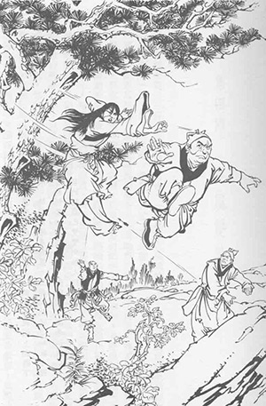

# Chapter 1 – Incident in the Blizzard

Translated by Minglei Huang

The Taoist suddenly let out a huge laugh as his right palm rose; fast as
lightning it struck the middle of the spear. ‘Crack!’ Yang Tiexin felt
his hand go numb and hastily let go, the spear fell onto the snowy
ground.

Day in and day out, day after day, the Qiantang River majestically winds
through and around Ox Village, near the city of Linan, on its journey
toward the sea. On the shores there stood thirty or so tallow trees,
leaves red like fire, yet another sign that it was now August. The wild
weeds and grass around the village had just started to turn yellow. The
sun shone down at a low angle on the grass, adding even more to their
bleakness. Underneath two giant pine trees there gathered a group of
villagers; the crowd included both men and women along with more than
ten children. All of them were listening to a thin old man, giving him
their complete attention.

The old man was about fifty or so, the green robe that he was wearing
had been washed to a bluish-gray. He banged two pieces of wood together
a couple of times, with the little bamboo stick in his left hand he
started to beat on a little drum to keep pace. He started to sing: “The
peach blossoms without fail, vast unused fields feeding the crows. After
the soldiers by the well, families gather in sorrow."

The old man banged the drum with the stick a couple of times more, and
then continued: "Old Man Yie had a wife, a son, and a daughter. They
lost each other when the Jin invaded. Finally, after many hardships and
much difficulty, they were able to get back together. They returned to
their home to find that the Jin soldiers had burned it to the ground.
They had no choice but to head off to Bianliang (modern day Kaifeng,
capital of North Song). 'The heavens produce unexpected storms, people
have unforeseen misfortunes'. As soon as the four of them got to
Bianliang, they ran into a troop of Jin soldiers. The leader of the
soldiers looked down and saw that Young Miss Yie was quite beautiful; he
jumped down from his horse, and grabbed her. With a laugh, he threw her
onto his saddle and said: 'Pretty little girl, you are going to go home
with me.' How could young Miss Yie agree? She struggled with all her
might. The leader yelled out: 'If you don't stop struggling, then your
family will die!' He picked up his ‘wolf fang’ club and smashed it down
on her brother's head.”….‘The nether world gains a new ghost, the real
world loses one more soul.'

“Old Man Yie and his wife fell onto their son's body and started to cry
their hearts out. That Jin soldier lifted up this ‘wolf fang’ club twice
more and took care of them. Young Miss Yie did not cry, she simply said:
‘Sir, please stop killing people. I'll go with you.' This made the
soldier extremely happy. Just as he let his guard down, Young Miss Yie
suddenly grabbed the saber at his waist, pulled it out, and thrust at
his heart. It looked like she was about to avenge her family's death;
but alas it was not to be. That soldier had much experience on the
battlefield; with out thinking, he merely pushed her forward very
naturally, sending Young Miss Yie to the ground. He had just enough time
to say: 'Little bitch!' But Young Miss Yie has already brought the blade
to her neck. Poor girl: ‘With a flower's beauty and the moon's grace,
such a sweet soul dying sadly so young.'"

He alternated between talking and singing. Every single one of the
villagers was now sighing in sadness and rage. The man continued: “Dear
audience members, as the saying goes: ‘Treat others with an honest
heart, hold your head up on high with pride. If evil deeds go
unpunished, only the evil will survive.’ The Jin has conquered half of
our Great Song, killing, burning, raping and pillaging; not an evil deed
left undone. Yet no punishment whatsoever seems to be forthcoming. Our
Great Song's officials are responsible for this. China has plenty of
healthy and available soldiers; yet every time we go up against the Jin
armies, all they do is turn around and run, leaving us peasants behind
to suffer. There are stories, like the one about Young Miss Yie and her
family, by the thousands north of the river. Living here south of the
river is truly like being in heaven on earth, but we fear the day the
Jin soldiers come invading. ‘Rather be a dog in peace, than a man in
troubled times!’ My name is Zhang Shiwu, thanks everyone for listening
to the story of 'Miss Yie, the Young Martyr'." After banging the drum
several more times, he held up a tray.

Many of the villagers placed a coin or two in the pan, which quickly
filled up. Zhang Shiwu thanked the villagers and gathered the sixty or
seventy coins into his travel bag. He got up and started to walk off.

A young man of around twenty years of age walked out from among the
villagers. He asked: "Mr. Zhang, did you just come from the north?" The
young fellow was very tall and very well built with big eyes and a pair
of very bushy eyebrows. Zhang Shiwu answered: "Yes." The young man
answered: "Then let's have a couple of drinks. I'll pay, what do you
say?" Zhang Shiwu replied: "I dare not receive such a favor as a
stranger." The young fellow laughed and answered: "Once we’ve had a
couple of drinks, then we are no longer strangers are we? My surname is
Guo, given name Xiaotian” Pointing at a clean, white-faced fellow behind
him, he continued: "This here is Yang Tiexin. The two of us were just
listening to your story. As expected, it was a good story; but we still
have several questions we wanted to ask." Zhang Shiwu replied: "No
problem, no problem. To run into the two of you today is probably fate
doing its work." Guo Xiaotian led Zhang Shiwu to one of the small wine
shops in Ox Village and sat down at one of the tables.

The owner of this little wine shop is a cripple. Supported by two
crutches, he slowly brought out two jugs of wine, a plate of peas, a
plate of salted peanuts, a plate of dried bean curd, and a plate with
three salted eggs. Afterwards he sat down on the stool by the door and
stared at the setting sun, not even glancing at the three men.

Guo Xiaotian poured the wine and made Zhang Shiwu down two bowls before
he began: "Here in the country, we only get to buy meat on the 2nd and
the 16th, so we don't have any meat to go down with the wine. Please
forgive us." Zhang Shiwu replied: "At least we’ve got wine, can't
complain about that. From your accents, seems like you two are from up
north." Yang Tiexin answered: "We are both from Shandong province. We
moved away three years ago because we couldn't stand the Jin running
loose around there. When we arrived, we fell in love with the people
here and settled down. Just now you were saying that us living here
south of the river is like living in heaven itself, fearing only an
invasion by the Jin. Do you really think that the Jin will invade?"

Zhang Shiwu sighed: "Gold and silver could literally cover the ground
and there are beautiful women every which way you look; such is the
richness and enchantment of the south. There isn't a day that passes
without the Jin thinking about invading. But the final decision about
the invasion of the Jin is not made by the Jin, but is made by the
Imperial Court of our Great Song in Linan!" This took both Guo Xiaotian
and Yang Tiexin by surprise. They asked as one: "Why do you say that?"

Zhang Shiwu continued: "We Han Chinese outnumber the Nuzhen by more than
one hundred to one. If only the Imperial Court started using honest and
loyal men. With one hundred of us going up against one of them, how
could the Jin army win? The northern half of our country was literally
handed over to the Jin in the past by Hui Zong, Qin Zong, and Gao Zong.
Those three emperors, from grandfather to grandson, trusted and used
corrupt officials, oppressed the masses, and then they either killed or
somehow got rid of all the generals that were fighting the Jin. Such a
beautiful land, and they literally put it right into the hands of the
Jin. Of course the Jin people respectfully accepted it. If the Imperial
Court continues to do what it did then, trusting and using corrupt
officials, then it is as if they are kneeling on the ground asking the
Jin army to come. How could the Jin refuse?" After hearing that, Guo
Xiaotian couldn't help but to slam his hand down onto the table in rage.
All of the bowls, plates, and chopsticks on the tables jumped from the
impact.

Zhang Shiwu continued: "Thinking back, Hui Zong was all set on trying to
live forever and become immortal. He was surrounded by corrupt and
useless officials: Zai Jing and Wong Yu only knew how to raise taxes and
skim off the top. Tong Guan and Liang Shichen were eunuchs that only
knew how to suck up. Gao Qiu and Li Bangyan only knew how to lie around
and get girls for the emperor. The emperor did not attend to official
matters at all; if he wasn't going off to visit monks to ask for
guidance, then he was traveling around in search of rare and interesting
looking rocks. Once the Jin came, he became a turtle, hiding in his
shell and passing the throne to his son, Qin Zong. At that time Li Gang
was defending the capital Bianliang and fought off the Jin army. But who
would think that Qin Zong would believe some rumors that were started by
corrupt officials and dismiss Li Gang. On top of that, he did not
replace Li Gang with another experienced and able general. Instead he
put the defense of the capital in the hands of a self-proclaimed
“Ambassador from the Gods” named Gao Zong and asked him to invite the
Army of Heaven to defend the city. The Army of Heaven did not show up.
How could we not lose the capital? At last both Hui Zong and Qin Zong
were captured by the Jin army. These two fools had it coming and got
what they deserved. But they also brought disaster to millions of
Chinese peasants who did nothing to deserve it."

Guo Xiaotian and Yang Tiexin were just getting madder and madder. Guo
Xiaotian said: "We have all heard about the capture of the emperors, and
the disgrace of the year of Jing Kang, many times. We have also heard
about the 'Army of Heaven' talk before, but we just thought it was a
joke or some unfounded rumor. Could this possibly be true?" Zhang Shiwu
answered: "Absolutely true." Yang Tiexin added: "Afterwards Lord Kang
declared himself emperor in Nanjing. He had under him such able and
loyal generals as Yue Fei and Han Shizhong. If he had immediately
attacked north, although he might not have reclaimed all the lost lands,
he would have had no problem recapturing the capital Bianliang. But that
hated traitor Qing Hui only wanted to negotiate; he did an about face
and killed our beloved General Yue." \[Note: the year of Jing Kang
translates to A.D. 1127.\] Zhang Shiwu poured a bowl of wine for all
three of them and downed his bowl in one gulp. He went on: “Beloved
General Yue once said these two lines: 'Only aspire to eat Tatar flesh,
and chat away while drinking Hun's blood.' This poem conveyed what is in
the heart of every Chinese. Ay! This traitor Qing Hui is awfully lucky.
It’s a shame that we were born 60 years too late." Guo Xiaotian asked:
"What do you mean?" Zhang Shiwu replied: "Then you two heroes would go
into Linan and kill this traitor. Then the three of us would eat his
flesh and drink his blood and there would be no more need for us to come
here to eat peas and drink cold wine anymore!" All three of them laughed
heartily at that comment.

Yang Tiexin noticed that the jug of wine had been emptied and ordered
another one. The three of them just sat there cursing Qing Hui. The
cripple placed another dish of peas as well as a dish of peanuts on the
table. Hearing the three men's spirited cursing of Qing Hui, he suddenly
let out a rather loud snort.

Yang Tiexin turned to him and asked: "Qu San, what's the matter? You
don't think we are wrong to curse at Qing Hui do you?" Qu San, the
cripple, answered: "Good cursing! Great cursing! There’s nothing wrong
with that. It is just that I have heard that Qing Hui wasn't the chief
culprit in killing Yue Fei in order to negotiate peace." The three men
asked in surprise: "Qing Hui wasn't the main culprit? Then who was?" Qu
San replied: "Qing Hui was the Chancellor; whether or not peace was
negotiated he still was and would keep on being Chancellor. But our
beloved General Yue only wanted to destroy the Jin and bring back the
two emperors Hui and Qin. Once those two emperors return, how do you
suppose Emperor Gao Zong was going to keep his crown?" As soon as he
finished saying what he said, he turned around and struggled back to the
stool, and returned to staring at the sky as if in a trance. Qu San's
face looked no older than twenty something, yet he was hunched over,
with traces of white in his hair. From the back, he looked like an old
man.

Zhang Shiwu and the two men looked at each other in silence. After a
while, Zhang Shiwu spoke up: "That is so true! Sir, you have really hit
on something! The real culprit behind the killing of our beloved General
Yue could very well not be Qing Hui, but Emperor Gao Zong. This Emperor
Gao Zong was shameless to begin with, he definitely could do something
like that!"

Guo Xiaotian asked: "Is he really that shameless?" Zhang Shiwu replied:
"Back when the beloved General Yue had just beaten the Jin army in
several battles in a row, along with the rebellion of our patriotic
brothers in the north, we had the Jin army against the wall. The Tatars
were just beginning to panic wondering what to do, when suddenly Gao
Zong sent them a letter of surrender and asked for peace negotiations.
Naturally the Jin Emperor was ecstatic, but he replied: 'There will be
no peace negotiations unless Yue Fei is killed.' So Qing Hui went about
his evil plan and our beloved General Yue was killed in the Pavilion of
Changes. The beloved General Yue was killed November of the 11th year of
Zhao Xing. One month later, peace was agreed upon. The boundary between
Song and Jin was drawn at the River Huai and Emperor Gao Zong called
himself a subject of the Jin Emperor. How do you think the letter of
surrender was written?" Yang Tiexin answered: "Shamelessly, of course."

Zhang Shiwu replied: "Of course! I happen to know what was written in
the letter. It read: 'Your humble subject asks for forgiveness and
mercy. If received, your subject will be forever grateful; our humble
sons and descendants will forever be of service to your majesty. Your
humble subject also swears to give yearly tribute in the amount of two
hundred fifty thousand taels of silver and two hundred fifty thousand
bolts of silk. Not only did he sell himself as a servant, but all of his
descendants as well. Him becoming a servant is really no big deal, but
is that not like saying that every Chinese is their servant as well?"

Bang! Guo Xiaotian slammed down hard onto the table again, this time
tipping one of the bowls over, spilling wine all over the table. In
anger, he shouted: “Shameless! Disgraceful! How did this sorry excuse of
a man ever become an emperor?”

Zhang Shiwu continued: “When our nation heard about this treaty, there
was not a person on the street who was not enraged. Those Chinese people
north of the River Huai were especially grief stricken because they saw
that our country is no longer whole. Gao Zong, knowing that his seat on
the throne is secured, immediately rewarded Qing Hui for his
‘meritorious service’. Qing Hui was already Lord of Lu, and now Gao Zong
added the title of Grand Marshall to his name, giving him almost supreme
power under the emperor. Xiao Zong succeeded Gao Zong, and Guang Zong
succeeded him; all the while the Jin are still controlling half of
China. Now Emperor Qin Yuan has succeeded Guang Zong. He has been on the
throne for 5 years now, mostly going along with what the Chancellor Han
Tuozhou says. What is the future going to be like? He…he, it’s hard to
say, hard to say!” During the last few words, he did not stop shaking
his head.

Guo Xiaotian replied: “What’s so hard to say about it? This is the
countryside and not like Linan where you might get your head cut off!
There isn’t a person in the world that doesn’t call Han Tuozhou a crook!
If you compare his betraying the country and oppressing the people, the
man is practically a sworn brother of Qing Hui!”

Now that they were talking about current affairs, Zhang Shiwu was
starting to feel a little tinge of fear and dared not criticize and talk
straight from his heart as he did before. He downed another bowl and
said: “Thanks to both of you gentlemen for the wine. May I offer a
modest word of advice? I know both of you gentlemen are passionate men,
but it is still most wise to be cautious in words and deeds so as to
avoid any possible calamities. At this point, the most that us normal
folk can hope for is to muddle along and do the best that we can. Ay!
Just like the saying: “Surrounded by the mountains in the halls, when
will the West Lake parties finally go? Southern fragrances intoxicate
all, happily mistaking Hangzhou for Bianliang!”

Yang Tiexin asked: “What’s the story behind those four lines?” Zhang
Shiwu answered: “There is no story. It is just a saying indicating that
the officials of our Great Song dynasty only care about partying and
drinking on the shores of the West Lake. They want to pretend that
Hangzhou is our capital and never bother thinking about taking back our
land and moving back to Bianliang again.”

By the time Zhang Shiwu said goodbye he was dead drunk. As he stumbled
toward Bianliang, one could hear him muttering to himself the words of
“River Soaked in Red” by Yue Fei: “Jing Kang’s Disgrace, still fresh in
mind; people’s hatred, when will it stop? I drive my cart….”

Guo Xiaotian paid the tab and walked home with Yang Tiexin. The two of
them lived right next to each other; after walking a short distance,
they made it back to their homes.

Guo Xiaotian’s wife Li was just chasing a chicken into a little trap.
Turning around, she smiled and said: “You two went drinking again?
Brother Yang, why don’t you and your wife come over for dinner tonight?
We are going to cook a whole chicken.”

Yang Tiexin smiled back and answered: “Alright, I guess we are going to
inconvenience you two once again. We have so many chickens and ducks to
waste food on, but we can’t part with any of them.” Li replied: “Well
your wife is just that kind hearted. She says that she raised those
chickens and ducks since they were babies; how could she possibly kill
them?” Yang Tiexin laughed and replied: “I told her that I would kill
them if she can’t make herself do it, then she started crying. Ay! What
can I do? Tell you what, tonight I’m going to go hunting and we’ll
invite the two of you over tomorrow night!” Guo Xiaotian cut in: “We are
family! Quit talking about who’s inviting who and who is not! Tonight we
go hunting together!”

At midnight, Guo Xiaotian and Yang Tiexin went into the woods 3.5 li
west of the village, hoping to catch a boar or something of that nature.
But after waiting for more than two hours, they heard nothing. Just as
they were about to lose patience, they suddenly heard faint sounds of
metal banging together coming from outside of the woods. They looked at
each other, both wondering: "What's going on now?"

At that moment, from afar, there came the sounds of several men
shouting: "Where do you think you are going?" "Stop this instant!" Then
a shadow jumped into the woods. Guo Xiaotian and Yang Tiexin finally
were able to see the person now that he is in the moonlight. The two of
them were shocked. For this man was the crippled owner of that wine shop
in the village, Qu San. He thrust his left crutch onto the ground,
producing a "Zeng sound". His body flew off the ground and behind a
tree. This was a display of an incredible level of Qing Gong. Guo
Xiaotian and Yang Tiexin looked at each other again in astonishment,
both of them thinking: "We had no clue that Qu San's kung fu is this
good, and we have been living here for three whole years!" Both of them
stayed hidden in the bushes, not daring to move or come out.

Footsteps keep on getting closer until three men had made it to the edge
of the woods. They whispered something to each other and started to walk
slowly into the woods. All three of them were dressed in military
clothing and each of them had a saber in hand. In the moonlight, the
sabers gave off a faint green glow. One of them shouted: "Damned
cripple! Your old man here can see you, better quickly surrender and
come out!" Qu San kept still behind the tree. The three men started
waving their swords wildly, swinging and taking a cut at anything in
their way. Very slowly, the three of them got closer and closer.
Suddenly there came a faint thump. Qu San had thrust his right crutch
out from behind the tree, hitting one of the men squarely on his chest.
That man gave out a muffled groan before flying backwards and falling on
the ground. The other two men immediately began to hack at Qu San.

Qu San gave his right crutch a push and jumped several feet to the left,
avoiding the sabers. His left crutch immediately went straight for one
of the men's face. The man's kung fu was not that bad either; he tried
to parry the crutch with his saber. Qu San did not wait for the two to
meet before withdrawing his crutch to support himself again. His right
crutch came swinging in at the other man's waist. He used his crutches
with great speed and quickness. Even though he always had to use one of
them to support himself, leaving only one to fight with at all times, he
was not losing to the men. Guo Xiaotian and Yang Tiexin noticed that he
was carrying a huge bundle on his back, seemingly very cumbersome. After
some more fighting, one of the sabers came down and hit the bundle.
"Dang!" The bundle ripped and the objects inside spilled onto the
ground. Qu San took advantage of his temporary distraction and smashed
down hard on the head of the man with his crutch. The man fell onto the
ground without so much as a whimper. The only man left was by now scared
to death; he turned around and started to run. Qu San took out something
from his bosom and raised his arm very quickly. A ball-like object flew
through the air in the moonlight, followed by a muted thump as the
object hit the back of the man's head. The man let out a ghastly scream
and dropped his saber as his arm started to swing wildly out of control.
Slowly, he fell back and crumpled to the ground. After a couple of
twitches, he stopped moving.

Guo Xiaotian and Yang Tiexin had just witnessed Qu San kill three men in
succession while displaying a level of kung fu that neither one of them
had ever seen before. Both of their hearts were racing, afraid to even
breath too loudly, for both of them were thinking the same thing: "He’d
just killed government officials; that is a huge crime. We don't stand a
chance if he finds us here and wants to kill us to keep this quiet."

Qu San turned around and slowly spoke: "Brother Guo, Brother Yang, you
can come out now!" Once the two of them got over their shock, they had
no choice but to step out of the bushes, although both of them were
holding their pitchforks rather tightly. Yang Tiexin snuck a look over
at Guo Xiaotian and the pitchfork in his hand and took two extra steps.
Qu San smiled: "Brother Yang, your Yang Family Lance Technique (Yang Jia
Qiang Fa) can be used with a pitchfork, but your sworn brother uses a
pair of short halberds and the pitchfork does not fit his skills, so you
step up in front of him. Such righteousness…such friendship!" Yang
Tiexin, hearing Qu San spell out exactly what he was thinking, suddenly
felt very exposed and couldn't decide what to do. Qu San continued:
"Brother Guo, let's say you had your double halberd in hand. Do you
think the two of you together can beat me?"

Guo Xiaotian shook his head: "No, we can't. The two of us must have been
blind, living here together with you for all these years and not even
noticing that you knew kung fu, let alone were a master."

Qu San shook his head and sighed: "I can't even use my legs, how can I
be considered a master?" As if his spirits were waning, he continued:
"Before I lost their use, would I have had so much trouble with several
armed guards? Ay! I'm useless now! Useless!" Guo Xiaotian and Yang
Tiexin glanced at each other, not sure how, or should they, dare to
respond. Qu San continued: "Would you two help out this cripple and bury
these three bodies?" The two of them glanced at each other again, Yang
Tiexin answered: "Alright!"

The two of them dug a big hole using their pitchforks and tossed the
three bodies in. While they were moving the last body, Yang Tiexin
notices that part of the black object was still sticking out of the back
of the man's head. He gave it a good tug with his right arm and pulled
it out. Turned out it was an Eight Diagram throwing weapon made out of
iron, he wiped the blood off on the body and handed it back to Qu San.
\[The Eight Diagram is made of eight combinations of three whole or
broken lines used in religious, mostly Taoist, ceremonies. The eight
combinations usually surround a yin-yang symbol. The flag of South Korea
is very similar except it has only four of the eight diagrams.\]

Qu San took the Eight Diagram weapon and said: "So sorry for troubling
you." He puts the Eight Diagram weapon back into his pocket. He then
laid the piece of cloth that used to be his bundle onto the ground and
started to put the objects that were scattered on the ground back into
it. Guo Xiaotian and Yang Tiexin finished putting dirt back into the
hole, turned around and saw three rolled up paintings on the ground as
well as many other bright and shiny metal objects. Qu San left out a
golden jug and a golden bowl. After putting everything else back in the
bundle, he held those two things up to Guo Xiaotian and Yang Tiexin,
saying: "These things were stolen by me from the Royal Palace in Linan.
The emperor has done enough harm to the peasants; taking a little bit of
what he stole from them isn't really a crime. Consider these two things
a present from me."

The two of them couldn't believe that he was actually brazen enough to
break into the Royal Palace and steal. Neither one of them dared to
accept his gifts.

Qu San said in a stern voice: "Are you guys afraid to accept, or do you
two not want to?" Guo Xiaotian replied: "The two of us did nothing to
deserve such gifts and that's why we can't accept them. As for what
happened tonight, you don't have to worry about a thing brother, neither
one of us is going to let this secret get out." Qu San replied: "Hmph!
Why should I be worried about you two leaking this secret? I know all
about you two and your backgrounds; why else would I let you two leave
here alive? Brother Guo, you are the descendant of Guo Sheng, one of the
heroes of the Water Margins of Mount Liang. You use the halberd skill
that is taught in your family, only the halberd is short instead of
long, and has two blades instead of one. Brother Yang, you ancestor is
Yang Zaixin, one of the generals who served under the beloved General
Yue. You two are descendants of two patriotic heroes. When the Jin army
conquered the North; you two began wondering the martial world and
became martial brothers. And then the two of you moved to Ox Village
together. Am I right so far?"

\[Note: Those familiar with Heroes of the Water Margins should remember
two characters that used halberds that are always together: Lu Meng and
Guo Sheng. The nickname of Lu Meng was "Little Vassal" while Guo Sheng's
was "Benevolent Aristocrat". They joined the rebellion at the same time
and were always deployed in battle in pairs. The two of them even died
together, smashed by rocks while attacking a higher position during the
effort to quell the Rebellion of Fang La, who is the head of the Ming
Cult mentioned later on in this novel and in Heaven Sword and Dragon
Saber.\]

The two of them, now knowing that Qu San knew their pasts inside out,
were even more shocked. All they could do was nod.

Qu San continued: "Guo Sheng and Yang Zaixin were both rebels before
going over to the government's side to fight for the Great Song Empire.
Both of them have stolen from the thieving government. So tell me, are
you two going to accept my gifts or not?" Yang Tiexin thought to
himself: "If I refuse, then it will surely offend him." So he took the
gifts from Qu San's hands and said: "We are very grateful for this.
Thanks."

Qu San was pleased by this; he picked up the bundle and put it back onto
his back. Turning around he said: “Time to go home." The three of them
walked side-by-side out of the woods. Qu San said: "I got a couple of
prize pieces tonight; two paintings by this Emperor Dao Jun and a sheet
of his writing showing off his calligraphy as well. This fellow is no
emperor, but his Red Green Plume and Thin Gold Form is indeed supreme in
the world."

The other two men had no idea what in the world "Red Green Plume" or
"Thin Gold Form" is, so all they did was nod in agreement. \[Red Green
Plume is a style of ancient Chinese painting featuring birds and animals
with emphasis on the colors of red and green, obviously. Thin Gold Form
is a style of calligraphy.\]

After walking for a while, Yang Tiexin spoke up: "Earlier today you said
that half of our Great Song's land was lost to the hands of Emperor Dao
Jun. So what is so good about his paintings or writings? Why would you
brother to go to such trouble and take such a big risk as to go into the
Royal Palace to steal it?" Qu San smiled: "This is something that I
guess you just won't understand." Guo Xiaotian spoke up as well: "If the
Emperor Dao Jun can be so good at painting and writing, he must be
pretty smart. It’s pity that he does not concentrate on being a good
ruler. When I was little my dad told me that a person, no matter what he
does, must concentrate on doing one thing. If he tries to learn a little
bit here, do something there, in the end he will get nothing
accomplished."

Qu San answered: "For a normal person, this is true. But in this world
there is someone who is a genius at everything. From language to kung
fu; including writing, painting, music, and Go \[Weiqi\]; from math to
military tactics; even medicine, astrology, and the five elements; there
is not a thing that he does not understand, not a thing he has not
mastered. It's just that you guys won't ever meet him." He looked up at
the waning moon, and let out a long sigh.

Under the moonlight, Guo Xiaotian and Yang Tiexin suddenly noticed tears
on Qu San's face. When the two of them got home, they buried the two
golden objects deep within their backyard, not even telling their wives
about it. After that night the two of them acted as if nothing had
happened; they lived off their farms and whatever they caught and when
there was spare time they practiced their kung fu. Even when by
themselves, neither ever brought up what had happened that night. The
two of them still visited the little wine shop occasionally for a couple
jugs of wine. Qu San still served the wine along with some peas,
peanuts, and other snacks that helped the wine go down. Afterwards he
always went and sat down by the door and went off into his own little
world, lost in his thoughts. It was as if that night had never happened.
The only difference was that when Guo Xiaotian and Yang Tiexin look at
Qu San, their eyes were filled with respect.

Autumn slowly gave way to winter; the days just keep getting colder and
colder. One night, with the cold north wind blowing, it started to snow.
The day after that it continued to snow even more. The whole sky was
filled with snowflakes and the ground looked like it was covered with
precious jade, white as far as the eye could see. Yang Tiexin told his
wife that tonight he is going to get some wine and food so that they can
invite his sworn brother and his wife over so all of them can have a
nice dinner and enjoy the snow. After lunch, he grabbed two big gourds
and went off to the wine shop to get some wine. When he got there, he
noticed that the door was shut tight; even the wine shop sign was taken
down.

Yang Tiexin knocked on the door a couple of times and shouted: "Brother
Qu San, I'm here to buy three liters of wine." No response came. After
waiting a bit, he called out again and still no response came. He walked
over to a window and looked inside, everything in the room is covered in
a layer of dust. He thought to himself: "I haven't come here for several
days; turns out that Qu San hasn't been here for several days as well. I
hope nothing’s happened." So he had to brave the blizzard and walk to
the wine shop 5 li away in Red Plum Village to get the wine as well as a
chicken. When he got back he killed the chicken and gave it to his wife
to take care of the rest. His wife's surname is Bao, and her given name
was Xiruo. She's the daughter of a teacher at the private school in Red
Plum Village. They have been married for a little under two years now.
She put the chicken along with some cabbage, bean curd, and thin noodles
made from bean starch (fen si) into a big pot. While the pot is boiling
on top of a fire, she cut a plate of cured meat and cured fish. At dusk,
she went over to the Guos’ and invited them over for some wine, food and
to enjoy the snow.

Guo Xiaotian happily came over. His wife Li was not feeling very well
for the last couple of days because of her pregnancy. She had been
throwing up anything she eats, so she decided not to come over. Li's
given name is Ping. She and Bao Xiruo are like sisters and the two of
them chatted for a long time. Only after making her a pot of tea did she
finally return home. When she got back she saw that the two men had
already moved the charcoal stove onto the table to keep the wine warm.
The two of them had already started.

Guo Xiaotian said: "Sister, we weren't patient enough to wait for you.
Please come and join us." The two men has always gotten along and both
are men of character, add that to the fact that in the country nobody
really cares about the rules regarding men and women gathering together.
Bao Xiruo smiled and nodded, putting some more charcoal onto the stove;
she picked up another bowl for the wine and sat down beside her husband.
She noticed that there are hints of anger on both men's faces; she
smiled and asked: "Something wrong again? What's gotten the two of you
so angry?" Yang Tiexin answered: "We were just talking about the stuff
that goes on in the Imperial Court in Linan."

Guo Xiaotian added: "I was at the Joyful Rain Pavilion, the tea house at
the head of the Tranquility Bridge, yesterday when I heard some people
talking about that bastard, Chancellor Han Tuozhou. It didn't sound like
they were making the stuff up either. One man said that no matter which
official is filing a report, if the report does not have the words:
'Also present this -whatever - to the Chancellor', this bastard
Chancellor does not even give the report another glance!" Yang Tiexin
sighed: "When you have this kind of emperor, you'll get this kind of
chancellor. When you have this kind of chancellor, then you'll get these
kinds of officials. Big Brother Huang, who lives outside of Gushing Gold
Gate of Linan, told me this story. One day he was cutting trees for
firewood at the side of the mountain, when he suddenly saw a bunch of
soldiers protecting a crowd of officials coming his way. It turned out
that Chancellor Han Tuozhou was taking a sight seeing trip with all his
underlings. He kept on minding his own business and went on cutting his
trees. Suddenly he heard Han Tuozhou sighing and say: 'The bamboo fences
and thatched cottage here really do make an extraordinary country scene.
Pity it's missing the sounds of chickens crowing and dogs barking.' Soon
after he said this, there suddenly came barking from the bushes." Bao
Xiruo laughed a little: "That little dog really knew how to please."
Yang Tiexin answered: "It sure did, after barking for a bit, it jumped
out of the bushes. What kind of dog do you suppose it was? Turns out it
was our dignified and honorable Magistrate from the city of Linan, His
Excellency Zhao!" Bao Xiruo doubled over with laughter. Guo Xiaotian
observed: "This little dog act by His Excellency Zhao has probably
insured that he will be promoted very quickly." Yang Tiexin answered:
"Of course, it's only natural."

The three of them drank for a while. The snow outside was coming down
even harder, but with some wine in their bellies, all three of them felt
very warm and cozy. Suddenly, from the east, there came the sound of
footsteps on the snowy road. The footsteps were very rapid. The three of
them looked out and saw a Taoist priest.

The Taoist priest is wearing a bamboo hat and a cape, but snow covered
his body. There was a sword on his back and the yellow tassel hanging
off the handle of the sword swung back and forth in the wind. Snow
filled the sky, and a lonely figure was walking in the snow; such a
grand and gallant scene. Guo Xiaotian spoke up: "This Taoist knows quite
a bit of kung fu, he looks like a real man of honor." Yang Tiexin
replied: "That's right. Let's invite him in for a couple of drinks and
make friends with him." Both men loved to make new friends, so they both
stood up and stepped outside. They noticed that the Taoist was already
past them by more than two zhangs \[1 zhang = 3.3 meters / approx 11ft\]
even though he is only walking. Such levels of qing gong \[lightness
kung fu\] are rarely heard of in the world.

The two of them looked at each other in astonishment. Yang Tiexin yelled
out: "Reverend, please stop!" The Taoist turned around and nodded at
Yang Tiexin. Yang Tiexin continued: "With such weather outside,
Reverend, why don't you come inside and drink a couple of bowls to warm
up."

The Taoist sneered and in an instant arrived in front of them. Face full
of disdain, he asked coldly: "You want me to stop, what for? Be frank
and tell me!"

Yang Tiexin thought the Taoist's rudeness was completely uncalled for,
so he just lowered his head and didn't bother to answer. Guo Xiaotian
cupped his fist and replied: "The two of us were just sitting by the
fire keeping warm and drinking wine when we saw the Reverend walking
alone in the snow. So we boldly asked Reverend to join us, please
forgive us for our offenses." The Taoist rolled his eyes and said rather
loudly: "Alright, alright! If you want to drink, then let's drink!" And
he walked through the door.

This made Yang Tiexin even madder, he grabbed the Taoist's left wrist,
and with a pull he shouted: "You still haven't told us how to address
the Reverend." Suddenly he felt as if he was grabbing onto a slippery
fish rather than a hand as the Taoist's hand escaped his grasp. He knew
he was in trouble and tried to back away; but before he could a pain
shot through his wrist as the Taoist grabbed it. It was as if he was
cuffed, and feeling both enormous pressure and heat, he hurriedly tried
to struggle out of the Taoist's grasp. His entire right arm felt
lifeless and weak, and his wrist was in great pain.

Guo Xiaotian knew, judging from his blood red face, his adopted brother
was getting the worst of it. He just wanted to make an acquaintance and
wanted to avoid offending the Taoist; or anyone in the martial world for
that matter. So he spoke up: "Reverend, please sit here." The Taoist
sneered a couple of times more and let go of Yang Tiexin. He walked to
the center of the room and sat down with a rather arrogant matter before
saying: "The two of you are obviously from Shangdong, yet are here
pretending to be farmers. It’s a pity that your accents are still
obviously the Shangdong accent. Why would a peasant know any kung fu
anyway?"

Yang Tiexin felt both embarrassed and angry as he walked into the
backroom. He took out a small dagger from the drawer and hid it in this
shirt before walking back out again. He poured out three bowls of wine
and toasted one for himself, all the while not saying a word.

That Taoist just stared at the snow outside of the house with an
arrogant look on his face, not drinking any wine nor saying anything.
From the hostility on the Taoist's face, Guo Xiaotian figured that he is
suspicious of trickery in the wine. So he took the bowl of wine in front
of the Taoist and drank it. Then he said: "Wine gets cold very quickly.
Reverend, let me get another warm one for you." He poured another bowl
for the Taoist, which the Taoist drank down in one gulp. Afterwards the
Taoist said: "Even if there were knockout drugs in the wine, it wouldn't
affect me." Yang Tiexin finally had about all he could take: "We nicely
invited you to come and have a drink with us, why would we try to harm
you? If you plan to keep talking to us in such a manner, then please
leave now! It's not like we had sour wine and rotten food that we can't
get rid off!"

The Taoist ignored him and grabbed the wine gourd. Pouring and drinking,
he downed three bowls in a row. Then he suddenly took off his bamboo hat
and cape and threw them on the floor. Guo Xiaotian and Yang Tiexin
looked him over carefully. The Taoist is about thirty or so, squared
faced with slanted eyebrows and a hint of redness. His eyes were bright
and piercing. Next he untied the leather bundle on his back and threw it
on the table. Immediately, Guo Xiaotian and Yang Tiexin jumped up.
Because from the leather bundle rolled out a bloody human head!

Bao Xiruo screamed in fear and ran into the back room. Yang Tiexin felt
his chest to make sure the dagger was in place. The Taoist gave the
leather bundle a shake and two more bloody objects fell out: a heart and
a liver. From the looks of them they are probably not a pig’s heart and
pig’s liver, but very likely human. Yang Tiexin shouted: "Taoist
bastard!" as he took out the dagger and thrust it towards the Taoist's
chest.

The Taoist snickered: "Eagle Talon. So you want to fight now?" He
lightly hit Yang Tiexin's wrist with his left hand. Yang Tiexin felt a
numbing pain in his wrist as his fingers lost all their strength. Before
he knew it, his dagger had been taken away.

Guo Xiaotian was shocked to see all this. He knows that his adopted
brother is the descendant of a renowned hero and, from their daily
sparring, knows his family's kung fu is slightly superior to his own.
But seemed as though he was nothing in front of this Taoist; the move
that he just pulled off was obviously the ‘Bare Hand Seizes Blade’, was
a skill that he had only heard off in the martial world. He immediately
picked up the wooden bench that he was sitting on, waiting to block the
dagger when the Taoist inevitably stabbed his sworn brother.

But the Taoist completely ignored them. He just wildly cut the human
heart and liver to pieces with the dagger. Suddenly, he let out a huge
roar, so loud that it rattled the tiles on the roof. He lifted up his
right hand and brought it down hard, so hard that the contents on the
table jumped at the impact. The two men looked over and saw he had just
smashed the head’s skull bones to smithereens; even the middle of the
table was cracked. The two of them were still recovering when the Taoist
shouted: "Shameless scoundrels, the Reverend will today have to really
break the no-killing rule!"

Yang Tiexin couldn't get any madder; he grabbed the iron spear that was
leaning against a corner of the room and jumped outside. He shouted
back: "Come on! Let's teach you a lesson in the art of the 'Yang Family
Spear'!" The Taoist snickered a bit: "You think you are worthy enough to
use the 'Yang Family Spear' based on all this fake bravado?" He walked
out of the door as he was finishing the sentence.

Seeing the situation deteriorate to this point, Guo Xiaotian ran back to
his house and got his double halberds. When he got back the Taoist was
still standing there with his sword still in it’s sheath and his sleeves
flapping noisily in the wind. Yang Tiexin yelled out: "Unsheathe your
sword!" The Taoist replied: "Even if the two of you come at me together,
I would still fight you with my bare hands."

Yang Tiexin made a gesture signaling that he is about to start and
followed it with a ‘Poisonous Dragon Coming Out from the Cave’. The red
tassel on his spear shook, creating a huge flash of red heading towards
the heart of the Taoist. The Taoist was briefly surprised and praised:
“Excellent!” His body went along with the spear and dodged to the left.
His left palm spun around and came up to meet the spearhead in an
attempt to grab it.

Yang Tiexin has worked hard with this spear since he was a little kid
and had fully received his father's skills. The ‘Yang Family Spear’ is
nothing to scoff at. Years back, Yang Zaixin took a spear and three
hundred Song soldiers into battle against forty thousand Jin soldiers at
the Little Merchant Bridge. In the battle, they killed more than two
thousand Jin soldiers, not to mention one commander of ten thousand men,
as well as more than one hundred commanders of one thousand men and one
hundred men. Actually, the Jin arrows came flying in like rain; as soon
as he was hit by an arrow he would break the wooden part off and keep on
fighting. At last his horse got tripped up in mud and he finally gave
his life for his country. When the Jin army burned his body, the amount
of melted metal from the arrowheads topped an amazing two jins \[1kg /
2.2lbs\]. This battle shocked and frightened the Jin army and made the
‘Yang Family Spear’ famous in all of China.

Although Yang Tiexin is not as great as his forefathers, he does almost
fully understand the spear skill inside out. So there he is, parrying,
thrusting, swinging, flicking, blocking, fending, and obstructing. The
point of the spear flashed silver, the tassel blurred red. What a spear
skill!

Yang Tiexin pulled out all the stops and his moves were swift and agile,
changing and faking as if they were an illusion. But the Taoist's body
followed the spear around, easily dodging forward and back, making him
almost impossible to hit. After using all seventy-two moves of the ‘Yang
Family Spear’, Yang Tiexin couldn't help but be anxious and upset. He
turned around and walked away carrying the spear backwards. As expected,
the Taoist started to chase very close behind. Yang Tiexin let out a big
shout, held the spear with both hands, suddenly twisted his waist and
extended his arms, and thrust the spear back right at the Taoist's face.
This move was ferocious, for it is the move in ‘Yang Family Spear’ that
is used to break an enemy formation and kill enemy generals, called the
“Return Horse Spear”. Back before Yang Zaixin changed his allegiance to
the Song army, when he battled Yue Fei, he used this exact move to kill
Yue Fei's younger brother Yue Fan.

The Taoist, seeing that the spears had already arrived in front of him
in an instant, couldn't help but praise: "Excellent move!" Smacking his
hands together, he was able to clamp onto the spear point. Yang Tiexin
gave one mighty push, but spear did not move at all. Shocked, he tried
with all his might to pull the spear back. But it seemed as if the spear
was caught underneath a mountain, with no chance at all of pulling it
out. His face turned red as he tried three times more, but the spear
still would not leave the Taoist's hands. The Taoist let out a hearty
laugh; suddenly his right palm came up and with the speed of a lightning
strike hit the handle of the spear. Yang Tiexin felt the part between
the base of his thumb and index finger go numb and immediately released
the spear, letting it drop onto the snow covered ground.

The Taoist smiled and said: "You are really using the ‘Yang Family
Spear’. Sorry for any offense. Please honor me with knowing your
surname." Yang Tiexin still hadn't recovered from the shock of all this,
so he replied without much thought: "My surname is Yang, given name is
Tiexin." The Taoist asked: "Are you related to General Yang, Yang
Zaixin?" Yang Tiexin answered: "He's my great grandfather."

The Taoist cupped his fist and saluted: "I mistook the two of you for
scoundrels, turns out that you are descendants of patriots, please
forgive me. May I be so bold as to ask this gentleman's surname?" Guo
Xiaotian answered: "Surname is Guo, given name is Xiaotian." Yang Tiexin
added: "He's my martial brother, he is the descendant of Guo Sheng, one
of the Heroes of the Water Margins of Mount Liang." The Taoist replied:
"Your humble Taoist acted rashly and rudely, please forgive me." Then he
saluted again.

Guo Xiaotian and Yang Tiexin both bowed and cupped their fist and
saluted back: "No problem, no problem at all. Would Reverend please come
in for three more bowls?" Yang Tiexin quietly picked up his spear. The
Taoist smiled and said: "Of course! I just got the urge to drink it up
with you two."  
Bao Xiruo was worried that her husband might get hurt, so she stood in
the doorway anxiously observing. Seeing the three of them stop fighting
and become friends, she felt greatly relieved and started to set the
table back up.

After the three of them sat down, Guo Xiaotian and Yang Tiexin asked the
Taoist for his Taoist name. The Taoist replied: "My name is Qiu
Chuji....” Yang Tiexin jumped up and shouted: "Ah Ya!" Guo Xiaotian was
shocked as well: “elder ‘Eternal Spring’ (Chang Chunzi)?" Qiu Chuji
smiled and replied: "That's the name that my Taoist friends gave me, I
do not dare to claim such a name." Guo Xiaotian replied: "The hero elder
‘Eternal Spring’ of the Quanzhen Sect, I am honored to make your
acquaintance!" The two of them threw themselves onto the floor and
saluted.

Qiu Chuji hurriedly helped them up and said while smiling: "I personally
killed a traitor today. The government’s men were chasing me very
closely, and you two gentlemen suddenly invited me in for a drink. This
is the capital area and neither of you are normal farmers, so I became
suspicious." Guo Xiaotian replied: "This martial brother of mine has
always a temper. Before we entered he tried a hand move at Reverend, I
think that probably furthered Reverend's suspicion." Qiu Chuji agreed:
"How could a normal farmer be that strong? I thought that you two
gentlemen were dogs of the government who were waiting here, undercover,
for me. That's why I was so rude, too rash and rude." Yang Tiexin smiled
and replied: "Can't blame those who don't know." The three of them
laughed heartily. After several rounds of drinks, Qiu Chuji pointed at
the head that is now in pieces on the floor: "This man's name is Wang
Daokun, a traitor! Last year when the emperor sent him to pay respects
to the Jin emperor on his birthday, this man actually started to collude
with the Jin in their effort to invade the South. I chased him for ten
days before finally getting him." The other two men had long heard in
the martial world of elder ‘Eternal Spring’ Qiu Chuji's amazing kung fu
and heroic character. Seeing his patriotism at this moment, killing a
traitor for the country, they admired him even more. The two of them
seized the opportunity to ask him some questions about kung fu, Qiu
Chuji was only too happy to help.

Even though the ‘Yang Family Spear’ never met an enemy on the
battlefield, when going up against a kung fu master, it seemed rather
lacking. Although Qiu Chuji's inner and outer kung fu cannot be
considered at the highest of levels, they are nevertheless of a very
high level, how could Yang Tiexin last umpteen moves against him? It
turned out that Qiu Chuji was surprised to see his skills, so he
purposely yielded in order to make him use up all seventy-two moves of
the ‘Yang Family Spear’ to make sure that it was authentic. If they were
really going at it, Yang Tiexin's spear would have been knocked out of
his hand in a few moves. At this point, Qiu Chuji observed that the
‘Yang Family Spear’ was intended to be used on horseback; if used on
foot, then one had to be more creative and imaginative and not use it in
a rigid fashion. The two men could not stop nodding upon hearing this.
The ‘Yang Family Spear’ has always been a skill of the Yang males, so
even though Qiu Chuji is very knowledgeable, he still did not fully
understand the inner workings of the skill. So he asked Yang Tiexin a
few questions about it as well.

The three of them had their ears turn warm from the wine and were really
hitting it off. Yang Tiexin suggested: "We two brothers are really
fortunate to be able to meet Reverend today. Reverend, why don't you
stay a couple of days?"

Qiu Chuji was just going to answer before his face suddenly froze:
"Someone is here for me. No matter what happens, you two stay inside and
don't come out, understand?" The two men nodded. Qiu Chuji picked up the
human head, walked out of the door, jumped up in a tree, and hid among
its leaves.

Guo Xiaotian and Yang Tiexin didn't really understand his strange
actions, there were no noises whatsoever other than the howling of the
wind. After a while, there came faint hoof beats from the west. Yang
Tiexin thought: "The priest's ear is incredible." Then immediately his
thoughts followed: "This Priest's kung fu is amazing, but compared with
Qu San, who would come out on top?" After another while, the hoof beats
got closer and closer. Finally, about twenty riders, all dressed in
black, appeared out of the flying snow. Galloping, they arrived in front
of the door.

The leader of the group suddenly pulled his horse to a stop and yelled
out: "The footprints stop here. It looks like there's just been a
fight." Several people behind him jumped off their horses and inspected
the footprints in the snow.

The head of the pack ordered: "Search the house!" two more men jumped of
their horse to knock on the door. Suddenly an object flew from the
trees, hitting one of them on the head. The object was thrown with such
an incredible amount of force that it smashed the skull of the man. The
other men all started to yell and scream as several men surrounded the
tree. One man picked up the object that was thrown and yelled in shock:
"It's His Excellency Wang's head!"

The leader pulled out a saber and let out a loud yell. Quickly ten or so
men surrounded the tree. He gave out another command and five men raised
their bows and shot five arrows toward Qiu Chuji.

Yang Tiexin picked up his spear and was just about to go outside and
help when Guo Xiaotian grabbed him and whispered: "Reverend Qiu told us
not to go out. Besides, if he starts having trouble with their numbers,
then it still won't be too late for us to help." Just as he finished, an
arrow came screaming down from the top of the tree. Turned out Qiu Chuji
had dodged four of the arrows and caught the last one, and then he just
threw the arrow back down like a throwing weapon. With a scream of
"Ah!", one of the men in black was hit and fell off his horse. His body
rolled into a bush and stopped.

Qiu Chuji pulled out his sword and jumped down. The sword had just
started flashing when two men were hit. The leader shouted out: "Bloody
Taoist! It's you!" “Sha, sha, sha!” He made three short bows, and then
his horse came forth as his saber came slashing through the wind. Qiu
Chuji's sword continued to flash in the snow as two more men were hit
and fell off their horse. Yang Tiexin was awestruck, knowing that even
if he practiced kung fu for 10 more years, he still would not be able to
even see such a sword clearly, much less fight back. If Qiu Chuji wasn't
holding back just then, he would have been a dead man by now.

Qiu Chuji moved as if carried by the wind and now is fighting the rider
with the saber. That man's saber skill was not bad, each move, be it a
parry or a slash, came out ferociously. After fighting for a bit more,
Guo Xiaotian and Yang Tiexin both figured out that Qiu Chuji was
prolonging their duel on purpose so as to use openings and breaks to
pick off the other opponents. He was doing this in order to kill every
one of the enemy; if the leader was killed, the rest might just turn and
run for their lives, making it impossible to kill all of them.

After more fighting, there were only six or seven of them left. The
leader knew he was not good enough, so he turned and tried to escape.
Qiu Chuji reached out with his left hand and grabbed the horse's tail.
With a slight pull, his body jumped off the ground. Before even landing
on the back of the horse, his sword had already penetrated the man's
back all the way out of his chest. Qiu Chuji threw down the body,
grabbed hold of the reins, and started to chase the others. Silver
colored iron horse shoes danced in the snow as silver flashes of his
sword danced in the air. Amidst the screams, one body followed another
onto the ground. Blood stained the ground, that was covered in pure
white snow, to a deep red.

Qiu Chuji stopped and looked around. Seeing only several rider-less
horses running off, he laughed heartily. Turning to the two men by the
door, he waved and said: "How did you men like that?"

Guo Xiaotian and Yang Tiexin had just opened the door and walked out, so
they had not completely calmed down from what they just witnessed. Guo
Xiaotian asked: "Reverend Qiu, who are these people?" Qiu Chuji replied:
"We'll know when we search their bodies."

Guo Xiaotian searched the body of that saber using man and found an
official document. It turned out to be an order from that very
Magistrate Zhao, who had pretended to be a dog, saying that the
Ambassador from Jin has ordered that the Song government troops and Jin
troops to work together to catch the man that murdered Wang Daokun as
soon as possible. Guo Xiaotian was just about to explode in rage when
Yang Tiexin yelled out. In his hand were some tags found on the bodies
of some other men, the tags were written in the Nuzhen language. It
meant that within this group of men, there were several Jin soldiers.

Guo Xiaotian spoke up: "The enemy soldiers can do whatever they want,
including capturing and killing, within our borders, and our Song
officials are actually obeying orders from their Ambassador! What kind
of world is this?!" Yang Tiexin sighed: "Even the Emperor of Great Song
has to refer to himself as an official of the Jin emperor, so it's no
surprise that our officials and generals are becoming their servants as
well." Qiu Chuji bitterly said: "We priests are supposed to be merciful
and benevolent in our hearts and actions. But then we see a bunch of
traitors and enemies that do nothing but add to the suffering of our
people, and I could never be merciful nor benevolent." The two other men
replied at the same time: "You were right to kill them! They deserved to
die!"

This small village did not have many people to begin with. Now with the
blizzard blowing, nobody was coming out at night. Even if someone
witnessed what just happened, they would have ran back home a long time
ago. Who had enough guts to come out to inspect and ask questions? Yang
Tiexin took out shovels and hoes and the three of them buried all of the
bodies in one big grave.

Bao Xiruo picked up a broom and started to sweep all traces of blood on
the snow. After a while, the smell of blood went straight to her
stomach. Her eyes went blank for a second as she let out a little moan
and sat down on the snow-covered ground. Yang Tiexin was shocked and
immediately ran over to help her up, all the while asking over and over:
"What's the matter?" Bao Xiruo's eyes were closed and she did not
answer. Seeing her white face and feeling her cold hands, Yang Tiexin
just got more and more worried.

Qiu Chuji came over, grabbed Bao Xiruo's right wrist, and felt her pulse
for a bit. Suddenly he burst out laughing and said: "Congratulations!
Congratulations!" Yang Tiexin was quite taken aback and asked: "What?"
At this time Bao Xiruo suddenly woke up with a grunt. Seeing the three
men standing around her, she can't help but feel a little shy and
immediately walked back into the house.

Qiu Chuji said with a smile: "Your wife is pregnant!" Yang Tiexin
couldn't quite believe it and asked: "Really?" Qiu Chuji smiled and
replied: "Of all the things I learned in my life, I take comfort in
saying that I know a little something about only three things. First is
medicine, I couldn't master inner strength, but came into contact with a
lot of medicinal and herbal knowledge because of that. The second thing
is writing a couple of messed up lines of poetry. The little cat-like
tricks called kung fu that I know can only be placed third." Guo
Xiaotian replied: "Reverend, if your kung fu can only be called 'little
cat-like tricks', then we two brothers can only lay claim to 'not even
rat-like skills'!" The three of them finished burying the bodies while
talking and laughing. After that they went back into the house and
started on the food and drinks again. With all the Jin that Qiu Chuji
killed today, all of them felt great joy and excitement.

Thinking about his wife's pregnancy, Yang Tiexin could not stop smiling.
He thought: "Reverend here knows poetry, then that means he excels in
all facets." So he suggested: "Brother Guo's wife is pregnant as well.
Could we bother the Reverend to think of two names?" Qiu Chuji thought
for a bit and said: "Brother Guo's child will be called Guo Jing, and
Brother Yang's child will be called Yang Kang. It doesn't matter if they
are boys or girls, they can still use these names." Guo Xiaotian
replied: "Great! Reverend's reminding us two to remember the disgrace of
the Year of Jing Kang, the humiliating capture of the two emperors."

Qiu Chuji replied: "That's right." He reached into his shirt, took out
two daggers, and put them on the table. The pair of daggers are
identical in everyway with a green leather sheath, gold hand guard, and
ebony handles. He picked up one of the daggers and carved the words "Guo
Jing" on the dagger's handle. Then he carved "Yang Kang" on the handle
of the other dagger. He carved with great speed and quickness, faster
than most people can write. Before Guo Xiaotian and Yang Tiexin figured
out what he was doing, he had already finished carving the words.
Smiling, he said: "I do not have anything else worthy with me, only this
pair of daggers. Why not leave them for the two kids?" The two men
thanked him and took their respective daggers. When the daggers were
unsheathed, a sinister coldness came from them. Their blades were
obviously very sharp.

Qiu Chuji explained: "This pair of daggers came into my possession by
coincidence. Although they are sharp, their small design does not fit me
at all. But the kids can use them to protect themselves. Ten years from
now, if I’m lucky to be still in this world, I will come to this place
again and teach the kids some kung fu. How does that sound?" The two men
could not be any happier and thanked him repeatedly. Qiu Chuji
concluded: "The Jin are occupying the north and torturing the people
there. This situation cannot last long. Gentlemen, please take care of
yourselves." He picked up his bowl of wine and downed it in one gulp.
Then he got up and walked out of the door. Guo Xiaotian and Yang Tiexin
jumped up to try to invite him to stay. But his steps were fast and
steady as he was already very far away.

Guo Xiaotian sighed: "Masters like him are always coming and going like
the wind. We were lucky to make his acquaintance today, I was thinking
of talking to him and asking for his views a bit more. But alas, it was
not to be." Yang Tiexin smiled and replied: "Big Brother, at least
Reverend Qiu was able to kill many Jin today and vented some of our
anger for us as well." He held up the dagger and unsheathed it again.
Gently stroking the blade, he suddenly spoke up: "Big Brother, I have a
stupid idea, tell me what you think of it?"

Guo Xiaotian asked: "What is it?" Yang Tiexin explained: "If both our
kids are boys, then they will be sworn brothers. If they are girls, then
they'll be sworn sisters....” Guo Xiaotian cut in: "And if it is a boy
and a girl, then they'll be husband and wife." The two of them grabbed
each other's hand and laughed heartily.

Bao Xiruo came back out from the sleeping room, smiled, and asked: "What
has made you two so happy?" Yang Tiexin repeated what they just said to
her. Bao Xiruo blushed, but she was happy in her heart as well. Yang
Tiexin suggested: "Let's trade daggers right now as a pledge to the
engagement. If they turn out to be sworn brothers or sisters, we can
still switch back. If they are a little couple....” Guo Xiaotian joked:
"Then I'm really very sorry, for both daggers would belong to my family
then." Bao Xiruo laughed and replied: "You never know, maybe they will
both belong to our family instead." So the two men switched daggers
right there. Actually, arranging marriages before a child is born
happens very often, there was nothing unusual about it.

Guo Xiaotian took the dagger and happily ran back home to inform his
wife. When Li Ping heard it she was quite happy as well.

Playing with the dagger and drinking by himself, Yang Tiexin was drunk
before he knew it. Bao Xiruo helped her husband onto the bed and
collected the dishes and bowls. Noticing that it is quite late, she went
out to the backyard and collected the chicken cages. As she was closing
the back door, she suddenly saw some drops of blood in the snow just in
front of the door. Startled, she thought: "So not all of the blood was
taken care off. If some official sees this, then we will all be in
trouble." So she hurriedly grabbed a broom and started sweeping.

The drops of blood led all the way to the woods behind the house. There
were also traces of someone crawling along in the snow. Bao Xiruo’s
suspicions rose as she followed the blood trail into the pine trees. She
arrived behind an old grave and saw something black curled up on the
ground.

Bao Xiruo walked closer for a better look. Turned out it was a corpse.
The man was covered in black, obviously one of the men that came for Qiu
Chuji earlier. He probably didn't die right away after being wounded and
crawled here. She was just about to go wake her husband to take care of
this corpse when she suddenly thought: "What if someone came and saw him
right at this moment?" So she summoned up her strength and went over to
the corpse. She wanted to pull it into a bush close by and then go get
her husband. But just as she gave a pull, the corpse suddenly twitched
and groaned.

This scared the wits out of her, thinking it was a zombie; she wanted to
turn around and run for her life. Yet it was as if her feet were nailed
to the ground, she could not move at all. After a long wait, seeing that
the corpse did not move again, she gently nudged it with her broom. The
corpse groaned again, but this time much weaker. Only now did she
realize that the person was still alive. She looked closer and saw that
the back of his shoulder had been hit by a ‘wolf fang’ arrow. The arrow
was embedded deep and the arrow shaft was covered in blood. Snow was
still falling and there was already a thin layer of snow on his face. It
would only be a little while longer before he is frozen to death.

She had always been kindhearted ever since she was little. If she saw an
injured sparrow, frog, or even a bug, she just had to take it home and
take care of it until it had fully recovered. Only then would she
release it. If for some reason she couldn't nourish it back to health,
she would be unhappy for an entire day. This little quirk of hers never
changed with her age and led to her house ending up crawling with small
critters of many kinds. Her father, being the time-tested country
scholar that he was, gave her a name that went along with this
personality of hers: Xiruo, meaning weak or compassionate. The Bao
family in Red Plum Village had an unusually high number of old roosters
and hens. This was because once Bao Xiruo had taken care of a chick; she
would never allow it to be killed. If her parents wanted to eat one,
they would have to go and buy one at the market. So the chickens that
the family raised all lived to a very old age before dying. Because Yang
Tiexin loved this flower-like beauty that is his wife, he always went
along with whatever she wanted. So naturally, the yard of the Yang house
had become a haven for chickens, ducks and other little critters as
well. The little chicks and ducklings have slowly grown to be adult
chickens and ducks. There weren't any old chickens or ducks because she
hadn't been in this household for very long. But if things continued as
they were, it would only be a matter of time.

Right now, seeing this man lying in the snow about to die, her kind
heart started to react. Even though she clearly knew that this man was
not good, she couldn't just watch him bleed and freeze to death. She
hesitated for only a second before running back to the house to discuss
this with her husband. But Yang Tiexin was deep in sleep because of the
wine, no matter what she did he wouldn't wake up.

Figuring that she should save the person first and then worry about the
rest, she took out her husband’s blood clotting powder. Grabbing a small
dagger, some pieces of cloth, and half a jug of warm wine that was on
the stove, she ran back to behind the grave. That man was still lying on
the ground, not moving. Bao Xiruo helped him sit up and slowly poured
the leftover wine in the jug into his mouth. She had been taking care of
and curing animals ever since she was little, so she had a little bit of
medical knowledge. The arrow had embedded itself deep inside of him,
pulling it out might cause blood to shoot out of him and kill him. But
if the arrow isn't pulled out, there will be no way to start taking care
of the wound. So she gritted her teeth, cut open the flesh around the
wound using the dagger, grabbed a hold of the arrow shaft, and gave one
hard pull. The man let out a tortured scream and passed out. Blood shot
out of the wound as Bao Xiruo's shirt was covered with little specks of
blood, but that arrow had been pulled out. Bao Xiruo's heart was beating
wildly as she anxiously and hurriedly applied the blood clotting powder
onto the wound and firmly bandaged it with the pieces of cloth. After a
while, the man slowly began to come around, but was too weak and tired
to even make a sound.

Bao Xiruo had been frightened to the point that there was no way for her
to gather up enough strength to help move this man. Suddenly an
inspiration came to her, she went back home and grabbed a door plank.
She dragged the man onto the door plank and then pulled the door plank
along the snow, as if she was pulling a sled. She pulled him back into
the house and set him up in the barn. After being fully occupied for so
long, only now did she get the chance to calm down. She changed out of
her bloodied shirt and washed her hands and face. She poured out a bowl
of unfinished chicken soup, grabbed a candle, and went to the barn once
again to check on the man. When she arrived the man's breathing was weak
but steady. Bao Xiruo felt a little better and started feeding him the
chicken soup. The man drank down half a bowl before suddenly breaking
out in a violent coughing bout.

Startled, Bao Xiruo held up the candle for a closer look. Under the
candlelight, she saw the man's delicate features and rather high bridged
nose. He was actually a very handsome young man. Her face suddenly
flushed and her left hand shook, disturbing the candleholder and several
drops of wax fell onto the man's face.

That man opened his eyes. In front of him was a face as beautiful as a
flower, cheeks blushing red, and eyes like twinkling stars, filled with
both sympathy and bashfulness. It was as if this was a dream and he
couldn't help but become spellbound.

Bao Xiruo whispered: "Feeling any better? Here, drink the rest of this
bowl of soup." That man tried to take the bowl in his hands, but he had
no strength in his hands whatsoever and almost spilled it on himself.
Bao Xiruo immediately grabbed the bowl back. At this time the most
important thing is to save a life, so she fed him the soup little by
little.

After drinking all of the soup, that man's eyes slowly gained back some
life. He stared at her, obviously grateful beyond words. But Bao Xiruo
was getting embarrassed by the stare. So she grabbed some straw, put it
on him to keep him warm, and went back into the house with the candle.  
She did not sleep well at all for the rest of the night and she had
several nightmares in a row. Suddenly she would see her husband spearing
that man to death. But then she would see that man killing her husband
with a saber and then start to chase her; she was surrounded by darkness
and had no where to run or hide. Several times she was frightened awake
by her dreams and was covered with a cold sweat. When she woke up in the
morning, her husband had already gotten up. Seeing him grinding the head
of his spear, her dreams of last night came rushing back into her mind.
She anxiously made her way to the barn and pushed open the door. Even
more startling, there was nobody in the barn, only a messed up pile of
straw. The man had disappeared.

She ran to the backyard and noticed the backdoor was only half-closed.
The snow showed the traces of someone crawling and rolling toward the
west. She stared at the traces and became lost in thought. After a long
while, a gust of wind blew in her face as she suddenly felt a pain in
her stomach and her legs felt weak. Sleepy, she walked back to the main
room. Yang Tiexin had already made some porridge and put it on the
table. Smiling, he said: "See, my porridge isn't that bad after all."
Bao Xiruo knew that her husband is being even more considerate because
of her condition. She smiled, sat down, picked up the bowl, and started
to eat the porridge. She figured that if she told her husband about what
happened last night, he would be jealous and angry. He would no doubt
chase the man down and kill him. Wouldn’t that be the same as her
killing the man? So she decided to never mention it ever.

Winter ended and spring returned. In a blink of an eye several months
had passed. Bao Xiruo's stomach slowly got bigger and she began to feel
more and more tired. The incident of that night when she saved a man
gradually slipped from her memory.

On this particular day, the Yang family had just finished dinner and Bao
Xiruo was sitting by a lamp working on a new pair of trousers for her
husband. Yang Tiexin was hanging up on the wall the two pairs of straw
sandals he just finished. Remembering that he broke the head of the
plough while working in the fields earlier that day, he turned to Bao
Xiruo and said: "The head of the plough is broken. Tomorrow I'll go to
Zhang Mu’Er on the east side of the village and have him add a bit of
iron and take care of it." Bao Xiruo replied: "Alright." Yang Tiexin
looked at her and said: "I have enough clothing already. Your body is
weak and is carrying a baby, you should rest as much as you can. Don't
worry about making clothes for me anymore." Bao Xiruo turned her head
towards him and smiled, but her hands did not stop. Yang Tiexin walked
over and gently took the needle and thread out of her hand. Only then
did Bao Xiruo let out a yawn, blew out the lamp, and went to bed.

At midnight, Bao Xiruo was suddenly snapped out of her dreams by the
sound of her husband sitting up. Faint sounds of hoof beats could be
heard coming from very far away. The sound came from the west. After a
while, hoof beats started coming from the east and followed by sounds
coming from north and south. Bao Xiruo sat up and asked: "How come there
are horses in all four directions?" Yang Tiexin jumped out of the bed
and started to put on cloths. Soon, the hoof beats were getting closer
from all four directions and the dogs in the village started to bark.
Yang Tiexin replied: "We are surrounded!" Shocked, Bao Xiruo asked:
"What for?" Yang Tiexin replied: "I don't know." He handed the dagger
that Qiu Chuji gave him to his wife and said: "Take this, to protect
yourself!" He took down a spear from the wall and firmly held it in his
hands. By now the horse neighs and the human voices from all four
directions were loud and chaotic. Yang Tiexin opened up a window and
looked outside. A group of soldiers, with torches in hand, had already
surrounded the entire village. Seven or eight of them were galloping
back and forth on horseback.

The soldiers shouted as one: "Catch the traitors, don't let them get
away!" Yang Tiexin thought to himself: "Are they here to catch Qu San? I
haven't seen him around recently. Luckily he isn't here, otherwise there
is no way he could beat all of these soldiers, no matter how great his
kung fu is." Suddenly one of the men on a horse shouted: "Guo Xiaotian,
Yang Tiexin. You two traitors come out now and get what's coming to
you!"

This shocked Yang Tiexin and Bao Xiruo's face turned white. Yang Tiexin
whispered to her: "I don't know what's gotten into the authorities, they
only know how to malign us normal citizens. We won't stand a chance with
them. The only thing we can do is run for our lives. Don't panic, with
this spear of mine, I can assure you that we'll get out of here." His
kung fu was good and had made a living in the martial world before. So
even though he was in grave danger, he did not panic. He put a bow and
arrow bag onto his back and grabbed his wife's right hand.

Bao Xiruo spoke up: "I'll pack." Yang Tiexin replied: "Pack what? We are
leaving everything!" Bao Xiruo's heart suddenly trembled as tears rolled
down her cheeks. She said in the shaking voice: "What's going to happen
to our home?" Yang Tiexin answered: "All we need to do is to survive. We
can start another home somewhere else." Bao Xiruo asked: "What about
these little chicks and ducklings and cats?" Yang Tiexin sighed: "Silly,
why are you still worrying about them?" After a pause, he tried to
console her: "Why would the authorities bother the little chicks,
ducklings and cats?"

Just as he finished his sentence, the light from the torches outside
fluttered. The soldiers had just lit two thatched cottages on fire. Two
more foot soldiers were heading this way with torches to light this
house on fire, all the while shouting: "Guo Xiaotian, Yang Tiexin. If
the two of you don't come out now, we'll burn all of Ox Village down to
the ground!"

Yang Tiexin had about all he could take, so he opened up the door and
walked out. He shouted at the top of his lungs: "I am Yang Tiexin! What
do you people want?" The two foot soldiers were shocked and they dropped
their torches, turned around, and ran back. In the firelight, a man rode
forth on his horse and shouted: "Good, so you are Yang Tiexin. Come with
us to the magistrate. Seize him!" At once four or five foot soldiers ran
up. Yang Tiexin twirled his spear, swung a ‘White Rainbow in the Sky’
move, and swept three of the soldiers onto the ground. He followed it up
with the ‘Madly Deafening Spring Thunder’ move as he picked up a soldier
by the spear shaft and threw him into the crowd. He shouted: "If you
want to arrest me, first tell me what crimes I committed."

The man shouted back: "Traitor! How dare you resist arrest?" Even though
he was calling him names, he nevertheless feared his foe's courage as
well as skill and was afraid to get any closer. Another man on horseback
behind him shouted: "Just come with us to the courthouse peacefully,
that way there won't be more punishments added to your crimes. We have
the official document for your arrest here." Yang Tiexin replied: "Let
me see it!" That man replied: "What about the other traitor, Guo
Xiaotian?"

Guo Xiaotian stuck half of his body out of a window with his bow and
arrow in hand and shouted: "Guo Xiaotian is here!" The arrow was aimed
at the man on horseback.

The man's heart felt all fluttery as cold waves of fear washed up his
back. He shouted: "Put down your bow, and then I'll read the document to
you." Guo Xiaotian viciously shouted back: "Read it now!" He pulled his
bow full draw. Seeing that he had no say in the matter, the man brought
up the document and read aloud: "Guo Xiaotian and Yang Tiexin of Ox
Village of the Prefecture of Linan colluded with traitors and criminals
with intentions of wrong doing. Capture them and bring them in to be
strictly judged by the law." Guo Xiaotian asked: "Which official issued
the order?" The man replied: "Chancellor Han himself."

Both Guo Xiaotian and Yang Tiexin were shocked by this: "What could be
so important that Han Tuozhou himself got involved? Could it be that
Reverend Qiu's actions that night were discovered?" Guo Xiaotian asked:
"Who is the plaintiff? Based on what evidence?" That man shouted back:
"We only worry about capturing you guys, if you want to plead your case
then come to the courthouse with us." Yang Tiexin shouted back:
"Chancellor Han only knows how to do harm to us good honest people,
everyone knows that! We won't fall for that lie!" The leader shouted in
response: "Refusing arrest! That is another crime to your sheet!"

\[Actually Han Tuozhou is not as bad as portrayed in the book. Between
Yue Fei's execution in 1142 and Han Tuozhou's ascension as head
chancellor in 1206, the Southern Song emperors did not once invade the
Jin territories in an attempt to reclaim some lands. Only after Han
Tuozhou became chancellor was another attempt was made. However, this
attempt was poorly planned and general preparations were lacking. On top
of that add the internal conflicts within the imperial court, and it is
no surprise that it failed. Ning Zong, the emperor at the time, and a
bunch of officials favoring peace executed Han Tuozhou and presented his
head to the Jin emperor as a show of their willingness for peace. This
was the last attempt by the Southern Song dynasty to drive out the Jin.
So Han Tuozhou was actually a patriot who died for his country instead
of how he is portrayed in this book.\]

Yang Tiexin turned toward his wife and said: "Quickly put on some more
clothes. I'll go get his horse for you. Once I shoot down the leader,
the rest of them will panic." The sound of bow being released was
followed by a meteor-like arrow hitting the leader's right shoulder. The
leader let out an "Ai-Yo!" before tumbling down onto the ground. All the
soldiers shouted in surprise. Another official shouted: "Seize them!"
All the soldiers came rushing forth. The two men were shooting arrows
one after another and in an instant, they had already shot down six or
seven soldiers. But there were too many of them and they still managed
to charge to the front of both houses.

With a loud shout, Yang Tiexin jumped out of the door with his spear
making the soldiers back up in surprise and fear. He jumped to the side
of an official that was riding a white horse and thrust the spear at
him. The official tried to parry with his spear but the ‘Yang Family
Spear’ was too fast; Yang Tiexin's spear flashed down and hit the
official on his leg. He then lifted his spear up and flipped the
official off his horse.

Yang Tiexin put his spear shaft on the ground and pushed off, jumping
onto the horse. He squeezed his legs, making the horse neigh and gallop
towards the house. Yang Tiexin killed a soldier by the door with a
thrust, leaned down, extended his arms, grabbed Bao Xiruo, and lifted
her up onto the horse as well. He then turned and shouted: "Brother,
follow me!" Guo Xiaotian was waving his twin halberds and protecting his
wife as he charged out from the crowd. Seeing the ferocity of the two
men, none of the soldiers dared to get any closer. So they started to
shoot arrows at them.  
Yang Tiexin made his horse run to Li Ping's side and shouted as he
jumped off: "Sister, get on!" Li Ping anxiously said: "That won't be any
good." Yang Tiexin didn't care what she said and threw her onto the
horse. The two sworn brothers followed behind the horse and slowly
walked off while battling off the soldiers.

After a bit of walking, they suddenly heard loud shouting coming from
ahead as another group of soldiers came charging in. The two men
silently groaned. As they were looking for another direction to run,
arrows started coming in from ahead. Suddenly, Bao Xiruo screamed:
"Ai-Yo!" Her horse was hit by an arrow and it fell over, throwing the
two women on its back off. Yang Tiexin said: "Brother, you guard them;
I'll go get another horse." He charged toward the crowd of soldiers. Ten
or so soldiers lined up, pointed their spears at Yang Tiexin, and let
out a yell together.

Seeing the overwhelming number of enemies, Guo Xiaotian thought: "For us
two brothers, escaping is not hard. But with enemies in front and
behind, there is no way our wives can escape. It is not like we broke
any laws, so going to the courthouse in Linan to argue our case is much
better than dying here for no reason. When Reverend Qiu Chuji killed all
of the men there, not a single one of them got away. Therefore there is
nobody to prove we did it, so the court can't say for sure that we were
guilty of anything. Besides, the two of us didn't kill any officials or
Jin soldiers." So he yelled: "Brother, stop! Let's go with them!" Yang
Tiexin was very surprised by this and ran back dragging his spear behind
him.

The leader of this group of soldiers ordered the men to stop shooting
and surround the two men. Then he shouted: "Throw down your weapons, and
your life will be spared."

Yang Tiexin spoke up: "Brother, don't fall for their lies." Guo Xiaotian
shook his head for a while and then threw his twin halberds onto the
ground. Yang Tiexin looked over at his beloved wife and could not bear
the frightened look on her face. He sighed and threw his spear on the
ground as well. As soon as both of their weapons fell on the ground, ten
or so long spears immediately came and surrounded the four of them.
Eight foot soldiers walked up and tied the four of them up with their
hands behind their backs.

Yang Tiexin held his head up high and sneered. The leader of the group
lifted his horse whip up and smacked Yang Tiexin squarely on his face:
"Damn traitor! Do you really want to die?" A welt appeared on Yang
Tiexin's face from his forehead all the way down to his neck. In rage,
Yang Tiexin replied: "Ok! What is your name?" That official got even
madder as his whip came down like rain: "This old man is Duan Tiande!
Remember that? When you get to the gates of hell you can tell them all
about me!" Yang Tiexin did not back down or flinch as he stood there
staring at him. Duan Tiande continued: "I got a knife scar on my
forehead and a birthmark on my face! Can you remember all that?" His
whip came down again.

Seeing her husband being treated like this, Bao Xiruo cried out while
tears rolled down her cheeks: "He's a good man and has done nothing
wrong. Why are you... you beating him? Don't... Don't you know anything
about justice?" Yang Tiexin suddenly spit at him, hitting him on the
face. Furious, Duan Tiande pulled out his saber and screamed: "I'm going
to kill you traitor, right now!" He brought his saber up and swung it
down. Yang Tiexin sidestepped the strike. The two foot soldiers by him
pushed their spears up against his sides to stop him from moving as Duan
Tiande chopped down once again. With nowhere to dodge on the sides, Yang
Tiexin could only jump back to avoid the strike. It turned out this Duan
Tiande knows a little bit of kung fu, even though he missed again, he
immediately thrust his saber forward. The saber he was using was
saw-toothed and with his move he sawed a gash on Yang Tiexin's left
shoulder. He then immediately followed it with another chop.

Seeing that his sworn brother's life was in grave danger, Guo Xiaotian
suddenly jumped up and aimed his feet at Duan Tiande's face. In shock,
Duan Tiande brought his sword back to parry this away. Even though Guo
Xiaotian's hands were tied behind his back, his footwork was still quite
formidable. So before his body fell down, he twirled his left leg and
brought it back and at the same time sent out his right leg, hitting
Duan Tiande in his stomach.

In extreme pain and rage, Duan Tiande shouted: "Stick those spears in
them! Orders from above, if the traitors resist arrest, kill them all!"
The soldiers thrust with their spears. Guo Xiaotian kicked down two
soldiers in a row, but having his hands tied behind his back was
restricting his quickness as he had to jump away from the spears. Duan
Tiande came up from behind him and swung down hard, chopping Guo
Xiaotian's entire right arm off at the shoulders. Yang Tiexin was trying
to struggle out of the ropes but could not, no matter how hard he tried.
Suddenly seeing his sworn brother wounded on the ground, a surge of
strength came from somewhere inside him and he snapped the ropes from
his body, punched a soldier, grabbed his spear, and whipped out the
‘Yang Family Spear’. This time he was fighting without regard for his
own life; it was as if he could take on tens of thousands of soldiers
all by himself. He had just started but had already taken down two
soldiers.

Seeing that the situation had turned, Duan Tiande immediately backed
away. The last time, Yang Tiexin was holding back somewhat, not really
wanting to kill government soldiers; but now he could not care less.
Flicking right and swinging left, he killed several soldiers in an
instant. Seeing his ferociousness, the rest of the soldiers scattered at
once.

Yang Tiexin did not bother chasing them as he helped his sworn brother
sit up. Blood was gushing from where Guo Xiaotian's arm was chopped off
and by now his whole body was covered in blood. Yang Tiexin could not
stop tears from falling at the sight. Guo Xiaotian gritted his teeth and
shouted: "Brother, don't worry about me... leave, leave now!" Yang
Tiexin replied desperately: "I'm going to get a horse, and then I'm
going to fight until I die to make sure you escape." Guo Xiaotian
faintly replied: "No... no...." He passed out. Yang Tiexin took off his
outer shirt so he could bandage up the wound. But Duan Tiande had
chopped off his shoulder and portions of his chest as well; the wound is
almost half-a-body in length and impossible to bandage up. Guo Xiaotian
slowly came to and shouted: "Brother, go save our wives. I... I can't...
make it...." Before he finished what he was saying, he slumped over and
died.

The two sworn brothers always thought of each other as real blood
brothers. Seeing his brother die like this, a phrase popped up amidst
the anger and the rage in Yang Tiexin's mind. It is the phrase that they
said when they became sworn brothers: "Hope to die on the same day of
the same month of the same year." He lifted his head up to look around.
The two wives had gone missing in all the chaos. He screamed: "Brother,
I'm going to avenge your death!" He grabbed his spear and ran toward the
crowd of soldiers. By now, the soldiers had already lined up in
formation. Duan Tiande issued an order and immediately arrows flew
towards him. Yang Tiexin did not care, as he knocked the arrows out of
the way and charged ahead. An official swung the saber in his hand down
hard at Yang Tiexin's head. Yang Tiexin ducked and suddenly scrambled
underneath the belly of his horse. That official was just about to turn
his horse around when a spear penetrated through his heart from the
back. Yang Tiexin threw off the corpse and jumped onto the horse. Waving
his spear around, none of the soldiers dared to come closer to battle
and they started to run off.

After chasing for a while, he suddenly saw an official running away as
fast as he could with a woman in his arms. Yang Tiexin jumped off his
horse and knocked down a foot soldier. Picking up the soldier's bow and
arrow, he aimed the best he could in the dim fire light and let loose.
The arrow hit the horse's behind, making the horse kneel down all of the
sudden. The two people on the horse came tumbling off. Yang Tiexin let
loose another arrow and killed the official. Running up he saw that the
woman on the ground, who was now trying to sit up, is his wife.

Overwhelmed with surprise and excitement upon seeing her husband, Bao
Xiruo jumped into his arms. Yang Tiexin asked: "Where's our
sister-in-law?" Bao Xiruo answered: "Ahead, with... with more soldiers."
Yang Tiexin instructed: "You stay here and wait for me. I'm going to
save her." Bao Xiruo suddenly said in shock: "But there are more
soldiers coming from behind!"

Yang Tiexin turned around and, as she had said, there really was a group
of soldiers coming this way with torches in hand. Yang Tiexin gritted
his teeth and said: "Brother is dead. No matter what, I have to save
Sister-in-Law to save the Guo family bloodline. If the heavens pity us,
there will be a day when we meet again." Bao Xiruo put her arms around
her husband's neck and would not let go. She said in between sobs:
"We'll never be apart, you said it yourself, even if we die we will die
together! Remember? You said it yourself!" Yang Tiexin's heart went sour
for a moment as he picked up his wife and gave her a kiss. Then despite
every part of his heart not wanting to, he shook free of her arms and
charged forward with his spear. After charging for ten steps he turned
around and saw that his wife was sobbing in a cloud of dust and the
soldiers had already arrived at her side.

Wiping away the sweat, blood, and tears on his face, Yang Tiexin threw
his consideration for own life out and thought only about saving Li to
make sure that his sworn brother had descendants. After chasing for a
while, he got another horse. After grilling an official, he found out
that Li was just a bit ahead. So he raced on as hard as he could on the
horse. Suddenly, he heard the cries and screams of a woman coming from
the woods by the path. He immediately turned the horse and charged into
the woods. Li had freed her hands from the ropes and was desperately
fighting off two foot soldiers. Being born and raised on the farm, she
was very strong for a girl; so although she did not know any kung fu,
her desperate fighting was quite tough to handle. The two foot soldiers
were cursing and laughing at her, but, at the moment, still could not
quite handle her. Yang Tiexin did not bother to say anything and just
charged up and killed the two soldiers with two thrusts. He then helped
Li up onto the horse. The two of them rode back together, trying to find
his wife. When they got back to the place where they parted ways, nobody
was there. By now the sky is getting slightly brighter, so he jumped off
the horse to inspect the ground. There were traces of someone being
dragged away; his wife was probably captured by the soldiers again.

Yang Tiexin immediately jumped up onto the horse and gave the horse
several wild kicks in the stomach. In great pain, the horse shot
forward. Just as they were galloping at full speed, a bugle suddenly
sounded to the side of the path and ten or so warriors clad in black
charged out. The first one lifted up his ‘wolf fang’ club and smashed
down. Yang Tiexin parried it with his spear and answered with a thrust.
That man replied by swinging his club sideways. His club techniques were
very unique, as if it wasn't a skill from the Central Plains.

When Yang Tiexin and Guo Xiaotian used to discuss kung fu and kung fu
techniques, they talked about one of the Heroes of the Water Margins,
Thunderclap Fire Qing Ming, who used to be the best in the world in
‘wolf fang’ club techniques. But outside of him, it was very rare to
meet someone in the martial world who uses this weapon. Because of the
sheer weight of the weapon, it required that the user had to have
enormous upper back strength. However, the Jin army loved to use this
weapon. This was because the Jin people lived in the freezing cold
climate of Liaodong, so they were all very strong. When using this
weapon on the battlefield, its heaviness gave them a distinct advantage.
Back when the Jin invaded and defeated the Song armies using the ‘wolf
fang’ club, the rage and anger of the peasants and farmers, resulted in
a joke that went around. The first person said: "What's so scary about
the Jin army? For any one thing they have, we have one thing to counter
them." The second person responded: "They’ve got Acute." The first
replied: "We’ve got Protector Han." The second went on: "They’ve got
Crippled Horse." The first replied: "We got Thin Coarse Saber." The
second said: "They’ve got the ‘wolf fang’ club." To which the first
replied: "We’ve got the crown of our heads." Meaning that when ‘wolf
fang’ club comes down, the farmers of Song could only meet it with the
top of their heads. This joke is actually filled with bitterness and
anger.

By now Yang Tiexin had fought several exchanges with this man with the
‘wolf fang’ club. Remembering his discussion with Guo Xiaotian, he
became more and more suspicious. From the moves and techniques of this
man, it was obvious that he was a Jin army official. What's he doing
here? Several more exchanges passed when he suddenly quickened his spear
moves and stabbed the man off his horse. The rest of them turned around
and ran in shock.

Yang Tiexin turned around to check up on whether or not Li was hurt in
that last fight. Suddenly an arrow was shot out from the woods. It
caught Yang Tiexin by surprise and hit him from behind. In utter panic,
Li shouted: "Brother Yang, arrow! Arrow!" Yang Tiexin's heart went cold:
"So this is when and where I die! But I have to at least disperse these
bastard soldiers before I die, that way Sister-in-Law can get away." So
he waved his spear wildly and charged straight at an area crowded with
soldiers. But the pain from the arrow in his back was too much and his
eyes lost focus as he fainted.

Back when her husband pushed her away, Bao Xiruo felt as if her heart
had been shredded. In a blink of an eye the soldiers made it to her
side. Before she had time to run away, she was already tied up and
thrown onto a horse. One of the army officials brought a torch up to her
face and gave her a good look-over. Nodding, he said: "Hard to believe
those two bastards could actually do a thing or two, and wounded so many
of our men." Another official smiled and said: "Well, finally we can
call an end to it and a job well done. After all that trouble, I would
have to say that everyone deserves at least ten taels, or more, of
silver each." The first official replied: "Hmph! Let’s hope the higher
ups don't take it all for themselves." Turning around, he instructed the
bugler: "Let's head back!" The bugler brought up his bugle and blew
several notes. Bao Xiruo could only sob because all she could think
about was her husband and whether or not he's still alive. By now the
sky had brightened up somewhat and people are slowly appearing on the
path. Seeing a group of soldiers, all of the farmers quickly got out of
the way as far as they could. At first Bao Xiruo was worried that the
soldiers might get ideas about her; but surprisingly these men actually
were polite in their actions and words, so she slowly stopped worrying
about it.

After several li, shouts suddenly came from ahead as ten or so armed men
dressed in black came charging in from the side of the path. The leader
of the group yelled: "Shameless scum! Killing good innocent people! Come
down here at once and get what's coming to you!" The leading official
was furious and shouted back: "Who do you think you dogs are, making
trouble here in the outskirts of the capital? Get out of the way, now!"
The gang of men in black did not reply as they charged into the
soldiers. Even though there were more soldiers than they, the men in
black were all well versed in kung fu, so neither side seemed to have
gained an advantage for the moment.

Bao Xiruo was silently excited as she thought to herself: "Maybe Dear
Tie's friends heard the news and came to rescue us." In the chaos of
battle an arrow came flying in and hit the butt of the horse she was on.
Driven by the pain, the horse ran off as fast as it could to the north.
In utter shock, Bao Xiruo grabbed hold of the horse's neck with both
arms in fear of falling off. The sound of hoof beats came as another
horse chased up from behind. In an instant a black horse overtook her.
The man on the horse twirled a lasso in the air a couple of times and
skillfully tossed it around her horse's neck. The two horses galloped
side-by-side. The man slowly shortened the lasso and together, the two
horses gradually slowed down. After several more steps, the man whistled
and the black horse immediately stopped dead in its tracks. Because of
the lasso, Bao Xiruo's horse could not continue forward and reared up on
its hind legs, neighing loudly. Bao Xiruo had been worn out by the
events of the night. In a mixture of sadness and horror, she could no
longer hang on to the reins. She fell off the horse and fainted.

After sleeping for what seemed like forever, she slowly woke up. It felt
like she was sleeping on a very soft and comfortable bed with a thick
cotton quilt over her; she felt warm all over. She opened her eyes and
the first thing that she saw was the green colored canopy of a bed, as
it turned out, she really was sleeping on a bed. A lamp was lit on the
table by the bed and it seemed like there was a man dressed in black
sitting by the bed. Hearing her turn, that man immediately stood up,
parted the bed curtains, and quietly asked: "Are you awake?" Bao Xiruo
hadn't completely recovered her consciousness; all she could tell was
that this man was somewhat familiar. The man placed his hand on her
forehead and gently said: "Still very hot, don't worry; the doctor will
be here soon." In a daze, Bao Xiruo slowly fell back to sleep.

After a while, it seemed like a doctor was examining her and then
someone was feeding her medicine. After that, all she could do was
sleep. She snapped out of a dream and screamed: "Dear Tie! Dear Tie!"
followed by someone patting her softly on the shoulder and gently
consoling her.

The next time she woke up it was in the middle of the day and she
couldn't help but groan. A person walked up and parted the bed curtains.
This time as they faced each other, Bao Xiruo saw the face clearly. She
was shocked; for this handsome, smiling man in front of her was the very
man she’d saved from certain death in the snow several months ago.

Bao Xiruo asked: "Where am I? Where's my husband?" The young man waved
his hand, telling her not to be loud and then lightly replied: "The
soldiers are outside looking all over the place. Right now we are
borrowing a room at a farmer's place. I’m very sorry, I had to lie and
say that I am your husband, please don't accidentally tell them the
truth." Bao Xiruo blushed and nodded, but she asked again: "Where's my
husband?" The man answered: "Your body is very weak right now. After you
get better, then I'll tell you everything."

Bao Xiruo was shocked and from his tone of voice, it seemed like
something had happened to her husband. She grabbed the corner of her
quilt tightly with both hands and asked in a shaking voice: "He...
What... What happened to him?" The man only replied: "Worrying will
accomplish nothing now. The most important thing is your health." Bao
Xiruo kept on asking: "Is... Is he dead?" The man's face showed that he
realized he had no choice in the matter so he gently nodded: "Mr. Yang
was killed by those bastard soldiers." He shook his head and sighed. Bao
Xiruo felt as if her heart was being torn and she fainted. When she came
to after a long time, she started crying her eyes out.

That man gently consoled her. In between sobs, Bao Xiruo asked: "He...
How did he die?" That man replied: "Was Mr. Yang a tall,
broad-shouldered man around the age of twenty, and uses a spear as a
weapon?" Bao Xiruo answered: "Yes, that's him." That man answered:
"Earlier today I saw him fighting with several soldiers, killing a
couple of them. But... ay! But one of the army officers snuck behind him
and stabbed him squarely in the back with his spear."

Bao Xiruo fainted again. She did not drink nor eat for that entire day
as she felt obligated to die with her husband. The man didn't try to
force her either and he just talked to her in a very gentlemanly manner
to keep her company. As this continued Bao Xiruo started to feel as if
she was neglecting him, so she asked: "What is your name? How did you
know that we were in trouble and come to help?" The man replied: "My
surname is Yan, given name is Lie. My friends and I were just passing by
yesterday, when we saw soldiers causing trouble. We didn't like what we
saw so we decided to help. Who knew that I would end up rescuing my
savior? It was as if we were destined to meet like this."

Hearing the words "destined to meet", Bao Xiruo's face turned a little
red as she tried to ignore him by turning her face away. She thought
about all this in her head for a while. Suddenly something suspicious
popped up in her mind as she found a hole in his story. She turned and
asked: "Are you on the same side as the soldiers?" Yan Lie was shocked:
"Wh... What?" Bao Xiruo explained: "Back on that day, weren't you with
the soldiers that tried to catch that Taoist Priest? That's why you were
injured right?" Yan Lie answered: "Such bad luck on that day. I came
from up north and was heading for Linan, passing by your village. Who
was to know that an arrow was going to come out of nowhere and hit me in
the shoulder? If it wasn't for your benevolent heart and kindness I
really would have died without even knowing why or how. Why were they
after that Taoist Priest anyways? Taoist Priests catch ghosts, but
soldiers catch Taoist Priests, what kind of logic is that?" When he got
to that point he couldn't help but laugh a little.

Bao Xiruo observed: "Oh, so you were just passing by and were not with
them. I thought you were one of the people that were there to catch the
Taoist. I really didn't know whether or not I should have saved you."
She then went on to explain why the soldiers were there and how Qiu
Chuji killed them all.

After talking for a while, Bao Xiruo suddenly noticed that he was
staring at her with an entranced gaze and immediately stopped talking.
This snapped Yan Lie out of his trance, he smiled and said: "Sorry. I
was just thinking about how we can escape without being caught by the
soldiers."

Bao Xiruo started to cry and replied: "My... My husband is gone now, how
can I live on? Why don't you just escape by yourself and not worry about
me?" Yan Lie replied with a straight face: "Madame, your husband was
murdered by those bastard soldiers; his death has not been avenged. Yet
you are not trying to bring the culprits to justice and are only seeking
death. Your husband was a hero among men when he was alive, I'm afraid
he won't rest in peace when he finds out about this in the underworld."

Bao Xiruo replied: "I'm only a weak female, how can I possibly avenge
his death?" In anger, Yan Lie replied: "Madame's burden, I will gladly
take upon my shoulders. Do you know who the culprit is?" Bao Xiruo
thought for a bit and answered: "The leader of the soldier's name is
Duan Tiande. He has a knife scar on his forehead and a birthmark on his
face." Yan Lie replied: "With a name and a way of recognizing him, no
matter how far away he runs off, we have to bring him to justice!" He
went outside and came back with a bowl of porridge with some salted
eggs. He spoke up: "If you don't take care of your health, how can you
get your revenge?" Bao Xiruo thought what he said made some sense, so
she took the bowl and started to slowly eat its contents.

The next morning, Bao Xiruo arranged her clothes and got off of bed. She
brushed her hair properly in front of a mirror, found a piece of white
cloth and placed a white flower in her hair to pay respects to her
husband. What she saw in the mirror was a beautiful woman in the prime
of her life, yet her husband had already left her behind. Overwhelmed by
sadness and loneliness, she put her head down and started crying. Yan
Lie walked in and saw her. He said softly: "The soldiers are gone now,
let's go." Bao Xiruo followed him out. Yan Lie gave a bit of silver to
the master of the house and then led two horses over. The horse that Bao
Xiruo had ridden on was hit by an arrow, but Yan Lie had taken care of
the wound.

Bao Xiruo asked: "Where do we go to now?" Yan Lie gave her a look,
signaling her not to talk so much in front of others. He helped her onto
the horse and the two of them rode side by side northward. After riding
for many li, Bao Xiruo asked again: "Where do we go now?" Yan Li
replied: "Let's find a place where we can settle down for a while and
wait out this storm. After the soldiers stop looking for us and let
their guard down, then I'll go and find your husband's body so we can
give him a proper burial. After that I'm going to find that bastard Duan
Tiande and kill him."

Bao Xiruo had a very tender and selfless personality; rarely did she
come up with ideas of her own. Besides, right now she's all by herself
in the world, and seeing that he had it all figured out, she could not
help but be touched. She said: "Mr. Yan, how... how will I ever be able
to repay you?" Yan Lie confidently replied: "Madame, this life of mine
was saved by you. Even if I have to jump into boiling oil or be smashed
into dust, I will serve you for the rest of my life." Bao Xiruo replied:
"I only hope that we can avenge my husband's death and kill that evil
Duan Tiande as soon as possible so I can join him on the other side."
When she had that thought, tears started to roll from of her eyes again.
The two of them rode for the rest of the day and then stopped at a
little inn in Changan for the night. Yan Lie put the two down as a
couple and got one room. Bao Xiruo could not help but feel that there
was something wrong about this. She did not utter a word during dinner
and she secretly touched the dagger that Qiu Chuji gave her to make sure
it's there. She made up her mind: "If he gets any ideas, I will kill
myself right there on the spot."

Yan Lie instructed the floor manager to bring him two bundles of straw
into the room. He waited until the floor manager left before locking the
door and laying out the straw on the floor. He lay down on the straw and
covered himself with a felt blanket. He turned to Bao Xiruo: "Goodnight
Madame." And then he closed his eyes.

Bao Xiruo's heart was beating a mile a minute. Remembering her dead
husband, she felt all torn up inside. She blankly sat there for over an
hour before finally sighing and blowing out the candle. Still clutching
the dagger tightly, she climbed onto the bedding with her cloths on.

When Bao Xiruo woke up the next day, Yan Lie had already packed and
readied everything, as well as instructing the floor manager to get some
breakfast ready. Bao Xiruo was very thankful for his gentlemanly actions
and let most of her guard down. By the time she ate breakfast, she
noticed that there was a dish of chicken fried noodles, a dish of ham, a
dish of sausages, a dish of smoked fish, and a small pot of deliciously
smelling rice and stock gruel. She was raised in a moderately well off
family. Even after marrying into the Yang family, she had always led the
life of typical farmer. Usually, breakfast for her was a couple of
salted vegetables and half a salted egg. Other than the New Year and
weddings, she had never eaten such delicacies. As a result she felt
quite uncomfortable during the breakfast.

Once she finished eating, the floor manager came in with a bundle. By
now Yan Lie had left them room. Bao Xiruo asked: "What is this?" The
floor manager replied: "Mister went out as soon as the sun rose and
bought a change of clothing for Madame. He told me to ask you to change
into it." Once he finished he put down the bundle and left. Bao Xiruo
opened the bundle and was shocked. It was a completely white mourning
dress made out of silk with matching white socks, shoes, inner garments,
and jacket. Also included were a matching scarf, bandanas, and other
accessories. She thought: "It’s hard for a young man like him to think
of everything." When she changed into the clothing, the thought that Yan
Lie bought these himself made her blush. She had left her home in a
hurry in the middle of the night, so her clothing was not very neat to
begin with. After a whole night of misadventures, she was covered in
dirt and sweat. Now that she had cleaned up somewhat, her spirits picked
up somewhat as well. When Yan Lie returned, she noticed he had changed
into colorful and expensive attire as well.

The two of them got on their way again. Sometimes one of them rode in
front while the other one followed, other times they rode side-by-side.
The season of spring was in its full glory south of the Yangtze; willows
brushed people's shoulder on the road, flower fragrances filled the air
and people's hearts. Now plants were starting to sprout on the farms.

In order to distract her thoughts and ease her troubled mind, Yan Lie
kept on talking to her about various random subjects. Bao Xiruo's father
was an unaccomplished scholar in a little village, her husband and his
sworn brother were both straightforward and unrefined men. She had never
met someone as refined, gentlemanly, and knowledgeable as Yan Lie. When
they talked, she felt that every word, every sentence that he spoke were
highly intelligent and thought-provoking; she could not but secretly
look at him in wonder. However, they kept on heading north and getting
further and further away from Linan; not only that, he never once
mentioned revenge or even bring up the subject of a proper burial for
her husband. Finally, she could not keep it in anymore and asked: "Mr.
Yan, what are your plans regarding my husband's body?"

Yan Lie relied: "It's not that I don't want to search for your husband's
body and give him a proper burial; but I killed government officials
when I rescued Madame. Right now it is very dangerous for me there. As
soon as I show myself around Linan, I would no doubt be killed by the
soldiers. Besides, right now the soldiers are all over the place looking
for Madame. After all, your husband did commit treason by killing
officials, this is a huge crime. If his relatives are captured, the men
will be executed and women made into prostitutes for the soldiers. Dying
for me is no big thing, but if nobody was around to protect Madame and
the soldiers catch you, I could not bare to think of the consequences.
Even in the underworld, I would be saddened beyond my own imaginings."
Seeing how honest and sincere he looked and sounded, Bao Xiruo nodded.
Yan Lie continued: "I have thought this over thoroughly; the most
important thing right now is to give your husband a proper burial. So we
are going to Jiaxing so I can obtain some money and get someone to take
care of it in Linan. If Madame has to do it herself, then let me settle
you down in Jiaxing and take the risk by myself."

Bao Xiruo felt she was expecting a bit too much for him to take such a
big risk for her and replied: "If you can find someone reliable to take
care of the whole matter, then that would be for the best." She
continued: "My husband had a sworn brother with the surname of Guo; he
died with my husband. I am sorry to trouble you by asking you to try to
give him a proper burial as well. I... I...." She started crying.

Yan Lie replied: "It's no trouble at all, just leave it all to me. As
for revenge, that bastard Duan Tiande is a government official; killing
him is not so easy. Besides, he will be extra careful right now, all we
can do is wait patiently for our chance." Bao Xiruo wanted to kill Duan
Tiande to avenge her husband and then follow him into the underworld.
Even though Yan Lie's every word seemed true, she didn't know how long
she would have to wait for this to happen. In a moment of impatience,
she started to sob loudly. In between sobs, she replied: "I really don't
know about revenge. Even a hero like my husband could not defeat him.
I... I'm just a weak woman, what... what can I do? Just let me die and
join my husband and that'll be that."

Feeling that the situation was truly difficult, Yan Lie thought for a
long while before finally saying: "Madame, do you trust me?" Bao Xiruo
nodded. Yan Lie continued: "The only thing we can do now is to head up
north to avoid the soldiers. The Song officials can't chase us if we are
in the north. As soon as we cross the Yangtze, we should be out of
danger. We'll wait until things have cooled down before returning south
and avenging your husband. Madame, please be rest assured that I will
take care of this whole matter of justice for your husband."

Bao Xiruo hesitated: "I am homeless without any relatives in the world,
if I don't follow him, where can a woman like me settle down in this
world? The faces of the soldiers that night were beastly; if I had
fallen into their hands, I would have definitely suffered a fate worse
than death itself. Yet this man is not a friend or a relative, should a
widow like me be traveling together with a young man like him? If I
tried to kill myself right now, he would without a doubt stop me." She
felt lost; the only thing she was sure of is that the future will be
difficult. Thinking forward and looking back like this, she felt as if
her insides were being twisted. For several days straight she had shed
tears and now it seemed as if she had ran out of tears to shed.

an Lie spoke up: "If Madame feels that any part of my plan is bad, then
please tell me. There is nothing I wouldn't do for you." Seeing how
accommodating he is, Bao Xiruo actually felt a little bad about
hesitating. Other than committing suicide, she really could not find
another way out. Having no other choice, she lowered her head and
replied: "Why don't you take care of it."  
Yan Lie could not be happier: "I will forever be grateful that Madame
saved my life. Madame...." Bao Xiruo interrupted him: "You don't have to
mention that matter ever again." Yan Lie replied: "Yes, yes of course."

That night, the two of them stopped at an inn in the town of Xiashi,
still only getting one room. Ever since Bao Xiruo agreed to go up north
with him, Yan Lie's actions have not been as gentlemanly and proper as
before. Once in a while his excitement would get out of hand. Bao Xiruo
felt an indistinct notion that something might not be appropriate. But
seeing that he had not shown even the slightest trace of getting any
ideas, she figured that he must be a little too excited about being able
to fully show his gratitude.

he two of them reached Jiaxing at noon the next day. Jiaxing is a big
city in the western parts of Zhejiang. Since this was the place where
many trade routes came together, it had always been a very prosperous
place. When the Song dynasty moved south, Jiaxing had also become much
closer to the capital, thus becoming even more prosperous and bustling.

Yan Lie suggested: "Let's find an inn and rest up for a bit." Bao Xiruo
was worried about soldiers finding them and said: "It's still early; we
can still cover some ground." Yan Lie replied: "The stores here aren't
half bad. Madame's clothing is old and worn; we’ll have to buy some new
ones." This surprised Bao Xiruo as she took a moment to recover and
replied: "Didn't you just buy this yesterday? How is it already old and
worn?" Yan Lie answered: "There was a lot of dust on the way, after
wearing the same clothing for a couple of days it is no longer colorful
anymore. Besides, as beautiful as Madame is, how can Madame possibly not
wear the best clothing in the world?"

Hearing him praising her beauty, Bao Xiruo was secretly happy inside,
but she lowered her head and said: "I am in the middle of paying my
respects...." Yan Lie immediately cut her off: "Yes, of course. I
understand." Bao Xiruo did not say anything more. Her husband had never
praised her beauty to her face like this before; she peeked over at Yan
Lie and saw only sincerity on his face. At once her heart shook, but she
couldn't figure out if it was from happiness or sadness.

In Jiaxing Yan Lie asked about accommodations and was directed to the
biggest inn, the ‘Elegant Waters Inn’. After washing up, Yan Lie and Bao
Xiruo ate some snacks together, sitting across from each other. Bao
Xiruo wanted to ask him for a separate room but didn't know how to word
it. Her face changed color several times for this was a heavy burden on
her heart. After a bit, Yan Lie spoke up: "Madame, please make your self
at home. I'm going out to buy some things and am coming right back
afterwards." Bao Xiruo nodded: "Please don't spend too much money." Yan
Lie smiled and replied: "Pity that Madame is wearing mourning apparel
and can't wear any jewelry. Even if I want to spend too much I can't."

#  Chapter 2 – Seven Freaks of the South

Translated by Minglei Huang

 

Han Baoju’s left foot hooked the stirrup, while both of his hands and
his right foot were holding the copper vat, balancing it neatly on the
saddle, not leaning the least bit to the side. That yellow horse ran
fast and steady, as if the stairs were flat ground to it.

 

Just as Yan Lie walked out of the door, he saw a middle aged scholar
walking his way in the hallway, dragging his feet and yawning
constantly. He was sort of smiling but not really and kept on giving him
curious looks, all the while looking very relaxed and lazy. He was
covered with dirt and oil and his clothing was a mess. He obviously
hadn't taken a bath in a long time. He had an old broken black oil paper
fan in hand that he was fanning himself with as he was walking.

Seeing such an obviously refined scholar looking so dirty, Yan Lie
frowned and picked up his pace in fear of getting some dirt on himself.
Suddenly the scholar began laughing dryly; a laugh that was very harsh
on the ear. As he was walking by him, he casually reached out with his
fan and patted Yan Lie on the shoulder. Even though Yan Lie knew martial
arts, he was not able to get out of the way in time, this set him off
and he shouted: "What do you think you’re doing?"

The scholar laughed dryly again as he kept on walking, dragging his feet
all through the hallway. He approached the manager and said: "Hey,
fellow, even though I look really rough, I have lots of money. You have
to watch out for some people though; they trick people with their nice
and refined looks. They put up a show for everyone, seducing women, eat
free food, live in inns for free, you know the type, so be on the
lookout for them. To be safe, make them pay the bill beforehand." He
didn't wait for the manager to respond before walking off, still
dragging his feet. Yan Lie got even angrier, knowing that that whole
conversation was aimed at him.

After that little comment from the scholar, the manager turned his eyes
toward Yan Lie; he now couldn't help but feel a little suspicious.
Walking up to Yan Lie, he yawned a little, smiled and said: "Sir, please
don't mind too much, it's not that I want to be impolite...." Yan Lie
knew what he meant as he humphed and replied: "Put this money in the
drawer!" He put his hand into his shirt to take the money out and was
shocked. There had been at least forty or fifty taels of silver in his
shirt, but, now that he was reaching for it, there was nothing there.
The manager saw the expression on his face and actually thought that the
scholar's words were true. Immediately his expression became less polite
as he thrust his chest out and asked: "What? No money?"

Yan Lie replied: "Wait here, I'm going to get some right now." He
thought that he had forgotten his money because he was in a hurry to
leave. As it turned out, when he went back to the room and looked into
the bag that he had with him, even the taels of gold he’d had were gone
as well. As to where his money went, he had no idea at all. He thought:
"Just a bit ago Madame Bao and I both went to the water closet, but that
only took several minutes or so, how could anyone have entered and
messed around with the room? The thieves here in Jiaxing are really
getting good."

The manager stuck his head in through the door and looked around; seeing
that he did not have any money, he got angry: "Is this woman your wife?
If you're doing something indecent, then don't come here because it'll
bring us trouble as well!" Bao Xiruo was thoroughly embarrassed and her
face turned burning red. Yan Lie took one quick step towards the door
and swung his arm, slapping the manager so hard that his face was
covered with blood and he lost several teeth. The manager had his face
in his hands as he began to scream: “I see! First you don't pay, now you
want to fight!” Yan Lie added a kick to his behind and the manager went
tumbling out of the room.

Shocked, Bao Xiruo suggested: "Let's get out of here; we can't stay here
any longer." Yan Lie smiled: "Don't worry, if we don't have any money
then we'll just ask them for some." He grabbed a chair and sat down by
the door. Not long afterwards, the manager came back with twelve or so
men, each with a club or stick in hand as they charged into the room.
Yan Lie let out a big laugh and shouted: "So you men want a fight?" He
suddenly jumped forward and confidently grabbed a stick from one of the
men; faking left and hitting right, in a blink of an eye he had already
knocked four or five men down. These ruffians usually got by using
intimidation and bullying the weak, but seeing that their opponent was
actually a match for them, they immediately threw down their weapons and
scrambled out of the room. Those who were on the floor were crawling and
rolling with all their might in fear of being left behind and hit again.

Bao Xiruo, who had been frightened a long time ago, said in a shaky
voice: "Things are getting out of hand and the authorities might catch
wind of this." Yan Lie smiled and replied: "I want the authorities to
show up." Bao Xiruo could not figure out his plan, so she decided to
stay quiet and see what happened.

In less than an hour's time, a ruckus occurred outside as ten or so
government officials came bursting in with iron sabers in hand. The
rings on the sabers were banging against each other, making all kinds of
noise; they shouted above the cacophony: "Not only kidnapping, but
assault as well, how dare he? Where is the scoundrel?" Yan Lie sat there
motionless in the chair. Seeing his fancy clothing and his proud
arrogance, the officials didn't really dare to charge up to him. The
leader of the group shouted: "Ay! What's your name? What are you doing
here in Jiaxing?" Yan Lie shouted back: "Go get Gai Yuncong!"

Gai Yuncong was the governor of the prefecture of Jiaxing; hearing that
he dared speak their superior’s name directly, the government officials
were both shocked and furious. The leader shouted: "Are you crazy? How
dare you shout the Honorable Prefect Gai's name in public?" Yan Lie took
out an envelope from inside his shirt and put it down on the table; he
looked up at the ceiling and said: "Take this to Gai Yuncong and see if
he comes or not!" The leader took the envelope, seeing the words on it,
he took a step back in shock; unsure if it was real or not, he whispered
to the other men: "Look after him, don't let him get away." He then went
flying off. Bao Xiruo just sat there in the room nervously, not knowing
what would happen next.

Soon another ten or so government men came running in, along with them
came two men wearing official uniforms that scrambled in front of Yan
Lie and knelt while saying: "Humble Prefect Gai Yuncong of the city of
Jiaxing and District Magistrate Jiang Wen of the district of Xiushui are
honored to meet your Excellency. Your humble servant did not know that
your Excellency had arrived, so please forgive us for not welcoming you
properly." Yan Lie waved his hand a little and shifted his weight
slightly: "I lost a little bit of money in this county and would like to
request that you two brilliant judges investigate the matter." Gai
Yuncong immediately nodded: "Yes, of course." He then waved his arm, two
of the followers came walking up with a plate in each of their hands;
one of them was glowing yellow because of the gold yuan bao \[boat
shaped ingot\] on it, the other one, needless to say, had silver yuan
bao on it.

Gai Yuncong spoke up: "To think that there are such brazen thieves in my
jurisdiction, it is my fault as well. I hope your Excellency will accept
this as a slight compensation." Yan Lie smiled and nodded. Gai Yuncong
reverentially held up the envelope and said: "Your humble servant has
just cleaned up my humble dwelling and would be honored if your
Excellency and Madame would move there." Yan Lie replied: "This place is
suitable; I enjoy the peace and quiet.” His face suddenly darkened,
"Don't come around disturbing us anymore." Gai Yuncong immediately
nodded and said: "Yes, yes of course! If your Excellency still needs
anything, then please do not hesitate to ask your humble servant." Yan
Lie did not reply, he only shook his head and waved his arm repeatedly.
The two men quickly led the other men away.

The manager was scared out of his wits as the owner of the place dragged
him into the room. The owner kneeled down and kowtowed asking for mercy
for them both. He said that as long as they are left alive, they would
be willing to accept whatever other punishment might come their way. Yan
Lie took out a silver yuan bao from the plate, threw it down on the
floor, and said smiling: "Take it, it's a reward. Now get out of my
sight." The manager couldn't quite believe it all, but the owner saw
that Yan Lie had no ill will in his expression, so he immediately picked
up the silver yuan bao, kowtowed a couple of times, and dragged the
manager out of sight in fear that Yan Lie might change his mind.

Bao Xiruo could not quite believe what she had just seen: "What kind of
magic does that envelope hold? How come the authorities were frightened
out of their wits when they saw its contents?" Yan Lie smiled: "I
actually have no power over them really, but these officials are
hopeless. Zhao Kuo only has this kind of people serving him; if he
doesn't lose this country, then there is no justice in the world." Bao
Xiruo asked: "Zhao Kuo? Who is that?" Yan Lie casually replied: "The
present Song Emperor Ningzong." Shocked, Bao Xiruo immediately
admonished: "Quiet! How can you say His Majesty's name out loud like
that?" Seeing that she cared about his safety, Yan Lie was ecstatic;
smiling, he said: "It's no big deal if I say it out loud. Up north, what
would we call him if we don't call him Zhao Kuo?" Bao Xiruo was
confused: "Up north?" Yan Lie nodded and was about to explain when
hurried hoof beats suddenly come from outside as ten or so riders came
and stopped in front of the inn. Some color had just returned to Bao
Xiruo's white face; but upon hearing the hoof beats, the events of that
night all came back to her. This made her face turn white as a sheet
again. Yan Lie was frowning, looking as if he was not very pleased.

Then came sound of boots as several soldiers in fine clothing came
walking in. Upon seeing Yan Lie, their faces immediately broke out in
smiles as they simultaneously shouted: "Your Majesty!" All of them
kneeled down and saluted. Yan Lie smiled: "So you’re finally here."
Hearing that they called Yan Lie "Your Majesty", Bao Xiruo was both
surprised and puzzled. As those men got up off the floor, she noticed
that they were all very strong and well built. Yan Lie waved his arm and
said: "Go wait outside." The soldiers answered and quickly left. Yan Lie
turned to Bao Xiruo: "How do you think my men compare with those Song
soldiers?" Bao Xiruo was even more surprised: "They are not Song
soldiers?" Yan Lie smiled: "I guess I have to be honest now, they are
all Great Jin's elite soldiers!" He could not help but laugh out of
pride.

Bao Xiruo suddenly realized: "Then... you... you are..." Yan Lie smiled
and answered: "To tell Madame the truth, my surname needs one more word:
'Wan’ and my given name also has one more word: 'Hong'. Wanyan Honglie,
the Sixth Prince of Great Jin, and titled the Prince of Zhao, at your
service."

Ever since she was small, Bao Xiruo had heard from her father the
devious ways that the Jin used to take the land of her Great Song. The
shame caused by the capture of the two emperors, and the cruelty with
which the Jin torture and treat the Han peasants up north. It was the
same after she married Yang Tiexin, who hated the Jin even more. To find
out that the person that she had spent all this time with these last
couple of days was actually a prince of the Jin, she was left
speechless.

Seeing the expression on her face change, Wanyan Honglie smiled and
continued: "I have always been fascinated by the south. Last year I
asked my father to let me travel down to Linan as the good will
ambassador for the New Year celebrations. Besides, the Emperor of Song
still owed a couple hundred thousand taels of silver in annual tribute,
so father wanted me to collect that on my trip as well." Bao Xiruo
interrupted: "Annual tribute?" Wanyan Honglie replied: "Yes, the Song
Emperors, in order to convince us not to invade, pay us a tribute every
year in silk and silver. But they always complain that not enough
revenue was generated through taxes, so they never gave us the tribute
on time. This time I didn't leave any room for Han Tuozhuo to fall back
on. I told him that if he didn't get all the money together within the
month, I would personally lead an army down to collect it ourselves:
then he wouldn't have to worry about it anymore." Bao Xiruo interrupted
again: "What did Chancellor Han say?" Wanyan Honglie proudly replied:
"What can he say? By the time I left Linan, the silk and silver were all
north of the river! Ha...ha!" Seeing Bao Xiruo was looking downwards and
not responding he went on: "Actually, this tribute stuff didn't really
need me; any emissary could have done the job. What I really wanted was
to see the south, to experience its beauty and to meet its people for
myself. Who knew that I would meet Madame, I dare not hope for such good
fortune." Bao Xiruo was at a loss as to what to make of the situation
and still did not reply. Wanyan Honglie offered: "I'm off to buy some
clothes for Madame now." Bao Xiruo replied with her head down: "No
need." Wanyan Honglie smiled and said: "The traveling money Chancellor
Han gave me under the table wouldn't be gone if I bought a new set of
clothes for Madame every day for a thousand years. Madame, don't worry,
my soldiers are stationed all around this place, nobody would dare to
trouble you." After he finished, he walked off. Bao Xiruo thought about
all that had happened since she met him; a royal prince like him,
treating her as politely as he does, what does he plan to do? Then her
thoughts drifted to her husband's love and caring for her, yet he was
killed and left her here alone. She really didn't know what she should
do or could do. In desperation, sadness and confusion, all she could do
is clutch her pillow and cry her heart out.

Wanyan Honglie, having put the gold and silver into his shirt, walked
out onto the street. Seeing the friendly attitude of the place and the
people, even though most of them were peasants, there were still many
refined and educated people, he could not help but be impressed.
Suddenly, hurried hoof beats came from ahead of him as a horse galloped
through the streets towards him. This street wasn't very wide to begin
with and now it was filled with people and merchants; added to that,
people had sent up small vendor booths on both sides of the street, how
could a horse gallop through it? Wanyan Honglie immediately dodged to
the side of the street and, in the blink of an eye, a yellow horse came
bursting through the crowd of people. This was no ordinary horse; it was
tall and fit with muscles rippling throughout its body, obviously it was
a very rare thoroughbred. Wanyan Honglie was admiring the horse and when
he looked up at the rider he was surprised yet again. Such a beautiful
horse, but its rider was a sorry looking fellow who was both short and
fat; he looked like a giant slab of meat riding on that horse. This
person's arms and legs were amazingly short, he did not have a neck, yet
his head was extraordinarily big, as if his neck was sucked into his
shoulders. It seemed rather odd that horse was galloping through the
crowd of people at full speed, yet it did not run into a single person
or knock over a single object. Its hooves landed on the ground softly
and nimbly, jumping over pottery, side-stepping vegetables; it seemed to
be flashing through some non-existent gap in the crowd, as though this
crowded street was a wide open plain. Wanyan Honglie could no longer
contain himself and shouted out loud: "Excellent!"

Hearing that praise, that short chubby fellow turned his head and
glanced at him. Wanyan Honglie noticed that his entire face was covered
with red spots caused by drinking too much wine; his big and round as
well as equally red wine nose looked as if there was a red tomato stuck
on his face. He thought to himself: "Such an excellent horse; I have to
have it, no matter the price." At this moment, two kids playing tag ran
onto the street just in front of the horse. They came out of nowhere and
gave the horse quite a scare as it had no room to get out of the way.
The horse's left foot was just about to land on one of the kids when the
rider lifted up the reins and jumped off of the saddle. Suddenly
becoming lighter, the horse's stride became higher and longer, easily
flying over the kid's head. That rider then softly and gently landed
back onto the saddle.

Shocked, Wanyan Honglie immediately decided, that even though there were
a great number of skilled riders among the Jin, none were a match for
this man. If he could get this man to go back with him to train the
cavalry, then his cavalry would be almost invincible; this was something
much more important to him than a great horse. On this trip south, he
made mental notes on where an army could be stationed and where the
rivers could be crossed; he even asked around about the skills and names
of every administrator in the counties he crossed. Seeing the amazing
skill of this short fellow, he couldn't believe how stupid the Song
authorities were for letting a talent like this go to waste. He decided
then and there that he was going to somehow convince this man to go back
to Yanjing with him. Having made the decision, he immediately started
running after them, fearing that, with the horse's speed, he would lose
him. He was just about to shout at them when he saw the horse had run to
the corner of the street and stopped. This was quite unexpected as he
figured that, with the speed that the horse was running, he would have
to slowly come to a stop, yet this horse was able to stop instantly.
This is something he had never ever seen before; even some great martial
arts practitioners wouldn't be able to come to a complete stop when they
are exerting themselves like this. The short, fat fellow jumped off the
horse and charged into a building.

Wanyan Honglie hurried to the front of the building, inside the building
was erected a large wooden sign: "Handed Down from Venus"; it was a
two-storied restaurant. Looking up, a huge sign hanging from the roof
had the words "Pavilion of the Drunken Immortal" written on it; the
calligraphy was very elegant. On the side was written, in smaller
characters, "By Resident Dongpo", it turned out that the words were
written by Su Dongpo \[One of the greatest scholars of the Song dynasty
as well as all of Chinese history.\]. Seeing the grandeur of this
restaurant, Wanyan Honglie thought: "Since he is here, then I might as
well invite him to a great big meal; that way I can become great friends
with him and everything after that would be simple." All of a sudden
that fellow came running down from upstairs to the horse's side with a
wine jug in hand. Wanyan Honglie immediately got out of the way.

Now that he was standing on the ground, the fellow looked even more out
of proportion. He wasn't over 1.5 meters \[5 ft\] high, yet he was
almost 1.5 meters wide as well. The horse was very tall in stature
because of its long legs and the man’s head was barely as high as the
stirrup from the saddle. He placed the wine jug in front of the horse,
gently hit the jug a couple of times, and then casually picked the top
half of the jug off, turning the jug into a gigantic bowl of wine. The
horse reared up on its hind legs and let out a loud neigh before coming
back down and drinking from the bowl. From the sweet smell in the air,
Wanyan Honglie could tell that the wine was actually the famed wine
"Blushing Daughter" \[Nu’er Hong\] from Shaoxing county in Zhejiang
province. From the fragrance, it had been left aging for more than 10
years.

The short, fat fellow walked back into the restaurant and tossed a huge
silver ingot onto the owner's desk: "Prepare three tables of the best
food; two of them can have meat and wine, the other one can't." The
owner smiled and replied: "Right away, Mr. Han. We just received four
Sai Lu fish from the Song River; they are the best when served with
wine. Please take the money back Mr. Han, we'll sort all that out
later." The short, chubby fellow rolled his eyes and shouted: "What's
the matter? Eating and drinking are free? Do you think I'm broke and
just beg off of other people?" Still with a smile on his face, the owner
argued no further as he turned and shouted: "Men, prepare some really
good stuff for Mr. Han!" The cooks and waiters around the place answered
and went about their jobs.

Wanyan Honglie was taking all this in: "Although he's dressed plainly,
he spends money like a wealthy man; judging from how everyone is
treating him with such manners, he's probably a powerful man in Jiaxing.
It would seem that convincing him to go up north with me to teach horse
riding is going to be quite difficult. Let's see who the people are he's
inviting to lunch before going any further." So he went into the
restaurant, sat down at a table by the window, and ordered a couple of
small dishes along with a bottle of wine.

The Pavilion of the Drunken Immortal was situated on the shores of the
South Lake. The lake surface was covered by a light fog and several
small boats were slowly making their way around the lake. Green and
smooth looking water caltrop leaves \[water chestnut\] cover about half
of the lake. Seeing such a sight, he immediately felt relaxed and at
peace. Jiaxing is a famous city of the ancient state of Yue; the plums
grown here were sweet and delicious like the best wines. During the
Spring and Autumn Period this place was called Zuili, meaning Drunken
Plums. It was also here that the famed King of Yue, Gou Jian, had
thoroughly defeated the famed King of Wu, He Lu. This place was the
point at which travelers and merchants from the two states came
together. The South Lake was famous for another thing, the green water
caltrops \[water chestnuts\] grown in it. Not only are the fruit of the
caltrops sweet and smooth, they are also crunchy and refreshing,
deservedly proclaimed as the best in the world. This resulted in a lot
of caltrop being grown in the lake. It was right in the middle of
spring, the lake was clean and the leaves were green, as if someone had
covered a sheet of jade glass with small pieces of jadeite.

Wanyan Honglie was just enjoying the scene when he suddenly noticed a
single boat come flying into view. This boat was unusually narrow in
width and the bow of the boat was extraordinarily high. Along the sides
of the boat there were two rows of waterfowl. At first he didn't pay
much attention to it, but in a blink of an eye, the boat had overtaken
another boat that was far ahead of it. The speed at which the boat was
going was astounding. As soon as it got closer, Wanyan Honglie saw that
there was a person sitting in the middle of the boat; another person
wearing a straw cape sat in the back steering the boat, surprisingly it
was a girl. She had only to lightly flick the oar in the water and the
boat would shoot forward like an arrow. That one flick had to be at
least powerful enough to move a 100 jin object. It was odd enough that a
girl would be so strong, but how could she exert such a force through a
wooden oar? A few more strokes and the boat neared the pavilion. The sun
shone down onto the oar which appeared to be made of copper. The girl
tied the boat to one of the wooden posts beside the stone staircase next
to the pavilion and nimbly jumped ashore. The man sitting in the middle
of the boat put a pole with a load of firewood on each end onto his
shoulders and followed her ashore. The two of them walked up into the
pavilion. The girl shouted happily at the chubby fellow: "Third
Brother!" She proceeded to sit down next to him. The fat man greeted the
two people: "Fourth Brother, Little Sister, you two showed up early."
When Wanyan Honglie sized the two newcomers up, he noticed that the girl
was about seventeen or eighteen years of age with a slender body, big
eyes, long eye-lashes, and snow white skin; she was obviously a local
girl from south of the Yangtze. She had the copper oar in her left hand
and took off her straw hat with her right hand, revealing a head of
soft, shining, black hair. Wanyan Honglie mused: "Although this girl
isn't as beautiful as Madame Bao, she is still very attractive in
another way."

The man carrying the firewood was about thirty or so; his clothing was
green colored with a belt made of straw around his waist and straw
sandals on his feet. His hands and feet were huge and his face appeared
without emotion. He put down the two loads of wood and rested his
carrying pole against the table. "Errrrr"! The entire table was pushed
several centimeters down by the weight of the pole. Shocked, Wanyan
Honglie inspected the pole closely, but there seemed nothing out of the
ordinary with this pole. It was black and smooth all over with a slight
curve in the middle and two little caps on either end. For this pole to
be that heavy, it had to be made of iron or some other kind of heavy
metal. A wooden ax hung from the man's waist and there were some
noticeable dents on the blade of the ax.

The two of them had just sat down when the sound of foot steps came from
the stairs as two more men came walking up. The girl shouted: "Fifth
Brother, Sixth Brother, did you two come together?" The first man was
big and tall, at least 130 or 140 kilograms \[around 285 to 308 lbs\],
he wore an apron around his waist. His body was naturally oily and the
top of his shirt was open, revealing some of what must be a chest full
of hair. His sleeves were all rolled up as well and his arms were
covered with black hair that was several centimeters long and hanging
from his waist was a foot-long knife. From his appearance he was a
butcher. The one behind him was unusually short with a small felt hat on
his head and a small scale and bamboo basket in his hands; he looked
just like a street vendor. Wanyan Honglie could not help but wonder:
"These three people obviously know martial arts, yet they call these two
average city dwellers brothers?"

Suddenly there came a constant clunking outside on the street, like that
made from metal hitting stone. The clunking slowly came up the
staircase, and a blind man dressed in ragged clothing followed. He
looked around forty years of age; his lips were thin and his cheekbones
prominent. His face looked gray and seemed full of hate and anger. The
five people sitting at the table all stood up and greeted: "Big
Brother!" The girl lightly knocked on the seat of one of the chairs:
"Big Brother, you sit here." The blind man replied: "Alright, is Second
Brother here yet?" The man that looked like a butcher replied: "Second
Brother has arrived in Jiaxingg, so he should be here any time soon."
The girl laughed: "Speak of the devil!" The sound of someone dragging
his feet as he walked came from the staircase.

Before Wanyan Honglie figured it all out, up the stairs appeared a dirty
torn fan which was flicked a couple of times, and only then did a poor,
lackadaisical scholar come walking up. The very one that he had met
earlier in the inn. A thought popped in Wanyan Honglie's mind: "He must
have been the one that took my money...." Just as his anger was rising,
the man shot a smile at him and then stuck his tongue out and made a
face; only then did he turn to the others and greet them. It seemed that
he was second among them. Wanyan Honglie speculated: "Looks like every
one of them is a martial arts master; if I can somehow take them under
my wing, they would be an enormous amount of help for our endeavors. As
for the small matter of the poor scholar taking my money, that could
easily be forgiven. It would be best to see what's going on first." The
poor and pedantic scholar downed a cup of wine, then proceeded, still
shaking his head from one side to the other, to loudly orate:
"Dishonorable riches... let it go ... The Jade Emperor \[Yu Huang Da Di,
the Supreme Deity of Taoism\] will get mad!" As he was reciting these
lines, he reached into his shirt and took out one gold or silver yuan
bao after another and neatly lined them up on the table. In total there
were eight of silver and two of gold.

From these yuan baos' color and shape, Wanyan Honglie knew that these
were his. But he did not get mad; on the contrary, this piqued his
interest even more: "Entering my room and stealing the money wasn't
hard; but he only tapped my shoulder one time with his fan, yet he was
able to steal all the money that was inside my shirt without my
noticing. That magical hand skill of his is indeed something rarely seen
in this world."

From the actions of these six men and a woman, it seemed like they were
doing the inviting, and had invited two tables of men here for a drink.
Because the guests hadn't arrived yet, the seven of them were only
drinking some light wine and the dishes hadn't been brought out either.
On the other two tables was only one pair of chopsticks each; that meant
there were only two guests. Wanyan Honglie mused: "These seven freaks
are waiting for guests; I wonder what kind of weird guests they’ll
have?" After waiting for about the time it would take to boil a pot of
water, a voice came up from downstairs: "Amida Buddha!" The blind man
spoke up: "The venerable monk Jiaomu \[Burnt Wood\] is here!" He stood
up; the other six freaks followed him as they all stood up in
preparation to welcome the guest. "Amida Buddha!" The voice said again
as a monk that looked every bit like a burnt piece of wood came walking
up the stairs. This monk was about forty or so, he was wearing a yellow
monk’s robe and in his hand was a piece of wood with one end burnt
black. It's unclear what it's used for.

After the monk and the seven of them went through the formal greetings,
the poor scholar led him to one of the empty tables and all of them sat
down. The monk rose slightly out of his seat in respect and said: "When
that person came all the way to our gates, I knew that I was no match
for him. Now that the Seven Heroes of the South are willing to lend a
hand, I could not be anymore grateful."

The blind man replied: "Venerable Monk Jiaomu, you do not need to be so
polite. We seven brothers and sister have all been dependent upon the
monk’s hospitality now and then; now that monk Jiaomu is in trouble, how
could we not get involved? Besides, that man came and, relying entirely
upon his martial arts skills, made trouble for the monk for no reason.
It is clear that he thinks nothing of us here in the martial world from
this area. Even if the Venerable Monk did not ask us, we would have come
had we found out about...."

He hadn't finished what he was going to say when the stairs started
groaning as if they were going to collapse. It was like a huge, heavy
beast, like an elephant, or at least a huge water buffalo, was walking
up the stairs. The owner of the place and the waiters were all screaming
downstairs: "Ay! You idiot, you can't take that up there!" "The stairs
are going to collapse!" "Quick, quick, stop him, get him back down
here!" But the sound of wood bending got louder and louder. "Crack"! One
of the wooden stair treads snapped. Soon two more snapped as well.

For a moment Wanyan Honglie wasn't sure he believed what he was seeing;
a Taoist priest came walking up the stairs with a huge copper vat in his
hands. After taking another look, he was frightened out of his wits; the
Taoist priest was the ‘Changchun Zi’ \[Eternal Spring\] elder Qiu Chuji.

Wanyan Honglie's mission as emissary to the Song Imperial Court was to
coerce some of the officials of the Song court, so that when they
eventually invade the south, there would be agents lending a hand from
the inside. The Song Emissary, Wang Daoqian, who accompanied him down
from Yanjing (Present Day Beijing) was greedy and corrupt; he had
already secretly sworn allegiance to the Jin dynasty. When they arrived
at Linan, he was the one that did the legwork for Wanyan Honglie. But
unexpectedly he was killed suddenly by a Taoist priest; even his head,
heart, and liver was gone. Shocked and in fear that someone had found
out about his plan, Wanyan Honglie decided to lead his bodyguards and,
with the best city guards of Linan leading the way, personally chase
down the assassin. When they chased him to Ox Village they caught up
with Qiu Chuji. Unexpectedly, this Taoist priest was a martial arts
master. Wanyan Honglie hadn't even made a move before he was pierced
through the shoulder by an arrow that Qiu Chuji threw back. The men that
came with him were all killed. If Wanyan Honglie had not quietly crawled
away during the confusion of the battle and was then rescued and treated
by Bao Xiruo, the dignified and honorable royal prince of the Jin
dynasty would have died there in a farm village without even really
knowing how he had been killed.

Wanyan Honglie forced himself to calm down, and noticed that Qiu Chuji
glanced at his face for a moment before moving his attention entirely
onto the monk Jiaomu and the group of seven; obviously, he had not
recognized him. Figuring that this was because he had been injured as
soon as he showed up that night so Qiu Chuji was not able to see his
face clearly, only then did he feel a little better. But when his eyes
moved back to the copper vat, he was shocked again, so much so that he
almost jumped out of his chair.

This kind of vat was common in temples and shrines and was commonly used
for burning papers, incense and fake money for the dead. It was more
than a meter across and was probably around 400 jins \[200 kilograms /
over 400 lbs\] or so. From the vat came the sweet smell of wine,
obviously it was filled with expensive wine, which without a doubt added
a lot more weight to the vat. But he did not seem to be using any
strength in his arm at all. Every step he took the floorboards moaned
and bent from the weight. Panic engulfed the bottom level as the owner,
waiters, cooks, all the patrons and everyone else scrambled out, fearing
that the entire floor would collapse on top of them.

Coldly, the monk Jiaomu spoke up: "I am honored that my Taoist brother
would show himself here, but what's the point in bringing the paper
burning vat from our humble little temple? Let me introduce you to the
Seven Heroes of the South!" Qiu Chuji made a respectful gesture with his
left hand and said: "This humble Taoist has just visited your holy
temple where I heard from the other monks that the Venerable Monk was
inviting me for a drink at Pavilion of the Drunken Immortal. I figured
that you would have undoubtedly invited some other friends; it turns out
I was right. I have long admired the Seven Heroes of the South; I am
fortunate today to make your acquaintance." Monk Jiaomu turned to the
seven people and said: "This is elder ‘Changchun Zi’ Qiu Chuji of the
Quanzhen Sect, I'm sure everyone has heard of him." Turning around to
Qiu Chuji, he pointed at the blind man and continued, "This is the head
of the Seven Heroes, the hero Ke, ‘Flying Bat Soaring through the Sky’
Ke Zhen’E." He followed by introducing the others, all the while Wanyan
Honglie giving this all of his attention and memorizing their names.
Number two in rank was that poor and downtrodden looking scholar that
stole his money, named ‘Magic Hands Scholar’ Zhu Cong. The fat, short
fellow that arrived first was ‘Horse God’ Han Baoju, he ranked third.
The peasant that carried the load of firewood was number four; his name
was ‘Wood Chopper of the Southern Mountains’ Nan Xiren. Ranked number
five was that huge man that looked like a butcher, ‘Smiling Dhuda’ Zhang
Ahsheng. The little fellow that looked like a merchant was surnamed
Quan, Jinfa was his given name, and his nickname was ‘Hidden Hero of the
Bustling City’. The fisher girl was called ‘Yue Maiden Sword’ Han
Xiaoying, obviously the youngest of the seven Heroes.

All the while the monk Jiaomu was introducing everyone, Qiu Chuji would
very respectfully bow a little as a sign of respect, but his right hand
was still holding up the vat and there was no sign of fatigue at all. A
few of the braver ones of the people downstairs saw that there was no
immediate danger and actually walked back in to see what was going on.

Ke Zhen’E spoke up: "People call us seven brothers and sister the Seven
Freaks because we are a rather odd collection of characters; we dare not
assume the name 'Seven Heroes' that the monk Jiaomu called us. All of us
have long admired the famed Seven Masters of Quanzhen, especially the
elder ‘Changchun Zi’, who’s many chivalrous deeds we have all heard of.
The monk Jiaomu is a most warm and friendly man; we can't understand how
he could have offended elder Qiu. If the elder thinks anything of us,
then please let the seven of us be a mediator for the dispute. Besides,
even though Taoism and Buddhism worship different types of deities, you
two gentlemen are still both monks or priests and members of the martial
world. Why don't we forgive and forget so we can just gather here and
have a nice little drink together?"

Qiu Chuji replied: "I have never met the Venerable Monk Jiaomu before,
nor is there any gratitude or grudges between the two of us. As long as
he hands over two people, then I personally will immediately go to the
Fahua Monastery to ask for forgiveness." Ke Zhen’E asked: "Which two
people?" Qiu Chuji replied: "I have two very good friends who were
killed by corrupt officials working with the Jin. Their widows are all
alone in the world. Hero Ke, do you think that I should step into this
matter?" When Wanyan Honglie heard this, the cup in his hand suddenly
shook and some wine spilled onto the table. Ke Zhen’E replied: "It
wouldn't even matter if they are widows of the monk's good friends. Even
if none of us have ever met them, if we knew about something like this
happening, we would step in and do the best we can to take care of them.
This is something that should be done without any hesitation." Qiu Chuji
loudly replied: "That's right! I just want the monk Jiaomu to hand those
two widows over to me! He is a monk, how could he keep two widows in his
monastery and not hand them over? The Seven Heroes here are reasonable
and righteous people; please do the right thing!" When he finished
saying this, not only were the monk Jiaomu and the Seven Freaks shocked,
Wanyan Honglie was quite surprised as well. He thought: "Is he not
talking about Madame Yang and Madame Guo but someone else?"

The monk Jiaomu's face was burnt yellowish to begin with, now it was
even more burnt looking. He could not bring himself to reply for a while
as he could only stammer: "You... you... are talking nonsense...
nonsense...."

Qiu Chuji was furious: "You are a man of the martial world too, how dare
you do such a shameful deed!" He pushed with his right hand and the
several hundred kilogram heavy vat with the wine in it went flying
towards the monk Jiaomu. The monk immediately jumped aside.

The people that gathered at the end of the stairs were frightened out of
their wits and all of them turned around and pushed their way down the
stairs in a panic.

‘Smiling Buddha’ Zhang Ahsheng figured that, although the vat was heavy,
he would still be able to handle it with his strength. So he stepped up,
channeled some inner strength into his arms, and waited until the vat
arrived before he, with a shout, grabbed a hold of it. The muscles on
his back and his shoulders bulged out as he was actually able to control
the vat all by himself. As he lifted the vat up over his head, the
amount of force exerted under his feet was too great and with one loud
‘crack’, his left foot went through the floorboards, causing the crowd
downstairs to scream. Zhang Ahsheng took two steps forward, bent his
arms slightly, and, with the move ‘Opening the Windows to View the
Moon’; he threw the vat back at Qiu Chuji. Qiu Chuji caught the vat with
his right hand and laughed: "The Seven Freaks of the South are just like
the rumors say, very deserving of their fame!" Then his expression
darkened as he turned to the monk Jiaomu: "What happened to those two
widows? You are forcing two widows to live in your monastery, what for?
If you dare to touch a single strand of their hair, I'll smash your
bones until they are dust and burn down that monastery of yours!" Zhu
Cong flicked his fan and said while shaking his head: "The monk Jiaomu
is an honorable and respected monk, how could he do such a shameful
thing? Elder Qiu must have heard of this from someone shameless and
despicable. This kind of gossip can't be trusted."

Qiu Chuji was still furious: "I saw it with my own eyes, how could it be
untrue?" The Seven Freaks were surprised by this. The monk Jiaomu
finally spoke up: "If you want to come here and make a name for yourself
here south of the Yangtze, that’s fine. But you don't need to drag my
name through the dirt... you... you... go out into Jiaxing and ask
around, see how many people think I would do such a thing?" Qiu Chuji
snickered: "Alright, you’ve got helpers and want to win by sheer
numbers. I am involved in this matter now, so there's no way you can get
away from this. You are using the sacred ground of your deity to hide
women, that's bad already, but the women's husbands are the descendants
of patriots and they were murdered."

Ke Zhen’E spoke up: "Elder Qiu accused monk Jiaomu of hiding two women,
but monk Jiaomu denies it. Why don't all of us go to the temple and see
who's right and who's not. Although I'm blind, my ears are still working
fine." His six brothers and sister immediately agreed with him.

Qiu Chuji sneered: "Search the temple? I have already searched it inside
and out. But two women walked in and apparently disappeared. The only
possibility is that he hid them. I will forget this if the monk hands
them over." Zhu Cong replied: "What if it turns out that those two women
aren't women." Qiu Chuji was confused: "What?" Zhu Cong answered with a
straight face: "They are fairies and either know how to become invisible
or become one with the earth!" The other Six Freaks couldn't help but
laugh at that remark. Qiu Chuji was furious: "So you are mocking me?
Alright, it seems like you people are taking the monk's side, true?"

Ke Zhen’E righteously replied: "Although our martial arts might be
laughable in the eyes of a master from the Quanzhen Sect, we still have
a bit of a name here south of the Yangtze. Ask around, people will say:
'The Seven Freaks of the South? They may be crazy, but they are not
cowards.' We wouldn't dare bully others, but we can't let others bully
us either." Qiu Chuji replied: "I have heard much about the good name of
the Seven Heroes of the South. This matter does not concern you so
please do not get involved in this sticky matter. Let this monk and I
settle it between us. Monk, follow me." He reached out toward the monk
Jiaomu's wrist. Monk Jiaomu dipped his wrist and dodged this move.
Seeing that the two of them have started to fight, ‘Horse God’ Han Baoju
shouted: "Reverend Qiu, why are you being so unreasonable?" Qiu Chuji
stepped back and asked: "What do you mean?" Han Baoju replied: "We trust
the monk Jiaomu, if he says there aren't any women then there really
aren't any women. Which man living in the martial world would lie?" Qiu
Chuji replied: "If he isn't lying, then am I causing him trouble for no
reason whatsoever? I saw it with my own eyes! If I'm wrong then I'll dig
out these two eyeballs and give them to you. I am definitely going to
see this to the end. It seems like the seven of you are definitely
getting involved right?" The Seven Freaks answered simultaneously:
"Right!"

Qiu Chuji replied: "Alright, I'll drink a toast of wine to all seven
heroes. Let the fight get started after we are finished toasting." He
dipped his right hand and lowered the vat to his mouth. After taking a
good gulp, he shouted: "If you please!" With one flick of the hand, the
vat went flying towards Zhang Ahsheng again.

Zhang Ahsheng thought to himself: "If I catch it over my head like I did
last time, then it would be impossible for me to drink out of it
wouldn't it?" So he took two steps back, held his hands in front of his
chest, and waited for the vat. Once it arrived, he threw his arms to the
side and let the vat hit him straight in the chest. He was born chubby
so his chest was covered with layers upon layers of fat and muscle,
which acted like a cushion as the vat hit his chest. He immediately took
a deep breath, flexed his chest muscles, brought his arms along the side
of the vat, and caught the vat. He then lowered his head and took a huge
gulp of the wine: "Excellent Wine!" He praised as he suddenly retracted
his arms back to the front of his chest and, before the vat could fall
onto the floor, executed the move ‘Mountain Moving Double Palms’,
sending the vat flying back towards Qiu Chuji. This move was quick,
powerful, and fast, obviously a move from a master of martial arts
moves. Wanyan Honglie was secretly shocked by what he had just
witnessed.

Qiu Chuji caught the vat and took another gulp before shouting: "A toast
to Big Brother Ke!" And the vat went flying towards Ke Zhen’E.

A thought shot across Wanyan Honglie's mind: "This man is blind, how is
he supposed to catch it?" But it turned out that not only was Ke Zhen’E
the head of the Seven Freaks, his martial arts were also the best and he
could easily tell where the smallest of weapons were from the sound they
made, so this huge vat was no problem for him. He just calmly sat there
as if he didn't notice anything until the vat was just about to hit his
head. Only then did he suddenly raise his right arm and hit the bottom
of the vat with his staff. That vat spun endlessly at the top of the
staff, just like those plates at the end of an acrobat's stick. Suddenly
his iron staff moved a little off-center and the vat began to lean as if
it was going to fall onto his head. For some reason the vat could not
fall over and it stayed there, tilted. As the wine in the vat poured out
of it in a neat little steam, Ke Zhen’E opened his mouth and the wine
flowed neatly into it. After taking three or four mouthfuls, his iron
staff moved and was again in the middle of the vat bottom. He pushed his
staff upwards and the vat flew straight up; with a swing of the staff,
he smacked the vat back towards Qiu Chuji with a loud "Bang!" The echoes
could still be heard when Qiu Chuji caught it again.

Laughing, Qiu Chuji commented: "Hero Ke must like to spin plates in his
spare time." Ke Zhen’E coldly answered: "When I was little, I used to
live off of the money I got from that little trick." Qiu Chuji observed:
"Not forgetting where he comes from is the sign of a real man! Fourth
Brother Nan, a toast!" He took another gulp from the vat and threw it at
him.

Nan Xiren didn't say a word as he waited for the vat to arrive and then
lifted his carrying stick to block. ‘Dang’! The vat was stopped cold in
mid-air and began to fall. Nan Xiren cupped his hand, scooped up some
wine from the vat, and downed it. While holding his carrying stick flat,
he knelt down on his right knee with the middle of the carrying stick
resting on his left knee. He pushed down on one end of the stick with
his right hand and caught the bottom of the vat with the other end,
flicking the vat up in the air once again.

He was just about to hit the vat back to Qiu Chuji when the ‘Hidden Hero
of the Bustling City’ Quan Jinfa laughed and said: "I make a living
selling stuff, so I like taking advantage. I might as well get a bit of
wine without doing anything." He ran up to Nan Xiren's side and, when
the vat fell back down again, scooped up a bit of wine and downed it.
Suddenly he jumped up, curled his legs so that the bottom of both of his
feet were on the vat, and as he pushed in midair, he caused his body to
take off like an arrow and the vat to fly off in the opposite direction
towards Qiu Chuji. His body landed on the side of the wall and he
lightly clambered down. The fan in ‘Magical Hands Scholar’ Zhu Cong's
hand did not stop flicking and he could not stop from commenting:
"Beautiful, beautiful!"

Qiu Chuji caught the vat and took another big gulp before saying:
"Wonderful, wonderful! And now a toast to Brother Zhu!" Zhu Cong shouted
in desperation: "Aiyo! Don't do that! I'm not even strong enough to
subdue a chicken, and I can't hold my alcohol at all! I'll surely drink
to death if I'm not squashed to death first...." Before he finished, the
vat was already heading his way. Zhu Cong was shouting at the top of his
lungs: "Someone's going to be smashed to death! Help! Help...." He made
a scoop with his fan into the vat and brought it up to his mouth. Then
he turned the fan around and hit the bottom of the vat with it and sent
it flying off. "Crack!" The floorboards beneath him suddenly collapsed,
forming a huge hole in the floor and he fell through it, all the while
screaming: "Help! Help!" Everyone present knew that he was just playing
around so nobody was really surprised or worried. Wanyan Honglie
however, seeing that he was able to flick away a huge vat with a small
fan and with a force that was no weaker than that which came from Nan
Xiren's stick, was once again shocked.

The ‘Yue Sword Maiden’ Han Xiaoying shouted: "My turn for a drink!" She
hopped off with her right foot and she took off like a bird. Just as she
flew over the top of the vat, she lowered her head and took a gulp
before nimbly and gently landing on the windowsill on the opposite side
of the room. She was skilled at Qing Gong \[lightness kung fu\] and
swordplay but her strength wasn't up to par with the others; she figured
that there was no way she would be able to catch this vat when it came
flying toward her. Tossing it back towards Qiu Chuji was even further
out of the question; so she seized the opportunity and took her turn
using her Qing Gong.

Meanwhile the vat was still flying out the window and into the street.
With the street crowded as it was, it would be disastrous if the vat
landed outside. Qiu Chuji was a bit worried and was just about to jump
out onto the street to catch it. He suddenly heard a whistle as a person
in yellow ran past him. Another whistle and the yellow horse that was
downstairs ran out onto the street.

To the people gathered around, it looked as if the huge ball of meat
suddenly hit the vat and fell as one with it. The ball of meat and the
vat both landed on the back of the yellow horse. The yellow horse ran
forward a couple of zhangs \[1 zhang = 3.3 meters or 10+ feet\] before
turning around and running back into the pavilion and up the stairs.

The ‘Horse God’ Han Baoju's body was actually underneath the belly of
the horse with his left foot in the stirrup and his right foot and both
of his hands were holding the vat, balancing it neatly on the saddle.
The horse was fast and steady, as if the stairs were flat ground to him.
Han Baoju jumped back onto the horse, he put his head into the vat and
took a huge mouthful before pushing the vat off onto the floor of the
room with his left hand. Letting out a hearty laugh, he cracked his whip
and the horse jumped out of the window and, like a Pegasus, gently
landed in the middle of the street. Han Baoju jumped off his horse and
walked back up the stairs along with Zhu Cong.

Qiu Chuji complimented: "The ‘Seven Heroes of the South’ are really as
good as the rumors say! I am speechless at the display of martial arts I
have just seen. Giving the Seven Heroes face, I promise not to cause
this monk anymore trouble if he hands over the two women and I will
leave at once when he has."

Ke Zhen’E replied: "Elder Qiu, you are in the wrong here. The monk
Jiaomu has been meditating and has cleansed of worldly emotions for
several decades now, he is a truly enlightened monk. He is someone that
all of us have admired for a long time. The Fahua Monastery \[Temple of
Oriental Zen\] is also one of the famous sacred Buddhist landmarks here
in the city of Jiaxingg. How could any females, not to mention widows,
possibly be hidden inside it?" Qiu Chuji replied: "In this world, there
are always those people who are hypocrites and do not deserve their
reputations." Trying to control his anger, Han Baoju shouted back: "So
is the elder saying that he doesn't believe us?" Qiu Chuji replied just
as loudly: "I much rather believe my very own eyes." Han Baoju replied:
"So what is elder Qiu planning to do now?" Even though he was short, he
still was quite intimidating and heroic in his own way because of his
loud and clear voice.

Qiu Chuji replied: "This matter originally had nothing to do with you
seven, but since you are insisting on jumping into this matter, you are
obviously quite confident of your abilities. Forgive me for daring to
challenge the Seven Heroes; if I lose, then I'll do as everyone here
wishes." Ke Zhen’E replied: "If the elder insists on going through with
this, then would the Reverend please choose how we should settle this
matter."

Qiu Chuji thought for a moment and said: "We never had any grudges
previously nor have we ever wronged each other. I have long admired the
heroic name and reputation of the Seven Heroes of the South. I don't
think any of us want to start fighting with swords or fists, so how
about this?" He shouted: "Inn keeper! Bring fourteen big bowls!"

The innkeeper had been hiding on the floor below, but upon hearing his
instructions and noticing that it had been quiet for a while upstairs,
he immediately went to bring the bowls up.

Qiu Chuji instructed him to place the bowls in two rows and fill them to
the brim with wine. Turning to the Seven Freaks, he said: "I challenge
everyone to a drinking contest. For every bowl you guys drink, I will
drink one as well until there is a winner. What do you say?"

Han Baoju and Zhang Ahsheng were both huge drinkers, so they immediately
agreed without any hesitation. Ke Zhen’E frowned and replied: "This is
one against seven; even if we win we didn't win it fairly. Could
Reverend please choose something else?" Qiu Chuji frowned: "What makes
you so sure that you'll beat me?"

Even though Han Xiaoying was a girl, she was still quite macho, so she
immediately answered back: "Alright, let's go at it then! This is the
first time I have met someone that dares to look down at us so much." As
she talked she grabbed a bowl of wine and downed it in one breath. It
was obvious she drank it too quickly as her face flushed red
immediately.

Qiu Chuji complimented: "Miss Han really is a man among females!
Everyone… please!" The other six of the Seven Freaks each picked up a
bowl and drank it. Qiu Chuji responded by downing seven bowls of wine in
an instant; each with just one gulp and without a single pause for
breath in between. The innkeeper immediately shouted praise for everyone
and filled up the fourteen bowls, which the eight finished off
immediately.

By the third round of drinks, Han Xiaoying could only drink half a bowl
before having to pause because her hands were shaking. Zhang Ahsheng
took the bowl out of her hand: "Sister, I'll finish this for you." Han
Xiaoying inquired: "Elder Qiu is that alright?" Qiu Chuji replied
without hesitation: "Of course, it doesn't matter who drinks it as long
as it is seven bowls." Another round and Quan Jinfa had to back out as
well.

Seeing that after twenty-eight bowls Qiu Chuji was still looking sober
and normal, the Seven Freaks were quite shocked. Wanyan Honglie thought
as he looked on: "Hopefully this Taoist will get drunk and these Seven
Freaks will finish him off before he can do anything."

Quan Jinfa calculated that his side still had five men left, each a
heavy drinker and could probably drink three or four more rounds, the
opponent could not possibly be able to hold another twenty or so drinks
in his belly… or could he? Even if he really could not get drunk, his
belly could only hold so much. Figuring that victory was in hand, he was
feeling pretty good; then he accidentally glanced down at the floor and
saw that the floorboards under Qiu Chuji's feet were obviously soaked
through. Shocked, he whispered to Zhu Cong: "Second Brother, take a look
at his feet." Zhu Cong only looked down for a moment before muttering:
"Not good, he's using his inner strength to force the wine out through
his feet." Quan Jinfa quietly replied: "That's right; I didn't think
that his inner strength would be so powerful, what should we do now?"

Zhu Cong thought to himself: "With this little trick, he could go a
hundred more bowls without any problem. I have to come up with another
contest or something." He took a step back before suddenly falling
through the hole in the floorboards that he caused earlier and then
climbing back up through the hole, all the while shouting: "So drunk, I
am so drunk!"

Another round of drinks and now the floor boards under Qiu Chuji's feet
were saturated with wine and a little bit of a fountain squirted out
from the boards onto the floor below. By now Nan Xiren, Han Baoju, and
everyone else had noticed, and everyone was secretly admiring such a
powerful display of inner strength.

Han Baoju put his bowl back onto the table and was just about to admit
defeat when Zhu Cong shot him a look and turned to Qiu Chuji: "Elder’s
inner strength is almost god-like and we can't but admire such a
display. But it is still five against one; it doesn't seem quite fair
really." Qiu Chuji was a bit surprised and asked: "Then what does Second
Brother Zhu suggest we should do?" Zhu Cong smiled and said: "I say let
the two of us battle it out to see who's best."

All the spectators were rather baffled by this; Zhu Cong was the one, of
the group of five still going up against him, who was obviously losing,
why would he go and lower his odds even more? But the other six Freaks
knew that although this brother of theirs doesn't seem to take anything
seriously, he's full of ideas and tricks and his actions were often pure
genius. Figuring that he must have a plan in mind, the six of them
didn't object.

Qiu Chuji let out a little laugh: "The Seven Freaks of the South really
do want to look good no matter what. How about this? If Second Brother
Zhu finishes the wine left in this vat with me, if neither is losing,
then it'll count as a defeat for me...how about it?"

By now the vat was a little bit less than half full, with many bowls
remaining; this would mean that only two drunken Buddha’s with their big
bellies could hold all of it. But Zhu Cong didn't seem to mind that as
he smiled and said: "Although I am not a very big drinker, I once beat
several pretty big drinkers during one of my adventures. A toast," he
said waving his fan in his right hand and his left shirt sleeve, he
downed a bowl.

So the two of them downed one bowl after another; in between drinks, Qiu
Chuji asked: "What kind of big drinkers?" Zhu Cong replied: "Well, once
I traveled to India and the king dragged out a water buffalo to
challenge me in a drinking match. But in the end neither of us won or
lost."

Knowing that Zhu Cong was poking fun at him, he just snorted in response
and downed another bowl. However, he noticed that even though Zhu Cong
was waving his hands all over the place while talking nonsense, he was
still matching him bowl for bowl. There wasn't any wine spilling out
from his hands or feet, so obviously was not forcing the wine out of his
body with inner strength; but there was a huge bulge in his stomach so
he figured that Zhu Cong may know how to expand and retract his stomach
at will. He was feeling rather puzzled when Zhu Cong spoke up again:
"The year before last I went to Siam, ha, now that's even more
ridiculous. This time the King of Siam got an elephant to challenge me.
That huge thing drank seven vats! How much do you think I drank?"  
  
Even though Qiu Chuji knew he was just making stuff up, he could not
help but ask: "How much?" Zhu Cong's face suddenly turned dead serious
as he lowered his voice and said: "Nine vats!" Suddenly he raised his
voice again and shouted: "Drink up, drink up!"

So he just went on like this, sort of drunk but not really, kind of
crazy but kind of not, and soon the two of them had finished off the
entire vat. The rest of the Freaks had no idea that he could hold all of
that wine and all of them were pleasantly surprised.

Qiu Chuji gave him thumbs up: "Brother Zhu really is amazing!"

With a smile, Zhu Cong replied: "To keep the wine out of our bodies,
Reverend used inner strength, but I had to resort to merely outer
techniques. Here, have a look." With a hearty laugh, he suddenly did a
back flip and when he landed there was a wooden bucket in his hand. With
a slight wave of his hand, the fragrances of the wine that filled half
the bucket came pouring out. All of the people present were martial arts
masters and, with the exception of Ke Zhen’E, were sharp enough to pick
up on any trickery or fake moves, yet not a single one of saw where the
bucket came from. Looking down, Zhu Cong's belly had suddenly returned
to its normal flat shape; obviously the bucket was hidden underneath his
robe. The Seven Freaks of the South all burst out laughing and Qiu Chuji
was shocked.

As it turns out, Zhu Cong was best at trickery and illusions and that
was where the nickname ‘Magical Hands Scholar’ came from. This little
trick that he just pulled was passed down by magicians all the way to
today. A magician would walk onto the stage with nothing in hand, with
one back flip a goldfish bowl would be in his hand, another back flip
and a bowl filled with water appeared; this would go on until there were
enough bowls on stage and suddenly there was one goldfish in each bowl.
This is absolutely astounding when witnessed first hand and has to be
seen to be believed. The second time Zhu Cong fell through the hole was
when he hid the large bucket underneath his robe. All the crazy talk was
to distract Qiu Chuji. When a magician does his trick right, even
hundreds upon hundreds of pairs of eyes could not spot how the trick was
done. Qiu Chuji did not even suspect that he would be pulling this kind
of trick and was not able to catch him pouring one bowl after another
into the bucket underneath his robe. Qiu Chuji snorted: "Hmph! You call
this drinking?" Zhu Cong laughed: "And what you did was? The wine I
drank is in this bucket, the wine that you drank is on the floor, any
differences there?"

He paced back and forth as he talked, suddenly he accidentally slipped
on the puddle of wine by Qiu Chuji's feet and fell towards Qiu Chuji.
Qiu Chuji caught him and let Zhu Cong balance himself. After pacing back
and forth once more, he suddenly said in a loud voice: "Wonderful poem!
Such wonderful poetry! Mid-Autumn have always... moon most bright, cool
winds lead the way... for refreshing night. A day's fortunes... sinks
man and silver, the dragons in four seas... leap out water...." His
voice was slowly dragging out as he began to sing the lines.

Shocked, Qiu Chuji thought to himself: "That's the poem that I started
but didn't finish last Mid-Autumn; I always have it by my side in case I
ever think of the next four lines. Nobody else has seen it, how does he
know it?" Reaching into his shirt, he found that the scroll that
contained the poem was missing.

With a smile, Zhu Cong unrolled the scroll and laid it out on the table:
"Not only are elder Qiu’s martial arts among the best in the world, his
poetry and style is as well. Amazing…truly amazing!" He had slipped and
fallen on purpose, enabling him to use those magical pick-pocket skills
of his to steal the scroll from Qiu Chuji.

Qiu Chuji thought to himself: "I didn't notice it at all when he reached
into my shirt and took the scroll out. If he didn't intend to take my
poem but was instead trying to stab me, would I still be alive now?
Obviously he had my life in his hands and let me live." Now that he
thought about that, the anger in him subsided and he said: "Since Hero
Zhu has finished this entire vat of wine with me, I will do as I
promised and admit defeat. In this little match today in the Pavilion of
the Drunken Immortal, Qiu Chuji lost to the Seven Heroes of the South."

Amid smiles, the Seven Freaks of the South replied: "No, no, that's ok.
This kind of game can't be taken seriously." Zhu Cong added: "Besides,
Reverend Qiu’s inner strength is miles above all of us."

Qiu Chuji continued: "Although I have admitted defeat, those two widows
have to be rescued." He saluted with his hands and lifted up the vat:
"I'm heading off to the Fahua Monastery to get them." An angry, Ke
Zhen’E demanded: "You have admitted defeat, why are you still troubling
monk Jiaomu?" Qiu Chuji replied: "Lives are at stake, it has nothing to
do with winning or losing. Honored Hero Ke, if your friend met an
unfortunate end and his widow was suffering in the hands of others,
would you do all you could to save them?" Suddenly his expression
changed and he shouted: "Oh I see how it is, you had more people coming!
Even if you get the entire Jin army here I'm still going to see this to
the very end, even if it means giving up my life!"

Zhang Ahsheng replied: "There's just the seven of us, no need for more
people." But Ke Zhen’E had heard several dozen of men running in this
direction as well as the clanking of their weapons, so he immediately
stood up and commanded: "Everyone back off!" Zhang Ahsheng and all the
others hid their weapons since all of them had heard the footsteps by
now. Before long, several dozen men came running up the stairs.

These men were Jin soldiers. Qiu Chuji respected the Seven Freaks of the
South and figured that they were being kept in the dark by the lies of
the monk Jiaomu. He was careful of what he said so as not to offend them
too much. But suddenly seeing dozens of Jin soldiers showing up, he
could not control his anger any longer and he shouted: "Monk Jiaomu,
Seven Freaks, how dare you people actually befriend someone, then ask
the Jin for help against them! How can you still call yourself righteous
men of the martial world?" Han Baoju shouted back: "Who's asking the Jin
for help?"

These soldiers were actually the personal guards of Wanyan Honglie; they
followed him into town and became unsettled because Wanyan Honglie had
been out of sight a long time. Upon hearing that there was fighting in
the Pavilion of the Drunken Immortal and fearing the worst, they came
running.

Qiu Chuji snorted: "Hmph! Alright, alright! Please forgive me for not
staying any longer! This matter between us is not over yet!" He picked
up his vat and started to walk toward the stairs.

Ke Zhen’E stood back up: " Reverend Qiu, there's some misunderstanding
here." Still walking, Qiu Chuji replied: "Misunderstanding? You people
are supposedly righteous heroes? Why ask Jin soldiers to help you in a
fight?" Ke Zhen’E replied: "But we didn't." Qiu Chuji rebuked: "I can
see what's going on in front of me, I'm not blind." What Ke Zhen’E hated
the most was the fact that he was blind and anything that reminded him
of it. He slammed his iron staff onto the floor and demanded: "And what
if I am blind?" Qiu Chuji didn't answer as he lifted up his left hand
and struck a Jin soldier on his forehead with his palm. The soldier did
not even have a chance to mutter a sound before his head split open. Qiu
Chuji shouted back: "He is a good example!" Flipping his sleeves in the
Seven Freaks' general direction, he walked down the stairs.

Seeing one of their own die, the Jin solder’s actions immediately became
chaotic as several of them charged at Qiu Chuji with lances pointed at
his back. He did not even turn around and, as if there were eyes on the
back of his head, he knocked each of the lances down one by one. The
rest of the soldiers were just about to charge up from below as well
when Wanyan Honglie ordered them to stop. Turning to Ke Zhen’E, he said:
"This Taoist bastard is intolerable, whey don't all of us sit down and
have a nice drink while we discuss how to take care of him?" When he
ordered the Jin soldiers to stop, Ke Zhen’E had figured out that he was
the leader of the soldiers, so he shouted back: "Damn it \[TaMaDe\]! Get
out of my face!" Wanyan Honglie hadn't even recovered from this shock
when Han Baoju added: "My Big Brother told you to get out of his face!"
He bumped Wanyan Honglie on his waist with his right shoulder. Wanyan
Honglie stumbled back several steps as the Seven Freaks and the monk
Jiaomu quickly filed out.

Zhu Cong was trailing behind them. As he walked by Wanyan Honglie, he
gently tapped him on the shoulder with his fan and asked with a smile:
"Have you sold off that girl? How about selling her to me? Ha…ha!" As he
hurried down the steps he was still laughing. Although Zhu Cong did not
know anything about Wanyan Honglie, he could tell from the way that he
was treating Bao Xiruo that they were not a couple. Then he overheard
him bragging about his wealth, so he had to take a bit of his money,
just to cause a little trouble. But now that he found out that he's a
leader of Jin soldiers, how could he not take more of his money?

Wanyan Honglie reached into his shirt and, as expected, all the money
that was in his shirt had, inexplicably, disappeared. Not only was he
worried about the fact that all these men were such great martial arts
masters, but if they somehow found out that he had Madame Bao with him,
what a disaster that would be? Luckily, since Qiu Chuji and the Seven
Freaks still haven't worked out their misunderstanding, this was the
perfect time for him to get out of town. He immediately went back to the
inn and headed north with Bao Xiruo that very night. They traveled until
they arrived back at the capital of the Jin Empire, Yanjing. \[Modern
day Beijing\]

As it turned out, after that night in which Qiu Chuji killed Wang
Daoqian and met the two men, then killed another group of Jin soldiers,
he arrived in Hangzhou in great spirits. He spent several days in a row
by the lake. The Ge Peak at the north end of the West Lake, besides
being a famous Taoist retreat, it was the place where Ge Hong concocted
his medical pills at that time. Qiu Chuji spent his mornings enjoying
the land and the people and his afternoons inside the Taoist temple on
top of Ge Peak, making medicine and practicing martial arts.

One day, he was walking on a pier on the shore of Qing River when he
suddenly saw a group of ten or so government soldiers walking by in a
very sorry state with their armor falling apart and their weapons
broken. Obviously they had just lost a battle. He was rather puzzled:
"We aren't at war with the Jin nowadays, and I haven't heard anything
about any ruffians or uprisings around here. Where in the world did they
lose this battle?" He asked around but nobody knew about it either. His
curiosity piqued, he followed the soldiers back to their camp, at
Command Post Six.

He waited until after midnight before he snuck into the camp and dragged
a soldier out into a small alley to interrogate him. That soldier was in
the middle of a dream when suddenly, out of nowhere, a sharp blade was
put up against his throat. In shock and fear, he did not hide a thing
and he spilled all the secrets about going into Ox Village to capture
two men and everything else that happened that night. Qiu Chuji could
not believe it when that soldier told him that Guo Xiaotian had died
that night, and Yang Tiexin, gravely wounded, was missing and most
likely dead as well. The soldier kept on saying that the two widows had
been captured, but on their way back, out of nowhere, they had run into
another group of soldiers and, for some weird and stupid reason, they
fought and lost. Qiu Chuji was about to lose his temper when he realized
that this man was merely a soldier who was following orders and not
truly responsible for what happened. So he demanded: "Who's your
superior?" The soldier answered: "The commander's... s... surname is
Duan, given name Tiande." Qiu Chuji let him go and snuck back trying to
find Duan Tiande, but to no avail.

The next morning, a pole was erected in front of the commander’s house;
a head was dangling off of the top of it, as a warning to other
criminals. Qiu Chuji only took one look and recognized that it belonged
to Guo Xiaotian. In sadness and anger, he thought: "Qiu Chuji, Qiu
Chuji, this man is a descendent of a patriot. Out of kindness, he asked
you to have a drink with him, yet you brought upon him such calamities.
If you do not find justice for him, how can you go on pretending to be a
man?"

After forcing himself to wait until nightfall, he climbed up the pole
and took down Guo Xiaotian's head. He dug a hole on the shore of the
West Lake and buried the head there. After several kowtows, he wiped the
tears away from his face as he silently swore: "I promised to teach the
two hero's children martial arts. I’ve kept every promise I have ever
made and if I can not turn your children into heroes among men, then let
me never see my brothers in the afterlife; I will no longer deserve such
an honor." He calculated that the first thing he needed to do was find
that Duan Tiande and get revenge for his two dead sworn brothers. After
that he would rescue the two widows and take them to some place safe, so
that the two kids could be born and leave a legacy for those two heroes.

For two straight nights, he searched through Command Post 6, but was not
able to find Duan Tiande at all. He became worried that this man,
because of greed and corruption, did not follow military regulations and
might not spend time with the soldiers under him at all. On the third
night, he stepped out in front of the command post and shouted: "Duan
Tiande! Come out here this instant!"

Because of the fact that Guo Xiaotian's head had been taken, Duan Tiande
was inside interrogating Li Ping about any other criminal masterminds
that her husband might know when, suddenly, there was chaos outside. He
stuck his head out of a window and saw a big, tall Taoist, with
incredible ferocity and style, grabbing a soldier with each hand and
tossing them out of the way as he made his way through the crowd of
soldiers. One of the commanders repeatedly shouted: "Let loose the
arrows! Let loose!" In the chaos, some of the soldiers grabbed a bow but
couldn't find any arrows while other soldiers gathered some arrows but
did not grab a bow.

Furious, Duan Tiande pulled out his saber and charged forward screaming:
"Want to rebel?" He swung at Qiu Chuji's waist. Seeing that he was an
officer, Qiu Chuji did not budge at all. Instead he tossed aside the
soldier that was in his hands and, with one simple motion of his left
hand, grabbed Duan Tiande's wrist and demanded: "Where's that bastard
Duan Tiande?"

Writhing in pain, Duan Tiande immediately replied: "Is the Reverend
looking for Mr. Duan? He... He's drinking by the West Lake; don't know
if he's going to make it back today." Believing him, Qiu Chuji let him
go. Duan Tiande turned to two soldiers by his side and ordered: "Take
the Reverend to the lake shore so that he can find the commander." The
two soldiers didn't catch on, so he shouted: "What are you standing
there for? Hurry! The Reverend will get mad!" The two men finally caught
on and began walking. Qiu Chuji followed them off.

Not daring to stay a moment longer, Duan Tiande took several guards and
Li Ping and headed straight towards the 8th Command Post. The commander
was his drinking pal and, upon hearing what had happened, immediately
offered to dispatch some help for him to catch this Taoist bastard. He
was just about to dispatch his troops when his camp suddenly broke out
in chaos as one of the soldiers ran in and reported that a Taoist had
come charging into camp. Turned out the soldiers that were with him
couldn't take the pressure and told him about the places that Duan
Tiande frequently went to.

Being the alert man he was, Duan Tiande did not hesitate and he grabbed
Li Ping and ran. He ran to the 2nd Command Post outside of the city,
figuring that he could lose Qiu Chuji because of its remote location.
After he settled down, the images of that Taoist rampaging through the
army haunted him. By this time his wrist began to hurt and swell again.
He went to an army doctor in the camp and it turned out that two bones
in his wrist had actually snapped. Too frightened to go home, he decided
to stay in the 2nd Command Post for the night. He slept till midnight
when a disturbance outside woke him up, apparently one of the soldiers
standing guard had disappeared.

Duan Tiande jumped out of his bed, somehow knowing that the guard must
have been kidnapped by that Taoist. Deciding that no matter where he
hides in the army camps, the Taoist would eventually find him, he had to
find something else to do! This Taoist had already met him and was only
coming for him and him alone. Even though there were lots of soldiers in
the army, he was probably not going to come out unscratched. He was
about to break down in a panic when he suddenly remembered that his
uncle, who's martial arts were quite good, had retreated to the Yunlou
Temple \[Cloudy Pavilion Temple\] to become a monk. Why not hide there?
Figuring that this Taoist's attacks probably had something to do with
Guo Xiaotian, he ordered Li Ping be changed into a soldier's uniform and
then dragged her to the Yunlou Temple with him in the middle of the
night. He thought that if he really got into trouble he could use her as
leverage against the monk.

His uncle, given the Buddhist name of Kumu \[Withered Wood\], became a
monk a long time ago and had become the Abbot of the Yunlou Temple.
Before that he had been an army officer and his martial arts training
came as a disciple of Xianxia Sect that was prevalent in the provinces
of Zhejiang and Jiangsu and could be considered a branch of Shaolin
martial arts. He had never approved of Duan Tiande's character and kept
a distance between them. Seeing him stumbling into the monastery in such
a sorry state in the middle of the night, he was quite annoyed and asked
coldly: "What are you doing here?"

Knowing that his uncle hated the Jin to the bone, Duan Tiande knew that
if he told the truth his uncle might kill him on the spot himself, so on
the way here he had already thought of a lie. Seeing his uncle's cold
stare at this moment, he immediately knelt down and kowtowed: "Someone
is troubling me, please help me uncle!"

Buddhist monk Kumu replied: "You are an army officer; it's a miracle if
you don't go troubling others, who would dare to trouble you?" With an
innocent look on his face, Duan Tiande replied: "I'm no good, but I’m
hiding here and there from this Taoist bastard. I hope that uncle will,
for the sake of late father, save me." Out of pity, the monk Kumu asked
him: "Why is the Taoist chasing you?"

Duan Tiande knew that the more repentant he sounded the better off he
was, so he said: "It's all my fault… my fault! Two days ago I went to
the Wah-Zi on the west side of Clear Coolness Bridge...." The Abbot Kumu
snorted and his face dropped. "Wah She", or "Wah-Zi", was the slang word
for brothels back at that time; from that came the saying "Wahs gather
when time comes, wahs scatters when time goes", which is used to
describe something that comes easily and goes just as fast.

Duan Tiande continued: "There was someone there that I had met on many
occasions and she was in the middle of a song when a Taoist suddenly
burst in and said that she had to entertain him because her song was so
good...." Abbot Kumu abruptly cut in: "Bull! What is a priest doing in a
place like that?" Duan Tiande replied: "That's what I said and then I
told him to leave. But it turned out that Taoist was a low-life and
cursed me for enjoying myself in spite of the fact that I would lose my
head in the next couple of days." Abbot Kumu asked: "What is he talking
about?" Duan Tiande replied: "He said that the Jin army was going to
cross the river and invade south soon and was going to kill every single
one of us Song soldiers."

Furious, Buddhist Abbot Kumu demanded: "Did he really say that?" Duan
Tiande nodded: "Yes! I guess my temper was not really good either and I
got into an argument with him, saying that if the Jin really did invade,
we would at least all die fighting and wouldn't necessarily lose." This
really rubbed the Abbot Kumu the right way, so much so that he could not
help but nod in approval as he thought this was the best thing that this
nephew of his ever said. Seeing him nod, Duan Tiande's hope lit up and
he continued: "We just kept on arguing until we began to fight, but I
wasn't a match for the Taoist. He came chasing after me; I had nowhere
else to go, so that's why I came here. Uncle, please help me!" The monk
Kumu replied: "I am a monk, I'm not getting involved in this kind of
name-seeking matters that you men get yourself into." Duan Tiande
begged: "Just this one time, uncle, I will never do anything like this
again."

Remembering his brother of yesteryear and quite angry at the Taoist for
saying what he said, the Venerable Kumu finally relented: "Alright, you
can hide here for a couple of days. I don't want any kind of trouble
from you." Duan Tiande agreed to everything and anything he demanded.
Abbot Kumu sighed: "An honorable army officer, pah…utterly useless! If
the Jin army really does invade, then what will we do? Ay! Back then,
I...." Frightened by threats from Duan Tiande, Li Ping just stood there
by his side through all his lies, not daring to say a single word.

The next afternoon, the guest attending monk \[Zhike Seng\] ran in and
reported to monk Kumu: "There's a Taoist priest out front, shouting all
kinds of stuff and creating havoc, saying something about making
Duan.... Commander Duan, come outside."

Abbot Kumu went and got Duan Tiande and told him. In a panic, Duan
Tiande said: "It's him, it's him!" Abbot Kumu asked: "Which sect does
this vicious Taoist belong to?" Duan Tiande replied: "I don't know which
hole that barbarian crawled out of, but his martial arts don't seem that
great, it’s just that his arm strength is enormous. The only reason I
lost is because I didn't know any martial arts at all." Abbot Kumu
replied: "Alright, I'm going to go meet him in person." Walking out to
the Main Hall, he ran right into Qiu Chuji who was trying to break into
the temple. The guard monks were trying their best to slow him down, but
they were failing. The Abbot Kumu walked up to him and gently pushed Qiu
Chuji's shoulder, using a bit of inner strength; he figured he would
just push Qiu Chuji out of the Main Hall. But, to his surprise, it felt
as if he was pushing down on a pile of cotton, there was nothing there
that he could actually push against. Knowing he was in trouble, he
immediately tried to pull back. But it was too late as he stumbled back
out of control and backed into the offerings table. "Crack!" "Boom!"
Half of the offerings table collapsed and all the offerings on it were
scattered and fell onto the floor.

Shocked, a thought ran through his mind: "This Taoist's martial arts are
truly amazing, much more than just enormous arm strength, undoubtedly."
He immediately held his palm up and saluted: "May I ask why the reverend
has come to visit our humble monastery?" Qiu Chuji replied: "I'm looking
for an evil criminal with the surname of Duan." Knowing that he himself
was no match for Qiu Chuji, Kumu replied: "We men of religion should
always be merciful and forgiving, why is the Priest stooping to the same
level as laymen?"

Ignoring him, Qiu Chuji walked into the Inner Hall. By now Duan Tiande
had already hidden himself and Li Ping. Yunlou Temple's incense was very
popular and it was the Spring Pilgrimage season, so the hall was filled
with believers of both genders. Realizing that it was impossible to
search thoroughly, Qiu Chuji snorted and walked out.

When Duan Tiande came out from his hiding place, monk Kumu demanded
angrily: "Barbarian? If he wasn't holding back, I would be dead by now!"
Duan Tiande replied: "That barbaric Taoist is a spy for the Jin; why
else would he make a point of specifically troubling us officers of the
Great Song?" The Zhike Seng came back in and reported that the Taoist
had left. Monk Kumu asked: "Did he say anything as he left?" The Zhike
Seng replied: "He said that he would never give up until we turn over
that... that officer named Duan."

The Kumu shot an angry look at Duan Tiande and said: "Judging from what
you said, I can't figure out why you are hiding. This Taoist's martial
arts are really too strong. You probably won't come out alive if you
fall into his hands." After quietly thinking for a while, he continued:
"You can't stay here any longer. My younger martial brother monk
Jiaomu's martial arts are better than mine. He's the only one who has a
chance of stopping that Taoist; why don't you go and hide with him for a
while?" Duan Tiande didn't even dare to utter a single word fearing that
he might anger his uncle. Later his uncle handed him a letter to give to
the monk Jiaomu explaining the situation. He immediately rented a boat
and headed for Jiaxingg in the middle of the night.

How could the monk Jiaomu have guessed that the person he dragged in
with him was actually a woman? Since he had the letter from his elder
martial brother, he naturally allowed Duan Tiande to stay. When Qiu
Chuji found out about this, he came pursuing as well. He even spotted Li
Ping in the back gardens of the temple. But by the time he’d burst into
the temple, Duan Tiande had already dragged Li Ping into the underground
storage room with him. Qiu Chuji, still thinking that Li Ping was in the
temple, demanded that she be handed over. Since he saw her with his own
eyes, he did not believe any answers that the monk Jiaomu came up with,
and their argument got worse and worse. As soon as Qiu Chuji revealed a
bit of his martial arts, the monk Jiaomu knew absolutely he was no
match. Having always been a good friend of the Seven Freaks, he set up a
meeting with Qiu Chuji in the Pavilion of the Drunken Immortal. That
huge vat that Qiu Chuji had with him came from that very Fahua
Monastery. When he ran into the Jin soldiers in the Pavilion of the
Drunken Immortal, Qiu Chuji's misunderstanding got even worse.

The monk Jiaomu really did not know much about the truth of the matter.
On the way back to the Fahua Monastery from the Pavilion of the Drunken
Immortal, he told the Seven Freaks about the two men that his martial
brother Abbot Kumu sent to him. He added at the end: "I have heard that
all of the Seven Masters of Quanzhen Sect are masters of martial arts,
each receiving the direct teachings of Master Chongyang. Among them,
elder Changchun Zi was known as the best, and it turns out that he's as
good as they say. Even though he's rather rude, he doesn't seem to be
the kind who doesn't care for reason, and there aren't any enmities
between the two of us. There must be some great misunderstanding at work
here."

Quan Jinfa suggested: "I think the best thing to do is to bring out the
two men that your martial brother sent to you so we can sort this out."
Monk Jiaomu acknowledged, "Good point, I haven't really interrogated
them very well yet." He was just about to send some people to go get
Duan Tiande when Ke Zhen’E spoke up: "That priest Qiu Chuji's temper is
really something, quite explosive. He obviously does not consider us
people in the martial world south of the Yangtze as worthy of respect.
His Quanzhen Sect may be able to act like bosses up north, but we can't
allow them to act like bosses when they come down south like this. If we
can't clear up the misunderstanding, then we have to sort this out with
martial arts. If we go up against him one-on-one, none of us are a match
for him. But he didn't come here with good intentions." Zhu Cong added:
"Let's gang up on him together!" Han Baoju commented: "Eight against
one? Not very heroic don't you think?" Quan Jinfa reasoned: "It's not
like we are going to kill him, we are only trying to calm him down so he
will listen to the monk Jiaomu's explanation." Han Xiaoying was rather
worried: "If it gets out that monk Jiaomu and the Seven Freaks of the
South ganged up on someone, wouldn't that tarnish our name?"

The eight of them hadn't worked out what to do yet when a thunderous
noise came from the Main Hall of the temple followed by the thundering
of metal banging on metal. Qiu Chuji was banging the huge bell that hung
from the ceiling of the Main Hall with the bronze vat. After several
hits, the vat began to crack. The look on his face was furious. The
Seven Freaks didn't know that Qiu Chuji wasn't always this rash and
unreasonable. He had been so frustrated by his own inability to capture
Duan Tiande that he was about to lose control; that, added to his
deep-seated hatred of the Jin, led to his behaving this way. The Seven
Freaks all thought that he was trying to bully them with his reputation,
so they decided to fight it out. The more famous the Seven Masters of
Quanzhen were, the more determined the Seven Freaks were not to back
down and appear to be bullied. If Qiu Chuji had been some unknown
martial arts practitioner, this situation would have, ironically, been
much easier to resolve and probably already would have been.

Han Baoju shouted: "Sister, let's take the lead." He was Han Xiaoying's
first cousin on her father's side and, of the seven, had the least
amount of patience. In one motion, the ‘Golden Dragon’ whip that was
around his waist was now in his hands and he swept a "Wind Swirling the
Crippled Cloud" causing the whip to snap toward Qiu Chuji's right hand
which was holding up the vat. Han Xiaoying unsheathed her sword as well
and thrust toward the center of Qiu Chuji's back. Attacked from both
fronts, Qiu Chuji rotated his wrist, causing the whip to hit the vat
instead. Then he turned his body slightly sideways and let the sword
pass by his side.

In the last years of the Spring and Autumn era, the states Yue and Wu
were mortal enemies. The King of the state of Yue, Gou Qian, in order to
remind himself of the shame of defeat and to motivate himself to excel,
tortured himself by sleeping on a straw bed and tasting everyday a
gall-bladder that he hung from the ceiling. Nevertheless, the King of Wu
had a general under him named Wu Tzushi who, being a disciple of
Sun-Tze's school of war, was a great tactician and trainer. Seeing that
his army was still no match for his enemy's, Gou Qian got more and more
depressed. One day, a beautiful young girl with amazing sword skills
suddenly appeared inside the Yue borders. Happy beyond words, Gou Qian
immediately asked her to teach his soldiers her skills and was finally
able to defeat the Wu army because of it. Jiaxing, being the meeting
place between the two states, was a place where several battles
occurred. It was no surprise that the entire sword technique was passed
down in this area. The only problem was that the sword skill was
designed to be most effective on the battlefield. It was mostly used to
chop down numerous soldiers and bringing down horses in a crowd. It was
not nimble or agile enough when used against martial arts practitioners
in the martial world. It was only in the last days of the Tang dynasty
that this sword technique received a much needed upgrade from a
swordplay genius from this area. This sword master made the moves much
more complex and speedier. Although Han Xiaoying hadn't yet mastered the
entire repertoire that she learned from her master, she was still very
deadly. Her nickname "Yue Sword Maiden" was a reference to this. \[Note:
The entire story regarding this sword technique is covered in another
Jin Yong short story, Sword of the Yue Maiden, or Yue Nu Jian.\]

After only a few moves, Qiu Chuji had figured out her repertoire and
decided to beat its speed with even more speed. She was fast, Qiu Chuji
was even faster. Using his right arm to block Han Baoju's whip, his left
hand came shooting out in an attempt to snatch the sword out of her hand
by sheer force. In an instant, Han Xiaoying was forced to retreat to the
side of the temple’s statue of Buddha.

Nan Xiren and Zhang Ahsheng charged in and attacked from both sides. Nan
Xiren was just as quiet as can be and let his carrying stick make all
the sounds. But Zhang Ahsheng was completely opposite, shouting and
screaming all kinds of street talk and all in his south Yangtze accent.
Qiu Chuji didn't understand any of it, so he just pretended he didn't
hear it.

In the flurry of the fight Qiu Chuji's left palm suddenly came straight
out right at Zhang Ahsheng's face. Instinctively, Zhang Ahsheng bent
himself over backwards to avoid it, but the move turned out to be a
decoy. Qiu Chuji's right foot came flying out hitting Zhang Ahsheng's
right wrist, knocking his knife loose. But Zhang Ahsheng is much better
with nothing in his hands, so he did not miss a beat as he balanced
himself with his left leg, faked with a right hand, and attacked with
his left fist.

Qiu Chuji let out a shout of approval before dodging out of the way and
uttering: "Pity, pity!" Zhang Ahsheng had to ask: "What?" Qiu Chuji
replied: "Pity that you, such a martial arts expert, would bring on
shame to yourself by befriending evil monks and serving the Jin." Made
furious by that accusation, Zhang Ahsheng shouted back: "Bastard Taoist,
you are the one that's serving the Jin!" He took three swings at Qiu
Chuji in quick succession during that exchange. Qiu Chuji dodged out of
the way and tilted the vat, causing two of Zhang Ahsheng's punches to
actually land on the vat.

Seeing that they were still losing despite of their four to one
advantage, Zhu Cong made a gesture towards Quan Jinfa and the two of
them charged into the scuffle. Quan Jinfa's weapon was a huge hand scale
with which he used the scale handle as a bat, the scale hook as a flying
hook, and the scale weight as a mace; literally tree weapons in one. Zhu
Cong, on the other hand, excelled at hitting pressure points. That dirty
and broken fan of his was actually made of iron which he used like an
extension of his arm. This facilitated hitting pressure points and
deflecting other weapons or enemies coming at him. Qiu Chuji spun and
tilted the vat in his right hand at will, making it a huge shield that
guarded his front side while using his left hand to fight back and
attack. With such a huge burden in his hand, he could no longer move
around as nimbly as he should, but it was still quite advantageous for
him because he could use the vat to block many of the attacks coming
towards him.

The monk Jiaomu, seeing the fight quickly getting out of hand, figured
that someone could be seriously hurt any moment now. He tried to get
everyone's attention by shouting as loud as he could: "Everyone please
stop! Please listen to what I have to say!" But who would actually stop
in the middle of a fierce fight?

Qiu Chuji shouted back: "Hypocrite! Who wants to hear you talk? Watch
this!" Suddenly his left hand turned ferociously towards Zhang Ahsheng
as it shifted between fist and palm over and over again without rhyme or
reason. This move, called "Flying Mountain Outside the Heavens," was
based on strange form and incredible speed, and was meant to take an
opponent by surprise, as it did Zhang Ahsheng. Monk Jiaomu shouted: "No!
Reverend! Please don't!" Qiu Chuji had been fighting for so long and
against so many able opponents that he was afraid that the fight would
last too long. Since there were two men standing on the sidelines
waiting to jump in at any moment, he was worried very much about his own
life. Now that he had found an opening in his opponent’s defense, how
could he just let it go? Therefore, he put all his strength and power
behind this move.

In his martial arts training he trained his body specifically to
strengthen the toughness of his skin. The fact that he liked to wrestle
with wild bulls and buffaloes for work and as a hobby, Zhang Ahsheng's
body was covered with a layer of thick and hard muscles, which resembled
the thick skin of bulls. Even though he knew that this strike packed
quite a force, and since he figured that he couldn't get out of the way,
he immediately gathered his inner strength and prepared himself for a
strike on his shoulder and shouted: "Come on!". Hence, he caught the
palm full on. "Crack!" Incredibly, his collar bone, despite of all his
preparation, snapped under the pure inner force of the Quanzhen Sect.

Shocked, Zhu Cong attacked aggressively with his iron fan, aiming right
at a pressure point on Qiu Chuji. As the saying goes, offense is the
best defense; Zhu Cong attacked to protect his sworn brother from
further harm now that he was injured. But Qiu Chuji, having just gained
the upper hand, immediately began trying to seize some of the weapons
that were flying around him. "Ai-Yo!" Quan Jinfa shouted as Qiu Chuji
got a hold of his scale. With a jerk, Qiu Chuji pulled him a meter
closer. This put him between Qiu and the two other attackers, Nan Xiren
and Zhu Cong. Qiu Chuji's left palm flew toward Quan Jinfa’s scalp.

Han Baoju and Han Xiaoying both immediately jumped in and thrust their
weapons at Qiu Chuji's head in an attempt to stop him. Qiu Chuji had no
choice but to dodge out of the way and let Quan Jinfa escape. Having
just escaped death, Quan Jinfa was covered in sweat; nevertheless he
took a kick to his side that made him writhe on the ground in pain,
unable to get up.

The monk Jiaomu didn't want to actually come to blows. He’d hoped that
his misunderstanding with Qiu Chuji would have been peacefully worked
out by now. Seeing the friends that had come to his aid were going down
one by one, he had to join in the scuffle. He tossed his long sleeve,
raised the piece of burnt wood in his hand, and lunged at Qiu Chuji. Qiu
Chuji thought: "So it seems that this monk is a master at hitting
pressure points." He put up his guard against him.

Ke Zhen’E figured from all the shouting that his sworn brothers and
sister were hurt, so he grabbed his iron staff and was about to charge
into the fight when Quan Jinfa shouted: "Big Brother, fire your
projectiles! First at 'Jin', then go for 'Xiao Guo'!" Before his voice
even died down, two projectiles flew directly toward Qiu Chuji's
forehead and right hip.

Qiu Chuji was shocked. It's not often that one meets a blind man able to
fire projectiles so accurately, even with a person on the side telling
him where to fire them. He immediately spun the vat in his hand and
knocked the two projectiles down. These projectiles are used only by Ke
Zhen’E, and had corners on all 4 sides like a diamond, but as sharp
anyone could make them. He learned to use them after he was blinded
because the projectiles were heavy, making it easy for him to be
accurate. After knocking the projectiles down with the vat, Qiu Chuji
actually felt the vat shake! He thought: "Amazing, what strength!"

By now all the other Freaks had dodged out of the way. Quan Jinfa still
kept shouting: "'Zhong Fu', now 'Lie'!.... Good, now the Taoist has
moved into ' Ming Yi"...." He had done this with Ke Zhen’E so many times
over the years that it almost seemed as if his eyes were Ke Zhen’E's. He
was the only one among Freaks that could do this. Ke Zhen’E was firing
as if he could see and in an instant he had fired dozens of projectiles.
So many that Qiu Chuji was now forced to fend off the projectiles with
no opportunity to fight back whatsoever.

Suddenly a thought came to Ke Zhen’E: "He's hearing sixth brother as
well, so he's prepared every time, no wonder I can't hit him." Quan
Jinfa's voice was getting softer and softer with moans sandwiched in
between, obviously in great pain. Ke Zhen’E did not hear Zhang Ahsheng
make a single noise at all and nobody was quite sure whether or not he's
alive. Quan Jinfa struggled to get out: "Hit... hit... 'Tong Ren'...."
But this time Ke Zhen’E did not follow his advice, instead he threw up
both arms and fired four projectiles, one each at the "Jie" and "Sun"
positions right of "Tong Ren" and the other two heading for the "Feng"
and "Lie" position left of "Tong Ren."

Not expecting Ke Zhen’E to suddenly use trickery, Qiu Chuji took a big
step left and dodged the "Tong Ren" position as two people suddenly
screamed in pain. Qiu Chuji's right shoulder was hit, but the projectile
aimed towards the "Sun" position hit Han Xiaoying's back. Surprised and
pleased, Ke Zhen’E shouted: "Little sister, come here!"

Knowing that her big brother coated his projectiles with a virulent
poison, Han Xiaoying immediately scrambled to his side. Ke Zhen’E took
out a small, yellow colored pill from his bag, stuffed it in her mouth,
and instructed: "Go to the yard outside and sleep, do not move, I'll
come and attend to you later." Han Xiaoying immediately got up and ran
towards the yard. But Ke Zhen’E shouted: "Don't run! Don't run! Walk
slowly!" Han Xiaoying immediately understood and cursed at herself for
being so stupid. Because her blood will circulate faster when she ran
and if the poison was carried into the heart, there would be no way she
could be saved. She stopped and slowly walked out.

After being hit, Qiu Chuji just ignored it because it was not very
painful and just kept on fighting against the rest of the group.
However, in the midst of the fight he suddenly heard Ke Zhen’E shout
"Don't run!" several times. A chill went through his heart as he
suddenly noticed that his arm around the wound felt very numb. He
realized that the projectile had poison on it. Not daring to hesitate,
he collected his strength and aimed a punch at Nan Xiren's face as hard
as he could.

Noticing that the punch coming his way, Nan Xiren bent his knees, held
his iron carrying stick across his chest, and pulled a move called "Iron
Chain Across the River" to block the punch. Qiu Chuji did not pull the
punch at all. On the contrary, he actually took a deep breath and put
even more force into the punch, hitting the stick squarely in the
middle. Nan Xiren's body shook violently and he had to drop his stick as
the part of his hand between his thumb and index finger split open and
blood began rushing out. As it turned out Qiu Chuji wasn't keeping
anything in reserve in an attempt to bring the fight to a speedy end so
he could save his own life. He pretty much put everything he had into
this punch, causing massive internal injuries to Nan Xiren. Feeling weak
on his feet, numbness in his mouth as well as seeing stars, Nan Xiren
suddenly fell to the floor throwing up blood.

Although he had taken down another foe, the numbness in Qiu Chuji's
shoulder was getting worse and worse, causing him to start having
trouble controlling that huge vat in his hand. So with a shout, he swept
his left leg, making Han Baoju leave his feet to dodge the attack.
"Where do you think you are going?" Qiu Chuji yelled as he pushed the
vat off so that it came down on top of Han Baoju. Because he was in
midair, Han Baoju could not do a thing other than do a half flip. By
then the vat had already covered his head. In an attempt to avoid any
serious injuries, he immediately put his hands over his head and curled
up into a ball. "Bang!" The vat hit the floor and conveniently and
neatly covered up Han Baoju.

As soon as he let go of the vat, Qiu Chuji unsheathed his sword. With a
little kick against the ground with his toes, he jumped up and cut the
rope that held the huge bell to the ceiling. At the same time, he gave
the bell a little push to aim the bell directly at the vat, making it
come down right on top of the vat. Now Han Baoju was truly stuck.
However, Qiu Chuji had really expended a huge amount of energy with
these last two moves and as a result, all of his extremities were
beginning to feel numb and huge drops of perspiration were beginning to
bead on his forehead.

Ke Zhen’E shouted: "Drop your weapons and stop now! If you wait any
longer, your life could be in danger!" But Qiu Chuji figured that since
the monk was in league with both the Jin and the Song soldiers and hid
women in his temple, then his friends, the Freaks, could not be anything
better. He would rather die than to submit to these bastards. So he
turned around and began to try and fight his way out.

With only Ke Zhen’E and Zhu Cong still unharmed and the condition of the
others still unknown how could either one of them let him get away? So
Ke Zhen’E held up his iron staff and stood in front of the door,
blocking his way out. Desperate to get out any way he could, Qiu Chuji
stuck his sword out right at Ke Zhen’E's face. Ke Zhen’E's nickname
‘Flying Bat Soaring through the Sky’ came about for a reason, so he
easily heard what was going on and parried the sword with his staff,
almost knocking the sword out of Qiu Chuji's hand. Shocked, Qiu Chuji
said to himself: "How strong is this blind man's inner strength? Could
it possibly be stronger than mine?" He immediately followed with another
thrust, which was parried again. But Qiu Chuji had found out that it
wasn't because Ke Zhen’E's inner strength was stronger, it was because
his right arm was wounded and therefore he could not exert his full
force through it. He switched the sword over to his left hand and began
using a skill that he’d never used in combat before, ‘Swordsmanship of
Common Demise’. The sword flashed as one move after another came flying
towards the vitals of Ke Zhen’E, Zhu Cong, and the monk Jiaomu; he
wasn't defending at all, every single one of his moves was an attack.

The name ‘Swordsmanship of Common Demise’ was designed for a person to
fight for his life against a much more powerful opponent. Every move is
designed to attack the enemy in a vital spot with incredible force and
without the slightest care for one's own life. Although this is a highly
refined sword skill, it's actually very similar to those scraps between
ruffians and the lowlifes of the streets. As it turns out the Quanzhen
Sect has a nemesis that resides in the western regions. This man was
much more powerful than any of the Seven Masters of Quanzhen, and he was
as ruthless as he was powerful. At one time only the disciples' master
could subdue and control this man, but now that the master had passed
away, there was a chance that this man could come back to the central
plains at any time and destroy the entire Quanzhen Sect. The Seven
Masters of Quanzhen do have a "Big Dipper Formation" that could contain
this man; however, this formation only works with all seven disciples
present. There was the possibility that they might run into this man
without every one being present. This ‘Swordsmanship of Common Demise’
was meant to be used against this man, especially in single combat, in
the hopes that the two combatants would both perish and thus preserve
the sect. Poisoned and surrounded by three martial arts masters, Qiu
Chuji had no choice but to use this skill.

After about a dozen exchanges or so, Ke Zhen’E's leg was hit. Monk
Jiaomu shouted: "Big Brother Ke, Brother Zhu, why don't we just let him
go on his way?" But because of this little distraction, his right rib
was hit, causing him to fall to the ground screaming.

By now, Qiu Chuji was having trouble keeping his balance as well. His
eyes were bloodshot; Zhu Chong exchanged several more moves with him,
all the while cursing at him nonstop. Ke Zhen’E, not being able to see,
was completely baffled by the sound created by Qiu Chuji's sword and was
hit again, this time on his right leg, and he fell to the ground.

Zhu Cong cursed: "Dog of a Taoist, bastard Taoist! The poison in your
veins has reached your heart by now! Why don't you try and make three
more moves with me?"

Furious, Qiu Chuji simply came charging at him, but Zhu Cong's lightness
martial arts were very good and he flew around the hall. Knowing that he
could not keep this up any longer, Qiu Chuji stopped and sighed.
Suddenly every thing turned dark in front of him. He tried to shake his
mind clear and was just about to look for a way out when suddenly
something smacked his back. It was a shoe that Zhu Cong had taken off.

Even though the shoe was soft, it still carried quite a bit of force
with it because of Zhu Cong's inner strength. Qiu Chuji teetered as he
fought hard to maintain consciousness. Suddenly something else hit the
back of his head. This time it was a wooden fish \[muyu\] that Zhu Cong
had found laying in front the Buddha statue. \[Note: the wooden fish
(muyu) is a wooden percussion instrument that Buddhist priests use to
keep rhythm while chanting.\]

Fortunately, Qiu Chuji's inner strength was very strong; a normal person
would have undoubtedly died from that hit, but he did almost black out
from it. Qiu Chuji yelled at the top of his lungs: "Forget it, forget
it! ‘Changchun Zi’ Qiu Chuji shall die today at the hands of these
shameless bastards!" Feeling his knees suddenly give away, he collapsed
onto the floor.

Fearing that he might jump back up again, Zhu Cong reached down to hit
the pressure point in the middle of Qiu Chuji's chest when he suddenly
saw Qiu Chuji's left hand move. Knowing that he was in trouble, Zhu Cong
immediately tried to bring his right arm back in front of his chest to
block the blow. But a huge force came up from below his belly and shot
him away. He was spitting out blood even before he landed. Even though
he could not move, Qiu Chuji had put all the strength left in him into
this strike. There was no way in the world that Zhu Cong could take such
a force.

None of the other monks in the temple knew any martial arts; in fact,
none of them even knew that their master knew martial arts. The sudden
chaos in the main hall had sent them fleeing for their lives a long time
ago. Only after things had quieted down for quite a while did a couple
of the braver monks stick their heads out to see what had happened. What
they saw was, blood everywhere, bodies everywhere; this sent them
screaming and scrambling to Duan Tiande.

Duan Tiande had been hiding in the underground storage room the entire
time and was ecstatic on hearing the news that both sides were
completely destroyed in the fight. Making sure that Qiu Chuji was among
those fighting, he told the monks to go and check whether or not the
Taoist had died. Only after the monks came back with the news that the
Taoist was lying on the floor with his eyes shut did he finally feel
safe and dragged Li Ping to the main hall.

He gave Qiu Chuji a kick, causing Qiu Chuji to let out an almost
imperceptible moan. Duan Tiande pulled out his saber and shouted: "Do
you have any idea how much suffering you have caused me you Taoist
bastard? Well now your foe is going to send you on your way to the
Western Paradise!"

Even though he was greatly injured, monk Jiaomu summoned all his
strength and shouted: "Don't... don't harm him!" Duan Tiande asked: "Why
not?" Monk Jiaomu, still recovering from the shout, got out between
breaths: "He's a good man... just a little im... impatient, so there was
some misunderstand...." Duan Tiande replied: "A good man? Who cares? Let
me kill him!" The monk Jiaomu angrily rebuked: "Are you going to listen
to me or not? Put... put down your saber!" Duan Tiande laughed heartily
at that remark and shouted back: "Put down my saber? Then what? Become
enlightened on the spot?" He lifted up his saber and began to swing it
down at Qiu Chuji. \[Note: Duan Tiande's becoming enlightened remark is
a reference to a Buddhist saying that one could put down his weapon and
become enlightened on the spot.\]

Furious, the monk Jiaomu summoned up all his strength again and tossed
the piece of burnt wood in his hand at Duan Tiande as hard as he could.
Duan Tiande tried to dodge out of the way, but his martial arts were
just not good enough and it caught him on the side of his mouth and
knocked out three of his teeth. In pain and humiliated, Duan Tiande,
ignoring the fact that he owed his life to the monk Jiaomu, lifted his
saber and tried to chop off the monk’s head. However, a small monk who
was right beside him grabbed onto his right arm and held on for his life
while another one grabbed his collar. In fury, Duan Tiande swung his
saber back and brought it down upon those two monks. Even though Qiu
Chuji, Jiaomu, and Freaks were all martial arts masters, every single
one of them was gravely injured or kept from the battle and could not do
a thing to stop him.

Li Ping screamed: "Bastard! Stop! Stop!" She had been dragged all over
the place by Duan Tiande and had been patiently waiting for an
opportunity to present itself to her to avenge her husband. Seeing the
ground covered in blood and this man about to commit more murders, she
could not hold back any longer. She charged up to him and began to fight
him for all she's worth. The others had thought she was just an
underling of Duan Tiande because of her uniform. Everyone was quite
surprised when she suddenly attacked Duan Tiande.

Being blind, Ke Zhen’E's hearing was especially sensitive and knew that
she was female as soon as he heard her. He turned to Jiaomu: "Monk
Jiaomu, we are all going to die because of you. You really did have a
girl hidden in your temple!"

After a moment of surprise, the monk Jiaomu understood what had
happened. He thought that because of one slight oversight on his part,
he had not only got himself hurt, he had taken his friends down with him
as well. In anger and humiliation, he punched the ground with both hands
to help him stand up and charged at Duan Tiande with all his might.
Seeing him coming with such ferociousness, Duan Tiande immediately
dodged out of the way in fear. Not being able to control his own body
because of the injury, the monk Jiaomu ran straight into one of the
temple’s columns head first and died on the spot.

Frightened out of his wits, Duan Tiande grabbed Li Ping and ran off as
fast as he could. Li Ping's shouts for help got further and further
away.

#  Chapter 3 – The Winds of the Steppes

Translated by Minglei Huang

 

Jochi was furious; lifting his horsewhip he struck again. Guo Jing
rolled around on the ground and when he rolled close to Jochi, he
suddenly jumped up and grabbed his right leg very tightly. Jochi exerted
his strength to shake him off, but the boy’s grip was surprisingly
strong and he couldn’t get him off.

 

The monks were crying because of the venerable monk Jiaomu's death but
some of them were still able to take care of the wounded by bandaging up
their wounds and carrying them into the guest rooms. Suddenly there came
an incessant banging from the vat underneath the huge bell. Not knowing
what kind of monster was present, the monks looked at each other with
blank faces. Not knowing what to do started to chant the ‘Sutra of the
High King’ \[Gao Wang Jing\]. But the banging continued through all the
chants of ‘Help the Sufferers’ and ‘Amida Buddha’. Finally, a dozen or
so of the more courageous monks pulled the huge bell back up again with
a huge thick rope. As soon as they lifted the vat, a huge ball of meat
came rolling out from underneath it. Scared beyond words, the monks
scattered. That ball of meat suddenly stood up, it turned out to be Han
Baoju. Being covered for the last half of the fight, he had no idea what
had happened. Looking around, he noticed monk Jiaomu had died and all
his sworn brothers were greatly injured and almost panicked. He walked
over to Qiu Chuji and was about to strike down at his head with his
‘Golden Dragon Whip’.

"Third Brother, NO!" Quan Jinfa shouted.

"Why not?" Han Baoju demanded in anger.

"You... just can't," was all Quan Jinfa could get out because of the
pain in his abdomen.

Even though both of his legs were wounded, Ke Zhen’E's mind was still
working fine. He took out the antidote for his poison and instructed the
monks to give the right amounts to both Qiu Chuji and Han Xiaoying, all
the while explaining what had happened to Han Baoju. Enraged, Han Baoju
was about to go chasing after Duan Tiande when Ke Zhen’E shouted: "We'll
find that bastard sooner or later. First help those of your brothers who
suffered internal injuries."

Both Zhu Cong and Nan Xiren had suffered severe internal injuries and
that kick to Quan Jinfa's stomach was quite a blow too. Zhang Ahsheng's
collar bone was broken and his chest was hit as well, knocking him out
temporarily. Once he woke up, it turned out he wasn't in any mortal
danger. He immediately began helping others in the temple.

The monks of the Fahua Monastery \[Temple of Oriental Zen\] sent a
couple of errand runners to report the events to Abbot Kumu at the
Yunlou Monastery \[Cloudy Pavilion Temple\] and also began to make
funeral arrangements for the monk Jiaomu.

After several days, the poison in Qiu Chuji and Han Xiaoying's body was
eradicated. Being the medical expert that he was, Qiu Chuji immediately
began combining herbs and treating Zhu Cong and others as well as
massaging and snapping bones back into place. Luckily, everyone's kung
fu base was strong enough so that the internal as well as the external
injuries were not serious. After several more days, everyone was able to
sit up again. One day, all eight of them gathered in one of the monk's
rooms and reflected on how they were manipulated into fighting each
other, resulting in the death of the monk Jiaomu and injuries to all
parties. All of them were silent, not knowing what to say.

After a while, Han Xiaoying finally broke the silence: "Everyone knows
about Priest Qiu's intelligence and wit, and the seven of us didn't
exactly begin wandering the world yesterday. Yet we were all manipulated
into this by some little nobody. If this ever gets out, everyone in the
martial world will laugh at us. Reverend, do you have any idea as to how
to clean up this mess?"

Qiu Chuji had been blaming himself for the last couple of days, thinking
that if only he had sat down and calmly talked with the monk Jiaomu then
all of this could have been avoided. So, in deference, he turned to Ke
Zhen’E: "Big Brother Ke, what do you say?"

Ke Zhen’E's temper was bad to begin with; after his eyes were blinded it
got even worse. The fact that Qiu Chuji himself brought down all seven
of them combined was, in fact, what he considered to be one of the
biggest embarrassments of his life. Coupled with the fact that the pain
in his legs from the sword wound was still throbbing, he was barely able
to hold back his indignation. He sneered and replied: "Priest Qiu uses
his sword skills to take down anyone in his way and never needs to
respect anyone. Why consult us over this matter?"

Qiu Chuji was taken aback for a moment, but immediately realized that he
was still angry about the matter. He stood up, cupped his fist, and
bowed to the Seven Freaks. "I was wrong in my actions; I was too rude
and headstrong. This entire matter is entirely my fault and I ask you
all for your forgiveness."

Zhu Cong and the rest of the Freaks returned the gesture. Ke Zhen’E
pretended not to notice and coldly replied: "I say the seven of us have
lost all of our rights to meddle in the affairs of the martial world. We
should settle down here, fishing, chopping wood, or whatever. As long as
Priest Qiu does not come around again, we would at least be able to
spend the rest of our lives in peace."

Qiu Chuji blushed a little from that verbal slash. After a brief pause,
he suddenly stood up and said: "Since I was at fault this time, I will
never dare step into this area again. As for retribution for monk
Jiaomu's death, it will all fall on my shoulders and I will kill that
bastard with my own hands and avenge him. Having said all that I need to
say, it's now time for me to leave." Qiu Chuji bowed towards everyone
again and began to walk out.

"Stop!" Ke Zhen’E shouted.

Qiu Chuji turned around and said, "Does Big Brother Ke have something
else to say?"

"You have injured all of us," Ke Zhen’E replied, "and you expect all of
this to just disappear because you said a couple of words?"

"Then what does Big Brother Ke want? As long as it is within my
abilities I will try my best to do it."

"We just can't let this slide right now," Ke Zhen’E answered, "so it
would be nice if Reverend gives us something more."

Although the Seven Freaks were all very righteous and moral individuals;
they were also very proud and acted very strangely, making them well
deserving the title of "Seven Freaks". Each is a master of kung fu and
they always worked together, so they had never come out on the short end
of a struggle when going up against others in the martial world. Several
years ago they got into a fight with the Huaiyang Clan; the seven of
them killed over one hundred or so of the Huaiyang Clan members on the
shores of the Yangtze. Back then Han Xiaoying was still a child, but she
still managed to kill two foes. The name ‘Seven Freaks of the South’
became famous throughout the martial world. Defeat by the hands of Qiu
Chuji did not go down very well with any of them. Add that to the fact
that the monk Jiaomu, a good friend of the Freaks, died, one could
argue, because of Qiu Chuji's rashness. But there was still the fact
that a woman WAS hidden inside the temple and she WAS the widow of Guo
Xiaotian, as Qiu Chuji had claimed. This made the Freaks partly to
blame; however, at this moment, the Freaks had forgotten about that.

"I was hit by your projectile," Qiu Chuji replied. "And if it wasn't for
Big Brother Ke's antidote, I would have been dead a long time ago. So
for this fight, I wholeheartedly admit defeat."

"If that's the case," Ke Zhen’E replied, "then leave that sword that you
carry on your back and you can go." He knew that if the two sides fought
again at this time only the Han siblings would be able to put up a fight
and that victory for his side was impossible. But all of the Freaks
would rather die than to let the matter pass like this.

This angered Qiu Chuji greatly: "I have already given you people a lot
of face and that should be enough. I also admitted defeat, what else do
you want? The sword is for my protection," he continued, "just like that
staff Big Brother Ke carries around."

"Are you poking fun at my blindness?" Ke Zhen’E shouted back.

"I dare not!"

"We are all injured right now, so it's hard to actually fight at this
moment." Ke Zhen’E shouted angrily. "So I invite priest Qiu to come and
duel with the seven of us a year from today at the Pavilion of the
Drunken Immortal."

Qiu Chuji frowned at that remark. He thought, “Because the Seven Freaks
weren't bad people, there was really no point in keeping this grudge
going between us. The day after the Venerable Jiaomu died, Han Baoju
could have killed me easily once he got out from underneath the bell.
Besides, this whole matter was caused more or less by my own rashness. A
real man knows what's right and wrong. If he's wrong then he should
admit it. To sort all this out with the Freaks won't be easy either.”
After thinking silently for a bit, an idea suddenly came to him, "If you
really want to determine who is better between us, then we could do
that," he said. "But only according to the rules I lay down. Otherwise,
I have already lost to Hero Zhu at the Pavilion of the Drunken Immortal,
and I lost again fighting here in the temple. I have already lost twice
and would inevitably lose the third time as well, there’s no point in
going any further."

Han Baoju, Han Xiaoying, and Zhang Ahsheng immediately stood up, the
other four could not stand but all sat up as much as they could. They
answered in unison: "When the Seven Freaks of the South duel with
someone, we always let our opponent choose the time, place, and method."

Seeing how competitive they were, Qiu Chuji smiled: "So I decide how we
should fight no matter what?"

Figuring that no matter what dirty trick Qiu Chuji would come up with,
it wouldn't necessarily mean defeat for them, Zhu Cong and Quan Jinfa
answered simultaneously: "That's right!"

"A man's word..." Qiu Chuji replied.

"... wild horses can't bring back!" Han Xiaoying finished, but Ke Zhen’E
remained silent.

\[The saying "A man's word can't be brought back by wild horses" is a
famous saying in China about keeping one's word. When a person says it,
it means that he will not go back on his word.\]

"If you people feel that my way is unfair in any way," Qiu Chuji
continued, "then I will admit defeat right here and now." Obviously
planning to gain ground by giving up a little, he knew that the Freaks
would never let him admit defeat that easily because of their
competitiveness.

"There’s no need to play all these word games to anger us, just tell us
what it is," Ke Zhen’E replied, as expected.

Qiu Chuji sat down and began to explain: "The method I have in my mind
might be a little bit dragged out, but what it really measures is
abilities and skills and is susceptible to some temporary mishaps or
conditions. Everyone knows any martial artist can fight with blades and
fists. We all have names in the martial world and absolutely cannot
stoop down to the level of lowly underlings.”

"What's left to fight with if we can't do it with blades or fists? Are
we having a drinking contest again?" All of the Freaks wondered at that
comment.

"This huge contest between us, you seven against me, will not only
measure our kung fu skills, but also our will, determination, and wit.
With this contest, we will see once and for all who the real hero is."

This entire conversation had all of the Seven Freaks shaking in
anticipation and excitement. "Stop stalling, tell us!" Han Xiaoying
demanded. "The harder it is the better!"

"If we are competing meditating, making medicine, fortunetelling, or
ghost-banishing, then we are no match for priest Qiu at all." Zhu Cong
said with a smile.

"And I don't really want to compete with Second Brother Zhu in stealing
chickens or taking sheep." Qiu Chuji replied with a smile.

This caused a little bit of laughter from Han Xiaoying, who quickly went
back to urging Qiu Chuji on: "Come on, say it!"

"At the very bottom of all of this and the misunderstanding that led to
our fight, was saving the descendants of a couple of good men. This
matter would be best ended in that way as well." Qiu Chuji went on to
tell how he met with Guo Xiaotian and Yang Tiexin all the way to how he
pursued Duan Tiande to this temple. Throughout his entire explanation,
the Freaks could not stop cursing the Jin as well as the Song government
for its corruption.

After he finished the story, Qiu Chuji went on: "That woman that Duan
Tiande dragged away was Guo Xiaotian's widow, Madam Li. Other than Big
Brother Ke and the Han siblings, I'm sure the other four of you saw
them."

"I remember her voice," Ke Zhen’E interrupted, "I will never forget that
voice!"

"Great." Qiu Chuji continued, "As for Yang Tiexin's widow, Mrs. Bao,
there is no clue as to where she might be. I have seen her before, but
you people haven't. So what I propose we do is...."

"... the seven of us would go rescue Mrs. Li while you go save Mrs. Bao
and that whoever succeeds wins. Right?" Han Xiaoying eagerly cut in.

Qiu Chuji smiled and replied: "Saving people, while definitely not easy,
can't really be used to determine who's a hero and who's not. What I
have in mind is much harder and more troublesome."

"So what are you suggesting?" Ke Zhen’E demanded.

"Both of the women are pregnant," Qiu Chuji explained. "After we save
them, we must make sure they settle down nicely and allow them to give
birth. After that I will teach the Yang child while the seven of you
teach the Guo child...."

The Seven Freaks were getting more and more amazed with every word that
he said. They were practically mesmerized when Han Baoju cut in: "Then
what?"

"After eighteen years, when the kids are both eighteen, all of us, as
well as invited friends from all over the martial realm, shall gather at
the Pavilion of the Drunken Immortal once again for a huge feast. Then,
when we are all sufficiently full and merry, we'll let the two kids duel
to see whether it is my disciple who is better or is the disciple of the
Seven Heroes really the best." The Seven Freaks stared at each other,
completely speechless.

Qiu Chuji continued: "If the Seven Heroes fight me once more and defeat
me, then it could easily be because you outnumber me; not much glory
there. But if I pass all my kung fu to one person and you guys pass all
of your kung fu to one person, then whichever one wins must mean that
their master or masters were better."

Filled with pride, Ke Zhen’E slammed his iron staff onto the floor:
"Alright! That's what we'll do!"

"What if that bastard Duan Tiande has already killed Mrs. Li? What
then?" Quan Jinfa asked.

"That's just the luck of the draw," Qiu Chuji replied. "The heavens
wanted me to win, what more could be said?"

"Alright!" Han Baoju pitched in with his opinion. "Rescuing widows and
orphans was the right thing to do to begin with. Even if we weren't
competing against you we would do it."

Qiu Chuji gave him a thumbs-up and declared: "Third Brother Han is
exactly right. If the Seven Heroes are willing to care for the Guo child
to adulthood, then I would like to thank everyone for my late Brother
Guo." He bowed to each of them again.

"This idea of yours is rather cunning," Zhu Cong observed. "With those
several sentences of yours, we brothers and sisters would have to give
up eighteen years of our lives?" Qiu Chuji's face changed color a little
and he suddenly let out a loud laugh.

"What's so funny?" Han Xiaoying demanded.

"I have long heard and admired the name of the Seven Freaks of the
South," Qiu Chuji replied. "Everyone says that the Seven Heroes are
truly righteous heroes who are always there when you need them. But
today, I see that the rumors were greatly exaggerated."

This made all of the Freaks furious. Han Baoju slammed his fist down
onto the bench that he was sitting on and was about to say something
when Qiu Chuji cut him off: "Since ancient times, for real heroes and
men, making a friend was for life in every way and giving one's life for
a friend would be no big thing if loyalty and friendship called for it.
Nobody has ever heard of Jing Ke and Nie Zheng haggling about some small
thing. The Yang and Guo family are in need of help right now, how could
anyone start haggling about it?" \[In popular Chinese lore and most
versions of Chinese history, Jing Ke and Nie Zheng were two great
friends that had helped the Lord of Qi during the beginning of the
Spring and Autumn Period. Their friendship was legendary and, in the
view of most Chinese, including Confucius, the epitome of what
friendship should be.\]

After that little speech, Zhu Cong's face was flushed with
embarrassment. He flicked his fan and replied, "The Reverend is right, I
realize my mistake now. The seven of us will take on this matter!"

Qiu Chuji stood up and said: "Today is the twenty-fourth of the third
month, eighteen years from today at noon, we'll meet again upstairs in
the Pavilion of the Drunken Immortal. There, in front of all of the
martial world, we will find out who's the real hero!" With a flick of
his sleeve, he walked out of the door.

Han Baoju shouted: "I'm off to look for that Duan Tiande now, if he’s
crawled into a tortoise hole and disappeared, we are going to have to
waste a lot of energy."

He was the only one among the Seven Freaks that wasn't injured, so he
charged out of the door, mounted ‘Wind Chaser’, his yellow horse, and
began to go chase after Duan Tiande and Li Ping.

"Third Brother…third Brother!" Zhu Cong shouted. "You don't know what
they look like!" But Han Baoju wasn't the patient type and with ‘Wind
Chaser’ well deserving of his name, he was long gone.

o0o

Once he was out of the temple, Duan Tiande ran as fast as his legs would
carry him, all the while dragging Li Ping. Only after he was sure that
nobody was chasing after him did he finally stop and take a breath. Then
he ran to the bank of the nearest river and jumped on the first boat
that he saw. Taking out his saber and putting it up against the neck of
the fisherman, he ordered the man to start moving the boat. The rivers
and canals south of the Yangtze were as dense as a spider web and boats
were the everyday mode of transportation; as common as horses and
carriages were up North. Hence the saying: "Northerners ride horses,
Southerners ride boats." With Duan Tiande looking as vicious as he did,
as well as being dressed like an official, how could the fisherman dare
disobey? He immediately undocked and guided the boat out of the city.

"What a mess! If I go back to Linan, if nothing else, my uncle will kill
me on first sight." Duan Tiande thought to himself. “Probably the best
thing would be to head north to get away for a while. Hopefully that
bastard of a Taoist and those Seven Freaks have all died from their
injuries and then my uncle will get so angry that he passes away. Then I
can return and get my position back."

Once he made up his mind, he instructed the fisherman to start heading
north. Even though Han Baoju's horse was faster, he was nevertheless
searching on land, and thus let the two of them slip through.

Duan Tiande switched boats a couple of more times as well and changed
his clothes and forced Li Ping to change hers. After ten days or so, he
arrived in Yangzhou and decided to check into an inn. He was hoping to
be able to settle down in the city for a while and wait out the storm.
By an extraordinary coincidence, he just happened to overhear someone
inquiring about his whereabouts. Shocked, he peeped through the little
crack in the door and saw an amazingly ugly, short, and fat guy with a
beautiful young girl. Both of them had a Jiaxing accent. Guessing that
they were some of the Seven Freaks, he immediately grabbed Li Ping and
ran out of the back door. Luckily, the Yangzhou native at the front desk
did not quite understand their dialect and didn't understand what they
were asking about. This made it possible for Duan Tiande to get away and
rent another boat. Not daring to stop even for a second, he made his way
north, up the Grand Canal, all the way to the shore of Liguo Post on the
shores of Mount Wei Lake inside the borders of Shangdong province.

Li Ping, who was quite plain looking and whose stomach was bulging by
now, was spending days on end cursing and crying. So even though Duan
Tiande was by no means a gentleman, he never had any inclinations
towards her. All the two ever did was fight and curse at each other;
there wasn't a moment of peace between them.

After several more days, that ugly dwarf and pretty girl showed up
again. Duan Tiande had hoped to hide in the back of their
accommodations. Li Ping, knowing that her rescuers were near, began to
shout at the top of her lungs. Duan Tiande immediately stuffed a wad of
cotton into her mouth and beat her. Li Ping struggled and shouted for
all she was worth. Even though she wasn't successful in her attempt to
get their attention, it was too much of a close call for Duan Tiande.

At first, Duan Tiande brought Li Ping along hoping to use her as a
hostage and thereby help him get out of a jam should it ever come to
that. But the situation had changed. Figuring that it would be much
easier if he was by himself and that this feisty woman was a disaster
waiting to happen, he decided that it would be best to kill her. Once
the Han cousins had left, he took out his saber.

Li Ping had been waiting the entire time for an opportunity to avenge
her husband's death. However, she was tied up every night, making it
impossible. Now, upon seeing the murderous look in his eyes, she prayed:
"Xiao Ge, please protect me and allow me to kill his monster. Then I
will join you." She reached into her shirt and placed her hands on the
dagger that Qiu Chuji gave her. She had hidden the dagger very well and
was able to slip it past Duan Tiande's search. \[Note: Xiao Ge is an
affectionate term used by Li Ping with Guo Xiaotian.\]

With a chuckle, Duan Tiande raised his saber and swung down at her.
Prepared to die, Li Ping summoned all her strength, pointed the dagger
at Duan Tiande, and charged. Feeling a burst of murderous cold air upon
his face, Duan Tiande flicked his saber in an attempt to knock the
dagger out of her hand. Unexpectedly, the dagger was so sharp that, with
a loud ping, it sliced the saber in half. The saber fell onto the floor
as the tip of the dagger touched Duan Tiande's chest. Shocked, Duan
Tiande instinctively jumped back. Nevertheless, the front of his shirt
was slashed wide open. In complete shock and panic, he picked up the
chair at his side and shouted: "Put that down this instant or else I'll
kill you!" Li Ping was exhausted and the baby in her belly was kicking
non-stop. Not able to fight any longer, she fell onto the floor and
tried to catch her breath. But she was still clutching the dagger
tightly.

Duan Tiande was afraid that Han Baoju would come around again. If he ran
off by himself, he was afraid that Li Ping would reveal where he was
going to those chasing him. So he immediately forced her onto another
boat and went further north up the Grand Canal, passing Linqing, Dezhou,
and arrived in Hebei province.

Every time he set up camp, no matter how remote the location, before
long there would be several men arriving to look for him. Eventually,
the ugly gnome and the girl were joined by a staff wielding blind man.
Luckily, none of them recognized him, so he was able to escape every
time.

Soon another troublesome thing happened; Li Ping suddenly began acting
crazy. Every time they stopped somewhere, she would periodically begin
shouting and screaming nonsense. Sometimes, she would even start to tear
and rip at her clothes and make all kinds of weird faces and gestures.
At first Duan Tiande thought that she really had gone crazy, but after a
few days he suddenly figured it out. As it turned out, she was afraid
that her pursuers had lost them and was purposefully leaving a trail for
them to follow. This was what was making it even harder for him to lose
them. By now the end of summer had passed and the cool breezes began to
blow. In order to avoid capture, Duan Tiande went well up into the North
Country. The money he had taken with him was about to run out, yet the
Freaks were still close on his trail.

"Back in Hangzhou, I was important, I was somebody. Meat, wine, money,
women, I had it all. But I had to get greedy and go to Ox Village and
kill this bitch's hubby and get myself into this mess." He cursed
himself.

Several times, he was on the verge of leaving Li Ping and running off by
himself. But each time, he could not summon up enough courage to do it.
Every attempt to kill her ended in failure as well. What was supposed to
be protection had somehow turned into a curse that he just could not get
rid of. On top of everything else, he had to be constantly on guard
against her attempts to avenge her husband. He was frustrated,
frightened, and angry; yet there was nothing he could do.

Before he realized it, he had arrived at the capital of the Jin Empire,
Yanjing. Duan Tiande thought for a bit and decided to try and find an
out of the way place and finish off Li Ping. In such a huge and bustling
city, there was no way those who were chasing him could find him.

Happy that things were finally going to work out, he made his way
towards the city. Unexpectedly, just as he arrived in the front of the
gate to the city, a team of Jin soldiers came walking out from inside.
Not even bothering to ask any questions, they seized both him and Li
Ping, handed them each a carrying stick, and commanded them to carry
cargo for them. Because Li Ping was short and a woman, her load was
reasonably light. But Duan Tiande was given two 50 kilogram \[110 lb\]
loads and they were practically forcing him to his knees.

This group of soldiers followed an official as they headed north. As it
turned out, that particular official was an emissary who was being sent
out to present Royal Warrants from the Jin Emperor to the Mongolian
subjects of the Jin Empire. The Jin soldiers that accompanied him were
seizing any random Han Chinese that they ran into, forcing then to carry
their heavy cargo and food supplies so as to save themselves from the
labor. Duan Tiande argued back a couple of times and was immediately
answered by several stinging lashes to his head. This situation he had
seen many times before so it was all quite familiar to him; but before,
he had been the one that was doing the whipping, not receiving it.

By now, Li Ping's belly was huge and doing all this heavy work was on
the verge of killing her. However, so determined was she to get revenge
that she tried her best not to let the Jin soldiers find out about her
condition. Fortunately, she had been working on a farm ever since she
was able to walk, and this made her strong and used to this kind of
grinding work. Having basically resigned herself to death, she was
barely able to manage the dozen of days they spent walking through the
freezing and miserable steppe.

Even though it was only October, being as far North as they were, a
blizzard hit one day that not only brought snow, but also a sandstorm.
Having nowhere to hide from the sand and the snow, the entire group, all
three hundred or so of them, lined up single-file and continued to make
their way through the endless grasslands of the steppe. Suddenly, faint
shouting could be heard approaching from the north. Through the sand
filled air, an army of countless horsemen came charging at them.

Before any of them realized what was going on, the army had arrived. As
it turned out they were an army from some unknown tribe from the north
that had just lost a battle. Chaos descended on the group as everyone
tossed their weapons away and began running for their lives. Some of
those who did not have horses were quickly trampled by those who had.

The Jin soldiers, seeing that defeat was inevitable, immediately
scattered. Li Ping was originally at Duan Tiande's side, but lost him
during the chaos of the attack. She threw off her share of the cargo and
ran as fast as she could in the direction where there seemed to be the
least number of people. Luckily, everyone was so concerned with their
own survival that nobody harmed her.

After some running, her stomach began hurting intensely. Not able to go
any further because of the pain, she lay down behind a sand dune and
fainted. After what seemed like forever, she began to slowly come
around. In the back of her mind, there seemed to be the crying noises of
a baby. Not completely coherent, she still wasn't quite sure whether or
not she was dead or alive. But the crying gradually got louder. She
twitched and suddenly realized that there seemed to be a warm object
between her legs. By now it was after midnight, the snow had just
stopped and the moon had finally appeared from behind the parting
clouds. She snapped wide awake and began to cry. In this impossible
situation, the baby in her womb was born.

She immediately sat up and took the baby in her hands. It was a boy.
Overjoyed and crying, she used her teeth to bite off the umbilical cord
and hugged the baby as tightly as she could. In the moonlight, she saw
that the infant's eyes were huge and bright and looked very much like
her deceased husband and his crying was incredibly loud. Under normal
circumstances, there should have been no way that she was going to
survive after giving birth in such harsh conditions. But upon seeing her
child, she suddenly found strength that she didn't know she had and she
slowly got up on her knees and with one hand, crawled into a small ditch
close by to escape from the cold. Looking at the baby and thinking of
her husband, bittersweet memories and emotions overwhelmed her.

The two of them spent the night in that ditch. The next morning, hearing
nothing around her, she summoned up enough courage to climb out of it.
Amongst the white snow and yellow sands, the ground was covered with
discarded weapons and corpses. Nobody alive was to be seen.

She scrounged some preserved food from one of the dead soldiers as well
as a fire making stone and knives. After carving some horse meat and
cooking it, she searched around for some thicker clothing. She wrapped
some around her baby and put some on herself as well. Luckily, the
weather was so cold around this time of the year that nothing rots, so
the horse meat was able to last her for a good few days, during which
she was able to recover her strength. Then, carrying her baby, she began
walking confidently towards the East. Even though she had lost the hated
Duan Tiande, all the hatred in her heart submerged and turned into love
and tenderness. All she wanted was to protect her baby's face from the
harsh steppe winds.

After several more days, she noticed that the plant life around her was
getting denser. This particular dusk, she suddenly spotted two horses
galloping towards her. The riders noticed her and stopped to ask her
what happened. Making wild gestures with her arms, she described her
experience of meeting the defeated army and giving birth in the snow.
These two riders were Mongolians. Even though they couldn't understand
her at all, they, being the friendly and hospitable kind of people
Mongolians are, felt sorry for her and invited her to spend the night
with them in their Mongolian ger. Mongolians are a nomadic group of
people, migrating along with their herds and the seasons. They live in
huge shelters called gers that are easily put up and taken down. The
next morning this particular group of nomads departed, but they decided
to leave her four small sheep to help her survive.

After much suffering and labor, Li Ping settled down on the steppe. She
erected a little hut using tree branches and reeds and obtained food
through barter using the sweaters she knitted from wool of the sheep.

Time flew, and the little boy was soon six years old. Following the
wishes of her former husband, Li Ping gave him the name of Guo Jing. The
boy was rather slow and only began to speak at the age of four. Luckily,
he was a very strong boy and was able to herd the animals by himself.
The two of them, mother and son, relied on each other, surviving on only
the barest of essentials and leading a very simple and happy life. Both
of them had learned Mongolian, and only when they were alone with each
other did they speak in the Linan dialect of Chinese. Seeing the manly
face on her son and hearing him speaking everything in the Linan dialect
of her home frequently made her feel a bittersweet sadness: "Your father
was a man among men in Shandong, you should by all means speak the
Shandong dialect as well. But we weren't together a long enough time and
I couldn't learn it from him, so I can't teach you."

It was October and the weather was slowly becoming colder and colder.
Guo Jing climbed onto his own little pony and set out, with a shepherd
dog, to herd the sheep. Around noon, a huge black eagle suddenly
appeared in the sky and dove down towards the herd. A particular young
sheep was frightened and began to run for its life towards the East. Guo
Jing shouted several times at it to make the sheep stop, but it just
kept on going.

Guo Jing immediately climbed onto his pony and went chasing after it.
After 4 or 5 li or so, he finally caught up to the little sheep. Just as
he was about to head back, he suddenly heard a very loud and constant
rumble. Startled, he could not figure what the rumble was, even though
he suspected that it might be thunder. The rumble got louder and louder
until, after a while, he was able to detect the sounds of horses
neighing and humans screaming within the rumbling. Having never heard
such things before, he was frightened and hurriedly led his little pony
and the sheep into a clump of bush on top of a nearby hill top. Only
then did he dare to stick his head out to see what was going on.

What he saw was dust covering the sky as countless numbers of chariots
rushed about. Several leaders were shouting out commands as the armies
were lining up. One was to the East while another one was to the West
and both contained more people than Guo Jing thought there were in the
whole world. Everyone was wearing a white-colored bandana on their
heads; some even stuck colorful feathers in them. By now Guo Jing wasn't
frightened anymore; he was too curious and excited.

After another pause, from the left there suddenly came the sounds of
horns and several rows of soldiers charged. They were led by a tall and
thin looking young man wearing a blood red cape. He was holding his
saber above his head, ready to strike at anyone he happened upon. The
two armies clashed and gruesome fighting ensued. The attacking side was
outnumbered and was slowly being overwhelmed and began to retreat. But
reserves soon came in support and the fighting escalated to a deafening
level once again.

It looked as if the attacking armies were about to collapse once again
when the ten horns that had signaled the start of the battle suddenly
came to life again, making the noise level even more deafening than it
had been. The attacking soldiers shouted: "Temujin is here! The Great
Khan Temujin is here!" Even though the two armies were still fighting
relentlessly, everyone's head periodically turned toward the East, where
the horns were located.

Following their gaze, Guo Jing looked toward the East as well. Through
all the sand and dust that was filling the sky, he saw a group of riders
galloping forth. Within the group there was a huge pole, on which there
was several white feathers. The cheering got louder as the riders got
closer and the attackers seemed to fight more and more fiercely. The
formations of the defending army were torn apart instantly. The huge
pole slowly moved toward the very hill that Guo Jing was hiding on; he
retreated even deeper into the bush, but was still peeking out with his
huge, bright pair of eyes. He noticed a very big and tall middle-aged
man in the midst of the riders who ridden onto the hill. He was wearing
an iron helmet on his head and had a brown tuft of beard on his chin.
His eyes were beaming with energy and force. What Guo Jing didn't know
was that he was the leader of the Mongolian tribe, Temujin; but even if
he did know, he wouldn't have known what a "khan" was.

On his horse, Temujin, accompanied by several riders, calmly surveyed
the battle that was occurring at the foot of the hill. After a while,
the young man with the red cape rode up the hill. "Father, there are too
many of them, should we retreat a bit?" He shouted once he made it up
the hill.

By now Temujin had already finished surveying the battlefield. In a low
voice, he commanded: "Take your team and fall back to the East."

"Muqali, go with the second Prince and fall back to the west. Bogurchi,
you and Tchila'un retreat to the north. Kublai, you and Subotai take
your army and head south." Temujin continued, never taking his eyes off
the battlefield. "When you see my banner raised up high, that's my
signal. Immediately sound the horns, turn around and counter-attack!"
All the officers rode off with their orders. Within seconds, the Mongol
troops began retreating on all fronts.

The enemy soldiers let out a great collective howl and, upon seeing
Temujin's White Feathered Banner being raised high on the top of the
hill, shouted in unison: "Capture Temujin…Capture Temujin!" Like ants,
the opposing army began charging up the hill, completely ignoring the
retreating Mongol troops. Horses and men charged with abandon; a yellow
fog surrounded the hill from the dust they kicked up.

Temujin stood at the top of the hill, not moving and resolute. A score
of foot soldiers held up their shields and were protecting him from
arrows flying from all directions. Temujin's sworn brother Kutuku and
standout general Jelme, along with three thousand elite troops, were
defending the base of the hill with everything they could muster,
determined to the last man.

Amid the flashing of blades and spears, the cries of battle were shaking
the earth. Witnessing this, Guo Jing was at the same time excited and
scared.

After an hour or so of intense fighting, and under the relentless
charges of tens of thousands of enemy troops, Temujin's elite guard of
three thousand had suffered about four hundred casualties while cutting
down more than ten thousand enemies. Looking out, Temujin saw that even
though the battlefield was covered with enemy bodies and rider-less
horses running aimlessly, the number of enemy arrows flying in was still
intense. On the northeastern end of the battle, the enemy attack was
especially fierce and the defense looked closer and closer to collapse.
"Father," Ogedai, Temujin's third son, anxiously asked, "is it time to
raise the banner?"

"Their troops aren't tired yet!" Temujin answered gravely, not moving
his eyes away from the battle, even for a moment.

By now there were three black banners at the northeast end of the
battle, indicating that the enemy had gathered three standout generals
there to command the troops. The Mongol defenders were steadily dropping
back. Up the hill came Jelme, shouting at the top of his lungs: "Khan,
we can't hold them any longer!"

"Can't hold them?" Temujin angrily shouted back. "What kind of man are
you?"

Jelme's expression changed and he grabbed a saber from one of the foot
soldiers. With a shout, he charged into the enemy formation. Fighting
with utter abandon, he carved a path of blood to the black banners. The
enemy commanders, seeing his ferocity, immediately pulled hard on their
reins and backed away. Jelme, with three swings of his saber, cut down
the three men that were carrying the banners. Throwing down his saber,
he wrapped his arms around the three banners, took them back to the top
of the hill, and stuck them into the ground upside down. Seeing this
incredible display, the enemy’s morale was rocked. The Mongol troops
responded with fury and the hole in the defense on the northeast end was
quickly plugged.

After more fighting, an enemy general with a black cape suddenly
appeared in the southwest corner. Not wasting a shot, he quickly took
down a dozen or so Mongol soldiers with his bow and arrows. Two Mongol
officers turned and charged at him with their spears. Using only two
arrows, he easily shot the two officers off their horses.

"Such amazing skill!" Even Temujin had to praise him after seeing that.
By now, the general with the black cape had fought to near the foot of
the hill. With the faint twang of a released bow, an arrow hit Temujin
in his neck. Another arrow quickly followed, heading straight for
Temujin's stomach. Realizing that he had been hit and another arrow was
coming, Temujin immediately pulled hard on his reins, making his horse
rear up on its hind legs. The arrow buried itself into the horse's chest
all the way to the feathers, knocking the horse to the ground. Seeing
the leader hit and falling, the Mongol troops were shocked. Screaming at
the top of their lungs, and pouncing on the opportunity, the enemy
charged forward like floodwater.

Ogedai had just finished helping his father pull out the arrow in his
neck and was tearing off his shirt to bandage up the wound when Temujin
shouted: "Forget about me, defend the hill!" Nodding quickly, Ogedai
turned and immediately shot down two enemy officers.

Kutuku was commanding his troops guarding the west side of the hill,
but, because they had run out of arrows and spears, he had to retreat.
Jelme's eyes turned red as he saw him: "Kutuku, are you going to run
like a scared rabbit?"

"Who's running?" Kutuku smiled back, "I ran out of arrows."

Temujin, still lying on the ground, took a handful of arrows and tossed
them over to him. Kutuku quickly put an arrow onto his bow and shot the
closest black bannered general off his horse. Quickly charging downhill,
Kutuku grabbed that general's horse and returned.

"Brother, you are really something!" Temujin praised.

Covered with blood from head to toe, Kutuku quietly asked: "Can we raise
the banner and sound the horns?"

"The enemy still isn't tired yet, just a bit longer." Temujin said,
blood streaming down his palm that was pressing hard on the wound in his
neck, trying to stop the bleeding.

Upon hearing that, Kutuku dropped to one knee and begged: "We owe our
lives to you and have no reservations about dying here. But Khan,
please, you have to take care of yourself."

Temujin shakily stood up, took the reins of the horse from Kutuku, and
struggled mightily before finally mounting the horse. Waving his saber
and shouting, "Hold the hill!" at the top of his lungs, he cut down
three enemy soldiers that had charged up the hill. Seeing Temujin
reappear, the opposing army's morale was shaken once again and the
momentum shifted and they began to fall back down the hill.

"Raise the banners! Sound the horns!" Temujin commanded, seizing on the
fact that their enemy's morale was at a low.

The Mongol army let out a collective howl as an officer climbed onto a
horse, stood up, and raised the white feathered banner up as high as he
could. The horns from all corners sounded. Immediately, the screaming of
men drowned out the horns as row after row of Mongolian solders suddenly
appeared from far away and approached with lightning speed.

The enemy outnumbered the Mongols, but they were gathered around the
hill. As soon as the soldiers on the outer edge began to fall back, the
middle of their formation became chaotic. The general in black, noticing
that the tide was turning, immediately began giving orders in hopes of
rallying his troops. But the formation had already collapsed and the
soldiers had no desire to fight any longer. Within an hour, the army had
been smashed into pieces; those who weren't killed were running for
their lives. The general in black, riding his black horse, turned and
joined them.

"Fifty taels of gold for the man that catches that scoundrel!" Temujin
shouted. This immediately sent several score of Mongolian elites after
him.

The general in black, not missing a shot, turned and shot down about a
dozen or so pursuers one after the other. The rest of the pursuers did
not dare get too close and, in the end, let him get away. Seeing all
this from inside the bushes, Guo Jing was in awe of that general's
bravery and skill.

The battle was a complete victory for Temujin, destroying more than half
of his nemesis, the Tatars, army. Surveying the battlefield, Temujin’s
memories of his past flashed before his eyes again: the poisoning of his
father, being captured by the Taijiuts, and all the torture and shame he
went through at their hands. Although his mental wounds were still not
healed, his joyful heart was filled with the sweet taste of revenge.
Unable to hold it in any longer, he leaned back and laughed in triumph.
Every soldier joined in with cheers, which shook the earth as they began
to organize into formations and leave the battlefield.

Guo Jing waited until even the gravediggers had left due to darkness
before he came crawling out of the bush. It was midnight when he got
home and his mother, who was on the verge of a nervous breakdown waiting
for him to come back, was overjoyed to see him. Guo Jing described what
had happened to his mom, as best as he could. Li Ping, seeing his face
alight with joy and amazement and without a trace of fear, thought to
herself, that even though he was just a kid and a bit dumb, he was still
very much like his father in this respect. Bittersweet feelings filled
her heart.

Two mornings later, Li Ping went off to the marketplace 30 li away with
two hand made wool blankets. Guo Jing was guarding the sheep out in
front of his house when his mind wandered back to what he had seen two
days ago. Deciding to have a little fun, he raised his shepherding whip
and began waving it around. Riding on his little horse, shouting at the
top of his lungs, and moving the flock around, he felt just like a
general commanding his own troops into battle. Just as he was really
getting into it, he suddenly heard the sound of horse hooves from the
east. A solitary horse slowly approached with a person lying on its
back. The horse got close and stopped, causing the man on the back of
the horse to lift his head and look up. The sight of the man made Guo
Jing shriek in fear.

The man's face was covered with mud, dirt, and blood. It was the general
in black that he had seen the day before yesterday. In his left hand was
the bottom half of what had been a saber, which was stained purplish red
with blood. The bow and arrows that he had fought so many foes with were
gone. It looked as if he had another encounter with his enemies after
escaping two days ago. His left cheek had been slashed open and was
bleeding profusely. His horse was injured as well. His body shuddered as
his blood-shot eyes fell upon Guo Jing, muttering in a hoarse and
exhausted voice: "Water, water... some water?"

Guo Jing immediately ran into the house and brought out a bowl of water
from the water tub. That man grabbed it out of Guo Jing's hand and drank
it all in one gulp. "More!" He demanded.

Guo Jing retrieved another bowl for him. He drank half before the blood
dripping off of his face turned the water red. The man let out a loud
laugh, then suddenly, his face twitched and he fell off his horse and
fainted.

Guo Jing panicked; he didn't know what to do. Luckily, the man came to
after a while. "Give my horse some water too," he said, "and do you have
anything to eat?"

Guo Jing brought out some roasted lamb for him and got a whole bucket of
water for the horse. After gulping down the hearty meal, the man was
thoroughly refreshed and got up off the ground.

"Thanks, brother." He said as he took off the gold bracelet he had
around his wrist and held it out at Guo Jing. "Here, take it."

Guo Jing shook his head: "Mom said that we should take care of guests
and not ask for or take anything in return."

The man laughed at this and commented: "You are a good kid!" He put the
bracelet back on his wrist, tore off half of his sleeve, and began to
attend to both his and his horse's wounds. Suddenly, from the east came
the faint rumblings of horses galloping. The man's face dropped: "Huh,
looks like they are not going to let me go!"

The two of them ran out of the door and saw that the land in the
distance was covered by dust kicked up by countless horses heading this
way.

"Kid, do you have a bow and arrows in the house?" The man asked.

"Yah, sure." Guo Jing replied just before darting back into the house.
Hearing that, the man looked somewhat relieved, but that soon changed
when he saw that Guo Jing had just brought out his own little toy bow
and arrow. He let out a little laugh before frowning: "I need the
fighting kind, the big one." Guo Jing merely shook his head.

The pursuers were getting closer, theirs banners could be faintly seen
waving in the distance. The man figured that, with his horse injured, he
wouldn't be able to get away. While hiding is always dangerous, he had
no alternative. "I can't beat them all by myself, so I’ve got to hide."
He said, turning to Guo Jing. He looked around and noticed that there
was nowhere to hide in or around the hut. In desperation, he settled on
the big pile of grass outside.

"I'm going to hide in there. Could you chase my horse as far away as you
can? Be sure to find a good place to hide for yourself too and don't let
them catch you." he instructed as he dug himself into the grass pile.
Traditionally, as soon as the scorching summer has passed, Mongolians
would immediately cut down all the available tall grass and pile it up.
During the harsh winters, Mongolians relied on these grass piles for
feed for the animals as well as fire for warmth. Often these grass piles
would be bigger than their gers. The man was actually very well hidden
inside the grass pile and probably wouldn't be discovered without
careful inspection.

Guo Jing turned and gave the black horse a couple of good lashes,
causing the horse to gallop off. Only until it was almost entirely out
of sight did it finally stop and started to graze. Guo Jing jumped onto
his little horse and took off to the west.

The pursuers, noticing that someone was there, sent two advanced scouts
forward to give chase. Guo Jing's pony wasn't fast and the two scouts
soon caught up. "Kid, did you see a man riding a black horse around
here?" One of them demanded.

Guo Jing didn't know how to tell a lie, so he couldn't find the words to
answer the question. The two scouts asked several more times, but there
was still no answer. "Let's take him to the First Prince!", one of them
finally suggested, seeing blank looking face on the kid. The two scouts
took hold of Guo Jing's reins and led him back to the hut.

"I just won't say." Guo Jing made up his mind on the way back.

A good number of Mongolian soldiers surrounded a tall and skinny young
man. Guo Jing recognized the face, he had seen him on the hill two days
before. Noticing that the soldiers were all obeying his commands, Guo
Jing decided that he was an enemy of that black robed general. "What did
the little kid say?" The First Prince shouted.

"This kid is scared stiff; he hasn't said a word."

The First Prince looked around and suddenly noticed the black horse
grazing in the distance. "Is that his horse? Go and bring it here," he
quietly ordered. Ten Mongols split into five groups and quietly
surrounded the horse. By the time the horse noticed and tried to escape,
it had already run out of places to run.

"Isn't this Jebe's horse?" The First Prince asked rhetorically in an
arrogant voice. "Yes sir, it is!" The solders answered in unison.

The First Prince, using his riding whip, lashed the side of Guo Jing's
head and shouted: "Where is he hiding? Spit it out. Think you can fool
me?"

Hiding in the pile of dried grass, Jebe held his broken saber tightly.
Seeing Guo Jing getting hit and a huge welt immediately starting to
develop on his head, his heart began to beat wildly. He knew that this
was Temujin's eldest son, Jochi, whose cruelty and savagery was famous
throughout the entire Steppe. He figured that the kid would undoubtedly
be frightened into telling where he was hiding, and then he would have
to jump out and fight to the death.

Guo Jing wanted to cry, but, trying with all his might, he kept back the
tears. Holding his head up high, he asked: "Why did you hit me? I didn't
do anything wrong!" He knew kids only get beaten when they did something
wrong.

"Trying to be tough huh?" Jochi shouted angrily before he whipped Guo
Jing again, making Guo Jing burst out crying.

By now other soldiers had already given Guo Jing's house a thorough
search. Two of the soldiers even poked about the grass pile with their
spears. Luckily, the grass pile was huge and they didn't hit Jebe. "The
horse is still here, he couldn't have gone far. Kid, are you going to
tell or not!" Jochi continued as he lashed at Guo Jing's head three more
times. Guo Jing reached out and tried to grab the riding whip, but how
could he?

Suddenly, they heard horns sounding from afar. "The Khan is coming!" All
of the soldiers shouted as Jochi stopped and turned to greet his father.
"Father!" He shouted as an army with Temujin at the head came galloping
in.

The wound that Jebe inflicted on Temujin turned out to be severe. During
the battle Temujin was able to fight through it, but after the battle
was over he actually fainted several times from the pain. His trusted
general Jelme and third son Ogedai took turns sucking the bad blood
clots out of his wound. The officers and his sons waited by his bedside
for an entire night until he was no longer in mortal danger. The next
morning, swearing to catch Jebe and quarter him so as to avenge this
wound to the Khan, the Mongol soldiers spread out in all directions. By
dusk on the second day, a small scout team finally ran into Jebe, but
was decimated by him. However, Jebe was injured as well in the melee.
Upon hearing the news, Temujin immediately sent his eldest son Jochi
after him before taking his other sons with him as a rear guard.

"Father, we found that bastard's horse!" Jochi reported, pointing at the
black horse.

"I don't want the horse, I want him!" Temujin replied.

"Yes father, we will find him." Jochi answered before returning to Guo
Jing's side. Pulling out his saber, he swung it in the air a couple of
times and shouted: "Are you going to tell me?"

His face covered in blood from the earlier beating, Guo Jing actually
got feistier and shouted back: "I'll never tell! I'll never tell!"

From that response, Temujin noted how innocent the kid was, replying
with "I'll never tell" instead of "I don't know", giving away the fact
that he knew where Jebe was hiding. So he turned to Ogedai and
whispered: "Go and trick it out of him."

Smiling, Ogedai walked up to Guo Jing, removed two gold studded peacock
feathers from his helmet and said: "If you tell me, this is yours."

"I'll never tell!" Guo Jing still replied.

"Let loose the dogs!" Chagatai, Temujin's second son ordered as the
soldiers immediately brought forth six huge hunting dogs.

Mongolians love to hunt and all of the aristocrats or people of wealth
own hunting dogs and falcons. Chagatai especially loved dogs and this
search for Jebe presented a perfect use for his dogs. So he ordered the
dogs be taken around the black horse a couple of times before letting
them loose to find where Jebe was hiding. The dogs barked wildly as they
ran in and out of the hut repeatedly.

Guo Jing had never met Jebe before, but two days ago he had greatly
admired his bravery and skill on the battlefield. Being whipped several
times by Jochi had brought out Guo Jing’s natural stubbornness and
feisty nature. He called his shepherd dog. By now Chagatai's hunting
dogs were getting very close to the grass pile, so, on Guo Jing's
command, the shepherd dog positioned itself between the grass pile and
the hunting dogs, not letting any of them get closer. Chagatai gave a
loud shout and all six huge hunting dogs leapt forward and the air was
quickly filled with the cacophony of dog barking as the seven dogs
fought. The shepherd dog, smaller to begin with and battling one against
six, was quickly covered with bite marks but still fought back
ferociously, not backing down one bit. Guo Jing was cheering his
shepherd dog on loudly between sobs. Seeing this, Temujin, Ogedai, and
everyone present knew that Jebe must be hiding in the grass pile, so
they just smiled and enjoyed the show of the dog fight.

Furious, Jochi began to hit Guo Jing with his riding whip again, causing
him to roll around in pain. He rolled next to Jochi's legs before
suddenly jumping up and grabbing his right leg. Jochi tried to throw him
off with a kick, but the boy's grip was surprisingly strong and he
couldn't get him off. The other sons, seeing their older brother in such
an awkward and embarrassing state, began to laugh loudly. Even Temujin
began to snicker a bit. His face flushing blood red, Jochi unsheathed
his saber and brought it down toward Guo Jing's head. Just as it looked
as if the kid was about to be hit, a broken saber suddenly struck out
from inside the grass pile. "Clang!" The two sabers collided and Jochi,
feeling his hand go numb, almost dropped his saber. The soldiers let out
a collective gasp as Jebe jumped out of the pile.

Pulling Guo Jing behind him with his left hand, he sneered: "Bullying a
little kid, have you no shame?"

The soldiers immediately readied their spears and surrounded Jebe.
Seeing that he had nowhere to run, Jebe tossed aside the broken saber.
Jochi charged at him and landed a punch on his chest with Jebe not even
trying to protect himself.

"Kill me now!" He shouted, but then he added with in a quiet and heavy
voice: "Pity that I cannot die at the hands of a true hero!"

"What did you say?" Temujin cut in.

"To die on the battlefields, at hands of the hero that beat me, is dying
with no regrets. But today the eagle has fallen onto the ground and was
bitten to death by ants!" Jebe replied with fury in his eyes and let out
a tremendous howl. Chagatai's hunting dogs, who had collectively pinned
Guo Jing's shepherd dog onto the ground and were relentlessly biting it,
jumped at the howl and ran away whimpering behind their trainers.

"Khan, don't let this little bastard boast like that." A person stepped
out from beside Temujin and shouted. "Let me duel with him!"

"Alright, have a duel with him." Temujin replied, happily discovering
that the man was Bogurchi. "We don't have much of anything else, but we
do have some heroes."

"I'm going to kill you by myself, so that you can die with no regrets."
Bogurchi took a few steps forward and shouted at Jebe.

"Who the hell are you?" Jebe shouted back, noticing that the challenger
was very well built and had a very deep and loud voice.

"I'm Bogurchi! Heard of me before?"

A cold feeling shot through Jebe's heart: "So this is him; rumors say
that Bogurchi is the hero of heroes among the Mongols." Not wanting to
reply, he simply shot a sideways look and hmmphed.

"You boast about your skills with the bow and arrow, and others even
call you Jebe. Why don't you and this friend of mine have a little
shooting contest?" Temujin declared. In Mongolian, "Jebe" means both
"arrow" and "divine archer." Jebe had another name, but because of his
incredible skill with the bow and arrow, everyone called him Jebe and
his real name had long been forgotten. \[Note: According to Mongol
records, when he first entered Temujin's tribe, Jebe gave his name as
Jirgadei.\]

"So you are a friend of his?" Jebe shouted at Bogurchi. "Then I guess
I'll kill you first." This remark caused all of the Mongol soldiers to
let out an audible laugh, for everyone of them knew that Bogurchi was
unbeatable as a fighter and was famous through out the entire Steppe.
Even though they saw how great Jebe was with the bow, claiming to be
able to kill Bogurchi was just a bit too much for them to stomach.

Back when Temujin was still a boy, he was once captured by the Taijiuts,
who placed him in a wooden neck collar. The many tribes of the Taijiuts
gathered at the Onon River to celebrate by drinking and whipping him at
the same time. After the gatherers were sufficiently drunk, Temujin
knocked his guard unconscious with his collar and escaped into the
nearby woods.

The Taijiuts conducted a massive search trying to find him. It was then
that he met a young man named Tchila'un who, in spite of the enormous
danger, took him into his house. It was Tchila'un who smashed the collar
off of him and threw it in the fire; and it was also Tchila'un who hid
him in a cart of fleece. When the Taijiut scouts came around and
searched Tchila'un's house, they came upon the cart of fleece and began
to take it off layer by layer.

Just as Temujin's feet were going to be revealed, Tchila'un's father
suddenly interrupted: "Such a hot day, how could anyone hide in a pile
of fleece? If he did he's probably roasted to death by now."

It was dead in the middle of summer and everyone was sweating profusely.
The scouts thought what he said made sense and didn't look any further.
Temujin's life was filled with dangerous moments and close calls, but
this was the most dangerous and closest call of them all.

After he ran away, Temujin lived a squalid existence along with his
mother and brother and they were forced to rely on captured prairie
squirrels and marmots to survive. One day, the eight white horses that
Temujin had were stolen by a small group of thieves from the Taijiut
tribe. As Temujin rode after them all by himself, he ran into another
young man who was milking his horse. When Temujin stopped to inquire
about the thieves, he learned that the young man's name was Bogurchi.

"Our lives are full of the same hardships," Bogurchi said, "let's be
friends."

The two of them rode off together. It was three days before they finally
caught up to the thieving tribe. The two of them, by themselves, took on
a couple hundred foes and took back those eight horses. Temujin offered
to split the horses with him and asked him how many he wanted.

"I did this as a friend, so I won’t take a single one." was Bogurchi's
answer. From that day forth, the two of them worked together and Temujin
continued to insist on calling him his good friend. Theirs was a true
friendship forged in times of trouble.

Bogurchi and Tchila'un, together with Muqali and Boroqul were the four
foremost founding generals of the Mongolian Empire.

Knowing how great Bogurchi was with the bow, Temujin handed his own bow
to Bogurchi and hopped off his white colt. "Ride my horse, use my bow
and arrows, then it'll be as if I killed him."

"Yes sir!" Bogurchi hopped onto Temujin's treasured horse with bow and
arrows in hand. Turning to Ogedai, he said: "Let Jebe use your horse."

"Well, lucky him." Ogedai commented before hopping off and ordering a
guard to walk the horse over to Jebe.

"I am already surrounded," Jebe turned to Temujin after securing himself
onto the saddle, "if you wanted to kill me, it would have been easier
than killing a sheep. Since you have already showed mercy by letting me
duel him with the bow, I dare not ask for anything more. Therefore I ask
only for a bow and no arrows."

"No arrows?" Bogurchi shouted feeling insulted.

"That's right. I can kill you with just a bow!"

This time the laughter from the Mongolian soldiers was even louder.
"What a braggart!" One of them shouted as Temujin ordered him to hand
over his best bow to Jebe.

Bogurchi had seen Jebe in action during battle and knew very well what a
great marksman he was and didn't dare to take him lightly. However, with
no arrows, how could Jebe apply his great skill? Bogurchi, knowing that
Jebe must be planning to use the arrows that he himself shot, gave his
horse a good squeeze with his legs, urging it into a gallop. Not only
was this particular colt fast, it had been through many a battle and was
especially perceptive to the whims of its rider. Because of this,
Temujin had taken quite a liking to it.

In response of the opponent's speed, Jebe pulled on the reins, making
his horse slowly back up. Bogurchi fitted an arrow onto the bow and,
aiming directly at Jebe's face, let loose. Jebe tilted his body and with
incredible hand-eye coordination grabbed the arrow by the shaft out of
mid-air.

"Oh that's good." Bogurchi muttered under his breath and shot another
arrow.

Hearing the arrow’s feathers slicing through the air, Jebe knew that he
would not be able to catch this one. He leaned forward, laying his body
flat against the neck of the horse. The arrow flew over his head, barely
missing grazing him. Immediately he made his horse gallop forward with a
little kick and sat back up. But what he didn't know was that Bogurchi
was a master at shooting arrows one after another and two more arrows
bore down on him. Not expecting such skill from his foe, Jebe was forced
to immediately slip off his saddle and, hooking his right foot through
the stirrup, leaned almost to the ground. The horse was still galloping
at full speed, making it look as if there was a dancing bird at its
side. Jebe twisted his body around. He had already loaded that arrow he
had just caught onto the bow when he was barely half around, and let
loose aiming at Bogurchi's belly. Then he immediately flipped back up
onto the saddle.

"Excellent!" Bogurchi shouted as he aimed at the coming arrow and let
loose. The two arrows met nearly head on and shot off in different
directions before both arrows, still carrying a great force, stuck into
the ground with their feathers up. The exchange caused Temujin and all
other spectators to cheer in amazement.

Bogurchi feigned shooting to the left, waited until Jebe reacted to the
right before suddenly letting off a shot towards the right. Jebe flicked
his bow with his left hand and knocked the arrow down onto the ground.
Bogurchi followed with another three shots, all of which were dodged by
Jebe. Jebe, speeding his horse up, suddenly slipped off the saddle,
reached down, picked up three arrows off the ground, sat back up, and
shot one of them all in one motion.

Wanting to show off a bit of his own skills, Bogurchi jumped onto his
saddle. Keeping his balance with his left leg, he kicked away the arrow
with his right foot. Then, still standing, he used the height advantage
and let loose an especially fierce shot. Jebe pulled his horse to the
side to dodge the shot and responded with another shot, which, with a
"crack", split the arrow that Bogurchi had shot, in half along the
shaft.

"He doesn't even have any arrows and yet we are fighting to a draw up to
now. How can I get revenge for the Khan?" Bogurchi thought to himself.
Getting impatient, Bogurchi began to shoot arrows one after another
nonstop, so much so that it all became a blur to the spectators. Not
having enough time to grab the arrows, Jebe was forced into just dodging
them. However, the arrows just kept on flying in and they kept on
getting faster and more numerous until finally, he was hit in his left
shoulder. Seeing this everyone present cheered in unison.

Ecstatic, Bogurchi was just about to shoot several more arrows and end
Jebe's life when he reached down into his arrow bag and came up empty.
He had actually used up all of his arrows while he was showering Jebe
with them. He always brought a tremendous number of arrows with him when
he entered a battle, two quivers on his side and six more on the horse
for a total of eight quivers filled with arrows. However, this time he
was using the Khan's own supply of arrows and, in the midst of battle,
he had forgotten that there was a limit on arrows and resorted to his
habitual way of using them. Shocked to discover that he had used all of
his arrows, he immediately turned his horse around and reached down to
pick up some arrows from the ground.

Clearly seeing all of this, Jebe pounced on the opportunity. Before the
sound of the arrow piercing through the air had faded from everyone's
ears, the arrow had already hit Bogurchi's back, right where his heart
was. The spectators gasped in shock. But strangely, even though this
arrow was shot with great force and caused a wave of pain to shoot
through Bogurchi's back, it didn't penetrate his clothing and fell off
onto the ground. Bogurchi reached down, picked up the arrow, and
inspected it. It turned out that Jebe had actually taken off the
arrowhead as a show of mercy. He flipped himself back onto the saddle
and shouted: "I am seeking revenge for my Khan. I don't need your
mercy!"

"I, Jebe, never show any mercy to my enemies! That last arrow was to
exchange one life for another!"

When he saw Bogurchi hit, Temujin was devastated. However, now that he
realized that Bogurchi was not dying, he was overjoyed. At this moment
he would have absolutely been willing to trade all of the sheep, oxen,
and horses in his tribe in exchange for Bogurchi's life without the
slightest bit of hesitation. Hearing Jebe's remark, he immediately
answered: "Alright, there’s no need to go any further. You let him go so
I'm letting you go. His life for your life."

"I'm not asking to exchange my life for his life."

"What then?" Temujin was puzzled.

"I'm asking for an exchange for his life!" Jebe answered, pointing at
Guo Jing, who was standing by the door of the hut. "I ask that the Khan
not trouble this boy further.”

"As for me…" He continued, raising one of his eyebrows higher. "I
wounded the Khan and deserve whatever punishment that comes to me.
Bogurchi, come on!" As he finished, he pulled the arrow from his
shoulder and, with blood still dripping off of it, fitted it onto his
bow. By now, Bogurchi's underlings had re-supplied him with six more
quivers of arrows. "Alright, let's try this again!" Bogurchi replied as
he showered Jebe with arrows. The arrows were coming so fast that they
seemed almost connected, creating a chain of arrows in the air.

Seeing the situation, Jebe, holding himself up by hooking his foot
through the stirrup, flipped himself beneath his horse's belly. Leaning
sideways so as to not hit the ground, he aimed and fired a shot at
Bogurchi's stomach. The white colt, not waiting for his master to pull
the reins, instinctively dodged to the left. Unfortunately, the shot
from Jebe was much faster than any normal shot and the colt was not able
to get out of the way in time. With a thud, the arrow hit the colt in
the head and instantly brought it down.

Lying on the ground, Bogurchi dare not risk Jebe shooting a follow up
shot; he immediately twisted around and fired another shot, snapping the
bow in Jebe's hand. Losing his weapon, Jebe cursed the fact he wasn't
able to fight back any longer, and he had to resort to zigzagging in an
effort to dodge Bogurchi's shots. The Mongolian soldiers present all
began to shout and cheer for Bogurchi as he loaded another arrow onto
the bow. "He really is quite a hero!" Bogurchi thought as he aimed for
Jebe's back and let loose.

A great marksman never misses when it matters and this arrow hit Jebe on
the back of his head. Jebe's body shook and he fell off the horse, the
arrow falling to his side. Bogurchi, not able to bring himself to kill
such a hero, had also taken the arrowhead off of his arrow. Bogurchi
loaded another arrow onto his bow and aimed at Jebe before turning
towards Temujin: "Great Khan, I ask you to show mercy and let him go!"

By now, Temujin had grown to admire Jebe's courage and skill, so he
shouted: "Are you still not going to surrender?"

Seeing Temujin sitting there in all his glory and magnificence, Jebe was
suddenly won over. He ran over as fast as he could and, with his head
lowered, knelt down in front of Temujin.

Temujin let out a hearty laugh: "Wonderful! Wonderful! From now on, you
are with me!"

Mongolians frequently sing to express their feelings and thoughts. At
this moment, still kneeling on the ground, Jebe began to sing: "Oh Great
Khan, you showed me mercy and let me live. In the future, be it jumping
into boiling water or walking on fire, I will do it. I would cross the
black seas and crush the mountains to protect the Great Khan. Conquering
foes, digging out their hearts! Just ask of me and I will do it. For the
Khan I would lead charges and run one million li a day!"

Ecstatic at the turn of events, Temujin took out two gold ingots and
give one each to Bogurchi and Jebe. Jebe thanked him and asked: "Great
Khan, is it permitted that I give this ingot to that boy?"

"My gold I can give to whoever I want," Temujin replied with a smile,
"your gold you can give to whoever you want!"

Jebe walked over to Guo Jing and held out the ingot. But Guo Jing just
shook his head: "Mom said that helping guests is the right thing to do
and that it's wrong to take anything from guests.”

Temujin had grown to like Guo Jing because of the unyielding toughness
the boy showed earlier. Hearing those words now, he liked Guo Jing even
more.

"Bring the boy into our tribe as well." He instructed Jebe before
leading the soldiers back. Several of the soldiers stayed behind to put
the white colt's corpse on the backs of two horses before leaving as
well. Able to save his own life and find a master at the same time, Jebe
was overjoyed and tired. So he lay down on the ground, rested until Li
Ping returned from the market, and explained to her what had happened.

"Now that's a good son," Li Ping said to Guo Jing upon hearing of how
courageous and loyal he was, even though she was greatly distressed by
all the wounds on his face. "That's how a man should act and behave."
She figured that joining the army and going through the vigorous
training would be much better for Guo Jing than shepherding, especially
if Guo Jing was to avenge his father. So the mother and son followed
Jebe into Temujin's tribe.

Temujin made Jebe a Squad Leader under the command of his third son,
Ogedai \[Wo Kuo Tai\]. After meeting with the Third Prince, Jebe met up
with Bogurchi. Fueled by mutual respect, the two of them became fast
friends. Feeling he owed Guo Jing a debt of gratitude, Jebe took great
care in looking after the mother and son. He decided that he would begin
teaching Guo Jing about the bow as soon as Guo Jing got a little older.

On one particular day, Guo Jing was just tossing some rocks around with
a couple of Mongolian kids when they saw two Mongolian riders flying
into the camp, obviously carrying urgent news for the Khan. Not long
after the two riders had entered Temujin's ger, the horns started to
sound, causing the soldiers to pour out of their gers. Temujin had an
iron fist when it came to the training and discipline of his army. Ten
soldiers were organized into a squad, which was led by a Squad Leader.
The squads were ordered into platoons made up of ten squads that were
led by a Hundred Man Commander, ten Hundred Man groups were led by a
Thousand Man Commander, which were then organized under one of the few
Ten-Thousand Man Commanders. When Temujin gave an order, it was as if he
just moved his fingers and no order was disobeyed or not carried out.

As Guo Jing and the other children looked on and at the end of the first
blow of the horns, all the soldiers had already picked up their weapons
and mounted their horses. When the horns sounded for the second time,
the world shook from the sound of men and beasts moving. By the time the
third sounding of the horns came to a stop, the plain just outside of
the main gates of the encampment was covered with some fifty-thousand
mounted men and soldiers in formation. Other than the snorting of
horses, there wasn't another sound, neither chattering noises of
conversations nor any sounds of weapons colliding.

Temujin, escorted closely behind by his three eldest sons, walked out of
the main gate. "We have beaten many foes and news of our feats has
reached the Great Jin Empire." He shouted at the top of his lungs. "At
this moment, the great Emperor of the Jin has sent the Third Prince and
Sixth Prince here to officially anoint your Khan as a Jin officer!"

The soldiers, in unison, raised their sabers and shouted with joy. At
that time, the Jin controlled Northern China with a fierce and strong
army. Their empire was famous and powerful. On the other hand, the
Mongols were just a small tribe among many in the middle of the Steppe.
That was the reason why Temujin would feel honored to be an official of
the Jin Empire. Temujin ordered the eldest son Jochi to take
ten-thousand men with him to welcome and escort the guests while the
other forty thousand men lined up in formation, waiting.

In reality, the Jurchen Emperor at the time, Wanyan Jing, who took the
title of Zhang Zong, was apprehensive of growing power of some tribes on
the Steppe such as Temujin's tribe, the Toghril, Ong Khan's tribe and
the Keraits. Fearing that his northern neighbors would grow to be
troublesome, he sent the Prince of Rong, his third son Wanyan Hongxi,
and the Prince of Zhao, his sixth son Wanyan Honglie to anoint the
leaders as officers of Jin. But in addition to tightening the ties of
the tribes to Jin and increasing tributes, the princes had another
mission: to scout the tribes and make note of the weakness of each so as
to be able to gain the upper hand in case of future conflicts. The
Prince of Zhao, Wanyan Honglie, was the same one that had traveled to
Linan, was wounded by Qiu Chuji at Ox Village, and met the Seven Freaks
at Jiaxing.

Guo Jing and the kids stood at a distance, trying to catch a glimpse of
this happening. After a long wait, a cloud of dust appeared on the
horizon as Jochi met up with Wanyan Hongxi and Wanyan Honglie. The
Wanyan brothers had with them ten-thousand elite soldiers, each wearing
silk capes, iron armor and carrying a spear in the left hand and a
wolf-fang club in the right hand while riding on their horses. The
clanging of the armor could be heard for many li around. As the army got
closer the silk shone and the armor glowed even more under the bright
sun, creating a spectacular scene. The two brothers approached shoulder
to shoulder, while Temujin, his sons and generals waited by the roadside
to welcome them. Seeing Guo Jing and all the other kids standing there
staring at him, Wanyan Hongxi burst out laughing. He reached into his
shirt and took out a handful of gold coins and tossed them towards the
crowd of kids. "A gift for you kids!" He shouted with a laugh, figuring
that the kids would undoubtedly cheer and scramble around on the ground
for the money which would show off of his own magnanimity and wealth.

However, host-guest etiquette and respect was of utmost importance to
the Mongolians. Not only were his actions inappropriate for the
occasion, it was very disrespectful. The Mongol generals and solders
were left aghast at his actions. Every one of the kids was a son or
daughter of the Mongolian soldiers and generals. Even though they were
little, each of them had a sense of self-respect. As a result, none of
them picked up the coins. His joy dampened, Wanyan Hongxi tossed another
handful of gold coins and shouted: "Come on! Fight over them little
devils that you are!"

This caused an even bigger stir upon the Mongols. Even though the
Mongolians had no written language at the time and little culture, they
placed a great deal of importance on politeness and respect, especially
regarding guests. Mongolians, traditionally, never curse, even when
facing a lifelong nemesis or just joking around. When someone enters
their gers, no matter if the person was a friend or not, that person
would be treated with great respect and honor. By the same token, the
guest must absolutely not disrespect his hosts either, for it was
considered the greatest of insults. Even though what Wanyan Hongxi
shouted was in Jurchen and none of the Mongols understood it, everyone
could tell that he was cursing at the kids from his body language and
the tone of his voice.

Constantly being told stories of how the Jin rape, pillage, and steal
from the people of China; of how the Jin corrupted officials and had Yue
Fei killed, Guo Jing's young heart had long been filled with hatred for
the Jin. Now, seeing how rude this Jin Prince was, he picked up a couple
of gold coins from the ground and, taking a little run, threw them at
Wanyan Hongxi with all his might. "Who would want your money?" He
shouted. Wanyan Hongxi tilted his head sideways to avoid the coins; but
nevertheless, one of them hit him squarely on the cheekbone. Even though
Guo Jing wasn't strong and it really didn't hurt, he was still made to
look bad in front of tens of thousands of people. Every Mongolian from
Temujin downwards cheered on the inside.

Wanyan Hongxi was furious. When he was in China, he had many times
killed people at his slightest displeasure. Never had he been humiliated
like this. As his temper flared up, he grabbed a spear from the guard
that was riding at his side and threw it at Guo Jing's chest with all
his might and shouted: "You want to die you little bastard?"

"Third Brother…no!" Wanyan Honglie shouted, knowing this was bad. But he
was too late; the spear was already on its way. Just as it looked as if
Guo Jing was about die from the spear, an arrow suddenly shot out of the
Mongolian army to the left. Like a meteor shooting around the moon, the
arrow hit the spear dead on the head with a loud "bang!" Packed with
incredible strength, the arrow was able to deflect the spear away
despite being many times lighter. Guo Jing immediately scrambled away.
The Mongolian soldiers all cheered in unison, shaking the Steppe. The
person who shot the arrow was none other than Jebe.

"Third Brother, don't bother with him anymore!" Wanyan Honglie whispered
to his brother. Seeing and hearing the might of the Mongolian army,
Wanyan Hongxi was a bit shaken, so he just shot a mean look at Guo Jing
and cursed under his breath: "Little bastard!"

At this point, Temujin and his retainers had come forth to formally
welcome the two Jin Princes and took them into the main ger. There they
served up koumiss and vast quantities beef and lamb. There were
translators on both sides, translating between Jurchen and Mongolian.
Wanyan Hongxi read the royal decree out loud, granting the title of ‘The
Northern Ambassador of the Empire of the Jin’ to Temujin. Temujin, who
knelt on the floor during the reading, humbly accepted the official
document and the Golden Belt, which signified his allegiance to the Jin
Emperor. \[Note: Koumiss is a very strong Mongolian alcoholic drink made
from horse milk.\] That night the Mongolians celebrated with a huge
feast to entertain the honored emissaries.

"Tomorrow, my brother and I are going to bestow a post on Ong Khan."
Wanyan Hongxi, somewhat under the influence of koumiss, said to Temujin.
"Will the Ambassador join us?"

Temujin was overjoyed at the news and immediately agreed to come along.
Ong Khan, a Toghril, was the leader among the tribes on the Steppe. His
tribe was the richest and most powerful; furthermore, he was a good man,
always treating others as equals. It was no great exaggeration to say
that he was respected and liked by every tribe. Ong Khan had once been
the sworn brother of Temujin's father. After Temujin's father was
poisoned by his enemies and Temujin had nowhere to go, it was Ong Khan
who took him as a step-son. Not long after Temujin was married, his wife
was taken away by the Merkits. It was only because of Ong Khan and
Jamuka, Temujin's sworn brother, joining him that he managed to defeat
the Merkits and save his wife. That was the reason Temujin was elated on
hearing that Ong Khan would be granted a title as well. "Is the Great
Jin Empire going to grant titles to anyone else?" He asked.

"No, that's all." Wanyan Hongxi replied. "But that's entirely because,
up here in the North, there are only two great heroes: Ong Khan and the
Great Khan yourself." Wanyan Honglie immediately added onto his
brother's statement. "None of the others are worthy."

"There is another person around here that perhaps Your Excellencies
haven't heard of." Temujin replied.

"Really? Who?" Wanyan Honglie asked.

"He just happens to be your humble servant's sworn brother, Jamuka. He's
a righteous man who is very adept at commanding an army. I humbly
request that the Third Prince and the Sixth Prince consider granting him
a title as well."

o0o

Temujin and Jamuka were childhood friends who grew up together and at
that time they became sworn brothers. When Mongolians become sworn
brothers, they call it swearing "anda", which was Mongolian for sworn
brother. Mongolian tradition dictates that when swearing anda, the sides
must exchange gifts. At the time, Jamuka gave Temujin a granite stone
that resembled a deer thighbone while Temujin gave Jamuka a granite
stone that looked like it was made of brass. Mongolians used small
granite rocks to hunt rabbits, but Mongolian kids often played catch
with them and competed to see who threw them the furthest. After the two
became andas, they went and threw rocks on the frozen Onon River. The
next Spring, while the two of them were out shooting arrows with their
own little wooden bows, Jamuka gave Temujin a noisy-arrowhead that he
carved himself using two little ox horns, Temujin returned the gift with
a cypress tipped arrowhead and the two of them swore to become anda once
more. \[Note: noisy arrowheads are arrowheads that are carved with slits
in them so that they create a very loud screeching noise once they were
shot. These arrows are often used to relay messages and orders in
battle.\]

After they grew up, both of them lived with Ong Khan's tribe and were
still very close. Everyday they would compete to see who got up earlier;
whichever one got up earlier would get to drink one cup of koumiss out
of Ong Khan's own jade cup. Later, after Temujin's wife was kidnapped
and was rescued with the combined help of Jamuka and Ong Khan, Temujin
and Jamuka exchanged gold and horses and became sworn anda to each other
for a third time. The two of them drank out of the same cup in the day
and slept in the same ger at night. However, having to migrate with the
changing weather and rain, they and their tribes parted. As Temujin's
tribe rose in fame and power, Jamuka's tribe was growing nonstop as
well. Their friendship was still as strong as ever and was deeper than
blood brothers. That's why Temujin, realizing that his brother was not
being honored, would ask for him to be honored as well.

o0o

"There are so many Mongolians, where can we find all the titles if we
give one to each of them? How many titles do you think we have?" Wanyan
Hongxi, half drunk, casually answered back without much thought. Wanyan
Honglie shot his brother numerous meaningful looks trying to get him to
stop, but was ignored.

Feeling slighted because of the remark, Temujin offered: "Might Your
Excellencies consider giving your humble servant's title to him
instead?"

"Are you belittling the titles of the Great Empire of the Jin?" Wanyan
Hongxi smacked his leg and shouted. Temujin slammed his palm down on his
table and stood up in anger. Finally, barely holding back his fury, he
did not say another word and grabbed his cup and drank its conger in one
gulp. Wanyan Honglie immediately told a joke and changed the subject.

The next morning, Temujin and his four sons organized five-thousand
troops to escort Wanyan Hongxi and Wanyan Honglie to Ong Khan. By the
time the sun was barely peeking over the distant horizon, Temujin had
already mounted his horse and the five-thousand soldiers had already
lined up in perfect formation. The Jurchen soldiers and generals,
however, were still fast asleep.

At first, Temujin was impressed by the Jurchen army’s grandeur and
organization. But after seeing what an undisciplined and fun seeking
group they were, he humphed and turned to Muqali, "What do you think of
the Jin army?"

"A thousand of us Mongolian troops can defeat five-thousand of theirs!"
Muqali observed.

"I’ve thought so too," Temujin replied with a smile. "But it's said that
the Jin Empire has an army of over one million strong. We only have
fifty thousand people."

"A million troops can't enter battle all at once," Muqali responded.
"Divide and conquer, we can take down ten thousand today and then sweep
another ten thousand tomorrow."

"When it comes to military strategy, your opinions are always the same
as mine." Temujin smiled and patted him on the shoulder. "A 50 kilogram
man can eat ten cows that weigh over ten thousand kilograms. He just
won't do it in one day." The two men burst out in laughter.

Temujin settled back straight in his saddle and suddenly saw that
Tolui's horse was rider-less. "Where's Tolui?" He shouted in fury.

Tolui was just nine years old, but Temujin had always been a harsh
disciplinarian whether he was training troops or bringing up sons; he
never showed mercy to anyone who violated his rules. With him shouting
so loudly in anger, all the generals and troops immediately got a bad
feeling in their stomachs. General Boroqul, Tolui's mentor, almost
panicked and offered: "The kid has never overslept before, let me
check."

Just as he turned his horse to gallop off to search for Tolui, he saw
two kids come running up hand in hand. One of them, with a silk bandana
on his head, was Tolui while the other turned out to be Guo Jing. Tolui
ran straight towards his father and shouted: "Dad!"

"Where were you?" Temujin demanded in a harsh tone.

"Guo Jing and I just became andas down by the river. Look, this is what
he gave me." Tolui replied, waving a red handkerchief with a flower
embroidered on it in the air. It was something that Li Ping made for Guo
Jing.

Reminded of the time he and Jamuka became andas as kids, Temujin's face
immediately became calm. "What did you give him?" He asked the two cute
and innocent kids standing in front of him.

"This!" Guo Jing replied, pointing to the top of his head, where Temujin
saw the golden necklace that his youngest son often wore.

"Now you two have to help and look after each other in the future, you
hear?" Temujin said with a smile. Both of the kids nodded.

"Now get on your horses," Temujin ordered, "Guo Jing can come with us
too." Ecstatic, Guo Jing and Tolui both mounted their horses.

After another period of waiting, the Wanyan brothers finally finished
dressing and exited their gers. Wanyan Honglie, seeing the Mongolian
soldiers were already in formation, immediately ordered his soldiers to
fall in. However, Wanyan Hongxi, determined to put the Mongolians in
their place, took his time slowly drinking several cups of wine and ate
a little breakfast before finally climbing onto his horse. After another
hour of general chaos, the ten thousand Jin troops were finally in
formations.

The army marched northwards for six days before meeting up with Ong
Khan's welcoming committee, comprised of Ong Khan's son Senggum and
adopted son Jamuka. Upon hearing that Jamuka was here, Temujin
immediately rode forth to meet him. The two men hopped off their horses
and bear hugged each other. Every one of Temujin's sons rode forth to
greeting their adopted uncle as well.

When Wanyan Honglie first laid eyes upon Jamuka, he saw a tall and
skinny man with a few strands of gold in his mustache and a pair of eyes
that were filled with energy and enthusiasm. He looked strong and
spirited. Senggum, on the other hand, was fat and pale, probably from
living in luxury all of his life and not at all like someone who grew up
on the Steppe. Not only that, he had an arrogant look on his face and
seemingly ignored Temujin whenever he felt like it; a stark contrast to
the warmth of Jamuka.

After another day of riding, they were very close to Ong Khan's
encampment when two of Temujin's advanced scouts suddenly returned with
news. “There are Naimans blocking the way ahead. About thirty thousand
of them," they reported.

"What do they want?" Wanyan Hongxi asked, panicking a bit after hearing
the news through his translator.

"From the looks of it, they want to fight," the scouts reported.

"They.... they have.... they really have thirty thousand troops?" Wanyan
Hongxi stuttered. "That... that's more than us... this... this...."

"Go and find out what's going on," Temujin ordered Muqali, not waiting
for Wanyan Hongxi to finish his sentence.

Muqali headed off with ten bodyguards while the rest of them stopped and
waited. Muqali returned not long after. "The Naimans said that since the
great Jin princes granted a title to our Khan, they want to be granted a
title too," he reported. "If not, then they say they will take Your
Excellencies the princes as hostages until they too are granted titles
from the Great Jin Empire. They also said that they want a title that's
higher than our Khan Temujin's."

"Demanding titles by force? That... that's rebellion! What do we do?"
Wanyan Hongxi's face went pale on hearing this news. Wanyan Honglie
began organizing troops into fighting positions in case of any
unexpected escalations.

"Brother, those Naimans frequently steal our livestock and cause trouble
for us. Are we really going to let them get away with this?" Jamuka said
to Temujin. "I don't know what the Jin princes would have us do?"

By now, Temujin had thoroughly surveyed the surrounding landscape and
was confident of victory. "Let's show the Princes how the two of us do
things around here!" He replied to Jamuka before letting out a howl and
cracking his whip in the air twice, causing the five thousand Mongolian
soldiers to simultaneously howl in response and startling the unprepared
Wanyan brothers.

A cloud of dust had appeared ahead as the enemy slowly approached,
forcing the advanced scouts to return. "Brother, order our boys to
charge now!" Wanyan Hongxi said. "These Mongols are of no use now."  
  
"Let them fight first," Wanyan Honglie whispered back.

Immediately understanding his brother's intentions, Wanyan Hongxi simply
nodded and sat back. The Mongolian soldiers let out another loud shout,
but did not move. "What on Earth are these Mongols doing shouting like
rabid dogs?" Wanyan Hongxi frowned. "It's not like they are going to
scare the enemy away no matter how loud they are."

On the left side of the formation was Boroqul. "Follow me and don't fall
behind. See how we defeat our foes," he instructed Tolui, who, along
with Guo Jing, were shouting at the top of their lungs just like the
others.

In a heartbeat, the approaching army emerged out of the cloud of dust
only a few paces away. Yet the Mongolians still did nothing but shout.
This time it was Wanyan Honglie who got nervous, seeing how spirited the
Naimans were. Fearing his formation would be broken if they continued
unimpeded, he ordered: "Fire arrows!"

The Jin army discharged several volleys, but because of the distance
between the two armies, most of the arrows fell onto the ground before
reaching the enemy. Frightened by the ferociousness showing on his
enemies' faces as they gritted their teeth and charged at full speed,
Wanyan Hongxi began to panic. "Why don't we just give them what they
want; give them some bullshit title and be done with all this?" he
turned around and suggested to Wanyan Honglie. "So what if the title is
a little big? It’s not like we are going to lose anything."

Suddenly, Temujin cracked his whip in the air several times. The
Mongolian army immediately stopped shouting and split into two groups.
Temujin and Jamuka, each leading a wing, immediately heading towards the
high ground on either side. The two of them leaned down into their
horses and galloped along with their troops, shouting out orders as they
rode. The Mongolian troops split up into smaller and smaller groups so
that, in a very short amount of time, they occupied the high ground in
every direction. With the height advantage, the Mongols loaded arrows
onto their bows and aimed at the opposing army, but not firing.

The leader of the Naimans, sensing that he was in a disadvantageous
position, ordered his troops to head straight for the high ground. The
Mongolian troops set up soft walls made of several layers of fleece to
shield themselves from arrows. The bowmen shot from behind the walls as
the troops stationed on nearby high ground fired arrows in support as
well. With the enemy on either side of them, confusion descended upon
the Naimans as they tried to attack both sides.

"Jelme, attack the rear!" Temujin shouted, seeing the opposing army had
become disorganized from his position on the left.

With a huge saber in hand, Jelme led a group of one thousand soldiers
down in a charge and cut off the enemy's retreat. Jebe, determined to
slay the enemy general in order to show his gratitude to Temujin for
sparing his life, was at the front of the charge with his spear sticking
out in front of everyone. Being hit head on by a charge like this, the
Naiman rear collapsed in chaos, and their forward units were shaken as
well. The Naiman general was at a loss as to what to do next, when
Jamuka and Senggum began to charge down from their positions as well.
Attacked from both sides, the Naiman army completely collapsed before
long. The leading general turned around and tried to escape, followed by
several retainers as they headed back in the direction they had come
from. Jelme didn't order a pursuit and let most of the opposing army go
by. Only when there were about two thousand enemies left did he order
his army to charge out and block their retreat. With nowhere to go, the
brave Naiman soldiers that were left either fought to the death or laid
down their weapons and surrendered. In this brief battle, the Mongols
killed over a thousand foes and captured over two thousand while
sustaining only a little over one hundred casualties.

Temujin ordered all captives be stripped of their armor and split into
four equal groups, one for the Wanyan brothers, one for his adopted
father Ong Khan, one for sworn brother Jamuka, and one for himself. All
Mongolian families that had a relative die in the battle received five
horses and five captives as slaves as compensation. Only now did Wanyan
Hongxi finally calm down from his fright. "They want a title? Brother,
why don't we give them the title of 'Ambassador of the Defeated Losers?'
Ha…ha!" He could not stop talking about the battle that just occurred.

The Mongolian victory, in spite of being outnumbered, made Wanyan
Honglie even more nervous than he was before the battle. "At this
moment, the only reason that our northern borders are safe is because
the northern tribes are battling amongst themselves. If Temujin or
Jamuka ever brought all the tribes on the Steppe under their rule, our
Great Jin Empire would no longer have any peace." he thought to himself.

Other things troubled him as well. Even though his own troop of ten
thousand did not enter into battle, their formation began to waver when
the Naimans initially charged and there was fear on every one of their
faces. The battle had not yet begun but the outcome had already been
determined. Such courage and efficiency displayed by the Mongolians
represented a huge threat in the future. He was still pondering things
over in his mind when a cloud of dust appeared up ahead as another army
approached.

#  Chapter 4 – Twin Killers of the Dark Winds

Translated by Minglei Huang & Strunf

 

Han Baoju let go of his whip and, with a flip, came tumbling down from
the tree. Mei Chaofeng followed after him with the five fingers of her
claw bearing down upon him. Han Baoju immediately threw his body forward
to escape the attack. At the sametime, Nan Xiren and Quan Jinfa were
letting loose a torrent of projectiles at their enemy from underneath
the tree.

“Alright, let's fight again!” Wanyan Hongxi proclaimed out loud.

Unexpectedly, the forward scouts came back with a different report. “The
Ong Khan is here to personally welcome the two Jin Princes!” Temujin,
Jamuka, and Senggum immediately rode forward to greet him.

From the dust clouds an army emerged. With several hundred personal
guards with him, the Ong Khan rode up, rolled off of the back of his
horse in one easy movement, then with his adopted sons Temujin and
Jamuka at his side, approached and kneeled before the two princes. He
was a rather chubby man with glittering silver hair. He wore a robe made
of the finest black leopard furs that was held in place by a golden belt
around his waist. The way he carried himself was one of great dignity
and confidence. Wanyan Honglie hurriedly got off his own horse and
returned the gesture, but Wanyan Hongxi remained on his horse and merely
replied by cupping his fists.

“Your humble servant just heard the news of the Naimans' rudeness and
was worried that Your Highnesses might have been disturbed. Your humble
servant brought a force here as soon as possible. But fortunately, due
to Your Highness's awe-inspiring presence, the three kids were able to
defeat them.” The Ong Khan spoke.

Next, he took the lead and courteously led the Wanyan brothers all the
way back to his own ger. The inside of his ger was covered with leopard
and fox furs and well fitted with the finest furniture and wares. Even
his personal guards were dressed in more luxurious clothing than those
of Temujin’s guard, not to mention Temujin and his son. The bellowing of
horns continuously sounded for several kilometers surrounding the ger;
men and horses bustled about, giving an atmosphere of something great
going on. Never had the Wanyan brothers seen anything approaching such
grandeur since they’ve been outside the Great Wall.

After the ceremony of bestowing the title was finished, everyone settled
down. That night, Ong Khan held a huge banquet in the big ger to
celebrate the arrival of the Wanyan brothers. Scores of female slaves
danced for entertainment as the banquet progressed late into the night;
it became quite lively, and was miles apart from the simple and slightly
backwater reception they received from Temujin's tribe. Wanyan Hongxi
was having one hell of a time; two female slaves had caught his fancy
and he was pondering ideas in his head. It never occurred to him to talk
to Ong Khan.

After about half of the koumiss had been consumed, Wanyan Honglie turned
to the Ong Khan. “Your heroic deeds are known far and wide; even we who
reside within the Great Wall have long admired your greatness. But I
really want to meet some of the heroes of the younger generation of
Mongolians.” He said.

“Well, my two adopted sons just happen to be the two greatest heroes of
Mongolia.” The Ong Khan responded with a smile. Senggum, his own son who
sat to one side, did not react well on hearing this and began downing
one cup of koumiss after another.

“Your own son is another hero, why aren’t mentioning him?” Wanyan
Honglie asked, taking note of Senggum's displeasure.

“After I die, he will naturally take over my tribe.” The Ong Khan smiled
and replied. “But can he compare with his two adopted brothers? Jamuka
is smart and intelligent. Temujin is even more brave and courageous; he
started with nothing and made himself into what he is today with his own
hands. What Mongol warrior wouldn't want to put his life in their hands
and serve them?”

“Does that mean that the generals under hero Ong don't compare to
Temujin Khan's generals?” Wanyan Honglie queried. Noticing that there
was a hint of instigation in his words, Temujin shot a look towards
Wanyan Honglie and mentally prepared himself for what might come next.
The Ong Khan slowly stroked his beard and did not reply. Instead he took
another gulp from his cup of koumiss.

“The last time, when the Naiman came and stole several thousand of my
livestock, it was only because of Temujin and his ‘Four Aces’ that we
were able to get the livestock back. Even though he doesn't have many
men under him, each and every one of them is skilled and brave. Your
Highnesses must have witnessed that first hand today.” Senggum's face
turned even angrier as he slammed the gold cup in his hand onto the
table, causing a loud bang.

“What good am I really? What I have today is simply because of the
attention and care that my adopted father showered on me.” Temujin
hurried to add.

“His ‘Four Aces’? Who are they? I want to meet them.” Wanyan Honglie
changed the subject as well.

“Why don't you summon them inside?” The Ong Khan asked Temujin. Temujin
lightly clapped his hands and four men walked into the ger.

The first one looked gentle and scholarly with a white, clean face; he
was the master of strategy, Muqali. The second man had a strong, sturdy
build and his eyes were as piercing as an eagles; he was none other than
Temujin's good friend, Bogurchi. The third man was short but agile and
his steps were light and swift; he was Tolui's master Boroqul. The last
one's face and hands were covered with battle scars and his face was
blood red; this was the man who had saved Temujin's life so many years
ago, Tchila'un. The four of them were the founding generals in rise of
Mongolia and were called the ‘Four Aces’ by Temujin.

After looking at them, Wanyan Honglie praised each one some what, and
then awarded all of them with a big cup of koumiss.

“On the battle field today, there was a general with a black cape who
led the charge through enemy formations, nobody could stop him; do you
know who he was?” Wanyan Honglie inquired after the ‘Four Aces’ had
finished their drinks.

“That's a Squad Leader that I just recruited,” Temujin answered.
“Everyone calls him Jebe.”

“Then why don't we invite him in for a drink as well?” Wanyan Honglie
suggested. Temujin turned and issued the command.

Jebe entered the ger and properly gave thanks for the reward of a drink.
He was just about to drink when he was interrupted.

“How dare you, a measly Squad Leader, drink from my gold cup?” Senggum
shouted. Jebe was shocked and furious, but stopped the cup as it came up
to his lips. He looked over at Temujin for the proper course of action.
In Mongolian culture, stopping someone from drinking is an enormous
insult. Not to mention that this was done in front of all these people,
how could anyone bear such an insult?

“For my adopted father's sake, I'm going to let Senggum get away with
this insult.” Temujin decided turning to Jebe.

“Bring it over here. I'm thirsty, let me drink it!” He took the cup from
Jebe's hands and drank all of its contents in one gulp. Jebe shot an
angry look towards Senggum, turned, and began to walk out of the ger.

“Come back here!” Senggum commanded fiercely, but Jebe just ignored him
and walked out of the ger with his head held high.

“Even though Brother Temujin has his ‘Four Aces’, I have something that
could defeat all four of them as soon as I let it loose.” Unhappy that
things were not working out to his liking, Senggum changed the subject.
He chuckled when he said that. Even though he called Temujin brother, he
was not an anda of Temujin; he only did it because his father was
Temujin's adopted father.

“Really? What could that be? What could be that powerful?” Wanyan
Hongxi's interest was piqued by that statement.

“Well, we can go outside and I can show you.” Senggum said.

“We are having a good time drinking, what are you trying to stir up
now?” Ong Khan objected.

“Just sitting here and drinking is getting boring, let's see something
different.” Wanyan Hongxi very much wanted to see some trouble started,
so much so that he had already stood up by the time he finished his
sentence and walked out. The others had no choice but to follow him.

The Mongolian troops had started several hundred camp fires and were
celebrating beside them. When the Khans exited the ger, there was a huge
rumble as the large section of troops to the west stood up immediately.
They were lined up in perfect formation, not one of them was moving.
They were none other than Temujin's troops. To the east, the Ong Khan's
troops, slowly and disorganized, picked themselves up from the ground;
there were even faint sounds of joking to be heard within their ranks.

“Even though the Ong Khan's troops are much more numerous, they can't
compare with Temujin's troops!” Wanyan Honglie concluded upon seeing
this display.

“Wine!” Temujin called. He had noticed, in the glow of the fire, that
Jebe's face was still showing fury. So he ordered that a big jug of wine
be brought to him.

“Today's tremendous victory over the Naiman was a result of everyone's
hard work and dedication!” He loudly declared to everyone.

“It's because we were led by Ong Khan, Temujin Khan, and Jamuka!” All of
the soldiers answered in one voice.

“Today, I saw someone who was especially brave, charging the enemy's
rear no less than three times. He shot down several dozens of the enemy,
who was he?” Temujin asked.

“Squad Leader Jebe!” The soldiers answered again.

“No, not Squad Leader, but Company Commander Jebe!” Temujin corrected.
Everyone was momentarily taken aback before realizing what he meant and
began to cheer.

“Jebe is a great warrior! He well deserves to become a Company
Commander!” They all shouted with approval.

“Bring my helmet to me!” Temujin instructed Jelme. Soon Jelme returned
with the helmet and presented it to him.

“This is the helmet that I wear onto the battle field! This is the
helmet that I wear as I kill my enemies!” Temujin raised the helmet high
above his head for everyone to see. “Now this will be a cup for a
warrior to drink from!”

He opened the jug of koumiss and poured all of its contents into the
helmet. Bringing it up to his lips, he took a huge gulp from the helmet,
and then offered it to Jebe.

Overwhelmed with gratitude and with lowered head, Jebe knelt down on one
knee to receive the helmet and finished the rest of the koumiss.

“Even the most precious diamond studded gold cup in the world cannot
compare with my Khan's helmet.” He said in a low voice. Temujin smiled
as he took his helmet back and put it back onto his head.

The Mongol troops had all caught word of how Jebe had been humiliated by
Senggum and felt bad for him; even those troops under the Ong Khan had
thought that Senggum was wrong in what he did. Now, seeing how Temujin
treated him, they all burst out with a great cheer.

“What a man among men this Temujin is! At this moment Jebe would gladly
die one thousand times for him!” Wanyan Honglie thought to himself.
“Back in the Imperial Court all the officials insisted that the north is
populated by brainless barbarians; it's obvious that they have grossly
underestimated these people.” But Wanyan Hongxi was only concerned with
finding out what was that thing that Senggum claimed could defeat all
four of the ‘Aces’.

“So what is it that you have that's so powerful that it could defeat all
four of the ‘Aces’?” he said, as he casually sat back down onto the
tiger-fur covered chair that his personal servants had carried out.

“I invite Your Highness to get ready to see something very special.
‘Four Aces’ my foot; they probably won't even measure up to those two
bastards of mine.” Senggum quietly said with a smile before turning
around to the troops and loudly asked. “Where are my Brother Temujin's
‘Four Aces’?”

The four men came walking up and saluted their superiors. Senggum turned
and whispered something to the trusted servant at his side who nodded
before running off. Soon after, the sound of roaring beasts could be
heard as a pair of huge golden leopards came gracefully out from behind
the ger. As they slowly approached in the darkness, the leopard eyes
glowed like a pair of jade lanterns. This gave Wanyan Hongxi quite a
fright as he immediately gripped the handle of his saber tightly. Only
when the leopards walked close to one of bonfires did he see that, in
fact, there was a leash and collar around their necks and each leopard
had a big fellow on the other end of the leash. Both had a long stick in
their other hand, and, as it turned out, they were specially charged
with raising and taking care of the leopards. Mongolians love raising
leopards for hunting purposes. Not only do leopards run faster than
hunting dogs, they are especially feisty; being caught by the leopard
means instant death for whatever they are set upon. The only draw back
was that the leopards consumed a great deal of food; so only royalty or
top officials could afford to keep leopards. Although the leopards were
restrained by men, they were still snarling and clawing while glaring
viciously at everyone. The muscles on their bodies looked as if they
contained boundless energy within them, ready to explode at any moment.
Wanyan Hongxi felt his heart get a little fluttery and he was
exceedingly uncomfortable. From the power and might that these two
leopards were showing, it looked as if they could easily break out of
the grip of their masters should they choose.

“Brother, if those ‘Four Aces’ of yours are truly great warriors and can
subdue these two leopards of mine bare handed; then I'll be truly
convinced.” Senggum said, turning towards Temujin.

The ‘Four Aces’ were furious as the same thought ran through their
minds. “You humiliated Jebe, now you are going to humiliate us? Are we
just game? Are we wild wolves? Why should we fight your leopards?”

Temujin was far from happy about this whole proposal as well. “I love my
men like my own life, how can I let them fight a leopard?”

“Is that so?” Senggum burst out with a loud laugh. “Then why claim to be
‘Four Aces’ or whatever you want to call them. They’re not even brave
enough to fight my leopards!”

Of the ‘Four Aces’, Tchila'un’s temper was the shortest and he could not
stand such an insult any longer. He took a huge step forward. “My great
Khan, it doesn't matter if they laugh at us, but we cannot allow you to
be shamed.” He said to Temujin. “I'll fight the leopards!”

Wanyan Hongxi was ecstatic to hear this. So much so that he removed a
bright red ruby-studded ring from his finger and tossed it on the
ground, proclaiming, “If you can beat the leopard, then that's yours.”

Tchila'un did not even give the ring a look before lunging forward, only
to be held back by Muqali. “Our names are known throughout the Steppe
because we have defeated so many foes. Can a leopard command an army?
Can a leopard ambush or surround enemies?” Muqali reasoned loudly.

“Brother Senggum, you win.” Temujin said as he bent down, picked up the
ring, and placed it in Senggum's hand. Senggum immediately put the ring
on one of his fingers and let out a triumphant laugh as he raised his
hand to show off his newly won ring. Ong Khan's troops began to cheer in
response. Jamuka stayed silent throughout but was frowning heavily.
Temujin kept a calm expression on his face. The ‘Four Aces’ bitterly
retreated back to their ranks. Disappointed and terribly unhappy about
not seeing a man versus leopard fight, Wanyan Hongxi asked Ong Khan for
two female slaves and retired to his own ger.

Next morning, Tolui and Guo Jing ran off to play. Hand in hand, they
made their way far from the main camp. Suddenly a white rabbit ran by
right in front of them. Tolui brought up his little bow and arrow,
aimed, shot, and hit the rabbit squarely in the belly. Because he was so
young the arrow lacked power, so even though it was a direct hit, it was
not immediately fatal and the rabbit scuttled off screeching with the
arrow imbedded in it. The two little kids, screaming at the top of their
lungs, chased after the rabbit.

After running for quite a while, the rabbit finally collapsed. The two
kids let out a simultaneous cheer and were just about to retrieve the
rabbit when seven or eight kids suddenly came pouring out from the woods
from one side. One particular kid, who was of about 12 years or so, was
quick to recognize the situation and grabbed the rabbit. He pulled the
arrow from the rabbit's belly, threw it on the ground, shot a fierce
look in Tolui and Guo Jing's direction, before stomping off with the
rabbit.

“Hey, I shot that rabbit, why are you taking it?” Tolui shouted. The kid
whirled around and came back.

“Who says that you shot it?” He laughed.

“Well, this arrow is mine isn't it?”

The older kid's eyebrows suddenly rose and his eyes bulged out. “This
rabbit was my pet, you are lucky I'm not asking you to pay for it!” He
shouted back.

“You are lying, this is obviously a wild rabbit.” Tolui shot back.

The kid became even angrier and he walked up and shoved Tolui. “Watch
out who you are accusing! My grandpa is the Ong Khan, my dad is Senggum;
do you know that? Even if you did shoot this rabbit, I'm taking it
anyway; what can you do?”

“My dad is Temujin!” Tolui proudly answered.

“Pei! So what if he's Temujin? Your dad's a coward! He's scared of my
grandpa and scared of my dad!” The kid's name was Dukhsh and he was
Senggum's only son. After having a daughter, Senggum had to wait several
years before finally having a son; after him he had no other offspring.
He had always spoiled his son, letting him bully as he pleased. Temujin,
Ong Khan, and Senggum had not met for a long time; even though their
sons had met before, this was, for all practical purposes, their first
true meeting.

Hearing someone make fun of his father, Tolui was filled with anger and
proudly shouted back: “Says who? My dad's not afraid of anybody!”

“When your mom was kidnapped, it was my grandpa and my dad who went and
took her back for your dad. You think I didn't know that? So what's the
big deal if I just take this measly little rabbit of yours?” Even in the
past, Senggum was envious of Temujin's fame. When they helped Temujin
that one time, Senggum made sure to tell everyone about it; even his son
had heard it many times.

Temujin had always viewed that event as an incredible embarrassment for
himself, he naturally never told Tolui about it. Hearing this at this
moment, Tolui was so mad that his face turned purple. “You’re a liar!
I'm going to tell my dad!” He angrily threatened before turning around
and walking off.

“Your dad's afraid of my dad, so what if you tell him?” Dukhsh laughed
at Tolui. “Last night, when my dad brought out his two leopards, your
dad's ‘Four Asses’ were so afraid they couldn't even move!”

Of the ‘Four Aces’, Boroqul was Tolui's master. Hearing this only made
Tolui even angrier. So angry he could barely speak. “My master isn't
even afraid of tigers, why would he be afraid of leopards? He just
didn't want to fight wild animals.” He finally stuttered out.

Dukhsh took a step forward and suddenly slapped Tolui squarely on his
face. “How dare you talk back to me? Aren’t you afraid of me?” He
yelled. Tolui was startled as his cheeks instantly turned blood red. He
wanted to cry, but would not let himself.

Guo Jing had been seething on the side all this time, but now he could
no longer hold back. He suddenly lunged forward and rammed his head
squarely into Dukhsh’s stomach. This caught him by surprise and knocked
him flat on his back.

“Yay!” Tolui clapped for joy for a moment before grabbing Guo Jing's
hand and trying to run away.

“Kill those two boys!” Dukhsh screamed, still on the ground. Dukhsh's
companions ran up to the two boys and a fierce fight quickly broke out.
Dukhsh picked himself up from the ground and angrily charged into the
fray. Dukhsh's gang was older than the boys to begin with and also
outnumbered them; they were able to pin down Tolui and Guo Jing very
quickly.

“Give up? Give up?” Dukhsh shouted as he continually rained punches onto
Guo Jing's back. Guo Jing tried with all his might to get back up, but
was weighed down by his foe's weight. At his side, Tolui was also being
ganged up on by two kids.

It was at this precarious moment that the sound of horse bells could be
heard coming from just over a sand dune as a small group of riders
appeared. The leading rider was a short, fat fellow riding on a yellow
horse. Seeing the kids fighting in the distance, he let out a little
laugh.

“Hah, fighting!” Only when he rode closer for a better look did he
realize that it was seven kids bullying two much smaller kids. They’d
pinned them down on the ground and were beating them. The two smaller
kids' faces were already full of bruises.

“Shame on you; let them go!” He shouted.

“Piss off!” Dukhsh shouted back. “Do you know who I am? I'll beat up
whoever I want to, and you can't do anything about it!” His father was
one of the most powerful men in the North, so he was used to bullying
everyone and nobody dared to challenge him.

“How dare you act like that? Let go of them!” The rider on the yellow
horse yelled back. By this time, the rest of his group had joined him.

“Third Brother, stop meddling in affairs that don't concern us, let's
go.” There was a woman in that group.

“Look at them, what kind of fighting is this?” The rider on the yellow
horse replied.

These riders were the Seven Freaks of the South. They had followed Duan
Tiande all the way north onto the Steppe before losing his trail. These
past six years, they had roamed up and down the Steppe in search of Duan
Tiande and Li Ping. All seven of them had actually learned Mongolian by
this time, but they still could not find any clues as to the whereabouts
of Li Ping. The Seven Freaks were all stubborn characters, and very
competitive as well, so even if faced with ordeals ten times more
difficult and more dangerous than this, they would not concede this bet
to Qiu Chuji. Without ever conferring, the seven of them had the same
plan, even if they never find Li Ping, they would still search until the
eighteen years was up. At that time they would go to Pavilion of the
Drunken Immortal in Jiaxing and admit defeat to Qiu Chuji's face.
Besides, Qiu Chuji might not find Yang Tiexin's widow either. If neither
side could find their widow, then a tie would result and then maybe
another challenge would be issued.

“Two against one, we can't allow that.” Han Xiaoying hopped off of her
horse and pulled the two kids that were sitting on Tolui's back off of
him. Suddenly realizing that all the weight was off of his back Tolui
struggled to get up. Dukhsh paused for a moment and Guo Jing took
advantage; he flipped his body violently and crawled out from between
Dukhsh's legs. The two, having finally freed themselves, immediately
tried to run away.

“Go after them!” Dukhsh yelled as he led the rest of his gang in hot
pursuit.

Seeing these little Mongolian kids fight reminded the Seven Freaks of
all the misadventures that they had together when they were little,
causing them to smile quite fondly at the memories.

“It’s time to go. Let's get to the market ahead before it disperses, or
else we will miss a chance to ask the people there!” Ke Zhen’E
suggested. By this time, Dukhsh's little gang had caught up to Tolui and
Guo Jing once again and surrounded them.

“Do you give up?” Dukhsh demanded. Tolui, still looking very angry, did
not reply but instead fiercely shook his head.

“Well you asked for it!” The kids converged upon one another yet again.

Suddenly there was a cold flash as a little dagger suddenly materialized
in Guo Jing's hand. “You want some of this?”

Li Ping, out of love for her son, had already given him the dagger, that
her husband left her, to carry around. She felt that this object was
good for warding off evil and had intended that this dagger protect her
son from evil spirits. Because of the bullying Guo Jing was receiving,
he pulled it out.

Seeing that he had a weapon with him, none of Dukhsh's gang was brave
enough to challenge him.

‘Magical Hands Scholar’ Zhu Cong was already on his way when a sudden
flash caught his eyes. The way the dagger reflected the sunlight lit up
his heart.

“This reflection is incredibly strong; I’ve got to see what this
precious little toy is.” Having stolen from government treasuries and
rich gentry’s vaults all his life, he was quite an expert at discerning
precious objects. He immediately pulled his horse around and saw that
one of the kids had a dagger in his hand. The dagger reflected a blue
light that flickered endlessly, obviously an extremely rare weapon. But
how did it end up in the hands of a little kid? Looking over the kids
again, he noticed that other than Guo Jing, all the other kids were
wearing expensive shirts made of leopard skins. But Guo Jing made up for
it by having a golden crown-looking ring on top of his head. Obviously
the kids were all members of wealthy and influential Mongol families.

“The kid probably stole his father's favorite knife to play with.
Stealing from kings and aristocrats won't cause too much harm.” Once he
made up his mind, he jumped off of his horse and smiled sweetly as he
approached the kids.

“Come on everyone, stop fighting. Play nice.” As he was talking, he
suddenly flashed into the circle of kids and grabbed the knife. Having
devoted an incredible amount of training to capturing weapons with bare
hands, only the best martial arts masters could hope to stop him from
taking their weapons, never mind a small kid like Guo Jing.

As soon as the dagger was in his hand, Zhu Cong immediately scuttled out
of the circle and hopped onto his horse. With a jerk of the reins, he
laughingly galloped off and caught up to the rest of his group.

“Well, today wasn't a total loss; I ended up with this little gem.” He
laughed quite heartily at his success.

“Second Brother, you won't ever get rid of that stealing habit of yours
will you?” ‘Smiling Buddha’ Zhang Ahsheng joined in on the laughter.

“What little gem? Let me see it.” ‘Hidden Hero of the Bustling City’
Quan Jinfa, being a merchant by trade, was curious. With a flick of his
arm, Zhu Cong tossed the dagger over. A streak of blue shot across the
sky in the sunlight; the light from the dagger wavered, looking as if a
small rainbow had just materialized, causing everyone present to shout
in praise.

“Excellent!” Quan Jinfa involuntarily yelled as the dagger flew towards
his face, sending a shiver down his spine. He reached out and caught the
dagger by the handle. He "tch"ed endlessly in admiration as he examined
the dagger. When his attention moved to the handle, he saw the
characters ‘Yang Kang’ carved onto it. “This is a Han name! How did this
dagger end up here in Mongolia?” A question shot through his mind. “Yang
Kang, Yang Kang? I have never heard of a hero named Yang Kang. If he
isn't a martial arts hero, why would he have such an exceptional
weapon?”

“Big Brother! Do you know who Yang Kang is?” He called out.

“Yang Kang?” Ke Zhen’E searched through his memory for a while and shook
his head. “I have never heard of him before.”

‘Yang Kang’ was the name that Qiu Chuji had given to the baby that was
still inside of Bao Xiruo. The two fathers had exchanged daggers and
that was how Li Ping ended up with the dagger that had ‘Yang Kang’
carved on it. Of course, the Seven Freaks did not know of this matter.
Of the seven, Ke Zhen’E was the oldest as well as the most
knowledgeable. If he did not know, then there was no way that the other
six did.

“Qiu Chuji is searching for Yang Tiexin's widow, could this Yang Kang
have something to do with Yang Tiexin?” Quan Jinfa's attention to detail
made him ask.

“Well, if we find Yang Tiexin's widow, we would still have one-upped
that Bull Nose.” Zhu Cong joked. But having searched endlessly and
fruitlessly for the past six years, this seemingly remote and completely
unrelated lead was something that none of them were willing to let slip
by.

“Let's go back and ask that kid.” Han Xiaoying concluded.

Han Baoju's horse was the fastest, so he arrived back where the kids
were first, only to discover that the kids were at it again. Tolui and
Guo Jing were, once again, pinned down to the ground. Han Baoju ordered
the kids to break it up, but none of them heeded his words. Getting
impatient, he grabbed a couple of kids and threw them off to the side.

“You two dogs come back tomorrow and we'll fight again!” Dukhsh
threatened Tolui, because he was too scared to carry on fighting.

“OK…tomorrow!” Tolui shouted back as Dukhsh led his gang away. He
already had plans for what to do; he would go and ask his third brother
Ogedai for help as soon as he got back. Of all his brothers, Ogedai was
the nicest to him, and strong as well. He would surely help if asked.

“Give it back!” Despite having his face covered with blood from his
nose, Guo Jing put his hand out to Zhu Cong.

“Sure, no problem,” Zhu Cong waved the dagger back and forth in front of
Guo Jing's face. “But you have to tell me where you got this dagger.”

“My mom gave it to me.” Guo Jing answered, wiping blood away from his
still bleeding nose with a sleeve.

“What's your dad's name?” Guo Jing never had a father and was caught
speechless by the question. All he could do was shake his head.

“Is your surname Yang?” Quan Jinfa asked. Once again, Guo Jing shook his
head. Seeing that this kid was rather slow, the Seven Freaks were quite
disappointed.

“Who's Yang Kang?” Zhu Cong probed further. Guo Jing still only shook
his head. The Seven Freaks had always valued their integrity above all
else, so they always kept their word, even to a kid. Zhu Cong handed the
dagger back to Guo Jing.

“You can go home now.” Han Xiaoying took out a handkerchief and wiped
off the blood from Guo Jing's face as she tenderly told him. “Don't
fight anymore. You are still small, you can't beat them yet.”

Afterwards, the seven of them climbed back onto their horses and began
to leave. Guo Jing just stood there, watching them ride off to the East.

“Guo Jing, let's go back.” Tolui suggested.

The Seven Freaks were already quite a distance away, but Ke Zhen’E's
hearing was incredibly sensitive. When he heard the name ‘Guo Jing’, his
entire body shook violently; he immediately jerked his horse around and
rode back to the kids.

“Boy, your surname is Guo? You are Han Chinese and not Mongolian,
right?” He anxiously asked.

Guo Jing grunted an assertion, sending Ke Zhen’E’s mind into the clouds
with joy. “Who is your mother?” He hurriedly asked.

“Mom is mom.” Guo Jing answered, making Ke Zhen’E scratch his head for a
bit. “Can you take me to your mother?”

“My mom’s not here.”

“Sister, you ask him.” Ke Zhen’E suggested, realizing that there was
some hostility in Guo Jing's responses. Han Xiaoying hopped off of her
horse and walked up to Guo Jing.

“Where's your father?” She asked in a warm voice.

“My dad was killed by bad people; when I grow up, I'm going to kill them
and avenge my father.”

“What was your father's name?” Han Xiaoying was so excited that her
voice was trembling. But Guo Jing just shook his head.

“Who killed your father?” Ke Zhen’E asked.

“His... his name is Duan Tiande!” Guo Jing could barely contain his
anger as he said that name.

Because Li Ping knew that in such a desolate and remote place as the
Steppe, any moment could bring with it many dangers. She knew that her
chances of ever returning to China were nearly non existent. If
something should happen to her suddenly, her son would never know the
name of his mortal enemy, and that would not do. She had long ago told
her son, over and over again, the name and appearance of Duan Tiande.
She was an illiterate farm girl and had always called her husband
‘Xiao-Ge’. She had heard other people call him ‘Brother Guo’ but had
never cared about what her husband's real name was. This was why Guo
Jing had only ever known his father to be his ‘dad’ and did not know
that he had other names.

‘Duan Tiande’. That name did not come out of Guo Jing's mouth very
loudly, but when the Seven Freaks heard it, the shock rendered them
speechless. Even if three bolts of lightning suddenly struck beside them
on this clear and sunny day it would not have shocked them as much. In
the blink of an eye, it felt as if the earth beneath them shook, as if
the wind and air around them became colored. Only after a very prolonged
silence did Han Xiaoying suddenly let out an ecstatic shout. At the same
time, Zhang Ahsheng was beating his fists onto his chest like a mad man.
Quan Jinfa had thrown his arm tightly around Nan Xiren's neck and Han
Baoju was doing back flips on his horse’s saddle. Ke Zhen’E reared his
head back and laughed crazily, while Zhu Cong was spinning like a top.
Seeing them act like this, Tolui and Guo Jing could not decide whether
they were funny or just plain crazy. Only after a long time did the
Seven Freaks finally, slowly, calm down, but their faces were filled
with joy.

“Merciful Bodhisattva, thank you, thank you!” Zhang Ahsheng knelt down
and prayed.

“Little brother, let's sit down and talk.” Han Xiaoying said to Guo
Jing. Anxious to get back and ask his brother Ogedai for help as well as
having a bad feeling about these seven strangers with their strange
accents and even stranger behavior, Tolui did not want to stay any
longer. Even though these same strangers had just helped them in a
fight, Tolui incessantly urged Guo Jing to start heading back.

“I need to go now.” Guo Jing finally relented and began to walk away
hand in hand with Tolui.

“Hey…hey! You can't go now. Let that little friend of yours go back by
himself.” Han Baoju almost panicked and yelled at the top of his lungs.

The two little kids were scared of the man's ugly complexion and
immediately started to run as soon as he began to yell. Han Baoju chased
them and was just about to grab the back of Guo Jing's neck with his fat
hands when Zhu Cong cut him off.

“Third Brother, don't be so rude.” Zhu Cong lightly parried Han Baoju's
hand and stopped it in mid-move, much to Han Baoju's surprise. Picking
up a little speed, Zhu Cong quickly got in front of the two little kids.

“I'm going to do some magic, you guys just watch, ok?” He smiled at the
kids as he picked up three stones. Guo Jing and Tolui's curiosity was
immediately piqued and both of them stopped and watched him. Zhu Cong
held his right hand out for all to see and placed the stones in the
middle of his hand.  
  
“Gone!” He shouted as he balled his hand into a fist. When he opened his
hand again, the stones were gone, shocking the little kids.

“Get in there!” Zhu Cong pointed at the old hat that was on top of his
head before taking it off. The stones were sitting right in the middle
of the hat. Guo Jing and Tolui let out a loud cheer and applauded with
joy.

At this moment, a flock of wild geese flew toward them in a spear
formation. This gave Zhu Cong an idea.

“Now we’ll let my Big Brother show you a trick.” He fished out a
handkerchief, handed it to Tolui, and pointed at Ke Zhen’E. “Put this
blindfold on him.”

“Is it hide and go seek?” Tolui hopefully wondered out loud as he put
the blindfold on Ke Zhen’E.

“No. He will shoot a wild goose out of the sky while blindfolded.” Zhu
Cong answered as he produced a bow and an arrow.

“How could he? I don't believe you.” Tolui concluded.

While the conversation was going on, the wild geese flew straight
overhead. Zhu Cong flicked his arm and tossed the three stones in his
hand up at the geese. Because of his powerful hands, the stones shot up
and startled the geese, causing the lead goose to honk several times as
he readied to lead the formation in a different direction. But Ke Zhen’E
had already determined its location, drew his bow to the fullest, and
let loose. He hit the goose squarely in the belly and the goose, with
the arrow still in it, tumbled down onto the ground.

Tolui and Guo Jing exploded with another cheer. They ran off to retrieve
the goose and brought it back to Ke Zhen’E, their young hearts filled
with admiration.

“Remember how the eight boys ganged up on you two earlier? Well, if you
know some martial arts, then you wouldn't have to worry about there
being more than one of them.” Zhu Cong told the kids.

“We will fight some more tomorrow and I'm going to get my older brother
to help.” Tolui told him.

“Get help from your older brother! Hmph, that's something that useless
kids do. I'll teach you a couple of moves that I guarantee will help you
win tomorrow.” Zhu Cong replied.

“You mean the two of us beating the eight of them?” Tolui asked.

“Yes!”  
  
“Yay! Come on, teach me!” Tolui was greatly excited at the prospect of
beating Dukhsh.

“How about you, don't you want to learn too?” Zhu Cong asked him. He’d
noticed that Guo Jing was standing to the side, seemingly uninterested.

“Mom told me that I shouldn't fight others; if I learn how to fight,
then my mom will be unhappy.”

“Little chicken!” Han Baoju lightly berated him.

“If that’s true, why were you in a fight just now?” Zhu Cong asked
again.

“Because they started it.”

“So what are you going to do when you see your enemy, Duan Tiande?” Ke
Zhen’E asked in a heavy tone.

“I'll kill him to avenge my father!” Just hearing that name made a fiery
glare flash from Guo Jing's young eyes.

“Your father was an expert in martial arts yet was still killed by him;
how could you kill him if you don't know any martial arts? How can you
get your revenge then?” Ke Zhen’E rendered Guo Jing speechless with
those questions.

“See? You have to learn some martial arts.” Han Xiaoying concluded for
him.

“See that peak over there?” Zhu Cong pointed at a deserted mountain top
to his left. “If you want to learn martial arts and get your revenge
then come to the top of that mountain tonight at midnight. But you have
to come by yourself. Besides this little friend of yours, you can't let
anybody else find out about it. Brave enough to do it; afraid of
ghosts?”

Guo Jing was still stupidly standing there, but Tolui was getting
impatient.

“Come on, teach me, please!”

Zhu Cong suddenly grabbed his wrist, hooked his left foot behind him,
and gently tripped him, sending Tolui onto the ground.

“Why did you trip me?” Tolui angrily demanded once he got back up off
the ground.

“That was martial arts, did you learn it?” Zhu Cong smiled as he
answered. As it turned out, Tolui was quite smart and understood right
away. He mimicked Zhu Cong and showed the move against an imaginary foe.

“Teach me something else.” He said to Zhu Cong. Zhu Cong faked a punch
toward Tolui's face. Tolui dodged to the left, but Zhu Cong's right fist
was waiting there for him. This punch had no force behind it and stopped
the moment it touched Tolui's nose.

“Yay! Teach me something else!” Tolui was ecstatic. Zhu Cong suddenly
braced himself and gently bumped his shoulders squarely into the little
kid's stomach; sending him flying off. Quan Jinfa jumped up, caught him
in mid air, and gently put him back onto the ground.

“Mister, teach me something else!”

“If you master those three moves, most adults won't be able to beat you,
enough is enough.” Zhu Cong smiled and told him before turning towards
Guo Jing. “Did you get them?”

Guo Jing was still dumbstruck and not really thinking of anything as he
absent mindedly shook his head. When compared to the smart and
intelligent Tolui, Guo Jing seemed incredibly stupid and slow to the
Seven Freaks, who were very disappointed at this turn of events. Han
Xiaoying let out a long sigh and her eyes reddened.

“I say that we stop wasting energy and just take the mother and son back
south and hand them over to Qiu Chuji. As for the competition, let's
just admit defeat.” Quan Jinfa observed.

“This kid's make up is just too hopeless; he's not the kungfu practicing
type.” Zhu Cong agreed.

“There isn't a bit of fight in him; I don't see how it's going to work
either.” Han Baoju also agreed and the Seven Freaks began discussing the
matter amongst themselves in their Southern dialects.

“You two can go home now.” Han Xiaoying waved at the two little kids.
Tolui grabbed hold of Guo Jing’s hand and they happily skipped off.

Having searched for six long and hard years all over the boundless
Steppe, the Seven Freaks were joyous beyond description when they
finally found Guo Jing. As it turned out, the joy was only temporary;
when they discovered that the kid was so dumb that it would be
incredibly difficult for him to ever amount to much as a martial artist.
They could not help feeling defeated. This set back could only be
matched by the one they would experience had they, in fact, never found
Guo Jing. Han Baoju, whip in hand, was relentlessly beating the ground,
trying to vent his frustration and nobody could get him to stop. All
this time, only the Wood Chopper of the Southern Mountains, Nan Xiren,
remained silent.

“Well, what do you think, Fourth Brother?” Ke Zhen’E asked.

“Very good.” Nan Xiren replied.

“What's very good?” Zhu Cong inquired.

“The kid's very good,” he added.

“Fourth Brother always acts as if speaking costs him money.” Han
Xiaoying said, letting the frustration get to her. “He will never say a
word more than he has to.”

“I was also very dumb as a kid.” Nan Xiren gently smiled. He was always
very quiet and every word that he spoke had already been carefully
thought over, meaning that he was rarely wrong. Hearing him, the other
six Freaks found a glimmer of hope and instantly became more confident.

“Right…that's right! Since when have I been smart?” Zhang Ahsheng
agreed, looking in Han Xiaoying's direction.

“Let's wait and see if he’s got the guts to come tonight.” Zhu Cong
suggested.

“I say most likely not.” Quan Jinfa replied. “I'm going to go find where
he lives first.” He jumped off of his horse and trailed far behind Tolui
and Guo Jing until he saw them walking into their own gers.

That night, the Seven Freaks waited on the deserted mountain top. It was
fifteen minutes to ten and the Big Dipper had noticeably changed its
position, but Guo Jing was nowhere to be seen.

Han Baoju sighed, “The Seven Freaks of the South never lost to anyone in
our lives. But in the end, we lose to that Taoist priest.”

Zhu Cong said, “The Quanzhen Sect is fighting the Jurchens in the north
and helping the poor Chinese citizens there. Everything the sect does is
chivalrous and admirable. The Seven Masters of Quanzhen are great
martial arts experts and honorable individuals, Qiu Chuji is even said
to be the most exceptional one of the Seven Masters. Losing to him won't
damage our good name. Furthermore, we are trying to save the lives of
survivors of an honorable man, which is a good deed. When people in
Wulin learn of this, they can only praise us and say: “Well done!”” The
other six Freaks agreed and felt better.

Looking to the west, dark clouds were gathering on top of each other off
on the horizon. But above their heads not a cloud could be seen in the
dark blue sky. The winds were swirling around them from the northwest;
sometimes it would gust, other times it would be still. In the middle of
the sky hung the bright moon, but a faint yellow ring could be discerned
around it.

“Looks like there's going to be a storm tonight.” Han Xiaoying observed.
“The kid is not going to come.”

“Then let's go to him tomorrow morning.” Zhang Ahsheng replied.

“Being a little slow is not a big problem. But if this kid is afraid of
the dark... Ay!” Ke Zhen’E sighed and shook his head.

The seven of them were just wandering around when Han Baoju suddenly
spotted something in a bush. “Hey what's that?” He pointed at three
piles of white objects that looked awfully strange in the moon light.

Quan Jinfa walked over to investigate only to discover that they were
human skulls placed neatly in three piles.

“It must have been those little kids that piled up the skulls like
that.” He laughed before suddenly noticing something else. “What…Second
brother, come quickly!”

The sudden change in the tone of his voice was easily noticeable and
unsettling for everyone. Other than Ke Zhen’E, the other Freaks made
their way over to him.

“Look at this!” Quan Jinfa picked up one particular skull and handed it
over to Zhu Cong. When Zhu Cong inspected the skull closely, he noticed
that on the dome of the skull there were five holes positioned as though
they were made by fingers. He tried with his own hand and the five holes
were positioned properly for his fingers. The hole for his thumb was a
little bigger than the others, while the hole for his pinky was a little
smaller. It seemed as if somebody had carefully carved the holes into
the skull to match a particular hand. Obviously it was not a child’s toy
that the little kids had left here. Zhu Cong's expression changed
dramatically. He bent over and picked up two more skulls and discovered
that they also had these holes in them.

“Could somebody have made these holes with their fingers?” He wondered.
But there had not been anybody in the world with martial arts skills so
powerful as to be able to smash holes through bone just using fingers.
With this realization, he was rendered silent and awestruck.

“Could it be some man eating beast or monster that lives around here?”
Han Xiaoying said, almost yelling.

“That's right, it must be a monster.” Han Baoju concurred.

“But if it is some beast, then why would it or could it put the skulls
in such neat piles?” Quan Jinfa asked, deep in thought.

“How are they placed?” Ke Zhen’E said, after making his way over to
them.

“In a three pyramid formation; every pile consists of nine skulls.” Quan
Jinfa answered.

“Are they stacked in three layers, with five skulls on the bottom layer,
three in the middle layer, and one on the top?”

“Yes!” Quan Jinfa was shocked. “Big Brother, how did you know that?”

“Go one hundred steps northeast and northwest and tell me what you see!”
Ke Zhen’E did not answer his question but instead, anxiously directed
them.

His demeanor was one of extreme anxiety, almost bordering panic. This
was so different from his normal calm steadiness that the other Freaks
did not dare waste one second and in threes, they headed off in the two
directions. Soon, Han Xiaoying, who went to the northeast, and Quan
Jinfa, who went to the northwest, yelled out at the same instant.

“There are skull piles here too!”

“This is a matter of life and death!” Ke Zhen’E literally flew over to
the pile of skulls at the northwest and forcefully, but quietly ordered.
“Don't raise your voice, no matter what!”

The three Freaks were quite taken aback by his words and weren’t quite
sure what to make of them. Ke Zhen’E quickly made his way to Han
Xiaoying's group to the northeast and told them the same thing.

“Is it monsters or mortal enemies?” Zhang Ahsheng asked, with a hushed
voice.

“They are mortal enemies of mine. They are formidable experts and they
killed my brother.” By this time the Freaks in the other group had made
their way over as well. Hearing his words, all of the Freaks were quite
surprised.

The six knew that Ke Zhen'E's brother, Ke Pixie had higher skills than
Ke Zhen'E and was also a very intelligent and cautious man. His killer
must have been a lethal nemesis. The Seven Freaks talked about
everything with each other and about two years ago they learned of the
death of Ke Pixie. But Ke Zhen'E never revealed how his brother died or
who was responsible.

Ke Zhen’E picked up a skull and ran his hands over it inspecting it.
After finding the holes he took his right hand and tried out the holes
with his fingers. “They did it. They did it. They actually mastered it.”
He mumbled to himself before turning to the other Freaks. “There are
three piles here as well?”

“Yes!” Han Xiaoying answered.

“Are there eight skulls in every pile?” Ke Zhen’E inquired.

“One pile has nine; the other two piles have eight.” Han Xiaoying again
answered.

“Go and count the other groups as well.” Han Xiaoying swiftly ran over
to the other group and then returned just as quickly. “There’s a pile of
seven over there; they are all decapitated heads and the flesh has not
decomposed yet.”

“Then that means they will be here very soon.” Ke Zhen’E concluded
quietly and handed the skull over to Quan Jinfa. “Carefully return this
to where it was, and don't leave any trace of our presence.”

Quan Jinfa quickly placed everything back in their original positions
and returned to Ke Zhen’E. All of their eyes were upon Ke Zhen’E as they
quietly waited for his explanation.

“It's Copper Corpse and Iron Corpse!” Ke Zhen’E looked as if he was
looking up at the sky and his face twitched continuously.

“But aren't they dead? Can they still be alive?” This news shocked Zhu
Cong tremendously.

“I thought they were dead as well. But it turns out that they have been
hiding here training their ‘Nine Yin White Bone Claws’,” Ke Zhen’E said.
“Brothers, quickly mount your horses and ride south as fast as you can
and don't come back! Wait for me after you have gone five thousand li.
Wait for ten days. If I don't show up on the tenth day, then you need
not wait any longer.”

“What are you saying Big Brother?” Han Xiaoying anxiously asked. “We
have all tasted each other's blood when we swore to live and die
together! Why are you telling us to leave now?”

“Go! Leave!” Ke Zhen’E repeatedly waved his hand. “You don't have any
time to waste!”

“What do you take us for; a bunch of heartless bastards?” Han Baoju
angrily rebuked.

“If the seven of us lose, then we'll just end our lives together. That's
what we have always said.” Zhang Ahsheng said, voicing his objection.
“Since when have we ever run away?”

“These two possess incredible martial skills. Now that they’ve mastered
the ‘Nine Yin White Bone Claws’, the seven of us are definitely no match
for them. Why stay here and waste your life for no reason?” Ke Zhen’E
protested.

The other Freaks knew how proud Ke Zhen’E was and that he would never
admit defeat. Even when facing a master like Qiu Chuji he would still
throw caution to the winds and fight with abandon. To hear him talk
about these two people like this, it could be inferred that their power
was something beyond comprehension.

“In that case, let's leave together!” Quan Jinfa proposed.

“They condemned me to a life of suffering; but that I can deal with.” Ke
Zhen’E coldly replied. “However, I have to avenge what they did to my
brother!”

“Share the blessings, share the hardships!” Nan Xiren declared. He never
says much, but he need say nothing more.

Ke Zhen’E thought about it. He knew that his sworn brothers and sister
were people who valued honor and would never consider running to save
their own lives. The words he just said were based on his worry for
their lives and he now realized that they bordered on being offensive to
them. With this thought, he sighed. “Alright, if that's the case, then
please be careful,” he said. “‘Copper Corpse’ is a man, ‘Iron Corpse’ is
a woman and they are husband and wife. They are called the ‘Twin Killers
of the Dark Winds’. About two years ago, the two of them were just
starting to train the 'Nine Yin White Bone Claws'. They killed a lot of
innocent people. My brother was invited to join an expedition against
them, so he sent someone to inform and invite me to join the expedition.
However, at that time the seven of us were in Shandong and Hebei
provinces looking for Li Ping. We’d just found some clues about her
whereabouts. It seems that some years back someone saw a military
commander and a pregnant woman in man's clothes shouting and screaming
in the streets. That woman was seemingly mad and shouted that she wanted
to kill that commander for killing her husband. They were on their way
north, so it must have been Li Ping and Duan Tiande. I couldn't just
leave and join the expedition, especially since we'd finally found some
clues about where Li Ping went. When we were up north, we lost track of
Li Ping and Duan Tiande. It was years later before we found out that Li
Ping was in Mongolia and had given birth to Guo Jing. Last year in the
spring, a messenger came to tell me that my brother had been killed in
the expedition against the ‘Twin Killers of the Dark Winds’. It was also
that messenger who informed who the ‘Twin Killers’ were and where they
came from and what styles of martial arts they practised. I knew that I
would be unable to avenge my brother then and decided not to tell you
and we continued our search for Guo Jing.”

Ke Zhen'E looked very serious now and said, “What all of you need to
watch out for is those claws of theirs. Sixth brother, go one hundred
steps to the south and see if there’s a coffin there.”

Quan Jinfa, as quickly as he could, counted his steps. When he made it
to one hundred, he did not spot a coffin. But upon closer inspection, he
suddenly noticed that there was a corner of a stone slab protruding out
of the ground. He pulled on it, but the stone slab did not budge. So he
turned around and waved his arms; soon the other Freaks joined him.
Zhang Ahsheng and Han Baoju both got down and, together, could barely
lift the stone slab. In the moonlight, they were able to see that there
was a grave hidden beneath the stone slab. In the grave lay two bodies,
both of them dressed in Mongolian attire.

“Those two monsters will come soon and use these corpses for practice.”
Ke Zhen’E hopped into the grave. “I'll hide here and ambush them. You
hide yourselves around here and make sure that they don't find you. Once
you hear that I have began fighting with them, attack at once and try to
catch them off guard. Please don't hold anything back. This type of
ambush might not be righteous, but our foe is too powerful this time.
Ambush is the only way; otherwise, none of us may make it out of this
alive.” The other six Freaks listened intently to his every word.

“They are also extremely attentive and intelligent. They will spot even
the slightest trace of disturbance from far away.” Ke Zhen’E continued.
“Put the stone slab back and just leave a small slit for me.”

The six Freaks nodded and gently placed the slab back where it had been.
Afterwards, they grabbed their weapons and hid inside bushes and behind
trees in the area immediately surrounding the grave.

Seeing Ke Zhen’E worry like she had never seen before, Han Xiaoying was
worried as well as curious. When she looked for a hiding spot she made
sure to find one close to Zhu Cong.

“Who are ‘Copper Corpse’ and ‘Iron Corpse’?” She asked him as quietly as
she could.

Zhu Cong answered, “Two years ago, Master Ke Pixie sent a messenger to
contact big brother. Big brother was afraid the news would leak out and
asked me to go with him to talk to that messenger. He also wanted my
opinion as to whether that messenger was real or was trying to deceive
him. According to that messenger, ‘Copper Corpse’ and ‘Iron Corpse’ are
disciples of the lord of the Peach Blossom Island in the Eastern
Sea....”

Han Xiaoying softly interrupted, “Disciples of Peach Blossom Island?
That makes them people from Zhejiang province, just like us.”

Zhu Cong nodded and said, “Yes, it is said that they were disowned by
the Lord of the Peach Blossom Island. They are highly skilled and very
vicious; they are also very secretive and cautious. After they killed Ke
Pixie and some others of the expedition, they suddenly disappeared.
Everyone thought that they’d paid for their crimes and were killed
somehow. Little did we know that they were hiding here in Mongolia.”

“What are their real names?” Han Xiaoying asked.

“‘Copper Corpse’ is a man; his name is Chen Xuanfeng. He has a burnt
yellow complexion like copper, and never showed a bit of emotion on his
face, like a corpse. That's why everyone referred to him as ‘Copper
Corpse’.”

“So does that woman, ‘Iron Corpse’, have a dark complexion?”

“Yes, her surname is Mei, full name Mei Chaofeng.”

“Big Brother said that they were training something called the ‘Nine Yin
White Bone Claws’. What kind of kungfu is that?”

“I haven't heard of it either.”

Han Xiaoying looked over at a pile of skulls near her and saw that top
skull was positioned in such a way that the holes where the eyes were
faced directly at her, as if it was staring at her. She shuddered
involuntarily and turned away, not daring to take another look.

“How come Big Brother never brought this up?” She asked. “Could it
be....”

She had not finished when Zhu Cong suddenly covered her mouth with his
left hand and pointed to the bottom of the hill with his right hand. Han
Xiaoying followed his finger and looked out from behind the bush. In the
moonlight near the horizon, a faint black shadow could be seen quickly
approaching at incredible speed.

“I should be ashamed!” Han Xiaoying reprimanded herself. “I was too busy
talking to Second Brother and did not watch for the enemy.”

In a blink of an eye, the black shadow had made it to the foot of the
hill. By now they could discern that it was actually two figures, which
was why it looked so broad from afar.

“The ‘Twin Killers of the Dark Winds’ truly do have a bizarre kungfu.”
The Six Freaks thought to themselves. “Running at that speed yet they
were still able to stick together so closely to each other; it really is
as if they are inseparable!”

The six of them held their breath and cowered even lower, quietly
waiting for them to come up the hill. Zhu Cong clutched tightly to his
pressure point hitting fan. Han Xiaoying quietly buried the blade of her
sword in the dirt so as to avoid giving herself away because of
reflections off the blade; nevertheless, her right hand held a tight
grip on the handle.

The sounds of sand and rocks being kicked could be heard as feet
traveled up the hill. Each and everyone’s hearts pounded with every step
and each moment seemed to last an eternity. By this time, the northwest
wind had picked up as well. The dark clouds to the west looked like
individual mountain tops as they came rolling relentlessly in.

A few moments later, the sound of footsteps ceased. On the open space,
on the top of the hill, two silhouettes could be seen. The first,
immobile, with a leather hat on its head, looked like a Mongol; the
second, with long hair floating with the wind, was visibly a woman.

“Here are ‘Copper Corpse’ and ‘Iron Corpse’,” thought Han Xiaoying.
“Let's see how they train themselves.” They saw the woman slowly move
around the man, and heard her joints crack quietly. Then she accelerated
and the crackling became drum-like; increasingly loud and closer
together.

“Is her internal strength truly that strong?” Han Xiaoying wondered.
“It’s not surprising that Older Brother acts so prudently!” The woman
moved her hands back and forth and, each time, the joints in her arms
crackled. Her long hair was streaming nearly horizontally from the
speed, and it gave her a terrifying presence.

Han Xiaoying felt a chill in her heart and the hairs began to bristle on
her body. Suddenly, the woman raised her right palm and struck the man's
chest with her left palm.

“This is strange”, the six thought, “could it be that her husband's body
is capable of resisting her palm strokes?” The man fell backwards, but
she had already sped behind him and hit his back. Going back and forth
at high-speed, she hit him with eight palm strokes, each time quicker,
and each time more powerful. The man didn't make a sound. After the
ninth stroke, she suddenly leaped very high, then, coming down like an
arrow, raised the man’s leather hat and planted the five fingers of her
right hand in his head!

Han Xiaoying fought back a scream. The woman dropped to her feet and
exploded with laughter. The man, who had collapsed on the ground, didn't
move. She stretched her hand, spotted with blood and brain matter, and
examined it in the moonlight still laughing. She turned her head, and
Han Xiaoying saw that her face, although a little dark skinned, was
rather pretty and she seemed to be about forty years old.

The six now understood that the man was not her husband, but had been
captured as a living target for the purpose of her practice. The woman
must be ‘Iron Corpse’, Mei Chaofeng.

She stopped laughing, stretched out her hands and tore at the dead man’s
clothing. In the north, where the weather was extremely cold, everyone
wore thick leather coats. Yet she tore these very resistant clothes as
if they were paper, without any effort. Then she plunged her hand into
the poor wretch’s chest and withdrew the internal organs one by one,
which she examined attentively in the moonlight. Afterwards she threw
them on the ground. Even from a distance, the six could see that all the
organs, heart, lungs, liver, spleen, had been completely destroyed. They
now understood the intent of this practice: she had hit the body of this
man with nine palm strokes and had succeeded in smashing the internal
organs without breaking the bones of the skeleton. By examining the
damaged internal organs, she could see the progression of her strength.

Very angry, Han Xiaoying wanted to attack immediately. She raised her
sword ready to attack, but Zhu Cong silently restrained her.

“For the moment,” the ‘Magical Hands Scholar’ thought, “‘Iron Corpse’ is
alone. Although she seems dangerous, the seven of us should be able to
make an end of her. If we get rid of her first, it will be easier to
take care of ‘Copper Corpse’ later. We would be absolutely incapable of
facing the two of them at the same time... But ‘Copper Corpse’ might be
hidden, ready to fall on us unexpectedly. Older Brother knows well the
habits of these two monsters; it’s better to follow his instructions and
wait for him to launch the first attack...”

After inspecting the internal organs, Mei Chaofeng seemed satisfied.
With a smile on her lips, she sat down cross-legged facing the moon, and
began to practice the regulation of breathing. With her back turned to
Han Xiaoying and Zhu Cong, they could see her shoulders rising and
falling as she inhaled and exhaled.

“If I use the stroke ‘The Lightning Illuminates the Big Sky’,” Han
Xiaoying considered, “I am nearly certain I’ll be able to pierce her
right through. But if I miss my stroke, our entire plan will be
compromised!” She was unable to decide what to do and her body trembled.

Zhu Cong didn't dare move either; he felt a trickling sensation down his
back as he broke out in a cold sweat. Raising his eyes, he noticed that
the black clouds coming from the west had covered half the sky, like a
sheet of rice paper that someone had spilled ink on. Inside the dark
clouds lightning flashed, increasing the anguish and fear in the hearts
of the Six Freaks. The thunder roared dully, as if it was suppressed by
the thickness of the clouds.

After practicing the breathing exercises for a period of time, Mei
Chaofeng arose; then she dragged the dead man behind her towards the
grave where Ke Zhen’E was hidden. She bent down to raise the stone slab.
The six Freaks tightened their grip on their weapons, ready to attack
her as soon as the slab was removed.

Mei Chaofeng, hearing a rustle of leaves that didn't seem caused by the
wind, turned her head suddenly and saw a human shape at the top of a
tree. Releasing a long scream, she leaped in that direction.

The man hidden in the tree was Han Baoju. Taking advantage of his small
size, he had hidden himself perfectly in the foliage, but, as he got
ready to jump, he made a slight move which alerted Mei Chaofeng. Her
leap at him came with irresistible force! Han delivered a stroke ‘The
Black Dragon Inhales Water’, slashing down with his whip at Mei’s wrist.
The woman, contrary to all expectations, did not try to avoid the
stroke, but instead seized the tip of the whip. Han Baoju, who was very
strong, pulled her quickly toward him. This was to her benefit since it
brought her nearer and she counterattacked with a lightning palm. Han
Baoju felt the power of that stroke arriving and, knowing that he could
not resist it, released his weapon and somersaulted down from the tree.
‘Iron Corpse’ didn't let him escape and followed right behind him,
aiming her claw-like hands at the small man’s back.

He seemed to feel an icy breath on the nape of his neck and made an
extraordinary effort to move faster. At the same time, Nan Xiren and
Quan Jinfa, hidden at the bottom of the tree, threw their nearly
invisible projectiles at the pursuer. A ‘Piercing Bone’ awl came from
the first and a dart \[fei biao\] hidden in the sleeve from the second.
She swept them away with a flick of her left hand, while her right hand
tore off a piece of clothing from the back of Han Baoju. The small man
touched the ground with his left foot and rebounded away immediately.
However Mei, as agile as wind, was already in front of him.

“Who are you?” She shouted. “What did you come here to do?” At the same
time, she planted ten fingers in his shoulders. Han felt the lightning
flash of pain, as if ten iron awls had suddenly pierced his flesh. He
sent a kick toward ‘Iron Corpse’s’ stomach that she avoided while
delivering a stroke with her right hand, nearly breaking his ankle.
Barely escaping from her, he threw himself to the ground and rolled to
clear himself.

As Mei was about to trample him, a heavy black rod struck her foot; it
was Nan Xiren, the ‘Wood Chopper of the Southern Mountains’.

Abandoning Han, Mei Chaofeng quickly moved back to avoid the rod. In an
instant, she found herself surrounded by enemies. A scholarly looking
man, holding an iron fan, tried to hit the vital points on her
meridians; while a girl handling a sword attacked from the right.

A big strong paunchy man armed with a large knife and a small skinny
fellow with a weird weapon came from her left; facing her was a vigorous
looking peasant-type moving his iron rod. The sound of footsteps behind
her had come from the man with the whip. All these people were
completely unknown to her, yet they seemed to be eminent experts in
martial arts.

“They are too numerous,” Mei Chaofeng thought, “It will be necessary to
use strong methods and eliminate some of them without delay. No matter
what their names or their origins... Aside from my beloved master and my
bastard of a husband, I will kill anyone in this lowly world!” She
jumped, all claw-like fingers extended, at Han Xiaoying. Seeing the
power of this attack, Zhu Cong, fearing for her, jumped forward pointing
his iron fan at her vital point ‘Sinuous Pond’ situated in the hollow of
her elbow. However, it didn't seem to bother her. She stretched out her
right hand while Han Xiaoying defended herself with the stroke ‘White
Mist on the Stream’, with the intention of hitting her arm. But ‘Iron
Corpse’ turned her wrist, trying to catch the sword with her bare hand,
as if she didn't fear the blade. Han Xiaoying was afraid of this and
moved back. At this moment, the fan of the Scholar accurately hit her
‘Sinuous Pond’ accupoint. This is a very important vital point on the
human body and Mei’s arm should have been paralyzed immediately. Zhu
Cong was delighted at having succeeded with his stroke until he saw her
arm suddenly move down and her dangerous nails were practically on his
head! He moved back at the last moment and escaped death by a hair!

“Doesn't she have any vital points?” he wondered, surprised and afraid.
Han Baoju had collected his whip by now, and the Six, moving their
weapons, surrounded Mei Chaofeng. However, she didn't seem at all
impressed. Her bare hands, with which she tried to seize their weapons,
appeared as efficient as claws made out of steel. The Freaks were
particularly worried since it seemed that their adversary's nickname was
not exaggerated. ‘Iron Corpse’ appeared to have, effectively, a body of
iron! She had just received two strokes on the back, inflicted by the
weighing scales of Quan Jinfa, without apparently causing her any
injury. They knew that she had succeeded in pushing the resistance of
her body to an extreme. Apart the sharpened tip of Zhang Ahsheng’s large
knife and the sword of Han Xiaoying, she seemed to not fear any of the
other weapons. She didn't even try to avoid them! Her only desire was to
attack.

She increased speed and seized Quan Jinfa’s arm who was too slow trying
to escape. The other five moved quickly, but were too late; Mei, with a
violent stroke, pulled a piece of flesh from his arm.  
  
“All those that practice the iron body technique,” Zhu Cong thought,
“must possess a nodal practice location which is impossible for them to
protect using this technique. This point is particularly vulnerable and
a small touch is sufficient to severely wound or kill them... Where
could this shrew's nodal location be?” He bounded to the right, to the
left, moving the fan, trying successively to touch the meridian point
‘Meeting of the Hundred’ on the top of the head, the point ‘Screen of
the Spring’ on the throat, then the point ‘Tomb of the Mind’ in the
hollow of the navel, followed by the point ‘Hollow of the Middle’ on her
back... He tried about ten points, all the while thinking that, if she
takes particular care to defend a point…that will be her nodal location.

The significance of his back and forth movements didn't escape Mei
Chaofeng. “Lowly ‘Scholar’,” she shouted, “my technique is perfect to
the point that I don't have a nodal location!”

She struck and seized Zhu’s wrist. Although surprised, this man
fortunately had a quick mind and agile hands. Before Mei could plant her
nails in his flesh, he had pulled back his wrist and slipped his fan
into his adversary's hand while whispering, “Careful, there’s poison on
the fan!”

Suddenly feeling a hard object in her hand, Mei Chaofeng, speechless and
afraid of the poison, threw the fan to the ground.

Zhu Cong used this opportunity to escape and move several steps back. He
looked at his hand, the back of which showed five bloody grooves, and
felt a flush of cold sweat. The fight had only lasted a short time and
not only had the Freaks not finished her off, but three of their number
were already wounded. If ‘Copper Corpse’ arrived, they would all lose
their lives. Zhang Ahsheng, Han Baoju and Quan Jinfa were already quite
tired and covered with sweat. Only Nan Xiren, whose neigong was more
powerful, and Han Xiaoying, lighter bodied, didn't seem tired; whereas
their enemy became more and more violent. Zhu Cong suddenly saw, in the
pallid gleam of the moon, the three heaps of skulls on the left. He
shivered, and then had an idea; he hurried towards the hole where Ke
Zhen’E was hidden, while shouting. “Run for your lives!” The other
understood and moved back while still fighting.

“Bastard children from nowhere,” Mei Chaofeng sneered, “you wanted to
trap me here, but now it is too late to run away!” She rushed after
them. Nan Xiren, Quan Jinfa and Han Xiaoying did their best to engage
her, while the three others united their strength to raise the slab of
stone. It was just in time, because Mei Chaofeng had seized Nan Xiren’s
iron rod and was moving her claws in direction of his eyes.

“Come quickly and help us”, Zhu Cong shouted. He pointed his finger
upward and made gestures with his other hand, as if calling for the help
of someone hidden on the heights. Surprised, Mei Chaofeng couldn’t stop
herself from raising her eyes; but all she saw were the low clouds
veiling half the moon... There was no one up there!

“Seven steps right!” Zhu Cong shouted. At these words, Ke Zhen’E threw
six poisoned projectiles seven steps to his right, two at head height,
two to the middle and two below, while bounding out of the hole. The
other Freaks attacked from all sides at the same time. Mei Chaofeng let
out a shriek of pain; two projectiles had reached her eyes! Fortunately
for her, her agility allowed her to move her head back immediately, so
that the invisible projectiles didn't penetrate into her brain, but she
had definitely been blinded!

Feeling pain and rage, she struck downward with her two palms; but Ke
Zhen’E had already escaped to one side. They heard two thuds, because
her palms had hit a rock. Made even more furious, she sent out a kick
that struck the slab and made it fly off. The Seven, afraid of the
strength of her attacks, remained carefully to the side.

Since she couldn't see them any longer, she thrashed out with her
senses, striking, scratching, and kicking. She looked like a furious
tiger, or a demon, breaking everything in her path, while raising clouds
of dust, breaking the branches of the trees, all without hurting any of
her enemies, who were sufficiently far away, holding their breath.
Later, her vision became completely dark, and she knew that the poison
had taken effect. “Who did this?” she said with a terrifying voice. “Say
it quickly, so that I die knowing who killed me...”

Zhu Cong made a gesture in direction of Ke Zhen’E to ask him to be quiet
and to let Mei die in ignorance. Then he remembered that his Older
Brother was blind, how could he have seen his gesture?

“Mei Chaofeng.” Ke said with an icy voice, “Do you remember ‘Divine
Dragon Soaring through the Sky,’ Ke Pixie, and ‘Bat Soaring Through the
Heavens,’ Ke Zhen’E?”

Mei Chaofeng responded with a thunderous and terrifying laugh. “So Old
Bastard, you didn’t die! You’re the one that used the poisonous
projectiles, aren’t you? Have you come to avenge ‘Divine Dragon Soaring
Through the Sky’s’ death?”

“Precisely! Since you haven't died yet…that suits me well!”

Mei sighed and stayed silent.

The Seven Freaks remained on guard. At that moment, the moon was nearly
hidden by the dark clouds, and everyone felt the insidious and
penetrating cold. Mei Chaofeng stood immobile like a stone statue, her
hands alongside her body, and the moon light reflecting off her sharp
nails. The strong wind that blew from behind her raised her long hair.
Han Xiaoying, who was in front of her, saw blood oozing from her eyes.
Suddenly, Zhu Cong and Quan Jinfa shouted at the same time, “She
attacks, Older Brother!”

As their voices resounded again, Ke Zhen’E sensed a hit was about to
arrive on his chest. He bounded into the air by delivering a heavy
stroke to the ground with his staff, and landed on top of a tree that
was behind him. The blow delivered by ‘Iron Corpse’ missed its target;
instead, she planted her ten fingers in the trunk of the tree. The Six
Freak’s faces were pale with terror. Had Ke Zhen’E lingered for only one
second, the nails would be planted in his body. How would he have been
able to escape alive?

Having missed her adversary, Mei Chaofeng released a sudden long and
weird howl, very piercing, but with a power that carried far.

“How unfortunate”, Zhu Cong thought, “she calls her husband ‘Copper
Corpse’ for help.” Quickly, he shouted, “It is time to finish her!”

He mobilized all his energy into his arm and heavily hit Mei Chaofeng’s
back, while Zhang Ahsheng raised a big stone which he brought down at
her head.

‘Iron Corpse’, who had just lost her vision, didn't yet know how to
protect herself by using her hearing, like Ke Zhen’E. The big stone,
while coming down, made a noise that she could hear and she quickly
avoided it. But she could not avoid Zhu Cong’s stroke. Even though she
had trained her body for extreme resistance to accupoint strikes, the
‘Scholar’ not only had quick hands but also strong ones; she felt a
stabbing pain in her back.

Zhu Cong wanted to take advantage of his position and continued to hit
her, but Mei Chaofeng counter-attacked with a slash of her claws, and he
moved back.

Just as the other Freaks got ready to step in, they heard a long howl
coming from far away. It had the same tonal quality that Mei had used a
while ago, and it gave them the creeps. Shortly, a second howl was
heard, but this time a lot nearer.

“That person moves quickly,” the Seven thought, alarmed.

“Be careful, that is ‘Copper Corpse’!” Ke Zhen’E shouted.

Han Xiaoying ran over and looked down the hill; she saw a shadow
approaching at a quick pace, howling. Mei Chaofeng had adopted a
defensive stance, no longer attacking. She concentrated her internal
energy to arrest the progress of the poison in her body, while waiting
for her husband's arrival to help destroy the enemy.

Zhu Cong made a sign to Quan Jinfa and the two men hid themselves in the
brush. ‘Iron Corpse’ was dangerous by herself, but from the speed of
‘Copper Corpse’, Zhu Cong suspected that he could be even stronger than
his wife. It was obviously impossible to defeat them when they were
together. On the other hand, a chance existed if they took them by ruse.

Suddenly, Han Xiaoying uttered a shriek of surprise; she saw, in front
of the running shadow, another smaller silhouette that was also climbing
the hill. This silhouette moved more slowly, and, because it was small,
no one had seen it before. She watched more attentively and saw that it
was a child, Guo Jing certainly. Surprised and delighted, she hastened
to meet him.

She was not very far from him and the downward slope was easy to
descend, but ‘Copper Corpse’, a remarkable expert in lightness kung fu,
was gaining on him quickly. Han Xiaoying hesitated: “I am not skilled
enough to face ‘Copper Corpse’... But the child is going to fall into
his hands, how can I not help?” She accelerated and shouted, “Quickly,
child, run faster!”

Seeing her, Guo Jing uttered a yell of joy, unconscious of the imminent
danger that threatened him.

For years, Zhang Ahsheng had been secretly in love with Han Xiaoying,
but never dared express his feelings towards her. Seeing her running
into terrifying danger, he feared for her safety and sprang forward to
catch up and protect her.

On top of the hill, the other Freaks had stopped attacking Mei and
observed the slope of the hill, keeping their invisible projectiles
concealed, ready to intervene.

In the blink of an eye, Han Xiaoying reached Guo Jing; she took his
small hand and turned on her heels to run back with him. They had hardly
started, when she felt Guo Jing’s hand slip from her grip. The child
uttered a loud scream; Chen Xuanfeng had grabbed him from behind. Han
Xiaoying turned around with an agile move and, using the sword stroke
‘The Phoenix Nods it’s Head’, feinted towards the enemy's left armpit;
then, moving to the side, raised the tip of the sword for a quick and
precise thrust, aimed at his eyes. It was the very essence of the
sophisticated technique of ‘The Sword of the Yue Maiden’.

Chen Xuanfeng took the child under his left arm, parried the stroke with
his right, deflecting the blade. He followed with the palm stroke ‘To
Push the Skiff while Following the Current’. The young woman retracted
her weapon and moved away. But the arm of Chen Xuanfeng suddenly seemed
to lengthen by half a foot. Han Xiaoying, who originally had the
impression that she was outside of his range, was reached and struck on
the shoulder. She fell to the ground.

This exchange took place in a flash. The merciless ‘Copper Corpse’
followed with a stroke of his claws directly at the top of Han
Xiaoying’s head. The ‘Nine Yin White Bone Claws’ was a dangerous and
cruel technique which destroyed flesh and broke bones. The stroke could
not fail to penetrate the skull of the young woman. Zhang Ahsheng was
some steps away and understood the danger; without thinking about his
own safety, he threw himself on top of her, protecting her with his
body. The claw fell, and the five fingers of ‘Copper Corpse’ penetrated
the ‘Smiling Dhuda’s’ back. Zhang Ahsheng let out a terrifying howl and
tried to reach his enemy's chest with his large knife. Chen Xuanfeng
defended against it, causing the weapon to drop. ‘Copper Corpse’
returned with another palm against Zhang as he lay on the ground.
Frightened, the other Freaks shouted as they hurried to their rescue.

“My ‘Shrew’,” shouted Chen Xuanfeng, “what happened here?”

“They destroyed my eyes!” Mei Chaofeng replied with anger while leaning
against a tree. “If you let one of them escape, my ‘Bastard’ husband,
you will deal with me!”

“No worries, my ‘Shrew’,” Chen Xuanfeng shouted, “Not one will escape
alive. You... Are you hurt? Don't move...”

‘Copper Corpse’ slammed down his hand again at the head of Han Xiaoying.
Han used the move ‘A Lazy Dunce makes a Somersault’, and she escaped
rolling.

“Do you believe you will be able to escape me?” mocked Chen, raising his
left hand.

Zhang Ahsheng, severely wounded and confused, saw that his beloved was
in danger of being killed. Mobilizing every last bit of strength, he
sent a kick toward the enemy's hand. Chen planted his fingers in Zhang’s
leg. Zhang, goaded by the pain, straightened up and wrapped his arms
around his aggressor. Chen caught him by the neck, wanting to throw him
far away, but the ‘Smiling Dhuda’, fearing still that he would hurt Han
Xiaoying, stubbornly refused to release him. ‘Copper Corpse’ gave him a
violent blow to the head that stunned him. The butcher fainted, and his
grip relaxed.

The intervention of Zhang had given the young woman enough time for her
to jump to her feet and take the fight to Chen. She didn't dare approach
him closely and was content to whirl around the enemy using her
lightness technique.

“Fifth brother,” she shouted, “how do you feel?” She had made two whirls
round Chen, when the others arrived and joined in. Zhu Cong and Quan
Jinfa immediately threw their invisible projectiles.

‘Copper Corpse’ was surprised to see so many enemies of this strength.
“We are in the middle of the deserted steppe,” he thought, “where did
these expert fighters come from? My ‘Shrew’,” he shouted, “these skilled
people, who are they?”

It’s the members of the ‘Bat Soaring Through the Heaven’s’ group. The
leader is the brother of ‘Divine Dragon Soaring through the Sky’.

“Good, a group of bastards we've never met. Never mind, we will kill
them anyway!”

Fearful of his wife's injury, he shouted, “And you my ‘Shrew’, are you
seriously wounded? Tell me at least that it doesn’t threaten your life?”

“Hurry up and slaughter them”, Mei Chaofeng shouted furiously. “I am not
dead yet...”

Seeing his wife leaning on the tree and not coming to lend him
assistance, Chen understood then that, in spite of her usual
stubbornness, she was seriously injured. Worried, he hoped to eliminate
the enemy as soon as possible and take care of her. At this moment, five
Freaks were surrounding him; only Ke Zhen’E remained aside ready to
intervene at any time.

Chen Xuanfeng threw Guo Jing to the ground and sent a punch in the
direction of Quan Jinfa. Quan, worried about the child, ducked to avoid
the stroke and used this chance to snatch up Guo Jing. A somersault got
them out of the enemy’s range. This movement, named ‘The Mischievous Cat
Catches the Mouse’, is used to avoid and save at the same time. It had
been executed with agility and precision. Even Chen Xuanfeng was in awe
of his move.

‘Copper Corpse’ was cruel by nature; the stronger his adversaries were,
the more he wanted to make them die with atrocious suffering. Because
they had injured his beloved wife he wanted it even more. The ‘Twin
Killers of the Dark Winds’ had, for a long time, trained in two
dangerous techniques; the ‘Nine Yin White Bone Claws’ and the ‘Heart
Breaker’ palm. He had now mastered them to eight or nine tenths of their
power. With a terrifying howl, he attacked his enemies without worrying
about his own safety, attacking with deadly strokes every time.

The five knew that their lives were at stake at this precise moment and
didn't take his attacks lightly. They mobilized all their strength to
defend themselves. But they could not approach the enemy too closely
since he was so dangerous.

Han Baoju decided to attack, using the technique ‘Whip at the Even
Soil’, rolling on the ground and delivering whip strokes from all sides
at Chen Xuanfeng’s legs. Chen, troubled by this unexpected attack,
received a stroke on the back from Nan Xiren’s stick that made him utter
a scream of pain. He turned around and stretched his claws towards the
‘Wood Chopper’.

Nan didn’t have the time to retract his stick for defense because he
sensed the claws coming at him. He fell backwards to escape. Then he
heard popping sounds coming from the joints of ‘Copper Corpse’, whose
arm suddenly stretched out an extra several inches. His hand was against
the ‘Wood Chopper’s forehead. In a fight between experts, the murderous
strokes were often avoided by one or two inches. Nan Xiren had thought
that the extension of his adversary's arm had reached its extreme, yet
it had stretched still farther! How would the ‘Wood Chopper’ escape this
stroke? He soon felt the tips of Chen’s nails on his forehead...

In panic, he raised his left arm and seized the enemy's wrist with a
‘Catch and Control’ technique, trying to block it. At that moment, Zhu
Cong jumped on the back of ‘Copper Corpse’ and jammed his forearm onto
the adversary's throat in order to strangle him. By doing that, he fully
exposed his own chest, but to save the life of his sworn brother, he
didn't worry about breaking the elementary precautionary rules of
fighting.

At this moment, when the lives of the fighters were held by a thread,
thunder sounded and the clouds covered the moon completely. It was total
darkness; a person couldn’t even see the fingers of his own hands and a
heavy rain started to fall.

They heard the sound of two crunches and a plunk. Chen Xuanfeng had just
broken the left arm of Nan Xiren and, at the same time, had given a
stroke from his elbow to Zhu Cong’s chest. Zhu Cong felt a terrible pain
that forced him to stop the pressure on his enemy's neck and fall
backwards. ‘Copper Corpse’, close to suffocating, stood to one side
catching his breath.

“Move back everyone,” Han Baoju shouted in the blackness. “Seventh
sister, how do you feel?”

“Silence!” replied Han Xiaoying while moving several steps.

Astonished by the sounds of the movements made by his friends, Ke
Zhen’E  
asked, “Second brother, what’s happened?”

“The darkness is total,” Quan Jinfa answered, “no one can see anything!”

‘So the Heavens come to help us,” Ke Zhen’E thought, delighted.

The Seven Freaks, three of whom were severely injured, were thinking
that they had just lost the first part; but now dark clouds had covered
the sky and it was raining heavily. Each of them kept their breathing
silent and no one dared move. The extremely fine hearing of Ke Zhen’E
allowed him to recognize that the breathless man that was standing seven
or eight steps away from him, on the left, was not one of his brothers.
He immediately threw six poisoned projectiles in that direction.

Chen Xuanfeng sensed the arrival of the invisible projectiles and jumped
into air. He was indeed very strong and because of it, he succeeded in
avoiding all six while at the same time, determined their source.
Without making a sound, he suddenly leapt, all claws extended, toward Ke
Zhen’E. Ke heard him, briskly moved to the side, and attacked with a
stroke from his staff. For him, there was no difference between day and
night. Since Chen Xuanfeng couldn’t see anything, his power was greatly
impaired. The two men were now on an equal footing. After about ten
exchanges, ‘Copper Corpse’ had the impression that his enemy was
attacking from all directions, without knowing for sure if his own
strokes were directed in the proper direction. It was like living in a
nightmare.

Slowly probing around, Han Baoju, Han Xiaoying and Quan Jinfa were
trying to help their injured brothers. The fate of Ke Zhen’E also
preoccupied them, but they weren’t able to help him in this darkness.
Amid the sound of the rain, they heard the hisses produced by the hands
of Chen Xuanfeng and the staff of Ke Zhen’E. The two fighters had hardly
exchanged thirty strokes, but, to the other Freaks, it seemed to last
for an eternity. Suddenly, they heard two strokes, and ‘Copper Corpse’
started screaming in pain; he had been struck by the staff. The Freaks
were delighted just as lightning flashed in the sky, illuminating the
summit of the hill.

“Watch out, Older Brother!” Quan Jinfa shouted.

Chen Xuanfeng had benefited from this instant of vision to orient
himself. He advanced, concentrating his energy in his left shoulder and
suffered, without flinching, the staff’s strokes. He then seized it with
his left hand and his right hand grabbed at the blind man's chest. Ke
Zhen’E, surprised, released his staff and leaped backwards. ‘Copper
Corpse’ wasn’t going to let such a great opportunity pass; the claw that
had already torn his adversary's garment, turned suddenly into a fist.
Without a single movement of his body, Chen’s arm stretched and
delivered a stroke loaded with internal energy, to the blind man's chest
and he was propelled violently backward. At the same time, he threw the
blind man’s staff like a javelin. All these gestures were executed with
smooth continuity; ‘Copper Corpse’ was very proud of it and issued a
long howl of joy, accompanied by thunderous growls.

During another lightning flash that illuminated the area briefly, Han
Baoju saw the staff flying towards his older Brother. Conscious of the
danger, he lashed his ‘Golden Dragon’ whip, causing it to wrap around
the projectile and make it fall.

“Now,” Chen exclaimed, running towards him, “I’m going to take your dog
life!” Carried away by his impetus, he stumbled on something that felt
like a body; he bent over and grabbed it. It was a small boy, Guo Jing.

“Let me go!” the child shouted.

Then a new lightning flash illuminated the area. Guo Jing saw the face
of the man that held him in air, a sallow face with a menacing look. He
was so frightened that, instinctively, he drew his dagger and plunged it
into the man's body, right in the middle of the navel, until he could
push it no further.

Chen Xuanfeng let out a terrifying howl and fell backward. In the
technique that he used to make his body invincible to the strokes, the
vulnerable nodal location he’d chosen was situated precisely in his
navel. Even though Guo Jing’s dagger had an extremely sharp blade, even
a simple knife, if it struck this place, would have been fatal to him.
This was the reason that, during a fight, he took every precaution to
protect this part of his body. When he seized the child, he didn't feel
that he was a danger to him. After having caught him on the flank of the
hill a little while ago, he knew that the youngster surely didn't know
any martial arts. However, as the proverb says, "It is the good swimmer
who drowns, and it is on flat land that the cart reverses itself". Who
would have predicted that this dangerous expert was going to lose his
life at the hand of a small, weak and ignorant boy!

After fatally injuring ‘Copper Corpse’, Guo Jing remained petrified,
standing still without knowing what to do. He seemed on the verge of
crying, but didn't dare let himself go.

Hearing her husband's long scream, Mei Chaofeng hurried, stumbled, fell
and crawled to reach him. “My dear brother,” she shouted, “how are you?”

“It is done, my little…sister”, he mumbled, “hurry, flee…before you...”

“I am going to avenge you”, she croaked.

“I will miss you, my little sis....little sister. I...I cannot take care
of you anymore.....” and with those last words Chen Xuanfeng died.

“Good brother... I will miss you too! Don't leave me!”

Han Baoju, Han Xiaoying and Quan Jinfa, taking advantage of the first
glow of the pre-dawn, rushed to the attack.

Mei Chaofeng had not only lost her vision, but she felt her head
spinning from the poison’s effects. While training in the ‘Nine Yin
White Bone Claws’ the spouses had, for about ten years, absorbed arsenic
acid in small quantities regularly. They neutralized the toxic effects
with their internal energy. Using this dangerous method was the only way
that Chen Xuanfeng had found to increase their internal and external
strength. With time, Mei had been partially immunized against poison;
otherwise the poisoned projectiles of Ke Zhen’E would have killed her
long ago.

She defended herself so ferociously that the Freaks didn't even manage
to reach her and were repeatedly put in danger. Han Baoju was beginning
to get angry. He thought to himself, “If we can't manage to overcome her
on a three against one basis, and even worse, she’s injured and blind,
what a blow to the reputation of the ‘Seven Freaks of Jiangnan’!” He
then attacked more furiously with his whip, focusing on trying to hit
her back. Han Xiaoying and Quan Jinfa, noticing their enemy staggering,
also increased the vigor of their attacks. Just as it seemed they would
carry the day against her, a storm arose and dark clouds covered the sky
again. Suddenly, the mixed violent gusts of wind and rain blinded them
again. The three Freaks dropped to the ground to protect themselves.
Much later, the storm abated and the moon again showed from behind the
clouds. Han Baoju jumped to his feet and uttered a scream of
frustration; Mei Chaofeng and the body of Chen Xuanfeng had disappeared.
What greeted him was the sight of his severely injured friends lying on
the ground. The small head of Guo Jing slowly appeared from behind some
rocks. Everyone was soaked to the bone.

The three uninjured survivors rose to take care of the injured. Nan
Xiren had a broken arm, but fortunately no internal injuries. Ke Zhen’E
and Zhu Cong, whose neigong was powerful, were not too affected either,
even though they had been hit by several strokes from ‘Copper Corpse’.
However, Zhang Ahsheng had been hit two times by the ‘Nine Yin White
Bone Claws’ and also received a deadly stroke to the head. He was
conscious but his life was on the line.

Seeing him close to death, the Six collapsed in sadness, especially Han
Xiaoying who knew very well that the Fifth brother had been in love with
her for a long time. But she was a bit of a tomboy, enjoying martial
arts above all else, and had little to do with matters of the heart.
Zhang Ahsheng, for his part, laughed it off the whole time; they had
never admitted to any feelings. Thinking of how he had thrown himself
under the enemy's claws to protect her, she hugged Zhang sobbing.

Zhang Ahsheng’s plump face was normally cheerful and smiling. Even now
he smiled slightly and his big hand softly caressed Xiaoying’s hair.
“Don’t cry”, he said to her trying to comfort her. “Don't cry. I am
alright.”

“Fifth brother”, she said while hiccupping back her sobs, “do you want
to marry me?”

Zhang gave a silly laugh, causing the pain from his injuries to make him
suffer badly, and he began to lose consciousness.

“Fifth brother”, she continued, “I assure you that I already consider
myself your wife... I won't ever marry anyone else. After my death, we
will remain together for eternity.”

“Seventh sister”, mumbled Zhang, “I have not taken good care of you...
Me... I am not worthy of you...”

“You always took very good care of me”, she sobbed. “I always knew
it...”

With his eyes full of tears, Zhu Cong asked Guo Jing, “When you came
here, was it to learn martial arts from us?”

“Yes”, the child answered.

“Then you must obey us from now on.”

Guo Jing nodded his head.

“We, the seven brothers and sister will all be your Shifus,” continued
Zhu Cong while wiping away his tears. “But now, your fifth Shifu’s
spirit is going to leave us, kowtow and pay him homage.”

Guo Jing didn't know what precisely what ‘spirit is going to leave us’
meant, but he immediately obeyed, kowtowing and touching the ground with
his forehead.

Zhang Ahsheng, his face white like linen, forced himself to smile. “That
is sufficient... Brave boy, I won’t be able to teach you my knowledge...
Ah, but if I did and even if you had learned what I know, it would not
serve you very well. I am not naturally quick witted, and rather lazy
about practicing... I relied on the little strength that I had... had I
worked more, maybe I would not have met a sad end today...” He almost
fainted and became even paler.

“Neither are you”, he said while panting, “naturally gifted; it’s
absolutely necessary for you to put in a lot of effort. When you’re
tempted to be lazy, think about your Fifth Shifu and the state in which
you see him...” He wanted to continue, but didn't have any more
strength.

Han Xiaoying lowered her ear to Zhang’s mouth, and heard him barely say,
“Teach the child well... Don’t let us lose to that cow-nose Taoist
priest...”

“Be assured”, said Han Xiaoying, “the ‘Seven Freaks of Jiangnan’ will
not lose!”

Zhang Ahsheng gave a small foolish laugh, closed his eyes, departed this
world, and returned his soul.

The Six Freaks broke into sobs. Since they had become sworn brothers, a
very strong bond united them. During the past years searching for Li
Ping and her son, they had lived day and night together. And now, at
this moment, one of them had tragically died in this foreign land. How
could they not be overwhelmed with grief? After having cried themselves
out, they dug a grave and buried Zhang Ahsheng. When they finished, they
erected a big rock to mark the place of his grave. By then the sun had
already risen.

Quan Jinfa and Han Baoju left to search for visible clues that could
lead them to Mei Chaofeng. After the storm, the sand showed no traces of
her passing and it was impossible to know where she had gone. They
extended their search for several li around the mountain, but came up
with nothing.

“In the steppe”, Zhu Cong said, “I imagine that this blind... this woman
can’t go very far. The poisoned projectiles should have taken effect by
now and she will probably die somewhere. Let’s take the child back home
first and take care of our injured. After that, Third and Sixth brother,
and Seventh sister can continue the search.”

All agreed and shed some more tears while saying farewell at the grave
of their deceased brother.

#  Chapter 5 – Crooked Bow Shooting Eagles

Translated by Foreva and Strunf

 

Temujin smiled, aimed his bow and shot an arrow of iron that, like the
lightning, slicing through the body of a black eagle. The crowd
applauded. The Khan then gave his bow to Ogedai. “It’s your turn!”

A row of people came down the mountain. After walking for a while, they
suddenly heard the roars of wild beasts in front of them. Han Baoju
leapt on his yellow horse, and went to see what was happening. After
galloping for a while, the yellow horse suddenly stopped and no amount
of urging would make it move.

Knowing in his heart that there was something strange ahead, he stood in
the stirrups and looked into the distance; he could see a group of
people with some leopards clawing at the earth. Knowing the yellow
horse’s fear of leopards, he jumped off and took hold of his Golden
Dragon whip. Moving forward, he saw that the two leopards had uncovered
a body. Continuing forward a few more steps, he saw that the body was
that of ‘Copper Corpse’ Chen Xuanfeng. The area from his collar bone to
his lower abdomen was a blood covered mess, as though the skin had been
sliced off.

Surprised, he thought, “He was killed by the boy last night with a
dagger thrust through his navel, so why is his corpse here? Since he is
already dead, why would anyone do this to his corpse? Who did it and
what is the meaning behind it? Do the ‘Twin Killers of the Dark Winds’
have another enemy in the desert with hatred that strong?”

Not long after, Zhu Cong and the others arrived. No one could understand
the reason behind the mutilation. They looked at Chen Xuanfeng's corpse,
whose face still showed a fierce expression, which caused a quick shiver
of fear in everyone. Thinking back to last night's terrifying fight on
the barren hills, they knew, that if not for Guo Jing's lucky hit with
his dagger, the outcome might have been very different. Just thinking
about it brought a chill to their hearts.

By this time, the two leopards were chewing on the corpse. To one side,
there was a little boy on a horse loudly urging the leopard handlers to
drag the leopards away. Turning his head, he saw Guo Jing, and shouted
to him “Ha! So you are hiding here. You didn't have the guts to help
Tolui fight, what a useless friend!” It was Senggum's son Dukhsh.

“You all fought Tolui again? Where is he?” worried, Guo Jing asked.

“I'm taking the leopards to eat him up. You’d better surrender now, or
else I will include you too,” Dukhsh replied smugly. He had seen the
‘Six Freaks of the South’ at one side, if not for them, Dukhsh would
have already sent the leopards to attack Guo Jing.

Guo Jing persisted, “Where is Tolui?”

Ignoring him, Dukhsh shouted loudly, “The leopards will eat Tolui now!”
as he led the leopard handlers away. One leopard handler advised him,
“Little master, that boy is Temujin Khan's son.” Dukhsh immediately hit
the leopard handler with a slash of his riding whip, shouting, “What is
there to be afraid of? How dare he raise his hand to hit me today? Move
aside!” The leopard handler, not daring to disobey his order, followed
Dukhsh. The other leopard handler was afraid that this might cause some
irreversible problemss; he turned and ran, shouting, “I'm going to
inform Temujin Khan.” He was gone before Dukhsh could stop him. Dukhsh
said bitterly, "Fine, by the time Uncle Temujin comes, it’ll be too
late! Then we’ll see what kind of solution he comes up with.” He whipped
his horse, forcing the group to move faster.

Although Guo Jing was terribly afraid of leopards, he was more worried
about his sworn brother's safety. He said to Han Xiaoying, “Shifu,
Dukhsh is going to get the leopards to eat my sworn brother. I need to
inform him so he can escape.”

“If you hurry there, may be the leopards might eat you too? Aren't you
afraid?” Han Xiaoying asked.

He replied, “I'm afraid.”

“Are you still going?”

After hesitating for a split-second, Guo Jing affirmed, “I'm still
going!” before running away rapidly.

Because Zhu Cong's wound was still painful, he was quietly lying forward
on his horse's neck. Noting Guo Jing’s chivalrous heart, he mused, “This
child may not be very smart, but he is, nevertheless, a person worthy of
our generation.”

Han Xiaoying replied, “Fourth brother's perception is right! Let's go
save them.”

Quan Jinfa cautioned the rest, “This little lord keeps leopards at home;
he must be the son of an important general. We’d better be careful not
to create trouble, since three of us are injured.”

Han Baoju used his lightness kung fu to catch, pick up, and place Guo
Jing on his shoulders. Although Han Baoju is small with short legs, he
can still move very quickly. For Guo Jing, sitting on his fat and sturdy
shoulders was like riding on a good war horse, fast and steady. Han
Baoju rushed to ‘Wind Chaser’s’ side, and with a great leap, he took Guo
Jing with him onto the horse's back. Within moments, they caught up with
Dukhsh and the leopard handlers. After a short gallop, they saw ten or
more kids surrounding Tolui. It was Dukhsh's gang following his orders.
They were not trying to attack him, just trying to keep Tolui from
leaving.

Having been taught three skillful moves by Zhu Cong, Tolui had practiced
the moves that night until he was familiar with them all. Come morning,
he was not able to find Guo Jing or to get his third brother Ogedai to
help him. Tolui bravely went to fight Dukhsh by himself. Dukhsh had
brought along ten or so reinforcements. Seeing him alone rather
surprised him. When Tolui requested that they only fight one on one and
not attack him as a group, Dukhsh agreed immediately. He thought that
there's no way Tolui could beat him. But once they started fighting,
Tolui kept using the three moves that Zhu Cong taught him, and
incredibly, he managed to best Dukhsh. Although the three moves that Zhu
Cong taught him were simple, they were actually the essence of the
‘Vacant Fist’ technique. Furthermore, since these three moves had no
complicated changes, Tolui, being very smart, picked it up immediately.
So when he used them, the other Mongolian kids were no match for him.
The Mongolians place great importance on keeping promises. Since they
had agreed to battle one on one only and even though they were upset,
they could not do anything about it. Tolui made Dukhsh fall twice, and
even hit him on the nose. Dukhsh was furious, so he ran off to get his
father's hunting leopards.

After single handedly winning against so many kids, Tolui was very proud
of himself. That was why he stood quietly in the center of the
surrounding kids, not even thinking about running away. Unknown to him,
big trouble was coming.

From the distance, Tolui heard Guo Jing's faint shouts, “Tolui, Tolui,
run away now. Dukhsh is bringing his leopards to eat you up!”

Tolui was shocked and tried to rush out of the circle. But the kids
surrounding him kept blocking him; there was no way for him to escape.
Soon the Six Freaks of the South, together with Dukhsh, arrived one
after the other. Following them, the leopard handlers led the leopards
there. Though the Six Freaks of the South could have prevented the
oncoming danger by catching Dukhsh, they did not want to create more
trouble. They also wanted to see how Tolui and Guo Jing faced the
danger, so they did not offer any help.

Suddenly, they heard sound of numerous horses coming like the wind.
Someone shouted at the top of their lungs, “Don't let the leopards go,
don't let go of the leopards!” Muqali, Boroqul and the rest of the ‘Four
Aces’ had arrived. When they heard the leopard handler's report, they
didn’t have enough time to inform Temujin, and hurriedly rushed to the
scene. Temujin, Ong Khan, Jamuka, Senggum and the others were at the
Mongolian camp chatting with Wanyan Honglie and his brother. Hearing the
leopard handler's report, they were shocked and ran out of the ger and
leapt on their horses.

“Quickly inform them that I order Dukhsh not to do this. It is important
that Temujin Khan's son is not injured,” Ong Khan ordered. His men rode
their most spirited horses to where the trouble was.

Because Wanyan Hongxi was not able to see the leopards fighting against
men yesterday, he was still feeling bored. Hearing this, he felt
excitement rise and stood up exclaiming, “Let's all go take a look!”

Wanyan Honglie speculated, “If Senggum's leopards really kill Temujin's
son, then their families will no longer be friendly. After that happens,
they may start fighting. Who knows, maybe both sides will suffer
terrible loses and be severely weakened. That will definitely be good
fortune for my Jin country!”

The Wanyan brothers, Ong Khan, Senggum, Jamuka and the others arrived at
the scene, only to see that the two hunting leopards' chains had already
been unfastened. The leopards crouched on the ground with low growling
noises coming from their throats. In front of the leopards stood two
kids, Tolui and his younger sworn brother Guo Jing. Temujin and his
‘Four Aces’ raised their bows and pointed them at the leopards; they
were ready for action. Although Temujin saw his youngest son in a
dangerous situation, he also knew that those two hunting leopards were
very precious to Senggum. Senggum had caught the leopards when they were
young; he reared and trained them until they grew strong and ferocious.
Since that could not be achieved easily and took much time, Temujin felt
that if the leopards did not attack, he wouldn’t harm them.

Seeing the crowd arriving and relying on his grandfather's and father's
adoration for him, Dukhsh felt even more courageous. He kept urging the
leopards to attack.

Ong Khan then shouted, “Stop this now!”

The sounds hooves were heard as someone riding a red horse arrived. On
the horse was a middle-aged woman, clad in leopard fur, and in her arms,
a little girl. It was Temujin's wife, Tolui's mother.

She had been chatting in the camp with Senggum's wife. When she heard
the news, she immediately rushed out with her daughter Hua Zheng. Seeing
the danger, she was both shocked and worried. She shouted “Quickly,
shoot the arrow!” With all her being focused on her son, she
absentmindedly placed her daughter on the ground, forgetting about her
safety.

As a little girl of four years, how was Hua Zheng supposed to know of
the leopard's ferocious nature? She happily bounded over to her
brother's side. Spotting the leopards with their pretty colored fur, she
was reminded of her second brother Ogedai’s hunting dogs. She stretched
her hand out, wanting to pat the leopard's head. The crowd was startled,
and yelled at her to stop; but it was already too late. The two
leopards, already nervous and agitated, growled at the same time, and
leapt forward fiercely. Alarmed, the crowd called out in distress.

Although Temujin had already aimed his arrow, Hua Zheng's sudden
appearance was something that no one had expected. In the blink of an
eye, the leopards were in the air. Hua Zheng was blocking Temujin's aim
at the strategic spot on the leopard's head where they have to be hit to
ensure an instant kill. A shot by Temujin now would only injure the
leopard, and that would aggravate it further. The ‘Four Aces’ threw down
their bows and drew their knives. As they moved forward, they saw Guo
Jing roll forward to pick up Hua Zheng; at the same time one leopard's
front claws was on Guo Jing's shoulder. The ‘Four Aces’ raised their
knives, only to hear several faint sounds. When the noises passed, the
two leopards suddenly fell growling and rolling from side to side. After
a short time they were motionless.

Boroqul went forward to find out what had happened. He saw blood running
from the leopards’ foreheads. It was obvious that a kung fu master had
used a hidden weapon to hit the leopards’ brains. He turned around and
saw six calm, composed Han people standing to one side watching the
on-going scene. He knew that the hidden weapons had been thrown by them.
Temujin's wife hurriedly picked up the now bawling Hua Zheng from Guo
Jing's arms and pulled Tolui to her bosom as she tried to comfort Hua
Zheng.

Senggum asked angrily, “Who killed the leopards?”

The crowd remained silent and no one answered. Ke Zhen’E had heard the
leopards’ growls, and fearing that the leopards would harm Guo Jing, had
thrown four projectiles with poisonous tips. Since that action only took
a wave of the hand, and since everyone had their eyes focused on the
leopards, there was no one who actually saw who fired them.

Temujin smiled and said, “Brother Senggum, I'll repay you with four good
leopards when we get back, and I'll add eight pairs of black eagles.”

Senggum was seething with anger when he heard that, but he remained
silent. By now, Ong Khan was angrily scolding Dukhsh. Humiliated at
receiving this treatment in front of the crowd, he tried to deflect the
blame from himself. In a fit of temper he lay down on the ground and
began rolling and hitting, crying and shouting. Ong Khan loudly
commanded him to stop, but he did not care.

Because Temujin was still grateful for what Ong Khan had done for him in
the past, he felt that it would be a pity to break up the two families'
friendship over such a small matter. He smiled and bent over to pick up
Dukhsh. Dukhsh was still crying and yelling and tried his best to
struggle, but could not. Still smiling, Temujin tried to salvage the
situation, “Step-father, the kids were only playing, there's no need to
get worked up. I think he is a good boy and I'm thinking of betrothing
my daughter to him. What do you think?”

Ong Khan saw that Hua Zheng had eyes like glistening dew, and skin like
a baby lamb, fair and cute, and felt happy in his heart. Laughingly, he
said, “What could be wrong with that? Let's have an even closer
relationship; I'll betroth my eldest granddaughter to your son Jochi.”

Temujin agreed, “Thanks Step-father!” He turned around and said to
Senggum, “Brother Senggum, we are now in-laws!”

Senggum had always felt that he was of a higher status than Temujin. He
was already jealous of Temujin, yet looked down on him. Although he was
not happy about becoming in-laws with Temujin, he could not go against
his father's wishes. He could only smile weakly.

At this point, Wanyan Honglie noticed the ‘Six Freaks of the South’, and
he was shocked. “What are they doing here? I'm sure they are chasing me.
I wonder if the temperamental Taoist priest with the surname Qiu is
around here as well?” he asked himself. Since he currently had the
protection of numerous soldiers, he was not afraid of them. But if he
gave the command to capture them, he was afraid that it might cause
trouble. The ‘Six Freaks’ were listening to Temujin’s and the others'
conversations and had not even noticed him. He turned and moved behind
the crowd of soldiers, while at the same time thinking of ways to handle
the matter. As for Ong Khan and Temujin's families' engagement, he did
not think much of it.

Temujin knew that it was the ‘Six Freaks of the South’ that saved his
daughter's life, and he waited for Ong Khan and the others to leave,
before commanding Boroqul to reward them richly with furs and gold. He
then reached his hand out to stroke the top of Guo Jing's head and
repeatedly praised him for his courage and valor. Temujin said that
risking his own life to save another, is something that not all adults
will do, much less a small child. When he asked Guo Jing why was he so
brave, Guo Jing just stood there dumbly since he could not find an
answer. After pondering for some time, he said, “Leopards will eat
people.”

Hearing that, Temujin laughed loudly. Tolui then told why he started
fighting with Dukhsh. When Temujin heard how Dukhsh kept mentioning
embarrassing events from his past, anger boiled deep in his heart. He
said nothing about it, only saying, “In the future, don't bother with
him.” Temujin then turned to Quan Jinfa and asked, “How much gold do you
want to stay in my camp to teach my son kung fu?”

Quan Jinfa thought, “We were thinking of finding a place to teach Guo
Jing kung fu. If we can teach him here, there would no better place.” He
replied, “The Great Khan's willingness to accept the six of us is
something we could not have asked for. You can pay us whatever you
decide is suitable, we wouldn’t dare to discuss or argue about the
amount.” Temujin was pleased and he told Boroqul to look after them;
after that, he left to see off the Wanyan brothers.

The Six Freaks of the South rode slowly behind the others while they
discussed the matter.

Han Baoju said, “The skin on the chest of Chen Xuanfeng's corpse was
removed by someone; it must have been an enemy of his.”

Quan Jinfa replied, “The ‘Twin Killers of the Dark Winds’ are cruel and
ruthless; having many enemies isn't something to be surprised at. But I
don't understand why his enemy didn’t simply chop up his body, or slash
him all over. Why only slice off a large piece of skin from his chest?”

“I have been thinking of that all this time, but I still cannot figure
out the reasoning behind it,” Ke Zhen’E replied. “The most pressing task
at hand is to find out where ‘Iron Corpse’ is.

“Precisely! If that person is not killed, she will bring much danger to
us in the future. I'm afraid that she will not die from the poison,” Zhu
Cong agreed.

With tears in her eyes, Han Xiaoying spoke up, “Fifth brother's dead,
how could we not avenge him?”

So Han Baoju, Han Xiaoying and Quan Jinfa, rode their fast horses to try
to find ‘Iron Corpse’. But after numerous days of searching, they were
not able to find a trace of her. Han Baoju considered, “The woman's eyes
were hit by elder brother's poison projectiles. The poison must have
worked on her by now; she probably died in some mountain valley." The
rest of them agreed. Ke Zhen’E knew in his heart that the ‘Twin Killers
of the Dark Winds’ were very smart and devious. Unless he could touch
her corpse with his own hands, it would always remain a heavy weight on
his heart. He did not want to bother his younger brothers and sister
with his worries and did not tell them of his concerns.

From then on, the Six Freaks of the South remained on the steppe,
teaching Guo Jing and Tolui kung fu. Temujin knew that kung fu is for
protecting oneself in close contact with an opponent. He wanted Tolui
and Guo Jing to learn these techniques briefly, and to spend most of
their time learning riding, shooting with their bows and arrows, and
learning other important skills of the battlefield. The ‘Six Freaks of
the South’ were not familiar with these Mongol skills so Guo Jing and
Tolui learned these from Jebe and Boroqul.

In the evenings, the ‘Six Freaks of the South’ taught Guo Jing alone,
teaching him fists, sword, hidden weapons, and lightness kung fu.
Although Guo Jing was slow by nature, he knew that he had to avenge his
father in the future using kung fu, so he did not complain and worked as
hard as he could.

Zhu Cong, Quan Jinfa and Han Xiaoying's kung fu was a bit too hard for
him to comprehend. With Han Baoju and Nan Xiren's basic kung fu, he just
followed their directions exactly and slowly but steadily learned it.
This basic kung fu strengthened bodies but was not designed to overcome
an enemy and win a fight.

Han Baoju often said, “Training you is like training a camel. Strong is
strong, but can a camel be victorious over a leopard?”

Whenever he heard that, Guo Jing only showed a silly smile. When the Six
Freaks taught Guo Jing, they only supervised his learning, instead of
explaining it to him. Of the ten moves they tried to teach him, he
couldn't learn a single one; they could not help feeling discouraged.
Whenever they talked about it, they would only sigh and shake their
heads. Although they knew that their chances of being victorious over
Qiu Chuji’s disciple were almost non-existent, an agreement had been
made so they couldn't give up. As a business man, Quan Jinfa’s talents
lay in the field of intricate calculations. He often said, “For Qiu
Chuji to find the Yang family widow, I figure he has about an eighty
percent chance of success. That improves our chances by twenty percent.
Whether the Yang family widow gave birth to a boy or girl, who knows?
The chance that she gave birth to a boy is only half, with that, we
potentially gain another forty percent. If it's a son, maybe he won’t
survive to adulthood, we then gain another ten percent. Even if he
manages to grow up, maybe he'll be as stupid as Jing’er. Therefore, I’d
say that we still have an eighty percent chance of winning.”

The other five ‘Freaks’ thought that what he said wasn't wrong, however,
saying that the Yang family's son’s aptitude for learning martial arts
might be the same as Guo Jing’s, they had to know that Quan Jinfa was
trying to console them. Luckily, Guo Jing had a good heart and he is
exceedingly obedient, so the ‘Six Freaks’ really liked his character a
lot.

On the prairies of Outer Mongolia, the coming of green summer grass and
the brilliant white of winter snows, ten years quickly went by. Guo Jing
had become a sturdy youth of sixteen. There were only two years left
until the martial arts competition, so the ‘Six Freaks’ stepped up their
supervision. They ordered him to stop practicing riding and shooting
temporarily, and from dusk to dawn, concentrate on practicing fists and
the sword. During these ten years, Temujin had many battles and had
swallowed up numerous other tribes into his own. He commanded his
subordinates strictly, and all his soldiers were courageous and excelled
in fighting. He was both courageous and resourceful and knew when to
attack using force or attack using strategy. In all of Mongolia, no one
could be compared to him. As the livestock bred and numbers grew, the
population also increased, so that the differences between Temujin and
Ong Khan’s tribes became smaller.

The violent winds gradually stopped and the heavy snows began to
decrease, but the outer prairies of Mongolia still remained bitterly
cold. A certain day arrived; it was the Pure Brightness Festival. (Note:
Qing Ming Festival. A day for paying respects to the dead. The Chinese
pay their respects at their ancestor’s / family's graves, and may clean
up the grave and pull out the weeds etc.) The ‘Six Freaks of the South’
arose early and Guo Jing with them; they took cows and sheep as
sacrificial items to Zhang Ahsheng's grave and swept it. Since the
Mongolians are nomads, they move around more or less continuously. They
have no fixed place to stay. At this point in time, the Mongolian camp
was quite far away from Zhang Ahsheng's grave. Even riding fast horses,
it took them more than half of a day to get there. The seven of them
climbed the barren hill and swept away the piled up snow from the grave.
They then lit candles, burned incense, and knelt in front of the grave
praying.

Han Xiaoying secretly prayed, “Fifth brother, for the past ten years
we’ve given all of our energy and our hearts to teaching this child. His
gift for learning isn't good and he can’t learn our martial arts
properly. I hope that fifth brother's spirit in the heavens will watch
over him now and at the Jiaxing martial arts competition in two years
time. Do not let this child spoil the prestige and name of the ‘Seven
Freaks of the South’!"

The ‘Six Freaks’ were born and lived their lives in the south, with its
warm hills and waters. During the time they stayed in the Mongolian
desert with its cold winds, they had become weaker and frailer and their
faces looked lean and somber. The hair at their temples had started
turning white. Although Han Xiaoying's charisma and attractiveness had
not lessened, she was no longer the pink-cheeked young girl of
yesteryear.

Zhu Cong surveyed the graveside piles of skulls. After ten years of
enduring winds and snow, the skulls had not started to decay. In his
heart, there was a feeling that he could not express. Throughout these
years, he had searched all over the surrounding country for hundreds of
li with Quan Jinfa. They searched in every mountain valley and in every
cave, trying to find Mei Chaofeng. Had she died from poisoning, there
should be a skeleton left behind. If she did not die, it would be very
hard for a blind woman to live in seclusion for a long time and not
leave a trail of some kind. Nonetheless, she had vanished into thin air
like a spirit. On this lonely hill in the wilderness, in this grave and
the piles of white bones, lay the only marks that the ‘Twin Killers of
the Dark Winds’ had left behind in the desert. The seven stayed in front
of the grave to have a memorial meal and drink; then returned to their
dwellings. After a short rest, the ‘Six Freaks’ took Guo Jing to the
hillside to practice his martial arts.

One day his fourth master, ‘Wood Chopper of the Southern Mountains’ Nan
Xiren and he practiced using the ‘Open Hills Palms’ Technique (Kai Shan
Zhang Fa). Nan Xiren intended that he use as much martial arts as he
could. They sparred for around seventy or eighty moves continuously
before Nan Xiren suddenly pushed his left palm outwards and flipped his
body in the move ‘The Hawk Hunting Rabbits’ (Cang Ying Bu Tu), aiming
the palm at Guo Jing's back. Guo Jing bent over to avoid his move; then
moving his leg in a circular motion with the move ‘Autumn Winds Sweeping
the Fallen Leaves’ (Qiu Feng Sao Luo Ye), he swept his leg towards his
teacher's lower body. Nan Xiren countered using ‘Iron Bull Tilling the
Land’ (Tie Niu Tian Di), attacking with his palms. Guo Jing had just
started to withdraw his leg to change his stance, when Nan Xiren
suddenly shouted “Remember this move!” His left hand swiftly moved out
and tried to hit Guo Jing's chest from the front. Guo Jing's right palm
hurriedly moved to block, because this palm is considered rather fast.
Then Nan Xiren's left palm flew out, and with a slap, both palms
connected. Although Nan Xiren only used about thirty percent of his
power, Guo Jing could not help falling over. Both his hands hit the
ground, but he immediately jumped up, with a look of shame showing on
his face.

Nan Xiren was just about to instruct him about the essence of this move,
when suddenly, from a grove of trees, came two bursts of laughter. Then
a youthful girl came out, clapping her hands and smiling. She shouted,
“Guo Jing, are you beaten by your teacher again?”

Guo Jing's face turned red as he said, “I'm practicing now, don't bother
me!”

The young girl laughed, “I like seeing you getting beaten up!”

The girl was Temujin's young daughter Hua Zheng. She, Tolui and Guo Jing
were around the same age, and they’d played together since they were
small. Because her parents doted on her, it is not surprising that she
was a bit arrogant and willful. Since birth, Guo Jing's character was
straight forward and simple; whenever she threw a tantrum without
reason, they always clashed. However, after arguing, they would soon
make up. Hua Zheng knew that she was wrong and would sooth his feelings
with soft words. Hua Zheng's mother still remembered how Guo Jing risked
his life at the leopard's mouth to save her daughter. She was especially
fond of him and often gave gifts of clothing and livestock to his mother
and him.

Guo Jing said, “I'm practicing with my teacher, go away!”

Hua Zheng laughed and said, “This is practicing? I'd call it getting
beaten up!”

While they were talking, several Mongolian soldiers arrived. One Ten
Soldier Leader got off his horse, and bowed to Hua Zheng, saying, “Hua
Zheng, Great Khan is calling for you.” Mongolians are simple by nature,
and do not have the courteous customs of the Han people. Although Hua
Zheng is the Khan's daughter, everyone still called her by her name. Hua
Zheng said, “What for?” The Ten Soldier Leader replied, “Ong Khan's
messengers have arrived.”

Hua Zheng wrinkled her brow and said angrily “I'm not going.”

The Ten Soldier Leader continued, “If you don't go, the Khan will be
angry.”

When she was very young, Hua Zheng had been betrothed to Ong Khan's
grandson Dukhsh by her father. But over the years, she had developed a
close relationship with Guo Jing, although it really couldn’t be said
that there are feelings between them. Yet, whenever she thought about
having to part from Guo Jing to marry that infamously arrogant Dukhsh,
she couldn't help but feel sad. She pursed her small mouth and kept
silent as she thought. In the end, she did not dare disobey her father's
command, and followed the Ten Soldier Leader back to the camp.

Ong Khan and Senggum decided that Senggum’s son has grown up and wanted
to pick a date for the marriage. Therefore, they sent people with gifts
and Temujin wanted her to meet the messengers.

That night while Guo Jing was sleeping, he suddenly heard the soft sound
of someone clapping three times outside the ger. He sat and heard
someone speaking the Han language, “Guo Jing, come out.”

Guo Jing was curious but didn’t know the voice. He lifted up a corner of
the flap of the door cover and peered outside. In the moonlight he saw a
person standing near a large tree.

Guo Jing went out of the ger and moved forward to see that the person
was dressed in a large sleeved long robe and hair combed into a bun;
this person looked like neither a man nor a woman. The face was hidden
by the shadows of the tree and couldn't be seen clearly. The person was
actually a Taoist priest, but Guo Jing had never seen a Taoist priest
before and asked, “Who are you? Why are you looking for me?”

The person said, “You are Guo Jing?”

“Yes,” Guo Jing replied.

The person demanded, “Where's your dagger that can cut iron as though it
were mud? Take it out and show me!” He suddenly moved and leapt close by
to him; then he sent out a palm aimed right for his chest. Guo Jing knew
that the person attacked without reason and his attack was vicious; he
was greatly surprised and moved sideways immediately to evade the palm.
He shouted, “What was that for?”

The person said with a smile, “Just testing your abilities.” Then with
his left arm, he sent out a fist with strength that was fierce and
swift.

Guo Jing, feeling anger rising, slanted his body to avoid the move. Then
he raised his right hand and fiercely grabbed the enemy's wrist while
his left hand moved to take his opponent's elbow. This move was the
‘Strong Soldier Breaks the Wrist’ (Zhuang Shi Duan Wan) from ‘Disconnect
the Muscles and Separating the Bones’ technique (Fen Jing Cuo Gu Shou).
You need only catch hold of the enemy's wrist, then the elbow, push
forward a little, then a twist, and with a "kacha" sound, the right
wrist bone will be twisted out of place. The ‘Disconnect the Muscles and
Separating the Bones’ technique was passed on to him by his second
teacher Zhu Cong. Although Zhu Cong's language and everyday behavior
tends to be comical, his mind is actually very sharp. Ke Zhen’E and he
had secretly held several discussions about Mei Chaofeng. Although both
of her eyes were injured by poisoned projectiles, her martial arts are
unusual and strange; perhaps she was able to resist the poison. If she
did not die, she will definitely seek revenge. The longer the time
before she shows herself, the more thorough her plans will be and the
more vicious and evil her methods. In the past ten years, even though no
trace of Mei Chaofeng had been discovered, the ‘Six Freaks’ were never
complacent; in fact, they were even more cautious then ever. Whenever
Zhu Cong looked at the fingernail scars left on the back of his hand, he
couldn't help but feel fearful. When he thought about her strong martial
arts, he knew it would be very difficult to harm her. To resist the
‘Nine Yin White Bone Claw’, why not use the ‘Disconnect the Muscles and
Separating the Bones’ technique? This kung fu set focuses on dislocating
or breaking the opponent’s bones, using ultra fast methods, to attack
the other party's limbs, skull and neck bones.

In the past, back home in China, Zhu Cong regretted he had never asked
for advice from any Masters that were experts in this style of kung fu.
None of his brothers and sister knew it either.

After thinking for some time, he remembered that all the martial arts in
the world were created by people. Since there is no one here to teach
this technique to me, will it be hard for me to create my own version?
His nickname, ‘Magical Hands Scholar’ (Miao Shou Shu Sheng), referred to
his very fast hands. Furthermore, he was very familiar with attacking
accupoints and knows their positions well. Using his unique talents, he
re-created the ‘Disconnect the Muscles and Separating the Bones method
without too much difficulty. After numerous years of practice, the
essence of this technique was deeply ingrained in him. Although his
method may differ from Shaolin kung fu, it was still powerful. He
analyzed and worked on it with Quan Jinfa, and then passed on his
techniques to Guo Jing.

Guo Jing was battling a strong opponent, so when he started attacking,
the first move he used was the ‘Disconnect the Muscles and Separating
the Bones’ move.

Although not an expert, he practiced this kung fu a lot, and the way he
used the moves was close to perfect. That person's wrist and elbow was
suddenly held by Guo Jing, and in surprise, he sent out his left palm
swiftly, aiming for Guo Jing's face. Guo Jing wanted to twist the
enemy's wrist bones out of place, but the enemy's palm suddenly came.
With both hands holding onto his enemy, he had no way to defend. All he
could do was let go and leap backwards. He felt the force of the palm
sweeping past his face with an uncomfortable burning sensation.

When he turned around, he saw his enemy was actually a handsome youth of
around seventeen or eighteen years, with a refined face and long lashes.
He heard him say in a low voice, “Your kung fu is not bad. You did not
waste the Six Freaks of the South's ten years of teaching.”

Guo Jing was only using one palm to protect himself, so he was very
cautious and asked, “Who are you? Why are you looking for me?”

The youth shouted, “Let's spar again.” Before he stopped speaking, he’d
already raised his palms from his side.

Guo Jing stayed calm and did not move; he waited until he could feel the
movement of the air caused by the enemy's palm nearing his chest. He
moved his body slightly and his left hand grasped the enemy's arm. He
raised his right hand and pinched the enemy's cheek. He had only to hold
onto the enemy's face, swiftly pull outwards, and the jaw joint will
dislocate.

This move was given a humorous name by Zhu Cong; he called it ‘Jokes
will Undo the Jaws’ (Xiao Yu Jie Yi), meaning laughing until the chin
drops. This time around, the youth was more alert, and used his right
hand to defend while attacking horizontally with his left. Guo Jing
still used the ‘Disconnect the Muscles and Separating the Bones’
technique to defend. Within a short time, they had exchanged more than
ten moves. The youthful priest’s movements were light and graceful; his
palms swift and powerful. Before the palm hits, his body had moved, and
it was hard to tell where the palms came from.

This was the very first time that Guo Jing fought an enemy using martial
arts, and it was against one with high kung fu skills. After battling
for awhile, he felt despair. The youth's left foot flew out, and with a
pat, hit Guo Jing's right hip. Luckily, the enemy did not use all his
strength and Guo Jing's basic kung fu was very strong. His body only
shook a little, and immediately both palms were flying again, protecting
all the weak spots on his body, as he tried his best to defend and
attack. The youthful priest kept pressing him hard, and Guo Jing knew
that he could not cope for much longer. Suddenly he heard a voice from
behind him shouting, “Attack his lower body!” It was his third teacher
Han Baoju's voice, and he felt joy in his heart. He angled his body to
the right then turned around. He saw that all of his six teachers had
been standing behind him for a long time. With all of his concentration
focused on battling the enemy, he did not notice that they were there.

His spirits rose greatly and he followed his third teacher's advice,
fiercely attacking the priest's lower body. The priest's body was
lightly built, and his lower body, as his third teacher was pointing
out, was definitely not very strong. Since spectators could usually see
the flaws from the sidelines, the Six Freaks of the South had seen his
from the beginning. After being attacked by Guo Jing for a time, the
youth couldn't help but fall back. Guo Jing felt that victory was near.
Seeing his enemy stumble, he attacked with a series of ‘Mandarin Duck’
kicks (Yuan Yang), with both feet flying. But his enemy was only trying
to trick Guo Jing with this ruse; both Han Baoju and Han Xiaoying called
out together, “Watch out!”

Because Guo Jing lacked experience, he didn’t even know what to watch
out for, when his right foot kicked out, it was instantly grabbed by the
enemy.

The youthful priest took advantage of the way he kicked and sent his
palm out to hit him. Guo Jing couldn't resist it, and with a somersault,
he fell onto the ground. He landed on his back and it hurt terribly.
With the move ‘Carp Flipping Upright’ (Li Yu Da Ting), he immediately
sprang up to attack again, but saw his six teachers surrounding the
youthful priest. The priest neither resisted nor tried to attack; he
raised his hands together in the traditional greeting manner, and said
in a clear voice, “Disciple Yin Zhiping is following the instructions of
my honored teacher ‘Chang Chun Zi’ \[Eternal Spring\] Qiu Chuji, who
asks if the masters are well.” While saying that, he respectfully
kowtowed.

Hearing that this person was sent by Qiu Chuji, the ‘Six Freaks of the
South’ were curious but feared that it might be part of some scheme.
They did not raise their arms to help him up. Yin Zhiping stood up and
took out a letter. With both hands, he presented it to Zhu Cong.

Ke Zhen’E heard patrolling Mongolian soldiers coming nearer so he said,
“Let's talk inside.”

Yin Zhiping followed the ‘Six Freaks’ into their ger. Quan Jinfa lit a
candle made of sheep's fat. It was the ger that the five male Freaks
lived in; Han Xiaoying lived in another ger with other unmarried
Mongolian women. Yin Zhiping saw that the furnishings in the ger were
simple and rough and thought that the ‘Six Freaks’ everyday life must be
quite tough. He bowed again and said, “Every elder here must have
suffered greatly from being here for all these years, my teacher is
grateful to you beyond words. He specially commanded this disciple to
come and thank each of you.”

Ke Zhen’E let out a hmph, thinking, “If that truly is the reason you are
here, then why did you fight Jing’er till he fell over? Were you trying
to make us feel inferior before the competition?”

Zhu Cong had by now opened the envelope and taken out the letter. In his
clear and resonant voice, he read out: “Quanzhen disciple, Qiu Chuji
respectfully greets the ‘Six Heroes of the South’. Master Ke, Master
Zhu, Master Han, Master Nan, Master Quan and Heroine Han. The years have
passed quickly since we parted in the south. The ‘Seven Heroes’ are
people of their words and your righteousness and your integrity is
awe-inspiring. Your benevolence and chivalry matches the ancients of
old.”

After hearing this, the wrinkled face of Ke Zhen'E looked somewhat
pleased.

Zhu Cong continued: “Hearing that Master Zhang died in Mongolia was very
saddening. I am still very shaken by Master Zhang's death. Due to your
good fortune and my good luck, I was able to find the son of the late
Mr. Yang nine years ago....”

"Ah..." the other five Freaks said simultaneously. They knew that Qiu
Chuji was very capable and the disciples of the Quanzhen sect are spread
throughout the country. It was to be expected that he would find Yang
Tiexin's offspring. He must always have kept in mind the scheduled
meeting for the competition in Jiaxing. Finding the mother, whose
whereabouts were unknown, was like searching for a needle in a haystack.
Whether the child was a girl or boy, was up to the heavens. Had it been
a girl, there would be a limit to the power of her martial arts. Hearing
that the child had been found, gave them a momentarily shock. The six
had never told Guo Jing’s mother or him about this matter. Zhu Cong slid
his eyes towards Guo Jing; seeing no change in his expression he read
on, “After two years, when the flowers are blooming and the grass is
long in Jiangnan, I will meet and drink with all of you masters at the
Pavilion of the Drunken Immortal. Life passes like the dew, and these
eighteen years are like a dream. Will the brave heroes of the world
laugh at my foolishness?” When he read to this point, he stopped.

Han Baoju asked, “What is below?”

“The letter ends there. It is definitely his handwriting,” Zhu Cong
replied. That day in the inn, Zhu Cong had stolen a piece of poetry from
Qiu Chuji's pocket and recognized his handwriting.

Ke Zhen’E asked in a somber voice, “The Yang family's child is a male?
His name is Yang Kang?”

Yin Zhiping replied, “Yes.”

Ke Zhen’E continued, “So he is your junior brother?”

“He is my senior brother. Although this disciple is older than him by a
year, senior brother Yang started learning from the Quanzhen two years
earlier,” Yin Zhiping replied.

The ‘Six Freaks of the South’ had seen his kung fu, and Guo Jing was
definitely not his match. If the junior brother is already so good, his
senior brother must be even more powerful. At this point, they felt
their hearts sinking. It seemed Qiu Chuji knew of their actions in
detail; he even knew of Zhang Ahsheng's death. They all felt that they
were on the losing end already.

Ke Zhen’E said coldly, "When you sparred with him earlier, was it to
test his abilities?"

Yin Zhiping heard the hostile tone in his voice and felt anxious. He
hurriedly said, “Disciple would not dare.”

Ke Zhen’E said, “Go back and tell your teacher that, although the ‘Six
Freaks of the South’ may not be as good as he, they will definitely not
miss the appointment at the Pavilion of the Drunken Immortal. Tell your
teacher not to worry. There will be no replying letter!”

After hearing these sentences, Yin Zhiping did not know whether to reply
or not, and felt very awkward. He’d followed his teacher's instructions
to come up to the north and pass on the letter, and Qiu Chuji had indeed
told him to find a way to test Guo Jing's character and kung fu. The
elder ‘Chang Chun Zi’ actually cared about his friend's son and his
intentions were good. But Yin Zhiping, as a youth, was naturally more
adventurous; upon reaching the Mongolian plains, he did not hurry to see
the ‘Six Freaks’, but instead sparred with Guo Jing in the middle of the
night. Seeing the unfriendly expressions the ‘Six Freaks’ were wearing,
he felt afraid and did not dare to delay leaving. He bowed to everyone,
saying, “The disciple will go now.”

Ke Zhen’E suddenly said, with a sharp tone in his voice, “You should
turn a somersault too!” Swiftly sweeping his left arm out, he caught
hold of Yin Zhiping's collar. Yin Zhiping felt fear and used both his
hands, trying to push Ke Zhen’E's arms away. He wasn’t aware that if he
had not attempted to get away, he would only have been made to fall with
a somersault. By resisting, he only made Ke Zhen’E angrier. He bent his
left arm, he lifted up Yin Zhiping's body and with a "hey" sound, threw
the little priest heavily onto the ger’s floor.

After landing, Yin Zhiping's back hurt badly as though it was cracked;
but after awhile, he slowly struggled up and limped away.

Han Baoju said, “The little priest has no manners. It's a good thing
that big brother taught him a lesson.”

Ke Zhen’E was thinking, and after quite a long while, took a deep
breath. The five ‘Freaks’ felt the same way and everyone was depressed.

Nan Xiren suddenly said, “No matter what, we still have to fight, even
if it can not be won!”

Han Xiaoying said, “Fourth brother is right. After we seven became sworn
siblings, we traveled over the world together. We went through many
dangers and the ‘Seven Freaks of the South’ never retreated."

Ke Zhen’E nodded and said to Guo Jing, “Go back to sleep. We will work
even harder starting from tomorrow.”

Thereafter, the ‘Six Freaks of the Jiangnan’ were even stricter in their
training. However, in studies or martial arts, as in music or mahjong,
when someone tries for quick success, he risks getting precisely the
opposite result and progress stops. The Six hoped for so much from their
disciple that they put immense pressure on him. To make things even more
difficult, Guo Jing didn't have a quick intelligent mind; on the
contrary, he was slower than most young people his age. The more they
wanted from him, the more he panicked and lost concentration. Since the
nocturnal visit of Yin Zhiping, he hadn’t made much progress for three
months; he even seemed to have regressed somewhat. It was precisely what
the popular belief says: ‘The one that hurries too much doesn't arrive
safely’, and ‘The one that swallows too much gets a stomach ache’.

The ‘Six Freaks’ were remarkable masters in their respective arts,
acquired at the cost of constant effort over a long period. Wasn’t it an
illusion to wish for Guo Jing to acquire a mastery of all those arts in
just a few years? An extremely gifted person would have a lot of trouble
to accomplish such a prodigious feat; how could someone hope for the
same thing from a young and not very gifted boy? The Six were conscious
of the problem, and considering the character of Guo Jing, he could have
practiced the techniques of Han Baoju or Nan Xiren alone and, after
twenty or thirty years of fierce effort, maybe have half of their
respective skills. If Zhang Ahsheng had not died prematurely, his
teaching would have been the most compatible with Guo Jing’s abilities.
The Six wanted to beat Qiu Chuji so much that, even knowing it would be
better to teach one skill rather than teach all, they could not restrain
themselves and tried teaching everything they knew to this dumb
disciple. During the last sixteen years, Zhu Cong had not stopped
thinking about the fight in the Pavilion of the Drunken Immortal and in
the Buddhist Fahua Monastery. He reviewed with precision every movement
and every stroke made by Qiu Chuji. Though he had a great memory and
replayed them in his mind, he didn't succeed in finding any flaws.
Sometimes, he even thought that only ‘Copper Corpse’ and ‘Iron Corpse’
would be able to beat the Taoist.

In the morning, Han Xiaoying taught Guo Jing two movements of the ‘Sword
of the Yue Maiden’. To execute the first, ‘The Branch Hits the White
Gorilla’, it was necessary to leap, make two turns with the sword before
straightening it to attack. Guo Jing had worked hard on the stability of
his lower body, but lacked the agility for the jumps. He could hardly
make a half a turn in air before landing heavily. After seven or eight
attempts, he didn't succeed in making it any better. Han Xiaoying began
to get angry and had to force herself to stay calm. She continued her
explanations, indicating to him how to land on tiptoe, how to make his
jumps, etc. But when he jumped sufficiently high, he forgot to do the
turns, and his landings remained clumsy.

Han Xiaoying thought that, after suffering the rigors of the Mongolian
steppe for more than ten years, and Fifth brother losing his life here,
the end result was so disappointing! She felt a pain in her heart and
began sobbing. Throwing her sword to the ground, she left with her hands
covering her face.

Guo Jing ran after her, but didn't catch her. He stood there, stupidly
immobile, with his heart broken. He knew that he owed everything to his
Shifus and had hoped to succeed in the martial arts to prove to them his
recognition of their teaching. Though he made every effort, he still
couldn't succeed and he didn't know what to do any longer. He was lost
in thought when he suddenly heard Hua Zheng’s voice calling him, “Guo
Jing, come quickly! Come quickly!”

He turned around and saw her on her horse with an anxious and excited
expression. “What’s happened?” Guo Jing asked.

“Quickly, come and see,” Hua Zheng answered. “There’s a fight with two
big eagles.”

“I’m training now.”

“You trained so badly that your Shifu scolded you, am I right?”

Guo Jing nodded his head miserably.

“It is indeed a terrifying fight, come let’s see it...”

Guo Jing was very tempted, but he remembered the disappointment he
caused the Seventh Shifu, and shook his head sadly. “I won't go.”

“I came especially to tell you,” an excited Hua Zheng said. “If you
don't come, don't expect to find me later!”

“Then quickly go alone. If you tell me later how it went, it will be
almost the same thing...”

Hua Zheng jumped down from her horse and with a stubborn look on her
face she walked up to him. “If you won't go, I won't go either. I wonder
if it’s the black eagles that are going to win, or the white ones...”

“Is it the pair of big white eagles, that live on cliff?”

“Yes! Even though the black eagles outnumber them, the white ones are
still very dangerous; they’ve already killed three or four blacks with
their beaks...”

On the top of the cliff, a couple of white eagles nested. White feathers
were very rare amongst eagles, and these eagles were not only completely
white but also of exceptional size. The Ancients used to say that they
had never seen their equal, and considered those eagles ‘Divine’ birds.
Some women even avowed them in a cult.

Listening to her, Guo Jing couldn't hold back any longer. He took Hua
Zheng’s hand and the two jumped onto the back of her horse and rushed to
the cliff. When they got there, they saw the white eagles fighting
against seventeen or eighteen black ones, attacking them with their
beaks and their talons, making feathers fly. The white eagles were
bigger and stronger. A single stroke of their powerful beak on the head
was enough to kill an enemy, who then fell to the ground. The others
flew away; but came back soon after to surround the pair again.

The spectacle had attracted many spectators; more than six hundred men
and women, from many tribes, were gathered and commenting on the fight.
Even Temujin, accompanied by Ogedai and Tolui, had come and watched the
fight with interest.

Guo Jing, Tolui and Hua Zheng often played at the bottom of the cliff,
and saw the white eagles nearly every day flying to their nest or
leaving it when going to hunt. Sometimes, the children threw them some
cuts of sheep meat; the eagles then dove and snatched them with
precision while in the air. By doing this, they created close ties
between them and the eagles. Because the white eagles were fewer in
number, the children encouraged them with great vigor. “Go, white
eagles! Attack! Watch out, enemy on the left! Quickly! Well done!”

Two more black eagles fell, but the white eagles were also wounded and
their white feathers were covered with blood. Suddenly, a particularly
big black eagle uttered several screams and flew away, followed by about
ten of its companions. They disappeared into the clouds. Four other
black eagles remained fighting. Thinking they had seen the victory of
the white eagles, the spectators uttered shouts of joy. Shortly after,
three other black eagles also flew away to the east, pursued by one of
the white eagles. Soon, they were out of sight. The remaining black
eagle tried to escape the single white eagle and was about to succumb,
when suddenly, strident screeches came from clouds and about ten of the
black eagles that had previously flown away appeared out of the clouds
and attacked the lone white eagle.

“Excellent strategy!” exclaimed Temujin, admiringly.

The isolated white eagle was not able to, in spite of its bravery,
resist the constant assault of its adversaries and fell onto the cliff,
overwhelmed by black eagles. The children were very worried, and Hua
Zheng exploded in sobs. “Quickly, dad!” she said while crying. “Kill the
black eagles!”

But Temujin was thinking about the ruse used by the winners. “The black
eagles won,” he said to Ogedai and Tolui, “thanks to a very clever
strategy. Don’t forget it!”

His two sons acknowledged this.

After having finished the white eagle, the black eagles flew towards a
cavity in the cliff. One could see the heads of two white eaglets that
would likely succumb to the attack of the aggressors.

“Guo Jing, can you see?” Hua Zheng cried. “The eagles have eaglets! How
come we’ve never noticed them? Ah, father, shoot quickly and kill those
black eagles!”

Temujin smiled, aimed his bow and shot an arrow of iron that, like the
lightning, slicing through the body of a black eagle. The crowd
applauded. The Khan then gave his bow to Ogedai. “It’s your turn!”

Ogedai pulled back the bow and also knocked his target down, as did
Tolui. The black eagles started to panic. Other officers and soldiers
also started to help the white eaglets, but the remaining black eagles
had gained height, and it became very difficult to reach them.

“A reward for those that will make a hit!” shouted Temujin.

Jebe, a skilled archer, wanted Guo Jing, his pupil, to have his moment
of glory, and handed him his own war bow. “Knee on the ground,” he
recommended in a low voice, “aim for the neck.”

Guo Jing complied, putting his right knee on the ground. His left hand
firmly held the powerful bow, and he drew the bow with his right hand.
After ten years of training with the ‘Six Freaks of Jiangnan’, even
though he had not assimilated their sophisticated martial arts,
nevertheless he had acquired strength in his arms and outstanding
precision when aiming a bow. Seeing two eagles flying one above the
other to the left, he turned, aimed for the neck and released his
projectile.

It was precisely, as the popular expression described it: "The bow bent
as the full moon, the arrow flashing like a meteor". The first eagle
didn't have the time to escape before the arrow pierced its neck,
continuing its way and planting itself in the flank of the second bird!
Only one arrow for two eagles, which fell like stones! The crowd noisily
applauded and the other eagles didn't stay any longer and rushed to
disperse themselves.

“Offer the two eagles to my father,” whispered Hua Zheng in the ear of
Guo Jing.

He obeyed. He collected the two eagles, ran to Temujin, and kneeling, he
offered the two eagles to him respectfully.

Temujin appreciated, above all, skilled fighters. He was delighted to
see Guo Jing suddenly bringing two eagles down with a single shot;
especially since these eagles from the North were dangerous birds. The
span of their wings passed one meter, their feathers were as hard as
iron, and they were so strong that they could seize and carry away in
the air ponies or large sheep! Even tigers and leopards were afraid of
them! To kill two eagles with a single arrow constituted a remarkable
exploit. “Brave boy,” Temujin said while accepting the offering. “You
manage the bow quite well!”

“It is master Jebe who taught me.”

“The master is Jebe,” said Temujin while laughing, “the disciple is also
jebe.” \[In Mongolian, jebe means ‘skilled archer’.\]

“Father,” Tolui said, wanting to help his sworn brother, “you promised a
reward to the one that could bring an eagle down. My anda killed two of
them with one shot. What reward will you grant him?”  
  
“Whatever he wants,” answered Temujin still smiling. “Guo Jing, what do
you want?”

“Is it true?” insisted Tolui, delighted. “What ever he wants?”

“Do I have the habit of lying… even to children?”

During all these years, Guo Jing had lived under the Khan's protection.
Everyone in the tribe liked him for his simplicity and his kindness, and
no one rejected him even though he was Chinese. Seeing the Khan in such
a good mood all had turned towards the young man, hoping that he would
get a good reward.

“The Khan is so good to me,” said Guo Jing, “and my mother has
everything that she needs, you don’t need to trouble yourself giving me
a reward...”

“That is a good example of filial piety,” Temujin said. “You always
think about your mother first... But for yourself, what do you wish?
Speak without fear.”

Guo Jing thought an instant, and then knelt before Temujin. “I don't
want anything for me, but I have a wish for someone else.”

“What is it?” asked Temujin.

“Dukhsh, the son of Senggum, is cruel and mean. If Hua Zheng marries
him, she will be very unhappy. I implore the Khan to not give her in
marriage to that dishonorable man.”

Temujin was disconcerted at first, but then exploded in laughter. “These
are indeed the wishes of a child! How could this be possible? I am going
to give you a very precious object.” From his belt he removed a dagger
which he handed to Guo Jing. All the officers displayed their admiration
and appreciation noisily; it was Temujin’s favored weapon with which he
had killed innumerable enemies. If he had not made a solemn promise, he
would never have parted with it. “Take my golden dagger,” Temujin said,
“and kill some enemies for me.”

“I will,” Guo Jing answered. Guo Jing thanked him and took the dagger.
He had often seen it on the Khan's belt, but it was the first time that
he examined it closely. The girdle was of pure gold, and the end of the
handle was decorated with the grinning head of a tiger, also in gold.

Hua Zheng, exploding in sobs, bounded onto her horse and left at full
speed. Temujin had a hard heart, but he could not stop sighing while
thinking of his daughter's pain. He then took the eagles to the camp,
followed by his officers and soldiers.

After the crowd dispersed, Guo Jing drew the dagger and felt the
coldness of the blade. He had the impression he could see traces of
blood on it. It was a short massive weapon, and it impressed him because
it had killed many people! He moved it about for a moment and then put
it back in its sheath, which he attached to his belt. Then he drew his
sword and started practicing the ‘Sword of the Yue Maiden’ again. In
spite of all his efforts, he didn't succeed in executing the movements
of ‘Branch Hits the White Gorilla’ correctly. He either didn't jump
sufficiently high or he didn't have the time to make the turns. The more
frustrated he got, the less he controlled his breathing; the result was
catastrophic and he was sweating heavily. Suddenly, he heard a galloping
horse; it was Hua Zheng coming back.

She stopped not far from him, got off the horse and lay down on the
grass with her chin on her hand, to watch Guo Jing train. Seeing that he
seemed to be suffering a lot, she shouted to him, “Stop, rest for a
while.”

“Don't disturb me,” Guo Jing retorted, “I don't have the time to chat
with you.”

Hua Zheng didn't say anything else, but observed him while smiling.
Then, she took a handkerchief from her pocket, made two knots in it, and
threw it to him. “Wipe off the sweat with it!”

Guo Jing grumbled, but didn't look up to catch it, and continued to
train.

After a little while, she asked, “You asked dad to not marry me to
Dukhsh. Why?”

“Dukhsh is very mean. He once released leopards so that they could
devour your brother Tolui. If you marry him, maybe he will beat you...”

“If he beats me, you will come to defend me!”

“But,” thought Guo Jing, speechless, “how would that be possible?”

“If I don't marry him, who WILL marry me?” Hua Zheng said with a tender
look.

“I don't know,” Guo Jing said, shaking his head.

“Pah!” Hua Zheng said, while the face that had blushed earlier became
suddenly furious. “You never know anything!”

Some moments later, she softened her attitude. Then they heard the
eaglets, on the summit of the cliff, calling. Loud screeches sounded in
the sky; it was the second white eagle coming back after having been
drawn afar by the black eagles. From the heights, it saw its beloved
companion dead on the cliff; then it flew like a white cloud in
concentric circles.

Guo Jing stopped and raised his head. The white eagle didn't stop
whirling, still uttering screeches of pain.

“Watch,” Hua Zheng said, “the eagle is unhappy!”

“Yes,” Guo Jing agreed, “it must be very sad.”

The eagle uttered a long call and suddenly flew off up towards the
highest clouds.

“Why does it go up so high?” Hua Zheng wondered.

Suddenly the eagle came down again like an arrow and dove onto the
cliff, where it smashed itself. Horrified, Guo Jing and Hua Zheng
uttered a scream of surprise, and didn't know what to say.

Suddenly, they heard a loud voice behind them saying,
“Admirable…admirable.”

They turned around and saw a white-haired Taoist and with a red-face.
His clothing was strange and to his hair were attached three high
adornments. He wore the immaculate dress of a Taoist, which was a
surprising sight on this windy and dusty plain. Since he had spoken in
Chinese, Hua Zheng didn't understand him and lost interest.

“The two eaglets lost their father and mother,” she said, looking up at
the top of the cliff, “how will they survive now?”

The extremely steep cliff reached up into the sky, and it looked nearly
impossible to climb. Obviously, the two eaglets, which had not yet
learned to fly, were going to die of hunger in their nest.

“Unless,” said Guo Jing, “someone has wings and flies there, it is the
only way to save them...” He collected his sword and started to
practice. In spite of all his efforts, he still didn't manage to execute
the movements; just as he began to despair, he heard a voice behind him
say coldly, “If you keep doing it that way, you will still be dragging
your sword a hundred years from now, and you won't progress as much as a
hair!”

Guo Jing turned around; it was the Taoist with the three adornments.

“What did you say?” he asked.

The man smiled, didn't answer, and suddenly advanced. Guo Jing felt like
his arm was paralyzed and, without knowing how, saw his sword, that he
had held firmly, in the hand of the Taoist! Zhu Cong had already taught
him the technique ‘To Seize a Blade with the Bare Hand’; even though he
hadn't mastered it entirely, he had assimilated the principles of it.
However, this time, he didn't have the slightest idea as to how the
Taoist did it. Frightened, he moved back three steps. He stood in front
of Hua Zheng to protect her and drew Temujin’s knife.

“Watch closely!” the Taoist shouted.

He jumped as if it was nothing special, made six or seven turns with the
sword, before softly landing again on his feet. Guo Jing was awestruck.

The man threw the sword on the ground and said while laughing, “The
white eagle was quite admirable, it is necessary to save its offspring!”

He sprang toward the cliff and began climbing at full speed using his
feet and hands, as agile as a monkey and as light as a bird. The slope
rose very steeply and was, in part, as straight as a wall. But the
slightest bump was sufficient for him to climb up higher. Even when the
rock appeared smooth as a mirror, he climbed like a lizard.

Guo Jing and Hua Zheng were very anxious; if he slipped, the fall would
definitely kill him. The silhouette became smaller and smaller and gave
the impression he was about to enter the clouds. The girl closed her
eyes, afraid of seeing what could happen: “Where is he now?” she asked.

“He’s nearly at the summit,” Guo Jing answered. “There, he made it!”

Opening her eyes, she saw the Taoist fly off as if he was going to fall
and let out a scream of fright. In fact, when he reached the summit, the
large sleeves of his robe floated in the violent wind that blew there.
One had the impression, seen from below, that he was a huge bird.

The man slipped his hand into the nest, caught the two eaglets and put
them against his chest. Then, back to the slope he went, where he let
himself slip, grabbing a hand on a bump here or giving a kick from time
to time, to slow his fall, and reached the ground very quickly.

Guo Jing and Hua Zheng ran towards him. He took the eaglets and said to
the girl, in Mongolian, “Will you take good care of them?”

“Yes, yes, yes,” she answered quickly. Hua Zheng, surprised and
delighted, stretched out her hands.

“Be careful of their beaks,” warned the Taoist, “they are small, but
their bite is dangerous...”

Hua Zheng undid her belt and attached it to the legs of the fledglings.
Then she held them against herself, delighted, “I am going to look for
meat to feed them.”

“Wait,” the Taoist said. “If you want the eaglets, you must promise me
one thing.”

“What?”

“You must not tell anyone that I climbed the cliff to catch the birds.”

“Okay,” Hua Zheng said joyfully. “That’s easy. I won't tell anyone.”

“While they are growing,” warned the Taoist while smiling, “these two
white eagles will become aggressive. Be very careful while feeding
them!”

Happy, she told Guo Jing, “Each of us will have one, and it will be me
who keeps them in the meantime, okay?”

Guo Jing nodded his head. Hua Zheng got on her horse and happily rode
off.

The young man stayed immobile, as if hypnotized, reviewing in his head
the ease of the movements of the Taoist executing ‘The Branch Hits the
White Gorilla’. The man grabbed the sword and kindly offered it to him
and turned on his heels. Seeing that he was leaving, Guo Jing said, in
panic:  
“You... please... Don't leave...”

“Why not?” asked the Taoist.

Guo Jing scratched his head, not knowing what to say. Suddenly, he
kowtowed, knocking the ground with his forehead, without stopping.

“Why do you prostrate yourself before me?” the Taoist asked.

There was a deep ache in Guo Jing’s heart. Seeing the kind face of the
Taoist, he felt as if he had met a relative with whom he was able to
confide. Suddenly, two big tears rolled down his cheeks and he said
while choking back sobs. “Me... Me... I am very dumb, I can't manage to
learn martial arts, and I am a disappointment to my six Shifus, to whom
I owe everything...”

“What are you going to do?” the Taoist asked.

“I give all of myself, day and night, and still I don't manage to do it
properly... I really can’t manage to learn it...”

“Do you want me to show you a way?” he asked.

“Yes, please!” replied Guo Jing, kowtowing again.

The Taoist smiled, “It seems to me that you are full of sincerity. Very
well, let's meet each other again in three days; we will meet on the
fifteenth day of the month. When the moon is full, I will wait for you
at the summit of the cliff. But you must not tell anyone!” Then he left.

“But I won't be able to climb up there,” Guo Jing protested in a rush.

The Taoist didn't answer and it appeared, as he departed, that his feet
didn't touch the ground at all, and he was already far away.

"He made that promise on purpose to embarrass me; he doesn't want to
teach me.” Then he said himself, "I am not yet without a Shifu and my
six Shifus have caused themselves much pain trying to teach me; it’s me
that is stupid, what choices do I have ? This Senior is probably very
strong, but I won't be able to learn any of what he knows from him
anyway; why should I even try?” He contemplated the top of the cliff,
and then he tried to not think more about it. He took his sword, and
repeated the moves again and again of ‘The Branch Hits the White
Gorilla’, until sunset, when hunger urged him to go back home.

Three days passed in the blink of an eye. That afternoon, Han Baoju
taught him the ‘Whip of the Golden Dragon’. This kind of flexible weapon
required particularly close attention; if one didn't master all the
refinements of it, not only would you not reach the enemy, but you
risked getting injured by it yourself. Guo Jing, of course, made a false
move, and "slash", the whip turned against him, striking him on the head
causing a big bump. Han Baoju, who had a legendary harsh character,
immediately gave him a slap. Guo Jing didn't dare to shy away and
continued to practice. Seeing him putting in a lot of effort, Han Baoju
regretted having lost his temper. Even though his pupil made mistakes
several more times, the master didn't scold him again. He showed him
five more movements, encouraged him, and recommended that he train by
himself. Then he left on his horse.

To practice the ‘Whip of the Golden Dragon’ wasn’t an easy task. After
having executed the set of the sequences about ten times, Guo Jing’s
forehead, arms, and thighs were covered with blue welts. Tired and
aching all over, he fell asleep on the grass. When he woke up, the moon
had appeared from behind the mountains. He felt burning pains on his
whole body and notably on the cheek, where Han Baoju had slapped him.

Contemplating the top of the cliff, he had suddenly a burst of
self-esteem, “If the Taoist can climb up there, why not me?” he thought.
Clenching his teeth, he ran to the cliff and began to climb it, clinging
onto the plants that grew there, slowly going up. At the end of six or
seven zhangs, \[1 zhang = 3.3 meters / approx. 11ft\] the cliff became
completely smooth without any vegetation or bumps to grasp. How could he
advance further in these conditions? He gritted his teeth, tried two
times, but his foot always slipped, and he almost fell. Understanding
that any new attempt would be in vain, he wanted to go back down again.
When he glanced behind him, he was terrified! He had forced himself to
follow this path of ascent, and now found his feet were unable to use
the same support points on the way down. If he jumped, he would
certainly smash himself below!

Caught in a desperate situation, the words of his Fourth Shifu came to
mind, “In this world, there’s nothing impossible to the men of good
will.” Since death stared at him from all sides, rather than remain in
an untenable position, it was better to continue. He drew his dagger and
dug two small holes, in which he slowly placed one foot and steadied
himself, and then the other. He rose thus a few more inches. Then he
continued to dig in the wall, making more hand and footholds, rising
laboriously a few zhangs. Because of the difficulty of the task, his
head started to spin and his limbs burned with exhaustion.

He stopped to clear his mind, holding closely to the wall, controlling
his breathing. Then he wondered how many holes it would take before
arriving at the summit. As strong as his dagger was, it would probably
be able to dig ten more holes, and then it would break. Since he had
made it this far, he could no longer go back. After a brief rest, he got
ready to dig again; then he heard a burst of laughter coming from the
summit of the cliff.

Not daring to lean backward to look, he remained, nose against the
smooth wall of the cliff, wondering who this laugh came from. Then he
saw a thick rope slip down and stop next to him. He heard the voice of
the Taoist saying, “Tie the rope around your waist, I will pull you up.”

Delighted, Guo Jing sheathed his dagger. Holding tightly with his left
hand, he took the rope with his right hand and wrapped it around his
waist two times and made two knots.

“Did you tie it firmly?” the Taoist shouted.

“It’s done,” Guo Jing said.

The Taoist seemed to not have heard. “Did you tie it?” He asked again.

“It’s done,” Guo Jing repeated, with out any response.

Some instants later, the Taoist laughed again and said. “Ah, I
forgot…your breathing is not yet sufficiently powerful, your voice
cannot carry as far as mine. If you tied it well, pull three times on
the rope!”

Guo Jing obeyed and pulled three times. Suddenly, the rope grew taught;
his body flew up toward the summit of the cliff. He knew that the Taoist
was going to pull it, but not with such speed. In the blink of an eye,
he landed again on his feet, right in front of the old man.

He knelt and got ready to kowtow, but the Taoist held his arm. “Three
days ago, you kowtowed more than a hundred times, it is more than
enough! You are a child with good character!”

On the summit of the cliff was flat ground covered with snow. The Taoist
showed him two big round rocks that looked vaguely like stools, “Sit
there.”

“I will remain standing to serve you, Shifu,” Guo Jing said.

“You don't belong to my school,” the Taoist said, still smiling. “I am
not your Master, and you are not my disciple. You may sit.”

Guo Jing, perplexed, obeyed and sat down.

“Your six Shifus,” the old man continued, “are well known in the martial
arts realm. I don't know them personally, but I’ve always felt a lot of
admiration for them. It would be more than enough for you to acquire the
techniques of one of them to make yourself a name in the Jianghu. It is
not due to a lack of effort on your part, yet, during the past ten
years, you haven't progressed that much. Do you know why?”

“It is because I am too dumb. My Shifus have tried very hard to teach me
the best they could, but it didn’t help.”

“It’s not really because of you,” the Taoist said. “It’s, as the popular
saying goes, ‘If those that teach don't know how to teach, then those
that try to learn won’t learn anything’!"

“Shif... uh, I don't understand what you’re saying.”

“If we look only to the core martial arts, the level to which you’ve
arrived is not negligible. At the time of your first real fight since
the beginning of your training, when you were beaten by the Taoist
youth, you questioned yourself and thought it was impossible for you to
beat him. On this point, however, you are completely mistaken!”

“How does he know of this matter?” Guo Jing wondered.

“This Taoist youth made you do a somersault, but he did it with a trick.
Comparing basic techniques, it’s not at all certain that he surpasses
you. Besides, your six Shifus are probably as strong as I am, that’s why
I cannot teach you martial arts.”

“He’s right,” Guo Jing thought. “My six Shifus are very strong, it’s me
that’s too dumb.”

“Your seven Shifus made a bet,” continued the Taoist. “If I teach you
some martial arts, your masters will be sad when they learn of it. They
are brave, and place a lot of importance on loyalty and honor. They
would refuse to accept any sort of unfair advantage in a bet.”

“What bet?” Guo Jing wondered.

“So you don’t know about it then? Well, if your masters didn't tell you
anything about it yet, it’s because you don't have to know about it at
the present time. During the next two years, they will certainly explain
it to you in detail. Let's look at it this way: you are full of
sincerity, and it seems that our meeting was written in destiny. I am
going to teach you some methods of breathing, of sitting down, of
walking and sleeping.”

The astonishment Guo Jing felt knew no boundaries. “To ‘breathe, to sit
down, to walk, to sleep’,” he thought to himself, “I know how to do that
already, why would I have to learn it again?” He thought of a lot of
questions, but didn't say anything.

“Clear the snow from this big rock,” the Taoist ordered, “you will be
able to sleep there.”

Guo Jing thought it strange, but obeyed. He swept off the layer of snow
and lay down on the rock.

“Not like that,” the Taoist said. “If it was just sleeping like that, I
wouldn’t need to teach it to you. Here are four formulae, remember them
well: ‘When the thought fades, the feelings will be forgotten’; ‘When
the body empties, the breath will circulate’; ‘When the heart dies, the
mind will live’; ‘When the sun rises, the darkness will vanish’."

Guo Jing repeated the formulae several times to learn them by heart, but
he didn't understand the meaning of them.

“Before sleeping,” the Taoist continued, “it’s necessary to clear the
mind, letting no thoughts or preoccupations remain there. Then, it is
necessary to compose the body, while lying on your side, and to breathe
in a continuous way through the nose, so that the soul doesn't wander
inside and the mind doesn't go outside.”

And so he taught Guo Jing breathing and the mastery of the breath, the
technique of meditating and of eliminating worries.

Guo Jing did what the Taoist explained to him. In the beginning, his
thoughts stayed chaotic and difficult to control. But after applying the
breathing method, exhaling and inhaling deeply, after a certain time, he
slowly felt his heart calm down, and a slow breath brought slowly into
his ‘dan tian’ (the area between the groin and the navel) brought a warm
feeling. An icy wind blew on the summit of the cliff, but he didn't feel
any need to resist it. He remained immobile, stretched out on his side,
for close to an hour, before feeling some “ants” in his limbs. The
Taoist, who was sitting cross legged in front of him, practicing
meditation, opened his eyes, “Now,” said the Taoist, “you can fall
asleep.”

Guo Jing obeyed and fell asleep. When he woke up, the rays of the sun
had begun to radiate from the east. The Taoist let him down the cliff
attached to the rope, telling him to come back this evening. He reminded
him not to speak of it with anyone.

Guo Jing returned that evening and the Taoist brought him up with the
same rope. During his practice with the six Shifus, he often did not go
back home at night, but his mother didn't worry about him.

And so he went in the evening and left at dawn, practicing meditation
and the mastery of breathing all night on the summit of the cliff. It
was strange; the Taoist hadn't taught him any movements at all, not even
the smallest sequence, and yet, in his daily practices, he became
lighter and faster. Six months later, the movements that he hadn't
managed to do before, now were executed perfectly. The sequences that he
had never completed some months ago were executed with speed and
precision. The ‘Six Freaks of Jiangnan’ believed that, with age and the
regular practice, he was finally open to learning martial arts. They no
longer felt the frustration they had at the beginning of his training.

Every evening, when he arrived at the cliff, the Taoist climbed with
him, showing him how to use his breathing and his strength. They went up
together until he was incapable of continuing, then the Taoist rushed to
the summit and raised him with the rope. With the passing of the months,
the young man climbed more and more quickly, and higher and higher. The
steps once so difficult were cleared with only one jump! Only some
particularly difficult places still required the help of the rope.

Another year passed, and only a few months remained before the
competition. The ‘Six Freaks of the Jiangnan’ spoke of this event as
though it was going to change the world of martial arts and attract the
attention of all the brave heroes in the country. Observing Guo Jing’s
lightning progress, the Six felt sure to win, and the idea of returning
to their home in Jiangnan filled them with joy. However, they still
hadn’t explained to Guo Jing the reasons for this competition.

One morning, Nan Xiren said to Guo Jing, “Jing’er, in these last few
months, you’ve mastered the weapons. It may be that you still lack
enough practice fighting with bare hands. Today, we are going to work
the palms more.

Guo Jing nodded his head.

They arrived at the place where they usually trained. Nan Xiren got
ready to begin the lesson when they suddenly saw clouds of dust rising
not far away, accompanied by screams and neighs. A herd of horses
approached at a fast gallop and the beasts were agitated; the Mongol who
herded them had problems retaining control of them with his whip.

Just when they’d barely settled down, one could suddenly see, coming
from the west, a small red horse, with the hair the color of fire. It
was speeding along in the herd, harassing it with hoofs and bites,
before disappearing northward at the speed of the wind. Then, the red
tornado came back in the blink of an eye, provoking a considerable
tumult in the herd again. Furious, the herders tried to capture this
spoilsport, but the horse was so fast that it was impossible to catch
it. In an instant, the horse had moved off and stood several zhangs
away, neighing proudly, as if he was very happy with the shambles he’d
caused. The Mongols didn't know whether to laugh or be angry. When the
small horse charged in for the third time, several guards sent arrows in
its direction, but he was so astute and fast that he departed before the
projectiles reached it. An expert in martial arts couldn’t have done it
any better!

The ‘Six Freaks’, along with Guo Jing, were fascinated. Even Han Baoju,
who loved horses above all else, had never seen such a magnificent and
fast animal. His own horse, ‘Wind Chaser’, had rare speed, unequaled
even in Mongolia. However, the small red horse surpassed them all. Han
asked the herders where this marvel came from.

“This wild horse,” answered a herder, “comes from some mountains. We
first saw it a few days ago, and found it so beautiful that we wanted to
capture it, but did not succeed. Our attempt put it in a mean mood and,
for these past few days, it keeps coming to bother us.”

“It is not a horse,” said a very serious old horse herder.

“What is it then?” Han Baoju wondered.

“It is a transformed celestial dragon, we shouldn’t bother him!”

“A dragon transformed into a horse!” another horse herder mocked. “What
nonsense!”

“What do you know of it? I’ve kept horses for several years, but I never
saw an animal as fabulous as this one, ever!” He had not finished
speaking when the small red horse sped again into the herd.

The equestrian arts of Han Baoju, nicknamed the ‘Horse God’, were
remarkable. Even the Mongols, who constantly lived in the saddle,
recognized his superiority. Seeing that the small horse had come back,
and knowing well which way he was going to leave, he stood in a
strategic position and awaited the passage of the animal. When it
approached, he suddenly jumped, a very calculated jump, so that he
should have managed to straddle the beast. He had tamed so many stubborn
horses in his life that he had the conviction that once on its back, he
wouldn’t fall. However, in a split second, the small red horse
accelerated, making Han Baoju miss his mark. Furious, he ran after him,
but how could he have caught up with such a fast animal?

Suddenly, someone jumped and seized the mane of the horse with his left
hand. Surprised, the horse galloped even faster. Still clutching the
horse’s mane, the man let himself be pulled along with his body off the
ground. The spectators noisily applauded.

Astonished and delighted, the ‘Six Freaks’ saw that it was Guo Jing that
was being cheered!

“But where,” Zhu Cong asked, “did he learn a lightness technique that
sophisticated?”

“Our Jing’er has made immense progresses lately,” Han Xiaoying said.
“Could it be his dead father that guides him from the heavens? Or would
it be Fifth brother?...”

How could they have known that, for the past two training years, the
Taoist of the three adornments had taught him every evening, on the
cliff summit, the art and mastery of breathing? Even though he didn’t
teach him any fighting skills, he had initiated him into the superior
art of neigong.

\[Neigong could be regarded as a form of internal martial arts involving
controlled breathing, meditation and the awareness of what’s happening
inside ones own body and to some extent controlling it. It can be used
as an aid in the recovery of ones health from illness or injury and
improves the skills of external types of martial arts.\]

Every evening, when he climbed and descended the cliff, Guo Jing
practiced, without the knowledge of his teachers, a very subtle
lightness technique called the ‘Flight of the Golden Eagle’. Having a
naturally simple and confident mind, he was completely unconscious of
what he had learned from the Taoist. His progress in the mastery of his
internal energy and in this technique of the ‘Flight of the Golden
Eagle’ only appeared when he practiced lightness techniques with Zhu
Cong, Quan Jinfa or Han Xiaoying. He didn't realize it, and the ‘Six
Freaks’ were pleasantly surprised at his improved performance, without
suspecting the truth.

Observing the neigong of their disciple and his suppleness that didn’t
corresponded at all to what they had taught him, they looked on in
astonishment, suspecting that the young man had another master.

Guo Jing suddenly executed a somersault in the air and dropped astride
the horse. The horse reared, kicked with its hind legs and bounded to
all sides as if possessed! But the boy clamped down with his thighs and
didn't allow himself to be tossed off.

Han Baoju shouted some instructions to him and told him some tricks to
master the horse, which ran with renewed vigor for more than an hour,
apparently untiring.

His audience was in awe: the old horse herder knelt and whispered some
prayers, imploring the sky not to punish the man for having offended the
‘Dragon Horse’, before shouting to Guo Jing to let him go. But he didn't
hear a thing, and stayed glued to the horse as if he was attached by a
rope, reacting to all of its movements smoothly.

“Come down off that horse,” Han Xiaoying shouted. “Let your Third Shifu
replace you...”

“Absolutely not!” protested Han Baoju. “Changing the trainer now would
risk all of the work he has done up to now!”

He knew very well that such a stallion had to have a strong character.
If someone managed to tame it, it would respect its master and would
stay forever faithful to him. But if more than one tried to overcome it,
it would rather die than submit!

Guo Jing also had an obstinate character. When he began to get tired, he
slipped his arms around the neck of the horse and began to tighten them,
making use of his internal energy. The animal bounded, jumped, and shook
itself in all directions, without getting rid of this pressure that was
suffocating it. It then knew that it had met its master, and stopped.

“Bravo!” exclaimed Han Baoju, delighted. “That’s it! You have
succeeded!” Fearing that the horse would run away again, Guo Jing didn't
dare dismount. “You can come down,” Han Baoju reassured him. “Now it
will follow you all of your life. Even if you wanted to get rid of it
you wouldn’t be able too...”

The young man jumped to the ground. The horse licked his hand, showing
affection that made everyone there laugh. A guard approached it a little
too closely and the animal gave him a kick that made him somersault. Guo
Jing led it to the water, to wash it and calm it down.

Since this session of horse breaking had tired him a lot, the Six
released him from practice for now; but doubts still troubled them.

After the lunch, Guo Jing came into the ger of his masters. “Jing’er,”
Quan Jinfa said, “I would like to see your practice of the ‘Crunching
Mountains’ palm strokes.”

“Here, in the ger?”

“Yes. One can meet enemies in any place; it’s necessary to train to
fight even in closed spaces.” He feinted with the left, and delivered a
stroke with his right fist.

Guo Jing, respecting the rule of courtesy due to elders, defended three
movements before responding. Quan Jinfa then attacked with violence.
Suddenly his fists hit the young man’s chest, with a movement named
‘Penetrating Deeply in the Lair of the Tiger’. It was no longer a
practice stroke, but a deadly, violent and heavy one, used to kill!
Panicked, Guo Jing wanted to move back, but he already had his back
against the wall of the ger. Trying to protect himself when confronted
with danger is a natural reaction especially since he had a rather slow
mind. Without even thinking about it, he turned his left arm, and
blocked the attack of Quan by repulsing his arms. The fists had already
touched his chest, when Quan realized with surprise, that it was as soft
as cotton, without any resistance. Then he was repulsed with strength,
and his arms were afflicted by a jolting pain; he moved back three steps
before recovering his balance.

Guo Jing was speechless and knelt before saying, “I probably did
something that I shouldn’t have,” he exclaimed, “I accept the punishment
of the Sixth Shifu!” Afraid and surprised, he wondered what crime he
could have committed that was worthy of his master's anger, to the point
of wanting to kill him!

Ke Zhen’E and the others got up, all with stern expressions. “You train
with someone besides us,” Zhu Cong said. “Why did you hide it from us?
If Sixth Shifu hadn’t tested you like that, you would have continued to
lie to us, am I wrong?”

“There is only master Jebe,” Guo Jing said, “who teaches me the bow and
the spear!”

“Do you dare lie to us again?” an angry Zhu Cong said, with a severe
look.

“I would not dare to lie to my Shifus ever!” Guo Jing said with his eyes
full of tears.

“Then where did you learn this mastery of neigong?” Zhu Cong insisted.
“Now that you have the support of a powerful master, you no longer have
any respect for us!”

“Neigong?” Guo Jing wondered. “But I don't have a neigong!”

“Pfui!” Zhu Cong spat, still doubtful. He moved his index finger toward
a location situated two inches below the sternum, named ‘Tail of
Turtledove’. A stroke to this essential point on the body induces
immediate unconsciousness. Guo Jing didn't dare to avoid or to defend
against it and remained immobile. However, he had practiced for almost
two years with the Taoist of the three adornments and, even though he
didn't know it himself, his body was filled with internal energy. On
contact with Zhu Cong’s finger, his flesh naturally retracted and then
expanded itself, repulsing the finger. The stroke still hit the point
effectively, but caused only a certain amount of pain, without
succeeding in affecting that point on the meridian. Zhu Cong had not
used all of his strength, but Guo Jing’s internal energy had succeeded
in neutralizing him. When he realized it he was astonished and angry.
“And that’s not neigong?” he shouted.

“Could the Taoist master have taught me neigong?” wondered Guo Jing
finally understanding. He said, “During these past two years, someone
came, every evening, to teach me how to breathe, to sit and meditate and
to sleep. I found it funny, but I followed his instructions. But he
didn't teach me any techniques, but he did tell me to not talk of it
with anyone. Since I thought that there wasn’t anything wrong with it
and that it didn't affect my practicing, I didn't speak of it to any of
you. I recognize my mistake; I won't go to him anymore.” He kowtowed.

The Six looked at each other and thought, “The young man seems sincere,
and he doesn’t seem to be lying.”

“Don't you know what the neigong is?” Han Xiaoying asked.

“I really don't know what the neigong is!” Guo Jing said. “He told me to
sit and meditate and to breathe slowly, without thinking about anything
while concentrating only on the way the breath circulates inside the
body. In the beginning I couldn't manage to do it, but lately I’ve had
the impression that, inside me, there was something like a hot small
mouse running through all of my body; it was very funny.”

The Six were surprised and delighted at the same time, to see that this
simple-minded kid had succeeded in reaching such a level. This was not
very easy, especially for him.

In fact, Guo Jing did have a simple mind. Compared to so-called
intelligent people, he didn't have a head cluttered full of difficult
and meandering thoughts to bother him. His type of mind encouraged
progress in the acquirement of neigong. Thus, in barely two years, he
had succeeded in reaching this level.

“Who taught it to you?” Zhu Cong asked.

“He doesn't want me to say his name,” answered Guo Jing. “He said that
the kung fu of my Shifus is not lower than his, and that’s why he cannot
teach me martial arts and cannot be my Shifu. He made me swear to not
ever describe his appearance to anyone.”

The Six Freaks were more and more astonished. In the beginning, they
thought to themselves that Guo Jing had by luck met an expert, and were
delighted for him. But this individual appeared so mysterious that they
were now suspicious. With a gesture, Zhu Cong asked Guo Jing to leave.

“I won't dare go and amuse myself with him anymore,” the young man said.

“You can go,” reassured Zhu Cong. “We are not angry with you, but you
don’t need to tell him that we know.”

Guo Jing acquiesced and, seeing that his masters weren’t annoyed
anymore, happily left. Outside of the ger, he saw Hua Zheng with the two
white eagles, which had grown a lot. Standing next to her, they were
nearly as tall as her.

“Come quickly,” Hua Zheng said, “I’ve been waiting for you a long time.”

One of the eagles fluttered over and came to perch on Guo Jing’s
shoulder. “A while ago,” he said, “I tamed a small red horse that runs
with incredible speed! I don't know if it will let you mount it...

“If it doesn't let me,” said Hua Zheng, “I’ll slaughter it!”

“No you won’t!”

The two young people, hand in hand, ran on the plain to have fun with
their horses and eagles.

#  Chapter 6 – Mysterious Happenings on the Summit of the Cliff

Translated by Strunf, Patudo, Taihan and Dugu Seeking a Win

Guo Jing shot three arrows with a rush of wind, killing the three
closest pursuing soldiers, before interposing himself between the
pursuers and the pursued. While continuing to shoot arrows he killed one
more pursuing soldier. In the meantime Jebe had arrived and his arrows
flew as well, swift and deadly.

Remaining in the ger, the Six quietly conferred with each other. “This
man taught a superior neigong to our Jing’er,” Han Xiaoying said. “He
can’t possible want to hurt him...”

“Then why doesn't he want us to know about it?” Quan Jinfa asked. “And
why he doesn't tell to our Jing’er that it’s neigong that he’s teaching
him.

“I fear that he’s someone that we know,” Zhu Cong said.

“Someone we know?” Han Xiaoying wondered. “If it’s not a friend, it can
only be an enemy!”

“Amongst our friends,” Quan Jinfa confirmed, “no one has kung fu this
exceptional.”

“But if it is an enemy,” Han Xiaoying pursued, “what reason would he
have to teach our Jing’er?”

“Maybe there is a devilish plan behind it.” Ke Zhen’E said with a cold
voice. The others froze thinking about his words.

“Tonight,” Zhu Cong said, “Sixth brother and I will follow Jing’er
discreetly to see who the expert is.” The five approved.

That night, Zhu Cong and Quan Jinfa hid themselves not far from Guo Jing
and his mother’s ger. After a half-hour wait, they heard the young man
say in a high voice, “I’m going, mom!” He left the ger, discreetly
followed by his two masters, who were surprised at the speed of his
leaving. Fortunately, there weren’t many obstacles on the arid plain and
they could see him from afar. Arriving at the bottom of the cliff, he
climbed it without slowing down. By this time, Guo Jing had made huge
progress in his lightness technique. Since he climbed the cliff every
evening, he didn't need the help of the Taoist anymore and went to the
top very quickly. Zhu Cong and Quan Jinfa were more and more astonished
and stood for a long time in silence until the other ‘Freaks’ arrived.
Afraid of falling into the hands of enemies, they brought their weapons
and their hidden projectiles. Zhu Cong explained that Guo Jing was
already up the cliff.

Han Xiaoying raised her head and saw the summit of the cliff lost in the
clouds and shivered. “We’ll have a difficult time getting up there,” she
said.

“Let's hide in the bushes,” Ke Zhen’E said, “we’ll wait for them to come
down again.” The other five agreed. Han Xiaoying thought about the night
ten years ago when they fought the ‘Twin Killers of the Dark Winds’. She
and her six brothers hid, waiting for enemies. It was as cold a night as
this one and the wind cut to the bone. The lonely moon, the desolate
hill, the swirling of sand, and the silence of the night only broken by
some distant sounds... The only difference was that now she wouldn’t see
Zhang Ahsheng and his always smiling face. She felt sadness in her
heart.

The hours passed and they didn’t notice any movement on the cliff. Day
broke and there was still no trace of Guo Jing or of his mysterious
teacher. They tried looking up but couldn’t see anything.

“Sixth brother,” Zhu Cong said, “Let’s see what’s up there.”

“Will we be able to climb it?” Han Baoju asked.

“I’m not sure; we’ll only know after we try,” Zhu Cong said. After
running back to the ger, he returned bringing back two long ropes, two
axes and several big nails. Quan Jinfa and Zhu Cong attached themselves
to each other with the rope and began the climb. They dug some holes and
planted the nails in them in order to provide sure hand and foot-holds.
Sweating, they finally arrived on the summit. Hardly had they put their
feet on the top of the cliff when they exclaimed loudly and became pale
with fear.

Next to a big rock, they saw nine white skulls perfectly stacked - five
at the base, three in the middle and one on the top. It was identical to
the arrangement once made by the ‘Twin Killers of the Dark Winds’.
Examining the skulls, they saw that each also had the five holes in the
forehead. The edges of the holes were very clean and without any breaks
as if cut with a blade. Obviously, the power of the fingers of the
‘Killer’ had increased considerably when compared to the ones they had
seen ten years ago. With their hearts thumping like drums they
cautiously examined the surroundings, but saw nothing else unusual. Then
they climbed down to tell the others what they had seen. Seeing the look
on their faces, Han Baoju was worried.

“It’s Mei Chaofeng!” Zhu Cong said. The other four froze.

“And our Jing’er?...” Han Xiaoying asked.

“They must have come down the other side,” Quan Jinfa answered. Then he
told them what they had seen.

“Who would have guessed,” Ke Zhen’E sighed, “that for eighteen years,
all of our efforts only served to feed a snake amongst us!”

“Jing’er is an honest, straight-forward boy and good as gold,” Han
Xiaoying disagreed, “he would never betray us.”

“Honest and straight-forward?” Ke Zhen’E sneered. “How could he learn
those martial arts from that witch for two years and not tell us
anything?” Han Xiaoying stayed uneasily silent, not Knowing what to say.

“Unless,” Han Baoju said, “a blind Mei Chaofeng wants to use Jing’er to
harm us?”

“That’s probably what she’s planning,” Zhu Cong confirmed.

“Even if Jing’er has bad intentions,” Han Xiaoying protested, “he would
never agree to betray us like that!”

“Maybe,” Quan Jinfa suggested, “the witch hasn’t decided when the moment
to inform him has come.”

“Ok, let's admit,” Han Baoju said, “That Jing’er’s lightness technique
is good and he has a good basis in neigong; but what of martial arts? He
still is far behind us. Why didn’t the witch teach him any techniques?”

“The witch only uses him,” Ke Zhen’E explained, “She doesn't want to
make him good! Didn't her husband die by Jing’er’s hand?”

“That’s it! That’s it!” Zhu Cong exclaimed. “She wants us all to die by
Jing’er’s hand, and then she will kill him. That way full vengeance will
be gained!” They all shivered, struck by the logic of this reasoning. Ke
Zhen’E struck the ground with his staff and quietly said, “Let’s go back
and act as if we don’t know anything. When Jing’er arrives, we will
eliminate him. Afterward, when the witch arrives to train him, we will
take care of her. Even though she may have become stronger than before,
she can't see anything; with the six of us together, we should be able
to get rid of her once and for all.

“Eliminate Jing’er?” Han Xiaoying exclaimed, frightened. “And what of
the challenge we made with Qiu Chuji?”

“Which is more important,” Ke Zhen’E replied coldly, “to keep our lives
safe or to go to that challenge?” All remained silent.

“No,” Nan Xiren suddenly said. “We can’t do it.”

“What can’t we do?” asked Han Baoju.

“We can’t eliminate him.” Nan Xiren said, shaking his head.

“I agree with the opinion of Fourth brother,” Han Xiaoying said. “It’s
necessary to interrogate him in depth in order not to make an
irreparable mistake.”

“The problem is too serious,” Quan Jinfa said. “If we hesitate and show
the slightest weakness and he benefits from that to secretly betray us,
what will happen to us?”

“If we don’t make the right decision,” Zhu Cong said, “the consequences
may be terrifying. Do not forget that our adversary is Mei Chaofeng!”

“What do you think, Third brother?” Ke Zhen’E asked.

Han Baoju wasn’t sure which way to decide, but he saw tears in the eyes
of Han Xiaoying. She seemed so sad: “I’ll take Fourth brother’s side,”
Then he said, “I won't ever be able to kill Jing’er.”

Thus, three ‘Freaks’ were of the opinion to use violence on Guo Jing;
the other three wanted a more measured approach.

“If Fifth brother was still among us,” Zhu Cong sighed, “it would be
possible for him to break this deadlock...”

Hearing him mention Zhang Ahsheng, Han Xiaoying was heart broken again.
Holding back her tears, she quietly said, “How could we not want to
avenge our Fifth brother? Let's obey our elder Brother’s wish!”

“In that case,” Ke Zhen’E said. “Let’s go back to the camp.”

Back in their ger, they stayed silent, the air of death surrounding
them.

That night, when Guo Jing arrived at the summit of the cliff, the Taoist
was already there. Seeing the young man, he spoke to him in a low voice
and showed him something next to the big rock where they usually
trained.

“Look!”

Guo Jing approached and saw in the moonlight the pile of nine skulls. He
jumped back. “The ‘Twin Killers of the Dark Winds’!” he said with a
trembling voice. “They’ve come again!”

“You know of the ‘Twin Killers of the Dark Winds’?” the Taoist asked.
The young man told him of the terrifying fights that night, in the
course of which his Fifth Shifu lost his life. He also told of how he
frantically struck out with his knife and killed Chen Xuanfeng. The
visions of that night were so vivid in his mind that he could not stop
himself from shivering. When he stabbed ‘Copper Corpse’, he was very
young, but the terrifying images had been engraved deeply in his memory.

“‘Copper Corpse’ caused so much suffering,” sighed the Taoist, “yet he
died by your hand!”

“My Shifus often speak of the ‘Twin Killers of the Dark Winds’. My Third
Shifu and Seventh Shifu say that ‘Iron Corpse’ should be dead... But
Eldest Shifu always says: ‘Not for sure! Not for sure’! For these nine
skulls to be here, ‘Iron Corpse’ can’t be dead...” He shivered. “Did you
see Mei Chaofeng?” he asked.

“I arrived here not long ago,” the Taoist answered, “And I immediately
noticed this pile of skulls. Has ‘Iron Corpse’ come here to take revenge
on your Shifus and you?”

“The Eldest Shifu made her blind,” Guo Jing said, “we are not afraid of
her.”

The Taoist took a skull in his hand and carefully examined it. “This
person has a kung fu of terrifying power,” he said while nodding his
head. “I fear that your six Shifus are not strong enough to face her.
Even if I lend them some assistance, we still may not defeat her!”

He was so sure of what he was saying, that Guo Jing was stunned. “Ten
years ago,” he said, “she was not blind and yet she did not succeed in
defeating my seven Shifus. Today, we are eight... You... will you help
us in this danger or not?”

“I’ve thought about it for a little while,” the Taoist answered after an
moment of silence, “but I don't understand how her fingers can be this
powerful... As says the proverb: ‘Those that wish you well don't come to
find you, those that come to find you don't wish you well’! Since she
dares to come to take revenge, she is very sure of her chances.”

“What reason did she have for arranging the skulls here? Won't we be
extra cautious after seeing them?”

“I imagine that it must be a part of the ritual of practicing the ‘Nine
Yin White Bone Claw’... Because it is so difficult to climb, she must
think that no one comes to the summit of this cliff. By sheer luck, we
stumbled on it!”

Fearing that Mei Chaofeng might already be going to fight his masters,
Guo Jing said, “I am going to warn my Shifus.”

“Well thought,” the Taoist approved. “Tell them that you pass on a
message from a good friend; they are to keep themselves aside for a
while and take time to find the best solution... There’s no reason to
face her needlessly.”

Guo Jing agreed; but at the very moment he was going to let himself slip
down from the cliff, the Taoist grabbed him and jumped behind a large
rock where they hid themselves. Guo Jing was going to ask him what was
going on when the Taoist put his hand over his mouth. He shrank against
the rock, not daring to make a sound, only risking a quick look.

A short time later, a shadow moved up the other side of the cliff. In
the moonlight, long hair floated in the wind: it was Mei Chaofeng. The
other side of the hill was even steeper than the cliff; because she was
blind, she probably wouldn’t have noticed the difference. That was a
stroke of luck, because the ‘Six Freaks’ were hidden on this side. If
she had come up here, she would not have failed to meet them, and they
would be fighting already!

Mei Chaofeng turned around suddenly; a frightened Guo Jing lowered his
head quickly. Then he remembered that she was blind, and he stood up
slowly. He saw that she was sitting with her legs crossed on the big
rock where he trained every day. Then she began breathing exercises. He
now understood that this way of breathing and mastering the breath
constituted the practice of the neigong. He felt a sudden appreciation
for the Taoist’s teaching.

A little later, he heard crackling coming from the body of Mei Chaofeng;
at first occasional, then faster and faster, just like when one grills
peanuts in a wok and they explode. The noise came from the inside of her
body that remained immobile. Guo Jing didn't know that it was a strange
and superior form of the neigong, but he was still very impressed. The
crackling lasted for a long time. Then the rhythm slowed until it
stopped completely. Guo Jing saw her rise slowly, her left hand took
something from her waist that she swung like a long silver snake.
Startled at first, he then saw that it was a very long whip. The Golden
Dragon Whip of his Shifu Han Baoju didn't exceed six feet, but this one
had to be more than twenty feet long!

She turned around slowly and the light of the moon illuminated a face
that still was very pretty. With her long hair and her eyes closed, she
seemed sinister and frightening. In the silence, one could hear her sigh
and whisper, “My bastard husband, could it be that in the Hell, you also
think of me every day?” Holding her whip by its middle section, she
quietly laughed and began to train. This whip seemed to dance in a
curious way; the movements were slow and didn't make any noise. She made
a stroke to the east, followed by an astounding one to the west; every
strike more unbelievable than the last. Suddenly her hand slipped and
caught the end of the whip so that all of its length reached a big rock.
It wrapped around and raised it, as if it was a hand. Guo Jing was
stunned by this. The whip, after flinging the rock far away, moved back
towards his head. In the moonlight, he could see distinctly that the end
of the whip held about ten very sharp hooks.

Guo Jing was already holding his knife. Seeing the whip coming his way,
he was going to avoid the stroke, without even thinking about it. Then
he felt his arm go numb and a hand pushed him to the ground. Like
silvery lightning, the end of the whip passed above his head. Covered
with a cold sweat he thought, “If my Taoist friend had not stopped me in
time and my knife touched it, the whip would certainly have smashed my
skull!” Fortunately, the Taoist did it efficiently and quietly and Mei
Chaofeng didn't notice anything.

She trained for a while, and then replaced the whip at her waist. From
her bag she took a piece of cloth or leather that she unfolded and
spread on the ground. She touched its surface, thought, then stood up to
sketch some movements. She knelt again to feel the thing and to think
again. Finally, she put it back in the bag and went away to the other
side of the hill. Guo Jing sighed and stood up.

“We’ll follow her,” the Taoist said in a low voice. “Let's see what
mischievous plan she’s preparing for us!” He caught the young man by the
belt and the two slowly slipped down from the hill. When they reached
bottom, they saw Mei Chaofeng already far away to the north. The Taoist
put his arm around Guo Jing who immediately felt a lot lighter and the
two of them went at a great speed across the steppe, following ‘Iron
Corpse’. As dawn began, they saw a camp of several score large gers far
away. Mei Chaofeng’s shadow soon disappeared among them.

They accelerated their pace, avoiding the sentries and patrols, until
they arrived at a big yellow ger. Guo Jing dropped to the ground and
raised the flap of the ger slightly to take a look inside. He saw a man
draw his large knife and strike a huge man, who collapsed to the floor.
As he fell, his face was in the field of vision of the Taoist and Guo
Jing. Guo Jing recognized him; he was Temujin’s personal bodyguard! He
was stunned. "How could it be that he came to be killed here?" He
wondered raising the flap of the ger a little more. At this moment, the
murderer turned around and Guo Jing recognized Senggum, the son of Ong
Khan.

Senggum wiped the blade on his shoe’s sole and said, “Now you don’t have
any more doubts, do you?”

“My brother Temujin is intelligent and courageous,” answered a man,
“this plan will not be easy to achieve.” Guo Jing recognized him; it was
Jamuka, Temujin’s sworn brother.

“Since you like your sworn brother so much,” Senggum sneered, “you could
go and warn him!”

“You,” Jamuka said, “are also my sworn brother. Your father has treated
me with kindness, I won’t betray you. Besides, Temujin has ambitions of
absorbing my soldiers into his army, this I know very well. It is only
because of our oath of brotherhood that I haven’t broken our
relationship yet.”

"Could they be plotting against Temujin?” Guo Jing wondered. “How is it
possible?”

“The one that takes the initiative always has the advantage,” another
man said. “If you wait for him to attack you, you are lost! After the
victory, all of Temujin’s goods, his herds, his wives, and his
treasures, will come to Senggum. His men, on the other hand, will be
incorporated into Jamuka’s army. Accomplish that, and you will receive
the title of ‘Conqueror General of the North’ from the Jin Empire.”

Guo Jing could only see his back, so he crawled in a little further in
order to see him better. He was clothed in a sumptuous yellow brocade
tunic covered with sable. He knew the man, but he took a little time to
remember his identity. "Ah yes, he’s the Sixth Prince of the Jin
Empire.”

Jamuka seemed convinced by his words. “If my adoptive father, Ong Khan,
gives me the order,” he said, “I will obey.”

“Since you put it like that,” a very happy Senggum said, “if my father
doesn't give the order, he will offend the Jin Empire. In a little
while, I will ask him, he won't be able to refuse the Sixth Prince.”

“Soon,” Wanyan Honglie continued, “the soldiers of the empire are going
to descend on the south to conquer the Song. At that time, each of you,
at the head of twenty thousand men, will be able to participate in the
invasion. After the victory, others rewards will await you!”

“I’ve always heard,” Senggum exclaimed joyfully, “that the south was a
marvelous world, paved with gold, and where all women look like flowers.
If the Sixth Prince takes us along, it would be perfect!”

“Nothing could be easier,” Wanyan Honglie said, smiling, “I only fear
that there might be too many beautiful women in the south and you won’t
see all of them!” They exploded in laughter.

“Now,” pursued the prince, “tell me how you intend to take care of
Temujin... In fact, I already asked him to help us to destroy the Song,
but he refused. He’s a clever man; we can’t give him any reasons to
doubt us. That is why we need to double our precautions.”

At that moment, Guo Jing felt the Taoist pull him by the sleeve. He
turned around, and saw Mei Chaofeng a little way off. She had caught
someone and seemed to question him. "Whatever this witch's intentions,”
he thought, “my Shifus aren’t threatened for now. First I am going to
find out more about the plot against the Khan and then decide what to
do.” Then he turned again to the ger.

“He promised his daughter to my son,” Senggum said, while looking at the
body on the floor, “and I sent an emissary to agree to the date of the
marriage. I’ll ask him to come here to confer with my father. He will
surely come without much of an escort. I will place some men in ambush
along the way; even if he had three heads and six arms, he won't escape
alive!” He exploded in laughter.

Jamuka said, “As soon as Temujin is eliminated, our armies will invade
his camp.”

Guo Jing was filled with anger and concern: “How could the man's heart
be so cruel, even to the point of plotting against his sworn brother!”
He was about to listen again, but the Taoist pulled him out by his
waist. He moved back and was lightly touched by Mei Chaofeng, who was
leaving very quickly, holding someone by the neck. The Taoist took Guo
Jing by the hand and the two moved away from the gers.

“She’s trying to find out where your Shifus are.” the Taoist said in a
low voice. “We must go there immediately; otherwise it will be too
late!” The two used their lightless technique and ran briskly. When they
arrived at the ger of the ‘Six Freaks’, it was already close to noon.

The Taoist said, “I didn't want to be seen, that is why I ordered you
not say anything about me to your Shifus. But now there is an emergency,
and I cannot worry about such details any longer. Go to them and say
that Ma Yu, of the Quanzhen \[Absolute Perfection\] Sect, asks to see
the ‘Six Valiant Heroes of Jiangnan’.

For two years, Guo Jing had seen him every evening, but it was only at
this moment that he learned his name. Without knowing who precisely this
character ‘Ma Yu, of the Quanzhen Sect was, he obeyed and ran in the ger
shouting, “Eldest Shifu!”

As soon as he entered, his wrists were clutched brutally, and he felt a
sharp pain in his knees that made him fall to the floor. He saw that it
was his Eldest Shifu, Ke Zhen’E, who had knocked him down with his heavy
iron staff. Completely terrified, he didn't even try to struggle or
defend himself. He closed his eyes and waited for death. He heard the
clank of two weapons clashing, and then felt someone throw themself over
him. He opened his eyes and saw his Seventh Shifu, Han Xiaoying,
protecting him with her body, while shouting, “Older Brother, one moment
please!” Her sword, with which she had blocked the stroke, had flown
away.

Ke Zhen’E sighed, and thrust his staff down heavily on the floor,
“Seventh Sister has always had too tender a heart!” Guo Jing then
realized that Zhu Cong and Quan Jinfa had seized his wrists! He didn't
understand anything anymore.

“Where is the person who teaches you neigong?” Ke Zhen’E asked with
severity.

“Him ... He...” Guo Jing stammered. “He is... there… outside... He asks
to see you...” Surprised at Mei Chaofeng’s coming to find them in
daylight, the ‘Six Freaks’ hurried outside, weapons in hand. But all
they saw was a white-haired Taoist, hands joined in salute. There was no
Mei Chaofeng!

“Where is the witch Mei Chaofeng?” Zhu Cong shouted, without releasing
Guo Jing’s wrist.

“I first saw her last night,” the Taoist answered, “I fear that she may
come soon!”

The Six looked at Ma Yu with puzzlement. He advanced briskly and greeted
them. “For a long time I’ve admired the ‘Six Valiant Heroes of
Jiangnan’. Today, I finally meet them; it is a huge honor for me.”

Zhu Cong, still holding Guo Jing, nodded his head in answer to the
salute and said, “We don't dare to ask for the respected name of the
Taoist master.”

Guo Jing remembered that he had not announced the visitor and hastened
to say, “He’s Ma Yu, of the Quanzhen Sect.”

The Six Freaks were hugely surprised. They knew that Ma Yu, who had the
nickname ‘Scarlet Sun’, was the first disciple of the founder of the
Quanzhen Sect, Wang Chongyang. After the death of the founder, Ma Yu
became the Elder Master of the Sect. Qiu Chuji, ‘Eternal Spring’, was
his younger martial brother. Since he usually lived a reclusive life in
the temple, dedicating himself to meditation, he hardly ever set foot in
the ‘Rivers and the Lakes’ region \[Jianghu\]. For this reason, his
reputation in the world of the martial arts didn't equal Qiu Chuji’s. As
for the power of his kung fu, no one had ever seen him in action and
could not judge how strong he was.

“We meet the Elder Master of the Quanzhen Sect,” Ke Zhen’E said. “We are
much honored. What brings the Taoist Master up into the steppe of the
north? Does it relate to the competition in Jiaxing and our challenge
with your martial brother?”

“My impetuous younger brother, when he should be dedicating himself to
the practice of the Way, likes to duel with others. He often tries to
win and impose his viewpoint; that is quite contrary to our principles.
I’ve reprimanded him time and time again about this. I don't have any
intentions of interfering in his bet with you, the ‘Six Valiant Heroes’,
since it doesn't have anything to do with me. Two years ago, I met this
child by chance. Finding him to have a pure and good heart, I took the
liberty of teaching him some ritual formulae to fortify his body and to
feed his character. This also has the virtue of encouraging longevity.
It is true that I took this initiative without having asked for approval
from the ‘Six Valiant Heroes’ beforehand; I hope they won’t be angry
because of it. I didn't teach him any martial techniques and we don't
have a master - disciple relationship. We could say that I merely made
myself a young friend and that we never broke any rules of the martial
world.” After saying this, he smiled warmly.

The Six were very surprised, and could only accept his explanation. Zhu
Cong and Quan Jinfa then released Guo Jing’s wrists.

“So my pupil,” a happy Han Xiaoying said, “it was the Senior Taoist who
gave you some lessons? Why didn't you tell us about him earlier? We
judged you wrongly!” She tenderly patted him on the shoulder.

“He...” Guo Jing stammered, “It was him who told me not to say
anything...”

“How can you say, ‘he’, ‘him’?” Han Xiaoying reprimanded. “Jing’er, that
is very disrespectful, you need to say ‘Senior Taoist’...” She scolded
him, but her happy face showed her true feelings.

“Yes,” Guo Jing agreed submissively. “The ‘Senior Taoist’…” For two
years he always treated Ma Yu on equal terms, without having ever
thought to speak to him in the third person as a sign of respect. Ma Yu
had never taken offense.

“I travel like a cloud,” Ma Yu said, “without a schedule or final
destination, and I don't like to impose on others. That is why, even
though I was a neighbor, I didn't come to greet you. I ask you again to
forgive me.” He saluted them again.

In fact, after discovering the circumstances behind the journey of the
Six Freaks to Mongolia, he felt great admiration for them. He
interrogated Yin Zhiping, who confirmed that Guo Jing didn't have any
neigong. As a Senior of the Quanzhen Sect he knew perfectly the
principles of Taoism. He didn't want Qiu Chuji to impose this challenge
on the Six Freaks. He tried to convince his martial brother repeatedly,
but Qiu would not hear of it. As last resort he came to the steppe to
try to help Guo Jing without telling anyone. Otherwise, how could he
have met the child, by accident, in the immensity of the northern plain?
What other reason would he have for dedicating two years of his life to
give Guo Jing this precious instruction? If Mei Chaofeng had not
re-emerged unexpectedly, he would have discreetly left for the south
once assured that Guo Jing’s neigong foundations were well established.
The result would have been that neither the Six Freaks nor Qiu Chuji
would have suspected anything.

For displaying so much nobility and humility, which contrasted with the
bravery and contrived arrogance of his martial brother, the Six bowed
and saluted him. They were going to ask him about Mei Chaofeng when they
heard the sound of horses galloping. They saw several riders heading
towards Temujin’s large ger.

Guo Jing realized that it was Senggum’s emissaries who had come to
entice him into a trap; he began to panic. “Senior Shifu,” he said to Ke
Zhen’E, “it is necessary that I leave for a short time.”

Ke Zhen’E had almost seriously injured him a while ago and regretted it.
He felt even more protective of this disciple and feared he’d meet Mei
Chaofeng if he left. Therefore, he said, “No, you remain close to us!”

Guo Jing was going to explain to him why he had to leave, but Ke Zhen’E
had begun to discuss the titanic fight against the ‘Twin Killers of the
Dark Winds’ with Ma Yu. In spite of his anguish, the young man didn't
dare interrupt his Senior Shifu, who got angry for the smallest of
reasons. He hoped to be able to benefit from a pause in the conversation
to explain the urgency of the situation. Suddenly, a horse arrived at a
gallop. The rider was Hua Zheng wearing a short jacket of black fox fur.
She stopped ten feet away, making signals. Fearing punishment from his
Shifus, Guo Jing didn't dare move away, but signaled her to approach.
The girl had red swollen eyes, as if she had cried a lot.

“Dad,” she said while sobbing, “wants me to go marry that Dukhsh...”

“Quickly,” Guo Jing said, “go warn the Khan that Senggum and Jamuka have
prepared a trap and want to kill him...”

“Is it true?” Hua Zheng asked, stunned.

“Absolutely true,” answered Guo Jing, “I heard it with my own ears. Go
warn your father quickly.”

“Okay!” Hua Zheng agreed. With a face filled with joy, she got back on
her horse and left at great speed.

“Someone wants to murder the Khan and you seem happy?” Guo Jing
wondered. Then he understood; she would not have to marry Dukhsh. He
cared for the girl like a sister and had always protected her. He had
wondered if she was going to be able to avoid this disgraceful marriage;
now he was delighted for her and he smiled.

“I don't mean to glorify the enemy nor to belittle us,” Ma Yu said, “but
Mei Chaofeng knows the essence of the Senior of Peach Blossom Island’s
teachings. Her ‘Nine Yin White Bone Claw’ is practically invincible, and
the strokes of her ‘Silver Whip of Two Zhangs’ nearly unstoppable. If we
unite our strength, we may not lose, but we certainly won't defeat her
without suffering some harm.”

“That woman is dangerously effective,” Han Xiaoying said, “but we, the
Six Freaks of Jiangnan, avow her an implacable hate.”

“Someone told me,” Ma Yu said, “that your Fifth brother, Zhang the
Valiant Knight, as well as ‘Divine Dragon soaring through the Sky’, the
valiant Ke, had both been killed by Chen Xuanfeng. But since you killed
‘Copper Corpse’, one could consider that the debt has been paid. As the
Ancients say: ‘It is better to unknot a hate than to tie it’. Mei
Chaofeng is a lone woman, affected by a serious handicap, and deserves
some pity...” The Six stayed silent for some time.

“She’s mastered this perverse and dangerous technique,” Han Baoju said,
“that will cause the deaths of innumerable innocents! Senior Taoist,
even though you are moved by compassion, you can’t let her go with
impunity...”

“This time,” Zhu Cong said, “she came looking for us and not the
opposite...”

“And even if we avoid it this time,” Quan Jinfa said, “if she wants to
take vengeance on us, we will never be safe.”

“I’ve thought of a small stratagem,” Ma Yu said, “but it is necessary
that the ‘Six Valiant Heroes’ be magnanimous and have mercy on this poor
wretch. Let her have the possibility of redemption.” Zhu Cong didn't
want to speak, letting Ke Zhen’E make the decision.

“We, the ‘Seven Freaks of Jiangnan’,” Ke said, “have a coarse and direct
temperament. We only know how to fight the barbaric ones. If the Senior
Taoist wants to show us a path, we would be very thankful. You only have
to speak.” From listening to Ma Yu, he understood that, during these
past ten years, Mei Chaofeng had made considerable progress. It appeared
that the Taoist was trying to save the life of ‘Iron Corpse’, but in
reality he was trying to save the face of the Six Freaks. His real
intention was to show them a way to escape the terrifying claws of Mei.
The other Freaks thought that their Senior Brother had become merciful
and were astonished.

“By showing mercy, Senior Brother Ke,” Ma Yu said, “you will receive the
blessings of the Heavens. There is something else that is very
important. According to my inquiries, during these past ten years, Mei
Chaofeng received more of the teachings of Huang Yaoshi \[the
Alchemist\].”

“But they say,” Zhu Cong wondered, “that the Twin Killers of the Dark
Winds’ were renegade disciples of the Peach Blossom Island Senior. How
would Huang Yaoshi justify teaching her again?”

“This is what I also believed,” Ma Yu said. “But according to the
description of the fight you had, her kung fu was much lower than what
she displays today. If she didn't receive the instruction of an
illuminated Senior, it would be impossible for her, training alone, to
arrive at her present level. If so, and if we kill ‘Iron Corpse’ today,
we risk Huang’s anger...” Ke Zhen’E and Zhu Cong had already heard of
the kung fu of Huang Yaoshi, often in such exaggerated terms that they
had difficulty believing in the man's power. The Quanzhen Sect
represented the orthodox martial arts. If Ma Yu felt fear regarding
Huang, it was evidently something to take into account.

“The Senior Taoist thinks of everything,” Zhu Cong said, “we can only be
filled with admiration. Please make us part of your undoubtedly wise
plan.”

“This miserable plan,” Ma Yu said, “may appear a little snobbish I’m
afraid; I ask the Six Valiant Heroes not to laugh at it.”

“The Senior Taoist is too modest.” Zhu Cong said, “The reputations of
the ‘Seven Disciples’ of Wang Chongyang are so well established that the
admiration is general in the martial realm!” Zhu Cong felt a genuine
respect for Ma Yu. Indeed, he would not hold such respect for Qiu Chuji,
who was also one of the Seven Masters of Quanzhen.

“Thanks to the virtues of our deceased founder,” Ma Yu said, “the seven
martial brothers benefit from a small reputation in the world of martial
arts. I think that Mei Chaofeng would not dare to come against us alone.
This is why I thought of a ruse to make her leave, based on the belief
in our vain reputation. This stratagem lacks nobility; but since our
intention is good, the end justifies the means, and it won't harm the
reputations of the Six Valiant Heroes.” He then explained the deception.
The Six Freaks found it rather depreciating. They thought to themselves
that even though Mei Chaofeng had made great progress, and even if Huang
Yaoshi came in person, what would they risk? At most they would lose
their lives, as Zhang Ahsheng had ten years before. Ma Yu undertook to
convince them. Finally the Six Freaks, out of respect for him and
recognition for everything that he had done for Guo Jing, accepted.

After having sharing some refreshments, they moved towards the cliff. Ma
Yu and Guo Jing undertook the climb ahead of them. The Six noticed that
the Taoist didn't try to show off his skills as he slowly climbed behind
Guo Jing. But his steps were firm and his movements displayed great
stability, showing the power of his kung fu. "He is certainly not weaker
than Qiu Chuji, so why is Qiu’s reputation so great, whereas one hears
practically nothing about Ma Yu? The explanation must be their
difference in character...” Arriving at the top, Ma Yu and Guo Jing
dropped long ropes, and then pulled the Six to the summit. There on the
rocks they could examine the traces left by Mei Chaofeng’s whip. They
were stunned, and finally believed Ma Yu’s words.

The eight sat down and waited. Night had fallen and it was already late.
Han Baoju began to lose patience, “How come she’s so late?”

“Quiet!” Ke Zhen’E urged, “There she is!”

They all listened carefully, without hearing anything. Only Ke Zhen’E,
with his incredibly developed hearing, had discerned the footsteps of
‘Iron Corpse’ while she was still several li away. But she was coming.
They saw, in the moonlight, a blurred black shadow that approached at a
very quick pace. In the blink of an eye she’d reached the foot of the
cliff and she began to climb with agility. Zhu Cong exchanged a glance
with Quan Jinfa and Han Xiaoying; he saw that their faces were pale and
full of anguish. He thought that his must look the same.

Very quickly, Mei Chaofeng reached the summit. She carried on her back
someone who wasn’t moving and they couldn't tell if the person was alive
or already dead. Guo Jing had the impression that this person wore
clothing that was familiar to him. He watched more attentively and
recognized Hua Zheng’s short black fox jacket. Alarmed, he was going to
call out when Zhu Cong, with the quick eyes and fast moves, put his hand
over his mouth, while saying in a high voice, “That vicious witch, Mei
Chaofeng, if she falls into my hands, I, Qiu Chuji, won't let her
escape!”

Surprised at hearing a voice on the summit, ‘Iron Corpse’ was even more
astonished to hear the name of Qiu Chuji and her own. She hid behind a
rock to listen to the conversation. Ma Yu and the Six Freaks clearly saw
her intentions and, in spite of the tension, wanted to laugh. Only Guo
Jing, worried about the safety of Hua Zheng, trembled with anguish.

“Mei Chaofeng arranged these skulls here,” Han Baoju said, “she is
certainly going to come, and we only have to wait for her.” Not knowing
how many powerful enemies were gathered in this place, she remained
immobile behind the rock.

“She certainly caused us a lot of pain, but the Quanzhen Sect is always
compassionate and merciful towards others. Let's give her the option of
repenting.”

“The ‘Sage of Tranquility’ has always had a tender heart,” Zhu Cong said
while laughing. “It’s not surprising that Master always said that you
can reach the Way easily!”

Wang Chongyang, the founder of the Quanzhen Sect, had seven disciples,
whose reputations are well established in the world of martial arts. The
first in rank was Ma Yu, called ‘Scarlet Sun’, the second Tan Chuduan,
called ‘Eternal Truth’, followed by Liu Chuxuan, called ‘Eternal Life’,
Qiu Chuji, called ‘Eternal Spring’, Wang Chuyi, called ‘Jade Sun’, Hao
Datong, called ‘Infinite Peace’, and finally the last disciple, Sun
Bu’Er, was called ‘Sage of Tranquility’, and had been the wife of Ma Yu
before she entered the Taoist religion.

“Brother Tan,” Han Xiaoying asked, “what do you think about it?”

“Her crimes deserve an extreme punishment!” replied Nan Xiren.

“Brother Tan,” Zhu Cong said, “of late you’ve made much progress in your
technique the ‘Finger Calligrapher’. When this evil one arrives, will
you give us a demonstration?”

“It’s better to let Brother Wang show us his technique the ‘Foot of
Iron’,” Nan Xiren said. “One kick and he will send her down the cliff
where she will lose both body and soul.”

Among the Seven Masters of the Quanzhen Sect, Qiu Chuji was the most
well known, then came Wang Chuyi, ‘Jade Sun’. Once, on a bet, he stood
close to an abyss on one foot, swaying back and forth in a violent wind
that blew his large sleeves wildly. Several heroes of Shandong and Hebei
watched this event and were astounded. This exploit earned him the
nickname of ‘Foot of Iron’. He had lived as a recluse in an underground
cave for nine years, dedicating himself to the practice of martial arts.
Even Qiu Chuji appeared to much admire his kung fu. He had dedicated a
poem to him, in which he told of the ‘Nine summers standing in the sun,
three winters laying down in the snow’ celebrating the power of his
neigong.

All of this conversation between them had been studied in advance. Only
Ke Zhen’E, who had previously spoken to the ‘Twin Killers of the Dark
Winds’, remained silent, so that Mei Chaofeng wouldn't recognize him by
his voice.

‘Iron Corpse’ was more and more astonished. “Apparently, the Seven
Masters of the Quanzhen Sect are here! I am not really certain of being
able to beat a single Taoist, how would I withstand the seven united! If
they discover me, I am dead!”

At that moment, the moon illuminated the summit clearly. Zhu Cong said,
“This night, black clouds cover the sky, one can't even see the fingers
of his hand! Everybody be watchful so that the witch doesn't take
advantage of the darkness to escape!”

“It's a good thing that it is a black night,” Mei Chaofeng reassured
herself, “otherwise they would have discovered me already. I give thanks
to the Heaven and Earth, so long as the moon doesn't appear!”

Guo Jing had not stopped looking at Hua Zheng. He suddenly saw that she
had opened her eyes. Delighted to see her regain consciousness, he made
signals with his hands hoping that she would remain calm. However, the
girl had also seen him, and yelled, “Help…Help!”

“Don’t say anything!” Guo Jing shouted.

These shouts surprised Mei Chaofeng. She immediately pushed a finger
onto one particular point on Hua Zheng’s body which made the girl mute.
But suspicions were roused in her mind.

“Zhiping,” Zhu Cong said, “was that you that spoke?”

Indeed, Guo Jing was supposed to play the role of the young Taoist Yin
Zhiping. “Yes... Yes, it was me...”

“I believe,” Zhu Cong said, “that I heard a woman's voice.”

“Precisely,” confirmed Guo Jing.

“If this is a trap,” Mei Chaofeng thought, “is it likely that the Seven
Masters of the Quanzhen Sect would be together on the steppe and on the
summit of this cliff? What a coincidence that would be! Maybe someone is
trying to deceive me and take advantage of my blindness.”

Ma Yu saw her slowly standing up behind her rock and understood that she
had become suspicious. If she discovered the scheme and immediately went
to the attack, he himself probably wouldn’t risk much; but Hua Zheng
would certainly die and the Six Freaks would, without a doubt, suffer
some injuries. He was therefore quite upset. He’d never had a quick mind
and he didn't know what to do.

Seeing Mei Chaofeng with her long silver whip in hand, seeming about to
attack, Zhu Cong hastened to say, “Senior Brother, for all these years
you’ve practiced the most sophisticated techniques taught by our
founder, you must have gotten extraordinary results. Would you
demonstrate it for us?”

Ma Yu knew that Zhu Cong was asking him to show the power of his kung
fu, in order to impress Mei Chaofeng. “I am certainly the eldest of our
brothers,” he then said, “but my slow nature makes me less capable than
you. The formulas transmitted by our founder, I am ashamed to say, I
hardly understood a sentence of it...” He pronounced each of his words
very slowly, while feeding them his breath fully. The tone was quiet and
humble, but the voice carried very far. He had not finished pronouncing
his last words when the echo of the first came back with winds, like the
growls of tiger and the screams of dragons. Witnessing this
demonstration of extraordinarily powerful neigong, Mei Chaofeng,
impressed, lowered herself slowly behind her rock.

“I have heard” Ma Yu said, “that this woman has lost her mind and that
she is worthy of pity. If she repents her past sins, if she promises to
no longer harm the innocent, we might be merciful. Should she also
promise that she will not trouble the Six Freaks of Jiangnan, then we
could let her continue to live because of our departed master’s
respectful relations with the Master of Peach Blossom Island. Brother
Qiu, you are the friend of the Six; you should speak to them, and ask
them to no longer seek a reckoning with her. If both parties make an
effort, the vendetta can extinguish itself.” This time, he spoke without
using his internal energy, so that there did not appear to be such a
great power difference between himself and the others.

“That will be easy,” Zhu Cong replied. “But the real problem is knowing
whether or not Mei Chaofeng will agree to redeem herself.”

Suddenly, they heard an icy voice. “Many thanks to the Quanzhen Seven
for their benevolence! I, Mei Chaofeng, am here!" Suddenly and
surprisingly, she came forth. Ma Yu had hoped to frighten her and make
her leave, regretting her deeds and would mend her ways. But, confident
of her new power, she had the audacity to come and confront her
opponents directly.

“Being a woman,” Mei Chaofeng said, “I would not dare to test myself
against the Taoist masters. But for a long time I have admired the kung
fu of the ‘Sage of Tranquility’; I ask for the honor of measuring myself
against her.” Armed with her whip, she stood at the ready, waiting for
Han Xiaoying's response.

All the while, Guo Jing was acutely aware that Hua Zheng had fallen
motionless to the ground. He’d grown up with her and felt the affection
of an elder brother for the girl. Without a moment's thought, without
even worrying about the terrifying presence of Mei Chaofeng, he leaped
out and freed Hua Zheng. With a quick move, 'Iron Corpse' seized his
left wrist. Guo Jing had practiced orthodox Taoist internal energy with
Ma Yu for two years and his healthy body was strengthened by this
natural force. With his right hand, he propelled Hua Zheng towards Han
Xiaoying, while he pivoted his left hand with force and released himself
from Mei's control. She possessed extremely swift skills so when she
felt Guo Jing escape she moved her hand immediately to recapture him.
This time, she held him firmly, compressing the point of the principal
artery in his arm so precisely that he could no longer move.

“Who are you?” she demanded in a terrible voice.

“Zhiping,” Zhu Cong called, “listen!”

Guo Jing, who had panicked because he could not free himself, was going
to reply instinctively “I am Guo Jing!” when he heard Zhu Cong’s
warning.

“I am...” he stammered, “I am Yin Zhiping... Disciple... disciple of the
Quanzhen... Spring.” Although he had repeated those words thirty or
forty times, in his panic he was not able to say it without stammering.

“He is only a simple apprentice,” Mei Chaofeng said to herself, “yet his
neigong already is capable. Not only did he succeed in saving someone
from under my nose, he was even able to release himself from my first
hold! I think it is better that I retreat this time.” She dropped his
hand. Guo Jing recovered and hastily returned to his masters. Five
finger marks were deeply indented into the flesh of his left arm! He
knew full well that she had not used all of her power; otherwise his
wrist would have been broken.

Mei Chaofeng no longer dared to challenge the false Sun Bu’Er, played by
Han Xiaoying. She suddenly asked, “Taoist Master Ma, what is the meaning
of 'Lead and mercury preserve well'?”

“Lead is heavy,” Ma Yu responded automatically, “it resembles the
kidneys; mercury is liquid, it is a metaphor for internal warming. ‘Lead
and mercury preserve well’ means that it is good to stabilize the
kidneys and to extinguish the internal fire, in order to obtain results
from meditation.”

“And what is the meaning of ‘Baby of the girl Cha’?” Mei Chaofeng
pursued.

Ma Yu suddenly became aware that she was asking him to explain secret
formulae of neigong! “Heretical witch,” he shouted, “Do not try to
extract the secrets of my sect from me! Leave quickly!”

Mei Chaofeng laughed, “Thank you for your answer, Taoist Master!”

She suddenly jumped forward, armed with her silvery whip, and glided to
the bottom of the cliff at unbelievable speed. Those remaining looked
on, relieved to have escaped a conflict. Far away on the steppe, a
shadow sped away like a phantom.

Ma Yu unsealed Hua Zheng's accupoints which returned her ability to
move. The girl lay on a boulder resting.

“In ten years,” Zhu Cong said, “that woman made so much progress, that
if the Taoist Master had not lent us a strong hand today, our accounts
would have been settled!” Ma Yu responded modestly, but he was frowning,
as if an inner worry tormented him.

“If there is some task to finish,” Zhu Cong said, “even though we are
not capable of great things, we can at least do your bidding. Do not
hesitate to ask it of us.”

“Because of my inattention,” Ma Yu said, “I was tricked by that crafty
woman!”

“Were you injured by a secret weapon?” the Six asked.

“No,” replied Ma Yu, “it is nothing like that. When she asked me a
question, I replied without thinking, and I fear that it might result in
further evil.” His friends were perplexed and seemed not to understand.
The Taoist explained, “The external technique of ‘Iron Corpse’ has
already reached a level that we cannot even imagine. Even if my brothers
Qiu and Wang really had been present here, we might not have been able
to overcome her. That the Master of Peach Blossom Island succeeded in
producing a disciple of such strength...proves his own power. Only the
neigong of Mei Chaofeng is not at all advanced. I do not know where she
succeeded in finding the secret formulae to practice Taoist neigong, but
without pointers from a master, she was not able to understand them.
When she asked me to explain a formula, it was because the lack of
understanding had arrested her progress. I realized something was wrong
and did not reply to her second question; but my first explanation will
allow her to make great progress with her neigong.”

“Let us hope,” Han Xiaoying said, “that she will regret her past crimes
and do no more evil.”

“May it be so!” Ma Yu said. “If her neigong should become stronger, she
will be more difficult to contain... Ah, this is my fault, I was too
naïve and should have distrusted her...” After a moment's thought, he
continued, “One thing intrigues me. The skills of the Peach Blossom
Island are completely different to those of Taoism. Nevertheless, these
two formulas that she quoted correspond precisely with our Taoist
neigong. How is that possible?”

Hua Zheng suddenly leapt off her boulder, “Ah!” she cried, “Guo Jing!
Father did not believe me, he left to visit Ong Khan!”

“Why?” Guo Jing asked.

“I explained to him,” Hua Zheng said, “that Uncle Senggum and Uncle
Jamuka plotted against him. He burst out laughing, saying that because I
don’t want to marry Dukhsh, I invented lies! I said to him that you had
heard it with your own ears; but he didn’t want to believe it. He even
said that he would punish you on his return. I saw him leave with my
three elder brothers and a small escort. I hurried to come to find you,
but on the way, that blind woman caught me. She wanted to bring me to
see you, isn't that right?"

“If we had not been here,” one the Six said ominously, “you would have
had five holes in your skull by now!”

“When did the Khan leave?” Guo Jing demanded anxiously.

“A long time ago,” Hua Zheng responded, “father said that he wanted to
get there as soon as possible. He didn’t even wait for sunrise. Their
horses are very fast; they must be far away by now. Is it really true
that Uncle Senggum wants to harm Father? What will we do?” She began to
weep. This was the first time in his life that he found himself
confronted with a matter so grave and he was distraught.

“Jing’er,” Zhu Cong said, “Descend the cliff quickly and take your
little red horse and rescue the Khan. Even if it is not true, we’ll send
someone to ascertain Senggum's intentions. Hua Zheng, will you ask your
brother Tolui to muster soldiers and follow to rescue your father." Guo
Jing understood and quickly descended the cliff. Ma Yu, holding on to a
long rope, went next descending with Hua Zheng.

The young man dashed to his ger, mounted his horse and set off at a
frantic gallop. At that moment, the sun started to rise. Guo Jing, very
worried, muttered to himself, “I fear that the Khan might already have
fallen into Senggum's trap; then it will be impossible to rescue him!”

The small red horse loved to run without its bridle and its heart danced
with joy. It galloped more and more quickly on the plain. Fearing that
it would fall, Guo Jing tried to rein it in a little; but the animal
resisted and rushed on whinnying with joy. Besides, even galloping at
great speed, it showed no signs of fatigue. After more than two hours of
galloping, Guo Jing slowed his mount to rest a little. Then they
continued on their way. One hour later, they saw in the distance three
groups of riders, three squadrons, it seemed. While approaching, he
recognized the standards of Ong Khan. The riders advanced, arrows strung
and sabers drawn, ready for battle.

“The Khan is further ahead,” Guo Jing lamented, “but his line of retreat
is already blocked!” He pressed his thighs and his horse raced on like
an arrow, passing Ong Khan’s soldiers. They called for him to stop, but
he was already long gone.

Guo Jing did not dare dally. He saw another three squadrons lying in
wait, before he saw, far away, the high plume of white feathers that
signaled the presence of Temujin. Escorted by several hundred riders,
they rode tranquilly north. Guo Jing rose to his full height and called,
“Great Khan! Stop, you mustn't go on!”

Temujin, taken aback, halted, “Why not?”

Guo Jing recounted to him what he had heard in Senggum’s ger, and
explained that his line of retreat had been cut. Temujin glanced at him
skeptically, not knowing whether he should believe him, “I never got
along well with that fool Senggum,” he said to himself, “but my adopted
father Ong Khan needs me now. Jamuka is my sworn brother; how could they
plot against me... unless the Sixth Jin Prince is trying to sow
dissension!”

He hesitated, and Guo Jing said, “Great Khan, you have only to send
someone back the way you have just traveled and you will see...”

Since childhood, Temujin had lived in the middle of plots and
treacheries; he had survived hundreds of battles thanks to his bravery
and his caution. Even though he had said that it was absolutely
impossible that Ong Khan and Jamuka could have allied themselves against
him, he said: “To be careful ten thousand times is not excessive; but to
die through carelessness one time is.” He then ordered his second son,
Chagatai, to leave with Tchila'un. The two men went back the way they
had come.

Temujin observed the lay of the land and ordered, “Let us go up that
hill and make ready!” His escort was only made up of some hundreds of
men, but they were all elite soldiers and officers. Without needing
other orders, they dug trenches, raised barricades, and got ready to
withstand a siege. Shortly after, they saw dust clouds rising in the
south, raised by several thousand riders galloping in pursuit of
Chagatai and Tchila'un. Jebe had particularly good eyesight and
recognized the banners of the pursuers.

“They are Ong Khan’s soldiers,” he shouted. They had divided themselves
into several detachments and tried to surround Chagatai and Tchila'un.
The two men leaned forward on their saddles and desperately whipped
their mounts.

“Guo Jing,” Jebe cried, “to their aid!”

Both of them descended the hill. The small red horse, glad to meet its
herd mates, arrived quickly in front of Tchila'un. Guo Jing loosed three
arrows with a rush of wind, cutting down the three closest pursuing
soldiers, before interposing himself between the pursuers and the
pursued while continuing to fire his arrows in all directions. Jebe had
arrived also and his arrows flew as well, swift and deadly.
Nevertheless, Ong Khan’s men, too numerous to overcome, rushed forward
like an irresistible tide. Chagatai, Tchila'un, Jebe and Guo Jing at
last reached the hill. Their companions rained arrows on their pursuers
who did not dare to launch a frontal attack, and for the moment, waited
out of range.

Standing on the hill, Temujin observed the surroundings. Soon, Ong
Khan’s regiments came rushing in from all directions. Under a yellow
flag, a man rode on a great horse; it was Senggum, son of Ong Khan. The
Khan well knew that it was impossible to break the encirclement and that
it was better to stall for time. “Why is Brother Senggum afraid to
approach and parley?” he called.

Under the protection of his guards, who covered him with their shields,
Senggum approached, confident and arrogant, “Temujin, make your
retreat!”

“How,” Temujin demanded, “did I offend my adopted father Ong Khan, so
that you attack me?”

“For generations and generations,” Senggum said, “the Mongolians lived
in separate tribes, at the heart of which the flocks were spread and
divided in common. Why do you want to run counter to the traditions of
our ancestors, by mixing the tribes? My father has often said that you
are wrong to want to do that.”

“We Mongols,” Temujin replied, “are subordinate to the Jin Empire that
demands of us each year, a tribute of tens of thousands of cattle. Is
this just? If that continues, all of us will starve to death! If we did
not fight amongst ourselves, why should we be afraid of the Jin Empire?
I have always maintained good relations with my adoptive father; there
is no hatred between our two families. It is the fault of the Jin, who
wants to sow disunity between us!” Senggum’s soldiers, hearing this
debate, thought that his words had merit.

“We Mongolians are valiant warriors,” Temujin continued, “why should we
not go and take the treasures of the Jin? Why should we furnish tributes
to them every year? Amongst the Mongolians, there are some that work
hard to husband the herds, and then there are lazy ones. Why should
those that work tire themselves nourishing those that do nothing? Why
should those that sweat not have more cattle and sheep? Why do they not
leave the lazy ones to die of hunger?”

At that time, the Mongolians lived according to a type of tribal
socialism. Their principal wealth, cattle and sheep, belonged to all.
During the last few years, the flocks had increased in size. The tribes
had learned from the Chinese to work iron for the manufacture of tools
and weapons. Most of the animal herders wished to keep the wealth that
they produced for themselves; just as the warriors that, at the risk of
their lives, won battles and did not want to divide prisoners and loot
with those that did not go to war. These matters went straight to the
hearts of all the soldiers.

Seeing that Temujin was beginning to influence his men, Senggum cried,
“Lay down your weapons at once and surrender! Otherwise, it will take
but a signal from my whip to rain down ten thousand arrows! You have no
chance of escape!”

Guo Jing saw that the situation had become critical, but did not know
what to do. Then he saw, at the foot of the hill, a young officer, his
armor covered by a coat of grey fur, with a saber in his hand, proudly
parading back and forth on his war horse. It was Dukhsh, the son of
Senggum, with whom he had fought in his childhood. He was the villainous
rascal that had wanted to unleash leopards on Tolui. Guo Jing did not
really understand why this was happening, and especially why Ong Khan,
Senggum and Jamuka wanted to plot against Temujin. “The Khan and Ong
Khan have always lived in harmony,” he said to himself, “it must mean
that Dukhsh, at the instigation of the Sixth Jin Prince, has spread
misleading and malicious lies. If I capture him and force him to admit
his lies, then everyone will be able to reconcile!” Spurring his small
red horse, he descended the hill and, taking advantage of the surprise,
forced his way to Dukhsh.

Attacking with his blade, Guo Jing leaned out of his saddle, the blade
held above his head, and with his right hand he trapped the principal
artery on Dukhsh’s wrist. It was a movement of the famed technique
‘Disconnect the Muscles and Separate the Bones’ perfected by Zhu Cong
and Dukhsh could not withstand it. With a pull, Guo Jing snatched him
out of his saddle. He heard the hissing of heavy projectiles from his
left, about to fall upon him. He pressed lightly with his knees; the
small red horse obeyed immediately and flew like an arrow towards the
hill.

Senggum’s soldiers called, “Fire arrows!” Guo Jing placed Dukhsh behind
him, using his body as a shield, so well that the enemy did not dare to
fire.

Arriving at the summit of the hill, Guo Jing threw Dukhsh to the ground
laughing, “Great Khan, this rascal is surely the person responsible for
this treachery! Let us make him acknowledge it!”

Temujin, very happy, pointed his lance at Dukhsh’s chest and shouted in
the direction of Senggum, “Move your men back two hundred zhangs!” \[1
zhang = 3.3 meters / 11+ft\]

Senggum, upset and worried to see his well armed son fall into the hands
of the enemy, could do nothing but back up his army. He ordered them to
encircle the hill with ordered ranks of wagons, so that Temujin’s
horsemen would be unable to sally out.

On the hill, Temujin praised Guo Jing warmly, and ordered him to tie the
prisoner's hands behind his back.

Three times Senggum sent a messenger to negotiate. If Temujin released
Dukhsh and left, his life would be spared. Each time, the Khan cut the
ears off the messenger before he returned them to their master.

The sun moved towards the horizon. Fearing that Senggum would use the
dusk to attack, Temujin ordered that everyone should double their
vigilance.

Towards midnight, a man clothed in white approached the foot of the
hill. “I am Jamuka,” he called out. “I wish to see my sworn brother
Temujin.”

“You may come up!” the Khan said.

Jamuka ascended slowly and saw Temujin standing at the top of the slope.
He advanced and made as if to embrace him, but the Khan, not letting his
guard down, said roughly, “You still consider me a brother?”

Jamuka sighed and seated himself cross-legged. “Brother,” he said, “You
are already the chief of a tribe, why do you have this ambition to unify
all of the Mongols?”

“What do you believe?” Temujin replied.

“The chieftains of the tribes say: ‘our ancestors lived this way for
hundreds of years, why does Temujin want to change tradition? Heaven
will not allow it’!”

“Do you remember the history of our ancestor Lady Alan Qo’a?” Temujin
said. “She had five sons that lived in discord. She asked all of them to
come and eat with her. Then she gave an arrow to each and asked them to
break it. This they did very easily. Next, she tied five arrows
together, and asked again that they break them. Each tried in turn, but
none were able to break the five arrows. Do you recall what she said to
them then?”

“If you are not united,” Jamuka said in a low voice, “you can be broken
by those of no importance, just like a single arrow. If you unite, you
will be as solid as the five arrows and no person will break you.”

“So,” Temujin said, “you remember that. What happened next?”

“The five sons united their efforts and conquered an immense territory.
They are the ancestors of our Mongol tribes.”

“Exactly! Both of us are brave and heroic; why not unite all of the
Mongolians? If we do not quarrel amongst ourselves, we will be strong
enough to destroy the Jin Empire!”

“But how?” Jamuka asked, “The Jin Empire is powerful and its armies and
wealth are immeasurable; how can we Mongolians defeat them?”

“Then you prefer to remain submissive to the Jin?”

“The Jin Empire does not oppress us,” Jamuka protested. “The emperor has
even made you a ‘Northern Ambassador’!”

“At first,” Temujin said honestly, “I also believed that they had good
intentions. But the greed of the Jin has no limits, and they demand more
from us each time. First they want cattle, next horses, and now they ask
that we send soldiers to help them make war. The country of the Song is
far removed from our lands! Even if the Song dynasty falls, all the
lands conquered will belong to Jin alone. We will lose warriors, to win
what? Since when would our cattle stop eating the green grass of our
plains to go eat the sand on the other side of the mountains? If we must
battle, it should be against the Jin Empire only!”

“Ong Khan and Senggum do not want to betray the Jin.” Jamuka said.

“To betray?” Temujin mocked. “Betray? And you?”

“I beseech you, brother, do not let your anger get the better of you;
release Dukhsh, and Senggum and I will guarantee to let you leave
safely.”

“I have no confidence in Senggum; now I have no confidence in you!”

“Hear the words of Senggum,” Jamuka said. “If a son dies, other sons
will be born. If Temujin dies, there will never be another Temujin! If
you do not release Dukhsh, you will not see another sunrise!”

Temujin knew well the characters of Senggum and Jamuka. If left in their
hands, he knew that he would have no chance of survival. If Ong Khan was
there, he might possibly live. He brandished his saber and whirled
around.

“I would rather die in battle,” he cried, “than to surrender! Under
heaven, there is a Temujin who will die on the field of honour and no
Temujin that flees!”

Jamuka said, “You give all of the loot to the warriors, saying that it
belongs to them and not to the whole tribe. The chieftains of the tribes
say that you do wrong; that you run counter to our traditions.”

“But the young warriors are delighted!” Temujin said harshly. “The
chieftains pretend that the treasures of war cannot be distributed
equitably to each warrior, so they keep it all for themselves. Such
practices insult the warriors who risked their lives to support them.
When we are at war, do we need stupid and greedy chieftains, or do we
need young courageous warriors?”

“Brother,” Jamuka said, “You’ve always acted on your own and never
listened to the leaders of the other tribes. Don't call me ungrateful or
traitor. These past days, you’ve been sending people to convince my
soldiers to join your army by telling them that, once back home, the
resources gained in battle belong to the ones that fought for them. They
won't be distributed amongst all the tribe's members. Did you think that
I didn't know of it?”

"If you are aware of it,” Temujin thought, “then we won't ever live in
peace with each other.” He then took a small bag out of his clothing and
threw it at the feet of Jamuka. “Here are the gifts that you offered me
when we swore, three times, loyalty to each other. Take them. Later,
when you cut off my head with your saber, you will only kill an enemy
and not a sworn brother. I am a hero, you are also a hero. The plains of
Mongolia are vast, but it cannot contain two heroes.”

Jamuka picked up the bag. He then took a small leather bag from his own
clothing, dropped it at Temujin’s feet in silence, and moved down the
hill.

Temujin looked at him as he moved away; then he stood a long time in
silence. He slowly opened the bag, withdrew the stones and the
arrowheads from it, and remembered the games that they’d played when
they were children. He sighed, dug a hole with a dagger and buried the
gifts he’d given to his former sworn brother in it.

Guo Jing was next to him, also feeling heart-broken. What Temujin
buried, he well knew, was an infinitely precious childhood friendship.

The Khan stood up and studied the scene. As far as he could see there
were fires lit by the armies of Senggum and Jamuka illuminating the
plain, looking like the myriads of stars in the sky. He remained divided
in his thoughts. He turned around and saw Guo Jing close to him. “Are
you afraid?” he asked.

“I was thinking about my mother,” answered the young man.

“Indeed, you are a brave son,” said Temujin, “a true brave son!” He
pointed to the thousands of fires on the plain, “They also,” he
continued, “are brave! We Mongols have so many brave sons, but we spend
time making wars on ourselves. If we could unite them, we could take
over the world and make it a huge field for our herds!”

Guo Jing, hearing these very ambitious words, felt even more admiration
for Temujin. He stuck out his chest and said, “Great Khan, we are surely
going to win, because we cannot be beaten by a coward like Senggum!”

“Precisely,” Temujin answered with a smile. “Let's remember what we say
tonight. If we manage to survive, henceforth I will consider you as my
own son.” He then hugged the young man.

As they spoke, the new day had begun. Horns sounded repeatedly in the
ranks of the enemy.

“Help won't come,” Temujin said. “Let's prepare ourselves to die on this
hill.” They heard, in the adversary’s army, the jangle of the weapons
and the neighs of horses; the attack was imminent.

“Great Khan,” Guo Jing suddenly said, “my red horse is extremely fast.
Take it and bring back help. In the mean time, we will remain here to
face the enemy.”

Temujin smiled and stretched his hand to caress the hair of the young
man.  
“If Temujin,” he said, “was capable of abandoning his friends and his
men to run away in fear for his life, he wouldn’t be worthy of being
your Khan!”

“That’s true, Great Khan,” Guo Jing acknowledged, “I was wrong...”

They hid themselves behind protective mounds of earth, ready to fire
arrows at the attackers.

Shortly thereafter, three men left the enemy's ranks preceded by a
yellow standard and moved forward. On the left was Senggum, on the
right, Jamuka, and in the center, surprisingly, was the Sixth Prince of
the Jin Empire, Wanyan Honglie! He was covered with armor, a golden
helmet and had a shield of gold on his arm. He shouted, “Temujin, do you
dare betray the Jin Empire?”

Jochi, Temujin’s eldest son, shot an arrow at him, but a man in his
escort seized it from the air with astounding speed.

“Capture Temujin!” Wanyan Honglie shouted. At these words, four men
hurried up the hill. Their movements were a surprise to Guo Jing. He
noted that the newcomers, who used a lightness technique, were experts
in martial arts and weren’t warriors of the plains. Arriving at
mid-hill, they avoided with agility the rain of arrows that Jebe, Borchu
and the others shot. “We have officers and brave men of great strength
here,” Guo Jing worried, “but they won’t be a match for experts in
martial arts! What can we do?”

One among them, clothed in black, bounded to the summit of the hill.

Ogedai tried to stop him, but the newcomer hit his neck with a dart and
swung down with his saber at the injured man. However, as quick as
lightning, a sword came down to hit his wrist with a great speed and
precision. The movement so well executed that he was forced to move back
three steps. Surprised, he saw a young man with a strong build standing
in front of Ogedai. Not expecting to find an expert swordsman amongst
Temujin’s soldiers, he exclaimed, in Chinese, “Who are you? What is your
name?”

“I am called Guo Jing!”

“I’ve never heard anyone speak of you! Surrender now!”

Guo Jing took a look around and saw that the three other attackers were
on the summit of the hill and already engaged in an unarmed fight with
Tchila’un, Borchu and the others. He struck again at the man with the
saber who defended, then retaliated.

Just as Senggum’s soldiers got ready to assault the hill, Muqali put his
saber on the nape of Dukhsh’s neck. “If you come,” he shouted, “my blade
will be without mercy!”

Senggum, very worried, turned toward Wanyan Honglie and said, “Lord
Zhao, tell your men to come back, we will find another way! There’s no
reason to sacrifice my child!”

“Don’t worry,” Wanyan Honglie smiled and said, “Nothing will happen to
him!” But in reality he wanted to force Temujin to kill Dukhsh and
create a lasting hate between the two tribes.

Senggum’s men didn't dare move, while those of the Prince were in a
violent fight.

Guo Jing used the techniques of the ‘Sword of the Yue Maiden’ that Han
Xiaoying had taught him. After several exchanges, he was faced with
danger. His opponent’s saber was powerful, his strength abundant and all
his techniques were backed with internal energy so he was not a weak
adversary. Guo Jing’s long sword made swift movements and seemed to have
turned into flashes of light. His sword tip was aimed at the critical
places on his adversary and every technique was intended to harm his
opponent. Guo Jing’s opponent felt a bit overwhelmed by his fast attacks
and became flustered.

His three companions, who had already defeated several Mongol officers,
saw him in difficulty. One among them, armed with a big spear,
approached with a jump, “Big Brother, I’ve come to give you a helping
hand!”

But the man with the saber shouted, “Don't move and admire the dexterity
of your Older Brother!”

Taking advantage of his distraction, Guo Jing, delivered a stroke ‘The
Phoenix Flies off and the Snake Bounds’, as he pointed the tip of his
sword at the lower part of his opponent’s body. The man moved back, but
the blade had already split his left sleeve.

The man with the saber moved back and shouted, “Who is your master? Why
do you look for death here?”

Guo Jing remained in a defensive posture and answered in the language of
the Rivers and Lakes region \[Jianghu\] taught by his masters, “I am the
disciple of the ‘Seven Freaks of Jiangnan’. What are your honorable
names and surnames?” He had practiced these polite forms of address for
a long time, but this was the first time that he’d actually used them.

“Our names,” the man with the saber said, while casting a glance towards
his brothers-in-arms, “even if I told you, you would not know them.
Defend yourself!”

After the first clashes, Guo Jing truly felt that his adversary was
stronger than him. But the techniques taught by his Seventh Shifu were
extremely sophisticated and provoked a lot of apprehension in his enemy;
so much so that he could take the initiative and attack without moving
back. The man with the saber used the stance ‘Survey the Sea and Behead
the Dragon as his saber slashed towards Guo Jing’s legs. In a matter of
moments they had exchanged twenty or thirty stances. Both sides intently
observed the fight. The man with the saber began to get nervous and his
strokes became more and more violent. Suddenly, he attacked Guo Jing’s
waist. Guo Jing twisted and replied with a stroke called ‘Turn Around to
Pick the Fruit’ towards the arm that held the saber. His adversary,
seeing that he didn't bother about defending, believed that his hour had
come: “When your sword touches its goal,” he thought, “my saber will
have already cut you in two!”

However, Guo Jing, sure of his strong neigong, moved his waist to the
side without moving the rest of his body, and avoided the saber and
planted his sword in the man’s chest.

The man screamed, released his saber and struck the blade of the sword
with his hand causing it fall to the ground. But the tip of Guo Jing’s
sword had already penetrated a half inch into his chest! He had saved
his life, but his palm was cut and bled profusely.

He then heard the hiss of a weapon behind him and heard Jebe shout,
“Watch out, behind you!”

Without even looking back, Guo Jing executed a backwards kick and
blocked the stroke that came at him. At the same time, he grabbed the
fallen saber and executed a saber cut at the hand of the enemy. Guo Jing
delivered the stroke ‘Advancing a Pace to Seize the Basket’, deflecting
the lance with his left hand. He turned his left palm and seized his
opponents spear while his right hand holding the saber hacked towards
the spear wielder. The man used all his strength to pull back his spear,
but when he saw the saber about to hit him, he released his grip and
retreated.

With this victory, the young man felt renewed again. With a flourish, he
threw the saber to the foot of the hill, and picked up the lance. The
fourth man jumped at him shouting and attacking with his two short axes.
Guo Jing’s spear techniques were taught by Quan Jinfa. After several
exchanges Guo Jing feigned a flaw that the man with the axes was
thrilled to see and he hacked at him. Suddenly, he felt pain in his
stomach; he had been kicked by Guo Jing. He flew backwards while the
force remaining in his left hand moved his axe towards his own head. The
third martial brother of the axe man blocked it with his iron whip. When
the two weapons met there was a ‘clang’ and sparks flew. The man
released his axe when the weapons collided and sat down on the ground
with a frightened look on his face, dumbfounded but alive. The man was a
fool and it took him a minute before he realized that he had lost. He
shouted angrily and picked up his axes to attack again. After a few axe
slashes he hacked Guo Jing’s spear into two pieces. Guo Jing had lost
his weapon, so he used his palms to counter him. The man with the iron
whip came to his martial brother assistance and Guo Jing saw that he was
at a disadvantage but had no choice but to keep fighting.

This provoked indignation amongst the soldiers. Mongols are simple and
direct and respect men of courage. They were scandalized to see these
four men taking turns fighting Guo Jing, and now, they were pitting
themselves two against one unarmed man! They regarded that as
dishonorable, and shouted for them to stop. Guo Jing was a worthy
opponent and they cheered him.

Borchu and Jebe drew their sabers and joined the battle; they did so
well that the other two assailants also joined in the battle. The two
Mongolians were invincible on the battlefield, but they were out of
their depth in single combat against experts in martial arts. They
fought only a couple of exchanges with great difficulty before they were
disarmed and had to retreat. Guo Jing saw that Borchu was in danger and
stormed towards him to attack the man that used the saber. Guo Jing
struck a palm towards the back of the eldest martial brother who used
his saber to hack at Guo Jing’s wrist. Guo Jing retracted his palm and
used his elbow to attack the second martial brother to save Jebe. His
attempts to provide some assistance to them proved futile.

The four assailants had only one obsession, to kill Guo Jing. They
doubled their efforts to attack Guo Jing. The soldiers on the summit and
at the foot of the hill redoubled their shouts and insults; but the four
turned a deaf ear on them. The spearman had collected a javelin from the
ground. Coming at him Guo Jing saw, at the same time, a saber, javelin,
whip and axes! Since he was unarmed, he could not parry or reply, so his
only option was to avoid the blows employing his lightness art
\[Qinggong\]. He moved back and forth and avoided numerous attacks in
him.

For another twenty odd stances the men continued their attacks on Guo
Jing. His arm, cut by the saber, was bleeding and he was in a dire
position.

Suddenly a disturbance disrupted the ranks of Senggum’s army as six
individuals nimbly brushed through the soldiers and ascended the hill.
The Mongolians thought that they were more lackeys of Wanyan Honglie
coming to lend assistance to their comrades, and noisily voiced their
disapproval.

Temujin’s men prepared to shoot arrows at them to prevent their approach
when Jebe, whose vision was particularly acute, saw that it was the
‘Jiangnan Freaks’. “Jing’er,” he cried, “Here come your teachers!”

Guo Jing, nearly unable to resist any longer, was cheered up.

Arriving first, Zhu Cong and Quan Jinfa realized right away the perilous
position their disciple was in. Quan jumped forward and struck the four
weapons with a blow of his balance scale, “Have you no shame!” he cried.

Feeling great pain in their hands, the four men realized that a more
powerful opponent had just arrived and drew back. Zhu Cong had rescued
Guo Jing. Meanwhile, the other Freaks arrived.

“Shameless scoundrels,” Quan Jinfa scolded. “Be off! Have you no face?

The man with the saber was well aware that they had lost their
advantage, and if they continued the fight, they would be defeated. But
if they backed down, they would lose face and could no longer dare to
serve the Sixth Prince!

“Are you the ‘Seven Freaks of Jiangnan’?” he demanded, to give himself
some breathing space.

“Indeed,” Zhu Cong replied, laughing. “Who are you?”

“We are the disciples of the ‘Dragon King of the Demonic Group’.”

The ‘Freaks’ were very surprised, for, given that these individuals had
openly abused their numerical superiority, they believed that they must
be vagabonds without a master. But the ‘Dragon King of the Demonic
Group’, Sha Tongtian, is a weighty personality in the martial arts
world.

“Are you misusing that name, or not?” Ke Zhen'E demanded in an icy
voice. “The ‘Dragon King of the Demonic Group’ is a renowned personage,
how could he have disciples as miserable as you?”

“Misusing a name?” the axe man said. “This is Elder Brother Shen
Qinggang, nicknamed ‘Saber Breaks Down The Soul’; this is Second
brother, Wu Qinglie, nicknamed ‘Lance Seizes Life’; this is Third
brother Ma Qingxiong, nicknamed ‘Whip Captures Spirit’; and I, Qian
Qingjian, am nicknamed ‘Axe Buries Family’.”

“So,” Ke Zhen’E said, “it seems to be true. You really are the ‘Four
Demons of the Yellow River’. You occupy a certain position in the
Jianghu world; how could you lower yourselves to attack four against
one?”

Wu Qinglie said cunningly, “What, four against one?” he argued. “Isn't
your disciple helped by all these Mongols? Indeed, we are four against
several hundred!”

“Third brother,” Qian Qingjian demanded of Ma Qingxiong, “this blind
person appears to be very boastful. Who is he?”

He had asked the question in a low voice but Ke Zhen'E heard him. Very
upset, he leapt forward and struck with his staff at Qian. Grabbing him
by the collar he threw him to the bottom of the hill. Ke Zhen'E, already
among them, grasped them one after the other and pitched them far away.
The Mongolian soldiers called out joyfully. The ‘Four Demons of the
Yellow River’, covered with sand, rose painfully to their feet with
their limbs aching and shame on their faces.

At that moment, immense dust clouds rose in the distance, as if tens of
thousands of horsemen were coming. A flutter of nervousness immediately
moved through Senggum’s army.

Temujin, delighted to see reinforcements arriving, knew that iron
discipline reigned in the army of Jamuka. Its officers and soldiers were
all battle hardened. Senggum, protected by the reputation of his father,
was a less formidable commander in chief. Temujin pointed to the left
wing of Senggum’s army and shouted, “Attack in that direction!”

Jebe, Borchu, Jochi and Chagatai signaled the first ones. One could hear
the faraway cries of the warriors of the relief column. Muqali swept his
saber down on the nape of the neck of Dukhsh and shouted, “Get out of
the way! Get out of the way!”

Senggum, who was going to order his men to intercept them, hesitated
upon seeing that his son menaced. In a wink, Temujin’s small troop moved
to the foot of the hill. Jebe carefully aimed and loosed an arrow headed
for Senggum’s head. He shielded himself quickly, but the projectile
struck his left cheek and he tumbled down from his mount. Seeing their
chieftain fall, his men made their escape in pitiful disarray.

Temujin and his companions broke out of the siege, firing arrows at
those that pursued them. Several li away, in the cloud of dust, was
Tolui and his soldiers. The pursuers had always feared the bravery of
Temujin. Now that they no longer had the advantage of numbers, they
turned tail.

It turned out that because Tolui was young, the chieftains and generals
refused to obey him since he didn’t have Temujin’s command seal. He
could only convince a few thousand young soldiers to follow him here. He
then conceived the idea of attaching branches to the tails of the
horses, so that quantity of dust thus raised concealed the number of his
soldiers. The ploy was a success.

Temujin’s army returned to his camp. On the way they met Hua Zheng
leading a small company of soldiers. When she saw that they were
unharmed, she was so happy that she wouldn’t stop talking.

That evening, Temujin gave a large banquet to reward his soldiers, but
he placed Dukhsh in the place of honor, which caused general
indignation. The Khan offered three toasts to pay homage to Dukhsh and
said, “Ong Khan, my adoptive father, and my brother Senggum have always
treated me well. There is no reason for hatred between our families.
Please present my excuses to them, which will be accompanied with gifts
of great value. I won't hold a grudge against you because of what you
have done. After you return, you will prepare for your marriage to my
daughter. We will hold a great feast and we will invite the chiefs of
all the tribes. There will be great rejoicing. You will be my son-in-law
and thus my son. From now on the two families must be united as one and
not let themselves be divided by gossip.”

Dukhsh, relieved at not being killed, accepted all that was offered. He
noticed that when Temujin spoke, he kept his right hand on his chest
under his tunic, and coughed nonstop. He wondered, “Could it be that
he's wounded?”

“This day,” the Khan said, “I was hit by an arrow. It will take three
months to recuperate before I'm healthy again; if this hadn’t happened,
I would accompany you back myself. He withdrew his hand from under his
tunic; it was covered with blood! “There’s no need to wait for my wound
to heal before you get married. Otherwise…otherwise you’ll have to wait
too long.”

All the officers present were amazed and outraged to see their Khan
afraid and apprehensive about Ong Khan, and much too eager to marry Hua
Zheng to Dukhsh. The son of the division commander that was part of
Temujin's escort had been killed defending the hill. The commander,
insane with anger, unsheathed his saber and wanted to kill Dukhsh. The
Khan had him seized and beaten in front of Dukhsh, until he fainted,
covered with blood.

“He will be imprisoned,” Temujin ordered, “and he will be beheaded with
all of his family in three days time!” The following day, Dukhsh
returned home, taking along two carts filled with gold and furs, a
thousand fat sheep, one hundred war horses, and escorted by fifty
soldiers. Temujin also sent an emissary known for his eloquence, to
plead his cause with Ong Khan and Senggum. At the time of the departure,
Temujin, who seemed not to have the strength to ride a horse, arrived on
a stretcher and bade him farewell, still coughing.

Eight days later, Temujin brought his officers together. “Gather your
soldiers,” he ordered, “we will attack Ong Khan!” All the officers
looked aghast. He continued, “Ong Khan has a very large army, whereas we
are few. If you can’t win a frontal battle, a ruse is needed. I let
Dukhsh go, heaping him with gifts, while I pretended to be wounded by an
arrow and near death. I did all that to take him off guard!”

The officers expressed their admiration. At this moment, Temujin freed
the commander he had beaten and gave him a large reward. Learning that
the army was going to attack Ong Khan, the commander felt joy. He knelt
down to express his thanks and asked for the honor of commanding the
vanguard, which Temujin granted him. The army of the Khan was divided
into three columns, which marched during the night using little used
trails and bivouacked during the day. When they met shepherds, they took
them captive and brought them along, to avoid any indiscriminate talk.

In the beginning, Ong Khan and Senggum, fearing that Temujin would come
to seek revenge, kept their guard up. But the triumphal return of
Dukhsh, the gifts he brought back, the servile remarks of the emissary
and the news of the serious wound to the Khan reassured them completely.
They even withdrew their forward sentinels and spent their time feasting
with Wanyan Honglie and Jamuka. One night, the three columns of
Temujin’s army fell on them like lightning! The many soldiers of Ong
Khan and Jamuka, panic stricken, lost much of their combativeness and
the battle turned into a rout. Ong Khan and Senggum fled towards the
west where they were killed shortly after by the Naïman and Liao. In the
confusion, Dukhsh was trampled by horses.

Wanyan Honglie, for his part, escaped in the middle of the night, in the
protection of the ‘Four Demons of the Yellow River’ and headed back to
the Jin capital. Abandoned by his soldiers, Jamuka took refuge at Tangnu
Mountain with his five bodyguards. They betrayed him and brought him to
Temujin. Temujin was furious, “Bodyguards who betray their master!” he
cried. “How can I let such people live?” He ordered them decapitated in
front of Jamuka. Then he turned to Jamuka, “Shall we become friends
again?”

“Even if you spare my life,” answered Jamuka with tears in his eyes, “I
haven't the honor left to live in this world. I only beg that you let me
die without bloodshed, so that my soul will not leave my body.”

\[According to the beliefs of the shamans, the soul resides in the
blood. Princes that are to be killed but still honored were put to death
by strangulation.\]

Temujin remained sadly silent for a long time. “Well,” he finally said,
“I agree to such a death and I will bury you at the place where we
played as children. Jamuka knelt before him, then rose and left the ger.
A few days later, Temujin united the tribes on the banks of the Onon
River in a kuriltai (general assembly). The river’s fame stretched
beyond the steppe, and the tribes, warriors and all the shepherds fear
and revere it. Ong Khan and Jamuka’s men had been integrated into
Temujin’s army. During the kuriltai, Temujin was acclaimed Grand Khan of
all Mongolia; he carried, from that time on, the title of ‘Genghis
Khan’, which meant ‘Supreme Chief’.

Genghis Khan rewarded the most deserving soldiers: the Four Aces,
Muqali, Borchu, Boroqul, Tchila’un, while the officers, Jebe, Jelme and
Subotai were made generals. During the battle, Guo Jing had rendered
exceptional service and he was made a general as well! A young man, who
had not yet reached twenty years of age, was regarded as an equal to
officers of great reputation! During the banquet, Genghis Khan accepted
homage from his faithful ones and drank without restraint. Slightly
drunk, he said to Guo Jing, “My good boy, I will give you the most
valuable thing I have.” Guo Jing knelt down to thank him. “I give Hua
Zheng to you,” Genghis Khan said. “From tomorrow onwards, you will be
the Golden Saber Prince. \[Jin Dao Fu Ma\]”

All the warriors let out cries of joy and congratulated the young man,
“Son-in-law, wearing the large golden knife! Well done, hurrah!”

The happiest with all this was, without any doubt, Tolui, who embraced
his sworn brother. But the person at the center of interest remained
dazzled. He had always regarded Hua Zheng as his sister and he did not
feel any other kind of love. He had devoted all his time to martial
arts; when had he time to think of other things? The words of Genghis
Khan distressed him and he didn't know what to do. Seeing him
speechless, everyone burst out laughing.

After the banquet, Guo Jing went to inform his mother. Li Ping remained
thoughtful for a long time, and then asked him to invite the Six Freaks
from Jiangnan to their ger. They were delighted to see their beloved
disciple covered with honors and they congratulated his mother. But she
did not say a word. Then she fell suddenly to her knees in front of the
Six.

“Please rise,” they protested. “If you have something to say to us, do
so, why such ceremony?”

Han Xiaoying helped her up. “Thanks to the teachings of the six Shifus,”
Li Ping said, “my child finally became a man. I can never express my
gratitude to all of you. But now, I face a difficulty and I need your
enlightened counsel.” She then told about the marriage which had been
arranged by her late husband and his sworn brother, Yang Tiexin. “That
the Khan wants my son to be his son-in-law,” she began again, “is of
course a great honor. But if Brother Yang had a girl and I do not keep
my husband's promise, how could I, in the underworld, face my husband
and Brother Yang?”

“You don't have to worry,” Zhu Cong said laughing. “The honorable Yang
actually has a descendant, but it is not a girl…it's a boy!”

Li Ping was astonished and delighted at the same time. “How do you know,
Zhu Shifu?”

“A friend, who remained in the Central Plains, wrote to inform us. By
the way, he wishes that we take Jing’er to Jiangnan to meet the son of
Yang, and to compare their kung fu.”

The Six Freaks had never made known to Li Ping and her son about the
challenge with Qiu Chuji. Whenever Guo Jing raised questions about the
young Taoist Yin Zhiping, they merely murmured something without really
answering. Knowing the kind nature of their disciple, they thought that,
were he suddenly to know the story of Yang Kang, he would not show all
of his potential at the time of the combat; it would distort the
competition irretrievably.

Zhu Cong’s words charmed Li Ping. She asked if the Mrs. Yang was still
in this world, and asked questions about the character of Yang Kang, but
the Six were unable to answer her. Li Ping and the ‘Six Freaks’ decided
that the six would take Guo Jing to Jiangnan to meet Yang Kang. At the
same time they would try to find Duan Tiande and seek vengeance.
Afterwards they would come back and Guo Jing would marry Hua Zheng. Guo
Jing went to report this arrangement to Genghis Khan.

“Well,” Temujin said. “Since you go to the south, will you bring back
the head of the Sixth Jin Prince, Wanyan Honglie, for me? My sworn
brother Jamuka betrayed me and lost his life, and it's the fault of that
scum. How many men do you need to achieve this mission?”

After unifying the Mongolian tribes, Genghis Khan posed a serious threat
to the Jin Empire. Confrontation would take place sooner or later, it
was inevitable. Having met Wanyan Honglie on several occasions, Temujin
knew his intelligence and his competence, so it was important that he be
gotten rid of as soon as possible. As for his break with Jamuka, the
true reasons were elsewhere; he had uprooted traditions, had left the
spoils of war to his own warriors, and had sought to attract Jamuka’s
soldiers to his own army. The truth was, they both broke their oath of
fidelity and they did not want to recognize their responsibilities and
preferred to blame it on Wanyan Honglie.

Throughout his childhood, Guo Jing’s mother had told him stories about
the past and he had developed a great hatred towards the Jin. This was
reinforced by his battle with the ‘Four Demons of the Yellow River’ who
were employed by Wanyan Honglie. Thinking of an answer to Genghis Khan’s
question, he said to himself, “If my six Shifus will lend me a hand,
certainly my mission will be a success. If I take along brave soldiers
who do not know martial arts, they are likely to be a hindrance.” He
then answered, “If my six Shifus accompany me, I won't need anybody
else.”

“Very well,” Genghis Khan said. “We are still weak at the moment and we
cannot face the Jin Empire directly. It will be necessary for you to be
careful and not to let them guess our intentions.”

Guo Jing agreed. The Khan gave him ten taels of gold for his journey and
offered the Six Freaks a part of the spoils plundered from Ong Khan.
Learning that he was to leave on a mission to the south, all of Guo
Jing’s Mongol friends also offered gifts to him.

“My Anda,” Tolui reminded, “the people of the south don't keep their
word, you must be careful, and not get duped ...”

At dawn three days later, Guo Jing and his Shifus left for the grave of
Zhang Ahsheng to pay homage. Then they returned to bid farewell to Li
Ping before taking the road to the south. Li Ping watched the tall
silhouette of her son riding the small red horse as it disappeared on
the steppe. She thought of his birth on that desolate battlefield, and
felt her heart tighten with concern and sadness.

After riding about ten Li, Guo Jing saw two white eagles soaring in the
sky; Tolui and Hua Zheng had come to bid him farewell. Tolui offered him
a valuable coat of flawless black sable which he had taken from Ong
Khan. Hua Zheng, with glowing cheeks, looked at her future husband
without saying anything.

“Oh go ahead, little sister,” Tolui said, “speak to him! I will not
listen to what you'll say!” He burst out laughing and moved away.

Hua Zheng bowed her head, not finding anything to say... “Return
quickly!” she finally murmured.

Guo Jing nodded his head. “What else do you want to say to me?” he
asked. She shook her head. “Then, I'll go ...” She lowered her head
without saying another word.

Guo Jing leaned over, lightly pressed her to him, then rode towards
Tolui and hugged him also. Then he urged his horse into a gallop in
order to catch up with his six Shifus who were already far ahead.

Him being so formal and not showing any tenderness, even though they
were promised in marriage and he was traveling faraway, Hua Zheng felt a
surge of anger. As she rode off she violently whipped her horse even
though the poor animal had nothing to do with the situation ...

#  Chapter 7 – Joust to Find a Spouse

Translated by Strunf, Patudo, Dugu Seeking a Win and SunnySnow

Guo Jing snatched the ‘joust to find a spouse’ banner and swept the
banner pole across the length of his arm; the banner flipped over the
Young Prince’s face. The Young Prince slanted his body aside and raised
his spear. With a red circling shadow and a flickering spearhead he
thrust the spear at Guo Jing.

 

The ‘Six Freaks of Jiangnan’ and Guo Jing took the southeastern route.
The journey promised to be long and many days passed before they’d even
left the steppe. One day, they were not very far from Zhangjiakou
\[known as Kalgan at this time\]. It was the first time that Guo Jing
had put his feet on Chinese soil; everything was new to him and he was
full of enthusiasm. He loosened his hold on the reins of his horse and
it ran so quickly that the wind whistled in his ears and the landscape
changed quickly before his amazed eyes. The little red horse galloped
without interruption until he reached the Black River \[Amur River or
Heilong Jiang\], then Guo Jing stopped at a roadside hostel in order to
wait for his masters.

After this long run, the horse was covered with sweat, so Guo Jing took
a handkerchief to wipe it down. He was stunned to see traces of blood on
the handkerchief! After passing his hand along its neck, he saw more
blood when he withdrew it. He almost burst into tears, blaming himself
for not stopping his horse and not taking better care of it. He was the
one responsible for its loss! He embraced the horse and caressed him
nearly one thousand times; yet somehow, the animal seemed to be very
healthy and didn’t appear to be suffering any ill affects.

While waiting for his Third Shifu, who would properly care for the
horse, he couldn't stop turning his head toward the road, hoping to see
him. Suddenly he heard the tinkling of bells as four snow white camels
arrived running full speed on the road. Each was ridden by an individual
clothed in white. Guo Jing had grown up near the steppe, but he had
never seen any camels as beautiful and couldn’t stop staring fixedly at
them. The four camel riders, of about twenty years in age, had similar
faces with fine lines and attractiveness; a type of beauty rarely seen
in Mongolia. With graceful agility they got down from their mounts to
enter the hostel. Guo Jing could not take his eyes off them.

One of the four, embarrassed by his staring, blushed and lowered her
head. Another one, who was bolder, got angry, “Little fool! Why do you
look at us like that?”

Guo Jing, taken aback, turned his head in embarrassment. The newcomers
whispered in low voices and laughed. “Congratulations!” one said to
another. “You really dazzled that fool!”

Guo Jing knew that the speaker ridiculed him and felt ashamed. His
cheeks turned red. Just as he was wondering if he should remain or
leave, Han Baoju arrived on his stallion ‘Wind Chaser’. The young man
hastened to tell his Shifu of his misadventure with his horse.

“How is this possible?” Han Baoju wondered. He approached the horse,
caressed it, examined his hand attentively, and then exploded in
laughter. “It’s not blood,” he said, “it’s sweat!”

“Sweat?” Guo Jing stammered, almost speechless. “Red sweat?”

“Jing’er, it is a horse that sweats blood, a rare beast and of
inestimable value!” Guo Jing, happy beyond belief to learn that his
horse was not injured asked, “Third Shifu, how can sweat look like
blood?”

“I heard from my late Shifu, that there existed in the kingdom of
Ferghana \[a central Asian Valley, shared today by Uzbekistan,
Kirghizstan and Tajikistan.\] in the Territories of the west, celestial
horses whose sweat was red as blood. At a gallop they looked like they
were flying and could cover more than one thousand li per day. But that
was just a story and since no one had ever seen one, I didn't believe it
myself. However, here is this legendary animal and it let himself be
tamed by you!”

By this time, the other Freaks had also arrived. They took a room in the
hostel then ordered something to eat. Zhu Cong, whose learning was
incomparable, said while nodding his head, “It is an anecdotal story
confined to historic records in the dynastic history of the Han. The
story tells that the Emperor Han Wudi, having heard rumors of the horse
that sweats blood, sent an emissary to the Kingdom of Ferghana with a
full size gold statue of the animal. The emissary asked to have one of
them but the king of Ferghana refused.”

“How did the emperor react?” Han Xiaoying asked. “Did he give up on
having the horse?” Sitting at another table, the camel riders in white,
turned to listen to the story. At that moment, more bells were heard and
four more individuals, also clothed in white, entered and sat down with
the others.

“Of course not,” Zhu Cong said. “He became enraged and invaded Ferghana.
He began a long and vicious war, during which the kingdom was destroyed.
He finally captured one of the famous horses, but at such a price!” All
commented on the madness of men and continued to eat.

The eight camel riders had listened to the story attentively and gave
covetous looks at the red horse tied outside. They kept whispering in
low voices. Ke Zhen’E, whose hearing was especially acute, heard them
distinctly even though the tables were relatively distant from each
other.

“If we’re going to take it,” one of them said, “we need to do it right
away. If he rides his horse again, we won’t be able to catch him!”

“There are too many people here,” retorted another. “And he has some
friends...”

“If they dare to interfere,” said a third, “we’ll have to kill them
all!”

“How can these eight individuals scheme so cruelly?” Ke Zhen’E wondered,
but he didn't let anything show and continued to swallow his food
greedily.

“We will offer this precious horse to the young Master,” one of them
said. “Mounted on such beast, his arrival in Yanjing will be a lot more
spectacular! No one will be talked of as much as him, not even vain
people like the ‘Ginseng Immortal’ or the ‘Virtuous Supreme Lingzhi’!”

Ke Zhen’E heard them speak of the ‘Virtuous Supreme Lingzhi’, who was an
eminent personality from a secret school in Tibet, known in the whole of
the southwest for his technique ‘Stamp of a Big Hand’. On the other
hand, he didn't know anything about the ‘Ginseng Immortal’.

“These past few days,” another said, “we met a lot of outlaws on the
road; they were all Peng Lianhu’s men. They call him ‘Butcher of One
Thousand Hands’. They are probably going to the gathering in Yanjing. If
they happen on this precious horse, do you think that we’ll get another
chance to take it?”

Ke Zhen’E froze. He knew that Peng Lianhu was a dangerous outlaw chief
who terrorized the region of Hubei and Shanxi. He had many henchmen
under his command and acted with cruelty. He had killed so many people
that he had received the nickname ‘Butcher of the One Thousand Hands’.
“Why,” he wondered, “are all these sinister outlaws going to meet in the
capital? And where did these eight women come from?”

The women continued to plot in low voices and decided to lie in ambush
on the road outside of the town, in order to seize Guo Jing’s horse.
Then they chattered, talking of clothes and other things of that kind.
“It’s you that the young Master prefers”, or “The young Master must be
thinking about you now”, etc. Ke Zhen’E angrily raised his eyebrows, but
he could not close his ears and he heard everything in spite of himself.

“If we offer the blood sweating horse to the young Master,” asked one of
them, “what reward do you think he is going to give us?”

“He is surely going to spend more nights with you,” answered another,
laughing.

The first sulkily protested, and they continued to bicker while
laughing. “Be quiet,” one of them said. “Don’t reveal our intentions,
because they don't look to be that easy to...”

“The woman over there,” another said in a low voice, “carries a sword;
she practices martial arts for sure. And she is rather good looking! If
she were ten years younger, the young Master would certainly be
interested in her!”

Ke Zhen’E knew that they were speaking of Han Xiaoying and felt even
angrier. “This ‘young Master’ that they speak of can’t be someone very
admirable!” The eight women finished their meal, mounted their camels
and left.

After their departure, Ke Zhen’E asked Guo Jing, “Jing’er, what do you
think of the abilities of those eight women?”

“What women?” Guo Jing wondered.

“They were disguised as men,” Zhu Cong explained, “but you didn't
realize it, did you?”

“Who knows of the ‘Mount of the White Camel’?” Ke Zhen’E asked. No one
had heard of it. Ke told them of the conversation that he had heard. The
other Freaks decided that these shameless women didn't lack boldness,
but their audacity in wanting to tackle someone stronger than them was
something to laugh at.

“Two among them,” Han Xiaoying said, “have big noses and green eyes;
they probably aren’t Chinese...”

“Very true,” confirmed Han Baoju. “And those pure white camels only
exist in the territories of the west.”

“That they want to steal the horse,” Ke Zhen’E said, “is not too
serious, but they also said that numerous dangerous personalities are
going to a meeting in Yanjing. It may involve an important plot to harm
the Song dynasty. It could have disastrous consequences for our people!
Since we accidentally discovered this business, we cannot wash our hands
of it.”

“Certainly not,” Quan Jinfa said, “but the appointment at Jiaxing is
near, we can’t waste any time.” They hesitated, because it appeared
impossible to reconcile the two missions.

“Jing’er goes there first,” Nan Xiren suddenly said.

“What Fourth brother wants to say” Han Xiaoying interpreted, “is that
Jing’er must go to Jiaxing alone, and that we will join him once we have
dealt with this matter in Yanjing.” Nan Xiren nodded his head.

“It’s true,” Zhu Cong said, “it is time that Jing’er traveled alone to
acquire some experience by himself...” The young man was saddened to
part with his Shifus.

“You are now grown up,” Ke Zhen’E reprimanded. “Don't behave like a
child!”

“You go and wait for us there,” Han Xiaoying said, comforting him. “In
less than one month, we will join you.”

“We didn't explain the appointment in Jiaxing in detail to you before,”
Zhu Cong said. “When the time arrives, on the twenty-fourth day of the
third lunar month, at noon, you absolutely must be at the ‘Pavilion of
the Drunken Immortal’, even if the sky falls on your head!” Guo Jing
agreed.

“Those eight women want to steal your horse,” Ke Zhen’E continued.
“Don't look for a fight; your horse is fast and they won’t be able to
catch up to you. You have important things to attend to, so don’t get
involved in useless distractions.”

“If those women dare to cause any trouble,” Han Baoju said, “the ‘Seven
Freaks of Jiangnan’ will stop them!”

Zhang Ahsheng died more than ten years ago, but the six still called
themselves the ‘Seven Freaks’, never forgetting to associate their dead
brother with all their actions.

Guo Jing bade farewell to his teachers. They had witnessed his battle
with the ‘Four Demons of the Yellow River’, and were not greatly worried
for his safety. The young man had proved that he knew how to use the
skills that had been taught to him. Therefore they let him leave alone.
On one hand, the meeting of the outlaws in Yanjing worried them greatly
and they couldn’t just ignore it. On the other hand, a youngster has to
travel Jianghu alone, in order to learn lessons that no teacher can pass
on.

At the moment of parting, each gave his last bit of advice. As usual,
when the Six spoke, Nan Xiren was the last one to express himself, “If
you cannot defeat an enemy,” he said. “Flee!”

Knowing Guo Jing’s determined nature, he knew that he would rather die
than to surrender. If he met a master, he would certainly fight to the
bitter end, even at the risk of death. That was the reason Nan Xiren
gave him this common-sense warning.

“The martial arts have no limits,” Zhu Cong added. “As the proverb says:
'For every peak there is one higher', so for every man there is someone
stronger. Whatever your power, you will one day meet a foe stronger than
you. A true man knows to retreat when necessary. When facing grave
danger, it is necessary to contain one's impetuosity and anger. This is
what is meant by the adage: ‘If one preserves the earth and its forests,
one does not fear the lack of firewood.’ It is not cowardly to take good
advice! When the enemy is too numerous and you cannot face them, it is
very necessary to avoid being too reckless. Keep in mind Fourth Shifu's
advice!”

Guo Jing agreed and kowtowed to his teachers before mounting his horse
to head for the south. He felt great sadness at parting from his masters
with whom he had lived every day for the past ten years. Tears rolled
down his cheeks. He thought also of his mother, whom he had left alone
on the steppe. Of course, she didn’t lack for anything, since Genghis
Khan and Tolui had promised to look after her, but his loneliness
weighed upon him nonetheless, and he worried for her.

After traveling about ten li, he arrived in a mountainous region. The
road wound along the bottom of a valley dominated by craggy slopes
dotted with strange boulders. Since it was the first time that he had
faced the outside world, he could not help but feel a little
apprehensive at the sight of this threatening landscape. With one hand
on the hilt of his sword, he paused and smiled, “If Third Shifu saw me
thus, trembling and terrified, he would certainly make fun of me!”

The road climbed the mountain flank, becoming narrower and serpentine.
Rounding a bend, he suddenly became aware of a group of white shapes in
front of him; four women clothed in white, mounted on white camels,
blocked the road. Guo Jing, pulling back the reins of his horse, halted.
From a distance, he shouted, “Excuse me! May I please pass?”

The four women laughed. “Little man,” one of them replied. “What do you
fear? Why don't you come over! We won't eat you!” Red-faced, Guo Jing
did not know what to do. Could he amicably negotiate passage, or would
it be necessary to rush forward and make the pass by force of arms?

“Your horse is not a bad animal,” another woman said. “Come here; let me
have a look at him!” She spoke to him as if to a little child. Guo Jing
felt anger rise within him, but the layout of the terrain worried him.
To his right rose a craggy cliff, to the left, there was a mist-covered
precipice, whose bottom could not be seen.

“Eldest Shifu,” he said to himself, “has given me good advice not to
seek trouble. If I ride at them swiftly, those girls will be obliged to
let me pass!” He lashed his reins, pressed with his thighs, and the red
horse sped forward like an arrow. Sword in hand, Guo Jing cried, “Listen
to me, you people! Let me pass! If someone is jostled and falls from the
precipice, it won't be my fault!” In the blink of an eye, he arrived in
front of the four women. They had leapt down from their camels and
attempted to seize the bridle of the horse. With a whinny, the horse
leapt over the camels! Guo Jing had the impression that he was flying in
the clouds as he landed beyond his opponents, who were just as surprised
as him!

Hearing them scream out in anger, he turned and saw the flash of two
projectiles flying toward him. This being his first time traveling the
Jianghu, he had taken heed of the prudent advice of his masters. Worried
that the missiles were poisoned, he did not wish to seize them with his
bare hand. He waved his leather cap and intercepted them.

“Well done!” two of the women called. “Pretty good kung fu!”

Guo Jing dipped his head and saw, inside his cap, two silver darts
tipped with extremely sharp fish bones. Deadly weapons! He felt both
disturbed and upset. “There is no ill-will between us,” he said to
himself. “You covet only my horse and yet you are ready to mortally
injure me!” He placed the missiles in his pouch, and fearing to meet the
other four women, he slackened his horse's reins, not holding it back
any longer. It galloped like the wind and in less than an hour had
covered 80 li. The other assailants must have been lying in ambush
further down the road, but he passed by so quickly that they did not
have the time to launch it. After a brief rest, he continued on. Before
night fell again, he had arrived in Kalgan \[the Mongolian name for
Zhangjiakou\], sure that he had left those following him far behind.

Kalgan, at the crossroads of commerce between the South and the North,
was a small but very lively city, where the trade of the region was
centered, especially the fur trade. Holding his red horse by the reins,
Guo Jing glanced right and left with great curiosity. Never had he seen
a town of such importance and everything appeared strange and new to
him. Arriving in front of a large restaurant he felt the pangs of
hunger. He tied up his horse in front of the door and went in. Once
seated at a table, he ordered a dish of beef, with two pancakes, and
having a good appetite, he ate in the Mongol manner, wrapping the meat
in the pancake and taking bites out of it. While he satisfied his
hunger, he suddenly heard a disturbance at the door of the inn. Fearing
for his mount, he rushed to the doorway.

The little red horse was quietly eating its fodder while two inn boys
were scolding a young, slender boy, clothed in rags. He appeared to be
fifteen or sixteen years of age and on his head he wore an old leather
hat with many holes. His face and hands were dirty; so much so that one
could not distinguish his features clearly. He held a big bun in his
hand and laughed foolishly, revealing two rows of beautiful white teeth
that seemed out-of-place in comparison with his general appearance. His
black, very lively eyes, shone with intensity.

“Hey you!” one of the boys screamed. “Get lost!”

“Sure.” the young lad said, “Since you want me to go, I'll go…” As he
turned on his heels the other inn boy interrupted, “Leave the bun!” He
handed the bun back, but it was covered with the marks of dirty fingers
and could no longer be sold. The inn boy was furious and launched a blow
with his fist that the boy ducked.

Guo Jing, feeling pity for him and thinking that he had to be hungry,
interposed himself. “There's no need for violence,” he said. “Put that
on my account!”

He took the bun and gave it to the young man who took it and said, “This
bun is no good! Poor thing, this is for you!” He threw the bun to a
small skinny dog that started to devour it.

“What a waste!” the inn boy disgustedly said, “giving a dog such a good
bun!”

Guo Jing was taken aback, for he had believed that the boy suffered from
hunger... He returned to his table to continue his meal. The young man
followed him inside the establishment and stayed there, looking at him
fixedly. Guo Jing felt a little bothered and asked, “Do you want to eat
here, too?”

“Gladly,” replied the young man with a laugh. “I was bored being all
alone and I've been looking for a buddy...”

He had a Jiangnan accent and its familiarity delighted Guo Jing. In
fact, his mother was from Lin’an, in Zhejiang province, and the Freaks
all came from Jiaxing. Since childhood he had been immersed in the
accent of Jiangnan. The young boy seated himself at the table. Guo Jing
called the waiter. When he saw the rags and dirtiness of the new guest,
the look on his face was not very nice. It was necessary to call him
several times before he finally, dragging his feet, brought over a bowl
and plate.

“You take me for a pauper,” the young boy said, “and unworthy to eat
here. Pah! Even should you serve me your finest dish, who knows if it’ll
be to my taste?”

“Ah yes,” the waiter said coldly. “We will assuredly follow your orders,
sir. The problem is that we don't know if anyone will pay!”

“Whatever I order,” the boy demanded of Guo Jing, “will you treat me?”

“Of course…of course!” Guo Jing replied. He then told the waiter,
“Quickly cut up a plate of roast beef and a half plate of mutton liver!”
To him, roast beef and mutton liver constituted the ultimate in
delicacies... “Do you drink wine?” he asked the boy.

“Wait,” the boy replied. “Don't rush into the meat. Let us begin first
with fruit. Eh, waiter! First we’ll have four dry fruits, four fresh
fruits, two salted sweetened ones, and four preserved fruit in honey.”

Not expecting such an order the waiter was shocked,. “Which fruit and
sweets do you wish, sir?” he inquired.

“In this little establishment, in this pathetic little town,” the boy
said, “I imagine it's impossible for you to come up with anything great.
We’ll have to content ourselves with lesser things. The four dry fruit
are lichis, longans, steamed jujubes and gingkos. For the fresh, you
will choose seasonal fruits. For the salted sweetened, perfumed cherries
and plums and filaments of ginger, but I don't know if you’ll find those
here. As for the honey preserved fruit, you will bring rose perfumed
tangerines, preserved grapes, sugar frosted peaches, and pear slices."
This knowledge of culinary matters impressed the waiter, who no longer
dared to act superior.

“There are no fresh fish or fresh shrimp to accompany the wine,”
continued the boy, “so I will be content with eight average... dishes.”

“What else do you desire, sir?” asked the waiter.

“Of course,” said the boy with a sigh. “If I don’t explain all the
tiniest details, you will be incapable of doing anything properly! Here
are the eight dishes: steamed pheasant, fried ducks feet, chicken tongue
soup, deer stomach in rice wine, beef ribs with chives, rabbit in
chrysanthemum petals, stir-fried thigh of wild boar, and pork feet in
ginger vinegar... I'm choosing simple dishes only; it's not worth
mentioning more sophisticated ones." The waiter's mouth gaped.

“Those eight dishes,” he said, “are rather expensive! For the duck feet
and the chicken tongue soup, we will require a lot of poultry!"

“The gentleman is paying,” the boy responded, pointing at Guo Jing, “Do
you believe that he does not have the means?”

The waiter saw that Guo Jing wore a sable coat of great value. “Even if
you have no means of payment,” he thought to himself, “this coat will
suffice to cover the expenditure!” Then he demanded, “Is that all?”

“You will also bring,” the boy said, “twelve more dishes to accompany
the rice and eight different dimsum.” The waiter didn't dare to ask for
details concerning the dishes, fearing that the boy would order dishes
he could not provide. He went to the kitchen and told the cooks to
prepare the best.

“Which wine do the gentlemen wish?” he returned to ask. “We have clear
rice wine ten years of age. What would you say to two horns to start?”

“Why not,” the boy said.

A little later the waiter brought fruits and cookies. Guo Jing tasted
each plate and marveled at all these delicious things he had never known
of. The boy talked continuously, telling of local customs and habits,
describing famous characters and anecdotes about the country of the
South. Guo Jing was fascinated by his eloquence and his immense
knowledge. Guo Jing's Second Shifu was a well-read man and a great
scholar, but Guo Jing, who had devoted all of his time and energy to
martial arts, and had only learned from Zhu Cong, during their rare free
time, some basic characters.  
It seemed to him that this young boy was as cultivated as his Second
Shifu and he was filled with wonder. “I believe,” he thought, “that what
seems a poor beggar is in reality a well-read man of culture. The people
in China are definitely quite different from those in Mongolia.”

Half an hour later the dishes were ready. It took two large tables
together in order to serve them all. The young boy drank very little and
ate in the same way and was satisfied with picking at the less spicy
dishes. Suddenly, he called to the waiter and thundered, “This rice wine
is five years old! How do you dare to serve it with the food?”

“Your palate is really very refined!” the manager came begging for
forgiveness. “Please excuse us. The fact is, our humble establishment
did not have it, and it was necessary to borrow some from the nearest
larger restaurant, The House of Eternal Celebration. In general, one
does not find aged wine in Kalgan.”

The young boy made a gesture to remove it and resumed his conversation
with Guo Jing, asking him a thousand questions about the steppe and
Mongolia. Since his Shifus had urged him to be discreet so as not to
reveal his identity, he was content to tell anecdotes of hunting for
hares and wolves, shooting eagles, horse races etc. The boy listened
with fascination, applauding the sharpest accounts and often bursting
into fresh and childish laughter.

Guo Jing had lived all his life on the steppe. He had certainly had a
close friendship with Tolui and Hua Zheng. But Temujin, who loved his
youngest son very much, often kept his son near him, so that Tolui
didn't have much time for play. As for Hua Zheng, she had a headstrong
character and often quarreled with Guo Jing, who was reluctant to do
everything she wanted. Although they always reconciled in the end, the
relationship wasn't an easy one. However, it was very different with
this young boy; they were eating and conversing so that Guo Jing,
without knowing why, felt a joy he’d never experienced before.

Usually he spoke little and expressed himself with difficulty. A person
needed to ask him questions that forced him to hesitatingly answer. Han
Xiaoying gently made fun of him by saying that he was the preferred
disciple of his Fourth Shifu, because he had adopted Nan Xiren's motto,
"silence is golden". But now, surprisingly, he could talk nonstop, not
hiding anything of his life, except his martial arts training and things
related to Temujin. He even told of all silly and stupid things. He
spoke easily and, at a certain moment, forgot himself and grabbed the
left hand of his questioner. He was surprised because this hand was
soft, smooth and so flexible it seemed boneless. The boy smiled slightly
and bowed his head. Guo Jing noticed that, whereas the boy's face was
smudged with dirt, the skin at the nape of his neck had the whiteness of
jade. Guo Jing found this a bit strange, but he did not give it further
thought.

“Well we've chatted for such a long time,” the boy said, withdrawing his
hand, “everything is cold now, the dishes and also the rice ...”

“Yes,” Guo Jing said, “but it is not spoiled. It is still good ...” The
boy shook his head. “Then we'll get it warmed up ...”

“No,” the boy said, “When it’s warmed up it isn't good anymore ...” He
called the waiter, ordered him to throw everything away and prepare new
dishes with fresh ingredients. The manager, the cooks and waiters found
this attitude quite strange, but they did it readily. The Mongols show
extreme hospitability to their guests, and besides, it was the first
time in his life that Guo Jing handled money and he didn't know its
value. But even if he had known, he got along so well with the boy and
he felt such pleasure in his company, he would have spent ten times as
much without batting an eye. The new dishes were served and after a few
mouthfuls he had had enough.

“You are really an idiot,” the waiter thought, “This little urchin has
taken advantage of you.” He brought the bill, which amounted to nineteen
taels, seventy-four bao. Guo Jing took out a gold ingot \[yuan bao\] and
ordered the waiter to exchange it for taels at the money changer after
which he paid for the food. As they left the restaurant the north wind
blew strongly. The young boy seemed to feel the cold. He shivered and
said, “I've disturbed you enough... Now, it’s goodbye.”

Seeing that the boy was not dressed warmly enough, Guo Jing felt
concerned. He removed his black sable coat and covered the shoulders of
the boy. “Brother,” he said, “I feel like we've known each other
forever. Please accept this coat.” He had four gold ingots left; he took
two and slipped them into the coat's pocket. Without even thanking him,
the boy, wearing the sable coat, walked along dejectedly. After walking
about ten steps, he turned and saw Guo Jing, holding his horse by its
bridle, watching him. He knew that Guo Jing did not want to part like
that; he made a gesture with his hand. Guo Jing approached him eagerly
and asked, “Does the worthy brother still need something?”

“I haven't asked for the name of my big brother,” said the boy smiling.

“That’s true,” Guo Jing said laughing, “we forgot about that. My name is
Guo and Jing is my first name. And yours, brother?”

“My name is Huang and my first name is Rong.”

“Where are you bound?” Guo Jing asked. “If you are heading towards the
south, we could travel together. What do you think?”

“I’m not going south,” Huang Rong said, shaking his head. Suddenly he
said, “Big brother, I'm still hungry ...”

“Very well,” Guo Jing happily said. “Let us eat something together.”

This time, Huang Rong took him to the House of Eternal Celebration, the
principal restaurant in Kalgan. Its decorations accurately imitated the
great establishments of the ancient capital of Song, Bianliang
\[Kaifeng\]. He did not order a feast this time, but only asked for four
plates of fine pastry, a pot of longjin tea (aka Dragon’s Well tea,
famous green tea of the province Zhejiang), and they continued their
rambling conversation.

Having learned that Guo Jing had tamed two white eagles, Huang Rong
expressed a certain desire. “Very good,” he said, “I did not know
exactly where to go. Tomorrow I'll leave for Mongolia, to catch two
white eagles for my amusement.”

“They are not easy to find,” Guo Jing remarked.

“Then how did you find them?”

Guo Jing didn't answer and only smiled. “The climate is severe in
Mongolia,” he thought, “and the north wind blows icy and hard, how would
this slight young boy withstand it?”

“Where do you live?” he asked. “Why don't you return home?”

Huang Rong had tears in his eyes, “Dad doesn't want me anymore!”

“Why not?” Guo Jing asked.

“He locked somebody up,” Huang Rong answered, “and did not wish to set
that person free. I took pity on the prisoner because he was lonely; I
brought good things for him to eat, and I tried to converse with him.
Dad got angry and cursed at me, so I ran away in the middle of the
night.”

“I’m sure your dad thinks of you at this moment”, Guo Jing said. “What
of your mom?”

“She died a long time ago! I haven’t had a mom since I was very small
...”

“If you’ve had your fun, it would be better to return home.”

“Dad does not want me anymore,” Huang Rong said crying.

“That's impossible!” Guo Jing said.

“Then why doesn't he look for me?”

“Perhaps he is still looking, but hasn't found you ...”

“You’re probably right,” Huang Rong said, who’d changed from crying to
laughing. “When I’ve had my fun, I'll return. But first of all, I need
to tame two white eagles!”

They chatted again about what they had seen or experienced. Guo Jing
told of the incident with the eight women in white, disguised as men,
and who wanted to take possession of his horse. Huang Rong asked
questions about the small red horse, its capabilities, its character,
and seemed full of envy. He drank a mouthful of tea and said smilingly,
“Big brother, I want to ask for something of great value to you. Would
you agree to that?”

“Of course, why wouldn't I?”

“What I would like, is your horse that sweats blood!”

“All right,” Guo Jing said without hesitating, “I'll give it to you
gladly.”

In fact, Huang Rong was joking. He knew very well that Guo Jing adored
his invaluable horse. Since they had just recently met and by chance, he
was curious to see how this good chap was going to refuse his improper
request. However, Guo Jing answered with such generosity and simplicity
that he was taken by surprise. Moved beyond words, he could not stop
himself breaking into sobs and hiding his face with his arms. Guo Jing
was even more surprised, “Brother,” he asked with concern, “what’s
happened, don't you feel well?”

Huang Rong raised his head. He had been crying, but now a big smile lit
his face. The running tears had washed away the dirt, revealing white
skin like pure jade. “Big brother,” he said, “let’s go!”

Guo Jing paid and they left the restaurant. Guo Jing took his horse by
its bridle caressing it gently and gave it the following advice, “I've
given you to my good friend here. You will act obediently and especially
do not show your foul temper!” Then he addressed Huang Rong, “Brother,
mount the horse!”

The small red horse usually did not allow anyone else to mount it, but,
during the past few days, it had quieted a lot. Since its master had
ordered it to do so, it didn't make a fuss. Huang Rong leapt on the
horse and Guo Jing let go of the bridle, and clapped him lightly on the
rump. Rider and horse disappeared in a cloud of dust. Guo Jing waited
until he could see them no more before he turned back.

It was very late when he obtained a room at an inn. Just as he was going
to extinguish his candle and to go to bed, he heard a scratch at the
door. He thought that it was Huang Rong who had returned, and felt great
joy. “Is that you, brother?” he asked. “That's great!”

“It's your old man!” replied a hoarse voice. “What's so great?”

Surprised, the young man opened the door and saw, by the glimmer of the
candle, five men. Looking at them more closely, he felt a shiver go down
his spine; four of them, armed with a saber, a lance, a whip and twin
axes, were none other than the ‘Four Demons of the Yellow River’, whom
he had previously fought on the hill. The fifth one was a lean man of
about forty years, with a long dark face with three big lumps on his
forehead that gave him an extremely ugly appearance. The lean man
sneered and swept grandly into the room. He seated himself arrogantly on
the bed of bricks \[kang\], then turned his head to regard Guo Jing.
\[In northern China, sleeping arrangements generally were installed on
top of a kind of brick "oven", that allowed for heating underneath.\]

The senior brother of the ‘Four Demons of the Yellow River’, Shen
Qinggang, nicknamed ‘Saber Breaks Down the Soul’, declared coldly, “This
is our martial uncle, the renowned Hou Tonghai, known as ‘Three-Headed
Dragon’! Kowtow before Lord Hou right now!”

Guo Jing realized that he was cornered. He could never defeat the ‘Four
Demons of the Yellow River’ together, to say nothing of their martial
uncle, who had to be fearsome. “What do you want?” he demanded, while
clasping his fists in greeting.

“Where are your teachers?” Hou Tonghai questioned.

“My six Shifus are not here.”

“Huh,” sneered Hou Tonghai. “Then I will give you a half-day respite. If
I killed you now, people could say that the ‘Three-Headed Dragon’ was
taking advantage of an opponent weaker than him. Tomorrow at noon, I
will await your six Shifus in the ‘Black Pine Wood’, ten li to the west
of here.” He left without even waiting for Guo Jing's reply. Wu Qinglie,
nicknamed ‘Whip Captures Spirit’, closed the door and locked it from the
outside.

Guo Jing put out the candle, lay down on the bed, and saw, on the paper
of the window, a shadow that came and went continuously. The enemy,
clearly, were mounting a watch over him. A short time later, he heard a
noise on the roof, someone was tapping the tiles with a weapon, while
saying, “Little fellow, don't even think about running away, your old
man is watching you.” Knowing that escape was impossible, Guo Jing lay
still, glancing at the ceiling, and wondering how he was going to leave
tomorrow. He fell asleep before he found even the beginnings of a
solution.

The next morning, the inn boy brought hot water for his bath and noodles
for breakfast. He was closely followed by Qian Qingjian, armed with his
two short axes. Guo Jing reflected that his Shifus were far away and
probably would not arrive in time to save him. Since he could not flee,
it would be necessary to fight and die like a man! His Fourth Shifu, who
had advised him well, said, “If you can't beat the enemy, flee!” But to
flee without even being beaten, would not be accurately following the
advice... In fact, it would not have been difficult for him to escape
from Qian Qingjian alone, for he was not very quick or resourceful. If
only Nan Xiren had said to him, “Flee from danger!” he probably would
have taken to his heels, and Qian Qingjian certainly would not have been
in any position to catch him. The ‘Three-Headed Dragon’, Hou Tonghai,
believed that the ‘Seven Freaks of Jiangnan’ were located in this area,
and that, given their fame, they never would fail to keep an
appointment. He never would have imagined that Guo Jing would flee on
his own.

Seated on the bed, he practiced meditation and controlled his breathing
according to the pointers given to him by Ma Yu. Standing next to him,
Qian Qingjian whirled his axes while shouting and criticizing his
methods. Guo Jing paid no attention to him. Towards noon, he rose.
“Let's go,” he said to his jailer.

He paid his bill to the innkeeper and both headed to the west. Ten li
further on, they indeed came across woods of thickly foliaged pines.
Qian Qingjian left Guo Jing and entered the woods.

The young man pulled out the supple whip that he always carried at his
side and cautiously entered the undergrowth. Progressing slowly and
watching carefully in all directions, he followed the small path for a
little more than one li without seeing anyone. All was silent, with an
occasional bird call now and then. As he advanced, his apprehension
grew. “No one is watching me,” he said reassuringly to himself, “and
since the wood is so thick, why not hide? Hiding is not fleeing!" Just
as he prepared to slip into a bush he heard swearing above his head,
“Little bastard! Idiot! Moron!”

Guo Jing jumped back, his whip held at the ready. He looked up, and then
burst out laughing; there, at the top of four big trees, the ‘Four
Demons of the Yellow River’, hands tied behind their backs and each
hanging at the end of a rope, wriggled in the air. They struggled
hopelessly but could not escape. Seeing Guo Jing, they renewed their
cursing.

“You guys playing at swings?” Guo Jing asked, still laughing. “This is
very funny, isn't it? Good-bye then, I'll take my leave.” He took a few
steps away, and then returned. “How did you guys end up like that?”

“Damn you!” Qian Qingjian growled. “We were taken by surprise; this is
not worthy of a real man!”

“Little man,” Shen Qinggang shouted, “if you're brave enough, let us
down, and we will fight one on one to decide between us. If we all
attacked you, we would be cowards!"

Guo Jing wasn't very intelligent, but neither was he completely stupid.
He burst out laughing again and said, “I'll concede that you're brave,
without needing to match blows!” Afraid that Hou Tonghai, the
Three-Headed Dragon, might arrive, he had no desire to linger; he
hastily departed and returned to the city. He bought a horse and resumed
his journey south without delay.

“Who secretly helped me?” he asked himself. “Those ‘Four Demons of the
Yellow River’ have excellent kung fu; who was it that succeeded in tying
them up, and suspending them from the trees? And the Three-Headed Dragon
that had seemed so frightening, why didn't I see him again? My Shifu
always said, ‘When an appointment is made, it is necessary to keep it,
even if the sky falls on your head’. I kept his appointment; if he
didn't arrive himself, that's not my fault."

The journey went on without incident. One day, he finally arrived in
Yanjing. It was the capital of the Jin Empire and the most prosperous
city in the country. Even the former capital of the Song, Bianliang, or
the new one, Lin’an, could not compare with it. Guo Jing, who had grown
up on the steppe, had never seen anything even slightly similar. Red
buildings of stunning architecture with decorated panels and majestic
doors. Splendid attachments graced the front of the sumptuous
residences. Fiery standards impeded passage in the streets. Merchandise
of all sorts was displayed in immense stores. A colorful crowd of people
in luxurious clothes crowded themselves in the tea parlors and the wine
houses. The streets were full of brilliant signs, multicolored
standards, and the air resounded with the sound of music. A hundred
perfumes filled the air with fragrance. Guo Jing did not know where to
turn his head. There were so many things before his eyes that he did not
recognize one object out of ten!

Not daring to enter a restaurant that was too richly furnished, he chose
a small stall where he ate quickly, then continued to walk randomly
about. Suddenly, he heard continuous cheering and saw a crowd in the
distance, massed around something.

Pressed on by his curiosity, he approached and slipped in amongst the
onlookers. They pressed themselves around a wide open area, in the
middle of which was planted an ornamental standard with the phrase
‘Joust to Find a Spouse’ embroidered upon it. Beneath the standard, two
people faced each other in unrelenting combat; one was a girl dressed in
red, the other a big fat fellow. Guo Jing saw right away that the girl,
whose every movement was measured and controlled, had good kung fu,
while the fat fellow was clearly not up to her level. After a few
exchanges, the girl feigned lowering her guard, and the fat fellow
advanced to attack with a blow ‘Twin Dragons Leaving their Lair’,
projecting both fists towards the chest of his opponent. But the girl
stepped back lightly; her left arm pivoted and struck the back of the
fat fellow, who tumbled to the ground. He got up, covered with dust and
an embarrassed look on his face, before disappearing into the crowd. The
spectators applauded and acclaimed the girl.

She rearranged a strand of hair and returned to the standard. Guo Jing
regarded her more attentively; she was about eighteen years in age, very
graceful and her face extremely pretty and lightly marked by life. Gusts
of cold wind made the standard flutter. On either side of it an iron
spear and two short halberds had been planted.

The girl exchanged some words in a low voice with a middle-aged man. He
nodded, and stepped forward, clasped his hands and saluted the
onlookers. “Your servant is named Mu Yi. I am from Shandong. Visiting
your honorable city, I seek neither fame nor fortune. Because my girl is
of the age to put a comb in her hair (after the age of fifteen years,
the girls, now considered adults, can groom and hold their hair in place
with a comb) and she has no fiancé. She made a vow and, though she does
not desire a prosperous husband or a noble one, she will accept a
valiant martial arts expert. That is the reason we have the audacity to
propose a contest for her to find a husband. All young men, aged less
than thirty years and who are unmarried, can match themselves against my
girl. If he can vanquish her in a single move, I will give her to him in
marriage. We’ve traversed the country from the south to the north, but
all the renowned experts are already married, and the young brave ones
doubtless did not dare to try...that is the reason we have not yet been
able to find a good husband... Yanjing is a place where 'tigers and
dragons hide in the shadows'. There are certainly many heroes and
valiant men here. If my actions seem presumptuous, I beg your kind
pardon!"

This Mu Yi looked sturdy and strong to Guo Jing, but his back was
slightly hunched. He was white-haired and his face wrinkled. He appeared
melancholy and was clad in coarse fabric, patched in several places,
while the girl was clothed in lively colors. After making his speech, Mu
Yi listened for some time. He heard louts making vulgar comments, but
they did not dare to enter the arena. He raised his eyes to the sky, saw
leaden clouds gathering and the wind grew stronger.

“It appears that a blizzard threatens,” he said in a low voice. “Ah, it
was so dark, that day...” He turned back, took down the banner from the
standard and prepared to stow it away. Two simultaneous shouts were
heard from the east and west. “One moment!” and two men leaped into the
open space.

Seeing them, the crowd burst out laughing. The one who had come from the
east was obese and elderly. He had a large beard and had to be at least
fifty years old. The one that come from the west was even more comical;
he was a shaven-headed monk.

“What are you laughing at?” the fat one shouted to the crowd. “Isn't
this a contest to find a spouse? I am not married, why can't I try my
luck?”

“Venerable ancestor,” the monk said, giggling, “Even if you win, you
wouldn't want this girl, as beautiful as a flower, to become a widow
right away!”

“And you,” the fat one angrily said, “what are you here for?”

“If I can have such a pretty girl,” the monk replied, “I'll return to
the secular world!” The crowd was roaring again.

The girl frowned, apparently annoyed. She removed the cape which she
used to cover herself and readied to continue the fight. Mu Yi held her
arm, told her not to be irritated, and replanted the banner in the
ground. The monk and the obese person continued their bickering; each
wanted to fight the girl first.

“Why don't you start by fighting against each other?” the spectators
hilariously suggested. “The winner will have the honor of fighting the
girl!”

“All right,” the monk said. “Old fellow, let's have a little fun!” He
threw a blow with his fist; the obese one avoided it by lowering his
head, before returning the blow.

Guo Jing recognized the style of the monk, the Arhat style from the
Shaolin Temple. The obese one practiced the style of the ‘Five
Movements’. Thus both were practitioners of external kung fu. The monk
showed himself to be of great agility, whereas the obese one, in spite
of his age, made use of heaviness and power. The monk stealthily struck
three blows at the stomach of his adversary, who fought stoically,
waiting to batter his right fist on the head of the monk. The blow
succeeded and the monk fell to the ground, dazed; then he regained his
senses, took a knife out of his robe and ran to the attack. The crowd
let out a cry of surprise. The obese one leapt back before wielding an
iron whip which had been rolled up around his waist. Both had come
armed! The fight began again, still desperate, but more dangerous. The
spectators applauded while moving back, fearing injury by straying
blows.

Mu Yi approached the two men and said with a loud voice, “Stop! We are
in the imperial capital, it is forbidden to display weapons! The two
adversaries, carried away by their fight did not pay any attention to
him. Mu Yi leapt forward suddenly, kicking away the knife of the monk
while seizing the end of the whip. He pulled with force, and the obese
one could not resist and released his whip. Mu Yi threw the whip onto
the ground. The two adversaries, not daring to fight any longer,
collected their weapons shamefaced and disappeared enduring the jibes
from the crowd.

Then the tinkling of small bells attached to the harnesses of horses was
heard and a flamboyant company appeared. Several tens of vigorous
servants accompanying a young nobleman had arrived. He looked at the
brocade banner and examined the girl from head to toe. Then he smiled,
got down from his horse and came forward. “Is this the girl who seeks a
husband through a contest?” he asked. The girl blushed and turned her
head without answering. Mu Yi advanced, clasped his fists and greeted
him, “My name is Mu. What does the young Lord wish?”

“What are the rules of this contest?” Mu Yi explained them to him. “Then
I want to try my chances as well...” He was a young and handsome
nobleman of about eighteen or nineteen years old, dressed in a lavish
brocade coat.

“At last a boy,” thought Guo Jing, “who could make up a beautiful couple
with this girl? Fortunately the monk and the old fat one a while ago
were not up to par, if not... if not...”

“Your Lordship is joking,” Mu Yi said, mortified.

“What do you mean?” the young man said.

“We are only wanderers without abode, how would we dare to measure
ourselves against you? And it is not an ordinary contest, because it
decides the marriage of my daughter ... Please forgive us.”

“How long have you been holding this contest?” he asked.

“It has been more than six months that we have traveled the roads.”

“That long and nobody could overcome your daughter?” the young nobleman
said with disbelief.

“It is undoubtedly,” Mu Yi answered smiling, “because the experts in
martial arts are all already married, or they won’t condescend to be
measured against her.”

“OK, OK!” the young dandy exclaimed. “I will test ...”

“This is a young man with a refined and distinguished bearing,” Mu Yi
thought. “If he came from an ordinary family, he would make a husband of
choice for my child. But obviously, he belongs to the nobility. We are
in the capital of the Jin and his family is perhaps well known at the
Court. In any case, he is certainly rich and powerful. If my daughter
wins, that could bring great trouble to us; if she loses, how could I
marry her to such a person?”

“We are just wanderers in the realm of Rivers and Lakes \[Jianghu\],” he
said, “We cannot measure ourselves with you. Please forgive us! We will
leave!”

“This is an honorable contest,” the young nobleman said, laughing. “I
assure you, I will not harm your daughter.” He then turned to the girl
and said amiably, “It will be enough for the young lady to touch me to
win, all right?”

“In a contest, it is necessary to comply strictly with the rules,” the
girl protested.

“Hurry up with the fight!” a cry came from the crowd. “The speedier you
fight, the more quickly you will be married, and the more quickly you
will have babies!” The spectators burst out in laughter. The girl raised
her eyebrows and removed her cape moodily. She greeted the young
nobleman, who bowed in return.

“This young dandy grew up in affluence,” Mu Yi thought, “Does he know
martial arts? It is better to defeat him quickly and leave the city as
soon as possible, in order to avoid trouble.”

“All right,” he said, “perhaps Your Lordship wishes to get rid of his
coat.”

“That is not necessary,” the young dandy said, still smiling.

The spectators, who knew the abilities of the girl, thought that, for
him to act that carelessly, he was going to suffer! But some of them
thought that since the Mus have experience in the Jianghu realm, they
certainly will not cause offense to the son of a noble family. They will
probably make sure that he does not lose face.

“Do you believe,” whispered some, “that they are really performing a
‘Joust to Find a Spouse’? It’s likely that old Mu only wants to benefit
from the beauty and kung fu of his daughter to extract money from fools!
This young dandy should watch his wallet!”

“Ready?” the girl said. The young nobleman swiveled toward the right,
while his left sleeve flew with flashing speed towards the shoulder of
the girl. She, surprised by the speed and skill of the attack, leaned
and ducked, thus escaping the blow. But the actions of her adversary
were stunning, and the right sleeve had already arrived near the head of
the girl, endangering both sides. She had to leap back with the
quickness of an arrow.

“Good!” the young nobleman shouted. Then he advanced without giving her
the time to settle on her feet. The girl, still in the air, twisted and
attacked to defend herself, kicking with her left foot in the direction
of the young man’s nose. He had to move back hastily, and both landed
simultaneously on their feet. The young man had attacked with three
stances, and the girl had defended herself with agility; they both began
to feel respect and watched each other closely. The girl blushed, and
took the initiative. The battle started anew, but more desperate; it was
performed so quickly that the young man looked like a shadow of shining
brocade, whereas the girl resembled a red cloud.

Guo Jing was increasingly amazed: “These two young people are of my
age,” he said to himself, “and yet they possess such a high level of
martial arts; it is really extraordinary! They would make a perfect
pair. If they marry, they could, during their leisure hours, replay some
of the ‘Joust to Find a Spouse’, and it would be fun!” With his mouth
agape, he followed the spectacle with anticipation. Suddenly, the girl
clutched the sleeve of her adversary and tore it off with force. She
jumped back immediately, holding her trophy up.

“Young Lord,” Mu Yi shouted, “We apologize!” Then he turned to his
daughter. “Let us go now.”

“Not so fast,” the young man shouted with a grim look on his face.
“Nothing is really decided yet!” He caught the two sides of his coat and
pulled, causing the jade buttons to pop off. One of his servants helped
him remove his coat, while another collected the buttons. Underneath,
the young man wore a water green satin tunic, tightly held to his waist
by a delicate green scarf, which gave him an even more captivating air.
He raised his left palm and sent a blow, showing his true kung fu this
time. An extremely violent gust of air passed very close to the girl.

Guo Jing, Mu Yi and his daughter were dumbfounded. “How could,” they
wondered, “a person of such distinction have such a cruel and brutal
kung fu?”

The young nobleman was not looking for fun any longer; his blows were so
powerful that his adversary could no longer approach him.

“We have a formidable expert here,” Guo Jing thought, “The girl is no
match for him. It appears that marriage is in sight. And I am quite
content for them ... My six Shifus always said that there are legions of
exceptional men in the Central Plains. Indeed, this young nobleman has
an original palm style with sophisticated variations. Should we fight, I
would probably not win against him!"

For his part, Mu Yi could also foretell the outcome of the duel. “My
daughter,” he shouted, “it is useless to continue. The young Lord is
much stronger than you!”

“This young man has excellent kung fu,” he said to himself, “thus he is
not like one of those idle, gambling and whoring sons of certain
families. I will ask for information about his family. If he is not
related to the Jin government authorities, I will approve the marriage.
My daughter's future will be secured ...” He shouted to both to stop
their fight. But the battle was full blown and they did not stop.

“If I wanted to injure you now,” the young man thought, “nothing would
be easier; but I do not have the heart to do it.” Suddenly, his left
palm changed into a claw, and he clutched the wrist of the girl.
Surprised, she sought to break loose. The young man pushed slightly
forward and the girl lost her balance. As she was about to fall, the
right arm of her adversary pulled her gently, and she fell into his
arms. The spectators applauded and hollered with enthusiasm causing a
great tumult.

Shame-faced and blushing, the girl begged in a low voice, “Release me,
quickly!”

“Say ‘my dear’ to me,” he answered, laughing, “and I'll release you!”
Outraged by such impudence, she struggled, but he held her firmly and
she could not break loose.

Mu Yi advanced and said, “You've won, please release my daughter!” The
young nobleman burst into laughter but did not release her.

Losing patience, the girl directed a kick in the direction of the solar
plexus of her adversary, trying to make him release her. He indeed
released his right arm, parried the blow and caught the foot
immediately; his qinna \[grabbing and holding\] technique was perfectly
timed and he could seize anything he wanted. The girl panicked, and
sought to release her foot by pulling with force. She at last succeeded,
but in doing so she lost her small shoe which was embroidered with red
flowers. She sat down on the ground, head lowered and flushed with
shame, holding her foot covered by a white fabric sock. The young
aristocrat smiled unsteadily, moved the embroidered shoe to his nose and
sniffed it. In this situation, the hooligans were obviously not going to
let this action pass without comment. “Bet that smells good!” they
shouted in chorus. \[Women’s feet were considered erotic in ancient
China, hence her embarrassment.\]

“What is your name?” asked Mu Yi.

“It's not worth saying,” laughed the young aristocrat. He put on his
brocaded coat, cast a glance in direction of the girl, and placed the
small embroidered shoe in his pocket. At that moment, the wind doubled
in strength and large snowflakes began to fall.

“We live at the Inn of Prosperity,” said Mu Yi, “in the western part of
the city. Let us go there together, in order to make plans.”

“To plan what?” the young aristocrat retorted. “It's snowing now, it is
necessary that I hurry home.”

Mu Yi turned pale. “You won this challenge, and I made a promise that I
would give you my daughter in marriage. This is a serious business; one
cannot treat it so lightly!"

The young aristocrat burst out laughing. “We had a little fun with
martial arts,” he said, “it was rather interesting... as for the
marriage, ha, I am obliged to decline that honor!”

Anger choked Mu Yi and prevented him from speaking, “You... You...”

“What do you take our young Prince for?” shouted a servant while
laughing. “Do you believe that he would wed the daughter of vulgar
traveling performers from Jianghu? Only in your dreams, old man, in your
dreams"

Mu Yi was so angry that, with a blow, he struck the servant senseless.
The young aristocrat did not seek any explanations. He had his servant
carried away and was at the point of mounting his horse.

“You make fools of us!” Mu Yi shouted, clutching him by the left arm.
“In any event, my daughter cannot marry such an insolent person as you.
Please return the shoe to her!"

“It was her that gave it to me!” the young aristocrat said, laughing
again, “Why do you make a nuisance of yourself? I won the tournament,
I've declined your marriage, but I'll keep the consolation prize!” He
pivoted his arm, exerted some inner force and pulled away.

“It won't happen like that!” Mu Yi exclaimed, trembling with anger. He
leapt and struck with both fists, sending a blow called the ‘Bell and
Drum Sound Together’, towards the temples of his adversary. The young
man dodged, placed his left foot in his stirrup and propelled himself
from it into the arena.

“If I beat you, old man,” he said, laughing, “then you won't try to
force me to become your son-in-law any more?” The crowd, indignant at
the impudent and arrogant attitude of the young man, remained quiet.
Only some hooligans and good-for-nothings coarsely burst out laughing.

Without saying a word, Mu Yi tightened his belt, and attacked with the
move ‘Sea Swallow Skimming the Flood’ at the young aristocrat. The young
aristocrat knew that he was extremely angry and did not take the attack
lightly. He dodged, replied with a blow to the belly, ‘The Poisonous
Snake Seeks its Den’. Mu Yi dodged, and struck with his left palm at his
shoulder. The young man turned, advanced his right palm under Mu Yi’s
left arm. It was an extremely vicious blow, called ‘Benefit from the
Cloud to Change the Sun’, executed without the knowledge of his
adversary. However, Mu Yi parried effectively and clapped his two hands
on the cheeks of the young aristocrat.

At that moment, no matter what move the aristocrat made, he could not
avoid the blow! He frowned, bit his lips, and decided to employ another
technique. His two hands flew like flashes and his ten fingers were
planted in the back of the hands of Mu Yi. When he withdrew them, the
ends of his fingers were smeared red! The spectators shouted in
surprise. The girl, now in a panic, supported her father. She tore a
strip from her tunic to wrap his hands, which bled profusely.

Mu Yi pushed his daughter back. “Move aside,” he said. “This day, it's
either him or me!”

The girl, pale faced, looked at the young aristocrat fixedly, and drew a
dagger intending to plunge it into her own heart. Surprised, Mu Yi
sought to stop her hand, and the girl did not have time to pull the
blade aside, which was planted in the hand of her father.

The spectators sighed. They deplored seeing a beautiful scene finishing
in such a bloody way! Even the hooligans seemed indignant at such an
outcome. The comments started to focus on the improper attitude of this
young aristocrat.

Faced with such unrighteousness, Guo Jing could not remain standing by.
He gently moved aside the people in front of him and advanced into the
open space. “Ha!” he shouted, “to act like that, that's not good!”

Disconcerted for a moment, the young aristocrat laughingly retorted,
“Ah, not good? Just why is it necessary to act well?" The young
aristocrat’s servants, noticing that Guo Jing was dressed like a peasant
and that he spoke with a marked southern accent, made fun of him.

Guo Jing did not understand the mockery, and said seriously, “You should
marry this young lady!”

“And if I don't marry her?”

“If you didn't want to marry her, why did you come down to fight? It was
well marked, on the banner, ‘Joust to Find a Spouse’!”

“Kid, why are you interfering?” the young aristocrat retorted, in a
threatening voice.

“This young lady is not only very beautiful, but she has excellent kung
fu. Why don't you want her? Didn't you see that she felt so offended
that she wanted to commit suicide?”

“You're such a moron that it isn't worthwhile explaining it to you...”
The young aristocrat turned on his heels to leave.

Guo Jing restrained him. “Huh! How can you leave like that?”

“What do you want?”

“Didn't I tell you to marry this young lady?” The aristocrat laughed and
again was about to leave.

Mu Yi, seeing Guo Jing’s intervention, understood that he was affronted
but naive and little acquainted with the ways of the world. He
approached and said to him, “Little brother, don't worry about him. So
long as I have the breath of life, I will avenge this insult.” Then he
shouted at the young aristocrat, “At least leave your name!”

“I told you I can't call you ‘father-in-law’,” he retorted insolently,
“why do you still want to know my name?”

Very annoyed by this, Guo Jing leapt forward while shouting, “Then
return that embroidered shoe to the young lady!”

“Is this any of your damn business!” the nobleman said furiously.
“You've taken a fancy to this young miss yourself, haven’t you?”

Guo Jing shook his head and said, “No! Are you going to return it, or
not?” The young aristocrat stiffened his hand suddenly and slapped Guo
Jing heavily. Guo Jing moved instantly, and employed a qinna technique,
seizing the wrists of his adversary by crossing his hands.

He sought to escape, in vain. “Do you want to die?” he shouted,
surprised and annoyed, while aiming a kick towards Guo Jing's lower
abdomen.

He flexed his muscles and pushed the young aristocrat back towards the
open space. Obviously, this person had a good lightness technique
\[Qinggong\], for, instead of falling on his back, he kept his balance
and landed on his feet. He nimbly removed his brocaded coat and
exclaimed, “Don't you want to continue living, little fool? If you've
got guts, come and test yourself against me!”

“Why would I fight with you?” Guo Jing said, shaking his head. “Since
you do not want to marry the young lady, return her embroidered shoe!”

The spectators, seeing the intervention of Guo Jing, wanted to see what
he was capable of and didn't think that he would retreat. Some hooligans
even hooted, “Talk without action, it's unworthy of a hero!”

For his part, the young aristocrat, having been caught by Guo Jing,
realized that his kung fu wasn't insignificant and especially noted that
he had powerful internal energy. He was happy not to fight; but, of
course, he couldn't return the embroidered shoe without losing face! He
therefore gathered his coat and laughing, turned on his heels.

Guo Jing caught him by the side of the coat and repeated, “How can you
just leave?”

The young aristocrat had a sudden idea. He cast his coat over the head
of his opponent and struck two fists into his chest. Wrapped up in the
coat, Guo Jing could not avoid the impacts. Fortunately, he had
practiced two years of orthodox neigong with Ma Yu, so that these blows,
although extremely painful, could not truly injure him. Goaded by anger,
he successively launched nine fast kicks while alternating stances; it
was a skill technique developed by Han Baoju, which had already enabled
him to beat other enemies. Even if the disciple did not yet have the
skill of the master, and even if the kicks were made while he was
blinded, they disturbed the young aristocrat, who could avoid the first
seven, but was caught by the last two fully on his chest.

The two young men simultaneously leapt back. Guo Jing, still amazed, got
rid of the coat that hampered him. He could not believe such treachery
on behalf of his adversary. “He knew full well,” he thought, “that he’d
entered a ‘Joust to Find a Spouse’. He won, and yet refused to marry the
young lady! Moreover, when I tried to reason with him, not only was it
he who struck first, but he used a shameful trick! If I hadn't practiced
neigong, he would have broken my ribs and crushed my internal organs!”
Being of a simple and open nature, and since he had always lived with
decent people, he did not know anything about the perfidy of human
nature. Even though, during the past years, his Masters had not failed
to warn him about tricks and treacheries which one might meet in
Jianghu, he’d listened to them the way one listens to stories and they
did not remain in his memory long since they had not been experienced.
At that moment, he was furious and perplexed, not able to believe in the
existence of such low methods.

The young aristocrat, angered by the two kicks he had received, advanced
on Guo Jing with his fist raised. Guo Jing defended, but could not avoid
the rain of blows which fell on him and he fell down. The servants were
laughing. Their Master puffed out his chest and said while laughing, “So
you think you can play the deliverer of justice with your three-legged
cat technique? Go back home and tell your Shimu \[this is a put-down of
his Shifus since it means ‘the wife of a teacher’\] to give you lessons
for twenty more years!”

Guo Jing got up, breathed in deeply, circulated his chi in his whole
body so that the pain diminished. “My Shifu doesn't have a wife,” he
retorted.

“Then tell him to marry one quickly!”

Guo Jing was going to answer, “I have six Shifus, and one of them is a
woman..." but did not have time. He saw that the other was going to
leave, so he advanced on him, fist raised, and shouted, “Prepare
yourself!”

The young aristocrat dodged, Guo Jing swung a left hook right at his
face which the other blocked. They stood, their arms holding onto their
adversary's, each one trying to use internal energy to overcome the
other. Guo Jing was a little stronger but his opponent had better
techniques and it was difficult to decide between them.

Guo Jing breathed in deeply to concentrate his internal energy, while
the other suddenly loosened his pressure. Guo Jing fell forward. As he
tried to regain his balance, he felt a stroke coming from behind. He
hastened to avoid it but, not having regained full balance, he stumbled.
While falling, he supported himself on his elbow, rebounded and, while
spinning in the air, delivered a kick with his left foot. Watching this
fast and spectacular recovery, the crowd applauded.

The young aristocrat moved away and attacked with two palms, one was a
feint to confuse his adversary, while the other was the real stroke. Guo
Jing then used the technique ‘Disconnect the Muscles and Separate the
Bones’; his hands fluttered in all directions, aiming at all the tendons
and joints of the body. Seeing the violence of this attack, the
aristocrat suddenly changed tactics; he began to use the same technique!
There was a difference however; the one learned by Guo Jing had been
invented by Zhu Cong, the ‘Magical Hands Scholar’. It diverged from the
orthodox technique taught by the masters of the central Plains
considerably. The two looked similar in their principles, but had some
differences in execution. One extended his index and middle fingers
trying to seize the opponent’s ‘Supporting the Old’ \[Yang Lao\]
accupoint behind the wrist; the other tried to hook and seize the
opponent’s knuckles. The two felt mutual apprehension and didn't dare to
commit completely, barely sketching a movement before changing to
another. After forty or so exchanges, they still couldn’t tell who had
the upper hand.

Snow continued to fall and a fine white layer covered the heads and the
shoulders of the spectators that surrounded them. Suddenly, the young
aristocrat seemed to leave an opening on his chest. Guo Jing saw it
immediately and tried to benefit from it by pointing his index finger at
the point ‘Tail of Turtledove’ on his adversary. But he had some
reservations about using this action. “There is no hate between us,” he
said to himself, “I can’t use such a deadly stroke on him!” He then
diverted his finger and touched another point which had no effect on his
adversary. The young aristocrat had enough time to catch his wrist and
pull him, while hooking him with his foot. Guo Jing lost his balance and
fell once again.

Mu Yi, whose hand had just been bandaged by his daughter, also watched
the two. He saw Guo Jing fall for the third time and understood that he
was not experienced enough to face the insolent youngster and he
hastened to lift him from the ground. “Little brother,” he said, “let it
go. There’s no point in staying among scoundrels of this kind any
longer!”

Guo Jing had seen stars and was hurt, but he felt rage mounting in his
head. He moved away from Mu Yi and rushed at his adversary, while
increasing the number of strokes. The young aristocrat, surprised to see
him insist on continuing in spite of the beating that he had received,
moved back three steps. “Don't you admit your defeat?” Guo Jing didn't
answer and continued to attack.

“If you don't stop,” the young aristocrat threatened, “I am going to be
obliged to kill you!”

“If you don't return the shoe,” Guo Jing retorted, “I will never be
finished with you!”

“But this girl is not even your sister, why do you persist in wanting to
be my brother-in-law?”

“To be the brother-in-law of someone,” constituted an insult in the Jin
capital, and the scoundrels in the crowd exploded with laughter when
they heard it. Guo Jing didn't understand any of it.

“I don't even know her,” he said, “and she isn’t my sister!”

The young aristocrat no longer knew whether to laugh or to be angry! He
ended up saying, “Then protect yourself you stupid fool!”

The two young people continued to fight. This time, Guo Jing was more
prudent and didn't fall into the repeated traps that his adversary
prepared for him. In fact, from a strictly technical viewpoint, the kung
fu of the young aristocrat was superior, but Guo Jing never gave up and
fought like a barbarian. Even after he received blows, he continued to
attack with persistence and without retreating. He had fought like this
when he was small, during the fights with the kids of Dukhsh’s gang.
Even though he had acquired more agility while learning martial arts,
his way of fighting hadn’t fundamentally changed and it was in his
nature to fight with savagery. He had forgotten the recommendation of
his Fourth Shifu. ‘If you can’t defeat the enemy, flee!’ In his mind,
the more important formula had always been, ‘If the enemy is unbeatable,
persist!’, except that he didn't realize it!

The spectacle attracted more and more spectators and the area was
completely filled. The wind and snow had increased in intensity, but no
one left.

Mu Yi, with much experience in the Jianghu region, well knew that, if
the fight continued, the crowds were going to attract the attention of
the authorities and maybe provoke their intervention. He knew that it
would be better to not expose themselves to that possibility! But, this
young man had generously come to help them; he could not leave him here
alone. He felt very anxious. He raised his eyes and was vaguely viewing
the assembly, when he noticed in the crowd, several individuals who
seemed to belong to the martial world. He had been so focused on the
fight that he had not even noticed their arrival.

He then moved slowly, approaching the servants of the young aristocrat
who were standing in a group. Watching them out of the corner of his
eye, he saw, among them, three characters with a martial look. The first
wore a scarlet Buddhist monk’s dress and a golden cap; it was a very
tall Tibetan lama. The second, medium-sized, had silvery white hair and
a ruddy, beaming face with smooth skin like a baby, without one wrinkle.
He was clothed in a long robe, but one couldn’t tell if it was Taoist or
Buddhist. The third was very small, but his blood-shot eyes had a
piercing look, and he wore a proud small mustache.

The presence of these unusual faces astonished Mu Yi. He then heard one
of the servants say, “Supreme Virtue, have the goodness to rid us of
this stupid fool, please! If this continues and something serious
happens to the young Prince, we servants could face death!”

Hearing this, Mu Yi was shaken. “So,” he thought, “this young scoundrel
is a prince! If the fight continues, misfortune might happen to him.
Apparently all these experts are part of the royal house and the
servants have summoned them here to lend assistance to the prince.”

The Tibetan llama smiled without saying a word. The old man shouted
while laughing, “The ‘Supreme Virtue’ Lingzhi is an eminent member of a
secret school in Tibet, he cannot stoop so low as to exchange stances
with a lowly skilled fighter of this kind, it would be too demeaning...
If something should happen, the Prince would at most break your legs; he
wouldn’t go so far as to kill you, would he?”

“Anyway,” intervened the small man with the blood-shot eyes, “the young
Prince is stronger than this kid, what do you have to fear?” He was
small, but also had a piercing voice. The spectators around them jumped
when they heard it and turned around to look at him. Made nervous by his
menacing look, they lowered their eyes immediately.

“Our young Prince did put in a lot of hard work to learn this kung fu,”
the silvery haired old man said, “if he can’t give a public
demonstration of it, he would really be frustrated if all these years of
effort remains unseen! If someone actually helps him, he will surely be
vexed...”

“Venerable Liang,” the small man said, “to what school does the palm
technique of the young Prince belong?”

“Brother Peng,” the old man answered, laughing, “Do you want to put me
to the test? The young Prince has a palm technique combining agility
with complexity that is indeed difficult to acquire. If I am not
mistaken, he has learned his kung fu from a Taoist of the Quanzhen
Sect!”

Mu Yi was again startled. “Could this inconsiderate youngster be a
disciple of the Quanzhen Sect?”

“The Venerable Liang has a remarkable eye,” the small man said. “You’ve
spent your life at the foot of the Mountain of Eternal Whiteness and
you’ve dedicated yourself to meditation and to alchemical practices.
People say that you rarely come into the Central Plains, and yet you
seem to know by heart the styles of the Chinese schools. I admire you
greatly.”

“Brother Peng is too generous with his praise,” the old man said, while
smiling.

“But,” the small man pursued, “the Taoists of the Quanzhen Sect are of
bizarre and surprising character. How could they accept the young Prince
as a disciple? That would be rather astonishing.”

“If the Sixth Prince wants to, who can he not entice to join him? Just
like you Brother Peng, you are a great hero who dominates Shandong and
Shanxi, yet you are now part of the Prince's household.”

The small man acknowledged this. Their attention was again focused on
the fight. They noticed that Guo Jing had changed styles again; the
rhythm of his palm technique slowed, and his defense was extremely
tight. The young Prince had repeatedly searched for ways to attack but
had been repulsed by very heavy strokes.

“In your opinion,” the old man asked the small man, “where does this
young boy’s kung fu come from?”

“His kung fu is very mixed,” he answered after a moment of hesitation.
“One would say that he had several Shifus...”

“Chief Peng is right,” interrupted someone nearby. “This kid is the
disciple of the ‘Seven Freaks of Jiangnan’.”

Mu Yi examined the person who had just spoken. It was a skinny man with
a dark face and three lumps on his forehead. “He called him Chief Peng;
would this small man be the bandit Peng Lianhu, the ‘Butcher of One
Thousand Hands’, who slaughters without frowning! As for the ‘Seven
Freaks of Jiangnan’, it has been a long time since I heard their name
mentioned, could they still be part of this world?”

At this time, the skinny man with the dark face suddenly roared, “Little
brat, I finally found you.” He drew a steel trident, rolled up his
sleeves and bounded into the arena. Hearing the noise behind him, Guo
Jing turned around and was nose to nose with the man with the three
lumps on his forehead; it was the Three-Headed Dragon, Hou Tonghai, the
martial uncle of the ‘Four Demons of the Yellow River’ . Surprised and
worried, he hesitated, not knowing what to do. The young Prince took
advantage of this hesitation to hit him on the shoulder bringing Guo
Jing back to the fight.

Seeing Hou Tonghai bound into the arena, weapon in hand, the spectators
believed that he was going to help one of the fighters and, finding this
unworthy, began to hoot. Mu Yi, who now knew that he was also part of
the royal household, moved forward, ready to fight him if he tried
something against Guo Jing. He remained conscious of the fact that the
enemy was superior in numbers. However, Hou Tonghai was not angry at Guo
Jing. He sped along to the other side and into the crowd where a puny
young boy in rags jumped up after seeing him and turned tail. The
‘Three-Headed Dragon’ rushed after him, followed by four men.

Out of the corner of his eye, Guo Jing realized that it was Huang Rong,
the new friend that he had gotten acquainted with in Kalgan. Hou Tonghai
pursued him with his weapon in hand, followed by the ‘Four Demons of the
Yellow River’. Very worried, he threw a kick and jumped backward. “A
moment please!” he exclaimed. “I need to stop for one moment; we will
continue our fight later.”

The Young Prince, tired of this fight, had lost all desire to continue.
This request could not have come at a better time. “If you admit your
defeat,” he sneered, “you can go...”

Preoccupied with his friend's safety, Guo Jing got ready to lend him
assistance when he heard the sound of footsteps; it was Huang Rong who
had come back dragging a worn-out old shoe and laughing. Hou Tonghai
pursued and called him names and tried to hit him on the back with his
trident. But Huang Rong was extraordinarily agile and the trident always
missed its target by a small margin. The young boy adroitly slipped
through the crowd and had already come out again on the other side. When
Hou Tonghai came nearer, one could see the black marks of two palms on
his cheeks; obviously, the fragile boy had managed to slap him twice.
Hou Tonghai pushed aside everyone in his way and managed to find a path
through the crowd, but Huang Rong was already far away. Hou Tonghai
stopped and made gestures to show Huang Rong what he had in mind. “If I
don't succeed in catching and slicing you up,” Hou Tonghai howled,
insane with rage, “I don't want to be called a man any longer!”

Huang Rong waited until Hou Tonghai came nearer before fleeing again.
Everyone burst out laughing. In the meantime, three breathless men
arrived, they were three of the ‘Four Demons of the Yellow River’; the
one missing was Qian Qingjian, known as ‘Axe Buries Family’.

Seeing such a spectacle, Guo Jing was surprised and pleased at the same
time. He thought, “This friend of mine must have excellent kung fu. The
other day, in the Black Pine Woods, it must have been him who lured Hou
Tonghai away and hung the ‘Four Demons of the Yellow River’ from the
trees!” The surprise was not less in the opposition camp.

‘Supreme Virtue Lingzhi’ asked: “Ginseng Immortal, that little beggar
has remarkable agility, to which school does he belong? Apparently,
Brother Hou has lost this skirmish...”

The white-haired Master of the Mountain of Eternal Whiteness was called
Liang Ziwong. Since his youth he had consumed natural ginseng and other
herbs which had protected him from the advance of old age. He didn't
recognize the kung fu style of the little beggar and shook his head.
Then, after a moment, he said, “When I am outside the Pass (the border
crossing between China proper and the lands to the north), I’ve often
heard claims that the ‘Dragon King of the Demonic Group’ was a
frightening expert; who would have thought that his martial brother was
such a pitiful figure, even to the point of not being able to handle a
mere child?”

The small man was Peng Lianhu. He frowned without answering. He was a
great friend of the ‘Dragon King of the Demonic Group’, with whom he
often collaborated and assisted in robbing raids. He knew the kung fu of
Hou Tonghai, which was not bad, but couldn't explain how he could be
toyed with that easily.

The diversion with Huang Rong and Hou Tonghai had stopped the duel
between Guo Jing and the young Prince. The latter clearly had the edge
on Guo Jing, since he’d succeeded in making his adversary fall several
times; but he himself had received a multitude of blows and felt tired
out. He wiped off the sweat which ran down his face with the scarf he
wore as a belt.

Mu Yi, who had stowed the brocade banner, held Guo Jing’s hand, thanking
him warmly and urging him to leave this place. Suddenly, the
pitter-patter of feet was heard as Huang Rong and Hou Tonghai returned,
one chasing the other. The former held two pieces of fabric, two pieces
which matched pieces missing from the tunic of the latter; the torn
tunic exposed a hairy chest. A little later, Wu Qinglie and Ma Qingxiong
appeared, weapons in hand, faithfully and breathless following. Missing
was Shen Qinggang, whom Huang Rong apparently managed to dispose of in
some mysterious way. The commotion provoked more laughter and jibes from
the audience.

Shouts came from the west as several tens of soldiers, wicker rods in
their hands, shouted and struck the onlookers to open the way for a
large red and golden sedan chair carried by six well muscled men. “It is
the Princess,” exclaimed the servants of the young Prince.

“Which idiot had the insolence to inform my mother?” the latter
thundered, frowning. The servants, who did not dare to answer, hastened
to approach the sedan chair which halted at an emptied spot.

“Why are you fighting?” a soft female voice was heard from inside. “It’s
snowing and you don't have your coat on, you will certainly catch a cold
...”

Hearing that voice from a distance, Mu Yi seemed as if struck by
lightning. “How is this possible?” he thought, dumbfounded. “That voice
resembles hers so much! But that's impossible, she is a Jin princess ...
Perhaps I've thought too much about my wife and I've become crazy ...”
Despite everything, he could not stop himself from edging nearer to the
sedan chair. He saw a dainty hand with a handkerchief appear from inside
the sedan chair and tenderly wipe the sweat from the face of the young
nobleman, who listened to the words pronounced in a low voice,
undoubtedly of reproach and admonition ... “But mom,” the young Prince
said, “I was just having fun, all is well ...”

“Put your coat on quickly,” the Princess said, “and let us go home ...”

“How could two voices be that similar?” Mu Yi, still astonished, saw the
white hand disappearing behind a silk curtain on which peonies were
embroidered in gold wire. He tried to peer in but couldn’t see through
the bright curtain.

One of the servants collected the brocade coat of his Master and yelled
at Guo Jing, “Animal! Look at the state this coat is in and you’re the
cause!” One of the soldiers that came with the Princess raised his
wicker rod and violently slashed down at Guo Jing's head. Guo Jing
dodged, seized the wrist of his attacker, took the rod away, and tripped
him. The man fell on the ground and Guo Jing whipped him with the rod.
“You dare to strike wrongly and viciously?” he shouted. The crowd, some
of whom had received blows from the rod, applauded in appreciation. The
other soldiers shouted and hastened to the rescue of their companion,
but Guo Jing took them by pairs and tossed them away.

“Still showing off?” the young Prince shouted. He leapt at Guo Jing and
both exchanged blows again. The Princess shouted for him to stop, but
the son did not seem to fear his mother, “Look at me, mom,” he
exclaimed. “This bloody peasant is doing wicked things in the capital!
If he is not taught a good lesson, he won't respect his old man!” He
wanted to give his best performance and he doubled his efforts. Guo
Jing, not being able to parry his nimble and fast palms, was struck by
several blows and stumbled twice.

Mu Yi, for his part, was still hypnotized by the sedan chair. A corner
of the curtain had been opened; he saw two caring eyes, some hair
strands and part of the face of a mother, full of tenderness and worry
for her son. Mu Yi remained frozen.

Guo Jing’s moves had changed for the better but he was confronted with
an adversary with renewed vigour. The young Prince sought to deliver
mortal blows, hoping to injure his adversary seriously, in order to put
a definite end to the combat. But Guo Jing had a thick skin and a good
neigong basis so he was able to endure many blows. Moreover, the
techniques of the prince lacked sophistication; his power was limited
because of his youth and lack of experience. He tried on several
occasions to grab Guo Jing with ten fingers forming claws, using the
technique which had enabled him to injure Mu Yi, but the disciple of the
Six Freaks defended himself using the technique ‘Disconnect the Muscles
and Separate the Bones’. As the brawl reached its climax, one could
again see Huang Rong and Hou Tonghai running after each other. This
time, the latter had a long straw in his hair. Usually this is a sign
indicating an item is on sale. A bit of straw on his head thus meant
that the head was to be sold. It was obviously Huang Rong’s doing, of
which Hou Tonghai was not yet aware because he was so occupied with the
chase! The remaining two ‘Demons of the Yellow River’ had also
disappeared, obviously disposed of in some way ...

Liang Ziwong and his companions racked their brains over the identity of
Huang Rong. They watched Hou Tonghai running swiftly, but he never
managed to catch up with the boy in rags. “Could this kid be a member of
the Beggar Clan?” Peng Lianhu asked suddenly. The Beggar Clan was at
this time the most powerful secret society in the realm of Jianghu
(Rivers and Lakes region). Liang Ziwong twitched, but didn't answer.

The two young people attacked each other more swiftly and with
increasing strength. Occasionally Guo Jing received a palm blow on his
shoulder and sometimes the prince got a kick on his thigh. They fought
body against body, raging and panting. Even an amateur could see that
the fight was becoming increasingly dangerous; the least distraction
could cause a fatal injury. Peng Lianhu and Liang Ziwong prepared their
hidden projectiles covertly, in order to intervene when necessary.
Although Guo Jing was a very obstinate person, his kung fu was not yet a
match for the young prince. The two experts persuaded themselves that
they would be able to take control of the situation in time to prevent a
disaster.

Guo Jing's type of development was difficult to reproduce. Having grown
up on the steppe, he had undergone all the rigors of life there and had
experienced and was hardened by numerous battles. The Prince, on the
other hand, had always lived in luxury; it was no wonder, that in this
utterly brutal and merciless endurance battle, he began stumbling as he
began to suffer from fatigue. Guo Jing suddenly uttered a great cry,
seized his adversary by the collar, raised him high and violently threw
him to the ground. It was neither the technique ‘Disconnect the Muscles
and Separate the Bones’ nor qinna \[the art of seize and control\], but
a unique Mongolian wrestling technique that Jebe, his archery teacher,
had taught him.

The Prince reacted promptly by jumping up as soon as he touched the
ground and seized Guo Jing’s legs so that they both fell. He got up
quickly, tore a long lance from the hands of a soldier and thrust it
towards Guo Jing's stomach. Guo Jing rolled to the side, while the other
continued handling the long lance with dexterity. Guo Jing tried to grab
the lance with the stance ‘To Seize the Blade’, but in vain!

“My son,” the Princess exclaimed, “do not injure him! Be satisfied with
winning!” However, the Prince, who seemed really eager to pin Guo Jing
down with the lance, turned a deaf ear.

Guo Jing, seeing the gleaming tip of the lance a few inches from his
nose, parried with his arm, and something collapsed behind him. He
seized Mu Yi’s brocade banner. Using the stance ‘Drawing Aside the
Clouds to Peer at the Sun’, he used the pole like a long staff to
counter the circling lance.

With both fighters armed now, Guo Jing employed the techniques of the
‘Exorcizing Staff’ taught by his First Shifu. In spite of the length of
the pole, which obstructed him a little, he could deploy all subtleties
of this art methodically developed by Ke Zhen' E to counter Mei
Chaofeng. Each movement used variants, often unexpected, but always
effective. Surprised by the ability of that weapon, the Prince was
forced to defend. But his dexterity with the lance was still impressive.

As Mu Yi watched the Prince handling that weapon, he was astonished; all
his stances corresponded with the spear style of the Yang family. This
technique, which was only handed down from father to son, was rarely
seen even in the South. He was really dumbfounded seeing it now in the
capital of the Jin. In spite of his nimble movements, this version of
the lance style did not seem completely orthodox; it appeared devoid of
its essence as if it had been copied without the knowledge of its
rightful owner. The watchers saw the crossing and swaying of the lance
and the banner pole, scattering the snowflakes in all directions.

The Princess, seeing her son almost sweating blood, could not contain
her anxiety any longer, “Stop!” she exclaimed. “Stop fighting both of
you!”

Hearing these words, Peng Lianhu advanced with large steps into the
arena and he struck the banner pole brutally. Guo Jing felt a sharp pain
in his hands and released the pole, which flew away. The brocade banner
spread in the wind and one could read, through the falling snowflakes,
the golden letters: ‘Joust to Find a Spouse’. Very surprised, Guo Jing
did not even have time to see the face or the silhouette of his
adversary as he felt the coming blow. He leapt back, but was too slow;
the palm of Peng Lianhu had already touched his arm and he lost balance
and fell to the ground.

“Young Prince,” Peng Lianhu said, laughing, “I will get rid of this
thoughtless young man, so that he can not intrude any longer ...” He
raised his palm, inhaled deeply, and sent a brutal blow at Guo Jing’s
head. Guo Jing, who was on the ground, knew that he did not stand a
chance, but regardless, he raised his arms to parry the blow. ‘Supreme
Virtue’ Lingzhi and the ‘Ginseng Immortal’ exchanged glances; the arms
of the young man would be lost, the blow of the ‘Butcher of One Thousand
Hands’ was violent and was obviously going to smash them.

At this critical moment, a shout came from the crowd, “Hold on!” A gray
silhouette holding a strange weapon leapt forward and wrapped up the
right wrist of Peng Lianhu. Peng Lianhu withdrew with force, cracking
and breaking the weapon, then attacked with his left palm immediately.
The man avoided the blow by lowering his head, while seizing Guo Jing by
the waist and carrying him away. The spectators saw a middle-aged
Taoist, dressed in gray, who had been holding a fly-whisk in his hand,
of which only the handle remained. The torn-off strands of the fly-whisk
were still around Peng Lianhu’s wrist. They looked at each other;
although they had exchanged only one stance, they’d been able to fathom
each others kung fu.

“You are undoubtedly the famed Master Peng?” the Taoist said. “It is a
great honor to meet you here today.”

“You are overly courteous. May I ask the name of Master Taoist?”

The Taoist, on which all eyes were fixed, did not answer. He stepped
forward with his left foot and then withdrew it. One could see on the
ground, covered with a very fine layer of snow, a ten inch deep hole!
The simple pressure of his foot had dug such a deep hole, revealing
extraordinary kung fu.

Peng Lianhu was startled and said, “Are you the ‘Immortal with the Iron
Foot’, Jade Sun Wang?”

“Now Master Peng is over praising,” the Taoist answered. “I am indeed
Wang Chuyi, but I am not worthy of the title ‘Immortal’.”

Peng Lianhu, Liang Ziwong and ‘Supreme Virtue’ Lingzhi knew very well
that Wang Chuyi was an eminent member of the Quanzhen \[Absolute
Perfection\] Sect; his fame was only slightly less than that of ‘Eternal
Spring’, Qiu Chuji. They had only heard of, but never seen him. They
examined him attentively. He was a man with fine features and a little
goatee on his chin. He wore immaculate white socks, gray shoes, and
seemed to take much care to his clothing. If he had not demonstrated his
kung fu, nobody there would believe that he was indeed the ‘Immortal
with the Iron Foot’, who, by keeping one foot on a cliff's edge and
swaying like a "lotus leaf in the wind", had much impressed the brave
men of Hebei and Shandong.

Wang Chuyi smiled and said, pointing at Guo Jing, “I don't know this
young friend at all, but seeing him intervening with such bravery and
courage, I was full of admiration. That is why I permit myself to beg
Master Peng to let him live.”

“The request was made with such courtesy,” said Peng Lianhu, “and when
an eminent Quanzhen master intervenes, who wouldn't grant him a
request?”

“Very well,” Wang Chuyi answered, cupping his hands, “thank you .....”

After thanking Peng, he asked Guo Jing his name. Then Wang Chuyi turned
and his expression changed; his face darkened and he asked the young
Prince sternly, “What is your name? Who is your Shifu?”

The young Prince, after having heard the name of Wang Chuyi, felt ill
and would have liked to disappear unnoticed. However, the Taoist had
kept an eye on him, “My name is Wanyan Kang,” he answered, “I cannot
reveal the name of my Shifu.”

“Your Shifu has a red mole on his left cheek, hasn't he?” Wanyan Kang
wanted to divert the question with a witty remark, but the terrible
glance of the Taoist frightened him; he suppressed what he intended to
say, and nodded. “I suspected it,” Wang Chuyi said, “You are the
disciple of Brother Qiu. What did your Shifu tell you before teaching
you martial arts?”

Wanyan Kang understood the situation had become very untenable for him.
He thought, “If Shifu hears of what has happened today, it will be a
catastrophe!”

“If Master Taoist knows my Shifu,” he said in a servile manner, “you
deserve my complete respect. Why don't you come to my modest residence,
so that I can benefit from your advice?” Before Wang Chuyi could answer,
the prince turned to Guo Jing and said while bowing, “After exchanging
blows, a friendship may grow,” he said smiling. “I admire the kung fu of
Brother Guo very much. I invite you both to come to my house in order
for us to get to know each other better.”

“And what will happen about the marriage?” Guo Jing asked, pointing at
Mu Yi and his daughter.

Wanyan Kang seemed embarrassed. “This matter deserves further pondering
...”

“My friend,” Mu Yi said, after approaching and drawing Guo Jing by his
sleeve, “let us go, we don't need to occupy him any longer.”

Wanyan Kang bowed again to Wang Chuyi. “Master Taoist, I will await you
at home; you only have to ask for the residence of Prince Zhao. The
weather is very cold, all things are freezing. It is an ideal time to
sit together by a fire and admire the snow. We shall drink to celebrate
this meeting.” He climbed on the horse, whose bridle his servant held,
and galloped off into the crowd without any concern about trampling
somebody. This contemptuous behavior triggered Wang Chuyi’s anger, “My
little friend,” he said to Guo Jing, “come with me.”

“I must wait for a very dear friend,” Guo Jing said. As he said these
words, he saw Huang Rong jumping up in the middle of the crowd and
shouting to him, “Don't worry about me, I'll find you in no time at
all!” Huang Rong turned and his diminutive figure soon disappeared into
the crowd. Hou Tonghai, the ‘Three Headed Dragon’, gave chase. Guo Jing
turned and kowtowed in the snow, to thank Wang Chuyi for saving his
life. The Taoist raised him and took his arm. Both found a path through
the crowd and ran in the direction of the outskirts of the city.

#  Chapter 8 – Each One Demonstrating His Skill

Translated by Patudo, Dugu Seeking a Win and SunnySnow

The water splashed and a flat boat floated out from among a cluster of
trees. He saw on the stern of the boat a woman paddling. Her long hair
was draped on her shoulder and she was dressed in white from head to
toe, with a golden hair band on top of her head; the white snow
reflected its resplendent brightness.

Wang Chuyi went extremely quickly. In little time, they’d left the city.
Some li further, they arrived at the foot of a hill. Eager to test the
abilities of Guo Jing, the Taoist did not slow and ran more and more
quickly.

At the time Ma Yu taught Guo Jing how to control his breathing; he had
climbed and descended a high mountain cliff many times. Today, even
after a heated battle, this race did not intimidate him. Running against
the wind as heavy snow fell, Wang Chuyi sprang up a small hill with its
slope covered with slippery snow. Near the top, the slope became
increasingly steep, but Guo Jing’s progress made him wonder. He advanced
without breathing hard, as if his pulse had not accelerated and as if
the ground were flat. The Taoist, extremely surprised, released Guo
Jing's arm, “Your kung fu foundation is rather well established! How is
it possible that you were not able to beat him?" Guo Jing had no answer
and could only remain silent. “Who is your Shifu?” Wang continued.

Guo Jing knew of the Taoist, since, at the top of cliff, he had received
instructions to play the part of Yin Zhiping, to mislead Mei Chaofeng.
He remembered that Wang Chuyi was one of the martial brothers of Ma Yu
and he did not hesitate to tell the truth. He quickly told of how he had
been taught by the ‘Seven Freaks of Jiangnan’ and also by Ma Yu.

“My senior brother gave you lessons!” Wang exclaimed, delighted. “He is
formidable, so I see no reason why I should worry about you!” Guo Jing's
eyes widened as he looked at him without understanding.

“This so-called Young Prince, Wanyan Kang,” Wang explained, “is the
disciple of my martial brother Qiu Chuji. Did you know?”

“Ah,” Guo Jing was astonished. “I was unaware of it...” Indeed, Ma Yu
had taught to him some basics for the control of internal energy, as
well as the qinggong technique called ‘Flight of the Golden Eagle’, to
enable him to climb the cliff. But he had not given him the least
instruction in battle techniques or weapons skills. This is why Guo Jing
did not know any Quanzhen kung fu. Hearing the remarks of Wang Chuyi, he
remembered his battle with the young Taoist Yin Zhiping, whose movements
seemed to come from the same style as those of Wanyan Kang. He believed
that he had done wrong and bowed his head. “I did not know,” he said
humbly, “that this Young Prince was a disciple of Master Qiu. I behaved
out of order with him; please do not hold it against him...”

Wang Chuyi burst out laughing. “Your righteousness and gentlemanly
spirit appeal to me. How could I reproach you? The rules of our Sect are
extremely strict. If a disciple is at fault, he will be punished
accordingly and justice will be done. This young boy was impudent and
arrogant; I will ask Brother Qiu to punish him severely.”

“If he agrees to marry the young lady, Mu,” Guo Jing pleaded, “please
agree to forgive him...”

Wang Chuyi shook his head without answering. He could see that Guo Jing
had a good heart and that he forgave readily; he looked on him with even
more sympathy. “Brother Qiu has always hated evildoers, and especially
the Jin,” he thought. “How did it come about that he agreed to take on a
Jin prince as his disciple? Even more strange is that the knowledge he
seems to have of our kung fu appears rather thorough. That would mean
that Brother Qiu devoted much time and energy on him! However, in his
kung fu, one senses the pernicious influences of unorthodox and perverse
schools. I'm totally mystified!”

“Brother Qiu told me he was coming to Yanjing,” he said to Guo Jing. “He
should arrive in the next few days. We will ask him for an explanation
when we see him. I intended to mention that he took a disciple by the
name of Yang, who must contest himself against you in Jiaxing. I do not
know how powerful this boy is but don't be concerned, I will be there
and I’m sure you will come out on top."

Guo Jing was obeying the order given by his six Masters, to go, at the
fifteenth day of the eighth lunar month, to the prefecture of Jiaxing.
But they had not explained to him for what reason. “Master Taoist,” he
then asked, “why must I test myself against him?”

“If your teachers did not think it needful to explain it to you,” Wang
answered, “it would be wrong for me to do it in their place.” He had
learned, from Qiu Chuji, the origin and outcome of this business and he
felt, for the generous sacrifice made by the Six Freaks, immense
admiration. He’d had the same thoughts as Ma Yu and hoped for the
victory of the Six. However, as his junior, he could not ask Qiu to back
down. Today, encouraged by the personality of Guo Jing, he wondered how
he could help him secretly, without damaging the reputation of his
martial brother. Then he decided to go to Jiaxing, and to think, on the
spot, of some way to aid him. “Let’s go back and visit Mu Yi,” the
Taoist proposed. “His daughter seems to be rather stubborn and I fear
this will cause him problems...”

They went to the Prosperity Inn, in the western part of the city. When
they arrived at the door of the Inn, ten servants richly clad in brocade
were waiting there. They came to them and greeted, “Our master humbly
requests of the Master Taoist and Lord Guo, if they will agree to attend
a banquet held at his modest residence." The red invitation card carried
the respectful inscription "Your disciple Wanyan Kang invites".

“Well then,” Wang Chuyi said, shaking his head. “We will come
presently.”

“These cakes and fruits,” declared the leader of the servants, “are
modest gifts from the Young Prince. If the Master Taoist and Lord Guo
indicate to me where to place them, I will put them there.” The servants
presented twelve large boxes filled with various fresh fruits and fine
cakes, all looking very appetizing.

“Brother Huang Rong likes finely made pastries,” Guo Jing thought, “I’ll
keep some for him.” Because of his aversion to Wanyan Kang, Wang Chuyi
intended to return the gifts. But, seeing that Guo Jing seemed to
appreciate them, he ordered them to leave them at the counter. “Young
people are covetous,” he thought with a smile. “It's normal...” They
then went to Mu Yi’s room. He was stretched out on the bed, his face
pale, his daughter in tears sitting by his bedside. Seeing Wang and Guo
entering, they let out a gasp of surprise. The girl rose to her feet and
the man tried to get up.

Wang Chuyi examined Mu Yi’s wounds. On each hand, the five wounds dug by
the fingers of Wanyan Kang were open to the bone; as if they had been
inflicted by a weapon. The hands were extremely swollen so they had been
coated with alleviating balsam but, because of the fear of infection, no
bandages had been applied. Wang Chuyi could not understand the nature of
the wound, “Who taught Wanyan Kang such a cruel and brutal technique?
Looking at the seriousness of those wounds, it seemed it would take a
long time for someone to reach this level of power. How could Brother
Qiu not realize this; or, if he had some idea about it, why didn't he do
anything to stop him?” He turned to the girl, “Young lady, you are...?”

“I am called Mu Nianci (Nianci: ‘to remember the mother’),” she
answered, casting a grateful glance towards Guo Jing before bowing her
head. Guo Jing saw that the banner pole was at the foot of the bed, but
the banner itself, with its inscription ‘Joust to find a Spouse’, had
been torn to shreds.

“Don't you want to find a husband?” he wondered in surprise.

“Your father's injury is quite serious,” continued Wang. “It should be
looked after properly.” Seeing the destitute manner in which they lived,
he understood that the father and the girl had few means and would have
probably found it very hard to find money for medicines. He took two
silver yuan bao \[small boat shaped silver ingots\] from his pocket and
placed them on the table. “I will return to see you tomorrow,” he
promised. Without awaiting the thanks of Mu Yi and his daughter, he took
Guo Jing by the arm and they left. At the door of the inn, the four
brocade clothed servants advanced towards them and bowed, “Our young
Master awaits your honored visit, please follow us.” Wang Chuyi agreed.

“Master,” Guo Jing said, “wait for me one moment.” He turned and ran to
the counter of the inn, opened the boxes of delicacies given by Wanyan
Kang, chose four cakes, carefully wrapped them in a handkerchief and put
them in his pocket. Then he followed Wang Chuyi to the residence.

On the two sides of the large bright red door, flags were hung on high
poles. Two jade lions, majestic and fierce, stood guard. A flight of
white jade stairs led to the large hall. The effect was impressive.
Above the large door, there was an inscription in gold letters:
‘Residence of Prince Zhao’.

Guo Jing knew that ‘Prince Zhao’ is the title of the Sixth Prince of the
Jin Empire, Wanyan Honglie. “So,” he said nervously to himself, “this
Young Prince is the son of Wanyan Honglie. He knows me; it'll be
dangerous if I come across him!" As he hesitated, there came the sound
of drums and trumpets.

The Young Prince, wearing a gold crown, a red tunic, and a gold belt
tied around his waist, descended the stairs to meet them. However, he
had a black eye, and a swollen face, marks from the keen combat of a few
hours earlier. Guo Jing was not much better off, having a swollen eye,
swollen lips and a bruised face. Both were amused, and could not prevent
themselves from smiling. Seeing Wanyan Kang’s luxurious garb, Wang's
eyebrows came together and he followed him to a large room without
saying a word. Wanyan Kang invited him to sit in the place of honor.

“It's a distinguished honor that Master Taoist and Brother Guo have
agreed to come here!”

Since he did not kowtow to him and did not seem to recognize his
membership in the Quanzhen Sect, Wang felt anger rise within him. “How
many years were you taught martial arts by your Shifu?” he asked.

“I know nothing of martial arts,” Wanyan Kang answered, laughing. “My
Shifu gave me lessons for several years, but what he taught me would
make you laugh, because it was no more than a three-legged cat's
skills.”

“The skills of the Quanzhen Sect are nothing exceptional,” Wang said,
containing his anger, “but it is nonetheless better than a three-legged
cat’s skill. Did you know your Shifu will arrive in a few days?”

“My Shifu is here,” retorted Wanyan Kang, still smiling. “Do you wish to
see him, Master?”

“Where is he?” exclaimed Wang Chuyi, amazed.

Without waiting for him to answer, Wanyan Kang struck his hands
together, and ordered, “Serve the banquet!” Then he took his two guests
towards the banquet hall. They crossed through several corridors and
several decorated pavilions. Guo Jing, who had never seen such a
luxurious residence, was overwhelmed. But he was especially worried
about the coming confrontation with Wanyan Honglie because he didn’t
know what he should do. “The great Khan wants me to assassinate the
prince,” he thought, “but it turns out his son is the disciple of Taoist
Elder Qiu! Should I kill the prince or not?” He could not decide, so
uneasiness plagued him.

In the banquet hall, six or seven people already awaited them. One of
them had three lumps on his face; it was Hou Tonghai, the ‘Three-Headed
Dragon’. He looked at them with hands on his hips and an angry face. Guo
Jing made a movement of retreat, then, reassured, he thought that the
presence of the Taoist Elder at his side would dissuade Hou from
undertaking anything. However, not being able to suppress a feeling of
apprehension, he averted his head and avoided the glance of his
adversary. Then, recalling the foolish behavior of Hou during the chase
with Huang Rong, he laughed inside.

“Taoist Elder,” Wanyan Kang said with a charming expression on his face,
“Here are several people who admire you and have wished, for a long
time, to get acquainted. You have already met Chief Peng. This is the
honorable Liang Ziwong, also called the ‘Ginseng Immortal’, who is from
the Mountain of Eternal Whiteness.”

Liang Ziwong, an old man with a florid face and immaculate hair, greeted
him by joining his hands. “What an honor to meet the Perfect Wang, the
‘Immortal with the Iron Foot’! I will now be able to claim that my
voyage beyond the Pass has not been in vain. This is Supreme Virtue Ling
Zhi, also known as Distinguished Big-hand, from the ‘Secret School’ of
Tibet. I myself come from the northeast, he from the southwest; it had
required a voyage of tens of thousands of Li so one could say that ours
is a predestined encounter.”

Obviously, Liang Ziwong was a very glib talker. Wang Chuyi greeted
Supreme Virtue Ling Zhi, and the lama \[a Tibetan religious leader\]
answered by joining his hands. Suddenly, a raucous voice was heard.
“Because they feel supported by the Absolute Perfection Sect
\[Quanzhen\] maybe that is why the Seven Freaks of Jiangnan dare to be
so conceited!”

Wang Chuyi turned his head and saw a completely bald man with a gleaming
skull and bulging red eyes. That man reminded him of someone. “Is it
possible that are you the venerable Sha, the Dragon King of the Demonic
Group?”

“Precisely,” the man retorted with an angry voice. “So, you still
remember my name!”

“We have never met,” Wang thought, “in what affair could I have offended
him?”

“I've long heard of your great reputation,” he answered in a
conciliatory tone, “and I much admire you.”

This Dragon King of the Demonic Group was Sha Tongtian, and he was much
abler than his martial brother Hou Tonghai. However, he possessed a
quick temper and was constantly angry when teaching. That was why he had
only been able to transmit a negligible part of his ability to his four
disciples. It was also the reason why the ‘‘Four Demons of the Yellow
River’’, when they fought against Guo Jing in Mongolia, were not able to
win and lost face in front of Wanyan Honglie. Since then, Prince Zhao
did not grant the four men any credibility. When he heard about that,
Sha Tongtian fell into a terrible rage; he punished his unworthy
disciples viciously and the four demons nearly turned into four ghosts.
He ordered his brother-in-arms to capture Guo Jing, but Hou Tonghai
turned into a teasing object for Huang Rong and underwent an even
greater humiliation.

More and more annoyed, Sha Tongtian, no longer concerned about courtesy
in front of others, sprang towards Guo Jing, his hands forming claws.
Guo Jing retreated two steps. Wang Chuyi, with a protective move, put
himself in front of Guo Jing.

“Do you really want to protect this little rascal?” Sha exclaimed
angrily. And he struck a palm in the direction of Wang. Wang,
considering the brutality of the attack, was forced to defend himself.
Their two palms clashed, and as they were about to channel their
internal energy, a man suddenly appeared. With his hands, he pressed
their wrists and separated them. Wang and Sha felt a shock sensation and
withdrew their hands immediately. Being eminent personalities of the
Jianghu realm both had anticipated the real abilities of their adversary
and had already activated their internal energy. That someone was able
to separate them so easily with such a move was unbelievable to them!

The man, dressed in white, wore a light fur coat and a broad belt. Aged
about thirty-five or thirty-six years, he moved elegantly, had a
distinguished appearance and an undeniable martial air. He seemed to be
the scion of a noble family. “This is,” Wanyan Kang said laughing, “the
Junior Chief of the White Camel Mountain from the Kunlun mountain range
in the Western Territories. His name is Ouyang Ke. The Honorable Ouyang
has never been in the Central Plains before. You all meet him for the
first time.”

The sudden appearance of this man surprised not only Wang Chuyi and Guo
Jing, but Peng Lianhu and Liang Ziwong as well, who also didn't know
him. After seeing a demonstration of his ability, everyone secretly felt
respect; but nobody had ever heard of the White Camel Mountain in the
Western Territories.

“Brothers, I should have arrived in the capital several days ago,”
Ouyang Ke said, greeting everyone. “But I ran into a small hitch along
the way which caused a delay; that is why I have just arrived, please
excuse me.”

After learning that he was the Junior Chief of the White Camel Mountain,
Guo Jing knew that he was connected to those young women wearing white
clothes who had tried to steal his horse on the road. He felt his heart
tighten. “Have my six Shifus clashed with him?” he wondered. “Have they
been injured?”

Wang Chuyi knew that all the men were of frightening ability. He had
experienced the pressure of Ouyang Ke's hand and had displayed internal
energy by no means inferior to his own, though it contained a strange
viciousness.

If dialogue turned out to be impossible and it became a fight, he was
not even sure of being able to beat Ouyang Ke. Should they attack en
masse, how could they defend themselves? “And your Shifu,” he asked
Wanyan Kang, “why don't you ask him to come in?”

“I will,” the young man agreed, turning to his servants. “Request Shifu
to come and meet the visitors.”

Wang Chuyi felt reassured. “If Brother Qiu is here,” he mused, “though
the enemy are dominant in numbers, we will be able to at least remain
unscathed.”

Some time later, they heard the noise of boots. Through the large door a
big old officer of forty years, with a thick beard and dressed in
brocade entered with a martial air. Wanyan Kang advanced. “Shifu,” he
said respectfully. “This Taoist Elder wishes to see you, and has already
asked about you on several occasions.”

Wang felt an upwelling of anger. “Ah, wicked one,” he thought, “you dare
to make fun of me? The way this officer moves, he can't have any
remarkable skills; he is certainly not the one who taught this rascal
his strange techniques.”

“Taoist,” the officer said, “what do you want from me? Normally I hate
seeing monks or priests.”

Wang’s anger was so strong that he burst out laughing. “I would like,”
he said, “to request alms from Your Excellency, a thousand silver
taels.”

The officer was called Tang Zude, captain of Prince Zhao's personal
guard. When Wanyan Kang was small, Tang Zude had given him some martial
arts lessons; that's why everybody in the household called him ‘Shifu’.
Hearing this outrageous request from Wang Chuyi, he was startled.
“Rubbish!” he retorted.

“A thousand taels of silver,” Wanyan Kang said, “is nothing, nothing at
all. Let someone quickly prepare a thousand silver taels and present it
to the venerable Taoist.” Tang Zude remained baffled. He examined Wang
Chuyi from tip to toe with his mouth agape, then upwards again, without
managing to understand why anyone should show such benevolence.

“Everyone please take a seat,” Wanyan Kang invited. “Taoist Elder Wang,
it's the first time you've come to us, the place of honor is reserved
for you.”

Wang Chuyi refused modestly, but ended up settling in the place of
honor. Three rounds of wine were served. “You are all eminent
personalities of the Jianghu realm,” Wang declared then. “You all shall
judge how we'll settle the affair of Mr. Mu and his daughter.” All eyes
were fixed on Wanyan Kang, waiting to see his reaction.

Wanyan Kang poured wine and raised the wine cup. Respectfully presenting
the cup before Wang, he said, “Senior \[qianbei\], do me the honor and
accept this cup first. As for the affair in question, it will be dealt
with according to Senior's instructions, your Junior \[wanbei\] dare not
disobey.”

Wang was amazed to hear him giving in so easily. He took the cup and
drank the wine in one go. “Very well,” he said. “Let us bring Mr. Mu
here and let him speak.”

“Someone must bring him here,” Wanyan Kang said. “Could I charge Brother
Guo with the task of bringing Mr. Mu here?” Wang Chuyi nodded.

Guo Jing immediately left the banquet to go to the Prosperity Inn. But
Mu Yi’s room was empty; the father and the girl had left, taking all
their belongings with them. When asked, the boy at the inn answered that
someone had come seeking them, paid for the room and the meals, but he
could not say who. Guo Jing hurriedly returned to the residence of
Prince Zhao, where Wanyan Kang greeted him with a great smile. “Brother
Guo, thank you for your efforts. Where is Mr. Mu?” Guo Jing told him
that he had sought him in vain. “Ah, it is my fault,” Wanyan Kang
sighed. Turning to one of his servants, he ordered, “Take several men
with you and go quickly in all directions. We absolutely must find Mr.
Mu!” The servant obeyed and left.

Without the main person of interest, it was impossible to continue. Wang
Chuyi could say nothing, but his head was full of suspicions. “To go and
seek Mr. Mu,” he said to himself, “one or two servants are enough. This
rascal insisted that Guo Jing should go, obviously he wanted Guo Jing
himself to discover the departure of Mu, and give testimony of it.”

“It doesn't matter that a mysterious thing happened,” he sneered, “in
the end the truth will always triumph.”

“Taoist Elder, you have reason to believe that Mr. Mu did mysterious
things?” Wanyan Kang answered laughing, “That is really odd!”

The officer Tang Zude, already furious to see how easily the Taoist had
extorted a thousand silver taels, found it intolerable to see him also
showing insolence to the Young Prince. He vented his anger, “Taoist, to
which temple do you belong? What right do you have to swindle our
Master?”

“Officer,” Wang Chuyi retorted. “To which country do you belong? What
right do you have to occupy an official position here?” He had noticed
that Tang Zude was Chinese, but occupied an officer’s rank in the Jin
army. He was benefiting from the oppression of his compatriots, and it
was for this reason he made fun of him. The thing that Tang Zude hated
most was people mentioning that he is Chinese. He regarded himself to be
highly skilled in martial arts, loyal and willing to risk his life for
the Jin, yet they still do not allow him to lead an army. He had worked
hard for twenty years but was kept in Prince Zhao’s residence for show.
Wang Chuyi’s comments had hit his sore point and his face changed as he
roared in anger. He stood up, opposite Liang Ziwong and Ouyang Ke and
released a fist towards Wang Chuyi’s face.

The later glanced at the fist coming towards him, stretched out two
fingers of his left hand to grab Tang Zude’s wrist, laughing, “Even if
you are not willing to answer, there is no need to resort to violence is
there?”

Tang Zude’s fist was stopped in mid-air and was unable to move. He was
surprised but angry, and scolded, “Brilliant witchcraft, you used
witchcraft!” He used his strength to release his fist but was unable to.
He scowled, feeling very embarrassed.

Liang Ziwong, who was sitting beside him, laughed, “General, do not
fret, come and sit down for a cup of wine.” And with that, he stretched
out his fingers towards Tang Zude’s left shoulder.

Wang Chuyi was aware that although his two fingers could suppress Tang
Zude’s fist, he knew they would be unable to stop Liang Ziwong’s move.
He released Tang’s wrist and aimed a finger at Tang Zude’s right
shoulder. With this quick change of moves, Liang Ziwong was unable to
restrain himself and two fingers pressed both sides of Tang Zude’s
shoulder at the same time. It is really an honor for Tang Zude to have
two highly skilled fighters ambushing him at the same time. Both his
hands uncontrollably punched forward. With the sounds of two crashes,
his left hand punched into a plate of left-over fish and his right hand
entered a bowl of hot and sour soup. The two dishes broke into small
pieces. The fish bones and broken fragments of the dishes pierced Tang
Zude’s hands, mixing flesh and blood with remains of the soup, causing
him to yell in pain.

The crowd laughed loudly and quickly moved aside. Tang Zude, by this
time very embarrassed and furious, dashed out of the hall. The servants,
suppressing their laughter, moved forward to clean up the mess. Sha
Tongtian marveled, “The Quanzhen Sect really lives up to its name! This
Brother wants Taoist Wang to enlighten me on something.”

Wang Chuyi replied, “It’s nothing much, please ask, elder Sha.”

Sha Tongtian replied, “The Yellow River Clan and Quanzhen Sect have long
been at peace; why does Taoist Wang make things difficult for this
brother by going out of his way to support the ‘Seven Freaks of
Jiangnan’? The Quanzhen Sect may have many disciples, but this brother
is not afraid.”

Wang Chuyi replied, “I think there is some misunderstanding. I have
heard of the ‘Seven Freaks of Jiangnan’ but I don’t know any of them. I
have a martial brother who made a little bet with them. But I have never
planned on helping the ‘Seven Freaks of Jiangnan’ against Yellow River
Clan.”

Sha Tongtian exclaimed, “That’s good. Then please hand over this rascal
to me.” As he spoke, he reached forward to grab Guo Jing’s throat.

Wang Chuyi knew that Guo Jing would be unable to avoid that grab and
would get injured. He stretched out his arm to push Guo Jing’s shoulders
gently. Guo Jing fell out of his chair uncontrollably and a “ke cha”
sound was heard, as Sha Tongtian’s five fingers changed direction
towards the floor and the back of his chair was broken. This ‘Claw
Smashing Wood like Bean Curd’ is indeed one of the least seen but
powerful moves in the Wulin world.

Sha Tongtian, who failed to grab Guo Jing, furiously asked, “So you are
going to protect this rascal?”

Wang Chuyi replied, “I brought this child in, so I will naturally bring
him out safely. Why does brother Sha not let him off today and find him
on another day?”

Ouyang Ke spoke up, “This young chap offended brother Sha, let’s talk
this out shall we?”

Sha Tongtian thought, “This Taoist priest’s skills are definitely not
below mine; my martial brother and I, together, may not be able to make
that little rascal stay behind. This Ouyang Ke has good skills and I’m
not sure of his background; if he joins up with that idiot, then there
will be trouble.” He then spoke, “I have four useless disciples who
followed Prince Zhao to Mongolia on a big mission. They were about to
succeed when this rascal, whose surname is Guo, appeared and spoiled
everything, making Prince Zhao extremely furious. Gentlemen, please
think, if we cannot even overcome a little rascal, how can we accept the
invitation to eat and drink in the residence of Prince Zhao?”

Although Sha Tongtian was very bad-tempered and rash, he was not stupid;
with this speech, Guo Jing immediately became the centre of suspicion.
With the exception of Wang Chuji and Guo Jing, everyone else here was
invited by Prince Zhao. Wanyan Kang is Prince Zhao’s eldest son. After
hearing what Sha Tongtian said, he too was a little displeased, so
everyone present decided to capture Guo Jing and present him to Prince
Zhao.

Wang Chuyi was anxious deep down and tried to think of a plan to escape,
but there were so many strong opponents that it was quite impossible to
do so. He’d actually thought that, since Wanyan Kang is his martial
brother’s disciple and even though he is a Jin, he wouldn’t dare attack
his teacher’s martial brother. However, he did not expect Wanyan Kang to
be so arrogant and had even planned to trap them with the help of
skilled experts. If he had known this would happen, he would not have
come so rashly; but even had he known, he wouldn’t have brought Guo Jing
along. If he wanted to leave, no one had any reason to stop him; but
escaping with Guo Jing would be very difficult. He thought, “In this
situation, it’s best to delay things.” Then he said, “Every single one
of you is highly skilled and well-known; I have the utmost respect for
each of you. To be able to meet you all today is my honor.” Pointing to
Guo Jing, “This child is unaware of the serious trouble he has caused
all of you by offending elder Sha. If you want him to stay, I am
powerless to stop it, but even so, I cannot agree to it. Thus, I
daringly request that each of you display your superior skills to Guo
Jing so as to let him know that it is not that I don’t want to fight,
it’s because I am unable to help him.”

Hou Tonghai had been suppressing his boredom all the while and
immediately jumped out of his chair and pulled up his sleeve, “Let me be
the first to taste your skills.”

Wang Chuyi replied, “My shallow skills are unworthy to exchange moves
with those present. I hope that brother Hou’s superior skills will
impress and teach this little rascal a lesson, and allow him to become
aware of the existence of many skilled experts so that he won’t dare to
be arrogant in the future.” Hou Tonghai had the feeling that there was
sarcasm hidden in his words, but didn’t know what it was and was unsure
how to answer.

Sha Tongtian thought, “It’s very tough to compete with Taoists from the
Quanzhen Sect. It’s also good that I don’t have to do so.” Turning to
Hou Tonghai, “Martial brother, why not display the ‘Burying One in the
Snow’ skill for elder Wang.”

The snow outside had not stopped. Hou Tonghai rushed to the centre of
the courtyard and swept both of his arms up, drawing the snow in until
there was a huge pile in front of him. He used his legs to arrange the
pile neatly, retreated three steps then flipped upside down and with a
‘pa’ sound, he thrust himself forward and landed in the middle of the
snow pile. The snow was not up to his chest. Guo Jing rubbed his head in
confusion when he saw this skill because Hou Tonghai’s head was in the
snow pile, motionless.

Sha Tongtian turned to Wanyan Kang and the others and said, “Everyone,
please kick all the remaining snow onto the pile which my brother Hou’s
head is in.” The audience was curious and laughingly kicked the snow,
making the pile even deeper. Sha Tongtian and Hou Tonghai frequently
practiced in the Yellow River, thus their water skills are excellent.
Those who practice water skills focus on controlling their breathing
while under water and Hou Tonghai was able to bury his head in the snow
without breathing and then use kung fu to fly out after a long while.
The audience raised their cups of wine and praised this display of
skill; after along while, Hou Tonghai finally use both his palms to
sweep his head out of the snow and flipped back to a normal standing
position. Guo Jing, being an inexperienced youth, was the first to
applaud loudly. However, Hou Tonghai merely returned to his seat and
drank a cup of wine, before staring at Guo Jing fiercely.

Guo Jing saw that there were the remains of snow on Hou Tonghai’s head
and couldn’t control himself, he said, “Third master Hou; there’s snow
on your head.” Hou Tonghai angrily retorted, “I am known as the
‘Three-Headed Dragon’, but I am not third in position, why call me third
master? Even if I am fourth master Hou, is it any of your business? How
would I not know if my head has snow on it? I wanted to wipe it away,
but now that you mentioned it, I will purposely not do it!” The warm
temperature in the room caused the snow on his head to melt and drops of
water ran down Hou Tonghai’s head. But he is a stubborn man who keeps to
his word, so no matter what, he did not even try to wipe the water off
his face.

Sha Tongtian said. “My martial brother’s skills are rough and clumsy,
please pardon him.” With that, he stretched his hand into a plate,
grabbed some melon seeds, and shot the seeds out in a straight line with
a flick of his middle finger. The seeds stuck into the snow pile which
Hou Tonghai had earlier made and formed a ‘huang’ \[yellow\] character.
The snow pile was quite a distance from Sha Tongtian’s seat and yet, he
was still able to neatly form a word on it using the melon seeds. His
eyesight and accuracy was indeed amazing.

Wang Chuyi thought, “No wonder the ‘Dragon King of the Demonic Group’
rules the Yellow River area, his skills are indeed spectacular.” Turning
his head, he saw that the snow pile had received another wave of seeds,
forming the ‘he’ \[river\] character and the ‘jiu’ \[nine\] character;
it seemed Sha Tongtian wanted to form four words, reading ‘huang he jiu
qu’ \[Nine Songs of the Yellow River\].

Peng Lianhu laughed, “Brother Sha, I cannot help but admire your
remarkable finger skills. Let us make a deal; since elder Wang wants to
study our skills, I will borrow Brother Sha’s finger skills to display
some of my own.” With that, he threw his body forward and landed near
the doorway. By this time, Brother Sha had already shot out the rest of
the seeds to form the remaining ‘qu’ \[song\] character. Peng Lianhu
suddenly stretched out both hands to catch the seeds; it looked as if he
were picking the seeds from midair. The seeds were very tiny and
traveled at amazing speed, but Peng Lianhu did not miss a single one and
had them all in his hands.

The audience broke into praise and Peng Lianhu retuned to his seat with
a smile. Only then did Sha Tongtian manage to finish forming the ‘qu’
\[song\] character with the seeds. Peng Lianhu’s sudden display did
steal away some of Sha Tongtian’s limelight, but the two were very close
and Sha Tongtian did not seem displeased and even smiled a little. He
turned to Ouyang Ke and asked, “What does master Ouyang plan on
displaying to enlighten us inexperienced people?”

Ouyang Ke heard the sarcasm in Sha Tongtian’s words and knew that he was
still sore at him for interrupting his hits earlier. He thought hard
about what to display so as to make Sha Tongtian admire him. At that
moment, the servants brought in four types of dessert and replaced the
used chopsticks with clean ones. Ouyang Ke snatched up the used
chopsticks and, with a wave of his hand, twenty chopsticks flew out at
the same time, stuck into the snow and neatly formed four flower shapes.
To throw a chopstick and stick it into the snow with a wave of the hand
is child’s play, but to neatly form the shape of a flower using twenty
chopsticks was more difficult. This skill was deep and complex, so much
so that Guo Jing and Wanyan Kang were not able to comprehend it fully;
but people such as Wang Chuyi and Sha Tongtian secretly praised him.

Considering the high number of experts, Wang Chuyi thought, “One of them
would be quite a handful, yet there are so many gathered together here.
Why? Even people like the young Chief of White Camel Mountain, ‘Supreme
Virtue’ Ling Zhi and the ‘Ginseng Immortal’, who do not reside on the
central plains are here. There must be a dangerous plan here!”

The ‘Ginseng Immortal’, Liang Ziwong laughed as he stood up and
acknowledged the group. He reached the centre of the courtyard with
light steps. He stretched out his right foot and lightly landed on the
chopsticks, which Ouyang Ke had stuck into the snow. Then he started his
display of skills , ‘Hugging the Moon’, ‘Two Gentlemen up the Hills’,
‘Pulling the Arrow’, ‘Turning Without Shoes’, and then displayed his
‘Sparrow Light Fists’. His feet looked like he was jumping one moment
and flying at the next moment; every step he took would end by landing
on a chopstick. After his ‘Giving Way to Step on a Tiger’ and
‘Retreating to Wrap it Up’, Liang Ziwong finished his display with his
‘Sparrow Light Fists’. The amazing thing was that the twenty chopsticks
were still neatly in place. With a satisfied smile on his face, Liang
Ziwong retreated back to his seat. The hall exploded into applause and
even Guo Jing praised him. At this moment, the banquet ended and the
servants brought golden bowls of warm water for the guests to wash up a
little.

Wang Chuyi thought, “Now, Superior Virtue, Ling Zhi will display his
skills before they all attack.” Wang Chuyi glanced his way only to see
him still dipping his hands in the water slowly, disregarding everything
else. After everyone finished washing, his hands were still in the bowl
of water, as if thinking of something. Everyone was feeling a bit
curious and after a while, steam began rising from his bowl. The bowl
made a noise just before bubbles rose from the bottom of the bowl as if
water was boiling. Wang Chuyi was secretly anxious, “His internal energy
is powerful! I have to take a chance and attack first.”

Because all the attention was focused on Ling Zhi, Wang Chuyi thought,
“I have to take them by surprise and make the first move to gain the
upper hand.” Suddenly, he flew forward, with supreme speed, caught and
pulled Wanyan Kang away with his right hand, before sealing his
accupoints. Sha Tongtian and the rest were taken by surprise and did not
know how to react.

Wang Chuyi picked up a bottle of wine with his left hand and said, “To
be able to meet with so many heroes today is my honor, let me give a
toast to everyone.” From the bottle he took a large mouthful, spat out
and drops of wine landed in everyone’s cup. It didn’t matter whether the
person’s cup was near or far away from him, or whether the cups were
half-filled or empty, the wine kept landing accurately in the cups.
Afterwards, every cup had the same proportion of wine, and there was not
a single drop of wine spilled. From the way Wang Chuyi spat the wine,
‘Supreme Virtue’ Ling Zhi knew that he had excellent internal energy.
Also he was able to hold the wine bottle in one hand while holding
Wanyan Kang with the other. Although they knew that it was possible to
attack Wang Chuyi at this moment, no one dared to for fear of Wanyan
Kang getting hurt. Wang Chuyi poured wine for himself and Guo Jing, and
then, raising his cup, said calmly, “I have no animosity towards anyone
and have no strong ties with little brother Guo; but seeing that he is
compassionate, heroic and has backbone, I want to plead with all present
to let him go on my behalf.”

Everyone was silent. Wang Chuyi continued, “If everyone is magnanimous,
I will free the little prince. A royal descendent in exchange for a
commoner is a very good trade, right?”

Liang Ziwong laughed, “Since Taoist Wang is so forthright, it’s a deal.”
Without a moment’s hesitation, Wang Chuyi released Wanyan Kang. Wang
Chuyi knew that although these people were well-known for their evil,
cold-blooded, unorthodox and underhanded ways, they would not dare to
break their promise and attack in front of their fellow Wulin experts
for fear of tarnishing their reputation.

Wang Chuyi took Guo Jing’s hand and said, “I bid you farewell and may we
meet again”. The crowd, unable to stop them, watched their prey escape
from the trap, sighed and looked crushed.

Wanyan Kang recovered and laughed, “Taoist Wang is superior, please feel
free to visit anytime so that I can learn from the great elder.”

Wang Chuyi snorted, “I haven’t solved our problem; we will definitely
meet again.”

As they walked towards the doorway, ‘Supreme Virtue’ Ling Zhi suddenly
said, “The Taoist elder has brilliant skills of which I am in awe.” He
joined his palms in the prayer position and bowed. Suddenly, he released
both palms in the air and dashed forward with all his might.

Wang Chuyi also pushed out both his palms in defense, using internal
energy to meet Ling Zhi’s blow. Just as the palms were about to meet,
Ling Zhi suddenly switched from internal to external energy and used his
left hand to grab Wang Chuyi’s wrist. Wang Chuyi reacted swiftly by
grabbing his opponent’s wrist; both sides used their utmost force and
both wrists met briefly before separating.

Ling Zhi’s face paled but he forced himself to say, “I really admire the
Taoist skills.”

Before retreating Wang Chuyi laughed, “The Abbot is famous throughout
Wulin, but why do you not keep your word?”

‘Supreme Virtue’ Ling Zhi was furious and spat out, “I wanted to make
you stay behind, not the Guo rascal….” He had received a blow from Wang
Chuyi and was injured; had he quietly sat down to recuperate, it would
not have become serious. But being mocked by Wang Chuyi had made him
furious and he had not finished speaking when he vomited a mouthful of
blood. Wang Chuyi did not dare stay any longer and took Guo Jing’s hand
and quickly made his way out. Sha Tongtian, Peng Lianhu and the rest did
not want to break their promise and, seeing that ‘Supreme Virtue’ Ling
Zhi had suffered, they did not move forward to stop them.

Wang Chuyi had left quickly and was quite a distance from Prince Zhao’s
residence before he turned back to check if there was anyone behind
them. When he confirmed that there was no one, he quietly said to Guo
Jing, “Carry me back to the inn.”

Hearing his weak voice, Guo Jing was shocked; he studied Wang Chuyi’s
face and saw that it was pale and he looked very sick. It was a vast
difference from the quick and swift Wang Chuyi of earlier on. Guo Jing
quickly asked, “Taoist Wang, are you injured?”

Wang Chuyi nodded and could not balance himself properly. Guo Jing
quickly lowered his back to carry Wang Chuyi and hurried to a large inn.
He was about to enter when Wang Chuyi whispered, “Find…find the most
isolated…. and smallest…. smallest inn.”

Guo Jing thought for awhile and then understood that Wang Chuyi was
afraid that enemies may be looking for them. If they met rivals, with
Wang Chuyi injured and him lowly skilled, they would definitely lose.
With that thought, Guo Jing lowered his head and started running to look
for another inn. Guo Jing was unfamiliar with the city and headed for
roads with very few people on them; the further he went, the more
deserted the road became. He felt Wang Chuyi’s breathing getting weaker
and weaker before he found a very small inn. The inn was small and
dirty, but fearing for Wang Chuyi’s safety, he immediately dashed in and
laid Wang Chuyi down.

Wang Chuyi said, “Find me a big tub…of water…..fresh…clean
water…hurry…hurry up.”

Guo Jing asked, “Is there anything else?”

Wang Chuyi remained silent and just waved his hands to hurry Guo Jing.
Guo Jing hurried out of the room and asked a waiter to help him prepare
the water. He gave him some money for doing so and then rewarded the boy
with some extra coins.

Since Guo Jing had come to the central plains, he’d learned the
importance of bribing. The inn boy was overjoyed and quickly fetched a
huge tub and filled it with clean water. Guo Jing went back to inform
Wang Chuyi that the water was ready. Wang Chuyi responded, “Good…good
child, now put me in the water…don’t allow…anyone to come in here.”

Guo Jing did not understand why Wang Chuyi wanted to do this but did as
he was told. The clean water covered Wang Chuyi except for his head. Guo
Jing instructed the inn boy to keep everyone out. Wang Chuyi sat quietly
with his eyes closed and breathed deeply. After awhile, the water turned
black and colour began to return to his cheeks. Wang Chuyi said to Guo
Jing, “Help me out and change the water.”

Guo Jing changed the water and helped Wang Chuyi in again. It was some
time before Guo Jing realized that Wang Chuyi was using his internal
energy to force out the poison in him and allowing it to float in the
water. Guo Jing changed the water four times before no more poison came
out of Wang Chuyi and the water stayed clear.

Wang Chuyi finally smiled and said, “It’s okay now.” He climbed out of
the water and sighed, “That lama’s skills are deadly.” Guo Jing was
relieved and asked whether there was poison on the lama’s palms. Wang
Chuyi replied, “Yes, I have seen the ‘Poison Sand Palms’ many times, but
this is the strongest one yet. It almost cost me my life.”

Guo Jing replied, “Luckily you are alright now. What do you want to eat?
I’ll ask the inn boy to buy something.” Wang Chuyi asked Guo Jing to
borrow some ink and a brush before writing down a list of medicines.

Wang Chuyi explained, “ Although my life is not in danger now, my
internal organs are not fully cleansed of the poison; if I do not
cleanse the poison in twenty-four hours time, I may be crippled for
life.”

Guo Jing took the medicine list and rushed out; he saw that there was a
medicine shop nearby and quickly asked the owner for the medicine on the
list. The owner checked his shelves, but returned empty-handed and said,
“So sorry, you came at the wrong time, the medical herbs that you need
are out of stock.”

Guo Jing did not wait for him to finish and dashed off to find another
medicine shop. To his surprise, the second medicine shop he went to also
didn’t have the things he wanted; it was the same result even after he
went to eight other shops. Guo Jing was anxious and angry by then and
ran to all the medicine shops in the city, only to get the same answer.
They’d had a huge stock of the herbs he wanted but they’d been bought by
someone earlier. It was then that Guo Jing realized that the people at
the Zhao residence must have guessed that Wang Chuyi needed the medicine
for his injury and purposely bought up all the medical herbs.

Dejected, Guo Jing returned to the inn and told Wang Chuyi what had
happened. The latter responded with a sigh and also looked dejected. Guo
Jing was so miserable that he leaned on top of a table and cried. Wang
Chuyi laughed, “Everyone has to die sooner or later; when is up to
heaven, and we have no say. Besides, I may not die, so why all this
crying?” Then he started singing.

Guo Jing dried his tears and felt better. Wang Chuyi laughed and sat
upright on the bed and began using inner strength to recuperate.

Guo Jing did not dare to make any noise and crept out of the room, he
suddenly thought, “If I rush to another nearby city, they may not have
finished buying up the medicine.”

Happily, he was about to set off when he saw the inn boy running towards
him with a letter, on the top of the envelope it said, ‘ Please read it
yourself, big brother Guo.’

Guo Jing felt curious and wondered who would write to him. He hurriedly
tore open the letter and shook open a white piece of paper on which was
written, ‘I have something urgent to tell you, will be waiting for you
at the small lake by the river which is ten meters west of the city.” At
the bottom of the letter was a vivid drawing of a little beggar who was
laughing, it was Huang Rong.

Guo Jing thought to himself, “How does he know that I am here?” and
turned to the inn boy, “Who sent this letter?”

The inn boy replied, “It was brought here by a wandering commoner.”

Guo Jing returned to his room and saw Wang Chuyi stretching his limbs.
He said, “Taoist Elder Wang, I’m going to the nearby cities to buy the
medicine.”

Wang Chuyi answered, “If we thought of this, they will too, there’s no
need to go.”

Guo Jing would not give up and was determined to try, he thought,
“Brother Huang is so intelligent, I will discuss this with him first.”
He told Wang Chuyi, “My good friend wants to meet me, I will return
afterwards.” With that, he showed the letter to Wang Chuyi; the latter
thought awhile and asked Guo Jing how he knew this fellow.

Guo Jing related the story to Wang Chuyi and the latter thought, “I saw
how that fellow tricked Hou Tonghai; his skills are very weird and
unusual…..” He turned to Guo Jing and said, “You must be careful, this
kid’s skills are much higher than yours and seem unorthodox. I have not
been able to guess his origins.”

Guo Jing replied, “He is my newest best friend; he will not harm me.”

Wang Chuyi sighed, “You have not known him for long; how can you be sure
if he is truly your best friend? He may be small in size, but if he
wants to trick you, you won’t be able to defend yourself.”

Guo Jing was not the least suspicious of Huang Rong and thought to
himself, “Taoist Wang says this because he doesn’t know brother Huang’s
character.” And with that, began singing the praises of Huang Rong
non-stop.

Wang Chuyi laughed and said, “Alright, go then, young people must meet
some danger in order to gain experience. This person….considering his
build and voice….he is not a…..can’t you tell?”

Wang Chuyi stopped here and just shook his head. Guo Jing placed the
list of medicines in his pocket and ran out. When he reached the outer
city, he could see snow, but it was in isolated patches. He walked ten
meters west and saw some reflections of water; it was indeed a small
lake by the river. The weather was not that cold, so the lake was not
frozen; flower petals covered with snow floated on the water and beside
the lake were rows and rows of plum trees. The plum flowers looked
magnificent with the snow.

Guo Jing could not see anyone and for an anxious moment, he thought,
“What if he waited for me too long and then left?” and began to shout,
“Brother Huang, brother Huang.”

Guo Jing suddenly heard a sound and turned around sharply, only to
realize that it was made by river birds. Guo Jing was very disappointed,
and called out two more times, before thinking, “Maybe he hasn’t reached
here yet, I’ll wait for him.” Sitting down by the lake, Guo Jing thought
about Huang Rong, and then he thought about Wang Chuyi’s injuries and
was in no mood to enjoy the scenery. Besides, since he grew up in
Mongolia he was used to seeing snow and he did not bother to look out
for the differences in landscape between Mongolia and the central
plains. He waited for a long while and suddenly heard some noises among
the trees.

Feeling curious, he walked in that direction and heard a rough voice
say, “Why still act like a big brother when all of us, including you,
wasted time just now?” Another voice answered, “Damn it! If it were not
for you being such a coward we would have won had the four of us ganged
up on that one.” Another answered, “What’s the big deal? Even you
tripped while running away.” It sounded like the ‘Four Demons of the
Yellow River’.

Guo Jing summoned up his courage and stepped into the cluster of trees,
only to see no one. He suddenly heard a voice, “If we had fought
directly, how could we lose? But who would have thought that the little
beggar had so many tricks up his sleeves…”

Guo Jing looked up and saw four men dangling in mid air from a tree,
swinging to and fro, yet squabbling non-stop; it was indeed the ‘Four
Demons of the Yellow River’. His heart jumped for joy, since he knew
that Huang Rong was nearby, and let out a laugh before asking, “Hey, are
you guys practicing your lightness skills again?”

Qian Qingjian retorted angrily, “Who says that we are practicing our
lightness skills? Haven’t you got the eyes to see that we were hung up
here?”

Guo Jing laughed loudly and Qian Qingjian angrily tried to use his leg
to kick Guo Jing; but how could he when the distance between them was so
large?

Ma Qingxiong scolded, “Rascal, if you don’t go away, I will pee on you!”

Guo Jing laughed until he could hardly stand up and said, “I’ll just
move aside, then your pee can’t reach me.” Suddenly came the sound of
gentle laughter and Guo Jing turned around, only to hear the splashing
of water and saw a leaf floating down from a tree. Then, he saw a girl
at the back of a boat, rowing gently. She had long hair below her
shoulders, was dressed in white from head to toe and had some golden
pins in her hair which shone like fire. Guo Jing thought the girl’s
dress looked like a fairy’s and was dumbstruck. The boat slowly came
nearer and he saw that the girl was barely fifteen or sixteen years of
age. She had very smooth skin that was as white as snow, with beautiful
color on her cheeks and had a beauty which was incomparable. Guo Jing
was dumbstruck by her beauty and retreated a few steps before turning
away, not daring to look at her.

The young girl tied the boat to the bank and called out, “Brother Jing,
come on board!” Guo Jing was astonished, and turned around, only to see
the girl smiling sweetly and her robe floating gently in the wind. Guo
Jing felt like he was in a dream and used both hands to rub his eyes.

The young girl giggled and said, “You don’t recognize me?”

Guo Jing thought that she sounded like Huang Rong, but how can a dirty
and lowly male beggar suddenly transform into a beautiful fairy? He
couldn’t believe his eyes.

He heard the voices of the ‘Four Demons of the Yellow River’ behind him
shouting, “Little miss, cut the ropes that are hanging us up and let us
down! If you help us, I’ll give you a hundred taels of gold! Each one of
us will give you a hundred taels; you’ll get four hundred taels all
together. We can even give you eight hundred taels!”

The young girl ignored them and smiled at Guo Jing, “I am your brother
Huang, don’t you care about me anymore?”

Guo Jing studied her face and saw that her features were exactly the
same as Huang Rong’s and stuttered, “ You………you…………” he only managed to
say the word, ‘you’ before stopping.

Huang gave a little laugh and said, “That I am actually a girl, who
asked you to call me brother Huang? Hurry, come onto the boat.” Guo Jing
felt like he was dreaming, moved forward a little, and stumbled onto the
boat. On the other hand, the ‘Four Demons’ kept making much noise in the
background as they raised the amount of their reward.

Huang Rong rowed the boat to the middle of the lake, brought out some
food and wine and giggled, “And don’t you call me sister Huang, call me
Rong’er. My dad always calls me that.”

Guo Jing suddenly remembered something and said, “I brought some cakes
for you.” He took out the cakes that Wanyan Kang had given him and Wang
earlier on. But because he had carried Wang Chuyi, taken care of him and
ran around trying to find medicines, the cakes were smashed into little
pieces.

Huang Rong saw the mess and laughed softly. Guo Jing reddened and said,
“They can’t be eaten now” and was about to throw them into the water
when Huang Rong stretched out her hand and took the cakes from him
saying, “I’d like to eat them.” Guo Jing was surprised but she had
already placed a small piece into her mouth and started eating. After
watching her eat a few mouthfuls, his eyes grew red and tears started
slowly forming, he didn’t understand her actions.

Huang Rong said, “My mother died after I was born and no one has ever
remembered my likes and habits so well before…….” Then a few tears
flowed from her eyes. She took out a clean handkerchief and Guo Jing
thought that she was going to dry her eyes; but instead, she used it to
wrap the smashed cakes and placed it in her pocket, before turning back
to him with a smile, “I’ll eat them slowly.”

Guo Jing did not know much about romantic relationships, but he felt
that ‘brother Huang’s’ actions were very special and unique. He asked
her, “You said you had something important to tell me; what is it?”

Huang Rong giggled, “I wanted to tell you that I’m not brother Huang but
Rong’er, isn’t that important?”

Guo Jing smiled and said, “You are so pretty, why disguise yourself as a
little beggar?”

Huang Rong turned her head slightly and said, “You say I’m pretty?”

Guo Jing replied, “Yes, very beautiful, like the fairy on top of our
snow mountain.”

Huang Rong laughed and said, “You’ve seen a fairy?”

Guo Jing said, “Of course not, if I’d seen one, how can I still live?”

Huang Rong asked, “Why?”

Guo Jing replied, “The elders in Mongolia always say that whoever sees a
fairy will never want to return to the grasslands again; he will just
stay in a daze and freeze to death after a few days.”

Huang Rong laughed and asked, “And do you feel dazed after seeing me?”

Guo Jing reddened and quickly answered, “We are good friends, so it’s
different.”

Huang Rong nodded and said seriously, “I know you sincerely care for me,
regardless of whether I’m a girl or a boy, pretty or ugly. If I dress
like this, it’s not surprising that people are good to me; but you were
nice to me even when I dressed like a little beggar, so you are truly
good to me.” At this point, Huang Rong was in high spirits and smiled,
“I’ll sing a tune for you, alright?”

Guo Jing replied, “Can you sing tomorrow instead, we have to get
medicine for Taoist Wang first.” With that, he related the story of how
Wang Chuyi got injured and how all the medicines were bought up by
Wanyan Kang.

Huang Rong replied, “Ah, no wonder you were running anxiously from one
medicine shop to another.”

Guo Jing thought, “She was following me and that’s how she knew where I
stayed.”

He said, “Brother Huang, may I ride your little red horse to buy the
medicines?"

Huang Rong said seriously, "Firstly, I am not your brother Huang.
Secondly, the horse is yours; do you think that I would actually take
it? I just wanted to test you. Thirdly, you may not be able to get the
medicine even if you travel to the nearby cities.”

Hearing what she said, Guo Jing felt anxious. Huang Rong smiled a little
and said, “I am going to sing now, listen well.” Huang Rong gently
turned her head, leaned to the edge of the boat, and then started
singing in a crystal clear voice:

“The wild geese penetrated the cold frost curtain.

Tender ice covered the pale moon of the first month.

The creek flowed like a comb on the bride’s hair.

Wishing to keep the fragrance of the face powder,

looking at the adornment makes one difficult to study.

The weak muscle delicate as jade, covered by layer upon layer of
dragon-lining silk.

With an easterly wind, one captivating smile,

tens of thousands flowers bashfully hope to be left behind.”

\[Ignoring my own inadequacy, I tried to translate this part just for
completeness sake – Frans Soetomo, after the chapter has been edited by
the team of editors\]

Guo Jing listened carefully to each and every word. Although he didn’t
know the meaning, Huang Rong’s voice was gentle and sweet such that he
felt like he was in a daze. The beautiful scenery gave him a feeling of
warmth that he had never felt before.

Huang Rong finished singing and said in a low voice, “This is a song
composed by the official Xing, which describes the plum flowers which
bloom after winter; was it good?”

Guo Jing replied, “I don’t know about these things, but the song sounded
very nice. Who is official Xing?”

Huang Rong answered, “Official Xing is Xing Qiji. My father says that he
is a good official who loves his people. When the Jin captured the north
and villains harmed mister Yue, official Xing was the only one left
struggling to restore our lost lands.”

Although Guo Jing often listened to his mother talk about how violent
the Jin were, and how they mercilessly killed many Chinese, he had grown
up in Mongolia and did not feel that strongly about the Jin. Guo Jing
replied, “I have never been in the central plains before, you’ll have to
tell me the stories slowly another time, the most important thing now is
to save Taoist Wang.”

Huang Rong said, “Listen to me, we’ll play just a little while longer so
don’t worry.”

Guo Jing replied, “Taoist Wang said that if he doesn’t take the medicine
in twenty-four hours time, he will be crippled!”

Huang Rong retorted, “So let him be crippled; anyway, it’s not you or me
who will be crippled.”

Guo Jing let out an “Ah” sound and jumped up saying, “This…..this……” his
face became furious.

Huang Rong giggled, “Don’t worry; I’ll make sure that you get the
medicine.”

Guo Jing heard the confidence in her voice and thought, “She is much
smarter than me, and besides, I don’t have any brilliant ideas so maybe
I should listen to her.” He had no choice but to follow her wishes for
the time being. They both clapped with laughter when she told of how she
tricked the ‘Four Demons of the Yellow River’ and how she teased Hou
Tonghai. The combined colors of the white snow, the water in the lake
and the plum flowers was beautiful; Huang Rong slowly stretched out her
hand and put it into Guo Jing’s and whispered, “I’m not afraid of
anything now.”

Guo Jing asked, “Why?”

Huang Rong replied, “Even if my father doesn’t want me anymore, you will
want me to follow you right?”

Guo Jing answered, “Of course. Rong’er, I…I…like…like being with you.”

Huang Rong leaned gently on his chest and Guo Jing smelled a sweet scent
surrounding his whole body, surrounding the lake, surrounding the whole
world; he didn’t know whether it was the plum flower scent or if it came
from Huang Rong. The two just held hands silently. After a very, very
long while, Huang Rong sighed and said, “It’s so nice here, such a pity
that we have to go.”

Guo Jing asked, “Why?”

Huang Rong said, “Don’t you want to get the medicine to save Taoist
Wang?”

Guo Jing rejoiced, “Ah, where do we go then?”

Huang Rong asked, “Where have all the medicines in the shops gone to?”

Guo Jing answered, “The medicines have been bought up by people in
Prince Zhao’s residence.”

Huang Rong said, “Yup, that’s right, so we’ll go to his residence and
take it.”

Guo Jing was shocked, “To Prince Zhao’s residence?”

Huang Rong replied, “That’s right!”

Guo Jing said, “We can’t go there, we’ll only lose our lives.”

Huang Rong said, “Then you can bear to see Taoist Wang crippled? Or if
his injuries take a turn for the worse, do you want to see him dead?”

Blood rushed up to his face and Guo Jing replied, “Alright, but you
can’t go.”

Huang Rong asked, “Why?”

Guo Jing answered, “Just promise me that you won’t go.” But he couldn’t
find a reason.

Huang Rong lowered her voice and said, “I won’t be able to stand it if
you continue to worry for me. If you meet with any danger, how do you
expect me to live alone?”

Guo Jing’s heart gave a leap and gratitude, happiness, and love dashed
into his mind; he suddenly felt a hundred times braver and wasn’t the
least afraid of people like Sha Tongtian and Peng Lianhu. It was as if
nothing was impossible in the world. He said, “Alright, we will both go
to get the medicine.”

They rowed the boat to the bank and started towards the city. Halfway
there, Guo Jing suddenly remembered that the ‘Four Demons of the Yellow
River’ were still stuck in midair and said, “Hey, do you want to release
those four people?”

Huang Rong giggled, “Those four fellows call themselves ‘Iron Strong
Heroes’ so they are very powerful; they won’t freeze or starve. Even if
they do starve to death, ‘Four Demons of the Plum Forest’ is superior to
the ‘Four Demons of the Yellow River’.”

#  Chapter 9 – Iron Spear, Broken Plow

Translated by James Worsley and SunnySnow

Yang Tiexin took down the rusty iron spear hanging on the wall; he
gently stroked the spear shaft and sighed, “This iron spear is rusty. It
has not been used for a long while.” Consort Wang spoke softly, “Please
don’t touch the spear, it is the most precious possession I have.”
“Really?” Yang Tiexin asked, “This spear used to have a matching
partner, however today only one remains.”

 

Guo Jing and Huang Rong went to the back of Prince Zhao's palace and
leaped over the wall into the courtyard. Huang Rong whispered to Guo
Jing in a soft voice, “Your lightness kung fu is excellent!” Guo Jing,
crouching by the foot of the wall watching out for any movement in the
courtyard, felt ecstatic hearing such praise from her.

After a moment they heard footsteps approaching; two men were laughing
and talking as they walked towards them. One man was saying “What do you
think the young prince has in mind for the young lady?”

The other man laughed and said, “It's obvious isn't it? Although she is
a pretty woman, after giving birth who would give her another glance?”

The first man retorted, “With your dirty mind, you had better be careful
that the young prince doesn't cut your head off. Although this girl is
pretty, she cannot compare with the princess.”

The second man exclaimed, “She’s peasant girl! How can you mention her
and the princess in the same breath?”

The first man replied, “The princess, you said she...” He suddenly
stopped, coughed twice and changed the subject saying, “The young prince
really suffered a loss at the hands of that big fellow today, you’d
better be careful not to give him any cause for taking offence or you’ll
surely get a beating!”

The second man said, “If the young prince tries to beat me, I'll simply
dodge - and return with a kick...”

The first man laughed, “Stop talking bull shit.”

Guo Jing thought to himself "So Wanyan Kang already has a pretty
sweetheart, no wonder he cannot marry the Mu girl. But if this is true,
then he shouldn't have taken up the challenge in the first place let
alone grab her shoe. Why would he concern himself with other people's
affairs? Is it possible that a person, unwilling to agree to something,
would use force to coerce them?”

At this point the two men had walked very close to Guo Jing and Huang
Rong. One was carrying a lamp and the other a basket of food. They were
servants wearing green clothes and caps. The man with the basket laughed
and said “Speaking of other people, I fear that someone has become very
hungry, we had better deliver these vegetables quickly!”

The other man replied “How can he win a young girl’s heart if he doesn't
gain her sympathy?” Both men laughed as they walked away into the night.

Huang Rong became very curious. She whispered to Guo Jing “Let's go and
see what type of pretty girl they’re talking about.”

Guo Jing asked “What about getting the medicine, isn't that more
urgent?”

“I want to see the girl first!” Huang Rong said stubbornly as she
started off after the two servants.

Guo Jing thought “What's so interesting about seeing some girl? That’s
really strange.” What he didn't know was that when a woman hears about
another beautiful woman, she will never be satisfied until she has seen
her with her own eyes. If the women that hears about this other woman is
herself especially beautiful, then the greater is the desire to see that
other woman so she can compare herself with her! Guo Jing, however, did
know enough about girls to know that they can be extremely difficult at
times so he had no alternative but to follow.

The Zhao residence was huge. Guo Jing and Huang Rong followed the two
servants for quite some time before arriving in front of a big building.
At the entrance a few guards stood with weapons in hand. Guo Jing and
Huang Rong hid behind a corner and heard the two servants whispering
something to the guards before the guards opened the door and allowed
them in. Huang Rong picked up a stone and threw it at the torches to put
them out, before pulling Guo Jing along to follow the servants inside.
Huang Rong was so swift that she and Guo Jing overtook the servants and
were in front of them in a flash. The servants and guards didn’t notice
that they’d slipped in and cursed and joked while re-lighting the
torches. The servants entered a large room, opened a small door in the
corner, and walked in. Guo Jing and Huang Rong silently followed them
and saw rows of iron bars forming a large prison cell. Behind the bars
sat a woman and a man.

One of the servants lit a candle and placed it on a prison table. In the
candlelight, Guo Jing saw the man’s anxious and angry face; it was none
other than Mu Yi. The young girl sitting beside him was his daughter, Mu
Nianci. Guo Jing was suspicious and thought, “How did they end up here?
Ah, Wanyan Kang captured them. What does he intend to do with them? Does
he love this lady or not?” The two servants took out some wine and
dishes from their basket and pushed them into the cell.

Mu Yi picked up a plate of snacks and threw it out before yelling, “I
have already fallen into your trap, so kill me if you want to. Why
pretend to be nice?”

Amidst the commotion, the guard outside suddenly said, “Greetings, young
Prince!”

Guo Jing and Huang Rong exchanged glances and hurriedly hid behind the
door and saw Wanyan Kang rushing in and scolding, “Who made Hero Mu
angry? Let’s find out whether or not I will break your legs when I
leave.”

The two servants were frightened and dropped to their knees, “We dare
not.”

Wanyan Kang answered, “Hurry up and get out of here!”

The two servants replied, “Yes, yes.” and turned to leave; but when they
reached the door, they stuck their tongues out at each other and made
funny faces as they left.

Wanyan Kang waited until they closed the door before saying gently, “I
invited Hero Mu and Miss here for a different reason. Please don’t be
offended.”

Mu Yi was furious, “You lock us up like prisoners and you dare use the
word ‘invite’?”

Wanyan Kang said, “I’m so sorry. Please bear with it for the time being.
I really am sorry.”

Mu Yi retorted angrily, “You can use this kind of talk to fool a three
year old, but I’ve seen enough vicious officials to know better.”

Wanyan Kang tried to speak several times but was shut up by the angry Mu
Yi. Yet, he still remained good natured and laughed good humoredly
without a hint of anger. Mu Nianci listened to the argument and
whispered to her father, “Father, let’s hear what he has to say.” Mu Yi
grunted before becoming silent.

Wanyan Kang said, “Your daughter has rare talents and beauty. I’m not
blind so how can I possibly not like her?” Mu Nianci blushed deeply and
lowered her head. Wanyan Kang continued, “However, I am the heir of
Prince Zhao and my family rules are very strict. If people find out that
I married a commoner, my father will be furious and face a lot of
trouble.”

Mu Yi replied, “Then what do you plan to do?”

Wanyan Kang replied, “I was thinking of letting Hero Mu and Miss stay
here for a few days to recover from any injuries, before going back
home. After a year and a half, when the situation is better, I will come
to you and ask for your daughter’s hand in marriage, or Hero Mu may send
Miss to me so as to complete the marriage. Isn’t that a perfect
solution?”

Mu Yi remained silent, as though he was thinking about some other thing.
Wanyan Kang continued, “My father has gotten into trouble because of me.
The emperor even reprimanded him three months ago. If my father learns
about this now, he will never agree to the marriage. I hope that Hero Mu
keeps this a close secret.”

Mu Yi became furious, “If I listen to what you say, then my daughter
will suffer because everything has to be kept under wraps.”

Wanyan Kang replied, “I have everything planned. I will get some grand
officials to ask for her hand in marriage; it will be a grand and joyous
affair.”

Mu Yi’s faced suddenly paled and he said, “Please ask your mother to see
me so that I can discuss the matter with her.”

Wanyan Kang smiled and said, “How can my mother meet you?”

Mu Yi yelled, “If I don’t get to meet your mother, I won’t give in to
you no matter what you come up with.” With that, he picked up the jar of
wine and threw it.

By the time Mu Nianci finished fighting with Wanyan Kang, she’d already
fallen for him and was delighted when she heard his plan. But her
father’s sudden outburst changed everything and she didn’t know whether
she was surprised or dejected. Wanyan Kang moved quickly, caught the
wine jar in time, and put it back on the table. He laughed and said,
“I’m leaving.” before turning to go.

After hearing Wanyan Kang’s words, Guo Jing felt that the Prince was
reasonable and had a very good plan; but who would expect Mu Yi to lose
his temper. He thought, “I’ll try to convince him.” He was about to go
to him when Huang Rong pulled his sleeve and took him out of the
building.

They heard Wanyan Kang ask a servant, “Have you brought it?” The servant
nodded and raised his hand to reveal a rabbit. Wanyan Kang took the
rabbit from him and broke it’s hind legs, before placing it in his
pocket and hurrying off. Guo Jing and Huang Rong were curious and
followed behind him. After a while, they saw a small three-roomed hut.
It was a normal looking hut like any commoner’s, but looked out of place
amongst the grand surroundings of the Zhao residence. Now they were very
curious. Wanyan Kang opened the door and entered the hut. They silently
moved to the back of the house and peered through a window. They were
sure that there was something secret about the hut, which Wanyan Kang
kept to himself. Then they heard something they did not expect when he
called out, “Mother!”

A woman’s voice answered him and Wanyan Kang walked into the room. Huang
Rong and Guo Jing saw a middle-aged woman sitting beside a table, gazing
blankly into space. The woman looked no more than forty, had very
delicate features with little powder on her face and wore very common
robes. Huang Rong thought, “This princess is indeed prettier than Miss
Mu, but why does she dress so shabbily and live in a hut like this? Has
she fallen out of Prince Zhao’s favor?”

Guo Jing thought the same thing at first but later regarded it as
nothing special. He mused, “She must be like Rong’er. She purposely
dresses like a peasant just for fun.”

Wanyan Kang walked to her side took her arm and said, “Mother, are you
ill again?”

The woman sighed, “I was worrying about you.”

Wanyan Kang leaned on her and giggled, “But your son is standing healthy
in front of you.”

The woman replied, “With swollen eyes and a broken nose? You call that
healthy? You are getting more and more disobedient. It’s alright if your
father knows, but if your teacher learns about it, you’ll be in hot
soup.”

Wanyan Kang giggled again, “Mother, do you know who the Taoist priest is
that came today?”

The woman asked, “Who?”

Wanyan Kang replied, “He is my teacher’s martial brother and is my
elder. I purposely pretended to be ignorant of that fact and called him
Taoist this, Taoist that. He scowled and was furious but couldn’t do
anything.” With that, he started laughing.

The woman was alarmed and said, “Oh no! I’ve seen your teacher flare up
before and he can kill people. It’s really a frightening thought.”

Wanyan Kang was curious and asked, “You’ve seen teacher kill before?
When? Why did he kill people?”

The woman lifted her head and gazed at the lamp, as if she was somewhere
far away and said gently, “That was a long time ago. Ah, I cannot
remember anymore!”

Wanyan Kang did not probe further; instead he grinned smugly and said,
“That Taoist Wang came to ask me how was I going to deal with the
marriage and I told him that if he brought Miss Mu to me, I would listen
to whatever he said.”

The woman asked, “Have you asked your father’s permission? Has he
agreed?”

Wanyan Kang smiled, “Mother, you are too honest. I asked my men to trick
them into coming here and locked them up in the back cell earlier. How
can Taoist Wang find them now?” Wanyan Kang was going through the events
in an excited manner while Guo Jing fumed outside.

Guo Jing thought, “To think that I actually thought that he had good
intentions! Luckily Hero Mu was wise enough not to fall into his trap.”

The woman answered exasperatedly, “How can you make fun of this man and
his daughter and lock them up? Hurry up and release them now. Remember
to apologize and give them some money.”

Guo Jing nodded his head and thought, “That’s more like it.”

Wanyan Kang said, “Mother, you don’t understand! These people don’t care
about money. If I release them and they go round telling people what
happened, father will hear about it.”

The woman became anxious, “Do you plan to lock them up forever?”

Wanyan Kang smiled, “I tried to sweet talk them into going back to their
village and stupidly wait for me forever.” With that, he burst out
laughing.

Guo Jing was shaking with fury by this time; he raised a palm towards
the window frame and was about to yell when he felt a soft and smooth
hand cover his mouth and grab his left wrist. A gentle voice whispered
into his ear, “Calm down.” Guo Jing recovered and turned towards Huang
Rong with a faint smile before looking back into the room again.

Wanyan Kang continued, “That Mu fellow is really cunning; he didn’t take
the bait. Let’s see how long he can last if I keep him locked up for a
couple of days longer.”

His mother replied, “I’ve seen Miss Mu and I find her beautiful and
talented. She is quite likeable. Why don’t I talk to your father and ask
him to let you marry her; then everything will be solved.”

Wanyan Kang laughed, “Mother, for the last time, we are royalty. How can
I marry a commoner? Father always tells me that he will arrange a
respectable match for me. But it’s a pity that we are Wanyans.”

The woman asked, “Why?”

Wanyan Kang replied, “If not, I could marry the princess and become the
crown prince.”

The woman sighed and said in a low voice, “How can you look down on poor
commoners…do you really think that…”

Wanyan Kang laughed, “Mother, I have a joke for you. That Mu fellow says
that he will only believe me if he meets with and discusses it with
you.”

The woman responded, “I won’t help you to lie and do such despicable
things.”

Wanyan Kang giggled and walked around in circles. He said, “Even if you
were willing to do so, I will not allow it. You don’t know how to lie
and will be exposed on the spot.”

Huang Rong and Guo Jing studied the room, which was furnished with
normal wooden furniture and normal farming tools. On the wall hung a
moldy sphere, a broken plough and an old wooden cart was placed in the
corner of the room. Both of them thought, “This woman is a princess. Why
is her house so plainly furnished?”

Wanyan Kang pressed his chest and the rabbit in his pocket let out a
squeal. The woman asked, “What’s that?”

Wanyan Kang replied, “Ah, I almost forgot. I saw an injured rabbit just
now and picked it up. Mother, please tend to it.” He took out a little
white rabbit and placed it on the table. The rabbit’s hind legs were
broken and it couldn’t move.

The woman said, “Good child!” She hurriedly took out some implements and
medicine and tended to the rabbit’s injuries.

Guo Jing began to fume again and thought, “This man purposely injured
the rabbit because he knows that his mother is kind-hearted and will
tend to its injuries. Then she’ll forget about the bad stuff that he has
done. How can he be so evil as to make use of his mother’s kind nature
to deceive her?”

Huang Rong was leaning on him and felt Guo Jing’s whole body quiver. She
knew that he must be burning with anger and was afraid that he wouldn’t
be able to control it and burst out at Wanyan Kang. She pulled his hand
and said, “Let’s ignore them; come, let’s go and find the medicine.”

Guo Jing asked, “You know where they’ve hidden the medicine?”

Huang Rong shook her head and said, “No. So we have to go and find out.”

Guo Jing thought about how huge the Zhao residence was and wondered
where to start the ‘finding’, “It will be disastrous if we alert Shao
Tongtian and the rest…” he was about to discuss this with Huang Rong
when there was a flash of light in front of them. A man came carrying a
small lantern while humming a tune and he was walking closer and closer
to them. Guo Jing was about to slip behind a tree when Huang Rong rushed
forward, towards the man. The man was alarmed and before he could say
anything, Huang Rong flipped her palm and shot out a shiny steel object
which pierced his throat. She asked, “Who are you?”

The man, having had the fright of his life, only managed to answer after
awhile, “I…I am the caretaker. What…what are you doing?”

Huang Rong answered, “What am I doing? I am going to kill you! You are
the caretaker? That’s good. Where do you keep the medicines that your
young prince had people buy during the day?”

The caretaker replied, “I…I don’t know. The young prince kept it
himself!”

Huang Rong used her left hand to twist his wrist and used her right hand
to push forward slightly, causing the steel object to pierce even deeper
into his throat. The caretaker felt a sharp pain shoot through his wrist
but didn’t dare scream out loud. Huang Rong said in a low voice, “Are
you going to tell me or not?”

The caretaker responded, “I really don’t know.”

Huang Rong used her right hand to remove his cap and stuff it into his
mouth. Following that, her left hand pulled and twisted his arm. A
‘crack’ was heard as she broke the bone in his right shoulder. The
caretaker tried to yell before fainting but the cap in his mouth had
muffled his yell. Guo Jing was stunned. He didn’t expect this petite
young lady to be so vicious and cruel in her actions. Huang Rong shook
the caretaker and he came around. She swiftly removed the cap from his
mouth and placed it back on his head before saying, “Do you want me to
break your left shoulder as well?”

The caretaker wept in pain and answered weakly, “I really don’t know.
Even if Miss kills me, I still won’t know.”

Now Huang Rong believed him; she lowered her voice and said, “Go and
find young prince now and tell him that you fell and broke your
shoulder. Also tell him that you suffered serious internal injures and
the physician says that you must take the medicine that he bought up
earlier. Beg him to give you some of the medicine.” The caretaker
listened attentively to Huang Rong’s instructions and dared not question
anything.

Huang Rong continued, “Hurry up, young prince is with the princess. I am
going to follow you and if I see that you do not act properly, I will
break your neck and dig out your eyes.” With that, she stretched out her
fingers and made a clawing move at his eyes. The caretaker shivered and
stood up; he clenched his teeth, ignored the dreadful pain and dashed
towards the princess’s house.

Wanyan Kang was still talking with his mother when the caretaker
suddenly dashed in, sweating and crying. He repeated what Huang Rong
instructed him to say. The princess saw that his face was as white as a
sheet and knew he was in great pain; she didn’t wait for Wanyan Kang’s
answer and immediately ordered him to give the caretaker the medicine.
Wanyan Kang frowned and said, “The medicine is with Master Liang, go and
find him yourself.”

The caretaker wept and said, “Young prince, please write a note for me.”
The princess immediately took out some paper, ink and a brush and Wanyan
Kang wrote the note. The caretaker bowed and thanked them while the
princess said gently, “Hurry and take the medicine to cure your
injuries.”

The caretaker came out of the house and walked a few steps when he felt
the cold blade of a knife on the skin of his neck. He heard Huang Rong
say, “Go to Master Liang now.” The caretaker walked a little ways but he
could stand the pain no longer and fell to the ground.

Huang Rong said, “If you don’t get the medicine, your neck will be
broken.” With that, she grabbed his head and turned it forcefully. The
caretaker was shocked and had a sudden wave of determination. Sweating
continuously, he hurried on. They passed by seven or eight servants but
no one asked anything when they saw Guo Jing and Huang Rong.

When they reached Liang Ziwong’s quarters, they found the door locked. A
servant told them that he had gone to the Fragrant Snow guest hall. Guo
Jing saw that the caretaker was having difficulty walking and helped him
along. Just as they reached the guest hall, two guards carrying lanterns
in one hand and sabers in the other called, “Stop, who’s there?”

The caretaker took out the note written by Wanyan Kang and gave it to
the guards. They glanced at it and let him through before going up to
question Guo Jing and Huang Rong. The caretaker said, “They’re our own
people.”

One of the guards said, “The prince is having a banquet with important
guests, no one is allowed to disturb them. If you have anything to say,
you can come back tomorrow to…” he didn’t finish his sentence before the
two guards felt their strength disappear. They were unable to move
because Huang Rong had sealed their accupoints. She hid them in some
bushes before grabbing Guo Jing’s hand and they made their way towards
the entrance of the hall. She gently pushed the caretaker forward. She
and Guo Jing swung up and caught a wooden window frame and peered inside
the hall.

The hall was brightly lit with a huge banquet table in the middle. Guo
Jing looked at the people sitting around the table and his heart beat
furiously. He has seen the same people in the same room earlier. There
was the Junior Chief of White Camel Mountain, Ouyang Ke, the ‘Dragon
King of the Demonic Group’, Sha Tongtian, his martial brother the
‘Three-Headed Dragon’, Hou Tonghai, the ‘Ginseng Immortal’, Liang Ziwong
and the ‘Butcher of One Thousand Hands’, Peng Lianhu. At the head of the
banquet table was the Jin sixth prince, Wanyan Honglie. At one corner of
the table was a thickly padded grand chair in which sat ‘Superior
Virtue’ Lingzhi, who had a golden complexion and looked seriously
injured. Guo Jing laughed gleefully, “You ambushed Taoist Wang, so it
serves you right to have a taste of your own medicine.”

The caretaker entered the room and bowed in front of Liang Ziwong before
handing him the note written by Wanyan Kang. Liang Ziwong read the note,
glanced at the caretaker and handed the note to Wanyan Honglie,
“Esteemed Prince, was this written by the young prince?”

Wanyan Honglie read through the note and said, “Yes, please do what it
says Master Liang.”

Liang Ziwong turned and instructed a dwarf dressed in green, “Go and
take out five grams each of the medicines that the young prince
delivered today and give it to the caretaker.” The dwarf nodded and
followed the caretaker out.

Guo Jing whispered to Huang Rong, “Let’s go, these people here are too
formidable.”

Huang Rong smiled and shook her head. A strand of Huang Rong’s soft hair
brushed past Guo Jing’s face and he felt a tickling sensation not only
on his face but also in his heart. He didn’t argue with her and dropped
down. Huang Rong hurriedly grabbed his wrist, flung her body forward,
locked her legs around a high wooden pole and gently lowered Guo Jing to
the ground.

Guo Jing was relieved, “That was close! Had I just jumped down, wouldn’t
it have alerted the high level fighters inside?” Guo Jing was not a
veteran Jianghu traveler and tended to be careless at times.

The caretaker and the dwarf came out and Guo Jing followed behind them.
He walked ten steps before turning around and saw that Huang Rong had
flipped up and was peering into the hall with her legs hooked on the
roof’s edge and her head hanging below. There was a light breeze,
causing her white robe to float gently; the image looked like a blooming
white lily in the darkness. Huang Rong glanced into the hall and saw
that no one had noticed her presence; she turned her head and watched
until Guo Jing’s figure disappeared into the darkness before turning her
attention back to what was going on in the hall.

Peng Lianhu suddenly turned around, and with eyes quick as lightning, he
did a check of the windows. Huang Rong didn’t dare look any longer, and
crouched near the window to hear what was going on. She heard a rasping
voice say, “Do you people think that Wang Chuyi turned up coincidentally
or was it for a reason?”

A high pitched voice replied, “No matter whether he had ill intentions
or not, being injured by ‘Superior Virtue’ Lingzhi will leave him dead,
or at least crippled.”

Huang Rong glanced into the hall and saw that the person talking was
Peng Lianhu, who was small and had eyes that flashed like lightning. She
heard a clear voice laugh, “We have even heard of the ‘Seven Masters of
Quanzhen’ in Tibet. They really live up to their name; if it were not
for ‘Superior Virtue’ Lingzhi’s attack, we would have been defeated by
him.”

A deep and rough voice answered, “Master Ouyang, you don’t have to
flatter me, both that Taoist priest and I are injured, there is no
winner.”

Ouyang Ke said, “Yes, but you just have to recuperate quietly for some
time whereas even if he doesn’t die, he will end up handicapped!”

After this comment no one spoke. The host could then be heard toasting
all the assembled guests. Guest by guest he said “Sir, you have come
from a great distance to visit me, I am deeply honored! It reflects
greatly on the Jin nation to have such honored guests as you!” Huang
Rong thought that the person speaking must be the Prince Zhao, Wanyan
Honglie. The assembled guests then all answered with the modest
protestations as decorum required.

Wanyan Honglie then continued, “Lingzhi is Tibet’s foremost monk, Liang
is a master of great learning and integrity, Chief Ouyang is a legendary
leader of military virtue, Master Peng's prestige is widely feared on
the central plains, and Formidable Sha rules over Yellow River! If any
one among the five heroes lends a hand, the Jin Nation's challenges
could be overcome; but imagine what could be achieved with all five of
you united together! Ha…Ha! That would be akin to having a lion using
all its strength to catch a rabbit!” This speech made him sound very
arrogant indeed.

Liang Ziwong smiled and said, “If Your Lordship has a task for us to
carry out, you need only say it and we will gladly do it. Unfortunately
this old man's (referring to himself) kung fu is very shabby and weak. I
fear that if I was to be entrusted with such a task by your Lordship I
would fail and not be able to show my worthless face again, ha…ha!.”
Peng Lianhu also added a few self depreciating remarks in the same vein.
These men have always been the center of attention and power in their
own regions. Their speech and manner showed that they did not consider
themselves inferior to Wanyan Honglie.

Wanyan Honglie again toasted each guest in turn with a cup of wine “This
humble prince is deeply moved by your presence here tonight. I will now
speak of a great matter. This matter cannot be mentioned to any other
person outside of this room. If word got out, it would cause great
trouble for my Jin nation. This humble prince has great confidence in
your ability to keep this secret.”

These words, although humbly spoken, implied great importance and caused
everyone present to take note that this must be a very serious matter
that required the utmost secrecy. Everyone therefore replied, “Your
Lordship need not fear, no words spoken here tonight will be heard
outside this room!” The five invited guests knew that the reason for
their invitation must be a matter of great importance; something that
would require no small measures to carry out. Having spared no expense
at sending them presents of gold, silver and other valuables, Wanyan
Honglie still had not made any mention of the task he would ask of them.
Now that he was about to reveal this deeply held secret, there was not a
person present who didn't feel extremely interested and excited.

Wanyan Honglie continued: “ During the reign of the Great Jin Emperor
Taizong, in the third year of the Tianhui era \[the seventh year of the
Song Emperor Huizong’s Xuanhe era\], our Jin soldiers, led by the
generals Youzhanmeihe and Wolibu, captured the two Song Emperors,
Huizong and Qinzong. From ancient times there has never been such a
great victory.” All the guests cheered his speech.

Huang Rong thought to herself angrily, “How shameless! Everyone, aside
from that Tibetan Monk, is Chinese. The Jin Prince is boasting about how
his country invaded our country and held our two emperors captive and
you actually cheer him on!”

She heard Wanyan Honglie speak again, “At that time, our Great Jin
soldiers were vigorous and their numbers vast, but now, after almost a
hundred years, the Zhao officials serve our emperor from Huangzhou.
Esteemed guests, can you guess why they serve from there?”

Liang Ziwong said “Please enlighten us Honored Prince.”

Wanyan Honglie sighed “The year Yue Fei defeated us and had us in his
grasp, there was no one who did not know it, but who would dare say it
out loud? Our Jin Generals knew how to lead soldiers, but when they
encountered Yue Fei they were always defeated. Even after Qin Gui
ordered Yue Fei's execution, our soldiers were still demoralized by
their earlier defeats so that they lacked the willpower to act further
against the Southern Song. Although this humble prince has the ambition
to act, he lacks the abilities to succeed. If my guests, with their
god-like skills, were to help with this enterprise, then there is no way
that we cannot succeed and earn great merit.”

The guests looked at each other without fully understanding exactly what
he meant. Each thought: “Charging enemies and fighting valiantly, taking
cities and seizing territory… these are not my strengths. Could it be
that he wants us to assassinate some Southern Song generals?

Wanyan Honglie’s face showed self importance \[de yi\]. His voice
trembled slightly, “A couple of months ago, this humble prince was
looking through some old files in the palace when I stumbled across a
letter left behind by the former emperor. It was actually a few lines
written by Yue Fei, the phrasing of which was most peculiar. I puzzled
over this for a few months until at long last I figured out its hidden
meaning. It turns out that when Yue Fei was languishing in prison he
realized that he had no hope of leaving with his life. His loyalty
towards his country was so great that he wrote down his entire life's
learning regarding battle tactics and other secret military arts in this
letter in the hope that it could be passed on to other loyal countrymen
who could use them in defending China against the Jin invaders. Luckily
Qin Gui was very clever and feared that Yue Fei would try to communicate
with people outside of the prison, so he was very careful to prepare
against such an event. Every guard assigned to watch over Yue Fei was
personally selected by Qin Gui and was known to be completely
trustworthy and loyal to him (Qin Gui). If the soldiers formerly under
Yue Fei were to get word from Yue Fei and rise up in rebellion against
the court, who could stop them? At that time, the only reason that there
was not such a rebellion was entirely due to Yue Fei not being willing
to rebel against his emperor. Had he changed his mind and decided to do
so he would have certainly succeeded. What Qin Gui did not know though
was that Yue Fei didn't have any desire to save his own life, only to
save the ‘rivers and mountains’ \[jiang shan…literally the country\] of
the Song Empire. Fortunately this letter never left the palace even
after his execution.” Everyone was listening intently to this story, so
intently that they forgot to drink their wine. Huang Rong, hanging
outside the window, was also listening mesmerized.

Wanyan Honglie continued: “Yue Fei had no alternative but to secrete his
military manual in his clothing. Then he wrote four poems entitled
‘Buddhist Barbarian’ \[Pu Sa Man\], ‘Shameful Slave’ \[chou nu er\],
‘Congratulating the Imperial Court Sage’ \[He Sheng Zhao\], and ‘Level
Heaven Music’ \[Qi Tian Yue\]. Each piece of writing appeared to be
nonsense. The style did not follow the proper rules and the tonal
sequences were all wrong. The sentences were jumbled to the point of
incoherence. Qin Gui, who was said to have wisdom and talent the size of
the oceans, was not able to figure out what hidden meanings lay in these
pieces, so he dispatched some men with these letters to the Jin. Many
years later these four pieces of nonsense writing found their way into
the secret files of the Jin palace. No one was able to comprehend the
meaning of these letters. Everyone thought that Yue Fei, who was near
execution at the time he wrote these letters, was venting to his anger
and frustrations by writing such disjointed and senseless verse. Nobody
guessed that the apparent nonsense verse was in fact a riddle hiding a
very great secret!”

“This humble prince though continued to work on these letters until I
finally discovered their secret. It turned out, that if you took every
third word in a piece and put them together, and then reversed the
order, a hidden message was revealed. In these four letters Yue Fei
instructed his successors in the arts of military strategy and to
continuously attack along the Yellow River and wipe out our Jin armies.
In spite of his diligent work for his emperor, it turned out to be in
vain. Ha…ha!” The guests gasped in surprise, then, one after another,
began praising Wanyan Honglie's intelligence for cracking such a
difficult code.

Wanyan Honglie said “Yue Fei's military abilities were unparalleled;
when he attacked there was no one more formidable or successful. Imagine
if we were to have his book of secret military strategies, then the
whole empire would be ours for the taking!"

Wanyan Honglie went on “This humble prince thinks that this great book
must be with Yue Fei in his tomb.” At this point he paused. Everyone
suddenly realized what was being asked: “Prince Zhao invited us here to
do a bit of grave robbing!”

He continued, “Honored Guests, you are all brave heroes and by now you
must be wondering how I could be asking you to rob a tomb? Although Yue
Fei was the Jin's sworn enemy, his spirit and loyalty is something that
is world renowned; we can't possibly disturb his resting place. This
humble prince searched through the historical reports by spies of the
Southern Song to look for further clues. It turned out that the day Yue
Fei died he was buried beside the Zhongan Bridge. Later, Emperor Xiao
Zong moved his body to Lin’an’s West Lake \[Xi Hu\] to a temple he had
built for him. His clothing and other personal belongings were placed
somewhere else and this must be where his book is. This other place is
also in Lin’an.” As he spoke this last sentence he watched his guests
intently. Everyone was waiting for him to reveal the exact location of
the book.

However, Wanyan Honglie suddenly changed the topic: “This humble prince
had another thought; since someone moved Yue Fei’s belongings, I feared
that the book must have been taken by them as well. After some very
detailed research I now know that this could not be possible. The people
of Song venerate Yue Fei so much that they would not have dared
interfere with his belongings. We are certain to find the book at this
place. However, in the south there are many martial people of high
abilities. If we are to succeed we cannot allow the slightest word of
this to get out or else some of them may try to search for the book
themselves. That would cause no end of trouble! This task concerns the
fate of two nations and it is not something I would lightly undertake
unless I had the help of the greatest heroes of the Wulin world.”
Everyone nodded their heads.

Wanyan Honglie then said, “The location of this book is no small matter
and is indeed difficult to speak of; but in the presence of people of
such great ability it is easier to speak. The location of the book
is...” At this point the door to the hall was suddenly pushed open and a
man rushed in, his face swollen and pale. He rushed forward to Liang
Ziwong and called out, “Master...” everyone recognized him as the dwarf
dressed in green that Liang Ziwong had sent to fetch the medicines.

o0o

When Guo Jing went with the caretaker and dwarf to fetch the medicine,
he used his left hand to support the caretaker and help him walk, but
also to ensure the caretaker would not try to warn the dwarf in any way
about Guo Jing. The three of them went through a long corridor and past
some rooms before arriving at Liang Ziwong’s storeroom. The dwarf lit a
candle, opened the door and entered.

Guo Jing stood close to the room where he smelled the pungent scent of
various medicinal herbs. He also saw that a table, couch, floor and
everywhere else was covered with all types of dried herbs. There were
bottles, big and small, jars, bowls, vats and so forth. It seems that
even though Liang Ziwong was a guest here, he still couldn't help but
play around with different medicinal herbs trying to concoct different
drugs. The dwarf seemed to be well versed in the nature of herbs as well
and he quickly selected portions of four different herbs and wrapped
them up in separate packets of white paper which he gave to the
caretaker.

Guo Jing reached out and took the packets before turning and leaving the
room. Now that he had the medicine in his hands, he didn't pay any more
attention to the caretaker. Unfortunately for him, the caretaker was a
slippery fellow. When Guo Jing and the dwarf left, he deliberately hung
back, waiting until they were past the door. Then he suddenly slammed
the door shut, grabbed the door bolt and locked the door, shouting
“Robber, Thief!” Shocked, Guo Jing immediately turned to try and push
open the door only to find that it wouldn't budge, the door stood firm.
The dwarf, although he was small, was by no means slow witted. He
immediately sized up the situation and took advantage of Guo Jing's
distraction. He quickly snatched the four medicine packets out of his
hand and threw them into the pond beside the room. Guo Jing tried to hit
the dwarf with his fists, but the dwarf was too quick and managed to
slip away.

Guo Jing, even more frantic and angry, placed both his palms against the
door and used his internal energy to break it open. There was a loud
crack as the door bolt snapped and the door flew open. Guo Jing rushed
in and silenced the caretaker immediately by smashing the caretaker’s
jaw with one swing of his fist. Luckily for Guo Jing, Liang Ziwong did
not like to be disturbed, so his room was located in an out of the way
place in the palace compound. Being far from other buildings, the
caretaker’s screams had not alerted anyone. He rushed back out of the
room and saw that the dwarf was already a long way off. Guo Jing
sprinted after him and in no time at all caught up with the dwarf and
grabbed him by the neck. The dwarf, when he heard Guo Jing behind him,
tried to use his leg to sweep Guo Jing off his feet. The dwarf was no
stranger to fighting, having encountered many rough types in his travels
with Liang Ziwong, so his skills were not weak. Guo Jing knew that he
was in danger of not only failing to get the medicine for Wang Chuyi,
but also, if the alarm was raised, Huang Rong would be in mortal danger
if she was caught. Since there was no time to lose he made use of his
most vicious moves such as the ‘Disconnect the Muscles and Separate the
Bones’ move taught him by one of the Seven Freaks of Jiangnan.

Guo Jing soon had the dwarf unconscious and he hastily hid him in some
bushes beside the path. He then hurried back to the medicine store room
and lit a candle which revealed the caretaker still lying unconscious on
the floor.

Guo Jing cursed himself silently for being so careless. “Which four jars
did the dwarf select the medicine from? I wasn't paying attention and
now I have no idea of which herbs he used.” All the jars were marked
with strange signs but no words. He thought hard: “I remember he was
standing here so maybe I should just grab a little from each jar around
here and bring them all back to Wang Chuyi to select from.” He hurriedly
snatched a pile of paper and began grabbing a handful of each type of
herb/medicines which he then wrapped up into several packets all the
while worried that someone had heard the caretaker’s shouts earlier.

As soon as he had packed up all the medicines he felt much relieved. As
he turned to leave, his elbow accidentally knocked over a large bamboo
basket which fell onto its side. As soon as the lid came off there was a
sudden hiss and a huge blood red snake shot out of the basket straight
towards his face.

Guo Jing was startled and jumped back. He saw the snake was still partly
coiled in the basket so he wasn't sure how long it was. Its head waved
back and forth as its forked tongue flickered at him. Mongolia has a
cold climate and all the snakes that he had seen there were small. This
blood red snake certainly didn't look like any snake he’d seen before.
He felt terrified as he slowly stepped back until he bumped into the
table knocking the candle over. In an instant the candle went out and
the room was plunged into total darkness.

With the medicine in hand he quickly rushed towards the door. Just as he
reached it he felt something loop around his leg as if someone was
wrapping a thick rope around it very tightly. Without time to think he
tried to jump up. However the thing wouldn't let go and then he felt a
cold sensation on his right arm and found that he could no longer move
it.

Guo Jing knew that the snake had wrapped around him so he used his left
arm to feel around his waste for the knife that Temujin had given him
long ago. The sudden stench of a pungent medicine like smell assailed
his nostrils and he felt something cold on his face. It was the snake's
tongue flicking on his cheek. By then there was no time to find his
knife so he grabbed the snake firmly by its neck. The snake was
incredibly powerful and began to squeeze tighter and its head moved
closer to his face...

Guo Jing tried to hold the snake back but his arm was becoming numb and
it became difficult to breathe as the snake tightened its grip around
his chest. When he tried to use his internal energy to loosen the
snake’s grip it did give him slight relief, before the snake resumed its
crushing grip. Guo Jing's left arm was beginning to lose strength. The
stench of the snake’s breath was unbearable and made him feel nauseous.
He knew that he would not be able to hold off the snake for much longer.
Eventually he might lose consciousness, loosen his grip, and then the
snake would finish him.

o0o

When the dwarf, knocked unconscious by Guo Jing, eventually came around
his first thought was, “Where is that guy?” He looked over to his
masters store room but saw it was dark and silent. He assumed Guo Jing
had already fled. He rushed back towards the ‘Fragrant Snow Hall’ to
report to his master Liang Ziwong.

Huang Rong was shocked when she heard the dwarf's report. She executed
the move ‘Goose Lands on Flat Sand’ to quietly drop to the ground. When
the guests in the hall were listening to Wanyan Honglie's story no one
paid any attention to what was going outside. However, as soon as they
were interrupted by the dwarf's news this was no longer the case. In a
room full of people with high martial arts abilities who were no longer
distracted, would any of them fail to notice Huang Rong's almost silent
move outside? Liang Ziwong was the first to move. In a flash he was
outside and standing in front of Huang Rong, blocking her path. “Who are
you?” he demanded.

Huang Rong could see by the way Liang Ziwong moved that his ability
exceeded hers. Considering that there was a room full of highly skilled
martial artists this was no time to start a fight, so she simply smiled
and said sweetly, “This plum tree has such beautiful blossoms, could you
please break a twig off for me?”

Liang Ziwong didn't expect to see such a beautiful young woman standing
outside dressed in splendid clothing. When he heard her delicate laugh,
‘like pearls tinkling on jade’, he couldn't help being surprised. He
thought that she must be a palace lady, possibly the lady Qian Jin, so
he immediately broke off a twig of plum blossoms to give to her.

Huang Rong smiled and received the blossoms saying “Thank you kind sir.”

By this time, the rest of the guests were standing by the door watching
the proceedings. Peng Lianhu turned to Wanyan Honglie and asked, “Sire,
is this lady from the palace?” Wanyan Honglie shook his head and said,
“No.”

Peng Lianhu went over and stood in front of Huang Rong blocking her way,
saying, “Please wait for a moment lady. Let me also break off some
blossoms for you.” His right hand moved to execute a holding lock,
grabbing her wrist, extending his five fingers towards her side, then
suddenly flipping his hand into a claw and striking at her throat!

Huang Rong initially intended to pretend to be a simple lady with no
martial abilities and not that bright so as to play for time and find a
way to escape. She didn't expect that Peng Lianhu not only had great
martial abilities but that he was very sharp and saw right through her
deception. His blow was so strong that she had no alternative but to
dodge, raise her right hand in a sweep, thumb touching index finger, the
remaining fingers outstretched, like an orchid shooting out. Her
execution of this move was not only of the highest skill but also
exquisitely beautiful.

Peng Lianhu knew that if she landed her strike on his ‘Corner Pool’
accupoint then his whole arm would become numb and useless, so he was
suddenly forced to change his strike to avoid her counter strike. He was
shocked that not only did this very young lady have outstanding skills
and speed, but she also knew accupoint kung fu. Although he had seen
many types of kung fu in his time, he had never seen this ‘Orchid Touch’
accupoint style before.

The ‘Orchid’ style relies upon speed, accuracy, surprise and purity. Of
these, purity was the most important. It requires graceful execution and
an easy, relaxed manner to execute properly, as if the person using it
had not a care in the world. If it was executed with too much urgency or
viciousness then it would lose its advantage in a fight.

As Huang Rong executed the ‘Orchid’ style everyone else watched in
astonishment. Peng Lianhu laughed, “Little girl, what is your good name
please? Who is your honorable master?”

Huang Rong smiled and replied, “This sprig of plum blossoms is quite
pretty is it not? I must go and put it into a vase!” She didn't answer
Peng Lianhu at all. Everyone else looked at her suspiciously wondering
where on earth she came from.

Hou Tonghai said sternly, “Elder Peng asked your name. What's the
matter, didn't you hear?”

Huang Rong asked innocently, “He asked something?”

Peng Lianhu had actually seen Huang Rong earlier in the day, in
disguise, making fun of Hou Tonghai; seeing her here now, acting so
impertinently, he suddenly thought, “That filthy beggar boy was actually
you in disguise!” Suppressing a laugh he said, “Old Hou, don't you
recognize who that girl is?”

Hou Tonghai was shocked. He looked Huang Rong over a couple of times
while Peng Lianhu said, “You were chasing someone around in circles all
day today, how could you forget?”

Hou Tonghai looked blankly at Huang Rong until at last he recognized
her, “Yeah, that filthy boy!” When he was chasing Huang Rong, he never
stopped cursing her as ‘Filthy boy’. Even though ‘he’ had now become a
‘she’ he couldn’t help but curse her as before. He raised both fists and
charged at her only to grab air as Huang Rong deftly dodged aside.

The ‘Dragon King of the Demonic Group’ Sha Tongtian's body became a blur
as he moved forward and clasped Huang Rong’s right wrist calling out
“Where are you running to?”

Huang Rong’s left hand shot up and struck at his eyes with two fingers,
but Sha Tongtian was too fast and grabbed her left wrist as well. Huang
Rong struggled to free herself, but try as she might she was not able
to. Instead she shouted, “Shameless!”

Sha Tongtian asked, “What’s shameless?”

“Big men bullying a girl and trying to take advantage of her!” she
replied indignantly.

Sha Tongtian was surprised at this comment. He was after all a famous
elder martial artist and this did appear to be a case of the strong
bullying the weak. He relaxed his grip and said, “Go into the hall and
we will talk.” Huang Rong saw she had no alternative but to enter the
Hall.

“Before we do any talking let me cut this filthy tyke down to size
first!” Hou Tonghai angrily demanded as he raised his fists to strike.

Peng Lianhu stopped him, cautioning, “First we need to find out who her
Shifu is and what school she belongs to.” He could tell from her
fighting style and appearance that she must be from a great school. It
would be better to find out who she was before doing anything too hasty.
Hou Tonghai didn't pay any attention to him and launched an attack at
Huang Rong.

She stepped aside and responded, “So you really want to fight eh?”

“You're not going to get away”, Hou Tonghai retorted. He was afraid that
if she did get away he would never be able to catch her again.

“If you want to have a little competition with me, that’s not a
problem.” she said as she took up a full wine bowl from the table and
placed it on her head. She then grabbed another full wine bowl in each
hand and continued, “Do you dare to take up this challenge?”

Hou Tonghai was suspicious, “What kind of mischief is this?”

Huang Rong looked around at the assembled guests and smiled as she said,
“This big-horned uncle and I have no deep grievance. If I am able to
defeat him, what happens then?”

Hou Tonghai angrily stepped forward and yelled, “You defeat me? Listen
you smelly little brat, this is a carbuncle not a horn. Take a good look
and stop spouting crap!”

Huang Rong didn't pay any attention to him and continued addressing the
others. “Let him and I compete with three full bowls of wine each. Who
ever is the first to spill a drop will be considered the loser, is that
fair enough?” She had seen Liang Ziwong, Peng Lianhu and Sha Tongtian in
action and knew that she would be no match for any of them in a fight.
However if this three horned dragon, with more teasing, can be enticed
to fight using lightness skills and quick wits she will have the
advantage. If you were to compare true martial ability she may not be
his equal but she thought, “Right now my only chance is to play the fool
and hope they don't find me a threat and let me go.”

Hou Tonghai yelled, “Who wants to play monkey tricks with you!” and with
that he launched another fierce attack.

Huang Rong again dodged still holding the wine and laughed, “Ok! I'll
hold the three bowls of wine and you can attack without any bowls. Let's
compete!”

Hou Tonghai was more than twice as old as she. Although his name was not
as famous as that of his martial brother Sha Tongtian, he was still a
fairly respected member of the martial arts world. To receive such a
taunt in front of his peers was enough to make him even angrier. Without
further thought he grabbed three bowls of wine, placing one on his head
and the others in his hands. He bent his left leg and sent a vicious
kick towards Huang Rong with his right.

Huang Rong laughed, “Well done! This shows the talents of a true hero.”
She then began to display her ‘Lightness’ qing gong by moving all around
the room. Hou Tonghai launched a series of kicks at her but she was able
to avoid them all. Everyone began to roar with laughter seeing such a
ridiculous fight.

Huang Rong kept her upper body completely steady as she glided about the
room. Lumbering behind her, taking large steps was Hou Tonghai. She
began spinning as she moved, her skirt forming a circle, as she
alternated between dodging and attacking. She tried to use her elbows to
knock over one of Hou Tonghai's wine bowls; however he was always able
to avoid her attacks.

Liang Ziwong thought to himself, “This girl's kung fu is certainly
considerable; but all things considered, she is still no match for
brother Hou. However who wins and who loses is of no concern to me.” His
main concern was for the treasured medicinal herbs in his storeroom, so
he turned and headed out the door to find the thief.

He thought, “The four medicines listed on the prescription, ‘Dragon's
Blood’, ‘Pseudo Ginseng’, ‘Bear Gallbladder’ and ‘Myrrh’ are the same as
those the Prince ordered to be bought up. Those herbs are nothing
special and not very expensive, so their loss is minimal; but what does
concern me is what else he may have taken while he was in there.

o0o

Guo Jing was beginning to lose consciousness as the snake squeezed
tighter and tighter. From the smell and the feel of the snake's breath
on his face he knew its head must be getting closer. If the snake was
able to bite him he would surely die. The snake’s body was already
brushing against his mouth. His body was immobile, held fast in the
snake’s deadly vice-like grip. His left hand, which was desperately
trying to hold back the snake, was growing weaker. The only thing that
he could move was his head and mouth; so he opened his mouth and bit
hard into the snake’s neck.

The snake began to writhe and squeeze even tighter as it felt pain from
Guo Jing’s teeth. Guo Jing felt a gush of snake blood flow into his
mouth. It tasted extremely bitter and was hard to bear. He didn't know
if it was poisonous or not but he was too afraid to let go and spit it
out. He feared that he might not get a second chance to bite the snake
again so he had no option but to swallow. He also thought that the more
blood the snake lost the more strength it would also lose and would
eventually loosen its grip. He redoubled his efforts to suck out the
snake’s blood and continued to swallow. After continuing this for a
while his stomach became full and the snake did gradually begin to
loosen its grip. Finally, after a few spasms, the snake loosened its
grip entirely and moved no more.

Guo Jing was by now exhausted and had to lean heavily against the table
to remain upright. His first thought was to flee; however both his legs
were still numb from the lack of blood flow so he was forced to wait for
the circulation to reach all of his limbs again. After a few minutes he
felt his body getting hotter as if he was burning up. He was very
worried but after a short while he found that he could move again.
However the feeling of extreme heat still coursed through his body. When
he pressed the back of his hand against his cheek it felt burning hot.

The packets of medicine were still safely in his coat. “Now that I have
the medicine I can help Wang Chuyi. Mu Yi and his daughter, though
innocent of any wrong doing, were locked up by Wanyan Kang and are
likely to be killed. I must help them escape before I leave.” With this
thought he left the storeroom and, after looking for the right
direction, headed off to the prison where Mu Yi and his daughter were
being held.

When he arrived at the prison he saw a group of guards patrolling and
keeping a close watch. Guo Jing waited a time but found no way to get in
as they had the first time. He went around to the back of the building
and waited for a guard patrol to go past. Then he leaped lightly onto
the roof of the building wall, then quietly into the courtyard within.
Leaning against a wall he listened for the presence of soldiers. When he
was sure that the coast was clear he whispered quietly “Elder Mu, I've
come to help you get out of here.”

Mu Yi was shocked. “Kind Sir, who are you?” he asked.

Guo Jing replied, “Junior's name is Guo Jing.”

Mu Yi vaguely heard the name Guo Jing, but after the events of the past
day and being weak from injuries, it didn’t register at first. Then the
two words 'Guo Jing' hit his brain like a thunderclap. With a trembling
voice he asked, “What? Guo Jing? Your...your...surname is Guo?”

Guo Jing replied, “Yes, junior is the one who fought with the young
prince earlier today in front of the arena.”

Mu Yi asked, “What is your father's name?”

“My late father's name was Xiaotian.” When Guo Jing was young he didn't
know his father’s name. It was only later after Zhu Cong taught him to
read that he was able to learn his father's name.

Mu Yi's eyes filled with tears. He raised his head and said softly,
“Heaven, oh Heaven!” He reached his hands through the bars and tightly
held Guo Jing’s hand.

Guo Jing could feel Mu Yi's hands trembling and at the same time felt
tears dropping onto his hand. He thought to himself, “Elder Mu is very
grateful that I’ve come to rescue them.”

He quietly whispered, “I have a sharp knife which I am going to use to
cut away the lock and then both of you can come out. Earlier I heard the
young prince talking. I know he is trying to deceive you, please don't
trust him!”

Mu Yi however asked, “Your mother…is her surname Li? Has she passed away
or is she still alive?”

“Oh!” Guo Jing asked surprised, “How do you know my mother’s surname? My
mother is in Mongolia.”

Mu Yi became even more excited when he heard this. He continued holding
Guo Jing's hand.

Guo Jing said, “Let my hand go so that I can cut off the lock.”

Mu Yi held Guo Jing's hand as if it were the most precious treasure in
the world. He was afraid if he let it go he would lose Guo Jing so he
continued to hold fast, sighing, “You...you have grown up into such a
big man. Ai! I only have to close my eyes and I can see your father, now
long departed from this world.”

“You knew my father?”

“Your father was my sworn brother. We swore to help our fellow
countrymen.” At this point his throat became choked with emotion and he
was unable to continue. When Guo Jing heard this, he found his eyes
becoming moist with tears as well.

Mu Yi was in fact Yang Tiexin. During the battle with the government
soldiers he suffered a deep spear wound in his back. He managed to cling
to a horse and was carried for several li before he finally lost
consciousness and fell off into a clump of bushes. The next morning,
when he awoke, he crawled to a nearby farmer’s hut where he remained for
over a month recovering. By then he could struggle out of bed with the
aid of a walking stick. The village nearby was called Lotus Pond village
and was only about fourteen to sixteen li \[7-8 kilometers /4-5 miles\]
from his own Ox Village. Luckily the farmer’s family was very kind and
took care of him as he slowly recovered. However he was worried about
his wife and wanted to go back and look for her in Ox Village. Since he
was afraid that government soldiers might still be there searching for
him, he waited until midnight before returning to his old house to look
around.

When he arrived there he saw the door ajar which made him fear that the
worst had happened. He pushed it open and walked in. He looked around
and saw things were very much as they were the night that they had to
flee. There were some half finished clothes that his wife, Bao Xiruo,
had left lying on the bed. On the wall, where his two family spears
usually hung, one was missing, probably taken by one of the soldiers
that night. That left one, looking as if, like himself, it too had had
lost its partner/wife. Apart from that, nothing else was disturbed and
everything was covered by a thick layer of dust...

When he went over to his sworn brother’s house, it too was much the same
as the night they left. He thought about the old wine seller Qu San with
his incredible martial arts skills and wondered if he might be able to
help him find his sworn brother's family and his wife. However, when he
went to the wine shop he found it was locked up and no one was there.
Yang Tiexin (now disguised as Mu Yi) made inquiries amongst his
acquaintances in Ox Village but they all said that after the soldiers
had left there had been no news of Guo or Yang.

He went to Red Plum village to ask about his wife at his father-in
–law’s house only to find that his father-in-law had died of shock
shortly after hearing the news of the soldiers attack. Yang Tiexin
wanted to cry, but had no tears left to shed. Dejected, he returned to
Lotus Pond village and the farmer's family who had cared for him.

However, as the saying goes, ‘Troubles never visit in isolation’. An
epidemic of plague had broken out and one by one the farmer's family was
stricken. After only a few days six of them died leaving only a newborn
baby girl alive. Yang Tiexin was duty bound to care for her so he made
her his adopted daughter and took her with him on his quest to find Li
Ping and Bao Xiruo. Since one was halfway to the northern steppe and the
other already in the north what chance did he have of finding them?

Yang Tiexin didn't dare use his real name since he was a wanted man
hunted by government soldiers. So he 'split' the character of his
surname, ‘Yang’ in half and used the left side to form the new character
‘Mu’ for his assumed surname and the right half to form the character
‘Yi’ for his personal name.

\[Translators Note: The character "Yang" is made up of the character
"Mu" or wood and "Yang" for the sound. The whole character actually
means Poplar Tree as well as being a surname. The "Mu" of his assumed
name actually means solemn and has another part of a character on the
right side. The "Yang" character is pronounced as "Yi" by itself and
means "Change" as well as other meanings. This is coincidently the same
"Yi" as the "Yi Jing" or "I Ching" - classic of changes. I'm sure there
are quite a few allusions in this simple name change from which those
who know Chinese history and culture well could have hours of fun
analyzing. Also it is a common fact that when a man is forced to alter
his name he is reluctant to lose touch with the original name, so the
name Yang Tiexin choose is not in keeping with custom. Anyway - on with
the story!\]

After ten years of fruitless searching the ‘Rivers and Lakes’ region
\[Jianghu\] his adopted daughter Mu Nianci had grown like a flower into
a lovely young woman. Yang Tiexin thought that his wife had likely died
at the hands of marauding soldiers by now. But he still held out the
hope that heaven was not blind to the sufferings of man, and that Guo
Xiaotian's wife had given birth to a son (Guo Jing) who was alive. As
soon as Mu Nianci was of marriageable age he stuck his spear into the
ground, erected a banner proclaiming a competition to win the hand of
his daughter and waited with the hope that Guo Jing would one day come
and win her hand in marriage, thus fulfilling his hope and pledge to
become the father-in-law of his sworn brother's son.

Although many tried, no Guo Jing was among them; after the better part
of a year, his hope of finding Guo Jing began to fade. Now he would have
to be content to find any man of good character and martial ability to
marry his adopted daughter. Then, suddenly, on this one day, they
encountered embarrassment at the hands of Wanyan Kang, help from a
heroic stranger and by nightfall to find out that the heroic stranger is
none other than Guo Jing. How could he help but be overwhelmed with
emotion?

Meanwhile, Mu Nianci began to grow impatient listening to them talk
about the past. She wanted Guo Jing to help them escape first and then,
when they were safe, talk over old times at leisure. Then she had a
sudden thought, “If we leave now, I will never see 'him' again!” As soon
as the thought came to her, she hurriedly pushed it aside. Guo Jing was
also thinking that getting everybody out was the most important thing so
he slowly raised his golden knife ready to strike the lock and cut it
open.

Suddenly a glint of light appeared under the door and the sound of many
footsteps could be heard approaching. Guo Jing quickly slipped behind a
door just as the prison doors were pushed open and in marched several
people. Through the crack in the door Guo Jing could see the person in
front was a bodyguard carrying a lantern. Behind him was the Prince’s
Consort, Wanyan Kang's mother.

She asked the bodyguard, “Are these two the people whom the young prince
imprisoned?”

The bodyguard replied, “Yes.” confirming it was them.

She then ordered the guard on duty, “Release them immediately.”

The bodyguard hesitated, reluctant to obey the order so she said, “If
the young prince asks why you released them, tell him I ordered it; now
quickly open the lock and free them!”

The guard dare not refuse the order any longer and opened the lock
freeing them. The consort then produced two ingots of silver from her
cloak and passed them to Yang Tiexin saying softly, “Please go safely!”

Yang Tiexin didn't take the silver but just stared at her without so
much as a blink. The consort assumed from his stare that he was angry
with her and felt remorse for what they had suffered. In a gentle voice
she apologized, “Please forgive us, my son, by his disgraceful behavior,
has wronged both of you most gravely today.”

Yang Tiexin stared at her a while longer before slowly taking the silver
and putting it in his robe without a word. He then took his daughter's
hand and walked out of the prison.  
  
The bodyguard called after him. “Hey you scum, don't you have any
manners? When our lady saves your life you should get down on your knees
and kowtow to show your thanks!” But Yang Tiexin kept on walking as if
he had not heard.

Guo Jing waited until they had closed the door. Only when he heard the
consort was far enough away did he emerge from hiding and look around.
By then there was no sign of Yang Tiexin or his daughter. He thought
that they must have left the palace by now so he had better return to
the ‘Fragrant Snow Hall’ and pull Huang Rong away from her listening so
they could hurry back with the medicine for Wang Chuyi. As he rushed off
following the winding path he saw two figures carrying red lanterns
coming directly towards him in what seemed a great hurry. Guo Jing tried
to hide behind some decorative rockery but he was too late, he had
already been spotted.

“Who's there!” shouted one man as he dashed forward with his hands
raised in a claw stance.

Guo Jing could only raise his arms to block the strike. In the light of
the two lanterns he was able to clearly see that his attacker was none
other than Wanyan Kang!

As it turned out, the bodyguard, after releasing the prisoners, had
hurriedly reported the consort's actions to the young prince. Wanyan
Kang was shocked when he heard this.

He thought to himself, “Mother's heart has always been too soft and she
does not know the consequences of the old man and his daughter getting
away! If my Shifu were to hear about this, and were to bring them to
face me, how could I deny what's been going on! I would really be in
much trouble!” He immediately rushed off to search for them and see if
he could stop them in time before they actually escaped from the palace
compound. Running into Guo Jing was the last thing he expected.

They had already fought viciously that day and now they meet again in
the middle of the night. One was in a hurry to rush back with medicine,
the other in a hurry to kill two people to seal their lips. Now they
fought even more viciously than before. Guo Jing tried to escape a
couple of times but was blocked by Wanyan Kang. When Guo Jing saw the
bodyguard coming forward drawing his sword ready to assist his master he
thought things were going badly indeed!

o0o

Liang Ziwong thought that Huang Rong was about to be defeated and turned
to leave, but to his surprise he heard a call from the crowd that
indicated a change in the situation. Huang Rong suddenly raised both her
arms and tossed her head sending the three bowls of wine soaring
straight up in the air. She then swung both fists towards Hou Tonghai
and struck using a move called ‘Eight Steps to Overtake the Moon’.
Because Hou Tonghai was holding the wine bowls he couldn't block the
strike and instead dodged quickly to the left. Huang Rong followed
through with a flash of her right hand leaving Hou Tonghai no option
this time but to block with his arm. Not only was he unable to stop the
wine in his hands from spilling, but the bowl perched atop his head also
tipped over and fell to the floor with a crash.

Huang Rong instantly stepped back and caught two of her bowls in mid air
while the remaining one fell neatly onto the soft cloud of her hair, all
without spilling so much as a drop of wine. Those present could not help
murmuring ‘Excellent’ after seeing this brilliant performance of skill.
Ouyang Ke however didn't murmur his praise but said it rather loudly.
Sha Tongtian shot him an angry glare; but Ouyang Ke did not notice and
again called out, “Brilliant indeed!”

Hou Tonghai's cheeks flushed red, “Try that again!”

Huang Rong laughed and touched her cheek with a finger and said, “Now,
now, aren't you ashamed?”

Sha Tongtian, seeing his younger martial brother's loss of face, let out
a grunt, “Young girl, you are certainly full of devious tricks. Tell us,
who is your master?”

Huang Rong smiled sweetly saying, “I'll tell you tomorrow. Right now I
must be on my way.”

Without appearing to bend a leg or take a step Sha Tongtian suddenly
appeared in the doorway blocking Huang Rong's exit. Just a few minutes
earlier Huang Rong had already learned just how powerful Sha Tongtian's
kung fu was when he had grabbed and locked both of her hands. Now his
‘Change Form Exchange Place’ maneuver only served to highlight just how
powerful an opponent he would be. Although she felt a slight rush of
worry, her face didn't betray her feelings. Instead she showed a slight
frown and asked in a slightly annoyed tone, “Why are you blocking my
way?”

Sha Tongtian replied, “I want you to tell me which school you belong to
and why you came barging into the palace.”

Huang Rong arched her pretty eyebrows and asked, “And what if I don't
tell you?”

Sha Tongtian snapped, “When the ‘Dragon King of the Demonic Group’ asks
a question, there is no choice but to answer!”

Huang Rong saw that she was surrounded and there wasn't much chance of
her making a run for it. She had seen Liang Ziwong about to leave and
called out to him pleading sweetly, “Uncle! This bad man is blocking my
way and won’t let me go home.”

Liang Ziwong laughed when he heard her pleading in such a cute manner.
“The ‘Dragon King’ has only asked you a question, why don't you be a
nice girl and answer him? I'm sure he will let you go then.”

Huang Rong laughed in her most charming way and replied, “But I just
don't feel like answering.” And then to Sha Tongtian she said, “OK - If
you won't make way, I'll just have to dash through.”

Sha Tongtian laughed coldly, “Only if you have the ability to get past.”

Huang Rong demanded, “You must not lay a finger on me!”

Sha Tongtian replied, “What need is there for me, the ‘Dragon King’, to
move a finger in order to stop a little girl like you.”

Huang Rong exclaimed, “Good, it's settled then. A gentleman cannot go
back on his word. Dragon King Sha, do you see that?” She pointed with
her left hand off to one side of the room. Sha Tongtian looked over to
where she was pointing and at this point Huang Rong made a dash to get
past him while he was distracted.

She moved with blinding speed, but Sha Tongtian's reaction was even
faster. He shot his right two fingers up and aimed towards her eyes as
she moved forward. If she didn't stop she would be blinded. Luckily she
was agile enough to stop in time and leap back away from the danger. She
tried again and again from many different angles but each time she found
her way blocked no matter how quickly she moved. Finally, when she found
her nose almost smashing into Sha Tongtian's shiny bald head threatening
to stain it with blood from her broken nose, she gave up with a little
shriek of frustration.

Liang Ziwong laughed heartily, “Dragon King Sha is a master at this,
there is no point in continuing. Why not just admit defeat?” He then
turned away and set off at a rapid pace back to his medicine store room.

As soon as he stepped into the room he smelled fresh blood and knew that
all was not well. He looked down and saw, by the glow of his torch, the
shriveled body of his prized red snake. All its blood had been drained
and his stores of medicines were strewn about the place. Liang Ziwong's
blood ran cold. Twenty years of work had been destroyed in one night! He
clutched the body of his dead snake and couldn't control his tears.

The Ginseng Immortal was originally a ginseng picker on Changbai
Mountain. Later he killed a seriously wounded senior master and from
inside his sack he took a manual of martial arts secrets along with ten
or so prescriptions for the preparation of different types of medicines,
drugs and potions. The study of this book combined with use of these
drugs would lead to martial arts of incredible power. Part of the
preparation of the drugs required the raising of a special type of
venomous snake. He searched deep in the forests and mountains to find
this type of snake and fed it the most precious of herbs and other
medicines. The snake’s body was originally black, but over the years as
he fed it cinnabar it gradually began to turn a bright red. After twenty
years of feeding the snake it had only a few more days before it
completed its transformation. Then he was called to Yanjing to meet with
the Prince. When the snake was ready he need only drink the blood of the
snake and meditate to gain the full benefit of the martial arts power.
This would make his kung fu more powerful than ever. Seeing his life’s
work not only lost to him, and possibly someone else having benefited
instead, was more than he could bear.

After a few moments he managed to compose himself and saw that the
traces of blood on the snake had not yet congealed. He realized then
that it couldn't have been very long since the snake died, so the
culprit must still be near by. He immediately leapt up into a tall tree
and looked all around for any signs of the thief. From there he saw the
vicious fight between Guo Jing and Wanyan Kang going on in the garden.
Burning with fury and anger, he leaped down and sped off towards the
fight. As soon as he arrived he could already smell the pungent smell of
the snake's blood coming from Guo Jing.

Guo Jing was not yet Wanyan Kang's equal when it came to fighting, so
from the start he was already at a disadvantage. To make matters worse,
he felt his stomach burning with an unbearable heat as if it were full
of boiling water. He was terribly thirsty and itched excruciatingly all
over his body.  
“This time I'm certain to die.” he thought. “The snake's poison is
beginning to take hold.”

In the midst of these fearful thoughts he was being struck repeatedly by
Wanyan Kang's fists which were made even more painful by the effects of
the poison.

“You filthy bastard!” Liang Ziwong yelled, “Who sent you to steal my
precious snake?” He couldn't imagine that some stupid kid would know the
secret of the snake. He thought it must be someone else who put him up
to the task. In fact he was almost certain that it was Wang Chuyi who
had sent Guo Jing.

When Guo Jing heard this he was furious. “That precious snake of yours
attacked and poisoned me! I've got a bone of contention to pick with
you!” and he leaped towards Liang Ziwong with his fists raised ready to
attack.

Liang Ziwong however smelled the scent of medicines mingled with the
snake blood and had an evil thought. “He has drunk the snake’s blood. If
I kill him now and drink his blood then I may still gain the beneficial
effects. Who knows, maybe the drug's effects will be enhanced...” As
soon as he thought of this his anger vanished and he leaped towards Guo
Jing to meet his attack. With his superior kung fu he was able to easily
lock Guo Jing's arms and legs and hold him down. He then prepared to
bite into Guo Jing's neck to extract his precious medicine...

o0o

Meanwhile Huang Rong, no matter how quickly she moved, had not been able
to get past Sha Tongtian. She was getting anxious about what would
happen if he decided to catch her. She decided that a change of tactics
may be appropriate. “If I can get through the door then you promise to
let me be, okay?” She asked.

“If you can get through the door I will admit defeat.” Sha Tongtian
replied.

“Ai yo! What a pity my father only taught me the skill of entering, not
the skill of leaving.” she sighed.

“What is this 'entering' and 'leaving' skill?” Sha Tongtian asked half
doubting, half curious.

“Your ‘Change Form Exchange Place’ skill, although not bad, is still far
below those of my father's skills. Way below in fact.” she boasted.

“Don't talk nonsense you stupid girl.” Sha Tongtian retorted angrily.
“Anyway, who is your father?”

“If I told you my father's name, I'm afraid I would scare you out of
your wits, so it's best if I don't say.” Huang Rong replied
mischievously. “When he taught me the skill of entering he hid by the
door way and I tried to rush in from outside. I tried many times but was
never able to get past him. However, even though I cannot get out
against you with your piddling skills, there is no way that you could
stop me from getting back in. I wouldn't even have to raise a sweat!”

Sha Tongtian laughed coldly and said, “From outside going in or from
inside going out, what's the difference? OK you come here and show me!”
With that he moved aside to let her demonstrate the great 'entering'
kung fu of which she boasted.

Huang Rong immediately shot outside and laughed, “Ha, you fell for my
trick. You said a minute ago that if I could get through the door that
you would admit defeat and would let me go. Well am I outside now? Did I
not go through the door? Come now Dragon King Sha, you are an honorable
man; your word is your bond. You cannot think of going back on what you
promised in front of all these gentlemen.”

Although Sha Tongtian knew that she had tricked him, she was correct,
his word was his bond and he could hardly go back on what he promised.
He scratched his bald head and flushed red but could see no way to get
out of it.

Peng Lianhu, however, was not about to let Huang Rong get away. He
suddenly shot out a stream of darts \[fei biao\] towards her. The darts
were extremely fast but they were aimed near to the back of her head
rather than right at her. When they hit the stone pillar by the door
however, they ricocheted towards her. They were too fast for her to
catch and she had no choice but to leap forward a pace to avoid them.
The darts continued in a stream and each one forced her to move forward
a few inches. Before she knew it she had moved back inside the hall
again!

Peng Lianhu’s objective all along had been to force her back into the
room and everyone watching proclaimed their praise at his skill. He just
laughed and said, “What's this? You've gone back inside again!”

Huang Rong scowled, “Huh! You used your concealed weapons to bully a
girl and force her to move, what's so fantastic about that!”

“Who was bullying you?” he asked incredulously. “I never laid a finger
on you or harmed you!”

“Then let me go!” she said angrily.

“First tell us who taught you your kung fu.” he demanded.

Huang Rong smiled and said, “I taught myself whilst in my mother's
womb!”

Peng Lianhu said, “If you're not willing to tell us then perhaps I can
find out another way!” With this he shot his fist straight towards her
shoulder. Huang Rong didn't move or try to block the blow. She figured
that he wouldn't dare to act so shamelessly as to hit a girl who refused
to fight back.

When Peng Lianhu saw she wasn't going to fight he pulled his punch and
withdrew his arm shouting, “Come on, show me what you've got. Stupid
girl! I bet I can find out who your master by your style of fighting
within ten moves.” He had seen many styles during his life and although
he had seen that Huang Rong was a very crafty girl, he was confident
that she would not be able to hide her real martial arts style from him
in a true fight. In fact he thought he needed no more than ten moves to
do so.

Huang Rong asked, “And if you have not found out within ten moves?”

“Then I will let you walk free.” he replied. Without further ado he
launched an attack using 'Triple Linked Penetration' so called because
it incorporated three movements.

Huang Rong turned her body and dodged while forming a ring with her
thumb and little finger and stretching the remaining fingers to form a
three-pronged fork. Using this she counter attacked using the 'Night
Trident Searches the Sea'.

Hou Tonghai cried out, "'Night Trident Searches the Sea’! Senior
Brother, this brat must be from the ... our school of martial arts!”

“Rubbish!” Sha Tongtian scolded. He knew the Huang Rong had already been
teasing and making fun of Hou Tonghai for some time before tonight. He
figured that she must have picked up the 'Night Trident Searches the
Sea!' from her earlier encounters fighting with Hou Tonghai.

Peng Lianhu couldn't suppress a laugh as he whirled around to attack
again. Huang Rong turned obliquely to the left and without bending a
knee or taking a step suddenly 'moved' to the side.

Hou Tonghai again exclaimed, "‘Change Form Exchange Place’ ! Senior
Brother, did you teach her that?”

Sha Tonghai again scolded him saying, “Can you shut up - okay? You’re
always saying stupid things!” However, inside he couldn't help but
admire Huang Rong's intelligence and skill in learning the basics of
such a move after only having seen it once. Even if the execution of the
move wasn't entirely correct, she had been able to dodge Peng Lianhu's
strike. An amazing achievement!

As the fight continued Huang Rong attacked using the ‘Soul Smashing
Knife’ followed by the 'Soul Snatching Whip’ strikes. When Hou Tonghai
saw these attacks and heard her call out "Yi Yi Yi" with each strike he
couldn't help but call out, “Senior Brother! This brat must be from our
school...” If he hadn't seen Sha Tonghai's face growing angrier by the
minute he would have again called out the name of the sects moves.

Peng Lianhu was also getting angrier. He thought to himself, “So far
I've been kind and have shown mercy with my attacks, but this girl is
craftier than a witch. If I don't start using more vicious attacks I
take the chance of not forcing her to reveal her true style.”

Martial Artists, after training in their chosen style, may pick up moves
from other styles and over time can even become quite proficient at
them. However, in a life and death struggle, they will always return to
their roots and use the style that they first learned and are most
familiar with.

Peng Lianhu's first four strikes had been mild and contained no desire
to injure. However from his fifth strike on his moves became like a
whirlwind. When the spectators saw his moves take on a vicious turn they
couldn't help but become worried for Huang Rong. No one had any idea of
her background and although she had been stubborn, no one actually had
any real grievance with her or wanted to see such a young, pretty and
charming girl come to harm.

No one except for Hou Tonghai that is, who actually thought, “The sooner
the bitch is dead the better!”

Huang Rong continued to hide her style by using strikes from Wanyan
Kang's ‘Absolute Perfection School' \[Quanzhen\] and Guo Jing's
'Southern Mountain Fists' style. She had only just learned these moves
by seeing them earlier the same day when Guo Jing and Wanyan Kang fought
using them in the arena. For the seventh move she even used Peng
Lianhu's 'Triple Linked Penetration' that she first saw only six moves
ago! However now it was getting more and more dangerous. Even in a
straight fight with Huang Rong using all her strength and true skills
against Peng Lianhu she would not be able to prevail, how could she
expect to survive using tricks picked up by observing others? She was
gambling against the fact that, even though he was using vicious
strokes, he wouldn't actually go so far as to kill her.

Ouyang Ke thought, “This little girl is remarkably smart. She can hold
herself against that Peng guy's fists.” Aloud he said, “Ai yo. Watch
out, watch out. Why haven't you dodged left?”

Peng Lianhu's style used a brilliant mixture of false and real strikes,
which he was able to switch between at will. On the eighth move he made
a feint with his left and a real lunge with his right. Huang Rong
expected him to do the opposite on the next move and feint with his
right whilst attacking with his left. This meant that she ought to dodge
to her right, but when she heard Ouyang Ke call out she immediately
changed her mind and leapt elegantly to the left. This sudden posture
was exquisite, and it turned out that nobody in the crowd recognized it.

When Peng Lianhu heard Ouyang Ke's crucial words of help he became
furious. He thought, “Do you think that I wont kill you if I have to you
stupid girl!” His nickname wasn't 'Butcher with a Thousand Hands' for
nothing. He had an extremely cruel nature when angry. When he first saw
Huang Rong he thought, that she being so young, and a girl, it would be
shameful to kill her; but now, having reached the second last move of
the contest and still unable to find her real school, he was so angry
that he no longer cared. He struck with 'Push Open the Window and Watch
the Moon' using all his force, left hand "Yin", right hand "Yang", one
soft, one hard, both pushing out simultaneously.

Huang Rong knew that things were desperate. She stepped back as she saw
his fists coming towards her face. All that she could do was to duck her
head, bend both her arms, point both elbows forward and strike at his
chest.

Peng Lianhu expected her to try and block this strike and intended to
follow up with the tenth stroke. However he was taken aback that she
should actually try a counter attack against such a vicious strike. He
had already half executed the tenth strike 'Falling Star Great Void',
but immediately had to concentrate his internal energy to stop it, which
was like trying to reign in a horse to keep it from running over a
cliff. “You are a disciple of the 'Twin Killers of the Dark Winds’!” he
called out with a shiver in his voice.

Huang Rong leapt back several feet. When Peng Lianhu called out these
words a wave of fear went through the room. Everyone present, with the
exception of Prince Zhao, knew of the dreaded 'Twin Killers of the Dark
Winds'. Even the feared ‘Butcher of a Thousand Hands’ Peng was afraid to
touch her now.

Before Huang Rong could say anything a cry sounded in the still night
air. It was Guo Jing, and he sounded as if he was in real danger. Huang
Rong was suddenly concerned about his safety and her face went white
with fear.

Guo Jing's arms and legs were held down by Liang Ziwong. He wasn't able
to move an inch, but as he saw Liang Ziwong coming closer ready to bite
his throat he felt a sudden surge of strength born of desperation.
Executing the ‘Carp Arching Backwards' he was able to free himself and
leap upright. Liang Ziwong quickly struck again. Guo Jing tried to leap
away but Liang Ziwong's speed was like the wind and there was no way Guo
Jing could escape him.

"Smack!" a punch hit him square on his back and it was not at all like
the earlier punches from Wanyan Kang. This one felt like it penetrated
to the bone. Guo Jing was frightened out of his wits and didn't wait for
another hit. He continued running straight ahead, away from everyone.
His 'Qing Gong' (lightness skill) ability was very good and he used it
to his maximum ability to speed through the trees and rockeries of the
garden. Liang Ziwong was not able to keep pace.

Initially Guo Jing ran very fast but after a short while felt himself
becoming slower and he began to pant heavily. There was a big hole torn
in the back of his gown and he felt pain from where he had been hit. He
thought that the Liang Ziwong’s last punch must have actually been a
claw and had taken some of his flesh away along with the back of his
gown. He was very worried now and looked frantically for some place to
hide. Straight ahead was the Prince’s Consort's shabby compound. He
rushed in with the hope that they wouldn't search there and he might be
able to make his escape later. He lay down behind the wall at the back
and didn't dare to move a muscle. Soon he heard Liang Ziwong and Wanyan
Kang, one calling and the other answering, coming closer. Liang Ziwong
was so angry he couldn't control his voice as he called out.

Guo Jing anxiously thought, “If I wait here by the wall it's only a
matter of time before they find me. The Prince’s Consort seems to have a
kind nature, perhaps she will save me.” Given the critical situation he
didn't have any time to think further and he quickly slipped inside the
house. There he found a lighted candle on the table in the middle of the
room. The consort must be in another room. He quickly looked around the
room and saw a wooden wardrobe in the east corner which he opened and
slipped in before partly closing it, leaving only a crack to see
through. He then pulled out his golden knife and allowed himself to
relax a little.

He heard footsteps and saw the Prince’s Consort slowly walk in. She sat
down at the table and looked at the candle as if in a daze. Before long
Wanyan Kang entered and asked "Mother, did some bad man come in and give
you a fright?"

The consort shook her head, so Wanyan Kang went outside again and
continued searching elsewhere with Liang Ziwong.

Wanyan Kang’s mother then closed the door and seemed as if she was going
to bed. Guo Jing thought, “As soon as she blows out the candle I'll slip
out through the window and escape. No - I had better wait a while first,
in case I run into the young prince and that white haired fellow again.
That crazy guy tried to bite my throat. That sure is some weird kind of
kung fu! My Shifu's never taught me anything like that. I really must
ask them about it next time I see them. Going around and biting people’s
throats! What's with that?” He then thought some more, “After fighting
so much and being away for so long, Huang Rong must have gone by now. I
had better get out as well otherwise she might be wondering what's been
keeping me.”

Suddenly the window creaked open and someone leaped in. Both Guo Jing
and the consort were shocked. She let out a gasp but Guo Jing noticed
that the person who had just entered was none other than Mu Yi or now
Yang Tiexin. Guo Jing couldn't have been more surprised. He had assumed
that he and his daughter had fled the palace long ago.

When the consort recognized him she quickly said, “Please hurry and
leave, before they find you.”

Yang Tiexin replied, “Many thanks for the consort's kind concern. If I
didn't come here to thank you in person I would regret it to my dying
day.” His words contained the element of sarcasm as if full of
bitterness.

The Prince’s Consort sighed and said, “Please forget it. It is my son
who has wronged you and your daughter.” Yang Tiexin looked around and
saw that besides a table, lamp, bed and wardrobe there was not much
else. Everything seemed to be old, worn and familiar. He suddenly felt a
wave of sadness and he could not suppress a tear as it trickled down his
cheek. He wiped his eyes with his sleeve and walked over to the wall
where a lone spear was hanging. He took it down and saw that it was
covered with rust. He could still make out the four characters ‘Tiexin
Yang Clan’ written on the spear’s blade.

He gently stroked the spear’s shaft and sighed, “This iron spear is
rusty. It has not been used for a long while.”

The Prince’s Consort spoke softly, “Please don't touch the spear.”

“Why?” Yang Tiexin asked.

“Because this is the most precious possession I have.” she murmured.

Yang Tiexin was suddenly angry. “Really?” he asked bitterly. He paused
before going on, “This spear used to have a matching partner, today
however only one remains.”

“What?” The Prince’s Consort asked surprised, but he didn't reply. He
hung the spear back on the wall and gazed at the broken plough tip while
saying absentmindedly, “This plough tip is worn. Tomorrow you should
call on Zhang Mu’Er in the east village to take a catty of iron and see
if he can repair it.”

When the consort heard this she felt as if she had been struck by a bolt
of lightning. For a moment she was speechless as she stared at him.
Finally she stammered, “Who...who are you?”

Yang Tiexin replied slowly but evenly, “I said the plough tip is worn.
Tomorrow you should call on Zhang Mu’Er in the east village to take a
catty of iron and see if he can repair it.”

The woman felt her knees going weak. She again stammered, “Who...who are
you? How...how could you know what my late husband said...said the night
he died?”

The woman was none other than Yang Tiexin's wife, Bao Xiruo. When Wanyan
Honglie was wounded by an arrow that day near Ox village, Bao Xiruo had
saved his life. When he saw such a beautiful woman saving his life he
couldn't stop thinking about her after he escaped that night. He bribed
Duan Tiande to have his soldiers raid Ox village that night so that he
could arrange to "save" Bao Xiruo and appear to be a hero. Once her
husband and friends were dead she would be alone in the world and would
naturally look to her "rescuer" to protect her. If he took her north and
was patient enough she would sooner or later give up hope of return and
agree to marry to him and start a new life together.

During the eighteen years at the palace, her face had not changed much
at all. Yang Tiexin's face though had undergone changes from the
hardships he’d encountered on the road searching for her. Now, when
they’d met again, she could not at first recognize her former husband.
After all these years of mutual longing to be together again, this night
with so much danger made it seem as if they were in a dream.

Yang Tiexin didn't reply, he just walked over to the table and pulled
open a drawer. Inside, he saw a couple of sets of a man's blue coats
exactly the same as the ones he used to wear. He picked one up saying,
“I have enough coats to wear. You are tired and should rest now that you
are pregnant. No need to make more clothes for me.” These words were the
same ones spoken by him to her eighteen years earlier when she was
pregnant.

Bao Xiruo rushed over to his side and grabbed his sleeve. When she
pulled it up she saw an old scar. A mix of surprise and joy suddenly
enveloped her. For the past eighteen years she had thought her husband
dead and now to recognize him standing before her was like seeing a
ghost coming back to life. She immediately hugged him, holding him
tightly and crying, “Quickly! Quickly take me with you. Let us leave
here now. I will show you a secret gateway where we can slip away
unseen. I am not afraid of ghosts. I would rather become a ghost and be
together with you than part with you again.”

Yang Tiexin held his wife as warm tears rolled down his cheeks. After a
long while his asked gently, “Do you think that I am a ghost?”

“I don't care if you are a man or a ghost, I wont let go of you again.”
she sobbed. “How is it that you are still alive? After all these years I
can't believe that you are still alive. Where...what..”

Yang Tiexin was about to reply when Wanyan Kang's voice suddenly called
from just outside the window, “Mother, why are you crying? Who are you
talking to?”

Bao Xiruo had a fright. “It's nothing,” she called out, “I was just
dreaming.”

Wanyan Kang had clearly heard the sound of a man's voice talking inside
the room. He immediately became suspicious and walked around to the
door, knocking gently saying, “Mother, I would like to have a word with
you.”

“Tomorrow,” She replied, “Let's talk tomorrow. I'm very tired now and
want to sleep.”

When Wanyan Kang heard that his mother was not willing to open the door,
his suspicions only increased. “I just want to have a few words then
I'll go.”

Yang Tiexin knew that Wanyan Kang was intent on coming in, so he went
over to the window with the intention of making a quick get away. He
tried to push open the shutter, but to his surprise he found that it
wouldn't budge. Someone had locked it from the outside! Bao Xiruo was in
a panic. She thought she would play for time and keep talking while Yang
Tiexin found a place to hide. She hurriedly pointed to the wardrobe and
motioned for her husband to hide inside. Imagine their surprise when
they opened the door and found Guo Jing there! Bao Xiruo couldn't help
but let out a little scream.

When Wanyan Kang heard this he became extremely worried. He thought
someone was trying to harm his mother so he began trying to break open
the door with his shoulder. There was no time to lose; Guo Jing grabbed
Yang Tiexin and pulled him into the wardrobe and closed the door just as
the wooden bar on the bedroom door gave a loud crack and flew open.
Wanyan Kang rushed in. He saw his mother's face was pale with fear and
her cheeks were wet with tears; but apart from her, there was no one
else in the room.

“Mother, what's wrong? What’s been going on?” he asked anxiously.

Bao Xiruo made an effort to compose herself before saying, “Nothing. I’m
just not feeling well.”

Wanyan Kang rushed over to her and said, “Mother, I promise I won’t be
doing anything stupid again. Please don't be worried. I've been a bad
son to make you so worried.”

“OK.” She said in a comforting way, “I'm feeling so tired. Please let me
go to bed. I'm very tired and want to sleep.”

But Wanyan Kang heard a wavering in her voice and asked, “Mother, are
you sure that no one has been here recently?”

“Who?” she asked.

“Recently a couple of bandits entered the palace.”

“Really?” She replied. “You really should be going off to bed too. Don't
let these things concern you.”

Wanyan Kang said, “Yeah, I'm sure the guards, even though they’re a
useless bunch, will be able to take care of them. You need not worry.
Please have some rest.”

He was just on the point of leaving when he noticed the corner of a
man's robe sticking out from a crack in the wardrobe door. Now he knew
that something strange really was going on. He didn't say anything but
instead sat down at the table and poured himself a cup of tea which he
began to drink slowly while he mulled over what to do. “A man is hiding
in the wardrobe, but I don't know if my mother knows this or not.” He
took a few more sips of tea before standing up and slowly walking over
to the wall where the spear was hanging. “Mother, what did you think of
your son's spear skills that your saw earlier today.”

“I have already told you that I don't like you using your skills to
bully other people.” Bao Xiruo said in a disapproving tone.

Wanyan Kang replied in a hurt tone, “Bully people? I was merely
competing one to one in a fair competition with that stupid boy.” He
then grabbed the spear off the wall and playfully tried a few strokes.
The red tassel on the spear danced about as he executed the 'Rising
Phoenix Soaring Dragon' strike aiming straight at the wardrobe. If this
stroke went through the wardrobe, Yang Tiexin and Guo Jing, who could
not see what was happening, would have no hope of fending off the
attack. They would be dead for certain. Seeing this Bao Xiruo
immediately fainted!

Wanyan Kang stopped short with his strike. Seeing his mother’s reaction
he immediately knew that she knew about the man hiding in the wardrobe.
Propping the spear beside him, he lifted his mother up, but watched the
wardrobe for any signs of movement all the while.

Slowly Bao Xiruo regained consciousness and when she saw the wardrobe
still intact with no spear hole she immediately felt immense relief.
Having undergone so many extreme highs and lows of emotions over the
past hour she felt very weak all over.

Wanyan Kang was very angry, “Mother, am I your son or not?” he demanded.

“Of course you are my son. Why do you ask?"

“Well then, why do you keep so many things secret from me?”

Bao Xiruo thought to herself, “I must tell him about today's events and
let him be reunited with his true father. After that I will take my life
since I have lost my virtue and thus deeply wronged my husband. In this
life I can never be reunited with my husband Tiexin...” At this thought
she again burst into tears which now flowed freely.

When Wanyan Kang saw his mother acting so strangely today he didn't know
what to think. Finally Bao Xiruo said, “Please take a seat and listen to
what I have to say very carefully.” Wanyan Kang sat down as told but he
stayed near the spear and continued to watch the wardrobe.

Bao Xiruo asked, “Do you see the four characters written on the spear?”

“When I was a small boy I asked you about those characters, but you
refused to tell me what 'Yang Tiexin' meant.”

“Well now I am going to tell you what they mean.”

Yang Tiexin hiding in the wardrobe could clearly hear every word that
was being said between the mother and son. Having an impulsive nature he
thought to himself, “She is a Prince’s Consort now. How could she
possibly want to live with me again in a shabby hut in the wilds as a
villager’s wife? She is about to reveal my identity; could she actually
be planning to have her son kill me?”

He heard her continue, “This spear is originally from a place call Ox
Village in Jiangnan near the Song city of Lin’an. I sent men on a
journey far away to fetch this for me. That plough, this table, lamp,
bed, wardrobe, everything in this room was brought here from Ox
Village."

Wanyan Kang interrupted, “I really don't understand why you insist on
living in the shabby old shack. I can get you the most beautiful
furnishings but you always refuse!”

“You say that this place is shabby. But to me it is better than the most
intricately decorated palace! Child, you are not fortunate. You have
never lived with your true mother and father in such a shabby place.”

When Yang Tiexin heard this he felt a sudden wave of emotion and could
not keep himself from shedding tears.

Wanyan Kang laughed, “Mother, the more you talk the stranger you become.
How can father possibly live in this place?”

Bao Xiruo sighed: “Your poor father wandered all over the country for
eighteen years living among the Jianghu \[rivers and lakes\]. He never
had the opportunity to live peacefully in this house for even a day.

When Wanyan Kang heard this, his eyes opened wide and asked in a
trembling voice, “Mother, what are you saying?”

Bao Xiruo asked in a sharp voice, “Who do you think your real father
is?”

Wanyan Kang, mystified, said, “My father is the great Jin Prince Zhao.
Mother…why are you asking me this?”

Bao Xiruo stood up and took the spear, cradled it in her arms, and with
tears flowing again, said. “Child, you don't know, so I can't blame you.
This...this is your real father's spear that he used many years ago...”
Pointing to the characters on the spear she continued, “This is your
real father's name!”

Wanyan Kang felt his body shake. “Mother!” he cried out, “You are
talking rubbish. You must be going crazy. I'm going to call for the
doctor.”

“Am I talking rubbish? You say that you are a Jin? You are Chinese! Your
name is not really Wanyan Kang, it's Yang…Yang Kang!”

Wanyan Kang was shocked and very angry. He turned to go, shouting, “I'm
going to ask father.”

Bao Xiruo called out, “Your father is in there!” With this she took a
bold step towards the wardrobe, pulled open the door and taking Yang
Tiexin's hand led him out into the room.

#  Chapter 10 – Enemies Meet

Translated by Rayon

Following her instructions Guo Jing placed Mei Chaofeng on his
shoulders, made an evading move, then hastened forward and they engaged
the enemy. His lightness kungfu was not weak and Mei Chaofeng’s body was
not heavy; with her on his shoulder Guo Jing’s agility was not reduced.

 

Wanyan Kang was shocked to find Yang Tiexin there and then recognized
him. He shouted, “It's you!” Brandishing the iron spear, he quickly
adopted the ‘Step of the Marching Tiger’ \[Hang Bu Deng Hu\], followed
by the ‘Facing Upwards to Burn a Joss Stick’ \[Chao Tian Yi Zhu Xiang\].
The tip of the spear gleamed, going straight towards Yang Tiexin's
throat.

Bao Xiruo called out, “He's your father, you... Don't you see?” As she
raised her head, her son flung her against the wall, causing her to cry
out. Wanyan Kang was shocked and quickly took a step back, still holding
the spear. He glanced down to see his mother on the floor, her body
covered with blood and her breathing shallow, so it was difficult for
him to tell for sure if she was going to live or die. Remorse filled him
and he was helpless for a moment. Yang Tiexin then bent down and took
his wife into his arms and carried her towards the door and outside.
Wanyan Kang called out, “Put her down!” He then used the stance ‘The
Lone Wild Goose Excels’ \[Gu Yan Chu Qun\] and the spear, moving like
the wind, headed towards his chest.

Yang Tiexin heard the rushing sound behind him and quickly sent out his
left hand to counter. He was able to stop the iron spearhead about five
inches from its target. On the battlefield, the ‘Yang Family Spear’ was
invincible and one move, ‘Turning the Spear on Horseback’ \[Hui Ma
Qiang\] was a unique skill passed from generation to generation. When
Yang Tiexin used his left hand to grasp the spearhead, he was actually
using some elements of this move but had to improvise a little.
Originally, when he grasped the enemy's weapon, he only needed to send
out his right hand as the iron spear drew closer, but because he was
holding Bao Xiruo, he could only turn around and shout angrily, “The
‘Yang Family Spear’ is passed on only to sons. A pity your Shifu did not
teach you this.”

Although Qiu Chuji's kung fu was very high, he actually did not research
this spear art very deeply. The ‘Yang Family Spear’ was native to the
Song Dynasty and was famous throughout Jianghu, but only nineteen
schools were direct descendants of the orthodox school. He knew the
principles of the orthodox ‘Yang Family Spear’ and that year when they
fought in Ox Village, Yang Tiexin saw evidence of that. As for the
unique skills that were passed on only from generation to generation,
that, obviously, he did not understand. That was why Wanyan Kang also
did not completely absorb the moves of the spear.

The forces applied by the two people caused the iron spear, which was
already old and its handle already starting to decay, to break into
pieces with a "ka" sound. Guo Jing jumped forward and shouted angrily,
“You heard that he's your father, why do you not kowtow?”

Wanyan Kang hesitated, unable to decide. Yang Tiexin then cradled his
wife in his arms and ran out of the room. Mu Nianci was waiting for him
outside to help him and then both father and daughter leapt over the
wall.

Guo Jing did not dare wait and also rushed out of the room. He was just
about to head towards the wall to flee when he suddenly sensed a rustle
in the darkness and something rushing towards his neck. He felt the
force of a palm brush the tip of his nose and he felt a severe pain on
his face like it was scraped by a knife. This person's internal energy
was fierce and moreover, there was barely a sound, nearly taking him
completely unaware. He was shocked as he heard the person angrily shout,
“Peasant boy, this old man has waited long enough! Extend your neck and
let this old man drink your blood!” It was the ‘Ginseng Immortal’ Liang
Ziwong.

o0o

Huang Rong heard Peng Lianhu proclaim that she was a disciple of the
‘Twin Killers of the Dark Winds’. She laughed and said, “You lose!”
Then, she turned around and sprinted towards the hall's entrance.

Peng Lianhu quickly moved his body so that he was blocking the entrance
and shouted, “Since you are a disciple of the ‘Twin Killers of the Dark
Winds’, I won't embarrass you. But you must tell me, why did your Shifu
send you here?”

Huang Rong, laughing, said, “You said that if in ten moves you can't
recognize my sect, then you will let me leave. Old Senior, why are you
being such a rascal?”

Peng Lianhu got angry, “That final move, the ‘Spirit Sea Turtle Step’
\[Ling Ao Bu\], didn't the ‘Twin Killers of the Dark Winds’ teach you
that?”

Huang Rong laughed, “I only saw the ‘Twin Killers of the Dark Winds’ a
few times and the level of their kung fu is low; how can they match my
Shifu?”

Peng Lianhu said, “Your lying is useless.”

Huang Rong answered, “I have actually heard of the ‘Twin Killers of the
Dark Winds’. I know that those two people are dishonorable; they will
stop at no evil and cheat their elders. Their shamelessness is known
throughout Wulin. How can Peng Zhaizhu \[Chief\] compare me to those two
obscene people?”

The crowd at first thought that she was just unwilling to tell the
truth; but when they heard her slander the ‘Twin Killers of the Dark
Winds’ this way, they could not help but look at each other with blank
dismay. Only then did they believe that she was in no way related to the
two Corpses' sect. Although some people still wanted to find out if she
was lying, they all decided that no one would dare to insult their Shifu
in the presence of so many people.

Peng Lianhu stepped aside and said, “Young Miss, you win. Lao Peng
admires you very much and wishes to know your name.”

Huang Rong smiled, “I don't mind. I am called Rong’er.”

Peng Lianhu asked, “Your surname?”

Huang Rong answered, “I'll be honest. I am surnamed neither Peng nor
Sha.” By this point, everyone in the hall, except the Tibetan Monk Ling
Zhi and Ouyang Ke had lost to her. Ling Zhi was suffering from an
internal injury and could not fight at the moment. That only left Ouyang
Ke as the one who could temporarily stop her. The people all turned
their gaze on him.

Ouyang Ke stepped forward, smiling pleasantly as he said, “This lowly
one wants to go next and exchange moves with the young miss.”

Huang Rong glanced at the white clothes he was wearing and asked, “You
are with those pretty girls of the ‘White Camel Group’ \[Bai Tuoshan\]?”

Ouyang Ke smiled and said, “You have seen them? If you put all those
girls together, they could not match even half your beauty.”

Huang Rong's face turned red when she heard his flattery though she was
also pleased. She said, “Then you'll help me with these old men who
insist on being unreasonable.”

Ouyang Ke's kung fu was high and with the support of his Shifu's younger
brother, he was able to run amuck in the western region for many years.
His lascivious nature caused him to spend all those years collecting
beautiful women from different places and turning them into his
concubines. To occupy their time, these concubines also studied kung fu
and therefore, they were also his female disciples. When Prince Zhao
summoned him to Yanjing, he brought twenty-four of them with him,
dressing them up in white robes and mounting them on white camels.
Because the concubines were many, they took turns riding while the
others walked. Eight of them encountered the Six Freaks of Jiangnan on
the road talking with Guo Jing. They heard Zhu Cong speak of the
precious Han Xie \[Blood-Sweating\] horse's origin and intended to steal
it and give it to Ouyang Ke as a gift; but they failed in their attempt.

Ouyang Ke was very proud of his collection of concubines and knew that
they were the most beautiful women in the world. Not even the ladies of
the imperial palaces of the Jin and Song Dynasties could compare with
them. How could he have thought that he would meet a beauty like Huang
Rong in the Zhao Palace? He saw that her eyes were bright, her cheeks
tender and though still very young, her body was graceful. Her beauty
was unsurpassed and none of his numerous mistresses could compare to
her. When she displayed her exquisite martial arts skills, his heart
fluttered. Now, as he listened to her friendly voice and the soft and
gentle words, he felt his heart burn and his bones going soft. He could
not say a word.

Huang Rong, “I have to go. If they try to stop me, you will help me,
won't you?”

Ouyang Ke smiled, “If you want me to help you, then you must obey me as
your teacher and stay with me forever.”

Huang Rong answered, “Obeisance to the Shifu does not mean staying with
him forever!”

Ouyang Ke said, “My disciples are different. They're all women so they
follow me wherever I go. I only need to call and they will come.”

Huang Rong tossed her head and laughed as she said, “I do not believe
it.”

Ouyang Ke whistled and at once about twenty white-clad women appeared at
the entrance. Whether they were fair or dark, amply built or thin, all
of them wore the same style of clothes. Their carriage was proud and
their smiles seductive as they focused their eyes on Ouyang Ke. During
the banquet earlier in the Fragrant Snow Hall, these mistresses remained
outside the wall. This was the first time Peng Lianhu and the others saw
them and in their hearts, they were envious of his good fortune.

When Huang Rong challenged him into calling his mistresses, her
intention was to cause a disruption in the hall, and take the
opportunity to escape; but who would have thought that Ouyang Ke
anticipated her thoughts? He looked at the group of women and signaled
them with his folded fan to stay in the entrance. Then, casting a
sidelong glance at Huang Rong, he appeared casual and self-satisfied.
The mistresses looked at Huang Rong fixedly; some of them feeling
inferior while others felt jealousy in their hearts. They knew that the
pretty girl had somehow caught the eye of Master Shifu's son. They could
not allow her to become another one of his ‘female disciples’ because he
might, thereafter, stop doting on them. These mistresses gathered around
him tightly, making it difficult for Huang Rong to rush out through the
door.

Seeing that the situation was not favorable, Huang Rong said, “You
prefer a real fight? You want me to obey you as my teacher, which is
something I've never done before, and I don't want to cause any
embarrassment.”

Ouyang Ke asked, “Is it possible that you don't want to try?”

“OK, I will.” Huang Rong answered.

Ouyang Ke said, “Good, then come. Don't be afraid. I won't hit you
back.”

Huang Rong said, “Why? If you don't hit back, I'll win, won't I?”

Ouyang Ke said smiling, “Even if you hit me, I'll still like you. How
can I hit you back?” The crowd snickered at his frivolous manner but
they were also wondering, “This young girl's kung fu is not weak. Even
if you are ten times stronger, how do you expect to defeat her? What
magic are you going to use?”

Huang Rong said, “I don't believe you're really not going to hit back. I
must tie up both your hands.”

Ouyang Ke then loosened the sash around his waist to give it to her. He
folded his hands behind his back and walked towards her. Huang Rong saw
that he seemed harmless but her mind continued to work. Although her
face remained smiling, in her heart she was actually feeling more and
more anxious as she paced back and forth for a while, thinking, “I have
to be careful with my steps.” Thereupon, she took the sash, spread both
her hands, pulled on opposite sides, but the cloth was strong as though
it was made of silk so that even though she used internal energy, she
still could not tear it. She immediately tied up his hands and smiled as
she said, “How will we know who loses or who wins?”

Ouyang Ke stretched out his right foot, while keeping his left foot
anchored, which left about three feet of distance in between. He
proceeded to move his right foot against the brick floor, creating a
sound like flowing water, until he made a complete circle six feet in
diameter. Creating such a circle was no easy task and thus displayed his
great internal energy. Sha Tongtian, Peng Lianhu and the others all
looked on with admiration. Ouyang Ke stepped into the circle and said,
“Whoever steps out of the circle loses.”

Huang Rong said, “And if we both leave the circle?”

Ouyang Ke said, “Then, I lose.”

Huang Rong answered, “If you lose, you won't try to chase or stop me?”

Ouyang Ke replied, “Naturally. But if you leave the circle, that will
result in you becoming my little darling. Everyone here is witness to
that.”

Huang Rong replied, “Alright!”

She stepped into the circle, her left palm performing the ‘Encircling
the Wind to Stroke the Willow’ \[Hui Feng Fu Liu\] and her right palm
the ‘River of Stars in the Sky’ \[Xing He Zai Tian\]. The left was light
and the right was heavy, both hands exerting hard and soft forces.
Ouyang Ke dodged slightly and both his shoulders were struck at the same
time. Huang Rong encountered the force coming out of his body, startled
to find that this Ouyang Ke's internal energy was truly profound. Though
he remained true to his word of not hitting back, he actually borrowed
the force she used and used it as his own so that no matter how many
times she hit him, he was always able to retaliate immediately. His
hands remained motionless but Huang Rong was unsteady, almost falling
out of the circle. This was why she did not dare to attack for the
moment as she paced inside the circle. Then she said, “If I leave, that
doesn't mean you’ve won. You said before that if both of us leave the
circle, you lose.”

Ouyang Ke looked shocked as he watched Huang Rong jog out of the circle.
She was afraid that a long delay might cause more complications so she
quickened her footsteps. With her golden bangles sparkling and her
flowing robes fluttering in the wind, she rushed towards the entrance.
Ouyang Ke shouted loudly, “I've been tricked!” He could only shout a
warning but could not pursue. Sha Tongtian, Peng Lianhu and the others
saw how Huang Rong cleverly tricked Ouyang Ke and could not stop
themselves from laughing loudly.

Huang Rong was just about to reach the entrance when a fierce sound
could be heard coming from above and a large body suddenly dropped from
nowhere. She moved sideways to avoid it, suppressing her fear at this
unknown thing. She saw a person sitting down in a large round-backed
wooden armchair; it was that tall Tibetan monk. He was wearing a red
gown and even though he was seated, he was still able to tower over her.
The skill with which he was able to leap high with the chair still stuck
to his body was no ordinary feat. Huang Rong was just about to speak
when she suddenly saw the Tibetan monk whip out a pair of cymbals from
beneath his robes. He struck them together, releasing a shocking,
deafening sound, before opening them like a flower and sending both, one
on top of the other, flying fiercely towards her. The cymbals turned
into a blur of shining metal, moving so fast it seemed there were a
dozen of them. She tried to fend them off but the cymbals suddenly
became three. Startled, she turned only to find the cymbals still
drawing nearer. She dashed forward, dodging, before immediately darting
away; then reversed directions while sending out a right palm towards
the top cymbal and her left foot flicked towards the two cymbals at the
bottom. The two cymbals separated so that they were able to fly past.
Her fierce stance was unusual but the cymbals were able to avoid it and
Ling Zhi then leapt forward. He executed his ‘Big Hand Imprint’ \[Da
Shou Yin\] towards her. Huang Rong was hit, the blow sending her
violently towards the center of the crowd.

Everyone shouted in alarm at seeing the young girl hit by Ling Zhi’s
great palm, which had probably broken several bones and caused severe
internal injuries. Ouyang Ke shouted, “Show mercy!” But was there enough
time? He saw Ling Zhi’s great palm strike her on the back, but also saw
that the hand was withdrawn immediately, its owner cursing loudly. Huang
Rong used the force of his palm to run out of the hall. He heard her
clear laughter as though she was not injured at all. He expected that
Ling Zhi’s palm was strong but what he did not know was that before the
palm could hit her fully, it was rapidly withdrawn so that the force
behind the blow was greatly diminished.

The crowd watched with rapt attention when they heard Ling Zhi roar
again and again, his right palm dripping with blood. He lifted it and
saw ten small punctures. His features changed as he remembered,
shouting, “Soft Hedgehog Armor…Soft Hedgehog Armor!” His voice revealed
his great surprise, his anger, and his pain.

Startled, Peng Lianhu asked, “This girl was wearing ‘Soft Hedgehog
Armor’? That is the treasure of Peach Blossom Island \[Taohua Island\]!”

Sha Tongtian wondered, “How could someone her age get a hold of the
‘Soft Hedgehog Armor’?”

Missing Huang Rong, Ouyang Ke ran out the entrance but he could barely
see anything in the darkness. Not knowing where she was, he whistled for
his concubines and ordered them to track her down. In his heart, he was
secretly relieved, “It's good that she was able to escape and did not
get injured. Good or bad, I must have her hand.”

Hou Tonghai asked, “Shi Ge (Elder Martial Brother), what is this soft
hedgehog armor?”

Peng Lianhu snapped, "Have you seen a hedgehog?"

Hou Tonghai nodded, "Of course."

Peng Lianhu replied, “Under her clothes next to the skin, she wears a
sort of soft armor. Though soft, this armor can withstand the thrust of
a sword or a spear. Moreover, it is covered with spines like those of a
hedgehog. A single kick or punch will be enough to get you pricked!”

Hou Tonghai bit his tongue, thinking, “It's good that I wasn't able to
hit that ‘smelly boy’!”

Sha Tongtian said, “I'll get her back!”

Hou Tonghai looked at him and said, “Shi Ge, she... You can’t touch her
body.”

Sha Tongtian, “Who asked for your opinion? I can still grab her hair.”

Hou Tonghai replied, “Right, right, why didn't I think of that? Shi Ge,
you are truly intelligent.” Then both apprentice brothers and Peng
Lianhu gave chase.

o0o

By now, Prince Zhao Wanyan Honglie heard the worried report from his son
and learned that the princess had been taken prisoner. Angered, both
father and son, together with their personal guards left the palace to
chase after the culprits. At the same time, Tang Zude led another group
of armed guards to search for and arrest the intruder. The palace was on
full alert.

o0o

Guo Jing had run into Liang Ziwong near the wall, but how could he just
extend his neck and let him drink his blood? Shocked, he turned around
and fled. He did not know which way was north or south so he decided to
hide someplace. Liang Ziwong really wanted to drink his blood and did
not slow down in the slightest. It was a good thing that Guo Jing's
lightness kung fu was good; otherwise, even though the night was dark,
he would have been captured a long time ago. The light from the torch
died and he could no longer see where he was going; only sensing that he
had somehow stepped into a thorny area where the ground was rugged and
rocky. More people were coming out of the palace, so there was no time
for Gou Jing to deliberate. The bristling thorns cut his legs, but when
he thought about Liang Ziwong biting his throat, he could not let the
tiny thorns bother him. Not even a mountain or forest of swords could
stop him.

Suddenly, he felt the ground beneath him disappear, causing him to call
out as he started to drop, falling some 45 feet into an extremely deep
pit. While his body was in midair, he circulated his internal energy so
that he would not lose his balance when he landed and to prevent himself
from getting injured. But who would have thought that his feet would
land on round stones? He lost his balance and fell down on his rear. His
hands, which supported him, clutched one of these round stones. Fear
shot through him as he felt these round stones with his fingers; he
realized that these stones were actually the skulls of dead people. It
seemed that this deep hole was where the corpses of people executed at
the Zhao Palace were dumped. He heard Liang Ziwong call out from above,
“Boy, come up here!”

Guo Jing thought, “I'm not stupid enough to come up only to die!” With
that, he raised his hand trying to touch the back of the pit, but he
felt nothing. He moved forward, ready to defend himself against Liang
Ziwong, who might follow him and try to kill him.

After shouting several curses, Liang Ziwong thought that perhaps Guo
Jing could not get back up and shouted angrily, “Even if you run all the
way to hell, this old man will still come after you!” Taking a deep
breath, he jumped down.

Greatly surprised, Guo Jing took several steps back only to find empty
space behind him. He turned around and stretched both his arms out
trying to feel his way. As he continued on, he discovered that it was
actually a tunnel.

Liang Ziwong also noticed the tunnel. His boldness was brought on by his
high skill so that even though it was so dark that he could not see his
five fingers, he was not afraid that Guo Jing would be laying an ambush
for him. He followed, liking the situation even more, thinking, “This is
just like seizing a turtle in a jar. This boy can't get away again. How
can I not drink his blood now?”

Guo Jing was quite worried. Tunnels always have a dead end! Liang Ziwong
was laughing loudly, both arms spread as he traced the tunnel walls. He
was not impatient and took his steps slowly, one at a time.

Guo Jing ran several feet forward when he realized that the tunnel had
ended, revealing an earthen cavern. Liang Ziwong also followed,
laughing, “The peasant boy wants to run away but to where?”

Suddenly, from the left corner came an eerie, raspy voice which said,
“Who is it that acts unruly in here?”

Neither of them expected that someone lived in this black pit; but they
could not deny this sound. The voice, though raspy, actually rumbled
like thunder in their ears. Guo Jing was frightened and his heart was
pumping madly. Liang Ziwong also could not restrain himself from feeling
absolutely terrified. They heard the gloomy voice say, “Those who enter
my cave are already rotting. Are you that impatient to die?” The voice
now began to resemble that of a woman, anxious and breathing heavily as
though she had contracted a serious illness.

When the two people realized that the voice did not belong to any ghost,
their fears subsided. Guo Jing listened to her words and hurried to
explain, “I did not mean to come here; some people are after me...”

Before he could finish his words, Liang Ziwong was able to discern where
he was. He dashed forward, stretching his hands out to take him. Guo
Jing heard the rustle caused by his palm and hastily dodged. Liang
Ziwong changed directions at once, forcing Guo Jing to dodge once more
to the right. It was pitch dark, so one could only grab aimlessly, while
the other could only dodge blindly. Suddenly, there was a ripping sound.
Liang Ziwong had taken hold of Guo Jing's left sleeve. The woman angrily
said, “Who dares to capture a person here?”

Liang Ziwong scolded, “You disguise yourself like a crafty ghost. Are
you trying to frighten me?”

Sounding asthmatic, the woman began to breathe heavily as she said,
“Hmph, the young fellow can come here and hide."

Guo Jing had thought that the situation he was in was hopeless and
extremely critical, but when he heard her say that, without hesitation,
he jumped to her just as he felt Liang’s five icy cold fingers touch his
wrist. They were much stronger than him so that when he was pulled by
her, his body was not able to resist being thrown forward and felt
himself growing numb. Gasping for breath, the woman said to Liang
Ziwong, “You were able to grasp him adeptly which means your strength is
not trifling. You are from beyond the mountain pass?”

Liang Ziwong was shocked as he thought, “I cannot see even half of her,
how is it possible she was able to recognize my martial arts? Is she
capable of seeing things in the dark? This woman must be an old
eccentric who's proud and strict!” He did not dare to say anything
careless or indiscreet and instead said pleasantly, “This lowly one, who
is an invited guest here from Guandong, is surnamed Liang. This boy
stole something from me and I'm trying to get it back. I ask your
Excellency not to interfere.”

The woman said, “Ah, is the ‘Ginseng Immortal’ Liang Ziwong trying to
right a wrong? The other person seems unaware of it. I have no desire to
interfere but after he came into my cave, the crime cannot be pursued.
Lao Liang, you are an expert martial artist, don't you understand the
rules of Wulin?”

Liang Ziwong was even more surprised and asked, “May I ask the name of
your Excellency?”

The woman said, “I... I...” Guo Jing felt the hand grasping his wrist
shiver violently, the fingers slowly beginning to loosen and he also
heard her trying to keep down a groan as though she was in extreme pain.
He asked, “You are sick?”

Liang Ziwong's high kung fu allowed him to hear her groan and surmised
that this person had lost her skills, not from a sickness, but from an
injury which greatly weakened her. He immediately applied strength to
his arms, sending both hands together to grasp Guo Jing's chest. He
managed to brush against his clothing, waiting for his fingers to grab
hold, when he suddenly felt a strong force meeting his wrists. Shocked,
Liang Ziwong discovered that when he sent out his left hand, he’d
managed to grab the woman's arm. The woman shouted angrily, “Prepare
yourself!” A palm hit Liang Ziwong’s back which forced him to take
several steps back. Fortunately for him, his internal energy was good
enough so that he was not injured.

Liang Ziwong said, “Mother-in-law of a thief \[Hao zei po\]! (The thief
in question is Guo Jing.) Come here.” When the woman continued gasping
for breath and remained motionless, Liang Ziwong realized that she could
not move the lower part of her body. His fear was immediately reduced
and he began to slowly approach. He was just about to jump forward to
attack when he suddenly felt something curl around his ankles. This
thing was like a soft whip; silent and un-noticed. Greatly alarmed, he
quickly tried to resist it, but the whip was able to lift his body in a
flash. He tried to aim a kick at the woman just as the top of his head
hit the earthen wall.

His leg kung fu was of a high level, unmatched in Wulin, which gave him
more than twenty years of great prestige outside the mountain pass. This
leg move, when executed, was incomparably fierce. Who would have thought
that before the tip of his toe met its target, he would suddenly feel
his ‘Flushing Out the Sun’ accupoint \[Chong Yang Xue\] growing numb. He
immediately dodged, greatly alarmed. This ‘Flushing Out the Sun’ point
is located five inches from the instep of the foot. If this vital point
was sealed by an opponent, his whole leg would grow numb. Luckily, he
was able to withdraw his foot quickly; but the action of kicking and
suddenly withdrawing caused his knee to ache.

As he dodged, Liang Ziwong thought, “This person lives in this dark cave
but acts as though she is dwelling in a bright and sunny place. She was
able to accurately find my vital point, how can she not be a witch or a
demon?”

Realizing the critical situation he was in, he executed a half
somersault to avoid the attack, and sent out a backward palm in an
effort to shake her off. His palm was ten times stronger than before,
and he thought that this asthmatic sounding person definitely would not
have the internal energy to resist. Then he suddenly heard a loud cry as
he felt the enemy's arm heading violently towards him, the fingertips
already making contact with his shoulder. Liang Ziwong's left hand felt
the opponent's ice-cold wrist, her body, appearing as though it was not
made of flesh and bone, once more tried to attack. He immediately rolled
away and rushed out using his hands and feet to crawl out of the tunnel.
Panting heavily he thought, “I have lived for dozens of years but I have
never encountered such a strange event! I don't even know if she is a
woman or a ghost! I must inform the prince of this matter.” He hastily
ran back to the Fragrant Snow Hall. On the way, he thought: “I don’t
know if that creature is a woman ghost or female demon, but now that the
boy has fallen into her hands, she will naturally suck all that precious
blood from his body.” He sighed and thought, “Due to a strange
combination of circumstances I met that thieving boy. Then, after
raising the snake and refining its blood, I had to run into that female
ghost. I nearly lost my life in both encounters. Could the fabrication
of the pill of longevity really be against the will of Heaven and envied
by ghosts and deities, so that I would fail on the verge of success?”

When Guo Jing heard him moving farther and farther away, he felt greatly
relieved and fell on his knees, kowtowing to the woman as he said,
“Junior politely thanks old senior for saving his life.”

The woman had been able to match Liang Ziwong's moves earlier, but now
she was exhausted, causing her injury to act up. She coughed and wheezed
as she said, “Why did the old Monster want to kill you?”

Guo Jing, “Taoist Elder Wang was injured and needed medicine to treat
his injuries. The disciple then came to the palace to...” Suddenly, he
thought, “This person lives in the Zhao Palace compound, how do I know
she's not in league with Wanyan Honglie?” He stopped talking
immediately.

The woman said, “Mmm, so you have stolen the old Monster's medicine. I
have heard that he is very knowledgeable in the research of medicines
and their properties, so you must have stolen a miraculous pill or a
marvelous drug.”

Guo Jing, “I took some of his medicine to treat an internal injury, but
he was so angry he wanted to kill me. Is the old senior injured?
Disciple has several medicines, four samples of ‘pseudo ginseng’,
‘dragons blood’, ‘bear's gall’, and ‘myrrh’. Taoist Elder Wang does not
have to use all of it, if old senior...”

The woman angrily said, “Whether I'm injured or not, what concern is it
of yours?”

At this juncture, Guo Jing could only say hastily, “Yes, yes.” But after
only a moment, he heard her gasping for breath and could not restrain
himself from saying again, “If old senior cannot walk, junior offers to
carry you out of here.”

The woman scolded, “Who is old? Who are you to say that someone is old?”

Guo Jing no longer dared to utter a sound, thinking that she did not
want to leave. However, he had always been unable to stay content with
half answers, so even though he knew that he ought to keep his silence
he once again asked, “Whatever you want, I can go get it for you.”

The woman laughed coldly and said, “You are as nosy as a woman but your
heart is good.” She stretched out her left hand to pull on his
shoulders. Guo Jing felt his shoulder snap and the sharp pain that
followed, but he was able to keep himself from falling on top of her. He
suddenly felt an icy coldness as the woman's arm wound around his neck.
Then he heard her bark the order, “Carry me to the exit.”

Guo Jing thought, “That’s what I offered in the first place!” Thereupon,
he bent at the waist and slowly made his way out of the tunnel.

The woman said, “I am compelling you to carry me on your back. I won't
owe anyone any favors.” It was then that Guo Jing understood that this
woman was very arrogant and was unwilling to receive any kindness from
her juniors. As he walked out, he raised his head and saw the stars in
the sky. He could not help letting out a sigh as he thought; “Only a
moment ago, I was saved from death when I fell into this black hole and
there was someone waiting to help me. If I told Rong’er about this, even
she would not believe it. He was used to climbing cliffs with Ma Yu and
even though that hole was like a deep well, he was actually able to
climb up effortlessly.

As soon as they exited the hole, the woman asked, “Who taught you your
lightness kung fu? Tell me quickly!” Her arm suddenly tightened,
compressing Guo Jing's throat so he was gasping for breath. Alarmed, he
hastily circulated his internal energy to resist. The woman was
intentionally trying to test his skill by tightening her grip, but she
paused before gradually relaxing.

She loudly exclaimed, “Surprise, the peasant boy knows the internal
energy skills of the Taoist orthodox school. You said that Taoist Elder
Wang was injured, by what name is this Taoist priest called?”

Guo Jing thought, “You have rescued me, so whatever you ask, I will
answer you truthfully. To do otherwise would be barbaric!” He
immediately replied, “Taoist Elder Wang is Wang Chuyi, but others call
him the ‘Jade Sun’.”

Suddenly, he felt the woman on his back begin to shake and heard her
breathe out heavily, “You are a Quanzhen Sect disciple? That...that is
very good.” As soon as she said this, she could not contain her delight
and she went on to ask, “Who is Wang Chuyi to you? Why do you call him
‘Taoist Elder’? Why not Shifu \[master\], Shi Zi (martial uncle younger
than a persons Shifu\], or Shi Bo (martial uncle older than a persons
Shifu)?”

Guo Jing, “I am not a Quanzhen Sect disciple, but ‘Scarlet Sun’ Ma Yu
taught me his breathing techniques.”

The woman said, “Mmm, so you studied the internal energy methods of the
Quanzhen. That is good.” After a moment, she asked, “Who then is your
Shifu?”

Guo Jing replied, “Disciple has seven teachers, the Seven Freaks of
Jiangnan. First Shifu is called ‘Soaring Through the Heavens Bat’ and is
surnamed Ke."

The woman began coughing violently, the sound bitter and sour as she
said, “That is Ke Zhen’E!”

Guo Jing, “Yes.”

The woman said, “You come from Mongolia?”

Guo Jing said, “Yes.” But in his heart, he wondered, “How did she know I
come from Mongolia?”

The woman said slowly, “Your name is Yang Kang, is it not?” Her tone of
voice changed from gloomy to angry.

Guo Jing said, “No. Disciple is surnamed Guo.”

The woman hesitated for a moment before saying, “You sit on the ground.”

Guo Jing did what he was told and sat down. The woman then reached
inside her bosom to fish out an object which she placed on the ground.
This object was wrapped in a piece of cloth. When she revealed the
thing, the star light shone on it, showing a dazzling and impressive
looking dagger handle. Guo Jing thought it looked familiar and so he
took a closer look; the dagger continued to shine brightly and on its
handle were engraved the two characters ‘Yang Kang’. It was indeed the
knife he’d used to kill ‘Copper Corpse’ Chen Xuanfeng. The year that Guo
Xiaotian and Yang Tiexin met ‘Eternal Spring’ Qiu Chuji, he gave them
daggers as presents. Both made the promise that if their wives gave
birth to sons, the sons would become sworn brothers and if two
daughters, they would become sworn sisters. However, if they are of
different genders, then they would become husband and wife. The two
fathers then exchanged their daggers as a token of their faith. This was
the reason why the dagger with the inscription ‘Yang Kang’ ended up in
Guo Jing's hands. When he was younger, he did not know what the two
characters ‘Yang Kang’ meant but the shape of the dagger was enough for
him to recognize it. He thought, “Yang Kang…Yang Kang?” But he did not
remember that this name had been spoken by the princess only minutes
ago.

While he was hesitating, the woman clamped his hand to prevent him
grabbing the dagger as she shouted, “You recognize this dagger, do you
not?” If Guo Jing was more quick-witted and heard how sad and shrill her
voice sounded, he would have felt compelled to turn his head and look at
her. Instead, he thought only of the other's kindness in saving his
life, “This person saved my life. Certainly, that means she is a good
person.” Therefore, he was not the least bit suspicious as he
immediately replied, “Ah, yes! When I was young, I once used this dagger
to kill an evil man. That evil man suddenly disappeared, along with the
precious dagger ...”

As he spoke, he felt the arm around his neck tighten suddenly,
strangling him. In the midst of danger, he bent his arm and pushed it
backwards but his wrist was held by that woman's outstretched left hand.
The woman later relaxed her right arm, allowing her body to drop so that
she was sitting on the ground as she shouted, “Who do you think I am?”

Guo Jing had been throttled by her earlier, making him see stars, so it
took him a moment to recover. Afterwards, he looked at her only
glimpsing, through her shawl of long hair, a face like white paper; it
was the face of ‘Iron Corpse’ of the ‘Twin Killers of the Dark Winds’,
Mei Chaofeng. Frightened out of his wits, he lifted his left hand to
struggle but with her fingers digging into his flesh, how could he
escape? In his mind was confusion, “How come? Why did she save my life?
It can't be! But she really is Mei Chaofeng!”

Mei Chaofeng sat on the ground, her right hand clutching Guo Jing's
neck, her left holding his wrist. For more than ten years, she had been
searching for the man who killed her husband and now, suddenly, he was
here. “Is it the work of my ‘Bastard’ husband from below, to have that
person die in my hands?” In her heart she was delighted beyond measure;
but this was quickly overcome by grief as past events from her life, no
matter how much she fought it, came to her in brief flashes.

o0o

She thought, “I was once an innocent young girl who played around and
joked all day. My parents treated me as their most precious treasure to
which they were much attached. At that time, I was called Mei Ruohua.
However, my unfortunate parents died one after another, forcing me to
suffer under an evil person. Shifu Huang Yaoshi rescued me and brought
me to Taohua Island (Peach Blossom Island) where he accepted me into his
school. My name was changed to Mei Chaofeng, for each of his disciples
bore the character for "wind" \[feng\] in their names. Under the peach
trees, I saw rugged looking youths standing in front of me. One of them
picked a bright red peach and gave it to me to eat. That was apprentice
brother Chen Xuanfeng. Among Shifu's disciples, he was the second; I was
the third. We practiced kung fu together. He often taught me and treated
me very well. Even though he sometimes scolded me for not studying hard,
I knew he was only doing what was good for me. Slowly, as everyone grew
up, I had him in my heart and he had me in his heart. One spring
evening, when the peach blossoms were turning a brilliant red, he
suddenly embraced me under a peach tree.” A blush colored Mei Chaofeng's
face and Guo Jing heard her laborious breathing intensify. Then, she let
out a soft, gentle sigh.

Mei Chaofeng recalled how she and Chen Xuanfeng secretly married each
other and how they feared their Shifu's punishment. When they ran away
from the Island, her husband told her to steal the second book of the
‘Nine Yin Manual’ \[Jiu Yin Zhen Jing\]. Later, they settled on a remote
mountain where they trained hard; but after practicing for half a year,
her husband said that he could not understand the true meaning of the
text. He wanted to smash his head out of frustration. That same year, my
husband said, “My ‘Shrew’, we only stole one half of the ‘Nine Yin
Manual’. The first half contains the foundation principles needed to
practice these secret kung fu techniques. The kung fu scripture belongs
to the Taoists and what our Shifu taught us is completely different. We
can't master this, what do you suggest we do?” I said, “What choice do
we have?” He said, “Return to Taohua Island.” How would I dare to go
back? Both our skills had become ten times stronger but our Shifu would
only have to use two fingers to defeat us. My husband was also afraid
but knowing how many wonderful techniques he could not practice, he was
willing to die for them. He had made up his mind to steal the first part
and said, “If we are going to be the unmatched couple under the heavens,
then ‘My Shrew’ must be prepared to be a widow.” I did not wish to be a
widow! If one must die, then the other must also die in the same place.
Both of us decided to risk our lives by going back. We found out later
that after we ran away, Shifu, in a great fit of anger, broke the legs
of all his disciples and expelled them from his island. That was why
there was only him, his wife, the two of us, and his servants. When we
arrived at Taohua Island, we discovered two people engaged in a fight.
Shifu's opponent looked like an expert. The two of them were arguing
about the ‘Nine Yin Manual’ and as they quarreled, one of them opened
with a recognizable move. This person was Quanzhen Sect and although he
spoke foolish words, his kung fu was very high and had reached a level
which I could not even imagine. But Shifu, when compared to him, had a
better chance of winning. Witnessing this martial arts duel only served
to frighten us out of our wits. I said quietly, “My Bastard, we are
inferior. Let's get away!” But he was not willing. We watched as Shifu
grabbed his opponent and forced him to take an oath of never voluntarily
leaving the Island. Remembering that Shifu's wife used to treat me with
kindness, I decided to look for her through the window of their home.
Who would have thought that all I would see was a mourning hall? Shifu's
wife had passed away. In my heart, I felt very sad. Shifu's wife always
treated me well but now that she's dead, Shifu was alone. I really felt
sorry for him and I couldn't stand it. While I was crying, I suddenly
saw, near the mourning hall, a one-year old girl, sitting straight up in
a chair and smiling at me. This girl really looked like my Shifu's wife
so I supposed she was their daughter. Was it because of childbirth that
she died? I was thinking about this when Shifu noticed me. He flew from
the mourning hall and stepped outside. I was so frightened, my feet grew
weak and I couldn't move. I heard the girl laughing and calling, “Daddy,
hugs!” Her smile was like a flower as she opened her arms towards Shifu.
That girl saved my life. Shifu feared that she would fall down and so
stretched out a hand to grab her. My husband then pulled me away and we
both dashed out and stole a boat with sea water splashing inside. My
heart was thumping so hard, it seemed like it was going to jump out of
my throat.

‘My Bastard’ saw Shifu fighting and had immediately lost heart. He said,
“Not only have we not learned a tenth of Shifu's kung fu, but we now see
this Quanzhen master, how can we compare to them?” I said, “You regret
coming here? If the Shifu can do it, then one day we can also learn his
kung fu.” He said, “If you don't regret it, then I do not regret it.”
Thereafter, he used the fiercest martial arts methods he could find and
taught me everything. He said that although this method was heretical,
it allowed us to increase our skills.

In the beginning, our abilities became astounding and as we ran amok in
Jianghu, we earned the nickname of 'Twin Killers of the Dark Winds’.
Shen Long who flew through the sky with his axe exorcising evil spirits,
was it my husband who killed him or was it me? My memory is not too
clear as to who killed who but it is all the same in any case. One day,
when we were practicing the ‘Destroying Heart Palm’ \[Cui Xin Zhang\] in
the temple ruins, suddenly, from all directions, appeared dozens of
skilled people. They were led by our fellow apprentice, Lu Chengfeng. He
hated us after Shifu broke his legs and gathered a large group of people
to help him capture us to give to Shifu. This man really thought that he
could defeat us. Humph, the ‘Twin Killers of the Dark Winds’ are not
that easy to defeat. Though we were able to kill seventy-eight men and
run away, we were also heavily injured. After several months, we found
out that the Quanzhen Seven Masters were also secretly following us. We
did not want to fight these opponents all at once because they were too
many, so we left the Central Plains and traveled until we reached the
Mongolian steppe. ‘My Bastard’ was worried that people would steal the
Taoist scripture so he told me not to look for it. I did not know where
he hid it. I said, “Good, my ‘Bastard’, I don't know where to find it.”
He said, “My ‘Shrew’, I will be good to you. I'll take care of you and
teach you everything except the Taoist nei gong. If we force it, we
could harm our bodies.” I said, “Alright! What are you waiting for?”
Thereupon, we continued to practice the ‘Nine Yin White Bone Claw’ \[Jiu
Yin Bai Gu Zhua\] and the ‘Destroying Heart Palm’ \[Cui Xin Zhang\]. He
said these two techniques were heretical and fierce but did not require
one to learn nei gong. Suddenly, one evening on that stark mountainside,
the Seven Freaks of Jiangnan attacked me. “My eyes…my eyes!” The pain
was burning from the poison. I crawled on the ground, clawing my eyes. I
did not die but my eyes were blinded and my husband dead. That was
retribution for that time when we killed that blind Ke Zhen’E's elder
brother and blinded his (Ke Zhen’E) eyes.

o0o

As Mei Chaofeng thought about this painful matter, both hands tightened
instinctively and she created a noise as she ground her teeth. Guo Jing
felt as if the bones in his left hand were going to break and secretly
thought, “This is not good. What kind of vicious method is she going to
use to kill me?” Then, he said, “Hey, I don't know what you plan to do
but I want to ask you something, please agree.”

Mei Chaofeng said coldly, “You want to ask me something?”

Guo Jing said, “Yes. I have medicines and I ask you to be generous.
Please take these and give them to Taoist Elder Wang in the Prosperity
Inn outside the city.”

When Mei Chaofeng did not answer and continued to look blankly at him,
Guo Jing said, “Do you agree? If so, many thanks to you!”

Mei Chaofeng said, “Many thanks for what? In all my life, I've never
done any good deeds!”

o0o

She could not call to mind how much pain she suffered in her life, nor
could she recall how many people she had killed, but that night on the
barren mountain, she remembered clearly. My surroundings suddenly went
black and I could not even see the stars. ‘My Bastard’ said, “I have
failed! The Taoist scripture is hidden on my chest...” These were his
last words. Suddenly, a heavy rain began and the Seven Freaks of
Jiangnan began fiercely attacking me. I was hit in the back by a palm.
This person's internal energy was profound; the pain from his hit
reached my bones. I carried husband's corpse and escaped, descending the
mountain even though I could not see. They did not pursue me which was
really strange. The rain became heavier and the night had grown
pitch-dark so they could not see me. I dashed about wildly in the rain.
“My ‘Bastard’ husband’s body was at first hot but afterwards, it
gradually turned cold. My heart also turned cold with each minute that
passed. I was shaking all over; I was very cold. “My ‘Bastard’ husband,
are you really dead? Even with your fierce kung fu, how could you die so
inexplicably? Who killed you?” I drew out a dagger from his stomach,
causing the blood to spurt out. What caused this? Murdered people
certainly bleed, but I did not know how many people I murdered. “I must
die with my ‘Bastard’ husband! If no one else will call him ‘My Bastard’
in the netherworld, he will be lonely!” I placed the dagger to my throat
and prepared to slice when suddenly, I traced two characters on the
dagger handle, the characters ‘Yang Kang’. “Mmm, the killer must be this
person named Yang Kang. How can I not exact revenge? If I don't kill
this Yang Kang first, how can I die?” Thereupon, I went through my
husband’s pockets, searching for the secret Taoist scripture, but even
though I searched his whole body, I was not able to find a trace of it.
“I must find it!” I started from his hair, not missing an inch until
suddenly, while I was feeling the skin on his chest, I felt something
strange.

As she had this thought, she was unable to restrain her bitter laughter.
She said, “After careful investigation, I found that the ‘Jiu Yin Zhen
Jing’ was tattooed on his chest. You were afraid that someone would
steal it from you so you tattooed it on your body so it couldn't be
taken away! Yes, just like Shifu's martial arts teachings, someone could
also steal the Taoist scripture from us so you came up with a way it
couldn't be stolen. Your idea ‘a person comes, but after he is gone,
everything goes with him'. I used the dagger to cut your chest, mmm, I
must tan this skin so it won’t rot. I will keep it with me all the time
so it will be like you are accompanying me forever.” I was not sad
anymore. “When I laugh, people are usually frightened even though I was
smiling. I used both hands to dig a pit in the ground to bury you
inside. You taught me the ‘Jiu Yin Bai Gu Zhua" before; I used this
technique to dig your grave. I hid in a cave, afraid that the Seven
Freaks of Jiangnan would find me. At that time, I was not their match
but after some practice, humph, I could grab each of their hearts. Was
it really dangerous to practice the Taoist nei gong? It would cause
serious injuries but I was not afraid to die, but of what sort of
injury? I must perfect my kung fu in the shortest time. It must have
been some sort of divine intervention that ‘My Bastard’ tattooed the
Taoist scripture on his body or with my blind eyes, what purpose would
the written words have? After all these years, even when he was playing
with me, he never removed the clothing on his upper body; now I know
why...” When she thought about this, her face burned and she released a
long sigh. What is it ‘My Bastard’, can you see me from the netherworld?
If you married a female ghost and made it your wife, then we do not have
forever...

Two days passed and I was very hungry; then suddenly I heard a large
army on horseback pass by the cave. From their dialect, I knew that they
were from the Jin Empire. I came out and asked them for something to
eat. The leader of the army saw my pitiful state, decided to give me
shelter and brought me all the way to the palace. Afterwards, I
discovered that he was actually the sixth son of the Jin emperor, Prince
Zhao. I swept the ground in the back gardens for them but in the
evening, I secretly trained. In this manner I was able to practice for
several years and no one noticed anything. They only thought of me as a
pitiful blind married woman.

One evening, that mischievous young prince went looking for bird's eggs
in the garden at midnight without telling anyone. I did not see him but
he saw me practicing with my silver whip and thereupon coerced me into
teaching him. I taught him three moves and he learned them; he was
really intelligent. Pleased with his progress, I also passed on to him
the ‘Nine Yin White Bone Claw’, and the ‘Push the Heart Palm’. I wanted
him to take the oath of not telling anyone, not even the prince or the
princess. If he divulged it to anyone, I told him that I would capture
him, break his bones, and send his soul to heaven. The young prince
practiced kung fu and his foundation was not low. He said, “Shifu, I
also have another male Shifu. This person is not good and I do not like
him. I only like you as my Shifu. I will never reveal to him that you
are teaching me. He can't compare to you. His kung fu teachings are not
effective.” Humph, the young prince knew how to flatter. His male Shifu
was definitely not incompetent. But I only asked that he not tell him
that he was studying kung fu with me and I in turn would not question
him about his Shifu. Several years passed and the young prince said that
Prince Zhao wanted to go to Mongolia. I asked the prince to allow me to
go there with him to offer a sacrifice at my husband's grave. The young
prince said to me that the prince agreed. The prince doted on him very
much and whatever he asked, he agreed to.

Even if I couldn't find my husband’s bones, I kept the skin from his
flesh next to my own skin all day and all night. Besides, why would I
offer a sacrifice at his grave? I wanted to find the Seven Freaks of
Jiangnan for revenge. But my luck was not good because, unexpectedly,
the Seven Elders of Quanzhen were all in Mongolia. My eyes could not
see, how could I match those seven people? ‘Red Sun’ Ma Yu's internal
energy was profound. Even though he spoke without effort, his voice was
able to travel far. But my going to Mongolia was not in vain because
when I asked Ma Yu a question he answered, and passed on to me some nei
gong (internal energy) secrets. After I came back to the palace, I went
to the tunnel to practice diligently. But this internal energy could not
be completed without guidance. Two days ago I was practicing and as I
was vigorously moving around, my qi suddenly arrived in my hip area and
I could not move it back up. Because of this, the lower part of my body
suffered seriously. If the young prince did not look for me, how would
anyone know that I had an accident while practicing? Had this Guo boy
not rushed in here, I would have starved to death in that tunnel. Humph,
it's my husband’s ghost that sent him there to rescue me so I could I
kill him to avenge his death. Mei Chaofeng laughed madly; her whole body
shook and her right hand suddenly made an effort to grab Guo Jing's
neck. Guo Jing sensed the danger to his life at this critical moment and
tried to turn her hand wrong side up by grasping her wrist, using his
external strength. Because of Ma Yu's orthodox school teachings his
internal energy was not weak. Mei Chaofeng could not gain a grip as she
felt her hand being turned wrong side up by him, forcing it to open.
Startled, she thought that this boy's kung fu was not bad!

Even after being hit three times, Guo Jing applied all his strength in
that hand. Mei Chaofeng called loud and long while lifting her palm to
hit him. She was using her ‘Destroying Heart Palm’ unique skill. Guo
Jing's level of skill and hers differed too much to begin with and his
left was held firmly by her, how could he move to gain an opening? But
he had to exert himself to overcome her strength and lifting his right
hand to block. Mei Chaofeng raised her hand to meet his only to feel her
arm shake. She changed her mind at that moment as she considered, “I
practiced nei gong without anyone to guide me and it resulted in a
serious injury so that my lower body can’t move. I heard him say a
moment ago that Ma Yu taught him the Quanzhen Sect nei gong. It would be
convenient if I forced him to tell me those nei gong secrets. How can I
kill him to avenge ‘My Bastard’ and pick his brain later? Fortunately,
this boy is not dead yet.” At that moment, she returned her hand again
to grasp Gou Jing's neck and said, “You killed my husband, how can you
still expect to live? But if you listen to what I have to say, then I'll
let you die quickly, but if you're stubborn, I will let you experience
suffering and misery. I'll start with your finger, biting and chewing it
until everything is eaten.”

She had an accident, resulting in lower body paralysis. Afterwards, she
starved for days so when she said that she wanted to eat Guo Jing's
finger, it was not just idle talk to intimidate him. Guo Jing felt a
shiver as he saw her open mouth, showing several white teeth. He did not
dare say a word.

Mei Chaofeng asked, “Ma Yu taught you how to sit properly while
meditating, how is it done?”

Guo Jing then understood, “She thinks I will teach her nei gong. Then
later, she will go after my six Shifus to harm them. Even if I die now,
how can I let this jealous woman increase her skill and harm my six
Shifus?” He shut his mouth and did not answer immediately.

Mei Chaofeng's left hand tightened and Guo Jing felt pain and biting
cold, but he had made up his mind. He said, "You want to obtain the
orthodox nei gong. Give up that idea.”

Mei Chaofeng saw that he was tough and unyielding so she loosened her
hands to let him go as she said softly, “I promise you that I will take
the medicine to Wang Chuyi and save his life.”

Guo Jing felt a shiver of cold as he thought, “Ah, this is an important
change. It's good that the lower part of her body cannot move. My six
Shifu have no need to fear her.” Thereupon he said, “Alright, you make
an oath and I in return will pass on to you the training methods.”

Mei Chaofeng was extremely happy and said, “Surname of Guo... This boy
with the surname of Guo said that he will teach me the Quanzhen Sect nei
gong methods. If I, Mei Chaofeng, do not deliver the medicine to Wang
Chuyi, may my entire body lose its movement and forever endure misery.”

As soon as she said this, to their left some ten zhang in front of the
palace, a person scolded, “Stinky boy, come out here and die!”

When Guo Jing heard the voice, he recognized it as the Three-Headed
Dragon Hou Tonghai. Another one said, “Surely, the small girl is nearby.
I'm relieved. She can't run away.” The same time that the two people
were talking, they were also walking away.

Gou Jing was startled; Rong’er had not left yet and allowed them to
follow her trail. Changing his intent, he turned to Mei Chaofeng and
said, “You still need to do one more thing, otherwise, no matter what
you force me to endure, I won't tell you the secrets.”

Mei Chaofeng got angry, “What is this other thing? I don't agree.”

Guo Jing said, “I have a good friend, a young girl. The experts from the
palace are chasing her. You must rescue her and get her out of danger.”

Mei Chaofeng grunted and said, “How would I know where she is? If you
want me to do it then quickly, tell me the nei gong secret!” Her arm
immediately tightened.

Guo Jing felt his throat constrict, causing him great alarm. However, he
was still unyielding and said, “Rescue... You said... Did not say...”

Having no other alternative, Mei Chaofeng said, “Alright, I'm depending
on you but don't think that Mei Chaofeng does things to please others.
Today is the exception, you stinky boy. This young girl is your
sweetheart? You're full of affection but dumb. We made a deal and I'm
only doing my part. I have agreed to rescue your sweetheart but I
haven't consented to spare your life.”

Guo Jing heard her agree and was glad. Then he raised his voice and
called out, ‘Rong’er, come here! Rong’er...”

Just after calling twice, Huang Rong's figure suddenly appeared from
behind some rose shrubs nearby. She said, “I'm already here!”

Guo Jing was delighted, “Rong’er, come quickly. She agreed to help you.
The others can't harm you now.”

Huang Rong had been listening to Guo Jing and Mei Chaofeng for some time
from behind the rose shrubs. She heard how he gave no thought to his own
life and never forgot about her safety. In gratitude, two tear drops
rolled down her cheeks as she shouted at Mei Chaofeng, “Mei Ruohua, let
him go!”

‘Mei Ruohua’ was Mei Chaofeng's name before her master changed it. No
one in Jianghu knew and for dozens of years, she had not heard these
three characters uttered by anyone. However, today it was being shouted
by this person. Greatly surprised, she asked, “Who are you?”

Huang Rong said clearly, “‘The peach blossom shade leaves behind the
divine sword, the jade ocean current gives life to the jade flute!’ I am
surnamed Huang.”

Mei Chaofeng was even more startled and could only stammer, “You...
You... You...”

Huang Rong called out, “You what? The east China sea Taohua Island
snapping finger, the pure sound of the cave, the green bamboo forest,
the Trial Sword Pavilion, you also remember?”

Mei Chaofeng knew these places from her discipleship and when she heard
them mentioned now, a sudden thought came to her and she asked, “Taohua
Island’s Huang... Shifu Huang, is...is...What is he to you?”

Huang Rong said, “Since you have not forgotten my father, he has not
forgotten you, either. He is coming to look for you!”

Mei Chaofeng wanted to turn around and flee but how could she move a
foot even one step? Frightened out of her wits and shocked, she could
only clench her teeth, making a grating sound. She did not know what to
do.

Huang Rong called out, “Quickly release him.”

Mei Chaofeng suddenly remembered, “Shifu swore that he would never leave
Taohua Island, how could he be here? It was only because of this that I
and ‘My Bastard’ stole the Nine Yin Manual. He made an oath and could
not leave the island to pursue us. This person is trying to deceive me.
I won't let myself get confused.”

When Huang Rong saw her hesitate, her left foot pointed downwards as she
leapt up ten feet and successively executed two half-circles before
soaring into the air and wielding a palm towards Mei Chaofeng's head,
intending to hit her. It was the ‘Fallen Hero Divine Sword Palm’ \[Luo
Ying Shen Jian Zhang\], a pillar move of the ‘River Town Flying Blossom’
\[Jiang Cheng Fei Hua\]. She called out, "My father taught you this
move. Have you forgotten it?"

Mei Chaofeng heard the noise of the air rustling around her but she kept
still, her suspicions still in place, though she raised her hand and
softly called out, “Shi Mei \[Apprentice Sister\], you have spoken with
Shifu?” Huang Rong let her body drop, using one hand to pull and then
drag Guo Jing to her side.

o0o

Huang Rong was the Peach Blossom Island Master Huang Yaoshi's only
daughter. Before giving birth to her, her mother became ill which caused
her to be physically and mentally exhausted and this led to her death
after a difficult labor. Huang Yaoshi, in a fit of extreme grief,
expelled all his disciples from the island, leaving the father and
daughter alone there.

Huang Yaoshi was called ‘Eastern Heretic’ \[Dong Xie\] because of his
peculiar conduct. He often said that the etiquette and customs of the
world were nonsense. His love for his daughter was excessive and he
naturally did nothing to control her and allowed her to become arrogant
and willful. Although she was highly intelligent, she was not willing to
focus her mind on learning martial arts. Her father had proficient
knowledge of yin and yang and the five elements, and the methods from of
calculating them. She was able to learn while still very young but even
though her father had already reached a divine level, she was
nevertheless unable to get beyond the basic Taohua Island martial arts.
One day, she was playing on the island when she came upon her father's
enemy imprisoned in a cave. Feeling lonely, she talked with that person
for almost half a day. That person's words were interesting to her so
she returned often, seeking him out to speak with him and find relief
from loneliness. Later, Huang Yaoshi found out and reproached her
severely. Huang Rong had never been beaten or scolded by her father so
she reacted with anger and self-pity. Her cunning and unreasonable
temperament manifested itself suddenly and she took a boat to escape
Taohua Island, thinking that no one cared for her there. Thus, she cut
her ties to it and disguised herself as a poor, disorderly, miserable
youth, wandering in all directions, though her heart was still with her
father. She thought angrily, “Since you don't love me, then I will make
the world feel pity for a young beggar.” However, she did not count on
meeting Guo Jing in Zhangjiakou \[Kalgan\]. At first, she went to the
restaurant with him to spend his money and cause a disturbance,
intending to displace her resentment towards her father on him. Who
would have thought that he would be so dumb as to have no suspicions at
all and talked with her as though they were old friends and showed his
concern by giving her his horse. She was bitter and lonely and thought
about how she had deceived him, while he continued to treat her
honestly. She was touched. Since then, the two became good friends.

o0o

Huang Rong once listened to her father speak about Chen Xuanfeng and Mei
Chaofeng's affair in great detail and because of this, she learned Mei
Chaofeng's maiden name and the lines: ‘The peach blossom leaves behind
the divine sword, the jade green sea gives life to the jade flute’,
which was the heretical couplet that hung inside the Sword Trial
Pavilion and embodied the principles of Huang Yaoshi's wugong. Every
Peach Blossom Island disciple knew this. Since she knew that her kung fu
could not rival Mei Chaofeng's, she lied and told her that her father
was coming. As a result, Mei Chaofeng was frightened into releasing Guo
Jing.

Mei thought, “If Shifu is indeed coming, how do I know that he won't
kill me?” She remembered that Huang Yaoshi had a ruthless nature and his
methods were cruel. She could not stop her face from growing ashen and
her whole body shook as though Huang Yaoshi, his face grim, was already
standing in front of her. Her body became limp. It was as though she had
lost her kung fu skills as she bent towards the ground and shakily said,
“Disciple's many sins make her deserving of death. But I beseech Shifu
to take pity because my two eyes are blind and my lower body is
handicapped. Please grant disciple leniency even though disciple is no
better than a swine or a dog.” Then she remembered how Huang Yaoshi used
to treat her with favor. Fearing that his heart had changed, her bosom
was filled with shame as she said, “No, Shifu does not need to be
lenient. Punish me severely.”

The whole time Guo Jing was with her, she appeared to be fierce and her
manner evil. Even when faced with a great enemy or when climbing up that
steep precipice, she remained unfazed as though nothing mattered.
However, when Huang Rong mentioned her father, her attitude changed
unexpectedly which he found very strange. Huang Rong was laughing inside
as she pulled Guo Jing by the hand and led him towards the outside wall.
But before they could leap over it to escape, they were stopped by a
clear voice. Chuckling softly, a person came holding a fan. He laughed,
“Girl, I'm not certain you can manage to climb that.”

Huang Rong saw that it was Ouyang Ke. She knew his kung fu skills and
knew that it would be difficult to get past him. So, she immediately
turned to Mei Chaofeng and said, "Mei Shizi \[Elder Martial Sister
Mei\], father is always willing to listen to me. I can ask favor for
you. But first, you have to do something meritorious so father can
forgive you.”

Mei Chaofeng asked, “What is it?”

Huang Rong said, “There's a bad person who wants to bully me. I will
pretend to go along but you mustn’t allow the enemy to strike or beat
me. Once father comes and sees you helping me, he'll be pleased.”

Mei Chaofeng, hearing that her younger apprentice sister was willing to
ask her father for a favor, felt her spirits revive. As they spoke, four
of Ouyang Ke's concubines arrived. Huang Rong dragged Guo Jing behind
Mei Chaofeng to avoid getting in the way, waiting for Mei Chaofeng or
Ouyang Ke to make opening moves and then take the opportunity to sneak
off. Ouyang Ke saw Mei Chaofeng sitting on the ground, her hair
disheveled and her skin covered with dirt. She tightly clutched the
upper part of her bosom. Opening his fan lightly and moving forward to
catch Huang Rong, he suddenly felt a force heading towards his chest. He
looked down to find the woman on the ground stretching out her hand to
grab him. He had never encountered such level of strength in one stance
before. Shocked, he hastily struck towards her wrist with his fan and at
the same time, leapt aside. He heard a mocking sound, a noise, and loud
successive cries. The front piece of Ouyang Ke's jacket was torn, his
fan broken in two, and his four concubines were collapsing to the
ground. He took a quick look around and saw that all four women had been
killed violently. Their spirits left their bodies as soon as they were
hit. The tops of their heads were covered with blood and brain matter
oozed out of five holes. The swiftness and viciousness of the move was
extremely rare. Ouyang Ke was surprised and angry at the same time when
he saw the woman still sitting motionless as though paralyzed. His fear
lessened and he quickly launched a stance passed on by his family, the
‘Divine Camel Snowy Mountain Palm’ \[Shen Tuo Xue Shan Zhang\]. His body
floated as his palm prepared to attack. Mei Chaofeng's ten finger nails
were sharp, each poised to grab and squeeze the air out of him as she
sneered at him. How could Ouyang Ke dare get close?

Just as Huang Rong pulled Guo Jing so they could walk away, they
suddenly heard a mad roar coming from behind them. Hou Tonghai's two
fists were headed towards them. Huang Rong leaned slightly to one side.
When Hou Tonghai saw this, he aimed for her shoulders, feeling pleased
with himself. His blunt brain did not function fast enough and he
belatedly remembered that she was wearing the soft hedgehog armor. He
let out a loud shout, hastily withdrew his two fists, and hit his own
forehead above the three bumps, yelling out in pain. Where else could he
grab her besides her hair? At that moment, Sha Tongtian, Liang Ziwong,
and Peng Lianhu arrived. Liang Ziwong saw Ouyang Ke engaged in a vicious
fight, his long gown torn and ragged, and realized that the woman was
the same one who pretended to be a ghost in the cave. Roaring angrily,
he went forward to attack. Sha Tongtian and the others noted that Mei
Chaofeng's stances were fierce. They were astonished and so decided to
keep close watch, waiting for the first opportunity to attack. They
thought, “Where does this woman's high kung fu come from?” Peng Lianhu
watched and figured it out, he shouted, “The ‘Twin Killers of the Dark
Winds’!”

Huang Rong's body moved swiftly, first darting to the east before
flashing to the west. How could Hou Tonghai grab her hair? Huang Rong
noticed that his hands were always aimed at the top of her head and was
able to surmise his intentions. She darted towards the rose bushes and
hid behind them. She removed her long two-pronged hairpin and inserted
it up from the base of the bun in her hair. Then she poked her head out
and called, “I'm over here!”

Hou Tonghai was greatly pleased, and sent out a hand to grab the top of
her head as he said, “This time, you can't get away, smelly boy...Ai yo,
ai yo! Shi Ge (Martial Brother), the smelly boy's head also has
thorns...thorns!” His palm had been punctured by the metal tips of the
hairpin and caused him to jump back in pain.

Huang Rong laughingly said, “Your head has three horns. It's not fair. I
only have two horns. Let's do this again!”

Hou Tonghai replied, “No, not again!”

Sha Tongtian scolded, “Do not shout!” Then he hurried over to his side
to help.

By this time, Mei Chaofeng was engaging two masters who were attacking
together. Suddenly, she sent her arm back to grab Guo Jing's chest,
calling out, “Hold my legs.” Guo Jing did not understand what she meant
but he wanted to help her fight the two powerful enemies. At her words,
he immediately bent down and grabbed her legs.

Mei Chaofeng used her left hand to resist Ouyang Ke's palm while her
right hand thrust towards Liang Ziwong. She said to Guo Jing, “Carry me
to that old man Liang!”

Guo Jing suddenly understood, “Her lower body cannot move. She wants me
to help her.” Thereupon he placed Mei Chaofeng on his shoulders and
hurried after the fleeing enemy. His body had a strong kung fu basis and
Mei Chaofeng's body was not heavy so even though she was on his
shoulders, it did nothing to diminish his speed. He quickly leapt
forward and Mei Chaofeng soared along with him.

Mei Chaofeng did not forget about the nei gong secret so even though she
was facing the enemy, she also asked, “When you practice nei gong, how
is it done?”

Guo Jing replied, “Sit cross-legged with five hearts facing heaven.”

Mei Chaofeng asked, “What does five hearts facing heaven mean?

Guo Jing said, “The center of two palms, the center of two soles of the
feet, and the center of the crown of the head – these are the five
hearts.” Mei Chaofeng was delighted and her spirits rose. She reached
out to brush the shoulders of Liang Ziwong, whose heart jumped as he
started and ran away.

Guo Jing was about to chase after him when suddenly the Dragon King Sha
Tongtian ran in front of him to help his apprentice brother capture
Huang Rong. Startled, he hastily carried Mei Chaofeng towards them,
shouting, “First, let's take care of these two!” Mei Chaofeng stretched
out her left arm, heading towards Hou Tonghai. Hou Tonghai anxiously
withdrew, trying to dodge. Who would think that Mei Chaofeng's arm would
be so violent as though it had the strength of an ape? Although Hou
Tonghai's dodging was quick, her arm was still able to follow his body.
Grabbing him, the fingers of her right hand were already digging into
him. Hou Tonghai's entire body went numb. He could no longer move.

He shouted, “Spare my life, spare my life, I have surrendered!”

End of Book 1
