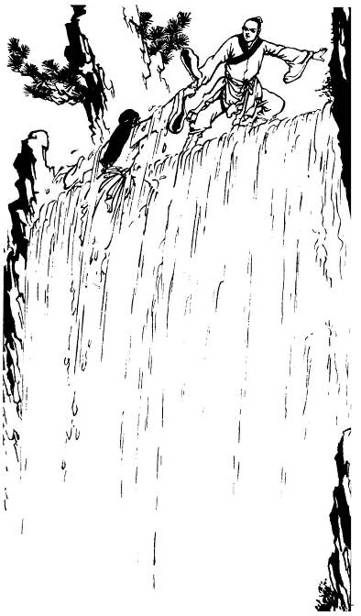
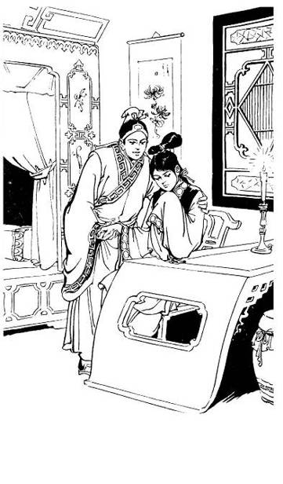
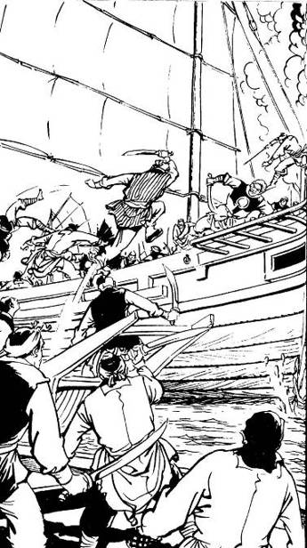
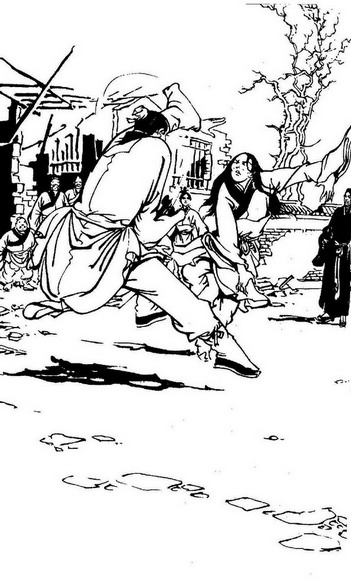
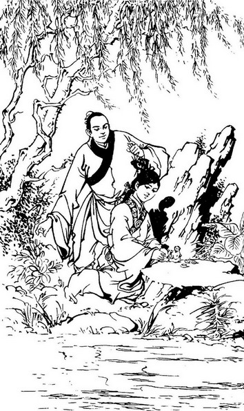
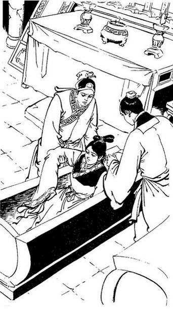
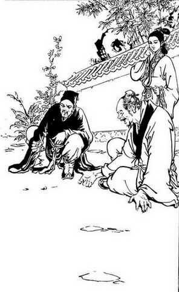
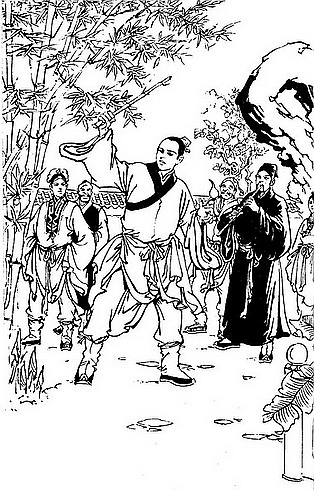
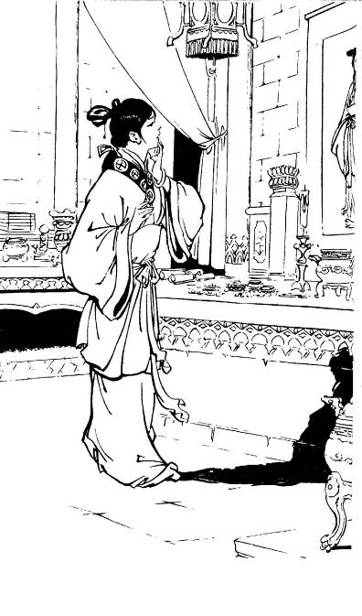
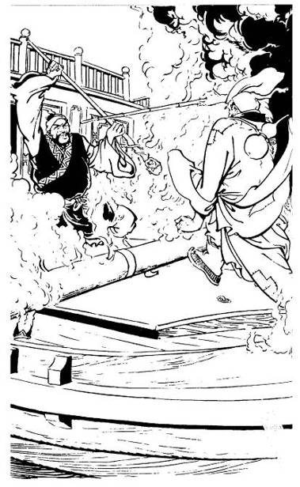

#  Chapter 11 – Changchun Admits Defeat

Translated by James Worsley

On the eighth day, Guo Jing finally managed to reach the peak.
Stretching out his hand, he hauled Huang Rong up and they jumped up and
down in jubilation, delirious in their triumph. Then, hand-in-hand, they
slid down the waterfall once more.

 

Seeing his martial brother in critical danger, Sha Tongtian leapt over
to quickly try and break Mei Chaofeng's grip. As soon as their hands met
they both felt their arms struck by a sudden ache. Meanwhile over to
their left came the sound of darts whizzing through the air. Peng Lianhu
was throwing his darts directly at Mei Chaofeng. She deftly shifted her
arm and threw Hou Tonghai straight towards the stream of darts. “Aiyo!”
yelled Hou Tonghai as the darts smacked into his body.

Huang Rong called out “Congratulations Three-Horned Dragon! You managed
to catch so many darts!”

Sha Tongtian, seeing the amazing power of Mei Chaofeng's throw and his
martial brother down on the ground seriously injured, leaped towards Hou
Tonghai and with a stretch of his hand pulled him upright. Hou Tonghai
flew up like a paper sparrow but looked as if he would collapse again.
There was no strength left in his body. Sha Tongtian had accidentally
hit his three carbuncles.

All these events happened within a blink of an eye. While this was going
on Ouyang Ke and Liang Ziwong were attacking Mei Chaofeng from the front
and rear in concert with Sha Tongtian who was attacking from the right.

Mei Chaofeng was able to judge from the sound of the darts in the air
where they were. She sent them flying back in four directions towards
Ouyang, Liang, Sha and Peng. She asked Guo Jing “What does ‘Gather the
Five Elements’ mean?”

Guo Jing replied “The eastern ghost is wood, the western soul is metal,
the southern spirit is fire, the northern essence is water and the
central will is earth.”

Mei Chaofeng called out “Aiyo! I might have guessed that earlier! What
does the ‘Perform the Four Harmonious Signs’ mean?"

Guo Jing replied, “Hide the eyes, concentrate the hearing, regulate the
breath and seal the tongue Qi.”  
  
Mei Chaofeng sighed, “Ah, so that is the original meaning. What about
the ‘Five Primary Chambers’?”  
  
Again Guo Jing replied, “Don't use your eyes to see, rather locate your
soul in the liver; don't use your ears to listen, rather locate your
essence in the kidneys; don't use your mouth to chant, rather locate
your spirit in the heart; don't use your nose to smell, rather locate
your soul in your lungs; don't move with your four limbs, rather locate
your mind/concentration in your spleen. These are the ‘Five Primary
Chambers’.”

The ‘Four Harmonious Signs’ and ‘Five Primary Chambers’ were key
techniques contained in the ‘Nine Yin Manual’ practiced by Taoist
priests. Not having anyone to explain the meanings of these key phrases
to her, Mei Chaofeng had struggled without success for over ten years to
understand them. Now with Guo Jing's explanations she suddenly
understood everything and was delighted. Again she pressed for more
information "Now, how do I perform the ‘Gathering Three Flower Tops’.
This technique was the crucial key to putting everything together. She
had strived all those years for just this key point so she listened
intently for Guo Jing's answer.

Guo Jing replied, “Essence is transformed into Qi, Qi is transformed
into Spirit.....”

Mei Chaofeng, by concentrating on Guo Jing's words, became less
attentive to the fight and her four opponents. Just as Guo Jing was
saying the two sentences she was struck on her left shoulder and right
side by Ouyang Ke and Sha Tongtian's fists. She felt a severe pain that
was hard to bear.

Huang Rong had planned to have Mei Chaofeng obstruct their enemies in a
fight while she and Guo Jing took the opportunity to slip away. She
never expected that Guo Jing would be dragged into the fight as well by
becoming a conveyance to carry Mei into the battle. This made it
impossible for them to get away. Now she became both worried and angry.

Meanwhile Mei Chaofeng was becoming alarmed at being suddenly put on the
defensive and called out, “Hey! What did you do to annoy so many fierce
opponents? Where is Shifu?” At this time Mei Chaofeng’s thoughts were
conflicting. On the one hand she was hoping her old Shifu would appear
and see with his own eyes how she was helping to save his daughter from
the savage onslaught of these four highly skilled martial artists and
would leap in to help her dispatch them. On the other hand, when she
thought about how wild and strange his nature was, she was struck with
terror at the thought of meeting him again.

Huang Rong called out, “He's coming soon, but why worry…these guys are
no match for you. Even if you just sit on the ground none of them would
be able to harm a hair on your head.” She was hoping that with a bit of
flattery Mei Chaofeng would feel emboldened enough to let Guo Jing go
and fight it out alone. However Mei Chaofeng had already begun to feel
that she would not be able to manage the four opponents by herself. She
was already showing signs of despair and no amount of flattery was going
to make her change her mind. Further more, she still had a few more
questions to ask Guo Jing about the secrets of the manual and was not
about to let him go even if she could win the fight sitting alone on the
ground.

After a few more strikes were exchanged, Liang Ziwong leaped into the
air with a sudden cry. Mei Chaofeng knew someone was executing a sneak
attack and extended both arms to block and sweep in defense. She felt
her hair being pulled upwards by Liang Ziwong. Huang Rong saw the
situation was critical and struck outwards with her fist towards Liang
Ziwong's back. Liang Ziwong hooked his right hand backwards and grabbed
Huang Rong's wrist while maintaining his grip on Mei Chaofeng's hair.
Mei Chaofeng struck upwards and forced Liang Ziwong to release his grip
in order to avoid being hit by her powerful attack.

Peng Lianhu had been fighting with Mei Chaofeng for a while before he
became aware that she was actually one of the ‘Twin Killers of the Dark
Winds’. Seeing Huang Rong aiding her he called out, “You lying brat! You
denied that you are a disciple of the evil ‘Dark Winds’ sect but it's
obvious that you are!”

Huang Rong laughed, “She…my Shifu? Even if she trained for another
hundred years she still wouldn't be good enough to become my Shifu!”

Peng Lianhu saw clearly that Huang Rong's kung fu attacks were very
similar to those of the ‘Dark Wind's’ school yet she not only continued
to deny she was a disciple, but actually went so far as to insult Mei
Chaofeng. He couldn't think of why she would be doing this and it
astonished him.

Sha Tongtian yelled, “To kill the man, first shoot his horse!” and shot
a kick towards Guo Jing with his right foot. This change of tactics took
Mei Chaofeng off guard. She thought, “This kid's martial arts skills are
very low. He can't possibly defend himself against their attacks. If I
don't act fast I'll be dispatched by them.” There was the sound of a low
whistle as she bent low and shot out her hand as if to grab Sha
Tongtian's foot. Ouyang Ke took advantage of this moment to launch an
attack against her back. However Mei Chaofeng just let out a ‘humph’ and
shook her right hand causing something to flash in the moonlight. All of
a sudden a silver whip appeared, dancing and weaving all around her and
Guo Jing, forming an impenetrable barrier.

Peng Lianhu thought to himself, “If we don't kill her now, when her
husband, ‘Copper Corpse’ arrives, we will be in deep trouble!” The
events of that night when Chen Xuanfeng died had not become known in the
martial world. However the infamy of the ‘Twin Killers of the Dark
Winds’ was widely known and their reputation was such that even highly
respected martial artists such as himself were filled with dread at the
thought of facing both of them together.

Mei Chaofeng's ‘Poison Silver Dragon Whip’ was powerful in the extreme.
If anyone approached from any direction they would die instantly. But
Sha Tongtian, Peng Lianhu, Liang Ziwong and Ouyang Ke were not about to
give up so easily. Suddenly there was the sound of a whistle and Peng
Lianhu began tunneling in the ground! Mei Chaofeng was prepared to
defend against the sky and all four directions but not from below! At
the sound of digging she became greatly alarmed and struck a palm down
on the ground.

Seeing Guo Jing in danger, Huang Rong was about to rush to his aid but
Mei Chaofeng was one step quicker. Using her long Silver Whip, she had
already woven a defensive barrier around herself and Guo Jing, making it
impossible for Huang Rong or anyone to penetrate it. However, Huang Rong
knew that with Mei Chaofeng’s individual might alone, she would not be
able to successfully defend against Peng Lianhu’s attack for much
longer. Sensing that the situation was dire, Huang Rong yelled,
“Everyone hold it, I have something to say.” But Peng Lianhu of course
paid no heed to her. Why should he?

Huang Rong was preparing to raise her voice again when a voice from atop
the wall said, “Everyone hold it, I have something to say.” Huang Rong
turned her head and saw six figures on top of the wall, some tall, some
short and in the darkness, she could not make out their faces clearly.
Peng Lianhu and the others knew that some people had arrived, but did
not know if they were friend or foe. At present, the battle was growing
ever more intense and nobody could bring themselves to stop. Two people
leapt down from the wall and headed straight for Ouyang Ke; one waving a
whip and the other raising a staff.

The short plump man that held the whip exclaimed, “You lecher, let’s see
you escape this time!” Upon hearing this voice, Guo Jing yelled gladly,
“Shifu! Save me!” The six people that just arrived were the ‘‘Six
Freaks’ of Jiangnan’.

After parting from Guo Jing at the inn, the ‘Freaks’ had followed the
eight girls from the ‘White Camel Mountain’. When they discovered that
Ouyang Ke was leading his concubines to abduct innocent girls at night,
they fought him. After all, how could the ‘‘Six Freaks’ of Jiangnan’ sit
by and do nothing while such atrocities were being committed? Although
Ouyang Ke was highly-skilled, the ‘‘Six Freaks’’ had spent more than a
decade on the steppe working hard and had improved significantly since
they left the Central Plains. Surrounded by six fighters, Ouyang Ke was
hit by Ke Zhen’E’s staff and subsequently had his left little finger
dislocated, courtesy of Zhu Cong’s Bone Dislocation technique. Left with
no choice, Ouyang Ke was forced to leave the abducted girls behind and
flee. The two concubines that had accompanied Ouyang Ke on the mission,
however, were killed by Nan Xiren and Quan Jinfa.

After escorting the teenage girls back to their homes, the ‘‘Six
Freaks’’ went in pursuit of Ouyang Ke. But Ouyang Ke was extremely sly;
he took another route and therefore, the ‘‘Six Freaks’’ were unable to
locate him. They knew that, individually, none of them were his match,
so they did not dare to split up to search. Fortunately, the girls who
rode on white camels had a strange and distinct dress, so it was not
difficult to ask around for their whereabouts. This being so, the ‘‘Six
Freaks’’ pursued them all the way to the Zhao Palace.

Ouyang Ke’s white robes stood out in the darkness and Han Baoju together
with Nan Xiren attacked immediately. Hearing Guo Jing’s call, the ‘‘Six
Freaks’’ were both surprised and glad. Zhu Cong and the rest looked more
closely and saw that the person weaving the barrier with a long silver
whip was none other than ‘Iron Corpse’, Mei Chaofeng! Mei was sitting on
Guo Jing’s shoulder and it certainly looked like Guo Jing had fallen
into her clutches. With their faces pale with shock, Han Xiaoying
immediately brandished her sword and rushed forward as Quan Jinfa
tumbled into the silver whip’s defensive radius, both hoping to rescue
Guo Jing. Peng Lianhu and the others thought it strange that six people
should suddenly arrive. Now these six people were attacking both Ouyang
Ke and Iron Corpse, making it even more impossible to tell whose side
they were on.

Peng Lianhu halted his attack and, still using his ‘Earthen Palm’, got
out of the whip’s radius. “Everyone stop fighting, I have something to
say,” he shouted. Like a large booming bell, his shout rang loudly in
everyone’s ears. Liang Ziwong and Sha Tongtian were the first to stop
fighting.

Ke Zhen’E could tell from his shout that this person was a force to be
reckoned with and called out, “Third brother, seventh sister, don’t be
rash!”

Hearing their Eldest brother’s orders, Han Baoju and the rest backed
off. Mei Chaofeng had also withdrawn her silver whip and was breathing
hard. Huang Rong stepped forward and told her, “You have reaped much
credit for yourself this time. My father will be pleased.” Using both
arms, she motioned to Guo Jing, telling him to toss Mei Chaofeng away.

Guo Jing understood Huang Rong, and knew that she had spoken to Mei
Chaofeng to distract her. He said to her, “The ‘Three Flowers Gathered
Atop’ is Essence transformed into Qi, Qi transformed into Spirit, Spirit
transformed into Nothingness. Remember that!”

Mei Chaofeng pondered, then asked: “How does one transform?” Suddenly,
she felt her body soaring through the air. While she had been dwelling
on the deeper meanings of this nei gong (internal energy) mantra, Guo
Jing had used the opportunity to toss her more than ten feet away. At
the same time, he summoned his internal energy and leapt backwards; even
before he landed, Mei’s ‘Poison Silver Dragon Whip’ was already flying
towards him, its hooks sparkling brightly.

Han Baoju exclaimed, “Not good!” He unleashed his own whip and the two
whips met. Suffering waves of shock from the extremely close encounter,
Han Baoju’s whip was snatched by her Poison Silver Dragon Whip. Just as
Mei Chaofeng was about to land hard on the ground, her outstretched palm
met it first and she lightly seated herself. Having heard Ke Zhen’E’s
voice and fighting briefly with Han Xiaoying, she knew the ‘Seven Freaks
of Jiangnan’ must have arrived. Her was heart filled with loathing and,
at the same time, a little fear. She thought to herself, “I have
searched in vain for them everywhere and now they have delivered
themselves to me. If it were any other day, I would’ve thanked the
heavens, but on this night I am surrounded by other strong enemies and
found them hard to handle. With the addition of these seven scoundrels,
I cannot possibly hope to live past tonight.” She gritted her teeth and
decided: “I have no grudge with Liang Ziwong and the others. As for the
‘Seven Freaks’, I will fight them to the death and make sure that if I
perish, they perish with me. One dead ‘Freak’ make one less and I’ll
take as many as I can with me.” Gripping her Poison Silver Dragon Whip,
she listened carefully to the ‘Seven Freaks’ movements and wondered,
“Out of seven only six came, I wonder where the other is hiding?” She
did not know that the Smiling Bhudda, Zhang Ahsheng, had been killed by
her husband on that fateful night on the steppes.

The ‘Six Freaks’, Sha Tongtian and the others knew the power of her
silver whip and stood far away from her, being careful not to stray
within forty to fifty feet of her. For a moment, all was silent. Zhu
Cong whispered to Guo Jing: “Why are they fighting? Why were you helping
that wretch?”

Guo Jing replied: “They wanted to kill me, but she saved me.” But Zhu
Cong and the other Freaks remained puzzled.

Peng Lianhu called out: “What business do you have, sneaking into the
Palace in the middle of the night? Provide your names.”

Ke Zhen’E replied coldly: “My surname is Ke. We are seven brothers, and
people call us the ‘Seven Freaks of Jiangnan’.”

Peng Lianhu said, “Ah, so it is the Seven Heroes from Jiangnan. I have
long admired you.”

Sha Tongtian said in a strange voice: “Wonderful, the ‘Seven Freaks’
have come knocking on my door! I have long wanted to spar with you and
see just how good you are.”

After hearing the name ‘Seven Freaks of Jiangnan’, he immediately
remembered the shame his four disciples had suffered. In one swift
movement, he moved forward. Appraising the ‘Seven Freaks’, he saw that
Ke Zhen’E was blind, Han Xiaoying was a woman, Quan Jinfa was skin and
bones, Han Baoju was short and fat and Zhu Cong had the air of someone
cultured but not of a pugilist. Only Nan Xiren had the bold, proud
qualities of a fighter. Not wanting to waste his time on the rest, he
struck straight at Nan Xiren’s head. Nan Xiren stuck his pole in the
ground and met Sha Tongtian’s palm with his own. After a few moves, it
was clear that Nan Xiren was not his match. Han Xiaoying and Quan Jinfa
readied their weapons, sword and scale respectively, and rushed forward
to help.

With a roar, Peng Lianhu leapt towards Quan Jinfa and attempted to grab
his weapon. Sensing Peng Lianhu’s intentions, Quan Jinfa quickly drew
back his weapon and sent both ends of it – a scale mace and scale hook,
flying towards Peng. For all of Peng Lianhu’s experience in the martial
world, he had never seen anything like Quan Jinfa’s weapon before. With
a ‘Weird Python Flip’, he dodged Quan’s attack and exclaimed: “What is
this? You’re using a scale from the market as a weapon!”

Quan Jinfa retorted, “This hand scale of mine is for weighing you bunch
of skinny pigs!”

In a fit of anger, Peng Lianhu rushed forward striking with both palms
furiously. Quan Jinfa was, of course, unable to defeat his attack.
Seeing his Sixth brother in danger, Han Baoju quickly went to his aid.
Even though he no longer had his whip, his basic hand-to-hand ability
was still quite powerful. However, even at two against one, Peng Lianhu
still seemed almost impossible to handle. Ke Zhen’E maneuvered his
staff, Zhu Cong brandished his fan, and both joined in the battle. Ke
Zhen’E and Zhu Cong were much more powerful than the rest of their
group, so naturally with their addition, the battle tipped in the
Freaks’ favor. Over on the other side, the battle between Hou Tonghai
and Huang Rong had grown extremely intense. Hou Tonghai’s kung fu was by
rights better than hers, but when he thought of this rascal’s Soft
Hedgehog Armor and the thorns that resided in her hair, his fist and
palm strikes did not dare come into contact with her body, much less
grab her by her hair. Sensing his fear and hesitation, Huang Rong took
full advantage and charged about brashly, forcing him to back away
repeatedly.

Hou Tonghai shouted: “This is unfair. Take off your Soft Hedgehog Armor
before we continue fighting.”

Huang Rong replied: “Sure, but you must first slice off those three
lumps on your forehead, if not then it’s still unfair.”

Hou Tonghai retorted: “My three lumps do not hurt anyone!”

Huang Rong replied, “I feel disgusted when I see them, isn’t that giving
you have a huge advantage? On the count of three, you slice off your
lumps and I’ll take off my armor.”

Hou Tonghai replied angrily: “I will not!”

Huang Rong said, “It’s a very good trade-off, I think you should.”

Hou Tonghai exclaimed, “I will not fall for your tricks. I won’t slice
them off no matter what you say!”

Ouyang Ke saw that the battle was not going well and thought, “I’ll kill
these six scoundrels first. That wretch is unable to escape so we can
finish her off later.” Wanting to show off his skills, he pointed both
feet and displayed his family’s ‘Thousand Miles in a Flash’, a superior
qing gong technique, and promptly appeared beside Ke Zhen’E.

He shouted, “Blind scoundrel, I’ll let you have a taste of your master’s
prowess for being such a busybody.”

Moving forward, Ouyang Ke struck out with his right palm. Ke Zhen’E
raised the end of his staff to meet the strike but caught nothing, only
the sound of wind brushing past his right ear. Instead, the real attack
came from the left with Ouyang Ke’s reverse left palm flying towards
him. Ke Zhen’E dipped his head to avoid being struck and then used the
‘Diamond Guard’ staff technique to fiercely attack, but by this time,
Ouyang Ke was embroiled with Nan Xiren. Skillfully weaving his way
through them, Ouyang Ke had attempted fatal blows on all six Freaks
within a short period of time.

From the beginning, Liang Ziwong’s eyes never shifted from Guo Jing.
Seeing that the ‘Six Freaks’’ defeat was imminent, he immediately tried
to grab Guo Jing with both arms. Guo Jing quickly resisted, but of
course he was not Liang Ziwong’s match. After exchanging a few moves,
Liang Ziwong had successfully grabbed him by the chest and his right
hand gripped Guo Jing’s stomach. Guo Jing shrunk his stomach in anxiety
and his clothes tore with a ripping sound and the bags of medicine had
been snatched away. Liang Ziwong knew the bags contained medicine, he’d
sniffed it out long ago and conveniently pocketed them. He followed with
a second strike on Guo Jing. Guo Jing successfully struggled out of the
grip on his chest and sprinted towards Mei Chaofeng, yelling, “Hey! Save
me, quickly!”

Mei Chaofeng thought to herself, “There are still many things I don’t
understand about that mysterious school of nei gong.” Still breathing
hard, she said aloud: “Come, take hold my legs; don’t be afraid of that
old bat.”

Guo Jing knew that holding her legs was easy, but to escape afterwards
would be hard. So he did not dare to go close to her and instead
sprinted wildly around her in circles. Although Guo Jing had already
entered the perimeter of her ‘Poison Silver Dragon Whip’, Liang Ziwong
still followed him relentlessly, nevertheless wary of a sneak attack.
Mei Chaofeng pinpointed Guo Jing’s position with her hearing and
unleashed her silver whip across the ground towards his legs.

Although Huang Rong was engaged in a duel with Hou Tonghai, she held the
upper hand with her Soft Hedgehog Armor and had always been looking out
for Guo Jing. First he was captured by Liang Ziwong but she was too far
away to help and was anxious to the extreme. Then Guo Jing sprinted into
Mei Chaofeng’s perimeter. Her whip flew towards him and he was unable to
dodge. Out of anxiety, Huang Rong flew in their direction and threw
herself in front of the whip. Mei Chaofeng’s silver whip withdrew after
hitting a target and circled back, wrapping itself around Huang Rong’s
waist. Huang Rong was thrown up into the air and shouted: “You dare hurt
me, Mei Ruohua?”

Hearing Huang Rong’s voice gave her a huge shock. She thought, “My whip
is tipped with reversed hooks. Now that I’ve injured her, Shifu has even
more reason not to spare me. But I have already come this far, and
either way I have betrayed my school. I’ll kill her first.” Raising her
silver whip, she pulled Huang Rong closer to her and laid her on the
ground, thinking that all the hooks must have torn deep into her flesh
by now. She never expected the hooks to only tear Huang Rong’s clothing,
leaving her body completely unharmed. Huang Rong said laughingly, “You
tore my clothes, I want compensation!”

Mei Chaofeng was surprised to hear no hint of pain in her voice then
thought, “Ah, Shifu has given his Soft Hedgehog Armor to her.” Feeling
lenient, she said aloud, “That was my fault. I will replace them with a
nice new set of clothing.”

Huang Rong signaled Guo Jing to come over and he did so. The two of them
now stood ten feet or so from Mei Chaofeng, where Liang Ziwong did not
dare to venture.

Over at the other battle, the ‘‘Six Freaks’ of Jiangnan’ had formed a
tight circle with their backs towards each other and were trying their
best to resist Sha Tongtian, Peng Lianhu, Ouyang Ke and Hou Tonghai.
This was a formation they had mastered on the steppes of Mongolia. When
faced with tough opponents, this formation made it unnecessary for them
to defend their backs and instantly increased their power by half. But
Sha, Peng and Ouyang were simply too strong and danger came from all
directions; the ‘‘Six Freaks’’ were far from being their match. Not long
after, Han Baoju’s arm was injured. Han Baoju knew that if he left the
formation there would be an opening for their opponents to exploit and
their lives and Guo Jing’s would be in grave danger. He could only grit
his teeth and hold on with great effort.

Of their opponents, Peng Lianhu was the most vicious in his attacks and
repeatedly targeted Han Baoju. Guo Jing saw that the situation was
urgent and rushed towards them with flying feet. With the double palm
technique ‘Separating Cloud and Moon’, he aimed for Peng Lianhu’s back.
Peng Lianhu let out a chilling laugh and with a wave of his hand
deflected Guo Jing’s attack. In just three moves, Guo Jing found himself
in a dangerous position.

Huang Rong saw that he was unable to escape and in her anxiety suddenly
remembered the saying: ‘A simple man is sinless, but a man wearing a
piece of jade will be sinned against.’ So, she yelled: “Mei Chaofeng,
you stole my father’s ‘Nine Yin Manual’, hand it to me now so I can
return it to him!”

Mei Chaofeng went cold and did not respond. Sha Tongtian, Peng Lianhu,
Ouyang Ke and Liang Ziwong immediately shifted their attention to Mei
Chaofeng and attacked her. All four harbored the same thought, “The
‘Nine Yin Manual’ is the world’s top martial arts manual and it’s been
with the ‘Twin Killers of the Dark Winds’ all along...” Now the four
couldn’t care less about anything else and their focus was to kill Mei
Chaofeng and obtain the manual.

Mei Chaofeng began brandishing her silver whip and for the moment, none
of them dared to venture within its perimeter. Seeing them lured away by
the ‘Nine Yin Manual’, Huang Rong whispered to Guo Jing urgently, “Let’s
go!”

At this moment, a figure emerged from a thicket and hurried towards
them. It shouted, “Gentlemen! Father requires your help with something
urgent.” The person wore a gold cap crookedly on his head and his voice
was filled with worry. It was none other than the young prince, Wanyan
Kang. Peng Lianhu and the others thought, “Prince Zhao has been generous
in exchange for our services. Now that there is something urgent, how
can we not go to his aid?” With this thought they backed off
reluctantly, not wanting to give up the ‘Nine Yin Manual’. Their gaze
still lingered on Mei Chaofeng.

Wanyan Kang said softly: “My mother… my mother has been abducted by
villains. Father has requested that you help to rescue her, please start
at once.”

Originally, Wanyan Honglie had led his troops out of the Palace to chase
Bao Xiruo, but they lost sight of her. Remembering the resourceful
martial artists in his residence, he hurriedly sent his son to summon
them. Wanyan Kang was caught up in anxiety and the night was dark, so he
did not notice Mei Chaofeng seated on the ground.

Peng Lianhu and the others thought, “Oh my, the Consort has been
abducted? If we don’t go to her rescue, what are we here for?” They
further thought, “It must have been the ‘Seven Freaks’. Six of them kept
us here to distract us, allowing the other to abduct the Consort. The
manual will have to wait. Anyway, with so many accomplished fighters
around, I can’t hope to claim it for myself. I’ll need to come up with a
plan some other time.” With that, they hurriedly followed Wanyan Kang.
Liang Ziwong trailed behind, still longing for the blood in Guo Jing’s
body. He actually didn’t care about rescuing the Consort but was alone
in wanting to stay behind and had no choice but to follow miserably.

Guo Jing called, “Hey, return my medicine!” Fuming, Liang Ziwong turned
and shot a bone-penetrating projectile straight at his head. The
projectile cut through the night air with incredible strength.

Zhu Cong dashed forward and deflected the projectile with the handle of
his fan. As the projectile fell, he caught it with his left hand and
held it to his nose to have a sniff. “Ah,” he said, “seals throats when
it touches blood; this is a ‘Bone-Penetrating Meridian Nail’.

Hearing the name of his secret weapon startled Liang Ziwong; he spun
around and yelled, “What?”

Zhu Cong went up to him and held out his palm; the Meridian Nail was
resting on it. He said lightly: “I’ll give it back to you, old master!”

Liang Ziwong retrieved it calmly. He knew that with Zhu Cong’s level of
kung fu, he could not harm him. Zhu Cong saw that Liang Ziwong’s left
sleeve was covered with mud and grass and used his own sleeve to swipe
the dirt away. Liang Ziwong said angrily, “I don’t need your
bootlicking!” With that, he turned around and left.

Guo Jing was in a miserable position. If he went back without the
medicine, all the night’s misadventures would have been for naught; but
if he tried to regain it forcefully, he would undoubtedly be defeated by
Liang Ziwong. He was still hesitating when Ke Zhen’E said, “Let’s go.”
Ke Zhen’E leapt to the top of the Palace wall and the other five
‘Freaks’ followed suit.

Pointing at Mei Chaofeng, Han Xiaoying said: “Elder brother, what about
her?”

Ke Zhen’E replied: “We promised Priest Ma to spare her life.”

Huang Rong did not acknowledge the ‘‘Six Freaks’’ and leapt on to the
other end of the wall, grinning.

Mei Chaofeng hollered: “Little martial sister, where is Shifu?”

Huang Rong giggled and said, “My father is, of course, on Peach Blossom
Island, why do you ask? Are you going to pay him a visit?”

Mei Chaofeng seethed, her breath growing heavier and quicker. After a
moment she said, “Didn’t you just say that Shifu was on his way here?”

Still laughing, Huang Rong replied, “He doesn’t know you’re here, but
rest assured I’ll tell him for you. I’m sure he’ll come straight away.
Don’t worry, I’m not bluffing.” Enraged, Mei Chaofeng braced herself
with both hands and sprung up suddenly. With staggering steps, she
charged towards Huang Rong.

Mei Chaofeng had lost the use of her legs as a result of intensely
practicing a nei gong she didn’t understand. A stream of Qi had flowed
down to her ‘dan tian’ (energy field) and was unable to work its way
back up, paralyzing her lower body. She had stubbornly attempted to work
the Qi back upwards but the harder she tried, the stronger the
resistance she met.

At this moment, her senses were consumed with fury, so much so that she
forgot about her paralysis. She was in a state where she had disengaged
from her body and was only aware of a violent surge of anger rushing up
to her heart. Suddenly her legs had become part of her body again and
she charged towards Huang Rong. Shocked that Mei Chaofeng had regained
the use of her legs, Huang Rong leapt down to the other side and fled
into the night.

Suddenly regaining the use of her legs, Mei Chaofeng thought, “Eh, how
come I can walk now?” With this thought, a sudden wave of numbness
washed over her legs and she fell, losing consciousness.

For the ‘Six Freaks’ to kill her now would be an easy task; but they had
promised Ma Yu to spare her life. So they leapt over the wall and left
the palace with Guo Jing.

Han Xiaoying was the most anxious and hurriedly asked, “Jing’er, how did
you end up here?”

Guo Jing roughly sketched the events leading up to this point…Wang Chuyi
coming to his rescue, getting poisoned at Wanyan Kang’s banquet,
stealing the medicine, bumping into Mei Chaofeng in the tunnel, et
cetera. For the moment, however, he did not mention the Yang family
saga.

Zhu Cong said, “Let’s hurry and see how Priest Wang is coping.”

o0o

Having just been reunited with his wife, Yang Tiexin felt an
inexpressible mixture of joy and sadness. Carrying her in his arms, he
leapt out of the palace. His foster daughter Mu Nianci was anxiously
waiting outside the palace walls when she saw him carrying a woman in
his arms. Surprised and curious, she asked, “Father, who is she?”

Yang Tiexin replied, “She’s your mother. Let’s go.”

Mu Nianci said, bewildered, “My mother?”

Yang Tiexin said, “Hush, we’ll talk afterwards,” and sprinted off
urgently.

After a time, Bao Xiruo slowly regained consciousness. It was near
daybreak and in the dim light, she saw that the person bearing her was
the husband she had been thinking of day and night for eighteen years.
She didn’t know if it was real or just an illusion. She felt like she
was in a dream and reached out to caress his face. Her voice quivered as
she spoke, “Tie-ge, am I dead too?”

Crying joyfully, he replied in a gentle voice, “Both of us are alive and
well…” His sentence was interrupted by shouts from behind. Light from
torches lit the area as soldiers quickly streamed forward. Raising their
swords and spears, they yelled, “Don’t let the Consort’s kidnapper
escape!”

Yang Tiexin quickly surveyed their surroundings but there was no place
they could hide. He thought, “The heavens have pitied us husband and
wife and allowed us to reunite against the odds. Even if I were to die
now, I would have nothing left to wish for.” He called to Mu Nianci,
“Here, hold your mother.”

The scene at Lin’an’s Ox Village eighteen years ago suddenly sprang into
Bao Xiruo’s mind: her husband fleeing with her in his arms, the cries of
soldiers in the night and the eighteen years of separation and grief
that followed. Sensing that the tragedy was to repeat itself, she held
on stubbornly to her husband, refusing to let go. The soldiers were
getting near and Yang Tiexin thought it better to die fighting than be
captured and humiliated. With that, he pried his wife’s fingers away and
entrusted her to Mu Nianci. Turning around, he charged towards the
soldiers and with a fist, knocked out a foot soldier and seized his
spear. With a spear in hand, Yang Tiexin was even more lethal. The
troops’ commander, Tang Zude, was speared in the leg and promptly fell
off his horse. With their leader down, the rest of the soldiers
scampered away in all directions. Seeing there were no skilled pugilists
amongst them, Yang Tiexin felt slightly relieved even though it was a
pity not to have been able to grab a horse. The three of them continued
their escape.

By this time it was morning. Bao Xiruo noticed the bloodstains on her
husband’s clothes and said, frightened, “Are you hurt?”

Hearing this, Yang Tiexin was suddenly aware of a sharp pain in his arm.
Because he had exerted too much strength during the fight, the wound
from Wanyan Kang’s claws had re-opened and was now bleeding profusely
again. Earlier he had been fixated with escaping and was not aware of
the pain; but now both arms felt stiff and weak and he was unable to
lift them. Bao Xiruo was about to bandage his wounds when loud calls
came from behind and the dust from countless pursuing soldiers appeared.
With a bitter smile, Yang Tiexin said, “No need to bandage.” He turned
and said to Mu Nianci, “Child, run for your life! Your mother and I will
stay here…”

Mu Nianci successfully fought back tears and raised her head proudly,
saying, “The three of us will die together.”

Confused, Bao Xiruo asked, “How… how is she our daughter?”

Yang Tiexin was just about to answer when he heard the soldiers nearing.
Looking up, he saw two Taoist priests coming towards them, one had a
white beard and eyebrows and looked kindly; the other had a long black
beard, a long sword slung on his back and looked grand and dignified.
Great delight replaced his initial astonishment and Yang Tiexin called
out, “Priest Qiu, we meet again!”

Of the two priests, one was ‘Scarlet Sun’ Ma Yu and the other was
‘Eternal Spring’ Qiu Chuji. The two of them, along with ‘Jade Sun’ Wang
Chuyi, had arranged to meet in Zhongdu to discuss the upcoming duel with
the ‘Seven Freaks of Jiangnan’. Both had hurried here and chanced upon
the Yangs. Qiu Chuji had an accomplished level of nei gong and thus his
appearance had not changed much over the eighteen years. Only the hair
on his temples was speckled with white. Hearing this greeting, he looked
more closely, but it was someone he did not recognize.

Yang Tiexin said, “Eighteen years ago at Ox Village in Lin’an, we once
drank and killed enemies together, do you still remember?”

Qiu Chuji said, “You are…”

Yang Tiexin declared, “I’m Yang Tiexin, have you been well?” Yang
approached him and bowed.

Qiu Chuji hurriedly returned the formality but still harbored some
doubts. Eighteen years of hardship and grief had eroded his youthful
appearance and Yang Tiexin looked vastly different than before. Yang
Tiexin sensed his doubts but the soldiers were getting near and it was
not a good time to clarify things in detail. Raising his spear, he
displayed the ‘Phoenix Striking Head’. The red tassel trembled as the
spear headed for Qiu Chuji’s chest and he said, “Priest Qiu, you may
have forgotten me, but you can’t have forgotten the ‘Yang Family
Spear’!”

The spear froze inches away from Qiu Chuji. Qiu Chuji saw that this was
indeed the authentic Yang Family Spear and immediately recalled that
night’s fight in the snow; it was indeed Yang Tiexin from eighteen years
ago and a bittersweet feeling washed over him. He said loudly, “Aha,
brother Yang, you’re still alive? Thank Heaven!”

Yang Tiexin withdrew his spear and said, “Priest Qiu, save me!” Qiu
Chuji glanced at the approaching soldiers and said jovially, “Elder
martial brother, I’m going to start killing again today, don’t get
angry!”

Ma Yu replied, “Kill less; maybe just scare them off.”

Qiu Chuji laughed loudly and took a huge step forward. With a stretch of
both arms, he plucked two soldiers off their horses and flung them
towards another two soldiers behind. The four soldiers crashed against
each other and fell in a heap. Qiu Chuji’s arms moved at the speed of
lightning and, like a canon, fired eight more soldiers towards another
eight.

Terrified, the other soldiers turned their horses and fled. Suddenly, a
chiefly looking figure with a bald, shiny head emerged from behind the
fleeing soldiers. He bellowed: “Where did this scoundrel come from?”
With a slight sway of his body, he was already close to Qiu Chuji and
attacked with his palms. Qiu Chuji noticed that this person was highly
agile. Raising his palms to obstruct the attack, their palms met with a
clap and subsequently both withdrew three paces. Surprised, Qiu Chuji
thought to himself, “Who is this person with such good kung fu?”

Little did he know that the Dragon King of the Demonic Group Sha
Tongtian was concealing the pain in his arms from their exchange and was
even more surprised than he. With an angry roar, Sha Tongtian swung his
fists forward. Qiu Chuji did not dare to be slow and with full strength
and concentration sent both palms darting straight at Sha Tongtian.
After exchanging ten moves or so, Qiu Chuji successfully brushed his
palm against Sha Tongtian, leaving five streaks of red on his bald head.
Though Sha Tongtian could not see the marks, he could feel a stinging
pain from the top of his head. Knowing that he would not be able to beat
this Taoist empty-handed, he immediately pulled an iron stick from
behind him. Although this weapon was heavy, its power was great and with
a “Reviving Qin Behind the Sword”, the stick struck in the direction of
Qiu Chuji’s shoulder. Qiu Chuji greeted the attack with his technique of
seizing weapons with bare hands. But Sha Tongtian had been using this
weapon for more than ten years and had extraordinary skill with it, so
Qiu Chuji failed in his attempt.

Deep inside, Qiu Chuji marveled at this and was just about to ask for
his name when someone from the left shouted, “Who is this priest from
the Quanzhen Sect?” His voice carried immense power. Qiu Chuji leapt to
his right and saw four people; Peng Lianhu, Ouyang Ke, Liang Ziwong and
Hou Tonghai.

Qiu Chuji cupped his fists and said, “My surname is Qiu, may I know your
names?” Qiu Chuji’s mighty name was well-known and feared in the
Northern and Southern parts.

Sha Tongtian and the others thought, “It’s no wonder he is so famous. He
is indeed powerful.”

Peng Lianhu thought, “We’ve already injured Wang Chuyi and forged
animosity with Quanzhen Sect. If we combine forces and kill Qiu Chuji
today, our names will travel far and wide!” He shouted, “Everyone,
attack together.” Before he even finished pronouncing the last word,
Peng Lianhu had already retrieved his ‘Judgmental Twin Brush’ and
advanced towards Qiu Chuji. He knew this opponent was powerful and was
vicious with his onslaught, targeting his ‘Yun Men’ accupoint at the top
and his ‘Tai He’ accupoint below. These two hits came in full force and
left no room for mercy.

Qiu Chuji thought to himself, “This shorty is impudent! To be fair, his
skills are also above average.” With a swishing sound he drew out his
sword and pierced Peng Lianhu’s right arm, scraped Sha Tongtian’s waist
and, drawing back the sword, sent its hilt ramming into the critical
Zhang Men accupoint in the side of Hou Tonghai’s ribs. With one move he
had struck three people, displaying amazing skill with the sword. Sha
Tongtian and Peng Lianhu propped themselves up with their weapons. Hou
Tonghai had narrowly missed having his accupoint blocked and managed to
withdraw quickly, but alas a heavy kick to the buttocks sent him flying
to the ground. Call it a coincidence but he landed straight on the three
lumps on his head. Inwardly shaken, Liang Ziwong propelled himself
forward like a monkey and attacked.

Ouyang Ke saw that Qiu Chuji was occupied with Sha Tongtian and Peng
Lianhu and now Liang Ziwong had also joined in. It was an advantage that
just begged to be taken, and if not now – when? Feinting with his left
hand, his right hand moved to block Qiu Chuji’s ‘Tao Dao’, ‘Hun Men’ and
‘Zhong Shu’ accupoints with his iron fan. It seemed as though Qiu Chuji
had no way out when a figure moved beside him and in a flash, a single
hand reached out and halted the movement of the fan. So it was that Ma
Yu, who had been observing in silence from the side, was flabbergasted
to see a group of highly-skilled pugilists ganging up on his younger
Martial Brother. With just three fingers he had trapped the fan; Ouyang
Ke immediately felt a surge of formidable inner power coming from the
handle of his fan and quickly leapt backwards in astonishment.

Ma Yu did not pursue him, but said, “Gentlemen, may I know who you are?
We have never met. If there has been some misunderstanding we can talk
it over, why resort to violence?” Though his tone was gentle, his voice
carried abundant Qi. The projection for each word was crystal clear and
bore straight into their eardrums. Sha Tongtian and the others were
totally involved in their fighting when Ma Yu’s sentences made them stop
cold. They ceased fighting and withdrew while appraising Ma Yu.

Ouyang Ke said: “Priest, what is your revered name?”

Ma Yu replied: “My surname is Ma.”

Peng Lianhu said, “Ah, so it is the ‘Scarlet Sun’, Revered Priest Ma. We
have been rude.”

Ma Yu replied, “With my shallow cultivation, how dare I claim the title
of Revered?”

Though Peng Lianhu coated his words with politeness, inwardly he was
thinking, “Since we have already created a grudge with the Quanzhen
Sect, it is unlikely that there will be enough goodwill to forgive and
forget. These two characters are the main pillars of the Quanzhen Sect
and fortunately we have caught them alone. If we join forces and finish
them off today, we will have less to worry about in the future. But I
wonder if there are any other skilled pugilists from Quanzhen in the
vicinity.” A quick look around revealed only the three members of the
Yang family – there were no other priests around.

Peng Lianhu said, “I have long admired the great names of the Quanzhen
Seven. Where are the other five? How about inviting them here so we can
meet them?”

Ma Yu replied, “Instead of concentrating on cultivation, my Martial
Brothers have often meddled in worldly affairs and earned themselves
empty reputations. I’m afraid they have made fools of themselves. The
seven of us live in different Taoist temples and rarely gather together.
I have made this trip to Zhongdu with my Martial Brother Qiu to look for
our Martial Brother Wang, and by chance met all of you. All the world’s
martial arts branch from the same stem. Red lotus or white root, we all
come from the same family. Since we have an affinity, how about becoming
friends?” Being honest by nature, Ma Yu never expected that Peng Lianhu
was merely sounding him out.

Hearing that there were indeed no other Quanzhen pugilists nearby, Peng
Lianhu thought they could win with numbers. Not only that, the two
priests had yet to meet with Wang Chuyi, and Ma Yu was trusting and off
guard. All Peng Lianhu had to do was keep up this friendly pretence and
they would be able to pull a sneak attack. Beaming, he said, “We are
honored that Priest Qiu and Ma do not look down on us, and to be friends
would be fantastic. My surname is San; my full name is San Heimao
\[three black cats\].”

At this, Ma Yu and Qiu Chuji were both startled, thinking, “This
person’s kung fu is impressive, so that his name must be famous. But
this name, San Heimao, is so strange yet I’ve never heard of it.”

Peng Lianhu tucked his ‘Judgmental Twin Brushes’ back into his waist and
approached Ma Yu. He said, smiling, “Nice to meet you, Priest Ma.”

He stretched out his hand for a handshake. Unsuspectingly, Ma Yu reached
out to shake his hand but the moment their hands touched, he suddenly
felt Peng Lianhu’s grip tighten.

Ma Yu thought, “Hmph, trying to test my kung fu.” He merely smiled and
applied his internal energy in response, squeezing Peng Lianhu’s hand.
Suddenly, an intense pain penetrated into his five fingertips and it
felt as if he had been pierced by many steel needles. He quickly
withdrew his hand in astonishment. Peng Lianhu burst out laughing and
retreated a few feet. Ma Yu raised his palm and saw that all five
fingertips had been punctured deep into his flesh, and the holes were
lined with black.

So it was that when Peng Lianhu was stowing his ‘Judgmental Twin
Brushes’, he had secretly slipped on his special ‘Poison Needle Bangle’
on his right hand. Made from refined steel, the bangle was as slender as
a thread and on it was five thin needles armed with a lethal poison. If
the needles penetrated the flesh and drew blood, the victim would
undoubtedly die within ten hours. Peng Lianhu usually wore this bangle
to increase the potency of his palm attacks when exchanging blows, thus
ensuring that his opponent would not live beyond half a day. He had also
deliberately introduced himself as “San Heimao” (Three Black Cats”) so
that while Qiu Chuji and Ma Yu were busy being astounded, he could seize
the chance and deliver his sneak attack.

Characters of the martial realm often harbor no admiration for one
another at the first meeting, but tact and face made public aggression
improper. They would often reach out for a handshake in the guise of
friendliness, but in actuality it was a duel of sorts. It was not
unusual for the inferior fighter to have his bones broken and his hand
swollen, or to beg for mercy when the pain became too much. Ma Yu only
thought that Peng Lianhu was practicing the old pugilistic habit of
being friendly on the surface but secretly appraising the other’s
strength. He never thought that Peng Lianhu would have another vicious
trick up his sleeve. Thus, when both of them exerted strength, the five
poisonous needles not only pierced his fingertips but sunk straight down
to the bones of his fingers. By the time Ma Yu realized what had
happened and struck with his right palm, Peng Lianhu had already leapt
away.

All Qiu Chuji knew was that his Elder Martial Brother had been shaking
hands with someone when his facial expression suddenly changed and he
attacked. Qiu Chuji hurriedly asked, “What happened?”

Ma Yu replied angrily, “Crafty scoundrel, he poisoned me.” With that, he
advanced towards Peng Lianhu.

Qiu Chuji had always known his Elder Martial Brother to be tolerant and
had never seen him attack anyone in over ten years, yet at this moment,
he opened his attack with the most formidable of Quanzhen’s skills – the
‘Three Flowers Atop’ palm technique. Qiu Chuji knew it must have taken a
great deception for him to be so furious, so with a flick of his sword,
he weaved left and right to reach Peng Lianhu. With a quick “swish,
swish, swish”, he had dealt him three strokes. By this time Peng Lianhu
had already retrieved his Twin Brushes and successfully deflected two of
Qiu Chuji’s strokes while managing to deal a strike with one brush. But
Peng Lianhu never expected Qiu Chuji’s palm technique to be as ferocious
as his sword. In that very instant when he was about to withdraw his
brush – but not quite – Qiu Chuji reached out and grabbed it by the tip.
He shouted: “Withdraw!” Combining internal power and external force, Qiu
Chuji tried to break the brush; despite his using full energy, Peng
Lianhu, being a formidable opponent, did not allow the brush to shatter.
Qiu Chuji followed by guiding his sword straight forward and Peng Lianhu
had no choice but to let go of his brush and evade. With the sword in
his right hand and palm technique in his left, Qiu Chuji kept up the
attack ceaselessly. Peng Lianhu had lost one brush and his right arm was
also feeling stiff and weak. Having lost his edge, he repeatedly
retreated.

At this point, Sha Tongtian and Liang Ziwong were embroiled with Ma Yu.
Ouyang Ke and Hou Tonghai came forward to aid Peng Lianhu, one to the
left and the other to the right. Faced with strong opponents, Qiu Chuji
felt even more energized. With gliding palms and flashing sword, the
more he fought the swifter his attacks became. Qiu Chuji was fighting
three people by himself and had not lost the advantage. Over on the
other side, Ma Yu was having trouble maintaining the situation. His
right palm was already swollen and afflicted with numbness and itching
as the poison gradually took effect. Although he knew that the needles
were poisoned, he never expected such drastic reaction. He understood
that the more he exerted himself, the faster his blood would circulate
and the quicker the poison would attack his heart. Immediately he sat
down and engaged his internal energy to halt the poison’s progress,
while still wielding a sword in his left hand for self-protection. Liang
Ziwong’s weapon was a shovel, similar to the ones used for grave
digging. Between slashing vertically, scooping horizontally, and at
times sweeping across or striking directly, the variations in his attack
were plentiful. Sha Tongtian’s iron stick was heavy and even more
dangerous. After ten moves or so, Ma Yu’s breathing increased and his
defensive circle shrank. Inwardly resisting the poison and outwardly
defending against two enemies, he soon felt lethargic in spite having an
accomplished level of internal energy.

Qiu Chuji was shocked at the sight of his Elder Martial Brother seated
on the ground, with hot vapor rising slowly from his head as if he were
being steamed. He wanted to finish off his three opponents quickly and
rush to aid him, but these opponents were sticky and he could not spare
a moment to pause in his attack and escape. Admittedly Peng Lianhu was a
weaker fighter, but Ouyang Ke was proficient in both internal energy and
external moves. His attacks were both fierce and unusual. In terms of
ability, he was way above Peng Lianhu. From what Qiu Chuji could tell,
Ouyang Ke’s kung fu looked similar to that of the ‘Western Poison’,
someone the Quanzhen Sect had always feared. This startled him and he
thought, “Who is this person? Could he be a disciple of the ‘Western
Poison’? Has ‘Western Poison’ arrived on the Central Plains? I wonder if
he’s actually here in Zhongdu.” While following this train of thought he
momentarily lost concentration and repeatedly encountered close shaves.

Yang Tiexin knew in his heart that the skills of these two priests were
way above his, but seeing both of them in danger he immediately lifted
his spear and thrust towards Ouyang Ke’s back. Qiu Chuji yelled,
“Brother Yang, don’t throw your life away in vain!” By the time he
finished his sentence; Ouyang Ke had already broken the spear with his
left foot and kicked Yang Tiexin to the ground with his right. At this
very moment they heard the sound of hooves as a great number of horses
galloped swiftly towards them. Leading the way were none other than the
father and son, Wanyan Honglie and Wanyan Kang.

Wanyan Honglie caught sight of his wife seated on the ground from the
distance. Delighted, he hurried to her but a blade suddenly sliced
through the air and came right at him. Slanting his body to avoid the
slash, he saw that the wielder of the blade was a young girl dressed in
red. At this point, his soldiers came forward and started fighting Mu
Nianci.

Over on the other end, Wanyan Kang was startled at seeing his Shifu and
shouted, “We’re all on the same side, everyone stop fighting!”

Only after repeating this a few times did Peng Lianhu and the others
finally retreat; the soldiers and Mu Nianci also halted. Wanyan Kang
approached Qiu Chuji and bowed. “Shifu, let your disciple do the
introductions,” he said. “These are all senior pugilists engaged by my
father.”

Qiu Chuji nodded and went to check on his Elder Martial Brother. Ma Yu’s
right palm was black all over and, lifting up his sleeve, he saw that
the blackness had spread all the way to the upper part of his arm.
Astonished, he said, “How could the poison be like that?” Turning
around, he said to Peng Lianhu, “Hand over the antidote!”

Peng Lianhu hesitated while thinking, “Just a little while more time and
this person will die, but it wouldn’t be appropriate to offend the
little prince. Should I save him or not?”

Now that Ma Yu had no more enemies attacking him, he concentrated all
his internal energy on resisting the poison and sure enough, the poison
halted in his arm and could not travel further upwards. Instead, the
blackness gradually started moving downwards.

Wanyan Kang rushed over to his mother and exclaimed, “Mother, I’ve
finally found you!”

Bao Xiruo was frightened and replied, “Do not ask me to return to the
palace. I never will!”

Shocked, Wanyan Honglie and Wanyan Kang said in unison, “What?”

Bao Xiruo pointed at Yang Tiexin. “My husband is still alive and I will
follow him to the ends of the earth,” she said.

This came as no ordinary blow to Wanyan Honglie and he silently mouthed
something to Liang Ziwong. Liang Ziwong understood the prince’s
intentions and flicked his right hand, sending three of his
‘Bone-Penetrating Meridian Nails’ flying towards Yang Tiexin’s essential
junctions. Qiu Chuji saw the flight of the nails but it was too late for
him to do anything and Yang Tiexin would surely not be able to evade
them. Having no projectiles with him, he grabbed a Jin soldier out of
desperation and hurled him towards the space between Liang Ziwong and
Yang Tiexin. With a loud “ah”, the three ‘Meridian Nails’ struck the
soldier.

Liang Ziwong regarded his ‘Bone-Penetrating Meridian Nails’ as his
greatest skill. Having sent three nails simultaneously, it was absurd to
think he would miss the target. Seeing Qiu Chuji foil his move in such a
peculiar way, he roared angrily and attacked. Peng Lianhu saw this and
decided against providing the antidote, knowing that the little prince’s
priority was rescuing his mother. He leapt forward abruptly and grabbed
hold of Bao Xiruo’s arm. With two swishing sounds, Qiu Chuji sent his
sword thrusting towards both Liang Ziwong and Peng Lianhu. Both saw the
fierceness of the strokes and were forced backwards. Qiu Chuji thundered
at Wanyan Kang, “Ignorant boy, you have called your enemy ‘father’ and
led eighteen years of your life in folly. Now that your real father is
here, aren’t you going to acknowledge him?”

Having heard it from his mother, Wanyan Kang was already eighty percent
convinced. Hearing it from his Shifu now further reinforced his belief
and he glanced at Yang Tiexin. Wanyan Kang saw that his clothes were old
and tattered and his face was smeared with dirt; turning around, he saw
his ‘father’ wearing fine, embroidered robes and expensive jewels,
looking handsome and refined. There was a world of difference between
these two men. Wanyan Kang contemplated in his heart, “Am I actually
going to give up this life of luxury and riches and roam the streets
with this poor man? No…never!” His mind was made up.

“Shifu, don’t listen to this person’s nonsense,” Wanyan Kang said.
“Please help rescue my mother!”

“You stubbornly refuse to listen still, you’re worse than a beast!” Qiu
Chuji replied angrily.

Seeing that Shifu and pupil had fallen out, Peng Lianhu and the others
started to attack even more fiercely. Wanyan Kang knew Qiu Chuji was in
danger, but did not attempt to again stop the fight. Qiu Chuji was
enraged and shouted, “Little bastard, you really have no conscience.”

Wanyan Kang had always been very afraid of his Shifu and secretly hoped
that Peng Lianhu and the rest would kill him to avoid any trouble in the
future. Shortly into the battle, Qiu Chuji was struck by Liang Ziwong’s
spade and though it wasn’t serious, blood seeped through his robes. From
the corner of his eye he caught a hint of delight on Wanyan Kang’s face
and he was further incensed and swore continuously. Ma Yu retrieved a
sparkler from his robes and tossed it in the air, sending a blue blaze
soaring through the sky. Peng Lianhu thought it must be a communicative
signal for the Quanzhen Sect’s members and alerted the others, “The old
priest is sending for help.”

After exchanging a few more moves, another blue blaze appeared from the
northwest not far from here. “Younger Martial Brother Wang is nearby,”
Qiu Chuji said with delight. Switching his sword over to his left hand,
he attacked from the top with his sword and from the bottom with his
right palm, executing seven or eight fatal moves one after another
forcing his enemies steadily backwards.

Ma Yu pointed to the blue glow in the northwest and said, “Go in that
direction.”

Weapons in hand, Yang Tiexin and Mu Nianci rushed in that direction
while guarding Bao Xiruo. Ma Yu followed closely behind. Qiu Chuji
interrupted his sword mid-move and in the next instant he had also
turned to leave. Sha Tongtian repeatedly employed his ‘Change Form
Exchange Place’ technique, hoping to bypass Qiu Chuji and snatch Bao
Xiruo, but Qiu Chuji’s sword was too swift and he did not succeed. It
was not long before they arrived at the small inn where Wang Chuyi was
staying. Qiu Chuji wondered to himself, “Why hasn’t Younger Martial
Brother Wang come out to greet us?”

Just after this thought, Wang Chuyi came walking unsteadily towards
them, supported by a wooden stick. At the sight of each other, the
Martial Brothers were shocked to see that Quanzhen Sect’s top three
pugilists were all injured.

Qiu Chuji called out, “Retreat back into the inn.”

“Hand the Consort over in one piece and I’ll spare your lives,” Wanyan
Honglie hollered.

“Who needs your mercy, you treacherous Jin dog?” Qiu Chuji shot back. He
raised his sword and started fighting.

Despite being exhausted, Qiu Chuji still refused to yield and his
swordplay remained as enthralling as ever. Seeing this, Peng Lianhu and
the others were inwardly impressed. Yang Tiexin contemplated, “Since
things have already come to this, it will not be easy to escape our end.
We mustn’t risk Priest Qiu’s life for us.” Grasping Bao Xiruo’s hand, he
stepped forward.

“Everyone, stop fighting,” he yelled. “My wife and I will end our lives
here and let that be the end of it.” Raising his spear, he thrust
towards his heart. With a “pu” sound, blood splattered in all directions
and he fell backwards.

Bao Xiruo felt no sadness. With a bitter smile, she pulled the spear out
of her husband’s body and braced it on the ground while saying to Wanyan
Kang, “Child, you still don’t believe he’s your real father?” She leaned
forward and sank onto the tip of the spear.

In horror, the color drained from Wanyan Kang’s face. “Mama!” he cried,
rushing forward wanting to save her. Seeing this astonishing
development, Qiu Chuji and the others stopped fighting. Reaching her
side, Wanyan Kang saw her body was pierced through her chest by the
spear and he began sobbing uncontrollably. Qiu Chuji went forward to
inspect the couple’s wounds and saw that the spear had pierced fatal
points on their bodies. There was no room for hope. Wanyan Kang held his
mother and Mu Nianci held Yang Tiexin as the two wept with grief.

Qiu Chuji said to Yang Tiexin, “Brother Yang, tell me if you have a
request and I will see that it gets done. I… I didn’t manage to save you
in the end, I… I…” He felt a dull ache in his heart and choked up with
sorrow.

At this very moment the sound of footsteps came. Everyone turned and saw
the ‘Six Freaks of Jiangnan’ hurrying over with Guo Jing. Upon seeing
Sha Tongtian and the others, the ‘Six Freaks’ immediately pulled out
their weapons. Getting closer, they saw a man and a woman on the ground
and looks of surprise appeared on their faces. They turned around and
saw Ma Yu and Qiu Chuji and were further surprised.

Guo Jing saw Yang Tiexin lying on the ground covered with blood and
hurriedly went to his side. “Uncle Yang, how are you feeling?” He asked.

Yang Tiexin was barely alive but broke into a smile when he saw Guo
Jing. “Your late father and I had a pact: if we had a son and daughter
then they would be married,” he said. “I don’t have a daughter, but this
foster daughter is like my own…” He turned his gaze to Qiu Chuji.
“Priest Qiu, see to this marriage and I… I will go in peace…”

“That’s easy. Don’t worry,” Qiu Chuji assured him.

Bao Xiruo was lying beside her husband and clutched his arm with her
left hand, afraid that he would leave her again. In a haze, she heard
him mention the betrothal agreement from years ago. She sought to
retrieve a dagger from her robes and said: “This… this is the token from
that time…” Then she said, “Brother Tie, we finally to die together,
I’m… I’m so happy…” With that, she showed a small smile and passed away
peacefully, looking as warm and enchanting as always. Qiu Chuji
retrieved the dagger and saw that it was none other than his gift to
them at Ox Village in Lin’an; the words ‘Guo Jing’ were carved on its
handle.

Yang Tiexin said to Guo Jing: “In…in honor of your late father, I hope
you treat my daughter well…”

“I… I can’t…” stuttered Guo Jing.

Qiu Chuji said, “I will see to everything, go… go in peace!”

Yang Tiexin had all but given up hope of finding Guo Xiaotian’s
descendent, and so arranged the ‘Joust for a Spouse’ for Mu Nianci.
Today, he was not only reunited with his beloved wife but had also found
his sworn brother’s son; his daughter would have a husband to rely on.
With that, having no further regrets, he closed his eyes for the last
time.

Guo Jing was both sad and confused, thinking, “Rong’er has deep feelings
for me, how can I marry someone else?” With this thought, his mind
suddenly turned to something else and he was further taken aback. “How
could I have forgotten Hua Zheng? The Khan has betrothed her to me,
this… this… how could this be?”

All this time he had kept his good friend Tolui in his thoughts, but
seldom did he think of Hua Zheng. Although the ‘Six Freaks’ regarded
this wish difficult to fulfill, they couldn’t bear to say so in front of
Yang Tiexin, a dying man.

Wanyan Honglie had gone to great lengths scheming to marry Bao Xiruo,
but to the end she had been unable to forget her husband. For over ten
years he had loved and labored for her, but at the end of it all, things
still unfolded this way. Though she was dead, Wanyan Honglie saw true
happiness and contentment in her face. In all their eighteen years
together, when had she ever looked at him this way? He might be a
prince, but in her heart he was much, much inferior this village
peasant. Despondent and heart-broken, he turned to leave.

Although the three Quanzhen priests were injured, the arrival of the
‘Six Freaks’ meant that Sha Tongtian and the others wouldn’t necessarily
win. Since the Prince had already turned to leave, they followed.

“San Heimao,” shouted Qiu Chuji, “leave the antidote behind!”

Peng Lianhu laughed. “Your Stockade-Chief goes by the surname Peng;
people in the pugilistic world call me the ‘Butcher With A Thousand
Hands’. Priest Qiu, have you lost your eyes?”

Qiu Chuji went cold, thinking, “It’s no wonder this person is so
powerful; so it is him.” The poison had penetrated deep into his Elder
Martial Brother’s body and only the unique antidote from Peng Lianhu
could save him. He loudly said, “Who cares if you’ve got a thousand
hands or ten thousand? If you don’t leave the antidote behind, don’t
hope to leave this place.” Maneuvering his sword exquisitely, a flash of
brilliant light advanced towards Peng Lianhu. Though only left with one
brush, Peng Lianhu was not afraid. Brandishing it, they clashed head-on.

Zhu Cong saw Ma Yu was seated on the ground, working his internal
energy. One of his palms was all black. “Priest Ma … how did you get
hurt?”

Ma Yu sighed. “I shook hands with that fellow Peng and he hid poison
needles in his palm.”

“Ah. He’s not that great.” Turning to Ke Zhen’E, he said, “Elder
Brother, pass me a caltrop.” Not understanding his intentions, Ke Zhen’E
retrieved a poisonous caltrop \[water chestnut\] from his bag and handed
it to him. Zhu Cong turned to look at the fight between Qiu Chuji and
Peng Lianhu. The fight was intense, and it would be impossible to break
it up with his level of kung fu alone.

“Elder Brother, let’s go and break them apart. I have a plan that can
save Priest Ma,” he said. Ke Zhen’E nodded.

“So it is the ‘Butcher with a Thousand Hands’, Chief Peng!” shouted Zhu
Cong. “We’re all on the same side, stop fighting. I have something to
say.” Pulling Ke Zhen’E along, the two went forward and broke them apart
– Zhu Cong with his fan and Ke Zhen’E with his staff.

Both Qiu Chuji and Peng Lianhu felt surprise hearing Zhu Cong’s remark
and thought, “How come we’re ‘on the same side’ now?” Seeing the two
Freaks come forward, they broke apart and waited to hear exactly how
they were ‘on the same side’.

Laughing cheerfully, Zhu Cong said to Peng Lianhu: “Eighteen years ago,
the ‘Seven Freaks of Jiangnan’ and Priest Qiu had a small dispute that
ended with five of our brothers injured. On the other hand, the famed
Priest Qiu also sustained heavy injuries that nearly left him dead. This
dispute has yet to be resolved…” Zhu Cong turned to Qiu Chuji. “Am I
right, Priest Qiu?”

Qiu Chuji was enraged, thinking: “Fantastic, you’re going to take
advantage of my precarious situation.” Aloud, he retorted: “That’s
right, now what?”

Zhu Cong continued, “But we also have a small feud with ‘Dragon King’
Sha. One inept disciple of ours once single-handedly defeated ‘Dragon
King’ Sha’s top four disciples. We’ve also heard that ‘Dragon King’ Sha
and Chief Peng are the closest of friends. Since we’ve offended ‘Dragon
King’ Sha, then we’ve also offended Chief Peng.”

“Heh..heh, how dare I?” said Peng Lianhu.

Zhu Cong laughed. “Since Chief Peng and Priest Qiu both have feuds with
the ‘Seven Freaks of Jiangnan’, wouldn’t you then be on the same side
against a common enemy? Ha ha, what are you still fighting for? Wouldn’t
Chief Peng and I also be on the same side? Come; let’s get to know each
other.” Zhu Cong stretched out his hand for a handshake.

Having listened to this warped nonsense, Peng Lianhu thought, “The
Quanzhen Sect saved the ‘Seven Freaks’ disciple, so they’re obviously in
it together. I won’t fall for your trickery. Want to trick the antidote
from me? It’s not so easy.” Seeing Zhu Cong’s outstretched hand, Peng
Lianhu laughed and said, “Splendid!” He tucked his Brush back into his
waist and slipped on his ‘Poison Needle Ring’.

Startled, Qiu Chuji said: “Brother Zhu, be careful.” Zhu Cong ignored
this and stretched out his hand. With a slight crook of his little
finger, he had hooked the ‘Poison Needle Ring’ from Peng Lianhu’s
finger. Peng Lianhu did not realize this and went ahead with the
handshake, both parties exerting strength.

Suddenly, a small pain penetrated Peng Lianhu’s palm and he struggled to
let go. Raising his hand, he saw three holes in his palm that were much
bigger than those of his Poison Needles, with black blood oozing from
them. Instead of pain, the wound felt both numb and itchy and the
sensation was rather nice. He knew that the more potent the poison, the
less painful the wound would be because the numbness would be
overpowering. Both angry and frightened, he had no idea how he had
fallen into this trap.

Looking up, he saw Zhu Cong hiding behind Qiu Chuji, holding up an
object in each hand. In between two fingers of his left hand was Peng
Lianhu’s ‘Poison Needle Ring’. In between two fingers of his right,
however, was a black object shaped like a water chestnut with a sharp
tail, and it was stained with blood.

Nicknamed the ‘Magical Hands Scholar’, Zhu Cong’s skill with his hands
was near magical and impossible for any human to detect. To first take
Peng Lianhu’s ring then pierce his palm with the poison caltrop was
child’s play to him. Fuming, Peng Lianhu attacked.

Qiu Chuji raised his sword and warded off the blow, shouting: “What are
you going to do?”

Zhu Cong grinned. “Chief Peng, the poisonous caltrops are my Elder
Brother’s specialty projectiles. Once you’re hit, it doesn’t matter if
your name is tiger \[Peng Lianhu– ‘hu’ means tiger\], lion, leopard,
pig, dog or any other beast on this earth. You still will not live
beyond four hours.”

“Big Brother Peng, he’s insulting you,” said Hou Tonghai.

“You talk too much,” Sha Tongtian reproached. “Do you think Big Brother
Peng hasn’t realized that?”

Zhu Cong chuckled and quipped, “Good thing Chief Peng has a ‘Thousand
Hands’. Allow me to give you a piece of friendly advice – why not chop
off the hand that’s been poisoned? You’ll still be left with nine
hundred and ninety-nine. However you’ll have to alter your nickname a
bit to become the ‘Butcher with Nine hundred and ninety-nine Hands’.”

By this time, the numbness had already spread to Peng Lianhu’s wrist.
Panic-stricken, he couldn’t be bothered with Zhu Cong’s taunts. Beads of
cold sweat dripped from his forehead.

“You have your poison needles, I have my poison caltrops; these are two
completely different poisons that require completely different
antidotes. If you can’t bear to give up the nickname of the ‘Butcher
with a Thousand Hands’, how about we exchange antidotes?” suggested Zhu
Cong. “We’re on the same side, after all.

Before Peng Lianhu could reply, Sha Tongtian said quickly, “That will
do. Hand the antidote over.”

Zhu Cong said, “Elder Brother, pass him the antidote.” Ke Zhen’E
retrieved two small medicine packets from his robes and handed them to
Zhu Cong.

“Brother Zhu, don’t fall for his trap,” warned Qiu Chuji. “Let him hand
over the antidote first.”

Zhu Cong said cheerily, “We are all men of honor, I’m not afraid.”

Peng Lianhu reached into his robes and felt for the antidote and his
expression changed at once. He said in a low voice, “Oh no, the antidote
is gone.”

Qiu Chuji flew into a rage. “Hmph… up to your tricks again! Brother Zhu,
don’t give it to him.”

Zhu Cong laughed. “Take it!” He said. “We said we’d give it to you. The
‘Quanzhen Seven’ and the ‘Seven Freaks of Jiangnan’ are men of our
word.”

Sha Tongtian knew that Zhu Cong was skilful with his hands. Not wanting
to be taken advantage of, he extended his iron stick horizontally. Zhu
Cong placed the antidote on the stick and Sha Tongtian retrieved it. The
bystanders were perplexed, not understanding why Zhu Cong gave him the
antidote so casually without forcing Peng to handover his. Suspecting
that the antidote was not genuine, Sha Tongtian said, “The ‘Seven Freaks
of Jiangnan’ are renowned figures in the martial arts world. Surely you
wouldn’t use bogus medicine to harm others?”

Zhu Cong laughed, saying, “Of course, of course.” He then returned the
poison caltrops to Ke Zhen’E and started leisurely fishing out item
after item from his robes. There was a handkerchief, some notes, a few
pieces of loose silver and a white snuff bottle.

Peng Lianhu was dumbfounded. “Those items are mine! How did they end up
with him?” he thought.

What happened was that Zhu Cong, while using his right hand to shake
hands, employed his ‘Empty Magical Hands’ with his left. As a result,
all the items in Peng Lianhu’s robes had been lifted.

Zhu Cong uncorked the snuff bottle. It was divided into two
compartments; one side contained red powder, the other side contained
grey powder. “How is this applied?” he asked.

Though sly and aggressive by nature, Peng Lianhu’s life now hung by a
thread and he dared not be crafty. “The red is for consumption, and the
grey for topical application.”

Zhu Cong said to Guo Jing, “Hurry and fetch some water and two bowls.”

Guo Jing bolted into the inn and fetched two bowls of clean water. He
gave one bowl to Ma Yu and helped him drink the antidote. He then
applied the grey powder to Ma Yu’s palm. Just as he was about to give
the other bowl of water to Peng Lianhu, Zhu Cong said, “Hold it. Give
the other bowl to Priest Wang.”

Though confused, Guo Jing followed Zhu Cong’s instructions and gave the
water to Wang Chuyi. Wang Chuyi also did not understand but accepted the
bowl of water.

Sha Tongtian said, “Hey, how is your antidote applied?”

Zhu Cong replied, “Don’t be anxious, nobody will die in such a short
while.” He reached into his robes and took out ten packets of herbs.

Guo Jing was delighted. “Yes, yes, that’s the medicine for Priest Wang!”
He opened all the herb packets and laid them in front of Wang Chuyi.
“Priest Wang, you pick the ones that you need.”

Wang Chuyi recognized the herbs and picked out “Tian Qi”, “Xue Xie” and
two other herbs. He chewed and swallowed them with water.

Liang Ziwong was both furious and impressed, thinking, “This dirty
scholar has truly remarkable skill with his hands. All he did was brush
my sleeve and actually managed to steal the packets of herbs from my
robes.” Turning around and brandishing his spade, he shouted: “Come,
come, and let’s see who the real winner is in a weapons fight!”

Zhu Cong laughed. “At that, I am definitely not your match.”

Qiu Chuji said, “So this is Chief Peng Lianhu, what about the others? I
do not know your names yet.” Sha Tongtian declared himself in a hoarse
voice. Qiu Chuji said, “Great, all of you have renowned reputations!
There has been no clear winner between us today and it’s a pity both
sides now have injured parties. It looks like we’ll have to arrange a
gathering another day.”

“That couldn’t be better,” said Peng Lianhu. “If we don’t meet the
‘Quanzhen Seven’, it will be the biggest regret of our lives. Priest
Qiu, please set the date and venue.”

Qiu Chuji considered, “Elder Martial Brother Ma and Younger Martial
Brother Wang have both been severely poisoned and will need at least a
few months to recuperate. Younger Martial Brothers Tan, Liu and the rest
are scattered about and we will need some time to notify them.” So he
said aloud, “Six months from now in August on Mid-Autumn Festival, we’ll
admire the moon while discussing wugong. Chief Peng, what do you think?”

Peng Lianhu thought, “With all of the ‘Quanzhen Seven’, plus the ‘Seven
Freaks of Jiangnan’, we will be heavily out numbered. We must gather
more allies. Six months should be sufficient. Prince Zhao wants us to
head to Jiangnan to steal Yue Fei’s manual, so we can take the chance
and meet there.” So he said, “How thoughtful of Priest Qiu to arrange a
martial gathering of friends on Mid-Autumn Festival. But we must also
find a tasteful venue – let’s make it the hometown of the ‘Seven Freaks
of Jiangnan’.”

Qiu Chuji replied, “Excellent. We’ll meet in the Jiaxing Prefecture by
the South Lake at the ‘Pavilion of the Drunken Immortal’. Everyone is
welcome to invite a few more friends.”

“It’s a deal.”

Zhu Cong said, “Looks like we ‘Seven Freaks of Jiangnan’ will have no
choice but to play host and foot the bills! Of all the places you had to
choose from you had to pick Jiaxing so you can feast at our expense, how
sly. But since it’s so rare that all of you grace Jiaxing with your
presence, we will be able to afford it. Chief Peng – about the medicine
– the white is for consumption and the yellow is for topical
application.”

By this time, half of Peng Lianhu’s arm had already gone numb. It took
him great effort to bear with it and still converse with Qiu Chuji. And
then he had to put up with Zhu Cong’s incessant and useless chatter.
Anger boiled in his chest but he dare not be impolite while his life was
still in their hands. When he heard Zhu Cong’s last sentence, he
hurriedly swallowed the white antidote.

“Chief Peng, for forty-nine days you will not go near wine or women,” Ke
Zhen’E said coldly. “It will be a shame if we do not see you at the
gathering in Jiaxing.”

Peng Lianhu replied angrily, “Thanks for your concern.” Sha Tongtian
applied the yellow antidote to his palm and, supporting him, turned to
leave.

Wanyan Kang knelt on the ground and kowtowed four times to his mother’s
body. Then he turned and kowtowed a few times to Qiu Chuji. Raising his
head and not uttering a single word, he walked away.

Qiu Chuji said sternly, “Kang’er, what is the meaning of this?”

But Wanyan Kang did not answer. He did not join Peng Lianhu and the
others, but took another turn and went on a separate path alone. Qiu
Chuji was stunned for a moment, then turned and bowed to Ke Zhen’E and
Zhu Cong.

“If not for the help of the Six Heroes, my Martial Brothers and I might
have lost our lives. Besides that, my disgraceful pupil has turned out
to possess a wicked character. He cannot hold a candle to your virtuous
pupil. For us martial arts practitioners, character and integrity are of
the foremost importance; kung fu is secondary. I’m ashamed to have a
disciple like him. The duel at Jiaxing’s ‘‘Pavilion of the Drunken
Immortal’’ has reached a conclusion – I admit defeat. Word will
henceforth spread throughout Jianghu that Qiu Chuji has been trounced by
the ‘Seven Freaks of Jiangnan’, and I have sincerely and gladly admitted
my loss.”

The ‘‘Six Freaks’’ swelled with pride as he spoke – their eighteen years
of effort on the steppes of Mongolia had finally paid off. Ke Zhen’E
uttered a few words of humility. But the ‘‘Six Freaks’’ then thought of
their Fifth Brother, Zhang Ahsheng, who died on the steppe and sadness
descended on their hearts. It was regretful that their Fifth Brother did
not live to hear Qiu Chuji admitting defeat.

After they had helped Ma Yu and Wang Chuyi back into the inn, Quan Jinfa
went and bought coffins to prepare for the Yang couple’s funeral. Qiu
Chuji saw Mu Nianci grieving sorrowfully and felt awful himself. He
said, “Miss Mu, how did your father spend the last few years?”

Wiping her tears, Mu Nianci replied, “My father and I have been
wandering for over ten years, never settling in one place for more than
a month. Father said he wanted to look for a… a Brother by the surname
Guo…” Her voice trailed off and she slowly lowered her head.

Qiu Chuji glanced at Guo Jing, and then said to Mu Nianci, “How did your
father end up adopting you?”

“I come from Lotus Pond village in the Lin’an Prefecture,” she replied.
“About ten years ago, father took refuge at my home to recover from his
injuries. Soon after, an epidemic broke out, killing my parents and
brothers. Father then took me as his daughter and taught me martial
arts. To find this Brother Guo, we roamed all over and started… started
the ‘Joust for a Spouse’.”

“Ah. Your father’s surname is actually Yang, not Mu, so you should
change your name accordingly.”

“No, I won’t take the surname Yang. I will still use Mu.”

Qiu Chuji said, “Why? You don’t believe me?”

Mu Nianci replied softly, “How would I dare to doubt you, Priest? But
I’d rather my surname be Mu.”

Qiu Chuji saw that she was stubborn and dropped the matter, thinking
that she must be too traumatized by the sudden loss of her father to
understand. Little did he know that he was the one who did not
understand. Mu Nianci was actually thinking of something else – she had
already committed her heart to Wanyan Kang. Since he was her father’s
real son, he must of course take the surname Yang. If she had the same
surname, how could they marry?

Wang Chuyi was gradually recovering his energy after taking the antidote
and lay on the bed, listening to their conversation. There was one thing
he failed to understand so he asked, “How come your kung fu is so much
better than your father’s?”

Mu Nianci replied, “When I was thirteen, I met a strange person and he
taught me kung fu for three days. It’s a pity I was born unintelligent
so didn’t manage to learn much.”

Wang Chuyi said, “He taught you just three days of kung fu and you
managed to defeat your father? Who is this expert?”

“Priest, I wouldn’t dare to hide anything but he made me vow that I
would never reveal his name.”

Wang Chuyi nodded and did not question further. Instead, he recalled her
stances and moves during her fight with Wanyan Kang and conjectured, but
still failed to discover which school her kung fu came from. The more he
thought about her moves, the more he felt it was peculiar. He asked,
“Elder Martial Brother Qiu, you taught Wanyan Kang for about eight or
nine years, right?”

“Exactly nine and a half years,” Qiu Chuji replied, sighing. “I never
thought he would turn out so rotten.”

Wang Chuyi said, “That’s strange!”

“Why?”

But Wang Chuyi did not reply. Ke Zhen’E asked, “Priest Qiu, how did you
manage to find Brother Yang’s descendent?”

Qiu Chuji replied, “It was such a coincidence. After we made the bet, I
traveled widely seeking news of the Guo and Yang families. Years passed
and still there was nothing, but I did not give up. The year I went
again to Ox Village looking for some clues to their whereabouts, I saw a
few government officials removing objects from Brother Yang’s old home.
I followed them and eavesdropped on their conversations. These officials
were actually Prince Zhao’s guards from the Jin Empire. They were under
orders to remove each and every item from the house, be it broken chairs
or iron spears; nothing was to be left behind. I suspected that there
was something much more to it, so I followed them all the way to
Zhongdu.”

Guo Jing had seen Bao Xiruo’s living quarters in the Palace, and now he
fully understood.

Qiu Chuji continued, “To find out why Prince Zhao had moved all these
old and broken things from Ox Village, I sneaked into the Palace at
night to investigate. What I saw made me both furious and upset –
Brother Yang’s wife had become a Consort! In my great anger I initially
thought of killing her; but then I saw her living in the old house,
caressing Brother Yang’s spear and sobbing all night. I felt she wasn’t
totally heartless after all and hadn’t forgotten her dead husband, so I
spared her life. Later, I found out that the little Prince was actually
Brother Yang’s flesh and blood. When he was a few years older, I started
teaching him martial arts.”

Ke Zhen’E said, “So all along he was none the wiser about his roots?”

“I did sound him out a few times, but found that he enjoyed riches,” he
replied. “He was not a person of integrity, so I never revealed the
truth to him. Every time I tried to teach him important moral
principles, he would always behave apathetically and respond with his
slippery tongue. If it wasn’t for our wager, why would I even waste my
time on him? Originally I had hoped for both sides to reconcile no
matter who won the duel and then I would tell him the truth about his
birth. We would then rescue his mother from the Palace and settle down
in a quiet area. How was I to know that Brother Yang was still alive?
Both Elder Martial Brother Ma and I were injured by those scoundrels and
failed to save him and his wife… hai!” Hearing this, Mu Nianci hid her
face and started weeping softly again.

Guo Jing then explained how he met Yang Tiexin and how he had seen Bao
Xiruo in the night. Everyone agreed that although Bao Xiruo had lost her
virtue in the Zhao Palace, she was, after all, under the impression that
her husband was dead. In the end she followed her husband in death and
there was no one present that did not admire her loyalty or sigh at the
tragedy.

The conversation then shifted to the Mid-Autumn Festival duel. Zhu Cong
said, “The ‘Quanzhen Seven’ will be assembled there. What have we to
worry about?”

“It’s just that those scoundrels might bring along enough good fighters
to outnumber us,” Ma Yu said.

Qiu Chuji said, “Which other good fighters can they bring along? Are
there so many good fighters in the world?”

Ma Yu sighed. “Younger Martial Brother Qiu, your skills have improved
greatly in the past few years and brought glory to our Sect. Yet, you
still haven’t been able to curb the arrogance of youth. You…”

Qiu Chuji laughed and completed, “I must know that there will always be
a higher person, like there will always be a higher heaven.”

Ma Yu smiled. “Isn’t it so? The people we met just now really possess
skills that are no lower than ours. If they invite more fighters of
their caliber to the ‘Pavilion of the Drunken Immortal’, then it’s hard
to tell who will win.”

Qiu Chuji cocked his head proudly and said, “Elder Martial Brother, you
worry too much. Is it even possible that Quanzhen Sect would lose to
that bunch of thugs?”

Ma Yu replied, “Nothing is certain in this world. If not for Brother Ke
and Brother Zhu, the decades-old reputation of Quanzhen Sect would have
been ruined by us three Martial Brothers.”

Ke Zhen’E and Zhu Cong declined modestly. “It was just because the
opposition employed dirty tricks. How can it be taken into account?”

Ma Yu sighed again. “Martial Uncle Zhou was taught personally by our
sect’s founder and his skills are ten times better than ours. Alas,
because of his stubborn and competitive nature, he has been missing for
over ten years. We must take this as a lesson and always remain
cautious.”

Now that Ma Yu phrased it this way, Qiu Chuji did not dare to rebut. The
‘Six Freaks’ never knew the ‘Quanzhen Seven’ had a Martial Uncle. From
Ma Yu’s words, they deduced that this matter was not something that the
Quanzhen Sect was proud of. It would not be tactful to make any comments
and so they refrained; but nevertheless they were curious. Wang Chuyi
listened to their dialogue but remained silent, mulling over something.

Qiu Chuji glanced at Guo Jing and Mu Nianci. “Brother Ke, you have
nurtured a fine and gallant disciple. With such a son-in-law, my Brother
Yang will be able to rest in peace.”

Mu Nianci’s face reddened and she stood up. Lowering her head, she
walked out of the room. Watching her stand up and walk out, a notion
flashed through Wang Chuyi’s mind and he got out of bed, sending his
palm straight at her shoulder. This move was swift and by the time Mu
Nianci sensed it, his palm had already reached her right shoulder. He
paused there for a moment, waiting for her to exercise internal energy
to resist. At the very moment when the energy was just about to respond,
Wang Chuyi yanked her shoulder. So distinguished a character was the
‘Immortal with the Iron Foot’, ‘Jade Sun’ Wang Chuyi that even though he
had not recovered from his heavy injuries and his arms were devoid of
internal energy, he was still able to pinpoint the void in her qi. With
this push and pull, Mu Nianci swayed and instantly fell forward. Wang
Chuyi extended his right hand to support her right shoulder and she was
upright again. It was all beyond her control and her lovely eyes widened
with a mixture of surprise and bewilderment.

Wang Chuyi laughed and said, “Don’t be frightened Miss Mu, I was just
testing your kung fu. The senior expert who taught you for three days –
did he dress like a beggar and have just nine fingers?”

Mu Nianci said in surprise, “Uh? Yes, that’s right. Priest Wang, how did
you know?”

Wang Chuyi smiled. “This ‘Nine-Fingered Divine Beggar’, Elder Hong, goes
about things in a truly mysterious manner. It’s just like seeing the
heavenly dragon’s head but catching no hint of the tail. To have been
taught personally by him is to your great fortune and a cause for
celebration.”

“It was a pity he was so busy and only taught me for three days.”

Wang Chuyi let out a sigh. “You should be content. You have gained more
in those three days than what others can teach you in ten or twenty
years.”

Mu Nianci said, “Priest is right.” After a brief pause, she continued,
“Priest Wang, do you happen to know where Elder Hong is?”

Laughing, he replied, “Now you’ve got me stumped. I last saw him at
Mount Hua over twenty years ago and have not heard from him since.”
Disappointed, Mu Nianci walked slowly out of the room.

Han Xiaoying asked, “Priest Wang, who is this Elder Hong?”

Wang Chuyi smiled and seated himself on the bed. Qiu Chuji said,
“Heroine Han, have you heard of the ‘Eastern Heretic’, ‘Western Poison’,
‘Southern Emperor’, ‘Northern Beggar’ and ‘Central Divinity’?”

Han Xiaoying replied, “I’ve heard people say they are the five strongest
martial artists in the world, but I don’t know if it’s true.”

Qiu Chuji said, “It is.”

Ke Zhen’E said, “So this Elder Hong is the ‘Northern Beggar’?”

Wang Chuyi replied, “That’s right. The ‘Central Divinity’ refers to our
late founder, the Reverend Wang.”

Upon hearing that Elder Hong was mentioned alongside the ‘Quanzhen
Seven’s’ Shifu, they were immediately filled with awe. Qiu Chuji turned
and smiled at Guo Jing. “This future wife of yours is the disciple of
the great ‘Nine-Fingered Divine Beggar’. Who would dare bully you in the
future?” Guo Jing felt his cheeks burn and wanted to dispute this, but
he just stammered and did not manage to say anything.

Han Xiaoying asked, “Priest Wang, how could you tell that she was taught
by the ‘Nine-Fingered Divine Beggar’ by just pushing her shoulder?”

Qiu Chuji motioned for Guo Jing to come over and Guo Jing went to his
side as instructed. Qiu Chuji pushed Guo Jing’s shoulder with his palm,
exerting pressure with internal energy. But Guo Jing had cultivated
profound internal energy under Ma Yu’s guidance and also endured over
ten years of hard physical training from the ‘‘Six Freaks’’. As a
result, he had considerable internal and external strength. With this
push, Qiu Chuji could not bring him down. Laughing, he said, “Good lad!”
and the pressure loosened.

Guo Jing had exercised his internal energy to resist the push and now he
relaxed both outwards and inwards. Quick as lightning, Qiu Chuji seized
this instant; Guo Jing’s earlier energy had dissipated and his new wave
of energy had yet to expand, leaving a gap. With a light pull, Guo Jing
fell backwards. He extended his hands and, using his fingers, propelled
himself upright again.

Everyone burst out laughing. Zhu Cong said, “Jing’er, remember this
expert move that Priest Qiu just taught you.” Guo Jing nodded in
obedience.

Qiu Chuji said, “Heroine Han, when pulled by the shoulder, all martial
artists in the world will fall backward if they are unable to resist.
But with the unique kung fu of the ‘Nine-Fingered Divine Beggar’, one
will fall forward instead. This is because his kung fu is rooted in
extreme, rigid toughness. When faced with strength, it responds with
greater strength. Though Miss Mu only spent three days in his tutelage,
she has evidently grasped his martial arts philosophy. Though she was
unable to withstand Younger Martial Brother Wang’s pull, she refused to
succumb to the situation. Even if she had to fall, she would fall in the
opposite direction to the enemy’s strength.”

The ‘Six Freaks’ thought what he said made sense, and admired the
Quanzhen Sect’s extensive knowledge. Zhu Cong said, “Priest Wang has
seen the ‘Nine-Fingered Divine Beggar’ display his kung fu?”

Wang Chuyi said, “Over twenty years ago, my late Shifu competed in the
Mount Hua Tournament with the ‘Nine-Fingered Divine Beggar’, Huang
Yaoshi and the other Greats. Elder Hong’s kung fu was truly outstanding
but he is also very gluttonous and Mount Hua was short of delicacies.
Feeling extremely bored, he took sword as wine and fist as dishes and
began chatting about the theories of sword and fist with my late Shifu
and Elder Huang Yaoshi. At that time I was serving my Shifu and was very
lucky indeed to have heard these brilliant theories. In fact, I learned
a lot.”

Ke Zhen’E said, “Oh, so of the group, ‘Eastern Heretic’, ‘Western
Poison’, Huang Yaoshi must be the so-called ‘Eastern Heretic’?”

Qiu Chuji replied, “Correct.” He then turned to Guo Jing and said
jovially, “Although Elder Martial Brother Ma taught you some internal
energy, luckily you are not officially his disciple. If you start
comparing seniority, you’ll be one level lower than your future wife!
You’ll never be able to raise your head in this life.”

Guo Jing went red. “I’m not marrying her.”

Startled, Qiu Chuji said, “What?”

“I’m not marrying her!” Guo Jing repeated.

Qiu Chuji’s face sank and he stood up. “But why?”

Ever doting on her disciple, Han Xiaoying saw that Guo Jing was in a
tight spot and hurriedly explained on his behalf: “We received word that
Master Yang’s child was a male. Thinking that the betrothal agreement
was nullified, Jing’er has already become engaged in Mongolia. The Khan
of Mongolia, Genghis Khan, has appointed him as his imperial
son-in-law.”

Qiu Chuji’s face hardened and he glared at Guo Jing. Laughing icily, he
said, “Brilliant, that girl is a Princess and a precious imperial
descendent so commoners can’t hold a candle to her. Are you just going
to conveniently ignore the wishes of the dead? You lust for riches and
betray your roots, so how are you different than that scoundrel Wanyan
Kang? And what of your late father’s wishes?”

Panicking, Guo Jing kowtowed. “I never met my father and my mother has
never mentioned anything about his wishes. Priest, please enlighten me.”

At this, Qiu Chuji lost his cold smile and his expression softened at
once. “So you are really not to blame. I was too quick to jump to
conclusions.” He then explained everything from beginning to the end –
his meeting with the Guo and Yang sworn brothers eighteen years ago at
Ox Village, the slaughtering of soldiers that night, his search for the
Guo and Yang family wives, his misunderstanding with the ‘Seven Freaks
of Jiangnan’ and the wager that followed, et cetera.

Now knowing the circumstances of his birth and how everything had begun,
he broke down in sobs. His father died a horrible death and had yet to
be avenged; he then thought of the great kindness of his seven Shifus --
how could he even hope to repay them in this lifetime?

Han Xiaoying said kindly, “It’s very common for a man to have more than
one wife. Just let the Khan know about this and marry both women. That
way, all your problems will be solved. I reckon the Khan himself has
more than a hundred wives.”

Wiping away his tears, he replied, “I can’t marry Princess Hua Zheng
either.”

Surprised, Han Xiaoying asked, “Why?”

“I wouldn’t like her as my wife.”

“But haven’t you always been on very good terms with her?”

“I regard her as a younger sister and a good friend; but I certainly
don’t want her as my wife.”

Qiu Chuji said happily, “Good child, you’ve got backbone! Khan or not,
Princess or not, who cares? Just obey your father and Uncle Yang and get
married to Miss Mu.” Unexpectedly, Guo Jing shook his head again.

“I won’t marry Miss Mu either.”

Everyone present was bewildered, not knowing what was running through
his head. But Han Xiaoying was a woman and she paid heed to details.
“You like someone else?” she asked gently. Guo Jing blushed and, after a
moment or two, nodded his head.

Han Baoju and Qiu Chuji asked sternly in unison, “Who is it?”

Guo Jing opened his mouth to answer but faltered. During the fight with
Mei Chaofeng and the others at the Jin Palace the previous night, Huang
Rong had caught the attention of Han Xiaoying. She had secretly marveled
at this girl with her graceful movements and a face as delicate as those
you only see in paintings. Thinking back, Huang Rong did seem very
affectionate towards Guo Jing and had been especially looking out for
him. Han Xiaoying asked, “It’s the young girl who dressed in white,
isn’t it?” Guo Jing went red as he nodded.

Qiu Chuji said impatiently, “What young or old girl in white or black?”

Han Xiaoying muttered to herself, “I heard Mei Chaofeng call her Little
Martial-Sister and addressed her father as Shifu…”

Qiu Chuji and Ke Zhen’E stood up at once and said together,
flabbergasted: “She’s Huang Yaoshi’s daughter?”

Holding Guo Jing’s hand, Han Xiaoying asked, “Jing’er is her surname
Huang?”

Guo Jing answered, “Yes.”

This response left Han Xiaoying speechless.

Ke Zhen’E muttered, “You want to marry Mei Chaofeng’s Younger
Martial-Sister?”

Zhu Cong asked, “Her father has betrothed her to you?”

Guo Jing replied, “I’ve never met her father, nor do I know who her
father is.”

Zhu Cong asked again, “So you have an illicit engagement?”

Not knowing what an ‘illicit engagement’ meant, Guo Jing widened his
eyes and did not reply. Zhu Cong continued, “You’ve told her that you
will definitely marry her, and she’s also said that she’ll definitely
marry you, is that right?”

Guo Jing replied, “I never said that.” After a brief pause, he
continued, “We don’t have to say it. I can’t do without her and she
can’t do without me. We know this in our hearts.”

Having never experienced the feeling of love, Han Baoju was displeased
hearing this and said impatiently, “What nonsense is this?”

However, Han Xiaoying’s mind flitted to Zhang Ahsheng as she thought,
“Amongst us ‘Seven Freaks’, Fifth Brother’s character was the most
similar to Jing’er’s. He loved me in secret – he always thought he
wasn’t good enough for me - and so he never expressed his feelings. Was
it like Jing’er and that girl, what with the ‘we both know it in our
hearts; I can’t do without her and she can’t do without me’? If I had
let him know, just a few months before he died, that I actually couldn’t
do without him, he would have at least had a few months of true
happiness in his lifetime.”

Zhu Cong said calmly, “Her father is a ruthless monster who kills
without blinking, did you know that? If he found out that you got close
to his daughter in secret, how could you even hope to live? Mei Chaofeng
hasn’t even learned one-tenth of his kung fu and she is already so
formidable. If the Master of Peach Blossom Island decides to kill
you…who will be able to save you?”

Guo Jing said softly, “Rong’er is so nice, I doubt… I doubt her father
will be a bad person.”

“Bullshit!” Han Baoju berated. “Huang Yaoshi is utterly evil, how could
he not be a bad person? Quickly vow that you’ll never see that little
demoness again.”

Because the ‘Twin Killers of the Dark Winds’ had killed the ‘Smiling
Dhuda’ Zhang Ahsheng, the ‘Six Freaks’ bore a grudge as deep as the
ocean towards them and they hated their Shifu to the core. They all
thought that the kung fu the Twin Killers used to kill Zhang Ahsheng had
been taught by Huang Yaoshi; had there been no Huang Yaoshi in this
world, Zhang Ahsheng wouldn’t have died.

Guo Jing was in an extremely difficult position. On the one hand was his
deep gratitude towards his Shifus and on the other was a love both
sincere and true. If he could never see Rong’er again, how could he
live? His Shifus’ eyes were fixed sternly on him and with an aching
heart he dropped down to his knees with tears streaming down his cheeks.
Han Baoju stepped forward and said harshly, “Say it! Say that you’ll
never see that little demoness again.”

Suddenly, a clear female voice shouted from outside the window: “Why are
you bullying him like that? How shameless!” Everyone was startled. The
girl called, “Jing ge ge, hurry outside.”

Surprised and delighted to hear Huang Rong’s voice, Guo Jing dashed
outside and saw her standing in the courtyard with his ‘Blood-Sweating
Horse’. The little red horse saw Guo Jing and let out a long neigh,
raising its front hoofs.

Han Baoju, Quan Jinfa, Zhu Cong and Qiu Chuji followed him out of the
room. Guo Jing said to Han Baoju, “Third Teacher, that’s her, she’s
Rong’er. Rong’er isn’t a demoness!”

“You ugly and short fatty, why did you call me a little demoness?” Huang
Rong scolded. She then pointed to Zhu Cong and said, “And you, sly and
sloppy scholar! Why did you say my father is a monster who kills without
blinking?”

Not taking a little girl’s words to heart, Zhu Cong merely smiled.
Looking at Huang Rong, he thought that her beauty was indeed peerless
and none he had seen in his life could match hers – no wonder Jing’er
was so crazy about her. Han Baoju, however, was absolutely furious; so
much so that the moustache at the edge of his lips had curled. He
yelled, “Get out, get out!”

Huang Rong started clapping and sang: “Shorty-gourd, tumbling ball, with
one kick, rolls three times; with two kicks…”

Guo Jing exclaimed, “Rong’er, stop being discourteous! These are my
Shifus.”

Huang Rong stuck out her tongue and made a face. Moving forward, Han
Baoju struck out his arm to hit her. Huang Rong sang again:
“Shorty-gourd, tumbling ball…” Sudden, she reached out and grabbed the
cloth at Guo Jing’s waist. With a hard tug, both of them mounted the
horse. With a lift of the reins, the little red horse bolted forward and
away like an arrow leaving the bow. No matter how fast Han Baoju was,
how could he possibly catch up with the lightning speed of a
‘Blood-Sweating Horse’? By the time Guo Jing had settled himself, he
turned his head to see that the faces of Han Baoju and the others were
already blurs; in the next instant they were reduced to little black
dots. His own face was wrapped in the rushing wind and his ears
enveloped in the sound of it. The little red horse continued to surge
forward at an amazing pace.

Huang Rong held the reins in her right hand and held Guo Jing’s hand
with her left. Though they had parted for less than half a day, they had
just gone through an agonizing experience. Though one was inside the
room and the other outside the window, both had similar feelings of
anxiety. Now it felt like they had re-united after a calamity. Guo
Jing’s heart was clouded with indecision – running from his Shifus like
this was hugely wrong. Yet when he thought of giving up this girl in his
arms, who was dearer than his own life, and never seeing her again, he
would rather slice his neck and bleed to death.

Only after the little red horse had galloped more than ten li beyond the
Jin Capital did Huang Rong pull back the reins and halt, leaping off the
horse. Guo Jing followed. The little red horse kept rubbing its head
against Guo Jing’s waist, displaying great affection. Guo Jing and Huang
Rong held hands and gazed at each other in silence; each having a
multitude of words to say but not knowing where to begin. But even in
the absence of words, their hearts were linked and they were aware of
each other’s thoughts. After a long while, Huang Rong lightly released
her hand and retrieved a towel from the leather sack on the horse’s
side. She wet the towel in a small stream and gave it to Guo Jing to
wipe his face. Guo Jing was currently in a dazed state and did not take
the towel but suddenly said, “Rong’er, we have to do it!”

Jumping in surprise, Huang Rong said, “What is it?”

“We’ll head back and see my Shifus.”

“Go back? Go back together?” She said, stunned.

“Yes. I want to hold your hand and tell my six Shifus, Priest Ma and the
rest, ‘Rong’er is not a demoness’…” Holding Huang Rong’s little hand and
lifting his head, he said firmly, as if Ke Zhen’E, Ma Yu and the rest
were in front of him, “Shifus, you have shown me great kindness that I
will never be able to repay even with my life. But, but, Rong’er is
really not a demoness, she’s a very, very good girl, very, very good…”
In his heart he had innumerable words and phrases in defense of Huang
Rong, but when the words were in his mouth, he could say nothing but
‘very, very good’.

Huang Rong found it funny at first but as Guo Jing went on she felt
greatly moved. Gently, she said, “Jing ge ge, your Shifus hate me to the
core. Nothing you say will make a difference. Let’s not go back! I’ll
follow you to the secluded mountains, to an island in the sea, to
someplace where they’ll never find us and live there forever.”

Guo Jing’s heart gave a start, but he said seriously, “Rong’er, we must
go back.”

“But they’ll surely separate us,” she wailed. “Then we’ll never be able
to see each other, ever again.”

“Then we’ll just not separate, until death parts us.”

Huang Rong’s initial misery abated with these words; words that weighed
more than a thousand vows and a million promises. Suddenly she was
filled with such confidence, a feeling that their two hearts had long
been stubbornly knotted together, so stubbornly that no person or force
in this world could separate them. She thought to herself: 'Yes, that’s
it. In the worst case we can only die; surely there can’t be anything
worse than death?'

She said aloud, “Jing ge ge, I will abide by you forever. We’ll just
won’t separate until death parts us.”

Guo Jing said with delight, “I’ve always said you were a very, very good
girl.”

Smiling gaily, Huang Rong retrieved a large piece of raw beef from the
sack and coated it with moist earth. Gathering some dry twigs and
branches, they started a fire. She said, “Let the little red horse rest
for a bit. We’ll set off after we eat.”

After they had finished the beef and the little red horse had had its
fill of grass, the two of them mounted the horse and went back the way
they came. Not long after passing a sign they arrived at the inn. Guo
Jing held Huang Rong’s hand and together, they stepped inside. The
shopkeeper had once been recipient of Guo Jing’s silver and looked
joyous at seeing his return. Hurrying forward, he welcomed Guo Jing,
saying, “Good day to you, sir! All the other guests have left the city.
What would you like to eat?”

Guo Jing said, surprised, “They’ve all left? Did they leave any
messages?”

“No, they didn’t. They headed south and haven’t been gone for more than
four hours.”

Turning to Huang Rong, Guo Jing said, “We’ll catch up with them.” They
left the inn, mounted the horse and headed south in pursuit, but failed
to catch sight of the three priests or the ‘Six Freaks’. So they turned
back once again. The little red horse, spirited as ever after having
done two trips, still showed no signs of weariness and continued
galloping relentlessly. Along the way they made inquiries about the
three priests and ‘Six Freaks’ but no one had seen anyone like them and
Guo Jing was thoroughly disappointed.

Huang Rong said, “All of them will be gathering at the ‘Pavilion of the
Drunken Immortal’ during the Mid-Autumn Festival, so you’ll definitely
be able to see your Shifus then. It still wouldn’t be too late to tell
them that I’m ‘very, very good’.”

“Mid-Autumn Festival is a whole six months away,” he replied.

Smiling cheerfully, Huang Rong said, “Then for these six months we’ll
have fun and be merry, wouldn’t that be great?”

Besides being adventurous by nature, Guo Jing, like all young people,
was also playful. Furthermore, he would be accompanied by the girl he
loved and couldn’t ask for more. Applauding the idea, the pair hurried
to the nearest town to spend the evening. The next day they bought a
white horse; Guo Jing insisted on riding it, letting Huang Rong ride the
little red horse. With reins in hand, they traveled leisurely and
enjoyed themselves along the way. Sometimes they slept beside each other
in the wilderness, other times they shared a room at an inn. Despite
their deep love for each other, they were young and innocent and did
nothing licentious. Huang Rong did not think this situation was unusual;
Guo Jing, however, felt that this was how things were meant to be.

One day they arrived in Xiqing Prefecture, which was east of Jingdong
Road and was controlled by the Taining military. As it grew closer to
noon, the weather became increasingly humid. Having ridden with haste
for nearly half a day, trickles of perspiration formed on their
foreheads and backs as the bright, orange sun shone directly on them.
Sand and dust from the trail scattered all around them as they rode, the
particles sticking to their sweating faces. The discomfort was
unbearable.

“Let’s not hurry anymore. We’ll find a cool and breezy place to rest,”
Huang Rong suggested.

Guo Jing replied, “Sure. Let’s have a pot of tea in the next town before
doing anything else.”

As they spoke, their horses caught up with a sedan chair with a scrawny
donkey leading. Riding the donkey was a big fat man clothed in
yam-colored gauze robes, continuously fanning himself with a big white
fan. The donkey staggered under the weight of his 227 jin \[113kg /
250lb\] body, with every step proving to be a hurdle. As for the sedan
chair, its screens were lifted for cooling purposes and within it sat a
fat middle-aged woman in pink robes. Coincidentally, the two
sedan-bearers were also thin and frail and both were panting heavily.
Beside the sedan was a servant girl with a sunflower-fan, relentlessly
fanning the fat woman. Huang Rong urged her horse forward and overtook
this group of people and passed them by seventy or eighty feet. She then
reined in and turned around to face them.

Curious, Guo Jing asked, “What are you doing?”

“I want to see what this madam looks like,” came her reply. Peering into
the sedan, she saw that the fat woman was forty-odd years of age. She
had a gold hairpin in her hair, and at the edge of her temple was a
large, red velvet flower. She had a broad mouth, beady eyes, two
flapping ears and a nose so flat it looked like it wasn’t there. Her
plump face was as round as a plate with a thick layer of powder slapped
on. However, streams of perspiration from her forehead had already
washed streaks of powder to create several ridges on her face. Hearing
Huang Rong’s words, she raised a pair of bushy eyebrows and glowered
fiercely at her.

“What’s there to see?” The fat woman rudely said.

Huang Rong already had intentions of creating trouble and she couldn’t
have been happier now that the fat woman took the initiative to stir it
up. Halting the little red horse and blocking the way, she grinned and
said, “I’m admiring your slim figure, it’s really nice!” All of a
sudden, she lifted the reins with a cry and the little red horse charged
straight at the sedan chair. Shocked, the two sedan-bearers dropped it
immediately and escaped to the sides. The sedan chair toppled over and
the fat woman came tumbling noisily out, landing right smack in the
middle of the path. Her arms and legs flailed helplessly about and she
was unable to pick herself up. But Huang Rong had halted the little red
horse and was now clapping her hands and howling with laughter. She had
intended to ride away after this prank, but the fatty on the donkey
brandished his mule whip and lashed it ferociously towards her.

He bellowed: “Where did this little witch pop up from?”

Lying horizontally across the path, an even worse string of obscenities
escaped the fat woman’s mouth.

Huang Rong caught the whip with her left hand and gave it a small tug,
causing the fat man to tumble off his donkey. Raising the whip, she
swung it towards him. The fat woman screamed loudly, “Female robber!
Murderer! She’s blocked our way and robbed us!” Unrelenting, Huang Rong
pulled out her E’Mei Dagger and bent down. A “chit” sound and blood
splattered across the fat woman’s face and she squealed like a dying
pig. Her left ear had been sliced off.

This scared the living daylights out of the fat man and he immediately
knelt, whimpering: “Mercy, big Lady King! I… I have silver!”

Huang Rong made a face. “Who wants your silver? Who is this woman?”

“She… She’s my wife! We… we… she went to her mother’s house for a
visit.”

“Both of you are fat and robust; why can’t you walk? I can show mercy,
but you have to follow my orders.”

“Yes, yes,” he sputtered. “We’ll obey Lady King’s orders.”

Huang Rong burst out laughing when she heard him address her as ‘Lady
King’, thinking it was a pretty interesting title. She said, “Where are
the two sedan chair bearers? Get inside the sedan chair – all of you,
together with that servant girl.”

Not daring to defy her, the three servants tipped the fallen sedan chair
upright and climbed inside. Thankfully, the three of them were thin and
small so it wasn’t much of a squeeze. In fact, their combined mass
might’ve even been smaller than that of the fat woman. Six pairs of
eyes, the three servants’, Guo Jing’s and the fat couples’ were fixed
nervously on Huang Rong, not knowing what strange ideas she might have.

Huang Rong said, “You, husband and wife, have led a life of power and
luxury, bullying the poor just because you have a little stinking money.
Now that you’ve met the big ‘Lady King’, would you like to live or die?”

By this time, the fat woman had stopped her wailing. With her left hand
pressed firmly on the wound on the side of her head, she said together
with her fat husband, “We want to live, we want to live! Please have
mercy, Lady King!”

“All right,” Huang Rong said. “Today, it’s your turn to be the sedan
chair bearers. Lift it up!”

The fat woman cried, “I… I only know how to sit in them; I don’t know
how to carry them!”

A dagger flew past her, grazing the tip of her nose. Huang Rong shouted,
“If you don’t carry the sedan chair, I’m going to slice off your nose.”

Thinking that her nose had already been sliced off, the fat woman
shrieked, “Aiya, the pain is killing me!” Huang Rong shouted again, “Are
you going to carry the sedan chair, or not?”

The fat man quickly lifted one end of the sedan chair and said, “We’ll
carry it, we’ll carry it!”

Left with no choice, the fat woman lowered her body and placed the other
end of the sedan chair pole on her shoulder, then stood upright again.
Both husband and wife were truly sturdy and robust, having eaten plenty
of tonics. They strode away with the poles on their shoulders, looking
like experienced sedan chair bearers.

Huang Rong and Guo Jing cheered in unison, “Well carried!” They trailed
behind the sedan chair on their horses for about a hundred feet before
Huang Rong urged her horse to a gallop.

“Jing ge ge, let’s go!”

Together, they galloped swiftly and after a short distance, turned back
for a look. They couldn’t help but burst out in peels of laughter at the
sight. The fat couple was still walking with the sedan chair pole on
their shoulders, not daring to put it down.

“That fat woman is both cruel and hideous and is actually quite a
suitable choice. I originally wanted to capture her and give her to Qiu
Chuji as a wife; it’s too bad I can’t beat that Ox-nose in a fight.”

“Why would you give her to Priest Qiu?” Guo Jing asked, baffled. “He
wouldn’t want a wife.”

“Of course he wouldn’t. But at the same time, why doesn’t he understand
you? You said you didn’t want to marry Miss Mu but he still tried to
force you to. Hmph, one day when I can defeat that Ox-nose priest, I’ll
force him to take a wicked and ugly woman as his wife and let him have a
taste of being forced to marry!”

Hearing this, Guo Jing’s smile faded and he was silent for a moment.
Then he said, “Rong’er, Miss Mu is neither wicked nor ugly. But I’ll
only take you as my wife.”

With a lovely smile, Huang Rong said, “Even if you didn’t say it, I
know.”

They continued their journey until the sound of rushing water emerged
from behind a row of trees. Huang Rong wove her way past a big tree and
gave a cry of delight. Guo Jing followed and soon saw a clear stream; so
clear in fact that you could see the stream bed made up of green, white,
red and purple pebbles. Hanging willows graced both banks and their
branches lightly brushed the water’s surface, beneath which many fish
swam freely. Huang Rong removed her outer robe and jumped into the water
with a splash. Alarmed, Guo Jing went near the edge of the stream only
to see both her hands raised high, grasping a green fish that was about
one chi long \[33.3cm / 13in.\]. The fish wriggled desperately,
struggling to escape. Huang Rong called out, “Catch!”

She threw the fish towards him. Displaying his seize and control method,
Guo Jing caught the fish. But the fish was extremely slippery and slid
out of his hands immediately and flipped wildly on the ground.

Clapping and laughing, Huang Rong called, “Jing ge ge, come in and
swim.” Having grown up on the steppes, Guo Jing did not know how to swim
and shook his head with a smile.

“Come in, I’ll teach you,” she urged.

Huang Rong looked like she was having a lot of fun in the water, so he
removed his outer clothes and slowly waded in. Huang Rong gave his leg a
tug and he lost balance, falling in and gulping down a few mouthfuls of
water in panic. Huang Rong laughed as she helped him up, and began
teaching him the technique of swimming. The essentials of the skill lay
in regulating one’s breathing. Since Guo Jing was acquainted with
internal energy practice techniques and proficient with breath
regulation, it took him only half a day’s practice to get the hang of
swimming. That night they slept near the bank of the stream; early the
next morning it was back to one teaching, one learning. Growing up on an
island in the sea, Huang Rong had been proficient in aquatic skills
since she was young. Be it literature or martial arts, there was nothing
Huang Yaoshi did not excel at, yet his aquatic skills were far behind
those of his daughter. Under the guidance of this brilliant instructor,
Guo Jing spent eight to ten hours underwater every day. After seven or
eight days had passed, he could swim up and down as he pleased; float
and sink as he chose.

On this particular day, they had been swimming for hours and their
enthusiasm still seemed boundless. They defied the current and had just
swum a few li upstream when they heard the sound of falling water.
Rounding a bend, their eyes were greeted with what looked like flying
pearls and sprinkling jade – it was actually a waterfall of a few
hundred feet in height, with large amounts of water spilling down
ceaselessly from the cliff peak.

“Jing ge ge, let’s try and make it up to the cliff from the waterfall,”
Huang Rong said.

“Okay, let’s give it a try. You’d better wear your ‘Soft Hedgehog
Armor’.”

“No need!”

With a determined shout, the pair plunged their way into the waterfall.
The current was extremely swift – forget climbing, they couldn’t even
stand properly, and with a slight shift of their feet their bodies were
pushed far downstream by the current. After a few unsuccessful attempts,
they finally gave up in exhaustion. Feeling extremely discontented, Guo
Jing said with rising anger, “Rong’er, we’ll have a good rest tonight
and come again tomorrow.”

Huang Rong said, laughing, “Okay! You needn’t get angry at the
waterfall, though.”

Realizing he was being silly, Guo Jing laughed along with her. The next
day they tried again, and this time managed to climb over ten feet.
Fortunately, both were proficient in their lightness skills (qing gong)
and every time they were pushed down by the water, they only fell into
the deep waterfall plunge pool and did not hurt themselves. On the
eighth day, Guo Jing finally managed to reach the top. Stretching out
his hand, he hauled Huang Rong up and they jumped up and down in
jubilation, delirious with their triumph. Then, hand-in-hand, they slid
down the waterfall.

And so, after spending nearly ten days in this fashion, Guo Jing’s
aquatic skills were no longer weak, thanks to his deep internal energy.
Though he was still far behind Huang Rong, she told him that he had
already surpassed her father. Only when the waterfall ceased to interest
them did they finally get back onto their horses and journey southwards.

On this day, the sun had already set and the vast, cloudy sky was a dark
blanket of blue when the pair arrived at the banks of Changjiang River.
Guo Jing gazed east where the great river’s waves broke steadily and
unfaltering. All around him was an abundant excess of nature, seemingly
infinite. Water flowed unceasingly into the river from upstream; it was
steadfast, and it would run without rest for eternity. With such
awe-inspiring scenery before his eyes, feelings of heroism and valor
stirred in his chest and he felt like his body had merged into one with
the river. Guo Jing continued admiring the scenery for a fairly long
while before Huang Rong suddenly spoke: “If you want to go, let’s go.”

Guo Jing replied, “Okay!”

Having spent all these days together, there was no longer a need for
many words between them before they knew what the other was thinking.
Huang Rong could see from the expression in his eyes that he wanted to
swim across the river. Guo Jing released the white horse’s reins and
said, “You’re of no use now, so go your own way.”

With a pat on the back of the little red horse, they leapt into the
river together. The little red horse let out a long neigh and swam out
in front, while Guo Jing and Huang Rong swam side-by-side behind it. By
the time they reached the middle of the river, the little red horse was
already way ahead of them. Above them, myriads of stars sparkled in the
sky and aside from the sound of the waves, all else was quiet. It was as
if they were the only two people in heaven and earth.

After swimming for a while longer, dark clouds suddenly started
gathering in the sky and on the river, all was pitch black. Lightning
and thunder followed and each roar of thunder seemed like it had struck
their heads.

“Rong’er," Guo Jing called. "Are you afraid?”

Smiling, she said, “I’m with you, I’m not afraid.”

The rain then started falling mercilessly and eventually ended as
abruptly as it began. When they finally reached the other side of the
river, the storm had ended and the moon had begun to give way to the
sun. Guo Jing gathered some dry twigs and started a fire. From her bag,
Huang Rong retrieved a dry set of clothing for both of them and they
hung their wet clothes above the fire to dry.

After a short nap, brightness crept slowly over the horizon. In a small
peasant hut by the river, a single rooster cleared its throat and
started its long crow. Huang Rong yawned and exclaimed, “I’m hungry!”
She sprinted towards the hut and returned within a quarter of an hour
with a big fat chicken in hand. Chuckling, she said, “Let’s go farther
away so the owner won’t see.”

The two of them journeyed eastward a few li and the little red horse
trailed behind them obediently. Huang Rong used her E’Mei dagger to cut
open the chicken’s stomach and proceeded to remove its organs, but she
did not pluck its feathers. Wetting some earth with water, she coated
the chicken with mud and roasted it over fire. Some moments later, a
sweet fragrance seeped through the mud. When the mud had become
completely dry, it was removed and the chicken skin and feathers came
off with it, exposing tender white meat and releasing a rich, savory
aroma that filled their nostrils.

#  Chapter 12 –The Proud Dragon Shows Remorse

Translated by Patudo, Xfiberloss and Sunnysnow, with notes by Qiu Shuyi

Suddenly, Wanyan Kang understood, “She is telling me that we are not
related by blood at all!” He took her right hand in his and smiled. Mu
Nianci’s face reddened, she struggled lightly but did not loose his
grasp, letting him to hold her hand; her head hung even lower.

Huang Rong was on the point of cutting up the chicken when they heard a
voice behind them: “A third portion please; I will take the back-end
portion!”

The two youngsters jumped; how had somebody been able to approach them
without them realizing it? They turned and beheld a beggar, older but
forceful. The man had a rectangular face, a goatee and vigorous but
rather massive limbs. His clothes, frayed everywhere, were, however,
very clean. He held with one hand a green stick, made from translucent
bamboo like jade, and carried on his back a large red gourd. He looked
so eager and impatient that one had the impression that if his portion
was not offered, he was going to seize some by force! Before the two
young people had time to answer, without much ado, he was already
sitting down in front of them. He took his gourd, opened it, and a heady
alcoholic perfume spread itself in the air. He thirstily swallowed
several mouthfuls before capping it again. To Guo Jing he said, “A drink
for you, little urchin!”

Guo Jing found the man rather impolite, but sensed distinctly that he
was no ordinary individual, so he did not dare to show disrespect. “No,
thank you," he said courteously, “I do not wish a drink at the moment,
but you having one won’t bother me.”

“And you, little girl,” the beggar asked Huang Rong, “Do you drink?”

Huang Rong shook her head. Suddenly, she saw that the hand which held
the gourd had only four fingers; the index had been severed at the first
knuckle. She started and thought of the conversation between the Taoists
and the Freaks, which she had overheard outside the window of the inn
the other day, concerning the ‘Divine Nine-Fingered Beggar’. “Could this
be a stroke of luck,” she wondered, “that we meet by chance, that Elder?
Let’s try to probe him a little...” The eyes of the beggar were fixed on
the chicken held in her hand and he salivated in anticipation. She could
not stop secretly laughing. She then cut out the bird into two and the
end portion was handed to him. Captivated, the beggar seized it and took
a full bite. While devouring it, he did not cease praising, “Delicious!
Delicious! Even I, who am the leader of all the beggars, could not
improvise such a delicious ‘Beggar's Chicken’!” Huang Rong smiled and
offered the other piece to him.

“But no,” protested the beggar, “neither of you have eaten yet!” This
attempt at manners was in vain and purely a formality, since it did not
prevent him from seizing what was offered to him. In a flash, there
remained nothing but bones!

He tapped his belly then and exclaimed, “Ah, my belly, my belly! Hasn't
it been a long time that you have been starved of such good chicken?”

Huang Rong burst out laughing, “By the greatest good chance, I prepared
‘Beggar's Chicken’ and here it has entered the majestic belly of the
leader of the beggars! It's a true honor!"

The beggar burst out laughing, “Little girl, you are quite brave!” He
withdrew from his pocket several gilded projectiles. “Yesterday,” he
explained, “I saw several individuals brawling about something unknown
to me The missiles which one of them launched shone like gold. I was the
one who benefited from it and I took some of them. In fact, the inside
is cheap metal, but outside, to look good, it is genuine gold. Little
urchin, take them and have fun. When necessary, you can get some money
for them.”

Guo Jing shook his head, “We regard you as a friend, and when one
invites a friend to eat, one does not accept payment!” By saying this he
honored the Mongol’s rules of hospitality.

The beggar, feeling thwarted, scratched his head. “Then, I am also
embarrassed! I have no trouble begging for scraps from people, but
today, you provided me such good chicken! Such a benefit, that I cannot
return it, that...”

“Why speak about benefit and repayment, for such a small chicken?” Guo
Jing said. “To be honest, we stole this chicken...”

“We took this chicken in passing,” confirmed Huang Rong, “and you ate it
as you passed here, very well done...”

The beggar burst of laughing. “You two,” he said, “funny enough, I like
you well. Good, if you have any wishes, just ask.” Guo Jing,
understanding that he proposed to help them, which again infringed the
rules of hospitality, shook his head again.

But Huang Rong intervened. “In fact, this ‘Beggar's Chicken’ is really
not a great thing; I have other small dishes that I would readily make
for you to taste. Why won't you come with us?”

“Splendid!” exclaimed the beggar, enchanted. “Splendid!”

“What is your honorable name?” asked Guo Jing.

“My surname is Hong, and as I am the seventh in my family. You kids can
call me Qigong.”

“It is indeed him,” Huang Rong thought, “The ‘Divine Nine-Fingered
Beggar! But he seems to be younger than the Taoist Master Qiu, so how
could he be a contemporary of a master of the Quanzhen Seven?
Hmm...Actually, my dad isn't old, yet he is a peer of Qigong! That must
be explained by the incompetence of those seven old Taoists, who wasted
their time!” She’d always held some resentment against Qiu Chuji for his
wanting to force Guo Jing to marry Mu Nianci.

They headed south and arrived in a small town, where they took a room in
an inn. “I'll go to the market,” Huang Rong said. “It's better for you
men to rest a little.”

“She...isn't she your little wife?” Qigong asked Guo Jing with a smile
while watching her leave. The young man reddened, not daring to agree
nor to disagree. Qigong burst out laughing, and then began to drowse in
a chair. More than one and a half hours later, Huang Rong finally
returned and settled in the kitchen. Guo Jing wanted to help her but the
girl laughingly closed the door. Another half an hour passed.

Qigong yawned, stretched, and inhaled deeply. “That smells very good,”
he said. “But what could that be? It's odd...” He stretched his neck,
trying to look through the door of the kitchen. Looking at him, both
impatient and longing, Guo Jing could not stop himself from secretly
laughing. Delicate aromas emerged from the kitchen, but Huang Rong
remained invisible.

Qigong could not hold still any longer; he scratched his head, rubbed
his cheeks, rose, and sat down, again and again as if he were on burning
coals. “I am like that,” he confided to Guo Jing, “I have this
unpleasant vice of gluttony; when I think of eating, I forget everything
else!” He opened his right hand and showed its four fingers. The man
said, “The ancients said: ‘index finger moves’.\* That’s completely
true! Each time I see or smell a dish that is original or exquisite, the
index finger of my right hand cannot prevent itself from quivering.
Once, because of it, I messed up an extremely important matter. Then, I
got so angry with myself that, with a stroke of a knife, I sliced off my
index finger!” \[\*The Chinese word for the index finger, ‘shi zhi’,
literally translates as ‘food finger’.\] Guo Jing started as Qigong
sighed, “But I cut off my finger in vain, because my gluttony remained.”

At this moment Huang Rong entered, smiling, carrying a large wooden tray
which she placed on the table. On the tray, were three bowls of white
rice, a wine cup and two large bowls containing the main dishes. Guo
Jing smelled a delicious, extremely appetizing aroma. In one of the
large bowls were laid out roasted beef sticks which, apart from their
scent, did not seem exceptional. The other contained a clear soup the
colour of jade, in which floated many red cherries and ten pink petals.
At the bottom lay young fresh bamboo shoots. The association of the
three colors - red, white and green, formed a multi-coloured whole that
was extremely pleasant to the eye. The sense of smell was also engaged
because the soup emitted the delicate scent of lotus. Huang Rong poured
wine in a cup which she placed in front of Qigong while smiling.
“Qigong, taste my dishes and tell me what you think of them!”

Hong didn't need to be told twice! Without even drinking the wine, he
brandished his chopsticks and seized two meat sticks that he consumed
voraciously. An exquisite taste filled his mouth; this was not mere
beef! As he chewed, different flavor sensations struck him; sometimes
oily and juicy, sometimes a succulent freshness. Flavors succeeded
themselves in complex and unpredictable variations, like the blows of a
martial arts expert. Startled and delighted, Qigong examined the sticks
more closely and saw that each of them was formed by four small
intertwined sticks. He shut his eyes to savor the taste better. “Hmm,”
he said, “there is mutton thigh on one stick, another of pig ears in
milk, a third one of calf kidney, and the last one...the last one...”

“If you guess,” Huang Rong said with a grin, “you're really
fantastic...”

She had barely finished her sentence before Qigong cried, “Deer thigh
mixed with rabbit!”

“Bravo!” applauded the girl. “Well guessed!”

Guo Jing was completely stunned. “These meat sticks needed so much
work!” he said to himself. “Qigong is truly astonishing to have been
able to distinguish the five different meats!”

“There are only five meat types,” Qigong went on, “but the blend of pork
and mutton gives a certain taste, the deer with beef another... how many
variations there are, that, I can’t say?”

“If one does not count the order of the variations,” Huang Rong said
with a smile, “there are twenty-five, corresponding to the five times
five petals of the plum flower. Just as the meat stick resembles a
flute, this dish has a name …it is called ‘Plum Flowers Fall to the Jade
Flute's Song’ The ‘variations’ mentioned in your question means that
there is a placement sort to the test. Qigong, you passed the test, you
are the master of all gourmets!”

“Bravo!” the beggar said to himself. No one knew whether he applauded
the name of the dish or his own skillfulness in discerning the tastes.
Then he placed two cherries in a spoon and said, laughing, “This bowl of
lotus-leaf soup, with those bamboo shoots and cherries, is so pretty to
look at, one almost regrets to have to eat it!” He swallowed and cried,
“Ah!” Then he said to himself, astonished, “Eh?”. He took two more and
exclaimed again, “Ah! The freshness of the lotus leaf, the taste of the
bamboo sprouts, the sweetness of the cherries, all that leaps to the
taste buds; but what's more, the cherries, after having been pitted,
have been filled something...”

“In the cherries,” Qigong said while hesitating, “what's there?” He
closed his eyes again, trying to recognize the taste. “This is lark's
meat!” he mumbled to himself. “No...if this is not partridge, then it’s
turtledove! Yes, that's it, it’s turtledove!”

He opened his eyes, saw that Huang Rong raised her thumb and couldn’t
help feeling very pleased with himself. “So what's the complex name of
this soup with lotus leaves, bamboo sprouts, cherries and turtledove?”
he asked.

“Elder Hong,” Huang Rong said, “you haven't mentioned one more
ingredient.”

“Ah yes?” Hong said, astonished. He regarded the soup again. “Yes,” he
agreed, “there are these flower petals...”

“Exactly!” confirmed Huang Rong. “Can you figure out the name of this
soup from these five ingredients?”

“If this is a riddle, I declare I've lost. Tell me quickly...”

“I'll give you a clue,” Huang Rong said, “You just need to think about
the ‘Book of the Odes’!”

Note: The Book of Odes is also known as the Book of Songs (Shi Jing in
Chinese), one of the Five Classics. The Four Books and Five Classics
were the standard texts that all scholars studied back in the day. The
other four Classics are the Book of Changes (Yi Jing) - this one
features a lot in the wuxia genre, Book of History (Shu Jing), Book of
Rites (Li Ji) and the Spring and Autumn Annals (Chun Qiu). The Four
Books are the Great Learning (Da Xue), the Doctrine of Mean (Zhong
Yong), the Analects of Confucius (Lun Yu) and Minces (Meng Zi).

“Ah no!” Qigong protested, “I know nothing in the books!”

“The flower hints at a beauty's complexion,” explained Huang Rong, “the
cherries to her small mouth, isn't that right?”

“Ah, this is therefore the ‘Beauty's Soup’?”

“No,” Huang Rong said, shaking her head, “The bamboo is a symbol of
modesty so it characterizes a gentleman, just as the lotus is the most
eminent of the flowers. Thus, bamboo and lotus relate to a gentleman.”

“Oh,” Qigong said, “this is therefore the ‘Gentleman and Beauty's
Soup’?"

“What about the turtledove?” Huang Rong said. “Indeed, all these
elements meet again in the first poem in the ‘Book of the Odes’ that
finishes thus, ‘The gentleman is in good company’. Thus, this soup is
called the ‘Soup of Good Company’!”

Qigong burst out laughing. “Since there is such a complex and strange
soup, it's good that it has such a complex and strange name. Very well!
Very well! You're a complex and strange little one yourself and I would
like to know which complex and strange father sired you...In any case,
this soup is truly exquisite and much better tasting than the soup with
cherries that I ate, approximately ten years ago, in the kitchen of the
Imperial Palace.”

“You have a pass to the imperial kitchen?” asked Huang Rong. “Tell me of
a dish and I'll try to prepare something that will please you just as
well."

Qigong devoured the soup and didn't have time to reply. He stopped when
he had reached the bottom of the bowls. “In the Imperial Kitchen,” he
explained, “there are lots of good things of course, but nothing
compares to the two dishes here... Ah, if there was it would be the
‘Five-flavored slices of Mandarin Duck’. That was delicious, but I don't
know how it was prepared.”

“And it was the Emperor that invited you?” asked Guo Jing.

“Absolutely,” Qigong said while laughing, “the Emperor treated me, but
he didn't know it! I lived hidden on a big beam of the Imperial Kitchen
for three months and tasted each of the dishes intended for the Emperor.
If I found it to my taste, I kept it for myself; otherwise, I left it to
him! The cooks believed that there were ghosts about!”

“This person really is excessively gluttonous,” thought Guo Jing and
Huang Rong to themselves, “but he is also insanely audacious!”

“Young lad,” Qigong said, laughing, “your little girlfriend is the best
cook in the world; your happiness is assured! Goodness! Why didn't I
meet such a woman when I was young?” He seemed sincerely sorry. Huang
Rong, with a hint of a smile, prepared the remainder for Guo Jing and
herself. One bowl of rice was more than enough for her, while the young
man put away four big bowls. As for the exquisite arrangement, it did
not seem to make a difference to him.

Qigong shook his head while sighing. “Like a bull chewing on peonies!
What a shame! What a shame!” Huang Rong put a hand in front of her mouth
to stop herself from laughing.

“Bulls... do they like peonies?” Guo Jing asked himself. “There are many
bulls in Mongolia but no peonies; indeed I have never seen bulls eating
peonies. But why does he keep saying ‘What a shame’?”

Qigong patted his stomach and said, “Good. You are both practitioners of
martial arts; I saw that right away. The little one that went to so much
trouble to prepare such exquisite dishes for me certainly has a devious
motive, such as, persuading me to give you some instruction. Is that not
correct? Good, I recognize that after having eaten so well, it would be
inconsiderate of me to leave without giving something in return. Come,
come with me!” He took up his gourd and bamboo cane, and went out.

Guo Jing and Huang Rong followed until they were outside of town. “What
do you want to learn?” Qigong demanded of Guo Jing.

“Martial arts are so varied,” said the young man to himself, “if I want
to learn something, how is he so sure that he'll be able to teach it to
me?”

While he reflected, Huang Rong had begun to speak’ “Qigong, his kung fu
is inferior to mine so he gets angry often because he's always trying to
best me.”

“When did I get angry?” Guo Jing protested. Huang Rong glanced at him,
telling him to be quiet.

“For my part,” Hong Qigong said while laughing, “I have the impression
that all his movements are firm and assured; that means that he has a
good basis of neigong. How would he be inferior to you? Why don't you
two match skills a little?"

Huang Rong moved aside some steps and called, “Jing’Ge ge, come on!" Guo
Jing hesitated.

“If you don't show what you're capable of,” Huang Rong said, “how do you
expect this Elder to correct you? Get ready!” She jumped at him and
attacked with a palm stroke; Guo Jing blocked the blow, but she already
had changed tactics, and attacked with a kick.

“Well done, little one!” Qigong said. “Pretty move!”

“Fight seriously,” Huang Rong advised in a low voice.

Guo Jing concentrated and executed conscientiously the powerful
‘Southern Mountain Palm’ taught by Nan Xiren. Huang Rong defended
herself nimbly, jumping upwards and back. Then suddenly, she modified
her technique and executed the ‘Peach Blossom Island Divine Sword Palm’
technique, created by her father. This palm technique resembled its
name, ‘Divine Sword’, for it was adapted from a sword technique. She
moved her arms in all directions; her opponent was encircled by the palm
shadows, unable to determine if they were feigned or real. It was as
though the wind had arisen in the woods dropping a thousand flowers. The
beauty of the gestures resided in their lightness and their aerial
grace; so well that Huang Rong resembled a butterfly taking flight.
Since her neigong lacked power, her blows were not as violent and as
terrifying as they should have been. It mattered little, for Guo Jing,
stunned by the multiplicity of the shadows in front of his eyes, had
lost all means to resist. In some seconds, he received four palm blows,
on the shoulders, on the chest and on the back. He was not injured,
since Huang Rong had not struck with force. She stepped back with a
smile.

“Well done, Rong’er!” Guo Jing exclaimed with genuine admiration. “What
a beautiful palm demonstration!”

“Your father is so powerful,” Hong said in an icy voice. “Why do you
want me to give lessons to this simple-minded one?”

Huang Rong was startled. “According to Father,” she said to herself,
“since he created this ‘‘Peach Blossom Island Divine Sword Palm’, he has
not ever used it himself; how did this Elder recognized it?” “Qigong,”
she demanded, “you know my father?”

“Indeed, he is the ‘Eastern Heretic’ and I, the ‘Northern Beggar’; don't
you think that we had occasion to match skills?”

“He matched blows with Father,” Huang Rong said to herself, “and managed
to survive; that's really astonishing. Now I understand how the
‘Northern Beggar’ can be ranked alongside the ‘Eastern Heretic’!”

“And how did you recognize me?” she demanded again.

“Just look at yourself in a mirror!” Hong replied. “Your nose and your
eyes, are they not as those of your father? At first, I did not think
about that; I only felt that your face appeared familiar to me, but your
demonstration revealed everything! Do you believe that this old beggar
does not recognize the kung fu of Peach Blossom Island? Even if I never
had seen this palm, I would not doubt that a crafty fellow such as your
dad would have been able to invent it. Heh…heh...and the names of your
two dishes, what were they? ‘Plum Flowers Fall at the Jade Flute's
Song’, and the ‘Soup of Good Company’; it was doubtless your dad that
invented them.”

“You really can read minds,” Huang Rong said, laughing. “Then, according
to you, my dad is very strong, isn't that right?”

“Of course he is powerful,” Qigong said coldly, “but he is not the most
powerful in the entire world!”

“Then, surely you're the most powerful in this world?” Huang Rong
exclaimed while applauding.

“Not necessarily,” Qigong said. “Twenty years ago, all five of us,
‘Eastern Heretic’, ‘Western Venom’, ‘Southern Emperor’, ‘Northern
Beggar’ and ‘Central Divinity’, met at the summit of Huashan (Mount
Hua), to match ourselves. The confrontation lasted seven days and seven
nights. Finally, ‘Central Divinity’ revealed himself to be the most
powerful, and we all gladly recognized it.”

“Who then is this ‘Central Divinity’?” asked Huang Rong.

“Your father never told you?”

“No. Father said that, in the martial arts world, there are more bad
things than good and that there was no point for girls from good
families to hear bout it. He scolded me very fiercely; he didn't love me
anymore so I ran away. He doesn't want anything to do with me...” With a
sad face, she lowered her head.

“That old monster!” Qigong swore. “What ...!”

“I won't allow you to insult my father!” Huang Rong exclaimed.

“What a pity that I was always too poor!” Qigong exclaimed, laughing.
“No one ever wanted to marry me! Otherwise, I would have had a kind girl
like you, and never would I have left you...”

“Indeed!” Huang Rong said, laughing. “If I leave, what will you do for
food?”

“Fair enough!” Qigong agreed with a sigh. “Well, to answer your
question, the ‘Central Divinity’ is Wang Chongyang, founder of the
Quanzhen Sect. But, since his death, it's difficult to say who's the
world's most powerful.”

“The Quanzhen Sect?” Huang Rong said. “There is a fellow called Qiu,
another called Wang, and yet another named Ma. They are all cow-nosed
Taoist priests. I found their kung fu rather pathetic! When they fought,
they were either poisoned or injured in two or three stances.”

“Ah yes? They were doubtless disciples of Wang Chongyang. It seems that,
among his seven disciples, Qiu Chuji is the most powerful... But, it is
certain that they are not even close to their martial uncle, Zhou
Botong.” Upon hearing this name, Huang Rong was startled; she was about
to say something, then stopped herself.

Guo Jing, who had been content to listen to their conversation,
interrupted, “It's true, Master Ma said that they had a martial uncle,
but he did not mention the name of this Taoist master.”

“Zhou Botong is not a Taoist,” Hong Qigong replied. “He is a secular
person, who was personally taught by his martial brother, Wang
Chongyang... Eh, I say, my simple-minded one, you seem rather clumsy to
me! Does your father-in-law, so fine and so crafty, really appreciate
you?” Guo Jing, who didn’t think he had a ‘father-in-law’, spluttered,
not knowing how to reply.

“My father has yet to see him,” Huang Rong said, smiling. “If you would
be kind enough to give him some pointers, then, thanks to you, my dad
will have some appreciation for him!”

“Little rogue,” Qigong grumbled, “who has learned not even a tenth of
her father's kung fu, but who has inherited all his trickery and
cleverness! I don't like your flattery or your toadying! And also, I
never take disciples! Who wants a stupid one like that? You planned to
get me to teach your dumb little husband! Huh, this old beggar will not
fall into such a trap!”

Huang Rong bowed her head, red faced. She never had applied herself to
learn martial arts. Her father himself was so powerful, yet she had not
learned seriously from him; why would she want to learn from Qigong? But
Guo Jing’s kung fu was not up to the mark and his six Shifus considered
her to be a ‘little witch’, so she rejoiced at having met a master such
as Qigong. She hoped that he would pass on a little of his knowledge to
her loved one so that, in front of his masters and in front of Qiu
Chuji's Taoists, Guo Jing would not have to be afraid, like a mouse in
front of the cats. Qigong was very gluttonous and always grinning but he
was not stupid; he had seen through her act all along!

The old beggar, muttering to himself, left without a backward glance.
The two young people stood silently for a long moment.

“Rong’er,” Guo Jing finally said, “this Elder has a rather unique
character!” Huang Rong heard a light rustle in the foliage above their
heads and realized that Qigong had made a loop before returning,
discreetly, to the top of the tree.

“He's a really kind person,” she then said. “And his kung fu is much
stronger than my father's.”

“He hasn't shown his skills,” Guo Jing wondered aloud, “how do you know
that?”

“My dad told me so.”

“What exactly did he say?”

“He said that, in today's world, there was only one person who could
beat him, and that was the Divine Nine-Fingered Beggar, Hong Qigong.
Unfortunately, since this Elder is always wandering, he has seldom had
the occasion to see him and exchange pointers.”

In fact, after he had moved away, Qigong had used his incomparable
qinggong and had returned to the top of the tree, high above the heads
of the young people. He wanted to hear their conversation and to assure
himself that they had not been sent by Huang Yaoshi to steal his skills.
The words of Huang Rong filled him with pride. “So,” he said to himself,
“Huang Yaoshi never wanted to accept my superiority; but deep within
himself, he admires me nonetheless!” How could he have guessed that it
was all pure and simple invention by the girl?

“I didn't learn great things from my father,” Huang Rong went on, “but
that's my fault. I enjoyed having fun too much and never wanted to apply
myself! Having had the good fortune to meet Elder Hong and had he wanted
to give me some lessons, it would have been much better than learning
from my father! What a shame I offended him without intending to!” Then
she started to sob. At first she pretended and Guo Jing tenderly tried
to console her. Then she thought about the death of her mother, the
intransigence of her father and started to truly weep. Qigong, atop his
tree, was nearly convinced.

“I heard father say,” Huang Rong continued while sobbing, “that Elder
Hong had an exceptional skill of incomparable power that even Wang
Chongyang feared. It's called... It's called... What is it called? I
can't remember... Anyway, I had it on the tip of my tongue all this time
and I wanted to beg him to teach it...to you- it's called...it's
called...” Indeed, she did not know of any such skill and talked in a
rambling way.

Hearing her hesitate, seemingly searching for the name without finding
it, Qigong could not hold back and cried as he jumped to the foot of the
tree, “It is called the ‘Eighteen Dragon-Subduing Palms’!” Guo Jing and
Huang Rong bounded up in surprise, one's surprise was real, the other's
was feigned...

“Ah, Elder Hong,” Huang Rong cried, “how did you get up in the tree? By
flying? Yes, that's it, the ‘Eighteen Dragon-Subduing Palms’! Exactly!
How could I have forgotten it? Father often told me that the kung fu
that he admired most in the world was the ‘Eighteen Dragon-Subduing
Palms’!”

Qigong was delighted. “Then your dad knows what the truth is! I believed
that, after the death of Wang Chongyang, he considered himself to be the
most powerful in the world!” He turned towards Guo Jing. “Indeed, your
kung fu isn't inferior to that of your little friend. The problem is
that your palm technique is not at all up to the mark. Little girl, you
return to the inn!”

Huang Rong realized that he was going to give a lesson to Guo Jing and
she went away, well satisfied. Qigong addressed Guo Jing solemnly, “You
will kneel down and promise me that, without my permission, you will not
transmit my kung fu to anyone else, not even to your crafty little
woman!”

Guo Jing was greatly embarrassed. “If Rong’er insists that I teach her,”
he said to himself, “how can I refuse?” “Sir,” he said, “I do not want
to learn from you. What does it matter if she is more skilled than me?”

“And why not?” Hong asked.

“If she wants me to teach her, I cannot refuse without offending her and
I cannot accept without offending you...”

“Simple-minded though you are,” Hong Qigong said, laughing, “you have a
good heart and you speak directly. That is good. Very well, I will teach
you a stroke called ‘The Proud Dragon Shows Remorse’. I would imagine
that Huang Yaoshi has enough pride that he won't, although he would
desire to, copy my superior skills. In any case, our schools are
completely different; I cannot learn his kung fu and he cannot learn
mine...” At that, he bent his left knee, pivoted and straightened his
arm, made a circle with the upright hand and pushed outwards with the
other. His palm touched a great pine and ‘craack’, its trunk snapped!
Guo Jing stood petrified, shocked by the power contained in this blow.

“This tree could not move,” Qigong said, “if it were human, it would
obviously try to avoid the blow. The difficulty of this technique is to
strike precisely so that your opponent cannot, no matter what, avoid it
and so well that once you land your blow, ‘craack’, the enemy will
collapse like this pine!” He repeated the demonstration twice,
explaining in detail how to concentrate and project the internal energy.
It was only one stroke, but the lesson took more than an hour.

Guo Jing was not clever but he had a good basis in neigong. To learn a
move such as this, made with simple movements but having unequaled
power, suited him perfectly. He trained conscientiously and, at the end
of two hours, had grasped the majority of this technique...

“In that little imp's technique,” Hong said, “there are many more feints
than real attacks. If you try to follow her, she will run around you as
if you were a donkey and you will always fall. You will never be as
quick as her. You will think that, after all these feints, the next blow
will be real, but no, it will be a feint! And the blow following you
will believe to be a feint, but she will strike a real blow and you will
be in trouble!” Guo Jing nodded his head in agreement.

“Therefore, to fight her, the clever way is to completely put the
thought of whether it is a feint or not out of your mind. When she
attacks you with a palm blow, whether it is a feint or not, return it
with a blow of ‘The Proud Dragon Regrets’. Against the power of your
attack, she will be forced to withdraw and defend herself; so much so
that all her tricks fall into water!”

“And after that?” Guo Jing asked.

“What do you mean, ‘and after that’?” Hong replied, his face suddenly
darkening. “You great idiot, do you think she is able to withstand this
blow that I taught you?”

“But if she can't withstand it,” Guo Jing said, very worried, “won't she
be injured?”

Qigong shook his head and sighed. “If, in such a blow one seeks only to
send out the force and not to keep it, if one cannot somehow control its
lightness or its power, firmness or softness, how can one consider
himself a master of these unique 'Eighteen Dragon-Subduing Palms'?”

Guo Jing was eager to agree, but he had made a mental decision. “Since I
haven't learned to control my force perfectly, I won't fight with
Rong’er!”

“You don't believe me?” Hong Qigong said. “In that case, try it!” Guo
Jing took up the position, imitating his senior's posture, picked a pine
with a particularly slender trunk and struck it with a violent blow. The
pine shook but was not at all broken.

“You big fool,” Qigong said, “Why are you shaking this tree; to catch
squirrels or to drop pinecones?” Guo Jing, red with shame, laughed with
an air of denial, not knowing how to reply.

“I already demonstrated it for you.” Hong Qigong said. “It is necessary
to put the opponent in a position such that it cannot back up or get
away. Your blow just now had enough force, but all the pine needed to do
is shake itself a little for it to escape the full force. It is
necessary that you learn to approach and strike in such a way that the
tree cannot budge, in order to be able to break it in one go.”

This was, for Guo Jing, enlightening. “Then,” he cried joyously, “It’s
necessary for the force to be particularly swift, delivered in such a
way that the opponent has no time to defend himself!”

Qigong shot him a bleak look. “Absolutely! That goes without saying!
You’ve sweated blood for such a long time and you only now understand
this truth? One really can say that you aren't clever! For this stroke,
known as ‘The Proud Dragon Shows Remorse’- it's essence is not found in
the word ‘Proud’ but rather in the word ‘Remorse’. If one concentrated
only on pure violence, brute power, a little force in the muscles would
suffice. If that were true, how could this technique be admired by Huang
Yaoshi? As the old saying goes: ‘The Proud Dragon itself regrets, the
surplus will not last a long time’. This is the reason that if there is
transmission, there must be retention. When you send out a force of ten,
it is necessary to preserve within yourself a force of twenty. The day
when you know to appreciate the full meaning of the concept ‘Remorse’,
then you will be able to say that you have understood thirty percent of
this stroke. Just as a fine old wine that has had time to age at first
tastes not very strong, but afterwards it releases its full heady
flavor, that explains the concept ‘Regrets’.”

Guo Jing didn't understand anything about these matters, but he tried to
memorize them in order to reflect upon them later. To learn martial
arts, he always had adopted the same method: ‘To that which others may
assimilate in a morning, I will devote ten days!’ Then he concentrated
on the study of the palm technique. At first, the pine absorbed each of
the blows that it received. Towards the end, these blows became more and
more powerful, but the tree shook less and less. He realized that he had
progressed and rejoiced somewhat. His palm had become red and swollen,
but he did not treat it and continued to train with determination, never
relaxing.

Hong Qigong, who had initially laughed at his persistence, had stretched
himself on the ground and snored contentedly. Little by little, Guo Jing
felt more comfortable as he attained a mastery of his energy…to carry
the blow and to keep it. He brought his breath into his dan tian,
advanced his palm violently, and withdrew his force immediately; so well
that the tree did not move at all. Delighted, the young man repeated it
in the same way while concentrating his force on the edge of his palm.
He heard a ‘craack’, and the small pine broke apart.

“Bravo!” Huang Rong, who had seen the scene from a distance, cried. She
approached slowly, carrying a heavy shopping basket.

Before even opening his eyes, Hong Qigong had smelled the delicious
aroma of the food that she brought. “That smells good! That smells very
good!” he shouted, jumping to his feet. He seized the basket from the
girl's hands and opened the lid. He beheld a dish of roasted frogs
thighs, a very fat duck suited to the ‘Eight Treasures’, and a big bowl
of white and immaculate money noodles. With joyful sounds, he pounced on
the food, continuously praising as he devoured it. But, since his mouth
was full, one couldn't understand anything he said. In an instant, the
bowls containing the frog thighs and the duck were emptied. Realizing
that Guo Jing again had not eaten, the old beggar felt a little ashamed
of his gluttony. “Go on, eat up,” he said, “these noodles aren't bad...”
And as he felt really bothered, he added, “They are even better than the
duck!”

Huang Rong laughed and said, “Elder Hong, you haven't yet tasted my best
dishes!”

Surprised and delighted, the old beggar eagerly asked, “What dishes?
What dishes?”

“You can't name them all,” Huang Rong replied. “For example, stir-fried
Chinese cabbage, steamed tofu, stewed eggs, sliced meat...”

As a well-informed gourmet, Qigong knew well that it was in the simplest
dishes that the true masters really showed their talents. The same
applied to martial arts…wondrous execution of the simplest
techniques…that was the hallmark of the great masters! These words of
Huang Rong’s delighted him so much that his expression was almost
imploring. “Good, good!” he said. “I always said that you were a brave
little girl. Do you want me to buy you cabbage and tofu? Please?”

“It's not worth your while,” Huang Rong said, laughing. “What you buy
may not necessarily suit me.”

“Fair enough,” Qigong said. “No other but you can choose your
ingredients.”

“Just now,” Huang Rong said, “I saw him break the trunk of a pine; he's
already more powerful than me!”

“Not at all,” Hong Qigong protested, shaking his head. “He isn't up to
standard at all! It's necessary that the point where the trunk breaks be
perfectly neat. Look, it's all twisted like a saw's teeth…what pathetic
kung fu! Besides, this pine is as slender as a stick, no, as slender as
a toothpick! This kid isn't up to the mark at all!”

“But if he attacks me with this palm,” objected Huang Rong, “I will not
be able to defend myself. This is all your fault! If he bullies me
later, how will I resist?”

Qigong, who wanted to get back into her good books and did not want to
keep annoying her, clearly saw that she was being devious. “So what,
according to you, must I do?”

“Teach me a skill with which I can beat him. After that, I'll cook for
you.”

“Very well, we're agreed,” Qigong said. “He only learned a single blow;
it's easy to beat him. I will teach you a fist technique called
‘Wandering Strides’.” No sooner had he finished speaking, he rose to his
feet to demonstrate. He jumped to the right and to the left, with grace
and nimbleness, while his big sleeves flew...

Huang Rong, quick to learn, silently memorized every movement. When the
old man had finished the complete chain, she had already half-learned
it. After he had given all the supplementary instructions, it didn't
take more than two hours for the girl to execute perfectly the
thirty-six movements of the ‘Wandering Strides’. In the end, she
executed the skill at the same time as Qigong. They moved together and
leaped in concert, the one to right, the other to the left, twirling
like a jade swallow and gliding like a great eagle in the skies. At the
end of the thirty-six movements, they landed on their feet at the same
time. While looking at each other they burst into laughter and Guo Jing
applauded vigorously.

“This little one is a hundred more intelligent times than you,” Hong
Qigong said to Guo Jing.

“So many movements and variations,” marveled the latter while scratching
his head, “how did she learn so quickly? And how does she manage not to
forget? Me, when I learn the second movement, I've already forgotten the
first one!”

Qigong burst out laughing, “Indeed you absolutely cannot learn this
‘Wandering Strides’! Even if you memorized the steps, you are incapable,
in practice, of producing the spirit of striding! Executed by you so
painstakingly and clumsily, this fist technique would become a real
chore!”

“You've got a point!” Guo Jing laughingly conceded.

“The ‘Wandering Strides’,” Hong said, “is a kung fu that I practiced in
my youth. I taught it to the little girl because it compliments her
style of kung fu. It actually doesn’t match my current kung fu style..
Thus, I haven't used it myself once during the past ten years.” What he
implied was that the ‘Wandering Strides’ was a lot less powerful than
the ‘Eighteen Dragon-Subduing Palms’.

Huang Rong was delighted. “Elder Hong, if I beat him again he'll surely
be unhappy; please teach him some other blows.” She herself had no real
intention to learn and it was only a pretext to push the old beggar to
give more lessons to her love. If she really had wanted to learn martial
arts, she had at her disposal a great master in the person of her
father, all of whose skills she never could have learned.

“This dumb kid,” Hong said, “He hasn't even fully digested the single
blow that I taught him. He’s bitten off more than he can chew! As long
as you prepare me lots of dishes and I will grant all your wishes!”

“Very well then,” Huang Rong said, smiling. “Ill leave for the market.”
Hong Qigong laughed heartily and returned to the inn leaving Guo Jing
alone in the pine forest where he resumed training with determination,
late into the night.

That night, Huang Rong indeed prepared a cabbage dish and a plateful of
tofu for Qigong. She had carefully selected the most tender cabbage
heart, then she stir-fried with chicken oil and duck leg filaments. But
the plateful of tofu was really extraordinary - she had cut a ham in two
and then dug twenty-four small spherical cavities in which she placed
balls of tofu, before closing the ham and beginning to steam it. At the
end of cooking, the flavor of the ham had passed into the tofu, while
the ham itself was left out. After tasting this dish, Hong was naturally
overwhelmed. This steamed tofu had a name inspired by Tang poetry and
was called ‘Full Moon Night on the Twenty-four Bridges’. \[Note: This
refers to poetry composed during the Tang dynasty (618-907 AD). The most
famous poets of the era were Li Bai (sometimes known as Li Po) and Du
Fu.\] If the girl had not had at her disposal the family technique
called ‘The Orchid Skims the Point’, her ten nimble and delicate fingers
would not have been able to cut twenty-four small balls in the fragile
mass of the tofu. To do it demanded as much delicacy as engraving
characters on a grain of rice or sculpting a boat in a nutshell. It
would have been easy to cut pieces of tofu in cubes, but where has one
seen square full moons?

After dinner, each retired to bed. Hong Qigong was astonished to see Guo
Jing and Huang Rong going to separate rooms. “Huh? Aren't you husband
and wife? Why don't you sleep in the same room?”

Huang Rong, who had joked with him without reserve, felt embarrassed.
Her cheeks blushing and looking upset she said, “Elder, if you continue
to talk nonsense, I won't cook for you tomorrow!”

“What's this?” Hong was astonished. “When did I talk nonsense?” After a
moment’s reflection, he realized, “I'm old and senile, indeed,” he said,
laughing. “You're clearly dressed like a girl and not a wife. You are
therefore promised to each other secretly, without the consent of
parents or a matchmaker or a wedding ceremony. Don't worry; I will be
your go-between. If your father does not accept, I'll challenge him to a
duel and we'll fight, my goodness, for seven days and seven nights if we
have to, until he yields!”

Huang Rong was worried about this matter and she feared that her father
would not like Guo Jing. The words of the old beggar filled her with joy
and she returned to her room, her face radiant.

The next day, Guo Jing went back to the pine forest at dawn. He
practiced about twenty rounds with much sweat and rejoiced at the
progress he accomplished. Suddenly he heard a voice speaking amongst the
trees.

“Shifu,” a voice said, “we must have traveled more than thirty li this
time, isn't that right?”

“Indeed,” replied another voice, “you've achieved some progress in
endurance...”

This voice seemed very familiar to Guo Jing, who then saw four
individuals appear, the first of which had white hair and ruddy
complexion. It was none other than his number one enemy, Liang Ziwong,
the ‘Ginseng Immortal’! He shivered internally and took to his heels.
But Liang Ziwong had already recognized him: “Where do you think you're
going?” he called out while leaping forward in pursuit. The other three
men were his disciples and seeing their Shifu running after an enemy,
they split up in order to surround the young man.

“I need to get out of the pine forest and back to the inn in order to be
safe,” Guo Jing said to himself, while running even faster. But the
first disciple of Liang Ziwong barred his way and shouted, while
crossing two palms, “Little bastard, kneel!”

He attacked with a technique of qinna \[capture and control\] taught by
his master and sought to seize Guo Jing by the chest. The young man bent
his left leg slightly; with his extended arm turned in, he made a circle
with his right palm and struck out powerfully. It was precisely the blow
that he had just learned, ‘The Proud Dragon Shows Remorse’. His opponent
felt the sudden power and attempted to evade it, but it was so powerful
that it broke his arm and threw him a distance of a zhang \[3.3m
/11+ft\] or so, making him lose consciousness. Guo Jing never would have
believed that his blow was going to be so strong but could not delay a
moment and resumed his flight.

Surprised and irritated, Liang Ziwong jumped in front of him. Guo Jing
had just left the pines when he found the ‘Ginseng Immortal’ in front of
him. Very frightened, he got in position and launched once again his
newly learned ‘The Proud Dragon Shows Remorse’. Liang Ziwong did not
know this blow but, sensing its power, knew that he could not handle it.
He had to roll to the earth to avoid it. Guo Jing took the opportunity
to flee again.

When Liang Ziwong recovered, the young man had reached the front of the
inn. Guo Jing hollered, “Rong’er, disaster! It's the evil one that wants
to drink my blood!”

Huang Rong poked her head out the window. “How did that old monster get
here?” she asked herself. “That's fine; I'll try out this new ‘Wandering
Strides’, which I have just learned, on him. Jing ge ge,” she cried.
“Don't be afraid of that old crust. Begin the fight; I'll come to help
you and we'll teach him a good lesson!”

“Rong’er doesn't know the power of this old monster,” Guo Jing said to
himself, “that's why she speaks so recklessly.” But Liang Ziwong had
already jumped on him. In the face of the violence of the attack, the
young man had no other option but to launch once more his ‘The Proud
Dragon Regrets’. Liang Ziwong twisted and dodged several feet to the
side, but his extended arm was almost touched by the force of the palm
and it left a burning and painful feeling. The ‘Ginseng Immortal’,
frightened inside, was amazed that this kid, in the space of some few
months, had progressed so much. “This must be,” he thought, “due to the
absorption of the precious blood of the snake.” This thought absorbed
him and he jumped again to the attack. Guo Jing defended himself again
with the same blow. Conscious that he could not oppose it, Liang Ziwong
retreated. Noting that the young man seemed not have at his disposal
other such fearful blows to press his advantage, Liang’s fear lessened.
“Little idiot,” he shouted, “Do you know only that one blow?”

Guo Jing tumbled right into his trap, “With even this one blow,” he
replied, “you still won't be able to avoid it!” He advanced, launching
once again his ‘The Proud Dragon Shows Remorse’. Liang Ziwong dodged and
jumped behind Guo Jing to attack him. He turned and attempted to attack
again in the same manner, but his opponent once more slipped behind him.
The young man, who only knew how to make frontal attacks, was completely
disturbed and could not manage to face him.

Seeing him on the verge of losing, Huang Rong called out, “Jing ge ge,
let me take me care of him!” She sprang forward and interposed herself
between the two fighters, attacking Liang Ziwong with palms and kicks,
who returned the attack. Guo Jing retreated two steps to watch them.
Huang Rong had learned well this wonderful ‘Wandering Strides’
technique, but, aside the fact that she had learned it too recently to
truly master it, Liang Ziwong was in fact a lot stronger one than she.
Therefore, without the protection given by her soft armour, she already
would have received several blows and certainly would have been injured
long ago. Before even deploying the full thirty-six movements of the
‘Strides’, she was losing form badly. The disciples of Liang Ziwong,
supporting their injured elder brother, observed the fight and, seeing
their Shifu winning, shouted encouragement to him.

Guo Jing prepared to assist Huang Rong when all of a sudden Hong Qigong
was heard to shout from behind the window, “His next blow is called ‘The
Evil Dog Blocks the Road’!”

Very surprised, Huang Rong observed that Liang Ziwong, legs firmly
spread in the ‘Horse Stance’ and the fists stretched horizontally, was
indeed taking the stance of the ‘Evil Tiger Blocks the Road’. She
couldn't prevent herself from laughing inside. “Hong changed the name of
this blow, but how was he able to guess that it would be that one?”

Then she heard the old beggar shout again, “And his next blow is ‘The
Stinking Snake Inhales Water’!”

She realized that this was the ‘Green Dragon Inhales Water’, in which
one lengthened the fist forward, thus unveiling a weakness to the back.
The Beggar Clan leader had no sooner finished speaking than she had
already slipped behind Liang Ziwong. He attacked effectively with the
‘Green Dragon Inhales Water’, but the girl, warned in advance, had the
advantage and attacked from behind. He avoided the danger only because
of his exceptional technical mastery, which allowed him to change
position right in the middle of a movement and to fly further away. He
landed on the tips of his toes, surprised and furious at the same time.
“Who is the powerful master that hides in the shack?” he shouted towards
the window. “Why don't you show yourself?” But there was only silence
behind the window. Liang Ziwong was lost in bewilderment. “How could
this person succeed in predicting my blows?”

Fortified by the support of a great master, Huang Rong now feared
nothing. She had regained the initiative and launched herself to the
attack. Liang Ziwong resorted to killer blows so that the girl was
forced to yield the upper hand. “Don't fear anything!” Hong Qigong
shouted. “He will do a ‘Monkey with a Rotten Bottom Climbs the Tree’!”

Huang Rong burst out laughing, raised her fists and attacked downwards.
Liang Ziwong had chosen the ‘Phenomenal Gorilla Climbs the Tree’ and
had, after jumping into the air, prepared to attack downwards. But Huang
Rong had preceded him and if he continued the jump he would simply offer
his head to her falling fists. He had to change his technique
immediately! In a fight, if the opponent knew in advance all your blows,
it would not take long for him to overcome you! The ‘Ginseng Immortal’,
fortunately for him, was a lot stronger than Huang Rong and this allowed
himself to extricate himself from a bad situation at the last moment.

He suddenly jumped back and shouted at Guo Jing, “If you persist in not
fighting yourself, I won't hesitate to be ruthless towards this girl!”
Changing his tactics and rained down blows like hail in a storm; so much
so that Huang Rong absolutely could not adjust and Hong Qigong had not
the time to call out his blows in advance. Seeing his dearest friend in
danger and reduced to dodging right and left, Guo Jing leapt forward and
sent out once more his ‘The Proud Dragon Shows Remorse’. Liang Ziwong
jumped back.

“Jing ge ge”, Huang Rong said, “give him three blows!” She turned and
went back into the inn.

Guo Jing prepared, awaiting the approach of Liang Ziwong. No matter what
technique the ‘Ginseng Immortal’ employed he replied with ‘The Proud
Dragon Shows Remorse’. His opponent, surprised and furious, wondered,
“Where on earth did this dumb little fellow learn this strange blow and
why only that one!” But even if he knew only this one blow the dumb
little fellow had to be respected and Liang Ziwong could do nothing.
Having reached a stalemate, the two held their positions.

“Silly boy,” Liang Ziwong then shouted. “You'd better watch out!” He
jumped at his young opponent, who continued using his time-tested
defense. Liang changed direction in mid-flight and suddenly struck with
three ‘Accupoint Piercing Bones’ that sped towards the young man from
three different directions. As Guo Jing hurriedly dodged, Liang Ziwong
thrust himself forward with lightning speed and seized him by the nape
of his neck. Very frightened, the young man struck an elbow blow at the
chest of his opponent. To his great astonishment, he had the impression
that his elbow had sunk itself in a soft mass, like cotton.

Just as Liang Ziwong prepared himself to deal a fatal blow he heard
Huang Rong scream, “Old monster! Look here!” Knowing that she was very
crafty, he decided not to take any risks. He struck Guo Jing upon the
‘Jianjing’ accupoint so that he was unable to move, before turning his
head. He saw the girl advancing slowly and saw that in her hand was a
bamboo stick, its green as clear as jade. This froze him in terror.
“Hong...” he stammered, stunned, “Clan Master Qigong!”

“Why haven't you released him!” threatened Huang Rong.

At the time he heard someone calling out his blows before he even
carried them out, Liang Ziwong was very surprised, but he had not
thought that it could be Hong Qigong. Now, with the appearance of the
green bamboo stick, he realized that the voice behind the window was
indeed the person that he dreaded most in the world. Terrified, he
quickly unsealed Guo Jing.

Brandishing the stick, Huang Rong approached him and said severely,
“Senior Qigong wants to ask you how you dare to do evil here again? What
impudence!”

Liang Ziwong dropped to his knees: “Your servant did not know that Clan
Master Qigong was here,” he stuttered. “Even if I had courage, I would
never have dared to offend Clan Master Qigong.”

“Nonetheless, this fellow is very powerful,” Huang Rong said to herself,
astonished, “How is it that he is so terrified at just the mention of
Hong's name? And why does he call him Clan Master Qigong?” But she
didn't allow any of her thoughts to show and assumed a threatening air.
“And which punishment do you deserve?”

“I beg you to please say some words in my favor to Grand Master Qigong!
Say to him that Liang Ziwong recognizes his great sins and that he
implores Clan Master Qigong to spare his life!”

“Say a word in your favor? Why not? But several words, this would be
really too much to ask. In the future, you mustn't cause trouble for
either of us.”

“Your servant offended you in his ignorance,” Liang Ziwong said. “If you
do not think harshly of me, then in the future, I will not dare to
do...”

Huang Rong, very proud of herself, smiled and re-entered the inn
hand-in- hand with Guo Jing. They found Hong Qigong sitting at a
well-laid table with a knife in his left hand and chopsticks in his
right, in the process of treating himself. “Master Qigong,” Huang Rong
said, laughing. “He's on his knees and doesn't dare to move even a
hair.”

Hong Qigong replied, “Give him a hiding to vent your anger; he certainly
won't dare to defend himself."

By the window, Guo Jing saw Liang Ziwong kneeling petrified, with his
three disciples behind him, also kneeling, all four looking miserable.
He felt pity for them and said, “Senior Qigong, why not forgive him?”

“Little good-for-nothing,” Hong reprimanded. “Someone comes here to
trouble you and you aren't capable of defending yourself. Yet you accept
the situation and you want to forgive your enemy! How can you be so
foolish, I ask you?” Guo Jing wasn't sure how to reply.

“I'll take care of him,” Huang Rong said, laughing. She took up the
bamboo stick and went out of the inn. Liang Ziwong remained kneeling
respectfully, his face full of fear.

“Hong Qigong said that if you persist in doing evil,” Huang Rong
thundered, “then it is absolutely necessary to cut your throat today!
Fortunately for you my Jing ge ge has a good heart and he did not stop
pleading your cause, so much so that Qigong finally agreed to spare
you.” She wielded the stick and struck him a blow on the buttocks while
screaming, “You go in!”

Liang Ziwong spoke to the window, “Clan Master Qigong, I want to see
you, to thank you for sparing my life!” Only silence greeted his plea.
Liang Ziwong did not dare to rise and continued to kneel humbly. After a
short while, Guo Jing came out and waved his hand, Senior Hong is
asleep,” he said in a low voice. “Do not disturb him...” At that, Liang
Ziwong got up, shot a hate-filled look at the two young people, and left
along with his disciples.

Huang Rong, heart full of joy, re-entered the inn. She saw Hong Qigong
lying on the table snoring. She touched him on the shoulder to awaken
him, “Qigong!” she called. “Your precious magic stick has wonderful
power. Since you’re not using it, why not give it to me?”

Hong raised his head, yawned and said, “You speak so lightly about it”
he said, laughing, “That is the work instrument of your teacher! A
beggar without a dog-beating stick, how would that look?”

Huang Rong continued to tap it while simpering, “You have such powerful
kung fu! People even fear the sound of your voice. Why would you need
this stick?”

“You conniving imp!” Hong said, laughing. “Quickly, prepare some dishes
for me and I'll explain it for you presently...” Huang Rong obeyed and
quickly went into the kitchen to prepare three small dishes.

With his right hand holding a wine cup and his left squeezing the bone
of a ham that he slowly gnawed, Qigong began: “The proverb says ‘That
which resembles itself assembles itself’. The lowly have to form a clan;
the outlaws of the highway who rob the passersby form a clan, we others
that freely pass our lives begging food leftovers also form a clan...”

“I understand,” Huang Rong exclaimed while clapping her hands. “That old
man Liang called you ‘Clan Master Qigong’, are you the chief of the
beggars!”

“Precisely. As we wander, and someone sets the dogs on us, if we did not
group together in a band, how could we survive? The ordinary citizens,
in the north of the country, are for the moment under the authority of
the Jin; in the south, they are under the authority of the Song emperor;
but every beggar in the country...”

“Whether they be in the south or the north,” interrupted Huang Rong,
“are under your authority!”

“Eh, yes!” Qigong agreed with a smile. “This bamboo stick and this gourd
have been passed on from generation to generation, since the end of the
Tang dynasty. In other words, it has passed on from one leader of the
Beggar Clan to the next. For we beggars, this is like the jade seal of
the little emperor.”

“Just as well you didn't give it to me,” Huang Rong said, sticking out
her tongue.

“Why not?” he replied.

“If every beggar in the country came to find me to sort out their
affairs, that would be a catastrophe!”

“You are right,” Qigong sighed. “Since I am lax and of a lazy nature,
the weight of being Clan Master of the Beggar Clan is too heavy for my
shoulders. Since I can't find a person to whom I can entrust it, I’ll
have to bear with...”

“So that's why old Liang fears you so much. If all the beggars in the
country came after him, he would be in big trouble. If each one dropped
a louse in his collar, that would trouble him until the end of his
days!” Hong Qigong and Guo Jing burst out laughing.

“No,” the old beggar said at last, “it’s not just for that; he's also
afraid of me.”

“Why is that?” she said.

“Nearly twenty years ago, he was committing an evil deed when I fell
upon him...”

“What evil deed?”

“That old monster,” Qigong hesitantly said, “believed a section of the
adage: ‘Gather the yin to nourish the yang...’ He had obtained for
himself several virgins and he violated their bodies, supposedly to
obtain immortality.”

“What's that, ‘to violate the body’?” Huang Rong asked. The girl, whose
mother had died in childbirth, had been raised and taught by her father.
After the treachery and escape of Chen Xuanfeng and of Mei Chaofeng,
Huang Yaoshi, furious, had crippled his other disciples and they had all
fled. No others remained on Peach Blossom Island other than some mute
servants. Because of this, no one had spoken to the girl of the things
that happened between men and women. Since then, she had met Guo Jing
and she felt a joy and an incredible softness in his company. When she
was separated from him even for a moment, a feeling of melancholy and an
unbearable solitude overcame her. She believed that being husband and
wife meant nothing more than never parting from each other; that was why
for so long now she had considered Guo Jing as her husband, without
knowing the nature of conjugal relations. Her question therefore put
Qigong in great difficulty.

“To violate the body of the virgins,” the girl insisted, “is to kill
them?”

“No,” Hong responded, “when a woman undergoes such an outrage, this is
sometimes more painful than death itself. The proverb says: ‘To be
dishonored is grave, to die of hunger is nothing’. That says well what I
want to say...”

Huang Rong did not understand. “Does that mean to cut the ears or the
nose with a knife?”

“Pah!” Qigong said, bothered, “not at all! Little imp, you better ask
your mother when you get back home...”

“My mother is dead...”

“Ah!” said the beggar. “Then you will understand after your wedding
night with our silly young fellow!”

Huang Rong reddened, understanding at last that it was a matter of
shameful things. She said softly, “If you do not want to explain...
Therefore, you fell on the old monster in the process of committing this
evil deed…this was in past then?”

Qigong, relieved to see that she did not put up anymore embarrassing
questions, continued, “Well, I intervened, that's right. I caught this
rascal, gave him a good thrashing and pulled out all his hair!
Afterwards, I obliged him to take those girls back to their homes and to
promise solemnly that he would not try it ever again. If he resumed
doing it, he would regret ever having been born! It would seem that, for
all these years, he never broke his promise and that's the reason why I
spared him today.” He said then, “Goodness, did his hair grow back?”

“Oh yes!” Huang Rong said while bursting out laughing. “Pulling out all
the hair…that would have been really funny!” The three finished the
meal.

“Master Qigong,” Huang Rong then said, “now, even if you wanted to give
me this bamboo stick, I wouldn't want it. But we cannot remain close to
you all our lives! What if we come across this Liang fellow, and he says
to us: ‘Well little brat, last time you sheltered yourself under the
name of Clan Master Qigong and you hit me with his bamboo stick, today
I'm going to avenge myself. I will pull out all of your hair!’ What will
we do then? When my Jing ge ge fought with him, his one and only blow,
‘The Proud Dragon Regrets’, is of course powerful, but that means little
all the same, true? I am sure that Liang will say in his heart: ‘Clan
Master Qigong has kung fu of infinite power, but when it comes to
teaching a disciple; this is really not that troublesome!”

“I well know,” Qigong said, “that you utter all these stupidities, so
provoking and threatening, so that I'll teach all my skills to you two!
Well, so long as you prepare some good dishes for me, I won't disappoint
you.”

Huang Rong, delighted, took Hong Qigong by the hand to go into the pine
forest.

Hong imparted to Guo Jing the second blow of the Eighteen
Dragon-Subduing Palms’, called ‘Flying Dragon in the Heavens’. In this
stance it was necessary to jump into the air and strike from the top
down; an extremely powerful attack. Guo Jing took three days to
assimilate it. During these three days, Qigong took the opportunity to
experience ten more delicious dishes even better than the others. Huang
Rong, for her part, asked nothing from him for herself; provided that he
continued to teach her loved one. This was more than enough to satisfy
her.

In the space of a month, Qigong taught Guo Jing fifteen of the ‘Eighteen
Dragon-Subduing Palms’, from ‘The Proud Dragon Regrets’ to ‘Sighting the
Dragon in the Field’.

These ‘Eighteen Dragon-Subduing Palms’ were Qigong's ultimate skills. He
had originally learned them from his Shifu and they were instrumental to
his reputation. The number of blows was of course, limited, but each of
them was full of exceptional power. At the time of the first Huashan
tournament, when the Five Supreme Masters measured themselves, these
Eighteen Palms were not completely up to the mark, but they did give
rise to respect and general admiration. Thereafter, Qigong often
expressed his regret that if he had concentrated all his efforts to
perfect this technique some years earlier, the title of "First in the
Martial World" might not have fallen to the Grand Master of the Quanzhen
Sect, Wang Chongyang, but to himself!

At first, Hong had no intention of passing on to Guo Jing more than two
or three of these Eighteen Palms, which would have been more than enough
for him to defend himself. But Huang Rong was really an unparalleled
cook; every day she prepared new dishes of exceptional taste, never
repeating herself. The old beggar could not resolve himself to leave.
So, day after day, he ended up teaching the fifteen blows. Guo Jing did
not understand the stances quickly, but the little that he learned, he
retained and repeated day and night. Working with such determination he
achieved a good mastery of the fifteen blows and what he lacked in
power, time and practice alone could give to him. Thus, in a little more
than a month, his kung fu had achieved such progress that he was no
longer the same person!

That morning, after breakfast, Qigong said, while sighing, “My children,
we've been together for more than a month, it's time we took leave of
each other.”

“Ah no,” Huang Rong protested. “I have many more simple dishes for you
to taste...”

“There are not endless banquets, but there is an infinity of dishes... I
never have, in all my life, taught anybody for more than three days.
This time, I've done that for more than thirty days! If this continues
it'll be a catastrophe!”

“Why's that?”

“Well, you will strip me of all that I know!”

“You've started a good work; why not take it to the end! Teaching him
the Eighteen Palms would be a real accomplishment!"

“Pah, that would be an accomplishment for you two, but not for me...”
Huang Rong, worried, wondered what stratagems she could invent to get
Hong to teach the three remaining blows to Guo Jing, but the old beggar
did not give her the time. Flipping his gourd over his back, he left
without speaking another word.

Guo Jing chased after him, but Qigong went so quickly that he
disappeared in a wink. The young man raced into the pines and called,
“Qigong, Qigong!” Huang Rong had followed him and added her calls to
his. Suddenly, a shadow arose from the pines; it was Hong, who addressed
them angrily, “Dirty kids, what are you still bothering me for? If you
want me to teach you more, that is absolutely impossible!”

“You have already taught us too much,” Guo Jing said. “I am more than
satisfied, how could I want more? It's only that I did not thank you
again for your kindness!” He knelt then and kowtowed, striking the
ground with his forehead, several times.

Qigong’s expression changed: “Stop,” he shouted, “That which I taught
you is nothing other than a suitable payment for the small dishes that
she prepared for me. There has never been a relationship of master and
disciple between us!” At that, he also knelt and kowtowed in front of
Guo Jing.

Stunned, he attempted to kowtow again, but Qigong extended a hand and
touched a pressure point, freezing him with his legs half bent. The
beggar released him only after having prostrated himself four times in
front of him: “Remember,” he cautioned, “Never mention that you kowtowed
to me and that you are my disciple!” Understanding that he had a
stubborn character, Guo Jing didn't attempt to contradict him.

“Grand Master Qigong” Huang Rong sighed, “you were so good to us and now
we must part. I had the intention of preparing some simple dishes for
you, but... unfortunately... I fear that this is not possible
anymore...”

“And why not?” Qigong asked.

“Many people want to do evil to us... aside from that old monster the
‘Ginseng Immortal’, there are many more evildoers! One day, we will end
up dying at their hands!”

“What is death?” Hong said with a smile. “Everyone must die one day.”

“Of course”" replied Huang Rong while shaking her head, “it's not a big
deal to die, but I'm afraid that they will capture me and, learning that
I received your teaching and that I cooked for you, they will force me
to cook for them all those dishes that I prepared you. This would be a
stain on your reputation!”

Qigong knew well that the girl was trying to trick more skills out of
him, but, the thought that someone might force her to cook, while he
himself could not taste those succulent dishes, caused a feeling of
great anger. “Who are these villains that scare you?” he demanded.

“There is,” Huang Rong replied, “a certain old monster of the Yellow
River, Sha Tongtian. He eats in such a disgusting way! What a shame it
would be for him to have my delicious dishes!”

“There's no need to fear Sha Tongtian!” Qigong said while shaking his
head. “In one or two years, this dummy Guo Jing will be stronger than
him. There's nothing to fear...”

Huang Rong mentioned the Tibetan monk Ling Zhi and Peng Lianhu. To which
Qigong replied again, “Nothing to fear!”

But when Huang Rong mentioned the young master of White Camel Mountain,
Ouyang Ke, Hong Qigong seemed taken aback. He questioned her about the
techniques and moves of this new opponent, before nodding his head.
“That's indeed him!”

Seeing the seriousness of his face, the girl became serious herself,
“He's very powerful, isn't that right?”

“There's nothing to fear from Ouyang Ke!” Qigong said. “It's his uncle,
the old West Venom, who is fearsome.”

“The old West Venom? No matter how fearsome, he cannot be stronger than
you, isn't that right?”

Qigong didn't reply. He thought for a while, before he stated, “At one
time, we were equals. But that was twenty years ago... In those twenty
years, he's surely trained harder than lazy and gluttonous me. Huh, but
to beat this old beggar, nonetheless, won't be easy...”

“Then he certainly can't beat you!”

“We will see,” Qigong said, shaking his head. “Since the nephew of the
old West Venom, Ouyang Feng, is after your head, we must be careful. I
will eat your cooking for fifteen days. But let's make one thing
clear…if, during these fifteen days, you present the same dish to me
twice, I'll get up and say good-bye...”

Huang Rong was delighted. She decided to give the full measure of her
talents. Not only did she not repeat the same dish, but she prepared
infinite variations in the accompaniment of noodles and rice for every
meal. Fried dumplings, steamed dumplings, boiled dumplings, fried rice,
rice porridge, sticky rice, flower-shaped buns, rice flour noodles and a
type of bean soup. Qigong, for his part, took pains to teach the two
young people the art of adapting oneself to all the fighting positions,
to react and to better defend themselves. But he never taught the three
blows lacking from the ‘Eighteen Dragon-Subduing Palms’. Guo Jing, of
course, deepened his mastery of the fifteen stances, and he equally
increased the power of all the martial arts he had learned with the Six
Freaks of Jiangnan. Hong Qigong had, before the age of thirty-five,
practiced much diversified kung fu and learned innumerable fist and palm
techniques. From among them he deliberately chose bizarre types for
Huang Rong, but it was just as a joke. These techniques were beautiful
to look at, simple and direct, but their real effectiveness in battle
was far inferior to the Fifteen Palms Guo Jing had learned. Huang Rong
desired only to have fun, so without really applying herself in this
apprenticeship she had learned them to amuse herself.

Guo Jing was practicing his palms one evening, when Huang Rong climbed a
tree to gather bamboo shoots and plums for an unconventional dish called
‘The Three Friends of Winter’, which has three distinct flavors.

Hong Qigong couldn’t stop himself from drooling. Then he suddenly bent
over into a thicket of grass and fished out a two-foot-long blue snake.

“Snake!” Huang Rong shouted.

With his left hand, Hong Qigong lightly pushed Huang Rong on her
shoulder, forcing her back a few feet. The thick patch of grass rustled
again, revealing more snakes. Hong Qigong struck each snake with the
dog-beating stick on the center of its head. The blow immediately killed
them. Huang Rong cheered. Suddenly, two snakes silently slithered behind
her and bit her.

Hong Qigong knew the blue snakes, although small, possessed a highly
venomous poison without comparison. Alarmed, he tried to think of a way
to neutralize the poison. The sound of continuous hissing was heard, as
a hoard of snakes materialized about ten zhang away. “How do you feel?”
he asked.

“I’m fine,” Huang Rong laughed. Fear struck Guo Jing when he saw the two
snakes still hanging onto Huang Rong.

Hong Qigong told Guo Jing to be careful. In his anxiety Guo Jing had
already removed a snake. He noticed blood dripping from its head. They
were already dead. Hong Qigong understood. “Your father gave you his
soft hedgehog armor.” When the snakes bit Huang Rong, they were
immediately killed by the spikes on her armor, which pierced their
heads. Just as Guo Jing went to pull the other snake off Huang Rong more
snakes emerged from the forest. Hong Qigong placed a yellow herb in his
mouth and chewed. By this time, over a thousand snakes had emerged from
the forest. Many more were out of the sight.

“Master Qigong, let’s get out of here,” Guo Jing said.

Hong Qigong didn’t answer. Instead, he unstopped his gourd and took a
large swig from it. He mixed the yellow herb with the wine, which he
spit from left to right, creating an arc in front of the three.

When one blue snake attempted to cross the medicated wine, it
immediately died. None of the other blue snakes dared to cross the wine
after that. Indeed, the ones in the front attempted to retreat, but more
snakes were emerging from the forest. Both groups crashed into one
another causing a writhing chaotic mass. Huang Rong clapped her hands
and shouted with pleasure. The forest suddenly emitted a strange noise
just before three men dressed in white emerged from it. They used a pole
to herd the snakes as if they were oxen. Huang Rong found this all
amusing. But then she suddenly felt like vomiting. Hong Qigong struck at
a snake with his dog-beating stick. He then took the snake and used two
fingers to extract its gallbladder.

“Quickly swallow this,” he said to Huang Rong. “Don’t bite or chew it or
you will feel pain.” After swallowing the gallbladder, Huang Rong’s
chest immediately felt at ease.

“Jing ge ge, do you feel dizzy?” Huang Rong said. Guo Jing shook his
head.

Because he had drunk the blood of the giant snake, Guo Jing had become
impervious to over a hundred poisons. The snakes also felt fear whenever
they smelled the scent of the blood on Guo Jing. When they emerged from
the forest, they were really after just Hong Qigong and Huang Rong.

“Master Qigong, these snakes were raised by people,” Huang Rong said.
Hong Qigong nodded and angrily glared at the three men in white. The
three men were also angry after they saw Hong Qigong feed the
gallbladder to Huang Rong. They reorganized the snake line.

“You three bastards!” one of them shouted. “Are you tired of living?”

“No, you must be the three bastards who are tired of living!’ Huang Rong
shouted back.

Hong Qigong clapped Huang Rong on the shoulders in approval. The three
men became even angrier. The sallow-cheeked, middle-aged man standing in
the middle thrust the long pole at Huang Rong with a surprising amount
of force. Hong Qigong pressed the dog-beating stick against the pole,
which immediately stopped. Startled, the man pulled on the pole with
both of his hands. Hong Qigong shook the dog-beating stick and shouted,
“Be gone!”

The man stumbled and flipped over, landing right in the middle of all
the deadly snakes. He had luckily eaten a herb earlier, so the snakes
were unwilling to bite him. Shocked, the other two men took a step back.
“How was it done?” they said. Indeed, the other man had fallen so hard
that he crushed ten snakes and felt sore all over.

One of his companions, a fair-skinned man, held out the pole to the
sallow-cheeked man to support him. They were reluctant to fight again.

“Who dares to stop our snakes with that herb?” the sallow-cheeked man
said. Laughing, Hong Qigong paid no attention to them.

“Who are you to send out so many poisonous snakes to injure people?”
Huang Rong replied.

The three men looked at one another, trying to figure out how to respond
when another man dressed in white appeared at the edge of the forest. He
walked through a narrow path between the snakes while fanning himself.
Both Guo Jing and Huang Rong recognized him as Ouyang Ke, the master of
White Camel Mountain, whose presence amongst their ranks caused the
snakes to disperse.

The three men welcomed their master and told him of Hong Qigong’s
amazing ability and the situation that had just transpired. Ouyang Ke
was surprised. Then he nodded.

“In their ignorance these three servants offended the old senior,” he
said. “I apologize.” Then he turned to Huang Rong and smiled. “Ah, the
lady is here,” he said. “I am at your service.”

Huang Rong turned her attention to Hong Qigong. “Master Qigong, you
should take care of this bad egg,” she said.

Hong Qigong nodded and said to Ouyang Ke, “How can you lawlessly herd
these snakes through the country in broad daylight? You obviously intend
to use these snakes for reckless acts. Who do you intend to use them
on?”

“These snakes have traveled a long distance,” Ouyang Ke said. “They
can’t feed themselves in the conventional manner.”

“How many people have you hurt?” Hong Qigong said.

“We’ve herded the snakes through the country,” Ouyang Ke said. “Not many
people were hurt.”

Hong Qigong glared at the other man. “Not hurt many people!” he said.
“Your family name is Ouyang is it not?”

“That’s correct,” Ouyang Ke said. “The lady must have told you. And what
is the venerable one’s name?”

“This man’s rank is a generation above yours,” Huang Rong said. “If he
told you, he’d scare you to death!” But Ouyang Ke didn’t get angry. He
laughed instead and cast a sidelong glance at her.

“You are the nephew of Ouyang Feng, aren’t you?” Hong Qigong said.

Ouyang Ke didn’t respond, but the three snake herders shouted in anger,
“Old man, how dare you use the given name of our master!”

“I say what others do not,” Hong Qigong said with a smile.

The three snake herders continued to yell at Hong Qigong, when the
beggar, who was on the ground with the dog-beating stick, suddenly
appeared in sky like a large bird. He struck down three times so quickly
that the three men had no time to react. Before their bodies hit the
ground, Hong Qigong had already jumped into the air again.\*

“Good move!” Huang Rong said. “Why haven’t you taught it to me yet,
Master Qigong?”

When the three men arose they could not make a sound because Hong Qigong
had hit them on the tiny muscle near the chin that connects to the jaw.

Startled, Ouyang Ke said to Hong Qigong, “Senior knows my uncle?”

“Ah, so you are Ouyang Feng’s nephew,” Hong Qigong said. “It’s been over
twenty years since I’ve seen the ‘Old Poison’. Is he still not dead?”

Ouyang Ke grew angry, but he knew the level of Hong Qigong’s kung fu was
very high. And because he knew his uncle, he must also be a senior of
enormous ability. “Uncle has often said that he would never die before
any of his friends,” Ouyang Ke said. “So he dares not go to heaven
before you.”

Hong Qigong looked skyward and laughed. “Good! You turn my words around
and insult me!” he said. “Now, why did you bring all these treasures?”
he said, indicating the snakes.

“I have spent all my life in the West,” Ouyang Ke said. “This is the
first time I have ventured to the Central Plains \[zhong yuan\]. The
journey is lonely and solitary, so I thought I’d bring these snakes
along for some fun.”

“That’s a lie,” Huang Rong said. “How can your journey be lonely and
solitary with so many of your wives and concubines to accompany you?”

Ouyang Ke snapped open his fan and looked over it at Huang Rong.
Laughing, he recited, “My distant heart held no one within, but today I
have met its princess.”

Huang Rong made a funny face at Ouyang Ke and laughed. “I don’t need
your compliments, just as much as I don’t need you to miss me,” she
said.

Ouyang Ke was speechless: He was enthralled by the goddess-like Huang
Rong and her pleasant expression.

“Your uncle rules the western region tyrannically, so obviously no one
has disciplined you,” Hong Qigong shouted. “So you’ve come into the
Central Plains with the idea of doing as you please. Well, today, I will
give your uncle face and leave you alone. Get out of my sight right
now.”

Ouyang Ke stopped himself from spitting out hateful words. Knowing
himself to be no match for Hong Qigong, he began to retreat obediently,
though his heart was full of distaste. “Junior bids you farewell. If
senior makes it through the next few years without suffering any serious
illness, please come to the White Camel Mountain for a visit.”

Hong Qigong laughed. “Little punk, you dare challenge me to a duel? If I
do come, it will have nothing to do with an agreement. Your uncle isn’t
afraid of me and I’m not afraid of your uncle. Twenty years before
yesterday, in the early morning, a group of us fought one another and
found ourselves to be evenly matched. We need not ever fight again.”

His face abruptly changed. “You are still here in front of me instead of
being far away!” Hong Qigong shouted.

Ouyang Ke was startled again. “I’ve only learned thirty percent of
uncle’s kung fu,” he thought. “This man doesn’t seem to be lying. I’ll
accept this loss of face for now and get back at him later.” Ouyang Ke
didn’t respond, and the three men, with their chins still aching, made
no sound. Casting a glance at Huang Rong, Ouyang Ke turned and walked
back into the forest.

The three men then made strange noises to direct the snakes, but because
of the injury to their jaws, their voices at their loudest only came out
as a weak rasp. Like a wave, the snakes moved back into the forest,
leaving a trail of gleaming slime across the ground.

“Master Qigong, do you know where these snakes come from?” Huang Rong
said. “Were they raised?”

Hong Qigong gave no response. He took a swig from his gourd, used his
sleeve to wipe off the sweat from his brow and let out a sigh of relief.
“So dangerous; so very dangerous!” he said.

“How so?” both Guo Jing and Huang Rong asked.

“Those poisonous snakes were only temporarily blocked by my efforts,”
Hong Qigong said. “They would have soon been able to cross over. With so
many snakes, they would have been like a flood. How would we be able to
stop them? Luckily, those people were inexperienced and didn’t realize
my ruse since I frightened them so much. If the ‘Old Poison’ had come,
you two kids would have been in a terrible position,” he added.

“We wouldn’t stay — we’d run away,” Huang Rong said.

“This senior wouldn’t be afraid, but you two kids would run away,” Hong
Qigong laughed. “But how would you flee if the ‘Old Poison’ sent out one
of his palms?”

“Is that man’s uncle really that powerful?” Huang Rong said.

Hong Qigong laughed. “Powerful? ‘Eastern Heretic,’ ‘Western Poison,’
‘Northern Beggar,’ ‘Southern Emperor’ and ‘Central Divinity’: Your
father is the Eastern Heretic, and Ouyang Feng is the Western Poison.
The number one martial artist, Wang Zhenren \[Wang Chongyang\], passed
away. The remaining four of us, who fought against one another in eight
pairs, were found to be equal. Is your father not fierce?” he added. “Is
my own ability negligible?” \[Note: Zhenren is a title for respected for
Taoist priests.\]

Huang Rong had secretly pondered these points before and was not able to
put the pieces together. “My father is a good person, so why is he
called ‘heretical’ and ‘evil?’ I don’t like his nickname.”

“Privately, your father probably likes his nickname,” Hong Qigong said
with a laugh. “That man possesses a strange spirit. He follows his own
unorthodox way — is that not perverse? I am convinced that the proper
ancestry of all orthodox kung fu is through Quanzhen’s teachings.”

“You’ve learned Quanzhen’s neigong haven’t you?” he said to Guo Jing.

“Ma Yu taught me at length for over two years,” Guo Jing said.

“Indeed, indeed — you didn’t learn that in any short span of time,” Hong
Qigong said. “Had you not, how would you be able to learn my ‘Eighteen
Dragon-Subduing Palms’ if you didn’t possess a good neigong basis?”

“Who is Southern Emperor?” Huang Rong said.

“Southern Emperor is indeed an emperor \[huang di\],” Hong Qigong said.
Guo Jing and Huang Rong were surprised.

“Do you mean the emperor of the Song?” Huang Rong said.

Hong Qigong erupted in laughter. “That kid emperor is only strong enough
to eat from a golden rice bowl. If there are two, he wouldn’t be able to
pick it up! Southern Emperor is not the Song emperor. No, this Southern
Emperor possesses very powerful kung fu. Between the three of us, your
father and I were slightly inferior. But the ‘southern fire overcoming
the western gold’? Indeed, the ‘Old Poison’, Ouyang Feng, was unable to
overcome his star.”

Guo Jing and Huang Rong wanted Hong Qigong to finish his story but the
beggar was lost in thought and fell into silence. They didn’t press him.
Hong Qigong looked skyward. His eyebrows creased as if he were pondering
some sort of difficult problem. He walked back into the inn alone.

Suddenly, Huang Rong and Guo Jing heard the sound of tearing. As Hong
Qigong passed through the gate into the inn, a nail got caught on his
sleeve and tore a large hole into it. Huang Rong gasped in surprise. But
Hong Qigong didn’t notice. He kept walking as if he were in a daze.

“I’ll mend it for you,” Huang Rong said. Huang Rong went to the
proprietress of the inn and borrowed a needle and thread. Then she fixed
the hole in Hong Qigong’s sleeve.

Hong Qigong shook himself from his reverie when he saw Huang Rong with
the needle in her hand. He abruptly snatched the needle and ran outside
the inn’s gate. Curious, Guo Jing and Huang Rong followed, only to see
Hong Qigong throw the gleaming needle out. Huang Rong watched the needle
arch and pierce a grasshopper. She shouted in delight.

“This will do,” Hong Qigong said, looking satisfied. “This style will do
nicely.”

Guo Jing and Huang Rong waited for Hong Qigong to continue.

“Ouyang Feng, the ‘Old Poison’, loves to raise poisonous snakes and
poisonous insects,” Hong Qigong said. “Coming up with a way to deal with
all those blue snakes is not an easy thing.” He paused before
continuing. “When I saw that young Ouyang and found him to be no good,
and knowing his uncle who opposes everyone, I realized that you two
needed some way to disperse the snakes since I might not always be
around to save you.”

Huang Rong clapped her hands. “You would use the needles to pin the
snakes to the ground.”

Hong Qigong smiled at Huang Rong. “This girl is so clever,” he said.
“You say one sentence, and she already knows the next one.”

“You don’t want to use the yellow herb anymore?” Huang Rong said. “You
just spit it out with the wine and the poisonous snakes will refuse to
cross it.”

“That will only work for so long,” Hong Qigong said. “I have to practice
this stance ‘Blossoms Rain from the Sky’, which uses needles. The snakes
will approach in the future, and I will throw out these needles, hitting
each snake, one by one. After I get enough needles, I will go and kill
all those snakes in about a fortnight.” Both Guo Jing and Huang Rong
laughed.

“I’ll go get you your needles,” Huang Rong said, before immediately
heading off in the direction of the town market.

Hong Qigong sighed in admiration. “Jing’er, why don’t you have her split
her intelligence and cleverness in half and give one half to you?”

“Split in half her intelligence and cleverness?” Guo Jing said. “You
can’t split those apart.”

Huang Rong returned from the market around the next meal time. She
removed from a food basket two packages of sewing needles, and, smiling,
said, “I bought every single needle in town. Tomorrow, all the men are
going to get an earful from their women.”

“Why?” Guo Jing said.

“Yelling at them would be useless!” Huang Rong said. “There’s not a
single needle left to buy in the town.”

Hong Qigong burst into laughter. “Didn’t you two kids want me to teach
you projectile kung fu? Let’s see how hard you can work You two kids
won’t get another opportunity to learn from this old man. It turns out
this old beggar was smart after all! By not marrying, I’m spared the
torment of dealing with women” Laughing, Huang Rong followed him out.

“I don’t want to learn Master Qigong,” Guo Jing said.

“Why?” Hong Qigong said.

“Senior has already taught me so much kung fu that I haven’t practiced
enough,” Guo Jing said.

Hong Qigong understood: Guo Jing refused to be greedy. The beggar had
said he would no longer teach anymore kung fu to Guo Jing, but the
recent emergency situation made teaching more techniques imperative.
Nevertheless, if Guo Jing allowed Hong Qigong to teach him again, it
would appear to be opportunistic. Nodding, Hong Qigong pulled Huang Rong
by the hand and said, “We practice.”

Once alone, Guo Jing went out and practiced the first fifteen palms of
the ‘Eighteen Dragon-Subduing Palms’ and thereby increased his
understanding.

Huang Rong studied ‘Blossoms Rain from the Sky’ for ten days. She
learned how to throw ten needles and simultaneously hit a person’s vital
areas, but could not master hitting the vital points of multiple targets
at once.

One day, Hong Qigong and Huang Rong were out practicing with the
needles. The beggar threw them all at once. The needles fell to the
ground in two groups — each ten feet across. Satisfied, he looked
skyward and fell into contemplation. But his thinking was muddled, so he
said aloud, “Old Poison, why did you train all those snakes?”

“With his kung fu already at such a powerful state, he can handle almost
anyone near him,” Huang Rong said. “So what would the snakes be for?”

Hong Qigong slapped his head. “Of course!” he said. “It’s to deal with
the Eastern Heretic and the Southern Emperor. Both the beggars and
Quanzhen are numerous in manpower and the Southern Emperor is an actual
emperor with many bodyguards and soldiers protecting him. Your father is
a cultivated intellectual possessing many strange and powerful skills,
which can help him face multiple enemies alone. When the ‘Old Poison’
fights alone, no one in his generation can completely face him. But if
his enemy brings a companion and so on, then the ‘Old Poison’ facing
them alone is in a terrible position.”

“Therefore, the ‘Old Poison’ raised the snakes to help him,” Huang Rong
said.

Hong Qigong sighed. “Us beggars often catch snakes and raise them for
food,” he said. “We’ve been able to do this with about seventeen or
eighteen snakes. We sometimes even release them into fields at night to
catch frogs. But the process isn’t easy at all. Now, the ‘Old Poison’
has actually had the time to catch innumerable numbers of snakes.
Rong’er, the ‘Old Poison’ has spent a great deal of time on this, which
means he must be planning something.”

“He is certainly planning something,” Huang Rong said. “But luckily for
us, his nephew revealed the snakes.”

Hong Qigong slapped his head. “Of course, the Ouyang kid revealed the
secret through his frivolousness,” he said. “But what does the ‘Old
Poison’ know about what others have? These thousands of snakes could not
have come from the western region. They must have been collected from
the mountains in the East. Although that Ouyang kid betrayed a part of
the plan, he might not have completely revealed the whole scheme in
which he plays a part.”

“That’s not a good thing,” Huang Rong said. “Luckily, this ‘Blossoms
Rain from the Sky’ style prepares us in advance to take care of those
snakes when we meet them, as opposed to having to deal with them while
fighting with the ‘Old Poison’ himself.”

Hong Qigong hesitated. “But suppose he wraps me up and prevents me from
throwing the needles,” he said. “How would I deal with those thousands
of snakes?”

Huang Rong thought for a while, “Just run away,” she said.

“Bah!” Hong Qigong said with a smile. “What kind of method is turning
around and running away?”

Suddenly, Huang Rong exclaimed, “I’ve got it! I just thought of a good
plan.”

Joyful, Hong Qigong said, “What kind of plan is it?”

“Just keep the two of us by your side,” she said. “Should we meet the
‘Old Poison’, you will fight him and Jing ge ge will deal with his
nephew. I will simply use the sewing needles to kill all the snakes. The
problem is Jing ge ge doesn’t know three of the strikes from the
‘Eighteen Dragon-Subduing Palms’ and might not be able to deal with
those devious ones.” Hong Qigong stared.

“You are the devious one,” he said. “You just want to trick me into
teaching your ‘Jing ge ge’ the last three palms. With regard to Guo
Jing’s moral conduct, I would teach him all eighteen palms without any
hesitation. But when did this boy become my disciple? He is so dull that
if I took him as a disciple, I would be giving people the right to laugh
at me!” Huang Rong laughed.

“I’m going to buy some groceries,” she said, knowing that food would
make it harder for Hong Qigong to leave.

She went to the market and purchased many different kinds of vegetables
and meats while making sure she bought ingredients with sufficiently
unique tastes. With the groceries held in her left hand and her right
practicing the “Blossoms Rain from the Sky” technique, she leisurely
strolled back to the inn. Suddenly, she heard the sound of a bell
approaching. In the distance, she saw a lone, female rider dressed in
white nearing the inn very quickly. Huang Rong saw it was Yang Tiexin’s
daughter, Mu Nianci, whom Guo Jing’s teachers wanted him to marry. Huang
Rong’s heart turned sour and, as Mu Nianci got closer, she refused to
make a sound. “What’s so good about this girl?” she thought. “Jing ge
ge’s six masters and that ox-nosed priest of the Quanzhen Sect all want
him to marry her.” After more thinking, Huang Rong grew angry. “Let me
go fight her and relieve some of my frustration,” she thought. But when
Huang Rong went to place the groceries in the inn, she found Mu Nianci
already sitting at a table.

An anxious-looking innkeeper asked Mu Nianci what she wanted to eat and
drink. “Bring me a bowl of noodles and some beef,” Mu Nianci said. The
innkeeper quickly left to fill the order.

“How is simple beef any good to eat?” Huang Rong said.

Mu Nianci looked at Huang Rong. At first she couldn’t recognize her, but
then she remembered it was the girl who had so suddenly left with Guo
Jing. She exhaled. “Little sister is here too?” she said. “Please sit
with me.”

“Did that smelly scholar, the fat dwarf, or the other ones come too?”
Huang Rong said.

“No,” Mu Nianci said. “I came alone. They are all off somewhere
together.”

At first Huang Rong feared running into Qiu Chuji, but she felt joy
after learning Mu Nianci was there by herself. Blinded at first by the
possibility of the Taoist’s presence, Huang Rong now examined Mu Nianci
closely and noticed her small boots, dress and her hair entwined with a
white flower, signifying that she was in mourning. And though she had
lost weight and wore a sad expression, Mu Nianci remained elegantly
beautiful as opposed to pitiable. Huang Rong then noticed a dagger worn
at Mu Nianci’s waist.

“That is the dagger exchanged by Jing ge ge’s parents with her parents
to mark their marriage,” Huang Rong thought. Unable to bear the thought,
Huang Rong shouted, “Little sister, may I take a look at that dagger?”

The dagger was indeed the one Bao Xiruo gave away just before dying. It
had been recovered after she and Yang Tiexin killed themselves and now
served as a keepsake of the two adoptive parents.

Mu Nianci looked at Huang Rong and noticed her strange expression, but
before she could do anything, Huang Rong had already reached out, taken
hold of the dagger and casually removed it.

She looked at the weapon and noticed the two characters “Guo Jing”
carved into its hilt. “This belongs to Jing ge ge,” she thought
bitterly. “Why does she get to have it?” She removed the weapon from its
sheath. A cold air immediately emanated from the weapon. “Good dagger!”
Huang Rong said. She put the dagger back into the sheath and placed it
within her shirt. “I’m going to go give this to Jing Ge ge,” she said.

Stricken, Mu Nianci said, “What?”

“The two characters engraved on the hilt proves who the rightful owner
of this dagger is,” Huang Rong said. “I’m going to give it to him.”

Mu Nianci cried out angrily, “That is the only possession I have from my
adoptive parents. How can you take it? Quickly give it back to me.” She
stood up and walked towards Huang Rong.

“If you have a problem, come and get it!” Huang Rong shouted as she ran
out of the inn. Huang Rong knew Hong Qigong was asleep in the forest and
Guo Jing was up on the mountains practicing his palms. She ran to the
left.

Mu Nianci pursued anxiously, fearing Huang Rong would ride the red
horse. She continued to chase until she heard a loud noise, which she
followed.

Huang Rong had taken a bend into a clearing surrounded by tall, locust
trees. She stopped there and laughed.

“You’ve won,” she said. “You’re the better horse. Now let us match
against one another to see who gets the bride’s dagger.”

Mu Nianci’s cheeks reddened. “Don’t joke little sister,” she said. “When
I see this dagger, I see my adoptive father. Why did you take it away?”

Huang Rong’s brow dropped. “Who is your sister?” she shouted. She
immediately jumped at Mu Nianci with her palm extended.

Mu Nianci tried to dodge, but Huang Rong used the ‘Palm of the Divine
Sword Felling the Hero’. Employing the many and mysterious variations in
the style, Huang Rong hit Mu Nianci twice in the ribs, causing a lot of
pain. Angry, Mu Nianci turned to the left before also returning her own
palm stroke, which was a violent strike.

“That is the ‘Wandering Strides’ fist!” Huang Rong shouted. “How is this
possible?”

Mu Nianci was surprised upon hearing Huang Rong’s shout. “This was the
style Hong Qigong passed on to me alone,” she thought. “How could she
know about it?” Mu Nianci watched as Huang Rong retracted her left palm
and attacked with her right as a fist. After three moves, Mu Nianci
recognized the style to be none other than the ‘Wandering Strides’.
Surprised, she jumped back. “Stop!” she shouted. “Who taught you this
style?”

“I just figured it out myself,” Huang Rong said with a smile. “What’s so
special about this rough and crude kung fu?” So saying, she attacked
again with the ‘Wandering Strides’, employing its two central moves,
‘Alms Bowl at the Door’ and ‘Seeing a Benefactor’, in a continuous
attack.

Mu Nianci became even more bewildered after avoiding another move,
‘Traveling the Seas Without Worry’. “You know Senior Hong Qigong?” she
said.

“He and I are old friends,” Huang Rong said with a smile. “You can use
this style. I’ll use the kung fu I know and then we’ll see who wins.”

With a menacing chortle, Huang Rong immediately attacked. She did not
use the ‘Wandering Strides’ style. Instead, she employed the martial
arts taught to her by her father to get the better of Mu Nianci, whose
skills were taught to her by Hong Qigong. How could Mu Nianci block?

Mu Nianci tried to flee but she couldn’t. She watched a palm rise like a
sword slashing across with a roaring wind. Feeling the spear-like force,
Mu Nianci twisted her body to the side to dodge, but then felt pain in
her neck as Huang Rong successfully hit her with ‘Brushing the Orchid
Blossoms from the Road’. The palm had struck the neck vertebrae
precisely where the blood vessels regulate the body, hands and feet.
After being hit, Mu Nianci’s hands and feet immediately became numb and
weak.

Huang Rong then stepped forward and pressed an acupoint on Mu Nianci’s
waist. Mu Nianci immediately fell over. Huang Rong took out the dagger
and laughed, before slashing at Mu Nianci’s cheeks with ten different
strikes. None of them hit — but they were only one inch away from
striking flesh.

Mu Nianci closed her eyes, expecting death, but to her surprise she felt
a cool air near her cheeks that didn’t hurt. When she opened her eyes,
she saw the dagger coming towards her eyes, only to see it stop next to
her face. “If you’re going to kill me, kill me,” she yelled in anger.
“Why all the threats and theatrics?”

“You are not my enemy, nor do I hate you,” Huang Rong said. “Why would I
kill you? You just have to swear one oath, and I’ll release you.”

Although they were indeed not enemies, Mu Nianci refused to even
consider giving an oath. “Lady, you threaten to kill me because you want
me to swear an oath,” she shouted. “You must be dreaming.”

Huang Rong sighed with admiration. “It would be a real pity to kill a
beautiful lady of marriageable age,” she said.

Mu Nianci closed her eyes and waited for death, but she heard not a
sound.

After a moment, Huang Rong gently said, “Jin Ge ge and I have already
shared our hearts. If you were to marry him, there is no way he would
give you the same.”

Mu Nianci opened her eyes. “What did you say?” she asked.

“I know you won’t promise not to marry him,” Huang Rong said.

“Who is it that you like?” Mu Nianci said in confusion. “Who is it you
think I want to marry?”

“Jin Ge ge, Guo Jing,” Huang Rong said.

“Oh him,” Mu Nianci said. “What do you want me to swear?”

“I want you to swear a heavy oath that you will not marry him,” Huang
Rong said.

Mu Nianci giggled. “You put a dagger to my throat when I already cannot
marry him,” she said.

“Is it true?” Huang Rong asked joyfully. “How can this be?”

“Although my adoptive father betrothed me to brother Guo Jing,
honestly…” she said before lowering her voice. “Honestly, my adoptive
father, despite all his wisdom, neglected to prevent me from giving my
heart to someone else.”

“I’ve made such a bad mistake about you,” Huang Rong said ecstatically
before immediately un-sealing Mu Nianci’s accupoints and massaging her
numb hands and feet. “Elder sister, who have you matched yourself with?”

Mu Nianci blushed before cooing, “You’ve seen this person before.”

Huang Rong tilted her head and thought for a moment. “I’ve seen him
before?” she said. “What kind of person around this town is worthy of
ascending to elder sister’s level?”

Mu Nianci laughed. “In this world, this man is unrivaled by anyone
except for your Jing ge ge,” she said. “Elder sister, is he so crazy
that he hasn’t married you?” Huang Rong said with a smile.

“Is brother Jing crazy?” Mu Nianci said. “His character is honest, and
his heart is chivalrous. I admire him very much. He treated my father
and me very well that day when he helped us at the risk of his own life.
I am very grateful for that. This quality of man is very rare in the
world.”

Worried, Huang Rong pressed, “Did you say that you couldn’t marry him
just so I wouldn’t put this dagger against your throat?”

Mu Nianci noticed how Huang Rong pressed the issue and concluded the
imprudence she exhibited before wasn’t far off. She grasped Huang Rong’s
hands and slowly spoke, “Little sister, your heart is already set on
brother Jing. Finding another man his equal will be difficult even with
all the thousands of men in the world, right?”

“Yes, I do believe it’s very unlikely to find another his equal,” Huang
Rong said.

“If brother Jing heard your praises of him, his heart would be filled
with joy,” Mu Nianci said. “During the contest my father set up in
Yanjing, a man defeated me.”

Huang Rong understood. “I know now,” she said. “The person in your heart
is the Little Prince, Wanyan Kang.”

“Yes, it is the young prince,” Mu Nianci said. “He is the one my heart
wants. He’s a good person underneath. I can make him stop being rotten.
”

Though she spoke softly, Mu Nianci’s expression was very firm. Huang
Rong nodded her head when she suddenly realized she felt the same way
about Guo Jing as what Mu Nianci said in such simple words. They grasped
each other’s hands and sat side-by-side below the locust trees with the
sensation of shared feelings. Huang Rong thought for a moment. Then she
gave the dagger back to Mu Nianci.

“Elder sister, let me return this to you,” Huang Rong said.

Mu Nianci did not take it. “Keep it — this is your Jin Ge ge’s
possession,” she said. “His name is carved there on the hilt. With it
everyday, I …” She paused. “If I should carry it everyday, it wouldn’t
be very good.”

Huang Rong lovingly took the dagger and stowed it near her bosom. “Elder
sister, you are truly good,” she said. After receiving the valuable
dagger, Huang Rong was momentarily distracted from her thoughts. “Elder
sister, what business has drawn you to the South alone?” Huang Rong
asked. “Maybe little sister can help you?”

Mu Nianci blushed and lowered her head. “I don’t have any pressing
matters at hand,” she said.

“In that case, I will take you to see Master Qigong,” Huang Rong said.

Mu Nianci felt joy. “Master Qigong is here?” she said.

Huang Rong nodded before grasping Mu Nianci’s hand and pulling her up.
Suddenly, she heard a sound among the branches above. A piece of bark
fell to the ground. In the distance, they could see one person’s shadow
jumping happily from locust tree to locust tree. After a while, they
could tell it was Hong Qigong.

Huang Rong picked up the bark and saw characters carved onto its surface
with a needle. “Two dolls like this are very good,” she read. “But if
Rong’er deliberately causes trouble again, then Qigong will hit your
eldest child on the ear.” The bark was not signed at the bottom.
Instead, a gourd was carved in its place. Huang Rong knew Qigong carved
the bark and couldn’t help blushing. She knew Qigong had observed the
whole fight and knew all about the particulars of the oath she wanted Mu
Nianci to swear. Both people had entered the locust grove and did not
even notice Hong Qigong. The pair walked hand-in-hand back to the inn.

Guo Jing, who was sitting inside after he finished practicing, was
shocked to see Mu Nianci. He quickly said, “Sister Mu, did you see my
masters?”

“Your respected masters and I left the capital together and went south
to Shandong,” she said. “We split up there, and I have not seen them
since.”

“Are my masters well?” Guo Jing said.

“Be at ease, brother Guo,” Mu Nianci said with a smile. “They are not
angry with you.”

Guo Jing was indeed very worried, fearing his masters were very angry
with him. He rose and fiddled with some tea and food as his simple mind
was lost in thought. Mu Nianci turned to Huang Rong and asked how they
met Hong Qigong. Huang Rong told the tale.

“Little sister, you are so blessed,” Mu Nianci said with a sigh. “You
spent so much time with Master Qigong that you lived like a little
family. But I only wanted to see him and he is not here.”

“He was looking after you,” Huang Rong said comfortingly. “He would have
revealed himself if I tried to injure you. If I had hurt you, how could
he not have acted?” Mu Nianci nodded in acceptance.

Guo Jing thought this was strange. “Rong’er, why would you want to
injure sister Mu?” he asked.

“I cannot say,” Huang Rong said quickly.

Mu Nianci smiled. “She feared … feared I would,” she said without
finishing. Although she started to speak of the matter, she felt shy
about the subject.

Huang Rong reached out and tickled Mu Nianci’s armpit. “You dare to
speak of it?” Huang Rong said with a smile.

Mu Nianci stuck her tongue out and then shook her head. “How would I
dare?” she said. “Don’t you want me to swear an oath?” Huang Rong
spluttered as she recalled trying to force Mu Nianci into swearing to
not marry Guo Jing. Both her cheeks turned a bright red. Seeing their
shared emotions, Guo Jing felt great happiness.

After eating, the three went into the middle of the forest and strolled
about as they idled away their day. Huang Rong asked Mu Nianci how she
had received instruction from Hong Qigong.

“It happened when I was very young,” Mu Nianci said. “I followed father
to a river in Henan province. We stopped at an inn, and while I played
at the entrance, I saw two beggars lying on the ground, bleeding
profusely. No one was willing to help them for fear of getting
themselves dirty.”

Huang Rong made the connection. “Oh, so you showed compassion!” she
said. “You tended their injuries.”

“I could not do much for their injuries,” Mu Nianci said. “But I pitied
them and took them to father’s room where I cleaned their wounds and
bandaged them. When my father returned, he said I did the right thing,
and then sighed and said how his former wife was kind hearted as well.
Then my father gave the two beggars some money to help them with their
injuries. They thanked him and left. After several months, we went to
Xinyang, where we ran into those two beggars again, who had recovered
from their wounds. They took me to a temple where I first met Hong
Qigong. After praising me, he taught me the ‘Wandering Strides’ form,
which took three days. On the fourth day, when I returned to the temple,
the master had gone.”

Huang Rong said, “Master Qigong won’t allow us to teach his skills to
others. But if you, my sister, would like to learn my father’s skills, I
could spend the next few days teaching you some of them.” When she found
out that Mu Nianci did not want to marry Guo Jing, a burden was lifted
from her heart. Now she felt that she was a really nice person, so she
wanted to make her a gift.

Mu Nianci said, “Many thanks, but at present I have some urgent matters
to attend to. In future I would ask you even without you suggesting it.”

Huang Rong wanted to ask her what was it but one look at her face and
Huang Rong knew she did not want to talk about it and thought, “From her
shyness, it seems like she’s made up her mind. If she doesn’t want to
mention it, it’s alright.”

Mu Nianci left the inn around noon in a hurry and only returned after
dusk. Huang Rong noticed the joyful expression on her face but pretended
that she did not notice. After their meal, the two ladies retired. Huang
Rong saw her cheek resting on her palm and her heart seemed full of
emotions, so she pretended to sleep. After a while, she saw her reach
into her bundle and take something out, kiss it lightly and look at it
fondly. Huang Rong looked over her back and saw that it was a piece of
finely-embroidered handkerchief.

Suddenly Mu Nianci jerked around and the handkerchief fluttered. Huang
Rong was shocked and immediately shut her eyes while her heart pounded.
She only heard the slight breeze in the room and carefully lifted her
eyelid. She saw Mu Nianci pacing around the room executing moves
randomly. She said to herself, “Hey, that’s the handkerchief she
snatched from that young prince during their sparring match.” She saw Mu
Nianci smiling to herself, and felt that she was reminiscing of that
day’s events as she was imitating Wanyan Kang’s movements and actions.
She did that for some time before walking near her bedside.

Huang Rong closed her eyes tightly as she knew Mu Nianci must have been
looking in her direction. After a brief moment, she sighed, “You’re
really beautiful!” She suddenly turned around and opened the door and
walked out. Huang Rong became curious and gave pursuit, utilizing her
lightness kung fu \[Qinggong\] to follow her. Her Qinggong was better
than Mu Nianci’s, but she kept her distance to evade detection. She saw
her jump onto a roof and glance around. Mu Nianci then jumped to a
larger building to the south. Huang Rong had been visiting the place
daily to buy groceries, and knew that this was a rich man’s house, so
she thought, “Most likely she’d run out of money, so she came here to
‘get’ some.”

Huang Rong saw that the door was brightly painted and there were two
large lanterns suspended at the door inscribed with the words, “The
Great Jin Kingdom’s Envoy” and there were four Jin soldiers guarding the
door. She had passed this door numerous times but had never seen this
before, so she thought, “She wants to rob the Great Jin’s bounty; that’s
great, after she’s done I can also help myself.” She then followed Mu
Nianci to the back courtyard and saw her hide at every other corner, so
she followed suit.

They saw the candlelight coming from the kitchen and there was a man’s
shadow there pacing about the room. Mu Nianci cautiously walked over and
gazed at this shadow. After some time, the shadow was still pacing
around while Mu Nianci was starring at him motionlessly. Huang Rong
became impatient and thought, “Sister Mu is hesitating; why doesn’t she
just barge in and immobilize him?” She went around the other side and
thought, “I’ll help her by immobilizing him and hiding in one corner to
surprise him.” Just as she was about to enter through a window, she
suddenly heard the door open and a man went in, saying, “Reporting, sir,
the Southern Imperial Court will send a special envoy here the day after
tomorrow.” The man nodded and the messenger left.

Huang Rong thought, “So the guy inside is a Jin nobleman, Sister Mu must
have some good reason for coming here and not for burglary; I shouldn’t
interfere.” She dipped her finger in her mouth and poked a hole in the
window panel and peeped in. She was surprised; it was none other than
the young prince Wanyan Kang. In his hand was a black object, and when
illuminated by the candlelight, Huang Rong saw that it was a head of a
rusty spear. \[Note: Window in those days were made of oiled paper.\]

Huang Rong did not know that this spear was his father Yang Tiexin’s
property and only felt that it had something to do with Mu Nianci, so
she laughed to herself, “The two of you are really acting in concert;
don’t tell me you’re inseparable.” She let out an uncontrollable laugh.
Wanyan Kang was startled and quickly extinguished the candle,
exclaiming, “Who’s that?” Huang Rong took this chance to sneak behind Mu
Nianci and swiftly sealed her accupoints, rendering her immobile. Huang
Rong laughed, “Don’t be afraid, I’m just letting you meet your
sweetheart.”

Wanyan Kang opened the door and was about to run out when he heard a
girl giggling, “Your sweetheart is here, catch!” Wanyan Kang exclaimed,
“What?” A soft, warm and fragrant body landed in his arms, and the girl
who spoke was swiftly over the wall laughing, “Sister, how can you ever
thank me?” As the laughing faded, the girl in his arms struggled to get
down. Wanyan Kang was shocked beyond words and immediately stepped
backed, asking, “Who’s this?” Mu Nianci said softly, “Do you still
remember me?” He felt her voice was familiar and stammered, “You… you’re
Miss Mu?” She replied, “Yes.” He asked, “Who came with you?” She said,
“It was a mischievous friend; I didn’t know she followed me.”

He stepped in and relit the candle, saying, “Come in.” Mu Nianci bowed
her head and entered, sitting on a chair silently but with a thudding
heartbeat. Wanyan Kang saw that she was blushing profusely and said
soothingly, “Why are you here to find me at this time?” She did not
reply. He thought of his parents’ deaths and said softly, “Since your
father is dead, you can stay with me and I will regard you as my
sister.”

Mu Nianci replied, “He was my foster father…” Wanyan Kang was surprised
and thought, “She’s telling me we’re not related by blood.” He took her
hand in his and smiled. Mu Nianci’s face reddened even more and her head
bowed lower. Wanyan Kang’s heart was on fire and he hugged her,
whispering into her ear, “This is the third time I’ve hugged you. The
first was during our sparring match, the second was just outside and now
there’s no one else around.”

Mu Nianci said “Mmm” and felt an extremely sweet flush inside, which was
happening for the first time in her life. Wanyan Kang smelled her
fragrance, felt her slender body and decided that it was so surreal.
After a while he asked, “How did you find me?” Mu Nianci said, “I’ve
been following you. Every night I stare at your shadow but I didn’t
dare…” Wanyan Kang realized that her feelings were deep and was very
touched, so he kissed her forehead. In the heat of passion he hugged her
tightly and kissed her for a long time.

Mu Nianci whispered, “I’m an orphan… Don’t abandon me.” Wanyan Kang
embraced her and stroked her hair, saying, “Don’t worry! You’ll always
be mine and I’ll always be yours, OK?” Mu Nianci felt great joy in her
heart and looked into Wanyan Kang’s eyes, and nodded. Wanyan Kang saw
that she was blushing profusely and did not care anymore; he blew out
the candle flame and carried her to the bed and tried to undress her.

Mu Nianci was somewhat intoxicated by his affection, but when he touched
her, she hastily pushed him away and said, “No, we can’t do this.”
Wanyan Kang hugged her and said, “I will definitely marry you. If my
heart changes I shall die a horrible death.” She placed her hand over
his mouth and said, “I believe you.” He then said, “Then allow me.” She
pleaded, “No… no…” Wanyan Kang was really aroused and tried to undo her
clothes. She struck out with half her maximum force. Wanyan Kang did not
expect her to use her martial arts at this moment and he was shoved
away. Mu Nianci jumped from the bed, snatched the spearhead and pointed
it towards herself, saying, “If you force me I shall die in front of
you.”

Wanyan Kang’s passion immediately turned to ice and he said, “Alright,
let’s talk about this, don’t do that.” Mu Nianci said, “Though I’m a
poor girl who wanders through Jianghu, I have my dignity and
self-respect. If you truly love me, please respect me. I have no other
wish in life but to be with you. In future… in future if I marry you I’d
of course… obey you. But today if you try to violate me, I’d rather
die.” Though she said this softly, she never hesitated. He silently
admired and respected her, saying, “Don’t be angry, it’s my fault.”

He got off the bed and relit the candle. Mu Nianci heard that he knew
his mistake and said, “I’ll wait for you at my foster father’s home in
Ox Village. You can send… the matchmaker anytime.” She paused and said,
“If you never show up, I’ll just wait for my whole life.” Wanyan Kang
was really touched and quickly said, “Don’t worry, when my official
business is complete, I’ll come immediately. In this life I shall never
change my mind.”

Mu Nianci smiled shyly and turned to leave. Wanyan Kang shouted, “Don’t
leave…let’s chat for a while more.” Mu Nianci waved and left. Wanyan
Kang stood there and stared at her departing shadow and felt like it was
but a dream. She did leave a few strands of hair behind from their
struggle and those he placed in his pouch. When he first sparred with
her, he did not think much about it, but he did not expect her to follow
him here and stare at his shadow every night. Yet she strongly cherished
her chastity, deeply earning his respect. He smiled and sighed.

  

# Chapter 13 – The Crippled Person of Five Lake

Translated by SunnySnow

 

As the Lake Tai pirates and the Jin officials’ boats came closer, there
were sounds of yelling, scolding, clashing of weapons and the sounds of
splashing as bodies dropped into the water. After a while, the Jin
officials' boats were on fire which lit up the dark sky and cast a fiery
red glow over the lake.

 

When Huang Rong returned to the inn for the night, she thought in her
heart how she had done a good deed and was extremely delighted.
Following that, she fell into a sweet sleep, and told Guo Jing all about
it when she awoke the next morning. Guo Jing had actually spent a lot of
effort on this matter. The last time, he got into a messy situation and
had to fight for his life with Wanyan Kang and he was also nearly forced
to marry Mu Nianci. When he heard that Mu Nianci and Yang Kang were in
love, he secretly felt relieved and happy, especially since Qiu Chuji
and the Six Freaks of Jiangnan would not be able to force him to marry
Mu Nianci anymore. He ate and chatted with Huang Rong and after some
time, Mu Nianci still had not come back.

Huang Rong smiled and said, “We don’t have to wait for her, let’s just
go.” Following that, she went back into her room and put on a male
disguise. Both of them went to the market and bought a donkey and rode
to the Jiang residence. When they saw the lantern, which read ‘The Jin
Ambassador’ at the door smashed, they thought that Wanyan Kang must have
left and Mu Nianci must have followed him.

Guo Jing and Huang Rong decided to tour the countryside and rowed a boat
to the south along the Grand Canal \[Dà Yùnhé\]. That day they visited
the famous Yixing city, which specialized in pottery making and was
renowned as the pottery capital \[tao du\]. The rows of ceramic
creations \[zisha pottery\] made with purple sand and clay lay amongst
the green hills and blue waters which created a beautiful sight. They
traveled towards the east and not long after, came upon a huge lake
\[Lake Tai\]. Since the lake was situated between three cities and it
took about five hundred li \[1li=500m / 1/3mile\] to reach the east or
south side, the lake was named Five Lake. Guo Jing had never seen such a
huge body of water before and pulled Huang Rong to the lakeside. They
saw the sky far away from them, a huge, never-ending space in front,
with the lake in the middle and couldn’t help but yell happily.

Huang Rong said, “Let’s go and play on the lake.” They found a fishing
village near the lake, borrowed a small boat and left the donkey with
the owner before rowing out into the waters. After rowing some distance
away from the shore, the space between all four corners of the lake
seemed so empty and huge that it seemed like heaven to them.

Huang Rong’s robes and hair floated gently in the wind and she smiled,
“Long ago, Advisor Fan escorted Xi Shi across the Five Lake…what a
clever man. His court position is nothing compared to the peaceful life
here.”

Guo Jing didn’t know anything about Advisor Fan’s story and asked,
“Rong’er, how about you tell me the story.”

Huang Rong began to tell of how Fan Li helped the King of Yue avenge the
Yue kingdom and how he successfully retreated with Xi Shi to a peaceful
life on Lake Tai. She continued on about how Wu Zixu and Wen Zhong were
killed by the King of Wu and the King of Yue respectively.

\[Historical background: Xi Shi is one of the legendary Four Beauties of
China. The others are Wang Zhaojun, Diao Chan and Yang Guifei (Note that
Guifei is a title for the emperor's consort).  
\*\* This occurred during the Spring and Autumn period (722-481 BC),
before China was united as one empire. At that time, many small states
existed. It is against this backdrop that this story took place.\]

As the story goes, the King of Yue had once been a prisoner of the King
of Wu. He was obsessed about revenge for his humiliation. Fan Li, a
minister of the Yue kingdom, came up with a scheme whereby Xi Shi was
sent as a gift to the King of Wu. The King of Wu was so enamored by her
beauty that he neglected his state, spending all his time with her. Wu
Zixu was his best general, but was killed by him.. Eventually, the
weakened Wu state was defeated by Yue.  
Wen Zhong was a minister of Yue. It was he who ruled Yue while its king
was a prisoner. After the defeat of Wu, he was killed by the King of
Yue. As for Xi Shi, some legends hold that she disappeared with Fan Li
(like what Huang Rong said). Others say she was killed by the King of
Yue because he was afraid of succumbing to her beauty like the King of
Wu.\]

Guo Jing was in a daze after listening to the story and after a while,
he recovered and said, “Fan Li was clever, but Wu Zixu and Wen Zhong are
admirable too, for dying for their country.”

Huang Rong gave a little laugh, “Absolutely. As the saying goes, if a
country is virtuous and one does not change, he is the strongest. If a
country is corrupted, and one still does not change, he remains the
strongest.”

Guo Jing asked, “What does this mean?”

Huang Rong replied, “If a country is virtuous, even though one rises to
be a powerful official, one would still be as alert and cautious as
before. When the country becomes weak one day and you are still willing
to die for your country, then you are the real hero.”

Guo Jing nodded his head and said, “Rong’er, how clever of you to think
of this!”

Huang Rong laughed, “Ai ya! If I could think of this, I would be a sage.
These are Confucius sayings which my father taught me when I was young.”

Guo Jing sighed, “There are so many matters I can never understand. If I
had read more books and learned more sayings, I would have understood
more.”

Huang Rong said, “That may not always be the case. My father always
tells me that a lot of sayings by sages and scholars are nothing but
rubbish. I often see my father reading and saying out loud ‘No, No what
nonsense, this is atrocious!’ Sometimes, he would also say ‘What sage!
It’s a pack of rubbish!” Guo Jing laughed out loud hearing how Huang
Rong described her father.

Huang Rong continued, “I somehow regret spending so much time studying
and practicing art and calligraphy. If I hadn’t pestered my father to
teach me such stuff as well as all sorts of other things such as the
interesting ways of calculations, I would have devoted more time to
practicing my martial skills and we wouldn’t have to be afraid of people
like Mei Chaofeng and the old Liang creature! But don’t worry Jing ge
ge, you’ve learned Qigong’s ‘Eighteen, but short three, Dragon-Subduing
Palms’ and thus you don’t have to fear that old Liang creature anymore.”

Guo Jing shook his head and said, “I don’t think that’s possible.”

Huang Rong laughed and said, “It’s a pity Qigong left. If he hadn’t, I
would have confiscated and hidden his dog beating stick and forced him
to teach you the remaining three stances before returning it to him.”

Guo Jing hurriedly said, “No, no. I’m more than satisfied to be able to
learn the fifteen stances. How can we make trouble for Senior Qigong?”

Both started chatting and stopped rowing, allowing the wind to move the
boat freely. Without realizing it, they were already miles away from the
shore. They saw a fisherman fishing lazily from a boat not far away and
there was a servant at the bow of the boat.

Huang Rong pointed and said, “As the mist clears, one can see the shape
of a straight bamboo rod. It’s just like a painting of water inked
scenery.”

Guo Jing asked, “What’s water inked scenery?”

Huang Rong answered, “That’s paintings which use only black ink and no
other colors.”

Guo Jing saw the green hills, blue waters, white clouds and orange sun
but could not find anything black in color. He shook his head, not
understanding Huang Rong’s words. Huang Rong chatted more with Guo Jing.
Later she turned around and saw that the fisherman was still sitting
straight in the boat and his rod had not moved an inch. Huang Rong
laughed, “This person does have a lot of patience.”

A gust of wind blew over them and little waves of water sloshed gently
against the boat. Huang Rong swung her arms about and started singing a
song entitled ‘The Water Dragon’s Hum’ which tells about life on the
lake. She finished singing the first part of the song before resting a
little. Guo Jing noticed tears in her eyes and was just about to ask her
the meaning of the song when suddenly, they heard a melancholy voice
singing the exact same song Huang Rong was singing earlier, except that
it was the second part. When they looked around, it seemed as though the
fisherman was the one singing the song. His voice sounded somewhat
forceful yet gentle. Guo Jing did not understand what both of them were
singing about but thought that it sounded very nice. However, when Huang
Rong heard the song, she looked stunned.

Guo Jing asked, “What’s the matter?”

Huang Rong answered, “My father often sings this song, I didn’t expect a
common fisherman to know it too. Let’s check it out.” Both of them rowed
the boat over only to see the fisherman holding his fishing rod and
rowing his boat forward. When both boats neared each other, the
fisherman asked, “To think I was fortunate enough to meet such special
guests, can I invite you in for a drink?”

Huang Rong thought his speech sounded composed and refined. She was
secretly curious, and answered, “We do not wish to bother the senior.”

The fisherman laughed, “It’s not easy to meet such special guests, but
since we meet by chance on the lake, we should treasure it. Please come
over.”

The two boats moved even closer. Huang Rong and Guo Jing rowed the boat
along side the other boat and climbed in to greet the fisherman. The
fisherman greeted them while staying seated and said, “Please be seated.
I am crippled so can’t stand up, I apologize for any inconvenience.”

Guo Jing and Huang Rong said, “It’s alright.”

Both of them sat down and observed the fisherman. He looked about forty
years of age, had a rather thin face and looked as if he were ill. He
was very tall and even though seated, he was still half a head taller
than Guo Jing. The servant at the back of the boat began warming up some
wine.

Huang Rong said, “My older brother’s surname is Guo, whereas junior is
surnamed Huang. I was excited for a moment and started singing in the
middle of the lake. I haven’t offended the senior have I?”

The fisherman laughed, “I am fortunate to be able to listen to such a
clear voice. My surname is Lu. Little brother, is it your first time
touring this lake?”

Guo Jing answered, “Yes.”

The fisherman ordered the servant to bring out some dishes and wine for
the guests. Although the four dishes were nothing compared to Huang
Rong’s cooking, they tasted good too and the wine cups and dish plates
looked quite unique, and no doubt belonged to some precious collection.

The three of them started drinking. The fisherman said, “Just now I
heard little brother singing the song ‘The Water Dragon’s Hum’ which has
such perfect lyrics. It is such a surprise that little brother, though
so young in age, is still able to comprehend the deep meanings of the
words.”

When Huang Rong heard his admiring words, she gave a little smile and
said, “Ever since the Song moved south, song writers often write sad
songs for the country.”

The fisherman nodded in agreement. Huang Rong continued, “The song ‘The
Six Cities’ by Zhang Yuhu has the same meaning.”

The fisherman started singing the lyrics, “When people pass by, one
would cry tears of loyalty and anger…” He drank up three cups of wine
and engaged in conversation with Huang Rong. Actually Huang Rong is just
a young girl and had not experienced any real sorrows caused by ‘one’s
country’. She did not really identify with the deep meaning of the
lyrics. It was just that she’d listened to her father explain the
meanings before and thus used her father’s explanation which was a very
refined and sophisticated one. This awed the fisherman, who could not
help but praise Huang Rong. Guo Jing listened from one corner and did
not understand a single word, but he was delighted hearing the fisherman
praise Huang Rong. After chatting awhile, he saw that the landscape had
paled and the mist surrounding the lake had thickened.

The fisherman said, “My residence is close by the lake, if you don’t
mind, I would like to invite both of you there for more discussions.”

Huang Rong asked, “How about it, Jing ge ge?”

Guo Jing hadn’t had a chance to answer before the fisherman said, “My
house is built against the backdrop of beautiful hills. Since both of
you are touring the countryside, why not stop by for a visit?”

Guo Jing felt that he seemed honest and earnest and thus answered,
“Rong’er, we’ll have to impose on Mr. Lu.” The fisherman was delighted
and implored the servant to row the boat back home.

When they reached the lakeshore, Guo Jing said, “We will have to return
the boat first and collect the donkey and my horse.”

The fisherman smiled and said, “I’m acquainted with everyone in the
area. You can let him handle the matter.” With that, he gestured to the
servant.

Guo Jing said, “My horse is bad tempered; I’d better handle it.”

The fisherman said, “If you insist; I’ll wait for your arrival at my
residence then.” With that, the boat rowed off and disappeared into the
distance.

The servant followed Guo Jing and Huang Rong to get the things done. He
got a larger boat from one of the villagers, which had enough space to
hold the donkey and horse. Six hardy boatmen rowed the boat for some
distance before the front of an island came into view. They stopped the
boat at the jetty, which was made of green stone. When they arrived on
shore, they saw a cluster of small houses, which formed a huge manor.
They crossed a large stone bridge and arrived in front of the manor. Guo
Jing and Huang Rong looked at each other, since they didn’t expect a
fisherman to live in such a luxurious place. Before they could reach the
main entrance, they saw a man who looked about twenty years of age
coming up to them. About six servants followed behind him. The youth
said, “My father sent me to receive his guests.”

Guo Jing and Huang Rong made grateful gestures. They noticed that he
wore a long robe and had similar facial features to the fisherman,
except that he looked stronger and well built. Guo Jing said, “May we
know brother Lu’s name?”

The youth said, “This humble one is named Guanying; please just call me
by my name.”

Huang Rong answered politely, “No, how can we?”

The three began chatting while proceeding towards the main hall. Guo
Jing and Huang Rong noticed that the interior of the hall was designed
and decorated beautifully. As Huang Rong walked, she concentrated on the
layout of the place and its pathways. She looked a little puzzled.

As the three of them crossed the front yard and entered the guest hall,
they heard the fisherman call out from behind a screen, “Please come
in.”

Lu Guanying said, “My father is unable to walk and thus has to receive
you in his east study.”

The three of them went past the screen and saw that the door of the
study was open; the fisherman was sitting on a couch, inside. However,
he was no longer dressed as a fisherman but as an elderly scholar. He
held a white goose feather fan in his hand and was fanning himself
cheerfully. Guo Jing and Huang Rong entered and sat, but Lu Guanying
didn’t dare sit and stood to one side. Huang Rong saw that the study was
filled with shelves of literary classics and poetry collections. The
tables were decorated with precious ornaments, such as jade antiques and
a black ink painting hung on the wall. The painting depicted a
middle-aged scholar who was posing with a sword stance in the backyard
in the moonlight. But the scholar had a lonely expression on his face.
On the upper left corner of the painting was a poem.

‘The night is silent without any chirping from the birds. It is already
late in the night when I fall into deep sleep. I awake only to carry on
alone, there is no one but the bright moon there. A hundred pieces gain
recognition and success. The aging hills and withering branches block my
path.  
There are so many things buried within me but no one is willing to
listen, to whom can I confide in my problems?’

Huang Rong recognized this poem as one written by Yue Fei entitled
‘Little Strong Hill’. It had been taught to her by her father. She saw
the signature at the bottom which read ‘The Crippled Person of Five Lake
is seriously ill’ and realized that the ‘Crippled Person of Five Lake’
must be the pen name for the owner of this manor. The strokes of the
words were written in a harsh and forceful manner and seemed like they
were tearing through the paper.

Master Lu saw that Huang Rong was concentrating on the painting and
asked, “Brother, how do you find my painting? Would you care to give me
some pointers?” \[Reminder: Huang Rong is dressed as a boy.\]

Huang Rong answered, “I will express my thoughts then, but I hope Master
Lu does not get offended.”

Master Lu said, “Please go on.”

Huang Rong said, “The poem in the painting is Yue Fei’s ‘Little Strong
Hill’, which he wrote in his Wu Mu collections. The words depict a
distressed and depressed mood. However there are specific meanings to
them. General Yue was a courageous soul and fought hard for his country
and people. The phrase, ‘A hundred pieces for recognition and success’
in the poem is probably to show his humble being. At that time, many
court officials were corrupt and were on the side of the Jin. Yue Fei
was a strong official but it was a pity no one was willing to listen to
him. This was probably why he wrote the phrase, ‘There are so many
things buried within me but no one is willing to listen, to whom can I
confide my problems?’ The phrase depicts a despondent Yue Fei, but it
doesn’t necessarily mean that he wanted to oppose the court. However
when master wrote this poem, you were in an agitated and aggressive mood
and thus asserted much force in your brush strokes; it seems as if you
wanted to fight it out with your sworn enemy and thus, your intentions
and mood do not tie in at all with Yue Fei’s at the time when he worked
on his Wu Mu collections. Forgive me for my ignorance but from what I
know, if one strives to over achieve or over express in literary and art
works, the true and pure intentions will be lost and the work will be
unable to achieve its brilliance.”

When Master Lu heard what Huang Rong said, he gave a long sigh. He wore
a miserable expression and was silent. Huang Rong saw his unusual
response and thought, “I’m afraid I have been too direct in my words and
offended him. But it’s exactly what father taught me when he explained
this poem.”

She said, “This humble one has been too ignorant and spouted nonsense.
Please forgive me Master Lu.”

Master Lu recovered a little and then wore a delighted expression on his
face. He asked happily, “Brother Huang, please don’t say that. You are
the first person who can actually read my feelings, what a great
confidant you are. As for the over use of expression, it is one of my
worst habits. I thank brother for your pointers.” He turned to his son
and said, “Hurry and ask the servants to prepare the banquet.”

Guo Jing and Huang Rong hurriedly conveyed their thanks and said,
“Please don’t bother.” But Lu Guanying had already disappeared from the
room.

Master Lu said, “Brother is wise and knowledgeable, you must have
mastered a high level of literary classics and your father must be a
brilliant teacher. I wonder what his honorable name is?”

Huang Rong answered, “This humble one knows nothing much and thus does
not deserve all this praise. My father lives in isolation and does not
have any students; thus his name is not well known.”

Master Lu sighed, “What a pity it is, not being able to meet such
talent.”

After the banquet, they returned to the study for a chat. Master Lu
said, “The scenery outside is some of the best, why don’t the two of you
reside in one of the houses in the manor and enjoy the view?
Furthermore, it’s getting late and it is time for you to rest.”

Guo Jing and Huang Rong stood up and bid their farewell. Huang Rong was
about to leave the room when she suddenly looked up and saw that eight
pieces of iron strips were fixed above the study’s lintel. The iron
strips were arranged to form the ‘Eight trigrams’, but it was not as
neat as the usual arrangement. The iron strips were arranged in a rather
sloppy and messy way. Huang Rong’s heart skipped a beat but she remained
silent and expressionless and followed Guo Jing to a guest room. The
guest room was decorated in an elegant way; the two beds faced each
other and the pillows and sheets were clean.

A servant served them some fragrant tea and said, “If sirs need
anything, just ring the bell beside the bed and I will come. Please be
reminded never to leave the room.” With that, he left the room and
gently closed the door behind him.

Huang Rong asked in a low voice, “What do you find peculiar about this
place? Why do they ask us not to leave the room?”

Guo Jing said, “The manor is huge and the pathways lead out in all
directions. Maybe they’re afraid that we will get lost?”

Huang Rong gave a little laugh, “The manor has an unusual design. What
kind of person do you think Master Lu is?”

Guo Jing said, “Maybe a retired official?”

Huang Rong shook her head, “This person is no doubt highly skilled in
martial arts. Did you see the iron ‘Eight Trigrams’ just now?”

Guo Jing asked, “Iron ‘Eight Trigrams’? What’s that?”

Huang Rong answered, “That’s used to practice the ‘Thrusting Air Palms’.
Father taught me this set of palm techniques but I was bored and stopped
learning it after a month. I would never have expected to see it here.”

Guo Jing said, “Master Lu means us no harm. Since he did not mention
anything about it, let’s just pretend that we are unaware of it.”

Huang Rong nodded and smiled. She gently thrust out her palm towards the
candle and a ‘chi’ sound was heard just before the candle went out.

Guo Jing praised in a low voice, “Great palm technique!” He asked, “Is
that the ‘Thrusting Air Palm’?”

Huang Rong smiled, “I only learned it to this level. It can be used for
fun but it is totally useless when used in a real duel.”

There was a sudden distant humming in the middle of the night, which
startled Guo Jing and Huang Rong, who had been sleeping before that.
They strained to hear more and heard the sound again, which sounded like
someone was blowing a tune on a seashell. After a while, the humming
started again. There was definitely more than one person creating the
noise as both hums were created at the same time. It seemed like there
were two people standing apart and blowing the shells to communicate.
Huang Rong whispered, “Let’s go and see what’s up.”

Guo Jing answered, “Let’s not go and find trouble.”

Huang Rong argued, “Who says we’re finding trouble? I only suggested
that we check out what’s happening.”

They pushed open the window quietly and looked out. They saw many people
running about with lanterns in their hands, but there was no clue as to
why they were rushing about. Huang Rong looked up and saw three or four
blurred figures crouching on a nearby rooftop. The light from the
lanterns shone briefly onto the figures and Huang Rong saw the moving
light reflecting from the weapons which those people carried. After a
while, the crowd of servants ran out of the manor. Huang Rong was
curious and pulled Guo Jing towards the side of the window. She made
sure no one was about and gently leaped out such that the people on the
roof weren’t aware of her movements.

Huang Rong signaled to Guo Jing to walk backwards. The pathways in the
manor turned and twisted such that the directions were very complicated.
The most unusual thing was that the railings and pillars at every turn
looked exactly the same. After a few whirls, one would not be able to
distinguish between the different directions. Huang Rong, however, was
not the least bothered about this obstacle and walked around without any
hint of worry or suspicion. Several times, it looked as if it was no
pathway but she always managed to identify a fake rock and spin past it;
or she would just twirl round the flowers and they would be back on the
main path. At times, it looked as if there was a dead end in front of
them, but somehow or other, there would always be a way past a screen of
a huge trees. At times, there would be a path through the opening of a
grotto but Huang Rong would never walk through. Instead, she would
miraculously be able to identify a hidden and unnoticeable entrance in
the walls and push through. The more Guo Jing proceeded the more curious
he became. He whispered, “Rong’er, the pathways of this manor are really
bizarre, how is it that you are always able to identify the right way?”

Huang Rong signaled for him to be quiet and after seven or eight more
turns, they arrived by the wall of the backyard. Huang Rong examined the
wall and used her fingers to count before walking and counting her
footsteps. Guo Jing heard her mumble, “Form a trigram first, thirdly
prepare, fifthly supplement, repeat the seventh…”and he did not
understand a single word.

Huang Rong counted as she walked, and after a particular count, she
stopped in her tracks and said, “We can only leave from here; the rest
of the place is filled with traps.”

She leapt onto the top of the wall and Guo Jing followed suit. Huang
Rong continued, “This manor is built according to sixty-four bearings
(positions) which are concealed. My father is a master in this
particular type of pattern, which requires one to design eight different
types of routes. Master Lu can obstruct others, but he can’t trap me.”
Her tone was filled with pride.

The two climbed up a small mound situated behind the manor and looked
out towards the east. They saw a person walking towards the lake with a
lantern raised high. Huang Rong tugged at Guo Jing’s sleeve and both of
them flew forward using their lightness skill. Arriving closer, they hid
behind a huge rock and noticed a row of fishing boats near the shore of
the lake. A crowd of people slowly boarded the boats and after they did
so, each put out their lanterns. Guo Jing and Huang Rong waited till the
last batch of people boarded and it was pitch dark before leaping out
and landing on the tail of a large boat. After they heard the fishing
boats begin to move, they leaped on top of the sail of the boat and
looked down. It was then they saw someone sitting inside the cabin of
the boat and the person was none other than the junior of the manor, Lu
Guanying.

As the row of boats started moving, the tune from the seashell could be
heard again. A person on the boat walked to the front and also started
blowing into a shell. After the boat moved some distance, one could see
many little boats drifting on the lake. The myriad of little boats
looked like tiny ants in the distance as though one had painted hundreds
of black dots on a large sheet of paper. The person on the boat blew his
shell three times and the large boat dropped its small boat into the
middle of the lake. About ten little boats started moving in from all
directions. Guo Jing and Huang Rong were mystified and they were not
sure whether or not a battle was going to take place. They lowered their
heads and peeped at Lu Guanying, who looked calm and normal; he did not
show any hint of anxiousness as one would show in times of war.

Not long after, the boats sailed nearer. Every boat had either two or
three people who boarded the boat. Every person, after boarding the huge
boat, would bow to Lu Guanying and were respectful in their behavior. It
seemed that seats had been arranged for the visitors from the little
boats according to their status. Some people had arrived earlier but sat
at the back, whereas some who arrived later got to sit in the front. A
tea server ushered the visitors to their seats. The visitors had stern
and rough expressions and their actions were swift and fierce. Although
they dressed like fishermen, it seemed as if all of them were well
versed in martial arts and were definitely not the usual type of
fisherman.

Lu Guanying raised his arm and said, “Brother Zhang, what have you found
out?” A skinny man sitting in the middle stood up and said, “To answer
Junior Master, the Jin Ambassador has decided to sail across the lake
tonight. Commander Duan should arrive in about one shichens. \[one
shichen = 2 hours\] He is using the pretext of greeting the ambassador
to engage in some plunder along the way. That is why he is late. ”

Lu Guanying asked, “How much has he ransacked?”

The man answered, “There have been harvests from every village and his
soldiers are still robbing the villagers now. When I saw him board the
boat, his soldiers were struggling with more than twenty heavy chests of
treasure.”

Lu Guanying asked, “How many soldiers and horses does he have with him?”

The man answered, “About two thousand. Those who cross the lake do not
have horses with them. Since there are not enough boats, there are about
a thousand of them who stayed back on shore.”

Lu Guanying turned towards the audience and asked, “Bothers, what do you
think?”

Everyone answered, “We will follow Junior Master’s orders.”

Lu Guanying placed both hands into his sleeves and said, “These corrupt
officials go around confiscating money through immoral means. We, the
people of the lake, would not be delivering justice if we do not get
that money back. We will do our best to take as much as we can. Half of
it will go to the poor villagers by the lake and the other half will be
split between us.”

The audience all roared in agreement. It was then that Guo Jing and
Huang Rong realize that these people were the pirates of the lake and Lu
Guanying was probably their leader.

Lu Guanying said, “Without further delay, let’s get going. Brother
Zhang, take five small boats and continue to keep watch.”

The skinny man took the order and immediately sailed away. Lu Guanying
went on to assign everyone their tasks, such as who would lead, who
would be the back ups, who would lead the ‘water ghosts’ to swim and
create damage to the enemy’s boat, who would grab the treasure, who
would capture the official and so on. He carefully assigned the various
tasks in a very organized way.

Guo Jing and Huang Rong were puzzled. They had just dined and chatted
with Lu Guanying earlier in the day and found him to be a polite, proper
and decent chap, not forgetting that he was from a wealthy and
cultivated family. Who would have guessed that he was a pirate leader?
Just as Lu Guanying finished assigning the various tasks and everyone
was setting out, someone from the middle of the group stood up and said
coldly, “We people have no assets and it is alright to rob some wealthy
businessmen. But if we attack such an official, won’t we have trouble
living on the lake in the future? We should not offend the Jin
Ambassador.”

Guo Jing and Huang Rong thought the voice sounded familiar. When they
squinted to have a better look, they realized that is was Sha Tongtian’s
disciple, one of the ‘Four Demons of the Yellow River’, ‘Spirit
Capturing Whip’ Ma Qingxiong; they had no idea how he ended up in this
group. Lu Guanying’s expression changed; he had yet to answer when a few
pirates in the crowd starting hooting.

Lu Guanying said, “Brother Ma is a first timer and doesn’t know the
rules here. Since everyone is determined to carry out the task, we’ll
give our all and make sure the soldiers have no chance to retaliate,
only then can we die without regrets.”

Ma Qingxiong answered, “Alright, you people go ahead; I would rather not
get involved and get myself into trouble.” With that, he turned and
started to walk off the boat. Two men blocked him and called out,
“Brother Ma, you swore that you will go through thick and thin with us!”

Ma Qingxiong pushed out with both palms and retorted, “Move away!” The
two men were hit and fell to the side. As Ma Qingxiong was about to
leave the boat he suddenly felt a gust of wind fly towards his back,
when the wind passed him he used his left hand to take a dagger from his
boot, twist his arm and thrust the dagger behind him. Lu Guanying
stretched out his left arm and positioned it on the entrance door; at
the same time, he leaped and thrust his palm forward. Ma Qingxiong used
his right arm to block the attack while using his left arm to thrust the
dagger forward. The two men exchanged attacks in the narrow passage-way
of the boat. Guo Jing once fought with Ma Qingxiong back in Mongolia.
When he first saw Lu Guanying’s moves, he thought that it would not be
easy for him to win. But after more moves, Lu Guanying gained the upper
hand and was clearly going to win. Guo Jing was suspicious and thought,
“Why is Ma suddenly not strong anymore? Ah, yes, that day when he fought
with me he had the support of his martial brothers; but now, he’s alone
surrounded by many enemies, of course he’ll be afraid.” But Guo Jing did
not know that the real reason lay in Hong Qigong’s training of the past
two months. Guo Jing had mastered fifteen stances of the world renowned
‘Eighteen Dragon- Subduing Palms’, accompanied by pointers and advice
provided by Hong Qigong himself. Because of this, although he did not
understand the full essence of the skill, his martial arts had improved
tremendously and were at a very much higher level than the skills he
learned from the ‘Seven Freaks of Jiangnan’. At this point in time, Guo
Jing was still unaware that his skills had already exceeded his six
teachers, and thus, he still thought that he was inferior to Ma
Qingxiong. He saw the two men exchange further stances when Lu Guanying
shot out his left fist and a ‘pa’ sound was heard; the blow hit Ma
Qingxiong on the chest and he stumbled and fell back. Two pirates behind
him pierced him with their daggers and Ma Qingxiong lay dead. The two
pirates then lifted the corpse and threw it into the lake.

Lu Guanying continued, “Brothers, let’s embrace our mission bravely.”
The crowd began to cheer loudly and each group separated, went back to
their respective boats and began to head east. Lu Guanying’s huge boat
sailed at the rear of the others. After awhile, they spotted around ten
huge and brightly lit boats from afar, heading west towards them.

Guo Jing and Huang Rong thought to themselves, “Those big boats must
belong to the officials.”

The two quietly climbed up the mast of the boat and sat on top at a
cross arm hiding themselves behind the sail. They heard the seashell
tunes from the little boats as the opposing sides got closer. There were
sounds of yelling, scolding, clashing weapons and the sounds of
splashing as bodies dropped into the water. After awhile, the officials’
boats were on fire which lit up the dark sky and cast a fiery red glow
over the lake. Guo Jing and Huang Rong knew that the pirates had
succeeded in their mission and saw a few little boats sailing forward
furiously with shouts of, “The soldiers have been defeated and the
commander has been captured.”

Lu Guanying was delighted as he walked to the bow of the boat and
shouted, “Inform the various chiefs on each boat to put in a little more
effort so that we can capture the Jin Ambassador!” The pirate who
delivered the news obeyed and flew off to pass on the message.

Guo Jing and Huang Rong nudged each other at the same time and had the
same thought, “That Jin Ambassador must be Wanyan Kang; I wonder how he
will deal with this.”

They heard the seashell tune coming from various boats again and saw
that the group of boats had turned back in their direction and the
pirates were tugging at their sails. The west wind suddenly blew
furiously, causing the boats to sail like arrows shooting towards the
east. Lu Guanying’s boat had been at the rear of the fleet, but now his
boat had become the lead. Guo Jing and Huang Rong were now sitting on
the cabin’s roof with the wind blowing on their backs. They were sailing
fast across the misty lake and the myriads of stars in the sky came into
view and they had the urge to sing out loud. Suddenly, the little boats
sailed past one by one and ended up in front of the boat Guo Jing and
Huang Rong were on.

The boats sailed for about an hour and the sky turned brighter before
two boats sailed quickly towards the boat. One of the men in the boat
raised a green flag and waved it, shouting, “We have spotted the Jin
boat! The commander’s boat has already taken the lead to capture it.”

Lu Guanying, standing in the bow of his boat, called out, “Good!”

After a short while, another small boat sailed back and reported, “That
bastard Jin Ambassador has deadly claws; our commander is injured but
leader Peng and Dong are currently trying to subdue him.”

In a while, two pirates carried the injured and unconscious commander
onto Lu Guanying’s boat. As Lu Guanying was inspecting the wounds, two
small boats rowed up and the pirates helped their two injured leaders up
onto the boat. The pirates also reported that Piao Miao Peak’s Leader
Guo suffered a deadly blow from the Jin Ambassador and fell into the
lake. Lu Guanying was furious and shouted, “I am going to personally
kill that vicious Jin dog.”

Guo Jing and Huang Rong were strongly against Wanyan Kang’s actions but
could not bear to let him fend off the group of pirates alone. This
would make Mu Nianci hate them forever. Huang Rong whispered into Guo
Jing’s ear, “Are we going to help him?”

Guo Jing replied with a slight sigh, “Save him but make him repent.”
Huang Rong nodded.

At the same time, Lu Guanying leaped onto a small boat and yelled,
“Let’s go!”

Huang Rong said to Guo Jing, “Let’s go and stop the small boat.” Both of
them leaped onto the side of the small boat and heard some shouting from
the group of pirates in front. They looked out and saw the Jin
Ambassador’s boats slowly sinking one by one. They thought that it must
have been the doings of the ‘Water Ghosts’ who were in charge of
wrecking the bottom of the boats from below.

As the pirates waved the green flag, two small boats hurriedly rowed
over and reported, “The Jin dog fell into the water and has been
captured by us!”

Lu Guanying was delighted and leaped back onto his boat. After awhile,
the seashell tune was blown again and the various little boats
assembled, one by one bringing along with them the Jin Ambassador and
his guards onto the boat. Guo Jing and Huang Rong saw that Wanyan Kang
had his hands and feet bound with ropes and his eyes were tightly shut.
They thought that he must have swallowed too much water but his chest
had not congested and he was still breathing. By this time, the sky was
already light as sunlight shone brightly from the east revealing a line
of boats floating gracefully on the lake.

Lu Guanying commanded, “The various leaders may return to the manor and
hold a banquet to celebrate. Please lead your teams and await your
rewards.”

The pirates cheered loudly and the boats parted ways and slowly
disappeared into the cloud of mist. The lake became peaceful and quiet
once more. Guo Jing and Huang Rong waited for the boat to sail back to
the Lu Manor and after Lu Guanying and his group of pirates left, they
flew back to the shore. The pirates were overjoyed with their rewards
and did not notice that there had been people secretly hiding on their
boat. Huang Rong sought out the directions and led Guo Jing into the
manor via the backyard and back into their room.

By this time, the servant who took care of them had checked a few times
to see if they had awakened, but since the room door was still locked,
he thought that the two young men must have had a long day yesterday and
thus slept longer. After they got back into their room, Guo Jing opened
the door and two servants who waited outside came forward to greet him
before bringing some breakfast. One said, “Master Lu is waiting in his
study. Please go and join him after your breakfast.” The two ate some
dishes and buns before following the servant to the study.

Master Lu smiled and said, “The winds from the lake are strong and when
they blow against the shore, the noise might be disturbing. Did you two
sleep well?”

Guo Jing wasn’t used to lying so when he heard the question, he froze
for a moment. Huang Rong answered, “We only heard sounds of seashells
blowing during the night, I think it must have been the monks and Taoist
priests chanting and practicing their rituals.”

Master Lu laughed and did not ask more. Instead, he said, “I have
collected some artistic works and would like you two brothers to have a
look.”

Huang Rong answered, “Of course. Anything that Master Lu collects must
be priceless.”

Master Lu ordered the keeper of the study to bring out some artistic
pieces and Huang Rong observed each of the pieces curiously. Suddenly,
noises came from outside. They could hear footsteps and it sounded like
a group of people chasing someone. A voice said, “Once you’ve stepped
into the manor grounds, it will be impossible for you to escape!”

Master Lu acted as if nothing had happened and as if he hadn’t heard
anything. He asked, “The art of calligraphy in our dynasty is dominated
by the four families, Su, Huang, Mi and Cai. I wonder which family
brother Huang likes best?”

Huang Rong was about to answer when the door of the study suddenly burst
open and a person, who was wet from head to toe, rushed in. It was
Wanyan Kang. Huang Rong tugged on Guo Jing’s sleeve and whispered, “Look
at the pieces of art, don’t look at him.” The two turned around and
lowered their heads to the calligraphy works.

Wanyan Kang didn’t know how to swim; when his boat sank earlier, though
he was well versed in martial arts, he could not save himself. He passed
out and when he regained consciousness he had been captured and brought
to the manor for questioning by Lu Guanying. Wanyan Kang noticed that
the pirate guarding him did not carry his usual dagger and came up with
a plan. He summoned his internal strength and used his fingers to grab
onto the ropes which bound him and used the ‘Nine Yin White Bone Claw’
to free himself. The guards were stunned and rushed forward to
re-capture him but were attacked by his claws and fell to the ground.
Wanyan Kang ran off but couldn’t have guessed that the manor was
structured with bizarre mazes. If a stranger did not know the secret to
the formations and did not have a guide from the manor, he or she would
get trapped on the manor grounds. Wanyan Kang, anxious when he could not
find his way out, barged into Master Lu’s study. Although Lu Guanying
knew that he had freed himself from the ropes, he also knew that Wanyan
Kang would not be able to find his way out of the manor grounds and was
not worried. He chased after Wanyan Kang and saw him dash into Master
Lu’s study. Afraid that his father would get hurt, he dashed forward and
stood in front of his father. The section leaders of Lake Tai blocked
the doorway.

Wanyan Kang was furious at being trapped; he pointed a finger at Lu
Guanying and yelled, “Despicable pirates! You people used dirty tricks
to sink my boat. Have you no sense of shame; aren’t you afraid you’ll be
mocked by the other Jianghu swordsmen?”

Lu Guanying laughed heartily and said, “You are a Jin Prince, what
business do you have with us Han swordsmen? What have the people of
Jianghu got to do with you?”

Wanyan Kang answered, “When I was in Yanjing, I heard of many stories
regarding the heroes of Jiangnan and thought that the men of Jiangnan
were all upright and courageous. Hah! Who would have thought that you
people…hai, you people do not live up to your reputations at all!”

Lu Guanying was furious and shouted, “So?”

Wanyan Kang answered, “You people are no more than despicable cowards
who use vast strength to defeat one person!”

Lu Guanying laughed coldly, “So if anyone takes you on alone and wins,
then you will die without regrets?”

Wanyan Kang was using words to infuriate Lu Guanying and trick him into
saying exactly this. He immediately replied, “If the manor has just one
person who can exceed me in terms of fighting, I would willingly give in
and will die without regrets. But I wonder who would I spar with?” As he
said this, he arrogantly looked around the crowd with hands behind him
laughing coldly.

These words angered Lake Tai’s Mo Li Peak’s chief, the section leader,
‘Golden Rock’ who shouted, “Bastard, I am going to beat you!” With that,
he rushed into the study, stretched out both fists and using the stance
‘Sounds of the Striking Bells’ aimed towards Wanyan Kang’s Taiyang
accupoint. Wanyan Kang gently shifted his body and flipped his left palm
to grab hold of the back of his opponent’s robe before swinging him out
of the door.

Lu Guanying, having seen Wanyan Kang’s vicious strokes, was secretly
alarmed. He knew that none of the section heads were his match and
yelled, “Excellent skills, let me exchange a few stances with you. Let’s
go out into the yard.” Lu Guanying knew that his opponent was strong and
was afraid that if they fought in the study, one of them would
accidentally harm his father and his guests, since none of them knew how
to fight.

Wanyan Kang answered, “It’s the same wherever we fight, why not just
stay here? Please display your stance section leader!” Actually, his
words were hinting at another meaning. What Wanyan Kang was actually
thinking in his heart was, “I only have to use a few stances to defeat
you, why bother changing the place of the fight?”

Lu Guanying, seething, said, “Alright, since you are the guest, please
start first.”

Wanyan Kang relaxed his right palm and used his left palm to attack Lu
Guanying’s chest. His first stance already used the ‘Nine Yin White Bone
Claw’, and was intended to injure his opponent immediately.

Lu Guanying mentally scolded, “Arrogant fellow, let me show you what I
am capable of.” He sucked in his chest subtly but did not retreat.
Instead, he used his right fist to attack his opponent’s moving elbow,
while two of his left fingers pointed towards Wanyan Kang’s face, with
the intention of piercing his eyes. Wanyan Kang saw that his stances
were swift and was a little nervous. He secretly thought to himself,
“Who would have thought there would be such a skilled fighter in this
out of the way place?” With that, he hurriedly retreated half a step,
flipped his wrist and aimed at Lu’s arms. Lu Guanying twisted to his
left and put both hands together in the form of a pouch with the thumb
and index finger of one hand facing those of his other hand. The move
was none other than ‘Holding the Moon Against One’s Chest’. Wanyan Kang
knew that his opponent was strong and did not dare underestimate him any
longer. He became serious and displayed the Quanzhen fist techniques
which Qiu Chuji had taught him. Lu Guanying was the favorite pupil of
Honorable Kumo of the Yun Qi monastery. He learned the fist techniques
of the Xian Xia School, which was affiliated with the Shaolin monastery
in the hills of Henan. Therefore, the skills Lu Guanying learned were
orthodox; he was cautious of his opponent and used different skills to
counter whatever his opponent used. He knew that Wanyan Kang’s claw
techniques were superior and thus made sure that he didn’t let Wanyan
Kang’s fingers touch his body. When he saw the chance to attack Wanyan
Kang, he used his legs. His teacher had taught him, “Use your fists
thirty percent and your legs seventy percent. Your hands are just like
fans; concentrate on using your kicks.”

Lu Guanying learned skills that did not belong to his family and his
kicking techniques were excellent. The longer the two fought, the faster
their stances became and they looked like two dancing shadows sparring
with each other in the study. Guo Jing and Huang Rong did not want
Wanyan Kang to recognize them and retreated to the side of a bookshelf
and secretly observed the fight. Wanyan Kang was getting agitated the
longer he fought and secretly thought to himself, “If this goes on, even
if I can defeat him this round, there will still be others wanting to
spar with me. By that time, how will I have any energy left for
fighting?”

His skills were actually much superior to Lu Guanying’s; but because he
had nearly drowned and swallowed so much water he’d lost quite a bit of
energy and his body was exhausted. Furthermore, it was the first time
he’d been trapped in this sort of situation and was somewhat nervous and
therefore allowed Lu Guanying to gain the upper hand for more than ten
stances. He forced himself to concentrate and put more force into his
attacks. A cracking sound was heard as Lu Guanying’s shoulder was
injured by Wanyan Kang’s fist. Lu Guanying stumbled and retreated
backwards. He saw that his opponent was using this chance to attack
further and leaped up, kicking his right leg forward towards Wanyan
Kang’s chest. The stance, called ‘Bosom Kick’ is a very swift and
powerful one which Lu Guanying had practiced since young. He had tied
himself to a rope so as to develop his speed since the stance emphasizes
the swiftness of the kick such that the opponent is caught by surprise
and cannot defend himself in time.

Wanyan Kang felt a pain in his chest and he twirled his right hand
jabbing his fingers into Lu Guanying’s calf. He used his left palm and
thrust towards Lu Guanying’s calf while yelling, “Down!”

Lu Guanying was actually standing on one foot but after that strong push
by Wanyan Kang, he lost his balance and fell backwards towards his
father. Master Lu stretched out his left arm and caught Lu Guanying
before gently placing him on the floor. When he saw the blood that
flowed from his son’s leg he was shocked and furious. Master Lu shouted,
“How are you connected to the ‘Twin Killers of the Dark Winds’?”

Everyone was surprised when Master Lu intervened. Wanyan Kang and the
various section leaders were unaware that Master Lu knew martial arts;
even his son, Lu Guanying did not know it. Everyone thought that because
Master Lu was crippled, it was natural that he would not know martial
arts and could not fight. Even since he was young, Lu Guanying never
asked about or probed into his father’s affairs. Who would have expected
that that move which Master Lu displayed to save his son would be steady
and strong? Huang Rong had seen the iron ‘Eight Trigrams’ on the study’s
lintel last night and had pointed it out to Guo Jing. They were the only
ones who did not seem that surprised.

When Wanyan Kang heard Master Lu ask about the ‘Twin Killers of the Dark
Winds’, he froze for a moment before answering. “What are the ‘Twin
Killers of the Dark Winds’?” Although Mei Chaofeng had taught him
martial arts, she never told him about her past and Wanyan Kang did not
even know her name. It was therefore understandable that he did not know
anything about the ‘Twin Killers of the Dark Winds’.

Master Lu was furious and shouted, “Who are you bluffing? Who taught you
the deadly ‘Nine Yin White Bone Claws’?”

Wanyan Kang replied, “I have no time to listen to more of your nonsense,
good bye!” With that, he turned and headed towards the door.

The various section leaders were furious and took up their weapons,
ready to guard the doorway. Wanyan Kang turned towards Lu Guanying and
laughed coldly, “Didn’t you give your word just now?”

Lu Guanying was pale and waved his arm saying, “Heroes of the lake keep
to their promises; brothers, let him go. Brother Zhang, please lead him
out.”

The section leaders were all unwilling to do so but since the Junior
Master had given orders, they could not oppose him. Leader Zhang said,
“Follow me then. I bet a rascal like you would not be able to find the
way out yourself.”

Wanyan Kang said, “Where are my men?”

Lu Guanying replied, “We let them all go.”

Wanyan Kang pointed to him and said, “Good, you are a man of your word.
As for the rest of you leaders…until we meet again.” He said rudely and
arrogantly.

Just as he was about to leave the room, Master Lu suddenly called out,
“Hold it! This Elder here is untalented but would like to have a taste
of your ‘Nine Yin White Bone Claws’.”

Wanyan Kang stopped in his tracks and laughed, “Alright!”

Lu Guanying hurriedly said, “Father, you should not deal with this
rascal at your age.”

Master Lu replied, “Don’t worry, his ‘Nine Yin White Bone Claw’ is not
up to standard yet.” He stared at Wanyan Kang and said weakly, “I am
crippled and am unable to move, come here.”

Wanyan Kang laughed but did not move. Lu Guanying’s leg wounds were
hurting but he did not want his father to fight with Wanyan Kang and
leaped out of the door shouting, “I will represent my father to exchange
a few blows with you.” Wanyan Kang laughed and said, “Good! Let’s
practice again.”

Master Lu shouted, “Ying’er move away!” With that, he leaped up, his
left arm gripped the couch he was sitting on and he used his left arm’s
strength to support the weight of his body. His right palm lashed out
towards Wanyan Kang’s head. At the sound of the crowd’s anxious gasps,
Wanyan Kang raised his hands to counter the blow but felt his left wrist
trapped. He’d seen the swift shadow of his opponent’s palm which was
heading towards his shoulder, but Wanyan Kang did not expect his
opponent’s seizing stance to be so fast and unique. He hurriedly used
his right hand to strike back while struggling to free his left hand
from his opponent’s grasp. Master Lu shifted his weight onto Wanyan
Kang’s wrist and was able to float in midair. His left palm unleashed
several killer strikes while Wanyan Kang used all his strength to escape
his grip; but to no avail. He tried to unleash a flying kick towards
Master Lu but missed. The crowd was delighted as they watched the
ongoing fight. Master Lu raised his palm, ready to unleash a strike onto
Wanyan Kang when the latter stuck out his fingers and aimed towards
Master Lu’s palm. Master Lu suddenly lowered his palm and struck Wanyan
Kang’s shoulder accupoint. Wanyan Kang felt his upper body going numb
and following that, his right wrist was also seized by Master Lu. Two
sounds were heard before Wanyan Kang’s wrists were released. Master Lu’s
stance was very quick as he used his right hand to push against Wanyan
Kang’s waist while his left hand pushed against Wanyan Kang’s shoulder,
thus borrowing Wanyan Kang’s strength to leap back steadily onto his
couch. Wanyan Kang felt both legs giving way and he collapsed. The
section leaders were stunned and it was only after a moment’s silence
that they started to cheer.

Lu Guanying hurriedly ran towards the couch and asked, “Father, are you
alright?”

Master Lu smiled and shook his head but his expression turned suspicious
and he said, “When the teacher of this Jin dog comes for him, I will
have to have a serious talk with him.”

Two section leaders took some rope and tied Wanyan Kang up. Leader Zhang
said, “Amongst the belongings of Commander Duan, we found iron locks and
chains, let’s use them for this rascal and see whether he can break
them!” The crowd cheered in agreement and someone ran out to retrieve
the chains and locks before returning to bind Wanyan Kang with them. The
pain in his wrists was torturing him and Wanyan Kang sweated profusely;
but he bore with it and refused to make a sound.

Master Lu said, “Bring him here.” Two men grabbed Wanyan Kang by the
shoulders and brought him in front of the couch. Master Lu tapped the
accupoints of Wanyan Kang’s lower spine and left chest. Wanyan Kang
suddenly felt the pain subsiding and though he was still fuming inside,
he was secretly surprised. Before he could say anything, he was taken
away while the other section leaders slowly left the room.

Master Lu then turned towards Huang Rong and Guo Jing and smiled, “I was
concentrating so hard on fighting with that young man that I forgot my
manners, I hope you won’t laugh.”

Huang Rong saw that his palm and accupoint techniques were those of her
family and was even more puzzled. She smiled and asked, “Who was that?
Did he steal from the manor and thus made Master angry?”

Master Lu laughed heartily and said, “Yes, he did steal a lot from us.
Come, let us not get distracted by that evil rascal; let’s continue to
appreciate the pieces of art.”

Lu Guanying left the room to the three of them. Master Lu chatted about
the scenic backdrops, human expression and more with Huang Rong while
Guo Jing just listened without understanding a single thing as usual.
After lunch, Master Lu ordered two servants to accompany them on a tour
of the countryside and they enjoyed themselves until nightfall before
returning to the manor. Before sleeping, Guo Jing asked, “Rong’er. How
are we going to save him?”

Huang Rong answered, “Let’s stay here for a few more days because I
still can’t guess Master Lu’s true identity.”

Guo Jing answered, “His skills are very similar to yours.”

Huang Rong sighed deeply, “That’s the unusual part, and, hmmm, does he
know Mei Chaofeng?”

The two could not guess and were afraid that someone might eavesdrop and
so did not discuss it further. In the middle of the night, they suddenly
heard a slight sound on the rooftop followed by a sound on the ground.
They immediately got out of their beds, quietly pushed open the window
and peered out. They saw a black shadow amongst the roses. That person
looked around before heading towards the east. The person did not seem
to be a resident of the manor since he or she was alert and on guard.
Huang Rong had actually thought that this manor only housed heroic
pirates of the lake, but after seeing Master Lu’s display of skills
earlier, she felt curious and decided to find out more. She waved to Guo
Jing and they leaped out of the window, secretly trailing that intruder.
After following that person for a while, the moonlight showed that it
was a lady with average skills. Huang Rong quickened her pace and moved
nearer to her. She turned her head slightly, revealing that it was Mu
Nianci.

Huang Rong laughed inwardly and thought, “Good, his rescuer has come;
let’s see what tricks you use.”

Mu Nianci circled the garden and lost sense of direction after a while.
Huang Rong understood the layout of this garden since her father, Huang
Yaoshi, was a master of these formations and would discuss it with her
once in a while. She thought the formations in this garden unusual but
it was nothing compared to those on Peach Blossom Island, which were
weird and confusing, just like its owner.

Huang Rong thought to herself, “If you carry on walking like that, you
won’t be able to find him in a hundred years.” With that, she picked up
some soil from the ground and when she saw Mu Nianci hesitating in her
tracks, she threw a lump of soil to the left side of the track and said
in a low voice, “Go that way.” before hiding behind some flowers.

Mu Nianci was alarmed; she turned around but saw no one. She grabbed her
dagger and walked to the left. Huang Rong and Guo Jing’s lightness
skills were much better than hers and they hid themselves, not allowing
her to spot them.

Mu Nianci was worried and she thought to herself, “I wonder whether this
person is helping or hindering me. But since I can’t find my way, I
might just as well follow the directions given.” With that, she followed
the directions given and walked towards the left. Every time she came to
a junction, she heard the sound of a lump of soil thrown to show her the
way. Another lump hit the window of a small hut. Mu Nianci saw a blurred
vision as two black figures quickly flew by and disappeared. Mu Nianci
thought for a while and then ran towards the small hut. She saw two
guards lying on the ground. Though their eyes were wide open and looking
at her, they were motionless and did not make a move for their weapons.
Mu Nianci guessed that they must have had their accupoints sealed by
someone. Mu Nianci knew that someone was secretly helping her. She
pushed open the door quietly and listened; there seemed to be someone
breathing inside. She called out in a low voice, “Brother Kang, is that
you?”

Wanyan Kang was surprised when he saw the guards at the door collapse;
but when he heard Mu Nianci’s voice, he was even more surprised and
delighted. He called out softly, “It’s me!”

Mu Nianci was overjoyed and walked towards the voice in the darkness and
said, “Thank heaven I found you, that’s good, let’s go.”

Wanyan Kang replied, “Did you bring any weapons?”

Mu Nianci asked, “Why?”

Wanyan Kang gently shook himself and the sounds of chains could be
heard. Mu Nianci stretched out her hand and touched the chains. She was
filled with regret and said furiously, “I shouldn’t have given that
dagger to Sister Huang!”

Huang Rong and Guo Jing were listening outside and the former silently
laughed and thought to herself, “I’ll let you worry for awhile before I
return the dagger.”

Mu Nianci was anxious and said, “I’ll go and steal the keys.”

Wanyan Kang replied, “Don’t go. The people in this manor are highly
skilled and there’s no point risking yourself and getting caught.”

Mu Nianci replied, “Then, I’ll carry you out.”

Wanyan Kang laughed, “You should give me a kiss.”

Mu Nianci moved away and said, “I’m so worried and you can still joke.”

Wanyan Kang laughed cheekily, “Who’s joking? I’m serious.”

Mu Nianci ignored him and tried to think of a plan. Wanyan Kang asked,
“How did you know I’m here?”

Mu Nianci answered, “I followed you.”

Wanyan Kang was touched and said, “You lean on me, I’ll tell you
something.” Mu Nianci sat on the ground and leaned into his arms.

Wanyan Kang said, “I am the Jin Ambassador so I don’t think they will
dare do anything to me. But if I stay here any longer, it will affect
father’s plans. What shall we do? Sister, help me with something.”

Mu Nianci asked, “What is it?”

Wanyan Kang answered, “Take off the golden seal hanging from my neck.”
Mu Nianci stretched out her hand and took off the golden seal.

Wanyan Kang continued, “This is the seal of the Jin Ambassador. Take it
to Lin’an and seek assistance from Prime Minister Shi Miyuan of the Song
Dynasty.”

Mu Nianci asked, “Prime Minister Shi? Would he see a commoner like me?”

Wanyan Kang laughed, “When he sees this golden seal, he’ll welcome you.
Tell him that I’ve been captured by the pirates of Lake Tai and cannot
see him personally. But you must remember one thing, if the Mongolian
ambassador is there, make sure that you avoid letting him and the prime
minister meet at all costs. This is a secret mission ordered by the Jin
Emperor, you must fulfill it.”

Mu Nianci asked, “Why?”

Wanyan Kang answered, “These are army matters; you won’t understand. You
will be doing me a great favor by telling Prime Minister Shi what I just
I asked you to. If the Mongolian ambassador reaches Lin’an first and
meets with the Song Officials, it will put us Jin in a very unfavorable
position.”

Mu Nianci replied indignantly, “What ‘us Jin’? I am a citizen of the
Song Dynasty. If you don’t explain clearly to me, I’m not going to help
you with this mission.”

Wanyan Kang smiled faintly, “Aren’t you going to be the concubine of a
Jin in the future?”

Mu Nianci stood up angrily and said, “My adoptive father was your real
father; you are in fact a Han. So you still want to be a Jin Prince? I
know…know you…”

Wanyan Kang answered, “What?”

Mu Nianci answered, “I always thought that you were a strong, smart and
upright man. I thought you were pretending to be the Jin Prince for a
while so as to help Great Song. But you…you really want to acknowledge
the enemy as your father?” Wanyan Kang heard her tone change to a
furious one; she was choking with anger and could not speak for a
moment.

Mu Nianci continued, “Great Song has lost half of our empire to the Jin
and so many Han have been tortured and slaughtered by them. Doesn’t that
bother you at all? You…you…” She stopped here and could not go on.
Following that, she threw the golden seal on the floor and was about to
leave when Wanyan Kang called out, “Sister, I’m wrong, come back.”

Mu Nianci stopped and turned, “What?”

Wanyan Kang said, “When I am freed from the burdens as Jin Ambassador, I
won’t go back to the Jin, alright? I will live a carefree and simple
life with you, which is much better than having to suffer in silence
like now.”

Mu Nianci sighed and was silent. Ever since she sparred with Wanyan Kang
and fell for him deeply, she had viewed him as an upright and just hero.
She thought that there must be some reason that Wanyan Kang did not want
to acknowledge his real father. When he became the Jin Ambassador, she
thought of an excuse for him…that he was secretly spying for the Song
and would help crush the enemy for the Song. Who would have guessed that
it was all wishful thinking on her part; Wanyan Kang was nothing more
than a greedy and shameful traitor. She was heartbroken and felt
dejected.

Wanyan Kang asked in a low voice, “Sister…what’s wrong?” Mu Nianci did
not reply.

Wanyan Kang asked, “My mother told me that your adoptive father is my
real father. I did not have a chance to clarify it before they both
died. I have been really confused all along. My birthright and origins
cannot be so simply or haphazardly defined right?”

Mu Nianci was secretly comforted and thought to herself, “So he is not
clear about his birthright. He cannot really be blamed then.” Out loud
she said, “Don’t mention anything about taking the golden seal to Prime
Minister Shi anymore. I will find Sister Huang and ask her for the
dagger to save you.”

Huang Rong had actually thought of returning the dagger to Mu Nianci but
when she heard what Wanyan Kang said about aiding the Jin, she was
fuming and thought, “Father hates the Jin, let him stay here for a
couple more days then.”

Wanyan Kang continued, “The pathways in this manor are bizarre, how did
you find your way through?”

Mu Nianci replied, “Luckily there were two masters secretly directing
me, though I don’t know who they are and they do not want to reveal
themselves.”

Wanyan Kang sighed deeply, “Sister, I’m afraid that you’ll be discovered
the next time you come here. If you want to save me, then help me find a
certain person.”

Mu Nianci replied angrily, “I’m not going to find any Prime Minister for
you.”

Wanyan Kang replied, “Not the Prime Minister, but help me look for my
teacher.”

Mu Nianci replied, “Ah!”

Wanyan Kang continued, “Take my belt with you and use a knife to carve
‘Wanyan Kang is in danger at Guiyun Manor \[Cloud Manor\] located on the
west bank of Lake Tai’ on the gold buckle. After that, go to Suzhou and
travel thirty li north to a deserted hill. Find nine human skulls there
and stack them together into a pyramid, with five skulls at the base,
followed by three in the middle and one on top. Lastly, place the belt
under the top skull.”

Mu Nianci was puzzled and asked, “Why?”

Wanyan Kang replied, “My teacher is blind, but when she finds the belt
and feels the carvings, she will come and save me. Therefore, you must
carve the words deeply.”

Mu Nianci asked, “Isn’t your teacher ‘Eternal Spring’, Taoist Qiu? How
can he be blind?”

Wanyan Kang answered, “No, it’s not Taoist Qiu, it’s my other teacher.
After you place the belt, you must leave immediately. My teacher has a
weird temperament; if she finds you near the skulls, she might harm you.
She is highly skilled and can save me. You just have to wait for me in
front of the Xuan Miao Monastery in Suzhou. ”

Mu Nianci said, “You have to swear that you will not acknowledge the
enemy as your father and betray your people.”

Wanyan Kang refused and replied, “After I find out the truth about
everything, I will then act according to my morals. What use is it to
force me to swear now? If you are not willing to save me, then so be
it.”

Mu Nianci replied, “Alright! I’ll help you seek help.” With that, she
removed Wanyan Kang’s belt.

Wanyan Kang asked, “Sister, are you leaving? Come over and let me kiss
you.”

Mu Nianci replied, “No!” With that, she stood up and headed for the
door.

Wanyan Kang said, “I’m afraid that they might kill me before my teacher
arrives and then I’ll never get to see you again.”

Mu Nianci’s heart softened; she gave a long sigh and walked back into
his arms, allowing him to kiss her on the cheek a few times. Then
suddenly she beat on his chains and said, “If you do not walk the right
path in the future, I cannot do anything but blame myself for my ill
fate and will die in front of you.”

Wanyan Kang wanted to cuddle and sweet-talk her a while, half hoping
that she would change her mind and agree to take the golden seal to
Prime Minister Shi. Then he felt her body shaking and her breathing was
harsh, signaling that she was upset. He had not expected her to say
anything like that and was shocked for a moment. Mu Nianci stood up and
walked out of the door.

When she came out, Huang Rong again guided her and Mu Nianci ran till
she saw a wall leading to the outside of the manor. Before she left, she
called out softly, “Since senior does not want to show him or herself,
this junior will just have to look to the sky and express my gratitude.”
With that, she kneeled on the ground and kowtowed three times. She heard
a gentle giggle and a clear voice spoke out, “Ah, I cannot accept this!”

When she raised her head, she only saw stars in the sky and the empty
surroundings. Mu Nianci was puzzled and thought that the voice sounded
like Huang Rong’s, but how could she be here and how would she know the
way around this confusing place? She pondered this matter as she walked
along but was not able to come up with an explanation. After walking
about ten li \[5km / 3+miles\] from the manor, she decided to rest under
a large tree and wait for the boat that would take her to Suzhou the
next day.

Suzhou is a busy city in the Southeast and although it isn’t comparable
to the capital of Hangzhou, it is still a prosperous and booming place.
The Song officials in the South also ruled the territory of Jiangnan and
had almost forgotten about the suffering of the people under the Jin in
the North. Since the cities of Suzhou and Hangzhou were rich and
prosperous it gave rise to a saying ‘Heaven above, Su Hang below’
indicating the importance and grandeur of these two cities. Actually,
the River Huai was the source of wealth and also a symbol of beauty for
these two cities in the south.

Mu Nianci admired the colorful scenery in the city before settling down
at an inn. Then she carefully started to carve the words Wanyan Kang had
told her onto his belt. She thought about how recently the belt had left
its owner and prayed for Wanyan Kang’s safety, hoping that the belt
would return to its owner once more. She secretly wished that Wanyan
Kang would come to his senses and marry her and that she would
personally help him put the belt on. After day daydreaming awhile, she
placed the belt beneath her robe and couldn’t help thinking, “This belt
is like his arm, wrapping around my waist.” She immediately blushed and
didn’t dare think more. After eating a quick bowl of noodles, she saw
the sun moving to the west and she hurriedly traveled towards the north,
following Wanyan Kang’s instructions to find his teacher.

The road on the hill was deserted and Mu Nianci felt uneasy when she
heard weird sounds made by the birds and the sun had begun to set as
well. She left the main path and went to the valley on the other side of
the hill to search for the skulls which Wanyan Kang had asked her to
search for. As it slowly turned to night she was still unable to find
them. She mulled over the matter and decided to continue the search the
next day. With that, she went to see if there was any place nearby in
which she could seek shelter for the night. She ran up a mound, looked
out into the distance and spotted a manor to the west. She was relieved
and immediately rushed there.

As she approached the place, she realized that the manor was actually a
rundown temple and there was a signboard above the door, which read
‘Temple Earth’. She pushed open the door gently and the door gave a
creak before falling down, blowing up a pile of dust. It was then that
Mu Nianci realized that it was an abandoned temple and no one lived
there. She walked into the hall and saw cobwebs on the statutes of
mother \[tu di po\] and father \[tu di gong\] earth. She pressed on a
table and gave it a blow but found that the table was still sturdy and
did not break. She found some hay to clean the table with and went on to
place the broken door back into position. She ate some dried food before
lying on the table and slept with her travel-bag as her pillow. She
could not help but feel heartbroken and ashamed when she thought about
Wanyan Kang’s personality and tears rolled down her cheeks. But when she
thought about his gentleness and honeyed words, she felt a hint of
warmth in her heart. She thought about many things and tossed what
seemed a million times before she was finally able to fall asleep.

In the middle of the night, Mu Nianci heard a funny noise. Alarmed, she
sat upright as the noise grew louder. She hurried to the door and peered
out. It was then that she got the shock of her life as the moonlight
shone onto the ground, revealing thousands of snakes gliding along. The
stench came in through the door. After what seemed a long while, the
number of snakes began to lessen and she then heard footsteps as three
men in white appeared with long poles in their hands, controlling the
snakes. Mu Nianci was afraid that she would be discovered and hid behind
the hall door, not daring to look any longer. She heard a few footsteps
and peered out again. The snakes were gone and the surroundings were
quiet and deserted. She thought she must be dreaming and she couldn’t
believe what she had just seen.

She opened the main door quietly and peered out. She walked a little in
the direction that the snakes had gone but could not find those men in
white. She was somewhat relieved and was about to return to the temple
when she saw the moonlight shining on a strange pile of white objects in
the distance. She went for a closer look and let out a low gasp; it was
a pile of skulls neatly arranged in the form of a pyramid, with five on
the bottom, three in the middle and one on top. She’d searched for them
during the day but found nothing. Now suddenly, they had appeared in
front of her in the middle of the night. She found the skull formation
scary but her heart beat fast since she was happy to have found them.
She approached the skulls slowly and took out Wanyan Kang’s belt. With
hands shaking, she reached out to lift the skull stacked on top. She
touched the skull and felt five holes in it which fitted her five
fingers; it was as if the skull had formed mouths, which swallowed her
fingers. Mu Nianci was astonished and screamed before turning about to
run. She had run awhile when she stopped again and realized that she was
just scaring herself. She giggled nervously and went back to put the
belt on top of the three skulls before placing the skull in her hands
back onto the top of the formation.

She thought to herself, “His teacher is really weird; I wonder whether
she looks frightening as well.” After placing the skull back into place,
she secretly wished, “I hope that teacher will get the belt and
immediately go and save him. I hope that you will teach him properly so
that he ends his bad habits and changes his ways.”

She was thinking about the chained up handsome sweet-talker Wanyan Kang
when she felt someone gently patting her shoulder. She was shocked and
did not dare turn around. Due to her nervousness, she accidentally fell
onto the pile of skulls. Mu Nianci clutched her chest and turned around.
As she turned someone gently patted her shoulder again. She turned
around about six more times but still could not spot the person behind
her; she didn’t know whether it was ghost or a demon. Mu Nianci broke
out in cold sweat and did not dare move. Quivering, she asked, “Who are
you?”

The person placed his head near her neck and sniffed before laughing,
“What a nice scent! Guess who I am.”

Mu Nianci hurriedly turned around and saw a scholarly dressed man with a
fan in his hand and a charming expression: It was one of the culprits
who had forced her godfather to commit suicide back in Yanjing, Ouyang
Ke. She was both surprised and angry; but since she knew that she was
not his match, she turned to run. Ouyang Ke was, however, already in
front of her laughing with arms out stretched ready to hug her if she
took a few more steps. Mu Nianci retreated hurriedly then ran to her
right. She had only run a few steps when Ouyang Ke was in front of her
again. She ran in all directions but still could not escape him.

Ouyang Ke saw the pale colour of her beautiful face and was delighted.
He knew that he could capture her in one move but he wanted to play the
cat and mouse game with her, trapping her and letting her run again. Mu
Nianci knew that she was in danger and pulled out a green dagger, aiming
for his eyes.

Ouyang Ke laughed and said, “Aiya, don’t be rough.” He twisted his body,
grabbed her arms with his left hand while holding her waist with his
right arm. Mu Nianci struggled but felt numbness in her throat and her
dagger had already been snatched away by Ouyang Ke. She managed to free
herself after awhile only to be captured in his arms again. The way he
held her was similar to the way he’d seized Huang Rong at Wanyan Kang’s
residence causing her own hands to seal her accupoints and immobilizing
herself.

Ouyang Ke laughed lightly and said, “Accept me as your teacher and I’ll
immediately release you and teach you this stance; but I’m afraid that
by that time, you won’t want me to let go of you.”

Mu Nianci was trapped by his arm and Ouyang Ke used his right hand to
gently brush against her cheeks. She knew that he was up to no good and
was so frightened that she passed out. After awhile, Mu Nianci woke up
but she felt numb and weak all over. Someone was hugging her tightly and
in the confusion, she thought it was Wanyan Kang and was delighted. Then
she opened her eyes and realized that the person hugging her was Ouyang
Ke. She was embarrassed and nervous and struggled to stand up only to
realize that she could not move. She opened her mouth to call out but
realized that Ouyang Ke had stuffed a handkerchief in her mouth. He was
sitting on the ground but he wore an anxious expression. On both sides
of Ouyang Ke were eight women in white each with a weapon in their hands
and all of them staring suspiciously but silently at the pile of skulls.

Mu Nianci was curious and tried to think what they were up to. When she
turned her head, she was frightened out of her wits as she saw thousands
of green snakes behind Ouyang Ke. The snakes were motionless but were
hissing as their tongues flicked out. The moonlight shone on what looked
like a sea of red tongues; it was a frightening sight. Amongst the
snakes stood three men in white with long poles in their hands; they
were the same men Mu Nianci had seen earlier. She didn’t dare look
anymore and turned away. It was then that she saw the shiny gold belt
amongst the nine skulls and thought anxiously, “Ah, they must be waiting
for his teacher. From their expressions, they must be prepared to deal
with his teacher. If his teacher comes alone, how could so many people
be defeated? And there are so many poisonous snakes around as well.”

She was extremely anxious and hoped that Wanyan Kang’s teacher wouldn’t
come. But she also hoped that his teacher would know what to expect and
come prepared, defeat these evil people and save her. After waiting for
more than half an hour, the moon rose ever higher and she saw Ouyang Ke
constantly looking up at the moon. She thought to herself, “Will his
teacher only appear when the moon reaches the middle of the sky?”

She saw the moon rise above the top of a tree. The surroundings were
empty, the worms were making sounds in the earth and there were the
calls of birds in the distance. Ouyang Ke glanced at the moon once more
before placing Mu Nianci into the arms of a woman beside him. He took
out his fan with his right hand and stared at the edge of the hill. Mu
Nianci knew that the person they were waiting for was coming soon. The
silence was soon broken by a strong and piercing flute tune, which grew
nearer after awhile. A figure flashed by as a woman with long hair
suddenly appeared from the cliff. As she passed by she slowed down; it
seemed like she had noticed that there were people nearby. It was ‘Iron
Corpse’, Mei Chaofeng.

After Mei Chaofeng had gotten a few verses of the secret formulae for
the cultivation of her internal energy from Guo Jing, she studied them
carefully and it was not more than a month before her legs recovered and
she could move normally. Furthermore, her internal energy had improved
tremendously. Ever since she found out that the Six Freaks of Jiangnan
had returned from Mongolia, she had started to plot revenge while
following the ‘Little Prince’ as he set out on his mission. She
practiced her skills every night. Mei Chaofeng found riding boats with
many people inconvenient and thus decided to travel by herself at night.
She had arranged to meet Wanyan Kang in Suzhou. She did not know that
Wanyan Kang was in the hands of the Heroes of Lake Tai, nor was she
aware that Ouyang Ke, who wanted to take revenge on her for killing his
men and humiliating him earlier, wanted to lay hands on her ‘Nine Yin
Manual’ He had earlier searched for and found out her whereabouts,
gathered together thousands of snakes and was now secretly waiting for
her at the spot she practiced her skills every night. She had just
passed by when she heard the breathing of several people and immediately
stopped in her tracks to listen. She heard many weird noises behind the
group of people.

Ouyang Ke saw her alarmed expression and cursed inwardly, “What a
brilliant blind Bitch!” Fanning himself gently, he stood up and summoned
his internal energy. He was about to strike out at Mei Chaofeng when he
saw another person coming from the cliff. He hurriedly took back his
strike and studied that person. He saw that the man was slim and tall;
he was wearing a green robe and part of his hair was bound with a
squared cloth. He looked like any cultured person but Ouyang Ke was
unable to see his face clearly.

The amazing thing, however, was that Ouyang Ke was unable to hear any
footsteps or breathing coming from that man. Even a highly skilled
person like Mei Chaofeng would inevitably make some light noises when
she walked; but this person was walking casually, as if his body were
floating, forming a somewhat ghostly image. It seemed as if nothing
would cause him to make any noises while moving. That person glanced at
Ouyang Ke before standing behind Mei Chaofeng. Ouyang Ke studied his
face in detail and gasped. That person had a very strange face and aside
from a pair of eyes glancing around, the rest of his face was like a
dead person’s. Although the skin was stiff, it was not ugly but neither
was it appealing. The man looked extremely cold and emotionless and it
gave one chills. Ouyang Ke regained his senses and saw that Mei Chaofeng
was approaching him. He knew that her strikes were going to be vicious
and deadly and knew he had to gain the upper hand first. He made a
signal with his left hand and the three men controlling the snakes
started blowing their flutes, causing the snakes to glide forward. The
eight women in white sat still since they had applied some substance
which caused the snakes to ignore them and slither past.

Mei Chaofeng heard the sounds of snakes approaching and knew there were
countless numbers of them. She was alarmed and jumped back some
distance. The snake men used their poles to urge the thousands of snakes
to disperse in all directions. Mu Nianci saw that Mei Chaofeng’s
expression had paled with fear and could not help but worry for her. She
thought, “Is this strange woman his teacher?” She saw Mei Chaofeng
suddenly turn around and uncoil a long silver whip from her waist to
protect herself. She was however surrounded by the poisonous snakes and
several snakes, which were excited by the flute tune began to attack
her, only to be slashed by her whip.

Ouyang Ke yelled, “Demoness Mei, I don’t want your life. You just have
to hand me the ‘Nine Yin Manual’ and I’ll let you go.”

When he was at Prince Zhao’s residence, he heard that the ‘Nine Yin
Manual’ was in Mei Chaofeng’s hands and, being greedy as he was, he was
very much tempted to get it at any cost. It would definitely make his
uncle, who had tried every means to get the manual, very happy. Mei
Chaofeng ignored Ouyang Ke and used her whip to strike out even more
furiously.

Ouyang Ke called out, “Since you’re so stubborn, I’ll see how long you
can dance. I’ll wait until tomorrow and we’ll see whether or not you
will hand the manual over to me.”

Mei Chaofeng was very anxious and tried thinking of a plan to escape.
She listened carefully and realized that there were snakes everywhere.
She didn’t dare move much and she was afraid that the poisonous snakes
would bite her if she stepped on them.

Ouyang Ke sat down and after awhile, called out arrogantly, “Sister Mei,
you stole the manual and have been familiarizing yourself with the
contents for the past twenty years. What use is it to die trying to keep
it? Why not lend it to me for a look and let’s be friends, isn’t it
better that way?”

Mei Chaofeng replied, “Take the snakes away first.”

Ouyang Ke laughed, “Hand me the manual first.”

The contents of the ‘Nine Yin Manual’ were tattooed on her late
husband’s skin and Mei Chaofeng valued it more than her life. She was,
of course, unwilling to hand it over. She decided that if she was bitten
by the snakes, she would immediately tear the manual to pieces.

Mu Nianci wanted to shout and tell her to jump onto a tree so that the
snakes would not be able to bite her but she could not do so since a
cloth bound her mouth. Mei Chaofeng was not aware of the few tall trees
near her. She realized that if she continued fighting, her internal
energy would deplete and thus pulled out something from her pocket and
shouted, “Alright, I give in, take it.”

Ouyang Ke called out, “Throw it over here.”

Mei Chaofeng called out, “Catch”, and flung something with her right
hand.

Mu Nianci heard a few faint cries and saw two women in white collapse.
Ouyang Ke had fallen onto the ground and managed to avoid her deadly
concealed weapons. He broke out in cold sweat and was both shocked and
angry. He retreated a few steps and yelled, “Alright Bitch, I’ll let you
suffer horribly!”

Mei Chaofeng had shot out three ‘Shapeless Needles’ which traveled as
fast as lightning. She was secretly impressed with Ouyang Ke’s ability
to escape her attack and was all the more anxious. Ouyang Ke studied her
arms and plotted to set the snakes on her once she relaxed a little. By
this time, Mei Chaofeng had already killed hundreds of snakes but there
were thousands more surrounding her. How would she be able to kill all
of them? Ouyang Ke saw that her whip skills were excellent and knew that
she had hidden weapons and thus did not dare to go near her.

After half an hour, the moon moved towards the west and Mei Chaofeng was
beginning to feel more and more anxious and her breathing became harder.
Her whipping dance was not as smooth as earlier and she therefore struck
out at shorter distances so as to preserve her energy. Ouyang Ke was
delighted and commanded the snakes to move nearer and nearer to her. But
he was also afraid that if she was still unwilling to surrender and
destroyed the book, it would ruin his plans. This point in time was
crucial to him. Mei Chaofeng heard the snakes moving closer and closer
to her and could not help but touch the manual in her pocket. She looked
very pale and cursed silently, “I haven’t obtained my revenge yet and
who would have thought that I would die at the hands of this bloody
rascal.”

Suddenly, there came a noise which sounded like the tune from a qin
\[zither\], but it also sounded like the sounds made by jade. Following
that, there was the sound of a clear and smooth flute tune. Everyone was
taken by surprise. Ouyang Ke looked up and saw the odd man in green
sitting on top of a tall tree, playing his flute. Ouyang Ke was puzzled.
He knew that he had very sharp eyesight and yet, even under such bright
moonlight, he did not notice that that man had gone up the tree. The
wind was blowing and the trees were swaying but that man was still able
to sit steady and motionless on top. Ouyang Ke had been taught by his
uncle since he was young and he knew that even if he trained for another
twenty years, he would be unable to achieve the standards of this man.
Is that man a ghost then?

By this time, the tune from the flute was flowing continuously and
Ouyang Ke lost control of his emotions and was smiling unnaturally. He
felt his blood pounding and rushing inside him and had to dance crazily
in order to feel better. He had just stretched out his arm to dance and
was shocked. He summoned all his concentration and noticed that all of
the snakes were rushing to the bottom of a tree and writhing about
following the flute’s tune. The three men and six women in white moved
under the tree as well dancing around crazily. They tore their clothing
and scratched their faces furiously leaving bloody steaks on them while
laughing stupidly at nothing. It seemed like they had all gone mad and
unaware of any pain.

Ouyang Ke was extremely shocked and knew that he had encountered a
strong opponent tonight. He took out six poisoned projectiles and flung
them towards the man’s head, chest and limbs. The projectiles were about
to strike the man when he gently waved the end of his flute and blocked
the projectiles. When he used his flute to block the projectiles, his
lips continued to blow and did not leave the flute hole for a single
moment. The tune coming out from the flute was not interrupted for a
single second. Ouyang Ke could not stand it any longer and opened his
fan, again wanting to dance.

Luckily Ouyang Ke had a rather good grasp of his internal energy and
knew that if he started dancing, unless his opponent stopped blowing the
flute, he would not stop dancing until he died of exhaustion. Ouyang Ke
was a clear-minded and sharp man and forced himself to take back his arm
with the fan in it. He suddenly thought of a plan, “I’ll tear some cloth
off my robe and stuff the cloth in my ears so as to block the sound.”
But the flute sound was marvelous and, although Ouyang Ke had torn off
some cloth, the flute tune made him lose control of his actions; he
struggled but could not put the cloth into his ears. He was alarmed and
frightened and broke out in a cold sweat. He saw Mei Chaofeng sitting on
the ground with her head lowered, circulating her internal energy. He
guessed that she was summoning her internal energy to combat the flute’s
sound.

At this moment, three of Ouyang Ke’s least skilled apprentices had
fallen onto the ground, ripping and tearing their clothing while
twisting and turning uncontrollably. Mu Nianci had her accupoints sealed
and could not move. Even though her emotions and concentration was
deeply disturbed and provoked by the flute’s tune, she did not kick or
dance madly because she could not move and just lay silently on the
ground.

Ouyang Ke’s cheeks had turned bright red, his head was burning and his
throat was dry and uncomfortable. He knew that if he did not stop this
now and escape, he would die. He summoned up all his determination and
bit on his tongue. The pain diverted his attention from the flute tune
and the sound had less impact on him for a moment. He grabbed this
opportunity to escape and ran for his life. It was not until he was
several li away from the place and he could not hear the flute sound
anymore that he felt relieved. Ouyang Ke was thoroughly exhausted and
felt extremely weak, as if he had fallen very ill. He thought to
himself, “Who is that strange man? Who is that strange man?”

o0o

Meanwhile, Huang Rong and Guo Jing returned to their rooms to sleep
after they sent Mu Nianci off. They were pleased with their relaxing
trip on the lake so far. Guo Jing knew that once Mu Nianci was off, Mei
Chaofeng would soon appear. She was vicious and deadly in her attacks.
He worried that there will be no one to match her and many people would
get hurt. Guo Jing decided to consult Huang Rong and asked her, “I think
we better tell Master Lu about Mei Chaofeng and plead with him to let
Wanyan Kang go and save the people in the manor from any injury.”

Huang Rong waved her hand and replied, “That’s not a good idea. Wanyan
Kang is an evil brat; let him suffer a few more days. If he is let off
so easily, then he will not learn his lesson.” Actually Huang Rong
couldn’t care less about whether Wanyan Kang repented or not. She
thought that since he was the disciple of ‘two bad eggs’ Qiu Chuji and
Mei Chaofeng, then he might as well stay a baddie. She thought it fun
making life difficult for Wanyan Kang. But Huang Rong was also afraid
that if Wanyan Kang did not repent Mu Nianci would not marry him and if
Mu Nianci does not have a husband, the busybodies would once again try
to force Guo Jing to marry her. This would be disastrous. Therefore, she
decided that it would be better for Wanyan Kang to repent.

Guo Jing asked, “What shall we do if Mei Chaofeng arrives?”

Huang Rong smiled, “Then we’ll try out what Qigong taught us on her!”

Guo Jing knew that it was pointless to argue with Huang Rong and so
returned her smile. But he thought that since Master Lu had taken such
good care of them, he would risk his life to protect everyone in the
manor no matter what.

Two days later they told Master Lu that they would not leave just yet.
Master Lu was even nicer to them since he had hoped that they would stay
longer. On the third morning, Master Lu was chatting with Huang Rong and
Guo Jing in his study when Lu Guanying rushed in with a pale face.
Behind him was one of the housekeepers who carried a wooden tray. There
was something on the tray wrapped up with a green cloth.

Lu Guanying said, “Father, someone sent this just now.” With that, he
removed the green cloth to reveal a white skull with five finger holes
in it; it was indeed Mei Chaofeng’s work.

Guo Jing and Huang Rong were not surprised, since they knew that Mei
Chaofeng would appear sooner or later. Master Lu was however shocked and
he paled. Quivering, he asked, “Who…who brought this here?” He
straightened his body as he asked.

Lu Guanying knew that skull appeared strange but he was a daring and
skilled fighter and furthermore, he was the leader of the pirates of the
lake. Therefore he did not really take this matter too seriously. But
when he saw how upset his father was, he was surprised and even more
frightened. He answered hurriedly, “Someone put this in a box and sent
it here. The housekeeper thought it was a normal gift and tipped the
person without asking its origins. When he brought it to the accounts
room and opened the box, he found the skull and when he went to ask the
person who sent the gift that person was already gone. “Father, what do
you think is going on here?”

Master Lu did not answer but inserted his fingers into the holes in the
skull, which fitted his fingers perfectly. Lu Guanying asked in shock,
“The holes in the skull are made by fingers? Are fingers that powerful?”

Master Lu nodded and sighed deeply before saying, “Ask the servants to
pack up and send your mother to the north manor in the city to stay for
the time being. Order the section leaders to gather and stay with their
sections for three days. No matter what happens to Cloud Manor, tell
them not to interfere.”

Lu Guanying was astonished and asked, “Why, father?”

Master Lu smiled weakly and turned towards Guo Jing and Huang Rong
saying, “It is a blessing to be able to make friends with both of you. I
had hoped that you could stay longer but I made two enemies when I was
younger and they are coming to seek revenge. It’s not that I want to
chase you away but Cloud Manor is…is in danger. If I am fortunate enough
to survive, we will meet again; but … but there is only a slight chance
of that.” He laughed bitterly and shook his head before turning to the
study keeper and said, “Bring forty gold taels to me.” The keeper left
to do so. Lu Guanying did not dare ask any more questions and left the
study to carry out his father’s instructions.

After a while, the keeper came back with the money and Master Lu offered
it to Guo Jing saying, “The lady is beautiful and talented and is a
perfect match for you. This small amount of money is for your upcoming
marriage ceremony; please accept this humble gift.”

Huang Rong blushed and thought, “This person is very sharp, he knew all
along that I was a girl. But how did he know that I am not married to
Jing ge ge?”

Guo Jing did not know the art of politeness and just thanked Master Lu
before accepting the gift. Master Lu then retrieved a glass bottle from
the study table and poured out more than ten red pills before wrapping
them up in some paper. He continued, “I am not talented but my teacher
taught me some medical formulas and I used them to make these pills
which can prolong lives when taken. Take them as a form of my respect.”

When Master Lu poured out the pills there was a sweet scent in the air.
When Huang Rong smelled it, she knew immediately that those were the
‘Nine Flower Jade Dew Pills’. She had helped her father make those pills
before and had to collect the dewdrops from nine different types of
flowers. To make the pills, one had to know how to brew the substance on
the correct days and season of the year. It was a very painstaking
process and the pills consisted of many different types of scarce and
precious herbs.

Huang Rong knew that Master Lu was being too generous giving them so
many and spoke out, “It is not easy to create the ‘Nine Flower Jade Dew
Pills’. We would be more than grateful to accept two pills each.”

Master Lu was slightly surprised and asked, “How did Miss know the name
of the pills?”

Huang Rong answered, “I know because I was weak when I was young and an
honorable master gave me three pills which had positive effects when I
took them.”

Master Lu showed a smile and said, “You don’t have to resist my offer.
It would be a waste to keep them anyway.” Huang Rong knew that he was
prepared to die and so did not argue and kept the pills.

Master Lu continued in a serious tone, “I have already prepared a boat
so please cross the lake quickly. Even if you notice something strange,
do not bother to stop. Remember this!”

Guo Jing wanted to stay and help but he caught Huang Rong’s eye signal
and had no choice but to agree with Master Lu.

Huang Rong said, “Forgive little sister for her ignorance, but I have
something to ask.”

Master Lu answered, “Please speak, Miss.”

Huang Rong replied, “Since Master Lu knows that there are formidable
enemies coming to seek revenge, why not hide from them? As the saying
goes, a hero avoids obvious dangers.”

Master Lu let out a huge sigh and answered, “Those two people have made
me suffer so much! They are the ones who caused me to be crippled. For
the past twenty years I have not sought revenge because I am unable to
walk. Since they are coming now, no matter what, I will risk my life to
fight them. Anyway, they offended my teacher. Even if I am unable to
seek revenge for myself, I will definitely have to seek revenge for my
teacher at all costs. I don’t hope to defeat them. I am more than happy
as long as I can die together with them and thus, repay my teacher’s
kindness.”

Huang Rong thought, “How come he keeps saying there are two people? Ah,
I know, he still thinks that ‘Copper Corpse’, Chen Xuanfeng, is alive. I
wonder what animosity he bears towards them? It is unfortunate for him
but I won’t probe further, although I am still curious about
something.”  
Huang Rong asked out loud, “Master Lu, it’s not surprising that you were
able to see through my male disguise but how did you know that we are
not married since we stayed in the same room?”

Master Lu was dumbfounded by her question and thought to himself, “It’s
obvious that she is still a virgin but how do I explain it to her? This
little Miss is intelligent and talented in all areas but how come she’s
so blind when it comes to matters like these?” He was thinking of a way
to answer her when Lu Guanying entered the study and said in a low
voice, “I have given the command but leaders Zhang, Gu, Wang and Tan
refuse to leave. They say that they will remain in Cloud Manor even if
it means risking their lives.”

Master Lu sighed and said, “It is not often that you find such loyal and
courageous people! Hurry and send these two guests off.”

Huang Rong and Guo Jing bid Master Lu farewell before following Lu
Guanying out. The housekeeper had already prepared Guo Jing’s little red
horse and their donkey on the boat. Guo Jing whispered to Huang Rong,
“Are we going to get on the boat?”

Huang Rong whispered back, “We’ll leave and come back.”

Lu Guanying wasn’t bothered by their whispering since he was in a state
of confusion and wanted to hurriedly send off the guests so as to be
able to help out with the preparations against his father’s enemies. Guo
Jing and Huang Rong were about to board the boat when Huang Rong spied
someone on the bank, walking fast towards them. The person looked
strange since he was supporting a huge jar on his head as he walked
towards them without a pause. When he came nearer, Guo Jing, Huang Rong
and Lu Guanying saw that the man’s hair was white; he wore a short
yellow robe and carried a huge feather fan in his right hand, fanning
himself gently as he quickened his pace. The jar looked as if it was
made from iron and seemed like it weighed a hundred jin \[110lbs /
50kg\].

The man walked past Lu Guanying, glanced nonchalantly at them and
continued walking. He had not taken but a few steps more when his body
hunched a little and some water spilled out from the jar. The three then
realized that the jar was filled with water, which would now weigh about
a hundred jin more. The old man must be highly skilled to be able to
balance such a heavy weight on his head.

Lu Guanying thought nervously, “Is this man father’s enemy?” He ignored
the danger and went up to the man, while Guo Jing and Huang Rong stole a
glance at each other before following him. Guo Jing heard his six
teachers mention their fight with Qiu Chuji at the ‘Pavilion of the
Drunken Immortal’ before and knew that Qiu Chuji was skilled enough to
lift up a huge jar. But the size of the jar Qiu Chuji lifted as
described by his teachers did not seem as big as this jar the man was
lifting now. Guo Jing suspected that this old man’s skills were above
those of ‘Eternal Spring’ Master Qiu Chuji. The old man walked on before
reaching the bank of a small river with graves all over the place.

Lu Guanying thought to himself, “There is no bridge here so let’s see
whether he crosses the river to the north or goes towards the west.”

Lu Guanying was stunned by what he saw next: The old man walked without
a pause over the river; his body was steady and only his lower legs were
submerged in the water. When he reached the opposite side of the river
he placed the huge jar on the grasses next to a hill before returning to
the river and walking on the water back to the other side again.

Huang Rong and Guo Jing had heard their seniors talk about all sorts of
skills from various sects and schools but they never heard of the skills
which the old man just displayed: Carrying a huge jar on his head and
walking on water. They’d thought that such skills only existed in myths
and legends; who would have thought that such skills do actually exist
on earth? If they had not seen for themselves, they would never have
believed such stuff and were secretly in awe of this old master.

The old man’s hair was white and he laughed heartily before turning to
Lu Guanying, “You must be the leader of the pirates, Junior Master Lu
right?”

Lu Guanying bowed and answered, “I dare not accept such praise, I wonder
what is elder’s name?”

The old man pointed towards Guo Jing and Huang Rong and said, “You two
boys come here as well.”

Lu Guanying turned around and got a surprise when he saw Guo Jing and
Huang Rong behind him. It was then that he realized that the two had
been following him. Their lightness skills were so good that they made
no noise and he was not even aware of them following him. Guo Jing and
Huang Rong bowed and said, “Greetings to elder.”

The old man laughed, “No need for such greetings.” He turned towards Lu
Guanying and said, “Here is not a place to talk, let’s find somewhere to
sit.”

Lu Guanying was suspicious and thought, “Is he father’s enemy?” He
decided to be direct and asked, “Does elder know my father?”

The old man replied, “Master Lu? I have never met him before.”

Lu Guanying thought that the man didn’t seem like he was lying and asked
some more, “My father received a strange gift earlier in the day, does
elder know of this matter?”

The old man asked, “What strange gift?”

Lu Guanying replied, “It’s a dead person’s skull on the top of which is
five finger holes.”

The old man said, “That’s funny; could it be someone playing with your
father?”

Lu Guanying thought silently, “This man’s skills are exceptional. Even
if he wants to fight father, he would do so openly and does not need to
lie about it. It seems like he really doesn’t know anything. Why not
invite him to the manor to help us instead? If he agrees to help us, it
will be alright no matter how great father’s enemy is.” The more he
thought about it, the more delighted he was and answered, “If elder does
not mind, why not come to my residence for some tea?”

The old man hummed slightly and replied, “That will be good.” Lu
Guanying was overjoyed and waved for the old man to go first.

The old man pointed towards Guo Jing and said, “These two young men are
guests of the manor right?”

Lu Guanying answered, “They are father’s friends.” The old man did not
probe further and walked in front with Guo Jing and Huang Rong following
behind Lu Guanying. When they reached the manor, Lu Guanying ushered the
old man to a seat in the main hall and sped off to find his father.

Not long after, two servants carried in a bamboo couch with Master Lu on
it. Master Lu greeted the old man politely and said, “I hope my ignorant
son has not offended elder in any way.”

The old man shifted his body slightly but did not greet him back. He
replied blandly, “Master Lu may dispense with the formalities.”

Master Lu asked, “I wonder what elder’s name is?”

The old man replied, “My surname is Qiu and my name is Qianren.”

Master Lu was shocked and asked, “Could it be that elder is the renowned
‘Iron Palm Who Floats on Water’, elder Qiu?”

Qiu Qianren smiled slightly and answered, “To think that you can
remember my nickname, you really have a good memory. I have not been
active in Jianghu for the past twenty years and thought that people had
long forgotten me!”

The name ‘Iron Palm Who Floats on Water’ was indeed a formidable name
twenty years ago. Master Lu knew that the old man was the chief of the
Iron Palm Sect in Hunan. He had been famous and active in Jianghu but
had disappeared suddenly for a very long time so it was not surprising
that many juniors born later would not know of him.

Master Lu was surprised and curious by his visit and asked, “I wonder
what has caused Senior Qiu to come here? If you need junior’s help, I
would be more than happy to offer it.”

Qiu Qianren stroked his beard and laughed, “It’s nothing big actually,
just that I have been too softhearted and fate has it that it will not
end…um, I would like to seek a secluded place to practice my skills;
we’ll talk again in the night.”

Master Lu saw that he wore no evil expression but was still unsettled
and asked, “I wonder, did Senior happen to meet the ‘Twin Killers of the
Dark Winds’?”

Qiu Qianren replied, “The ‘Twin Killers of the Dark Winds’? That evil
pair are not dead yet?”

Master Lu was greatly comforted by what he heard and spoke out,
“Ying’er, please bring Senior Qiu to my study to rest.” Qiu Qianren gave
everyone a nod and left with Lu Guanying.

Although Master Lu had never seen Qiu Qianren’s skills before, he had
heard his formidable name. He knew that when the five greats, Eastern
Heretic, Western Poison, Southern Emperor, Northern Beggar and Central
Divinity met for the Hua Shan tournament, they had invited him but he
had something to attend to and thus turned down the invitation. His
skills must have been exceptional to get the invitation; even if he was
not up to the level of the greats, he should not be far from their
standards. Should the ‘Twin Killers of the Dark Winds’ come, they would
not be able to mess around with him.

He turned to Guo Jing and Huang Rong, “You haven’t gone? That’s very
good. The Elder Qiu’s skills are formidable, how lucky that he should
appear at this moment. I do not have to fear my opponents any longer!
Later on you can rest in your rooms but please do not leave them and
you’ll be fine.”

Huang Rong gave a little laugh, “Can I watch the fun?”

Master Lu let out a deep sigh and replied, “I’m afraid that my enemy
will bring lots of people so I’m afraid that I won’t be able to protect
myself and will allow you two to be hurt. Alright then, but you two must
stick with me. With Senior Qiu around, it will be useless no matter how
many people they bring!”

Huang Rong clapped her hands in delight and laughed, “I love seeing
people fight. It was so interesting that day you defeated that Little
Jin Prince.”

Master Lu replied, “This time it will be the Little Prince’s teacher who
is much more skilful than him; that’s why I’m worried.”

Huang Rong answered, “Ah! How do you know?”

Master Lu replied, “Miss Huang, you won’t understand these fighting
matters. That claw technique which the Little Jin Prince used to attack
my Ying’er’s thigh is the same as the skill used to create those finger
holes in the top of the skull.”

Huang Rong answered, “Oh, I understand now. Wang Xianzhi’s calligraphy
was taught by Wang Yizhi and Wang Yizhi was taught by Lady Wei whose
teacher was Zhong You. Thus, any professional would be able to guess the
family or sect the calligrapher belongs to merely by looking at his
works.”

Master Lu laughed, “Miss is highly intelligent. I just have to give you
a hint and you are able to understand everything. My two opponents are
evil and vicious. Compared to Zhong Wang, they have smeared the
reputation of their teacher and ancestors.”

Huang Rong pulled Guo Jing’s hand and said, “Let’s see what great skill
the white bearded Grandpa is practicing.”

Master Lu was alarmed and said, “Ah, don’t…don’t disturb him.”

Huang Rong laughed, “It’s alright,” and stood up to leave.

Master Lu was sitting on the couch and could not move. He thought
nervously, “This young lady is too mischievous. How can she spy on him?”

He hurriedly ordered the servants to lift up the bamboo couch and hurry
to the study to stop them. When he reached it he saw them bending down
and looking into the room through a hole made in the paper covering the
window frame. When Huang Rong heard the servants’ footsteps she
hurriedly turned and signaled to them not to make a single sound; at the
same time she waved to Master Lu asking him to come over and see.

Master Lu was afraid that if he did not go over, the little miss would
throw a tantrum and alert Qiu Qianren. He immediately ordered the
servants to walk silently and help him over to the window. When he
looked through the hole Huang Rong made, he was baffled to see Qiu
Qianren sitting cross-legged with eyes shut and smoke continuously
coming out of his mouth.

Master Lu’s teacher was highly skilled and knowledgeable. When he
trained under him in his younger days, he often heard his teacher talk
about the various skills of different sects and schools but had never
heard of a skill involving breathing out smoke. He did not dare look
longer and pulled Guo Jing’s sleeve, signaling him not to look anymore.
Guo Jing respected him and besides, he never thought it proper to spy on
others. Guo Jing immediately stood up and took Huang Rong by the hand,
following Master Lu back to the hall.

Huang Rong giggled, “That old fellow’s skills are fun. There’s a fire
burning inside his stomach!”

Master Lu answered, “You do not understand. This is an amazing type of
internal energy.”

Huang Rong asked, “Could he breathe out fire to burn someone?” Huang
Rong was not joking as she said this; she was indeed curious about Qiu
Qianren’s mysterious skills.

Master Lu replied, “No one can breathe out fire, but to be able to
attain such profound internal skills would mean that he can probably
injure someone using mere flowers and leaves.”

Huang Rong laughed, “Ah, tear a flower to hurt someone!”

Master Lu smiled slightly and answered, “Miss is very smart.”

There was a poem entitled ‘Barbaric Buddhist’ which was written by an
anonymous poet during the Tang dynasty, which read: “When the peonies
reveal real pearls, a beauty walks by the hall.  
With a gentle laugh, she asks the gentleman, ‘Which is prettier, the
flower or the lady?’ The gentleman mulls it over and answers, ‘The
flower is beautiful.’ The lady throws a mild tantrum and flings the
smashed flower at him.” \[The underlying meaning is actually used to
refer to an insolent woman, who is not respected. In the past, the ideal
woman is supposed to be gentle and docile.\]

The poem thus spread far and wide. Once, there was a court case in which
an evil wife broke her husband’s legs. When the Tang Emperor, Xuanzhong
learned about it, he laughed and said to his Prime Minister “Isn’t this
tearing a flower to hurt someone?”

Master Lu was relieved when he saw how powerful Qiu Qianren was. He
ordered Lu Guanying to send people to inspect the lake and politely
invite any suspicious-looking person back to the manor. He also ordered
the servants to open the main entrance to the manor so as to welcome any
guests. Evening came and the servants lit many candles in the main hall
of Cloud Manor. The bright lights surrounded the whole hall, as if
waiting for a banquet to begin. Lu Guanying personally went to invite
Qiu Qianren to the hall in which he was offered the middle host seat.
Guo Jing and Huang Rong sat beside him while Master Lu and his son sat
on seats beneath their tables. Master Lu made his toasts but did not
dare ask Qiu Qianren the purpose of his visit and only engaged in casual
talk with his guests.

After drinks, Qiu Qianren spoke out, “Brother Lu, Cloud Manor is the
leader among all heroes of the lake and therefore your skills must be
good. I wonder whether you would be willing to display a stance or two
for me?”

Master Lu answered hurriedly, “Junior’s skills are nothing compared to
senior’s, I’m afraid I’ll embarrass myself. Furthermore, I have been
crippled for a long time now and have given up the skills my teacher
taught me long ago.”

Qiu Qianren replied, “Who is your teacher? I may know him.”

Master Lu let out a long sigh and his face paled. After a long while, he
answered, “Junior is dumb and rough and is unable to serve my teacher.
Due to the doings of others, my teacher disowned me. This is such a
shameful story and I do not want my teacher’s name to be smeared. I hope
Senior understands.”

Lu Guanying thought silently, “So father was disowned by his teacher and
thus never displayed his skills. I didn’t even know what a skilled
fighter he is. If it weren’t for that Jin dog that hurt me, father would
never have displayed his skills. He must have experienced a very
devastating and hateful event in his life.” Lu Guanying was deeply
saddened and disturbed by this thought.

Qiu Qianren answered, “Brother is at the peak of his life and is the
leader of a group of heroes. Why not take this opportunity to make your
name known? It will help extinguish the wrongs done to you and make the
seniors in your school regret them.”

Master Lu replied, “Junior is crippled and is hopeless. Senior’s advice
is insightful but I cannot accept it.”

Qiu Qianren answered, “Brother is too courteous. There is a pathway but
I’m not sure whether brother will agree to take it.”

Master Lu answered, “Then I shall bother Senior to help me out.”

Qiu Qianren laughed softly but continued eating and did not answer.
Master Lu knew that this man had hidden himself for twenty years and
thought, “There must be some reason why he has resurfaced in Jianghu.
Since he is a senior master, it is not proper for me to probe further
and I can only wait for him to tell me.”

Qiu Qianren spoke, “If brother does not want to display your skills,
it’s fine with me. Cloud Manor is a famous name and the leader must be
from a famous school.”

Master Lu gave a small laugh, “The matters of Cloud Manor have long been
handled by my son Guanying. His teacher is the monk Kumo of Yun Qi
Monastery.”

Qiu Qianren answered, “Ah, Kumo is a skilled fighter of the Xian Xia
sect which is affiliated to Shaolin. His skills are also commendable.
How about the Junior Master displays some stances for me?”

Master Lu said, “It is the child’s fortune to receive some pointers from
Senior Qiu.”

Lu Guanying thought it was rare to be able to meet such a highly skilled
master and his advice would be insightful and precious. Therefore, he
hoped to receive a few pointers. He immediately walked to the centre of
the hall and said, “Elder, please give some pointers.”

With that, he positioned himself and displayed his best stance, the ‘Luo
Han Subduing the Tiger’ fists which created some wind when he punched
with his fists. He was indeed the disciple of a skilled martial artist.
His skills were unique and he displayed them for a while longer before
releasing a loud roar which sounded like a tiger’s roar; the candle
lights wavered and a gust of wind blew to the four corners of the room.
The servants felt a chilling sensation and were startled by his
performance. Lu Guanying continued with a palm technique while shouting
loudly, looking very impressive. He did a flip and crouched on the
floor; then suddenly stretching his left palm out straight, displayed a
stance of the ‘Ru Lai Buddha Palm’. After a while longer, his roar grew
softer but the pace of his ‘Luo Han Fists’ quickened and with his last
stance, he attacked the floor and the force broke some bricks nearby. Lu
Guanying flipped upright into position and with his left arm in the air
and his right leg kicking out, he steadily and motionlessly formed the
image of a Luo Han Buddha.

Guo Jing and Huang Rong cheered out loud and shouted, “Excellent palm
technique!”  
  
Lu Guanying relaxed, stood in normal position again, then turned to face
Qiu Qianren who gave a slight smile.

Master Lu asked, “How are this child’s set of palm techniques?”

Qiu Qianren answered, “Passable.”

Master Lu said, “If it’s far from perfect, I hope Senior gives some
pointers.”

Qiu Qianren replied, “Your son’s palm techniques can be used to build up
his body but is useless when fighting an opponent.”

Master Lu answered, “I would like to hear Senior’s comments so that he
can improve them.”

Guo Jing could not understand either and thought silently, “Junior
Master’s skills are not formidable, but how can the Elder say that
they’re useless?”

Qiu Qianren stood up and walked to the middle of the hall and returned
to his seat with a two pieces of the bricks which Lu Guanying had broken
earlier. He did something with his hand and a cracking sound was heard
as the pieces broke into smaller pieces. He kneaded the pieces and they
turned to powder, which floated off the table. Everyone was astonished
by what they saw.

Qiu Qianren swept the dust and powder on the table onto his clothes and
walked to the middle of the hall before shaking off the powder onto the
floor. He laughed softly as he went back to his seat and said, “It is
commendable for Junior Master to be able to break the bricks with a palm
but think about this: The opponent is not a brick and will not stand
there quietly, waiting for you to attack him or her. Furthermore, if the
opponent’s internal energy is stronger than yours and your palm strikes
him or her and they repel the strike, you will be heavily injured
yourself.” Lu Guanying nodded silently.

Qiu Qianren sighed and continued, “There are many martial artists these
days but only a few can be considered skilled fighters.”

Huang Rong asked, “Which few?”

Qiu Qianren replied, “Wulin’s well-known five greats: Eastern Heretic,
Western Poison, Southern Emperor, Northern Beggar and Central Divinity.
However, Central Divinity Wang Chongyang has the most profound skills.
As for the other four, they are skilled in their own way. But a person
has strengths as well as weaknesses. If one knows their weakness, it is
not difficult to defeat them.”

With those words, Qiu Qianren shocked Master Lu, Huang Rong and Guo
Jing. Lu Guanying did not know of the five greats and did not know why
the rest were surprised. Huang Rong was actually in awe of Qiu Qianren
when she saw his display of skills, but when she heard his disrespect
towards her father, she was furious and gave a polite laugh before
asking, “So if Elder can defeat the five greats, wouldn’t that be
incredible for you?”

Qiu Qianren answered, “Wang Chongyang has already passed away. I was
caught up with some affairs at home during the Hua Shan tournament and
could not attend it. That allowed that old Taoist to steal the title
‘number one’. At that time, the five were competing for the ‘Nine Yin
Manual’, deciding that the most skilful fighter and winner would get the
manual. They dueled for seven days and seven nights and Eastern Heretic,
Western Poison, Northern Beggar and Southern Emperor lost. Later, when
Wang Chongyang passed away, there was chaos again. I heard that the old
Taoist passed the manual to his martial brother, Zhou Botong. Eastern
Heretic, Huang Yaoshi rushed there and Zhou Botong was not his match,
thereby allowing the former to steal half of the manual. No one knows
what happened later.”

Huang Rong and Guo Jing thought silently, “So there were things which
happened in between. Half of the manual was stolen by the ‘Twin Killers
of the Dark Winds’.”

Huang Rong said, “Since Elder is the higher skilled, then the manual
should belong to you!”

Qiu Qianren replied, “I cannot be bothered to fight for it. The four
greats are mediocre and have been practicing all these years so as to
compete for the number one title. It would be fun to see the second Hua
Shan Tournament though.”

Huang Rong asked, “There is a second Hua Shan Tournament?”

Qiu Qianren replied, “Once in every twenty-five years. If the old ones
die, the young ones will take over. The next Hua Shan Tournament will
take place in a year’s time. But all these years have passed without any
outstanding talents. I think it will be us old fellows once again. Ah,
there are no outstanding descendants; the skills of the future
generations will not be as great as the earlier ones.” He shook his head
as he spoke as though filled with deep regret.

Huang Rong asked, “Is Elder going to participate in the next Hua Shan
Tournament? If yes, please take us alright? I love seeing people spar
with each other.”

Qiu Qianren grunted, “Ah, such childish talk! How can you call that
sparring? Initially I didn’t want to go. I am so old already, why bother
about fighting for all these useless titles? However, I have a very
important matter at hand, which involves the lives of everyone. I would
be a selfish and greedy person if I do not step forward to help or the
matter will turn into a catastrophe.”

The four of them were astonished by his agitated tone and hurriedly
asked him what was it.

Qiu Qianren answered, “This is a highly secretive matter. Since Brothers
Guo and Huang are not Jianghu people, its better that you don’t hear
about it.”

Huang Rong laughed, “Master Lu is my good friend; if you tell it to him
then he will tell it to me.” Master Lu secretly scolded Huang Rong for
being so cheeky but did not deny her words.

Qiu Qianren replied, “Since this is so, I will tell all of you then. But
before the matter is resolved, I would like all of you to keep it a
secret.”

Guo Jing thought, “We are not related to him in anyway and since it’s a
secretive issue, it’s better not to hear it.” With that, he stood up and
announced, “Both us juniors bid our farewell.”

He pulled Huang Rong’s hand and was about to leave when Qiu Qianren
replied, “Since both of you are Master Lu’s good friends, you are not
outsiders. Please sit,” With that, he tapped Guo Jing on the shoulder.
Guo Jing did not find his energy spectacular but obeyed and returned to
his seat.

Qiu Qianren stood up and toasted the wine to the four people before
saying, “Not more than half a year from now, Great Song will be in
trouble. Does anyone know why?” The others were stunned by his serious
expression. Lu Guanying waved to signal to the servants to leave the
room and ordered them not to bring in any more food.

Qiu Qianren continued, “I have gotten news that in six months time, the
Jin will attack the south with a formidable army and our Song Empire
will be lost. Hai, this is so sudden that we cannot do much about it.”

Guo Jing was alarmed and asked, “Then Elder Qiu had better go and inform
the Imperial Court and ask them to prepare and make plans to counter the
enemy.”

Qiu Qianren stared at him and scolded, “What does a young man like you
know? If Great Song is prepared, they will lose out even more.” No one
understood what he was saying and looked at him with alarm.

He continued, “I have wracked my brain for a plan to protect the safety
and happiness of the people and there is only one way to protect the
country. I have traveled all the way to Jiangnan for this. I heard that
the Little Jin Prince and Commander Duan are held in this manor. Why not
invite them in for a discussion?”

Master Lu did not know how Qiu Qianren knew of this but hurriedly
ordered two servants to bring them in. He ordered their chains removed
but asked the servants to place them on the floor and denied them any
utensils for dinning. Guo Jing and Huang Rong noticed that Wanyan Kang
looked weak and exhausted. Commander Duan looked like he was in his
early fifties, had a thick beard and wore a frightened expression.

Qiu Qianren looked at Wanyan Kang and said, “Little Prince has
suffered?”

Wanyan Kang nodded and thought, “I wonder why Guo Jing and Huang Rong
are here?” The day he fought in Master Lu’s study, he didn’t notice them
hiding in one corner. The three looked at, but did not greet each other.

Qiu Qianren faced Master Lu and said, “There is much wealth in front of
your manor but why hasn’t brother retrieved it?”

Master Lu was curious and asked, “I live a simple, rural life. What
wealth is Elder talking about?”

Qiu Qianren answered, “When the Jin Army attacks the South, a great war
will start and many lives will be lost. If brother gathers the heroes of
Jiangnan and you fight together, you will banish the Jin and attain
peace.”

Master Lu thought silently, “This is a serious matter indeed.” He
answered hurriedly, “It is my honor to help fight for my country and it
is something that I am responsible for. I am loyal to my country but the
Imperial Court does not appreciate it. If a person is evil, even if he
becomes a priest, it is useless if he does not have the right morals. I
hope Senior creates a pathway for me and Junior to follow and we will be
more than grateful. I do not crave any wealth or rewards.”

Qiu Qianren stroked his beard and laughed. He was about to answer when
the housekeeper rushed forward and said, “Leader Zhang has spotted six
suspicious-looking people on the lake. They have already reached the
Manor.”

Master Lu paled and called out, “Invite them in quickly.”

He thought silently, “Why are there six people? Could it be that the
‘Twin Killers of the Dark Winds’ have found allies?”

# Chapter 14 – The Master of Peach Blossom Island

Translated by Frans Soetomo

 

The power of the 'Eighteen Dragon-Subduing Palms' was not light.
However, Mei Chaofeng always knew in advance where his attack would go
and was able to evade quickly. Several moves later the strange man
flicked three pebbles in succession. Mei Chaofeng followed the sound and
launched three deadly attacks one after another.

What he saw was six people, five men and one woman, entering the hall.
They were the Six Freaks of Jiangnan. They had been wandering around the
north and south and on this particular day had arrived at Lake Tai,
where they met some Jianghu people on a boat who received them
attentively.

They had been away from their hometown for such a long time that they
did not know the current affairs of the martial arts world. They weren’t
sure who these people were, so Zhu Cong exchanged some pleasantries with
them. It turned out these people were Manager Zhang \[zhai zhu\] and his
men from ‘Cloud Manor’ \[gui yun zhuang\].

They had received orders from Lu Guanying to guard the lake and to
report any unusual activities. They did not know who these six people
were, and since these six wielded weapons, they were inclined to regard
the six as the enemies of the Old Manor Master. Therefore, Manager Zhang
acted with utmost prudence and received the six cordially then invited
them to enter the manor while at the same time sending a report to the
Manor Master.

Guo Jing, however, was ecstatic to see his six masters. Quickly he knelt
and greeted them one by one, “First Master, Second Master, Third Master,
Fourth Master, Sixth Master, and Seventh Master! You are all here! This
truly is wonderful!” He was overly exuberant, but because of his
spontaneity everyone could see his sincerity and genuine delight.

Although the Six Freaks were angry with him over the Huang Rong affair,
in all honesty they loved him dearly. They were pleasantly surprised to
see him and all anger simply vanished into thin air.

“Child, where is that female demon of yours?” Han Baoju could not help
scolding him.

Han Xiaoying, however, had a pair of sharp eyes. She saw Huang Rong
wearing men’s clothing sitting amongst the group. She tugged Han Baoju’s
sleeve and whispered, “Calm down. We will talk this over later.”

Initially Master Lu also suspected that his enemies had arrived, but
then he saw that these six were total strangers to him. Moreover, Guo
Jing had addressed them as his masters. He was relieved. Cupping his
fists in respect he apologized, “I have crippled legs; please forgive me
for not standing up to welcome you,” and immediately gave the order to
prepare another banquet table for the guests.  
  
Without wasting another second Guo Jing introduced his Masters. Master
Lu was delighted and said, “I have heard of your illustrious names and
admired you for a long time. It is very fortunate to finally meet you in
person today.” His manner was very cordial.

Qiu Qianren, on the other hand, did not show any interest in the six
guests. He simply smiled faintly and kept eating and drinking.

Han Baoju was irritated and could not hold his temper. “And who is this
gentleman?” he asked.

“I am pleased to introduce him to you, Six Masters,” Master Lu proudly
said. “He is the highly respected Senior of Wulin, the Taishan (Mount
Tai) and the Big Dipper Constellation \[meaning – the ultimate\] of this
present age.”

The Six Freaks were startled. “Is he the Peach Blossom Island Master
Huang Yaoshi?” asked Han Xiaoying. “Could he be the ‘Nine-Fingered
Divine Beggar’ \[jiu zhi shen gai\] Hong Qigong?” asked Han Baoju.

Master Lu smiled and explained, “No, he is neither. He is the ‘Iron Palm
Floating on the Water’ \[tie zhang shui shang piao\], Senior Qiu.”

“He is Senior Qiu Qianren?” Ke Zhen’E asked, surprised by the
revelation.

Qiu Qianren laughed heartily with a smug face

By that time the manor staff had finished preparing a new banquet table
and the Six Freaks took their seats. Guo Jing wanted to sit with his
masters. He tugged Huang Rong’s hand for them to go together, but Huang
Rong simply smiled and shook her head. She was not willing to sit with
the Six Freaks.  
  
Master Lu laughed and said, “I thought Brother Guo did not know martial
arts. Who would have known that you are the disciple of these well-known
Masters? Truly my eyes are blind and could not see the hidden treasure
right in front of me …”

Guo Jing stood up. “My skill is mediocre,” he said, “I was indeed taught
by these Masters. I do not dare to show off in front of the Manor
Master. I beg your forgiveness.”

Ke Zhen’E was delighted listening to their conversation. He was proud
that Guo Jing was well-behaved.

Qiu Qianren suddenly said, “The Six Freaks of the South \[Jiangnan\] are
prominent characters in the Jianghu world. This old man has a very
important matter to deal with. It would be wonderful if I could acquire
your valuable assistance.”

“Senior Qiu was just about to explain the matter when the six guests
arrived,” explained the Manor Master. “Now would Senior please enlighten
us?”

Qiu Qianren complied and said, “For we who live in the Jianghu world,
the ultimate purpose of our existence is chivalry and helping the
suffering people. Right now we see with our own eyes the Jin army moving
south. If our Song Dynasty cannot discern good from bad and is not
willing to surrender, when the war breaks out, I wonder how many lives
will perish? As the saying goes, ‘shun tian zhe chang, ni tian zhe wang’
\[following Heaven’s will means prosperity, opposing Heaven’s will means
death\]. Therefore, this old man is going to make contact with the
valiant people of the south and to take up arms alongside the Jin army
and attack the Song Dynasty from both sides. This will render it
helpless and thus it will not have any choice but surrender. If we
succeed, not only will we gain riches and honor, but the gratitude of
the common people as well. That way our martial arts skills are not
useless and we do not taint the two characters ‘xia yi’ (chivalry) with
dishonor.”

Hearing this, the Six Freaks’ countenances flushed and the Han siblings
were ready to open their mouths. Luckily Quan Jinfa – who sat between
them, quickly pulled their sleeves and signaled with his eyes towards
the Manor Master, hinting that they should wait to see how he responded.

So far Master Lu had showed great admiration for Qiu Qianren; but
listening to his speech he was unable to restrain his great surprise. He
forced a smile and said, “Even though Junior is unworthy and my body is
as worthless as grass, I have never dared to forget ‘zhong yi’ \[loyalty
and brotherhood\]. The Jin army is going south to attack my country and
they mean harm to the people. Junior will certainly join other Jiangnan
heroes to fight the invaders to my death. Senior, what you just said,
was that to test me?”

“Brother Lu, how can you be so short sighted?” Qiu Qianren asked. “What
good is it to help the Song fight the Jin? Most likely you will end up
like Yue Wu Mu \[General Yue Fei\], who suffered a tragic death at the
‘Crisis Pavilion’ \[Feng Bo Ting\].”

Hearing this, Master Lu was shocked and angered at the same time.
Initially he thought he could count on Qiu to help him deal with the
‘Twin Killers of the Dark Winds’ \[hei feng shuang sha\]. Who would have
thought that he had decided to betray his own country? It was useless to
possess a high martial arts skill if the person had such a low character
and was this shameless. He flicked his sleeve and said, “Junior is
facing a formidable enemy tonight. I was going to ask Senior to help me
uphold justice; but since we do not hold to the same values, I do not
dare to entertain your honorable presence even if blood should splash
from my neck. Please!” He cupped his fists. His intention was clear; he
did not want the guest to stay any longer.

The Six Freaks of Jiangnan – along with Guo Jing and Huang Rong, were
delighted and secretly admired their host.

Qiu Qianren smiled but did not say anything. As his left hand gripped
the wine cup, his right hand moved towards the cup’s mouth, revolving
the cup around in his hand. Suddenly he flipped his right hand and
flicked the cup away. To everyone’s amazement the cup was cut smoothly
into two parts: the cup bottom and about half an inch of porcelain ring.
To crush a cup is not difficult, but to cut the cup smoothly was a
demonstration of profound energy worthy of respect.

Master Lu realized he was being threatened. While he was still
hesitating, the ‘Horse God’ \[ma wang shen\] Han Baoju had already
leaped out of his seat. Angrily he called out, “Shameless scoundrel, let
us see who is superior, you or I!”

Qiu Qianren did not falter. “I have heard for a long time of the Seven
Freaks of Jiangnan’s stellar reputation. Today I want to see whether
what I heard is true or not. All six of you, come!”

Master Lu knew Han Baoju was no match for the old man. He was delighted
to hear the old man challenge all six of them. He quickly said, “The Six
Freaks of Jiangnan always move forward and backward together. Facing a
single enemy or fighting an army, the six go together, not a single one
of them willing to be left behind.”

Zhu Cong understood very well the Manor Master’s intention. “Very well,”
he said, “let us five brothers and our sister fight this famous Wulin
character!” He waved his hand and his five brothers and sister
immediately left their seats.

Qiu Qianren also stood up, picked his chair up, strolled to the center
of the hall, set the chair down, and sat with his right foot above his
left. He calmly said, “This old man will fight you sitting down.”  
Ke Zhen’E and the others were startled. He knew that the old man would
not dare to act so arrogantly if he did not have a very high level of
martial arts.

While his six masters had not made any moves yet, Guo Jing quickly moved
forward. He had heard amazing stories about this old man’s kungfu and
knew his masters were not this old man’s match. He had received his
masters’ kindness and even though he knew the risk, he stepped in front
of his masters and boldly said, “Junior is asking for some lessons from
the Senior.”

Qiu Qianren was surprised; then exploded in laughter. “It wasn’t easy
for your parents to raise you. Why would you waste your unworthy life
for nothing in this place?”

Almost in unison Ke Zhen’E and the others called out, “Jing’er, move
back!”

But Guo Jing was determined. He was afraid his masters would hold him
back, so without saying anything he bent his left leg a little bit,
moved his right palm in a circular motion, then thrust it forward, hard.
It was the ‘The Proud Dragon Shows Remorse’ \[kang long you hui\] from
the ‘Eighteen Dragon-Subduing Palms’, which he had unceasingly trained
hard up to this day. It could not be compared to what it was when Hong
Qigong first taught it to him.

Qiu Qianren had judged Han Baoju’s skill when he leaped out of his seat.
It wasn’t extraordinary so it was natural that he thought Han’s disciple
would not be good either. It was beyond his comprehension that Guo
Jing’s attack would be so fierce. He was shocked and hastily leaped up
from his chair, only to hear a loud cracking sound. His chair had been
destroyed by Guo Jing’s palm.

“Confounded kid!” he shouted angrily when he landed back on the floor.

Guo Jing was a bit wary; he did not dare to advance. “Senior, please
give me some pointers,” he said politely.

Huang Rong wanted to disturb Qiu Qianren’s mind so she called out, “Jing
ge ge, don’t be so polite to this old scoundrel!”

The old man was livid! As long as he had roamed Jianghu, who would dare
call him ‘old scoundrel’ to his face? He was about to thrust his palm to
attack her, but suddenly remembered his own reputation. He sneered and
lifted his right hand and positioned his left hand on his eyebrows.
Then, just when Guo Jing darted sideways to fend, redirected his hand to
make a claw then retracted it. The hand on his eyebrows moved forward in
circular motion. His right hand followed, changing from a fist to a
palm.

Huang Rong called out, “What’s so special about that move? That is the
‘Lone Goose Leaves the Flock’ \[gu yan chu qun\] from the ‘Open Arm Six
Palms Technique’ \[tong bi liu he zhang\]!”

Qiu Qianren was surprised that she recognized his move. It was indeed
the ‘Open Arm Six Palms Technique’, which was created based on the ‘Open
Arm Five Elements Technique’ \[tong bi wu xing zhang\]. It was not an
extraordinary move, but he had perfected this move for decades. The word
‘open’ here actually meant that his right and left arms were
interchangeable. Guo Jing saw his right hand coming fast, while his left
hand moving to the right, then the right hand went back and supported
the left hand. Both hands were supporting each other, increasing the
strength of both hands and was very fierce.

Guo Jing had seen his amazing strength and he lacked experience in
combat. He was a little bit nervous and did not dare to counterattack.
He kept stepping back.

Qiu Qianren thought, “This kid could destroy a chair because of his
strength, but actually his martial arts are only average.” He
immediately launched several stances: ‘Penetrating Palm Hacking Down in
a Flash’ \[chuan zhang shan pi\], ‘Lifting the Cloud Palm Technique’
\[liao yin zhang\], ‘Step Across the Tiger to Climb a Mountain’ \[kua hu
deng shan\], getting stronger with each stance.

Huang Rong was anxious seeing that Guo Jing was losing. She approached
the two with the intention of stepping in if Guo Jing was in danger.

When Guo Jing saw her coming, he turned his head to see her anxious face
and could not help but feel nervous. Qiu Qianren saw this and, wasting
no time, he attacked with the ‘White Snake Spitting Sign’ \[bai she tu
zhi\]; his palm hit Guo Jing squarely on the chest.

Huang Rong and the Six Freaks – as well as Master Lu and his son, all
called out in alarm. They thought that with Qiu’s strength hitting such
a vital part, Guo Jing must be dead or at least severely injured.

Guo Jing was also shocked, so he immediately circulated his chi and
lifted both arms. Strangely he did not feel too much pain, which puzzled
him no end. Huang Rong saw him staring blankly and thought that he was
internally injured and was about to pass out. She immediately jumped
forward to support him and asked anxiously, “Jing ge ge, are you all
right?” Her heart was so shaken that tears flowed involuntarily from her
eyes.

Guo Jing’s response was unexpected, “I am all right! Let me try again.”
He stuck his chest out, walked toward Qiu Qianren and boldly said, “You
are the senior ‘Iron Palm Who Floats on Water’, hit me again!”

Qiu Qianren was furious; he immediately struck another palm at Guo
Jing’s chest with all his strength. But instead of collapsing, Guo Jing
laughed loudly and shouted, “Masters! Rong’er! This old scoundrel’s
skill is only ordinary. As long as he did not hit me, his secret was
safe; but as soon as he hit me, his secret is revealed!” His words were
followed by a sweep of his left arm, forcing Qiu Qianren to step back.
“Now you can feel my palm!” he shouted.

Qiu Qianren saw his movement and thought, “You said ‘palm’ but your hand
forms a fist, do you think I am blind?” He underestimated Guo Jing’s
attack and simply blocked the fist with both hands in front of his
chest. Who would have known that Guo Jing was using the ‘Dragon Battling
in the Wilderness’ \[long zhan yu ye\] which was the most mysterious
stance of the ‘Eighteen Dragon-Subduing Palms’. Both left and right arms
could be either solid or void without any specific rules.

Qiu Qianren saw Guo Jing’s left arm move while his right arm hung loose;
suddenly the right arm thrust forward and hit Qiu Qianren on the right
shoulder, followed by a punch to his chest. Qiu Qianren’s body flew out
of the hall through the main entrance like a kite with broken string!

Just as everyone uttered a startled cry, somebody suddenly appeared in
the entrance. She held Qiu Qianren by his collar while entering the main
hall with big strides. She put Qiu Qianren down on the floor and stood
coolly at the center of the hall. Her face was cold and expressionless
and her long hair lay scattered about her shoulders. She looked up. It
was none other than ‘Iron Corpse’, Mei Chaofeng. Every heart skipped a
beat.

Behind her was another person no less peculiar than ‘Iron Corpse’. That
person was tall and rather thin and wearing a dark green robe. His
countenance was pale and expressionless. Other than his eyes, the rest
of his face seemed frozen like a wooden statue. He stood still and stiff
like a standing corpse. As soon as everyone saw this person, a chill
crept down their spines. They immediately turned their gaze away from
this person, not daring to look at his face any longer with their hearts
thumping.

Master Lu was perplexed. He would never have thought that the world
famous Qiu Qianren would collapse unexpectedly from the first blow of
his opponent. He was about to smile but, seeing Mei Chaofeng’s arrival,
his smile froze.

Wanyan Kang saw his master and was very excited. He immediately stepped
forward to pay his respects. Everybody could see that these two, master
and disciple, were actually similar in appearance and could not help but
be astonished.

Master Lu raised his cupped fists and said, “Martial Sister Mei, it’s
been twenty long years and we finally meet here. How is Martial Brother
Chen?”

The Six Freaks exchanged glances with Guo Jing. They clearly heard
Master Lu calling her ‘Martial Sister’ and could not help but feel
dismayed. Ke Zhen’E was upset. “We fall into a trap today,” he said.
“Mei Chaofeng alone is not easy to deal with, now she has her martial
brother at hand.”

Huang Rong on the other hand secretly nodded her head. “This Master’s
martial arts and literary knowledge, as well as his general conduct and
manner of speaking, resemble those of my father. I suspected he must
have a martial relationship with us. But who would have thought he’s my
father’s disciple.”

Mei Chaofeng replied coldly, “Is the speaker my martial brother Lu
Chengfeng?”

“Yes,” Master Lu answered. “Has Martial Sister been well since our last
meeting?”

“Why do you ask?” Mei Chaofeng answered. “Both of my eyes are blind.
Can’t you see it? Your Martial Brother Xuanfeng was murdered a long time
ago. That was your expectation, was it not?”

Master Lu was both pleasantly surprised and shocked. The ‘Twin Killers
of the Dark Winds’ had roamed Jianghu and turned it upside-down...how
could ‘Copper Corpse’ have been murdered? But he was also relieved
because he had one less formidable enemy and moreover, the one left
behind was blind. However, he recalled their apprenticeship together on
Peach Blossom Island and could not help but feel sad. “Who killed
Martial Brother Chen?” he sighed and asked. “Has Martial Sister sought
revenge?”

“I have wandered everywhere looking for them,” Mei Chaofeng answered.

“Let Little Brother help you,” Master Lu said. “Afterward we can sort
out our own business.”

“Humph!” Mei Chaofeng sneered.

“Mei Chaofeng!” Han Baoju could not hold himself. He slapped the table
and shouted, “Your sworn enemies are here!”

He was going to pounce on her, but Quan Jinfa quickly pulled him back.
Mei Chaofeng, on the other hand, was taken aback. “You … you …” she
stammered.

At that time Qiu Qianren, who had been silent because of the chest pain
from Guo Jing’s punch, felt the pain subsiding. He opened his mouth to
say, “What is it you were talking about…revenge? Why, your own master
was killed and you don’t know it? What kind of hero are you?”

“What did you say?” Mei Chaofeng almost screamed. She tightly crushed
Qiu Qianren’s hand so that he cried out in pain, “Let go…let go!”

Mei Chaofeng ignored him, “What did you say?” she repeated.

“The Master of Peach Blossom Island has been killed!” Qiu Qianren
answered.

Lu Chengfeng was stunned. “Is that true?” he asked anxiously.

“Why would it not be true?” Qiu Qianren answered. “He was surrounded and
killed by the Quanzhen Seven Masters, Wang Chongyang’s disciples.”

Before he finished speaking Mei Chaofeng and Lu Chengfeng had called out
loudly. With a loud thud Huang Rong fell backwards from her
chair…unconscious. The others initially did not believe that with his
expertise, Huang Yaoshi would easily be killed by anyone; but since it
was the Quanzhen Seven Masters, they had to believe it. They knew very
well the combined power of Ma Yu, Qiu Chuji, Wang Chuyi and the others
would be difficult for Huang Yaoshi to defeat.

Guo Jing, frantic, hugged Huang Rong and called out, “Rong’er, wake up!”
He saw Huang Rong’s face was deathly pale and her breathing uneven; he
was even more anxious and called his masters, “Master…Master…help!”

Zhu Cong immediately came over and held his hand beneath her nose.
“Don’t worry,” he said. “She was only shocked…she is not going to die.”
Then he rubbed her ‘Fatigue Palace acupoint’ \[lao gong xue\] while
slowly transferring internal energy.

Huang Rong slowly recovered. “Father…Father! I want my Father!” she
cried.

Lu Chengfeng was surprised, but immediately realized, “She is Master’s
daughter. No wonder she knew about the ‘Nine Flower Jade Dew Pill’.” He
shed some tears and loudly called out, “Little Martial Sister, let us go
after those scoundrel Quanzhen priests to seek revenge. Mei Chaofeng…are
you coming or not? If you don’t come, let me fight you to the death
right now! It … it was because of you that Master met his fate.”

Lu Guanying knew his father was too deep in sorrow to speak coherently.
He quickly supported him and urged, “Father, please don’t be so sad. We
need to consider it further.”

Lu Chengfeng ignored his son and cried louder. “Mei Chaofeng! You bitch!
You have caused me much harm! You are shameless! You ran away with your
man, which was all right with me, but why did you have to steal Master’s
‘Nine Yin Manual’ as well? In his anger he smashed the ligaments in the
legs of us four martial brothers. Not only that, he expelled us from
Peach Blossom Island. I was hoping Master would change his mind and have
compassion on us who hadn’t done anything to deserve such punishment.
Now that he’s passed away, my hope is shattered …”

“I always thought you were spineless,” Mei Chaofeng scolded, “and you
are still spineless. Three…four times you lead other people to deal with
us, forcing us – husband and wife to be without shelter; we had to run
for our lives and ended up suffering on the Mongolian Steppe. Now you
don’t have guts enough to seek revenge for our Master, but keep nagging
about settling your own old debts with me. I say we go and find those
seven scoundrels and deal with them. If you can’t walk, I’ll carry you!”

All this time Huang Rong was still weeping, “Father! I want my Father!”

Zhu Cong intervened, “Let us ask about this more directly,” he said,
walking towards Qiu Qianren. He brushed some dust from Qiu Qianren’s
clothes and apologetically said, “My young disciple was ignorant and has
offended you; he has no regard for seniority.”

Qiu Qianren was angry, “I am old, my eyes are not clear, I let it slip
by. Come, let us fight again!”

Zhu Cong patted his shoulder and pulled his left hand gently, then
persuasively smiled, “Senior is an expert; there is no need to fight
with him.” As soon as they got to the table, Zhu Cong picked a wine cup
up with his left hand, while his right hand covered the cup’s mouth.
Then he revolved it around, just like Qiu had done, and flicked the cup
to the table. With a clanking sound the wine cup landed on the table,
broken into two parts: the cup bottom and about half an inch of
porcelain ring. Exactly like Qiu Qianren demonstrated earlier. Everyone
was amazed!

Zhu Cong smiled and said, “Senior’s skill is extraordinary. Junior has
stolen it from you. Please forgive my offense and many thanks to you.”

Qiu Qianren’s face changed color immediately. Now everybody knew there
must be some kind of trick, but nobody really knew what was going on.

“Jing’er, come here!” Zhu Cong called, “Let me teach you a trick and
later on you can use it to deceive other people.”

Guo Jing came near and Zhu Cong showed him a ring on his left middle
finger. “This is Senior Qiu’s; I borrowed it from him a moment ago. Go
ahead and put it on,” he said while taking the ring off his own finger.

Qiu Qianren was startled, then fuming mad. He did not understand how the
ring on his finger had moved to Zhu’s finger. In the meantime Guo Jing
had already taken the ring. Zhu Cong explained, “This ring has a diamond
chip on it, the hardest material on earth. Put the diamond’s tip on the
wine cup and rotate the cup with your right hand.”

Guo Jing did so. Now Lu Guanying and the others began to understand.
They were unable to restrain a smile and softly murmured amongst
themselves. Guo Jing turned the cup in his right hand and sure enough,
the cup was smoothly broken into two parts. If one looked carefully, the
diamond had left a deep mark on the porcelain pieces; it wasn’t profound
internal energy at all.

Huang Rong was amused and she was smiling through her tears; then the
memory of her father came flooding back and she cried again.

“Don’t cry, Miss,” Zhu Cong comforted her, “This Senior Qiu loves to
deceive people and his words may not be necessarily true.” Huang Rong
was puzzled and she looked at him with a questioning look.

“Your father’s martial arts are so profound; how could he be killed by
other people easily?” Zhu Cong said with a smile. “Also, the Quanzhen
Seven Masters are respectable people and they have no enmity towards
your father. Why would they kill him without a reason?”

“Perhaps it was because of Qiu Chuji and the other ox-noses \[derogatory
term for Taoist priests\] Martial Uncle Zhou Botong,” Huang Rong said,
expressing a guess.

“What about him?” Zhu Cong asked.

“You wouldn’t know about it,” Huang Rong said, crying again. Even with
her intelligence, she was not really sure what really happened. First of
all, it had something to do with her mother and Huang Yaoshi did not
want to talk too much about it. Second, the business between her father
and Zhou Botong was more complicated than her young mind could grasp.
She did not want to believe the Quanzhen Seven Masters would attack her
father, but the fact was….she was not sure.

“Whatever it was, I’d say this old man’s word is a little bit smelly,”
Zhu Cong said.

“You mean he was only … only …,” Huang Rong stuttered.

“Yes, he was just farting!” Zhu Cong laughed. “He has so many tricks
stored in his pocket and guess what he would do with them.” Then he
groped into his pocket and produced some things which he placed on the
table. Among those things were two bricks, some dry grass, a piece of
cloth to light a fire, a knife for the same purpose and a piece of
flint.

Huang Rong took a brick and as soon as she tightened her grip she could
feel the brick was soft. She gripped it harder and, without too much
effort, the brick crumbled into powder. After listening to Zhu Cong’s
words her sadness was greatly reduced. Her face broke into a smile,
showing her two dimples. “This brick is made from bread flour. He used
it to demonstrate his profound internal energy earlier.”

Qiu Qianren’s face turned from pale to red and back to pale. He was
greatly ashamed. He thought that with the news of Huang Yaoshi’s death,
everyone’s attention could be diverted and he would find an opportunity
to escape. Who would have thought that his scheme would be revealed by
Zhu Cong? He flicked his sleeve and turned around to walk out. But Mei
Chaofeng reached backwards, snatched him, and then threw him on the
floor.

“You said my Master passed away, did you tell the truth?” she asked
menacingly. Qiu Qianren was in too much pain to say anything, he only
whimpered.

Huang Rong noticed that the grass was half burnt and immediately
realized what had happened earlier. “Second Master, light the grass, put
it inside your sleeve, then inhale and exhale.”

The Six Freaks of Jiangnan initially had some problems with Huang Rong,
but Qiu Qianren’s trickery had united them in facing a common enemy. Zhu
Cong happily complied. Actually he liked Huang Rong’s cunning mind and
her eccentricity. Now that Huang Rong called him ‘Second Master’ he
liked her even more. He did what was asked and while doing that, he even
closed his eyes and swayed his head solemnly.

Huang Rong clapped her hands in delight. “Jing ge ge,” she said laughing
happily, “Didn’t we see this old man practicing his internal strength a
while ago exactly like this?” She walked to Qiu Qianren’s side and said,
“Stand up!” As she pulled him up, she suddenly struck his ‘Holy Way’
\[shen dao\] acupoint under the fifth rib on his back with her left
hand, using the ‘Orchid’ acupoint sealing technique \[lan hua fu xue
shou\]. She shouted loudly, “Tell me, did my father die? If you say he
did, I will take your life away!” With a flip of her hand she placed a
shiny butterfly shaped steel piece on his chest.

Everybody was amused hearing her threat. She asked him for the truth but
she didn’t want him to say Huang Yaoshi was dead.

Qiu Qianren was writhing in pain and also suffering from an itch. “I am
afraid he is not dead yet. I don’t know …” he said, trembling.

Huang Rong beamed from ear to ear. “Very good!” she said, “I will spare
you.” She struck his ‘Open Basin’ \[que pen\] acupoint to ease his
suffering.

Lu Chengfeng thought, “Little Martial Sister’s question was one-sided
and really missed the point.” So he asked, “You said my Master had been
killed by the Quanzhen Seven Masters, did you see it with your own eyes,
or did you just hear it from somebody else?”

“I heard it from somebody else,” Qiu Qianren replied.

“Who was it?” Lu Chengfeng pursued.

Qiu Qianren hesitated, but finally said, “It was Hong Qigong.”

“When did he tell you that?” asked Huang Rong.

“About a month ago,” Qiu Qianren answered.

“Where did you two meet?” Huang Rong asked again.

“At the summit of Mount Tai \[Taishan\],” Qiu Qianren answered. “We were
having a match and he lost to me. He unintentionally mentioned it.”

Huang Rong was ecstatic. She hopped around like a little kid. Her left
hand grabbed his chest, her right hand pulled away some of his beard.
Giggling she said, “Hong Qigong lost to this old scoundrel? Martial
Sister Mei, Martial Brother Lu, don’t listen to him, he was just … just
…” Being a girl, she didn’t have the heart to use vulgar language.

Zhu Cong continued for her, “He was just farting!” then he covered his
mouth, laughing.

Huang Rong continued, “A month ago Hong Qigong was with Jing ge ge and
I. Jing ge ge, give him another blow!”

“Right!” Guo Jing said, moving towards Qiu Qianren.

Qiu Qianren was frightened and he turned around to escape, but Mei
Chaofeng was standing in the middle of the doorway. He turned around
again, but this time Lu Guanying blocked his way. He quickly pushed
until Guanying staggered and fell. Even though he had gained his fame by
deceiving people, Qiu Qianren still possessed some real martial arts
skill. If he did not, he would not recklessly dare to challenge the Six
Freaks and Guo Jing. Lu Guanying was certainly not his match.

Huang Rong jumped to block him. “You carried an iron cauldron over your
head and walked on water, how did you do it?” she asked.

“That was my special skill,” Qiu Qianren answered. “My title is ‘Iron
Palm Floating on Water’; that was the ‘Floating on Water’.”

“You are still boasting,” Huang Rong said with a smile. “Aren’t you
going to tell me the truth?”

“I am old, my martial arts are not as they used to be,” Qiu Qianren
answered. “But my lightness kungfu has been trained to perfection.”

“Very well,” Huang Rong said, “There is a large cistern containing gold
fish outside in the courtyard. Why don’t you demonstrate your ‘Floating
on Water’ so that everybody can see your skill? Just go out of the hall,
turn left beneath the sweet-smelling ‘osmanthus’ \[gui hua\] tree.”
\[Note: A fragrant evergreen tree/shrub native to China.\]

“How can someone train in a cistern …?” Qiu Qianren had not finished
speaking when something flashed brightly in front of his eyes and,
without him realizing it, his foot had been grabbed and he was hanging
upside down.

“Your death is imminent, yet you still open your big mouth!” Mei
Chaofeng shouted. Her ‘Poisonous Silver Dragon Whip’ \[du long yin
bian\] curled in midair and hurled him toward the cistern, following
Huang Rong’s directions.

Huang Rong quickly moved to the cistern, waving her butterfly shaped
steel piece menacingly. “I won’t let you out of the cistern unless you
explain to me your ‘Floating on Water’!”

Qiu Qianren kicked the cistern’s bottom, trying to leap up, but Huang
Rong’s steel punctured his shoulder. He fell back into the cistern,
soaking wet. With face showing much pain he said, “In that cauldron was
laid a thin sheet of iron which was sealed; above it I put three inches
of water. In that creek I hid some wooden poles about five to six inches
below the surface to make them invisible.”

Huang Rong laughed, then re-entered the hall, not paying Qiu Qianren any
more attention. He quickly leaped up from the cistern and hastily ran
out of the manor without looking back.

Mei Chaofeng and Lu Chengfeng smiled in embarrassment. They had fought
and cried over nothing. Their master had not been killed. Now that this
matter was made clear, they felt uneasy towards each other. Mei Chaofeng
hesitated for a moment, then clearing her throat she said, “Lu
Chengfeng, let my disciple go. For the sake of our Master I won’t
remember our past differences any longer. As for the fact that both
husband and wife had to flee to Mongolia … oh well, that was our fate.”

Lu Chengfeng heaved a deep sigh. He said in his heart, “Her husband has
died, her eyes blinded and she is alone and forsaken in this world. Both
my legs are crippled, but I have a wife and a son. I have a family and I
have a business. Actually my condition is a hundred times better than
hers. Both of us are decades older than we were then, why would I keep
holding resentment towards her?” Therefore, he answered, “You can take
your disciple away. Mei Shijie \[older martial sister\], your younger
brother will leave for Peach Blossom Island to visit our benevolent
master tomorrow. Will you come with me?”

“Do you dare?” Mei Chaofeng asked with a trembling voice.

“To visit Peach Blossom Island without Master’s permission is a big
violation of our banishment, but after listening to that old man Qiu
talking nonsense, my heart was troubled. I want to make sure he is all
right. If I don’t go, I will be haunted with uncertainty for the rest of
my life.”

Before Mei Chaofeng could answer Huang Rong had already said, “Let us
all go together. I will ask his forgiveness on your behalf.”

Mei Chaofeng was silent for a moment. Two lines of tears flowed down her
cheeks. “I don’t have face to see him,” she sadly said. “Our benevolent
master had compassion on a wretched child like me. He took me as his
disciple and raised me. But because of wild ambition I have betrayed
him…” Suddenly she lifted her head and shouted, “I only want to seek
revenge for my husband. Afterwards, I know what to do. Seven Freaks of
Jiangnan…let us sort out our business now. Martial Brother Lu, Little
Martial Sister, you stand aside; don’t even think of interfering. No
matter who lives or who dies, I don’t want you to help either side. Do
you hear?”

Ke Zhen’E walked in big strides to the main hall, his iron staff
striking the brick floor. Then he said clearly with his hoarse voice,
“Mei Chaofeng, you can’t see me, neither can I see you. That night when
we fought on that barren hill, your husband died a violent death, but
our fifth brother also died at your hands. Did you know that?”

“Oh…there’s only six of you left?” Mei Chaofeng asked.

“We promised Taoist Priest Ma Yu to no longer seek vengeance towards
you, but it is actually you that looked for us. Good! Even though the
world is wide, we always meet each other. It seems like the heavens
won’t allow the six of us to co-exist with you in this world. Come!” Ke
Zhen’E coldly said.

Mei Chaofeng snorted. “The six of you can attack together,” she said
icily.

Zhu Cong and the other Freaks quickly arranged themselves near their
elder brother, guarding against Mei Chaofeng’s sudden attack. Everybody
unsheathed their weapons.

Suddenly Guo Jing moved forward. “Let your disciple fight her first,” he
said.

Lu Chengfeng was in an awkward situation. He heard Mei Chaofeng’s
challenge and the six accepted. He did not know how to be the mediator
and he hated himself for not having authority or influence over these
people. But hearing Guo Jing’s words an idea suddenly came to his mind.
He quickly said, “Both sides please stay your hands for a moment. Please
listen to Little Brother’s words. Although Mei Shijie and the Jiangnan
Six have deep enmity between you, each side has suffered an unfortunate
loss. In Little Brother’s opinion, no more blood needs to be shed. Let
today’s match only decide victory or defeat, please don’t deepen the
enmity. The Six Freaks, although they always face the enemy together, it
is still six against one; that, in my opinion, is not fair. Why doesn’t
Mei Shijie teach several moves to young Brother Guo?”

Mei Chaofeng snorted and coldly said, “How could I fight an unknown
junior?”

“Your husband died at my hands. What does it have to do with my
Masters?” Guo Jing called out.

Mei Chaofeng was furious. She jumped up and shouted, “Precisely! I will
kill you first, little scoundrel!” By listening to voices she knew her
enemy’s position. Her five fingers stretched towards Guo Jing’s skull.

Guo Jing leaped to avoid the attack. “Senior Mei!” he called out. “I was
very young and ignorant and I accidentally killed your husband. But one
has to be responsible for one’s actions. Today you want to kill me and I
won’t run away. But will you still look for my Masters in the future?”
He realized he was no match for Mei Chaofeng and was ready to die under
her fingers; but he was determined to protect his Masters in any way he
could.

“You really aren’t going to run away?” Mei Chaofeng asked.

“No!” Guo Jing asserted.

“Good!” Mei Chaofeng shouted. “I am willing to write off the Six Freaks’
debt. Good boy, come, follow me!”

“Mei Shijie, he is a real man. You on the other hand, will be the
laughingstock of the heroes of Jianghu!” Huang Rong suddenly called out.

“How?” Mei Chaofeng was angry.

“He is the only heir to the Jiangnan’s Six Freaks’ skills,” Huang Rong
explained. “The Six Freaks martial arts of today cannot be compared to
theirs of the past. It would be quite easy if they really wanted to take
your life. But they have actually forgiven you. Not only that, they also
gave you face. It was you who didn’t know the good from the bad…yet you
are still boasting.”

“Did I want them to forgive me? Bah! ” Mei Chaofeng was furious. “Six
Freaks, have your martial arts improved greatly? Want to try me?”

“Why would they want to fight you personally? Even their disciple won’t
necessarily lose to you,” Huang Rong said.

Mei Chaofeng was so angry she almost screamed, “If I can’t kill him in
three stances, I will kill myself right here right now.” She had fought
Guo Jing in the Zhao palace and thought she knew his level of martial
arts. What she didn’t know was that in the past few months Guo Jing had
received the tutelage of the ‘Nine-Fingered Divine Beggar’. His skill
now couldn’t be compared to his skill then.

“Good!” Huang Rong said, “Let all the people here bear witness. Three
stances are too few, let’s give you ten.”

“I will match Senior Mei for fifteen stances,” Guo Jing said. He’d only
learned fifteen out of the eighteen moves of the ‘Eighteen
Dragon-Subduing Palms’, hence he thought he could at least survive
fifteen stances.

“Ask Martial Brother Lu and the guest who accompanied you to be the
witnesses,” Huang Rong added.

“Who accompanies me?” Mei Chaofeng was taken aback. “I rushed to this
manor alone...who came with me?”

“Who is that behind you then?” Huang Rong asked.

Mei Chaofeng threw a sudden backward punch, quick as lightning. Nobody
saw the man move, but her attack hit empty space. That person moved like
he was a ghost or spirit; the amazing part was that he moved without
making a sound.

After she arrived in the Jiangnan region Mei Chaofeng always had the
feeling that somebody was following her, but no matter how she spoke or
attacked, she could never hear anything. She thought she was losing her
mind, or it was a ghost haunting her. And then she heard the flute
driving away the snakes and she was certain someone with a very high
level of martial arts was shadowing her. She had tried to express her
gratitude to the air, but nobody answered. She waited among the trees,
but was not sure if that person had left or not. Now she heard Huang
Rong speak and she was unable to hide her feeling.

“Who are you?” she asked, trembling, “What do you want from me?”

That person did not answer. Nobody knew if he even heard the question.
Mei Chaofeng thrust herself forward. That person did not seem to move
but again she did not touch anything. Everybody was stunned. They had
never seen someone with this person’s immeasurable skill.

Lu Chengfeng boldly asked, “The Honorable Guest has come from a long way
and I have not had the opportunity to welcome you. Would you please sit
down and have a drink with me?”

That person turned around, seemingly floating on air as he went outside.

Mei Chaofeng gathered her courage and asked, “Is Honorable Senior the
one who played the flute to help me? Mei Chaofeng is deeply grateful.”

Nobody was able to restrain their amazement. Being a blind woman, Mei
Chaofeng had very sharp ears, but she could not hear that person leaving
the hall.

“Mei Shijie, that person has already left,” Huang Rong said.

Mei Chaofeng was startled. “He did? I … How could I not hear him?”

“Go after him quickly; don’t boast about yourself in here,” Huang Rong
said.

Mei Chaofeng was dumbfounded. Her face showed sadness, yet there was a
tinge of anger. Suddenly she shouted, “Guo Kid, take this!” She lifted
both hands with all ten fingers out-stretched, emanating a spooky bluish
green aura in the candlelight; but she did not attack.

“I am here,” Guo Jing said.

As soon as Mei Chaofeng heard the word ‘I’ her right hand moved,
followed by her left hand’s five fingers, towards Guo Jing’s face.

Guo Jing saw her fast movement; he slightly leaned his body sideways and
sent his left palm toward her. Mei Chaofeng heard the sound of the palm
and was about to evade, but she was not fast enough for the ‘Eighteen
Dragon-Subduing Palms’ exquisite move and her shoulder was struck. She
was shaken and forced to retreat three steps. But her martial arts were
not weak. While stepping backwards she sent her fingernails to
counterattack. Guo Jing was taken by surprise and his right wrist was
caught by Mei Chaofeng on three acupoints: ‘Inner Gate’ \[nei guan\],
‘Outer Gate’ \[wai guan\], and ‘Ancestor Meeting’ \[hui zong\]. Guo Jing
had carefully heeded his masters warning, that Mei Chaofeng’s ‘Nine Yin
White Bone Claw’ \[jiu yin bai gu zhua\] was very lethal; hence he
guarded himself carefully. But now he could not avoid being grasped by
those deadly fingers. “Not good!” he screamed. His whole body felt weak.
In that critical moment he managed to bend two fingers, and with his
hand forming a half-palm-half-fist he hit her chest. That was the
‘Hidden Dragon is Forbidden’ \[qian long wu yong\]. It was supposed to
be followed by his left hook – a brilliant stance difficult to fend; but
since his left wrist was in the enemy’s hand, he could only launch a
half stance. But the ‘Eighteen Dragon-Subduing Palms’ was amazing and
even a half stance was no small matter.

Mei Chaofeng heard the incredible wind generated by this
half-palm-half-fist move; she did not dare to parry but tried to elude
it. Still her shoulder was hit very hard and she was forced to let Guo
Jing go.

As Guo Jing was struggling to free himself, he pulled hard, so when his
hand was suddenly free both people were thrown backwards and each hit a
pillar. The roof shook and bricks, stones and dust fell down into the
hall. Many manor people cried out and ran to escape.

The Six Freaks of Jiangnan looked at each other with amazement but were
also pleasantly surprised. “Where did Jing’er learn this kungfu?” they
asked in their hearts. Han Baoju looked at Huang Rong suspiciously; he
thought she was the one who taught Guo Jing and secretly felt
admiration, “Peach Blossom Island’s martial arts are amazing.”

By now Guo Jing and Mei Chaofeng were engaged in a fierce battle. Palms,
fists, and claws were exchanged. Mei Chaofeng was furious and she fought
with gusto. Guo Jing was calm but agile. Both had exerted their full
strength and the hall was filled with the sound of their blows.

Suddenly Mei Chaofeng jumped vertically; her attacks seemed to come from
every direction, one after another, ever changing. Guo Jing knew this
attack was fierce and he would suffer defeat if he left any openings in
his defense. He recalled Hong Qigong’s lesson on how to deal with Huang
Rong’s ‘Peach Blossom Divine Sword Palm \[tao hua shen jian zhang\]; no
matter how many changes his opponent executed he steadily used fifteen
moves out of the ‘Eighteen Dragon-Subduing Palms’.

By repeating these fifteen moves he was able to defend himself for forty
to fifty moves; without giving Mei Chaofeng even half a step advantage.

Huang Rong was keeping her eyes on her ‘Jing ge ge’ with a smile on her
pretty face. The Six Freaks stood still in amazement, sometimes clucking
their tongues in praise. Lu Chengfeng and his son could only look on in
dismay.

“Mei Shijie has improved so much,” Lu Chengfeng thought. “If I had to
fight her, I would certainly lose my life in only ten moves ... This
young Brother Guo, how could he master such a profound kungfu at his
young age? I was really blind … Luckily I was not careless or
indiscreet, but treated him with politeness and respect.”

Wanyan Kang was also upset, “I was supposed to compete with this boy;
with his kungfu, how could I win?”

“Mei Shijie, you have been fighting for more than eighty moves. Why
don’t you admit defeat?” Huang Rong loudly called out. Actually they had
only fought for about sixty moves, but she exaggerated by adding twenty
more.

Mei Chaofeng was fuming. “I have trained hard for dozens of years but
cannot cope with this kid?” she thought. She ignored Huang Rong’s remark
and increased the speed of her attacks. Her kungfu was actually many
times better than Guo Jing’s; but first, she was at a disadvantage
because of her blindness, and second, she could not think straight
because her heart was filled with rage in her efforts to seek revenge
for her husband. Anger is a big taboo in a battle between two martial
arts experts. Thirdly, Guo Jing had the advantage of a youth’s strength,
plus he had mastered most of the ‘Eighteen Dragon-Subduing Palms’.
Therefore, the battle between these two was extremely fierce.

After about a hundred moves, Mei Chaofeng started to recognize and
become more familiar with Guo Jing’s fifteen moves. She knew Guo Jing’s
line of defense was formidable; she could feel the wind from more than
ten feet away. But she also knew that performing the ‘Eighteen
Dragon-Subduing Palms’ took a lot of energy, and her internal energy was
stronger than Guo Jing’s. Therefore, Mei Chaofeng changed her tactics
and was trying to tire him. She used the ‘Nine Yin White Bone Claw’ and
‘Heart Destroying Palm Technique’ \[cui xin zhang\] interchangeably.

Huang Rong knew if this fight was further prolonged, Guo Jing would
suffer defeat. “Mei Shijie, it’s more than a hundred moves and quickly
will reach the two-hundredth move. You still don’t want to admit
defeat?” she called. But Mei Chaofeng turned a deaf ear and increased
the intensity of her attacks.

Suddenly Huang Rong had an idea; she leaped to a nearby pillar and
called out, “Jing ge ge, look at me!” Guo Jing launched two moves in
succession: ‘Wading a Wide Creek’ \[li she da chuan\] and the ‘Phoenix
Slowly Arises from the Land’ \[hong jian yu lu\], and managed to push
Mei Chaofeng back far enough so that he could turn his eyes to Huang
Rong. He saw her running around the pillar and making some hand signals,
but did not understand what she wanted. So she called out again, “Fight
here!”

Guo Jing finally understood; he turned around and leaped toward a nearby
pillar. Mei Chaofeng followed with her five fingers to grab him, but her
claw ended up penetrating the pillar. As a blind woman, she used sounds
to know the whereabouts of her opponent; but the pillar was fixed in
place and did not make any sounds at all. When Guo Jing hid behind one,
how would she know?

As soon as Guo Jing overcame his surprise he immediately launched a palm
which Mei Chaofeng parried. Two forces collided and both were pushed
back several steps while Mei Chaofeng’s fingers were freed from the
pillar. Mei Chaofeng was very angry and she did not waste another
second. Before Guo Jing could steady himself she sent another attack his
way.

Guo Jing was able to elude it, but his clothes were ripped and his arm
was scratched by her fingernails. Luckily he was not injured, but Mei
Chaofeng had scared the hell out of him. Guo Jing quickly
counterattacked by launching three successive moves combined with hiding
behind the pillar. Mei Chaofeng shouted angrily as once again her
fingers pierced the pillar.

Actually Guo Jing did not want to take advantage of her blindness, so he
loudly called out, “Senior Mei, my kungfu is far inferior to yours;
please show me mercy!”

Everybody could see that Guo Jing had gained the upper hand albeit with
the help of the pillar. They knew he was giving Mei Chaofeng face by
asking her to stop. Lu Chengfeng also thought that this was a good time
to stop the fight.

But Mei Chaofeng coldly said, “If we were competing in martial arts and
when I could not defeat you in three moves I should have admitted
defeat. But today’s fight is not a martial arts competition; I am
seeking revenge for my husband. I have already lost to you, but I still
want to kill you!” As soon as she finished speaking both arms launched
successive attacks: three times with her right hand and another three
with her left. Each attack hit the pillar squarely on. Finally both her
hands hit the pillar at the same time. With a loud crack the pillar
broke and the roof collapsed.

The people in the hall were martial artists; even though they were
shocked they could still jump out to escape. Lu Guanying grabbed his
father and rushed outside just in time before half the hall was filled
with debris. Unfortunately the Jin officer was not able to escape and
his legs were pinned beneath a beam. He was screaming for help. Wanyan
Kang rushed to his rescue. He lifted the beam up, pulled him up, grabbed
his hands and took him out of the hall. As soon as they turned their
backs they suddenly felt numbness; without knowing who, someone had
sealed their acupoints.

Mei Chaofeng had always concentrated her attention on Guo Jing. As soon
as she heard Guo Jing move she followed. By now, under heavy cloud, the
outside was dark. As soon as everybody was able to calm him or herself,
they could see Guo Jing’s and Mei Chaofeng’s fight had become fiercer
than ever. They fought in the dim light; both parties exchanged swift
blows one after another, creating gusts of wind everywhere. Compared to
the fight inside the hall this fight was more intense.

The darkness was a disadvantage for Guo Jing and he started to fall
under Mei Chaofeng’s attacks. Mei Chaofeng’s left leg made a sweeping
move, followed by her right leg kicking toward his legs. If he was hit,
his leg would break for sure. But this kick was a trick move. Mei
Chaofeng unexpectedly held her leg half way and her left arm grabbed Guo
Jing’s leg. Lu Guanying was looking from the sidelines. “Watch out!” he
cried. He had experienced defeat from Wanyan Kang with this exact same
move.

In this dangerous situation Guo Jing tried hard to overcome his fear and
used his left hand to parry Mei Chaofeng’s hand. He was fast enough, but
his strength was waning. As soon as their hands collided, Mei Chaofeng
understood his situation. She immediately turned her hand over and used
three fingers: middle, ring, and little finger to scratch the back of
Guo Jing’s hand. Guo Jing also realized the danger he was in as his
right palm thrust toward her. It was a fierce attack; if Mei Chaofeng
did not back off, both of them would be injured. Mei Chaofeng avoided
the attack by leaping sideways and then uttered a sinister laugh.

Guo Jing felt his left hand become numb and itchy, then felt a burning
sensation. Lowering his head he saw three scratch marks on the back of
his left hand. The scratches were bleeding only a little but the blood
slowly turned black. He suddenly remembered the time he climbed that
hill on the Mongolian Steppe and saw nine skulls Mei Chaofeng left
behind. Priest Ma Yu had told him that Mei’s fingernails contained
lethal poison and he knew immediately that his life was in grave danger.

“Rong’er, I have been poisoned!” he called out. Without waiting for
Huang Rong’s response he immediately jumped forward and threw both palms
at Mei Chaofeng. His intention was to seize her and force her to hand
over the antidote. It was his only chance of survival.

Mei Chaofeng recognized the fierceness of his attack and jumped back to
elude. Huang Rong and the others were greatly shocked by Guo Jing’s
revelation. Almost together Ke Zhen’E with his iron staff followed by
Huang Rong and the rest of the Six Freaks jumped forward and surrounded
Mei Chaofeng.

“Mei Shijie!” Huang Rong shouted, “You have already lost! How could you
keep fighting? Quickly, bring out the antidote and save him!”

Mei Chaofeng felt Guo Jing’s attack was both swift and fierce; she did
not dare to lose her concentration by replying to Huang Rong’s remark.
In her heart she was delighted, “The more you exert your energy, the
quicker the poison will attack your system. Should I die here and now, I
still have succeeded in gaining revenge for my husband.”

Guo Jing noticed his vision blurring, his head felt dizzy and his whole
body felt weak. As he gradually lost control of his left arm, he decided
to stop fighting. The poison had begun to enter his system. Had he not
drunk the snake’s blood he would have died by now.

Huang Rong saw his dazed condition and loudly called, “Jing ge ge, get
back!” Taking out a butterfly steel needle she jumped toward Mei
Chaofeng.

Guo Jing heard her call and it raised his spirits. He thrust his left
palm using the eleventh stance of the ‘Eighteen Dragon-Subduing Palms’,
‘Sudden Advent’ \[tu ru qi lai\] only his arm moved slower than it was
supposed to.

Huang Rong, Han Baoju, Nan Xiren and Quan Jinfa moved together to attack
Mei Chaofeng but saw Guo Jing’s palm squarely hit Mei Chaofeng’s
shoulder. She fell down without even having tried to fend against the
attack. Mei Chaofeng relied on her ears to locate her opponent’s
movement and Guo Jing’s attack was so slow it did not make any noise.
That was the reason she was easily hit.

Huang Rong was startled, but Han, Nan and Quan had simultaneously thrown
themselves on Mei Chaofeng’s body to seize her. But she struggled and
was able to send Han Baoju and Quan Jinfa flying backward, while at the
same time striking backward to grasp Nan Xiren’s arm. Nan Xiren saw this
attack coming and rolled out of the way.

Mei Chaofeng took advantage of this chaotic situation to leap up, but
Guo Jing’s palm unexpectedly arrived on her back and she tumbled down
one more time. Guo Jing’s palm was swift and silent, but it was weak.
Even though she was hit on a vital place, she was not injured.

After attacking twice Guo Jing’s energy was depleted; he staggered and
fell down right next to Mei Chaofeng. Huang Rong immediately threw
herself toward him to protect him.

Mei Chaofeng heard someone falling at her side and without wasting a
single moment she sent five fingers to grab, but to her surprise she
felt pricking pain. She realized she had hit the thorns on Huang Rong’s
‘Soft Hedgehog Armor’ \[ruan wei jia\]. Hastily she used ‘To Leap Like a
Carp’ \[li yu da ting\] to get away.

Suddenly somebody shouted, “Take this!” and something was thrown her
way. Mei Chaofeng did not know what was being thrown so she just lifted
her right arm to parry. That thing fell down broken to pieces. It turned
out it was a chair.

That chair was followed by another thing, bigger than the first. This
time ‘Iron Corpse’ stretched her left hand to grab it. It was a
tabletop; wide and slippery, so she could not get a good grasp. Who
threw all these things at her? It was Zhu Cong. He immediately threw a
couple of table legs her way. Mei Chaofeng lifted her leg and kicked
them away. Zhu Cong eluded them but at the same time stretched out his
right hand and suddenly Mei Chaofeng felt three things slip down her
collar. They were cold and slippery, and kept wiggling inside her
clothes. She was frightened, “What are these things? Is it some
witchcraft or secret weapons?” Hastily she groped around inside her
clothes and caught three goldfish.

She was relieved, but suddenly she froze! Her porcelain antidote bottle
had disappeared, along with her dagger and the scroll of the ‘Nine Yin
Manual’ which was wrapped around the dagger.

The three goldfish were from the cistern that was crushed when the roof
collapsed. Zhu Cong knew Mei Chaofeng was careful and could not be
easily deceived, unlike Peng Lianhu or Qiu Qianren; so he used the
goldfish to divert her attention while at the same time executed his
quick hand to take Mei Chaofeng’s pocket’s contents. He took the
porcelain bottle out, pulled its stopper and took it to Ke Zhen’E to
smell while whispering softly, “Well?”

Ke Zhen’E was an expert at using poison. As soon as he smelled the
antidote he said, “To be taken orally and also applied to the wound.
This is the antidote.”

Mei Chaofeng heard their conversation and immediately realized what
happened. Furiously she leaped toward them. Ke Zhen’E swung his iron
staff to block her, assisted by Han Baoju’s ‘Golden Dragon Whip’ \[jin
long bian\], Quan Jinfa’s ‘Weighing Scale’ \[cheng gan\], and Nan
Xiren’s ‘Steel Carrying Pole’ \[chun gang bian dan\]. Mei Chaofeng
quickly put her hand to her waist to retrieve her own ‘Poison Silver
Dragon Whip’ but suddenly heard a gust of wind from a sword coming her
way. It was Han Xiaoying. She was forced to parry this attack first.

Meanwhile Zhu Cong gave the antidote to Huang Rong. “Have him swallow
some, then spread some on his wound,” he said. Then he put the dagger he
took from Mei Chaofeng into Guo Jing’s pocket. “This dagger was yours,”
he said. Joining his brothers and sister he raised his iron fan to
attack Mei Chaofeng. The six had trained hard these past ten years and
had improved their martial arts considerably. Therefore, this battle was
many times fiercer than the one on that barren Mongolian hill.

Lu Chengfeng and his son were amazed witnessing this fierce battle. “Mei
Chaofeng’s martial arts are no doubt swift, fierce and ruthless, but
these Six Freaks of Jiangnan certainly live up to their names,” they
thought. “Ladies and gentlemen, please stop! Please listen to what I
have to say!” Lu Chengfeng shouted loudly. But both parties were
fighting fiercely, who would actually have time to listen to him?

Not long after he took the antidote, Guo Jing was slowly regaining his
sense. The poison had attacked his system quickly, but the antidote also
neutralized it fast. His wound was still hurting, but he was able to
move his left arm. After putting the dagger away he immediately jumped
up and re-joined the battle. Learning from before, he started slowly and
when his palm was almost touching Mei Chaofeng’s body, he added more
strength. It was the stance ‘A Hundred Li Shock’ \[zhen jing bai li\].
Mei Chaofeng was busy fending off her attackers and could not hear Guo
Jing’s palm. She was hit suddenly and fell down immediately right at the
moment when Han Baoju’s whip and Nan Xiren’s pole were coming down on
her.

Guo Jing leaned and parried those two weapons. “Masters! Please show
mercy!” he shouted. The Six Freaks complied. They withdrew their weapons
and leaped back.

Mei Chaofeng stood up and got ready to fight again. Knowing that Guo
Jing was fierce and she could not see, she took her ‘Poison Silver
Dragon Whip’ \[du long yin bian\] and readied it in front of her. Guo
Jing did not move, “We are not going to fight you anymore. You are free
to go!” he shouted.

Mei Chaofeng put her whip back and said, “Please return my manual.” Zhu
Cong was puzzled. “I did not take your manual,” he said. “You know the
Seven Freaks have never lied.” He did not realize that the skin wrapped
around the dagger was the ‘Nine Yin Manual’.

Mei Chaofeng knew that even though the Seven Freaks of Jiangnan had deep
enmity toward her, they always meant what they said and never deceived
anybody. She thought the manual must have fallen when she was fighting
Guo Jing a moment ago. So she bent down and groped around on the ground
looking for the manual. Where could that manual be?

A blind lady groping around the ground made a pitiful scene. Lu
Chengfeng told his son, “Guanying, help your Martial Uncle Mei to look.”
But in his heart he was thinking that the manual belonged to his Master,
therefore, it must be returned to the Master. He faked a cough to signal
his son and Lu Guanying understood. He nodded. Guo Jing was also looking
around, but where did that manual go?

“Mei Shijie,” Lu Chengfeng said, “Your manual is not here; perhaps you
dropped it on your way here.”

Mei Chaofeng did not answer; she kept groping around. Suddenly
everybody’s eyes were blurred as that green-robed man reappeared beside
her. His movement was so swift that nobody saw anything as Mei
Chaofeng’s body was lifted off the ground and an instant later they were
gone, vanishing among the trees outside the hall. Mei Chaofeng was very
skilled, yet that man had captured her without any struggle. They looked
at each other in blank dismay. This person’s skill was unbelievable.

The hall was quiet; only the distant sound of the waves of the lake
lapping the shore could be heard. A long while later Ke Zhen’E broke the
silence. “My young disciple fought that wicked woman and damaged your
mansion. I feel deep regret.”

“I do not dare complain,” Lu Chengfeng answered. “The Six Freaks and
Hero Guo visiting our place today was an honor to us all. No need to
mention that you have helped my family escape a disaster. What Hero Ke
just said, wouldn’t that make us seem like strangers?”

“I invite the honorable guests to take a rest inside the hall,” Lu
Guanying added. “Brother Guo, are you still in pain?”

“I am all right,” answered Guo Jing. At that moment the green-robed man
came back along with Mei Chaofeng. They stood in front of the hall. Mei
Chaofeng put her hands on her waist and shouted, “Guo Kid! You used Hong
Qigong’s ‘Eighteen Dragon-Subduing Palms’ to fight me. I am blind and
could not see your moves. Mei Chaofeng does not care about life or
death, victory or defeat; but if this matter were spread in the Jianghu
world, wouldn’t the reputation of my Benevolent Master of Peach Blossom
Island be ruined? Come! Let us fight again!”

“I am not your match,” Guo Jing answered honestly. “I took advantage of
your blindness to protect my own life. I admitted defeat a while ago.”

“The ‘Eighteen Dragon-Subduing Palms’ have eighteen moves,” Mei Chaofeng
asked, “Why did you only use part of it?”

“Because I am not smart …” Guo Jing answered; Huang Rong signaled him
not to reveal his secret, but Guo Jing continued, “… Senior Hong only
taught me fifteen moves.”

“Very good!” Mei Chaofeng said. “You only know fifteen moves yet you
defeated Mei Chaofeng. Is that old man Hong Qigong really that good? No!
I can’t accept it. We must fight again!”

Everybody felt this was strange; apparently Mei Chaofeng had not come
back to avenge her husband, but to dispute Huang Yaoshi and Hong
Qigong’s reputations.

Guo Jing was still calm. “Miss Huang is younger than I am, yet I’m still
not her match; how could I be your match?” he said. “I have always
admired Peach Blossom Island’s martial arts.”

“Mei Shijie,” Huang Rong interrupted. “What are you talking about? Who
in the world can surpass Father’s martial arts skill?

“Still, I must fight him again!” Mei Chaofeng insisted. Without waiting
for Guo Jing to answer she stretched her claw towards him. Guo Jing
could not hold himself back much longer and so eluded the attack. He
said, “If that’s the case, I will ask Senior Mei to give me some
lessons.” Then he launched a strong counterattack.

Mei Chaofeng parried it by turning her hand. “Use your silent moves!”
she said, “You are not my match if you are using loud moves.”

Guo Jing leaped back several steps and said, “My First Master Ke’s eyes
are not perfect. I hate when others bully him with silent moves. How
could I use silent moves to bully you? I was injured by your poison and
at that critical moment I inadvertently use a silent move. If we fight
fair and square, frankly I am not your match.”

Mei Chaofeng could hear the sincerity in his voice, her heart was
stirred. “This kid is kind hearted,” she thought. But she shouted, “I
told you to use your silent moves. I have a way to counter it, why do
you keep nattering like an old woman?”

Guo Jing looked at that strange green-robed man. “Could it be that he
taught her how to cope with silent moves just now?” he thought. But
because Mei Chaofeng insisted, he did not have any choice but to comply.
“Very well,” he finally said. “I will fight you another fifteen moves.”
He thought that by using the fifteen out of ‘Eighteen Dragon-Subduing
Palms’ he might not win, but at least he could defend himself.

Guo Jing jumped to get closer to her, then continued by tiptoeing
forward, slowly sending his palm to strike. But before his palm hit its
target he heard a light sound and Mei Chaofeng turned her wrist to grab
his hand. It was like her eyes were not blind at all. Guo Jing was
surprised; he immediately pulled his left palm and slid his body to the
left to launch the ‘Skillfully Crossing a Vast River’ slowly.

His palm had only moved several inches when again he heard a light sound
and Mei Chaofeng blocked his attack. Guo Jing retracted his palm a
little bit too slow and Mei Chaofeng’s fingernails swept very close to
his face. He hastily leaped back and thought, “How could she know where
my next attack would be?”

His third attack was his fiercest stance, the ‘Proud Dragon Shows
Remorse’ \[kang long you hui\] but again, following a light sound, Mei
Chaofeng’s steel-like fingernails moved to grab his wrist. Guo Jing knew
the secret must be in that light sound, so with his fourth move he stole
a glance at that strange man. This time he was able to see that man
flick something into the air and that thing created a light sound.

“Ah, it really is him!” Guo Jing understood. “But how could he know
where my next move will be? Hmmm … it was like the time when Huang Rong
fought that old man Liang Ziwong; Hong Qigong had deduced his attacks in
advance. Now this man is using the same method to defeat me. All right,
I’ll fight for the full fifteen moves, and then I will admit defeat.”

Even though the stances of the ‘Eighteen Dragon-Subduing Palms’ did not
change and Guo Jing had not learned the whole set, his attacks were not
light. However, Mei Chaofeng always knew in advance where his attack
would go and sometimes she would move ahead of Guo Jing so that instead
of being defensive, she was actually on the offensive.

Several moves later that strange man flicked three pebbles in
succession. Mei Chaofeng was following the sound and launched three
attacks one after another. Guo Jing was forced to elude one and barely
managed to parry the other two.

The fight was getting fiercer and the winds generated by their hands
were getting stronger. Periodically the light sound of a pebble was
heard. Huang Rong understood the situation was not favorable. She
silently picked some debris from the floor and flicked them away. Some
were just aimed at nothing in particular, trying to confuse Mei
Chaofeng, while some were aimed to knock the strange man’s pebbles down.
But, unexpectedly, the man’s pebbles were not knocked down by Huang
Rong’s debris; on the contrary, Huang Rong’s debris was knocked down
while his pebbles kept flying. His clues to Mei Chaofeng were not
hindered.

Lu Chengfeng, his son, along with the Six Freaks, were greatly amazed.
“The strength of this man's fingers is amazing; how is he capable of
giving the pebble this kind of force? Even an arrow would not create
such a strong noise. If this pebble hit someone, wouldn’t that someone’s
bones be shattered by it?” they thought.

By now Huang Rong had stopped her intervention. She stood and stared
blankly at that strange man. In the meantime Guo Jing was starting to
lose; Mei Chaofeng’s attacks became swifter and fiercer.

Suddenly two loud hums were heard as two pebbles flew from the strange
man’s hand. The first one was slower than the latter one. The latter hit
the first and two pebbles broke into pieces and flew in all directions.
Mei Chaofeng took that opportunity to pounce on Guo Jing. He stumbled
trying to avoid the attack. Remembering Nan Xiren’s advice, ‘If you
can’t win, run!’ \[da bu guo, tao!\] He turned around and ran away.

Out of the blue Huang Rong called out, “Father!” And she rushed toward
the strange man, threw herself into his arms and loudly cried, “Father!
Your face … what happened to your face …?” Nobody expected this and the
strange man stood still without saying anything.

Guo Jing turned around and saw Mei Chaofeng standing very close to him.
She was trying to listen to the sound of the pebble. Guo Jing saw a very
good opportunity and sent his right palm slowly toward her shoulder
using only about ten percent of his strength. But as soon as his palm
hit, his left palm followed at full strength. Mei Chaofeng was squarely
hit by both palms and fell down; she was not able to stand back up.

Lu Chengfeng heard Huang Rong call that strange man her father; he was
overwhelmed with joy and sorrow at the same time. He forgot his legs
were lame and jumped toward the man, but fell face down on the floor.

The strange man’s left arm was in Huang Rong’s embrace and lifted his
right hand to slowly take off a thin mask from his face. He was wearing
a genuine skin mask; no wonder his face was emotionless like that of a
corpse. His true appearance was clear and good-looking, with a hint of
sadness. Yet an aura of dignity surrounded him; resembling the image of
deity.

Huang Rong’s tears had not dried yet she shouted with joy. She snatched
the mask from her father’s hand and placed it on her own face while
bouncing up and down and hugging the man’s neck, giggling continuously.
The man was indeed the Master of Peach Blossom Island, Huang Yaoshi.

“Father, why did you come here?” she asked, grinning from ear to ear.
“That old man Qiu said bad things about you. Why didn’t you teach him a
lesson?”

“Why did I come?” Huang Yaoshi sternly asked. “I came looking for you!”
Huang Rong was ecstatic; she clapped her hands and shouted, “Father! You
were looking for me? Wonderful…that’s just wonderful!”

“What do you mean ‘wonderful’?” Huang Yaoshi asked. “Do you think it was
wonderful finding a useless girl like you?”

Huang Rong felt bad. She knew after losing the second half of the ‘Nine
Yin Manual’ to his own disciples, Chen Xuanfeng and Mei Chaofeng, her
father was determined to master the skill with his own intelligence. He
once said that the ‘Nine Yin Manual’ was created by a human being. If a
man could create it, why wouldn’t he be able to re-create it? He then
made a vow not to leave Peach Blossom Island until he had mastered the
skill. Unexpectedly his prodigal daughter had run away so that he was
forced to break his own vow and come looking for her.

“Father, I promise to be a good daughter and will listen to you from now
on until the day I die,” Huang Rong solemnly promised.

Huang Yaoshi was very happy to find his daughter well and listening to
her promise put him in an excellent mood. “Help your Shijie get up,” he
said.

Huang Rong immediately complied. Lu Guanying helped his father to kneel
down in front of his Master. Huang Yaoshi sighed and said, “Chengfeng,
you are a good disciple. I was wrong to lose my temper and act so rashly
as to falsely accuse you.”

Lu Chengfeng was sobbing. “Master, are you well?” To which Huang Yaoshi
replied, “Luckily I’ve not been irritated to death.” Huang Rong looked
at her father with a mischievous look, “Father, you’re not talking about
me are you?” Huang Yaoshi snorted and said, “You are part of it.”

Huang Rong stuck out her tongue and diverted his attention. “Father, let
me introduce you to my friends. These are the well-known heroes of
Jianghu, the Six Freaks of Jiangnan; Jing ge ge’s Masters.”

Huang Yaoshi did not even look at them. “I don’t want to meet
outsiders,” he said coldly. The Six Freaks were irritated by his
arrogance, but since the man practiced god-like martial arts, they kept
their peace.

“Do you have anything you’d like to take home with you?” Huang Yaoshi
asked his daughter. “Get them and we’ll go home together.”

“Nothing,” Huang Rong answered with a smile. “But I do have something I
need to give back to Martial Brother Lu.” She took out the ‘Nine Flower
Jade Dew’ pills from her pocket and gave them back to Lu Chengfeng. “Lu
Shige (Elder Martial Brother Lu), these pills are not easy to make. We
have two pills from you and that’s enough.”

Lu Chengfeng waved his hand and said to Huang Yaoshi, “The disciple has
seen the Benevolent Master today. I am extremely joyful. I want to
present those pills to you. I wonder if you could stay for a while in my
humble abode. I will be …”

“Is he your son?” Huang Yaoshi interrupted him, pointing toward Lu
Guanying. “He is,” answered the disciple.

Lu Guanying did not wait for his father’s prompting. He immediately
kneeled and kowtowed several times and said, “Disciple pays his respects
to Grand Martial Master.”

“It’s all right!” Huang Yaoshi said. Without bending his body he
extended his left hand as if he was going to help Guanying to stand up;
but unexpectedly his right hand struck Guanying’s shoulder.

Lu Chengfeng was shocked! “Master, he is my only son …” Huang Yaoshi’s
palm was not light. Lu Guanying was thrown back seven or eight steps
then fell face down on the floor.

“You are a very good disciple,” Huang Yaoshi told Lu Chengfeng. “You
have not passed your skills to him. Is he a disciple of the ‘Immortal
Red Cloud Sect’ \[xian xia pai\]?”

Lu Chengfeng was relieved to know his master was only testing his son’s
martial arts. “Your disciple did not dare to disobey our school’s rule.
I did not dare to teach my skills to others without Benevolent Master’s
permission. This child is indeed the disciple of ‘Great Teacher Kumu’
\[ku mu da shi\] of the ‘Immortal Red Cloud Sect’.”

Huang Yaoshi sneered, “Kumu dares to call himself ‘Great Teacher’ \[da
shi can also mean ‘great master’\] with his skills? Your skills exceed
his a hundred fold. Starting tomorrow you will teach your son. The
‘Immortal Red Cloud Sect’s’ martial arts do not hold a candle to ours.”

Lu Chengfeng was ecstatic and hastily told his son, “Quick! Express your
gratitude to the Grand Martial Master!” Lu Guanying immediately kowtowed
again to Huang Yaoshi. Huang Yaoshi lifted his head, completely ignoring
Guanying.

Lu Chengfeng had learned martial arts on Peach Blossom Island; even
though both his legs were lame he did not lose any skills pertaining to
his upper body. He realized very well the superiority of his own school.
He had seen with his own eyes how hard Lu Guanying trained, yet his
achievements were limited. This upset him, but since he did not dare to
violate his school’s rule, he had to restrain himself. In order not to
disappoint his son, he pretended he did not know martial arts at all.
Now that his master had given him permission he knew his son’s martial
arts skills would improve by leaps and bounds; how could he be not
happy? He wanted to say some grateful words, but he was choked up.

Huang Yaoshi saw this and he simply said, “Take this!” He waved his
right hand and two sheets of paper gently flew toward Chengfeng. The
distance between them was actually more than ten feet, but the papers
flew gently like they were hand delivered to Lu Chengfeng. This
demonstration of internal energy was even more impressive than flicking
pebbles, since the paper was flimsy and more difficult to throw. No one
could help but feel very impressed.

Huang Rong was very happy, she quietly approached Guo Jing and asked,
“Jing ge ge, what do you think of my Father’s martial arts?”

“Your Father’s martial arts are superb,” Guo Jing answered. “Rong’er, as
soon as you are home, you have to train diligently, don’t waste your
time playing.”

“You are coming with us, aren’t you?” Huang Rong asked.

“I have to follow my Masters,” Guo Jing said. “I will look for you
later.”

Huang Rong was anxious. “No! I don’t want to leave you.” Guo Jing
grinned; he did not want to be separated from her either, but he knew
they did not have much choice and was sad too.

Lu Chengfeng took the papers and examined them. He saw the papers were
full of characters. Lu Guanying took a torch from a manorr; he came
close to his father and held the light for his father to read. Lu
Chengfeng could see the papers were full of characters and symbols. They
were instructions for training martial arts in Huang Yaoshi’s own
handwriting. He had not seen his master’s handwriting for twenty years,
yet he recognized it. The Master’s handwriting was tall and straight, as
elegant as he remembered it. On the right hand was the title, ‘Sweeping
Leaves Whirlwind Leg’ technique \[xuan feng sao ye tui fa\], six
characters. Lu Chengfeng knew that the ‘Sweeping Leaves Whirlwind Leg’
and the ‘Peach Blossom Island Divine Sword Palms’ \[luo ying shen jian
zhang\] were his Master’s own ingenious martial arts creations. None of
his master’s six disciples had ever learned this leg technique. He
imagined how delighted he would have been if he’d learned this
technique. But still, due to his master’s mercy, he could still teach
this technique to his son. He was grateful. He put the papers into his
pocket and bent down to express his gratitude.

“This set of leg techniques is entirely different from the ones you
knew,” Huang Yaoshi said. “The external techniques remain, but the
energy to drive the technique must be developed internally. If you
practice and meditate daily, and if your progress is good, you will be
able to walk without a cane within five or six years.”

Lu Chengfeng was emotional with all kinds of feelings flowing in his
heart.

“Your disability is permanent,” Huang Yaoshi added. “You won’t be able
to fight relying on your leg techniques; but if you diligently train,
you won’t have any problem walking like normal people. Oh …” He
regretted that consumed with anger he had punished his four innocent
disciples severely. In recent years he’d racked his brain to create the
new ‘Sweeping Leaves Whirlwind Leg’ technique with improved internal
energy training methods. His plan was to find his four disciples and
bestow this new technique so that they would be able to walk again. He
was too arrogant, so even when his heart was full of regret, his mouth
was not willing to admit it. Therefore, although this leg technique was
entirely a new creation of his, he still used the irrelevant old name;
pretending he had not done anything wrong. After a while he continued,
“Look for your three other brothers and teach them this new technique.”

“Yes,” Lu Chengfeng answered. Then he added, “Qu shige (older martial
brother) and Feng shidi’s whereabouts are unknown to me, but Wu shidi
passed away many years ago.”

Huang Yaoshi felt a stab of pain in his heart and his eyes glistened.
Then his penetrating gaze turned toward Mei Chaofeng. Luckily she was
blind and could not see it, but the other people around her shuddered
just looking at his gaze.

“Chaofeng,” he said icily. “You have been extremely wicked, but you also
have suffered greatly. When that old man Qiu said I was dead, you shed
tears and even wanted to seek revenge for me. Because of those tears I
am willing to let you live a few more years.”

Not in a million years did Mei Chaofeng expect her master to forgive her
that easily. She was delighted and quickly kowtowed. “All right, all
right!” Huang Yaoshi said. Then he stretched his hand toward her back
and tapped gently three times.

Mei Chaofeng suddenly felt a stabbing pain, which gradually became more
intense and she almost passed out. With a trembling voice she begged,
“Benevolent Master, your disciple deserves to die ten thousand times. I
ask for your mercy to kill me quickly, but please spare me from the
‘Bone-Penetrating Needle’ \[fu gu zhen\].” She had heard for a long time
from her husband that once their master’s ‘fu gu zhen’ entered their
bodies, it would attach itself to the bone and slowly dispense poison.
Six times a day, following the circulation of the blood, the poison
would cause excruciating pain, but it would not kill immediately. It
could take as long as a year or two for that person to die slowly from
the pain. A highly skilled martial artist would channel his internal
energy to counter the pain, but the more he does so the greater the
pain. A normal person would only grit their teeth when in pain. Using
internal energy to suppress the pain would be like drinking poison to
satisfy a thirst, because the next attack would be more intense than the
previous one. As far as they knew, there was no antidote for this
poison.

Mei Chaofeng was desperate; she had entered a living hell, why would she
want to live much longer? She frantically thrashed her whip fiercely
trying to take her own life. Huang Yaoshi quickly stretched his hand and
snatched the whip away. “Why are you so anxious to die? It’s not that
easy!” he said coldly.

Mei Chaofeng did not give up easily. “Master must want to torture me,
that’s why he won’t allow me to die,” she thought. Unable to restrain
her grief she turned toward Guo Jing and smiled sadly, “I have to thank
you for killing my husband; at least that way my bastard husband died an
easy death.”

Huang Yaoshi ignored her remark and said, “The ‘Bone-Penetrating Needle’
will work after a year. I’ll give you three assignments to do within
this one-year period. Once you complete your assignments, come and see
me at Peach Blossom Island. I have a way to neutralize the poison.”

Mei Chaofeng’s hope was rekindled. “Your disciple will go through fire
or water to accomplish whatever Master cares to assign to me.” But Huang
Yaoshi coldly answered, “You haven’t heard what I have to say, yet you
comply that quickly?” Mei Chaofeng did not dare to answer, she only
kowtowed.

“First, you have lost the ‘Nine Yin Manual’,” Huang Yaoshi continued.
“You have to find it and give it back to me. If somebody else laid their
eyes on it, you must kill that person. If there are a hundred people who
have seen it, kill the hundred people. If you only kill ninety-nine,
don’t even think of coming to see me.”

All who listened shuddered involuntarily. The Six Freaks of Jiangnan
thought, “Huang Yaoshi is known as the Eastern Heretic; his character is
very evil.”

They heard him continue, “Qu, Lu, Wu and Feng, your four martial
brothers have endured suffering and hardships because of you. You are to
find your brothers Lingfeng and Mofeng, and find out if Mianfeng left
behind any family. You are to bring them all to ‘Returning Cloud Manor’
\[gui yun zhuang\] and let your martial brother Chengfeng take care of
them. This is your second assignment.”

Mei Chaofeng nodded her head repeatedly. Lu Chengfeng thought, “I could
manage this.” But knowing his master’s temperament he did not dare to
say anything.

Huang Yaoshi raised his head, looking at the starry sky above and slowly
said, “You stole the ‘Nine Yin Manual’. I did not teach you nor did I
tell you to practice it. You know what to do.” He paused for a moment
then said, “This is the third.”

Mei Chaofeng was silent for a moment; she did not fully grasp her
master’s intention. After pondering in her heart she suddenly
understood. With a trembling voice she said, “After I have completed the
first two assignments, your disciple knows how to get rid of the ‘Nine
Yin White Bone Claw’ and ‘Heart Destroying Palm’ I have learned.”

Guo Jing did not understand; he pulled Huang Rong’s sleeve and,
signaling her with his eyes, asked for an explanation. Huang Rong’s
countenance was sad; she lifted her right hand and made a chopping
action toward her left arm. Guo Jing finally understood, “Oh, she is
going to chop off her own arms.” His mind kept wandering, “This Mei
Chaofeng is really wicked, but she repented. Why is the punishment so
harsh? I need to talk to Rong’er; perhaps we can ask her father to show
mercy.”

While he was still thinking, Huang Yaoshi beckoned him to come over and
asked, “Your name is Guo Jing?” Guo Jing stepped forward and made an
obeisance. “Disciple Guo Jing is at Senior Huang’s service.”

“You are the one who killed my disciple Chen Xuanfeng, aren’t you? Your
skill must be extraordinary, eh?” Huang Yaoshi said.

Guo Jing understood his sarcasm; his heart turned cold. “I was very
young and ignorant. Senior Chen seized me; I was scared and panicked. I
injured him inadvertently.”

Huang Yaoshi snorted and coldly said, “Chen Xuanfeng was indeed my
rebellious disciple; but it was our right to punish him. How could a
disciple of Peach Blossom Island be punished by an outsider?” Guo Jing
was dumbstruck.

Huang Rong quickly came to his rescue. “Father, he was only six, what
did he know?” Huang Yaoshi did not like what he heard; he continued,
“The old man Hong usually does not take disciples and he is very proud
of his ‘Eighteen Dragon-Subduing Palms’; but he taught you fifteen
moves, so you must have something good in you. If not, you must have
sweet-talked him into teaching you. You have defeated my disciple with
his skill; next time he sees me, I bet he will boast to no end.”

“Father, the sweet talk part was indeed true,” Huang Rong said with a
smile. “But it was not him, it was I. He is just a simple honest kid.
Your words were too harsh, you have frightened him.”

After he lost his wife, Huang Yaoshi was very fond of his daughter. In
fact, he was too lenient with her so that she became spoilt. That day he
scolded her she immediately ran away from home. He thought that being a
spoilt kid and after wandering Jianghu for a while Huang Rong would be
destitute and in bad condition. Who would have thought that she was not
thin and pale, but as tender and beautiful as ever? Then he saw her
affection towards Guo Jing and how she was always trying to protect him.
Secretly he was jealous because she had never shown the same affection
to him. His jealousy turned to anger. He ignored his daughter and said
to Guo Jing, “By teaching you the old Beggar obviously does not hold me
in high regard. He let you defeat Mei Chaofeng; he thinks my disciples
are a bunch of nobodies …”

Huang Rong understood that her father was upset because Mei Chaofeng was
defeated by the ‘Eighteen-Dragon Subduing Palms’. She hurriedly said,
“Who says Peach Blossom Island disciples are nobodies? He was lucky
because Mei Shijie’s eyes are blind, what’s so special about that? If
they were fighting fair and square, he would have been defeated a long
time ago. Let your daughter prove it to you.” She jumped out and called
to Guo Jing, “Come! Let me use the skills my Father taught me to fight
Hong Qigong’s special skill.”

She knew that by this time both Guo Jing and she had improved
tremendously. They were more or less equally matched. She thought that
as long as they could fight fairly for about a hundred moves her father
would be satisfied. Guo Jing understood her intention; besides, Huang
Yaoshi did not say anything, so he agreed and said, “You are always
superior to me. All right, I will let you beat me a couple more times.”
And he immediately walked to Huang Rong.

“Watch out!” Huang Rong called out. Her hand swept horizontally with a
gust of wind, it was the ‘Heavy Rain Fierce Wind’ stance \[yu ji feng
kuang\] from the ‘Peach Blossom Divine Sword Palm \[tao hua shen jian
zhang\]. Guo Jing immediately countered using the ‘Eighteen
Dragon-Subduing Palms’. However, he was very fond of Huang Rong so did
not use his full strength. Unfortunately, the ‘Eighteen Dragon-Subduing
Palms’ relied heavily on strong internal energy; in terms of palm
techniques, it could not be compared to the exquisite moves of ‘Peach
Blossom Divine Sword Palm’. After several moves he was hit several times
by Huang Rong’s fist. Huang Rong, on the other hand, knew that Guo Jing
was strong and resilient, so to appease her father she used her full
strength. “Aren’t you going to admit defeat?” she called out loudly. Her
mouth said those words, but her hands did not stop hitting him.

Huang Yaoshi sneered, “What kind of acrobatic show are you
demonstrating?” Nobody saw him move, but suddenly he was near the two,
stretching both hands to grab and throw them away. Although the
movements were similar, he only flung his daughter to the side, while
his right arm threw Guo Jing at full strength. His intention was
obvious; he wanted Guo Jing to hit the ground hard. However, although
Guo Jing was not able to resist the throw, but he was able to turn his
body in midair; when he landed, he did not fall down, but stood firmly
on the ground. His face was pale and he looked about ready to throw up.

Instead of praising his skill, Huang Yaoshi’s anger flared. “I don’t
have any disciples to fight you. Come! Let me test your few stances.”

Guo Jing hastily bowed and said, “Even if I had courage as high as the
sky I still would not dare to fight Senior.”

Huang Yaoshi sneered. “Humph, fight me?” He coldly said. “You are not my
match, boy! Tell you what, I will stand here while you attack me with
your ‘Eighteen Dragon-Subduing Palms’; if I even move or raise my hand
to parry, you win.”

“Junior still does not dare,” Guo Jing said.

“I don’t care! Dare or not, you have to fight me!” Huang Yaoshi said.

Guo Jing did not know what to do. “I don’t have any choice; I’d better
hit him several times, but I think he is going to borrow my own strength
to shake me up. So what if I have to fall a few more times?” he thought.

Huang Yaoshi saw him hesitating, but his face showed his willingness to
try. So he urged him, “Quickly hit me! If not, I am going to hit you!”

“Since Senior commanded it, I would not dare to disobey,” Guo Jing said.
He bent his body and moved his hand in a circling motion, launching the
‘The Proud Dragon Shows Remorse’. He was afraid he might injure Huang
Yaoshi; also, he worried that if he used his full strength the
counterattack would be fierce. Therefore, he used only sixty percent of
his strength. His palm struck Huang Yaoshi’s chest; but to his surprise
his palm slid like the chest was slick with oil. “Why, you didn’t even
want to hit me,” Huang Yaoshi mocked. “Do you think I cannot take the
overwhelming power of the ’Eighteen Dragon-Subduing Palms’? Is that it?”

“Junior does not dare,” Guo Jing answered. Then he launched his second
move, the ‘Leaping the Abyss’ \[huo yue zai yuan\]. This time he did not
hold back. Exhaling, his left palm lunged toward Huang Yaoshi’s throat,
his right palm swiftly moved in front of the left, going straight to
Huang Yaoshi’s lower abdomen.

“Now you are fighting,” Huang Yaoshi said. Hong Qigong had Guo Jing
train this stance against a pine tree. The tree needed to be still, then
Guo Jing was supposed to hit it with a sudden movement. Only then did he
manage to break the tree. He had practiced this stance thousands of
times. But as soon as his palm touched Huang Yaoshi’s clothes he felt
Huang Yaoshi’s abdomen shrink and his palm was sucked in; he felt pain
because his wrist joint was dislocated. He immediately leaped back
several feet. His hand hung limp.

The Six Freaks of Jiangnan saw that Huang Yaoshi’s body did not move,
nor did he lift a hand to parry; yet he was capable of dislocating Guo
Jing’s wrist. They were amazed but also worried.

“You have to receive my palm also!” Huang Yaoshi suddenly shouted, “I
want to let you know which one is superior, the Old Beggar’s ‘Eighteen
Dragon-Subduing Palms’ or my Peach Blossom Island’s martial arts.”
Before he finished speaking a gust of wind had already blown toward Guo
Jing. He endured his pain and jumped to avoid the attack. Unexpectedly
Huang Yaoshi did not continue his palm but swept his legs instead. Guo
Jing went tumbling down.

Huang Rong was alarmed. “Father, no!” she cried, and quickly jumped
forward and bent down to protect him.

Huang Yaoshi did not stop; he simply changed his fist to an open palm.
He grabbed his daughter’s vest and lifter her up, while his left fist
went straight toward Guo Jing.

The Six Freaks of Jiangnan realized that if Guo Jing got hit, he would
certainly die or at least suffer a very heavy injury. They moved at
once. Quan Jinfa was the first. He struck Huang Yaoshi’s left arm with
his steel balance arm. Huang Yaoshi calmly put his daughter aside; waved
both hands casually and that steel balance arm changed direction;
striking the long sword in the hands of Han Xiaoying. Both the balance
arm and the sword broke into four pieces.

“Master … !” Lu Chengfeng called out. He wanted to ask his master to
stop, but knowing his master’s temperament well, he did not dare to
continue.

Huang Rong cried. “Father, if you kill him,” she shouted. “You will
never see me again!” Without further ado she ran out towards Lake Tai
and leaped into the water.

Huang Yaoshi was surprised, then angry. He knew his daughter was very
good in water. She used to swim and dive in the East China Sea \[dong
hai\]; playing with fish and turtles. Sometimes she went swimming for a
whole day. But this time he was not sure when he would be able to see
her again. So he ran toward the lake to try to grab her, but he was too
late. Huang Rong had already vanished in the dark water. Huang Yaoshi
stared blankly from the lakeshore.

After a long while he turned his head and saw Zhu Cong mending Guo
Jing’s wrist. His anger flared and he wanted to vent his frustration
towards these people. “You six people! Quickly kill yourselves and save
me the trouble,” he said coldly.

Ke Zhen’E wielded his iron staff in front of his chest and proudly said,
“Real men do not fear death. Do you think we are afraid of suffering?”
Zhu Cong also said, “The Six Freaks of Jiangnan have returned to our
hometown. If our bones can be buried here by Lake Tai, what more could
we want?” The six unsheathed weapons or readied their bare hands and
assumed a battle formation.

Guo Jing thought hard. “My six masters do not have enmity with this man.
They will give up their lives in vain. How can I let them go in harm’s
way?” he said in his heart. He quickly jumped forward. “Chen Xuanfeng
died at my hand! It has nothing to do with my masters! I will pay for
his life with mine!” But then he had another thought, “The First Master,
Third Master and Seventh Master are hot-tempered. If they see me losing
my life, they will surely fight to their deaths. I have to stall. I must
deal with him later, alone.” He boldly positioned himself between Huang
Yaoshi and the Six.

“My only regret is that my father’s death has not yet been avenged. I
beseech Senior to give me a month’s grace. After thirty days I will
personally come to Peach Blossom Island to give up my life,” he said
fearlessly.

Huang Yaoshi’s anger had subsided by now; plus, he was worried about his
daughter. He’d lost his appetite for fighting. So he waved his hand
casually and walked away.

Everybody was surprised; how did Guo Jing’s simple speech send him off
just like that? They were suspicious that he was playing a trick; so
they kept their eyes open at full alert. But after waiting a time, Huang
Yaoshi still did not come back.

After a while Lu Chengfeng regained his composure and invited everybody
to go back to the hall for some rest.

Mei Chaofeng laughed suddenly, waved her sleeves, then turned around and
leaped outside. Before long she had vanished in the dark.

“Mei Shijie!” Lu Chengfeng called out, “Take your disciple with you!”

But the darkness swallowed his voice. Mei Chaofeng had already gone far.

#  Chapter 15 – The Divine Dragon Swings Its Tail 

Translated by Frans Soetomo with special thanks to Sunnysnow

 

He saw in front of her two clay figurines, one resembling a man, the
other a woman. These figurines were made in the famous Wuxi city; they
were round, fat and really cute. In front of the figurines sat tiny clay
bowls filled with flower petals, leaves, and so on.

A moment later Lu Guanying remembered their other guests; he helped
Wanyan Kang stand up but he could not move because his acupoints were
still sealed; only his eyes were moving.

“I accepted your Master’s request, you may go,” Lu Chengfeng said. He
did not want to unseal the acupoints, since it was someone outside his
school who did that. If he did, he would be showing disrespect towards
other people. He therefore cast his glance toward his guests. Before he
even said anything Zhu Cong had come up to Wanyan Kang and hit several
times on his waist, and tapped some more on his back; unsealing the
acupoints.

Lu Chengfeng was impressed. “This Wanyan Kang’s martial arts are not
weak, yet this man was able to seal his acupoints without any
resistance. His martial arts must be good,” he thought. What he did not
know was that Zhu Cong took advantage of the commotion caused by the
collapsing roof so that Wanyan Kang did not even realize what was
happening.

Wanyan Kang was ashamed; he turned his back and walked away without
saying anything. Zhu Cong saw the Jin officer still lying around; he
unsealed his acupoints and called out, “Who is this officer? Take him
away.”

That officer had thought that he was going to die, but he was
unexpectedly released. He was delighted and hurriedly kowtowed, “Valiant
Hero … thank you so much for saving my lowly life. Duan Tiande will not
forget it as long as I live. Next time when you visit the capital,
please make sure you stop by my residence, I will be at your service
with all my heart …”

Guo Jing heard that name ‘Duan Tiande’; his ears were buzzing. With a
trembling voice he asked, “You … your name is Duan Tiande?”

“That’s right,” answered Duan Tiande. “Duan Tiande at your service,
Young Hero.”

“Eighteen years ago, were you serving as a military officer in Lin’an?”
Guo Jing asked.

“How did the Young Hero know that?” Duan Tiande asked; and then he
remembered that Lu Chengfeng had mentioned that Lu Guanying was a
disciple of the monk Kumu; he turned his head to Lu Guanying and said,
“I am Monk Kumu’s nephew, only I did not attend the monastery. I say we
belong to the same family. Ha … ha …!” He laughed merrily.

Guo Jing looked at him strangely but did not say anything. Meanwhile
Duan Tiande was still smiling happily. After a while Guo Jing regained
his composure and turned his head to Lu Chengfeng. “Manor Master Lu, may
I please borrow your courtyard for a moment?” he asked.

“Sure, use it as you wish,” Lu Chengfeng answered.

Guo Jing took Duan Tiande’s arm and led him to the courtyard in big
strides. The Six Freaks of Jiangnan were having mixed feelings; they
thought the heavens did indeed have eyes. Had he not said his own name,
they would not have known he was the person they’d been looking for
these past seven years and tens of thousands li.

Lu Chengfeng and his son, along with Wanyan Kang followed behind. They
had no idea what Guo Jing was about to do.

The courtyard was bright with the torches held in the manor servants’
hands. Guo Jing requested the use of some writing instruments, which the
servants also quickly provided. Guo Jing then turned to Zhu Cong.

“Second Master,” he requested, “Would you please write down my father’s
name?” To which Zhu Cong complied. He wrote in large characters, ‘Guo yi
shi Xiaotian zhi ling wei’ \[memorial tablet for the righteous warrior
Guo Xiaotian\] and placed it on the center table.

When he was taken out of the hall, Duan Tiande thought they were going
to enjoy some refreshments; but as soon as he saw the name ‘Guo
Xiaotian’ the blood drained from his face. He looked around and found
the Six Freaks of Jiangnan had taken positions surrounding him. He was
especially wary of Han Baoju with his short and stout stature;
involuntarily he wet his pants. That day when he took Guo Jing’s mother
to the north with the Seven Freaks of Jiangnan hot on his trail, he
stopped at an inn for the night. He heard a commotion and took a peek
through a crack in the door and had seen Han Baoju. Han’s short and
stout stature was not easily forgettable. Earlier that day they met in
the hall, but since he was a prisoner, he was more worried about his own
fate so that he did not pay too much attention to anyone else. But now
under the bright torch light it was impossible to mistake Han Baoju for
someone else.

Guo Jing smashed a table and loudly shouted, “Now tell me, do you want a
quick and easy death, or do you want me to slice your body with a
thousand cuts before killing you?”

Duan Tiande knew he was not going to see another day. He scrambled to
find something; anything to save his life. “Your father the chivalrous
hero Guo’s death was unfortunate and I did have a small role in his
death, but … what could I do as a lowly officer against higher
authority?” he stammered.

“Who was that? Who sent you to harm my father? Quick, say it!” Guo Jing
shouted.

“It was the Sixth Prince of the Great Jin, Prince Wanyan Honglie,” Duan
Tiande said.

“What did you say?” Wanyan Kang was startled.

At this point all Duan Tiande could think of was, if he was going down,
other people were going down with him. Who knows? He might get away with
his crime. Therefore, without concealing anything he narrated how Wanyan
Honglie was infatuated with Yang Tiexin’s wife, Bao Xiruo; how he
conspired with Song authorities to kill Yang Tiexin while Wanyan Honglie
would pretend to be the good guy who rescued Bao Xiruo. He told how they
ransacked Ox Village and ended up killing Guo Xiaotian; how Duan Tiande
then took Guo Jing’s mother to Beijing and then joined the Jin envoy to
Mongolia. He explained how, during the chaotic times in Mongolia, he got
separated from Guo Jing’s mother; how he decided to go back to Lin’an
and worked diligently as a career soldier, finally to get promoted to
his current position. He ended his story by kneeling in front of Guo
Jing.

“Young Hero Guo, Guo Da Ren \[‘honorable’ – someone in high position\],”
he said. “Please do not blame your lowly servant. I saw how chivalrous
your father was, how solemn his expression was; I wanted to befriend
him, only … only … your lowly servant was a very low ranking officer and
I must obey orders. It was useless for me to have good intentions.
Heaven is my witness, how I, Duan Tiande, did not have any enmity
towards anybody …” He saw Guo Jing’s expression had not changed a bit
and he did not say anything either. He quickly scooted over to the table
and kneeled in front of Guo Xiaotian’s memorial. “Master Guo,” he
continued. “I am sure your spirit in heaven is very clear that it was
the Sixth Prince Wanyan Honglie who killed you, and not this lowly
creature in front of you. Today I witnessed that your son is an
extraordinary young man, your spirit must be very proud of him. I pray,
with your blessing, he will forgive a lowly dog like me …”

While he was still babbling, Wanyan Kang swiftly leaped, struck with
both hands and shattered his skull. He collapsed and died instantly.

Guo Jing kneeled in front of the table, sobbing uncontrollably. Only now
did Lu Chengfeng understand the real story, so along with his son and
the Six Freaks of Jiangnan they bowed to pay their respects in front of
Guo Xiaotian’s memorial. Wanyan Kang also kneeled and kowtowed several
times. Then he stood up and said, “Brother Guo, today I know that … that
Wanyan Honglie is our archenemy. Little Brother did not realize it and
has committed many-many despicable actions, more like heinous crimes.”
And then he remembered his mother’s suffering and wept bitterly.

“What are you going to do then?” Guo Jing lifted his head and asked.

“Little Brother found out today, that my surname is actually ‘Yang’, the
name ‘Wanyan’ does not have anything to do with me. From now on, I will
be called ‘Yang Kang’,” Wanyan Kang answered.

“Good!” Guo Jing exclaimed. “Finally you are a real man who does not
forget your origins. I am going to Beijing tomorrow to kill Wanyan
Honglie. Are you coming with me or not?”

Yang Kang still remembered Wanyan Honglie’s kindness in raising him from
childhood; he hesitated for a moment. But seeing Guo Jing’s stern
expression he hastily answered, “Little Brother will accompany Big
Brother to seek revenge.”

Guo Jing was delighted. “Good! You know that our late fathers were sworn
bothers and my mother told me that they made a pact to make us sworn
brothers too. What do you say?”

“That is precisely my wish,” answered Yang Kang. So they asked each
other their respective ages, it turned out that Guo Jing was born two
months before Yang Kang. They kneeled in front of Guo Xiaotian’s
memorial, bowed eight times toward each other and became sworn brothers.

With everything under control, they turned in to take some rest in
Returning Cloud Manor. Early the next morning the Six Freaks, Guo Jing
and Yang Kang bade farewell to Manor Master Lu and his son. The Manor
Master presented each guest with a generous amount of money as a
farewell gift to cover their traveling expenses.

Leaving the village Guo Jing said to his six Masters, “Disciple and
Brother Yang are going north to kill Wanyan Honglie. I am asking Masters
to give me some advice.”

“The mid-autumn festival is still weeks away, while we do not have
anything pressing to do. I think we’d better accompany you to take care
of this important business,” Ke Zhen’E said. Zhu Cong and the rest
voiced their approval.

“Your kindness towards your disciple is as heavy as a mountain. Wanyan
Honglie’s martial arts are mediocre. With Brother Yang’s help, I am sure
killing him will not be a difficult task. For your disciple’s sake my
Masters have been away from Jiangnan for more than ten years. Now that
you are back in your hometown, your disciple does not dare to trouble
Masters with my personal business.”

The Six Freaks thought Guo Jing was being very reasonable; also, they
had seen with their own eyes that Guo Jing’s martial arts had improved
tremendously. Hence they did not press him and one by one they gave
their blessings to him.

Finally Han Xiaoying said, “On the matter of Peach Blossom Island, I
don’t think you should go.” She knew Guo Jing was uprightly honest and
that Huang Yaoshi was hot-tempered and strangely cruel. If Guo Jing went
to Peach Blossom Island chances were he would meet some unfortunate
events.

“If disciple does not go, wouldn’t that mean I broke my promise to him?”
Guo Jing asked.

“When dealing with a monster we don’t have to have good faith,” Yang
Kang countered. “Big Brother, I think you adhere too rigidly to
old-fashioned values and traditions.”

Ke Zhen’E snorted and said, “Jing’er, as chivalrous heroes we have to do
what we say. Today is the fifth day of the sixth month; we will meet
again on the first day of the seventh month at the ‘Pavilion of the
Drunken Immortal’ in Jiaxing \[in modern day Zhejiang\]. Then we will go
to Peach Blossom Island together. Now you’d better rush to Beijing on
your red horse to seek revenge. You don’t always have to be with your
younger brother. If you can achieve your goal, that would be great. If
not, we can always look for the Quanzhen Sect’s priests to help us kill
the traitor. Their righteousness is as heavy as a mountain; they
certainly will not turn down our request.”

Guo Jing understood his First Master’s love toward him as shown by his
willingness to go with him into a dangerous situation. His heart was
overwhelmed and he kneeled and kowtowed respectfully.

“Your younger brother comes from a rich and honorable family, you must
be careful,” Nan Xiren reminded him. Guo Jing did not understand, he
only looked at his master. Han Xiaoying smiled, “You don’t understand
your Fourth Master’s words. It’s all right. You will understand later.
Just be careful at all times,” she said. “Yes,” Guo Jing said.

Zhu Cong smiled, “Huang Yaoshi’s daughter is actually very different
from her father,” he said. “We shouldn’t provoke her anymore, should we,
Third Brother?”

Han Baoju twitched his moustache. “That little brat scolded me even
though she is as short as a winter melon; she even thinks herself
pretty.” Speaking thus he could not restrain a smile.

Guo Jing knew his masters no longer bore any grudges toward Huang Rong;
he was delighted. But then he remembered her whereabouts was unknown, he
couldn’t help feeling depressed.

“Jing’er,” Quan Jinfa said, “The sooner you leave, the sooner you will
be back. We will wait patiently in Jiaxing.” With that the Six Freaks of
Jiangnan headed south.

Guo Jing held his red horse’s reins and followed his masters with his
eyes until he no longer could see them. Then he turned his head toward
Yang Kang. “My worthy younger brother \[xiandi\], this red horse of mine
is extremely fast; we can go to Beijing and back within ten days. What
do you say I accompany you and spend several days looking around?” Yang
Kang agreed. Two young men mounted the horse and headed slowly to the
north.

Yang Kang sighed with heavy feelings. Only a month ago he lived a
luxurious life. He came to Jiangnan with a great company as a special
emissary of the Great Jin, with all the power and prestige that came
with it. Now he was traveling back to the capital quietly, with nobody
pampering him along the way. It was like he was having a pleasant dream
and suddenly woke up to the harsh reality of life. Guo Jing might not
necessarily take him along to kill Wanyan Honglie; which made him more
distressed. He contemplated warning Wanyan Honglie, but could not make
up his mind about it.

Guo Jing, noticing his grim expression, thought that he was mourning the
death of his parents and so tried to console him.

Around noon they arrived in Liyang and straightaway tried to find a
restaurant for some refreshments. Out of the blue, someone who looked
like a restaurant worker, approached. “Are you gentlemen Mr. Guo and Mr.
Yang?” he bowed as he asked, smiling broadly. “The table is ready,
please come with me and eat.”

Guo Jing and Yang Kang were baffled. “How did you know us?” Yang Kang
asked.

“A guest arrived earlier and asked us to prepare a meal for you. I was
even given a detailed description of how Mr. Guo and Mr. Yang look,” he
said, still with a smile on his face. He then took the horses’ reins and
led them to the stable.

Yang Kang snorted and cynically said, “The Returning Cloud Manor Master
Lu is so kind.” They entered the restaurant and sat down. As it turned
out, the food was exquisite and the wine was superb. Guo Jing even found
some chicken that he liked very much. They ate to their hearts’ content
and were about to pay the bill, but the restaurant worker simply smiled
and said, “No need to pay gentlemen, everything has been taken care of.”
Yang Kang laughed and tipped him generously. He thanked them profusely
and led them out of the restaurant, bowing and smiling the whole time.

Guo Jing praised Manor Master Lu’s generosity. Yang Kang, however, still
bore a grudge because he had been captured and held prisoner. “I assume
he uses this trick to befriend the people of Jianghu; no wonder he’s the
leader of the Lake Tai area,” he said.

“Isn’t Manor Master Lu your martial uncle?” Guo Jing wondered.

“It’s true that Mei Chaofeng taught me some martial arts,” Yang Kang
answered. “But that doesn’t necessarily make her my master. If I had
known they came from a heretical sect, I would not have wanted to learn
any of it and I wouldn’t have fallen into this situation.”

“How so?” Guo Jing was confused.

Yang Kang realized he had made an indiscreet remark. He blushed and said
with a smile, “Little Brother feels the ‘Nine Yin White Bone Claw’ and
her other martial arts are unorthodox.”

Guo Jing concurred. “What my worthy younger brother said is correct.
Your master, Priest Changchun’s \[Eternal Spring\] martial arts are
exquisite and he comes from an orthodox Taoist school. If you tell him
the truth and repent, I am sure he will be willing to forget past
matters.” Yang Kang silently agreed.

That evening they arrived at Jintan. Again, another restaurant worker
welcomed them and led them to a table full of choice foods and wine.
This happened for the next three days. The next day the two crossed a
river and arrived at Gaoyou and received the same welcome. Yang Kang
sneered and said, “I want to see just how far Returning Cloud Manor
extends their hospitality.” However, Guo Jing was starting to get
suspicious; every time they ate, he would find one or two bowls of his
favorite food. If it was Lu Guanying, how would he know what he liked?

After they finished eating Guo Jing proposed, “My worthy younger
brother, let me go ahead and investigate.” Mounting his red horse he
quickly rode ahead, passing three scheduled stops and soon arrived at
Baoying. Sure enough, nobody welcomed him there. Guo Jing found the
biggest inn in town and checked into the best room. That evening he
heard a horse with loud ringing bells galloping and stopping right in
front of the inn. Someone entered and ordered some food scheduled for
tomorrow, for Mr. Guo and Mr. Yang.

Guo Jing had guessed earlier it must be Huang Rong; but on hearing her
voice he was overjoyed nonetheless. He restrained himself from coming
out to see her. He thought that since Huang Rong liked to play around,
he would surprise her later that evening. He slept soundly until about
the second hour, quietly got up and went tiptoeing to scare Huang Rong
in her room. Then he saw a shadow flashing on the roof; it was Huang
Rong. “Where is she going in the middle of the night?” Guo Jing
wondered.

Quickly using his lightness kungfu he followed behind. Huang Rong ran
without looking around to the outskirts of town; oblivious that somebody
was following her. She stopped at the bank of a small creek and sat
beneath a willow tree. She took something out of her pocket and bent
down to play with it.

The moonlight shone on her beautiful face as a cool breeze swayed the
willow branches and her clothes gently fluttered. The creek whispered
softly and the insects chirped quietly. It was a beautiful scene to
behold. Guo Jing was about to come near when suddenly he heard Huang
Rong quietly say, “This is Jing ge ge, this one is Rong’er. You two sit
down nicely face-to-face. Yes, like this …”

Guo Jing tiptoed behind her. He could not see clearly in the dim
moonlight, but he saw in front of her two clay figurines, one resembled
a man, the other a woman. These figurines were made in the famous Wuxi
city; they were round, fat and really cute. During their stay at
Returning Cloud Manor Guo Jing had learned from Huang Rong that although
mere toys, Wuxi’s products were the result of very high quality
craftsmanship. The locals called them ‘da a fu’ \[big lucky\]. Huang
Rong owned several such figurines on Peach Blossom Island.

Guo Jing came nearer and saw in front of the figurines tiny clay bowls
filled with flower petals, leaves, and so on. He heard her saying
softly, “Jing ge ge can eat this bowl, Rong’er will have this one.
Rong’er cooked them herself. Aren’t they delicious?”

“Delicious, very delicious!” Guo Jing said as he stepped out.

Huang Rong was startled. She turned her head and smiled sweetly; rushed
into Guo Jing’s arms and hugged him tightly. They sat
shoulder-to-shoulder beneath the willow tree busily talking about what
had happened during their few days of separation \[which felt like years
to them\]. Actually it was Huang Rong who busily talked; Guo Jing was
content with simply looking at her face and listening to her chatter.

Huang Rong told him how that night after her father threatened Guo
Jing’s life she had jumped into the lake. After hiding for some time she
figured out her father must have left, so she came back to the village.
She saw Guo Jing was safe and sound and was greatly comforted; but
recalling how she had been so harsh with her father she felt really bad.
The next morning she saw Guo Jing and Yang Kang heading north to
Beijing; thereupon she preceded them and arranged for meals along the
way.

They talked all through the night in the warm sixth month’s weather. The
weather was pleasant and Huang Rong’s heart was happy; after a while she
became sleepy, her speech became fuzzy and not too long afterward fell
asleep against Guo Jing’s chest; her jade-white skin felt cool and her
breath blew softly. Guo Jing was afraid he might awaken her, so he sat
motionless against the willow tree and after a while he too dozed off.

Guo Jing did not know how long he slept, but by the time he opened his
eyes he could hear the birds chirping merrily and he smelled the sweet
fragrance of the wild flowers. The sun was rising; but Huang Rong was
still asleep. With her eyebrows creased, her ruddy complexion, her
graceful smile, she looked like she was having a sweet dream.

“Let her sleep a bit longer; I must not make any noise,” Guo Jing
thought. He looked like he was counting her long eyelashes when suddenly
a voice was heard, coming from about twenty feet to his left.

“I found the Eldest Miss Cheng’s room; it is on the second floor of the
building surrounded by a flower garden behind the Tong Ren pawnshop,”
the voice said.

“Good! We will work tonight,” another voice replied, it sounded like an
older man. Both men spoke in low voices, but in the quietness of the
morning Guo Jing could hear every single word clearly. He was startled;
they sounded like some ‘flower picking thieves – rapists’ \[cai hua yin
zei\], naturally he could not let them do all kinds of evil things.

Suddenly Huang Rong opened her eyes; she leaped out of Guo Jing’s arms
and called out, “Jing ge ge, catch me!” She ran toward a big tree.
Initially Guo Jing was perplexed, but Huang Rong kept beckoning him to
come. Finally he understood. They were pretending to be a young couple
playing hide-and-seek in the morning. He pursued her while laughing and
joking loudly, intentionally made his footsteps heavy to conceal his
lightness kungfu.

The two men were not expecting anybody else to be around that early in
the morning. They were startled, but upon seeing a young man and a young
woman noisily playing, their suspicions vanished. However, they did not
continue talking and left immediately.

Huang Rong and Guo Jing could see their backs. They were dressed in rags
and looked like they were beggars.

“Jing ge ge, what do you think they are going to do to that Eldest Miss
Cheng?” Huang Rong asked after they had walked far enough.

“Most likely not a good thing,” Guo Jing answered. “Do you think we
should help her?”

“For sure,” Huang Rong answered with a smile. “Only I don’t know if they
belong to Hong Qigong’s clan or not?”

“I don’t think so,” Guo Jing said. “But then Qigong said that all
beggars under the heaven are in his care … Hmm … perhaps those two are
impostors.”

“There are tens of thousands beggars in the world; certainly some of
them have turned bad. I don’t care how good Qigong is, he will not be
able to manage each and every one of them. Looks like these two are the
bad ones. Hong Qigong has been so kind to us that it is impossible to
ever repay him. I think he will like it if we take care of these bad
ones.”

“You are right,” Guo Jing agreed. Even though he was a little bit tired,
the thought of repaying Qigong’s kindness lifted his spirits.

“Those two men’s bare legs were covered with boils. I am sure they are
not false, so those two were real beggars. Other people would not
disguise themselves like that,” Huang Rong said.

“You really are very observant,” Guo Jing said admiringly.

The young couple went back to town for some breakfast; then they walked
idly down the street toward the west end of town. There they saw a very
big pawnshop with four characters painted on the white wall, ‘Tong Ren
Pawnshop’, with each character taller than an average man. Behind the
shop was a garden and in the middle was a two-story building. There was
a dark green bamboo curtain covering a big window on the second floor.
Guo Jing and Huang Rong looked at each other and smiled. Hand-in-hand
they walked away to play elsewhere.

After dinner that evening they retreated to their respective rooms for
some rest and meditation. About one o’clock that night they ran toward
the western part of the town; leaped up on the garden wall and saw the
dark shadow of the big building. Silently they climbed to the roof and
swung their bodies down from the eaves. It was a summer night, so the
window was open. They looked around the big room and to their surprise
there were seven young girls, all about eighteen or nineteen years of
age. One beautiful girl was sitting next to a lamp, reading. They
thought she must be Miss Cheng. The other six were dressed as servant
girls, all holding unsheathed weapons in their hands; they looked stern
yet graceful, obviously they knew martial arts.

Guo Jing and Huang Rong initially intended to help this young woman,
but, seeing she was well prepared, they thought they would wait and see.
So they quietly climbed back to the roof and waited.

Not too long after they heard a faint call from outside the wall. Huang
Rong immediately pulled Guo Jing and they looked down to see two shadows
leaping the wall and walking toward the building. The shadows looked
like the two beggars they’d seen earlier. One of the beggars whistled
softly. A servant girl drew back the curtain and asked, “Have the hero
brothers from the Beggar Clan arrived? Please come up.” The two beggars
leaped up and entered the room.

In the darkness outside Guo Jing and Huang Rong looked at each other in
surprise. Earlier they thought that as soon as the beggars arrived there
would be some fighting or something interesting; who would have thought
that they knew each other?

Miss Cheng immediately stood up, paid her respects, and uttered some
pleasantries. “Would you tell me your honorable names, please?” she
asked.

“My surname is Li,” the older beggar answered, “And this is my martial
nephew Yu Zhao.”

“So you are Senior Li and Elder Brother Yu,” Miss Cheng said. “The
valiant heroes of the Beggar Clan always uphold justice and are admired
by the people of the martial arts world. It really is an honor for me,
young disciple, to finally meet two revered role models. Please, sit
down.” Although what she said was common Jianghu pleasantries, her
facial expression was shy. She paused a lot in between sentences; which
showed she was not used to this kind of talk. She said ‘admired by the
people of the martial arts world’ with sincerity, but sounded like she
was not sure what she was talking about. When she finished speaking her
head hung low and her face blushed.

Shyly she looked up toward the old beggar’s one eye and timidly asked,
“Senior Hero, aren’t you the venerable ‘Serpent King of the East River’
\[jiang dong she wang\] Li Sheng?”

The old beggar laughed. “You have keen eyes, Miss! I have had the honor
of meeting your master, the ‘Sage of Tranquility’ \[qing jing san ren\].
Even though we are not the best of friends, we’ve always had great
respect for each other.”

Guo Jing had also heard the name ‘Sage of Tranquility’ mentioned and was
delighted, “The Sage of Tranquility, Sun Bu’Er, is one of the Quanzhen
Seven Masters; therefore, this Miss Cheng and those two beggars are not
strangers.” He heard Miss Cheng continue, “I am very grateful to receive
the Senior Hero’s aid in upholding justice. I will listen to Senior
Hero’s instructions.”

“Miss, you are worth a thousand gold taels,” Li Sheng said. “But for
this licentious man to look at you, even with one eye, is still too
much.” Hearing this Miss Cheng’s face blushed profusely. Li Sheng
continued, “Now I suggest you stay overnight in the main house, along
with these honorable servants of yours. I will deal with that conceited
man alone.”

“Young disciple is not skilled in martial arts, but I am not afraid of
that villain,” Miss Cheng said. “How can I let Senior deal with him
alone?”

“Please don’t say such things Miss,” Li Sheng said. “Our Clan Leader
Hong and your honorable founder Senior Wang were good friends; that
means we belong to the same family. Why do you want to consider it
otherwise?”

Actually Miss Cheng wanted to try out her own martial arts, but she
listened to Li Sheng since she dare not defy him. So she bowed and said,
“Then I will leave everything in Senior Li and Elder Brother Yu’s
capable hands.” After saying that, she gracefully led her maidservants
downstairs.

Li Sheng walked towards the young lady’s bed, pulled back the
embroidered quilt, and without taking off his shoes laid his dirty body
on the sweet smelling bedding. “Go downstairs,” he told Yu Zhao, “Be on
guard with everyone else. Do not make any moves without my command.” Yu
Zhao complied. Li Sheng then hid his entire body under the blankets
after extinguishing the candle beside the bed.

“Miss Cheng might not want to sleep under that blanket anymore,” Huang
Rong laughed inside. “The members of the Beggar Clan are just like their
leader, they like to deliberately create trouble in a funny way. This
matter is actually much more amusing than I originally thought.”

Because there were other people standing guard, Huang Rong and Guo Jing
quietly hid themselves under the eaves. About an hour later she heard
the night watch sounding the signal ‘knock, knock, bang, bang, bang …’
at the front of the building. It was the third hour. Then she heard a
pebble fall in the flower garden.

A moment later eight people came leaping over the wall and headed
straight to the second floor. They lit a lantern briefly, enough to see
the bed, then quickly extinguished it. In that very short time Guo Jing
and Huang Rong could see their appearance. It turned out they were the
female disciples of Ouyang Ke who dressed like men and all wore white
clothing. Four of them pulled open the bed’s curtain and covered Li
Sheng’s head with a silk hood; firmly held, they lifted him up. Two of
them opened a big sack and in went the blanket with Li Sheng inside it.
They quickly tightened the sack mouth and lifted up the sack. They
worked swiftly and quietly in the dark, without making any noise. It
seemed they were very skilled in what they were doing.

They leaped back downstairs. Guo Jing was about to make a move when
Huang Rong whispered in his ear, “Let the Beggar Clan go first.” Guo
Jing complied. He stretched his neck and saw four female disciples
carrying the sack with Li Sheng in it, while the other four were
guarding the rear. Further back, about ten yards behind them, were the
Beggar Clan members, each wielding a wooden staff.

Guo Jing and Huang Rong waited a moment to put some distance between
them before they quietly leaped out of the garden and followed from
afar. A little while later they arrived at the edge of the town. The
eight women took the sack to a big house, while the four Beggar Clan
members spread out to surround the building.

Huang Rong pulled Guo Jing’s arm and they walked toward the back of the
building; jumped over the back wall and saw that the building was
actually an ancestral temple. The main hall was full of memorial
tablets. On the main beam hung big banners with the deceased people’s
merits and honorable titles written on them. The hall was lit by four or
five big red candles; and in the center sat a man waving a folding fan.

Guo Jing and Huang Rong had guessed earlier it must be Ouyang Ke’s doing
and they were right. They hid themselves under a window, not daring to
move at all, while wondering in their hearts, “Would that Li Sheng
fellow be able to fight him?”

They saw the eight women entering the hall and one said, “Young Master,
Miss Cheng is here.” Ouyang Ke sneered coldly. He looked outside and
said, “Friends, you have been so kind to visit, why not come in and
introduce yourselves?”

Hiding on top of the wall, the Beggar Clan members knew they had been
found out, but without Li Sheng’s command they did not dare to make any
noises.

Ouyang Ke turned his head and looked at the sack. “I did not expect such
a beautiful lady as you would be so easily invited to come here.” He
walked slowly forward, waving his folding fan slowly. When he folded the
fan, it resembled an iron pen.

Huang Rong and Guo Jing saw his hand movements and his expression; they
were shocked. It seemed Ouyang Ke had already discovered that an enemy
was hiding inside that sack and was going to strike.

Huang Rong instantly put three steel needles into her hand, aimed toward
the fan; ready to strike if Li Sheng was in danger. Suddenly there were
swishing sounds and a couple of sleeve-arrows flew toward Ouyang Ke’s
chest. They were released by a beggar who appeared on the windowsill.
They also had seen the danger threatening Li Sheng and launched a
pre-emptive strike.

Ouyang Ke moved his left hand sideways, his index and middle fingers
pinched one arrow, his ring and little fingers pinched the other, with a
‘crack’ sound the two arrows became four pieces.

The Beggars saw this and were amazed. “Martial Uncle Li, come out!” Yu
Zhao called. He had not even finished shouting when the sack was ripped
open; out came two blades followed by Li Zheng rolling on the floor. He
used the sack as a shield and quickly stood up.

Li Sheng knew Ouyang Ke was a fierce opponent and he was not sure he
could defeat him; that was the reason he wanted to attack him by
surprise by hiding inside the sack. Who would have thought that Ouyang
Ke would foil his plan?

“A beautiful lady turned into a beggar. That was a good sack trick!”
Ouyang Ke laughed.

Li Sheng ignored his remark. “This city has lost four girls in three
days. All were your doing, I presume?” he countered.

“This Baoying County is certainly not a poor area, how did a law
enforcement officer turn into a beggar?” Ouyang Ke smirked.

Li Sheng remained calm. “I am not begging for food here,” he answered.
“But I heard yesterday that four adolescent girls suddenly vanished
without a trace. My curiosity was piqued, so I took a look.”

Ouyang Ke reluctantly said, “Actually those girls are not exceptional;
since you want them and considering we are the people of the martial
arts world, I’d like to give them to you. Beggars usually eat dead
crabs; so I am sure you will treat these four girls as your treasures.”
He waved his right hand, and several female disciples of his went inside
to get the four girls. The girls’ clothes were unkempt, their faces thin
and pale and their eyes red from crying.

Li Sheng was outraged to see this. He loudly shouted, “What is your
honorable name? Whose disciple are you?”

Ouyang Ke still maintained his carefree attitude. “My surname is Ouyang.
What is it that you want, my friend?” he nonchalantly answered.

“I want to fight you!” Li Sheng roared.

“Nothing could be better!” Ouyang Ke replied. “Please start!”

“Good!” Li Sheng shouted and moved his right hand. Just before he struck
a white shadow flashed with a gust of wind. He was very shocked and
leaped up immediately, but his neck was scratched nonetheless. Luckily
he was swift, if not; his neck would have a hole in it.

Li Sheng was an eight-bag disciple of his clan; a highly respected
position. His martial arts were strong and the beggars in Liangzhe area
came to him for advice. In short, he was one of the Beggar Clan’s elite
fighters; who would have thought that he was nearly injured in just one
stance. His face flushed with anger and embarrassment. Without turning
his body he launched his hand backward.

“He knows the ‘Eighteen Dragon-Subduing Palms’,” whispered Huang Rong.
Guo Jing nodded.

Ouyang Ke could see this move was fierce and did not dare to meet it
head-on; he jumped sideways. By this time Li Sheng had turned his body
around and stepped forward. He lifted both hands in front of his chest
and with a loud cry pushed them forward.

This time it was Guo Jing who whispered into Huang Rong’s ear, “Is that
move from the ‘Wandering Strides’ fists technique \[xiao yao you quan
fa\]?” Huang Rong nodded; but she noticed that Li Sheng’s movements were
heavy and not elegant like the ‘Wandering Strides’ should be executed.

Ouyang Ke saw Li Sheng’s step was steady and his hands were proficient
at launching wonderful moves; he did not dare to act casual and
underestimate his opponent any longer. He slipped his folding fan into
his waist and quick as a flash launched a counterattack toward Li
Sheng’s shoulder.

Li Sheng parried with the ‘Begging for Rice’ move \[fan lai shen shou\],
still from the ‘Wandering Strides’ fists technique. Ouyang Ke parried
with his left hand, which forced Li Sheng to lift his right arm; Ouyang
Ke swiftly moved toward Li Sheng’s back and stretched both hands with
all fingers forming two claws attacking Li Sheng’s vital ‘Sleeveless
Garment’ \[bei xin\] acupoints.

Huang Rong and Guo Jing were startled, “That move is difficult to defend
against.”

By that time the rest of the Beggar Clan members had entered the hall.
They saw Li Sheng was in grave danger and were rushing to help.

Li Sheng could hear the wind behind his back and felt the claws almost
touching his clothes. Again he launched his hand backward using the
‘Divine Dragon Swings its Tail’ \[shen long bai wei\] from the Eighteen
Dragon-Subduing Palms’. The stance came from the trigram, ‘to tread on’
which is part of the Yi Jing \[Book of Changes\]. The master who created
the ‘Eighteen Dragon-Subduing Palms’ actually named the stance ‘Treading
on the Tiger’s Tail’ \[lu hu wei\]. It was a more powerful description
compared to ‘Attacking the Tiger from Behind’ because if one steps on
the tiger’s tail, it will no doubt turn around and attack furiously.
However, the later generation felt that this description in the Yi Jing
was too soft and not pleasing to the tongue. Thus, they changed it to
the ‘Divine Dragon Swings its Tail’.

Ouyang Ke did not dare to meet this attack head-on, so he flexed his
body and jumped back.

“A very close call!” Li Sheng said in his heart. He turned his body
around to face his opponent again. His martial arts were inferior to
Ouyang Ke’s exquisite moves. They had fought thirty or forty moves and
already his life was threatened five or six times. Fortunately he could
always use the ‘Divine Dragon Swings its Tail’ to get out of trouble.

“Looks like Hong Qigong only passed on this single move to him,” Huang
Rong whispered. Guo Jing nodded. He recalled the time when Hong Qigong
passed on to him the ‘Proud Dragon Show Remorse’ and he fought Liang
Ziweng using this single move over and over. Later on Hong Qigong taught
him a total of fifteen moves, while this important figure in the Beggar
Clan only knew one move. His heart swelled with gratitude toward Hong
Qigong.

In the meantime Ouyang Ke had increased the intensity of his attacks and
step-by-step he forced Li Sheng into a corner. Earlier Ouyang Ke sent
his fierce attacks without any particular target, but now his moves were
intended to prevent Li Sheng from turning around and launching his
backward palm. Li Sheng understood his intentions very well, so he
worked hard to step back into the middle of the room.

Suddenly Ouyang Ke let out a long laugh; he whirled the fist straight up
from below hitting Li Sheng’s chin. Li Sheng stuttered in pain and cried
out in alarm. He tried to stretch his hand to counterattack but he was a
split second too late. Ouyang Ke’s fist had struck its target. Li Sheng
was hit five or six times on the head and chest. He felt dizzy and his
body weak as he wobbled and fell to the floor.

The Beggar Clan people rushed to help but Ouyang Ke turned around,
grabbed two of the front most attackers and threw them to the wall. They
fainted immediately. The rest of the beggars did not dare continue.

“What, did you think that a bunch of stinky beggars would deceive me so
easily?” Ouyang Ke sneered. He clapped his hands and two female
disciples came out dragging a young woman along. Her hands were tied
behind her back, her face forlorn and tears flowed down her cheeks; it
was none other than Miss Cheng.

Everybody, including Huang Rong and Guo Jing, was shocked and baffled.

Ouyang Ke waved his hand and his disciples took Miss Cheng back inside.
With a smug expression he said, “While the old beggar went into the
sack, I worked downstairs capturing Miss Cheng and came back here
immediately to wait for the rest of you.”

The beggars looked at each other in blank dismay; they’d lost this bout
big time.

Ouyang Ke casually waved his fan and mocked, “The Beggar Clan’s name is
well-known throughout the world. Today I have seen it with my own eyes;
it’s a fame that will make people laugh until their teeth fall out of
their mouths! Your special skills of stealing chickens, stroking dogs,
begging for food, catching snakes, I have seen them all. Now, do you
still dare to meddle in your Young Master’s business? I am willing to
spare this old beggar’s life, but I must take his two lights as a
souvenir.” After saying that, he stretched out two fingers toward Li
Sheng’s eyes.

“Hold it!” a voice suddenly called out. A man leaped into the hall and
immediately sent an attack toward Ouyang Ke.

Ouyang Ke sensed the swiftness and fierceness of the attack; he moved
sideways to evade, but could not get out of the wind. His body shook and
he was forced to draw back two steps. He could not help but be inwardly
startled. “Since I left the Western Regions I have fought many skilled
masters; who is this man who has an unexpectedly high martial arts
skill?” He turned his eyes toward the newcomer and once again he was
startled. He had fought Guo Jing before at the Zhao Palace and his
martial arts were only average; how did his palm carry such profound
strength just now?

“You have committed all kinds of evil, but instead of repenting you
wanted to injure this good man. Do you really not have any consideration
for the heroes of Jianghu?” Guo Jing scolded.

Ouyang Ke thought that Guo Jing’s last attack was just a fluke. He
looked down on Guo Jing, “Are you one of those ‘heroes’?” he mockingly
asked.

“I do not dare to call myself a hero,” Guo Jing answered. “With all due
respect, I am asking you to release Miss Cheng and return to the west
immediately.”

“And what if I don’t want to listen to your childish request?” Ouyang Ke
smirked.

Before Guo Jing had a chance to reply, Huang Rong called from outside
the window, “Jing ge ge, just punch that bastard!”

When Ouyang Ke heard Huang Rong’s voice, his spirits were shaken. “Miss
Huang, you want me to release Miss Cheng, that is easy, just as long as
you follow me wherever I go. Not only Miss Cheng, but I will also
release all my female disciples; moreover, I will promise you not to
take another female disciple. Wouldn’t that be good?”

Huang Rong leaped inside the hall, smiling as she said, “That is very
good! We are going to tour the Western Regions. Jing ge ge, are you
coming?”

Ouyang Ke shook his head, “No, I want you to come with me. I don’t want
this stinky kid to come along,” he said, still smiling.

Huang Rong was angry, her palm slapped backward. “You dare to slur him?
You are the stinky one!” she shouted loudly.

Ouyang Ke was mesmerized with Huang Rong’s gracefulness and her sweet
smile while talking to him. She looked so innocent yet free. His spirit
was enthralled. Who would have thought that she would abruptly turn
hostile? He was not on guard against her and Huang Rong used the
exquisite move from the ‘Peach Blossom Divine Sword Palm’, the ultimate
in Peach Blossom Island palm techniques. His left cheek was slapped.
Fortunately Huang Rong did not use her full strength, but his face
burned with pain nonetheless.

“Bah!” Ouyang Ke spat. His left hand suddenly stretched out toward Huang
Rong’s breast. Huang Rong did not elude him but threw both hands toward
the top of his head. Ouyang Ke was lascivious and seeing that Huang Rong
did not move, he was delighted. Ignoring the blow on his head his hand
caressed her breast. Who would have thought that as soon as his fingers
touched her clothing he felt a stabbing pain. It suddenly dawned on him,
“She is wearing the soft hedgehog armor.” Luckily he was being frivolous
and had not used much strength. Quickly he lifted his arm to parry her
blow.

“It’s not easy for you to hit me,” Huang Rong smiled. “I can hit you,
but you can’t hit me.”

Ouyang Ke was exasperated; he could not get angry with Huang Rong, so he
directed his anger toward Guo Jing. “Let me kill this kid first; I hope
then her feelings toward him will die,” he thought. While his eyes were
fixed on Huang Rong, his leg flew backward towards Guo Jing’s chest.
This leg movement was swift and ruthless. It was the ‘Western Poison’
Ouyang Feng’s unique family skill. It was difficult to fend against.
Once the leg hit its target, the ribs would fracture in towards the
lung.

Guo Jing did not have enough time to jump back, so he turned his body
around and launched a backward palm. With a loud crash Guo Jing’s palm
hit Ouyang Ke’s leg just as Ouyang Ke’s leg almost simultaneously hit
Guo Jing’s chest. Both men felt pain that seared to the bone. They
turned their bodies around facing each other and stared at each other
angrily; then they immediately attacked each other again.

The Beggar Clan people were surprised and thought, “This move obviously
is Li Sheng’s unique skill, the ‘Divine Dragon Swings its Tail’, how
come this young man can use it? Moreover, his movement was superior to
that of Li Sheng.” By now they had already pulled Li Sheng, who had come
to his senses, to the side. He also recognized not only the ‘Divine
Dragon Swings its Tail’, but other stances as well. He saw Guo Jing’s
moves were exquisite and powerful; he was amazed. “The ‘Eighteen
Dragon-Subduing Palms’ is Clan Leader Hong’s special skill. Because I
had no regard for my own life and rendered a great service, the leader
generously rewarded me with one stance. Where did this youth learn the
full set of eighteen stances?” Obviously he did not realize Guo Jing
only knew fifteen stances.

Ouyang Ke was also amazed. He secretly admired Guo Jing’s progress. “How
could this kid’s martial arts improve so much in just two months?”

In a short time they already exchanged about forty moves. Guo Jing had
repeatedly used his fifteen stances several times. It was enough for him
to defend himself; but in all honesty he had to admit that Ouyang Ke’s
martial arts were several levels above his. He realized he would not
win.

Another ten or so moves later Ouyang Ke changed his tactics. He swiftly
moved in all directions to divert Guo Jing’s attention then he launched
an attack from an unexpected direction. Guo Jing tried hard to fend it
off but his left hip was kicked. He stepped backward limping. Luckily
his stances were concentrated in his palms, so he could still launch his
fifteen moves in succession.

Ouyang Ke did not dare to press the situation for a while. He tried to
force an opening in Guo Jing’s defense line. About a dozen or so moves
later, he did see an opening and immediately launched an attack. Guo
Jing had finished all fifteen moves and was about to repeat the whole
set. After the fifteenth stance, the ‘Seeing the Dragon in the Fields’
\[jian long zai tian\], he could have launched the first stance, the
‘Proud Dragon Shows Remorse’ \[kang long you hui\]; but he could also
repeat the last stance, the ‘Seeing the Dragon in the Fields ’. His mind
was not quick enough as he pondered, “Shall I repeat from the beginning,
or shall I reverse the order?” This slight hesitation was enough for
Ouyang Ke. He immediately took advantage of this small flaw and attacked
Guo Jing’s shoulder.

Guo Jing was taken aback; he did not have any chance to think which one
of the fifteen stances he could use to parry that attack, so in reflex
he stepped backward and slapped his opponent’s hand. It was a move that
followed no martial arts principles; it was a move without a move. It
took Ouyang Ke by surprise and his arm was squarely hit. Ouyang Ke was
shocked; he leaped back and immediately examined his arm. Luckily, even
though it hurt, it was not broken.

Guo Jing was delighted with this unexpected result. He thought, “I
realized there are three areas on my body that are not protected well:
my shoulder, left hip and right waist. If only I could develop more
stances using both hands …” His mind was still reeling as Ouyang Ke
launched another attack.

Guo Jing was not the smartest kid in the country. Even if he
painstakingly racked his brain for ten days or two weeks, he would not
necessarily come up with even half of a new move. Right now he was
engaged in fierce combat, how would he have a chance to think? All he
could do was clumsily modify whatever principles he had learned from the
‘Dragon Palms’ just to protect these three areas, his shoulder, left hip
and right waist.

Ouyang Ke was anxious. “His stances are limited, and given enough time,
I am sure I can gain the upper hand. Where did the three additional
stances come from?” he thought. He did not know that Guo Jing’s three
additional moves were actually useless; but he was a little bit wary
since he was hit before. He slowed his pace and concentrating his
strength on defense, carefully studied Guo Jing’s new moves. After a
while he could see the flaw. “Right! He has not mastered these moves
yet, that was the reason he did not use them at the beginning,” he
thought. While still moving his body around he thrust his left hand to
divert Guo Jing’s attention and at the same time swung his right leg
straight toward Guo Jing’s left hip.

Guo Jing was not able to use his three self-developed stances to their
full extent yet. Suddenly seeing his opponent attack his weak point, he
was nervous. As he was launching a palm, he suddenly retracted it
halfway and diverted his palm to parry his opponent’s kick.

Huang Rong was secretly disappointed. “To hesitate in a match like this
is truly martial arts biggest taboo. In this one single move Jing ge ge
has wasted seven or eight opportunities. Not only that, even if he won’t
be able to injure the enemy, he should be able to defend himself. By
turning his palm around like that, he actually made the flaw bigger,”
she reasoned. She knew for sure that Ouyang Ke had put all his strength
into that kick and Guo Jing might not be able to parry it. Immediately
seven or eight steel needles flew swiftly from her hand.

Ouyang Ke quickly drew the folding fan from his waist and in one fluid
motion opened it and waved it gently to block the needles. He was sure
all needles were knocked down so he did not slow down his kick toward
Guo Jing. He was confident Guo Jing would get hit hard and fall to the
floor; but then he felt a slight numbness as though the acupoint above
his ankle was sealed. His kick did not stop, but it had lost all its
strength. Ouyang Ke leaped back in great surprise. “Which meddler was
brave enough to backstab your Young Master?” he fumed, “Come out if you
have guts …”

But before he finished he heard a noise from above and something flew
his way. He lifted his hand to block that thing, but it came too fast.
Before he knew it something had entered his mouth. It was a little bit
salty and hard. He was startled and frightened. Quickly he spat that
thing out. As it turned out it was a chicken bone.

Nervously he looked above him, but at that precise moment more debris
came down on him. He quickly leaped sideways while spitting the dust
from his mouth. Just as he opened his mouth several chicken bones came
hitting his teeth. They were not knocked out but it was painful! Ouyang
Ke was wild with rage. Suddenly he saw something fly down from a shadow
on the roof beam above; he immediately launched a palm to strike that
something. He managed to knock it down to the floor only to see that
something was a half-eaten chicken foot. Then he heard the shadow on the
beam explode in laughter. “How is the beggar’s stealing chickens skill?”

Huang Rong and Guo Jing leapt with joy as soon as they heard his voice.
“Qigong!” they shouted together.

Everybody looked up and saw Hong Qigong sitting on the roof beam, his
legs spread and with half of a chicken in his hand, which he ate
enthusiastically. The Beggar Clan people bowed and open their mouths
together, “Clan Leader! We wish you well Senior.”

Ouyang Ke saw it was indeed Hong Qigong and his heart sank. “If what he
threw at me was not chicken bones but projectiles, I would be dead by
now. Real men are not afraid of defeat; the most important thing now is
escaping.” He bowed and said, “Uncle Hong, your nephew kowtows to you.”
His mouth said ‘kowtow’ but he did not kneel.

Hong Qigong was still chewing the chicken. “Are you not returning to the
west? You have committed evil acts here, do you want to end your little
life in the ‘Central Plain’ \[zhong yuan\]?” he asked indistinctly.

“In the Central Plain Uncle Hero is invincible,” Ouyang Ke replied. “As
long as Uncle Hero shows mercy and did not come here to bully the young
and the weak, your young nephew has nothing to fear. My uncle has
instructed me that if I ever see Uncle Hong I should be respectful to
you. He warned me about the difference between our skill levels and that
Junior simply could not even touch you. Should I insist on trying I
would be the laughingstock of all the heroes of the world.”

Hong Qigong laughed heartily and said, “You flatter me and try to
prevent me from fighting you. But there are actually a lot of people on
the Central Plain who want to kill you. I don’t have to move my finger
if I really want you dead. Earlier you said that you have seen my skills
of stealing chickens, stroking dogs, begging for food and catching
snakes and you belittled those skills, did you not?”

Ouyang Ke hastily answered, “Your young nephew was not aware this old
hero is Uncle Hong’s disciple. It was very disrespectful of me. I beg
Uncle and this old hero’s forgiveness.”

Hong Qigong leaped down from the beam. “You called him ‘the old hero’
but he was defeated by you. Aren’t you the hero then? Ha … ha … aren’t
you ashamed?”

Ouyang Ke was angry, but knew his martial arts were too far below Hong
Qigong’s so he did not dare to say anything wrong. He suppressed his
anger and did not make a sound.

“Your skills were imparted by that old Western Poison and you are
thinking of running amuck in the Central Plain. Humph … did you really
think I am already dead?” Hong Qigong said.

“Uncle holds the same rank of honor as my uncle; Junior will have to
listen to Uncle’s instructions,” Ouyang Ke said.

“Is that so?” Hong Qigong said. “You are saying that I’ve put you on the
spot; that the older bully the younger?” Ouyang Ke did not say anything,
which was the same as agreeing to what Hong Qigong was saying.

“Even though the Old Beggar is the leader of all beggars, old and young
alike, not all beggars are my disciples,” Hong Qigong continued. “This
man surnamed Li has learned a superficial amount of my martial arts; how
could he be regarded as my successor? His ‘Wandering Strides’ fist
technique has not yet reached perfection. You belittled my stealing
chickens and stroking dogs skill, humph … if the old beggar really takes
a disciple, he wouldn’t be inferior to you.”

“Naturally,” Ouyang Ke agreed. “Uncle Hong’s disciple would be much
stronger than your nephew. But your martial arts skill is too high; it
wouldn’t be easy for anybody to learn.”

“Your mouth is sweet,” Hong Qigong said, “But I am sure you are scolding
me in your heart.”

“Your nephew does not dare,” Ouyang Ke answered.

“Qigong, don’t believe his lies,” Huang Rong quipped. “He scolds you in
his heart all right and he scolds you really bad. He said that although
your martial arts are not bad, it only benefits you; you don’t have the
ability to teach. Even if you teach your stealing chickens and stroking
dogs’ skills to the end of your life, nobody would be able to learn it
to perfection.”

Hong Qigong just stared at her. He snorted and mumbled, “This little
girl knows how to provoke me.” He turned his head and said, “So? This
kid dares to scold me?” Suddenly he stretched out one hand and, quick as
lighting, he snatched the folding fan from Ouyang Ke’s hand. He unfolded
the fan and saw some painted peonies and two characters ‘Xu Xi’. He did
not know that Xu Xi was a poet from the Northern Song Dynasty. Although
the peonies were beautifully painted, he still said, “Not good!” There
were several lines of characters written on the fan and at the end was a
signature, ‘Young Master of the White Camel Mountain’ \[bai tuo shan
shao zhu\]. It was Ouyang Ke’s handwriting.

“What do you think of these characters?” Hong Qigong asked Huang Rong.

Huang Rong raised her eyebrows and said, “Very crude. But what do you
expect? A spoiled rich kid like him wouldn’t know how to write. I bet he
hired a pawnshop clerk to write those characters.”

Ouyang Ke prided himself on being both a martial arts and literature
expert, which was actually not too far from the truth. Upon hearing
Huang Rong’s words he was really angry. He shot a glare towards her,
only to see in the candlelight the corners of her eyes showed a very
faint smile. She looked so sweet and innocent that his anger vanished
into thin air.

Hong Qigong spread the fan in his hand, raised it, and wiped his mouth
with it. He had just eaten a chicken, so his mouth was greasy. As soon
as he did that, the painting and calligraphy were completely destroyed.
Then he casually crumpled the fan, made a paper ball and tossed it to
the floor.

Other people would think nothing of it, but not Ouyang Ke; his fan’s
spines were made of steel. The fan was his weapon. It was a
demonstration of profound internal energy. He was terrified.

“If I personally fight you, you will die unsatisfied. So I am going to
take a disciple and let him fight with you,” Hong Qigong said.

Ouyang Ke pointed to Guo Jing. “This fellow has fought with me for
dozens of stances. If Uncle Hong had not appeared, I would have gained
the upper hand. Brother Guo, don’t you agree?” he said.

Guo Jing nodded his head, “I might lose.” Ouyang Ke smiled with
satisfaction.

Hong Qigong looked up and laughed. “Jing’er, are you my disciple?” he
asked.

Guo Jing recalled he kowtowed to Hong Qigong, but Hong Qigong returned
those kowtows. “Junior is not fortunate enough to be your disciple,” he
quickly replied.

“Did you hear?” Hong Qigong asked Ouyang Ke.

Ouyang Ke was dissatisfied. “You can’t fool me; where did this kid’s
exquisite palms come from?” he asked.

Hong Qigong turned toward Guo Jing. “If I don’t make you my disciple,
that little girl brat will not let me die peacefully. She will pester me
with hundreds of evil schemes forever. I guess the old beggar has to
admit defeat. All right, bow to me; I’ll take you as my disciple,” he
said.

Guo Jing was ecstatic. Quickly he dropped to his knees and quickly
kowtowed several times while calling out, “Master!” That day at
‘Returning Cloud Manor’ he had recounted to his six masters how Hong
Qigong had taught him most of the ‘Eighteen Dragon-Subduing Palms’. The
Six Freaks of Jiangnan were very happy and all said it was a pity this
highly skilled extraordinary character of the Wulin world was not
willing to take Guo Jing as his disciple. They told him that if Hong
Qigong happened to reveal his willingness to take him, Guo Jing should
accept without reservation.

Huang Rong was even happier. She smiled broadly and said, “Qigong, I
have helped you find a very fine disciple. My contribution is not small.
Starting today you will have somebody you can call your successor. How
will you thank me?”

Hong Qigong made a face at her, “Kiss my ass!” Then he turned to Guo
Jing and said, “Stupid kid \[sha xiao zi - it’s a vulgar term, lit.
foolish/dumb etc.\], let me first teach you three stances.” He
immediately taught Guo Jing the last three stances of the ‘Eighteen
Dragon-Subduing Palms’ right in front of everyone. Of course, compared
to Guo Jing’s own three desperately-brewed stances, these moves were a
world apart.

Ouyang Ke said to himself, “This old beggar’s martial arts are
outstanding, but he is not too smart. He is concentrating on teaching
his disciple, totally forgetting that I am standing here, watching.”
With rapt attention he watched Guo Jing’s every move. But he did not see
anything extraordinary. Sometimes Hong Qigong whispered something into
Guo Jing’s ear. He guessed it must be the theory behind these three
moves. Sometimes Guo Jing would nod his head, but most other times he
just stood there, staring blankly or shook his head. Hong Qigong would
repeat what he just said until Guo Jing reluctantly nodded his head;
obviously he did not fully comprehend the theory. “This guy is really
stupid,” he thought, “This short period of time is not enough for him to
learn the three stances. I might as well take the opportunity to study
them.”

In the meantime Hong Qigong had Guo Jing practice them six or seven
times. “Good, smart disciple,” he said. “You have mastered about fifty
percent of these three stances. Now go and beat this lecherous thief for
me.”

“Yes,” Guo Jing answered and moved forward two steps and launched a palm
toward Ouyang Ke. Ouyang Ke slanted his body and counterattacked with a
fist. Thus the two engaged in a fight again.

The secret of the ‘Eighteen Dragon-Subduing Palms’ lies in the exact
timing of energy exertion. The moves themselves were quite simple. That
was the reason that although Liang Ziweng, Mei Chaofeng and Ouyang Ke’s
martial arts were higher than Guo Jing’s, he was able to fight them
without losing ground. Just a moment ago Ouyang Ke was watching Hong
Qigong pass on the three stances to Guo Jing and he knew Guo Jing had
not fully comprehended the moves while he himself had memorized the
stances. Yet, now that he was fighting Guo Jing, he found it difficult
to overcome those three stances.

Guo Jing, on the other hand, had now mastered the complete set of the
‘Eighteen Dragon-Subduing Palms’. He was able to use it from head to
tail and back to head again. The fierceness of the original fifteen
moves he had already mastered was greatly increased.

Ouyang Ke had used four different kinds of martial arts, yet he could
only match Guo Jing without being able to gain the upper hand. Dozens of
moves later he started to get anxious. “If I don’t use my family’s
unique skills I may lose,” he thought. “I was trained by my uncle since
childhood. How come I cannot defeat the old beggar’s disciple who
received instructions just a moment ago? I am afraid the old beggar will
look down on my uncle.”

A dozen or so moves later Guo Jing raised his hand to parry Ouyang Ke’s
fist which suddenly turned around and hit Guo Jing’s skull from behind.
Guo Jing was stunned. He ducked to avoid a blow while simultaneously
throwing a fist slanting upward. Ouyang Ke stepped sideways and sent
another fist. Guo Jing did not dare to parry that fist; he dodged to the
right. Who would have thought that Ouyang Ke’s arm would suddenly move
like a whip! Guo Jing clearly saw it was aiming at his left side but
suddenly twisted to the right and struck Guo Jing’s shoulder.

Guo Jing was hit three times in a short period of time. These three hits
were heavy; he was anxious for he had no idea how to deal with them.
“Jing’er, stop!” Hong Qigong called out, “Let’s just admit defeat this
time.”

Guo Jing leaped back about ten feet; he felt pain in the parts hit. To
Ouyang Ke he said, “Your martial arts are really brilliant; turning your
arm around like that was really odd.” Ouyang Ke was proud of himself; he
cast a boastful look toward Huang Rong.

Hong Qigong said, “The Old Poison raises snakes for a living; this set
of the ‘Snake’s Flexible Skin’ \[ruan pi she\] fists technique must be
developed from the movements of venomous snakes’. It was brilliant. The
old beggar has not been able to devise a method to overcome it. Just
consider yourself lucky. Now, get out of my way!”

Ouyang Ke’s heart turned cold. “Uncle warned me a thousand times not to
use this ‘Spirit Snake Fist’ \[ling she quan\] unless in an extremely
dangerous situation. Today I have let the old beggar see it. If my uncle
finds out, I will be in big trouble.” His self-satisfaction disappeared
almost immediately. He bowed toward Hong Qigong and walked out the
temple.

“Hold on a second! I have something to say,” Huang Rong called out.
Ouyang Ke halted his steps; his heart beat faster. But Huang Rong did
not pay any attention to him. She turned toward Hong Qigong and bowed
respectfully. “Qigong,” she said. “You have to accept two disciples
today. Good things come in pairs; you have accepted a male disciple, now
you must accept a female one. Otherwise I won’t let you off easily.”

Hong Qigong shook his head. “I have already made an exception by
accepting one disciple,” he smiled. “The old beggar doesn’t want to talk
about it. Moreover, your father is also highly skilled in martial arts,
how could he let you take the old beggar as your master?”

Huang Rong pretended to be suddenly enlightened. “So, you are afraid of
my father!” she exclaimed. Hong Qigong was provoked, but he was actually
very fond of her. “Me? Afraid of your father?” he said with a straight
face. “All right, I’ll take you as my disciple. I want to see if Old
Heretic Huang will eat me alive.”

Huang Rong smiled. “You’ve said it, you can’t take it back,” she said.
“You know, my father oftentimes remarked that after Wang Chongyang died,
amongst the martial experts in this world, only you and he were the two
people that counted. The Southern Emperor and the rest of them are not
even in his books. I am sure father will love that I take you as my
master. Master, how does a beggar catch a snake? Please teach me this
skill first.”

Hong Qigong was not sure he knew her intentions, but he did know the
young girl was smart. She must have had some clever trick up her sleeve.
So he explained simply, “Grab the snake seven inches from its head. Use
your two fingers like a pair of tongs. As long as you pinch the snake at
seven inches, no matter how venomous the snake is, it won’t be able to
move.”

“What if the snake is very big?” Huang Rong asked.

“Lure it to bite your left hand, then, use your right hand to hit it at
seven inches,” Hong Qigong answered.

“Do you have to be extremely quick?” Huang Rong asked again.

“Of course,” Hong Qigong replied. “You have to put some ointment on your
left hand, so even if it gets bitten by the snake you won’t get hurt.”

Huang Rong nodded. She winked at Hong Qigong and asked, “Master, please
apply the ointment to my hand.”

Catching snakes was the Beggar Clan’s specialty. Hong Qigong had never
used any ointment or antidote; he would simply beat the snake with his
stick. But, seeing Huang Rong’s meaningful glance, he took the scarlet
gourd from his back, which actually contained some wine, and applied the
wine to both of Huang Rong’s palms.

Huang Rong sniffed her palms, made a face, and said to Ouyang Ke, “Hey,
I am now a world famous beggar, the Old Hero Hong’s disciple. I am
asking for a lesson on the ‘Snake’s Flexible Skin’ from you. But I must
warn you that my hands are full of the antidote to your poison, so you
must be careful.”

“Having a match with you is exactly what I hoped for,” Ouyang Ke
thought. “I don’t care what witchcraft is on your hands, as long as I
don’t touch them.” So he smiled brightly and said, “I am willing to die
by your hands.”

Huang Rong said, “Your other martial arts are so sloppy and ordinary, I
only want to fight your stinky snake moves. If you use any other martial
arts, you lose.”

“Whatever Miss says, I wouldn’t dare to disobey,” Ouyang Ke said.

Huang Rong laughed. “I can’t believe a bastard like you would have a
very sweet mouth,” she said. “Watch out!” As soon as she finished
speaking her fist came flying with Hong Qigong’s ‘Wandering Strides’
technique.

Ouyang Ke let the fist pass to his side. Huang Rong followed with her
left leg kicking horizontally, while her right hand formed a hook. It
was a stance from the ‘Peach Blossom Divine Sword Palm’, her own family
heritage. Unfortunately Huang Rong was still too young and the time she
spent on training was limited; however, this time her purpose was a
victory, so she used whatever kungfu she knew, regardless of who passed
it on to her.

Ouyang Ke saw the exquisiteness of her moves; he did not dare to be
careless. His right arm extended and suddenly curved back to hit her
shoulder. This move from the ‘Spirit Snake Fist’ was swift. His hand
almost touched Huang Rong’s body when he suddenly remembered that she
was wearing the soft hedgehog armor. Had he proceeded, wouldn’t his fist
be dripping with blood?

Huang Rong quickly dodged and sent both her palms whishing toward an
opening on his face. Ouyang Ke brushed his sleeve and parried her palms.

Huang Rong’s body was protected by the soft hedgehog armor, her hands
were covered with ointment; the only part unprotected was her face.
Ouyang Ke was in a predicament; he was getting attacked without any
chance to hit back. Even though the ‘Spirit Snake Fist’ was wonderful;
he was forced to fly east and dodge west trying to elude Huang Rong’s
attack, while keeping himself from touching her palms. “If I hit her
face to gain victory, that would be offensive to her, and if I pull her
hair, I treat her rudely; other than that I can’t think of anything
else,” he thought. But he suddenly had an idea. He stepped aside and
quickly tore the corner of his sleeve; ripped it into two parts and
wrapped them around his hands. With protected hands he tried to grab
Huang Rong’s palms.

“You lost!” Huang Rong jumped out of the arena and called out. “That’s
not the ‘Stinky Snake Fist’.”

“Oh, I forgot,” Ouyang Ke said.

“Your ‘Stinky Snake Fist’ is not that special, it cannot defeat Hong
Qigong’s disciple,” Huang Rong continued. “At the Zhao Palace you
defeated me, but that was because you had Liang Ziweng, Sha Tongtian,
Peng Lianhu, Reverend Ling Zhi, and also that wart-headed Hou Tonghai at
your side. I was overwhelmed by sheer numbers; also I did not want to
get into trouble, so I admitted defeat. All right, now that we have
defeated each other, let’s just have a match to decide victory or
defeat.”

Li Sheng and the others were taken aback, they thought, “Even though
this young girl’s martial arts are good, she is definitely not this
man’s match. She won by using a trick. Why would she add something
superfluous and ruin the victory? What else does she want to prove?”

Hong Qigong on the other hand fully realized that this girl was full of
clever tricks; she must have something in mind to trick the enemy. So he
simply smiled but did not say anything. He continued gnawing the chicken
leftovers and ate noisily; like that chicken was the best food in the
world.

“Why are you so serious?” Ouyang Ke laughed. “You’ll win or I’ll win, it
doesn’t make a difference. But if you really want to play, I will
accompany you.”

“At the Zhao Palace we were surrounded by your friends. Had I won, they
would surely attack me; thus I was not willing to fight you seriously,”
Huang Rong said. “But now you have your friends,” she pointed to the
female disciples/concubines in white, “and I also have my friends.
Although you have more friends than I do, I am not afraid. Let us fight
just like we did before: you may draw a circle on the ground; we will
follow the same rule; whoever steps out of the circle first, loses. I
have kowtowed and taken Senior Hong as my master; I also have highly
skilled martial siblings, including this young man. You do not have to
tie your hands behind your back as before.”

Ouyang Ke was amused. What she said was partly funny, but also, if you
thought about it, it did make sense. So he planted his left foot on the
floor, and used it as the axis; while his right foot was stretched three
feet away. He turned around and made a circle about six feet in
diameter.

The Beggar Clan people did not like him, but seeing this they could not
help but secretly praise him.

Huang Rong entered the circle and said, “Are we going to fight the
‘soft’ way \[‘wen’ – literary\] or ‘hard’ way \[‘wu’ – military, or
martial arts\]?”

Ouyang Ke was baffled, “You are eccentric,” he said in his heart, but
his mouth asked, “How do fight the ‘soft’ way? And how do you fight the
‘hard’ way?”

“If we fight the soft way, I attack you three times, you don’t
counterattack; then you attack me three times, I won’t counterattack,”
Huang Rong explained. “If we fight the hard way, we can fight each other
at will. You can use your ‘Dead Snake Fist’ or ‘Live Mouse Stance’, I
don’t care. Whoever steps out of the circle first, loses.”

Ouyang Ke thought for a moment. “I think we’d better fight the ‘soft’
way,” he said. “That way, we can avoid injury and won’t spoil our
friendship.”

“If you chose the ‘hard’ way, you will certainly lose,” Huang Rong said.
“But if we fight the ‘soft’ way, you still have a chance. Good! Let us
fight as you wish, the ‘soft’ way. Do you go first, or I go first?”

How could Ouyang Ke hit her first? “Certainly ladies first,” he said.

Huang Rong smiled. “You are sly! You know you will suffer a loss if you
hit me first. All right, I am being generous to you; let me hit you
first.”

Ouyang Ke was going to say, “In that case I will hit you first.” But
before he could open his mouth Huang Rong had already shouted, “Watch
out!” She immediately sent her palm to attack. Something flashed in her
hand; as it turned out she was throwing some hidden projectiles.

Ouyang Ke saw the multitude of projectiles; normally he would use his
folding fan to parry an attack like this, but his fan was crushed by
Hong Qigong’s hand. He could also use his long sleeve to trap the
projectiles, but he’d torn his sleeves earlier. The steel needles
encompassed an area about six or seven feet wide; if he leaped sideways,
he would be out of the circle. He had no time to consider any other
alternatives, so he leaped about ten feet vertically. The steel needles
flew below him.

Huang Rong waited until he was at the peak and was falling back down
before she called out, “Here comes the second attack!” Her hands
launched about a hundred steel needles. It was the ‘Blossoms Rain from
the Sky’ needle tossing technique \[man tian hua yu zhi jin zhen\] from
Hong Qigong. She did not even try to aim and just shot the needles
toward Ouyang Ke.

Even if Ouyang Ke’s skills were much higher, his body was midair and
there was simply no way he could avoid them. “I am finished!” he sighed
in his heart, “This girl is so vicious.” Right at that moment he felt
someone pulling his collar and his body moved back upward; with swishing
noise the needles fell to the ground.

Ouyang Ke knew somebody must have saved him. He was thrown back to the
ground. It was not too hard, but the energy behind that throw was
peculiar – a sign of a highly skilled martial artist; he fell left
shoulder first. Naturally he tried to stand back up, but he was unable
to do so. He rolled around on the floor a bit before he finally managed
to stand. He knew it must be Hong Qigong, because nobody in that
vicinity had that kind of skill. He was terrified yet upset and
immediately walked out the temple without saying anything. His female
disciples followed.

“Master, why did you save that scoundrel?” Huang Rong asked.

Hong Qigong smiled. “His uncle is an old friend of mine. That kid has
committed many disgraceful acts; he deserves to be damned. But it
wouldn’t be good for his uncle’s face if he were injured by my hand.” He
patted Huang Rong on the shoulder and said, “Smart girl, you have given
me much good face today. How should I reward you?”

Huang Rong stuck out her tongue. “I don’t want your bamboo stick,” she
said.

“Even if you want it, I cannot give it to you,” Hong Qigong said. “I
have a mind to teach you one or two kinds of kungfu, but I am too lazy
these past few days. I don’t have any interest in doing anything.”

“I’ll prepare some good food for you to boost your interest,” Huang Rong
offered.

Hog Qigong’s eyes lit up; but then he heaved a big sigh. “I don’t have
time to eat right now. What a pity, what a pity …!” He turned to Li
Sheng and the others and said, “The Beggar Clan has several matters we
need to discuss internally.”

Li Sheng and the others came to Guo Jing and Huang Rong, expressing
their gratefulness for saving their lives. Huang Rong had cut the rope
that bound Miss Cheng’s hands and feet. Miss Cheng was extremely shy;
she held Huang Rong’s hand and quietly said her thanks. Huang Rong
pointed to Guo Jing and said, “Your Eldest Martial Uncle, Priest Ma
taught him kungfu, your Martial Uncles Qiu and Wang are also very fond
of him, so I can say that we belong to the same family.”

Miss Cheng turned her head toward Guo Jing and suddenly blushed. She
lowered her head and after a while quietly stole a glance toward Guo
Jing again.

Li Sheng and the others also congratulated Hong Qigong, Guo Jing and
Huang Rong. They knew Qigong did not usually accept disciples; even
amongst the Beggar Clan members did he rarely teach more than one or two
stances. They wondered how Guo Jing and Huang Rong persuaded him so that
he was willing to take them. In their hearts they envied these two.

“We are going to prepare a banquet tomorrow evening to congratulate Clan
Leader on having accepted two very fine disciples,” Li Sheng said.

Hong Qigong smiled, “I am afraid they won’t like filthy foods, the kind
we beggars eat.”

“We will certainly come,” Guo Jing hastily said, “Big Brother Li is a
Senior Hero, Junior would very much like to know you.” Li Sheng had been
saved by Guo Jing; thus he kept his eyes on this young man and listening
to his humble speech he was even more delighted. He decided right then
and there to befriend Guo Jing.

Hong Qigong said, “I am glad you two feel like old friends at your first
meeting; but I warn you not to persuade my first disciple to be a beggar
like you! You, my younger disciple, go and take Miss Cheng back home.
We, the beggars are going to steal some chickens and beg for some rice.”
After saying these words, he left the temple followed by all the
beggars. Just before leaving Li Sheng told Guo Jing that the banquet
tomorrow would be held in that very same temple.

Guo Jing accompanied Huang Rong escorting Miss Cheng back home.

Miss Cheng quietly told Huang Rong her full name was Cheng Yaojia. Even
though she had learned martial arts from the ‘Sage of Tranquility’ Sun
Bu’Er, she was born to a rich family and had been pampered since her
childhood. Thus, by nature, she was very shy and did not know too many
people. She was very different from Huang Rong who was carefree and
brave. She did not dare to say even a half word to Guo Jing.
Occasionally she would steal a glance and immediately lower her head;
her cheeks blushed profusely.

#  Chapter 16 – The Nine Yin Manual

Translated by Frans Soetomo

The coffin’s lid opened; it turned out it had not been nailed down.
There was no zombie inside; only a good-looking young girl with a pair
of big eyes. It was none other than Mu Nianci. Yang Kang was pleasantly
surprised and quickly he held out his hand to help her out.

 

Guo Jing and Huang Rong left the Cheng’s residence and were very tired
since they have not had any sleep that night. They had wanted to go back
to the inn to rest, but suddenly heard the sound of hoof beats galloping
fast from the south heading north. The sound was coming nearer but
suddenly it stopped. Huang Rong’s curiosity was piqued, “There must be
something unusual happening. It sounds interesting.” Utilizing her
lightness kungfu she immediately went to take a look. Guo Jing followed
closely.

To their surprise, what they saw was Yang Kang standing at the roadside,
holding a horse’s reins and talking to Ouyang Ke. Guo and Huang did not
want to come any closer because they did not want to be detected. They
hid themselves quite a distance away. Those two spoke in low voices so
all Huang Rong could hear was bits and pieces. Ouyang Ke mentioned ‘Yue
Fei’ and ‘Lin’an government office’, while Yang Kang did say ‘my
father’. Huang Rong was curious, she wanted to go nearer, but at that
moment Ouyang Ke cupped his fists and headed east along with all of his
female disciples/concubines.

Yang Kang stayed behind. He stared blankly for a while; then let out a
long sigh and mounted his horse. “Xian Di \[Worthy Brother\], I am
here,” Guo Jing called. Yang Kang heard his voice and was startled but
stopped his horse anyway. “Elder Brother, you are here as well?” he
replied.

“I ran into Miss Huang and we fought Ouyang Ke, that’s why we were
delayed,” Guo Jing explained. Yang Kang’s face turned red; he felt
uneasy since he wasn’t sure if Guo Jing heard his conversation with
Ouyang Ke. Guo Jing’s face remained calm; so Yang Kang felt better.
“This man does not know how to deceive,” he thought, “He wouldn’t be
this calm if he had heard me.”

“Elder Brother,” he said, “shall we hurry up and continue our trip
tonight, or shall we spend the night here? Will Miss Huang go to Beijing
with us?”

“It’s not I who goes with you, it is you who follows us,” Huang Rong
said.

“What’s the difference?” Guo Jing smiled. “Let us go back to the
ancestral temple and have some rest. Tomorrow evening we will enjoy the
Beggar Clan’s banquet and then we can continue our trip.”

Then the three walked back to the temple. Huang Rong lit a candle. As
she carried the candle she picked up the needles she shot out minutes
ago. At this time of the year the weather was got hotter, so they took
down the doors and took them outside. They intended to sleep in the
courtyard.

Just before they fell asleep, the sound of horses’ hoof beats could be
faintly heard from the distance. They tilted their heads to listen. The
sound was coming fast and sounded like it was more than one horse.

“Three horses in front, pursued by more than ten people,” Huang Rong
guessed. Guo Jing literally grew up on horseback; he knew exactly the
number of the horses.

“There are sixteen pursuers altogether,” he said. ”Well, well, well …
what do you know?”

“What?” Huang Rong asked.

“The three at the front are on Mongolian horses, but the pursuers are
not,” Guo Jing answered. “What in the world are Mongolian horses doing
in this area?” he wondered.

Huang Rong tugged Guo Jing’s hand and they walked outside the temple
gate. Suddenly a swishing sound was heard as an arrow flew above their
heads. The three riders rushed towards the temple. An arrow flew from
the pursuers and hit the last horse’s thigh. The horse uttered a sad
neigh as its leg buckled. The rider’s equestrian skill was superb; he
managed to leap clear just before the horse hit the ground. It seemed
the rider did not know any lightness kungfu and his steps were heavy.
The other two riders stopped their horses and turned back.

“I am all right,” shouted the one now on foot. “Quickly, go! I’ll try to
slow the enemy!”

“I will help you with the enemy. Fourth Prince, you go ahead,” shouted
one of the other two.

“How can you do that?” asked the Fourth Prince.

Those three were speaking Mongolian. Guo Jing, as he listened, thought
he knew those voices. They sounded like Tolui, Jebeh, and Borchu. He was
really surprised. “What are they doing here?” he thought. He wanted to
go nearer, but the pursuers had already surrounded the three riders. The
three Mongolians were experts at shooting arrows, so the pursuers did
not dare to come too close and shot their own arrows from a distance.

“Let’s go up!” one of the Mongolians shouted, his hand pointing to a
flagpole. The three scurried to the flagpole and climbed up. They were
trying to gain a better position.

The pursuers dismounted and surrounded the flagpole on all sides.
Somebody shouted an order and four soldiers lifted high their shields,
came near the flagpole and tried to chop it down with their swords.

“You are wrong,” Huang Rong whispered, “There are only fifteen
pursuers.”

“No, I can’t be wrong,” Guo Jing countered. “Maybe one of them was
killed.” He’d just closed his mouth when a horse came wandering in.
There was a rider with it but he was dead with an arrow sticking out
from his chest; his foot was stuck in the stirrup so the horse was
dragging him along.

Guo Jing crawled towards the corpse and pulled the arrow out. As soon as
he felt the arrow with his fingers he could feel that it was made of
wrought iron and had the engraving of a leopard’s head. It was an arrow
used by the Master Archer Jebeh and was heavier than average arrows. His
suspicion was gone; he called out, “You on the flagpole, are you Master
Jebeh, Brother Tolui and Master Borchu? This is Guo Jing!”

The three were delighted. “How can you be here?” they asked.

“Who pursues you?” Guo Jing asked.

“Jin soldiers!” Tolui answered.

Guo Jing grabbed the dead Jin soldier’s body, lifted it up, and rushed
forward. He threw the corpse toward the soldiers at the foot of the
flagpole. The corpse did knock down two soldiers and the other two were
frightened and ran away.

Out of the blue two white shadows swooped down to Guo Jing. He
recognized his two eagles, which he and Hua Zheng raised back in
Mongolia. The two birds recognized their master even in the dark night;
they uttered a loud cry and came down on Guo Jing’s shoulders.

Huang Rong had heard Guo Jing’s story of how he had shot two eagles and
how he raised a pair of eagles as his playmates. Now, suddenly seeing
the white eagles, she ignored the surrounding soldiers. She came running
towards Guo Jing and called out, “Let me play with them!” She held out
her hand to stroke one eagle’s feathers. But the eagle did not know
Huang Rong, so it moved its head to hit Huang Rong’s hand with its beak.
Luckily Huang Rong was quick; if not, the back of her hand would’ve been
injured.

Guo Jing hurriedly pulled the birds away. Huang Rong sulked, “Your pet
birds are bad!” But actually she was happy, she bent her head to take a
closer look at them.

“Rong’er, watch out!” Guo Jing shouted suddenly. Two fast arrows flew
toward Huang Rong’s chest. She ignored the arrows and nonchalantly
reached towards the dead soldier’s pocket. The arrows were right on
target, but they hit the soft hedgehog armor and simply fell down near
her foot. Huang Rong continued groping in the pocket until she found
some dried meat and fed it to the birds.

“Rong’er, play with the eagles, I am going to kill some Jin soldiers!”
Guo Jing said. He jumped to strike an arrow flying towards him,
stretched his left palm and with a cracking sound broke a nearby Jin
soldier’s arm.

“Where did the dog that creates trouble come from?” a voice called out
suddenly in the dark. Surprisingly, he was speaking Chinese. Guo Jing
was startled, “That voice sounds familiar,” he thought. At that time a
couple of metal weapons came flashing his way as two short hatchets came
chopping down at him, one slashing at his chest, the other slashing
towards his lower abdomen.

Guo Jing saw the incoming force was fierce and he knew the attacker was
not an ordinary officer. He immediately shot out his palm using the
‘Divine Dragon Swings its Tail’. His palm hit the man on the shoulder
shattering the shoulder blade into pieces and sent the man flying
backwards a few feet. The man cried out pitifully. Suddenly Guo Jing
remembered, “This is one of the ‘Four Demons of the Yellow River’
\[Huang He si gui\], the ‘Axe Buries Family’ \[sang men fu\] Qian
Qingjian.”

Guo Jing knew that his martial arts skill had improved tremendously
these past several months and of course he was in an entirely different
league compared to when he fought the Four Demons of the Yellow River in
Mongolia a while back. But to be able to knock the enemy back more than
ten feet with only one palm? He was amazed. While he was still thinking
about it, more metal objects came flashing toward him. This time it was
a saber and a spear.

Guo Jing guessed they must be ‘Saber Breaks Down the Soul’ \[duan hu
dao\] Shen Qinggang and ‘Lance Seizes Life’ \[zhui ming qiang\] Wu
Qinglie. With his right hand forming a hook he caught the spear near its
head and pulled it hard. Wu Qinglie tried to resist, but he was pulled
along and fell face down in front of Guo Jing. Right at that moment as
Guo Jing was stepping back to elude the chopping saber, Shen Qinggang’s
blade was hacking toward his martial brother’s skull. Guo Jing’s leg
flew up and kicked Shen Qinggang’s right wrist. A streak of blue light
flashed in the dark night as his saber flew from his hand; Wu Qinglie’s
life was saved. Guo Jing then picked up Wu Qinglie and whirled him at
his martial brother. With a ‘bang’, two brothers collided and both
passed out immediately.

Of the Four Demons of the Yellow River, only three were left, since
‘Whip Capture Spirit’ \[duo po bian\] Ma Qingxiong was killed by Lu
Guanying when he was trying to infiltrate the pirate gang of Lake Tai.
These three people were the elite fighters of the Jin soldiers who
pursued Tolui and his companions. The rest of the Jin soldiers were not
aware that their leaders had fallen due to the darkness. They were still
engaging Tolui, Jebeh and Borchu in a shooting battle.

“You are not running away, do all of you want to die here?” Guo Jing
roared. He rushed towards the enemy soldiers, hitting here and grabbing
there, throwing bodies everywhere. Very soon the soldiers panicked and
scattered in all directions. Shen Qinggang and Wu Qinglie slowly came to
their senses, each with a splitting headache. Their vision was still
fuzzy, but they realized that their company had scattered so they also
ran away without hesitation. They accidentally stumbled upon Qian
Qingjian and woke him up. He mumbled indistinctly, but seeing the rest
of the soldiers had run away, he ignored his pain and they ran in
different directions.

Jebeh and Borchu were skilled archers; they kept shooting arrows and
managed to kill three more Jin soldiers. Tolui looked down and saw that
his sworn brother had scattered the enemy. He was delighted and called
out, “Anda \[Mongolian term for sworn brother\]! How are you?” He slid
down the flagpole to the ground.

Guo Jing and Tolui held each other’s hands; they were so happy that they
were speechless for a while. A moment later Jebeh and Borchu joined
them. “Those three Han holding shields blocked our arrows, preventing us
from shooting them,” Jebeh said. “If Jing’er had not come to rescue us,
we wouldn’t be able to drink the Onon River’s clear water anymore.”

Guo Jing pulled Huang Rong’s hand to let her meet Tolui and company.
“This is my sworn sister,” he introduced her.

“Will you give me these two white eagles?” Huang Rong asked, smiling.
Tolui did not understand Chinese and his translator had run away when
they were being attacked by the Jin soldiers. He’d noticed that Huang
Rong’s voice was clear and sounded pleasant to his ears, but he actually
had no idea what she was saying.

Guo Jing ignored Huang Rong’s request. “Anda, why did you bring the
eagles here?” he asked.

“Father sent me to see the Song Emperor; we want to make an agreement
between the north and south, so that we can dispatch troops together and
attack the Jin from both directions,” Tolui explained. “My sister
thought I might meet you here, so she sent these eagles to you. She
guessed right, I did meet you here.”

When Guo Jing heard him mentioning Hua Zheng, he was speechless. He knew
he was in love with Huang Rong; when he sometimes thought of Hua Zheng
he felt it wasn’t right. However, he did not know how to resolve the
matter, and tried not to think too much about it. But now, hearing what
Tolui said, he was at a loss. His only thought was, “Within a month I am
going to Peach Blossom Island where Rong’er’s father might kill me.
There’s no point thinking about it now.” Therefore, he turned toward
Huang Rong and told her, “These two birds are mine. You can have them to
play with.”

Huang Rong was delighted; she found more dried meat to feed the eagles.

Tolui proceeded by telling how his father, Genghis Khan, had gained
victory over the Jin on several fronts; but the Jin army was strong in
numbers. They’d consolidated themselves and for many years strengthened
their forts so that, for a while, they’ve managed to defend their
borders. Therefore Genghis Khan had sent Tolui to make contact with the
south to form an alliance with the Song to attack the Jin. Unfortunately
they ran into a brigade of the Jin army and could not avoid a battle.
Their company perished and only the three of them managed to escape and
run here.

Guo Jing remembered that day at Cloud Manor he heard Yang Kang asking Mu
Nianci to go to Lin’an and see the Prime Minister Shi Miyuan, to ask him
to kill the Mongolian messengers. At that time he did not know anything
specific, but now he knew that the Jin had discovered the conspiracy and
had sent Yang Kang to prevent the Song and Mongols from forming an
alliance.

Tolui continued, “Looks like the Jin have determined to kill me to avoid
Mongolia and the Song Dynasty from successfully forming an alliance; the
Sixth Prince himself personally led the troops to capture me.”

“Wanyan Honglie?” Guo Jing asked in surprise.

“That’s right!” Tolui answered. “He was wearing a golden helmet; I saw
him clearly and even shot three arrows at him. Too bad they were blocked
by his bodyguards’ shields.”

Guo Jing was ecstatic, “Rong’er, Brother Kang! Wanyan Honglie is here.
Let us quickly find him.” Huang Rong quickly agreed, but Yang Kang was
nowhere to be seen. Guo Jing was impatient, he shouted, “Rong’er, you go
to the east, I will search to the west.” The two people used their
lightness kungfu and ran very fast in opposite directions.

After several li Guo Jing managed to catch up with several runaway Jin
soldiers. He captured one of them and found out that it was indeed the
Sixth Prince Wanyan Honglie who personally led the pursuers; but the
soldier did not know his whereabouts.

“We have deserted the Prince without any regard for his safety; if we go
back, we will be executed. Therefore we are throwing away our uniforms
and trying to hide among the common people,” the soldier said.

Guo Jing turned and resumed his chase. It was almost dawn, but where was
Wanyan Honglie? He knew the enemy who killed his father was near but
seemed to be unreachable. He was anxious.

He rushed forward a little bit further and arrived at a small wooded
area where he saw a white shadow flashing by. It was Huang Rong. The two
met, looked at each other and knew they had not found him. Dejectedly
they decided to go back to the temple.

“Wanyan Honglie led quite a number of troops pursuing us; he was riding
a fast horse. I think by now he must be going back to fetch
reinforcements to capture us,” Tolui reasoned. “Anda, I am bearing my
father’s decree; I can’t stay for long. Let us part here. My little
sister asked me to deliver this message to you: Please come back home to
Mongolia as soon as possible.”

Guo Jing agreed to what he said, but feared that it would be difficult
for them to meet again in the future. His heart was heavy. He hugged
Tolui, Jebeh and Borchu and bade them farewell, saying very little. They
mounted their horses and galloped away. The sound of hoof beats
gradually vanished; men and horses hidden behind a cloud of yellow dust.

“Let us hide and wait for Wanyan Honglie to come back,” Huang Rong
proposed. “If the troops are numerous, we will simply follow them and
try to assassinate him in the evening. Don’t you think it’s a good
idea?”

Guo Jing was delighted. He praised Huang Rong endlessly. Huang Rong was
very happy too, she smiled and said, “It was nothing, I was just using
the common tactic of ‘leaving the shore to move to a ship’ \[yi an jiu
chuan\].”

“I’ll go to the woods to hide our horses,” Guo Jing said. He walked
towards the backyard of the temple and suddenly saw something gleaming
in the grass in the morning sun. He bent down to take a closer look and
found that thing was a golden helmet, inlaid with three big jewels. Guo
Jing picked it up and walked back to Huang Rong. “What do you think this
is?” he quietly asked.

“Wanyan Honglie’s golden helmet?” Huang Rong guessed.

“Exactly!” whispered Guo Jing. “I believe he is still hiding somewhere
close to this temple. Let’s spread out and find him.”

Huang Rong turned, her hands pressed down on the wall and she floated
atop the wall in no time. “I’ll search from above, you from below,” she
called out. Guo Jing entered the temple.

“Was my lightness kungfu good?” Huang Rong called.

Guo Jing was taken aback, he stopped in his tracks. “It was very good!
Why?” he asked.

“Then why didn’t you praise me?” Huang Rong said with a laugh.

Guo Jing stomped his feet. “You’re a mischievous kid! You still want to
joke at a time like this,” he said.

Huang Rong simply laughed; raising her hands, she flew to the rear
courtyard.

When Guo Jing was fighting the Jin soldiers, Yang Kang had observed from
one side. Despite the darkness he could recognize the Sixth Prince
Wanyan Honglie. Although Yang Kang knew by now he was not his father, he
nonetheless had raised Yang Kang for more than eighteen years. He had
been a father figure to Yang Kang all this time. Yang Kang saw how Guo
Jing dispersed the Jin soldiers; if Wanyan Honglie was seen by Guo Jing,
he would surely lose his life. It was a critical moment and Yang Kang
did not have too much time to think; so he jumped onto the battleground.
At that time Guo Jing was hurling a Jin soldier’s body into the air.
Wanyan Honglie’s horse got frightened, so he was busy holding the reins.
Yang Kang grabbed him from behind and pulled him to safety.

“Fu Wang \[Father King\], it’s me, Kang’er. Don’t make a sound!” Yang
Kang whispered urgently. Guo Jing was still fighting and Huang Rong’s
attention was occupied by the eagles. The night was dark, so nobody saw
him with Wanyan Honglie moving towards the rear courtyard of the
temple.  
  
Yang Kang quietly pushed open the door to the west wing and, equally
quietly, the two hid themselves there. Their ears could still hear the
battle cries outside, followed by the sounds of Jin soldiers scampering
away; finally they heard the mumbled sounds of the three Mongolians
talking to Guo Jing.

Wanyan Honglie thought he was dreaming, “Kang’er,” he whispered, “What
brought you here?”

“It was a fortunate coincidence,” Yang Kang replied. “Ah … but that man
surnamed Guo means you harm.”

By then Wanyan Honglie heard Guo Jing and Huang Rong were going to go
separate ways to look for him. He also saw how Guo Jing had defeated the
‘Three Ghosts of the Yellow River’ and how fiercely and swiftly he had
beaten and killed numerous Jin soldiers. If he were discovered by those
two, what would happen? He shuddered involuntarily.

“Fu Wang, if we go now, I am afraid we’ll run into them. Let’s just hide
here; they will leave eventually. We’ll wait until they are far away,
then we can carefully leave,” Yang Kang said.

“That’s not a bad idea,” Wanyan Honglie said. He paused, then said,
“Kang’er, why did you call me Fu Wang and not dad \[die\]?”

Yang Kang was silent. He remembered his late mother’s fate and his heart
was filled with turbulent emotions.

Wanyan Honglie said slowly, “You were thinking of your mother, were you
not?” He stretched his arm to hold Yang Kang’s hand and that hand was
icy cold with Yang Kang’s sweat.

Yang Kang gently pulled his hand away. He changed the subject, “Guo
Jing’s martial arts are high. He is seeking vengeance for his father; he
is determined to find and kill you. He also has befriended many, many
experts in martial arts; it will be impossible for you to guard against
him. I think it will be to your benefit if you do not go back to Beijing
for the next six months or so.”

Wanyan Honglie recalled what happened at Ox Village near Lin’an nineteen
years ago; he was saddened. Yet there was a tinge of guilty feelings in
him, so he was silent for quite a while. “Very well,” he finally said,
“I’ll avoid Beijing for a while. Have you gone to Lin’an yet? What did
Prime Minister Shi say?”

“I haven’t been there,” Yang Kang coldly replied.

Wanyan Honglie heard the tone of his voice and guessed that Yang Kang
had probably found out about his own life story; but why did Yang Kang
save him? Could he have another plan in mind?

Those two men had lived together for eighteen years as father and son;
they loved each other dearly. But now that they were together in that
small room, Yang Kang suddenly thought there was a deep hatred between
them. There was a raging battle inside his heart: “With just a whack of
my palm I will avenge my father and mother; but how can I do that? Yang
Tiexin was my biological father, but what did he give me? Mama normally
treated Fu Wang well and if I kill him now, would Mama like it? Besides,
if I really forsake being a prince, will I end up wandering around in
the wilderness, destitute like Guo Jing?”

He was still having these disquieting thoughts when Wanyan Honglie said,
“Kang’er, we have had a father-son relationship. No matter what, you are
my son and I love you. Within ten years our great Jin will conquer the
Song. At that time I will have enormous power and authority in my hands,
with unlimited riches and honor. This beautiful country, this mortal
world, will eventually fall into your hands.”

Yang Kang understood the implications of his speech; Wanyan Honglie
aimed to be the emperor. Thinking about ‘unlimited riches and honor’,
his heart was thumping loudly and he secretly thought, “With the power
of the Great Jin, it will not be difficult to crush the Song. Mongolia
will pose another problem, but it will be temporary. They are just a
bunch of barbarians with excellent riding and archery skills; nothing
refined. Fu Wang’s management skill is superb. Which other Great Jin
prince can be compared to him? When all’s said and done, I will
definitely become the crown prince of this world.” Thinking thus, his
blood boiled. He stretched his hand to grab Wanyan Honglie’s. “Dad, your
child will certainly help you in this great undertaking.”

Wanyan Honglie noticed Yang Kang’s hand had become warm; he was
delighted. “I am Li Yuan, you are Li Shi Min.” \[Translator note: Li
Yuan and Li Shi Min were the father and son founders of the Tang
Dynasty\]

Yang Kang was about to reply when they suddenly heard a noise behind
them. The two men froze. Quickly they turned their heads. It was already
morning and bright sunlight came through the window. They saw seven or
eight coffins scattered throughout the room. It turns out that this west
wing was the temporary place for the dead before burial. They listened
carefully; the noise sounded like it came from one of the coffins.

“What was that?” Wanyan Honglie asked.

“Probably a mouse,” Yang Kang replied. At that moment they heard Guo
Jing and Huang Rong talking outside about the golden helmet; then joking
around as they looked for them.

“Confound it!” Yang Kang thought, “Father’s golden helmet was left
outside! This could be bad.” With a low voice he said, “I am going to
lead them away.” Quietly he opened the door and jumped outside, towards
the roof.

Huang Rong was on the roof when she suddenly saw a shadow flash by on
the roof’s peak. “Good! He is here!” She dashed toward that shadow, but
the shadow quickly jumped down and disappeared around a corner.

Guo Jing heard her voice and came. “He can’t run far and must be hiding
in the woods,” Huang Rong said.

The two were about to run into the woods when suddenly there was a noise
from the bush and out came Yang Kang. Guo Jing was pleasantly surprised.
“Xian di, where did you come from?” he asked. “Did you see Wanyan
Honglie?”

“Wanyan Honglie is here?” Yang Kang feigned surprise.

“He was the commander of those troops. Look, his golden helmet is here,”
Guo Jing said.

“So that’s how it is,” Yang Kang said.

Huang Rong noticed his expression was unusual; she also remembered he
was speaking with Ouyang Ke earlier so she was suspicious. “We were
looking for you everywhere just a moment ago. Where were you?” she
asked.

“I ate too many strange foods yesterday, I think I suffered food
poisoning, so I relieved myself over there,” Yang Kang said, pointing to
a small wooded area.

Huang Rong did not believe him, but she was too uncomfortable to
challenge him. “Xian di,” Guo Jing said, “Let’s look together.”

Yang Kang was worried; he was not sure if Wanyan Honglie had run away or
was still here; but his face did not show anything. “He came here to
die! We could not have asked for anything better,” he said, “Why don’t
you two search to the east, I’ll go to the west.”

“Very well.” Guo Jing said, immediately walking to the east and pushing
open the door to the ‘Clemency and Filial Hall’ \[jie xiao tang\].

“Brother Yang,” Huang Rong said, “I think that man is hiding in the west
wing; let me come with you.”

Yang Kang groaned inwardly, but his face feigned happiness. “Let us go,
quickly!” he said, “Don’t let him run away.” Immediately the two
searched from room to room.

The Liu family of Baoying was originally an important family during the
Song Dynasty; naturally their ancestral temple was huge. Because of the
war with the Jin, this temple was partially burned and some of the Liu
family killed. Therefore parts of temple were left in ruins without any
effort to rebuild it.

With a cold look Huang Rong watched Yang Kang open dust-laden and
spider-webbed doors one by one. He searched each and every room. Finally
they arrived at the west wing. Huang Rong saw thick dust on the floor
and in that dust there were several footprints, which – from the look of
them, were recently made. There were a couple of handprints on the
closed door too. “In here!” she shouted excitedly.

Guo Jing and Yang Kang both heard her shout; Guo Jing was delighted,
while Yang Kang was anxious; both rushed towards her.

Huang Rong kicked the door open, but to her surprise, all she saw were
several coffins with no sign of Wanyan Honglie.

Yang Kang was greatly relieved, he knew Wanyan Honglie must have
escaped; but he entered the room and loudly shouted, “Wanyan Honglie,
traitor! Where do you hide? Come out!”

“Brother Yang, he must have heard us a long time ago. You don’t have to
be so kind as to let him know we are here,” Huang Rong snickered.

Yang Kang was embarrassed, his face flushed, “Miss Huang, why do you
joke with me?” His embarrassment turned to anger.

“Never mind her, Xian di; Rong’er likes to joke,” Guo Jing smiled. He
lowered his head and said, “Look here, someone must have left all these
footprints. Indeed he was here.”

“Quick, we must pursue him!” Huang Rong urged. Just as she turned her
head, there came a noise from behind her. All three were frightened.
They saw a coffin move slightly.

Huang Rong had always been afraid of coffins and ever since she entered
this room, she had been feeling queasy; now a coffin suddenly moved by
itself, she uttered a cry and tightly held Guo Jing’s arm. But even
though her heart was scared, her brain was still working. “That traitor
… that traitor hides in the coffin,” she said with a trembling voice.

Yang Kang suddenly pointed his finger outside, “Hey! He is over there!”
Without waiting for a reply he readied to run outside. But Huang Rong
was quick, she reached backward and grabbed Yang Kang’s main artery.
“You have seen a ghost?” she sneered.

Half of Yang Kang’s body was numb; he could not move. “You … what are
you doing?” he asked anxiously.

Guo Jing was delighted. “Right…that traitor must be hiding in the
coffin.” With big strides he walked towards the coffin and lifted his
hands, ready should Wanyan Honglie came out.

“Elder Brother, be careful!” Yang Kang called out. “There could be a
zombie inside.”

Huang Rong twisted Yang Kang’s hand so that he fell to the floor. “You
still want to scare me?” she asked angrily. She was certain that it was
Wanyan Honglie hiding inside the coffin, but still, she was scared. What
if it really was a zombie inside? You never know, do you?

“Jing ge ge, not so fast!” she tremblingly said.

Guo Jing halted and turned his head, “What is it?”

“Just hold the lid down,” Huang Rong said. “Don’t let … don’t let that
thing come out.”

Guo Jing smiled, “How can it be a zombie?” But he saw that Huang Rong
was really afraid, so he jumped toward the coffin and comforted her, “He
won’t be able to crawl out!”

Huang Rong was still anxious, she hesitated a little bit, and then said,
“Jing ge ge, let me hit the coffin using the ‘Empty Splitting Palm’ \[pi
kong zhang\] while you keep your eyes open. Whether it is a zombie or
Wanyan Honglie, I will split the coffin. Then we’ll see whether it is a
person crying or a zombie wailing!”

As soon as she finished speaking she exerted energy to her palms, took
two steps and sent the palms at the coffin. Her ‘Empty Splitting Palm’
was not as strong as Lu Chengfeng’s; therefore, she needed to hit the
coffin directly. Actually it could be launched from a distance with
empty air between her and the target.

“That’s not right!” Yang Kang said anxiously, “You hit the coffin’s lid
and a zombie might poke his head out and bite your hand, that won’t be
good!”

He was successful in making Huang Rong more frightened than ever. She
was shivering and halted her movement. Suddenly a cry came out from the
coffin; it was a woman’s voice. Huang Rong jumped. She was extremely
terrified. “A female ghost!” she cried. Flailing her hands she ran
outside and cried, “Quick! Get out of here!”

Guo Jing was brave, “Brother Yang, let us lift the coffin lid and take a
look,” he said.

Yang Kang was drenched in a cold sweat, but how could he refuse Guo
Jing’s request? Surely he could not make himself an enemy of this
Guo-Huang couple. But then he heard that woman’s voice again, so he
rushed ahead to raise the coffin lid. They used a knife to jack the lid
up and together they opened the lid, which actually had not been nailed
to the coffin.

Guo Jing had directed his strength to his arms, ready to strike the
zombie’s head; but when he looked down, he was stunned. There was no
zombie; it was a good-looking young girl, with a pair of big eyes
looking up at them. It was none other than Mu Nianci.

Yang Kang was pleasantly surprised and quickly he held out his hand to
help her out.

“Rong’er, come here, quick!” Guo Jing called out. “Look who’s here?”

Huang Rong turned her head with her eyes closed. “I don’t want to see!”
she shouted back.

“But it’s Elder Sister Mu!” Guo Jing urged.

With her left eye still closed, Huang Rong took a peek with her right
eye. She saw Yang Kang embracing a woman who looked like Mu Nianci. She
felt relieved and timidly entered the room again. Who was that woman if
not Mu Nianci?

Huang Rong saw Mu Nianci’s face looked haggard and two streams of tears
flowed down her cheeks. She was unable to move. Huang Rong unsealed her
acupoint and asked, “Elder Sister, why are you here?”

Mu Nianci’s acupoint had been sealed for quite a while; her whole body
was stiff and her breathing was uneven. Huang Rong helped by rubbing her
back. After a while \[about the time needed to drink a cup of tea\] Mu
Nianci told her, “I was captured and held prisoner.”

Huang Rong noticed that the sealed acupoint was located at the center of
the sole of the foot; the ‘Bursting Fountain’ \[yong quan\] acupoint.
This was rarely used by the wulin characters of the Central Plains. So
with eighty to ninety percent certainty she guessed, “Was it that
bastard Ouyang Ke?” Mu Nianci did not answer, but she nodded.

That day when she was trying to contact Mei Chaofeng for Yang Kang’s
sake she was captured by Ouyang Ke near the pile of skulls and her
acupoint was sealed. After Huang Yaoshi played his jade flute to
disperse the snakes and help Mei Chaofeng; Ouyang Ke’s concubines and
his three snake herders were left unconscious by the flute’s sound and
Ouyang Ke ran away in distress. At daybreak the concubines and the snake
herders woke up and found Mu Nianci lying on her side, unable to move.
They took her to their master. Ouyang Ke tried to rape her, but she was
determined to fight to her death. Although Ouyang Ke was conceited and
lecherous, he always prided himself as being an elegant and cultured
man; his martial arts skill was high, so he could easily melt women’s
hearts. If he resorted to violence and brute force, he would certainly
succeed in raping her; but then he would mar the name of the White Camel
Mountain. Because of this pride, Mu Nianci was fortunate and able to
keep her purity.

Afterwards they arrived at Baoying and Ouyang Ke hid her inside one of
the Liu ancestral temple’s coffins. He then sent his concubines to
‘invite’ several beautiful young women from rich families, including
Miss Cheng. It was then that the Beggar Clan intervened which resulted
in a battle. Ouyang Ke left in a hurry. He’d had several women these
past few days, so he did not remember Mu Nianci was still inside one of
the coffins. If Guo Jing and the others had not been looking for Wanyan
Honglie, she would have starved to death inside the coffin.

Yang Kang was unexpectedly happy to see his beloved here. With a
compassionate face he said, “Little sister, just rest here, I am going
to boil some water for you to drink.”

“How can you boil some water?” Huang Rong smiled, “I’ll go. Jing ge ge,
come with me.” She had thought to leave those two alone to alleviate
their lovesickness, but Mu Nianci sat straight up, “Hold a moment!” she
said without a smile, “Mister Yang, I congratulate you on your unlimited
riches and honor in the future.”

Yang Kang felt a flush creeping onto his whole face, but his heart
turned cold. “She must have heard my conversation with Fu Wang in here.”
He stood still not knowing what to do.

Mu Nianci saw he was distressed and her heart melted; she did not have
the heart to reveal the secret that he was the one who let Wanyan
Honglie go, for fear that Guo Jing and Huang Rong would kill him out of
anger.

“You called him ‘Dad’, wasn’t that better? It is much more intimate than
if you call him ‘Fu Wang’, isn’t it?” she coldly said. Yang Kang felt so
ashamed; he hung his head and did not say anything.

Huang Rong did not know what was going on; she thought this young woman
was upset and blamed Yang Kang for not coming earlier to rescue her. She
pulled Guo Jing’s sleeve and whispered, “Let’s go out, I am sure those
two will make up immediately.” Guo Jing smiled and went along with her.

“Let’s eavesdrop on what they’re saying,” Huang Rong said as soon as
they reached the courtyard.

Guo Jing smiled, “Don’t intentionally create trouble. I don’t want to
listen.”

“Very well!” Huang Rong sulked. “Just don’t be disappointed if I hear
something interesting and I don’t tell you about it.” She leaped to the
roof and walked quietly back to the west wing only to hear Mu Nianci
speaking harshly.

“You called an enemy your father. I can understand that considering your
past relationship; you will get over it. But who would have thought you
also have delusional thoughts; you want to destroy the country of your
own parents, this … this …” Reaching this point she was so furious that
she could not continue.

Yang Kang smiled nervously. “Little sister, I …” he said softly, but Mu
Nianci cut him short. “Who’s your little sister? Don’t touch me!” she
screamed. ‘Slap!’ her hand left a red imprint on Yang Kang’s face.

Huang Rong was surprised. “They’re fighting, I must stop them,” she
thought. Entering through a window she laughed and said, “Aiyo! Even if
you don’t agree with each other, please don’t resort to violence.” But
she stopped dead in her track at seeing Mu Nianci’s fiery red cheeks
while Yang Kang was very pale. She was about to open her mouth again
when Yang Kang suddenly shouted, “Good! You have met the new one and
abandoned the old. Your heart is already occupied by another and so you
treat me like this.”

“You … what did you say?” Mu Nianci stammered. Yang Kang snickered, “You
and that fellow named Ouyang. His martial arts are ten times better than
mine; of course you would immediately brush me from your heart.”

Mu Nianci was so angry that her hands and feet went icy-cold; she nearly
passed out.

Huang Rong interrupted, “Brother Yang, you must not speak nonsense; if
Sister Mu liked him, why would that bastard seal her acupoint and leave
her starving inside the coffin?”

Out of shame Yang Kang became indignant. “The truth is good, yet
hypocrisy is also good. She was held by that bastard for quite some time
and she has lost her innocence. How could she and I be together again?”

Mu Nianci was outraged, “I … I … What innocence have I lost?”

“You were in that man’s possession for many days; he must have cuddled
you, you must have embraced him. How could you keep your crystal clear
purity?” Yang Kang mocked.

Mu Nianci really could not hold herself back any longer. She was tired
and angry. This last attack was too vicious for her to bear. With a
‘wah’ sound she spit some blood and fell backwards.

Yang Kang realized his words were too vicious; seeing her like that he
felt remorse and wanted to embrace and comfort her. Then he remembered
she knew his secret. Huang Rong had voiced her suspicions earlier; if Mu
Nianci should open her mouth, his life would be in danger. Moreover, he
was worried about his father; so without saying anything he turned
around, rushed outside and leaped over the wall.

Huang Rong had to massage Mu Nianci’s chest for quite a while before she
finally came to. She was unusually composed and did not even cry.
“Little Sister,” she calmly said, “Let me borrow the dagger I gave you
earlier.”

“Jing ge ge!” Huang Rong called out loudly, “Can you come here, please?”
Guo Jing quickly came. “Please give the dagger that belongs to Brother
Yang to Elder Sister Mu,” Huang Rong said.

“Certainly,” Guo Jing complied. He pulled the dagger out of his pocket;
it was the dagger taken by Zhu Cong from Mei Chaofeng. It was wrapped
in, what would appear to the casual observer, a thin sheet of leather.
The leather was full of characters tattooed with a needle. Guo Jing was
not aware that the characters were actually the second part of the ‘Nine
Yin Manual’. He casually unrolled the leather sheet and gave the dagger
to Mu Nianci.

Huang Rong also took a dagger out from her pocket; she softly said,
“Jing ge ge’s dagger is in my possession; Brother Yang’s dagger is now
in yours. Elder Sister, this is a destiny that will bring you two
together. You have had a disagreement, but for the moment, please don’t
be sad. My father and I are also having some disagreements. Jing ge ge
and I are going to Beijing to look for Wanyan Honglie. Elder Sister,
please don’t let your heart be troubled. Why don’t you come with us? We
can walk leisurely together. I am sure Brother Yang will come back to
you.”

Guo Jing was puzzled, “Brother Yang?” Huang Rong stuck out her tongue.
“He provoked Elder Sister; Elder Sister slapped him hard. Elder Sister
Mu, if Brother Yang did not like you, how come he did not retaliate when
you slapped him? His martial arts are stronger than yours. The fight
between you …” She wanted to say ‘the fight between you two must be a
habit’ (she was referring to the ‘Joust to Find a Spouse), but she saw
Mu Nianci was grieving and she did not have the heart to make a joke.

“I am not going to Beijing,” Mu Nianci said, “You also don’t have to go.
For the next half a year that traitor Wanyan Honglie won’t be in
Beijing. He is afraid of you. Brother Guo, Little Sister, you are good
people, your life must also be good …” She choked up; covered her face
and rushed towards the door. With a leap she was gone.

Huang Rong looked down and saw the blood Mu Nianci spit up earlier. She
hesitated for a moment, and in the end did not feel comfortable doing
nothing, so she also leaped over the wall and chased after her, only to
see Mu Nianci under a big willow tree in the distance. The sunlight
reflected on the dagger’s naked blade. Mu Nianci lifted the dagger high
above her head. Huang Rong was anxious; she thought Mu Nianci was going
to kill herself. She shouted loudly, “Elder Sister! Please don’t …” But
the distance between them was too great; she would not be able to stop
her. Luckily Mu Nianci only raised her left hand holding up her hair.
With a slash of the dagger in her right hand she sheared off a big clump
of hair, threw it to the ground and ran away.

“Elder Sister! Elder Sister … !” Huang Rong called out. Mu Nianci turned
a deaf ear and kept going.

Huang Rong stared blankly in the distance, she was lost in thought. She
saw the clump of soft hair dancing in the morning breeze. A short time
later some of the hair was scattered to a rice field, some went into a
creek, some flew up into the trees lining the pathway and some followed
the blowing dust, going who knows where. Huang Rong had always been
tender, carefree and mischievous since her childhood. She laughed when
happy, cried or sulked when not; the word ‘anxiety’ was never in her
vocabulary. But now that she saw what had just happened, she could not
keep sadness from creeping into her heart. Now, she found out about the
world of anxiety.

She slowly walked back to the temple and told Guo Jing what had happened
to Mu Nianci. Guo Jing did not know why those two people were having a
disagreement; he simply said, “I don’t understand why Elder Sister Mu
made such a big deal out of it. I think her character is just too
rigid.”

“How could a woman hugged by a stranger lose her innocence? Even her
loved one did not respect her anymore or care about her any longer.”
Huang Rong thought. She did not have a clue as to the reasoning behind
all it, so she brushed it off as ‘that was the way it was’ and left it
at that. She slowly walked to the rear courtyard and sat against a
pillar. Her mind was heavy with thoughts. She closed her eyes and fell
asleep.

That very evening Li Sheng and other Beggar Clan members threw a banquet
in honor of their leader, Hong Qigong, and also to congratulate Guo Jing
and Huang Rong. They waited until around midnight but Hong Qigong still
had not shown up. Li Sheng knew his Leader’s unusual habits so he did
not give it any thought; he kept serving wine to Guo Jing and Huang Rong
and they drank to their hearts’ content. The people of the Beggar Clan
had high respect for these two people, so their conversations were
congenial. Miss Cheng had personally prepared some food, provided four
big pots of good quality wine, and delivered everything via her
servants.

After the banquet was over Guo Jing and Huang Rong discussed what to do
next. Wanyan Honglie would not be in Beijing, so it would be difficult
to find him in a short period of time. The Peach Blossom Island
appointment was drawing near. Guo Jing needed to go back to Jiaxing
immediately and consult with his six masters on what action they would
take.

Huang Rong nodded her head in agreement. “I think it is best for your
six masters not to go to Peach Blossom Island,” she added. “You fought
with father and received quite a beating; for him to hit a few more
heads is no big deal, is it? If you don’t agree with me, let me hit you
a few more times on the head. If your six masters meet my father again,
what good will it bring?”

“You’re right,” Guo Jing said. “But you don’t need to hit my head.”

Early the next morning the two rode south. It was the beginning of the
sixth month and the weather was burning hot. Natives of Jiangnan had a
saying, ‘the sixth day of the sixth month, a duck egg was cooked by the
sun.’ Traveling under the hot sun they were very miserable. So they
would hurry along early in the mornings and later in the evenings and
rested at noon.

A few days later they arrived at Jiaxing. Since it was earlier than the
appointed time, the Six Freaks were not there yet. Guo Jing wrote a
letter and left it with the innkeeper of the Pavilion of the Drunken
Immortal, asking him to deliver the letter in person to the Six Freaks
of Jiangnan when they arrived at the beginning of the seventh month.

In the letter he explained that he had met Huang Rong and was going to
Peach Blossom Island to fulfill his promise and that with Huang Yaoshi’s
beloved daughter’s company, he should not come across any problems. He
asked his six masters to not be anxious and that they need not accompany
him, and so on.

Even though he said that, he was actually afraid since Huang Yaoshi was
very peculiar. He thought he would more likely meet misfortune than good
fortune. He was afraid Huang Rong would feel anxious for him, so he did
not tell her anything. Knowing that his six masters did not have to go
into harm’s way was his only consolation.

The couple headed east. After Zhoushan, they hired a boat and continued
by sea. Huang Rong knew that local sailors were afraid of Peach Blossom
Island, like some people are afraid of vipers or scorpions. Nobody dared
to sail within forty li of the island. If she mentioned the name of
Peach Blossom Island, no matter how much money she offered, nobody would
be willing to take them. So she said they were going shrimp fishing at a
nearby island. It was only after they were quite a distance from shore
did she tell the boatman to change course to the north. The boatman was
terrified, but Huang Rong wielded a dagger in front of his chest; a cold
and bright sparkle emanated from the blade so he had no choice but to
comply with their request.

As the boat was nearing the island, Guo Jing smelled a flowery fragrance
amidst the salty smell of the sea. He turned his gaze towards the
island. It was green and lush with colorful trees and shrubs. Some were
green, some red, some yellow, and some purple. The island looked like a
massive flower garden.

Huang Rong smiled. “Isn’t it beautiful?” she asked.

Guo Jing sighed, “I have never seen so many beautiful flowers in my
whole life,” he answered.

Huang Rong was very pleased; she smiled and explained, “Come the third
month, the peach blossoms are in full bloom. That is really beautiful.
Shifu did not want to admit that my father’s martial arts are number one
in the world, but he cannot deny the fact that my father’s gardening
skill is unrivaled. Too bad he is only interested in food and drink; he
doesn’t even know what a good flower or plant is. He’s such an uncouth
person.”

“You are talking about Shifu behind his back,” Guo Jing scolded, “Not a
good habit.” Huang Rong stuck her tongue out and made a face.

They waited until the boat was closer before they leaped ashore. Guo
Jing’s red horse also jumped to the shore. The boatman had heard many
horror stories about the island; it was said that the Master of Peach
Blossom Island would kill without batting an eye, that he liked to dig
out people’s hearts, lungs, livers and intestines. As soon as his
passengers disembarked, he turned the rudder, wanting to leave the
island as soon as possible.

Huang Rong took out a silver ingot of ten ‘liang’ \[ounces\] and tossed
it to the boat. With a clanking noise it landed on the bow. The boatman
did not expect such a generous recompense; he looked ashore delighted,
but still did not dare to stay near that island much longer.

Being home again, Huang Rong’s was ecstatic. “Father! Father! Rong’er is
back!” she shouted loudly. Beckoning Guo Jing to come, she then dashed
forward.

Guo Jing saw her turning east and dodging west amongst the flowers and
very soon disappeared from his sight. He hastily chased her, but after
several ‘zhang’ he had already lost track of her. He saw there were
trails heading east, south, west and north; but did not know which one
he should take.

When he arbitrarily took a path and walked for while and he seemed to be
returning to where he’d started. He recalled the pathways of Cloud Manor
Manor; Huang Rong had said that although that manor’s layout was
wonderfully arranged it still paled in comparison with Peach Blossom
Island, whose design was based on yin-yang and open-closed elements. If
he forced himself to walk in this wonderful, almost magical place he
would end up wasting his strength in vain. So he decided to just sit
underneath a peach tree and wait for Huang Rong to fetch him. Who would
have thought that after waiting for half a day Huang Rong still had not
come. He looked around in all directions but did not see even the shadow
of a human being; not even a single sound was heard. He was lost!

Anxiously he stood up and climbed atop a nearby tree. Again he looked
everywhere; to the south of him was the sea, to the west was a barren
rock hill, to the north and east were forests of flowers of all kinds
and colors; he could not even see the end of it. His head became dizzy.
He did not see anything that resembled a wall or a chimney; he did not
even hear a dog’s bark. It was so extremely quiet and lonely that it
scared him.

Quickly he slid down the tree and ran in panic towards the dark forest.
He suddenly stopped in his tracks and anxiously cried, “Not good! I am
running around aimlessly! If Rong’er comes looking for me, she won’t
find me!” Having had this thought he turned around and ran back; but he
was lost again! He couldn’t even find the place where he started.

The little red horse was following him closely, but when he ran among
the bushes and climbed trees and soon the horse was also lost. The sky
was growing dark and Guo Jing did not know what to do; so he simply sat
on the ground and waited for Huang Rong. It was a good thing that that
place was covered with thick green grass, so he was quite comfortable
sitting down.

He started to get hungry and thirsty too. His mind wandered to the
delicious food Huang Rong used to prepare for Hong Qigong and he was
getting hungrier. Suddenly a thought came into his mind. “What if
Rong’er’s father locked her up? She won’t be able to rescue me. How can
I let myself starve to death in this forest?”

He recalled he still had to sort out the enmity with Huang Rong’s
father; he also remembered he had not paid back his masters’ kindness.
Then his mind wandered to his mother in far away Mongolia; if he died
here, who would take care of her? With these heavy thoughts he became
tired and fell asleep.

It was deep into the night when he dreamt he was on a trip with Huang
Rong. They visited a lake near Beijing. They got to a beautiful spot and
Huang Rong was singing a tune in a soft voice. Out of the blue there
came another sound singing along; it was a bamboo flute. He woke up,
startled. The flute sound still lingered in the air. Guo Jing got up and
looked around. The moon shone brightly in the sky, and the sweet
fragrance of the flowers was thickened by the dark night. The flute
sound came from a distance; he was not dreaming!

Guo Jing was delighted. He walked towards the flute sound following the
path in front of him. It was a winding path, and sometimes there was no
path in front of him, but the flute sound was still coming from the
front. He remembered the pathways of the Cloud Manor; so he ignored the
winding path and just went straight to the sound. If a tree or shrubs
were in front of him, he simply climbed or jumped over them.

The flute sound was getting clearer. Guo Jing walked faster. Rounding a
bend, he arrived at an area of white flowering shrubs. Layer upon layer
of flowers glistened in the bright moonlight; so many they looked like a
small white lake. In the middle of these white flowers he saw something
big and tall, looking massive. Here the sound of the flute suddenly
changed. Sometimes high, sometimes low; sometimes the sound came from
his front, sometimes it moved to his back. He thought the sound was
coming from the east, but when he rushed to the east, the sound moved to
the west; when he chased to the north, the sound swiftly moved to the
south. It sounded like more than ten people were playing flutes all
around him. This flute sound really drove him crazy.

After running around like that for a while Guo Jing’s head was spinning,
so he decided to quit running and walked directly towards that massive
thing in the middle of white flower lake. It turned out it was a grave
site. There was a stone in front of the tomb with this inscription: ‘The
Fragrant Burial Ground of Mistress Feng of Peach Blossom Island’ \[tao
hua dao nu zhu feng shi mai xiang zhi zhong\], in eleven large
characters.

“This must be Rong’er’s mother’s tomb,” Guo Jing thought. “Rong’er lost
her when she was very small, it was really sad.” He knelt down in front
of the tomb and kowtowed four times to pay his respects.

The flute sound suddenly stopped when Guo Jing was kneeling. Everything
around him was very quiet; but as soon as he stood up, the flute sound
resumed in front of him. “I don’t care if it brings luck or misfortune,
I will follow the sound,” Guo Jing thought.

Again he walked amongst the vegetation following the flute. And again
sound of the flute changed its personality. First it sounded like
laughter, but suddenly changed into anger; it affected his feelings no
end. Guo Jing’s pulse quickened, “How come this tune is so pleasant to
my ears?” he was fascinated.

The tune increased its tempo, urging him to get up and dance. Guo Jing
felt the urge, his face flushed and he felt his blood flowing ever
faster through his hundreds of arteries. He immediately sat on the
ground and meditated as Ma Yu had taught him: circulating his internal
energy.

At first his heart was shaken, several times he felt the urge to stand
up and dance to the tune. After breathing in and out several times, his
heart calmed down, his mind became clear. No matter how the flute song
changed, he heard it like the sound of the waves of the sea, or like a
breeze in the tree tops. He felt his ‘dan tian’ bursting with energy;
his whole body felt comfortable. No longer did he feel hunger or thirst.
He knew that as he reached this state, external elements would not be
able to affect him any longer; he slowly opened his eyes only to see in
the darkness, about two ‘zhang’s away, a pair of bright eyes looking
straight at him.

He was startled, “What kind of beast is that?” he thought while leaping
back several steps. But suddenly those eyes disappeared. “This Peach
Blossom Island is really strange,” he thought, “even a fast leopard or a
swift fox won’t be able to move that fast.” He hesitated for a moment
and then heard fast breathing; it was a human’s breathing. Then he
realized, “It was a human being! Those sparkling eyes were his. I didn’t
see them anymore because he shut his eyes, but he is actually still
here.” Having this thought he laughed at his own foolishness; but it was
unclear to him whether that person was a friend or a foe, so he did not
dare to make a sound and just opened his eyes wide to observe quietly.

At this time the floating flute song carried a passionate, seducing
feeling resembling a woman sighing and groaning, then murmuring softly;
then at other times it raged wildly with desire.

Guo Jing was still young and although he had trained in martial arts
since his childhood he did not know much about sexual relationships. He
felt the flute affecting his emotions and the melody was enchanting to
the soul, but he did not it give too much thought. But it was not so
with the other man; he was gasping for breath and groaning softly. It
sounded like he was struggling with all his strength just to resist the
enticement coming from the flute.

Guo Jing’s heart was moved with compassion towards this man and slowly
he went to him. The trees in this place were dense and the moon was
bright, but the moonlight could not penetrate the thick branches and
leaves. Guo Jing walked closer and only then he could vaguely see the
man’s appearance. He was sitting cross-legged. His hair was long, almost
touching the ground and his eyebrows, moustache and beard were long
also, covering his mouth and nose. His left hand was on his chest, his
right hand on his back.

Guo Jing knew that it was one of the positions for cultivating internal
energy that ‘Scarlet Sun \[dan yang zi\], Ma Yu had taught him atop that
barren hill on the Mongolian steppes. It was the technique for closing
one’s heart and mind. Whenever someone masters it to perfection, even if
thunder rumbles and lighting flashes, or water gushes and creates
landslides, it would not bother him at all. This man looked like he knew
this advanced skill of internal energy cultivation; but why couldn’t he
control himself and feared the sound of the flute?

The flute music quickened and that man’s body was swaying and twitching.
Several times he jumped a few feet off the ground and after struggling
with all his might he was finally able to sit down again. Guo Jing saw
this cycle happen several times: he would be calm for a moment, then
agitated, before calming down again, but the cycle was getting shorter
and shorter. Guo Jing knew that man was fighting a losing battle, so he
started to worry for him.

The flute played two more intricate melodies softly. Suddenly the man
shouted, “All right! All right!” and was about to jump up. Guo Jing
realized the time was critical; without thinking he rushed forward and
stretched out his hands pushing down on that man’s shoulder. His right
hand tapped the ‘Big Spine’ \[da zhui xue\] acupoint on his neck. He
remembered when he was training on that Mongolian cliff; whenever his
mind was troubled and could not achieve tranquility, Ma Yu would gently
stroke him on his ‘Big Spine’ acupoint and that helped calm him. His
internal strength was not as strong as Ma Yu’s so he could not help this
man to overcome the flute’s sound; but because he struck the right spot
the long-haired old man was able to calm himself. He closed his eyes and
seemed like he was in control.

Guo Jing was happy inside; then someone scolded him. “Little beast! You
ruined my great effort!” The flute had suddenly stopped. Guo Jing turned
his head and did not see anyone, but that voice sounded like Huang
Yaoshi. He became anxious and regretted his actions. “I don’t know if
this long-haired old man is good or bad and I thoughtlessly helped him.
I’ve surely increased Rong’er’s father’s anger. If this old man is a
monster or evil witch, then I just committed a big mistake?”

He heard the old man’s breathing slowing down to steady breathing. Guo
Jing refrained himself from asking the old man questions. He simply sat
quietly opposite him, closed his eyes and used that time to meditate.
Soon he was able to calm himself and achieve a state of emptiness. He
lost track of time and opened his eyes when the morning stars began to
dim in the dawn light.

The morning sun shone through the trees and flowers, illuminating the
old man’s face. Guo Jing could see him clearly now; his hair and beard
were not entirely white and God only knows how many years a shaving
knife had not touched his head. He looked like a cave man.

Suddenly the old man’s eyes opened. His eyes were bright and twinkling.
He smiled faintly and asked, “Which one of the Quanzhen Seven Masters is
your master?”

Guo Jing saw his kindly countenance and was put at ease. He stood up and
bowed respectfully, “Disciple Guo Jing pays his respect to Senior. I am
the disciple of the Seven Heroes of Jiangnan.”

The old man seemed surprised. “The Seven Heroes of Jiangnan; is that Ke
Zhen’E and the others? How could they teach you the internal energy
cultivation of the Quanzhen Sect?” he asked.

“Actually, Ma Dao Zhang \[Taoist Priest Ma\] spent two years teaching
this disciple, but he did not permit me inside the Quanzhen Sect’s gate
and wall,” Guo Jing answered. \[Guo Jing meant that he was not taken as
Ma Yu’s official disciple.\]

That old man laughed heartily and then made faces. He looked so funny,
like a child playing jokes. “So that’s how it is” he said, “How did you
come to Peach Blossom Island?”

“Master Huang told me to come,” replied Guo Jing.

The old man’s face suddenly changed, “What for?” he asked.

“This disciple offended Master Huang,” Guo Jing answered. “I come here
to accept my fate.”

“Are you telling the truth?” the old man asked.

“Disciple does not dare to lie,” answered Guo Jing.

The old man nodded, “Very good! Sit down!” he commanded.

Guo Jing sat on a big rock and he could see clearly that the old man was
sitting inside a cave in a rock wall.

“Other than your Masters who else taught you martial arts?” the old man
asked again.

“The Nine-fingered Divine Beggar, Benevolent Master Hong …” Guo Jing
said.

The old man’s face changed again, it was strange, like he was going to
smile but restrained himself. “Hong Qigong also taught you martial
arts?” he interrupted.

“Yes,” replied Guo Jing. “Benevolent Master Hong taught me the ‘Eighteen
Dragon-Subduing Palms’.”

The old man’s face showed happiness and envy at the same time, “You know
the ‘Eighteen Dragon-Subduing Palms’? That martial art is so amazing.
How about teaching it to me? I will take you as my master.” But then he
shook his head and said, “Won’t do! Won’t do! As the Old Hong’s disciple
your energy must not be that strong. Did Old Beggar Hong teach you
internal energy?”

“He did not,” Guo Jing answered truthfully.

The old man looked up and thought aloud, “He looks so young. Even if he
cultivated his internal energy inside his mother’s womb, it would be at
most eighteen or nineteen year’s worth of internal energy. How could he
resist the flute sound, while I could not?” He was deep in thought for a
moment; then he looked at Guo Jing from top to bottom and again from
bottom to top. He stretched out his right palm and said, “Push my palm;
I want to test your martial arts.”

Guo Jing complied; he extended his right palm and pushed. The old man
said, “Qi’ \[internal energy\] in your ‘dan tian’ \[lower stomach
region\] and push hard!” Guo Jing exerted his strength. The old man
pulled back his palm slightly then pushed hard while calling out, “Be
careful!”

Guo Jing sensed a powerful force pushing him. He could not resist it, so
he used his left hand to reinforce his right palm. Surprisingly, old man
flipped his palm and pushed Guo Jing’s wrist with four fingers. The
power of these fingers was enough to send Guo Jing flying backwards
seven or eight steps until his back hit a tree. Only then did Guo Jing
manage to stand steady.

“His martial arts are not bad, but nothing extraordinary either,” the
old man muttered, “But how could he resist the Old Heretic Huang’s
‘Jade-Colored Tidal Wave song’ \[bi hai chao sheng qu\]?”

Guo Jing felt his chest tighten; he was astonished, “This man’s martial
arts are about the same level as Shifu’s and Master Huang’s. How could
there be an expert of his caliber on Peach Blossom Island? Could it be
he is the Western Poison or the Southern Emperor?” As soon as he
remembered ‘Western Poison’ his heart turned cold, “Did I fall for his
trickery?” Quickly he lifted his palm in the sunlight and checked it. He
did not see any inflammation or black marks and was relieved; at least
he wasn’t being poisoned.

“Can you guess who I am?” the old man laughed.

“Disciple heard people say that in the martial arts realm there are five
experts. The Quanzhen’s founder Venerable Wang has passed away; the
disciples have met the ‘Nine-fingered Divine Beggar’ Benevolent Master
Hong and the Master of Peach Blossom Island. Could you be the Senior
Ouyang or the Emperor Duan?”

“You thought my martial arts are comparable to the Eastern Heretic and
Northern Beggar didn’t you?” the old man smiled.

“This disciple’s martial arts are mediocre and my experience modest, I
do not dare to speak nonsense. But when Senior pushed me a moment ago, I
can say with confidence that other than Benevolent Master Hong and
Master Huang, I have never experienced such force,” Guo Jing said.

The old man was delighted with Guo Jing’s praise; his face looked like a
child’s happy face. “I am neither the Western Poison Ouyang Feng, nor
the Emperor Duan,” he smiled broadly. “Guess again.”

Guo Jing hesitated. “This disciple has met somebody whose name was as
well known as Benevolent Master Hong, Qiu Qianren. But that person’s
martial arts are just ordinary. Disciple is really not smart, I cannot
guess Senior’s honored name,” he said.

That old man laughed heartily, “My surname is Zhou; can you guess now?”
he asked.

“Ah, you are Zhou Botong?” Guo Jing blurted. As the words came out of
his mouth Guo Jing froze. Mentioning someone’s name, especially a
Senior, could be considered disrespectful. He quickly bowed and
apologized, “Disciple has shown disrespect, will Senior Zhou please
forgive me.”

he old man laughed, “You are right! I am Zhou Botong. My name is Zhou
Botong, and you called me Zhou Botong; when did you show me disrespect?
The Quanzhen Sect’s founder, Wang Chongyang, was my martial brother; Ma
Yu, Qiu Chuji and the others are my martial nephews. You are not a
Quanzhen disciple, you don’t have to call me Senior this or Senior that;
just call me Zhou Botong.”

“How would disciple dare?” Guo Jing asked.

Zhou Botong had lived on Peach Blossom Island for a long time; he was
bored and now Guo Jing suddenly came along. Talking with him he found
relief; he was thrilled. Suddenly a strange thought came into his mind.
“Little friend, what do you say you and I become sworn brothers?” he
asked.

No matter how strange his words were, this was the strangest of all. Guo
Jing’s jaw dropped and he looked at Zhou Botong in disbelief; he thought
Zhou was joking. After a while he opened his mouth, “This disciple is
Priest Ma and Priest Qiu’s junior; I should address you as my grand
martial master.”

Zhou Botong waved his hands. “My martial arts skill came from my martial
brother. Ma Yu, Qiu Chuji and the others do not consider me their
senior; they also did not respect me as a senior. You are not my son, I
am not yours; we do not have older-younger generation difference.” As he
spoke he heard footsteps approaching; an old servant appeared carrying a
food basket. Zhou Botong beamed, “Our food is here!”

The servant opened the basket and took out four dishes of food, two pots
of wine and a woven basket full of rice. He placed the food in front of
Zhou Botong on top of a big rock, poured out two cups of wine and stood
silently to one side.

“Where is Miss Huang? Why doesn’t she come looking for me?” Guo Jing
asked. That servant shook his head, pointing to his ear and his mouth,
signaling that he was deaf and mute.

“Huang Yaoshi punctured his ear drums. You can ask him to open his mouth
wide and take a look,” Zhou Botong chuckled.

Guo Jing made a signal, asking that servant to open his mouth. Guo Jing
was startled and frightened; that servant’s tongue had been cut in half.

“The servants of Peach Blossom Island are all like that,” Zhou Botong
said. “You have come here and if you don’t die, you will end up like
them.”

Guo Jing heard what he said and he was silent for a long time. “How
could Rong’er’s father be so cruel?” he thought.

“That Old Heretic Huang tortures me every night,” Zhou Botong continued,
“I don’t want to admit defeat to him. Last night I almost fell into his
hands; if not for you, little brother, my more than ten plus years of
effort resisting him might have crumbled in one evening. Come little
brother, we have wine and food. Today we will take an oath to be sworn
brothers; in the future we will share fortune and bear difficult times
together. The year when Wang Chongyang and I became sworn brothers he
also resisted in every way … Why? Do you really not know? My sworn
brother Wang Chongyang’s martial arts were much higher than mine; that
was why he was not willing to swear brotherhood with me. Are your
martial arts also much higher than mine? I don’t think so.”

“Junior’s martial arts are way below yours,” Guo Jing answered. “I don’t
deserve to swear brotherhood with you.”

“If you say to swear brotherhood you have to have the same level of
martial arts, then I have to swear brotherhood with Old Heretic Huang,
or Old Poison,” Zhou Botong said. “That’s ridiculous! I only like to
fight with them! Do you want me to swear brotherhood with this deaf and
mute fellow?” He pointed to that old servant and jumped up and down in a
fit of rage.

Guo Jing saw his red face and he quickly said, “Disciple and Senior are
two generations apart. If I follow Senior’s directions, people will
laugh at us and ridicule me. When I meet Priest Ma and Priest Qiu, how
can I not be ashamed?”

“You have these many considerations. You certainly don’t want to swear
brotherhood with me because I am too old”, he sputtered. Zhou Botong
covered his face and cried while unconsciously pulling his beard.

Guo Jing nervously waved his hands, “Disciple will do whatever Senior
instructs.”

Zhou Botong cried even harder. “You said that because of my coercion,
you reluctantly agreed; that doesn’t count. When someone asks in the
future, you will say that it was entirely my fault. I know you are not
willing to call me your sworn brother.”

Guo Jing was secretly amused. How could such an old man not act his age?
He saw him pick up a dish and toss it outside; he did not want to eat
any longer. The old servant promptly picked it up; he didn’t know what
was going on and he was terrified.

Guo Jing had no choice; suppressing a laugh he said, “Since Elder
Brother had shown kindness, how could Little Brother not accept? Let us
use earth in place of incense and become sworn brothers.”

Zhou Botong smiled through his tears. “I have sworn to Old Heretic Huang
that as long as I cannot defeat him, I will never leave this hole except
for bowel movements or urinating. I will kowtow inside, you kowtow
outside,” he said.

“If you can’t defeat Master Huang, then you will live in this hole all
your life?” Guo Jing thought; but he did not say anything and simply
knelt down on the ground.

Zhou Botong knelt alongside; with a clear voice he said, “Today the Old
Urchin Zhou Botong and Guo Jing are swearing a brotherhood \[lit. ‘jin
lan’ – golden orchid\]. We will share good fortune together and will
face difficulty together. If I break this oath, may my martial arts
perish so that I can’t even fight a puppy or a kitten.”

Guo Jing heard him call himself ‘Old Urchin’, and his oath was sort of
peculiar; he could not restrain a smile. Zhou Botong stared at him.
“What are you smiling at? Quickly say your oath.” Guo Jing quickly
recited his oath; then two people poured wine on the ground. Guo Jing
then paid his respects to his elder brother.

Zhou Botong laughed heartily and loudly shouted, “That’s enough! That’s
enough!” He poured some more wine and drank. “The Old Heretic Huang is
very stingy; he serves me insipid wine only. One day a little miss came
and brought me some good wine; it’s a pity she never came back.”

Guo Jing remembered Huang Rong had told him how she stole some wine and
brought it to Zhou Botong; because of that she was scolded by her
father. This caused her to leave the island in anger. It seemed like
Zhou Botong was not aware of it. Guo Jing had been hungry for the whole
day; he did not want to drink any wine but he ate five big bowls of
rice. Now at least he was full. As soon as the two finished eating, the
old servant cleaned up and took the leftovers back.

“Brother,” Zhou Botong asked, “How did you offend the Old Heretic Huang?
Tell your big brother.”

Guo Jing then narrated how he accidentally killed Chen Xuanfeng in his
childhood; how at the Cloud Manor he had fought and defeated Mei
Chaofeng; how Huang Yaoshi made things difficult for the Six Freaks of
Jiangnan; how because of that he had made a promise to come to Peach
Blossom Island within a month to die; he told Zhou everything.

Zhou Botong loved to listen to stories; he bent his head, squinted, and
listened with enthusiasm. When Guo Jing only recounted something briefly
he would ask for every detail of it. Every time Guo Jing paused even for
the slightest time he urged him, “Then what happened?”

“Then I arrived here,” Guo Jing finally said.

Zhou Botong hesitated a moment. “Hmm…so turns out that pretty little
girl is the Old Heretic Huang’s daughter. She is good to you. Why did
she disappear soon after arriving on the island? There must be a reason,
maybe Old Heretic Huang locked her up.”

Guo Jing’s anxiety showed on his face, “This disciple also had this
thought …”

“What did you say?” Zhou Botong snapped as his face changed color.

Guo Jing knew he made a mistake and quickly said, “Little brother made
an indiscreet remark, please don’t mind me, Big Brother.”

Zhou Botong smiled. “The way you address me cannot be wrong. If you call
me any name, then you’d better call me ‘wifey’, or ‘mommy’, or
‘daughter’. No, don’t make a mistake,” he said. Guo Jing agreed.

Zhou Botong leaned his head and asked, “Can you guess how I ended up
here?”

“Brother is just about to ask,” Guo Jing said.

“It’s a long story, I will tell to you completely,” Zhou Botong said.
“Do you know when the five experts, the Eastern Heretic, Western Poison,
Southern Emperor, Northern Beggar and the Central Divinity, were having
a sword meet on Mount Hua?”

Guo Jing nodded, “I’ve heard people talk of it.”

“It was in the dead of winter at Mount Hua,” Zhou Botong continued. “The
peak was covered with a heavy snow. Five people were having a meet
there; their hands contended in martial arts for seven straight days and
nights. In the end the Eastern Heretic, Western Poison, Southern
Emperor, and the Northern Beggar admitted that my martial brother, Wang
Chongyang’s martial arts was number one in the world. Do you know why
those five people were having that sword meet at Mount Hua?”

“This, brother has not heard,” Guo Jing replied.

“It was because of a scripture …” Zhou Botong said.

“The ‘Nine Yin Manual’!” Guo Jing exclaimed.

“That’s right!” Zhou Botong said. “Brother, you are young, but your
knowledge of Wulin matters is not shallow. Do you know the origin of the
‘Nine Yin Manual’, then?”

“That I actually do not know,” Guo Jing replied.

Zhou Botong playfully pulled his ears and long hair and his face showed
that he was very pleased with himself. “A moment ago you told me a very
interesting story, now …”

“What I told you was not a story; that really happened to me,” Guo Jing
interrupted.

“What is the difference? As long as it is good to listen to,” Zhou
Botong said. “Some people spend their lives eating, sleeping, urinating
and defecating. If those people tell me every single detail of their
life, the Old Urchin will die of suffocation.”

Guo Jing nodded his head. “That’s true,” he said. “Then why doesn’t Big
Brother tell the story of the ‘Nine Yin Manual’ for little brother to
hear.”

“The Emperor Hui Zong in the year of Zheng He wanted to compile Taoist
books and scriptures from all over the world. He wanted to publish the
work, which consisted of 5481 Chapters altogether. They were called the
‘Taoist Canon of Everlasting Life’ \[wan shou dao zang\]. The Emperor
commissioned someone to do the work; he was called Huang Shang …”

“He was also surnamed Huang?” Guo Jing asked.

“Bah! What’s so special about the family name Huang?” Zhou Botong spat.
“This person had nothing to do with the Old Heretic Huang Yaoshi; don’t
get any wrong ideas. There are numerous people surnamed Huang in this
world; the ‘yellow’ \[huang\] dog or yellow cat are also surnamed
Huang.”

Guo Jing thought that a yellow dog and a yellow cat did not necessarily
have ‘huang’ as their surnames, but he did not want to debate him; so he
let him continue with his story.

“This Old Heretic Huang is not as smart as that Huang Shang. He was
extremely intelligent …” Zhou Botong continued. Guo Jing wanted to say,
“It turns out he was also an extremely intelligent person,” but that
thought stopped at his mouth.

“This Huang Shang was very afraid he might make a mistake in the writing
of the canon; because if the Emperor found out later, he would surely
lose his head. Therefore, he read and re-read each volume to make sure
his work was error-free. Unexpectedly, after several years of studying
the scriptures, he became very proficient in the Taoist doctrines; he
had found the profound truths of martial arts. He did not have a master,
so he trained himself in internal and external energy cultivation and
became a grand master of martial arts. Brother, this Huang Shang was
many times smarter than you are. I don’t have his kind of intelligence
and I don’t think you do either.”

“Naturally,” Guo Jing said. “If I were to study more than five thousand
chapters of scripture, it will take me a life time just to read them
from beginning to the end. How would I comprehend the martial arts
inside them as well?”

Zhou Botong sighed. “These kinds of intelligent people still exist in
the world today,” he said, “But if you meet this kind of people, chances
are, you will face unfortunate events.”

Guo Jing did not agree with his view and secretly thought, “Rong’er is
very intelligent; but since I met her I have always found good luck. How
can he say ‘unfortunate’?” But he was not the kind who liked to argue,
so he kept his thoughts to himself.

“Huang Shang had mastered the martial arts, yet he still held an office
in the government,” Zhou Botong continued. “There came a time when there
suddenly arose a religious movement in the kingdom; they called
themselves the ‘Ming Cult’ \[ming jiao\]. It was said that this movement
originated in central Asia; a place called Persia. The followers of this
Ming Cult: first – did not worship the ‘Supreme Master Lao’ \[tai shang
lao jun translator note: I think he was a Taoist Deity\]; second – did
not worship ancestor spirits; third – did not worship Buddha. They only
worshipped an old foreign devil. They did not eat meat or drink wine;
they were vegetarians. The Emperor Hui Zong only believed in Taoism; so
as soon as he found out about this devil cult he issued an imperial
decree assigning Huang Shang to eradicate it. Unexpectedly, there were
many martial arts masters among the members of the cult. They were
fearless of death and fought Huang Shang and his troops, rendering them
useless. After several battles Huang Shang and his troops suffered heavy
losses. Huang Shang was indignant. He went out and challenged the Devil
Cult’s martial arts masters to a one-to-one combat. He personally killed
several ‘imperial priests’ \[fa wang\] and some envoys. How could he
know that the people he killed were disciples of well-known Wulin
characters; some were their martial uncles, aunts, brothers, sisters or
their immediate families. Of course those people were enraged and they
came together to face him. They scolded him for not handling the affairs
according to Wulin customs, to which Huang Shang replied, ‘I am a
government officer and not part of the Wulin world. What do I know about
your Wulin customs?’ Those whose family or relatives were killed argued,
‘If you are not part of the Wulin world, then how do you know martial
arts? Are you saying that your master only taught you martial arts but
did not tell you anything about the Wulin customs?’ Huang Shang replied,
‘I didn’t have a master.’ Of course they did not believe him; so they
became involved in a heated argument. What do you think happened?”

“They began to fight each other,” Guo Jing said.

“Obvious, wasn’t it?” Zhou Botong said. “Huang Shang’s martial arts were
strange and none of his enemies had seen it before. Because of this he
could kill some of them quite easily. However, his enemies were numerous
and he was also injured in the fight, so in desperation he ran away.
Those enemies then wiped out his parents, wife and children completely.”

Listening to this part Guo Jing heaved a sigh. He thought that people
who practiced martial arts would inevitably kill others. This Huang
Shang was no different; had he not practiced martial arts, he would not
have experienced such tragedy.

“That Huang Shang fellow ran away to a deserted place and hid himself
there,” Zhou Botong continued. “There he tried to recall his enemies’
martial arts one by one. He painstakingly pondered as to how to defeat
each and every one of them. He decided that as soon as he succeeded in
developing the countering martial arts, he would go back and seek his
revenge. A long time passed before he finally was able to master the new
martial arts. He was very happy and expected that very soon he would be
able to avenge his family. Thereupon he left the mountain to seek his
enemies. Unexpectedly, the people he was looking for had disappeared.
Can you guess what happened to them?”

“Perhaps his enemies found out his intentions and they knew his martial
arts were very good, so they were frightened and hid from him,” Guo Jing
guessed.

Zhou Botong shook his head, “No, no. When my martial brother told me
this story he also asked me to guess what happened and I also said the
same thing. I even made seven or eight other guesses but none of them
was right.”

“Well, if Big Brother guessed seven or eight times yet did not hit the
target then I don’t have to make any other guesses at all. Even if I
guess seventy or eighty times I will certainly guess incorrectly,” Guo
Jing said.

Zhou Botong roared with laughter, “No chance, you have no chance at all!
All right, since you admit defeat I won’t ask you to guess anymore.
Actually several dozens of his enemies had died.”

Guo Jing uttered a cry of disbelief. “That’s strange! Could it be that
his friends or maybe his disciples avenged him and killed all his
enemies?” he asked.

Again Zhou Botong shook his head, “No, no. You missed by a hundred and
eight thousand li. He did not have any disciples. He was a government
official and his friends were scholars, not martial artists; how could
they avenge him?”

Guo Jing scratched his head. “Could it be that they were plagued by some
disease and died in some kind of epidemic?”

“Also incorrect. His enemies were scattered; some lived in Shandong,
some came from Huguang, several were from Hebei and Liangzhe. How could
they die in the same epidemic?” Zhou Botong asked; but then he
exclaimed. “Ah! Yes, yes! That’s right! Some epidemics could kill you no
matter where you are, even if you ran to the ends of the earth. Can you
guess what kind of epidemic was it?”

Guo Jing mentioned typhus, smallpox, dysentery and six or seven other
types of diseases; but Zhou Botong shook his head every time. Finally
Guo Jing exclaimed, “Foot-and-mouth disease!” Then he faked surprise,
covered his mouth, stood up and tapped his head with his left hand and
burst into laughter. “I was kidding! Foot-and-mouth disease is the
plague of cattle on the Mongolian steppe; it won’t attack humans.”

Zhou Botong also burst out in laughter. “The more you guess the weirder
you become. Huang Shang looked everywhere before he finally found one of
his enemies. It was a woman. When they fought originally, she was only a
sixteen or seventeen year old girl, but when Huang Shang found her, she
was a sixty-year old granny …”

Guo Jing’s jaw dropped. “This is really weird! Ah, right, she must have
disguised herself as an old lady so Huang Shang wouldn’t recognize her.”

“She did not disguise herself,” Zhou Botong answered. “Just think: Huang
Shang had several dozen enemies and each one of them was a martial arts
expert; each came from a respectable martial arts school or family. Can
you imagine how profound and complicated each of their skills were? He
wanted to defeat each person’s unique skill; just how much time did he
painstakingly spend to achieve such a result? He was hiding in a remote
mountain area and diligently trained. Day and night only martial arts
occupied his mind, he did not care about anything else; without him
realizing it, it had taken more than forty years altogether.”

“More than forty years?” Guo Jing was astonished.

“That’s right,” Zhou Botong asserted. “When you are totally absorbed in
learning martial arts, forty years will pass quite quickly. I have been
here for fifteen years yet it did not feel like it was that long. When
Huang Shang saw that young girl had turned into an old granny, his heart
was heavy with emotions. That old lady was sick, bedridden and was
dying. Without him raising a hand she would die in a few days. The
heartache and hatred of dozens of years just vanished without a trace.
Brother, everybody has to die. The epidemic I was asking you about
earlier was death. When your time comes, you cannot run away.”

Guo Jing silently nodded. Zhou Botong continued, “My martial brother and
his seven disciples’, day in and day out, dedicate themselves to
achieving the perfection of life. But tell me: is it really possible to
cultivate a divine body that won’t see death? That was the reason I did
not want to follow the ox-nosed way of living.”

Guo Jing was lost in thought. Zhou Botong continued, “Some of Huang
Shang’s enemies had been about forty or fifty years of age; add another
forty years plus, how could they not die? Ha ... ha ... ha ... Actually
he did not have to trouble himself by training his martial arts and
developing new techniques; all he had to do was outlive his enemies.
Forty plus years and Heaven would take care of his personal enemies for
him.”

Guo Jing nodded. “Well then, should I look for Wanyan Honglie to avenge
my father or not?” he wondered in his heart.

Zhou Botong again said, “However, learning martial arts diligently could
bring endless pleasure to one’s life. If one did not practice martial
arts, what other interesting thing is worth doing? There are endless
toys and gadgets in the world, but after playing with them for a while
you will get bored eventually. With martial arts, the more you play, the
more interesting it becomes. Brother, don’t you agree?”

Guo Jing only made an ‘hmm’ sound noncommittally, showing neither his
approval nor disapproval. He admitted that knowing martial arts could be
fun; but it was also hard work. He had trained in martial arts since he
was very young and he could not say the training was ‘fun’. He had to
work hard and suffer, without a single day of leisure.

Zhou Botong saw he was not showing much enthusiasm, “Why didn’t you ask
me what happened next?” he asked.

Guo Jing hastily said, “Right! What happened next?”

Zhou Botong was sulking, “If you don’t prompt me every now and then I
will lose my eagerness for telling you the story.”

“Yes, yes, Big Brother, what happened next?” Guo Jing prompted.

“Huang Shang thought, ‘I realize I am old now and do not have too many
years for good works.’ He had taken those several dozens of years of
pain to master the martial arts techniques of almost every martial arts
school in the world. But after all those years, who would enjoy his
work? How could he let his life-long work be wasted just like that?
Therefore, he decided to compile the techniques he had mastered into a
two-volume book. What would that be?”

“What is it?” Guo Jing asked.

“Ay! Don’t tell me you cannot guess this one,” Zhou Botong said.

Guo Jing thought for a moment, then asked, “Is it the ‘Nine Yin
Manual’?”

“We have talked for half a day about the origin of the ‘Nine Yin
Manual’; why do you still ask?” Zhou Botong scolded.

Guo Jing smiled, “Well, Little Brother was afraid to make another
incorrect guess.”

Zhou Botong continued, “After compiling the ‘Nine Yin Manual’, Huang
Shang wrote it as a disguised literary book; my martial brother later
found out about it. Huang Shang had hidden the book in a very secret
place so that for dozens of years nobody knew of its existence. For some
reason this book appeared later and the Wulin world was troubled.
Everybody wanted to get hold of it. It was a dog-eat-dog situation. My
martial brother said that the heroes who fought over this book and lost
their lives came from all parts of the Wulin world; the number was over
a hundred people. Every time someone got hold of it and practiced for
half-a-year or a year, somebody else would find that person and snatch
the book. Who knows how many times the cycle repeated or how many lives
it cost. The one who got it would try to avoid others, but the pursuers
were so numerous and in the end they would always find that person.
Sometimes they used force, sometimes trickery and I don’t know how many
times the book changed hands.”

“If that’s the case, then this book is actually the most damned thing
for mankind,” Guo Jing said. “If Chen Xuanfeng did not have this book he
would have been able to live peacefully with Mei Chaofeng in some remote
village and Island Master Huang would not have looked for him. If Mei
Chaofeng did not have this book, she would not be in her wretched
condition today.”

“Brother, why do you have such a negative feeling towards the book?”
Zhou Botong asked. “The martial arts contained inside the ‘Nine Yin
Manual’ are very profound and divinely wonderful. If someone is able to
learn even a little bit of it, how could that someone’s life not be
changed? Even though it has created disasters, what does that have to do
with it? Didn’t I say that not everybody was dead because of it?”

“Big Brother,” Guo Jing said, “That is because you are so fascinated
with martial arts.”

“That goes without saying,” Zhou Botong smiled. “Those who practice
martial arts have endless pleasure. Common people are so foolish; some
love to study to become government officials; some love gold or
exquisite jewels; some love beautiful women; but those who find pleasure
in martial arts, won’t those people be able to do much more in times of
emergency?”

“Little Brother has practiced a little bit of shallow martial arts, but
I have not yet learned to have any endless pleasure from it,” Guo Jing
said.

Zhou Botong sighed. “Silly kid, silly kid; then why did you practice
martial arts?” he asked.

“Masters wanted me to practice, I practiced,” Guo Jing replied.

Zhou Botong shook his head. “You are really dumb,” he said. “I am
telling you: a man may not like the food he eats; he may not love his
own life, but he cannot not practice martial arts.”

Guo Jing replied while thinking, “This Brother of mine is really
addicted to martial arts and that’s why he acts so crazy.” He said, “I
noticed that the ‘Twin Killers of the Dark Winds’ practiced the martial
arts of the ‘Nine Yin Manual’; it was completely evil. Those absolutely
cannot be practiced.”

Zhou Botong shook his head. “Those ‘Twin Killers of the Dark Winds’ did
not train correctly. The ‘Nine Yin Manual’ is upright and honest, how
could it be evil?”

Guo Jing had seen Mei Chaofeng’s martial arts with his own eyes, so he
did not believe what he heard.

Zhou Botong asked, “Where were we in the story?”

“You talked about the heroes of the world fighting over the ‘Nine Yin
Manual’,” replied Guo Jing.

“That’s right!” Zhou Botong said. “Afterwards, the troubles kept getting
bigger and more complicated so that the likes of the Quanzhen Sect’s
Leader, Peach Blossom Island Master Old Heretic Huang and Beggar Clan
Leader Hong had to intervene. Those five people agreed to meet at Mount
Hua and have a contest. Whoever possessed the highest martial arts skill
would get the book.”

“And the book fell into your martial brother’s hand,” Guo Jing said.

Zhou Botong’s eyes lit up. “That’s right! My martial brother Wang and I
were good friends; he had not yet become a priest when we became good
friends. Later on he taught me martial arts. He said I practiced martial
arts like crazy and was too determined; it did not fit well with the
Taoist way of seeking peace and perfection. That is the reason why,
though my martial arts are from Quanzhen, my martial brother did not let
me become a Taoist priest. That, precisely, was what I expected. Amongst
my martial brother’s disciples, Qiu Chuji was the one with the highest
martial arts skill. My martial brother did not like it and said Qiu
devoted too much time practicing martial arts and neglected to cultivate
his Taoist faith. He said that whoever wanted to practice martial arts
must do so diligently; while those who entered the Taoist way must do so
with a simple heart. Those two did not go together very well. Ma Yu
inherited my martial brother’s Taoist faith, but his martial arts are
actually inferior to Qiu Chuji and Wang Chuyi.”

“The Quanzhen Sect Master Wang, how did he become both a Taoist saint
and a martial arts master?” Guo Jing asked.

“His natural talent was that incredible. He was able to master martial
arts quite easily, while I had to practice hard and diligently.” Zhou
Botong answered. “Where were we in the story? Why did you divert my
attention with your question?”

Guo Jing smiled. “You were talking about your martial brother obtaining
the ‘Nine Yin Manual’.”

“That’s right,” Zhou Botong said. “After he had the book in his
possession, he did not learn anything from it. He put the book inside a
stone box and buried it underneath the flagstone where he sat meditating
daily. It seemed strange and I asked him what was going on. He smiled
but did not say anything. I became anxious, but he simply told me to go
and think about it. Go ahead and try to guess… why did he do that?”

“Was he afraid somebody might come and steal it from him?” Guo Jing
said.

Zhou Botong repeatedly shook his head, “No, no! Who would dare to steal
a Quanzhen Sect Master’s belongings unless that person was bored of his
own life?”

Guo Jing pondered for a long time. Suddenly he jumped up and exclaimed,
“That’s right! That book should be hidden away really well; better yet,
it should have been burned.”

Zhou Botong was astonished; he stared hard at Guo Jing. “My martial
brother at that time said the same thing; but every time he was going to
do it, he hesitated at the last moment. Brother, you are not that smart,
how did you guess correctly?” he asked.

Guo Jing blushed. “I thought that Venerable Wang’s martial arts were
already number one in the world; even if he trained from the manual
himself, he would still be number one. I also thought that his
intentions at the sword meet on Mount Hua were not to be the number one
but to obtain this ‘Nine Yin Manual’. He wanted it, not to benefit from
it, but rather to avoid further bloodshed amongst the heroes of Wulin.”

Zhou Botong raised his head and looked up to the sky; he looked like one
whose spirit had left him. He was silent for a long time. Guo Jing
became anxious, he was afraid he had said something wrong and had
offended this new brother of his with the strange temperament. Finally
Zhou Botong sighed and asked, “How could you think of this truth?”

“I don’t know,” said Guo Jing, scratching his head. “I just thought that
because this book had caused numerous deaths; even if it was a precious
book, it would still be better if it were destroyed.”

“I know his reasoning, but I have never understood it,” Zhou Botong
said. “My martial brother often times said that I am smart and have a
natural talent for learning martial arts; also I have the determination
to achieve success; but, he said, first of all I am too fascinated with
it, and second, I do not have a caring heart towards other people. Even
if I had a lifetime to train myself hard; I will never achieve
perfection. At that time I listened to him, but did not believe him and
thought, ‘What does training myself to move my fist or kick or use a
blade have to do with the state of my heart?’ These past ten years or so
I have been pondering over it and I can no longer believe it. Brother,
your heart is upright, your mind is broad. It’s a pity that my martial
brother is dead, otherwise I am sure he would have liked what he saw in
you and I am sure he would have bestowed his unparalleled martial arts
on you. If only he hadn’t died …” Remembering his late brother, he
suddenly bent over a rock and wept bitterly.

Guo Jing did not really understand what he was saying, but seeing his
brother crying miserably could not help but feel grief in his own heart.
After a while, Zhou Botong suddenly raised his head and said, “Ah! Our
story is not finished yet; let us finish it, then we can cry some more.
Where were we? Why didn’t you persuade me not to cry?”

Guo Jing smiled and said; “You were telling me about how Venerable Wang
hid the ‘Nine Yin Manual’ underneath a flagstone.”

Zhou Botong slapped his thigh and said, “That’s right! He had hidden the
book underneath a flagstone. I asked him if I could take look at it, but
he scolded me; afterwards I did not dare to ask him again. The Wulin
world again enjoyed peace and quiet for some time. Then martial brother
died; and at the time of his death there was quite a disturbance in the
martial arts world.”

When Guo Jing heard the tone of his voice he became anxious, knowing
that the disturbance must not be small. He opened his ears and listened
attentively. Zhou Botong continued, “Martial Brother was aware that he
could not avoid his imminent death; therefore, he arranged for us to
take care of his unfinished business. He even asked me to take the ‘Nine
Yin Manual’ out and bring it to him. He prepared a fire and was about to
burn the book. But after stroking the book for a long time he heaved a
deep sigh and said, ‘This book is a Senior’s lifelong effort; how can it
be destroyed by my hand? Water can float a boat, yet it can also sink a
boat; we’ll have to see if the future generations make good use of it.
However, I forbid our Sect’s disciples from practicing what is in this
book, so that people cannot accuse me of having wanted to own this book
for personal gain.’ After saying those words he closed his eyes and
died. That very evening, it was not even the third hour yet, something
happened in the temple.”

“Ah!” Guo Jing uttered a cry; Zhou Botong continued, “That night I
stayed up with the Quanzhen’s seven first generation disciples and kept
a vigil at the side of the coffin. Around midnight enemies came. They
were all skilled pugilists. The Quanzhen Seven Masters immediately went
out and engaged the enemies in battle. They were afraid the enemies
would desecrate their master’s remains. I was the only one left guarding
the coffin. I heard someone outside shouting, ‘Hand over the ‘Nine Yin
Manual’ quickly, otherwise your temple will be burned to the ground.’ I
looked outside and could not help feeling cold fear in my stomach. I saw
a man standing on a tree branch and his body was swaying following the
branch movements. It was an extraordinary demonstration of lightness
kungfu. At that time I thought, ‘This lightness kungfu is superior to
mine; if he is willing, I’d like to take him as my master.’ But then I
changed my mind, ‘It’s wrong! It’s wrong! This man must have come here
to steal the ‘Nine Yin Manual’; not only can I not bow to him to become
his disciple, but I must fight him.’ I did not know him, but whether I
wanted it or not, I had to fight him. So I jumped outside and fought
with him on the tree. I fought him for thirty or forty moves and I was
getting frightened; the enemy was a few years younger than I was, but
his martial arts were so fierce that I had a hard time keeping up with
him. Finally I got hit on my shoulder by his palm and fell down from the
tree.”

“You have such high martial arts skills, yet you lost to him. Who was
that?” Guo Jing wondered.

Zhou Botong answered his question with another question, “Can you
guess?”

Guo Jing thought for a while then exclaimed, “Western Poison!”

“Ah!” Zhou Botong was amazed. “How did you guess?”

Guo Jing replied, “Little Brother thought that the people whose martial
arts were higher than yours must be the people who were involved in the
sword meet at Mount Hua. Benevolent Master Hong is straightforward and
honest. The Emperor Duan is an Emperor, he would not stoop so low to
steal someone else’s possession. Little Brother does not know Island
Master Huang’s real character very well, but he is a proud man and not
the kind of person who would take advantage of someone else’s precarious
condition and make a thief of himself!”

From the flower shrubs outside a shout suddenly came, clear and loud,
“The little animal has good judgment!”

Guo Jing leaped towards that voice, but that person’s movements were too
swift. Guo Jing could not even see his shadow; only the trees were still
swaying and flower petals fell down to the ground in abundance.

“Brother, come back!” Zhou Botong called out. “That was the Old Heretic
Huang. He’s already far away.”

Guo Jing returned to the front of the cave, while Zhou Botong commented,
“Old Heretic Huang is proficient in the amazing and weird five-element
techniques; he arranged this vegetation according to Zhuge Liang’s
maze-laying arts of the past.” \[For those interested in more background
on the eight trigrams (ba gua) one source on the net is the Feng Shui
Institute.\]

“Zhuge Liang’s laws?” Guo Jing was amazed.

Zhou Botong sighed, “That’s right. Old Heretic Huang is well versed in
music, chess, calligraphy and painting, medicine, divination and
astronomy; as well as farming and irrigation; economics and military
strategy. Nothing is hidden from him, nothing that he is not proficient
at. It’s too bad he likes to give the Old Urchin a hard time and when we
fight, I will not necessarily win. Once he flies east and west amongst
this vegetation nobody will be able to catch him.”

Guo Jing was silent for a long time. He was thinking about how amazing
Huang Yaoshi was and was unable to restrain feeling captivated. After a
while he remembered the story and asked, “Big Brother, you were hit by
the Western Poison and fell down from the tree. What happened next?”

Zhou Botong slapped his thigh. “Right! This time you did not forget to
remind me about the story,” he exclaimed. “I was hit by Ouyang Feng’s
palm; the pain entered my heart and lungs and I wasn’t able to move for
half a day. I saw him rushing into the mourning hall, but I couldn’t do
anything; I was badly injured. Then I gritted my teeth and, risking my
own life, I chased him. I saw him standing in front of my martial
brother’s coffin. He stretched his hand to take the book from the table
in front of the coffin. I was groaning inwardly; I was not his match and
my martial nephews had not come back from fighting the other enemies
outside. At this critical moment there was a loud cracking sound; the
coffin’s wooden lid burst open and flew away, leaving a gaping hole in
the coffin.”

“Did Ouyang Feng use his palm to destroy Venerable Wang’s coffin?” Guo
Jing asked.

“No, no!” Zhou Botong replied. “It was my own martial brother who used
his palm strength to break open the lid.”

After listening to this strange and absurd tale Guo Jing’s eyes opened
wide and his jaw dropped. He was speechless.

# Chapter 17 – Mutual Hands Combat

Translated by Frans Soetomo

The Old Urchin Zhou Botong and the Eastern Heretic Huang Yaoshi had a
marbles competition, with the ‘Nine Yin Manual’ and the Peach Blossom
Island’s Soft Hedgehog Armor as bets. Huang Yaoshi's newly-wedded wife
watched the proceedings from the sidelines. Though a marbles competition
was child's play, this particular game had its own intricacies.

“Did you think my martial brother became a ghost?” asked Zhou Botong,
“Or did you think he came back to life again? No not at all. He was
faking death.”

“Ah!” Guo Jing gasped. “Faking death!”

“Yes,” Zhou Botong answered. “A few days before he died, my martial
brother found out that the Western Poison had been lurking around the
temple and waiting for him to die so he could steal the book. Therefore,
my martial brother stopped his breathing by using his excellent internal
energy and feigned death. He knew that if he told his disciples they
would not grieve convincingly. Then, since Western Poison is so crafty,
he would see through the ruse straight away; that was the reason nobody
knew martial brother’s plan. Anyway, my martial brother flew out from
the coffin and struck Western Poison with the ‘Solitary Yang Finger’
\[yi yang zhi\]. Ouyang Feng clearly saw me from outside the window as I
was beside my martial brother’s death bed. He obviously saw us placing
the body inside the coffin. Now, suddenly, my martial brother jumped out
of the coffin; he was so shocked that the blood drained from his body.
He was so frightened by my martial brother that he did not move. My
martial brother’s ‘Solitary Yang Finger’ hit him on the eyebrow and
broke his many years of training the ‘Toad Stance’ \[ha ma gong\].
Ouyang Feng then escaped back to the west and I’ve never heard of his
returning to the Central Plains. My martial brother laughed long and
hard as he sat cross-legged on a table. I knew launching the ‘’Solitary
Yang Finger’ consumed a lot of his energy, so he needed to meditate and
restore his strength and I did not bother him. I ran outside and helped
my martial nephews get rid of the other attacking enemies. When my
nephews heard that their master was not dead, their happiness was beyond
belief. We rushed back into the temple but then stopped dead in our
tracks …”

“What happened?” Guo Jing asked nervously.

“I saw my martial brother’s body skewed to one side and his face looked
strange,” Zhou Botong said. “I rushed to him and checked his pulse; his
body was cold as ice. He was really dead this time. Martial brother’s
last words were for us to divide the ‘‘Nine Yin Manual’’ into two parts,
so that if somebody should steal one, the whole book would not be lost.
I took the first part with the intention of hiding it later on, and
brought the second part to the south to hide it on a mountain peak
somewhere. On my way south I came across the Old Heretic Huang.”

“Ah!” Guo Jing exclaimed.

“Even though Old Heretic Huang’s behavior is queer and he is very
arrogant, he is unlike the Western Poison who knows no shame and dared
to come to steal the book,” Zhou Botong said. “Old Huang happened to be
with a lady who turned out to be his wife.”

“That must be Rong’er’s mother,” Guo Jing thought, “I wonder if she
knows that her mother was involved in this matter?”

“I saw them so happy together,” he heard Zhou Botong continue. “He said
they were just married. I thought Old Heretic Huang was smart, what good
would a wife do for him? So I teased him about the marriage. Old Heretic
Huang did not get angry; he even invited me to have a drink. I told him
about my martial brother playing dead and wounding Ouyang Feng. Old
Heretic Huang’s wife was listening to my story; she asked me if she
could take a look at the book. She told me she did not understand any
martial arts, she was merely curious as to what kind of book had caused
the deaths of numerous masters of the Wulin world. Naturally I did not
let her. Now the Old Heretic Huang loved his young wife very much and he
wanted to make her happy, so he said to me, ‘Botong, this woman does not
know any martial arts at all. She is still young and loves to see
amusing things. What’s the problem with letting her take a look? If I,
Huang Yaoshi, cast a single glance toward your book, I will immediately
gouge out my eyeballs and give it to you.’ Old Heretic Huang is a man
who can be ranked among the best if this present age; his words, without
doubt, carry a lot of weight. But to let somebody see the book is a
grave matter, so I shook my head. Old Heretic Huang was not happy. He
said, ‘How can it be that I don’t understand your difficulty with the
book? If you agree to let my wife take a look, there will be time when
this old Huang repays the Quanzhen Sect’s kindness. But if you don’t
agree, that is entirely up to you. Who said that I have to have your
friendship? I don’t even know any of your Quanzhen disciples.’ I
understood very well his meaning. This man will do what he says. He felt
uncomfortable giving me a hard time, but he could make things difficult
for Ma Yu, Qiu Chuji and the others. His martial arts skill is too high;
it was not a good idea to provoke his anger.”

“That’s true,” said Guo Jing. “Priest Ma, Priest Qiu and the others are
not his match.”

Zhou Botong continued, “At that time I said to him, ‘Old Heretic Huang,
if you are angry come and find me, the Old Urchin. Why do you have to
look for my martial nephews? Won’t that make you ‘the big bully the
little’?’ When his wife heard me mentioning my nickname, ‘the Old
Urchin’, she burst into laughter and said, ‘Big Brother Zhou, you love
to play around; let us forget this whole thing and let us play around
together. I don’t want to see your precious book anymore.’ She turned
her head to Old Heretic Huang and said, ‘I think the ‘‘Nine Yin Manual’’
was stolen by that Ouyang fellow, that’s why Big Brother Zhou could not
show it to me. If you keep pestering him I am afraid you will only make
him lose face.’ Old Heretic Huang smiled and said, ‘That’s right.
Botong, let me help you find that Old Poison and deal with him. His
martial arts are above yours.’”

“Looks like Rong’er inherits her mother’s odd intelligence,” Guo Jing
thought. To Botong he said, “They were just provoking you!”

“I know that!” said Zhou Botong, “But I didn’t want to lose to them. So
I said, ‘The book is in my possession and I have no problem with letting
sister-in-law taking a look. But you inferred the Old Urchin cannot
defend the book; you have to prove it to me.’ The Old Heretic Huang
smiled, ‘If we fight, we might injure our friendship. You are the Old
Urchin; let us play like little kids.’ His wife clapped her hands and
called out, ‘Goody, goody! Why don’t you two compete by playing with
marbles?’ before I could answer him.”

Guo Jing showed a faint smile. Zhou Botong continued, “I am an expert in
playing marbles; so I shouted, ‘Let’s play marbles then, do you think I
am afraid of him?’ Madame Huang smiled and said, ‘Big Brother Zhou, if
you lose, you will let me take a look at your book. But if you win, what
do you want in return?’ The Old Heretic Huang immediately said, ‘The
Quanzhen Sect has its treasure, don’t you think Peach Blossom Island
also has one?’ He took out a shiny black cloth completely covered with
thorns. Can you guess what it is?”

“Soft Hedgehog Armor \[ruan wei jia\],” Guo Jing said.

“That’s right, so you know of it,” Zhou Botong said. “The Old Heretic
Huang said, ‘Botong, your martial arts are outstanding so naturally you
don’t need any protection; but someday you will meet a girl urchin and
soon have little urchins. This ‘Soft Hedgehog Armor’ will be invaluable
for protecting the child; nobody will bully him. If you can beat me at
marbles, this Peach Blossom Island treasure will be yours to keep.’ I
said, ‘I won’t meet any girl urchin so naturally a little urchin will
not be born; but your ‘Soft Hedgehog Armor’ is famous in the Wulin
world. If I win it, I will wear it outside my clothing and then I will
wander around Jianghu and let the people know that the Peach Blossom
Island Master lost to the Old Urchin.’ Madame Huang interrupted, ‘Stop
talking, after both brothers’ play then we can talk again.’ So we
reached an agreement. Each man had to put nine marbles into nine holes,
so I made eighteen holes altogether. Whoever put in nine marbles first
will win the game.”

Listening to this part Guo Jing recalled his own childhood playing
marbles with his sworn brother Tolui on the steppe, a smile broke out on
his face. Meanwhile Zhou Botong continued, “I always carry plenty of
marbles in my pocket, so we went outside to play our game. I paid close
attention to Madame Huang’s movements and I found out she really did not
know any martial arts. I went down and made some holes in the ground. I
let Old Heretic Huang choose his marbles first, and he did. Then we
started our game. His special hidden projectile skill, the ‘Divine
Flicking Finger’ \[tan zhi shen tong\] is well known throughout the
world. He knew his skill with small objects was superior to mine. But he
did not know that this game had a secret; there was a slight difference
in the way I made the holes. I made them in such a way that when a
marble went in, it would jump right back out. You have to shoot the
marble with the perfect amount of strength; it had to be just right with
a little bit of pulling force behind it, so the marble will stay in the
hole.”

Guo Jing never thought that playing marbles on the Central Plains would
be so complicated; Mongolian kids would never be able to compete. He
heard Zhou Botong proudly continue, “The Old Heretic Huang launched
three marbles and all were right on target. But as soon as they entered
the holes they would jump back out. He did not know my secret. In the
meantime I flicked five marbles and all went into the holes and stayed.
His secret projectile skill was very good; he tried hard to catch up to
me by flicking three more marbles, while I put another marble in a hole.
I was already in the lead, how could I let him catch up? He was having a
hard time with the marbles. Secretly I was smug, thinking that his
defeat was imminent; even the Heavens wouldn’t be able to help him. Ay!
Who knew that the Old Heretic Huang would use a dirty trick to gain
victory? Can you guess what he did?”

“He hurt your hand using his superior martial arts?” Guo Jing guessed.

“No, no,” Zhou Botong said. “The Old Heretic Huang is bad, but he is not
stupid; he wouldn’t use such a foolish method. He knew he was going to
lose, so he sent his energy into the marbles; he flicked three marbles
and hit my last three. Mine were smashed while his marbles stayed
intact.”

“Ah! Then you didn’t have any marbles left!” Guo Jing exclaimed.

“I had to helplessly watch him put his marbles into the holes one by
one. Thus, I lost!” Zhou Botong said.

“But that doesn’t count!” Guo Jing said.

“That was what I said,” Zhou Botong answered. “But Old Heretic Huang
said, ‘Botong, we have agreed that whoever got all nine marbles inside
the holes, he wins. Blame your own inadequacy! It was your own fault
that you don’t have enough marbles to put into the holes. Therefore, you
lost!’ I still think he was being deceitful, but I had to admit I didn’t
expect his move. Also, even if I wanted to destroy his marbles I
couldn’t do what he did; I can’t hit a marble without smashing my own.
So I secretly admired his ability. I said, ‘Sister-in-law Huang, I will
let you see the book but I want it back by sundown.’ I said that because
I was afraid they would say, ‘We didn’t say how long we might borrow the
book; we haven’t finished looking at it so why are you taking it back?’
If that happened, the book would be in their hands for ten or even a
hundred years.”

Guo Jing nodded his approval. “Right! Luckily Big Brother is smart and
could foresee this. If it was me, I would fall for their scheme.”

Zhou Botong shook his head, “Speaking of intelligence, who on earth can
be compared to the Old Heretic Huang? I don’t know how he did it, but he
managed to find a wife who was as smart as he is. At that time
Sister-in-law Huang only showed a faint smile, she said, ‘Big Brother
Zhou, you are known as the Old Urchin, but you are smart. You are afraid
it will be the same as Liu Bei borrowing the city of Jingzhou forever,
aren’t you? Don’t you worry; I will sit right here in front of your eyes
and I won’t hide in a secret place. If you are feeling uneasy, you can
stay by my side and stand guard.’ I listened to her say this and I took
the book from my pocket and handed it over to her. Sister-in-law Huang
took it and walked to a tree and sat on an upturned rock.

The Old Heretic Huang saw I still showed some trepidation on my face and
said, ‘Old Urchin, in this present age, how many people can defeat us
two in martial arts?’ I replied, ‘Nobody can necessarily defeat you; but
to defeat me, including you there are four or five people!’ Old Heretic
Huang smiled, ‘You flatter me. Eastern Heretic, Western Poison, Southern
Emperor and Northern Beggar are four people and each one has his own
strengths; none could defeat any of the others. Ouyang Feng’s ‘Toad
Stance’ has already been broken by your martial brother, so for ten
years he won’t be able to compete with us. There is ‘Iron Palm Floating
on Water’, Qiu Qianren and I’ve heard his martial arts are good, but
because he did not attend the ‘Sword Meet on Mount Hua’ \[hua shan lun
jian\], I am not sure that his martial arts are superb. Old Urchin, I
believe that other than these people, you are number one in terms of
martial arts. If we combine our strength, nobody can beat us.’ I said,
‘Naturally!’ Old Heretic Huang then asked, ‘Why then, are you so
anxious? With both of us standing right here; who in the world could
come and steal your precious book?’ He was very reasonable, so I felt
better.

I saw Madame Huang flipping one page after another and she read
attentively from the beginning; her lips moved slightly which I found a
little funny. The ‘Nine Yin Manual’ contains high-level secrets of
martial arts; even if she was well versed in literature, I am afraid she
wouldn’t comprehend even half a word. She read slowly from the beginning
to the end, taking her time. I waited impatiently until she finally
flipped the last page. I thought she was done, but she unexpectedly
turned to the first page and read again. But this time she read quickly
and finished in the time needed to drink a cup of tea. She gave the book
back to me and smiled, ‘Big Brother Zhou, you have been deceived by the
Western Poison; this is not the ‘Nine Yin Manual’!’ I was shocked. I
asked, ‘What do you mean it isn’t? Obviously this was left behind by my
martial brother and it looks good to me!’ Madame Huang replied, ‘What
use is this book? Ouyang Feng obviously swapped your book for this cheap
copy on how to do fortune telling and divination’.”

“Could it be that Ouyang Feng swapped the books before the Venerable
Wang came out of the coffin?” Guo Jing asked.

“That was what I thought at first,” Zhou Botong replied. “But I’ve known
for some time that Old Heretic Huang is very shrewd; I could not really
believe what his wife said either. Madame Huang saw me standing
silently; she knew I doubted her words, so she asked, ‘Big Brother Zhou,
how do you know this is the real ‘Nine Yin Manual’?’ I told her, ‘Ever
since my martial brother took possession of the book, nobody has ever
seen its contents. Martial Brother had said that he fought for seven
days and seven nights to avoid further bloodshed in the Wulin world, not
for his personal gain. Therefore, he forbade the Quanzhen disciples from
learning any martial arts from the books. Madame Huang then said,
‘Venerable Wang had a just and upright heart, truly deserving of endless
admiration. Even so, there are other people who would not hesitate to
deceive him. Big Brother Zhou, you go ahead and take a look at the
book.’ I hesitated, remembering my deceased martial brother’s last words
that I did not dare to defy. Madame Huang continued, ‘This is a book of
divination that is available anywhere in Jiangnan and not worth half a
‘wen’ \[Chinese coin\]. Besides, even if this book is the real ‘Nine Yin
Manual’, it is all right to look as long as you do not learn anything
from it, isn’t it?’

So I opened the book and looked at the first page. To me the book seemed
to be describing methods and techniques for practicing martial arts;
where was fortune telling and divination stuff? Madame Huang said, ‘I
have played with this kind of book since I was five; I know the contents
from the beginning to the end. Of we Jiangnan kids, nine out of ten are
familiar with it. If you don’t believe me, just listen to this.’ Having
said that, words started flowing like water from her mouth; she recited
the book from the beginning to the end. I looked at the book to see if
she really was reciting it from memory. Indeed, not a single word was
wrong. My body turned cold, as though I’d been plunged into a hole full
of ice. Madame Huang also said, ‘No matter which page you want me to
recite, as long as you read the beginning, I can recite the rest for
you. I have read this kind of book since I was little, so I won’t forget
its contents.’ I chose several sections just as she said and she did
recite them without hesitation.

The Old Heretic Huang burst out in laughter. I was really angry; I tore
the book to pieces and then burned it. Old Heretic Huang said, ‘Old
Urchin, you don’t need to lose your urchin’s temper. Let me give you the
‘Soft Hedgehog Armor’.’ I wasn’t aware I’d fallen for his scheme; I
thought I looked so upset to him that he wanted to ease my feelings. I
was upset, but how could I take the treasure of Peach Blossom Island? So
I thanked him without taking his gift. I went back to my hometown and
closed the door on the world. I wanted to practice my martial arts. I
knew at that time that I was not Ouyang Feng’s match, so I was
determined to train hard for five years. I thought I would go to the
west to take the book back from the Western Poison. My martial brother
entrusted me with the book and the Old Urchin could not keep it safe.
How could I face martial brother in the underworld?”

“The Western Poison is so crafty. I know you must deal with him; but
wouldn’t it be a lot better if you take Priest Ma, Priest Qiu and the
others with you?” Guo Jing asked.

“Ay! I can only blame my own arrogance,” Zhou Botong said, “After
suffering from that humiliation I did not want to talk to Ma Yu and the
others. If I did they would certainly see something was amiss. Several
years later there arose a rumor amongst the Jianghu people that the
Peach Blossom Island disciples, the ‘Twin Killers of the Dark Winds’ had
gotten hold of the ‘Nine Yin Manual’. They had mastered several kinds of
exquisite martial arts from the book and created havoc everywhere. At
first I did not believe it, but the rumor got stronger. A year later,
Qiu Chuji came to my home. His visit was in connection with the ‘Nine
Yin Manual’ affair. He said that the book really had fallen into the
Peach Blossom Island disciples’ hands. I was fuming mad and said, ‘Old
Heretic Huang is not worthy to be my friend!’ Qiu Chuji was taken aback,
‘Martial Uncle, why did you say Huang Yaoshi was not worthy to be your
friend?’ I told him, ‘He went to get the book back from Western Poison
without consulting me and did not give it back to me.’”

“I think he intended to do it, but right after he got the book back it
was stolen by his renegade disciples,” Guo Jing reasoned. “I know he was
quite angry because of this, so he cut the ligaments in the legs of his
other innocent disciples and expelled them from his school.”

Zhou Botong shook his head. “You are as naive as I was; if this affair
happened to you, you would surely be bullied without knowing it,” he
said. “That day Qiu Chuji discussed martial arts with me and we talked
at length before he finally left. Two months later he suddenly
reappeared. He had visited Chen Xuanfeng and Mei Chaofeng, the couple
that had stolen the Old Heretic Huang’s book. They were practicing the
‘Nine Yin White Bone Claw’ and ‘Heart Destroying Palm’, two evil martial
arts. He took a big risk to eavesdrop on the ‘Twin Killers of the Dark
Winds’ conversation and found out that Old Heretic Huang did not get the
book from Ouyang Feng. Not at all … he’d stolen it from my hands.”

“You burned the book. Did Madame Huang swap the book and gave you a fake
one?” Guo Jing asked.

“I guarded against that possibility from the beginning,” Zhou Botong
said. “When Madame Huang looked at the book, I did not dare to move even
half a step from her side. She did not know martial arts. Even if her
hands and feet were swift she could not get away from we who practice
hidden projectiles. No, she did not make a swap; she merely recorded it
in her mind!”

Guo Jing did not understand. “How did she record it?” he asked.

Zhou Botong answered his question with another, “Brother, when you are
reading a book, how many times do you have to read it until you commit
what you read into your memory?”

“If it is easy … maybe thirty or forty times. If it is difficult or
long, probably seventy or eighty times, or even a hundred times. Even
after I read it a hundred times, I still cannot guarantee its accuracy,”
Guo Jing replied.

“Speaking of brain power, I am afraid you cannot be considered smart,”
Zhou Botong said.

“Your Brother is dumb by nature,” Guo Jing admitted. “It doesn’t matter
whether I am studying literature or martial arts, I am always very
slow.”

Zhou Botong sighed. “Let’s not talk about studying literature,” he said.
“Just talk about practicing martial arts. When you learned a fist or
palm technique, didn’t your masters have to teach you dozens of times
before you could understand it?”

Guo Jing’s face was red with shame. “That’s true,” he said. “Sometimes I
knew it but couldn’t recall it, and sometimes I remembered it but could
not apply it.”

“But there are people in the world who, simply by watching other people
do a stance, will be able to remember it forever,” Zhou Botong said.

“Totally correct!” Guo Jing exclaimed. “Island Master Huang’s daughter
is just like that. When Benevolent Master \[Enshi\] Hong taught her
martial arts, at most he would teach her twice; it was very seldom that
he had to repeat the lesson three times.”

“That girl is so smart,” Zhou Botong slowly said, “Let’s just hope she
won’t share her mother’s short life! That day when Madame Huang borrowed
my book she only read it twice, yet she did not miss a single word.
After we bade farewell she wrote down everything for her husband to
see.”

Guo Jing could not restrain his amazement. He was silent for a while
only to say, “Madame Huang did not understand what she was reading; yet
she was able to memorize the whole thing. How can there be such an
intelligent person on the earth?”

“I am afraid your little friend, that Huang girl, is also capable of
doing that,” Zhou Botong said. “Anyway, after listening to Qiu Chuji I
was ashamed. I immediately summoned the Quanzhen Sect’s seven first
generation disciples to discuss this matter. Everybody agreed we should
deal with the ‘Twin Killers of the Dark Winds’ and get the book back
from them. Qiu Chuji said, ‘The ‘Twin Killers of the Dark Winds’ martial
arts skills may be high, We are your juniors so Martial Uncle does not
need to go into action personally; otherwise the heroes of Jianghu would
say that the older generation bullied the younger one.’ I thought he was
right, so I assigned one or two of them to find the ‘Twin Killers of the
Dark Winds’ while the rest shadowed from out of sight to guard against
the ‘Twin Killers’ escaping.”

Guo Jing nodded his head in agreement, “If all the Quanzhen Seven
Masters went into action the ‘Twin Killers of the Dark Winds’ wouldn’t
have a chance.” His mind wandered to the time when Priest Ma Yu along
with his six masters masqueraded as the Quanzhen Seven Masters atop the
barren Mongolian hill.

“They pursued the ‘Twin Killers’ as far as Henan, when the two
unexpectedly disappeared,” Zhou Botong continued. “The Quanzhen Seven
tried to get information and as it turned out another disciple of Old
Heretic Huang, Lu Chengfeng had gathered dozens of heroes and valiant
people of the Central Plains to fight those two with the intention of
capturing them, sending them back to Peach Blossom Island and handing
them over to the Old Heretic Huang. Nevertheless, they were still able
to escape and vanished without a trace.”

“No wonder Village Master Lu hated his martial brother and martial
sister so much; he was unjustly expelled from his school,” Guo Jing
said.

“Since I couldn’t find the ‘Twin Killers of the Dark Winds’, naturally I
looked for Old Heretic Huang. I carried the first volume of the ‘Nine
Yin Manual’ because I was afraid I might lose this one as well. Upon
arrival at Peach Blossom Island I scolded the Old Heretic Huang, but he
said, ‘Botong, Huang Yaoshi always means what he says. I said I wouldn’t
cast a glance at ‘your’ book and when did I look at it? The ‘Nine Yin
Manual’ that I saw was the one recorded by my wife, certainly not your
book.’ His words sounded reasonable, but I was furious so I spoke harsh
words to him and asked to talk to his wife. He smiled bitterly and led
me to the main hall. As soon as we were there I was shocked. It turned
out Madame Huang had passed away. There in the main hall was her
memorial tablet.

I was going to pay my respects to her spirit but Old Heretic Huang
sneered and said, ‘Old Urchin! You don’t have to be pretentious on my
behalf. If not for your damned ‘dog fart manual’ \[gou pi zhen jing\] my
wife wouldn’t have left me.’ I was startled, ‘What?’ I asked. He didn’t
answer and only looked at me with angry eyes; then tears started rolling
down his cheeks. After a long while, he began to tell me what really
happened.

Madame Huang wrote down the book the first time for her husband’s sake.
Huang Yaoshi then found out that the book in his hands was the second
volume which was harmful if used without knowing the first volume. So he
decided to set the book aside while he was trying to get hold of the
first volume. Who would have thought that the book would be stolen by
Chen Xuanfeng and Mei Chaofeng? Madame Huang wanted to comfort her
husband and she was quietly determined to rewrite the whole book.

First of all, she did not understand the meaning of what she wrote; she
merely memorized the words. Secondly, it had been several years since
she wrote it the first time; how could she remember everything? At that
time she was entering the eighth month of her pregnancy. After much
painstakingly hard thought she was able to re-write about seven or eight
thousand words, but not every word was accurate. Her heart and mind were
exhausted and because of that she gave birth to a baby girl prematurely.
The baby was healthy, but her own condition was like a lantern that had
run out of oil. Even though Huang Yaoshi’s medical skill is peerless, in
the end, he was not able to save his beloved wife’s life.

Old Heretic Huang always loved to vent his anger and blame others;
during this time after his wife passed away, he was like a madman and
talked incoherently to me. I knew he was grieving so I did not want to
argue with him. I simply smiled and said to him, ‘You are a pugilist,
yet you invest so much feeling towards the husband and wife
relationship. Aren’t you afraid you are becoming the laughing stock of
other people?’ ‘My wife was different,’ he said. I told him, ‘Your wife
died and now is the best time to train your martial arts. If it were me,
that is exactly what I would expect of myself. The earlier your wife
died the better. Congratulations! Congratulations!’”

“Ah!” Guo Jing gasped. “How could you say such thing?”

Zhou Botong eyes rolled, “I said what I was thinking; what’s wrong with
that?” he snapped. “But that Old Heretic Huang got angry and without
saying anything he struck me with his palm and we fought. In the end I
had to stay in this stupid place for fifteen years.”

“Did you lose to him?” Guo Jing asked.

Zhou Botong smiled, “If I’d won, I wouldn’t be here. He hit me until I
was spitting up blood. I ran away until I found this cave. He pursued
me, wanting to break my legs. He also wanted to snatch the first volume
of the ‘Nine Yin Manual’ and burn it in front of his wife’s memorial
tablet. I hid the book in a hole and sat at the cave entrance guarding
it. I said that if he resorted to force I would destroy the book
immediately. He said, ‘I will find a way to force you out of there.’ I
said, ‘We’ll see!’

Just like that and I have been here for fifteen years. That man is
arrogant, but he is not desperate yet, so I am sure he won’t put poison
in my food. But he has used every means possible to force me out of
here. I leave the cave only to urinate and defecate so he won’t have any
opportunity to sneak in. Only I have to live with this stench. Sometimes
I pretend to have a bowel movement. His heart itches to lay his fingers
on it, but he ended up enjoying the smelly thing.” He ended his
narration by laughing heartily.

Listening to his story Guo Jing was fascinated. He found this big
brother of his to be smart and witty. Zhou Botong continued, “After
fifteen years he started to attack my heart and mind, but so far I’ve
been able to defend myself. Last night I was almost broke; fortunately a
ghost or angel brought you here and you helped me. If not, this book
would certainly have fallen into Old Heretic Huang’s hands. Ay! Old
Heretic Huang’s ‘Jade-Colored Tidal Wave Song’ contains strong internal
energy, very profound.”

Guo Jing listened to him recounting this tale of gratitude and grudges;
his heart was troubled. “Big Brother, what will you do now?” he asked.

Zhou Botong smiled, “I will continue our competition. We’ll see if Old
Heretic Huang outlives me, or I’ll live a few years longer than him. I
told you the life story of Huang Shang a while ago; he outlived all his
enemies.”

Guo Jing felt this was not a good idea, but he didn’t have anything
better, so he asked, “How come Priest Ma Yu and the others did not come
to rescue you?”

“Most probably they don’t even know I am here,” Zhou Botong said. “Even
if they do, the vegetation on this island is so strange that unless Old
Heretic Huang himself gives consent, other people won’t be able to enter
Peach Blossom Island. Also, even if they come to rescue me, I won’t go.
I haven’t finished the competition with Old Heretic Huang yet.”

After talking with Zhou Botong for half a day, Guo Jing decided that
even though this man was old, he was filled with childlike innocence and
always spoke straightforwardly and without any pretensions.

In the meantime the sun had climbed high in the sky. The old servant
came to deliver their meal. After finishing eating Zhou Botong
continued, “I have stayed on Peach Blossom Island for fifteen years, yet
my time was not totally wasted. Here my heart and mind are clear,
without any distractions. Here I have achieved what would take
twenty-five years to achieve elsewhere. Although I know I have advanced
greatly, it’s too bad I didn’t have a sparring partner. I had to use my
left hand to fight my right hand.”

Guo Jing was astonished. “How can the left hand fight with the right
hand?” he asked.

“I pretend my right hand is the Old Heretic Huang and the left hand is
the Old Urchin. The right hand attacks, the left hand neutralizes that
attack and launches a counterattack, like this,” Zhou Botong said, then
moved his hands to battle each other.

At first Guo Jing thought it was very funny; but after several moves he
realized that the stances were wonderfully mysterious. He couldn’t help
but feel great admiration. People who practice martial arts, regardless
as to whether they are barehanded or wield a saber or thrust a spear,
will always use both hands either to attack or to defend. But Zhou
Botong was different. He used one hand to attack and the other to
defend; each attack was fierce and always aimed at vital points, while
the defending hand would parry and counterattack with no less
fierceness. It truly was like two people fighting each other. Guo Jing
had never seen nor heard of anything like this before.

After watching Zhou Botong fight himself for a moment Guo Jing
commented, “Big Brother, why don’t you use your feet too?”

Zhou Botong halted and smiled, “Not a bad observation! You could see
through my moves. Come, come! You try!” While speaking thus he stretched
his palm to attack. Guo Jing also stretched his to parry.

“Careful! I am going to push you to the left,” Zhou Botong said. As soon
as he finished speaking he exerted his energy. Guo Jing was ready, even
before Zhou Botong warned him he had prepared himself to use the
‘Eighteen Dragon-Subduing Palms’. Two great forces collided and Guo Jing
staggered back seven or eight steps. He felt his arm become sore and
numb.

“This time I borrowed strength from my feet and you were pushed back,”
Zhou Botong said, “Now I am not going to use my feet. You try again.”

Guo Jing followed his bidding to attack again, but suddenly he felt a
pushing and pulling force. He was unable to keep steady, so he fell
forward and his forehead hit the ground. He crawled as he tried to stand
up; he was in a daze.

Zhou Botong smiled, “Do you understand?”

“No, I don’t,” Guo Jing replied.

“I developed this technique through training and meditation after
toiling for more than ten years inside this hole,” Zhou Botong said. “My
martial brother once told me about the technique of using emptiness to
gain victory. At that time my understanding of Taoist principles was
still shallow. I heard him but I didn’t understand. About five years ago
I was moving my hands when it suddenly dawned on me that I could develop
a palm technique using that principle. I was unsure about it since it
was only a theory and I have never tried it in real combat. Brother,
come and fight me again. Please don’t fear the pain. I am going to make
you fall a few more times.”

He saw Guo Jing hesitate, so he tried to persuade him again, “Good
Brother, I have been here for fifteen years and always longed for
someone to come and train with me. Several months ago Old Heretic
Huang’s daughter came and talked with me to ease my boredom. I was
thinking of training with her, but she did not return the next day. Good
Brother, I’m certainly not going to hit you too hard.”

Guo Jing saw both of his hands were itching to move and his face showed
eagerness that was hard to resist, so he agreed and said, “So what if I
fall a few more times?” He launched his palm and fought a few stances;
but it seemed that Zhou Botong’s palm was sometimes void of strength. He
was about to fall again when Zhou Botong’s left hand suddenly hit his
shoulder from below. His body was sent somersaulting in the air and he
fell to the ground hard. His shoulder was hurting badly.

Zhou Botong’s face showed regret and he said, “Good Brother, I can’t let
you fall for nothing. Hear me out and I’ll teach you this technique.”
Guo Jing endured the pain and crawled near to him.

Zhou Botong said, “In Lao Tse’s \[the founder of Taoism\] ‘The Book of
the Way’ \[dao de jing\] there is a saying: ‘a clay utensil is useful
because it is empty, a room is useful because it is empty.’ Do you
understand this saying?” \[There are several spellings Lao Tse’s name
and several translations of the name of his book. I chose these.- ed\]

Guo Jing’s literary knowledge was limited so naturally he did not
understand the saying. He smiled sheepishly and shook his head.

Zhou Botong took a rice bowl they’d used earlier. “This bowl is empty
inside, that’s why we can fill it with rice. If it was a solid clump of
clay, how could we put food inside it?” he asked.

Guo Jing nodded and thought, “It is a very simple truth, but I’ve never
thought about it.”

“Likewise a house can be occupied by people because it has four walls
and windows and doors in those walls,” Zhou Botong added. “What good is
it if the building is made of solid brick without windows and doors?

Guo Jing nodded again; his heart was more open to this truth.

Zhou Botong continued, “Our Quanzhen Sect’s highest martial art is based
on these two characters ‘empty’ \[gong\] and ‘soft’ \[ruo\]. It was
called so because ‘lacking accomplishment does not necessarily mean
weak, lacking fullness does not necessarily mean empty.’”

Following these deep and profound thoughts Guo Jing listened attentively
and pondered deeply.

Zhou Botong added, “In terms of energy exertion, your master Hong
Qigong’s martial arts are on the external side of the spectrum. Even
though I know Quanzhen Sect’s martial arts, I am not his match. But I am
afraid that once you reach certain level of external type martial arts
you cannot go much higher. Not so with the internal type of martial
arts, the type that my martial brother practiced. The time when my
martial brother won the title ‘Number One in the Martial Arts World’ he
was not just lucky. If he was still alive today and with the additional
ten years of training, if he again fought Eastern Heretic, Western
Poison and the others, I believe he would probably only need half a day,
not seven whole days and nights, to subdue them.”

“Founder Wang’s martial arts were truly amazing; Brother is unfortunate
not to have made his acquaintance,” Guo Jing said. “Benevolent Master
Hong’s ‘Eighteen Dragon-Subduing Palms’ are the pinnacle of the ‘hard’
type of martial arts; but a moment ago Big Brother made me fall to the
ground using the worlds ‘softest’ type of martial arts, isn’t that so?”

Zhou Botong laughed. “That’s true, that’s true,” he said. “Although the
soft can subdue the hard, I wouldn’t be able to push you that easily if
your ‘Eighteen Dragon-Subduing Palms’ was as fierce as Hong Qigong’s. It
all depends on the depth of your comprehension. Do you remember the move
I used to push you down just a moment ago? Try to remember it well.” And
then he carefully explained how to move the hand and how to exert the
energy. He knew Guo Jing’s comprehension was slow, so he took his time
explaining everything.

Guo Jing tried the move dozens of times; fortunately he had a good
foundation in profound internal energy techniques from the Quanzhen
Sect, so he was able to grasp it, albeit slowly.

Zhou Botong was elated and said, “Brother, if your pain has lessened,
let me make you fall one more time.”

Guo Jing laughed. “Pain is nothing,” he said, “But I am afraid I won’t
be able to remember your lesson.” While speaking he was still trying
hard to memorize everything.

Zhou Botong had childlike enthusiasm so he kept urging, “Is it enough?
Have you memorized it? Come on, quickly!”

But his nagging was actually disturbing Guo Jing’s mind. After some time
was he finally able to memorize the move. So again he charged towards
Zhou Botong and again he fell down.

Day and night those two trained together. Guo Jing was a young man, so
he did not need too much sleep; but even when he did, Zhou Botong
wouldn’t let him. He kept urging him to train. Guo Jing fell down seven
or eight hundred times. His body was swollen, hurt all over and covered
with purple bruises. Fortunately he was strong, so he just gritted his
teeth and doggedly learned and finally mastered Zhou Botong’s special
skill which he’d created during his fifteen years inside the cave, the
seventy-two move ‘Vacant Fist’ \[kong ming quan\].

The two were so engrossed in training their martial arts that they did
not know how many days passed. Guo Jing thought about Huang Rong all
day, but since he was unable to seek her, he had to be content with
waiting patiently. Several times he wanted to go with the mute servant
who delivered their meals to find her; but every time, Zhou Botong
called him back.

One day right after lunch Zhou Botong said, “You have mastered the
entire ‘Vacant Fist’. After this I won’t be able to make you fall so
easily; so we have to change the way we play.”

“Very well. How should we play?” Guo Jing asked, laughing.

“We will play as though four people were fighting each other,” Zhou
Botong replied.

“Four people?” Guo Jing was perplexed.

“Absolutely,” Zhou Botong said. “Four people! My left hand is one
person, my right the other and your pair of hands are the two other
people. Four separate individuals and nobody help anybody. Four people
in a tangled battle! That should be more interesting.”

Guo Jing’s interest was piqued. “It certainly is interesting; too bad I
cannot separate my left and right hands,” he smiled as he said it.

“I mean to teach you that later,” Zhou Botong said. “For now, let us
just have a three-way fight.” His hands made two people and attacked Guo
Jing immediately. He separated himself into two different entities and
each hand launched a different stance. They did not complement each
other and it was completely different to one person using two hands.
When his left hand was giving Guo Jing a hard time, his right hand would
come to Guo Jing’s rescue. Likewise when his right was gaining the upper
hand, his left fought his right. When Guo Jing gained the upper hand,
Botong’s hands would fight together like two people facing one opponent.
In short, it was like three separate individuals fighting with each
other. After fighting for a while they stopped for a rest.

Guo Jing thought this way of playing was very amusing; but he could not
help but remember Huang Rong. He thought that if she was here, the three
people would be able to fight as six individuals. He was sure Huang Rong
would be very interested.

Zhou Botong was full of enthusiasm. As soon as Guo Jing caught his
breath he taught him how to divide his hands into the ‘Mutual Hands
Combat’. This technique was actually more difficult than the ‘Vacant
Fist’.

There is a saying, ‘The mind cannot be divided,’ and something along the
same line, ‘The left hand drawing a square, the right hand drawing a
circle, is not a good habit.’ But this ‘Mutual Hands Combat’ technique
was exactly that: dividing one’s mind into two. And the way to train it
was by drawing a square with the left hand and a circle with the right
hand. Guo Jing practiced doing the drawings. Initially his square
resembled a circle and his circle looked like a square. He painstakingly
practiced for a long time before he finally got the hang of it and both
hands could simultaneously draw a perfect square and circle at will.

Zhou Botong was very excited. “If you hadn’t practiced our Quanzhen’s
internal energy cultivation, which enables you to combine inner and
outer strength, how could you master this ‘Mutual Hands Combat’
technique so quickly?” he said. “Now, use your left hand to launch the
‘South Mountain Fist’ technique \[nan shan quan\] and your right hand
the ‘Yue Maiden Sword’ technique \[yue nu jian\].” These were the
martial arts Guo Jing learned from Nan Xiren and Han Xiaoying. Guo Jing
knew these techniques by heart, but launching them at the same time, one
with each hand, was actually very difficult.

Zhou Botong was dying to play the ‘four persons mutual combat’, so he
urged Guo Jing to train and he did not stop giving instructions and
pointers. A few days later Guo Jing had mastered the ‘Mutual Hands
Combat’ technique. Zhou Botong’s delight was boundless. “Come, come!” he
urged, “Your left hand and my left one form an alliance against your
right hand and mine. Let us have a martial arts contest.”

Guo Jing was still young, how could this kind of game not interest him?
Immediately his right hand fought Zhou Botong’s left while his left hand
fiercely fought Zhou Botong’s right. No one had ever seen or heard of
this kind of battle.

While they were fighting each other and themselves, Zhou Botong gave Guo
Jing pointers unceasingly on how to attack swiftly and fiercely and how
to form a stable defense. Guo Jing listened and committed each and every
one of them to memory.

Zhou Botong only wanted to have an interesting playtime, but Guo Jing’s
mind came up with other thoughts. One day when they were playing, he
thought, “If our legs can also be divided, wouldn’t two people be able
to fight as eight individuals?” But he knew if he brought this up, Zhou
Botong would go on indefinitely, so he refrained from saying anything.

Several more days passed. Guo Jing and Zhou Botong fought as four
separate individuals. Zhou Botong was having fun; he fought and laughed
heartily. Guo Jing’s skill was still shallow, so when one of his hands
was unable to defend, the other involuntarily would come to its rescue.
Zhou Botong’s fists moved rapidly and Guo Jing was not able to keep
fighting as separate individuals, so he often became one individual
fighting two people, as in the ‘three person mutual combat’. But his two
hands launched different moves, so it was like two Guo Jings fighting
together hand-to-hand against two opponents.

Zhou Botong laughed heartily, “You are fighting without regard to the
rules,” he said.

Guo Jing jumped back. He was silent for a while then opened his mouth,
“Big Brother, I have been thinking of something.”

“What is it?” Zhou Botong asked.

“Well, your hands can launch completely different moves. Why can’t they
work together like two people facing a common enemy? This technique can
be very useful; if your enemy is strong, you can divide your mind and
help yourself. Although the force won’t be doubled, the stances would
enjoy a great advantage.”

Zhou Botong had created the ‘Mutual Hands Combat’ technique out of
boredom while living in the cave alone. It never occurred to him that he
could actually use the technique in real combat. Now that Guo Jing
reminded him of it a thought suddenly flashed back and forth in his
mind. He suddenly leaped out of the cave and walked back and forth at
the cave entrance, laughing incessantly.

Guo Jing saw the sudden change in his actions, like an evil spirit
possessed him; he became anxious and called out, “Big Brother, what
happened to you? What is it?”

Zhou Botong did not answer but kept laughing. After a while he said,
“Brother, I am coming out of this hole! I am not going to urinate, I
don’t need to have a bowel movement, but I am coming out.”

“You are!” Guo Jing exclaimed.

Zhou Botong smiled, “Right now my martial arts are number one in the
world, why should I fear Huang Yaoshi? I only hope he will show up so I
can beat him really good.”

“Are you sure you can defeat him?” Guo Jing asked.

“Actually my martial arts are still a notch below his, but by dividing
my mind I can be two people against one; nobody can defeat me. Huang
Yaoshi, Hong Qigong, Ouyang Feng, their martial arts are superb; but how
can they defeat two Zhou Botongs?” Guo Jing was delighted; what Zhou
Botong said seemed very reasonable.

“Brother,” Zhou Botong continued, “You understand this ‘Mutual Hands
Combat’ technique; all you need is just a few more years of practice and
then your martial arts skills will be doubled.” As they chatted, the two
became more and more excited.

Before this time, Zhou Botong was afraid Huang Yaoshi would come and
make things difficult for him; but now he hoped Huang Yaoshi would show
up. He would beat him up and leave this awfully smelly cave forever. He
impatiently looked outside hoping to catch a glimpse of Huang Yaoshi’s
shadow. He would’ve dashed out to seek him if he hadn’t known the
pathways on the island were arranged mysteriously.

That night the mute servant came to deliver their dinner. Zhou Botong
grabbed his neck and said, “Quickly tell Huang Yaoshi to come, tell him
to test my new technique!” But the old servant only shook his head.

Zhou Botong swore and uttered some indistinct remark before he suddenly
realized, “Bah! I forgot you are deaf and mute!” Turned his head to Guo
Jing he said, “Tonight we must eat really well.” Then he reached out to
grab the food basket.

Guo Jing’s nostrils caught a delicious smell coming from the basket,
unlike the meals they usually got. He hastily opened the basket and saw
two small dishes of vegetables with a big bowl of chicken cooked with
winter-picked mushrooms…one of his favorites. With a thumping heart he
took a porcelain spoon to scoop a spoonful of the soup. It tasted
exactly like the one Huang Rong prepared for him, so he was certain it
was from Huang Rong. His heart thumped even harder. Quickly he looked at
the basket to see if there was anything unusual. He found a box with ten
steamed buns inside. One of them had the image of a gourd, carved with a
nail. The marking was so subtle that if he had not paid attention he
would surely have missed it. Guo Jing knew this bun was unusual. With a
trembling hand he picked up the bun, broke it into halves, and found a
wax pill inside. Guo Jing observed that Zhou Botong and the old servant
were not looking his way, so he quickly slipped the pill inside his
pocket.

This time the two men ate their dinner without caring about its taste:
one was eating while thinking of how to have the peerless martial art in
the world. While the right hand grabbed a steamed bun the left hand
threw some fists, so both hands were very busy. Sometimes they fought
each other while the mouth was chewing. The other person wanted to eat
as fast as he could so that he could see what Huang Rong had hidden
inside the wax pill.

Zhou Botong ate the last steamed bun with some effort and with a noisy
slurp he finished the soup too. The old servant cleaned up and took the
basket away. Guo Jing hurriedly pulled out the wax pill, crushed it, and
took out the paper hidden inside. It was indeed Huang Rong’s
handwriting. It said, ‘Jing ge ge, please do not worry. Father and I are
reconciled. I will carefully arrange to ask him to release you.’ The
letter was closed with two characters, ‘Rong’er’. Guo Jing was ecstatic;
he showed the letter to Zhou Botong.

Zhou Botong laughed. “Leave it to me,” he said. “He can’t refuse to
release you; we will compel him to, so there’s no need to ask him
nicely. If he refuses, I will imprison him in this hole for fifteen
years. Aiyo! That’s not right! What if, in fifteen years, he finds the
secret of the ‘Mutual Hands Combat’?”

The sky was gradually becoming dark. Guo Jing sat cross-legged and was
going to practice internal energy. But his mind kept wandering back to
Huang Rong. For a long time he could not concentrate. Finally he was
able to calm himself and his chest relaxed; he started to breath evenly.
A sudden thought came to his mind: if he could divide his mind to
control two hands and use two different martial arts, why not try
dividing his breathing into two? So he closed one of his nostrils and
practice breathing using only one nostril.

He had practiced for about an hour and felt that he had made some
progress when he heard some rustling sounds. He opened his eyes and
could see in the dark somebody with long hair and a long beard moving
around; Zhou Botong was practicing martial arts. He opened his eyes wide
and looked closely. He saw Zhou Botong’s left hand was doing the
seventy-two stance ‘Vacant Fist’, while his right hand was doing some
other Quanzhen Sect fist technique. The fists moved slowly, but they
created gusts of wind that had created the rustling sound he heard
earlier. Guo Jing admired his amazing skills.

While he was half watching and half lost in thought, he suddenly heard
Zhou Botong call out anxiously, “Aiyo!” then hastily brush something
from his body. A long black and shiny thing flew from his body and hit a
distant tree like he was throwing a hidden projectile of some sort. Guo
Jing noticed Zhou Botong shaking and he was startled. Hurriedly going to
him he called out, “Big Brother, what happened?”

“I was bitten by a viper! I am dying!” Zhou Botong shouted.

Guo Jing was shocked as he held Zhou Botong’s body. His expression had
changed; he leaned on Guo Jing’s shoulder and slowly walked back to the
cave. Guo Jing quickly tore a piece of his clothing and tightly wrapped
it around Zhou Botong’s thigh to prevent the venom from reaching the
heart.

Guo Jing took a piece of flint from his pocket and lit a fire. In the
bright firelight he could see more clearly. His heart jumped to his
throat. Zhou Botong’s calf was swollen very badly.

“This island does not have this kind of venomous green viper. I wonder
where it came from?” Zhou Botong said weakly. “The snake wouldn’t be
able to bite me when I practice normally. But this time I was practicing
two sets of fist techniques; I had all my attention on my movements …
Ay!”

Guo Jing heard his trembling voice and knew the poison was severe. If
Zhou Botong had not possessed a profound internal energy he would have
died earlier. Nervously he bent over and sucked on the wound.

“You can’t do that!” Zhou Botong cried out. “The snake’s venom is
extraordinary. It will kill you.”

But Guo Jing was only thinking of saving Zhou Botong’s life; he did not
even think of his own safety. His right arm held Zhou Botong’s body
firmly, while his mouth continued sucking. Zhou Botong tried to
struggle, but his body was weak and he could not move. A little while
later he passed out.

Guo Jing kept sucking the venom out and spat it on the ground. With the
poison drained out of his body, plus his profound internal energy Zhou
Botong slowly regained consciousness. His eyes were still heavy lidded.
Half awake he said, “Brother, your Big Brother is going to return to
heaven today. But before leaving this world I gained your friendship, my
heart is extremely happy.”

Even though Guo Jing had only crossed Zhou Botong’s path a short while
ago, because they were of the same straightforward and honest nature,
they hit it off immediately. He felt like they had known each other for
dozens of years. Right now, as he looked at his dying face, he couldn’t
prevent tears from flowing down his cheeks.

Zhou Botong smiled sadly and said, “The ‘Nine Yin Manual’ is hidden
inside a box beneath the stone where I usually sit. I was going to give
it to you; but since you sucked the deadly snake venom, you will not
live long. We two will walk hand in hand to the underworld. No need to
fear that we won’t have someone to play with. We will play as four
people in the clouds … No, as four ghosts … that would be interesting.
The bigheaded ghost and the grim reaper will be baffled watching us. The
ghost world won’t be the same.” Speaking like this made him quite happy.

Guo Jing heard Zhou Botong say that he too was going to die, but he did
not feel anything unusual. He used the fire to examine himself. The fire
was about to burn out, so he took Huang Rong’s letter and burned it. He
then looked around the cave entrance to find a dried branch or grass,
but in the hot summer weather the vegetation around him was green and
lush.

He was getting more and more anxious. He groped in his pocket to find
something that could be used as a torch. But he found nothing, except
that leather-like thing wrapped around his dagger that came from Mei
Chaofeng. Without giving it a second thought he lit that thing and
extended it to examine Zhou Botong’s face. He saw his face turning gray,
no longer ruddy like a child’s.

Zhou Botong saw the flickering fire and showed a faint smile. He saw Guo
Jing’s countenance had not changed; there was no sign of poison at all.
He was confused. He blinked his eyes and looked at the fire. He saw the
thing that Guo Jing used as a torch had characters written all over it.
He squinted, trying to read what was written; after reading about ten
characters or so he was startled. He recognized that the words were
taken from the ‘Nine Yin Manual’. He didn’t have time to ask any
questions so he just raised his hand and struck out the fire, asking,
“Brother, what kind of medicine did you take? How come the deadly poison
did not affect you?”

Guo Jing guessed it was because he’d drunk the blood of Liang Ziwong’s
big ginseng-fed snake. So he said, “I once drank a big snake’s blood;
perhaps that is why I can resist the snake’s venom.”

Zhou Botong pointed to the leather on the ground, “That is a very
precious thing; it absolutely cannot be destroyed …” he passed out
before he could finish his sentence.

At this time Guo Jing did not care about any precious objects; he was
busy sealing Zhou Botong’s ‘Palace Crossing’ \[gong guo\] acupoint, but
it did not help. He felt Zhou Botong’s calf; it was hot and very
swollen.

“Four weaving machines, mandarin ducks fly in pairs …” he heard Zhou
Botong mutter indistinctly.

“What did you say?” Guo Jing asked.

“Too bad that old fellow’s head has turned white, too bad …” Zhou Botong
sighed.

Guo Jing knew he was delirious from the poison and he was very anxious.
He dashed out of the cave and climbed a tree outside, shouting loudly,
“Rong’er! Rong’er! Island Master Huang! Island Master Huang! Help…help!”
But Peach Blossom Island encompassed an area of more than ten li across;
it was a big island. Huang Yaoshi’s residence was located on the other
side of the island. Guo Jing’s shout was in vain. The only response he
heard was his own voice echoing from the mountain and valley ahead, “ …
Island Master Huang! Help! Help …!”

Guo Jing jumped down from the tree, at a loss. In that critical moment
an idea flashed into his mind, “Snake’s venom cannot harm me; perhaps my
blood contains an antidote to the snake’s poison.” Without wasting
another second he fumbled about on the ground, looking for the big green
bowl that Zhou Botong used to drink tea from everyday. He took his
dagger and without hesitation sliced his left arm and let his blood drip
into the bowl until the dripping stopped by itself. He made another cut
until blood filled the bowl. Then he propped Zhou Botong up on his knee
and with his left hand he forced Zhou Botong’s mouth open and with his
right hand fed him the blood.

Although he was young and his body strong, losing that much blood had
drained his energy. After feeding it all to Zhou Botong he leaned
against the cave wall and closed his eyes; he fell asleep not long
afterward.

He didn’t know how long he slept, but he felt someone tending his
wounds. He opened his eyes and saw Zhou Botong’s white hair and beard.
Guo Jing was delighted. “You … you … are you well?” he called out.

“I am well, Brother. You have sacrificed yourself to save my life,” Zhou
Botong said. “I am sure the grim reaper is greatly disappointed; I am
not that easy to kill.”

Guo Jing looked at Zhou Botong’s calf and saw that the dark swelling was
no longer there, only a red inflammation that was not life threatening.

That morning the two sat together to meditate, cultivate their inner
strength and revitalize their bodies. After lunch Zhou Botong asked Guo
Jing the origins of the leather wrap. Guo Jing gathered his thoughts for
a moment then started narrating how his Second Shifu at Cloud Manor had
taken some things from Mei Chaofeng; the dagger was amongst those things
and the leather was wrapped around it. Later he also noticed the
characters, but he did not know what they were so he simply kept it in
his pocket without giving it another thought.

Zhou Botong mumbled and was lost in thought for a long time. “Big
Brother, you said it was a very precious object, what is it?” Guo Jing
asked.

“I have to examine it before I can answer your question. I don’t know if
it is the real thing; but since it came from Mei Chaofeng, I have strong
reasons to believe it is,” Zhou Botong replied. Taking the leather he
looked at it from top to bottom.

Wang Chongyang won the book, not for his personal gain, but to avoid
bloodshed amongst the people of Wulin; therefore, he had strictly
forbidden his disciples from ever learning any martial arts from the
book. Zhou Botong naturally did not dare to disobey his martial
brother’s last words. But he recalled what Madame Huang said, ‘Simply
taking a look without training it can not be considered disobeying.’
He’d spent fifteen years in the cave without anything to do, so out of
boredom he had read the first volume of the ‘Nine Yin Manual’ that was
in his possession. However, the first volume only contained the methods
of cultivating internal energy as well as the basics of swordsmanship;
there were no real profound martial arts to defeat an opponent. It was
useless if one did not learn the second volume.

Over these past ten years or so, Zhou Botong read the first volume over
and over again; he even made some guesses as to what the second volume
contained. As soon as he read the leather wrap, he immediately knew it
was related to what he had already memorized.

Zhou Botong raised his eyes to the distant hills and was deep in
thought. He loved martial arts; in fact he was obsessed with them. Now
he had in his hand the world’s greatest and most profound martial arts
manual. In all honesty he wanted very much to learn what was in the
book; not to build up his own reputation, not to seek vengeance, also
not to show off his prowess or to rule the world; he was simply and
purely curious to see how profound the martial arts in the book actually
were.

He recalled his martial brother’s story of Huang Shang compiling the
5481 chapters of the Everlasting Life Taoist Canon \[aka The Book of
Salvation\]; then later on he spent forty years painstakingly studying
various exquisite martial arts from various schools. This was no small
matter. The ‘Twin Killers of the Dark Winds’ only got hold of the second
volume and they only managed to learn two techniques among the many; yet
they were able to wreak havoc in Jianghu. What if they had been able to
learn the entire second volume? The result would be inconceivable. But
martial brother’s last words could not be disobeyed. Zhou Botong
pondered these things in his heart; he heaved a heavy sigh, put the
leather inside his pocket, closed his eyes and fell asleep.

After having a good rest, he took a tree branch to dig a hole in which
he intended to bury both volumes. He was digging and sighing at the same
time. Suddenly an idea came to him and he exploded in laughter and
cheers, “That’s right! That’s right! I can have it both ways!” He was so
ecstatic that he startled Guo Jing, “Big Brother, what both ways?” But
Zhou Botong merely laughed without saying anything. It looked like he’d
come up with a really great idea.

“Brother Guo is not my Quanzhen Sect’s disciple. I will teach him and
let him train; then I will see the results,” he thought. “That way I can
satisfy my curiosity and follow martial brother’s dying wish at the same
time.” He was going to tell this idea to Guo Jing when he suddenly had
another thought, “From the way he speaks I gather he detests the ‘Nine
Yin Manual’. He thinks it is an evil martial art; but that is because
the ‘Twin Killers of the Dark Winds’ who only looked at the second
volume. They did not learn the first volume. It would have told them how
to cultivate their inner energy and build a foundation for the
subsequent techniques. They only took the fiercest martial arts they
could find and that resulted in the monstrosity of their martial arts.
I’d better not tell him anything; I’ll let him practice and let him know
afterwards. By that time he will have mastered the books’ martial arts
and even if he wanted to get rid of them he won’t be able to do anything
about it. Won’t that be interesting?”

By nature he was mischievous; other people would scold him or get mad at
him, he did not care. Other people loved him or showed him favor, but he
did not give it a thought. As long as he could play or make practical
jokes and have fun, he would be happy. Now that he had thought of this
idea he maintained his composure and with a straight face he told Guo
Jing, “Younger Brother \[Xian Di\], during my fifteen years inside this
cave I have created not only the ‘Vacant Fist’ and the ‘Mutual Hands
Combat’ techniques, but also some other ones. Now that we don’t have
anything to do, what do you say to me teaching you some more to pass the
time away?”

“Nothing could be better,” Guo Jing said, “But Rong’er said she is
thinking of a way to get us out of here …”

“Has she found a way out for us?” Zhou Botong asked.

“Not yet,” Guo Jing replied.

“Then what’s wrong with learning new things while waiting for her?” Zhou
Botong suggested.

Guo Jing happily complied, “That will work. Big Brother’s other martial
arts must be marvelous.”

Zhou Botong laughed inside, “Don’t you be happy yet,” he thought, “You
have fallen for my scheme!” So he immediately passed on the essence of
the ‘Nine Yin Manual’ a little at a time from his memory. Naturally Guo
Jing did not immediately understand it, but Zhou Botong was very
patient. He would repeat the lesson as many times as needed. As for the
lessons from the second volume on the leather wrap, he would memorize it
first when Guo Jing was not looking, and then he would pass it on as he
had memorized it.

The ‘Nine Yin Manual’ contained various martial arts techniques which
were different from each other. Zhou Botong taught the theory but did
not give any examples on how to do it. He let Guo Jing ponder them and
find out on his own. Afterward he would test the newly learned technique
against his Quanzhen Sect’s martial arts.

After several days he started to see the marvelous martial arts of the
‘Nine Yin Manual’ which Guo Jing was gradually mastering; however, Guo
Jing was still completely unaware that he was learning the ‘Nine Yin
Manual’. Zhou Botong was very happy; he would often smile in his sleep.

In the meantime Huang Rong kept preparing food for Guo Jing, although
she did not show up personally. Guo Jing’s heart became contented and
his skills advanced more quickly.

One day Zhou Botong was teaching the ‘Nine Yin Divine Claw’ \[jiu yin
shen zhua\]; he instructed Guo Jing to use all of his fingers to
practice against the cave’s wall. Guo Jing had practiced this several
times when he suddenly realized something. “Big Brother,” he said, “I
think Mei Chaofeng also learned this kind of martial arts, only she
practiced against humans. She could insert her five fingers inside
someone’s skull. It was very cruel.”

Zhou Botong was startled, “That’s true,” he thought, “Mei Chaofeng did
not know the first volume’s contents so she followed the instructions
literally. The second volume only stated ‘concentrate the energy in the
five fingers and firmly attack the enemy’s head.’ She did not know that
‘the enemy’s head’ means the enemy’s vital points and not literally to
insert five fingers into the enemy’s skull. It’s no wonder she thought
she had to train using real skulls. The ‘Nine Yin Manual’ contains
lessons for spiritual purity to chase evil spirits away; how could it
teach anyone to practice her type of cruel and ferocious martial arts?
That old hag strayed too far from the truth. Brother Guo is already
suspicious so I’d better not teach him that kind of martial arts.”
Thereupon he smiled and said, “Mei Chaofeng practices a demonic type of
martial arts; how can she be compared with our true orthodox school of
martial arts? All right, we won’t train this ‘Divine Claw’ martial art
for the time being; instead, I will teach you more of our Quanzhen
heritage martial arts.”

While speaking he hatched another good idea, “I will teach him the first
volume until he really comprehends everything. Then I will continue with
the second volume. He will see the logical connection between the first
and the second and he won’t be suspicious any longer.” So he started to
recite the theory from the first volume and told Guo Jing to memorize
it.

The lessons in the manual were very deep and profound; how could Guo
Jing comprehend everything? Zhou Botong realized Guo Jing was slow, so
he told him to recite it aloud. After repeating them dozens of times Guo
Jing was able to memorize almost everything. He did not understand the
meaning of some of it, but he memorized it anyway. Several days passed
and Zhou Botong had passed on most of the book, so he told Guo Jing to
start practicing his internal energy cultivation.

Guo Jing felt that the internal energy cultivation method was similar to
the one he’d learned from Ma Yu, only this one was deeper and more
difficult. He credited that to the fact that Zhou Botong was Ma Yu’s
martial uncle, so naturally his way of cultivating internal energy would
be profounder than Ma Yu’s. He also recalled that when Mei Chaofeng sat
on his shoulder battling enemies in the Zhao palace she’d asked him some
questions about internal energy cultivation which he was able to answer.
He did not suspect anything at all. Although he frequently noticed Zhou
Botong’s funny expression, as though he was amused by something, he
thought it was Zhou Botong’s natural disposition to play jokes. Maybe he
was thinking of other amusing things.

The manual contained more than one thousand gibberish characters without
any clear meaning. For the past several years Zhou Botong had repeatedly
pondered over those words in the cave, but he still did not have a clue
as to what they meant. Nevertheless he passed them on to Guo Jing
anyway. When Guo Jing asked what they meant, Zhou Botong simply said,
“This secret can’t be divulged right now, you will understand it when
the time comes.”

Memorizing those thousand or so words without understanding what they
meant was a hundred times more difficult than memorizing a regular book.
It might not be too difficult for a sharp minded person; but even though
Guo Jing was slow, he had strong determination. After more than a
thousand times of reciting those words he eventually was able to
memorize everything.

Guo Jing woke up early one morning and immediately started practicing
his martial arts. When breakfast came he noticed another unusual steamed
bun. Without waiting to finish his meal he took the bun into the forest
and immediately crushed the wax pill inside to get the letter. Once he
had taken a glance he could not help but feel very anxious. The letter
said, ‘Jing ge ge, Western Poison has proposed to Father to give my hand
in marriage to his nephew, and Father answered …” The letter was not
finished, indicating that she was writing it in a hurry. It looked like
the word after ‘answered’ was ‘yes’.

Guo Jing’s mind was frantic; he waited impatiently for the old servant
to clean up then he hastily showed the letter to Zhou Botong.

“Her father gave his consent, that’s good. It’s none of our business,”
Zhou Botong said.

“I can’t go along with that,” Guo Jing said, “Rong’er has promised to be
with me. She must be frantic right now.”

“If you take a wife, there are some martial arts you cannot practice.
That will be too bad,” Zhou Botong said. “I … I feel deep remorse that I
didn’t listen to good advice. Good Brother, listen to my advice: you’d
better not to take a wife.”

Guo Jing felt the more Zhou Botong spoke, the more unreasonable he
became; that made Guo Jing more concerned than ever. Zhou Botong
continued, “If I hadn’t lost my virginity and therefore could not
practice my martial brother’s fiercest martial arts, how could Old
Heretic Huang have imprisoned me in this confounded hole? You see, if
your thoughts are focused on your wife, your heart is divided. I am sure
today’s martial arts practice will not get you anywhere. If you really
marry Old Heretic Huang’s girl… ay! That will be too bad! If only I …
ay! Never mind that. In short, if you let yourself get entangled in an
affair with a woman, you won’t reach the pinnacle of perfection.
Moreover, you will offend your friend and disobey your martial brother.
It is very difficult for you to forget her. I wonder how she is …
Anyway, don’t ever look at her pretty face, don’t ever caress her
beautiful body and don’t teach her acupoints sealing techniques, because
she will feel your body to find those acupoints. Those are great taboos
… worse yet, don’t ever ask her to marry you ... ”

To Guo Jing Zhou Botong was just mumbling illogically, but it was
troublesome. “Whether I marry her or not, we’ll sort that out later,” he
said, “Big Brother, we have to help her now.”

Zhou Botong laughed, “Western Poison is very evil; his nephew cannot be
different. Old Heretic Huang’s daughter is pretty, but she must have the
same character as Old Heretic Huang: a perverted mind. Let Western
Poison’s nephew take her as his wife; let them both suffer and let their
martial arts not go anywhere. That way we kill two birds with one stone.
No, more precisely…lose two birds with one stone. There’s nothing good
in either one of them. Don’t you think this is a good idea?”

Guo Jing sighed, walked into the woods, and sat on the ground. His mind
was jumbled, “Even if I have to die on Peach Blossom Island’s pathways,
I must find her,” he thought. Once his mind was set he leaped up and
started moving. At that moment he heard two loud calls from the sky and
two white forms swooped down towards him. They were the white eagles
Tolui brought him from the steppes. Guo Jing was delighted and extended
his arm to let the eagles perch. Only then did he see a bamboo tube tied
to the male eagle’s leg. Hastily he loosened it and found a letter
inside. It was from Huang Rong. She told him the latest developments -
how Western Poison would arrive in a few days to arrange the betrothal;
how her father was closely guarding her and not letting her out of her
quarter’s even half a step. That included preparing food for Guo Jing.
In the end she said that if she could not get away from all of this, she
would commit suicide to show her love for him. She also told Guo Jing
that the pathways on the island were dangerous and mysterious and full
of booby traps, so she warned Guo Jing not to try to find her.

Guo Jing was dumbstruck. He pulled out his dagger and carved these six
characters on the bamboo tube, ‘live together, die together’ \[yi qi
huo, yi qi si\]; then he tied the tube back on the eagle’s leg and
raised his arm and pointed north. The eagles circled him several times,
and then they flew north. Once he’d made this decision his heart was
calm. He walked back to Zhou Botong, sat on the ground in front of him
and listened to him imparted more lessons on martial arts.

The next ten days passed without any word from Huang Rong. Guo Jing had
managed to memorize the first volume in its entirety. Zhou Botong was
inwardly delighted; he proceeded to recite the second volume for Guo
Jing to memorize. Again, he did not give any examples or instruction on
how to practice them for fear that Guo Jing would see through his
scheme. Guo Jing diligently studied and committed each and every word to
his memory. Several hundred times worth of reciting later he had both
the first and second volumes down pat in his mind, including all the
gibberish words such as ‘ang li na de’ and ‘ha hu wen bo ying’
\[translator’s note: these characters don’t make logical sentences, so I
leave them as they are\]. He did not miss a single word.

Listening to Guo Jing Zhou Botong’s heart was filled with admiration.
“This dumb kid can actually memorize the entire dumb martial arts
manual. Old Urchin salutes him.”

That night the sky was clear and the sea was calm reflecting the bright
silver moon shining over the island. Zhou Botong just finished checking
Guo Jing’s progress. He discovered that Guo Jing had made tremendous
advancements in his martial arts without even realizing it. He was very
happy and believed that the manual really did contain profound martial
arts techniques. He thought that if he were to learn the techniques from
books, he would eventually surpass Huang Yaoshi and Hong Qigong.

The two were sitting on the ground, idly chatting when they suddenly
heard rustling noises coming from the distance. Zhou Botong jumped up in
alarm, “Snakes!” he cried. He’d just closed his mouth when hissing
sounds reached their ears. It sounded like there was a swarm of snakes
coming their way. Zhou Botong’s face turned pale and he dashed into the
cave. He was a courageous man and his martial arts might be superb, but
not when facing snakes. Guo Jing immediately moved some big rocks and
covered the cave entrance.

“Big Brother,” he said, “I’ll go take a look. Don’t come out.”

“Be careful and return quickly,” Zhou Botong answered. “But I’d say you
don’t need to take a look. What’s so interesting about vipers? How … how
can there be so many snakes on this island? I have lived here for
fifteen years and haven’t seen a single snake. Look how bad this island
has become! Old Heretic Huang always boasts of his vast knowledge and
resourcefulness but look how dirty this Peach Blossom Island has become.
Sea turtles, vipers, centipedes and all kinds of creepy-crawlies are
coming here.”

  

# Chapter 18 – The Three Tests

Translated by Frans Soetomo

 

Huang Yaoshi kept blowing the flute; Guo Jing raised his hand and struck
the bamboo stick between two beats of the music. He struck again, still
between the two music beats. He had struck his bamboo stick four times,
all in the wrong places.

Guo Jing went towards where the snake noises were coming from. After
dozens of steps in the bright moonlight he saw millions of green snakes
slithering together as a mass. With them were more than ten men wearing
white clothing and carrying long poles herding the snakes.

Guo Jing gulped; he was greatly surprised, “What are those people with
so many snakes doing here? Could it be that Western Poison has arrived?”
Without regard to his own safety he came closer, snuck behind trees and
followed them north. Luckily the men who herded the snakes did not have
a high level of martial arts, otherwise he would be detected.

A deaf and mute servant of Huang Yaoshi could be seen in front of the
mass, showing the way. They walked on the winding path for several li
through the forest and crossed a small hill before finally arriving at a
large stretch of grass meadow. To the north of the meadow was a bamboo
forest. As soon as they were all on the meadow, the men in white blew
their whistles and the snakes stopped with their heads raised high in
the air.

Guo Jing knew there must be something in the bamboo groove and he wanted
to take a look, but he did not dare to reveal his presence by walking
across the meadow. So he stealthily walked to the east and then circled
back north, keeping his ears open at all times; but the forest was
quiet. He finally arrived and immediately entered the thick green bamboo
groove.

Inside the groove there was a small pavilion built from bamboo. Under
the bright moonlight Guo Jing could see, written across the pavilion
opening, these three characters, ‘Old Jade-Green Pavilion’ \[ji cui
ting\]. On either side hung two couplets: ‘under the shadow of peach
blossom the divine sword flew’ \[tao hua ying li fei shen jian\] and
‘with the jade-colored ocean tide the jade flute arose’ \[bi hai chao
sheng an yu xiao\].

Several bamboo chairs were placed inside the pavilion; the chairs looked
rustic and old. In the bright moonlight the bamboo looked no longer
green but smooth and shiny yellow. The pavilion was built between two
big pine trees. Their trunks and branches spread out looking like
dragons lurking in the dark. The trees were several hundred years old.
The dark green bamboo surrounding the bamboo pavilion and the trees gave
a feeling of serenity and beauty.

Guo Jing looked back and saw that the snakes had arranged themselves in
row after row, on the meadow. Only now did he realize that the snakes
were not only green but other types of snakes as well: there were
rattlesnakes, golden-scaled snakes, black snakes and other kinds of
venomous snakes. The snakes kept moving their heads, which made the
meadow appear to ripple like ocean waves. The snakes’ tongues flicked in
and out of their mouths, looking like tiny dancing chaotic flames.

The snakes’ herders divided the mass to open up a pathway through the
middle. Dozens of females dressed in white walked through carrying red
lanterns. Several zhang \[1 zhang is approximately 10 feet/3 meters\]
behind them two men walked slowly. The first was wearing a long white
satin gown, embroidered with gold thread and held a folding fan in his
hand. It was none other than Ouyang Ke.

Arriving at the bamboo groove he said in a loud and clear voice, “Mr.
Ouyang from the Western Region pays a visit to the Peach Blossom Island
Master Huang.”

“It really is Western Poison,” Guo Jing thought, “No wonder all this
pomp and fanfare.” He turned his eyes to the man beside Ouyang Ke. He
was big and tall and also wore white clothing, but because the light was
coming from behind him, Guo Jing could not see his face clearly.

Those two people stood there waiting. Out from the bamboo grove came two
people. Guo Jing’s heart leaped to his throat and he almost called out
in alarm; it was none other than Huang Yaoshi holding Huang Rong’s hand
coming to welcome the guests.

Ouyang Feng rushed forward and raised his hands in salute. Huang Yaoshi
reciprocated by cupping his fists. Ouyang Ke actually knelt down where
he was, kowtowed four times and said, “Son-in-law kowtows to the
Honorable Father-in-law and wishes Honorable Father-in-law peace and
prosperity.”

“Enough!” Huang Yaoshi said, extending his hand to raise him up. Guo
Jing could hear clearly what these two people were saying; his heart was
in a tumult and he didn’t know what to do.

Ouyang Ke anticipated that Huang Yaoshi would certainly test his martial
arts, so he was prepared; even when kowtowing he was fully alert.
Suddenly he felt his own right hand moving toward his left hand and
pushing it upward. He stumbled and almost fell face down on the ground;
only by exerting his internal energy was he finally able to stay
standing, but he still staggered. “Aiyo!” he called out. Ouyang Feng
immediately stretched the staff in his hand and tapped gently on his
nephew’s back. Ouyang Ke took advantage of this force and steadied
himself.

Ouyang Feng smiled. “Good!” he said, “Brother Yao \[Yao Xiong\]
(translator’s note: different character, more respectful than Huang
Rong’s ‘Jing ge ge’ ‘Brother Jing’), was that your way of greeting your
son-in-law at your first meeting ….by making him do a somersault?”

Huang Yaoshi sneered. “Once he helped others bully my blind disciple;
another time he frightened her with his snakes. I wanted to see what
abilities he possesses.”

Ouyang Feng laughed. “That was a small childish misunderstanding,
Brother Yao, please don’t mind him. This child of mine, is he worthy
enough to be your precious daughter’s match?” He turned toward Huang
Rong to check her out; clucking his tongue in admiration, he continued,
“Elder Brother Huang \[lao ge\], with this beautiful young lady, your
life lacks nothing.”

He groped in his pocket and produced a small embroidered box. He opened
the box revealing a pigeon-egg sized sphere. The sphere shone brightly
in the dark and was dazzling to the eyes. He turned to Huang Rong and
smiled, “This is the ‘Rhinoceros Dragon Pill, made from the Western
Region’s rarest animal. I further refined it with some other medicinal
substances. When you wear it, you won’t be affected by hundreds of types
of poison. It is one-of-a-kind in the whole wide world. Later on when
you become my nephew’s wife, you need not fear your uncle’s venomous
snakes and insects. This ‘Dragon’ pill’s usefulness is not negligible,
but it cannot be regarded as the most precious treasure in the world.
Your father has traversed the world; what kind of treasures he has not
seen? This is only a countryman-from-a-remote-area’s gift of first
meeting. I am afraid he would laugh at it.” Then he presented the box to
Huang Rong.

Ouyang Feng was an expert at using poison; by giving this precious
poison repellent as a dowry he showed his sincerity and was hoping to
win Huang Yaoshi’s heart.

Guo Jing saw everything. “Rong’er has always been good to me; she won’t
change her mind. Surely she doesn’t want that first meeting gift of
yours,” he thought. But unexpectedly he heard Huang Rong say with a
smile, “Many thanks to you!” and extended her hand to receive it.

As soon as Ouyang Ke saw Huang Rong’s snow-white skin and face as pretty
as a flower his soul had already been bought; now that she was smiling
at him, his whole body melted as he thought, “Since her father has given
her hand in marriage to me, her attitude towards me is naturally not the
same as it was before.” He felt smug. But suddenly something metal
flashed towards him. “Not good!” he cried, and immediately bent his body
backwards using the ‘Iron Bridge’ \[tie ban chiao\] stance.

“What are you doing?” Huang Yaoshi scolded. His left sleeve flicked and
struck down most of the steel needles shot from Huang Rong’s hand, while
with the back of his right hand he pushed her shoulder back.

“Wah!” Huang Rong bawled. “Father, you’d better kill me,” she cried.
“I’d rather die than marry this bad thing.”

Ouyang Feng thrust the ‘Dragon’ pill into Huang Rong’s hand while his
other hand gently fended off Huang Yaoshi’s palm. “Your daughter is just
testing my nephew’s martial arts, why are you so serious?” Because he
was striking his own daughter, Huang Yaoshi’s palm naturally did not
carry a lot of strength. Ouyang Feng’s hand also did not carry a lot of
force.

As Ouyang Ke straightened his body, he felt pain in his left chest; he
knew he’d been hit by one or two needles. However, he was proud and did
not want anyone else to know, so he kept a straight face. But he was
embarrassed. “She does not want to marry me after all,” he thought.

Ouyang Feng smiled, “Brother Yao, since our last meeting at Mount Hua,
we haven’t seen each other for more than twenty years. Now that you have
accepted my nephew’s proposal, should you have some business to
complete, your brother will not dare to refuse his assistance.”

“Who dares to provoke you, Old Poison?” Huang Yaoshi replied. “You have
stayed in the Western Region for twenty years, what fierce new martial
arts have you mastered? Come, let me see.”

As soon as Huang Rong heard her father mention ‘new martial arts’ her
interest was piqued. She wiped her tears away and leaned on her father.
Her eyes looked closely at Ouyang Feng. She saw a curved black staff in
his hand and looked like it was made of steel. The head of the staff
resembled a man’s face with its mouth open showing two rows of sharp
teeth. The face looked ugly and fearsome. What was more amazing was that
there were a couple of silver-scaled snakes slithering up and down the
staff.

Ouyang Feng smiled. “I was inferior to you then, and now that I have
wasted more than twenty years, I certainly still won’t be your match,”
he said. “We’ve become in-laws now. I am thinking of staying on Peach
Blossom Island for a few days and asking your advice.”

When Ouyang Feng sent an envoy to propose marriage for his nephew, Huang
Yaoshi thought that Ouyang Feng was one of only a handful of people
whose martial arts could be compared to his own. Since Ouyang Feng was
an educated man, so his nephew must be as well. He knew his daughter was
stubborn and strong-willed. If she married just anybody, he was afraid
she would bully her husband. Besides, he loathed that Guo kid whom his
daughter liked. Ouyang Ke was not only highly educated, but was highly
skilled in martial arts as well; not too many young men would hold a
candle to him. That was the reason he accepted their proposal. But now
as he listened to Ouyang Feng’s sweet mouth, he could not help but feel
suspicious. He knew Ouyang Feng was crafty and sly and Ouyang Feng would
not easily admit defeat to others in term of martial arts. His Toad
Stance had been neutralized by Wang Chongyang’s Solitary Yang Finger;
could it be that he had recovered it completely? Huang Yaoshi took out
his jade flute and said, “Honored guests who come from afar, Little
Brother is going to play a tune to entertain you. Please sit down and
listen to this song.”

Ouyang Feng knew Huang Yaoshi was going to play the ‘Jade-Colored Tidal
Wave song’ to test his internal strength, so he showed a faint smile and
waved his left hand. The thirty-two white-dressed lantern-carrier
maidens immediately stepped forward and kneeled before them. Ouyang Feng
smiled and said, “Your brother has acquired these thirty-two maidens
from various regions in the west. Please accept them as my gift to an
old friend. They are trained in singing and dancing even though they
come from uncultured places; of course they can’t be compared to
Jiangnan’s beautiful maidens.”

“Your Brother does not enjoy this kind of gift very much,” Huang Yaoshi
replied, “Since my wife passed away, I regard the world’s beautiful
women as dung. I do not dare to accept Brother Feng’s generous gift.”

“What’s the harm in some entertainment to pass the time?” Ouyang Feng
laughed.

Huang Rong noticed that these women’s skin was fair and light in color.
They were tall in stature and some had blond hair and blue eyes; their
noses were high and their eyes deep so they were totally different from
the women of the Central Plains. But they were beautiful and had a
seductive look that would attract casual onlookers.

Ouyang Feng clapped his hands three times and eight women brought out
various musical instruments. They started playing while the other
twenty-four women started dancing to the tune. The musical instruments
as well as the tune were different from the ones commonly played in the
Central Plains and they sounded weird to Huang Rong’s ears. She watched
the front row women bend down, turn to the left and then back to the
right; their bodies were very supple. The next row did the same as row
after row danced in succession, resembling a large snake. After a while
each woman spread both hands apart; from the tip of their left hand to
the tip of their right hand, their bodies swayed following the tune
reminding her of snakes slithering on the ground.

Huang Rong remembered Ouyang Ke’s ‘Spirit Snake Fist’, so she cast a
glance towards him only to see that Ouyang Ke was staring intently at
her. She hated him deeply and wished that her father had not intercepted
her needles. She would find another way of taking his life and even if
her father should force her to marry, that person was already dead. It
was called the ‘Remove the Firewood from Under the Pot’ tactic. Having
had this thought she was happy and a smile broke out on her face. Ouyang
Ke saw her sudden smile and thought that she was smiling at him. He was
so elated that he momentarily forgot the pain in his chest.

By now the dance movements of the women were getting more intense. Their
bodies moved erotically as their hands caressed their own buttocks, then
moved upwards to their breasts; then they unfastened their dresses so
they showed their upper bodies and posed in various postures.

The men who herded the snakes had closed their eyes tightly; they did
not dare to look. Even then their minds were disturbed.

Huang Yaoshi simply smiled, put the flute to his lips, and he started
playing a tune. The women’s bodies suddenly shook and their dance
movements became chaotic. A few bars later both their music and their
dance were following the flute’s sound.

Ouyang Feng knew something was amiss; he clapped his hands and a maiden
stepped forward carrying an iron zither \[zheng\]. Ouyang Ke began to
feel his heart beating faster. The eight women playing the musical
instruments had lost their self-control and followed the flute’s tune.
The men in charge of the snakes jumped up and down like crazy men
amongst the snakes.

Ouyang Feng played a few notes on his zither producing metallic sounds
like an iron horse charging toward the enemy; the complete opposite to
the soft murmuring sound of the flute. Huang Yaoshi smiled and said,
“Come, come! Let us play a duet.” As soon as the flute left his lips,
everyone was released from their hysterical condition.

“Everybody block your ears! Island Master Huang and I will play some
music,” Ouyang Feng shouted. The people who came with him knew the song
would not be an ordinary one; they immediately grabbed anything,
including pieces of their own clothing that could be used to cover their
ears. They put layer after layer of cotton and pieces of clothing over
their ears; yet they still feared the sound would penetrate that
barrier. Ouyang Ke also took out some cotton balls to plug his ears.

“My father plays his flute for your listening enjoyment; this is a big
honor for you, yet all of you cover your ears. That is so rude! You come
to Peach Blossom Island as guests, yet you dare to insult the host!”
Huang Rong mocked.

“Don’t be rude!” Huang Yaoshi scolded her. “The ones who do not dare to
listen to my flute actually have more sense. They have learned their
lesson … ha … ha … Your uncle’s iron zither skill is considered the best
in the world, yet you dare to listen to him? Do you want to test
yourself?” Then he took a silk handkerchief from his pocket, tore it in
halves and told Huang Rong to cover up her ears with them.

Guo Jing was curious about the world’s best iron zither; he wanted to
hear Ouyang Feng’s fierce method, so he came a few steps closer.

Huang Yaoshi turned to Ouyang Feng, “Your snakes cannot cover their
ears.” Then he turned his head towards his deaf and mute servant. He
made some gestures and the servant nodded his head. The servant then
signaled the snakes’ herders to leave by waving his hand. These men had
been waiting for an opportunity to get away from that place; as soon as
Ouyang Feng nodded his head in approval, they hurriedly drove the snakes
away with the deaf and mute servant leading the way.

Ouyang Feng said, “Your Brother’s martial arts are not good enough. I
must ask Brother Yao to reduce your strength by thirty percent.” He sat
cross-legged on a big rock with the zither on his lap and immediately
used his right fingers to pluck some strings.

The original ‘qin zheng’ \[a zither from the short-lived Qin dynasty
221-207 BC\] produced a sad and shrill tone. This Western Region iron
zither produced an even more intensely sorrowful sound. Guo Jing did not
understand music, but the zither’s tune affected his feelings. The
louder the zither’s sound, the harder his heart beat. The quicker the
zither’s tune, the faster his breathing became. His heart was thumping
very hard, almost jumping out of his throat. It was an intensely uneasy
feeling. After listening a while longer he felt his heart beat intensify
and he had to struggle hard to stay conscious. “If this zither keeps
getting stronger and stronger, how can I not be killed by its music?” he
thought. He immediately retreated a few steps and circulated his ‘chi’
according to the Quanzhen method. After a while he managed to calm his
heart and the zither’s music no longer adversely affected him very much.

The zither’s music was getting more intense and in Guo Jing’s mind it
resembled the metallic clamor of armored cavalry charging at full speed.
The thin tune of the jade flute seemed to ride smoothly in the midst of
the clamoring zither’s tune. Guo Jing was trembling; his face was red
from heat and he was sweating profusely. Again he quickly circulated his
internal energy trying to further calm himself.

Although the zither was loud, it was not able to drown out the flute.
Two distinct tunes intermingled, creating an eerie melody. The iron
zither screamed like an ape from the Wuxia Gorge \[one of the Three
Gorges of the Yangtze River\] or a ghost’s cry in the dead of the night,
while the flute sang like a Phoenix from the Kunlun Mountains or the
soft murmur of a woman inside her chamber. One resembled the
heartrending cry of a mournful soul, while the other carried the feeling
of someone leisurely wandering through the wilderness. One high, the
other low; one rushing forward, the other leisurely retreating; neither
overpowered the other.

Initially Huang Rong watched as these two played music with smile on her
face; but later she saw their expressions were getting serious. Her
father stood up and started to walk around while playing his flute. His
steps were actually following the ‘Eight Trigrams’ \[ba gua\]. She knew
this was the footwork her father followed when he was cultivating his
internal energy; it showed her how fierce the battle was for her father
as he was forced to use all his strength. Turning toward Ouyang Feng she
did not see anything better. Thick steam was coming from the top of his
head as his sleeves fluttered following movements of his hands as he
plucked the strings. Gusts of wind blew everywhere. His face looked
totally focused on his zither playing; obviously he did not dare to be
careless.

In the bamboo groove Guo Jing listened to the music attentively. He was
pondering in his heart what these two instruments – the iron zither and
the jade flute – had to do with martial arts? They sounded so evil to
him; how could the sounds affect other people’s hearts and minds? At
first he was too busy circulating his ‘chi’ and calming his heart and
mind, but gradually he was able to control himself and follow the flow
of flute and zither sounds. A little while later he began to realize
that those two sounds were actually battling each other. When one sound
was on the offensive, the other took a defensive position. Sometimes one
attacked the other furiously, while the other blocked the attack while
waiting for a good opportunity to counterattack. It really was no
different than a battle between two martial arts masters. After
pondering some more it suddenly dawned on him, “That’s right! Island
Master Huang is having an internal energy match with Ouyang Feng.”
Because he wanted to understand better, he closed his eyes and gave his
ears full attention.

He began to hear the two sounds were alternately gaining victory or
suffering defeat. Being musically illiterate the sound of the music
could not affect his spirits; but he did feel openness in his heart as
though he was looking at something bright. His mind wandered back to
when Zhou Botong taught him the seventy-two stance ‘Vacant Fist’ whose
origins stemmed from the words ‘empty/vacant/open’ and ‘clear/bright’.
With his mind fully receptive and uncluttered, he could clearly ‘see’
every detail of the internal energy fight between Huang Yaoshi and
Ouyang Feng. True, his internal energy was still inferior to those two
experts, but he had improved greatly without even realizing it. Besides,
as a spectator, he could see better than those two who were involved in
the battle. He’d often wondered why Zhou Botong could not resist the
flute’s sound while with inferior internal strength he could. He did not
know that Zhou Botong carried heavy guilt in his heart because of what
he had done in the past. Therefore it was not purely due to one’s
internal energy strength that one could withstand the flute’s sound.

Now Guo Jing heard Ouyang Feng’s zither crushing Huang Yaoshi’s flute
with a force as powerful as a thunderbolt. The flute evaded to the east
and dodged to the west and as soon as there was a gap in the zither’s
tune the flute would counterattack immediately. After a while the zither
gradually slowed down, while the flute got more intense. Suddenly Guo
Jing remembered the theory behind the ‘Vacant Fist’ which he’d
memorized. It said, ‘hard must not last long and soft must not defend
long’. He thought, “In not too long the zither will launch a
counterattack.” Sure enough, when the flute slowed a little bit, an
abrupt clank was heard as the iron zither again assumed the offensive.

Guo Jing had memorized the theory well, but his perception of it was
still low. Zhou Botong did not explain the meaning of the words he
passed on to Guo Jing so his overall comprehension was perhaps only
about ten percent. Now, as he listened to the music battle between Huang
Yaoshi and Ouyang Feng, he began to understand who was doing what. It
followed the theory he had memorized so well. Inwardly he was delighted.
The ‘Nine Yin Manual’ contained some very advanced martial arts
theories. If it were left to him to dissect the theory, even with
someone’s assistance, he would probably spend more than a year trying to
understand what it said. But as he listened to the two tunes colliding
he kept comparing the battle to the theory. However, he saw some
discrepancies between the theory and a real battle situation and he
attributed those discrepancies to his own shallow comprehension. For
example, there were several occasions where Huang Yaoshi was obviously
gaining the upper hand as long as he kept the flute’s tune constant.
Then, Ouyang Feng was not able to withstand it. But Ouyang Feng also
missed several opportunities to exploit to his advantage. Guo Jing had
initially thought they were being modest and had backed off; but as he
listened more, that didn’t appear to be the case.

His intelligence might not be high, but after those two people
repeatedly made similar mistakes he began to realize that the flute and
zither had a lot of holes in their defenses. After listening for a
little bit more a thought came into his mind, “Compared to the theory of
the ‘Vacant Fist’, their offense and defense have flaws and
deficiencies; could it be that the theory passed on by Brother Zhou is
better than both Island Master Huang’s and Western Poison’s martial
arts?” But then he changed his mind, “Nah! It couldn’t be! If Brother
Zhou’s martial arts are really better than Island Master Huang’s, how
could those two fight countless battles over fifteen years and he still
be stranded inside that cave?”

He racked his brain for a long time without coming to any conclusions;
then he heard the flute tune climbing higher and higher until, if it
went still higher, Ouyang Feng’s defeat would be decided. But the flute
was not able to climb any higher; it had reached its peak. Guo Jing
stifled a laugh, “I was really dumb! There is a limit to what one can
achieve. Among the desires of the heart, nine out of ten cannot be
achieved. I know that if my fist could generate a ten thousand catty
force \[5000kg / 11,000+lb\], I will be able to crush my opponent to
dust; but how can my fist develop that ten thousand catty force? Seventh
Master often said, ‘Looking at others easily carrying a burden on a pole
does not mean we can do the same without breaking our back.’ If merely
carrying a burden follows this principle, how much more so do martial
arts?”

The sounds of music became increasingly fierce and it sounded like those
two were engaged in hand-to-hand combat, or fighting at very close
quarters with naked blades. Victory or defeat would be decided very
soon. Guo Jing was worried for Huang Yaoshi when he suddenly heard a
long and loud whistle coming from the direction of the sea.

Both Huang Yaoshi and Ouyang Feng were startled and the flute and the
zither slowed down. The whistle came nearer and nearer. It sounded like
someone was on a boat coming towards the island. Ouyang Feng moved his
hand and stroked two metallic notes, ‘clank, clank.’ The distant whistle
went higher to overpower the zither. Not too long afterwards Huang
Yaoshi’s flute joined in. Sometimes the flute was fighting the long
whistle and sometimes it tangled with the zither in a close fight. The
three distinct sounds were fighting each other.

Guo Jing had played ‘four-people combat’ with Zhou Botong, so he did not
have any problems dividing his mind to distinguish between the different
sounds. He knew a senior with a very high level of martial arts had
arrived.

Soon the person uttering the long whistle had arrived at the forest. The
whistle rose high then low. It sometimes sounded like a dragon’s cry or
a lion’s roar and sometimes resembled a wolf’s howl or an owl’s cry.
Then it sounded like a strong wind blowing through the forest which
suddenly turned into a gentle rain showering the flowers. It was
constantly changing.

The flute sound was clear and bright, the zither sound was intensely
mournful, yet the combination of the three made a mysteriously wonderful
sound which did not sound too bad at all. The three different sounds
engaged each other in a close fight.

Guo Jing was amazed and could not help exclaiming, “Wonderful!” But once
he closed his mouth he realized he had made a big mistake. He scurried
away, but it was too late! A green shadow flashed by and Huang Yaoshi
was standing in front of him. The three sounds were no longer heard.
Huang Yaoshi lowered his head and said, “Good Boy, come with me.”

Guo Jing did not have a choice and meekly greeted, “Island Master
Huang.” With the hair on the back of his neck raised he followed Huang
Yaoshi back towards the bamboo pavilion.

Huang Rong still had her ears covered with silk, so she did not hear Guo
Jing’s exclamation. Now Guo Jing suddenly appeared and she was
pleasantly surprised. “Jing ge ge! You have finally come ...” she called
out. She was joyful, yet sad at the same time; before she could finish
speaking tears were already rolling down her cheeks. She rushed forward
and threw herself onto Guo Jing’s chest. Guo Jing opened his arms and
embraced her tightly.

Now that Guo Jing had appeared, Ouyang Ke was annoyed; then as he saw
how intimate Huang Rong was with Guo Jing and his heart burned hot with
hatred. With a gust of wind his fist flew toward Guo Jing’s face.
“Stinky kid … you are here too!” he shouted.

He thought his martial arts skill was higher than Guo Jing’s and
furthermore, his attack could be considered a sneak attack and Guo Jing
was unprepared. Lashing out in hatred, he thought he might break Guo
Jing’s nose. Not in his wildest imagination could he know that the Guo
Jing now was not the same Guo Jing as when they fought each other at the
Baoying Ancestral Hall. Guo Jing saw a fist coming and he leaned to the
side to evade; then his left hand launched the ‘Swan Gradually Lands’
\[hong jian yu liu\] while his right hand launched the ‘Proud Dragon
Shows Remorse’; both from the ‘Eighteen Dragon-Subduing Palms’.

The ‘Eighteen Dragon-Subduing Palms’ were unparalleled in the world; one
move was very difficult to withstand, much less two stances at the same
time. How could Ouyang Ke face them? Huang Yaoshi and Ouyang Feng were
actually standing close-by, but they did not anticipate Guo Jing’s
counterattack. Both were startled and were unable to do anything.

Ouyang Ke saw his opponent’s left hand threatening his right side. He
knew the ‘Eighteen Dragon-Subduing Palms’ were very fierce and he could
evade but could not parry. Quickly he leaned his body to the left at
exactly the same time as Guo Jing’s right hand’s ‘Proud Dragon Shows
Remorse’ came in. ‘Crack!’ his upper torso was squarely hit and one of
his ribs was broken.

He was aware of the fierceness of his opponent’s attack, so when Guo
Jing’s hand arrived he had already focused his internal energy into his
chest to protect his heart and lungs against the incoming force.
Furthermore, as soon as he was hit he tried to lessen the injury by
trying to jump up. The incredible force from Guo Jing’s hand had added
to his own energy and sent him flying towards the bamboo pavilion’s
roof. He managed to land standing, albeit staggering badly; then slowly
slid down. He was terribly embarrassed and his chest hurt badly. He
walked back slowly.

Guo Jing’s counterattack had surprised both the Eastern Heretic and the
Western Poison and taught Ouyang Ke a lesson he wouldn’t easily forget.
It also received Huang Rong’s accolades. She clapped her hands and
bounced up and down with great happiness. Guo Jing himself did not
realize that his martial arts had improved tremendously. He simply
thought that Ouyang Ke was being careless and was caught off guard. He
was afraid Ouyang Ke would launch a counterattack, so he withdrew two
steps and waited for his opponent with rapt attention.

Ouyang Feng glared angrily at Guo Jing as he called out loudly, “Old
Beggar Hong … congratulations on your fine disciple!”

Huang Rong had removed the silk handkerchief from her ears and upon
hearing Ouyang Feng’s loud call she knew Hong Qigong had arrived. Truly
a savior sent from heaven. She rushed outside the bamboo groove and
loudly called, “Shifu! Shifu! \[Master\]”

Huang Yaoshi was astounded, “Why did Rong’er call the Old Beggar Hong
‘Shifu’?” Right at that moment Hong Qigong appeared with a scarlet wine
gourd on his back, a bamboo staff in his right hand, Huang Rong’s hand
in his left and smiling broadly as he entered the bamboo groove.

Huang Yaoshi and Hong Qigong greeted each other and exchanged some
pleasantries. Then Huang Yaoshi turned to his daughter and asked,
“Rong’er, what did you call Qigong?”

“Senior Qigong has taken me as his disciple,” Huang Rong replied.

Huang Yaoshi was delighted. He turned to Hong Qigong saying, “So Brother
Qi \[Qi Xiong\] has accepted my daughter; your brother appreciates that
very much. But my daughter is mischievous; I do hope Brother Qi will
teach her some lessons.” Speaking thus he raised his hands in respect.

Hong Qigong smiled. “Brother Yao’s martial arts are both broad and
profound. This girl won’t be able to learn them all in her lifetime; why
would I need to meddle? But since you asked, the reason I took her as my
disciple was so that I can eat for free. She prepared a lot of good food
for me, so you don’t need to thank me,” he said. Huang Yaoshi and Hong
Qigong both laughed heartily.

Huang Rong pointed her finger at Ouyang Ke and said, “Father, this bad
man bullied me. If not for Senior Qigong looking after me on your
behalf, you wouldn’t have seen Rong’er so soon.”

“Nonsense!” Huang Yaoshi reprimanded her, “How could he bully you for no
reason?”

“If you don’t believe me, ask him!” Huang Rong replied. Turning her head
towards Ouyang Ke she said, “You have to swear an oath that if you
answer my father’s question with even half-a-lie there will come a day
when the vipers on your uncle’s staff will bite you.”

Listening to her words Ouyang Feng and Ouyang Ke’s faces changed. Ouyang
Feng had spent more than ten years raising the vipers on his staff. They
were a mixed-breed of various venomous snakes so their poison was
extremely lethal. Ouyang Feng used to punish his rebellious disciples or
his enemies with a bite from these snakes. Once the poison entered
somebody’s system, the victim would suffer a terrible itch all over,
followed by a violent painful death. Ouyang Feng did have the antidote;
but after the poison entered one’s body, even if the antidote saved
one’s life, one would lose all his martial arts and would live forever
as a cripple. Huang Rong of course did not know this; she simply felt
that the snakes entwined on Ouyang Feng’s staff were peculiar so she
capriciously mentioned them. Who would have thought that she had touched
exactly on the main taboo subject of the Western Poison family?

“I dare not answer Honorable Father-in-law’s questions untruthfully,”
Ouyang Ke promised.

“You are speaking nonsense again!” Huang Rong spat. “You make me want to
slap your ears really hard. Let me ask you this: Did you or did you not
see me in Beijing at the Zhao Palace?”

Ouyang Ke had a broken rib and his chest had been hit by her steel
needle, so the pain was nearly unbearable; but he was too proud to show
his weakness in front of others. He gritted his teeth and was able to
speak, but the pain was getting worse and resulted in a cold sweat
showing on his forehead. Even though he wanted to answer Huang Rong, he
did not dare to open his mouth. All he could do was nod in the
affirmative.

“At that time you, along with Sha Tongtian, Peng Lianhu, Liang Ziweng,
and Monk Lingzhi, surrounded and bullied me, did you not?” Huang Rong
asked again.

Ouyang Ke wanted to defend himself by explaining that he was not a
collaborator with those people to bully her; but all he could say was,
“I … I did not collaborate with them …” His chest was in so much pain
that he could not say another word.

“Very well,” Huang Rong said, “I don’t need your answer; all you need to
do is nod or shake your head in reply to my questions. Let me ask you
this: Sha Tongtian, Peng Lianhu, Liang Ziweng, and Monk Lingzhi meant to
harm me, did they not?” Ouyang Ke nodded.

“They wanted to capture me, but failed miserably. Then you showed up and
went into action, did you not?” Huang Rong asked again. Ouyang Ke had no
choice but to nod his head again.

“At that time I was alone inside the Zhao Palace; I had nobody to help
me and my situation was precarious. My father did not know my
whereabouts, so even had he wanted to rescue me, he would not have been
able to. Isn’t that right?” Huang Rong continued. Ouyang Ke knew she was
trying to win sympathy from her father and incite her father’s hatred
toward him, but what she said was a fact, so he had no choice but to nod
his head again.

Huang Rong reached out for her father’s hand and said, “Father, you
don’t love Rong’er anymore. If Mother was still alive you wouldn’t treat
me like this …” Huang Yaoshi heard her mention his beloved wife and he
felt a stab of pain in his heart. He reached out his left arm and hugged
her.

Ouyang Feng was smart and he felt something was not right; before Huang
Rong could ask another question he interrupted her. “Miss Huang,” he
asked, “Those well-known martial arts characters wanted to capture you;
but since you have mastered your family’s peerless skills in wushu
\[kung fu\] they could not overcome you, could they?” Huang Rong nodded
her head and smiled sweetly. Huang Yaoshi listened to Ouyang Feng
praising his family’s martial arts and showed a faint smile.

Turning to Huang Yaoshi, Ouyang Feng said, “Brother Yao, ever since my
nephew first saw your daughter his heart was captivated by her beauty
and excellent skills. He sent a pigeon to summon me and I came from the
White Camel Mountain, thousands of li away, crossed the Central Plains
and the sea to Peach Blossom Island to ask for your daughter’s hand in
marriage. You have considered my haste and, although unworthy, have
received me well. Other than Brother Yao, there is no one in this
present age that would do such thing.”

“I do not dare to accept such compliments,” Huang Yaoshi smiled. He
thought that even with his high position, Ouyang Feng was still willing
to travel a long way to see him and he felt honored.

Ouyang Feng then turned to Hong Qigong and said, “Brother Qi, we uncle
and nephew admire Peach Blossom Island’s martial arts; but you…how could
you belittle us by bullying the juniors? If my nephew had been
unfortunate, he could have died from your unique skill of the ‘Steel
Needle Rain’.”

Actually, it was Hong Qigong who saved Ouyang Ke from the ‘Steel Needle
Rain’ launched by Huang Rong, but now Ouyang Feng had placed the blame
on him. He knew Ouyang Ke must have lied to his uncle and his uncle was
using that to discredit him. Hong Qigong was an honest, straightforward
man and he did not want to argue; he simply laughed a big laugh,
unplugged his wine gourd and took a big gulp.

Guo Jing could not keep his patience any longer, “It was Senior Qigong
who saved your nephew’s life; how could you say such thing to blame
him?”

“Kid, we are still talking, how dare you interrupt?” Huang Yaoshi
barked.

“Rong’er, tell him … tell your Father what happened to Miss Cheng,” Guo
Jing hastily said.

Huang Rong knew her father’s temperament very well; he was not one who
followed customs and traditions. He often said, “What do those customs
have to do with us?” His way of thinking was different from the common
people of his time. What other people thought to be right, he would
consider it wrong; what other people thought to be wrong, he might think
it to be right. That was how he earned his title ‘Eastern Heretic.’
Huang Rong thought, “Ouyang Ke’s behavior is really disgusting, but
Father might think that he did what any normal romantic young man would
do.” She noticed that her father was looking at Guo Jing with fiery eyes
so she hastily came up with an idea.

“I am not done with you,” she said turning to Ouyang Ke, “That day when
we were having a martial arts contest at the Zhao Palace you tied both
your hands behind your back and said that you didn’t need any hands to
subdue me, did you not?” Ouyang Ke admitted with a nod of his head.

“Later on after I took Senior Qigong as my master we met again in
Baoying,” Huang Rong continued. “You said that no matter what kind of
martial arts I used, whether it be from my father or the ones taught by
Hong Qigong; you would only use your Uncle’s martial arts to defeat me,
didn’t you?”

Ouyang Ke thought, “It was your own idea; I did not say such thing.”

Seeing his hesitation Huang Rong quickly continued, “You drew a circle
on the ground with your feet and said that if I could get you out of the
circle using the martial arts I learned from my father you would admit
defeat, didn’t you?” Ouyang Ke nodded again.

Turning to her father Huang Rong said, “Father, did you hear that? He
did not have any respect for Hong Qigong and he did not have any respect
for you. He said that the martial arts of the two of you are inferior to
his uncle’s and even if you two came together you still cannot defeat
his uncle. I don’t believe it.”

“The little girl has a long tongue \[she’s stretching the truth\],”
Huang Yaoshi said. “Who among the people under the heavens do not know
that Eastern Heretic, Western Poison, Southern Emperor and Northern
Beggar’s martial arts are like a pound to sixteen ounces? No one is
superior to the others.” Although his mouth said those words, he
resented Ouyang Ke’s arrogance, but he did not want to discuss this
matter anymore. He turned his head to Hong Qigong and asked, “Brother
Qi, your presence has brought honor to Peach Blossom Island. I wonder if
there is anything I can do for you?”

“I’ve come here to ask you for a favor,” Hong Qigong replied.

Although Hong Qigong loved to joke around, he was an honest and
straightforward man, always upholding justice. His martial arts skill
was very high, so Huang Yaoshi had always respected him. Huang Yaoshi
knew that whatever business Hong Qigong was dealing with, it was always
taken care of, if not personally, then with the help of his numerous
Beggar Clan members. This time Hong Qigong was asking him for a favor.
He was extremely delighted and said, “We have been friends for dozens of
years; if Brother Qi has anything to ask, how can your younger brother
not oblige?”

“Don’t comply too quickly,” Hong Qigong said, “I am afraid this matter
is not easy to manage.”

Huang Yaoshi smiled, “If the matter was easy, Brother Qi wouldn’t think
of asking your younger brother.”

Hong Qigong clapped his hands. “That’s right!” he laughed, “That is the
sign of a real friendship! You have decided to comply to my request
then?”

“Speak up!” Huang Yaoshi said. “Even if it means going through fire or
water, I’ll do it.”

Ouyang Feng swung his snake staff and opened his mouth, “Slow down
Brother Yao, first we must ask Brother Qi what it is that he wants.”

Hong Qigong laughed. “Old Poison, this matter does not concern you. You
are being nosy. You’d better prepare your belly to drink ‘celebratory
wine’.” \[xi jiu - the term used for wine served at a wedding banquet.\]

“Drink ‘celebratory wine’?” Ouyang Feng wondered.

“That’s correct,” Hong Qigong replied, “‘Celebratory wine’.” Pointing to
Guo Jing and Huang Rong he continued, “These two are my disciples; I
have agreed to ask Brother Yao on their behalf to let them marry each
other. Brother Yao has agreed to it.”

Guo Jing and Huang Rong were both frightened and happy at the same time.
They exchanged glances with each other. Ouyang Feng and his nephew, as
well as Huang Yaoshi, were startled.

“Brother Qi!” Ouyang Feng said, “You are wrong! Brother Yao’s ‘precious
one’ \[qian jin - thousand gold’\] was betrothed to my nephew earlier.
We came to Peach Blossom Island today to deliver the dowry and arrange
for the ceremony.”

“Brother Yao,” Hong Qigong asked, “Is that so?”

“I am afraid so,” Huang Yaoshi replied, “Brother Qi, please don’t play
jokes on your younger brother.”

Hong Qigong put on a sour face. “Who plays jokes on you?” he said. “You
have betrothed your daughter to two families; your family’s reputation
is at stake here.” Turning his head to Ouyang Feng he asked, “I am the
Guo family’s primary matchmaker, where is yours?”

Ouyang Feng was dumbfounded; he did not expect Hong Qigong to ask him
that question. Stammering he tried to answer, “Brother Yao has consented
to this marriage, I have also consented; why would we need a
matchmaker?”

“Are you aware that there is somebody who has not consented to this
arrangement?” Hong Qigong cut him off.

“Who?” Ouyang Feng asked.

“Ha ... ha … it’s yours truly, the Old Beggar Hong!” Hong Qigong
laughed.

As soon as Ouyang Feng heard this and knowing Hong Qigong’s character to
be strong-willed and his conduct to be firm and resolute, he knew a
fight was unavoidable; his face did not show even a slight change but he
delayed saying anything.

Hong Qigong smiled, “Your nephew’s behavior was improper. How could he
be compared to Brother Yao’s beautiful-as-a-flower daughter? If you
force them to get married, they will fight over all kinds of things
everyday and they might end up killing each other. What good would it
do?”

Huang Yaoshi listened attentively and his heart was stirred. He looked
at Huang Rong, who was gazing lovingly at Guo Jing. Then he looked at
Guo Jing. He hated this dumb kid to the core…Guo Jing’s intelligence was
questionable; he knew nothing of literature or martial arts or music,
chess, calligraphy and painting. He would not be a talented scholar or a
gallant knight. Both he and his wife were intelligent people and he knew
their only daughter’s brainpower was not far below theirs. If he let
this scatterbrain marry his daughter, it would be like throwing a fresh
flower into cow dung.

Right now he saw Guo Jing standing alongside Ouyang Ke; he could not
help but compare those two. Ouyang Ke’s intelligence and smart
appearance was a hundred times better than Guo Jing’s. His mind was set
to take this young man as his son-in-law. But Hong Qigong’s face showed
he would not easily give up; so he cooked up a scheme and said, “Brother
Feng \[Feng Xiong\], your nephew is injured. You’d better take care of
that first; we will discuss this matter further later.”

Ouyang Feng had been worried about his nephew’s condition for a while
and was hoping Huang Yaoshi would give them a chance to take care of his
injuries. He immediately beckoned his nephew and the two walked back
into the bamboo groove. Huang Yaoshi then engaged Hong Qigong in some
pleasantries.

In about the time needed to cook some rice later, the uncle and nephew
returned to the pavilion. Ouyang Feng had extracted the steel needles
from his nephew’s body and mended the broken rib as well.

“My daughter’s posture is as weak as a willow tree; she is stubborn,
disobedient and hardly worthy to be a gentleman’s wife. But Brother Qi
and Brother Feng have both unexpectedly given me the highest honor by
asking her hand in marriage. My daughter was already betrothed to Mr.
Ouyang, but Brother Qi’s request is also difficult not to accept. I have
an idea and I wonder if you two brothers would tell me if this idea will
work or not?” Huang Yaoshi said.

“Say it quickly … say it quickly!” Hong Qigong interrupted. “The Old
Beggar doesn’t like listening to your twisting and flowery words.”

Huang Yaoshi smiled faintly. “Brothers, even though this daughter of
mine is unworthy, I still hope she will find a good husband,” he
continued. “Mr. Ouyang is Brother Feng’s honorable nephew, while Mr. Guo
is Brother Qi’s outstanding disciple. Both are very fine gentlemen and
it is very difficult to choose one of them. I have no alternative but to
come up with a three-subject test and I will betroth my daughter to
whoever passes this test. I will not favor either one of them. Will both
old friends tell me if this idea is good?”

Ouyang Feng clapped his hands. “Clever! Wonderful!” he called out. “The
only thing is, my nephew is injured; if the test involves martial arts
then we have to wait until he is fully recovered.” He had seen the
fierceness of Guo Jing’s attack that injured his nephew; he knew that if
they contended in martial arts his nephew would no doubt lose. So he
used his nephew’s injury to their best advantage.

“Certainly,” Huang Yaoshi said. “A martial arts contest would harm the
good relationships between two families anyway.”

Hong Qigong thought in his heart, “This is so typical of Old Heretic
Huang. We all are Wulin people; if the test involves literary and not
martial arts skill, do you expect an ‘academic scholar’ \[zhuang yuan\]
to become your son-in-law? If you come up with music or poetry, even if
he was reincarnated, my stupid disciple will not be able to take the
test. Your mouth says no favorites, but obviously you totally favor the
other side. My stupid disciple will lose for sure. This is confounding!
I will fight Old Poison first and talk later.” He looked upwards and
laughed hard; then, staring at Ouyang Feng he said, “We are all martial
arts practitioners; instead of a contest of martial arts, would you
prefer to have an eating contest or defecating race? Your nephew is
injured, but you are not. Come … come … come! We will fight in their
stead.”

Without waiting for an answer he sent his palm towards Ouyang Feng’s
shoulder. Ouyang Feng stepped back several feet. Hong Qigong put his
bamboo staff down on a small bamboo table. “Watch out for this!” he
shouted. While his words were still hanging in the air both his palms
had already moved seven times in rapid succession.

Ouyang Feng dodged to the left and evaded to the right and all seven
attacks flew past. His right hand shoved the snake staff into the bricks
in front of the pavilion, and in a flash his left hand had also sent
seven counterattacks.

Huang Yaoshi cheered, but did not prevent them from fighting. He wanted
to watch these two world-class martial arts masters, who were his peers,
and see what kind of improvements had they made twenty years after their
last meeting.

Both Hong Qigong and Ouyang Feng were the experts of their respective
martial arts schools. They had reached the pinnacle of their martial
arts twenty years ago. After the Sword Meet of Mount Hua both had
trained hard and improved their skills tremendously. Their skills were
incomparable to when they had their meet on Mount Hua and now they meet
again on Peach Blossom Island. Each launched swift attacks and
counterattacks, but they were actually still probing their opponent’s
skills. Both combatants exchanged fast and forceful palms and fists so
that the gusts of wind created swayed the bamboo leaves around them.
Although they were only testing each other, their moves carried profound
martial arts techniques.

On the sideline Guo Jing was watching with full attention; whether it
was an attack or a defense, every single move was a wonderful one and
beyond his wildest imagination. The ‘Nine Yin Manual’ contained the
deepest martial arts theory in the world whether it be internal or
external energy cultivation, bare hands or swordplay, and other kinds of
the most profound martial arts imaginable. After Guo Jing memorized the
content by heart and even though he did not understand every single one
of them, those theories were actually ingrained in his brain. Now as he
watched those two combatants exchanging exquisite moves, those theories
came flooding back into his mind, forming a fuzzy shadow in his brain.

Earlier he’d listened to Huang Yaoshi and Ouyang Feng’s flute versus
zither battle. That was an invisible internal energy battle and it was
extremely difficult to clearly see their relationship to the theory in
the manual. This time the battle was fists and kicks and much easier to
perceive. In his delight, his heart was itching to try what he had seen.

Very quickly Hong Qigong and Ouyang Feng had exchanged more than three
hundred stances. Both were surprised at their opponent’s skill and could
not help but praise each other in their hearts. On the side-lines Huang
Yaoshi looked on with a sigh and thought, “I have trained myself
painstakingly on Peach Blossom Island and I thought, after Wang
Chongyang passed away, my martial arts would be number one in the world.
Who would have thought that the Old Beggar and Old Poison have both
taken their own paths and reached these frightfully respectable levels
of martial arts?”

Both Ouyang Ke and Huang Rong were deep in their own thoughts and each
hoped that their side would gain a quick victory. But they actually
could not comprehend the exquisiteness of the martial arts being
displayed in front of their eyes. From the corner of her eye Huang Rong
saw a black shadow dancing erratically with flailing hands and feet
moving constantly. She turned her head and discovered that the shadow
was Guo Jing. Guo Jing’s expression was strange and it looked like he
was in ecstasy. Her heart skipped a beat. “Jing ge ge!” she called with
a low voice.

Guo Jing did not hear her; he was too busy moving his hands and feet.
Huang Rong felt anxious, so she watched attentively and discovered that
Guo Jing was actually imitating Hong Qigong and Ouyang Feng’s movements.

By now those two had changed the way they were fighting; every fist and
every kick was sent out slowly. Sometimes they would stand still for a
moment, and then send out a fist. After they exchanged one stance, they
would sit down on the ground to take a rest; then stand up and exchange
another move. In fact, the way they were fighting was slower than two
disciples practicing martial arts. But looking at their faces, one could
see the seriousness of their expressions, almost to the point of being
very tense.

Huang Rong glanced towards her father and saw him looking intently at
those two and his face was also unusually tense. Ouyang Ke was the only
person around who’d maintained his calmness. He looked at her
flirtatiously while lightly waving his folding fan.

Guo Jing saw an unconventional move and he could not restrain from
cheering loudly. Ouyang Ke was irritated, “Your dirty kid does not
understand anything, what is he shouting about?”

“Just because you don’t understand, how would you know whether or not
other people understand?” Huang Rong shot back.

Ouyang Ke laughed, “He’s just flailing his hands and feet foolishly.
Given his young age, how would he know the wonder of my uncle’s divine
martial arts?”

“You are not him; how would you know what he knows?” Huang Rong replied.

While the two were bickering on the side, Huang Yaoshi and Guo Jing
turned a deaf ear on them; they were watching the fight with rapt
attention.

By that time both Hong Qigong and Ouyang Feng were squatting on the
ground; one with his left middle finger pointed to his forehead and the
other used both hands to cover his ears. Both were thinking very hard
with their eyes closed. Suddenly they shouted and simultaneously leapt
towards each other; one sent his fist and the other used his leg; then
they separated again.

Those two people had reached the level where each and every single one
of the martial arts belonging to their own family or school had no flaws
whatsoever. However, they both knew that no matter how fierce their
stance was, the opponent would easily break it. Therefore, they had to
create a new and unknown move in order to gain the upper hand.

After their sword meet twenty years ago, both men, one residing on the
Central Plains, the other from the Western Regions, had not met or even
heard of the other’s present state, so they did not know how much the
other man had improved his martial arts. Now that they were fighting
each other, the situation was not much different. Each had his own
strengths; each had his own weaknesses and neither could tell who would
overcome who. In the meantime the moonlight had faded and one could see
a streak of sunlight glowing in the east. Both had racked their brains
and had created innumerable new and wonderful moves; fist or palm
techniques along with tens of thousands variations thereof, but still,
no one could tell which one was better.

Guo Jing witnessed the fight between two top experts of the present
age’s martial arts world; wonderful moves and exquisite techniques came
one after another. Sometimes he understood, but more often he did not.
Sometimes he saw something that was related to the theory taught him by
Zhou Botong which made him excited and he wanted to try. But before he
could finish half a stance, Hong Qigong and Ouyang Feng had already
launched new moves and Guo Jing had already forgotten the previous move
he was trying to master.

When Huang Rong saw Guo Jing like that, she was alarmed. “I have not
seen him for dozens of days; could it be that he’s had some profound
martial arts lessons from a divine being?” she thought, “I’m watching
the fight and I got confused; how could he exclaim in admiration?” But
then another thought came to her mind, “Could it be that this silly
brother of mine missed me so much that he went insane?”

She had not seen Guo Jing for quite some time and now that they’ve seen
each other again, the situation was not conducive for them to be
affectionate. She moved forward, wanting to hold Guo Jing’s hand. Right
at that moment Guo Jing was imitating Ouyang Feng’s palm technique; he
was turning his body around and launched a palm attack. It looked
ordinary, but in actuality it carried enormous hidden energy. Her hand
barely touched Guo Jing’s palm when she suddenly felt a surge of
incredible energy pushing her. She was sent flying upward.

After touching Huang Rong’s hand, Guo Jing came back to reality. “Aiyo!”
he shouted and jumped up to grab Huang Rong’s waist. While falling back
down to the ground, Guo Jing’s left hand grabbed the bamboo pavilion’s
eave. He swung their bodies and they landed on the roof. The two sat
shoulder to shoulder on top of the bamboo pavilion watching the fight on
the ground.

By that time the battle situation on the ground had changed again.
Ouyang Feng was squatting on the ground with both arms bent at the
shoulder, resembling a big frog about to strike at its enemy. His mouth
created some deep rumbling noises like a cow mooing; sometimes it was
audible and sometimes it wasn’t.

Huang Rong was amused; she smiled and with a low voice asked, “Jing ge
ge, what is he doing?”

“I don’t know,” Guo Jing replied. But suddenly he remembered Zhou
Botong’s story about Wang Chongyang’s ‘Solitary Yang Finger’ breaking
Ouyang Feng’s ‘Toad Stance’. “That must be it!” he exclaimed, “This is
his fiercest martial art; it is called the ‘Toad Stance’.”

Huang Rong clapped her hands and laughed, “He does look like a toad!”

Ouyang Ke had observed the two sitting close and leaning toward each
other, talking and laughing; his heart was burning with jealousy. He
wanted to leap up and fight Guo Jing, but his chest was still hurting
and he could not exert any strength. Besides, he did not have any
confidence that his martial arts were superior to Guo Jing’s. But
hearing Huang Rong say ‘he looks like a toad’ he thought they were
ridiculing him and saying that he looked like a dirty toad desiring to
eat swan’s meat \[a lascivious man lusting after an innocent maiden?\];
he was furious. With his right hand holding three hidden projectiles he
quietly walked around toward the back of the bamboo pavilion. Gritting
his teeth he moved his hand and three silvery streaks flew towards Guo
Jing’s chest.

In the meantime Hong Qigong was launching his palms to the front and to
the back, busily fighting Ouyang Feng’s ‘Toad Stance’ with his Eighteen
Dragon-Subduing Palms. These two martial arts were the highest skills of
each combatant, so the fight was no longer slow and sluggish like it was
before. Now it became fierce as the two used their dozens of years of
martial arts training trying to gain victory; life or death could be
decided in the twinkling of an eye. Guo Jing had learned the Eighteen
Dragon-Subduing Palms, but he had not seen his master using this
technique before. It sent shivers along his spine to see how wonderful
the palm techniques were, with infinite variations in them. It was truly
incomparable to the ones he had already mastered. He was completely
captivated with what was happening on the ground; why would he expect
that someone would sneak in from behind and stealthily attack him?

Huang Rong was not aware that the two fighting on the ground were using
their highest martial arts skills; she was still laughing and joking
around when she suddenly realized one person was missing from the bamboo
pavilion. Her mind immediately went to Ouyang Ke since she was afraid of
his craftiness. Her eyes scanned the area, but it was her ears that
heard the wind generated by the hidden projectiles coming towards Guo
Jing’s back. From the corner of her eye she could see three silvery
streaks coming fast. She did not have time to think and immediately
threw herself behind Guo Jing’s back. “Puff…puff…puff!” three hidden
projectiles landed squarely in her back. She was wearing the ‘Soft
Hedgehog Armor’ \[ruan wei jia\] so she was not injured, but she felt
some pain nonetheless.

Her hand reached back and grabbed the hidden projectiles. She turned
around and smiled sweetly, “You are scratching the itch on my back,
aren’t you? Thank you, but I need to give these back to you.”

Ouyang Ke saw how she intercepted the projectiles with her own body to
protect Guo Jing and he was more jealous than ever. Hearing what she
said he thought she was going to throw the projectiles back his way, so
he readied himself. But after a moment he saw Huang Rong holding the
projectiles in her hand palm up, as though she was expecting him to take
them back from her hand.

Ouyang Ke kicked his left foot and leaped to the bamboo pavilion’s roof.
He intended to show off his lightness kungfu and, lightly perched on the
edge of the roof, he looked like a white shadow swaying gently in the
wind. It was indeed an excellent skill; as elegant as that of a deity.

“Your lightness kungfu is truly wonderful!” Huang Rong exclaimed. She
stood up and walked towards him, arm extended with the projectiles in
her hand.

Ouyang Ke saw her white complexion and he was mesmerized. Absentmindedly
he stretched out his hand to take the projectiles, with the ill
intention of rubbing her hand. Suddenly some metallic streaks came his
way. He had twice fallen for Huang Rong’s tricks and did not want to
repeat it. He somersaulted down from the roof waving his sleeve and
parrying an abundance of Huang Rong’s steel needles.

Huang Rong giggled and threw the three silver projectiles to the ground,
right in front of the squatting Ouyang Feng.

“NO! Don’t!” Guo Jing shouted in alarm. He grabbed Huang Rong’s waist
and jumped down from the roof. Before his feet even touched the ground
he heard Huang Yaoshi’s anxious shout, “Brother Feng have mercy!”

Guo Jing felt an earth-shattering force coming his way. Quickly he
pushed Huang Rong aside and exerted all his strength to his hands with
one of the Eighteen Dragon-Subduing Palms, the ‘Sighting a Dagon in the
Fields’ \[jian long zai tian\].

A loud ‘bang’ was heard as his force collided with Ouyang Feng’s ‘Toad
Stance’. As a result he staggered back seven or eight steps. Guo Jing
felt blood rising from his chest to his throat. He was alarmed and also
afraid Ouyang Feng would send another attack, so he forced himself to
move and stood in front of Huang Rong, ready to take another blow. Then
he saw Hong Qigong and Huang Yaoshi had already stepped in between them.

“I’m so sorry! I am so ashamed!” Ouyang Feng said as he stood up. “I was
not able to retract my force. I hope I did not hurt the young lady, did
I?” he called out.

Actually Huang Rong was frightened and her beautiful face was pale; but
hearing him say such a thing, she put on a bold face and laughed, “With
my Father around, how could you hurt me?”

Huang Yaoshi was very anxious; he took her hands and quietly asked, “Do
you feel anything different in your body? Quickly breathe in and out a
few times.” Huang Rong listened to her father and quietly circulate her
‘chi’ but did not feel anything unusual, so she laughed and shook her
head.

Huang Yaoshi was relieved. “Your two uncles are practicing their martial
arts just now, what was a little girl like you doing carelessly
intervening?” he reprimanded. “Uncle Ouyang’s ‘Toad Stance’ is not a
small matter; if he had not shown you mercy, do you think your little
life would be spared?”

In order to launch the powerful ‘Toad Stance’, Ouyang Feng had to
concentrate all of his strength in the whole of his body. As soon as the
opponent attacked, he would be able to counterattack by launching the
full power already stored. That was exactly what happened when he was
waiting for Hong Qigong to attack; his strength was concentrated, ready
to be launched like an arrow on a completely drawn bow. Unexpectedly
Huang Rong tossed something at him that he instinctively counterattacked
towards her.

When he realized it was Huang Rong he was extremely shocked; but his
force had already being released so there was no way he could pull it
back. He sighed inwardly, thinking he had created a terrible disaster
and that this beautiful flower-of-a-girl would die a violent death at
his hands. Moreover he’d heard Huang Yaoshi call out, ‘Brother Feng,
have mercy!’ He frantically tried to divert his force, but there simply
was not enough time. Then he suddenly felt another force colliding with
his. He took this opportunity to retract his force. When he looked
carefully, he discovered that the person who rescued Huang Rong was Guo
Jing! He secretly admired Hong Qigong, “The Old Beggar is very good; he
has succeeded in teaching this young disciple to such a high level of
martial arts!”

Huang Yaoshi had seen Guo Jing’s martial arts at Cloud Manor; he
thought, “This youngster did not know the height of the sky or the depth
of the earth, yet he dared to parry Ouyang Feng’s fierce ‘Toad Stance’.
If Ouyang Feng had not seen my face and showed him mercy, his bones
would have been shattered.” He did not know that the Guo Jing he met at
Cloud Manor was not the same Guo Jing as now. However, he acknowledged
that Guo Jing had selflessly saved Huang Rong’s life without any regard
for his own safety. His hatred towards him was, for the most part, gone.
He thought, “This kid really has a good heart and he really loves
Rong’er. I can’t give Rong’er to him, but I can certainly reward him by
teaching him something.” The rascal in front of him looked rather stupid
and the word ‘foolish’ had stirred up anger in him.

“Old Poison…you are really good!” Hong Qigong called out, “But victory
or defeat has not been decided yet; let us fight again!”

“Very well!” Ouyang Feng replied, “I will risk my life to accompany a
gentleman’s play!”

“I am not a gentleman,” Hong Qigong laughed. “You are risking your life
to play with a beggar!” With a jump he was standing in the courtyard
again.

Ouyang Feng was about to join him when Huang Yaoshi suddenly lifted his
left hand, “Hold it!” he called out, “Brother Qi, Brother Feng, you have
fought for more than one thousand moves and you two are equally strong.
Today the two of you are Peach Blossom Island’s honored guests; you are
entitled to drink several cups of your brother’s own wine. The sword
meet at Mount Hua is at hand. At that time not only will you two see who
will gain a victory, but your brother, along with the Southern Emperor
will be there to practice our martial arts. Why don’t we end today’s
contest right now?”

“That’s fine with me!” Ouyang Feng laughed, “If this fight continues, I
will be forced to admit defeat very soon anyway.”

Hong Qigong turned back and laughed, “Old Western Poison is crafty; when
he said he will admit defeat, he actually means he’s going to win. I
don’t believe what he said one bit.”

“Well, then,” Ouyang Feng replied, “Let me ask Brother Qi’s expert
opinion again.”

Hong Qigong flicked his sleeve and said, “Nothing would be better!”

“I see,” Huang Yaoshi interrupted, “So your arrival on Peach Blossom
Island today is actually to show off your martial arts,” he said with a
smile.

Hong Qigong roared in laughter. “Brother Yao is right! We came here to
ask your daughter’s hand in marriage, not to fight each other.”

“I said earlier that I am going to provide three subjects to test both
gentlemen,” Huang Yaoshi continued, “The one that passes the test will
be my son-in-law; but the one fails won’t be going home empty handed
either.”

“What? Do you have another daughter?” Hong Qigong asked.

Huang Yaoshi smiled, “No, I don’t. Even if I found another wife, I don’t
think we want to wait that long do we? Your brother has many other
skills: medical, astrology and a lot of other stuff. To the gentleman
who fails the test, so long as he does not belittle my shallow knowledge
and is willing to learn one particular subject, I will devote my time
and teach him with all of my heart so that he won’t leave Peach Blossom
Island empty handed.”

Hong Qigong was fully aware of Huang Yaoshi’s abilities; he thought that
if Guo Jing could not be his son-in-law but managed to learn just one
skill from him, he would gain a lifelong benefit nonetheless. He thought
that whatever subjects the tests would be, Guo Jing would undoubtedly
suffer a loss and he felt badly for him.

Ouyang Feng, noticing Hong Qigong’s reluctance, took the opportunity to
say, “Good…let it be that way! Brother Yao has actually accepted my
nephew’s proposal, but he honored Brother Qi’s face. So let these two
kids be tested. That way it won’t damage our friendship.” Turning
towards Ouyang Ke he said, “Later, should you lose, you will only have
your own lack of ability to blame and you cannot blame anyone else. We
will happily drink Brother Yao’s vintage wine \[xi jiu\]. If you later
have a mind to create other problems, not only will these two seniors
not let you off easily, but I myself will not spare you.”

Hong Qigong looked up and burst out in laughter, “Old Poison, you are
ninety percent sure that you are going to win. Your speech was actually
directed at me and my disciple; what you are saying is ‘be a dear and
just admit defeat’.”

Ouyang Feng smiled and said, “Who wins and who loses, how would you know
in advance? Even for people of our level, do you think it is easy to
claim victory so shamelessly? Brother Yao, please present the subjects
of your test.”

Huang Yaoshi had determined to give his daughter to Ouyang Ke,
therefore, he had to come up with three subjects that would guarantee
victory for Ouyang Ke. But first of all, a man of his stature could not
be blatantly one-sided; secondly, he did not want to offend Hong Qigong.
But while he was still carefully considering what he was about to say,
Hong Qigong opened his mouth, “We all live by our fists and kicks, the
test Brother Yao will administer must be related to martial arts. If
your subjects are poetry, music, reciting scriptures or painting, then
we – master and disciple, will simply admit defeat and take our butts
out of here; there’s no need to lose face.”

“Naturally,” Huang Yaoshi assured him, “The first subject is a martial
arts competition.”

“That won’t do,” Ouyang Feng said, “My nephew is injured at present.”

Huang Yaoshi smiled. “I know that,” he said, “I cannot let two brothers
have a martial arts contest on Peach Blossom Island and damage their
friendship.”

“They are not going to fight?” Ouyang Feng was baffled.

“That’s correct,” Huang Yaoshi answered.

“Ah!” Ouyang Feng smiled, “Then the test giver will try each person’s
martial arts?”

Huang Yaoshi shook his head, “No, if I do that, no one can guarantee
that I will be fair since I can make my moves heavy or light at will.
Brother Feng, you and Brother Qi have reached the pinnacle of your
respective martial arts skills and the fight just now was the proof. You
have fought for more than a thousand moves, yet nobody knows who gained
victory or suffered defeat. Brother Feng, you test Brother Guo, and
Brother Qi, you try Brother Ouyang.”

Hong Qigong thought to himself, “This is very fair indeed. Old Heretic
Huang is really smart to have thought of this method. Old Beggar would
never come up with something like that.” He laughed and said, “This
method is not bad! Come…come…come! Let us play!” He beckoned Ouyang Ke.

“Wait!” Huang Yaoshi said, “There are some rules for the game we need to
address. Rule number one: Brother Ouyang is injured and he cannot exert
any energy; both of them, therefore, will be tested in terms of martial
arts, not in terms of strength. Rule number two: The four of you will
fight on top of these pine trees,” he pointed to two big pine trees
outside the bamboo pavilion, “The junior who falls to the ground first
will lose. Rule number three: Brother Feng and Brother Qi, if one of you
puts too heavy a pressure on the junior and accidentally injures him, he
will lose.”

“Injuring a junior is considered losing?” Hong Qigong mused.

“Certainly,” Huang Yaoshi explained, “The two of you have such high
skills, so if I didn’t have this rule, should you put forth a heavy
hand, do you think the junior will live? Brother Qi, if you even scratch
Brother Ouyang’s skin, you lose. The same goes for Brother Feng. Of
these two juniors, one will be my son-in-law; how can they be injured by
your hands?”

Hong Qigong scratched his head and laughed, “Old Heretic Huang is quite
strange and really lives up to his reputation. Injuring an opponent will
be considered a loss; this strange rule has never been heard of in
thousands of years. Fine! As long as it is fair, the Old Beggar will
comply.”

Huang Yaoshi gave a hand signal and the four of them jumped up into the
pine trees, forming two parties. Hong Qigong and Ouyang Ke were in the
right tree and Ouyang Feng and Guo Jing in the left. Hong Qigong still
had an amused look on his face, while the other three looked serious,
almost tense.

Huang Rong knew Ouyang Ke’s martial arts were actually higher than Guo
Jing’s, but luckily he was injured. However, the competition on top of
the pine trees relies heavily on lightness kungfu, in which Ouyang Ke
obviously had some advantages over Guo Jing. She was unable to avoid
feeling anxious. In the meantime she heard her father’s loud and clear
voice, “I will count to three, then you can start. Brother Ouyang,
Brother Guo, whoever falls to the ground first will lose!”

Huang Rong thought of helping Guo Jing somehow, but Ouyang Feng’s
martial arts were very high; how could she fight him with her present
abilities?

Huang Yaoshi had started counting, “One…two…three!” Four shadows danced
on top of the pine trees; they had begun.

Huang Rong’s gaze never left Guo Jing and saw him fight more than ten
stances against Ouyang Feng in the blink of an eye. Both Huang Rong and
Huang Yaoshi were secretly surprised, “How did his martial arts suddenly
improve by leaps and bounds? He’s managed to fight this many moves
without showing any signs of losing.”

Ouyang Feng was anxious, so he gradually increased his strength bit by
bit. But he was afraid to injure Guo Jing. Suddenly an idea came into
his mind and his legs rotated like a wheel, trying to sweep Guo Jing
from the pine tree. Guo Jing used the ‘Flying Dragon Soaring Through the
Heavens’ \[fei long zai tian\] from his Eighteen Dragon-Subduing Palms;
he repeatedly leaped high with both palms hacking down like knives
trying to hit his opponent’s legs.

Huang Rong’s heart was thumping madly. She turned her gaze toward Hong
Qigong only to see his fight taking a different path. Ouyang Ke was
using his lightness kungfu and leaped to the east and dodged to the
west; he did not want to engage with even half of Hong Qigong’s moves.
Hong Qigong was compelled to chase him, but Ouyang Ke kept running
around. Hong Qigong thought, “This stinky creature is cunning and he is
trying to buy time. Guo Jing is a dumb kid; he actually fights the Old
Poison. If he keeps it up, he will certainly fall to the ground first.
Humph! Little rapist! Do you think the Old Beggar cannot fold you under
my arm?” Suddenly he leaped high into the air and with fingers like two
steel claws he struck towards Ouyang Ke’s head.

Ouyang Ke saw that this incoming force was swift and fierce; it was
certainly not a contest type attack but was intended to take his life.
He was shocked and hastily tried to flee to the right. Unbeknownst to
him, Hong Qigong’s attack was a feint. Hong Qigong had anticipated this
movement and as soon as Ouyang Ke turned right, Hong Qigong bent over
mid-air and flew to the right. His hands came fast towards Ouyang Ke and
he shouted clearly, “I don’t care if I lose; today I am going to kill
you stinky kid.”

Ouyang Ke was startled because Hong Qigong was able to turn his body in
mid-air; he was frightened and froze for a moment after hearing Hong
Qigong’s shout. He did not dare to parry this attack, so he frantically
stepped back onto empty air. He fell down from the tree with this
thought in his mind, “I’ve lost the first test!” Suddenly he heard a
rustling noise beside him as Guo Jing also fell down from the tree next
to him.

After fighting Guo Jing for quite a while, Ouyang Feng lost patience,
“If I let this kid fight me for another fifty moves, how can I maintain
the Western Poison’s pride?” he thought. Suddenly a wicked thought came
into his mind. His left hand moved lightning fast towards Guo Jing’s
neck while shouting loudly, “Down you go!”

Guo Jing ducked this attack and lifted his left hand and tried to parry
with the back of his hand. But Ouyang Feng suddenly put more force into
his hand. “You … you …” Guo Jing stammered. He was going to say, “You
don’t follow Huang Yaoshi’s rules?” but was not able to say it because
he was forced to use all his energy to withstand this attack. Ouyang
Feng smiled and coldly said, “I what?” and put even more force into his
hand.

Guo Jing tried to get a strong foothold for fear that he might be
internally injured by this ‘Toad Stance’ force. Who could have imagined
that the tremendous force pushing him down would suddenly disappear? It
was fortunate for him that his skills had improved; if not, he wouldn’t
have been able to withstand Ouyang Feng’s force which suddenly got
stronger, then suddenly disappeared. Luckily it was similar to the
seventy-two moves of the ‘Vacant Fist’ he learned from Zhou Botong, in
which a hard force contained softness in it. If not for this knowledge
he would’ve been injured just like when he fought Huang Yaoshi at Cloud
Manor and his hand was caught and broken. Nevertheless, he lost his
balance and was thrown down from the tree head first.

Ouyang Ke fell down right side up, while Guo Jing fell upside down and
both men saw the ground approaching fast. Seeing Guo Jing falling beside
him Ouyang Ke had an idea; he stretched his hands toward Guo Jing’s
legs. He wanted to use Guo Jing as a stepping stone, so he would be able
to jump back up while Guo Jing would certainly fall faster to the
ground. Or so he thought.

Huang Rong noticed Guo Jing’s precarious situation and called out,
“Aiyo!” But incredibly it was Guo Jing who she saw jumping back up into
the tree while, with a loud crash, Ouyang Ke was hitting the ground. Guo
Jing landed on a tree branch out of breath and panting hard.

Huang Rong was extremely delighted. She did not see clearly how it
happened or how, at the critical moment, Guo Jing was able to turn
defeat into victory, but she was delighted nonetheless and was unable to
restrain herself from crying out, “Aiyo!” But those two ‘aiyos’ carried
entirely different emotions.

By that time Ouyang Feng and Hong Qigong had already come down from the
trees. Hong Qigong was laughing hard and repeatedly uttered, “Wonderful!
Wonderful!” Ouyang Feng’s face was green with anger. “Brother Qi,” he
said gloomily, “Your smart disciple’s martial arts are so diverse as to
even include Mongolian wrestling skills.”

Hong Qigong laughed and said, “I don’t know how to wrestle, so it wasn’t
me who taught him. You can’t blame me.”

What really happened was: as Guo Jing was pushed down by Ouyang Ke, he
fell faster. He saw Ouyang Ke’s legs flying up right in front of him. He
did not have time to think. In that critical moment he instinctively
stretched out both arms to grab Ouyang Ke’s calves and pulled himself up
by twisting his body from the upside-down position to the upright one.
It was precisely a wrestling technique the Mongolians used.

The Mongolians had trained and perfected their wrestling techniques for
generations; they were considered one of the best. Guo Jing grew up on
the Mongolian steppes and before he even learned martial arts from the
Six Freaks of Jiangnan he had played and wrestled everyday with Tolui
and his friends. Mongolian wrestling was to him as natural as eating
rice. He was slow by nature and he was falling down fast; even though he
knew Mongolian wrestling techniques he would not have had enough time to
think. He didn’t consciously think: “Oh, a pair of legs, nice! Hey, why
don’t I use those legs to jump back up into the tree?” It happened so
fast so that even after he managed to land on his feet on a tree branch
he did not know what had happened! And so he won against all odds.

Huang Yaoshi shook his head slightly and thought, “This Guo Jing is a
slow-witted kid. This victory is obviously due to sheer luck.” He gave
his decision, “The first test was won by Worthy Nephew Guo \[Guo
Xianzhi\]. Please do not to worry Brother Feng, you have taught your
honorable nephew well. Who knows, maybe he will score victories in the
second and third tests.”

“Brother Yao, please present the second test,” Ouyang Feng replied.

“The second test will be …” Huang Yaoshi started, but before he could
finish Huang Rong cut him off, “Father, you are obviously being
one-sided. Just a moment ago you said you would only test their martial
arts skill, how come you want to test with other subjects? Jing ge ge,
you might as well admit defeat and leave.”

“What do you know?” Huang Yaoshi said, “After reaching a certain level
of martial arts skills, do you still want to fight everyday? Yes, we are
martial arts people; but unlike ordinary military people, we don’t live
day after day for martial arts alone. Also, we don’t amuse ourselves by
jousting to find a spouse …” After listening to this part, Huang Rong
stole a glance at Guo Jing. Guo Jing was also looking at her. They were
thinking of the same thing: Mu Nianci and Yang Kang, who met each other
in the capital by ‘jousting to find a spouse’. In the meantime Huang
Yaoshi continued his speech, “… My second test subject therefore is to
ask these two nephews to listen to this old man playing a tune on my
flute.”

Ouyang Ke was ecstatic; he thought, “What does this stupid kid know
about wind or string instruments? The victory is mine for sure.”

Ouyang Feng on the other hand was not so sure. He suspected that Huang
Yaoshi was going to test these two peoples’ internal energy strength
with the flute’s sound. He knew Guo Jing’s level of internal energy to
be quite strong and his nephew would not necessarily exceed him. Also,
he was afraid his nephew would be internally injured by Huang Yaoshi’s
flute sound. He said, “The Juniors’ internal energy cultivation is
shallow and I am afraid they won’t be able to listen to Brother Yao’s
elegant melody. I wonder if Brother Yao would consider …”

Huang Yaoshi did not give him a chance to finish, “My song is an
ordinary one without any high level of internal energy. Brother Feng,
set your heart at ease.” Towards Ouyang Ke and Guo Jing he said,
“Nephews, please take a bamboo stick and follow my music by tapping it
to the rhythm. The one who can follow best will win the second test.”

Guo Jing stepped forward and cupped his hands, “Island Master Huang,
disciple is very slow and stupid. I know nothing about music, so let me
admit defeat in the second test.”

“Don’t be hasty…don’t be hasty,” Hong Qigong intervened, “At worst you
will lose, so why don’t you try? Are you afraid that others will laugh
in your face?”

Guo Jing thought his master made some sense; seeing Ouyang Ke take a
bamboo stick he did the same.

“Brother Qi, Brother Feng,” Huang Yaoshi smiled, “Younger brother will
show off his lack of ability.” Lifting the jade flute to his lips he
started to blow. This part of his song did not carry any internal energy
and it wasn’t any different than what an ordinary person would play.

Ouyang Ke listened attentively, trying to follow the rhythm; then he
started tapping his bamboo stick correctly. Guo Jing did not have a
clue, so he held his bamboo stick high in the air but did not dare tap
it. It was only after Huang Yaoshi had played for about the time needed
to drink a cup of tea, he began to move his stick.

The Ouyangs, uncle and nephew, were very smug. They thought that this
time victory was guaranteed. Since the third subject would be literary,
they were ninety percent sure they would win.

Huang Rong was feeling anxious so she lightly tapped her right hand
finger on her left knuckles with the hope Guo Jing would follow. Who
would have thought that Guo Jing would sit staring blankly at the sky,
lost in thought; obviously he did not see her signal.

Huang Yaoshi kept blowing the flute. Guo Jing raised his hand and struck
the bamboo stick in between two beats of the music. Ouyang Ke stifled a
laugh, thinking that this stupid kid strikes on the wrong beat. Guo Jing
struck again, still in between two music beats. He had struck four times
with his bamboo stick, all in the wrong places.

Huang Rong shook her head in dismay, “My stupid brother does not
understand anything about music,” she thought, “Father shouldn’t have
tested him.” Having had this thought, she racked her brain, trying to
find a way to disrupt the test. But when she turned her gaze toward her
father she was surprised; her father was showing astonishment in his
face. She heard Guo Jing tap several more times and the flute sound
suddenly became a little bit slow, but then it immediately resumed its
original tempo.

Guo Jing kept tapping his bamboo stick, always on the off-beat:
sometimes tapping faster, sometimes slower. He drove the tempo faster,
and sometimes slower. On several occasions the music from the flute
almost could not maintain its steady rhythm and was nearly forced to
follow the bamboo stick’s erratic tempo. Huang Yaoshi was not the only
one who was astounded; Hong Qigong and Ouyang Feng also felt something
strange was happening.

Actually Guo Jing remembered listening to the battle between the three
people earlier: the flute, the zither and the whistle. He noticed that
the sounds fought each other systematically, like a battle strategy in
war. He did not have the slightest degree of comprehension about music
theory, but listening to Huang Yaoshi’s flute he wanted to try to battle
that sound and thus he struck the bamboo stick erratically to disrupt
the melody. He tapped the bamboo stick against an old bamboo tree,
creating a loud ‘bonk, bonk’ sound. The sound made Huang Yaoshi feel
like he was inside a hot furnace and the fire was glowing white hot,
forcing the flute to surrender and follow the erratic tempo of the
bamboo stick.

Huang Yaoshi’s spirits were roused as he thought about this kid
unexpectedly possessing this kind of ability. The flute sound changed
again; this time it flowed faster and slower seemingly having infinite
variations. Ouyang Ke only stopped to listen for a moment, then he could
not resist lifting his bamboo stick and brandishing it erratically in
the air. Ouyang Feng heaved a sigh, quickly took his nephew’s hand, and
pressed the main artery on his wrist. Then he took out a silk
handkerchief, tore it into two pieces and plugged Ouyang Ke’s ears.
After a while Ouyang Ke started to calm down and Ouyang Feng let his
hand go.

Since her childhood Huang Rong had listened to her father’s
‘Jade-Colored Tidal Wave Song’; one time Huang Yaoshi even explained, in
detail, every variation there was. The father and daughter’s minds were
like one so this song did not affect her at all, but she was fully aware
that her father’s flute carried enormous power. Therefore, she was
worried that Guo Jing would not be able to defend himself.

This song simulated the vastness of the ocean with its thousands of
waves, coming slowly from afar, and then crashing on the shores. The
wave was foamy white and high as a mountain; but in the tide the fish
leaped and the whale floated, while above the water seagulls flew. In a
moment the water turned wild, like a group of devils was stirring it;
the weather turned cold and icebergs came floating by. In another moment
it turned hot, extremely hot, so that the sea was rippling and bubbling
like boiling water. The next moment, just as quickly, the sea became
calm and the surface was as smooth as a mirror. The water flowed
strongly, yet quietly; but beneath the surface there was a very strong
current threatening those who were unwittingly brave enough to enter and
challenge its power. Such were the complexities of the song.

Guo Jing sat cross-legged on the ground as he exerted the Quanzhen
Sect’s internal energy to suppress the turmoil in his heart and refresh
his spirit, all the while resisting the temptation of the flute’s sound.
At the same time he kept tapping the bamboo stick disrupting the flute’s
song.

When Huang Yaoshi, Hong Qigong and Ouyang Feng were battling each other
with sounds earlier, they were on the offensive and defensive
alternately. They had to guard their own hearts and minds while looking
for an opportunity to launch a counterattack; each trying to subdue the
other’s hearts and minds. Guo Jing’s internal energy was much inferior
to those three; he was only able to put up a strong defense, without
being able to launch a counterattack. But Huang Yaoshi was not able to
penetrate his defense either.

After a long while, the volume of the flute gradually decreased, making
it difficult to hear. Guo Jing stopped tapping to listen. This was the
moment Huang Yaoshi was waiting for; unexpectedly, as the sound became
softer, the stronger the energy it carried. Because Guo Jing was
listening attentively, his heart began to follow the rhythm of the
flute. Had this happened to someone else, they would fall into the trap
and would not be able to escape; but Guo Jing was different. He had
learned the ‘Left/Right Mutual Hands Combat’ and he was capable of
dividing his mind. He used his left hand to take the shoe from his left
foot to knock on the bamboo pole. “Knock! Knock! Knock!” again,
disrupting the flute’s sound.

Huang Yaoshi was startled, “This kid possesses some extraordinary
skills; he truly cannot be underestimated.” He started to walk around
according to the ‘Eight Trigrams’ while he continued playing.

Both of Guo Jing’s hands were striking the bamboo pole with an erratic
tempo opposing the flute’s rhythm. His hands were like two people
joining forces to defend against Huang Yaoshi’s attack. “Bonk…bonk…bonk!
Knock…knock…knock!” His defensive power was doubled.

Hong Qigong and Ouyang Feng were quietly focusing their attention and
energy guarding themselves against the internal energy battle between
these two people. Even though one party was only on the defensive, they
did not dare to carelessly ignore the offensive energy from the flute.

The flute sound suddenly ran from high to low; ever changing, strange
yet wonderful. Guo Jing suddenly felt a burst of cold air carried by the
flute’s sound. He felt like his body was wrapped in a thick layer of
ice, which had him shivering violently.

The flute sound gently climbed up the hill, getting more and more
intense. Guo Jing felt cold to his bones. He struggled hard to divert
his mind and to think about a burning sun in the sky, or of touching
iron exposed to the heat of the day, or of holding a burning coal in his
hand, or that he was entering a very hot stove; in short, any kind of
heat inducing thoughts. He succeeded. Huang Yaoshi saw Guo Jing’s left
side was blue and shivering from the cold, while his right side was red,
sweltering from the heat.

Huang Yaoshi was inwardly amazed. Once again he changed the flute’s
sound: now winter had passed and summer came around. Guo Jing struggled
hard to resist, but his clapping tempo began to follow the flute’s
rhythm. Huang Yaoshi said in his heart, “If this kid keeps on resisting
like this – even though he is still young, he won’t be able to withstand
hot and cold successively and he will suffer a severe illness in the
future.” The flute sound became graceful, dispersing into the forest
then stopped.

Guo Jing exhaled a long breath, stood up, staggered and nearly fell
again to the ground. Only after taking several deep breaths did he
manage to steady himself. He knew Huang Yaoshi was showing mercy; so he
stepped forward, bowed and thanked him. “Thank you very much for showing
mercy, Island Master Huang,” he said, “Disciple is very grateful.”

Huang Rong noticed Guo Jing’s left hand was still holding his shoe and
could not stifled a laugh, “Jing ge ge, put your shoe back on,” she
said.

“Yes,” Guo Jing replied, and put the shoe back on his left foot.

A thought suddenly came into Huang Yaoshi’s mind, “This kid is so young,
yet his martial arts are actually quite profound. Could it be that he is
just pretending to be a fool, but is in reality a very intelligent
person? If that’s the case, what would hinder me if I wanted to give my
daughter to him?” A faint smile appeared on his face and he said, “You
are very good, why do you still call me Island Master Huang?” What he
was saying was, that since Guo Jing had won two out of three tests then
Guo Jing should call him ‘Father-in-law’.

Who would have thought that Guo Jing really did not have a clue as to
what he was talking about, so he only stammered, “I … I …” his eyes
looked at Huang Rong; asking for help. Huang Rong was in seventh heaven;
she bent her right thumb, signaling Guo Jing he should kowtow. Guo Jing
understood this signal, so he bent his knees and kowtowed four times to
Huang Yaoshi, but he still did not open his mouth to speak.

Huang Yaoshi smiled and asked, “What do you kowtow to me for?”

“Rong’er told me to,” Guo Jing answered honestly.

Huang Yaoshi sighed silently, “A dumb kid is a dumb kid,” he thought.
Extending his hand he took the silk handkerchiefs from Ouyang Ke’s ears,
and gave his decision. “Regarding internal energy, Nephew Guo is
stronger; but my test subject was music knowledge, in which Nephew
Ouyang is much better … Let’s just say that the second test was a draw.
I am going to present the third subject and let the two Nephews decide
victory or defeat.”

Ouyang Feng knew his nephew had lost, but he did not expect Huang Yaoshi
would do him a favor, so he quickly replied, “True, true! Let them
compete one more time.”

Hong Qigong was upset but didn’t say anything, he thought, “The girl is
your daughter and others can’t meddle. You want to give her to that
rotten playboy. I’ve always wanted to fight you, but right now it is
difficult for my two fists to fight your four hands. Wait until I ask
Emperor Duan to help me. Then we’ll see …”

Huang Yaoshi produced a thin book with a red silk cover from his bosom
and said, “My wife and I only had this one daughter. Unfortunately she
died prematurely. Today Brother Feng and Brother Qi are both here to ask
her hand in marriage. If my wife were here, I am sure she would be very
delighted …” Listening to her father speak, Huang Rong’s eyes turned
red. Huang Yaoshi continued, “This book was written by my wife the same
year she passed away. It was the fruit of her hard work. I am going to
let both Nephews read it and then recite it from memory. Whoever manages
to recite the most will be betrothed to my daughter.” He caught sight of
Hong Qigong with a slight cold smile on his face, but he continued on,
“Actually, Nephew Guo has won by one subject, but this book has impacted
my life tremendously since my wife died because of it. Now I silently
wish her soul in heaven will personally choose our son-in-law and that
she will bless the Nephew that wins.”

Hong Qigong could no longer maintain his patience. He shouted loudly and
clearly, “Old Heretic Huang! Who wants to listen to your sentimental
ghost story? You know perfectly well that my disciple is a dummy and
does not know books or poetry, yet you insist on testing him on that
very subject. Then you frighten him with talk of your dead young wife.
You are shameless!” He brushed his long sleeve and turned his body to
walk away.

Huang Yaoshi sneered, “Brother Qi, if you came to Peach Blossom Island
to flaunt your power, you still need to practice for several more
years,” he said coldly.

Hong Qigong stopped dead in his tracks, “What?” he raised his eyebrows,
“You want to fight me?” he asked.

“You don’t understand the ‘Five Elements Strange Gates’ \[wu xing chi
men…*referring to the maze-like pathways on the island*\] techniques,”
Huang Yaoshi replied, “Don’t even think of leaving this island alive
without my permission.”

Hong Qigong was angry, “I am going to burn down your smelly trees and
flower bushes!”

“If you have the ability, go ahead and try!” Huang Yaoshi coldly
challenged.

Guo Jing knew those two were about to fight and he also knew that Peach
Blossom Island was not to be trifled with; he was afraid his master
would fall into a trap on the island. He quickly stepped forward and
said, “Island Master Huang, Shifu, let this disciple and big brother
Ouyang compete in this book memorization contest. Disciple is really
stupid; if I lose, I lose.” But in his heart he was thinking, “I’ll wait
until Shifu is safe, then Rong’er and I will jump into the sea and swim
as far as our strength will take us. Then we will die together in the
sea.”

“Great!” Hong Qigong said mockingly, “You just can’t wait to lose face,
can you? Be my guest, then! Be my guest.” His thought was, ‘if you are
going to lose anyway, why compete?’ He intended to take his disciples
along and walk away to the seashore, snatch a boat and sail away from
the island. Who would have thought that this stupid disciple of his
would not act according to the circumstance? He had no alternatives but
to concede.

“Be a good girl and sit quietly. Don’t get any weird ideas,” Huang
Yaoshi told his daughter.

Huang Rong did not say anything, but she expected Guo Jing would fail
this next test. Her father said that he would let her deceased mother
pick their son-in-law; that meant the previous two tests Guo Jing had
won did not count at all. Of the three tests, Guo Jing had obviously won
the second one, so the decision that it was a draw was hard to accept.
In short, she believed that the reason her father insisted on
administering the third test was so that Ouyang Ke would win. She
started to cook up an escape plan as to how she would get Guo Jing off
the island.

Huang Yaoshi told Ouyang Ke and Guo Jing to sit side by side on a big
rock; then he presented the book in front of them. Ouyang Ke saw the
cover was written in seal characters \[the ones found on official
documents\] with the six characters, ‘Nine Yin Manual’ \[jiu yin zhen
jing\]; he was ecstatic. “The ‘Nine Yin Manual’ is the world’s most
profound martial arts manual; Father-in-law must be very fond of me to
let me read this wonderful book.” Guo Jing, on the other hand, also saw
the six characters but had no idea what they were; he thought, “He
intentionally wants to make things difficult for me. How would I know
those kinds of curving-tadpole characters? In any case I am going to
admit defeat.”

Huang Yaoshi opened the cover and the book was actually written in
normal characters. The handwriting was graceful and obviously written by
a female hand. Guo Jing started to read and his heart skipped a beat.
The first line read, “The way of Heaven: A simple fix is not enough to
repair damage; it truly is an empty victory, insufficient for a real
one.” It was exactly like a sentence Zhou Botong told him to memorize.
He looked further down and to his surprise, the sentences were the ones
he already knew by heart.

Huang Yaoshi waited a moment, and when he thought the two had finished,
he flipped the page. On the second page the words and phrases were
slightly out of order, and further into the book, the sentences were
becoming more confusing and the characters looked soft and weak.

Guo Jing’s heart was shaken again as he recalled Zhou Botong’s story of
how Madame Huang had re-written the ‘Nine Yin Manual’ from memory and
how it drained her emotionally and physically so that she died while
giving birth to her child. This book was obviously the one she wrote
before she died. “Could it be that what Big Brother Zhou taught me was
the ‘Nine Yin Manual’?” he wondered in his heart. “No. It can’t be. The
second volume of the ‘Nine Yin Manual’ was lost by Mei Chaofeng; where
did he get it from?”

Huang Yaoshi saw him staring blankly, lost in thought and even looking
dazed. He did not pay any further attention and slowly turned the pages
one by one. At first Ouyang Ke was able to memorize what was written,
but later on when it got to the training methods the sentences were
garbled and there was no clear relationship between the previous and the
next ones. Further into the book, even the characters were unclear. His
heart sank and he could not help sighing inwardly, “It seems he is still
unwilling to show me the real full-text Manual.” But then he had another
thought, “Even though I can’t see the full Manual, compared to this dumb
kid I am sure I have memorized more of the text. With this test my
victory has been decided.” Having had this thought he felt smug and
could not help but cast a glance towards Huang Rong.

Huang Rong caught his glance and she stuck her tongue out while making
an ugly face. “Brother Ouyang,” she said, “You captured Sister Mu and
put her inside the coffin at the ancestral temple. You suffocated her to
death. She came into my dreams last night; her hair was disheveled, her
face covered with blood and she told me she is looking for you; she
wants to take your life.”

Ouyang Ke had forgotten about her long ago and now, out of the blue,
Huang Rong mentioned her name; he was startled, “Aiyo! I forgot to get
her out of there!” He thought in his heart, “It’s a pity a young girl
like her died of suffocation.” But then he noticed Huang Rong was
smiling; apparently she was joking. “How did you know she was in the
coffin? Did you rescue her?” he asked.

Ouyang Feng knew Huang Rong was trying to muddle his nephew’s mind, so
that he would not be able to remember the text. “Ke’er,” he said, “Don’t
bother with other matters; just concentrate on the book.” Ouyang Ke
shivered. “Yes,” he said; and quickly turned his eyes back to the book.

Guo Jing noticed that the sentences in the book were nearly the same as
the ones Zhou Botong taught him. The ones in his memory had even more
integrity than the ones in this book. This book contained many holes,
incomplete sentences and missing words, in it. He raised his head and
looked up at the tree branches, trying to make some sense out of it all.

A little while later Huang Yaoshi turned the last page. “Who will recite
first?” he asked.

Ouyang Ke thought, “This book is confusing and very difficult to
memorize. I’d better recite it while it is still fresh in my memory.”
Snatching the opportunity he said, “I will.”

Huang Yaoshi nodded his head, then to Guo Jing he said, “Please go to
the bamboo groove over there. You cannot listen to him reciting.”

Guo Jing obeyed him and walked a few dozen steps towards the bamboo
groove. Huang Rong saw this as a good opportunity for them to escape
together, so she quietly walked towards him. Huang Yaoshi suddenly
called out, “Rong’er, come here! You have to listen to them recite,
otherwise you’ll say I am one-sided.”

“You are one-sided,” Huang Rong replied, “You don’t need other people to
say that.”

“That’s nonsense!” Huang Yaoshi laughed, “Come here!”

With her mouth Huang Rong silently said, “I don’t want to come,” but she
knew her father’s temperament very well; once he’d decided to keep her
under his watchful eyes, it would be even more difficult for her to
escape. Slowly she walked back towards them, giving Ouyang Ke her
sweetest smile and said, “Brother Ouyang, what’s so good about me that
you like me so much?”

Ouyang Ke’s heart melted and his vision blurred. Grinning widely he
replied, “Little sister, you … you …” he could say no more than that.

“Don’t go back to the West too soon,” Huang Rong added, “Stay on Peach
Blossom Island for several days. The west is very cold, isn’t it?”

“The west is much bigger than you think. There are some cold regions, no
doubt, but other parts are warm and sunny, much like the south
(Jiangnan),” Ouyang Ke replied.

“I don’t believe you,” Huang Rong smiled, “You love to deceive people.”

Ouyang Ke was about to debate with her, but Ouyang Feng coldly said,
“Child, you can chat again later; right now you need to recite the
book.”

Ouyang Ke was startled; he realized that Huang Rong’s conversation was
intended to confuse him, and indeed he had now forgotten many characters
from the confusing parts. He therefore refocused his attention and
slowly recited the book. “The way of Heaven: A simple fix is not enough
to repair damage; it truly is an empty victory, insufficient for a real
one ...”

His memory was quite good; he managed to remember most of the theory in
the front part, but towards the latter part of the book – where the
training methods were explained, he missed a lot. It was not surprising
actually, since Madame Huang did not know martial arts and it was some
time later that she re-wrote the book from memory, so the words were
unknowingly jumbled. Ouyang Ke only managed to recall about ten percent
of this latter part. All the while Huang Rong kept trying to divert his
attention by saying, “Not right! You remembered wrong!” He could not
even remember ten percent towards the end of the book.

Huang Yaoshi smiled and said, “You remembered that much and that was
very good!” Raising his voice he called out, “Nephew Guo, it’s your turn
to recite.”

Guo Jing walked back and, seeing the smug expression on Ouyang Ke’s
face, he thought, “This man is really smart, he only read it once, yet
he can still recite this mumbo-jumbo text. I don’t have that capability,
so I’d better recite the ones Big Brother Zhou taught me. If it is
incorrect, oh well ... I don’t have any choice.”

Hong Qigong said, “Stupid kid, they intentionally want to make fools out
of us; they planned it all.”

Huang Rong suddenly kicked the ground and leaped to the top of the
bamboo pavilion. With a flick of her hand she pointed a dagger at her
own chest and said, “Father, if you insist on my going to the West with
that stinky boy, I will die right here right now in your presence.”

Huang Yaoshi knew his precious daughter would do what she said so he
called out, “Put that dagger down! We can talk it over.”

Ouyang Feng thrust his staff onto the ground and with a humming sound
something flew from the staff straight towards Huang Rong. The hidden
projectile was very fast; before Huang Rong could see what it was, she’d
already heard a clanking sound and the dagger flew from her hand,
falling to the ground. At the same time Huang Yaoshi leaped to the roof,
stretched his hand, grabbed his daughter’s shoulder and softly said,
“It’s all right if you don’t want to get married. You can stay on Peach
Blossom Island and accompany your father for the rest of your life.”

Huang Rong flailed her arms and legs, crying, “Father, you don’t love
Rong’er! You don’t love Rong’er!”

Hong Qigong was amused to see Huang Yaoshi, who roamed the lakes and the
sea fearlessly, who killed people without batting an eye, was actually
having trouble controlling his own daughter. He could not help laughing
very hard.

Ouyang Feng thought, “I will wait for the final decision and then I’ll
take care of this Old Beggar and that boy surnamed Guo. We’ll sort out
the other things later. If this girl acts like a spoiled brat, what do I
care?” Therefore he said, “Nephew Guo’s martial arts skill is excellent;
he is a real young hero. His intelligence must be excellent as well.
Brother Yao, you’d better ask him to recite.”

“Exactly!” Huang Yaoshi said, “Rong’er, if you keep babbling you will
disturb Nephew Guo’s concentration.” Huang Rong closed her mouth
immediately.

Ouyang Feng wanted to humiliate Guo Jing very much. “Nephew Guo, please
start reciting. We are going to listen respectfully,” he urged.

Guo Jing’s face reddened as he thought, “I can’t do it; I’d better
recite what Big Brother Zhou taught me.” Thereupon he started reciting,
“The way of Heaven: A simple fix is not enough to repair damage; it
truly is an empty victory, insufficient for a real one ...” He had
recited the ‘Nine Yin Manual’ from beginning to end hundreds of times
before; by now it was deeply imbedded in his brain. He recited slowly
but steadily with no hesitation at all.

About half a page later everybody was stunned and they thought, “This
kid seems slow and dim-witted, who would have known that he is actually
very smart.”

Very soon Guo Jing had reached the fourth page. Hong Qigong and Huang
Rong knew very well that Guo Jing did not have that kind of intelligence
and they did not know what had possessed him, but they were extremely
and pleasantly surprised.

Huang Yaoshi listened attentively and compared every word with the ones
in the book. He discovered that Guo Jing’s sentences were ten times more
logical; firmly resembling the original text that he remembered. His
heart turned cold and he unknowingly broke into a cold sweat. “Could it
be that my deceased wife’s spirit in the underworld is so smart that she
managed to recall the full text and passed it on to this boy?” The words
kept coming out of Guo Jing’s mouth like trickling water. Huang Yaoshi
was beginning to be convinced that his wife’s spirit was helping this
youngster; he looked up to the sky and softly muttered, “A Heng, A Heng,
you loved me so much that you have used this boy’s mouth to impart the
manual to me. But why don’t you let me have a glimpse of you? I’ve
played my flute every night for you; did you hear it?”

‘A Heng’ was Madame Huang’s nickname and nobody else but him knew this;
naturally no one else knew what he was talking about. They saw that his
face looked different; his eyes were glazed with tears, his mouth
quivered but nothing came out of it; they were puzzled.

After being in that dazed condition for a while Huang Yaoshi suddenly
had another thought. He waved his hand to stop Guo Jing. His face was as
cold as if there was a layer of frost on it; fiercely he asked, “The
‘Nine Yin Manual’ that Mei Chaofeng lost, where did you find it?”

Guo Jing saw his eyes had a murderous look and he was really frightened.
“Disciple really does not know Mei … Senior Mei’s Manual’s whereabouts.
If I did, I will gladly help retrieve it and return it to the Island
Master.”

Huang Yaoshi looked at him with his penetrating gaze yet did not see
even the slightest bit of deceitfulness on Guo Jing’s face. He was
compelled to believe it was his late wife from the underworld who’d
taught Guo Jing; he felt joy and grief at the same time. With a loud and
clear voice he gave his verdict, “Very well. Brother Qi, Brother Feng,
it was my deceased wife who chose our son-in-law; your brother does not
have anything else to say. Child, I betroth Rong’er to you. Treat her
well. I have spoiled Rong’er badly, so you need to yield thirty percent
of the time.”

Huang Rong was ecstatic and she grinned from ear to ear, “I am a
completely well-behaved girl; who said I am spoiled badly?”

Guo Jing might be stupid, he might be slow, but this time he did not
need Huang Rong to prompt him; he immediately kneeled down and kowtowed,
“Father-in-law!”

He had not yet stood back up when Ouyang Ke suddenly called out, “Hold
on!”

  

# Chapter 19 – Great Waves, School of Sharks

Translated by Frans Soetomo

Alone in that small underground room and seeing the painting of her
deceased mother made by her father's own hand; with a roller coaster of
emotions Huang Rong thought, “I have never seen Mother. I wonder after I
die, will I meet her? Was she really as beautiful as in the picture?
Where is she right now? Is she in the sky above, in the earth below, or
still in this room?”

Not in his wildest dreams did Hong Qigong think the memorization contest
would end up this way. Guo Jing beating Ouyang Ke and making him roll
around on the ground seventeen or eighteen times would be ten times more
believable to him. He was so happy that he could not wipe the smile off
his face. Hearing Ouyang Ke protesting he snapped, “What? You are not
convinced?”

“What Brother Guo recited was a lot more than what was written in the
book,” Ouyang Ke said, “He must have the ‘Nine Yin Manual’ in his
possession. Junior has the courage to ask to search him.”

“Island Master Huang had accepted his proposal,” Hong Qigong said, “What
other business is there to discuss? Didn’t you hear what your uncle said
before the tests?”

Ouyang Feng glared. “Do you think a man surnamed Ouyang would be easily
deceived?” he said. He heard what his nephew just said and was convinced
that Guo Jing knew the ‘Nine Yin Manual’. He wanted very much to get the
book for himself. Whether Huang Yaoshi accepted his marriage proposal or
not became secondary to him.

Guo Jing took off his belt and opened up his clothing, saying, “Senior
Ouyang, you can search me if you want to.” He immediately took
everything out of his pockets and placed them on top of a big rock
nearby: silver coins, a handkerchief, a flint and the like.

“Humph!” Ouyang Feng snorted and began searching Guo Jing’s body. Huang
Yaoshi had known Ouyang Feng as a ruthless man for a long time and he
would do unpredictable things when angry. His strength was profound and
if he put forth a violent hand, nobody would be able to rescue Guo Jing.
Huang Yaoshi coughed, stretched out his left hand and placed it on
Ouyang Ke’s neck close to his spine; it was a vital point. Should Huang
Yaoshi put some force into it, Ouyang Ke’s spine would break and Ouyang
Feng could give up any ideas of saving him.

Hong Qigong knew his intentions very well and he was fascinated, “Old
Heretic Huang is really one-sided. Now that he gives favor to his
daughter and future son-in-law he wants to protect this dumb disciple of
mine. Ay! He was capable of reciting the whole book, so I can’t call him
dumb anymore.”

Originally Ouyang Feng was going to strike Guo Jing’s lower abdomen with
his ‘Toad Stance’ energy and let him suffer for three years before he
finally died. Seeing that Huang Yaoshi had guarded against his scheme he
did not dare to strike. He searched Guo Jing’s body without any results.
All he could do was stay silent for a long time, thinking really hard.
He did not believe all this nonsense about Madame Huang’s spirit
choosing her son-in-law. He recalled that this kid was dumb, slow and
apparently he could not lie. Perhaps he could coerce the whereabouts of
the Manual from him. He shook the staff in his hand and with a
scratching sound the two weird looking snakes slithered up the length of
the staff.

Huang Rong and Guo Jing had seen these strange animals; they were
frightened and moved back one step. Pointing at Guo Jing’s throat, he
asked, “Nephew Guo, where did you learn the ‘Nine Yin Manual’?” His eyes
were blazing red as he looked at Guo Jing with a penetrating glare.

“I know about the ‘Nine Yin Manual’, but I have never seen it,” Guo Jing
said. “The first volume is in the hands of Zhou Botong, Big Brother Zhou
…”

“Why did you call Zhou Botong ‘Big Brother Zhou’?” Hong Qigong asked,
“Have you met the Old Urchin Zhou Botong?”

“Yes,” Guo Jing replied, “Big Brother Zhou and your disciple have become
sworn brothers.”

“One is old and the other young,” Hong Qigong mocked, “That’s really
preposterous!”

“What about the second volume?” Ouyang Feng asked.

“The second volume was in Mei Chaofeng … Mei … Mei Shijie’s hands, but
it was lost at Lake Tai,” Guo Jing explained. “Right now she is under
Father-in-law’s orders to search for it everywhere. Disciple was
thinking that after everything is done here, I will go and lend her a
helping hand.”

Ouyang Feng asked fiercely, “If you have not seen the ‘Nine Yin Manual’,
how can you recite it so well?”

Guo Jing was puzzled. “Did I recite the ‘Nine Yin Manual’?” he asked,
“That can’t be. I recited a text Big Brother Zhou taught me; he said it
was his own secret martial arts creation.”

Huang Yaoshi inwardly sighed. He was dismayed and thought, “Zhou Botong
received his late martial brother’s order to guard the ‘Nine Yin
Manual’. We played with marbles and he lost to me; I tricked him and in
the end he burned the book. Up to that time he had not looked at the
contents of the book at all, which was not at all strange. But now there
seems to be some divine intervention; everything has happened so
coincidentally that my daughter ended up betrothed to him. Isn’t he very
lucky?”

Huang Yaoshi was still deep in thought as Ouyang Feng pressed on, “Where
is Zhou Botong now?” he asked.

Guo Jing was about to answer when Huang Yaoshi cut him off, “Jing’er,
there’s no need to say more.” Turning his head to Ouyang Feng he said,
“It is such a trivial matter, why do you care so much? Brother Feng,
Brother Qi, we have not seen each other for twenty years. Let us spend
three days together on Peach Blossom Island, drinking to our hearts’
content.”

“Shifu, I am going to prepare some food for you,” Huang Rong said, “The
lotuses on this island are superb; so how about some chicken steamed in
lotus petals, or some fresh water chestnut and lotus leaf soup? I am
sure you’ll like it.”

Hong Qigong smiled widely, “Now that you’ve gotten your heart’s desire,
look how happy you are!”

Huang Rong just gave him a faint smile. “Shifu, Uncle Ouyang, Brother
Ouyang, please,” she said. She was extremely happy to be betrothed to
Guo Jing so that her animosity toward Ouyang Ke had vanished into thin
air. At this very moment everybody in the whole wide world was, to her,
a good person.

Ouyang Feng raised his hands in respect to Huang Yaoshi, “Brother Yao, I
must decline your great hospitality. Many thanks. Let us part today.”

“Brother Feng has come a long way,” Huang Yaoshi replied, “Brother has
not fulfilled my responsibility as a good host; how can I let you
leave?”

Ouyang Feng had come from thousands of li away, not only for his
nephew’s sake, but for another grand scheme as well. He’d received his
nephew’s carrier pigeon message which said that the ‘Nine Yin Manual’
had reappeared and was in the hands of Huang Yaoshi’s renegade blind
female disciple. After the wedding he planned to join forces with Huang
Yaoshi and obtain the ‘Nine Yin Manual’. But now the marriage proposal
failed; his nephew lost the competition and he felt really dejected, so
he insisted on leaving.

“Uncle!” Ouyang Ke suddenly said, “Your nephew is useless and I have
made you lose face. But Uncle Huang has promised that he will teach
Nephew some skills.”

“Humph!” Ouyang Feng muttered. He was aware his nephew had not given up
hope on the Huang family’s girl, so he’d found some excuse to stay
longer to be close to Huang Rong and try to win her heart. Who knows,
she might eventually fall into his hands?

Huang Yaoshi was upset. He erroneously thought that Ouyang Ke would win
the three tests and that was why he made that promise to reward Guo
Jing. But it was Ouyang Ke who unexpectedly failed the tests.
Apologetically he said, “Nephew Ouyang, your uncle’s martial arts are
unparalleled in the world; others cannot hold a candle to him. You have
mastered your own family heritage skills, what need do you have to learn
somebody else’s? This old dog was lucky to master some ‘back door second
rate’ \[zuo dao pang men\] techniques. If Nephew does not think it too
superficial, then whichever skill you’d like to learn, this old dog will
be happy to teach it to you.”

Ouyang Ke thought, “I must choose the one that needs the longest time to
master. I have long heard about Peach Blossom Island’s ‘Five Elements
Open Gateway’ \[wu xing qi men\] as being number one in the world. I am
sure he won’t be finished in a day.” Thereupon he bowed and said, “Young
Nephew admires your ‘wu xing qi men’ techniques so much. I am asking
Uncle to kindly bestow that on me.”

Huang Yaoshi did not answer immediately; he hesitated with an awkward
feeling in his heart. The technique requested was the one he was most
proud of. Apart from it being complicated to begin with, he had expanded
and developed new interpretations and variations of the original
technique he learned from his ancestors. His own daughter, because of
her young age, had not learned this technique so how could he pass this
knowledge to a total stranger? But he had given his promise and it was
impossible to take back, so reluctantly he asked, “The ‘wu xing qi men’
technique is very broad and deep. Which one do you want to learn?”

Ouyang Ke wanted to stay on Peach Blossom Island as long as possible, so
he requested, “Young Nephew saw the winding pathways of Peach Blossom
Island; the vegetation arrangement is very complicated. My heart admires
this arrangement to no end. I am asking Uncle to allow young nephew to
stay on the island for several months and thoroughly study the mystery
of these complicated pathways and their variations.”

Huang Yaoshi’s face changed slightly and he cast a glance towards Ouyang
Feng. He thought, “So you want to investigate and find out about Peach
Blossom Island’s ingenious arrangements. What is your real intention?”

Ouyang Feng saw his expression and could guess what was in his heart, so
he chided his nephew, “You don’t know how high the heavens are or how
deep the earth is! Uncle Huang has spent half of his life painstakingly
arranging the island. It is his defense against intruders; how could he
divulge this mystery to you?”

Huang Yaoshi laughed coldly, “Peach Blossom Island is only a barren and
rocky hill; I doubt if anybody would come and harm me.”

Ouyang Feng smiled apologetically, “Little Brother rudely made an
indiscreet remark, Brother Yao, please don’t be offended.”

Hong Qigong laughed, “Old Poison! You are very sly; this is what you
planned from the start. Quite brilliant!” he mocked.

Huang Yaoshi slipped the jade flute into his belt and said, “Everyone,
please follow me.”

Ouyang Ke saw the indignation on his face, so he looked to his uncle for
guidance. Ouyang Feng nodded his head and started to walk behind Huang
Yaoshi. Everybody followed not too far behind.

Winding through the bamboo grove they arrived at a big lotus pond. The
lotuses were white, emitting a fragrant scent. The pond’s surface was
covered with lotus leaves and there was a strip of causeway made of
small stones winding through the center of it. Huang Yaoshi walked along
the causeway leading everyone to a building on the other side of the
pond. The building was made from pine logs and a rattan tree climbed the
outside wall. It was midsummer and the weather was hot, but as soon as
they saw that building everyone felt a burst of cool air. Huang Yaoshi
led the four people into his study. A deaf and mute servant immediately
came and served tea. The tea was dark green and as cold as snow. As soon
as it entered their mouths the cold seeped into their bones.

Hong Qigong laughed and made a comment, “People say: ‘after being a
beggar for three years one would not be willing to be a government
official’. Brother Yao, if I stayed in your cool place for three years,
I wouldn’t be willing to be a beggar any longer!”

“If Brother Qi is willing to stay to drink and talk to our hearts’
content, that would truly be my wish come true,” Huang Yaoshi said.

Hong Qigong could hear the sincerity in his voice and his heart was
touched. “Many thanks,” he said, “It’s a pity the Old Beggar leads a
busy and laborious life; I don’t have the luxury of enjoying a peaceful
life like Brother Yao.”

Ouyang Feng said, “With the two of you living in the same place, as long
as you don’t fight each other, I’ll bet within two months you will have
created several sets of fist techniques or sword stances.”

Hong Qigong laughed, “Are you jealous?”

“This room is a big hall for studying martial arts,” Ouyang Feng
explained, “It’s natural that I would come to that conclusion.”

Hong Qigong laughed, “Ha … ha …! It’s another one of those,
‘what-you-say-is-not-what-you-were-thinking’ sort of speech.”

Although these two men did not hold deep animosity towards each other,
their minds were worlds apart and that was why they did not like each
other. Ouyang Feng’s feelings were hidden behind a thick wall, unlike
Hong Qigong who was open and outspoken. When Ouyang Feng heard Hong
Qigong’s comment he wanted to send Hong Qigong to the grave with one
strike…but his face did not show it. He laughed but did not say
anything.

Huang Yaoshi pressed something on the side of the table and a landscape
painting on the west wall slowly rose, revealing a secret compartment
behind it. He walked towards the wall, opened up the door to the
compartment and took out a roll of paper. He gently ran his fingers on
the scroll several times before he faced Ouyang Ke and said, “This is
the map of Peach Blossom Island, complete with all the five elements
variations, the yin and yang elements and the eight-trigram changes;
everything is there. Take this and study it thoroughly.”

Ouyang Ke was disappointed; he was hoping he could stay on Peach Blossom
Island for a while. He did not expect that Huang Yaoshi would only give
him a map to look at. He knew it would be a difficult topic to learn;
since he did not have a choice, he bowed respectfully and stepped
forward to take the scroll from his hand.

“Hold on!” Huang Yaoshi suddenly said. Ouyang Ke was startled, he pulled
his hand back. “When you take this drawing, I want you to go to Lin’an
and find an inn or a temple to stay in. After three months I will send
someone to retrieve it. You can memorize everything on the map; but I
forbid you to make any copies,” Huang Yaoshi continued.

Ouyang Ke thought, “You won’t allow me to stay on Peach Blossom Island;
it’s just as well since I don’t care much about your weird skills
anyway. For the next three months I will be responsible for this chart.
If I’m not careful I might lose or damage it; then what would I do? No,
I’d better not take it!” He was going to say some nice words to decline
the offer when suddenly another thought came into his mind, “He said he
is going to send someone to retrieve it; that someone must be his
daughter. That will be a great opportunity to get intimate with her.” He
was delighted with this thought and immediately held out his hand to
receive the scroll while uttering some grateful words.

Huang Rong took the small box with the dragon pill and gave it back to
Ouyang Feng. “Uncle Ouyang,” she said, “This is your poison antidote
pill; your niece does not dare to accept it.”

Ouyang Feng thought, “If this thing fell into the Old Heretic Huang’s
hands, he will be impervious to my poisons. Although taking it back
again seems so petty, I can’t afford to let him have it.” Therefore, he
held out his hand to take the pill and immediately raised his hands to
say goodbye to Huang Yaoshi.

Huang Yaoshi did not hold him back and sent them on their way. Walking
to the door Hong Qigong said, “Poison Brother \[Du Xiong\], our Sword
Meet on Mount Hua is at the end of next. You have to conserve your
energy well since we are going to have a very tight competition.”

Ouyang Feng simply smiled casually, “The way I see it, we needn’t waste
our energy fighting. The title ‘the world’s number one martial artist’
has already been decided.”

Hong Qigong was taken aback, “Already been decided? Could it be that Du
Xiong has mastered a matchless and unique skill?”

Ouyang Feng showed a faint smile, “With such mediocre skills, how would
Ouyang Feng dare to covet the title ‘the world’s number one martial
artist’? I am talking about the person who taught our Nephew Guo.”

Hong Qigong laughed, “Are you talking about the Old Beggar?” he said,
“I’d like that, but Brother Yao’s martial arts improve daily. For you,
Poison Brother, advancing years also mean advancing skills. I am afraid
Emperor Duan’s martial arts skill is not getting weaker either. I don’t
think the Old Beggar will have any advantage.”

Ouyang Feng coldly said, “Of the people who taught Nephew Guo, it’s not
necessarily Brother Qi’s martial arts that were the finest.”

“What?” Hong Qigong had barely closed his mouth when Huang Yaoshi
interrupted, “Uh, are you talking about the Old Urchin Zhou Botong?”

“That’s right!” Ouyang Feng replied, “Since the Old Urchin has mastered
the ‘Nine Yin Manual’, then all of us: the Eastern Heretic, Western
Poison, Southern Emperor and Northern Beggar, are no longer his match.”

“That is not necessarily true,” Huang Yaoshi said, “A manual is dead,
but martial arts are alive.”

Ouyang Feng noticed earlier that Huang Yaoshi had diverted his question
and he did not let Guo Jing tell them Zhou Botong’s whereabouts. He knew
something was amiss; so he decided to mention it again just before he
left. Hearing what Huang Yaoshi said, he knew his suspicions were not
unsubstantiated; but he was crafty, so his face did not show any change.
Nonchalantly he said, “We all know the quality of the Quanzhen Sect’s
martial arts; we even need to ask for their advice. Now that the Old
Urchin has added the skills of the ‘Nine Yin Manual’ to that, even if
Wang Chongyang were alive, I doubt even he would be his match, no need
to mention us. Ay! The Quanzhen are very good; even if the three of us
worked hard for a lifetime, we are still a notch below them.”

“The Old Urchin’s martial arts are a lot better than mine,” Huang Yaoshi
said, “But it has not reached Brother Feng or Brother Qi’s level. I know
this for a fact.”

“Brother Yao does not need to be modest,” Ouyang Feng said, “You and I
are ‘ban jin ba liang’ \[lit. half a ‘jin’ to eight ‘liang’ = comparable
or equal\]. You have said yourself that Zhou Botong’s martial arts are
not as good as yours. However, I am afraid …” He shook his head.

“Brother Feng will find out next year at the Sword Meet on Mount Hua,”
Huang Yaoshi smiled.

Ouyang Feng was serious, “Brother Yao, I usually respect your martial
arts, but I doubted it when you said you can defeat the Old Urchin. When
it comes to him, you’d better watch out.”

It was not that Huang Yaoshi did not know that he was being provoked,
but he was a proud man, so of course he did not want anyone to belittle
him. Seething with indignation he said, “The Old Urchin is actually on
Peach Blossom Island. Brother has imprisoned him here for fifteen
years.”

Ouyang Feng and Hong Qigong were dumbstruck. Hong Qigong simply raised
his eyebrows, but Ouyang Feng actually broke out laughing, “Brother
Yao…that is a very good joke!”

Huang Yaoshi did not say anything but pointed his finger as if showing
the way; then he exerted strength to his feet and flew back to the
bamboo groove. Hong Qigong followed with his left hand holding Guo
Jing’s arm, his right hand Huang Rong’s. Ouyang Feng took Ouyang Ke’s
arm and together they used their lightness kungfu. Not too long
afterwards they arrived in front of Zhou Botong’s cave.

When they were still quite a distance away Huang Yaoshi noticed that the
cave was empty. “Ah!” he uttered in surprise. With his body as light as
a feather, he leaped up into the sky and after several jumps he arrived
at the cave’s mouth. His left foot landed first, only to feel as if he’d
stepped on an empty space. Even encountering this situation suddenly, he
did not panic; he kicked his right foot into the air and jumped
vertically. Again he landed gently with his left foot, but again felt he
was stepping onto empty air. This time he was not able to use anything
as a stepping stone, so with the backward flick of his hand he pulled
the jade flute from his belt and in one fluid motion struck the cave
wall with the flute. With one push his body flew out of the cave like an
arrow.

That vertical leap, pulling out the jade flute and flying backwards
outside of the cave was done in a flash. Hong Qigong and Ouyang Feng,
seeing his wonderful skill, cheered…only to hear a “Splotch!” sound.
Huang Yaoshi’s feet had landed in a hole in the ground outside the cave.

Huang Yaoshi felt his feet stepping on something wet and soft. With a
light kick once again his body flew up. While he was still in the air he
saw Hong Qigong and the rest had arrived and they did not fall into any
traps. He landed gently at his daughter’s side. Suddenly a foul stench
attacked his nostrils; he looked down and, to his dismay, he saw his
feet were covered with faeces.

Everyone was puzzled. With his high level of martial arts skill, plus
his intelligence, how could Huang Yaoshi fall into someone’s trap?

Huang Yaoshi was furious; he took a tree branch to test the ground,
poking to the east and striking to the west. To his surprise, only those
three holes were there, the rest was solid ground.

Obviously Zhou Botong had expected him to come rushing into the cave, so
he’d prepared the first hole. He had carefully calculated that with his
level of lightness kungfu Huang Yaoshi would leap up vertically to avoid
falling into that hole; therefore, he prepared the second hole. Again,
he knew that this second hole would not trap Huang Yaoshi. So he
cleverly placed the third hole, knowing Huang Yaoshi would leap
backwards out of the cave, and filled this hole with faeces.

Huang Yaoshi carefully entered the cave, looked in all directions, and
saw nothing except some clay jars and clay bowls. He vaguely noticed
several lines of characters written on the cave wall.

Watching Huang Yaoshi fall into a trap, Ouyang Feng laughed inside. But
now he saw Huang Yaoshi walking towards the cave wall to take a look; he
thought there was a slight possibility that the’ Nine Yin Manual’ was
written on that wall, so he threw caution to the wind and hurriedly went
forward to take a closer look. What he saw was several characters carved
with a needle which read, “Old Heretic Huang, you have broken both of my
legs and imprisoned me inside this cave for fifteen years. I should have
broken both of your legs to vent my anger. But after some thought I
decided to let it pass. I give you this pile of faeces and a pot of
stinky urine instead. Please, please …” The characters below the
‘please’ were covered by a leaf.

Huang Yaoshi casually stretched his hand to lift the leaf up, but the
leaf was tied to a string. Without thinking he pulled the string only to
hear a knocking noise above him. Realizing what was happening Huang
Yaoshi quickly jumped to the left. Right next to him Ouyang Feng was
also quick; seeing Huang Yaoshi move, he jumped to the right. Who would
have thought that following a series of clanking sounds, a bunch of clay
jars fell from both sides? Both men were drenched in smelly urine!

Hong Qigong burst out in laughter, “How sweet! How sweet!” he shouted.
Huang Yaoshi was fuming mad and shouted some curse words. Ouyang Feng
was very good at concealing his feelings, so he merely smiled.

Huang Rong dashed back to the house and brought a change of clothes for
her father. She also brought one of her father’s robes for Ouyang Feng.

Huang Yaoshi decided to look inside the cave one more time, being very
careful not to trip on any more booby-traps. He took down the leaf and
saw two lines of very fine characters, “… don’t pull the leaf. There is
smelly urine above to drench you. This is the absolute, one hundred
percent, truth! Don’t ever say that I didn’t warn you.”

Huang Yaoshi was angry, but also amused. Suddenly he remembered that the
urine was still a little bit warm; he turned and walked out the cave.
“The Old Urchin did not leave too long ago; we can still catch up with
him.”

Guo Jing was wary, “As soon as those two see each other they will
certainly engage in a fierce battle,” he thought. But before he had a
chance to voice his opinion Huang Yaoshi had already flown to the east.

Everybody knew the pathways of the island were mysterious and nobody
dared to be left behind; so they followed closely. Not too far ahead
they could see Zhou Botong leisurely strolling along. Huang Yaoshi
exerted his strength to his feet and flew like an arrow leaving its bow
and in a flash he approached Zhou Botong. He stretched out his hand to
grab Zhou Botong’s neck.

Zhou Botong evaded to the left. Turning his body around, he called out,
“Wow! It’s the sweet smelling Old Heretic Huang!”

In this one grab Huang Yaoshi had used the skill he’d painstakingly
trained for decades; it was swift and fierce. He was angry because of
the urine and dung, so he’d used one hundred percent of his strength in
that one attack. Who would have thought that Zhou Botong was able to
evade his attack casually, as though it took not too much effort at all.
Huang Yaoshi’s heart turned cold and he stopped his attack. He calmed
himself and looked at Zhou Botong. To his surprise Zhou Botong’s hands
were tied in front of his chest; but he was smiling happily and his face
showed contentment.

Guo Jing rushed forward and said, “Big Brother, Island Master Huang has
become my father-in-law; now we belong to the same family.”

Zhou Botong sighed, “What Father-in-law? Why didn’t you listen to me?
Old Heretic Huang is wicked and weird; how can his daughter be any
better? You will suffer the consequences for the rest of your life. Good
Brother, let me tell you this: No matter what happens, you cannot take
as your wife the daughter of someone who loves to drench himself in
urine everyday. It’s a good thing you haven’t yet bowed to heaven and
the earth to marry her; you can still slip away. Quickly, run away as
far as you can, otherwise she’ll come looking for you …”

He was still babbling when Huang Rong stepped forward and smiled, “Big
Brother Zhou, look who’s coming behind you?”

Zhou Botong turned his head, but of course he did not see anyone. Huang
Rong raised her father’s smelly clothes and threw them towards his back.
Zhou Botong heard the swishing sound and stepped sideways. “Splat!” the
bundle of clothes fell to the ground dispersing its foul odor
everywhere.

Zhou Botong doubled up with laughter. “Old Heretic Huang,” he said,
“Even though you imprisoned me for fifteen years and broke both of my
legs, I only let you to step in my faeces and drenched you with my
urine. Don’t you think that is a fair trade?”

Huang Yaoshi pondered for a moment and felt Zhou Botong was right. He
did not give it another thought and asked, “Why did you tie up your
hands like that?”

“I have my reasons, which I can’t tell you,” Zhou Botong said,
repeatedly shaking his head and looking solemn.

Actually when Zhou Botong was forced to endure suffering in that hole,
he thought several times of coming out and fighting Huang Yaoshi.
However, he realized that he was still not Huang Yaoshi’s match.
Besides, if he got killed or heavily injured, who would defend the ‘Nine
Yin Manual’ entrusted to him by his martial brother? Therefore, he had
to swallow his pride and endure everything patiently. Then Guo Jing came
onto the scene. Together they played four-hand mutual combat until one
day he had the idea of fighting as two Zhou Botongs against one Huang
Yaoshi. He was confident that no matter how high Huang Yaoshi’s skills
were, he would be able to exact revenge for his fifteen years of
suffering.

After Guo Jing left, he sat on the ground and all kinds of memories came
flooding back to his mind: dozens of years of gratitude, grudges, love
and hate came until he felt like a thick curtain was covering his mind.
Suddenly he heard from the distance the flute, zither and whistle sounds
battling each other. His spirits were stirred; he became agitated,
wanted to dash out, and had difficulty controlling his emotions. He had
been pondering his own set of questions for a while, “My little
brother’s martial arts are still far below mine, but why is it that Old
Heretic Huang’s flute sound did not affect him at all?” After he’d
befriended Guo Jing for many days he started to understand Guo Jing’s
personality. That day, after thinking deeply for a while, it suddenly
dawned on him; “That’s right! That’s right!” he exclaimed, “He is young,
does not understand the relationship between a man and a woman and does
not know its pleasures and heartaches. Moreover, he is simple-minded,
not ambitious, has a naïve personality and a pure heart. I, on the other
hand, am old; but why do I still think about revenge? I am so
narrow-minded. It really is ridiculous!”

Although he belonged to the Quanzhen Sect, he had never become a Taoist
Priest; still, the Taoist principles were deeply ingrained in his heart:
‘peace and tranquility’ \[qing jing wu wei\], lead a simple life and
suppress ambition, all those Taoist teachings. It was like a light bulb
suddenly turned on in his head. He let out a long breath, stood up and
walked outside of the cave. For the first time in many years he realized
that the sky was so blue and the clouds so white. His heart became clear
and bright. The suffering he experienced from Huang Yaoshi for the past
fifteen years simply became a small matter in his mind.

Once outside he thought aloud, “Once I leave Peach Blossom Island I am
not coming back. But if I don’t leave some souvenirs for the Old Heretic
Huang, how will he remember me in the days to come?” Therefore, with
much eagerness, he dug some holes and filled them with his faeces and
found some jars and filled them with his urine. After working hard for
half a day he finally left the cave.

He’d only walked several steps when he suddenly remembered something,
“The pathways of Peach Blossom Island are strange, so how will I know
the right path to take? If I leave Brother Guo on this island, chances
are that more harm will come his way; I must take him with me. If the
Old Heretic Huang tries to stop, ha … ha …, should the Old Heretic Huang
want to fight, one Old Heretic Huang won’t be a match for two Old
Urchins!” After thinking about that he casually swung his hand and
‘Crack!’ a small tree by the pathway broke in two. He was stunned! “How
come I am so strong? This has nothing to do with the ‘Mutual Hands
Combat’ technique.”

He swung his hand several more times and ‘Crack! Crack! Crack!’ without
too much effort he broke seven or eight small trees along the way. He
was horrified. “This … this is the energy cultivation from the ‘Nine Yin
Manual’. I …when…when did I learn it?” All of a sudden his body was
drenched in a cold sweat. “Strange, really strange!” he muttered.

He clearly remembered his late martial brother’s death wish; that no one
from Quanzhen was allowed to learn anything from the manual. He hadn’t
thought that in order to teach Guo Jing he had to recite the text to him
everyday and used his hands to provide a clearer explanation;
unexpectedly, the manual had become ingrained in his mind. Even in his
sleep he would dream about the manual, so he subconsciously cultivated
his energy based on the text. Since his martial arts were already high,
his understanding of martial arts theory was also profound. Because the
‘Nine Yin Manual’ was based on Taoist principles which he had already
learned, the manual became intertwined with his own basic knowledge. He
did not wish to learn these martial arts, but it came to him anyway.

He vented his frustration by shouting loudly, “Bad! It’s really bad!
This is called ‘once the ghost inhabits your body, you cannot drive it
out’. I wanted to play a big joke on Brother Guo, but who knew that by
smashing a big rock, the debris would hurt your own foot.”

He was depressed for a long while and kept knocking his head. Afterwards
an idea came into his mind; he peeled off some tree bark, made a rope,
then with his teeth he tied his own hands while muttering loudly, “From
now on, since I cannot forget the manual completely, I must not resort
to violence towards anyone. Even if the Old Heretic Huang chases me, I
cannot fight him and therefore disobey my martial brother’s death wish.
Ay, Old Urchin, Old Urchin, you reap what you sow!”

Of course Huang Yaoshi could not guess the reason. He only knew the Old
Urchin was naughty and strange, so he simply said, “Old Urchin, this is
Brother Ouyang, who I believe you have met, this is …” Before he could
finish, Zhou Botong had walked around them all, sniffing here and there,
and then he laughed, “This must be the Old Beggar Hong Qigong. I know he
is a good man. ‘Heaven’s nets do not miss’! My stinky urine only
drenched two people, the Eastern Heretic and the Western Poison. Ouyang
Feng, you fought with me once and now I’ve soaked you with my urine; we
are even now and nobody suffers a loss.”

Ouyang Feng merely smiled but did not say anything. He came close to
Huang Yaoshi and whispered in his ear, “Brother Yao, this man’s martial
arts are amazing; he’s already surpassed both you and me. I think it
best not to provoke him.”

Huang Yaoshi thought, “We haven’t seen each other for twenty years, how
would you know my martial arts are inferior to his?” To Zhou Botong he
said, “Botong, I have asked you over and over to let me burn the ‘Nine
Yin Manual’ as a sacrifice in front of my late wife’s memorial. As soon
as you hand it to me, I am going to let you go. Where did you think you
were going just now?”

“I am tired of living on this island,” Zhou Botong said, “I am going
outside to take a stroll.”

“And where is the manual?” Huang Yaoshi said holding out his hand.

“I gave that to you earlier,” Zhou Botong said.

“Don’t talk nonsense,” Huang Yaoshi said, “When did you give it to me?”

Zhou Botong smiled, “Guo Jing is your son-in-law, is he not? Then he
belongs to you, does he not? I have passed on the ‘Nine Yin Manual’ from
beginning to end to him; isn’t that the same as giving the manual to
you?”

Guo Jing was surprised. Panic stricken he called out, “Big Brother, this
… this … you taught me the ‘Nine Yin Manual’?”

Zhou Botong burst out laughing, “Do you think it was a fake?”

Guo Jing was dumbstruck and he felt like a fool. Zhou Botong was so
happy. It was exactly for this moment that he was willing to expend
immense efforts to get Guo Jing to memorize the ‘Nine Yin Manual’; he
wanted to see Guo Jing’s expression when he found out that he’d learned
the ‘Nine Yin Manual’ in spite of his earlier refusal. Now that this
goal was achieved, how could Zhou Botong be not as happy as he was
crazy?

“The first volume was always in your hands, but where did you get the
second volume?” Huang Yaoshi asked.

“Didn’t your good son-in-law deliver it to me personally?” Zhou Botong
smiled mischievously.

“I … I did not!” Guo Jing was taken aback.

Huang Yaoshi was very indignant and thought, “This kid Guo Jing dares to
deceive me and poor blind Mei Chaofeng is still desperately looking for
that book.” He shot an angry glare towards Guo Jing, then turned his
head towards Zhou Botong, “I want the original manual.”

“Brother,” Zhou Botong called Guo Jing, “Help me take the book from my
pocket.” Guo Jing stepped forward and groping inside Zhou Botong’s
pocket he took out a book about half an inch thick. Zhou Botong held out
his hand to receive the book and said to Huang Yaoshi, “This is the
first volume of the manual; the second volume is folded inside it. If
you have the skill, come and take it.”

“What kind of skill are you talking about?” Huang Yaoshi asked.

Zhou Botong held the book tightly in his hands, bent his head and said
“Wait, let me think …” Quite a while later he smiled and said, “Pasting
skill!”

“What?” Huang Yaoshi was puzzled.

Zhou Botong lifted his hands high in the air, and soon the book became a
million pieces. A flurry of paper pieces flew from his hands like a
flock of butterflies flying in all directions, carried by the sea
breeze, floating to the east and scattering to the west. It would be
impossible to track them down.

Huang Yaoshi was startled, angry and at the same time, surprised that
Zhou’s internal energy was so profound. In that short period of time the
book was completely gone. Remembering his late wife, Huang Yaoshi felt a
stab of pain in his heart. “Old Urchin, you played a trick on me! Don’t
ever think of leaving this island alive!” he shouted angrily. Flying
forward his palm got very close to Zhou Botong’s face.

Zhou Botong moved his body just a little bit and like a pendulum he
swung to the left and to the right. With a swish, swish sound Huang
Yaoshi’s palms danced in the air, very close to Zhou Botong’s body, but
were not able to touch him. It was Huang Yaoshi’s specialty, the ‘Peach
Blossom Divine Sword Palm’ \[tao hua shen jian zhang\]; who would have
guessed that after about twenty stances, it seemed the palm technique
was useless against Zhou Botong.

Huang Yaoshi was puzzled because Zhou Botong did not launch any
counterattacks, while he had used all of his strength compelling Zhou
Botong to withstand his attack. He was suddenly alarmed, “How could I,
Huang Yaoshi, fight someone who has both his hands tied?”

Leaping back three steps he called out, “Old Urchin, I have done
something inappropriate to you, but your legs have healed. Quickly break
the rope binding your hands and let me fight your ‘Nine Yin Manual’
martial arts.”

Zhou Botong looked dismayed and repeatedly he shook his head, “I don’t
want to lie to you, but I have my own difficulties. No matter what
happens, I can’t take off the ropes.”

“Then let me take it off for you,” Huang Yaoshi said, immediately moving
forward to touch his hands.

“Aiyo! Help! Somebody help me!” Zhou Botong cried out and rolled around
on the ground.

Guo Jing was shocked. “Father-in-law!” he called out. He was about to
dash forward to block Huang Yaoshi when Hong Qigong held him back.
“Don’t act foolishly!” he hissed. Guo Jing halted and watched. Even
though Zhou Botong was rolling around on the ground, he was very agile.
Huang Yaoshi grabbed and kicked but was unable to even touch his body.

“Look closely at how his body moves,” Hong Qigong whispered.

Only then did Guo Jing realize that Zhou Botong was moving according to
the ‘Snake Slithers, the Wild Cat Flips’ \[she xing li fan\] from the
‘Nine Yin Manual’. He watched with a rapt attention. Every time he saw
an exquisite move he would cheer, “Good!”

Huang Yaoshi was getting angrier; his hands flew everywhere, resembling
a hatchet or a knife hacking in every direction. Zhou Botong’s long
sleeve and part of his robe had been slashed by the strength of Huang
Yaoshi’s hand. A moment later his long beard and long hair were also
cut. Although he was not injured, Zhou Botong knew that if the fight was
prolonged he might not stay so lucky. In perhaps half a move later he
would be dead or at least heavily injured.

At that moment Huang Yaoshi’s left hand swept horizontally, while his
right hand slashed down diagonally and each palm contained three deadly
variations within. Zhou Botong knew that no matter how quickly he could
move, it would be difficult to avoid this attack. He had no other choice
but to exert his strength in both hands and break the rope. As soon as
his hands were free, his left hand parried the attack, while his right
hand went to his own back and scratched, “Aiyo! The itch is unbearable,”
he said.

Huang Yaoshi was inwardly alarmed when he saw Zhou Botong acting so
casually, even to the point of playfulness, while they were fighting
ferociously. Huang Yaoshi sent out three more fierce stances and all
three were his best ones.

“I can’t fight you with one hand,” Zhou Botong said, “Ay! I can’t help
it. No matter what, I can’t let my martial brother down.” He put all his
strength into his right hand and parried the attack; while his left hand
hung loosely at his side. His strength was still inferior to Huang
Yaoshi’s pure internal energy, so as soon as the two hands collided,
Zhou Botong was shaken and he staggered back a few steps.

Huang Yaoshi flew forward with both palms surrounding Zhou Botong’s
body. “Use both hands! With one hand you are not my match,” he called
out.

“I can’t,” Zhou Botong said, “I have to use only one hand.”

Huang Yaoshi was indignant, “All right then, try this!” Both of his
palms struck forward with full strength. A loud bang was heard and Zhou
Botong fell down to the ground. He sat still with both eyes closed.
Huang Yaoshi withheld his hands and saw Zhou Botong coughing and
spurting blood from his mouth; his face was paper-white.

Everyone thought it was strange; had he really fought with Huang Yaoshi,
even if he couldn’t win, he certainly wouldn’t have suffered so badly.
Why did he insist on using only one hand?

Zhou Botong stood up slowly and said, “The Old Urchin has suffered the
consequences of his own actions. Even though I had no intention to, I
unexpectedly learned the martial arts from the ‘Nine Yin Manual’ and I
violated my martial brother’s death wish. If I used both of my hands,
Old Heretic Huang, you are not my match.”

Huang Yaoshi was aware that what he said was the truth; he was silent.
He realized he had no reason to imprison Zhou Botong on the island for
fifteen years and he also had no reason to injure him just now. He took
a jade box from his pocket, opened it and produced three blood-red
pills; he gave the pills to Zhou Botong and said, “Botong, there is no
medicine under the heavens that can surpass these Peach Blossom Island
red pills. Take one right now and then take the next two seven days
apart and your internal injury won’t be a problem any longer. Let me
take you away from this island.”

Zhou Botong nodded, took the pills and swallowed one; after circulating
his breath for a while he vomited some congealed blood. He said, “Old
Heretic Huang, your red pill is very effective; no wonder you are called
‘Yaoshi’ \[master pharmacist\]. Eek! Strange! Very strange! My name is
‘Botong’, I wonder what that means?” After pondering that question for a
while he shook his head and said, “Old Heretic Huang, I must go now. Are
you or aren’t you going to let me go?”

“I do not dare stop you,” Huang Yaoshi replied, “It’s up to you if you
stay or go. Brother Botong, from today, if you ever have the desire to
come here, I will welcome you wholeheartedly. Now let me walk you to the
boat which will take you back to the mainland.”

Guo Jing squatted to pick up Zhou Botong and carried him on his back as
he followed Huang Yaoshi and walked to the seashore. Arriving at the
dock he saw six or seven boats, both large and small.

“Brother Yao,” Ouyang Feng said, “You needn’t send a boat to take Big
Brother Zhou home. He can ride on Little Brother’s boat.”

“In that case do as Brother Feng desires,” Huang Yaoshi said. He made a
hand signal to a deaf and mute servant and that servant went onto a big
boat nearby. When he reappeared he had a tray full of gold coins.

“Botong,” Huang Yaoshi said, “Take this money and use it to play around.
Your martial arts are better than Old Heretic Huang’s. I admire you very
much.”

Zhou Botong’s eyes shone with a mischievous twinkle. He looked towards
Ouyang Feng’s big boat and saw a white flag on the bow. On the flag was
embroidered a strange looking snake with two heads and both mouths were
open showing forked tongues. He was not happy at all.

Ouyang Feng took a wooden whistle from his pocket and blew some notes;
before long there came strange noises from the forest ahead. Two Peach
Blossom Island servants came leading some White Camel Mountain snake
herders out from the forest, followed by row after row of snakes which
slithered onto the gangplank and went into the boat’s hold.

“I am not riding on Western Poison’s boat!” Zhou Botong cried out, “I’m
scared of snakes!”

Huang Yaoshi smiled faintly, “That is all right too; you can ride on
that boat.” He pointed to a boat nearby.

Zhou Botong shook his head no, “I don’t want that boat, I want that BIG
boat.”

Huang Yaoshi’s face changed a little. “Botong, that ship is damaged, it
is not fixed yet. You can’t have it.”

Everybody could see that the boat’s stern was tall and the hull was
painted blue and gold; it was very beautiful. It looked new and strong,
why did he say it was damaged?

“Why can’t I ride on that boat?” Zhou Botong asked, “Old Heretic Huang,
how come you are so stingy?”

“That is a most ill-fated boat, that’s why it is always anchored here,”
Huang Yaoshi explained. “Since when have I been stingy? If you don’t
believe me, I’ll have the boat burned for you to see.” After making some
hand signals, four deaf and mute servants lighted some torches and
rushed to the boat to burn it.

Zhou Botong suddenly sat on the ground, flailing his hands and feet,
pulling his hair and beard and bawling loudly. Seeing him acting like
that startled every one. Guo Jing was the only one who really knew his
temperament so he was just fascinated. Zhou Botong pulled his beard and
rolled around on the ground, “I want to ride on the new boat; I want to
ride the new boat.” Huang Rong quickly moved forward to stop the four
servants.

Hong Qigong smiled, “Brother Yao,” he said, “For all of my life the Old
Beggar has been ill-fated. Let me accompany the Old Urchin on this
ill-fated boat. We can use poison to combat poison. Let us see whether
the Old Beggar’s unlucky aura wins, or if your ill-fated boat prevails.”

“Brother Qi, I thought you were going to stay on the island for several
days,” Huang Yaoshi said, “Why such a hurry to leave?”

“Within a few days the world’s big beggars, medium-sized beggars, and
little beggars will gather at Yueyang in Hunan province. They will look
to the Old Beggar to appoint a new leader. Should the Old Beggar meet a
calamity and return to heaven before appointing a successor, who will
lead the world’s beggars? That’s why the Old Beggar has to go, whether
he wants it or not. Your brother truly appreciates Brother Yao’s
generosity. When your daughter and son-in-law get married, I will come
back to disturb the wedding.”

Huang Yaoshi sighed, “Brother Qi, you are truly an ardent man; you
dedicate your life toiling for others, like a horse that never stops
galloping.”

Hong Qigong laughed, “The Old Beggar never rides a horse and my feet
can’t be compared to a horse’s hoofs. Aiyo! Something’s wrong! You are
indirectly scolding me by saying that my feet are hoofs; wouldn’t that
mean you are saying I am a horse?”

Huang Rong laughed, “Shifu, you said it yourself, my father didn’t scold
you.”

“Of course, a Shifu will always be inferior to a father,” Hong Qigong
said, “Just for that I am going to take a Mistress Old Beggar and we’ll
have a baby girl beggar for you to look after.”

Huang Rong clapped her hands, “That’s great! I will have a little beggar
martial sister to play with. Won’t that be fun?”

Ouyang Ke stole a glance at her; in the bright sunlight she looked so
beautiful with her pink cheeks like a spring flower and as colorful as
the rosy-colored clouds at dawn. He couldn’t help but feel crazy about
her. However, from her, his thoughts went to Guo Jing and his pulse
quickened. Knowing she only had eyes for Guo Jing, his anger rose and he
swore in his heart, “There will come a day when I will kill this stinky
kid.”

Hong Qigong held out his hand to help Zhou Botong onto the boat as he
said, “Botong, I will accompany you on this new boat. Old Heretic Huang
is so weird and we shouldn’t pay any attention to him.”

Zhou Botong was delighted, “Old Beggar, you are a very kind man, what do
you say we become sworn brothers?”

Hong Qigong had not yet answered before Guo Jing interrupted, “Big
Brother Zhou, you and I have become sworn brothers so how could you take
my master as your sworn brother as well?”

Zhou Botong laughed, “What’s the problem? If your father-in-law is kind
enough and lets me ride on this new boat, I might be so happy as to take
him as my sworn brother too.”

“What about me?” Huang Rong laughed.

Zhou Botong squinted his eyes, “I am not too keen to take on a baby
girl; if I look at pretty women too much, they turn into trash.” Taking
Hong Qigong’s arm he walked to the boat.

Huang Yaoshi quickly blocked their way, stretching both arms and saying,
“Old Huang does not dare to take advantage of others. Riding on this
boat will bring more harm than good. Gentlemen, you don’t need to prove
your courage, it is well known on the Central Plains.”

Hong Qigong laughed heartily, “You have repeatedly warned us; even if
the Old Beggar returns to heaven due to seasickness I will still
appreciate Brother Yao’s friendship.” Although he said those things
jokingly, in his heart he was quite wary since Huang Yaoshi had twice
tried to stop them from boarding the boat. He knew something was wrong
with that boat, but Zhou Botong was insistent on going aboard. He’d seen
with his own eyes how stubborn Zhou Botong was. If something really went
wrong, Zhou Botong could not possibly face the danger alone with his
internal injury and all. That was the reason he made up his mind to go
with Zhou Botong.

Huang Yaoshi made a ‘humph’ sound and said, “You two gentlemen are
experts in martial arts; I am sure you would be able to turn bad luck
into good. Old Huang worries too much. You, the boy named Guo, you are
going with them.”

Guo Jing was startled. When he became Huang Yaoshi’s son-in-law he was
called ‘Jing’er’ but now Huang Yaoshi suddenly changed the way he called
him; moreover, his expression was so stern. Looking at Huang Yaoshi he
said, “Father-in-law …”

“Who’s your Father-in-law?” Huang Yaoshi cut him off with a harsh voice,
“You are a greedy lying boy! If you ever set foot on Peach Blossom
Island again, even half a step, don’t blame Old Huang for being
ruthless.” Reaching backwards he grabbed a servant’s collar and shouted,
“This is your example!” The deaf and mute servant’s tongue had been cut
out, so only a low deep gurgling was heard from his throat as his body
flew into the sea. His internal organs had been crushed by Huang
Yaoshi’s palm. He dropped to the sea and in an instant disappeared
without a trace among the waves.

The other deaf and mute servants were extremely terrified and they all
knelt down at once. All were originally criminals and Huang Yaoshi had
investigated their backgrounds carefully before capturing them one by
one and taking them to the island. He cut out their tongues and pierced
their ear drums, making them his slaves. He once said, “Old Huang is not
a gentleman, so Jianghu people call me the Eastern Heretic. Naturally I
don’t like gentlemen as my companions and I prefer wicked people to be
my servants. The more wicked they are, the more I like them.” Seeing
that servant, even though he deserved to be condemned, struck by his
palm and thrown out into the sea without any reason, had shaken
everyone. They could not help but sigh inwardly, “The Old Heretic Huang
is really wicked.”

Guo Jing was frightened; he also knelt down on the ground.

“What did he do to offend you?” Hong Qigong asked.

Huang Yaoshi did not answer his question, instead, he sternly asked Guo
Jing, “Did you or did you not give the second volume of the ‘Nine Yin
Manual’ to Zhou Botong?”

“I did give something to Big Brother Zhou, but I really did not know it
was the manual,” Guo Jing said, “If I’d known …”

“What do you mean you didn’t know?” Zhou Botong interrupted. He was
always ignorant as to what was serious and what was not. The more other
people were upset, the more he wanted to play practical jokes on them.
Without waiting for Guo Jing to explain he said, “You said it yourself,
that you took that manual from Mei Chaofeng and said you were lucky that
old man Huang Yaoshi didn’t know. You also said that after you mastered
the manual, you will become the number one martial arts expert in the
world.”

Guo Jing was stupefied. “Big Brother, I … when did I say that?” he said
with a trembling voice.

Zhou Botong’s eyes glittered and with a stern voice he said, “You
certainly did say that.”

The fact that Guo Jing was able to recite the book was well-known to
those present; whether he knew it was the ‘Nine Yin Manual’ or not,
nobody cared. Now that Zhou Botong had confirmed it, Huang Yaoshi was
very, very angry. Why would he think Zhou Botong was only joking? He
forgot that Zhou Botong was childish and always liked to make jokes,
while Guo Jing was naïve and unable to tell lies. He was so wild with
rage that he was afraid he would rip Guo Jing apart and thus smear his
own reputation; so instead he raised his hands in respect towards Zhou
Botong, Hong Qigong and Ouyang Feng, saying, “Please forgive me!”
Pulling Huang Rong’s hand he turned around and walked away.

Huang Rong still wanted to have a few words with Guo Jing. “Jing ge ge
…” she called; but she was pulled by her father and in a blink of an eye
they had traveled dozens of feet, disappearing into the forest.

Zhou Botong burst out in laughter, but stopped abruptly because his
chest hurt. Finally he chuckled and said, “The Old Heretic Huang has
fallen into my trap. I spoke nonsense to deceive him and he took it
seriously. Amusing…very amusing!”

Hong Qigong was taken aback. “Then Jing’er really didn’t know
beforehand?” he asked.

Zhou Botong laughed, “Of course he didn’t know! He thought the ‘Nine
Yin’ martial arts were evil; had he known, he wouldn’t have wanted to
learn it with me. Brother, you memorized the manual really well didn’t
you? Even if you want to forget it, you can’t, can you?” He held his
stomach and burst out into laughter again and didn’t care if it hurt his
chest, so his expression was really distorted.

Hong Qigong stomped his foot. “Ay! Old Urchin! Don’t you think this joke
is too much? I am going to talk to Brother Yao.” Moving his feet he
dashed into the forest, but the pathways were confusing and he did not
know which way Huang Yaoshi had gone. As for the deaf and mute servants,
as soon as their master left, they scampered away following him. Hong
Qigong had no one to lead him, so he was compelled to come back. Then he
suddenly remembered that Ouyang Ke had the detailed map of Peach Blossom
Island. “Nephew Ouyang, can I borrow the Peach Blossom Island map,
please?” he asked urgently.

Ouyang Ke shook his head, “Without Uncle Huang’s permission little
nephew does not dare to let other people see it; Uncle Hong please don’t
blame me.”

“Humph!” Hong Qigong snorted. In his heart he said, “I am really stupid;
how can I borrow the map from this kid? He earnestly wishes for Old
Heretic Huang to hate my dumb disciple.” While he was still staring at
the forest he suddenly saw some white shadows coming. It turned out they
were Ouyang Feng’s thirty-two white clothed dancing girls.

As they came close to Ouyang Feng, they bent their knees and one of them
said, “Master Huang told us to go back with Master.”

Ouyang Feng did not even look their way; he simply waved his hand
telling them to board his boat. To Hong Qigong and Zhou Botong he said,
“I am afraid Brother Yao might have put some booby-traps on board. Don’t
you two gentlemen worry, Little Brother will follow closely in my boat.
In case of an emergency we can lend you a hand.”

Zhou Botong angrily said, “Who wants your charity? I want to see what
kind of gadgets Old Heretic Huang put on his boat. If you follow us the
danger won’t be there; where is the fun part then? If you mess with me,
the Old Urchin will drench you with urine one more time!”

Ouyang Feng laughed, “Very well! In that case, until we meet again.” He
cupped his fists and took his nephew aboard his boat.

Guo Jing was still staring blankly at where Huang Rong had disappeared,
lost in thought. Zhou Botong laughed, “Brother, let us board the boat. I
wonder if this ill-fated boat will swallow the three of us alive” His
left hand took Hong Qigong’s arm and his right hand pulled Guo Jing
along and together they boarded the new boat.

The boat came with seven or eight sailors who waited to serve them; they
were all mute. Zhou Botong laughed, “One day Old Heretic Huang will be
so angry that he cuts out his precious daughter’s tongue. Only then will
I admire him for having guts.” Listening to this Guo Jing could not help
but shiver. Zhou Botong saw him and laughed heartily, “Are you afraid?”
he asked, and then made a hand signal to the sailors to start sailing.
The sailors hoisted the anchor and raised the sail; under a southern
wind they headed north.

“Come,” Hong Qigong said, “Let us take a look at this boat and see what
is so strange about it.” Three men walked the boat from stem to stern;
from the deck to the bottom of the hold. The boat was painted in bright
and clear paint and the hold contained a supply of food and
drinks…water, white rice, wine, meat and vegetables in abundance. But
nothing was out of the ordinary.

“Old Heretic Huang deceived us!” Zhou Botong said hatefully, “Where is
the strange thing on this boat he was talking about? He is such a liar!”

Hong Qigong, however, still had doubts. He leaped to the mast and with
his strength tried to rock the masts and the sails, but again, he found
nothing out of the ordinary. He lifted his eyes and looked in the
distance; he saw seagulls flying, the waves rolling and the horizon
where the sea met the sky. The boat’s three sails were fully raised as
they headed north. He opened his collar and enjoyed the invigorating
wind. Turning his head he saw Ouyang Feng’s boat following approximately
two li \[about 1 km\] behind.

Hong Qigong leaped down from the mast and made a hand signal to the
sailor at the rudder telling him to change course to the northwest. A
moment later he looked again and saw that Ouyang Feng’s boat had also
changed direction to the northwest.

“What is he following us for?” Hong Qigong muttered under his breath,
“Can he really have good intentions? The day Old Venom shows kindness of
heart, the sun may have to rise in the west.” He was afraid if Zhou
Botong knew he would throw a fit of temper. He didn’t say anything, but
signaled the sailor to change course to the east.

The boat made such an abrupt turn that the sails were almost touching
the water and they slowed down. In approximately the time needed to
drink a cup of tea Ouyang Feng’s boat also changed direction to the
east. “If you want to settle our score on the sea, that’s all right with
me,” Hong Qigong thought.

He left the deck to enter the cabin and saw Guo Jing looking depressed;
he was quiet and lost in thought. Hong Qigong said, “Tu’er \[disciple\],
let me teach you how a beggar begs for rice: if the master of the house
does not give you anything, you hang around his door for three days and
three nights and see if he still refuses to give you anything.”

Zhou Botong laughed, “What if the master of the house owns a vicious
dog? What if he told the dog to bite you because you don’t want to go?
What would you do?” he asked.

Hong Qigong laughed, “In that case he is a heartless rich man. If you
come again at night and steal his belongings, you are not violating
heaven’s law.”

Zhou Botong turned to Guo Jing. “Brother, do you understand your
Master’s speech? He taught you to be persistent in front of your
father-in-law. If he still won’t give his daughter to you and beats you
for no reason, then you can steal her at night,” he said, “But if you
really want to steal that treasure, you don’t have to do it yourself;
all you need to do is call out, ‘bao bei er \[Treasure, precious\],
come!’ And she will come out and follow you.”

Listening to him Guo Jing was unable to restrain a smile. He watched
Zhou Botong pacing up and down the cabin; he could not stay still even
for a moment. Suddenly a thought came into his mind, “Big Brother, do
you have a destination in mind?” he asked.

“I don’t have one,” replied Zhou Botong, “I will go where my heart tells
me to. I stayed on Peach Blossom Island for too long and I felt cooped
up.”

“I have a favor I’d like to ask Big Brother,” Guo Jing said.

Zhou Botong shook his head. “No, I am not going to Peach Blossom Island
to help you steal a wife, I don’t want to.”

Guo Jing blushed, “No, not that,” he said, “I want to bother Big Brother
to visit Cloud Manor in Yixing, by Lake Tai.”

“What for?” Zhou Botong asked.

“The Cloud Manor Master, Lu Chengfeng is a brave hero,” Guo Jing
explained, “He was Father-in-law’s disciple. Because of the ‘Twin
Killers of the Dark Winds’, Father-in-law broke his legs and he became a
cripple. Big Brother’s legs recovered, so I want to ask Big Brother to
teach him the technique of healing his legs.”

“That’s easy,” Zhou Botong said, “Even if Old Heretic Huang broke my
legs again, I know how to heal myself. If you don’t believe me, go
ahead, break my legs.” After saying that, he sat on a chair and
stretched out his legs with a challenging look on his face.

Guo Jing smiled, “I don’t need to try, I know Big Brother has this
ability,” he said.

While they were still talking a loud crashing noise was suddenly heard.
The door burst open and a sailor came rushing in with a terror-stricken
expression. He could not speak, so he just gesticulated in panic. Three
of them knew something was terribly wrong, so they dashed out of the
cabin.

o0o

Huang Rong wanted to have a word with Guo Jing but was pulled away by
her father. She was very upset. As soon as they arrived at their home
she went straight to her room and locked the door, crying
uncontrollably. In anger Huang Yaoshi had expelled Guo Jing from the
island; now that his anger had subsided he regretted his rash decision.
He realized he had sent Guo Jing to his death. He wanted to comfort his
daughter, but no matter how hard or how long he knocked on her door, she
just turned a deaf ear to him. During supper he called for her, but she
did not appear; he sent a servant with Huang Rong’s dinner but she threw
it to the floor and even hit the servant a couple of times.

“Father said that if Jing ge ge ever sets his foot on this island again
he will kill him. I want to go and find him, but how can I leave Father
alone here? He will definitely be grieved,” Huang Rong pondered it back
and forth, but could not come up with any ideas until her stomach hurt.

Several months ago Huang Yaoshi scolded her and she ran away from the
island; with childish thoughts she did not want to go back. Afterwards,
when she met her father again, she saw that the number of white hairs on
his temple had suddenly increased. It had only been several months, but
he looked ten years older than she remembered him. She felt really
sorry, and promised in her heart never to leave him again. Who would
have thought that she would now face this difficult situation? She
stayed on her bed all day, crying. She thought, “If Mother were still
alive, she would take care of me; would she allow me to suffer like
this?”

While thinking about her mother she decided to get out of the room and
walked through the hall to the front door. Her house on Peach Blossom
Island had a front door that was always open, night and day, unless
there was storm coming. Huang Rong went out into the yard. There was a
starry sky and the air was heavy with the scent flowers. “Jing ge ge
must be many li away by now; I wonder when we are going to see each
other again,” she wondered in her heart. She heaved a deep sigh, wiped
the tears from her eyes with the end of her long sleeve, and walked
toward the flower bushes at the end of their yard. Entering the bushes
and brushing away the leaves she arrived at her mother’s tomb.

The exquisiteness of the coffin’s wood, the various plants and rare
orchids and the different flowers that bloomed at different seasons,
were all Huang Yaoshi’s personal choices. They glowed in the moonlight
with each radiating its own unique scent. Huang Rong pushed the entrance
stone three times to the left and three times to the right; then
exerting her strength she pushed it. The entrance stone slowly moved to
the side, revealing a long and narrow stonewalled tunnel. She went in,
and after making three turns, she arrived at another secret door. Beyond
this door was where the coffin was placed. The room was lit by an oil
lamp inside a precious stone container, illuminating Huang Rong’s
mother’s memorial tablet.

Alone in that small underground room and seeing the painting of her
deceased mother made by her father’s own hand, Huang Rong’s heart was
filled with a roller coaster of emotions. She thought, “I have never
seen Mother. I wonder if, after I die, will I meet her? Was she really
that young and beautiful as in the picture? Where is she right now? Is
she in the heaven above, in the earth below, or still in this room? I am
going to stay here forever to accompany her.”

Along the walls of this tomb there were precious jewels, antique
collections, paintings and calligraphy from famous artists; each worth a
fortune. After his wife died, Huang Yaoshi roamed the sea and lakes to
collect these precious articles. Whether it was inside the imperial
palace, inside the house of some rich government official, or in a
robbers’ den high up in the mountains, as long as he knew there was a
treasure, he would come and steal it or take it by force. His martial
arts were high and he had keen eyes and sophisticated tastes, so he
managed to collect quite a few treasures which he piled up inside his
wife’s tomb.

Huang Rong could see bright pearls, beautiful jade, emeralds and
amethysts glimmering in the firelight; she thought, “These precious
jewels don’t have any feelings, yet they will last for millions of
years. Today I am looking at them in here, but in the future my body
will turn into dust and they will still be here. Is it true that among
living things, the smart and intelligent won’t have a long life? Was it
because she was so smart that my mother died when she was only twenty?”

Huang Rong stared at her mother’s picture for a moment, heaved a sigh,
then blew out the light and walked to her mother’s coffin. She stroked
the coffin lovingly and sat on the floor. Her heart was heavy with
self-pity. She was leaning on the coffin, pretending she was being
cuddled at her mother’s side, relying on her for consolation. Earlier
that day she experienced great joy and great anxiety; that night she was
completely exhausted and after a while she drifted off to sleep.

She dreamt she was inside the Zhao Palace in Beijing, all alone and
fighting a group of martial artists; then the scenery changed, she was
in the northern area and unexpectedly met Guo Jing there. She’d barely
said a few words to him when her mother suddenly showed up. She just
knew it was her mother even though, try as she might, she could not see
her face clearly. Then her mother started to fly into the sky while she
called and pursued on the ground. Her mother was flying higher and
higher and she was so scared. Then out of the blue she heard her
father’s voice calling her mother. At first it was a distant sound, and
then the voice got nearer and clearer. Huang Rong awoke with a start but
her father’s voice could still be heard, mumbling indistinctly in front
of the curtain. Then she calmed herself and realized that it was not a
dream; her father was indeed inside the tomb, talking to her mother’s
spirit.

When she was little her father often brought her here; he would tell her
mother anything that happened outside, regardless of how trivial those
matters were. For the past several years she did not go with her father
as often, yet it did not surprise her to hear her father talking in
front of the coffin. She was still upset with him and did not want to
see him. She wanted to wait quietly until he left, but what she heard
next surprised her.

“I have found your heart’s desire,” he said, “I know you suffered a lot
that year you rewrote the ‘Nine Yin Manual’. I wanted to find it and
burn it in your presence, so your spirit in heaven will be consoled. I
have searched in vain for fifteen years, but today I found it.”

Huang Rong was surprised, “Where did Father get the ‘Nine Yin Manual’?”
she wondered.

“I did not intentionally want to kill your son-in-law,” she heard her
father continue. “But it was they who insisted on riding on that boat.”

Huang Rong was puzzled, “Mother’s son-in-law? Is he talking about Jing
ge ge? He’s on that boat, then what?” She opened her ears and listened
attentively.

Huang Yaoshi recounted how miserable and lonely his life had become
since his wife passed away and how badly he missed her. Huang Rong
listened to him pouring out his heart and her own heart was filled with
sorrow. “Jing ge ge and I are mere youngsters and we love each other. I
don’t think it will be impossible to see each other in the future; but I
cannot leave my father,” she thought.

Once her mind was set, she continued listening to her father. “The Old
Urchin destroyed the entire ‘Nine Yin Manual’ with the strength of his
hands. I thought my hopes of sacrificing the manual to you were
shattered. Who would have thought that, perhaps by divine intervention,
he would insist on riding the boat I made for our future meeting?” he
said.

“Every time I wanted to play aboard that boat Father always sternly
prohibited me; how would he use the boat to meet Mother?” Huang Rong
wondered.

Huang Yaoshi loved his wife very much. Moreover, his wife died because
she wanted to make him happy. Therefore, he wanted to commit suicide as
a sacrifice to her. But he knew his martial arts were profound, so he
could not die easily by hanging himself or simply drinking a poison.
Besides, if he died on the island, he was sure his deaf and mute
servants would mutilate his body. Therefore he went to the mainland and
kidnapped a highly skilled boat builder to build him this fancy boat.

This boat’s keel was no different than a regular boat’s, except that the
bottom of the boat was not nailed together with metal nails, but put
together with ropes and glue. Moored at the marina it looked like an
extremely magnificent and beautiful yacht; but as soon as it sailed onto
the sea, the waves would destroy the ropes and glue, and the boat would
certainly sink.

Originally he intended to put his wife’s coffin on the boat, take the
boat onto the sea and while the waves rocked the boat, he would play on
his jade flute the ‘Jade-Colored Tidal Wave’ song. Together with his
wife they would be buried thousands of feet beneath the sea. That way he
would make a clean end to his life without disgracing his reputation as
the martial arts master of his age. However, every time he wanted to go,
he could not bear the idea of taking their daughter along, but who would
raise her if he died? Finally he decided to build a tomb and placed his
wife in it. He repainted the boat every year, so it always looked new.
He was going to wait for their daughter to grow up before taking his
last voyage.

Of course Huang Rong did not know of her father’s plan. But she kept
listening anyway. “The Old Urchin was able to recite the ‘Nine Yin
Manual’ completely and that Guo kid could also recite it from memory. If
I sink those two into the sea, it would be the same as though I was
burning the two manuals for you. If your spirit in heaven knows this,
you can then rest in peace. My only regret was that the Old Beggar Hong
will lose his life in vain; it is rather unfair to him. Within one day I
have killed three martial arts masters for your sake. When we meet
again, you can certainly say that your husband has fulfilled his promise
to you. Ha ... ha … !”

After listening to this last part, the hair on Huang Rong’s neck stood
up and her heart turned very cold. She did not completely understand
what was going on, but knowing her father’s abilities very well, she was
sure that there must be something terribly wrong with that boat. She was
anxious for the safety of Guo Jing and the other people on board. Her
heart was filled with shock and sorrow at the same time. She wanted to
stand up and beg her father to save them, but she was neither able to
stand nor speak; her legs were weak and her throat dry from fear. She
only heard her father’s long and mournful laughter – sounding like a
song or a cry, as he walked out of the tomb.

Huang Rong tried to calm herself down and thought out loud, “I must go
to rescue Jing ge ge. If I can’t make it, I will still die with him.”
She knew her father’s strange temper well; he’d become crazy because of
his excessive love for his deceased wife and it would be useless to ask
him for help. She dashed out of the tomb towards the seashore where she
jumped on a boat, woke up the deaf mute servants in charge of the boat
and immediately set sail.

Suddenly she heard hoof beats coming her way and at the same time she
could hear her father’s jade flute in the distance. Huang Rong looked
back; it was Guo Jing’s little red horse, galloping in the moonlight. It
had been wandering aimlessly on the island and that particular night it
ran towards the seashore. Huang Rong thought, “Where can I find Jing ge
ge on this boundless sea? The little red horse has divine abilities on
dry land, but on the water it is completely useless.”

o0o

Hong Qigong, Zhou Botong and Guo Jing dashed out of the cabin only to
find their feet submerged in water almost to their knees. They were
extremely shocked. Immediately they jumped up onto the mast; Hong Qigong
even remembered to snatch a couple of deaf and mute sailors. They looked
down and saw the turbulent water rising fast. It all happened so fast
that they were at loss as to what to do.

“Old Beggar,” Zhou Botong called, “Old Heretic Huang is so amazing! I
just wonder how he built this boat?”

“I don’t know!” replied Hong Qigong, “Jing’er, hold the mast tightly,
don’t let go …”

Guo Jing was about to answer when a loud crack was suddenly heard; the
boat broke in two and both halves slowly sank into the water. The two
sailors were so shocked that they lost their hold on the mast and fell
down into the raging water below. Zhou Botong flexed his muscles and
jumped into the water.

“Old Urchin!” Hong Qigong called, “Do you know how to swim?”

Zhou Botong’s head came out of the water, “I guess I’ll just have to try
…” he laughed. These exchanges happened in the midst of howling winds
and they could not hear each other clearly.

By this time the mast was leaning far enough that it would hit the water
very soon. Hong Qigong called out, “Jing’er, the mast is joined to the
hull; let’s break it free. Come on!” The two gathered their strength and
struck the mast near its center. Although the mast was made from solid
wood, how could it withstand the combined forces of Hong Qigong and Guo
Jing? After several strikes, with a ‘Crack’, the mast gave way. The two
held on to it and together they fell into the sea below.

They were already many li away from Peach Blossom Island and looking in
all directions there were towering waves as high as a mountain; there
was no land in sight. Hong Qigong was secretly very anxious. Drifting on
the sea like this, without food or fresh water, should nobody rescue
them, they would certainly die in less than ten days no matter how high
their martial arts skills were. Hong Qigong tried looking for Ouyang
Feng’s boat but it was nowhere to be seen. He heard someone laughing
hard to the south of them, it was Zhou Botong.

“Jing’er,” Hong Qigong said, “Let’s try going to him.” With one hand
holding the mast, the other hand paddled towards Zhou Botong. The waves
were quite strong, so as they moved dozens of zhang they were pushed
back dozens of zhang.

“Old Urchin, we are coming!” Hong Qigong laughed. Due to his strong
internal energy, his voice could be heard amidst the sound of the
roaring waves around them. They heard Zhou Botong calling out, “The Old
Urchin has become a dog in the water; sort of like an old dog in salty
soup!”

Guo Jing was amused that in a situation as dangerous as this, he still
had the urge to goof around; truly he did not bear the title ‘the Old
Urchin’ in vain.

The sea was raging wildly around them and no matter how hard they tried,
they were still dozens of zhang apart from each other. Only after
working hard for a long time did they finally manage to get together on
the broken mast. As soon as Hong Qigong and Guo Jing saw Zhou Botong,
they were unable to stifle their laughter; Zhou Botong had used sail
rope to tie a piece of board to his feet and used his excellent
lightness kungfu to tread on the waves. Unfortunately the waves were too
strong. Even though his body was going up and down with the waves, free
and unrestrained, it was actually very difficult to move forward. Zhou
Botong played on the water enthusiastically, seemingly oblivious of the
danger they were facing.

Guo Jing looked around to see their boat was gone along with all the
crew; they were buried under the sea. Suddenly he heard Zhou Botong call
out in alarm, “Aiyo! This is serious! The Old Urchin might meet a cruel
death.”

Hong Qigong and Guo Jing heard his frightened voice and asked, “What is
it?”

Zhou Botong pointed his finger and said, “Sharks…a school of sharks!”

Guo Jing grew up on the steppes so he did not know how fierce a shark
was. He turned around to see Hong Qigong’s face looking strange. He
wondered what kind of monster a shark was that would make his master and
big brother Zhou, who were used to facing danger with smiles on their
faces, look so nervous.

Hong Qigong sent his strength to his palm and broke the end of the mast;
then he divided the broken pieces further into two halves. Suddenly he
saw a shark’s head appear amongst the white foam of the waves; its two
rows of sharp white teeth glistening in the sunlight. It was only for a
moment, and then it disappeared under the water. Hong Qigong threw a
wooden stick to Guo Jing. “Aim for their heads!” he called out.

Guo Jing groped in his pocket and produced a dagger. “Disciple has a
dagger!” he called back and threw the wooden stick toward Zhou Botong.

By now there were four or five sharks circling around Zhou Botong; it
looked like they were assessing the situation, but no shark had attacked
yet. Zhou Botong leaned over and struck; a shark’s head split open. As
soon as the other sharks smelled blood they all attacked their dead
comrade.

Guo Jing saw the water’s surface bubbling like boiling water; he
wondered how many thousands of sharks were there. He saw white teeth
flashing and in a very short moment, nothing was left of that dead
shark. He was horrified. Suddenly he felt something bump his feet.
Nervously he kicked around and a big shark shot up from the water
towards him. With his left hand holding the mast he sent all his might
to his right hand and with unmatched accuracy his extremely sharp dagger
made a hole in the shark’s head. Again the water boiled as a group of
sharks feasted on their dead companion. Thousands of sharks were moving
and biting randomly in the water.

The three men’s martial arts were superb; surrounded by thousands of
sharks they moved to the west and dodged to the east. Every time their
hands struck, a shark was either dead or heavily injured while their own
bodies were not even scratched. As soon as a shark bled, it became the
other sharks’ food and in a flash it became a pile of cartilage sinking
in the sea. Although the three’s martial arts were profound and they had
great courage, when they saw this sight, they could not help feeling
frightened. The sharks were uncountable and seemed like they were
killing them endlessly. They did not have time to think of anything
else; they needed all their energy and concentration to fight and fight
and fight …

After hours of fighting they’d killed more than two hundred sharks, then
fog began rising from the water as the sun slowly fell to the western
horizon. Zhou Botong called out, “Old Beggar, Brother Guo, once the sky
is dark all three of us will go into the sharks’ tummies. Shall we make
a bet? Who will be first to be eaten?”

“Is the first to be eaten the winner or the loser?” Hong Qigong asked.

“The winner, certainly,” Zhou Botong replied.

“Aiyo, in that case I’d rather be the loser,” Hong Qigong said. With the
back of his hand he launched the ‘Divine Dragon Swings its Tail’ and hit
a big shark on its side. That big shark weighed approximately 200 jins
\[100kg / 220 lbs\], but because of Hong Qigong’s strength, it flew into
the air, rolled twice, before it fell back into the water, creating a
big splash. That shark turned belly up; it had been killed instantly.

“Excellent palm technique!” Zhou Botong praised, “I’ll bow to you and
take you as my master so you can teach me the ‘Eighteen Dragon-Subduing
Palms’. It’s too bad I won’t have time to learn it. Old Beggar, do you
want to compete with me?”

“I am sorry I can’t accommodate you right now,” Hong Qigong said.

Zhou Botong laughed heartily, “Brother, are you scared?” he asked Guo
Jing.

In his heart Guo Jing was really scared; but seeing these two people
were still able to chat and make jokes in a life and death situation his
spirits were lifted. “I was scared, but not anymore,” he replied.
Suddenly he saw a monstrous shark charging his way. He leaned sideways
then lifted his left hand high in the air as bait. That big shark turned
around and leaped out of the water to bite his hand. The dagger in Guo
Jing’s right hand moved upward and stabbed beneath the shark’s mouth.
Because the shark was moving forward, the dagger made a long cut along
the shark’s body. Blood gushed and the contents of its stomach spilled
out.

By that time Zhou Botong and Hong Qigong had each killed another shark.
Zhou Botong had not yet recovered from Huang Yaoshi’s blow earlier;
after fighting for such a long time he began to feel a severe pain in
his chest. He laughed loudly and said, “Old Beggar, Brother Guo, I am so
sorry I can’t continue much longer, I’ll have to be the first one going
into a shark’s belly. Ay! Too bad you two didn’t want to bet. I would’ve
won!”

Even though he was laughing, Guo Jing could hear the desperation in his
voice. “All right!” he shouted, “I’ll bet with you!”

“At least now I can die an interesting death!” Zhou Botong laughed. As
he turned around to avoid the converging attacks of two sharks charging
in together he suddenly saw a high white sail far away. In the dim light
of dusk a big private boat was cutting through the waves and coming
their way.

Hong Qigong also saw the boat; it was Ouyang Feng’s. They were exuberant
knowing that help was on the way. Guo Jing immediately came near Zhou
Botong to help him fight the sharks. A moment later the boat arrived and
lowered two small boats to rescue the three people. Zhou Botong vomited
some more blood, but he would not stop talking and laughing. He was
waving his finger at the sharks and cursing them incessantly.

Ouyang Feng and Ouyang Ke stood on the bow of the big boat to welcome
them. As far as their eyes could see, the water was full of shark fins;
they were inwardly alarmed.

Zhou Botong was unwilling to admit indebtedness, he said, “Old Poison,
it was you who came and rescued us; I did not call you for help so I
don’t owe you anything.”

“Naturally you don’t owe me anything,” Ouyang Feng replied, “Today I
come across the three of you engaged in a shark killing spree; Little
Brother was fascinated.”

Zhou Botong laughed, “You came across us and prevented us from playing
inside the sharks’ bellies, so I will still call it even; we don’t owe
anybody anything.”

Ouyang Ke and a snake herder put some big chunks of beef on an iron hook
as bait and in a short period of time had hooked seven or eight big
sharks.

Hong Qigong pointed at the sharks and laughed, “Good, you didn’t eat us,
but it looks like we are going to eat you.”

Ouyang Ke laughed, “Little Nephew has a way to avenge Uncle Hong.” He
quickly cut some short sticks, sharpened both ends, then pried open a
shark’s mouth with a spear and stuck the wooden stick in the shark’s
mouth. Then he kicked the shark back into the water.

Zhou Botong laughed, “That way the shark won’t be able to eat anything
ever; I bet it will die within eight to ten days.”

Guo Jing thought, “Only he would think of such an evil plan. This
gluttonous shark will starve to death in the sea. That is so cruel.”

Zhou Botong saw Guo Jing’s face showing a disgusted look, he laughed,
“Brother, such a malicious trick is not pleasing to the eye, is it?
Well, this is called ‘a poisonous uncle results in a poisonous nephew’.”

Hearing others cursing him as evil did not bother Western Poison Ouyang
Feng at all; on the contrary, he was pleased. Listening to Zhou Botong
he showed a faint smile and said, “Old Urchin, this small trick is
nothing compared to what the Western Poison can do. You three are out of
breath from fighting this bunch of baby sharks. Even though they are
many, to me they are nothing.” After saying that he faced the sea,
stretched out his right hand, moved it in a sweeping motion from left to
right and said, “Even if there were ten times more sharks than these, I
can annihilate them all without breaking a sweat.”

“Ah!” Zhou Botong exclaimed, “The Western Poison blows his horn really
loud! If you can prove your great prowess and really kill the sharks,
the Old Urchin will kowtow to you and will call you ‘Grandfather’ three
hundred times.”

“I do not dare to accept that,” Ouyang Feng said, “If you don’t believe
me, why don’t we make a bet?”

“All right,” Zhou Botong almost shouted, “I’ll bet you my head!”

Hong Qigong, on the other hand, was suspicious, “Even if his skills are
as high as the sky, it is impossible to kill millions of sharks at
once,” he thought, “I am afraid he has another evil scheme up in his
sleeve.”

“I don’t need your head,” Ouyang Feng said with a smile, “If I win, I
want you to do something for me and you must comply with it. If I lose,
I won’t decline whatever difficult matter you want me to do. What do you
think?”

“I don’t care, whatever you say!” Zhou Botong shouted.

Ouyang Feng turned to Hong Qigong, “I am asking Brother Qi to be our
witness,” he said.

Hong Qigong nodded, “Very well,” he said, “But what if the winner
assigns the loser something and he is not able to do it?”

“Then the loser must jump into the sea to be eaten by the sharks,” Zhou
Botong said.

Again Ouyang Feng showed a faint smile but he did not say anything. He
signaled a servant to bring a small wine cup. Two of his right fingers
pinched the neck of the strange looking snake on his staff, forced it to
open its mouth and venom gushed from its teeth. Ouyang Feng held out the
wine cup and caught the venom in it, black and thick like China ink,
almost filling half the cup. As soon as this snake ran out of venom, he
pinched the other one and did the same, filling the whole cup with
snake’s venom. When he was finished the two snakes wrapped around the
staff quietly, no longer slithering up and down, like they were very
tired.

Ouyang Feng’s servant hooked another big shark and placed it on the
deck. With his left hand Ouyang Feng gripped the shark’s upper jaw,
while his right foot stepped on the lower jaw, prying the jaws open.
That shark was about two zhang’s long \[approximately 20 feet or 7
meters\], but it could not prevent its mouth being opened revealing two
rows of dagger-sharp teeth. Then he poured the cup of venom into the
shark’s mouth, right where the gaping wound caused by the iron hook was.
With an abrupt movement his left hand lifted the shark by its belly and
without much trouble swung it up. The 200 catty \[about 100 kg /
220lbs\] shark flew into the air and with a loud splash fell into the
sea.

Zhou Botong laughed, “Aha! I understand now,” he said, “This is the old
monk’s method of killing bedbugs.”

“Big Brother,” Guo Jing asked, “How did the old monk kill the bugs?”

“There was once an old monk who hawked concoctions for getting rid of
bedbugs in a Bianliang \[a city in Henan province\] street market,” Zhou
Botong told him, “He claimed his concoction to be very effective; once
the bugs ate his product they would surely die. If not, he was willing
to reimburse the customer’s money tenfold. Of course with this kind of
guarantee his business was brisk. One of his customers went back home
and scattered the concoction on his bed. Heh, heh … that night the
bedbugs still came by the thousands, biting him half to death. That
customer was upset and early the next morning he went back to the market
to find that old monk, wanting him to refund his money. That old monk
said, ‘My concoction is very effective; if it did not kill your bugs,
perhaps you did not use it correctly.’ The customer asked, ‘How do you
use it?’” Reaching this point Zhou shook his head with a mischievous
smile on his face, but did not continue.

“Then how do you use it?” Guo Jing asked.

With a straight face Zhou Botong said, “That old monk said, ‘You catch
the bug, pry open its mouth and feed just a little bit of this
concoction to it. If it doesn’t die, then you can come to the old monk
again.’ The customer was mad, he said, ‘If I can catch the bug, I can
crush it to death with my fingers, why would I need your effective
concoction?’ To which the old monk replied, ‘Of course, I never said you
can’t crush it to death, did I?’”

Guo Jing, Hong Qigong, Ouyang Feng and his nephew, along with everyone
who listened to Zhou Botong, burst into laugher. “My concoction is
somewhat different than that of the old monk,” Ouyang Feng said with a
smile.

“I don’t see much difference,” Zhou Botong said.

Ouyang Feng pointed his finger to the sea and said, “Well, just take a
look.”

The shark fed the venom went belly up, and of course seven or eight
other sharks were having a feeding frenzy over it. The strange thing was
that the seven or eight sharks which ate their comrade’s flesh were also
belly up not too long afterwards. Each dead shark was immediately eaten
by another group of sharks, which, in turn, also went belly up in the
water. One shark killed ten others, ten sharks killed a hundred, a
hundred killed a thousand; in not too long the sea was full of floating
dead sharks. The remaining sharks were not too many, but they were still
feeding on their dead comrades. A while later the sea became calm, there
were no more sharks left alive. When Hong Qigong, Zhou Botong and Guo
Jing saw this chilling scene their faces paled. Hong Qigong sighed and
said, “Old Poison, Old Poison…your evil plan was truly evil; only a
small amount of poison from your two snakes is extremely deadly.”

Ouyang Feng chuckled and looked at Zhou Botong with a smug expression.
Zhou Botong wrung his hands, stomped his foot, and pulled his beard and
hair erratically. As far as anyone could see, the sea’s surface was full
of dead sharks with their white bellies upward, floating and bobbing on
the waves.

“Looking at so many white bellies makes my tummy sick; thinking about
that many sharks being killed by the Old Poison’s venom, also makes my
tummy sick,” Zhou Botong said, “Old Poison, you need to watch out; once
the ‘Dragon King of the Sea’ \[hai long wang\] finds out, he is going to
send his shrimp army and crab generals to deal with you.” Ouyang Feng
simply smiled without saying anything.

“Brother Feng, little brother is unclear about something and I beg you
to explain it to me,” Hong Qigong said.

“I don’t dare,” Ouyang Feng replied.

“It was only a small cup of venom; even if the poison was extremely
deadly, how could it kill thousands of sharks?” Hong Qigong asked.

Ouyang Feng laughed, “This type of venom is very special,” he explained,
“As soon as it enters the blood the blood became poisonous. If this
blood enters another shark’s system, that second shark’s blood will also
be poisonous. Just imagine the amount of venom increasing a hundredfold.
Each dead shark would multiply that amount another hundredfold; very
soon you’ll have an infinite amount of venom able to kill forever.”

“That is called perpetual killing,” Hong Qigong commented.

“Exactly,” Ouyang Feng replied. “Little brother’s title is ‘Western
Poison’; if my skill in using poison is somewhat lacking, then I’m
afraid I’m not worthy to hold that title.”

While they were still talking the remaining sharks had already died. The
other smaller fish were also gone; though not being eaten by the sharks,
they still had disappeared so the sea was eerily calm.

“Sail away quickly…sail away quickly! The air here is too thick with
poison,” Hong Qigong urged.

Ouyang Feng gave a signal and the boat moved away at full speed; all the
triangle shaped sails were raised. With the wind coming from the south
they headed northwest.

“The Old Poison really sells effective concoctions to get rid of
bedbugs,” Zhou Botong said. “What do you want me to do?”

“I’d like to welcome the three of you into my cabin first,” Ouyang Feng
said, “You need to change into dry clothes, eat something, and then take
a rest. About the bet, it won’t be too late to talk about later.”

Zhou Botong was really impatient, “That won’t do, that won’t do!” he
called out, “Just say it! You won’t gain anything by waiting. If the Old
Urchin dies of suffocation, then it will be your loss for not telling me
what you want.”

Ouyang Feng smiled, “In that case, Brother Botong, please come with me.”

  

# Chapter 20 – The Altered Manual

Translated by Frans Soetomo

The burning mast separated two people. Ouyang Feng fetched his snake
staff and jumped over the flaming mast. Hong Qigong immediately drew the
bamboo stick from his waist and fended off the attack. They had been
ferociously fighting barehanded before, so imagine how fierce the battle
had become now that both were wielding weapons.

Hong Qigong and Guo Jing watched Ouyang Feng and his nephew lead Zhou
Botong to a cabin in the back, while they were taken to a different
cabin to change their clothes. Four white-dressed maidens served them.
Hong Qigong laughed, “The Old Beggar has not had the luck to enjoy this
kind of treatment,” he said. After taking off all his clothes a maiden
dried him with a clean towel.

Guo Jing felt blood flowing up his neck and face and he did not dare to
take his clothes off. Hong Qigong laughed, “What are you afraid of? They
won’t eat you alive!” he said. Two maidens approached him to take his
boots off and loosen his belt. Guo Jing quickly took back his boots and
upper garment, jumped onto the bed and while hiding underneath a
blanket, changed his clothes. Hong Qigong burst out laughing and the
four maidens also giggled.

Once they were finished, two other maidens entered the cabin carrying
trays full of wine, meat dishes, vegetables, and some white rice,
saying, “Please gentlemen, quickly eat what we prepared.”

Hong Qigong waved his hand, “All of you get out of here, please. When
the Old Beggar sees good-looking ladies I can’t get food into my tummy.”
The maidens smiled and complied, closing the door on their way out.

Hong Qigong lifted the wine and the dishes to his nose and sniffed them,
“Don’t eat or drink this,” he whispered, “The Old Poison is so crafty.
Just eat the plain white rice.” He took the gourd from his back, pulled
the plug and took two mouthfuls of wine. Then he quickly ate three big
bowls of rice. Guo Jing followed his lead and dumped the other dishes
under the deck-boards.

“I wonder what they want Big Brother Zhou to do?” Guo Jing asked in a
low voice.

“Can’t be anything good,” Hong Qigong replied, “This time the Old Urchin
really got himself in trouble.”

The cabin door was suddenly pushed open and a maiden said, “Master Zhou
asks Young Master Guo to come to the rear cabin. He has something to
discuss with you.” Guo Jing looked at his master and walked out of the
cabin following the maiden. They walked along the port side of the boat
towards the back. The maiden lightly knocked on the cabin door and after
waiting a moment, shoved the door open, announcing, “Young Master Guo
has arrived.”

Guo Jing entered the cabin and the door was closed behind him. There was
no one inside the cabin. Guo Jing felt uneasy, but then a small door to
his left opened and Ouyang Feng and his nephew walked in.

“Where is Big Brother Zhou?” Guo Jing asked.

Ouyang Feng closed the door with the back of his hand then took two
steps forward and grabbed Guo Jing’s wrist. His movement was very swift;
not in a million years would Guo Jing have guessed that Ouyang Feng
would do that. He felt like his wrist was grasped by a pair of tongs; he
could not move. Ouyang Ke pulled a steel-spined folding fan from his
sleeve and placed it on a vital acupoint on Guo Jing’s back. Guo Jing
was dumbstruck; he could not guess what the uncle and nephew wanted from
him.

“The Old Urchin lost a bet with me, but when I asked him to do something
for me he refused,” Ouyang Feng coldly said.

“Hmm?” Guo Jing was confused.

“I told him to rewrite the ‘Nine Yin Manual’ from memory for me to read,
but he unexpectedly did not keep his word,” Ouyang Feng explained.

“How could Big Brother Zhou give the manual to you?” Guo Jing thought;
and again he asked, “Where is Big Brother Zhou?”

“It was he who said that whoever did not keep his word must jump into
the sea to be eaten by the sharks. Humph! He finally made up his mind
and did what he said he would,” Ouyang Feng said coldly.

Guo Jing was shocked. “He … he …” he stammered. He tried to pull his
hand free and dash to the door, but Ouyang Feng’s grip was very tight,
forcing Guo Jing to stop. Ouyang Ke pushed his fan slightly harder
against Guo Jing’s ‘Most Positive’ \[zhi yang\] acupoint.

Ouyang Feng pointed to a table with a stack of paper, a brush and some
ink on it and said, “In the whole wide world you are the only one who
knows the manual’s full text. Write it down for me quickly.”

Guo Jing shook his head. Ouyang Ke smiled and said, “The food and wine
you and the Old Beggar ate just now was poisoned. If you don’t take my
Uncle’s antidote you will die within twelve hours, just like the sharks
you saw earlier. If you comply, we will spare both you and your master’s
lives.”

Guo Jing was quite shocked, “Had Master not been so alert we would
certainly have fallen into their trap.” He stared at Ouyang Feng and
thought, “You are a great master of martial arts, yet you commit a
despicable act like this.”

Watching Guo Jing starring at him without saying anything Ouyang Feng
said, “You have memorized the manual anyway. You won’t lose anything by
writing it down. What are you waiting for?”

Guo Jing shivered with rage, “You have harmed my sworn brother; now
there is hatred as deep as the ocean between you and I. If you want to
kill me then go ahead. But if you think you can force me, keep on
dreaming!”

“Humph!” Ouyang Feng said, “Good, you have guts kid! You are not afraid
of death, but does your master’s life mean nothing to you?”

Before Guo Jing could reply a sudden loud bang was heard as the cabin
door was shattered and wood fragments flew everywhere. Ouyang Feng
turned his head to see Hong Qigong with a couple of wooden water barrels
in his hands. Hong Qigong threw the water out from the barrels and two
deep green transparent columns flew toward Ouyang Feng and his nephew.
Ouyang Feng knew the fierceness of this water attack; he leaped to the
left to elude it while his left hand still tightly held Guo Jing’s
wrist. The water hit the cabin’s wall and splashed in all directions.
Ouyang Ke loudly called out in alarm because Hong Qigong had grabbed the
back of his head.

Hong Qigong laughed loudly, “Old Poison, you’ve always wanted to kill me
by any means possible, fortunately the Heavens won’t allow that to
happen!”

Ouyang Feng saw his nephew had fallen into Hong Qigong’s hands so he
smiled and said, “Brother Qi, are you going to challenge me again? It
won’t be too late if we wait until we are ashore.”

“I see you like my disciple so much that you won’t let his hand go,”
Hong Qigong laughed.

“I made a bet with the Old Urchin and I won, didn’t I?” Ouyang Feng
asked, “You are our witness, are you not? Let me ask you this: The Old
Urchin did not keep his word, did he?”

Hong Qigong repeatedly nodded his head in answer to his questions,
“That’s correct. Where is the Old Urchin?”

Guo Jing was grieved, he shouted, “Big Brother Zhou was … he was forced
to jump into the sea and die!”

Hong Qigong was startled; with Ouyang Ke still in his grip he jumped out
of the cabin. He looked in all directions but all he could see were the
billowing waves and not a glimpse of Zhou Botong.

Ouyang Feng, still gripping Guo Jing, also walked out onto the deck.
Loosening his grip he said, “Nephew Guo, your skills are still quite far
from being adequate. You let someone grab your hand without being able
to do anything about it. Go and learn from your master for ten more
years, then you can roam Jianghu again.”

Guo Jing was worried about Zhou Botong’s safety; he ignored his
derogatory remarks and climbed the mast, looking at all directions.

Hong Qigong lifted Ouyang Ke and tossed him towards Ouyang Feng. He
shouted, “Old Poison, you forced the Old Urchin to his death; the people
of Quanzhen will deal with you. Your martial arts may be profound, but I
don’t believe you’ll survive the Quanzhen Seven’s combined force.”

Ouyang Ke did not let his body to touch the deck; his right hand pushed
the deck and he somersaulted into an upright position while inwardly
cursing, “Stinky beggar! By this time tomorrow you will crawl in front
of me, begging me to save your life.”

Listening to Hong Qigong’s remark Ouyang Feng simply smiled faintly, “I
am afraid you won’t be able to witness it when it happens.”

“Very well!,” Hong Qigong said, “Until that time comes, I am going to
use my dog beating stick to beat some wet dogs.” Ouyang Feng raised his
hands in salute then entered the cabin.

After looking around for a while without seeing anything Guo Jing
climbed back down to the deck and told his master how Ouyang Feng had
tried to force him to write out the manual. Hong Qigong nodded without
saying anything as he quietly pondered, “Once the Old Poison sets his
mind to something, he won’t easily let go. Until he gets hold of the
manual he will harass my disciple continually.”

Guo Jing, thinking of Zhou Botong’s death, cried mournfully. Hong Qigong
also grieved. He knew the boat was sailing fast to the west and within
two days they were going to reach land. He was afraid Ouyang Feng would
poison their food again, so he went to the kitchen and plundered some
dishes and plenty of rice. After eating it with Guo Jing, his head
nodded and then he snored.

Ouyang Feng and his nephew waited until the afternoon of the next day;
after nearly sixteen or so hours passed, they had not heard Hong Qigong
or his disciple made any sounds. Ouyang Feng was afraid his poison was
too strong and had killed them. Killing Hong Qigong was not a big deal,
but killing Guo Jing meant the ‘Nine Yin Manual’ would be lost forever.
He secretly took a peek through a crack in the door, only to see two
people sitting comfortably and chatting amiably. Hong Qigong’s voice was
loud and clear. Ouyang Feng was enraged, “It seems the Old Beggar was
alert. They weren’t poisoned after all.” His poison collection was vast,
but in order to poison Hong Qigong without harming Guo Jing, he had to
think of a better plan.

Hong Qigong was telling Guo Jing the ins and outs of the Beggar Clan. He
said that although they begged for a living, every member actually had
the responsibility to uphold justice, to help those in distress, and to
follow their predecessors’ good deeds and not the bad ones. These facts
were mostly hidden from the public eye. He talked further about the
election procedure of the Beggar Clan Leader when the time came to find
a successor. “It’s a pity you don’t like being a beggar,” he said,
“Otherwise you have the perfect character to be a leader; there is no
one inside the clan superior to you. I’d really like to bestow the ‘Dog
Beating Stick’ \[da gou bang\] on you.” While they were still chatting
there came a sudden banging noise from outside, it sounded like a
hatchet or a chisel hitting the wall.

Hong Qigong jumped up in alarm, “Not good! That stinky snake is going to
sink the boat,” he shouted. Rushing towards the door he yelled to Guo
Jing, “Quickly go to the small life boat at the back!” He had just
finished shouting when, with a loud crash, a big hole appeared in a
wooden partition, followed by loud hissing noises; it was not seawater
that came rushing in, but dozens of venomous snakes.

“So it’s the Old Poison’s snake attack!” Hong Qigong mocked. His right
hand swept, scattering dozens of steel needles and dozens of snakes were
pinned to the wooden deck; with loud hissing noises their bodies coiled
but they were not able to move forward any longer.

“Rong’er is very good at this needles scattering technique, but compared
to Master she still falls far short,” Guo Jing thought.

By that time dozens more snakes came through the hole in the wall. Hong
Qigong kept shooting steel needles and more and more snakes were nailed
to the floor. The sound of a wooden whistle was heard outside as more
and more snakes were herded into the cabin.

Hong Qigong shot more and more needles, “The Old Poison kindly sends all
these targets for me to practice my martial arts skill on; it is truly a
rare opportunity,” he said. But when he put his hand into his pocket to
grab more needles he was startled to find only a few left. Inwardly he
was alarmed considering that the snakes kept coming. He was thinking
hard as to what to do next when a loud crash was suddenly heard as the
wall behind him fell down and a palm swiftly moved towards his back.

Guo Jing was standing beside his master when he heard the swift and
fierce wind; he turned around and using both hands he blocked the sneak
attack. The incoming attack was so strong that he felt his stomach
turning upside down and he almost passed out.

Having his attack unexpectedly blocked Ouyang Feng uttered a cry of
surprise. He stepped back a little bit and then hacked horizontally with
the back of his hand.

Guo Jing knew this attack would be hard to defend against, so with his
left palm he parried the attack, while his right hand launched a
counterattack towards Ouyang Feng’s side, forcing him to withdraw.
Ouyang Feng did not dare to take Guo Jing’s palm hit on his side, so he
ducked while sending out a hand in a chopping motion toward Guo Jing’s
lower body.

Guo Jing was aware that the situation was extremely critical. The snakes
would keep coming in as long as Ouyang Feng could control the entrance;
he and his master would be in grave danger. He gritted his teeth and to
the utmost of his ability used one hand to fend off the incoming attacks
while the other hand tried to deliver counterattacks. When his left hand
defended his right hand attacked; when his right hand was void his left
hand was solid, following Zhou Botong’s ‘Mutual Hands Combat’ technique.

Ouyang Feng had never seen this ‘Mutual Hands Combat’ technique before,
so he was confused for the moment, giving Guo Jing a chance to use
several stances. When comparing true martial arts skill, Ouyang Feng was
two times superior to Guo Jing, but this ‘Mutual Hands Combat’ technique
was so strange to him and it took him by surprise. Guo Jing was able to
gain the upper hand for a while. But the Western Poison Ouyang Feng had
enjoyed his title as a ‘Great’ for dozens of years; he was a great
martial arts master, so he was confused only for a short time and soon
thought of a method to deal with this strange technique. “Ugh!” with a
loud grunt both his palms shot forward.

Guo Jing would not be able to block this attack single handedly; he was
forced to step back, but behind him a mass of snakes could be heard
hissing loudly.

“Wonderful…wonderful!” Hong Qigong shouted loudly, “Old poison, you
can’t even defeat my disciple; how can you boast about yourself as a
great hero?” With the ‘Flying Dragon Soaring Through the Heavens’ \[fei
long zai tian\] he leaped over both Ouyang Feng and Guo Jing’s heads,
towards Ouyang Ke. With one kick he knocked Ouyang Ke down. Hong Qigong
then used his elbow and sent Ouyang Ke somersaulting towards Ouyang
Feng’s back. Ouyang Feng leaned sideways to avoid his nephew and because
of that, Guo Jing escaped his vicious attack.

“Master’s martial arts skill is at par with his, while his nephew’s is
below mine and he is injured. With two against two, we should certainly
win,” Guo Jing thought. His spirits rose and with renewed vigor his
hands and feet attacked Ouyang Feng like a violent storm.

While fighting violently with the enemy Hong Qigong kept his eyes open
in all directions. He saw dozens of snakes approaching Guo Jing’s back,
ready to strike. Once Guo Jing got bitten he would certainly die. Hong
Qigong called out anxiously, “Jing’er, get out of here, quickly!” He
increased the intensity of his attack against Ouyang Feng, forcing him
to move away from Guo Jing.

Ouyang Feng was facing attacks from both his front and rear; he was
feeling the strain. Hong Qigong’s attack had forced him to lean
sideways, thus giving Guo Jing an opportunity to dash out of the cabin
while Ouyang Feng and Hong Qigong remained in a fierce battle. Meanwhile
hundreds of snakes slithered around the deck surrounding the two.
“Fighting with pets as your helpers? You are shameless!” Hong Qigong
mocked, but in his heart he was nervous. The snakes were countless and
they were everywhere. With the dog beating stick in his right hand he
crushed dozens of snake’s heads. Pulling Guo Jing’s hand they headed for
the mast.

Ouyang Feng was inwardly alarmed, “This is not good! If those two leap
onto the mast they will be unreachable for a while.” He flew out to
block them.

Both of Hong Qigong’s palms made a ferocious chopping motion creating a
roaring gust of wind. Ouyang Feng’s fist swept horizontally to parry.
Guo Jing stepped forward to help his master, but Hong Qigong called out,
“Just go to the mast, quickly!”

“I want to kill his nephew to avenge Big Brother Zhou,” Guo Jing
replied.

“The snakes…the snakes!” Hong Qigong urgently warned him.

Guo Jing saw vipers slithering all around him, so he did not dare to
linger much longer. With the back of his hand he grabbed Ouyang Ke’s
‘Flying Swallow Silver Shuttle’ \[fei yan yin suo\], then, leaping
dozens of feet upwards, his left hand grasped the mast. At that very
moment he heard the sound of an incoming projectile, so he shot the ‘yin
suo’ from his hand and, with a loud clang, the two projectiles met
midair; both changed directions towards the sides of the boat and fell
into the sea. Guo Jing moved his hands and feet and in a short time he
had reached the middle of the mast.

Ouyang Feng knew Hong Qigong also wanted to go up the mast so he
intensified his attacks. Even though Hong Qigong was able to hold his
ground he could not move towards the mast.

When Guo Jing saw the snakes crowding around his master’s feet he was
very anxious; with a loud shout he wrapped his legs around the mast and
hung his body down. Hong Qigong understood his intentions; his left foot
kicked the deck, his right foot flew toward Ouyang Feng’s face while
extending his dog beating stick towards Guo Jing. Guo Jing grabbed the
end of his stick, pulled it upwards, and Hong Qigong’s body flew into
the air. With a loud laugh Hong Qigong’s left hand caught the mast above
Guo Jing. Now the two were high in the air looking down on their
opponents and occupying a superior position.

Ouyang Feng knew that if he tried to climb the mast he would certainly
be at a disadvantage, so he called out loudly, “Very well! We lost this
time. Turn the rudder to the east!” With an abrupt turn the boat sailed
to the east.

From high above the deck Hong Qigong and Guo Jing could see that the
snakes were very dense on the deck. Hong Qigong sat comfortably on the
sail yardarm while he loudly sang the ‘Falling Lotus Flower’ \[lian hua
luo\], a song beggars sang when begging for food. His face showed
calmness, but he was actually very anxious. “How long can we stay on
this mast?” he wondered, “Even if the Old Poison doesn’t chop it down we
still can’t climb down if he does not call off the snakes. Those two can
drink wine and sleep, but all the two of us can do up here is eat wind
and urinate. That’s it!” As soon as he remembered urinating, he stood
up, pulled his pants down and sprayed his urine onto the snakes.
“Jing’er,” he shouted, “Let those scoundrels drink your urine and quench
their thirst.”

Guo Jing still enjoyed his childish side; he followed his master’s
instructions while shouting happily, “Please! Be my guests!” Both master
and disciple sprayed their urine about.

“Get the snakes out of here…quickly!” Ouyang Feng barked while at the
same time leaping back several steps. He moved so fast that Hong and Guo
Jing’s urine did not touch his body. Ouyang Ke, on the other hand, was
startled upon hearing his uncle’s anxious call and some drops of urine
splashed on his face and neck. He was a neat and fastidious person, so
naturally he was indignant; then he suddenly remembered, “Our snakes
fear urine!”

Amidst the sounds of the wooden whistle the snakes slowly slithered
away, but dozens of them closest to the mast were drenched in urine.
These vipers were all hybridized in the snake valley of the Western
Region where the White Camel Mountain was; their toxicity was extreme.
Ouyang Feng had used big bamboo baskets hung between several hundred
pairs of camels to transport these vipers thousands of li to the Central
Plains. He intended to use them as weapons to dominate the Wulin world,
but the snakes were affected by human excretions. As soon as they were
wet they started to squirm around, coiling in confusion and biting each
other; the snake herders were unable to control them.

Hong Qigong and Guo Jing laughed long and hard at seeing the chaotic
situation they’d caused. Guo Jing thought, “If Big Brother Zhou saw this
I am sure he would be very happy. Ay! A major martial arts expert of
this age had to die in the sea. Even with their level of martial arts
skills, Island Master Huang and the Old Poison were still drenched by
his urine; but my master’s and my urine did not even touch the Old
Poison.”

About four hours later the sky gradually turned dark. The boat crew
prepared banquet tables on the deck; meat and wine flowed freely and the
sweet smelling aroma drifted upward assailing Hong Qigong and Guo Jing’s
nostrils. Ouyang Feng was very shrewd; how long could a glutton like
Hong Qigong endure this kind of torture? The gourd on Hong Qigong’s back
was emptied only a short while later.

That night Hong Qigong and Guo Jing took turns on night watch duty. On
the deck below them the crew lit dozens of lanterns, while a mass of
snakes stayed on guard around the mast. They really did not have a
chance of breaking this formidable defense, and they certainly could not
urinate continuously.

Hong Qigong cursed Ouyang Feng’s ancestors back eighteen generations,
creating every fabricated scandal he could think of while adding some
spice to make the scandals even more dramatic; but Ouyang Feng did not
even come out of his cabin. Hong Qigong cursed until his jaws were tired
and he finally fell asleep.

Early the next morning Ouyang Feng sent a servant to shout loudly under
the mast, “Hong Bangzhu, Guo Xiaoye \[Clan Leader Hong, Young Master
Guo\], Master Ouyang has prepared a superb wine and food banquet for you
to enjoy; please come down and enjoy it.”

“You go and invite Ouyang Feng to come out and we will serve him our
urine!” Hong Qigong shot back.

Not long afterwards the banquet table was readied below the mast. The
foods were steaming hot and looked like they were fresh from the
kitchen. They placed two chairs on each side of the table; it seemed
they were waiting for Hong Qigong and Guo Jing to come down and enjoy
their banquet.

Several times Hong Qigong wanted to slide down the mast and gobble down
the food, but he knew it must be poisoned; he had no choice but restrain
himself. He was so upset and started his ‘your mother is a bitch’ and
‘you are a male dog with a bird’s brain’ series of curses.

By the third day the two were so hungry and thirsty that their heads
began to spin. “If only my female disciple was here,” Hong Qigong
sighed, “She is so smart that I am sure she would come up with something
to counter the Old Poison’s tactics. All we can do is just stare and
swallow our own saliva.” Guo Jing also sighed.

About noon that day as the sun shone brightly, Guo Jing suddenly saw two
white dots on the horizon. He thought they were a couple of white
clouds, but the dots moved much too fast for clouds. They grew closer
and got bigger and bigger and uttered loud cries. It was two white
eagles. Guo Jing was ecstatic; he curled his left fingers, put them in
his mouth, and whistled repeatedly.

The eagles circled above the boat several times before diving down and
perched on Guo Jing’s shoulders. They were indeed the pair of eagles Guo
Jing had raised on the Mongolian Steppe. “Master, could it be Rong’er is
sailing this way?” he asked happily.

“That would be wonderful!” Hong Qigong replied, “Too bad these eagles
are too small and can’t carry us away from here. We are stuck here, at
loss as to what to do. Quickly tell her to come here and think of
something.”

Guo Jing took out his dagger and cut two five inch square pieces from
the sail and cut out two characters ‘you nan’ \[lit. having trouble\] on
one and the outline of a gourd on the other piece. Then he strapped
those pieces, one on each white eagle’s leg, and said, “Fly back quickly
and get Miss Huang to come here.” The white eagles made some chirping
sounds, stretched their wings, and flew from Guo Jing’s shoulders. They
circled the boat once then flew towards the west.

About an hour after the white eagles left, Ouyang Feng again tried to
entice Hong Qigong and Guo Jing into coming down from the mast by
preparing another banquet table, loaded with food and wine. Hong Qigong
was indignant, “The Old Beggar is a glutton and the Old Poison is using
this dirty trick to torture me. I’ve practiced martial arts my whole
life, but I have to admit my spiritual strength is rather lacking.
Jing’er, what do you say we go down and beat them up real good?”

“The white eagles will have already delivered our message; I believe the
situation will change very soon. Please be patient and wait a little bit
longer,” Guo Jing replied.

Hong Qigong smiled. A while later he asked, “Among the world’s
disgusting aromas, what do you say is the worst?”

“I don’t know. What is it?” Guo Jing replied.

“There was one time I wandered way up north. I was caught in a heavy
snowstorm for eight days without any food; not even a squirrel could be
found. I wanted to eat tree bark, but I couldn’t find any of that
either. I randomly dug around in the snow-covered ground and was lucky
enough to find five living things, so I could extend my life another
day. The next day I found a yellow wolf and that was able to satisfy my
hunger.”

“What were those five living things?” Guo Jing asked.

“They were earthworms, fat juicy earthworms. I just swallowed them
alive, and did not dare to chew them,” Hong Qigong replied.

When Guo Jing recalled how the slimy earthworms wiggled, he almost
threw-up. Hong Qigong laughed heartily. He intentionally talked about
the world’s dirtiest and smelliest things to battle the aroma coming
from the food and wine below them. He talked some more and cursed some
more, before finally saying, “Jing’er, the Old Beggar has eaten
earthworms, but there is something even more disgusting than them and
the Old Beggar would rather eat my own toes than eat that thing. Do you
know what it is?”

Guo Jing smiled, “I know…it’s dung!” he exclaimed.

Hong Qigong shook his head, “No, it is dirtier that that.” He let Guo
Jing make some more guesses before bursting out in laughter, “I’ll tell
you what it is; the world’s dirtiest and most disgusting thing is the
Western Poison Ouyang Feng!”

“Right…that’s right!” Guo Jing also burst out laughing.

After they’d suffered the whole afternoon, that evening Ouyang Ke came
out and stood amidst his mass of vipers. He smiled and said, “Uncle
Hong, Brother Guo, my uncle wants to borrow the ‘Nine Yin Manual’ just
to take a look, nothing else.”

Hong Qigong cursed under his breath, “That son-of-a-bitch….he has such
good intentions!” In the midst of his anger an idea suddenly came into
his head; but he kept a straight face and shouted loud and clear,
“Little Rascal, the old man admits defeat to your dog-like uncle’s evil
scheme. Quickly prepare some food and wine and we’ll talk again
tomorrow.”

Ouyang Ke was delighted; he knew Hong Qigong’s word was as firm as a
mountain and he certainly would live up to his promise. He gave the
command to withdraw the snakes immediately. Hong Qigong and Guo Jing
slid down the mast and went into the cabin; where Ouyang Ke’s servants
delivered all kinds of food and wine. As soon as the door was closed
Hong Qigong immediately drank half a pot of wine, ripped apart half a
chicken and started to chew.

“Is this food and wine free of poison?” Guo Jing asked with a low voice.

“Stupid kid,” Hong Qigong said, “That bird brain wants you to write out
the manual, he won’t harm you just yet. Quickly eat as much as you can;
we have things to discuss afterwards.” Guo Jing silently agreed and in
one breath he ate four big bowls of rice.

After eating and drinking to his heart’s content Hong Qigong used the
end of his sleeve to wipe his greasy mouth, then whispered in Guo Jing’s
ear, “The Old Poison wants the ‘Nine Yin Manual’ \[jiu yin zhen jing\]
from you, so you will write a ‘Nine Yin Altered Manual’ \[jiu yin jia
jing\] for him.” \[Note: ‘zhen’ means real and ‘jia’ means fake.\]

Guo Jing was puzzled, “Nine Yin Altered Manual?” he asked in a low
voice.

Hong Qigong smiled, “That’s right!” he said. “In this whole wide world,
you are the only one who knows the ‘Nine Yin Manual’. Whatever you want
to write, just write. Who is going to say that what you write is not the
real manual? You will intentionally alter and mix up the sentences and
let him use that to train himself in that martial art. I am sure that if
he practices for a hundred years he won’t master even one fart of it!”

Guo Jing was delighted and thought, “This is really a clever trick; the
Old Poison will surely fall for it.” But then he remembered something,
“Ouyang Feng’s martial arts are profound and he is also crafty and
vigilant; if disciple just scribbles some nonsense, he will find out
eventually, then what?” he asked.

“You have to write something that appears right but is actually wrong,”
Hong Qigong explained, “Write three correct sentences then alter the
fourth one. Add or subtract some numbers, for example, if the manual
says you need to do it eight times, change it to six or perhaps ten. As
smart as he is, he will never find out. I am willing to spend seven days
and seven nights without food or wine just to watch him train from the
fake manual.” Speaking to this point he could not restrain a smile.

Guo Jing laughed, “If he really practices according to the altered
manual, not only will he waste his time and energy, but he could suffer
some internal injuries as well,” he said.

“Now quickly think carefully about how you are going to alter the
manual; if he once gets suspicious, our plan will be foiled,” Hong
Qigong said with a smile; then he added, “The contents of the second
volume was read and rewritten by Huang Yaoshi’s wife; moreover, that
little rascal read it on Peach Blossom Island and therefore you can’t
change that part too much, just add some incorrect words here and there.
I am sure the little rascal won’t know the difference.”

Guo Jing silently recited the manual in his head, trying to think which
sentences he could alter and where he could insert some misleading
sentences. He replaced hold with move, above with below, and other
simple alterations that did not require him to recompose a whole
sentence; in short, he was following his master’s instructions to make
subtle changes everywhere in the manual. For example, he changed the
sentence ‘hand and mind toward the sky’ to ‘foot and buttock toward the
sky’; or ‘feet firmly on the ground’ into ‘hands lightly moving on the
ground’. On the internal energy cultivation he changed ‘concentrate ‘qi’
in the pubic region (dan tian)’ into ‘concentrate ‘qi’ in the chest and
throat’.

While thinking about all these changes he could not restrain from
heaving a heavy sigh and saying in his heart, “Playing practical jokes
like this is Rong’er and Big Brother Zhou’s greatest delight. It’s a
pity that one is nowhere near and the other is already dead. Someday I
will see Rong’er again, but I will never be able to tell this story to
Big Brother Zhou.”

Early the morning on the next day Hong Qigong called Ouyang Ke and
proudly told him, “The Old Beggar’s martial arts are already unique; I
don’t need to know the kinds of ‘Nine Yin Manual’ arts. As a matter of
fact, even if you hold the manual in front of my face I won’t even cast
a glance at it. Only some bird brain whose martial arts are useless
would be dying to steal all sorts of gold and silver \[play of words
here: shen jing – divine scripture, shen jin – pure gold, shen yin –
pure silver\]. Tell your dog-of-an-uncle that the manual will be written
just for him. Tell him to shut himself up and train hard; when he’s
done, to come to the Old Beggar to test his newfound skills. The Manual
is naturally a good thing, but I don’t even want to give it a single
glance. I want to see, if with the Manual’s help, he will be able to
defeat the Old Beggar. I want to see, if after he has painstakingly
practiced the martial arts from the manual, whether he’ll even be equal
to \[ban jin ba liang\] the Old Beggar? I’d say he’s just taking off his
pants to fart; it’s totally useless!”

Ouyang Feng was actually standing behind his cabin door, so he heard
everything, but he was delighted instead of getting angry. “It’s a very
good thing the Old Beggar is so proud that he doesn’t mind letting me
have the manual,” he thought, “Otherwise, even if I fought him,
threatened him with snakes or poison, or starved him to death, it would
still be difficult to force him.”

“Uncle Hong, you are wrong!” Ouyang Ke said, “My Uncle’s martial arts
have reached perfection. With Uncle Hong’s ability, you could not gain
even half a move advantage; so why would Uncle want to learn the ‘Nine
Yin Manual’? My Uncle once told little nephew that he is convinced the
‘Nine Yin Manual’ has enjoyed an undeserved reputation. Otherwise, when
Wang Chongyang won the book, why didn’t he learn anything from it and
demonstrate it in front of everybody? My Uncle wants to take a look at
it to point out the errors and prove that the manual is actually a hoax.
Wouldn’t you say that it will benefit the Wulin world tremendously?”

Hong Qigong burst out in laughter, “You are foolishly blowing your horn
too hard!” he mocked. “Jing’er, go ahead and write the manual from your
memory. If the Old Poison can point out any errors in the ‘Nine Yin
Manual’, the Old Beggar will kowtow to him.”

Guo Jing agreed and went out. Ouyang Ke led him to the big cabin where
there was a stack of paper, some ink sticks and a brush; he’d even
prepared the ink himself and respectfully waited at one side.

Guo Jing’s had not had much schooling and his handwriting was shoddy; he
often had to think about the characters he had to write so he worked
very slowly. More than once he did not know how to write a certain
character, so he had to ask Ouyang Ke to write it for him. Working until
noon that day he’d barely finished the first half of the first volume.

Ouyang Feng did not show himself at all, but every time Guo Jing
finished writing a page Ouyang Ke would take that page and give it to
his uncle. Ouyang Feng looked at them carefully. Some sentences did not
make any sense to him, but even though sloppy, the characters were
clear. He thought those sentences must have very deep meanings behind
them; when he returns to the west he will then slowly digest the manual.
He believed that with his intelligence and ability he would eventually
understand the manual thoroughly. After a dozen years or so he would
master all of the martial arts in the manual. He could not help but feel
elated. He knew Guo Jing was dumb, he also noticed Guo Jing’s
handwriting was plain and simple, almost child-like. He believed that a
person like him would not be able to fabricate a complex manual such as
this one. Besides, his nephew had told him that for many characters Guo
Jing knew the sounds, but did not know how to write them, so his nephew
had to teach him or write the characters himself. This was the real
manual without a doubt. How could he know that this dumb kid had
conspired with his master to deliberately alter the manual to deceive
him? As for the confusing sentences, he blamed that on Guo Jing’s
inability to remember the text correctly.

Guo Jing did not stop writing even though the sky had turned dark and
he’d finished more than half of the second volume. Ouyang Feng did not
allow him to return to his cabin for fear that Hong Qigong would
convince him to change his mind and make things difficult for him. Even
though he already had most of the manual in his hands, he wanted the
complete manual. Therefore he arranged for a sumptuous meal and wine to
be brought to Guo Jing and let Guo Jing continue to write without
interruption.

Hong Qigong waited until about the end of the eleventh hour or early
twelfth hour \[about 9 pm\] but Guo Jing did not come back. He felt
queasy and afraid that Ouyang Feng had discovered their scheme and his
dumb disciple might suffer the worst. He snuck out of his cabin and
quietly walked towards the main cabin. There were two snake herders
standing guard in front of the main cabin. Hong Qigong sent his left
palm forward creating a gust of wind making the sail ropes move. The two
snake herders heard the noise and looked around while Hong Qigong moved
to the right. His movement was so quick that the two did not see a
thing; they thought it was a ghost or something. Very soon Hong Qigong
was at the starboard side of the main cabin.

Hong Qigong could see a faint glow coming out of the main cabin’s
window. He took a peek inside and saw Guo Jing still crouched at the
desk, writing. Two white-clothed maidens stood beside him, keeping busy
serving tea or lighting incense or replenishing the paper or preparing
more ink. Guo Jing was well taken care of. Hong Qigong was relieved.
Then his nostrils caught the scent of the wine. He fixed his gaze on it
and saw in front of Guo Jing a cup of amber brown aged wine, almost
rouge in color; the sweet fragrance assailed his nose mercilessly.

Hong Qigong cursed inside, “The Old Poison is very stingy; because my
disciple writes for him he serves him the best wine, but to the Old
Beggar he only serves a very average cheap wine.” He was the world’s
number one glutton and wine connoisseur; seeing his disciple with this
excellent wine, how could he restrain himself from wanting some of it?
“The Old Poison must store the good wine in the boat’s hold; I am going
to drink to his happiness, then replace the wine with my urine. Let him
taste the Old Beggar’s own vintage urine wine. Compared to what the Old
Beggar and his disciple went through with the sharks, the Old Poison
drinking some urine in his wine won’t be too bad. At least he won’t die
because of it.”

Having had this thought he could not help but smile; stealing wine and
food was the skill he’s most proud of. He once spent three whole months
inside the Imperial Palace in Lin’an; he hid on a beam in the Imperial
kitchen and tasted practically every single dish or wine that was to be
served to the emperor. The Imperial Palace was heavily guarded, yet he
was able to come and go like there were no other people there. Stealing
food and wine from a boat’s kitchen certainly would not give him any
trouble.

He looked for the stairs that would lead him below and, after making
sure nobody was watching, he carefully went down, relying on his nose to
find where the food supply was. Even though the hold was pitch black,
Hong Qigong’s nose was able to smell food from a mile away. He slowly
walked along the wall, lit a torch and saw six or seven wooden barrels
piled up in the corner. Hong Qigong was delighted; he extinguished the
torch after picking up a broken bowl he found laying around and put it
in his pocket. He groped around towards the barrels and tried to lift
one. The barrel was very heavy; it could contain anything.

With his left hand he found the plug, while his right hand placed the
bowl under it. He was about to pull the plug when his sensitive ears
suddenly heard footsteps. It seemed like there were two people walking
towards the hold. Their steps were very light, so Hong Qigong knew it
was Ouyang Feng and his nephew since nobody else on board had that kind
of ability. He thought if those two came to the hold late at night, they
must have some evil intentions, like poisoning the food to harm others.
He shrank his body and hid curled up among the barrels. He heard the
door open quietly, a flame flared, and two people walked in; they
stopped right in front of the barrels. Hong Qigong’s heart skipped a
beat, “Are they going to poison the wine?” he wondered inside; but what
he heard next turned his heart cold.

“Have you placed oil, firewood and sulfur in each cabin?” he heard
Ouyang Feng ask.

Ouyang Ke laughed, “Everything is ready; as soon as we start the fire
this boat will turn into ashes and the stinky Beggar will be scorched to
death instantly.”

“They are going to burn the boat?” Hong Qigong was shocked.

“We must wait a little bit longer,” Ouyang Feng said, “As soon as that
kid named Guo falls asleep you go to the life boat; just be really
careful not to wake the Old Beggar up. I’ll come here and light the
fire.”

“What are we going to do with the maidservants and the snake herders?”
Ouyang Ke asked.

“The stinky Beggar is a great master of this age; it’s worthy of his
reputation to sacrifice some people to accompany him in death,” Ouyang
Feng said coldly.

While they talked their hands were not idle; they unplugged a barrel and
the smell of oil reached Hong Qigong’s nose. It turned out the barrels
were full of vegetable oil. Ouyang Feng and his nephew also took some
sulfur from a stack of wooden boxes, some firewood and sacks of wood
shavings from the shelves, then scattered them on the floor.

Not too long afterwards they’d finished their job and turned around to
go when Ouyang Ke laughed and said, “Uncle, in less than twelve hours
that Guo kid will be buried at sea and the only person who knows the
‘Nine Yin Manual’ will be you.”

“No, there will be two. Won’t I pass it on to you?” Ouyang Feng replied.
Ouyang Ke was delighted; he closed the door with the back of his hand.

Hong Qigong was furious and shocked at the same time, he thought, “If
there was no ghost or spirit urging me to steal some wine how would I
have found out about the two’s treacherous plan? When the boat suddenly
caught fire, how would I’ve escaped the disaster?” When he could not
hear the footsteps of those two anymore, he carefully snuck out and went
back to his own cabin. Guo Jing had already come back and was sleeping
soundly on the bed. He was about to wake him and discuss what they were
going to do when there was a slight rustling noise outside the door. He
knew it must be Ouyang Feng checking to see if they were sound asleep,
so he pretended to talk in his sleep, “Good wine! Good wine! I want ten
more pots!”

Ouyang Feng was startled, at first thinking the Old Beggar was still
awake, drinking wine; but then Hong Qigong called out loudly again, “Old
Poison, let us fight for another thousand stances … (giggling) … Good
boy! That was awesome!” Standing outside the door Ouyang Feng listened
to him speaking nonsense. He was confused for a while, then realized
that Hong Qigong was talking in his sleep. “The stinky Beggar’s death is
imminent, yet he still drinks and fights in his dreams,” he thought.

As Hong Qigong’s mouth talked nonsense, his ears listened attentively.
Ouyang Feng’s lightness kungfu was superb, but Hong Qigong was still
able to hear him walking towards the port side of the boat. Hong Qigong
put his mouth on Guo Jing’s ear and lightly shook his shoulder,
“Jing’er!” he whispered.

“Mmm!” Guo Jing mumbled as he awoke.

“Just follow my lead and don’t ask any questions,” Hong Qigong said
urgently, “Get out quietly and make sure nobody’s watching you.”

Guo Jing rolled over and crawled quietly towards the door. Hong Qigong
silently opened the door and, tugging Guo Jing’s sleeve, they moved
towards the starboard side. He was afraid they would be detected by
Ouyang Feng, so instead of jumping he climbed over the rail. With his
left hand holding onto the rail his right hand pulled Guo Jing along;
both of them hung outside the boat. Guo Jing thought it was strange, but
did not dare to make any sounds. Hong Qigong slowly released his hands
from the rail and quietly crawled downwards keeping his eyes on Guo Jing
fearing that the boat was too slippery for him. Should he fall, he would
surely make noise.

The boat was smoothly painted, plus, it was wet and they were going
downwards to where the boat sloped towards the water. The boat was
moving in waves making the boat rock, so climbing down was not an easy
matter. Luckily Guo Jing had been trained by Ma Yu to go up and down the
cliff everyday on the Steppe; plus, his skills had been improved
tremendously this past year or so. He would stick his fingers in between
the wooden planks or grab the head of a nail or find a crack somewhere
and slowly but steadily moved down.

Half of Hong Qigong’s body was already in the water. He moved towards
the stern with Guo Jing following close behind. His target was the small
life boat tied on a rope behind the boat. “Get on that boat!” he told
Guo Jing. He loosened his grip and released his body from the big boat.

The big boat was traveling quite fast, so only a second later Hong
Qigong grabbed the edge of the small boat. Swinging with his hands his
body somersaulted and landed in the small boat without making a sound.
After Guo Jing followed his example he quietly said, “Cut the rope.” Guo
Jing took out his dagger and a moment later the small boat was floating
free on the ocean waves. Hong Qigong pulled the oars to get them some
distance from the big boat. A moment later the big boat disappeared into
the darkness.

Suddenly flames were seen on the big boat’s stern coming from the torch
in Ouyang Feng’s hand. Ouyang Feng could be heard shouting in alarm
because the small life boat was nowhere to be seen. He sounded shocked,
angry and afraid at the same time. Hong Qigong concentrated his ‘qi’ in
the ‘dan tian’ region and let out a long laugh.

Out of nowhere another boat appeared, heading rapidly towards the
starboard side of the big boat. Hong Qigong wondered, “Uh, whose boat is
that?” Before he finished speaking a pair of white eagles came down from
the sky, circling the big boat’s main sail. Someone dressed in white
could be seen leaving the incoming boat and leaping towards the big
boat. In the bright starlight one could see the glimmer of a golden hair
band on her head. “Rong’er!” Guo Jing gasped.

The person leaping onto the big boat was indeed Huang Rong. Just before
leaving Peach Blossom Island she saw the little red horse galloping from
the forest, she thought, “This little red horse is useless on the sea,
but those two eagles would actually be able to help me find Jing ge ge.”
So she whistled loudly to call the white eagles to her.

Eagles’ eyes are sharp and they can fly extremely fast. On this
boundless sea they unexpectedly found Guo Jing on the big boat. Huang
Rong was alarmed, but also pleasantly surprised to find the ‘in danger’
message Guo Jing had tied on the eagles’ leg; she immediately let the
eagles soar in the sky and steered the boat to follow them. Eventually
her boat caught up with the big boat, but she was a little bit too late,
Hong Qigong and Guo Jing had already left the big boat.

Huang Rong had not forgotten the ‘in danger’ message she got earlier and
she was afraid she might be too late; as soon as the eagles circled
above this boat, she ordered her crew to sail alongside. As soon as the
distance was manageable she leaped onto the big boat with a butterfly
steel projectile in her hand, only to see Ouyang Ke pacing around
nervously, like an ant on a hot pot.

“Where is Guo Jing?” Huang Rong shouted, “What did you do to him?”

Ouyang Feng had lit the fire in the hold and was planning to escape
using the small life boat when he suddenly saw the boat was gone.
Perspiration ran down his forehead like beads or pearls when he heard
Hong Qigong’s loud and long laugh. He silently cursed his own stupidity
because instead of harming others he was harming himself; of course he
was very anxious. Then Huang Rong suddenly arrived on a boat and he
rushed to grab this opportunity, “Quickly seize that boat!” he shouted.

The crew of Huang Rong’s boat was deaf mute servants from the island. As
long as Huang Rong was on board, they followed her commands out of fear;
as soon as Huang Rong left the boat, they immediately turned the boat
around, hoisted the sail and escaped as fast as they could.

Not long after Hong Qigong and Guo Jing saw Huang Rong jump onto the big
boat, the fire in the hold was starting to reach the deck. Guo Jing,
unaware of what had happened, called out in alarm, “Fire…fire!”

“That’s right,” Hong Qigong said, “The Old Poison set the boat on fire
to burn the two of us to death.”

Guo Jing had a blank expression on his face as he excitedly said, “We
must save Rong’er!”

“Let’s go back to the boat!” Hong Qigong said. With all his might Guo
Jing pulled the oars. The big boat had also changed its direction to
approach the small life boat. The deck was full of male snake herders
and female maidservants running around frantically, shouting for help.
Hong Qigong had to raise his voice to be heard, “Rong’er! Jing’er and I
are here! Swim over quickly!”

On the sea the mighty waves rolled, the night was dark, so it was a very
dangerous time to swim. But Hong Qigong knew Huang Rong’s water skills
were excellent and it was also a critical moment, so he was compelled to
take this risk.

When Huang Rong heard her master’s voice, she was delighted. No longer
paying attention to Ouyang Feng and his nephew she rushed to the boat’s
side and jumped into the water below. Suddenly she felt something was
holding her back. Huang Rong turned her head in great surprise to see
her right wrist in Ouyang Feng’s hand. “Let me go!” she shouted, sending
her left fist toward Ouyang Feng’s face; the result was, both of her
wrists were in Ouyang Feng’s hands.

Ouyang Feng saw the boat that brought Huang Rong had already far away,
too far for them to pursue and the big boat they were on was already
ablaze. The main mast was burning and about to fall and things on deck
were extremely chaotic; the boat would sink at any minute. His only hope
now was the small life boat in Hong Qigong’s control; so he shouted
loudly, “Stinky Beggar! Miss Huang is in my hands; do you see her?” He
lifted Huang Rong high in the air.

By that time the sea was lit bright red from the fire on the boat. Hong
Qigong and Guo Jing could see her clearly. Hong Qigong was very
indignant, “Again he uses a dirty trick to get this boat. Humph! I am
going to get Rong’er back.”

Guo Jing saw the boat was nearly burnt to the rails, “I am coming too!”
he said.

“No! You stay and guard this boat; don’t let the Old Poison take it
away,” Hong Qigong said.

“All right!” Guo Jing said and exerted his strength pulling the oars. By
that time the big boat was motionless on the sea’s surface, so with
several pulls they had come close to the big boat.

Hong Qigong kicked the small boat and his body flew toward the big boat.
Stretching his left hand he grabbed the boat’s rail with his strong
fingers and then catapulted his body upward and somersaulted to the
deck.

Ouyang Feng was still holding Huang Rong’s wrists; “Stinky Beggar, what
do you want?” he said, smiling ferociously.

Hong Qigong cursed him silently, “Come…let us fight another one thousand
stances.” ‘Swish…swish…swish!’ He sent three palm attacks towards Ouyang
Feng’s face. Ouyang Feng was shrewd; he pushed Huang Rong’s body forward
as a shield, forcing Hong Qigong to retract his attack. Ouyang Feng had
sealed Huang Rong’s acupoints, so she was paralyzed.

Hong Qigong shouted loudly, “Old Poison, you are shameless! Quickly
unseal her and let her go; you and I will fight here to decide victory
or defeat.”

How could Ouyang Feng release his prisoner so easily? Then he noticed
his nephew was continuously being pushed backwards by the fire; he threw
Huang Rong towards him and called out, “Go to the small boat!”

Ouyang Ke caught Huang Rong and looked downward to see Guo Jing waiting
in the small boat below. He thought the small boat was too small. If he
jumped down carrying someone, he might cause the boat to turn over, so
he found a thick rope. After tying it to a mast he used his right hand
to slide down onto the small boat while holding Huang Rong with his
left.

Guo Jing was relieved to see Huang Rong on the small boat but he did not
know that Huang Rong’s acupoints were sealed. His attention was focused
on his master and Ouyang Feng fighting a fierce battle on the blazing
deck. He was so worried about his master’s safety that his gaze was
fixed on the fight and he forgot to speak to Huang Rong.

Both Hong Qigong and Ouyang Feng demonstrated their excellence in
martial arts while leaping around to avoid falling wood and ropes. They
attacked and counterattacked each other. Hong Qigong had a slight
advantage in that his body was still wet from swimming to the small boat
earlier, while Ouyang Feng’s clothes and hair had caught fire here and
there.

The two’s martial arts were at par to begin with and a slight advantage
was enough for Hong Qigong to gain the upper hand. Ouyang Feng was
forced to step back bit by bit until his back was very close to the
cabin and his clothes and beard started to catch fire. He wanted to jump
into the sea, but Hong Qigong did not give him any slack. If he tried to
jump and thus diverted his attention from the fight, he might be
seriously injured or even worse, killed. Ouyang Feng became very anxious
and it seemed like defeat was imminent.

Hong Qigong also realized that he would certainly win this time and that
boosted his confidence. But then another thought came into his mind, “If
I forced him to enter the fire and die, that won’t do my plan any good.
He has obtained the ‘Nine Yin Altered Manual’ from Jing’er and he won’t
die satisfied until he practices that manual. Why don’t I let him off
this time?” Thereupon he laughed and said, “Old Poison, I let you off
this time, quickly jump into the boat.”

Ouyang Feng looked at him strangely, then turning his body he jumped
into the sea. Hong Qigong was about to follow when Ouyang Feng suddenly
flew back up. “Hold on! Now that my body is also wet, we are on level
ground. Let us fight again to decide victory or defeat.” Holding onto
the boat’s rail he swung his body up and landed on the deck.

“Wonderful! Wonderful!” Hong Qigong said, “I’m having a very satisfying
fight today!” He sent his fist forward, and the two engaged in a fierce
battle one more time.

“Rong’er, do you see how fierce the Old Poison is?” Guo Jing asked.
Huang Rong’s acupoint was still sealed, so of course she was not able to
answer. “Do you think I should go up there and help Master? The boat is
about to sink,” Guo Jing said. There still was no answer from Huang
Rong. Guo Jing turned his head to see Ouyang Ke hugging Huang Rong; he
became angry and shouted, “Take your hands off her!”

After great difficulty Ouyang Ke was finally able to touch Huang Rong’s
hands; how could he let go that easily? Smiling he said, “If you move, I
am going to bash her brains out with my palm.”

Guo Jing did not even think; he swept the oar in his hand horizontally.
Ouyang Ke ducked to avoid this attack, but Guo Jing sent his palm with a
whistling sound toward his head. Ouyang Ke was forced to let Huang Rong
go and swung his head backwards to avoid this attack. Guo Jing’s fists
moved simultaneously, one downward, the other upward, both aimed at
Ouyang Ke’s head.

Ouyang Ke realized this small boat was not the best place to fight while
his enemy attacked fiercely. He stood up and sent a stance from his
‘Spirit Snake Fist technique’ \[ling she quan\], his hand swept
horizontally. Guo Jing extended his left arm to parry, but suddenly
Ouyang Ke’s fist curved upward turning into a palm that slapped Guo Jing
hard on his cheek.

This blow was very hard and Guo Jing’s head was spinning because of it;
but he realized the danger and he opened his eyes to see the second
attack coming. Ouyang Ke’s movement resembled a wine gourd with two
bends. Guo Jing avoided this attack by throwing his head backwards while
sending his right arm forward to counterattack. Because his head was
moving backwards, his attack was not effective. Luckily he had learned
the ‘Mutual Hands Combat technique’ from Zhou Botong, so both his left
and right hands could move independently of each other. This time his
left hand followed his right with a different stance heading at his
opponent. Because Ouyang Ke’s hand was still coming towards Guo Jing,
Guo Jing’s arms surrounded his hand. Ouyang Ke's right arm happened to
get caught in between Guo Jing's hands and as the left hand was pulling
inwards and the right was pushing outwards. With a crack one of Ouyang
Ke’s arm bones was broken.

Actually Ouyang Ke’s martial arts skill was not much below those of Ma
Yu, Wang Chuyi or Sha Tongtian. No matter which technique he used, he
should be able to defeat Guo Jing in a fair battle. Because Guo Jing’s
techniques were more bizarre than any other techniques he had seen
before, he suffered under Guo Jing’s hands twice. Ouyang Ke fell onto
the small boat’s deck.

Guo Jing did not pursue his attack on his opponent; instead he quickly
took Huang Rong’s yielding body and unsealed her acupoint. Luckily for
him that when Ouyang Feng sealed her acupoint, he did not use too much
energy; he was trying to conserve his energy because he’d anticipated
Hong Qigong’s attack. Guo Jing would not have been able to unseal the
Western Poison’s acupoint sealing otherwise.

Huang Rong came to her senses, “Quickly help Shifu!” she called out.

Guo Jing lifted his head to see his master and Ouyang Feng engaged in
close hand-to-hand combat and looked like they were dancing in the midst
of the blazing fire. The sound of the winds generated by their movements
was intermingled with the sounds of cracking and debris falling over
them. Suddenly a loud crack was heard as the boat’s back broke; the
stern slowly sank into the sea and vanished in the dark water. The bow
was lighter, but slowly sank as well. Guo Jing took his oar and started
paddling to get the small boat closer with the intention of helping his
master.

Hong Qigong’s feet hit the water first. His clothes had been dried out
by the fire, while Ouyang Feng’s were still wet from jumping into the
sea earlier. This time the Western Poison had gained the upper hand over
the Northern Beggar. Hong Qigong did not want to surrender so easily, so
he fought with all his might. At that moment the main mast broke and
fell. The two hurriedly jumped backwards so they were separated by the
burning mast.

Ouyang Feng fetched his snake staff and jumped over the burning mast.
Hong Qigong immediately drew the bamboo stick from his waist and fended
off the attack. They had been fighting ferociously barehanded before, so
imagine how fierce the battle had become now that both were wielding
weapons.

Guo Jing held the oar in his hands, ready to jump on board. He was very
concerned about his master’s safety, yet watching the two’s wonderful
weapon techniques he was carried away, clucking his tongue and praising
them unceasingly.

There is a saying among martial arts practitioners, “A hundred days to
master a saber, a thousand days to master a spear, ten thousand days to
master a sword,” indicating that sword techniques were the most
difficult to learn. However, when martial artists reached perfection,
each would develop his/her own unique skill and the difference between
various weapons would become minuscule. Twenty years ago during the
Sword Meet of Mount Hua both Hong Qigong and Ouyang Feng already admired
each other’s martial arts very much. Even using swords it was very
difficult for one to defeat the other. Now neither used the sword any
longer.

Hong Qigong wielded a bamboo stick which he carried anywhere he went as
the symbol of authority of his position as the Beggar Clan Leader. The
bamboo was pliable but hard to break. Compared to a sword it was about
one foot longer. His skill in external martial arts was superb; he was
able to impart an incredible amount of strength to the flexible weapon
in his hands, increasing its might tremendously.

Ouyang Feng’s snake staff was also unique in that he’d combined the
cudgel, stick, and spear techniques; the movements were complicated. The
staff’s head was carved in the form of a human head; its mouth grinned
ferociously, looking very scary. The two rows of sharp teeth inside its
mouth were covered with poison. The head danced around like a ghost
ready to strike its victim. On top of that, there was a hidden button on
the staff that, when pressed, would shoot some poison towards the enemy.
If that wasn’t enough, fiercer still were the two snakes wrapped around
the staff. They were alive and able to make unpredictable moves and were
very difficult to guard against.

The two exchanged palms and weapons, displaying their respective unique
skills. Ouyang Feng had a slight advantage in terms of weaponry, but
Hong Qigong was the leader of beggars everywhere and beggars were
experts in catching snakes. His bamboo stick danced amidst the snake
staff movements and parried every move that came his way. He also took
advantage of any opening in his opponent’s offense and struck at the
snake staff’s vital point. Ouyang Feng moved his staff very quickly,
making it difficult for his opponent to take accurate aim; he knew Hong
Qigong meant to kill the snakes on his staff. He did not activate the
secret button on his staff for fear that his reputation would be ruined.

Hong Qigong still had a unique skill set belonging to the Beggar Clan,
namely the ‘Dog Beating Stick technique’ \[da gou bang\], its changes
were subtle yet marvelous. It was a very sophisticated stick technique.
However, Hong Qigong did not want to use this special skill unless
except in an emergency situation. He was planning on using it at the
second Sword Meet of Mount Hua the following year and he did not want to
let this would-be-contender to have the advantage of watching his moves
beforehand.

Guo Jing stood on the bow of the small boat and several times wanted to
jump on board to help his master; but the two combatants were fighting
closely. He realized his own skill was too far below theirs and it would
be very difficult to even get close to them. All he could do was stare
blankly, unable to do anything.

End of Book 2
