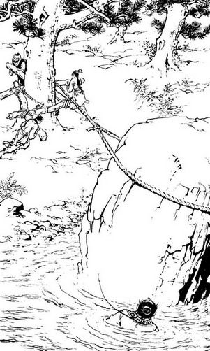
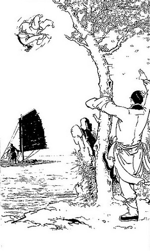
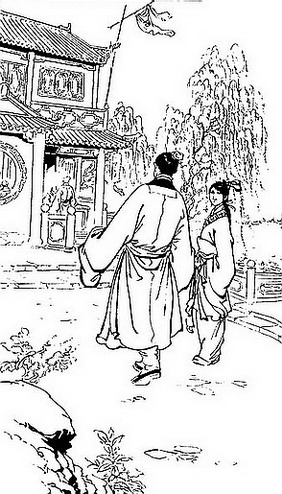
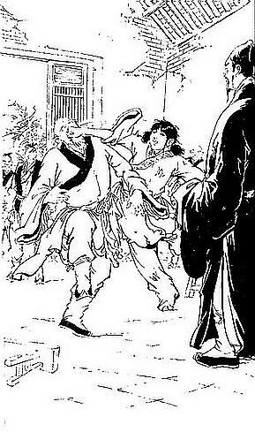
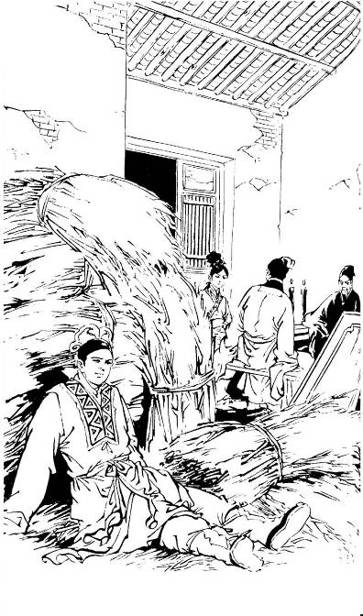
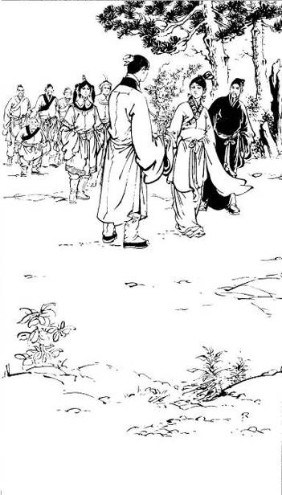
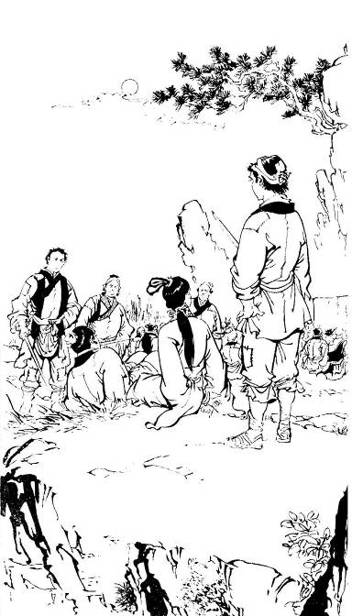
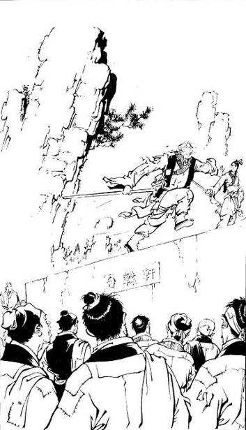
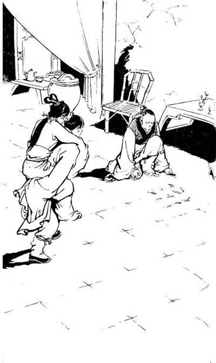
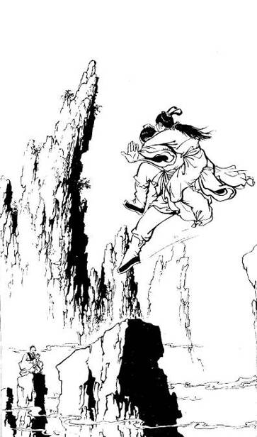

# Chapter 21 – The Thousand-catty Rock

Translated by Hugh (aka IcyFox)

> They acted together and used the oak tree as the pivot to pull the
crisscross shaped rope formation. The rope became taut and the rock was
lifted slowly. The Sun was about to set and the sky was red,
illuminating the surface of the water. The tide had already gone out and
Ouyang Ke's body was in the mud with his eyes fixed onto the rock. It
moved slowly and steadily with a creaking sound, causing him to be
anxious yet happy.

Ouyang Feng felt his surroundings becoming hotter and the deck of the
boat was shaking violently; he knew the boat would sink any moment. But
Hong Qigong was attacking more furiously and did not slacken his pace;
if he did not use his special skills now, he might not get out of this
contest alive. He pulled back his Snake Rod with his right hand and
kicked out viciously with his right leg.

Hong Qigong used his bamboo rod to chase the Snake Rod while using his
left hand to block the incoming kick. Ouyang Feng suddenly twisted his
arms and punched towards Hong Qigong’s ‘Right Sun’ Acupoint. This
‘Spirit Snake Fist’ was developed by Ouyang Feng’s own harsh training
and was meant for use during the second Mount Hua Tournament. He had not
yet used this snake-like boxing skill even after exchanging a thousand
strokes with Hong Qigong on Peach Blossom Island.

A snake seems to be boneless and can turn in all directions at will, so
the main point of this boxing skill is to be able to twist the arms
unpredictably, so that when the opponent blocks the fists, the attacker
would be able to throw a punch from an unexpected angle at close
proximity. Of course to expect the arms to move exactly like a snake
would be unreasonable but to the eyes of the opponent, the movements of
the arms greatly resemble the movements of snakes.

With Ouyang Feng executing such a strange move at this critical moment,
Hong Qigong should have found it hard to counter, and even if he wasn’t
injured, he would still be in danger. However Ouyang Ke had already used
the move against Guo Jing, and although he won, he actually gave Hong
Qigong a chance to spot a flaw in the move.

That day he did not attend the feast with Li Sheng and the group of
beggars but instead thought deeply on how to counter the move. Now that
Ouyang Feng finally used this move, he inwardly rejoiced; he extended
his fingers to form a claw and caught hold of his fist. His response was
perfect and he managed to swiftly and accurately counter this special
move of the ‘Spirit Snake Fist’.

It looked like it happened by chance, but in reality Hong Qigong had
pondered over it for many days and nights and followed it with long
hours of practice which finally allowed him to deal with the entire
‘Spirit Snake Fist’ move. Although it had not been perfected yet, it had
the element of surprise and managed to catch Ouyang Feng off guard.

Ouyang Feng had expected Hong Qigong to be greatly surprised and be
rendered helpless, allowing him to seize the opportunity and move in for
the kill. Unexpectedly it was he who ended up surprised and forced to
retreat several steps. Suddenly a mass of fire descended upon him,
immediately covering his body. Hong Qigong was also startled; he leapt
back and saw that it was actually a large sail which had caught fire and
fallen.

Normally with Ouyang Feng’s level of martial arts, even had that sail
fallen several times faster, it would not have hit him. But he had just
seen the ‘Spirit Snake Fist’, which he painstakingly created over many
years, unexpectedly and casually neutralized; he was stunned and he did
not even attempt to evade the burning sail. The sail, along with the
mast, weighed several hundred jin and Ouyang Feng was not able to lift
the sail even after jumping twice. Although he was in great danger, he
was still calm; he tried to raise the Snake Rod to lift the sail, but
the Snake Rod was pinned under the mast and could not be lifted. In his
heart he sighed, "Forget it! I’ll return to heaven today!" Suddenly he
felt the weight lifting and his head was no longer covered by the sail.
He saw that Hong Qigong had raised the anchor, hooked it onto the sail
and pulled the sail away. Hong Qigong did not want to see him being
burned alive so he went to save him.

By now Ouyang Feng’s clothes and brows were on fire and he immediately
rolled on the deck of the boat frantically attempting to put out the
fire. Unfortunately bad things do not come singly and the boat suddenly
lurched to one side, causing a huge chain to sweep right into him.

Hong Qigong shouted, “Ah!” and dashed forward to grab the chain. The
chain had been heated by the fire and caused a sizzling sound when it
came into contact with his hand, burning his palm. He quickly let it go
as he threw it into the sea. He was just about to jump from the boat
when he felt a slight numbness in his back. He stopped for a second and
a thought flashed through his mind, “I saved West Poison’s life, can it
be possible that he’s using his snake to poison me?” He turned around
and saw that it was indeed a snake and it had fresh blood in its mouth.
Enraged, he threw two palms towards Ouyang Feng. Ouyang Feng casually
stepped aside and Hong Qigong’s palms hit a mast, splitting it in two.

Ouyang Feng was happy that his sneak attack worked but when he saw Hong
Qigong lashing out crazily he became more serious and did not dare take
the blows head-on, avoiding them instead. Guo Jing shouted, “Master!
Climb aboard the small boat.” Hong Qigong suddenly felt dizzy and
staggered.

Ouyang Feng charged forward and struck out with his palms which landed
on Hong Qigong’s back. Ouyang Feng’s lethal snake poison was unmatched,
but fortunately he already used up most of the poison when he made the
bet with Zhou Botong days ago, so today the poison was not as lethal.
When Hong Qigong was bitten, he was not severely poisoned and because of
his high internal energy, the poison took some time to take effect. When
he was hit by Ouyang Feng he was in a daze and he did not circulate his
qi to protect himself. The blow caused him to throw up blood and
collapse.

Since Hong Qigong was very highly-skilled, Ouyang Feng knew that this
blow would not kill him; when he recovered some time later, Ouyang Feng
would be in trouble. He jumped over and raised his foot to strike his
chest. Guo Jing had just climbed aboard from the small boat and saw that
the situation was very urgent and he might not be able to save Hong
Qigong in time. So he struck out with both palms using the ‘Twin Dragons
Fetch Water’ stance to attack Ouyang Feng’s waist.

Although Ouyang Feng knew his martial arts were not weak, he did not
think very highly of him and used his left hand to block the strike
while his right foot slammed down. Guo Jing was shocked and did not care
about his own safety; he jumped forward to clutch Ouyang Feng’s head. By
doing this he left his acupoints exposed and his side was swept at by
Ouyang Feng.

Although this counterattack was not very forceful, every one of his
strikes was enough to kill his opponent. If not for Guo Jing’s good
internal strength, he would have suffered serious injuries. He felt a
sharp pain followed by numbness in half his body, but he continued to
cling tenaciously to Ouyang Feng’s head.

Ouyang Feng assumed that with his vicious strike, his opponent would
retreat, but he did not expect the dumb kid to use a move that could get
both of them injured. He had to retract the foot which was halfway to
Hong Qigong in order to twist his body around to attack Guo Jing. In
such close proximity, he could not execute any of his refined ‘Snake’
moves.

Whenever highly-skilled martial artists fight, they will not allow their
opponent to get close to them even if they were targeting acupoints.
There was hardly any close-contact grappling involved. When it came to
advanced martial arts, there were no moves for scuffling.

Ouyang Feng felt his throat being gripped forcefully by Guo Jing and he
struck out backwards, but Guo Jing managed to avoid the blows. It was
becoming harder for him to breathe and he felt the grip was becoming
tighter, so he jabbed his elbow backwards. Guo Jing evaded to the right
and had to let go with his left hand, but at the same time used his legs
to execute a Mongolian wrestling technique while his left hand slipped
past Ouyang Feng’s shoulder.

He slammed down forcefully on Ouyang Feng’s back, causing Ouyang Feng to
suffer intense pain even with his high level martial arts. This
technique was called the ‘Camel’s Pull’, and it was so effective that
only a wrestling expert could deal with it. Ouyang Feng did not know
wrestling, so he suffered the full extent of the strike.

Guo Jing was happy and his right hand released its grip and slipped
upwards behind Ouyang Feng’s back. With a loud yell he pressed both
palms down. In Mongolian wrestling this move was called the ‘Mountain
Breaking Move’ and was used when the opponent had fallen, so that no
matter how strong his shoulders were or how good his wrestling
techniques were, there would be nothing much he could do as his shoulder
would break if he tried to move.

However Ouyang Feng’s martial arts were much better than the Mongolian
wrestlers, so even with such a disadvantage he still managed to think of
a way to turn defeat into victory. When Guo Jing’s hands came down, he
used his qinggong \[lightness kungfu\] to duck aside and rolled away
under Guo Jing’s waist.

With his status as a highly skilled martial arts master, rolling under a
junior’s waist was a great disgrace, but that did not bother him. He
broke free from the ‘Mountain Breaking Move’ and immediately threw his
fists at Guo Jing’s back to counterattack. He did not expect that before
his fists reached Guo Jing, his left leg was immobilized. Guo Jing knew
he was no match for his opponent, but in a close-combat situation and
with his wrestling background, coupled with the fact that he had no
regard for his own safety, Ouyang Feng could not get closer to his
master to injure him further. At this point the fire became fiercer and
the planks twisted, causing them to lose their balance, fall and their
clothes to catch fire.

Huang Rong was worried sick and anxious as she saw Hong Qigong’s
motionless body slumped at the side of the boat; she could not tell if
he was dead or alive. Meanwhile Guo Jing and Ouyang Feng were still
rolling and struggling without showing any signs of stopping. Their
clothes were on fire and the situation was getting dangerous, so she
lifted the oar and swung it at Ouyang Ke’s head. Although his right arm
was broken, his martial arts were still good enough for him to evade the
oar and stretch out his left hand to grab Huang Rong’s bracelet. Huang
Rong stomped her feet fiercely and the small boat almost capsized.
Ouyang Ke could not swim and he was about to fall overboard, so he had
to let go of Huang Rong. When the boat stabilized, Huang Rong took the
opportunity to jump into the sea.

She swam quickly towards the big boat. The boat was already half
submerged and the deck was almost touching the water’s surface. Huang
Rong climbed aboard to help Guo Jing and took out the ‘Emei Sting’ from
her waist. \[The Emei Sting is a spike-like weapon which is pointed on
each end and has a finger-ring in the middle\] Guo Jing and Ouyang Feng
were locked in a bundle and rolling about. Ouyang Feng’s martial arts
were better and he managed to pin Guo Jing beneath him, but Guo Jing
tenaciously held on to his shoulders, preventing him from
counterattacking. Huang Rong fought through the smoke, went up to Ouyang
Feng, and pierced his back with the spike.

Ouyang Feng was struggling madly with Guo Jing, but when he felt the
prick, he was surprised and twisted around forcefully, causing Guo Jing
to land on top. Huang Rong now wanted to poke Ouyang Feng’s head with
the spike, but Ouyang Feng’s agility allowed him to evade her attacks
and she ended up jabbing the spike into the deck.

A gust of wind blew some thick black smoke her way causing her eyes to
burn. Just as she was about to rub her eyes she suddenly felt a pain in
her leg and fell. Ouyang Feng had kicked her. Huang Rong rolled over and
jumped up, but her hair caught fire. She was about to attack him again
when Guo Jing shouted, “Save Master first!” Huang Rong silently agreed
and ran towards Hong Qigong, grabbed him and jumped into the sea,
extinguishing the flames on her body.

Huang Rong placed Hong Qigong on her back, kicked her legs in the water,
and swam to the small boat. Ouyang Ke stood at the side of the boat and
raised the oar high, shouting, “Put the old beggar down; I’ll only let
you alone board!” Huang Rong said, “Fine! Let’s meet in the water!” She
shook the boat violently. The boat rocked and seemed about to capsize.
Ouyang Ke became frantic and gripped the side of the boat tightly,
saying, “Don’t… don’t shake it, the boat is going to overturn!”

Huang Rong laughed as she said, “Pull my master up quickly. And watch
out…if you try any tricks, I’ll dump you in the water for six hours.”
Ouyang Ke had no choice but to comply and took hold of Hong Qigong,
pulling him onboard.

Huang Rong smiled and praised him, “Since I first met you, this is the
first good deed you’ve done.” Ouyang Ke’s heart stirred and he wanted to
speak, but could not open his mouth. Huang Rong was about to swim back
to the large boat to help out in the fight when she suddenly heard a
thunderous rumble – a huge wall of water loomed over her head.

She was shocked and quickly held her breath, waiting for the water to
hit the boat, but when she looked again her jaw dropped. A whirlpool had
formed on the surface of the sea and the burning boat had disappeared
together with Guo Jing and Ouyang Feng.

At this moment, her mind went completely blank and she could not feel or
think of anything. She’d become completely lost, not knowing where she
was. Suddenly, salty water filled her mouth and she found herself
sinking. She jerked and her senses awoke as she swam upwards. When she
broke the surface, all she could see in any direction was the small
boat; everything else had disappeared under the waves. Huang Rong dived
under the water again and struggled to go deeper. Her swimming skills
were fantastic and her strokes were powerful, but she could only swim
along with the current. She covered the entire area searching for Guo
Jing but he had disappeared without a trace. Even Ouyang Feng could not
be found – it seemed they had gone down with the boat.

After some time, she was completely exhausted, but she refused to give
up, and swam about wildly. She could only hope Heaven would be merciful
and let her bump into Guo Jing, but she was surrounded by mountainous
waves and there was no trace of him. She had been swimming for over an
hour now and could not continue any longer, so she headed towards the
small boat, intending to rest for a while before resuming the search.

Ouyang Ke pulled her up. He knew that his uncle was missing and was
equally anxious, asking, “Have you seen my uncle?” Huang Rong was too
exhausted and she suddenly saw everything go black as she fainted. After
some time she slowly regained consciousness but felt like her body was
afloat, as though she was floating among the clouds while the sounds of
the winds and waves beat against her ears. She sat upright and realized
that the boat was just following the currents.

By now they did not know how far they were from the sunken boat and Guo
Jing could not be found. Huang Rong felt great sadness and fainted
again. Ouyang Ke could only grip the sides of the small boat tightly as
he feared that the next wave would send him tumbling out of the boat
into the water.

After another hour, Huang Rong awoke again and thought that since her
Jing ge ge was at the bottom of the sea, it was meaningless for her to
live on. When she saw Ouyang Ke’s twitching eyes and his pale lips, she
felt disgusted and thought, “How can I possibly die together with this
beast?” She stood up and snapped, “Jump overboard!” Ouyang Ke was
shocked and exclaimed, “What?” Huang Rong said, “You’re not jumping? Let
me capsize the boat then we shall speak again.”

She jumped towards the right, causing a reaction which resulted in the
boat springing to the left. She then jumped towards the left, and the
boat rocked even more violently. When she heard Ouyang Ke’s frantic
shouting, her sadness became joy and she jumped again.

Ouyang Ke knew that if she jumped a few more times, the boat would
definitely capsize. When he saw her jump again, he quickly jumped to the
other side. They landed exactly at the same time and their forces
cancelled out, causing the boat to momentarily dip deeper into the
water.

Huang Rong repeated this trick twice, but he managed to stop her. Huang
Rong said, “Good! I’ll make a hole in the boat and see what you can do
then.” She took out the steel spike and jumped to the middle of the
boat, but then she saw Hong Qigong lying motionless in the bottom of the
boat. She realized that she had completely forgotten about her master as
she yearned for Guo Jing. She hurriedly bent down to place a finger by
his nose and she felt his faint breathing. She was relieved and
supported Hong Qigong in her arms. His eyes were tightly closed, his
face was white as sheet, and his pulse was weak. Huang Rong became
worried about her master and no longer worried about Ouyang Ke, so she
loosened his shirt to check his injury.

Suddenly the boat trembled violently and Ouyang Ke shouted excitedly,
“Land ahead…land ahead!” Huang Rong lifted her head and saw a dense
cluster of trees in the distance. The boat had now stopped moving since
it was grounded on a reef.

They were still some distance from shore but they could see the sea bed;
the depth was only waist-high. Ouyang Ke jumped into the water and ran a
few steps forward before turning back to look at Huang Rong, then he
headed back. Huang Rong saw that Hong Qigong’s shoulder had a black
handprint which seemed to be quite deep and she could not help but
think, “How could Western Poison’s palm strike be so powerful?”

Then she noticed two fine teeth marks on his shoulder. If she had not
looked carefully, she would have missed them. She pressed them lightly
with her fingers and suddenly felt a sharp pain in her hand, so she
hastily withdrew them and asked, “Master! How are you now?” Hong Qigong
moaned but did not answer her. Huang Rong said to Ouyang Ke, “Give me
the medicine.”

Ouyang Ke threw up his hands impatiently and said, “The antidote is with
my uncle.” Huang Rong said, “I don’t believe it.” Ouyang Ke said,
“Search me.” He undid his outer gown and emptied his stuff onto his
hand. Huang Rong saw that there was indeed no medicine and said, “Help
me get Master ashore!”

Each took one of Hong Qigong’s arms and placed it over their shoulders.
Huang Rong held Ouyang Ke’s hand, allowing Hong Qigong to sit on their
forearms. Then they proceeded to the shore. Huang Rong felt her master
shivering continuously and was extremely worried. Ouyang Ke, on the
other hand, was rather pleased since he was only aware of the warm and
smooth hand holding his, something he could only dream of before.
Unfortunately for him, it was not long before they reached the shore.

Huang Rong crouched and lowered Hong Qigong to the ground and said,
“Quick, get the boat ashore, don’t let the tide sweep it out to sea.”
Ouyang Ke released her hand and stared blankly, only vaguely hearing
Huang Rong’s voice but not paying attention to what she was saying.
Luckily Huang Rong did not know what he was thinking and stared at him
while repeating what she’d said. Ouyang Ke then dragged the boat ashore
and saw that Huang Rong had rolled Hong Qigong over, letting him lie on
the grass so that she could give him first aid. Then he thought, “Where
on Earth are we?”

He ran up a small hill, looked around, and could not help but be
surprised and extremely pleased. In every direction was the vast sea;
they were on a remote island. The island was filled with lush greenery
but there were no signs of human life. He was surprised that there were
no signs of food or accommodation; how would they survive? On the other
hand, he was pleased because it seemed as though he was fated to be on
this deserted island with that angel-like beauty. With the old beggar
seriously injured, he would not bother them. He thought, “With her here,
this god-forsaken island is like a paradise; even if I die, I will die
happy.”

When he thought of this he unconsciously spread his arms, but suddenly
felt a sharp pain in his right arm which reminded him that it was
broken. He broke off two branches, tore a strip of cloth and tied his
arm to the makeshift splint. Huang Rong was at that time trying to suck
out the poison from her master’s back. She did not know how else she
could help him so she let him lie down on a rock in a cave and shouted
to Ouyang Ke, “Go look around and see if there’s an inn around here.”

Ouyang Ke laughed, “This is an island and there’s absolutely no inn
here. Let’s see if we’re lucky enough to find anyone else here.” Huang
Rong was slightly shocked and said, “You do that.” When Ouyang Ke heard
her instructions he was very excited and utilized his qinggong running
to the east; but all he saw were more trees and no traces of human
beings. Along the way he killed two wild hares and then headed north
before making his way back in a loop. He told Huang Rong, “It’s a
deserted island.”

That night Huang Rong did not dare sleep for fear of Ouyang Ke attacking
them and also because of her anxiety for Hong Qigong. It was only at
dawn the following morning that she caught a few hours of sleep. In her
sleep she dreamed that Hong Qigong called her several times and she was
jolted awake and asked, “Master, how are you?” Hong Qigong pointed at
his mouth and moved his jaws. Huang Rong laughed and took some of the
unfinished rabbit meat from the previous night and fed him.

Once he’d consumed the meat, he felt the Qi stirring within him and he
sat upright in order to breathe properly. Huang Rong did not dare utter
a word and only scrutinized his expression. But she watched the reddish
tint of his face turn pale, then red again. This cycle repeated several
times and soon his head was emitting a steamy mist and sweat fell like
rain as his body shivered violently. Suddenly there was the flicker of a
shadow… Ouyang Ke was trying to come into the cave.

Huang Rong knew that her master was attempting to treat his own
injuries, which was a life-and-death situation; if he forced his way in
and distracted her master, nothing would save him. She softly snapped,
“Get out now!” Ouyang Ke laughed, “Let’s discuss how we can survive on
this deserted island. The days will get longer from now on, you know!”
Hong Qigong blinked and asked, “Is this really a deserted island?” Huang
Rong said, “Master, please concentrate, ignore him.” She turned to
Ouyang Ke and said, “Come, let’s talk outside.” Ouyang Ke was elated and
followed her out of the cave.

The weather was good this day, but Huang Rong only saw the edge of the
vast sea meeting the sky; apart from a few clouds, there was nothing
else. She walked to their landing site and was shocked, and asked,
“Where’s the boat?” Ouyang Ke said, “Huh, where is it? It must have been
swept away by the currents! Ah, damn it!”

Huang Rong saw his expression and deduced that it was he who pushed the
boat out to sea so that she could not get away from here. She felt that
this was absolutely despicable. Since Guo Jing’s apparent death, she had
no intention of living. Besides, the small boat would not be able to
make it through the fierce waves which made the situation bleak. In any
case she would not be able to get her master to safety. She stared at
Ouyang Ke without showing any change in expression. In her heart she was
actually thinking of how she could kill him and save her master at the
same time. Huang Rong jumped onto a large rock and looked into the
distance. Ouyang Ke thought, “If I don’t use this chance to get close to
her, then when can I?” He also leapt up on the rock and waited for her
to sit down. After some time, when she did not appear angry and did not
shift her position, he moved closer and said, “Little sister, the two of
us can live here until we’re old and live like the deities. I must have
done something wonderful in my past life to deserve this!”

Huang Rong laughed and said, “This island only has the three of us,
including Master, wouldn’t we be lonely?” Ouyang Ke thought her tone
sounded harmless and was ecstatic, saying, “With me by your side, why
would it be lonely? Moreover, when we have children in the future, it
will be even less so.” Huang Rong laughed, “Who will have the children?
I won’t.” Ouyang Ke laughed, “I’ll help you.” After saying that, he
reached out his hand to take hold of hers. Then he felt warmth in his
palm and realized that Huang Rong already held his hand. Ouyang Ke’s
heart beat madly.

Huang Rong slowly moved her hand up his arm, then said in a low voice,
“Sister Mu Nianci’s chastity was destroyed by you, was it not?” Ouyang
Ke laughed as he said, “That girl did not want to submit to me. What
kind of man would I be to force her?” Huang Rong said, “So, it must be
others who slander her. Her lover had a big quarrel with her because of
it.” Ouyang Ke said, “Her reputation suffered because of that, what a
pity!”

Huang Rong suddenly pointed to the sea and shouted, “Ah, what is that!”
Ouyang Ke looked in that direction and was about to ask where when he
suddenly felt his wrist stiffen in her firm grip and his body went numb
and he could not move. Huang Rong drew her spike and thrust it towards
his abdomen. The distance between them was extremely small and Ouyang Ke
was in a state of confusion, coupled with the fact that his arm was
immobilized, how could he block it? But all of his training under expert
guidance at White Camel Mountain had not been wasted; he suddenly
twisted his body and in a split second used his chest to thrust towards
Huang Rong’s back. Huang Rong evaded him and jumped off the rock,
causing the spike to gash his leg and resulting in a deep wound that was
almost a foot long.

Ouyang Ke jumped off too and saw her spike. He stood there and grinned,
but then he felt terrible pain. He bent over and saw his gown stained
with blood and realized that although he barely escaped with his life,
he was severely injured. Huang Rong said, “We were talking nicely, so
why did you try to bump into me for no reason? I can’t be bothered with
you now.” Then she turned and left. Ouyang Ke was filled with love and
hatred, shock and joy, as he stood there in silence.

As Huang Rong walked back to the cave she blamed her poor skills for
wasting such a good opportunity and letting him escape. When she went
inside she saw Hong Qigong asleep and a pool of black blood on the cave
floor. Startled, she asked, “Master, how are you? Are you better?” Hong
Qigong said, “I want wine.” Huang Rong was distressed because she did
not know where to find wine on this deserted island. Yet she agreed and
said, “I’ll try to get some. Master, your injury isn’t serious, right?”
Tears fell as she said that.

Despite having gone through so much, she had not cried. Now that the
tears had started she could not control herself, so she buried her head
on Hong Qigong’s chest and cried her heart out. Hong Qigong stroked her
hair and patted her back, trying to console her. The old beggar had
roamed Jianghu for many decades but had never had to deal with a crying
girl before; he did not know what to do. He could only say, “Good girl,
don’t cry, Master’s here for you. Please don’t cry. I don’t want the
wine anymore.”

Huang Rong stopped crying after a while and lifted her head. When she
saw that Hong Qigong’s clothes were wet with her tears, she smiled and
said, “I didn’t manage to kill that evil jerk, what a pity!” She then
told the whole story to him. Hong Qigong was silent for a moment before
saying, “Master is useless now and that ‘jerk’ is better than you in
martial arts. For now you can only pit your wits against him.” Huang
Rong said, “Master, after resting a few days, you’ll recover and take
his useless life with one palm, won’t that settle it?”

Hong Qigong regretfully said, “I’ve been poisoned by the poisonous snake
as well as Western Poison’s deadly palm. I’ve already used all of my
martial abilities to purge the poison but there is some left within me.
Even if I survive, my martial arts will be affected. Your master is just
another old man without any powerful skills.” Huang Rong quickly said,
“No, no, Master, you aren’t, you aren’t!” Hong Qigong said, “I, the old
beggar, have never taken things seriously, but now it has come to this
and I can’t deny it.”

He paused, and then gravely said, “Child, Master has no choice but to
request a huge favour from you… it’s extremely difficult to accomplish…
will you accept?” Huang Rong quickly said, “Yes, yes! Master, tell me.”
He sighed, and then said, “Our time together as master and disciple has
not been long and I didn’t get to teach you very much martial arts. Now
that you’re facing a strong opponent, I have no choice but to thrust a
great burden on you, or I will not be at ease.”

Huang Rong knew that he was usually carefree and easygoing; but now he
was so hesitant that she knew it must be some extremely important
responsibility. She said, “Master, please tell me. Your injuries were
caused by you trying to help your disciple escape from Peach Blossom
Island. Even if I die a horrible death, I can hardly repay you. I’m just
afraid I’m too young to carry out your instructions.” Hong Qigong
happily said, “So you agree to it?” Huang Rong said, “Yes. Please say
it.”

Hong Qigong stood up unsteadily, cupped his hands, and bowing to the
north said, “Ancestors, the Beggar Clan you founded passed to my hands.
I am now unfortunately incapable of bringing virtue to our clan. Today
the matter is urgent and I have to pass on my responsibilities. May the
Ancestors in Heaven bless us, help this child avoid trouble and bring
our clan to greater heights.” When he finished, he bowed to the north
once more. Huang Rong was both shocked and curious when he said that.

Hong Qigong said, “Child, kneel down.” Huang Rong knelt down and Hong
Qigong took his green bamboo stick and raised it over his head. He
saluted it and placed it in her hands. Huang Rong was extremely shocked
and said, “Master, you want me to be the Beggar Clan… the Beggar
Clans’…” Hong Qigong said, “Exactly. I am the eighteenth generation
Leader of the Beggar Clan, and now you are the nineteenth Leader. Now
let’s thank our ancestors.”

At this stage Huang Rong did not dare to disobey and could only imitate
Hong Qigong’s actions and bowed with both hands cupped. Hong Qigong
suddenly coughed and spat out some phlegm which landed on Huang Rong’s
clothing. Huang Rong was secretly sad and thought, “Master’s injuries
are indeed serious… he doesn’t even have the strength to spit properly.”
However she pretended that nothing was amiss. He sighed, “When the
Beggars pay their respects to you in future, there will be a disgusting
ritual. Ah, this will be hard on you.”

Huang Rong smiled, thinking, “The beggars are filthy and rough, how
could any of that be unexpected?” Hong Qigong drew a deep breath. His
face was pale but in his heart it felt as though he had just put down a
large rock and he was very pleased. Huang Rong helped him lie down. He
said, “Now that you’re the Leader, I am an Elder in the Clan. Although
the Elders are respected by the Leader, when there’s something to be
done the Leader has to give the order. This rule was laid down by our
founders, so you must follow it to the letter. When the Leader issues an
order, all the beggars must obey it.”

Huang Rong became depressed and worried, thinking, “We’re on this
deserted island and I don’t know how we can return to the Central
Plains. Moreover Jing ge ge is dead and I have no desire to live. Now
Master suddenly wants me to be some so-called Clan Leader and command
all the beggars under the sky; how on Earth am I going to do that?” But
when she saw her master’s condition, she did not want to worry him
further and could only agree to anything he proposed.

Hong Qigong said, “On the fifteenth day of the seventh month of this
year, the four Elders of our Clan will hold a gathering at the lakeside
Cave-Courtyard in Yueyang City and hear my announcement of the new
Leader. You only need to take the bamboo rod there and they will
understand my intentions. Every matter within the Clan will be dealt
with by the four Elders, so I can leave it to them. But I have to send
you, such an adorable child, into the midst of the filthy beggars; this
will be really hard on you.”

Then he laughed heartily, but because of his injury he began to cough
before he finished laughing. Huang Rong massaged his back for a while
until he stopped coughing. Hong Qigong sighed, “This old beggar is
really useless now, ah, I don’t know when I’ll recover. I have to rush
into teaching you the ‘Dog Beating Skill’.” Huang Rong was wondering why
this stick skill had such a horrible name. She thought that no matter
how fierce a dog might be, she could kill it with one punch. She saw no
need to learn this skill, but her master was deadly serious, so she
could only agree.

Hong Qigong said, “Although you are now the Clan Leader, you don’t have
to change your personality; if you want to be playful and mischievous,
go ahead and be so. We beggars have no restrictions and we do as we
please. If we worried that ‘this won’t do and that won’t do’, we might
as well be judges or ministers. If you do not think highly of the ‘Dog
Beating Skill’, simply say so!”

Huang Rong laughed, “Disciple is wondering what kind of dog could be so
tenacious that it requires a specialized skill to handle it.” Hong
Qigong said, “Now that you’re the head of all the beggars, you’ll have
to act like one. With your rich dress and your rich girl’s attitude, the
dog would be only too pleased to listen to you; why would you need to
hit it? But if we beggars run into such dogs it’s a different story. The
old saying goes: ‘the poor not armed with sticks get bullied by dogs’.
You have never been poor so you don’t know what it’s like to be one of
them.”

Huang Rong clapped and laughed, “Master, you’re wrong there!” Hong
Qigong was perplexed and asked, “Why?” Huang Rong said, “On the third
month of this year, I escaped from Peach Blossom Island to play around,
and I disguised myself as a beggar. Whenever there were fierce dogs
bothering me, all I had to do is give them a kick and they would
scramble away.” Hong Qigong said, “Yup, but if the dog is too fierce
then you’d have to use a stick to hit it.”

Huang Rong thought, “What dog could be so fierce?” Then she realized
what he meant and shouted, “Oh yeah, bad guys are dogs too!” Hong Qigong
smiled and said, “You’re really clever. If…” He wanted to say that Guo
Jing would not have known it, but his heart turned sour and he stopped.

When Huang Rong heard him stop in mid-sentence, she understood what he
was thinking, felt bitterness in her heart and wanted to cry; but now
that Hong Qigong needed her help she seemed all grown-up while Hong
Qigong seemed like a youth, so she controlled herself and only turned
her head away. The tears, however, fell like pearls.

Hong Qigong was as sad as her and he knew that consoling her was
useless, so he talked about serious matters, saying, “The thirty-six
moves of the ‘Dog Beating Skill’ was created by our Ancestors and can
only be passed down from one Clan Leader to the next without letting
anyone else know about the skill. Our Clan’s third Leader far surpassed
previous Leaders and he greatly improved this skill. After hundreds of
years, when our Clan faces any strong opposition, our Leader would
personally come forward and use this skill to defeat our enemies.”

Huang Rong began to pay attention and then sighed softly, asking,
“Master, when you were fighting with Western Poison on the boat, why
didn’t you use it?” Hong Qigong said, “This skill is very important to
our clan, so even though I didn’t use it, he may not have won. Who’d
know he could be so despicable as to poison me after I saved his life?”
Huang Rong saw that he was becoming depressed, so she tried to distract
him and said, “Master, please teach me so that I can kill him to avenge
you.”

With a stony-faced laugh Hong Qigong picked up a piece of firewood and
leaned against the cave wall. He recited the formula and executed the
steps, thus passing on all thirty-six moves to her. He knew Huang Rong
was extremely intelligent but was afraid that he would not live long, so
he passed everything on to her in one shot. Although the name ‘Dog
Beating Skill’ was crude, the changes within were subtle and the
techniques profound; it was one of the best martial arts skills ever
created. It was therefore the reason that this skill was passed down
like a precious heirloom.

Although Huang Rong was very clever, she could only remember the general
skills and forgot some of the finer details. How could she understand it
in such a short time? After he was done, a sweating Hong Qigong took a
deep breath and said, “I didn’t teach it well, but… that’s all I can do
for now.” With a groan he collapsed and fainted. Huang Rong was shocked
and shouted, “Master…master!” She hurriedly supported him but noticed
his limbs were cold and his breathing was weak; he seemed almost beyond
hope.

Huang Rong had been severely tried for the past few days but now she
could not cry. She listened to his heart beat and found it barely
audible so she quickly massaged his chest to aid his breathing. Just at
this critical moment she heard noises behind her and a hand reached out
to take her wrist. She was concentrating fully on saving her master and
did not even notice when Ouyang Ke entered the cave. Now she ignored the
fact that the person behind her was a vicious wolf and quietly said,
“Master may not make it; think of something to save him.”

When Ouyang Ke heard her plead so sincerely, saw the tears welling up in
her eyes and her face looking pitiful, his heart quivered. When he bent
down to look at Hong Qigong, he saw that his face was white as sheet and
his eyes were rolled up; he felt happier. The distance between Huang
Rong and himself was less than half a zhang and he could even feel her
breathing and smell her fragrance. A few strands of hair caressed her
face and his heart thumped madly until he could no longer restrain
himself and he grabbed her by her waist.

Huang Rong was taken aback, struck out with force and took the chance to
jump away when he evaded her blow. Ouyang Ke had been afraid of Hong
Qigong so he did not dare be disrespectful to Huang Rong; now he saw
that Hong Qigong was half dead, so he did not worry any longer and
laughed, “Good girl, I normally don’t bother about other girls, but for
a beauty such as yourself, I’ll make an exception; come kiss me.”

Then he moved menacingly towards her. Huang Rong was frightened out of
her wits and thought, “This is a terrible situation. Looks like I’ll be
killed here, with some indignities.” She took out her needles. Ouyang Ke
smiled, used his outer gown as a weapon and even advanced another two
steps. Huang Rong waited for him to advance another step before
crouching low and dodging to the left.

Ouyang Ke followed her and Huang Rong waved her hand. He waved his long
sleeve and blocked the spike. Huang Rong knew that she was like an arrow
away from the bow and anxiously tried to run out of the cave. Ouyang Ke
was faster. Huang Rong heard the wind behind her back and knew he was
attacking her. She was wearing the soft armour so she was not afraid of
that and furthermore she was prepared to die, but she wanted to injure
him first, so she did not defend herself and even sent a strike towards
his chest.

Ouyang Ke did not intend to injure her and his strike was only meant to
tire her out, so he quickly struck towards her wrist, neutralizing her
move. At the same time, he jumped to the cave entrance, effectively
trapping her inside. But the entrance was narrow and he could barely
turn around, so with Huang Rong’s fierce onslaught coupled with her
indifference to defense, her power seemed to have increased
tremendously. Although Ouyang Ke was better than her, he did not want to
injure her, so he was at a disadvantage.

In a brief moment they had exchanged fifty or sixty moves and Huang Rong
was in danger. Her martial arts had been taught to her by her father
while Ouyang Ke’s were taught by his uncle. Huang Yaoshi’s and Ouyang
Feng’s martial arts were about the same level, but Huang Rong was only
around fifteen while Ouyang Ke was almost thirty, so the difference in
their martial arts was almost twenty years’ worth of training. Moreover
Huang Rong was not as hard working as Ouyang Ke and although she learned
some skills from Hong Qigong, she’d hardly practiced them. At this time,
even with Ouyang Ke’s injuries, she was still unable to gain an
advantage.

Suddenly Huang Rong launched herself forward and sent her spike towards
him with a backstroke. Ouyang Ke blocked it and Huang Rong followed up
closely with a fierce stab towards his right shoulder. His right arm was
broken and in a splint so he could not exert any strength there. He
tried to use his left hand to intercept that move, but the spike made a
semi-circle, changed directions midway, and stabbed into his right
shoulder. Huang Rong was elated, only to feel her hand suddenly go numb
and had to drop the spike because her wrist’s acupoint had been hit.

Ouyang Ke was swift and agile; seeing that she was about to escape, he
hit her ‘Xuan Zhong’ and ‘Zhong Tou’ acupoints consecutively with his
legs. Huang Rong was in midair when she was struck and she fell towards
the ground. Ouyang Ke moved forward and threw his outer gown on the
ground, laughing, “Ah, don’t hurt yourself.” Huang Rong spun the spike
around and tried to jump up but her legs were numb and she only managed
to get a foot off the ground before falling again.

Ouyang Ke came to help her up. Huang Rong used her only non-immobilized
arm and punched him. But in the confusion, her punch lacked strength and
Ouyang Ke laughed as he sealed her last acupoint. This time Huang Rong
was totally immobilized and she inwardly regretted, “Why did I did not
stab myself just now? Now I can’t even beg for death.” She was on fire
inside and everything went dark as she fainted. Ouyang Ke smoothly
consoled her, saying, “Don’t be afraid!” He stretched his arm out to hug
her. Suddenly he heard a cold voice above his head, saying, “Do you wish
to live or die?”

Ouyang Ke was shocked, twisted his head around and saw Hong Qigong
standing at the entrance looking at him with a side ways glance from his
eyes. He once heard his uncle mention the incident where Wang Chongyang
jumped out of his coffin and nearly killed him, so he immediately
thought, “The old beggar pretended to be dead and now I’m dead!” He’d
tasted Hong Qigong’s skills before and knew he did not even come close,
so in shock he knelt down and said, “I was just playing with Miss Huang.
Uncle Hong, please don’t be angry.”

Hong Qigong spat and shouted, “Scoundrel, aren’t you going to unseal her
acupoints or do you need me to do it?” Ouyang Ke agreed repeatedly and
hurriedly unblocked her acupoints. Hong Qigong said coldly, “Enter the
cave again and I’ll show no mercy. Scram!” Ouyang Ke darted out like a
rabbit.

Huang Rong awoke as though from a dream. Hong Qigong could not hold on
any longer and collapsed. Huang Rong was shocked and agitated and
quickly held him up. She noticed his mouth filled with blood and three
teeth fell out. Huang Rong was very sad as she thought, “Even with
Master’s wonderful abilities, such a fall actually broke his teeth.”

Hong Qigong took his teeth and laughed, “Teeth ah teeth, you don’t want
to savor exquisite food with me anymore. I never expected you to leave
before I did!” He was actually in very bad shape from the snake poison
in his body and a palm strike by Ouyang Feng which almost shattered his
spine. Because of his high skills, he was fortunately spared from death,
but he was as weak as someone without martial arts.

When Huang Rong’s acupoints were blocked, Hong Qigong actually did not
have the strength to unblock them for her and had to use his reputation
to frighten Ouyang Ke into doing it for him. He saw Huang Rong’s grave
expression and said, “Don’t worry. With this old beggar around, he
wouldn’t dare to disturb you.” Huang Rong asked, “When I’m inside the
cave that creep won’t show up, but what about food?” Though resourceful,
she was flustered now and could not think straight.

Hong Qigong asked, “You’re thinking of ways to obtain food right?” Huang
Rong nodded. Hong Qigong said, “Help me down to the beach to view the
sun.” Huang Rong complied immediately and said, “OK! Let’s go fishing.”
She let him lean on her shoulder and they walked slowly to the beach.

The weather was good on this day and the sea seemed endless, moving
gently in the sea breeze. As the sun shone on her, their spirits were
lifted. Ouyang Ke was also standing on the beach, but when he saw them
coming, he immediately retreated several zhang, then stopped to watch
them because they did not chase him.

They both worried, “This slimy creature is really hard to shake off; he
may discover our weakness sooner or later.” But right now they could not
care too much. Hong Qigong sat on a rock while Huang Rong broke off a
tree branch to use as a fishing rod. The fish population thrived around
this island because no one molested them, so within a short time she
caught three big fish.

Huang Rong used the same method she used to cook chicken to cook the
fish and they ate their fill. After resting for a while, Hong Qigong
asked Huang Rong to display the moves of the ‘Dog Beating Skill’ and
gave some pointers along the way. Huang Rong then understood more of the
finer profound changes of the skill. By the time evening came, she had
practiced until she was very hot, so she removed her outer coat and
jumped into the sea to bathe. Suddenly she had a thought, “I’ve heard
that the Dragon Palace at the bottom of the sea has a very beautiful
Dragon Princess; I wonder if Jing ge ge has gone to the Dragon Palace?”

As she dreamily kicked in the water she felt a sharp pain in her foot
and quickly retracted it; but felt as though it was being grabbed by
something and she could not get free. She’d played in the sea since
young and was not afraid of large clams; she was about to reach out her
hand to catch it and got a shock instead. The clam was almost as big as
a table; it was larger than any clam she had seen at Peach Blossom
Island. She stretched out both hands to pry it open.

The clam was incredibly strong and even with both hands she could not
force it open. The clam gripped her even tighter and her leg felt even
more painful. Huang Rong smacked through the water, hoping to yank it
out of the bottom but she had not expected it to feel like it weighed
around two or three hundred jin. The clam had been living on the seabed
for many years and had become part of the reef, how could it be easy to
move it?

Huang Rong struggled a while more but felt her foot become even more
painful; she was worried and gulped down two mouthfuls of water and
thought, “Although I have no wish to live, I cannot leave Master alone
here to be bullied by that scoundrel, I wouldn’t die in peace.” She
quickly grabbed a large stone and smashed it on the clam, but because
its shell was tough and she could not exert much strength through the
water, even though she hit it repeatedly, it did not budge.

As the clam was attacked it tightened its grip further and Huang Rong
swallowed water again; then she suddenly thought of something and
quickly put the stone down, grabbed a handful of sand, and threw it into
the open clam. The clam was indeed irritated by the sand and hurriedly
opened up, wanting to expel the sand. As soon as her leg was free, she
wasted no time swimming to the surface and sucked in some fresh air.

Hong Qigong noticed that she was submerged for such a long time and
became worried since he knew she must have met some trouble in the
water. Wanting to help her, he anxiously splashed around in the water
for a brief moment before he saw Huang Rong surface and hailed her in
his excitement. Huang Rong waved to her master and decided to dive
again. This time she was prepared and dived some distance away from the
giant clam and shook it, then used the reef as a pivot to lift it up.
She dragged the clam back to the shore. When the clam left the water, it
lost its buoyancy and became as heavy as a large rock. Huang Rong could
not move it further. Then she grabbed a large stone and struck the clam
to vent her anger. When she saw the deep wound the clam had inflicted on
her, she thought of her close brush with death and stopped hitting it.

On this night the two of them made the clam into a good meal and they
thought that it tasted really good. The next day when Hong Qigong awoke,
he felt that the great pain in his body was less intense. His stomach
felt really comfortable and he contentedly sighed.

Hong Qigong said, “After sleeping for a night, my injury seemed to have
improved by quite a bit.” Huang Rong was elated and exclaimed, “It must
be the clam meat which helped you.” Hong Qigong laughed, “The clam meat
didn’t help much, but because the food was delicious, it satisfied my
mouth. After that my recovery follows automatically by a small amount.”

Huang Rong giggled and rushed out to the beach to find the remains of
the clam meat. In her eagerness, she forgot about Ouyang Ke. Just as she
cut off two slices of meat, she suddenly saw a figure that was moving
closer to her. Huang Rong bent over and grabbed part of the clam’s
shell, threw it and jumped away at the same time, reaching the
shoreline.

After observing Hong Qigong from a distance for a day, Ouyang Ke was
becoming more suspicious since he could hardly walk, but he did not dare
go into the cave. Now he forced himself forward and said, “Sister, don’t
go, I want to talk to you.” Huang Rong said, “I’m ignoring you, yet you
disregard that…you’re really shameless.” She then made a face at him.

Ouyang Ke watched her childish behavior which caused his face to lose
color and his heart to itch; he advanced two steps and laughed, “It’s
your fault; it’s because you’re so beautiful that people can’t ignore
you.” Huang Rong laughed, “I said I’m ignoring you and I mean it. It’s
useless to sweet-talk me.” Ouyang Ke advanced yet another step and said,
“I don’t believe you.”

Huang Rong’s face became a shade darker and she said, “Move another step
forward and I’ll ask Master to club you.” Ouyang Ke said, “Forget it…can
he even walk? I’ll go in and carry him out, OK?” Huang Rong felt a jolt
inside and retreated two steps. Ouyang Ke grinned, “If you’d like to
jump into the sea then go ahead. I’ll wait here for you and we’ll see
who can last the longest.”

Huang Rong said, “Fine, you’re bullying me, so I’ll ignore you forever.”
She turned and ran, but tripped on a stone and fell down. Ouyang Ke sort
of expected this so he laughed, “You’re really mischievous and naughty,
but I love it.” He held his gown in his hand to catch any hidden needles
she might throw and walked towards her. Huang Rong shouted, “Don’t come
near!” She struggled to her feet but fell again after three steps.

This time her fall was more serious and half her body was in the sea;
she seemed to have fainted. Ouyang Ke thought, “This girl is very
crafty, I won’t fall for her tricks. With your skills, why did you fall
for no apparent reason?” He stood there and observed her. After some
time, he saw that she was still motionless and the tide was about to
engulf her whole body.

Ouyang Ke became worried and thought, “This time she really has fainted;
if I don’t save her she might drown.” He ran forward and tried to pull
her legs. When he tugged her legs, he got a shock because her body was
stiff, so he quickly lifted her up. Huang Rong suddenly hugged his legs
and called out, “Go down!” Ouyang Ke could not stand and the two went
into the water together.

In the water, despite his high skills, he could not use them and
thought, “Even with precautions, I fell for her trick; this time my life
is lost!” Huang Rong originally wanted to dunk his head in the water to
appease her anger. However as Ouyang Ke felt the water fill his mouth,
he could not feel where his body was and struggled wildly, wanting to
grab onto Huang Rong.  
However she had expected that and swam around him; how could he catch
her? In the struggle, Ouyang Ke swallowed a few mouthfuls of water and
his body sank deeper until his feet touched the seabed. Even though his
martial arts were good and he was quick-thinking, he was at a great
disadvantage in the water and could feel his body floating aimlessly. He
hurriedly grabbed a rock on the seabed and used his internal energy to
hold his breath while he looked around trying to find the direction to
the shore. But the water was murky and he could not tell east from west,
so he walked around for a few steps and decided that walking upwards was
a good idea. He hit rock and took large steps towards the shallower
area. With the reef on the seabed, movements were very difficult, so he
used his internal energy to dash across in one go. When Huang Rong saw
that he did not surface for some time, she quickly looked around and was
surprised to see him walking in the water. She swam behind him and used
her spike to thrust towards him.

Ouyang Ke felt the water flowing faster, so he quickly evaded and moved
even faster. Now he really felt the lack of air in his lungs and let go
of the large stone he was carrying trying to surface to breathe. When he
stuck his head out, he saw that he was already close to shore. Huang
Rong knew she could not stop him now so she sighed and dived again.
Ouyang Ke did not die but crawled onto the beach completely drenched and
his senses were dull. He threw up all the water he swallowed and felt
his body go weak as if he suffered from some great illness. He was very
angry and thought, “I’ll go kill that old beggar and see if that girl
listens to me then!”

Although he had these thoughts, he was still wary of Hong Qigong and
breathed deeply for a few moments to get rid of his fatigue. Then he
broke off a tree branch as a makeshift weapon and ran towards the cave.

He avoided going in directly and tried to slip in from the side. He
listened for a moment and did not pick up any movements in the room. He
looked in and saw Hong Qigong sitting on the ground, meditating. His
face showed no signs of any injury.

Ouyang Ke thought, “I’ll test him to see if he can move.” He said in a
loud voice, “Uncle Hong, this is bad…this is bad!” Hong Qigong opened
his eyes and asked, “What?” Ouyang Ke pretended to be in a state of
panic and said, “Sister Huang tried to catch a rabbit but fell into a
deep valley and is injured. She can’t climb out!”

Hong Qigong was shocked and said, “Then quickly save her!” Ouyang Ke was
excited and thought, “If he can walk, why doesn’t he come out and save
her?” He walked in and laughed, “She tried several ways and means to
take my life, why should I help her? You go save her.”

Hong Qigong observed his expression, knew that he was lying, and
thought, “This scum has discovered that I’ve lost my martial arts…I’m in
danger!” In this situation, he could only try to bring him down as well;
he secretly channeled all his strength to his arm, and waited for him to
come closer before he struck. However when he did that, he felt a sharp
pain near his heart and his body felt like it was about to come apart.
When he saw Ouyang Ke’s twisted smile, he let out a long sigh and waited
for death.

Huang Rong saw Ouyang Ke get to shore and got worried, thinking, “At
this point the scoundrel will be prepared for me; it will be harder to
scheme against him now.” She swam out a ways and headed left. After a
while she saw lush foliage and noticed that this beach was different.
She thought of Peach Blossom Island and became sad. Then she thought,
“If I can find a safe place here for us to hide for a while, that
scoundrel might not find us.” It was not a fantastic plan, but it was
better than their situation now and he might not actually find them,
giving her master time to recover. So she went ashore but she did not
dare explore too far inland since she was afraid of bumping into Ouyang
Ke. She stuck close to the seashore, thinking, “If I hadn’t been so
carefree in the past and had mastered Father’s Five-Element skills, I’d
have been able to handle that scoundrel. Aiyo, Father gave him the map
to Peach Blossom Island and he’ll surely be able to understand it.”

She was so absorbed in thought that she tripped on a tree vine and
stumbled; above her she heard some rustling noises followed by mud and
small pebbles raining down on her. She dashed aside but bumped into a
tree behind her and a few of the pebbles hit her body. Fortunately she
was wearing the Soft Hedgehog Armour, so she was not really hurt. She
looked up and was so stunned that her heart beat rapidly. She saw a
sheer cliff face with a gigantic rock at its edge. Half the rock was
hanging over the edge and even slight disturbance could bring the rock
crashing down. The top of the cliff had many thick vines winding around
and the very vine she tripped on just now was attached to the rock. If
she snapped a vine connected directly to the thousand-pound rock \[the
catty in the chapter title is 500 grams or 1.1 lb\], the rock could have
smacked into her, turning her into mincemeat.

The rock had moved but was not dislodged. Huang Rong became extremely
careful and watched where she was going while jumping here and stopping
there. She moved back several dozen meters and became curious. She knew
that she could pull the rock down with just one arm but no one ever came
here; there was not even a bird in sight and the rock had been here for
hundreds of years.

Cliffs surrounded this place so even the sea breeze could not get
through, and it seemed likely this rock had rocked in the wind for the
hundreds of years. As Huang Rong headed back to find her master she
suddenly had an idea, “Heaven wants that scoundrel dead and has
presented this wonderful opportunity; how can I be so dense?” She became
excited and somersaulted twice.

She hurriedly returned to the cliff and carefully examined the place.
She saw trees reaching up to the sky and if one wanted to avoid the
falling rock, one could only move four or five feet in any direction at
most. If that rock came crashing down, even birds or squirrels might not
evade it. She took her spike out and cautiously walked to the base of
the cliff and noted the seven or eight vines directly attached to the
rock so that she would not touch them, then she cut the remaining vines.
When she cut a vine she held her breath because she was afraid that one
small mistake and it would be she who would be flattened.

When she finished, she was drenched with sweat and felt that it had been
more tiring than a fierce battle. She then tied the cut vines together
and placed a few heaps of dry grass as markers, then memorized the route
she took before heading back. As she went she hummed a few tunes along
the way, feeling quite proud of herself.

When she got near the cave she still had not seen Ouyang Ke. Then she
suddenly heard a perverted laugh coming from inside followed by someone
saying, “You claim to be among the best martial artists, yet today you
are in Grandfather’s power, how do you feel? All right…because you’re an
elder, I’ll let you have a three-move advantage, how’s that? You can
display each and every one of the ‘Eighteen Dragon-Subduing Palms’!”
Huang Rong softly exclaimed, “Ah!” She knew that the situation was dire
and shouted, “Father, you’re here? Ah, Uncle Ouyang, you’re here too!”

Ouyang Ke had already assessed Hong Qigong’s abilities and was about to
strike when he heard Huang Rong’s shout. He was happy and thought, “How
is it possible that Uncle and Old Heretic Huang are here?” Then he
thought further, “It must be that girl shouting rubbish to save the old
beggar. Fine, since the old beggar is in my control anyway I might as
well take a look.” He then exited the cave.

He saw Huang Rong waving towards the beach and shouting,
“Father…Father!” Ouyang Ke looked that way but of course he did not see
Huang Yaoshi. He laughed, “Sister, you wanted to trick me into coming
out to play…how could I refuse?” Huang Rong laughed and said, “Who’s
lying?” She then ran to the beach. Ouyang Ke laughed, “This time I’m
prepared; you want to drag me into the sea again, so let’s try it.” Then
he chased her. His Qinggong \[lightness kung fu\] was good and he was
catching up fast. Huang Rong inwardly exclaimed, “This is bad! I might
even get caught before I reach that cliff.” She ran another few dozen
meters and Ouyang Ke was almost catching her. Huang Rong broke left and
off the beach. Ouyang Ke had learned his lesson and did not dare go
near, so he laughed, “OK, let’s play hide-and-seek.”

Though he did not stop, he was prepared for any trick she might try.
Huang Rong stopped and laughed, “There’s a large worm in front of you,
and if you chase me again it’ll eat you in one gulp.” Ouyang Ke laughed,
“I’m a worm too and I’m going to eat you!” He leaped forward but Huang
Rong just laughed and ran ahead.

The two came close to the cliff wall soon enough. Huang Rong ran even
faster and shouted, “Come on!” Just as she was about to reach the wall,
she saw two figures on the beach. She was really curious but did not
have the luxury of stopping; she carefully looked for the piles of grass
then ran all the way to the cliff’s base.

Ouyang Ke laughed, “Where’s the worm?” He also ran faster and reached
the cliff wall quick as an arrow. The spot where Huang Rong stopped was
already cleared of vines, but Ouyang Ke, not suspecting a trap, stepped
right into it, wrenching the rock out of its place. The vines snapped
and Ouyang Ke felt a great pressure descending on him. He looked up and
what he saw scared the living daylights out of him; a mountain of a rock
rolling down towards him.

Although the rock was very high up, the gust of wind it created was so
strong that he could hardly breathe; he hastily jumped backwards, but
smacked right into a tree with such a great force that the tree cracked
and the splinters pierced him. At this point he was fleeing for his life
and ignored the pain. He jumped again, but only managed to move three
feet. Now he was in a daze, then suddenly felt as though someone had
jolted him awake, dragging him several feet away….but it was too late.
Amidst the thunderous rumble and flying dust, he fainted.

Huang Rong saw that her plan had worked and she was very happy. She had
not expected the deafening rumble which seemed to shove her aside and
her head was hit by the countless grains of dirt and dust. She bent over
and held her head for a moment before opening her eyes and saw two
shadows through the dust.

As the dust settled, she rubbed her eyes and saw that it was actually
West Poison Ouyang Feng and the other was the one she so deeply
missed…Guo Jing. Huang Rong shouted and jumped for joy. Guo Jing had
never expected to meet her here and he rushed forward and hugged her. In
their excitement, they had forgotten that their enemy was close by.

o0o

When Guo Jing and Ouyang Feng were fighting on the boat, neither could
gain the advantage, while at the same time the boat was sinking. It took
them down with it. Deep in the sea the water pressure was very high and
they felt water forcing its way into their ears and noses, causing great
pain. They had to stop their struggle and cover their ears and noses.

The bottom of the sea had a swift undercurrent moving in a different
direction than the surface current and before they knew it they were
swept some distance away. When Guo Jing managed to get up to the surface
to breathe it was already dark and the boat seemed very far away. While
Guo Jing shouted, at that very moment Huang Rong was looking for him;
but they were so far apart, how could they find each other?

Guo Jing shouted again and felt a tug on his leg, followed by another
head reaching the surface…it was Ouyang Feng. He was at a disadvantage
in the water, so although he was a martial arts master, he struggled
wildly and refused to release Guo Jing’s leg.

Guo Jing struggled harder but his other leg was also grabbed. They
wrestled for a brief moment before submerging again. When they hit the
surface, Guo Jing shouted, “Let my legs go…I won’t desert you.” Ouyang
Feng also realized that this would kill them both, so he released his
legs and grabbed his shoulder.

Guo Jing supported him, allowing them to float. At this time they saw a
large wooden board floating by and it bumped Guo Jing. Ouyang Feng
shouted, “Careful!” Guo Jing grabbed it, shouting, “Grab it and don’t
let go!”

They looked around but could not see any boats. Ouyang Feng’s Snake
Staff was lost and he worried, “If we meet any sharks, we can only hit
them wildly like Zhou Botong did. I saved him that time, but who’ll save
me now?” They floated for some time and saw many fish swimming by so
they had to depend on the fish for survival.

As the ancient saying goes, “Helping each other in the same boat (
同舟共济 )”, so these two men who fought a bitter battle just a while
ago could share the same raft. During this time they were fortunate not
to meet any danger. In time the current brought them to the island where
Hong Qigong and Huang Rong were only two days after their arrival.

When they hit shore they lay down for some time before they suddenly
heard someone laughing. Ouyang Feng jumped up and followed the laughter
and coincidentally met Ouyang Ke who had just fallen into the trap.
Ouyang Feng tried to rush forward to save him. He managed to pull him
back several feet but Ouyang Ke’s legs were crushed by the rock and he
fainted from the pain.

Ouyang Feng was suspicious and looked around but did not find any more
danger. He went back to check on his nephew. He noticed that he was
still breathing so he tried to push the rock off him, but it did not
budge even an inch. He then knelt down and grunting, tried again with
both hands. Even though his strength was tremendous, how could even he
move a thousand-pound rock?

He bent down just as Ouyang Ke opened his eyes and called, “Uncle!”
Ouyang Feng said, “You’ll have to bear with it for a while.” He hugged
him and pulled him, but Ouyang Ke screamed and fainted again. The rock
had pinned his legs beneath it, so this pulling only worsened his pain
but did not free him. Ouyang Feng was perturbed.

Guo Jing held Huang Rong’s hand and asked, “Where’s master?” Huang Rong
pointed, saying, “Over there.” Guo Jing hearing that his master was
alright was elated and wanted her to lead him there. Then he heard
Ouyang Ke’s scream and could not bear it; he said to Ouyang Feng, “I’ll
help you.” Huang Rong tugged his sleeve, saying, “Let’s go see master,
ignore this bad guy!”

Ouyang Feng did not know that this was a trap set up by her since he saw
the rock tumble down and it was impossible for anyone to lift it up the
cliff. But when he heard Huang Rong stop Guo Jing, his anger flared.
Then he heard that Hong Qigong was here and he was startled, thinking,
“That beggar took one of my palms and was also poisoned by my snake, yet
he’s not dead; even at that he should be ninety percent dead, so why
should I fear him?”

He saw Guo Jing and Huang Rong about to leave so he knelt down again and
pretended to push the rock as he waited for them to turn away before
saying, “Don’t worry, I’ll save you. For now just concentrate on
circulating your Qi to protect your heart and pretend that those legs
are not yours.” He followed them and saw them with an arm around each
other and talking romantically; he was flabbergasted and thought, “If I
don’t torture you until you’re worse than dead, I’m not the Western
Poison.”

Huang Rong took Guo Jing to the cave entrance. Guo Jing rushed in and
shouted, “Master!” Then he saw that Hong Qigong’s eyes were closed and
there was no color in his face. He had been insulted by Ouyang Ke and
his injury had relapsed. Huang Rong quickly undid his outer gown while
Guo Jing massaged his limbs.

Hong Qigong opened his eyes and saw Guo Jing; he was naturally very
happy to see him and smiled, saying in a low voice, “Jing’er, you’re
here too!” Guo Jing was about to reply when a rough voice cut in from
behind, which said, “Old beggar, so am I.” Guo Jing turned around to
block the entrance. Huang Rong snatched her master’s bamboo stick and
stood beside Guo Jing.

Ouyang Feng laughed, “Old beggar, come out…if you don’t, I’m coming in.”
Guo Jing and Huang Rong looked at each other while thinking, “Even if it
costs us our lives, we must not let him molest Master.” Ouyang Feng
laughed and stepped in. Guo Jing stepped forward to block him.

Ouyang Feng twisted aside to evade his palm strike and moved to his
right. Then a bamboo stick flew over and made a circle that seemed aimed
at three separate spots at the same time, making it difficult to deal
with. He waved his left hand and swept his leg to force his opponents
back. He did not expect Huang Rong’s stick to hit the centre of the
circle his leg made.

Ouyang Feng was surprised and jumped back, watching carefully. Huang
Rong was using the ‘Dog Beating Skill’ and had managed to force her much
stronger opponent backwards. She was feeling very proud of herself.
Ouyang Feng had not expected that this girl would learn the old beggar’s
wonderful rod skill. He snorted and advanced again to hit her bamboo
stick. Huang Rong executed the stick skill she’d just learned as she
poked, hit, circled and flew around; although she could not injure him,
she managed to evade seven or eight successive moves.

Guo Jing, who was surprised and happy, kept cheering, “Very good
Rong’er, great rod skill!” Then he attacked with a fist and palm from
the side. Ouyang Feng shouted in anger, then knelt down while launching
both palms. Even before the palms arrived the wind from the palms caused
dust to fly. Guo Jing saw that the palms were very powerful and was
afraid that Huang Rong might get injured if she was hit; he hurriedly
pushed her aside and they managed to evade the strike together.

Ouyang Feng stepped forward two steps and struck out again with both
palms. His attack was terribly strong and he had fought to a draw with
Hong Qigong on Peach Blossom Island a few days ago. Guo Jing and Huang
Rong were far from his match and were forced to retreat step by step.
Ouyang Feng rushed into the cave and flipped his palm, hitting the stone
wall and causing bits of stone to flake off. He brought the other palm
up above Hong Qigong’s head and held it there to sense his condition.

Huang Rong said, “My master saved your life, yet you want to hurt him…
aren’t you ashamed?” Ouyang Feng pushed Hong Qigong’s chest lightly and
felt his chest muscles contract, indicating that his martial abilities
were really gone. He was happy inside and lifted him, saying, “If you
help me rescue my nephew, I’ll spare the beggar’s life.”

Huang Rong said, “Heaven released the rock that pins him, you saw that
yourself, so who can save him? Try any more tricks and Heaven will crush
you with a rock too.” Guo Jing noticed that Ouyang Feng had lifted Hong
Qigong higher and was prepared to throw him down…but he doubted that he
would really do it. Still he was worried and quickly said, “Put him down
and we’ll go save your nephew.”

Ouyang Feng missed his nephew and was very eager to hurry to him, but he
kept his face impassive and put Hong Qigong down very slowly.

Huang Rong said, “Helping him is not difficult, but let’s make an
agreement.” Ouyang Feng said, “What do you want?” Huang Rong said,
“After we save your nephew, you must not harm the three of us while
we’re here on this island.” Ouyang Feng thought, “My nephew and I are
afraid of water; if we want to get back I may need to depend on these
three people.” He nodded his head, saying, “OK, I’ll not kill any of you
now, but I can’t promise anything after we leave this island.”

Huang Rong said, “When the time comes, even if you leave us alone, we’ll
come after you. Another thing, my father has betrothed me to him and you
saw that for yourself. If your nephew bothers me again, you’re worse
than a pig or a dog.” Ouyang Feng spat, saying, “OK, but that only
applies on this island, once we leave, then we’ll see.”

Huang Rong smiled, saying, “Finally, although we’ll try our best to help
you, we’re not gods; if fate has decreed that your nephew must die, you
can’t blame us.” Ouyang Feng said, “If my nephew dies, you two can
forget about living. Little girl, shut up and come save my nephew.” He
then ran to where the rock was.

Guo Jing was about to follow when Huang Rong said, “Jing ge ge, when he
uses his strength to push the rock, you can strike his back when he
least expects it.” Guo Jing answered, “We must honour our word; let’s
save his nephew first, then try to avenge Master.” Huang Rong sighed and
knew that it was useless to try to get him to backstab someone.

For the past two days she had thought that he’d died in the sea; now
that she was with him again her heart exploded with happiness. Even if
Guo Jing made any unreasonable demands, she would listen to him;
moreover his actions were those of an honorable gentleman, so she smiled
sweetly and said, “OK, you’re a saint and I’ll listen to you.”

They ran to the base of the cliff and heard Ouyang Ke groaning in the
distance. Ouyang Feng shouted, “Hurry up!” They went over and stood
beside him and three pairs of hands pushed the rock together. Ouyang
Feng said, “Up!” and they pushed at the same time. The rock moved an
inch before slamming down again. Ouyang Ke screamed and his eyes rolled
up.

Ouyang Feng was shocked and immediately supported him and felt his
breathing was weak. To bear the pain he’d bitten through his tongue,
filling his mouth with blood. Even with Ouyang Feng’s outstanding
martial arts, he was powerless to move the rock. Now he had made it
worse for his nephew and also lost a shoe in the sand. Ouyang Feng bent
down to pick up his shoe and got another shock…the tide was slowly
rising and was already reaching the rock. Ouyang Feng menacingly said,
“Little girl, if you want your master to live, you’d better save my
nephew quickly.”

Huang Rong was already thinking about it. The rock was enormous and
there was no one else who could help them…how could they move it? She
had come up with more than ten ideas in a flash, but none seemed
workable; when she heard Ouyang Feng, she said, “If Master wasn’t
injured, we could easily move this rock with his tremendous strength.
Now…” She threw up her hands to indicate that it was useless.

Though his sentence was said in anger, Ouyang Feng thought, “Maybe it
really is fate; if the old beggar wasn’t injured and with his chivalrous
nature, he’d definitely help. Who knew that when I injured him, it was
as good as killing my own nephew?” Although Ouyang Ke was officially his
nephew, he’d had an affair with his sister-in-law and he was in fact his
son.

Ouyang Feng was usually cold-hearted, but now he felt regret. He turned
his head and saw the water had risen a few more feet. Ouyang Ke yelled,
“Uncle, kill me with one blow! I… I can’t take it anymore!” Ouyang Feng
took out a sharp knife and gritted his teeth, saying, “You bear with it
for a while; even without your legs you can still live.” He moved
forward with the intention of severing his nephew’s legs.

Ouyang Ke exclaimed, “No, no, Uncle, just stab me to death!” Ouyang Feng
said angrily, “With so many years of my guidance, how can you be so
useless?” Ouyang Ke hugged his chest and tried to bear the pain, not
daring to say another word. Ouyang Feng saw that the rock had pinned him
nearly to the hips; even if he amputated his legs, he might not live…so
he hesitated.

Huang Rong saw that the uncle and nephew had nothing left to say and
both looked dejected; her heart softened and she remembered how her
father moved rocks on Reach Blossom Island. She exclaimed, “Wait! I’ve
got a way, but I’m not sure if it will work.” Ouyang Feng was elated and
said, “Good lady, just say it!”

Huang Rong was thinking, “Now that you want to save your nephew, you’re
not calling me names anymore…but ‘Good Lady’, huh!” She smiled and said,
“OK, you must listen to me now. Let’s cut some tree bark and make a rope
strong enough to lift this rock.” Ouyang Feng said, “Who’s going to pull
the rope?” Huang Rong said, “We’ll pull like raising a sail…” Ouyang
Feng immediately understood and said, “Yes, yes, just like that!”

Guo Jing heard Huang Rong mention using tree bark and did not question
her; instead he pulled out his dagger and began cutting some tree bark.
Ouyang Feng and Huang Rong followed his lead and within a short time,
they had cut many strips of tree bark. As Ouyang Feng was cutting the
bark he looked at his nephew and suddenly exclaimed, “Don’t cut
anymore!” Huang Rong curiously asked, “What…why not?”

Ouyang Feng pointed at his nephew and Guo Jing and Huang Rong looked at
him. They saw that the tide was rising faster and had already submerged
half his body. He would be drowned before they had gathered enough
material. Ouyang Ke was motionless in the water. Huang Rong said, “Don’t
fret. Just cut!”

Although Ouyang Feng was a monster, he meekly obeyed her. Huang Rong
jumped down from the tree and ran to Ouyang Ke and used several big
stones to support his upper body. That way his nose was still above
water.

In a low voice Ouyang Ke said, “Miss Huang, thank you. Even if I don’t
live, I’ll die contented knowing that you tried to save me.” Huang Rong
felt apologetic and said, “Don’t thank me. Do you know that I was the
one who laid this trap?” Ouyang Ke said, “Don’t speak so loudly; if my
uncle hears it, he won’t let you off. I guessed it long ago; to die at
your hands would leave me with no regrets.”

Huang Rong sighed and thought, “Although this person is annoying, he
treats me nicely.” She returned to the tree and began braiding the bark.
She joined three together to form a thin rope and then six ropes
together to form a thick rope, and then she joined several thick ropes
together to form a massive rope. Ouyang Feng continuously cut tree bark
while Huang Rong unceasingly wove the ropes.

Although they were fast, the tide was faster and even before the massive
rope was half-complete, the water had risen up to Ouyang Ke’s mouth.
Soon only his nose was left sticking out. Ouyang Feng jumped down and
said, “You can go. I want to speak with my nephew. You have tried your
best and I appreciate it.” His voice was heavy with emotion and he was
seemingly resigned to the situation.

Guo Jing saw that it was hopeless and went off together with Huang Rong.
They’d walked several zhang when Huang Rong whispered, “Let’s go behind
the rock and listen to what he says.” Guo Jing said, “That doesn’t
concern us. Besides, he’ll discover us.” Huang Rong said, “Once his
nephew dies, he’ll try to harm Master, so we must keep ourselves
informed to be prepared. If we’re found out we’ll just say that we’ve
come back to send his nephew off.”

Guo Jing nodded. They went around a bend, behind some trees, and then
stealthily crept back behind the rock. They heard Ouyang feng say, “Go
in peace. I know what you’re thinking…you wanted Old Heretic Huang to
marry his daughter to you, but I fear I can’t grant your wish.”

Guo Jing and Huang Rong were startled and thought, “He’s about to die;
why would Ouyang Feng say that?” As they heard more, they became
angrier. Ouyang Feng was actually saying, “I’ll go kill that girl and
bury her with you. Everyone dies; if you can’t live with her then you
can die with her and have no regrets.”

Ouyang Ke’s mouth was beneath the water and he could not speak. Huang
Rong took Guo Jing’s hand and they stealthily left. Around the corner,
Guo Jing angrily said, “Let’s confront that old poisonous thing.” Huang
Rong said, “With him we must compare wits, not strength.” Guo Jing
asked, “How?” Huang Rong said, “I’m thinking.”

As they walked near a ravine, she saw some reeds. Huang Rong thought of
something and said, “If he weren’t so evil, I could save his nephew.”
Guo Jing quickly asked, “How?” Huang Rong took out her knife and cut a
hollow reed and put it to her mouth and breathed through it for a while.
Guo Jing laughed, “Ah…that is really a good idea. How did you think of
it? Should we save him?”

Huang Rong pouted, “Of course not. That old poisonous thing wants to
kill me…let him do it, hmm, I’m not afraid.” But when she thought of
Ouyang Feng’s cruel methods, she could not help but gasp. His martial
arts were much stronger than his nephew’s and he was much more cunning.
If they fell into his trap, it would not be good. Guo Jing remained
silent.

Huang Rong took his hand, saying gently, “Don’t tell me you want me to
save that scoundrel? You’re worried about me, right? Those two may not
treat us well.” Guo Jing said, “You’re right, but I am worried about you
and Master. Since that old poisonous thing is the head of a sect, what
he says has some credibility.” Huang Rong said, “OK, let’s save him and
then talk; we’ll plan as we go along.”

They turned back and saw Ouyang Feng standing in the water, supporting
his nephew. When he saw the duo coming, his eyes glinted and it was
obvious he wanted to kill them. He said roughly, “I told you to leave;
why did you return?” Huang Rong sat down on a stone and laughed, “I came
to see if he’s dead yet.” Ouyang Feng snapped, “So what if he’s dead, so
what if he’s alive?”

Huang Rong said, “If he’s dead then it’s no use now!” Ouyang Feng jumped
out of the water, hastily saying, “Good… good lady, he’s not dead yet,
you must have found a way. Say it…say it quickly.” Huang Rong threw the
hollow reed over and said, “Put it in his mouth and he won’t die.”
Ouyang Feng was happy and jumped into the water and stuffed the reed
into his nephew’s mouth.

The water had already covered his nose and he was exhaling his last bit
of air, but his ears could still hear their conversation. When the reed
reached his mouth, he breathed hard, felt comfortable and momentarily
forgot about the pain in his legs. Ouyang Feng said, “Quick…hurry, let’s
connect the ropes.”

Huang Rong laughed, “Uncle Ouyang, you want me dead to accompany your
nephew, isn’t that right?” Ouyang Feng jerked and thought, “How did she
hear what I said?” Huang Rong laughed, “If you kill me and you meet some
trouble later, who’s going to help you?” Now that Ouyang Feng was
depending on her, he could only pretend not to hear her and went back to
work on the tree bark.

They worked for more than two hours and made an enormously thick rope
nearly thirty zhang long \[99 meters or 325 ft\]. By now the water level
was nearly half-way up the rock. Ouyang Ke’s head was a few feet under
water and only the tip of the hollow reed was exposed. Ouyang Feng was
still worried and occasionally reached his hand under the water to check
on him.

After another hour the water began to recede and Ouyang Ke’s head was
slowly emerging. Huang Rong measured the rope’s length and shouted,
“Enough! Now I need four massive poles for the ‘masts’.” Ouyang Feng was
doubtful; he knew that on this deserted island, even a knife was hard to
find, much less an axe sturdy enough for their task. He asked, “How do
we get that?” Huang Rong said, “Don’t worry, just find the wood first.”

Ouyang Feng was afraid she would throw a tantrum and refuse to help him,
so he did not ask again and ran around looking for trees with thick
enough trunks. He crouched down, gathered his strength and launched his
palms at each of the trees. The trees fell after a few strikes. Guo Jing
and Huang Rong witnessed this powerful display of internal strength and
shuddered. Ouyang Feng found a long and flat rock and used that to cut
away the tree branches.

Now Guo Jing and Huang Rong tied the rope round three of the thick tree
trunks and looped the rope around the large rock before tying the end to
the final tree trunk. That trunk was a centuries-old oak tree and even
the arms of three or four people were not enough to circle the tree.
Huang Rong said, “I guess this tree can handle the rock, right?” Ouyang
Feng nodded.

Huang Rong told them to connect one more thick rope and they arranged
the four tree trunks around the tree, forming a crisscross shape and
looped the rope round the top. Ouyang Feng praised her, “Good lady,
you’re really smart, just like your father.” Huang Rong laughed, “But
how can I be compared to your nephew? Let’s start!”

They acted together and used the oak tree as the pivot to pull the
crisscross shaped formation. The rope became taut and the rock lifted
slowly. The sun was about to set and the sky was red, illuminating the
surface of the water.

The tide had already gone out and Ouyang Ke’s body lay in the mud and
his eyes were fixed on the rock. It moved slowly and steadily with a
creaking sound, causing him to be anxiously happy. Though the rope had
made one complete turn around its loop, the rock had only moved an inch
and it was already causing great strain on the pivot point.

Although Ouyang Feng did not believe in divine intervention, he silently
prayed throughout the process. Suddenly the rope snapped and the rock
slammed down onto Ouyang Ke again; he tried to scream but no sound came
out. The rope flew back and hit Huang Rong, knocking her off her feet.
Guo Jing quickly helped her up.

At this stage Ouyang Feng lost all hope and Huang Rong could hardly
smile. Guo Jing said, “We can join them back together, add another rope
and try again.” Ouyang Feng shook his head, “That’ll be harder; the
three of us aren’t enough.” Guo Jing mumbled to himself, “If only
someone else would help us.” Ouyang Feng got angry and snapped,
“Obviously!” He knew Guo Jing had good intentions, but in his depression
he vented his frustrations on him.

Huang Rong thought for a while then jumped up, laughing and clapping,
“Yes, yes, there’s someone who can help us.” Guo Jing asked, “Who might
that be?” Huang Rong said, “Hmmm, Brother Ouyang will have to bear more
discomfort and wait for the tide to come in again before he can be set
free.” Ouyang Feng and Guo Jing both looked at her thinking, “Are you
thinking that when the tide comes in, someone will come to our aid?”

Huang Rong laughed, “We’re all tired and hungry; let’s find some food.”
Ouyang Feng said, “Miss, you said someone will help us, please explain.”
Huang Rong said, “At this time tomorrow, Brother Ouyang will be free.
For now I can’t reveal the secret.” Ouyang Feng saw that she had great
confidence in herself and his doubts lessened. But he was still
skeptical so he stayed with his nephew.

Guo Jing and Huang Rong caught a few wild hares and cooked one for the
uncle and his nephew; then they shared the rest with Hong Qigong. When
Guo Jing learned that the trap had been set by her, he was surprised and
happy. They knew that Ouyang Feng was with his nephew and would not
bother them, so they lit a fire at the cave entrance to prevent any wild
animals from coming in and they slept very well. The next morning, Guo
Jing saw a shadow at the entrance and he quickly jumped up. He saw
Ouyang Feng standing there saying, “Is Miss Huang awake?”

Huang Rong was already awake but she pretended to be soundly asleep. Guo
Jing whispered, “Not yet. What is it?” Ouyang Feng said, “When she wakes
up, ask her to save him.” Guo Jing said, “OK.” Hong Qigong said, “I had
her drink the ‘Hundred-Day-Drunken-Stupor’ Wine as well as hit her
Sleeping Acupoint. It’ll hard to wake her for three months.”

Ouyang Feng was startled and Hong Qigong laughed heartily. Ouyang Feng
realized that he was joking and became angry. Huang Rong sat up and
laughed, “If we don’t tease the Old Poison now, when will we get another
chance?” She then combed her hair, washed her face extremely slowly and
then went out to fish and catch rabbits for breakfast. Meanwhile Ouyang
Feng paced up and down like he had ants in his pants. Guo Jing said,
“Rong’er, when the water rises, will there really be someone to save
him?”

Huang Rong said, “What do you think?” Guo Jing shook his head and said,
“I really don’t think so.” Huang Rong laughed, “Me neither.” Guo Jing
was startled, “So you lied to him?” Huang Rong said, “Not really; when
the tide rises, I have a way to save him.” Guo Jing knew that she was
very intelligent and resourceful so he did not question her further.
Then they went to play around in the flowers.

Huang Rong had no companions when she was young and always played on the
beach on Peach Blossom Island by herself. Now that she had Guo Jing with
her, she was extremely happy. They played and laughed endlessly on the
beach. Huang Rong said, “Jing ge ge, your hair is terribly messy, let me
comb it.”

They sat together on a rock. Huang Rong took out a small golden-jade
comb and combed his hair carefully, then sighed, “Why don’t we think of
a way to get rid of those two poisonous creatures and then we can live
here together with Master and never leave this place…what do you think?”
Guo Jing said, “I was thinking of my six masters.” Huang Rong said,
“Hmmm, and my Father too.”

After a while she said, “I wonder how Sister Mu is doing? Master asked
me to be the Leader of the Beggar Clan and I’m starting to miss those
beggars too.” Guo Jing laughed, “Looks like we’ll have to think of a way
to get back.” Huang Rong finished with his hair and tied it up. Guo Jing
said, “The way you comb my hair reminds me of my mother.”

Huang Rong laughed, “You can call me Mother then.” Guo Jing smiled
without replying. Huang Rong tickled him and asked, “Aren’t you going to
say it?” Guo Jing laughed and jumped up, messing his hair again. Huang
Rong laughed too, “It’s ok if you won’t say it. Do you think anyone will
call me ‘Mother’ in the future? Sit down.”

Guo Jing sat down and Huang Rong wiped the sweat away, then kissed his
forehead lightly. She thought of the previous day’s fight with Ouyang
Feng and remembered that Guo Jing had praised her ‘Dog Beating Skills’,
so she wanted to teach it to him. Huang Rong knew that his martial arts
had improved a lot and was more excited about that than her own skills.

Since she was Huang Yaoshi’s daughter, she had access to wonderful
martial arts skills since she was young, but she really did not pay
attention to wonderful skills, just like a rich man’s son would not
bother about gold or silver. Then she thought, “This skill is meant
exclusively for the Beggar Clan Leader, so I can’t teach him” She asked,
“Jing ge ge, do you want to be the Beggar Clan’s Leader?”

Guo Jing said, “Master wants you to be the Clan Leader, why do you ask
me?” Huang Rong said, “I’m a young girl and I don’t look like a Beggar
Clan Leader. Why don’t I give up this appointment to you? With your
commanding appearance the beggars will listen to you. Besides, if you
become the Leader, this marvelous skill will be yours.” Guo Jing said,
“No, no. I can’t be the Leader. I’m not intelligent enough to handle
even small matters, much less important matters.”

Huang Rong knew he was right. Even though Hong Qigong had no choice but
to have her succeed him during this crisis, he must have known that
despite her youth, she was very intelligent and probably no less capable
than the four Elders. Also, he did not give her permission to give this
responsibility to someone else and not even a silly boy who knew the
‘Eighteen Dragon-Subduing Palms’ and the ‘Dog Beating Skill’ could
become the Leader. So she laughed, “OK. But I’m afraid that you can’t
learn this skill, then.”

Guo Jing said, “There’s no difference between you and me knowing it.”
Huang Rong knew that this sentence came from his heart and she was
touched. She said, “When Master recovers I’ll return the position to
him. Then… then…” She wanted to say “Then we can get married” but
somehow the words would not come out of her mouth. She asked, “Jing ge
ge, do you know where babies come from?”

Guo Jing said, “I know.” Huang Rong said, “Where?” Guo Jing said, “When
people get married, they have babies.” Huang Rong said, “Yes I know that
too. But why do married people have babies?” Guo Jing said. “That I
don’t know.” Huang Rong said, “Me neither. I asked Father, but he said
they crawl out of nests.”

Guo Jing was about to ask more when they suddenly heard a sharp voice
saying, “Making babies? You’ll know that when you grow up. The tide is
already rising!” Huang Rong gasped and jumped up; she had not expected
Ouyang Feng to be listening to them. Although she did not understand
male-female relationships, she knew that talking about such stuff was
embarrassing, so her face turned red and they quickly ran to the cliff.

Ouyang Ke had been under the rock for twenty-four hours and had been
through much suffering. Ouyang Feng kept a straight face and said, “Miss
Huang, you said that someone would come to help when the tide rises,
this is not a joke.” Huang Rong said, “My father knows the changes of
the Five Elements, so of course his daughter would know a bit, although
I can’t be compared with him. Still, I can predict a bit of the future.”

Ouyang Feng knew about her father’s abilities, so he said, “Your father
is coming? Splendid.” Huang Rong paused, and then said, “Such a small
matter wouldn’t need my father’s presence. Moreover, if my father knew
that you hurt my master, he wouldn’t let you off. With us two included,
how can you win? So what are you happy about?” Ouyang Feng could not
argue this point and remained sullenly silent.

Huang Rong said to Guo Jing, “Jing ge ge, go get some tree branches…the
more the better.” Guo Jing agreed and went. Huang Rong mended the rope
which had snapped the previous day with more bark. Ouyang Feng kept
asking who was coming but she just hummed songs without replying.

Ouyang Feng was dissatisfied. But when he saw Huang Rong’s relaxed
expression, it kept his hopes up, so he went to help Guo Jing. He
watched Guo Jing execute the ‘Eighteen Dragon-Subduing Palms’ and he
only needed a few hits to bring down a sturdy tree. He thought, “His
martial arts are good. Coupled with the ‘Nine Yin Manual’, he spells
future disaster for me.”

He decided that he had to extract his nephew dead or alive. He crouched
down between two trees, sent out his palms simultaneously and each palm
hit a tree, causing it to break. Guo Jing was awed and said, “Uncle
Ouyang, I wonder when I can match your standard.” Ouyang Feng did not
reply but thought, “In your next life.”

They carried all the wood back to the base of the cliff. Ouyang Feng
looked out into the sea but could not even see the smallest speck of a
boat. Huang Rong asked, “What are you looking for? No one’s coming.”
Ouyang Feng was surprised and angry. He raised his voice, “No one?”
Huang Rong said, “This is a deserted island and no one will come here.”
Ouyang Feng was flabbergasted, unable to speak and waiting to kill
someone.

Huang Rong did not look at him directly but turned to Guo Jing and said,
“Jing ge ge, what’s the most you can lift?” Guo Jing said, “Around 400
jin \[200kg / 440lbs\].” Huang Rong said, “Hmmm, how about a 1200 jin
rock?” Guo Jing said, “I think not.” Huang Rong said, “How about a 1200
jin rock in the water?”

Ouyang Feng realized what she meant and yelled happily, “Yes, yes,
that’s correct!” Guo Jing however had yet to understand it. Ouyang Feng
said, “When the tide rises, it half-submerges this rock, causing it to
be lighter; we’ll try it again and it’ll definitely work.”

Huang Rong said coldly, “Yeah, but the trees will be half-submerged too;
how are you going to work underwater?” Ouyang Feng bit his teeth and
said, “Leave that to fate.” Huang Rong said, “Hmmm, it doesn’t have to
be so difficult. Go tie and the branches to the rock.”

When she said that, Guo Jing understood too and cheered; working
together with Ouyang Feng they began tying several large branches around
the rock. Ouyang Feng was afraid that the buoyancy would not be enough,
so he tied seven or eight large pieces of wood together and then helped
Guo Jing connect the rope that had snapped the previous day. Huang Rong
stood aside and smiled, watching them work. Within two hours it was
ready and the only thing lacking was the tide.

Guo Jing and Huang Rong went to visit their master. In the afternoon,
the tide began to rise and Ouyang Feng ran up to inform them. The three
of them went back together. After some time, the tide reached its
highest level and they stood in the water and looped the rope around the
oak tree. Then they operated the crisscrossed-shaped mechanism again.
This time, with the pieces of wood tied to the rock, the buoyancy was
quite high and it seemed like there were many strong men helping to lift
the rock. The three did not use much effort to move the rock. After
turning a few rounds of rope round the tree, Ouyang Feng held his breath
and pulled his nephew to the surface.

Guo Jing, knowing that they had been successful, could not help but
cheer. Huang Rong clapped continuously and actually forgot that it was
she who set the trap.

End of Chapter 21.

#  Chapter 22 – Wandering on a Shark's Back

Translated by William Lee Chong Beng & Frans Soetomo

> Huang Rong sat steadily on the branch and called out, “Fire away!”
Aiming toward the raft, Guo Jing released his grip and Huang Rong’s body
flew into the sky. She somersaulted twice in the air and plunged into
the water.

  

Huang Rong saw Ouyang Feng carry his mud-drenched nephew to the shore.
He was beaming happily from ear to ear but he never uttered any words of
gratitude to Guo Jing and her. She pulled Guo Jing’s sleeve and they
returned to the cave together.

Guo Jing noticed that Huang Rong had a worried expression on her face
and asked her, “What are you thinking about?” Huang Rong replied, “I am
thinking about three very difficult things.” Guo Jing replied, “You are
an intelligent person who always has a way to solve problems.” Huang
Rong gave a very slight laugh, but a moment later her eyebrows showed a
frown again.

Hong Qigong opened his mouth to speak, “The first thing really does not
matter much. The second and third things cause people to be at a loss as
to what to do.”

Then Guo Jing said, “Wow! You really are amazing! How would you know
about the three things she’s thinking about?”

Hong Qigong replied, “I simply guessed her thoughts. The first is how to
cure my injury…but there is no doctor, medicine or a person with good
internal energy here to help me. The Old Beggar can accept his fate with
resignation and whether I live or die is not the most important matter
now. The second thing is how to defend ourselves from the poisonous
hands of Ouyang Feng. That person’s martial arts are very solid and the
two of you are definitely not his match. The third thing is…how we can
return to the mainland? Rong’er, am I right or wrong?”

Huang Rong replied, “Yes, you are right. At present the most pressing
matter is to think of a way to discourage the Old Poison from acting
ruthlessly.”

Hong Qigong said, “In short, we must have a battle of wits with him. The
Old Poison may be cunning but he is hugely conceited. In fact, he is so
conceited that it won’t be difficult to fool him. However, after he has
been tricked, he will immediately adapt and follow up with a severe
counterattack.”

The two gave it deep thought. Huang Rong began to think that the enemy’s
skill level was difficult to differentiate from her father’s or
teacher’s. Even if her father was there, he would not necessarily defeat
him. How could she fight him? It seemed that if they did not take his
life in one stroke, it would only make him commit even more evil deeds.

Hong Qigong suddenly felt pain in his chest and coughed loudly. Huang
Rong immediately helped him to lie down. A shadow suddenly blocked the
sunlight at the mouth of the cave. She raised her head to see Ouyang
Feng carrying his nephew in and making a hissing sound while saying,
“All of you get out! Let me have this cave for healing my nephew’s
injury!”

Guo Jing was very angry as he jumped up and said, “This place belongs to
my master!”

Ouyang Feng replied coldly, “Even if the Jade Emperor lived here, he too
would have to leave!”

Guo Jing, furious, tried to answer him, but Huang Rong pulled his
sleeve. She stooped down to help Hong Qigong up and they left the cave.

While passing Ouyang Feng’s side, Hong Qigong opened his eyes and said
with a mocking smile, “Impressive power…very deadly!”

Ouyang Feng’s face turned red. He could have killed Hong Qigong
violently with just a stroke of his palm, but for some reason he was
overwhelmed by Hong Qigong’s righteous air. He shivered and did not
answer this insult. He turned his head to avoid Hong Qigong’s
penetrating gaze and said, “Come back and bring us something to eat! If
you two small creatures mess with the food, then watch out for your
three lives.”

The three went down the hill. Guo Jing cursed incessantly, while Huang
Rong was deep in thought and did not say anything. Guo Jing said,
“Master, please rest here while I go and look for a suitable place to
stay.”

Huang Rong had just helped Hong Qigong sit down by a big pine tree when
she spotted two squirrels climbing quickly up the tree trunk then
immediately climb back down again. They were only a few feet from her
and watched the two people with their small round eyes. Huang Rong was
fascinated; she picked a pine cone and held it out. One of the squirrels
came near to sniff at the cone; then used its front paws to slowly pull
the cone away. The other squirrel boldly climbed Hong Qigong’s sleeve.
Huang Rong sighed and said, “Nobody has been here before. Look at these
two squirrels…they’re not afraid of humans at all.”

When the squirrels heard Huang Rong’s voice they scurried up the tree.
Huang Rong looked up the tree and saw dense needles growing from the
branches of the pine tree. The leaves formed a canopy and the top of the
tree was full of green cane. Huang Rong suddenly had an idea and called
out, “Jing ge ge, there’s no need to look anymore. Let’s go to the top
of the tree.”

Guo Jing stopped and looked up the pine tree. The tree was indeed a
wonderful place for a shelter. The two bent some branches and made a
platform. Then, with one on either side, they sat Hong Qigong on their
hands and shouted, “Heave!”. They flew up and put Hong Qigong safely on
the platform they just made.

Huang Rong laughed and said, “We are living on branches like birds. Let
them live in the cave like beasts.”

Then Guo Jing said, “Rong’er, do you want to send them food or not?”

Huang Rong said, “Since I cannot think of any wonderful plan to defeat
the Old Poison at the moment, I think we’d better comply with his
request.” Guo Jing continued to grumble.

The two wandered around a mountain and managed to catch a wild goat.
Then they made a fire at the base of the tree to roast the goat. The
roasted goat was then torn in two. Huang Rong took one piece of the meat
and threw it on the ground and said, “Urinate on the meat!”

Guo Jiang laughed, “They’ll find out.”

Huang Rong said, “Don’t worry about that…just do it.”

Guo Jing blushed and said, “I can’t do it!”

Huang Rong asked, “Why?”

Guo Jing mumbled, “I can’t urinate with you beside me.” Huang Rong burst
out in laughter.

From the top of the tree Hong Qigong called out, “Throw the meat up
here! I will urinate on it myself!” Guo Jing laughed, took the meat and
leaped up to the platform so that Hong Qigong could urinate on it. Hong
Qigong urinated a lot on the goat meat. Guo Jing laughed loudly then
carried the meat towards the cave.

Huang Rong called, “No! Take this one.”

Guo Jing scratched his head and said, “That’s the clean one.”

Huang Rong said, “That’s right. We are going to offer them the clean
meat.”

Guo Jing was confused, but he usually listened to whatever Huang Rong
said. He came back and took the clean goat meat. Huang Rong took the
urine-soaked meat and put it back on the fire while she went out to pick
edible wild fruits. Hong Qigong did not understand Huang Rong’s plan and
was upset. He’d drooled over the meat, but all that was left was the one
soaked with his own urine. He had no choice but to be patient.

The roasted goat released a very good aroma. Inside the cave Ouyang Feng
had smelled that wonderful aroma. Without waiting for Guo Jing to arrive
he went out of the cave and snatched the meat as his face showed how
pleased he was at the moment. Then a thought came into his mind. “Where
is the other half?” he asked. Guo Jing pointed his finger.

Ouyang Feng walked in big strides towards the pine tree. He snatched the
urine soaked meat and threw the clean meat on the ground. He laughed
coldly before turning around to leave.

Guo Jing knew that he must not show anything suspicious on his face.
However, it was not in his nature to pretend, so he was forced to turn
around and dared not look at Ouyang Feng. He waited for Ouyang Feng to
get far away before rushing to Huang Rong. He laughed and said, “How did
you know that he would come and exchange the meat?”

Huang Rong smiled and said, “According to military tactics, void is
actually solid, while solid is actually void. The Old Poison knew that
we would try something with the food and did not want to be tricked. So
I just let him trick himself.” Guo Jing listened to all of this in awe
while tearing the clean goat meat into smaller pieces before taking it
up to the shelter they’d made. The three ate the meat.

While they were happily eating, Guo Jing suddenly said, “Rong’er, you
really came up with a wonderful ruse just now. Nevertheless, it was a
dangerous one.”

Huang Rong immediately asked, “Why?”

Guo Jing replied, “If the Old Poison had not come and exchanged the
meat, wouldn’t we be eating the meat soaked in master’s urine?”

Huang Rong, who sat on a branch while listening to Guo Jing’s words,
bent over laughing loudly and tumbled down from the tree. Then she
leaped back up into the tree unharmed and said, “Very, very dangerous
indeed.”

Hong Qigong sighed and said, “Dumb child, if he didn’t come to exchange
the meat, then you just don’t eat the tainted meat.”

Guo Jing was startled at the truth of the statement and let out a loud
laugh before falling down from the tree as well.

As Ouyang Feng and nephew ate the meat, they thought the wild goat meat
had a urine-like smell to it, but they did not suspect anything. In
fact, they praised Huang Rong’s wonderful skill in roasting the meat and
giving the meat a salty taste. Not long after, the sky began to turn
dark. It was at this moment that Ouyang Ke’s wounds started to ache,
causing him to groan loudly.

Ouyang Feng walked out towards the pine tree and called out, “Come down
little girl!”

Huang Rong was startled because she did not expect Ouyang Feng to come
that soon. She asked, “What is it?”

Ouyang Feng answered, “My nephew needs tea and water. Quickly go and
serve him now.” The people in the tree listened to everything and could
not help but feel very angry. Ouyang Feng shouted angrily, “Hurry up!
What are you waiting for?”

Guo Jing whispered, “Let’s fight him.”

Hong Qigong added, “The two of you run quickly towards the back of the
mountain. Don’t worry about me.”

Huang Rong had already calculated carefully the two choices that they
had now. Whether they should flee and allow their master’s life to be
lost…or duel with Ouyang Feng. The only thing that could be done now was
to compromise for their master’s safety. She leaped down from the tree
and said, “Alright, let me go and have a look at his wounds.”

Ouyang Feng sneered and said, “The boy surnamed Guo…come down and follow
me. Are you still soundly asleep? I have a good idea you’re not.” Guo
Jing, swallowing his anger, leaped down from the tree.

Ouyang Feng said, “Go get a hundred logs for me before the night ends.
If you are short by one log, I will break one of your legs. If you are
short two logs, I will break both of your legs.”

Huang Rong asked, “What do you want with the logs? Besides, how are we
going to see where we’re going in the dark?”

Ouyang Feng cursed her, “You talk too much girl! What does this have to
do with you? Go quickly and attend to my nephew. If there is something
amiss or wrong, all of you will suffer the consequences!”

Huang Rong gave Guo Jing a hand signal telling him not to make things
worse. Guo Jing watched Ouyang Feng and Huang Rong’s shadows disappear
in the darkness. He was so angry that tears flowed from his eyes.

Hong Qigong suddenly said, “When I was young, my grandpa, my father and
I were slaves of the Jin. What is this hardship compared to what we went
through?”

Guo Jing was startled and he came to his senses, “It turns out that my
benevolent master was once a slave, but later he mastered a matchless
martial art. Although I feel wronged today, can’t I just endure it
patiently?” Guo Jing then leaped down from the tree and lit a tree
branch before heading towards the back-side of the mountain. He used the
‘Eighteen Dragon-Subduing Palms’, hacking down trees as big as a rice
bowl in diameter. He was fully aware that Huang Rong would be able to
escape from harm, just like the day she was surrounded by a bunch of
criminals at the Zhao palace. No matter how difficult the situation, she
somehow managed to escape unharmed. Therefore, he concentrated his
attention and energy on cutting down trees.

Using the ‘Eighteen Dragon-Subduing Palms’ took a lot of his energy.
After a while he started to feel strained and numb. In less than an hour
Guo Jing managed to knock down twenty one pine trees. By the time he
knocked down the twenty-second tree, Guo Jing‘s arm was sore and tired.
When he launched the ‘Seeing the Dragon in the Field’, his palm strokes
were uneven and though branches and leaves shook, the trunk swayed but
did not break. He felt his chest tightening. The energy did not flow to
his palm, but went in reverse to his chest. His master had repeatedly
warned him about this condition. The ‘Eighteen Dragon-Subduing Palms’
carried tremendous force, but if his own strength was not sufficient, he
would suffer a tremendous self-inflicted injury. He was shocked,
immediately sat down, and focused his mind on controlling his breathing.
After about an hour he struck that tree again, but his body was worn out
and his arms and legs were weak.

Guo Jing knew that if he forced himself to exert more strength, not only
would it still be difficult to accomplish his task, but he would suffer
internal injuries as well. On this desolate island there was no saber or
hatchet…how would he be able to chop down more trees? He noticed that
out of the hundred logs needed he was still about eighty logs short and
his legs were about ready to give out. He thought aloud, “His nephews
legs are crushed… he must hate me to my guts. Even if I manage to give
him a hundred logs tonight, tomorrow night he will require a thousand.
When will it end? We can’t fight him and on this desolate island there’s
nobody to help us.” Having thought about this he heaved a long sigh,
“Here we are stuck on this island…who in the world would come to rescue
us? Benevolent master Hong has lost his martial arts and whether he will
live or die is difficult to tell. Rong’er’s father despises me. All of
the Quanzhen Seven Masters and my six benevolent masters are not the
Western Poison’s match. If only … if only my sworn brother Zhou Botong
was here … but he killed himself by jumping into the sea earlier.” As
soon as Zhou Botong came into his mind, he hated Ouyang Feng even more.
He thought of that old sworn brother of his, who was skilled in the
‘Nine Yin Manual’, who had created the ‘Mutual Hands Combat technique’,
and was forced to his death by Ouyang Feng.

“Ah…the ‘Nine Yin Manual!’…the ‘Mutual Hands Combat technique’!” These
words flashed through his mind like seeing a bright star on the horizon
on a dark and endless night. “My martial arts may not be enough to fight
the Western Poison, but the ‘Nine Yin Manual’ contains the most
wonderful secrets of the martial arts world and the ‘Mutual Hands Combat
technique’ will double my skills. If Rong’er and I train hard day and
night, then we can fight the Old Poison with everything we have.
Regardless of which martial arts we use, we will still need to fight him
for a whole day and night; how can that be good?”

He stood in the forest thinking deeply and suddenly thought, “Why don’t
I ask Master? His martial arts might be gone, but his knowledge is not;
he should be able to give me clear directions.” He went back to the tree
right away and explained to Hong Qigong every single one of his
thoughts.

“Recite the ‘Nine Yin Manual’ slowly for me to hear,” Hong Qigong
suggested, “Let’s see if there is a marvelous martial art you can learn
in a short period of time. Guo Jing immediately recited the manual
sentence by sentence. When Hong Qigong heard Guo Jing reciting, ‘One
knows that by sitting down and pondering deeply one can accomplish
virtue; but to unknowingly attain excellence one requires flexibility,
as well as clear and bright understanding. The body is cultivated
two-fold; namely movement and stillness. When being attacked, stay
still.’ He suddenly stood up, “Ah!” he exclaimed.

“What is it?” Guo Jing worriedly asked. Hong Qigong did not answer. He
thought those sentences over for a while and then said, “Repeat the last
part you were reciting a moment ago.”

Guo Jing was delighted and thought, “Master must have found some method
to fight the Old Poison in the last part.” Right away he slowly recited
those sentences.

Hong Qigong nodded his head and said, “That’s true. Carry on.” Guo Jing
continued reciting the manual from memory. Towards the end he recited,
“Mo han si ge er, pin te huo ji en, jin qie hu si, ge shan ni ke …”

Hong Qigong was baffled, “What are you saying?”

Guo Jing answered, “Big Brother Zhou told me to memorize those
sentences.”

Hong Qigong frowned, “What do they mean?” he asked.

“I don’t know,” Guo Jing replied, “Big Brother Zhou himself did not
understand them.”

“Carry on, then,” Hong Qigong said.

Guo Jing continued, “Bie er fa si, ge luo wu li …” until he came to the
end, reciting all kinds of these tongue-twisting sentences.

“Hmm,” Hong Qigong said, “It seems the manual also contains some
incantations to catch ghosts.” He wanted to add, “Crafty priest, fooling
people with cheap tricks,” but remembered that the manual contained an
extensive profound mystery. This mumbo-jumbo must have a deep meaning
and for the time being, he simply did not understand it. As the words
were about to leave his lips, he swallowed them back. After a long while
Hong Qigong shook his head, “Jing’er,” he said, “There are many
marvelous martial arts in the manual, but none of them can be mastered
in one day and night.”

Guo Jing was disappointed. Hong Qigong continued, “Quickly, go and build
a raft with those twenty logs, then go away as far as you can. Rong’er
and I will stay here and devise a plan to deal with the Old Poison.”

“No,” Guo Jing quickly said, “How can I leave you, Senior?”

Hong Qigong sighed, “The Western Poison is afraid of the Old Heretic
Huang, he won’t harm Rong’er. In any case the Old Beggar is an invalid.
Go quickly!”

Guo Jing was struck with grief and indignation; he raised his hand and
struck the tree trunk with his palm.

This strike was extremely heavy and the sound echoed from the mountain
and valley. Hong Qigong was startled and quickly asked, “Jing’er, the
palm you launched…what technique did you use?”

“Why?” Guo Jing was perplexed.

“You hit very hard, but the trunk did not even shake,” Hong Qigong said.

Guo Jing was very embarrassed, “I used up all my strength striking down
trees and my hands are very sore; I don’t have any more strength left,”
he said.

“No, no,” Hong Qigong shook his head, “Your palm technique was a little
strange. Strike again!”

Raising his hand he struck the tree with his palm. The sound shook the
forest, but the tree did not budge. Suddenly it dawned on him. “That was
from the seventy-two stance ‘Vacant Fist’ Big Brother Zhou taught your
disciple.”

“’Vacant Fist’…I have never heard of it,” Hong Qigong mused.

“That’s right,” Guo Jing said, “Big Brother Zhou was held prisoner on
Peach Blossom Island. He had nothing to do, so he invented this
technique. He taught me the sixteen-character secret of the technique:
‘empty and hazy like a loose cave, the wind blows carrying a dream,
playing around with power or exhaustion, a child can use a worm as a
weapon’ \[kong meng dong song, feng tong rong meng, chong qiong zhong
nong, tong yong gong chong\]”

Hong Qigong laughed, “What kind of empty hole?” he asked. \[Play on
words here, Hong Qigong said ‘tong nong ku long’ which rhymes with
whatever Guo Jing was saying. I can’t translate it properly.\]

Guo Jing explained, “Each one of those sixteen characters has its own
meaning. The word ‘song’ \[loose\] means the fist must be devoid of
strength; ‘chong’ \[worm\] means the body must be flexible like a worm;
‘meng’ \[hazy\] means the fist movement must be obscure, must not be too
clear. Disciple will play it out for you to watch, tell me what you
think?”

“The night is so dark and I can’t see anything,” Hong Qigong said, “Why
don’t you explain it to me? This is an excellent martial art; I don’t
have to see it in order to understand it.”

Guo Jing explained from the first stance, ‘Empty Bowl Filled with Rice’
\[kong wan cheng fan\], to the second stance, ‘Empty House Occupied with
People’ \[kong wu zhu ren\], and all variations therein, including how
to send out the force, to Hong Qigong.

By nature Zhou Botong was mischievous, so he gave each and every stance
a funny name. Hong Qigong had only heard up to the eighteenth stance and
his heart was already filled with admiration. He cut Guo Jing off, “You
don’t need to continue, I have found a way to fight the Western Poison.”

“With the ‘Vacant Fist’?” Guo Jing asked, “I am afraid the disciple’s
skill is insufficient.”

“I know that,” Hong Qigong said, “But we are in a desperate situation;
we have to take a risk. Do you still have the dagger Qiu Chuji gave to
you?” A cold light flashed in the dark night as Guo Jing took out his
dagger. Hong Qigong said, “With the ‘Vacant Fist technique’, use this
dagger to cut down some trees.” Guo Jing held his dagger by the hilt,
the thin blade was only about one foot long. He was doubtful but did not
say anything.

Hong Qigong said, “The ‘Eighteen Dragon-Subduing Palms’ I passed on to
you is the pinnacle of the external types of martial arts; that ‘Vacant
Fist’ is a very profound inner type of martial arts. Your dagger can cut
through metal and carve jade; what would the problem be of cutting a
tree trunk? The important thing is, your hand strength must follow the
‘Empty’ \[kong\] and ‘Loose’ \[song\] principles.”

Guo Jing pondered it for a long time. Hong Qigong also gave him some
more directions. Finally he understood. He jumped down from the tree and
went to find a medium size pine tree. With the ‘Vacant Fist’ method of
exerting energy, using force without force, he lightly struck the trunk
and, sure enough, the dagger went through the tree trunk. He exerted his
strength and cut around the trunk and that tree fell down immediately.
Guo Jing was ecstatic; using the same method he cut down dozens of trees
one after another. It seemed before daybreak he would be able to cut
down a hundred logs.

While he was still cutting down trees, he heard Hong Qigong suddenly
call out, “Jing’er, come up here.”

Guo Jing leaped up to the platform. “It really worked,” he said, “I did
not even use very much energy.”

“Certainly we can’t waste our energy, can we?” Hong Qigong said.

“That’s right! That’s right!” Guo Jing exclaimed, “Now I understand the
‘kong meng dong song’ principle. Big Brother Zhou explained it to me,
but I did not understand it.”

“This martial art is more than enough to cut down trees,” Hong Qigong
said, “But it is still far from adequate for fighting the Western
Poison. You must train with the ‘Nine Yin Manual’ again, only then will
you have a chance to defeat him. Let us think of some way to buy time.”
Speaking about plans and strategies, Guo Jing could only stay silent,
letting his master do the thinking.

After a long time, Hong Qigong shook his head and said, “I can’t think
of anything good. Let’s wait until tomorrow, perhaps Rong’er can come up
with some clever ideas. Jing’er, listening to you reciting the ‘Nine Yin
Manual’ I had a thought and I believe I am not wrong. Help me get down
from this tree…I am going to practice my martial arts.”

Guo Jing was shocked. “Your injury has not healed yet, how can you
train?” he asked.

Hong Qigong answered, “The manual said, ‘The body is cultivated
two-fold; namely movement and stillness. When attacked, stay still.’
Those sentences have opened my eyes. Let’s go down.”

Guo Jing did not understand the meaning of those sentences, but he did
not dare to defy his master. Therefore he lifted his master and gently
jumped down from the tree.

Hong Qigong calmed himself…then opened his arms and launched a palm
strike. In the darkness Guo Jing saw his master’s body stagger forward
like he was falling down. Guo Jing rushed forward to help, but Hong
Qigong had already steadied himself. His breathing was heavy, but he
said, “I am alright.”

A moment later he launched a left palm strike. Guo Jing saw him stagger,
his feet stumbled and he appeared to be extremely exhausted. Guo Jing
fought the urge to rush forward and help his master. Who would have
thought that the more Hong Qigong practiced, the stronger he became.
Initially he had to catch his breath after every single stance he
launched, but later he was able to launch several stances in succession.
His steps were getting steadier as well. It was a tremendous
improvement. Hong Qigong launched the whole set of the ‘Eighteen
Dragon-Subduing Palms’, followed by a set of the ‘Crouching Tiger Fist’
\[fu hu quan\].

Guo Jing waited until he finished, then he shouted happily, “You are
healed!”

“Help me back up,” Hong Qigong said.

Guo Jing wrapped his arm around his master’s waist and jumped up to the
platform. His delight was unspeakable, he mumbled repeatedly, “Very
good…very good!”

Hong Qigong sighed and said, “Not so good, these martial arts are only
good to watch, but they’re actually useless.” Guo Jing did not
understand and Hong Qigong explained, “After suffering an injury, all I
did was rest, trying to recuperate. It never occurred to me that my
martial arts are of the external type; the more I move the better. It’s
too bad I realized it way too late; now my life will be spared, but my
martial arts will be very difficult to restore.”

Guo Jing wanted to offer some words of comfort, but he did not know what
to say. After a while he simply said, “I’ll go down and chop some more
trees.”

“Jing’er,” Hong Qigong suddenly said, “I think I have an idea to
intimidate the Old Poison. Let’s see if you agree with me.” Then he
explained his idea. Guo Jing was delighted, “Splendid! Splendid!” he
exclaimed; and immediately jumped down from the tree to make
preparations.

Early in the morning of next day, Ouyang Feng came to the tree. He
counted the logs Guo Jing chopped down and found only ninety of them. He
coldly laughed and shouted, “Little bastard \[za zhong\]! Get down here
quickly! Where are the other ten?”

Huang Rong had spent the entire night by Ouyang Ke’s side, tending his
injuries. Listening to his pitiful groaning she felt sorry for him. That
morning as Ouyang Feng left the cave, she followed behind. Hearing his
loud shouts, she worried for Guo Jing.

Ouyang Feng waited for a moment, but nothing was heard from the tree
above, except some gust of winds coming from a distant hill. It sounded
like somebody was practicing martial arts. He hastily followed the
source of the sounds. When he rounded the hillside, what he saw
surprised him. Hong Qigong was sparring with Guo Jing; palms and kicks
flew towards each other…they were engaged in a close fight.

Huang Rong saw that her master was not only able to walk unaided, but it
seemed his skills were restored as well…she was pleasantly surprised.
She heard him shout, “Jing’er, be careful of this next stance!” and he
launched a palm.

Guo Jing raised his palm to parry, but before their palms met his body
flew backwards and ‘bang!’ he hit a pine tree. That tree was not too
big, about a rice bowl in diameter; ‘crack!’ and it was snapped by the
strength of Hong Qigong’s push and fell to the ground.

This strike seemed ordinary, but it was enough to stun Ouyang Feng.
Huang Rong praised, “Master, that was a great ‘Hacking Empty Air Palm
technique’ \[pi kong zhang\]!”

“Jing’er, protect your body well; don’t let my palm strength injure
you!” Hong Qigong called out.

“Disciple understands,” Guo Jing replied. He was just closing his mouth
as Hong Qigong’s palm arrived. ‘Crack!’ again Guo Jing was sent flying,
again bumping into a tree. Palm after palm came one after another; in a
short period of time Hong Qigong had used the ‘Hacking Empty Air Palm’
to send Guo Jing flying and knocking down ten big trees.

“We have ten trees already!” Huang Rong called out.

Guo Jing gasped for breath. “Disciple is exhausted,” he said.

Hong Qigong held his palm and laughed, “This ‘Nine Yin Manual’ is really
wonderful. My injury was heavy and I couldn’t even exert any strength,
yet I achieved success with just one morning’s exercise.”

Ouyang Feng was suspicious; he stooped down to examine the broken tree
trunks and what he saw stunned him. Apart from the heart of the trunk,
the outer rings were exceptionally smooth, even smoother than if the
trunk was sawn. He thought, “Could it be that the martial arts in the
manual is this marvelous? It looks like the Old Beggar’s martial arts
have been completely restored. How can I fight them if the three gang up
on me? I’ve been lucky so far, I’d better start training myself in the
martial arts from that manual.” He cast a glance towards the three and
then flew back to the cave in a hurry. He immediately fetched the book
Guo Jing wrote, unwrapped layer upon layer of oil papers from the bundle
and straightaway buried his head in the book, diligently studying the
manual.

Hong Qigong and Guo Jing waited until they could not see Ouyang Feng
anymore before both of them burst out laughing. Huang Rong was
delighted, “Master, this manual is truly wonderful,” she said.

Hong Qigong laughed without giving her a response. Guo Jing rushed to
her and said, “Rong’er, we were only pretending.” Then he told her
everything they had thought of and done. It turned out that Guo Jing had
used his knife to cut around the trunks, leaving the center intact. Hong
Qigong’s palm actually did not carry any strength at all and every time
Guo Jing got hit, he used his own strength to fly backwards and bump
into a tree, breaking it. Ouyang Feng did not know that with the ‘Vacant
Fist’ energy, the dagger was capable of cutting deep into the tree
trunk; naturally he did not suspect that the cut was made by the knife.

Huang Rong was laughing hard, but after hearing Guo Jing’s story, she
was silent for quite a while with a deep frown on her face. Hong Qigong
smiled and said, “The Old Beggar is once again capable of walking on my
own feet; it is truly a blessing from Heaven. I don’t care if it was
true martial arts or fake. Rong’er, you are afraid the Western Poison
will see through this deception, aren’t you?” Huang Rong nodded. “The
Old Poison has good eyesight,” Hong Qigong continued, “How could we fool
him that easily? But life is full of uncertainties, right now it is
useless to worry over nothing. Hear me out: Jing’er recited the contents
of the manual to me. There is a section which was called ‘Changing
Muscle Forging Bones’ \[yi jin duan gu pian\] or something; I thought it
was very interesting. Since we don’t have anything else to do, why don’t
we practice it?”

These words were said with offhanded gentleness, but Huang Rong was
aware of the urgency of the situation. What their master had said was
very reasonable, therefore she said, “Very well, Master, please teach
us.”

Hong Qigong asked Guo Jing to recite the ‘Changing Muscle Forging Bones’
twice, then, based on that, he taught the two how to practice it. He
went out hunting and fishing himself as well as lighting the fire and
cooking their meals. Several times Guo Jing and Huang Rong offered to
help, but he shooed them away every time.

Seven days quickly passed and Guo Jing and Huang Rong made some progress
in terms of their energy cultivation. Inside his cave Ouyang Feng was
also painstakingly studying his manual and putting all his efforts into
doing so. Towards the evening of the eighth day Hong Qigong smiled and
said, “Rong’er…how was your Master’s roasted wild goat?”

Huang Rong smiled but did not say anything, she simply shook her head.
Hong Qigong laughed, “I can’t eat it myself either. You two have
finished the first part of your lesson; today you must rest your muscles
and bones, otherwise your ‘qi’ will be obstructed and you will suffer an
injury. Ok Rong’er, you prepare our meal tonight; Jing’er and I will go
and build a raft.”

Guo Jing and Huang Rong were astonished, “Build a raft?”

“That’s right,” Hong Qigong said, “Do you want to stay with the Old
Poison on this deserted island forever?”

Guo Jing and Huang Rong were delighted; they both voiced their agreement
and started to work immediately.

The hundred logs Guo Jing cut down were piled neatly at one side. They
cut the tree’s bark, wove it into ropes and tied the logs together to
make the raft. When Guo Jing used his strength to pull the rope, it
broke. He thought the rope was not made strong enough. He tried pulling
another rope, but as soon as he exerted a little strength, it also broke
easily. Guo Jing was baffled; he stared blankly at the rope and did not
know what to do.

From the other side of the hill Huang Rong ran shouting with a wild goat
in her hands. When going out to hunt for the goat she carried some
pebbles to herd the goat with; who would have thought that with only
several jumps she had already overtaken the goat. She twisted around and
grabbed the wild goat. Her body movements were so swift that she even
surprised herself.

Hong Qigong smiled, “So the ‘Nine Yin Manual’ is truly a wonderful
manual; no wonder countless heroes and warriors were willing to risk
their lives for it.”

Huang Rong was delighted, “Master, do you think we can beat the Old
Poison now?” she asked.

Hong Qigong shook his head, “Not yet, you are still far from that,” he
replied, “You’ll have to train for another eight to ten years. His Toad
Stance is not a small matter; no martial art can break it except Wang
Chongyang’s Solitary Yang Finger.

Huang Rong pouted and said, “Then even if we train for another eight to
ten years we might still not be able to defeat him.”

“That’s hard to say,” Hong Qigong said, “Perhaps the martial arts in
that book are fiercer than I think.”

“Rong’er, please be patient,” Guo Jing said, “There is nothing wrong
with learning a new skill.”

A few more days passed and Guo Jing and Huang Rong finished the second
part of the ‘Changing Muscles Forging Bones’. The raft was also ready.
The three of them wove a sail from tree bark and they also prepared some
fresh water and food on the raft. All along Ouyang Feng acted
indifferent to what they were doing; he simply watched their activities
with a cold look.

One evening everything was ready so they planned on sailing the next
day. Just before bed that night Huang Rong asked, “Do we have to say
goodbye to them?”

“Not only that, we must make a ten year agreement with them,” Guo Jing
answered, “They have bullied us badly; how can we just forget it?”

Huang Rong clapped her hands and said, “Absolutely! I pray to Heaven to
bless those two thieves so that they can go back to the mainland, and
also to give the Old Poison ten more years of life; or perhaps to
restore Master’s martial arts quickly, so that in one or two years we
can hunt for him. That would be even better.”

The next day before the crack of dawn Hong Qigong awoke; he indistinctly
heard some noises from the shore. He quickly called, “Jing’er, did you
hear that noise from the beach?”

Guo Jing got up immediately and jumped down from the tree. Once he saw
what was happening on the beach he could not stop cursing; he
immediately rushed forward in pursuit. By this time Huang Rong also
awoke and ran after him, calling out, “Jing ge ge, what’s the matter?”

Guo Jing shouted from the distance, “Those wicked thieves stole our
raft.” Hearing this, Huang Rong was shocked.

By the time they got to the beach Ouyang Feng had already carried his
nephew out to the raft, raised the sail and was already several zhang
\[1 zhang = 3.3m or 11ft\] away from land. Guo Jing was furious and was
about to jump into the ocean to pursue, but Huang Rong pulled his sleeve
and said, “They are already too far.”

Ouyang Feng roared with laughter, “Many thanks for the raft!” he
shouted.

Stomping his feet with rage, Guo Jing furiously kicked a red sandalwood
tree nearby. Huang Rong suddenly had an idea, “I’ve got it!” she called
out. She took a big rock and placed it in the tree branches. She wanted
to use the tree as a slingshot. “Pull on this tree,” she said, “and
we’ll hurl the rock.”

Guo Jing was delighted. He braced his legs on the tree’s base and pulled
the trunk backward with all his might. Sandalwood trees are strong but
supple; it bent almost completely down to the ground but did not break.
Guo Jing let go and with a whooshing sound the big rock flew out to sea
and fell near the raft’s side, creating a zhang high big splash.

“What a pity!” Huang Rong called out. She took another rock, aimed
carefully and let go. This time the rock hit the raft dead on, but the
raft’s construction was too good and it did not break. The two launched
three more rocks, but all of them fell into the water.

Watching all their rocks miss the target, Huang Rong had a crazy idea.
“Quick, use me as the rock!” she shouted. Guo Jing was startled, unclear
of what she meant. Huang Rong explained, “Hurl me out to sea; I’ll deal
with them.”

Guo Jing knew her water skills were excellent, her lightness kungfu was
excellent as well; he saw no danger in complying with her request. He
drew his knife and put it in her hand. “Be careful,” he said. He pulled
the tree one more time. Huang Rong sat steadily on a branch and called
out, “Fire away!”

Guo Jing released his grip and Huang Rong’s body flew into the sky. She
somersaulted twice in the air and plunged into the water several zhang
away from the raft. It was a beautiful sight to behold. Ouyang Feng and
his nephew were dazzled and they didn’t know what she was going to do.

Huang Rong went deep into the water. She did not emerge, but swam
underwater towards the raft instead. Once she saw a black shadow
overhead she knew she had arrived at the bottom of the raft. Ouyang Feng
randomly hit the water with the oar, but he could not hit her.

Huang Rong held up the dagger, ready to sever the ropes tying the wooden
raft together; then she suddenly came up with a bright idea. She reduced
the strength of her hand only partly cutting the ropes, leaving a third
intact; that way the raft would not break apart until the rough waves of
the open sea hit it. She turned around and swam away, emerging on the
surface about a dozen zhang away; she gasped for breath, pretending she
could not catch the raft. Ouyang Feng laughed wildly and hoisted the
sail. Not too long afterwards the raft was far away.

While waiting for her to arrive back at the beach, Hong Qigong and Guo
Jing cursed continuously; but then they saw Huang Rong’s smug expression
and were puzzled. After hearing what had happened, they were delighted
to no end. “Even though we are sending those two wicked men to the
bottom of the sea, we will have to start the work over again,” Huang
Rong said.

The three ate their meal in high spirits; then they cut logs again and
built another raft. Several days later they were ready, and when the
southeast wind blew, they hoisted the tree bark sail and left the island
heading to the west. Huang Rong gazed towards the island, which was
getting smaller and smaller, she sighed and said, “Our lives were almost
lost on that island; but leaving it today, my heart is filled with
sadness.”

“We can always revisit the island in the future,” Guo Jing said.

Huang Rong clapped her hands and said, “Good! We must come back. When
that time comes, you can’t go back on your word. But first, let’s give
this small island a good name. Master, what do you think?”

“You crushed that little bastard’s legs with a big rock on that island,”
Hong Qigong said, “Let us call it ‘Crushing Ghost Island’ \[ya gui
dao\]. What do you say?”

Huang Rong shook her head. “That is not very elegant.”

“If you want elegance, why ask the Old Beggar in the first place?” Hong
Qigong said, “If you ask me, since the Old Poison ate my urine on the
island, I say we call it ‘Eat Urine Island’ \[chi sui dao\].”

Huang Rong smiled with a negative wave of her hand; she leaned her head
to one side to think. She saw a group of red clouds on the horizon, like
a cluster of gems hovering gloriously over the island. “Let’s call it
‘Bright Red Cloud Island’ \[ming xia dao\]!” she called out.

“Not good, not good!” Hong Qigong countered, “That was too elegant.”

Guo Jing listened to the master and disciple arguing; he smiled and did
not say anything. He did not care whether the island had an elegant name
or a vulgar name; but deep down in his heart he thought ‘ya gui’ or ‘chi
sui’ were more interesting than ‘ming xia’.

Carried by the blowing wind they sailed for two days and the wind did
not change its course. Towards the evening of the third day Hong Qigong
and Huang Rong were asleep while Guo Jing kept charge of the rudder for
the night. Amid the ocean breeze and rolling waves he suddenly heard
somebody shout, “Help! Help!” twice. The voice sounded like clashing
cymbals and it could be heard clearly amidst the blowing wind and waves.

Hong Qigong sat up and said in a low voice, “That’s the Old Poison.”
They heard the shout one more time and Huang Rong grabbed Hong Qigong’s
arm, “It’s a ghost…it’s a ghost!” she said with a trembling voice. It
was the end of the sixth month and the night was dark and moonless;
there were only a few stars scattered sparsely in the dark night. The
sea was pitch-black and a scream in the middle of the night would make
anybody terrified.

“Is that the Old Poison?” Hong Qigong called out. His internal energy
was lost, so his voice did not travel too far. Guo Jing gathered the
‘qi’ on his ‘dan tian’ and called out, “Is that Uncle Ouyang?”

From the distance they heard Ouyang Feng answer, “It is me, Ouyang Feng.
Help!”

Huang Rong was still terrified, “It doesn’t matter whether it’s a man or
a ghost, let’s just leave, quickly!”

“Help him,” Hong Qigong suddenly said.

“No, no!” Huang Rong quickly answered, “I am afraid.”

“It’s not a ghost,” Hong Qigong said.

“Even if it is a man we still don’t have to help,” Huang Rong said.

“Helping others in distress is one of our Beggar Clan rules,” Hong
Qigong said, “You and I are two generations of Clan Leaders; we can’t
abandon the honorable customs handed down from previous generations’
leaders.”

“The Beggar Clan’s custom is not right,” Huang Rong countered, “Ouyang
Feng is clearly a scoundrel; when he becomes a ghost, he will be a
scoundrel ghost. It doesn’t matter if it is a man or a ghost, we should
not help.”

“It is the Clan’s regulation; we can’t change it,” Hong Qigong said.

In her heart Huang Rong was very angry. They heard Ouyang Feng’s voice
in the distance again, “Brother Qi \[Qi Xiong\], are you really ‘seeing
death, but do not help’ \[jian si bu jiu\]?”

Huang Rong said, “I’ve got it! Jing ge ge, wait until you can see Ouyang
Feng clearly, then strike him dead with your stick. You are not a Beggar
Clan member; you don’t have to observe this unreasonable rule.”

Hong Qigong was angry, “Is taking advantage of somebody else’s
precarious condition the way of the righteous warrior?”

Huang Rong did not have a choice. She watched helplessly as Guo Jing
steered the raft towards the voice. In the deep darkness of the night
they vaguely saw two men in the water rocked by the waves; next to their
heads were logs. It seemed that after their raft broke up, Ouyang Feng
and his nephew had clung onto the logs until now.

“Let him swear an oath never to harm anybody else, then we will rescue
him,” Huang Rong said.

Hong Qigong sighed, “You don’t know the Old Poison’s character; he would
rather die than surrender. He won’t make that kind of promise. Jing’er,
rescue them.”

Guo Jing bent down and grabbed Ouyang Ke’s collar and lifted him up onto
the raft. Hong Qigong was eager to help and he forgot his martial arts
were gone. He held out his hand and Ouyang Feng took it. He wanted to
borrow strength and leap to the raft; but because of his pull Hong
Qigong fell unexpectedly into the sea with a splash. Guo Jing and Huang
Rong were shocked; they immediately jumped into the sea and saved Hong
Qigong. Huang Rong angrily scolded Ouyang Feng, “My Master has a good
heart and wanted to rescue you; how could you drag him into the sea like
that?”

Ouyang Feng now knew Hong Qigong had lost his martial arts; otherwise,
how could his simple pull make a martial arts expert fall into the sea?
But he had been immersed in the water for several days and he was
extremely weary. He did not dare to look at them; he lowered his head
and said, “I … I did not mean to. Brother Qi \[Qi Xiong\], please don’t
blame your brother.”

Hong Qigong laughed heartily, “Well said, well said. But now the Old
Beggar’s real skills are known to you,” he said.

“Good Miss,” Ouyang Feng said, “Could you spare something for us to eat?
We haven’t eaten for several days.”

Huang Rong replied, “We only have food and water enough for three people
on this raft. I can give you some, but what do we eat?”

“Very well,” Ouyang Feng said, “Please give a little bit of food to my
nephew then; his legs are severely injured and he won’t survive without
food.”

“In that case let’s make a deal,” Huang Rong said, “Your viper injured
my Master; he has not recovered. Give him the antidote.”

Ouyang Feng groped in his pocket and produced two vials; handing them
over to her and said, “Miss, please take a look; the vials were
submerged in the water and the antidote has been washed out!”

Huang Rong took the vials, shook them, and sniffed them; the vials
really were filled with seawater. “In that case, tell us ingredients for
the antidote; as soon as we are ashore we can prepare some.”

“If I wanted to swindle you, I could just tell you some ingredients and
you wouldn’t know if it is genuine or fake; but how can Ouyang Feng be
that kind of person?” Then he said, “Let me tell you the truth: my
vipers are the most poisonous in the world; nothing can match their
lethalness. If one is bitten, although you won’t die immediately due to
one’s excellence in martial arts, within sixty-four days half of your
body will be paralyzed and you will be an invalid for the rest of your
life. I have no problem about giving you the antidote ingredients, but
not only are the ingredients hard to find, it also requires processing
for three successive winters and summers. By the time the antidote is
ready, I am afraid it will be much too late. I have told you the truth;
if you still want to take my life that is entirely up to you.”

Huang Rong and Guo Jing listened to him and secretly admired him; they
thought, “Although this man is evil and cruel, in a matter of life and
death he did not lose his honor as the grand master of his martial arts
school.”

“Rong’er,” Hong Qigong said, “He is telling the truth. A man’s life has
been decided by fate; the Old Beggar has nothing to be worried about.
You give them something to eat.”

Inwardly Huang Rong’s heart was crushed and she knew her master would
not recover from his injury. Silently she took a roasted wild goat leg
and tossed it towards Ouyang Feng. Ouyang Feng first tore some meat off
for his nephew before he took a big bite and chewed the meat.

Huang Rong said coldly, “Uncle Ouyang, you have injured my master; at
the second Sword Meet of Mount Hua you will be the winner amongst the
heroes. Let me be the first to congratulate you.”

“That is not necessarily true,” Ouyang Feng replied, “There is at least
one other person in this whole wide world who can heal Brother Qi’s
injury.”

Guo Jing and Huang Rong jumped up in shock so that the raft leaned to
one side. They both asked in unison, “Is that true?”

While biting the goat leg Ouyang Feng said, “But it is very difficult to
ask this person to help. Your Master also knows about it.”

The two’s eyes turned to their master. Hong Qigong smiled, “You know it
is difficult…why did you mention it?”

Huang Rong tugged her master’s sleeve, asking for an explanation,
“Master, tell us. Even if it is difficult, we still have to try. I will
ask my father to help; surely he’ll find a way.” Ouyang Feng snorted
softly. “What are you snorting about?” Huang Rong said. Ouyang Feng did
not answer.

Hong Qigong said, “He was laughing at you for thinking your father is
all powerful. Finding that person is not a small matter, so how could
your father convince that person to help?”

Huang Rong was astonished, “That person! Who is that person?”

Hong Qigong continued, “Let’s not talk about that person’s high level of
martial arts skills. Even if he was so weak that he couldn’t even kill a
chicken, the Old Beggar will never harm someone to benefit myself.”

Huang Rong hesitantly said, “High level of martial arts skills? Ah! I
know. He is the Southern Emperor, Emperor Duan. Master, let’s ask him to
heal your injury, how does that harm others to benefit yourself?”

“Go to sleep and don’t ask any more questions! I forbid you to bring up
this matter again. Understand?” Hong Qigong said. Huang Rong did not
dare to say more. She was afraid Ouyang Feng might steal their food, so
she leaned against the food basket and slept.

Waking early the next morning Huang Rong looked at Ouyang Feng and his
nephew; she jumped in fright because their complexions were very pale
and their bodies swollen from being in seawater these past several days.

The raft sailed until about the ninth hour \[3-5pm\] when they saw a
dark line in the distance. It appeared to be land. Guo Jing was the
first to jump up and shout in delight. In the time needed to eat a bowl
of rice they could see more clearly; it was indeed land. The sea was
calm and the sun shone brightly, scorching these people and making them
miserable. Ouyang Feng suddenly stood up; he swayed a little bit and
stretched out his hands and grabbed both Guo Jing and Huang Rong. With
the tip of his foot he also kicked and sealed Hong Qigong’s acupoint.

The two were taken by surprise and their vital acupoints sealed; half of
their bodies numbed immediately. Startled they asked, “What are you
doing?” Ouyang Feng grinned evilly, but did not say anything.

Hong Qigong sighed, “The Old Poison is very conceited; he is not willing
to accept another’s mercy. We have saved his life; if he does not kill
his saviors, how can his heart be at peace? Ay, I can only blame my own
benevolent heart for rescuing these people in the middle of the night
and forgetting this fact. Now I’ve endangered the lives of these two
weary kids.”

“You knew it very well,” Ouyang Feng said, “Also the ‘Nine Yin Manual’
is in my hands; if I leave a copy in this boy named Guo’s mind, I will
only invite inevitable misfortune on myself.”

Hearing him mentioning the ‘Nine Yin Manual’ Hong Qigong’s heart was
stirred; with a loud voice he recited, “Nu er qi liu, ha gua er, ning
xie qi qia, ping dao er …”

Ouyang Feng was startled; he recognized the sentence to be one among
hundreds of difficult sentences he did not know the meaning of.
Listening to Hong Qigong reciting it, he believed Hong Qigong understood
the meaning and he thought, “There are many strange sentences in the
manual, there must be a key to unlock their secrets. If I kill these
three, I am afraid there is nobody else in this world who understands it
and my taking possession of the manual will have been in vain.”
Therefore, he asked, “What does it mean?”

Hong Qigong replied, “Hun hua cha cha, xue gen xu bat u, mi er mi er …”
Even though he had listened to Guo Jing reciting the strange sentences
from the manual, how could he have memorized everything? He was just
talking nonsense, but his face showed deep veneration.

Ouyang Feng actually thought the sentences carried a very profound
meaning; he focused his attention and thought deeply. Hong Qigong
shouted, “Jing’er, now!”

Guo Jing pulled back his left hand and sent out his right palm while his
left leg flew forward simultaneously. Actually when Ouyang Feng sent out
his kick and launched a surprise attack, his vital acupoint was grabbed
and he was unable to move. When Hong Qigong talked nonsense and confused
Ouyang Feng, it caused him to lose his concentration and slightly loosen
his grip. Guo Jing took this opportunity to free himself and launch a
counterattack. Guo Jing had trained the ‘Changing Muscle Forging Bones’
to the second stage; although he did not learn any new fist or kick
techniques, his original strength was actually increased by at least
twenty percent This one pull, one palm and one kick were executed
without any extraordinary moves, but the force within his attack was
unexpectedly strong.

Ouyang Feng was taken by surprise and because the raft was narrow, there
was no space to withdraw; he was forced to raise his hand to fend off
the attack, but his grip on Huang Rong did not loosen.

Guo Jing’s fist and palms went out one after another, attacking his
enemy like a violent storm. He was well aware that, on this narrow raft,
should he ever let Ouyang Feng attack with his Toad Stance, then the
three of them would be dead with no burial ground. This flurry of
attacks forced Ouyang Feng to withdraw half a step.

Huang Rong leaned sideways slightly, positioning her shoulder to bump
Ouyang Feng’s body. Ouyang Feng was amused and thought, “This little
girl wants to bump me, just how much skill does she think she has? Don’t
blame me if I bump you clear to the ocean.” He had just finished this
thought when Huang Rong’s shoulder arrived. Ouyang Feng did not evade
nor try to parry, appearing not to pay attention; then he suddenly a
felt pricking pain on his chest. The pain caused him to realize
immediately that she was wearing Peach Blossom Island’s treasure, the
‘Soft Hedgehog Armor’ \[ruan wei jia\]. By now he was already at the
edge of the raft, so he could not move back even half a step. Her armor
was full of sharp spines which he could not deal with. He hastily let go
of her vital acupoint and flung her to one side.

Huang Rong did not have any room to set foot on and she was going to
fall into the water. Guo Jing reached behind his back and grabbed her,
while his left hand was still attacking his enemy. Huang Rong drew out
her dagger and rushed forward to attack.

Ouyang Feng stood on the edge of the raft with water splashing his legs;
no matter how hard Guo Jing and Huang Rong attacked, they were not able
to force him into the water.

Hong Qigong and Ouyang Ke were unable to move, so both of them
helplessly watched the ferocious fight. Their hearts were thumping madly
as they watched this evenly matched fight where the margin between life
and death was as narrow as a strand of hair. They both bitterly wished
they could help their side.

Ouyang Feng’s martial arts were considerably above Guo Jing and Huang
Rong’s combined power, but because he had been immersed in the water for
several days, almost half of his strength was gone. Although Huang
Rong’s martial arts were not too high, she was wearing the ‘Soft
Hedgehog Armor’ and her hand was holding a sharp dagger. These offensive
and defensive weapons were enough to give Ouyang Feng some headaches.
Not only that, Guo Jing’s ‘Eighteen Dragon-Subduing Palms’, his
seventy-two stances of the ‘Vacant Fist’, the ‘Mutual Hands Combat’
technique, as well as the recently learned ‘Changing Muscles Forging
Bones’ from the ‘Nine Yin Manual’ combined to make him a formidable
opponent. Besides that, the three were engaged in a close fight on a
raft!

After a while Ouyang Feng’s palms started getting stronger; Guo Jing and
Huang Rong started to fall under his attack. Hong Qigong was very
anxious watching this fierce battle. Amidst Ouyang Feng’s dancing palm
shadows his left leg kicked out with a strong gust of wind. Huang Rong
did not dare to block it and was forced to somersault back and fell into
the water.

Suddenly facing a strong enemy alone, Guo Jing was feeling the strain.
Luckily, after falling into the water on the left side of the raft,
Huang Rong swam under the bottom of the raft, boarded on the right side,
and swept her dagger towards Ouyang Feng’s chest. Now Ouyang Feng had to
face enemies on two sides.

While fighting courageously, Huang Rong thought of plans to overcome
this situation, “If this fight continues, and with our inferior martial
arts, in the end we will fall under his hands. The only way to defeat
him is under water.” As soon as this thought entered her mind, she swept
her dagger and cut the sail rope and the sail immediately fell down; the
raft now carried by the waves and no longer moved forward. Huang Rong
drew back two steps, wrapped the rope several times around Hong Qigong’s
body, then several turns on logs from the raft and made two tight knots.

With Huang Rong out of the battle, Guo Jing would not be able to
withstand the enemy much longer. He managed to block three successive
stances, but the fourth stance forced him to step backwards. Ouyang Feng
did not want to let him go and his palms continuously attacked. Guo Jing
was forced to step backwards again and using the ‘Fish Jumping out of
the Deep’ \[yu yue yu yuan\] he managed to block another stance. For the
next stance he was forced to move backwards again and his left foot
stepped on empty air. In this critical moment he did not get nervous;
his right foot immediately flew forward to block his enemy from
attacking further. With no feet on the raft, with a ‘splash!’ he also
fell into the water.

The raft was rocking hard and Huang Rong also took this opportunity to
leap into the sea. The two pushed and pulled the raft, trying to
overturn it. They knew Ouyang Ke would drown, and besides, in the water
Ouyang Feng was not their match. Hong Qigong’s was tied to the raft and
the two took the risk of dealing with the Western Poison first before
trying to save their master.

Ouyang Feng understood their intentions very well and he raised his foot
over Hong Qigong’s head and loudly shouted, “You two kids listen to me!
If you rock the raft one more time, I will kick instantly!”

Huang Rong understood her first plan had been foiled so she proceeded
with her second plan: she took a deep breath, dove underneath the raft
and began cutting ropes with her dagger. She knew they were not too far
from land; after drowning Ouyang Feng and his nephew, she thought they
could ride on logs and get to shore without too much trouble.

‘Snap…snap!’ the wooden raft broke into two halves. Ouyang Ke was on the
left half, while Ouyang Feng and Hong Qigong were on the right half.
Inwardly Ouyang Feng felt anxious and he quickly stretched his hand to
grab his nephew; then he bent over looking into the water, ready to
strike Huang Rong if she cut another rope.

From under the water Huang Rong could see Ouyang Feng’s shadow clearly.
Knowing his next attack would be very fierce, she did not dare to cut
another rope. Both sides were in deadlock for a long time. Huang Rong
swam several zhang away, took another deep breath, then dove right back
under, waiting for an opportunity to launch her attack.

With concentrated attention, both sides waited for an opportunity. For
the moment their part of the sea became very calm and the sun shone
brightly over their heads. The ocean seemed so peaceful, but on this
half raft, with one above and one below, there were very murderous
intentions.

Huang Rong thought, “If this half raft is cut in two, the waves will
certainly turn it over.” While Ouyang Feng thought, “As soon as she
pokes her head up, I am going to slap the water. The vibration should be
enough to scatter her brains. Once this little girl is gone, the little
thief named Guo should not prove a problem to me.” Two people waited
without blinking, both itching to strike.

Suddenly Ouyang Ke pointed to the left and called out, “A boat…a boat!”

Hong Qigong and Guo Jing turned their heads and saw a big boat with a
dragon figurehead and its sail fully raised; it approached riding the
wind and breaking waves. A moment later Ouyang Ke saw someone standing
on the bow; he was large in stature and was wearing a scarlet kasaya \[a
garment worn by Buddhist monks\] and looked like the Monk Lingzi. As the
boat got closer, he could see more clearly, it was indeed the Monk
Lingzi. He quickly told his uncle.

Ouyang Feng concentrates his ‘qi’ in his ‘dan tian’ \[lower abdomen\]
and loudly called out, “Friends, here, come quickly!”

Under water, Huang Rong did not know what was happening, but Guo Jing
knew they were in more trouble. He swam underwater and pulled Huang
Rong’s arm, signaling her that more enemies were coming. Huang Rong was
not very clear on his intentions, but she was aware something was not
right. She signaled back to Guo Jing to block Ouyang Feng’s palm while
she severed the rope.

Guo Jing knew his own skill was inferior to his enemy by a long shot;
but now that he was underwater and the enemy above, the difference was
lessened. He knew blocking Ouyang Feng’s palm meant endangering his own
life, but it was a critical time and he had no other alternative.
Therefore he exerted all his strength into his palms and suddenly swept
upwards.

“Ugh!” Ouyang Feng grunted as his palms struck the water; meanwhile Guo
Jing’s palms were coming up from below. Two forces collided on the
surface of the sea, creating a big splash. The raft was lifted several
feet upwards and, ‘snap…snap’, the half raft broke into two parts; it
seemed Huang Rong managed to cut the rope just in time.

In the meantime the big boat was only a few dozen zhangs away from the
raft. After cutting the rope, Huang Rong immediately dove deeper
underwater. She was about to come up and stab Ouyang Feng when she
noticed Guo Jing was motionless and slowly sinking. She was alarmed,
quickly swam near, and grabbed his arm. She swam several zhangs away
before coming up to the surface. Guo Jing’s eyes were tightly shut, his
face blue and his lips colorless; he was unconscious.

The large boat lowered a small boat with several sailors pulling the
oars; they took Ouyang Feng, his nephew, as well as Hong Qigong aboard.
Huang Rong called three times, “Jing ge ge!” but Guo Jing did not wake.
She thought that although the boat was full of the enemies, she had no
alternative; she held on to Guo Jing’s head and swam towards the small
boat.

The sailors pulled Guo Jing aboard and held out their hands to pull her
in. Huang Rong’s left hand pressed on the boat’s edge and she leaped up
from the water like a flying fish, into the boat, scaring the sailors.

When his palms collided with Ouyang Feng’s, Guo Jing felt a tremendous
force surging through his body and he passed out immediately. He
awakened and knew he was leaning on Huang Rong’s chest and aware that
they were on a small boat. He concentrated his breathing and found out
that he was not internally injured; he raised his eyebrows and smiled at
Huang Rong.

Huang Rong smiled back at him and her anxiety and fears were gone in an
instant. She at last had an opportunity to see what kind of boat was
coming to rescue them. Once she looked up, she groaned inwardly; she
saw, standing at the bow of the big boat, seven or eight men, both tall
and short. They were the same Wulin characters she’d met several months
earlier at the Zhao Palace in Yanjing. The short, stout one with bright
eyes was the ‘Butcher with a Thousand Hands’ \[qian shou ren tu\] Peng
Lianhu, the one with a bald, shiny head was the ‘Dragon King of Guimen’
\[gui men long wang\] (lit. Ghost Gate) Note to final editor: the
earlier chapter has ‘Dragon King of Demonic Group’\] Sha Tongtian, the
one with three carbuncles on his head sticking out like horns was the
‘Three-Headed Dragon’ \[san tou jiao\] Hou Tonghai, the one with ruddy
face and white hair was the ‘Ginseng Immortal’ \[shen xian lao guai\]
Liang Ziweng, the one wearing scarlet kasaya was the Tibetan monk the
‘Big Handprint’ \[da shou yin\] Venerable Lingzhi. There were several
others that she did not know. She thought, “Jing ge ge’s martial arts
and mine have recently enjoyed tremendous improvements. If we have to
fight with Peng Lianhu and the others one-on-one, I might not win, but
Jing ge ge will definitely score a victory. But the Old Poison is
standing nearby, plus these other people. It will be very difficult for
us to escape danger today.”

The people on the big boat were surprised to hear Ouyang Feng’s shouts
from the raft. Now that they saw Guo Jing and the others, they were even
more surprised. Ouyang Feng was holding his nephew; Guo Jing and Huang
Rong carried Hong Qigong; the five people in two groups jumped up one
after another from the small boat to the big boat.

Soon a man came out of the cabin to welcome them; he wore an embroidered
colored robe. As soon as he saw Guo Jing, both men were stunned. The man
wore a neat beard on his chin, had a handsome face; it was none other
than the Sixth Prince of the Great Jin, Wanyan Honglie.

After escaping from the Liu family ancestral hall in Baoying, Wanyan
Honglie was afraid that Guo Jing might pursue him to the north; he did
not dare go home. He came across Peng Lianhu, Sha Tongtian and the
others and decided to head down south to steal the book left behind by
Yue Wumu (the Wumu Legacy). By this time the Mongolian army had
dispatched a large scale military expedition against the Jin; the
capital, Yanjing, had been besieged for several months and the sixteen
prefectures surrounding it had fallen to the Mongolian invasion. As the
days passed the situation for the Jin got more and more critical. Wanyan
Honglie was very worried about the fate of his country; he’d seen with
his own eyes that the Mongolians were very swift and fierce. Although
the Jin army was ten times superior in numbers, each time they met, the
Jin were routed. Wanyan Honglie painstakingly pondered all ideas to
rebuild his country’s lofty aspirations, and came to the conclusion that
what he needed right at that time was the Wumu Legacy. He thought that
if this book on military strategy was in his possession, he would be
able to build a divine and invincible army just like Yue Fei’s own army.
Even though the Mongolian army was strong, they would flee at the sight
of his army.

He presently led this expedition south, trying to track down the
whereabouts of the Legacy; but he feared the Southern Song would uncover
his intentions and be on guard against intruders. He decided to go by
sea, hoping nobody would know his itinerary and he could land on the
Zhejiang coast undetected and quietly enter Lin’an to steal the book.

Before departing he looked for Ouyang Ke knowing he was a martial arts
expert and would be a highly useful companion. After a long time of not
hearing any news of him, he decided to leave without waiting for this
man. Now they suddenly meet quite by accident on the sea; not only
Ouyang Ke, but Guo Jing as well. He could not help but feel anxious; he
was afraid his secret mission had been compromised.

Seeing the enemy who’d killed his father, Guo Jing seethed with anger;
he did not care if he was surrounded by powerful enemies and he looked
at Wanyan Honglie with blazing gaze.

Just then someone else came out of the cabin, but when only half step
through the door he immediately drew back in. Huang Rong’s sharp eyes
saw that the man looked like Yang Kang.

In the meantime Ouyang Ke introduced his uncle to the prince, “Uncle,
this is the Sixth Prince of the Great Jin who loves people with high
skills.” Ouyang Feng cupped his fists in front of his chest.

Wanyan Honglie did not know that Ouyang Feng was a very big name in the
martial arts realm. He noticed Ouyang Feng had an arrogant expression,
but for Ouyang Ke’s sake he returned the cupped fists gesture.

When Peng Lianhu, Sha Tongtian and the others heard his name, they bowed
and spoke their praise, “For a long time Mr. Ouyang has been the Mount
Tai and the Big Dipper \[meaning ‘ultimate’\] of the Wulin world; today
we are fortunate to finally meet you.” Ouyang Feng slightly bowed,
returning their respect half-heartedly.

‘Big Handprint’ the Venerable Lingzhi came from Tibet and did not know
of the Western Poison’s reputation; he merely put his palms together
without saying anything.

Wanyan Honglie knew that Sha Tongtian and the others were conceited men
and they always looked down on others; but he noticed they were very
respectful towards Ouyang Feng, almost to the point of fear and heaped
flattering words on him. Their expressions looked very unusual. Wanyan
Honglie realized that this water-swollen man with disheveled hair and
bare feet was not an ordinary person; he immediately treated Ouyang Feng
with respect and uttered some polite words.

Among these people, only Liang Ziweng had different feelings. Because
Guo Jing had drunk the precious blood of his valuable viper, and now
that they saw each other again, how could he not feel angry? But he also
noticed that the person he was most afraid of, Hong Qigong, was with Guo
Jing. Even though he was very angry, he managed to keep a smiling face.
He went forward and bowed respectfully, “The little Liang Ziweng greets
Clan Leader Hong and wishes Senior well.”

His speech startled everyone. Although they all had heard for a long
time of the stellar reputations of the Western Poison and the Northern
Beggar, they had never met them in person. Who would have expected that
two of the biggest names in the martial arts world would actually make
their appearance at the same time? They were about to rush forward and
pay their respects when Hong Qigong laughed loudly and said, “The Old
Beggar is having very bad luck; a vicious dog has bitten me leaving me
half dead and half alive, what are you paying respects for? It would be
better if you bring me something to eat.”

Everyone was startled and they thought, “This Hong Qigong is lying
motionless because he is severely injured... we don’t have anything to
fear from him.” They looked at Ouyang Feng, waiting to see what he was
going to do.

Earlier, Ouyang Feng had cooked up a plan as to how to get rid of these
three people: Hong Qigong must be eliminated first to avoid his own
dishonorable behavior from becoming public; next, he would force Guo
Jing to explain the difficult sentences from the manual and then he
would kill him. As for Huang Rong, even though his nephew loved her, if
he let her live, she would cause an enormous disaster in the future.
However, if he personally killed her, Huang Yaoshi would not let him
have a single moment’s peace. Therefore he decided to use someone else’s
hand to kill her and thus shift the blame from his shoulders. Since the
three were aboard the boat, he was not afraid they would fly away and
escape. He stepped forward and said to Wanyan Honglie, “These three
people are very crafty and they are also highly skilled in martial arts.
I beseech the Prince to assign some people to guard them well.”

Liang Ziweng was very pleased; he leaned to the left and squeezed past
Sha Tongtian to grab Guo Jing’s hand. Guo Jing turned his wrist over and
slapped Liang Ziweng’s shoulder. He’d used the ‘Sighting the Dragon in
the Field’, a swift and heavy stance; even though Liang Ziweng’s martial
arts skill was high, he was unexpectedly forced to stagger back two
steps.

Peng Lianhu and Liang Ziweng continually competed to win the favor of
Wanyan Honglie. They always tried to outdo the other and what their
faces showed was different from what they felt in their hearts. Seeing
Liang Ziweng stumble, Peng Lianhu was inwardly very pleased. He stepped
closer to Hong Qigong and the others; but he was waiting for Liang
Ziweng to fall before taking any action.

When Liang Ziweng slipped past Sha Tongtian to pull Guo Jing away, he
was prepared for Guo Jing’s single stance, the ‘Proud Dragon Shows
Remorse’; he knew he would not be able to face it head on, hence the
attack from the side. Who would have thought that in less than a month
the ‘Proud Dragon Shows Remorse’ was not the only move Guo Jing knew?
Because Guo Jing did not pursue, he jumped up and attacked with his
fists, launching his life’s worth of training in martial arts, the ‘Wild
Fox from Liaodong Fist’ technique \[liao dong ye hu quan fa\],
determined to take Guo Jing’s life, both for embarrassing him just now
and also for killing his precious snake.

One time Liang Ziweng went to gather ginseng on Mount Changbai \[located
in Jilin province\]; he saw a hound fighting with a wild fox in the
snow. The fox was very cunning; it leaped to the east and hopped to the
west, very quick and agile. Although the hound’s claws and teeth were
sharp, after battling for a long time it had yet not scored victory.
Liang Ziweng noticed the ability of the fox to jump very high and he had
a sudden inspiration. He abandoned his intention to gather ginseng and
decided to stay in a thatched hut on the snowy mountain, painstakingly
pondering martial arts moves for several months. As a result, the ‘Wild
Fox Fist technique’ was born.

The technique incorporates four fundamental principles, namely ‘ling’
\[alert/quick\], ‘shan’ \[dodge\], ‘pu’ \[pounce\], and ‘die’
\[tumble\]. This technique had come in handy in dealing with powerful
enemies. First of all, he did not give the enemy an opportunity to catch
him since he was very quick to retreat and he was able to hasten to the
left and escape to the right; then he struck back as the opportunity
arose.

Now he did not dare to underestimate his opponent any longer and
launched this fist technique right away. His attacks were lightning fast
as he threw everything he had at Guo Jing. The fist technique was weird;
Guo Jing had never seen anything like it before. He thought, “In
Rong’er’s ‘Peach Blossom Island Divine Sword Palm’ technique there are
many trick moves; out of five attacks only one is real, or sometimes one
out of eight. But it seems this old man’s fists are all empty strikes. I
wonder what kind of strange technique this is?” However, he remembered
Hong Qigong’s advice, that regardless the technique his opponent is
using all he needed to do was to keep using the ‘Eighteen
Dragon-Subduing Palms’.

After watching the two men fighting for a while, everybody began to
silently shake their heads, thinking, “The Old Freak Liang can be
considered a grand master of martial arts; why is it that when fighting
this new born kid \[very inexperienced\] he keeps moving around and does
not dare to attack head on?”

Several moves later Guo Jing’s palm strength began to force him back
step by step; it seemed that very soon he would fall into the ocean.
Realizing his ‘Wild Fox Fist’ would not help him score a victory, Liang
Ziweng thought of using a different set of fist techniques; but it was
too late. Guo Jing’s palms enveloped him completely, not giving him any
chance to counterattack. Amidst the strong gusts of wind Hong Qigong’s
voice was heard, “Attack the lower part!”

Guo Jing immediately launched the stance ‘The Divine Dragon Swings Its
Tail’ \[shen long bai wei\] and his left arm swept him away. Liang
Ziweng called out in alarm and tumbled over the rail of the boat.

Everybody was stunned and rushed to the edge to look, only to hear
somebody on the sea laughing a long laugh. Liang Ziweng’s body suddenly
flew back up and with a loud grunt landed back on deck, unconscious.

What had just happened confounded everyone on board. Could it be that
the waves bounced his body back up? Everybody crowded to the rail of the
boat, looked down to the sea below and saw an old man with a white beard
and white hair rushing to the east and dashing to the west on the
surface of the sea at unusual speed. They strained their eyes to see
more clearly; as it turned out, that man was riding on the back of a
huge shark at a speed not inferior to someone galloping on horseback on
dry land.

Guo Jing was delightedly surprised and with a loud voice he shouted,
“Big Brother Zhou, I am here!” That shark rider was indeed the Old
Urchin Zhou Botong.

Zhou Botong heard Guo Jing’s shout and he cheered with delight; then he
hit the shark’s head near its right eye with his fist and the shark
turned left immediately, coming near the boat’s side.

“Is that Brother Guo?” Zhou Botong called out, “How are you? There is a
whale ahead and I have been chasing it for a whole day and night. I want
to continue chasing it. See you later!”

“Big Brother! Come here quickly!” Guo Jing anxiously called, “There are
many bad people here who want to bully your little brother!”

Zhou Botong was angry, “Is that so?” His right hand held onto something
inside of the shark’s mouth, while his left hand grabbed onto the rail
of the big boat. He pulled hard and both man and shark suddenly flew up
above everybody’s heads and landed on the deck. He roared, “Who dares to
bully my little brother?”

Almost every single one of the people aboard had extensive knowledge of
Jianghu matters; but this white bearded old man who suddenly appeared in
a most bizarre way stupefied everyone. Even Hong Qigong and Ouyang Feng
were dumbstruck.

Zhou Botong saw Huang Rong and he felt strange. “How come you are also
here?” he asked.

Huang Rong smiled, “Why not?” she replied, “I figured you’d come back
today, that’s why I am here waiting for you. Quickly teach me how to
ride a shark.”

Zhou Botong laughed, “Very well, I’ll teach you.”

Huang Rong replied, “First you have to help us get rid of these bad
people, and then you can teach me.”

Zhou Botong swept his gaze across the people on the deck and he said to
Ouyang Feng, “I knew other people wouldn’t dare to act so savagely, so
it turns out to be you.”

Ouyang Feng replied coldly, “A man who does not keep his word, while he
is alive in this world, will be the laughing stock of all the warriors
of the world.”

“Totally correct,” Zhou Botong said, “A man of integrity certainly won’t
cause trouble. But those who speak truly and those who fart \[lies\] has
to be distinguished clearly, otherwise people who hear it might not know
if the sound comes from above or from below. I am indeed looking for you
to settle an old score and nothing could better than seeing you here.
Old Beggar, you are our witness; stand up and give us your judgment.”

Hong Qigong lay on deck and he smiled slightly. Huang Rong said, “The
Old Poison was almost dead nine times and my Master was kind enough to
rescue him every single time. Who would have thought that he has the
heart of a wolf and the lungs of a dog and repays kindness with evil; he
injured my Master and sealed his acupoints.”

Actually, Hong Qigong only saved Ouyang Feng’s life three times, but
Huang Rong intentionally exaggerated by a factor of three. Ouyang Feng
knew this but did not want to argue; he only looked at her with blazing
eyes.

Zhou Botong stooped down trying to unseal Hong Qigong’s ‘Song Reservoir’
\[qu xhi\] and ‘Bubbling Spring’ \[yong quan\] acupoints by rubbing
them. “Old Urchin, it’s useless,” Hong Qigong said.

It turned out that the acupoint sealing method Ouyang Feng used was
somewhat unusual; other than Huang Yaoshi and himself, there was no one
else in this whole wide world who could unseal them. Ouyang Feng was
very smug, “Old Urchin, unseal his acupoints if you have the ability,”
he challenged.

Even though Huang Rong could not unseal them, she was familiar with the
sealing method; she pressed her lips together and said, “What’s so
strange about that? My father can unseal this ‘Penetrating Bone’ \[tou
gu da xue fa\] acupoint sealing technique without very much effort.”

Hearing her mentioning the correct name for his acupoint sealing
technique, Ouyang Feng was amazed that this little girl’s knowledge was
as deep as a bottomless abyss, even encompassing acupoint sealing
techniques. However, he did not pay any attention to her; turning to
Zhou Botong he asked, “You lost our bet; why are you talking like
breaking smelly wind?”

Zhou Botong covered up his nose and called out, “Break wind? Bad smell,
bad smell! But let me ask you this: what did we bet on?”

“Everyone here, except this Guo kid and this little girl, is a
well-known warrior. I’ll tell what happened and ask these gentlemen to
be our judges,” Ouyang Feng replied.

“Well said, well said,” Peng Lianhu said, “Mr. Ouyang, please tell us.”

“This gentleman is the Quanzhen Sect’s Zhou Botong, Master Zhou, known
in the Jianghu world as the Old Urchin. In terms of seniority, he holds
a very high position; Qiu Chuji, Wang Chuyi and the other Quanzhen Seven
Masters are his martial nephews.“

For the past dozen years or so, Zhou Botong had been detained on Peach
Blossom Island; before that time his martial arts skills were obscure.
Aside from some mischievous troubles, he never accomplished anything
worth mentioning, so his reputation did not spread far and wide in the
Jianghu world. However, everybody had seen him riding a shark, a feat
not easily accomplished by any of them. Since he is the martial uncle of
the Quanzhen Seven Masters, it’s no wonder he is this good. As a result
everybody talked amongst themselves in low voices. Peng Lianhu
remembered their appointment on the eighth month’s mid-autumn festival
in Jiaxing; if the Quanzhen Seven Masters had this strange man as their
ally, they would not be easy to deal with. He could not help but feel
anxious.

Ouyang Feng continued, “Brother Zhou was stranded in the sea amongst a
mass of sharks and I rescued him. I said this mass of sharks was nothing
much and without too much effort I could kill every single one of them.
Brother Zhou did not believe me, so the two of us made a bet. Brother
Zhou, isn’t what I said true?”

Zhou Botong nodded his head repeatedly, “It was absolutely true. But you
need to explain to everyone what we were betting on exactly,” he said.

“Correct!” Ouyang Feng said, “I said that if I lost, I would do whatever
you wanted me to do. If I am not willing to do it, then I must jump into
the sea and become fish food. You said the same thing, is that correct?”

Zhou Botong nodded his head again, “Right, right, that was absolutely
correct, and then what happened?” he asked.

“What do you mean ‘what happened’? You lost!” Ouyang Feng said.

This time Zhou Botong shook his head repeatedly, “Not true, not true!”
he said, “It was you who lost, not me.”

Ouyang Feng was angry, “A real man can distinguish between right and
wrong; how can you deny your own words? If I lost, how come you were
willing to plunge into the sea to kill yourself?”

Zhou Botong sighed, “That’s true. I originally said that the Old
Urchin’s fortune was bad so I lost to you; who would have thought that
as I went into the water the Heavens sent something we could regard as a
coincidence. Only then did I know that the Old Poison had lost and the
Old Urchin had really won.”

Ouyang Feng, Hong Qigong and Huang Rong asked together, “What
coincidence?”

Zhou Botong stooped down with his left hand, grabbed a piece of stick
stuck inside the shark’s mouth, lifted the shark and said, “I met my
riding animal. Old Poison, take a look; it was your precious nephew who
stuck this stick inside its mouth, wasn’t it?”

It was indeed Ouyang Ke who concocted this wicked plan to insert a stick
inside the shark’s mouth, so that it would not be able to eat and
eventually die of starvation. Ouyang Feng had seen this with his own
eyes. He saw a huge shark with a wooden stick in its mouth and he also
saw the wound caused by the hook in the shark’s mouth. Without any doubt
this was the very same shark they’d returned to the sea that day. “So
what?” he said.

Zhou Botong clapped his hands and laughed, “That means you lost! Our bet
was that you would kill every single one of the sharks, but this good
fellow was bestowed with good fortune by your nephew. It could not eat
the dead sharks, hence could not eat the poison. It was the only shark
left alive. How can you say that the Old Urchin didn’t win?” He burst
out laughing. Ouyang Feng’s countenance changed and he could not say
anything.

Guo Jing delightedly asked, “Big Brother, where were you these past few
days? I was so miserable thinking about you.”

Zhou Botong laughed, “I was playing and having fun. Not long after I
jumped into the sea, I saw this fellow gasping for breath on the surface
and it seemed to be in agony. I said, ‘Old Shark, oh Old Shark, seems
like today you and I share the same fate!’ Then I suddenly jumped on the
shark’s back. It furiously went under the water and I had to hold my
breath with both hands holding tightly to its neck and my feet
periodically kicked its belly. In great difficulty it went back up to
the surface. Without giving me a chance to take two mouthfuls of air
this fellow dove back under. The two of us fought for half a day and he
finally became obedient and was willing to listen to what I said. I
wanted it go to the east and it went to the east, I wanted it to head
north and he wouldn’t dare think of going south.” As he spoke he gently
patted the shark’s head, looking extremely pleased.

Of those who were present, only Huang Rong admired and envied him. Her
eyes shone and she asked, “I played in the sea for many years, why
didn’t I think of this trick? I was so stupid!”

“Look at its mouth full of teeth; they are as sharp as knives,” Zhou
Botong said, “If there was no stick in its mouth, would you dare to ride
it?”

“You spent the last few days riding on the back of this fish?” Huang
Rong asked.

“Certainly,” Zhou Botong replied, “The two of us have pretty good skills
at catching fish. As soon as we saw a fish, we chased it and I sent a
fist or a palm to kill it. Out of ten fish, I only ate one and this
fellow ate the other nine.”

Huang Rong felt the shark’s belly and asked, “You dumped dead fish into
its belly? It did not need its teeth to eat?”

“He’s a good eater,” Zhou Botong answered, “There was a time the two of
us chased an extremely big cuttlefish …”

Two people, one old, the other young, were having an animated
discussion, totally ignoring everybody else on board the ship. Ouyang
Feng groaned inwardly and silently thought of some methods to deal with
this situation. Zhou Botong suddenly turned to him and said, “Hey, Old
Poison, do you admit defeat?”

Ouyang Feng had been the one making the speech earlier; how could he
swallow his own words in front of this many people? He was obliged to
say, “So what if I lost? Do you think there is anything I can’t do?”

“Hmm,” Zhou Botong said, “I must think of a difficult thing for you to
do. Very well, you scolded me just now saying that I was farting; I want
you to fart immediately and let everybody smell it.”

Hearing Zhou Botong ask Ouyang Feng to break wind for no reason at all,
Huang Rong was annoyed. Breaking wind at will was naturally not easy for
the average person, but with strong internal energy, it was not
difficult to circulate the breathing to all parts of the body, hence it
was an extremely trivial thing to do. She was afraid of Ouyang Feng’s
craftiness, of his venomous snake staff and was afraid he would grab
this opportunity to gently break wind and put everything behind him
without too much trouble. So she hastily said, “Not good, not good!
First you want to tell him to unseal my Master’s acupoints, then we can
talk some more.”

“See!” Zhou Botong said, “Even a young miss is afraid of your smelly
fart. Alright, I’ll let you go this time. I was not going to ask you to
do a difficult thing anyway; quickly tend to the Old Beggar’s injury.
The Old Beggar’s skill is not less than yours; if not of your
sneakiness, there’s no way you would be able to injure him. After he is
healed, the two of you can fight again. At that time let the Old Urchin
be the judge.”

Ouyang Feng knew Hong Qigong’s injury was incurable, so he was not
afraid of future retaliation. But he was afraid that Zhou Botong would
come up with a more difficult and strange request. Under the scrutiny of
numerous people he felt really awkward; he did not want to comply, yet
he was too proud not to. Without saying anything he bent down, exerted
strength to his palm and unsealed Hong Qigong’s acupoints. Huang Rong
and Guo Jing rushed forward to help their master stand.

Zhou Botong swept his gaze to the other people on the deck, he said,
“The Old Urchin is most afraid to smell the urine scent of the sheep
eaten by you barbarians. Quickly let down a small boat and send us four
people ashore.”

Ever since he’d seen the fight between Zhou Botong and Huang Yaoshi,
Ouyang Feng knew that this man’s martial arts were very strange. If for
any reason they had to fight, he was certain he would not be defeated,
but scoring a victory was not guaranteed either. He decided to endure
things patiently for the time being. He wanted to wait until he had
mastered the ‘Nine Yin Manual’, then he would come and settle the
account with Zhou Botong. Besides, he had the excuse of losing the bet
earlier. When all was said and done, it would be better off to send this
annoying plague away, so he made up his mind and said, “Very well, your
luck was very good! Since you won the bet, let it be as you said.”
Turning his head to Wanyan Honglie he said, “Prince, please let down a
boat to take these four people ashore.”

Wanyan Honglie hesitated as he thought, “I am afraid that as soon as
they are ashore, these four will leak my secret mission to the south.”

All this time the Venerable Lingzhi was watching with his cold eyes.
Earlier he had seen Ouyang Feng’s unkempt appearance and his heart was
filled with contempt. He thought that this ‘chicken half-drowned in
soup’ did not dare to defy even half a word of whatever Zhou Botong told
him to do; it seemed likely he enjoyed an unearned reputation. Even if
his martial arts were excellent, he would not necessarily be more
skillful than the rest of the people on board. Noticing Wanyan Honglie’s
slight hesitation, he moved forward two steps and said, “If we were on
the raft we would have to comply with Mr. Ouyang wishes; how could other
people dare to speak too much? But we are on this boat and we have to
listen to the Prince’s instructions.”

Listening to this, everyone’s heart was stirred and they turned their
gaze on Ouyang Feng to see what he was going to do. Ouyang Feng coldly
looked the Venerable Lingzhi up and down, sizing him up. He raised his
face to the sky and wryly said, “Does this Great Monk deliberately want
to make things difficult for this old man?”

Venerable Lingzhi replied, “I don’t dare. The lowly monk has lived at
the edge of Tibet, friendless and ignorant. Today is the very first time
I heard Mr. Ouyang’s honorable name. I don’t need to have anything to do
with you whatsoever …”

Before he could finish, Ouyang Feng had moved forward one step; his left
hand swiftly made a false move while his right hand deftly grabbed
Venerable Lingzhi. With a little effort he turned the monk over and held
him upside down. It had happened so fast that all the others saw was
Venerable Lingzhi’s red kasaya sway, and then flutter loosely in midair.
Nobody saw clearly what technique Ouyang Feng used.

Venerable Lingzhi was a head taller than anyone else, but Ouyang Feng
was able to grab his neck easily. Even if Ouyang Feng lifted his arm up
over his head, he would not necessarily be able to lift Lingzhi’s feet
off the deck; but when Ouyang Feng turned his body upside down, the top
of Lingzhi’s head was actually about four feet above the deck.

Venerable Lingzhi’s legs were kicking wildly in the air and his mouth
let out roaring curses. Everybody had seen Venerable Lingzhi fight Wang
Chuyi at the Zhao Palace; they knew his skill was not a trivial matter.
But how could he have been turned upside down by Ouyang Feng and held
there with his arms flailing weakly beside his head as though the arms
were broken and he did not have the strength to struggle free?

With his eyes still looking upward, Ouyang Feng said dryly, “Today was
the first time you heard my name; therefore, you look down on the old
man, don’t you?”

Venerable Lingzhi was both frightened and angry. He tried to exert his
internal energy several times, trying to struggle free, but no matter
what he did, he was not able to escape. Peng Lianhu and the others had
seen what happened and their faces showed amazement.

Ouyang Feng continued, “You look down on the old man, that’s alright.
But I don’t want to stoop to your low level in front of the Honorable
Prince. So you want to detain the Old Urchin, Master Zhou and the
Nine-fingered Divine Beggar, Master Hong. Heh, heh … do you think you
can rely on your magical skills to match them? You are both friendless
and unlearned; it’s no wonder you don’t know much and have not had
enough lessons to teach you manners. Old Urchin, take this!”

Again, nobody saw Ouyang Feng’s hand move; he merely exerted his
strength to his palm and Venerable Lingzhi flew like a cloud from the
port to the starboard side of the deck. As soon as he felt Ouyang Feng’s
palm strength leave his body and he was free, Lingzhi stretched his body
like a carp trying to turn his body right side up. Then he suddenly felt
a sharp pain on his neck; he cried out and stretched out his left arm to
attack. Again he felt his arm go numb and hang helplessly beside his
head. Once again his body was suspended midair. As it turned out, Zhou
Botong followed Ouyang Feng’s example and grabbed him by the neck.

Although Wanyan Honglie understood Lingzhi’s precarious situation, he
knew nobody could accuse Ouyang Feng of not giving forewarning. None
amongst his warriors had the ability to deal with Zhou Botong, just this
one man; hence he hastily said, “Mister Zhou, you don’t have to play any
longer, Little Prince will send a boat out to take the four of you
ashore.”

“Very good,” Zhou Botong said, “You can also try to take this!”
Following Ouyang Feng’s example, he exerted his strength to his palm and
sent the Venerable Lingzhi flying towards the Prince.

Of course Wanyan Honglie knew martial arts, but his skill was limited to
the saber, spear and bow and arrow from horseback. The flying monk from
Zhou Botong’s hand carried a swift and strong force; how could he take
it? Even if he didn’t die he would certainly suffer a heavy injury; so
he hastily stepped aside to avoid him.

Sha Tongtian knew the Prince was in danger and straight away stepped
forward in front of the Prince, trying to protect him. He saw the
Venerable Lingzhi coming fast and if he struck with his palm, he might
injure the monk. Following Ouyang Feng and Zhou Botong’s earlier
example, he wanted to grab the monk’s neck, turn him right side up, and
then lay him down gently. However, he had forgotten one important
detail; namely, his martial arts were way below that of those two
people. He had seen Ouyang Feng and Zhou Botong, seemingly without
effort, grabbing and throwing Venerable Lingzhi’s heavy body. Therefore
he leaped up to intercept Lingzhi, stretching his hand to grab his neck.
As he touched Venerable Lingzhi’s neck he unexpectedly felt a burning
sensation followed by a strong force attacking his hand and wrist. He
knew if he did not ward off this attack his wrist would be broken
immediately. At this critical moment he quickly withdrew his right hand,
while his left fist launched his ‘Splitting Armor Awl’ \[po jia zhui\].

What had happened was when Venerable Lingzhi was thrown back and forth
between Ouyang Feng and Zhou Botong, his blood was flowing adversely,
his head was dizzy while his heart burned with anger. He heard Zhou
Botong calling out for someone else to take his body; all he knew was
that person must be an enemy, so while he was still airborne he had
already exerted his strength in anger. As soon as Sha Tongtian’s hand
touched his neck, Venerable Lingzhi’s ‘Big Handprint’ \[da shou yin\]
slashed out.

In terms of strength these two were on par with each other; Sha Tongtian
had the advantage of standing upright, but Venerable Lingzhi had
prepared his attack beforehand, and thus caught him off guard. Two equal
forces collided; Sha Tongtian was pushed back three steps, but Venerable
Lingzhi, also shaken by the collision, fell flat on the deck. He
immediately stood up and saw that the person he thought attacked him was
Sha Tongtian; he thought, “Even you, a stinky thief, want to take
advantage of me!” With a loud roar he pounced forward.

Peng Lianhu knew he misunderstood the situation and hastily stepped in
between the two people, calling out, “Reverend, please don’t get angry,
Brother Sha only had good intentions.”

In the meantime the small boat had been lowered. Zhou Botong grabbed the
stick inside the shark’s mouth; he lifted and hurled the huge shark into
the sea while simultaneously exerting his strength and breaking the
stick into two parts. As it splashed into the sea, the shark felt the
stick in its mouth had been broken and was very happy. It dove deep into
the water to hunt for some fish.

Huang Rong smiled, “Jing ge ge, later on the two of us and Big Brother
Zhou can ride sharks together and we can have a race.” Guo Jing did not
answer but Zhou Botong clapped his hands and cheered. He said, “We can
ask the Old Beggar to be our judge.”

After watching Zhou Botong and the others leave on the small boat,
Wanyan Honglie started to think. With his kind of martial arts, Ouyang
Feng would provide valuable assistance in his plan to steal the book. He
took Venerable Lingzhi’s hand and walked towards Ouyang Feng. “Everyone
here are good friends and I hope Sir was not offended; I am sure
Reverend was not serious. I wish both gentlemen to give Little Prince
face and consider everything as a joke,” he said.

Ouyang Feng smiled and extended his hand. Venerable Lingzhi, on the
other hand, was still upset. He mused, “You only used the seizing
technique \[qin na\] and caught me off guard. I have trained
painstakingly for dozens of years to develop my ‘Big Handprint’ power;
do you think I am inferior to you?” Then he also stretched out his hand
while sending energy to his palm with the intention of gripping Ouyang
Feng’s palm hard. Just as he was about to exert his strength he suddenly
jumped away. He felt as though he was touching red-hot steel and his
hand was in so much pain that he dropped it in a hurry. Ouyang Feng did
not want to pursue the matter so he faintly smiled. Venerable Lingzhi
looked at his hand and did not see anything unusual and thought, “Damn
it, this old thief surely knows some demonical tricks.”

Ouyang Feng noticed Liang Ziweng was still lying on the deck, unmoving.
He came to examine him. Ouyang Feng knew that Liang Ziweng was pushed
into the sea by Guo Jing and intercepted by Zhou Botong, who sealed his
acupoints and threw him back onto the boat. He unsealed Liang Ziweng’s
acupoints and, there and then, Ouyang Feng became the leader of this
group of warriors.

Wanyan Honglie immediately ordered a banquet to welcome Ouyang Feng and
his nephew. While drinking wine Wanyan Honglie explained to Ouyang Feng
his plan to go to Lin’an and steal the ‘Wumu Legacy’ while at the same
time asking his willingness to help. Ouyang Feng actually had heard
about this matter from his nephew but this time his heart was stirred.
Suddenly a thought came into his mind, “What kind of man do you think I,
Ouyang Feng, am? How can I submit to you? But I heard that not only was
Yue Fei’s military skill divine, his martial arts skill was also superb.
I also heard that the Yue Family’s martial arts had been lost to the
martial art world. Perhaps in his legacy there is a martial arts manual
as well as the military strategies. I will agree to help him get the
book and if I like what I see…can’t the Old Poison get what he wants?”

It was a case of: You cheat and I am crafty…it’s everyone for himself.
Wanyan Honglie wholeheartedly wanted the book to help him defeat the
Great Song. It is said that while the praying mantis was hunting for the
cicada, the yellow canary caught it from behind. Ouyang Feng had a
different idea to top his. Therefore, while one man heaped flattering
words, the other’s mouth was full of compliance. In addition, Liang
Ziweng did his utmost to be a good host and the banquet table was
overflowing with wine. The guests and the hosts were having a good time.
Only Ouyang Ke, who was still in pain from his injury, did not drink
anything, but only ate some dishes. Then he asked the crew to help him
to the rear cabin to rest.

While they were eating and drinking in a lively manner, Ouyang Feng’s
countenance suddenly changed. The cup stopped at his mouth and he did
not drink. Everyone was startled; nobody knew what had offended him.
Wanyan Honglie was about to ask when Ouyang Feng said, “Listen!”

Everybody inclined their heads to listen, but other than the wind and
the waves of the sea, they did not hear anything. A moment later Ouyang
Feng asked again, “Do you hear it this time? It’s a flute’s sound.”
Everybody listened attentively with rapt attention and now they could
hear, amidst the sound of the waves, the faint sound of a bamboo flute,
sometimes broken, sometimes continuous. Nobody would have heard it if
Ouyang Feng had not pointed it out.

Ouyang Feng walked to the bow; there he let out a long whistle and the
sound traveled far. By now everybody else had arrived at the bow. They
saw in the distance a light boat with three green sails, cutting the
waves and coming fast towards their boat. They were inwardly astonished,
“Is the flute sound coming from that boat? It’s very far away…how could
the sound travel here?”

Ouyang Feng ordered the sailors to turn the rudder to intercept that
fast boat. Two boats gradually came closer to each other. On the bow of
that fast boat stood a man wearing a long dark green robe and in his
hand was indeed a flute. He called out loudly, “Brother Feng, have you
seen my daughter?”

“Your daughter has a very strong temperament, how would I dare to
provoke her?” Ouyang Feng replied.

Two boats were several zhang apart and nobody saw that man move his body
and jump, yet they saw a blurred shadow and that man was already
standing on the big boat’s deck.

As Wanyan Honglie saw his marvelous skill and his desire to recruit
warriors arose; he stepped forward to welcome the guest, saying, “What
is your surname, Sir? I am very fortunate to receive your visit.”
Considering his lofty position as a prince of the Great Jin, he was
being unusually modest. Upon seeing he was wearing a Jin official’s
costume, that man only gave him a blank stare, apparently not paying any
attention to him.

Seeing the prince not getting the attention he deserved Ouyang Feng
said, “Brother Yao, let me present to you the Sixth Prince of the Great
Jin, Prince Zhao.” To Wanyan Honglie he said, “This is the Master of
Peach Blossom Island, the number one martial artist in the world; his
knowledge is unparalleled.”

Peng Lianhu and the others were so shocked that they involuntarily
withdrew several steps. They knew from the start that Huang Rong’s
father was a very fierce devil and the Twin Killers of the Dark Winds
were his renegade disciples and were able to shake Jianghu with their
might. The faces of the people of the Wulin world would change color
whenever their names were mentioned. If the disciples were that fierce,
how much more so would be their master? He has appeared here to create
trouble for sure, they thought, and everyone remembered that they had
offended his daughter. Therefore, everyone’s heart was filled with fear
and nobody dared to make a sound.

When his daughter ran away, Huang Yaoshi knew she must be looking for
Guo Jing. Initially he was angry and ignored her. But a few days later
he became worried; he was afraid she would find Guo Jing on the special
ship he built and they’d go down to the bottom of the sea together. He
was worried to death for his daughter, so he decided to go out to sea
and search for her.

Knowing they were returning to the mainland, he decided to head to the
west. But looking for a boat on a boundless sea was truly easier said
than done. Even though Huang Yaoshi possessed extraordinary
intelligence, after searching back and forth he did find any trace of
her. On this particular day backed by his strong internal energy he
played his flute at the bow of his boat, with the hope that his daughter
would hear and respond. Unexpectedly it was Ouyang Feng who responded.

Huang Yaoshi, Peng Lianhu and the others did not know each other.
Hearing Ouyang Feng say that this person was a prince of the Jin, he did
not want to stay any longer; he cupped his fists across his chest and
said to Ouyang Feng, “Brother needs to continue my search for my
daughter; I apologize for not accompanying you longer.” Then he turned
around to leave.

Venerable Lingzhi had been angered by Ouyang Feng and Zhou Botong, and
now another extremely arrogant and impolite person had come on board. He
heard what Ouyang Feng had said, but he thought, “Could it be that there
are so many highly skilled people in this world? Most likely these
people know some witchcraft and deceive others with their demonical
abilities. Let me try and perhaps I can deceive him as well.” Seeing
Huang Yaoshi was about to leave he said with a loud voice, “Are you
looking for a fifteen or sixteen years old young lady?”

Huang Yaoshi paused and turned around with a happy expression on his
face, “Yes Reverend, did you see her?”

Venerable Lingzhi coldly replied, “I did see a young lady, but the one I
saw was a dead one, not a live one.”

Huang Yaoshi’s heart turned cold, “What?” he asked quickly, his voice
was trembling.

Venerable Lingzhi replied, “About three days ago I saw the body of a
young girl floating on the surface of the sea. She was wearing white
clothes and a gold ring in her hair; originally her face must have been
very pretty. Ay! What a pity, what a pity! What a pity her body was
swollen by the seawater.” He had accurately described Huang Rong’s
clothing and adornments.

Huang Yaoshi’s mind was greatly troubled; his body shook and his face
turned pale. A moment later he asked, “Are you telling me the truth?”

Everyone clearly saw Huang Rong board the small boat just minutes ago;
now they heard Venerable Lingzhi deceiving this man and taking pleasure
from another’s misfortune. Even as they watched Huang Yaoshi’s grieving
face, nobody made a sound.

Venerable Lingzhi coldly continued, “Beside that young lady’s body I saw
three other corpses; one was of a young man with thick eyebrows and big
eyes, the other one was an old beggar with a scarlet wine gourd on his
back, and the last one was a white haired old man.” He was describing
Guo Jing, Hong Qigong and Zhou Botong.

Reaching this point Huang Yaoshi’s doubts were completely gone. He
squinted at Ouyang Feng, thinking, “You knew about my daughter so why
didn’t you tell me earlier?”

Ouyang Feng noticed his look and realized his grief had reached its peak
so he began to have murderous intent. Although he himself would not
suffer a loss, the oncoming force would not be easy to resist. He
quickly said, “Brother has just come on board this boat today and it is
the first time I met these people. When this Reverend saw some floating
corpses, your daughter was not necessarily amongst them.” Sighing, he
continued, “Your beloved daughter is such a good girl; it is very
regrettable if she really died at such a young age. If my nephew found
out, he would die of heartbreak.” This speech shifted the blame from his
shoulders, but clearly did not offend either side.

After listening to Ouyang Feng, Huang Yaoshi was in total shock; his
heart sank in an instant. He was the type who loved to vent his anger on
others; if it were otherwise, then when the Twin Killers of the Dark
Winds stole his manual, why did he break Lu Chengfeng and his other
innocent disciples’ legs and expel them from his school? His chest felt
icy-cold, but his blood was boiling, just like when his beloved wife
died some years ago. His hands were trembling and his face changed from
snow white to crimson red alternately.

Everybody looked at him in silence and their hearts were filled with
unspeakable fear. Even Ouyang Feng was anxious; he gathered his ‘qi’ in
his ‘dan tian’, his whole body alert, ready to take any attack. The
entire boat was unusually quiet. Suddenly Huang Yaoshi let out a long
laugh, sounding like a never ending dragon’s roar.

This latest development took everybody by surprise and they were
startled. They saw him facing skyward, laughing wildly and getting
louder and louder. His laughter caused a chill in the air; those who
listened to it felt more and more miserable. Gradually the laughter
turned into weeping, a very sad weeping. The people could not bear it
any longer; they felt like they shared his grief and were about to shed
tears as well.

Ouyang Feng was the only one who knew his temperament well and knew that
he used to sing and cry for no specific reason, hence he was not
affected. But listening to him weeping so miserably he thought, “If he
keeps crying like this, the Old Heretic Huang will inevitably injure
himself. In past days Ruan Ji mourned the death of his mother and in
doing so vomited a lot of blood. The Old Heretic Huang could experience
the same fate as that person from the past. It was a pity my iron zither
was lost when my boat sank, otherwise I could have played it and made
his crying more interesting. This man has an unusual character; once he
unleashes his uncontrolled emotions he will most likely suffer a serious
internal injury. When it’s time for the second Sword Meet of Mount Hua I
will surely miss a worthy and formidable opponent. Ay! What a great
loss! What a pity, what a pity!”

After crying for a while Huang Yaoshi lifted his jade flute and struck
the rail of the boat while singing, “Why did God make someone’s life so
short? Why did someone die when all the hair on his head turned white,
while the other died because of disaster or child-birth. The previous
calamity had not yet passed, when the new one has come along. Morning
had just blossomed, but the evening has already come, the dew came with
the dawn and evaporated immediately. The departed cannot be pursued, the
emotion suddenly fails. The high heaven does not have stairs; to whom
shall I pour out my complaints to?”

With a ‘Crack!’ the jade flute was broken in two. Without turning his
head Huang Yaoshi walked to the bow. Venerable Lingzhi dashed forward to
block him and coldly said, “You wept and you laughed like a madman, what
do you think you are doing?”

“Reverend, don’t …” Wanyan Honglie called out, but before he finished,
Huang Yaoshi’s right hand stretched out and grabbed Venerable Lingzhi’s
neck. Turning him midair until his feet were facing upward Huang Yaoshi
threw him down and his fat bald head penetrated the deck up to his
shoulders.

It seems that in the martial arts Venerable Lingzhi practiced, his neck
was his weakest point. As soon as he made his move, a highly skilled
martial artist like Ouyang Feng, Zhou Botong and Huang Yaoshi could
immediately see this flaw and attack his weakest point.

Huang Yaoshi continued singing, “The sky’s eternal, the earth
unchanging, how long will a man live? The past, the future, everything
passes unawares; there is a time for everything.” A dark green shadow
flashed and he had already moved to his own boat, turned the rudder and
sailed away.

The people on board were about to rescue Venerable Lingzhi who remained
motionless; they did not know if he was alive or dead. Then suddenly
they heard a grunt and the deck hatch opened and out came a young man.
He was handsome, with red lips and white teeth, and a face like crown
jade; it was Wanyan Honglie’s son, Yang Kang, who’s former name was
Wanyan Kang.

After having a disagreement with Mu Nianci he kept remembering Wanyan
Honglie’s words, ‘unlimited riches and honor’; soon after he contacted a
Jin government office in the north to get information about him. Not
long after, he found his father and thus accompanied him to the south.
When Guo Jing and Huang Rong came onboard, he caught a glimpse of them
and immediately hid inside the cabin, not daring to come out. He only
peeked through a crack in the cabin’s door and from there he clearly saw
everything that happened on the deck. When the people were eating and
drinking he was afraid Ouyang Feng was Guo Jing’s accomplice. He hid in
the boat’s hold and eavesdropped on the conversations at the banquet
table, trying to find out Ouyang Feng’s real intentions. Only after
Huang Yaoshi left did he finally decide that he had nothing to worry
about, so he opened the hatch-cover and came out.

Venerable Lingzhi’s fall was truly severe; fortunately, due to his hard
training, his head was strong. He’d made a hole in the deck, but his
head was not injured and he was only a little bit dizzy. He calmed
himself and pushed with both hands on the deck to heave his body up and
stood.

The people looked at the round hole in the deck and then looked at each
other in amazement. They thought it was funny, but felt it was
inappropriate to laugh, so they kept their faces straight, but looked
very awkward.

Wanyan Honglie broke the silence by saying, “Son, meet Mr. Ouyang.”

Yang Kang immediately knelt in front of Ouyang Feng and kowtowed to him
four times. This was a very big honor, surprising everyone. At the Zhao
Palace Yang Kang had felt great admiration towards Venerable Lingzhi;
but today he had seen Ouyang Feng, Zhou Botong and Huang Yaoshi, one
after another, grab his neck and toss him back and forth like he was a
baby. Only then did he realize there was a sky above the sky and there
was another man above a man. He recalled the disgrace of being held
captive at Cloud Manor on Lake Tai, and of when he was afraid of and
lost his nerve to fight Guo Jing and Huang Rong at the Liu ancestral
hall in Baoying…all because his skill was inferior to others. Now there
was a man with very high skills in front of him and he wanted to take
him as his master. After paying Ouyang Feng such respect he turned to
Wanyan Honglie and said, “Father, your son wants to take this gentleman
as my master.”

Wanyan Honglie was delighted, quickly he stepped forward and bowed in
respect to Ouyang Feng, saying, “My young child likes to learn martial
arts, only he has not yet met a suitable master. If Sir does not refuse
this request and is willing to bestow instructions, Little Prince and
son will be forever grateful.”

The others thought that being the young prince’s master was the wish of
all of them; who would have thought that Ouyang Feng would simply return
the greeting and say, “There has always been a rule in the Old Man’s
martial arts school that our knowledge will be bestowed on one disciple
only and no one else. The Old Man has already taken my nephew as my
disciple; I can’t take another one. For this I beg the Prince’s
forgiveness.”

Seeing that Ouyang Feng did not grant his request Wanyan Honglie did not
press the issue. He ordered his men to prepare more food and wine. Yang
Kang, on the other hand, was quite disappointed.

Ouyang Feng smiled and said, “I don’t deserve to be the young prince’s
master, but it will not be difficult for the Old Man to give you some
pointers on martial arts. We will talk about it later.”

Yang Kang had seen Ouyang Ke’s many concubines and they had received
instructions in martial arts from him; but because they were not his
disciples their skills were nothing extraordinary. Listening to the way
Ouyang Feng said it, he was not in the least enthusiastic, but his mouth
was obliged to utter some grateful words. He had not realized that
Ouyang Feng’s skill was not to be compared with his nephew’s; receiving
one or two instructions on martial arts from an expert of Ouyang Feng’s
caliber would give him sufficient skill to boost his power and prestige
among the heroes of the Wulin world.

Ouyang Feng noticed his expression and realized his intention to give
instructions was not very well received; he never raised this matter
again.

During the banquet they talked about Huang Yaoshi’s arrogance and
rudeness; they praised Venerable Lingzhi for fooling him so well. Hou
Tonghai said, “That man’s martial art’s skills are truly high and it
turns out that stinky girl is his daughter; no wonder her ways are
crafty.” While saying that he turned his attention towards Venerable
Lingzhi’s bald head. After staring for a while he turned his gaze toward
Lingzhi’s fat neck, and then he used his right arm to grab his own neck.
“Hey, hey,” he mocked and asked, “Shige \[Older Martial Brother\], those
three used a grabbing skill, what kind of technique was that?”

“Don’t talk nonsense!” Sha Tongtian rebuked him.

Venerable Lingzhi could not hold his patience any longer and he
stretched out his left hand to grab the three carbuncles on Hou
Tonghai’s forehead. Hou Tonghai quickly shrank his body and slid under
the table. Everybody laughed and cheered.

Hou Tonghai reappeared in his chair and said to Ouyang Feng, “Master
Ouyang, your martial arts skill is very high indeed! How about you teach
me the skill of grabbing someone’s fat neck?” Ouyang Feng smiled but did
not answer. Venerable Lingzhi glared at Hou Tonghai.

Hou Tonghai turned his head and asked again, “Shige, that Huang Yaoshi
was crying and singing; what was he saying?”

Sha Tongtian glowered at him, not knowing how to answer. “Who cares
about the gibbering of a madman?” he said.

Yang Kang explained, “What he sang was a poem written by Cao Zijian of
the Three Kingdoms period. Cao Zijian composed two stanzas of
lamentations because of his daughter’s death. In the poem he said how
some people live until the hair on their heads had turned completely
white, while some children died prematurely. He questioned why God was
so unfair? He hated the fact that Heaven was so high and without stairs
so that he could not ascend to God’s throne to cry out his complaints.
He finally said that his grief was so deep that the day he would follow
her to the grave would not be far away.”

The warriors immediately heaped him with praise, and said, “The Young
Prince is truly a scholar and highly educated. We are rough men; how
would we know?”

Huang Yaoshi’s heart was filled with grief and indignation. He pointed
his finger to the sky and scolded the heaven, cursed ghosts and blamed
divine beings for treating him unjustly, for all his sorrows and unfair
fate. He commanded his boat towards the mainland. Once he was ashore his
anger flamed again. He looked up to the sky and shouted, “Who killed my
Rong’er? Who killed my Rong’er?”

Suddenly a thought came into his mind, “It’s that boy surnamed Guo.
That’s right, it was him. If not for him, why would Rong’er go aboard
that boat? But that boy died alongside Rong’er; who should I unleash my
anger on?”

As soon as he had this thought, he remembered Guo Jing’s masters, the
Six Freaks of Jiangnan. “Those six are the guiltiest of killing my
Rong’er! If they hadn’t taught that Guo kid, how would he have met
Rong’er? I won’t be appeased until I cut off their arms and legs one by
one.”

As his anger increased, his sorrow decreased somewhat. He arrived at a
small town and stopped for some food, while still thinking deeply about
how he would pursue the Six Freaks of Jiangnan. “The Six Freaks’ martial
arts skills are not high, but their reputations are not low. Perhaps
they have something that sets them above everybody else, or perhaps they
only use deceit. If I pay a visit to their residence and inquire,
chances are I am not going to find them. I must go in the middle of the
night and break into their houses. Then I will wipe them and their
families clean, young and old alike.” Then he took big strides walking
north towards Jiaxing.

End of Chapter 22.

 

# Chapter 23 – Big Trouble in the Imperial Palace 

Translated by Daniel Shultz, Bluebook & Frans Soetomo

 

  
> While they talked they arrived at the Broken Bridge by the West Lake.
Because it was summer what they saw was lotus under the bridge. Huang
Rong saw a neat little wine shop by the lakeside. “Let’s drink a cup of
wine and enjoy the lotus,” she said. “Very good,” Guo Jing agreed.

Hong Qigong, Zhou Botong, Huang Rong and Guo Jing took a small boat to
the west. Guo Jing rowed at the stern, while Huang Rong continuously
pestered Zhou Botong with questions about riding sharks on the sea. Zhou
Botong devised ways of catching sharks to amuse Huang Rong.

Guo Jing, observing his master’s pale complexion, asked “Master, what
are you thinking about?” Hong Qigong did not reply as he hoarsely took
small breaths again and again. The strike he received from Ouyang Feng
had penetrated to the bone. Although the acupoint had already been
unsealed, the internal injury had actually worsened. Huang Rong fed him
nine ‘Nine Flower Jade Dew Pills’. Although the pain lessened somewhat,
his breathing was just as bad as before. The Old Urchin, with complete
disregard for the suffering of others, continued to make a ruckus and
shouted that they must catch a shark. Huang Rong knew his behavior was
inappropriate and tried signaling him with her eyes to be quite and not
disturb Hong Qigong.

Zhou Botong, not understanding in the least, simply continued to cause a
disturbance. Huang Rong frowned and said, “You want to catch sharks, but
you don’t have any bait to attract them, so what are you going on
about?”

The Old Urchin never acted like a respected senior. When juniors drink
and swear in front of him, he’s never offended in the least. He suddenly
said, “Got it! Brother Guo, I’ll hold your hands while you dip the lower
half of your body into the sea.”

Guo Jing respected his sworn brother and even though he did not know his
intentions, he quickly agreed. Huang Rong, just as quickly, called out,
“Jing ge ge! Don’t listen to him! He wants to use you as bait to catch
sharks.”

Zhou Botong clapped his hands and shouted happily, “Exactly! When a
shark comes, I’ll immediately whack it and pull it up! Or you could hold
my hands and I’ll attract the sharks.”

Huang Rong replied, “You two are causing so much trouble on this small
boat and if it capsizes, we’ll have you to blame!”

Zhou Botong replied, “If the boat capsizes, that will be great! Then we
can all play in the sea!”

Huang Rong replied, “And what about our Master? Do you want him to live
or not?”

Zhou Botong held his head, at a loss for words. After a short time, he
said that it was strange that Hong Qigong should be injured by Ouyang
Feng’s attack. Huang Rong shouted, “If you talk nonsense again, the
three of us will not speak to you for three days and three nights!” Zhou
Botong stuck out his tongue but did not dare to say another word. He
grabbed an oar to help Guo Jing with the rowing.

Although land appeared to be close by, it was already dusk by the time
they finally disembarked. That night the four of them slept on the sandy
beach. The next morning, Hong Qigong’s illness had worsened considerably
and Guo Jing began to cry.

Hong Qigong said with a smile, “Even if I were to live for another
hundred years, I’d still have to die in the end. Good child, I only have
one wish left. Using this old beggar’s last breath, I would ask that the
three of you do something for me.”

Huang Rong replied tearfully, “Master, please tell us.”

Zhou Botong interrupted, “That ‘Old Poison’ is a disgrace. Because of
him old Senior is at the point of death. Before he died, my martial
brother had to fake his death because of Old Poison. One person had to
die twice…isn’t he satisfied? Old Beggar, you go right ahead and die and
don’t worry about a thing. I will go and kill him to get revenge for
you.”

Hong Qigong replied with a smile, “Avenging a grievance cannot be
considered a final wish. What I want is to eat a bowl of minced
‘Five-Treasures Mandarin Duck’ from the Imperial Palace kitchen.”

Which of the three would have thought that his final wish was for food?
Huang Rong replied, “Master, that’s easy. Since we’re not far from
Lin’an so I’ll go steal several large pots from the Imperial Palace so
that you can eat to your heart’s content.”

Zhou Botong interrupted again, “I also want to eat.”

Huang Rong gave him a displeased look and replied, “Do you also
understand how to differentiate between good and bad food?”

Hong Qigong said, “The minced ‘Five-Treasures Mandarin Duck’ is hard to
come by. Back in the day I hid in the Imperial Palace for three months
and only managed to try a tiny bit. Just recalling the flavor is enough
to make one drool.”

Zhou Botong said, “I have an idea, We’ll grab the old emperor’s chef and
make him prepare it.”

Huang Rong replied, “Old Urchin, that’s not a bad idea.” Hearing Huang
Rong supporting him, Zhou Botong was very pleased with himself.

Hong Qigong, shaking his head in disapproval, replied, “Not a chance. To
make flavorful minced ‘Five-Treasures Mandarin Duck’, the kitchen
implements, charcoal fire, and dishes must form a complete set. If even
one is missing, the taste will be off. We still need to go to the
Imperial Palace.” Seeing that the three still had some misgivings, he
said “It will be quite superb and if we go, you will all gain valuable
experience.”

Guo Jing immediately placed Hong Qigong on his back and set off to the
north. Upon reaching a small town, Huang Rong sold some of her jewelry
for cash and purchased a small mule cart to allow Hong Qigong to relax
and recover from his injury. Eventually they passed the Qiangtang River
and arrived at the outskirts of Lin’an Prefecture where they watched a
vast misty sunset and heard the intermittent cawing of a crow. By
nightfall they still had not reached the city and were forced to seek
lodgings for the night. Looking around, they saw only a small village of
several households near the riverbank.

Huang Rong spoke out, “This village looks good. We can rest here.”

Zhou Botong replied sullenly, “What’s so good about it?”

Huang Rong replied, “Take a look…doesn’t this scenery sort of look like
a painting?”

Zhou Botong replied, “How does it resemble a painting then?” Huang Rong
stared blankly, having difficulty coming up with a response. Zhou Botong
said, “That painting must be very ugly. Unless it is similar to the ‘Old
Urchin’s’ paintings, I’m afraid it must be inferior.”

Huang Rong said with a smile, “Heaven has the ability to create a
landscape, just like the ‘Old Urchin’s’ random scribbling of a
painting.”

Zhou Botong, extremely pleased with himself, replied, “Are you certain?
If you don’t believe it, then I’ll make a painting right now and you can
ask Heaven to look.”

Huang Rong replied, “Of course I believe it, but you’ve already said
that this place is not good enough so don’t rest here…but us three will
stay.”

Zhou Botong replied, “If the three of you won’t go on, why on earth
would I want to?”

In the midst of this chatter, they arrived at the village. The village
center looked very desolate and dilapidated, with only a wine shop
banner hanging off a pole at the eastern corner of the village near what
sort of looked like the village inn. They arrived in front of the inn
and saw two tables under the eaves, on top of which lay an extremely
thick layer of dust.

Zhou Botong yelled “Hey!” loudly several times and a young girl of
indeterminate age with disheveled hair and clothing came out. She opened
her eyes and gave the three a blank, lifeless stare. Huang Rong ordered
wine and food, but the girl only shook her head continuously.

Zhou Botong said, “You have neither wine nor food here…what kind of shop
are you running?”

The girl shook her head and replied, “I don’t know.”

Zhou Botong replied, “Ai, you really are a silly girl.”

The girl grinned and laughed, saying, “That’s right, I’m called Sha Gu
\[silly girl /aunt\].”

The three of them laughed and understood. Huang Rong went to take a look
at the interior and the kitchen. She found them dust and cobweb covered
along with a few pots and other old things. On a bed was a torn mat. One
couldn’t help but feel sympathy and sadness. She went back outside and
inquired, “Is it just you living here?”

Sha Gu smiled and nodded. Huang Rong asked again, “What about your
mother?”

Sha Gu replied, “Dead!” and wiped her hands across her eyes in imitation
of somebody grieving.

Huang Rong asked again, “What about your father?”

Sha Gu shook her head, indicating she didn’t know. They noticed that her
face and hands were filthy and her long fingernails filled with black
crud. Who knew how long it had been since she’d washed her face and
hands.

Huang Rong said sadly, “Even if she did cook, we wouldn’t be able to eat
it.” She asked, “Do you have any rice?”

Sha Gu smiled and nodded, producing half a jar of unpolished rice. Huang
Rong immediately washed the rice and began preparing the meal. Guo Jing
went to the west side of the village and bought two fish and a chicken.
By the time everything was prepared it was already dark. Huang Rong
brought out the food, placed it on one of the tables, and searched for
an oil lamp. Sha Gu again shook her head, indicating there was none.

Huang Rong took some firewood and lit a fire in the furnace. Then she
tried to find some bowls and chopsticks in the cupboard. She opened the
cupboard’s door and a foul stench attacked her nose. She held a burning
piece of wood and saw there were about seven or eight shabby bowls.
Inside and around the bowls were dozens of dead insects of all kinds.
Guo Jing helped her fetch the bowls.  
  
“Wash them thoroughly and then get some small branches to use as
chopsticks,” Huang Rong said. Guo Jing mumbled his compliance and took
the bowls outside.

Huang Rong reached out to pick up the last bowl and immediately felt a
difference. This bowl was cold, colder than a regular porcelain bowl.
She tried to pick it up, but the bowl would not budge, as though it was
attached to the cupboard. Huang Rong was astonished. She was afraid she
might break the bowl, so she did not dare use too much strength. She
tried it one more time but the bowl still refused to move. “Could it be
that it has been there so long that the dirt made the bowl stick to the
cupboard?” she wondered. She took a closer look and saw that the bowl
was covered with many layers of rust. It was an iron bowl.

Huang Rong let out a soft laugh and thought, “I have seen rice bowls
made of gold, silver and jade, but I have never ever heard of a rice
bowl made of iron.” She exerted her strength and tried to lift the bowl
up, but still the bowl did not move. She was even more surprised. She
thought that with her strength, even if the bowl was nailed to the
shelf, the shelf could be cracked. Then she had another thought, “Could
it be that the shelf is also made of iron?” She stretched out her middle
finger to tap the shelf and heard a metallic sound. The shelf was indeed
made of iron.

Her curiosity was piqued and she tried lifting the bowl again but the
bowl remained motionless. She tried turning the bowl to the left and did
not perceive any movement. She tried turning it to the right and felt
movement. She tried turning it harder and the bowl moved. Suddenly she
heard a cracking sound and the cupboard slid aside, revealing a dark
hole behind it. An even fouler stench came out of the hole, almost
making her throw-up.

Huang Rong let out an “Ah!” and quickly leaped to the side. Guo Jing and
Zhou Botong heard her cry and immediately came and saw the dark hole.

Huang Rong thought out loud, “Is it possible that this is a illegal wine
shop and that Sha Gu is just pretending to be insane?”

She handed her burning branch to Guo Jing and walked over to Sha Gu and
tried to grab her hand. Sha Gu waved her hand trying to avoid the grab
and counterattacked by sending her palm towards Huang Rong’s shoulder.
Even though Huang Rong suspected she did not have good intentions, she
never expected that this incoming palm would carry such a powerful
technique. She could not help but feel slightly startled. Her left hand
formed a hook and her right hand came forward as she launched two
strikes in succession.

Ever since she mastered the ‘Changing the Muscle Forging the Bone’
technique \[yi jin duan gu bian\] from the ‘Nine Yin Manual’, her speed
and strength had increased tremendously. With a loud slap Sha Gu cried
out as her right arm was hit, but her attack did not slow down. She
counterattacked with two stances one after another. After several more
stances Huang Rong was really astonished. Sha Gu’s moves were actually
the Peach Blossom Island’s basic skill of the ‘Jade-Green Waves Palm
technique’ \[bi bo zhang fa\]. Although it was performed with shallow
skills, it was actually the foundation of all Peach Blossom Island’s
martial arts. Every disciple had to learn it. Huang Rong intensified her
attacks in an attempt to identify Sha Gu’s martial arts school, but Sha
Gu dodged and weaved and was able to resist her for six or seven
stances.

The situation was similar to when Guo Jing fought Liang Ziweng with only
one stance, namely the ‘Proud Dragon Shows Remorse’, but her strength
was greatly inferior to Guo Jing’s. Moreover, her palm technique was
very straightforward and showed not even the simplest variation. It was
beyond anyone’s expectations that in this remote village there was a
illegal wine shop with a poor filthy girl who could fight Huang Rong for
more than ten stances.

Zhou Botong found all these things very amusing. He noted that the gust
of wind from Huang Rong’s palm was swift and fierce. Sha Gu repeatedly
cried out, “Aiyo!” while resisting Huang Rong’s attack. Zhou Botong
shouted, “Hey! Rong’er, don’t harm her. Let me fight her.” Along the way
he heard Hong Qigong and Guo Jing calling her ‘Rong’er’ and she did not
seem to mind, so he thought he did not need to be polite by calling her
‘Huang guniang’ or ‘Huang xiaojie’ \[both mean Miss Huang\].

Guo Jing was afraid Sha Gu had other companions waiting in the dark
ready to ambush them, so he stayed closed to Hong Qigong and did not
dare to leave him.

Several moves later Sha Gu’s left shoulder was hit, which made her left
arm go limp and she was unable to move it. If Huang Rong really wanted
to injure her, all she had to do was continue her attack, but she showed
mercy and called out, “Quickly kneel down and I’ll spare your life.”

“You kneel down too!” replied Sha Gu as she sent out two palms of the
‘Jade-Green Wave Palm’ technique towards Huang Rong. However, only the
first two stances were executed repeatedly and her technique was clumsy.

This incomplete ‘Jade-Green Wave Palm’ palm attack lacked internal power
but was continuous like waves in water, truly the martial arts style of
Peach Blossom Island. Huang Rong’s suspicions about Sha Gu’s martial
arts roots became stronger. She called out “How did you learn the
‘Jade-Green Wave Palm’? Who is your master?”

Sha Gu responded with a smile “You can’t hit me no more, ha … ha …”

Huang Rong raised her left hand, moved her right hand to the side,
feigned an attack with her left elbow and leaned her right shoulder
forward. These four moves were fake attacks. Huang Rong followed with
the fifth move by sending both hands curving inward. This fifth attack
was also false. The next move, a kick, was real. Sha Gu was unable to
stay upright. She fell to the floor and called out as she was getting
up, “You used a trick, that does not count, let’s fight again,”.

Huang Rong did not allow her to stand up. She pounced and pushed her
down, tore her clothes and bound her hands behind her back. “My palm
technique is clearly better than yours,” she said.

Sha Gu turned around and shouted in dissent, “You tricked me,
unacceptable…you tricked me, unacceptable!”

Guo Jing, seeing that Huang Rong was able to control Sha Gu, walked out
of the inn and jumped onto the roof. He looked around for any traces of
other people but found none. He jumped back down, walked around the
building and noticed that this desolate inn was a stand-alone building,
a few ‘zhangs’ apart from other houses in the area. There were no other
people hiding around it. Now at last he felt relieved.

When he walked inside the inn, he saw Huang Rong holding a dagger in
front of Sha Gu’s eyes, threatening her, “Who taught you martial arts?
Tell me quickly or else I will kill you”. While saying that she made two
stabbing moves with the dagger.

In the light from a candle, Sha Gu’s smile could be seen. Looking at her
expression, it did not seem like she was brave or mad. It was more a
stupid smile, completely oblivious to the danger. It seemed like she was
thinking that she and Huang Rong were just playing around. Huang Rong
asked her again and Sha Gu laughed and said, “You kill me, I will kill
you too!”

Huang Rong’s eyebrows rose as she said “This stupid girl is not telling
us anything, so we should take a look inside the hidden room. Big
Brother Zhou, please take care of Master and keep an eye on this girl.
Jing ge ge, let’s go in.”

Zhou Botong waved his hands and said, “No, I am going in with you.”

Huang Rong told him, “I don’t want you to come in with me.”

Although Zhou Botong was a Senior with a higher level of martial arts,
for some reason he did not dare to defy Huang Rong. He could only beg,
“Good Miss, next time I won’t argue with you.”

Huang Rong smiled slightly and nodded her head. Zhou Botong was very
happy. He found two pine branches, lit them, and fumigated the dark
hidden room for a long time. The fumigated room still emitted a very
foul odor. Huang Rong picked up a pine torch and threw it into the room.
There was a clatter as the torch hit the far wall and fell to the floor.
The room was not very deep at all.

With the light from a torch she looked inside. The room was quiet and
there was no trace of people. At that moment Zhou Botong became
impatient and snuck past Huang Rong into the room. Huang Rong followed
Zhou Botong cautiously. The room was not large. In fact, it was quite
small. Zhou Botong cried out “We were fooled…we were fooled, this is no
good!”

Huang Rong then let out an “ah!” sound as she spotted the skeleton of a
person lying on the floor. The skeleton faced upward and the clothes had
decayed. Two rows of the skeleton’s ribs were broken. There was another
skeleton in the east corner of the room. This skeleton lay on top of an
iron chest. There was a long sword blade penetrating the skeleton’s ribs
and piercing the iron chest’s lid.

Zhou Botong noted that the room was small and dirty and he found those
two corpses not that interesting. While Huang Rong carefully examined
the two skeletons, Zhou Botong got really impatient and wanted to
interrupt her. But he feared that Huang Rong might get angry so he did
not dare say anything and behaved quietly. Inside, his mind was going
crazy. He asked her, “Rong’er, Good Miss, I can go out now, can't I?”

Huang Rong said “Fine, you can go. Get Jing ge ge for me.”

Zhou Botong ran out happily and said to Guo Jing, “Go in quickly, it’s
very interesting in there,” He was afraid Huang Rong might call him back
but he’d found a replacement. Guo Jing went in.

Huang Rong raised her torch to show Guo Jing the skeletons and asked,
“How do you think these two people died?”

Guo Jing pointed to the skeleton on the iron chest; “Looks like this
person died while trying to open the iron chest. He died from sneak
attack with one thrust. The other person has two rows of shattered ribs,
so he was probably attacked by a palm of great internal strength.”

Huang Rong said, “I think so too, but there are some things I don’t
quite understand.”

Guo Jing replied, “What things?”

“Sha Gu obviously used Peach Blossoming Island’s ‘Jade-Green Wave Palm’
technique. Although she only knew six or seven moves and was not very
proficient, her technique was good and correct,” Huang Rong said. “The
two dead people…I wonder what their connection is to Sha Gu.”

Guo Jing responded, “I will ask the girl.” Because he was often called
‘stupid kid’ by others he was not willing to call that girl ‘Sha Gu’
\[stupid / silly aunt\].

“I truly think that girl is retarded, so it will be difficult to get any
information from her. Perhaps we can investigate what little evidence we
have here on our own,” Huang Rong suggested. She lifted her torch and
slowly examined the skeleton on the chest and noticed a shiny object
beside it. She picked it up and looked carefully. It was a gold
medallion. In the middle, there is a gate engraved into the gold. On the
back of the medallion, there were several engraved characters that read
‘By royal decree bestowed on the loyal martial arts master responsible
for defending the state, special guard Shi Yanming’.

Huang Rong said, “If this medallion is his, this government officer’s
rank was not low.”

Guo Jing replied, “A high-ranking official died in here…this is
strange.”

Huang Rong checked the skeleton on the floor again and she noticed
something sticking out of the rib area. She used the torch to push on
it. The object fell, raising a cloud of dust, revealing a sheet made of
iron. She called out in a low shocked voice and picked up the object.

Guo Jing also saw the object in her hand, “Ah!” he exclaimed.

“Do you recognize this?” Huang Rong asked.

“Certainly,” Guo Jing replied, “This is the iron ‘Eight Trigram’ \[ba
gua\] of Village Master Lu of Cloud Manor.”

“It is an iron ‘ba gua’ alright, but it doesn’t necessarily belong to
Martial Brother Lu,” Huang Rong said.

“That’s right!” Guo Jing said, “These two men’s clothes and flesh have
decomposed. They have been here for at least ten years.”

Huang Rong was silent for a long time. Suddenly a thought came into her
mind. She pulled out the blade stuck in the iron chest’s lid, brought it
close to the flame and she saw the character ‘Qu’ engraved on the blade.
She could not help blurting, “The one lying on the floor was my older
Martial Brother Qu \[Qu Shige\].”

“Ah!” Guo Jing exclaimed in surprise.

“Martial Brother Lu said that Martial Brother Qu was still alive. Who
would have thought that he was already dead in this place … Jing ge ge,
look at his leg bones,” Huang Rong said.

Guo Jing stooped down and looked, “Both of his legs were broken. Ah, it
was your father who broke them,” he said.

Huang Rong nodded her head. “He is indeed Qu Lingfeng. My father once
said that amongst his disciples, Martial Brother Qu had the strongest
martial arts. He was also my father’s favorite …” At this point she
suddenly dashed out the room. Guo Jing followed.

Huang Rong quickly went over to Sha Gu and asked, “Your surname is Qu,
isn’t it?” Sha Gu giggled but did not answer.

Guo Jing gently asked, “Miss, what is your surname?”

“Surname…surname!” Sha Gu said giggling.

The two wanted to ask further, but Zhou Botong called out, “I am
starving! I am starving!”

“Alright,” Huang Rong said, “We’ll need to eat first.” She untied Sha Gu
and invited her to eat with them. Sha Gu was not bashful about it as she
smiled, held out her hands to take a bowl, and ate.

Huang Rong told Hong Qigong everything she’d found in the secret room.
Hong Qigong also thought it was peculiar. “It seems like that government
officer named Shi killed your Martial Brother Qu. Who would have thought
that your Martial Brother Qu, before he breathed his last, threw the
blade and killed him.”

“Most probably so,” Huang Rong concurred. She took the blade and the
iron ‘ba gua’ and showed them to Sha Gu. “Whose are these?” she asked.

Sha Gu’s countenance suddenly changed. She leaned her head sideways to
think, seemed as though she recalled something, but after a while her
expression went blank. She shook her head and took the blade, unwilling
to let it go.

“Apparently she has seen this blade before,” Huang Rong said. “But it
must have been a long time ago and she can’t remember anymore.”

After they finished eating she took care of Hong Qigong and let him
sleep. Then she and Guo Jing went back to the room to take a further
look. They thought the key to this mystery must be hidden inside the
iron chest, so they removed the skeleton lying on top of it and opened
the lid. It turned out the lid was unlocked and could be opened easily.
In the torch light their eyes were dazzled by a chest full of gleaming
pearls, jade, and all sorts of treasures and antiques.

Guo Jing only felt surprise, but Huang Rong knew each article was a very
rare and precious treasure. Her father’s collection was not as extensive
as the contents of this chest. She grabbed a handful of pearls and let
them roll through her fingers. The pearls made nice clinking sounds as
they fell back into the chest and hit other pearls and jades. She
sighed, “There must be a history behind all these treasures. If father
were here he would be able tell us the origins of each.” She took them
one by one and explained what they were to Guo Jing. This one was a jade
bracelet, this one a rhino skin case, that one was a carnelian cup, that
one was an emerald dish, and so on.

Guo Jing grew up on the steppes, and as a result, not only he had never
seen these kinds of treasures, he had never even heard of them. He
thought, “People spent so much effort to collect these objects. What
were they going to do with them?”

While she spoke, Huang Rong continued to grope around in the chest. Her
hand touched a piece of hard board and she knew there must be another
layer underneath it. She moved the jewelry aside and saw rings attached
to the board, so she inserted her little fingers inside the rings and
lifted the board up. Beneath it were a bunch of greenish bronze colored
antiques. Her father had shown her illustrations of some antique bronze
ware. She recognized them to be an imperial culture tripod \[long wen
ding\], an article from the Shang Dynasty (16th to 11th century BC)
\[shang yi\], a plate from Zhou Dynasty (1027BC) \[zhou pan\], another
article from Zhou Dynasty \[zhou dun\], tableware from Zhou Dynasty
\[zhou ju lei\] and so on. In the end she had to admit she did not know
much detail about the articles. If the pearls and jades were considered
treasures worth a fortune, then these bronze antiques were priceless.

The more Huang Rong looked at them, the more she marveled. She lifted
another board beneath the antiques and discovered rolls and rolls of
paintings. She asked for Guo Jing’s help and together they unrolled the
paintings one by one. She was shocked! The first painting was Wu Daozi’s
‘Send off a child heavenward’ \[song zi tian wang tu\]. The next
painting was Han Ganhua’s ‘Herding horses’ \[mu ma tu\] and the other
was the Southern Tang Dynasty’s Li Houzhu’s ‘Crossing the forest spring’
\[lin quan du zhui ren wu\]. Altogether there were more than twenty
scrolls and every single one of them had originated from the brush of a
famous artist. Several scrolls were calligraphy and paintings by
Huizong, while several others were by contemporary artists. Each one of
them was of the most exquisite and highest quality. Among them were
examples of the imperial court’s artist Liang Kai’s unique two-rolls
splashing ink characters, with very vivid images. Some of it reminded
her of Zhou Botong.

Huang Rong had only looked at about half of them but did not feel like
continuing, so she returned everything to the chest, closed the lid and
sat on top of it, hugging her knees. She thought, “Father has amassed
all kinds of treasures during his life, but the value of his collection
might only be one tenth of the contents of this chest. How did Martial
Brother Qu have the ability to obtain so many rare and priceless
treasures?” No matter how hard she racked her brain she could not think
of a good explanation.

When Huang Rong was thinking hard, Guo Jing never dared disturb her
train of thought. He stayed quiet until he heard Zhou Botong calling
from outside, “Hey! Get out of there quickly! We need to visit the old
emperor’s house for some minced ‘Five-Treasures Mandarin Duck’!”

“Tonight?” Guo Jing asked.

Hong Qigong replied, “The sooner the better. I am afraid I can’t hold on
much longer.”

“Master, don’t listen to the Old Urchin speaking a lot of nonsense,”
Huang Rong said, “We can’t go tonight. We will enter the city gate
tomorrow in the early morning. If the Old Urchin gets anymore weird
ideas, we won’t let him come to the palace with us.”

“Humph!” Zhou Botong snorted, “Once again I am to blame.” He sulked and
refused to talk.

That night the four slept on the straw beds laid-out on the floor. Early
the next morning Huang Rong and Guo Jing prepared some breakfast and the
four, plus Sha Gu, ate together. Huang Rong turned the iron bowl, closed
the cabinet wall and put all chipped bowls and broken utensils back
inside the cabinet. Sha Gu was indifferent to what was going on around
her as she held the handle of the sword in her hand and played with it.

Huang Rong took a small ingot of silver \[yuan bao\] from her pocket and
gave it to her. Sha Gu took it and casually tossed in on the table. “If
you are hungry you can use it to buy rice and meat,” Huang Rong said. It
was hard to say if Sha Gu understood, since she only giggled foolishly.

Huang Rong felt sadness creeping into her heart knowing that this girl
must have some relationship with Qu Lingfeng. If she wasn’t a member of
his family, then she must be his disciple. Her six or seven stances of
‘Jade-Green Waves Palm technique’ \[bi bo zhang fa\] definitely came
from Qu Lingfeng, even though she had only roughly learned it. What
Huang Rong did not know was whether she had been retarded since birth,
or did she have a horrifying experience which shocked and damaged her
mind. She wanted to find more information about her in the village, but
Zhou Botong kept urging them to move onward. Therefore the four, with
their cart, went straight through and entered the city of Lin’an.

Lin’an was, at this time, the world’s most bustling city. When the Song
government moved south, it was established as the new capital. All kinds
of people converged on the city and it continued to flourish.

The four entered the city via the east gate and went straight to the
‘Beautiful Portal Gate’ \[li cheng men\] of the Imperial Palace. Hong
Qigong remained inside the cart while Zhou Botong and the others looked
around. They saw golden nails in the scarlet doors, painted beams,
engraved railings and copper tiles covering the roof. There were
sculptures of flying dragons and phoenixes, all magnificent in their
splendor dazzling their eyes.

“Interesting!” Zhou Botong called out loudly as he took a step to enter.

The palace guards stationed in front of the gate had noticed these three
people, one old and two young, with a mule cart making noises in front
of the Imperial Palace gate. Four guards with axes in their hands had
already stepped forward with menacing looks on their faces.

Zhou Botong loved creating a disturbance very much. Watching the guards
with their distinctive armor, tall and powerfully built, he was itching
to have an interesting fight.

“Go quickly!” Huang Rong called out.

Zhou Botong stared at her. “What are you afraid of? Do you think these
babies can eat the Old Urchin?” he asked.

Huang Rong quickly said, “Jing ge ge, let’s go and play someplace else.
Since the Old Urchin is not listening, we’ll just ignore him.” She
flicked her whip and the cart sped along to the west. Guo Jing followed
behind. Zhou Botong was afraid he would get left behind while they went
someplace more interesting, so he ignored the guards and ran to catch
up. The guards thought they were simple villagers looking around the
city, so they laughed loudly and did not pursue them. Huang Rong drove
the cart to a deserted place. Seeing that nobody chased them, they
stopped.

“Why didn’t we break into the palace? Could those wine bags and rice
sacks \[the guards\] stop us?” Zhou Botong asked.

“Certainly breaking in is not difficult, but let me ask you…are we here
to fight or to go to the kitchen and steal some food?” Huang Rong said,
“If you break in, the palace will be in chaos. Do you think the chef
will quietly make some ‘Five-Treasures Mandarin Duck’ for Master to
eat?”

“Fighting and capturing people is the guards’ business and it has
nothing to do with the chef,” Zhou Botong reasoned. Actually, what he
said did make some sense and Huang Rong was momentarily at a loss, but
she was not willing to yield to him, so she argued, “The imperial chef
can both prepare food and capture people.”

Zhou Botong stared at her but did not know how to respond. A long while
later he conceded, “Fine, let’s just consider I was wrong.”

“What do you mean ‘consider’? You were wrong right from the start,”
Huang Rong said.

“Fine, fine,” Zhou Botong said, “Don’t consider anything…don’t consider
anything.” Turning his head to Guo Jing he said, “Brother, all the women
in the world are very ferocious. That’s why the Old Urchin said don’t
take a wife.”

Huang Rong laughed, “Jing ge ge is a good man, so other women won’t be
ferocious towards him.”  
  
“Are you saying I am not a good man?” Zhou Botong asked.

Huang Rong smiled, “Are you? You don’t want to take a wife and other
people don’t like the way you handle things. You only create trouble and
disturbances. Tell me, why don’t you want to take a wife?”

Zhou Botong leaned his head to one side to think, unable to answer. His
face turned red, and then pale and it seemed like his mind was full of
anxiety. Huang Rong had very seldom seen him this serious, and was
astonished.

“Let’s find an inn to stay in. We’ll come back to the palace tonight,”
Guo Jing said.

“That’s a good idea!” Huang Rong agreed, “Master, as soon as we find an
inn, I am going to prepare a couple of simple dishes as your appetizers
and we will have a feast later on tonight.” Hong Qigong was delighted
and he cheered repeatedly.

The four stayed at the Jin Hua inn on the street west of the Imperial
Palace. True to her word, Huang Rong prepared three dishes and a soup
for Hong Qigong. The aroma spread around the inn causing the guests to
ask the innkeeper which famous chef had cooked this fine cuisine.

Zhou Botong was still mad at Huang Rong’s words hinting that he could
not find a wife, so he sulked and refused to eat. The three of them knew
his childish behavior. They only laughed and did not pay any attention
to him.

After eating, Hong Qigong lay down to rest. Guo Jing asked Zhou Botong
to go out and play, but he was still angry and ignored Guo Jing. Huang
Rong chuckled and said, “Then you’d better look after my Master nicely
and when I return, I will buy some fun things for you to play with.”

“You are not lying?” Zhou Botong asked, delighted.

Huang Rong smiled, “‘When a word has already left the mouth, it is
difficult for four horses to chase it’ \[yi yan ji chu, si ma nan
zhui\].”

During the spring when Huang Rong left home to go north, she visited
Lin’an for one day, but that city was too close to Peach Blossom Island
and she was afraid her father might find her. She did not dare to stay
too long so her visit was a quick one. This time the days were long and
nothing burdened her mind. Hand in hand with Guo Jing they went to the
West Lake (xi hu).

She noticed Guo Jing’s countenance showed anxiety and knew he worried
about their master’s injury. “Master said there is one person in this
world who can heal his injury,” Huang Rong said. “But he would not allow
me to ask. From the way he talked, it must be that Emperor Duan, but we
don’t know where he is. We must find a way to ask him to heal Master.”

“That’ll be great,” Guo Jing said happily. “Rong’er, do you think we can
ask him?”

Huang Rong replied, “I am still thinking of how to ask. During our meal
today I tried to fish some information from Master. He was just about to
say something when he realized it and stopped talking immediately. I
must get this information from him eventually.” Guo Jing knew her
abilities very well so he was greatly relieved.

They were still talking as they arrived at the Broken Bridge by the
lakeside. That ‘duan qiao can xue’ \[the broken bridge where people can
see the remnants of the snow\] was one of the West Lake’s more famous
sights, but it was summer so all they saw were the lotus under the
bridge. Huang Rong saw a neat little wine shop by the lakeside. “Let’s
drink a cup of wine while we enjoy the lotus,” she said.

“Very good,” Guo Jing agreed. The two went in and sat down. The
shopkeeper delivered some wine and dishes of meat which tasted very
good. They drank wine while enjoying the scenery and were in a good
mood.

Huang Rong saw a screen by the eastern window, covered with jade-green
muslin. Obviously the shop owner regarded the screen as a very precious
object. Her curiosity was piqued, so she went over to take a closer
look. It turned out that beneath the muslin there was a poem inscribed
on the screen. It was the ‘Wind Entering the Pine’ \[feng ru song\],
which read,

‘Spring time is always spent wasting money, drinking daily by the
lakeside. Riding a buckskin horse along the road toward the West Lake,
proudly passing in front of a tavern. Singing and dancing amidst the
sweet fragrance of red apricots, swinging in the shadow of green
willows. Warm winds embraced ten ‘li’ of beautiful women and sky,
crushed flowers adorned the sides of their temples. Picturesque boats
carrying incense going back and forth are like smoke covering the water.
Comeback tomorrow supporting the remnants of drunkenness, seeking the
fancy golden inlay on the pathway.’

Huang Rong said, “This poem is a good one.”

Guo Jing asked her to explain the meaning of the poem. The more he
listened, the more upset he became and he said, “This is the capital of
the Great Song Dynasty and these government officials spend their days
drinking wine and enjoying flowers. Don’t they care or even pay
attention to the affairs of the country?”

Huang Rong replied, “Exactly, these people talk shamelessly!”

Suddenly someone behind them said, “Humph! What do you two know enough
about to talk such nonsense?”

They turned around and saw a man dressed as a scholar, roughly forty
years of age, sneering at them. Guo Jing greeted the scholar by cupping
his hands and said, “Junior does not understand and would like to ask
Mister for advice.”

The man replied, “This is the most splendid work of Yu Guobao in the
year of Chun Xi. That year the retired Emperor Gaozong came to drink
wine, saw the work and praised it greatly. That very same day the
emperor granted Yu Guobao a government position. This is a scholar’s
lifelong dream, and the two of you ridicule absurdly it!”

“So it is because the Emperor saw this screen that the innkeeper covers
it with jade-green muslin?” Huang Rong asked.

The man laughed coldly and said, “How can it be so? Look at the sentence
‘Comeback tomorrow supporting the remnants of drunkenness’ on the
screen. Did you notice that this one sentence has two revised
characters?”

Huang Rong and Guo Jing examined it more closely and found the character
‘fu’ \[carrying or supporting somebody\] was formerly ‘xie’
\[bringing/carrying along\], and the character ‘zui’ \[drunkenness\] was
actually ‘jiu’ \[wine\].

The man then said, “Yu Guobao originally intended to write ‘Comeback
tomorrow bringing the remnants of the wine’.” The retired Emperor smiled
and said, ‘Although this phrase is good, it is rather simple-minded.’
Hence he took a brush to revise those two characters. That was truly
heaven sent wisdom and farsightedness, like transforming iron into
gold.” He swayed his head and sighed as if he was enjoying it
tremendously.

Guo Jing listened and became angry. He yelled loudly, “This emperor
Gaozong put Qin Gui in an important position in order to harm and kill
Master Yue \[General Yue Fei\]!” His leg flew out and kicked the screen,
smashing it. He reached backwards to catch the scholar and pull him
forward. With a splashing sound wine spilled everywhere as that man,
head up feet down, sank into the wine vat.

Huang Rong loudly applauded and laughed, “I too will make correction to
those two sentences. They are, ‘Today standing upright spoiling the
wine, the gentleman sank into the vat drunk.”

As the scholar’s head emerged from the wine jar with wine dripping from
it, he said, “The oblique tone of ‘drunk’ does not rhyme well.”

Huang Rong replied, “‘Wind entering the pine’ does not rhyme well. My
poem ‘Man entering the jar’ rhymes better!” She extended her hand and
firmly pressed his head down inside the wine jar, and then flipped the
table over, causing an outburst. The customers and the wine shop keeper
scrambled out of the shop. Guo Jing and Huang Rong stood up and pounded
and smashed all the wine vats, pots and cauldrons. Finally, using the
‘Eighteen-Dragon Subduing Palms’, Guo Jing exerted all his strength to
strike the main support pillar of the inn, causing the roof to collapse.
In a brief moment, a large restaurant was transformed into a pile of
wood that hardly resembled anything.

Guo Jing and Huang Rong laughed loudly. Holding each other’s hands, they
walked north. Nobody knew where this mad young man and young woman came
from but who dared pursue them?

Guo Jing laughed, “That was such a good trashing that all the bad air in
my chest went away completely.”

Huang Rong replied happily, “Whenever we see anything unsightly, we will
smash it.”

Guo Jing replied, “Good!”

Since leaving Peach Blossom Island, the two had gone through many
unfavorable situations. Although they were reunited, their Master had
suffered a serious and difficult to heal injury and this made their
hearts heavy with worry. At this time they unexpectedly had the chance
to break up a restaurant and it had helped to vent their frustrations.
The couple leisurely walked along the lake-shore and saw poems
everywhere…on rocks, on trees, on pavilions and on the walls. They were
written either by travelers bidding their farewells, or young men
expressing their love.

Guo Jing did not understand the poems, but when he saw the words ‘wind’,
‘flower’, ‘snow’ and ‘moon’ he sighed and said, “Even if we had a
thousand pairs of fists, we can’t break them all. Rong’er, you have
learned literature and art…what are all these for?”

Huang Rong smiled. “There were some good ones among these poems,” she
said.

Guo Jing shook his head. “I still think fists and kicks are more
useful,” he said.

While walking and talking they reached the ‘Flew in Peak’ \[fei lai
feng\]. There was a pavilion built on that peak. Above the gateway there
were three characters ‘Jade-Green Small Pavilion’ \[cui wei ting\] in
Han Shizong’s handwriting. Guo Jing knew Han Shizong’s reputation. Upon
seeing the handwriting of the general who resisted the Jin army he was
delighted. He quickly walked into the pavilion. There was a stone
monument inside, with a poem inscribed on it reading:

‘With the passing years dust has settled on the battle uniforms,
especially seeking some fragrant jade-green wine, not enough to only see
good mountains and good rivers, taking advantage of the bright moon
light the return of horse hoofs.’

This seemed to be the handwriting of Han Shizhong as well.

“This is a good poem,” Guo Jing praised. Actually, he did not know a
good poem from a bad one, but he believed this poem was Han Shizhong’s.
It also contained words like ‘battle uniforms’ \[zheng yi\] and ‘horse
hoofs’ \[ma ti\], so it must be good.

Huang Rong said, “That was Master Yue, Yue Fei’s work.”

Guo Jing was surprised and asked, “How do you know?”

Huang Rong replied, “I listened to father tell the story. In the winter
of the eleventh year of Shaoxing, Master Yue died at the hands of Qin
Gui. In the spring of the following year, in remembrance of him, Han
Shizhong built this pavilion and engraved this poem as a memorial.
Unfortunately, Qin Gui was very influential during that period, so he
could not openly commemorate Master Yue.”

Remembering the previous dynasty’s General, Guo Jing reached out his
hand and ran his finger along the inscriptions in the stone. While he
was lost in thought Huang Rong suddenly pulled his sleeve and jumped
towards the bushes behind the pavilion and pushed his head down. As they
were crouching, they heard the footsteps of people entering the
pavilion. A moment later they heard someone say, “Han Shizhong was a
hero. His lady, Liang Hongyu, although a former prostitute, helped her
husband achieve victory by beating drums during the battle. She could be
considered a heroine.”

Guo Jing thought this voice was somewhat familiar but could not remember
who it was. Again another man said, “Yue Fei and Han Shizhong were
heroes, but the emperor wanted them dead and stripped them of their
military leadership. Both Han and Yue had to follow orders. Obviously
the emperor held the power that even heroes like them could not defy.”

Guo Jing listened to the accent and recognized that this person was Yang
Kang. Guo Jing was startled and wondered, “What is Yang Kang doing
here?” Still surprised, another broken cymbal-like voice confounded him
even more. It was the Western Poison Ouyang Feng. He heard Ouyang Feng
say, “That’s correct. With muddle-headed ruler reigning, just like the
previous dynasty, it doesn’t matter how great a hero is…he is useless.”

The first man then said, “But if a wise ruler is on the throne, a great
hero like Mr. Ouyang could help him greatly to achieve his aspirations.”

Listening to those two speak, Guo Jing suddenly recognized that the
other one was the enemy who’d killed his father, the Sixth Prince of the
Great Jin, Wanyan Honglie. Even though he had seen Wanyan Honglie’s face
before, he’d not often heard his voice and was therefore unable to
recognize it for a moment.

The three talked and laughed and then they left. Guo Jing waited until
they had gone far enough and then asked no one in particular, “What are
they doing in Lin’an? How come Brother Kang is with them?”

“Humph,” Huang Rong snorted, “I realized earlier that this brother of
yours is not a good person. You still say that he is the descendant of a
hero. You have been deceived. Now you understand his real intentions. If
he is really a good man, how could he accompany those two scoundrels?”

Guo Jing was very much bewildered, “I don’t understand,” he said.
Thereupon Huang Rong told him everything she’d heard in the Fragrant
Snow Hall of the Zhao Palace. She said, “Wanyan Honglie gathered Peng
Lianhu and the other fellows to help with his plan to steal Master Yue’s
Wumu’s Legacy. Now they suddenly arrive here. Perhaps this Legacy is in
Lin’an. If they succeed, then our Great Song’s common people will suffer
great calamities.”

Guo Jing shivered with fear, “We simply cannot let them succeed,” he
said.

Huang Rong said, “The problem is that the Western Poison is traveling
with them.”

“Are you afraid?” Guo Jing asked.

“Aren’t you?” Huang Rong asked back.

Guo Jing replied, “Naturally I am frightened of the Western Poison, but
this is not a small matter. We … even if we are afraid, we cannot simply
overlook it.”

Huang Rong smiled, “If you must take care of it, then naturally I will
follow you.”

“Very well,” Guo Jing said, “Let’s go after them.”

Leaving the pavilion they could not see any trace of Wanyan Honglie’s
group and were forced to look randomly around the city. Lin’an was a big
city, so how could they find what they were looking for in a short
period of time? After walking for a long time, the sky turned dark as
the two arrived in front of the ‘Martial Arts Garden’ \[wu lin yuan\] at
Zhong Wazi. Huang Rong saw a shop with a lot of masks with vividly drawn
features hanging in its entrance. She was amused and remembered her
promise to buy something fun for Zhou Botong. She spent five silver
coins and bought ‘the king of ghosts’ \[zhong kui\], ‘the judge of hell’
\[pan guan\], ‘kitchen god’ \[zao jun\], ‘earth god’ \[tu di\], ‘soldier
of heaven’ \[shen bing\] and other ghosts and supernatural beings, more
than a dozen masks in all.

While the shopkeeper was wrapping the masks with paper, there came the
sweet fragrance of food and wine from a restaurant next door. The two
had been walking for a long time and were starving. “What restaurant is
that?” Huang Rong asked.

The shopkeeper smiled and said, “So it turns out you two are new to the
capital. No wonder you don’t know. The ‘Three-Primary Tavern’ \[san yuan
lou\] is very well-known in our Lin’an. The wine, the food, and the
utensils are number one under heaven. You two cannot not leave without
trying it.”

Huang Rong’s heart was stirred by what he said. She took the masks and
then pulled Guo Jing to the front of ‘Three-Primary Tavern’. They could
see that the building was decorated with colorful paint and had a row of
red and green fencing. Beneath the second floor roof hung
flower-patterned lanterns. The interior was lined with luxurious wood
inlay and the pavilion looked elegant and unconventional. It was truly
an exquisite tavern.

As the two walked in they were welcomed by a waiter with a smiling face
and were led through a corridor to a chamber already set with bowls and
chopsticks. Huang Rong immediately placed an order and the waiter left
to prepare the food.

In the candlelight Guo Jing saw more than a dozen courtesans with heavy
makeup sitting in a row on a nearby porch. He wondered who they were and
was about to ask when, from the chamber next door, he suddenly heard
Wanyan Honglie’s voice call out, “That’s fine! Send somebody to sing and
join us drinking wine.”

Guo Jing and Huang Rong looked at each other and thought, “Just like the
saying goes, ‘wearing out iron shoes to look around, finding the result
without any effort.’”

A summons was heard and a woman gracefully stood up and walked towards
the chamber next door with a pair of ivory planks in her hands. A short
moment later the woman started to sing. Huang Rong tilted her head to
listen to her song:

“The southeast appears victorious, the rivers and lakes (Jianghu)
convene, Qiantang River always flourishes from the ancient times. The
bridge looks like a painting of smoking willow; the wind blows the wine
shop sign and the jade-green curtain, amidst a hundred thousand people.
Cloudy trees wind around the sandy dike, angry waves roll up like frosty
snow, the sky and the moat around the city are boundless. Rows of pearls
line up in the market, the homes compete with each other to show their
extravagance. The clear water lake is surrounded by three autumn cassia
buds and ten ‘li of lotuses. Along the clear alleys the water chestnut
songs floating through the night, enticing old gentlemen to the
lotus-like dolls. A thousand riders gather around the ivory tower,
intoxicated by the sound of flute and drum, enjoying the rosy-cloud
smoke. A particular day to paint fine scenery, as the phoenix returns to
the pond of praise.”

Guo Jing did not understand the sing-song sound of her singing, but he
did enjoy the gentle tapping of her ivory planks and the melodious sound
of the flute.

As the song finished, both Wanyan Honglie and Yang Kang proclaimed their
praise. “You sing very well!”

The woman repeatedly expressed her gratitude and jubilantly went out
with the musicians while wishing Wanyan Honglie much enjoyment.

Wanyan Honglie said, “Son, do you know that this Liu Yong \[Eternal
Willow\] poem, ‘Gazing at the Ocean Tides’ \[wang hai chao\], has a
close relationship with our Great Jin?”

“Your child does not know,” Yang Kang replied. “Would Papa \[Die\]
please explain?”

Hearing him calling Wanyan Honglie ‘Papa’ in an affectionate tone, Guo
Jing and Huang Rong looked at each other. Guo Jing was angry and broken
hearted. He wished he could go over, grab him, and ask for an
explanation.

He heard Wanyan Honglie reply, “During the prosperous years of our Great
Jin, the Jin Lord Liang saw this poem by Liu Yong, which praises the
beauty of the West Lake’s scenery. Thereupon he sent an emissary south
and at the same time dispatched a famous painter to paint the scenery
around the City of Lin’an. The painter inserted the Jin Lord’s image in
the painting, sitting on horseback on the peak of Wu Shan \[Wu
Mountain\]. The Jin Lord wrote this poem on the painting: ‘Ten thousands
of li riding on a chariot, how can there be another border to Jiangnan?
Dispatching soldiers by the millions to the West Lake, on a horse’s back
to stand on Wu Shan’s first peak!’”

“What a grand and heroic spirit!” Yang Kang praised.

Guo Jing was so angry hearing him that he clenched his fist so hard, his
knuckles made cracking sounds.

Wanyan Honglie sighed. “Jin Lord Liang’s desire to dispatch soldiers to
the south and to stand on Wu Shan on horseback did not come true, but
his heroic spirit to cross the river was inherited by us, his
descendants. Once he inscribed this poem on a folding fan: ‘With a great
fan in the hand, bringing a cool breeze over the entire world.’ That’s
the kind of ambition he had!”

Yang Kang repeated that poem. “With a great fan in the hand, bringing a
cool breeze over the entire world.” He sounded like he was really
impressed by it.

Ouyang Feng laughed and said, “Someday the Prince’s dream of having
great authority and standing on Wu Shan will come true.”

Wanyan Honglie quietly said, “I do hope Sir’s words will come true.
There are too many ears and eyes around here…let’s just drink some
wine.” So the three people changed the topic of their conversation
immediately and instead talked about the scenery, what they’d seen and
heard about local conditions and social customs.

Huang Rong whispered into Guo Jing’s ear, “They are having a good time
drinking wine and I don’t want them to have a good time.” The two
slipped away from their chamber and went to the backyard. Huang Rong
took out her flint and ignited the firewood in a shed and spread the
fire around. In a short moment flames arose and people shouted in
confusion, “Fire!” Then they heard copper gongs being struck noisily.

“Quick…we must go to the front or we’ll lose track of them again,” Huang
Rong said.

Guo Jing was filled with hatred. “Tonight I must kill that traitor
Wanyan Honglie!” he said.

Huang Rong said, “First we must take Master to the palace to eat.
Afterwards we will entreat the Old Urchin to face the Western Poison.
Only then can we deal with the other two traitors.”

“That’s right,” Guo Jing said.

Amidst the commotion, the two walked to the front of the restaurant just
as Wanyan Honglie, Ouyang Feng and Yang Kang emerged from the building.
Guo Jing and Huang Rong followed them at a distance through streets and
alleys towards the west market. They entered the Guan Gai Inn. The two
waited outside the inn for a long time without seeing Wanyan Honglie or
the others coming back out. They concluded that they must be staying
here. “Let’s return to our inn, fetch the Old Urchin, and come back here
to deal with them,” Huang Rong said. They went back to the Jin Hua Inn
immediately.

Approaching the inn they heard Zhou Botong shouting. Guo Jing was
frightened because he thought his Master’s injury was getting worse. He
rushed forward anxiously only to see Zhou Botong squatting on the ground
squabbling with six or seven boys. As it turned out, he was gambling
with these kids in front of the inn’s gate and he’d lost. He argued with
the kids, and the kids argued back, hence the noise.

With Huang Rong’s return he was afraid she would scold him, so he turned
around and went back into the inn. Huang Rong smiled and brought out the
masks. Zhou Botong was delighted and squealed again and again. He put on
a mask and become the ‘Judge of Hell’, and then became a little demon.

Huang Rong expressed their desire to take him back to help them fight
the Western Poison. Zhou Botong readily agreed. “Don’t worry,” he said,
“My two hands can use two different fist techniques to fight him.”

Huang Rong recalled the time on Peach Blossom Island when Zhou Botong
was afraid he might involuntarily use the martial arts from the ‘Nine
Yin Manual’. He tied his own hands and as a result was injured by her
father. “The Western Poison is very bad,” she said, “You can’t be
considered disobeying your martial brother’s death wish if you injure
him with the martial arts from the manual.”

Zhou Botong stared hard at her. “No, I can’t do it” he said. “I have
trained hard and I don’t need to use the techniques from the manual.”

By this time Hong Qigong’s heart was already inside the Imperial
Palace’s kitchen. He had waited until the second hour of this night with
great difficulty. Guo Jing carried Hong Qigong on his back and the four
walked on the roofs towards the Imperial Palace. The palace was taller
than the other buildings and its roof glittered with gold inlay. It was
very easy to identify. Before long, very quietly and without making any
noises, the four leaped over the palace’s wall.

The security inside the palace was tight and guards patrolled
everywhere. But with the level of lightness kungfu Zhou, Guo and Huang
possessed, how could they be caught by the guards? Hong Qigong knew
where the kitchen was and in a low voice he explained the way to it. In
a few moments they had arrived at the imperial kitchen, located behind
the ‘Six Ministry Hill’ \[liu bu shan\]. The kitchen was to the east of
‘Fine Bright Hall’ \[jia ming dian\], where the imperial meals were
being prepared. These places were adjacent to the imperial sleeping
chamber and the imperial personal office. All were closely guarded with
alarm gongs everywhere. By this time the emperor had already gone to bed
and the imperial kitchen staff had been dismissed. The four people
arrived at the well-lit kitchen where several young court eunuchs
slumbered inside.

Guo Jing helped Hong Qigong sit on a beam while Huang Rong and Zhou
Botong looked for already cooked meals in the kitchen cabinets. Very
soon the four began to eat.

Zhou Botong shook his head, “Old Beggar, the food here can’t be compared
to Rong’er’s culinary skills. I don’t understand why you so earnestly
desired to come here.”

Hong Qigong replied, “I wanted to eat the minced ‘Five-Treasures
Mandarin Duck’. I don’t know where the chef lives…but tomorrow we will
catch him. Then we’ll force him to prepare something more to your
taste.”

“I can’t believe his culinary skill is superior to Rong’er’s,” Zhou
Botong said.

Huang Rong smiled. She knew he wanted to thank her for the masks, which
was why he praised her repeatedly.

“I want to stay here and wait for the chef,” Hong Qigong said, “Since
you are bored, why don’t you and Jing’er go out of the palace and let
Rong’er stay with me. Tomorrow night you can come back.”

Zhou Botong put on the ‘City God’ mask and laughed. “No,” he said, “I
want to stay here with you. Tomorrow I am going to wear this mask to
scare the old emperor. Brother Guo, Rong’er, you keep your eyes on the
Old Poison. Don’t let him steal Yue Fei’s legacy.”

“What the Old Urchin said was very reasonable,” Hong Qigong said. “Go
quickly and be careful.” The two gave their promise.

“Don’t fight the Old Poison tonight. Wait for me tomorrow,” Zhou Botong
said.

“We can’t beat him so naturally we won’t fight,” Huang Rong said. She,
along with Guo Jing, slipped away from the imperial kitchen with the
intention of going back to the Guan Gai Inn to observe Wanyan Honglie
and the others’ activities.

They tiptoed through two halls in the dark. Suddenly they felt a cool
breeze and faintly heard the sound of water. In the stillness of the
night they could also smell a faint delicate fragrance from deep in the
palace courtyard. Unexpectedly they’d come across a wooded hill placed
inside the palace.

Huang Rong sniffed and knew there must be a flower garden nearby. She
thought there must be many wonderful flowers and unusual plants in the
Imperial Palace garden. Since she was there, she certainly could not
pass up this rare opportunity to take a look. So she tugged Guo Jing’s
hand and followed the flowery fragrance, looking for the garden.

Gradually the sound of water grew louder. The two walked on flower-lined
paths and saw pine and bamboo trees blocking the deep blue sky above
along with beautiful hills quietly standing in the background. Huang
Rong was deeply impressed with this place. Even though the landscaping
was inferior to that of Peach Blossom Island, the flowers and trees were
exquisitely beautiful.

They walked several zhangs further and saw a streak of water appearing
like a silver waterfall coming out from the side of a hill. The water
ran down to a pond, and in turn, a stream of water came out of the pond
so that it would not overflow. There were countless red lotuses strewn
across the surface of the pond. Directly in front of the pond was a hall
entrance dense with flowers. Just above the entrance were written the
three characters ‘Jade-Green Cold Hall’ \[cui han tang\].

Huang Rong walked to the front of the hall. Below the porch she saw some
stairs leading upwards, surrounded by many kinds of flowers: ‘jasmine’
\[mo li\], ‘fragrant vegetable’ \[su xin\], ‘musk deer fragrant rattan’
\[she xiang teng\], ‘vermillion hibiscus’ \[shu jin\], ‘jade cassia’
\[yu gui\], and ‘red banana’ \[hong jiao\]. Each was the kind of
fragrant plants that bloom in summer. Towards the back of the hal,
orchids and other scented plants hung. Sweet smelling incense burned,
filling the hall and assailing their nostrils.

On a table inside the hall were several bowls of lotus root, sweet
melon, loquat, and many kinds of wild fruits from the forest. Several
round fans were strewn about on the chairs. It seemed that this was the
hall where the emperor enjoyed the cool evening breeze before going to
bed.

Guo Jing sighed. “The emperor really knows how to enjoy life,” he said.

Huang Rong laughed. “Now you can be one,” she said, pulling Guo Jing
along to sit on a couch. She offered him the bowl of fruits and knelt
down. “Long live master. Please enjoy some fresh fruits,” she said.

Guo Jing smiled and picked up a loquat. “Please rise,” he said.

Huang Rong laughed, “Emperors never says ‘please’. That is too polite,”
she said.

As they talked and laughed in low voices they suddenly heard someone
shout in the distance, “Who’s there?” They were startled. Leaping out of
the hall they hid behind a fake hill. They heard heavy footsteps as two
men came shouting loudly. Guo Jing and Huang Rong listened to these
people and knew their martial arts skills were low. They was nothing to
worry about. The guards brandished their sabers while rushing towards
the front of the hall. They looked around but didn’t see anything out of
the ordinary.

“You saw a ghost,” one guard said, laughing.

The other one was also laughing. “I am always seeing things these past
few days,” he said. They walked away, still talking and laughing.

Huang Rong was inwardly amused. She tugged Guo Jing’s hand to leave, but
suddenly heard those two guards grunt…‘hey…hey’. Although the noise was
deep and muffled, they knew it was the sound of exhaling because their
acupoints were being sealed. Guo Jing and Huang Rong both thought, “Did
Big Brother Zhou get bored and came out to play?”

They heard someone speak in a low voice, “According to the Imperial
Palace map, the building next to the waterfall is the ‘Jade-Green Cold
Hall’. We are going there.” The voice belonged to Wanyan Honglie.

Guo Jing and Huang Rong were very shocked. They grabbed each other’s
hands and hid even deeper behind the fake hill, not daring to make a
sound. In the dim glimmering starlight they saw shadows moving in front
of the hall. They vaguely recognized that, besides Wanyan Honglie, there
was Ouyang Feng, Peng Lianhu, Sha Tongtian, the Venerable Lingzhi, Liang
Ziweng and Hou Tonghai.

Guo Jing and Huang Rong were puzzled. “What are these people doing in
the Imperial Palace?” they thought. “Could it be they also want to steal
some food from the imperial kitchen?”

They heard Wanyan Honglie speak again, still in low voice. “The Little
Prince has carefully examined the secret letter Yue Fei left behind and
also the documents from the dynasties two emperors, Gaozong and
Xiaozong. I concluded that the Wumu Legacy is hidden fifteen steps east
of the ‘Jade-Green Cold Hall’.”

Everyone’s eyes automatically followed the direction of his hand.
Fifteen steps east of the hall was the waterfall and nothing else.
Wanyan Honglie said, “How the book could be hidden in the waterfall? The
Little Prince found hard to understand, but according to the documents,
this is the correct place.”

Sha Tongtian was known as the ‘Dragon King of the Demonic Group’ \[gui
men long wang\] and his water skills were excellent. “I’ll go and take a
look at the waterfall,” he said. Without waiting, he stepped forward and
jumped into the water. Not long afterward he reemerged. Everybody rushed
forward to meet him, only to hear him say, “The Prince reasoned
correctly. Behind the waterfall there is a cave with a closed iron
gate.”

Wanyan Honglie was ecstatic. “The Wumu Legacy must be inside the cave,”
he said. “I am afraid I’ll have to inconvenience you gentlemen and have
you to open the iron gate.”

Everybody unsheathed their prized sabers and sharp blades, ready to
comply with his request and each wanting to render meritorious service.
They raced to the waterfall. Ouyang Feng laughed coldly and stayed at
Wanyan Honglie’s side. He felt his reputation was different, so he was
not willing to fetch the book with the others.

Sha Tongtian was the first to duck under the flowing water. Suddenly a
gust of wind assaulted his face. He’d just come in to take a look and
saw nothing. How could he guess an enemy would suddenly attack him? He
hurriedly avoided the attack, but his left wrist was suddenly grabbed by
the enemy and he was pushed hard. Against his wish, his body flew out
and hit Liang Ziweng hard. Luckily both men’s martial arts skills were
quite high and they were not injured.

Everyone was taken by surprise. In the meantime, Sha Tongtian entered
the waterfall again…but this time he was ready. He raised both palms in
front of his face and, sure enough, from behind the waterfall a fist
came flying out. He used his left hand to parry while launching a
counterattack with his right. During all this, he had not seen clearly
who the enemy was.

Liang Ziweng had also jumped into the waterfall. A stick suddenly came
sweeping close to the ground. Liang Ziweng tried to evade it, but he was
too late. The lower part of his leg was hit squarely and he could not
maintain his balance and fell backwards. As his chest was being hit by
the waterfall, his leg was again hit by the stick. Against his will, his
body fell outside the waterfall.

By this time Sha Tongtian had also been pushed outside of the waterfall
by a swift and fierce palm. The ‘Three-Headed Dragon’ Hou Tonghai did
not think about the martial arts skills his martial brother had compared
to his own skills. If his martial brother was so easily defeated, how
could he hope to achieve success? Relying on his superb water skills and
his ability to open his eyes and see underwater, he charged into the
waterfall.

Looking at the adverse situation, Peng Lianhu rushed forward to join the
battle. Suddenly a dark and rather shiny shadow flew above his head.
With a ‘Bang!’ that shadow fell to the ground and then he heard Hou
Tonghai cry loudly in pain. Peng Lianhu quickly went over and said in a
low voice, “Brother Hou \[Hou Xiong\]…be quiet! What happened?”

“Damn his granny!” Hou Tonghai cursed. “My butt is broken into four
pieces from the fall.”

Peng Lianhu was confounded and amused at the same time. “Is there such a
thing?” he whispered. He stretched his hand to check Hou Tonghai’s
buttocks, seemingly checking to see if they were still in one piece. He
found nothing injured. He knew something was amiss, but he did not want
to face the danger rashly. “Who’s inside?” he asked.

Still in pain Hou Tonghai became angry. “How would I know?” he snapped.
“As soon as I went in, I was thrown back out. That scoundrel of a
bastard!”

In the starlight they saw the Venerable Lingzhi’s red robe fluttering as
he entered the waterfall in big strides. Amidst the sound of the water
gurgling, they could hear his loud shouts in Tibetan. It seemed like he
was fighting an intense battle with the man inside.

Everyone looked at each other in surprise. Sha Tongtian and Liang Ziweng
had been thrown out. But in the darkness they vaguely saw, behind the
curtain of water, a man and a woman. The man was barehanded and the
woman had a stick in her hand. At this time they heard the Venerable
Lingzhi’s loud roar. It seemed he had suffered hardships as well.

Wanyan Honglie frowned. “Why is this Venerable so reckless? He called
out so earth shatteringly loud. If the palace guards heard it and come
here, how will we get the book?” he said.

He had just finished speaking when they saw the Venerable Lingzhi’s red
kasaya \[Tibetan Robe\] fly out from the waterfall and land floating on
the red lotus pond, followed by two clanking sounds as the two copper
cymbals that he used as weapons also flew out. Peng Lianhu was afraid
the cymbals would make a loud noise if they hit the ground and thus
alert the palace guards. He stretched out his hands and caught the
cymbals. They heard loud shouts of Tibetan curse words coming from the
waterfall, which nobody could understand, followed by a huge body flying
out.

Luckily the Venerable Lingzhi’s martial arts were different from Hou
Tonghai’s. Although he fell backwards, he was able to land softly, so
his buttocks were not injured at all. He cursed aloud, “It’s the boy and
the girl we met on the boat.”

When Guo Jing and Huang Rong were hiding behind the fake hill, they
heard Wanyan Honglie order the people to go into the cave and steal the
book. They thought that if the Wumu Legacy was obtained by him, the Jin
army could follow Yue Wumu’s military strategies to invade the south,
which would be disastrous. They realized that Ouyang Feng was around and
that they were not his match, but if they did not step forward bravely,
how would they bear it if, in the future, the common people of the world
suffered such a disaster?

At first Huang Rong wanted to find a way to scare these people away, but
Guo Jing knew that the situation was critical and they had no time to
hesitate. He immediately grabbed Huang Rong’s hand and slipped behind
the waterfall. They were hoping to set up an ambush and attack Ouyang
Feng by surprise. Luckily the waterfall’s rumbling was so loud that
nobody heard their movements.

The two did all they could to repel Sha Tongtian and the others. They
were pleasantly surprised with the results and did not expect the
Manual’s ‘Changing Muscles Forging Bones’ to be that marvelous. Huang
Rong’s ‘Dog-Beating Stick’ had infinite variations. So amazing were they
that even men of Sha Tongtian and the Venerable Lingzhi’s caliber were
thrown into confused helplessness. Guo Jing took advantage of the
situation to send out his palms and as a result they managed to throw
everyone out of the waterfall.

Guo Jing and Huang Rong knew that as Sha Tongtian and the others were
defeated, Ouyang Feng would go into action and that they absolutely
could not fight against him. “Let’s get out of here quickly!” Huang Rong
said, “We have to raise the alarm and let the palace guards come and
prevent these people from acting further.”

“That’s right!” Guo Jing said, “You go out and raise the alarm. I am
staying here on guard.”

“You must not fight the Old Poison,” Huang Rong said.

“Yes. Now go! Go!” Guo Jing said.

Huang Rong was about to go out through the hole behind the waterfall
when they suddenly heard a loud grunt and a great burst of energy came
through the waterfall from the outside. The two did not dare to block it
and leaped sideways to evade that energy. With a loud roar, Ouyang
Feng’s ‘Toad Stance’ energy penetrated the waterfall and hit the iron
gate. Water splashed everywhere and the force was astonishing.

Although Huang Rong managed to leap sideways, her back was still hit by
the ‘Toad Stance’s’ lateral force. She felt her blood rushing and her
vision blurred. She tried to focus her mind and then dashed outside
shouting at the top of her lungs, “Seize the assassin! Seize the
assassin!” She ran away while continuing to shout.

As she shouted, the palace guards all around the ‘Jade-Green Cold Hall’
were startled awake. Shouting began immediately from everywhere, raising
the alarm. Huang Rong jumped up on the roof of the hall, picked up some
roof tiles, and ‘Bing…bing…bang…bang!” randomly threw them to the
ground.

“Kill that little girl first, then we’ll talk,” Peng Lianhu cursed.
Launching his lightness kungfu, he gave chase. Liang Ziweng jumped to
the left, trying to block her.

Wanyan Honglie was still calm. He said to Yang Kang, “Kang’er, go with
Mr. Ouyang and get the book.”

By this time Ouyang Feng was already squatting on the ground in front of
the waterfall. With another grunt he sent another burst of energy and
the double iron gate at the cave’s mouth flew in. He was about to enter
the cave, when from one side, a shadow suddenly attacked. Before the
person even arrived, his palm had already come, launching the dangerous
stance of the ‘Flying Dragon Soaring Through the Heavens’ \[fei long zai
tian\]. Although he could not clearly see that person’s appearance in
the dark cave, as soon as he saw the stance he knew it must be Guo Jing.
He was delighted, “The ‘Nine Yin Manual’ is exceptionally difficult to
comprehend and I only understand two out of ten sentences. If I can
capture this kid, I can force him to explain it.” He leaned sideways to
evade the attack then swiftly stretched out his hand, trying to grab Guo
Jing’s back.

Guo Jing was determined that no matter what he had to do to guard the
entrance, he would not let the enemy enter. As long as he could hold it
for a while, the palace guards would come. Although this group of
traitors’ martial arts was high, they would have to run away eventually.
He was slightly puzzled to see Ouyang Feng not trying to kill him but
merely trying to capture him. His left hand swept the attacking hand
away and his right hand counterattacked with the ‘Vacant Fist’
technique. Even though, in terms of strength, this technique was
inferior to the ‘Eighteen Dragon-Subduing Palms’, by using the ‘Vacant
Fist’, his palms floated with tricky movements.

“Good!” Ouyang Feng exclaimed. He dropped his shoulder and pulled back
his hand while trying to catch Guo Jing’s right arm. His hand did not
carry the gust of wind that came with his usual swift and ferocious
force.

While he was on the deserted island, Ouyang Feng studied the Manual Guo
Jing wrote out. The more he practiced it the more he felt something was
wrong. It never crossed his mind that the Manual in his hands was
altered to the point of being somewhat unintelligible. He thought that
the Manual carried a very deep and profound meaning which could not be
deciphered in a short period of time. Later on he heard Hong Qigong
mumbling some gibberish on the raft which he thought was the key to
understanding the Manual. Also, every time he met Guo Jing, he noticed
that his martial arts were continuously progressing. He was startled yet
delighted at the same time. Startled: because this kid’s skills were
improving so rapidly. Therefore, the power contained in the Manual must
be truly something to be feared. Delighted: because the Manual was in
his hands. By strengthening his own background, his advancement in the
future would be limitless.

On the raft he fought a life and death battle against two enemies. This
time he felt that he had gained the upper hand and wanted to fight at a
leisurely pace. He thought he would be able to dissect the manual by
watching Guo Jing’s every single move. He did not care whether the Wumu
Legacy would be stolen or not. In his heart the only important matter
right was the martial arts in the Manual.

By now the light from the many lanterns carried all around the area had
made the ‘Jade-Green Cold Hall’ bright as daylight, as more and more
palace guards arrived. Wanyan Honglie noted that Ouyang Feng and Yang
Kang had been behind the water’s curtain for a very long time without
coming back out. Meanwhile the palace guards gathered around them. He
was getting increasingly anxious. Fortunately the guards’ attention was
concentrated by Peng Lianhu and Liang Ziweng on the roof chasing after
Huang Rong, oblivious that there was a bigger fight going on inside the
waterfall. He realized, however, that sooner or later the guards’ would
detect their presence there. He stomped his feet and waved his hands
continuously, while urgently calling out, “Quick…quick!”

“Don’t worry Prince, little monk will go in again,” the Venerable
Lingzhi said. Shaking his left palm in front of his body he entered the
waterfall. By now the light from outside had penetrated the water
curtain. He was able to see Ouyang Feng exchanging stances with Guo Jing
in front of the cave entrance, while Yang Kang, at one side, was trying
to get into the cave. But how could he pass through the two people’s
ferocious gusts of wind created by their palms?

The Venerable Lingzhi watched for several stances until he could not
endure it any longer. He knew the present situation was very urgent. But
Ouyang Feng was sparring leisurely with this kid. Truly he was a
bastard. “Mr. Ouyang, let me help you!” he shouted.

“Don’t come near me!” Ouyang Feng replied.

The Venerable Lingzhi thought, “In a situation like this you still
flaunt yourself as a hero and display your reputation as a grandmaster
of a martial arts school?” He bent his knees and attacked Guo Jing’s
left side. His ‘Big Hand Imprint’ \[da shou yin\] slapped Guo Jing’s
‘Sun’ \[tai yang\] acupoint.

Ouyang Feng was angry. His right hand stretched out to grab the back of
Lingzhi’s neck and fling him out. As soon as his neck was grabbed, the
Venerable Lingzhi became very angry and he shouted a series of the most
obscene cuss words he could think of. Unfortunately he was speaking
Tibetan, so Ouyang Feng naturally did not understand a word he was
saying. All he heard was “Ba ni mi hong”… half a sentence because water
started to get into his mouth and his curses were drowned. As he fell
backwards with his face facing the sky, he landed in the pond and water
began filling his mouth.

Wanyan Honglie saw the Venerable Lingzhi come flying out and fall like
he was mounting the clouds and riding the mist. Then he heard a loud
clanking noise as the big flower pot in front of the ‘Jade-Green Cold
Hall’ was crushed. He groaned inwardly. He also saw many palace guards
coming in succession, so he hastily tucked in his robe and went inside
the waterfall.

Although he had learned some martial arts, his skill was only so-so. As
soon as he was inside the waterfall he stepped on the slippery surface
and fell down. Yang Kang rushed forward to help him up. It took a while
for Wanyan Honglie to scan the cave and see what was going on. “Mr.
Ouyang, can you expel this youngster?” he called out. He knew that no
matter how he begged or entreated, Ouyang Feng might not necessarily pay
any attention to him. Therefore he resorted to subtlety by asking if
Ouyang Feng was capable of expelling Guo Jing. This was called
‘dispatching a general is not as good as inciting a general’.

Sure enough, as soon as Ouyang Feng heard that, he replied, “Why not?”
He squatted and with a loud grunt, sent his ‘Toad Stance’ energy forward
through his palms. This one push was backed by his lifelong cultivation
of internal energy. Even if Hong Qigong or Huang Yaoshi were here, they
would not be able to resist this attack head on, so how could Guo Jing
block it?

Ouyang Feng had just exchanged several stances with Guo Jing, compelling
him to use the ‘Vacant Fist’ technique. He noticed that Guo Jing’s
movements were subtle with marvelous variations. In his heart he was
secretly pleased and thought this must be the ‘Nine Yin Manual’s’
martial arts. He wanted to watch Guo Jing use enough of this technique
so that he could steal as much as he could. Unfortunately, Wanyan
Honglie barged in and questioned his ability. He still thought that Guo
Jing would be useful, and he knew the ferociousness of his own strength,
therefore, he voluntarily withdrew his push.

But unexpectedly, Guo Jing was determined to guard the Wumu Legacy with
his life. He knew that if he stepped to the side, the cave entrance
would be defenseless and the Wumu Legacy would fall into the enemy’s
hands. Although there were numerous palace guards outside, how could
they defend against Ouyang Feng and the others? He knew the incoming
force was ferocious. He could not block it, yet he must evade it. His
feet kicked jump about four feet upwards to escape the attack and landed
back in front of the entrance. He heard a loud noise behind him as sand
and rocks fell because Ouyang Feng’s force had hit the cave wall.

“Good!” Ouyang Feng called out. With exceptional speed he sent out the
second attack. The previous force had not yet dissipated before the next
force arrived.

Guo Jing felt a sudden gust of wind blowing on his upper body. He
groaned inwardly and immediately launched both palms forward using the
‘Tremors Shake a Hundred li’ \[zhen jing bai li\]. It was one of the
most powerful moves of the ‘Eighteen Dragon-Subduing Palms’. This time
he’d blocked hard with a ‘hard’ stance. For an instant both of them
stayed motionless. Guo Jing realized his strength was not a match for
his enemy’s and he knew he would suffer defeat, but there was no
alternative.

Wanyan Honglie watched these two men fighting, leaping and eluding. As
one rose up the other dropped down. Suddenly they were as rigid as
corpses. Not even a finger stirred and they did not even seem to
breathe. He was greatly astonished. A short moment later sweat began to
drip from Guo Jing’s body. Ouyang Feng knew that if this fight continued
his opponent would suffer a serious injury. He had a mind to yield for
half a stance, but as soon as he lessened his power his chest tightened
because his opponent’s power was pressing in. If not for his profound
strength he would certainly have been injured.

Ouyang Feng was startled. He had never expected that at such a young
age, Guo Jing’s strength would be so fierce. He took a deep breath and
counterattacked immediately, pushing the incoming force back. If he just
added a little bit more strength to his push, he would be able to
overcome Guo Jing easily. But at this time, both parties palm strength
was equal. If he wanted to score a victory he would have to inflict
heavy injuries on his opponent. It would not be difficult should he
really want to kill Guo Jing, but this kid was the key to understanding
the Manual, so how could he destroy his only resource? Therefore, he
intended to wait for Guo Jing’s strength to become depleted and then
capture him.

Not too much later it became obvious that as one’s strength declined,
the other’s increased. Wanyan Honglie and Yang Kang, who watched from
the sidelines, did not know how much longer this situation would last.
They became very anxious. Actually, the two people had only been in this
deadlock for a short time, but because the light from outside was
getting brighter and the noise from outside was getting louder, it
seemed in Wanyan Honglie and Yang Kang’s minds that they had been
motionless for a very long time.

With a loud noise, two palace guards suddenly came barging into the
waterfall. Yang Kang swiftly pounced. With a ‘ta, ta’ sound both of his
hands penetrated the guards bodies. It was the deadly ‘Nine Yin White
Bone Claw’ \[jiu yin bai zhua gong\]. The reeking smell of blood
assailed everyone’s nostrils as the guards died instantly. Yang Kang
then drew a dagger from his boot and jumped forward to stab Guo Jing in
the side.

Guo Jing was resisting Ouyang Feng’s palm with all his strength. How
could he avoid this incoming thrust? He knew if he moved even a little
bit he would die violently from the Western Poison’s ‘Toad Stance’.
Therefore, even though he knew the dagger would penetrate his body soon,
he was forced to ignore it. He suddenly felt a severe pain in his side
and his breathing stopped. He instinctively swung his fist and hit Yang
Kang’s hand.

By this time the difference in the levels of martial arts between these
two was vast. Guo Jing’s fist struck Yang Kang’s hand like it was about
to crack bones. Yang Kang hastily withdrew his hand so that the dagger’s
blade only penetrated halfway into Guo Jing’s side. Right at that moment
the ‘Toad Stance’s’ force came surging into Guo Jing’s chest. He let out
a noiseless grunt, bent over, and fell down.

Realizing that in the end he had inflicted injury, Ouyang Feng waved his
hand and shook his head. “What a pity! What a pity!” he called out. He
was dejected and knew that this kid could not be revived. There was no
reason why he should hang around since he still had to get the Wumu
Legacy. He stared at Yang Kang angrily and thought, “This kid has
spoiled my big chance.” He turned around and entered the cave in big
strides. Wanyan Honglie and Yang Kang followed behind.

By that time there were a lot of palace guards there. Without turning,
Ouyang Feng reached back and, one by one, flung the guards away. In the
end, no guards were able to enter the cave.

Yang Kang lit a torch to see the cave’s interior. He saw thick dust
everywhere…a sign that nobody had entered it for a very long time. There
was a stone table in the middle of the cave and a stone box on top of
it, measuring about two feet square. The box was sealed. Other than
that, no other objects could be seen inside the cave. Yang Kang brought
his torch closer to take a look. The writing on the seal looked very old
and the characters were not recognizable.

“The book must be inside this box,” Wanyan Honglie called out.

Yang Kang was delighted. As he reached out his hand to take the box,
Ouyang Feng’s left arm gently pushed his shoulder away. Yang Kang
staggered back several steps before falling down. He was startled and
saw that Ouyang Feng had taken the box.

“The great work is accomplished…everyone withdraw!” Wanyan Honglie
called out.

With Ouyang Feng in front leading the way, the three went out of the
cave. Yang Kang saw Guo Jing, his body covered with blood, lying
motionless among several guards at the cave entrance. He felt slight
remorse and muttered under his breath, “You don’t know good from bad and
always meddle in other people’s business. You can’t blame me for this in
spite of our sworn brotherhood.” Remembering his dagger was still in Guo
Jing’s body, he stooped to retrieve it and suddenly saw a shadow appear
outside. “Jing ge ge, where are you?” the shadow called out.

Yang Kang recognized Huang Rong’s voice. He was startled and without
taking his dagger he jumped over Guo Jing’s body and ran outside of the
water curtain to follow Ouyang Feng and the others.

o0o

Earlier, Huang Rong had been rushing to the east and running to the west
on the rooftops with Peng Lianhu and Liang Ziweng in pursuit. Not long
afterwards, palace guards began to gather in the area. Peng and Liang
were frightened and did not dare chase Huang Rong any longer, so they
went back to join Sha Tongtian and the others waiting for Wanyan Honglie
by the waterfall. They killed several guards outside the cave before
Ouyang Feng came out.

Huang Rong was concerned about Guo Jing, so she went back inside the
cave and called out several times without getting an answer. She was
beginning to get nervous, so she struck her flint to her fire-starter
bundle and saw Guo Jing, his body soaked in blood, lying next to her
foot. Huang Rong was scared to death and her hands began to tremble, her
fire-starter bundle fell and the fire went out.

Outside the cave, the guards were still shouting loudly, calling to each
other to capture the assassin. More than a dozen guards were grabbed and
tossed away by Ouyang Feng with broken necks. No one dared go near them
any longer. The palace guards carried a heavy burden of responsibility
and presently there was an assassin in the palace. If they did not shout
loudly and appear bold by not running away, how else could they show
their loyalty?

Huang Rong stooped down to hold Guo Jing, noticed that his hand was
still warm and felt relieved. She called out several times without
getting an answer from him, so she decided to carry him on her back and
quietly slipped away from the waterfall towards the back of the false
hill.

By now the area around the ‘Jade-Green Cold Hall’ was as bright as
daylight from the guard’s lanterns. Guards from other parts of the
palace had heard the news and arrived in abundance. Even though Huang
Rong’s movements were quick, it was impossible to avoid being seen by
several guards. They shouted loudly and began to chase her. Huang Rong
silently cursed. “You are a bunch of scum. You don’t pursue the bad
people but chase after the good people.”

She gritted her teeth and flew away. Several guards with higher martial
arts skills managed to get close to her, forcing her to launch several
steel needles. “Aiyo!” she heard several guards cry out and fall down.
The rest of the guards did not dare pursue her and could only look
helplessly at her as she leaped over the palace wall and disappeared
without a trace.

Those people were so noisy that the whole palace was frightened. In the
dark of the night nobody knew if it was a coup with somebody trying to
usurp the emperor’s throne, or some government officers inciting a
rebellion. The palace guards, the imperial army, and all the armed
forces personnel were alarmed, but not a single high-ranking military
officer knew what was going on for sure. They were confused for the rest
of the night. Come daybreak the cavalry was dispatched and the city was
turned upside down in search of ‘the rebels’ or ‘the assassin’. Quite a
number of people were arrested. Unfortunately, later investigations
proved that these people were nothing but petty thieves and local
ruffians. The officials were forced to fabricate oral confessions and
randomly execute some people in order to appease the throne and to
assure their own safety and position.

After leaving the palace that night, Huang Rong ran without looking
where she was heading. She randomly chose her way and only slowed down
after realizing that nobody was pursuing them. She entered a small alley
and stretched her finger to feel for Guo Jing’s breath. She was relieved
to find Guo Jing was still breathing, but since her flint had been lost
in the palace, in the darkness she could not examine him to determine
where the injury was. She knew if she waited for dawn, it would be more
difficult to find shelter inside the city walls, especially with her
having a blood-covered person with her, so she decided to leave the city
that very same night and headed towards Sha Gu’s wine shop.

Huang Rong’s martial arts skills were high, but after running fast for
half the night and carrying Guo Jing on her back, it was with a nervous
heart that she shoved open the door of Sha Gu’s shop. She was out of
breath and her body felt weak. She sat down to calm herself. After
catching her breath she found a piece of firewood and lit it so she
could look at Guo Jing’s face and examine his wound. She was even more
shocked than when they were at the palace.

Guo Jing’s eyes were tightly closed, his face was as white as a sheet,
and he looked more dead than alive. Huang Rong had seen him injured
several times before, but had never seen him in this kind of critical
condition. She felt as though her own heart was about to jump out of her
throat. As she stood lost in thought with the torch in her hand a hand
suddenly reached out from the side and touched the torch. Huang Rong
slowly turned her head and saw that it was Sha Gu. Huang Rong sucked in
a deep breath. Now that there was someone beside her, she felt somewhat
better. She remembered that she was going to examine Guo Jing’s injury.
Under the bright light of the torch she could see a blackish object
protruding from Guo Jing’s side. It looked like the ebony hilt of a
dagger. She lowered her head for a closer look and saw that it was
indeed a dagger with the blade stuck in Guo Jing’s left side.

By this time Huang Rong’s panic had reached its limits and her mind
became calm. She gently tore the clothes from around his waist, exposing
bare skin and muscle. She saw that the blood had coagulated around the
blade, which had penetrated the muscle several ‘cun’ deep \[1 cun is
approximately 1 inch\]. She was afraid if she pulled the dagger out, Guo
Jing would die immediately, but if she waited too long it would be even
more difficult to save his life. Biting her lips, she reached out to
grab the dagger’s hilt, but doubt suddenly came creeping into her heart
and she withdrew her hand. This happened several times. She just could
not make up her mind.

Sha Gu became impatient. The fourth time Huang Rong withdrew her hand,
she suddenly stretched out hers, grabbed the hilt and abruptly pulled
the dagger out. Both Guo Jing and Huang Rong shouted in shock, but Sha
Gu thought it was fun and laughed happily.

Huang Rong saw blood gushing like a spring from Guo Jing’s wound, while
Sha Gu was still laughed foolishly. Huang Rong went from shock to anger.
Her palm struck backwards sending Sha Gu rolling on the floor. Then she
immediately stooped down to press the wound with a handkerchief.

When Sha Gu fell, she took the torch with her. The flame was
extinguished and the room became pitch-black. Sha Gu was angry. She
jumped up and kicked Huang Rong’s leg. Huang Rong did not avoid the
kick. Sha Gu was afraid Huang Rong would retaliate, so she jumped back
immediately after kicking. After a while, she heard Huang Rong sobbing
softly. She was surprised. Hastily she re-lit the torch and came asking,
“Did I hurt you bad?”

When the dagger was pulled out, the pain was so severe it woke Guo Jing
up. In the torch light he saw Huang Rong kneeling beside him. “Master
Yue’s book … was it … was it stolen?” he quickly asked.

Huang Rong was delighted to hear him speak. Knowing he was very
concerned about this matter she felt it was not the right time to add to
his anxiety. “Don’t worry,” she said, “Those traitors were not able to
get their hands on the book …” She wanted to ask how he was feeling but
her hands were still warm from his blood.

“Why are you crying?” Guo Jing asked in a low voice.

Huang Rong forced a smile and said, “I am not crying.”

Sha Gu suddenly opened her mouth, “She is too, isn’t she? Look, there
are still tears on her face.”

“Rong’er, don’t worry.” Guo Jing said. “There is a section about
treating injuries in the ‘Nine Yin Manual’. I won’t die.”

Upon hearing this, Huang Rong was like someone in the dark suddenly
seeing a beacon of light. Her eyes shone brightly and her delight was
unspeakable as though nothing could dampen her spirits. She wanted to
ask for the details but was afraid she would make him weary. She turned
around to hold Sha Gu’s hand. “Sister, did I hurt you just now?” she
asked, with smile on her face.

Sha Gu’s mind was still set on seeing her cry so she ignored her
question and asked, “You were crying…won’t you admit it?”

Huang Rong smiled, “Fine, I was crying but you weren’t. You are a good
girl.” Sha Gu was delighted to hear her praise.

Guo Jing slowly circulated his ‘qi’ because the pain was unbearable. By
this time Huang Rong had cleared her mind. She took out a steel needle
and pierced the acupoints around his left side, both to slow down the
flow of blood and to reduce the pain. Then she washed his wound, applied
some medicine and re-wrapped the wound with clean cloth. She also gave
him a ‘Nine Flower Jade Dew Pill’ to help stop the pain.

Guo Jing said, “Although the dagger went in pretty deep, but … luckily
it did not hit any vital organs, so it … it won’t be life-threatening. I
suffered more dangerous injuries from the Old Poison’s ‘Toad Stance’.
Fortunately it seems like he did not use all of his strength, so it
looks like I can be healed. Only I will have to make you suffer for
seven days and seven nights.”

Huang Rong sighed. “You know that even if I had to suffer seventy years
for you, I would still be willing,” she said.

Guo Jing felt a sweetness creep into his heart and at the same time felt
dizzy. After waiting for a moment his mind cleared up a little bit and
he said, “It was a pity that when Master was injured I missed several
days’ opportunity to treat him. Had it been otherwise, even though the
snake venom was fierce, it wouldn’t have been too hard for him to fully
recover. He wouldn’t be … he wouldn’t be disabled like he is today.”

Huang Rong replied, “When we were on that island, even if we could have
healed Master’s injury, would the Old Poison and his nephew let us?
Please don’t think that way. Just tell me your method and set my mind at
ease.”

“First we must find a peaceful and quiet place,” Guo Jing said. “Then,
following the Manual’s instructions, we circulate our ‘qi’ together.
Each will hold the other’s palm. By using your internal energy you are
helping me heal my injury.” At this point he closed his eyes to catch
his breath before continuing. “The only difficulty is that for seven
whole days and nights our palms cannot be separated even for a second.
Your breathing will be closely linked to mine. We can talk to each
other, but we definitely can’t have a third person interrupting us by
even a half sentence. Also, we must not walk even half a step. If
someone else disturbs us, we may …”

Huang Rong realized this kind of treatment was similar to the meditation
for cultivating someone’s martial arts. Before reaching a satisfactory
result, one cannot experience any external interruptions. Otherwise, the
mind would be disturbed with bad thoughts or would go out of control.
Unavoidably the result would be a fire deviation and not only would the
whole energy cultivation be wasted, but at the very least the person
could suffer an injury or even die. That is the reason warriors who
cultivate internal energy will find a secluded and uninhabited mountain
or field, or at least close their doors and not leave, and have a
skilled and powerful master or friend protecting them from the sidelines
to prevent their training going astray.

She thought, “With this short notice it’s difficult to find a peaceful
and quiet place and I am the only one who can help him treat his injury.
It’s impossible to rely on Sha Gu to guard against external
disturbances. She could even come and create endless disturbances
herself. If only Big Brother Zhou would come back. But even then I don’t
think he will be able to focus his mind on guarding us for seven days
and seven nights. Success won’t be guaranteed and more than likely,
things will go wrong. What should I do?” She mused over this matter for
a long time. Then she glanced over at the iron bowl in the cabinet. An
idea came into her mind, “I’ve got it. We can hide inside the secret
room. In the past Mei Chaofeng practiced martial arts without anybody
protecting her. Didn’t she hide herself in a cave?”

It was now dawn. Sha Gu went to the kitchen and cooked some rice
porridge for the two to eat. “Jing ge ge,” Huang Rong said. “Wait here
for a moment. I am going to buy some food and then we can start your
treatment immediately.”

She thought that with the weather being blisteringly hot, if she cooked
some rice and dishes, they would definitely spoil if kept in the room
for seven days and nights. She went to the village market to buy a picul
\[approximately 50 kg or 100 lbs\] of watermelons.

The farmer who sold the watermelons brought everything back to Sha Gu’s
inn and stacked them on the floor. On the way out after being paid he
said, “Our Ox Village’s watermelons are sweet and crispy. Once Miss
tastes them, you will agree with me.”

On hearing the words ‘Ox Village’ \[niu jia cun\], Huang Rong’s heart
skipped a beat. “So it turns out this is Ox Village,” she said to
herself. “This is Jing ge ge’s hometown.” She was afraid that if Guo
Jing found out his mind would be disturbed and therefore, she replied
noncommittally.

She waited until the villager went out before going to the hidden
chamber. Guo Jing was asleep and blood no longer seeped out through the
cotton cloth wrapped around his waist. Huang Rong opened the cabinet,
turned the iron bowl to open the secret chamber’s door, and took the
watermelons inside one by one. Then only one thing remained outside…Sha
Gu. Huang Rong had repeatedly warned Sha Gu not to tell anybody that
they would be staying inside the chamber. No matter what kind of earth
shattering things happened, she was not supposed to call out from
outside.

Sha Gu did not understand her intentions, but seeing Huang Rong’s
serious expression, she said she understood and repeatedly nodded her
head. “You want to eat watermelons inside and you don’t want anybody to
know. After you finish eating watermelons, you will come back out again.
Sha Gu will not tell.”

Huang Rong was happy. “If Sha Gu doesn’t tell, Sha Gu is a good girl,”
she said. “If Sha Gu tells, Sha Gu is a bad girl.”

“Sha Gu won’t tell…Sha Gu is a good girl,” Sha Gu said repeatedly.

Huang Rong fed Guo Jing another big bowl of rice porridge and ate one
herself. Then she helped him enter the secret chamber. As she was
closing the door from the inside, she saw Sha Gu’s simple face showing a
smile. Sha Gu said, “Sha Gu won’t tell.”

Suddenly Huang Rong’s heart fluttered. “This girl is so dumb and what if
every time she meet someone she says, ‘Those two eat watermelons inside
the cabinet, but Sha Gu won’t tell?’ The only way to ensure our safety
is to kill her.”

She grew up under the influence of her father. Benevolence and justice,
the differences between good and evil didn’t matter to them. Although
she knew that Sha Gu had a very close relationship with Qu Lingfeng,
right at that moment she presented a danger to Guo Jing’s life. Even if
there were a dozen Sha Gus, she would kill them all.

She took the dagger from Guo Jing’s waist and walked out of the room.

End of Chapter 23.

 

# Chapter 24 – Healing in the Secret Room

Translated by Frans Soetomo

> Sha Gu walked over to Liang Ziweng and said, “You hit my nose, I must
hit your nose. You hit me once; I must pay you back three times.” Her
fist went straight to his nose.

  

Huang Rong had walked two steps before she turned her head and saw Guo
Jing’s suspicious expression, as if he could see the murderous look on
her face. She thought, “I don’t have a problem with killing Sha Gu, but
Jing ge ge might ask me about it later. He might not ask me now, he
might not even raise this matter…ever, but in his heart he might harbor
hatred towards me and that won’t be good. All right, we’ll just have to
take this huge risk.” She closed the door immediately and then looked
around the room carefully.

In the western corner, near the roof of that small room, there was a
small ventilation window about one foot square where the sunlight
entered the room through a sheet of clamshell curtain. It was by this
light that they were able to see everything inside the room. The
ventilation hole was dusty, so Huang Rong took ut her dagger and cleaned
it out. The bad smell in the room still lingered, but they did not seem
to notice it. In light of the life and death experiences they’d faced
earlier, the smelly, dusty room felt like a sanctuary to them.

Guo Jing leaned against the wall, smiled slightly and said, “There is no
better place for us to treat my injury than in this room. Unfortunately
we are accompanied by two dead people. Are you afraid?”

Inside, Huang Rong was actually frightened, but she was determined not
to think about it. She said with a smile, “One was my older Martial
Brother \[shige\], he certainly won’t harm me, and the other was a rice
bucket government official. Alive he wouldn’t scare me and by becoming a
ghost he would scare me even less.” She immediately kicked the pair of
skeletons towards the northern corner of the room. She took the straw
mat covering the watermelons, spread it out on the floor, and then she
piled the watermelons around it within arm’s reach. “What do you think?”
she asked.

“Very good,” Guo Jing replied. “Now we can start.”

Huang Rong helped him sit down on the straw mat and she sat cross-legged
to his left. When she raised her head she saw a small peep-hole the size
of a coin in the wall right in front of her. She looked through it and
to her delight she saw a mirror in which she could see the entire room
outside. Apparently the people who built this secret room had planned it
well. When they were hiding from enemies inside this room, they could
still observe the activities outside in the mirror. It had been unused
for a long time and the mirror was covered with a thick layer of dust.
She took out a handkerchief, wrapped it around her index finger, and
poked it through the hole to clean the mirror. She saw Sha Gu sitting on
the floor throwing pebbles while humming a tune. Huang Rong could not
hear clearly what she was humming, so she pressed her ear to the hole to
listen. It seemed Sha Gu was humming a lullaby: “Swing, swing, swing;
swing to the Grandmother’s bridge. Grandmother calls me the precious
baby …”

It was strange, but the more she listened, the more she felt the
touching emotions that song carried. Her heart overflowed with tender
affection. She could not help but wonder: “Could this song be the one
her mother sang to her when she was little …? If my mother had not died,
would she have sung to me like this?” Thinking of this, her eyes became
moist.

Guo Jing saw her sad expression and said, “What are you thinking? My
injury is not that bad…don’t feel so sad.”

Huang Rong moved her hand to wipe away tears and said, “Quickly teach me
the internal energy cultivation technique.” Thereupon Guo Jing started
to slowly recite the ‘Treating Injuries’ chapter from the ‘Nine Yin
Manual’.

There was a saying amongst martial arts practitioners: ‘Learn how to
take a beating first before learning how to beat someone.’ Therefore,
the most basic lesson in martial arts was how to take a beating without
getting seriously injured. When the martial arts became more profound,
the practitioner must learn how to protect their own body and their life
by sealing acupoints to treat an injury, set broken bones, cure poison,
treat wounds, and many other kinds of advanced techniques. Better
techniques would result in better skills and it did not matter if one’s
martial arts skills were unmatched, there would come a day when he would
fall. The ‘Treating Injuries’ portion of the ‘Nine Yin Manual’ explained
how a highly skilled martial artist could use his own internal energy to
treat an injury and how to circulate his own and other’s internal energy
for treating internal injuries. As for broken bones, weapon-inflicted
wounds or other external injury treatments, it was assumed that the
person who practiced the ‘Manual’ did not need further instructions.

Huang Rong needed to listen to something once and she would remember
forever. There were several unclear passages in the ‘Manual’, which they
needed to discuss in detail. One had a strong foundation in the Quanzhen
Sect’s internal energy cultivation and the other had extraordinary
intelligence. With some deliberation, they were able to grasp almost
everything. Huang Rong held out her right hand, clasped Guo Jing’s left,
and they started to train diligently according to the techniques in the
‘Manual’.

After training for four hours they took a short break. Taking her knife
in her left hand, Huang Rong cut up a watermelon. She fed some to Guo
Jing, while her right hand still clasped Guo Jing’s left. After training
for several hours, the tightness in Guo Jing’s chest gradually decreased
as the warm energy from Huang Rong’s palm slowly dispersed into his
bones. The pain in his side also gradually reduced. He thought the
techniques contained in the manual were truly incomparable. He did not
dare to be negligent and proceeded with care.

When the time came for them to take their third break, the light
streaming through the ventilation window had gradually dimmed. It was
near dusk. Not only did Guo Jing feel that his chest was a lot less
constricted, but Huang Rong also felt invigorated. The two chatted a
while before continuing their training. Suddenly they heard running
footsteps that stopped in front of the inn. Then several people came in.
An insolent voice shouted, “Quickly get some food. Your masters here are
starving!”

They recognized that the voice belonged to the ‘Three-Headed Dragon’ Hou
Tonghai. Guo Jing and Huang Rong looked at each other in surprise. Huang
Rong quickly looked through the small hole and to her surprise, she saw
in the mirror not only Hou Tonghai, but Wanyan Honglie, Ouyang Feng,
Yang Kang, Peng Lianhu and the others. Huang Rong had no idea where Sha
Gu had gone to play.

Hou Tonghai slapped the table and made quite a racket but nobody came.
Liang Ziweng went out and walked around the building. He frowned and
said, “Nobody lives here.” Hou Tonghai volunteered to go into the
village and buy some wine and food. Ouyang Feng found a spot protected
from the blowing wind and spread some straw. Then he carried his nephew
and gently placed him on the straw to let him lie quietly to heal his
broken legs.

Peng Lianhu said with a laugh, “Although those palace guards are
useless, they are haunting us like ghosts. We didn’t even have time to
stop and eat for the whole day. Prince, you are a northerner, yet you
knew that there is a desolate village by the Qiantang River and led us
here. Truly nothing is hidden from your knowledgeable mind.”

Although he heard the flattering tone in Peng Lianhu’s voice, Wanyan
Honglie’s face did not show the slightest satisfaction. He merely sighed
softly and said, “I came to this place nineteen years ago.” Everyone
could see that his expression had changed. They felt a little strange.
Of course, nobody knew he was thinking about how Bao Xirou had saved his
life in this village. The desolate village still existed, but that
gentle lady with a hairpin in her hair, wearing green robes, and who fed
him warm chicken soup, was no longer in this world.

Meanwhile, Hou Tonghai had returned from the village with wine and food.
Peng Lianhu poured wine for everybody and said to Wanyan Honglie,
“Prince, today you succeeded in attaining the marvelous book of military
strategy. It is a sign that the Great Jin’s prestige will soon inspire
the world, and your armies will dominate tens of thousands of lands. Let
us all congratulate you!” He raised his cup and gulped his wine. His
voice was loud and clear so Guo Jing could hear him clearly in spite of
the wall between them. He was shocked. “Master Yue’s Legacy \[Yue Yeye\]
has fallen into his hands!” he thought bitterly. As soon as his mind
became anxious, the flow of energy in his chest reversed. Huang Rong
could feel his palm shaking and she knew he’d heard everything. It had
affected his ‘dan tian’ \[pubic region\] energy. If it was not
controlled quickly his life might be in danger. She quickly pressed her
lips to his ear and whispered, “If he could steal the book, can’t we do
the same? When your Second Master \[Er Shifu\], the ‘Magical Hands
Scholar’ makes his move, he can easily steal ten books.”

Guo Jing thought she was right and immediately closed his eyes. His mind
no longer listened to the conversation beyond the wall. Huang Rong
looked into the hole again and saw Wanyan Honglie raise his cup and
drink his wine. Then, with a delighted smile, he said, “In today’s
battle everyone worked hard to help and Mr. Ouyang rendered the greatest
service. If he had not gotten rid of that kid named Guo, we would have
had to expend a lot more effort.”

Ouyang Feng let out a dry laugh which sounded like a broken cymbal. As
Guo Jing heard his laughter, his heart was stirred yet again. Huang Rong
inwardly thought, “Heaven bless us and not let the Old Poison pluck his
devilish zither here, or Jing ge ge’s life will be difficult to save.”

She heard Ouyang Feng say, “This place is so remote, the Song army will
not find us here. I wonder what kind of treasure this Yue Fei Yishu
\[Legacy\] is. Let us all take a look.”

He took the stone box from his clothing and placed it on the table. His
thoughts were that should Wumu Legacy contain an exquisite martial arts
method, then he would, without regard for anyone else, take it for
himself. However, if the book only contained marching techniques and
military strategies, it would be useless to him. In that case, he would
gladly let the others enjoy it and allow Wanyan Honglie keep it.

In the meantime, everyone was gazing at the stone box. Huang Rong
thought, “What can I do to destroy the book? Destroying it would be
better than letting it fall into the hands of these traitors.” She heard
Wanyan Honglie say, “Xiao Wang \[lit. little prince\] has performed a
comprehensive analysis of Yue Fei’s riddle in the form of a poem. I also
carefully studied the official historical records of the previous
dynasties on the construction of the Imperial Palace. I came to believe
that this book was concealed fifteen steps east of the ‘Green-Jade Cold
Hall’. Today my deduction was proved correct. I believe no one in the
Song Dynasty knew that such a treasure was hidden in their palace. The
commotion we made last night….I don’t think anybody knew what it was all
about.” He sounded very proud of himself. Everyone seized the
opportunity to immediately heap praises on him.

Wanyan Honglie twisted his moustache and laughed. “Kang’er,” he said,
“Go ahead…open the box.”

Yang Kang responded and stepped forward. First he removed the seal and
then lifted the lid. Everyone’s eyes were on the box. Their countenances
suddenly changed and they were confounded. No one made a sound. The box
was completely empty. There wasn’t a military strategy book inside
…there wasn’t even a blank sheet of paper. Although Huang Rong could not
see the box, judging from everyone’s expression, she could deduce that
the box was empty. She was delighted and found it amusing.

Wanyan Honglie was very disappointed. He held onto the table as he sat
down. His hand propped his cheek as he began thinking deeply. “My
thousands of calculations, tens of thousands of iterations, all pointed
to Yue Fei’s Legacy being in this box. How can it be that there’s not
even a trace of it?” he thought. Suddenly he had an idea and his face
lit up. He took the stone box outside towards the well and smashed it
with all his might against the flagstones. ‘Bang!’ the box broke into
pieces.

When Huang Rong heard that breaking stone she immediately thought, “Ah,
there is a secret compartment in the box.” She was anxious to see if the
Legacy was inside a secret compartment, but no matter what, she could
not go out. After a moment, however, she saw Wanyan Honglie dejectedly
return to the room and sit down.

“I knew there was a secret compartment in that box, but who could have
known it was also empty,” Wanyan Honglie said.

One after another the others tried to offer their opinions. Huang Rong
was amused listening to their wild imaginings. Each was weirder than the
next. She immediately told Guo Jing. When he learned that the Wumu
Legacy had not been stolen, he was greatly comforted. Huang Rong
deliberated further. “These traitors will not give up just like
that…they must be thinking of going back to the palace tonight.” She was
thinking of her Master who was still inside the palace and she was
afraid he might be implicated if found. Zhou Botong was there to protect
him, but Huang Rong could not help but feel worried since the Old Urchin
behaved like a madman. He could not take care of important matters
properly.

Sure enough, she heard Ouyang Feng say, “It’s not a big deal. We’ll go
back to the palace tonight and search some more.”

“We can’t go tonight,” Wanyan Honglie objected. “We made quite a
disturbance last night and I am sure they will guard the palace closely
tonight.”

“We can’t avoid the guards,” Ouyang Feng said, “But why worry over it?
The Prince and Young Prince do not need to go. You and my nephew may
stay here to have some rest.”

Wanyan Honglie cupped his fists in front of his chest. “Then I will
trouble Mister to do this work for me. The Prince will await your good
news with a peaceful heart.” Straightaway everyone spread out some straw
in the room and lay down to sleep. After they’d slept for more than two
hours, Ouyang Feng woke the others and they went to the city once again.

Wanyan Honglie tossed and turned without being able to get any sleep.
Around midnight he could hear the sounds of the rising tide in the
river. He could also hear a dog barking at the other end of the village
and the dog barked intermittently throughout the night, as if it was
lamenting. In the quiet of the night it brought sorrow to the heart,
adding to the anxiety he already felt inside.

After a long while footsteps were heard outside the door…someone was
coming in. Wanyan Honglie quickly sat up and drew his sword. Yang Kang
had quickly jumped behind the door to set an ambush. In the moonlight
they saw a woman with disheveled hair, humming a children’s song, open
the door and come in. It was none other than Sha Gu. She had just got
back from playing in the woods all day. She thought little of seeing
people sleeping in her room, so she kept walking towards the pile of
firewood, and lay down next to it. Not too long afterwards, she was
snoring.

When Yang Kang saw it was only a dumb country girl, he smiled and went
back to sleep. Wanyan Honglie’s mind, however, was filled with thoughts
of the past and present. He did not sleep for a long time. He got up,
took a candle from his backpack and lit it. Then he took out a book and
started flipping the pages.

Huang Rong saw the bright light through the small hole. She took a peek
and saw a moth circle the candle, then fly suddenly into the flame. Its
wings were immediately scorched and it fell onto the table. Wanyan
Honglie picked the moth up. He could not help but feel distressed. He
thought, “If my Madame Bao were here, she would certainly take care of
you.” From his bosom he took out a small silver knife, a small medicine
bottle and stroked them affectionately.

Huang Rong lightly tapped Guo Jing’s shoulder and moved aside so Guo
Jing could take a look through the small hole. What Guo Jing saw with
his own eyes enraged him. He vaguely recognized the silver knife and
medicine bottle as belonging to Yang Kang’s mother, Bao Xiruo. He’d seen
her using these items at the Zhao Palace when she was tending a little
injured rabbit. He heard Wanyan Honglie softly murmur, “Nineteen years
ago, in this very village, I met you for the first time … Ay! I wonder
what has happened to your former home?” After saying that he arose, took
the candle, and went out of the door.

Guo Jing was startled. “Could it be that this is my parents’ hometown,
Ox Village?” he wondered. He pressed his mouth to Huang Rong’s ear to
inquire. Huang Rong nodded. Guo Jing’s blood surged and his body shook.

Huang Rong’s right palm was holding Guo Jing’s left palm so she realized
his breathing was uneven because of his agitation, which was very
dangerous. She immediately reached out her left palm to grab Guo Jing’s
right and together they synchronized their energies while Guo Jing
slowly controlled his breathing. After a long time they saw a moving
light and heard Wanyan Honglie heave a long sigh as he came back to the
room. By this time Guo Jing was able to control his emotions, but his
left palm was still held in Huang Rong’s right. He looked through the
small hole again and saw Wanyan Honglie holding several small pieces of
broken brick and tile, sitting in daze in the candle light.

Guo Jing thought, “This traitor is less than ten steps away from me. All
I need to do is throw the dagger at him and I will be able to take his
life.”

His right hand drew the golden blade that Genghis Khan gave him and he
whispered to Huang Rong, “Open the door.”

“Don’t!” Huang Rong hastily said. “Killing him will be easy, but our
hiding place will be discovered.”

With a trembling voice Guo Jing said, “In six more days, I won’t know
where he’ll be.”

Huang Rong knew it would not be easy to persuade him, so she whispered
in his ear, “Your mother and Rong’er want you alive.”

Guo Jing’s felt a cold shiver in his heart. He nodded while putting the
golden blade back into its sheath and again looked out through the small
hole. He saw Wanyan Honglie sprawled on the table, asleep. Suddenly he
saw somebody get up from the straw. This person’s face was illuminated
by the candle light, but in the mirror, it was not clear whose face it
was. Guo Jing only saw him quietly stand up and walk over to Wanyan
Honglie. He took the silver knife and the small medicine bottle from the
table, looked at them for a while, then gently put them back down on the
table. He then turned his head and Guo Jing saw that it was Yang Kang.

Guo Jing said in his heart, “That’s right, you must avenge your parents.
This is a very good opportunity. With a stab of the dagger, the enemy,
with whom you cannot live under the same sky, will certainly lose his
life. You won’t get the same opportunity once the Old Poison and the
others come back.”

He was very anxious, hoping Yang Kang would make his move immediately.
But after putting down the silver knife and the medicine bottle, Yang
Kang blew out the candle. For a moment the room looked dark to him. Then
he saw Yang Kang take off his long robe and gently drape it over Wanyan
Honglie’s shoulders to protect him from the cold night.

Guo Jing was very angry and turned his head, not willing to look outside
any longer. He did not understand how Yang Kang could treat the enemy
who killed his parents with such tender and loving care. Huang Rong
comforted him by saying, “Do not be impatient. After your injury is
healed, even should the traitor run away over the horizon, we will catch
him. He is not the Old Poison…don’t you think killing him will be easy?”
Guo Jing nodded and went back to circulating his internal energy.

Dawn soon arrived and from the village came the sounds of roosters
crowing and all kinds of morning clatter. The ‘qi’ had circulated inside
their bodies seven times and they felt relaxed and comfortable. Huang
Rong raised her index finger and said with a smile, “One day has
passed!”

“And it was very dangerous!” Guo Jing replied in low voice. “If not for
you, I would not have been able to keep my mind peaceful and calm. I
nearly made things worse.”

“There are six more days and nights to go,” Huang Rong said. “You
promised to listen to what I say.”

Guo Jing laughed. “When did I ever not listen to what you say?” he said.

Huang Rong leaned her head to one side and said, “Hmm, let me think.”

At this moment a single ray of sunlight came slanting through the
ventilation window. Her white skin and beautiful rosy cheeks looked like
the red clouds at dawn. Guo Jing suddenly noticed her palm was
exceptionally warm and soft. Something stirred in his chest and he
hastily chased that thought away, but his face was already blushing. For
as long as they had been together, Guo Jing had never had this kind of
feeling towards her before. He could not help feeling shocked and he
silently rebuked himself.

Huang Rong saw him blushing and felt strange. “Jing ge ge,” she asked,
“What just happened?”

With a low voice Guo Jing replied, “I have been bad. I suddenly thought
of … thought of …”

“What is it?” Huang Rong asked.

“I am not thinking about it anymore,” Guo Jing answered.

“Then what did you think of?” Huang Rong pressed.

Unable to dodge the question Guo Jing confessed. “I was thinking of
hugging you…kissing you.”

Huang Rong felt warm and sweet all of a sudden and she also blushed. She
looked shy and even lovelier.

Seeing her lower her head without saying anything Guo Jing asked,
“Rong’er, are you angry? I was as bad as Ouyang Ke for having such a bad
thought.”

Huang Rong gave him one of her captivating smiles. “I am not angry,” she
said with a tender voice, “I was thinking that in the future you will
hug and kiss me, for I will certainly be your wife.” Guo Jing was very
happy. He stammered but could not say anything.

“You wanted to hug and kiss me…is that bad?” Huang Rong asked.

Guo Jing was about to reply when there suddenly came the sounds of
rushing footsteps outside as two men burst into the inn. He heard Hou
Tonghai’s voice say, “His granny \[he’s cussing\], I told you earlier
that there are ghosts in the world, but older Martial Brother did not
believe me.” He was so agitated that he could not say clearly what was
in his raging mind. Then Sha Tongtian replied, “What ghost? I told
you…we met a martial arts master.”

Huang Rong looked out through the hole and saw that Hou Tonghai’s face
was covered in blood, while Sha Tongtian’s clothes were torn to pieces.
It seemed as though these two martial brothers had been through an
extremely difficult situation.

Wanyan Honglie and Yang Kang were confounded to see their condition and
they hastily asked about it. Hou Tonghai replied, “We were very
unfortunate…we met a ghost at the Imperial Palace last night. Damn it!
Old Hou’s ears were cut off by that ghost.”

Wanyan Honglie did indeed see that both sides of his face were covered
with blood and looked somewhat unusual. As it turned out, his ears were
missing. Wanyan Honglie was astonished.

Sha Tongtian scolded, “Still talking about a strange ghost story!
Haven’t you disgraced us enough?”

Hou Tonghai was afraid of his older Martial Brother, but he still tried
to argue. “I saw it clearly. His eyes were blue…he was the red bearded
‘Judge of Hell’ pouncing at me with a scary ‘Wah! Wah!’ voice! All I did
was turn my head, then he grabbed my neck and my ears were gone. This
‘Judge of Hell’ looked exactly like the one in the temple…how could it
not be him?”

Sha Tongtian only fought the ‘Judge’ for three stances and his clothes
were ripped to pieces. That ‘Judge’ was definitely a highly skilled
martial artist, not some strange ghost, but Sha Tongtian did not have a
clue as to why he had the appearance of the ‘Judge of Hell’.

The four people offered their guesses and they even asked Ouyang Ke who
was lying down because of his injuries, but nobody came up with a
plausible answer.

While they were still talking, Lingzhi Shangren \[Shangren is a
respectful term for addressing a Buddhist monk\], Peng Lianhu and Liang
Ziweng also arrived, one after another. Venerable Lingzhi’s hands were
bound behind his back with an iron chain, Peng Lianhu’s cheeks were a
swollen red and blue, and Liang Ziweng’s condition was the funniest…the
white hair on his head had been pulled out so cleanly that he looked
like a Buddhist monk. As he stood near and talked to Sha Tongtian, they
looked alike with their bald heads reflecting the light.

As it turned, out those three had entered the Imperial Palace and spread
out in order to find the Wumu Legacy. All of them had met ghosts, but
each met a different ghost. One met with a ‘wu chang gui’ \[the ghost
supposed to take soul after death\], the other ‘huang ling guan’
\[yellow spirit officer\], and the last was ‘tu di pu sa’ \[earth god\].

Liang Ziweng stroked his own bald head and opened his mouth to curse
using all the dirty words he knew, including some like ‘mother-in-law of
the earth grew some fungi’. Peng Lianhu endured it all silently and did
not say a single word as he worked hard trying to take the iron chain
from Venerable Lingzhi’s wrists. The chain, with hooks on either end,
connected tightly to each other and cut deep into the flesh. Peng Lianhu
had to exert a lot of strength and his hands were bruised and bloody
before he could unhook the chain. Everyone looked at each other with
blank dismay and nobody made a sound. They knew in their hearts that
last night they had met a highly skilled martial artist and were greatly
insulted. They all felt ashamed. Hou Tonghai still believed it was a
ghost and nobody bothered to argue with him.

After a long time Wanyan Honglie opened his mouth. “I wonder why Mr.
Ouyang has not come back yet. Perhaps he also met a ghost.”

“Mr. Ouyang’s martial arts skill is unmatched,” Yang Kang said. “Even if
he met a ghost he wouldn’t suffer a defeat.” Peng Lianhu and the others
were indifferent.

Huang Rong heard everything about how these people met extremely
difficult situations and talked about ghosts. She was very pleased and
thought, “The masks I bought for Zhou Dage \[Big Brother\] have
unexpectedly boosted his power and prestige …that is truly beyond my
expectations. I wonder if he’s met and fought the Old Poison yet.” At
that moment she felt Guo Jing’s internal energy starting to flow into
her palm, so she immediately turned back to join him.

Peng Lianhu and the others had been busy all night and were starving.
Working together they chopped firewood, bought rice and vegetables, and
prepared the food. When the food was ready, Hou Tonghai went to the
cupboard to get some bowls. He noticed the iron bowl and tried to take
it…naturally it would not budge. He was startled and shouted, “A ghost!”
He pulled the bowl with all his strength, but of course the bowl did not
move. Huang Rong heard his voice and was shocked, for she knew that
their hiding place must not be found by them. Not only that, if a fight
broke out they would not necessarily win and besides, if they moved ever
so slightly, Guo Jing’s life would be in danger. That must not happen.
Inside the secret room she was frightened and did not know what to do.
Outside of the room, Sha Tongtian heard his martial brother’s shout and
reprimanded him for making such a big fuss over nothing.

Hou Tonghai was not angry and said, “All right then, come and take this
bowl.” Sha Tongtian reached out his hand to pick up the bowl, but the
bowl stayed put. “Ah!” he exclaimed.

Peng Lianhu heard him and came over. “Brother Sha \[Sha Xiong\],” he
said, “There must be a secret mechanism connected to it. Try turning it
to the left or right.”

Huang Rong knew the situation was pressing and knew that they were being
forced to risk it all. She handed the dagger to Guo Jing and reached out
her hand to take the bamboo stick given to her by Hong Qigong. Inwardly
she felt sad to think their lives would end this way. At the last moment
she turned her head and noted the skeletons at the corner of the room.
Suddenly an idea came to mind. She hurriedly grabbed the skulls, lifted
a big watermelon, and placed the skulls on the watermelon.

With a creaking sound the iron door opened, revealing the hole behind
it. Huang Rong placed the watermelon on top of her head and spread her
long hair over her face. As Sha Tongtian opened the door, he saw a
monster with two heads inside the cabinet, making scary ‘Wah! Wah!’
sounds. The monster’s two heads were skulls, side by side on top of a
blue and green striped sphere, with a clump of long black beard beneath
it.

Everyone had suffered a lot the previous night and they were still
shaken. Now they suddenly saw a ghost inside the cabinet and they were
really frightened. Hou Tonghai screamed and ran away. Without thinking,
everyone else followed. The only one left was Ouyang Ke. He was lying on
a straw bed with broken legs, unable to run.

Huang Rong heaved a long sigh and quickly closed the cabinet door. She
could not help but smile considering that, for the moment, they had
barely escaped serious trouble. She also knew those traitors were some
of Jianghu’s top veterans, so surely they would come back. They were
running away because they had been frightened by the Old Urchin. If not
for that, how could she have fooled them so easily? Once they calmed
down they would come back and not be frightened away so easily. She was
still undecided on the next course of action.

Huang Rong’s grin had not disappeared before she heard a noise at the
inn’s door…someone was coming. Huang Rong grabbed a steel Emei Sting
tightly in her hand and kept the bamboo stick was close by her side. As
soon as the cabinet door was opened, she would throw the projectile
first and think about her actions later. After waiting for a moment she
heard a beautiful voice calling out, “Innkeeper…Innkeeper!”

Huang Rong was really surprised to hear this call. She quickly looked
out through the small hole and saw a lady wearing an embroidered gown
sitting down. Her clothes and adornments were gorgeous, indicating that
she came from a wealthy family. She sat with her back facing the mirror,
so Huang Rong could not see her face.

The lady waited for quite a while and then she called out again,
“Innkeeper…Innkeeper!”

Huang Rong thought, “That voice sounds familiar…tender yet strong. In
fact she sounds like the Eldest Miss Cheng \[Cheng Da Xiaojie\] from
Baoying.” At that moment the lady turned around and it was Miss Cheng.
Huang Rong was pleasantly surprised. “Why would she come this place?”

Sha Gu had not been awakened by the commotion made by Hou Tonghai and
the others, but by now she’d had enough sleep, so she crawled up from
her straw bed.

“Innkeeper,” Miss Cheng said. “Would you please prepare some food for
me? I would be much obliged.”

Sha Gu shook her head, indicating she did not have any food. Suddenly
she sniffed and smelled cooked rice. She rushed over to lift the pot’s
lid and saw it was full of plain white rice that Peng Lianhu and the
others had prepared. Sha Gu was delighted and, without wondering where
the food came from, she filled two bowls, gave one to Miss Cheng while
she gobbled the other. Miss Cheng noted there was no other food, only
plain rice. She ate a few bites, and then put the bowl down. Sha Gu
quickly ate three full bowls, then she patted her belly, looking very
satisfied.

“Miss,” Miss Cheng said. “May I ask you a question? Do you know how far
Ox Village is from this place?”

“Ox Village?” Sha Gu said. “This is Ox Village. How far it is from this
place, I don’t know.”

Miss Cheng blushed. She lowered her head and played with the end of her
belt. After some time she said, “So it turns out that this is Ox
Village. Then I wonder if you know someone. I wonder if you know…
know…someone …”

Sha Gu did not wait for her to finish. She just shook her head
impatiently and then rushed out of the door. Huang Rong wondered, “Who
is she looking for in Ox Village? Ah, that’s right! She is the disciple
of Sun Bu’Er. Most likely she received an order from her Master and
Martial Uncles to find Qiu Chuji’s disciple, Yang Kang.”

Huang Rong saw Miss Cheng sitting up straight, her clothes properly
arranged and she gently stroked the pearl head ornament at her temple.
Her face was flushed and she had a slight smile at the corner of her
lips. Huang Rong did not know what she was thinking and found this
interesting. She suddenly heard footsteps as someone came in from
outside. This person was tall, handsome and his steps were brisk. As
soon as he came in, he also called out for the innkeeper. Huang Rong
thought, “By what coincidence would people I know gather together in
this ‘Cow’ Village? The feng shui \[harmonious balance - lit. wind and
water\] of Jing ge ge’s Ox Village must be very good…if not for wealth,
then for the individual.” As it turned out, the incoming person was the
Young Master of Cloud Manor, Lu Guanying. When he saw Miss Cheng he was
startled. Then he called again, “Innkeeper!”

When Miss Cheng saw this young man, she felt shy and hurriedly turned
away. Lu Guanying also felt awkward. “How come there’s a beautiful young
girl sitting alone in this place?” he thought. He walked around the
kitchen and did not see anyone else. He was very hungry and saw there
was rice in the pot. He turned to Miss Cheng and said, “Xiao Ren \[lit.
little/ – he’s referring to himself\] is very hungry, could Miss please
give me a bowl to eat.”

Miss Cheng hung her head lower, smiled slightly, and said, “The rice is
not mine. Xiang Gong \[honorable master\], please help yourself.”

Lu Guanying ate two full bowls, then cupped his fists to express his
gratitude. He said, “This lowly person wishes to ask Miss about a
certain place. I wonder how far Ox Village is from here?”

Miss Cheng and Huang Rong were both delighted. “Ha, it turns out he is
also looking for Ox Village,” they both thought. Miss Cheng stood up to
return his respects and said, “This is Ox Village.”

Lu Guanying was delighted. “That’s wonderful!” he said, “This lowly
person also wonders if Miss knows a certain man.”

Miss Cheng was about to say that she was not a local when she suddenly
changed her mind. “I wonder who he is looking for?” she thought.

Lu Guanying said, “I am looking for a gentleman surnamed Guo, Master Guo
Jing. I was wondering where he lives… Is he home right now?”

Both Miss Cheng and Huang Rong were startled. “Why is he looking for
him?”

Miss Cheng was dumbstruck. She hung her head and blushed to her ears.
Looking at her expression, Huang Rong, with eighty percent certainty,
guessed, “It seems this Miss secretly fell in love with Jing ge ge
because he saved her in Baoying.” Because Huang Rong was still very
young, was an open-minded person, and believed in her heart that Guo
Jing would not disagree with her reasoning, her heart, therefore, was
free from jealousy. In fact, she was delighted to find that others liked
Guo Jing as well.

Huang Rong’s speculation was right on target. When Miss Cheng was held
captive by Ouyang Ke, it was true that it was the Beggar Clan’s Li Sheng
and his men who tried to help her, but they were not Ouyang Ke’s match.
If Guo Jing and Huang Rong had not gone into action, she would have
suffered a disgrace. She’d noticed Guo Jing was young, his skill superb,
and his manner, sincere. Unexpectedly a strand of love thread floated
from her to stick on Guo Jing.

She was the young lady of a very rich family and had never been away
from home before. She had reached the age where she started to have an
interest in the opposite sex, so when she met an attractive young man,
Guo Jing, she unexpectedly fell in love. Even after Guo Jing left, he
was always in Miss Cheng’s mind. She thought it over from many sides and
mustered up enough courage to leave home in the middle of the night.
Though she was a martial artist, she had never left home before and did
not have the slightest idea about the ways of Jianghu people. She
happened to hear that Guo Jing was from Ox Village in Lin’an prefecture,
and thereupon found her way there.

Because her appearance was elegant and her bearing noble, bad people did
not dare to bully her along the way. At the previous village she was
told that Ox Village was near and when she suddenly heard Sha Gu say
that this was Ox Village, she had no idea what to do next. She had come
thousands of li to find Guo Jing…and now she was hoping Guo Jing would
not be home. Her thoughts were, “I will secretly go to his home in the
evening, take one look at him, and then go home. I can’t let him know I
came to find him…I would die of embarrassment if he found out.”

Now, at this moment, Lu Guanying arrived and inquired about Guo Jing.
Miss Cheng was afraid he had found out her heart’s desire. She was at a
loss for a moment, and then decided she would stand up and leave.
Suddenly, outside the door, an ugly face appeared then vanished. Miss
Cheng was startled and drew back two steps. That ugly face reappeared
and called out, “Two-headed ghost! Come out in the sun if you have the
ability. Three-Headed Dragon \[San Tou Jiao\] Master Hou challenges you
to fight. I have one more head \[referring to his Three-Headed Dragon
nickname\] than you do. In the bright sun, Master Hou does not fear
you!” His meaning was clear: when it was dark, Master Hou would candidly
admit defeat even though he had more heads. Lu and Cheng obviously did
not understand.

“Humph!” Huang Rong snorted. “So they finally came back,” she murmured.
She believed Lu’s and Cheng’s martial arts skills were not too high and
it would be difficult for them to fight Peng Lianhu and the others. If
she and Guo Jing wanted to help, all they would be doing is delivering
two more lives. The best way would be to tell them to get out of the way
quickly. But how could she let them know? She went over other
possibilities, but after thinking it over, she still could not produce
any really good ideas. All they had was each other and their courage.

When Peng Lianhu and the others saw the double-headed ghost, they all
thought it was the same expert, dressed as a ghost, who had humiliated
them the previous night. Therefore, they all ran from the village as far
as possible. No one dared to come back, with the exception of Hou
Tonghai. He was a simple man and actually believed it was a real ghost.
He felt the blazing sun on his head, burning his scalp. While everybody
else had disappeared, he cursed, “Ghosts will meet their doom under the
sun. They know that, yet they dare to roam Jianghu. I, Lao Hou \[Old
Hou\], am not afraid and I’m going back to face the ghost. Let them
respect me.” Thereupon he came back to the inn with big strides, albeit
with some trepidation in his heart. When he stuck his head in the door
he saw Miss Cheng and Lu Guanying sitting in the middle of the room.
“Not good!” he said to himself, “The double-headed ghost has transformed
itself into a man and a woman. Old Hou, oh, Old Hou, you have to be very
careful.”

Lu Guanying and Miss Cheng heard his challenge, but they did not
understand the reason. They looked at each other and decided he was a
mad man; hence they ignored him. Hou Tonghai kept cursing, but the ghost
did not come out to fight. He believed that the ghost was afraid of the
sun. As for barging in and capturing the ghost, Old Hou did not have the
nerve. They were in a stalemate for quite a while. He was waiting for
the two ghosts to transform themselves into other forms, but who would
have thought that the ghosts did not show any signs of activity at all.
Suddenly he remembered an old saying that ghosts were afraid of filthy
things, so he left at once to find some dung.

There were several outhouses in the village and there was one big one
next to the inn. In his efforts to capture the ghost he was not afraid
of filth, so he took off his outer garment, scooped up a large bundle of
dung, and returned to the inn. He saw Lu and Cheng still sitting in the
inn. The secret weapon in his hands boosted his courage considerably. He
called out loudly, “All right, daring ghost! Master Hou wants you to
return to your original form.” With his three-pronged fork in his left
hand and the bundle of dung in his right hand, he boldly entered the
room.

As Lu and Cheng watched this lunatic coming back, they were slightly
startled. Even before the man arrived they had already noticed the bad
smell he was bringing. Hou Tonghai pondered, “I’ve heard people say that
men are more vicious than women, but the female ghost is more dangerous
than the male.” Therefore, he lifted the bundle and threw it towards
Miss Cheng.

Miss Cheng called out in alarm and moved sideways to evade it. Lu
Guanying had already lifted a bench to strike the bundle aside. It fell
to the floor and broke open. Dung flew everywhere and a terrible smell
attacked their nostrils making them want to throw up.

Hou Tonghai shouted loudly, “Double-headed ghost, quickly go back to
your original form.” Lifting his fork he attacked Miss Cheng
ferociously. He was simple-minded, but his martial arts skills were not
bad. His fork attack was both swift and fierce.

Lu and Cheng were alarmed and both thought, “This man is obviously a
Wulin expert and he is by no means a lunatic.”

Lu Guanying saw Miss Cheng as a lady from a renowned family and she
looked so frail and tender that a whiff of wind might blow her away. He
was afraid this mad man might hurt her, so he lifted the long bench to
parry the three-pronged steel fork. “Who are you, Sir?” he asked. Hou
Tonghai ignored his question and jabbed at him with his fork three
times. Lu Guanying kept using the bench as his weapon and repeatedly
asked his name.

Hou Tonghai noticed that although the ghost’s martial arts skill was not
weak, it was entirely different from that of the mysterious appearing
and disappearing ghost of last night. He concluded it was the result of
his dung attack earlier. He was very smug and called out, “You, the
enchanting ghost, want to know my name so that you can put a curse on
me, don’t you? Your master won’t fall for your trick.”

Initially he’d called himself ‘Master Hou’, but now that he had this
sudden inspiration, he omitted the word ‘Hou’ and only used the word
‘Master’ to avoid the ghost’s throwing a curse on him. The steel rings
on his fork made a ding-dong sound as he intensified his attack.

Lu Guanying’s martial arts were inferior to his opponent’s to begin with
and he was using a bench as a weapon. He wanted to draw the saber from
his waist but did not have the chance to do so. He was forced to step
back so that after a while his back was against the wall, covering the
small hole through which Huang Rong was looking.

Hou Tonghai stabbed with his steel fork and Lu Guanying hastily moved
sideways to evade it. ‘Bang!’ the fork punctured the wall less than a
foot away from Huang Rong’s peep-hole. Before he’d pulled his fork back,
the bench in Lu Guanying’s hand struck towards the top of his head. Hou
Tonghai’s foot flew out to kick Lu Guanying’s hand, while his left fist
attacked Lu Guanying’s face. The bench fell from Lu Guanying’s hands as
he was forced to duck to avoid the blow. Meanwhile Hou Tonghai had
withdrawn his steel fork from the wall.

Miss Cheng saw this critical situation and she jumped forward, pulled
the saber from Lu Guanying’s waist, and handed it to him. “Many thanks!”
Lu Guanying said. He had never imagined that, at this critical moment,
this polite and charming girl would have the courage to enter such a
fierce battle and draw his saber to help him. As he saw the bright
flickering light from the steel fork coming towards him, his saber
immediately went up horizontally in front of his chest and ‘clang!’
sparks flew everywhere. The steel fork was forced sideways, but he felt
a pain in his chest. It seemed that this lunatic’s strength was not
insignificant, but with a saber in his hand, he was greatly encouraged.

After exchanging several stances, both men’s feet had stepped into the
dung and spread it everywhere they stepped. In the beginning, Hou
Tonghai was fighting with some trepidation and he’d thought about
darting out of the door to escape. He did not dare to use all of his
strength, but the longer they fought, he began to see that the ghost was
unable to defeat him. Obviously his enchantment powers were restrained
by the dung. He became bolder and his attacks became fiercer. In the end
Lu Guanying was having a hard time blocking his attacks.

At first Miss Cheng was repulsed by the dung on the floor and she stood
in a corner watching the fight. Then she saw that this handsome young
man would lose his life to the lunatic’s steel fork. She hesitated for a
moment, finally made up her mind, and drew a sword from her bundle. She
called out to Lu Guanying, “Honorable elder brother \[Xiong Gong\], I …
I am going to help you. Please forgive me.” Her manners were so
ingrained that she was apologizing before helping someone to fight. Her
sword flashed towards Hou Tonghai’s chest.

She was the Sage of Tranquility \[Qingjing Sanren\], Sun Bu’Er’s
disciple, so naturally she was well-versed in the Quanzhen Sect’s sword
techniques. Hou Tonghai had anticipated her move. He thought that the
double-headed ghost had transformed itself into two and that the female
ghost would attack him soon as an evil spirit, so he was not surprised.
But Lu Guanying was pleasantly surprised. He saw that her movements were
quick and her sword technique exquisite. His heart was full of
admiration. His own saber was starting to become erratic and he was
sweating profusely, but now someone suddenly came to help him and his
spirits rose.

At first Hou Tonghai was quite worried by the female ghost’s fierceness.
But after a few stances he noticed that although her sword technique was
proficient, her strength was ordinary. Moreover, she looked nervous.
Probably she had not been a ghost for long and had not reached the ‘old
ghost’ level yet. He gradually felt more relieved. His three-pronged
fork created strong gusts of wind. One against two and he was still able
to attack more than his opponents.

Watching from the other room, Huang Rong felt very anxious since she
knew Lu and Cheng would eventually fall to their enemy. She wanted to
lend them a hand, but she could not leave Guo Jing even half a step.
Otherwise, with her intelligence and abundant experience, it would be
very easy for her to play tricks on this ‘Three-Headed Dragon’.

She heard Lu Guanying call out, “Miss, Go away! You don’t have to
endanger yourself with him.”

Miss Cheng knew he was worried that she might be injured and wanted to
fight this mad man alone. She was very grateful, but she also knew that
if he fought alone, he would not be able to resist this enemy. She shook
her head, unwilling to withdraw.

As Lu Guanying fought furiously, he shouted to Hou Tonghai, “As a real
man you are making things difficult for a young girl…what kind of hero
are you? Just deal with me, a man surnamed Lu, and let this Miss go.”

Although Hou Tonghai was muddle-headed, he knew by now that these two
were not ghosts. But seeing how beautiful Miss Cheng was, and since he
had gained the upper hand, how could he let her go? With a laugh he
said, “I want to capture the male ghost and I also want to take the
female ghost.” His steel fork traveled horizontally with a violent
thrust. He was being thirty percent lenient towards Miss Cheng,
otherwise he would have stabbed her already.

“Miss, go quickly!” Lu Guanying said anxiously, “The man surnamed Lu is
grateful for your kindness.”

“Honorable master’s honored surname is Lu, is it?” Miss Cheng asked in a
low voice.

“Precisely,” Lu Guanying replied. “Miss, what is your name? What school
do you belong to?”

“My Master’s surname is Sun. People call her the Sage of Tranquility,”
Miss Cheng said. “I … I …” She was going to say her name, but suddenly
felt shy and closed her mouth.

“Miss, I’ll block him and you run quickly,” Lu Guanying said. “As long
as the man surnamed Lu is still alive, I will look for you. I thank you
for your help today.”

Miss Cheng was blushing as she stammered, “I … I don’t … honorable elder
brother …” Turning her head to Hou Tonghai she said, “Hey, mad man!
Don’t you dare injure this man. My Master is the Sun Zhenren \[lit. true
person, a respectful term of address for a Taoist priest\] from the
Quanzhen Sect. She will arrive shortly.”

The names of the Quanzhen Seven Masters were well-known throughout the
world. Hou Tonghai had seen it that day with his own eyes when the
‘Immortal with the Iron Foot’ \[Tie Jiao Xian\], Jade Sun \[Yuyang Zi\],
Wang Chuyi, intimidated the group of experts at the Zhao Palace. Now,
hearing Miss Cheng, he was somewhat afraid, but after that slight shock
he cursed, “Even if the Quanzhen Seven Masters come together your master
here will butcher them all, one by one!”

From outside the door, there suddenly came someone’s clear voice saying,
“Who is it in there that’s speaking such nonsense and doesn’t want to
live?”

The three were engaged in a fierce battle, but when they heard this
voice they all leaped backwards. Lu Guanying was afraid Hou Tonghai
would launch a sneak attack so he pulled Miss Cheng behind him and
wielded his saber in front of her. Only then he did raise his head to
take a look.

He saw a young Taoist priest standing at the doorstep, wearing a feather
robe and a star crown. His face was handsome, his eyes bright, and he
held a Taoist fly-whisk in his hand. “Who said he wants to butcher the
Quanzhen Seven Masters?” he asked coldly.

With the fork in his right hand, his left hand on his hip, Hou Tonghai,
with glaring eyes, loudly said, “It was me, your master. So what?”

“All right,” the young priest said, “You’re welcome to try.” Leaning his
body forward he swept the whisk toward Hou Tonghai’s face.

Guo Jing had finished one round of exercise by now and hearing the
clamor of the battle outside he looked out through the small hole. Huang
Rong asked, “Is this young priest also one of the Quanzhen Seven
Masters?”

Guo Jing recognized the young priest as Yin Zhiping, Qiu Chuji’s
disciple. Two years ago he received an order from his master to deliver
a letter to the Jiangnan Six Freaks and had a martial arts contest with
Guo Jing at night in which Guo Jing was defeated. Guo Jing quietly told
Huang Rong everything.

As Huang Rong watched him exchange a few stances with Hou Tonghai, she
shook her head and said, “He won’t defeat the Three-Headed Dragon.”

As Yin Zhiping slightly gave way to Hou Tonghai’s attacks, Lu Guanying,
saber in hand, immediately stepped forward to help him. Compared to the
time he fought Guo Jing that night, he had made some progress, but even
fighting side by side with Lu Guanying, they only managed to face Hou
Tonghai evenly.

Miss Cheng’s left hand had been grabbed by Lu Guanying for only a short
moment, yet her heart was still pitter-pattering madly. As the three
people fought furiously right next to her, she was actually daydreaming
and gently stroking her hand. With a start she was suddenly awakened
from her dazed condition by a clanking noise and Lu Guanying’s urgent
voice, “Miss, watch out!”

Hou Tonghai noticed her condition and thrust his fork at her. Lu
Guanying hastily fended off the attack while shouting at her. Miss
Cheng’s face turned completely red as she gathered her thoughts and
re-entered the battle. Miss Cheng’s martial arts skill was not very
high, but with one against three, Hou Tonghai had a hard time blocking
these enemies. He brandished his fork ferociously, trying to create an
opportunity to escape and find some help, but Yin Zhiping’s fly-whisk
was dancing around in front of his face, blurring his vision. He was
negligent for a split second and Lu Guanying’s saber slashed his leg.

“Your eighteen ancestors be damned!” Hou Tonghai cursed. But because of
this wound he gradually became slower. He thrust the steel fork forward
and Yin Zhiping parried with his whisk and the whisk coiled around it.
They both pulled their respective weapons back in a tug-of-war. Because
Hou Tonghai was stronger, Yin Zhiping was forced to let his whisk go.

Miss Cheng thrust her sword using the ‘Fighting and Shaking Star and
River’ \[dou yao xing he\] and stabbed his right shoulder. Hou Tonghai
could no longer hold his steel fork and it fell. Yin Zhiping took this
opportunity to sweep his leg and Hou Tonghai tumbled to the floor. Lu
Guanying immediately pounced on him. Taking the leather belt from his
waist he bound Hou Tonghai’s hands behind his back.

Yin Zhiping laughed and said, “You can’t even defeat a Quanzhen Seven
Masters’ disciple, so how would you butcher the Quanzhen Seven Masters?”
Hou Tonghai opened his mouth and shouted curse words, saying that it was
three against one and that it was not a real hero’s deed. Yin Zhiping
tore off a piece of his clothing and stuffed it into his mouth. Hou
Tonghai’s face looked very angry, but he could not say a thing.

Yin Zhiping bowed to Miss Cheng, “Elder Martial Sister \[Shijie\] is the
disciple of Martial Uncle Sun \[Sun Shishu\]? Your little brother Yin
Zhiping greets you.”

Miss Cheng quickly returned his bow and said, “I don’t deserve it. I
wonder, who Martial Brother’s \[Shixiong\] Martial Uncle \[Shibo\] is?
Little sister pays my respects to Elder Martial Brother Yin.”

“Little brother is a disciple of Eternal Spring \[Changchun\],” Yin
Zhiping replied.

Since becoming an apprentice to her master, Miss Cheng had never left
her home. Of the Quanzhen Seven Masters, she had never met six of them.
However, her master had told her all about her martial uncles and that
Changchun Zi, Elder Martial Uncle Qiu \[Qiu Shibo\] was the most heroic
and possessed the highest martial arts skills. Learning that Yin Zhiping
was Qiu Chuji’s disciple, she regarded him with respect. Lowering her
head she said, “Elder brother is my older martial brother. I am surnamed
Cheng. Just call me Younger Martial Sister Cheng.”

Yin Zhiping had been under his master’s tutelage for quite a long time
and he also had inherited his master’s broad-minded and heroic
disposition. He regarded this martial sister as girlish and shy. She did
not look like a heroic person at all, so he was secretly amused. He
chatted with her about their school for a while then turned toward Lu
Guanying to introduce himself. Lu Guanying introduced himself, but did
not mention his father’s name or title.

Yin Zhiping turned his attention to Hou Tonghai. “This lunatic’s martial
arts are actually very good. I wonder where he came from. We must not
release him,” he said.

Lu Guanying said, “Let little brother use my saber and finish him off.”
He was the leader of a band of pirates at Lake Tai and killing was not a
serious matter for him. Miss Cheng, on the other hand, was
tender-hearted. “Ah! Don’t kill him!” she said.

Yin Zhiping smiled, “It’s all right with me if we don’t kill him,” he
said. “Younger Martial Sister Cheng \[Cheng Shimei\], have you been here
long?”

Miss Cheng blushed. “Little sister has just arrived,” she said.

Yin Zhiping looked at the couple and thought, “Looks like these two are
in love with one another…I must not interfere. I’ll just visit for a
while and then I’ll go.” He said, “I received an order from Master to go
to Ox Village to find someone and convey a message to him. Little
brother must take his leave. We’ll meet again later.” He cupped his
hands and turned around to leave.

Miss Cheng’s blush had not quite faded and from listening to him it
seemed like a tinge of redness crept back onto her face. Hanging her
head she asked timidly, “Elder Martial Brother Yin, who are you
seeking?”

Yin Zhiping hesitated slightly as he thought, “Younger Martial Sister
Cheng is a disciple of my school and this fellow surnamed Lu is her
travel companion, so he is not an outsider. I think there is no harm in
telling them.” Thereupon he said, “I am looking for a friend surnamed
Guo.”

With these words, the people on both sides of the wall were stunned. Lu
Guanying asked, “Could it be that this friend has the single character
‘Jing’ as his name?”

“That’s right,” Yin Zhiping said, “Brother Lu also knows this Guo
friend?” he asked.

Lu Guanying replied, “The one little brother is looking for is exactly
this Martial Uncle Guo \[Guo Shishu\].”

Yin Zhiping and Miss Cheng were both surprised, “You call him Martial
Uncle?”

“My father is of the same generation as he,” Lu Guanying said. “That’s
why Little Brother calls him Shishu.” Lu Chengfeng and Huang Rong were
of the same generation \[meaning that they had the same teacher-Huang
Yaoshi\] and Guo Jing and Huang Rong were engaged to each other. It was
for this reason that Lu Guanying referred to Guo Jing as Martial Uncle.

Miss Cheng did not say anything, but her heart was troubled. Yin Zhiping
quickly asked, “Have you seen him? Where is he?”

“Little Brother has just arrived. I was about to inquire about him when
this lunatic attacked without any reason,” Lu Guanying replied.

“Good!” Yin Zhiping said. “Then let us look for him together.” The three
went out the door together.

Huang Rong and Guo Jing looked at each other with bitter smiles on their
faces. “They will come back,” Guo Jing said. “Rong’er, open the door and
call them.”

Huang Rong sighed and said, “How can I do that? These people are looking
for you and it must be about some important matters. You are still
trying to heal your injury…how can your attention be diverted?”

“That’s right,” Guo Jing agreed. “It must be a very important matter.
Can you think of something?”

Huang Rong said, “I will not open the door even if the sky is falling”

Sure enough, not too long afterwards, Yin Zhiping and the others came
back to the inn. Lu Guanying said, “Even in his hometown no one can shed
any light on his whereabouts. This is not good.”

Yin Zhiping said, “May we know for what important matter does Brother Lu
seek him?”

Initially Lu Guanying was unwilling to say, but seeing Miss Cheng’s
hopeful look, for some unknown reason he found it hard to refuse. He
said, “It is a long story. Let little brother sweep the filth from the
floor first, then I will relate the story to you two.” There was no
broom or dustpan in this inn, so Yin and Lu had to use tree branches to
clean up the mess and only then did they sit down to talk.

Lu Guanying was about to speak when Miss Cheng suddenly said, “Wait a
minute!” She went to Hou Tonghai and cut two small pieces from her
clothing to stop his ears. “We can’t let him listen,” she said in a low
voice.

Lu Guanying praised her, “Miss is very careful. We don’t know where this
lunatic came from, so we must not let him listen to what we are
discussing.”

On the other side of the wall Huang Rong silently laughed. “We are
eavesdropping in here and it is impossible for you to know about it.
Ouyang Ke is lying there inside and listening and nobody notices, yet
you still talk about being careful?”

Miss Cheng had not roamed Jianghu before. Yin Zhiping had his master’s
impetuousness and he was young and inexperienced. Lu Guanying was the
leader of Lake Tai’s pirates and he was used to giving orders and not
used to paying attention to the details. For that reason the three
talked about important matters without carefully investigating their
surroundings.

As Miss Cheng stooped down, she saw that Hou Tonghai’s ears had been cut
off. She was only startled for moment before stuffing the pieces of
cloth into his ear holes. She smiled slightly and said to Lu Guanying,
“Now you can talk.”

Lu Guanying reluctantly said, “Ay! I don’t know where to start. I am
looking for Martial Uncle Guo and reasonably speaking, I should not be
looking for him, but I have to.”

“This is so strange,” Yin Zhiping commented.

“That’s true,” Lu Guanying continued, “I am looking for Martial Uncle
Guo not because of him, but because of his six masters.”

Yin Zhiping slapped the table and shouted, “The Six Freaks of Jiangnan?”

“Exactly,” Lu Guanying replied.

“Aha!” Yin Zhiping exclaimed. “I think Brother Lu came to this place for
the same matter as little Brother. Why don’t we write down a name and
let Younger Martial Sister Cheng decide whether we are thinking of the
same thing or not.”

Before Lu Guanying could answer, Miss Cheng was already smiling and
said, “That’s a good idea. You two turn your backs and write.”

Yin Zhiping and Lu Guanying both picked up a twig and wrote something on
the floor. Yin Zhiping said with a smile, “Younger Martial Sister Cheng,
see if what we wrote is the same or not.”

Miss Cheng looked at their writing and in a low voice said, “Elder
Martial Brother Yin, your guess was wrong. The two of you did not write
the same thing.”

“Ah!” Yin Zhiping exclaimed and stood up.

Miss Cheng smiled and said, “While you wrote ‘Huang Yaoshi’, he actually
drew a peach blossom.”

Huang Rong was shocked. “Both of them are looking for Jing ge ge in
regards to my father?” she thought. She heard Lu Guanying say, “What
Brother Yin wrote is the name of the Grandmaster of my school. Little
brother does not dare to write down his name.”

Yin Zhiping was startled. “Your Grandmaster? Hmm, it seems that what we
wrote down is the same after all. Isn’t Huang Yaoshi the Master of Peach
Blossom Island?”

“Oh! So that’s how it is,” Miss Cheng said.

Yin Zhiping said, “Since Brother Lu is a Peach Blossom Island disciple,
then the reason you are looking for the Six Freaks of Jiangnan is
certainly not in their favor.”

“That’s not true,” Lu Guanying said.

Yin Zhiping noticed Lu Guanying spoke with reluctance. He was unhappy as
he said, “Since Brother Lu does not regard little brother as a friend,
it’s useless for us to talk any longer. I’ll take my leave now.” He
stood up and turned around to leave.

Lu Guanying hastily said, “Elder Brother Yin, wait! Little brother has a
difficulty and I wish for older brother’s help.”

Yin Zhiping was overjoyed when others came to him for help so he happily
said, “All right, talk with me.”

Lu Guanying said, “Elder Brother Yin, you are a disciple of the Quanzhen
Sect. If you know someone is in danger, you will certainly warn that
person to guard against the danger. That is part of your duty as a
chivalrous person. But what if your own superior wanted to harm innocent
people…would you still warn those innocent people to guard against your
superior?”

Yin Zhiping slapped his thigh and exclaimed, “That’s right! I know you
are a Peach Blossom Island disciple, so you must have great difficulty
with this matter. All right, let us see what I can do.”

Lu Guanying said, “In this matter, if little brother does not do
anything, I am not doing my duty upholding righteousness. But if I do
something, I am betraying my own school. Even though little brother
wishes to ask older Martial Brother’s help, in all honesty, I cannot
open my mouth.”

Yin Zhiping had more or less guessed what he wanted, but since he was
not willing to say it out loud, Yin Zhiping did not quite know what to
do. He lifted his hand to scratch his head and looked bemused.

Miss Cheng remembered something: when a girl was too shy to say her
heart’s desires, the mother or her sisters would usually ask her
questions, and determine what she really wanted by her nodding or
shaking her head. Although it was not the best method, it would usually
reveal the contents of the girl’s heart in the end. For instance the
mother would ask, “Child, are you in love with Zhang San’ge \[Third
Brother surnamed Zhang\]?” The girl would shake her head. “Is it Li
Silang \[Fourth lad of Li family\]?” The girl would shake her head
again. “Then it must be the Wang family’s cousin.” The girl would hang
her head without saying anything which meant the guess was correct.
Thereupon Miss Cheng said to Yin Zhiping, “Elder Martial Brother Yin,
you ask big brother Lu questions. If it is correct, he will nod, if
wrong, he will shake his head. That way he won’t say anything to betray
his own school.”

Yin Zhiping was delighted. “Little sister…that is a wonderful idea.
Brother Lu, let me tell you first about my business. My Master,
Changchun Zhenren, happened to hear that the Master of Peach Blossom
Island hates the Six Freaks of Jiangnan to his soul and that he is going
to wipe out the entire six families from the face of the earth. My
Master immediately set out to Jiaxing to deliver a warning, but the Six
Freaks were not at home. They were traveling somewhere. Thereupon my
Master visited the six families one by one and told them to escape. When
Island Master Huang arrived, he did not find a single person. He was
livid and lashed out his anger to the air…then he went north. I don’t
know what happened afterwards. Do you know of this matter?”

Lu Guanying nodded. Yin Zhiping continued, “I think Island Master Huang
is pursuing the Six Freaks to the north. Originally there was some
friction between my Master and the Six Freaks, but first, this friction
has been taken care of, secondly, my Master greatly admires the Six
Freaks’ chivalrous deeds in helping others in distress, and finally, my
Master thinks this matter is not the Six Freaks’ fault at all. It so
happened that the Quanzhen Seven Masters were having a meeting in
Jiangnan and hence they spread out to find the Six Freaks, to warn them
of this danger. It would be best if they could go into hiding in a
faraway place so that your Grandmaster won’t be able to find them. Don’t
you agree that we are doing the right thing?”

Lu Guanying repeatedly nodded his head.

Huang Rong was puzzled. “Jing ge ge has already fulfilled his promise to
go to Peach Blossom Island. Why would Father still want to settle the
debt with the Six Freaks?” She did not know that her father had heard
Lingzhi Shangren’s lie and believed that his daughter had died at sea.
Therefore, grief-stricken, he wanted to vent his anger on the Six
Freaks.

She listened as Yin Zhiping continued, “Since he could not find the Six
Freaks, my Master then remembered the Six Freaks’ disciple, Guo Jing. He
is a native of Ox Village in Lin’an prefecture and has most likely
returned to his hometown. For that reason my Master sent little brother
to find him here. Chances are he would know his six masters’
whereabouts. Did you also come to this place regarding this business?”

Lu Guanying again nodded his head. Yin Zhiping said, “Who would have
thought that Brother Guo has not come home yet. My Master is very fond
of the Six Freaks, but since he could not find them, he did not know
what else he could do. But since this is the case, Island Master Huang
might not be able to find them either. Brother Lu wanted to ask for my
help…does it concern this matter also?”

Lu Guanying nodded. Yin Zhiping said, “Whatever orders Brother Lu might
have, please tell me. Little brother will do his best to fulfill your
wish.”

Lu Guanying did not open his mouth and he looked quite bemused. Miss
Cheng said with a smile, “Older Martial Brother Yin, you forget that
Young Master Lu \[Lu Xiang Gong\] cannot open his mouth to speak
frankly.”

Yin Zhiping smiled, “That’s right,” he said. “Brother Lu…do you want me
to wait for Brother Guo in this place?” Lu Guanying shook his head.

“Do you want little brother to find the Six Freaks and Brother Guo
then?” Yin Zhiping asked. Again Lu Guanying shook his head.

“Ah, I get it,” Yin Zhiping said. “Brother Lu wants little brother to
spread the news in Jianghu. The Six Freaks are natives of Jiangnan. Once
the word is out, sooner or later they will hear it.”

Lu Guanying again shook his head. Yin Zhiping proposed seven or eight
more guesses, but Lu Guanying kept shaking his head. Miss Cheng also
asked him two questions, but none of her guesses were correct either.
Not only was Yin Zhiping confounded, but Huang Rong in the adjacent room
was equally so. The three were in a deadlocked situation for a long
time. Finally Yin Zhiping laughed and said, “Little Sister Cheng, you
can talk with him…I cannot play this riddle game any longer. I am going
out for a walk. I will be back in a couple of hours.” With that he went
out the door.

Other than Hou Tonghai, Lu and Cheng were left alone. Miss Cheng hung
her head and she noticed that Lu Guanying still had not made a move. She
stole a glance at him just as Lu Guanying was also looking at her. Their
eyes met and both hurriedly glanced away. Miss Cheng blushed even redder
than before and hung her head even lower so that her chin touched her
chest. Her hands played with the silk tassels at the end of her sword’s
hilt.

Lu Guanying slowly stood up and walked to the nearby stove above which
was a Kitchen God idol. He stood in front of the Kitchen God idol and
said, “Kitchen God, this lowly person has a burden in my heart, but I
cannot reveal it to anyone else. I am going to bare it all to you,
hoping that with your divine power you will bless this matter.”

Miss Cheng silently praised him, “A smart man.” She raised her head to
listen carefully.

Lu Guanying said, “This lowly person is Lu Guanying, the son of Manor
Master Lu of Cloud Manor by Lake Tai. My father’s name is Chengfeng and
he is a disciple of Island Master Huang of Peach Blossom Island. A few
days ago my Grandmaster came to the manor and he said he wanted to kill
the Six Freaks of Jiangnan and their entire families. He ordered my
father and my Older Martial Uncle \[Shibo\] Mei Chaofeng to help find
the Six Freaks’ whereabouts. Older Martial Uncle Mei has a deep enmity
with the Six Freaks, so she accepted this order with gladness. Not so my
father since he knew the Six Freaks of Jiangnan as patriots and
chivalrous heroes. Killing them would not be righteous. Moreover, my
father has become friends with the Six Freak’s disciple, Younger Martial
Uncle Guo and therefore, he could not simply ignore this matter. My
father had received an order from my Grandmaster, so he was in a very
difficult position. He had a mind to dispatch this lowly person to
deliver a warning to the Six Freaks of Jiangnan, telling them to go into
hiding and save their lives, but he could not betray his own master.
That night my father looked up to the sky, heaved a deep sigh, and
softly talked to himself, revealing his concerns. This lowly person was
nearby and heard everything. Being a filial person I share my father’s
sorrow. Eventually my Grandmaster left and this lowly person departed
that very same night to try to find the Six Freaks and deliver the
warning.”

Huang Rong and Miss Cheng both thought, “It turns out he is copying his
father’s method of telling someone without betraying his school.”

They listened to Lu Guanying continue. “The Six Freaks were nowhere to
be found, but I remembered their disciple, Younger Martial Uncle Guo,
but he is also nowhere to be found. Younger Martial Uncle Guo is my
Grandmaster’s son-in-law …”

“Ah!” Miss Cheng could not help but exclaim softly, then hastily covered
her mouth with her hand. Originally she was attracted to Guo Jing and
thought she was in love with him. She did not realize it was only a
young girl’s infatuation and not true love. Today she’d met Lu Guanying
who looked distinguished, handsome and elegant. In all respects he
seemed superior to Guo Jing. When she heard that Guo Jing was Huang
Yaoshi’s son-in-law she was shocked, but not at all sad or heartbroken.
On the contrary, she felt relieved. She also recalled at Baoying she’d
noticed that Guo Jing and Huang Rong were very close to each other. All
of a sudden it did not matter to her anymore. Unconsciously, the heart
of this young woman had already been taken by somebody else.

Lu Guanying heard her soft exclamation. He wanted to turn around and
look at her face, but he forced himself to bear with it. He thought, “If
I acknowledge someone is listening from the side, I must stop talking
altogether. That day when Father talked to the heavens, he never once
looked in my direction. Right now I am talking to the Kitchen God. If
she is listening, that means she is eavesdropping and I have nothing to
do with it.” Thereupon he continued, “I am hoping that when I find
Younger Martial Uncle Guo, he and Martial Aunt Huang \[Huang Shigu\]
will beseech the Grandmaster to show mercy. My Grandmaster is
hot-tempered, but he loves his daughter and son-in-law, so it is
possible that he will not kill his son-in-law’s masters. However, from
the way my father talked, it sounds as though Younger Martial Uncle Guo
and Martial Aunt Huang have encountered some calamities. Whatever they
were, it was not convenient for me to ask it of my father.”

Listening to this point Huang Rong thought, “Does father know that Jing
ge ge is suffering from a serious injury? No, he simply cannot know
about it. Most probably he heard that we were stranded on that deserted
island.”

Meanwhile Lu Guanying continued, “Elder Martial Brother Yin is
straightforward and just. Miss Cheng is intelligent and friendly …”

Listening to him praising her to her face, Miss Cheng was happy and shy
at the same time.

“… but what’s in my heart is like a fantasy and they cannot possibly
guess it. I am thinking that the Six Freaks of Jiangnan are well-known
heroes and real men. Although their martial arts skills are inferior to
my Grandmaster, isn’t asking them to run away from danger the same as
accusing them of being afraid of death? They certainly will not consider
such a cowardly act. I am afraid that if they hear the news, instead of
running away, they will go and find the Grandmaster! Therefore, instead
of helping them, I would be sending them into a disaster.”

Huang Rong nodded unseen. She thought Lu Guanying was worthy of being
the leader of the Lake Tai heroes and he had a profound understanding of
the ways of Jianghu people. She heard him continue, “I also think that
the Quanzhen Seven Masters are chivalrous people with resounding names
and prestige. Their martial art skills are also high. If Elder Martial
Brother Yin and Miss Cheng are willing to earnestly ask their masters to
be mediators, Grandmaster would most likely give them face. I don’t
think there is an irreconcilable deep animosity between Grandmaster and
the Six Freaks of Jiangnan. It’s more likely the Six Freaks said or did
something that was offensive to the Grandmaster. What they need is a
reputable character to act as the mediator, then forgiveness is surely
not impossible. Kitchen God, Master, this lowly person’s difficulty is
that my idea is in vain since I cannot reveal it to anyone. I am asking
you to handle this business for me.” Having finished speaking, he
repeatedly bowed to pay his respects to the Kitchen God.

As he finished speaking, Miss Cheng hastily turned around to look for
Yin Zhiping, but as she walked to the door she heard Lu Guanying saying
something more. “Kitchen God, if the Quanzhen Seven Masters are willing
to mediate, they will be performing an enormously good deed. When the
Seven talk to my Grandmaster, I hope that they will be courteous and
respectful and not offend my Grandmaster in any way. Otherwise, ‘when
one wave has not yet subsided, another wave arises’…all efforts will be
wasted. This is all I have to say to you.”

Miss Cheng smiled and said in her heart, “You have finished talking and
now it’s my turn to take care of your business.” Then she left the inn
to look for Yin Zhiping. After going around the village she saw neither
his shadow nor his tracks.

She was about to turn around and go back when she suddenly heard Yin
Zhiping calling her in a low voice, “Younger Martial Sister Cheng!” He
beckoned to her from the corner of a wall.

“Ah! Here you are,” Miss Cheng said happily.

Yin Zhiping made a hand signal, telling her to be quiet. He pointed to
the west and walked towards her. In a low voice he told her, “There are
some suspicious looking people snooping around over there and they all
carry weapons.”

Miss Cheng’s mind was pre-occupied with what Lu Guanying had just said.
She said, “I think they are just passers-by.”

Yin Zhiping’s face actually looked serious and again in a low voice he
said, “Those people’s movements are agile and their martial arts skills
must be very high. We must be very careful.” Actually what he saw was
Peng Lianhu and the others. They’d waited for Hou Tonghai for a long
time and he had not come back. They thought he must be in some danger,
but all of them remembered the expert who pretended to be the ghost the
previous night in the Imperial Palace. Who would dare to go and rescue
him? Suddenly they spotted Yin Zhiping, so they withdrew and hid
themselves. Yin Zhiping waited for a while and after not seeing any
activity ahead, he went over to take a look...but those people were
already gone without a trace. Then Miss Cheng told him everything she’d
heard from Lu Guanying.

Yin Zhiping smiled and said, “So that’s what he was thinking about. How
could anybody guess it? Younger Martial Sister Cheng, you go and ask
Martial Uncle Sun’s help and I’ll go and tell Master. As long as the
Quanzhen Seven Masters are willing to act, what matter under the sky
can’t they solve?”

“But we must be careful not to mess things up,” Miss Cheng said. Then
she relayed what Lu Guanying said just before she left the inn.

“Humph,” Yin Zhiping sneered, “Who is Huang Yaoshi anyway? Is he
stronger than the Quanzhen Seven Masters?”

Miss Cheng was about to remind him not to be too arrogant, but seeing
his stern expression she swallowed back the words that were on her lips.
The two went back to the inn together.

Lu Guanying said, “Little Brother will have to take his leave. Whenever
you pass through the Lake Tai area, please pay me a visit at Cloud Manor
for a few days.” Miss Cheng was crushed to have him leave so soon, but
how could she dare to reveal her deepest feelings?

Yin Zhiping turned around to face the Kitchen God idol and said,
“Kitchen God, Master, the Quanzhen Sect is most willing to help other
people in distress. Whenever there is any injustice in Jianghu and the
Quanzhen disciples find out about it, there is no way we will not
intercede.”

Lu Guanying knew these words were directed at him and he also spoke,
“Kitchen God, Master, I pray that you will give your blessing so that
this matter will be resolved peacefully. Disciple is forever grateful
towards all those gentlemen who expend their energy to help.”

Yin Zhiping said, “Kitchen God, Master, please do not worry. The
Quanzhen Seven Masters’ power shakes the world. As long as they are
willing to act, there is nothing in this world they cannot deal with.”

Lu Guanying was startled and thought, “How will my Grandmaster be
convinced if the Quanzhen Seven Masters rely on power?” He quickly said,
“Kitchen God, Master, you know that my Grandmaster comes and goes as he
wishes and never pays attention to other people. To others who speak to
him as friends, he will certainly listen, but he loathes it if others
try to reason with him.”

“Ha, ha …” Yin Zhiping laughed, then said, “Kitchen God, Master, how can
the Quanzhen Seven Masters be afraid of others? Originally this matter
had nothing to do with us and my Master only sent me to deliver a
warning, but if anybody provokes us Quanzhen disciples, I don’t care
whether he is Huang Yaoshi or Hei Yaoshi \[surname ‘huang’ lit.
‘Yellow’, hei lit. ‘Black’\], the Quanzhen Sect will definitely teach
him a lesson.”

Lu Guanying felt anger rising in his chest and said, “Kitchen God,
Master, what disciple just said, please just consider it as talking in
my sleep. If anyone belittles us, we will no longer want to accept
anyone’s favor.” These two were talking to each other, but they were
facing the Kitchen God idol. One spoke and the other responded and
gradually this exchange of words became hotter and hotter.

Miss Cheng wanted to interfere, but those two men were young and
hot-tempered and neither was willing to yield even half a word. Finally
Yin Zhiping said, “Kitchen God, Master, the Quanzhen Sect’s martial arts
are the purest of the orthodox skills, while others’ have heretical
skills. Even if they are good, how can they be measured against the
Quanzhen Sect?”

Lu Guanying responded, “Kitchen God, Master, I have long heard of the
reputation of the Quanzhen Sect’s martial arts. Certainly there are many
martial arts experts within the Quanzhen Sect, but this doesn’t mean
that there are no arrogant blabbermouths amongst the disciples.”

Yin Zhiping was angry. His palm struck and the corner of the kitchen
stove collapsed. He stared hard and shouted loudly, “Kid, you demean
people!”

‘Bang!’ Lu Guanying struck the other corner and it fell to the floor. He
shouted, “How would I dare to demean you? I am demeaning only those
disciples who are condescending and conceited.”

Yin Zhiping had seen Lu Guanying’s martial arts skill just now and he
knew it was inferior to his own, so his confidence was boosted. With a
cold laugh he said, “Fine! Let us spar and we’ll see who is conceited.”

Lu Guanying knew perfectly well he was not Yin Zhiping’s match, but he
hated it when others insulted his school. He was like someone riding on
a tiger’s back. He could not continue riding, but it was difficult to
get off safely. He drew his saber, made a gesture of respect with his
left hand and said, “Little Brother is ready to receive the Quanzhen
Sect’s excellent stances.”

Miss Cheng was very anxious and tears streamed down from her eyes. She
wanted to throw herself between these two men, but each time she thought
to do so, her courage failed her. She saw Yin Zhiping sweep his
fly-whisk and step forward to launch his attack. Straightaway the two
fought ferociously.

Lu Guanying did not expect victory…he merely hoped he would avoid an
embarrassing defeat. He immediately launched the ‘Buddhist Worthy One
Saber technique’ \[luo han dao fa\] he’d learned from Reverend Kumu
\[Dead Wood\], creating a tight defense around himself.

Yin Zhiping assumed the offensive position immediately and to his
surprise he found the opponent’s saber power to be quite strong. He
realized he had recklessly underestimated his opponent when his left arm
was almost chopped off. His heart quivered and he hastily concentrated
his attention on facing the attack and responding accordingly. Utilizing
his school’s special skill of calming his mind and spirit, he used slow
steps with quick hand movements. Only by doing this did he gradually
gain the upper hand.

For the past several months, Lu Guanying had received his father’s
instructions so he’d progressed by leaps and bounds. but the length of
his training was too short for him to be compared to Yin Zhiping who was
the main disciple of Qiu Chuji.

Huang Rong watched this fight through the small mirror. She saw Yin
Zhiping gradually take the lead and she cursed in her heart. “This ‘xiao
za mao’ \[lit. small mixed-up hair – a derogatory term for Taoist
priest\] was disparaging my father. If Jing ge ge was not injured, I
would certainly teach you some lessons about the heretical Peach Blossom
Island martial arts. Aiyo! This is not good!” She saw Lu Guanying’s
saber strike with a familiar stance which Yin Zhiping intercepted and
diverted with his whisk. Then he twisted his hand and his finger moved
with exceptional speed towards the crook of Lu Guanying’s elbow. Lu
Guanying felt his arm go numb and his saber fell to the floor. Without
showing any mercy, Yin Zhiping swept his whisk towards Lu Guanying’s
face while loudly shouting, “This is the Quanzhen Sect’s martial
arts…remember it well!” His whisk was made of horse’s tail mixed with
strands of silver. Should Lu Guanying’s face get hit, it would certainly
be slashed with countless cuts.

Lu Guanying understood the danger and quickly ducked. The whisk followed
by sweeping downward. Suddenly a tender voice shouted, “Older Martial
Brother Yin!” Miss Cheng thrust her sword to block the whisk. Lu
Guanying took that opportunity to leap back and pick up his saber from
the floor.

Yin Zhiping laughed coldly, “Good! Younger Martial Sister Cheng…you are
helping an outsider. Come! You two lovers can fight me together.”

“You … you …” Miss Cheng stammered.

‘Swish! Swish! Swish!’ Yin Zhiping swept his fly-whisk three times,
forcing her to move her hands and feet in an uncoordinated manner. Lu
Guanying saw her precarious situation, so he raised his saber and joined
the two against one fight. Miss Cheng did not want to fight her martial
brother, so she jumped back.

“Come!” Yin Zhiping said, “He cannot fight me alone. In a while you will
come and help again him anyway.”

Huang Rong watched these three people fighting each other with
amusement. Just as she was wondering how this matter could be resolved,
she suddenly heard some noises from the door. She saw Peng Lianhu, Sha
Tongtian, along with Wanyan Honglie, Yang Kang, and the others coming in
together.

They had been waiting for Hou Tonghai for a long time and he had not
come back. Sha Tongtian was concerned for his martial brother. Gathering
his courage, he quietly came over to take a look. He saw two people
fighting inside the inn and noticed their martial arts skills were only
average. He waited for a long time but could not see anybody else. He
was afraid to go in alone, so he went back, gathered the others, and
brought them back to the inn.

Yin and Lu saw these people come in so they leaped back and stopped
fighting. They asked these newcomers for their names, but Sha Tongtian
only stepped forward with arms open and grabbed both men’s wrists.
Meanwhile, Peng Lianhu stooped down and untied Hou Tonghai’s hands.

Hou Tonghai had been suffering for nearly half a day and was really
angry. Without taking the cloth from his mouth, he roared and threw
himself at Miss Cheng, attacking her with his palms. Miss Cheng evaded
by moving backward in a circle. Hou Tonghai’s face was purple from the
bruising he’d received and his fists went straight, up and down, as he
fiercely attacked Miss Cheng.

“Hold on!” Peng Lianhu repeatedly said. “Let’s talk first.” But since
Hou Tonghai’s mouth and ears were stopped with cloth, how could he have
heard anything?

The acupoint on Lu Guanying’s wrist was grabbed by Sha Tongtian. He felt
half his body go numb and he could not move. Seeing Miss Cheng in danger
and Hou Tonghai acting like a mad tiger, he struggled hard and without
knowing where the strength came from, shook loose from Sha Tongtian’s
grip. Then he fiercely threw himself towards Hou Tonghai.

Before he reached his target, Peng Lianhu swept his leg and sent him
tumbling down and immediately pounced on him. He grabbed Lu Guanying by
the back of his neck and lifted him up. “Who are you?” he asked. “Where
is that fellow who played the ghost?”

Suddenly, the door creaked and opened slowly. Everyone turned their
heads at once, but nobody came in. Peng Lianhu and the others could not
help but feel shivers of fear in their hearts. Just as suddenly, a
female head with disheveled hair was at the door. Liang Ziweng and
Lingzhi Shangren jumped up in fright and even shouted, “This is not
good…a female ghost!”

Peng Lianhu could see that she was just an ordinary country girl. “Come
in!” he shouted.

Sha Gu walked in with a giggle and, while sticking out her tongue, she
said, “Wah, so many people!”

Liang Ziweng was the one who shouted, “Female Ghost!” earlier and now he
could see that she was just a poor peasant girl with tattered clothes
and a silly demeanor. Filled with shame, he became angry. He jumped
forward and shouted, “Who are you?” Stretching out his hand, he grabbed
her arm. Who would have thought that Sha Gu would withdrew her arm, flip
her hand, then her palm struck with the Peach Blossom Island’s
‘Jade-Green Wave Palm technique’ \[bi bo zhang fa\]? Although her skill
was unrefined, the stance was subtle and wonderful to see. Liang Ziweng
did not defend against her counterattack at all. ‘Slap!’ Sha Gu’s palm
hit the back of his hand hard.

Liang Ziweng was stunned and angry at the same time. “Good!” he called
out. “You are only playing dumb!” He rushed forward with both fists
raised. Just as Sha Gu stepped back to evade, she suddenly pointed
towards his shiny bald head and burst out laughing. This laughter caught
everyone by surprise. Liang Ziweng was stunned and stopped dead in his
tracks for a few seconds…then he ferociously resumed his attack. Sha Gu
raised her hands to block, but staggered back. She knew she was not his
match, so she turned around and tried to run away, but Liang Ziweng
would not let her escape. He stretched his left leg to block her, while
his elbow struck backwards, followed by his fist. Sha Gu’s nose was hit
hard and she felt her head spinning. She cried out, “Sister who eats
watermelons, come out quickly! Help me! Somebody is hitting me!”

Huang Rong was startled and thought, “My not killing this dumb girl was
a big mistake. She is bound to bring us disaster.” Suddenly she heard a
soft ‘humph’ sound. It was so soft, almost inaudible, but Huang Rong’s
heart jumped with delight. “Father is here!” she thought. Quickly she
looked through the small hole and saw Huang Yaoshi wearing a human-skin
mask, standing on the doorstep. Nobody saw him come and it seemed as if
he had just arrived…but it also seemed as if he had been there before
anybody else came. He stood motionless like a piece of wood, without
showing the least bit of emotion on his face. Anyone who saw him could
not help but shudder. He did not have a green face nor did he have
fierce teeth and he did not even look loathsome or ugly, but in all
honesty, nobody could say that his face belonged to a living person.

Sha Gu had only exchanged three stances with Liang Ziweng but Huang
Yaoshi could immediately tell that she was using the martial arts of his
school. With a head full of questions he asked, “Miss, who is your
master? Where is he?”

Sha Gu simply shook her head and stared at him blankly. She suddenly
clapped her hands and laughed. Huang Yaoshi frowned and he knew she must
have had some relations with his disciples. If not their disciple, then
she must be of their family or a relative. He was very fond of and
tended to be over-protective towards his disciples. In no way would he
allow anybody to bully them. Mei Chaofeng was a renegade disciple of his
and she had committed a great crime against her master. Yet when she was
defeated by Guo Jing, Huang Yaoshi would still help her, much less Sha
Gu, who was a naïve and child-like young girl. Therefore he said, “Dumb
kid…others hit you, why don’t you hit back?”

That day on the boat, when Huang Yaoshi was looking for his daughter, he
did not wear a mask, so his appearance was not the same as today and
nobody recognized him, but as soon as he opened his mouth, Wanyan
Honglie, Yang Kang and Peng Lianhu, remembered his voice and tentatively
guessed his identity. Peng Lianhu knew this evil man must not have good
things in mind and also guessed that the ghost in the Imperial Palace
last night might be this man. He knew there was no way he could fight
him, so while there was the opportunity, he was thinking of launching
his thirty-sixth stratagem, namely…running away.

Sha Gu said, “I can’t hit him!”

“Who says you cannot hit him?” Huang Yaoshi said. “He hit your nose,
then you must hit his nose. He hit you once, so you must pay him back
three times.”

Sha Gu laughed. “All right!” she said. Without thinking about Liang
Ziweng’s skill being way above hers, she walked over to him and said,
“You hit my nose…I must hit your nose. You hit me once…I must pay you
back three times.” Her fist went straight for his nose.

Liang Ziweng raised his hand to block when suddenly the ‘Crooked
Reservoir’ \[qu chi\] acupoint at the bend of his arm went numb. His
hand was half way up but could go no further. ‘Bang!’ his nose was
squarely hit by Sha Gu’s fist.

“Two!” Sha Gu called out and sent out another fist.

Liang Ziweng bent his knees while keeping his back straight and his left
hand moved straight out using one of the highest ‘Seize and Control’
\[qin na\] techniques. He was sure he could turn Sha Gu’s arm and divert
the attack. Who would have thought that as soon as his fingers touched
Sha Gu’s arm, the ‘Scholar’s Arm’ \[bi ru\] acupoint on his arm went
numb and he was unable to divert Sha Gu’s fist. ‘Bang!’ for the second
time his nose was hit by Sha Gu. It was such a violent blow that his
head was thrown backwards and he staggered, almost falling down. Liang
Ziweng was really angry.

The others were astounded, but they did not see anything unusual. Peng
Lianhu was an expert in hidden projectile usage and he was the only one
who noticed something. Each time Liang Ziweng tried to block the attack,
Peng Lianhu heard the very light swishing sound of secret projectiles.
He knew Huang Yaoshi had launched some kind of tiny metal needles
towards Liang Ziweng’s acupoints, but he did not see Huang Yaoshi’s arm
move, so he did not know how Huang Yaoshi did it.

Actually Huang Yaoshi was flicking his finger inside his sleeve and
sending the needles through the fabric towards the enemy. The needles
arrived suddenly, invisible and were almost inaudible. How could an
enemy evade this kind of attack?

“Three!” Sha Gu called out. Neither of Liang Ziweng’s arms would obey
their master’s orders. His eyes saw the fist coming straight towards his
face and he did not have any choice but to step backwards to evade it.
Just as he was about to step back, the ‘White Ocean’ \[bai hai\]
acupoint on the inside of his right leg suddenly went numb. His shock
had not yet subsided when a spark flashed in the air and he felt tears
brimming in his eyes.

As it turned out, when his nose was hit the tear acupoint was also hit.
He had always regarded defeat in martial arts contests as nothing
important, but if tears streamed down his face, his lifelong reputation
would be ruined. He hastily tried to lift his sleeve to wipe the tears
away, but his arm did not obey. Two big teardrops finally rolled down
his cheeks.

Sha Gu saw his tears and quickly said, “Please don’t cry! Don’t be
afraid, I won’t hit you anymore.”

Compared to the three blows to his nose, those two comforting sentences
were more difficult for Liang Ziweng to bear. In embarrassment, he
vomited a mouthful of blood. He looked up at Huang Yaoshi and said, “Who
are you Sire? You harm people secretly …what kind of hero are you?”

With a cold laugh Huang Yaoshi replied, “Are you worthy enough to ask my
name?” Suddenly he raised his voice, “Everybody…leave my presence!”

Everyone standing on the sidelines had felt their limbs and hundreds of
bones weaken and none had the guts to fight. They just stood still in
that inn without knowing what to do. When they heard his shout, it was
as if they had just received a pardon for their lives. Peng Lianhu was
the first one who wanted to leave, but after two steps he saw that Huang
Yaoshi was standing in the doorway, not allowing anybody to pass, so he
stopped dead in his tracks.

Huang Yaoshi sneered, “I told you to go, but you don’t go. Do you want
me to slaughter all of you one by one?”

Peng Lianhu had heard about Huang Yaoshi’s strange temperament so he
would do what he said. Therefore, Peng Lianhu turned to the rest and
said, “This Senior Master told us to leave. Let’s just leave.”

By this time Hou Tonghai had pulled the cloth from his mouth. He dashed
towards Huang Yaoshi and glared at him menacingly. “Let me pass!” he
shouted.

Huang Yaoshi did not pay him any attention to him. “You are not worthy
to make me move aside,” he said flatly. “If you want to live, crawl out
between my legs.”

Everyone looked at each other with blank dismay and it was clear from
their expressions that they were angry. They thought that even though
Huang Yaoshi might be highly skilled, there were many skilled pugilists
gathered in that room. If they joined forces and risked it all, they
might not necessarily lose.

Hou Tonghai roared and jumped at Huang Yaoshi. With a cold laugh, Huang
Yaoshi moved his left hand and Hou Tonghai was lifted high in the air.
Then his right hand pulled Hou Tonghai’s left arm. ‘Crack!’ Hou
Tonghai’s arm, flesh and bones, was torn from his body. Huang Yaoshi
cast the severed arm and the man to the floor. He raised his head to
look at the sky, seemingly indifferent to his surroundings. Hou Tonghai
passed out from the severe pain and blood gushed forth like a fountain
from the wound from his missing arm.

Everyone’s face changed color. Huang Yaoshi slowly turned his head and
his eyes swept past everyone’s face one by one. Sha Tongtian, Peng
Lianhu and the others were used to killing people without batting an
eye, but seeing Huang Yaoshi’s gaze on them, they involuntarily
shuddered with fear. With their hair standing on end, goose bumps
appeared on their skin.

Huang Yaoshi suddenly roared, “Are you going to crawl or not?” The mere
sound of his voice was enough to scare the hell out of them. Nobody any
longer thought about joining forces and attacking him together. Peng
Lianhu hung his head and was the first to crawl out between his legs.
Sha Tongtian released Yin and Lu and, holding his martial brother in his
arms, he followed. Yang Kang helped Wanyan Honglie, followed by Liang
Ziweng and Lingzhi Shangren, as one by one they crawled out between
Huang Yaoshi’s legs. Once they were out the door, they scurried away
like frightened cats. None dared to turn around and look back.

End of Chapter 24.

#  Chapter 25 – Desolated Inn in the Village

Translated by Sunnysnow & Frans Soetomo

 

> Huang Yaoshi was silent, thinking about his daughter but hiding his
sadness. Lu Guanyin and Cheng Yaojia stole glances at Huang Yaoshi and
looked at each other, feeling happy but awkward. Their faces and ears
were red.

 

Huang Yaoshi laughed and said, “Guan Yin and this lady, stay.” Lu
Guanyin was aware that his grand-teacher had arrived earlier but when he
saw Huang Yaoshi with his mask on, he was afraid that the former would
not be willing to remove his identity and thus, didn’t dare to address
him properly. He decided to bow politely four times so as to greet Huang
Yaoshi.

When Yin Zhiping saw how formidable Huang Yaoshi looked, he knew that he
was of high status and bowed while saying, “Quanzhen Sect’s Eternal
Spring’s disciple, Yin Zhiping greets senior.”

Huang Yaoshi retorted, “Everyone has gotten lost and I did not ask you
to stay on. Why are you still here? Are you tired of living?”

Yin Zhiping was taken aback, “Disciple is a student of Eternal Spring of
Quanzhen Sect. I am not a criminal.”

Huang Yaoshi answered, “So what if you’re from Quanzhen Sect?” With
that, he grabbed a corner of the table and removed a piece of wood
before flinging it effortlessly at Yin Zhiping. Yin Zhiping quickly used
his whisk to raise some dusts to block the attack but the small piece of
wood seemed to be made out of metal and he felt a strong force charge
towards him. He could not defend the force and the piece of wood and
whisk slapped onto his cheek. Yin Zhiping felt a strong pain and there
seemed to be some stuff in his mouth. He hurriedly spitted it out onto
his palm before realizing that it was a few of his teeth, which laid on
his bloody palm. He was shocked and frightened and didn’t dare to make
any sound.

Huang Yaoshi continued coldly, “I am the one called Huang Yaoshi, Hei
Yaoshi. What does Quanzhen Sect want so show me?” With these words, Yin
Zhiping and Cheng Yaojia were taken aback.

Lu Guanyin was also shaken and thought to himself, “Grand-teacher must
have heard me quarrel with that little Taoist quarrel just now. If he
heard what I said to Prince Zao, then…then…I think father will also…”
before breaking into cold sweat. Yin Zhiping rubbed his cheek and said,
“You are a senior in the Wulin World but why do you behave so shrewdly?
The 6 freaks of Jiangnan are heroic people, why must you force to them
the corner? If not for my teacher spreading the news, won’t the 6 of
them be killed by you already?”

Huang Yaoshi was furious, “No wonder I couldn’t find them. So it’s a
bunch of rascals poking their noses into this matter.”

Yin Zhiping was agitated and shouted, “If you want to kill me, then do
so. I’m not afraid of you.”

Huang Yaoshi replied coldly, “Didn’t you have fun scolding me behind my
back?”

Yin Zhiping spared no thought for his life and shouted, “I’ll scold in
front of you as well. You demon, you weirdo!”

Ever since Huang Yaoshi became famous, no one, no matter good or bad,
would dare to be offensive in front of him. He had never met someone as
straightforward and disrespectful as Yin Zhiping. The latter had seen
how cruelly he dealt with Hou Tonghai just now and yet, was still not
afraid to offend him. Huang Yaoshi was surprised and thought that the
little Taoist had backbone and was bold, as bold he when he was young.
Huang Yaoshi could not help but compare Yin Zhiping to his younger self
while he stepped forward and said in a cold voice, “If you dare, scold
some more.”

Yin Zhiping said, “I’m not scared of you and yes I want to scold you
demonic weirdo.”

Lu Guanyin thought secretly, “Oh no, the little Taoist is not going to
be able to escape death.” He yelled out, “Bold Bastard! You dare offend
my grand-teacher?” With that, he raised his saber and made an attack for
his shoulder. Lu Guanyin was actually secretly trying to help Yin
Zhiping. He was sure that his Huang Yaoshi would show him no mercy after
all the insults. If Huang Yaoshi attacked, even ten Yin Zhipings would
not be able to escape alive. Lu Guanyin hoped that if he injured Yin
Zhiping, his grand-teacher’s anger would subside somewhat and let that
little Taoist off.

Yin Zhiping evaded the attack with two steps and frowned angrily before
shouting, “I don’t want to live after today so I’m going to scold until
I’m happy.” Lu Guanyin was bent on injuring him so as to save his life
and thus, made another attack with his saber. At the same moment, Cheng
Yaojia unsheathed her sword and called out, “I’m also a disciple of
Quanzhen sect. If you want to kill, then kill both of us!”

Yin Zhiping did not expect this and shouted, “Good, Apprentice Sister
Cheng!” Both of them stood shoulder-to-shoulder and stared at Huang
Yaoshi. Lu Guanyin could not attack anymore.

Huang Yaoshi laughed out, “Good, you have guts, have backbone. I, Huang
Yaoshi am in fact a heretic demon, you didn’t scold wrongly. Your
teacher is my junior, how can I fight with a little Taoist then? Go
then!” He suddenly stretched out his arm and grabbed Yin Zhiping’s chest
before flinging him outside. Yin Zhiping couldn’t control himself and
flew out of the door. He thought that he would fall badly but who would
have thought that both his feet landed on the ground and he was still
standing normally. He thought that Huang Yaoshi must have grabbed him
and dropped him gently onto the ground. Yin Zhiping dazed for a second
before thinking, “Close Shave!” No matter how brave he was, he did not
dare go back into the inn to scold Huang Yaoshi. He stroked his swollen
cheek and turned to leave.

Cheng Yaojia sheathed her sword and made to leave when Huang Yaoshi
said, “Wait.”

He stretched out his hand to remove his mask and asked, “Are you willing
to be his wife?” while pointing at Lu Guanyin. Cheng Yaojia was shocked
but her snow-white skin to turn red slowly.

Huang Yaoshi said, “Your apprentice brother scolded right. I am a
heretic weirdo. Who doesn’t know about Eastern Heretic Huang Yaoshi, the
owner of Peach Blossom Island? The thing Old Heretic Huang hates most
this life is rules and conventions, especially saints and whatnots.
These are just things to cheat dumb people. It’s such a joke that people
have been blindly abiding to these rules and conventions for
generations! I, Huang Yaoshi don’t believe in these nonsensical
teachings. Everyone say I’m heretic, humph! At least a heretic is better
than those jerks who talk about morals and principals but caused the
deaths of so many!” Cheng Yaojia was silent but her heart beat wildly.
She did not know how he was going to deal with her.

But she only heard him say, “Tell me properly. Do you want to marry my
grand-disciple? I like people who are straightforward and have backbone.
That little Taoist scolded me behind my back. If he didn’t dare do that
in front of me and kneeled down to beg me just now, do you think I would
have killed him? Humph, you dared to help that little Taoist even though
you knew it was dangerous, so it shows that your character is good and
compatible with my Grand-disciple. Hurry up and answer me!”

Cheng Yaojia was willing with all her heart but she didn’t even dare
tell people like her parents, what more an outsider? Furthermore, Lu
Guanyin was standing beside him. Huang Yaoshi saw that her pretty face
was as red as a rose while Lu Guanyin also lowered his head and suddenly
thought of his daughter. He let out a sigh and said, “If both of you
love each other, I will give my blessings. Ah, even parents can’t decide
the marriage for their children.”

He knew that if he had agreed to his daughter and Guo Jing’s marriage,
his beloved daughter would not have died in the deep sea and was vexed.
He raised his voice, “Guanyin, stop beating around the bush, do you want
her to be your wife or not?”

Lu Guanyin was stunned and answered hurriedly, “Grand-teacher,
Grand-disciple’s afraid that I am not good enough for…” Huang Yaoshi cut
in, “Good enough! You are my grand-disciple, you are good enough even
for a princess!”

Lu Guanyin saw Huang Yaoshi’s eagerness and knew that if continued
hesitating, the situation would turn worse. He answered hurriedly,
“Grand-disciple is willing.” Huang Yaoshi smiled and said, “Good. What
about you Miss?”

Cheng Yaojia felt a sweet sensation in her heart when she heard Lu
Guanyin’s words, when she heard Huang Yaoshi’s question, she lowered her
head and said softly, “I need father to help me decide.”

Huang Yaoshi replied, “What parent’s decision? All nonsensical rubbish,
I want to be the one to make the decision! If your father is unwilling,
ask him to come and duel with me.”

Cheng Yaojia smiled, “Father only knows how to calculate accounts and do
calligraphy, he doesn’t know any martial arts.” Huang Yaoshi thought for
a while, “Then we’ll compete using calculation! Humph, talking about
calculations, who on earth can win me? Hurry up, are you willing or not?

Cheng Yaojia kept quiet and Huang Yaoshi said, “Alright, so you aren’t
willing then, it’s up to you. We keep to our words and Old Heretic Huang
never allows anyone to regret their decisions.” Cheng Yaojia stole a
glance at Lu Guanyin and saw that his expression had turned anxious. She
thought to herself, “Father dotes on me the most. If I ask Auntie to
talk to father and you ask someone to seek my hand, father will agree.
Why are you so anxious?”

Huang Yaoshi stood up and shouted, “Guanyin, follow me to look for the 6
freaks of Jiangnan! If you ever speak to this lady again, I’ll cut off
both of your tongues.”

Lu Guanyin was shocked and knew that his grand-teacher was capable of
such acts. He walked in front of Cheng Yaojia and cupped his palms into
a greeting posture before saying, “Miss, Lu Guanyin is lowly skilled in
martial arts and is untalented and uneducated. I live a wandering life
and am not good enough for you. But I think it is fate that we should
meet today…”

Cheng Yaojia answered softly, “Mister doesn’t have to be humble. I…I…am
not…” and she kept silent. Lu Guanyin’s heart skipped a beat and he
thought to make her answer by nodding or shaking her head, “Miss, if you
do not find me up to par with you, please shake your head.” After he
said this, his heart pumped frantically as he looked at her delicate
face, worried that she would shake her head.

After a while, Cheng Yaojia still kept still and did not even more a
finger. Lu Guanyin was delighted and said, “Since Miss is willing to
marry me, please nod you head.” But Cheng Yaojia still did not move. Lu
Guanyin ws anxious and Huang Yaoshi was exasperated and said, “You don’t
shake and you don’t nod. What does that mean?”

Cheng Yaojia said softly, “If I don’t shake my head, it…it…means that I
nod my head…” These words were mumbled so softly such that only Huang
Yaoshi, who had a high level of internal energy and sharp ears, could
hear it. Had it been a few years earlier, he would not be able to hear
anything but just see her lips moving slightly.

Huang Yaoshi laughed loudly, “Wang Chongyang has all along been a heroic
and brave man. Who would have thought that his disciple would be so
wishy-washy? That’s just so funny. Alright, I will see through your
marriage today.” The couple was taken aback and stared at Huang Yaoshi
speechlessly, who continued asking, “Where is that silly lady? I want to
ask her who her teacher is.” When the three of them were talking in the
inn, Sha Gu had disappeared somewhere.

Huang Yaoshi continues, “Anyway, there’s no rush to find her now.
Guanyin, you will marry Miss Cheng here then.” Lu Guanyin replied,
“Grand-disciple is very grateful for grand-teacher’s love but to marry
here is somehow too plain…” Huang Yaoshi retorted, “You are a disciple
of the Peach Blossom Island, do you want to abide to conventions as
well? Come come, stand side by side both of you, and bow to the sky!”
His tone was stern and serious and they did not dare disobey him. Cheng
Yaojia had reached this stage and knew that she could not do anything
but carry on the rituals with Lu Guanyin. Huang Yaoshi continued, “Bow
to the earth!…Bow to your grand-teacher ah…good, good, happiness,
happiness! Bow to each other!”

Huang Rong and Guo Jing watched Huang Yaoshi orchestrate the show and
were surprised but delighted as well. They found it very funny while
Huang Yaoshi continued, “Excellent! Guanyin, go and get a candle for
your nuptial night.” Lu Guanyin was stunned and said, “Grand-teacher!”
Huang Yaoshi replied, “Why? After completing the ceremony, isn’t it time
for your nuptial night? You and your wife are pugilists, so you don’t
need a glamorous room with beautiful blankets right? Can’t you also have
your nuptial night in this broken inn?” Lu Guanyin didn’t dare answer
back but he was excited and delighted at the same time. He followed his
grand-teacher’s instructions and went to the village to get a pair of
red candles, some wine and chicken, and prepared a meal with Cheng
Yaojia in the kitchen before serving it to their grand-teacher.

After that, Huang Yaoshi was silent and raised his head, thinking about
his daughter but hiding his sadness. Huang Rong saw his expressions and
knew that he was thinking about her. She felt terrible and wanted to
shout out but was afraid that once her father discovered her, would
bring her back to Peach Blossom Island. Even if he did not kill Guo
Jing, Guo Jing would not be able to survive. When she thought about
this, she took back her hand from the door. Lu Guanyin and Cheng Yaojia
stole glances at Huang Yaoshi and looked at each other, while feeling
happy but awkward. Their faces and ears were both red and they did not
dare to make a sound. Ouyang Ke was lying amongst the straws and wood
and listened attentively. Although he was starving, he did not dare to
make any noise.

The sky gradually turned dark. Cheng Yaojia’s heart was thumping louder
and louder. She heard Huang Yaoshi talking to himself, “Why hasn’t that
Silly Girl come back? Humph, that bunch of traitors better not give her
any trouble.” Turning his head to Lu Guanying he said, “Tonight is your
wedding night; why don’t you light some candles?”

“Yes!” Lu Guanying replied. He took a flint and lighted the candles.
Under the bright candlelight he saw that Cheng Da Xiaojie’s \[Eldest
Miss Cheng\] hair on her temples were like a cloud of mist, her cheeks
were as white as snow, her face showed a bashful and surprised feeling;
it was truly hard to describe with words. Outside the door the insects
were buzzing, the evening breeze swayed the bamboo trees; he felt like
it was a dream!

Huang Yaoshi took a wooden bench and placed it on the doorstep, then he
laid down on it. Soon afterwards he was snoring lightly; looked like he
was sound asleep. Lu and Cheng couple still did not dare to move. After
a long time the red candle burned out, the flame died down and the room
became dark.

Lu and Cheng couple spoke to each other in low voices. Huang Rong leaned
her head sideways trying to listen, but she could not hear what they
were talking about. Suddenly she felt Guo Jing’s body tremble, his
breathing has quickened. Apparently his internal energy flow had reached
a branched passage, so she busily helped him to overcome this obstacle.
After his breathing turned normal she turned her attention to the room
one more time. She saw the moonlight slanted down from the broken window
outside. Lu and Cheng couple was still sitting side by side on the
bench. She heard Cheng Yaojia speak in low voice, “Do you know what day
is today?”

“Today is our happiest day,” Lu Guanying replied.

“That goes without saying,” Cheng Yaojia said, “Today is the second day
of the seventh month, my third \[maternal\] aunt’s birthday.”

Lu Guanying smiled, “Ah, you must have many relatives,” he said, “It
must be difficult to remember all those birthdays.”

Huang Rong thought, “Your wife belongs to a big clan in Baoying; her
maternal aunts’, her paternal aunts’, her nephews’ and nieces’ birthdays
will come and go; but can they be compared to you, the Great Leader Lu
of the Lake Tai’s stronghold?” Suddenly she recalled something, “Today
is the second day of the seventh month, Jing Gege will need until the
seventh to recover. The Beggar Clan’s general assembly is on the
fifteenth at Yueyang City. We have a very tight schedule.”

Suddenly there was a long whistle outside, followed by a loud laughter,
shaking the roof tiles; it was precisely Zhou Botong’s voice. He called
out, “Old Poison, you have been chasing me from Lin’an to Jiaxing and
from Jiaxing back to Lin’an, one day and one night, throughout you can’t
overtake the Old Urchin. Victory or defeat between us two has already
been decided. What else do you want to compete in?”

Huang Rong was startled, “From Lin’an to Jiaxing and back is more than
five hundred ‘li’s; these two men’s feet are truly fast.”

Ouyang Feng’s voice was heard replying, “Even if you run to the end of
the earth I will still chase you.”

Zhou Botong laughed, “We won’t eat, we won’t sleep, we won’t even
urinate or defecate; let’s see who can run the longest. Do you dare to
compete with me?”

“Why not?” Ouyang Feng replied, “I want to see who will drop dead of
exhaustion first!”

“Old Poison,” Zhou Botong said, “You won’t be able to compete with me in
not urinating and not defecating.”

They both stopped talking and let out a long laugh instead, but the
laughter seemed to come from more than a dozen of ‘zhang’s away already.
Lu Guanying and Cheng Yaojia did not know what kind of people these men
were, who swiftly came and went in the middle of the night. They looked
at each other in astonishment; then hand in hand they walked to the door
to take a look.

Huang Rong thought, “If these two are competing their feet power, then
father will surely want to watch.” Sure enough, she heard Lu Guanying’s
surprised voice, “Ah, where is Grandmaster?”

“Look over there,” Cheng Yaojia said, “There are three shadows; the last
one looks like your Grandmaster.”

“That’s right,” Lu Guanying said, “Ah, they are that far already. I
wonder what kind of experts those two are. Too bad we did not have any
chance to meet them.”

Huang Rong thought, “The Old Urchin is all right, but you’d better not
meet the Old Poison.”

As Huang Yaoshi left, Lu and Cheng two people thought that they were
alone in that inn; their hearts started to get devious. Lu Guanying
circled his arm around his newly-wed wife’s waist and asked in a low
voice, “Meizi \[Little sister – term of endearment\], what is your given
name?”

Cheng Yaojia said with a chuckle, “I won’t say it, you guess.”

Lu Guanying smiled, “If not Xiao Mao \[kitten\], then it must be Xiao
Gou \[puppy\].”

Cheng Yaojia laughed, “Neither. It’s Mu Da Zhong \[mother big bug\].”

“Ah,” Lu Guanying laughed, “Then I must catch you.”

Cheng Yaojia wriggled and leaped over the table. Lu Guanying laughed and
chased her. One ran, the other chased, they were both laughing and
giggling, running around the inn. The starlight was dim, Huang Rong was
unable to see these two clearly, but she could hear their laughter
clearly. Suddenly Guo Jing whispered in her ear, “Do you think he can
catch Cheng Da Xiaojie?”

With a light chuckle Huang Rong replied, “Certainly.”

Guo Jing asked again, “After he catches her, then what happen?”

Huang Rong’s heart skipped a beat; she did not know the answer. She
heard Lu Guanying had succeeded in catching Cheng Yaojia, the couple
then sat on the bench, hugging each other and talking in low voices.

Huang Rong’s right hand was holding Guo Jing’s left. She felt his palm
was getting hotter and hotter, while his body trembled faster and
faster. She was frightened, busily asked, “Jing Gege, what happened?”

After Guo Jing suffered a heavy injury, his internal strength
considerably decreased, practicing this Nine Yin energy cultivation
method required a clean heart, free from any devilish thought. Right now
he heard that Lu and Cheng couple was talking and laughing intimately;
at the same time right next to him was his own beloved beautiful girl.
Gradually he lost control, his blood warmed up to the point of boiling.
He turned around and stretched out his right hand to embrace her
shoulder. But as she heard his rushed breathing and felt his burning hot
palm, Huang Rong was frightened and busily said, “Jing Gege, be careful,
quickly calm your heart.”

Guo Jing’s heart was shaken, anxiously he said, “I can’t. Rong’er, I … I
…” He wanted to stand up.

Huang Rong was very anxious, “You must not move!” she said.

Forcing himself Guo Jing sat down; he tried hard to control his
breathing, but his chest felt like it will almost burst open. “Rong’er,
help me,” he begged. Once again he wanted to stand up.

“Sit down!” Huang Rong shouted, “If you don’t, I’ll seal your acupoint.”

“Right,” Guo Jing said, “Quick! I can’t take it anymore.”

Huang Rong realized that if his acupoint was sealed, his internal energy
flow would be blocked, then their two days of effort would be wasted and
they would have to start from the beginning again. But his condition was
critical, as soon as he stood up, his life would be in danger. So
gritting her teeth her left arm made a circle with the ‘lan hua fu xue
shou’ \[orchid brushing acupoint technique\] and struck the ‘zhang men’
\[sealing gate\] acupoint on the eleventh rib on his left chest.

Her finger was right on target, but unexpectedly Guo Jing’s internal
strength was so profound that as soon as his body met an external force,
the muscle automatically contracted and caused her finger to slip. Huang
Rong struck twice in succession, both times missed. She was about to
strike for the third time when suddenly he grabbed her left wrist.

It was almost dawn. Huang Rong saw his eyes were bloodshot like they
were on fire, she was shocked; but she felt that he was pulling her hand
while his mouth was mumbling indistinctly, as if he was loosing his
mind. In desperation Huang Rong moved her elbow and ferociously bumped
her shoulder against his arm. As the thorns on the soft hedgehog armor
pricked his arm, Guo Jing felt a shot of pain and was startled. Right at
that moment they heard the rooster crow in the village. It was like a
strike of lightning clearing out Guo Jing’s mind. Slowly he put Huang
Rong’s wrist down; his face showed great embarrassment.

Huang Rong saw sweats dripping from his forehead; his face was pale and
he looked so weary. But she knew the critical moment had passed. She
said happily, “Jing Gege, we have passed two days and two nights.”

‘Slap!’ Guo Jing slapped his own face and said, “Very dangerous!” He
raised his hand to slap again. Huang Rong smiled and grabbed his hand.
“That was nothing,” she said, “You remember the Old Urchin? With that
kind of skill he still could not bear to listen to my father’s flute;
much less you, who are seriously injured.”

In their excitement as Guo Jing was battling his own mind, they forgot
to lower their voices. All Lu Guanying and Cheng Yaojia cared for was
each other, so naturally they were oblivious of everything else. But
lying down in the room Ouyang Ke was fully awake, with his keen hearing
he heard everything, he could even vaguely recognize Huang Rong’s voice.
He was surprised yet happy. He tried to listen carefully, but no more
sound was to be heard. Both of his legs were broken, he was unable to
walk, but by using hands as his feet he could stand upside down and he
came out of his hiding.

Lu Guanying and his newly-wed wife were sitting side-by-side on the
bench, with his left hand wrapped around her shoulder. Suddenly they
heard rustling noise from the firewood. Turning their heads around they
saw a man standing on his hands come out from the inner room. They were
startled and quickly drew their weapons out.

Ouyang Ke’s injury was heavy, plus he had not had anything to eat for
quite a long time, hence he was weak; suddenly seeing the bright
flickering light of the blade he felt dizzy and fell down on the ground.
Lu Guanying saw his sickly complexion; he rushed forward to help him sit
on the bench with his back leaning against the table.

“Ah!” Cheng Yaojia called out in alarm, recognizing this man as the
lecherous person who captured her at Baoying.

Lu Guanying saw her frightened expression, he said comfortingly, “Don’t
be afraid, his legs are broken.”

“He is a bad man,” Cheng Yaojia said, “I know him.”

“Ah!” Lu Guanying exclaimed.

Ouyang Ke slowly woke up. “Give me a bowl of rice, please,” he said, “I
am starving.”

Cheng Yaojia saw his deep cheeks, his eyes dull; he was not the same
arrogant man who hurled insults to her. She was tenderhearted, plus she
was a newly-wed, her heart was filled with happiness; thereupon she went
to the kitchen and fetch a bowl of rice for Ouyang Ke.

Ouyang Ke ate one bowl, he asked for another bowl. After eating two big
bowls of rice his strength returned. He looked at Cheng Da Xiaojie and
his lewdness also returned. But he still remembered Huang Rong. “Where
is Miss Huang?” he asked.

“Which Miss Huang?” Lu Guanying asked.

“The Peach Blossom Island’s Huang Yaoshi’s daughter,” Ouyang Ke replied.

“You know my Huang Shigu \[martial (paternal) aunt\]?” Lu Guanying
asked. “I heard she has passed away.”

Ouyang Ke laughed. “Don’t lie to me,” he said, “Obviously I had just
heard her voice.” His left hand pushed the table, his body flipped and
he walked around the room with his hands. He recalled that Huang Rong’s
voice came from the east side, but there was only a wall without any
door on the east side. He considered carefully and came to the
conclusion that there must be a secret in the cabinet. Immediately he
pulled a table toward the cabinet, flipped his body over to sit on the
table, and opened the cabinet door. Convinced that the secret passage
must be inside, he was disappointed to see inside the cabinet was very
dirty, unbearably filthy. He looked over carefully and saw some
handprints on the dust covered iron bowl. His heart was stirred.
Stretching out his arm he grabbed the bowl and tried to lift it up, but
the bowl did not budge. He turned it around and with some creaking noise
the secret door inside the cabinet slowly opened, revealing Huang Rong
and Guo Jing two people sitting cross-legged inside the secret room.

He was delighted to see Huang Rong, but was scared and jealous to see
Guo Jing by her side. After staring at them for half a day he finally
asked, “Meizi, are you training martial art in here?”

Huang Rong had seen him through the small hole moving the table to the
cabinet. She was sure they would be discovered soon, so she started
thinking of ways to kill him. When the door started to move she
whispered in Guo Jing’s ear, “I’ll lure him close, you finish him off
with a Dragon Subduing Palm.”

Guo Jing said, “I don’t have any strength in my palm.”

Huang Rong was about to say something else, but Ouyang Ke had already
seen them. She thought, “How can I deceive him so that he will go far
away and let us pass these five days and five nights in peace?”

Initially Ouyang Ke was rather afraid of Guo Jing, but seeing his thin
and pale complexion he remembered his uncle said that in the imperial
palace he had injured him severely with the Toad Stance; if Guo Jing did
not die, then his injury must be extremely heavy. Looking at their
expression he knew that his guess was 70, 80% correct. He wanted to try
again, so he said, “Meizi, why don’t you come out? It’s too stuffy and
tight to hide in there.” He held out his hand to pull Huang Rong’s
sleeve.

Huang Rong raised her bamboo stick and with a ‘bang da gou tou’ \[stick
hits dog’s head\] she struck the top of his head. Her movement was very
fierce; it was one of the deadliest stances of the Dog Beating Stick
Technique. The stick carried a strong gust of wind, the oncoming force
was swift and violent. Ouyang Ke hastily moved to the left to evade, but
her stick suddenly swept horizontally. Ouyang Ke was startled, he
somersaulted over the table and fell behind the table.

If Huang Rong could pursue, she would take advantage of this favorable
situation and launch the ‘fan jie gou tun’ \[flipping up and cutting the
dog’s butt\]; certainly she would be able to harm his life. But she was
sitting cross-legged and must not move, so she cried out inwardly, “What
a pity!”

Lu Guanying and Cheng Yaojia were shocked to suddenly see there were
people inside the cabinet. By the time they saw clearly it was Guo Jing
and Huang Rong, Ouyang Ke and Huang Rong had started fighting.

As Ouyang Ke fell down, his hands pushed the ground and he leaped back
to the table and sat back down. He used the ‘qin na’ \[grab and
capture\] technique trying to catch Huang Rong’s hand across the secret
room’s door. Huang Rong’s Dog Beating Stick Technique was marvelous, but
she could not move; besides, she had to take Guo Jing’s internal energy
situation into consideration so that she could not use too much strength
of her own. Ouyang Ke’s martial art skill was actually several times
better than hers, so after more than a dozen moves she fell into a
desperately dangerous situation.

Lu Guanying husband and wife drew out their saber and sword and attacked
from both sides. Ouyang Ke let out a long laugh and ferociously launched
a palm strike hacking toward Guo Jing’s face. At this moment Guo Jing
was unable to exert any strength, so he simply closed his eyes waiting
for death.

Huang Rong was shocked; she lifted up her stick to block. Ouyang Ke
flipped his palm over and grabbed the end of the stick, pulling it out
from Huang Rong’s hand. Huang Rong could not match his strength; her
body staggered forward. She was afraid her palm would be separated from
Guo Jing’s palm, so she let the stick go. Immediately she reached into
her pocket and threw a steel needle out.

Those two were only several feet away from each other. By the time
Ouyang Ke saw the flashing light, the steel needle was already in front
of his face. Busily he bent his waist and threw his head backward,
almost reclined on the table, thus evading the needle.

Lu Guanying saw his condition as if he was a sacrificial meat on the
table, his saber chopped down toward Ouyang Ke’s neck. Ouyang Ke rolled
to the right and with a ‘crack!’ sound his saber hacked the tabletop.
Right at that moment he heard swishing noise of a steel needle above him
and suddenly felt his back numb; one side of his body was paralyzed. He
wanted to move aside, but his right arm had already been grabbed by the
enemy from behind.

Cheng Yaojia was shocked and rushed forward trying to help. Ouyang Ke
laughed and said, “That’s wonderful!” His hand moved so swiftly and
grabbed the front upper part of Cheng Yaojia’s gown. Cheng Yaojia
hastily hacked her sword down to cut his hand, while trying to leap
backward at the same time. ‘Rip!’ Her gown was torn by his hand. She was
so scared that the sword almost fell from her hand; her face turned
deathly pale and she did not dare to rush forward anymore.

Ouyang Ke sat at the corner of the table. He turned his head around and
saw the door to the secret room was already closed. Recalling his
dangerous encounter with steel needles earlier he shuddered in fear.
“This little girl is really not easy to fight,” he thought, “Aha! I got
it! I am going to play around with this Cheng Da Xiaojie, let that kid
surnamed Guo and the little girl hear it. Their concentration will be
broken and thus their energy cultivation will be disrupted. I want to
see if by that time she won’t listen to me nicely.” Thinking to this
point he was very happy. He further considered, “This Huang family’s
little girl is like an angel, nevertheless I have to make her willing to
follow me for the rest of her life. It won’t be as much fun if I use
force. I think it will be wonderful. Just marvelous beyond words!” So he
turned to Cheng Yaojia and said, “Hey, Cheng Da Xiaojie, do you want him
to live or to die?”

Cheng Yaojia saw her husband was in the hands of the enemy; she could
not make any rash move. Hastily she said, “He has never wronged you, nor
did he have any enmity with you. Please release him. You were very
hungry a while ago. Didn’t I give you some food to eat?”

Ouyang Ke laughed. “How can two bowls of rice pay the price of a life?
Hey, hey, you’ve never imagined that one day you Quanzhen Sect people
will ask someone else’s help, have you?”

Cheng Yaojia said, “He … he is the Peach Blossom Island’s disciple;
don’t hurt him.”

Ouyang Ke laughed, “Who told him to chop me with a saber? If I wasn’t
quick enough to evade, do you think my head will still be perched on my
neck? Don’t you use the Peach Blossom Island to scare me, Huang Yaoshi
is my father-in-law.”

Cheng Yaojia did not know whether he was lying or was telling the truth;
she hastily said, “Then he is your junior. Just let him go, let him
apologize to you later.”

“Ha … ha …” Ouyang Ke laughed, “How can there be such an easy thing in
this world? You want me to release him? That’s easy, but you must do
what I tell you to do.”

Cheng Yaojia saw the lewdness in his face, she knew he must have
malicious intentions; hence she lowered her head but did not say
anything.

“Look at me!” Ouyang Ke roared. ‘Crack!’ his palm hacked down and cut
the corner of the table; making a neat cut as if the table was cut by an
axe or a saber. Cheng Yaojia was stunned, she thought, “Even my Shifu
does not have this kind of ability.” Ouyang Ke had been training martial
art under his uncle’s tutelage since he was little; no wonder his skill
surpassed Sun Bu’er who started to learn martial art in her adulthood.

Seeing the frightened look on her face Ouyang Ke was immensely puffed
up. “You must do whatever I tell you to do,” he said, “Otherwise I’ll do
this to his neck.” Then he made a hacking move. Cheng Yaojia broke in
cold sweats and called out in alarm.

“Will you do it?” Ouyang Ke asked. Cheng Yaojia reluctantly nodded her
head. Ouyang Ke said with a smile, “Good! That’s my good girl. Now go
and close the door.” Cheng Yaojia hesitated; she did not move.

“You are not listening!” Ouyang Ke was angry. Cheng Yaojia trembled in
fear; she did not have any choice but stand up and close the door.

Ouyang Ke said with a smile, “You two got married last night, I heard it
clearly from the other room. It was your wedding night, but you did not
take your clothes off. There is no such thing in this world. You don’t
know how to be a bride, so I am going to teach you. Now take your
clothes off. All of them. If you leave even half a strand of silk, I am
going to send your husband returning to heaven, and then you will become
a young widow!”

Lu Guanying could not move his body, but he could hear clearly. He was
so angry that he felt his eyes were about to pop out of their sockets.
He wanted to tell his wife to run away and forget about him, but his
lips were unable to move.

When Ouyang Ke grabbed Lu Guanying, Huang Rong quickly closed the door
to the secret room. She took her dagger out, waiting for his second
attack. Suddenly she heard him ordering Cheng Yaojia to take her clothes
off; she was angry, but at the same time found it amusing. She was still
childish so even though she hated Ouyang Ke’s despicable behavior, she
also wanted to know whether this girlish and bashful Cheng Da Xiaojie
would follow his order or not.

“What’s the big deal about taking off all your clothes?” Ouyang Ke said
with a laugh, “Did you wear anything when you came out of your mother’s
belly? Do you want your pride or his life?”

Cheng Yaojia hesitated a moment, then with a sad voice said, “Just kill
him!”

Ouyang Ke did not expect she would say such thing; he was slightly
startled, but then he saw she lifted her sword horizontally across her
own neck. Hastily he waved his hand, sending out a ‘tou gu ding’ \[bone
penetrating nail\]. ‘Clank!’ her sword fell down to the ground.

Cheng Yaojia was about to stoop down to pick her sword up when suddenly
she heard someone knocking the door, “Innkeeper, innkeeper!” someone
called out. It was a woman’s voice. Cheng Yaojia was delighted,
“Someone’s coming, things may change,” she thought. She busily bent down
to pick her sword and leaped to open the door.

There was a young woman wearing white standing outside the door, with a
white cloth on her head and a dagger on her waist. Her face was thin and
pallid, but it was obvious that she was a beautiful woman. Cheng Yaojia
did not care what kind of person she was, she already considered her to
be her liberator. “Please come in Miss,” she quickly said.

That woman saw her exquisite clothes and adornment, her sweet and pretty
face, also a sword in her hand; never in her wildest dream would she
expect a desolate inn in this rural village like this would have this
kind of innkeeper. She was dumbstruck. “I have two coffins outside, may
I bring them in?” she asked.

If it were an ordinary house, the coffins may never enter in; but an inn
was different. Besides, Cheng Yaojia was hoping she would come in
quickly. She would not care if it was a hundred or even a thousand
coffins, let alone only two coffins. She busily said, “Wonderful,
wonderful!”

That young woman was taken aback, she thought, “What’s so wonderful
about coffins going into an inn?” She beckoned outside and eight porters
carrying two black coffins came into the inn.

That young woman turned her head and was surprised to see Ouyang Ke.
With a ‘qiang lang’ sound she unsheathed the dagger on her waist.

Ouyang Ke laughed a big laugh and said, “The heaven has destined us to
be together. You can run away, but you cannot escape your fate. It has
delivered us good fortune, so we commit a great sin if we do not enjoy
this blessing.”

This young woman was precisely Mu Nianci who was once captured by Ouyang
Ke. After she broke off with Yang Kang at Baoying she cut her hair in
grief, completely discouraged. Then she remembered there was one thing
on earth she had to take care, thereupon she rushed back to the capital
to fetch Yang Tiexin’s, husband and wife, bodies and brought them to the
south. She wanted to bury her adopted father and mother at their
hometown, the Ox Village of Lin’an; and then she was going to leave home
and become a Buddhist nun.

At that time the Mongolian army was launching a large scale attack
against the capital, they laid siege around the city. As a single woman
traveling with two coffins in the turmoil and chaos of war, she
experienced untold hardships, until finally she arrived at her adopted
parents’ hometown. She had left home since she was five years old, and
had never been to the Ox Village before. As she saw Shagu’s inn she was
thinking of stopping by for some food and directions; who would have
thought that she came across Ouyang Ke here.

At this time she did not know whether this beautiful woman wearing
exquisite gown was her captor’s accomplice or not; when Cheng Yaojia was
taken prisoner by Ouyang Ke, Mu Nianci was already hidden away inside
the empty coffin. These two women had never met each other, so Mu Nianci
thought Cheng Yaojia was one of Ouyang Ke’s concubines. She chopped her
dagger toward Cheng Yaojia, then darting toward the door trying to
escape. She heard the rustling noise of a clothes, someone was leaping
over her head. Mu Nianci lifted her dagger up, Ouyang Ke’s body was
still midair, his right hand’s index finger and thumb pinched the back
of her dagger and pulled it away, while his left hand grabbed her wrist.
Mu Nianci was forced to let her dagger go; her body leaped up and two
people fell together on the doorway, halfway above the coffin.

“Aiyo!” the four porters cried out in alarm. The coffin fell to the
ground, pinching five, six of the porters’ eight feet.

Ouyang Ke’s left hand embraced Mu Nianci in his bosom, while his right
hand stabbed the dagger randomly toward the back of those four porters.
The porters screamed in terror and scrambled anxiously over the coffin
to run away. The other four porters also dropped their coffin and ran
outside the inn; without asking for their money.

Lu Guanying tumbled down as he was free from the enemy’s hand. Cheng
Yaojia rushed over to help him up. She was totally ignorant of what was
going on around her; her mind was set on how to get away from the enemy.
With Mu Nianci in his left hand Ouyang Ke pushed the coffin with his
right hand, and leaped back to the table. He snatched Cheng Yaojia’s
belt and very soon she was also embraced at the crook of his right arm.
Ouyang Ke sealed both women’s acupoints and sat on a bench. He laughed
and called out, “Huang Meizi, you have to come over here too!”

While he was feeling smug, a shadow flashed in from outside; a young
gentleman came in. It was Yang Kang. After he went out from underneath
Huang Yaoshi’s legs along with Wanyan Honglie, Peng Lianhu and the
others, they ran away out of the Ox Village. Everybody was angry at the
humiliation they had just received; they hung their heads low and nobody
said anything. Yang Kang thought if he wanted to seek revenge, he must
find Ouyang Feng first, who had not returned from stealing the book in
the imperial palace. Thereupon he asked for Wanyan Honglie’s permission
and went back alone, waiting in the forest just outside the village.

That night Zhou Botong, Ouyang Feng and Huang Yaoshi three people came
and go in a flash. With Yang Kang’s current skill level, he could not
even see them clearly. Early the next morning he saw Mu Nianci bringing
the coffins into the village. His heart pounded from excitement and he
followed behind her quietly. He saw her enter the inn, and then saw the
porters running away, he felt strange, so he peeked through a crack on
the door and did not see Huang Yaoshi inside; but he saw Mu Nianci was
embraced by Ouyang Ke in a frivolous way.

Ouyang Ke saw him come in, he called out, “Xiao Wangye \[Young Prince\],
you came back!” Yang Kang nodded. Ouyang Ke saw his face looked unusual,
he tried to console him, “In the past Han Xin had also received
humiliation by crawling underneath someone else’s crotch. But a real
great man can be bent and can be stretched. It was nothing. Just wait
for my uncle, then you can extract your revenge.”

Again Yang Kang nodded his head. His gaze was fixed on Mu Nianci.

Ouyang Ke smiled and said, “Young Prince, what do you think of my two
beautiful women?” Yang Kang nodded again. Ouyang Ke was not present when
Mu Nianci and Yang Kang were jousting to find a spouse on the street of
the capital; therefore, he did not know that these two had a deep
relationship between them.

At first Yang Kang did not think much of Mu Nianci, and then afterwards
he saw how much she was passionately devoted to him; his heart could not
help but be moved by her love, hence he promised to marry her. Right now
he saw Ouyang Ke was hugging her, his heart swelled with hatred, but he
maintained his composure.

“There was a wedding in here last night,” Ouyang Ke said with a smile,
“There is some wine and chicken in the kitchen. Xiao Wangye, I’d like to
bother you to fetch the food, I want to drink with you several cups. I
am going to tell these two beautiful women to strip and dance to
accompany your drinking.”

“Nothing better than that,” Yang Kang replied with a smile.

To suddenly seeing Yang Kang, Mu Nianci was pleasantly surprised. But
when Yang Kang did not pay her any attention, she was mad. Now she saw
his frivolous expression as he was going to join Ouyang Ke in
humiliating her, her heart turned icy cold. She was determined that as
soon as her hands and feet were free, she would cut her own throat in
the presence of this heartless fellow; and then she would forever be
free from the anxieties of the world.

She watched him turn and go into the kitchen. He fetched the food and
drink, then sat alongside Ouyang Ke. Ouyang Ke poured two cups of wine
and held them up in front of Mu and Cheng two women’s mouths and said
with a smile, “Drink this wine first, it will help to make your dancing
more interesting.” The two women were very angry, but since their
acupoints were sealed, they were unable to turn their heads away from
the wine cups on their lips. Ouyang Ke managed to pour half a cup into
their mouths.

“Mr. Ouyang,” Yang Kang said, “I admire your martial art skill very
much. Let me toast you one cup before we enjoy the dancing.”

Ouyang Ke took the cup Yang Kang handed over; he drank it in one gulp,
then casually he released the two women’s acupoints, but he placed his
hands on the acupoints on their backs. He smiled and said, “If you
listen nicely to what I say, not only you won’t get hurt, but I will
make you happy!” He turned to Yang Kang and said, “Xiao Wangye, which
one of these young girls do you like? I’ll let you choose first!”

Yang Kang slightly smiled and said, “Thank you very much!”

Mu Nianci pointed toward the two coffins on the doorsteps and imposingly
said, “Yang Kang! Do you know whose coffins are those?”

Yang Kang turned his head and saw on the first coffin there was a red
piece of paper with this line of characters on it: ‘da song yi shi yang
tie xin ling jiu’ \[the bier of Yang Tiexin, a chivalrous warrior of the
Great Song Dynasty\]. His heart turned cold, but his face did not show
anything. He said, “Mr. Ouyang, can you hold them closely for me? I want
to see which one has the smaller feet. I am going to choose her.”

Ouyang Ke laughed and said, “Xiao Wangye is truly smart! I think this
one’s feet are smaller.” While saying that he rubbed Cheng Yaojia’s chin
before continuing, “I have a special skill. I only need to look at a
girl’s face to know what her body looks like, from top to bottom.”

Yang Kang laughed, “Amazing! I am impressed! What if I bow to you and
take you as my master? Then you’ll teach me this special trick.” While
saying that he bent down under the table.

Mu and Cheng both women had decided that as soon as he touched their
feet, they would kick his ‘tai yang’ \[sun\] acupoint on his temple.
Yang Kang smiled and said, “Mr. Ouyang, drink another cup of wine, then
I’ll tell you if your guess is correct.”

“All right!” Ouyang Ke laughed, taking the cup with both hands. Yang
Kang glanced upward from underneath the table, he saw Ouyang Ke was
drinking the wine with his head thrown backward; suddenly he took a
broken spearhead from his bosom. He sent all his strength to his arm,
from his arm to his wrist, lunged it forward and ‘Stab!’ the spearhead
went five, six inches deep into Ouyang Ke’s abdomen. Immediately he
somersaulted backward behind the table.

It was such a sudden change that Huang Rong, Mu Nianci, Lu Guanying and
Cheng Yaojia were all startled. They only knew something changed, but
nobody saw what happened under the table. Ouyang Ke raised his arms and
pushed Mu and Cheng two women, they fell under the bench; and then he
threw the wine cup in his hand out. Yang Kang ducked to evade and
‘crash!’ that cup hit the ground and turned into thousands of pieces;
indicating the power behind that throw must be astonishing.

Yang Kang rolled on the ground, trying to escape to the door.
Unfortunately the door was blocked by the coffins. He turned his head to
see Ouyang Ke was standing on his hands on the bench, his body bent
forward, his face looked like he was smiling yet he was not smiling, his
eyes were staring at him with a weird expression. Yang Kang shuddered
involuntarily. He wanted very bad to run away, but because of Ouyang
Ke’s stare, his body stiffened like a corpse, he could not move.

Ouyang Ke looked upward with a laughter and said, “I, the one surnamed
Ouyang, have been roaming the world for half of my lifetime;
unexpectedly I have to die under this kid’s hands. One thing I don’t
understand, Xiao Wangye, why did you kill me?”

Yang Kang moved his legs and leaped up; he wanted to escape outside the
door before answering his question. While his body was still midair,
suddenly he felt a gust of wind behind his back; the back of his neck
was grabbed by a steel-hook hand. He was unable to continue his leap and
was forced to land on the coffin, along with Ouyang Ke next to him.

Ouyang Ke said, “You are not willing to talk, do you want me to die with
my eyes open?”

The acupoint on the back of Yang Kang’s neck was grabbed by Ouyang Ke;
he could not move his limbs. He knew he would not escape alive, he
laughed coldly and said, “All right, I’ll tell you. Do you know who she
is?” While saying that he pointed his finger toward Mu Nianci.

Ouyang Ke turned his head and saw Mu Nianci with a dagger in her hand,
ready to pounce forward to help, but she was afraid she might hurt Yang
Kang; her expression was full or concerns, exactly like what Cheng
Yaojia showed toward Lu Guanying. Suddenly it dawned on Ouyang Ke. He
laughed and said, “She … she …” his words were cut short by coughing.

Yang Kang said, “She is my fiancée; twice you have bullied her. How can
I let you go?”

Ouyang Ke said with a smile, “So that’s how it is. We are going to hell
together!” Raising his hand high his palm was ready to strike the top of
Yang Kang’s head.

Mu Nianci cried out in alarm, she rushed forward to save him, but it was
too late. Yang Kang closed his eyes ready to die; he waited for Ouyang
Ke’s palm to strike down; who would have thought that after waiting for
a while there was nothing moving above his head. He opened his eyes and
saw Ouyang Ke was still smiling with his hand still high in the air, but
his left hand, which grabbed Yang Kang’s neck, was actually relaxed.
Hastily Yang Kang struggled free and leaped away. Ouyang Ke tumbled down
on top of the coffin, his breathing had ceased.

After staring blankly for half a day, Yang Kang and Mu Nianci rushed to
each other and held each other’s hands. They had countless words to say
to each other, but neither one knew where to start. They both looked at
Ouyang Ke’s body and still felt fear in their hearts.

Cheng Yaojia helped Lu Guanying up and unsealed his acupoints. Lu
Guanying knew that Yang Kang was a Jin’s envoy. Even though he killed
Ouyang Ke, thus Lu Guanying was indebted to him, he could not make an
enemy his friend, so he simply cupped his fists in respect, then without
saying anything he took Cheng Yaojia’s hand and they both went away.
These two people had just undergone a thrilling experience, escaping a
life and death situation; they completely forgot about seeing Guo Jing
and Huang Rong earlier.

Huang Rong was very happy to see Yang Kang and Mu Nianci were back
together; she also appreciated the fact that Yang Kang saved Mu Nianci
from a possible disaster. Guo Jing also hoped that his sworn brother
would change for the good. He exchanged a glance with Huang Rong, both
of them broke into smiles.

They heard Mu Nianci say, “I have brought back your father and mother’s
bodies.”

Yang Kang said, “Actually it was my responsibility. I have bothered
Meizi so much.”

Mu Nianci did not want to bring up past events; she simply discussed
with him how to bury Yang Tiexin husband and wife. Yang Kang pulled the
broken spearhead from Ouyang Ke’s abdomen and said, “We have to bury him
quickly. If his uncle finds out, even if the world is big, there will be
no place for us to hide.” Two people immediately buried Ouyang Ke’s body
in the backyard of the inn; and then went to the village to hire some
people to help them carry the coffins and buried them in the backyard of
Yang family’s former home. Yang Tiexin had left his home for a long time
that everybody who knew him had died. Nobody asked them anything.

By the time they finished burying their dead, the sky had already turned
dark. That night Mu Nianci slept at a villager’s house, while Yang Kang
spent the night in the inn.

Early morning the following day Mu Nianci went back to the inn, she was
going to ask him what he wanted to do next. She saw him pacing back and
forth in the inn, stomping his feet and complaining bitterly. She asked
him what happened and Yang Kang said, “I was so muddle-headed to let
those two people leave yesterday. I should have killed them to close
their mouths. Now that they are gone, where can we find them?”

“Why?” Mu Nianci was surprised.

Yang Kang said, “If this fact that I killed Ouyang Ke ever leaks out,
won’t that be a disaster?”

Mu Nianci knitted her brows in displeasure. “A real man is not afraid to
take responsibility of his actions,” she said, “If you are afraid, you
shouldn’t have killed him yesterday.”

Yang Kang did not say anything, he was busy thinking how to pursue and
kill Lu and Cheng two people to close their mouths.

Mu Nianci said, “Even though his uncle is very fierce, we can run away
to some far away place, he won’t be able to find us.”

Yang Kang said, “Meizi \[sister/beloved\], I have another thought: his
uncle’s martial art is unparalleled, I want to take him as my master.”

“Ah!” Mu Nianci exclaimed.

“I have had this thought for a while,” Yang Kang continued, “But they
follow a very strict rule: they only take one disciple per generation.
Now that this man is dead, his uncle might take me as his disciple!” He
sounded very proud of himself.

Hearing his words and looking at his expression, Mu Nianci’s heart
turned cold. With a trembling voice she said, “It turns out the reason
you killed him yesterday was not to rescue me at all, but you have
another agenda in your mind.”

Yang Kang laughed and said, “You are overly skeptical; for you, even if
my body is crushed to dust and my bones smashed up to pieces, I am most
willing.”

“Let’s talk about that later,” Mu Nianci said, “Right now, what are you
going to do? Are you willing to be a loyal patriot for the Great Song;
or do you still want to seek unlimited riches and honor, acknowledging
an enemy as your father?”

Looking at her beautiful face and smart appearance Yang Kang was
silently full of admiration, but listening to her talk exposing the
content of his heart he was not pleased at all. “Riches and honor?
Humph,” he said, “What riches and honor do I have? The Great Jin’s
capital has fallen to the Mongolian army. The Jins were defeated every
time they went out to battle. The fall of Jin country is the present
disaster we are facing.”

The more Mu Nianci listened to him, the more displeased she became. “The
defeat of the Jins is precisely what we are earnestly wished for,” she
said with a stern voice, “Yet you actually feel sorry for them. Humph,
what if the fall of Jin country is the present disaster? Is the Jin
country your country? This … this …”

“Why are we talking about other people’s business?” Yang Kang cut her
off, “I have been bitterly missing you since you left me.” Slowly he
went over to grab her right hand. Mu Nianci could hear the tenderness in
his voice, her heart softened; she let him pull her hand gently, without
struggling she followed him, her face was slightly blushing.

Yang Kang’s left arm was about to embrace her shoulder when suddenly
they heard bird cries high in the air; it was very loud and clear. They
looked up and saw a pair of big white eagles spreading their wings
flying across the sky. Yang Kang had seen this pair of eagles that day
when Wanyan Honglie led a team of soldiers to pursue and kill Tuolei,
and he knew that later on Huang Rong took the eagles away. “How did the
white eagles come to this place?” he thought. He pulled Mu Nianci’s hand
and hurriedly walked outside. He saw the pair of eagles fly in circles
overhead, while a young girl was sitting on a steed’s back by the big
tree outside; she was looking at a distance. That young girl was wearing
a pair of leather boots, with a horse whip in her hand. She was wearing
Mongolian attire, with a long bow on her back and a quiver full of
arrows hanging on her waist.

The eagles circled overhead for a while, then they flew along the road.
A moment later they flew back. And then sound of hoof beats was heard
coming from the road, a number of horse riders came speeding by.

Yang Kang thought, “Apparently this pair of eagles is to lead the way so
that these people can meet with this Mongolian girl.” He saw dust rose
on the road and three riders were coming fast toward them. A swishing
sound was heard, an arrow shot out to the air, coming this direction.
The Mongolian girl extracted a long arrow from her quiver, drew her bow
and shot the arrow to the air. As the three riders heard the arrow, they
called out in delight, and rushed their horses even faster.

That young girl urged her steed forward to approach the riders. As they
were about three ‘zhang’s apart from each other, the girl and one of the
rider shouted and jumped from their saddles toward each other; their
hands met in the air and together they landed on the ground.

Yang Kang was secretly startled, “The Mongolians are very proficient in
riding and shooting techniques; even a young girl has this kind of
ability. Is it a wonder that the Jins are defeated?”

Inside the secret room Guo Jing and Huang Rong also heard the birds’ cry
and the hoof beats coming near. After a moment they also heard several
people talking and walking toward the inn. Guo Jing was pleasantly
surprised, “How did she come over here? This is wonderful!” he thought.

Turned out the Mongolian girl was his fiancée, Huazheng; and the other
three were Tuolei, Jebeh and Borchu. Huang Rong did not understand one
word of Huazheng’s babbling of talking and laughing in Mongolians; while
Guo Jing’s face turned green one moment and white another moment. His
delight was replaced with anxiety. “My heart already belongs Rong’er, so
I can’t marry her. But she has looked for me here. How can I break my
promise? What should I do?” he thought in his heart.

With a low voice Huang Rong asked, “Jing Gege, who is this girl? What
are they saying? Aren’t you feeling well?”

Several times Guo Jing had meant to tell Huang Rong everything once and
for all, but always each time the words were already on his lips, each
time he swallowed them back. Now that Huang Rong asked him, he could not
hide anymore. “She is the Mongolian’s Great Khan, Genghis Khan’s
daughter. She is my fiancée.”

Huang Rong was shocked; tears started welling up her eyes. “You … you
have a fiancée?” she asked, “Why have you never told me?”

That day when Qiu Chuji and the Six Freaks of Jiangnan discussed Guo
Jing’s engagement in the inn at the capital, the Six Freaks of Jiangnan
did mention that Genghis Khan had betrothed his beloved daughter to Guo
Jing, but at that time Huang Rong had not arrived outside the window
yet; therefore, she had not heard about it and all this time she was not
aware about this engagement.

Guo Jing said, “Now and then I wanted to tell you, but I was afraid you
won’t be happy. Sometimes I did not remember this matter.”

“She is your fiancée, how can you not remember?” Huang Rong asked.

Guo Jing was at a loss. “I don’t know,” he said, “In my heart I always
regard her as my sister; we are like brother and sister. I don’t even
want to marry her.”

Huang Rong raised her eyebrows in delight, “Why?” she asked.

Guo Jing replied, “The Great Khan decided this matter for me. At that
time I was not unhappy, but I was not happy either. I only thought that
the Great Khan’s decision must be right. But now, Rong’er, how can I
leave you to marry another?”

“What should we do then?” Huang Rong asked.

“I don’t know,” Guo Jing replied.

Huang Rong sighed and said, “As long as in your heart you are forever
good to me, I don’t care if you marry her.” But a moment later she said,
“However, if you marry her, I won’t like another woman to be with you
all day. Perhaps one day I won’t be able to control my temper and make a
hole in her chest with a sword, and then you will hate me. Enough
talking about this, why don’t you listen to them and tell me what they
say.”

Guo Jing pressed his ear to the small hole and heard Tuolei and Huazheng
talk about what happened after they parted. It turned out that after
Huang Rong and Guo Jing went down to the sea, the white eagles flew
around in the wind and the rain looking for their masters. There was no
place on the ocean for them to set their feet on, so they had to fly
back to the mainland. They remembered their old home in the north, hence
they flew to find their other master.

Huazheng was astonished to see the white eagles came back. She saw a
piece of cloth tied on the eagle’s foot, with some Chinese characters
carved on it. She took the cloth to some Han people in the army to
translate. Turned out they were the ‘in danger’ two characters. Huazheng
was concerned, so she went south immediately to investigate. By this
time Genghis Khan was busy supervising the military expedition against
the Jins; day after day the Mongolians engaged the Jins in fierce
battles both inside and outside the Great Wall, so nobody stopped her
when she expressed her intention to go to the south.

The eagles understood their master’s intention, they flew ahead several
hundred ‘li’s to look for Guo Jing, and went back every night. In so
doing they arrived at Lin’an. Guo Jing had not been found, they came
across Tuolei instead.

Tuolei was sent by his ‘fu wang’ \[father king\] on a diplomatic mission
to Lin’an, to solicit cooperation from the Song Dynasty for a converging
attack against the Jin country. But the Song ministers and officials
were enjoying peace and prosperity in the southeast; they also were
afraid of the Jin’s army. They were thanking the heaven and the earth
that the Jins did not attack them; how could they dare to pull a tiger’s
whisker? Therefore, they were very indifferent toward Tuolei; they
placed him in the guest house and did not pay any attention to him
anymore. Fortunately Wanyan Kang was captured by Lu, father and son, at
Lake Tai; otherwise the Songs would have received the Jins’ order and
have Tuolei killed.

Later on came the news that the Mongolian army was moving fast and the
Jin’s capital of Yanjing fell. The ministers of the Song Dynasty changed
their attitude immediately; now they treated Tuolei as the Fourth Prince
this and the Fourth Prince that, flattered him to no end. They went as
far as agreeing immediately to form an alliance to attack the Jins; they
thought if they could seize the opportunity to defeat their enemy
without to much effort, then why not?

Tuolei was not happy, but he still agreed to sign the bilateral
agreement with the Southern Song Dynasty to attack the Jins. That day he
returned to the north, the Songs ministers respectfully sent him off
outside the city gate. Tuolei did not feel like performing perfunctory
propriety, so he simply slapped his horse and left.

Just outside Lin’an he saw the white eagles; he thought Guo Jing must be
around, who would have thought that it was his own sister. Huazheng
asked, “Did you see Guo Jing Anda \[Mongolian for ‘sworn brother’\]?”
Before Tuolei could answer they heard clamoring noise outside the door;
the sound of armors and horses. It turned out it was the Song Dynasty’s
escort finally caught up with the Mongolian envoys.

Yang Kang was standing quietly at the door; he saw the Song troops were
carrying a banner with these large characters written on it:
‘Respectfully sending off the Mongolian Fourth Prince to return to the
north.’ He was unable to restrain having a disquieting thought, an
extreme regret in his heart. Just dozens of days ago he was also a
prince, an honorable envoy; today he was alone in the world and nobody
paid him any attention. He had tasted riches and honor all his life, so
it would be very difficult for him to throw away everything he held
dear.

Mu Nianci watched him with a cold eye; she noticed his unusual
expression. Although she did not know what he was thinking, but
remembering that he had never forgotten the glory and splendor of being
a part of the enemy, she was unable to restrain herself from feeling
hurt.

The captain of the Song escort team went into the inn and respectfully
appeared before Tuolei. He spoke with Tuolei for a moment before going
back out and bark his order, “Go to every house and find out if there is
someone surnamed Guo, Guo Jing, Guo Guanren \[Master Guo – lit.
government official\] living in this village. If he doesn’t, ask where
did he move to?”

The soldiers complied with one voice and immediately spread out. Not too
long afterwards from the village noises were heard of chicken scrambling
and dogs running, men crying out and women screaming; for the soldiers
did not find the information they were looking for, so they helped
themselves to plunder sheep and other belongings. How else would they
punish the villagers for not giving out the information they wanted?

Yang Kang’s heart was stirred, “If the troops can seize this opportunity
to plunder, why can’t I seize this opportunity to befriend this
Mongolians?” he thought, “I will accompany them returning to the north
and kill him along the way; that won’t be difficult. The Mongolian Great
Khan will think it is the work of a Song man; hence the alliance between
the Mongolia and the Song Dynasty will be broken. It will be a great
advantage to the Jins.” Once his mind was decided he told Mu Nianci,
“Wait here for a moment.” And in big strides he entered the inn.

The captain tried to stop him with a loud shout; holding up his hand in
front of Yang Kang. Yang Kang lifted up his left arm and tossed the
captain away. The captain fell backward and for half a day did not crawl
back up.

Tuolei and Huazheng were startled. By that time, Yang Kang had already
arrived at the center of the room. He took the broken spearhead from his
bosom and lifted it high above his head; respectfully placed that
spearhead on the table, and then he knelt down in front of the table,
wailing loudly, “Guo Jing, oh, Brother Guo, you died a miserable death.
I surely must avenge your death, Guo Jing, oh, Brother Guo.”

Tuolei brother and sister did not speak Chinese, but they heard him keep
calling Guo Jing’s name, they were astonished. By that time the captain
was crawling up with great difficulty, hastily they told him to inquire.

Yang Kang was crying and talking, tears streaming down his cheeks, in
between sobs he said, “I am Guo Jing’s sworn brother, somebody killed
Guo Dage \[big brother\] with this spearhead. That bastard is a Song
Dynasty military officer; I think he received the Prime Minister Shi
Miyuan’s inciting.”

As Tuolei and Huazheng, brother and sister, heard the captain translate
what Yang Kang had said into Mongolian, it was as if they were struck by
a thunder; they were speechless. Jebeh and Borchu remembered their deep
friendship with Guo Jing; the four of them wept and beat their chests.
Yang Kang also brought up the fact that Guo Jing routed the Jin army at
Baoying to save Tuolei and the others; hence Tuolei’s suspicion was
gone. They asked Yang Kang how Guo Jing died and who killed him. Yang
Kang told them the killer was a Great Song’s officer by the name of Duan
Tiande, and that he knew this person’s whereabouts, and that he was gong
to find him to seek revenge; it was a pity that Yang Kang was unable to
do it without help, he was afraid this task would not be easy to
accomplish. The story just flowed out of Yang Kang’s mouth like it was a
true story.

In the other room Guo Jing heard everything clearly and he was
frustrated. As Huazheng heard this story, she drew the dagger on her
waist and was about to slash her own neck to commit suicide; but then
she changed her mind and hacked the dagger into a table nearby. “I am
not a human if I can’t extract revenge for Guo Jing Anda!” she made a
vow.

Yang Kang was very happy to see that his plan was halfway successful; he
lowered his head and cried some more. Suddenly he saw the bamboo stick
that Ouyang Ke snatched from Huang Rong’s hand lying on the ground. It
was deep green and clear like crystal, truly an unusual object; he knew
it was an extraordinary stick, so he walked over and picked it up. Huang
Rong was groaning inwardly, but she had no choice but to let him take
it.

The troops came and delivered food and wine, but Tuolei and the others
did not have any appetite. They urged Yang Kang to lead them to find Guo
Jing’s killer. Yang Kang nodded his head in compliance; he took the
bamboo stick in his hand and walked to the door. He turned his head and
called Mu Nianci to join them. Mu Nianci shook her head slightly. Yang
Kang did not want to miss this good opportunity, their personal affair
could wait, so he went out of the inn alone. Everybody else followed
him.

Guo Jing said with a low voice, “Didn’t he kill Duan Tiande at the Cloud
Village a long time ago?”

Huang Rong shook her head, “I don’t understand it myself. Wasn’t it he
who stab you with a dagger? This man is very sly, his thoughts are
unpredictable.”

Suddenly outside the door there was someone reciting loudly, “Roaming to
and fro, free without limitation; heart is free from greed, glorious
body is free from disgrace! … Ah! Miss Mu, why are you here?” It was the
Changchun Zi \[Eternal Spring\] Qiu Chuji.

Before Mu Nianci could reply, Yang Kang happened to be walking out of
the inn. He saw his Shifu and his heart started thumping madly; this
time they came face to face, there was no place he could hide, he had no
choice but to kneel down and kowtow.

Next to Qiu Chuji stood several people; they were Danyang Zi \[Scarlet
Sun\] Ma Yu, Yuyang Zi \[Jade Sun\] Wang Chuyi, Qing Jing San Ren \[Sage
of Tranquility\] Sun Bu’er, as well as Qiu Chuji’s disciple, Yin
Zhiping. The previous day Yin Zhiping was beaten by Huang Yaoshi and he
fell down and half the teeth in his mouth came off. Hastily he went to
Lin’an to give report to his Shifu. Qiu Chuji was startled and angry; he
wanted to go immediately to find Huang Yaoshi. Ma Yu strongly advised
against his intention. Qiu Chuji said, “The Old Heretic Huang shared the
same honor as our deceased master. Among us seven brothers and sister,
only Wang Shi Di \[younger martial brother\] has seen his face at Mount
Hua. Xiao Di \[little younger brother\] always admire him and wanted to
see him long ago, I don’t want to fight with him; why did Da Shige
\[first martial (older) brother\] prevent me?”

Ma Yu said, “I heard Huang Yaoshi’s temperament is strange, while your
own temperament is brash and explosive; if you two meet, chances are
that we won’t have an amiable situation. He spared Zhiping’s life, that
means he is being lenient to us.” However, Qiu Chuji was adamant in
going, and Ma Yu did not have any way to persuade him not to. As it
turned out, all Quanzhen Seven Masters happened to be in the vicinity of
Lin’an; thereupon they were summoned and the next day they went to the
Ox Village together.

All Quanzhen Seven Masters gathered together carried a strong power, but
they fully realized Huang Yaoshi’s ability, at the same time it was not
clear whether he was a friend or a foe, therefore, they did not dare to
be careless or indiscreet. Ma Yu, Qiu Chuji, Wang Chuyi, Sun Bu’er and
Yin Zhiping, five people went into the village; while Tan Chuduan, Liu
Chuxuan and Hao Datong waited outside the village, ready to help. Who
would have thought that they did not see Huang Yaoshi, but saw Mu Nianci
and Yang Kang instead.

Qiu Chuji only snorted seeing Yang Kang kowtow, and did not pay him any
attention. Yin Zhiping said, “Shifu, the Master of the Peach Blossom
Island bullied disciple in this inn.” Initially he referred to Huang
Yaoshi as the Old Heretic Huang \[Huang Laoxie\], but after being
scolded by Ma Yu and the others he changed the way he called him.

In a loud and clear voice Qiu Chuji called out, “Quanzhen disciples Ma
Yu and the others pay their respect to the Peach Blossom Island’s Huang
Daozhu \[Island Master Huang\].”

“There is no one inside,” Yang Kang said.

Qiu Chuji stomped his foot and said, “What a pity, what a pity we can’t
see him!” Turning his head to Yang Kang he asked, “What are you doing
here?”

Yang Kang was already scared to see his master and martial uncles, so he
did not know what to say.

Huazheng had stared hard at Ma Yu for half a day, finally she rushed
forward and called out, “Ah, you are the one who helped me capturing the
eagles; you are the three-hair-bun Uncle. Look, those little eaglets
have grown this big.” She let out a loud whistle and the pair of eagles
came down and perched on her left and right shoulders.

Ma Yu showed a faint smile, he nodded his head and said, “Are you going
south to play?”

Huazheng cried and said, “Daozhang \[Taoist Priest\], somebody killed
Guo Jing Anda. Please avenge his death.”

Ma Yu jumped in fright; he translated what he just heard into Chinese.
Qiu Chuji and Wang Chuyi were shocked; busily they asked further
information. Huazheng pointed her finger toward Yang Kang and said, “He
saw it with his own eyes; ask him what happened.”

As Yang Kang found out that Huazheng knew his Da Shibo \[first martial
(older) uncle\], he was afraid that if they talked too much their
suspicion would be aroused; and then his plan to swindle these
Mongolians without any effort would be thwarted. However, he could not
talk irresponsibly toward his master and martial uncles, so he told
Tuolei and Huazheng, “You go ahead and wait for me for a moment, I need
to talk to these priests and then I’ll come along immediately.” Tuolei
listened to the captain’s translation, he nodded his head, then led
everybody to leave the village and going to the north.

“Who killed Guo Jing?” Qiu Chuji asked with a stern voice, “Tell us,
quick!”

Yang Kang considered his answer carefully, he thought, “Guo Jing was
clearly killed by me; whom should I accuse?” He was undecided for a
moment before he remembered, “I’d better mention someone with a high
level of martial art; let Shifu find him and thus delivering his own
life, then I won’t have any more problem in the future.” Thereupon with
hatred in his voice he said, “It was the Peach Blossom Island’s Huang
Daozhu.”

The Quanzhen Seven Masters had known early on that Huang Yaoshi wanted
to pursue and kill the Six Freaks of Jiangnan, so it made perfect sense
if Guo Jing died under his hands; they did not have the least bit of
suspicion. Qiu Chuji cursed the Old Heretic Huang as the most evil
person, and he vowed not to rest before dealing with him. Ma Yu and Wang
Chuyi were very depressed, so they could not say anything.

Suddenly from a distant came the voice of laughter, followed by someone
whose voice was like a broken cymbal, finally there was someone shouting
in a soft voice; although the sound was low, it was heard clearly. Three
different voices went around the outskirt of the village; and then
suddenly it was as if they came from a faraway place.

Ma Yu was pleasantly surprised, “That laughter sounds like Zhou Shishu;
he is still alive!” He heard three whistles from the east side of the
village, going farther and farther away.

“Three Shige already give chase,” Sun Bu’er said.

Wang Chuyi said, “Listen to that broken cymbal sound and that soft
shout; it seems like they are chasing Zhou Shishu.”

Ma Yu was worried, “Those two people’s martial art skills are not below
Zhou Shishu’s; I wonder which experts are they? Zhou Shishu is facing
two enemies, I am afraid …” He shook his head.

All Quanzhen four masters leaned their heads to listen for half a day,
until the sounds were gone. They knew those people had already several
‘li’s away, so it was useless to pursue them.

Sun Bu’er said, “If Tan Shige and the others manage to catch up and
render their assistance, Zhou Shishu does not have to worry.”

“I am afraid they cannot overtake them,” Qiu Chuji said, “It would be
best if Zhou Shishu knew we are here and run to this village.”

Huang Rong found their reckless surmise ridiculous to hear, she thought,
“My father and the Old Poison are competing leg strength with the Old
Urchin; they are not fighting. If they were, and you – a bunch of stinky
ox noses \[derogatory term for Taoist priest\] – want to help, do you
think you are my father’s and the Old Poison’s match?” She had just
heard how Qiu Chuji was cursing her father, she was not happy; while she
did not mind too much that Yang Kang brought a false charge against her
father as Guo Jing’s killer, because Guo Jing was in good condition and
was sitting right next to her.

Ma Yu waved his hand and everybody went into the inn to sit down. Qiu
Chuji said, “Hey, are you now called Wanyan Kang, or is it Yang Kang?”

Yang Kang saw his master’s eyes were glittering brightly, looking at him
with a penetrating gaze, his face looked grim; he knew if he gave one
bad answer, it would be difficult for him to keep his life. He busily
said, “If not because of Shifu, Ma Shibo and Wang Shishu giving me
directions, disciple still would have been in the dark today, regarding
an enemy for a father; so naturally disciple’s surname is Yang. Last
night disciple and Sister Mu here have just buried my deceased father
and mother.”

Hearing him saying so, Qiu Chuji was delighted; he nodded and his face
turned softer. At first Wang Chuyi reprimanded Yang Kang for jousting
against Mu Nianci but not wanting to marry her; but now he saw these two
people together he thought the two of them had sorted things out, his
indignation toward Yang Kang vanished.

Yang Kang took out the broken spearhead with which he killed Ouyang Ke
and said, “This is what’s left of my deceased father’s belongings;
disciple always keep it with me.”

Qiu Chuji took the spearhead and caressed it gently; his heart was
filled with sorrow. He heaved a sigh and said, “Nineteen years ago, I
came across your father and your Uncle Guo. Very quickly more than a
dozen years have passed, two old friends have come back to the yellow
earth. The two of them are dead, leaving me suffering on this earth. I
was powerless to save your parents’ lives; it has been my life-long
regret.”

In the other room Guo Jing heard Qiu Chuji fondly remember his own
father, he was grieved. “Qiu Daozhang \[Taoist Priest\] still remembers
his friendship with my father, but I have never seen my father’s face.
Brother Yang was able to meet with his father, he is luckier than I am.”

Qiu Chuji then asked how Huang Yaoshi killed Guo Jing, and Yang Kang
opened his mouth making up some stories. Qiu, Ma and Wang three people
had known Guo Jing for a long time; they sighed incessantly. After
talking for a while Yang Kang remembered he had to see Tuolei and
Huazheng, his heart was restless.

Wang Chuyi looked at him, and then looked at Mu Nianci, “Have you two
married?” he asked.

“Not yet,” Yang Kang replied.

“You’d better get married soon,” Wang Chuyi said, “Qiu Shige, why don’t
you make the decision for them? How do you think we should handle this
matter?”

Huang Rong and Guo Jing looked at each other, they both thought, “Are we
going to witness another wedding tonight?” Huang Rong further thought,
“Mu Jiejie \[older sister\] is hot-tempered, she is a lot different than
that Cheng Da Xiaojie. Perhaps before she agrees to get married she
would challenge that kid surnamed Yang for a martial art contest. Now
that would be interesting to watch.”

She heard Yang Kang delightfully reply, “I rely on Shifu to make the
decision.” But with a clear voice Mu Nianci said, “I have one condition
you must fulfill; otherwise I won’t comply.”

Qiu Chuji showed a faint smile listening to her; he said, “All right,
what is it? Miss, please say it.”

Mu Nianci said, “My adoptive father was killed by that traitor Wanyan
Honglie. Before we can get married, he has to avenge his father’s death
first.”

Qiu Chuji clapped his hands and called out, “Hear, hear! Miss Mu has
just said what’s in this Old Priest’s heart. Kang’er, don’t you agree?”

Yang Kang was very hesitant; he pondered deeply how to answer. Suddenly
from outside the door a rough throaty voice like a mute’s hissing was
heard, singing the ‘lian hua luo’ \[fallen lotus flower\], and then a
high-pitched throaty voice called out, “Master, Lady, be merciful, spare
this beggar some money.”

Mu Nianci thought this voice was somewhat familiar, she turned her head
and saw that two beggars stood at the doorstep; one fat, the other short
and thin, so small that the fat one looked three times as big as he was.
These two’s postures were so unusual that even though it had been many
years, Mu Nianci still remembered that when she was only thirteen she
had tended their injuries. Hong Qigong was pleased that she had a good
heart, for this reason he passed on some martial art to her for three
days. She was about to go out and greet them, but ever since those two
beggars enter the room, their eyes had never left the bamboo stick in
Yang Kang’s hand. They looked at each other and nodded their heads, then
they walked toward Yang Kang, cupped their hands in front of their
chests and bowed respectfully.

Ma Yu and the others noticed the two beggars’ steps and body movement,
they knew these beggars were not weak; they also noticed that each
beggar carried eight coarse sacks on their backs; therefore, these two
were the Eight-Bag Disciple of the Beggars Clan. Their positions were
very high, but they were this respectful toward Yang Kang; Ma Yu and the
others did not understand.

The thin beggar said, “I heard the brethrens say that some people in
Lin’an City saw the Clan Leader’s Stick. We went everywhere to
investigate, and are fortunate to see it here. I wonder where did the
Clan Leader go begging?”

Although Yang Kang took the bamboo stick, actually he did not know the
stick’s origin. Listening to this beggar’s words he did not know how to
respond, so he simply uttered an ‘Hmm.’ There was a custom in the
Beggars Clan that seeing the Dog Beating Stick was the same as seeing
the Clan Leader himself; so even though Yang Kang did not pay any
attention to them, they still looked respectful and cautious.

The fat beggar said, “The assembly at Yuezhou is getting closer; from
the east Elders Lu and Jian have headed west seven days ago.”

Yang Kang become more and more confused, he uttered another ‘Hmm.’ The
thin beggar continued, “In order to look for the Clan Leader’s Stick,
disciples have been delayed for several days; so we must hurry along
immediately. If Your Excellency decides to leave today, let disciples
accompany and take care of you along the way.”

Yang Kang was inwardly excited, he had been trying to find a way to
leave his Shifu; without caring what the beggars said, he wanted to grab
this opportunity. Thereupon he prostrated himself in front of Ma Yu, Qiu
Chuji and the others and said, “Disciple has some important matter to
attend, I cannot accompany Shifu much longer. Please forgive me for
taking my leave.”

Ma Yu and the others thought that Yang Kang must have some important
connection with the Beggar Clan. The Beggar Clan was the largest
organization in the world. The Clan Leader Hong Qigong was a martial art
expert who shared the same reputation with their deceased master, Wang
Zhenren; therefore, clearly they could not detain Yang Kang. Out of
respect to the two beggars, they felt it was inappropriate to ask more
questions, so they simply paid their respects according to the Jianghu
custom.

The two beggars had always admired the Quanzhen Seven Masters; knowing
they were Yang Kang’s masters, they were more modest, kept referring
themselves as ‘wan bei’ \[juniors\]. Mu Nianci talked about past events,
the two beggars became more affectionate. Since she already had some
connection with the Beggar Clan, she was also invited to the Yuezhou
assembly. Mu Nianci wanted very much to travel with Yang Kang, so she
immediately nodded her head.

Qiu Chuji was originally very angry with Yang Kang and wanted to cripple
him to take his martial art skill away, but remembering the deceased
Yang Tiexin he did not have the heart to do so. Now, first, he saw that
Yang Kang treated Mu Nianci in an intimate manner, that simple ‘joust to
find a spouse’ affair turned out good after all; second, Yang Kang
seemed to learn good lesson from life experiences, he was willing to
forfeit riches and honor, took the surname Yang as his own, so Qiu
Chuji’s loving care in teaching and giving him guidance was not in vain;
third, these two high-level Beggar Clan disciple seemed to respect him
very much, it certainly would bring glory and honor to the Quanzhen
Sect. Therefore, the fury in his heart was replaced immediately into
delight. He gently twirled the end of his long moustache and watched
Yang and Mu two people’s backs with a smile on his face.

That very evening Ma Yu and the others slept in the inn, waiting for Tan
Chuduan three people to return. But all day the next day they did not
hear anything about them; four people started to get anxious. Near
midnight they heard a long whistle from outside the village. “Hao Shige
came back!” Sun Bu’er said. Ma Yu returned the call with a low whistle.
Not too long afterwards a shadow flashed by the door and Hao Datong flew
in.

Huang Rong had never seen this person, she pressed her eye into the
small hole to take a look. It was the fifth day of the seventh month,
the crescent moon shone its light through the window opening. Under the
moonlight she saw this man was big and tall, his appearance looked like
that of a government official. His Taoist robe had short sleeves,
stopped at the elbow; it looked different than the ones Ma Yu and the
others wore. Turned out before he became a priest he was a head of
Shandong’s Ninghai sub-prefecture’s rich family; highly educated, even
managed to sell his divination skill. Later on he bowed to Wang
Chongyang at the ‘yan xia dong’ \[smoky red clouds cave\] and took him
as his master. Wang Chongyang took out his own robe, cut the sleeves and
gave the robe to Hao Datong; saying, “Don’t worry that it is without
sleeves, you will complete it yourself.”

The word ‘xiu’ \[sleeve\] was similar to the word ‘shou’ \[to teach/to
instruct/to award/to give\]; the meaning was, no matter how much the
master gives instructions, there will always be more to learn; whether
the disciple enlightened or not, it depends on his own comprehension. He
remembered his Master’s kindness very well, so afterwards he always wore
the half-sleeved Taoist robe.

Qiu Chuji was the most impatient, “How is Zhou Shishu?” he asked, “Is he
playing around with others, or is he fighting them?”

Hao Datong shook his head. “I am ashamed,” he said, “Xiao Di’s \[little
brother\] skill is superficial, I only managed to pursue them for seven,
eight ‘li’s before Zhou Shishu’s and the others’ shadows disappeared.
Tan Shige and Liu Shige were still ahead of Xiao Di. Xiao Di was
powerless; I tried to look for them one whole day and one whole night
but did not have the slightest clue on where they were.”

Ma Yu nodded his head, “Hao Shidi \[younger martial brother\] is tired.
Sit down and take some rest.” Hao Datong sat cross-legged. He circulated
his ‘qi’ around his body one time, then he said, “On my way back at the
‘zhou wang miao’ \[Temple of King Zhou (dynasty)\] Xiao Di saw six
people. Their appearance matches Qiu Shige’s description of the Six
Freaks of Jiangnan. Thus Xiao Di came over to talk with them, and indeed
it was them.”

Qiu Chuji was delighted, “The Six Freaks are very bold,” he said, “They
unexpectedly went to the Peach Blossom Island. No wonder we could not
find them.”

Hao Datong said, “The head of the Six Freaks, Ke Zhen’e, Ke Daxia
\[great hero Ke\] said that they had an agreement to see Huang Yaoshi,
therefore, they went to the Peach Blossom Island to keep their promise;
who would have thought that Huang Yaoshi was not on the island. They
heard Xiao Di mention Qiu Shixiong and the others are here, they said
they are going to pay us a visit a little later.”

Guo Jing heard that his six masters were well, his heart was greatly
comforted. By this time he had trained for five days and five nights,
most of his injury has been healed.

Toward the ninth hour \[3-5pm\] of the sixth day, from the east of the
village came a long whistle. “Liu Shidi came back,” Qiu Chuji said. A
short moment later they saw Liu Chuxuan, accompanied by an old man with
white hair and white beard, walking toward the inn. That old man was
wearing a yellow short robe, a pair of shoes made of coarse cloth on his
feet, and a huge rush-leaf fan in his hand. He was talking and smiling
while entering the inn. When he saw the Quanzhen Five Masters he simply
nodded his head slightly, as if he did not regard them too highly.

Liu Chuxuan said, “This is ‘tie zhang shui shang piao’ \[iron palm
floating above the water\], Qiu Lao Qian Bei \[Senior Qiu\]. It is truly
our good fortune to see him today.”

Huang Rong heard this and almost burst out in laughter, she lightly
bumped Guo Jing with her elbow. Guo Jing also thought it was funny. Both
were thinking, “I want to see how else this old scoundrel will swindle
people.”

Ma Yu, Qiu Chuji and the others had heard Qiu Qianren’s fame for a long
time, they had a profound respect toward him, so they talked to him with
utmost respect and caution. But Qiu Qianren kept bragging unguardedly.
After talking for a while Qiu Chuji asked if he saw their Shishu Zhou
Botong. Qiu Qianren replied, “The Old Urchin? He was killed by Huang
Yaoshi.”

Everybody was shocked. Liu Chuxuan said, “How can it be? Just the day
before yesterday Wan bei \[junior\] saw Zhou Shishu; only he ran so very
fast that I could not overtake him.” Qiu Qianren was confounded, he
simply smiled without saying anything; his mind churning to find a good
answer.

Qiu Chuji interrupted, “Liu Shidi, did you have a good look, the two
people who chased Shishu are what kind of people?”

Liu Chuxuan said, “One was wearing a white robe, the other a dark green
long gown. They ran really fast. Indistinctly I saw the one wearing
green had a very queer facial appearance, almost like a corpse’s face.”

Qiu Qianren had seen Huang Yaoshi at the Cloud Village, he quickly
opened his mouth, “That’s right! The one that killed the Old Urchin was
this green-long-gown-wearing Huang Yaoshi. Other than him, who has the
ability to do so? I was about to rush forward but I was one step too
late. Ay! The Old Urchin died a miserable death.”

Tie Zhang Shui Shang Piao Qiu Qinren had a resounding reputation
throughout the Wulin world; he was a senior with a high level of martial
art skill. How would the Quanzhen Six Masters know that he was a
blabbering mouth? Immediately they felt exceptional grief and
indignation. Qiu Chuji slapped the tabletop so hard producing an
earth-shattering noise; again he scolded Huang Yaoshi as a dog with head
drenched in blood.

Huang Rong at the other room was very angry. She did not blame Qiu
Qianren from spreading false rumor about her father, but she did blame
Qiu Chuji for scolding her father repeatedly.

Liu Chuxuan said, “Tan Shige’s footwork is faster than mine, perhaps he
saw how Shishu was killed.”

Sun Bu’er said, “Tan Shige has not come back till now, perhaps he also
suffered harm under the old thief’s hand …” Speaking to this point her
face turned miserable, she stopped talking immediately.

Qiu Chuji drew his sword and called out, “Let us go quickly to rescue
and avenge people!”

Qiu Qianren was afraid they might meet Zhou Botong, he quickly said,
“Huang Yaoshi is aware that you are all gathered here, he could look for
you anytime. This Old Heretic Huang is so evil, the Old Man here cannot
allow him to continue like this. I am going to find him; you wait for my
good news in here.”

Everybody revered him as the senior, it would be inappropriate to defy
his word; also they were afraid they would miss Huang Yaoshi if they
were out looking for him, it would certainly be better to wait here for
the enemy to find them and conserve their energy at the same time.
Thereupon they bowed to express their gratitude and sent Qiu Qianren off
to the door.

Qiu Qianren stepped over the doorstep and turned around to wave his
hand, “You don’t have to send me off too far. Although that Old Heretic
Huang is fierce, I have a way to deal with him. Watch this!” He drew the
shining sharp sword from his waist and aimed it towards his own abdomen.
“Hey!” with a grunt he thrust the sword in.

Everybody called out in alarm; they saw more than half of the three feet
sword went into his stomach. Qiu Qianren smiled and said, “Any sharp
weapon in the world won’t injure me. Please don’t panic. If I can’t find
the Old Heretic Huang and he comes to find you here, don’t fight him,
avoid getting injured. Just wait for me to deal with him.”

Qiu Chuji said, “The enmity of Shishu, it is impossible for the
disciples not to avenge it.”

Qiu Qianren sighed and said, “That’s fine too, this is fate. If you want
to seek revenge, there is one thing you must remember.”

Ma Yu said, “Please give us your direction, Senior.”

Qiu Qianren’s face turned serious, he said, “As soon as you see the Old
Heretic Huang, kill him immediately. Don’t bother talking to him;
otherwise, this enmity will forever be difficult to avenge. Important!
Very important!” As he finished speaking he turned around with the sword
still stuck in his abdomen.

Everybody looked at each other in amazement. Ma Yu and the others had
vast experience, yet they had never heard of a sharp sword entering the
abdomen and nothing happening; they thought this man’s skill must have
reached a level beyond measure. They did not know that it was another
trick of Qiu Qianren: that sword was actually consisted of three
sections, as soon as a light force was applied to the tip of the blade
the first and second sections would automatically retract into the third
section, the sword edge went through a seam in the waistband, hence for
the spectator at a distance it looked like the sharp edge was entering
the body. He had been hired by Wanyan Honglie to incite enmities among
the Jiangnan heroes and warriors, so that when the Jin army attacked to
the south they would not be united to fight the invaders.

For the rest of the day the Quanzhen Six Masters were restless; they
could not drink tea or eat their rice, they stayed awake until the
midnight of the seventh day. They heard some faint whistles come from
the north of the village, two people, on in front of the other, came
swiftly to the outside of the inn. Ma Yu, all six people were originally
sitting cross-legged on the straw training their breathing exercises,
because Yin Zhiping’s skill was lower, he was sleeping. Hearing this
noise they all jumped up immediately.

“The enemy is pursuing Tan Shidi,” Ma Yu said, “All Shidis, be careful!”

Tonight was Guo Jing’s last night to train and heal is injury. During
these past seven days and nights not only his internal injury gradually
healed, his external wound was also closing up, and both Huang Rong’s
and his own internal strength had enjoyed tremendous advancement. These
last several hours would be very crucial to the entire healing process.
Listening to Ma Yu, Huang Rong was very concerned. “If the incoming
person is indeed Father, all Quanzhen Seven Masters will fight him
immediately. I won’t be able to come out and tell them the truth,” she
thought, “I am afraid the Quanzhen Seven Masters will be injured under
Father’s hand. I don’t care much for Quanzhen Seven Masters, but Jing
Gege has a close relationship with Ma Daozhang and the others. I know
his character well; it would be difficult for him not to come out and
help them. If he bravely steps forward, not only the entire exercise
will be wasted, his life will also be in danger.” Therefore, she quickly
whispered in Guo Jing’s ear, “Jing Gege, promise me that whatever
happens, no matter what important incident, you must by all means not go
out.”

Guo Jing just barely nodded his head when the whistle had already
arrived at the door.

“Tan Shige,” Qiu Chuji called out, “Tian gang bei dou \[lit. sky’s stars
north head – the Big Dipper constellation\] formation!”

Hearing the ‘tian gang bei dou’ four characters Guo Jing’s heart was
stirred, he said to himself, “The ‘bei dou da fa’ \[Big Dipper great
method\] is mentioned several times in the Nine Yin Manual as the
foundation of learning the martial art. But the explanation of ‘bei dou
da fa’ in the Manual is profoundly subtle, it was so difficult to
understand. I wonder if Ma Daozhang and the others’ ‘tian gang bei dou’
has anything to do with the ‘bei dou da fa’. It’s surely important to
know.” Busily he pressed his eye to the hole and looked out.

His eye was barely on the hole when he heard a loud ‘bang!’ the front
door shook, and a Taoist priest flew in. But the priest’s robe was
lifted up, his left foot had already stepped over the threshold,
suddenly he staggered back out of the door. It turned out the enemy had
arrived behind him and had launched an attack.

Qiu Chuji and Wang Chuyi flew together towards the door, standing at the
entrance their sleeves rose up and two palms struck together. ‘Bang!’
they collided with the enemy’s palm. Qiu and Wang two people were forced
two steps backward, the enemy also drew two steps back. Tan Chuduan took
this opportunity to enter the room.

Under the moonlight his hair looked disheveled, with two traces of blood
streaming down his face. The long sword in his right hand was only half
of its original length, his overall appearance was a total wreck. As Tan
Chuduan entered the room, without saying anything he sat down
cross-legged. Ma Yu and the others also immediately sat in their
respective positions.

From the darkness outside came a woman’s gloomy voice calling out, “Tan
Laodao \[old Taoist\], if I did not regard the face of your Shixiong Ma
Yu, this old lady would have already delivered your life to the heaven
early on. Why did you lead the old lady to come over here? Who had just
exchanged palm strength with me? Tell it to Mei Chaofeng.”

In the stillness of the night listening to her owl-cry like voice,
although it was the middle of summer, involuntarily a chill crept on
everybody’s back. As soon as she stopped talking the silence came back,
outside the door the insects’ buzz was heard clearly. A moment later a
series of cracking noises were heard. Guo Jing knew the noise came from
Mei Chaofeng’s joints, in a moment she would start making her move.

Yet another moment someone was reciting softly, “Once one make a
dwelling one can stay for several dozens years.” Guo Jing recognized it
was Ma Yu’s voice, the intonation was really gentle and soothing. Tan
Chuduan continued, “With disheveled hair walking all day long like
crazy.” His voice was straightforward and heroic. Guo Jing peeked
outside and took a good look on the Second Master of the Quanzhen Seven
Masters. He saw a muscular face with thick eyebrows and big eyes, his
body looked big and sturdy. Before he became a priest Tan Chuduan was a
blacksmith in Shandong. After he entered Quanzhen Sect, his title was
Changzhen \[Eternal Truth\] Zi.

The third Taoist priest was thin and small, his face looked like a
monkey; he was Changsheng \[Eternal Life\] Zi, Liu Chuxuan. He continued
the recitation, “Chongyang Zi \[from ‘Wang Chongyang\] underneath the
‘hay tang ting’ \[ocean cherry-apple pavilion\].” His stature might be
small, but his voice was loud and clear.

Changchun \[Eternal Spring (season, not water spring)\] Zi Qiu Chuji
opened his mouth, “Tai yi xian \[I think he is a Taoist deity\] in the
lotus leaf boat.” Followed by Yuyang \[Jade Sun\] Zi Wang Chuyi,
“Nothing can get out of an empty shell.” Guangning \[Infinite Peace\] Zi
Hao Datong was next, “There’s someone who can reach enlightenment before
being born.” Lastly Qingjing Sanren \[Sage of Tranquily\] Sun Bu’er
recited, “Leaving home with a smile without any obstruction.” Ma Yu
concluded, “Cloud in the West Lake, moon in the sky!”

Mei Chaofeng listened to these seven recitations, each voice carried an
abundant ‘qi’ in it, a sign of their deep internal energy. She was
secretly shocked, “Are the Quanzhen Seven Masters really here this time?
It can’t be. Other than Ma Yu, the others’ voices are not the same.”

On the peak of Mongolian desert cliff she had heard Ma Yu and the Six
Freaks of Jiangnan pretending to be the Quanzhen Seven Masters talking
to each other. Her eyes were blind, so she depended a lot on her
extremely keen ears; her memory was also superb, once she heard
anything, she would not forget it. She did not know that Ma Yu was
deceiving her that day.

“Ma Daozhang, you must be well since our last meeting!” she said with a
clear voice. She knew Ma Yu was showing her mercy the other day.
Although she was vicious, she knew the good from evil. When Tan Chuduan
could not overtake Zhou Botong he decided to return. On his way back he
saw that Mei Chaofeng was using a living person to train her martial
art. Being a man of chivalry and righteousness, he went forward to
prevent evil; who would have thought that he was not her match.
Fortunately Mei Chaofeng recognized him as a Quanzhen Sect priest. Out
of her respect to Ma Yu she did not kill him, she only injured him and
chased him away.

Ma Yu said, “I am very fortunate! Thank you! The Peach Blossom Island
does not have any enmity with Quanzhen Sect. Is your honorable master
coming soon?”

Mei Chaofeng was startled, “Are you expecting my Shifu?” she asked.

Qiu Chuji called out, “Witch! Quickly get your Shifu over here to
experience Quanzhen Sect’s real skill.”

Mei Chaofeng was angry, “Who are you?” she called out.

“Qiu Chuji!” Qiu Chuji said, “Haven’t you, the demon, heard my name?”

Mei Chaofeng cried out loudly, her body flew up to the direction of Qiu
Chuji’s voice. Her left palm was protecting herself, and her right claw
striking downward.

Guo Jing knew that this pounce by Mei Chaofeng was swift and ruthlessly
fierce, it was really difficult to block, although Qiu Chuji’s martial
art was good, he would not be able to take it head on. Who would have
thought that he was still sitting cross-legged on the ground; he neither
parried nor evaded.

“Not good!” Guo Jing shouted inwardly, “How can Qiu Daozhang be this
bold?” He saw that Mei Chaofeng was about to grab the top of Qiu Chuji’s
head, suddenly two palm winds came from left and right; it was Liu
Chuxuan and Wang Chuyi striking together. Mei Chaofeng’s right claw
continued to strike, while her left palm swept horizontally to block Liu
and Wang two people’s palm strikes. Who would have thought that these
two palms were complementing each other, one ‘yin’ \[negative\], the
other ‘yang’ \[positive\], the power, unexpectedly, was much stronger
than the internal strengths of two people added together.

Mei Chaofeng felt this surge of power in midair; it was like a
cannonball pushing her upward. Hastily she changed her right claw into a
palm, striking downward then she flipped her body backwards and landed
on the threshold. She was unable to restrain her shock, thinking that
these two people’s skills were very profound, certainly above the
Quanzhen Seven Masters. “Is Hong Qigong and Emperor Duan in here?” she
called out.

Qiu Chuji said with a smile, “We are the Quanzhen Seven Masters. What
Hong Qigong or Emperor Duan?”

Mei Chaofeng was puzzled, “Tan Laodao \[old Taoist\] was not my match;
how come there is such an expert among his martial brothers? Could it be
there is such a big difference in skill among them even though they came
from the same school?”

Guo Jing in the other room was also puzzled; he thought that although
Liu and Wang two people’s martial art skill was higher, they were more
or less in par with Mei Chaofeng or with her senior. Even if those two
combined their forces, they would not be able to casually throw her out
like that. Only Zhou Botong, Hong Qigong, Huang Yaoshi, Ouyang Feng, and
other people of their caliber would have this kind of ability; how did
the Quanzhen Seven Masters manage to do that?

Mei Chaofeng’s temper was very bold; other that her own Shifu, she did
not fear anybody in the world. The more she suffered setbacks, the more
she would act recklessly. That day on the peak of the Mongolian’s cliff
Ma Yu was speaking to her amiably, treating her in good manners and let
her go without giving her too much difficulty. But today Qiu Chuji
believed Qiu Qianren’s lies that Zhou Botong had been killed by Huang
Yaoshi; he also believed Huang Yaoshi killed Guo Jing. His hatred toward
the Peach Blossom Island went deep to his bones and marrows; he kept
calling Mei Chaofeng ‘yao fu’ \[lit. goblin/witch/devil/monster woman\].
Mei Chaofeng knew perfectly well that her enemies were not her match,
but she was not willing to give up. She only hesitated for a moment
before she reached into her waist to pull her ‘du long bian’ \[poisonous
dragon whip\] out. “Ma Daozhang!” she called out, “I must offend you
today!”

Ma Yu replied, “You flatter me!”

Mei Chaofeng said, “I am going to use my weapon. Unsheathe your swords!”

Wang Chuyi said, “There are seven of us while you are alone, plus your
eyes cannot see a thing. Even if the Quanzhen Seven Masters are
unworthy, we cannot use weapons against you. We will sit and not move;
you can start!”

Mei Chaofeng coldly said, “Do you want to face my silver whip sitting
motionless?”

Qiu Chuji scolded, “Witch, tonight you will lose your life, what more do
you want to say?”

“Humph,” Mei Chaofeng snorted. Her right hand flicked, the long whip
full of hooks in her hand moved slowly like a big python straight toward
Sun Bu’er.

In the other room Huang Rong listened their conversation; she knew how
fierce Mei Chaofeng’s ‘du long bian’ was, the Quanzhen Seven Masters
went as far as daring to take the whip sitting motionless and
barehanded, she wanted to know how they were going to do that. She
pulled Guo Jing away from the hole and told him that she wanted to
watch.

She saw the Quanzhen Seven Masters sat in a formation inside the room;
it suddenly dawned on her, “This is the Big Dipper constellation! Hmm,
right! Didn’t Qiu Daozhang mention the Big Dipper formation?” Huang
Yaoshi was proficient in astronomy and the study of calendar calculation
(almanac). When Huang Rong was small she often sat on her father’s knees
in a clear night, looking at celestial constellation, hence she
immediately recognized the positions of the seven Taoist priests.

The Quanzhen Seven Masters’ Ma Yu took the ‘tian shu’ \[sky pivot\]
position, Tan Chuduan took the ‘tian xuan’ \[sky jade/gem\] position,
Liu Chuxuan ‘tian ji’ \[sky pearl\], Qiu Chuji ‘tian quan’ \[sky
power/authority\]. These four people formed the head of the
constellation. Wang Chuyi took the ‘yu heng’ \[jade (measuring)
weight\], Hao Datong the ‘kai yang’ \[open sun\], and Sun Bu’er ‘yao
guang’ \[shaking ray (of light)\]. These three were the handle of the
Big Dipper.

Among the seven stars of the Big Dippers, the light of the ‘tian quan’
was the darkest, but it was the link connecting the head with the
handle. It was the most important position; hence it was occupied by the
strongest among the Quanzhen Seven Masters, Qiu Chuji. Among the handle,
‘yu heng’ was the most important; hence it was taken by the second
strongest Wang Chuyi.

Mei Chaofeng’s ‘du long bian’ was moving toward Sun Bu’er’s chest. It
seemed slow but it was very fierce; who would have thought that the
Daogu \[Taoist priestess\] was still sitting motionless. Huang Rong
followed the movement of the tip of the whip and saw that there was a
skull embroidered on Sun Bu’er’s Taoist robe; she was secretly amazed.
“Quanzhen Sect enjoys the reputation as a Taoist orthodox school, how
come her clothing resembles something from Mei Shijie’s pathway?” She
did not know that when Wang Chongyang took Sun Bu’er as his disciple he
drew a skull and gave it to her. His meaning was that somebody’s life
was short, that very quick death will come, and the person would change
into a skull; so she must cultivate the true and admired ‘way’ \[‘Dao’
of the Taoist means ‘the way’\]. In memory of her deceased master, Sun
Bu’er embroidered this skull on her robe.

The ‘yin bian’ \[silver whip\] seemed to move slowly, yet it carried a
gust of wind. The tip of the whip was only about several inches apart
from the embroidered skull on her robe, suddenly with an abrupt movement
the silver whip flew back, just like a python when its head was chopped
with a knife, or like an arrow it flew straight back towards Mei
Chaofeng. It was so strange and swift; Mei Chaofeng only felt that her
hand was slightly shaken and the wind had already caressed her face.
Quickly she ducked and the silver whip brushed through her hair.
“Dangerous!” she cried out inwardly as she pulled the whip back and
re-attacked. This time the whip was aimed toward Ma Yu and Qiu Chuji,
who were still sitting motionless. Tan Chuduan and Wang Chuyi raised
their palms and parried the whip away.

After they exchanged several stances Huang Rong was able to see clearly
that the Quanzhen Seven Masters always parry the incoming attack with
one palm, while the other palm was holding the shoulder of the person
sitting right next to them. Huang Rong pondered deeply and it dawned on
her, “It turned out that they are using the same method I use to help
healing Jing Gege’s injury. They are combining seven people’s strength
into one; how can Mei Shijie resist?”

The Big Dipper Formation was Quanzhen Sect’s highest and most mysterious
martial art, developed by Wang Chongyang with countless meticulous care.
The main principle was combining forces in combat with a wide range of
variations; it might even be used in the battlefield. When the enemy
attacked, the one directly bearing the brunt did not need to exert any
energy to resist; it was the companions on his/her flanks who would
launch the counterattack. It was as if one person with several people’s
martial art; the power was truly irresistible.

Several moves later Mei Chaofeng became increasingly panicked, since she
realized that the enemy no longer fend the whip off and shake it away,
but she felt the whip was being pulled and redirected so that the circle
of the whip movement was decreasing, getting smaller and smaller. A
short moment later as the several ‘zhang’s long silver whip was moving
halfway toward the enemy, she could not pull it back anymore. If at this
time she has let the whip go and jumped back, she might escape unharmed;
but she had spent innumerable painstaking efforts in training with this
long whip, how could she just sit quietly when the enemy was trying to
snatch the whip away from her hand?

She hesitated only for a moment but her opportunity to escape was gone.
Once the Big Dipper Formation started to move, all seven people moved
swiftly as if they were one person, unstoppable unless by the person
occupying the ‘tian quan’ position. By the time Mei Chaofeng realized
her precarious situation, it was already too late for her to back off.
The only thing she could do was clench her teeth, let go of the whip
handle and stake it all.

Liu Chuxuan’s palm made a pulling action, with a loud ‘bang!’ the whip
flew and hit the wall, shaking the whole building; the roof tiles
rattled loudly and dust and debris from the roof fell down to the
ground. Mei Chaofeng staggered; she could not resist this pulling force
and was forced one step forward.

Although this one step was only about two feet, it was crucial in
determining victory or defeat. If Mei Chaofeng had let her whip go
sooner, she would not be pulled forward and she could turn around and
escape out the door; the Quanzhen Seven Masters might not necessarily
pursue her, because even if they did they might not necessarily able to
overtake her. But now that she had moved forward one step, she knew the
situation was unfavorable to her; she wielded her palms to the left and
right, and they happened to meet with Sun Bu’er and Wang Chuyi’s palms.
As she slightly added her palm strength, Ma Yu and Hao Datong’s palms
came striking from behind. She knew perfectly well that if she moved
another step, her situation would become more dangerous; but under the
circumstances, she had no choice so her left foot treaded half a step
forward. At the same time with a loud shout her right foot flew up and
successively kicked Ma Yu and Hao Datong’s hands.

“Good skill!” Qiu Chuji and Liu Chuxuan cheered together, while
simultaneously their palms struck, one from the front, the other from
the back, to prevent her from continuing her attack. Before her right
foot even landed, Mei Chaofeng’s left foot flew up and like a flash
kicking Qiu’s and Liu’s palms; but as her right foot landed she moved
one more step forward. This way she went even deeper into the Big Dipper
Formation; she will not be able to escape unless she managed to
overthrow one out of seven people.

As she was watching the battle, Huang Rong’s heart was secretly anxious.
Under the pale yellow moonlight she saw Mei Chaofeng’s long hair flutter
in the air as she was leaping around and her palms striking, her feet
kicking. Each hand and each foot carried a light wind, like a tiger
leaping or a leopard flitting about.

The Quanzhen Seven Masters were still sitting cross-legged; when the
head is struck the tail responded, when the tail is attacked the head
responded, when the middle is struck the head and tail responded, while
all the time keeping her firmly inside the formation.

Mei Chaofeng had successively used the ‘jiu yin bai gu zhua’ \[nine yin
white bone claw\] and ‘cui xin zhang’ \[devastating heart palm\] trying
to dash out of the tight encirclement; but every time she was forced to
go back by the Seven Masters’ palm strength. In her anxiety she let out
a strange ‘wah, wah’ cry.

By this time if the Seven Masters wanted to take her life they would be
able to do so without too much effort, but all along they had never
launched a deathly strike. Huang Rong watched for half a day before she
realized what was happening, “Ah, right! They are borrowing Mei Shijie
to train this formation. It is not easy to find an opponent with her
high level of martial art. I think they are going to weary her to death
before they’ll stop.” Actually her guess was only half true; they were
borrowing Mei Chaofeng to train their formation all right, but Taoism
did not tolerate killing easily, therefore, they never had any intention
to kill her.

Huang Rong did not have a favorable impression toward Mei Chaofeng, but
seeing the Seven Masters humiliate her like this Huang Rong was seething
with anger; so after watching for a moment longer she didn’t want to
watch anymore and gave the hole back to Guo Jing. She still, however,
heard the gusts of wind in the other room sometimes intensifying and
sometimes slowing down, a sign that the battle was still raging.

At first Guo Jing was puzzled to see the fight; he did not understand
why the Seven Masters was fighting Mei Chaofeng by sitting in an
irregular formation on the ground. Huang Rong whispered in his ear,
“They are sitting according to the Big Dipper Constellation; seven
people’s internal strengths are connected to each other. Do you see it?”

It was like a reminder to Guo Jing; he remembered the second part of the
Nine Yin Manual mentioned the Big Dipper quite often. He had memorized
this part by heart, yet he did not understand its meaning. Looking at
the Seven Masters launching palm attacks while sitting in a formation
suddenly he understood what the Manual was talking about. The more he
watched, the happier he became, finally he was unable to restrain his
excitement and stood up.

Huang Rong was shocked and quickly pulled him back. Guo Jing shivered in
fear and immediately sat down. He pressed his eye against the hole and
watched the fight again. This time he more or less understood the
essence of the Big Dipper Formation. Although he did not know how to use
it, each move and every style the Seven Masters used was like showing
him the trick of the trade mentioned in the Nine Yin Manual.

The Nine Yin Manual was the result of a martial art expert Senior’s
comprehension over ancient Taoist canon. Wang Chongyang developed this
formation before he saw the Manual; however, the martial art study
within Taoism came from the same root. The basic essence originally did
not differ much; therefore, the variations within the formation were not
far from the Manual’s basic content.

The other time on the Peach Blossom Island Guo Jing had watched Hong
Qigong fight Ouyang Feng and he had gained tremendous advantage.
However, he was slow, plus the Northern Beggar’s and the Western
Poison’s martial arts were not based on the Manual; therefore, his
comprehension was somewhat limited. This time the Seven Masters’ martial
art and the position they assumed were based on the same Taoism essence
with the Manual; everything seemed to fit perfectly and this time he
truly gained great benefit.

He saw Mei Chaofeng was in a difficult situation, but the Seven Masters’
palm strength was also gradually weakened. Suddenly he heard someone on
the doorstep speak, “Yao Xiong, are you going to act first, or do you
want Brother to try first?”

Guo Jing was startled, it was Ouyang Feng’s voice; he did not know when
he came in. The Seven Masters were also surprised to hear his voice;
they turned their heads toward the door and saw two men standing side by
side on the threshold, one was wearing dark green long robe, the other
was dressed in white. They were the two people who chased Zhou Botong
the other night.

The Quanzhen Seven Masters made a low whistling noise, stopped fighting,
and stood up. Huang Yaoshi said, “What a fine sight! Seven mixed-up
hairs \[derogatory term for Taoist priests\] join forces against my lone
disciple. Feng Xiong, if I teach them some lessons, will you say I am
bullying some juniors?”

Ouyang Feng said with a smile, “They were being rude to you first; if
you do not show your skill, these juniors will not understand the Master
of Peach Blossom Island’s ability.”

Wang Chuyi had seen the Eastern Heretic and the Western Poison at Mount
Hua; he was going to step forward to pay his respect to them when
suddenly Huang Yaoshi’s shadow flashed and struck with the back of his
palm. Wang Chuyi stepped back to evade, but he was too slow. ‘Slap!’ his
cheek was squarely hit; he staggered and tumbled down.

Qiu Chuji was shocked, “Quickly return to position!” he called out; but
‘Slap! Slap! Slap! Slap!’ Tan, Liu, Hao and Sun four people were slapped
by a palm. Qiu Chuji only saw a dark green shadow flashing by; a palm
hacked down right in front of him, the palm shadow suddenly fluttered.
Qiu Chuji did not know where the attack would come from; desperately he
raised his sleeve, striking toward Huang Yaoshi’s chest.

Qiu Chuji’s martial art was the chief among the Quanzhen Seven Masters;
this strike was not a small matter. Huang Yaoshi had underestimated him
a bit too much; unexpectedly he was struck by Qiu Chuji’s sleeve and he
felt pain on his chest. Hastily he retracted his hand to protect his
chest; his left hand went up and grabbed the sleeve, his right hand
moved fast toward Qiu Chuji’s eyes. Qiu Chuji struggled with all his
might and ripped his sleeve. At the same time Ma Yu’s and Wang Chuyi’s
palms came to rescue him. Huang Yaoshi moved very fast; as soon as his
strike to Qiu Chuji failed he leaped behind Hao Datong’s back and raised
his left leg. ‘Bang!’ he kicked Hao Datong, sending him rolling down on
the ground.

This time Guo Jing let Huang Rong look through the small hole. She saw
her father greatly demonstrate his invincible might, she was very happy.
If she did not remember that Guo Jing still needed two to four hours to
recover, she would have already jumped up and cheered.

Ouyang Feng loudly laughed and called out, “Wang Chongyang had accepted
this group of rice buckets as his disciples!”

Ever since Qiu Chuji started learning martial art, he never suffered
such a defeat. “Return to positions!” he repeatedly shouted. But Huang
Yaoshi flashed to the east and swayed to the west, and in a short moment
launched seven, eight deathly strikes. Everybody was having a hard time
to parry, how could they return to their formation? A couple of ‘crack!
crack!’ sounds was heard; Huang Yaoshi snapped Ma Yu’s and Tan Chuduan’s
swords, he broke and tossed them to the ground.

Qiu Chuji’s and Wang Chuyi’s pair of swords continued to move upward
with the Quanzhen Sect’s subtle variations sword technique. As the pair
of swords attacked together, their power increased exponentially. Huang
Yaoshi did not dare to be negligent; with concentrated attention he
launched several counterattacks. In the meantime Ma Yu took this
opportunity to return into his ‘tian shu’ position while launching a
palm attack at the same time, giving Tan, Liu and the others the
opportunity to return to their respective positions.

As soon as this Big Dipper Formation was assembled, the battle situation
changed. ‘Tian quan’ and ‘yu heng’ faced the enemy from the front; ‘tian
ji’ and ‘kai yang’ sent out palm attacks from both sides, ‘yao guang’
and ‘tian xuan’ from the back circled to the front.

With four whooshing noise Huang Yaoshi sent out four palm attacks toward
four people. “Feng Xiong,” he laughed and said, “I did not know Wang
Chongyang left behind this kind of skill!” His voice sounded effortless
as his hands parried each opponent’s palm attack, each one substantially
different from the other. Each one of these seven people’s attack
carried an enormous power; it was incomparable to when they were
fighting individually. Immediately Huang Yaoshi used his ‘luo ying shen
jian zhang fa’ \[falling (leaves) divine sword palm technique\]; his
body moved swiftly as if he was skating around randomly while his palms
flew as if they were everywhere.

Huang Rong thought, “When Father taught me this ‘luo ying shen jian
zhang fa’, I only know five voids one solid, or seven voids one solid;
with the voids to distract the enemy. But I didn’t know that these five
voids and seven voids can be changed into solids.” This amazing fight
was certainly not the same as when the Seven Masters were fighting Mei
Chaofeng earlier. Not only did Huang Rong watch the fight with baited
breath, Ouyang Feng with his level or martial art skill was also
startled.

Mei Chaofeng was standing on the side, listening to the wind generated
by the battle. She was both joyful and frightened on the inside.
Suddenly she heard an ‘Ah!’ followed by a ‘bang!’; turned out Yin
Zhiping was watching eight people fight, he became dizzy as if the world
was spinning around him; he saw many Huang Yaoshis moving around in
front of him, his vision blurred and he fell backward, passed out.

The Quanzhen Seven Masters firmly held their positions, doing all they
can to resist the enemy; they knew only one slight mistake was needed,
and the seven of them would not live to see the day. Along with their
demise, the Quanzhen Sect would see its fall. Huang Yaoshi was also
groaning inwardly. If only he launched deathly attack a moment ago, he
would be able to kill one or two enemies then the Big Dipper Formation
would be broken. But because he had shown leniency he knew victory would
not be achieved easily, while he simply must not lose. Both sides were
like riding on a tiger’s back; they could not back off easily. All they
could do was fight with all their strengths.

Within less than two hours Huang Yaoshi had used thirteen different
martial arts just to be even with the opponents. Eight people were
inseparable until the dawn arrived, the roosters crowed and the sun
started to cast its light into the room. By now Guo Jing had finished
his seven days and seven nights training. Although the fight in the
other room shook the sky and turned over the earth, his mind was very
peaceful; his eyes closed, his internal energy was warming up his entire
body, starting from his ‘wei lu’ \[tail gate\] going to his ‘shen guan’
\[kidney pass\], from his spine through both passes it ascended to ‘tian
zhu’ \[sky pillar\] and ‘yu zhen’ \[jade pillow\]; finally to ‘ni wan
gong’ \[restrained pill palace\], at the top of his brain, paused for a
moment and then pushed his tongue against his jaw. His inner breathing
went down from his face, ‘shen ting’ \[divine courtyard\], to ‘que qiao’
\[magpie bridge\], and back again until it arrived at ‘huang ting’
\[yellow courtyard\], ‘qi xue’ \[air pocket\] and slowly down to his
‘dan tian’ \[pubic region\].

Huang Rong saw his face was ruddy and resplendent in divine brightness;
her heart was overjoyed. She pressed her eyes against the small hole
again to look outside and she was shocked. She saw her father’s steps
were sluggish; he moved according to the ‘ba gua’ \[eight diagram\];
while slowly launching palm attack by palm attack. She knew her father
would not easily use this highest footwork technique. She knew that
victory or defeat will soon be decided; it was a defining moment of life
and death.

The Quanzhen Seven Masters were also fighting with all their might while
shouting encouragement to each other. The top of their heads were
emitting steaming mist, their robes were stuck to their sweating bodies.
Their condition was totally different from when they were leisurely
fighting Mei Chaofeng earlier.

Ouyang Feng was standing at the side with his sleeves down, looking
intently at the Seven Masters’ Big Dipper Formation. He was hoping that
Huang Yaoshi would be exhausted and suffer a serious injury so that on
the second Sword Meet of Mount Hua he would have one less powerful
enemy. Who would have thought that Huang Yaoshi’s martial art came out
one after another; even though the Seven Masters were not defeated, it
was obvious that they would not achieve victory easily either. “The Old
Heretic Huang is really good!” he thought. He saw both sides moved
slower and slower, a sign that the situation had become more critical
than ever; in less than the time to drink a tea this battle would reach
its conclusion.

Huang Yaoshi sent out two palm attacks toward Sun Bu’er and Tan Chuduan.
They raised their hands to parry, while Liu Chuxuan and Ma Yu came to
their rescue. Ouyang Feng let out a long whistle and called out, “Yao
Xiong, let me help you.” He squatted down and thrust both palms
ferociously toward Tan Chuduan’s back. Tan Chuduan was using all his
power to fight Huang Yaoshi. Suddenly he felt an earth shattering force
coming from behind with a lightning speed. Not only his martial brothers
and sister did not have time to rescue, he also did not have time to
evade. ‘Bang!’ his whole body was thrown forward.

“Who wants your help?” Huang Yaoshi roared angrily. Right at that moment
Qiu Chuji’s and Wang Chuyi’s palms arrived together. He brushed his
sleeve to neutralize those attacks, while his right palm blocked Ma Yu’s
and Hao Datong’s palms.

Ouyang Feng laughed and said, “All right, let me help them then!”
Suddenly his palms struck toward Huang Yaoshi’s back. When he attacked
Tan Chuduan, he was only using 30% of his strength, but now he was using
all of his lifelong cultivated energy; taking the opportunity while
Huang Yaoshi was busy blocking the attack of Four Masters. He wanted to
strike Huang Yaoshi down in one blow. He had planned it carefully: he
would kill one of the Seven Masters and then kill Huang Yaoshi. As soon
as the Big Dipper Formation was broken, he would not be afraid of their
revenge. This evil scheme of his was perfect; even if Huang Yaoshi’s
skill were higher he would not be able to resist Four Masters and
Western Poison on his back all at once.

“I am finished!” Huang Yaoshi secretly sighed; he had no choice but to
concentrate his ‘qi’ on his back, staking his all to receive the brunt
of Ouyang Feng’s Toad Stance attack. Ouyang Feng’s push carried an
enormous force, but the speed was slower. He was sure his plan would
prevail, he was secretly delighted. All of a sudden a dark shadow
flashed by. Someone from the side flew toward Huang Yaoshi’s back,
receiving the hit with a loud shout.

Huang Yaoshi, Ma Yu and the others stopped fighting immediately and
leaped back. They saw that the person who risked her life to protect her
master was Mei Chaofeng. Huang Yaoshi turned his head around and coldly
laughed, “The Old Poison is really poisonous, you truly live up to your
reputation!”

As his attack accidentally hit someone else, Ouyang Feng cried out in
his heart, “What a pity!” He was aware that if Huang Yaoshi joined hands
with the Quanzhen Seven Masters, his life would be difficult to protect.
With a loud laugh he flew out the door and ran away.

Ma Yu stooped down to hold Tan Chuduan and he was shocked. Tan Chuduan’s
body was askew, his head was drooping to the side. It turned out this
one strike of Ouyang Feng had broken the ribs on his back and his spine.
Seeing his Shi Di’s life was cut short Ma Yu’s tears flowed down like
rain.

Qiu Chuji pursued out with a sword in his hand, only to hear Ouyang Feng
calling out from a far, “Old Heretic Huang, I helped you breaking the
Wang Chongyang’s formation, I also punished the Peach Blossom Island’s
renegade disciple on your behalf. You can take care of the remaining six
mixed-up hairs by yourself. We’ll see each other again later!”

“Humph!” Huang Yaoshi snorted; he knew Ouyang Feng was spreading his
poison again, trying to incite tension between him and the Quanzhen Sect
by placing the blame of the killing of Tan Chuduan on his shoulder, so
that the Quanzhen Sect would seek their revenge on him. He understood
very well Ouyang Feng’s ill intention, yet he was not willing to explain
anything to the Quanzhen Seven Masters. Slowly he held Mei Chaofeng up;
he saw the blood spurting out from her to the ground, he knew she would
not live.

Qiu Chuji pursued for dozens of ‘zhang’s but he could not see which
direction Ouyang Feng took. Ma Yu was afraid if he was chasing on his
own he would also fall into Ouyang Feng’s poisonous hand, so Ma Yu
shouted, “Qiu Shi Di! Come Back!”

Qiu Chuji’s eyes were on fire; he came back in big strides, pointed his
finger to Huang Yaoshi and scolded him, “What enmity do you have with
the Quanzhen Sect? You are a wicked ghost! First you killed our Zhou
Shishu, now you harmed our Tan Shi Ge. Why did you come over here?”

Huang Yaoshi was startled. “Zhou Botong?” he asked, “I killed him?”

“You still don’t want to admit it?” Qiu Chuji said.

Actually Huang Yaoshi was having a race with Zhou Botong and Ouyang
Feng. They had run for several hundreds ‘li’s and were inseparable from
each other; nobody was willing to give up. While they were running, Zhou
Botong suddenly remembered he left Hong Qigong alone at the imperial
palace. Hong Qigong had lost his martial art skill; if he was discovered
by the palace guards, his life would be in danger. So he said, “The Old
Urchin has a business to attend. I don’t want to race anymore!” Once he
said he did not want to race, he did not want to race. Huang Yaoshi and
Ouyang Feng could not make him do otherwise and were forced to let him
go. Huang Yaoshi had wanted to ask Zhou Botong for news about his
beloved daughter but all along he did not have the opportunity to do so.

Tan Chuduan and the others were pursuing behind, but very soon they lost
track of the three’s shadows. However, Huang Yaoshi and the other two
could see them clearly. So as the Old Urchin left to tend his business,
the Eastern Heretic and the Western Poison two people decided to return
to the Ox Village without expecting what was waiting for them over
there.

By now Qiu Chuji was stomping his feet in fury, Sun Bu’er was crying
while holding Tan Chuduan’s body. Everybody wanted to stake it all to
fight Huang Yaoshi. Huang Yaoshi knew there was a misunderstanding here,
but being a man of his position he simply laughed coldly without saying
anything.

Tan Chuduan opened his eyes slowly and in a low voice said, “I am
leaving.” Qiu Chuji and the others quickly gathered around him, sitting
cross-legged on the ground. They heard Tan Chuduan softly recite,
“Holding hands, the departed soul, like a string of pearls, forcing
itself to leave. Hearts are open to the sound of nature, unlike the
blowing flute.” As he finished reciting, he closed his eyes and died.

The Quanzhen Six Masters lowered their heads to pray. Finished praying,
Ma Yu held Tan Chuduan’s lifeless body in his arms. Qiu Chuji, Yin
Zhiping and the others followed behind without even looking back. At
this moment Qiu Chuji, Sun Bu’er and the others realized that with the
death of Tan Chuduan the Big Dipper Formation was broken. If they
continued fighting Huang Yaoshi they would only deliver six more lives.
Revenge had to wait some other day.

End of Chapter 25.

 

# Chapter 26 – New Allies, Old Arrangements

Translated by Owbjhx

 

> Huang Yaoshi noticed the sorrowful expression on his daughter’s face;
obviously her emotions were difficult to deny or to release. He knew her
deep love toward Guo Jing was unchangeable and inseparable. He could not
help but heave a long sigh. Huang Rong stood still, teardrops falling
slowly.

Huang Yaoshi reflected on how he’d incomprehensibly come into conflict
with the Quanzhen Seven, and – even more incomprehensibly – established
a deep grievance with them. There’d really been no reason for it at all.
Seeing Mei Chaofeng wheezing ever fainter, he thought of the grudge he’d
held for over a decade, and he felt a great, unbearable anguish within
him. Tears began to fall.

A hint of a smile appeared on the corners of Mei Chaofeng’s lips.
“Teacher,” she said, “please...treat me like that way you used to – the
kind way you treated me before. I’ve wronged you: wronged you too much,
too far! Let me be by your side forever...forever to serve you. I’m
dying fast. Time’s almost up!” An imploring look covered her face.

Huang Yaoshi’s eyes were brimming with tears. “Very well, very well!
I’ll treat you just like I did back when you were little,” he said. “So
from today, Ruohua better be a good girl, and pay attention to what
teacher says.”

Mei Chaofeng’s betrayal of school and teacher was the greatest regret of
her life. But now, facing death, she had somehow gained forgiveness from
her teacher, who was once again calling her by her childhood name of
former days. Beside herself with joy, she clasped Huang Yaoshi’s right
hand, gently trembling, in both of hers.

“Ruohua will pay attention forever,” she said. “Teacher, I want to learn
how to be 12-year-old Ruohua again. Teacher, tell me how, tell me
how...” She rose up with all her strength, determined to perform the
rite of acknowledgement. After her third kowtow, she stiffened, never to
move again.

From the other room, Huang Rong had witnessed these heart-moving,
soul-stirring events unfold in succession, but hoped only that her
father would stay a bit longer so she could come out and meet him the
moment Guo Jing was respiring smoothly. She watched as Huang Yaoshi
stooped, about to gather Mei Chaofeng’s body in his arms.

Suddenly, there was the sound of a horse neighing outside – the sound,
in fact, of Guo Jing’s Little Red. Then Sha Gu’s voice could be heard:
“Well, this is Ox Village. How am I supposed to know if there’s someone
here called ‘Guo’? Are you called ‘Guo’?” Someone else, in a hugely
impatient tone, answered: “With such few households in the village, how
come you don’t know everybody around here?” At this, the door burst in,
and several people entered.

Behind the open door, the look on Huang Yaoshi’s face suddenly changed:
those entering were exactly who he’d been hunting as fruitlessly as if
he’d been treading in broken iron shoes – the Six Freaks of Jiangnan. As
it happened, they’d gone to Peach Blossom Island for the appointment;
but whether they turned east or west, they ended up in circles, and
found no way into Huang Yaoshi’s residence. Later, they chanced upon one
of the island’s mute servants, and realised there that he’d already
left. When the Freaks saw the Little Red dashing around in the forest,
Han Baoju brought it under control, and the six then came to Ox Village
looking for Guo Jing.

The Freaks had just stepped through the doorway when ‘The Soaring Bat’
Ke Zhen’e, whose hearing was acute, suddenly sensed the sound of
breathing coming from behind the door. “Someone’s here!” he shouted. The
six turned around instantly, and got a big shock: Huang Yaoshi, carrying
the dead body of Mei Chaofeng across his arms, stood blocking the
doorway, as if to stop them from escaping.

Zhu Cong gave a deep bow. “Master Huang,” he said, his hands folded
respectfully, “my best wishes to your good health! The six of us
observed the summons to visit Peach Blossom Island and pay our respects,
but it so happened that the Master was engaged with other business. How
fortunate it is that today our paths should cross here!”

Huang Yaoshi had just intended to strike immediately and kill the Six
Freaks, but with a glance at the pale face of Mei Chaofeng, he
reconsidered: “The Freaks were her mortal enemies. Today, she might have
died the sooner, but I’ll enable her to kill off the Six with her own
hands still. Should she learn of it in the netherworld, she’ll
definitely be pleased.” His right hand holding the corpse and his left
hand raising her wrist, in a sudden flash he was bearing down on Han
Baoju, aiming Mei Chaofeng’s palm at his right arm. In a panic, Han
Baoju tried to dodge, but it was already too late: there was a loud
crack as his arm took the hit. As if using Mei Chaofeng’s palm as a
weapon, Huang Yaoshi channelled his martial arts through the dead hand,
transmitting a massive force of astonishing power. Although it didn’t
snap Han Baoju’s arm, it left half his body tingling in paralysis.

For the Freaks, nothing could be more horrifying: Huang Yaoshi, without
a single word, had immediately advanced and issued a vicious strike –
and using the corpse of Mei Chaofeng as a weapon, too. There was a
chorus of shouts as each drew their armaments, but Huang Yaoshi couldn’t
care less; raising high the body of Mei Chaofeng, he shot straight over,
and Han Xiaoying was in the firing line. She saw the eyes of Mei
Chaofeng, still round and staring after death – the long hair draping
the shoulders, the mouth edged with brimming blood twisted in a
terrifying grimace – and the right hand held high, then violently
pounding down towards the top of her own head. Scared, her hands and
feet went numb, dodging and blocking forgotten.

With the wave of a shoulderpole and the flick of a counterpoise, Nan
Xiren and Quan Jinfa launched simultaneous attacks at Mei Chaofeng’s
arm. Huang Yaoshi pulled back the right arm of the corpse and swung out
with the left arm, hitting Han Xiaoying right in the waist. In pain, she
squatted straight down. Han Baoju, tilting as he stepped up diagonally,
unfurled his Golden Dragon Whip; but Huang Yaoshi strode forward with
his left foot and stamped firmly on the whip’s point. Han Baoju tried to
free it with a mighty pull, but how could he move it one iota? In the
space of a blink, Mei Chaofeng’s claw was slashing at his face. Stunned,
Han Baoju ditched the whip and recoiled, rolling away immediately.
Feeling his face searing with agony, he touched it with his palm and saw
it come away covered in fresh blood – five nail scars had already been
gouged in him. It was fortunate that Mei Chaofeng was dead and therefore
unable to unleash the 9 Yin White Bone Claw form, and that the fierce
poison on her nails had dissipated with the exhaustion of her qi.
Otherwise, this one claw would have been instantly fatal.

After just a few exchanges, it was as if the Freaks were fighting for
their lives on every side. If it hadn’t been for Huang Yaoshi intending
Mei Chaofeng to kill with her own hands in posthumous vengeance, and
deciding to use her limbs to destroy the enemy, the Six would have died
long ago or been taken to the edge of death by injury. And even so, the
Six were still living breath-by-breath against the Master of Peach
Blossom Island, whose moves would come and go like a phantom’s.

In the other room, Guo Jing had been overjoyed when he heard Zhu Cong
hailing Huang Yaoshi. But then, he’d listened as the seven fought, his
six beneficient teachers panting for breath and crying out as they held
on with all their strength. The situation was desperately critical. The
qi in his dantian had yet to stabilise; but with the gratitude he owed
to his teachers for raising him being no different to that he owed his
parents, how could he just keep his hands in his sleeves? Immediately
restricting his qi and concentrating his breath, he launched out a palm.
There was a loud bang as his strike shattered the secret door.

Huang Rong was shocked. She’d seen that he hadn’t fully completed his
progress – there was still a bit more effort left – and yet, at this
point, he was using his strength to unleash a palm. Fearing he was
endangering his life, she cried urgently: “Jing gege, don’t do it!”

As soon as Guo Jing had sent out the palm, he felt the qi in his dantian
surge upwards, a heat firing his insides. He hurried to restrain and
close in the qi, forcing his inner breath hard back into his dantian.

Seeing the cupboard door suddenly shatter and reveal Guo Jing and Huang
Rong, Huang Yaoshi and the Six Freaks leapt back from each other,
startled and delighted at the same time.

Suddenly seeing his beloved daughter, Huang Yaoshi was unsure if he was
dreaming. He rubbed his eyes. “Rong’er, Rong’er,” he called out, “is it
really you?”

Huang Rong, still holding one palm enjoined with Guo Jing’s left, gave a
slight smile and nodded her head, but said nothing. At this, Huang
Yaoshi’s joy exceeded all expectation; putting other thoughts behind
him, he laid Mei Chaofeng’s body down on a bench, went over to the
cupboard, and sat down cross-legged. One touch of his daughter’s wrist,
and he felt her pulse and breathing firm and steady. Then, reaching
through the cupboard doorway, he pressed his left palm against Guo
Jing’s right.

The many currents of sizzling qi boiling and bubbling inside Guo Jing’s
body were already unbearable in the extreme; by this point, there’d been
several times when he’d wanted to leap up screaming and shouting to
relieve the pressure. When Huang Yaoshi’s palm came to enjoin with his,
a stream of inner power flowed through with tremendous force, and
instantly he felt a gradual settlement. Using his right hand, Huang
Yaoshi set about kneading and massaging all the critical acupoints on
Guo Jing; so profound was his neigong that, in just the time it took to
make a bowl of rice, he had saved Guo Jing’s life.

Guo Jing, now regulating his qi with miraculous ease and circulating his
inner breath freely, leapt through the cupboard doorway, bowed towards
Huang Yaoshi, and immediately went to kowtow to his six teachers.

On the one side, Guo Jing was telling his teachers about the ins and
outs of the situation; on the other side, Huang Yaoshi was leading his
daughter by the hand and listening to her giggly chatter, her narrative
punctuated with laughter. At first, the Freaks followed what Guo Jing
was saying. But he was a dull talker, struggling to convey what he meant
in words. Huang Rong, however, not only had a clear, crisp voice, but
also a splendid turn of phrase; and when she got to the thrilling bits,
her depictions scintillated with a hundred extra tones and colours. One
by one, the Six involuntarily went over to listen; Guo Jing, too,
finally shut up, turning from a speaker to a listener. Huang Rong did
almost an hour’s worth of talking. With her expressions taking full
flight – now grave, now comic – everybody listened enraptured to her
pearls of wit, as if savouring a charming vintage wine.

Huang Yaoshi, upon hearing his beloved daughter had somehow become the
Chief of the Beggar Gang, was utterly bewildered. “What a bizarre move
from Brother Qi!” he remarked. “And how heretical of him! Perhaps he’s
thinking of stealing my nickname – no longer being the ‘Northern
Beggar’, and instead being the ‘Northern Heretic’? The ‘Five Greats’
would then be the ‘Eastern Beggar’, ‘Western Venom’, ‘Southern Emperor’,
‘Northern Heretic’, and ‘Central Who-Knows-What?’”

Her tale having reached the fight between Huang Yaoshi and the Freaks,
Huang Rong gave a laugh. “That’s all,” she said. “There’s no use me
saying what happened next!”

Huang Yaoshi announced: “I’m going to go and kill those four bastards
Ouyang Feng, Lingzhi, Qiu Qianren and Yang Kang. Come with me and watch
the fun, kid.” He was talking about killing people, but because he was
looking fondly upon his beloved daughter, his face was all smiles.

Taking a glance at the Freaks, he felt rather contrite. Yet although he
knew himself to be clearly in the wrong, he was still unwilling to hang
his head and admit a fault to anyone, only offering: “The movement of qi
hasn’t turned out too badly. It didn’t make me harm someone good by
accident.”

As for Huang Rong, she’d originally resented the Freaks for prohibiting
Guo Jing from getting married with her. But now that Mu Nianci and Yang
Kang had gotten engaged, this issue had already been resolved. “Daddy,”
she giggled, “how about admitting to the teachers that you made a
mistake?”

Huang Yaoshi gave a snort. “I’m going to go and find Western Venom,” he
said, changing the subject. He added: “Jing’er, you come too.”

Fundamentally, he felt deeply displeased at this crude, block-headed Guo
Jing. “I, Huang Yaoshi, am absolutely brilliant,” he had mused. “But
with such a dumbass as a son-in-law, wouldn’t that make those in wulin
laugh their lips off?” He had consented to the engagement with great
difficulty. It then so happened that Zhou Botong, not telling apart the
silly and the serious, had cracked a reckless joke claiming Guo Jing had
borrowed Mei Chaofeng’s 9 Yin Scripture and made a copy. In the midst of
his rage, he had believed this to be true, and was furious at Guo Jing’s
dirty underhandedness. But after having sent off Hong Qigong, Ouyang
Feng, Zhou Botong and the others, he’d immediately realised that the
text of the second-volume scripture that Guo Jing had learnt was far
clearer than that in the second volume held by Mei Chaofeng. Moreover,
this was without considering ‘let alone nowadays’, and so on. Guo Jing
just couldn’t have copied from Mei Chaofeng’s handwritten text, and
anyway, Huang Yaoshi had known long ago that Zhou Botong was telling
lies. Later, he’d mistakenly believed Lingzhi’s made-up news of Huang
Rong’s death.

Now, wild with joy at finally seeing his beloved daughter again, the
grievance he held against the Freaks had momentarily vanished. It was
just that he was unwilling to admit a fault or to make an apology; but
he hoped in future to be able to help them with some serious matter, as
a way of making amends.

Looking back on Mei Chaofeng who, in sacrificing herself to save him
from great ruin, had not forgotten her gratitude to her teacher – not
unto death – he pondered: “Ruohua and her martial brother Xuanfeng were
in love. If they’d come and informed me about it, and petitioned to
marry, I wouldn’t necessarily have forbidden them. There was no need to
be rash and take the big risk of running away from Peach Blossom Island.
But I’ve been moody throughout my life, never settling on joy or rage.
The two of them must have considered it from every angle, and – in the
end – didn’t dare to open their mouths. Now suppose Rong’er, because of
this eccentric temper of mine, were to end up just like Ruohua...” The
thought made him shudder. By calling out this word “Jing’er”, he was
actually acknowledging Guo Jing as son-in-law.

Huang Rong was delighted. From the corner of her eye, she glanced at Guo
Jing, who looked totally unaware of the implications held by this
one-word title of “Jing’er”. “Dad,” she said, “let’s go to the palace
first and bring teacher out.”

At this point, Guo Jing confessed to his teachers about Huang Yaoshi
assenting to the marriage on Peach Blossom Island, as well as the
situation with Hong Qigong accepting him as a disciple. A pleased Ke
Zhen’e said: “You’ve somehow set things up so that you can call The
Divine Nine-Fingered Beggar your teacher, and you’ve duped the Master of
Peach Blossom Island into letting you marry his beloved daughter. We’re
more than happy with it; where’s the sense in refusing? It’s just that
the Mongolian Khan...” Recalling that Genghis Khan had granted Guo Jing
the title ‘Prince Consort of the Golden Blade’, this was now something
of an awkward matter which, if brought up, would surely provoke Huang
Yaoshi into fury. For a moment, he wondered how he could mention it.

Suddenly, there was a creak as the main door was pushed open; in came
Sha Gu laughing, holding a piece of yellow vellum twisted into the shape
of a monkey.

“Sister,” she said to Huang Rong, “are you done eating watermelons?
Oldie asked me to give you this monkey to play with.”

Huang Rong, assuming Sha Gu was just being silly and thinking nothing of
it, reached out and took the paper monkey. Sha Gu added: “Hairy oldie
says don’t get angry; he’ll definitely find teacher for you.” When Huang
Rong heard that she was obviously talking about Zhou Botong, she looked
at the monkey and saw that there were words written on the paper.
Hurrying to unravel it, the following was revealed in a crooked scrawl
over the surface:

Old Beggar was nowhere I looked,

Old Urchin was ever so good.

Huang Rong gave a worried gasp. “How come he didn’t see teacher?” she
said.

Huang Yaoshi muttered to himself for a while. “Old Urchin might be
deranged,” he said, finally, “but his martial arts are terrific. As long
as Qigong’s still alive, he can surely rescue him. More immediately, the
Beggar Gang are facing a big problem.”

“What problem?” asked Huang Rong.

Huang Yaoshi replied: “The bamboo stick the old beggar gave you was
taken away by Yang Kang. Although that brat’s martial arts aren’t great,
he’s still a nasty scoundrel; even such a person as Ouyang Ke died by
his hand. Now he’s got hold of the bamboo stick, he’ll definitely go
stirring up a storm, to make trouble for the Beggar Gang. We ought to
catch up with him and retrieve it, or else the old beggar’s brethren are
going to suffer generations of serious hardship – and you, as chief,
won’t be reflected in glory.”

Normally, the Beggar Gang being in trouble wouldn’t prey on Huang
Yaoshi’s mind in the slightest; on the contrary, he’d rejoice in their
disaster and take pleasure in their ruin, seeing it as a great spectacle
of fun. But now that his beloved daughter had become the Chief of the
Beggar Gang, how could he still keep his hands in his sleeves?

One after the other, the Six Freaks nodded their heads. “But he’s
already been gone for days,” said Guo Jing. “I’m worried catching up
will be hard.”

Han Baoju pointed out: “Your Little Red horse is here – just when you
could use it!”

Delighted, Guo Jing rushed out the door and made a whistle to summon it.
Seeing its owner, the red horse bounded and galloped over, brushing up
close against him and neighing incessantly with excitement.

“Rong’er,” said Huang Yaoshi, “you and Jing’er hurry and grab that
bamboo stick. This red horse goes at a speedy pace; I expect you’ll soon
catch up.”

Having said this, he noticed a smiling Sha Gu standing by the side, with
an expression exactly like that of Qu Lingfeng, his own disciple. A
thought occurred to him. “Are you called ‘Qu’?” he asked her.

Sha Gu laughed and shook her head. “Don’t know,” she said. Huang Yaoshi
had long been aware that his disciple Qu Lingfeng had a daughter, and
calculated that her age also appeared to fit.

“Dad,” said Huang Rong, “come and look!” Leading him by the hand, she
went into the secret room.

Huang Yaoshi, seeing that the separated arrangement of the secret room
was completely in a pattern he himself had originated, felt that it was
surely the work of Qu Lingfeng.

“Dad,” said Huang Rong, “take a look at the things in that iron chest.
If you can figure out what they are, I guess that makes you an expert!”

But Huang Yaoshi ignored the iron chest. Going over to the southwest
corner and lifting up the sideboard at the foot of the wall, he revealed
a cavity. Reaching inside, he pinched out a scroll of paper and right
away leaped out of the secret room. Huang Rong hastily followed him out.
Coming up behind her father, she saw the scroll unfolded in his hands,
the paper’s surface covered in dust and its edges browned and broken.
Written on it, in crooked handwriting, were a few rows of words:

Addressed most respectfully to venerable senior Master Huang of Peach
Blossom Island:

Disciple has acquired, from within the palace, assorted calligraphy,
paintings, and other artefacts, which he wishes to present for Master’s
appreciation.

Disciple respectfully refers to ‘Master’, not daring the presumption to
utter ‘beneficient teacher’ – even if, in disciple’s dreams, he still
utters ‘beneficient teacher’ yet.

Misfortune has had it that disciple was encircled by palace guards, and
is survived by a daughter…

The writing having reached the word “daughter”, there was nothing
further – except for a few splattered marks which could faintly be
discerned as bloodstains.

At the time of Huang Rong’s birth, all the disciples had already
suffered expulsion from Peach Blossom Island, and Qu Lingfeng had
suffered it the earliest. Huang Rong, knowing that each person under the
tutelage of her father had been a terrific individual, couldn’t help
feeling alarmed at seeing today this report left behind by Qu Lingfeng.

By now, Huang Yaoshi had already understood the heart of it. He knew
that, after Qu Lingfeng had been expelled from his teaching, he had
agonised hard over gaining readmittance to the school of Peach Blossom
Island. Recalling that Huang Yaoshi was fond of treasures, antiques, and
samples from the work of famous painters, he had taken the risk of going
to the imperial palace and committing robbery. This had gone favourably
for a few times, but in the end, he had been discovered by the imperial
guards. After a fierce fight, he had sustained a serious wound;
returning home to write his final will, he must have struggled to finish
it because of the seriousness of his injury. When, not long after, the
master guardsman came in in pursuit, both sides ended up dying right
here.

Huang Yaoshi was already remorseful after having seen Lu Chengfeng that
last time. Now, with the recent death of Mei Chaofeng and the sight of
such dedication from Qu Lingfeng, he felt even more guilt. Turning his
head and spotting the grinning Sha Gu standing behind him, he had a
thought. “Did your father teach you how to fight?” he asked, in a stern
voice.

Sha Gu shook her head; running over to the door, she closed it and then
furtively took peep after peep through the crack in the doorway,
throwing a few punching moves. But as the punches came and went, they
were all of the same six or seven unpolished moves from the ‘Blue Wave
Palm’ form, and nothing else.

“Dad,” Huang Rong commented, “she taught herself by spying when Martial
Brother Qu was practicing martial arts.”

Huang Yaoshi nodded his head, murmuring: “I expected Lingfeng wouldn’t
have such a nerve as to dare pass one’s martial arts to others after
having left my tutelage.” He added: “Rong’er, try attacking her
footwork. Trip her up.”

Huang Rong stepped up, giggling. “Sha Gu,” she said, “let’s practice
some martial arts. Look out!”

Throwing a feint with her left palm, she immediately followed with a
‘Matching Ducks Joined by a Ring’, launching two kicks with unrivalled
speed. Sha Gu, dumbstruck, had already taken Huang Rong’s left kick on
her right hip before she hurriedly stepped back. But she didn’t know
that Huang Rong’s right leg, placed in advance, was waiting behind her;
she was still unsteady from her step back when her momentum made her
trip and she toppled face-up.

Leaping up immediately, she shouted: “You cheated! Little sister, let’s
go again.”

Huang Yaoshi’s face darkened. “Who’s the ‘little sister’?” he said.
“It’s ‘auntie’!”

Sha Gu, who didn’t know the difference between “sister” and “auntie”
anyway, laughed. “Auntie! Auntie!” she said, obediently.

Huang Rong had already understood. She thought: “Daddy basically wanted
me to test her footwork. Both of Martial Brother Qu’s legs were broken,
so when he was practicing martial arts by himself, he obviously didn’t
practice using his legs and feet; therefore, Sha Gu wouldn’t have been
able to spy on any footwork. If he had trained her personally, then he’d
have taught her skills for all areas: upper-body, mid-section, and
footwork.”

By calling out the word “auntie”, Huang Yaoshi was finally accepting Sha
Gu back under his tutelage. “Why the heck are you so silly?” he asked
her.

She laughed: “I’m Sha Gu!”

Huang Yaoshi scowled. “Where’s your mum?”

Sha Gu put on a crying face, answering: “Gone to granny’s place.”

Huang Yaoshi then asked seven or eight questions in a row, but he didn’t
get anything that mattered. He could only give a sigh and leave it at
that. When Qu Lingfeng was still in his tutelage, he was aware that he
had a silly daughter who wasn’t very bright. That, for sure, was Sha Gu.

There and then, they buried Mei Chaofeng in the back garden. Guo Jing
and Huang Rong carried out the skeleton of Qu Lingfeng and buried it
next to Mei Chaofeng. Although the Six Freaks were mortal enemies with
the ‘Twin Spectres of the Black Winds’, the death of a person was what
was important; they too all kowtowed before the grave, offering wishes
and dismissing their prior grievance.

Huang Yaoshi, gazing at the two new graves for a long while, felt a
hundred feelings mixed together. “Rong’er,” he said, sadly, “let’s go
and look at your Martial Brother Qu’s treasures.” At that, father and
daughter walked back into the secret room.

Looking at the things Qu Lingfeng had left behind, Huang Yaoshi was
silent for a long time. Shedding tears, he said: “Among the disciples
under my tutelage, Lingfeng had the strongest martial arts and the
brightest mind. If his legs hadn’t been broken, even one hundred palace
guards wouldn’t have been able to hurt him.”

“That’s a matter of course,” said Huang Rong. “Dad, are you going to
teach Sha Gu martial arts personally?”

“I’ll teach her martial arts,” he murmured. “And I’ll teach her
verse-writing, qin-playing, the mysteries of the five elements…All the
skills that back then your Martial Brother Qu wanted to learn but didn’t
learn – I’ll teach her, comprehensively.”

Huang Rong stuck out her tongue, and thought: “Heretical thoughts from a
heretical man! Daddy’s letting himself in for a lot of stress.”

Huang Yaoshi opened the iron chest, looking through it layer by layer.
The more valuable the treasures, the more sorrow he felt. Seeing
rolled-up paintings and calligraphy, he sighed, remarking: “No doubt
it’s great to use this stuff as a pleasing diversion from frustration,
but as for expending one’s will over playthings – that must never
happen. How fine were the pictures of flowers, birds and figures painted
by the Taoist ruler, Emperor Huizong! Yet having depicted the rivers and
mountains in all their splendour, he rolled them up and gifted them to
the Jins.” As he spoke, he furled and unfurled the scrolls. “Eh?” he
said, suddenly.

Huang Rong asked: “Dad, what is it?”

Huang Yaoshi pointed out a landscape in splash-ink, saying: “Look here!”

In the painting was a towering mountain, with a total of five steep
peaks. Among them, one peak was outstandingly tall – bolt upright and
pointing to the heavens, it pierced the clouds with its colossal height
and overlooked a deep chasm below. A row of pine trees grew by the
mountainside. Twigs tipped with snow, each winding trunk curved to the
south, suggesting the utter ferocity of the north wind. To the west of
the summit was a lone pine: old, but stiff and upstanding, and rising
with an elegant majesty. Beneath this pine, vermilion brushstrokes
profiled a general, twirling his sword in the face of the wind. The
figure’s features were hard to discern, but the sleeves of his clothes
rose in a flutter, and his bearing escaped the ordinary. The entire
picture was a monochromatic landscape, but this man alone was a firey,
blackish red – making him seem all the more outstanding and exceptional.

The painting was without a signature. It was annotated only with the
following poem:

My clothing covered with the marks of many years,

In special search of em’rald haven’s fragrant heights,

I’ve never seen enough of hills and rivers fine,

As cavalry by moonlight hurries to retreat.

A few days ago, Huang Rong had seen this poem as written down by Han
Shizhong on the Emerald Haven Pavilion in Lin’an, and recognized the
handwriting. “Dad,” she said, “this was written by Han Shizhong. The
verses are of the late, mighty Yue.”

Huang Yaoshi nodded. “That’s right, my clever Rong’er!” he said. “But
this poem of the late Yue was actually describing the ‘emerald haven’ of
the mountains in Chizhou. The mountains in the painting make a
treacherous scene; they’re no ‘emerald haven’ at all. Although this
painting’s style has a fine firmness, it’s short on implication and
tasteful accent; it’s not by the hand of a master.”

That day at the Emerald Haven Pavilion, Huang Rong had seen Guo Jing –
reluctant to leave – tracing his fingers along the stone inscription and
brushing over the remains of Han Shizhong’s handwriting. Knowing that
he’d be fond of it, she said: “Dad, let Guo Jing have this painting.”

Huang Yaoshi laughed. “Girls, by birth, are extroverts,” he said. “What
else is there to say?”

Handing it over to her freely, he reached into the iron chest again and
picked up a necklace, remarking: “This string of pearls is each and
every one of the same size; that’s truly hard to come by.” After he gave
it to Huang Rong to wear around her neck, she threw herself into his
arms, and he reached out and held her in a hug. Father and daughter
smiled at each other, nestling cheek against cheek, both feeling a
never-ending warmth.

Huang Rong had just rolled up the painting when suddenly, she heard
several harsh, urgent cries of eagles overhead. Huang Rong, who was
highly fond of that pair of white eagles, remembered that they’d already
been taken back by Huazheng, and felt very unhappy. Wanting to play with
them again for a bit, she emerged from the secret room in a hurry.

Outside the doorway, she saw Guo Jing standing under the big willow
tree, one eagle pulling the shoulder of his clothes with its beak and
leading him somewhere, the other eagle circling him and crying
repeatedly. Sha Gu, watching in amusement, was wheeling round and round
Guo Jing, clapping and giggling.

Guo Jing had an agitated look. “Rong’er,” he said, “they’re in trouble!
Let’s hurry and go save them!”

“Who?” asked Huang Rong.

Guo Jing replied: “My sworn brother and sister!”

Huang Rong threw a pout with her little lips. “Well, I’m not going!” she
said.

Guo Jing, unaware of her feelings, was baffled. “Rong’er, don’t be so
childish!” he said, urgently. “Come on!” Harnessing the red horse, he
slung himself into the saddle.

“Then...do you still want me or not?” said Huang Rong.

Guo Jing scratched his head in further bafflement. “How could I not want
you?” he said. “I can go without my own life, but I can’t go without
you.” Holding the reins with his left, he stretched out his right hand
to receive her.

Huang Rong gave a beautiful smile and called out: “Dad, we’re going to
the rescue. You and the six teachers come too.” She leaped over, latched
onto Guo Jing’s right hand with her left, and pulled herself up to sit
behind him on the horse’s back. Guo Jing, on horseback, bowed
ceremoniously to Huang Yaoshi and his six teachers, and prompted the
horse forward; ahead, the pair of eagles led the way, giving a long cry
in unison.

The Little Red horse had been separated from its master for very long;
now that it was carrying him once again, it felt an inexpressible
happiness. Invigorated in spirit, it galloped onwards as if hauled by
lightning and sped by the wind; although the two white eagles were fast
flyers, the Little Red somehow kept up with them.

Not long after, the eagles dived down into a dark, dense forest ahead.
The Little Red, not waiting for its master’s guidance, also raced
straight towards the forest.

Arriving just outside the forest, they suddenly heard a voice like a
cracked cymbal emanating from within the trees: “Brother Qianren, long
have I known your mighty reputation as the venerable hero of Iron Palm!
Younger brother has a great desire to admire, and marvel at, the
virtuosity of your divine arts; it’s a pity that senior brother couldn’t
participate at the Mount Hua Duels back then. Right now, let’s ‘throw
brick to lure jade’. Firstly, younger brother will use his trivial
skills to finish off one of these; then, how about senior brother
letting loose in the awesome spirit of Iron Palm?” Following this,
someone gave a loud cry of misery, the treetops swayed in the forest
canopy, and a big tree came crashing down. Shocked, Guo Jing dismounted
and rushed into the forest.

Huang Rong dismounted too. Patting the Little Red’s head, she pointed
back at the direction they’d come from, and said: “Quick, go bring my
daddy here!” The Little Red turned around and zoomed off.

“I just hope daddy comes quick,” thought Huang Rong, “or else, we’re
going to get it from Old Venom again.”

Hiding herself behind the trees, she crept quietly into the forest. One
glance later, she couldn’t help feeling astounded: Tuolei, Huazheng,
Zhebie and Bo’erhu had all been tied up separate from each other against
four big trees, and in front of them stood Ouyang Feng and Qiu Qianren.
Against another tree – which had collapsed – there was also someone
tied; covered in brightly-coloured clothes and armour, this was actually
the Song commander who’d been escorting Tuolei back north. He’d been
given a push from the stone-splitting, tree-snapping force that was
Ouyang Feng’s palm. The front of his body was totally coated in blood,
and the eyes in his drooping head were shut; he’d already been killed.
The many soldiers had, to a man, disappeared without a trace; they’d
presumably been routed by the two.

Qiu Qianren, who dared not compare palm power with Ouyang Feng, was just
about to say a few things to bluff his way through when he heard the
sound of footsteps behind him. Turning around to see Guo Jing, he felt
both alarm and glee – just in time to make use of Western Venom to
eliminate him! All he had to do was induce the two of them to get
fighting, and then there’d be no need to take action himself.

Ouyang Feng saw that Guo Jing had borne the powerful force of his own
Toad Art, and yet hadn’t died; this was highly unexpected.

“Guo Jing gege,” cried out Huazheng in delight, “you’re still alive!
Super, super!”

Seeing the situation before her, Huang Rong had already concluded her
calculations. “While waiting for daddy to come,” she planned, “I ought
to delay things for a bit.”

“Bastards!” shouted Guo Jing. “What are you two oldies doing here?
Planning murder again?”

Ouyang Feng, intending to get a clear look at Qiu Qianren’s martial
arts, gave a slight smile and didn’t respond.

“Why aren’t you bowing down before Master Ouyang, boy?” shouted Qiu
Qianren. “Bored being alive, are you?”

From within the secret room, Guo Jing had listened to Qiu Qianren saying
all sorts of outrageous things to stir up controversy, and now he was
trying to murder people. Hating him to the core, he strode forward two
paces and let out a shout, throwing a ‘Repentance of the Haughty Dragon’
at Qiu Qianren’s chest. By now, his ability with the 18 Dragon-Subduing
Palms was no small matter; this particular palm was four parts release
and six parts restraint, its power unleashed and instantly withdrawn.
Qiu Qianren tried to dodge the oncoming force by hurriedly tilting his
body but still had to deal with the arriving palm wind, and helplessly,
he dropped forward instead of moving backwards.

Guo Jing gave a yell and threw a left-handed reverse palm, aiming for a
tongue-splitting, tooth-dropping hit, after which Qiu Qianren would
never again profit from waggling his tongue and provoking a storm.

Although this palm was strong in force, it was thrown quite slowly, but
in placement it was just right – making it impossible for Qiu Qianren to
dodge. It looked like it was about to hit him in the cheek when
suddenly, Huang Rong called out: “Hold it!”

Guo Jing instantly converted his left hand into a grappling palm.
Seizing Qiu Qianren by the back of the neck, Guo Jing lifted him up,
then turned his head and asked: “What?”

Huang Rong was worried that, if Guo Jing wounded this oldie, Ouyang Feng
would immediately go on the attack. “Quick, let go!” she said. “The
‘facial martial arts’ of this senior master are phenomenal. Once your
palm hits his face, its force will be fired back at you; you won’t avoid
internal injury!”

Guo Jing, not knowing she was speaking in ridicule, was incredulous.
“There’s no such thing!” he protested.

Huang Rong added: “Senior master Qiu can strip the hide off an ox with
just a gust of his breath! Why aren’t you getting out of the way?”

Guo Jing was even more incredulous. But realizing that she surely had
some intention, he duly put Qiu Qianren down and let go of his neck.

Qiu Qianren cackled loud with laughter. “Young miss sees the danger
yet!” he said. “With you little kiddies, I’ve no grievance, no enmity.
By the abundant goodness of heaven above, how could I – being the senior
– do as the big bully the small, and injure you as I please?”

Huang Rong smiled. “That’s well said,” she replied. “I’m a great admirer
of senior master’s skill; today, I’d like to seek advice on expert
moves. But don’t you injure me!” At that, she put her guard up; her left
hand raised, she rolled her right into a hollow fist, brought it to her
mouth, and blew a few times.

“Here’s a move called ‘Tooting One’s Own Conch’,” she laughed. “En
garde!”

“Young miss has some gall!” said Qiu Qianren. “The name of Master Ouyang
is pervasive under heaven – your ridicule is unacceptable!”

There was a smack as Huang Rong threw a surprise right-handed slap,
landing a crisp, clean hit on his face. Giggling, she said: “This move’s
called ‘The Backlash of the Facetious Cheek’!”

Suddenly, from outside the woods came the sound of laughter, and someone
said: “Excellent! And the same once again!”

Hearing the voice, Huang Rong realised that her father had now arrived.
Immediately growing more daring, she gave a call of agreement and duly
motioned to throw a right-hand slap. Qiu Qianren hastily ducked in
avoidance, but didn’t know that her move was actually a feint – the slap
was instantly pulled and followed up with a left palm. Using the
through-arm style of Six-Harmony Fist, he tried to swing out a block,
but hadn’t figured that his opponent’s attack was still a feint; seeing
her two tiny little palms fluttering up and down before his eyes like a
couple of jade butterflies, his concentration slipped, and his right
cheek took a slap yet again.

Qiu Qianren knew that, if the fight carried on, things could get
positively out of hand. Shouting, he threw out two punches which forced
Huang Rong to retreat a couple of steps, then straight away leapt aside
with a cry of “Hold it!”

“What?” said Huang Rong, laughing. “Had enough?”

Qiu Qianren gave her a stern look. “Miss,” he said, “you’ve already
sustained an internal injury. Hurry off to a tranquil room to convalesce
for seven times seven days. And don’t so much as peep outside, or else
there’s no guaranteeing your little life!”

Seeing him speak so seriously, Huang Rong couldn’t help being startled
for a moment – before bursting into giggles of uncontrollable laughter,
her body trembling like the stem of a flower.

By now, Huang Yaoshi and the Six Freaks of Jiangnan had already caught
up, and were puzzled at the sight of Tuolei and the others tied against
trees.

Ouyang Feng had naturally heard that the martial arts of Qiu Qianren
were astonishing. In one former year, he’d beaten the master warriors of
the Hengshan School – which had rocked the southern realms with its
might – until they lay dead or dying, using only his pair of iron palms.
There and then, Hengshan suffered irrecoverable collapse, never again
able to hold its position in wulin. But today, how come he couldn’t even
beat a little girl like Huang Rong? And could it be true that he had
facial neigong, able to injure opponents by firing their force back at
them? Not only was this unheard of, it didn’t look like it, given his
situation.

Just as Ouyang Feng was hesitating, he raised his head and suddenly
spotted a document pouch of Sichuan brocade hanging aslant from Huang
Yaoshi’s shoulder, with a camel embroidered in white silk on its surface
– the property, as it happened, of his own nephew. Deep down, he
couldn’t help feeling dread. Having left after killing Tan Chuduan and
Mei Chaofeng, he had come back again just to collect his nephew. “Could
it be that Huang Yaoshi has actually killed the lad in vengeance for his
disciple?” he thought.

In a trembling voice, he asked: “What’s happened to my nephew?”

“What’s happened to my disciple Mei Chaofeng is also what’s happened to
your nephew,” replied Huang Yaoshi icily.

Ouyang Feng felt half his body go cold. Ouyang Ke had been born because
of an illicit liaison between him and his sister-in-law; nephew by name,
he was actually his dear son, and he loved this illegitimate son like
life itself. He had felt that, although Huang Yaoshi and the Quanzhen
Taoists had established deep grievances with him, all of these people
were renowned champions in jianghu; with Ouyang Ke unable to move either
of his legs an inch, there was no way they’d cause him trouble. He just
had to wait for them to disperse, before taking his son to a quiet place
where he’d recuperate from his injuries. Little did he know that Ouyang
Ke had already met with brutality.

Huang Yaoshi watched him standing there, eyes staring straight ahead,
about to launch a sudden attack any moment now. He knew that this would
be unleashed with a mountain-moving, ocean-churning violence, an
unstoppable force; inwardly, he readied himself.

“Who’s the killer?” growled Ouyang Feng. “One of yours, or one of
Quanzhen’s?” He knew that, with Huang Yaoshi’s exalted status, he’d
never kill with his own hands someone who had two broken legs. He must
have got somebody else to do it. By now, Ouyang Feng’s naturally harsh
voice had become even more ear-piercingly jarring.

Huang Yaoshi answered coldly: “A brat who’s studied Quanzhen martial
arts plus some skills from Peach Blossom Island, and who’s well
acquainted with you. You go and look for him.”

Huang Yaoshi was actually talking of Yang Kang, but when Ouyang Feng
thought about it, Guo Jing instantly came to mind. Bursting with rage
and anguish, for a moment he aimed a ferocious glare at Guo Jing, and
then turned his head to Huang Yaoshi. “What the heck are you doing
taking my nephew’s document pouch?” he asked.

“If the master map of Peach Blossom Island was with him, I had to take
it back,” said Huang Yaoshi. “In digging down to search for the map, it
was necessary for me to trouble your excellent nephew – after his burial
– with the sight of daylight once again. Of that, I feel rather
regretful. It’s a shame that although he had the document pouch on him,
within the pouch, that master map was nowhere to be seen; the search
ended up being a waste of Heretic Huang’s efforts. Still, we definitely
gave the remains of your nephew a proper resting-place; we dared not
have it the least bit deficient.”

“Well said, well said,” remarked Ouyang Feng.

He was aware that victory and defeat against Huang Yaoshi would be hard
to tell apart until after one or two thousand moves had been exchanged,
and that he’d not necessarily be the one standing in the ascendancy.
Fortunately, he’d already gotten his hands on the 9 Yin Scripture, and
anyway, there was no impatience for the day of revenge. But if Qiu
Qianren could beat up the Jiangnan Six, Guo Jing and Huang Rong – and
afterwards, come to his assistance – the two of them joining forces
might take the life of Huang Yaoshi there and then. At this time of
bereavement, from the sudden news that his dear son had been killed, he
was still capable of coolly appraising the situation between himself and
the enemy; and having calculated the chances of winning were higher, he
wasn’t willing to let the opportunity go. He turned his head to Qiu
Qianren.

“Brother Qianren,” he said, “you massacre these eight, while I deal with
Heretic Huang.”  
  
Qiu Qianren laughed and gave a few gentle waves of his big cattail-leaf
fan. “That’s fine,” he said. “I’ll come and help you after I’ve
massacred these eight.”

“Precisely,” said Ouyang Feng.

And with that one word, he fixed his glaring eyes on Huang Yaoshi, and
slowly began crouching down. Huang Yaoshi, his legs in a ‘half-nail,
half-V’ stance, stepped eastward into a ‘Z-tree’ position. In a moment,
the two men were about to use world-class martial arts to distinguish
the strong and the weak, the living and the dead.

“Massacre me first!” giggled Huang Rong.

Qiu Qianren shook his head. “Young miss is so cute and lively,” he said,
“I almost can’t bear to do it…Oh shit! Oh shit!” He was suddenly
clutching his belly with both hands and bending over at the waist. “At
this time, of all the rotten coincidences…”

“What?” said Huang Rong, puzzled.

“You wait a moment,” said Qiu Qianren, a strained look on his face.
“I’ve suddenly got a stomach-ache. I must be excused!”

Huang Rong spluttered, for once not knowing what to say. Qiu Qianren,
his brows knitted in an expression of discomfort, gave another moan;
clutching his crotch with both hands, he ran off to one side, a limp in
his step. From the look of things, he’d had a sudden stomach-ache and,
unable to hold it in, had pooped into his pants. Huang Rong, aghast, had
a feeling that he was eight-tenths faking it. But worried that he really
did have diarrhoea, she looked on wide-eyed and let him run past, not
daring to get in his way.

Zhu Cong took out a piece of straw tissue from his pocket. With flying
steps, he caught up with Qiu Qianren and tapped him on the shoulder,
saying pleasantly: “Have some toilet paper.”

“Thanks a lot,” said Qiu Qianren. Going into some bushes by a tree, he
squatted down.

Huang Rong picked up a stone and threw it at the small of his back,
calling out: “Go a bit further!”

The stone was just about to hit Qiu Qianren when he reached behind with
his hand and caught hold of it. “Does the smell offend you, miss?” he
laughed. “I’ll just go a bit further away, then. And the eight of you
better wait for me; don’t be taking the opportunity to slip away!” As he
talked, he pulled up his pants and walked further and further; behind a
line of low groves over ten zhang away, he squatted down again.

“Second teacher,” said Huang Rong, “that old bastard wants to escape.”

Zhu Cong nodded his head, remarking: “That old bastard might be
thick-faced, but he’s slow-footed, too; he won’t be able to escape, I’m
afraid.” He added: “Here’s a couple of things for you to play with.”

Huang Rong saw that he had a sharp sword and a cast-iron palm in his
hands, and knew that he’d lifted them off Qiu Qianren’s person when he’d
patted the oldie on the shoulder just now. From the secret room, she’d
already witnessed Qiu Qianren fooling the Quanzhen Seven with the
sword-stabbed-through-the-belly stunt; she’d known immediately that it
was clearly a sham, but hadn’t been able to guess its mechanism. Now,
seeing straight away that the sword had a retractable blade in three
sections of interlocking sheaths, she laughed so hard she fell over.
Then, she got the idea of messing with Ouyang Feng’s mind. Going over to
stand in front of him, she smiled and said: “Uncle Ouyang, I just can’t
bear to live!” Raising her right hand, she stabbed the sword violently
into her stomach.

Both Huang Yaoshi and Ouyang Feng, who were just then accumulating power
in preparation to attack, were shocked to see her do this. Huang Rong
promptly held up the sword, showing off the three-section blade and
pulling out the ensheathed tip, and laughing as she explained Qiu
Qianren’s trickery to her father.

“Could it be true,” thought Ouyang Feng, “that this oldie has whipped up
a phoney reputation, cheating his way to worldly renown with a lifetime
of deception?”

Huang Yaoshi, noticing him slowly straightening to a stand, had already
guessed what he was thinking. He took the cast-iron palm from his
daughter’s hands. The hollow of the palm, he noticed, was engraved with
the word “Qiu”, and the back of it had a carving in a wave pattern.

“This is the leadership token of Qiu Qianren, the Chief of Hunan’s Iron
Palm Gang,” he said. “20 years ago, this token was really of the utmost
significance in jianghu. No matter whose hands it was in, it brought an
irresistible right of way, from as far east as Jiujiang to as far west
as Chengdu; followers of both right and wrong would without exception
offer awed obedience at the sight of it. In the past few years, the name
of the Iron Palm Gang has long been unheard of, and it’s unknown whether
– or how – it’s disbanded. Could this shameless, pathetic, big-talking
oldie really be the owner of the token?” With doubts in his mind, he
returned the iron palm to his daughter.

Seeing the iron palm, Ouyang Feng peered at it from the corners of his
eyes, an expression of great surprise on his face.

“This iron palm could turn out to be a lot of fun,” giggled Huang Rong.
“I want it! That deceitful guy has no further use for it.” Lifting the
three-section iron sword, she called out “Catch!” and raised her hand to
throw it. But seeing the distance to Qiu Qianren was very far, she
didn’t have enough strength in her hands; her throw definitely wouldn’t
reach.

Smiling to her father, she handed him the sword. “Dad,” she said, “you
throw it to him!”

Huang Yaoshi, whose suspicions were aroused, had been intending a
further test of whether or not Qiu Qianren had any real ability at all.
Raising his left hand, he lay the iron sword flat atop his palm with the
tip of the sword pointing away from him, and flicked its handle with the
middle finger of his right hand. There was a light clang as the sword
shot off sharply, faster and harder than if fired from a taut, powerful
crossbow. Huang Rong and Guo Jing clapped their hands and cheered;
Ouyang Feng, secretly shocked, thought: “What terrific Divine Flick
skill!”

While they roared in acclaim, the sword flew straight at Qiu Qianren.
When its tip appeared to be only metres from him, he remained squatting
on the ground, unmoving; and in the blink of an eye, the point of the
sword had already plunged into his back. Although the three-section
sword wasn’t sharp at all, this one flick from Huang Yaoshi had sent it
in handle-deep. Even if it were a blade of wood or bamboo – let alone an
iron sword – this oldie, if he wasn’t dead, was surely heavily injured.

With flying steps, Guo Jing went over for a closer look. Suddenly, he
gave a loud cry of astonishment. There was a yellow ko-hemp jacket on
the ground; picking it up and waving it in the air again and again, he
shouted: “Oldie sneaked off long ago!”

As it happened, Qiu Qianren had taken off his jacket and hung it over
the stem of a small tree – not only was he far apart from the others,
the grass and woods were also blocking the view – and he’d somehow
pulled off this ‘moult of the golden cicada’ trick. Just now, Huang
Yaoshi and Ouyang Feng were concentrating on facing their opponent,
their eyes on nothing else; and those two were in turn being watched by
Zhu Cong and the rest. In the end, they’d all been deceived by Qiu
Qianren. Eastern Heretic and Western Venom, giving each other a glance,
couldn’t help bursting simultaneously into loud laughter, both feeling
secret cheer at having one less powerful enemy in the world.

Ouyang Feng knew that Huang Yaoshi was quick-witted in thought, and not
straightforward like Hong Qigong; it wasn’t easy to connive against him
and succeed. But seeing him laughing in an easy-going manner, totally
off-guard, how could he not take advantage of this opportunity to land a
vicious strike? He gave three clanging laughs – a noise just like the
din of gold clashing with iron – then stopped abruptly, as quick as
lightning making a sudden bow low towards Huang Yaoshi.

Huang Yaoshi, still laughing with his head held high, raised his left
palm sharply and clenched his right in a hook – and clasped his hands,
returning the courtesy. Both men swayed slightly.

His surprise attack failing to connect, Ouyang Feng stood unmoving,
before suddenly retreating three steps. “Heretic Huang,” he shouted,
“we’ll meet again!” With a shake of his long sleeves, cloth swirled as
he turned to go.

There was the faintest change of expression on Huang Yaoshi’s face: he
thrust out his left palm in front of his daughter, shielding her. Guo
Jing had also recognised that Western Venom, in the midst of this turn,
was stealthily unleashing his ruthless, sinister skills, and was about
to use an Air-Splitting Palm-type technique to launch a sneak attack on
Huang Rong. But both in reactions and making his move, he wasn’t as
quick as Huang Yaoshi; seeing the danger, it was already too late to
help. So with a loud shout, he threw a double punch straight at Western
Venom’s stomach, hoping to force him to counterpunch in self-defence.
The power applied in the sneak attack on Huang Rong would then not be
enough.

The force unleashed by Ouyang Feng had just been repelled by Huang
Yaoshi; exploiting the momentum, he immediately swung it around to
attack Guo Jing instead. This move augmented the original force from
himself with energy borrowed from Huang Yaoshi’s block, amplifying its
power. Guo Jing, in a critical position, ducked and rolled away. Leaping
up afterwards, his face was already pale with shock.

“Good little boy!” swore Ouyang Feng. “I don’t see you for a few days,
and your skills improve yet again.” Just now, his counterattacking move
– borrowing an opponent’s strength to injure another, an unfathomable
variation delivered with unspeakable speed – had somehow been dodged by
Guo Jing. That was completely beyond his expectations.

The Six Freaks of Jiangnan, seeing both sides go on the attack, had
clustered into a semicircular barrier behind Ouyang Feng. Paying no
attention to them in the slightest, he dashed straight through, taking
big strides. Quan Jinfa and Han Xiaoying, not daring to obstruct him,
stepped aside to get out of his way and watched wide-eyed as he left the
forest.

If Huang Yaoshi had wanted to avenge Mei Chaofeng right now, he could
have got everyone to join forces, surround Western Venom, and overwhelm
him. But being proud and arrogant by nature, he was unwilling to let
anyone say a word about him ‘using the many to persecute the few’, and
would rather seek him out again in the future, alone. Following the
figure of Ouyang Feng with his gaze, he gave a cold laugh.

Guo Jing, Quan Jinfa and the others untied Huazheng, Tuolei, Zhebie and
Bo’erhu. Already beside themselves with joy at the sight of Guo Jing
still alive, they loudly cursed Yang Kang for his deceitful
rumourmongering. “That Yang character said that he had to hurry to
Yuezhou for something,” fumed Tuolei. “I thought he was just a decent
person, so I wasted three fine horses on him as a gift.”

Earlier, they’d been told of Guo Jing’s tragic loss; in the midst of
their grief they heard Yang Kang talking on and on about wanting to
avenge his sworn brother, and had fallen for his spiel. That evening,
while they were staying together at an inn in a small town north of
Lin’an, Yang Kang had wanted to go and stab Tuolei to death. But he
hadn’t expected that Fatty and Skinny – the two beggars who’d seen him
holding the stick of the Chief’s authority – were guarding him
vigilantly, taking turns on night watch outside his window. Yang Kang
had several times been just about to launch his attack, only to see if
not Fatty then Skinny, patrolling to and fro in the courtyard with blade
in hand. After waiting a whole night and from start to finish not
getting an opportunity, he just gave up; the next day, he cheated Tuolei
out of three fine horses, and rode off westward along with the two
beggars.

Tuolei and the others, unaware that the previous night they’d nearly
died a brutal death, were about to head north when they saw the pair of
white eagles turn around and fly south. Waiting for half a day, there
was no sign of them coming back. Tuolei knew that the eagles were
unusually intelligent and that there must have been a reason for them to
go south; as there was fortunately no urgency at all to return north,
they therefore waited in the inn for a couple of days. When the third
day arrived, the eagles suddenly flew back, crying incessantly at
Huazheng. Tuolei and the others followed in a group as the pair of
eagles led the way, once again travelling south. Unfortunately, they
then chanced upon Qiu Qianren and Ouyang Feng in the forest.

The Jin Empire had conferred a mission upon Qiu Qianren: incite the
champions in Jiangnan to get fired up against each other, so that the
Jin army could come south. While talking trash to Ouyang Feng in the
forest, he’d spotted Tuolei – the Mongolian ambassador – and, together
with Ouyang Feng, had instantly gone on the attack. Although Zhebie and
the others were extraordinarily brave, how were they a match for Western
Venom? The two eagles had actually flown south because they’d discovered
the tracks made by the Little Red horse, but had ended up unwittingly
leading their master into a catastrophe. And if they hadn’t brought Guo
Jing and Huang Rong over just in time, Tuolei’s entire group would have
inadvertently lost their lives there and then in the forest. Of these
particulars, there were some Huazheng knew of, and there were some she
was oblivious to. Tugging at Guo Jing’s hand, she chattered away
endlessly. Huang Rong, seeing the manner between Huazheng and Guo Jing
so intimate, was already somewhat unhappy. Even more uncomfortably,
Huazheng was speaking entirely in Mongolian, which Huang Rong couldn’t
understand a single word of. She had become an outsider.

Huang Yaoshi noticed the odd expression on his daughter’s face.
“Rong’er,” he asked, “who’s this barbarian girl?”

“Brother Jing’s wife-to-be,” answered Huang Rong, morose.

Hearing this, Huang Yaoshi almost couldn’t believe his own ears. “What?”
he asked, insistently.

Huang Rong hung her head. “Dad,” she said, “go and ask him for
yourself.”

Zhu Cong, nearby, had recognised in advance that things were getting
inauspicious, and hastened forward. Delicately, he raised the
circumstances of Guo Jing’s already having gotten engaged with Huazheng
earlier in Mongolia.

Huang Yaoshi, unable to restrain his anger, cast an accusing glance at
Guo Jing. Icily, he said: “So it turns out that, before coming to Peach
Blossom Island as a suitor, he’d already set on an engagement in
Mongolia?”

“We ought to think of a…think of a way to satisfy both parties,”
stuttered Zhu Cong.

“Rong’er,” said Huang Yaoshi sharply, “dad’s going to do something, and
you’d better not get in the way.”

“Dad, what is it?” asked Huang Rong, her voice trembling.

“That disgusting boy, that worthless girl – I’ll slaughter both of them
together!” said Huang Yaoshi. “How could we allow anyone to disgrace the
two of us, father and daughter?”

Huang Rong dashed forward a step and grabbed her father’s right hand.
“Dad,” she said, “Brother Jing said wholeheartedly that he really,
really loves me – that he’s never taken this barbarian girl to heart!”

“Well, fine,” snorted Huang Yaoshi. Raising his voice, he shouted: “Boy,
hurry up and kill the barbarian girl, to display evidence of your own
feelings!”

Guo Jing had never in his entire life met with such an awkward
situation. Naturally hesitant in his thoughts, he heard what Huang
Yaoshi just said and felt totally at a loss; standing there in a daze,
dumbfounded, he didn’t know what to do.

“You’d already set on a marriage beforehand,” continued Huang Yaoshi
frostily, “yet you still came to me in suit! Whoever heard of such a
thing?”

Seeing Huang Yaoshi’s ashen expression, the Jiangnan Freaks knew that
Guo Jing was one sudden flick of a palm away from fatal misfortune;
furtively, each of them went on guard. But with their ability so far
inferior by comparison, they’d actually be helpless to assist should the
fighting get serious.

Guo Jing had always been unable to tell lies. Having heard these
questions, he answered with the plain truth: “All I hoped for was to be
with Rong’er for the rest of my life. Without Rong’er, there’s no way I
can live.”

Huang Yaoshi’s expression softened slightly. “Very well,” he said. “If
you don’t kill this girl, that’s fine; but from now on, you cannot ever
see her again.”

Guo Jing, faltering, had yet to respond, when Huang Rong asked: “You
definitely need to see her, don’t you?”

“I’ve always treated her just like a dear sister,” said Guo Jing. “If I
can’t see her, sometimes I’d worry about her.”

Huang Rong gave a beautiful smile. “Just see who you’d like to see – I
don’t mind!” she said. “I have faith that you don’t really love her. And
how could it be that I don’t compare to her?”

“Fine!” said Huang Yaoshi. “I am here. The barbarian girl’s family are
here. And your six teachers are here, too. Now you better say it loud
and clear: the one you want to marry is my daughter, and not that
barbarian girl!” It was already greatly against his nature to concede
repeatedly like this; but out of respect for his beloved daughter, he
restrained himself with all his might, and tolerated it. His heart had
also softened briefly since Mei Chaofeng lost her life while shielding
her teacher.

Lost in thought, Guo Jing hung his head. Stashed around his waist, he
glimpsed both the golden blade granted to him by Genghis Khan, and the
small dagger gifted to him by Qiu Chuji.

“Going by the will of father,” he pondered, “Yang Kang and I should be
good brothers, not changing through life and death. But how can I keep
faith in this tie if he acts like he does? And going by the will of
Uncle Yang Tiexin, I should take Sister Mu as a wife. But that obviously
can’t be right. It looks like I don’t always have to follow the orders
laid down for me by elders. The engagement between myself and Sister
Huazheng was made by Genghis Khan. How can it be that, because some
person said a few words, Rong’er and I have to spend our lives apart?”
Having thought this far, he’d already made up his mind. He raised his
head.

By now, Tuolei had clarified with Zhu Cong what had been spoken about in
the exchange between Huang Yaoshi and Guo Jing. He saw Guo Jing
dithering and ruminating, seemingly embarrassed; and he realised that he
truly felt no sentiments towards his sister. Bursting with rage, he took
a long, wolf-fanged-and-vulture-plumed arrow out from his quiver, and
gripped it in both hands.

“Brother Guo Jing!” he called out. “Everywhere under heaven, ‘One’s word
is one’s bond’ is the conduct of the true man! Now that you’ve treated
my sister heartlessly, how could the heroic sons and daughters of
Genghis Khan seek sincerity from you? The brotherly tie between you and
me…from now, I demand it severed! As for the bond of life and death the
two of us had when we were children, and also your saving the lives of
father and me – let’s keep kindness and grievance clearly separated.
Because your mother’s in the north, I’ll certainly provide for her,
properly and respectfully. But if you want to see her come south, I’ll
be sure to send people in escort. There won’t be the least bit of
neglect – no way! A real man’s words are set in stone. You put your mind
at rest!” Done with talking, there was a loud crack as he snapped the
arrow in two, flinging the shards before the horse. Tuolei had spoken
with a steely finality and an iron will. Deep down, Guo Jing felt in
awe, and he suddenly recalled all kinds of heroic deeds that him and
Tuolei had got up to during their youth in the great desert.

“He said: ‘A real man’s words are set in stone,’” thought Guo Jing. “The
agreement to marry Sister Huazheng was from my own mouth. To go back on
one’s word – how is that the way to behave? Even if Master Huang kills
me today and Rong’er hates me for the rest of her life, I can’t be
seeing it like that.”

Immediately, he raised his head high. “Master Huang, my six kind
teachers, Brother Tuolei, and masters Zhebie and Bo’erhu,” he announced,
“Guo Jing really isn’t the type who has no honour, no virtue. I have to
marry Sister Huazheng.”

He made this announcement in Chinese, and separately, in Mongolian. For
everyone, it was far off what they’d expected. Tuolei, Huazheng, Zhebie
and Bo’erhu were surprised but delighted; the Jiangnan Freaks privately
praised their disciple for being a true man of hard backbone; and Huang
Yaoshi, casting him a sideways glance, gave a cold sneer.

Huang Rong was deeply heartbroken. After a moment’s pause, she took a
few steps towards Huazheng, and assessed her carefully. She noticed
Huazheng’s athletic figure, her large eyes and dashing eyebrows, her
features everywhere noble; and she couldn’t help giving a long sigh.

“Jing gege,” she said, “I understand. You and her are the same. The two
of you are a pair of white eagles rising over the great desert. But I’m
just a little swallow, sitting under a willow branch in Jiangnan.”

Guo Jing stepped over to her. “Rong’er,” he said, grasping her hands, “I
don’t know if what you said is right or wrong. In my heart, there’s only
you – and you know it! Who cares what others say we should or shouldn’t
do? They can burn my body ‘til the ashes blow away, but I’ll only be
thinking of you!”

“Then why did you say that you’ll marry her?” said Huang Rong, tears
welling in her eyes.

“I am a fool,” said Guo Jing. “I don’t know about any reasoning. I only
know this: the promises that you make, you just can’t take back. But I’m
not lying when I say that, no matter what, you’re the only one in my
heart. There’s no way I can be apart from you. I would rather die!”

Huang Rong felt confusion inside – feelings of love and of pain. After a
moment, she gave a faint smile. “Jing gege,” she said, “if I’d known
things would be this way, we’d never have returned from the ‘Island of
Rubicund Clouds’. Wouldn’t that have been great?”

Huang Yaoshi, raising an eyebrow, suddenly shouted: “That’s easy!” With
a flap of his robe sleeves, he swung out a hand chopping at Huazheng.

To Huang Rong, her old dad’s intentions had been plain to see. Spotting
a cold glint in his eyes, and knowing an attempt to kill was imminent,
she’d pre-emptively dashed to obstruct him before he’d thrown out his
hand. Huang Yaoshi, afraid of harming his beloved daughter, at once
stopped his hand’s momentum. Huang Rong had already grabbed Huazheng by
the arm and pulled her off her horse when Huang Yaoshi’s hand struck the
horse on the saddle, making a loud noise.

Initially, the horse didn’t seem unduly affected at all. But gradually,
its head drooped and its legs bowed as it curled, paralysed, into a ball
on the ground – where, in the end, it died. This was a sturdy horse from
a renowned Mongolian breed; although it wasn’t as fabulous as the
treasured blood-sweating horse, it was still a fine, muscular animal,
strong-boned and with a high, bulky body. But with just one wave of
Huang Yaoshi’s palm, it had died under his hand. Martial arts this
extreme were a rare sight indeed. The hearts of Tuolei, Zhu Cong and all
the others were pounding wildly; if, they thought, this hand had struck
Huazheng, how would she have survived?

Huang Yaoshi hadn’t expected his daughter would actually take action and
rescue Huazheng. He was stunned for a moment, before understanding why:
if he killed the barbarian girl, Guo Jing would surely turn against his
daughter, and they’d become enemies. He snorted, thinking: “To turn
against is to turn against; how could I even be scared of this boy?” But
with one glance at his daughter, he saw her expression was one of misery
and pain, but obviously also of feeling intertwined with someone in a
thousand ways – unable to part, unable to leave. Deep down, he couldn’t
help trembling: this was exactly the same look that his wife, on the
verge of death, had on her face. Huang Rong had always been very similar
in looks to her departed mother. Back then, that emotional event had
affected Huang Yaoshi like a dementia, like a madness; although it had
been fifteen years, every day since it was as if it was still right
before his very eyes. Now, to see it suddenly appear on his daughter’s
face, made him realise that her feelings of love for Guo Jing were
already rooted bone-deep. Reflecting that this was precisely the natural
character of her father and mother – self-willed and disposed towards
irresolvable passion – he gave a long sigh, and intoned:

“Earth and heaven

Are a stove,

Nature is the worker!

Yin and Yang are

As charcoal,

Thousand things are copper!”

Huang Rong stood still, teardrops falling slowly.

Han Baoju gave Zhu Cong’s lapels a tug. “What’s he singing about?” he
asked, in a whisper.

“It’s from a composition written by someone called Jia, during the Han
Dynasty,” answered Zhu Cong, also whispering. “It’s saying that
existence on this world – for mankind and the ten thousand creatures –
is an anguish just like that of suffering incineration inside a huge
furnace.”

“He’s trained to such a high standard!” spluttered Han Baoju. “What
anguish can he have?”

Zhu Cong, shaking his head, gave no response.

“Rong’er,” said Huang Yaoshi gently, “after we go back, you are never to
see this boy again.”

“Dad, no!” said Huang Rong. “I still have to get to Yuezhou. Teacher
told me to go and be the Chief of the Beggar Gang.”

Huang Yaoshi smiled faintly. “Being the head of the tramps,” he said,
“is a serious hassle, and it’s not much fun.”

“I promised teacher I’d do it,” said Huang Rong.

“Well, try it out for a few days, then,” sighed Huang Yaoshi. “When
you’re really sick of it, hand it over to another straight away. And
afterwards…are you going to see this boy or not?”

Huang Rong took a glance at Guo Jing and saw him gazing back at her. The
look in his eyes was one of overflowing tenderness, of a love infinite
in depth. She turned her head back towards her father.

“Dad,” she said, “he’s going to marry someone else; so I’ll marry
someone else, too. I’m the only one in his heart, just as he’s the only
one in my heart.”

Huang Yaoshi laughed. “The daughter of Peach Blossom Island cannot lose
out, so that’s not too bad. Now, suppose the man you marry doesn’t let
you be friends with him…?”

Huang Rong gave a snort. “Who’d dare to stop me?” she said. “I’m your
daughter!”

“Silly girl!” said Huang Yaoshi. “It won’t be a few more years before
dad dies.”

“Dad!” sobbed Huang Rong. “The way you treat me, would I really be able
to live on for much longer?”

“So are you still going to be with this heartless, faithless boy?”
enquired Huang Yaoshi.

“Each extra day I stay with him is an extra day of happiness,” said
Huang Rong. She said this gently, but with an expression of utter
misery.

While father and daughter asked and answered each other like this, the
Jiangnan Freaks – despite being eccentric in character – couldn’t help
but listen agape. In the Song era, the proscriptions advised by
propriety were followed with the most particularity; but because Huang
Yaoshi was a man who ‘opposed Tang and Wu and despised Zhou and Kong’
and who perversely went against the conventions of the age, it had led
to everyone calling him by the given title of “Eastern Heretic”. As for
Huang Rong, she’d been moulded by her father since youth, and regarded
marriage as marriage and love as love; when had thoughts of rectitude
and chastity ever passed through her little head? This kind of
conversation, shocking by the standards of the time, would set tongues
wagging incessantly in disapproval among anyone overhearing it. But
father and daughter were even talking as if it were only natural – just
like common, idle, household chat. Despite the open-mindedness of Ke
Zhen’e and the others, they couldn’t help shaking their heads quietly.

Guo Jing, who was feeling very bad, wanted to say a few comforting words
to Huang Rong, but he’d always been wooden in speech. Now, he knew even
less what was the right thing to say. Huang Yaoshi glanced at his
daughter, then glanced at Guo Jing. Lifting his head towards the
heavens, he suddenly roared long and loud. The sound shook the treetops
and echoed from the mountain valley, startling some magpies; they rose
in a flock and flew around the forest.

“Magpies, magpies!” called out Huang Rong. “The cowherd meets the
weaving-girl tonight. Why no hurry to build the bridge?”

Huang Yaoshi grabbed a handful of loose stones from the ground and
hurled them up into the air. One by one, a dozen magpies dropped, most
dying where they fell. “What bridge is there to build?” shouted Huang
Yaoshi. “Deep passion, great love: all empty fantasy in the end. More
fitting that it die an early death!” He spun around and floated off. In
just the space of a blink, the others saw his blue-robed figure
disappear beyond the back of the woods.

Tuolei hadn’t understood what they’d been talking about; he knew only
that Guo Jing was unwilling to turn his back on agreements from the
past. “Brother,” he said, happily, “here’s hoping you soon succeed with
your big objective. See you again when you’re back north!”

Huazheng added: “Keep this pair of white eagles by your side, and come
back someday soon!”

Guo Jing nodded his head. “Tell my mum,” he said, “that I’m sure I’ll
put the enemy to the blade, and get revenge for father.”

Zhebie and Bo’erhu also took their leave of Guo Jing, and the four rode
out of the forest together.

“What are your plans?” Han Xiaoying asked Guo Jing.

Guo Jing said: “I…I plan firstly to go and find Teacher Hong.”

Ke Zhen’e nodded his head. “That’s right,” he remarked. “Master Huang
went to our households; our families must have been very worried. We
ought therefore to return. When you see Chief Hong, you must invite His
Eminence to come to Jiaxing and convalesce. We’ll keep a firm guard over
him, and assure you his safety.” Guo Jing promised to do so, took leave
of his six teachers, and then returned to Lin’an with Huang Rong.

That evening, the two of them went back into the palace for a careful
look around the imperial kitchens, but there was no sign of Hong Qigong
anywhere. They found and interrogated several eunuchs, all of whom said
that there hadn’t been any intruders or trespassers appearing in the
palace these past few days. Guo Jing and Huang Rong felt they could put
their minds at rest somewhat. Although Hong Qigong had lost his martial
arts, he still had the resourcefulness and experience of a great master;
they expected he’d surely had a plan of escape. And by now, it was
already drawing near to the time of the Beggar Gang’s big meeting – they
couldn’t delay any longer. Early next morning, they immediately rode
westward together. At this time, half of China was already occupied by
the Jins, the boundary a line from the River Huai in the East to Sanguan
in the West. What remained for those of the Southern Song were seventeen
provinces in all: Eastern and Western Liangzhe; Eastern and Western
Huainan; Eastern and Western Jiangnan; Northern and Southern Jinghu;
Southern Jingxi; the five regions of Bashu; Fujian; and Eastern and
Western Guangnan. (\*) The nation’s influence was in faltering decline,
its territory shrinking by the day.

On this particular day, Guo Jing and Huang Rong were coming to the
border of Western Jiangnan province. (\*) While going along a mountain
ridge, there was a sudden blast of cold wind across it, and a big layer
of jet-black clouds came floating over fast from the east. Right now, it
happened to be the height of summer, but rain falls as it pleases; even
before the dark, rumbling clouds had arrived overhead, there was a
thunderclap, and it was already showering down with soyabean-sized
raindrops.

Guo Jing opened an umbrella and went to shelter Huang Rong with it, but
a violent, unexpected gust of wind burst over, ripped off the parasol,
and carried it far away, leaving only a naked umbrella-handle in Guo
Jing’s hands. Huang Rong, laughing loudly, said: “How come you’ve got a
Dog-Beating Stick, too?”

Guo Jing laughed with her. Looking ahead along the ridge, there was
nowhere in sight where they could escape from the rain. Guo Jing took
off his jacket, wanting to use it to shield Huang Rong. “We can cover up
for a bit longer,” said Huang Rong, smiling, “but we’ll still get wet!”

“Then let’s walk quicker,” said Guo Jing.

Huang Rong shook her head. “Jing gege,” she said, “here’s a story from a
book. One day, it was raining down hard. Everybody travelling on the
road was rushing to and fro. But there was one man who just walked at an
unhurried pace. The other people were surprised, and asked him why the
heck he wasn’t running. The man said: ‘It’s raining down hard ahead of
me, too. Won’t running over there still get me soaked just the same?’”

“True!” laughed Guo Jing.

The issue of Huazheng suddenly arose in Huang Rong’s mind. “The future
ahead is already doomed with misery and heartbreak,” she thought. “No
matter how we run, in the end we can’t escape, can’t hide. It’s just as
if we’d encountered rain while along the ridge of a mountain.”

There amidst the downpour, the two of them walked slowly until they’d
left the ridge. Seeing a peasant household, they went in to shelter from
the rain. As both were totally soaked from head to toe, they changed
into clothing borrowed from the peasant family. Huang Rong put on the
worn garments of an old farmer’s wife, which she found amusing, when
suddenly she heard a series of disappointed groans from Guo Jing in the
neighbouring room. Rushing over, she asked: “What is it?”

Guo Jing, an upset look on his face, had in his hands the painting given
to him by Huang Yaoshi. It had so happened that the painting had been
damaged by rainwater during the downpour just now. “What a shame!”
repeated Huang Rong.

Taking the canvas from him for a look, she saw that its paper was torn,
its strokes of paint blurred. There was already no way it could be
refitted and restored. She was just about to put it down when she
suddenly noticed that a few extra lines of dim writing had appeared by
the side of the poem annotated by Han Shizhong. A closer look revealed
that these words had been written on paper interlying between the
painting and the sheet it had been mounted on; if it hadn’t been for the
painting getting soaked, they definitely wouldn’t be visible. The
disintegration of the rain-soaked paper had made the writing fragmented
and difficult to distinguish, but by looking at the form in which it was
arranged, Huang Rong could make out there were four sentences in all.

With careful discernment, she read out slowly:

“…posthumous writings of the late…,

iron palm…,

Middle…peak,

*Second…joint.”  
*  
The remaining words were so damaged that there was absolutely no way
they could be identified.

“It’s about The Posthumous Writings of the Late General!” called out Guo
Jing.

“Indeed!” said Huang Rong. “There’s no doubt. That bastard Wanyan
Honglie assumed the Writings were hidden by the side of the palace’s
Cuihan Hall. But although he got the stone box, the Writings were
nowhere to be seen. It looks like the location of the Writings hinges
critically on these four lines of text.”

After murmuring “…iron palm…middle…joint…” for a while, she added: “That
day at The Villa of the Gathering Clouds, at one point I heard Martial
Brother Lu and your six teachers discussing that deceitful guy, Qiu
Qianren. They said he was the Chief of the Iron Palm Gang or something.
Daddy said that the might of the Iron Palm Gang rocked Sichuan and
Hunan; its prestige and reputation really were awesome. Could it be that
the Writings actually have something to do with Qiu Qianren?”

Guo Jing shook his head. “As long as it's Qiu Qianren playing up,” he
said, “I’m not believing any of it!”

“I wouldn’t believe it either!” said Huang Rong, with a little laugh.

On the fourteenth day of the seventh month, they arrived within the
borders of Northern Jinghu province. (\*) The next day, before the
stroke of noon, they’d already reached Yuezhou. Leading their horses and
loosing the eagles, they asked around for directions, and came by path
to Yueyang Tower.

After going up into a nearby restaurant and ordering food and drink,
they admired the scenery of Dongting Lake: a sweeping vastness of one
blue-green hue spread across ten thousand qing. Towering mountains stood
out in every direction, a ring of misty, lofty peaks arrayed in an arc
of awe-inspiring majesty. Compared to the hazy waters of Tai Lake, this
spectacle was something else entirely. While they enjoyed the view, the
food arrived. The cuisine of Hunan was very heavily spiced, and Guo Jing
and Huang Rong both felt that it wasn’t to their taste; but with such
big dishes and such long chopsticks, it nevertheless had a rather
generous spirit to it. The two of them ate some of the food and looked
around at the verses inscribed on the four walls. Guo Jing perused Fan
Zhongyan’s Remarks on Yueyang Tower in silence, but he couldn’t help
reading out loud when he reached the sentence:

“Be first under heaven to worry,

And last under heaven to rejoice.”

“What do you think about this couplet?” asked Huang Rong.

Guo Jing re-read it silently, pondering to himself and giving no
immediate response.

“The writer of this essay was Fan, ‘The Just Official’,” said Huang
Rong. “At that time, he rocked the Western Xia with his might; a
literary talent and an astute tactician, you could say that he had
absolutely no equal on earth.”

Guo Jing asked her to describe some of Fan Zhongyan’s achievements, and
listened as she talked about his various childhood hardships – the
poverty of his family, the early death of his father, the remarriage of
his mother – and, after he’d attained wealth and honour, everything he
did in consideration for the commonfolk. A grave feeling of reverence
rising unstoppably within him, Guo Jing solemnly poured a ricebowlful of
wine. “‘Be first under heaven to worry, and last under heaven to
rejoice.’” he said. “This is surely what’s in the mind of great heroes
and great champions!” With that, he lifted his head and drained the wine
in a single shot.

Huang Rong laughed. “Although this sort of person is good for sure,” she
said, “there’s so much worry under heaven – and so little joy – that
wouldn’t he never get to rejoice in his life? I couldn’t be like that.”
Guo Jing gave a slight smile.

“Jing gege,” continued Huang Rong, her voice getting lower, “I don’t
care whether there’s worry or joy under heaven. If you aren’t by my
side, I’m never going to be joyful.” Her brows were knitted with
despair.

“I won’t be joyful either,” remarked Guo Jing, hanging his head. He knew
that she was thinking about how the two of them were going to end up,
and he had no way of comforting her.

Huang Rong suddenly raised her head and laughed. “Never mind!” she said.
“All this is childishness, anyway. Have you heard anyone sing Fan
Zhongyan’s poem Spurn the Silver Lantern?”

“I haven’t heard it, of course!” said Guo Jing. “Could you tell it to
me?”

Huang Rong said: “The concluding passage of the poem goes like this:

‘The life of man is but

A hundred years in all;

Infatuated youth

Ends up with aged pall.

Only in between there’s time,

Briefly youthful in one’s prime.

Why grasp on fleeting fame, catch hold

Of first-class rank and thousand gold?

For how to flee white hairs of old?’”

She followed this by explaining the general meaning of the poem.

Guo Jing commented: “He was telling people not to waste their best years
by using them up in seeking fame, gaining office, getting rich, and so
on. And that’s very well said.”

Huang Rong, in a whisper, recited:

“Wine into the worried stomach

Changes into lovesick tears.”

Guo Jing gazed at her. “Is that a poem of Fan Zhongyan, too?” he asked.

“Yes,” said Huang Rong. “Great heroes and great champions also aren’t
the heartless sort, you know.”

The two of them drank a few cups to each other, and Huang Rong had a
look at the guests in the restaurant. On the eastern side, she saw three
middle-aged beggars sitting around a square table; although they wore
many patches, their clothes were clean and fresh. By the look of them,
they were important figures within the Beggar Gang who’d come to attend
tonight’s big meeting. Besides them, the other guests were all the usual
officials and merchants. The incessant chirp of cicadas could be heard
coming from a big willow tree outside the restaurant.

“All day long,” said Huang Rong, “these cicadas call out ‘zhi le, zhi
le’ endlessly, but whatever they know is unknown. Basically, even among
insects there are guys who boast shamelessly. It makes me think of a
particular person, and I rather miss him.”

“Who?” demanded Guo Jing.

“That big talker of bull,” said Huang Rong, smiling, “the Iron Palm’s
Qiu ‘Floats-Over-Water’ Qianren!”

Guo Jing laughed loudly. “That old trickster…!” he began.

He hadn’t finished speaking when suddenly, from a corner of the
restaurant, they heard somebody speaking in a mysterious voice: “Looking
down even on ‘Floats-Over-Water’ Elder Qiu of Iron Palm? That’s some big
talk!” Guo Jing and Huang Rong glanced at where the voice was coming
from and saw a middle-aged beggar, with a swarthy complexion and clad in
a tattered jacket, squatting by the corner and looking at them in
snickering laughter.

Guo Jing, seeing that he was a Beggar Gang figure, immediately relaxed.
Noticing that he had an agreeable expression, Guo Jing clasped his hands
in respect and said: “Senior, how about joining us and drinking a cup or
three?”

“Sure!” said the beggar, coming over at once.

Huang Rong ordered an extra cup and set of chopsticks from a waiter.
Pouring the cup with wine, she said with a smile: “Please take a seat,
and drink up!”

“Beggar here doesn’t deserve a seat,” he answered. Sitting right there
on the floorboards, he took out a broken bowl and a pair of bamboo
chopsticks from a pocket. Extending the bowl, he said: “The leftovers
you’re finished with – dump some over, and they’ll do for me.”

“That’d be a bit too disrespectful!” said Guo Jing. “Whatever dishes
senior would like to eat, we’ll order them up from the kitchen.”

“A beggar does as a beggar looks,” said the beggar. “If he’s one in name
only – just feigning the accent and affecting the appearance – might as
well not be a beggar. If you agree to hand it out, then hand it out. If
not, I’m going someplace else to beg for food!”

Huang Rong took a glance at Guo Jing. “Indeed!” she laughed. “You said
it right!” They then tipped all their leftover food into the broken
bowl. The beggar grabbed a few clumps of cold rice from inside a pocket
and, along with the leftovers, began eating them up zestfully.

Secretly, Huang Rong counted the number of pockets on him: there were
three pockets to a cluster, and three clusters in total – in sum, nine
pockets. Having another look at the three beggars around the other
table, each of them was wearing nine pockets as well, but on their table
was a lavish spread of food and drink. Those three acted as if they
hadn’t seen this one beggar, and all along had never so much as glanced
at him; but at times, their expressions carried a faint look of disgust.

As the beggar continued eating heartily, they suddenly heard the sound
of footsteps on the staircase, and three people started coming up. Guo
Jing turned his head and looked towards the stairs.

The first two people were Fatty and Skinny, the two beggars who’d
attended Yang Kang at Lin’an’s Ox Village. The third person was Yang
Kang himself. Poking his head up, he got a big shock at the sudden sight
of Guo Jing, still alive; after a moment of panic, he abruptly turned
back and descended the stairs in terror, speaking about something as he
left. Fatty followed him down, but Skinny went over to the table of the
three beggars and said a few things to them in a low voice. The three
immediately stood up and departed down the stairs. Meanwhile, the beggar
sitting on the floor just carried on eating, taking no notice of them at
all.

Huang Rong went over to the window and looked down from it, seeing Yang
Kang – thronged by a dozen beggars – departing westward. He hadn’t gone
far when he turned his head and glanced up. Happening to make eye
contact with Huang Rong, he looked away instantly and quickened his
pace.

The beggar, having finished eating his meal, licked the bottom of the
bowl clean and clear with his extended tongue, gave his chopsticks a few
wipes on his clothing, and put everything into a pocket. Huang Rong
looked at him carefully. His face, covered with wrinkles, expressed
anxiety and hardship; his hands were unusually big – almost double those
of an ordinary person – and on their backs were raised blue veins,
attesting to a lifetime of hard toil.

Guo Jing stood up and folded his hands in respect. “Senior,” he said,
“please take a seat and we can have a talk.”

“I’m not used to sitting on stools!” laughed the beggar. “You two are
the disciples of Chief Hong; although you’re young, we’re actually in
the same generation. But as I’m older by several years, you can address
me as ‘big brother’. My name’s ‘Lu’; I’m called ‘Lu Youjiao’.”

Guo Jing and Huang Rong cast a glance at each other, both thinking: “So
he already knows our background!”

“Big Brother Lu,” said Huang Rong with a smile, “this name of yours
really is interesting!”

Lu Youjiao answered: “It’s often said: ‘A pauper without a stick gets
harassed by the dogs.’ I’m indeed without a stick, but what I do have is
a pair of stinky feet. If a doggie comes to harass me, I take aim
straight at the mongrel’s head, and that son-of-a-b\*\*\*h gets a foot
like so! Then, it’s off running to the wilds with its tail between its
legs.”

Huang Rong laughed and clapped her hands. “Super, super!” she said. “If
dogs knew the meaning of your name, they’d always be keeping their
distance!”

“From what Brother Li Sheng’s been saying,” remarked Lu Youjiao, “I know
the deeds the two of you did at Baoying. ‘Having ideals comes not from
having advanced years; lacking ideals, one lives to a hundred in vain.’
How true! It really is a cause for admiration. No wonder Chief Hong has
favoured you like this!” Guo Jing rose and demurred modestly.

Lu Youjiao continued: “Just now, I heard you two chatting about Qiu
Qianren and the Iron Palm Gang. It seems you’re very much unaware of his
circumstances.”

“True,” said Huang Rong. “I ought to ask for your advice.”

“Qiu Qianren is the Chief of the Iron Palm Gang,” said Lu Youjiao. “This
Gang holds huge influence in the regions of Hunan, Hubei and Sichuan.
The Gang’s hordes commit murder and robbery; there’s no evil they won’t
do. At first, they used to collaborate with local officials. Now,
they’re getting nastier and nastier – bringing out the cash to bribe
ministers, they’re starting to become officials themselves. Even more
despicable is their secret liaison with the Jin nation, with whom
they’ve struck a deal to work from within in accord with those
outsiders.”

“That oldie Qiu Qianren is only good at tricking people,” said Huang
Rong. “How’d he be able to handle such serious power?”

“Qiu Qianren is dangerous in the extreme!” insisted Lu Youjiao. “You
ought not to look askance at him, miss.”

Huang Rong smiled. “Have you met him?” she asked.

“As it turns out, no,” admitted Lu Youjiao. “I hear he lives in
seclusion among obscure mountains, practicing The Divine Art of the Iron
Palm; he hasn’t descended for at least a decade.”

“You’ve been tricked!” said Huang Rong, laughing. “I’ve met him a few
times. I’ve even fought him. And as for whatever ‘Divine Art of the Iron
Palm’…” Remembering how Qiu Qianren had feigned diarrhoea and run away,
all she could do was just gaze at Guo Jing and giggle.

Lu Youjiao gave her a stern look. He stated: “Although I’m not aware of
what dirty tricks they’ve been playing, the Iron Palm Gang has rather
flourished in recent years; you really ought not to belittle them
lightly.”

“Well said, Big Brother Lu!” offered Guo Jing hurriedly, worried he was
getting angry. “Rong’er just loves to joke around.”

“Since when was I joking around?” said Huang Rong with a laugh.
Clutching her abdomen and imitating Qiu Qianren’s voice, she added:
“Ouch, ouch! I’ve got a stomach-ache!” Her antics made Guo Jing recall
that particular spectacle, and he couldn’t help letting out a laugh too.

Huang Rong saw he was laughing as well, but instantly restrained her
mirth and changed the subject by asking: “Big Brother Lu, are you
acquainted with those three who were dining here just now?”

Lu Youjiao gave a sigh. “The two of you aren’t outsiders,” he said, “so
you may have already heard Chief Hong mention the internal division of
our Gang into two groups: the ‘Clean Clothes’ and ‘Dirty Clothes’
factions.”

“Haven’t heard teacher talk of it,” said Guo Jing and Huang Rong
together.

“The division within the Gang is fundamentally not a good thing,” said
Lu Youjiao. “Chief Hong is extremely unhappy about it. His Eminence has
expended an enormous amount of thought and effort, but all along hasn’t
been able to get these two factions to join together as one. Now, under
Chief Hong, the Beggar Gang has four elders in all…”

“This I’ve heard teacher mention,” interjected Huang Rong. Because Hong
Qigong was still in this world, she didn’t want to raise the issue of
him having charged her with taking over the Chief’s position.

Lu Youjiao nodded his head. “I’m the fourth-ranked elder,” he continued.
“All those three who were here just now are also elders.”

“I get it!” said Huang Rong. “You’re the head of the ‘Dirty Clothes’
faction, and they’re of the ‘Clean Clothes’ faction!”

“Eh? How did you know?” asked Guo Jing.

“Look how dirty Big Brother Lu’s clothes are!” said Huang Rong. “But the
others’ clothes were really clean. Big Brother Lu, I reckon the ‘Dirty
Clothes’ faction are no good; dressing so stinkily, so sloppily – it
isn’t comfortable in the slightest! People in this faction of yours
should wash their clothes more often. Wouldn’t that just make both
factions the same?”

Lu Youjiao was furious. “You’re a little miss from a moneyed family,” he
fumed. “Of course you’d be annoyed by stinking beggars!” With a stamp of
a foot, he stood up. Guo Jing moved to apologise for the offence, but
the angry Lu Youjiao just stormed off down the stairs, without even
turning his head.

Huang Rong stuck out her tongue. “Jing gege,” she said, “I offended that
Big Brother Lu. Don’t tell me off.”

Guo Jing just smiled.

Huang Rong added: “I was really worried just now.”

“Worried about what?” said Guo Jing.

Huang Rong had a serious expression. “Just worried he’d lift up his foot
and give you a kick. Wouldn’t that have been awful for you?”

“Why’d he kick me all of a sudden?” asked Guo Jing. “Even if you said
something to offend him, there’s still no use kicking people.”

Huang Rong, pursing her lips with a slight smile, didn’t respond. Guo
Jing just sat there in stupefaction, pondering uncomprehendingly.

Huang Rong sighed, and said: “Why don’t you think a little about what
his name implies?”

Guo Jing had a sudden realisation. “So!” he shouted. “This is your
roundabout way of calling me a dog!” He leaped up, motioning to tickle
her as punishment. Huang Rong, giggling, dodged his outstretched hands.

End of Chapter 26.

 

# Chapter 27 – In front of the Xuanyuan Platform

Translated by Gimel Gimeno & Frans Soetomo

> Four young beggars, each with an unsheathed blade were guarding at their
sides. Huang Rong turned her body around and was stunned. As it turned
out, they were at the top of a small peak. In the moonlight she clearly
saw lake water all around them. There was a tall platform a dozen
zhang’s away. The area around the platform was packed with row after row
of hundreds of beggars.

 

While the two were joking around, there were footsteps coming from the
staircase, the three old beggars who just went out with Yang Kang
returned. They walk straight towards Guo Jing and Huang Rong’s table
then bowed in respect. The middle beggar had fair skin and plump, his
face was full of white beard. If his clothes were not full of patches,
he would look like a rich and noble gentleman. He smiled before he even
spoke; his face was gay and friendly, he said, “That beggar surnamed Lu
has just secretly carried out his poisonous hand against the two of you.
We did not like what we saw; therefore, we come here to help.”

Guo Jing and Huang Rong were startled, they asked, “What poisonous
hand?”

That beggar asked, “That old beggar was not willing to dine with you,
was he?”

Huang Rong shivered with fear, she asked, “Did he put poison in our
food?”

The beggar sighed and said, “It is our Beggar Clan’s misfortune that we
have such crafty traitor among us. This old beggar is highly skilled in
using poison; as soon as his finger lightly flicked, the poison hidden
in his finger nail would immediately mixed with the food and wine; even
a deity would not suspect. Your poisoning is already deep; in an hour
time nobody would be able to save your lives.”

Huang Rong did not believe what he said, she asked, “We do not have any
enmity against him, why would he poison us?”

The beggar replied, “Most likely you two said something offensive to
him. Please hurry and take this antidote, only then the two of you can
be saved.” After speaking he took out a package of powdered medicine
from his pocket and put it into two wine cups and poured the wine in
then he implored Jing, Rong two people to drink it immediately.

Just a moment ago Huang Rong saw them went to see Yang Kang, she was
suspicious. How could they take some medicine just like that based on
what he just said? So she asked, “That gentleman surnamed Yang is our
acquaintance. Could the three of you invite him to come and see us?”

“Of course,” that beggar replied, “But that traitorous disciple’s poison
is too severe. You should take this antidote quickly, or otherwise it
will be too late.”

Huang Rong said, “We are extremely grateful for your good intention.
Would you please sit down and drink several cups with us? I often
thought about the Beggar Clan’s eleventh Clan Leader single handedly
battled a group of warriors at Beigu Mountain; using only a stick and
his pair of palms to strike down the five tyrants of Luoyang; what a
hero he was.”

During the time she and Guo Jing were together with Hong Qigong binding
some woods to make a raft at MingXia \[Bright Red Cloud\] island, Hong
Qigong would often tell her stories about some past major events within
the Beggar Clan, so she would not be completely ignorant when she became
the Clan Leader in the future. That Beggar Clan’s eleventh Clan Leader’s
achievement was one of the stories she heard from Hong Qigong. When the
three old beggars heard her suddenly talk about former Clan Leader they
look at each other in astonishment, they were wondering how a youngster
like her would know about such matter.

Huang Rong again said, “The Hong Bangzhu’s \[Clan Leader\] Eighteen
Dragon Subduing Palms have no equal under the heaven, I wonder how many
stances have the three of you learned?”

Ashamed look appeared on the three beggars’ faces; they had not learned
even one stance from the Clan Leader’s Eighteen Dragon Subduing Palms,
they were inferior even from an eight-bag disciple Li Sheng who mastered
one stance ‘Divine Dragon Swings its tail’.

Huang Rong continued, “That Lu Zhanglao \[Elder Lu\] who poisoned us
just a moment ago; I think his skill is just ordinary. Last month the
Western Poison Ouyang Feng invited me to drink three poisoned wine, now
that was somewhat better. Why don’t you drink these two cups of poisoned
wine yourselves?” She shoved the two cups with powdered medicine in
front of the three beggars.

The three beggars’ countenances slightly changed; they knew she was
purposely talking nonsense and was not willing to drink the medicine.
The Elder with the rich man appearance smiled and said, “Miss is
suspicious, naturally we cannot force you. Only our good intention will
be wasted. Let me just show one thing to convince Miss. Please take a
look at my eyes; tell me if you see anything unusual.”

Guo Jing and Huang Rong looked at his eyes, only to see a pair of narrow
eyes on the middle of a meaty fat face, like a pair of two slits on his
face; but the eyeballs were glistening, they looked very clear and
bright. “What’s so strange about his eyes?” Huang Rong wondered in her
heart, “They look like a pair of sparkling pig eyes.”

That beggar continued, “You two look into my eyes, surely you may not
lose your concentration. Now you are feeling your eyelids are heavy,
your minds are losing consciousness, your whole bodies are tired and
weary; these are the signs of poisoning. Just close your eyes to sleep.”
His voice was soothing and pleasing to the ears while intoxicating at
the same time, making Guo Jing and Huang Rong felt really tired and
sleepy; as if their strength was drained from their bodies. Huang Rong
slightly felt something was wrong; she tried to turn her head to avoid
gazing at his eyes, but it seemed like she captivated by his eyes, she
could not help looking back at him.

That beggar again said, “We are here by the lake side, the air is so
cool and refreshing. You two should sleep soundly in this cool breeze.
Sleep! Sleep! It is extremely comfortable. Sleep nicely!” As he spoke,
his voice sounded increasingly gentle, sweet, and soothing. Guo Jing and
Huang Rong unconsciously yawned repeatedly, put their heads down on the
table and fell fast asleep.

Without knowing how many hours had passed, two people finally woke up
dazed and confused; cool breeze caressed their bodies, made them feel
the chill in the air. Their ears faintly heard a noise similar the sound
of waves of the ocean. Slowly they opened their eyes and saw a clear
bright moon that just rose up behind the eastern side of the mountain
amidst a cloudy fog.

Two people were very shocked. The sun was still high up when they were
drinking wine at the front of the tavern at Yueyang, how come in a blink
of an eye the sky had turned dark? Dazed and confused they tried to
stand up, they were even more shocked to feel their hands and feet were
bound by ropes. They tried to shout but their mouths were stuffed with
cloths, pricking and hurting their tongues. Huang Rong knew it must be
that white and fat beggar; but how he did it, she had no idea, for in
that moment she could not think too much. She cast a sidelong glance and
saw Guo Jing lying beside her, making an effort to struggle free; her
anxiety was, for the most part, gone.

By this time Guo Jing had already possessed a powerful internal energy,
he was able to break an even stronger rope. Who would have thought that
as he exerted strength to his hands and feet, the rope on his body
created ‘zheng, zheng’ noise, the rope was not damaged. Turned out it
was made from braided cow rawhide mixed with steel wire.

Guo Jing wanted to add his strength and try again, unexpectedly he felt
something cold on his face; a piece of ice-cold sword blade was softly
patted twice on his cheek. He turned his head and saw four young
beggars, each with an unsheathed weapon guarding them at their sides. He
had no choice but stopped struggling. He turned his head to look at
Huang Rong.

Huang Rong calmed herself down; she knew she needed to assess the
overall situation first, and then try to find a way to escape. She
turned her body around and was stunned. Turned out they were at the top
of a small peak. Under the moonlight she clearly saw lake water all
around them. A thin fog hung low on ten of thousands ‘qing’ \[unit of
area, 1 qing is approximately 6.67 Hectares or 16.47 acres\] of bluish
green waves. She thought, “It turns out that we are captured and brought
to the Mount Jun’s peak on Dongting Lake. How come I didn’t feel
anything along the way?”

She turned her head again and saw there was a tall platform a dozen of
‘zhang’s away. The area around the platform was packed with rows after
rows of hundreds of beggars. They sat quietly; the moonlight had not
illuminated these people yet, which was the reason why Huang Rong did
not notice them previously. She was inwardly happy, “Ah, right! Today is
the fifteenth day of the seventh month; it's the Beggar Clan General
Assembly. I must think of a way to speak, then I’ll pass down Shifu’s
command, how can the beggars here refuse to accept?”

After a long time, the group of beggars still had not shown any
activity. Huang Rong could not bear it any longer, but she could not
move and had to endure patiently. About half an hour later, her limbs
went numb. She saw the moon slowly rose to the middle of the sky,
illuminating half of the tall platform. Huang Rong thought, “Li Tai
wrote a poem, ‘Pale moon swept through the lake, the surface was clear
like a jade mirror, standing on Mount Jun painting a picture.’ He went
up the mountain to enjoy the moon that night, so free and unrestrained.
Tonight the scenery is the same, but Jing Gege and I are bound in here.
It really is irritating and funny at the same time!”

The moonlight slowly moved, shining on the three characters written on
the side of the platform, ‘xuan yuan \[a name for the Yellow Emperor\]
tai’ \[platform\]. Huang Rong recalled the story told by her father
about great tales of the Jianghu world. Legend has it that the Huang Di
\[Yellow Emperor\] cast \[the word ‘cast’ here is as in ‘casting metal
from a mold’\] a Ding \[tripod, used for drinking utensil. From
Wikipedia: a type of ancient Chinese vessel with three legs\] on the
bank of the Dongting lake. When the ding was finished, he rode a dragon
and ascended to the heaven. She believed this platform was built to
commemorate that event.

About the time it took to make tea later, the tall platform was
completely engulfed by the bright moon. Suddenly she heard ‘bonk, bonk,
bonk’ three times then it stopped, then ‘bonk, bonk, bonk’ again. This
pattern was repeated, sometimes slow sometimes fast, sometimes high,
sometimes low, as if it followed certain rhythm. Turned out each one of
the beggars held a small stick in their hands and they tapped the
mountain rock in front of them. Huang Rong silently counted the tapping,
she counted nine by nine, eighty one times when the noise stopped and
four people stood up from the crowd of beggars. Under the bright
moonlight she could see them clearly; they were Lu Youjiao and the three
elders from the Clean Clothes Faction.

These four beggar elders walked towards the Xuanyuan Platform and stood
on its four corners. The crowd of beggars also stood up and cupped their
fists across their chests, bowing in respect. The white fat beggar
waited until the crowd was seated and then with a clear voice said,
“Brothers, the Beggar Clan met a disaster, an astronomical catastrophe,
our Hong Lao Bangzhu \[Old Clan Leader Hong\] returned to heaven in
Lin’an prefecture!”

At this word, the crowd of beggars fell into a complete silence.
Suddenly someone cried out and threw himself to the ground. Everywhere
the beggars beat their chests and stomped their feet, crying and wailing
loudly. The noise of grieving shook the forest and echoed back from the
surface of the lake down below.

Guo Jing was shocked, “We tried to find Shifu everywhere and could not
find him, turned out he has passed away.” He could not help shedding
some tears, only his mouth was stuffed with some cloths, or else he
would have wailed out too. Huang Rong meanwhile thought: “This fat guy
is not a good person, he employed a nefarious way to capture us. I doubt
it if we can believe what he said; he must be spreading up false
rumors.”

The crowd of beggars remembered Hong Qigong’s kindness, everybody cried
out louder and louder. Suddenly Lu Youjiao called out, “Peng Zhanglao,
who personally saw Bangzhu returned to heaven?”

That white and plump Peng Zhanglao replied, “Lu Zhanglao, if Bangzhu was
still alive; who has eaten leopard’s gall and tiger’s heart, dared to
put a curse on him? The one who saw him returning to heaven is here.
Yang Xianggong \[honorable master\], would you please tell the brothers
here?”

Someone stood up from among the crowd of beggars; it was none other than
Yang Kang. With the dark green bamboo stick in his hand he walked to the
front of the platform. The crowd of beggars grew quiet, except for some
continuing soft sobbing noise here and there.

Yang Kang slowly said, “About a month ago Hong Bangzhu was having a
martial art contest with someone in Lin’an prefecture; unfortunately he
lost and was killed.”

As the crowd of beggars listened to him, their anger rose; one after
another they shouted, “Who is the enemy? Tell us! Tell us!” “Bangzhu had
divine power, how could he lose?” “Certainly the enemy ambushed him; our
Bangzhu was overwhelmed by sheer numbers.”

After Guo Jing listened to Yang Kang’s speech, his grief turns to anger;
immediately his heart was relieved and he thought, “A month ago, Shifu
was obviously with us. Turned out he is just talking nonsense.”

Meanwhile Huang Rong thought, “This kid must be a follower of the old
swindler Qiu Qianren; he has completely mastered his stinky skill of
spreading lies and deceiving people.”

Yang Kang spread out both of his hands, waiting for the crowd of beggars
to calm down, then he continued, “The ones who killed Bangzhu is the
Peach Blossom Island’s Master, the Eastern Heretic Huang Yaoshi, and the
Quanzhen Sect’s seven thieves.”

Huang Yao Shi had not left his island for some time; therefore, nine out
of ten beggars did not know much about his reputation. The Quanzhen
Seven Masters’ prestige, however, had shaken the world far and wide. The
beggars who attended this general assembly on Mount Jun today were not
rookies within the Beggar Clan; naturally they understood very well
Quanzhen Seven Masters’ capability. They did not care what kind of man
Huang Yaoshi was, but if the Quanzhen Seven Masters joined hands,
although Bangzhu’s martial art was outstanding, he was but one person
and certainly not their match. Everyone was very grieved and angered.
Some opened up their mouths to curse, some others stood up and wanted to
go to avenge their Clan Leader.

Actually Yang Kang heard Ouyang Feng said that he had severely injured
Hong Qigong with his Toad Stance and that Hong Qigong’s life was
difficult to protect. He also thought that he had stabbed Guo Jing to
death inside the imperial palace; who would have thought that they met
again at the tavern in Yueyang city. He was shocked; thereupon he
incited the three Beggar Clan’s Elders to find a way to capture those
two people with the intention of killing them later. He believed if
today’s matter would someday leak out to Huang Yaoshi, the Quanzhen
Seven Masters and the Six Freaks of Jiangnan; they would certainly find
him to seek revenge. The Six Freaks’ martial art skills were not too
high, so he was not afraid of them; but the Eastern Heretic and the
Seven Masters were not a small matter. Thereupon he deliberately put the
blame on Hong Qigong’s murder on their shoulders, so that the Beggar
Clan would get out of their nest in full strength. With one swoop the
Peach Blossom Island and the Quanzhen Sect would be destroyed and he
would be saved from his trouble.

Amidst the clamoring noise of the beggars, Jian Zhanglao rose up from
his corner on the east and said, “Brothers, listen to what I say.” This
man’s beard and eyebrows were white, he was rather short; but as he
opened his mouth the crowd grew silent, revealing his prominent position
in the Beggar Clan. They heard him said, “Presently we have two
important matters. First, we must follow Bangzhu’s last order to elect
the Nineteenth Clan Leader. Second, we must discuss how we are going to
seek revenge for Bangzhu.” The crowd of beggars shouted their approvals.

Lu Youjiao spoke loudly, “But first we must hold a memorial service for
Lao Bangzhu’s brave soul.” He scooped some dirt from the ground and
kneaded it into a clay figurine, treated it as Hong Qigong’s image. He
put the figurine on the side of Xuanyuan Platform and then he knelt down
and cried. The crowd of beggars broke out into weeping and wailing
again.

Huang Rong thought, “Shifu is alive and well; what do these stinky
beggars cry for? Humph, without any reason you captured and bound Jing
Gege and me, and now you are grieving for nothing. You get what you
deserve.”

After the crowd of beggars cried their hearts out, Jian Zhanglao clapped
his hands three times; the beggars collected themselves and stopped
crying. Jian Zhanglao said, “Brothers, in the Mount Jun General Assembly
at Yuezhou today we were supposed to listen to Hong Bangzhu appoint his
successor. It appeared Lao Bangzhu had met some unfortunate incidents
and had returned to heaven; so we must make decision based on Lao
Bangzhu’s last order. If he did not leave any order, then the Four
Elders will convene and elect the new Bangzhu. This is in accordance
with the custom the Beggar Clan observes from generation to generation.
Brothers, isn’t this so?” The crowd of beggars voiced their agreement.

Peng Zhanglao said, “Yang Xianggong, just before he returned to heaven,
what is Lao Bangzhu’s last order? Will you please tell us?”

Electing the new Clan Leader was the Beggar Clan’s number one priority.
The Beggar Clan’s prosperity or decline, its success or failure, for the
most part depended on the Clan Leader’s virtue and capability. In the
past the seventeenth Clan Leader, Qian Bangzhu, was dim and spiritless;
his martial art skill was high, but he handled matters improperly. The
Clean Clothes Faction and the Dirty Clothes Faction had endless fights;
hence the Beggar Clan power suffered a large decline. When Hong Qigong
assumed the Clan Leader position he forcefully suppressed the internal
strife between these two factions. The Beggar Clan once again arose to
become a strong organization within the Jianghu.

These past events were known to the group of beggars attending the
assembly; as they heard that they were about to receive the order of
their Clan Leader, they listened with complete attention, holding their
breaths and not making any noise.

Yang Kang grabbed the green bamboo stick with both hands and lifted it
high up above his head. With a clear and bright voice he said, “Hong
Bangzhu was surrounded by traitors and suffered heavy injury; his life
was in terrible danger. I hid him in the cellar of my humble home from
the pursuing traitors. Immediately I called for a famous doctor to treat
the Hong Bangzhu’s injury. Unfortunately his injury was too heavy and we
were unable to save his life.”

Listening to this point the beggars broke out in sobs. Yang Kang paused
for moment before continuing, “Just before he died, Hong Bangzhu handed
over this bamboo stick and ordered me to bear the heavy responsibility
by becoming the Beggar Clan’s nineteenth clan leader.”

Listening to this, the beggars were surprised; they never had thought
that the heavy responsibility of the Beggar Clan Leader could be
entrusted to this youngster with playboy appearance.

At Qu Shagu’s inn in the Ox Village of Lin’an Yang Kang had accidentally
acquired this green bamboo stick. Then he noticed how the fat and skinny
two beggars were exceptionally respectful toward him. He was astonished,
but did not reveal anything to those two beggars. Along the way he
fished for information on the origin of that bamboo stick. The two
beggars saw him with the stick in his hand, they certainly answered
everything without concealing anything. By the time they reached
Yuezhou, Yang Kang had gathered about 60, 70% of the Beggar Clan’s
inside story. The only thing he did not know was classified information
within the clan; since when he asked, the two beggars would not answer.
He thought the Beggar Clan was a huge organization, and the Clan Leader
held the greatest power and authority. In any case Hong Qigong’s death
was unverifiable, so he decided to seize the opportunity to become the
Clan Leader, and then he would have authority over millions of
brethrens. He had calculated it carefully and could not find any flaw in
his plan, thereupon he arranged a set of lies and went as far as telling
the great assembly the fake news about Hong Qigong’s death and his self
appointment as the next Clan Leader.

He was able to talk with a straight face in the midst of several
hundreds of bold and outstanding warriors of the Beggar Clan; his face
did not show the slightest bit of blushing, his words flowed freely. He
knew perfectly well that if his lie was exposed, the group of beggar
would turn him into mincemeat on the spot; but he thought if he wanted
to achieve an important matter he surely would have to brave the risk.
Much less Hong Qigong had died and the bamboo stick was in his hand, Guo
Jing and Huang Rong were captured, so there was no immediate danger for
him. Once he becomes the Clan Leader he will gain endless advantages;
these millions of beggars would pave his way to reach the ‘unlimited
riches and honor’ he so desired.

The Clean Clothes Faction’s Jian, Peng and Liang, three Elders were
pleased to hear Yang Kang’s speech. Actually the Beggar Clan was divided
into the Clean and Dirty Clothes Factions. Other than wearing clothes
full of patches, the Clean Clothes members led an ordinary life just
like common people. These people were originally Jianghu’s warriors who
either admired the Beggar Clan’s chivalrous deeds that they joined the
Clan, or was in good term with a Beggar Clan disciple; they were by no
means beggars. The Dirty Clothes Faction members actually begged for a
living; they observed a strict commandment: they could not use money to
buy things, they must not eat on the same table with outsiders, they
must not fight with people who did not know martial art. Each faction
held their own principles and the dispute between two factions
continued.

Hong Qigong was a fair leader; he would wear clean clothes the first
year, and dirty clothes the next; year after year he treated the Clean
and Dirty Clothes Factions equally. Begging was the Dirty Clothes
Faction’s true color; but Hong Qigong loved to eat and drink, begging
for spoiled soup and cold rice to alleviate his hunger proved too much
for him, therefore, he could not strictly observe the discipline of the
Dirty Clothes Faction.

Among the four elders, Lu Youjiao was the one earned his esteem most. If
not for Lu Youjiao’s hot temper, which spoiled several important
business of the Clan, Hong Qigong would early on assign him to be his
successor as the Clan Leader. In this general assembly in Yuezhou the
Clean Clothes Faction was worried because speaking about morality,
martial art and popularity, Lu Youjiao had eight, nine out of ten chance
of being the candidate for the next Clan Leader. Moreover, although the
Clean Clothes Faction had three out of four elders, the Dirty Clothes
Faction disciples held the majority within the Beggar Clan.

The three elders of the Clean Clothes Faction had pondered deeply on
various ways to handle this matter, but remembering Hong Qigong’s
prestige nobody dared to act rashly. Afterwards they saw Yang Kang
arrive at Yuezhou with the bamboo stick in his hand, and they also heard
that Hong Qigong was dead. Although they were genuinely grieved, they
also saw this as a good opportunity to gain power over the Dirty Clothes
Faction. That was the reason they agreed to support Yang Kang.

Actually fully respectful yet cautious they had attempted to scout
Qigong’s order earlier; but Yang Kang was sly, he was afraid they might
have a change of heart, so he was not willing to divulge anything until
he announced it at the general assembly. The three elders of the Clean
Clothes Faction knew they did not have any chance of becoming a clan
leader, yet they were not disappointed as long as Lu Youjia was not
elected either. They were willing to support this decision
wholeheartedly; they thought Yang Kang was young, it would not be
difficult to influence him later. Moreover, his clothes were
magnificent, his choice of cuisine exquisite, he would in no way show
favoritism toward the Dirty Clothes Faction. Thereupon three people
looked at each other and nodded their heads.

Jian Zhanglao said, “The stick in this Yang Xianggong’s \[honorable
master\] hand is our Clan’s sacred article. If there is anybody among
the brothers who has some doubts, please come forward and inspect it
carefully.”

Lu Youjiao cast a sidelong glance toward Yang Kang, he thought, “Can I
rely on this kid to be the Clan Leader, to unite and command the Beggar
Clan’s members under the heaven?” He held out his hand to receive the
bamboo stick. He saw that the stick was dark green crystal clear; it was
obviously the stick that was passed on by the Clan Leader from one
generation to the next. He thought, “Hong Bangzhu must be indebted to
him that he passed on this stick to this boy. The former Bangzhu has
issued an order, how can my generation dare not to obey? I must work
with complete dedication to support him, I must not fail the good
foundation Hong Bangzhu has built.” Thereupon he lifted the stick with
both hands and respectfully returned it back to Yang Kang. With a loud
and clear voice he said, “We comply with the Lao Bangzhu’s \[Old Clan
Leader\] last wish; we herewith revere Yang Xianggong as the Nineteenth
Clan Leader of the Beggar Clan.” The crowd cheered.

Guo Jing and Huang Rong could not move their bodies, they could not open
their mouths, all they could do was bitterly groaning in their hearts.
Guo Jing thought, “The Huang Daozhu’s \[Island Master\] prediction was
accurate, Yang Kang dares to become the Clan Leader. He will certainly
create big disaster in the future.”

Huang Rong thought, “This fellow will surely not release us. I wonder
how he will punish us. We’ll have to act accordingly.”

She heard Yang Kang modestly say, “I am young and my knowledge is
shallow, I’m without virtue and powerless. I do not deserve this heavy
responsibility.”

Peng Zhanglao said, “Hong Bangzhu had ordered it this way, Yang
Xianggong does not need to be modest. The brethrens will support you
with one mind. Yang Xianggong, please feel at ease.”

“Exactly!” Lu Youjiao said. He coughed and produced thick phlegm, then
spat it to Yang Kang’s face.

Yang Kang had never anticipated this; he was caught unguarded, the
phlegm landed on his right cheek. He was startled and was about to ask
when Jian, Peng and Liang three Elders also spat on his body. “I am
finished!” Yang Kang cried out secretly. He thought his plot had been
exposed by the four elders, so he wanted to turn around and run away,
but he knew it would be very difficult to escape so he just resigned to
wait for his violent death. Unexpectedly the Four Elders cupped their
fists in front of their chests to salute him. Yang Kang was confounded
and dumbstruck.

The beggars, starting with the most senior, came to him one by one and
spat at him, then they saluted him. Yang Kang was pleasantly surprised
and secretly expressed his admiration, “So they are being respectful to
me by spitting at me?”

He did not know that the Beggar Clan always followed their custom and
tradition; they saluted their new clan leader by spitting at him. It was
because the beggars all over the world received insult and disgrace from
countless other people, so the new leader must first receive insult and
disgrace from his own members. This custom actually carried a very
profound meaning.

Huang Rong suddenly remembered on the Mingxia \[bright red clouds\]
Island, after Hong Qigong passed on the Clan Leader position to her he
also spat phlegm at her clothes. She thought it was because of his heavy
injury at that time that his saliva did not reach too far. So she did
not understand that spitting saliva was the way to inaugurate the new
Clan Leader. She also remembered Hong Qigong say, “When the Beggars pay
obeisance to you in future, there will be a disgusting ritual. Ah, this
will be hard on you.” Now she knew that her Shifu was afraid she did not
like to be dirty and refuse the Clan Leader position, hence he concealed
the truth and did not state what she would be facing clearly.

For most of the day the beggars performed their inaugurating ritual;
after they were finished they shouted together, “Yang Bangzhu, please go
up the Xuanyuan Platform!”

Yang Kang saw that platform was not too high; he wanted to show off his
skill so his legs kicked the ground and he flew up the platform with a
graceful movement. Although the way he leaped was excellent, the Four
Elders were proficient in martial art so that they could see his skill
was flashy but lacking substance, the foundation was still shallow.
However, they realized that he was still young; it was obvious that to
possess this kind of ability he must have received tutelage from a
prominent master, which was also considered quite special.

From the Xuanyuan Platform Yang Kang spoke in loud and clear voice,
“Although the killers of the Old Clean Leader have not been punished,
but I managed to capture their two accomplices.”

His words created an uproar within the group of beggars. They shouted,
“Where? Where?” “Bring them here and we’ll chop them into pieces,”
“Don’t kill them with a saber, let the dogs eat them slowly.”

Guo Jing thought, “Who is this accomplice he captured? I want to take a
look.”

“Take them to the front of the platform!” Yang Kang said with a stern
voice.

Peng Zhanglao flew toward Guo Jing and Huang Rong. He grabbed both of
them, one on each hand, and brought them to the front of the platform
and threw them to the ground. Only now did Guo Jing realized, “Bastard!
So he meant us,” he silently cursed.

As Lu Youjiao saw Jing and Rong two people, he was stunned, busily he
said, “Reporting to Bangzhu: these two are the Lao Bangzhu’s disciples;
how can they injure their own master?”

Yang Kang hatefully said, “Exactly because of this we are angrier than
ever. These two deceitfully killed their own master, they are guilty of
the most heinous crime.”

Peng Zhanglao said, “Yang Bangzhu witnessed it with his own eyes; how
can that be wrong?”

Among the group of beggars, Li Sheng and Yu Zhaoxing were at Baoying
trying to save Cheng Yaojia. They nearly lost their lives under Ouyang
Ke’s hand, fortunately Guo Jing and Huang Rong came to their rescue.
They both felt admiration toward this couple. Besides, they also knew
Hong Qigong was very fond of these two disciples of his. Therefore, from
among the beggars they rushed forward and Li Sheng called out,
“Reporting to Bangzhu: these two are chivalrous heroes; subordinate is
willing to vouch for them with my own life, Lao Bangzhu’s death
definitely has nothing to do with them.”

Yu Zhaoxing called out, “These two are good people; they are very good
friends of ours.”

Liang Zhanglao stared at them and shouted, “If you have anything to say,
let your Elder say it for you. Do you think this is the place where you
can interrupt at will?”

Li and Yu two people belonged to the Dirty Clothes Faction, they were
under Lu Youjiao’s leadership. Since their rank was inferior, they did
not dare to talk back to an elder. With anger in their hearts they
stepped back into the crowd.

Lu Youjiao said, “It’s not that subordinate did not believe Bangzhu, but
the death and revenge of the Lao Bangzhu is a very important matter. I
ask Bangzhu to examine this matter carefully so the truth will be
revealed.”

Yang Kang had anticipated this request and cooked up a plan, so he said,
“All right, I will examine them carefully.” Toward Jing and Rong two
people he said, “You don’t have to answer; if what I say is correct,
just nod your head, if it is incorrect, shake your head. If you think
you can lie to me, remember that the blade is ruthless.” He waved his
hand and Peng and Liang two Elders each unsheathed their weapons and
place them on Guo Jing’s and Huang Rong’s backs. Peng Zhanglao’s weapon
was a sword and Liang Zhanglao’s was a saber; both were very sharp.

Huang Rong was so angry that her face was deathly pale. She recalled how
at the Ox Village Lu Guanying proposed to Cheng Yaojia by asking her to
shake or nod her head. At that time she thought it was so silly;
unexpectedly today she was humiliated by this traitor with similar
method. She also remembered once she played this trick to Ouyang Ke, and
now she was at the receiving end of this trick. In her anger she was
still thinking about how to raise Lu Youjiao’s suspicion by nodding of
shaking her head; how to incite him so that he wanted her to answer his
question orally. Once she was able to talk, exposing Yang Kang’s
deceitful scheme would not be a difficult matter.

Yang Kang knew Guo Jing was naïve, it would be easier to manipulate him;
he lifted him up and stood him aside, with a loud voice he asked, “This
woman is Huang Yaoshi’s daughter, isn’t she?”

Guo Jing closed his eyes and did not respond. Liang Zhanglao nudged him
on the back with his saber, he barked, “Yes or no? Nod or shake your
head!”

Initially Guo Jing wanted to ignore Yang Kang, but then he thought,
“Even if I can’t say anything, right or wrong will be revealed in the
end.” Thereupon he nodded his head.

The crowd believed Huang Yaoshi was the ring-leader of the criminals who
killed Hong Qigong; seeing him nod his head they loudly called, “What
else to ask? Kill him! Kill him!” “Just kill the little bastard! We’ll
deal with the old bastard later!”

Yang Kang called out, “Brothers! Be quiet, please! Let me ask him
again.” Listening to their Clan Leader’s order, the crowd quieted down
immediately. Then Yang Kang asked Guo Jing again, “Huang Yaoshi has
betrothed his daughter to you, has he not?” Guo Jing thought it was a
fact, so he nodded again.

Yang Kang bent his waist to grope Guo Jing’s body and took a dagger with
beautiful crystal-like hilt; he asked, “This is a gift from the Quanzhen
Seven Masters’ Qiu Chuji. That Qiu Laodao \[old Taoist Qiu\] carved your
name on the dagger, is that true?” Guo Jing nodded.

Yang Kang continued his interrogation, “The Quanzhen Seven Masters’ Ma
Yu had taught you martial art, Wang Chuyi had saved your life, you can’t
deny that, can you?” Guo Jing thought, “Why would I deny that?” So he
nodded again.

Yang Kang said, “Hong Qigong, Hong Bangzhu, thought that you two are
good people, therefore, he had taught both of you his unique skills; had
he not?” Guo Jing nodded.

Yang Kang asked again, “When Hong Lao Bangzhu fell into enemy’s ambush
and suffered a heavy injury, you two were nearby, weren’t you?” Guo Jing
nodded again.

Huang Rong was anxious, “Sha Gege \[Dumb Big Brother\], no matter what
he asks you always nod your head; you must make him to allow you to
speak.”

The crowd of beggars listened to Yang Kang’s increasingly stern voice,
and saw Guo Jing repeatedly nod his head and they believed Guo Jing was
admitting all the charges. They had never realized that all these
questions about Hong Qigong fell into ambush had nothing to do with the
matter at hand; it was all part of Yang Kang’s sinister plot to frame
Guo Jing and Huang Rong. Even Lu Youjiao hated Guo Jing and Huang Rong
to his bones; he stepped forward and kicked Guo Jing several times.

Yang Kang called out, “Brothers! These two little thieves have readily
admitted their crimes, let’s just spare them further suffering. Peng,
Liang, two Elders, please proceed!”

Guo Jing and Huang Rong looked at each other mournfully. All of a sudden
Huang Rong smiled, she thought, “In the end it is I who die with Jing
Gege, not that Huazheng! It’s better to die like this. There are heavy
rains ahead anyway; it’s no use to run away.”

Guo Jing lifted up his eyes to the sky, he remembered his mother in the
desert far away and looked toward the north. He saw the Big Dipper
constellation shining its brilliant light; suddenly his heart was moved.
He recalled Quanzhen Seven Masters fight Mei Chaofeng and Huang Yaoshi
using this battle formation. As someone who arrived at the point of
death his thought was especially keen; he recalled the Big Dipper
Formation’s offense and defense, attack and retreat, take in and send
out, open up and close in, he remembered everything very clear.

Peng and Liang two Elders were holding their saber and sword tight, and
were about to act when Lu Youjiao suddenly rushed ahead toward Guo Jing
and Huang Rong, and called out, “Hold on!” He took the cloth stuffing
Guo Jing’s mouth and asked, “How did Lao Bangzhu get killed? Tell me
everything.”

“You don’t have to ask, I know everything,” Yang Kang busily said. Yet
Lu Youjiao said, “Bangzhu, the more we know the details the better. None
of the thieves having any relation with this matter will get away!”

Yang Kang was secretly anxious; he thought as soon as the truth revealed
his situation would change; but it was inconvenient for him to stop Lu
Youjiao from investigating this matter himself, so beads of sweats
appeared on Yang Kang’s forehead. Who would have guessed that although
the cloth from Guo Jing’s mouth was removed, he still did not say
anything; he was still staring at the northern sky, as if he was
entranced.

Lu Youjiao asked him several times, but it seemed like Guo Jing did not
hear anything. Actually Guo Jing’s full attention was absorbed by
studying the Big Dipper Formation that he was completely oblivious to
everything else; how could he hear what Lu Youjiao had said?

Huang Rong and Yang Kang were both very astonished that Guo Jing
unexpectedly did not want to take this good opportunity to clear up his
name, only one was sad, the other joyful; their feeling was a world
apart.

Yang Kang waved his hand and Peng and Liang lifted up their weapons.
Suddenly they heard swishing noise, a violet spark swept through the
lakefront. Peng and Liang two people were startled and turned their
heads to look up and saw two blue flames streaked up to the sky. These
flames were several ‘li’s away from Mount Jun, seemed like they were
released from the middle of the lake.

Jian Zhanglao said, “Bangzhu, we have a guest.”

Yang Kang was startled, “Who is it?” he asked.

“The Clan Leader of the Iron Palm Clan,” Jian Zhanglao replied.

Yang Kang did not know the Iron Palm Clan’s origin. “Iron Palm Clan?” he
asked.

“The Iron Palm Clan is a big clan in the Sichuan and Hunan area,” Jian
Zhanglao explained, “Their clan leader is paying us a visit, we’d better
receive them well. We can deal with these two thieves later.”

“That’s fine,” Yang Kang said, “Jian Zhanglao, please welcome the
guests.”

Jian Zhanglao conveyed the order. ‘Bang! Bang! Bang!’ from the Mount
Jun’s island three red rockets were shot out. Not too long afterwards a
boat came ashore. The beggars lit torches up and stood to welcome the
guests. The Xuanyuan Platform was located at the peak of Mount Jun. It
was quite a long way from the foot of the hill to the peak, so that
although the guests used their ‘qing gong’ \[lightness kungfu\], half a
day had passed before they arrived.

Jing and Rong two people were taken into the crowd, guarded by Peng
Zhanglao’s disciples. Huang Rong tried to assess Guo Jing’s condition;
she saw he was expressionless, eyes looking at the sky, mumbling nonstop
about who-knows-what. She was extremely shocked; she thought his mind
must be confused because of the great injustice he received. She further
thought that no matter who the guest was, there was always opportunity
to be exploited.

While she was still thinking the guest had already arrived. Under the
torch light she saw about a dozen men dressed in black escorting an old
man walking toward the platform. This old man wore a short yellow robe,
with a large leaf fan in his hand; who else but Qiu Qianren? Huang Rong
was angry, but also amused and disappointed at the same time; this man
certainly would not do her any good.

Jian Zhanglao stepped forward to welcome the guests, extending some
Jianghu pleasantries. He was very respectful. Afterwards he introduced
the guests to Yang Kang, he said, “This is ‘tie zhang shui shang piao’
\[iron palm floating on the water\] Qiu Lao Bangzhu \[old clan leader
Qiu\]; his divine palm matchless, his prestige shakes the world. This is
our newly elected Clan Leader, the young hero Yang Bangzhu. I am glad
you two can be acquainted.”

At the Cloud Village of Lake Tai Yang Kang had witnessed Qiu Qianren’s
trick being shamefully exposed; in his heart he looked at him
condescendingly. He thought that it turned out that this swindler was a
clan leader of some big organization. An idea came into his mind; he
pretended he did not know the guest, and said with a smile, “Fortunate
meeting, fortunate meeting!” Extending his hand he meant to shake Qiu
Qianren’s hand.

Both palms met, Yang Kang exerted all his strength into his palm,
deliberately wanted to crush Qiu Qianren’s palm, thinking, “Everybody
believes you have an outstanding martial art skill, I want you to fall
in my hand. This truly a heaven-sent opportunity that this old man is
here today, so I can show my martial art prowess in front of this crowd
of beggars.” Who would have thought that as soon as he exerted his
strength he felt scalding heat on his palm; as if he was grasping a
red-burnt coal. Hastily he withdrew his hand, but the opponent just
grabbed his hand firmly, so he felt like his hand was continuously
burning. He could not restrain from crying out, “Aiyo!” His face was
deathly pale, tears streaming from his eyes, his body doubled from pain,
he almost fainted.

The Beggar Clan’s four elders were startled; they rushed forward
together to protect their clan leader. Jian Zhanglao was the chief among
the Elders. He struck the steel staff in his hand to a rock. ‘Clang!’
sparks flew everywhere. “Qiu Lao Bangzhu!” he said angrily, “You’ve come
from afar to be our guest. Our Yang Bangzhu is young; how can you test
his skill like that?”

Qiu Qianren coldly said, “Nicely I shook his hand; it was your precious
Bangzhu who tested the Old Man first. Yang Bangzhu deliberately wanted
to crush my old bones.” While his mouth was talking, his grip did not
loosen up; while Yang Kang kept crying out, “Aiyo!” By the time he
finished speaking, Yang Kang’s voice weakened and he passed out.

Qiu Qianren loosened up his hand and waved it away; Yang Kang had
already fainted, he tumbled down to the ground. Lu Youjiao hastily
rushed forward to pick him up. Jian Zhanglao angrily said, “Qiu Lao
Bangzhu, you … you … What’s the purpose of this? Isn’t this outrageous?”

“Humph,” Qiu Qianren sneered; his left palm slapped Jian Zhanglao’s
face. Jian Zhanglao lifted up his steel staff to fend off. Very quickly
Qiu Qianren changed his slap into slicing down to grab the head of the
staff. As the edge of his palm touched the head of the staff, he pulled
the staff inward before even grabbing it.

Jian Zhanglao’s battle experience was vast; he was startled, but did not
release the staff in his hand. Qiu Qianren indeed did not snatch his
staff; quick like a wind his right palm swept away to the left. ‘Clang!’
it hit the middle of Jian Zhanglao’s staff. Jian Zhanglao’s palm was
chaffed, blood flowed out and he could not hold his staff anymore; it
was snatched by Qiu Qianren. Qiu Qianren swept the staff horizontally to
parry Peng and Liang two Elders’ saber and sword while his right elbow
struck toward Lu Youjiao’s face. Hence in a short period of time he
compelled all four Elders of the Beggar Clan to step back.

The crowd of beggars watched with amazement. They unsheathed their
weapons; they would fight the Iron Palm Clan as soon as their Clan
Leader issued his command.

Qiu Qianren’s left hand gripped the steel staff’s head, his right hand
held its tail; he let out a loud and long laugh and secretly sent his
strength to both hands. With a shout he wanted to break the steel staff
into two. He did not know that Jian Zhanglao’s steel staff was made of a
specially treated metal, it was very ductile; the staff did not break.
It stubbornly resisted his arms’ supernatural power. Qiu Qianren exerted
more strength and the steel staff slowly curved into an arc.

The crowd of beggars was astonished and angry. Suddenly they saw Qiu
Qianren swung his left arm back and immediately wield forward, hurling
the arched steel staff flying to the sky, toward the mountain rock at
the opposite side. With a loud ‘Clang!’ the staff’s head struck the
rock; the noise reverberated for a long time.

As Qiu Qianren demonstrated his hands’ power, the crowd of beggars was
amazed and frightened. Huang Rong was even more astonished, she thought,
“This old man is obviously a useless swindler; how can he become so
fierce all of a sudden? Could it be that he colluded with Yang Kang and
Jian Zhanglao to perform this trick? Perhaps there is some secret on
that steel staff.”

The moon had reached the middle of the sky, all around the torches
adding up its brightness. Huang Rong looked clearly, it was really the
Qiu Qianren she saw at the Cloud Village and the Ox Village. She turned
her head toward Guo Jing. He was still looking up to the sky, mumbling
intelligibly. Could it be that he was so scared and angry he turned
insane? She was deeply concerned about Guo Jing, so she no longer
watched Qiu Qianren’s acrobatic play; her pair of beautiful eyes watched
Guo Jing’s expression closely.

Qiu Qianren said with a cold voice, “The Iron Palm Clan with your
precious Beggar Clan is usually like the water of the river, does not
mix with the water from the well. Upon hearing that your precious Clan
is having a general assembly at Mount Jun I come to pay a visit with a
good intention. Why did as soon as we met your precious clan’s Bangzhu
demonstrated his power?”

Jian Zhanglao was intimidated by Qiu Qianren’s power and reputation, he
was already scared; hearing the hostility in Qiu Qianren’s voice he
busily said, “Qiu Lao Bangzhu misunderstood. Lao Bangzhu’s prestige has
shaken the four corners of the world; we always admire you. Today we are
very honored to have Lao Bangzhu shines your glorious light upon us.”

Qiu Qianren looked up to the sky without saying anything; his demeanor
was very arrogant and threatening. After a long while he said, “I heard
Hong Lao Bangzhu passed away. We have one less great hero of this world.
Pity! It is a pity! Your precious clan also elected this kind of new
Bangzhu. Ay! Pity! It’s a pity!”

By this time Yang Kang had regained his consciousness; he heard he was
being ridiculed at his face, he was angry but did not dare to say
anything. He felt his right hand was still burning hot; his five fingers
were so swollen they looked like five Chinese yams. The Four Elders of
the Beggar Clan did not know how to respond.

Qiu Qianren said, “My visit today is to ask an important favor from your
precious Clan; in return, I am going to offer something to you.”

“We don’t dare,” Jian Zhanglao replied, “But please Qiu Lao Bangzhu tell
us.”

Qiu Qianren said, “Recently some brothers from my clan received the Old
Man’s order to take care of some business. I don’t know how they had
provoked two friends from your precious Clan that they were beaten and
suffered heavy injuries. My brothers’ skills were unrefined, so there is
nothing I can say; but if this matter is spread out within the Jianghu,
the Iron Palm Clan will certainly lose our face. Old Man does not know
the good from evil; I want to ask for some lessons from the two friends
from your precious Clan.”

From the start Yang Kang did not have the slightest bit of care toward
the Beggar Clan; how could he dare to offend Qiu Qianren for the sake of
two Beggar Clan disciples? Immediately he said, “Who has dared to cause
trouble and fight with friends from the Iron Palm Clan without
authorization? Quickly come out and apologize to Qiu Lao Bangzhu.”

Ever since Hong Qigong became the Clan Leader of the Beggar Clan, they
had never lost power and prestige within the Jianghu. Now as soon as
Hong Qigong was dead, the new Clan Leader was this weak; as the crowd of
beggars heard this order, they were filled with contempt and resentment.
Li Sheng and Yu Zhaoxing came out several steps from among the crowd.
With a clear voice Li Sheng said, “Reporting to Bangzhu: our Clan’s
fourth commandment clearly states that every one of us must uphold
justice and chivalry; helping others in suffering. The day before
yesterday while we were on our way the two of us saw some friends from
the Iron Palm Clan bullying common people, taking some women captive. We
could not hold our patience; we stepped forward to stop them. We fought
and in the end have injured the friends from the Iron Palm Clan.”

Yang Kang said, “No matter what you have to apologize to Qiu Lao
Bangzhu.”

Li Sheng and Yu Zhaoxing looked at each other; they were furious. If
they did not apologize, they were disobeying their Clan Leader’s order;
if they apologized, this humiliation was difficult to bear. Li Zheng
loudly called out, “Brothers, if Lao Bangzhu was still alive he would
not allow us to throw this face away. Today Xiao Di \[little brother,
referring to himself\] prefers to die rather than be disgraced!” With a
smooth motion he pulled a short dagger from his leg and stabbed it into
his own heart; he died immediately. Yu Zhaoxing pounced forward to
snatch the short dagger, then he stabbed his own chest; he died on top
of Li Zheng’s body.

The crowd of beggars saw these two would rather commit suicide than to
be insulted; their hearts were tumultuous, but the Beggar Clan’s
regulation was extremely strict, without the Clan Leader’s command,
nobody dared to move.

Qiu Qianren smiled wryly, he said, “Let this matter be settled this way
then. Now I want to give your precious Clan a gift.” His left hand
waved; a dozen or so men dressed in black behind him opened a chest they
brought along. Each one held out a tray and respectfully presented the
tray to Yang Kang. The trays glittered brightly, they were full of gold,
silver, jewels and pearls. The crowds of beggars were astonished to see
them suddenly present these jewels.

Qiu Qianren said, “Although the Iron Palm Clan has enough food to eat,
we cannot afford to present you with any appropriate gift. This gift is
from Zhao Wangye \[Prince Zhao, lit. King Zhao\] of the Great Jin who
asked the Old Man to pass along to you.”

Yang Kang was pleasantly surprised; he asked quickly, “Where is Zhao
Wangye? I must see him.”

Qiu Qianren replied, “Several months ago Zhao Wangye sent his people to
deliver this gift along with his message for the Old Man to pass them
along to your precious Clan.”

Yang Kang uttered an ‘Hmm’, he thought, “It was before father even made
a plan to go south. I wonder what he had in mind with these beggars.”

He heard Qiu Qianren continued, “Zhao Wangye admires the heroes of your
precious Clan; he asked the Old Man to come over personally and deliver
this gift.”

Yang Kang happily said, “How can we be worthy to receive Lao Bangzhu’s
precious effort?”

Qiu Qianren said with a smile, “Yang Bangzhu is young, but you are very
broadminded; you far surpass Hong Bangzhu.”

When he was still at Yanjing Yang Kang had not heard Wanyan Honglie
mention anything about the Beggar Clan; he was anxious to hear his
intention. “I wonder what does Zhao Wangye want with my Clan? Would Lao
Bangzhu give us directions?” he asked.

“Giving you direction, that I cannot do,” Qiu Qianren smiled, “Zhao
Wangye told the Old Man, that the land of the north is barren and its
people are poor, it is difficult to set your feet on …”

Yang Kang caught fast, “So Zhao Wangye wants us to move to the south?”

Qiu Qianren laughed, “Yang Bangzhu is very smart, the Old Man is
impressed. Zhao Wangye said: in Jiangnan the lakes are wide, the land is
warm, the people rich; why don’t the brothers from the Beggar Clan move
to south? It far surpasses the cold northern land.

Yang Kang smiled, “Thank you for Zhao Wangye’s and Lao Bangzhu’s kind
direction. I will certainly comply.”

Qiu Qianren did not expect that the Beggar Clan would readily accept his
proposal; his face showed doubt. He had not anticipated this response.
His mind churning, he thought this man was young and weak; and when he
had just squeezed his hand with Iron Palm, he fainted from the pain. It
was obvious that this man was afraid of him; so it was not strange that
no matter what he said this man did not dare to defy. However, the
Beggar Clan had a deep root in the north, how could he easily agree to
move to the south? When the Beggar Clan talked about it later, they were
bound to regret this decision. Therefore, he decided to put the last
nail on the coffin by saying, “A real man cannot breach his own word.
Today Yang Bangzhu gave your word; once the Beggar Clan brothers cross
the great river, you will not return to the north, correct?”

Yang Kang was about to comply, but Lu Youjiao suddenly said, “Reporting
to Bangzhu: we beg for a living, what use we have for gold and silver?
Besides, our Clan has hundreds of thousands of members spreading all
over the world, how can we limit their movements? I beg Bangzhu to
reconsider.”

By now Yang Kang had understood clearly Wanyan Honglie’s intention. He
knew that at the north of the river the Beggar Clan had always fought
the Jins. Each time the Jins attacked to the south the Beggar Clan would
disturb the rear of the army’s movement; either by assassinating the
high ranking military officers or burning their provisions down.

If the Beggar Clan moved to the south, naturally it would tremendously
help the Jin’s effort in attacking the south. Thereupon he said, “This
is Qiu Lao Bangzhu’s kind intention; if we refuse, we would be
disrespectful to him. I don’t want any of the gold and silver; four
honorable Elders can divide it among the brethrens after the assembly is
over.”

Lu Youjiao anxiously said, “Our Hong Lao Bangzhu was widely known as the
Northern Beggar. Everybody in the world knows that our base is in the
north. How can we move so easily? Our Clan has vowed our loyalty and
patriotism to serve our country, we have been enemies with the Jins
forever. We surely cannot accept their gift; and most certainly we
cannot move across the Changjiang.”

Yang Kang was furious; he was about to reply when Peng Zhanglao said
with a smile, “Lu Zhanglao, the important matter in our Clan is decided
by our Bangzhu; it is not decided by you, is it?”

Lu Youjiao imposingly said, “I would rather die than forgetting about
loyalty and patriotism to my country.”

“Jian, Peng, Liang Zhanglaos, what do you say” Yang Kang asked.

Jian and Liang Zhanglaos hesitated before answering; they also thought
moving across the Changjiang was not an appropriate thing to do. But
Peng Zhanglao with a loud voice replied, “We rely on Bangzhu’s decision.
How can subordinates dare to disobey?”

“Good,” Yang Kang said, “We will move across the Dajiang \[Great River\]
by the first of the eight month.”

As he said this, more than half of the crowd of beggars broke in clamor.
Hearing this reaction Yang Kang was temporarily at a loss. Jian, Peng
and Liang three Elders shouted their orders for the noise to stop, but
most of those who were angered were from the Dirty Clothes Faction; they
ignored these three Elders.

Peng Zhanglao shouted, “Lu Zhanglao, are you going to rebel against our
Bangzhu?”

Lu Youjiao imposingly said, “Even if a thousand sabers chop my body to
pieces, I will not dare to rebel against Bangzhu. But Lu Youjiao does
not dare to abandon the wishes of our forefathers even more! The Jin
kingdom is our Great Song’s archenemy. What would Hong Lao Bangzhu say
to us?”

Jian and Liang two Elders hung their heads without saying anything; they
started to regret their indecisiveness.

Qiu Qianren saw the situation was not good; he was afraid it would be
difficult to attain success if he does not deal with Lu Youjiao. He
coldly laughed and said to Yang Kang, “Yang Bangzhu, is this Lu Zhanglao
always this bossy?” As his words come out, his palms ferociously struck
out to grab Lu Youjiao’s shoulder.

As soon as Qiu Qianren sneered, Lu Youjiao was ready to protect himself;
he knew Qiu Qianren was fierce, he did not dare to parry. He bent his
waist and slipped through under Qiu Qianren’s crotch. Without
straightening up his body, ‘whoosh! whoosh! whoosh!’ he already sent
three kicks toward Qiu Qianren’s buttocks. He was called Lu Youjiao \[Lu
with a foot/kick\], it was because his leg skill was really good; the
kicks were very swift and fierce.

Qiu Qianren thought this man’s way of evading his attack by slipping
underneath his crotch was very strange; and then he felt the gust of
wind from behind, quickly his palm slapped backwards. If Lu Youjiao’s
third kick hit its target, it would certainly cause some damage; but if
the kick was hit by the opponent’s Iron Palm, his own shin could break.
Hence Lu Youjiao pulled it back abruptly when it was still midway; he
rolled sideways and suddenly spat thick phlegm toward Qiu Qianren’s
face. Qiu Qianren leaned his head sideways to evade; he was startled by
the opponent’s strange move.

“Lu Zhanglao, don’t be rude to the honored guest!” Yang Kang shouted.

Lu Youjiao immediately went back two steps as soon as he heard his Clan
Leader’s order. But Qiu Qianren actually showed no mercy whatsoever; his
hands went straight toward Lu Youjiao’s throat like a pair of pliers. Lu
Youjiao was startled; he turned around to evade, but heard the enemy
shout ‘hey’ and both of his hands were grabbed.

Lu Youjiao had fought hundreds of battles; he stayed calm in face of
defeat. With all his might he raised his hands but failed to lift the
enemy, he immediately struck the enemy’s stomach using his head. Since
he was little, Lu Youjiao had trained his head in ‘tong chui tie tou’
\[copper hammer iron head\]; with his head he was able to make a hole in
the wall. Many times he made a bet with his fellow beggars to strike his
head against a bullock’s. Each time the two heads collided, his head was
not injured, but the bullock actually passed out.

This time he understood that he might not be able to injure the enemy,
but he hoped he could get his hands freed up from the enemy’s grasp. Who
would have thought that as the top of his head touched the enemy’s
stomach he felt he was hitting a soft object; as if he was entering a
soft cotton pillow. He knew it was not a good sign; so he hastily
withdrew his head, but to his surprise the enemy’s stomach also followed
his head. Lu Youjiao struggled with all his strength, yet Qiu Qianren’s
stomach had a very strong suction, holding Lu Youjiao’s head firmly. Lu
Youjiao was frightened since he felt his head was gradually burning hot;
at the same time he felt as if his hands were also entering a hot
furnace. The pain was unbearable.

“Do you surrender?” Qiu Qianren shouted.

“Stinky old thief,” Lu Youjiao cursed, “Why would I surrender to you?”

Qiu Qianren exerted more strength to his left hand. ‘Crack! Crack!’ he
broke Lu Youjiao’s right hand fingers. “Do you surrender?” Qiu Qianren
asked again.

“Stinky old thief,” Lu Youjiao cursed, “Why would I surrender to you?”

‘Crack! Crack!’ Lu Youjiao’s left hand fingers were broken. He was in so
much pain that his mind was in a daze, but his mouth kept shouting
curses.

Qiu Qianren said, “If I add more strength to my stomach, your head will
be crushed. I want to see if you can keep cursing.”

He had not finished speaking when suddenly someone leaped out from among
the crowd of beggars; he was tall and broad-shouldered, it was none
other than Guo Jing. He was walking in big strides toward Lu Youjiao’s
back. He lifted his right palm high, ‘slap, slap, slap!’ he slapped Lu
Youjiao’s buttocks three times so hard that the sound was heard loud and
clear.

Although these three slaps hit Lu Youjiao’s buttocks, Qiu Qianren felt
strong bursts of energy flowing from Lu Youjiao’s head toward his
stomach. ‘Bang! Bang! Bang!’ the energy melted the suction force of his
own stomach.

Lu Youjiao felt his head was free, he hastily withdrew, trying to stand
up; but his hands were still firmly gripped by the enemy. Guo Jing
called out, “You are not Qiu Lao Qianbei’s \[old senior Qiu\] match; get
out of the way!” His left leg swept away, kicking Lu Youjiao’s left
shoulder.

This kick of his looked ordinary, yet although it landed on Lu Youjiao’s
body, the force was actually transmitted to Qiu Qianren’s arms. Qiu
Qianren felt his palms were shaken and involuntarily loosened his grip.
Lu Youjiao took advantage of this good opportunity; he borrowed the
strength from Guo Jing’s kick and threw himself aside. Only his head was
captured for quite a long time and he felt dizzy; he was not able to
stand steadily and tumbled down on the ground.

Qiu Qianren was startled to see Guo Jing’s three slaps and one kick; he
thought this man was young, but unexpectedly possessed this kind of
transferring force skill. He did not think that there was somebody like
this among the Beggar Clan. He immediately put his guard up and did not
dare to attack rashly.

The crowd of beggars was not clear on what was going on; they still
believed Guo Jing was an accomplice of the enemies who killed their Clan
Leader, and then they saw Guo Jing kick Lu Youjiao. They shouted angrily
and pressed forward to surround him.

Earlier Guo Jing was bound tightly by the braided steel wire and cowhide
rope; he could not move even the slightest bit. His eyes kept looking up
to the Big Dipper constellation. He recalled the Quanzhen Seven Masters’
movements he saw at the Ox Village and compared it to the Nine Yin
Manual he memorized so well, which was difficult to understand. He
pondered it in his heart, and one by one those passages became clear to
him.

The Nine Yin Manual was the result of a highly-skilled senior’s
comprehension of the Taoist Canon; it was closely interlinked with the
Quanzhen Sect’s internal energy cultivation technique Ma Yu had passed
on to him and with the Quanzhen Seven Masters’ Big Dipper Formation. It
was just that the technique was profoundly deep and Guo Jing’s
comprehension was rather shallow so even after several months he still
had not understood the correlation. This time, looking at the Big Dipper
constellation he vaguely saw the link between what he memorized and what
he saw.

When Qiu Qianren talked with Yang Kang, Jian Zhanglao, Lu Youjiao and
the others, Guo Jing was deeply engrossed in deciphering the ‘shou jin
suo gu fa’ \[collecting muscles shrinking the bones\]. It was the most
advanced technique in the Manual; similar to the ability of a mouse to
go through small holes. When it was trained to perfection the
practitioner would be able to shrink his whole body to minimum, just
like a hedgehog would curl up when facing an enemy.

On the Mingxia \[bright red clouds\] Island Guo Jing followed Hong
Qigong’s instruction to train the ‘yi jin duan gu pian’ \[changing
muscle forging bones technique\]. By this time he had mastered a little
bit of this technique, and it served as an excellent foundation for him.
So it happened that when he started practicing according to the Manual
the ropes that bound his hands and his feet were loosened. His skill was
so good that it was ten times better than his brain power; although the
ropes were loosened he still did not know how it happened.

Peng Zhanglao was on guard by Guo Jing’s side; when he suddenly saw Guo
Jing escape, he was very shocked. He tried to grab him, but failed; he
looked down and saw the empty ropes lying on the ground. The ropes were
still tied in knots, but the man inside had already slipped out just
like a slippery loach. He was about to pursue when he saw Guo Jing was
helping Lu Youjiao. Peng Zhanglao thought that even if he boldly step
forward, he may not necessarily be able to subdue Guo Jing. Thereupon
his mouth shouted loudly, “Capture this little thief!” yet his feet did
not move.

Guo Jing had been bound for a long time, he was really angry. Moreover,
he thought about Huang Rong’s feelings; she was still somewhat childish,
so she must be very angry. He knew that this crowd of beggars was
swindled by Yang Kang and did not really have any enmity with Huang Rong
and him, but right now seeing the crowd of beggars shouting and rushing
forward to attack, he thought, “If I can’t beat you well today,
Rong’er’s anger won’t disappear easily!”

He wanted to use the Big Dipper Formation he had just thought through;
his arms lifted up, his feet stepped on to the ‘tian quan’ \[sky
authority/power\] position. But seeing that about six, seven beggars
were pouncing him from behind, Guo Jing stood upright with a mountain
strong stance, his left hand in horizontal position in front of his
chest.

The first three beggars arrived, they held out their hands to grab his
arm. Guo Jing stayed motionless; in a short moment several more beggars
arrived. Guo Jing dropped his arm and with a floating motion he made a
circle, attacking these several beggars’ backs with his hands and feet.
Some were hit on their backs, some on their waists, and some others were
hit on their buttocks. A succession of cries were heard, “Aiyo!” “Aiyo!”
“Thief male servant bird!” six, seven people fell on the ground.

Guo Jing was pleased, “This technique really works,” he thought. He
turned around, wanting to grab Yang Kang to settle the debt with him;
but then under the moonlight he saw that two beggars were about to
attack Huang Rong. He was afraid they might injure her, while he was too
far to help and he did not carry any secret projectiles with him. In
desperation he stooped down to take his cloth shoes off and threw them
toward the attackers. He was not a quick thinker that he would invent
this trick all by himself; he had heard stories from his masters, the
Six Freaks of Jiangnan, how during the fight at the Fahua Temple his
Second Master Zhu Cong took off his shoe and threw it toward Qiu Chuji.
Therefore, he simply copied the trick.

Those two beggars were afraid that Huang Rong possessed the same ability
as Guo Jing; able to free herself from the ropes. They approached her
with caution, unsheathed the sabers in their hands, intending to kill
her to avenge their Lao Bangzhu. Unexpectedly just when they arrived in
front of Huang Rong, before they even lifted their weapons, they heard a
strong gust of wind on their backs; something was flying toward them,
apparently an enemy was attacking them. The one with higher martial art
quickly turned around and Guo Jing’s shoe hit him on the chest. The
other one was slower, the shoe hit his back.

Although the cloth shoes were soft and light, because of Guo Jing’s
internal strength the force carried by those shoes was not a small
matter; the two beggars were unable to stand, one fell backward face up
to the sky, the other dove face down to the ground. Peng Zhanglao was
standing nearby; he was scared to see how with a pair of cloth shoes Guo
Jing was able to hit people swiftly and fiercely. He hastily withdrew
several steps back.

Guo Jing swept his hand to push back three beggars; he anxiously went to
Huang Rong. He stooped down to untie the ropes, but he only managed to
untie one rope before he was surrounded by the crowd of beggars again.
Guo Jing simply sat on the ground, copying how Qiu Chuji, Wang Chuyi and
the others battled the enemy using the Big Dipper Formation. His right
palm blocked the enemies, he put Huang Rong on his knees and using his
left hand he slowly untied the knots. He had mastered Zhou Botong’s
skill of ‘shuang shou hu bo’ \[Mutual Hands Combat\]; one heart two
techniques. This time he used his left hand to untie the knots, his
right hand to fend off the enemies’ attacks; he did it so casually,
without the slightest degree of rush.

In less than the time needed to drink tea, Jing and Rong two people were
thickly surrounded by hundreds of beggars. Without looking back Guo Jing
simply blocked the attacks from his back. All along Guo Jing took a
defensive stand and had never launched any deathly attacks. It was only
after he untied all ropes from Huang Rong’s hands and feet did Guo Jing
took the cloth from her mouth and said, “Rong’er, are you injured?”

Huang Rong leaned on his knees; without standing up she replied, “No
injuries, just numb all over my body.”

“Good,” Guo Jing said, “Just lie down to rest for a while; let me vent
your anger for you.”

Two people, one sat on the ground one of them laid down, were talking
amiably as if they were not disturbed by the clamoring noise of the
weapons and commotion of the beggars around them. Huang Rong laughed and
said, “You may fight them, just don’t injure my disciples and grand
disciples.”

“I’ll remember that,” Guo Jing said. His left palm lightly stroke her
beautiful hair, his right palm suddenly shot out; ‘Bang! Bang! Bang!’
three beggars flew out above the crowd’s heads.

The crowd of beggars was thrown into confusion. Four more beggars were
flung away by Guo Jing’s palm strength. Then from among the crowd
someone was calling out, “Brothers, step back! Let the eight-bag
disciples deal with these two little thieves.” It was Jian Zhanglao’s
voice.

As the crowd heard his command they dispersed immediately until only
three people left nearby Guo Jing and Huang Rong, and then five more
people came from behind; this brought the total to eight people
surrounding them all around. There were eight sacks on each of these
people’s back; their rank in the Beggar Clan was only second to the four
elders. Each one of them was in command of a group of beggars. Two fat
and skinny beggars who met and escorted Yang Kang earlier were also
among them. There were originally nine eight-bag disciples, but Li Sheng
killed himself so only eight were left.

Guo Jing was aware that although the number of the enemies has
decreased, each one of them was a highly skilled pugilist. He was about
to stand up when with a low voice Huang Rong said, “Keep sitting down;
you can fight them. Just don’t look them in the eye.”

Guo Jing thought, “If the eight of them fight together, they will be
difficult to block; I must overthrow some of them first.” Recognizing
the two beggars, fat and skinny, who met Yang Kang at the Ox Village his
left hand snatched the rope he untied from Huang Rong’s body; then with
a ‘duan jing pan ta’ \[breaking shins coiling strike\] the rope swept
like a whip. It was from the ‘jin long bian fa’ \[golden dragon whip
technique\] he learned from Ma Wang Shen \[horse god, lit. divine horse
king\] Han Baoju. The move was the same, but his internal energy had
advanced tremendously, so the power carried by the whip was also
increased.

The fat and skinny beggars saw the steel rope come sweeping, they
quickly leaped away to evade. Guo Jing turned the steel rope into a
wall, blocking their front, left and rear sides, leaving the right side
open. The fat and skinny beggars were actually on this right side, while
the other six beggars were blocked by the rope wall, so they could not
attack. The two beggars saw the opportunity and pounced forward
immediately, only to hear Jian Zhanglao anxiously call out, “Don’t
attack!” But it was too late; Guo Jing’s palm moved like the wind,
‘Slap! Slap!’ he struck the two beggars’ shoulders. The two beggars flew
out toward the group of black-dressed Iron Palm Clan’s men.

Although these two beggars were struck by the same force, since one was
fat and the other skinny, the effect was not the same; the fat one fell
near, while the skinny one flew out further. ‘Bang! Bang!’ they knocked
down two men in black.

Originally Qiu Qianren only stood on the side watching the fight, he
also thought little of the two beggars flying away; but as he heard the
sound of the collision he was startled. “If they didn’t die, our men
must be injured.” He rushed forward but saw the fat and skinny beggars
leap to stand up, without suffering any injuries. The Iron Palm Clan men
on the other hand, suffered broken bones; they crawled on the ground.
Qiu Qianren was angry; he was about to turn around when suddenly he
heard a strong wind on his back, two other eight-bag Beggar Clan
disciples were flung by Guo Jing’s palm strength.

Qiu Qianren knew that Guo Jing transmitted his energy in such a way that
it was heavy in a distant and light nearby; the Beggar Clan disciples
only suffer light force, while the ones they bumped actually bear the
brunt of the energy. Immediately he pushed and redirected one beggar to
an empty space, and then with a grunt both of his palms struck toward
the other beggar’s back. This time he was using his life-long cultivated
Iron Palm energy. If his strength exceeded Guo Jing’s, then not only he
could counteract the incoming force, but he could also inflict heavy
injury to the beggar; otherwise, even if he would not suffer injury, he
would certainly be knocked down backwards.

The Beggar Clan’s Four Elders and Huang Rong knew that in this pair of
palms Qiu Qianren was staking it all to compete head-to-head against Guo
Jing; the stake between victory and defeat was not small. They were
watching with rapt attention. But as the palms thrust out, the eight-bag
disciple flew another ‘zhang’, and then lightly landed on the ground. He
was at a loss for a moment before turning around and went back to face
Guo Jing. Surprisingly he did not suffer any injury at all.

In one hand the Four Elders of the Beggar Clan found out that Guo Jing’s
martial art was about the same level with Qiu Qianren’s; perhaps Guo
Jing was somewhat inferior, but the difference was not too much. They
were astonished and scared. On the other hand Huang Rong was even more
surprised, she thought, “This Old Swindler’s martial art is just
ordinary, how can he block Jing Gege’s palm strength? He was obviously
using real power, not some crafty trick. He is really difficult to
predict.”

With this one move Qiu Qianren had tested Guo Jing’s true skill. In term
of internal energy cultivation he was still superior to Guo Jing by half
a notch; but it was difficult to say whether this kid was a friend or a
foe of the Beggar Clan. Qiu Qianren was in a dangerous place. It was not
worthwhile to continue fighting; hence he waved his right hand and took
the Iron Palm Clan people to leave that place.

The martial art of the eight-bag disciples of the Beggar Clan was more
or less at the same level with Yin Zhiping, Yang Kang and their peers.
Guo Jing had knocked down four people. Although one came back to join
the fight, how could these five beggars resist to the power of Guo
Jing’s Eighteen Dragon Subduing Palms combined with mysterious
variations of the Big Dipper Formation? If not due to the fact that Guo
Jing looked up to his Shifu’s face, these five beggars would have been
already dead or heavily injured.

A dozen moves later he struck down two more beggars with his palm
strength. The other three beggars did not dare to attack; they turned
away to run. Guo Jing wielded the steel rope in his left hand and swept
two beggars’ ankles, pulling them near him.

“Tie them down!” Huang Rong said. Guo Jing took the steel rope and tied
the hands and feet of these two beggars behind their backs.

Seeing him reaping a big victory Huang Rong was astonished and
delighted. She wanted to capture that smiling face beggar, Peng
Zhanglao, who held them prisoner earlier. She recalled her Shifu had
once said that in Jianghu there was a method of influencing the mind,
capable to make someone suddenly fall asleep so that that person could
be manipulated, incapable of resisting. She believed this Peng Zhanglao
had actually used this kind of hypnotics to them. “Jing Gege,” she
asked, “is there any ‘she xin fa’ \[method to influence other people’s
mind, lit. intimidating heart/mind technique\] in the Nine Yin Manual?”

“No …” Guo Jing replied.

Huang Rong was quite disappointed, she whispered, “Guard against that
smiling face beggar, don’t look into his eyes.”

Guo Jing nodded, “I want to beat this fellow to vent my anger!” he said,
then he propped Huang Rong’s body up and they stood up together. Guo
Jing stared at Yang Kang and walked toward him in big strides.

Yang Kang had seen Guo Jing’s impressive power when he fought the crowd
of beggars, he was anxious and restless. He was hoping that the crowd of
beggars would win by sheer numbers, but unexpectedly they retreated in
defeat, now Guo Jing was coming towards him. How could he keep his life
if Guo Jing got hold of him? In his fright he called out, “Four Elders,
we have so many heroes and warriors over here, how can we let this mad
little thief do as he will?” His mouth was shouting anxiously, his legs
were not slow either; he quickly hid behind Jian Zhanglao.

Jian Zhanglao turned around and in a low voice said, “Bangzhu, don’t
worry; even if this thief’s martial art is higher, he won’t overcome our
number. We will use ‘che lun zhan kun’ \[chariot wheels fighting as a
bunch\] to kill him.” Raising his voice he called out, “Eight-bag
disciples, spread out and form ‘jian bi zhen’ \[strong wall
formation\]!”

One eight-bag disciple shouted their compliance and immediately led more
than a dozen beggars to line up in two rows, their arms linked one to
the other. Sixteen, seventeen people formed one strong wall. They
shouted together and then lowering their heads they charged toward Guo
Jing and Huang Rong.

“Aiyo!” Huang Rong yelled; lightning fast she leaped to the left. Guo
Jing turned around to the right. But from the east and west two more
rows of beggars came forward. Guo Jing saw the crowd of beggars’ battle
strategy was strange. He waited until these walls came near, but then he
could not withdraw anymore; both of his palms struck forward to push the
wall in front of him. Although his palms were strong, this wall
consisted of more than a dozen men, plus their momentum in moving
forward together was quite strong; how could Guo Jing push the wall
away? As the center of the wall bore the brunt of the push, its two
wings outflanked to the center. Guo Jing staggered, he almost fell down
by the strong push of this wall. Hastily his left foot kicked the ground
and he flew over the human wall. But before he landed he cried out in
distress, for ahead of him another human wall came closing in. Quickly
he regulated his breath, his right foot kicked and again he flew over
the beggars’ heads. Who would have thought that there are more walls
ahead, seemingly inexhaustible. As Guo Jing just passed the front wall
immediately the rear wall took its place; like a rolling wave, or a big
wheel turning over. Even if Guo Jing’s martial art were stronger he
would eventually be overwhelmed by sheer numbers; in the end he felt
like his movements were restricted.

Huang Rong was agile, her lightness kungfu was also better than Guo
Jing’s; but after a while more and more moving walls came closing in.
She ran around to escape and gradually felt her heart throb and her
breathing shorten. After flashing to the east and dodging to the west
for a moment to her surprise she came close to Guo Jing, slowly they
were pushed into a corner of the mountain peak.

Suddenly Huang Rong got an idea, “Jing Gege,” she called out, “Retreat
to the edge of the cliff.”

Guo Jing heard her, he did not know her intention, but he pushed toward
the edge of the cliff nonetheless. They were still about five, six feet
away from the edge of the cliff, and unexpectedly the Beggar Clan walls
stopped and did not charge forward. And then Guo Jing understood, “Ah,
this is a deep canyon; unless they stop their steps, it would be strange
if they won’t fall down and die.” He looked towards Huang Rong to praise
her intelligence, but saw that her face showed anxiety. He turned his
head and saw row after row of thick and wide human walls slowly step
forward. They did not charge forward ferociously, but obviously they
were going to push these two people slowly into the canyon below. There
were hundreds of them in dozens of rows; it was simply impossible to
jump over them.

When he was still at Mongolia, Guo Jing had been trained by Ma Yu to
climb a steep cliff every night. The cliff of Mount Jun here was not as
dangerous as the one in the Mongolian desert. Guo Jing assessed their
situation by looking at the cliff wall and called out, “Rong’er, let me
carry you on my back; we are going down.”

“We can’t,” Huang Rong sighed, “They may throw rocks at us. This is a
dead end.”

Guo Jing was indecisive. Somehow, in the verge of life and death
situation he suddenly remembered a section in the Nine Yin Manual; he
said, “Rong’er, there is a section in the Manual about ‘yi hun da fa’
\[altering soul great method\], I believe it is similar with that ‘she
xin fa’ you just mentioned … All right, let’s stake it all and fight;
let us go down the canyon together.”

Huang Rong sighed, “These are all Shifu’s subordinates, they are his
brothers; what good is it to kill so many people?”

Guo Jing suddenly stretched out his arms to lift her up, he said with a
low voice, “Quickly run away!” He kissed her lightly on her cheeks, then
exerting all his might he hurled her toward the Xuanyuan Platform.

Huang Rong felt like she was mounting the cloud and riding the mist,
flying over the heads of several hundreds of people. She knew Guo Jing
wanted to fight the crowd of beggars alone to give her a chance to
escape. She bent her knees slightly and gently landed on the platform
with a bitter sweet feeling in her heart. She saw that Yang Kang was
standing on a corner of the platform; looking so complacent, flailing
his hands and feet, shouting his commands over the combat. She did not
want to miss this good opportunity, before she even stood firmly she
pounced forward, her left hand grabbed the head of the green bamboo
stick.

As he was watching the battle, Yang Kang was startled to suddenly see
Huang Rong descend from the sky; hastily he lifted up the stick to
strike her. Two of Huang Rong’s right fingers swiftly moved toward his
eyes, while at the same time her left foot turned around, and she
snatched the bamboo stick away.

Yang Kang’s martial art was inferior to Huang Rong’s to begin with; and
now Huang Rong was using the ‘ao kou duo zhang’ \[snatching stick from a
mastiff (dog)’s mouth\] from the Dog Beating Stick Technique Hong Qigong
had passed on to her. It was specifically created to take back the stick
if it ever fell into an enemy with high martial art skill. Apparently
this stance was several folds better than Yang Kang’s skill, so he had
no chance in keeping the stick in his hand.

Huang Rong’s snatching the stick was real, while attacking the eyes was
fake; but since her movement was so swift, her fingers unexpectedly
poked Yang Kang’s eyeballs. Yang Kang was in a lot of pain and he
momentarily went blind. Yang Kang tried to guard his eyes and did not
have any choice but let the stick go and then leap down the platform.

With both of her hands Huang Rong held the bamboo stick high over her
head, with a clear and loud voice she called out, “Brothers of the
Beggar Clan, please stop! Hong Bangzhu has not returned to heaven yet.
Everything was made up by this traitor disciple.”

As soon as the crowd of beggars heard her, they were completely taken
aback; it was such an abrupt turn of eventa that it was hard to believe,
but they were happy to hear the good news and mad to hear the bad news,
a natural response to this kind of news. Everybody turned their heads
and looked at the tall platform.

Huang Rong called out further, “Brothers, come over here, I want to tell
you news about Hong Bangzhu.”

Yang Kang’s eyes were sore, but his ears could hear everything clearly;
he also called out from below the platform, “I am the Bangzhu! Brothers,
listen to my command: Quickly push the male thief over the cliff, and
then come back here to capture the nonsense-talking female thief.”

The Beggar Clan members always regarded their Clan Leader as a deity;
even if there was a very important matter, they would not dare to
disobey his command. Hearing Yang Kang’s command, they shouted and
charged forward.

Huang Rong called out, “Everybody look clearly! Bangzhu’s Dog Beating
Stick is in my hand; I am the Beggar Clan’s Bangzhu!”

The crowd of beggars was startled; they had never heard of the Bangzhu’s
Dog Beating Stick being taken away by someone else. They hesitated and
stopped their steps.

Huang Rong called out, “Our worldwide Beggar Clan is being bullied
today, Li Sheng and Yu Zhaoxing two brothers are killed by others, Lu
Zhanglao is seriously injured; all of that for what reason?”

The crowd of beggars was angered; more than half of them turned their
heads to listen to her. Huang Rong continued, “It was because of this
traitor surnamed Yang is conspiring with the Iron Palm Clan. They
fabricated a rumor saying that Hong Lao Bangzhu is dead. Do you know who
this man surnamed Yang really is?”

The crowd of beggars called out one after another, “Who is he? Tell us,
quick! Tell us!” But some actually said, “Don’t listen to this female
thief; she is creating a confusion.” Everybody talked at once, nobody
knew which one was right, which one was wrong.

Huang Rong called out, “This man’s surname is not Yang, it is Wanyan. He
is the son of Zhao Wangye of the Great Jin. He deliberately comes to
destroy our Great Song.”

The crowd of beggars was startled, nobody believed what they heard.
Huang Rong considered, “It is difficult to convince everybody at once;
I’ll have to use poison to fight poison. I’ll place the blame on him.”
She put her hand into her pocket and groped around the contents one by
one; finally she took out the iron palm Zhu Cong took from Qiu Qianren
the other day. She lifted it up high above her head and called out, “I
have just taken this thing from this surnamed Wanyan traitor’s hand.
Everybody please take a good look, what is this?”

The crowd of beggars was some distant away from the Xuanyuan Platform;
they could not see clearly under the moonlight. Their curiosity was
aroused and they approached the platform. Someone called out, “That is
the Iron Palm Clan’s Iron Palm token of authority; how could it be in
his hand?”

Huang Rong loudly said, “That’s right, he is the spy sent by the Iron
Palm Clan, so naturally he carried this token. The Beggar Clan has
upheld chivalry and justice in the north for several hundred years; how
can this fellow surnamed Yang easily comply to move to Jiangnan?”

Underneath the platform Yang Kang listened with an ash grey complexion;
his right hand raised, he shot two steel awls straight toward Huang
Rong’s chest. The distance was near and his hand was quick, so the two
silver lights violently flew to their target. Huang Rong did not pay the
slightest attention. Among the crowd of beggars there were about a dozen
people shouted loudly, “Watch out the secret projectile! Be careful!”
“Aiyo! Not good!” But the two steel awls struck the soft hedgehog armor
and ‘clank, clank’ they fell to the platform.

Huang Rong called out, “Wanyan Kang, if you don’t have any guilty
conscience, why did you use secret projectiles to harm me?”

The crowd of beggars unexpectedly did not harm her, they were astonished
to the extreme; they talked to one another, “Who is right and who is
wrong?” “So Hong Bangzhu has not died yet?” Everyone’s face showed a
frightened and confused look. They turned their eyes toward the Four
Elders, expecting them to make a decision. The row after row of strong
wall formations had been dispersed early on. From among the crowd Guo
Jing walked towards the platform and nobody tried to stop him.

End of Chapter 27.

 

# Chapter 28 – Peak of the Iron Palm Mountain

Translated by Hugh (aka IcyFox)

  

> Elder Jian rapidly retreated to avoid being hit, but Huang Rong did not
lose momentum and kept targeting his accupoints intensely. He started
running, but the faster he ran, the faster the stick followed him. He
had to continue jumping about until sweat was dripping down his white
beard.

 

At this time Lu You Jiao was having a debate with the other 3 elders. He
said, "We have yet to learn the truth, so we should question them in
more detail to determine the fate of our Clan Leader." The Clean-Faction
3rd Elder said, "We have already established our new Clan Leader, how
can we change that at our whim? The rules established at the founding of
our Clan states that we must never disobey the orders of our Clan
Leader." The 4 Elders were having a heated argument. Lu You Jiao's
fingers were broken and he bit his teeth to bear the pain but showed no
sign of backing down. The Clean-Faction 3rd Elder made a hand sign and
walked over to Yang Kang. Elder Peng said loudly, "We only trust Leader
Yang. This evil girl helped cause the death of Leader Hong and cunningly
escaped death, yet she's still here talking rubbish. Don't pay attention
to her. Brothers, let's torture her till she confesses." Guo Jing jumped
up and shouted, "Who dares touch her?" No one dared make a move on
seeing his imposing figure. Qiu Qian Ren and his followers stood a
distance away as they stood on the fence, taking delight in the Beggars'
Clan's internal conflict. Huang Rong said clearly, "Leader Hong is now
in the palace in Lin'an enjoying the Imperial Chef's food and is unable
to reveal his identity. Hence he tasked me with the responsibility of
this Clan's Leadership. When he's done savouring the food, he will
naturally return." All the members of the Beggars' Clan knew about Hong
Qi Gong's gluttony and felt there was much truth in her words, but still
could hardly believe that such a young lass could be their new Leader.

Huang Rong continued, "This thief of the Jin Kingdom conspired with the
Iron Palm Sect to harm me and steal the Clan Leader's Dog-Beating Stick,
yet you people don't attempt to shed light on the truth? Our 4 Elders
are very experienced and knowledgeable, yet how was it possible for them
to fail to see through such a simple ploy?" When they heard her, the
clan members looked at their 4 Elders with doubt.

At this point Yang Kang could only stubbornly maintain his stand,
saying, "You claim that Leader Hong is still alive, so why did he want
you to be the Clan Leader? How do you prove your claim?" Huang Rong
waved the bamboo stick, saying, "This is the Clan Leader's Dog-Beating
Stick, isn't this proof enough?" Yang Kang laughed loudly, "Ha ha, this
was originally mine and you snatched it away in front of everyone just
moments ago. What 'proof' is this?" Huang Rong smiled, "If Leader Hong
handed the Dog-Beating Stick to you, why didn't he teach you the
Dog-Beating Skill too? If he did, how could I have snatched the
Dog-Beating Stick from you?" When Yang Kang heard her mention the
'Dog-Beating Stick' 4 times, he felt that she made a blunder and he
bellowed, "This is the token of authority of this Clan, what
'Dog-Beating Stick'? How dare you insult the treasure of this Clan?" He
thought that his words could please the Beggars' Clan members but he was
unaware that this stick was actually called the 'Dog-Beating Stick'. The
2 beggars with him deeply respected the Dog-Beating Stick and did not
dare mention the name to him during their journey. Yang Kang had clearly
showed his ignorance on the bamboo stick's name, and the Clan members
all glared at him with displeasure. Yang Kang realized that he had said
something wrong but could never have guessed that his mistake lay in the
fact that the immensely important bamboo stick did actually have such an
uncouth name. Huang Rong smiled, "Treasure? Take it if you like." She
held the stick out for him.

Yang Kang was delighted and wanted to take it but was afraid of Guo
Jing. Elder Peng said, "Leader, we'll protect you. Take it first." Yang
Kang jumped up with Elder Jian and Elder Liang. Lu You Jiao saw that
Huang Rong was alone and jumped up too. He thought, "Though my fingers
are broken, I still have my legs. My name Lu You Jiao (Lu Has Legs) is
not for nothing."

Huang Rong gallantly handed the bamboo stick over to Yang Kang. He was
wary of her and made sure his vital organs were protected before taking
the stick. Huang Rong let go of the stick and laughed, "Are you holding
it tightly yet?" Yang Kang said sharply, "What?" Huang Rong suddenly
laid her left hand on the stick and shot her leg up. She tossed the
stick down and said, "Once you've held it properly, I'll snatch it
again." Elder Jian waved his sleeve and retrieved the stick. This move
was clean and fast, and the beggars around cheered. Elder Jian then
handed it back to Yang Kang. He gripped it and thought, "Unless you chop
off my hand, you're not going to snatch it again."

Huang Rong laughed, "When Chief Hong handed this stick to you, didn't he
teach you to hold it properly so that others wouldn't snatch it easily?"
The crowd laughed as Elder Jian and Elder Liang moved in front of Yang
Kang. Elder Jian's leg moved out as he tried to grab her but Huang Rong
used a leaping technique from Hong Qi Gong's \[Carefree Boxing\]. She
moved like a swallow, causing Elder Jian to grab thin air even though he
was so close to her. His heart trembled slightly just as he heard the
bamboo stick swishing towards their legs. The 2 Elders jumped away to
avoid the strike. Huang Rong laughed, "Pardon me, but the name of this
stroke is \[Rod Hitting 2 Dogs\]!" Her white sleeve floated as she stood
at the edge, the bright green bamboo stick glowing radiantly in her
hand. This time she had moved even faster and no one could see what
strokes she used. Guo Jing cheered, "Who did Chief Hong teach the
\[Dog-Beating Skill\] now? Isn't this clear enough?" The beggars
gathered around had seen her snatch the stick trice, each time faster
than the previous, and they started debating among themselves. Lu You
Jiao said clearly, "Brothers, this lady's strokes are indeed from our
Chief's martial arts." The 3 Elders looked at each other. Knowing Hong
Qigong for so many years, they knew that it was indeed from his martial
arts. Elder Jian said, "Since she's our old Chief's disciple, it's
natural that she knows some of his skills." Lu You Jiao said, "We also
know that the \[Dog-Beating Skill\] is taught exclusively to our Clan
Leaders only." Elder Jian laughed coldly, "That lass learnt some
weapon-snatching skills, and though she's pretty good, how can it be
proven that this is actually the \[Dog-Beating Skill\]?"

Lu You Jiao also had his doubts and said, "OK, young lady, please
display the \[Dog-Beating Skill\] for all to see, and if it's really
genuine, all the beggars will be convinced." Elder Jian said, "We've all
heard about this skill, but none of us has actually seen it in action.
How do we know if it's genuine?" Lu You Jiao asked, "What do you
suggest?" Elder Jian clapped his hands and said loudly, "If this lady is
able to defeat my \[Pork Palms\] with the \[Dog-Beating Skill\], I shall
recognize her as our Chief. Should I have any 2nd thoughts, may my body
be pierced with a thousand knives and arrows." Lu You Jiao protested,
"Hey, you're a top expert in this Clan with your name known in Jiang Hu
for 20 years now. How old is this lady? She's new to this skill, how can
she be a match for your decades of experience?" As they were arguing,
Elder Liang became impatient and jumped towards Huang Rong, shouting,
"The truth about the \[Dog-Beating Skill\] shall be known now! En
garde!" His sabre chopped trice through the air, the cold light glinting
on the blade. The chops were fast and fierce, yet they avoided her body
with the accuracy of an expert. Huang Rong stuffed the bamboo stick in
her belt and without moving her feet, she avoided the chops. She
laughed, "With you, why do I need the \[Dog-Beating Skill\]?" Her left
hand started her stroke while her right hand tried to snatch his sabre
with brute force.

Elder Liang was a well-known figure, so he was furious that such a young
inexperienced girl did not take him seriously. He immediately chopped
towards her shoulder using his special move. Elder Jian no longer felt
any enmity towards Huang Rong and instead thought that there was more to
it then it met the eye, so on seeing Elder Liang's ferocity, he
cautioned, "Elder Liang, don't apply lethal force!" Huang Rong laughed,
"It's OK!" Her motion changed abruptly, punching and kicking, pushing
and jabbing, changing between more than 10 different martial arts in
rapid succession.

The beggars around glued their eyes to the action. An 8-Pocket skinny
beggar shouted, "Ah! \[Lotus Palms\]!" The fat beggar then exclaimed,
"Eh, she knows the \[Bronze Hammer Boxing\]!" Before he finished, she
changed martial arts again, and the experts each exclaimed, "Ah it's the
Chief's \[Sky-Striking Skill\]." "Hey, she's using the \[Iron-Curtain
Kicking Technique\]!" "This move is \[Limp Hands Overcoming the
Enemy\]!"

Hong Qi Gong was actually a lazy person who disliked taking martial
disciples. It was only when the Beggars' Clan members made some
important contribution that he would teach 1 or 2 strokes as a reward.
Even when one of them performed his duties without regard for his life,
Hong Qi Gong only taught him one of the strokes of the \[18 Dragon
Subduing Palms\] - the \[Divine Dragon Displays its Tail\]. Hong Qi Gong
also had another habit where he would not teach the same stroke to more
than 1 person, so whatever the Beggars' Clan members learnt would not
share any common ground. It was only due to Huang Rong's intelligence
and fantastic culinary skills that pleased him into teaching her dozens
of different martial arts. But because she loved to play, she only
learnt a few strokes each. Besides, Hong Qi Gong was too lazy to train
her properly, so Huang Rong could only display the skills without the
finesse. Still, her purpose was just to display the martial arts Hong Qi
Gong taught her, and the beggars exclaimed when they saw that it was
something they knew. Elder Liang's sabre skills were far better than
Huang Rong's; it was due to her rapid change in martial arts that
momentarily dazzled him, preventing him from attacking and forcing him
to defend himself.

As the sabre flashed, Huang Rong suddenly withdrew her palms to her side
and laughed, "Do you admit defeat?" Elder Liang had yet to use all his
stances, why should he admit defeat? His sabre flipped outwards from his
bosom. Huang Rong did not evade the strike, causing the beggars around
to call out in surprise as the sabre flew towards her. Elder Jian and Lu
You Jiao shouted for him to stop. Elder Liang also knew something was
not right and hastily tried to pull the sabre upwards, but could not
pull back in time and it hit her left shoulder. He groaned silently, "Oh
no!" The force behind the strike was not very light and he felt that he
must have injured her. Suddenly his arm went numb and the sabre hit the
ground with a clang. Little did he know that Huang Rong was wearing the
Soft Armour and that she seized the opportunity when he hesitated with
his strike to tap his accupoint using her family's \[Flower-Plucking
Hands\]. She stepped on the sabre and smiled, "Well?" Elder Liang was so
certain that he injured her in his strike that he was shocked by this
sudden turn of events and wordlessly stepped away. Yang Kang said,
"She's Huang Yao Shi's daughter, so there's nothing strange about her
wearing the Soft Armour." Elder Jian creased his eyebrows in doubt.
Huang Rong laughed, "You don't believe it?" Lu You Jiao observed that
though her martial arts were good, she was still far behind Elder Liang.
If not for her trick, she could only hope for a draw at best. Elder Jian
was much better than Elder Liang and she was not his match, yet she was
still giggling indifferently. Lu You Jiao was worried but the pain in
his broken fingers was preventing him from speaking as he sweated
profusely. Elder Jian lifted his head and said, "Miss, allow me to spar
with you!" Guo Jing saw his imposing figure and solid steps and also
knew Huang Rong was not his match, so he picked up the bundled cow skin
and rushed forward. He tossed it out and wrapped it around Elder Jian's
bronze staff (which Qiu Qian Ren lodged in the stone) and shouted, "Up!"
The staff trembled and jerked upwards. The staff was facing Elder Jian
but Guo Jing dashed in between and struck out with the \[Six Dragon
Palms\] and hit it from the side. This was one of the strokes from the
\[18 Dragon Subduing Palms\] and its force was something to be reckoned
with. The impact caused the staff to change direction abruptly. Guo Jing
caught hold of the staff and used it to execute the stroke \[Clouds
Without Rain\] while his right hand executed the stroke \[Convincing
Sarcasm\]. He applied the \[Dual-Hand Skill\] to execute 2 moves at the
same time and the bronze staff rose up steadily. He then used the move
\[Sighting the Dragon in the Farm\] and struck the middle of the staff.
He shouted, "Watch it!" as it flew towards Elder Jian.

The staff flew like the snow and Elder Jian knew if he stretched out to
intercept it, his hand would be dislocated, so he jumped aside. He
feared that it may hit the beggars around so he shouted, "Get away!"
However Huang Rong stretched out the bamboo stick and tapped the middle
of the bronze staff and gently pressed it downwards. This was a good
example of the saying "4 liang moving a thousand jin". Though the move
was gentle, it was one of the ingenious strokes of the \[Dog-Beating
Skill\] called \[Pressure on the Dog's Back\] which made very efficient
use of the applied forces. She pressed down on the staff and laughed,
"You use the staff, I use the stick. Let's have some fun."

Elder Jian was stunned and gave up all thoughts of sparring. He bent
down to pick up the staff and held it head-down, then bowed and said,
"Miss, please show leniency." This action was actually supposed to be a
mark of respect of a junior to an elder indicating inequality between
their skills and the desire to seek pointers from the elder.

Huang Rong stretched out the bamboo stick and used the stroke \[Facing
the Dog to the Sky\] and tossed the head of the staff upwards. She
laughed, "Please dispense on ceremony. I may not be as skillful as you."
This bronze staff had been Elder Jian's precious weapon for decades and
yet he almost could not hold on to it firmly as it brushed his forehead
as he hastily withdrew the weapon. He was surprised and quickly applied
the stroke \[Qin King Whips the Stone\] and hit downwards from behind -
a stroke originated from the martial arts of the heroes from Liang
Mountain Slope (Liang Shan Po) called the \[Mad Demon's Staff Skill\].
Huang Rong saw that this strike was strong and fierce and felt that if
he managed to sweep her down, she would still sustain internal injuries
even with the Soft Armour. She increased her pace and used the
\[Dog-Beating Skill\] and slid the stick up the bronze staff. The bronze
staff weighed around 30 jin while the stick was only about 10 liang but
the skill was profound and ingenious and easily allowed the bamboo stick
to prevent the staff from breaking through within just a few strokes.

At first Elder Jian was only afraid that he would break the bamboo
stick, so he restrained himself, withdrawing the staff once it made
contact with the stick. However, with Huang Rong's proficiency in the
stick, Elder Jian was repeatedly forced to defend himself. Within a few
more moves, he only saw the shadows of the stick in all directions and
had to use all his strength to hold his ground and could not care if he
hit the stick forcefully or not.

Guo Jing sighed in admiration, "Master's martial arts are really
unfathomable." He then thought, "I wonder where Master is now? I hope he
has already recovered." He suddenly saw Huang Rong change tactics again.
She held the stick with 3 fingers and it flew into a circular dance.
Elder Jian was momentarily dazzled when he struck out towards her
shoulder. Huang Rong flipped the stick to keep it close to the head of
the staff, then she 'lured' the staff outwards, borrowing up to 90% of
the staff's own momentum. Elder Jian felt as though the staff was about
to fly out of his hands and he hastily tried to pull back but did not
expect the stick to 'glue' to his staff. In his shock he changed moves 7
or 8 times in quick succession but found that he just could not 'shake
off' the stick.

The \[Dog-Beating Skill\] has 8 main principles - Trip, Block, Trap,
Poke, Pick, Lure, Steal and Turn. Huang Rong used the Trap technique to
make the stick like a vine winding round a tree; no matter how the tree
grows in width, the vine would not be separated from the tree. After
more strokes, he tried to execute the \[Massive Diamond Strength Staff
Skill\], causing the staff to produce a swishing sound but the stick
still followed his staff around. Huang Rong hardly used any strength at
all and simply used her stick to chase his staff, so it looked like she
was being controlled by the staff when in fact she was like a shadow
using his own strength against him, just like how Guo Jing tamed his
Little Red Horse years ago. Elder Jian no longer doubted her and was
about to concede defeat when Elder Peng suddenly shouted, "Use the
\[Hand-Catching Technique\] and grab the stick!" Huang Rong said, "OK,
go ahead!" Her stick now changed to the Turn technique, which forced the
opponent to follow himself, but causing the opponent to see a mass of
flashes and shadows. He suddenly found that 5 of his vital accupoints on
his back being threatened. Those were sensitive accupoints and a hit
could be fatal. Elder Jian knew that the situation was critical and he
rapidly retreated to avoid being hit but Huang Rong did not lose
momentum and kept targeting his accupoints very intensely.

Elder Jian ran out of ideas and simply rushed forward. He managed to
avoid the stick but it came up from behind. He stepped harder and
started running, but the faster he ran, the faster the stick chased him.
The beggars saw him jumping and running in circles around Huang Rong.
She stood in the centre and made sure the stick did not leave his back
by continuously changing hands to wield the stick; hence, she did not
need to move around. Elder Jian’s circles became larger and Lu You Jiao
had to get down with the other two Elders to avoid being hit. Elder Jian
hastily said, “Yes! Yes! Greetings to the Clan Leader!” He wanted to bow
in respect but Huang Rong showed no sign of stopping, so he had to
continue jumping around till the sweat was dripping down his white
beard. Huang Rong laughed and used the Pick principle and tossed the
bronze staff upward, borrowing much of Elder Jian’s own jumping
momentum. Elder Jian immediately bowed and cupped his hands in salute.
The beggars around saw her brilliant performance with the \[Dog-Beating
Skill\] and no longer had any doubts. So they loudly cheered, “Greetings
to our Clan Leader!” Elder Jian stepped forward to spit on Huang Rong’s
face, but when he looked at her jade white delicate face which shone
like the blooming flower, how could he bear to spit on her? He hesitated
and finally swallowed his spit back into his throat.

Just then, someone jumped up and caught hold of the bronze staff – it
was Elder Peng. Huang Rong fell for his hypnotic trick before and
utterly disliked him, so she looked at him in wary silence before
lifting the stick to tap the accupoint on his chest using the Turn
principle, which left him with no room for retreat. However, Elder Peng
was very cunning, and as he knew his martial were below Elder Jian’s he
did not try to evade but simply cupped his hands and bowed.

After tapping his accupoint, Huang Rong angrily said, “What do you
want?” Elder Peng said, “Allow me to pay my respect to Chief.” Huang
Rong starred at him and met his gaze, causing her heart to shudder and
she hurriedly turned away. Still, she could not help but look at his
eyes again. She turned back and saw his piercing gaze and this time, she
could not turn away so she quickly shut her eyes. Elder Peng grinned
“Chief, you’re tired. Please take a rest!” His voice was silky and
gentle. Huang Rong felt the fatigue rapidly overcoming her. When Elder
Jian acknowledged Huang Rong as the Clan Leader, he felt that he had the
responsibility to protect her, so when he saw Elder Jian using his
hypnotic trick, he growled, “Elder Peng, what are you doing to chief?”
Elder Peng smiled and said softly, “Chief needs rest; she’s tired. Can
you help her?” Huang Rong realized the danger but her body was dizzy and
limp and she closed her eyes to fall into a deep sleep. In her
semi-conscious state, she suddenly recalled something that Guo Jing
mentioned and snapped out of her dream, exclaiming, “Brother Jing! Did
you say the manual contains some \[Soul-Shifting Skill\]?” Guo Jing had
long noticed something wrong and would have killed Elder Peng in one
palm strike if he tried any tricks; when he heard her, he jumped up and
whispered something in her ear. Huang Rong heard him recite the passage,
and with her high intelligence and good internal energy foundation, she
was able to compose herself and force her eyes wide open, oblivious to
the surroundings. Elder Peng saw her close eyes for some time and was
secretly elated that his trick worked but he suddenly saw her re-open
her eyes and smile at him. He smiled back but before he realized it, he
felt his body floating and burst into laughter. Huang Rong knew that the
skill in the \[Nine – Yin Manual\] was indeed superior and managed to
hypnotize him with just one smile, so she chuckled. Elder Peng realized
everything was wrong and tried to concentrate but instead lost further
control of himself and stood up in wild laughter. The echoes of his
laughing could be heard clearly all around the nearby lake.

The beggars around looked at each other and wondered what he was
laughing at. Elder Jian kept shouting, “Elder Peng, What are you doing?
How dare you show disrespect to the Chief?” Elder Peng pointed at his
nose and bent his waist in laughter. Elder Jian though it was something
on his face and roughly brushed his hand across his face. Elder Peng
laughed even more wildly and somersaulted down, rolling on the ground.
The beggars realized something was not right. Two of his own aides tried
to support him up but he shoved them away amidst his laughter. For this
sort of hypnotizing technique, it required a substantial amount of
internal energy and will power to control the other party. For an
ordinary person, if subjected to such treatment, the person would simply
fall asleep, but because Elder Peng was concentrating on controlling
Huang Rong, the effect on him was ten times worse when she suddenly
‘attacked’ him while in such a state.

Elder Jian was worried that he would die from exhaustion, so he bowed to
Huang Rong and said, “Chief, Elder Peng has been disrespectful, but I
beg that Chief would be magnanimous and spare his life.” Elder Liang and
Lu You Jiao came forward and bowed too. Huang Rong asked Guo Jing, “Do
you think it’s enough?” Guo Jing replied, “OK, let him off.” Huang Rong
said, “Elders, if you want me to spare him, fine, but you folks must not
spit on me.” Elder Jian hurriedly said, “The clan rules are set by the
Chief, and can be altered by the Chief, we will listen to you.” Huang
Rong was delighted to hear that she could avoid the spitting and
laughed, “Ok, go tap his accupoint.” Elder Jian jumped to Elder Peng and
sealed two of his accupoints, causing him to stop laughing and he panted
heavily. Huang Rong giggled, “Now I can rest! Hey, where’s Yang Kang?”
Guo Jing replied, “Gone!” Huang Rong jumped, asking, “How did that
happen? Where did he go?” Guo Jing pointed at the lake and said, “He
went off with that old man Qiu,” Huang Rong saw the blur figures a
distance away and did not pursue, knowing that Guo Jing let him off on
account of their family ties.

When Yang Kang witnessed the match between Huang Rong and Elder Jian and
saw her gain the advantage, he knew that if he did not leave now, his
life would be at stake, so he slipped away to join the Iron Palm Sect
while everyone was concentrating on the match. Qiu Qian Ren saw Huang
Rong take the Clan Leadership and realized that with Guo Jing’s and
Huang Rong’s good martial arts, coupled with the numerical strength of
the Beggars’ Clan, it was unwise for them to stay, so he led the Iron
Palm Sect members and Yang Kang off the island by boat. Some of the
beggars observed them leaving, but with the ongoing match, there was no
one controlling the situation, so they ignored the party. Huang Rong
held the stick up and said clearly, “Before Chief Hong returns, I shall
preside over all matters in this Clan. Elder Jian and Liang should lead
some 8-Pocket members to welcome Chief Hong back; Elder Lu should remain
here to recover from his injuries.” The beggars all cheered.

Huang Rong then said, “How do you people propose we handle Elder Peng?”
Elder Jian said, “Brother’s offense is major and he deserves a serious
punishment, but based on his merit for the Beggars’ Clan, please spare
him from death.” Huang Rong laughed, “I knew you’d plead for him, Fine,
he’s already had enough laughing, so just demote him from Elder to an
8-Pocket member.” The four Elders thanked her. Huang Rong said,
“Brothers, you hardly meet and so must have much to say, you must give
Li Sheng and Yu Tiao Xin a good burial. I see that Elder Lu is of good
character, so all big matters will be decided by him. Elders Jian and
Liang, please assist him. I shall take my leave now and we shall meet in
Lin’an.” She held Guo Jing’s hand and left.

The beggars escorted them down the mountain and watched until their boat
could no longer be seen before assembling again to discuss their plans.

The couple returned to the Yue Yang mansion by dawn and found the red
horse and the two condors waiting for them. Huang Rong looked around and
saw the red sun rising up from the lake; it was a beautiful scenery. She
laughed, “Brother Jing, the essay by Master Fan Wen is really well
written : ‘The distant mountain swallows the river and is vast without
boundaries. Day by day it stands majestically.’ How can we not
appreciate such a wonderful scene? Let’s drink a few cups.” Guo Jing
agreed and they went upstairs. They thought of the previous night’s
events and laughed. They were drinking merrily when Huang Rong suddenly
became angry and said, “Brother Jing, It’s your fault!” Guo Jing was
lost in confusion and begged, “Rong-er, please say it.” She said, “Ok,
let me ask you, last night when we were both facing the Beggars’ Clan
formation you felt that your life was in danger, but why did you abandon
me? If you had died could I still live? Don’t you understand my heart?”
Her tears fell into the cup. Guo Jing felt her deep feelings for him and
was filled with love, grabbing her hand in his wordlessly. After some
time, he said, “Yes, It was my fault. We should face death together.”
Huang Rong sighed and was about to reply when she heard someone on the
stairs, when they saw each other, all three were surprised. It was Qiu
Qian Ren.

Guo Jing quickly stood up and shielded Huang Rong as he was afraid of
Qiu Qian Ren’s murderous intent. However, Qiu Qian Ren merely laughed
and went down. The laughter seemed to indicate surprise and panic. Huang
Rong said, “He’s scaring us. This is strange; I’ll go check it out.” She
did not wait for Guo Jing’s reply and ran downstairs. Guo Jing yelled,
“Be careful!” He hurriedly dug out a piece of silver and plonked it on
the counter before dashing out. He looked around but did not see them
and remembered Qiu Qian Ren’s vicious martial arts and underhand methods
and was worried that Huang Rong might meet some mishap, so he shouted,
“Rong-er, where are you?”

Huang Rong heard him but did not respond as she was closely tailing Qiu
Qian Ren and knew that the slightest sound could betray her position.
Huang Rong hid behind a wall and waited for Qiu Qian Ren to move further
so that it would be safer for her to tail him. However, when he heard
Guo Jing shouting, he knew she was behind and he too hid behind the wall
on the other side. After some time, both of them heard nothing stirring
and peered round the corner at the same time. They came face to face
with each other and their expressions changed simultaneously.

The two people gasped and turned to walked away. Huang Rong was afraid
of his palm strength but did not want to give up, so she went one big
round, then used her Qinggong to dash behind the other corner of the
wall. Qiu Qian Ren expected her to do that and he too made a circle then
used his Qinggong to dash to the corner of the wall, but he went in the
other direction and bumped into her again. Huang Rong thought, “If I
turn around, he’d surely strike my back and I might not avoid it.” She
thought, “I should stall for time until Brother Jing comes.” He laughed,
“We met in Lin’an the other day and we meet here again. Miss, how are
you?” She thought, “I clearly saw this scum last night yet he’s still
trying to fake it. I think I’ll test him out with the \[Dog-Beating
Skill\]. She shouted, “Brother Jing, strike his back!” Qiu Qian Ren
turned and saw no one, he realized he was tricked and he heard swishing
sound around his legs. He hurriedly jumped and managed to avoid being
hit, but the \[Dog-Beating Skill\]’s Trip principle is continuous like
the flowing river and would continue to target the opponent until it
succeeds. Though the technique is only about tripping the opponent, it
contains many variations. He jumped faster and faster, but he kept
seeing the stick’s shadow dancing around his legs. By the 17^(th) step,
he accidentally slackened his pace and immediately found himself
slamming onto the ground. He yelled, “Wait! I’ve something to say.”
Huang Rong laughed and waited for him to get up before tripping him
again. He fell another five times and did not attempt to get up again
but instead remained motionless on the ground. Huang Rong laughed, “Stop
faking death.” He stood up and snapped his belt. Holding on to his
pants, he said, “Are you leaving? I’m going to let go!” Huang Rong was
shocked, as she never expected a reputable clan leader to use such a
dirty trick. She feared that he would really let his pants drop so she
turned to leave. She heard him laughing behind as he grabbed his pants
and chased her. The normally cunning Huang Rong somehow ran out of
tricks and simply evaded him, finding it infuriating yet funny. He was
about to catch up when he saw Guo Jing jumping out from the corner and
shielding Huang Rong with his palms ready to strike. Qiu Qian Ren saw
that this was a powerful stance so he laughed, “Ah! Oh no!” Huang Rong
said, “Brother Jing, hit him.” From what Guo Jing saw the previous
night, he knew Qiu Qian Ren’s martial arts level was comparable to
Ouyang Feng, Huang Yao Shi and Zhou Bo Tong so he did not dare
underestimate him. He concentrated his Qi in his Dan Tian to prepare for
his enemy. Qiu Qian Ren still held on to his pants saying, “You dolls
better listen to Master here – today I ate something bad and my
stomach’s upset.” Huang Rong repeated, “Brother Jing, hit him.” But she
herself stepped backwards. Qiu Qian Ren said, “I know what you’re up to.
You won’t be satisfied unless old Master here teaches you a lesson. But
today, I’ve got trouble with my stomach. Fine; listen up, within 7 days,
meet me at the foot of Iron Palm Mountain. Do you dare come?” Huang Rong
heard him refer to himself as Master and held her bronze needles to
throw at him for talking rubbish. Just as she was about to release the
needles, she heard “foot of the Iron Palm Mountain” and remembered the 4
lines of words in the painting she saw at Qu Ling Feng’s place. She
said, “OK, we should come to take a look. When we meet then, we’re not
going to play with you. How do we get there?”

Qiu Qian Ren said, “From here, head west, pass through Chang De, Chun
District, then proceed up Chao Yuan River. There will be a 5-peak
mountain shaped like a palm. That’s it. That’s a dangerous place; if
you’re afraid, then apologize to me and don’t come.” Huang Rong became
more excited and said, “OK, it’s a promise. See you there.” Qiu Qian Ren
nodded before exclaiming, “Ah!” and rushed off clutching his waist.

Guo Jing said, “Rong-er, there’s something I don’t understand. Please
explain.” Huang Rong asked, “Yes?” Guo Jing said, “This old man’ martial
arts are good; we’re not his match, but why does he try to fool us? That
day at the Gui Yun mansion, he struck my chest. If he’d used his full
strength, I’d be dead. What is he driving at?” Huang Rong nibbled her
finger, saying, “I’ve got no idea. When I tripped him just now, he did
not try to use his skill, maybe what he did with the bronze staff last
night was a trick.” Guo Jing shook his head, “He broke Lu You Jiao’s
hands – that can’t be faked.”

Huang Rong bent down and used her hairpin to draw on the ground. After a
moment, she sighed, “I can’t figure out what this old thief is up to.
Anyway when we reach the 5-peak mountain, we could find out.” Guo Jing
asked, “Why should we go there? We should find Master. This old man is a
trickster, yet you believe him?” Huang Rong said, “Brother Jing, the
painting that father handed you was wet by the rain and some words were
revealed; what were they?” Guo Jing shook his head. “The words were not
complete, I can’t infer anything meaningful.” Huang Rong laughed
“Really?” Guo Jing knew he could not have understood it on his own, so
he quickly said, “Rong-er, you must know it, quick, tell me.” Huang Rong
wrote the lines of words and said, “The first line had the word ‘Wu’
missing, so it should be ‘Wu Mu Yi Shu’ (Yue Fei’s War Strategies Manual
‘武穆遗书’). I couldn’t have guessed the 2^(nd) line if not for that old
man, so it should be either ‘Mountain’ or ‘Peak’.” She recited the
lines, “Wu Mu Yi She, Zhai Tie Zhang Shan (The manual’s at the Iron Palm
Mountain).” Guo Jing clapped and exclaimed, “Yes! Let’s go! The Iron
Palm Sect is corroborating with the Jin troops – they’d surely hand the
manual to Wanyan Hong Lie. What’s next?” Huang Rong laughed, “That old
man said the mountain is shaped like a palm, and the 3^(rd) line is
‘Zhong Zhi Feng Xia’ (under the peak of the middle finger).” Guo Jing
said excitedly, “Yes, Yes Rong-er, you’re brilliant! The 4^(th) line!”
Huang Rong said, “I’m not sure. Di er…jie’ (The 2^(nd) … ).” She tossed
her hair in the wind, saying. “ I give up. We’ll talk when we get
there.”

They rode towards the place described and reached it within a day. They
asked around but everybody shook their heads. They were disappointed and
put up at an inn. Huang Rong asked the waiter but he did not mention
anything relevant. Huang Rong said, “This place is boring. Is there
anything worth seeing?” The waiter could not resist and said, “There’s
this Monkey’s Claw Mountain – the scenery is unparalleled.” Huang Rong
asked, “Where is that?” The waiter did not reply but instead said,
“Never mind,” and walked out.

Huang Rong chased him and pulled him back and placed a silver ingot on
the table, saying, “Tell me more and this is yours.” The waiter gently
touched the ingot and said, “You are sure about this?” Huang Rong nodded
with a smile. The waiter said in a low voice, “I’ll talk, but you must
not go. That place is reputed to be inhabited by beasts and demons.
Whoever goes within 5 miles of the mountain can dream of coming back
alive.” The couple nodded. Huang Rong said, “The mountain has 5 peaks
shaped like a monkey’s hand, isn’t it?” The waiter exclaimed, “Yes! So
you already knew! I didn’t say that. But there’s something strange about
the mountain.” Guo Jing asked, “What?” He replied, “The mountain being
shaped like a hand isn’t really strange, what’s strange is that every
‘finger’ on the mountain has 3 segments, just like our fingers.” Huang
Rong jumped up, shouting, “The 2^(nd) segment, the 2^(nd) segment!” Guo
Jing yelled happily, “Correct! Precisely!” The waiter did not know what
was going on and starred at the couple blankly. Huang Rong asked for
more details and handed him the silver. The waiter left happily.

Huang Rong stood up and said, “Brother Jing, Let’s go.” Guo Jing said,
“It’s less than 30km from here. We can use the Red Horse to rush there
now, and we can pay them a visit tomorrow morning.” Huang Rong laughed,
“What visit? Steal the book.” Guo Jing exclaimed, “Yes! I’m so dense, I
didn’t think of that.” They did not want to arouse any attention so they
left through the window and galloped southeast. The waist-length grass
hindered their movement, but when they were 20km away, they saw the
5-peak mountain in the distance. Guo Jing excitedly said, “The mountain
looks exactly like the painting, see the pine trees at the summit?”
Huang Rong laughed, “We’re short of a general up there. Brother Jing, go
up and display your sword skills.” Guo Jing laughed, “But I’m not a
general.” Huang Rong replied, “Isn’t that easy? Eventually Genghis
Khan…” Her words trailed off. Guo Jing knew what she meant and turned
his head away, not daring to face her.

They left their horse at the foot of the mountain and utilized their
Qinggong to scale the mountain. After many twists and turns, they came
to a thick clump of pine trees. They stopped to discuss if they should
continue upwards or investigate the clump of trees when they saw a faint
light among the trees. They exchanged hand signs and crept stealthily
towards the light. Suddenly, there was a whoosh and two black-clad armed
men jumped up and blocked the road. Huang Rong thought, “If we fight
them, it would be difficult to steal the book.” She had an idea and took
out Qiu Qian Ren’s Iron Palm token and showed them wordlessly. When the
two men saw it, they were shocked and quickly bowed and stepped aside.
Huang Rong swiftly drew her bamboo stick and struck their accupoints
then kicked them into the tall grass. She crept closer and saw a large
stone house with two boxes on the left and right of the entrance. In the
center, a large urn was burning on a stove and the burning smell was
easily detectable. Two young attendants stood on each side of the stove,
one of them stirring the mixture inside with an iron ladle. From the
sizzling sound, it was clear that the urn contained iron filings. An old
man sat close by, breathing deeply – it was Qiu Qian Ren. After a while,
he lifted his palms then stood up suddenly and struck his palms into the
urn. Qiu Qian Ren practiced on the burning iron filings for a while then
struck towards a cloth sack suspended above. The palm hit the sack with
a solid slap, yet the sack did not even move.

Guo Jing was secretly shocked, thinking, “This cloth sack is not
supported by anything, yet it didn’t move. His palm skill must be
extremely good.” Huang Rong, however felt that it must be a trick; if
she wanted to steal the book first, she would have said so earlier. He
struck his palms into the urn then struck the cloth sack again,
repeating this process several times. Huang Rong just could not figure
out how he did this trick and thought, “If 2^(nd) Master were here, he’d
surely guess it. I’m not as smart as he is.” They peeped into the
adjacent room and had another shock. Inside, a male and female seated
together – it was Yang Kang and Mu Nian Ci. Both Guo Jing and Huang Rong
wondered, “How did Sister Mu get here?” They heard Yang Kang’s sweet and
flattering words and discovered that he was trying to trick her into
marriage earlier. Mu Nian Ci, however, insisted that he kill Wanyan Hong
Lie first before going into a relationship. Yang Kang said, “My dear,
how could you be so short-sighted?” Mu Nian Ci queried curiously, “How
so?” Yang Kang said, “Yes! Wanyan Hong Lie is surrounded by many
bodyguards. Based on just myself alone, how could I succeed? If you
marry me, I could pretend to take you to visit your in-laws. With the
two of us, our chances are naturally better.” Mu Nian Ci felt that this
made sense, so she remained silent. Yang Kang saw that she was willing
and so he held her hand and gently stroke it, then stretched his hand to
hug her waist. Huang Rong could not take it and wanted to step forward
and expose his plan when she heard an old rasping voice behind her, “Who
dares trespass my mountain?” The couple turned around and saw Qiu Qian
Ren’s face glowing under the moonlight. Though he must have been playing
a trick, his menacing gaze showed that he should not be trifled with.
Huang Rong was startled, then thought, “He’s on his own mountain now, of
course he’d try to put on airs. Yup, he already discovered our presence
earlier on, so he deliberately set this up for us, isn’t it?” She
laughed, “Old Qiu, we are here on your invitation. Have you forgotten
the 7 –day appointment?” Qiu Qian Ren snapped, “What appointment?
Rubbish!” Huang Rong laughed, “Hmm, how could you forget it so soon? Is
your stomach upset gone yet? If not, you should consult a physician
before exchanging blows with me, to prevent … hehehe!” Qiu Qian Ren did
not respond but launched both palms towards Huang Rong’s shoulder
fiercely. She giggled and ignored his strike, wanting to use her Soft
Armour to pierce his palms. Just then Guo Jing exclaimed, “Get away!”
She felt a guest of wind and knew Guo Jing tried to intercept him but
felt a heavy blow smashing right into her. She fell backwards and
everything went black.

Qiu Qian Ren felt a shock to his palms as they bled profusely. He was
shocked and furious when he saw Guo Jing’s palms flying to him, so he
quickly retracted his palms and met Guo Jing’s strike. Their palms met
with a smack and both retreated three steps. Qiu Qian Ren stood firmly
while Guo Jing stumbled, which clearly showed the difference between
their palm strengths. The previous night when they exchanged blows, Guo
Jing appeared to be on par only because he used the Big Dipper
Formation. Guo Jing was concerned about Huang Rong, so he withdrew from
the battle and hugged her up to go, but he heard the wind gust from
behind – he was being attacked again. Guo Jing struck his right hand
backwards without turning around, using the move \[Dragon Displays Its
Tail\] – this was a special move designed to save lives, and now when he
was in great danger, the power of the move was increased. Qiu Qian Ren
hit his palms and felt his body go slightly numb. He checked his hands
and found the blood glistening in the moonlight and was afraid Huang
Rong’s protective vest could be poisoned. He looked closely and saw that
the blood was still bright red, so he breathed a sigh of relief. Guo
Jing took advantage of his procrastination to grab Huang Rong and dash
out towards the summit. He only ran a few dozen steps when he heard
angry shouts from behind. He turned and saw numerous black – clad men
with torches swarming towards him. In the chaos he happened to discover
that Huang Rong was not breathing. He screamed, “Rong-er! Rong-er!”
There was no response. With this slight delay, Qiu Qian Ren’s men came
within a dangerous distance. Guo Jing thought, “If I were alone, I could
break through this encirclement easily, but Rong-er is severely injured.
I can’t take this risk.”

He ran faster and climbed directly upwards. He had learnt
mountain-scaling skills before, so it was not long before he threw his
pursuers far behind. Still, he did not stop, and when his face came into
contact with Huang Rong’s face, he felt the warmth of her cheeks and
felt greatly relived. However, she had yet to respond to him. He looked
up and saw that the summit was quite narrow and could be easily
surrounded, so he tried to find somewhere where he could save Huang Rong
first. He thought he saw a cave in the darkness, so he dashed in that
direction and found that it was really a cave, and its entrance had some
stacks of jade stones. Guo Jing ignored any danger which may have lurked
inside and rush in. He placed her down and put his hand on her “Ling
Tai” accupoint to aid her breathing. The Iron Palm Sect members could be
heard shouting and yelling in the distance, but even if an army charged
in row, he would still save her first. After some time, she coughed and
regained consciousness, groaning feebly, “My chest hurts.” Guo Jing was
delighted and exclaimed, “Rong-er, don’t be afraid, I’m here.” He walked
to the entrance and looked down, and got a shock. The torches below
formed a neat wall surrounding them and one prominent figure stood in
the middle – it was Qiu Qian Ren. Yet for all the yelling and shouting,
none of the people below moved any closer. He could not guess what they
were up to, so he went back in to check on her when he suddenly heard
footsteps in the darkness. Guo Jing was surprised and used his palm to
guard his rear while he tuned around, but he could not see who it was in
the darkness. He called out, “Who’s that? Come out now.” The echo could
be clearly heard in the cave, and after a slight pause, there was
someone laughing, and he sounded just like Qiu Qian Ren. Guo Jing could
make out a figure walking into the light – it was indeed Qiu Qian Ren.
Guo Jing had clearly seen him down the mountain shouting and cursing,
yet how could he get there in the blink of an eye? He felt the cold
sweat trickling down his spine. Qiu Qian Ren laughed, “You 2 dolls
aren’t afraid of death and came here to find your master, good.” He then
said loudly, “This is the forbidden territory of the Iron Palm Sect, and
all who trespasses it shall die, are you dolls tired of living?” Guo
Jing could not guess his intention, but Huang Rong quietly said, “Since
it’s forbidden, why are you here?” Qiu Qian Ren was taken aback and
said, “I’ve got something important to do and I’ve got no time for your
question.” He tried to leave the cave. Guo Jing saw his quick steps and
feared that he would try to ambush him and harm Huang Rong, so he
thought, “I should strike first.” Both his palms flew out toward Qiu
Qian Ren’s shoulders and he expected Qiu Qian Ren to block him, so Guo
Jing would then strike his waist. This move was invented by the scholar
Zhu Cong, with emphasis on masking the actual target so that the enemy
could not block it. As expected, Qiu Qian Ren blocked him, but just as
Guo Jing changed direction to hit him, Guo Jing felt that his opponent
was not using any strength at all, totally unlike what he experienced
just moments ago. Guo Jing did not think as fast as he moved, so he
naturally grabbed his opponent’s hands. Qiu Qian Ren struggled
frantically but could not break free. But with this struggle, he allowed
Guo Jing to see through his martial arts. Guo Jing knew there was no
danger and released him. Qiu Qian Ren stumbled towards him, allowing him
to simply seal his “Yin Du” accupoint. Qiu Qian Ren collapsed
immobilized onto the ground and said, “Young master, this is a dangerous
situation, how could you play games with me?” Now the yelling and
chanting were getting much louder – the rest of the Iron Palm Sect
members had rushed to the scene. Guo Jing said, “Bring us safely down
the mountain.” Qiu Qian Ren numbly shook his head saying, “My own life
is in danger, how could I still help you?” Guo Jing said, “Ask your
disciples to make way. When we reach the foot of the mountain, I’ll
release your accupoint.” Qiu Qian Ren frowned, “Master, why torture me?
Go the the entrance and see for yourself.”

Guo Jing went to the entrance and looked down and was startled. Qiu Qian
Ren stood in front of his disciples yelling away. Guo Jing quickly
turned around and saw him lying down. He asked in a confused voice,
“You…you…Why are there 2 of you?” Huang Rong said, “Silly boy, don’t you
see, there are 2 of them. One is highly skilled in martial arts while
the other can only brag and boast. They look exactly alike and this is
the big-mouthed one.” Guo Jing was perplexed for a while before the
truth dawned on him and he said, “Is that right?” Qiu Qian Ren made a
sour face and said, “Since she said so, then it’s so. We’re twins and
I’m the elder. At first I was better in martial arts but my brother’s
improved drastically later.” Guo Jing said, “Then who is Qiu Qian Ren?”
He replied, “What difference does it make? Isn’t it the same if I’m Qian
Ren or he is? We were pretty close since young, so we share the same
name.” Guo Jing said, “Quick, tell me.” Huang Rong said, “Isn’t it
obvious? He’s the impersonator.” Guo Jing said, “Eh, old man, then
what’s your name?” He could not avoid the question so he said, “I
remember Father called me something like ‘Qian Zhang’. I felt it didn’t
sound nice, so I didn’t use it.” Guo Jing laughed, “Ha, you’re Qiu Qian
Zhang.” He replied, “So, what can you do about that? Ten ‘chi’ makes one
‘zhang’, and 7 ‘chi’ make one ‘ren’, so 1000 ‘zhang’ is longer than 1000
‘ren’ by 3000 ‘chi’.” (Refers to the meaning of their names.) Huang Rong
said, “I think you should change your name to ‘Qian Fen’ (1000 cm).”

Guo Jing said, “Why is he yelling there? What doesn’t he come up?” Qiu
Qian Zhang said, “Without my orders, who dares come up?” Guo Jing
half-believed him. Huang Rong said, “Brother Jing, don’t trust this wily
old fox. Hit his ‘Tian Tu’ accupoint!” Guo Jing stretched out finger and
tapped it.

This accupoint was beneath the throat, and once hit, Qiu Qian Zhang felt
as though a thousand ants were crawling all over him, and he felt
extremely numb and itchy. He kept squealing, “Ah! Ah, are you trying to
kill me?” Guo Jing, “Then answer me now and I’ll release you.” Qiu Qian
Zhang shouted, “Alright, I can’t win you.” Bearing with the discomfort,
he revealed everything. So Qiu Qian Ren and Qiu Qian Zhang were actually
twins, and their similarities in looks made it difficult to
differentiate them. When they were 13, Qiu Qian Ren unintentionally
saved the life of the previous Iron Palm Sect Leader; The Leader repaid
him by teaching him all his martial arts. When he was 24, Qiu Qian Ren’s
martial arts were very outstanding, so when the previous leader passed
away, he became the new sect leader. With his talent and determination,
he managed to expand his sect and improve its reputation; hence Jiang Hu
was well aware of the name “Iron Palms Floating On Water.” During the
first Mt. Hua Sword meet, Wang Chong Yang invited him, but though his
palm skills were powerful, he knew he was no match for Wang Chong Yang,
so he declined to attend the tournament. During the past decade he
practiced diligently, hoping to clinch the ‘World No. 1’ title at the
2^(nd) Mt. Hua Sword Meet. It was at this stage that Qiu Qian Zhang took
on his brother’s name for himself to brag around outside. The one Guo
Jing and Huang Rong met at Gui Yun Manor and Lin’an Mansion was Qiu Qian
Zhang. Because of their resemblance and Huang Rong’s carelessness, she
sustained such a life-threatening injury. Now this second segment of the
middle ‘finger’ was designated as the burial ground for all the previous
leaders. The leader would enter this cave to await death when he was
about to breathe his last. If the leader died while away, it was
considered an honor for any disciple to bring the leader’s remains
inside and die with him. Hence, it was declared a sacred and forbidden
ground and all who entered must not leave alive. Therefore, when Guo
Jing and Huang Rong barged into the cave, the members could only curse
them from a distance as none dared enter. Even the leader himself had to
stoop to cursing them. Why then, did Qiu Qian Zhang dare to enter?
Whenever a leader was close to death, he had to bring his favorite
weapons and treasures with him, so the cave accumulated a lot of
valuables. Hence, Qiu Qian Zhang wanted the weapons for himself to show
off. He never expected to see Guo Jing and Huang Rong turn up here. Guo
Jing listened to his narration and thought, “This place is forbidden to
them, but there’s no other way down, how do we get out of this?” Huang
Rong said, “Brother Jing, try looking inside.” Guo Jing said, “Allow me
to check your injuries first.” He lit a torch and proceeded to undo her
outer dress and Soft Armour. Her snow-white shoulders revealed two black
palm-marks, indicating the grave condition of the injuries. If left
untreated, the injuries would eventually claim her life. Guo Jing
thought, “Ouyang Feng and Qiu Qian Ren’s martial arts are about the
same, so Huang Rong’s injuries are probably just as a huge problem as
Master’s injuries.” He stared into blank space. Qiu Qian Zhang yelled,
“What rubbish is this lass talking now? Hurry up and unseal my
accupoint. The itch is killing me, why don’t you try it yourself?” Guo
Jing, though, was oblivious to all that.

Huang Rong smiled, “Silly boy, relax. Release that old man.” Guo Jing
then walked over and released his accupoint. Qiu Qian Zhang’s itch
stopped but his ‘Yin Du’ accupoint was still sealed, so he remained
motionless apart from his pupils. Guo Jing found a 2-foot long club and
lit it as a torch, saying, “Rong-er, I’ll go take a look inside, will
you be OK here alone?” Huang Rong’s temperature rose and dropped rapidly
and the pain was almost unbearable, but she forced a smile, “With this
old man, I’m not afraid, go ahead.”

Guo Jing raised up the torch and treaded carefully. After 2 turns, he
came to a large natural cave which was 10 times larger than the cave
outside. He scanned the room and observed many skeletons; some sitting,
some lying, some scattered on the ground while some had missing bones.
Each skeleton had some sort of weapon or treasure at its side. Guo Jing
dreamily thought, “These ex-leaders must have been the great men of
their day, yet today they are reduced to bones. Still, at least they
have each other for company. This is good; at least it beats being
buried alone.” It was as though he did not notice the weapons and
treasure in his anxiety for Huang Rong. Just as he was about to leave,
he happened to lay his eyes on a wooden box next to a skeleton. He shone
his torch on it and looked closely and saw the inscription, “Secrets to
Overcoming the Jin,” He started, “Maybe this is the manual by Grand
Marshal Yue,” He tugged at the box when the skeleton suddenly ‘leapt’
toward him.

Guo Jing was shocked and hurriedly jumped back while the skeleton
smashed on the ground. He grabbed the box and dashed out. He then
supported Huang Rong up and opened the box in front of her. There were
two books inside. Flipping through the first book, Guo Jing saw that its
contents were Yue Fei’s essays and other literary works. As he glanced
through the words and passages he was filled with a strong surge of
loyalty and righteousness, and he sighed in admiration. Huang Rong said,
“Read a passage to me.” He flipped through casually and recited the
passage \<The Five Hill Treaties\>, “Since the strife in the Central
Plains began, the Barbarians have invaded, anger flowed like the spring
river; rising united, armies assembled, fighting hundreds of battles.
Though we failed to advance far, we cleansed their lair, and swiftly
ending the feud between states. Yet today the lone army marches on, for
Yixing. The war of Jing Kang defeated and humiliated our lands, and our
hatred will not rein our horses. The troops lay in wait for the enemy,
raising the morale of the soldiers; battling through time, moving
through the northern desert, shedding blood in the cities, exterminating
the Barbarians, welcoming the return of the 2 sages, capturing their
land; the Imperial Court had no worries, the Emperor slept in peace, and
so Yue Fei wrote.” The passage summarized Yue Fei’s life ambitions.
Though Guo Jing’s literacy was limited, he was filled with the desire to
serve the people. While he read some of the words wrongly, he
nevertheless felt the essay was extremely well written.

If they were back at Gui Yun manor, Qiu Qian Zhang would not have
hesitated to mock and scorn Yue Fei, but now he feared his accupoint
would be sealed again. Though he was not well informed about Yue Fei, he
still nodded his head, saying, “Yes, it’s indeed well written, and a
worthy hero is reading a hero’s essay, nothing could be better.”

Huang Rong sighed, “No wonder Father kept lamenting that he was born
decades late; if not he would definitely meet such a great hero. Please
recite his poems,” Guo Jing went through a few poems, and some like
\<The Crimson River\> were familiar to her, while others like \<Title of
a soldier’s pavilion\> were new to her.

The Iron Palm Sect members continued to shout and curse; Guo Jing let
Huang Rong’s head rest on his thigh while he continued to recite Yue
Fei’s works, “The title is \<Title of the Sun Dragon’s Residence\> : At
the Wei Mountain Monastery, the mountain spring defeats the stillness.
At the Buddha’s statue in Zijin, the snow covered the old monk’s head.
The cold lake water welcomes a new month, and the pine tree welcomes the
autumn wind. I leave the dragon’s words, hoping to aid the people in the
storm.” The wind blew and the birds chirped as Huang Rong rested snugly
in Guo Jing’s arms. Guo Jing said, “Grand Marshal Yue deeply remembered
the suffering of the people; he is a true hero indeed.” Huang Rong
nodded and smiled, “The young hero is reading the works of a great hero
while and old ‘hero’ is listening in. How redundant.” She then asked,
“What’s the contents of the other book?” Guo Jing read a few lines
inside and excitedly exclaimed, “This… this is really Grand Marshal
Yue’s hand written text on the war strategies! Wanyan Hong Lie would
never have imagined that this it. Fortunately it’s not been taken by
him.” On the first page was written, in 18 bold words: Repeatedly
examine plans, Tough/rigorous training, Equal rewards/punishments, Clear
uncompromising orders, Fair/just rules, Everyone sharing hardship.

As they were reading, the shouting below abruptly ceased and not a
single voice was heard. Suddenly, they were left in the unnatural
silence. Guo Jing and Huang Rong listened carefully and heard the
crackling of burning grass in the distance as Qiu Qian Zhang groaned
loudly, “Today you 2 dolls have caused my destruction.” In his panic, he
called them “dolls” again. Guo Jing rushed out and saw a whole wall of
fire swiftly burning towards them. As the mountain was filled with tall
grass, the flames rapidly spread to form a sea of fire.

Guo Jing gasped, “They don’t dare step into this forbidden territory, so
they’re attacking by fire. The cave doesn’t have any flammable objects,
but we’d surely be fried.” He immediately grabbed Huang Rong when he
heard Qiu Qian Zhang screaming on the ground, so he kicked him lightly
to unseal his accupoint to let him make his own escape. He then snatched
the wooden box and ran up the mountain. They were still a few hundred
metres from the summit. Guo Jing gathered his concentration and sprinted
upwards with Qiu Qian Zhang following behind. Guo Jing looked down and
saw the fire spreading in the distance and knew that thought they
temporarily safe, it would not be for long, so he gave a long sigh.
Huang Rong suddenly said, “Grand Marshal Yue’s given name is ‘Fei’
(fly), styled ‘Crane’. Let’s try ‘Condor’, how about that?” Guo Jing
asked, “What condor?” Huang Rong said, “Call the condors up to fetch us
down.” Guo Jing jumped up and exclaimed, “That would be fun. I’ll summon
them. But I’m not sure they can take our weight.” Huang Rong sighed,
“After all we’re heading for doom, so we might as well take the risk.”
Guo Jing sat properly and gathered his Qi in his Dan Tian and made a
loud, shrill whistle which propagated in all directions. This was the
result of his internal energy training under Ma Yu, and with the \[Nine
Yin Manual\], his internal energy improved by leaps and bounds. Though
it was quite a great distance between the base and the summit, it was
not long before the condors flew up and stopped in front of them. Guo
Jing helped Huang Rong remove the Soft Armour and placed her on a
condor’s back. He was worried that she might not be able to hold on
tightly to it with her injury, so he strapped her down with a cloth
belt. Mounting the other condor, he whistled and the condors flapped
their wings. They trembled greatly as they took off, but once in flight,
the condors stabilized. At first, Guo Jing feared that he might be too
heavy, but once it spread it s wings, it flew effortlessly. Huang Rong,
being a child at heart, felt this was an interesting sight, so she
guided the condor towards Qiu Qian Zhang and it glided gracefully past
him. Qiu Qian Zhang was shocked and shouted, “Miss, take me along. The
fire will consume me soon!” Huang Rong laughed, “It can’t take the
weight of 2 people. Why don’t you try begging your brother? Since his
shorter by 3000 chi, wouldn’t he listen to you?” She tapped the bird and
flew away; Qiu Qian Zhang became more and nervous and called out, “Miss,
don’t you think this is interesting?” Her curiosity was aroused and she
turned around to what he was up to. Suddenly, he launched himself
forward, throwing his body off the mountain to grab her. He knew that
either way he would die, so he took such a desperate gamble. With the
sudden increase in weight, the condor plunged swiftly. It flapped its
wings frantically but still could not produce enough lift. Qiu Qian
Zhang grabbed Huang Rong’s back and tried to yank her off and toss her
down, but she was strapped to the condor which prevented her from
falling off. They were about to plunge to their death, and the Iron Palm
Sect members who witnessed them were too shocked to speak. At this
critical moment, Guo Jing’s condor flew straight at them and pecked at
Qiu Qian Zhang’s head. He felt a sharp pain shoot through his head and
he stretched out his hands to shield his head. But he lost his grip and
flipped downwards, screaming madly as he fell into the valley below. The
decrease in weight allowed the condor to regain its thrust and it gained
altitude. The two condors then flew north.

End of Chapter 28.

Author’s Note:

Yue Fei’s poem \<The crimson River\> ( 满江红 ) was very well known, but
the Song Dynasty had no known records of it. Yue Fei and Sun Yue He’s
\<Jin Soldier’s Passages\> and \<Domestic Calling Volume\>, a
compilation of Yue Fei’s literary works have not been found to date. The
text quoted above first appeared in the Ming Dynasty, so some believe
that it belongs to the works of Ming Dynasty authors. Some sources claim
that these works are of no value as they merely used Yue Fei’s name for
the works.

 

# Chapter 29 – The Lady of the Black Marsh

Translated by Frans Soetomo

 

> On the long table were seven oil lamps, arranged in the Big Dipper
formation; on the ground squatted a grey-haired lady, her attention
focused on the countless bamboo strips scattered on the ground. So deep
was her concentration that even when she heard people come in, she did
not raise her head to look.

Riding on the back of the eagle Guo Jing repeatedly shouted, calling the
little red horse on the ground to follow them. In a short moment the
pair of eagles had covered quite a distance. Although this pair of
eagles was extraordinarily big, they were not able to fly too far while
carrying humans on their back. Not too long afterwards, they started to
descend and finally landed on the ground.

Guo Jing immediately jumped down the eagle’s back and rushed to see
Huang Rong’s condition. He found out that Huang Rong had passed out
while on the eagle’s back. Hastily he untied her belt and massaged her
pulse. After a while Huang Rong regained her consciousness, but she was
still in a daze and was unable to utter any word.

By that time the dark clouds were hanging on the sky, blocking the moon
and stars from shining their lights to the ground. Having barely escaped
from death, when he recalled what had just happened Guo Jing still
shivered with fear. He held Huang Rong in his hands, standing in the
middle of the wilderness. He felt the world was vast and obscure and did
not know where he should go. He did not dare to call his little red
horse for fear that Qiu Qianren would hear his call.

After standing still for half a day, he had no choice but to start
walking. Every step he took he treaded on either a bush or tall grass;
there was no pathway at all. His calves were pricked by thorns along the
way. Although feeling the pain, he doggedly walked forward. All around
him was pitch-black; even if he tried to open his eyes wide he still
could not see his hands in front of his eyes. He was forced to walk very
slow, for fear that he would step into an empty space; yet because he
feared the Iron Palm Clan people would pursue, he did not dare to pause.

After walking miserably for about two ‘li’s \[1 li is approximately 0.5
km\] suddenly he saw a big star twinkling low on the horizon to his
left. He looked attentively, trying to get his bearing; he found out
that that was not a star, but a fire light. And where there was light,
there were bound to be people around. Guo Jing was delighted; he sped up
his footsteps walking directly to that light. He saw that the light
sometimes disappeared among the tree; it looked like the source of that
light was inside a thick forest ahead of him. But once he entered the
forest he was unable to walk straight, the pathway was bent to the east
and turned to the west, so very soon he lost sight of the light. It was
difficult to see where he was going in that thick forest, so he jumped
up a tree and looked around; he found out that the light was already
behind him.

He walked back, but very soon he lost sight again. After seemingly
walking in circles his head was spinning; no matter where he went, he
simply could not reach that light. He was thinking about his pair of
eagles and his horse, but did not know where they went. He was thinking
about jumping from tree to tree, but it was so dark that he could not
see where to step; also he was afraid the tree branches would hurt Huang
Rong. But they had to find lodging for the night for he knew they could
not stay in this dark forest waiting for dawn. He determined to keep
walking even if he had to bump his head on the trees. Therefore, he
decided to calm down and caught his breath first, taking a short break.

By now Huang Rong had slowly regained her consciousness; on Guo Jing’s
back she felt how he walked around, turning to the east and curving to
the west. Although she could not see anything she began to understand
the pathway of the forest. “Jing Gege, walk diagonally to the right,”
she said in low voice.

“Rong’er, are you all right?” Guo Jing happily asked.

Huang Rong mumbled indistinctly, she was still too weak to speak. Guo
Jing walked following her direction. Huang Rong silently counted his
footsteps. After about seventeen steps she said, “Walk to the left eight
steps.” Guo Jing followed her instruction. Huang Rong again said, “Walk
diagonally to the right again for thirteen steps.”

With one giving direction the other following, two people made a good
progress in that pitch-black winding forest pathway. When Guo Jing
walked back and forth earlier, Huang Rong had deducted correctly that
this pathway was manmade. She had partially mastered Huang Yaoshi’s
wonderful ‘wu xing qi men’ \[five ways strange/wonderful/mysterious
gates\] technique; even though the pathway was confusing, she could see
it clearly with her eyes closed. If it were daylight, she would have
arrived sooner, but in the dark she could not identify any safe trail at
all.

By following Huang Rong’s instructions, Guo Jing walked sometimes to the
left, sometimes to the right, sometimes diagonally several steps to the
left or to the right; sometimes seemingly he walked further away from
the light, but in less than a time needed to drink a cup of tea the
light source suddenly appeared in front of them. Guo Jing was delighted,
he dashed forward.

“Not too fast!” Huang Rong anxiously called out. “Aiyo!” Guo Jing cried
out. His feet sank straight into a moat. Quickly he kicked his feet to
pull out from the moat. Once they were back on solid ground, a strong
fume of mud from his feet attacked their nostrils. They looked ahead and
vaguely saw two thatched huts surrounded by a thin layer of mist. The
light was coming from these huts.

Guo Jing loudly called out, “We are passing visitors, also suffering a
serious injury. We beseech the master of the house to grant us a place
to rest and some water to drink.” But after waiting for half a day no
reply came out from the huts. Guo Jing called again, but still nobody
answered. After calling out for the third time a female voice answered
from the huts, “You can get this far, certainly you have the ability to
enter the house. Must I come out to greet you?” Her voice was
exceptionally cold and indifferent; obviously she did not welcome the
visitor and did not want to be disturbed.

Under normal circumstances Guo Jing would prefer spending the night in
the forest, he also hated to deliberately disturb unwelcoming host; but
for now Huang Rong’s well-being was more important to him. However, in
front of him was a wide marsh, which he did not know how to cross;
therefore, with a low voice he discussed this thing over with Huang
Rong.

Huang Rong thought for a moment then said, “These huts are built in the
middle of a pond of mud. Take a look clearly and tell me whether the
shapes of those huts are one square and the other round.”

Guo Jing opened up his eye wide for a moment then he exclaimed, “That’s
right! Rong’er, you know everything.”

“Go to the back of that round hut, from there walk straight to the light
three steps, then turn diagonally to the left four steps, then straight
three steps and diagonally to the right four steps. By carefully walking
straight and diagonally like this, you won’t make a wrong step,” Huang
Rong said.

Guo Jing followed her instruction to the letter; and sure enough, every
time he stepped his foot down, he would step on a submerged wooden
stake. Only those wooden stakes were not firm, some of them wobbled and
some were planted on an angle; if his lightness kungfu was not good,
they would fall into the marsh. He focused all his attention to walk
three steps diagonally and four steps straight; and after walking a
total of 119 steps they arrived at the front of the square hut.

The hut was actually without a door. Huang Rong whispered, “From here
you jump forward, make sure you land on the left side.”

Carrying Huang Rong on his back Guo Jing jumped forward and landed on
the left side, he could not help but feel amazed, “Everything is exactly
as Rong’er has anticipated.”

There was a courtyard inside the wall, which was divided into two parts:
on the left was solid ground, while on the right was a pond. Guo Jing
crossed the courtyard and entered the main hall. Outside the hall was a
moon gate without any door on it. “Go straight ahead,” Huang Rong said,
“There is nothing strange from here on.”

Guo Jing nodded. With a loud and clear voice he said, “The passing
visitors took the liberty to enter the house; I beg the esteemed host to
forgive our boldness.” He waited for a moment then proceeded to enter
the hall.

Inside the hall there was a long table; on it were seven oil lamps,
arranged in the Big Dipper formation. On the ground squatted a
grey-haired lady, her clothes were made from coarse fabric. Her
attention was focused on the countless bamboo strip scattered on the
ground; so deep was her concentration that even when she heard people
came in, she did not raise her head to look.

Guo Jing gently lowered Huang Rong on a chair. Under the lamp light they
saw that lady’s countenance to be thin and pallid, as if she did not
have any blood; they felt compassionate toward her. Guo Jing was about
to open his mouth asking for some water but seeing that lady so
engrossed in whatever she was doing, he was afraid to interrupt her
train of thought; hence he refrained from making any noise.

After sitting down for a moment, Huang Rong’s spirit was slightly
revived. She saw the bamboo strips on the ground to be approximately
four ‘cun’s \[about 13cm or 5inches\] long and two ‘fen’s \[about 7mm or
½ inch\] wide; they were bamboo strips usually used for calculation.
Again she looked closer, those computation were based on ‘shang, shi,
fa, jie’ \[business/commerce, reality, law, lending (money)\] method of
calculation with four decimal point. Right now she was calculating the
square root of 55,225; with the ‘shang’ position had shown the result to
be 230. But that lady was still struggling with the third digit.

Huang Rong quipped, “Five! Two hundred and thirty five!”

That old lady was startled, she raised her head, her eyes were gleaming,
looking at Huang Rong with a penetrating gaze, and then immediately
lowered her head to continue her calculation. When she raised her head,
Guo and Huang, two people saw her face; it was simple and beautiful.
They believed she was not even forty years of age yet. Perhaps the hair
on her temples had turned grey because she had too much in her mind.

After computing for while, the lady figured out the answer was indeed
‘five’; she raised her head to look at Huang Rong again. She looked
confounded, but also angry, as if she was going to say, “You are but a
young girl; you have made a lucky guess, what’s so strange about that?
Just don’t mess with my business here.” She wrote down ‘235’ five
characters \[er bai san shi wu\] on a piece of paper, then proceed to
the next problem.

This time she was looking for the cube root of 34,012,224. She started
by putting down the ‘shang’ and ‘shi’ and ‘fang’ \[square\], followed by
‘lian’ \[inexpensive\], ‘yu’ \[corner\] and ‘xia’ \[lower\], six strips;
and found the first digit to be ‘three’.

Huang Rong softly said, “Three hundred and twenty four.”

That lady uttered an ‘Hmm’ sound, how could she believe her? She
continued calculating for a long time, and after a time needed to drink
a cup of tea later, the result came out, it was indeed ‘324’.

That lady straightened up her back and stood up; it appeared that her
forehead was full of wrinkles, but her cheeks were full, her face looked
round. The upper half of her face look old, the lower half looked young,
looked like both parts differed by as much as twenty years. Her eyes
stared at Huang Rong, suddenly she pointed toward the inner room and
said, “Come with me.” She took an oil lamp and walked in.

Guo Jing propped Huang Rong up and followed her inside. The inner room’s
wall was round; the floor was covered with fine sand. On the sand were
written many weird symbols, vertical and horizontal lines and circles;
also some characters such as ‘tai’ \[great\], ‘tian yuan’
\[first/primary sky\], ‘di yuan’ \[first/primary earth\], ‘ren yuan’
\[first/primary human\], and ‘wu yuan’ \[first/primary object\].

Guo Jing had no idea what they were; he was afraid to mess these symbols
up, so he stopped at the door and did not dare to step into the room.

Since her childhood Huang Rong had been trained by her father in all
kinds of mathematics. She looked at the symbols on the ground and
immediately recognized it was an advance technique in mathematics called
the ‘tian yuan zhi shu’ \[sky primary technique\]. Even though it looked
complicated, it should not be too difficult to solve as long as one
understood the principle.

\[Author’s note: It very much resembles the modern day algebra. Our
country since the ancient times had developed this calculation
technique, with ‘tian’, ‘di’, ‘ren’ and ‘wu’ as four unknown variables;
much like the X, Y, X and W variables in western algebra\]

Huang Rong pulled the bamboo stick from her waist; leaning on Guo Jing
she started writing on the sand. In a short while all seven, eight
mathematics problems on the sand were solved. That lady had
painstakingly tried to solve those problems in months; seeing the
solutions, she could not help but feeling deeply confounded. She was
silent for half a day then suddenly asked, “Who are you?”

Huang Rong showed a faint smile and replied, “What’s so special about
‘tian yuan si \[four\] yuan zhi shu’? The mathematics book has nineteen
primaries, after the ‘ren’ there are ‘xian’ \[immortal\], ‘ming’
\[bright\], ‘xiao’ \[firmament\], ‘han’ \[from Han dynasty\], ‘lei’
\[rampart\], ‘ceng’ \[layer\], ‘gao’ \[high\], ‘shang’ \[top/above\],
and ‘tian’ \[sky\]. Before the ‘ren’ are ‘di’ \[earth/ground\], ‘xia’
\[below/under\], ‘di’ \[low\], ‘jian’ \[subtract\], ‘luo’ \[drop\],
‘shi’ \[die\], ‘quan’ \[fountain\], ‘an’ \[hidden/secret\], and ‘gui’
\[sly/crafty\]. Once you mastered the nineteenth primary, all problems
will look easy!”

That lady looked dejected, her body trembled; she dropped to the ground,
holding her head in her hands as she was lost, deep in thought. A moment
later she raised her head and with a delighted face asked, “Your
mathematics skill is a hundred times better than mine, but let me ask
you this: you have a three by three array of number one thru nine, no
matter how you add it up, vertically, horizontally or diagonally, the
sum of any three numbers has to be fifteen. How do you arrange it?”

Huang Rong thought, “My father established the Peach Blossom Island
based on the five ways variation; what’s so mysterious about it? The
‘jiu gong’ \[nine palace or halls\] is the foundation of the Peach
Blossom Island diagram; how could I not know about it?” Therefore, with
a calm voice she recited, “The ‘jiu gong’ diagram is constructed like
the pattern on the turtle shell \[Translator’s note: do a google search
with keyword ‘Lo Shu Square’\]; four and two are the shoulders, eight
and six are the feet. Three on the left and seven on the right; put on
nine and tread on one, while five occupies the center.” While reciting
this she made a diagram of the ‘jiu gong’ on the sand.

That lady’s countenance turned ashen, she sighed, “I thought I developed
this secret formula. Turned out there is a song about it handed down for
generations.”

Huang Rong smiled, “Not only ‘jiu gong’, even four by four array, or
five by five, down to the hundred by hundred array, are not too
difficult,” she said, “Take four by four array for example; we have 16
numbers in four rows. First we determine the four corner pairs; one and
sixteen made a pair, so are four and thirteen. Then we determine the
four pairs inside; six and eleven make a pair, so are seven and ten.
This way the sums of all horizontal, vertical, and diagonal rows are all
34.”

That lady made the diagram on the sand and sure enough, it was as Huang
Rong had said. Huang Rong continued, “Each hall of that nine halls
diagram can be transformed into ‘ba gua’ \[eight-diagram\]. Eight by
nine equal to 72 numbers. These numbers: 1 to 72 loop around the ‘jiu
gong’ like wreaths. Each loop consists of eight numbers; each four-loop
forms another bigger loop, there are four corner loops altogether, which
make the total number of loops to be 13. The sum of the numbers in each
loop is 292. This diagram variation recorded in the Luo Shu \[luo – name
of a river, shu – book\] is divinely wonderful; no wonder you are not
aware of it.” While explaining it, Huang Rong also drew the 72 numbers
of the eight diagrams of the nine halls on the sand.

The lady was dumbfounded, she faltered and asked, “Miss, who are you?”
But before Huang Rong could answer her, she felt a shot of pain on her
chest; her face paled, and anxiously she took a vial from her pocket and
swallowed a green pill from the vial. After half a day her face relaxed,
she sighed and said, “It’s finished, it’s finished!” Two drops of tears
rolled down her cheeks.

Guo Jing and Huang Rong looked at each other; they thought this lady’s
behavior was so weird.

That lady had not spoken anything when suddenly there was an
intermittent call from the outside. It was the Iron Palm Clan pursuers.
“Are they friends or enemies?” the lady asked.

“They are enemies pursuing us,” Guo Jing said.

“Iron Palm Clan?” the lady asked.

“Yes,” Guo Jing replied.

The lady inclined her ear to listen for a while and then said, “Qiu
Bangzhu \[Clan Leader Qiu\] personally leads his clan to pursue. Who are
you actually?” When asking this her voice was stern.

Guo Jing moved forward one step, stood up in front of Huang Rong, and
with poise in his voice he said, “We are the Nine-fingered Divine Beggar
Hong Bangzhu’s disciples. My martial sister is injured by the Iron Palm
Clan’s Qiu Qianren. We took refuge here. If Senior has a close relation
to the Iron Palm Clan and is unwilling to give us shelter; then we will
take our leave.” Having said this he raised his cupped fist and then
turned around to help Huang Rong stood up.

That lady smiled indifferently and said, “You are young, yet so
mule-headed. You can survive but do you think your martial sister can?
So you are Hong Qigong’s disciples, no wonder you have this kind of
skill.”

She heard the shouts of Iron Palm Clan people were sometimes far and
sometimes near, sometimes high and sometimes low; she sighed and said,
“They can’t find the way, they can’t come in; just relax. Even if they
manage to enter, you are my guests, how can Divine … Divine … Ying Gu
let other people bully her esteemed guests?” She thought, “Originally I
was called ‘shen suan zi’ \[Divine Mathematician\] Ying Gu; but this
young miss’ mathematical skill is a hundred times better than mine. How
could I call myself ‘shen suan zi’ anymore?” Therefore, she only said
the first word ‘shen’ but could not bring herself to utter the next two
characters.

Guo Jing bowed to express his gratitude. Ying Gu slipped the clothes
from Huang Rong’s shoulder to see her injury. She creased her brows but
did not say anything; she took the vial from her bosom and dissolved the
green pill in a bowl of water.

Huang Rong took the bowl but she hesitated, they did not know whether
the lady was a friend or a foe; how could she took her medicine?

Ying Gu saw her hesitation, she coldly said, “You are injured by Qiu
Qianren’s Iron Palm; do you still think you can recover? If I want to
harm you, do you think I need to bother myself? This medicine is a
pain-reliever; you don’t want it? Fine!” She grabbed the bowl back and
poured the content on the ground.

Seeing her rudeness toward Huang Rong, Guo Jing was unable to restrain
his anger. “My martial sister is seriously injured; how can you be so
mad at her?” he said, “Rong’er, let’s go.”

Ying Gu coldly smiled and said, “Ying Gu’s two small huts; do you think
two juniors like you can easily come and easily go?” With two bamboo
strips in her hands, she stood on the doorway, blocking the exit.

Guo Jing thought, “Talk is useless, must use force.” He called out,
“Senior, forgive me for being rude.” He bent his knees a little bit;
making a circle with his arms he launched the Proud Dragon Repents
straight to the door. This stance was his fiercest one; he was afraid
Ying Gu could not resist it, so he only used 30% of his strength. His
intention was simply to clear the way; he did not want to harm anybody.
As the gust of wind arrived at Ying Gu’s body, Guo Jing watched closely
how Ying Gu would block this attack; whether he should increase his
strength or retract it immediately. Who would have thought that Ying Gu
only leaned her body slightly, her left palm made a diagonal moved to
lightly push his arm and Guo Jing’s strength was diverted sideways.

Guo Jing did not expect her to posses such a high skill; he was pushed
forward half a step from the momentum of his own force. Ying Gu was also
surprised that with such strong attack Guo Jing was able to hold his
stance firmly on the sand and did not fall down. From this one exchange,
both were secretly admiring their opponent’s skill.

“Kid, have you learned your Shifu’s entire skill?” Ying Gu loudly called
out. While shouting out she used her bamboo strip to hit the ‘qu ze’
\[crooked marsh\] acupoint on the bend of Guo Jing’s right arm. It was a
vital acupoint, Guo Jing did not dare to neglect this attack. He
counterattacked with another stance from the 18-Dragon Subduing Palms.

After exchanging several moves Guo Jing realized that Ying Gu’s martial
art was purely ‘yin’ \[negative, female\] in character, from the ‘soft’
side. Obviously she did not have a single frontal strike, but each one
of her moves contained a lethal counter-strike; if Guo Jing did not know
mutual hands combat, he would have been injured early on.

The more he fought, the more he did not dare to underestimate her;
gradually he increased the strength of his palms, but Ying Gu’s martial
art was one of a kind; her stances appeared to be soft and powerless,
yet it was like a mercury flowing swiftly, penetrating every hole,
making her very nearly impossible to guard against.

Several moves later Guo Jing was compelled to withdraw two steps back.
Suddenly he remembered Hong Qigong’s advice when he was sparring with
Huang Rong’s ‘luo ying shen jian zhang’ \[falling leaves divine sword
palm technique\]; that regardless of thousands of changes or tens of
thousands variations the opponent used, he should ignore them all and
keep fighting using the ’18-Dragon Subduing Palms’ to secure a victory.

Initially he thought he did not have any desire to fight; besides, the
lady looked like a good and kind-hearted Senior. But without having any
enmity or committing any wrongdoing she had prevented them from going
out the gate. Guo Jing still did not want to be entangled or worse, to
injure her life; hence he only used 30% of his strength; who would have
thought that this lady was very ferocious. If he was being negligent
even so slightly, both of them would die in that place.

Guo Jing took a deep breath, raised up both of his elbows slightly,
right hand forming a fist and left hand a palm, one struck vertically,
the other pushed horizontally, one quick the other slow, both hands
moved out. It was the sixteenth stance of the ’18-Dragon Subduing
Palms’, the ‘lu shuang bing zhi’ \[treading on frost to reach the ice\],
which was taught by Hong Qigong at the Liu ancestral hall in Baoying.
Within this stance hard and soft complemented each other, upright and
upside down completed each other; its advantage was unlimited.

Hong Qigong’s martial art was from the ‘hard’ and ‘yang’ \[positive,
male\] side, but when the hardness reached its peak, by default there
would be softness in the middle of hardness. The fundamental of this
martial art can be found in the Book of Changes \[‘I Ching’\], where the
older ‘yang’ gave birth to the younger ‘yin’. Hence, within the Proud
Dragon Repents and the Treading on Frost to Reach the Ice the hard
energy and soft power blended together and was impossible to
distinguish.

“Ah!” Ying Gu softly exclaimed and hastily eluded; she managed to get
away from Guo Jing’s right fist, but was hit by his left kick. She also
could not avoid Guo Jing’s horizontal left palm, which pushed her right
shoulder.

As his palm strength hit its target, Guo Jing was certain she would be
pushed back against the wall. He was afraid the dirt wall of this
thatched-roof hut would not be strong enough and collapse; but strangely
as his palm was touching her shoulder he felt like her body was covered
with a layer of exceptionally slippery thick lubricant that his palm
slipped to her side. But her body was also shaking and the two pieces of
bamboo strips in her hand fell to the ground.

Guo Jing was startled, quickly he restrained his force; but Ying Gu’s
agility was extraordinary, she had already taken advantage of a
favorable situation. Her ten fingers shot forward and attacked the ‘shen
feng’ \[divine grace\] and ‘yu shu’ \[jade letter\] acupoints on Guo
Jing’s chest. Her acupoint sealing technique was excellent.

Guo Jing found it was too late to parry; he leaned slightly to the side.
His move resembled the stance he used just now, but a killing strike was
concealed within the move. Something stirred in his heart, “Her acupoint
sealing technique is somewhat similar to Zhou Dage’s \[Big Brother
Zhou\]; if I had not practiced with Zhou Dage for thousands and tens of
thousands times in that cave, I wouldn’t be able to avoid her attack
just now.”

Ying Gu felt a burst of energy coming out from Guo Jing’s body through
his right arm heading toward her own arm; she realized that if her arms
were hit by the enemy’s power, her arms would be broken for sure. Hence
once again she used her Loach Maneuver to make Guo Jing’s palm slipped
by her shoulder.

These several moves were very exquisite, each one of them was
unanticipated by the opponent; both were startled, they leaped back
several steps almost simultaneously, both were taking defensive
position. Guo Jing thought, “This lady’s martial art is so weird! If I
can’t touch her, then I will be the one who will always fall under
attack.”

Ying Gu was also astonished, she thought, “This youngster is so young,
how can he possess this kind of martial art skill?” Following which she
thought, “I have been hiding here for more than a dozen of years,
diligently training hard; inadvertently mastering a wonderful martial
art skill, thinking I have become invincible in the world, very soon I
can go out of this forest to seek revenge and to rescue someone. Who
would have thought that in mathematics I am inferior to this young girl
by a long shot, in term of martial art I can’t even match this youngster
who is still wet behind his ears? Much less he is carrying somebody on
his back. If we fight for real, I would have lost early on. For dozens
of years I endured pain and suffering, will it all be flushed in running
water? Shall I give up my desire to seek revenge and rescue someone?”
Having thought this, her eyes turned red and her nose ache; she could
not restrain tears from rolling down her cheeks.

Guo Jing knew the strength of his own palm had shaken her, he busily
said, “Junior had rudely offended Senior, I truly did not mean it;
please forgive me and let us go.”

Ying Gu noticed that while speaking Guo Jing repeatedly looked at Huang
Rong with utmost concern in his face. She recalled her own misfortune,
how she was separated from her lover and could not see each other until
that day; her jealousy raged and she coldly said, “This girl was hit by
Qiu Qianren’s Iron Palm. There is a dark shadow on her face, she won’t
live to see the fourth day; why are you still concerned about her?”

Guo Jing was shocked, straightaway he examined Huang Rong’s face, and
indeed he could see a layer of dark shadow in between her eyebrows like
it was smeared with ink. His heart turned cold, immediately he held
Huang Rong up and with a trembling voice asked, “Rong’er, you … how do
you feel?”

Huang Rong felt her chest and abdomen fiery hot while her four limbs
were icy cold. She knew that that lady did not speak nonsense; she
sighed and said, “Jing Gege, during these three days, don’t ever leave
me even for a single step. Can you?”

“I … I won’t leave you even for half a step,” Guo Jing said.

Ying Gu sneered and said, “Even if you won’t leave her for half a step,
you will only have seventy-two hours.”

Guo Jing raised his head up, his eyes full of tears. He looked at that
lady earnestly implored her not to say anything that might hurt Huang
Rong’s feeling.

Ying Gu was an unfortunate woman, dozens of years of suffering had given
her a calloused heart. Seeing these two people who loved each other were
going through a disaster, her heart was filled with delight. She was
going to say something to hurt their feeling when she saw Guo Jing’s
miserable expression. Suddenly an idea come flashing like a lightning
strike in her mind, she thought, “Ah, ah, the heaven sent these two here
to help me fulfill my wish to revenge.” She lifted her head and mused,
“Heaven, oh Heaven!”

At that time the sound of people shouting outside the forest was getting
louder. Apparently they had searched everywhere and came to the
conclusion that Jing and Rong, two people were still in the forest; only
they were unable to find the way to enter.

After about half a day, Qiu Qianren’s voice was heard calling out from
outside the forest, “Divine Mathematician Ying Gu, Qiu from the Iron
Palm requests an audience.” His words were shouted against the wind, but
surprisingly could be heard clearly, an indication of a profound
internal energy.

Ying Gu walked to the window, gather her ‘qi’ on her ‘dan tian’ and
shouted back, “I usually don’t see outsiders; whoever comes to the black
marsh die, don’t you know it?”

“There were one man and one woman who came into your black marsh; please
deliver them to me,” Qiu Qianren replied.

“Who can come into my black marsh? Qiu Bangzhu underestimates Ying Gu
too much,” Ying Gu called out.

Qiu Qianren let out a ‘hey, hey, hey’ cold laugh; seemed like he
believed her words. Then they heard the shouting of the Iron Palm Clan
people gradually getting father away. Ying Gu turned around to Guo Jing
and asked, “Do you want to save your martial sister?”

Guo Jing was dumbstruck, immediately he bent his knees to kneel down and
said, “If Senior is willing to give direction …”

Ying Gu’s face suddenly appeared to be covered with a layer of frost,
sternly said, “Senior! Do you think I am old?”

“No, no!” Guo Jing hastily said, “Not too old.”

Slowly Ying Gu’s eyes moved from Guo Jing to look outside the window,
she muttered softly, “Not too old. Hmm, after all, that means I am old.”

Guo Jing was happy and anxious at the same time; listening to the way
she talked, looked like Huang Rong could be saved. But his words had
offended her, he was not sure if she was still willing to render
assistance. He wanted to say something to correct himself, but actually
did not know what to say.

Ying Gu turned back to him, saw him to be sweating profusely, looking so
distressed; there was a stab of pain in her heart, “If only my man
showed one-tenth of the compassion this dumb kid has, ay, my life won’t
be in vain,” she said in her heart. Then she softly recited, “’Four
weaving machines, the weaving of mandarin ducks desiring to fly together
right away. It’s a pity; not yet old but the hair on the head has turned
white. When the green spring grass ripples, in the deepest of dawn’s
cold, standing face to face taking a bath wearing red clothes.’”

Listening to her reciting this short poem, Guo Jing’s heart was stirred,
he silently thought, “It sounds familiar, I have heard it before.” But
tried as he might, he could not remember who wrote it. It was not his Er
Shifu \[Second Master\] Zhu Cong, it was not Huang Rong either; so with
a low voice he asked, “Rong’er, who composed the poem she recited? What
does it mean?”

Huang Rong shook her head, “This is the first time I hear it, I don’t
know who composed it. Hmm, ‘It’s a pity not yet old but the hair on the
head has turned white.’ That was good! Mandarin ducks always have white
head …” \[Translator’s note: ‘bai tou’ literally means ‘white head’, but
can also translated as ‘white haired head’ or ‘old age’\] Speaking to
this point her eyes involuntarily turned toward Ying Gu’s grizzled hair.
“Exactly ‘It’s a pity not yet old but the hair on the head has turned
white.’!” she thought.

“Rong’er was taught by her father, she knows everything. If it was a
well-known poem, she would definitely know who composed it,” Guo Jing
thought, “Who recited this poem then? It couldn’t be her, couldn’t be
her father, also I am sure it couldn’t be the Cloud Village’s Master Lu.
But I am sure I have heard it before. Ay, it doesn’t matter who recited
this poem as long as this Senior really has a way to save Rong’er. She
asked me a question and I gave her a wrong answer. I wish I have a way
to make amends. I don’t care what she will ask me to do …”

Presently Ying Gu was still immersed in the memory of her past; her face
sometimes showed delight, sometimes showed sadness. In a short moment
her heart was recalling decades’ worth of gratitude and grudges.
Suddenly she raised her head up and said, “Your martial sister has been
hit by Qiu’s Iron Palm. I don’t know if he restrained the strength of
his palm, or if it was you who blocked his palm, that she did not die
immediately. Either way, in just three short days … Hmm, there is only
one man in this whole wide world who can save her life!”

Guo Jing was listening to every word she said, his heart was thumping
madly. Hearing her last sentence he dropped down to his knees and ‘bonk,
bonk, bonk’ knocking his head on the ground three times while calling
out, “Please Sen … No, no. Please, help us. We will be forever
grateful.”

Ying Gu coldly said, “Humph! Do I have the skill to save others? If I do
have this divine power, why do I have to endure a damp and bitterly cold
place like this?” Guo Jing did not dare to open his mouth. A moment
later Ying Gu continued, “Just consider yourselves lucky you met me and
I know this person’s whereabouts; also consider yourselves lucky that he
lives not too far away; you might be able to reach his place within
three days. Only whether that man is willing to help or not, it’s really
hard to say.”

Guo Jing was delighted, “I will earnestly ask him to help,” he said, “I
believe he won’t go so far as seeing someone in distress and doesn’t
want to help.”

Ying Gu smirked, “What do you mean ‘won’t go so far as seeing someone in
distress and doesn’t want to help’? Seeing someone dying and do nothing
is human’s natural behavior. You are going to ask earnestly, do you
think other people did not? Do you think you can persuade him to help
you? What have you done to him? Why would he want to help you?” Her
voice was full of bitterness and resentment.

Guo Jing did not dare to open his mouth; presently there was a ray of
hope for Huang Rong, he was afraid he might make a mistake even for half
a word and thus ruined this opportunity. He saw that lady walked outside
to the square room, sat down at the table, took a pen and started
writing.

After writing for a while she folded the paper and wrapped it with a
cloth, and then she took a needle and sewn the cloth into a tight pouch.
In a similar matter she made three pouches, only then did she return to
the round room. “After leaving this forest, avoid the Iron Palm Clan
people, go straight northeast. When you arrive within the border of
Taiyuan County, open the white pouch. Inside you will find what you are
to do in detail. You are not to open the pouch for any reason before you
arrive there.”

Guo Jing was very happy, he gave his promise repeatedly, and held out
his hand to receive the pouch. Ying Gu drew back her hand and said, “Not
so fast! If that man is not willing to help, so be it. But if he is
willing and can save her life, I have a request to make.”

“We have received your kindness,” Guo Jing said, “If Senior has anything
for us to do, just let us know.”

Ying Gu coldly said, “If your martial sister did not die, within a month
she has to come back here and stay with me for a year.”

“What for?” Guo Jing wondered.

“It’s none of your business,” Ying Gu sternly said, “I only ask her if
she is willing or not?”

Huang Rong interrupted, “You want me to teach you ‘qi men shu shu’
\[lit. strange/wonderful/ mysterious way counting method\]. How
difficult is that? All right, I give you my promise.”

Ying Gu cast her glance toward Guo Jing and mocked, “It’s useless for
you to be a man; your intelligence is not even one-tenth of your martial
sister’s.” But she handed out the three pouches to him anyway.

Guo Jing held out his hand. Other than the white pouch, he saw the other
pouches were red and yellow. He put everything securely in his pocket
and then bowed down to express his gratitude.

Ying Gu quickly moved aside, did not want to accept his gratitude. “You
don’t have to thank me,” she said, “I don’t need it. You two are neither
my family nor my friends, why would I want to save her? Even if we were
related you still don’t need thank me profusely! Let me be frank with
you in advance, I am helping her for my own behalf. Humph, whoever does
not do things for themselves, let the Heaven punishes them to their
death.”

Her words sounded so cruel in Guo Jing’s ears, but he had never been
good with words, so he did not want to contradict her; besides, this
time he had Huang Rong to think about, he did not dare to say anything
even more, he simply listened respectfully.

Ying Gu looked at them condescendingly, she said, “You two must be tired
tonight, also hungry. Have some porridge.”

Huang Rong lied down on a couch, half awake and half asleep. Guo Jing
stood by her side with heart full of disquieting thoughts. A moment
later Ying Gu came back with a wooden tray in her hands. There were two
big bowls of steaming and sweet-smelling rice porridge on the tray,
along with a big plate of wild chicken dish and a small plate of
preserved fish.

Guo Jing had been hungry for a while; previously he forgot about food
because he was deeply concerned about Huang Rong’s condition. Right now
he was in a better mood. Seeing the chicken, fish, and rice porridge he
was forced to swallow a mouthful of saliva. Gently he tapped Huang
Rong’s hand and said, “Rong’er, wake up and eat some porridge.”

Huang Rong opened her eyes slightly, shook her head and said, “My chest
hurt very much, I can’t eat.”

Ying Gu sneered, “I have medicine to stop the pain, yet you were
terribly suspicious.”

Huang Rong ignored her, “Jing Gege,” she said, “Take a Nine Flowered
Jade Dew Pill and give it to me.” These were the pills given by Lu
Chengfeng at the Cloud Village the other day. Huang Rong always carried
them around in her pocket. When Hong Qigong and Guo Jing were injured by
Ouyang Feng, they took some of these pills. Although the pills could not
heal their injuries, but they could stop the pain and refresh their
spirits. Guo Jing complied and untied her pouch, taking a pill out.

When Huang Rong mentioned the ‘Nine Flowered Jade Dew Pill’, suddenly
Ying Gu’s body slightly shook; afterwards she saw the red pill, she
sternly said, “Is that the Nine Flowered Jade Dew Pill? Let me take a
look.”

Guo Jing thought the way she spoke was really strange, unconsciously he
lifted his head to stare at her. He saw a glint of fierceness in her
eyes, he felt even more strange; but he gave the pouch of pills to her
nonetheless.

Ying Gu took the pills and brought them up to her nose. A whiff of
fragrance attacked her nostrils, giving them a cool feeling. She looked
at Guo Jing with penetrating gaze and asked, “This is the Peach Blossom
Island’s special medicine. Where did you get it? Tell me, tell me!” Her
last sentence carried an extremely fierce tone.

Huang Rong’s heart was moved, “This lady learned ‘qi men wu xing’
\[mysterious gate five path\]; is she related to one of my father’s
disciples?” She heard Guo Jing replied, “She is the daughter of the
Peach Blossom Island’s Master.”

Ying Gu jumped up in shock, “She is the Old Heretic Huang’s daughter?”
Her eyes shone brightly, one arm extended, the other pulled back, as if
she was about to strike.

“Jing Gege, give those three pouches back to her!” Huang Rong said, “She
is my father’s enemy, we don’t need her pity.”

Guo Jing took out the pouches, but he hesitated to hand them over. Huang
Rong said, “Jing Gege, Just put them down! I may not necessarily die.
Even if I die, so what?”

Guo Jing had never disobeyed Huang Rong from the start; he put down the
pouches on the table with tears streaming down his cheeks.

Ying Gu was looking outside the window, muttering, “Heaven, oh Heaven!”
Suddenly she walked to the other room. Her back was facing them, so they
did not know what she was doing.

“Let us go,” Huang Rong said, “I am sick of seeing this woman.”

Before Guo Jing could answer, Ying Gu walked in and said, “I diligently
studied mathematics because I want to enter the Peach Blossom Island.
But judging from the Old Heretic Huang’s daughter, even if I study for
another hundred years it will still be useless. It was fate. What more
can I say? Just go. Take away these pouches.” While saying it she pushed
the Nine Flowered Jade Dew Pill pouch and the three pouches she made
into Guo Jing’s hand. To Huang Rong she said, “These Nine Flowered Jade
Dew Pills are harmful to your injury. Don’t take it no matter what.
After you are healed, don’t forget your promise to stay with me for a
year. Your father had destroyed my life; I’d rather give all these food
to the dogs than to let you eat them.” She threw the porridge, chicken
and fish out the window.

Huang Rong was seething with anger; she wanted to answer back
sarcastically, but then she changed her mind. She held Guo Jing’s hand
and stood up, then with her bamboo stick she wrote three mathematics
problems on the ground:

The first one included the ‘ri, yue, shui, huo, mu, jin, tu’ \[sun,
moon, water, fire, wood, metal and earth\] collection of the ‘qi yao jiu
zhi tian zhu bi suan’ \[seven dazzling nine grasping Indian method of
calculation\].

The second one was ‘li fang zhao bing zhi yin gei mi ti’ \[lit.
‘standing up soldier supplying silver’ topic\]. \[Author’s note:
This is the vertical theory of numbers in western mathematics\].

The third one was ‘gui gu suan ti’ \[ghost valley mathematic problem\]:
“There is an unknown number; three and three has two as the remainder,
five and five has three as the remainder, seven and seven has two as the
remainder, what mathematical operand is that?” \[Author’s note: this
problem belongs to the theory of numbers of higher mathematics; our Song
Dynasty scholars have been quite profound in this kind of study.\]

After writing these three problems, Huang Rong slowly walked out,
holding on Guo Jing’s arm. As he stepped over the door, Guo Jing turned
his head around and saw Ying Gu’s hand grasping her computing device,
her eyes fixed to the ground like she was entranced. As soon as they
were outside Guo Jing carried Huang Rong on his back, still following
Huang Rong’s direction, walking step by step out of the marsh. Guo Jing
was afraid he might miscount his steps, so he did not dare to say
anything; but as soon as they left the forest he asked, “Rong’er, what
did you write on the sand?”

Huang Rong smiled, “I gave three mathematical problems to her. Humph, I
doubt it if she will be able to solve them in half a year. Let all her
gray hair turn white. Who told her to be so rude?”

“What enmity does she have toward your father?” Guo Jing asked.

“I have never heard Father mentioned it,” Huang Rong replied. After
being silent for about half a day she suddenly said, “She must be very
beautiful when she was young. Jing Gege, don’t you agree?” Actually she
bore a suspicion in her heart, “Is it possible that in the former days
my father and she were lovers? Humph, most likely she wanted my father
to marry her but my father did not want her.”

Guo Jing replied, “Doesn’t matter if she was beautiful or not; even if
she cannot solve your problems she still won’t be able to chase us and
take the pouches back.”

“I wonder what’s inside those pouches. I doubt it if she had our
well-beings in her mind. Let’s open them and take a look,” Huang Rong
said.

“No, no!” Guo Jing hastily said, “We must follow her instructions, we
must not open it until we arrive at Taoyuan.”

Huang Rong was very curious; she persuaded Guo Jing to open it, but Guo
Jing firmly refused; finally Huang Rong resigned.

After being busy the whole night finally the sky turned brighter. Guo
Jing leaped up a tree to take a good look around; he was relieved not to
see any trail of the Iron Palm Clan disciples. He whistled loudly
several times, and the little red horse came galloping fast. Not too
long afterwards his pair of eagles was also seen flying above their
heads.

Two people were just mounting the horse when suddenly they heard shouts
coming out of the forest. Dozens of Iron Palm Clan disciples came
rushing forward. They have been guarding around the forest for half a
night. As soon as they heard Guo Jing’s whistle they came out to catch
them. Luckily Qiu Qianren was not among these people. Guo Jing called
out, “You missed!” He squeezed his legs on the horse’s belly and the
little red horse ran like the wind; in a moment they could not see their
pursuers anymore.

By noon that day the little red horse had run for more than a hundred
‘li’s; they stopped by a small restaurant by the roadside. Huang Rong’s
chest was still hurting, but she managed to drink half a bowl of rice
soup. Guo Jing asked around and found out that they had arrived within
Taoyuan County border. Quickly he took the white pouch and cut the
thread. Inside he found a map with two lines of characters which read,
“Follow the route shown on the map. At the end of the road you will find
a waterfall with a thatched hut next to it. Open the red pouch when you
arrive there.” Guo Jing did not tarry any longer; they remounted the
horse and galloped away.

After traveling for about seventy, eighty ‘li’s, the road was getting
narrower. Eight, nine ‘li’s later they entered a narrow passageway with
mountain walls on both sides. Soon the pathway turned into a winding
alley so narrow that one person could barely squeeze through. They were
compelled to leave little red horse to graze by itself on the side of
the hill. Guo Jing took Huang Rong and carried her on his back; together
they entered the alley. Following the steep mountain pathway they walked
for about two hours. Sometimes the alley was so narrow that Guo Jing had
to lift Huang Rong up and he walked sideways, squeezing in between the
mountain walls.

It was already the seventh month, the weather was scorching hot and it
felt like the heat would be enough to melt metal. Fortunately there were
skyscraping mountain peaks around them cooling down their path.

A moment later Guo Jing was hungry; he took some dried buns from his
pocket and tore several pieces to feed Huang Rong. He did not stop
walking however; he was eating while walking forward. After eating three
buns he was thirsty. Suddenly he heard from a distant a faint sound of a
waterfall. His spirit arose and he sped up his steps.

In the quietness of the mountain, that waterfall echoed in the valley,
creating a loud rumbling noise like a torrential flood. The closer he
got, the louder the noise became. When he reached the top of the hill he
saw a big waterfall like a white dragon coming out from in between a
pair of peaks opposite the hill where he was standing, falling down to a
big pond below with astonishing force.

From the top of the hill Guo Jing looked down and saw a thatched hut
next to the waterfall. Guo Jing sat on a piece of rock and took the red
pouch from his pocket. Inside was a piece of paper with these words:
‘The injury this girl suffers can only be healed by Emperor Duan …’

Seeing those three characters ‘Duan huang ye’ \[Emperor Duan\] Guo Jing
was startled, “Emperor Duan, isn’t he the Southern Emperor who share the
same fame as your father?” he asked.

Huang Rong was exhausted, but hearing him mentioned the Southern Emperor
her heart was stirred. “Emperor Duan?” she said, “Shifu also said that
his injury can only be healed by Emperor Duan. I heard my father
mentioned Emperor Duan is the emperor of Dali in Yunnan. Isn’t that …”
Suddenly she remembered that this place was separated with Yunnan by
‘ten thousand rivers and a thousand mountains’ \[wan shui qian shan –
meaning ‘the trails and tribulations of a long journey’\]. It was
impossible to reach in three days. Suddenly her chest felt cold. She
made an effort to sit down and leaning on Guo Jing they read the paper
together.

‘The injury this girl suffers can only be healed by Emperor Duan.
Because many of his conducts were not righteous he hid himself in
Taoyuan and made it very difficult for outsiders to see him. Anyone
seeking medical help is a taboo to him; if you mention your intention,
before you reach his residence you will be stopped by the vicious hands
of a fisherman, a woodcutter, a farmer and a scholar. Therefore, you
must say that you have an important message from your master Hong Qigong
and want to have an audience with the Emperor. Once you are in the
presence of the Southern Emperor, give him the yellow pouch. Your fate
depends on this.’

Finished reading Guo Jing turned his head to Huang Rong only to see her
frowning silently. “Rong’er,” he asked, “Why did Emperor Duan do many
unrighteous conducts? Why is it seeking medical help is a taboo to him?
What are the vicious hands of a fisherman, a woodcutter, a farmer and a
scholar?”

Huang Rong sighed, “Jing Gege, please don’t think that I am so smart
that I know everything.”

Guo Jing was taken aback; he held out his arms and gave Huang Rong a
hug. “Very well, let us go down,” he said. Casting his glance to the
distant he could see there was a man sitting under the willow tree next
to the waterfall. That man was wearing a bamboo hat, but because the
distance was quite far he could not see clearly what that man was doing.

First, he was in a hurry, second, the pathway down was a lot easier,
therefore, without needing to much time Guo Jing with Huang Rong on his
back quickly arrived by the waterfall. He saw that man was wearing a
raincoat, sitting on a piece of rock, fishing.

The falling water created a strong rapids, the water flowed too fast,
how could there be any fish? Even if there was, how could the fish have
time to take the bait?

Guo Jing saw that man was about forty years old, his face was black like
the bottom of a pot, full with beards and whiskers sprouting out like
wire brush. His eyes stared motionless toward the water. Seeing he was
fishing with a full concentration Guo Jing did not dare to disturb, he
put Huang Rong down by the willow tree to rest, while they waited to see
what kind of fish live in that waterfall.

After waiting for a long time suddenly a golden streak of light came
flashing out of the water; that fisherman’s face showed delight, his
fishing pole was bent downward. They saw something about a foot long
biting the fishing line. That something did not look like either a fish
or a snake, it looked so strange.

Guo Jing was astounded, he could not restrain from calling out, “Ah!
What is that?”

By that time another golden streak jumped up the water to bite the
fishing line. That fisherman was delighted, he kept the fishing pole
steady. But the pole was bent more and more. The fisherman struggled to
keep it straight. ‘Crack!’ suddenly the pole broke. Two strange fish let
the fishing line go, then swam away complacently. The water current was
very strong but it seemed like those fish were swimming in a still
water. In an instant they disappeared under a rock.

The fisherman turned around with eyes bulging, glaring angrily, shouted
loudly, “Stinky kid, your old man has waited painstakingly for half a
day, and then you little thief came and scared them away.” His hands
stretched out with palms open wide, moved forward two steps ready to
pounce. But for an unknown reason he managed to control his temper and
held his big hands; his finger joints made cracking sounds; his face was
full of anger.

Guo Jing realized he had inadvertently caused trouble therefore he did
not dare to talk back. “Uncle is angry, that was my fault. But what kind
of strange fish are they?” he humbly asked.

That fisherman scolded him, “Are you blind? Those are not fish, those
are ‘jin wawa’ \[golden baby or baby doll\].”

Guo Jing was not angry even though scolded; he smiled and asked further,
“Please forgive my ignorance, but what is a ‘jin wawa’?”

That fisherman flew into a rage, he shouted, “’Jin wawa’ is ‘jin wawa’,
why do you stinky little thief want to know anyway?”

Because Guo Jing earnestly wanted to ask him to show the way to see
Emperor Duan, he did not dare to say anything, he simply raised his
cupped fists to apologize.

Huang Rong could not hold her patience much longer, she interrupted,
“‘Jin wawa’ is a golden colored giant salamander. We raise several pairs
of them in my home. What’s so strange about it?”

Listening to Huang Rong correctly explained what a ‘jin wawa’ really
was, the fisherman was slightly confounded, he scolded, “Humph, you are
blowing your horn very loud! Raising several pairs of them! Let me ask
you, what’s the purpose of a ‘jin wawa’?”

“What’s the purpose?” Huang Rong asked, “They are attractive, can make a
‘ya ya ya’ noise like a little baby, so we raise them to play with
them.”

Hearing her saying the right thing, that fisherman’s face softened, he
said, “Little baby girl, if you raise several pairs in your house, then
you must give me a pair to compensate my loss.”

“Why must I compensate you?” Huang Rong asked.

The fisherman pointed to Guo Jing and said, “I happened to catch one
with my fishing pole, but he came and rudely shouted, so the other one
appeared and pull apart my fishing pole. This ‘jin wawa’ is very smart;
once it escaped danger, don’t ever think of catching it for the second
time. If I don’t ask you to compensate me, whom should I ask?”

Huang Rong smiled, “Even if you did catch it, you only caught one. Try
as you might, but how could the second one be willing to take your
bait?”

The fisherman could not find any word to answer this; he scratched his
head and said, “All right then, just give me one.”

“If you separate a pair of ‘jin wawa’, within three days both of them,
the male and the female, will die,” Huang Rong said.

That fisherman did not have any doubt anymore; he cupped his fists and
bowed respectfully to Guo Jing and Huang Rong, “All right, just consider
it my fault,” he said, “Would you share a pair with me?”

Huang Rong smiled. “Tell me first, what are you going to do with ‘jin
wawa’?” she asked.

The fisherman hesitated a little bit, then explained, “All right, I’ll
tell you. My martial uncle is an Indian. He had come to visit my master
these past few days. On the way here he managed to catch a pair of ‘jin
wawa’; he was very happy. He said there was an extremely poisonous
insect harming a lot of people in India. There was no way of
exterminating this insect. This ‘jin wawa’ is actually the insect’s
adversary. He asked me to take care of them for a few days, and then
hand them back to him by the time he is done talking to my master and is
ready to go down the mountain. He is going to take them back to India
and breed them. Who would have thought …”

“Who would have thought you were not careful and let the ‘jin wawa’s run
away into this waterfall,” Huang Rong cut him off.

That fisherman was startled, “Ah! How did you know?” he asked.

Huang Rong pouted her little mouth and said, “Is that so difficult to
guess? This ‘jin wawa’ is really not easy to keep. Originally we have
five pairs, later on two pairs ran away.”

The fisherman’s eyes gleamed, his face showed a happy expression. “Good
Miss, please give me a pair. You will still have two pairs. Or else my
martial uncle will be mad at me; I may not be able to take it,” he
begged.

Huang Rong laughed. “It’s not difficult to give you a pair, but why were
you so vicious to us earlier?” she asked.

That fisherman smiled awkwardly, he sheepishly said, “Ay! My bad temper;
I really have to change. Good Miss, where is your mansion? Is it alright
if I follow you? Is it far from here?”

Huang Rong gently let out a deep breath and said, “If you say it’s near,
it is not; but if you say it is far, it isn’t either. Maybe about three,
four thousand ‘li’s from here.”

That fisherman was startled, his brush-wire whiskers stood up, he
roared, “Little girl, you are swindling me!” His vinegar-bowl sized fist
raised up, ready to smash Huang Rong’s head; but realizing she was only
a young and feeble girl, he was afraid he might kill her. His fist
stayed midair then slowly dropped down to his side.

Guo Jing was ready, as soon as that fisherman strikes, he would block
the attack immediately. Huang Rong smiled and said, “Why worry? I have
already had a good idea from the start. Jing Gege, please call the white
eagles.”

Guo Jing was not clear of her intention, but he whistled to call the
eagles anyway. That fisherman was secretly surprised; Guo Jing’s whistle
echoed throughout the valleys and mountains, supported by a profound
internal energy. “Luckily I did not fight with him earlier,” he thought,
“Otherwise this little kid will beat me to death.”

Not too long afterwards, the pair of eagles came flying by, following
the whistle sound. Huang Rong peeled a piece of tree bark, and then
carved a line of characters with a needle, ‘Father, I want a pair of
‘jin wawa’. Let the eagles carry them back here. Your daughter Rong pays
respect.’

Guo Jing was delighted; he cut two pieces of cloth from his belt and
firmly tied the bark on the male eagle’s foot. “Go to the Peach Blossom
Island, quickly go and quickly come back,” Huang Rong told the pair of
eagles.

Guo Jing was afraid the eagles did not understand, he pointed to the
east and said three times, “Peach Blossom Island.” The pair of eagles
let out a long cry, lifted up their wings and soared away. They made a
circle in the air, headed east and then disappeared behind the clouds in
a short moment.

The fisherman’s jaw dropped and stayed open for a while; he muttered,
“Peach Blossom Island, Peach Blossom Island? What is Huang Yaoshi,
Venerable Huang to you?”

“He is my father, why?” Huang Rong proudly said.

“Ah!” that fisherman exclaimed; he was at a loss of words.

Huang Rong said, “My white eagles will bring the ‘jin wawa’ here in a
few days; it won’t be too late, will it?”

“I hope not,” the fisherman said. He looked up and down Jing and Rong
two people to size them up with eyes full of suspicions.

Guo Jing bowed and asked, “We haven’t found out Uncle’s honorable name.”

The fisherman did not answer, instead he asked questions, “What are you
doing here? Who told you to come here?”

Guo Jing respectfully answered, “Junior has come to seek an audience
with Emperor Duan.” Initially he wanted to say as Ying Gu had directed
them to say, that Hong Qigong had sent them to come; but he was not able
to lie, eventually he did not say anything.

“My Shifu does not see outsiders,” that fisherman sternly said, “What do
you want from him?”

By Guo Jing’s natural disposition, he wanted to speak the truth, but he
was afraid they would not be able to see the Southern Emperor, and thus
jeopardizing Huang Rong’s life. He could not say the truth, yet he did
not have the power to lie; so he hesitated before answering the
question.

The fisherman noticed his indeterminate expression, also Huang Rong’s
thin and pale countenance; he had guessed 70, 80% correctly. “You want
my Shifu to heal your injury, don’t you?” he roared.

Guo Jing felt like a heavy load was taken from his mind, he had nothing
to hide any longer. He had no other choice but nodded hid head, but his
heart was filled with anxiety and regret, he hated himself for not be
able to tell a lie.

The fisherman was almost shouting, “Don’t ever think of seeing my Shifu.
Even if I have to bear my Shifu and Shishu’s \[martial uncle\] scolding,
I don’t want your ‘jin wawa’ or ‘yin wawa’ \[silver baby\] anymore. Just
go gown the mountain, quick!”

His words without any doubt did not give them the slightest amount of
leniency. Guo Jing was silent for half a day, sucking in cold air. After
a moment he stepped forward and bowed respectfully. “The injured is the
Huang Daozhu \[Island Master Huang\] of Peach Blossom Island’s daughter.
Currently she is also the Bangzhu of the Beggar Clan. I am asking Uncle
to consider Island Master Huang and Hong Bangzhu’s golden faces and show
us the way so that we can seek an audience with the Emperor Duan.”

Hearing the three characters ‘Hong Bangzhu’, the fisherman’s countenance
softened; he shook his head and said, “This young miss is the Beggar
Clan’s Bangzhu? I don’t believe it.”

Guo Jing pointed his finger to the bamboo stick in Huang Rong’s hand, he
said, “This is the Beggar Clan Leader’s Dog-beating Stick; certainly
Uncle recognize it.”

The fisherman nodded. “What is the Nine-fingered Divine Beggar to you,
then?” he asked.

“He is our Benevolent Master,” Guo Jing replied.

“Ah!” the fisherman exclaimed, “Is that so? Are coming to see my Shifu
on the Nine-fingered Divine Beggar’s instruction?”

Guo Jing hesitated before answering, Huang Rong quickly answered,
“Certainly.”

The fisherman lowered his head in doubt, he thought, “The Nine-fingered
Divine Beggar has an extraordinary friendship with my Shifu. How should
I handle this matter?”

Huang Rong understood his hesitation, she wanted to take advantage of
this opportunity; she said, “Our Shifu sent us here to seek an audience
with Emperor Duan, other than to ask him to treat injury, also to
respectfully inform him on a very important matter.”

The fisherman suddenly raised his head up, with eyes blazing like a
thunderbolt he fixed his gaze on Huang Rong and sternly asked, “The
Nine-fingered Divine Beggar told you to seek audience with Emperor
Duan?”

“That’s right!” Huang Rong said.

“Did he really say ‘Emperor Duan’ and not some other name?” the
fisherman pressed.

Huang Rong knew there must be something in the way he said that name,
but she could not correct herself; she had no choice but nodded her head
in affirmative.

The fisherman moved two steps forward and with a loud voice shouted,
“Emperor Duan has been no longer in this world for a while now!”

Jing, Rong, two people were shocked; with a shaking voice they asked,
“He died?”

The fisherman said, “When Emperor Duan was leaving this world, the
Senior Nine-fingered Divine Beggar was by his side. How could he tell
you to visit Emperor Duan? Who told you to come here? What kind of evil
scheme are you playing? Quickly tell me.” While still speaking he took a
big step, his left hand brushed away, his right hand stretched
horizontally to grab Huang Rong’s shoulder.

Guo Jing had guarded from the start against the possibility that he
would resort to violence. As soon as his right hand was within a foot
from Huang Rong’s body, Guo Jing’s left palm made a circle, his right
palm went straight forward, in the ‘jian long zai tian’ \[Seeing Dragon
in the Field\] posture, blocking in front of Huang Rong’s body.

This move was a purely defensive in nature, like a strong invisible wall
was suddenly appeared in between Huang Rong and the fisherman. The
fisherman saw that although Guo Jing sent out his palm, but he was
leaning to one side, hence he did not actually attack him; he was
slightly surprised, but his hand continued to grab Huang Rong’s
shoulder. When his hand was about half a foot apart from his target, Guo
Jing’s palm met his, and he felt a shot of pain on his arm, flowing up
to his chest, like his attacking force rebounded and attacked his own
body. He was afraid Guo Jing would take advantage of this unfavorable
situation and launched another attack; he hurriedly leaped back with arm
horizontally situated in front of his chest. “I heard it when Hong
Qigong discussed martial art with Shifu; this is precisely his
’18-Dragon Subduing Palms’. Then these two youngsters are truly his
disciples; they were not lying,” he thought.

He saw Guo Jing cupped his fists across his chest with modesty and
respect; even though Guo Jing had gained the upper hand, yet his
expression did not show the least bit of self-complacency, making a good
impression on the heart of the fisherman. He said, “Although you two are
really the Senior Nine-fingered Divine Beggar’s disciples, but he was
not the one who sent you here, was he?”

Guo Jing did not know how he could guess correctly, but since their lie
had been uncovered, he was unable to deny and was compelled to nod his
head. The fisherman’s face was not as fierce and full of enmity as
before. “Even if the injured were the Nine-fingered Divine Beggar
himself, Xiao Ge \[lit. little ‘elder brother’, he was referring to
himself\] still cannot take the Senior to go up the mountain and see my
Shifu. I beg for your forgiveness.”

“Even if my Shifu is here you still cannot take him up?” Huang Rong
asked.

The fisherman shook his head, “I can’t! Even if you kill me I still
can’t!” he said.

In her heart Huang Rong was thinking over, “He clearly admitted that
Emperor Duan is his Shifu; but he also said that Emperor Duan has
already died, and that Benevolent Master Hong was by his side when he
died. There are too many strange things here, but this man is really
difficult to talk to.” She thought further, “His Shifu is on this
mountain, for that I am certain; whether he is Emperor Duan or not, we
have to go up and see him.” She lifted her eyes to see the mountain was
so high that its peak disappeared into the cloud above; it was higher
than the Iron Palm’s Middle Finger Peak, the mountain rocks looked
slippery, not even a blade of grass grew. It looked like the waterfall
was coming out of nowhere. There was no visible path going up the
mountain. She thought, “Li Bai \[a famous poet from the Tang Dynasty\]
said the water of Huang He \[Yellow River\] went up to the sky; this
water truly comes from the sky.”

Following the waterfall her gaze moved down; her mind was still churning
a way to climb up the mountain, suddenly her eyes caught a golden light
glittering under the water, something was moving in the water. Slowly
she walked to the side of the waterfall to see more clearly. Turned out
it was the pair of ‘jin wawa’ beneath a rock, their tails were swaying
back and forth outside. Quickly she beckoned Guo Jing to come over and
see.

“Ah!” Guo Jing exclaimed, “Let me go down to catch them,” he said.

“No! Don’t!” Huang Rong said, “The current is too strong, how can you
set your feet down? Don’t be so foolish.”

But Guo Jing thought, “If I take the risk to catch these two strange
fish for the fisherman, maybe his heart will be moved and he will take
us to see his master. Otherwise, will I have to see Huang Rong suffer
from her injury helplessly without anybody to heal her?” He knew Huang
Rong would stop him, therefore, without saying anything, without even
took out his shoes or socks, he jumped into the waterfall below.

“Jing Gege!” Huang Rong anxiously called. She stood up and tried to rush
forward, but her legs were feeble, she was staggering.

The fisherman was also stunned, he extended his hand to hold Huang Rong;
then immediately rushed toward the thatched hut. It looked like he was
going to fetch something to rescue Guo Jing.

Huang Rong sat back on a rock to watch Guo Jing. She saw he was standing
steadily in the water; the waterfall flushed on him crazily, attacked
him fiercely, but surprisingly his body did not falter at all. Slowly
bending his waist he grabbed the ‘jin wawa’. With each hand holding the
‘jin wawa’s tail, he gently pulled them out. He was afraid to injure the
strange fish, hence he did not use too much strength; who would have
thought that the ‘jin wawa’s body was really slippery. By wriggling
their tails they managed to get loose from Guo Jing’s grab and sneaked
back under the rock. Guo Jing quickly reached out, but he was still a
little bit slow; in an instant the fish disappeared without any trace.

Huang Rong cried out in dismay, suddenly she heard somebody called out
in alarm behind her back. She turned around and saw the fisherman stood
behind her. There was a shiny black small boat on his left shoulder and
two iron oars in his left hand; obviously he was ready to rescue Guo
Jing.

Guo Jing sent his strength to his feet, with ‘qian jin zhui’
\[thousand-catty fall\] he stood firm on a rock, steady as a pillar. He
held his breath and reached down to the rock under which the strange
fish escaped, trying to lift it up. To his delight the rock slightly
moved. Using the ‘dragon fly to the sky’ from the 18-Dragon Subduing
Palms his hands jerked the rock up; with a loud splash that huge rock
was unexpectedly lifted up.

Guo Jing moved wonderfully fast; with the ‘qian long wu yong’ \[hidden
dragon is useless(?)\] he shoved the rock horizontally. The rock was hit
both by his palm and the waterfall; it fell down next to his body, with
a rumbling and gurgling noise it disappeared into the deep abyss below.
The noise echoed throughout the valley for a long time. Guo Jing lifted
high his arms with a ‘jin wawa’ in each hand; step by step he came out
of the waterfall.

Day and night the water fell down, with the passage of time it had
created a gully some two ‘zhang’s \[1 zhang is approximately 10 feet or
3 meters\] deep. The fisherman saw Guo Jing was standing at the bottom
of this gully; how could he jump up? Hence he held out his oar for Guo
Jing to grab, then he would lift it up. But Guo Jing hands were full
with a pair of strange fish, he was afraid if he loosened up his grip
the fish would slip away. Gathering his strength his right foot pushed
the bottom, followed by his left foot kicking the edge of the gully; he
managed to borrow the strength to leap up ashore.

Even though they have been together for a while, Huang Rong did not
expect his skill had improved this much. She was pleased and amazed at
the same time to watch him standing firm under water, lifting up the
rock, grabbing the fish, and leaping up from underneath the strong force
of the waterfall like it was nothing.

Actually, in order to save Huang Rong Guo Jing did not think about how
he recklessly braved the danger, but as he was ashore he turned his head
to see the rushing water splashing everywhere, he could not help but
feel dizzy and scared. He could not believe he had this kind of guts to
go underwater.

The fisherman admired him endlessly; he knew that if Guo Jing’s internal
energy, lightness kungfu and external strength were less than excellent
not only he would not be able to catch the fish, but he would certainly
drowned into the deep abyss underneath the fall.

The two ‘jin wawa’s struggled in Guo Jing’s hands with their ‘wah wah’
calls, just like a baby’s cry. Guo Jing laughed, “No wonder they are
called ‘wawa’ fish, they sounded just like a baby crying.” He held out
his hands to give the fish to the fisherman.

The fisherman’s face bore a delightful expression, he dropped his oars
and held out his hand to receive the fish when suddenly he remembered
something. He withdrew his hand and said, “Just throw them back into the
water, I can’t take them.”

“Why?” Guo Jing wondered.

“Even if I receive your ‘jin wawa’ I still can’t take you up to see my
Shifu,” the fisherman said, “Receiving a favor and did not pay it back;
won’t I be the laughingstock of the world’s heroes?”

Guo Jing was startled, with a solemn face he said, “Uncle cannot take us
up, you must have your own difficulty, how could Junior force our will?
But this pair of fish is such a trivial matter, who said anything about
favor? Uncle does not need to think about it, please take them.” While
saying it he shoved the fish into the fisherman’s hand.

The fisherman finally took the fish, his face looked awkward. Guo Jing
turned to Huang Rong and said, “Rong’er, as the saying goes, life and
death is in the fate’s hand, a long life is difficult to predict; even
if your injury is incurable, on the cloudy road of life you will always
have your Jing Gege to keep you company. Let us go!”

Listening to Guo Jing revealing his true feeling Huang Rong’s eyes
turned red; but she still had something in her heart. She turned to the
fisherman and said, “Uncle, you are not willing to lead us up, that’s
all right. But there is something I don’t understand. If you don’t tell
me, then I will die unsatisfied.”

“What is that?” the fisherman asked.

“This mountain peak is smooth as a mirror,” Huang Rong said, “There is
no pathway to the top. Even if you are willing to take us up, how would
you do that?”

The fisherman thought, “If I don’t take them up, there is no way they
can go up the mountain by themselves. I guess it won’t do any harm to
tell them.” Thereupon he said, “If you think it’s difficult, then it is,
but if you say it’s easy, it really is very easy. Just around that
horn-shaped hill on the right there is no waterfall, the current is not
as strong. I can sit on this iron boat and paddle against the flow. One
time up I can take somebody with me, the second time up I can take two
people.”

“Ah!” Huang Rong exclaimed, “That’s how it is. Farewell now!” She stood
up and leaning on Guo Jing for support she turned around and left. Guo
Jing cupped his fists across his chest but did not say anything.

The fisherman saw they were walking down the mountain, he was afraid the
‘jin wawa’ would escape, he dashed toward the thatched hut to put them
away for safekeeping.

“Quick! Grab the iron boat and the oars and go to that horn-shaped
peak,” Huang Rong said,

Guo Jing was stunned. “This … isn’t this inappropriate?” he stammered.

“Fine! You want to be a gentleman, then be a gentleman!” Huang Rong
said.

“Which is more important? Saving Rong’er’s life or be a gentleman?” This
thought flashed through Guo Jing’s mind several times; it was hard for
him to decide. But then he saw Huang Rong had started walking quickly to
the peak; he did not have time to contemplate much longer. He heaved the
iron boat up and hastily went to the peak. With a loud shout, “Up!” he
tossed the boat onto upstream of the waterfall. Once the boat was out of
his hands he grabbed the iron oars and held them underneath his left
armpit, while with his right hand he embraced Huang Rong.

By that time the iron boat had been floating downstream, carried by the
current. Suddenly he heard a sound of secret projectile behind his head;
immediately he ducked and let the secret projectile flew over his head.
He leaped forward and in an instant both of them landed inside the boat.
A secret projectile hit Huang Rong’s back, fortunately it hit the soft
hedgehog armor inside the sack on her back. Amidst the rumbling noise of
the water they heard the fisherman’s loud roar, but they could not hear
clearly what he was saying.

Very soon the boat was on the verge of the waterfall. If they fell over
the edge in this fast flowing waterfall their bodies would certainly
shattered to dust. Guo Jing’s left hand grabbed the iron oar and hastily
rowed with all his might; the boat moved upstream a few feet. His right
hand released Huang Rong and grabbed the other oar and pulled; again the
boat moved a few feet forward.

The fisherman stood by the bank, pointing his two fingers, angrily
cursing and scolding. Amidst the wind and the water noises they could
hear some ‘stinky girl’ and ‘lowly scoundrel’ words. Huang Rong giggled
and said, “He still thinks you are the good man. He is only cursing me.”

All Guo Jing’s attention was focused on rowing the boat; he did not hear
what she said. His arms frantically paddled the boat against the flow;
the iron boat’s keel was slowly cutting the wave. The current on that
place was not as strong as the waterfall, but it was strong and rapid
enough to make Guo Jing’s face turned red from exerting his strength.
Several times he was almost pushed back downstream.

A moment later they arrived at the part where the current was slightly
slower; by that time Guo Jing had started to understand how to handle
the oars. Using the mutual hands combat technique he launched the
‘divine dragon swings its tail’ successively. Each paddling movement was
supported by the 18-Dragon Subduing Palms’ strength; his palm strength
was transmitted to the end of the oar. The left hand paddled with
‘divine dragon swings its tail’, followed by the right hand with ‘divine
dragon swings its tail’, the iron boat slowly moving upstream through a
winding river ways.

“Even with that fisherman paddling, the boat would not necessarily move
faster than this,” Huang Rong complimented.

A short moment later there was sandy beach on either side of the river;
and after turning a bend, the scenery was picturesque: the clear brook
softly murmured, the river flowed very smoothly, on some parts it even
looked like a still water. The river was only about a ‘zhang’ wide, with
weeping willow trees on either side, their leaves brushing the water.
Just behind the green willow trees they could see countless peach trees.
It must be very beautiful in the spring time when the peach trees were
in full bloom. Currently there was not a single peach blossom in sight,
but the river banks were full of clusters of white florets, the air was
thick with their fragrance.

Guo Jing and Huang Rong both were very relaxed; they had never expected
that in this high mountain peak there was a whole different world. The
water was deep green like a jade, so deep that they could not see the
bottom. Guo Jing lowered the iron oar, trying to gauge the river’s
depth; but he was startled since the oar was almost slipped from his
grip. Turned out while on the surface the water was smooth like a
mirror, there was a strong current flowing deep below the surface.

The iron boat slowly moved forward; birds were flying and chirping among
the green willow leaves. Huang Rong sighed, “If my injury is incurable,
I’d like to be buried here; I don’t want to go back down again,” she
said.

Guo Jing was about to say some encouraging words when the iron boat
suddenly entered a tunnel. Inside the tunnel the fragrance was very
thick while the water flowed faster; they heard some loud noise ahead.
“What’s that?” Guo Jing asked.

Huang Rong shook her head, “I don’t know.”

Very soon they saw a light, the iron boat had come out of the tunnel;
two people could not help to gasp, “Beautiful!”

Outside the tunnel they saw an enormous fountain, perhaps its height
reached two ‘zhang’s. The white bubbles and jade-green streams formed a
giant water column spurting straight up to the sky from the middle of a
rock. The noise they heard came from this fountain. The creek stopped
here; turned out this fountain was the spring from which the river and
the waterfall originated.

Guo Jing helped Huang Rong came ashore. He pulled the iron boat up a
rock and turned his head around. He saw the sun light shone through the
water column, created a dazzlingly beautiful rainbow. The scenery was
out-of-this-world; even if they had hundreds praises, they would not be
able to find one that is suitable to describe what they saw. All they
could do was holding each other’s hand and sat side by side on a rock;
their heart was bright and clean, with nothing to worry.

After enjoying this scenery for half a day, they suddenly heard a sound
of singing coming from behind the rainbow. The tune was ‘shan po yang’
\[hillside sheep\]:

“Cities and towns turned bad, where are the heroes? Can the dragon in
the cloud explain? Thinking about prosperity and decline, constricting
the chest. Tang Dynasty arose Sui Dynasty declined, the way of the world
is like an ever changing cloud. Quick, is the heaven and earth’s fault;
slow, also is the heaven and earth’s fault!”

The ‘hillside sheep’ was a popular song from the end of the Song
Dynasty, everybody everywhere could sing the song. The tune was only
one, but the lyrics could be changed as the singer wished, so
unavoidably there are hundreds of thousands variations out there, only
most of them were rustic and vulgar.

Huang Rong noticed that this song was lamenting the rise and decline of
human race, carrying a profound meaning; she secretly applauded the
singer. She saw the singer came out from behind the rainbow; his left
hand carried a bundle of firewood, while his right hand holding an axe;
turned out he was a woodcutter.

Huang Rong recalled Ying Gu’s note that read, ‘Anyone seeking medical
help is a taboo to him, if you mention your intention, before you reach
his residence you will be stopped by the vicious hands of a fisherman, a
woodcutter, a farmer and a scholar.’ At that time she was not clear what
‘a fisherman, a woodcutter, a farmer and a scholar’ meant, but now she
realized the man catching ‘jin wawa’ was the fisherman, and now she saw
the woodcutter. Then the fisherman, the woodcutter, the farmer and the
scholar must be Emperor Duan’s disciples or trusted aides. She could not
help feeling anxious, “It was really not easy to go through that
fisherman. This woodcutter’s song was not vulgar, looks like he is not
easy to deal with. I wonder what kind of people are the farmer and the
scholar?”

In the meantime the woodcutter continues to sing, “On the Tianjin
bridge, leaning against the railing looking afar, the air of the royalty
has withered and fallen. Amidst the dark green trees and the vast water,
from the cloud platform the resurgence is nowhere to be seen. From
eternity, in a cycle of life, everything perished. Merit, won’t last
forever! Name, also won’t last forever!”

He slowly walked near and looked toward Jing and Rong, two people’s
direction; but it was as if he did not see them, he simply drew his axe
and started chopping wood on the hillside.

Huang Rong noticed this man’s face was grand and heroic, his appearance
like that of a tiger’s. The way he lifted his hand or took a step
carried an impressive power like that of an army general. If he wasn’t
wearing coarse clothes and chopping woods in this secluded mountain, he
surely gave an impression as the general who is in charge of a large
army. Huang Rong’s heart was stirred, “Shifu said that the Southern
Emperor, Emperor Duan is actually an emperor of Dali in Yunnan; could it
be that this woodcutter was actually his general? Only why did his song
carry a desperate and mournful sentiment?” she thought.

The woodcutter continued singing, “Mountain peaks stand as if they are
gathered together, the billows roll as if they were angry. The mountains
and rivers in and around the road to Tongguan; looking to the west,
hearts full of doubts. Grieving Qin and Han dynasties, their palaces
have turned into dust. Flourished, common people suffered; perished,
common people suffered!”

Listening the last two lines, Huang Rong remembered her father often
said, ‘What is emperor or general? All are criminals harming common
people. Toppling dynasty, changing surname; in the end the common people
suffered!’ She was unable to restrain from shouting her praise, “Good
song!”

The woodcutter turned his head, inserting the axe back to his waist he
asked, “Good? What’s good about it?”

Huang Rong was about to answer, but then she thought, “He loves to sing,
why don’t I sing the ‘hillside sheep’ to answer him?” Thereupon she
smiled slightly, lowered her head and sang, “Green mountains waiting for
each other, white clouds love each other; not even dreaming of purple
robe and golden belt. One thatched hut among the blooming wild flower;
why worry over who flourished and who perished? Sufficient is a humble
pathway and a single ladle. Poor, spirit does not change; success, the
will does not change!”

She had concluded that this woodcutter must be the general who followed
the Southern Emperor to this secluded place; formerly he must be in
charge of the whole army, one who once held a prominent place in the
kingdom. Accordingly the song she sang was a praise to his merit and
name, to the one who lived contentedly in a wild mountain forest.
Actually, even though she was witty and intelligent, by all means she
was not a scholar who in a short time was able to compose a good song
like the one she had just sung. When she was on the Peach Blossom Island
she heard her father sang this song; only she changed several characters
to emphasis this woodcutter’s former days of riches and honor and place
great importance on his meritorious achievements. It was a pity she was
suffering an injury that her internal energy was not as strong and her
voice was rather weak. As the saying goes, ‘qian chuan wan chuan, ma pi
bu chuan!’ \[lit. thousand times bore through, ten thousand times bore
through; horse’s fart does not bore through – meaning “Anything gets
through me except horse fart” (Courtesy of Sunnysnow)\] This song had
made the woodcutter very pleased when he heard it. He had noticed that
Jing and Rong, two people were riding on the iron boat and using the
iron oars to paddle along the river; surely it must be the fisherman
down the mountain who lend the boat to them. He did not have any
suspicion, and without asking too many questions he simply pointed to a
hillside and said, “Go up that way!”

They saw a long rattan about the size of a human’s arm hanging along the
hillside going up to the peak. Jing and Rong, two people looked up above
to see half of the peak was hidden in the cloud, it was unclear how high
the peak was.

When Huang Rong and the woodcutter were singing songs, Guo Jing did not
understand even half a word of what they were talking about. As the
woodcutter let them go and directed them to go up, he still did not know
the reason; but fearing the woodcutter might change his mind, without
saying anything he carried Huang Rong on his back, grabbed the long
rattan with both of his hands, and with a heave started climbing up.

His arms alternately pulled and they crawled up fast. Just in a short
moment they had climbed about a dozen of ‘zhang’s; indistinctly they
could still hear the woodcutter singing something like, “ … in the past
people struggled, but where are they now? Victory, they all turned into
dust! Defeat, they all turned into dust!”

Crouching on Guo Jing’s back Huang Rong laughed and said, “Jing Gege,
according to what he said, we don’t need to seek medical help.”

Guo Jing was baffled, “What?” he asked.

“In any case everybody will die; if I am healed, I will turn into dust!
If I am not healed, I will still turn into dust!” Huang Rong said.

“Pei!” Guo Jing spat, “Don’t listen to him.”

Huang Rong softly sang, “Alive, you carry me on your back! Dead, you
carry me on your back!”

Along with Huang Rong’s playful song, two people had entered the cloud;
all they saw was a vast expanse of whiteness everywhere they looked. It
was still summer, the weather was hot, but actually they felt the chill
in the air. Huang Rong sighed, “Right in front of our eyes are countless
marvels; even if my injury cannot be healed, our trip here will not be
in vain.”

“Rong’er,” Guo Jing said, “Can you just not mention life and death
anymore?”

Huang Rong lowered her head and laughed, she gently blew her breath on
the back of Guo Jing’s neck. Guo Jing felt his neck warm and itchy, he
called out, “Don’t give me trouble! If my hands slip, both of us will
plunge to our death.”

Huang Rong laughed, “Fine!” she said, “This time it wasn’t me who talk
about life and death!”

Guo Jing laughed, he could not answer; he crawled up faster and a short
moment later they got to the end, or to be precise, the root where the
rattan grew. Turned out they had arrived at the peak. They had just set
their feet on solid ground when suddenly a loud rumbling was heard, as
if a mountain rock burst apart; and then they also heard an ox bellowing
loudly, followed by a man’s loud shout.

Guo Jing was surprised, “This peak is so high, yet there is an ox here.
So strange!” Carrying Huang Rong on his back he rushed toward the noise.

“The fisherman, the woodcutter, the farmer and the scholar. If there is
a farmer, then there must be an ox,” Huang Rong said.

She had just finished talking when they saw a yellow ox on the hillside
with its head lifted up, bellowing loudly; but the ox was actually in a
very odd position. It was lying on its back on a rock, its four legs
struggled but could not stand up. The rock was shaking, ready to fall
down, below the rock was a man suspending the rock with both of his
hands on top of his head like a letter T; if his hands slipped, both the
rock and the ox would fall down into the canyon below. That man was
standing on a piece of protruding cliff, there was nowhere he could step
back. If he did not want to give that ox up, the rock would crush down
and not only break his arms, but his legs as well. Looking at their
condition, apparently that ox was grazing on a hillside and stepped on a
loose rock. That man being near tried to save the ox by catching the
rock but ended up in this precarious situation.

Huang Rong smiled, “Just now we heard the song ‘hillside sheep’, and now
we see the ‘hillside ox’!” she said.

On that mountain peak there was a piece of flat land, already plowed
ready for cultivation, about twenty ‘mu’s \[around 1.6 acres or 2/3 of a
hectare\] rice field. There was a hoe by the edge of the field. The man
who held the rock was bare-chested, his legs were covered with mud up to
his knees; looked like the ox fell down when he was weeding the grass.

Huang Rong looked around to assess the situation, she mulled over in her
heart, “This man obviously is the ‘farmer’ from ‘the fisherman, the
woodcutter, the farmer and the scholar’. The ox weighs approximately
three hundred catties \[about 300 lbs or 150 kg\]; looks like that rock
is not lighter that the ox. Even though half of the rock is leaning on
the hillside, yet looking at his steady feet, this man has an
astonishing strength.”

Guo Jing had already put her down and rushed to help. Huang Rong hastily
called out, “Not so fast, don’t be rash!” But Guo Jing thought helping
others was more important; he had already arrived by the farmer’s side.

He crouched underneath the rock and lifted it up while saying, “I’ll
hold it, you go and save the ox first!”

That farmer felt his load was getting lighter, but he was still afraid
that Guo Jing might not be strong enough to support both the ox and the
big rock. He let go his right hand and leaned to the side, but his left
hand was still supporting the bottom of the rock. Guo Jing steadied his
legs, then exerted his internal strength and pushed upward with both of
his arms; the rock was lifted up for about a foot, giving that farmer an
opportunity to let his left hand go.

The farmer waited for a moment. After seeing that the big rock would not
crush down, he knew Guo Jing’s strength was enough to support it.
Finally he stooped down and got out from underneath the rock, leaped to
the hillside to save the yellow ox. He could not help but stealing a
glance toward Guo Jing to see what kind of hero had suddenly come and
offered help. He was astonished since what he saw was an eighteen,
nineteen years old youngster. More surprisingly, this youngster’s hands
were holding up the rock and the ox seemingly without straining himself.

That farmer was always proud of having an outstanding physical strength,
but obviously this youngster’s strength was far above his. His
suspicions arose; he also looked down the hillside and saw a young woman
leaning against a rock, her facial expression was weary, like she was
suffering from a serious illness. His suspicion deepened, “Friend, what
are you doing here?” he asked Guo Jing.

“To seek an audience with your master,” Guo Jing replied.

“For what purpose?” the farmer asked again.

Guo Jing was startled and for an instant did not know how to reply.
Huang Rong on the side called out, “Quickly pull the ox to safety first,
it won’t be too late to ask question later. If his hands slip, won’t the
man and the ox fall down together?”

The farmer thought, “These two are here to see Shifu, how come my two
elder martial brothers down the mountain did not shoot whistling arrows?
If these two broke through them, that means their martial arts are not
to be trifled with. Now while his hands are not free, I need to
understand this matter better.” Thereupon he asked, “Are you going to
ask my Shifu to treat your injury?”

Guo Jing thought, “The people down the mountains are already aware
anyway, there is no need to hide the truth from him.” He simply nodded
his head.

The farmer’s countenance slightly changed, “I need to ask first,” he
said. Without pulling the ox away he leaped down the hillside.

“Hey!” Guo Jing shouted, “Help me put down this rock first, then we can
talk!”

The farmer smiled, “I will be back right away.”

Observing what was going on, Huang Rong had already guessed early on
that farmer’s intention; he wanted to waste Guo Jing’s strength. He
would deliberately wait for Guo Jing to be weary from suspending the
rock, and then he would comeback and lent a hand. By that time it would
be easy to expel these two people to go down the mountain. She hated
herself for being injured at a time like this that she was unable to
help Guo Jing shove away the big rock. She saw the farmer dashed out of
the field, did not know when he would be coming back; she was anxious
and angry at the same time. “Hey, Uncle!” she called out, “Please come
back!”

That farmer paused and smiled, “He has a tremendous strength, nothing
bad will happen to him in three-quarter or an hour time, don’t worry,”
he said.

Huang Rong was angry, she thought, “Jing Gege was kind enough to help
you, but you actually tricked him and let him trapped for three-quarter
or an hour. I have to find a way to give you a lesson.” She creased her
eyebrows and thought of an idea, “Uncle,” she called, “You want to ask
your Shifu’s advice, that is very reasonable. Here is a letter from
Benevolent Master Hong Qigong to be delivered to your master. Can you
take it with you?”

“Ah!” hearing Hong Qigong’s name that farmer exclaimed in surprise,
“Turned out Miss is the Nine-fingered Divine Beggar’s disciple. Does
this Xiao Ge \[lit. little/young elder brother\] also belong to Senior
Hong’s school? No wonder he is this good.” He came back to fetch the
letter.

Huang Rong nodded, “Hey, he is my martial brother, capable of lifting
several hundreds catties. Speaking of martial art he is not too far
below Uncle.” Slowly she opened her sack, pretending to find the letter;
but first she took the soft hedgehog armor, and then turned her gaze
toward Guo Jing, her face had a frightened look. “Aiyo! Not good!” she
called out, “His palms are about to be smashed up. Uncle, quickly find a
way to help him.”

The farmer was startled, but then he laughed, “He is fine,” he said,
“Where is the letter?” He held out his hand to get the letter.

“You don’t know,” Huang Rong anxiously said, “My martial brother is
practicing the ‘pi kong zhang’ \[hacking/slicing/splitting empty air
palm technique\]. His palms were soaked in vinegar just last night, but
his training is not complete yet. If his palms are put under pressure
for a long time, they will be destroyed.” On the Peach Blossom Island
her father had trained her in ‘pi kong zhang’ hence she was familiar
with the training method.

Although the farmer did not know this martial art, but he was a martial
art expert’s disciple, his knowledge was extensive; he had heard about
this particular martial art, he thought, “If for no apparent reason I
caused injury to the Nine-fingered Divine Beggar’s disciple, not only my
Shifu would rebuke me, but I would also regret it for the rest of my
life. Moreover, he was kind enough to help me. Only I don’t know whether
what this young miss said was a truth or a lie. I am afraid she is just
tricking me into releasing him from underneath the rock.”

Huang Rong understood his hesitation, she took the soft hedgehog armor
out and shook it. “This is the Peach Blossom Island’s most precious
treasure, the soft hedgehog armor; blade and sword cannot harm it. I am
asking Uncle to put it on his shoulder as a cushion and let him support
the rock with his shoulder. That way he won’t be able to walk away, but
he won’t suffer any injury, won’t that satisfy both parties? Or else you
will cause injury to his palms and my Shifu won’t hold you innocent and
will find your Shifu to settle the score.”

The farmer had also heard about the soft hedgehog armor; half believing
and half doubting he took the armor. Huang Rong saw that he was not
convinced yet, so she said, “My Shifu taught me not to lie to others,
how can I deceive Uncle? If Uncle does not believe me, then try chopping
this armor several times.”

The farmer saw her innocent face, he thought, “Nine-fingered Divine
Beggar is an honorable Senior with high skill, his words are like gold
and jade; whenever my Shifu mentioned his name, he always do so with
utmost respect and admiration. This young miss also does not look like a
liar.” It was because he was thinking about his master’s safety and
well-being that he did not dare to act carelessly. Hence he drew the
short blade from his waist and chopped the soft hedgehog armor several
times. Sure enough, the armor did not show any trace of damage; it was
truly one of the Wulin world’s treasures. All his doubts were gone,
“Very well, I will put this on his shoulder as a cushion,” he said.

Not in a million years did he know that behind Huang Rong’s innocent and
childlike face hid a heart and mind full of tricks. He took the soft
hedgehog armor and went toward Guo Jing. He threw the armor on Guo
Jing’s shoulder and exerted his strength toward his arms he lifted up
the rock and said, “Let your hands go, support this rock with your
shoulder.”

Leaning on a mountain rock Huang Rong kept her attention toward those
two men. As soon as the farmer picked up the big rock she called out,
“Jing Gege, ‘fei long zai tian’ \[dragon fly to the sky\]!”

Guo Jing felt his hands were free, he also heard Huang Rong’s shout;
almost without thinking his right palm pushed forward, his left palm
made a turn from the right wrist, launching the ‘fei long zai tian’ from
the 18-Dragon Subduing Palms. He leaped to the air, again his right palm
turned ahead of his left palm and pushed forward; he landed by Huang
Rong’s side, with the soft hedgehog armor still perched nicely on his
shoulder. He heard the farmer shouting curses; so he turned his head to
see the farmer with his hands high in the air, supporting the big rock
and was not able to move.

Huang Rong was very proud of herself, she said, “Jing Gege, let’s go.”
Turning her head to the farmer she said, “You have a tremendous
strength; nothing bad will happen to you in three-quarter or an hour
time, don’t worry.”

The farmer cursed her, “Little girl, you deceived this old man! You said
the Nine-fingered Divine Beggar always keep his words. Humph! This
honorable Senior’s illustrious name is ruined by a little girl.”

Huang Rong smiled, “What did I ruin?” she said, “My Shifu taught me
never to tell a lie, but my father said that deceiving people once in a
while is not a big deal. I love to listen to my father, my Shifu cannot
do anything about that.”

“Who is your father?” the farmer was angry.

“Ah! Didn’t I let you test the soft hedgehog armor?” Huang Rong asked.

The farmer cursed even more, “I deserve to die! I deserve to die! Turned
out this sly little girl is the Old Heretic Huang’s daughter. Why was I
so muddleheaded?”

Huang Rong laughed, “That’s right! My Shifu’s words are like a mountain,
he has never deceived anybody. This is very difficult to learn, I don’t
want to follow his teaching. I’ll say my father’s teaching is better!”
She giggled and pulled Guo Jing’s hand, leading him to follow the
pathway.

\[Author’s note: the popular tune originated from the Northern Song
Dynasty during its peaceful years. Since its appearance, the tune had
become a popular folk song during both the Song and Jin era. The source
of “Hillside Sheep” sung by the woodcutter and Huang Rong was actually
the later version of the tune.\]

End of Chapter 29.

 

# Chapter 30 – Reverend Yideng

Translated by Frans Soetomo

> Successively crossing seven gaps, they heard someone reading aloud; it
seemed like they had arrived at the end of the stone bridge. On the
other side of the gap a scholar was sitting cross-legged, a book in his
hand, from which he was reading. Behind the scholar there was another
short gap.

 

Two people walked forward following the mountain pathway and before long
the pathway had come to an end. Ahead was a stone bridge about one foot
wide, perched in between two mountain peaks, covered with cloud that the
other end was invisible. If this stone bridge were laid on the ground,
it would act just like a narrow alley, nothing to be afraid of; but
under the stone bridge was a deep canyon. Just looking at it would cause
the heart to tremble with fear, let alone walk across it.

Huang Rong sighed, “This Emperor Duan hid himself really well. If an
enemy came full of enmities arrived to this place, half of his hatred
would disappear first,” she said.

“Why did that fisherman say Emperor Duan has left this mortal world?”
Guo Jing asked, “He really caused my heart unrest.”

“I really cannot guess what he meant by that,” Huang Rong replied,
“Looking at his face he didn’t seem to be lying. He also said that our
Shifu saw it with his own eyes when Emperor Duan passed away.”

“Things have come this far, we can only move forward and not go back,”
Guo Jing said. He squatted to carry Huang Rong on his back, and then
with his lightness kungfu walked toward that stone bridge.

The stone bridge’s surface was bumpy, plus it was enveloped in thick
cloud all year long, which made it exceptionally slippery. The slower
they walked the higher was the chance for them to fall down. Hence Guo
Jing dashed forward quickly. After about seven, eight ‘zhang’s later
suddenly Huang Rong called out, “Careful, the bridge’s broken ahead.”

Guo Jing also saw that the stone bridge was suddenly broken with about
seven, eight feet gap in between. Instead of slowing down he ran faster
and borrowing the momentum he leaped across the gap.

Huang Rong had already gone through terrible danger; early on she had
already disregarded life and death. She laughed and said, “Jing Gege,
your flying is not as steady as the white eagles.”

Dashing through a section, jumping over a gap, very soon they had
crossed seven such gaps. Across the mountain ahead they saw a stretch of
flat land. Suddenly they heard someone was reading aloud. Looked like
they had arrived at the end of the stone bridge, but at the end of the
bridge there was actually a very long gap, almost a ‘zhang’ wide \[about
10 feet or 3 meters\]. On the other side of the gap a scholar was
sitting cross-legged, a book in his hand, from which he was reading
aloud. Behind the scholar there was another short gap.

Guo Jing halted, he stood firm on the bridge, he was at a loss of what
to do next, “Jumping over this gap is not too difficult,” he thought,
“But that scholar is sitting right in the middle of the bridge; other
than the place he occupies, there is no place I can set my feet on.”
Thereupon with a loud voice he called out, “Juniors are seeking audience
with your Honorable Master, we are asking Uncle to show us the way.”

The scholar’s head was swaying while he read with rapt attention, as if
he did not hear Guo Jing. Guo Jing raised his voice and called out one
more time, the scholar still turned a deaf ear to him. “Rong’er, what do
we do?” Guo Jing said in a low voice.

Huang Rong frowned without saying anything, she looked at the place
where that scholar was sitting and realized this matter could be
complicated. The stone bridge was so narrow that fighting on it meant a
life and death situation. Even if Guo Jing won, they were coming to seek
help, how could they harm anybody? She looked at the scholar again, who
still did not pay any attention, and could not help but secretly feel
worried. She tried to listen to what the scholar was reading, and found
out that it was the widely common book of ‘lun yu’ \[Analects of
Confucius\]. He was reading: “An evening in the spring time, the spring
garments were ready. Five, six people wearing hat, six, seven people
were young. Taking a bath by the river bank, the breeze made the
fountain dance, and the song carried back by the wind.”

He was reading with flourish and ardent interest, sighing three times,
resembling the spring breeze carrying the song faraway, like he was
enjoying the book immensely. Huang Rong thought, “If I want him to open
his mouth, I must provoke him.” Thereupon she sneered and said, “It’s
useless even if you read the Confucian Analects a thousand times but do
not understand the Master’s sublime words with deep meaning.”

The scholar was startled and stopped reading immediately. He raised his
head and said, “What sublime words with deep meaning? Please enlighten
me.”

Huang Rong took a good look on that scholar; he looked to be around
forty years of age, ‘xiao yao jin’ \[scholar hat\] on his head, a
folding fan in his hand, a long black beard under his chin, truly he had
a scholar’s appearance. She coldly laughed and asked, “Sire, do you know
how many disciples Confucius had?”

The scholar smiled, “What’s so difficult about that?” he said,
“Confucius had 3000 disciples altogether, among those, 72 were his best
students.”

“From the 72 disciples, some were old and some were young,” Huang Rong
continued, “Do you know how many disciples wore hat \[meaning ‘older’\]
and how many were young?”

The scholar was startled and said, “It was not recorded in the Confucian
Analects; other classics and commentaries also do not have that
information recorded.”

“I said it’s useless if you do not understand the Master’s sublime words
with deep meaning, did I say anything wrong?” Huang Rong asked. “I
clearly heard you read just a moment ago, ‘Five, six people wearing hat;
six, seven people were young.’ Five times six is thirty, there were 30
older disciples; six times seven is forty-two, there were 42 younger
disciples. You add two numbers together and you will get exactly 72
people. I see you are reading without understanding. Hey! Dangerous!
Really dangerous!”

The scholar heard how she made a strong argument on an obscure matter in
the classic book, he could not stifle his laugh, but in his heart he
also admitted her intelligence and quick-wit. He smiled and said, “Young
Miss really has a mind filled with poetry books. My utmost admiration.
You want to see my Shifu, may I know for what business?”

Huang thought, “If I say we are here to seek treatment, he will
certainly do his utmost to make things difficult for us. But his
question cannot be left unanswered. Fine. He was reading the ‘Confucian
Analects’, I will also quote from Confucius to dodge his question.”
Thereupon she said, “A Sage I don’t have to see! A Gentleman, I may see.
A friend came from afar, isn’t that a delight to the heart?”

The scholar looked up to the sky and laughed hard for half a day. “All
right, all right,” he said, “I have three subject tests for you. If you
pass, I will take you to see my Shifu. But if you fail even one, I will
have to ask you two to go back to where you came from.”

“Aiyo!” Huang Rong said, “I haven’t read too many books, if it is too
difficult I might not be able to answer.”

“Not difficult, not difficult,” the scholar said, “I have a poem here,
inside it hidden my origin in four characters. Let’s see if you can
guess it.”

“Good, a riddle!” Huang Rong said, “It should be interesting. Please say
it.”

The scholar twisted his beard and started to recite, “Six scriptures
have been in the chest for a long time, one sword for ten years has been
sharpened in the hand …”

Huang Rong stuck out her tongue and said, “Skilled in both pen and sword
\[wen wu quan cai – lit. literature and martial art complete skills\],
that’s terrific!”

The scholar smiled and continued, “On top of an apricot flower a branch
hung horizontally; if you are afraid to divulge the heaven’s secret,
don’t open the mouth. One dot escalated as big fight, nevertheless
cannot even cover half a bed. The name completed, the hat hung, time to
turn back home. My true identity, does Sir know?”

Huang Rong thought, “’The name completed, the hat hung, time to turn
back home. My true identity, does Sir know?’ Looking at your appearance,
you must be Emperor Duan’s minister of the days past; hanging your hat
following your master, returning to this hidden wooded mountain. What’s
so difficult to guess?” Thereupon she said, “When you add a character
‘one’ ( 一 ) and ‘ten’ ( 十 ) underneath the character ‘six’ ( 六 ), it
becomes the character ‘xin’ ( 辛 ). Add a horizontal line to the
character ‘apricot’ ( 杏 ), and take away the character ‘mouth’ ( 口 ),
it becomes the character ‘wei’ ( 未 ). Add a character ‘big’ ( 大 ) to
half of a bed ( 床 ) and put a dot on it, it becomes the character
‘zhuang’ ( 状 ). Take the hat off the character ‘complete’ ( 完 ), it
becomes the character ‘yuan’ ( 元 ). Xin Wei Zhuang Yuan; please accept
my respect. Turned out Sir was the Zhuang Yuan \[number one scholar, the
title conferred to a person who came out first in the highest imperial
examination\] of the Xin Wei year.”

The scholar was taken aback; he thought his riddle was very difficult.
Even if one could finally come out with an answer, it should have taken
at least half a day. These two youngsters’ martial art skill might be
high, but they would not be able to stand on this narrow stone bridge
for too long. He thought he would advice them to give up and nicely went
back down the mountain. Who would have thought that almost without
thinking Huang Rong was able to give him the correct answer. He could
not help but feel utterly surprised. He now knew this girl was
exceptionally smart; he had to find a more difficult question for her.

He swept his gaze around and saw a row of palm trees by the hillside,
the leaves swaying gently in the light breeze, resembling the movement
of a fan. He was a zhongyuan, naturally he was more gifted than an
average scholar. He waved the fan in his hand and said, “I have the top
part of a couplet, asking Miss to please complete it.”

“Completing a couplet is not as interesting as a riddle,” Huang Rong
said, “All right, looks like if I can’t complete it, you won’t let us
pass. Bring it on!”

The scholar waved his fan, pointing to the row of palm trees and said,
“The wind sways the palm trees, like a thousand hands waving the folding
fan.” This top part not only depicted the scenery, but clearly lifted up
his position as well.

Huang Rong thought, “If I only mention any object without meaningful
correlation, my victory won’t be complete.” She also swept her gaze
around and saw a tiny temple with a lotus pond in front of it. It was
the seventh month, the middle of summer, but on this high mountain the
mornings were cold; most part of the lotus leaf had already withered by
frost. Her heart was moved, she smiled and said, “I have the second part
of that couplet, but it will offend Uncle; it’s inconvenient for me to
say it.”

“You might as well say it,” the scholar replied.

“You must promise you are not going to get angry,” Huang Rong said.

“I won’t,” the scholar promised.

Huang Rong pointed to the ‘xiao yao jin’ on his head and said, “Very
well. My second line is: The frost withers the lotus leaf, like a
one-legged demon wearing a ‘xiao yao jin’.”

At this second line the scholar burst out in laughter. “Wonderful!
Wonderful!” he said, “Not only the line is very appropriate, it came
very quick too!”

Guo Jing saw the lotus stem did indeed prop up a withered leaf, looking
like a single-legged ghost wearing a ‘xiao yao jin’; he could not help
laughing too. Huang Rong smiled, “Don’t laugh, don’t laugh!” she said,
“Once we fall down we will become a pair of ghosts without the ‘xiao yao
jin’!”

The scholar thought, “Ordinary couplet won’t baffle her; I will have to
resort to the ultimate.” Suddenly he remembered when he was a young
student his teacher mentioned a couplet that for dozens of years nobody
could ever complete; he decided to make things difficult for her;
thereupon he said, “I have another couplet, asking Miss to complete it:
‘qin se pi pa ( 琴 瑟 琵 琶 ) \[qin, se and pi pa are all
stringed-instruments\], all heads adorned by eight big kings’.”

Listening to this Huang Rong was delighted, “Qin se pi pa four
characters altogether have eight ‘king’ ( 王 ) characters on them;
originally it was a very difficult couplet. It’s a pity this couplet is
not your own creation. Father had solved this couplet many years ago on
the Peach Blossom Island when he had nothing else to do. I will pretend
to have difficulty completing it to tease him.”

She wrinkled her brow and made her face looked distressed. The scholar
was delighted she was finally baffled; he felt very smug. But then he
was afraid Huang Rong would ask him back, so he said up front, “This is
a very difficult couplet, I don’t have the answer either. But we have
agreed that if Miss cannot answer it then you must return.”

Huang Rong smiled, “What’s so difficult to complete the couplet? Only I
have just offended Uncle, now with my answer I will offend all four of
you, the fisherman, the woodcutter, the farmer and the scholar; that’s
why I was so hesitant to say it.”

The scholar did not believe her, he thought, “Just completing the
couplet is an extremely difficult task to do; how can you offend us four
martial brothers at the same time?” Hence he said, “If you really can
complete the couplet, what harm will a little joke bring?”

Huang Rong smiled, “If that’s the case, let me ask for your forgiveness
first. The second line is, ‘chi mei wang liang ( 魑 魅 魍 魉 )
\[mountain elf, demon, elf, fairy – all are fairy tales supernatural
characters; all characters have ‘demon’ ( 鬼 ) on their sides\], four
little demons with their belly and intestines’.”

The scholar was astonished, he sprang up to stand; with his long sleeve
fluttered he dashed toward Huang Rong, “I give up with full admiration,”
he said.

Huang Rong returned his obeisance and said with a smile, “If four
honorable Uncles did not do your utmost to hinder us going up the
mountain, your couplets were really difficult to complete.”

Turned out when Huang Yaoshi solved this riddle, Chen Xuanfeng, Qu
Lingfeng, Lu Chengfeng and Feng Mofeng, four disciples were by his side;
Huang Yaoshi meant this second line as a joke to his four disciples.
That time Huang Rong was not even born yet. Later she heard her father
recalling this story and today she managed to use the same line to make
fun of the fisherman, the woodcutter, the farmer and the scholar.

“Humph,” the scholar snorted. He turned around to make a small gap and
said, “Please.”

Guo Jing was standing quietly listening to these two exchanging literary
attacks to each other; he was afraid Huang Rong would not be able reply
and thus waste all previous efforts. Seeing that the scholar moved aside
to make a way for them, he was very delighted. He exerted his strength
and jumped over the gap; landed on the spot where the scholar had
previously sat. Finally he jumped over the last gap.

The scholar noticed how Guo Jing leaped over the gaps with ease even
while carrying Huang Rong on his back; he sighed and said in his heart,
“I pride myself as highly skilled in both literary and martial art;
actually in literature I am inferior to this young girl, and in martial
art I am not this youngster’s match. Ashamed, I am really ashamed.” He
glanced sideways to see Huang Rong’s delighted expression; he thought
this girl had just beat an honorable and highly educated ‘zhuang yuan’,
no wonder she could not hide her upbeat feeling. He thought, “Let me
tease her, teaching her not to be too self-complacent!” Thereupon he
said, “Miss’ literary talent is extraordinary, but your behavior is
lacking.”

“I beg your explanation,” Huang Rong said.

The scholar replied, “Mengzi \[Mencius\] wrote in his book: ‘Men and
women do not get intimate, that is only proper.’ I see Miss is an
unmarried woman, this ‘Xiao Ge’ \[little elder brother\] is not your
husband; how can he carried you on his back? Mengzi said a brother can
help a drowning sister-in-law, or an uncle helps his niece. Miss has not
fallen into the water, this ‘Xiao Ge’ is also not your brother-in-law.
This kind of carrying and hugging is truly violating religious
teaching.”

“Humph,” Huang Rong thought, “Brother Jing is good to me, yet other
people always make a big deal of the fact that he is not my husband.
Shige \[martial (older) brother\] Lu Chengfeng also said the same thing
as this scholar.” Thereupon she said point-blankly, “Mengzi loved to
talk nonsense; how can you believe what he said?”

The scholar was offended, “Mengzi was a great and worthy sage; why can’t
we believe what he said?”

Huang Rong smiled and recited, “How can a beggar have two wives? Where
did the neighbor have so many chickens from? The Zhou (dynasty) still
had an emperor, why discuss many matters with the Wei and Qi
(dynasties)?”

The more the scholar thought, the more he realized the truth in what she
said. He stood there staring blankly, unable to say a single word.

Actually it was Huang Yaoshi who wrote that saying. He loathed the
traditions and despised empty alms; he loved to scrutinize, refute,
ridicule and satirize the empty meanings of old sayings handed down from
great and worthy sages. Once he made many poems and songs to satirize
Confucius and Mencius.

Mencius told a story about a man from the Qi dynasty who had a wife and
a concubine and yet he begged for cold rice and spoiled soup; also about
another man who everyday stole a chicken from his neighbor. Huang Yaoshi
said that these two stories were used to swindle others. About the later
sayings the story went like this: During the Warring States period (475
– 221 BC) the Zhou Emperor was still on his throne, yet why did Mencius
not support the royal family; but went to Prince Liang Hui and Prince Qi
Xuan to whom he asked for a governmental position? Huang Yaoshi thought
this action greatly disobeyed the way of the saints and sages.

The scholar thought, “The man of Qi stealing chicken was a metaphor,
unworthy of deeper study; but the last sentence, I am afraid even Mengzi
himself under the ground would have difficulty refuting.” He looked at
Huang Rong’s eyes and thought, “She is so young, how can she possess
such weird intelligence?” Without saying anything else he led two people
walked forward.

When passing the lotus pond his gaze was caught by a lotus leaf on the
pond; he could not help stealing a glance toward Huang Rong. Huang Rong
stifled her laugh and turned her head another direction.

The scholar led the two people entering the temple, asked them to sit in
the east wing and had a young monk serve tea. “Please wait for a moment
here,” the scholar said, “I am going to report to the Master.”

“Wait!” Guo Jing said, “That Farmer Uncle is still holding up a big rock
on the hillside; he can’t get away by himself. Uncle please help him
first.” The scholar was startled and dashed out.

“Now we can open the yellow pouch,” Huang Rong said.

“Ah, if you did not mention it, I would have totally forgotten,” Guo
Jing said. Hastily he took out the yellow pouch and tore it open. Inside
the pouch was a plain sheet of paper without any characters written on
it, only a drawing.

The drawing depicted a man wearing royal attire of the India. The man
was cutting his own flesh with a knife; his whole body was a mass of
cuts and bruises, dripping with blood. There was a scale in front of
him; on one end of the balance stood a white pigeon, on the other piled
his cut flesh. The pigeon looked small, but it was heavier than the pile
of flesh on the other end. A fierce looking hawk stood next to the
scale.

The pen stroke of the drawing was quite shoddy. Huang Rong thought,
“Turned out that Ying Gu has not learned how to draw; her handwriting is
not bad, but this drawing is like a child’s scribbling.” She looked at
the drawing for half a day, but could not decipher what it meant.

Seeing Huang Rong could not guess what the drawing was about, Guo Jing
thought it was useless for him to try. He folded the drawing and held it
in his hand.

Not too long after they heard footsteps coming into the hall; the farmer
walked in, ablaze in anger, supported by the scholar. He was very weary
supporting that big rock for a long time.

About the time needed to drink a cup of tea later a young monk walked
in; clasping his hands in front of his chest he said, “Gentleman and
lady have come from a far; I wonder what your noble concern was?”

“We are seeking an audience with Emperor Duan,” Guo Jing replied, “We
must inconvenient you to announce our visit.”

“Emperor Duan is no longer in this mortal world, your wearisome trip has
been in vain,” the young monk clasped his hands again, “Please have some
vegetable dish, and then Little Monk will see you down the mountain.”

Guo Jing was very disappointed; he thought of their untold hardship to
get to this place, and now they have to go back down the mountain, how
could this thing be good? But when Huang Rong saw the temple she was 30%
sure, now seeing this young monk, she was 50, 60% sure. She took the
drawing from Guo Jing’s hand and said, “Disciples Guo Jing and Huang
Rong are here, hoping your respectable master would respect past
relationship with the Nine-fingered Divine Beggar and the Peach Blossom
Island, and grant us audience. We would appreciate it if you could give
this sheet of paper to your master.”

The young monk received the drawing. He did not dare to open it up; he
only clasped his hands and turned around to go inside. Before long he
came back, lowered his head and clasping his hands he said,
“Respectfully invite you to come.” Guo Jing was ecstatic, he helped
Huang Rong up and together they followed the young monk went inside.

Although the temple looked small, it was very deep. Three people walked
through a small alley covered with green flagstones, passed through a
dense and shady small bamboo grove. The place was very quiet and serene,
causing whoever went inside to shed their impure thoughts.

There were three stone houses hidden among the bamboo trees. The young
monk lightly shoved the door open and stepped aside, bowing his body to
let the two to enter in.

Guo Jing had a very good impression toward this polite and courteous
monk; he smiled to express his gratitude, then side by side with Huang
Rong he walked in.

Inside the room he saw a small table with a sandalwood incense burner on
top of it; next to the table two Buddhist monks sat on circular
meditation mats. One monk had a dark complexion with high nose and deep
eyes; apparently he was an Indian monk. The other monk was wearing a
robe made of coarse cloth; his white eyebrows so long that they drooped
down from the corner of his eyes. His face was gentle; although his eyes
showed a trace of sadness, at a glance his overall expression was that
of a graceful and majestic person. The scholar and the farmer were
standing behind him.

All of Huang Rong’s suspicion vanished; she lightly pulled Guo Jing’s
hand and walked to the monk with long eyebrows; she knelt and bowed down
to the ground and said, “Disciples Guo Jing and Huang Rong greet Shibo.”
\[Translator’s note: Shibo – martial uncle, the character ‘bo’ here
denotes ‘older than one’s father’ or ‘father’s elder brother’, but since
English does not differentiate between ‘older’ and ‘younger’ uncles, the
generic word of ‘Uncle’ will be used throughout the chapter.\]

Guo Jing was startled, but without thinking he simply followed Huang
Rong’s example and bowed to the ground, kowtowing four times.

The monk with long-eyebrows smiled slightly; he stood up and held out
his hands to raise the two people up. He said with a smile, “Qi Xiong
\[Brother Qi\] had accepted a fine disciple, and Yao Xiong \[Brother
Yao\] had gotten a fine daughter. I heard them say,” he pointed his
finger to the farmer and the scholar, “Your martial arts are far
superior to my disciples’. Ha … ha … congratulations, congratulations!”

Listening to him speaking Guo Jing thought, “This speech obviously
belonged to Emperor Duan; fitting his position as an emperor, but how
come he turned into a monk? It’s very confusing. Why did they say that
he is no longer in this mortal world? How did Rong’er know he is the
Emperor Duan?”

He heard the monk said to Huang Rong, “Are your father and Shifu well?
When we met during the Sword Meet of Mount Hua your father has not
married yet. Unexpectedly it has been twenty years and he got this
beautiful daughter. Do you have any brothers or sisters? Which Senior
hero is your mother’s father?”

Huang Rong’s eyes turned red, she said, “My mother gave birth to me
only; she passed away long time ago. I don’t even know her family.”

“Ah!” the monk exclaimed, lightly patting her shoulder consolingly. “I
have been meditating for three days and three nights, and ended just a
moment ago,” he said, “Have you been waiting long?”

Huang Rong pondered, “Looking at his face, he is very happy to see us.
If that’s the case, then stopping us and not letting us go up the
mountain was his disciples’ idea.” Hence, she replied, “Disciples have
just arrived. Fortunately these Uncles did their utmost to make things
difficult for us; otherwise we would have arrived much earlier, Duan
Shibo would still be in meditation and our visit would be in vain.”

The monk chuckled and said, “They are afraid that I see too many
outsiders. But actually how can we consider you as outsiders? Young
Miss’ sharp tongue must come from your family. Emperor Duan has early on
left this mortal world; I am now called Monk Yideng. \[‘yi deng he
shang’ – (Buddhist) monk ‘one lamp’\] Your Shifu was present when I
followed the three treasures; but I am afraid your father did not know.”

It was only then did Guo Jing finally understood, “It turned out that
Emperor Duan shaved his head and became a monk. He left the life of
common man; that’s why his disciples said Emperor Duan has left this
mortal world. Shifu witnessed it when he became a monk; if it was him
who told us to come here, naturally he would not tell us to find Emperor
Duan, but to see Reverend Yideng \[yi deng da shi – great master Yideng;
‘da shi’ was a common respectable term to address a Buddhist monk\].
Rong’er is really smart; just by looking at him she understood
everything.”

He heard Huang Rong say, “My father did not know anything about it; my
Shifu also did not tell disciples.”

Yideng smiled, “Certainly. There are more things going into your Shifu’s
mouth than things coming out of it. He eats a lot, he speaks a little.
He wouldn’t discuss the Old Monk’s business with others. You have been
through a lot of hardships; have you eaten yet? Ah!” Speaking to this
point he suddenly startled. He pulled Huang Rong’s hand and took her to
the door to look at her face under the bright sunlight. He carefully
examined her with a puzzled look on his own face.

Although Guo Jing was slow, he was aware that Reverend Yideng had
discovered Huang Rong’s injury. His heart was broken; abruptly he bent
his knees and kowtowed several times. Yideng held out his hands
underneath Guo Jing’s arms to raise him up. Guo Jing felt a burst of
energy lifting his body up. He did not dare to use his strength to
resist; riding on the force he slowly stood up and said, “I beg the
Reverend to save her life!”

When Yideng raised Guo Jing up, he was not only asking Guo Jing not to
have too much ritual, but was also testing Guo Jing’s strength. Yideng
was only using 50% of his strength; if he felt that Guo Jing was not
able to resist, he would have retracted his force. He did not have any
intention to use force against Guo Jing, if Guo Jing stayed motionless
he would not add any more strength. However, in this one encounter he
found out Guo Jing’s martial art to be deep. He did not expect Guo Jing
to be able to ride on his force and stand up, automatically dispersing
his energy. This surprised Yideng more than if Guo Jing only resisted by
staying motionless on the ground. Yideng secretly thought, “Qi Xiong had
really accepted a very fine disciple; no wonder my own disciples
candidly admitted their defeat.”

It was at this moment that Guo Jing said, “I beg the Reverend to save
her life!” He had just finished speaking when suddenly he felt his legs
wobble, his body involuntarily moved forward one step. Quickly he
exerted his strength to resist but his body refused to obey his mind;
his face turned red all over. He was shocked. “Reverend Yideng’s force
can continue for so long!” he thought, “I’ve already tried to disperse
it; unexpectedly it continued to lift me up. The incoming force has been
broken, but a short moment later my own opposing force uncontrollably
propelled myself forward. If it were a real fight wouldn’t my little
life be gone? Eastern Heretic, Western Poison, Southern Emperor and
Northern Beggar truly deserve their reputations.” This time he bowed and
kowtowed with much more admiration; what he felt in his heart showed on
his face.

Yideng noticed Guo Jing’s countenance showed a scared and admiring look,
he stretched out his hand to gently pat Guo Jing’s shoulder and said
with a smile, “You have trained to this level, it really is not easy.”
Meanwhile he had not released Huang Rong’s hand; he turned his head and
smiled, “Child, don’t be afraid, set your heart at peace,” he said with
a gentle voice. Then he helped her to sit on the meditation mat.

In all her life Huang Rong never had anybody treated her with such
compassion. Her father loved her very much, but his manner was a little
bit eccentric. Normally he would treat her as a friend, without
revealing the deep love a father had for his daughter. This time
listening to Yideng’s warm words all of a sudden Huang Rong was
overwhelmed as if she suddenly felt her mother’s tender love; the love
she had never experienced. All the pain and suffering she endured for
quite some time since she was injured suddenly burst out uncontrollably.
“Wah!” she broke into tears.

Reverend Yideng said with a comforting voice, “Good child, don’t cry,
don’t cry! Uncle will certainly fix all the pain you feel.” Who would
have thought that the gentler and more comforting his words were, the
more Huang Rong was overwhelmed and she cried even louder. It was not
until much later did her cry eventually became sobs as she tried to
regain her composure.

Hearing his promise Guo Jing was ecstatic, but upon turning his head
around he saw the scholar and the farmer’s stiff eyebrows and bulging
eyes; they were staring at him with angry looks on their faces. Guo Jing
felt bad while thinking, “We can reach this place entirely due to
Rong’er’s craftiness, no wonder they are mad. Reverend Yideng is this
compassionate, yet his disciples were determined to hinder us. I wonder
why?”

He heard Reverend Yideng say, “Child, how did you get injured? How did
you get to this place? Why don’t you tell your uncle everything?” And so
Huang Rong wiped her tears and told him how she mistook Qiu Qianren as
Qiu Qianzhang, how she took his palms strike and everything that
happened.

When Yideng heard the name Iron Palm Qiu Qianren, he frowned slightly,
but immediately went back to listening Huang Rong attentively. While
speaking, Huang Rong kept her eyes open to see Yideng’s face; even
though his frown was very slight it did not escape Huang Rong’s eyes.
When she got to the point where they met Ying Gu at the Black Marsh
forest and how she gave them direction to find this place, Reverend
Yideng’s countenance once again momentarily changed; he lowered his head
in deep thought, seemingly he was reminiscing over past events, and was
grieved and pained over them.

A moment after Huang Rong shut her mouth Reverend Yideng heaved a sigh
and asked, “And then what happened?”

Huang Rong continued by recounting how the fisherman, the woodcutter,
the farmer and the scholar had used all possible means to make things
difficult for them. The woodcutter easily let them go up the mountain,
therefore, she said some praising words on his behalf; but to the rest
of them she added some spices to make their offenses worse than they
were. Deliberately she made the scholar and the farmer mad.

Several times Guo Jing interrupted her, saying, “Rong’er, don’t talk
nonsense; these Uncles are not that bad!” But Huang Rong kept talking
like a spoiled child in front of Reverend Yideng, telling him all kind
of things, making the faces of the two disciples standing behind Yideng
turn red and blue. They did not dare to open up their mouths in the
presence of their master.

Reverend Yideng repeatedly nodded his head, “(Sigh), how can you treat
guests coming from afar like that? These kids were really rude towards
friends; I am going to tell them to apologize to you two later.”

Huang Rong stared at the scholar and the farmer with a smug expression;
meanwhile her mouth did not stop; she told everything until how they
ended up at the temple’s gate. “Afterwards I gave that drawing for you
to see, and you asked me in; then they did not dare to hinder us
anymore,” she said.

“What drawing?” Yideng was surprised.

“It’s about some eagle, some pigeon, and someone cutting his own flesh,”
Huang Rong replied.

“Whom did you give it to?” Yideng asked.

Before Huang Rong could answer the scholar took the drawing from his
pocket and presented it with both hands. “Disciple has it,” he said,
“Shifu has not finished meditation just now, I have not presented it to
Shifu yet.”

Yideng held out his hand to take the drawing, he smiled to Huang Rong
and said, “You see, if you did not mention it, I wouldn’t know a thing.”
Slowly he opened up the drawing and looked at it; he knew what the
drawing meant. He smiled and said, “Turned out others were afraid I
would not help you and sent this drawing to stir me up. Don’t you think
they underestimated the Old Monk too much?”

Huang Rong turned her head to see anxiety and deep concern on the
scholar and the farmer’s faces; she felt strange. “Why is it that when
they heard their Shifu promise to treat me they looked like they are
losing their lifeblood? Is the medicine the most precious pill that they
hate to give it up?” She turned her head back to see Yideng was
carefully examining the drawing. He brought it under the sunlight to see
the quality of the paper, he lightly flicked it several times; his face
showed suspicions.

“Did Ying Gu draw this picture?” he asked Huang Rong.

“Yes,” Huang Rong answered.

Yideng was silent for half a day then asked again, “Did you see it with
your own eyes when she did it?”

Huang Rong knew something was amiss; she tried to recollect what
happened that time and said, “When Ying Gu wrote those, her back was
toward us. I saw her pen moved, but I did not see with my own eyes
whether she was writing or drawing.”

“You said she gave you two other pouches; let me see the contents of the
other pouches,” Yideng said.

Guo Jing took the pouches from his pocket and Yideng examined them; his
face changed slightly. “Indeed that is so,” he muttered softly. He gave
the three sheets of paper to Huang Rong and said, “Yao Xiong is an
expert in calligraphy and paintings; your educational background came
from your family, certainly you understand connoisseurship. Why don’t
you take a look at these three sheets and tell me what you think.”

Huang Rong took the papers to take a look and immediately said, “These
two sheets are ordinary ‘yu ban zhi’ \[jade register paper\], but the
drawing was made on a ‘jiu jian zhi’ \[old cocoon paper\], a rarely seen
type of paper.”

Yideng nodded his head, “Hmm, in calligraphy and painting I am a layman,
what do you think about this drawing?”

Huang Rong examined the drawing carefully; she smiled and said, “Uncle
is only pretending to be a layman! You have known from the start that it
was not Ying Gu who draw this picture.”

Yideng’s countenance slightly changed, “Then it is true it was not her
painting? I am only guessing based on logic, I really was not looking at
the drawing.”

Huang Rong tugged his arm, saying, “Uncle, look, the writing on these
two sheets of paper are delicate and elegant while the stroke on this
drawing is very stiff. Hmm, this drawing is made by a man. Yes, I am
sure it is a man’s pen-stroke. This man did not know a thing about
calligraphy or painting, but his pen-stroke is powerful, it even
penetrated the paper to its back … This ink looked very old, I think it
is even older than my own age.”

Reverend Yideng heaved a heavy sigh; he pointed his finger to a book on
top of a bamboo table, signaling the scholar to fetch it. The scholar
walked over and fetched it, and handed it over to his master. Huang Rong
saw on the yellowing page of the cover two rows of characters that read,
‘The Great Buddist Scripture by Maming Bodhisattva. Translated by ‘san
cang jiu mo luo shen’ \[name of a saint\] of Guizi in the Western
Region.’ She thought, “I am not going to understand anything if he
starts preaching to me.”

Yideng casually flipped open the cover of the book, put the drawing next
to it and said, “Take a look.”

“Ah!” Huang Rong softly exclaimed, “The same paper quality.” Yideng
nodded.

Guo Jing did not understand, he whispered, “What paper quality is the
same?”

Huang Rong said, “Look carefully, isn’t the paper quality of this book
the same as that drawing?”

Guo Jing looked over carefully; the paper of the book was coarse and
thick, mixed with strands of yellow silk threads, exactly the same as
the paper of the drawing. “They are the same,” he said, “So what?”

Huang Rong did not reply, she looked at Reverend Yideng, waiting for an
explanation.

Reverend Yideng said, “This book was brought by my martial brother from
the western region.”

During the entire time Guo Jing and Huang Rong talked to Yideng, they
had not paid any attention to the Indian monk; only now did they turn
their gaze to him. He was sitting cross-legged on the meditation mat, as
if he was oblivious to the discussion of these people.

“This book came from the western region, this drawing also came from the
western region,” Yideng continued, “Have you ever heard of the western
region’s White Camel Mountain?”

Huang Rong was startled, “Western Poison Ouyang Feng?” she asked.

Yideng slowly nodded, “Correct,” he said, “This picture was drawn by
Ouyang Feng.” Hearing this Guo Jing and Huang Rong were shocked and
could not say anything for a while.

Yideng smiled and said, “This Ouyang fellow had planned this for a long
time; he truly anticipated far ahead.”

“Uncle,” Huang Rong said, “I didn’t know this drawing came from the Old
Poison; this man always harbors evil intentions.”

Yideng smiled and said, “For a Nine Yin Manual men can do great things.”

“This drawing has something to do with the Nine Yin Manual?” Huang Rong
asked.

Yideng saw her excitement and surprise, he noticed her cheeks turned
red; looked like she was straining and was able to stay awake due to her
strong internal energy. Thereupon Yideng held out his hand to support
her right arm and said, “Let’s talk about this some other time, right
now it is more important to treat your injury.”

Yideng helped her up and walked slowly toward the building next door.
When they arrived at the door opening, the scholar and the farmer
exchanged a glance and together they rushed toward the door. They knelt
down and said, “Shifu, let your disciples try to treat this Miss’
injury.”

Yideng shook his head, “Do you think your skill is sufficient? Can you
treat her until she is completely cured?”

The scholar and the farmer said, “Disciples will try to do our best.”

Yideng’s face turned serious. “Human life is an important matter, how
can you easily try?”

The scholar said, “These two came here by some evil people’s direction;
definitely without any good intention. Although Shifu’s mercy is
abundant, you can’t fall into evil people’s treacherous plan.”

Yideng heaved a sighed, “What did I teach you day in and day out? Go and
take a good look at this picture.” While speaking he gave the drawing in
his hand away.

The farmer knocked his head to the ground and said, “This drawing was
made by Ouyang Feng; Shifu, this is Ouyang Feng’s evil plan.” While
speaking thus his anxiety was obvious; tears flowing down his cheeks.

Jing and Rong two people were puzzled, “How does the evil plan relate to
treating an injury?” they thought.

Reverend Yideng gently said, “Get up, get up. Don’t make our guests’
hearts uneasy.” His voice was gentle, but full of resolution. The two
disciples knew it was useless to argue further; they stood up with their
heads hung low.

Reverend Yideng took Huang Rong to the next door building. He beckoned
Guo Jing and said, “You also come.” Guo Jing followed them entering the
room.

Yideng unrolled the bamboo curtain hung above the door down. He took an
incense stick and stuck it on the burner on top of a small bamboo table.

The four walls of the room were drab, other than the small bamboo table
there were only three meditation mats. Yideng ordered Huang Rong to sit
on the middle mat while he himself sat cross-legged on the mat next to
her. He turned his gaze toward the bamboo curtain and said to Guo Jing,
“You stay and guard that door, don’t let anybody come in, including my
own disciples.” Guo Jing complied.

Yideng closed his eyes, but suddenly he opened his eyes and added, “If
they resort to violence you must fight. Your martial sister’s life
depends on it. Remember, it’s very important.”

“Yes!” Guo Jing said, but actually he was confused, “His disciples
revere him, how can they dare to disobey their master’s order and come
barging in?” he thought.

Yideng turned toward Huang Rong and said, “Relax your whole body; no
matter how much you feel hurt or itchy, you must not resist at all.”

Huang Rong smiled, “I consider myself dead already.”

Yideng also smiled, “You are such a smart doll.” He closed his eyes
immediately, his eyebrows hung down, he circulated his energy. When the
incense was about an inch burnt suddenly he leaped up, left palm on his
chest, right index finger stretched out, slowly he pointed his finger
toward the ‘bai hui’ \[hundred joins\] acupoint on Huang Rong’s head.
Huang Rong’s body slightly jumped up involuntarily; she felt a stream of
heat flowing from the top of her head down.

Reverend Yideng retracted his finger immediately, without moving his
body his second finger hit the ‘hou ding’ \[rear peak\] acupoint located
about one ‘cun’ five ‘fen’ \[1 cun is approximately 1 inch, 1 fen is
about 1 third of a centimeter (a little over 1/8 of an inch)\] behind
the ‘bai hui’ acupoint. Successively he hit the ‘qiang jian’ \[powerful
space\], ‘nao hu’ \[brain door\], ‘feng fu’ \[wind manor\], ‘da zhui’
\[big spine\], ‘tao dao’ \[pottery way\], ‘shen zhu’ \[life pillar\],
‘shen dao’ \[divine way\], along the ‘ling tai’ \[soul platform\]
downward; so that when the incense was halfway burnt he had already hit
thirty consecutive main acupoints of the ‘du mai’ \[supervised arteries
or channels\] group on her body.

By this time Guo Jing’s martial art knowledge and experience was already
incomparable to the past. He stood on the side watching Yideng’s finger
move slowly, his arm floating in the air. He hit these thirty acupoints
with thirty different acupoint sealing techniques. Each one was a mind
opening technique; admittedly the Six Freaks of Jiangnan had never
taught him this kind of technique, the ‘sealing acupoint section’ in the
Nine Yin Manual also did not contain this technique. He had never seen
anything like this before, he had never even heard about it. He was
having a blurred vision just by watching; his tongue tied. He only knew
that Reverend Yideng was demonstrating an upper class martial art; it
never crossed Guo Jing’s mind that Yideng was using his lifetime
cultivated energy to open up Huang Rong’s eight main arteries.

After the ‘du mai’ group was done, Yideng sat down to take a rest. After
Guo Jing lighted up another incense he leaped back up and started to hit
Huang Rong’s ‘ren mai’ \[assigned arteries/channels\] group consisting
of twenty-five acupoints. This time his hand movements were very swift;
his arms vibrated, just like dragonflies soaring above the water. Just
in one breath he had finished hitting all ‘ren mai’ acupoints. These
twenty-five moves were lightning fast, but each finger movement did not
miss even a single hair width.

Guo Jing was frightened and full of admiration at the same time; he
thought, “(Sigh) There is such skill in the world!”

Meanwhile Yideng had started with the ‘yin wei mai’ \[negative preserved
arteries/channels\] consisting of fourteen acupoints. Once again he used
different technique; this time he moved powerfully like a flying dragon
or striding tiger. Although Yideng was wearing a kassaya \[Buddhist
robe\], but in Guo Jing’s eyes he did not look like a monk who followed
the three-treasure way, but an emperor, ruler of tens of thousands
people.

The ‘yin wei mai’ group finished, without taking a rest Reverend Yideng
continued with the ‘yang wei mai’ \[positive preserved
arteries/channels\] consisting of thirty-two acupoints. This time he did
it long distance; for instance, he moved about a ‘zhang’ away from Huang
Rong, then suddenly pounced forward and hit the ‘feng chi’ \[wind
reservoir\] acupoint on Huang Rong’s neck, followed by leaping backward.
He did this in succession, without any perceivable pause.

Guo Jing thought, “Fighting closely with an expert is dangerous; by
using this technique not only I can overcome the enemy, but putting up a
strong defense as well. This is a very wonderful technique.” With rapt
attention he watched Yideng go back and forth; the movements were truly
marvelous. It was especially difficult to attack and withdrew that fast,
with matchless agility of a fish darting in the water or a rabbit
running away from the hunter. Suddenly a thought came into his mind,
“When I fought Ying Gu, her body was very slippery. For a third part her
technique resembled the Reverend’s attacking acupoint technique; seemed
like she got her inspiration from the Reverend, but her skill is fallen
short, far below his.”

Two incense sticks later Reverend Yideng had finished with her ‘yin wei
mai’ and the ‘yang wei mai’ two arteries \[or channels\] groups. When he
started the ‘ju gu’ \[gigantic bone\] acupoint on her neck, suddenly Guo
Jing’s heart stirred, “Ah! Doesn’t the Nine Yin Manual contain this? I
was so stupid not to understand this earlier.” Silently he recited the
Manual while watching Reverend Yideng’s movements and compared them with
the Manual; he found out that Reverend Yideng’s sealing acupoint
technique carried infinite variations. It was like Reverend Yideng was
acting out and opening out the secret of the marvelous martial arts in
the Nine Yin Manual. Guo Jing had not learned enough and he did not dare
to learn Yideng’s Solitary Yang Finger, but with his knowledge of the
Manual he had quite a comprehension of this unique skill.

At last the ‘dai mai’ \[band/belt arteries/channels\] group were opened
successfully. The blood was flowing unobstructed through all the seven
groups of passageways contained in the manual. ‘Dai mai’ was the
passageway looped around the waist like a belt. Presently Reverend
Yideng was behind Huang Rong’s back, walking backward with his finger
pointed backward slowly hitting her ‘zhang men’ \[section gate\]
acupoint.

The ‘dai mai’ consisted of eight acupoints. Yideng stretched out his
hand slowly, as if with great difficulty; his mouth gasping for breath,
his body swaying, like he could not even support his own weight.

Guo Jing was shocked; he saw beads of perspirations trickling down
Yideng’s forehead, sweat dripping down like rain from the tip of his
long eyebrows. Guo Jing wanted to step forward and help, but he was
afraid he might mess things up. He turned to look at Huang Rong’s
condition and saw her clothes were soaked with sweat. She was knitting
her brows and biting her lips; like she was trying to resist unbearable
pain with all her might.

Suddenly Guo Jing heard a ‘shua’ sound, the bamboo curtain behind him
was opened and somebody shouted loudly, “Shifu!” and somebody barged in
through the door.

Almost without thinking Guo Jing launched the ‘divine dragon swings its
tail’; his right palm swung backward and with a slapping sound it hit
that person’s shoulder. Guo Jing turned around to see somebody was
staggering two steps backward; it was the fisherman.

Because his iron boat and iron oars were stolen he was unable to go
upstream the creek to the mountain peak; he had to take a long walk more
than 20 ‘li’s around the back of the mountain. Upon arriving he heard
his Shifu has already started treating that young miss’ injury; he was
very anxious and rushed toward the room with the intention of imploring
his master not to do that. Unexpectedly he was pushed back by Guo Jing’s
attack. He stood back up to try again. In the meantime the woodcutter,
the farmer, and the scholar three people had also arrived outside the
door.

“It’s over; what else can we stop?” the scholar angrily said.

Guo Jing turned around to see Reverend Yideng sit cross-legged on the
meditation mat, his face deathly pale, his monk robe completely soaked
in sweats. Huang Rong was lying down on the floor, unmoving; it was not
clear whether she was dead or alive. Guo Jing was very shocked; he
rushed forward to prop her up. First thing he noticed was a fishy stench
coming out of her nose. He looked at her face and found it was bloodless
bluish pale, but the faint black shadow on her face had actually gone.
He held out his hand to feel her breathing and was greatly relieved to
find a steady albeit weak breathing.

The fisherman, the woodcutter, the farmer and the scholar were sitting
around their master in silence, with apprehensive looks on their faces.
Guo Jing kept his eyes on Huang Rong. He saw her face gradually turn
pink, he was ecstatic; who would have thought that the pink turned to
red and very soon her cheeks were fiery hot. A short moment later beads
of perspiration started to form on her forehead while her countenance
was gradually turning back to white. This cycle happened three times,
every time she was sweating profusely.

“Mmm,” Huang Rong moaned softly then she opened her eyes. “Jing Gege,
where is the stove, uh, the ice?” she asked.

Hearing her voice Guo Jing’s delight was unspeakable, with a trembling
voice he said, “What stove? What ice?”

Huang Rong looked around, shook her head and smiled, “Ah, I was having a
nightmare,” she said, “I saw Ouyang Feng, Ouyang Ke and Qiu Qianren.
They put me inside the stove to be roasted; and when I was hot, they put
ice to cool me down. Once I cool down they put me back into the stove.
(Sigh), it was really scary. Uh, how is Uncle?”

Yideng slowly opened up his eyes and smiled, “Your injury is healed, all
you need is a day or two of total rest – you can’t move unnecessarily;
and you will be all right.”

“I don’t have any strength left in my entire body,” Huang Rong said, “I
can’t even lift up a finger.” The farmer was looking at her angrily.
Huang Rong ignored him, she turned to Yideng and said, “Uncle, you have
spent so much energy to treat me, you must be very tired. I have some
Nine Flowered Jade Dew Pills, made according to my father’s recipe. How
about you take some?”

Yideng happily said, “Good, I did not think you would bring these
energy-booster miracle pills. That year when we had the Sword Meet of
Mount Hua each one of us was dead tired after the competition; your
father gave us some of these pills and the effectiveness was marvelous.”

Guo Jing quickly took the small bag of pills from Huang Rong’s backpack
and handed it over to Yideng. The woodcutter went to the kitchen to
fetch a bowl of clear water, while the scholar poured the pills on his
palm and presented them to his master.

Yideng laughed, “Why so many? These pills are not easy to make, we’ll
just take half.”

The scholar anxiously replied, “Shifu, all the miracle pills in the
world won’t be enough.”

Yideng conceded since he felt extremely exhausted; he took several
dozens of Nine Flowered Jade Dew Pills from his disciple’s hand and
swallowed them all, washed by a bowl of clear water. He turned to Guo
Jing and said, “Take your Shimei \[Martial (younger) Sister\] to have a
couple of days’ rest and then you can go down the mountain. You don’t
need to see me again. Hmm, I have something I want you to promise me.”

Guo Jing bowed to the ground and ‘bonk, bonk, bonk, bonk’, knocked his
head to the floor. Huang Rong ordinarily loved to joke around and be
casual with everybody. Even in the presence of her father and her master
she still did not follow proper junior-senior relationship; yet this
time she actually bowed down reverently and said with a low voice,
“Uncle has saved my life, I will not dare to forget even for a moment.”

Yideng smiled and said, “It’s better if you forget about it; don’t let
it hang in your mind.” Turning his head to Guo Jing he said, “Don’t tell
anybody that you have come up this mountain; don’t ever tell it, even to
your Shifu.”

Guo Jing was just thinking about taking Hong Qigong up the mountain to
ask Yideng to treat his injury; hearing this he could not help but was
taken aback and did not know what to say.

Yideng smiled and continued, “Later on don’t even bother to come back
here, since very soon we are going to move away.”

“Where are you moving to?” Guo Jing hastily asked. Yideng smiled without
say anything.

Huang Rong said in her heart, “Silly Brother, because their whereabouts
has been discovered by us they will have to move away; how can he tell
you?” She thought about how Yideng, master and disciples, had spent a
lot of effort laboriously developing this place and now because of her
they would have to abandon everything; she felt sorry and thought it
would be difficult for her to pay back this kindness. No wonder the
fisherman, the woodcutter, the farmer and the scholar did everything
they could to prevent them from going up the mountain. Thinking of this
she turned her gaze toward the four disciples, wanted to say something
to express her apology and gratefulness but she could not find any
appropriate words.

Suddenly Reverend Yideng’s countenance changed, his body swayed and he
fell to the ground. The four disciples, along with Guo Jing and Huang
Rong were extremely shocked; they rushed forward trying to help. They
saw his face twitching like he was trying to suppress a great pain. The
six of them were very anxious, they stood around with their hands
hanging down, nobody dared to make any noise.

About the time needed to drink a cup of tea later Yideng’s face showed a
faint smile, he said to Huang Rong, “Child, did your father personally
make these Nine Flowered Jade Dew Pills?”

“He did not,” Huang Rong replied, “It was my martial brother Lu
Chengfeng who made them according to my father’s secret recipe.”

“Have you ever heard your father said that these pills would be harmful
if taken excessively?” Yideng asked further.

Huang Rong was stunned, she thought, “Is there something wrong with
these Nine Flowered Jade Dew Pills?” She hastily said, “Father said the
more the better; only because these pills were not easy to make, he did
not want to take too much.”

Yideng lowered his head and knitted his brows for half a day; finally he
shook his head and said, “Your father can be considered a genius, but
his actions are unpredictable; how can I guess what he is up to? Could
it be that he was punishing your Martial Brother Lu by giving him a fake
recipe? Or could it be that your Martial Brother Lu had a grudge against
you and mixed some poison into the pills?”

Hearing the word ‘poison’ everybody called in alarm in one voice.
“Shifu, are you poisoned?” the scholar asked.

Yideng smiled and said, “It’s a good thing your Shishu \[Martial
(younger) Uncle\] is here; even a more lethal poison won’t kill
anybody.”

The four disciples could not hold their anger anymore, they cursed Huang
Rong, “Our Shifu was so kind to save your life, but you have the guts to
actually harm other with poison?” They surrounded Guo Jing and Huang
Rong, ready to strike.

This turn of events happened so abruptly that Guo Jing was at a loss; he
did not know the best action to take. Ever since Yideng’s first question
Huang Rong had correctly guessed that the Nine Flowered Jade Dew Pills
had caused a disaster. Her mind quickly recalled the succession of
events concerning these pills since she received them at the Cloud Manor
\[gui yun zhuang\]; when she arrived at the thatched hut in the Black
Marsh forest she remembered how Ying Gu brought the pills to the other
room and examined them for quite some time before she re-appeared.
Suddenly a thought came into her mind like bright light. “Uncle, I know
it!” she called out, “It was Ying Gu.”

“It was Ying Gu?” Yideng asked.

Immediately Huang Rong told him everything that happened inside the
thatched hut in the Black Marsh forest. She furthermore said, “She
repeatedly warned me not to take any of these pills; apparently it was
because she had already mixed some poison in them.”

“Hmm,” the farmer sneered angrily, “She was really good to you; she was
afraid you might die.”

Ever since she learned that Yideng was poisoned Huang Rong’s heart was
full of regrets; she did not feel like arguing. She lowered her head and
said, “She was not afraid to kill me, but she was afraid that if I take
the pill then Uncle would not be poisoned.”

Yideng could only sigh, “Karma, karma,” he said. His face turned gentle.
He turned toward Guo Jing and Huang Rong and said, “This is the result
of my own sin; it has nothing to do with you. It was that Ying Gu; and I
am reaping what I sow. You go ahead and take some rest, then you can go
down the mountain, there is no need to worry over me. Although I am
poisoned, my martial brother is here and he is an expert in healing
poison related sickness.” He finished speaking; he closed his eyes and
did not say another word.

Jing and Rong two people bowed. They saw Yideng’s face showed a smile,
he waved his hand lightly. Two people did not dare to tarry much longer,
they slowly turned around and went out. The young monk was waiting
outside, he led two people to rest at a small building in the rear
courtyard. The little building was also empty except for a couple of
bamboo couches and a small bamboo table. Not too long afterwards two
older monks came in with some vegetarian dishes; “Please eat,” they
said.

Huang Rong was still concerned over Yideng’s condition. “Is Reverend
well?” she asked.

“Xiao Seng \[lowly monk\] does not know,” the old monk replied with a
sharp voice. He bowed and went out the door.

“Listening to their voice I thought they were women,” Guo Jing said.

“They are eunuchs,” Huang Rong said, “They must be Emperor Duan’s former
attendants.”

“Oh,” Guo Jing muttered. Their minds were filled with concern, how could
they eat?

The courtyard was secluded and very quiet, with light breeze
occasionally stirred the bamboo leaves. After a long time Guo Jing broke
the silence, “Rong’er, Reverend Yideng’s martial art skill is very high.

“Hmm,” Huang Rong mumbled. Guo Jing continued, “Our Shifu, your father,
Zhou Dage \[Big Brother Zhou\], Ouyang Feng and Qiu Qianren, these five
people’s martial art is also high, but they won’t necessarily superior
to Reverend Yideng.”

“In your opinion, which one among these six is the Number One in the
world?” Huang Rong asked.

Guo Jing hesitated for half a day before answering, “I think each one of
them has their strengths and weaknesses, it’s really difficult to judge.
This one is stronger than that one, yet that one is fiercer than this
one.”

“What about ‘wen wu quan cai’ \[well versed in both literature and
martial art\]? Who’s the best?” Huang Rong asked.

“Without question your father is the best,” Guo Jing replied.

Huang Rong was very proud; she smiled showing her dimples, beautiful as
flowers. But then suddenly she sighed and said, “That’s why it’s very
strange.”

“What do you mean ‘strange’?” Guo Jing hastily asked.

“Just think about it,” Huang Rong replied, “Reverend Yideng has such
high skill; the fisherman, the woodcutter, the farmer and the scholar,
his four disciples’ skills are not superficial either. Why would they
hide themselves in fear in this remote mountain? Why is it that every
time they hear somebody’s coming they shiver in fear? Among those six
experts, perhaps only Ouyang Feng and Qiu Iron Palm are their enemies;
but they are people of high reputation. Could it be that they will
disregard their ranks and join hands in making things difficult for
him?”

“Rong’er,” Guo Jing said, “Even if Ouyang Feng and Qiu Qianren join
hands to seek enmity, we don’t need to be scared.”

“How come?” Huang Rong asked in surprise. Guo Jing’s face showed
embarrassment, he looked bashful. Huang Rong laughed, “Ah! Why are you
embarrassed all of a sudden?”

Guo Jing answered, “Reverend Yideng’s martial art is not inferior to the
Western Poison. To say the least they are even. I think his backhand
acupoint sealing technique is the Toad Stance’s black star.”

“What about Qiu Qianren?” Huang Rong asked, “The fisherman, the
woodcutter, the farmer and the scholar are certainly not his match.”

“That’s right,” Guo Jing said, “I have exchanged a palm with him at
Dongting Lake, Mount Jun and the Iron Palm Peak. If it is fifty stances
or less, I think I can fight him evenly; but after a hundred stances I
don’t think I can block his attack. Today I saw the way Reverend Yideng’
acupoint sealing method to treat your injury …”

Huang Rong was delighted, “You learned his skill? Now you can defeat
that scoundrel Qiu the Iron Palm?” she interrupted.

“You know I am dim-witted,” Guo Jing said, “This acupoint sealing
technique is so deep, how can I learn it? Moreover, Reverend did not
pass the theory to me, naturally I can’t learn his skill. But looking at
his technique, some things from the Nine Yin Manual that I did not
understand before become clearer. Defeating him, I can’t do; but I
believe I can hold against him for a moment longer.”

Huang Rong sighed, “Too bad you have forgotten one thing,” she said.

“What is it?” Guo Jing asked.

“That the Reverend is poisoned and we don’t know when he is going to be
well,” Huang Rong replied.

Guo Jing was silent. After a while he hatefully said, “That Ying Gu is
so evil.” Suddenly he called out, “Ah, this is bad!”

Huang Rong jumped up in surprise. “What is it?” she asked.

“You have promised Ying Gu that after your recovery you will accompany
her for a year. Shall we fulfill this promise or not?” Guo Jing said.

“What do you say?” Huang Rong asked.

Guo Jing replied, “If she did not give us direction then we would not be
able to find Reverend Yideng. It would be difficult to say what your
injury’s condition will be …”

“What would be difficult to say?” Huang Rong cut him off, “Just say it
plainly that my little life could not be preserved. You are a gentleman
whose words are as a mountain; you certainly want me to abide by mine.”
She was thinking about how Guo Jing was not willing to cancel his
engagement with Huazheng; she could not help dejectedly hang down her
head.

Guo Jing did not have the slightest idea his girl was pouring out her
heart’s contents; Huang Rong was on the verge of tears, but he was
oblivious. He said, “Ying Gu said your father possesses divine
mathematical skill and he is a hundred times superior to her. Let’s just
say you are willing to teach her some mathematical skill, in the end it
will still be difficult to her to even scratch your father’s skin; then
why would she still want you to accompany her for a year?”

Huang Rong covered her face and did not answer. Guo Jing was
indifferent, he repeated his question. Huang Rong was angry, “You are so
dumb that you don’t know anything!” she scolded him.

Guo Jing did not understand why she suddenly lost her patience and
scolded him; he could only scratch his head and said, “Rong’er! I am
dumb, that’s why I am asking you to explain it to me.”

Huang Rong had already regretted her words as soon as they left her
mouth, now listening to him meekly admitting his stupidity she could not
hold herself any longer; she threw herself to his bosom and cried. Guo
Jing became more confused than ever, he gently patted her back trying to
console her. Huang Rong pulled Guo Jing’s sleeve and used it to wipe her
tears. She smiled and said, “Jing Gege, I am the bad one; next time I
certainly won’t scold you anymore.”

“I am dumb, so what’s wrong with you saying it out loud?” Guo Jing said.

“Ay, you are a good man, I am a bad girl,” Huang Rong said, “All right,
let me tell you. That Ying Gu has an animosity against my father. She
wants to learn mathematic so she can go to the Peach Blossom Island to
seek revenge. Afterwards she found out that in mathematics she is
inferior to me, in martial art she is inferior to you; she knew it was
hopeless for her to seek revenge. Therefore, she wants to keep me as a
hostage and tell my father to rescue me. This way from a guest she
becomes the host and she can build a treacherous plan to harm him.”

Suddenly Guo Jing understood; he slapped his thigh and said, “Ah, that’s
totally right! Then you don’t have to fulfill your promise.”

“What do you mean not fulfilling my promise? I have to fulfill my
promise,” Huang Rong said.

“Huh?” Guo Jing was puzzled.

Huang Rong said, “That Ying Gu is very crafty; just look at how she
managed to mix some poison in the Nine Flowered Jade Dew Pills to harm
Reverend Yideng. She could do the same again. If we don’t get rid of
her, this woman will become a thorn to my father in the future. She
wants me to accompany her, I have to accompany her. Now that I know, I
can guard against her craftiness. No matter what kind of treacherous
plan she has, I am confident I can see through them one by one.”

“Ay! But that is like you are living with a tiger,” Guo Jing said.

Huang Rong was about to reply when suddenly they heard commotion from
the direction of the house where Reverend Yideng was. Guo Jing and Huang
Rong looked at each other. They strained their ears to listen closely,
but it seemed like the commotion had ceased.

“I wonder how the Reverend is,” Guo Jing said. Huang Rong shook her
head. Guo Jing continued, “Eat something, and then you take a rest.”
Huang Rong shook her head again. Suddenly, “Somebody’s coming!” she
called out. And sure enough, they heard footsteps coming closer from the
front courtyard.

“That little girl is so sly, we’ll kill her first,” an angry voice was
heard; it was the farmer’s voice.

Guo Jing and Huang Rong were startled. They also heard the woodcutter
said, “Don’t be rash, we need to ask them clearly first.”

“What is there to ask?” the farmer said, “These two little thieves must
be sent by Shifu’s enemy. We kill one and let the other live. If we must
ask, it’s enough to ask that dumb kid.” While talking, the fisherman,
the woodcutter, the farmer and the scholar had arrived and stopped at
the door. It looked like they were not afraid Jing and Rong two people
would hear them.

Without hesitation Guo Jing launched the Proud Dragon Repents; his palm
struck the wall behind them. With a loud rumbling noise a hole appeared
on the earthen wall. He bent down to let Huang Rong climb on his back
and swiftly jumped out the wall. While they were still airborne the
farmer stretched out his hand, quick as the wind, trying to grab Guo
Jing’s leg.

Huang Rong’s left hand swept lightly, brushing the ‘yang chi’ \[positive
pond\] acupoint on the back of the farmer’s palm. It was her family’s
‘lan hua fu xue shou’ \[brushing orchid acupoint sealing technique\].
Although she was weakened from the injury her light and quick stroke
floated with elegance, attacking the acupoint in a strange way; truly it
was not a simple matter to parry.

The farmer was no stranger to sealing acupoint techniques; he saw her
finger was lightning fast, he was shocked and hastily withdrew his hand
to parry her attack. His acupoint was saved, but this attack had slowed
his grab so that Guo Jing managed to jump out of the wall carrying Huang
Rong on his back.

Guo Jing darted forward a few steps. Suddenly he called out in alarm, it
turned out behind the buildings there were thorn bushes as tall as a
person, dense and numerous, full of thorns covering quite a distance
away; there was no way out through the bushes. He was forced to turn
around and saw the fisherman, the woodcutter, the farmer and the scholar
four people had arrived, blocking their way.

Guo Jing said with a clear voice, “The honorable master has given us
permission to go down the mountain. You have heard it with your own
ears. Why do you disobey his order and detain us here?”

The fisherman stared at them and with a thunderous voice said, “My
master has shown you great mercy, willing to sacrifice his life to help
you, but you …”

Guo Jing and Huang Rong were shocked, “What do you mean sacrificing his
life to help us?” they asked.

“Pei!” the fisherman and the farmer spat. The scholar sneered and said,
“Our Shifu sacrificed his life to save Miss’ life; do you really not
know it?”

“We really don’t know. We beg for your explanation,” Guo Jing and Huang
Rong asked in surprise.

The scholar saw their sincere faces; they did not seem to be pretending.
He looked at the woodcutter and the woodcutter nodded. The scholar said,
“Miss had suffered a very serious internal injury. It was necessary for
Shifu to use both ‘yi yang zhi’ \[Solitary Yang Finger\] and ‘xian tian
gong’ \[inborn/innate strength/energy\] to open up the eight main
arteries’ acupoints and cure the injury. Ever since the death of the
Quanzhen Sect’s founder Chongyang Zhenren \[lit. true/real man, a
respectful term to address a Taoist priest\], only my Shifu knows the
‘yi yang zhi’ and ‘xian tian gong’, these two marvelous skills. But by
treating injury in this manner, his own body will suffer a serious
injury; he will lose all his martial arts for the next five years.”

“Ah!” Huang Rong exclaimed, she felt more ashamed.

The scholar continued, “Hereafter for the next five years he will have
to diligently and painstakingly re-cultivate his energy every day and
night. If he makes the slightest mistake, not only his martial art will
not recover, but he will at the least be paralyzed, at the most lose his
life. My Shifu has shown such kindness to you; how could you be so
heartless and repaid kindness with enmity?”

Huang Rong wriggled down and knelt on the ground, facing the house where
Reverend Yideng was she kowtowed four times and sobbed, “Uncle has
graciously saved my life; I didn’t know your sacrifice was this deep.”

The fisherman, the woodcutter, the farmer and the scholar saw her bowing
down, their faces turned slightly softer. The fisherman asked, “Your
father sent you over to harm our Shifu; and you really did not know it?”

Huang Rong was indignant, “How could my father send me to harm Uncle? My
father, the Master of the Peach Blossom Island, is what kind of person?
How could he commit such a despicable act?”

The fisherman cupped his fists and said, “If Miss was not sent by your
father, then please forgive my offending words.”

“Humph,” Huang Rong snorted, “If my father heard you, even though you
are Reverend Yideng’s outstanding disciple, he would still make you eat
a little bit of suffering.”

The fisherman smiled and said, “He is known as the Eastern Heretic, his
action … his action … hey, hey … We thought what the Western Poison is
able to do, your father can also do. Now it looks like we have thought
erroneously.”

Huang Rong said, “How can you compare my father with the Western Poison?
What has that old thief Ouyang Feng done anyway?”

The scholar said, “All right, now everything is clear; let’s go back to
the house and talk some more.”

Immediately six people returned to the meditation room and sat down. The
fisherman, the woodcutter, the farmer and the scholar sat in such a way
that they blocked the doors and windows. Huang Rong knew they were
guarding against them escaping; she smiled slightly but did not expose
her awareness.

“Do you know anything about the Nine Yin Manual?” the scholar asked.

“We do,” Huang Rong replied, “But what does this Nine Yin Manual have to
do with this matter? Ay, this book is really dangerous.” She could not
help but recall how her mother had died due to over-exertion in
re-writing the manual from memory.

The scholar said, “In the first Sword Meet of Mount Hua the Quanzhen
Sect’s founder was crowned the Number One Martial Artist of The World
\[wu gong tian xia di yi\]; therefore, the manual fell into his hand. It
went without saying that the other four experts felt a heartfelt
admiration to him. In that Sword Meet of Mount Hua everybody
demonstrated his marvelous strength; Chongyang Zhenren was impressed
with my Shifu’s Solitary Yang Finger. The following year he came to Dali
accompanied by his Shidi \[younger martial brother\] to pay a visit and
discuss martial art skills.”

“His Shidi?” Huang Rong interrupted, “Isn’t that the Old Urchin Zhou
Botong?”

“That’s correct,” the scholar replied, “Miss is young, yet actually
knows a lot of people.”

“No need to praise me,” Huang Rong said.

The scholar continued, “Zhou Shishu \[Martial Uncle Zhou\] was a very
funny man, but I did not know he was called the Old Urchin. That time my
Shifu had not become a monk.”

“Ah,” Huang Rong said, “He was still an emperor.”

“Exactly,” the scholar said, “The Quanzhen Sect’s founder and his
martial brother stayed for a dozen of days in the imperial palace, we
four people were always by their side to accompany them. Our Shifu
explained the essence of the Solitary Yang Finger and everything there
is to know to Chongyang Zhenren. Chongyang Zhenren was completely
delighted; in turn he bequeathed the fiercest ‘xian tian gong’ to our
Shifu. We were at their sides when they were discussing these marvelous
skills, but because our experience and knowledge were shallow, we heard
but did not comprehend anything.”

“What about the Old Urchin?” Huang Rong asked, “His martial art skill is
not low.”

The scholar replied, “Zhou Shishu liked to move around and did not like
to stay still. Several days in the Dali palace he wandered to the east
and strolled to the west, he played around everywhere; even the empress
and the concubines’ palaces did not escape his visits. The court eunuchs
were aware he was the emperor’s honorable guest, so they did not do
anything to stop him.” Huang Rong and Guo Jing were smiling.

The scholar continued, “Just before Chongyang Zhenren left he said to
our Shifu, ‘Lately my chronic illness has come back to me; I don’t think
I am going to live much longer. Fortunately I have found an heir to my
‘xian tian gong’; it will strengthen the Emperor’s Solitary Yang Finger.
There will be somebody in this world who can control him. I won’t be
afraid he would run amuck with unseemly behavior anymore.’ It was then
that my Shifu understood that Chongyang Zhenren had traveled thousands
of ‘li’s to the Dali with the sole purpose of bequeathing the ‘xian tian
gong’ to Shifu so that after his death there would be somebody who can
control the Western Poison Ouyang Feng. But because the Eastern Heretic,
the Western Poison, the Southern Emperor, the Northern Beggar and the
Central Divinity shared the honor of the present age, if he said he came
to impart a skill, it would be disrespectful to my Shifu; therefore, he
first asked my Shifu to teach him the Solitary Yang Finger, then in
exchange he taught the ‘xian tian gong’. As Shifu understood his
intention he was very grateful and straightaway he diligently trained
the ‘xian tian gong’. Chongyang Zhenren did not live long after he
learned the Solitary Yang Finger; he did not have time to study
thoroughly, and I heard he had not bequeathed it to any of his
disciples. Later on there were some unfortunate events in our Dali
kingdom; my Shifu’s heart was broken. He shaved his head and became a
monk.”

Huang Rong thought, “Emperor Duan did not want to be an emperor anymore,
but became a monk; this must be because of an enormously grieving
matter. Others did not tell, it would be inconvenient to ask.” Glancing
sideways she saw Guo Jing was about to open his mouth to ask; hastily
she signaled him with her eyes. “Oh!” Guo Jing muttered and closed his
mouth.

The scholar’s face turned dark; he was reminiscing over past events.
After a while he opened his mouth and continued, “Somehow the news that
Shifu was training the ‘xian tian gong’ leaked out. One day, my martial
brother,” he pointed toward the farmer, “received an order to go gather
some medicinal herbs. He went to the ‘ta xue shan’ \[Big Snow Mountain\]
at the western border of Yunnan; where somebody injured him using the
Toad Stance.”

“It must be the Old Poison,” Huang Rong said.

“Who else but him?” the farmer angrily said, “First a young man
unreasonably picked a fight with me; he said this Big Snow Mountain
belonged to his family. He wouldn’t let anybody trespass and gather
herbs without authorization. The Big Snow Mountain spans thousands of
‘li’s; how could it belong to his family? Without a doubt this person
was intentionally provoking me. I remembered Shifu’s teaching to endure
patiently; I was yielding to him over and over. Who would have thought
that this young man got an inch and wanted a foot! He said he wanted me
to kowtow to him 300 times before he let me go down the mountain.
Finally I couldn’t hold myself much longer and we fought. This young
man’s martial art was not bad, we fought for half a day without anybody
gaining an upper hand. Unexpectedly the Old Poison suddenly appeared
from a valley and without saying anything struck out a palm and severely
injured me. That young man then carried me on has back and brought me
over to ‘tian long si’ \[sky/heaven dragon temple\] where Shifu stayed.”

“Somebody had already avenged you,” Huang Rong said, “This young master
Ouyang was killed.”

The farmer was angry, “Ah, he’s dead. Who killed him?”

“Hey, somebody avenged you; why are you angry?” Huang Rong asked.

“I want to seek revenge myself, I want to kill him with my own hand,”
the farmer replied.

Huang Rong sighed, “Too bad you can’t do that anymore.”

“Who killed him?” the farmer asked.

“It was another bad person,” Huang Rong replied, “His martial art was
below young master Ouyang; but he used craftiness to kill him.”

“Good riddance!” the scholar said, “Miss, do you know why Ouyang Feng
injured my martial brother?”

“What’s so difficult to guess?” Huang Rong said, “Based on Ouyang Feng’s
martial art, he could kill your martial brother with only one strike;
but he only injured him severely and sent him to your Shifu’s door.
Undoubtedly he wanted the Reverend to waste his energy by treating his
disciple’s injury. You told me that this type of treatment would require
a lot of internal strength; he would need five years to recover his
energy. Then on the next Sword Meet of Mount Hua the Reverend would
definitely not able to compete.”

“Miss is really smart,” the scholar sighed, “But your guess is only
half-correct. That Ouyang Feng’s evil heart was difficult to fathom.
After Shifu treated my martial brother’s injury, before Shifu recovered,
he launched a secret attack with the intention of killing Shifu …”

Guo Jing interrupted, “Reverend Yideng is so compassionate and kind, how
could he have any enmity with Ouyang Feng?”

“Xiao Ge \[little elder brother\],” the scholar replied, “What you said
is not right. First, merciful and compassionate good people do not
coexist with sinister and ruthless evil people. Second, whenever Ouyang
Feng wants to harm anybody, it really doesn’t matter whether that person
has any enmity with him or not. Just because he knew that the ‘xian tian
gong’ is the black star of his Toad Stance he must kill my Shifu with
all possible means.”

Guo Jing nodded his head repeatedly; “Did the Reverend receive any harm
from him?” he asked again.

The scholar replied, “Shifu saw through Ouyang Feng’s evil scheme as
soon as he saw my martial brother’s injury; that very night we moved
away and the Western Poison lost our track. We know he has failed once,
he would not give up that easily. He has looked for us everywhere until
finally he found this secret place of ours. After Shifu recovered his
strength we martial brothers proposed to go to the White Camel Mountain
and settled this account with the Western Poison, but Shifu prohibits us
to take any revenge; we must not allow ourselves to create any trouble.
With great difficulty we managed to live peacefully all these years, who
would have thought that with your craftiness you managed to go up the
mountain. We only know you are the Nine-fingered Divine Beggar’s
disciples; we did not know you meant to do our Shifu harm, hence we did
not stop you with all of our strengths. Otherwise we would put our four
lives at stake and in no way would allow you to enter the temple. Who
would have thought that the man did not have any intention to harm the
tiger, but the tiger is harming the man. Ay! In the end my Shifu still
fall under your evil hands.” Speaking thus his face turned fierce, with
a tiger like power he slowly stood up. With a ‘shua’ sound the sword on
his waist went out its sheath, glimmering cold, dazzling the eye.

The fisherman, the woodcutter and the farmer also stood up unsheathing
their weapons, surrounding them from four directions. Huang Rong said,
“I came to ask the Reverend to treat my injury, not knowing it would
require all of the Reverend’s strength that he would lose his internal
energy for five years. There is poison in those pills; I was framed by
somebody else. The Reverend has shown me this kind of mercy; even if I
don’t have a heart, I still will not repay kindness with evil.”

With a stern voice the fisherman said, “Then why do you take advantage
while Shifu’s strength is gone and he is poisoned you lead the enemy
going up the mountain?”

Jing and Rong two people were stunned, “We did not!” they said with a
confused voice.

“You still deny it?” the fisherman said, “As soon as my Shifu is
poisoned, the enemy delivered a jade bracelet on the foot of the
mountain. If you did not scheme it ahead, how can there be such
coincidence?”

“What jade bracelet?” Huang Rong asked.

The fisherman was angry, “You still act stupid!” The iron oars in his
hands moved; the left oar swept horizontally, the right oar went down
vertically, attacking both Guo Jing and Huang Rong.

Guo Jing was sitting side by side with Huang Rong on meditation mats on
the floor. As he saw the oars arrive he leaped up with his right hand
forming a hook brushing away the horizontally sweeping oar, while his
left hand caught the flat of the oar and jerked it hard. This jerking
action carried a very strong force; the fisherman felt pain and tingling
sensation which forced him to let the oar go. Guo Jing pushed the oar
forward. ‘Bang!’ it hit the farmer’s iron rake; sparks flew everywhere.
Immediately Guo Jing shoved the iron oar back into the fisherman’s hand.
The fisherman was surprised; he took the oar back. Exerting his strength
to his right arm he struck down together with the woodcutter’s axe.

Guo Jing’s palm came one after another, carrying strong gusts of wind,
coming fast toward the two men’s torso. The scholar knew the fierceness
of the ’18-Dragon Subduing Palms’, “Back off quickly!” he anxiously
shouted.

Both the fisherman and the woodcutter were disciples of a well-known
expert; their martial arts were anything but ordinary. Before Guo Jing’s
stance arrived they had hastily withdrew their weapons and leaped back.
Suddenly they felt a jerk dampening their backward movement; turned out
their weapons were pulled forward by Guo Jing’s palm strength. They had
no choice but let their weapons go; saving their own lives was more
important.

Guo Jing caught the iron oar and the steel axe, he lightly tossed them
back and called out, “Catch these!”

“Good martial art!” the scholar praised; his long sword threatening Guo
Jing’s right side.

Seeing this attack Guo Jing was startled; among Yideng’s four disciples
this scholar looked the most refined, but actually his martial art
surpassed those of his colleagues; hence Guo Jing did not dare to
underestimate him. His palms fluttered in the air, enveloping Huang Rong
and his own body with tremendous force. This defense was truly stable,
like an abyss stopping a mountain peak; there was not a single hole in
it. His palms were like rainbow, continuously circling around bigger and
bigger that the fisherman, the woodcutter, the farmer and the scholar
were gradually pushed back till their backs were against the wall. Never
mind counterattacking, merely defending themselves was not easy.

By this time if Guo Jing added more force to his palms these four people
would inevitably suffer injury. Fighting a moment longer Guo Jing held
back his strength, he attacked hard then backed off hard, struck light
then fended off light, it seemed like his force was there and then
disappeared; throughout the battle he steadily held the power balance so
they were on the level ground, nobody won and nobody lost.

The scholar’s sword technique suddenly changed; his long sword vibrated,
creating a continuously buzzing noise. His sword turned into six swords
on the top, six swords on the bottom, six swords on the front, six
swords on the back, six swords on the left and six swords on the right,
successively stabbing like six by six, thirty six swords altogether. It
was the Yunnan’s ‘ai lao shan’ \[Mount Ailao\] thirty-six sword;
considered one of the best offensive sword techniques in the world.

Guo Jing’s left palm parried the fisherman, the woodcutter and the
farmer three people’s weapons; his right palm followed the movements of
the scholar’s sword: up and down, front to back, left to right. Although
the sword underwent countless changes, Guo Jing had always succeeded in
diverting the sword stab by the power of his palm. Each sword stab
passed very close to his clothes, but never once did it manage to even
make a scratch on Guo Jing’s skin.

Blocking to the thirty-sixth stab, Guo Jing bent his right middle finger
under his thumb; he waited for the incoming sword to lose its momentum
before he suddenly flicked the body of the sword. It was the ‘tan zhi
shen tong’ \[Divine Flicking Finger\], Huang Yaoshi’s special skill
which was considered unparalleled in the present age. Huang Yaoshi used
this special skill when he played shooting marbles with Zhou Botong; and
again in the Cloud Village, when he was giving direction to Mei
Chaofeng. Guo Jing watched him fighting the Quanzhen’s Seven Masters at
the Ox Village near Lin’an using this special skill. Having learned a
certain amount of the martial art secrets from the Manual he managed to
imitate the flicking finger technique. Although it was inferior to Huang
Yaoshi’s subtle and elegant flicking finger, but it still carried a
tremendous force.

With a metallic clank the long sword was shaken; the scholar’s arm was
numb, the sword almost fell from his hand. The scholar was shocked; he
leaped backward and called out, “Hold it!”

The fisherman, the woodcutter and the farmer three people leaped
backward at once. Only their backs were very close to the wall to begin
with, so there was no place they could withdraw to. The fisherman leaped
out of the door, the farmer jumped out over the hole in the wall Guo
Jing made earlier. The woodcutter inserted his axe back into his waist.
He smiled and said, “I told you these two did not have any evil
intentions, but you did not believe me.”

The scholar put his sword back into its sheath; he cupped his fists
toward Guo Jing and said, “Xiao Ge \[little elder brother\] has held
back your palms, we are feeling grateful.”

Guo Jing busily bowed down to return the gesture, but his heart was full
of questions, “From the start we did not have any ill-intention; why
didn’t they believe us? Why is it after we fought they changed their
minds and believed us?”

Huang Rong noticed his confused expression, she knew what he was
thinking; she whispered to his ear, “If you harbor ill intentions, then
you would have injured these four people. How can even Reverend Yideng
be your match right now?” Guo Jing thought it was true, he nodded his
head repeatedly.

The farmer and the fisherman walked back into the room. Huang Rong
asked, “I wonder who the Reverend’s enemy is? What is this jade bracelet
that was delivered earlier?”

The scholar replied, “It’s not that we don’t want to tell you, but
frankly speaking we don’t even know the truth surrounding this matter.
All I know is that the reason my Shifu became a monk is closely related
to this matter.”

Huang Rong was about to inquire further when suddenly the farmer jumped
up and shouted, “Aiyo! It’s dangerous!”

“What is it?” the fisherman asked.

The farmer pointed his finger to the scholar and said, “Shifu has lost
all his strength, he is telling everything, concealing nothing; if these
two harbor any ill intention while the four of us are powerless to hold
them up, will Shifu be still alive?”

The woodcutter said, “The Honorable Zhuangyuan can predict with divine
accuracy. If he could not predict the outcome of this small matter, how
could he become the Dali’s Prime Minister? He had known from the start
that these two are friends and not foes; but he deliberately proceeded
with fighting them. First, to test these two friends’ martial art;
second, to convince the two of you.”

The scholar showed a faint smile. The farmer and the fisherman looked at
each other; they were partly admiring the scholar, partly blaming their
own rashness.

At that moment they heard footsteps coming in from outside the door. A
young monk came in. He clasped his hands and said, “Shifu orders four
martial brothers to send the guests off.” Everybody stood up
immediately.

Guo Jing said, “The Reverend is expecting an enemy; how can we walk away
just like that? Forgetting my own inability Xiao Di \[little/lowly
younger brother\] wants to collaborate with the four martial brothers to
face the visitor.”

The fisherman, the woodcutter, the farmer and the scholar looked at each
other with delighted expressions. “Let me ask Shifu,” the scholar said.

Four people went in together. They stayed inside for quite a long time.
When they came back out Guo Jing and Huang Rong saw their crestfallen
expression and knew that Reverend Yideng did not allow them to help. And
sure enough; the scholar said, “Shifu thanks the two of you very much;
but he said that everybody reaps what he sows, other people must not
interfere.”

“Jing Gege,” Huang Rong said, “Let us talk to the Reverend.” They went
to the building where Reverend Yideng’s meditation house is. Guo Jing
knocked the door for half a day but nobody answered. He could have
shoved the door open, but how could he dare to play rough?

The woodcutter low-spiritedly said, “Shifu cannot receive the two of
you. The mountain is high and the river is long, we will meet again some
other time.”

Guo Jing felt deeply grateful toward Reverend Yideng, his warm blood
bubbling up his chest; he was unable to restrain himself, with a loud
voice he said, “Rong’er, whether the Reverend allows us or not, let us
go down the mountain. If we see anybody messing around, we’ll beat the
hell out of him first, then we’ll talk.”

“That is a wonderful idea,” Huang Rong replied. “If the Reverend’s enemy
is so fierce that we die in his hands, consider that we are repaying the
Reverend’s kindness.”

Guo Jing spoke with power, Huang Rong also intentionally raised her
voice, of course Reverend Yideng heard them. They were just about to
turn around when the wooden door suddenly opened. An old monk with a
sharp voice said, “The Reverend invites you to come in.”

Guo Jing was pleasantly surprised; alongside Huang Rong he walked into
the room. Reverend Yideng and that Indian monk were still sitting
cross-legged on the meditation mats just as before. Two people bowed
down to the ground. They raised their heads and saw that Yideng’s
complexion was yellow and sickly; totally different from the first time
they saw him. Two people’s hearts were overwhelmed with gratitude and
regret at the same time; they did not know what to say.

Yideng turned toward his four disciples on the door, “Everybody come in,
I want to say something.”

The fisherman, the woodcutter, the farmer and the scholar went inside
the meditation room and paid their respects to their master and martial
uncle. The Indian monk nodded his head to acknowledge, then he went back
into his meditation, did not pay more attention to anybody. Reverend
Yideng gazed at the rising incense smoke, he seemed to be lost in
thought; his hand played with a sheep-white colored jade bracelet.

Huang Rong thought, “It is obviously a woman’s bracelet. I wonder what
is Reverend’s enemy’s intention in sending it over?”

A moment later Yideng heaved a sigh and turned to Guo Jing and Huang
Rong, “The Old Monk gratefully accepts your kind intention. This matter
relates to a complicated cause and effect; if I did not talk, I am
afraid there will be casualties on both sides, and that is not the Old
Monk’s original intention. Do you know what kind of man I was?”

“Uncle was the Emperor of the Dali country of Yunnan,” Huang Rong
replied, “The only emperor of the southern sky, with awe-inspiring power
and prestige; who in this world has never heard about you?”

Yideng showed a faint smile. “Emperor is superficial, Old Monk is also
superficial, awe-inspiring power and prestige is fake. You, a young
miss, are also a fake.”

Huang Rong did not understand his allegorical words; she stared at him
with her bright, crystal clear beautiful eyes.

Yideng slowly continued, “My Dali kingdom was founded by the Emperor
Shen Sheng Wen Wu Tai Zu \[lit. divine/holy literature and martial art
(or civil and military) great ancestor\] in the year of Ding You. It was
twenty-three years before the Great Song’s founder, Zhao Kuangyin,
Emperor Zhou staged a rebellion and assumed the throne of the Song
Dynasty. Seven generation from the Emperor Shen Sheng Wen Wu, the throne
was passed on to Emperor Bing Yi. He became an emperor for only four
years before he became a monk, bequeathing the throne to his nephew,
Emperor Sheng De. Following Emperor Sheng De were Emperor Xing Zong Xiao
De, Emperor Bao Ding, Emperor Xian Zong Xuan Ren, and then my father,
Emperor Jing Zong Zheng Kang; all had become monks. From Tai Zu \[great
ancestor/founder\] to me, there are eighteen emperors, among which seven
had left their home \[meaning: became monks\].”

The fisherman, the woodcutter, the farmer and the scholar were people of
Dali; naturally they knew their country’s history. But Guo Jing and
Huang Rong felt strange, they thought, “Reverend Yideng did not want to
become an emperor but became a monk instead was already surprising;
turned out many of his ancestors had taken the same path. Could it be
that being a monk is better than being an emperor?”

Reverend Yideng continued, “By divine providence our Duan family has
been ruling with a great power over a small area ever since. Each
generation realizes his own virtue and ability. In reality we all are
insufficient to bear this heavy responsibility; hence all along we
fulfill our duty with fear and trepidation, did not dare to overstep our
boundary. Didn’t the emperors eat without plowing? Wearing clothes
without weaving? Going out and coming in to the palace in a carriage?
Are these not the common people’s blood and sweat? When the emperors
reached their advance years their own hearts convicted them of all their
merit and guilt; always enjoying the toil of the people while
contributing only a few, how they have committed a multitude of sin
while performing their office duty. Therefore, oftentimes they decided
to abdicate their thrones and became monks.”

Speaking to this point he raised his head looking outside, the corners
of his mouth revealed a smile, while his eyebrows showed a grieving
heart. Six people listening silently, nobody dared to make any noise.
Reverend Yideng raised up his left index finger with the jade bracelet
on it. He spinned it around several times and said, “As for me, I did
not become a monk for the same reason. Actually, it has something to do
with the Sword Meet of Mount Hua, where we compete over the Manual. That
year the Quanzhen Sect’s founder, Chongyang Zhenren won the Manual. The
following year he paid a visit to Dali, passing along the ‘xian tian
gong’ to me. He stayed in my palace for about half a month. We were
having the time of our lives discussing martial art. But his martial
brother Zhou Botong was fidgety after about ten days of doing nothing;
he roamed to the east and strolled to the west inside the palace, and
had caused an incident.”

Huang Rong said in her heart, “It would be strange indeed if the Old
Urchin Zhou Botong did not create any trouble.”

End of Book 3
