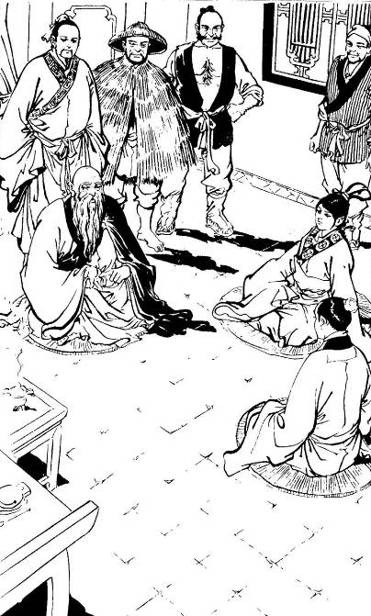
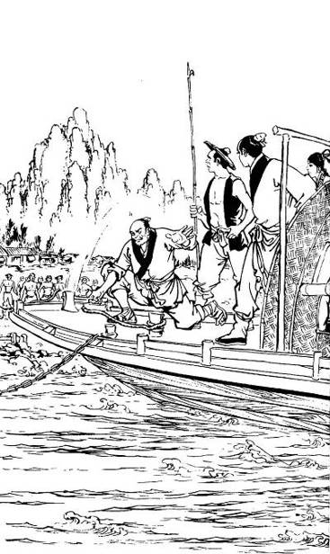
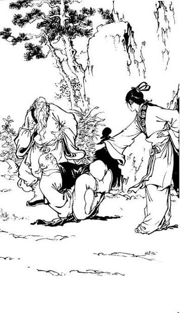
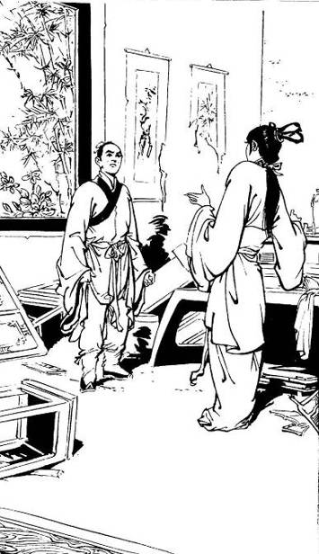
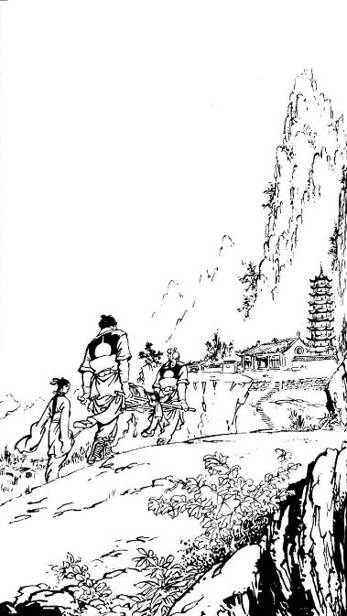
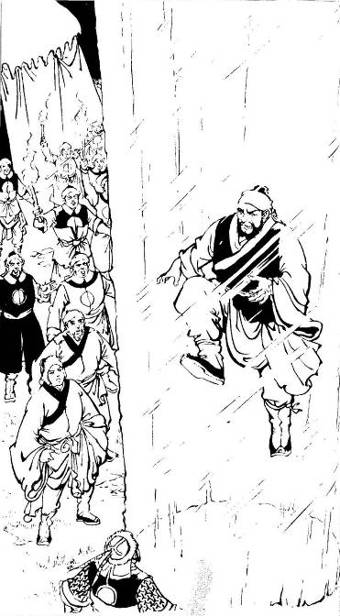
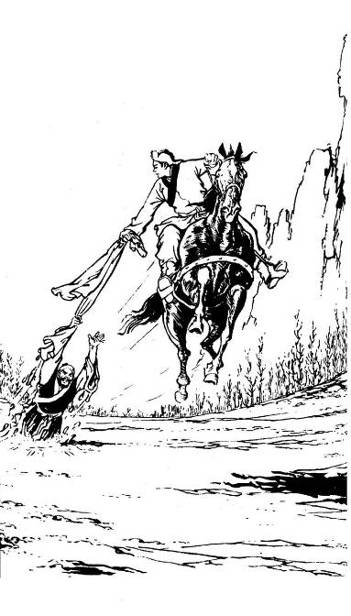
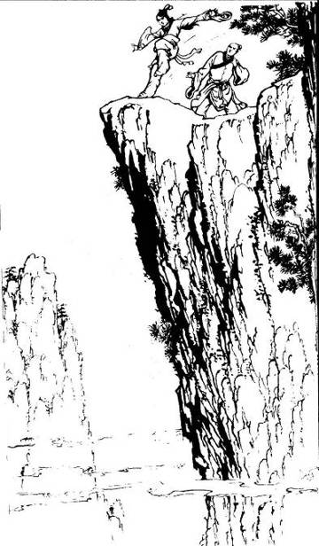
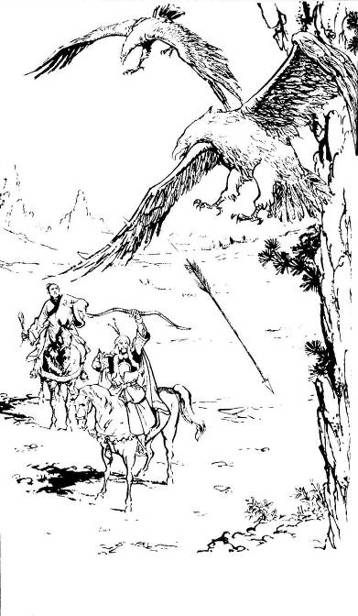

# Chapter 31 -- Lovers' Handkerchief {#index_split_006.html_id_Toc361424709 .block27}

Translated by Frans Soetomo

{.calibre7}

Reverend Yideng narrated all kinds of gratitude and grudges, love and
hate that he went through with Concubine Liu in the past. Guo Jing and
Huang Rong sat on the mediation mats in front of him, listening
intently; while the 'Fisherman', 'Woodcutter', 'Farmer' and 'Scholar',
his four disciples, stood behind Reverend Yideng.

 

Reverend Yideng lowered his head and sighed, "Actually I only have
myself to blame for this unfortunate disaster. You see, my Dali kingdom
is small; although it cannot be compared to the Chinese emperor's palace
where there are more than 3,000 women, speaking about the empress and
concubines, I had a few. Ay! It truly was a sin. I was very fond of
martial arts; very seldom did I come near a woman. Even my own empress
could see me only once every few days; how much less time did I have for
my concubines?"

Speaking to this point he said to his four disciples, "This is an inside
story, you did not know the details before. Today I am going to tell you
everything so you'll understand."

Huang Rong thought, "They really did not know it, they did not lie to
me."

Yideng continued, "Day in and day out my concubines saw I train martial
arts. Some were interested and expressed their desire to learn. So I
casually gave directions to one or two of them. I thought by learning
martial arts they would be healthier and might have a longer life. Among
them a concubine surnamed Liu was the most gifted. She was so smart that
each time I taught her something she would understand everything right
off. She was young and she trained hard everyday; her martial art
advanced greatly. And so it happened one day as she was practicing
martial art in the garden she met Zhou Botong, Zhou Shixiong \[Martial
Brother Zhou\] quite by accident. First of all Zhou Shixiong was crazy
about martial arts; his natural disposition was also naïve, he did not
guard against male-female relationship. He saw Concubine Liu was
training enthusiastically, immediately he came forward and sparred with
her. Zhou Shixiong's martial art came from his martial brother, Wang
Zhenren \[lit. true/real man, a respectful term to address a Taoist
priest\]; how could Concubine Liu be his match ...?"

"Aiyo!" Huang Rong softly exclaimed, "He did not know whether his hand
was light or heavy and has injured Concubine Liu?"

"Nobody was injured," Reverend Yideng answered, "Only about three moves
or two stances later he sealed Concubine Liu's acupoint, and then he
asked if she would admit defeat or not. Naturally Concubine Liu admitted
defeat. Zhou Shixiong unsealed her acupoint. He was so proud of himself
that he started to talk about the wonderful secret of sealing acupoint
technique. Concubine Liu had actually asked me to teach her the acupoint
sealing technique before; but just think about it: how could I pass on
this profound martial art to an imperial concubine? What she heard from
Zhou Shixiong was exactly what she desired. Immediately she respectfully
asked him to teach her."

"(Sigh)! The Old Urchin must be very happy," Huang Rong said.

"You know Zhou Shixiong?" Yideng asked.

Huang Rong laughed, "We are old acquaintances; he stayed at the Peach
Blossom Island for more than ten years, never once leave the island even
for a single step."

"With his character, how can he stay that long?" Yideng wondered.

Huang Rong smiled, "My father imprisoned him, and he was released just
recently."

"That's so," Yideng nodded his head, "Is Zhou Shixiong well?" he asked.

Huang Rong replied, "His body is well, but the older he gets the crazier
he becomes. He doesn't have any manners." Pointing her finger to Guo
Jing she pursed her lips and continued with a smile, "The Old Urchin has
performed a ritual to become sworn brothers with him."

Reverend Yideng could not help smiling; then he continued, "The acupoint
sealing technique is only taught by a father to his daughter, mother to
her son, husband to his wife; other than that no man can teach a woman
and no woman can teach a man ..."

"Why is that?" Huang Rong asked.

"Because male and female cannot be intimate," Yideng replied, "Just
think, if we don't touch one's whole body acupoints one by one, how can
we teach this skill?"

"But didn't you touch my whole body's acupoints?" Huang Rong asked.

The fisherman and the farmer was irritated she kept asking questions and
diverting the story; they stared at her angrily. Huang Rong stared back
and them and said, "What? Can't I ask any question?"

Yideng smiled, "You can, you can," he said, "You are a little girl, your
life was in danger, of course we have to make an exception."

"All right, so be it," Huang Rong said, "And then what happened?"

Yideng continued, "And then one taught, the other learned. Zhou Shixiong
was at the prime of his life, Concubine Liu was just coming of age;
their flesh and skin touched each other everyday, before long their
feelings grew and finally they created a problem which was very
difficult to rectify ..."

Huang Rong wanted to ask; her lips were about to move but in the end she
held back. She heard Yideng continue, "Some people came and reported to
me. Although I was angry, I still honored Wang Zhenren's reputation, I
pretended not to know. Who would have thought that after Wang Zhenren
found out; he interrogated Zhou Shixiong and he did not conceal anything
..."

Huang Rong was unable to hold back much longer, she blurted out, "What
is it? What is the problem that was difficult to rectify?"

Yideng temporarily at a loss of what to say, he hesitated before
answering, "They really were not husband and wife, but they acted like
one."

"Ah, I know," Huang Rong said, "The Old Urchin and Concubine Liu had a
child."

"Ay! It's not that," Yideng said, "They had known each other only for
about ten days, how could they have a child? After Wang Zhenren
discovered this affair, he bound Zhou Shixiong's hands and took him to
my presence for me to judge. We are martial art practitioners; we value
loyalty above everything else, we did not put too much of a regard
toward women. How could I injure our friendship over a woman? I
immediately untied him and summoned Concubine Liu at the same time. I
ordered them to get married. Who would have thought that Zhou Shixiong
raised a clamor; he said he did not know what he did was wrong, that if
he knew, he would have not done it even if he were to be killed. No
matter what, he was not willing to take Concubine Liu as his wife. At
that time Wang Zhenren sighed and said, 'If I did not know any better,
that he is a fool who doesn't know good from evil, a sword would have
already cut him into two as he committed this awful crime.'"

Huang Rong stuck out her tongue and said, "The Old Urchin was in a big
trouble!"

Yideng continued, "At first I was offended, I said, 'Zhou Shixiong, I am
sincerely willing to part with my treasure and give her to you, do you
think I have another agenda? There is an ancient saying, 'Brothers are
like hands and feet, wives are like clothes'; what is a woman for you to
consider it a very big deal?"

"Pei! Pei!" Huang Rong spat, "Uncle, you disregarded women, what you
said was a pile of rubbish!"

The farmer could not hold his patience any longer, he shouted, "Just
shut up and don't talk nonsense, will you?"

"What he said was wrong, I must refute it," Huang Rong was adamant.

To the fisherman, the woodcutter, the farmer and the scholar, Reverend
Yideng was not only their lord, but also their teacher. It never
occurred to them to talk back, let alone refuting his words. They
regarded him with utmost reverence; now hearing Huang Rong's
unrestrained mouth they were shocked and angry at the same time.

Reverend Yideng actually did not seem to mind; he continued his
narration, "As Zhou Shixiong heard me, he shook his head. I became
angry, I said, 'If you love her, why don't you want her? If you don't
love her, why did you do what you did? My Dali is a small country, but
do you think you can just drop in and throw an insult like this?' Zhou
Shixiong was silent for half a day. Suddenly he bent his knees and
kowtowed to me several times; he said, 'Emperor Duan, I am guilty. If
you want to kill me, just do it, I won't dare to hit you back.' I was
taken aback, I have never expected him to say such thing; I was at a
loss momentarily. Finally I said, 'How can I kill you?' He said, 'Then I
am leaving!' He took out an embroidered handkerchief from his bosom,
handed it over to Concubine Liu and said, 'I give it back to you.'
Concubine Liu smiled sadly, she did not take the handkerchief. Zhou
Shixiong let the handkerchief go and it fell near my feet. Zhou Shixiong
did not say anything else; he turned around and stormed out of the
palace. It has been more than a dozen years and I haven't heard anything
about him ever since. Wang Zhenren apologized to me over and over again;
and then he also left. I heard he passed away that autumn. Wang Zhenren
was a brave and heroic man, there was nobody can be compared to him. Ay
..."

"Wang Zhenren's martial art skill might be higher than yours," Huang
Rong said, "But speaking of bravery and heroic spirit, I think he did
not necessarily exceed Uncle. He had accepted seven disciples and they
are all just average, there is nothing special about them. Anyway, what
happened to the embroidered handkerchief?"

The four disciples were annoyed that Huang Rong cared so much about
trivial things like handkerchief or clothes; but they heard their master
said, "I saw Concubine Liu was staring blankly, like her soul had left
her. I was very angry; I picked up the handkerchief only to see a couple
of embroidered mandarin ducks playing on the water. (Sigh), it was
Concubine Liu's gift to her lover. I laughed coldly. I then saw next to
the pair of mandarin ducks there was a line of poem ..."

Huang Rong's heart was stirred, she hastily asked, "Was it, 'Four
weaving machines, the weaving of mandarin ducks desiring to fly together
right away'?"

With a stern voice the farmer shouted, "Even we do not know it, how did
you know? Always talk nonsense and disturb the story!" Who would have
thought that Reverend Yideng sighed and said, "It was indeed that poem;
you knew it?" At his words the four disciples looked at each other in
astonishment.

Guo Jing sprang up and called out, "I remember now! That day on the
Peach Blossom Island Zhou Dage \[Big Brother Zhou\] was bitten by a
venomous viper; he was delirious and he muttered this poem. It was, it
was ... Four weaving machines, a pair on mandarin ducks, and some head
turned white. Rong'er, how did it go? I can't remember it anymore."

With a low voice Huang Rong recited, "Four weaving machines, the weaving
of mandarin ducks desires to fly together right away. It's a pity not
yet old but the hair on the head has turned white. When the green spring
grass ripples in the deepest of dawn's cold; standing face to face
taking a bath wearing red clothes."

"Exactly!" Guo Jing slapped his thigh, "Zhou Dage once advised me
against good-looking women; he said he had seen one and as a result he
offended a good friend and provoked his Shige \[elder martial brother\]
to anger. He also said don't ever let her touch your acupoints,
otherwise you'll be covered with germs. Rong'er, he even urged me not to
be good to you."

"Pei!" Huang Rong angrily spat, "Old Urchin! Next time I see him I am
going to twist his ears!" Suddenly she giggled and said, "That day in
Lin'an prefecture I teased him that he wasn't able to find a wife; the
Old Urchin sulked for half a day. Turned out it was because of this
matter."

"When I heard Ying Gu recited this poem I thought I have heard it
somewhere, but tried as I might, I could not remember where I heard it.
Uh, Rong'er, how come Ying Gu also knew this poem?" Guo Jing said.

Huang sighed, "Ay, it's because Ying Gu is that Concubine Liu."

Among the four disciples, the scholar was the only one who had already
guessed 50, 60%; the other three were extremely astonished, they turned
toward their master at once. Yideng spoke in a low voice, "Miss is
really smart; truly worthy to be Yao Xiong's \[Brother Yao\] daughter.
Concubine Liu's first name was 'Ying'. That day I tossed the
handkerchief to her, afterwards I no longer called for her. In my
depression I neglected the affairs of the country; I trained martial art
every day ..."

Huang Rong interrupted him again, "Uncle, do you know that you loved her
very much in your heart? If you did not, you would not be so unhappy."

The four disciples was shocked at her audacity, "Miss!" angrily they
called out in one voice.

"What?" Huang Rong said, "Did I say something wrong? Uncle, tell me, was
I wrong?"

Yideng gloomily said, "Hereafter in more than half a year I have never
called for Concubine Liu, but in my sleep I often dreamt of being with
her. One evening I dreamt about her, at midnight I woke up; I could not
hold my patience much longer and made up my mind to pay her a visit. I
did not let the palace guards or the eunuchs know about my intention,
quietly I went to her quarters, I wanted to know what she was doing. As
I arrived on top of her roof I heard a child was crying inside. (Sigh),
outside the frost was thick and the wind was cold. I stood in shock for
half a night and did not get down until it was dawn. Afterwards I caught
a very serious illness."

Huang Rong thought how he was revered as the emperor, yet in the middle
of the night roaming around the palace roof to visit his own concubine;
it was truly unusual. The four disciples also recalled their master's
sickness. It was not only very bad, but also took a long time to
recover. All this time they wondered: with his profound martial art cold
wind would not easily make him sick; even if he was sick, he should not
take that long to recover. Only now did they know that it was more of a
crushed spirit than a physical illness that he did not use his own
internal strength to battle the sickness. She asked again, "Concubine
Liu had given you a child; certainly it was good, wasn't it? Uncle, why
were you not happy?"

"Silly kid," Yideng said, "It was Zhou Shixiong's child."

"But Zhou Shixiong had left for a long time," Huang Rong said, "Could it
be that he came back secretly to see her?"

"No," Yideng replied, "Have you heard the phrase 'ten-month pregnancy'?"

Huang Rong was suddenly enlightened, "Ah, I know! That child must look
like the Old Urchin very much, with pointy ears and high nose; otherwise
how did you know it was not your child?"

Reverend Yideng answered, "That is not necessarily so. I haven't been
intimate with Concubine Liu for some time, naturally the child wasn't
mine."

Huang Rong seemed to understand but she did not understand, but she was
aware it was not appropriate to keep asking questions, so she did not
pursue further.

Meanwhile Yideng continued, "I was sick for more than half a year; after
I recovered, I poured out my attention to internal strength cultivation
to dispel boredom and no longer gave thought to this matter. One night
about two years later I was meditating in my bedroom, suddenly the
curtain on the door was raised and Concubine Liu rushed in. Outside the
door a eunuch and two palace guards quickly tried to stop her, but
wherever they went, they were struck away by her palm. I looked up and
saw she was carrying the child on the crook of her elbow. She wore an
extremely panic-stricken expression; she knelt down and cried loudly,
she kowtowed in front of me and called out, 'I ask the Emperor to show
mercy, to be infinitely compassionate and spare this child's life!' I
stood up to take a look. That child's face was deep red; he was
breathing heavily. I took him from her bosom to examine further and
found out that five of his ribs were broken.

Concubine Liu wept, 'Emperor, your lowly concubine has committed a
heinous crime worthy of ten thousands death; but I am asking the Emperor
to spare this child's lowly life.' I was surprised to hear her, so I
asked, 'What happened to the child?' But she kept knocking her head
entreating me. I asked again, 'Who injured the child?' Concubine Liu did
not answer but kept weeping, 'Please Emperor, show mercy to him.' I
scratched my head in confusion. She said, 'If the Emperor bestowed death
to me, I would not complain for even half a word, but this child ...
this child ...'

'Who bestowed death to you?' I asked, 'How did the child get injured?'
Concubine Liu looked up and with a trembling voice asked, 'So it wasn't
the Emperor who sent a palace guard to kill this child?' I knew
something was amiss, I busily asked, 'So it was a palace guard who
injured the child? Which slave did have so much guts?' Concubine Liu
called out, 'Ah! It was not the Emperor's imperial edict, so the child's
life can be saved!' After saying that she fainted and fell to the
ground. I helped her up and put her on the bed; I also put the child
down on her side. Only after about half a day later she finally awoke.
She pulled my hand and weeping she told me what happened.

Turned out she was patting the child to put him to sleep that night,
when suddenly from outside the window came a palace guard wearing a mask
on his face. The guard pulled the child away and hit his back with a
palm. Concubine Liu hurriedly went forward to stop him, but the guard
shoved her away. Then his palm hit the child's chest. Finally he laughed
a big laugh and jumped over the window. That palace guard's martial art
skill was very high. She thought it was me who sent him to kill her son;
she did not dare to pursue, but she came to my palace to entreat.

The more I heard her story the more amazed I became; I re-examined the
child but I could not tell what kind of martial art caused the injury.
All I can tell was that the child's 'dai mai' \[waist arteries\] were
shaken and broken. That assassin's hands were lethal, but obviously he
had shown mercy; the baby was so young and weak, but he was still
breathing after two palm strikes. Immediately I went to her quarter to
investigate, and sure enough, I found very faint tracks on the window
sill and on the tile outside the window. I told Concubine Liu, 'This
assassin's martial art skill is very high, especially his lightness
kungfu; it was not a small matter. Apart from me there is no one with
this kind of ability in the whole Dali kingdom.' Suddenly Concubine Liu
called out in alarm, 'Could it be him? Why would he want to kill his own
son?' After saying that her face turned ash gray."

Huang Rong also muttered in a low voice, "The Old Urchin couldn't be
that bad, could he?"

Reverend Yideng said, "At that time I actually believed it was Zhou
Shixiong. Other than him, who in this present age had that kind of
ability, and who without any reason at all would injure a baby? I
guessed he was not willing to leave an illegitimate child behind and
became a disgrace in the Wulin world. After Concubine Liu uttered those
words she was bashful and anxious, frightened and ashamed at the same
time. She was at a loss. But suddenly she said, 'No, it definitely was
not him! That laughter was not his!' I said, 'You were frightened, how
could you hear clearly?' She replied, 'I will remember this laughter
forever, even if I become a ghost I will still remember that laughter!
No, it definitely was not him!'"

Listening to this part everybody suddenly felt a chill in the air, goose
bumps appeared on their skins. Guo Jing and Huang Rong recalled Ying
Gu's voice and demeanor; they imagined her facial expression when she
said those words with clenched teeth, they could not help but shiver in
fear.

Reverend Yideng continued, "I heard her so convinced, I believed her.
But for the life of me I could not guess who the assassin was. I once
thought it might be one of Wang Zhenren's disciples, maybe Ma Yu, Qiu
Chuji or Wang Chuyi? Perhaps they were trying to save Quanzhen Sect's
reputation that they took the thousands of 'li's journey to a remote
place and kill to close someone's mouth ..."

Guo Jing's lips moved, he wanted to say something, but he did not dare
to interrupt Reverend Yideng's story. Yideng saw it and said, "You want
to say something? You may as well say it."

Guo Jing said, "Ma Daozhang \[Taoist Priest Ma\], Qiu Daozhang, they are
all chivalrous heroes; they can't possibly do this thing."

"I have met Wang Chuyi at Mount Hua," Yideng said, "His conduct was
alright, but I don't know about the other disciples. But if they could
kill the baby with one palm, why did they leave the baby half dead and
half alive?" He raised his head and turned his gaze toward the window,
staring blankly. Obviously he had not been able to forget the unsolvable
mystery of more than ten years ago. The meditation room was quiet. A
moment later Yideng said, "All right, let's talk about that later ..."

Huang Rong suddenly exclaimed, "Without a doubt, it must be Ouyang
Feng."

Yideng said, "Afterwards I also suspected him. But Ouyang Feng is a
western region's man, he is big and tall; he is at least a head taller
than average local men. Concubine Liu said that compared to average men,
the assassin can be considered short."

"That's strange," Huang Rong said.

"My thought precisely," Yideng said, "Concubine Liu was hugging the
child and sobbing. This child's injury was not as severe as Miss
Huang's, but he was very young; he did not have any immune system yet.
If I was to treat his injury, it would have consumed all my energy. I
hesitated for a long time. I saw Concubine Liu was crying pitifully.
Several times I was going to open my mouth to tell her that I would
treat his injury, but every time I remembered that if I do that, I can
forget about competing against the other experts at the incoming second
Sword Meet of Mount Hua to win the Nine Yin Manual. Ay! Wang Zhenren had
said that this Manual was the Wulin world's big root of trouble; it
brought harms to many people and brought out the worst of human's heart.
He was absolutely right. Because of that book I lost my compassion
towards others. After hesitating for almost two hours I finally started
to lean toward treating his injury. Ay, during these two hours I felt
like I was lower than an animal. The worst part was, my decision to
treat his injury was not because I wanted to do something good, but
because I was tired of Concubine Liu's constant cry for help."

"Uncle," Huang Rong said, "I said you loved her very much, I was not
wrong."

Yideng did not seem to hear her, he simply continued his narration, "As
Concubine Liu heard my promise to help, she was so happy that she
fainted again. I massaged her acupoint to awaken her, then I started to
untie the child's swaddling clothes so that I could massage his
acupoints using the 'xian tian gong' \[inborn/innate energy\]. Who would
have thought that under the swaddling clothes that child was wearing a
'du dou' \[an undergarment covering chest and abdomen\] on his chest. I
stopped on my track, unable to say anything; because on the 'du dou' was
a pair of embroidered mandarin ducks, and next to the ducks was that
'four weaving machines' poem. Turned out this 'du dou' was the
handkerchief given to Zhou Shixiong a couple of years ago.

Concubine Liu saw my expression and she knew things had turned bad for
her. Her face was ashen. Clenching her teeth she pulled a dagger from
her waist and pointed it toward her own chest. 'Emperor,' she called
out, 'I do not have any face to live longer in this world. I am asking
your infinite mercy and compassion, I am willing to trade my life for
the child's. In my next life I will become a dog or a horse to repay
your kindness.' As she said that she pushed the dagger into her chest,
hard." Although everybody knew that Concubine Liu was still alive, they
could not help but gasp in horror.

As he narrated this part, it was as if Reverend Yideng did not tell the
past events to others, but it seemed like he was simply thinking out
loud, "I quickly used 'qin na fa' \[grappling, capture and seize
technique\] to snatch her dagger away. I was fast, but her dagger had
already penetrated her chest. Blood was seeping out her clothes. I was
afraid she might try to kill herself again, so I sealed the acupoints on
her hands and feet. I tended the wound on her chest and let her rest on
a chair. She did not say anything, but her eyes looked at me full of
sorrow. Neither of us said anything. The room was quiet, save the sound
of that child gasping for breath.

While listening to that child's breathing many, many past events flashed
in my mind: how she entered the palace for the first time, how I taught
her martial art, how I had loved her. She had always revered me, feared
me, gently attended to all my needs, never dared to disregard my will;
but she had never loved me. At first I was not aware of her true
feelings, but that day I saw the way she looked at Zhou Shixiong, then I
understood. When a woman truly and wholeheartedly loves a man, she will
look at him with that kind of look. I remembered the way she looked when
Zhou Shixiong threw that handkerchief down, the way she looked when he
turned around and left the palace. That scene had haunted me for several
years, made my sleeps restless and my meals taste like sawdust. Even
today I can still see it vividly in my mind.

This time once again her heart was broken; not over her lover, but over
her son, whose life she was willing to trade her own with! I am an
honorable man, and I felt disgraced. Me, the ruler of a country! Having
this thought my heart was filled with fury; I lifted my foot and smashed
an ivory stool in front of me. I looked up and was dumbstruck. I said,
'You ... what happened to your head?' She did not seem to hear me, her
gaze was fixed to her child. I have never really understood before, how
someone's gaze could contain so much love, so much compassion. By that
time she had realized I was not going to save her child's life, so she
wanted to look at him as long as he was still alive.

I took a mirror and held it out in front of her. I said, 'Look at your
hair!' In just a short period of time it seemed like she had become
several decades older. She was only eighteen, nineteen years old; yet
because of fear, anxiety, remorse, despair, grieve, and all kinds of
deep emotional attacks innumerable hair on her temples had turned white!

She did not seem to care toward the change in her appearance. She blamed
the mirror to be in the way, obstructing her view to the child. 'The
mirror, take it away!' she said, candidly. She had forgotten that I was
the Emperor, her master. I felt strange; I thought she had always
treasured her own looks, why didn't she pay any attention to it now? I
tossed the mirror aside only to see without blinking her gaze was fixed
on the child. I had never seen such gaze; full of love and hope, a hope
that her child would live. I understood that if she could, she would
gladly take her own soul and put it inside her child's body to replace
his slowly departing soul."

Listening to this Guo Jing and Huang Rong looked at each other; both
were thinking in their hearts, "When I was seriously injured and there
was little hope for it to be healed you also looked at me that way."
Forgetting their surroundings they held out their hands to hold each
other. Two hearts beating as one; they felt warmness creeping up their
bodies. Amidst listening to how others were grieving of misfortune they
could not help of thinking their own good fortune; due to the fact that
their loved one was sitting right next to them at that time, that place.
Because her injury had been healed; she would not die. Yes, she would
not die. In these two youngsters' hearts their loved one would not die
forever.

They heard Reverend Yideng continue, "I could not take it much longer;
several times I wanted to just take the child and treat his injury, but
I kept looking at that handkerchief wrapped around the child's chest.
The handkerchief with a pair of mandarin ducks embroidered on it, their
necks intertwined with each other. The mandarin ducks had white heads,
symbolizing they would grow old together. But why it was written, 'It's
a pity not yet old but the hair on the head has turned white.'? As I
turned my head I saw the hair on her temples had turned white, I broke
in cold sweats. At that time my heart turned hard, I said, 'Fine, go
ahead and grow old together; just leave me lonely and cast away in this
palace as an emperor! This is you and your lover's child; why would I
sacrifice my whole energy to revive him?'

She looked at me, her last glance. It was full of blame and hatred.
Afterwards she had never looked at me anymore, but this one look I will
not forget till the day I die. She coldly said, 'Let me go, I want to
hold my child!' She was speaking with authority and determination; it
was as if she was my master, made it difficult for me to disobey.
Thereupon I unsealed her acupoints.

She held the child in her bosom. The child was so much in pain that he
wanted to cry, but no sound came out of his tiny lips. His small face
had turned purple; he looked at his mother as if asking her to help him.
I was so hard-hearted; I did not have the least bit of compassion. I saw
one by one her black hair had turned to ash grey, and from ash grey to
white. I don't know whether it really did happen, or it was my
imagination playing tricks on me.

I heard her gently saying, 'Child, Mama does not have the ability to
save you, but Mama also can't let you suffer. Child, have a peaceful
rest. Sleep Child, sleep. Don't wake up forever!' I heard she sang a
gentle lullaby. It was a very beautiful song. It went like this, 'hmm,
hmm ...' Listen!"

Everybody heard him say those words, but actually they did not hear the
least bit of a song. They looked at each other in bewilderment.

"Shifu," the scholar said, "You have talked long enough, you must be
tired. Please take a rest."

Reverend Yideng did not seem to hear, he kept talking, "The child's face
showed a faint happiness, but the pain made his whole body spasm. With a
gentle voice she said, 'My precious, my heart and my soul, sleep tight,
then you won't feel the pain anymore, not the least bit of pain!'
Suddenly 'stab!', her dagger went straight into the child's heart."

Huang Rong screamed in fright; she grabbed Guo Jing's arm tightly. The
rest of the listeners were also so shocked that their faces did not show
any trace of blood.

Reverend Yideng was oblivious to his surroundings, he continued, "I was
so shocked that I cried out and drew back several steps, almost tumbled
down. My heart was in turmoil, I was totally at a loss. I saw her slowly
stand up and in a low voice she said, 'There will come a day, I will
stab your heart with this dagger.' She pointed her finger to the jade
bracelet on her wrist and said, 'You gave this to me the day I entered
the palace. Just wait, the day I return this jade bracelet to you, will
be the day my dagger will follow!'"

Speaking to this point Yideng spun the jade bracelet on his forefinger
one time; he showed a faint smile and said, "This is the jade bracelet,
I have waited several years for this. At last that day has come."

"Uncle," Huang Rong said, "She killed her own son, what did it have to
do with you? You did not injure her child. Moreover, she had used poison
trying to kill you; what enmity she had for you had been paid in full. I
am going down the mountain to send her off, I won't allow her to create
any disturbance here ..."

She had not finished her words when that young monk came rushing in.
"Shifu," he said, "Somebody delivered this at the foot of the mountain."
He held out both hands to present a small cloth bundle to his master.

Yideng took the bundle and unwrapped it. Everybody called out in alarm
as one voice. Turned out inside that bundle was the 'du dou' made of the
embroidered handkerchief. The silk had turned yellow of age, but the
embroidered mandarin ducks were still bright as new. There was a knife
hole in between the ducks; the edge of the hole was black from the
bloodstain. Yideng stared blankly at the 'du dou', overwhelmed with
grief. After a long time he finally said, "The weaving of mandarin ducks
desiring to fly together right away, hey, desiring to fly together; in
the end it was just a dream. She hugged her child's lifeless body
tightly, uttered a long laugh, and jumped over the window sill, flew out
of the room and in the blink of an eye disappeared without any trace. I
couldn't drink, I couldn't eat, and was miserable for three days and
three nights. Finally I came to my senses. I bequeathed the throne to my
eldest son and decided to tread the immortal path by becoming a monk."
He pointed at his four disciples and said, "They have followed me for a
long time and did not want to leave me. Together we went out of the Dali
city wall and lived at the 'tian long si' \[celestial dragon temple\].
For the first three years they took turns in helping my son to run the
country. Later my son has understood the government affairs; the kingdom
was at peace and nothing serious happened. So we went to the Big Snow
Mountain to gather medicinal herbs. There Ouyang Feng injured my
disciple and we moved to this place. We have never gone back to Dali
ever since.

I was so hard-hearted that I was not willing to save that child's life.
Hereafter for the last ten years or so, day and night I have never had a
peaceful rest. I always hoped to save many people to redeem my great
sin. They did not know my miserable inner feeling, so they always tried
to hinder me. Ay, even if I could save thousand people, ten thousand
people, that child would still be dead. How else would I repay his life
if not with my own? Everyday I have been waiting for Ying Gu, waiting
for her to stab her dagger into my heart. I was afraid she might come
here too late; I am already dead, then it would be difficult to redeem
my sin. Good, finally she will be here. Why would she mix the poison
into the Nine-flowered Jade Dew Pills? If I knew she would arrive soon
after she poisoned me, I wouldn't have wasted these past several hours
trying to survive, also my martial brother would not need to waste his
divine power to neutralize the poison."

Huang Rong indignantly said, "This woman's heart is so evil! She had
found out Uncle's dwelling early on, but was afraid that her own martial
art would be insufficient; so she deliberately waited for a good
opportunity. Coincidentally she met me, suffering the Iron Palm injury,
so she guided me to seek your help. She wanted to employ two methods to
achieve one goal; first she wanted you to waste your strength, then to
seize that opportunity to poison you. I was so gullible to become the
unaware weapon of this wicked woman. Uncle, how did Ouyang Feng's
drawing ended up in her hand? What does this drawing have to do with
her?"

Reverend Yideng took The Great Buddist Scripture from the small table
beside him, turned several pages and started to read, "The story of the
picture is originated from an ancient Indian city: Once there was a
king, his name was Shipi. He was a diligent ascetic practitioner, always
followed the way of the true enlightenment. One day there was a hawk
chasing a pigeon. The pigeon flew in and hid underneath Shipi's arm,
seeking refuge. The hawk demanded the king to return the pigeon to him,
he said, 'If the king saves the pigeon, the hawk will die of
starvation.' The king realized he could not save one without harming the
other. Thereupon he took a knife and cut his own flesh for the hawk. The
hawk said, 'If the king cuts his own flesh, it must be the same weight
as the pigeon.' Shipi ordered his guard to fetch a balance. He placed
the pigeon on one end and his flesh on the other; but no matter how much
he cut his flesh, the pigeon end was still low. The king cut his chest,
his back, his arm, his side, but the pigeon was still heavier. Finally
he put his whole body onto the balance. Right away the earth shook;
music came from the sky, the deities scattered flowers and sweet
fragrance filled the whole earth. The dragons, the demons and all
heavenly creatures sighed, 'Shan zai, shan zai \[lit. good, peace\],
there has never been this kind of bravery.'" It was only a myth, but
Yideng narrated it full of compassion and mercy, and the audience's
hearts were moved.

"Uncle," Huang Rong said, "She was afraid you might not be willing to
treat my injury, so she used this picture to move your heart."

Yideng smiled and said, "It seemed that way. When she left Dali that
day, her heart was set on seeking revenge, so it seems logical for her
to roam the Jianghu \[lit. rivers and lakes\] to learn martial art from
a highly skilled person. Some way or another she met Ouyang Feng, and as
Ouyang Feng learned about her intention he helped her plan this scheme,
he drew this picture and gave it to her. This book is well-spread in the
western region, and Ouyang Feng is from the western region, so he must
be familiar with this story."

Full of hatred Huang Rong said, "The Old Poison used Ying Gu, in turn
Ying Gu used me. This is an evil plan of murder with a borrowed knife."

Yideng sighed, "You don't need to be upset. If you had not met her, she
would injure someone else and send that person to me to be treated. Only
if that person does not have a highly skilled escort, he won't be able
to go up the mountain easily. Ouyang Feng must have drawn this picture a
long time ago; they have been setting up this plan for at least ten
years. Contrary to their expectation, they were unable to find someone
for ten years; that is also because of fate."

"Uncle, I know it," Huang Rong said, "She has something else in her mind
which is more important than harming you."

"Ah!" Yideng exclaimed, "What matter?"

Huang Rong replied, "The Old Urchin was imprisoned by my father on the
Peach Blossom Island. She wanted to help him out." And then Huang Rong
told him how Ying Gu painstakingly learned 'qi men'
\[strange/wonderful/mysterious gate\] and mathematics. Finally she said,
"Afterwards she found out that even if she studied for a hundred years
more it would still be difficult for her to overcome my father, plus she
saw me getting injured, thereupon ..."

Yideng uttered a long laugh; he stood up and said, "Fine, fine. All's
well that ends well. Everything has come together. Today finally she
will get her wish." With a calm face he turned to his four disciples and
said, "You go and welcome Concubine Liu, no, welcome Ying Gu and take
her up the mountain. You must not utter even half a word of disrespect."
As if by prior agreement the four disciples bowed to the ground and
cried, they called out together, "Shifu!"

Yideng sighed, "You have followed me for many, many years, don't you
understand your Shifu's heart?" Toward Guo Jing and Huang Rong he said,
"I am asking you two a favor."

Jing and Rong answered together, "Just say it, we won't dare to
disobey."

"Good," Yideng said, "Now I want you to go down the mountain. All my
life I owed Ying Gu a lot. In the future, whenever she is facing a
difficulty or is in danger, I am asking you for the Old Monk's sake, to
lend a hand as much as you can. If you two can help in the matter of
successful conclusion of her and Zhou Shixiong's affair, the Old Monk
will be forever grateful."

Guo Jing and Huang Rong looked at each other in astonishment; they did
not dare to reply. Yideng saw those two were silent, he pressed again,
"This Old Monk's request, is it difficult for you to give your consent?"

Huang Rong reluctantly replied, "Since Uncle has asked, we will obey."
She tugged Guo Jing's sleeve and bowed down to bid farewell.

"You don't have to meet Ying Gu," Yideng said, "Go down from the back of
the mountain."

Huang Rong gave her reply, pulled Guo Jing's hand and turned around to
go. The four disciples saw she appeared calm without any trace of grief,
they secretly scolded her as cold-hearted and mean, seeing her savior
was facing danger she was indifferent and walked away. Guo Jing knew
Huang Rong would not rest before she cooked another plan, so he followed
her out.

When they got to the door Huang Rong whispered something in his ear. Guo
Jing looked hesitant but finally he nodded his head. He turned around
and slowly walked back.

Yideng said, "Your heart is honest and upright, you will accomplish
great things in the future. I am entrusting Ying Gu's business to you."

"Very well!" Guo Jing replied, "Junior will do my utmost to tend to the
Reverend's business." Suddenly he reached backward and grabbed the
Indian Monk's hand sitting next to Yideng. Guo Jing's left hand went
straight and hit his 'hua gai' \[fancy canopy\] and 'tian zhu'
\[heaven's pillar\] two main acupoints. These acupoints were located one
on the hand, the other on the foot; once they were sealed then four
limbs would be immobilized. This move totally took Yideng and his four
disciples by surprise; they called out, "What are you doing?"

Guo Jing did not reply, his left hand went straight toward Yideng's
shoulder. Yideng's right palm made a turn and fast as lighting grabbed
Guo Jing's left hand. Guo Jing was startled; he thought Yideng was
already shrouded inside his palm's strength, unexpectedly not only he
managed to break through but launched a counterattack as well. Moreover,
Yideng's attack was targeting his vital point. It was truly an exquisite
skill. Only as Yideng's palm came within an inch of his hand he could
feel Yideng's palm was weak. Guo Jing took this opportunity to turn his
palm around to protect his hand, while his right hand launched 'Divine
Dragon Swings Its Tail' to repel the fisherman and the woodcutter who
attacked him from behind. The forefinger of his left hand was still
moving straight forward to seal the 'feng wei' \[phoenix's tail\] and
'jing cu' \[near energy\] on Yideng's side. "Uncle," he said, "I beg
your forgiveness."

Meanwhile Huang Rong had pushed the farmer out of the door using the Dog
Beating Stick technique. The scholar was surprised with this abrupt turn
of events; he did not understand Guo Jing and Huang Rong's intention.
"If you have something to discuss, say it; please don't fight!" he
repeatedly shouted.

Seeing his Shifu's condition the farmer was like a mad tiger; neglecting
his own life he charged toward the meditation room. But the Dog Beating
Stick was too much for him, he charged three times and three times Huang
Rong's stick pushed him back.

Guo Jing's palms moved in circles with a strong gust of wind, forcing
the fisherman, the woodcutter and the scholar to move back step by step
toward the door. Huang Rong abruptly swung her stick from the ground
upward to the farmer's eyebrow. This move was so swift that the farmer
cried out, "Aiyo!" He threw his head backward and leaped back several
feet.

"Good!" Huang Rong exclaimed. She reached backward and closed the door.
With a chuckle she said, "Gentlemen, please hold your hands! I have
something to say."

Every time the woodcutter and the fisherman met with Guo Jing's palm
they felt their arms went numb and their feet staggered. They saw Guo
Jing was about to strike again, quickly they stood side by side, ready
to receive Guo Jing's palm with their combine forces. As Guo Jing heard
Huang Rong's words he stopped his palm midway and withdrew it back.
Cupping his fists he said, "Please forgive my offense."

The fisherman, the woodcutter, the farmer and the scholar looked at each
other in consternation. With a serious face Huang Rong said, "I have
received Honorable Master's kindness; now I know that Honorable Master
is facing a difficulty, how can I just leave and do nothing? We have
offended you with the intention to help."

The scholar stepped forward, bowed deeply and said, "The enemy is our
Master's wife; it would be inconvenient for us to offend her. If she
wants to go up the mountain, we won't have any way of stopping her.
Moreover, ever since that ... that young master died, for more than ten
years our Shifu's heart was restless. Even if his energy were still
intact and he were not poisoned, when he saw Concubine Liu arrive he
would not defend himself against her dagger. We cannot disobey our
master, yet our hearts are burning with anxiety. We have exhausted our
wisdom and used up all our strengths, still we don't know what to do.
Miss is so smart; if you can show us a way, even if our bodies and bones
are ground to dust we will wish to repay your kindness."

Hearing him speaking earnestly Huang Rong did not dare to joke around
like she previously did, she said, "We, martial brother and sister, are
very grateful for the Honorable Master's kindness, no different than the
four of you, we will use all means possible to help. It will be best if
we can prevent Ying Gu from entering the meditation room, but to think
that she has been waiting patiently at the Black Marsh for more than ten
years, she must have made ample preparation. I am afraid it won't be
easy to block her. Little sister's plan involves a great danger. If we
succeed, we can expect smooth sailing in the future, without any
imminent trouble. But it is extremely risky, that Ying Gu is very astute
and sly, her martial art skill is also high, so there is a possibility
for failure. My ability and wisdom is very shallow and simple, I can't
think of any foolproof plan."

The fisherman, the woodcutter, the farmer and the scholar said, "We beg
your explanation."

Huang Rong raised her pretty eyebrows and laid down her plan. As the
four disciples listened to it, they looked at each other and did not say
anything for half a day.

.o0o.

It was the tenth hour (5 -- 7 pm), the sun slowly sank behind the
mountain. The strong mountain breeze swayed the leaves of the palm trees
planted in rows outside the meditation courtyard. The withered lotus
leaves on the pond also made a rustling noise. The evening sun cast its
light from behind the mountain peaks, the mountain ridges looked like a
silhouette of a giant reclining on the ground. The fisherman, the
woodcutter, the farmer and the scholar sat cross-legged on the ground by
the stone bridge. They opened their eyes wide looking to the front. Each
heart was heavy with restlessness.

They had waited for a long time. The sky had darkened, the dusk
gradually turned into night. The crows crowed while they were flying in
the valley below. A thin white mist rose up from the canyon below. But
still no one appeared from the turn at the mountain cliff beyond the
stone bridge. The fisherman thought, "If only Concubine Liu has a sudden
change of heart and does not blame Shifu, maybe she reined her horse
beyond the cliff and decided not to come over ..."

The woodcutter thought, "This Concubine Liu is very crafty; she must
have been preparing a really sinister plot."

The farmer was more anxious and impatient than the others, he thought,
"The sooner she arrives, the sooner we can get it over with; whether it
will be disaster or fortune, good or evil, we will find out sooner. She
said she would come and she hasn't arrived yet, it really is
exasperating."

The scholar thought, "The more delayed she is, the more dangerous the
threat will be. This matter is really difficult to be solved nicely." It
goes without saying that he was a good schemer and tactician; he had
been the prime minister of Dali kingdom for more than a dozen of years.
He had seen major battle and faced many difficult situations, yet this
time he was nervous. He had given this matter a lot of thoughts, but
could not put out the least bit of idea. His eyes scanned the darkened
surrounding area; his ears heard the distant cry of an owl. Suddenly he
remembered when he was a child he often heard people say, 'The owl
\[lit. night cat\] hides in a secret place and stealthily counts human's
eyebrows. Whoever got his eyebrows counted correctly, that person will
not live to see the daylight.' It was obviously a myth to deceive little
children, but in this situation suddenly hearing the cry of the owl, he
involuntarily shuddered. "Could it be that Shifu won't be able to escape
this disaster and die under this woman's hands?" He had just finished
his thought when suddenly the woodcutter whispered urgently with a
trembling voice, "She is here!"

The scholar lifted his head and saw a black shadow flew across the stone
bridge and light as a feather jumped over the gap, as if floating
without exerting any energy at all. The four people were astonished,
"When she started training with Shifu, we have already been under his
tutelage for a long time. How can her martial art exceed ours? In this
last dozen of years or so, where did she go to learn such a marvelous
skill?" they thought. As they saw that dark shadow come near, four
people stood up and positioned themselves on either side of the way.

In a blink of an eye that dark shadow has arrived at the end of the
stone bridge; she was wearing black clothes, and her facial features
could be vaguely recognized as Concubine Liu whom the Emperor Duan loved
very much in the years past.

Four people knelt down and kowtowed, "Xiao Ren \[little/lowly people\]
greets Niang-niang \[madam, or in this case can be translated as
'empress'\]."

"Humph," Ying Gu snorted. Her gaze swept the four people's faces and she
said, "What Niang-niang? Concubine Liu had died long ago, I am Ying Gu.
Hmm, the Prime Minister, the General, the Admiral, and the Commanding
Officer of the 'yu lin jun' \[lit. defending woods troops. I am not
sure, but I think 'yu lin jun' is the personal bodyguards of the
emperor\] are all here. I thought the Emperor had forsaken worldliness
and became a monk, who would have thought that he is hiding in this
remote mountain and lives in peace and security as an emperor." Her
voice carried so much hatred that their hearts trembled.

The scholar said, "The Emperor does not look like his former self. I am
sure Niang-niang will not recognize him anymore."

Ying Gu laughed a cold laugh, "You keep saying Niang-niang this and
Niang-niang that; are you mocking me? You are stiffly sitting on your
knees down here, are you wishing me dead?"

The fisherman, the woodcutter, the farmer and the scholar looked at each
other and then they stood up. "Your servants wish for your health," they
said.

Ying Gu waved her hand, "The Emperor ordered you to stop me here, do you
still have to perform this empty obeisance? If you want to fight, then
just fight. You are lords and royalties, I don't know how many common
people you have harmed; why would you still pretend in front of an
ordinary woman like me?"

The scholar said, "Our Emperor loves the people like his children, full
of generosity and benevolence, the common people of Dali country still
praise him even until today. Our Emperor not only has never harmed the
innocent all his life, even toward criminal with grave offense
oftentimes he bestowed abundant favor. Doesn't Niang-niang know?"

Ying Gu's face turned red, with stern voice she said, "Do you dare to
offend me?"

"Wei chen \[lowly officer\] doesn't dare," the scholar replied.

Ying Gu said, "With your mouth you acknowledge me as your superior, but
in your heart how can you still think there is any royalty-officer
relationship between us? I want to see Duan Zhixing; will you let me or
will you not?"

'Duan Zhixing' was Reverend Yideng's given name. Although the fisherman,
the woodcutter, the farmer and the scholar knew it, they never dared to
mention it casually. Now that Ying Gu mentioned his name irreverently
they could not help but feel offended. The farmer was formerly the
Emperor Duan's personal bodyguards' captain; he could not endure
patiently. With a loud voice he shouted, "One day became an emperor, he
will be honored for the rest of his life. How can it be that you speak
without propriety?"

Ying Gu let out a long laugh and without saying anything charged
forward. Four people respectively shot out their arms to block; they
thought, "Even though her martial art skill is high, with us combining
our efforts we should be able to stop her. We are going to disobey our
order, but the situation is dire, we'll talk later."

Who would have thought that Ying Gu did not use her palm or fist to
attack, but utilizing her lightness kungfu she bumped them. The
woodcutter saw her coming fast, he did not dare to touch her body, he
moved aside swiftly, then stretched out his hand trying to grab her
shoulder. His hand was quick and powerful, but as soon as he touched her
shoulder he felt like he was trying to grab something exceptionally
slick, so that his hand slipped away.

By this time with a loud shout the farmer and the fisherman attacked
from left and right. Ying Gu ducked and just like a slithery snake she
slipped underneath the fisherman's armpit. The fisherman's nostrils
caught a faint whiff of fragrance, it smelled like an orchid but not
quite like an orchid, like musk deer but not quite like musk deer. He
was frantic and did not dare to catch her body in between his arms; he
opened up his arms instead for fear of touching her body.

The farmer was indignant, "What are you doing?" he shouted. With his ten
fingers forming a pair of claws he tried to grab Ying Gu's waist.

"Don't be impolite!" the woodcutter called out.

The farmer turned a deaf ear to him, very soon his fingers had reached
Ying Gu's waist, but somehow it was like his fingers were touching a
very smooth and oily surface that they slipped away from her waist.

Ying Gu had used the 'ni qiu gong' \[mud loach maneuver\] she perfected
in the Black Marsh to go through these three people. Now she knew that
these four were helpless to block her. Her palm slapped backward toward
the farmer. The scholar swung his arm with his finger aimed toward the
acupoint on her hand. To his surprise Ying Gu did not retract her hand
but stuck her index finger up and quick as lightning two fingers
collided in the air. The scholar had exerted all his strength to his
right hand finger, suddenly he felt his finger went numb, his body felt
like he was electrocuted. "Aiyo!" he cried out and fumbled down to the
ground. The woodcutter and the fisherman busily stooped down to help.

The farmer's left fist went straight ahead like a hammer hurled toward
Ying Gu's body. This attack carried a strong gust of wind, the force was
astonishing. Seeing this strong attack Ying Gu stood her ground and did
not evade. The farmer was alarmed; he thought if his fist hit her head,
her skull would be cracked. Hastily he tried to withdraw his power, but
by that time his fist had already touched the tip of Ying Gu's nose.
Ying Gu leaned her head slightly, the fist slipped from her nose and
slid to her cheek. The farmer retracted his left arm, but it was too
late. His hand was grabbed by his opponent and with a 'crack' sound he
felt a shot of pain on his arm. His elbow joint was broken by the back
of her fist. The farmer gritted his teeth, ignoring the pain, his right
hand index finger swiftly attacked the crook of the opponent's elbow.

The fisherman, the woodcutter, the farmer and the scholar's acupoint
sealing technique was taught by Reverend Yideng. It was inferior to the
Solitary Yang Finger with its infinite variations, but it could be
considered as a first class acupoint sealing technique in the Wulin
world; how would they know that fighting Ying Gu they were like fighting
their black star. She was determined to avenge the death of her son; she
fully realized Reverend Yideng's finger skill was very fierce, thereupon
she spent a great deal of time and energy to find a method to subdue
that skill. She was very skillful in embroidery, so she found her
inspiration from the wonderful needlework technique. She wore a tiny
golden hoop on the tip of her right hand index finger; on the hoop was a
three-fen (about 1 cm) long golden needle, which tip was dipped in
poison. Her vision was excellent, her hand was steady; after training
hard for several years she was able to prick a fly flying in the air.
This time fighting the enemy she was able to prick the scholar's index
finger. Seeing the direction of the farmer's finger she laughed coldly,
lifting up her delicate hand she aimed her fingertip to his and pricked
the farmer's finger.

As the saying goes, 'ten fingers join the heart', the tip of the index
finger is connected to the hand's 'yang ming' \[positive and bright\]
passage to the large intestine. As the golden needle pricked in, it hit
the 'shang yang xue' \[positive quotient acupoint\] squarely.

In his last effort to score victory amidst a defeat, the farmer had
exerted all his strength to his finger. Ying Gu on the other hand, did
not have to exert any strength; all she needed to do was to position her
golden needle right on the path of the farmer's finger. Hence she let
the farmer prick his own finger by the needle.

As his finger was pricked, the farmer roared like a tiger and fumbled to
the ground. Ying Gu coldly mocked, "Nice Captain!" and she dashed toward
the courtyard in front of the meditation building.

"Niang-niang, stop!" the fisherman shouted.

Ying Gu halted her step and turned around; "And just how are you going
to stop me?" she sneered. By that time she had already at the front of
the lotus pond. The pond was connected to the meditation building by a
small stone bridge. Ying Gu was standing on the bridge's end, staring at
the fisherman. The night was dark, barely enough ambient light to
recognize her face. The fisherman stood facing her, he felt her stares
were very cold; he shivered involuntarily and did not dare to step
forward to stop her.

Ying Gu coldly said, "The Prime Minister and the Captain have been hit
by my 'qi jue zhen' \[seven lethal needle\], nobody in this world can
save their lives. Do you want to send your own life off?" Without
waiting for an answer she turned around and slowly walked forward. Not
once did she turn her head; apparently she was not afraid of any sneak
attack.

It was only about twenty steps from the small bridge to the building. As
she reached the end of the pathway, suddenly someone came out from the
darkness; cupping up his fists he said, "Senior, how are you?"

Ying Gu was startled; she thought, "This person waited quietly here and
appeared suddenly; why didn't I heard his breathing before? If he had
evil intention I would have been dead or at least wounded." She fixed
her eyes to look closer and saw this person was tall and
broad-shouldered, with thick eyebrows and big eyes; it was precisely the
person she gave directions to, Guo Jing. "Is the young miss' injury
healed?" she asked.

Guo Jing bowed and said, "Thank you so much for your directions, Senior.
Reverend Yideng has cured my martial sister's injury.

"Humph," Ying Gu snorted, "Why didn't she thank me in person?" Her mouth
was speaking, but her feet also kept walking forward.

Guo Jing was standing at the other end of the bridge. "Senior, please
return!" he hastily said.

Ying Gu ignored him; she slightly leaned her body sideways and utilizing
the 'ni qiu gong' she slipped past by him. Even though Guo Jing had
fought Ying Gu at the Black Marsh, he did not anticipate she would slip
pass him while still talking and that her body could be this slippery.
In his desperation Guo Jing flung his left arm backward, attacking Ying
Gu using the marvelous Vacant Fist of Zhou Botong.

Ying Gu thought that she had already slipped through Guo Jing; who would
have thought that suddenly a soft yet strong gust of wind came from his
fist pounced toward her face, forcing her to draw back. But Ying Gu was
determined not to return, so no matter how strong Guo Jing's attack was,
she bravely charged forward as if wanted to receive the blow head-on.

"Watch out!" Guo Jing hurriedly shouted. He felt a warm and soft female
body was thrown into the crook of his own elbow. He was stunned. Taking
advantage of his situation Ying Gu swept his feet and both of them fell
into the lotus pond.

When they were still midair, Ying Gu's left hand slipped underneath Guo
Jing's right arm pit, wound around his back and grabbed his left
shoulder, her middle finger curled toward Guo Jing's throat while her
thumb and index finger pinched the back of his neck with all her
strength. It was the fiercest 'qian feng hou bi qi' \[sealing front
throat shutting air\] technique from the 'qin na shou' \[grab and
capture\]; so long as one pinch hit the mark, the enemy's air passage
would be sealed and he would not be able to breathe.

While he was falling down Guo Jing felt his shoulder was grabbed, he
knew his situation was not good. He bent his right arm to clasp Ying
Gu's neck. It was also a technique from the 'qin na shou' called the
'hou xie jing bi qi' \[clasping the back of the neck to close up
breathing\]. Ying Gu knew Guo Jing's arm strength was devastating, and
that her own strength was far too inferior; she knew although she
attacked first but she could not compete with him in terms of brute
force, so she let her hand off Guo Jing shoulder and stretched her
finger to prick him instead. Guo Jing used his left arm to parry her
finger.

Falling from the stone bridge to the lotus pond actually took a short
moment, but two people had exchanged attacks and counterattacks swiftly;
in a blink of an eye they had exchanged no less than three stances. Both
were utilizing close combat techniques of 'qin na shou'. Ying Gu's skill
was profound, yet Guo Jing's strength was astonishing. In these three
stances victory and defeat could not be decided. 'Splash!' two people
fell into the pond.

The bottom of the pond was covered with mud about three feet high; as
they fell, they were immersed in the water up to their chests. Ying Gu's
left hand scooped down some mud and smeared it toward Guo Jing's mouth.
Guo Jing was shocked and lowered his head to avoid the mud. Ying Gu had
lived on the Black Marsh for more than ten years. Her Loach Maneuver was
developed based on watching loach diving and moving around in the mud.
Fighting on land she was exceptionally slippery, how much more in the
mud? She was like a tiger that grew wings. She intentionally dragged Guo
Jing to the pond because she was aware of his martial art; she knew it
would be difficult to cross the bridge with Guo Jing guarding it. Her
finger-pricking technique was actually several times faster in the mud
than on dry land; plus every now and then she scooped a handful of mud
and smeared it on Guo Jing's face.

Both of Guo Jing's feet sank deep into the mud; moreover, he did not
dare to use too much strength and accidentally injure her, so after
about only four or five stances he was already at a disadvantage. He
heard a swishing sound of mud coming toward his face; hastily he dodged
sideways. Who would have thought that as the first mud flew past; the
second mud had arrived, followed by the third handful of mud, which hit
him squarely on his face so that his mouth, nose and eyes were covered
in stinky mud.

The Six Freaks of Jiangnan had taught him well, so he knew if he was hit
by a secret projectile, he must not frantically trying to pull out the
projectile, because then the enemy would seize the opportunity to
assault and make a kill. At this moment he could not breathe and could
not open his eyes; he moved his palms and launched three fierce stances
so no one would be able to come within five feet near him. Just then he
wiped the mud from his face with his left hand and opened his eyes; but
Ying Gu had already leaped up to the stone bridge and dashed toward the
meditation courtyard.

As Ying Gu successfully went through Guo Jing she secretly scolded
herself, "Ashamed! If there were no pond, how would I overcome this dumb
kid? It looks like the Heaven is helping me to seek revenge today."

She sped up her steps and arrived at the temple door shortly. She raised
her hand to push; the door was not bolted, it opened immediately with a
soft creaking sound. This time she did not rush in, expecting an ambush
or some booby trap on the door. She waited outside the door only to see
the room was empty, nothing astir. Slowly Ying Gu entered the room. She
saw it was a meditation room with a single oil lamp illuminating the
image of Buddha with a dignified face. Ying Gu's heart turned sour, she
knelt on the meditation mat and offered a silent prayer.

She just barely prayed for a short moment when suddenly she heard
someone chuckle softly behind her. Immediately her left hand flung
backward in a sweeping movement to block any potential sneak attack,
while her right hand pushed down the mediation mat, borrowing the
momentum to leap upward and made a graceful somersault in the air before
landing back down to the ground.

"Excellent skill!" she heard a woman's voice applaud. Ying Gu turned to
look and saw a young girl wearing green clothes with red belt around her
waist and a bunch of golden hoops flickering under the lamp light on her
hair, her pair of beautiful eyes stared at Ying Gu with a hint of smile
in them; there was a gleaming dark green bamboo stick in her hand.
Needless to say, it was Huang Rong. "Senior Ying Gu, I thank you for
your kindness in saving my life," she said.

"I gave you directions to treat your injury, but my real intention was
to harm others," Ying Gu said matter-of-factly, "So I really was not
saving your life. Why should you thank me?"

Huang Rong sighed, "Vengeance and debt of kindness is really difficult
to understand. My father imprisoned the Old Urchin Zhou Botong on the
Peach Blossom Island for fifteen years. In the end he still could not
save my mother's life."

As she heard the name 'Zhou Botong' was mentioned, Ying Gu was extremely
shocked. "What relation did your mother have with Zhou Botong?" she
asked sternly.

Hearing her tone Huang Rong knew she suspected Zhou Botong had some love
affair with her mother and consequently was imprisoned by her father on
the Peach Blossom Island. Apparently even after more than a dozen years
her feeling toward Zhou Botong did not subside; otherwise why would she
drink vinegar over nothing?

Lowering her head, in a mournful voice Huang Rong said, "My mother died
of exhaustion due to the Old Urchin."

Ying Gu was more suspicious than ever. Under the dim light she could see
Huang Rong's skin was as white as snow, her eyes and eyebrows were
beautiful; even Ying Gu in her prime years was not as beautiful as she
was. She deducted that Huang Rong's mother must also be beautiful; it
would be difficult for Zhou Botong to see her and not be attracted to
her. Ying Gu frowned involuntarily.

"Don't you have any ideas," Huang Rong said, "My mother is like an
angel; that Zhou Botong is as stupid and stubborn as a cow. Unless the
woman has eyes but fails to see, nobody would have a crush on him."

Ying Gu knew Huang Rong was mocking her, but her suspicion was gone; she
was instantly relieved. Without batting an eyelid she coldly retorted,
"Since there is someone who loves Guo Jing who is as stupid as a pig,
there must be someone who loves a man as stupid and stubborn as a cow.
How did the Old Urchin cause your mother's death?"

Huang Rong pouted and said, "You scold my martial brother; I won't talk
to you." She brushed her sleeve and turned around, pretending to be mad.

Ying Gu really wanted to know about Zhou Botong, so she busily said,
"All right, I won't do that anymore. Your martial brother is actually
very smart."

Huang Rong halted her steps and turned around. "That Old Urchin did not
intentionally cause my mother's death," she said, "It was very
unfortunate of my mother to die because of him. In his anger my father
imprisoned him on the Peach Blossom Island; but afterwards my father
regretted it. Injustice has its cause, debt has its originator. If
someone killed your loved one you should go to the ends of the earth to
seek vengeance on the murderer. Why would you vent your anger toward
others?"

This speech was like a severe blow on Ying Gu's head; she stood still
without making any noise. She heard Huang Rong continue, "My father had
long ago freed the Old Urchin ..." Ying Gu was pleasantly surprised,
"Then I don't have to rescue him?" she asked.

Huang Rong smiled, "If my father had not released him, were you going to
rescue the Old Urchin?" she asked. Ying Gu was silent.

When Ying Gu left Dali her intention was to look for Zhou Botong. The
first few years was spent without hearing any news about him. Then quite
by accident she heard from the Twin Killers of the Dark Wind that Zhou
Botong was imprisoned on the Peach Blossom Island by Huang Yaoshi; but
as for the reason behind it she could not inquire. That day when Zhou
Botong renounced her and left Dali she knew that it would be very
difficult for him to have a change of heart if not because of some
significant cause. This time as she learned about his predicament she
was both happy and sad at the same time; sad because the man she loved
was in trouble, happy because she thought this was a good opportunity.
If she managed to rescue him, how could he not have deep affection
toward her? Who would have thought that the roads and pathways on the
Peach Blossom Island had a thousand turns and a hundred detours? No need
to mention rescuing anybody, she almost died of starvation for three
days and three nights. If Huang Yaoshi did not send a deaf and mute
servant to show her the way, she would never leave that island alive.
Thereupon she made the Black Marsh her residence, diligently learning
math and theory of numbers. Now she heard that Zhou Botong had been
released she stared blankly with all kinds of thoughts bubbling up in
her heart.

Huang Rong smiled and gently said, "The Old Urchin is most willing to
listen to me; he won't dare to turn down whatever I say. If you want to
see him, follow me and go down the mountain. Let me be the matchmaker
between the two of you; just consider it my way of saying thanks for
saving my life." Her words had made Ying Gu's cheeks turn red with her
heart thumping wild.

Seeing her speech might turn murderous intent into a happy occasion
Huang Rong felt smug. Suddenly she heard a slapping sound; Ying Gu's
palms struck each other. Her face looked like it was covered with a
layer of frost; sternly she said, "What makes him listen to you, a girl
surnamed Huang? Why would he follow your direction? Because of your good
looks? I have never shown kindness to you, I don't need you to repay.
Quickly make way for me, or else don't blame me for being merciless."

"Aiyo, you want to kill me?" Huang Rong laughed.

Ying Gu raised her eyebrows. "What if I do?" she coldly said, "Others
are scared of the Old Heretic Huang, I am not afraid of the heaven and
the earth."

Huang Rong chuckled, "Killing me is not a big deal," she said cheekily,
"But who would help you solve the three mathematical problems I left for
you?"

Since that day Huang Rong wrote three mathematical problems on the sand
inside the thatched hut at the Black Marsh, Ying Gu had painstakingly
racked her brain day and night; but she did not have any clue on how to
solve them. At first she studied mathematics with the intention of
rescuing Zhou Botong; but later on she was captivated with this complex
yet mysterious subject. The further she dug into it, the more fascinated
she became that sometimes she forgot to eat or sleep, and could not stop
even if she wanted to. She knew perfectly well that even if she could
solve these problems, compared to Huang Yaoshi's, her skill would still
be like heaven from earth; in other words, it would not help her the
least a bit in her plan to rescue Zhou Botong. But curiosity had forced
her to rack her brain; without a clear answer it would be difficult for
her to keep her mind at peace. Now that Huang Rong mentioned it, the
three subjects immediately flashed on her mind clearly; without
realizing it her face showed hesitation.

"Don't kill me, I'll teach you," Huang Rong said. She took the oil lamp
from the image of Buddha and placed it on the ground. Taking a golden
needle out, she started writing numbers and letters on the brick floor.

The first subject was the 'qi yao jiu zhi tian zhu bi suan' \[seven
dazzling nine grasping Indian method of calculation\]. As Ying Gu saw
the solution she was dazzled and could not help but secretly sigh in
praise. Huang Rong continued with the second subject, the 'li fang zhao
bing zhi yin gei mi ti' \[lit. standing up soldier supplying silver
topic\] had profound changes in it. As Ying Gu waited for her to write
the last answer she sighed and said, "This middle subject surely has an
endless wonderful secret."

A moment later she said, "If we say the third subject to be easy, then
it is easy; but if we regard it as difficult, then it is difficult.
There is an unknown number; three and three has a remainder of two, five
and five has a remainder of three, seven and seven has a remainder of
two. What number is that? I know it was twenty-three; but that was a
hard guess. I need to line up every number for all interchangeable
computational patterns, but even after thinking until I split my head I
could not figure it out."

Huang Rong smiled, "It is very easy. Calculating three and three, it
amounts to seventy. Calculating five and five, it amounts to twenty-one.
Calculating seven and seven, it amounts to fifteen. Adding three numbers
together, if not greater than 105, then that's the correct answer.
Otherwise, subtract 105 or its multiple."

Ying Gu calculated it in her heart and sure enough she got the correct
answer. With a low voice she recited, "Calculating three and three, it
amounts to seventy. Calculating five and five ..."

Huang Rong said, "You don't have to memorize it like that. Let me give
you a poem to help you memorize it easier: Three people travel together
in seventy directions, five plum blossom trees have twenty one branches,
seven children reunite for half a month, a hundred and five remained to
be known."

Listening to 'three people travel together' and 'reunite for half a
month' Ying Gu felt offended, she thought, "This girl knows him, she
knew my shameful secret from early on. 'Three people traveling together'
is me one woman serving two men. Could it be that by 'reunite for half a
month' she was ridiculing me of having a love affair knowing him for
only a dozen of days?" What she did in the years past had become a
matter of the heart to her, unavoidably she became quite over-suspicious
to everybody. "All right," she said flatly, "Thank you for your
directions. 'Asking direction in the morning, bored to death in the
evening'. Must I stay to listen to you speaking more nonsense?"

Huang Rong smiled, "'Asking direction in the morning, bored to death in
the evening.' The one who died is the one asking; but I've never heard
the one asking question kill the one preaching the sermon."

Ying Gu stole a glance toward the meditation room; she knew Emperor Duan
must be residing in the back. She saw Huang Rong kept pestering her,
something was amiss. Even though Huang Rong was young, her intelligence
and eccentricity was not inferior to her father's. How could a
thirty-year-old lady bicker with a baby? She was afraid her luck would
turn bad just like a ship capsized in the gutter. She had wasted not a
few moments because she wanted to look at Huang Rong's calculations;
while a very important matter was still ahead of her. How could she
allow senseless thought over mathematics consume her energy? Therefore,
she decided not to answer and immediately lifted up her feet to walk
inside.

Crossing over the worship hall she saw there was a dark room ahead with
only one flickering light inside. As a wary person she did not dare to
rush in; raising her voice up she called out, "Duan Zhixing, are you or
are you not going to see me? You hide your tail in the dark, what kind
of real man are you?"

Huang Rong followed behind her, laughing, "You don't like there is no
lamp in here? The Reverend was afraid too much light would scare you
away, so he ordered us to put the lights out."

"Humph," Ying Gu snorted, "I am the kind of person who is not afraid to
go to hell, why would a mountain of blades or boiling oil scare me?"

Huang Rong clapped her hands and laughed, "That's very good! I want to
play around the mountain of blades with you." Taking out a flint from
her pocket, lighted it up, then she stooped down and lighted a lamp next
to her feet.

Turned out there was an oil lamp on the ground; it surprised even Ying
Gu. She looked closer to see that it was not an oil lamp, but a small
porcelain tea cup filled halfway with oil, with a cotton ball dipped in
it as the wick. Next to the cup was a sharpened bamboo stick about a
foot long, inserted on the ground with the sharpened end on the top; it
looked really sharp.

Huang Rong did not pause, she kept moving and in just a short moment the
floor was filled with flickering lights like stars on a dark night. Next
to each cup was a sharp bamboo stick. Before Huang Rong even finished
Ying Gu had started counting, and she found out there were 113 teacups
with 113 bamboo sticks next to them. She was greatly baffled, "If it is
the 'mei hua zhuang' \[plum blossom stake\] arrangement, then it must
have either 72 sticks or 108 sticks, but it has 113 sticks; what kind of
arrangement is this? The array seems random, not the 'jiu gong ba gua'
\[nine-palace eight-diagram\], also not 'mei hua wu chu' \[plum blossom
five arrangements\]. Moreover, these bamboo sticks are so sharp, how can
somebody stand on them? Ah, right, she must be wearing iron-soled
shoes." She further thought, "This girl is prepared, I can't fight her
on these things yet I can't ignore this. I'll just go through it then."
Thereupon with big strides she walked forward, but the bamboo sticks
were densely packed, it was difficult to walk through them, so she
kicked around and broke five, six sticks while saying, "What crafty
trick is this? The old lady doesn't have time to play around with the
baby."

Hurriedly Huang Rong called, "Ah, ah! Don't do that! Don't do that!"
Ying Gu ignored her and kept kicking. "All right!" Huang Rong called
out, "You don't want to talk reason with me, I am going to turn off the
lights. Quickly memorize the bamboo sticks' positions."

Ying Gu was startled, she thought, "If these people gang up and plan to
attack me, they must have memorized the position of these sticks early
on. I could get killed among the bamboo sticks in the dark. I must leave
this dangerous place quickly!" She gave her spirit a boost and sped her
steps up, kicking furiously.

"Shameless!" Huang Rong called out. She brandished her bamboo stick
trying to block Ying Gu. The oil lamp shone on the dark-green bamboo
stick, creating a spooky shadow dancing in front of Ying Gu's face. Of
course Ying Gu did not think much about a teenage girl's stick
technique. Her left palm hacked vertically down; she thought one palm
should be enough to break the bamboo stick. Who would have thought that
Huang Rong's stick technique was the Dog Beating Stick's sealing
technique; the stick moved horizontally, it was not aimed at the enemy's
body, but it turned into a piece of jade-green wall blocking in front of
the door. As long as the enemy did not tread a step, the wall would not
hurt the least bit, but if one attacked one would immediately hit.

As Ying Gu hacked down her palm, 'crack!' her palm was hit by the end of
the stick. Hastily she withdrew her already pain and numb hand. She was
not hit on a vital acupoint, but the pain was severe. Formerly Ying Gu
did not think much of Huang Rong's martial art, but as she was hit she
became startled and angry. She realized now that this young crafty kid
was not easy to deal with. She swallowed her anger and cautiously
guarded against the opponent's martial art, trying to gain more
understanding before deciding on the next course of action. She thought,
"I have seen the Twin Killers of the Dark Wind's martial art. Their
skills were very profound, but they were already thirty, forty years
old. How can this little girl attain this kind of level? It must be that
Huang Yaoshi has passed on his lifelong achievement to his only beloved
daughter."

When she went to the Peach Blossom Island she had suffered a bitter
defeat without even seeing Huang Yaoshi, almost died on the island;
therefore, she always feared the Master of the Peach Blossom Island. She
actually did not know that this Dog Beating Technique was the Beggar
Clan Leader's unique skill, that even if Huang Yaoshi were there, he
would not necessarily be able to penetrate the stick's defense
immediately.

While Ying Gu hesitated and held her attack back, Huang Rong kept moving
her stick with the sealing technique, blocking Ying Gu from entering the
door. In the meantime Huang Rong's feet did not stay idle, she moved
from one bamboo stick to the other with agility like a dancing
butterfly, kicking the flames one by one. In a short moment she had
extinguished most of the 113 oil lamps.

The way she kicked the lamps was amazing; not only she did not step on
any teacup, none of the teacups was kicked upside down or smashed, also
only a little bit of oil was splashed over. She was fully utilizing the
Peach Blossom Island's 'sao ye tui fa' \[sweeping leaves leg/kicking
technique\]. Her movement was swift and accurate, but Ying Gu could see
that her skill had not yet reached perfection, it was far inferior to
the marvelous changes of the bamboo stick technique. Moreover, although
her injury had been healed, her strength had not fully recovered yet.
Ying Gu thought that if she attacked the lower part of Huang Rong's body
she might score a victory within dozens of stances. However, as Ying Gu
was contemplating her course of action only about seven or eight oil
lamps were left flickering in the wind on the northeast corner of the
room; while the other three corners were already pitch-black.

Suddenly Huang Rong's stick moved twice, Ying Gu was startled; under the
faint yellow light of the oil lamp she saw a clearance in between two
sharp bamboo stick on the ground, giving her an opportunity to retreat
one step. Huang Rong stuck her stick on the ground and using it as a
pole her body floated in the air horizontally; her long sleeve whisked
off and extinguished the seven, eight remaining lamps.

Ying Gu groaned inwardly, "Although I believe I have a way to score
victory, among these sharp bamboo sticks every step I take can pierce a
hole on my foot; how am I going to fight?" she thought. In the darkness
she heard Huang Rong call out, "Have you memorized the bamboo sticks
position? Let us fight for thirty stances; if you can defeat me, I will
let you go in to see Emperor Duan, all right?"

Ying Gu replied, "You are the one who arranged these sticks. I don't
know how much time you spent practicing here; while you only gave others
a wink to look at these many oil lamps."

Huang Rong was still young and proud, she always tried to outdo others,
she also had a high confidence on her excellent memory, so she smiled
and said, "What's so difficult about it? If you want you can light up
the oil lamps rearrange the bamboo sticks as you wish, then extinguish
the lamps before we fight again, all right?"

Ying Gu thought, "This is not a martial art contest, but a memorization
competition. This little demon's intelligence is matchless, how can I
risk my life playing memory game with her while my big enmity is not
avenged?" But suddenly she got an inspiration; after thinking about it
for a moment she said, "Fine, that's fair enough. Let the Old Lady
accompany you playing." Taking a flint from her pocket she lighted the
oil lamps.

"Why do you keep calling yourself an old lady?" Huang Rong laughed, "I
think you are beautiful, you are prettier than a sixteen years old girl.
No wonder Emperor Duan was so crazy about you."

Ying Gu was about to pull a bamboo stick and move it someplace else;
hearing this she stopped dead on her track. "He was crazy about me?" she
coldly said, "I was in the palace two whole years; just when did he pay
any attention to other people?"

"Ah," Huang Rong was surprised, "Didn't he teach you martial art?" she
asked.

Ying Gu retorted, "Is teaching martial art considered paying attention?"

"Ah, I know," Huang Rong said, "Emperor Duan was training the 'xian tian
gong' \[innate/inborn strength/energy\], that's why he could not get
intimate with you."

"Humph," Ying Gu snorted, "What do you know? How come he got the crown
prince?"

Huang Rong leaned her head sideways; she thought for a moment before
answering, "The crown prince was born before he started training 'xian
tian gong'."

Ying Gu snorted again but did not say anything. She kept pulling the
sticks and inserted them back in different places. As she inserted the
bamboo sticks one by one Huang Rong memorized their positions carefully;
she did not dare to be careless. It was a matter of life and death, if
she missed just a few inches during the fight, it would mean immediate
disaster to her foot.

A moment later Huang Rong spoke again, "Emperor Duan was not willing to
save your son because of his love for you."

"You knew everything?" Ying Gu said, "Humph, because of his love to me?"
Her voice was brimming with bitterness.

"He was jealous of the Old Urchin," Huang Rong said, "If he did not love
you, why would he be jealous? He saw your 'four weaving machines'
mandarin ducks handkerchief and was extremely grieved because of it."

Ying Gu had never thought Emperor Duan had this kind of feeling toward
her, she could not help but be lost in thought. Huang Rong continued, "I
think you'd better come back."

Ying Gu coldly said, "Only if you have the ability to defeat me."

"All right," Huang Rong said, "Since you insist, I have no alternative
but risking my life to accompany you. If you can break through my
defense, I definitely will not hinder you anymore. But what if you
can't?"

"I will never go up this mountain again," Ying Gu said, "I will also
free you from your obligation to accompany me for a year."

"Wonderful!" Huang Rong clapped her hands, "It would be really
unbearable for me to accompany you on that rotten black marsh."

While talking Ying Gu had already inserted about fifty, sixty sticks;
immediately she kicked the oil lamps one by one and said, "The rest of
them can stay as they are." In the darkness her five fingers formed a
claw fiercely attacking Huang Rong.

Remembering the sticks location Huang Rong slanted her body sideways and
without hesitation her left foot landed exactly in between two sticks;
while the dog beating stick in her hand shook and attacked Ying Gu's
left shoulder. Who would have thought that Ying Gu ignored her attack,
she kept moving forward in big strides and with a series of cracking
sound she broke about a dozen bamboo sticks with her feet; hence freely
she walked to the rear courtyard.

"Aiyo!" Huang Rong was startled; she realized immediately what had
happened, "I am duped. Turned out when moving the sticks around she
exerted her strength and secretly pinched the sticks broken." Because
she was trying to outdo others she had not suspected Ying Gu would do
such thing; she could not help but feel really vexed.

Rushing to the rear courtyard Ying Gu stretched out her hand to shove
the door open. She saw an old monk sitting on a meditation mat in the
middle of the room; his silvery beard hung down to his chest, a thick
monk robe wrapped around his body up to his cheeks, his head hung low in
meditation. The fisherman, the woodcutter, the farmer and the scholar,
along with several old monks and young apprentices stood on either side.

The woodcutter saw Ying Gu came in, he stepped forward to the old monk,
clasped his palms and said, "Shifu, Liu Niang-niang has come to visit."
The old monk slightly nodded his head without saying anything.

There was only a single oil lamp in the entire meditation room, so Ying
Gu could not see everybody's face clearly. She had known earlier that
Emperor Duan had become a monk, but actually she did not think that
after about a dozen years without seeing each other a heroic martial
artist emperor could turn into such a fragile old monk. Recalling Huang
Rong's speech she realized now that the Emperor was not totally pitiless
toward her. Her heart melted and her firm grip of the dagger slowly
turned loose.

Lowering her head she saw the embroidered handkerchief that was wrapped
around her baby was laid in front of the meditation mat where Emperor
Duan was sitting. On top of that 'du dou' was the jade bracelet which
the Emperor gave her. Instantaneously past events like entering the
palace, training martial art, meeting Zhou, love and passion, giving
birth to her son, mourning his death, everything came flashing through
her mind one by one like scenes on the stage; then she saw her son's
look when he was in so much pain. Although he was still a baby it seemed
like his eyes spoke thousand sentences ten thousand words wondering why
his mother did not alleviate his pain and suffering. Her anger rose, she
raised her dagger up and with a swift movement the dagger stabbed
Emperor Duan's chest, all through the handle.

She knew Emperor Duan's martial art skill, this stab might not
necessarily kill him; moreover, when the dagger went into his chest she
had a slightly different feeling. Right away she pulled the dagger back
to stab him the second time. Who would have thought that the dagger was
firmly stuck between his ribs; she was unable to pull it back in a
moment.

The four disciples called out in alarm and rushed forward
simultaneously. In her bitterness Ying Gu had painstakingly practiced
this stab thousands of times over a dozen of years period. She knew
perfectly well that Emperor Duan would surely guard against her attack,
so while her right hand did the stabbing, her left palm had already
fluttered around, guarding the left, right and the back, three sides of
her own body. Now that she could not pull the dagger back, she saw the
circumstances had turned to her disadvantage. Her feet moved and she
leaped toward the door. Turning her head around she caught a glimpse of
Emperor Duan with his left hand on his chest, seemingly in great pain.

Now that her big enmity had been avenged, just as quick she was not sure
of what she did anymore; suddenly remembered, "I had an affair with
someone else and gave birth to a child, he did not speak even half a
word of reproach and left me live freely in the palace. Not only he did
not execute me, but he abundantly provided everything for me. In
actuality he was always very good to me." All along she only remembered
that Emperor Duan did not save her son's life, her heart was filled with
hatred. Only after stabbing his chest did she remember all his kindness.
She heaved a deep sigh, turned around and went out the door.

As she turned around she gasped in horror with sweats came pouring down
her body, because she saw an old monk clasping his palms in front of his
chest was standing on the door. Under the lamp light she could see his
face looked grand and his eyes showed compassion; although he was
wearing a monk robe it was as clear as the day that he was the former
ruler of the southern kingdom, Emperor Duan. It was as if Ying Gu was
seeing an apparition; like a flash of lightning a thought came into her
mind, "Did I just kill the wrong person?" She swept her gaze backward
and saw the monk she had just stabbed was slowly standing up; while
removing his monk attire his left hand pulled on his chin and the white
long beard came off. Ying Gu uttered another cry of shock; it turned out
that old monk was Guo Jing in disguise.

It was precisely Huang Rong's scheme: Guo Jing sealed Reverend Yideng's
acupoint and deliberately took his place to receive Ying Gu's dagger. He
was afraid the Indian Monk's martial art skill might be high, so he
attacked him first; who would have thought that the Indian Monk did not
even know martial arts. Later on Huang Rong delayed Ying Gu by
explaining the three mathematical problems in the courtyard; and then
using the dog beating technique she fought her amidst the sharpened
bamboo sticks by the oil lamps. In the meantime the four disciples
quickly helped Guo Jing wash up the mud and shave his head clean. They
also shaved Reverend Yideng's long white beard and stuck it underneath
Guo Jing's chin. Actually the four disciples did not feel comfortable
treating their master in such a disrespectful manner and to let Guo Jing
brave a grave danger; they were feeling very uneasy. But in order to
save their master's life they did not have any other choice; if it were
one of the four disciples disguising themselves, their martial art was
inferior to Ying Gu, they might die under Ying Gu's dagger.

As Ying Gu stabbed her dagger Guo Jing deftly moved his two fingers
inside the monk robe to pinch the flat sides of the dagger. Who would
have thought that Ying Gu's stab was so powerful that even with Guo
Jing's finger strength the blade still cut through about half an inch of
his flesh; luckily it did not break his ribs and he only suffered a
superficial wound. He could have worn the soft hedgehog armor, which was
impenetrable by the dagger; but Ying Gu was cunning; she would perceive
the difference, then they would not get rid of the source of the
disaster. If she failed this time, she would come back to seek revenge
in the future.

Everybody was delighted to see this 'jin chan tuo qiao zhi ji' \[lit.
golden cicada sheds its shell tactic\] accomplished successfully; who
would have thought that Yideng chose this very moment to make a sudden
appearance. Not only Ying Gu was startled, but everybody else also did
not anticipate this to happen.

Because Yideng suffered a heavy injury and lost his strength, Guo Jing
did not dare to seal his acupoint with too much strength for fear of
injuring him further. In the back room Yideng slowly circulated his
internal energy to unseal his own acupoint, and then he went back to the
meditation room, arriving exactly at this moment.

Ying Gu's face was pale like that of a corpse, she thought she had
fallen into this trap and certainly would not have a good fortune. But
Yideng told Guo Jing, "Return the dagger to her."

Guo Jing did not dare to defy, he returned the dagger to Ying Gu. Ying
Gu absentmindedly took the dagger while staring at Yideng. She was
wondering what kind of torture he would use against her. But she saw
that he slowly removed his monk robe and also his undergarment, and then
said, "Nobody shall give her any trouble, let her go down the mountain
in peace. All right, go ahead and stab me; I have been waiting for you
for a long, long time."

These words were said very gently, but in Ying Gu's ears they were like
thunderous lightning in a bright daylight. She stood motionless for half
a day, then her grip loosened and the dagger fell to the ground with a
clanking sound. Covering her face with both hands she rushed out of the
room. They heard her footsteps as she went farther and farther away
until finally they could hear her anymore.

Everybody looked at each other in shock, nobody made any noise. Suddenly
'thump, thump' the student and the farmer fell backward to the ground.
Turned out because their fingers were poisoned, in the commotion that
followed they suppressed the poison using their internal energy; by now
the saw their master was well, their hearts were relieved and could not
hold the poison much longer.

"Hurry, invite Martial Uncle!" the woodcutter called out.

Before he finished Huang Rong had already accompanied the Indian Monk
walking into the room. He was an expert in treating poison related
illness. He quickly gave two people some medicine to take, also cut
their fingers to get rid of the black blood. His face looked very
serious, while his mouth mumbling in sanskrit, "A ma li, ha shi tu, si
gu er, qi nuo dan ji."

Yideng understood Sanskrit, he knew his disciples' lives were not in
danger. They would have to be treated for two months then they would be
healed completely.

Meanwhile Guo Jing had removed his monk robe and treated the wound on
his chest; he bowed to the ground in front of Yideng to apologize.
Yideng busily held out his hand to raise him up; he sighed and said,
"You risked your life to save mine; nothing to forgive." Then he turned
toward his martial brother and explained in Sanskrit what Guo Jing had
done.

The Indian monk said, "Si li xing, ang yi na de."

Guo Jing was startled; he knew these two sentences, and he could even
recite the next line, "Si re que xu, ha hu wen bo ying ..."

Zhou Botong had taught him to recite the Nine Yin Manual in its
entirety. The last part of Manual was full of all these strange
sentences. Guo Jing did not understand its meaning, but he was forced to
memorize the entire Manual including all these mumbo-jumbo; hence he was
able to recite it effortlessly.

Hearing him speaking Sanskrit Yideng and the Indian Monk were stunned;
moreover, what he had just said was related to excellent technique to
cultivate internal energy; they were even more astonished. Yideng asked
him the whole story and Guo Jing told him without concealing anything.
Yideng was endlessly marveled, he said, "I have heard the story behind
the Nine Yin Manual from Chongyang Zhenren. Huang Shang, the person who
compiled the manual was not only highly skilled, he was also well-versed
in the Daoist canon, skilled in the internal energy cultivation, and
understood Sanskrit. When the manual was complete, the last chapter was
actually the essence of it. Suddenly he realized that if this manual
falls into the hand of criminals, they would be able to turn the world
upside down without anybody controlling them. But he was also unwilling
to destroy this last chapter; thereupon he rewrote the chapter in
Sanskrit, but with Chinese transliteration. He thought that it was
difficult to say whether the Manual could be passed on to the future
generation; the people of Central Plains who knew Sanskrit was very few,
and even more rare was the number of people who were well-versed both in
martial art and Sanskrit literature. If the Manual fall into the hand of
an Indian, although he is proficient in Sanskrit, but he does not speak
Chinese. Huang Shang arranged it this way; actually it was the same as
not allowing the future generation to understand the content. Because of
this Sanskrit part even Chongyang Zhenren did not understand the
Manual's meaning. Who would have thought that through divine
intervention you who do not understand Sanskrit can actually memorize
this lengthy great theory that sounds like incantations? It is truly a
very rare opportunity." Thereupon he asked Guo Jing to recite the
Sanskrit part slowly while he translated it into Chinese, wrote it on a
piece of paper and gave it to Guo Jing and Huang Rong.

The overall guiding principle of energy cultivation in the Nine Yin
Manual was mysteriously deep; although Reverend Yideng was a proficient
scholar with profound internal energy, he could not dissect the theory
completely in such a short period of time. "Stay on the mountain for a
few days, let me dig into it comprehensively, then I will transfer my
knowledge to you two," he said. He further said, "Usually as my internal
strength is damaged, I will need five years of continuous training for a
full recovery; but if I practice according to the Manual, it seems like
in less than three months I will get a five-year-worth of internal
energy cultivation. Although what I practiced is a Buddhist martial art,
which was different from the Taoism method of internal energy
cultivation in the Manual, but looking at this principle, as the martial
art is trained to the highest level, different approaches will lead to
the same result; it is no different than the Buddhism method."

Huang Rong told him how Hong Qigong was injured by Ouyang Feng. Reverend
Yideng showed great concern. "You two must tell your Shifu about the
Nine Yin internal energy cultivation method; I am certain he will
recover his internal strength," he said. Guo Jing and Huang Rong were
very delighted to hear this.

Two people stayed on the mountain for more than ten days. Everyday
Reverend Yideng explained the Nine Yin energy cultivation method to
them. Huang Rong also took this opportunity for her own recovery.

One particular day they were walking idly outside the meditation
building when suddenly they heard anxious cry of eagles in the air; they
saw a pair of white eagles in the distance coming from the east. Huang
Rong clapped her hands, "Jin wawa \[lit. golden baby -- see Chapter 29\]
is here!" The pair of eagles folded their wings and landed, they looked
weary. Two people could not help to be alarmed; they saw a gaping wound
on the breast of the female eagle. It looked like an arrow wound, but
the arrow was no longer there; apparently the eagles had pulled the
arrow themselves. There was a piece of green cloth tied on the male
eagle's foot; but they did not bring any 'jin wawa' with them.

Huang Rong recognized this piece of green cloth as coming from her
father's robe; then the pair of eagles had indeed been to the Peach
Blossom Island. Could it be that there were powerful enemies on the
Island? Could it be that Huang Yaoshi was too busy engaging the enemy
that he did not have a chance to fulfill his daughter's request?

The pair of eagles was smart animals, yet the female eagle was hit by an
arrow; indicating the person shooting the arrow must have been an
excellent martial artist. Guo Jing quickly applied some ointment and
wrapped the wound on the female eagle's breast. Huang Rong was thinking
hard for half a day, but in the end she still did not have any clue as
to what was happening. Too bad the eagles could not talk, otherwise they
would be able to tell what they saw on the Peach Blossom Island.

Two people worried over Huang Yaoshi's safety; hence they bid farewell
to Reverend Yideng immediately. "We can still be together for many days
to come, but since there is something happening on the Peach Blossom
Island I cannot retain you anymore. However, Yao Xiong \[Brother Yao\]
is all-resourceful; he is wise and smart. I believe [no one in the
present age is able to harm him; you two do not have to be too
anxious."]{#index_split_006.html_id_OLE_LINK2}

Yideng then sent for the fisherman, the woodcutter, the farmer and the
scholar; together with Guo Jing and Huang Rong they sat on meditation
mats in front of him. He explained the essence of martial art for
several hours. When he was finished Guo Jing and Huang Rong bid their
farewell reluctantly. The scholar and the farmer had not recovered yet,
so they only sent them off to the gate. The fisherman and the woodcutter
walked them off to the foot of the mountain. They waited until the two
people found their little red horse and at last said their goodbyes with
heavy hearts.

Guo Jing and Huang Rong returned via the same road, the scenery was
still the same; but their feeling was entirely different from when they
went up the mountain just several days ago. Remembering Reverend
Yideng's profound kindness could not help but cause her to bend her
knees and bow toward the mountain peak. Guo Jing followed her and
kowtowed several times.

Along the way although Huang Rong was concerned about her father, she
thought that all the time he had roamed the world far and wide he rarely
suffered any setback. Even if he met a powerful enemy, perhaps he would
not win, but at least he had enough ability to defend himself; just like
Reverend Yideng had said, "No one in the present age is able to harm
him." Therefore, she was not overly anxious.

Two people sat on the little red horse's back, chatting casually in
light mood. Huang Rong laughed, "I don't know how many times we faced
dangers since we met each other, but every time we suffered some loss,
we also had some gains. Like this time I suffered injury under that old
Qiu Qianren's palms; in the end we found out the marvelous secret of the
'jiu yin shen gong' \[lit. nine yin divine strength/energy\]; which Wang
Chongyang himself did not understand."

"I would rather not know any martial art as long as you are safe and
well," Guo Jing said.

In her heart Huang Rong was very happy but she laughed and said, "Aiyo,
if you want to flatter others you don't need to blow such a big horn! If
you don't know martial art, you would be long dead. Let's not talk about
Ouyang Feng, Sha Tongtian and the others; even a black-dressed Iron Palm
Clan member would be able to cut your head with a knife."

"No matter what I can't allow you to be injured anymore," Guo Jing said,
"Last time when I was injured in Lin'an I felt all right; but these past
few days looking at you suffering so much pain, ay, that was really not
good."

"Humph," Huang Rong smiled, "You are a heartless man."

"Why?" Guo Jing wondered.

"You would rather be injured," Huang Rong said, "Do you think I will
feel all right?"

Guo Jing was taken aback; and then he let out a long laugh. His legs
kicked the little red horse's ribs and the horse ran faster; it looked
like its four feet were flying above the ground that by noon they had
arrived at Taoyuan prefecture. Huang Rong had not yet recovered fully;
after half a day of riding she was very tired, her cheeks were flushed
and she was panting for breath. There was only one decent restaurant in
the city of Taoyuan, it was called 'bi qin jiu lou' \[evading qin
(dynasty) wine shop; lou -- multi-story building\]. Its name came from
the 'tao hua yuan ji' \[a note on the origin of peach blossom\] a
literary work of Tao Yuanming \[Translator's note: different characters
from the 'Taoyuan' prefecture\].

Guo Jing and Huang Rong took a seat and immediately called for food and
wine. To the wine shop attendant Guo Jing said, "Brother, we need to go
to Hankou; I am wondering if you could go down to the river and invite a
boatman to come over here to talk to us."

The wine shop attendant said, "If Sir is willing to ride the boat
together with other people, you will save quite a bit of money. To
charter a boat just for the two of you will cost you a lot of money."

Huang Rong rolled her eyes; she took a silver ingot worth five 'liang's
and tossed it to the table. "Is it enough?" she asked.

"Enough, enough," the wine shop attendant busily said with a smile. He
turned around and went downstairs.

Guo Jing was afraid Huang Rong's condition has worsened, so he forbade
her from drinking wine; as a result, he also restrained from drinking
himself, they only ate the meals. They just ate half a bowl of food when
the wine shop attendant came back with a boatman; saying that the
boatman agreed to take them to Hankou, the rice was included but the
dishes were not, and the total cost would be three 'liang's and six
'qian's of silver. Huang Rong did not bargain; she simply gave the
silver ingot to the boatman. The boatman took the silver and cupped his
hands in an expression of gratitude; he pointed to his own mouth and
made several hoarse throaty 'Ah' sounds. Turned out he was a mute. His
hand flailing to the east and pointing to the west, making some hand
signals. Huang Rong nodded and also made some hand signals. It seemed
like their signals were very complicated and they were communicating at
length, exchanging signals incessantly. At last the mute looked pleased,
he nodded his head repeatedly and left.

"What were the two of you discussing?" Guo Jing asked.

"He said we'll leave as soon as we finish eating here," Huang Rong
replied, "I told him to buy several chickens, several catties of meat,
some good wine and vegetables; and not to worry about money. I will
reimburse everything later."

Guo Jing sighed, "If I met this mute boatman by myself, I wouldn't know
what to do," he said. Since all the servants on the Peach Blossom Island
were deaf and mute, Huang Rong had learned how to communicate in sign
language since she was two years old.

The honey-steamed cured fish of that restaurant was really tasty; Guo
Jing ate several pieces and remembered Hong Qigong. "I wonder where 'en
shi' \[benevolent master\] is, and how is his injury?" he said,
"Thinking about him makes me worried." He wished he could wrap some
cured fish and gave it to Hong Qigong.

Huang Rong was about to reply when she heard footsteps coming up the
stairs. A Taoist priestess appeared. She wore grey Taoist robe with a
veil over her face to protect her against the dust. The veil covered her
mouth and nose so that only her eyes were visible. The priestess chose a
table in the corner and sat down. The wine shop attendant promptly
greeted her. The priestess talked in low voice. The wine shop attendant
gave his reply and went downstairs. A short moment later he came back
with a bowl of vegetable noodle. Huang Rong thought this priestess
looked familiar, but she could not figure out where she saw her.

Guo Jing followed her gaze and turned his head toward the priestess, who
hastily turned her head around. Apparently the priestess was also
looking at him. Huang Rong smiled and whispered, "Jing Gege, that
priestess' heart is moved by worldly desire; she must thinks that you
are outstandingly good-looking."

"Pei," Guo Jing spat, "Don't talk nonsense. How can you make fun of 'chu
jia ren' \[lit. people who leave their homes to become monks or
priests\]?"

Huang Rong laughed, "If you don't believe me, just wait and see."

They finished eating and walked to the stairs. Huang Rong was still in
doubt, she cast another glance toward that priestess, who at that moment
lifted up her veil a little bit, revealing her face. Huang Rong gasped
and almost cried out in surprise. The priestess shook her hand, put the
veil back down immediately and lowering her head she resumed eating the
noodle. Guo Jing had walked down and was oblivious to what was going on.

They went downstairs and settled the bill. The mute boatman was already
waiting outside the restaurant door. Huang Rong made several hand
signals, saying that they needed to buy some things and would be little
bit late coming to the boat. The mute boatman nodded, pointed to a boat
with a black sail by the river. Huang Rong nodded, but she saw the
boatman did not leave, so she took Guo Jing walking to the eastern end
of the road. As they walked to a corner they stopped and hid behind a
wall, so that they were not visible from the restaurant while they could
still see the restaurant entrance.

Not too long afterwards the priestess left the restaurant; she looked at
the little red horse and the pair of eagles nearby. It appeared she was
looking for Guo Jing and Huang Rong. After looking at four directions
without seeing anybody she turned and walked to the west.

"Right, just as I expected," Huang Rong said in a low voice. She pulled
Guo Jing's sleeve and hastened to the east. Guo Jing was baffled, but he
did not ask any questions, he simply followed her obediently.

The town of Taoyuan was not big; in a short moment they had arrived at
the eastern gate. Huang Rong turned around to the south. After passing
the southern gate they turned again to the west.

"Are we following that priestess?" Guo Jing asked in a low voice, "Don't
play a joke on me."

Huang Rong laughed, "What joke?" she said, "The priestess is so
beautiful like an angel; if you don't pursue her you will regret it
later."

Guo Jing anxiously halted his steps, "Rong'er, if you keep making this
kind of talk I will be angry," he said.

"I am not afraid," Huang Rong said, "I want to see you mad."

Guo Jing was dumbfounded; he had no choice but to continue walking.
Approximately five, six 'li's later they saw in the distant that
priestess was sitting underneath a locust tree. As soon as the priestess
saw Jing and Rong arrive, she stood up and walked along a small pathway
leading to a hill. Huang Rong pulled Guo Jing's hand and they walked
toward the pathway.

"Rong'er," Guo Jing anxiously said, "If you deliberately want to create
trouble, then I'll have to hold you and drag you back."

"I am really tired of walking," Huang Rong said, "I think you'd better
follow her by yourself."

Guo Jing's face showed a deep concern; he squatted and said, "If you are
tired then let me carry you on my back."

Huang Rong giggled and said, "I am going to pull her veil away so you
can take a look at her face." She sped up her footsteps to pursue the
priestess. The priestess turned around, waiting for them. Huang Rong
grabbed her veil and uncovered her face.

Guo Jing followed behind, he called out, "Rong'er, don't create
trouble!" But as he saw the priestess' face he was stunned and was at a
loss of words. He saw a deep crease between her beautiful eyebrows, her
eyes brimming with tears, her face had a pitiful look; obviously she was
in distress. She was none other than Mu Nianci.

Huang Rong hugged her waist, "Mu Jiejie \[elder sister Mu\], what
happened? Did that kid Yang Kang bully you?" she asked. Mu Nianci hang
down her head without saying anything.

Guo Jing came near and greeted her, "Sister." Mu Nianci uttered a soft
'mmm' sound.

Huang Rong pulled Mu Nianci's hand toward a weeping willow by a small
creek; they sat down underneath the tree. "Sister, how did he bully
you?" Huang Rong asked, "We'll find him to settle the score. Brother
Jing and I also suffered and our two lives were almost gone under his
hands." Mu Nianci lowered her head, still did not say anything. Huang
Rong and her images were reflected on the clear creek water. Petals of
flowers fell down on the water and slowly floated by, disrupting the
reflections.

Guo Jing sat on a rock a few feet apart from the two, his mind was
filled with questions: why did Sister Mu dressed as a priestess? Why
didn't she greet them at the restaurant? Where did Yang Kang go?

Seeing Mu Nianci's grieving look Huang Rong did not ask anymore
questions; she quietly held her hands tight.

After a quite while Mu Nianci opened her mouth, "Meizi \[younger sister,
term of endearment\], Brother Guo, the boat you hired belongs to the
Iron Palm Clan. They are setting up a trap to harm you."

Jing and Rong two people were startled; "That mute boatman?" they asked
with uneven voices.

"Exactly," Mu Nianci said, "But he is not mute. He is one of the Iron
Palm Clan's henchmen, his voice is so loud that he is afraid if he opens
his mouth he will rouse your suspicion; hence he pretends to be mute."

Huang Rong was secretly alarmed, "If you did not say I wouldn't see
through his disguise," she said, "No wonder this fellow's sign language
is very good; he has often disguised himself as a mute many times."

Guo Jing leaped up the willow tree; he swept his gaze around, but other
than two, three farmers in the field he did not see anybody else. He
thought, "If not because of Rong'er and Sister Mu walked in circle I am
afraid the Iron Palm Clan people would be here by now."

Mu Nianci heaved a long sigh and slowly said, "You have already known my
affair with Yang Kang. Later on I brought adoptive father's and mother's
coffin to the south. I met him again on a desolate place in the Ox
Village of Lin'an."

Huang Rong opened her mouth, "That, we also knew; we even saw him
killing Ouyang Ke with our own eyes." Mu Nianci looked at her with eyes
wide open, Huang Rong's words were hard to believed. Thereupon Huang
Rong told her briefly how Guo Jing and she were hiding in the secret
room to treat his internal injury, also how Yang Kang had assumed false
identity as the Beggar Clan Leader, how two people narrowly escaped
danger and so on. It was a long story with all its takes and turns, but
Huang Rong was eager to know Mu Nianci's experience, so she only raised
the important parts.

Gritting her teeth Mu Nianci said, "This man did all kinds of evil,
someday he will not have a good end. I regretted myself to have eyes but
failed to see, that I will have to go through all these calamities by
unexpectedly meeting him."

Huang Rong groped her pocket for a handkerchief and gently wiped the
tears on her cheeks. Mu Nianci's heart was troubled; all kinds of bad
things had come her way that in a moment she did not know where to
start. She tried to gather her thoughts and slowly calmed herself down;
only then did she open her mouth to tell her story.

End of Chapter 31.

 

::: {#index_split_006.html_calibre_pb_7 .calibre4}
:::

[]{#index_split_007.html}

# Chapter 32 -- Rushing River Rugged Shore {#index_split_007.html_id_Toc361424710 .block27}

Translated by Frans Soetomo

{.calibre8}

 

The mute boatman took out an axe and with two chops he cut the mooring
rope. Immediately afterwards he raised the anchor. As the boat came
free, the rushing water washed it out down the river. It made a sudden
turn as the hull slanted sideways and rushed away as though flying down
the river.

Mu Nianci let Huang Rong hold her right hand; she looked at the fallen
flowers floating on the water and said, "When I saw him kill Ouyang Ke I
thought he was going to repent from his evil ways. Moreover I saw the
two masters from the Beggar Clan were so respectful toward him when they
went to the west. I've met those two Beggar Clan uncles before; they
were Senior Qigong's trusted aides. Seeing them treat him that way I was
very happy; so I followed them till we get to Yuezhou, where the Beggar
Clan was having their congress on Mount Jun.

Before then he quietly told me that he had received Hong Enshi's
\[Benevolent Master Hong\] order to become the Beggar Clan's Bangzhu
\[Clan Leader\]. I was surprised and happy. In all honesty it was hard
to believe, but I saw even the highest ranking Elders of the Beggar Clan
treat him with utmost respect, I didn't have any choice but to believe
him. I am not a member of the Beggar Clan, so naturally I could not
participate in the congress and had to wait for him in Yuezhou city. I
thought that as he become the leader of the Beggar Clan heroes he would
be able to do much good for the people and the country, to achieve great
things, and in the future would be able to repel the invaders and avenge
adoptive father and mother.

That night my mind went back and forth and I couldn't sleep; I thought
from now on everything would be all right. It was almost daybreak when I
finally felt tired and was about to fall asleep when suddenly he jumped
in from the window. I jumped in fright; I thought he was having some
ideas towards me. But he actually spoke in low voice, 'Meizi \[younger
sister, term of endearment\], things did not go well, we must go.' I was
surprised and asked him what happened; he said, 'There was an internal
dispute in the Beggar Clan; the Dirty Clothes Faction refused to accept
Hong Bangzhu's order. The Clean Clothes Faction and the Dirty Clothes
Faction battled each other in this new Clan Leader business; many people
were killed.' I was shocked, 'What should we do?' I asked. He said,
'Because too many people has died, I withdrew my nomination, I did not
want to become the Clan Leader anymore.' Taking the entire situation
into consideration, I thought he was doing the right thing. He said
further, 'The Clean Clothes Faction did not want to let me go;
fortunately Qiu Bangzhu from the Iron Palm Clan came to my assistance
and helped me leave Mount Jun. Right now we'd better go to the Iron Palm
Mountain first and we'll talk it over later.' I did not know whether the
Iron Palm Clan was a good clan or an evil one; but since he said so, I
followed him.

When we got to the Iron Palm Mountain, I did not see the Qiu Bangzhu
from the Iron Palm Clan, but I was watched over with cold eyes. I
noticed that the Iron Palm Clan's behavior was sneaky, I saw strange
things everywhere. I said to him, 'Although you did not become the
Beggar Clan leader, you shouldn't walk away from them. I think you'd
better find your Shifu, the Changchun Zi \[Eternal Spring\] Qiu Daozhang
\[Taoist Priest\], and ask him to gather the heroes of the Jianghu to
uphold the justice, to help the Beggar Clan elect a person of virtue and
prestige within their clan to assume the Clan Leader position to avoid a
bloodbath within the clan. Hence you will be fulfilling Hong Enshi's
order to you.' He mumbled indistinctly, neither said yes nor no; but
actually raised the matter of his marriage with me. I rebuked him
severely; he became angry. We ended up having a heated argument.

The next day I started to regret my harshness; I thought even though he
could not differentiate the important from the trivial, friends from
foe, and oftentimes acted childish, nevertheless he was always kind to
me. I felt I was being too hard on him, no wonder he was mad at me. That
evening the more I thought about it the more restless I became. I lit a
lamp to write a note, saying I did not blame him. Quietly I went to his
room; I was going to slip the note through his window, but suddenly I
heard him talking with somebody. I took a peek from the window; I saw a
rather short white-bearded old man, he was wearing a yellow coarse-linen
short robe, with a large palm leaf fan in his hand."

Guo Jing and Huang Rong exchanged glances, they both thought, "I wonder
if he was Qiu Qianren or Qiu Qianzhang?"

Mu Nianci continued, "That old man took a small porcelain vial from his
pocket and put it on the table, he said, 'Brother Yang, if your fiancée
does not listen to you, that is a very simple matter. Just take some
medicinal powder from this vial and put it in a cup of green tea, let
her drink it, I guarantee you will enjoy a wedding night tonight."

As Jing and Rong two people heard this, they both thought, "It was Qiu
Qianzhang."

Mu Nianci continued, "To my surprise that boy Yang Kang beamed with joy
and repeatedly said thanks. I was so angry that I almost passed out. A
moment later that old man took his leave. Quietly I followed behind him.
After it was far enough, I pounced on him, I beat his chest and struck
him down. If I were not in a dangerous place, I would've taken a knife
and killed him right then and there. I repeatedly hit him until he
passed out, then I searched his body. This old man's pocket really did
contain many things; some rings, broken sword, a piece of brick, and all
kinds of strange things. I think all of them are things to harm people.
I also found a book. I didn't know what it was, but I thought it might
be useful somehow, so I put it in my pocket. The more I thought, the
madder I became. I made up my mind to deal with Yang Kang.

I went back to Yang Kang's room. Who would have thought that he was
standing at the door? He smiled at me and said, 'Meizi, please come in.'
Early on I have decided that tonight I must make myself clear to him, so
I went in. He pointed to the porcelain vial on the table and smiled,
'Meizi,' he said, 'Can you guess what's inside this vial?' I was angry,
'Who knows all these kinds of dirty things?' I said. He smiled and said,
'A friend gave it to me a moment ago, he said if I take some of this
medicinal powder and put it in a cup of green tea and give it to you,
then everything will happen as I wish.' His words have actually blown me
away, my anger vanished immediately. I took that porcelain vial and
threw it out over the window. 'Did you do it?' I asked. 'I respect and
adore Meizi like a deity, how can I engage myself in this kind of filthy
business?' he replied."

Guo Jing nodded his head, "Brother Yang has done the right thing," he
said. "Humph," Mu Nianci snorted but did not say anything. Huang Rong
recalled that day on the Iron Palm Mountain she peeked through the
window and saw Yang Kang sit on the edge of the bed, embracing her and
talking softly with Mu Nianci. At that time Mu Nianci was smiling, her
face was tender. Apparently that happened after she threw the vial away.

"And then what happened?" Guo Jing asked. Zhou Botong told him that
whenever somebody was telling a story, a 'And then what happened?' every
now and then would help keep the story-teller's interest high; but
unexpectedly Mu Nianci's face turned red, she turned her head away and
hang her head low without saying anything.

"Ah, I know!" Huang Rong suddenly called out, "Afterwards you bowed to
the heaven and earth and became man and wife."

Mu Nianci turned her head back, actually her face was a little pale; she
bit her lower lip and her eyes shone with a strange look. Huang Rong was
scared; she knew she said something wrong. "I am sorry, I talked
nonsense," she hastily said, "Good Sister, please don't be offended."

Mu Nianci spoke with a low voice, "You did not talk nonsense, it was I
who messed up. I ... I have become his wife, but we did not ... we did
not bow to the heaven and earth. I hate myself for not having a stronger
self control ..." Speaking to this point tears came streaming down her
face.

Seeing her miserable look Huang Rong stretched out her left arm to hold
her shoulder. She wanted to say something to comfort her so after a
while she pointed to Guo Jing and said, "Sister, you don't have to feel
sorry, it was nothing. That day in the Ox Village Jing Gege and I also
became man and wife."

As he heard this, Guo Jing was dumbstruck. He was blushing profusely and
did not dare to look up; he only mumbled, "We ... we did not ... did not
..."

Huang Rong laughed, "Don't tell me you did not think about that?" she
asked.

Guo Jing's face was red from ear to ear; he lowered his head and said
softly, "I was not being good."

Huang Rong stretched her right arm and patted Guo Jing's shoulder. "You
want to become man and wife with me, and I like that very much. What do
you mean you were not being good?" she said with a gentle voice.

Mu Nianci sighed and thought, "Although Sister Huang is extraordinarily
smart, she is too young to understand the man-woman relationship. It is
truly fortunate for her to meet such an honest and considerate fellow
like this Brother Guo."

"Sister," Huang Rong asked, "And then what happened?"

Mu Nianci looked at the creek and said in low voice, "And then ... and
then ... I heard commotion outside, like there was a fight going on. He
told me not to make any noise, that it was the Iron Palm Clan's internal
affair, it had nothing to do with us. Some time later somebody knocked
our door, saying that Qiu Bangzhu wanted to talk. He hastily got up and
told me to hide in the bed and not to move. He lit up a lamp and someone
came in. I looked through the curtain and to my surprise I saw that bad
old man I met a while ago. I was worried to find out that he was the
Clan Leader of the Iron Palm Clan; I feared he came to interrogate me
about why I plotted against him. How would I know that ... that he was
the Clan Leader? Luckily he did not bring this matter up; actually Yang
Kang and he discussed things like how to destroy the Beggar Clan and how
to support the Jin army movement to the south."

Huang Rong smiled, "Sister, those two old men are not the same person,"
she said.

"Not the same person?" Mu Nianci was surprised.

Huang Rong laughed, "Those two are twin brothers; they look exactly
alike. The one you flattened was called Qiu Qianzhang; his martial art
was only so-so, all he could do was just some tricks to deceive people.
This Qiu Bangzhu, Qiu Qianren is amazing. Luckily you beat the fake Clan
Leader; if you came across the real Clan Leader, with just one strike of
his Iron Palm, I am afraid your little life would be difficult to
protect."

"That's so," Mu Nianci gloomily said, "Actually it would be better if I
met with the real Qiu Bangzhu that day and if he struck me dead with one
palm."

Huang Rong laughed, "Our Brother Yang might not want to give you up,"
she said.

Mu Nianci twisted her body around so that Huang Rong's hand fell from
her shoulder. "Don't talk to me like that," she said sternly.

Huang Rong stuck out her tongue and laughed, "All right, it's me who
don't want to give you up."

Mu Nianci stood up and said, "Brother Guo, Sister Huang, I am leaving.
You two take care; be careful of the Iron Palm Clan's evil scheme on the
boat."

Huang Rong hastily stood up and held her hand. "Good Sister, please
don't be angry," she pleaded, "I won't dare to talk nonsense anymore."

Mu Nianci heaved a deep sigh, "I wasn't angry with you, I ... I was
grieving."

"Why?" Huang Rong asked, "Did that boy Yang Kang provoke your anger?"
She pulled Mu Nianci to sit back down.

Mu Nianci said, "That night from behind the curtain I heard Yang Kang
and that old man surnamed Qiu discussing all kind of plans to betray our
country and harm the people; the more I heard the angrier I became. I
wanted very much to jump out and kill that old man. They were talking
for a long time. Suddenly the commotion outside got louder. That old man
said, 'Xiao Wangye \[Young Prince, lit. young king master\], I am going
to take a look. We'll talk again later.' Then he left the room."

"That's right," Huang Rong interrupted, "He went out to pursue Jing Gege
and me."

"After that old man left," Mu Nianci continued, "Yang Kang went back to
make small talk with me. I asked him whether the things he discussed
with that old man was a real thing or was he only pretending. He said,
'We have become man and wife; I don't need to conceal anything from you.
It won't be long before the Jin army will invade the south. We have
received Iron Palm Clan's great help to strike from both inside and
outside. By attacking from two fronts, our victory is guaranteed.' He
was talking excitedly. He said that after the Great Jin destroyed the
Song Dynasty, his father king, Zhao Wangye \[Prince, lit. king master\]
will ascend to the great treasure, becoming the Emperor of the Great
Jin; he will then be the crown prince. By that time riches and honor
will be limitless. I listened without saying anything. He suddenly said,
'Meizi, at that time you will be the Empress.' I ... I could not hold my
patience much longer; I slapped his face fiercely and ran out the door,
anxiously rushed down the mountain.

By then the commotion on the Iron Palm Peak had worsened; countless clan
members with torches in their hands rushed toward the highest mountain
peak. I was the only one going down the mountain, so I did not meet any
resistance.

After this incident my heart felt like it was dying; as a matter of
fact, I wanted to die very much. I did not know east from west, north
from south, I just kept walking and walking, wandering aimlessly.
Finally I saw a Taoist temple. I rushed toward the temple and barely
stepped into the door when I fainted. Fortunately there was an old
priestess living in that temple who gave me shelter. I was sick for more
than ten days and I just got well not a few days ago. I donned this
priestess garb and set on a journey to the Ox Village. Unexpectedly I
met with you two here."

Huang Rong was delighted, "Sister, we are on our way to the Peach
Blossom Island and happened to go the same way. What do you say the
three of us travel together? Then our journey will be more fun. If you
don't look down on me, I'll teach you some martial arts along the way."

Mu Nianci shook her head and said, "No, I ... I want to go alone. I
appreciate Sister's good intention very much." She stood up, took out a
book from her pocket and gave it to Guo Jing; she said, "Brother Guo,
this book contains some matters concerning the Iron Palm Clan. Please
give it to Senior Qigong whenever you see him; perhaps he will have some
use for it."

"Yes," Guo Jing said, holding out his hand to receive the book.

Mu Nianci walked quickly so that in a short moment she was far away;
never once did she turn her head around to see them. Guo Jing and Huang
Rong watched her back disappear behind a row of willow trees in the
distance. They were silent for half a day.

Guo Jing said, "She is all alone, traveling thousands of 'li's to
Zhejiang. I do hope she won't meet some bullies along the way. It's a
good thing that her martial art is not weak; she does not have to fear
ordinary criminals."

"That is difficult to say," Huang Rong said, "Even people like you and I
are still bullied by some bad people."

Guo Jing sighed, "Er Shifu \[Second Master\] often said, 'In a
tumultuous time, people are not better than dogs.' There is nothing we
can do about it."

"All right, let's kill that mute dog then," Huang Rong said.

"What mute dog?" Guo Jing asked.

Huang Rong made some 'ah, ah, uh, uh' noise, flailing her hands and
feet. Guo Jing laughed. "Are we going to ride this mute's boat?" he
asked.

"Absolutely," Huang Rong said, "That old traitor Qiu Qianren had caused
me a lot of pain, how can I just let it go? I am not his match, but I
want to kill some of his disciples and followers first and talk about it
later."

They went back to the restaurant immediately, and saw that mute boatman
snooping around the restaurant to find them. As he saw them, his face
was beaming, he busily greeted them. Jing and Rong two people acted like
nothing happened; they followed him boarding the boat.

The boat was not too big nor it was too small, it was covered with black
matting; it held around eighty, ninety sacks of rice. This kind of boat
was very common along the Yuanjiang \[Yuan River\], transporting
commodities from the hills of Xiangxi and rice from the fields of the
lake front. Two bare-chested young men were scrubbing the deck.

As soon as Jing and Rong two people embarked, the boatman untied the
rope and pushed the boat to the river, raising the sail. Under the
strong southerly wind and following the current, the boat sailed down
the river like an arrow. Guo Jing thought about the affair between Yang
Kang and Mu Nianci, and could not help but heave a deep sigh. "Yang Kang
is my sworn brother," he said in his heart, "We have made a vow to share
fortune and disaster. Now he is making a wrong choice, I cannot ignore
it; no matter what, I have to persuade him to leave his evil ways and go
back treading the path of righteousness." Leaning against the cabin wall
he was lost in thought.

Huang Rong suddenly said, "Let me see the book Sister Mu gave you. I
wonder what's written in it."

Guo Jing took the book out of his pocket and gave it to her. Huang Rong
flipped the pages, browsing the book. "Ah, so that's how it is!" she
suddenly called out, "Take a look here."

Guo Jing moved closer, sat right next to her and read the book in her
hand. It was late afternoon, the bright red sunset shone on the river
reflecting the ripple of the water on Huang Rong's face, her clothes,
and the book in her hand, creating a waving light dancing on her body.

It turned out that the book was written by the thirteenth Clan Leader of
the Iron Palm Clan, Shangguan Jiannan; a journal of important events
within the Clan year after year. Shangguan Jiannan was formerly a
high-ranking army officer serving under General Han Shizhong. After Qin
Gui killed Yue Fei, Han Shizhong resigned from his military duty to live
as a commoner. Most of his officers and soldiers also returned to
civilian lives \[jie3 jia3 gui1 tian2 -- lit. removed armor return to
the (rice) field\].

Shangguan Jiannan loathed the way the traitor ministers run the
government, so he led a group of brethrens to become outlaws in the Jing
Xiang district, and later on they joined the Iron Palm Clan. Not long
afterwards the old clan leader died and Shangguan Jiannan took over the
clan leader position. The Iron Palm Clan was originally a tiny
underworld organization, after he consolidated it, the clan managed to
do much chivalrous deeds. A lot or heroes and warriors around the two
Hu's \[i.e. Hunan and Hubei\] heard of his patriotism and joined the
clan so that in a few years the Clan enjoyed equal reputation among the
Jianghu people with the Beggar Clan of the north.

Shangguan Jiannan had never forgotten where his loyalty and patriotism
lie, although he lived in the wilderness he had never forgotten his duty
to defend the country and destroy the enemy, and to restore his
homeland; therefore, he frequently dispatched his men to Lin'an,
Bianliang and the surrounding areas to gather information, waiting for a
good opportunity.

A few years had passed. An Iron Palm Clan brother happened to be a good
friend of the warden where Yue Fei was held prisoner. He learned that
after Yue Fei was executed, his belongings were confiscated by the
government, among which was a book containing military tactics and
strategies. He went to many places to inquire and indeed learned that
the book was kept in the imperial palace. A fast horse carrying this
piece of information was dispatched to the Iron Palm Peak. That very day
Shangguan Jiannan led a group of his highly skilled pugilists to enter
the palace in the middle of the night and without too much effort they
succeeded in stealing the book away. That very night they delivered the
book to his former superior, retired general Han Shizhong.

At that time Han Shizhong was already old; he lived in seclusion by the
West Lake (Xihu) with his wife, Madame Liang Hongyu. As he saw Shangguan
Jiannan bring over the Yue Fei's Legacy he remembered how the hero died
of false accusations and the injustice had not been avenged, he drew his
sword and chopped a table in front of him. Holding up his wrist he
heaved a long sigh.

In memory of his old friend, Han Shizhong compiled Yue Fei's writings:
poetry, essays, military strategies, into one volume and presented this
volume to Shangguan Jiannan as a gift; with the hope that he would
continue Yue Wumu's \[another title of Yue Fei\] aspiration of uniting
the heroes of the Central Plains to drive away the invaders and restore
their land \[he2 shan1 -- lit. river and mountain\].

While Han Shizhong and Shangguan Jiannan were talking, they suddenly
remembered: everywhere in this military strategy book Yue Fei always
exhorted the people's loyalty and patriotism to dedicate themselves to
the service of their country to match Yue Fei's life aspiration. This
book contained a lesson in life attitude; in no way Yue Fei would write
this book to accompany him to the grave. It must be because Qin Gui's
tight guard that he was not able to smuggle it outside the prison.
However, considering Yue Fei's extraordinary wisdom, he must have had
some way to overcome this obstacle; only it was not clear to whom did he
leave his final words. If his message came too late, and that person
came to the palace to fetch the book, wouldn't he snatch empty air?

After discussing this matter further, Shangguan Jiannan drew a painting
of the Iron Palm Mountain, with a piece of paper hidden in between the
layers containing this message: 'Wumu's Legacy at the Iron Palm
Mountain, middle finger peak, second knuckle'. Han Shizhong was afraid
that person will not understand the message, so he added a poem written
by Yue Fei in the old days. He thought the heir of this military
strategy book must be either Yue Fei's child or younger brother or his
former subordinate; so he must be familiar with this poem, therefore, he
added some additional details to the painting. Finally Shangguan Jiannan
re-entered the palace and left the painting behind, so that the heir
could follow the trail to the Iron Palm Mountain.

Afterwards Shangguan Jiannan returned to the Iron Palm Mountain and
assembled a group of patriots to discuss a military expedition to the
north. Who would have thought that the government was too afraid of the
Jins; not only did they not support this movement, they sent out
imperial troops to surround and eventually crush the Iron Palm Clan.
After all Iron Palm Clan was smaller and weaker than the army, hence the
imperial army managed to break through their defense on the mountain.
Shangguan Jiannan himself suffered a heavy injury and eventually died on
the Iron Palm Peak.

Guo Jing flipped over the last page and sighed, "I did not think this
Shangguan Bangzhu was actually a good man. Up to the point of his death
he was still holding dear the Legacy's teachings. I thought he was of
the same kind with this Qiu and his brethren; colluding with the Jins
and selling our country for his personal gain. I used to despise him
very much. If I knew this fact earlier, I would have bowed in front of
his remains to show him my respect. I am surprised that the Iron Palm
was such a heroic and patriotic Clan in the past, and today it turned
into a gang of thieves. If Shangguan Bangzhu's spirit in the underworld
knows, he must be very angry."

Meanwhile the sky was turning dark; the boatman cast his anchor nearby a
village and went out to butcher the chicken for their dinner. Huang Rong
was afraid he might put something into the meal, so with a pretense that
she did not want his dirty dishes, she took Guo Jing along and went into
the village to find a peasant house and prepare the food herself. The
boatman was staring at them angrily, but because he pretended to be
mute, he could not openly curse them and was forced to swallow his
indignation. He saw Huang Rong make some hand signals, saying 'witticism
like a bead of pearl, smart tooth like an ivory' \[or something like
that \]. He had no way of debating her, so all he could do was clench
his teeth and wait until Jing and Rong two people went ashore; only then
he went into the cabin and swore under his breath.

After dinner two people enjoyed the cool evening breeze underneath a
tree in front of a peasant home. Guo Jing said, "When Shangguan Bangzhu
ran to the Iron Palm Peak, why didn't the imperial army go up the Peak
to capture him?"

"I don't know the answer either," Huang Rong said, "It is likely the
middle finger peak is dangerously rugged, so the soldiers did not want
to risk their lives climbing it. Or it could be that some highly skilled
Clan members were defending the peak and the soldiers were unable to
break through, so they simply declared victory and left." After a moment
of silence Huang Rong continued, "I did not expect Qu Lingfeng, Martial
Brother Qu had unintentionally rendered this great service."

Guo Jing just stared at her with a dumb look. Huang Rong explained,
"This 'Wumu Legacy' was originally hidden in the cave behind the
waterfall near the Cui Han Tang \[Jade-Green Cold Hall\], Shangguan
Jiannan had stolen the book, he drew that painting, naturally he would
put the painting on the original place where the book laid, wouldn't
he?"

Guo Jing nodded, "That's true."

"After my Qu Shige \[martial (older) brother\] was expelled from the
Peach Blossom Island, he longed for his school to take him back. He knew
my father loves calligraphy, paintings and antiques; he also knew that
the imperial palace naturally was the best place to find the world's
rarest treasures. Therefore, he took a risk by entering the palace and
robbed not a few of famous paintings, calligraphy, books ..."

"That's right, that's right," Guo Jing cut her off, "Your Qu Shige stole
this painting together with others artworks, and stashed it away inside
that secret chamber in the Ox Village. He meant to present them all to
your father; unfortunately he was killed by a palace guard. And then
when that old traitor Wanyan Honglie came, not only the Wumu Legacy was
gone, the painting containing the directions to find it was also gone.
Ay, if we knew this early on, we did not need to desperately risking our
lives defending the cave; I wouldn't be injured by the Old Poison, and
you did not need to worry for seven whole days and nights."

"That's not necessarily true," Huang Rong said, "If you did not treat
your injury inside that secret room in the Ox Village, how could you
have seen the painting? Also how could ..." Suddenly she recalled seeing
Huazheng in the Ox Village, she could not help but feel depressed.
Trying to change the subject she said, "I wonder how father is doing
these past few days?" Looking up she saw the crescent moon on the
horizon. "Very soon it will be Mid-autumn festival of the eight month.
After the martial art contest at the Misty Rain Tavern of Jiaxing, are
you going back to Mongolia?" she gently asked.

"No," Guo Jing replied, "I must kill the traitor Wanyan Honglie first,
to avenge my father and Uncle Yang."

Staring at the moon Huang Rong asked again, "After you kill him, then
what?"

"We still have many businesses to tend," Guo Jing said, "I want to treat
Shifu's injury then I want to take Zhou Dage \[Big Brother Zhou\]to the
Black Marsh to see Ying Gu. And there are my six Shifus, I want to go
and visit them one by one at their homes. I also want to find my
father's grave."

"And after you take care of all these business, must you go back to
Mongolia?" Huang Rong asked.

Guo Jing could not say he must go, but he also could not say he would
not go; in all honesty he did not know what would be the best thing to
do.

All of a sudden Huang Rong laughed and said, "Silly me, why should I
worry about all these things? As long as we are together, an hour of
happiness must be enjoyed for a full hour. As we go through one day, we
will have one less of these kind of happy days. Let us go back to the
boat and play a joke on that fake mute boatman."

At the time the two returned to the boat, the boatman and his two
helpers had actually fallen asleep on the stern. Guo Jing whispered on
Huang Rong's ear, "Go ahead and sleep, I am going to watch over them."

Huang Rong said with a low voice, "I'll teach you some curse words in
sign languages; tomorrow you can show them to him."

"Why don't you do it yourself?" Guo Jing asked.

Huang Rong chuckled lightly, "Those are vulgar language; a girl from an
honorable family shouldn't say those kind of words."

"It turns out mute people can curse others too," Guo Jing said in his
heart; but his mouth said, "Go and take a rest now; it won't be too late
to curse him tomorrow." After recovering from her injury Huang Rong had
not gotten her strength back. In all honesty she was tired, so she put
her head down on Guo Jing's legs and slowly she fell asleep.

Initially Guo Jing was thinking of meditating to cultivate his internal
energy, but he was afraid the boatman might be suspicious, so he decided
to lie down on the cabin deck, silently reciting the theory of energy
cultivation from the Nine Yin Manual, which Reverend Yideng translated
from Sanskrit. Then he practiced according to the theory for about an
hour and he felt his four limbs and all the bones in his body were full
of energy. He was delighted. Suddenly he heard Huang Rong mumbled, "Jing
Gege, don't marry the Mongolian Princess; I want to be your wife."

Guo Jing was startled, he did not know how to answer her; but then he
heard Huang Rong said again, "No, no. I was wrong; I don't want
anything. I know in your heart you love me very much, and that is enough
for me."

"Rong'er, Rong'er," Guo Jing called in a low voice. But Huang Rong did
not reply, her breathing was even, apparently she was sleeping. Turned
out she was talking in her sleep. Guo Jing felt deep affection and pity
toward her at the same time. He started blankly at Huang Rong's face
illuminated by the moonlight. She was just starting to recover from her
injury, her face was still pale and under the moonlight it looked like
her face was translucent. Guo Jing stared at her for a long time. He saw
her eyebrows wrinkle slightly and there were drops of tears in her eyes.
Guo Jing said in his heart, "She must be dreaming of the challenges we
are facing. All day she acted like she was carefree, laughing and
joking, but in her heart she actually was grieving. Ay, it was I who
caused her worries. I wish we did not meet at Zhangjiakou, then her life
would be better. But what about me? Would I be willing to give her up?"

One was sleeping with a sad dream, the other was awake with heavy heart;
suddenly he heard the water ripple, a boat was coming downstream. Guo
Jing thought, "The terrain of this River Yuan is so rugged; what kind of
boat is so daring as to travel here in the middle of the night?" He was
about to poke his head out of the cabin to take a look when suddenly
from the stern of his own boat came three clapping sounds. The clapping
was very light, but in the stillness of the night the sound traveled far
on the surface of the water. He then heard the sound of a sail being
lowered and the oars paddling the water. That incoming boat came closer
to the right hand side riverbank and slowly positioned near their boat.
A short moment later it was side to side with the boat Guo Jing rode.

Guo Jing gently patted Huang Rong to wake her up; he felt the hull shook
slightly. Quickly he raised the cabin covering to look outside, right in
time to see a dark shadow leaping from his boat to the incoming boat.
Judging from the appearance, that shadow looked like the mute boatman.

"I'll go over to take a look, you stay and guard here," Guo Jing said.
Huang Rong nodded.

Guo Jing crouched and stealthily walked to the bow; he saw that the
incoming boat was swaying on the water, he leaped and landed on the
horizontal part of the sail mast, which happened to be the center of
gravity of the boat. The hull slightly sunk in, but the inclination of
the boat did not change one bit; nobody on that boat noticed. He opened
his eyes wide, trying to see through some openings on the cabin's roof.
He saw three men standing in the cabin; they wore the black uniform of
the Iron Palm Clan. One of them was quite tall; he was wearing a green
cloth wrapped around his head, looked like he was the leader.

Guo Jing's movement was so quick that even though that
pretend-to-be-mute boatman leaped to this boat first, by this time he
was just entering the cabin. He cupped his fists and greeted the tall
man, "Leader Qiao."

"Those two little thieves are still in?" Leader Qiao asked.

"Yes," the boatman replied.

"Do they have any suspicion?" Leader Qiao asked again.

"No suspicion," the boatman replied, "But those two thieves did not want
to dine on board, so I did not have any chance to do anything."

"Humph," Leader Qiao said, "They are going to die at the 'qing long tan'
\[green dragon shore\]. The day after tomorrow at noon you will arrive
at the Green Dragon Shore. About three 'li's from the beach is the Green
Dragon Village. Break the boat's rudder there; we will be waiting for
you."

The boatman gave his reply. Leader Qiao continued, "Those two little
thieves are very skilled in martial arts, you must be very careful.
After the successful completion of this mission our Bangzhu will heap
you with generous reward. Now go back from the water, don't rock the
boat and alert them."

"Yes," the boatman replied, "Do you have further instructions, Leader
Qiao?"

"No," Leader Qiao waved his hand. The boatman cupped his fists again and
retreated; he went down the water from the side of the boat and quietly
swam back.

Guo Jing leaped from the mast back to his own boat and told Huang Rong
everything he just heard. Huang Rong smiled coldly and said, "We have
been through Reverend Yideng's torrential stream going up the mountain;
why should we be scared away by Green Dragon Rugged Shore or White Tiger
Rugged Shore? Let's sleep."

Their minds were at ease knowing the bandits' plot. The next day they
enjoyed the scenery light-heartedly; and had a good rest in the evening,
did not even bother to keep a night watch. Early morning the third day
the boatman was about to raise the anchor when suddenly Huang Rong said,
"Hold on, let the horse come ashore first, otherwise it will die when
the boat capsizes at the Green Dragon Shore."

The boatman's face changed slightly, which could not be disguised. Huang
Rong raised her both hands, she could not help to 'say' several vulgar
words to curse him. Each one of the deaf and mute servants of the Peach
Blossom Island was a criminal; their skills at cursing people were
naturally above average. When Huang Rong started learning those words,
she did not understand their real meaning. This time two of her left
fingers made a circle, carrying a vulgar sense; with a giggle she let
her hand dropped; and then she came alongside Guo Jing taking the horse
ashore.

Suddenly Guo Jing said, "Rong'er, let's not play around with them
anymore. We leave the boat and ride the horse from here."

"Why?" Huang Rong asked.

Guo Jing replied, "These Iron Palm Clan people are criminals, why should
we squabble with them? As long as we can live together peacefully, we
don't have to prove that we are stronger."

"Can we live together peacefully forever?" Huang Rong asked. Guo Jing
was silent. He saw Huang Rong loosen the little red horse's rein and
point to the north. The little red horse had a divine intelligence, it
had been separated from its master several times and right now
understood that its masters wanted to part again temporarily. Without
hesitation it ran to the north and in a short moment its shadow could
not be seen anymore.

Huang Rong clapped her hands, "Let's get on board."

"You are not fully recovered yet," Guo Jing said, "Must you brave the
danger?"

"You can't just let it go," Huang Rong replied and walked the downward
slope toward the boat. Guo Jing had no other choice but follow her to
the boat. Huang Rong smiled, "Sha gege \[dumb older brother\], we have
been through many strange and fantastic adventures together. Someday
when we are not together anymore, we will have many memories we can
cherish, wouldn't that be good?"

"In the future, must we ... must we really part?" Guo Jing stammered.
Huang Rong stared at him but did not say anything. Guo Jing did not have
the slightest idea until today that when at the Ox Village he promised
Tuolei he would marry Huazheng he had caused a deep wound in Huang
Rong's heart.

It was almost noon; they have been sailing for a few hours. The further
they went, the steeper and steeper the banks became on both sides of the
River Yuan. The Green Dragon Shore must be not too far ahead. Jing and
Rong two people stood on the bow looking into the distance. They saw
that the passing boats were pulled by porters on the banks. Big boats
needed more than a dozen men, while the smallest boats needed three,
four men. The porters were stooping down at their waists, at several
places their foreheads were almost touching the ground; step by step
they pulled the boats upstream against the strong current, sometimes as
if the boats were motionless, dead as a nail.

The porters wore white headbands, their upper bodies naked, with beads
of sweats trickling down their bronze skins, glittering under the bright
hot sun; their mouths shouted heave-ho. Several 'li's up and down the
river the valley was full of their continuous shouts. With these
porters' help the boats were able to move gently and rapidly through the
rushing water.

Seeing this Guo Jing was secretly alarmed, he came near Huang Rong and
in a low voice said, "Rong'er, I did not know there is such a dangerous
part on the Yuan River; we must never let our guards down. It looks to
me that the rushing water covers quite some distance. If our boat
capsizes while you are not completely fit, I am afraid we'll face
disaster."

"What do you think we should do?" Huang Rong asked.

"Overthrow the mute boatman, steer the boat to the shore," Guo Jing
replied.

Huang Rong shook her head, "That is not fun."

"At a time like this you still want to have fun?" Guo Jing anxiously
said.

Huang Rong pursed her lips and smiled, "I love to play!"

Looking at the muddy water between the steep river banks, Guo Jing saw
the current was very strong. Frantically he tried to think some way out
of this, but he was slow, what could he possibly come out with?

Ahead of them, there was a bent on the river. In the distance they saw
several dozens of houses by the river banks. The houses were scattered
high and low on the side of the hill. The current carried the boat
rapidly along the river, swifter than a running horse, so that in a
short moment they had arrived near those houses. They saw that several
dozens of porters were waiting along the bank. The mute boatman tossed a
couple of ropes from the boat to the shore. The porters took the ropes
and wound them around a big capstan. More than a dozen porters turned
the capstan, pulling the boat closer to the shore. This boat was of a
very good size, it required about thirty men huffing and puffing to pull
it ashore. As they were done, some of the porters lied down by the
water, exhausted; it looked like they were unable to move again.

Guo Jing thought, "It looks like the undercurrent is much stronger than
on the surface." He saw among the porters were some old men with grey
hair, yet some of them were youngsters of fourteen, fifteen years of
age; all of them were so thin that their ribs were visible. Suddenly Guo
Jing realized that everybody in the world had to work hard to earn a
living; his throat choked up involuntarily.

As the boat was ashore, the boatman dropped out the anchor. Guo Jing saw
there were more than twenty boats that also dropped their anchors on the
nearby bank. Huang Rong asked a man standing nearby, "Brother, what is
this place?"

"Green Dragon Village," that man replied.

Huang Rong nodded. She kept a close attention to the mute boatman. She
saw him make some hand signals with a big man standing on the sloping
bank. Suddenly the boatman took out an axe and with two chops he cut the
mooring rope. Immediately afterwards he raised the anchor. As the boat
became free, the rushing water washed it out down the river. It made a
sudden turn until the hull slanted sideways and flushed away like flying
down the river. The people on the shore cried out in alarm.

After the Green Dragon Shore the riverbed changed abruptly, creating a
short waterfall. The river current was so strong that water was
splashing everywhere. The mute boatman kept his hands on the rudder,
with eyes steadily fixed on the surface of the river. His two helpers
held long punting poles in their hands, standing on the either side of
him. It seemed like they were guarding against the boat from having an
accident, but it also looked like they were protecting the boatman from
Jing and Rong, two people's attack.

Guo Jing saw that the current was getting stronger and stronger, the
boat sailed like crazy; it could smash against a rock any moment and
would certainly break. "Rong'er, snatch the rudder!" he loudly called
out and ran to the stern.

The two helpers heard his shout; they raised the poles up and blocked
Guo Jing from both sides. Guo Jing ignored these two; he kept going
toward the starboard.

"Hold on!" suddenly he heard Huang Rong shouted.

Guo Jing halted his steps and turned his head, "Why?"

With a low voice Huang Rong said, "Are you forgetting about our eagles?
We'll wait for the boat to capsize then we'll fly away with the eagles.
I want to see what they are going to do."

Guo Jing was delighted, he thought, "No wonder Rong'er is not scared of
this torrential river; she has already thought about it early on." He
then beckoned to the pair of eagles to land on his sides.

The mute boatman saw Guo Jing came rushing toward him but suddenly stop
dead on his tracks; he did not know that those two had already prepared
an escape plan. He thought these two babies, who were still wet behind
their ears, were helplessly frightened by the rushing river that they
did not know what to do. Inwardly he was very happy.

Amidst the rumbling sound of the water they could hear the heave-ho of
the porters in the distance. A moment later they saw another boat
similar to their own was pulled against the current; a black flag was
fluttering from this incoming boat's mast. As the mute boatman saw this
boat, he raised his axe and with several cracking sound he hacked down
the tiller; and then he stood at the port side, ready to jump toward the
incoming boat.

Guo Jing pressed down the female eagle's back and called out, "Rong'er,
you go first!"

"No need to rush!" Huang Rong replied. Suddenly an idea came into her
mind, "Jing Gege, throw the anchor to that boat." Guo Jing complied and
snatched the anchor.

By now their boat had already lost its rudder, it floated along the
fierce current uncontrollably. Very soon the distance between two boats
was only a little over one 'zhang' \[about 3 meters or 10 feet\]. The
incoming boat changed its course to avoid collision. The men on the
incoming boat, together with the porters on the hill shouted in alarm.
Guo Jing threw the anchor with all his might; the iron anchor flew and
hit the pole where the towing rope was tied on the bow of the incoming
boat.

The tow rope was made of several hundreds 'zhang's of bamboo fibers
tightly braided together; it was strung tight like the string of a bow.
The iron anchor hit the pole squarely and with a loud 'crack' it broke
into two pieces. Dozens of porters were pulling the rope with all their
might; as the pole broke, they tumbled down to the ground. The incoming
boat was like a kite with its string broken; the strong current turned
it around so that its stern faced forward and its bow faced backward, it
was flushed away downstream. Everybody shouted in alarm; their voices
reverberated on the surrounding hills above the noise of the rushing
river.

The mute boatman was taken by surprise; his face turned deathly pale and
with a loud voice he screamed, "Hey! Help! Help!"

Huang Rong laughed, "The mute can speak, it truly is a wonder of the
world."

Guo Jing had thrown one anchor away; the boat still had one more anchor.
He saw that their boat and the incoming boat floated together almost
side by side at a very close distance. He took a deep breath and lifted
the other anchor, turned his body around three times and hurled the
anchor toward the rudder of the incoming boat. He was sure the anchor
would hit the rudder and then both boats would be completely destroyed;
but suddenly somebody leaped in front of the cabin. That person snatched
the long punting pole and shook it toward the handle of the anchor. He
exerted his strength toward the pole and made it bent like a bow.
'Crack!' the pole broke; but the anchor's trajectory was also diverted.
With a loud splash both the anchor and the half punting pole fell into
the water.

The person holding the pole wore a short yellow coarse robe, his white
beard curled to his ear, blown by the river wind. Even though the boat
was violently jolted by the water, he was standing steadily on the deck.
His presence brought an impressive air around him. He was none other
than the Clan Leader of the Iron Palm Clan, Qiu Qianren.

Seeing Qiu Qianren on the boat Guo Jing and Huang Rong were startled.
They have not recovered from the shock when suddenly there was a loud
crashing sound; the bow of their boat was colliding with a reef. The
crash was so hard that two people were sent flying until their backs hit
the cabin door.

The boat sank so fast that in a short moment the water had risen to
their ankles; they did not have enough time even if they wanted to
escape by riding the eagles. In this critical moment Guo Jing acted
without thinking; he flew forward and called out, "Follow me!" With the
'dragon flies to the sky' he threw his body toward Qiu Qianren. He knew
at this moment the difference between life and death was only as wide as
a hair strand; if he landed someplace else on the enemy's boat, Qiu
Qianren would definitely make a surprise attack from the side. With his
power right now he knew he would be able to bear that attack, but it
would compel him to take the defensive and would not give him any chance
to set a foothold on the enemy's boat.

Qiu Qianren was fully aware of his intention; he swung the broken pole
in his hands to stab several points on Guo Jing's body in the air,
forcing him to change his direction and not land on the boat. Guo Jing
inwardly groaned, "Not good!" Stretching his arm toward the pole his
body continued falling toward the enemy's boat; but because of this the
'dragon flies to the sky' lost its momentum.

With a long laughter Qiu Qianren let the pole go and his palm struck
toward Guo Jing's chest. With him standing steadily on the deck while
the enemy was in the air, and his palm striking up, the enemy would be
forced to plunge into the water. But before the pole fell, another
bamboo stick intercepted it, and borrowing the momentum someone was
leaping to the boat; it was Huang Rong. Before the person landed, her
stick had already arrived, striking downward three times with killer
strikes. Qiu Qianren did not anticipate she was capable of moving this
fast; his left eye was in danger of being poked, so he had no choice but
immediately withdrew his palm.

Guo Jing seized the opportunity to land on the bow and immediately
launched a converging attack. Qiu Qianren did not dare to underestimate
this attack, he moved sideways to evade the bamboo stick, while his
right leg swept away, forcing Guo Jing to retreat one step; and then
'swish, swish' both of his palms struck out.

How can Iron Palm martial art be ordinary? The Iron Palm Clan built
their headquarters on a mountain and for the last several hundred years
its power and prestige spread over the Central Plains; it was all
because of the exquisiteness of their palm technique. Shangguan Jiannan
and Qiu Qianren added even many more subtle variations and refined the
stances. Although its overwhelming power was inferior to the 'Eighteen
Dragon Subduing Palms', but its palm technique was ingenious and finer
than the 'Eighteen Dragon Subduing Palms'.

In a short moment two men had exchanged seven, eight stances on the bow
of the boat. Although they were wary of each other, their palms and feet
did not stop moving. The noise of the rushing water was loud, but it
could not cover the strong gusts of wind from the four palms.

By now an Iron Palm Clan member had taken over the rudder, slowly
steering the boat on the right direction so that they were swiftly
floating downstream. The mute boatman's boat had already broken into two
sections; the planks, the sail, the mute boatman and his two helpers
were marooned on a big silt in the middle of the river with vortex of
water all around them. The mute boatman's miserable cry for help could
be heard from a distance; surely his voice was loud and clear.

Huang Rong busily waved her left hand behind her back, making a hand
signal, 'scolding' the mute boatman. In any case nobody was watching
her, so she could be as vulgar as she wished.

Even though the mute boatman and his two helpers were holding to the
silt for their dear lives, the vortex was too strong; in a blink of an
eye they were sucked into the bottom of the river.

The black-flagged boat was floating swiftly so that when Huang Rong
turned her head around, they were already two, three 'li's away from the
vortex. The pair of eagles was flying in circles above them,
continuously crying. Huang Rong wielded her bamboo stick to push the
Iron Palm Clan people from the bow; she intended to help Guo Jing fight
Qiu Qianren. Suddenly with the corner of her eye she caught a flash of a
blade inside the cabin, somebody was about to chop something inside.
Without knowing clearly what it was, her left hand launched a steel
needle, hitting that person's arm. That person's saber fell and slashed
his own right thigh, and he screamed loudly.

Huang Rong rushed into the cabin, lifted up her leg to kick him out of
the way, only to see someone was lying on the deck; with all her hands
and feet bound that she could not move. Her cold eyes were staring at
Huang Rong; she was the Divine Mathematician Ying Gu.

Never in her life did Huang Rong expect to save Ying Gu's life in this
place. She picked the saber from the deck and cut of the ropes binding
Ying Gu's hands. As soon as her hands were free Ying Gu stretched out
her right hand and snatched the saber from Huang Rong's hand. Huang Rong
was startled; she saw the blade flash and Ying Gu had killed that
black-dressed man. Only then did she stoop down to cut off the ropes on
her own feet.

"Although you have saved my life, don't expect me to repay you in the
future," she said.

Huang Rong smiled. "Who wants you to repay?" she said, "You have saved
my life, and today I saved yours. Now we are even, nobody owes anybody
anything."

Before she finished speaking she had dashed forward to the bow with her
bamboo stick to help Guo Jing. Qiu Qianren was attacked from both front
and rear; he increased the strength of his palms, trying to stay on the
offensive side. But then he heard 'splash, splash' and 'aiyo, aiyo'
successively; Ying Gu with saber in her hand had attacked the Iron Palm
Clan people and forced them to fall into the river. In this turbulent
water they could not expect to keep their lives.

Initially when he was fighting Guo Jing, Qiu Qianren had gradually
gained an upper hand; but now Huang Rong came to Guo Jing's rescue with
her Dog Beating Stick technique, he was alone against two enemies. A
dozen or so stances later he was forced to move back around the boat
defending himself. His back was facing the water so that Huang Rong
could not attack him from behind.

Guo Jing launched several fierce attacks successively, but Qiu Qianren's
feet were as if nailed to the deck, he could not be pushed further even
for half an inch. By now he was so close to the edge that one more step
backward would make him fall into the river.

Huang Rong said in her heart, "Although your title is 'Iron Palm
Floating on the Water', but with the 'floating on the water' part you
are merely boasting your excellent lightness kungfu. Not to mention this
turbulent water and wild waves of this river, even on a mirror-like calm
lake you won't be able to float on the water; unless you have mastered
your older brother's trick by planting several thousands or several
hundreds wooden stakes under the water beforehand." She noticed that
while his palms moved steadily, his eyes were repeatedly scanning the
water; it seemed like he was hoping another boat would come to his
rescue. She thought, "This old fellow's martial art skill might be high;
but with three against one today, if we cannot defeat you, we can
consider ourselves as dung."

By then Ying Gu had swept the boat clean of all Iron Palm Clan people,
except the man who control the rudder. She saw Guo Jing and Huang Rong
could not gain an upper hand, she coldly said, "Little girl, move away,
I am coming!"

Hearing the condescending tone in her remarks Huang Rong could not help
but be angry; her bamboo stick moved forward and she launched two
stances successively; while her feet kept moving forward. When Qiu
Qianren stepped aside to evade, she leaped backward two steps while
pulling Guo Jing's sleeve and said, "Let her fight." Guo Jing used his
palm to guard then he pulled back.

Ying Gu coldly said, "Qiu Bangzhu, your reputation in Jianghu cannot be
considered small, but while I was resting in an inn unguarded you used
incense to drug me. It was low, even for you."

"You are captured by my subordinates, what else do you have to say?" Qiu
Qianren replied, "If I personally went into action, using only this pair
of hands I would be able to capture even ten Divine Mathematicians."

Ying Gu coldly said, "When did I ever offend the Iron Palm Clan?"

Qiu Qianren replied, "These two little thieves without authorization
broke into our Iron Palm Peak's holy ground; why did you give them
asylum at the Black Marsh? I spoke nicely to you asking you to release
them, but you dared to lie to me; do you think I, Qiu Qianren, am an
easygoing person?"

"Ah, turns out it was because of these two little thieves," Ying Gu
said, "If you have the ability, go and get them; I won't mind other
people's business anymore." After saying that she went back several
steps and sat cross-legged on the side of the boat, her face looked
indifferent; it seemed like she determined to watch the tigers fight,
expected Jing and Rong two people and Qiu Qianren to suffer injury. Her
action was truly unexpected by Qiu Qianren, Guo Jing and Huang Rong.

It turned out that when her plan to assassinate Reverend Yideng was
thwarted by Guo Jing in disguise, and then seeing Yideng bare his chest
to her, suddenly she realized Yideng's kindness to her and she did not
have a heart to make a move. She went down the mountain dejectedly, with
memory of the tragic death of her son lingering in her mind. She stopped
by at an inn to spend the night; confusion, anger and resentment filling
her heart, putting her in a very vulnerable situation. Right at that
time the Iron Palm Clan people used incense to drug her. Otherwise, with
her skill and intelligence, how could she fall into the hands of some
lowly, nameless juniors? Right now she saw Guo Jing, Huang Rong, two
people, she wanted to vent her anger and frustration by hoping those
three people all die in this rushing river.

Huang Rong thought, "All right, we will cope with Qiu Qianren first,
we'll deal with you later." She made a facial signal to Guo Jing and two
people, one with a bamboo stick, the other with his pair of palms,
attacked Qiu Qianren side by side. In a moment three people were engaged
in a fierce an inextricable combat.

Ying Gu watched the fight with rapt attention. She saw that even though
Qiu Qianren's palm technique was swift and fierce, in the end it would
be difficult for him to score victory against these couple. She noticed
Qiu Qianren kept moving step by step; it looked like he was trying to
defeat the enemies by a surprise attack.

Guo Jing was concerned over Huang Rong's condition; her serious injury
had just recovered, she might lose her strength if this fight was
prolonged. "Rong'er," he said, "Take a rest for a while, then you can
come back to help me later."

"All right!" Huang Rong said with a smile. She raised her stick and
withdrew from the fight.

Ying Gu saw the closeness of these two people; Guo Jing loved Huang Rong
very much. "Throughout my life, when did someone treat me this way?" she
thought. From envy she became jealous, from jealousy came hatred.
Suddenly she stood up and called out, "Two against one, what kind of
skill is that? Come, let us four people fight in two pairs to determine
victory or defeat." She reached into her pocket with both of her hands
and took out two bamboo planks. Without waiting for Huang Rong to reply
the pair of planks went down vertically and swept away horizontally,
attacking Huang Rong.

"You are a crazy old woman," Huang Rong cursed her; "No wonder the Old
Urchin did not love you."

Ying Gu raised her eyebrows and intensified her attacks. Once she went
into action, the situation on the boat changed considerably. Although
Huang Rong's Dog Beating Stick technique was exquisite, her internal
energy level was still inferior to Ying Gu's; not to mention after a
heavy injury her internal strength had not fully recovered, her
movements were not as agile as they used to be. She had to rely on the
'sealing' technique with all her strength to barely guard herself
against the enemy. Ying Gu was slippery as a fish, the jolting and
swaying of the boat only added to her fierceness.

On the other front Guo Jing fought Qiu Qianren; for a while it would be
difficult to decide victory and defeat. After receiving instructions
from Reverend Yideng on the internal energy cultivation his level of
energy actually increased one layer; to his own surprise by exerting all
his strength he was able to protect himself thus far. On the other hand
Qiu Qianren was baffled by Ying Gu's action; first she acted as his
enemy and did not care to help either side, suddenly now she came to
lend him a hand. Inwardly he was delighted, his spirit rose and his
palms became fiercer. He believed with a prolonged fight he would
eventually subdue Guo Jing.

Qiu Qianren saw Guo Jing's palm wipe out fiercely, he leaned sideways to
avoid a frontal attack, his right palm high, left palm low, they clapped
down together. Guo Jing responded by stretching out his palms and four
palms collided with a great force. "Hey!" two people shouted together
and both withdrew three steps.

Qiu Qianren stumbled toward the stern and grabbed the rudder to steady
himself. Guo Jing's left foot tripped on a rope and he nearly tumbled
down. Afraid of the enemy's subsequent attack while his defense line was
empty he continued by rolling down on the deck while readied his palms
to protect his body. Qiu Qianren thought victory was at hand, watching
the enemy tumble down and at a disadvantage he let out a long laugh and
stepped forward.

In the meantime Ying Gu had succeeded in making Huang Rong huffing and
puffing, panting for breath; she saw beads of sweat trickling down her
forehead, she was delighted. Suddenly she heard the laughter, she was
greatly shocked; her countenance abruptly changed and absentmindedly she
withdrew the attack with the bamboo plank in her left hand.

Huang Rong saw this opportunity and she did not want to miss it; the
bamboo stick in her hand turned to attack Ying Gu's chest. But as the
bamboo stick was about to hit the 'shen cang' \[divine storage\]
acupoint on her chest, Ying Gu's body shook as if she was suffering from
a sudden illness. "So it was you!" Ying Gu screamed and pounced toward
Qiu Qianren like a mad tiger.

Qiu Qianren saw her with arms opened wide, fiercely throwing herself at
him without any regard for her own life. Her mouth opened wide exposing
rows of white teeth, as if she wanted to bite him alive. Although his
martial art skill was high, seeing this disregarding-her-own-life kind
of attack he could not help but was startled. Hastily he leaped sideways
to evade and called out, "What are you doing?"

Ying Gu did not answer; she kept throwing herself on him. As soon as her
feet landed, she would pound him again and again. Qiu Qianren struck
with his left palm toward her head, but Ying Gu kept going with arms
extended as if she wanted something; she completely ignored the incoming
attack, still ferociously trying to throw herself at him. Qiu Qianren
was shocked; he thought if he was caught by this insane woman, he would
not be able to break free easily, and if at that time Guo Jing came up
with a palm, how could he still alive? Therefore, he abandoned his palm
strike immediately; saving his own life was more important, hastily he
ducked to the left.

Huang Rong pulled Guo Jing's hand; they moved to the side. Seeing Ying
Gu suddenly lost her mind they could not help but feel scared. They saw
Ying Gu madly pounced forward, her mouth let out 'heh, heh' sound, her
lips opened to reveal her teeth, trying to embrace Qiu Qianren without
regard of her own life.

Although Qiu Qianren's martial art skill was high, but Ying Gu attacked
him like she did not want to live anymore, he could not keep up with
her; he was forced to dodge to the west and evade to the east. He saw
the muscle on her face twitch, her expression so ferocious, he became
more and more afraid. "Revenge, revenge!" he inwardly groaned, "Today I
will die under this mad woman's hands."

Ying Gu pounced several more times, Qiu Qianren evaded her until he
arrived next to the rudder. Ying Gu's eyes were red as if they were
going to spurt blood. One more time her grab missed its target. She
raised her palm and 'bang!' she struck the man controlling the rudder
throwing him into the river; then her leg flew and she kicked the rudder
broken. The boat immediately floated chaotically as it lost its rudder.

Huang Rong groaned inwardly, "This woman was going to turn mad sooner or
later;[ ]{.text8}it seems that we, four people, will have difficulty
escaping death this time." Immediately she pursed her lips and whistled
loudly to summon the eagles down to save their lives.

Right at this moment the boat hit a big rock. With a loud crashing sound
a big hole appeared on the bow. As Qiu Qianren saw Ying Gu break the
rudder he knew she had made up her mind to die together with him. He saw
the shore was not too far; he thought whether dead or alive he must risk
everything to escape; therefore, he jumped toward the shore with all his
might. But the shore was still a distance away, 'splash!' he fell into
the water and immediately drowned to the bottom of the river. He was
aware that as soon as he went up to the surface, the strong current
would flush him away and it would be impossible for him to struggle
free; hence he firmly held onto the rock at the bottom of the river and
using his hands and feet he crawled underwater toward the shore.
Utilizing his outstanding martial art, plus the fact that near the shore
the current was not as strong as at the middle of the river, although he
had to swallow about a dozen mouthful of water, he finally reached the
shore. He was utterly exhausted, he sat on a rock to catch his breath
and saw the boat quickly turned into a black dot in the distance.
Remembering Ying Gu's clenched teeth and scary expression he shivered in
fear.

As Ying Gu saw Qiu Qianren jump out the boat she loudly called out,
"Evil thief, where are you running to?" She rushed toward the side of
the boat, ready to jump into the water. But by then the boat had been
flushed to the middle of the river where the current was strongest; in
this dangerous billows, how would she survive if she really jumped into
the water?

Guo Jing could not bear to see her; he rushed forward to grab her back.
Ying Gu was angry, she reached behind her back to attack. Guo Jing
hastily ducked to evade. Huang Rong saw the pair of eagles had landed in
front of the cabin. "Brother Jing," she called out, "Why do you mind
this mad woman? Let us go quickly."

The water violently surged up and very soon it rose up to their ankles.
Guo Jing let his grab went loose. Ying Gu covered her face with both
hands, crying loudly. "Child! Child!" she shouted miserably.

Huang Rong repeatedly urged him to go, but Guo Jing remembered Reverend
Yideng's request to look after Ying Gu. "Go ashore with the eagle, then
send them back here to rescue us," he called out.

"There's not enough time," Huang Rong anxiously objected.

"Go, quick!" Guo Jing said, "We can't neglect Reverend Yideng's
entrusting."

Huang Rong recalled Yideng's kindness in saving her life, reluctantly
she mounted the eagle, knowing she did not have any choice. Suddenly her
body shook. With a violent crash the boat hit a big reef in the middle
of the river. The water bubbled up toward the cabin, in a flash the hull
sank several feet.

"Jump to the reef!" Huang Rong called out. Guo Jing nodded, he went over
to take Ying Gu along.

By then Ying Gu was in daze, she knew Guo Jing held out his hand to hold
her, she did not resist. Her eyes were staring blankly at the river. Guo
Jing slipped his right hand under her armpit and called out, "Jump!"
Three people jumped to the reef.

That reef was actually about a foot under the water; the river
surrounded three people, splashing their clothes wet. When they stood
firm on the reef, they saw the boat slowly sank beside them. Although
she had played in the great waves since her childhood, but seeing the
muddy water swirling around her Huang Rong could not restrain from
having a dizzy spell; she raised her head up looking at the sky, did not
dare to look directly into the water.

Guo Jing whistled to call the eagles to come and carry them over; but
the eagles were afraid of the water. They flew in circles overhead but
did not dare to set their feet on the submerged reef.

Huang Rong looked around and saw a big willow tree on the bank toward
their left, about a dozen 'zhang's away. Immediately she had an idea,
"Jing Gege," she said, "Hold my hand." Guo Jing took a good grip of her
left hand. With a splash Huang Rong disappeared into the water.

Guo Jing was startled; he saw she dove to the sunken boat, he quickly
stooped down until his upper body also went into the water. He extended
his arm as far as possible while his legs firmly gripped a sticking rock
on the reef. With all his strength his right hand gripped her left
wrist, lest the current was too strong and he lost his grip, then she
might never be able to come up.

Huang Rong dove toward the mast; she pulled down the sail rope, then
wound it around the reef. Next, her hands alternately pulled the sail
rope until she got about twenty 'zhang's of rope; then she took out her
dagger and cut the rope down. Afterwards she extended her arm, calling
the female eagle to perch on her shoulder.

By now the pair of eagles was grown and they were quite heavy. Guo Jing
was afraid Huang Rong could not take it, so he extended his arm to take
the eagle. Huang Rong wound the end of the rope to the female eagle's
foot, she pointed to the big willow tree and made a hand signal telling
the eagle to fly.

The eagle took the rope and flew in circle several times above the
willow tree, then flew back. Huang Rong anxiously said, "Ay! I told you
to fly around the tree before coming back." But of course the eagle did
not understand what she said, so Huang Rong sighed anxiously. They tried
again and on the eight try the eagle coincidentally flew around the tree
and came back. Jing and Rong two people were delighted; they pulled the
rope to tighten it, then firmly tied the other end to the protruding
rock on the reef.

"Rong'er, you go first," Guo Jing said.

"No," Huang Rong replied, "I am staying with you. Let her go first."

Ying Gu stared hard at them. Without saying anything using both hands
she pulled herself along the rope, coming ashore.

Huang Rong laughed, "This is my way of having fun when I was little.
Master Guo, please be generous with your rewards!" With one leap she
landed on the tight rope and utilizing her lightness kungfu to the
fullest she walked along the rope just like a tight-rope walker;
brandishing her bamboo stick, traversing the great waves of the rushing
river below, toward the willow tree on the shore.

Guo Jing had not learned the same trick, he was afraid to make a wrong
step, so he did not dare to fool around like her. Just like Ying Gu, he
used both hands to pull himself hanging on the rope, heading to the
shore.

He was still about several 'zhang's from the shore when suddenly he
heard Huang Rong called out, "Hey, where are you going?" She sounded
baffled. Guo Jing was afraid Ying Gu had not come to her senses and did
something foolish, so he sped up and before even arrived at the willow
tree he jumped down.

Huang Rong pointed to the south and said, "She is leaving."

Guo Jing focused his eyes and saw Ying Gu was running with all her might
over the rocky mountain path. "Her mind is confused, I am afraid she
would hurt herself. Let us pursue her," he said.

"All right!" Huang Rong said; lifting up her legs she was ready to run,
but suddenly her legs went weak and she fell sitting down, shaking her
head.

Guo Jing knew that she had used excessive strength after the injury; she
was exhausted and did not have enough energy to run. "Just sit here and
take a rest, I will pursue her and take her back," he said. Immediately
he ran toward the direction Ying Gu was last seen; but after crossing a
plain in front of him was a fork on the road going three separate
directions. Ying Gu's shadow was nowhere to be seen; he did not know
which way she took. Here the rocks were big, the grass reached his
chest; everywhere he looked he did not see anybody else. Meanwhile the
sun was setting behind the mountain, the sky was turning dark; he was
afraid Huang Rong would be worried over him, so he decided to go back.

Two people spent the night among the rocks, hungry and tired. At
daybreak they woke up and started to walk along the small pathway by the
river banks. They had to find their little red horse before coming back
to the main road.

After walking for half a day they found a small inn by the roadside;
they bought three chickens, one for them to eat, while with the other
two they fed their eagles. The pair of eagles perched on top of a tall
tree, eating their cockerels that the feathers fluttered down like
snowfall.

They were eating heartily when suddenly the female eagle let out a long
cry, dropped the half-eaten cockerel, raised its wing and flew to the
north. The male eagle followed its mate with an anxious cry.

"Those two eagles sound very angry, I wonder what they saw?" Guo Jing
said.

"Let's take a look," Huang Rong said. Two people ran along the main
road. They saw the eagles fly in circles in the distance; suddenly they
swooped down and soared up again. They circled several more times, then
swooped down again.

"They are fighting an enemy," Guo Jing said.

They sped up their steps and after about two, three 'li's they saw a row
of houses standing very close to each other; it was a small town. The
pair of eagles circled above this town, it seemed like they had lost
their enemy's track. Guo Jing and Huang Rong hasted to the outskirt of
the town; they tried to call their eagles down, but the eagles ignored
them, they kept circling above as if they were still looking for the
enemy.

"I wonder with whom do these eagles have big enmity with," Guo Jing
said.

Only some times later the pair of eagles finally did come down one after
another. The male eagle's left foot was dripping with blood from a
really deep saber cut; looked like if its muscle and bone were not
strong, that foot would be chopped through. The female eagle's right
claw was firmly grabbing a piece of blackish object. They looked closer
and found out that it was a piece of human scalp, with a big clump of
hair on it. It looked like the scalp was freshly plucked right from a
head, with stains of blood still around it.

Huang Rong applied some cut wound medicine on the male eagle's foot. Guo
Jing flipped over the scalp he took from the female eagle and muttered,
"This pair of eagles is so tame ever since they were small; they had
never harmed anybody unless they are provoked, how could they suddenly
fight with someone?"

"Something is amiss here," Huang Rong said, "If we can find this person
who lost the scalp, we'll understand everything."

Two people went into town and found an inn to spend the night; then they
went out separately to inquire. But that town was rather big, with quite
a large number of people around; they investigated until dark, but did
not find the slightest clue.

"I've been everywhere to look for a person without a scalp, but could
not find anything," Guo Jing said.

Huang Rong smiled, "A person without scalp could always wear a hat to
cover his head," she said.

"Ah!" Guo Jing exclaimed, suddenly enlightened. He remembered seeing
quite a lot of people wearing hat in town, but of course he could not
take their hats off one by one to take a look.

By daybreak the pair of eagles came back with their little red horse.
Guo Jing and Huang Rong were worried about Hong Qigong's injury, also
the martial art match at the Misty Rain Tavern on the mid-autumn
festival was drawing near, besides, the enmity the eagles had with
whoever was not that important, so they decided to start their journey
to the east immediately.

Two people rode on the speeding little red horse with the pair of eagles
followed above them. Along the way Huang Rong kept talking and laughing,
playing around, looking a lot more lively than she was; sometimes far
into the night she was not willing to take a rest. Guo Jing knew she was
exhausted, he often urged her to take a rest, but Huang Rong simply
ignored him. Sometimes late at night she sat cross-legged on the bed
chit-chatting with him over some trivial matters.

One day from the western Jiangnan road they arrived at the southern road
within the Zhejiang border. They had been riding the horse for a whole
day. It was not too far from the Eastern Sea shore. They stopped by an
inn to spend the night. Huang Rong borrowed a shopping basket from the
innkeeper; she wanted to go to town to buy some meat and vegetables to
prepare some dishes.

"You are tired after traveling the whole day," Guo Jing tried to
persuade her, "Let us just eat in the restaurant here."

"I want to cook for you," Huang Rong replied, "Don't you like my cooking
anymore?"

"Naturally I like your cooking," Guo Jing said, "But I want you to take
a lot of rest. Wait till you are well, then you can cook for me. It
won't be too late, will it?"

"Wait till I am well; at that time ..." Huang Rong said. Her arm carried
the shopping basket, one foot had already stepped outside the room, she
paused as if she was startled.

Guo Jing did not understand her thought; he gently pulled the shopping
basket from her arm and said, "That's right. Wait till we find Shifu,
then we can enjoy the food you prepare together."

Huang Rong stared blankly for half a day. Finally she returned to the
bed and soon she looked like she was asleep. The innkeeper came with
their food. Guo Jing called her to eat. Huang Rong jumped out of bed at
once and said with a laugh, "Jing Gege, we won't eat this food, come
with me."

Guo Jing complied and followed her out of the inn, they walked toward
downtown. Huang Rong randomly picked a house with white fence wall and
black door, a rich family's house. They circled to the back and leaped
over the wall, broke into the house. Guo Jing did not know what was
going on, but he followed her nonetheless. Straightaway Huang Rong went
to the front hall only to see the hall was bright with candles; the host
was having a party.

"Wonderful!" Huang Rong called out in delight, "I picked the right
house." Giggling and walking forward she shouted loud and clear,
"Everybody get out of my way!"

There were three banquet tables in the hall; the host and about his
thirty guests were startled. They saw her as a beautiful looking young
girl; they looked at each other, puzzled. Huang Rong casually seized a
fat man, her foot moved to trip that fat man, sending him tumbling to
the floor. "You still don't want to scramble?" she said with a laugh.

The guests scrambled at once in great confusion. The host cried out,
"Guards! Where are the guards?"

Amidst the commotion two martial art instructors led about a dozen
villagers with sabers and sticks in their hands came rushing in. With a
laugh Huang Rong rushed forward and with two moves she flattened the two
instructors. She snatched a saber and brandished it, creating a bright
white light, pretending she was about to make a kill. The guests
screamed in terror; they staggered along and running against each other
trying to escape.

As the host saw the unfavorable situation, he tried to slip away; but
Huang Rong reached out and pulled his beard, her right hand brandished
the saber as if she was going to chop him away. The host was so scared
that he dropped to his knees and with a trembling voice said, "Nu ... Nu
Da Wang \[lit. female big king; 'Da Wang' was how the people addressed a
robber\], Good ... Good Miss; you want gold or silver, I will certainly
present everything to you. Please just spare my old life ..."

Huang Rong laughed, "Who wants your money?" she said, "I want you to
accompany us to drink." Grabbing his beard with her left hand she pulled
him up. The host was in pain but he did not dare to cry out. Huang Rong
pulled Guo Jing along to sit at the head table.

"Everybody sit down!" Huang Rong ordered, "Why are you still standing?"
Raising the saber in her hand she hacked down and the saber stuck on the
table.

The guests were startled and scared, they crowded around the other two
tables, nobody dared to sit at the head table.

Huang Rong shouted, "You don't want to accompany me drinking, do you?
Whoever don't come over, I'll butcher him first!"

Everybody rushed forward, shoving and elbowing one another, causing
seven, eight chairs to tumble over. Huang Rong shouted again, "You are
not three years old, are you? Why can't you sit nicely?"

Still shoving and elbowing one another the guests scrambled over and
after half a day they finally managed to sit nicely around the three
banquet tables.

Huang Rong poured herself a cup of wine and gulped it down in one go.
"What kind of party is this?" she asked the host, "Anybody died in your
family? How many have died?"

The host stammered, "Actually, a child was born for me in my later
years. Today he is one month old, so I invited friends, relatives and
close neighbors to celebrate."

Huang Rong laughed, "That's wonderful! Let me take a look at your
child," she said.

The host turned pale; he was afraid Huang Rong would harm the child, but
seeing the saber stuck on the table he did not dare to refuse; he
ordered the wet nurse to bring the child out.

Huang Rong held the child in her arms; she looked at his small face
under the candlelight, and then she looked up to the host. Leaning her
head sideways she said, "He doesn't look the least bit like you; are you
sure he is your child?"

The host looked awkward; his whole body quivered, he said, "Yes, yes!"
It was unclear if he was saying that the child was his, or he was
saying, "What Miss said was true." The guests felt funny, but nobody
dared to laugh.

Huang Rong took out a gold ingot from her pocket and gave it to the wet
nurse; she also handed over the child back to her. "It's a small gift.
Just consider it a first meeting gift from his maternal grandmother,"
she said.

Everybody could see that she is very young, but she called herself a
grandmother; they could also see her grand appearance, she looked both
heroic and rich; they looked at each other.

The host was overjoyed with this unexpected turn of events, he
repeatedly expressed his thanks.

"Come," Huang Rong said, "I'll toast you one bowl!" She took a big bowl
and poured wine to the brim, shoving it in front of the host.

The host said, "This old man's drinking capacity is shallow. Miss,
please forgive me."

Huang Rong raised her beautiful eyebrows, stretched out her hand to pull
his beard. "Are you or are you not going to drink?" she barked.

The host had no choice but to raise his bowl and 'glug, glug' he drank
the whole bowl down.

"That's right!" Huang Rong laughed, "Now we are having fun. Come, we'll
have drinking stories."

If she wanted to have drinking stories, who at the banquet table dared
to refuse? But the guests around the table were not rich merchant or
educated people, only peasants and villagers, how could she find a true
scholar among them? Everybody was trembling with fear trying to make up
some wild stories.

After a while Huang Rong became impatient and shouted loudly, "Everybody
stands aside!"

Like they had just received pardon everybody scrambled to stand up.
Suddenly 'boom!' the host fell backward on his chair. Turned out he was
totally drunk and could not stand up anymore. Huang Rong burst out in
laughter. She kept drinking wine and talking with Guo Jing as if there
was nobody else around, letting the guests helplessly standing on the
side just watching them.

They were eating and drinking until the first watch of the night.
Several times Guo Jing tried to persuade her and finally Huang Rong had
enough and was willing to leave.

Returning to their inn Huang Rong asked with a laugh, "Jing Gege, are
you having fun today?"

Guo Jing replied, "Without reasons you scared people to their deaths;
why bother to come in the first place?"

"I am looking for my own well-being and enjoyment," Huang Rong said,
"Why would I bother over other people's life and death?"

Guo Jing was startled; he felt her manner of speaking was rather
unusual, but momentarily he could not figure out the profound meaning
behind those words.

Huang Rong suddenly said, "I want to go out and take a walk. Are you
coming?"

"It's the middle of the night," Guo Jing said, "Where do you want to
go?"

"I think that child is amusing," Huang Rong said, "Grandmother wants to
hold him and play with him for a few days; then I'll give him back to
his family."

"How can you do that?" Guo Jing anxiously said.

Huang Rong only smiled and headed out the door, leaping over the wall.
Guo Jing hastily overtook her, pulled her arm trying to stop her,
"Rong'er, you have played around for along time," he said, "Don't you
have enough?"

"Definitely not enough," Huang Rong stood still and replied. She paused
for a second then continued, "I want you to keep me company. Only then
will I have enough fun. In a few more days you will leave me, you will
be with that Princess Huazheng; she definitely won't let you see me
again. Our time together is numbered. Each day that passed means one
less day I am with you. I want to make one day lasts like two days, like
three days, like four days. Still it's not enough for me. Jing Gege, I
don't want to sleep at night, I want to play around and talk with you.
Do you understand my feelings? Please don't try to stop me."

Guo Jing grabbed her hands tight, he felt deep compassion and love.
"Rong'er," he said, "I am so dumb, I have never realized you have this
kind of love to me. I ... I ..." Speaking to this point he actually did
not know what else to say.

Huang Rong smiled slightly. "Father used to teach me to read many
classic poems about anxiety, about hatred, and the like. I only know
that he missed my departed mother, that's why he loved to read about
those kinds of things. Today I discovered that happiness and joy only
come for a moment, but pain and suffering are the matters of a
lifetime."

The crescent moon rose atop the willow tree, the night was as cold as
the water, gentle breeze brushed their clothes. Initially Guo Jing was
ignorant, even though he knew Huang Rong's deep feelings toward him, he
did not realize she loved him this much. As he listened to her speaking,
everything that happened all throughout that day became clear to him. He
said in his heart, "I am a crude and straightforward man. In the future
I won't be with her. Although I will certainly think about her often,
miss her, eventually I will get over her. But what about her? She will
live alone on the Peach Blossom Island with only her father to keep her
company. Won't she be lonely?" He thought further, "Someday her father
will die, then only some deaf and mute servants will accompany her. She
loves to have new ideas, doing new things. With nobody to accompany her,
won't she die of boredom?"

Thinking about these things his body trembled involuntarily. His grip on
her hands tightened, his eyes stared hard at her face. "Rong'er," he
said, "Even if the sky falls down, I want to be with you on the Peach
Blossom Island for as long as I live!"

Huang Rong trembled, she raised her head and said, "You ... what did you
say?"

Guo Jing said, "I don't care about Genghis Khan, about Princess
Huazheng. All my life I want to be with you."

Huang Rong let out a soft cry and buried her head in his bosom. Guo Jing
stretched out his arms and embraced her tightly. This matter had been
vexing him for a while. This moment, ignoring everything else he
suddenly made up his mind; his heart felt happy and relieved. Two people
hugged each other tightly; they had forgotten everything else around
them.

After a while Huang Rong gently asked, "What about your mother?"

"I will fetch her and take her to the Peach Blossom Island," Guo Jing
replied.

"Aren't you afraid of your master, Jebeh, and your sworn brother
Tuolei?" Huang Rong asked again.

"They love me very much, but I can't have a divided heart," Guo Jing
answered.

"What about your six masters of Jiangnan? What about Ma Daozhang
\[Taoist Priest\], Qiu Daozhang? What will they say?" Huang Rong asked.

Guo Jing heaved a sigh and said, "They will surely be enraged, but I
will slowly talk to them earnestly. Rong'er, you must not leave me, I
also won't leave you."

Huang Rong said with a laugh, "I have an idea. We can go hiding on the
Peach Blossom Island and do not come out forever. My father arranged the
island in such a mysterious way that even if they come to the island,
they won't be able to find you and scold you."

Guo Jing thought this idea of hers might not be appropriate; he was
about to ask her of a better idea when suddenly they heard footsteps
about a dozen 'zhang's away outside the room. Two night-walkers were
using their lightness kungfu rushing from the south heading north. One
of them said, "The Old Urchin has fallen into Brother Peng's trick; we
don't have to be afraid of him. Let us go quickly."

End of Chapter 32.

 

::: {#index_split_007.html_calibre_pb_9 .calibre4}
:::

[]{#index_split_008.html}

# Chapter 33 -- Upcoming Disaster {#index_split_008.html_id_Toc361424711 .block27}

Translated by Frans Soetomo

{.calibre9}

Huang Rong cursed, "Do you want to die?" and pushed lightly on Lingzhi
Shangren's shoulder. Without answering that monk tumbled to the ground
face up, his hands and his feet did not move, maintaining the
cross-legged sitting position; he looked very strange.

 

At this moment Guo Jing and Huang Rong were enjoying happiness and
contentment in their hearts; they did not want to mind other people's
business. But hearing 'The Old Urchin' three characters their hearts
were stirred. They both jumped at the same time and pursued those two
men. The men's martial art skills looked ordinary; they did not have the
slightest idea that they were being followed. Leaving the town they ran
for about five, six 'li's more before turning into a valley. They heard
continuous shouts and curses coming from behind the mountain.

Guo Jing and Huang Rong picked up their speed and followed into the
valley. They saw that a bunch of people were gathered on a part of a
field. Two of them had torches in their hands. In the middle of the
field Zhou Botong was sitting motionless. It was not clear if he was
alive or dead. Facing Zhou Botong there was someone sitting
cross-legged, wearing a red kassaya; it was Lingzhi Shangren \[lit.
upper/above man, a respectful term to address Buddhist monk\]. He too,
was motionless. On Zhou Botong's left there was a cave. Its entrance was
small, so anybody wanted to enter must stoop down. Outside the cave
there were five, six people shouting and cursing, but nobody dared to
get within a few 'zhang's of the cave, as if they were afraid something
might come out of the cave and hurt them.

Guo Jing recalled one of the night walkers say, "The Old Urchin has
fallen into Brother Peng's trick;" and now he saw Zhou Botong was
sitting motionless just like a corpse. He was afraid that Zhou Botong
was injured; he was very anxious and was about to jump forward when
Huang Rong pulled his arm and whispered, "Before we do anything, let's
investigate what happened first."

Two people hid behind a mountain rock and looked at the people outside
the cave. It turned out they were all old acquaintances: Shen Xian Lao
Guai \[Ginseng Immortal Old Freak\] Liang Ziweng, Gui Men Long Wang
\[Dragon King of Guimen (lit. ghost gate)\] Sha Tongtian, Qian Shou Ren
Tu \[Thousand Hands Butcher\] Peng Lianhu, San Tou Jiao \[Three Headed
Scaly Dragon\] Hou Tonghai, plus the two night-walkers they followed
earlier. The light from the torches illuminated their faces and Jing and
Rong recognized those two as Liang Ziweng's disciples; Guo Jing had
fought them the first time he learned the Eighteen Dragon Subduing
Palms.

Huang Rong thought that now these people were not Guo Jing's and her
matches; she looked to all directions but did not see anybody else. With
a low voice she said, "With the Old Urchin's skill, how could these
several fellows defeat him? It seems like the Western Poison Ouyang Feng
is lurking somewhere."

She was about to think of a way to investigate further when Peng Lianhu
shouted loud and clear, "Thief male servant bird! \[I know this one
sounds weird, but it is the literal translation. I'll leave it to the
editors to find a more suitable curse words \... \] If you don't come
out, Old Man here will smoke you out!"

From the cave came a stern voice, "Whatever stinky tricks you have;
bring it on!"

Guo Jing recognized it was his Da Shifu \[First Master\] Ke Zhen'e's
voice; he did not care if Ouyang Feng was lurking around somewhere.
"Shifu!" he shouted, "Your disciple Guo Jing is here!" His hands had
already made some moves while he was still shouting. He grabbed Hou
Tonghai's back and flung him aside.

The people outside the cave were thrown into confusion. Sha Tongtian and
Peng Lianhu made a simultaneous attack. Liang Ziweng turned around Guo
Jing's back, ready to make a sneak attack. Ke Zhen'Einside the cave
heard everything; he raised his hand and launched a 'du ling'
\[poisonous water caltrop\] toward Liang Ziweng's back.

The projectile carried a fierce gust of wind. Liang Ziweng hastily
lowered his head; the 'du ling' flew over his head, cutting several
strands of his hair. He was so shocked that cold sweats trickled down
his back. He knew Ke Zhen'e's secret projectiles contained a violent
poison on it; the other day Peng Lianhu nearly got killed under this
weapon. Hastily he leaped back several 'zhang's, stretched out his hand
to feel the top of his head. Luckily his scalp was not injured.
Straightaway he took some 'tou gu ding' \[Bone Penetrating Nails\] from
his pocket and walked quietly toward the left of the cave; he wanted to
enter the cave to extract his revenge.

He was just about to raise his hand when suddenly his wrist was numb;
something hit his hand. With a clanking noise the 'tou gu ding' fell to
the ground. And then he heard a female voice said with a laugh, "Kneel
down! Or you'll eat my stick!"

Liang Ziweng quickly turned his head and saw Huang Rong stood smiling,
with a bamboo stick in her hand. He was scared and angry at the same
time; his left palm struck toward her shoulder, his right hand tried to
grab the bamboo stick. Huang Rong stepped aside to evade his left palm,
but did not move the bamboo stick, she let him to have a good grip on
it. Liang Ziweng was delighted, he held out his hand, thinking that if
this young girl did not let go, he would snatch the stick away. As soon
as he pulled, he did indeed manage to pull the bamboo stick away, but
unexpectedly the end of the stick shook and slid right out of his palm.
By this time the end of the bamboo stick had entered his circle of
defense. His hands were so close to the stick that he hurriedly reached
back to grab; but he was too late. A dark green shadow flashed and
'slap!' his head was squarely hit by the bamboo stick.

Overall his martial art skill was not weak; in this critical moment he
was still able to throw himself to the ground and he rolled away more
than a 'zhang' away before he sprang back up. He looked with a shocked
expression at this young girl with bright eyes and ivory teeth. The top
of his head was hurting, his mind was confused, and his face looked
awkward.

Huang Rong said with a laugh, "Do you know the name of this stick
method? You have been beaten by me, so what did you turn into?"

Liang Ziweng had suffered hardship under this Dog Beating Stick
Technique in the past; he was beaten half dead and half alive under Hong
Qigong's hands. It had been several years since then, but he still had a
lingering fear in his heart. He noticed that the stick was indeed Hong
Qigong's Dog Beating Stick, and the stick method was indeed Hong
Qigong's Dog Beating Stick Technique, used up against him. It looked
like this young girl was truly Hong Qigong's heir. With the corner of
his eyes he saw Sha and Peng two people continuously step back under the
power of Guo Jing's palms without being able to counterattack; he called
out, "In honor of the Old Hong Bangzhu \[Clan Leader Hong\] we'd better
go!" He called out his two disciples and turned around to flee.

Guo Jing's left elbow circled around forcing Sha Tongtian to retreat
three steps; followed by the sweep of his left hand. Peng Lianhu saw
that this palm carried a strong gust of wind, he did not dare to take it
head-on, he hastily stepped aside to evade. Guo Jing's right hand made a
hook, grabbed his back and lifted him up.

Peng Lianhu was rather short, being lifted high in the air his legs were
kicking around frantically. He tried to hit and kick to free himself,
but he did not have any strength left. He saw Guo Jing's left hand make
a fist, ready to strike his chest like a hammer pounding a nail; how
could he endure this strike? He hastily shouted, "What date is today?"

"What?" Guo Jing was startled.

"Are you going to keep a good faith? Do you stay true to your own
promise?" Peng Lianhu asked.

"What?" Guo Jing asked again; his right hand was still holding Peng
Lianhu high in the air.

"We have agreed to have a martial art contest in Jiaxing on the
fifteenth of the eighth month, at the Misty Rain Tavern," Peng Lianhu
said, "We are not in Jiaxing, and today is not the Mid-autumn Festival.
How can you injure me?"

Guo Jing thought he was right; he was about to release him when suddenly
he remembered something. "What did you do to my Zhou Dage \[big brother
Zhou\]?"

Peng Lianhu replied, "The Old Urchin is betting against that Tibetan
monk; whoever moves first lose. What does it have to do with me?"

Guo Jing cast a glance toward the two people sitting on the ground, he
felt relieved. "So that's how it is," he thought. Then he shouted, "Da
Shifu \[first master\], are you Senior well?" Ke Zhen'Eonly uttered an
'Hm' sound from inside the cave.

Guo Jing was afraid as soon as he let Peng Lianhu go, he would kick him
on the chest; hence with his right hand he flung Peng Lianhu several
feet away, while calling out, "Off you go!"

Peng Lianhu took that opportunity to somersault and land on the ground.
He saw Sha Tongtian and Liang Ziweng had already run away. He inwardly
scolded them for not remembering their friend. He cupped his fists
toward Guo Jing and said, "Seven days later at Misty Rain Tavern we will
decide victory and defeat." He turned around and displaying his 'qing
gong' \[lightness kungfu\] he ran away. He was wondering about one
thing, "Each time I meet this kid, his martial art is improving by leaps
and bounds. Isn't that strange? Did he eat some magic pills or find some
immortal secret?"

Huang Rong went toward Zhou Botong and Lingzhi Shangren; she noticed
that both of them were staring at each other without blinking their
eyes. Looking at the situation she recalled the conversation between
those two night-walkers and knew that this must be Peng Lianhu's evil
scheme. They must be scared of the Old Urchin's martial art, so they
tricked him into making a bet against this Tibetan monk to stay still.
Lingzhi Shangren's martial art was nowhere near the Old Urchin's; but by
keeping him from moving, others would have the opportunity to deal with
Ke Zhen'e.

The Old Urchin would be happy to have someone accompany him to play; he
would not care about other matters, so it would be useless to speak
reason with him. Although there was an earth-shattering fight going on
next to him, he would sit still like Taishan \[Mount Tai\]; he would not
even move his little finger, he was determined to win his bet against
Lingzhi Shangren.

"Old Urchin! I'm here!" Huang Rong called out.

Zhou Botong heard her, but he was afraid to lose, so he did not respond.

Huang Rong said, "The way you bet, even if you sit for several more
hours you won't know who wins and who loses; what kind of fun is that?
You know what, let me do this: I will tickle both of you on your 'xiao
yao xue' \[laugh waist acupoint\] with my both hands; I will make both
hands have the same strength. Whoever laughs first will lose."

Zhou Botong had been sitting impatiently; hearing Huang Rong's words he
agreed wholeheartedly, but he did not dare to show his approval. Huang
Rong did not say anything more, she went in between the two and sat
down. She put her Dog Beating Stick on the ground and stretched both
arms, two index fingers hit both men's 'xiao yao xue'. She knew Zhou
Botong's internal energy far surpassed the Tibetan monk's, so she was
not being unfair; she exerted equal strength. But to her surprise while
Zhou Botong admittedly did not move, Lingzhi Shangren also seemed like
he did not feel anything.

Huang Rong secretly admired him; she thought, "This monk's skill in
closing up his acupoints is really good. If I were hit like this, I
would have rolled around in laughter." Then she exerted more strength to
her hands.

Zhou Botong used his internal energy trying hard to resist the strength
of Huang Rong's finger; but this 'xiao yao xue' was located very close
to the ribs, the muscle was very tender, it was very difficult to send
the energy to that spot. If he straightened up his back he could borrow
the momentum from the movement to unload the strength; but that would
cause him to move and lose the bet. He felt Huang Rong's finger getting
stronger and stronger, he had no choice but desperately resist her
finger.

A moment later he could not take it any longer, the muscle under his
ribs contract and expand to repel Huang Rong's finger. He leaped up and
laughed out loud, saying, "Fat Monk, you are good! The Old Urchin admits
defeat!"

Seeing him admit defeat, Huang Rong was regretful, "If I knew this would
happen, I would have add a little more strength to the fat monk's body,"
she thought; and then she stood up and said toward Lingzhi Shangren,
"You won. Your grand-aunt does not want your life. Just go! Go!"

Interestingly Lingzhi Shangren seemed not to hear her; he was still
sitting motionless. Huang Rong put out a hand and pushed his shoulder,
while shouted loudly, "Who wants to see your stupid face here? Do you
want to die?" She only pushed lightly, but to her surprise Lingzhi
Shangren fell down to the ground, still in the cross-legged sitting
position, just like a wooden carving of Buddha.

Zhou Botong, Jing and Rong were stunned. Huang Rong thought, "Could it
be that his closing up acupoints skill is not perfected yet and he died
while doing it?" She held out her hand to feel his breathing and found
that Lingzhi Shangren was still breathing. Immediately she understood
what was going on; she was angry but amused at the same time. To Zhou
Botong she said, "Old Urchin, you fell into others' trick without
knowing it. You are really dumb!"

Zhou Botong opened his eyes wide. "What?" he was angry.

Huang Rong said with a smile, "You unseal his acupoints first, then
we'll talk."

Zhou Botong rolled his eyes then he stooped down and traced Lingzhi
Shangren's body. He tapped several places and found out that eight of
Lingzhi Shangren's major acupoints were sealed by someone else. He
jumped up in anger and shouted, "That did not count! That did not
count!"

"What did not count?" Huang Rong asked.

Zhou Botong replied, "His friends sealed up his acupoints after he was
seated, of course this fat monk could not move. Even if we sit for three
more days and nights he won't lose." Turning toward Lingzhi Shangren
lying on the ground, he called out, "Come, we'll compete again."

Seeing Zhou Botong was exuberant, he was not by any means injured, Guo
Jing was worried about his Shifu. He no longer listened to Zhou Botong
talking nonsense, he sneaked into the cave to see Ke Zhen'Ewithout
saying anything.

Zhou Botong stooped down to unseal Lingzhi Shangren's acupoints while
talking nonstop, "Come, we'll compete again, we'll compete again!"

Huang Rong coldly said, "What about my Shifu? Where did you throw him?"

Zhou Botong was taken aback. "Aiyo!" he cried and turned around, rushing
toward the cave. He moved so abruptly that he almost collided with Guo
Jing at the cave entrance. Guo Jing was holding Ke Zhen'E's hand,
leading him out of the cave. He saw his Shifu was wearing plain white
cloth and white headband; Guo Jing was startled, "Shifu!" he asked,
"Have any of your family members died? Where are Er Shifu \[Second
Master\] and the others?"

Ke Zhen'E raised his head to the sky without saying anything, two lines
of tears flowed down on his cheeks. Guo Jing was shocked, but did not
dare to ask. Then he saw Zhou Botong was helping someone else going out
of the cave. That person's left hand was holding a wine gourd, his right
hand holding half a chicken, his mouth busily nibble on the chicken leg,
a broad smile on his face, and he kept nodding his head. He was none
other than the Nine-fingered Divine Beggar Hong Qigong.

Jing and Rong two people were overjoyed, "Shifu!" they called out
together.

Ke Zhen'E's face suddenly appeared very angry; he lifted up the iron
staff and fiercely hit the back of Huang Rong's head. The staff movement
was swift and fierce, it was a lethal strike from the 'fu mo zhang fa'
\[demon subduing staff technique\], which he had painstakingly trained
to perfection in the Mongolian desert, with the intention to use it
against the blinded Mei Chaofeng. It was created so that even though Mei
Chaofeng could hear the staff's wind, she would not be able to evade it.

Huang Rong had just seen Hong Qigong after a long time and was squealing
with delight; she had never guarded against any sneak attack from her
back. By the time she was feeling the wind, the blast of the iron staff
had already enveloped her completely. Guo Jing saw the staff was about
to shatter her skull, in his desperation his left hand swept
horizontally shoving the staff aside; while his right hand stretched out
and grabbed the head of the staff. In panic he had used too much power,
without realizing that by this time his strength had increased
tremendously. The move of his left palm was from the Eighteen Dragon
Subduing Palms.

Ke Zhen'E felt a sudden surge of strong energy. He was unable to block
and the iron staff fell down from his hand, he himself also tumbling
down to the ground. Guo Jing was startled; hastily he stooped down to
pick him up. "Da Shifu! \[First Master\]" he called out. Guo Jing saw Ke
Zhen'e's nose was swollen and two of his teeth were broken.

Ke Zhen'E spat the teeth, along with some blood, into his palm. "For
you!" he said in a cold voice.

Guo Jing was dumbstruck. He knelt down and said, "Disciple deserves to
die. Shifu, please punish me severely."

Ke Zhen'E was still holding out his hand, saying, "For you!"

Guo Jing wept. "Da Shifu ..." He chocked, not knowing what to say or do.

Zhou Botong laughed and said, "I've seen master beating his disciple,
but I've never seen disciple beating his master until today. Amusing!
Truly amusing!"

Hearing this Ke Zhen'E was more furious. "Fine," he said, "There is a
saying: swallow the knocked down tooth and the blood. Shall I do it for
you?" Holding out his hand he tossed the teeth into his mouth, throwing
his head backward he swallowed the teeth into his belly. Zhou Botong
clapped his hands, burst out in laughter and cheered loudly.

Huang Rong noticed the situation was unusual. The grievous expression on
Ke Zhen'E's face had not disappeared. It was unclear why he wanted to
kill her; her heart was full of questions. Slowly she went to Hong
Qigong and pulled his hand.

Guo Jing knocked his head to the ground and said, "Even if I have to die
ten thousands times, disciple will never dare to offend Da Shifu. I was
out of my mind to let my hand slip and struck Da Shifu."

Ke Zhen'E said, "Shifu this and Shifu that, who is your Shifu? You have
the Master of the Peach Blossom Island as your father-in-law, why would
you need a Shifu? The Seven Freaks of Jiangnan do not have the ability,
how can we be worthy to be Guo Daye's \[big master Guo\] Shifu?"

Guo Jing heard his words were getting sharper and sharper; he kept
knocking his head to the ground.

Finally Hong Qigong could not bear it much longer; he interrupted by
saying, "Ke Daxia \[Great Hero Ke\], Master and disciple spar with each
other, somebody losing control is a common occurrence. The stance
Jing'er used just now was taught by me. Just blame it on the Old Beggar.
Please accept my apology." And he did indeed cup his fists in respect.

Listening to Hong Qigong, Zhou Botong thought, "Why don't I say
something too?" Thereupon he said, "Ke Daxia, Master and disciple spar
with each other, somebody losing control is a common occurrence. The
technique Brother Guo Jing used to grab your iron staff just now was
taught by me. Just blame it on the Old Urchin. Please accept my
apology." And he also cupped his fists in respect.

He was just talking nonsense and meant it as a joke, but Ke Zhen'E was
livid. He believed Zhou Botong intentionally insulted him, and as a
result he also regarded Hong Qigong's good intention as a bad one. With
a loud voice he said, "You, Eastern Heretic, Western Poison, Southern
Emperor and Northern Beggar, always think that your martial art skills
are matchless and you can turn this world upside-down? Humph! I say many
of your deeds are not righteous, certainly nothing good comes out of
you."

With a surprised voice Zhou Botong asked, "Hey, what did the Southern
Emperor do to you that you include him in your curse?"

Huang Rong was listening quietly on the side; she knew the more they
talked, the worse the situation had become. The Old Urchin being there
would only make it more difficult to make Ke Zhen'E's fury subsided. She
opened her mouth and said, "Old Urchin, 'the weaving of mandarin ducks
desiring to fly together right away' is looking for you; aren't you
going to see her?"

Zhou Botong was startled; he jumped three feet into the air and shouted,
"What?!?"

Huang Rong said, "She wants to 'stand face to face taking a bath wearing
red clothes when the green spring grass ripples in the deepest of dawn's
cold' with you."

Zhou Botong was even more shocked. "Where? Where?" he shouted.

Huang Rong pointed to the south and said, "Over there! Go see her,
quick!"

Zhou Botong said, "I won't see her. Good Miss, I will do whatever you
tell me to do; just don't ever tell her that you have seen me ..."
Before he even finished talking, his feet moved and he ran to the north.

"I'll hold on to your promise!" Huang Rong called out.

From a distant came Zhou Botong's reply, "Once the Old Urchin make a
promise, I won't regret it." As the words 'regret it' came out of his
mouth, like a flash of lightning his shadow had already disappeared.

Huang Rong's original intention was for him to see Ying Gu. Who would
have thought that Zhou Botong avoided Ying Gu like a serpent or a
scorpion and ran away from her in fear. It totally blew her mind away;
nevertheless she succeeded in getting rid of him.

Up to this time Guo Jing was still kneeling in front of Ke Zhen'E. With
tears in his eyes, he said, "For disciple's sake Seven Shifus had
traveled to a faraway desert. Even if disciple's body is ground to dust
and my bones are shattered, it will still be difficult for me to repay
Seven Shifus' kindness. This palm of mine had offended Da Shifu,
disciple does not want it anymore!" Drawing the dagger from his waist
Guo Jing chopped it down on his left wrist.

Ke Zhen'E swung his iron staff horizontally, striking the dagger to the
side. Although the dagger was light and the iron staff heavy, when the
two weapons collided sparks flew up; Ke Zhen'E felt a tingling sensation
on his palms. He knew Guo Jing was using his entire strength, thus
showing his sincerity.

"Fine," he said, "If that's the case, then you must do what I say."

Guo Jing was very happy. "Whatever Da Shifu says, disciple will not dare
to disobey," he said.

"If you don't do what I say, I forbid you to see my face in the future
and thus our master-disciple relationship is severed," Ke Zhen'E said.

Guo Jing said, "Disciple will do my best. If I can't do it, I'd rather
die."

Ke Zhen'E struck his iron staff heavily on the ground and shouted, "Go
and cut the Old Heretic Huang's and his daughter's heads; then you can
comeback to see me."

To say Guo Jing was shocked was an understatement. "Da ... Shi ... Shifu
..." he stammered with a trembling voice.

"What?" Ke Zhen'E asked.

"I wonder how did Huang Daozhu \[Island Master Huang\] offend you?" Guo
Jing asked.

Ke Zhen'E heaved two heavy sighs. Suddenly he gritted his teeth and
said, "I really wish the Heaven would restore my sight if only for a
moment so I can see your face; you, an ungrateful little animal!"
Lifting his iron staff high he hacked it down toward the top of Guo
Jing's head.

As Ke Zhen'E asked Guo Jing to do something for him, Huang Rong had
already had a vague guess. When Ke Zhen'E's iron staff suddenly struck
and Guo Jing did not evade, she thought whatever happened, saving Guo
Jing's life was more important; hence from the side her bamboo stick
intercepted the iron staff before it reached Guo Jing's head with the 'e
gou lan lu' \[cutting off a vicious dog's path\] stance. As it hit the
iron staff, the bamboo stick shook and coiled around the staff, pushing
it slanting sideways. This Dog Beating Stick Technique was truly
marvelous; although her strength was inferior, by borrowing the staff's
strength she managed to re-orient its path.

Ke Zhen'E staggered; without waiting for his feet to come to a complete
stop he fiercely beat his own chest twice and then ran away to the
north. Guo Jing ran after him while calling out, "Da Shifu, wait!"

Ke Zhen'E halted his steps and turned around; with a stern voice he
said, "Guo Daye wants to take my old life?" His expression looked mean
and ferocious. Guo Jing was taken aback; he did not dare to continue.
Hanging his head down he heard the sound of the iron staff against the
ground getting farther and farther away, before completely faded away.
Remembering his Shifu's kindness he could not help but go down on his
knees and wept bitterly.

Taking Huang Rong's hand Hong Qigong walked to his side. He said, "Ke
Daxia and the Old Heretic Huang both have a very strange temperament;
they are always in some kind of disagreement with each other. Don't
worry, leave it to the Old Beggar to be the mediator between them."

Guo Jing wiped his tears and stood up. "Shifu," he said, "Do you know
... do you know what it was about?"

Hong Qigong shook his head. "The Old Urchin fell into their trick and
was betting against them in staying still. Those traitors wanted to harm
me. Luckily we met your Da Shifu outside the Ox Village by accident, and
he protected me by taking me hiding in this cave. Thanks to the
fierceness of his 'du ling' secret projectiles those traitors did not
dare to rush in, so we could hold our ground this long. Ay, your Da
Shifu has a noble heart, he was very brave in battle defending justice.
He accompanied me in that cave resisting the enemy. Undoubtedly he was
determined to fight to the death."

Speaking to this point he took two mouthfuls of wine, and then took a
bite on the chicken leg. Biting and chewing the chicken went into his
belly; and then he wiped his greasy mouth with his sleeve. Only then did
he continued speaking, "The battle was fierce; my martial art skill is
gone. I could not offer any help in fighting the enemy. I only saw your
Da Shifu's face, but did not have the luxury of talking to him about
anything. Judging from how he was very angry, I don't think it was
because of your slip of hand. He is a chivalrous hero, how can he have
such a narrow mind? Luckily in just a few more days it will be the
Mid-autumn Festival of the eight month. Wait till the martial art
contest at the Misty Rain Tavern is over, the Old Beggar will speak on
your behalf." Swallowing his tears Guo Jing uttered his gratitude.

Hong Qigong laughed and said, "Your two babies' martial art skills have
advanced tremendously. Ke Daxia can be considered a prominent character
in the Wulin world, yet as soon as you two babies made your moves he
fell into awkward positions. What is the story behind it?"

In his heart Guo Jing was ashamed; he did not know what to say. Laughing
and giggling Huang Rong told Hong Qigong everything they went through
after they were separated.

Hong Qigong cheered loudly when he heard that Yang Kang killed Ouyang
Ke; he shot curse words when he heard the Beggar Clan's Elders were
swindled by Yang Kang, "Little Bastard! Four old muddle-headed! Lu
Youjiao has feet does not have brain!" He was entranced when he listened
to how Yideng Dashi \[Reverend Yideng -- great master Yideng\] saved
Huang Rong's life; and how Ying Gu came at midnight to seek vengeance.
Finally his expression slightly changed when he heard Ying Gu suddenly
went insane at the 'qing long tan' \[green dragon shore\]. "Ah!" he
exclaimed.

"Shifu, what is it?" Huang Rong asked, "Do you also know Ying Gu?" While
in her heart she mused, "All his life Shifu has never had a wife. Could
it be that he was also mesmerized by Ying Gu? Hmm, what's so good about
this Ying Gu anyway? Mystifying, acting like a mad woman, but can
captivate the attention of so many experts of the Wulin world?" Luckily
Hong Qigong's answer was pleasing to her ears.

"Nothing," Hong Qigong said, "I don't know Ying Gu, but when Emperor
Duan left home \[meaning: become a monk\], I was there by his side. That
day he sent a letter to the north, inviting me to go to the south. I
knew he wouldn't send for the Old Beggar if he did not have a very
important matter. I also remembered Yunnan's ham, the 'over the bridge'
rice-flour noodle, and the chunk of cakes and delicacies; so I left at
once. When I saw him, his face was haggard, like he was suffering from a
serious illness; it was completely different from when I saw him during
the Sword Meet of Mount Hua, where he looked alive with a dragon or a
tiger's appearance. I felt very strange. After I have been there for a
few days with the pretense of discussing martial art he wanted to teach
me the 'xian tian gong' \[inborn/innate strength/energy\] and 'yi yang
zhi' \[solitary yang finger\]. The Old Beggar thought: in the past his
Solitary Yang Finger was in a level ground with my Eighteen Dragon
Subduing Palms, the Old Poison's Toad Stance, the Old Heretic Huang's
'pi kong zhang' \[splitting the air palm\] and Divine Flicking Finger;
nowadays he had mastered Wang Chongyang's 'xian tian gong'. In the
second Sword Meet of Mount Hua the title of Number One Martial Artist in
the World would certainly belong to him; why would he want to pass on
these two special skills to the Old Beggar, without any reason
whatsoever? If he wanted to exchange knowledge, why wasn't he willing to
learn my Eighteen Dragon Subduing Palms? There must be something behind
this.

Later on the Old Beggar mulled over this matter, I talked to him and his
four main disciples; finally I found a clue. It turned out that after he
passed on these two skills to me he was going to commit suicide. Only
why he was grieving so much, even his own disciples were unclear."

Huang Rong said, "Shifu, Emperor Duan was afraid that after he died
nobody will be able to control Ouyang Feng anymore."

"That's right," Hong Qigong said, "When I found out, I was adamant of
not willing to learn anything from him. At last he told me the truth; he
said that although his four disciples were loyal and diligent, their
minds have been occupied by the kingdom's affairs for a long time, that
they could not concentrate on training martial art, hence it would be
difficult for them to achieve success. It seemed like the Quanzhen Seven
Masters' martial art also could not reach the pinnacle of perfection. He
said it was fine for me not willing to learn the Solitary Yang Finger,
but if the 'xian tian gong' is lost, he would not have any face to meet
Wang Chongyang Zhenren \[lit. true/real person, a respectful term to
address a Taoist priest\] in the underworld. I asked him to reconsider
his decision, but my persuasion was useless. Only, I was unyielding in
my stand not to learn from him, with the hope of saving his life.
Emperor Duan could not change my mind; finally he relented by abdicating
his throne and becoming a monk. I was by his side the day they shaved
his head. It has been more than ten years ago. Ay, finally this enmity
can be resolved, this is very good."

"Shifu," Huang Rong said, "We have finished telling our story, what
about you?"

"About me?" Hong Qigong asked, "Hmm, at the imperial kitchen I ate four
dishes of 'yuan yang wu zhen kuai' \[minced five-treasure mandarin
duck\]; it was enough to satiate my craving; and then I ate litchi fruit
and kidney, quail soup, sheep tongue in thick sauce, snail in ginger and
vinegar sauce, oyster fermented in sheep's tripe ..." on and on he
listed the name of the dishes he ate at the imperial kitchen, while
constantly swallowing his own saliva and licking his own lips.

"Why is it that later on the Old Urchin could not find you?" Huang Rong
interrupted.

Hong Qigong smiled, "The imperial kitchen chefs repeatedly found their
prepared dishes vanished into thin air; they thought there was a fox
fairy making disturbance in that place, so they burned incense and
lighted candles to worship me. Later on they told the chief of the
imperial palace guards, who then dispatched eight palace guards to the
imperial kitchen to catch the fox. The Old Beggar thought it was a
serious situation; and neither the Old Urchin nor his shadow could be
seen. I had no choice but slipped away to a remote part to hide for a
while. That place was called 'e lu hua tang' \[green calyx flower hall\]
or something, it was full of plum flower trees. From the look of it, it
was the winter quarter where that fellow, the Emperor, spends his days
enjoying the plum blossoms. Only it was the middle of summer; except
several old eunuchs sweeping the ground everyday early in the morning,
not even a ghost's shadow came to that place. The Old Beggar was free to
roam around. Everywhere in the imperial palace there were things to eat;
even a hundred beggars won't die of starvation in that place, thereupon
I was able to heal my injury in peace and quiet.

I stayed there for more than ten days. One day in the middle of the
night I suddenly heard the Old Urchin's voice pretending to be a ghost;
and then the voice turned into dog's howling and cat's meowing. He was
turning the palace upside down with the noise. And then I heard some
people call out, 'Hong Qigong, Hong laoyezi \[old master Hong\], Hong
Qigong, Hong laoyezi!' I took a peek. Turned out they were Peng Lianhu,
Sha Tongtian, Liang Ziweng and the other crafty fellows."

"Ah!" Huang Rong exclaimed in surprise, "Why did they look for you?"

"I thought it was very strange too," Hong Qigong said, "As soon as I saw
them I went back into hiding. Who would have thought that the Old Urchin
had already spotted me. He was ecstatic; he dashed forward and hugged
me, saying, 'Thank the heaven and thank the earth for letting me find
you at last.' Immediately he ordered Liang Ziweng and the others to
follow behind us ..."

"How could Liang Ziweng and the others listen to the Old Urchin's
order?" Huang Rong wondered.

Hong Qigong laughed and said, "At that time I was also racking my brain
but could not figure out the reason. All I can say was that they were
very afraid of the Old Urchin. Whatever he said, they did not dare to
disobey. He ordered Liang Ziweng and the others to follow behind us,
while he carried me to the Ox Village to find you two people. Along the
way he told me that he had looked for me everywhere but could not find
me, he was very worried. And then quite by accident he bumped into Liang
Ziweng and the others by the city wall. In his frustration he beat each
and every one of them really bad, and then ordered them to comb all
streets and alleys the whole day and the whole night to look for me. He
said they had been searching around the imperial palace for a while, but
the palace was huge while I was hiding in a remote place. All
throughout, they did not see me."

Huang Rong said with a smile, "I did not expect the Old Urchin to be
that smart, able to make those devil heads to follow his orders
obediently. I wonder why they did not run away."

Hong Qigong smiled and said, "The Old Urchin employed a mischievous
trick. He rubbed some dirt from his body and made more than a dozen
pills. He forced them to take three pills for each person, said that
this poison would react in seven by seven, forty nine days. The poison
was so lethal and nobody in the world other than himself would be able
to neutralize it. If they were obedient, he would give them the antidote
on the forty-eighth day. Although these wicked thieves half believed and
half doubted, they certainly could not take a risk with their own lives;
in the end they did not have any choice but to believe and they were
compelled to listen to the Old Urchin's yelling and screaming, without
daring to defy."

Initially Guo Jing was grieving, but hearing Hong Qigong's story he
could not help but smile. Hong Qigong continued, "When we arrived at the
Ox Village we could not find you two. The Old Urchin again forced them
to go out and search for you. Last night they all came back with their
heads hung low. The Old Urchin scolded and cursed them. He was getting
angrier and angrier until suddenly he said, 'If by tomorrow you still
cannot find those two babies Guo Jing and Huang Rong, I will make urine
pulp pills and give them to you!' Of course they began to get suspicious
and repeatedly provoked him to talk. The Old Urchin was screaming and
kicking, finally they found out that the pills they took earlier were
not poison at all. I know the situation would turn dangerous; these
traitors would certainly create not a small trouble. I told the Old
Urchin to kill them all. Who would have thought that Peng Lianhu also
saw the danger, immediately he hatched a deception; he told that fat
Tibetan monk to compete against the Old Urchin in sitting still in
meditation. I could not stop them, and was forced to run out of the Ox
Village. I came across Ke Daxia outside the village. He protected me and
we ran to this place. Peng Lianhu and the others chased us. Although the
Old Urchin was muddle-headed, he knew better than leaving me alone, so
he busily overtook us here. These traitors constantly provoked him,
until finally the Old Urchin could not take it anymore and agreed to bet
against the monk."

Listening to this story Huang Rong was both angry and amused at the same
time, she said, "If we did not meet them by accident, Shifu, your life
would be delivered under the Old Urchin's hand."

Hong Qigong said, "My life is almost gone anyway, it doesn't really
matter whose hand will deliver it away."

Huang Rong suddenly remembered something. "Shifu," she said, "That day
when we came back from Ming Xia Dao \[bright red clouds island\] ..."

"It's not Ming Xia Dao, it's 'ya gui dao' \[crushing ghost island\],"
Hong Qigong interrupted.

"Fine," Huang Rong smiled slightly, "It's Ya Gui Dao then. Now, that
Ouyang Ke is not the least bit a fake ghost, he is a real ghost. That
day when we rescued Ouyang Feng uncle and nephew, on the wooden raft the
Old Poison said that there was one man in this whole wide world who can
heal your injury. Only this person's martial art is matchless; so we
can't use force against him, and you are not willing to harm others to
benefit yourself by asking him to help you. At that time you were not
willing to mention this person's name. Later on Jing Gege and I went to
Xiangxi. Naturally now we know that other than Emperor Duan then, or
Reverend Yideng now, there is no one else."

Hong Qigong sighed, "If he used Yiyang Zhi \[Solitary Yang Finger\] to
attack my 'qi jing ba mai' \[lit. marvelous/mysterious passage 8 pulses,
Kwok & Huang Yushi from Wuxiapedia translated it as: Eight Extraordinary
Channels\], without a doubt he would heal my injury. But this kind of
skill will injure his own internal strength for as long as five years or
as few as three years, it's hard to say. Let's just say that he does not
care about the second Sword Meet of Mount Hua, but he is already over
sixty years of age; just how much longer is he going to live? How can
the Old Beggar open his mouth and ask for his help?"

"Shifu," Guo Jing said happily, "This is great! We don't need anybody's
help, I can go through your 'qi jing ba mai'."

Hong Qigong was surprised, "What?" he asked.

Huang Rong said, "Jing Gege recited that babbling and mumbling part from
the Manual and Reverend Yideng has translated it for us. He told us to
tell you, Senior, to use this technique to open your own 'qi jing ba
mai'." Straightaway she recited Yideng's translation from memory.

After listening to this Hong Qigong pondered for a long time, and then
he jumped in joy and exclaimed, "Wonderful! Wonderful! I believe I will
need only about one and a half year to recover."

Huang Rong said, "In the Misty Rain Tavern martial art contest our
opponent will surely invite Ouyang Feng to help their side. The Old
Urchin's martial art might not be inferior to his, but he is a wild
person. I am afraid he won't show up during the competition time. We
must go to the Peach Blossom Island to get my father's help to ensure
victory."

"What you said is not wrong," Hong Qigong said, "I will go to Jiaxing
first, the two of you go to the Peach Blossom Island."

Guo Jing was reluctant to leave his shifu, he insisted on escorting Hong
Qigong to Jiaxing. Hong Qigong said, "I will ride your little red horse.
If there is any problem along the way, the Old Beggar will just run
away. Who can chase after me?" Immediately he mounted the horse. With a
couple of 'glug, glug' he drank his wine, and then pressed the horse's
belly with his legs. The little red horse let out a long neigh toward
Guo Jing and Huang Rong, as if it did not want to leave them, and then
galloped like the wind to the north.

Guo Jing watched until he could not see Hong Qigong's shadow anymore, he
also recalled how Ke Zhen'Ewanted to kill Huang Rong, his heart was
heavy. Huang Rong did not try to comfort him. She went alone to find a
boat for hire then they set sail toward the Peach Blossom Island.

When they arrived on the Island, they immediately sent the boat away.
Huang Rong said, "Jing Gege, I am going to ask a favor from you. Will
you promise to grant it?"

"What is it?" Guo Jing asked, "I don't want to do something I won't be
able to do."

Huang Rong laughed and said, "I am not going to ask you to cut off your
six masters' heads."

Guo Jing was upset. "Rong'er," he said, "Can't you not mention this
matter anymore?"

"Why can't I mention it?" Huang Rong countered, "You may have already
forgotten about it; but I can't. Even though I am good to you, I don't
want you to cut down my head."

Guo Jing sighed and said, "I really don't understand why Da Shifu was so
angry. He knew you are the love of my life. I'd rather die a thousand
times, ten thousand times, than hurting you the least bit."

Huang Rong could hear the sincerity in his voice, her heart was moved.
She pulled his hand and leaned against his body. Pointing to a row of
willow trees by the creek she said with a tender voice, "Jing Gege, do
you think this Peach Blossom Island is beautiful?"

"It truly looks like a fairyland," Guo Jing replied.

Huang Rong sighed, "I want to live here forever, I don't want to be
killed by you," she said.

Guo Jing gently stroked her hair and said, "Good Rong'er, how can I kill
you?"

Huang Rong said, "What if your six masters, your Mama, your good friend,
they all ask you to kill me? Will you do it or not?"

Guo Jing confidently said, "Even though everybody in the world wants to
make things difficult for you, I will always protect you."

Huang Rong held his hand tightly and asked, "Will you be willing to
leave all these people for me?"

Guo Jing hesitated and did not answer. Huang Rong looked up and gazed at
his eyes, with anxious expression on her face, waiting for his answer.

Guo Jing finally said, "Rong'er, I said that I would accompany you on
the Peach Blossom Island for the rest of my life. I have made that
decision before I opened my mouth."

"Good!" Huang Rong said, "Then from this day on, you are not going to
leave this island."

Guo Jing was taken aback, "From this day on?"

"Um, yes," Huang Rong said, "From this day on! I am going to ask Father
to go to Misty Rain Tavern and fight for us. Father and I will go to
kill Wanyan Honglie to avenge your father. Father and I will go to
Mongolia to fetch your Mama. I will even ask Father not to blame your
six masters. I am going to take care of every single one of your
concerns for you."

Guo Jing saw the expression on her face was a little bit unusual; he
said, "Rong'er, what I said to you, you can definitely count on it.
Don't you worry; you don't have to do all these things."

Huang Rong sighed, "The matters in this world are difficult to say," she
said, "When you agreed to marry that Mongolian Princess, did you ever
think that someday you'll regret your own decision? Previously I only
knew that whatever I wanted, I got it. But now I know ... Ay! Whatever
you wish you have, just pray that the Heaven will not make things
difficult for you." Speaking to this point she could not restrain her
eyes from turning red. She hung her head low.

Guo Jing was silent; his heart was filled with tumultuous thoughts. He
realized how much Huang Rong loved him, and it made him wanting to stay
on the Island to be with her forever. But he felt it was inappropriate
for him to ignore all his concerns; only why it was inappropriate, he
did not know.

Huang Rong softly said, "It's not that I don't believe you or want to
force you to live here; it's just that I am really scared." Speaking of
this she suddenly threw herself into his arms and sobbed on his
shoulder.

Guo Jing was caught by surprise; he was at a loss of what to do. He
quickly said, "Rong'er, what are you afraid of?" Huang Rong did not
reply, but she started to weep.

Ever since Guo Jing knew her, they had been through many difficult and
dangerous, sometimes miserable situations, but he had always seen her
smiling and laughing. This time she was back in her home and very soon
will see her father; why was she scared all of a sudden? He asked, "Are
you afraid your father has met some accident?"

Huang Rong shook her head. Guo Jing asked again, "Are you afraid once I
leave this island I won't be coming back?" Again Huang Rong shook her
head. Guo Jing successively asked four, five questions but she shook her
head again and again.

After a while Huang Rong lifted her head up and said, "Jing Gege, I
don't know what I am afraid of. I remember your Da Shifu's expression
when he told you to kill me, I just can't shake it off my mind. I always
feel there will come a day you are going to listen to him and kill me.
That was the reason I asked you not to leave this place. Will you
promise me?"

Guo Jing smiled and said, "I was wondering what important matter worries
you so much; turns out it is only over this. That day in Beijing didn't
my Six Shifus cursed you as little female demon \[xiao yao nu, yao --
goblin/witch/devil/monster\] or something like that? Afterwards I ran
away with you, but we don't have any problem until today. My Six Shifus
seem strict and mean, but their hearts are kind and loving. Once you get
to know each other I am sure they will certainly like you. Er Shifu's
\[Second Shifu\] skill in picking other people's pocket is amazing; you
can learn from him. I am sure you'll have a lot of fun. Qi Shifu
\[Seventh Shifu\] is tender and friendly ..."

Huang Rong cut him off, "So you are determined to leave this place?" she
asked.

Guo Jing replied, "The two of us will leave together; we'll both go to
Mongolia to fetch my Mother, we'll kill Wanyan Honglie together, and
then together we will come back to this place. Won't that be great?"

With a startled look on her face Huang Rong said, "If that's the case, I
am afraid we won't be coming back together forever, we won't be together
for rest of our lives."

"Why?" Guo Jing wondered.

Huang Rong shook her head and said, "I don't know. But when I saw your
Da Shifu's expression that was what I felt. It seemed like killing me is
not enough; his hatred went deep into his bones and marrow."

As Guo Jing listened to her, he could see that her heart was broken.
Although her face still showed that childlike naïveté, her eyebrows and
the corner of her eyes clearly showed her feelings towards the upcoming
disaster. He recalled that she was always right; if this time he did not
listen to what she said and some day a disaster befell her, how would
that be good? Thinking about this his heart ached; he was overwhelmed
with emotion and blurted out, "All right! I am not going to leave this
place, ever!"

Hearing him Huang Rong fixed her gaze to his face for half a day without
saying anything; two streams of tears slowly flowed down her cheeks. Guo
Jing said in low voice, "Rong'er, what else do you want?"

"What else do I want?" Huang Rong said, "I want nothing else!" She
raised her beautiful eyebrows up. "Even if I want something else, the
Heaven won't let me." Her long sleeve gently rose up, she danced
underneath the flower trees. As she turned her head around, the golden
band on her hair glittered under the sun. Her clothes fluttered in the
breeze. She danced faster and faster; every now and then she held out
her hand to shake down the trees and petals of flowers fell down like
rain: red flower, white flower, yellow flower, purple flower, they
fluttered in the air just like butterflies dancing around her, creating
a very beautiful scenery.

She danced for a moment, suddenly leaped up a tree, and then leaped over
to another tree, dancing from tree to tree performing the 'yan shuang
fei' \[the fly of a pair of swallows\] and 'luo ying shen jian zhang'
\[falling (leaves) divine sword palm technique\] stances. She looked so
happy.

Guo Jing thought, "Mama often told me stories about a fairy mountain on
the eastern sea, where many fairies lived. I wonder if there is a fairy
mountain more beautiful than the Peach Blossom Island, and if there is a
fairy more beautiful than Rong'er?"

End of Chapter 33.

 

::: {#index_split_008.html_calibre_pb_11 .calibre4}
:::

[]{#index_split_009.html}

# Chapter 34 -- Radical Changes on the Island {#index_split_009.html_id_Toc361424712 .block27}

Translated by Frans Soetomo

{.calibre10}

Inside the room the table was flipped over and the stool lay on its
side, books, pen and ink were scattered on the floor and half the
scrolls of painting and poems on the wall were pulled down. Guo Jing
stood motionless; his eyes looked straight without any expression on his
face.

 

While Huang Rong was dancing in the air, suddenly she let out a soft
exclaim, "Ah!" and jumped down the tree. Beckoning to Guo Jing she
walked into the forest. Guo Jing was afraid he would get lost, so he
followed closely and did not dare to lag more than half a step behind
her. Huang Rong walked fast along the winding pathway and then abruptly
stopped. Pointing her finger to a yellow pile on the ground she asked,
"What is that?"

Guo Jing rushed forward several steps and saw it was a yellow horse
lying on the ground. He quickly came closer and stooped down to take a
look; he recognized it was his San Shifu \[Third Shifu\] Han Baoju's
yellow horse. He held out his hand to feel the horse's back and found it
was already cold; the horse had died many days ago. This horse had
followed Han Baoju to the far away desert; Guo Jing had known the horse
since he was little. It was like a good friend to him. To suddenly see
the horse dead here Guo Jing was grieved. He carefully considered, "This
horse was old, but it was a divine steed and not an ordinary horse. It
had galloped north and south all these years with nimble footsteps, it
did not show any sign of old age; how could it unexpectedly fall dead in
here? San Shifu must be very sad."

He looked closer and noticed that the yellow horse did not lie on its
side, but curled with its legs under its belly, crumpled together into
one heap of meat. Guo Jing's heart turned cold; he remembered how with
just a strike of his palm Huang Yaoshi had killed Princess Huazheng's
horse just like this. Quickly he stretched out his left arm trying to
lift underneath the horse's neck, and held out his right hand to examine
the horse's front legs. He found out that the bones of the legs were
broken. He withdrew his hands and retraced the horse's back, only to
find that the backbones were also broken. Guo Jing was increasingly
alarmed. He took his hand off the horse and jumped in fright because he
saw that his palm was full of blood. The blood had turned purplish
black, but the blood smell remained. It seemed like the blood was about
three, four days old. Quickly he turned the horse's body around to
examine it closely, but he did not see a single wound on its entire
body. Absentmindedly he sat on the ground and thought, "Could it be San
Shifu's blood? Where is he?"

While Guo Jing was examining the horse Huang Rong stood quietly on the
side; only then did she say in a low voice, "Don't you worry, let us
investigate this matter carefully." Brushing the flower bushes away she
looked to the ground and slowly walked forward. Guo Jing also saw the
trace of dripping blood on the ground. Without thinking that he might
get lost, he slipped through Huang Rong and anxiously rushed ahead to
follow the bloodstain.

The trace sometimes disappeared so Guo Jing took the wrong turn several
times. Huang Rong was always careful; she would examine the nearby
bushes or the thick patch of grass among the rocks to find the trace of
blood. Sometimes the bloodstain vanished altogether so she looked for a
hoof print or some horse hair.

After following the trace for several 'li's they saw that ahead of them
was a row of short flower bushes, with a grave in the middle of the
grove. Huang Rong anxiously rushed toward the grave. Guo Jing had seen
this grave before when he first came to the Peach Blossom Island, so he
knew it was Huang Rong's mother's grave. He saw the tombstone lying on
the ground, so he raised it up to stand. He saw the line of characters
on the tombstone, 'tao hua dao nu zhu feng shi mai xiang zhi zhong'
\[the fragrant burial ground of Mistress surnamed Feng of the Peach
Blossom Island\].

Huang Rong saw the grave's door was open and vaguely guessed that there
were radical changes on the island. She did not enter the tomb right
away, but looked carefully around the grave. She saw the green grass
toward the left of the grave was trampled really bad, while there were
some vestiges made by blade on the door of the grave. She listened
attentively for half a day by the doorway and did not hear anything from
the inside, finally she stooped down and entered in.

Guo Jing was afraid he might lost her, he immediately followed.
Everywhere along the pathway inside the tomb he saw chipped or even
shattered stones from the wall, a sign of a very fierce fight. Two
people were very alarmed.

Several 'zhang's ahead Huang Rong stooped down to pick something from
the floor. The pathway inside the tomb was dim, but they vaguely
recognized that it was a half of Quan Jinfa's balance beam. This balance
beam was made of wrought iron, it was as thick as a child's arm; but
right now they saw the beam was broken by someone. Huang Rong and Guo
Jing looked at each other, they did not dare to say anything. They knew
in their hearts that there were only a handful of people in this whole
wide world capable of breaking this balance beam barehanded; on this
Peach Blossom Island, naturally there was nobody else aside from Huang
Yaoshi.

Huang Rong held the broken beam with trembling hands. Guo Jing took the
beam from Huang Rong's hand and inserted it in his belt. He stooped down
trying to find the other half of the beam. He felt like his heart was
pulled down by fifteen buckets of water; filled with tumultuous
thoughts. Part of him hoped he would find it, part of him hoped he would
not.

Several steps later the pathway was getting darker. Guo Jing groped on
the floor and found a round object. Turned out it was the balance
weight, which Quan Jinfa usually used as flying hammer to strike the
enemy. Guo Jing put it inside his pocket. Suddenly he felt his hand
touching something cold, soft and somewhat greasy; it felt like
someone's face. He jumped up in fright and bumped his head to the
ceiling of the tomb pathway. Without feeling the pain he hastily fetched
his fire paper and lit it. He let out a bitter cry, feeling like the sky
was turning around him and the earth shook beneath him, he fell backward
and fainted.

The fire paper was still in Guo Jing's hand and the fire was still
flickering. Under the fire light Huang Rong saw Quan Jinfa with his eyes
open, dead on the ground; the other half of the balance beam stuck out
from his chest. Everything became clear to Huang Rong now. She calmed
herself down, and then gathering up her courage she took the fire paper
from Guo Jing's hand. She placed the fire underneath Guo Jing's
nostrils. The smoke rose up, Guo Jing sneezed hard twice and regained
his consciousness. He stared blankly at Huang Rong before finally
standing up, and two people walked to enter to tomb.

They saw the tomb was in chaos; one corner of the sacrificial table was
broken, Nan Xiren's shoulder pole was laid slanting on the floor. On the
left corner they saw someone lying down; he was wearing a cloth headband
on his head, his shoes fallen down. From the look of his back who else
but Zhu Cong?

Guo Jing quietly walked near and pulled Zhu Cong's body. Under the fire
light he saw that the corner of Zhu Cong's mouth showed a faint smile,
while his body had been cold for a long time. In his condition, the
smile appeared to be strange yet sad. With a low voice Guo Jing said,
"Er Shifu \[Second Shifu\], disciple Guo Jing is here!" Gently he picked
Zhu Cong's body up. 'Clink, clink, clank, clank' there was a series of
light noise, countless pearls and precious stones fell down from Zhu
Cong's pocket, scattered on the floor.

Huang Rong picked a handful of jewels to take a closer look, but threw
them away immediately. With a long sigh she said, "These are things my
Father placed here to accompany my Mother."

Guo Jing fixed his gaze at her, his eyes looked like they are about to
spurt out blood, with a low and calm voice he said, "You are saying ...
saying that my Er Shifu came here to steal the gems? You dare to say my
Er Shifu ..."

Huang Rong did not flinch under his glowering stare at all; she stared
back at Guo Jing, only her stare was full of desperation and painful
anxiety.

Guo Jing continued, "My Shifu was a warrior and a true hero, how could
he steal your father's jewels? He couldn't possibly ... couldn't
possibly come over to plunder your Mama's grave." But looking at Huang
Rong's expression his tone gradually changed from angry to sad. The fact
was, the jewels fell from Zhu Cong's pocket, he also remembered his Er
Shifu was known as 'miao shou shu sheng' \[Magic Hand Scholar\]; he was
able to effortlessly pick anything from anybody's pocket. Could it be
that he really came over here to steal the jewels from this grave? No,
no, his Er Shifu was always honest and frank, he simply could not do
such a dirty and despicable act; there must be an explanation to this.
Guo Jing was grieved and angry at the same time, the hair on his
forehead was wet with sweat, his mind was dark, he clasped his fists so
hard that the joins were making cracking sounds.

Huang Rong softly said, "When I saw your Da Shifu's expression the other
day, I had a feeling that it would be difficult for you and I to have
something good between us. If you want to kill me, just do it. My Mama
is here. I only ask you to bury me by her side. After burying me,
quickly leave the island, don't let my father see you."

Guo Jing did not answer; he walked back and forth in big strides,
breathing heavily at the same time. Huang Rong's gaze was fixed on the
painting of her mother on the wall. Suddenly she saw something of the
face of the painting. She came closer and saw two secret projectiles.
Carefully she took them down and gave them to Guo Jing; they were the
'du ling' \[poisonous water caltrop\] Ke Zhen'E used. She pulled the
curtain behind the sacrificial table open, revealing her mother's coffin
behind it. She walked to the coffin's side, and was unable to restrain
exclaiming, "Ah!" She saw Han Baoju and Han Xiaoying, brother and sister
have died behind the jade coffin.

It seemed like Han Xiaoying had slashed her own throat, her hand was
still holding tight the sword hilt. Half of Han Baoju's body was draped
over the coffin, five finger holes were clearly seen on the center of
his forehead.

Guo Jing walked past Huang Rong to take Han Baoju's body away, while
mumbling, "I personally saw Mei Chaofeng has died; who else but Huang
Yaoshi in this world who can use this 'jiu yin bai gu zhua' \[Nine Yin
White Bone Claw\]?" He gently put Han Baoju's body on the floor, then he
went back to take Han Xiaoying's body, and brought the body outside. He
walked past Huang Rong without looking at her, as if he did not even
know she was there.

Huang Rong's heart turned cold; she stared blankly for half a day.
Suddenly the tomb was dark; the fire paper had been burned out. She was
used to coming over to this tomb, but now there were four dead people
inside. She could not help but feel afraid of the darkness and hastily
ran out of the tomb. She tripped on something and almost fell over, but
she ran ahead. Only after she was out of the tomb did she recall that
she must be stumbling over Quan Jinfa's body.

She noticed the tombstone was askew; she put out her hand to straighten
it up. She was about to close the grave's door when suddenly something
dawned on her, "After killing the Four Freaks of Jiangnan, how come
Father did not close the door of the grave? He loves Mama very much.
Even though he was in such a hurry, he would not leave this door open
wide like this." One thought led to another, her suspicion aroused, "How
could Father let the Four Freaks accompany Mama in the grave? It's
impossible. Could it be that Father also met a mishap?" Immediately she
pushed the tombstone three times to the right and three times to the
left to close the door, and then rushed to the house.

Guo Jing left the tomb earlier than she did, but after walking a dozen
of steps, turning to the left and circling to the right, he was lost. He
saw Huang Rong walking by and immediately followed behind her.

Without saying anything two people walked through the bamboo grove, over
the lotus pond, toward the study room where Huang Yaoshi took up his
residence. They saw the building was in a mess; the beams were broken
and the pillars bent.

"Father! Father!" Huang Rong called out; rushing inside she saw that the
table was flipped over and the stool laid on its side, books, pen and
ink were scattered on the floor, half of the scrolls of painting and
poems on the wall were pulled down, but where was Huang Yaoshi's shadow?
Huang Rong propped herself on the turned over table, her body shook and
she was about to fall.

After half a day she managed to calm herself down. She rushed toward the
mute servants' quarter, but did not see a single soul. The ashes on the
stove had turned cold. If they did not die, all of them had left some
time ago. It looked like there was nobody else on this island except Guo
Jing and herself.

Slowly she walked back to the study room, only to see Guo Jing inside
standing motionless; his eyes looked straight without any expression on
his face. With a trembling voice Huang Rong said, "Jing Gege, go ahead
and cry. Quickly cry, then we'll talk!" She knew Guo Jing and his six
shifus had a parents and child relationship; right now his heart was
extremely grieved. His internal energy had been trained to such an
excellent level, that if he was unable to vent his great sadness and
pain he would suffer a serious internal injury. Who would have thought
that Guo Jing did not seem to hear anything; he only stared at her
blankly.

Huang Rong wanted to urge him again, but she was overwhelmed with grief
as well. She only said, "Jing Gege," and could not say anything else.

Two people stood silently for half a day; Guo Jing mumbled with a low
voice, "I must not kill Rong'er, I must not kill Rong'er!"

Huang Rong's heart was bitter, she said, "Your Shifus are dead, just cry
your heart out."

Guo Jing thought aloud, "I am not crying, I am not crying."

After this exchange, the room fell into silence one more time. The sound
of the distant waves was faintly heard; in just a short moment a
multitude of thoughts swirling inside Huang Rong's mind. All kinds of
things she went through on this island, since she was little until she
was fifteen years old, one by one flashed through her brain clearly; and
then her body shook again.

She heard Guo Jing said as if he was talking to himself, "I must bury my
Shifus first. Must I? Must I bury my Shifus first?"

"Right," Huang Rong replied, "We must bury Shifus first." She went out
to show the way, back to her mother's grave. Without saying anything Guo
Jing followed behind her.

Huang Rong held out her hand to open the grave, suddenly Guo Jing rushed
ahead, his right leg flew up, sweeping toward the middle of the
tombstone. The tombstone was made from solid and extremely hard granite;
even if Guo Jing's kick was ten times stronger all he could do was to
push the tombstone slightly askew, and not making the slightest dent on
it. His right foot was bleeding, but he did not seem to feel the pain.
His pair of palms ferociously struck and pushed the stone. He pulled the
half of Quan Jinfa's balance beam and struck the tombstone over and
over. Sparks and debris flew everywhere. Suddenly, 'crack!' the beam
snapped. With both of his hands Guo Jing furiously cracked the stone
open, revealing the steel rod inside it. He grabbed the steel rod,
trying to break it; but the grave door had actually opened before the
rod was bent.

Guo Jing stared with a dull expression; suddenly he shouted, "Other than
Huang Yaoshi, who can open the gate? Who can lure my 'en shi'
\[benevolent/kind master\] to enter this crafty grave? If it is not he
then who is? Who is it?" He threw his head back and shouted, then ran
into the grave.

Guo Jing's blood on the broken stone flowed down to cover his hand
print. Seeing his deep hatred toward her mother's grave Huang Rong was
determined, "If he destroys my mother's jade coffin to vent his anger, I
am going to die over it first." She was about to enter the grave when
Guo Jing walked back out carrying Quan Jinfa's body. He put the body
down on the ground, then went back in and respectfully carried Zhu Cong,
Han Baoju and Han Xiaoying one by one and laid them down on the ground.

Huang Rong stole a glance toward him and saw the love and admiration on
his face; her heart turned icy cold, "He loves his shifus a lot more
than he loves me. I must look for my Father, I must look for my Father!"

Guo Jing carried his four shifus' bodies into the forest, several
hundreds steps away from the grave, before he finally stooped down to
dig a hole. At first he dug using Han Xiaoying's long sword, he dug
faster and faster and finally the sword snapped; even the handle was
broken. Suddenly a burst of heat bubbled up from his chest and he spat
out two mouthfuls of blood. He did not stop; he bent down his waist and
used his hands to continue digging; scooping the earth and throwing it
aside like crazy.

Huang Rong went to the quarter of the mute servants in charge of
planting the tree and took two shovels. She tossed one shovel to Guo
Jing and used the other to help digging the hole. Without saying
anything Guo Jing snatched the shovel from her hand, broke it into two
and tossed it to the ground; while he continued to dig alone with the
other shovel. Huang Rong did not cry at all; she simply sat on the
ground to watch.

Guo Jing exerted all his strength and he managed to dig two holes, one
big and the other small, within the time needed to cook rice. He put Han
Xiaoying's body into the small hole. He knelt down and knocked his head
on the ground several times; and then stared blankly at Han Xiaoying's
face for half a day before he finally covered it with earth. Next, he
picked Zhu Cong's body and was about to put it into the big hole when
suddenly his heart was stirred, "How can Huang Yaoshi's filthy jewels
accompany my Er Shifu in his grave?" Thereupon he put forth his hand
into Zhu Cong's pocket and took the pearls, jade, and gemstones one by
one and without looking at them he tossed everything to the ground. At
last he reached the bottom of the pocket and took a sheet of paper out.
He unfolded the paper and read these words:

*'From Jiangnan, the humble Ke Zhen'E, Zhu Cong, Han Baoju, Nan Xiren,
Quan Jinfa and Han Xiaoying are paying a visit to the Senior, Master of
the Peach Blossom Island. A short while ago we heard a rumor that
disregarding their own lack of ability*[ ]{.text9} *the Quanzhen Six
Masters are about to settle their matter with the Peach Blossom Island.
Juniors here realize this matter involves some miscommunication, only we
regret that we are not able to act as the mediator between the two
parties involved. Senior is an expert of the present age, a peer of the
late Wang Chongyang, Wang Zhenren \[lit. true/real man, a term of
respect to a Taoist priest\]; how can Senior let your honor and prestige
fall by arguing with younger generations about right and wrong? In the
past Lin Xiangru yielded to Lian Po, and it was regarded as a grand
occasion in history. A heroic gentleman's heart is as broad as the sea,
and would certainly not be bothered by bickering chicken and worms. The
day will come when the Quanzhen disciples will humble themselves in
front of the Island Master, and the warriors of the world will admire
Senior's honorable chivalry; wouldn't that be great?'*

Guo Jing recognized his Er Shifu's handwriting, he held the paper with
trembling hands; he said in his heart, "When the Quanzhen Seven Masters
were fighting Huang Yaoshi at the Ox Village, Ouyang Feng launched a
sneak attack and killed Changzhen Zi \[Eternal Truth\] Tan Chuduan. At
that time Ouyang Feng shifted the blame to Huang Yaoshi. This Old
Heretic Huang is a haughty man, he did not bother to argue, so naturally
the Quanzhen Sect hates him to the bone. When my six Shifus learned the
Quanzhen Sect was coming in full power to seek revenge, they were afraid
both sides would suffer injury, so they wrote this letter urging Huang
Yaoshi to temporarily avoid confrontation and think of ways to reveal
the truth in the future. My Shifus had a kind intention, how could this
old thief Huang Yaoshi made his move and brought this calamity upon
them?" But then he thought, "Er Shifu had already written this letter,
why didn't he deliver it, but kept it in his pocket? Ah, right, the
situation must be pressing, the Quanzhen Six Masters were coming
quickly, so they did not have enough time to deliver this letter;
therefore, my Six Shifus came in a hurry to prevent the battle."
Following which he thought, "Old Heretic Huang, oh, Old Heretic Huang,
you must think my Six Shifus came to help the Quanzhen Sect; and thus
without separating the green from the red or black or white you just
attacked with your poisonous hand."

He was busy with his own thought for a while, and then he folded the
paper to put it back into his pocket, suddenly he saw several characters
were scribbled on the back of the letter. He quickly turned it over and
his heart was thumping hard and jumping madly since he saw some crooked
writing, "This business has turned for the worse, everybody guard
against ..." the last character was only written three strokes; looked
like the disaster had already stricken, so it was unfinished.

Guo Jing called out, "This is obviously the character 'east'; Er Shifu
warned everybody to guard against the Eastern Heretic; what a pity he
did not have enough time." He crushed the paper into a ball; clenching
his jaws he said, "Er Shifu, Er Shifu, the Old Heretic Huang has viewed
your good intention as an evil one." His grip loosened and the paper
ball fell to the ground. Stooping down he picked Zhu Cong's body.

Huang Rong had always kept her eyes on Guo Jing as he was reading the
paper; she saw his expression change several times, she knew the letter
must be very important. As the paper fell, she slowly walked over and
picked it up, she read both sides and said in her heart, "His Six Shifus
came to the Peach Blossom Island with a good intention. Too bad this
Magic Hand Scholar had a crooked heart; he was accustomed to stealing
his entire life, so that when he saw my mother's many rare treasures he
could not help but violating my Father's biggest taboo ..."

In her grief and remorse she saw that Guo Jing was laying down Zhu
Cong's body. Zhu Cong's left hand was tightly curled into a fist. Guo
Jing pried it open and took something out and held it in his hand. Huang
Rong looked closer and saw it was a women's shoe carved from a green
jade, approximately an inch long. Although it was a toy, it looked just
like a real shoe; the carving was fine and exquisite, truly it was an
expensive work of art. Only she had never seen this shoe in her mother's
grave before; she wondered where Zhu Cong got it from.

Guo Jing turned the shoe over in his hand to take a look; there was a
'zhao' \[to recruit\] character engraved on the sole, while another
character 'bi' \[contest/compete\] was engraved inside, other than these
characters there was nothing unusual about the shoe. Guo Jing hated
these treasures very much, 'swish!' he tossed the shoe to the ground. He
stared blankly for a while, then slowly picked Zhu Cong's, Han Baoju's
and Quan Jinfa's bodies and put them in the hole. He was about to cover
them with earth, but looking at his three shifus' faces he could not
bear to do so. He called out, "Er Shifu, San Shifu, Liu Shifu \[Sixth
Shifu\], you ... you died!" His voice was gentle, the same voice he had
used when talking to his shifus in the past.

After about half a day he cast a sidelong gaze toward the pile of
treasure by the hole; his anger rose. With both of his hands he scooped
them up and walked briskly toward Huang Rong's mother's grave. Huang
Rong was afraid he was going to violate her mother's jade coffin; she
anxiously caught up, stretching out her arms she blocked the entrance of
the grave. "What are you doing?" she imposingly asked.

Guo Jing did not answer, his left arm gently shoved her aside; both of
his hands threw the treasures inside the grave. A series of long
clinking noise was heard as the jewels hit the ground. Huang Rong saw
that jade-green shoe fell near her feet; she stooped down to pick it up
and said, "This one is not my Mother's." She handed the shoe over to
him. Guo Jing only stared at her blankly, ignoring her. Huang Rong put
the shoe in her pocket. Guo Jing turned around and returned to the hole;
he shoveled the earth and buried his three shifus' bodies.

Guo Jing was busy for half a day. The sky had gradually turned dark.
Huang Rong still did not see him cry; she was getting more and more
concerned. She thought perhaps if she leaves him alone he would cry; so
she went back to the house to fetch some salted fish and ham and cooked
some simple dishes. She put everything in a basket and went back to see
that Guo Jing was still standing next to his shifus' grave. It took
Huang Rong approximately an hour to prepare the dishes, yet not only Guo
Jing did not move a single step; his expression also did not change the
slightest bit.

To see Guo Jing standing like a stone statue in the dark Huang Rong was
alarmed and scared. "Jing Gege, how are you feeling?" she called out;
but Guo Jing did not pay her any attention. Huang Rong called again,
"Come here and eat, you have been hungry for a whole day!"

"I'd rather die of starvation that to eat anything on the Peach Blossom
Island," Guo Jing said.

Hearing him talking Huang Rong was somewhat relieved; she knew his
stubborn temperament. His heart was broken and hurt, once he said he
would not eat anything on this island then he would not eat. Thereupon
she slowly put the basket down on the ground and sat down.

One standing up the other sitting down, time quietly passed, the
crescent moon rose from the sea and slowly reached the top of their
heads. The food in the basket had already turned cold, as cold as the
hearts of this couple.

In this chilly wind under the cold moon, amidst the faint sound of waves
breaking the shore, suddenly from a distance came a cry. The sound was
intensely mournful, like a wolf's howl or a tiger's roar, but it also
sounded like a human's voice. The sound was transmitted by the wind, so
when the wind died, the sound also disappeared. Huang Rong inclined her
ears to listen attentively; she vaguely recognized it was the voice of
someone struggling in severe pain, only it was not clear whether the
voice belonged to a human or a beast. After determining where the voice
came from, she moved her feet and rushed toward that voice.

Actually she wanted to take Guo Jing along, but then she changed her
mind, "Most likely this is not something good, it will only increase his
anxiety." Darkness enveloped her on every side, she was actually afraid
to go alone; fortunately she knew every grass and every tree on the
Peach Blossom Island very well, hence although her heart was thumping
hard, she gathered all her courage and went forward.

She had only walked for about a dozen of steps when suddenly felt a gust
of wind by her side; Guo Jing dashed past her and was running ahead of
her. He did not know the way, so very soon he was lost. Huang Rong saw
his hands hacking and his feet kicking, trying to destroy the trees and
bushes blocking his way, as if he was losing his mind. "Follow me,"
Huang Rong said.

"Si Shifu \[Fourth Shifu\], Si Shifu!" Guo Jing called out. He had
recognized his Si Shifu, Nan Xiren's voice.

Huang Rong's heart turned cold, she thought, "It will be very strange if
his Si Shifu saw me and did not want to take my life." But by now she
had already disregarded all consequences; she knew perfectly well a big
disaster was looming ahead, but she did not even try to run away from
it. She led Guo Jing into the thick forest on the east side of the
island. They saw underneath a peach tree a man was rolling around with
twisted body.

Guo Jing cried out and rushed ahead to hug him. Nan Xiren's face showed
a smile, his mouth produced 'heh, heh' sound. Guo Jing was scared but
also happy; suddenly, 'wah!' he broke into crying. He was crying and
calling out, "Si Shifu! Si Shifu!"

Nan Xiren did not say anything; he struck Guo Jing with the back of his
palm. Guo Jing was taken by surprise; instinctively he ducked to avoid
the blow. As his palm did not hit its target Nan Xiren's left fist
struck out. This time Guo Jing thought that his shifu was punishing him;
he was happy, so he let Nan Xiren's fist to hit him. Who would have
thought that Nan Xiren's fist carried a surprisingly strong force.
'Bang!' Guo Jing was sent rolling down on the ground.

Since he was little Guo Jing had practiced fist technique with Nan Xiren
several hundreds or thousands times; he knew perfectly well the strength
of Nan Xiren's fists and palms, he was greatly surprised to find Nan
Xiren's strength suddenly increased several folds. Guo Jing had just
barely stood up when Nan Xiren's fist came again. Guo Jing still did not
want to fend off. This fist carried an even stronger force; Guo Jing saw
stars dancing in front of his eyes, he almost passed out. Nan Xiren
stooped down to pick a big rock up, and fiercely pounded it down on top
of Guo Jing's head. If Guo Jing did not evade, this big rock would
certainly crack his skull open and turn his brain to mush.

From the sideline Huang Rong saw the critical situation, she quickly
flew forward and pushed Nan Xiren's arm with her left hand. Nan Xiren,
with the rock still in his hands, fell down to the ground. His mouth
made a 'heh, heh' sound and to everybody's surprise he did not crawl
back up.

"Why did you push my Si Shifu?" Guo Jing shouted angrily.

Huang Rong's sole purpose was to save Guo Jing, she did not expect Nan
Xiren would be this weak; as soon as she pushed, she hastily held out
her hands to help him up. Under the moonlight she saw his face was
smiling, but this smile resembled the exaggerated smile of an actor on
stage; his face looked very frightening. Huang Rong called out in alarm
and withdrew her hands immediately, she did not dare to touch his body.
All of a sudden Nan Xiren turned over and struck her left shoulder with
his fist. Two people shouted in pain simultaneously.

Although her body was protected by the soft hedgehog armor, this fist
had given her enough pain and sent her staggered a few steps back. Blood
was dripping from Nan Xiren's fist, which was pricked by the thorns on
the armor. Amidst the two people's shouts Guo Jing called out, "Si
Shifu!"

Nan Xiren looked at Guo Jing as if he had just recognized him; he opened
his mouth to speak, but no matter how much the muscle around his mouth
twitched, he still could not say anything. His face showed a smile, but
his eyes showed extreme despair.

"Si Shifu," Guo Jing said, "Please take a rest. Whatever it is you want
to say, you can say it later."

Nan Xiren tried hard to say something, he lifted his neck to look up,
but his lips were unable to form the words. After straining for a while
his head dropped, looking down to the ground.

"Si Shifu!" Guo Jing repeatedly called out; he rushed forward to lift
Nan Xiren up.

From the side Huang Rong could see clearly. "Your Shifu is writing," she
said.

Guo Jing looked sideways and saw Nan Xiren's right index finger was
slowly writing on the soft earth. Under the moonlight he saw Nan Xiren
wrote character by character: "My ... killer ... is ..."

Huang Rong noticed he wrote with great difficulty, her heart was
thumping hard; suddenly she remembered something, "He is on the Peach
Blossom Island, even an idiot will know that it is my Father who killed
him. But he is on the verge of death and is still using his very last
strength to write the killer's name, could it be that the murderer is
someone else?" She was watching Nan Xiren's finger with a rapt
attention; she noticed that the finger moved slower as if losing its
strength, so she kept praying in her heart, "If he is going to write
some other name, please, please let him write it down quickly."

Nan Xiren was writing the fifth character \[Chinese character, that
is\], he started from the upper left hand corner and wrote a small 'ten'
(十 ) character, then his finger trembled and stopped moving all
together.

Guo Jing was kneeling on the ground, hugging his shifu. He felt Nan
Xiren's body shook violently then he stopped breathing. He looked at the
small 'ten' character and called out, "Si Shifu, I know you were going
to write the Huang (黄 ) character, you were going to write the Huang
character!" He threw himself on Nan Xiren's body and wept bitterly. In
this one cry he had vented up the grief and indignation that had been
welled up in his heart the whole day. He cried for quite a while, then
his body fell on top of Nan Xiren's lifeless body; he had fainted.

Without knowing how much time had passed, he woke up under the bright
morning sunlight. He stood up and swept his gaze around. Huang Rong was
gone, and Nan Xiren's body was still lying down on the ground with his
eyes open. Guo Jing remembered a saying, 'die without closing his eyes';
he was unable to restrain tears from flowing down his cheeks again.
Stretching out his hand he gently closed Nan Xiren's eyes. Suddenly he
recalled just before he died Nan Xiren's facial expression was very
strange; he wonder what kind of injury was so fatal. Thereupon he untied
Nan Xiren's clothes to examine his whole body. Strange to say, except
for the pricked hand from hitting Huang Rong's soft hedgehog armor last
night, from head to toe, Guo Jing could not find a single scar on Nan
Xiren's body. Neither his chest nor his back showed any sign of injury
by internal strength strike; the skin was neither black nor burnt, so
there was no sign of poisoning either.

Guo Jing picked up Nan Xiren's body and carried it to be buried together
with Zhu Cong and the others; but the pathways in the forest were so
strange that after about dozens of steps he lost his bearing. He had no
choice but turn back and dig a hole underneath a peach tree to bury Nan
Xiren.

Guo Jing had not eaten for a whole day; his stomach hurt from hunger. He
wanted to find a way to go back to the shore and find a boat to return
to the mainland, but the farther he went, the more confused he became.
He sat down to take a rest for a while, then he stood up with a renewed
vigor and walked again. This time he had an idea, regardless of he found
a pathway or not, he would keep his eyes toward the sun in the east.

After walking for a while ahead of him was a dense forest, seemingly
impassable. Nothing strange about the forest, it was just that each tree
was full of long and thorny rattan cane; it would be truly difficult for
him to set his feet on. He made the decision, "I am not coming back
today!" and then jumped up to the tree top.

He only walked one step on the tree when 'rip!' the corner of his
trouser was tore by a thorn and his calf was bleeding from several cuts.
He walked two more steps, and his left leg was entangled in some long
canes. He took his dagger out and cut the canes. Lifting his head up he
saw far ahead the rattan trees were very dense, seemingly without end.
He called out, "Even if my legs are sheared, I have to leave this cursed
island!"

He was about to jump ahead when suddenly Huang Rong called out from the
ground, "Get down, I'll take you out." He looked down and saw Huang Rong
standing underneath a rattan tree on his left.

Guo Jing did not reply, he jumped down and saw Huang Rong's face was
deathly pale, as if her blood was drained completely out. He could not
help but startle; he wanted to ask whether her injury recurred, but he
forced himself to bite his lips. Huang Rong noticed he wanted to say
something, but as soon as his lips started to move he turned his head
around. She waited for a moment without seeing any response from Guo
Jing; she sighed gently and said, "Let's go!" Two people walked along
the winding path heading east.

Huang Rong's injury had not been completely healed, and she had to face
this heavy misfortune; she was tossing and turning in her sleep the
previous night. She knew she could not blame her Jing Gege, she could
not blame her father, and she could not even blame the Six Freaks of
Jiangnan. She only resented herself; why would she have to endure the
Heaven's punishment like this? Did the Heaven hate people who lead a
happy life?

She led Guo Jing toward the beach; knowing in her heart that this time
he would never come back, it would be difficult for them to see each
other anymore, so she felt that with every step a piece of her heart was
also taken away.

Just beyond the rattan trees forest they could see the beach ahead.
Huang Rong felt weary, she was unable to restrain her body from shaking;
hastily she used the bamboo stick to brace herself, but unexpectedly
there was no strength left on her arm, the bamboo stick skewed and she
fell down to the ground.

Instinctively Guo Jing outstretched his right hand to hold her, but just
as his finger was about to touch her arm, the injustice his shifus
suffered flashed in his mind. His left hand moved and 'slap!' it struck
his own right wrist. He was using Zhou Botong's Mutual Hands Combat
Technique; as his right hand was stricken, he turned his palm over and
leapt backward immediately.

Without receiving any help Huang Rong fell down to the ground. As Guo
Jing saw her falling down, remorse, affection, grief, indignation and
all kinds of emotions bubbled up inside his heart. Even if his heart was
made of stone he could not restrain himself from stooping down and pick
her up. He looked at all directions trying to find a comfortable place
to lay her down, and it was then did he saw a green cloth flutter in the
wind on the rock toward his northeast.

Huang Rong opened her eyes and saw Guo Jing's gaze was fixed on a
distant place; she followed his gaze and also saw the green cloth.
"Father!" she called out in alarm. Guo Jing let her down, and hand in
hand they ran toward the rock. They saw it was a long gown, stuck in the
crook of the rock; they also saw a piece of human skin mask lying next
to it. Obviously they belonged to Huang Yaoshi.

Huang Rong was really alarmed; she stooped down to pick up the gown and
clearly saw a bloody hand print on the lapel of the gown, with the
fingers left winding traces. It looked very scary.

Guo Jing remembered, "After killing my San Shifu with the Nine Yin White
Bone Claw Huang Yaoshi must have wiped his fingers with this cloth."

Initially he was holding Huang Rong's hand, but now his blood was
boiling inside his chest; he shook Huang Rong's hand away, snatched the
gown, and with a 'rip!' sound he tore the gown into two parts. He saw
the corner of the gown was torn, looked like it was the green piece of
cloth tied on the eagle's foot. The blood print was so clear that under
the bright sunlight it looked as if the palm would jump out of the
clothes and slap someone on the face; but it provoked Guo Jing's anger
even more so that he felt he was going to go insane from grief and
indignation. He tucked his own gown into his belt and waded into the
water towards a sailboat.

The mute and deaf servants on the boat had long gone, disappeared
without a trace. Without looking back to Huang Rong he drew his dagger
out and cut the rope, hoisted the anchor and sailed to the sea.

Huang Rong watched the boat sail to the west. At first she was hoping
that he would change his mind, turn the rudder and head back to the
island to take her traveling together; but then she saw the boat was
getting smaller and smaller, while her heart was turning colder and
colder. She stared blankly at the sea until the boat disappeared on the
horizon. Suddenly she remembered that she was alone on the island; Jing
Gege had gone, and she did not know whether her father would ever
return. How could she pass the rest of her days? Would she just stand on
this shore forever? Rong'er, Rong'er, you must not take a short cut and
die!

All by himself Guo Jing steered the boat, leaving the Peach Blossom
Island, heading west. He had sailed for several dozen 'li's when he
suddenly heard the eagles' anxious cry high above his head. The pair of
eagles had followed him and perched on the sail arms. Guo Jing thought,
"The eagles come after me, Rong'er is alone on the island, she must be
very lonely!" Overcome with pity and regret he spontaneously turned the
rudder around, wanting to take her to travel together. But after sailing
for a short while he remembered, "Da Shifu told me to cut Huang Yaoshi's
and Rong'er's heads before I can come and see him. Da Shifu, Er Shifu
and the others came to the Peach Blossom Island and fell under Huang
Yaoshi's poisonous hands. Although Da Shifu is blind, he can hear
clearly. For some reason he was fortunate to escape and stay alive. He
raised his iron staff to kill Rong'er; he wanted me to kill Rong'er,
what did Rong'er do? I can't kill Rong'er; Er Shifu and the others were
not killed by Rong'er. But how can I be together with her? I must cut
Huang Yaoshi's head and take it away to see Da Shifu. If I am not the
Old Heretic Huang's match, then I'll let him kill me." Immediately he
turned the rudder again, making a circle on the sea surface, heading
west once more.

Late on the third day the boat reached the shore. Out of hatred of
everything from the Peach Blossom Island he took the anchor and smashed
the bottom of the boat before leaping onto the beach. He watched while
the sailboat slowly leaned sideways and sunk to the bottom of the ocean.
He could not help but feel a loss in his heart. Leaving the shore he
walked to the west; he found a peasant home and bought some rice to eat.
After finding the right direction he went straight to Jiaxing.

That evening he spent the night by the bank of Qiantang River; he saw
the reflection of the bright moon on the river, like a big golden wheel
floating on the water. Suddenly he jumped up with a start; he was afraid
he missed the martial art contest appointment at the Misty Rain Tavern.
Immediately he asked the host where he lodged, and found out that today
was the thirteenth of the eighth month. Hastily he crossed the river
that very same night; he bought a healthy horse and whipped the horse to
gallop quickly, and arrived at Jiaxing by early afternoon of the next
day.

Since his childhood he had heard his six shifus recounted their battle
with Qiu Chuji; how they had a wine drinking contest out of the huge
copper vat at the Drunken Immortal Tavern \[zui xian lou\], the
exquisiteness of their martial art skills and the heroism surrounding
that battle. Six people loved to tell the story good-naturedly. So as
soon as he entered the southern gate he asked the location of the
Drunken Immortal Tavern.

The Drunken Immortal Tavern was located by the bank of Nan Hu \[South
Lake\]. Guo Jing arrived at the front of the tavern. He looked up and
saw this tavern's appearance was exactly like what Han Xiaoying had told
him. The tavern had been imprinted in his mind for a dozen of years,
today he had seen it for the first time with his own eyes; he noticed
the exquisiteness of the carving of the eaves, it was truly a beautiful
building. At the front of the tavern stood a big wooden sign with 'tai
bai yi feng' \[the great (Li) Bai (a famous poet of the Tang Dynasty)'s
left behind manner/custom/air\] four letters engraved on it; while above
the main entrance there was a sign with 'zui xian lou' \[Drunken
Immortal Tavern\], inscribed by Su Dongpo \[a famous calligrapher of the
Song Dynasty\], in golden letters, gleaming under the bright sunlight.

Guo Jing's heart was thumping madly; walking and leaping, he went
upstairs. A wine shop attendant welcomed him and said, "Honorable Guest,
please use the downstairs room, since the upstairs is already reserved
for some other guests."

Guo Jing was about to reply when suddenly someone was calling, "Jing'er,
you are here!" Guo Jing looked up and saw a Taoist priest sitting and
drinking wine, his long beard reached his chest, his face was ruddy; it
was none other than Changchun Zi \[Eternal Spring\] Qiu Chuji.

Guo Jing rushed forward and bowed to the ground, "Qiu Daozhang \[Taoist
Priest Qiu\]!" he called out. His voice was somewhat choked.

Qiu Chuji held out his hand to raise him up; he said, "You are a day
early, that is very good. I am also a day early. I thought tomorrow we
are going to fight Peng Lianhu, Sha Tongtian and the others, so I want
to be here early to drink wine and reminisce about the past with your
Six Shifus. Have your Six Shifus arrived? I have prepared some tables
for them."

Guo Jing saw there were nine tables on this upstairs floor; except for
Qiu Chuji's table, which was full with dishes and wine, the other eight
tables only had a pair of chopsticks and a wine cup. Qiu Chuji said,
"Eighteen years ago I met your Seven Shifus for the very first time in
this place; they arranged the tables just like this. This one table of
vegetarian dishes was for Jiaomu Da Shi \[Reverend Burnt Wood\], it's a
pity that I can no longer meet him and your Wu Shifu \[Fifth Shifu\]."
He sounded very grieved. Guo Jing turned his head around, did not dare
to look at him straight ahead.

Qiu Chuji did not notice anything, he kept talking, "That day we had a
contest on drinking from the copper vat, so today I went to 'fa hua si'
\[magnificent (Buddhist) way temple\] and fetched the vat. As soon as
your Six Shifus are here we can drink again just like in the old days."

Guo Jing turned his head to look at the big copper vat by the screen.
The outside of the vat was blackish green from the copper rust, but the
inside had been washed and scrubbed clean, and filled to the brim with
high quality wine, the fragrance attacked his nostrils. Guo Jing stared
blankly at the copper vat for half a day then he turned his attention to
the eight empty tables. He thought, "Other than Da Shifu, nobody would
be able to enjoy the banquet again. If only I can see my seven
benevolent masters sit together, drinking wine, talking and laughing,
getting drunk for the whole day, I would be very happy even if I have to
die immediately."

He heard Qiu Chuji continue, "At that time we agreed that on the
twenty-fourth day of the third month this year, you and Yang Kang will
have a martial art contest in here. I respect your Seven Shifus as noble
hearted chivalrous warriors; I was hoping you would win and lift up the
name of the Seven Freaks of Jiangnan in the world. Besides, I was always
wandering everywhere, weeding out the criminals from this world; I did
not have enough time to spend on nurturing Yang Kang. It was all right
not to teach him a good martial art, but I should have taught him to
have loyalty and chivalry. For this I am so ashamed toward your Uncle
Yang. Although he now thoroughly repented of his former misdeeds, the
evil influence in his life will be difficult to eradicate completely;
when I think about this, my heart is filled with utmost regret."

Guo Jing wanted to recount Yang Kang's dishonorable behavior, but it was
a long story so he did not know where to start. Meanwhile Qiu Chuji
continued, "In a person's life, literary or martial art skill is not
everything, the most important things are two characters, loyalty and
patriotism. Even if Yang Kang's martial art skill is better than yours a
hundred folds, speaking of character, the martial art contest of the
Drunken Immortal Tavern is still won by your shifus. Hey, hey, Qiu Chuji
lost with a satisfied heart." He laughed a big laugh. Suddenly he saw
Guo Jing's tears flow down like rain, he was surprised, "Ah, why are you
so sad?"

Guo Jing scrambled over one step, he bowed to the ground and wept, "My
... my ... my five benevolent masters have passed away."

Qiu Chuji was shocked. "What?!?" he almost shouted.

Still crying Guo Jing said, "Except for my Da Shifu, the other five are
... are dead."

These two sentences struck Qiu Chuji like a loud thunder in bright
sunlight; he was silent for half a day. He was hoping he would meet some
old friends and have a good time together, who would have thought that
suddenly disaster struck. Although his time together with the Seven
Freaks of Jiangnan was not much, for the last eighteen years he had
already regarded them as his lifelong friends. Now that he heard this
shocking news, his heart was filled with grief. He went over to the
railings in big strides; he looked out toward the vast lake in front of
him, throwing his head backward he let out a long cry. One by one faces
of the Seven Freaks flashed in his mind. He turned around and picked up
the copper vat, with a loud voice he cried out, "My friends are dead,
what use do I have of you?" Sending his strength to his arms he threw
the vat away. The copper vat fell into the lake with a loud splash, the
water flew everywhere. Turning his head toward Guo Jing he grabbed Guo
Jing's arms and asked, "How did they die? Tell me!"

Guo Jing was about to reply when with the corner of his eye he caught
sight of someone silently enter the room; he was wearing green clothes,
his face was elegant and unrestrained, it was the Master of the Peach
Blossom Island, Huang Yaoshi. Guo Jing looked twice, he was afraid of
mistaking him for someone else; he fixed his eyes with rapt attention.
Who was he but Huang Yaoshi?

Huang Yaoshi also saw him here and was surprised. Suddenly he felt a
gust of wind on his face; Guo Jing attacked him over the table using the
Proud Dragon Repents. In this one palm Guo Jing had sent out his whole
strength, the power was astonishing. Huang Yaoshi slightly moved
sideways, his left hand shot out and pushed Guo Jing's palm to the side.
A series of cracking noise were heard, Guo Jing could not hold his
ground; he bored through the wooden partition and fell downstairs.

It was a bad day for the Drunken Immortal Tavern, Guo Jing happened to
land on the shelf containing cups and bowls. 'Bing! Bang! Bing! Bang!'
bowls, plates, trays, wine cups; everything was smashed to hundreds and
thousands of pieces.

That afternoon, when the old innkeeper heard Qiu Chuji ordered the
tables to be arranged in such a way, also saw him bringing the huge
copper vat upstairs, he remembered what happened eighteen years ago; he
had already had a queasy feeling about it. Now that the upstairs and
downstairs were shattered, he could not help but bitterly cry out. He
prayed head over heels, "Please help those in distress, oh Goddess of
Mercy, the Jade Emperor of Heaven, the God of the City ..."

Guo Jing was afraid the dishes and bowls fragments would injure his
palm, so he did not dare to push himself up. He twisted his waist and
leaped up, and rushed back upstairs immediately. He only saw a grey
shadow flashed, followed by a green shadow; Qiu Chuji and Huang Yaoshi
leaped down the window one after another. Guo Jing thought, "This old
thief's martial art is above mine; I can't fight him barehanded." He
drew two kinds of weapons from his waist, with his mouth he bit the
dagger given by Qiu Chuji, in his right hand he held the golden blade
given by Genghis Khan. He thought, "Even if I have to stake it all and
endure that old thief's fist or kick, I have to make a couple of holes
on his body." He rushed to the window and jumped down.

By now the street was bustling with pedestrians; they heard that some
people jumped out from the tavern and came to take a look. Suddenly they
saw that someone else was jumping out of the window with a shining blade
in his hand; the crowd cried out in alarm, they pushed and shoved each
other and several people tumbled down. Guo Jing could not see Qiu, Huang
two people because of the crowd; he quickly took the dagger from his
mouth and asked an old man nearby, "Where did the two people that jumped
down from the upstairs go?"

That old man was startled, he cried out, "Mr. Hero, please spare my
life, it's none of my business."

Guo Jing repeated his question, but that old man was so scared that he
kept calling out, "Help! Help!" Guo Jing gently pushed him aside and
rushed out from the crowd, but Qiu and Huang two people had disappeared
completely.

He rushed back upstairs and looked to all directions, he saw a small
boat on the lake carrying Qiu and Huang two people; it looked like they
were heading toward the Misty Rain Tavern on the island in the middle of
the lake. Huang Yaoshi sat in the cabin, while Qiu Chuji sat on the
stern, rowing. When he saw this Guo Jing was startled, he thought,
"Those two people will certainly fight to the death at the Misty Rain
Tavern. Qiu Daozhang is brave, but how can he be that old thief's
match?" Anxiously he rushed back downstairs, grabbed a small boat and
paddled furiously to catch up with them.

Seeing his enemy ahead it was very difficulty for him to be calm, but he
knew he ought to be patient on the water; 'snap' the handle of oar was
broken because he exerted too much energy. He was furious and anxious at
the same time; he took a plank from the boat and used it to paddle the
boat. Now instead of going faster he was going slower; the distance
between his boat and the two people's boat gradually increased. By the
time he managed to land the boat with a great deal of trouble, those two
had already gone.

Guo Jing thought aloud, "I have to swallow my anger, I can't lose my
life before avenging this enmity." He took a deep breath and spat three
times; then he cocked his ears in full attention. He heard from behind
the tavern faintly came the noise of blades splitting the air, mixed
with people calling and responding each other; apparently it was not Qiu
and Huang two people. Guo Jing looked around assessing the situation
around him, and then tiptoeing into the Misty Rain Tavern. He saw nobody
downstairs, so he rushed upstairs only to see by the window someone was
leaning against the railings, looking out, his mouth was still noisily
chewing something. It was none other than Hong Qigong.

"Shifu!" Guo Jing rushed forward and called out. Hong Qigong nodded his
head, pointed outside and raised a cooked half lamb leg in his hand and
took a big bite.

Guo Jing quickly went to the window. He saw flashing swords in the
clearing behind the tavern, eight, nine people were surrounding Huang
Yaoshi. Seeing the enemy was fighting a multitude of opponents he was
slightly relieved; but after looking clearly at who these people were,
he could not help but feel surprised. He saw his Da Shifu Ke Zhen'E
wielding his iron staff with a young Taoist priest standing behind him.
He thought, "How come Da Shifu is also here?" He looked again and found
out that the young priest was Qiu Chuji's disciple Yin Zhiping; who was
wielding his long sword to protect Ke Zhen'E's back, not to attack Huang
Yaoshi. The other six were all Taoist priests, they were Ma Yu, Qiu
Chuji and the rest of the Quanzhen Six Masters.

Guo Jing watched for a moment and realized the Quanzhen Sect was using
their Big Dipper Formation to fight the enemy. Only the Changzhen Zi
\[Eternal Truth\] Tan Chuduan had died, so the 'tian xuan' \[sky
jade/gem\] position was occupied by Ke Zhen'E. Too bad his martial art
skill was not on par with the others, plus he was not familiar with the
formation, so Yin Zhiping was protecting his back while giving him
directions. The Quanzhen Six Masters were brandishing their swords,
advancing and retreating, dispersing and gathering together, keeping
Huang Yaoshi inside their circle fighting an intense battle.

That day during the fierce battle at the Ox Village only two of the
Quanzhen Seven Masters wielded their long swords; the rest of them were
fighting using their bare palms, the battle was already very intense.
This time there were seven long swords and one iron staff, so the
fierceness was scary.

Huang Yaoshi remained barehanded; he floated around amidst the flashing
swords and staff, as if he was forced to defend himself without being
able to launch any counterattack; for dozens of moves he only moved
around to avoid the enemies' blades without launching a single fist or
kick. Guo Jing was secretly delighted, "Regardless of your
resourcefulness, it will be difficult for you to run away from justice
today."

Suddenly he saw that Huang Yaoshi swept his right foot around his body
twice with his left foot firmly on the ground; compelling eight people
to simultaneously withdraw three steps. "Excellent Sweeping Leaves Kick
Technique!" Guo Jing praised.

Huang Yaoshi turned his head and waved his hand toward Hong and Guo two
people upstairs and nodded his head in greeting. Guo Jing saw his face
was relaxed and composed; he did not look like someone who was gasping
for breath, which caused Guo Jing to be suspicious. He saw Huang
Yaoshi's left palm sweep diagonally towards the top of Changsheng Zi
\[Eternal Life\], Liu Chuxuan's head; so Huang Yaoshi had moved abruptly
from defensive to offensive.

Actually Liu Chuxuan should not fend off against this palm; the 'tian
quan' \[sky power/authority\], Qiu Chuji and the 'tian xuan' Ke Zhen'E
should have made flank attacks from the side to rescue him; however, Ke
Zhen'E was blind, unlike average people, he relied on his acute hearing,
how could he guard against Huang Yaoshi's silent and brilliant palm
technique? Qiu Chuji's sword flickered toward Huang Yaoshi's right
armpit, Ke Zhen'E moved following Yin Zhiping's direction, but he was
one step too late. Liu Chuxuan heard the palm slicing the wind just
above his head, in his shock he threw himself to the ground and rolled
away.

Ma Yu and Wang Chuyi realized the situation was critically dangerous,
they launched a simultaneous flank attacks with their swords. Liu
Chuxuan escaped the danger, but the Big Dipper Formation was broken.
Huang Yaoshi laughed and dashed toward Sun Bu'er; he only moved for
three steps, suddenly turned around and hit Guangning Zi \[Infinite
Peace\] Hao Datong's chest. Hao Datong had never seen this kind of
strange move, he hesitated slightly before stabbing his sword toward
Huang Yaoshi's back. Huang Yaoshi moved like a rabbit, he broke through
the encirclement and stood about two 'zhang's away from the crowd.

Hong Qigong laughed and said, "Old Heretic Huang, that was a very smart
move!"

"I am going down," Guo Jing called out and moved toward the stairs.

"Slow down, slow down!" Hong Qigong said, "From the start your
father-in-law has never hit back. At first I was worried about your Da
Shifu, but looks like he does not have any intention to harm anybody."

Guo Jing returned to the window and asked, "How can you tell?"

Hong Qigong replied, "If he wanted to harm anybody, do you think that
skinny monkey priest will still be alive? That little priest is not his
match, not his match at all!" He took another bite at the lamb leg and
said, "Before your father-in-law and Qiu Chuji arrived, I saw these old
priests and your Da Shifu arrange their formation over there; but how
can the Big Dipper Formation be learned in such a short time? Those old
priests persuaded your Da Shifu to temporarily fill the empty position.
Your Da Shifu clenched his teeth without saying anything. I don't know
what enmity your Da Shifu has against your father-in-law. He followed
that young priest to take the 'tian xuan' position; but in the end they
still cannot block your father-in-law's deathly hand."

"He is not my father-in-law," Guo Jing said, full of hatred.

Hong Qigong was surprised, "Eh, what do you mean he is not your
father-in-law?" he asked.

Clenching his teeth Guo Jing said, "He ... he ... humph!"

"How is Rong'er?" Hong Qigong asked, "You had an argument with her,
didn't you?"

"It doesn't have anything to do with Rong'er," Guo Jing answered, "This
old thief, he, he has killed my five shifus. My hatred to him is as deep
as the ocean."

Hong Qigong jumped in surprise, he quickly asked, "Is that so?" But Guo
Jing did not hear his question; his attention was focused on the fierce
battle downstairs. By now the situation has changed, Huang Yaoshi was
using his 'pi kong zhang fa' \[splitting the air palm technique\],
creating strong gusts of wind, blocking his eight opponents' attacks.

Speaking about martial art skills of Ma Yu, Qiu Chuji, Wang Chuyi and
the others, Huang Yaoshi should not be able to penetrate within a
'zhang' of their defense by relying on his bare palm only; but in the
Big Dipper Formation they moved forward and backward together, Sun
Bu'er, Ke Zhen'E and Yin Zhiping three people's martial art was
comparatively weaker, as one person was compelled to draw back, the rest
of the formation would have no choice but to follow. And so for each
step forward everybody was forced to retreat two steps; they were
separated farther and farther away from Huang Yaoshi, but the Big Dipper
Formation was not the slightest bit chaotic.

By this time the Quanzhen Sect's long swords were already too far to
reach Huang Yaoshi's body; it looked like he was just waiting for an
opportunity to attack. Several moves later Hong Qigong said, "Hmm, so
that's how it is."

"What is it?" Guo Jing busily asked.

Hong Qigong replied, "The Old Heretic Huang is deliberately forcing them
to open up their formation, because he wants to learn the Big Dipper
Formation's mystery; that's why he has not launched any killer attack
yet. In less than ten moves he is going to reduce the circle once
again."

Although Hong Qigong had lost his martial art power, his judgment was
still very clear; and sure enough, Huang Yaoshi hacking palm's strength
weakened and the Quanzhen Masters gradually tightened their
encirclement. In less than a time to drink tea later everybody crowded
together into one lump of people. Liu Chuxuan, Qiu Chuji, Wang Chuyi and
Hao Datong were simultaneously stabbing their swords into Huang Yaoshi's
body, but somehow when their swords almost reached Huang Yaoshi's skin,
they all missed by several inches. If not for their fast reactions,
these four swords would have pierced a hole on their fellow apprentice's
body.

Fighting in this tight circle the difference between one move to the
other was only a hair's width. Guo Jing knew that as soon as Huang
Yaoshi was well acquainted with the formation he would not leisurely
fight these people anymore. To break the formation he must struck the
weakest link, which was his Da Shifu and Yin Zhiping two people. He was
too far from those people, if the situation became critical he would not
have time to help, while right now he saw dangerous situations occur one
after another. "Disciple goes down," he said to Hong Qigong. Without
waiting for an answer he dashed downstairs.

When he got near the battle situation was again changed; Huang Yaoshi
continuously moved toward Ma Yu's left side, but the more he moved the
farther away he was from the crowd, as if he was trying to run away. Guo
Jing held the dagger in his hand, ready to pound as soon as he had the
opportunity. Suddenly Wang Chuyi let out a whistle and he, along with
Hao Datong and Sun Bu'er, who formed the handle of the Big Dipper,
turned forward from the left, to keep Huang Yaoshi in the middle of the
formation.

Huang Yaoshi changed his position three times, but Wang Chuyi also moved
the handle of the Big Dipper, just like Qiu Chuji was also moving the
four stars of the Dipper, preventing Huang Yaoshi from occupying the
position by Ma Yu's left side. As he was making his fourth attempt
suddenly Guo Jing understood, "Ah, right, he wants to steal the north
polar star position."

When he was treating his injury at the Ox Village, from behind the wall
he saw the Quanzhen Seven Masters fought Mai Chaofeng, and later on
Huang Yaoshi, using the Big Dipper Formation. Later on he learned in
detail from Huang Rong the Big Dipper constellation and the north polar
star; he knew that the 'tian shu' \[sky pivot\] and 'tian xuan' \[sky
jade/gem\] were linked in a straight line with the north polar star.
Since the north polar star is always on the north, every night the Big
Dipper constellation would revolve around this star. Later on he was
captured by the Beggar Clan on Mount Jun at the Dongting Lake, again he
pondered about this Big Dipper constellation; not only did he gain more
than a few understanding of the Big Dipper characteristics, but also the
movement of the Big Dipper Formation, and applied this ingenious method
to advance his own martial art skill.

Huang Yaoshi's intelligence was a hundred folds better than Guo Jing's;
he was also well-versed in astronomy and the study of yin-yang wu hang
\[lit. negative and positive five lines\]. After he failed to break the
Quanzhen Seven Masters' Big Dipper Formation during the battle at the Ox
Village he meditated over this for a long time, until he finally
comprehended the flaw of this formation.

Guo Jing was thinking about this formation because he wanted to 'learn'
it; while Huang Yaoshi thought it was not worth his time to learn Wang
Chongyang's technique, so he concentrated on 'breaking' the formation.
He knew that all he needed to do was to snatch the north polar star
position, and the formation would break; or at least if he occupied the
central position, he would be able to control the formation, he could
wait leisurely for the enemy to be exhausted, while he himself would
stand in an invincible position.

The Quanzhen Masters were also aware that he was trying to break the
formation by stealing the crucial position; they were inwardly anxious.
If Tan Chuduan were still alive, the seven of them could move as one
body, certainly they would not let Huang Yaoshi steal the north polar
star position. This time the 'tian xuan' was occupied by Ke Zhen'E and
Yin Zhiping; which, admittedly had inferior martial art skill, and were
not familiar with the formation technique, as a result the Big Dipper
Formation's effectiveness was significantly reduced.

Ma Yu and the others knew that a prolonged fight would not do them any
good; moreover, Guo Jing was standing on the side, if Huang Yaoshi was
in a real danger, as a son-in-law, how could he not help? But their
martial uncle's and brother's death must be avenged. Their deceased
master Wang Chongyang was the number one martial artist of the world; if
six of his disciples joined forces against one Huang Yaoshi and still
could not gain any victory, the reputation of Quanzhen Sect would be
ruined.

They heard Huang Yaoshi laugh and say, "I didn't know Chongyang's
disciples are so stubborn that they do not know what's good for them!"
While talking he moved swiftly towards Sun Bu'er and hacked with his
palms three times. Ma Yu and Hao Datong raised their swords to rescue
her. Huang Yaoshi slightly leaned sideways to evade the swords, 'swish!
swish! swish!' he hacked three more times toward Sun Bu'er.

The Master of the Peach Blossom Island's palm technique was naturally
very exquisite. Even if Wang Chongyang lived again, or Hong Qigong
recovered from his injury, they would not be able to evade these six
palms easily; how could Sun Bu'er block them off? She saw the palm was
coming swiftly, she had no choice but to brandish her sword in a flower
pattern and furiously protect her face with all her might. Suddenly
Huang Yaoshi swept his legs repeatedly and kicked her six times. These
'luo ying shen jian zhang' \[falling (leaves) divine sword palm
technique\] and 'sao ye tui' \[sweeping leaves kick technique\] were the
Peach Blossom Island's 'kuang feng jue ji' \[fierce wind stunt/unique
skill\]; if the enemy did not retreat within the first six moves, the
next six moves would follow, faster than the previous ones. Within six
by six, thirty six moves even if a hero or a warrior could avoid the
slap, he would not be able to evade the kick.

Ma Yu and the others noticed that Huang Yaoshi concentrated his
ferocious attack toward Sun Bu'er; immediately they came to her rescue,
as a result, in this pressing situation the formation became disorderly.
Ke Zhen'E was blind, so the movement of the formation was somewhat
delayed; Huang Yaoshi let out a long laugh and he was already on Ke
Zhen'E's back. "Aiyo!" suddenly Ke Zhen'E heard someone cry out in
midair, that person was flying to the top of the roof of the Misty Rain
Tavern. It turned out that Huang Yaoshi grabbed Yin Zhiping's back and
threw him away.

The gap in the formation was getting bigger. Without giving the enemy
any opportunity to mend the formation, Huang Yaoshi dashed toward Ma Yu,
fully expecting Ma Yu to evade. To his surprise as his sword fended off
the attack, the sword in Ma Yu's left hand went straight toward Huang
Yaoshi's eyebrow; his movement was steady, backed by a profound internal
energy.

Huang Yaoshi was forced to lean sideways to evade, he could not restrain
from praising, "Good! You deserve to be the Quanzhen Sect's head
disciple." Suddenly his leg swept downward, kicking Hao Datong's leg
while at the same time he stooped down to snatch Hao Datong's sword and
stabbed it toward his chest. Liu Chuxuan was shocked; he wielded his
sword to parry. Huang Yaoshi laughed a big laugh and flicked his hand.
'Crack!' both swords were broken.

A dark green shadow flashed, the Master of the Peach Blossom Island was
moving toward the north polar star position. By this moment the
formation was in total chaos, nobody was able to stop him. The Quanzhen
Masters cried out bitterly, they knew Huang Yaoshi was about to exercise
mastery over them. Ma Yu heaved a deep sigh and was about to throw his
sword to admit defeat and ready to take whatever punishment the enemy
would send their way. Suddenly he saw the dark green shadow flashed
back; there was already someone occupying the north polar star position.
It was Guo Jing.

Among the Quanzhen Masters, only Qiu Chuji was overjoyed; he had seen
Guo Jing staked it all in attacking Huang Yaoshi at the Drunken Immortal
Tavern. Ma Yu and Wang Chuyi knew Guo Jing was kind-hearted and honest;
even though they thought he was going to help his father-in-law,
certainly he would not harm his own shifu Ke Zhen'E. The rest of the
Masters were shocked, they saw Guo Jing had already occupied the north
polar star position; as soon as these father-in-law and son-in-law
joined hands, Quanzhen Sect would die without any burial place. But they
were even more surprised to see Guo Jing was attacking Huang Yaoshi with
a bare left palm and a sword in his right hand.

As he succeeded in breaking the formation, Huang Yaoshi wanted to force
Quanzhen Sect to admit they were wrong; who would have thought that
suddenly someone was occupying the north polar star position. His
attention was focused on fighting the Quanzhen Masters, so without
looking back he sent his palm backward using the 'pi kong zhang' toward
the enemy's chest. That person stretched out his left palm to parry the
incoming force, yet he did not move even for half a step. Huang Yaoshi
was surprised, he thought, "Very few people in the world have the
strength to block my palm, who is this person?" He turned his head to
look and saw that it was Guo Jing.

By this time Huang Yaoshi was surrounded by the enemies front and rear;
if he could not drive Guo Jing away, the Big Dipper Formation would
outflank him from behind and that would put him in a very dangerous
situation. He sent out three palm attacks in succession toward Guo Jing,
one palm was fiercer than the last, but each time Guo Jing simply
blocked it away. The fourth palm contain a fake and a real attack,
expecting Guo Jing to take advantage of an opening and launch a
counterattack; who would have thought that Guo Jing only took a
defensive position and did not counterattack. Guo Jing lifted the dagger
up in front of his chest, while his left palm slowly swept across his
own lower abdomen. In this way although he received one stance with two
attacks from Huang Yaoshi, both attacks were neutralized.

Huang Yaoshi was startled, he thought, "This dumb kid knew how to defend
and break the formation; he steadily defending the north polar star
position and did not want to move even half a step. Ah, right, he must
have received Quanzhen Masters' instruction and came here to help them
to fight me."

He did not know that his guess was only half correct. Guo Jing did
indeed know the secret of the Big Dipper Formation, but he learned it
from the Nine Yin Manual and not from the Quanzhen Masters. As Guo Jing
was facing the enemy with whom he held an enormous enmity, he suppressed
his anger to keep his position; it was as if his feet were firmly
planted to the ground, he simply turned his eyes blind to whatever trick
Huang Yaoshi used to tempt him to attack.

Huang Yaoshi groaned silently; he thought, "This dumb kid doesn't know
when to proceed and when to retreat! Humph! Even if Rong'er blames me, I
am going to hurt you today; otherwise you won't want to back off." His
left hand made a circle about seven inches in front of his chest, his
right palm rode on the left hand; borrowing the strength from the left
hand it was propelled forward, the force doubled. But before it hit Guo
Jing's face, he suddenly remembered, "If he doesn't evade, this palm
will certainly cause him a heavy injury. Whatever the reason, Rong'er
will not be happy for the rest of her life."

Guo Jing saw him borrow the strength of his left hand to launch a palm
attack, he knew the incoming force would not be a small matter; gritting
his teeth he launched the 'xian long zai tian' \[dragon appears on the
field\], a stake-it-all stance from the Eighteen Dragon Subduing Palms.
He realized his martial art was far inferior to the enemy's; he would
suffer serious injury if he took the incoming palm head-on, but in order
to evade the attack, he would have to leave the north polar star
position, which would set him back into a more difficult situation.
Hence in this one move he was ready to sacrifice his own life. Who would
have thought that as his palm was about a foot away from his face, Huang
Yaoshi suddenly withdrew his attack and called out, "Dumb Kid, go away!
Why do you make things difficult for me?"

Guo Jing held his sword tight, he looked at Huang Yaoshi with full
attention to protect himself against any trick he might do; he did not
reply. By now the Quanzhen Masters had already reorganized their
formation; they made encirclement some distance away from Huang Yaoshi's
back, waiting for an opportunity to attack.

"Where is Rong'er?" Huang Yaoshi asked.

Guo Jing still did not answer, his face looked gloomy, his eyes spouted
anger. Seeing his expression Huang Yaoshi's suspicion grew; he was
afraid his daughter had met some accident. "What did you do to her?
Speak up!" he barked.

Guo Jing gritted his teeth and bit his lips; his right hand, which was
holding the sword, slightly trembled. Huang Yaoshi's attention was
focused on him; each slight movement Guo Jing made did not escape his
eyes. Seeing Guo Jing's unusual expression he was even more alarmed.
"Why is your hand trembling? Why aren't you talking?" he called out.

Guo Jing recalled how his shifus died a horrible death on the Peach
Blossom Island, grief and indignation burst forth in his heart; his body
shook violently, his eyes bloodshot. Seeing him not willing to talk,
tears streaming down his face, Huang Yaoshi was more alarmed. He knew
his daughter had a heated argument with Guo Jing over the Princess
Huazheng's affair; he was afraid Guo Jing had killed Huang Rong. He
kicked his feet and pounced forward.

As soon as Huang Yaoshi made his move Qiu Chuji thrust his long sword
out, at the same time the Big Dipper Formation started to move. Wang
Chuyi and Hao Datong attacked from Huang Yaoshi's left and right, one
with sword in his hand, the other with a bare palm. Guo Jing's palm
neutralized the incoming attack, while his dagger stung with a lightning
speed to make a counterattack move. Huang Yaoshi did not fend it off; he
flipped his hand over trying to seize the dagger. Although his movement
was accurate and swift, Wang Chuyi's sword had already arrived at his
back; he had no choice but to twist his waist to evade, and thus his
fingers missed Guo Jing's dagger by two inches. Guo Jing used this
opportunity to stab forward. This fierce battle was several times more
intense than the previous one.

The Quanzhen Masters' sole desire was to kill Huang Yaoshi to avenge
Zhou Botong and Tan Chuduan. Huang Yaoshi knew perfectly well that there
was a misunderstanding here, but he was a proud man, he also felt that
as someone of higher rank it would be beneath his dignity to explain. He
wanted to defeat them completely; to make them throw their swords and
surrender, and then he would make everything clear. Thereupon he
launched attack after attack while being lenient; otherwise, although Ma
Yu, Qiu Chuji and the others might be able to defend themselves, but how
could Sun Bu'er and Yin Zhiping keep their lives? Unexpectedly Guo Jing
appeared and not only he did not help Huang Yaoshi, but it seemed like
he hated Huang Yaoshi to his death. Huang Yaoshi thought that if Guo
Jing did not kill Huang Rong, why was he so afraid of him?

This time Huang Yaoshi did not show any mercy; he wanted to grab Guo
Jing and ask for some explanation. If Guo Jing did indeed kill Huang
Rong, even if he tore him apart to pieces it would not be enough to vent
his anger. Unfortunately Guo Jing occupied the north polar star
position; although Yin Zhiping had not crawled down from the Misty Rain
Tavern's roof, the battle situation had been reversed. The Big Dipper
Formation moved like a billowing wave; they launched offensive moves
without ceasing.

Huang Yaoshi tried several times to penetrate Guo Jing's defense but
failed, he started to get impatient. Each time he launched a fierce
attack the Quanzhen Masters were always there to block him. He wanted to
launch a deathly attack and kill some of them to break the formation,
but the Big Dipper Formation gradually tightened its encirclement. He
started to think that although he could shake himself loose, it would be
difficult for him to escape unscathed.

Fighting for a while Ma Yu pointed his sword and called out, "Hold on!"

The Quanzhen Masters held their hands, firmly stood on their respective
positions. Ma Yu said, "Huang Daozhu \[Island Master Huang\], you are a
prominent grandmaster of your martial art school; how can we, the
younger generation, dare to offend you? Today we rely on sheer number to
fight you; it is because the situation forces us to do so. We want to
know how you are going to settle the blood debts of our Zhou Shishu
\[martial uncle\] and Tan Shidi \[martial (younger) brother\]!"

With a cold laugh Huang Yaoshi said, "What else there is to say? Just go
ahead and kill the Old Heretic Huang to protect the Quanzhen Sect's
reputation; won't that be great? Be on your guard!" Without moving his
body or lifting up his arm his right palm had already chopped toward Ma
Yu's face.

Ma Yu tried to evade sideways in panic, but Huang Yaoshi's palm came
without warning; this feign hack was immediately followed by the real
attack. This combination of void and solid was a killer stance from the
'luo ying shen jian zhang fa'. Huang Yaoshi had perfected it for ten
years; he intended to use it in the second sword meet of Mount Hua. This
stance was not designed to fight a group of enemies, but it was very
effective in a one on one combat. Danyang Zi's \[Scarlet Sun\] skill
might be profound, but how could he be the Eastern Heretic's match?

It would be better if Ma Yu did not evade; once he moved to the right,
the second attack came. Ma Yu groaned inwardly, "Not good!" He was going
to block by stretching out his hand, but the enemy's palm had already
arrived at his chest. As soon as Huang Yaoshi exerted his strength, Ma
Yu's internal organs would be shaken and he would suffer serious
internal injury.

The Quanzhen Five Masters were shocked; swords and palms came to the
rescue, but how could there still be time? They saw Ma Yu was at the
point of death, surprisingly Huang Yaoshi laughed and withdrew his palm;
he said, "If I break your formation this way, you won't accept your
defeat easily. The Old Heretic Huang may die, but how can I let myself
be the laughingstock of all the heroes under the sky? Good Priests,
come, let us fight!"

Liu Chuxuan snorted and shook his fist, Wang Chuyi followed with his
sword; the Big Dipper Formation was ready to go into action. It was to
be the seventeenth stance, Wang Chuyi was supposed to move after Ma Yu.
He stabbed his sword into the air, ready to strike; but Ma Yu did not
move forward, on the contrary, he retreated two steps backward and
called out, "Hold it!" Everybody held their steps again. Ma Yu said,
"Huang Daozhu, thank you for holding your hand."

"You flattered me," Huang Yaoshi replied.

Ma Yu said, "Reasonably said, right now wanbei's \[younger generation,
he was referring to himself\] life should have been gone, and this
formation developed by my deceased master should have been broken by
you. If we know good from evil, we should admit defeat and throw
ourselves at your mercy. But we do not dare not to seek revenge because
of our deep enmity with you. After this matter is settled, wanbei will
slash my own throat as a gesture of gratitude toward Daozhu."

Huang Yaoshi's expression was gloomy, he waved his hand and said, "It's
useless to talk too much, you can just begin. The matter of kindness and
enmity in this world is difficult to understand."

Guo Jing thought, "Turned out Ma Daozhang and the others fight him to
avenge their Shisu and Shidi. But Zhou Dage \[Big Brother Zhou\] is
still alive and well, also Tan Daozhang's death has nothing to do with
Huang Daozhu. However, if I explain the real situation the Quanzhen
Masters will withdraw themselves from the battle, leaving Da Shifu and
me two people; how can we be his match? Let's not talk about avenging
Shifus' death, we can't even guarantee we will still be alive by the
time we are done." But then he remembered, "If I do not tell the truth,
how am I going to be different from a coward? Shifus often said that we
might lose our head, but not our righteousness." Thereupon with a loud
and clear voice he said, "Ma Daozhang, Qiu Daozhang, Wang Daozhang, your
Zhou Shisu has not died yet; and it was Ouyang Feng who killed Tan
Daozhang."

"What did you say?" Qiu Chuji was surprised. Thereupon Guo Jing
recounted how he treated his injury inside a secret room at the Ox
Village, how from behind the wall he saw and heard Qiu Qianzhang
fabricate a rumor to incite both sides to fight each other, how Ouyang
Feng place the blame on Huang Yaoshi, he told them everything. Although
he was clumsy with words, everybody understood his explanation very
clearly.

The Quanzhen Masters were listening, half believing and half doubting.
Qiu Chuji loudly asked, "Are you telling the truth?"

Guo Jing pointed his finger to Huang Yaoshi and said, "Disciple hates
this old thief that I do not wish to live in the same earth with him,
why would I help him? Only it was the truth, so disciple cannot keep his
mouth shut."

The Six Masters knew him as an honest person; moreover, he had shown so
much hatred toward Huang Yaoshi, so what he said must be the truth.

It was beyond Huang Yaoshi's expectation to hear him saying things in
his favor; he was astonished and asked, "Why do you hate me so much?
Where is Rong'er?"

Ke Zhen'E cut him off, "You don't know what you did? Jing'er, although
we can't win, we must fight this old thief to our deaths." Finished
speaking he lifted his iron staff and swept it toward Huang Yaoshi.

Hearing his shifu, Guo Jing knew that he was forgiven; he felt very
happy and immediately tears flowed down his face. "Da Shifu," he called
out, "Er Shifu and the others, they ... all five of them died a
miserable death!"

Huang Yaoshi was grabbing the head of Ke Zhen'E staff with an
outstretched hand, he turned to Guo Jing and asked, "What did you say?
Zhu Cong, Han Baoju and the others were nicely received as guests on my
island, why did you say they are dead?"

Ke Zhen'E furiously tried to pull his iron staff, but it did not even
budge. Huang Yaoshi asked Guo Jing again, "Disregarding your elders and
superiors you talked nonsense to me, attacking me like crazy, is that
because of Zhu Cong and the others?"

Guo Jing's eyes looked like they were spurting blood; he called out,
"You have harmed my five Shifus with your own hands, and now you pretend
you did not know?" Lifting his dagger up, he stabbed it forward with a
straight arm.

Huang Yaoshi moved the iron staff in his hand to block; 'bang!' the
staff and the dagger collided, sparks flew out everywhere. The dagger
was so sharp that it actually nicked the iron staff. Huang Yaoshi asked
again, "Who saw it?"

Guo Jing said, "I buried my Five Shifus with my own hands, are you
saying that I slander you?"

Hung Yaoshi laughed coldly and said, "So what if you slander me? For all
my life the Old Heretic Huang come and go alone; why would I deny
killing these several people? You are correct, I killed your shifus!"

Suddenly a female voice was calling out, "No, Father, it wasn't you.
Don't take the blame on your own shoulder."

Everybody turned their heads around and saw the one who spoke was indeed
Huang Rong. They had been so engrossed in the fierce battle that nobody
knew she had arrived. As Guo Jing saw her again, he was lost in thought,
he did not know whether he should feel happy or anxious.

As Huang Yaoshi saw his daughter was alive and well, he was very happy;
his hatred toward Guo Jing disappeared, he laughed a big laugh and said,
"Good child, come, let Father hug you."

For the past several days Huang Rong had been suffering a lot of
heartache, it was only today she heard a loving word for the first time;
she dashed forward and threw herself into her father's bosom and cried,
"Father, this dumb kid slandered you, he ... he also bullied me."

Huang Yaoshi embraced his daughter and said with a smile, "The Old
Heretic Huang always does as he pleases, ever since dozens of years ago
ignorant people have always put the crime of the world on your father's
head, so what difference will it make to add several more crimes to the
pile? The Five Freaks of Jiangnan were your Mei Shijie's \[martial
(older) sister\] archenemies, so of course I killed them with my own
hands."

"No, no," Huang Rong anxiously said, "It wasn't you. I know it wasn't
you."

Huang Yaoshi showed a faint smile and said, "That dumb kid is so bold,
he dares to bully my good child. Just watch, Father will teach him a
lesson." He had just finished speaking when suddenly like a lightning
the back of his palm struck, without a shadow, without a trace. Guo Jing
was thinking about what these father and daughter were talking about,
when 'slap!' he felt a burning sensation on his left cheek. He was just
about to raise his hand to block, but Huang Yaoshi's palm had already
returned to Huang Rong's head, gently stroking her elegant hair.

This palm made a loud noise, but actually the force was weak; Guo Jing
felt his cheek burning, but he did not suffer any injury. He was at a
loss; did not know whether he should charge forward or he should stay
where he was.

Ke Zhen'E heard the slap on Guo Jing's face, he was afraid Huang Yaoshi
might have stricken him with a deadly blow. "Jing'er, how are you?" he
anxiously asked.

"I am all right," Guo Jing replied.

Ke Zhen'E said, "Don't listen to this demon and this witch telling lies.
I don't have eyes to see, but your Si Shifu \[Fourth Shifu\] said: he
saw this old thief killed your Er Shifu and forced to death your Qi
\[Seventh\] ..." Guo Jing did not wait for him to finish, he charged
forward toward Huang Yaoshi. Ke Zhen'E followed by wielding his iron
staff.

Huang Yaoshi let his daughter go and evaded Guo Jing's palm, while at
the same time stretched his hand to grab Ke Zhen'E's iron staff. This
time Ke Zhen'E had guarded against his grab so that Huang Yaoshi missed
the staff. Master and disciple joined hands fighting a tight battle with
Huang Yaoshi.

Although Guo Jing had repeatedly met some outstandingly able people and
had learned not a few of wonderful martial art skills, he was still too
far behind compared to this grandmaster of a martial art school, the
Master of the Peach Blossom Island. Even with Ke Zhen'E's help he could
not do much. After only about twenty, thirty moves he had already moved
his hands and feet with great difficulty.

Qiu Chuji thought, "In a critical time Quanzhen Sect has received these
master and disciple's help; currently these two are in the brink of
defeat, how can we sit down and watch without doing anything? Whether
Zhou Shishu is alive or dead, we need to defeat the Old Heretic Huang
first, then we'll talk later." Brandishing his sword he called out, "Ke
Daxia \[Chivalrous Hero\], go back to your position!"

By this time Yin Zhiping had already crawled down form the Misty Rain
Tavern's roof. Although he was black and blue and had a swollen nose
from the fall, he did not suffer a serious injury. He rushed toward Ke
Zhen'E's back and wielded his sword to protect him. Once again the Big
Dipper Formation went into action, encircled Huang Yaoshi, father and
daughter in the middle.

Huang Yaoshi was enraged, he thought, "Before it was a misunderstanding,
so I can understand you attacking me; but after this dumb kid explained
everything this crowd of mixed-up hairs still rely on sheer numbers to
attack me. Do you think the Old Heretic Huang cannot kill people?" Like
a flash of shadow he had already moved toward Ke Zhen'E's left.

Huang Rong saw the murderous look on her father's face; she knew his
hands would not be light, her heart turned cold. She saw that Wang Chuyi
and Ma Yu blocked her father's palm; Ke Zhen'E's iron staff ferociously
struck toward her shoulder while his mouth shot curses, "Unforgivable
lowly criminal, female demon! The Peach Blossom Island's slut!"

Huang Rong had never been willing to swallow the least bit of defeat;
listening him open up his mouth in foul language, anger started to rise
up her chest, she called out, "Scold me again if you have guts!"

The Seven Freaks of Jiangnan grew up in the marketplace where all kinds
of people buy and sell, cursing each other for generations, what was so
difficult about scolding other people? Ke Zhen'E hated Huang Yaoshi,
father and daughter; listened to her say so, immediately his extensive
vocabulary of malicious words flew out of his mouth. Huang Rong had
always lived alone since she was little; she never had any experience
with this kind of foul language. To her advantage she was very
intelligent so that each time Ke Zhen'E scolded she was able to figure
out what he was talking about and even scold him back; but afterwards
the more she listened the more she could not talk back, because the more
she did not understand. She spat and said, "Shame on you! You are
someone's shifu yet you are not afraid to have a filthy mouth."

Ke Zhen'E scolded back, "With a clean person the old man talks clean
words, with stinky and lowly people I speak filthy words! You are a
filthy person, so the old man here talks even dirtier words."

Huang Rong was angry; she raised her bamboo stick toward Ke Zhen'E's
face. Ke Zhen'E returned the attack with his iron staff; who would have
thought that the Dog Beating Stick Technique was extremely marvelous
beyond his imagination. Only several moves later his iron staff was
completely under Huang Rong's control, using the 'lead' letter of the
technique; as the stick went east the staff went east, when the stick
went west the staff followed, it totally did not have the mind of its
own.

Ke Zhen'E was occupying the 'tian xuan' position of the Formation. As
soon as his movement was restrained, the entire formation's movement was
somewhat restricted. Qiu Chuji's flickering sword stabbing Huang Rong's
back, his intention was to help Ke Zhen'E; but Huang Rong relied on the
armor she was wearing, to his surprise she ignored the stab, changing
her stick movement she sent out three stances in succession. Qiu Chuji's
sword was about to touch her clothes when he suddenly thought, "What
kind of person is the Old Qiu, how can I harm this little girl?" The tip
of his sword touched Huang Rong's back, but he did not push further.

Taking advantage of this slight hesitation Huang Rong's bamboo stick
pulled Ke Zhen'E's iron staff. Borrowing his 'fu mo zhang fa' \[demon
subduing staff technique\] energy Huang Rong push the staff down and
then jerked it up to the left. Ke Zhen'E was not able to control his
strength; the staff left his grasp and flew to the air, 'splash!' it
fell into the Nan Hu \[South Lake\].

Wang Chuyi was afraid Huang Rong might use this opportunity to harm Ke
Zhen'E; he rushed in front of Ke Zhen'E with his sword blocking in front
of his chest. Although his experience was vast, he had never seen the
Dog Beating Technique before, so he was caught in surprise.

Seeing his master suffer a setback, Guo Jing called out, "Da Shifu, go
and take a rest, I'll fight for you." Leaving the north polar star
position he jumped into the 'tian xuan' position. By this time his
martial art skill had already exceeded those of the Quanzhen Masters,
plus he was familiar with the Big Dipper method; so as soon as he made
his move the Formation's power increased substantially.

Actually the Big Dipper Formation revolved around the 'tian quan'
position, but as soon as he entered, the key position moved to 'tian
xuan' position, and the Formation's movement was altered. This
modification was actually inferior to the original movement, but in this
short moment Huang Yaoshi was not able to find a way to penetrate the
formation's airtight defense; although he had his daughter to help, they
were defending themselves with difficulty. Luckily for the most part the
Quanzhen Masters took a defensive position; Guo Jing was the only one
who fought with his life, forcing Huang Yaoshi to reluctantly face him.

Guo Jing kept pressing forward, forcing Huang Yaoshi to fight a tight
battle. With the Quanzhen Masters backing Guo Jing up, Huang Yaoshi was
not able to inflict any injury to him, and was forced to use his 'qing
gong' \[lightness kungfu\] to evade Guo Jing's series of a
mad-tiger-like attacks.

Huang Rong saw that Guo Jing's normally genial and kind face was now
enveloped by a layer of murderous look; his expression was so
frighteningly ferocious that he looked like a different person,
completely different from the Guo Jing she used to know. She was
startled and frightened at the same time; she stepped in front of her
father and said, "Kill me first!"

Guo Jing glowered at her and barked, "Get out of my way!"

Huang Rong was taken aback, "How can you speak to me like that?" she
thought.

Guo Jing charged forward and shoved her aside then he pounced towards
Huang Yaoshi. Suddenly he heard someone laughed loudly and called out
behind him, "Don't worry Yao Xiong \[Brother Yao\], I have come to help
you!" His voice was like ear-piercing grating metals.

Nobody dared to turn their bodies right away; the entire Big Dipper
Formation turned around Huang Yaoshi's back before they finally saw
five, six tall and short people standing on the lakeside, led by someone
with long arms and long legs, which was none other than the Western
Poison Ouyang Feng.

The Quanzhen Six Masters cried out in anger. Qiu Chuji said, "Jing'er,
let us settle the debt with the Western Poison first!" His long sword
raised, the Quanzhen Six Masters surrounded Ouyang Feng. Who would have
thought that Guo Jing's gaze was fixed on Huang Yaoshi; it seemed like
he did not hear Qiu Chuji at all. As soon as the Quanzhen Six Masters
left, he pounced toward Huang Yaoshi again and in a short moment two
people had quickly exchanged five, six moves.

Both sides did not hit their target, so both leaped backward, looking
over their shoulders, staring at each other. Guo Jing gave out a loud
shout then attacked forward. Several times they exchanged several
stances and then separated again.

This time the Quanzhen Six Masters had rearranged their battle
formation. They looked at Ke Zhen'E and saw him barehanded, standing
behind Huang Yaoshi, his head inclined, listening attentively; his arms
were open wide, revealing his intention to sacrifice himself, throwing
himself to grab Huang Yaoshi firmly, giving Guo Jing the opportunity to
strike Huang Yaoshi's vital point. Because of this Qiu Chuji beckoned to
Yin Zhiping, telling him to occupy the 'tian xuan' position.

Ma Yu loudly recited, "Holding hands the departed soul forcing itself to
leave like a bead of pearls. Heart opens to hear the sound of nature,
unlike the blowing flute!" It was the poem Tan Chuduan recited just
before he closed his eyes. As the Quanzhen Masters heard it, their anger
rose; with flickering swords and floating palms they attacked Ouyang
Feng together.

The snake staff in Ouyang Feng's hand pushed and pulled abruptly,
forcing the seven Quanzhen people to back off. Ouyang Feng had seen the
Big Dipper Formation's fierceness at the Ox Village; he was quite
intimidated by that, so he decided to keep a tight defense and wait for
the enemy to reveal its own flaw. Once the Big Dipper Formation
unfolded, it struck to the front and hit to the back, like a continuous
wave of attacks. Ouyang Feng carefully met stance with stance, while
opening his eyes wide to see any potential to break the formation. A
moment later he noticed Yin Zhiping's 'tian xuan' was the Formation's
weak link. He thought if he could destroy this link, he did not have
anything else to fear; therefore, he brandished the snake staff in his
hand trying to inflict some harm, while his eyes scanning around,
assessing the situation around him.

Guo Jing and Huang Yaoshi were still engaged in a tight combat. Huang
Rong moved her bamboo stick to keep Ke Zhen'E more than a 'zhang' away
from these two people. She kept shouting, "Please stop fighting; please
listen to me!" But Guo Jing turned a deaf ear to her; palm by palm he
struck ferociously, in total disregard of his own life.

At first Huang Rong saw her father holding back, but Guo Jing kept
provoking him so that gradually she saw his anger rise, his hands were
getting heavier and heavier. She knew the situation was critical; either
one of them would certainly suffer a heavy injury if he made a slight
mistake. She lifted his head and saw Hong Qigong was leaning against the
railing of the Misty Rain Tavern, watching the battle. "Shifu, Shifu,"
she hastily called, "Come down and help me explain everything."

Hong Qigong has seen early on that the situation was far from good, he
regretted losing his martial art skill and was powerless to settle this
dispute, and hence he was really anxious. Hearing Huang Rong cry out he
had an idea, "If only the Old Heretic Huang still has some respect to me
left, I think I can still do something." His hands pressed on the
railing and he floated in the air coming down. "Everybody hold your
hand!" he called out, "The Old Beggar has something to say." The
Nine-fingered Divine Beggar had such a prestige in the Jianghu that when
they saw his sudden appearance everybody's heart shivered and they could
not help but to stop fighting.

Ouyang Feng was the first to secretly groan, he thought, "How can the
Old Beggar's martial art come back?" He did not know that after
listening to Guo Jing's explanation on the Sanskrit part of the Nine Yin
Manual Hong Qigong spent these past few days to practice according to
the technique and was able to open up his 'qi jing ba mai'
\[marvelous/mysterious passage 8 pulses, Eight Extraordinary Channels\].

Hong Qigong's martial art skill was very profound to begin with, after
listening to an excellent internal energy secret such as treating one's
own internal injury, with his divine comprehension within this short
period of time he managed to open up one of the eight pulses; his
lightness kungfu was 30, 40% recovered. Strictly speaking, if he were
involved in a brawl just relying on his fists' and palms' strength, he
could not even defeat a strong man who did not know any martial art. But
in leaping up and down his movement was light and lively, at least in
Ouyang Feng's eyes he did not look like someone who was devoid of any
internal strength.

Hong Qigong was amazed to see these people were still in awe of him, he
considered it carefully, "If the Old Beggar does not put on some airs,
today's crisis will be difficult to resolve; but what can I say, so that
the Quanzhen Masters will listen to my order, and also the Old Poison
will comply without giving me too much difficulty?" Momentarily not
knowing what to do he threw his head backward and laughed a big laugh;
while he was looking up, he saw the moon was beginning to rise up, the
bright circle looked like a wheel made of ice with one side of it
slightly broken. An idea came into his mind, he said, "You are all
experts in the Wulin world, but you deal with each other just like
scoundrels and rascals, your words are just like farts."

Everybody was startled. They knew Hong Qigong always talked crazy words
without any restrain, so they did not think much about his language;
however, he must have a reason to say such thing. Ma Yu bowed in respect
and asked, "Asking Qianbei \[Senior\] to grant us instruction."

Hong Qigong angrily said, "The Old Beggar heard some people say that on
the eighth month's mid-autumn day this year there will be people
fighting at the Misty Rain Tavern. The Old Beggar was afraid that his
hearing was not clear, so while it is still early I want to laze around
and sleep in peace and quiet here. Who knew that since early this
morning I have been hearing clackety-clack and yakety-yak of people
quarreling and fighting nonstop. I heard chamber pot formation or bed
urinal formation, and then there was a husband beating his wife, a
son-in-law attacking his father-in-law; very noisy just like killing pig
or slaughtering dog, so noisy that the Old Beggar cannot take a nap in
peace and quiet. Look at the moon, what day is today?"

Listening to his speech everybody remembered that today was the
fourteenth of the eight month, so the martial art contest was going to
be the next day. Besides, Peng Lianhu, Sha Tongtian and their company
had not arrived yet, so fighting today did not make much sense. Qiu
Chuji said, "Lao Qianbei \[Senior\] is right, we should not have made
disturbance here today." He turned his head toward Ouyang Feng and said,
"Ouyang Feng, let us find someplace else to decide who will be alive and
who will be dead."

"Wonderful, wonderful," Ouyang Feng laughed, "I'll gladly accompany
you."

Hong Qigong's face turned sour, he said, "As soon as Wang Chongyang
returned to heaven, the Quanzhen Sect's bunch of mixed-up hair has
become a reckless empty-headed bunch. Let me tell you something: five
priests and one priestess, plus a little priest with low martial art
skill, all of you join hands, you are still not the Old Poison's match.
Wang Chongyang has never left anything good for me; it is none of the
Old Beggar's business whether the bunch of mixed-up hairs will be alive
or dead, but let me ask you this: you have a martial art contest
appointment tomorrow, who will keep the appointment? Will seven dead
Taoists be able to fight?"

This speech sounded like he was ridiculing the Quanzhen priests, but in
it he reminded them that by fighting Ouyang Feng they would die and
would not live. The seven of them could not defeat Huang Yaoshi then,
obviously now they were not Ouyang Feng's match. All of the Six Masters
were experienced Jianghu characters, how could they fail to catch the
real meaning of his speech? But they were facing their archenemy right
now, how could they cower?

With the corner of his eye Hong Qigong saw Guo Jing was staring angrily
at Huang Yaoshi; while Huang Rong was crying with tears streaming down
her cheeks. He knew whatever it was, it must be a very complicated
matter; he thought carefully, "I'll wait for the Old Urchin; with his
martial art skill he will be able to subdue everybody. At that time the
Old Beggar will speak again." Thereupon he shouted, "The Old Beggar is
going to take a nap; whoever lift up his fist or his kick deliberately
wants to offend me. Come tomorrow evening, I don't care if you turn the
sky over or shake the earth, the Old Beggar will not help anybody. Ma
Yu, take this bunch of mixed-up hairs and sit down here with me
cultivating your internal energy. Make a one notch internal strength
gain is a gain; waiting for the last minute will not guarantee your
victory. Jing'er, Rong'er, come over here and massage my legs."

Ouyang Feng was rather scared of him; he thought that if Hong Qigong
joined hands with the Quanzhen Masters, they would be difficult for him
to fight. He said, "Old Beggar, Yao Xiong and I two guys have some
unfinished business with the Quanzhen Sect. The Nine-fingered Divine
Beggar's words are like mountain; I'll follow your direction today, and
tomorrow you may not help either side."

Hong Qigong was secretly amused, "If you push me with your little finger
now, I am afraid I will fall down." Thereupon he loudly said, "The Old
Beggar's fart is still sweeter than your words; I said I won't help,
then I won't help. Are you sure you'll win?" Then he laid down face up
on the ground, using his wine gourd as a pillow and called out, "Two
children, come and massage my legs!"

By now only the bone was left of the lamb leg in his hand, but he was
still reluctant to throw it away, he kept gnawing and licking like it
was still tasty. He looked at the clouds looming over the horizon and
said, "Those clouds look strange, I am afraid the weather will change
very soon!" He also noticed thin mist rose from the surface of the lake;
he took several deep breaths and shook his head, "It's very strange!"
Turning his head toward Huang Yaoshi he said, "Yao Xiong, do you think I
can borrow your daughter to massage my legs?"

Huang Yaoshi only showed a faint smile. Huang Rong came over and sat
next to Hong Qigong, then started to massage his leg gently. Hong Qigong
sighed, "Ay, these old bones have never enjoyed this kind of good
fortune!" Staring at Guo Jing he said, "Dumb kid, are your dog's paws
broken by the Old Heretic Huang?"

"Yes," Guo Jing replied. He came over the other side of Hong Qigong and
started massaging his leg.

Ke Zhen'E was leaning on a willow tree by the lakeside; his pair of
blind eyes was fixed at Huang Yaoshi. He was using his ears in place of
his eyes. Huang Yaoshi was pacing around by the water. He walked to the
east, Ke Zhen'E's head followed his movement to the east, he turned west
Ke Zhen'E followed him to the west. Huang Yaoshi did not pay him any
attention, only the corners of his mouth showed a cold smile.

The Quanzhen Six Masters and Yin Zhiping were sitting cross-legged on
the ground, maintaining their respective positions of the Big Dipper
Formation; their heads were hung low, they were quietly training their
internal energy.

Ouyang Feng's servants, the snake shepherds, took out a table and a
chair, set them up underneath the Misty Rain Tavern and served wine and
food. With his back toward everybody else Ouyang Feng sat alone eating
and drinking; he was wondering in his heart how Hong Qigong could
recover that quick from the heavy injury his palm inflicted.

Meanwhile the weather was stifling hot, small insects were flying
everywhere, and thin mist hovered on the surface of the lake. Hong
Qigong said, "My thigh bone is sore, a storm must be coming; if we can
see moon tomorrow at the mid-autumn festival, I will chop my own thigh
and give it to you." Casting a sidelong glance toward Guo Jing and Huang
Rong, he noticed that their eyes had always looked somewhere else, and
had never looked at each other. Hong Qigong was always frank and honest;
seeing this awkward situation, how could he keep his peace? But after
asking several questions, those two mumbled indistinctly without giving
him any answer.

Hong Qigong raised his voice asking Huang Yaoshi, "Yao Xiong, what is
the other name of this Nan Hu?"

"It's called 'yuan yang hu' \[Mandarin Duck Lake\]," Huang Yaoshi
replied.

"Indeed!" Hong Qigong said, "How come on this 'yuan yang hu'
\[Translator's note: mandarin ducks have always been regarded as the
symbol of lovers\] your daughter and your son-in-law are having an
argument and the father and father-in-law did not advise them?"

Guo Jing stood up immediately, he pointed to Huang Yaoshi and said, "He
... he ... has killed my five shifus, how can I still call him my
father-in-law?"

Huang Yaoshi coldly laughed and said, "Is that strange? The Seven Freaks
of Jiangnan are not completely dead; there is still a stinky blind kid
left. I'll say he won't live to see tomorrow ..."

Without waiting for him to finish Ke Zhen'E had already pounced toward
him. Guo Jing also jumped forward, and despite the fact he moved later,
he arrived sooner. Huang Yaoshi launched a single stance, his palms
crossed and 'bang!' he shook Guo Jing's body, forcing him to retreat two
steps.

Hong Qigong shouted, "I said don't fight! Do you think the Old Beggar's
words are just fart?"

Guo Jing did not dare to attack again, his stared angrily at Huang
Yaoshi. Hong Qigong asked, "Old Heretic Huang, the Six Freaks of
Jiangnan are chivalrous heroes, why did you kill the innocents? The Old
Beggar thinks this kind of behavior is not pleasing to the eyes."

Huang Yaoshi said, "I kill whoever I want, why do you care?"

Huang Rong called out, "Father, his five shifus were not killed by you;
I know it. Please say that you did not kill them."

Under the moonlight Huang Yaoshi saw his daughter's face was thin and
pale, he could not help but feel compassion toward her; but when he
turned his eyes toward Guo Jing he saw murder written all over Guo
Jing's face, his heart turned hard and he said, "I killed them."

With a choking voice Huang Rong said, "Father, why do you insist on
confessing the murder?"

With a loud voice Huang Yaoshi replied, "Everybody says your father is
wicked and strange, didn't you know it? Can a criminal do a good deed?
All crimes in the world are your father's. The Six Freaks of Jiangnan
considered themselves righteous and chivalrous heroes; when I see this
kind of self-proclaimed hero I become angry."

Ouyang Feng burst out in laughter and loudly said, "Yao Xiong, your
words are right on target. Let Xiong Di \[younger brother, referring to
himself\] toast you!" Lifting up his wine cup he drank it in one go; he
said, "Yao Xiong, let me present you a gift." His right hand slightly
waved, he threw a cloth bundle away.

He was several 'zhang's apart from Huang Yaoshi, but by a casual wave of
the hand the bundle flew like a bullet cutting the air; everyone was
astonished and impressed. Huang Yaoshi held out his hand to receive it;
the content of the bundle felt like a human head to him. After
unwrapping the bundle he found it was indeed a human head, newly
beheaded; the head wore a square hat, with beard on its chin, the face
was not of someone he knew.

Ouyang Feng said with a laugh, "Xiong Di left for the west this morning
and took a rest at a schoolhouse. I heard this rotten scholar taught the
students to be loyal ministers and filial sons. Xiong Di loathes hearing
such things, so I killed this rotten scholar. You and I are the Eastern
Heretic and the Western Poison, we both are of the same kind." Then he
let out a long laugh.

Huang Yaoshi's face changed, he said, "All my life I always respect
loyal ministers and filial sons." Stooping down he dug a hole with his
hand, buried that human's head, and respectfully bowed three times.

Ouyang Feng lost his interest, but he laughed and said, "The Old Heretic
Huang has enjoyed a false reputation, turns out he also adheres to
propriety and etiquette."

Huang Yaoshi imposingly said, "Loyalty and being filial is integrity, it
is not propriety and etiquette!"

He had just closed his mouth when suddenly a thunder crashed. Everybody
looked up and saw black clouds covering half of the sky; a thunderstorm
was coming. Right at that moment they heard loud music; seven, eight big
boats on the lake approached near. The boats were decorated with red
lanterns; on the bows stood signs like 'Su Jing' and 'Hui Bi'; looked
like they belong to a high ranking government officer.

End of Chapter 34.

 

::: {#index_split_009.html_calibre_pb_13 .calibre4}
:::

[]{#index_split_010.html}

# Chapter 35 -- In the Temple of the Iron Spear {#index_split_010.html_id_Toc361424713 .block27}

Translated by Frans Soetomo

{.calibre11}

Two soldiers were forced to carry Ke Zhen'E as they continued their
journey. Huang Rong moved her bamboo stick, constantly whipping them.
Towards the evening they arrived at the Temple of the Iron Spear. On the
tall pagoda next to the temple crows had made their nests for
generations; thousands crows flew back and forth in the air.

 

As the boat reached the shore, twenty, thirty people came ashore; among
them were Peng Lianhu, Sha Tongtian and their company. The last ones to
come ashore were two men, one tall the other short; the tall one was the
Great Jin's Prince Zhao, Wanyan Honglie, the short one was the Clan
Leader of the Iron Palm Clan, Qiu Qianren. Apparently Wanyan Honglie
relied on Ouyang Feng and Qiu Qianren to help them; so he was confident
they would win this martial contest, hence he went as far as personally
come over to Jiangnan.

Pointing to Qiu Qianren Huang Rong said, "Father, this old man has hit
your daughter with his palm that I nearly lost my life."

At the Cloud Village Huang Yaoshi had seen Qiu Qianren's disgraceful
act; he did not know it was actually Qiu Qianzhang in disguise. He
thought it was strange how with just a little bit of trick this man
could injure his daughter.

In the meantime Ouyang Feng was having a discussion with Wanyan Honglie
and the others; they were talking in a low voice. After about half a day
Ouyang Feng came to Hong Qigong and said, "Qi Xiong, you have said that
in the upcoming martial art contest you are not going to help either
side, haven't you?"

Hong Qigong said in his heart, "I have the desire but am powerless; even
if I want to help I don't have the ability to do so." With no other
choice he replied, "Contest or no contest, I said the fifteenth of the
eighth month."

"That is so," Ouyang Feng said, "Yao Xiong, the Quanzhen Sect and the
Seven Freaks of Jiangnan are seeking enmity with you; you are a
grandmaster and a senior, it will be below your dignity to deal with
these people. Let Xiong Di \[younger brother, referring to himself\]
deal with them on your behalf, you can just stand on the side and be the
spectator, what do you say?"

Huang Yaoshi thought about the battle situation from both sides' point
of view: if Hong Qigong did not go into action, the Quanzhen Masters
would certainly fall under Ouyang Feng's deadly hand, thus the Quanzhen
Sect faced an imminent destruction. If Guo Jing helped them by defending
the 'tian xuan', Ouyang Feng would not be the Big Dipper Formation's
match; but if this dumb kid kept pestering Huang Yaoshi, the situation
would not be the same, he thought, "This kid Guo Jing is still wet
behind his ears, the Quanzhen Sect's life or death, fortune or disaster,
actually depends on him. If Wang Chongyang in the underworld knew, all
he could do is to laugh bitterly."

Ouyang Feng saw that he looked indifferent without answering his
question, if Zhou Botong arrived, the situation would be detrimental to
him; therefore, he let out a long laugh and called out, "Everybody,
attack! What are you waiting for?"

Hong Qigong was angry, "Was that a human speaking or a dog farting?"

Ouyang Feng pointed to the sky and said with a smile, "'Zi shi' \[first
hour, midnight, between 11pm and 1 am\] has passed, right now it is
already early morning of the fifteenth of the eighth month."

Hong Qigong looked up only to see that the moon had slightly shifted to
the west, half of it was still covered by the dark clouds, it was indeed
the end of the 'zi shi' and the start of 'chou shi' \[second hour,
between 1 am and 3 am\].

Ouyang Feng's snake staff struck, its target was Qiu Chuji's chest.
Facing their archenemy, with Peng Lianhu watching intently on the side,
ready to strike, the Quanzhen Six Masters knew that the slightest
mistake today would result in their demise; hence they pulled themselves
together immediately and fought Ouyang Feng with all their might, but
after just a few stances, the six of them groaned inwardly.

This time the Western Poison's intention was to show off his power in
front of everybody; everything he displayed was swift and deadly move,
particularly the two snakes on the head of his staff, which was extended
or withdrawn, striking or evading in sudden movements, it was virtually
impossible to guard against. Qiu Chuji, Wang Chuyi and the others had
tried several times to stab these snakes, but how could they match their
speed?

Huang Rong saw Guo Jing was still staring angrily at her father; it was
only because Hong Qigong was on his way that he did not dare to attack.
She got a sudden inspiration and said, "All day long talking about
avenging his father, humph, now that the killer is here he is afraid."

Her words reminded Guo Jing, he turned his gaze to her and thought,
"Kill the Jin dog first, then look for Huang Yaoshi; it won't be too
late." Drawing his dagger he charged toward Wanyan Honglie.

Together Sha Tongtian and Peng Lianhu dashed forward, blocking in front
of Wanyan Honglie. Guo Jing flicked his wrist and the dagger in his hand
stabbed slanting down. Peng Lianhu blocked with his pair of judge pens,
'clang!' the weapons collided and he felt tingling sensation on his
palms. Guo Jing successively went passed two people. Sha Tongtian's 'yi
xing huan wei' \[altering form changing position\] technique was also
unable to stop him; hastily Sha Tongtian tried to pursue him. Lingzhi
Shangren and Liang Ziweng, each with weapon in their hands positioned
themselves to intercept Guo Jing.

Guo Jing flashed sideways to evade two of Liang Ziweng's 'tou gu ding'
\[bone penetrating nail\]; his both hands, one with a dagger the other
with a palm, launched 'di yang chu fan' \[ram charging fence\], throwing
his whole body forward.

Liang Ziweng saw that the incoming force was swift and fierce; he rolled
away on the ground to evade. Lingzhi Shangren was big and fat, he was
not as agile; he thought if he evaded, the enemy would have clear access
to the Prince Zhao, so he raised his pair of cymbals, trying to block
this attack. With two loud 'Bang! Bang!' his hands were shaken and the
two cymbals flew to the air, while the wind from Guo Jing's palm
continued hacking toward his face. Relying on the strength of, and
poison on, his palms, Lingzhi Shangren fended off Guo Jing's palm, only
to feel his chest constricted and his arm sore and numb; his palms hang
loosely down, his wrist joints were shaken and to his shock he could not
use his poisonous palm skill. He stood dumbly without knowing what to
do. If Guo Jing took this opportunity and sent out a palm, he could
easily take Lingzhi Shangren's life, but he remembered his main target
was Wanyan Honglie, so he did not give Lingzhi Shangren another look.

The pair of copper cymbals flew in the air and glimmering under the
moonlight one after another they fell back down to the earth. 'Bang!'
the first cymbal landed on Lingzhi Shangren's head. Luckily it was in a
horizontal position; otherwise with its knife-like sharp edge it would
chop the Tibetan monk's bald head in two. Another loud 'Bang!' followed,
louder and brighter than the first; the second cymbal landed on the
first, creating a continuous buzzing noise, which reached far into the
lake and echoed back on the surface of the lake.

Wanyan Honglie saw how Guo Jing was able to go through four martial art
masters without missing a step and suddenly arrive in front of him, he
was unable to restrain his great shock and cried out, "Aiyo!" while
turning his body around and run away.

With the dagger in his hand Guo Jing chased him; but he only managed to
pursue several steps when suddenly a yellow shadow flashed by, a pair of
palms came slanting down on him. Guo Jing stepped aside to evade, while
the dagger in his hand stabbed forward; but his body was swayed by the
incoming palms; hastily he steadied his step and saw that the enemy was
the Clan Leader of the Iron Palm Clan, Qiu Qianren. Guo Jing knew the
enemy's martial art skill is superior to his own, so he would not be
able to pursue his personal enemy; immediately, with the dagger in his
right hand and a bare palm on his left, he focused his attention to
fight the enemy.

Peng Lianhu knew the critical situation had passed as he saw Guo Jing
was tied down by Qiu Qianren while Liang Ziweng and Sha Tongtian were
guarding in front of Wanyan Honglie; he turned his attention to Ke
Zhen'E and said with a smile, "Ke Daxia, how come only one freak out of
the Seven Freaks of Jiangnan showed up?"

Ke Zhen'E's iron staff was thrown into the Southern Lake by Huang Rong;
hearing the enemy's insult he waved his hand to send out an iron
caltrop, while he immediately jumped backward. Under the dim moonlight
the iron caltrop looked so swift and powerful. Peng Lianhu had
experienced suffering because of this poisonous secret projectile; he
was scared like a bird was scared of a bow, he did not dare to fend off
with his judge pen, so he hastily pushed the pens on the ground to using
it as a brace to help him jump high in the air. With a 'swish' sound the
iron caltrop barely missed the bottom of his foot. He noticed Ke Zhen'E
did not have any weapon in his hand; clenching his teeth he struck
forward with his pens.

Ke Zhen'E was disabled; he usually walked aided by his staff. He heard
the wind as the enemy attack arrived, he had no choice but using all his
strength he leaped two steps to the side, and almost fell down as his
left foot landed on soft earth.

Peng Lianhu was delighted; with his left pen he guarded against Ke
Zhen'E, should he be desperate enough to launch an attack to save his
own life, while his right pen fiercely smashed down toward Ke Zhen'E's
chest.

Ke Zhen'E listened to the sound to distinguish the shape, he rolled away
to evade. Peng Lianhu's steel judge pen struck a rock on the ground,
sparks flew everywhere. "Blind thief," he cursed, "You are very
slippery!" The pen in his left hand also struck.

While he was rolling away, 'swish!' he released another iron caltrop.
Lingzhi Shangren was standing nearby, his left hand was holding his
right hand, his mouth was busy cursing in Tibetan; as he saw Ke Zhen'E
was rolling near him, he raised his foot trying to trample him.

Ke Zhen'E heard the wind; using his left hand to brace the ground he
threw himself sideways to escape. But evading the Tibetan monk's foot he
could not escape the pair of judge pen on his back. He felt a stabbing
pain and secretly shouted, "Not good!" He closed his eyes, ready to die.
Suddenly he heard a tender voice called out, "Off you go!" followed by
"Aiyo!" finally he heard a loud 'bang!'

Turned out Huang Rong used the Dog Beating Stick Technique to block the
judge pen, turned it around and jerked it up, throwing both the pen and
Peng Lianhu away. This stick technique was exactly the same stance Huang
Rong used to fling Ke Zhen'E's iron staff away; only Peng Lianhu held
his pens tight and would not let them go no matter what, so both Peng
Lianhu and his pen fell down together.

Peng Lianhu was shocked and angry at the same time, he crawled back up
only to see Huang Rong was using her stick to protect Ke Zhen'E, giving
him the opportunity to stand up. "Little witch \[Translator's note: the
Chinese characters used were 'xiao yao nu', with 'yao' being
'goblin/witch/demon/monster', see also Chapter 25\], who asked for your
help?"

Ignoring him Huang Rong called out, "Father, look after this blind
muddle-head, don't let anybody harm him." While saying that she rushed
toward Guo Jing to help him fight Qiu Qianren.

Ke Zhen'E was dumbstruck; he stood motionless not knowing what to do.
Peng Lianhu saw Huang Yaoshi was standing quite a distant away, with his
back facing them, apparently he did not hear his daughter's call.
Quietly Peng Lianhu went behind Ke Zhen'E and suddenly lunged his judge
pen toward Ke Zhen'E's back. This move was both swift and violent, so
much so that even if Ke Zhen'E still had the iron staff in his hand he
would not necessarily be able to block it. Peng Lianhu saw he was about
to succeed when suddenly a 'swish' sound was heard; something flew
splitting the air, hit the judge pen, and shattered into dust; turned
out it was a small grain of gravel. Peng Lianhu's palm was numb and the
judge pen fell to the ground.

Peng Lianhu was shocked; he did not know where the gravel came from, and
how could it carry such a tremendous force. He saw Huang Yaoshi with his
hands behind his back, still looking at the black clouds on the horizon.

At the Cloud Village Ke Zhen'E had heard this Divine Flicking Finger
skill; he knew it was Huang Yaoshi who saved him. In rage he pounced
toward Huang Yaoshi's back, while shouting, "Seven brothers and sister
only one left, why would I want to live?"

Huang Yaoshi still did not turn his head; he waited until Ke Zhen'E was
about three feet away before his left hand lightly waved backward. Ke
Zhen'E felt a strong force pushing him back that he fell face up.
Quickly he sat down, but felt his blood surging up his chest and he was
not able to stand up.

By this time the sky was getting darker, the fog hovering on the surface
of the lake was getting thicker, it spilled over to the ground;
submerging everybody's legs in it. Guo Jing and Huang Rong managed to
fight Qiu Qianren evenly. On the other side, the Quanzhen Sect was in
dire circumstances; Hao Datong's thigh was swept by the snake staff,
half of Sun Bu'er's Taoist robe was torn. Wang Chuyi was secretly
alarmed; he knew that if this fight continued, someone would be either
dead or wounded before long. So when Ma Yu and Liu Chuxuan were
launching a flank attack, he took a rocket from his pocket. With a
hissing sound the rocket flew up to the sky, like a meteor with a long
tail in the dark sky.

Actually, all Seven Masters of the Quanzhen Sect had accepted not a few
disciples; they formed quite a number of the third generation disciples.
Besides Yin Zhiping, there were Li Zhichang, Zhang Zhijing, Wang Zhitan,
Qi Zhicheng, Zhang Zhixian, Zhao Zhijing, and the others; they were all
outstanding people. In the martial art contest at Misty Rain Tavern in
Jiaxing this time, the Seven Masters were afraid that Peng Lianhu, Sha
Tongtian and the others would bring their disciples in their attempt to
gain victory by sheer numbers; therefore, they also took their disciples
along to Jiaxing and told them to wait by the shore of the Southern
Lake. As soon as they saw the rocket they were supposed to immediately
come and render their assistance. So now recognizing their precarious
situation Wang Chuyi released the rocket. Unfortunately the fog was too
thick; even separated by several feet it was already difficult to
distinguish people, so he was afraid the disciples would not be able to
see through this fog.

Later on, after fighting a little while, the white fog was getting
heavier, everybody was enveloped inside the thick fog that they suddenly
felt alone. The gathering dark clouds in the sky were getting thicker
and thicker; the dim moonlight which penetrated these layers of cloud
was getting weaker and weaker, until finally it disappeared all
together. Everybody was alarmed; although they did not stop fighting,
the distance between them were getting farther and farther away, their
stances were most of the time defensives and very few offensives.

Guo Jing and Huang Rong were fighting Qiu Qianren together; suddenly the
thick fog welled up and shrouded these three people. Guo Jing saw Qiu
and Huang two people suddenly disappear, he decided to look for Wanyan
Honglie immediately. His eyes were wide open, trying to catch a glimpse
of the flashing of the golden crown on Wanyan Honglie's head. But the
fog was very dense; he could not even see anything beyond three feet. He
hurried to the east and dashed to the west to seek the enemy, suddenly
he heard someone was calling out in the fog, "Zhou Botong is here, who
wants to fight with me?"

Guo Jing was ecstatic, he was about to reply but Qiu Chuji beat him,
"Zhou Shishu \[martial uncle\], are you Senior well?"

Right at this moment the dark clouds revealed a gap and suddenly
everybody could see their enemies were actually almost within reach of
each other, if anybody launched any attack, they would certainly be
injured. As if by prior agreement they all cried out in alarm and leaped
back.

Zhou Botong was giggling as he stood among these people, he said in a
loud voice, "There are so many people here, very lively. Wonderful!
Wonderful!" His right hand reached beneath the crook of his left elbow,
he rubbed some dirt and rolled it, he said, "I'll give you some poison!"
and he shoved the dirt into Sha Tongtian's mouth nearby.

Sha Tongtian quickly evaded, but although he used his 'yi xing huan
wei', he was still not fast enough; his left arm was grabbed by Zhou
Botong and the dirt was squeezed into his mouth. He had suffered quite a
bit under Zhou Botong's hand, he knew if he spat the dirt, he would
certainly be beaten; therefore, he had no choice but stay silent and
keep the dirt in his mouth. He knew the dirt was not poison, so he
certainly was not afraid.

As Wang Chuyi saw Zhou Botong suddenly arrive he was overjoyed,
"Shishu," he called out, "Turned out it's true that you are not killed
by Huang Daozhu \[Island Master\]."

"Who said I am dead?" Zhou Botong angrily asked, "The Old Heretic Huang
had always wanted to harm me, but it's been more than ten years and he
still has not succeeded yet. Ha, Old Heretic Huang, come and try again."
While saying that he waved his fist toward Huang Yaoshi's shoulder.

Huang Yaoshi did not dare to ignore him; he counterattacked with a
stance from the 'shen jian luo ying zhang' \[divine sword falling leaves
palm\] while calling out at the same time, "The mixed-up hairs from
Quanzhen Sect blamed me of killing you, they are pestering me without
any reason, saying that they were seeking revenge for you."

Zhou Botong was angry, "You killed me? Are you dreaming? When did you
kill me? Look clearly, am I a human or am I a ghost?" While spouting
nonsense he fought faster and faster.

Huang Yaoshi knew Zhou Botong would not listen to reason, and he was
attacking him out of a whim, but his moves were very exquisite and
marvelous; Huang Yaoshi had no choice but fight him with all his might.

The Quanzhen Masters thought that as soon as their Shishu arrived, he
would join hands with Huang Yaoshi to fight Ouyang Feng; who would have
thought that this Shishu did not want to listen to them but entangled
Huang Yaoshi in a close combat instead. "Shishu, don't fight with Huang
Daozhu!" Ma Yu repeatedly called.

Ouyang Feng interjected, "That's right Old Urchin, you are in no way the
Old Heretic's match; quickly run away to save your life! Quick, quick!"

Listening to this provocation Zhou Botong was all the more not willing
to give up. Huang Rong called out, "Old Urchin, you use the martial art
from the Nine Yin Manual to fight my father; what would your Shixiong
\[martial brother\] say in the underworld?"

Zhou Botong burst out in laughter, he sounded very smug when he said,
"Look carefully, do you see I am using the martial art from the Manual?
I have spent a great deal of effort trying to forget the Manual. Hey,
hey, learning was easy, forgetting is actually a lot of trouble! What I
am using now is the 72-stance Vacant Fist, the Old Urchin's very own
creation, do you think it is the same as the Nine Yin Manual even for a
fart?"

When fighting him at the Peach Blossom Island, Huang Yaoshi thought his
fist and kick strength was much stronger; now he saw that although his
fist technique was refined and wonderful, the strength was actually less
than he remembered, but Zhou Botong was able to fight evenly with him,
which he thought was very strange. Listening to Zhou Botong's words
Huang Yaoshi was secretly impressed; regardless of what kind of bizarre
technique he employed, Zhou Botong was able to create an excellent
martial art all by himself and thus he founded his own martial art
school.

From inside the fog Ouyang Feng could indistinctly see the fight between
Zhou Botong and Huang Yaoshi; he was inwardly very happy, but was also
afraid that as soon as he defeated Huang Yaoshi Zhou Botong would join
hands with the Quanzhen Masters and deal with him. Thereupon he thought
as he had the opportunity, he should break the Big Dipper Formation
first. Immediately he wielded his snake staff and pressed on bit by bit,
placing the Big Dipper Formation in more and more dangerous situation.

Wang Chuyi and Liu Chuxuan called out, "Zhou Shishu, kill Ouyang Feng
first!"

Zhou Botong saw his martial nephews' desperate situation, with a left
palm and a right fist he swept horizontally. When he was very close to
Huang Yaoshi's face, suddenly with a laughter the fist changed into a
palm and the palm became a fist, continuing their attack across each
other.

Huang Yaoshi had never anticipated this kind of strange move, he
hurriedly raised his arms to block, but the tip of his eyebrow was
brushed lightly by the edge of Zhou Botong's palm. He was not injured,
but Huang Yaoshi felt his eyebrow was burning hot.

As Zhou Botong's palm brushed his opponent suddenly he was shocked; his
left hand slapped his own right wrist and he cursed, "Damn it! Damn it!
This is the martial art from the Nine Yin Manual!"

Huang Yaoshi was slightly startled; but his palm had already struck with
a lightning fast speed, without any noise landed on Zhou Botong's
shoulder. Zhou Botong bent his waist and shrunk his shoulder. "Aiyo!" he
cried out, "The payback is so quick!"

Meanwhile the fog was getting thicker; it was getting more difficult to
see anything. Guo Jing was afraid his two shifus would be injured; he
held out his hand to help Ke Zhen'E, pulling his arm toward Hong Qigong.
With a low voice he said, "Two Shifus, please take a rest at the Misty
Rain Tavern; we'll wait for the fog to recede then we'll talk again." He
heard Huang Rong called out, "Old Urchin, are you going to obey me or
not?"

"I can't beat your father," Zhou Botong replied, "So don't worry."

"I want you to beat the Old Poison," Huang Rong said, "Just don't kill
him."

"Why?" Zhou Botong asked; but his hands and feet were not slowing down.

Huang Rong called out, "If you don't do what I say, I am going to reveal
your stinky history."

"What stinky history?" Zhou Botong asked, "You talk nonsense."

"All right," with deliberation Huang Rong said, "Four weaving machines,
the weaving of mandarin ducks desiring to fly together right away."

Hearing these two sentences Zhou Botong was so scared that it was as if
his soul had left him; "All right, all right, I'll listen to you," he
busily said, "Old Poison, where are you?" He heard Ma Yu's voice
penetrating the thick fog, "Zhou Shishu, occupy the north polar star to
surround him."

Huang Rong said again, "Father, this Qiu Qianren collaborates with a
foreign kingdom, he is a big traitor; please kill him quickly."

"Child," Huang Yaoshi said, "Come to my side." In the heavy fog he could
not see where Qiu Qianren was. But he heard Zhou Botong was laughing a
big laugh while calling out, "Old Poison, quickly kneel down and kowtow
to your grandfather; I'll spare your life today."

Guo Jing sent Hong and Ke two people to the side of the tavern; then he
turned his body around, trying to find Wanyan Honglie. Who would have
thought that as he left the Misty Rain Tavern, not only he could not
find Wanyan Honglie, but also Sha Tongtian, Qiu Qianren and the others
had all disappeared. He heard Zhou Botong call out, "Uh, where is the
Old Poison? Where did he run to?"

This fog was unusually thick, everybody was very close to each other,
yet one could not see the face of someone else standing next to them;
they only saw a vague image of a human form. Their voices were also
somewhat muffled by the fog, as if there was some layers separating each
other. Each one of them was an experienced fighter, yet in this battle
they felt like they were blindfolded; not a single one of them was not
anxious. Huang Rong was leaning close to her father, Ma Yu was giving
out orders in low voice to shrink their circle. Everyone was straining
their ears to listen to any enemy's activity; for a moment nobody made
any noise. A little while later suddenly Qiu Chuji called out, "Listen!
What's that?"

They heard hissing noise all around them, strange noise from a distant
coming near. Huang Rong called out in alarm, "The Old Poison dispatches
his snakes! Really shameless!"

At the end of the tavern Hong Qigong had also heard the snakes, he
loudly called out, "It's the Old Poison's snake formation; everybody
quickly come up the stairs!"

Zhou Botong's martial art could be considered number one among those
present, but for all his life he was afraid of snakes, so with a loud
cry he dashed wildly toward the Misty Rain Tavern. He was afraid the
snakes would bite his heel, so he skipped the upstairs room and
utilizing his 'qing gong' \[lightness kungfu\] to the fullest he leaped
onto the roof, and sat on the highest ridge, still trembling with fear.

Not too long afterwards the sound of the snakes was getting louder.
Huang Rong pulled her father's hand to go up the Misty Rain Tavern.
Holding each other's hand the Quanzhen Masters were groping their way
upstairs. Yin Zhiping stepped on a crack and fell down real hard that
his head grew a swollen lump; quickly he crawled back upstairs.

Huang Rong had not heard Guo Jing's voice, she was concerned; "Jing
Gege, where are you?" she called. After calling out several times she
still had not heard any reply; she became anxious and said, "Father, I
am going back to look for him."

Suddenly she heard Guo Jing's cold voice, "Why should you look for me?
Don't call me; I am not going to answer you." It turned out he was right
next to her.

Huang Yaoshi was angry, "Muddle-headed kid, stinky boy," he scolded; his
arm swung across sending out a palm. Guo Jing ducked his head to evade;
he was just about to launch a counterattack when suddenly 'whiz, whiz'
noise of arrows was heard, several long arrows soared in the air and
nailed the window lattice.

Everybody was startled; they heard shouts and feathered arrows came one
after another. In the darkness nobody knew how many soldiers had
arrived; they heard clamoring noise of people outside the building, they
were shouting, "Don't let these thieves escape!"

Wang Chuyi was angry, "Looks like the Jin dog colludes with Jiaxing's
corrupt government official; they are sending out troops to deal with
us!"

Qiu Chuji called out, "Let's go down and completely route them."

"Not good, snake, snake!" Hao Datong shouted. They heard the noise of
the arrows getting thicker, while the hissing noise of the snakes
getting closer; they realized that Wanyan Honglie and Ouyang Feng had
arranged this treacherous plan in advance; only this thick fog was
beyond anybody's anticipation, so whether a curse or a luck, it was
difficult to say.

Hong Qigong called out, "We can fight the arrows, but cannot fight the
snakes; if we evade the snakes, it will be difficult to keep off the
arrows! Everybody quickly withdraw!" They heard Zhou Botong, still
shouting abusive words from the top of the roof; he had caught two
arrows and used them to fend off the incoming arrows.

Three sides of the Misty Rain Tavern faced the water. The soldiers rode
on small boats surrounding the building and showered it with arrows. It
was because of the thick fog that they did not dare to press closer to
the banks. Hong Qigong called out, "We go to the west, we take the land
route." He was the chief of the world's largest clan; each word he said
carried a lot of authority and influence. In this chaotic situation
everybody accepted his leadership without question; they groped their
way back downstairs. They tried hard to open their eyes, but could not
see farther than half a foot ahead; how did they know which direction
was east, west, south or north? They struck down several arrows while
walking in line, holding each other's hand to avoid getting lost. Qiu
Chuji and Wang Chuyi led the way with swords in their hands; their
swords combined and complemented each other, forming a sword umbrella to
keep off the arrow rain.

Guo Jing's right hand was pulling Hong Qigong, while his left hand
grabbed someone's hand behind him. He felt this hand was soft, warm and
slightly sweaty; turned out it was Huang Rong's small hand. His heart
skipped a beat; hastily he let her hand go, only to listen to Huang
Rong's cold voice said, "Who needs your concern?" Suddenly he heard Qiu
Chuji called out, "Turn around, quick! There are snakes ahead; we can't
go through!"

Huang Yaoshi and Ma Yu were at the end of the line blocking the pursuing
soldiers; hearing Qiu Chuji's cry they turned their head anxiously.
Huang Yaoshi picked a couple of bamboo sticks and swept them outward to
strike the snakes. In the fog they heard the hissing sound of the
snakes, and a foul stench attacked their nostrils. Huang Rong could not
endure it any longer, with a 'wah!' sound she threw up. Huang Yaoshi
sighed and said, "There is no way out, everyone fight for your own
life!" Tossing his bamboo sticks aside he carried his daughter in his
hands.

Based on everyone's martial art skill, actually the soldiers' arrows
would not be able to stop them; but the Western Poison's snake formation
was tens of thousands more lethal, as soon as one was bitten, one's life
immediately would be gone. Listening to these frightening snakes
everybody could not help but feel terrified. Huang Yaoshi's jade flute
was broken, Hong Qigong's steel needles were not easy to be launched;
the most difficult part was the fog was too thick that nobody could see
anything. Even if there were an escape route, nobody knew where to go.

In this critical situation suddenly they heard someone with a cold voice
say, "Little witch, give your bamboo stick to this blind man." It was Ke
Zhen'E's voice.

Hearing him saying the 'blind man', two characters, Huang Rong
immediately understood his intention; she was very happy and without
hesitation handed over the Dog Beating Stick to him. Ke Zhen'E
maintained his composure; tapping the stick on the ground he said,
"Everyone, follow this blind man to safety. There is always fog and mist
around the Misty Rain Tavern; what's so strange about it? Otherwise how
can it be called the Misty Rain Tavern?" He was a native of Jiaxing;
ever since he was little all streets and alleys around the Misty Rain
Tavern had been ingrained in his heart. Both of his eyes were blind,
normally he would be inferior to ordinary man, but now the fog was
really thick, black clouds covered the sky; to him it was not the least
bit of obstacle.

Listening to the snakes and the arrows he knew that there was an alley
to the west with no enemies in that direction. Limping away he
immediately led the way. Who would have thought that over the past
several years this small alley had been covered with green bamboos,
which render it impassable. Ke Zhen'E was very familiar with this road;
yet he had not visited this place for decades, so he did not know that
this alley had turned into a bamboo grove. He walked only for seven,
eight steps and had to stop because the bamboo was on his way. Qiu Chuji
and Wang Chuyi again brandished their swords and the bamboo flew out,
opening up a passageway where everybody could pass through.

Ma Yu called, "Zhou Shishu, come over here! Where are you?" Zhou Botong
was still sitting on the roof; hearing the sound of snakes all around
him, how could he dare to reply? He was most afraid that the snakes'
favorite food was the Old Urchin's flesh, so if he opened his mouth and
let the snakes heard his voice, wouldn't he be finished then?

Walking for dozens of 'zhang's they saw the bamboo grove was getting
thin; ahead they could see an alley. The snakes sound was getting
farther away, but the soldiers' shouts were actually getting closer; it
sounded like some of the soldiers came around to outflank them. This
group of warriors was afraid of snakes, they did not even look at
ordinary soldiers. Liu Chuxuan said, "Hao Shidi \[martial (younger)
brother Hao\], let us kill some of the dog officers to vent our anger."

"Good!" Hao Datong replied. Two people brandished their swords to block
the incoming arrows which came suddenly like locusts.

Walking a little longer they arrived at a bigger road; above them
lightning flashed and thunder struck, followed by heavy rain pouring
down from the sky. But because of this downpour the fog cleared up.
Although the sky was still covered with dark clouds, they started to be
able to see each other's shadow. "Good, good," everybody said, "The
thick fog is dispersing."

Ke Zhen'E said, "The danger has passed, everyone can do as they please."
Giving the bamboo stick back to Huang Rong he walked to the east without
turning his head back.

"Shifu!" Guo Jing called out.

Ke Zhen'E said, "You go and send Hong Laoxia \[Old Hero Hong\] someplace
peaceful and quiet where he can recover from his injury; then come to
the Ke Jia Cun \[Ke Family Village\] to see me."

"Yes," Guo Jing replied.

Huang Yaoshi stretched out his hand to block one incoming arrow, then he
went to Ke Zhen'E and said, "I was not willing to explain to you if not
for the fact that you saved my life today ..."

Ke Zhen'E did not wait for him to finish, he spat thick phlegm toward
the bridge of Huang Yaoshi's nose; he cursed, "Because of what I did
today, I won't have any face to see my six brothers and sister!"

Angrily Huang Yaoshi raised his palm. Guo Jing watched this in shock, he
flew in trying to rescue; he knew that as soon as this palm struck down,
his Da Shifu's life would be gone. But he was more than a dozen steps
away from Ke and Huang two people, so he knew he would be too late.
Under the dim light of the moon he saw Huang Yaoshi's palm slowly went
down. Huang Yaoshi laughed a big laugh and said, "What kind of a man is
Huang Yaoshi? How can I lower myself to the same level with you?" With
his sleeve he wiped the phlegm from his face; turning around to Huang
Rong he said, "Rong'er, let's go!"

Hearing these words Guo Jing's heart was shaken with doubt; only he was
unclear of what had actually stirred his doubt. He only vaguely felt
that something was not completely right. It was like something was
flashing in his mind, then suddenly it disappeared into a thick fog.

Suddenly he heard an outburst of shouting, a group of soldiers came
charging in. The Quanzhen Six Masters with swords in their hands engaged
the enemy. Huang Yaoshi felt it was beneath his dignity to fight
soldiers, so he turned around to pull Hong Qigong's arm and said, "Qi
Xiong, let us two brothers go on ahead and drink some wine; we'll talk
about it later."

It was precisely what Hong Qigong had been expecting; he said with a
laugh, "Wonderful, just wonderful!" In a moment two people disappeared
into the darkness.

Guo Jing wanted to take Ke Zhen'E away, but another group of soldiers
came attacking them. Guo Jing did not want to kill too many people, so
he pushed his arms forward to open a way. In this confusion he heard Qiu
Chuji and the others were fighting a fierce battle; it turned out Wanyan
Honglie had dispatched several of his own personal bodyguards among the
soldiers, also joining their ranks were a group of valiant Iron Palm
Clan people, making them difficult to push back in a short period of
time. Guo Jing was afraid his shifu would be injured in this chaotic
battle, he shouted, "Da Shifu, Da Shifu, where are you?" By now the
battle cry and the clashing of the weapons had merged into one chaotic
noise; but all along he did not hear Ke Zhen'E's reply.

After taking the bamboo stick back from Ke Zhen'E's hand Huang Rong had
stayed near him all the time. She saw him spitting her father, her mind
was tumultuous. She believed this matter had grown out of proportion;
her long life's beautiful dream was shattered into pieces. Hence when
the soldiers came she just stood alone, leaning on a tree; when the
soldiers galloped quickly past her, it was as if she did neither see nor
hear them, she was totally lost in her thought.

Suddenly she heard a call, "Aiyo!" It was Ke Zhen'E's voice. Following
the source of the sound she went out to take a look, only to see Ke
Zhen'E was laying by the roadside; an officer was holding a saber high
above his head, ready to chop it down into Ke Zhen'E's back. Ke Zhen'E
rolled away to evade, he sat up and threw a backward fist, hitting the
officer squarely that he fainted. Ke Zhen'E was about to stand up when
he suddenly fell back down. Huang Rong rushed forward and saw that his
leg was hit by an arrow; immediately she pulled his arm and helped him
up.

Ke Zhen'E made an effort to shed her hand away, but one of his legs was
lame, the other was injured by the arrow; his legs lost their strength
that his body staggered, he swayed forward and fell back down. Huang
Rong held out her right hand to grab the collar on the back of his neck;
she said with a cold laugh, "Still flaunting your heroism?" Her left
hand lightly waved, she sealed the 'jian shen xue' \[shoulder chaste
acupoint\] on his right shoulder with a move from 'lan hua fu xue shou'
\[brushing orchid acupoint technique\]. Then she released his collar and
grabbed his left arm.

Ke Zhen'E wanted to struggle free, but half of his body was numb; he was
unable to move. He had no choice but let her help him up, but his mouth
did not stop muttering curses.

Huang Rong let him away for a dozen of steps and took him hiding behind
a big tree. They were just catching their breath when another group of
soldiers spotted these two people. A dozen or so arrows came whizzing
by. Huang Rong stepped forward and brandished her bamboo stick to
protect her head and her face from the arrows; letting the arrows
hitting her soft-hedgehog armor.

Ke Zhen'E heard the arrows and knew she was risking her life to save
his; his heart softened, he said in a low voice, "You don't need to
worry over me, just go save yourself!"

"Hmm," Huang Rong said, "I want to save you; I want you to receive my
kindness. What are you going to do about it?"

While they were talking, two people slowly withdrew behind a short wall.
The arrows no longer came, but Ke Zhen'E was heavy, Huang Rong was
exhausted, her breathing was short; she leaned against the wall to rest.
Ke Zhen'E sighed, "It is finished, between you and me gratitude and
grudges are over. Off you go, from now on just consider the blind man Ke
has died."

With a cold voice Huang Rong said, "Obviously you are not dead, why do
you consider yourself dead? You are not seeking revenge against me, I
will come looking for you." The bamboo stick in her hand swiftly
stretched out and swiftly shrunk back, sealing the 'wei zhong xue' \[I
don't know how to translate this\] on the back of his knees.

Ke Zhen'E was totally caught off guard, he fell sitting down on the
ground. Silently he cursed and wondered what kind of malicious method
this little demon would use to torture him. His heart was thumping in
anger, but he heard her footsteps were getting father away, it sounded
like she was leaving the short wall. By now the battle noise was farther
and weaker; apparently the Quanzhen Masters had either killed or driven
the soldiers away. Amidst this faraway noise he faintly heard Guo Jing's
voice calling out, "Da Shifu!" But the call was going farther and
farther away, indicating Guo Jing was looking for him in the wrong
direction. He wanted to call, but because of his injury he could not
gather enough strength, he could not even hear his own voice.

A moment later all he could hear was quietness, with roosters started
crowing in the distant. Ke Zhen'E mused, "This is the last time I hear
the rooster! Tomorrow all across the Jiaxing prefecture the roosters
will crow again, but I will die under the little demon's hands and won't
hear it anymore." Thinking to this point he suddenly heard footsteps;
three people came over. The first's footsteps were light, he recognized
it to be Huang Rong; the other two were heavy, sounded like they were
dragging their feet.

He heard Huang Rong say, "This is Daye \[lit. big master\], quickly lift
him up." While saying that she stretched out her hand to massage his
body and unsealed his acupoints.

Ke Zhen'E felt he was lifted up by two people and placed on a bamboo
stretcher, and then he was taken away. Ke Zhen'E was flabbergasted; he
wanted to ask, but suddenly remembered the last time he said something
it backfired to him. While hesitating he heard a 'swish!' sound, the man
carrying him on the front cried out in pain, "Aiyo!" It sounded like he
ate Huang Rong's stick. He also heard her scolding, "Walk faster! What
are you mumbling about? You, the soldiers, are used to bully common
people; no one is good!" Then another 'swish!' was heard; the man on the
back also ate her stick, but this one did not dare to say anything.

Ke Zhen'E understood, "It turned out she captured two soldiers to carry
me up; she is so smart to come up with this idea." By this time the
arrow wound on his leg was getting more painful, but he was afraid Huang
Rong might mock him, so he bit his lips to prevent any moan from
escaping his mouth. He felt his body was jolted up and down, he knew he
was being carried along a rugged pathway. A moment later he felt tree
branches and leaves brushing his head and face, so he knew they were
walking in the woods. The two soldiers staggered along, they were
gasping for breath, but Huang Rong's bamboo stick kept whipping them
mercilessly.

About thirty 'li's later Ke Zhen'E estimated that it was already the end
of sixth hour \[9 -- 11am\], early seventh hour \[11am -- 1pm\]; the
early morning rain had long gone, the sun had dried out half of his wet
clothes. He heard the cicadas calling and the dogs barking, a distant
sound of men and women singing in the field; it was a perfect picture of
peace and tranquility, a totally different world from the vicious battle
at the South Lake this morning.

They stopped by a peasant home to take a rest. Huang Rong bought two big
pumpkins from the peasant family, she cooked them with rice, and placed
a bowl in front of Ke Zhen'E.

"I am not hungry," Ke Zhen'E said.

"Your leg hurts, do you think I don't know?" Huang Rong said, "What
hungry or not hungry? I want you to be in so much pain that you will
listen to me."

Ke Zhen'E was very angry; using both hands he lifted up the bowl full of
hot steaming pumpkin and threw it to her face. Huang Rong laughed
coldly, but one of the soldiers called out in pain. Ke Zhen'E knew she
must have moved sideways to evade and the bowl of hot pumpkin must have
splashed on the soldier's body.

"What?" Huang Rong scolded, "Ke Daye \[Big Master Ke\] is giving you the
pumpkin to eat, you are not happy? Quickly eat them up." That soldier
was afraid Huang Rong might beat him again, but also his stomach was
very hungry; so enduring the burning ache on his face he picked the
pumpkin up and ate it piece by piece.

This time Ke Zhen'E could not decide whether he should be angry or
whether he should laugh; half standing and half sitting he leaned
against the bench. He felt very awkward; he wanted to pull out the
arrow, but was afraid his blood would spurt out like crazy. She
certainly would see someone in danger and not willing to help; most
probably she would even mock him.

While he was still hesitating he heard Huang Rong said, "Go get some
fresh water, quick!" Her speech was followed by a 'Slap!' apparently she
had just slapped one of the soldiers on the ear.

In his heart Ke Zhen'E mused, "This little demon, she is all right as
long as she does not say anything; but as soon as she opens her mouth,
she makes others suffer."

Huang Rong continued, "Take this knife and cut the clothes around Ke
Daye's arrow wound." One of the soldiers complied and did as she said.
Huang Rong said, "You, the one with surname Ke, you'd better not cry out
in pain; otherwise, your Miss may not pay you any more attention if she
is annoyed."

"Who wants your attention anyway?" Ke Zhen'E angrily replied, "Just
scram as far as possible." He had not finished his words when suddenly
he felt a severe pain on his wound. It seemed to him that Huang Rong had
grabbed the shaft of the arrow, and instead of pulling it out, she
thrust it into his flesh. Ke Zhen'E was shocked and angry; he was about
to throw a punch out when he felt another stab of severe pain and
suddenly his palm was holding a shaft of arrow. Turned out Huang Rong
had pulled the arrow out and squeezed it into his hand.

Ke Zhen'E heard Huang Rong say, "You move one more time, I am going to
slap your ear really good."

Ke Zhen'E knew she was capable of doing what she said she would do.
Currently he was not the little demon's match; if she killed him with a
blade, then it would be a clean end to his life, but if she ever slapped
his face, he would suffer disgrace for the rest of his life, so with a
pale face he stayed silent. Hearing some ripping sounds he knew she was
tearing several strips of clothes. She wrapped the cloth around his
thigh, above and below the wound, tightly to stop the bleeding; and then
he felt icy cold water on his wound, apparently she was washing his
wound with cold water. He was stupefied, thinking, "If she had evil
intention, why did she save me? But if she said she doesn't harbor evil
intention, humph, humph, can anything good come out of the Peach Blossom
Island's sorcerers, father and daughter? She must have some evil plan
for me later on. Ay, these people are so full of craftiness; it is
really difficult to guess her real thoughts."

While he was busy with his own thoughts, Huang Rong had already applied
some cut wound medicine and wrapped it up properly; he felt his wound
was cool and for the most part the pain was gone, but suddenly he heard
rumbles from inside his tummy.

Huang Rong coldly said, "I thought you were not hungry, but it turns out
you are really starving. Too bad we don't have anything to eat right
now. All right, let's go!" With two 'slap, slap' sounds her stick beat
the two soldiers, telling those two to lift Ke Zhen'E up and continue
their journey.

About thirty, forty 'li's later, the sky was getting dark. They heard
the loud cry of crows; hundreds of thousands crows flew back and forth
in the air. Hearing these crows Ke Zhen'E knew they were in the vicinity
of the 'tie qiang miao' \[Temple of the Iron Spear\]. This Temple of the
Iron Spear was built to honor a well known general from the Five
Dynasties period, the Iron Spear, Wang Yanzhang. Next to the temple
there was a tall pagoda. For generations the crows had made their nest
on top of this pagoda. There was a legend among the locals that the
crows of the Temple of the Iron Spear were the spirits of dead soldiers
and generals, so nobody dared to disturb them to such an extent that the
crows breed and multiplied, became as many as they were that day.

"Hey," Huang Rong said, "The sky is getting dark, where can we spend the
night?"

Ke Zhen'E thought for a moment, "If we lodge at someone's residence I am
afraid they might open their mouths and lead the soldiers to come and
arrest us." So he said, "Not too far from here there is an old temple."

"What's so interesting about crows?" Huang Rong scolded, "You have never
seen one before? Go!" This time Ke Zhen'E did not hear the sound of the
stick, nevertheless the two soldiers cried out in pain. He wondered
whether she pierced them with her finger or kicked them with her foot.

Not too long afterwards they arrived in front of the Temple of the Iron
Spear. Ke Zhen'E heard Huang Rong kick the temple door open. The strong
odor of crows' dung and dust assaulted their nostrils. Apparently this
temple had been deserted for a long time. He was afraid she would
complain of the filth, but surprisingly it seemed like she did not even
notice. He heard her ordering the two soldiers to sweep the floor; she
also ordered them to go to the kitchen and boil some water. Then he
heard she was softly singing a song about some 'pair of mandarin ducks
desire to fly together' and some 'not yet old but the hair on the head
has turned white.'

A moment later the soldiers brought the hot water over. Huang Rong
changed the wrap on Ke Zhen'E's wound first before washing her own face
and feet. Ke Zhen'E was lying down on the ground, using the meditation
mat as his pillow. Suddenly he heard she spat and said, "Why are you
looking at my feet? Do you think my feet are for you to look? I'll dig
your eyeballs out!"

That soldier was so scared that his soul almost left him; 'bonk, bonk,
bonk' he knocked his head on the ground. Huang Rong asked, "Tell me, why
did you look at me washing my feet?"

That soldier did not dare to lie; while still knocking his head he said,
"Xiao De \[lit. little/lowly one\] deserves to die. Xiao De saw Miss'
feet are very ... very beautiful ..."

Ke Zhen'E was startled, he thought, "This thief male servant bird's
death is imminent, he still has a lewd heart! I wonder if the little
demon will pull his muscle out or peel his skin alive." Surprisingly
Huang Rong only laughed and said, "A crude and stupid man like you knows
what's good and what's ugly?" 'Bang!' the stick in her hand shot out and
that soldier rolling around on the ground, but she did not pursue this
matter further.

The two soldiers ran to the rear courtyard with their tails between
their legs, and did not dare to reappear. Ke Zhen'E stayed still,
quietly waiting for what would happen next. He heard Huang Rong pacing
back and forth in the main hall; she muttered, "Wang the Iron Spear's
prestige shook the world in his era; in the end he was captured and
decapitated. How could he flaunt himself as a hero? As some kind of
warrior? Hmm, I am afraid this iron spear is not made of real cast
iron."

When he was little, Ke Zhen'E, along with Zhu Cong, Han Baoju, Nan
Xiren, Zhang Asheng and the others, often came to this temple to play.
Although they were kids, every one of them had already had exceptional
strength; they took turn brandishing that iron spear to play. When he
heard what Huang Rong had just said he opened his mouth, "Of course it
is made of real iron; how can it be faked?"

"Hmm," Huang Rong stretched out her hand to pull out the iron spear; she
said, "It is about thirty 'jin's \[catty; 1 jin = about 0.5kg\]. I have
lost your iron staff and momentarily can not give you any replacement.
Tomorrow we'll bid good-bye; we'll go our own ways. You don't have any
weapon with which to defend yourself. Why don't you use this spear as
temporary replacement of your iron staff?" Without waiting for Ke Zhen'E
to reply she went out and took a large rock from the courtyard; 'bang,
bang' she broke the spearhead and handed the pole over to him.

Since his parents and brother died, Ke Zhen'E was inseparable with his
six brothers and sister. Right now he did not have any relative left.
Although he had been together with Huang Rong for only a day,
unconsciously he felt that he hated to part with her; listening to her
saying, 'Tomorrow we'll bid good-bye; we'll go our own ways' he suddenly
felt something was lost. Absent-mindedly he received the iron spear,
thinking that this spear was approximately the same size and weight as
his lost staff, so definitely he could use this weapon. He also thought,
"She gave me this weapon, so she did not have any evil intention."

He heard her saying, "This is the 'tian qi sha dan san' \[powdered
medicine made of tian qi (lit. field/farm seven) shark's gallbladder\]
made by my father; it is very beneficial to your wound. You hate us
father and daughter; whether you want to use it or not, it's up to you!"
She handed the medicine pouch over to him. Ke Zhen'E held out his hand
to receive it, and then slowly put it in his pocket. He wanted to say
something, but nothing came out of his mouth. He hoped she would say
something else, but she only said, "All right, let's take a rest!"

Ke Zhen'E laid down on his side, with the iron spear by his side; his
heart was filled with disquieting thoughts, how could he sleep? He heard
the noisy crows on top of the pagoda eventually quiet down until all he
could hear was silence everywhere. He did not hear her sleeping, but he
heard her tossing and turning; it seemed like she was also restless.

After half a day he heard she was reciting quietly, "Four weaving
machines, the weaving of mandarin ducks desires to fly together right
away. It's a pity not yet old but the hair on the head has turned white.
When the green spring grass ripples in the deepest of dawn's cold;
standing face to face taking a bath wearing red clothes."

He heard she repeated the recitation softly, as if she was trying to
understand its meaning. Ke Zhen'E did not understand literature, he did
not understand what she was reciting, but he could hear the sadness in
her voice, as if she was grieving of a heart break; he could not help
but feel dazed.

A long time passed. He heard her arrange some meditation mats for her
bed; then she lay down and her breathing gradually slowed down, sounded
like she was falling asleep. Ke Zhen'E gently stroked the iron spear by
his side; all kinds of childhood memories came flooding back into his
mind. He saw Zhu Cong with an old book in his hand, reading aloud with
his head swaying back and forth. He saw Han Baoju and Quan Jinfa were
riding on the idol's shoulders, pulling its beard; Nan Xiren and himself
were pulling one end of the iron spear while Zhang Asheng was pulling
the other end; they were playing tug-of-war with each other. At that
time Han Xiaoying was only about four, five years old; two lengths of
braided hair on her head, giggling and laughing, cheering over them.
There were bright red ribbons on her braids, bobbing along as she moved
her head. Suddenly everything turned pitch-black. Six sworn brothers and
sister, his own brother, and his pair of eyes, everything was
successively destroyed under Huang Yaoshi's and his disciples' hands.
His heart was burned with hatred, which was very difficult to suppress.

Slowly he raised his iron spear, he quietly walked toward Huang Rong. He
heard her gentle and even breathing, she was sleeping soundly. He
thought, "Once my iron spear goes down, she will die without feeling
anything. Hey, if not, the Old Heretic Huang's martial art is matchless,
how can I avenge this deep enmity in this lifetime? His daughter is
sleeping right here; the Heaven is granting me a very good opportunity,
so that he knows the pain of mourning for his daughter."

But then another thought came into his mind, "This girl has saved my
life, how can I repay kindness with evil? (Sigh!) After killing her, I
am going to kill myself right next to her to repay today's kindness."
Thinking of this, he made up his mind; he thought, "I, Ke Zhen'E, have
been an upright man all my life; for decades I have never done anything
shameful against the world. Right now I am going to launch a sneak
attack toward a sleeping person; it is a cowardly act, but with my death
I am going to repay her kindness."

Lifting his iron spear, he was just about to strike Huang Rong's head
when suddenly he heard someone was laughing in the distant; the sound
was ear-piercing, in the dead of the night it caused the hair on his
back stood up on its end.

Huang Rong was awakened by the laughter; she leaped up and saw Ke Zhen'E
with the iron spear lifted up, right in front of her. She was so
shocked; she called out, "Ouyang Feng!"

Hearing her woke up, Ke Zhen'E could not strike his iron spear anymore;
he heard people talking and walking toward the temple. Only they were
still quite a distance away that he did not hear clearly what they were
talking about. A moment later he started to hear some footsteps; there
were about thirty, forty people. Ke Zhen'E was very familiar with this
temple with its front hall and rear courtyard; with a low voice he said,
"The Old Poison and the others must have seen the crow pagoda and come
over here. Let us try to hide from them."

"Yes," Huang Rong said. She kicked the meditation mats to scatter them
around the hall.

Ke Zhen'E led her hand toward the rear courtyard; he tried to push the
gate, but it was bolted from the outside. "Those two thief soldiers!" he
scolded viciously. He guessed those two soldiers were running away in
the dark; they were afraid Huang Rong would find out, so they bolted the
door in advance.

By now it was too late to strike the gate with his iron spear, since he
heard the main gate was pushed open. He knew there was no hiding place
in the main hall; he whispered, "Behind the idol."

Two people had barely sat behind the idol when about a dozen people
entered the main hall. Ke Zhen'E heard a 'chi' sound, followed by a
burst of sulfur smell; he knew someone was lighting the fire. Then he
heard Ouyang Feng said, "Zhao Wangye \[Prince Zhao; lit. master king\],
although we did not get what we want at the Misty Rain Tavern, in the
end, we managed to dampen the enemy's spirit."

Wanyan Honglie laughed and said, "This entire battle was under Mister's
control."

Ouyang Feng let out some 'heh, heh' laughter, then he said, "Xiao Wangye
\[Young Prince\] arranged an ingenious plan; gathering the soldiers from
Jiaxing prefecture, firing out tens of thousands of arrows. We should
have been able to round up the whole gang in one swoop; unexpectedly at
the right time the thick fog came and gave this group of traitors the
opportunity to slip away."

A young voice said, "With Mr. Ouyang and Qiu Bangzhu \[clan leader\] go
into action, although the group of traitors escaped today, they will be
annihilated one by one in the future. Only too bad 'wan bei' \[junior,
younger generation\] was one step too late that I could not see Mr.
Ouyang greatly unfold his divine power. It was truly a pity."

Ke Zhen'E recognized it was Yang Kang's voice; he could not restrain
rage from filling his heart. Then he heard Liang Ziweng, Peng Lianhu,
Sha Tongtian and the others uttered flattering words; they praised
Ouyang Feng to the utmost, saying how he single-handedly fought the
Quanzhen Sect, placing the group of Taoists in an extremely difficult
situation, Qiu Qianren was nothing compared to him.

Listening to these many masters gathered together like this, Ke Zhen'E
did not dare to breathe out loud. Just now he wanted to end his life
together with Huang Rong; but somehow, this time he was afraid to be
discovered by the enemy and Huang Rong and he would be killed. He heard
Wanyan Honglie's people prepare some bedding and then invite Wanyan
Honglie, Ouyang Feng and Yang Kang three people to sleep on them.

Yang Kang heaved a deep sigh and said, "Mr. Ouyang, your nephew's
martial art skill was high, his conduct was natural and elegant. Wan bei
admired him very much; I hoped to be good friends with him, unexpectedly
he was harmed by the Quanzhen Sect's mixed-up hairs. Each time 'wan bei'
remembers that, I am always grieved to the utmost. I swear to kill those
evil Taoists from Quanzhen Sect one by one with my own hand to console
Brother Ouyang's soul in heaven. It's a pity 'wan bei's martial art
skill is meager; I truly have the desire but lack the power to do it."

Ouyang Feng was silent for a long time then he slowly said, "My nephew
was unfortunate to meet his tragic death. At first I thought he died
under Guo Jing's violent hand; but listening to you recount Qiu Chuji's
words, I have just found out it was the Quanzhen Sect's group of evil
Taoists who did it. Nowadays my White Camel Mountain does not have any
heir, let me take you as my disciple."

"Shifu!" Yang Kang loudly called out, "Disciple pays his respect to
you." His voice was full of happiness, followed by 'bonk, bonk, bonk'
noise as he crawled into Ouyang Feng's presence and kowtowed several
times.

Ke Zhen'E thought this person was a good and loyal man's descendant, yet
he not only admitted an enemy as his father, but took an evil man as his
master as well; he was drowned deeper and deeper. Ke Zhen'E was afraid
it would be too difficult for Yang Kang to turn around; he was very
angry. He heard Wanyan Honglie say, "In this foreign place we don't have
any gift to offer the master, we will do it properly in the future."

Ouyang Feng sighed and said, "Pearls and jewels, the White Camel
Mountain also has some. Ouyang Feng simply looks at this child's
intelligence; I only wish to have an heir of the martial art I possess."

"Xiao Wang \[lit. little king, referring to himself\] spoke
incorrectly," Wanyan Honglie said, "Mister, please forgive me."

Immediately one by one Liang Ziweng and the others offered their
congratulations to these three people. In this clamor suddenly someone
was calling out, "Shagu is hungry, I am starving to death; how come
nobody is giving me food to eat?"

Ke Zhen'E was greatly surprised to hear Shagu's cry; he wondered how did
this girl hang around with Wanyan Honglie, Ouyang Feng and the others?
He heard Yang Kang say with a laugh, "That's right, quickly get some
refreshments for this Miss to eat; don't let her get ill from
starvation."

A moment later Shagu was heard chewing loudly, she was eating. While
still chewing she said, "Good Brother, you said you are going to take me
home if I listen to what you say; how come we are not home yet?"

"We'll get there tomorrow," Yang Kang replied, "Eat until you are full,
then go to bed."

Yet another moment later Shagu suddenly said, "Good Brother, there is
some noise in that pagoda, what is that?"

"If not bird, then it must be a mouse," Yang Kang answered.

"I am scared," Shagu said.

Yang Kang laughed, "Sha Guniang \[dumb miss\], what are you afraid of?"
he asked.

"I am scared of ghosts," Shagu replied.

Yang Kang laughed, "We have many people here, ghosts won't dare to
come."

"I am scared of that short and fat man's ghost," Shagu said.

Forcing a laugh Yang Kang said, "Don't talk nonsense, what short and fat
man?"

"Hmm," Shagu said, "I know, that short and fat man died inside 'popo's
\[maternal grandmother\] grave; popo's ghost will chase that short and
fat man's ghost away, she won't let that him stay in the grave. He will
come over here to ask retribution from you."

"You talk too much," Yang Kang shouted, "I am going to call your
grandfather and he'll come and get you, he'll take you back to the Peach
Blossom Island."

Shagu did not dare to say anything anymore. Suddenly Sha Tongtian
shouted, "Hey, don't step on my foot! Just sit nicely and don't move!"
It seemed that because of her fear of ghosts Shagu had randomly squeezed
herself into the crowd.

As Ke Zhen'E heard this exchange, his doubt arose: the short and fat man
Shagu mentioned must be his San Shidi \[third martial (younger)
brother\], Han Baoju. He died on the Peach Blossom Island, obviously was
killed by Huang Yaoshi; how could his ghost come looking for Yang Kang
for retribution? Although Shagu was dumb, there must be a reason behind
what she had said earlier. Too bad there were too many powerful enemies
in their presence that he could not go out and ask her clearly. He
further thought, "In front of the Misty Rain Tavern Huang Yaoshi said to
me, 'What kind of a man is Huang Yaoshi? How can I lower myself to the
same level with you?' If he did not want to kill me, why did he kill my
five brothers and sister? But if it was not Huang Yaoshi, why did Si Di
\[fourth (younger) brother\] said he saw with his own eyes that Huang
Yaoshi killed Er Di \[second (younger) brother\] and Qi Mei \[seventh
(younger) sister\]?"

He was mulling around these thoughts in his mind when suddenly he felt
Huang Rong pull his left hand. With her finger she wrote on his palm one
character, 'qiu' \[ask/request\], followed by character after character,
'...you a favor.'

Ke Zhen'E wrote back on her palm, "What is it?"

Huang Rong wrote, "Tell my father who killed me."

Ke Zhen'E was startled, he did not understand her intention; he was
about to pull her hand to ask further when he felt a breeze right next
to him. Huang Rong had leaped out. He heard her said with a smile,
"Uncle Ouyang, how are you?"

Nobody had ever expected that someone was hiding behind the idol. 'Ca,
ca, zheng, zheng' were heard as the people unsheathed their weapons and
surrounded her, while shouting, "Who is it?" "Assassin!" "Who are you?"

Huang Rong smiled and said, "My Father told me to wait for Uncle Ouyang
here; what are you making such a fuss for?"

"How did your father know I will be here?" Ouyang Feng asked.

Huang Rong replied, "My father knows medicine, divination and astrology,
there is nothing he doesn't know. He can do the Wang Xiantian divine
calculation and he'd know everything." \[Translator's note: I am not
sure about this part\]

Nine out of ten Ouyang Feng did not believe her, but he knew even if he
asked, she would not tell the truth anyway, so he just smiled and did
not say anything. Sha Tongtian and the others went outside the temple to
take a look and did not find anybody else, so they went back in and
stood around Wanyan Honglie.

Huang Rong sat on a meditation mat, smiling and chuckling she said,
"Uncle Ouyang, you have given my father a hard time!"

Ouyang Feng smiled without answering. He knew that although Huang Rong
was young, she was full of tricks. If he gave her one wrong answer, she
would grab the opportunity to ridicule him; and in front of all these
people he simply could not lose face. Therefore, he waited for her to
explain her purpose in coming here before he would decide on the
appropriate countermeasure. He heard her said, "Uncle Ouyang, my father
is surrounded by the Taoist priests of Quanzhen Sect at the Xincheng
town of Xiaopenglai; if you don't rescue him, I am afraid it would be
difficult for him to escape."

Ouyang Feng showed a faint smile; "Is that so?" he asked.

Huang Rong anxiously said, "You say it as it is nothing! A real man will
take responsibility of his own action; clearly it was you who killed Tan
Chuduan from the Quanzhen Sect, but I don't know how it started, those
stinky priests are always pestering my father. On top of that, Zhou
Botong stirred up the muddy waters; while my father refused to argue
with them. What do we do?"

Inwardly Ouyang Feng was delighted; he said, "Your father is a martial
art expert; how can those several mixed-up hairs from Quanzhen Sect
defeat him?"

"The Quanzhen Sect's ox-nosed plus the Old Urchin, my father is not
their match," Huang Rong said, "My father told me to come to you and say
that after painstakingly pondering for seven days and seven nights,
finally he understood the meaning of some sentences."

"What sentences?" Ouyang Feng asked.

Huang Rong said, "Si li xing, ang yi na de. Si re que xu, ha hu wen bo
ying."

To Ke Zhen'E, Wanyan Honglie and the others, these mumbling sentences
did not mean anything, but Ouyang Feng was surprised; it was the strange
sentence from the last part of the Nine Yin Manual. Could it be that
Huang Yaoshi really understood its meaning? His heart was thumping fast,
but his face did not show any changes; he indifferently said, "Little
girl loves to swindle people. Who can understand those mumbling
sentences?"

Huang Rong replied, "Father has translated these strange characters;
from top to bottom, clearly. I saw it with my own eyes; how can I
swindle you?"

Ouyang Feng knew Huang Yaoshi's ability very well. Originally he thought
that if nobody was able to solve these strange characters, then so be
it; but if there was anybody who could find the solution, it must be
Huang Yaoshi, for nobody else in this world had the same intelligence.
Still, with an unenthusiastic voice he said, "Let me congratulate your
father, then."

Huang Rong caught the real meaning behind his words, she knew he was
still half believing and half doubting; she continued, "I think I still
remember some of what I saw. I don't mind if you want to listen to it."
Immediately she recited, "Either when the body moves, or feels heavy as
if pressed by something, or feels light like it is ready to fly, or
feels constricted, or feels extraordinarily cold or hot, or feels
delightful or restless, or feels like touching something nasty and the
hair stood on its end, or feels happy while drunk; all these things must
be channeled through divine passages according to the following method."

This explanation of the Manual made Ouyang Feng's heart unbearably itch.
Turned out Huang Rong recited the section Reverend Yideng translated
from the Nine Yin Manual. All these strange conditions were actually the
actual situations anybody who cultivated internal energy would
experience; each one of these conditions was enough to intimidate the
state of mind that may cause the practitioner to suffer a
fire-deviation. If there was a method to channel these conditions
through the divine passages; then the method could truly be considered
as highly valuable. So what Huang Rong said was indeed from the Manual
and not from her own random fabrication. Ouyang Feng's internal energy
was exquisite, naturally he knew whether what he heard was real or fake.
His suspicion was gone. "What comes next?" he asked.

Huang Rong said, "I don't remember the rest, but I vaguely remember
something like this: At the time the pores all over the body are empty,
right away with careful consideration examine the thirty six matters
inside the body; it will be like opening the door to the barn and see
various kinds of straw and peas, the heart is pleasantly surprised, and
quickly becomes quiet and peaceful." First she explained the strange
conditions from the Manual, and then she described the marvelous method
of training; in a way she had divulged the secret method of the Manual.
But Ouyang Feng was silent; he thought with her intelligence, it was
impossible for her to forget, so she must be deliberately unwilling to
tell him; he wondered what her intention really was.

Huang Rong continued, "My father told me to ask Uncle Ouyang: Do you
want 5,000 characters, or 3,000 characters?"

"Please explain it to me," Ouyang Feng said.

Huang Rong said, "If you go and help my father, two people join forces
to destroy the Quanzhen Masters. In that case I am going to recite all
5,000 characters of this marvelous 'jiu yin shen gong' \[Nine Yin Divine
Energy\] for you."

Ouyang Feng smiled, "And if I don't go?" he asked.

Huang Rong replied, "Then Father asked you to avenge him. After you kill
Zhou Botong and the Quanzhen Six Masters, I will read the 3,000
characters for you."

Ouyang Feng smiled and said, "Your father and I are just casual
acquaintances, how come he suddenly places so much respect toward the
Old Poison?"

Huang Rong said, "My father said that: First, the killer of your nephew
is a Quanzhen Sect's disciple, so he supposed you will want to seek
revenge ..."

Listening to this part Yang Kang could not help but shiver; he was Qiu
Chuji's disciple, so with her words Huang Rong obviously meant him.
Shagu was standing right next to him, she asked, "Good Brother, are you
cold?" Yang Kang mumbled his reply.

Huang Rong continued, "Second, after translating the Manual, he was
challenged into battle by the Quanzhen priests; he did not have time to
explain everything to me. Thinking that this matchlessly wonderful book
is difficult to find, how can he let it be lost with his demise?
Nowadays you are the only one who has similar personality with him. He
remembered Uncle Ouyang went to the Peach Blossom Island to seek a
marriage alliance. Although your nephew was unfortunate to fall under
the Quanzhen Sect's disciple, my father said you should not thinking
about him too much; therefore, he wanted you to train this 'shen gong'
\[divine power/energy\] and teach it to me later on."

Ouyang Feng felt a pang of pain in his heart; but he thought, "What she
said was reasonable; if there is no direction from an expert, although
this little girl memorized the Manual in its entirety it will still be
useless." But then something else came into his mind, he said, "How do I
know you will tell me the real Manual or a fake one?"

Huang Rong replied, "Guo Jing, that muddle-head has written the Manual
for you; as I read the crucial points from the translation, you check it
against your copy, then you'll know whether it is real or fake."

Ouyang Feng said, "You are right. Let me think about it; we'll leave in
the morning to rescue your father."

Huang Rong anxiously said, "Helping people is like fighting fire, how
can we wait till tomorrow?"

Ouyang Feng said with a laugh, "Then I will avenge your father; won't
that be the same?" He had made a decision that as the Manual had already
been in his hand, later on he could compel Huang Rong to recite to him
the crucial points; and then he could think it over to understand the
meaning. For now, let Huang Yaoshi and the Quanzhen Sect fight each
other. Hopefully both sides would hurt each other; wouldn't that be
great?

Hiding behind the idol Ke Zhen'E was listening to two people conversing
about the Nine Yin Manual; he wondered why Huang Rong wrote on his palm
'Tell my father who killed me,' seven characters \[the original Chinese
was 'gao wo fu he ren sha wo,' 7 characters\]; he did not understand her
intention. He heard Huang Rong say, "Then we will leave early in the
morning tomorrow, is that all right?"

"Absolutely," Ouyang Feng said with a smile, "Now you go take a rest!"

Ke Zhen'E heard Huang Rong drag a meditation mat over to sit nearby
Shagu. "Shagu," she said, "Yeye \[lit. paternal grandfather\] took you
to the Peach Blossom Island, how come you are here?"

"I don't want to follow Yeye, I want to go home," Shagu said.

"This good brother surnamed Yang; didn't he come to the island and took
you on his boat, and come over here together?" Huang Rong asked.

"That's right," Shagu said, "He treats me really good."

Ke Zhen'E's heart was stirred, "When did Yang Kang come to the Peach
Blossom Island?" He heard Huang Rong asked again, "Where did Yeye go?"

Shagu was startled, "Don't tell him I am running away," she said, "Yeye
will beat me."

Huang Rong smiled, "I won't tell him, but whatever I ask you, you must
answer me nicely."

"You must not tell Yeye," Shagu said, "He wants to take me back and
teach me to write."

Huang Rong laughed, "I certainly won't tell him," she said, "Did you say
Yeye wanted to teach you to write?"

"That's right," Shagu said, "That day Yeye took me to his study room and
taught me to write; he said my father's surname was Qu Qu-something, so
my surname is also Qu Qu-something. He wrote the Qu Qu-something
character and told me to remember. He also told me my father's name was
Qu Qu-something, something Feng. I could not remember the name. Yeye got
angry and scolded me that I am very dumb. I AM called Shagu \[sha --
dumb, gu -- paternal aunt, see also my note in Chapter 23\]!"

Huang Rong laughed, "Shagu is naturally dumb. Yeye scolded you, Yeye is
bad, Shagu is good!" Shagu was very happy to hear that. "And then what
happened?" Huang Rong asked.

Shagu said, "I said I want to go home, Yeye was even angrier. Suddenly a
deaf and mute servant came, his finger pointing to the east and to the
west, his mouth uttered 'yi yi ah ah'. Yeye said, 'I don't want to
receive any guest; tell them to go back!' A moment later that mute
servant came back with a piece of paper in his hand. Yeye took a look
and then put it down on the table. He told me to go with the mute
servant to receive the guest. Ha, ha, that short and fat man was so
ugly! I stared at him and he stared back at me."

Ke Zhen'E remembered that when they visited the Peach Blossom Island to
seek audience, it was exactly like Shagu had just said; at first Huang
Yaoshi did not want to see the six of them, then Zhu Cong wrote a letter
to be delivered, afterwards Shagu came out to receive them. But the
Third Brother was no longer alive; he could not help but feel grief in
his heart.

He heard Huang Rong ask again, "Did Yeye see them?"

Shagu said, "Yeye told me to accompany the guests to eat, but he went
out. I don't like to see that short and fat man, so I slipped away and
went out. I saw Yeye was sitting behind a rock, looking out at the
ocean. I also looked at the ocean. I saw a boat in the distant coming
toward the island. On the boat there were some Taoist priests."

Ke Zhen'E thought, "That day we heard the Quanzhen Sect was going to go
to the Peach Blossom Island to seek revenge; so we went ahead of them to
inform Huang Yaoshi to temporarily keep himself away from them, and wait
for the Six Freaks of Jiangnan to explain the whole story to the
Quanzhen Sect. But all along we have never seen the Quanzhen Masters on
the Island, why did this Shagu said that there were Taoist priests came
in by boat?"

He heard Huang Rong asked, "Then what did Yeye do?"

Shagu replied, "Yeye beckoned me to come over. I jumped in fright;
turned out he had already seen me slipping out to play. I did not dare
to come over, I was afraid he would hit me. He said "I won't hit you,
you come over here". So I went over. He said he wanted to take a boat
ride and go fishing, he told me to wait for the Taoist priests and to
let them in as soon as they came ashore; he told me to let them eat
together with the short and fat man six people. I said I wanted to go
fishing too. Yeye said I could not come; I had to wait for the Taoist
priests and let them in, because they did not know the way on the
Island."

"And then what happened?" Huang Rong asked.

Shagu said, "And then Yeye went beyond the big rock and set sail. I
know, these Taoist priests are ugly, Yeye did not want to meet them."

Huang Rong praised her, "That's right, what you said is totally correct.
When did Yeye come back?"

"Come back?" Shagu said, "He did not come back."

Ke Zhen'E was shaken; he heard Huang Rong ask, "Are you sure? Then what
happened?" He could hear her voice was slightly trembling; apparently
she also realized this was a crucial point.

Shagu replied, "Yeye was about to set sail, suddenly a pair of big birds
came flying by; they were your birds. Yeye beckoned and whistled toward
the birds, this pair of birds came down. There was something tied on the
bird's foot, it looked so amusing. I shouted, 'Yeye, give it to me, give
it to me!' ..." Speaking to this point she actually shouted loudly.

Yang Kang chided her, "Quiet! Everybody is trying to sleep."

"Shagu," Huang Rong said, "Just continue your story."

Shagu said, "I will speak quietly." And she indeed lowered her voice,
"Yeye ignored me; he ripped a cloth from his robe and tied it up on the
big bird's foot, then he let them go."

"Hmm," Huang Rong talked to herself, "Father was going to avoid the
Quanzhen Masters, no wonder he did not have time to fetch the 'jin wawa'
\[see Chapter 29\]. But who shot the female eagle with an arrow?" So she
asked, "Who shot an arrow to the bird?"

"Arrow? There was no arrow," Shagu said; and then she went silent like
she was lost in thought.

"All right," Huang Rong said, "Why don't you continue?"

Shagu continued, "Yeye saw his robe was torn, he took it off and told me
to go and get another one for him. But when I came back Yeye was gone,
the Taoist priests' boat was also gone, I only saw that torn robe lying
on the ground."

Listening to her to this point Huang Rong no longer asked; she silently
mulled it over in her head. Half a day later she said, "Where did they
go?"

"I saw them," Shagu said, "I called Yeye, but he did not reply. I
climbed to the top of a big tree and looked, I saw Yeye's little boat in
front, the Taoist priests' big boat followed behind, slowly they sailed
on the ocean and disappeared. I don't like to see that short and fat
man, I stayed on the beach, kicking the gravel and playing all day until
dark, and came back with this Yeye and this good brother."

"So it was this Yeye, and not the one who taught you to write?" Huang
Rong asked.

Shagu giggled and said, "This Yeye is good, not only he did not want to
teach me to write, he even gave me a piece of cake."

"Uncle Ouyang," Huang Rong said, "Do you still have the cake? Can you
give her some more?"

Ouyang Feng dryly laughed, "I do."

Ke Zhen'E felt as if his heart was jumping out his throat, "Turned out
Ouyang Feng was on the Island that day," he thought.

"Aiyo!" suddenly he heard Shagu cry out, followed by 'slap, slap' two
times, some people were fighting, and then someone leaped back and
landed again. He heard Huang Rong call out, "You want to kill her to
close her mouth?"

Ouyang Feng laughed, "This matter might be hidden from other people, but
certainly won't be hidden from your father. Why would I want to kill
this dumb girl? If you want to ask, then just ask her." But Shagu was
moaning and groaning and could not talk anymore. Ke Zhen'E wondered
which part of her was hit by Ouyang Feng.

"I don't have to ask," Huang Rong said, "I've already guessed correctly;
I only want Shagu to say it with her own mouth."

Ouyang Feng laughed and said, "This little girl is really smart. How did
you guess? Why don't you tell me?"

Huang Rong said, "When I first saw the situation of the Island, I also
thought that Father had killed the Five Freaks of Jiangnan. But then I
remembered something, and I knew it must not be him. Just think, how can
my father leave these stinky male corpses in my mother's grave to
accompany her? How can he leave the grave without closing the door?"

"Aiyo," Ouyang Feng slapped his thigh, "We really overlooked that.
Kang'er, isn't that so?"

Hearing this Ke Zhen'E felt his chest was about to burst open; only now
did he realize that Huang Rong had early on known that the killers were
Ouyang Feng and Yang Kang, two people. The reason she suddenly went out
and sacrificed her own life was to reveal the truth and clear up her
father from being wrongly accused. She knew perfectly well that when she
went out, most likely she would be unfortunate rather than fortunate;
that was why she asked Ke Zhen'E to tell her father who killed her. Ke
Zhen'E was filled with grief and regret, he said in his heart, "Good
Miss, it would be enough if you just told me who the killer is; why do
you deliver your life in vain?" But then he thought, "I, the 'fei tian
bian fu' \[Flying Bat, lit. bat flying to the sky\], am so hot-tempered.
I am blind, yet I placed the blame on father and daughter. Even if she
told me clearly, would I believe her? Ke Zhen'E, oh, Ke Zhen'E, you
stinky blind man, you deserve to be killed with a thousand blades; you
have forced this good Miss' death."

In his regret he wanted to lift his hand and fiercely slap his own ear,
but he heard Ouyang Feng said, "How did you guess it was me?"

[Huang Rong said, "Is it difficult? In this present age, those who are
able to strike the yellow horse and to break the balance beam are not
many. But at first I was thinking of a different person. At the point of
his death Nan Xiren had written several characters with his finger on
the ground, 'My killer is ten'; he died before the fifth character
\[translator's note: the original Chinese text was 'sha wo zhe nai
shi'\] was finished. I thought your name does not start with a 'ten'
(]{.text10}[十]{.text11}[ ), so I thought it was the character 'Qiu'
(]{.text10}[裘]{.text11}[ ) from Qiu Qianren."]{.text10}

Ouyang Feng laughed out loud, he said, "This man Nan Xiren was truly a
die hard; unexpectedly he survived and saw you."

Huang Rong said, "I saw his condition before his death, I was sure he
was hit by a strange poison; I thought Qiu Qianren practiced poisonous
palm skill, that's why I guessed it was him."

Ouyang Feng said with a smile, "Qiu Qianren's martial art is based on
palm strength and not poisonous palm. His palms do not have any poison
on them. He used boiling poison to train his palms, but it is merely
palm strength's training method. He forced the poison gas to come out,
henceforth his palm strength increased. When he died, that Nan Xiren
opened his mouth, but could not say anything, his face showed a smiling
expression, is that right?"

"That's right," Huang Rong said, "What kind of poison is that?"

Ouyang Feng did not answer, he asked again, "His body was twisted, he
was rolling around on the ground, he suddenly possessed unusually great
strength, is that right?"

"That's right," Huang Rong said, "This violent poison, I thought other
than the Iron Palm Clan, nobody in the world can possibly have it."

It was obvious that Huang Rong said that to provoke Ouyang Feng, and he
knew it very well, but he still could not restrain from being agitated
and angry, "Do you think people call me the Old Poison for nothing?" He
stomped his snake staff heavily on the ground and shouted, "The snake on
this staff bit him on his tongue, that's why there was no wound on his
body, but he could not speak."

Hearing this Ke Zhen'E felt warm blood bubbling up straight to his
brain, he almost fainted several times. Huang Rong heard movement from
behind the idol, she let out some coughs, trying to cover up the noise,
and then slowly said, "The Five Freaks of Jiangnan died under your
hands, Ke Zhen'E who escaped does not have eyes to see, in the end
nobody knew the real killer."

Listening to her Ke Zhen'E's heart was stirred, "She is saying that to
remind me, telling me not to act rashly so that the two of us will not
lose our lives and die without explanation." He heard Ouyang Feng laugh
dryly, "How can that stinky blind man escape my palm? I deliberately let
him go."

"Ah, right," Huang Rong said, "You killed five people, and let him
believe it was my father who killed them. He would go and publicize this
matter, then rally the heroes of the world to attack my father."

Ouyang Feng said with a smile, "It was actually not my idea, but
Kang'er's; isn't that right?" Yang Kang mumbled his reply.

Huang Rong said, "It is truly a divine and marvelous strategy. My utmost
admiration!"

Ouyang Feng said, "You changed the topic; what made you think of me?"

[Huang Rong replied, "I thought Qiu Qianren and I fought at the southern
road between Hunan and Hubei; even though it is possible for him to
overtake us and arrive at the Peach Blossom Island ahead of us, it was
actually very difficult with us riding the little red horse. I thought
again about what Zhu Cong wrote at the back of the letter, he called
everybody to stay on their guard. The last character was not finished,
he only made three strokes: one horizontal line, one vertical, and
another horizontal like a hook. It could be the start of 'east' ( 東 )
character, or it could be 'west' (]{.text10}[西]{.text11}[ ) character,
couldn't it? If not 'Eastern Heretic' then it must be 'Western Poison'.
I have thought about this on the Peach Blossom Island; but there are
some details I do not understand yet."]{.text10}

Ouyang Feng sighed, "I thought I have done everything flawlessly, who
would have thought there are so many trails I left behind. That dirty
scholar was so quick, I did not even see him moving his pen to write
anything."

["He was known as the Magic Hand Scholar," Huang Rong said, "Naturally
he would not let you see whatever he was doing. I pondered deeply over
the character 'ten' (]{.text10}[十]{.text11}[ ) Nan Xiren wrote; I
wonder what could it be? It was because I thought this Xiao Wangye's
\[young prince, lit. young master king\] martial art skill is so low
that definitely he did not have the ability to kill the Five Freaks of
Jiangnan in one stroke, therefore, I have never suspected him."
]{.text10}

"Humph," Yang Kang snorted.

Huang Rong continued, "That day I was all alone on the Peach Blossom
Island, tossing and turning between being asleep and awake; I could not
find the right conclusion. I was dreaming of many, many people, I dreamt
about Mu Jiejie \[elder sister Mu\], I dreamt she was in Beijing, during
the joust to find a spouse. I suddenly was awakened from the dream,
sprang up, and only then did I know the killer was actually this Xiao
Wangye!"

Hearing Huang Rong saying these words with sharp voice Yang Kang was
drenched in cold sweats; forcing a laugh he said, "Did Mu Nianci tell
you in a dream?"

"That's right," Huang Rong said, "If not for this dream, how could I
guess it was you? Where is that little emerald shoe of yours?"

Yang Kang was startled, with a stern voice he asked, "How did you know?
Did Mu Nianci also tell you in a dream?"

With a cold smile Huang Rong said, "Do you think I need it? After you
two killed Zhu Cong, you stuffed the treasures inside my mother's grave
in his pocket; so that when other people see it, they would think he
robbed the treasures and was found out by my father; thus he lost his
life. Framing someone like this is actually a clever idea; only you
forgot one thing: Zhu Cong was known as the Magic Hand Scholar."

Ouyang Feng's curiosity arose, "What about the Magic Hand Scholar?" he
asked.

"Humph," Huang Rong sneered, "He only knows putting treasures on other,
he actually did not know that other took a treasure from his body."

Ouyang Feng did not understand, "What treasure?" he asked.

Huang Rong said, "Although Zhu Cong's martial art skill was inferior to
you, at the point of his death again he displayed his magic hand skill;
he took something from this Xiao Wangye and grasped it in his hand, of
course you did not know. If not because of this thing, not in a million
years would I expect this Xiao Wangye to pay a visit on the Peach
Blossom Island."

Ouyang Feng said with a smile, "This matter becomes more and more
interesting; this Magic Hand Scholar was actually highly skilled, his
life had already gone yet he was still able to leave you a clue. The
thing he took must be that little emerald shoe you were talking about."

"That's right," Huang Rong said, "I have seen all the treasures inside
Mother's grave since I was little; and I have never seen this little
emerald shoe before. Even in his death Zhu Cong still grasped this shoe
tightly; there must be a reason behind it. The front of this shoe has a
'bi' \[contest, compete\] character on it, while on the opposite side
there was a 'zhao' \[to recruit\] character. I painstakingly thought
about this, but all along could not penetrate the mystery. That night I
had a dream, I saw Mu Jiejie on a street corner in Beijing showing off
her martial art skill. There was an embroidered banner stood on the
side, with the word 'bi wu zhao qin' \[Joust to find a spouse -- lit.
martial art contest to recruit a relative/person with intimate
relation\] on it. Suddenly it dawned on me and everything clicked
together."

Ouyang Feng laughed and said, "Turned out these two characters on the
shoe have this romantic history! Ha, ha, ha, ha!" He laughed happily,
but actually Ke Zhen'E was listening in indignation, since he did not
understand what it was that dawned on Huang Rong's mind.

Huang Rong knew Ke Zhen'E did not understand, so with the pretense of
talking to Ouyang Feng, she explained clearly, "That day in Beijing Mu
Jiejie was jousting for a spouse, Xiao Wangye happened to display his
full capability. Lucky for me I was there in the crowd to witness this
lively occasion. After contesting for a while, Xiao Wangye snatched Mu
Jiejie's embroidered shoe. He won the martial art contest, so he should
marry her, but actually there were many complicated affairs involved."

This joust to find a spouse did indeed have too many repercussions later
on. At that time Liang Ziweng, Sha Tongtian and the others were also
present to be the witnesses: Wanyan Honglie mourned his wife, Yang Kang
met his biological father, and all kinds of circumstances surrounding
it. Listening to this point everybody's heart was filled with sadness
and regret.

Huang Rong said, "After I remembered this, I was able to figure out what
had happened. Xiao Wangye and Mu Jiejie privately agreed to spend their
lives together in the future; naturally they decided the engraved jade
shoes would make the best token of engagement. This pair of jade shoes
complement each other; one has the 'bi' and 'zhao' two characters, the
other must have the 'wu' \[martial art\] and 'qin' \[relative/person
with intimate relation\] on it. Xiao Wangye, did I guess correctly?"
Yang Kang did not answer.

[Huang Rong continued, "Once I figured this thing out, the rest was
easy. Han Baoju was killed by the 'jiu yin bai gu zhua' \[Nine Yin White
Bone Claw\]. In this world only 'hei feng shuang sha' \[the Twin Killers
of the Dark Wind\] practiced this martial art; but these two had already
died. Others would certainly think that the Twin Killers of the Dark
Wind's shifu must be also proficient in this skill. Who would have
thought that my father had never practiced this Nine Yin White Bone Claw
or any skill similar to this martial art; yet the Copper Corpse Mei
Chaofeng had received a skilled disciple when she was still alive.
Therefore, the tiny 'ten' character Nan Xiren wrote must be the start of
'yang' (]{.text10}[杨]{.text11}[ ) character. Unexpectedly that
muddle-head kid Guo Jing insisted it was the 'huang'
(]{.text10}[黄]{.text11}[ ) character." Speaking to this point Huang
Rong could not help feeling gloomy.]{.text10}

Ouyang Feng let out a long laugh and said, "No wonder that Guo Jing kid
disregarded his own life attacking your father at the Misty Rain
Tavern."

Huang Rong sighed, "Your trick was really marvelous; in his anger that
muddle-head kid could not distinguish right from wrong. At first I
thought you captured one of the deaf and mute servants and forced him to
show you the way; only today did I realize it was Shagu who let you in.
Xiao Wangye must have promised to take her back to the Ox Village; Shagu
was so happy and did whatever you told her to do. Hmm, you two must have
set up an ambush inside my mother's grave; then you told Shagu to invite
the Six Freaks of Jiangnan in my father's name, telling them to come
into the grave. With Uncle Ouyang blocking the grave entrance, how could
the Six Freaks of Jiangnan escape your cruel hands? It was truly
capturing the turtle inside an earthen jar."

Listening to her Ke Zhen'E got the impression that she was there to
witness everything; the feeling when that day they fought powerful enemy
in the tomb came back to his mind. He heard Huang Rong continue, "Uncle
Ouyang had seen my father's long robe on the shore; he took and wore it.
The light inside the grave room was dim, in a flash several of the Six
Freaks were injured or killed, how could the rest of them recognize the
enemy in that desperate situation? So Nan Xiren told Ke Zhen'E that the
killer was my father. Zhu Cong and Quan Jinfa were killed by Uncle
Ouyang; Han Baoju was killed by Xiao Wangye while Han Xiaoying cut her
own throat. Ke and Nan two people managed to escape from the grave, and
fought furiously in the study room. You deliberately let Ke Zhen'E
escape. By the time Nan Xiren recognized the killer to be the one
surnamed Yang, he had already been bitten by the snake."

Ouyang Feng sighed, "This little girl has a god-like analytical ability.
All these things happened by chance; it was the Six Freaks' fate that
they should die this way. When I went to the Peach Blossom Island with
Kang'er, we did not know the Six Freaks of Jiangnan would be there."

"That's true," Huang Rong said, "Although the Six Freaks of Jiangnan
enjoyed sound reputation in the Jianghu, it was because of their 'xia
yi' \[chivalry\], two characters. If we are talking about martial art
skill, Uncle Ouyang would not even look at them. So if you two went
through great length executing your scheme, you must have another big
plan in your mind."

Ouyang Feng smiled and said, "Little girl is very smart; you must have
guessed correctly."

Huang Rong said, "Indeed I have; but I ask Uncle Ouyang's forgiveness if
it is incorrect. I believe your initial intention was to see the
Quanzhen Masters and my father fight each other and injure each other,
and then just like Bian Zhuang stabbing the tiger you would destroy both
Quanzhen Sect and the Peach Blossom Island in one fell swoop. Who would
have thought that you were one step too late; my father and the Taoist
priests of Quanzhen Sect have already left the Island. Xiao Wangye
interrogated Shagu, and found out that the Six Freaks of Jiangnan were
there. Mmm, thereupon you two fully displaying your capabilities by
killing the Five Freaks, and arranged it so that all blames will fall to
my father. You killed all the deaf and mute servants on the Island, and
burned their bodies down to leave no trace; hence there would be no
evidence at all. Later on when this matter is known, how can Hong
Qigong, Emperor Duan and the others not make things difficult for my
father? Xiao Wangye was afraid my father would return early and erase
all sorts of traces you left behind on the Peach Blossom Island;
therefore, you intentionally let Ke Zhen'E escape. This man is blind,
but his tongue is not rotten yet. It's true that he cannot see, but he
can say all kinds of nonsense."

Listening to this Ke Zhen'E could not help but feeling grieved and
angry, but also ashamed. He heard Ouyang Feng sigh and say, "I really
envy the Old Heretic Huang to have such a good daughter. Everything that
happened was really very complicated, but you guessed everything
correctly, as if you have seen everything with your own eyes. Little
baby doll, you are really smart."

End of Chapter 35.

 

::: {#index_split_010.html_calibre_pb_15 .calibre4}
:::

[]{#index_split_011.html}

# Chapter 36 -- Expedition to the West {#index_split_011.html_id_Toc361424714 .block27}

Translated by Frans Soetomo, with special thanks to Mr. Jamin Soetomo

{.calibre12}

Ke Zhen'E moved his spear to attack the incoming hand. Ouyang Feng
raised his arm a little and Ke Zhen'E's arms were numb and he felt
pressure on his chest. His spear flew upward, making a hole in the
ceiling and landing on the temple's roof.

 

Huang Rong quietly said, "I appreciate Uncle Ouyang's compliments to me.
Too bad Guo Jing is so gullible that right now he doesn't even want to
live in the same world as my father and I. After you save my father, if
your nephew were still alive, ay! Couldn't the marriage proposal of the
past be pursued further?"

Ouyang Feng's heart was stirred, "What is she getting at by bringing
this matter up?" he pondered. In the meantime, Huang Rong continued,
"Shagu, this good brother is very nice to you, isn't he?"

"Yes," Shagu answered, "He is going to take me home. I don't want to
play on that island anymore, I want to go home."

"What are you going to do at home?" Huang Rong asked, "There is a dead
man in your house; there is a ghost there."

"Ah!" Shagu cried, she was scared, "Ah! There is a ghost in my house, a
ghost! I don't want to go home."

"Who killed that man?" Huang Rong asked.

"I saw it, it was this good brother ..." Shagu answered, but before she
finished, 'bing! bing!' a couple of metallic sounds were heard, two
secret projectiles fell down on the ground.

Huang Rong laughed, "Xiao Wangye \[Young Prince\], you don't want her to
talk? Fine. Just don't use secret projectiles to hurt her."

Yang Kang was indignant, "This idiot talked nonsense, with ghost and
everything."

"Shagu," Huang Rong said, "You can keep talking. This nice Yeye
\[grandpa\] loved to hear your story."

"No," Shagu answered, "Good brother doesn't want Shagu to talk, Shagu
won't talk."

"That's right," Yang Kang said, "Go lie down and sleep. If you open your
mouth for just one more word, I'll have the ghost come over and eat
you."

Shagu was very scared, "Oh, Oh," she said. Then Ke Zhen'E heard some
rustling sound. It was Shagu's clothes, she lied down and slept.

"Shagu," Huang Rong said, "If you don't want to talk to me, I'll get
Yeye to take you back to the Island."

"I don't want to go, I don't want to go," Shagu scried.

"Then you'll have to talk," Huang Rong said, "This good brother has
killed someone in your house; what kind of man has he killed?" Everybody
felt strange on why she suddenly wanted to talk about Yang Kang killing
a man.

Yang Kang's heart was thumping loudly, he got his right hand ready; as
soon as Shagu revealed his secret about him killing someone at the Ox
Village, even if it would arouse Ouyang Feng's suspicion, he would use
the 'Nine Yin White-bone Claw' to kill Shagu. He was wondering in his
heart at the same time, "When I killed Ouyang Ke, only Mu Nianci, Cheng
Yaojia and Lu Guanying, three people saw it. Did any one of them leak
the secret? Hmm, it is likely that Shagu was also there to witness it, I
was not being careful."

The temple was quiet and everybody was waiting for Shagu to open her
mouth. Ke Zhen'E could feel the tension, but he did not dare to make a
slightest move. After waiting for half a day Shagu still did not say
anything, only her light snore was heard; apparently she had fallen
asleep.

Yang Kang breathed out a sigh of relief; his palm was sweating cold,
"This Shagu poses a great danger to me," he thought, "I must think of a
way to get rid of her." He cast his glance toward Ouyang Feng who was
sitting quietly with his eyes closed. The moon illuminated the side of
his face. He looked indifferent, seemed like he was unconcerned of
everything that was going on around him.

Everybody else thought Huang Rong was just talking nonsense. Shagu was
asleep; looked like the case was closed. They started to lie down or sat
leaning against the wall, trying to get some sleep.

Just when the moon was rising higher they heard Shagu's startled voice.
She jumped up and shouted, "Don't hurt me! Ouch, it hurt!"

With shrilling voice Huang Rong cried, "Ghost! Ghost! It's a ghost
without legs! Shagu, you killed that young mister without legs; he is
coming to get you!"

In the quietness of the night Huang Rong's voice made the hair on
everybody's back rose up.

"No!" Shagu cried, "It wasn't me! It was this good brother ..." she had
not finished when suddenly 'Ah!' 'Bang!' 'Aiyo!' were heard
simultaneously. Yang Kang abruptly sprang up, his arms outstretched, his
fingers forming a claw heading straight toward Shagu's skull, but Huang
Rong had used her dog-beating stick to entangle his legs.

The temple was in chaos; Sha Tongtian and the others immediately
surrounded Huang Rong. Huang Rong, however, seemed oblivious to all
this, her left index finger pointed toward the temple's door; she cried
out, "Mister with no legs, come here, Shagu is here!"

Shagu looked at the temple door. It was dark, so all she could see was
blackness, but she was always scared of ghosts ever since she was
little; quickly she pulled Huang Rong's sleeve and cried in panic,
"Don't come to take my life, it was this good brother who killed you
with an iron spearhead. I was in the kitchen watching through the door
... ghost with no legs, don't come looking for me!"

Not in a million years would Ouyang Feng guess that his beloved nephew
was killed by Yang Kang; yet he always thought that Yang Kang was unable
to tell lies. Obviously Shagu could not lie.

Sad and angry he laughed maniacally, casting a sharp glance toward Yang
Kang. "Xiao Wangye, my nephew deserved to die. It's good that you killed
him, it's good!" he said. His laughter sent a chill on everybody's
spine; his voice was very mournful, making ears buzzing like innumerable
needles were piercing their eardrums at the same time. Everybody was
trembling, their teeth chattered. There were thousands of white-head
crows on the temple's pagoda that night; Ouyang Feng's laughter startled
them. 'Caw! Caw! Caw!' they were crying noisily and then they flew away
loudly flapping their wings.

Yang Kang thought he would not live to see another day; both eyes
looking left and right, trying to find a way to escape.

Wanyan Honglie was also secretly frightened. After the crows noise
subsided he said, "This girl is insane, Mister Ouyang, how can you
believe what she said? Your honorable nephew came by Xiao Wangye's
invitation because Xiao Wang \[lit. little king -- he was referring to
himself\] is relying heavily on his assistance. How could Xiao Wangye
harm him without any reason?"

Seemingly without making any effort Ouyang Feng stood up, his body
glided over and with a slight bend on his knees he landed on Shagu's
side. His left hand grabbed Shagu's arm. "Why did he kill my nephew?
Speak up!" he roared.

Shagu was scared to death. "I didn't kill him, don't hurt me! Don't hurt
me!" she cried. She struggled hard, but Ouyang Feng's grip was like a
pair of steel pliers, how could Shagu free herself? The more she
struggled, the harder his grip became. Shagu was frightened and cried,
"Mama!"

Ouyang Feng repeated his question several times; Shagu became so scared
from crying that she did not dare to cry anymore. She only stared at
Ouyang Feng's face with a blank expression.

"Shagu," Huang Rong soothingly said, "Don't be afraid, this nice grandpa
is going to give you a cake."

Her words reminded Ouyang Feng. He realized that if he used force, Shagu
would not dare to talk; therefore, he groped inside his pocket and
produced a dried and already cold steamed bun and held it out to Shagu's
hand. "That's right! Here, you can eat this cake."

Shagu grabbed the bun, her fear was gone. "Yeye, you grabbed my arm, it
hurt, you must not grab me anymore," she said.

"Good Shagu, you are an obedient child," Ouyang Feng warmly said, "Yeye
won't grab your arm anymore."

Huang Rong said, "That day the mister without legs was hugging a lady.
Tell me, was she pretty?"

Shagu nodded. "Very pretty. I wonder where she is going."

Huang Rong asked again, "Do you know who she is? You don't know, do
you?"

Shagu's face lit, she was so proud of herself; she clapped her hands and
said, "I know, I know! She is this good brother's wife!"

Hearing this, any doubt left in Ouyang Feng's heart was gone. He knew
his nephew's lecherous character; it must be because of Mu Nianci that
his nephew met his fate. But, Ouyang Ke's martial art was higher than
Yang Kang's; even though his legs were injured, Yang Kang was still not
his match; he could not figure out how Yang Kang was able to kill him?
He turned his head toward Yang Kang and said, "My nephew was oblivious
to what's good and what's not, he dared to offend the Xiao Wangye's
concubine; he deserved to die ten thousand times."

"No ... No ..." Yang Kang stammered. "It wasn't me ..."

"Then who?" Ouyang Feng sternly asked.

Yang Kang was so scared that his knees turned into rubber, cold sweats
pouring down his forehead; his usual shrewdness was gone, he was unable
to utter a single word.

Huang Rong sighed, "Uncle Ouyang, you can't blame the Xiao Wangye of
being heartless, you can't blame your nephew flirtatious character
either, you have only your superb martial art to blame."

"How so?" Ouyang Feng was puzzled.

Huang Rong answered, "I don't know why, but in that house at the Ox
Village I heard a couple, a man and a woman, were talking. I do not
understand what they were discussing."

Listening to this muddy talk with so many unknown Ouyang Feng was more
confounded, "What did they say?" he asked.

Huang Rong answered, "I will repeat what they said word for word, I
won't add or subtract a single word; please Uncle hear me out. I did not
see their faces, I don't know who the man was, I don't know who the
woman was either; what I heard was that man said, 'If this fact that I
killed Ouyang Ke ever leaks out, won't that be a disaster?' That woman
replied, 'A real man is not afraid to take responsibility of his action.
If you are afraid, you shouldn't have killed him yesterday. Even though
his uncle is very fierce, we can run away to some far away place, he
won't be able to find us.'"

Listening to Huang Rong, Ouyang Feng said, "That woman was right. What
did the man say?"

While these two were talking, one asked the questions and the other
answered, Yang Kang was getting more and more afraid than ever. The moon
cast its light through the temple's door, throwing a slanting column of
light illuminating the face of the temple's idol. Yang Kang slowly moved
away from the light, quietly walked toward Huang Rong's back. He heard
Huang Rong answered Ouyang Feng's question.

"That man said, 'Meizi \[sister/beloved\], I have another thought: his
uncle's martial art is unparalleled, I wanted to take him as my master,
I have had this thought for a while, but they followed a very strict
rule: they only take one disciple per generation. Now that this man is
dead, his uncle might take me as his disciple!"

Huang Rong did not mention anybody's name, but she had an uncanny
ability to imitate Yang Kang's accent. Yang Kang grew up in the northern
area, but Bai Xirou, his mother, was a native of Lin'an in the south; so
Yang Kang's accent was a mixture between northerners and southerners. As
soon as Huang Rong said these things, everybody knew it was Yang Kang
she was imitating.

Ouyang Feng laughed coldly; he turned his head but did not see Yang
Kang.

Suddenly they heard 'whack!', then 'Aiyo!' Someone was crying in alarm.
They saw Yang Kang standing under the moonlight with blood dripping from
his right hand, his face was deathly pale.

Turned out that when Yang Kang heard Huang Rong was revealing his secret
he could not restrain himself much longer; he leaped ferociously, his
claw was aimed toward Huang Rong's head. As Huang Rong imitated Yang
Kang's accent, she was fully aware he would certainly attack her;
therefore, she had guarded against this attack from the start. Her
martial art level was higher than Yang Kang's. As soon as she heard the
gust of wind she leaned her head sideways to elude, so the claw fell on
her shoulder.

Yang Kang had launched the 'Nine Yin White-bone Claw' with all his
might, his five fingers landed on the soft hedgehog armor Huang Rong was
wearing. A shot of pain traveled from his fingers to his brain; he
almost pass out.

The others were clueless as whether it was Yang Kang who made the sneak
attack, or was it Huang Rong or Ouyang Feng who attacked him. They were
all scared of Ouyang Feng, so nobody dared to say anything.

Wanyan Honglie rushed forward, trying to help. "Kang'er, what happened
to you? Where does it hurt?" he asked. Casually he took out the dagger
on his belt and placed it on Yang Kang's hand. He realized Ouyang Feng
would not have good intention. He was hoping that in a chaotic battle
they, father and son, would be able to save their lives.

Enduring his pain Yang Kang said, "I am all right." He held out his hand
to grab the dagger, but his hand was numb, 'clank!' the dagger fell on
the floor. Hastily he stooped down to pick it up, but strangely his arm
was stiff; it did not want to follow his command anymore. He was
extremely shocked. He tried to pinch his right arm with his left
fingers, but he did not feel anything. He looked up toward Huang Rong
and cried out in horror, "Poison! Poison! You used poison to harm me!"

Peng Lianhu and the others knew they were going to offend Ouyang Feng,
but Wanyan Honglie was the Great Jin's prominent Prince; surely this
Ouyang Ke affair could be discussed peacefully later. Seeing Yang Kang's
frightened expression, they immediately rushed forward to offer words of
sympathy and called out to Huang Rong, "Quickly give the antidote to
Xiao Wangye!" but everybody stayed as far as possible from Ouyang Feng.

Huang Rong was indifferent, "Don't make a fuss; my soft hedgehog armor
does not have any poison on it. There is somebody here who wants to kill
him, I don't have to lift a finger to harm him."

But suddenly Yang Kang shouted, "I ... I ... I can't move!" His knees
buckled, his body slowly slid down, his mouth was producing a growling
noise much like a wild beast.

Huang Rong felt strange and she turned toward Ouyang Feng, but saw that
he was carrying a puzzled expression as well. She turned back toward
Yang Kang, she saw Yang Kang was strangely happy, a crack of smile
appeared on the corners of his mouth. Under the silvery moonlight he
looked inhumanly ghastly. Suddenly a thought came into her mind, she
said, "It was Uncle Ouyang who poisoned you."

Ouyang Feng was puzzled, "From the look of him, it was indeed my
marvelous snake's poison. I had wanted him to taste it, this little girl
had done it on my behalf. Wonderful! Wonderful! But those snakes, I am
the only one in this world who owns them, where did the little girl get
it from?"

"Where can I get that kind of snakes?" Huang Rong asked, "This is your
own poison, you have unwittingly poison him yourself."

"You are talking weird," Ouyang Feng said.

"Uncle Ouyang," Huang Rong said, "I remember your bet against the Old
Urchin. You took the poison from your snakes and feed it to a shark. As
this shark died of the poison, the second shark ate its flesh and died
of the same poison. This way the poison was spreading endlessly. Isn't
that so?"

Ouyang Feng laughed, "If my poison is not extraordinary, won't my title
'Western Poison' be in vain?"

"That's right," Huang Rong said, "Nan Xiren was the first shark."

By that time Yang Kang was already rolling around on the ground like a
madman. Liang Ziweng wanted to comfort him, but how could he stop him?

Ouyang Feng ignored everything, he knitted his eyebrows trying to
understand what Huang Rong was saying, but it was still dark to him.
"Please elaborate," he said.

"Hmm, you used your viper to bite Nan Xiren. That day I came across him
on the Peach Blossom Island and he hit me. His fist landed on my left
shoulder. The sharp needles of my soft hedgehog armor punctured his
hand, so his poisonous blood was transferred to my soft hedgehog armor,
which became the second shark. When Xiao Wangye attacked me, heaven's
net tightened, his claw grabbed my shoulder. Nan Xiren's poisoned blood
was transferred once again to him. Hey, hey, he is the third shark."

Hearing Huang Rong's explanation everybody realized how deathly Ouyang
Feng's poison was. They also remembered Yang Kang's treacherous plan in
killing the Five Freaks; in the end it was Nan Xiren's blood which kill
him. It was truly a revenge well-deserved. A chill crept into
everybody's back.

Wanyan Honglie walked toward Ouyang Feng, knelt in front of him and
asked, "Mr. Ouyang, please help save my son's life; Xiao Wang will
always remember your benevolence."

Ouyang Feng laughed sinisterly, "Your son's life is a life indeed, my
nephew's life was not a life!" His gaze swept through Peng Lianhu and
the others' faces and coldly said, "Which hero does not agree with me,
please speak up!" Everybody recoiled simultaneously. Who would dare to
open his mouth?

Yang Kang suddenly leaped up, 'bang!' he hit Liang Ziweng, sending him
somersaulted in the air and passed out. Wanyan Honglie stood up,
calling, "Quick! Take Xiao Wangye back to Lin'an; we'll find a good
doctor to cure his injury."

Ouyang Feng laughed, "Who in this world can neutralize The Old Poison's
venom? Which doctor won't want to live and dare to mess up my
handiwork?"

Wanyan Honglie ignored him, he shouted toward his martial artists, "What
are you waiting for? Quickly take Xiao Wangye away."

Suddenly Yang Kang jumped high until his head almost hit the beam. He
pointed his finger at Wanyan Honglie and he shouted, "You are not my
father! You killed my mother, now you kill me!"

Wanyan Honglie stepped back and stumbled down. Sha Tongtian said, "Xiao
Wangye, please calm down." He stepped forward to grab Yang Kang's arms.
Unexpectedly Yang Kang flipped his hand to push away Sha Tongtian's hand
and quickly seized his arm. Yang Kang's left hand formed a claw
scratching Sha Tongtian's arm.

Sha Tongtian cried in pain, hastily he rolled backward to escape, but a
moment later he felt itchiness on his arm. He was terror-stricken!

"This is the fourth shark," Huang Rong coldly said.

Peng Lianhu and Sha Tongtian were good friends, moreover, Peng Lianhu
was also an expert poison user, he knew Sha Tongtian was poisoned and
his life was in grave danger. In this critical moment almost without
thinking he took the saber from his waist and swiftly chopped Sha
Tongtian's arm halfway down.

Hou Tonghai did not understand Peng Lianhu's good intention, "Peng
Lianhu, you dare to hurt my 'Shige'? \[Elder martial brother\]" He
charged Peng Lianhu disregarding his own safety.

Sha Tongtian endured the pain and shouted, "Idiot, back-off! Brother
Peng was saving my life!"

By this time Yang Kang's mind was cloudy, he was charging to the east
and striking to the west, kicking and biting randomly. Everybody saw
what happened to Sha Tongtian, nobody dared to come close to him;
shouting and yelling they darted out of the temple.

It was a very chaotic situation; the crows on the pagoda were startled,
they flew around in confusion under the moonlight around the temple's
courtyard. Their noisy cries intermingled with Yang Kang's neighing
voice.

As Wanyan Honglie was heading toward the temple door he turned his head
one more time and called out, "Kang'er! Kang'er!"

Yang Kang's eyes were brimming with tears; he also called out, "Fu Wang!
Fu Wang! \[Father King\]" He walked toward Wanyan Honglie.

Wanyan Honglie was delighted, he spread out his arms and hugged Yang
Kang tightly, "Child, are you feeling better?"

Under the moonlight Yang Kang's face suddenly changed; he opened his
mouth, revealing two rows of white teeth, ready to bite. Wanyan Honglie
was shocked. His left hand pushed out, breaking the hug. Yang Kang's
strength was completely gone; he fell backwards. He struggled hard to
crawl back up to no avail.

Wanyan Honglie did not dare to linger much longer, without looking back
he hurriedly went out the temple, mounted his horse and ran as fast as
he could. The others were close on his heels, and in a short moment the
temple was quiet again.

Ouyang Feng and Huang Rong saw Yang Kang was rolling around on the
ground, each with his/her own thought, nobody said anything. A moment
later Yang Kang's body curled up and then ceased to move altogether.

"Enough commotion for half a night," Ouyang Feng coldly said, "It's
almost daybreak; let us go looking for your father."

"Right now my father is on the Peach Blossom Island," Huang Rong said,
"Why do you want to look for him?"

Ouyang Feng was taken aback, "So the little girl was lying all along,"
he sneered.

"The first few sentences were indeed to swindle you," Huang Rong
admitted, "What kind of man do you think my father is? How could he let
himself surrounded by a bunch of stinky Quanzhen priests? If I did not
mention the Nine Yin Manual you wouldn't let me interrogate Shagu."

By this time Ke Zhen'E had totally admired Huang Rong, but he was sad
and full of regret at the same time. He only hoped she would find a
clever trick to escape soon. He heard Ouyang Feng said, "There were
three parts truth in your lies, otherwise, the Old Poison wouldn't be so
easily deceived. All right then, recite your father's translation to me
from the beginning to the end, don't skip even half a word."

"What if I don't remember?" Huang Rong asked.

"It will be best if you remember, otherwise the beautiful face of a
smart little girl would be bitten by my snakes, now that won't be fun,
will it?" Ouyang Feng threatened.

When Huang Rong jumped out from behind the idol she was ready to die;
but seeing Yang Kang's pitiful death she could not help but feeling
frightened. She thought, "Even if I give him Reverend Yideng's
translation he still won't let me go. Is it so difficult to escape from
his grip?"

She paced back and forth for a while but still could not think of a good
way to escape, so she decided to buy some time and think again later.
"If I read the original text I might remember the interpretation. Why
don't you recite it to me, let me try explaining it to you," she said.

"Who could memorize these mumbo jumbo sentences?" Ouyang Feng said, "You
don't have to confuse me."

As she heard Ouyang Feng was not able to recite it from memory Huang
Rong got a sudden inspiration. After contemplating it back and forth she
came to a conclusion, "He can't memorize it, so he must treat the manual
as precious as his life." She quickly said, "All right then, take out
the manual and read it to me."

Ouyang Feng was determined to hear the explanation; immediately he took
an oil-cloth package from his pocket, after opening three layers of
cloth he produced Guo Jing's altered manual from it. Huang Rong was
amused, "Jing Gege wrote a whole bunch of nonsense, yet the Old Poison
treats it as the most precious object."

Ouyang Feng lighted a fire and found a half-burned candle from the
worship table, with which light he started to read the manual, "Hu bu
er, ken xing duo de, si gen liu bu."

"That means 'differentiate it well then divide it into twelve air
passages'," Huang Rong said.

Ouyang Feng was delighted, "Ji er wen hua si, ha hu," he read again.

"Capable of healing various illness, gradually entering divine
perfection," Huang Rong said.

Ouyang Feng read, "Qu da bie si tu, en ni qu."

Huang Rong hesitated for a moment, shaking her head she said, "Not
right, you did not read correctly."

"No, I read it correctly," Ouyang Feng said, "That is what was written."

"That's strange," Huang Rong said, "How come it's so muddled?" Her left
hand on her head, she pretended to be thinking hard.

Ouyang Feng was anxious. He stared at her, hoping she would find the
answer quickly. A moment later Huang Rong exclaimed, "Ah, I know! It
must be that dumb kid Guo Jing writing it wrong. Let me see."

Ouyang Feng was not afraid Huang Rong would steal it from him, he handed
the manual over. Huang Rong held out her right hand to take the manual,
while her left hand took the candlestick, pretending to examine the
manual closely. Suddenly her feet kicked the ground; she leaped backward
for more than a 'zhang' \[10 feet/3 meter\]. She held the manual within
half a 'chi' \[approximately half a foot\] to the candle and shouted,
"Uncle Ouyang, this manual is fake, I'd better burn it down."

Ouyang Feng was shocked, hastily said, "Hey, hey, what are you doing?
Quickly give that back to me."

Huang Rong smiled, "Do you want the manual, or my life?"

"What do I want your life for? Quickly give that back to me," Ouyang
Feng said. His voice was urgent, unusually anxious. His body leaned
forward as if ready to strike anytime.

Huang Rong held the manual two more inches closer to the candle. "Stop!
I am going to burn this manual as soon as you move one more step, then
you'll regret it for the rest of your life."

Ouyang Feng silently agreed with what she said. "Humph, you win," he
said, "Put that manual down and go before I change my mind!"

"You are a grand master of your school, you must not go back on your own
words," Huang Rong said.

Ouyang Feng calmly said, "I said just put the manual down and you can
go."

Huang Rong knew that he was a proud man; although he was evil and cruel
he had never broken his promise to anybody, so she put the manual along
with the candle on the ground and smiled, "Uncle Ouyang, please excuse
me." Carrying her dog-beating stick she turned around and walked away.

Contrary to what she was expecting, Ouyang Feng did not even look at
her. He jumped back and with a loud 'bang!' he smashed the Wang Yanzhang
idol with the back of his hand, the idol broke halfway down. "Blind man
Ke, roll out!" he shouted.

Huang Rong was startled; she turned her head only to see Ke Zhen'E had
jumped out from behind the idol, brandishing his iron spear in front of
his body. Huang Rong immediately realized her misjudgment, "With the Old
Poison's ability how could he not know Master Ke was hiding behind the
idol? He must've heard his breathing early on, only he waited patiently
for a good opportunity to expose him." She dashed forward quickly,
standing in front of Ke Zhen'E with the bamboo stick in front of her
body.

"Uncle Ouyang, I am not going, you let him go," said Huang Rong.

"No, Rong'er, you go" Ke Zhen'E said, "Go find Jing'er, tell him to
avenge our six lives."

Huang Rong mournfully answered, "If he is ever going to believe what I
say, he would have already believed what I said. Master Ke, if you don't
go, my father and I will have a hard time proving our innocence. Tell
Guo Jing that I don't blame him, tell him not to feel bad." But how
could Ke Zhen'E let her embrace danger to save his own life? Two people
were bickering incessantly.

Ouyang Feng became impatient, "Little girl, I let you go, you don't want
to go. What are you waiting for?"

"I'd love to stay," Huang Rong said, "Uncle Ouyang, get this blind man
out of here, I will accompany you chit-chatting, just don't hurt him."

Ouyang Feng thought, "You want to stay, that was what I want. Whether
this blind man lives or dies, what does it have anything to do with me?"
With big strides he went forward, holding out his hand to grab Ke Zhen'E
on his chest.

Ke Zhen'E moved his spear to attack the incoming hand. Ouyang Feng
raised his arm a little bit and Ke Zhen'E's arms were numb, he felt
pressure on his chest. 'Clank!' his spear flew upward, made a hole on
the ceiling and landed on the temple's roof.

Ke Zhen'E hastily leaped backward, but before his feet landed on the
floor he felt his collar was pulled, his body was hung in front of
Ouyang Feng. His battle experience was vast; in this dangerous moment he
did not get nervous. His left hand moved slightly and two 'du ling'
\[poisonous water chestnut\] flew toward the enemy's face.

Ouyang Feng did not anticipate that in the face of danger Ke Zhen'E was
still able to attack. They were very close to each other, the incoming
attack was strong, it was difficult to parry; Ouyang Feng bent his body
backward but his hand did not let Ke Zhen'E go, Ke Zhen'E was thrown
across the top of his head.

When he jumped out from behind the idol Ke Zhen'E was facing the
temple's door, so Ouyang Feng's throw made him fly out of the door.
Because Ouyang Feng's force was so strong, Ke Zhen'E's body was actually
flying faster than his own 'du ling'. The 'du ling' missed Ouyang Feng's
head and flew straight toward Ke Zhen'E's body.

"Aiyo!" Huang Rong cried out. But she saw that while he was airborne Ke
Zhen'E was able to turn his body slightly, stretched out his right hand
and deftly caught his own two 'du ling's. His ability to hear and
differentiate secret-projectiles wind had been trained to near
perfection; his ears could hear as clearly as other people could see.

"You are good!" Ouyang Feng exclaimed, "Blind man Ke, I'll let you go."

Ke Zhen'E landed on his feet, he was reluctant to go. Huang Rong
laughed, "Master Ke, Ouyang Feng wanted to be my disciple; he wants to
learn the Nine Yin Manual from me. You still want to stay; do you also
want to be my disciple?"

Ke Zhen'E knew that although Huang Rong talked jokingly, but her
situation was extremely precarious. He stood on the temple courtyard,
but was hesitant to go.

Ouyang Feng looked up to the sky and said, "It's daybreak. Let's go!"
Pulling Huang Rong's hand they walked out the temple's door.

"Master Ke, remember the letter I wrote on your palm," Huang Rong called
out. They moved really fast, Huang Rong's last few words were heard from
several 'zhang's away.

Ke Zhen'E stayed motionless for a long time. He heard flock upon flock
of crows that came into the temple to feast on the corpse, so he leaped
onto the roof to find his spear pole. Leaning against his pole on the
roof again he stayed motionless for a while, thinking the heaven and
earth are boundless, but what kind of place could a blind man like him
call home? Then he heard the crows cried mournfully and they dropped to
the ground one by one. Turned out those crows were feasting on Yang
Kang's corpse and they were poisoned one after another. Ke Zhen'E could
not help but heaving a long sighed. He jumped back down to the ground,
wielding his spear he walked to the north.

On the third day suddenly he heard eagle cry high up in the sky. He
thought that if the birds were close by, then Guo Jing must not be very
far; therefore, he raised his voice and shouted in the middle of the
wilderness, "Jing'er, Jing'er!"

Not too long afterwards he heard hoof beats; it was indeed Guo Jing
riding the little red horse coming toward him. He was separated from Ke
Zhen'E in the chaotic battle the other night; this time he saw his
master was well his joy was unspeakable. He did not even wait for the
horse to stop; he jumped from the horseback and rushed to embrace his
master, calling loudly, "Da Shifu!"

Unexpectedly Ke Zhen'E slapped him left and right until his ears were
red. Guo Jing was stunned, but did not dare to fend off. He let his
master off his embrace. Ke Zhen'E continued to slap Guo Jing with his
left hand, while his right hand slapped his own face until his own ears
were red.

Guo Jing was confounded, "Da Shifu, what happened to you?"

Ke Zhen'E viciously scolded, "You are the little muddle-head; I am the
old muddle-head."

Dozens or so slaps later he calmed down and stopped. Both men's faces
were red and swollen. Ke Zhen'E kept cursing Guo Jing and himself for
half a day before finally he narrated everything that had happened in
the temple.

Guo Jing was surprised yet happy, sorrowful yet ashamed, "So that's what
actually happened. I had wrongly accused Rong'er," he thought.

"Tell me, don't we deserve to die?" Ke Zhen'E shouted. Guo Jing agreed,
he also said, "Disciple deserves to die; Da Shifu's eyes are not
perfect, you cannot be blamed."

Ke Zhen'E was angry, "Damn it! My eyes are blind, is my heart also
blind?"

Guo Jing tried to divert his attention, "We must quickly think of
something to rescue Rong'er."

"What about her father?" Ke Zhen'E asked.

"Huang Daozhu \[Island Master Huang\] had taken Hong Enshi \[Benevolent
Master Hong\] to recuperate on the Peach Blossom Island," Guo Jing
answered, "Da Shifu, where do you think Ouyang Feng is taking Rong'er?"

Ke Zhen'E pondered for a moment, then said, "Rong'er is in his hands,
even if she did not die, I don't know what kind of tortures she would be
subjected to. Jing'er, you quickly rescue her, I am going to kill myself
to thank her."

"No!" Guo Jing cried out in alarm, "Don't even think of doing such
thing." However, he knew his first master's stubbornness very well, he
would not listen to other people; once he said he would die, he was not
going to back off; therefore, Guo Jing quickly said, "Da Shifu, you'd
better go to the Peach Blossom Island to ask Huang Daozhu to lend us a
hand. In all honesty, I am not Ouyang Feng's match."

Ke Zhen'E thought it was not a bad idea, so he picked his spear and
left. Guo Jing was reluctant to part with his first master, he followed
him behind. Ke Zhen'E knew he was being followed, he swung his spear
backward and scolded, "You are still not going? If you don't rescue my
beloved Rong'er, I am going to take your little life!"

Guo Jing had no choice but stopped, his gaze followed his master until
he disappeared beyond the mulberry grove toward the east. He had no idea
where to start looking for Huang Rong. After thinking hard for quite a
while he took his horse and pair of eagles and walked back to the Temple
of the Iron Spear.

Around the temple he saw countless dead crows; on the courtyard he saw a
pile of human remains. Guo Jing hated Yang Kang for killing his masters,
but thought that Yang Kang was already dead, so he was willing to
write-off that debt; moreover, he was his sworn brother. Guo Jing picked
the remains and buried Yang Kang on the temple's courtyard. He bowed in
respect in front of the grave and said, "Brother Yang, if you know how I
buried your remains today, you have to bless me in finding Rong'er; that
way you can make up for your crimes during your lifetime." Afterward Guo
Jing started to make inquiries everywhere, trying to track Huang Rong's
trail.

Half a year had passed, autumn turned into winter, then winter turned
into spring. Guo Jing, accompanied by his red horse and a pair of eagles
have looked everywhere; he asked the Beggar Clan, went to the Quanzhen
Sect, and inquired all Wulin characters he knew, yet nobody heard even a
little bit of news about Huang Rong. He was miserable. He imagined how
much suffering Huang Rong had to endure this past half a year; it was
like a knife was piercing his heart. He was determined to find her, even
to the end of the earth.

He had been to Yanjing, twice he had tried to find Wanyan Honglie at
Bianliang, yet Wanyan Honglie also disappeared without a trace. The
Beggar Clan members all over the country had tried to find their Bangzhu
\[Clan Leader\], but still there were no words about Huang Rong. Guo
Jing also stopped by the Cloud Village, but the village was burned to
the ground. He did not know what kind of disaster Lu Chengfeng and Lu
Guanying had encountered.

One day he arrived within the Shandong border. Nine out of ten houses he
saw along the way were deserted; he barely saw other people walking
around. He heard that the Mongolians and the Jins were fighting each
other in that area. The Jins were defeated and while retreating they
stopped at nothing; raping and plundering the people along their way.

Guo Jing walked for three more days heading north. The further he went,
the more devastation he witnessed. His heart was embittered looking at
the suffering of the common people as the result of war.

That day he arrived at a small village by a river bank in a valley; he
was going to stop by for food and water for him as well as his horse,
when suddenly he heard a commotion just ahead of him. People were
screaming and horses were neighing in panic; dozens of Jin soldiers had
entered the village. They set the village on fire, forcing the people to
go out of their houses. If there was a young girl in the house, the
soldiers would seize her and bind her with ropes. The rest of the
people, young and old alike, were killed right there and then.

Guo Jing was seething with anger; he charged his horse toward the leader
of this pack, snatching his spear; the back of Guo Jing's left hand
smacked his 'tai yang' \[sun\] acupoint. By that time Guo Jing had
already reached high level in term of martial art skill; his strength
was profound. With just one hit that officer's eyes came out of their
sockets and he died instantly.

The rest of the soldiers were shouting and yelling; sabers and spears
attacked simultaneously. The little red horse was not afraid of battle;
it dashed forward carrying Guo Jing on its back. Guo Jing snatched a
saber with his left hand, and using the mutual hands combat technique he
thrust the spear in his right hand and hacked the saber in his left,
attacking the soldiers left and right.

As soon as the Jin soldiers saw this person's fierceness, they lost
their will to fight; they turned around and fled from the village. But
suddenly a big banner appeared amidst the smoke; a squad of Mongolian
soldiers had arrived. The Jin soldiers who had been defeated earlier did
not dare to fight the Mongolian troops head-on so they turned back to
the village, hoping they would be able to slip by Guo Jing relying on
sheer numbers.

Guo Jing hated the Jin soldiers for cruelly abusing the people; he
charged his horse toward the village entrance and single-handedly
defending it against the intruders. About a dozen or so soldiers
courageously attacked him; Guo Jing killed them all. The rest of the
soldiers did not dare to attack but they could not go back either; they
ran around in confusion, screaming in fear.

The Mongolian soldiers saw ahead of them somebody was helping them; they
charged the rest of the Jin soldiers and killed them all. The 'bai fu
zhang' \[leader of a 100 men unit\] was about to inquire Guo Jing's
background when suddenly one the Mongolian solider recognized him. That
soldier shouted, "Jin dao fu ma! \[the golden-blade consort\]" and
immediately kneeled on the ground.

The 'bai fu zhang' heard Guo Jing was their Great Khan's son-in-law, he
did not dare to be impolite; hastily he dismounted his horse and also
kneeled on the ground while dispatching a courier to quickly inform
their commander-in-chief.

The villagers, young and old, were coming out of their hiding places to
thank Guo Jing when suddenly from outside the village came a loud
thundering noise of cavalry's hoof beats. The people were frightened;
they looked at each other in blank dismay.

A bay horse with a black mane came fast, a young general shouted, "Where
is Guo Jing Anda \[Mongolian term for sworn brother\]?"

Guo Jing saw it was Tuolei, he was delighted. "Tuolei Anda," he
answered. They rushed forward and hugged each other. The pair of eagles
recognized Tuolei, they flew down and lovingly rubbed their necks to
him.

Tuolei ordered a 'qian fu zhang' \[leader of a 1000-men unit\] to pursue
the Jin soldiers, while the rest of his troops pitched their tents right
there on the hillside; then he told Guo Jing everything that had
happened since the last time they parted.

Tuolei told the war affair of the northern countries; only then did Guo
Jing find out that within the last few years Genghis Khan attacked to
the east and sent expedition to the west, expanded his territory. Jochi,
Chagatai, Ogedei and Tuolei, four princes; plus Mukhali, Borchu, Boroul
and Chilaun, the Great Khan's four heroes, his right-hand men, all had
established many distinguished services.

Presently Tuolei and Mukhali were leading their troops to attack the Jin
toward the east; they had fought several battles and utterly routed
Jin's army. The Jins ran to the fortified city of Tongguan; did not dare
to come out to Shandong to fight.

Guo Jing stayed with Tuolei's troops for several days. A fast dispatch
came one day; Genghis Khan ordered all princes and generals to go back
north for a general assembly. Tuolei and Mukhali did not dare to linger
much longer, they assigned their second-in-commands to lead the troops
and that very same night they rode north. Guo Jing missed his mother, so
he came along with Tuolei to the north.

In less than a day they had arrived at the bank of River Onon. As far as
eyes could see, the vast prairies were full of tents, tens of thousands
of warhorses running around and neighing, tens of thousands spearheads
gleaming brilliantly under the bright sun light. In the middle of
countless gray tents towered a big yellow silk tent. The tent ornaments
were made of cast gold; above it fluttered nine big banners.

Guo Jing's horse stood on the river bank as he watched this
awe-inspiring military prowess. He thought about how the great power in
this Golden Tent had shaken the desert, wiping out the other rulers of
the area. He imagined how Genghis Khan would issue his commands from the
Golden Tent; then fast horses would be dispatched to deliver the orders
to the tens of thousands soldiers under the princes and the generals.
The bugles would sound and the beacons on the prairie would be lighted,
their fires reaching the sky. Arrows would fill the sky like a swarm of
locusts, spears and blades would flash, horses and infantrymen would
march amidst the dust rising to the sky.

Guo Jing thought, "The Great Khan wants to amass this much land, I
wonder what he wants to do with it?" Suddenly he saw the dust rise and a
group of cavalry came to welcome them. Three people, Tuolei, Mukhali and
Guo Jing entered the Golden Tent to see the Great Khan. To his surprise
he saw all the princes and the generals were already sitting on either
side of the tent.

Genghis Khan was overjoyed to see these three people. Tuolei and Mukhali
immediately reported the military situation. Guo Jing stepped forward
and kneeled, saying, "The Great Khan has assigned me to sever the Jin
prince, Wanyan Honglie's head. I met him several times, yet every time
he was able to escape. I am ready to accept The Great Khan's
punishment."

Genghis Khan laughed, he said, "When the young eagle grows up, there
will come a day when it will catch the fox. Why would I want to punish
you? You arrived just in time; I often thought about you."

The assembly then proceeded by discussing military plans to destroy the
Jins. Mukhali proposed that since the Jins occupied the fortified city
of Tongguan, it would be difficult to attack; the best plan would be
forming an alliance with the Southern Song and execute a converging
attack.

"Good! Let us do it then," Genghis Khan said. Immediately he assigned
his secretary to write the letter and sent an envoy to go south. The
general assembly convened until dusk that day.

Guo Jing left the Golden Tent, under the darkened sky he walked to his
mother's tent. Suddenly a pair of hands appeared from behind, about to
cover his eyes. With his current martial art skill how could he let
anybody launched a sneak attack? He leaned sideways and was going to
push that person away when suddenly his nostrils caught a whiff of
perfume, then he saw it was a girl. Quickly he pulled back his hand and
called out, "Sister Huazheng!" It was indeed Princess Huazheng standing
in the dark with smile all over her face.

They have not seen each other for several years. This time they met
again, Guo Jing saw she was growing taller. She just stood there among
the tall grass, her skin jade-white; she looked beautiful yet valiant.
Guo Jing called again, "'Meizi! \[Younger Sister, used in a more
intimate way\]"

Huazheng was extremely happy that tears flowed down her cheeks, "You
really came back!"

Guo Jing was touched by the sincere expression of her feeling. Thousands
of words were dancing around his mind, but he did not know where to
start.

After a few minutes of silence Huazheng said, "Go see your mother. You
came back alive, guess who will be happier, your mother or I?"

"My mother will be very happy, I am sure," Guo Jing said.

Huazheng pouted, "Do you think I am not happy?"

The Mongolians were more frank, they would say what they think. Guo Jing
had lived among the southerners for quite some time; unconsciously he
had been influenced by the way the southerners talked. Now he went back
to his childhood home and heard Huazheng talked in a friendly manner, a
warm feeling filled his heart. Two people walked hand in hand toward Li
Ping's tent. Mother and son met and there were more tears of happiness.

Several days later Genghis Khan summoned Guo Jing, "I have heard your
conducts and deeds from Tuolei. You keep your words and have an upright
heart, I like that very much. Just wait several more days, I am going to
give you my daughter's hand in marriage."

Guo Jing was startled, he thought, "Right now I don't even know if
Rong'er is dead or alive. How can I marry someone else?" Seeing Genghis
Khan's imposing appearance, although he wanted to disobey, he stammered
and nothing intelligible came out of his mouth. Genghis Khan
misunderstood his behavior; he thought Guo Jing was ecstatic that he
turned silly. Immediately Genghis Khan prepared a dowry for Guo Jing:
one thousand maidservants, one hundred catties of gold, five hundred
cows, two thousand sheep, plus he was told to prepare his own wedding
and take anything he needed from Khan's treasury.

Huazheng was Genghis Khan's only daughter from his first wife; she was
her father's beloved since she was very little. By that time Genghis
Khan's power had already spread throughout the Mongolian desert, he had
subdued many other Khans; who, upon hearing their Great Khan was going
to give his daughter's hand in marriage, immediately sent precious gifts
in abundance. Not too long afterwards, more than a dozen big tents were
needed to store all the gifts.

Princess Huazheng was so happy that she could not erase the smile from
her face; Guo Jing, on the other hand, looked so haggard, his mind was
filled with anxiety. He was often caught looking blankly to a far away
place with a dejected look on his face.

Li Ping noticed her son's countenance was unusual, one evening she asked
Guo Jing point blankly inside their tent. Guo Jing recounted everything
about Huang Rong, from the day they met until they parted a few months
ago. Li Ping listened attentively; she was silent for half a day.

"Ma \[Mother\]," Guo Jing asked, "Your son is in a difficult situation,
I don't know how to manage this."

"Great Khan has shown profound kindness to us, how can we forget it?" Li
Ping answered, "But that Rong'er, that Rong'er, ay! Even though I have
never met her, I believe she is an adorable girl."

"Ma," Guo Jing suddenly said, "If Father were in this situation, how
would he act?"

This question was unexpected to Li Ping; she was silent for half a day;
remembering her late husband's personality; and then with conviction in
her voice said, "Your father would rather suffer a hardship than
offending other people."

Guo Jing stood up, with a quivering voice he said, "Even though this son
of yours has never seen his father, I should follow my father's
footsteps. If Rong'er is safe, your son will honor my promise to marry
Princess Huazheng; but if Rong'er faced calamity, your son will not
marry for as long as I live."

Li Ping thought, "That is a proper thing to do, but how can I let you be
the last descendant of the Guo family? Nevertheless, this child is the
same as his father, both were stubborn. Once they made a decision what
other people say would be useless." Thereupon she asked, "How are you
going to report to the Great Khan?"

"I will tell the Great Khan the truth," Guo Jing answered.

Li Ping was willing to support her son's intention. "Good," she said,
"We can't put this off much longer. Go ahead and say thank you to the
Great Khan, we, mother and son, will leave for the south even today."
Guo Jing nodded his approval.

That very same evening mother and son prepared their bags. Other than a
few changes of clothes and some silvers, they left the Great Khan's
gifts in the tent.

As soon as they were finished Guo Jing said, "I am going to take my
leave from the Princess."

Li Ping hesitated, "How can you tell her? We'd better leave quietly,
spare her the heartache," she said.

"No," Guo Jing said, "I will personally tell her." Leaving his tent, he
walked towards Huazheng's tent.

Huazheng and her mother lived in a big tent; they were busy discussing
the wedding preparation. Suddenly Huazheng heard Guo Jing's voice
calling her from outside the tent. She was blushing, "Ma!" she said.

Her mother smiled, "You are going to get married in a few days, yet you
cannot bear not to see each other for just a day. All right, you may
go."

Huazheng smiled and walked out the tent. "Guo Jing Gege \[big
brother\]," she called.

"Meizi \[younger sister\], I have something I need to tell you," Guo
Jing said. He led her walking to the west. Two people walked several
li's into the prairie, far from the big camp, and sat side by side on
the grass.

Huazheng leaned against Guo Jing's body. Lowering her head she said,
"Jing Gege, I also have something I want to tell you."

Guo Jing was slightly startled, "Ah! So you know already?" he said. He
thought it would be better for her to find out, since he did not know
where to start.

"Know what?" Huazheng was confused, "I wanted to tell you that I am not
the Great Khan's daughter."

"What?" Guo Jing was surprised.

Huazheng lifted up her eyes toward the crescent moon on the horizon, she
slowly said, "After I am married to you, I will forget that I am the
Great Khan's daughter, I am only Guo Jing's wife. If you want to beat me
or scold me, go ahead and do it. Don't think that because my father is
the Great Khan you have to submit to me."

Guo Jing felt a mixture of bitter-sweet and warm and fuzzy feeling in
his heart, he said, "Meizi, you treated me very well. It's a pity I
don't deserve to have you."

"What do you mean you don't deserve me?" Huazheng countered, "You are
the kindest man in the world, except for my father, nobody is better
than you. Even my four elder brothers don't hold a candle compared to
you."

Guo Jing was silent for a long time; he was going to leave Mongolia for
the south early in the morning the next day, yet he did not know how to
tell her.

Huazheng continued, "These past several days I have been so happy. I
remember that time when I heard you had died I was going to die with
you. Lucky for me Brother Tuolei snatched the dagger from my hand;
otherwise how can I marry you now? Guo Jing Gege, I'd rather die than
not being your wife."

Guo Jing silently thought, "Rong'er won't talk to me like this; but both
of them are very kind to me." Thinking about Huang Rong he could not
help letting out a long sigh.

"Uh, why did you sigh?" Huazheng wondered.

"It was nothing," Guo Jing reluctantly said.

Huazheng said, "Hmm, my first brother and second brother didn't like
you, but my third brother and fourth brother are very fond of you. I
have told my father frankly that the first brother and second brother
are not good, third brother and fourth brother are good, so you don't
have to worry."

"Why would I worry?" Guo Jing wondered.

Huazheng was very proud of herself, "I heard mother said that since
Father is getting older, he wants to appoint the Khan's Crown Prince.
Can you guess who will be chosen?"

"Naturally your first brother, Jochi. Not only he is the oldest, but has
rendered most service as well," Guo Jing said.

Huazheng shook her head, "My guess is not the first brother, most likely
the third brother, or even the fourth brother."

Guo Jing knew Genghis Khan's eldest son Jochi was smart and very
competent; the second son, Chagatai was brave and a good strategist.
These two men did not bow to each other, their competition was most
ardent. The third son Ogedei loved to drink and to hunt; generosity was
one of his traits. He realized that after his father passed away, the
successor would be either his first or second brother. But among the
four princes of the Khan, actually Tuolei was his father's favorite. He
realized he had no chance to become the next Khan; therefore, he had
never fought over the position of the crown prince. He was in good terms
with all of his three brothers.

Guo Jing was not convinced by Huazheng's explanation, "Would the Great
Khan appoint the Khan's Crown Prince based on what you said?" he asked.

"I am not sure about that either," Huazheng said, "That was my blind
guess. But even if the first brother or the second brother becomes the
next Khan, you don't have to worry either. If they make things difficult
for you, I will fight them to the death." Huazheng was Genghis Khan's
beloved daughter; 30% of the time her four elder brothers yielded to
her.

Guo Jing knew she would do what she said; he slightly smile and said,
"You don't have to do that."

"Why not?" Huazheng said, "If my brothers don't treat us nicely, we can
go together to the south."

"That's what I was going to say," Guo Jing blurted, "I must go back to
the south."

Huazheng was silent for a moment, "I am afraid mother and father won't
let me go," she said.

"It's only me ..." Guo Jing started to say, but Huazheng cut him off,
"Hmm, I will always listen to you. If you say we are going south, I am
coming with you. If mother and father won't give their permission, we'll
elope."

Guo Jing could not hold himself much longer, he jumped and stood up,
"It's only two people, me and my mother who are going back south," he
said. Having said this, one was standing up, the other was sitting down,
four eyes looked at each other, both stayed still like a pair or
statues.

Huazheng's face showed confusion and despair, she did not understand
what he was saying. "Meizi," Guo Jing broke the silence, "Please forgive
me! I can't marry you."

"Why? What did I do wrong? You are blaming me for not killing myself,
are you not?" Huazheng was confused.

Guo Jing almost shouted, "NO! No! It's not your fault. I don't know
whose fault it is; I have thought back and forth, and if I should blame
anybody, it should be me."

Henceforth he started telling Huazheng everything about Huang Rong. When
he got to the part on how Huang Rong was currently held captive by
Ouyang Feng, and that he had searched high and low for half a year
without finding any trace of her; Huazheng could feel the excitement in
his voice, she was unable to hold her tears from falling down.

Finally Guo Jing said, "Meizi, please just forget me, I must go and look
for her."

"After you found her, would you come back here looking for me?" Huazheng
asked.

"If she is safe and well, I will certainly go back north," Guo Jing
promised, "At that time, if you did not shut me off and still want me, I
will marry you. I definitely won't regret it."

Huazheng slowly said, "You don't have to say that. You know I will
always want you to marry me. Go and find her, whether it will be ten
years, twenty years, as long as I am still alive, I am going to wait for
you in this grassland."

Guo Jing was excited, "Yes," he exclaimed, "Ten years, twenty years, I
am going to look for her. Ten years, twenty years, I will also remember
that you are waiting for me in this grassland."

Huazheng sprang up and threw herself into his bosom, weeping
uncontrollably. Guo Jing embraced her gently, his eyes were turning red.
Two people hugged each other without saying anything. Things had come
this far, they knew if they say another word they would only grieve the
other.

After a long time, they saw four riders from the west came rushing by;
they swept pass by Guo Jing and Huazheng's side, went directly to the
Golden Tent. They were still about dozens of 'zhang's away from the
Golden Tent when suddenly one of the horses fell down and was unable to
stand again; it was obvious that this horse was very tired, it dropped
dead right then and there. The rider stood up and without casting a
single glance toward his dead horse he dashed wildly into the Golden
Tent.

A short moment later ten men with horns in their hand rushed out of the
Golden Tent; they faced four directions and blow their horns, "Whooo!
Whooo! Whooo!"

Guo Jing knew it was Genghis Khan's most urgent call, whether it was his
own son or his beloved general, if anybody did not show up by the time
the Great Khan had bent all his ten fingers, he would be beheaded
immediately, no question asked.

"The Great Khan summons us!" Guo Jing shouted. Without saying anything
to Huazheng he used his lightness kungfu and flew toward the Golden
Tent. He heard hoof beats coming urgently from all directions.

When Guo Jing arrived at the tent, Genghis Khan had only bent three
fingers; and when he had bent eight fingers all the princes and senior
generals were fully assembled. Genghis Khan loudly roared, "Does that
dog king Muhammad have quicker princes? Does he have such gallant
generals?"

"NO!" the assembly answered in unison.

Genghis Khan beat his chest and shouted, "Look! These are my special
envoys to Khoresm; see how did that dog king Muhammad treat my loyal
servants?" Every eye followed the Great Khan's finger. They saw several
Mongolians with their faces swollen black and blue; their beards
completely burnt. Beards were the Mongolian warriors' sign of dignity;
it was considered a great insult just to bump into it, how much more
insulting was it to burn it completely? As soon as the assembly saw
this, everyone exploded in angry roars.

Genghis Khan said, "Khoresm is a big country with a strong army, but are
we afraid of them? Because we have been concentrating our effort to
battle the Jins, we were very lenient to them. Jochi my son, tell
everybody how we should deal with that dog king Muhammad."

Jochi stepped forward and said with a loud voice, "That year Father King
sent your son to attack the deserved-to-die Mergid people. Your son
returned triumphantly. That dog king Muhammad also sent a big army to
attack the Mergids. Two armies met. Your son sent a good-will envoy,
saying that Father King sincerely wished to be friend with the Khoresm.
That red-bearded dog king actually said, 'Genghis Khan did not order you
to attack me, but Allah had sent me to attack you.' As a result we were
engaged in a fierce battle. We had gained the upper hand, but because
the enemy was ten-times our number, we quietly withdrew the troops at
midnight."

Boroul suddenly said, "For all that the Great Khan still showed respect
towards this dog king. We sent a trade caravan, but the cargo was robbed
by that dog king, while our merchants were killed. This time we sent
ambassadors of goodwill, that dog king has listened to that Jin dog
prince Wanyan Honglie's instigation; he killed half of the Great Khan's
messengers, while burning the other half's beards and sent them back
home."

Hearing the name Wanyan Honglie, Guo Jing's heart turned cold, "Is
Wanyan Honglie at the Khoresm?" he asked.

One of the burnt messengers answered, "I recognized him. He sat by that
dog king's side, constantly talking in low voice with that dog king."

Genghis Khan called out, "The Jin dog has joined forces with Khoresm,
they are going to press us from both sides, are we afraid of them?"

The assembly answered with one voice, "Our Great Khan is peerless in the
world. You order us to attack the Khoresm, we will crush their cities,
burn down their buildings, kill their men off, taking captive of their
women and livestock!"

Genghis Khan shouted, "We must capture Muhammad! We must capture Wanyan
Honglie!" The assembly answered his cry with a cheering so loud that the
candle lights inside the tent swayed. Genghis Khan took his saber out
and swung it in front of him. He rushed outside the tent, leaped onto
his horseback. The assembly followed him out of the tent and mounted
their horses.

Genghis Khan rode his horse several 'li's into the prairie until he
arrived at a small hill. The assembly knew he wanted to be left alone to
think, so they did not go up the hill, but formed a ring surrounding the
small hill. Genghis Khan saw Guo Jing was standing not too far from him,
he called, "Son, come here." Guo Jing galloped his horse uphill.

Genghis Khan swept his gaze on the prairie, where the light from his
army camp flickered like stars scattered throughout the vast grassland.
He raised his whip and said, "Son, that day we were surrounded by Sangum
and Jamukha on the mountain, I had said something to you. Do you
remember what I said?"

"I remember," Guo Jing answered, "The Great Khan said that we the
Mongolians have many valiant men. As long as we do not fight our own
people and join our forces, we will be able to call the world our
grazing land."

'Crack!' Genghis Khan twirled his horse whip into the air, he called
out, "That's right! Now the Mongolians have joined forces, let us go and
capture that Wanyan Honglie."

Guo Jing had decided to go back south with his mother the next day,
suddenly this matter arose, how could he forget to avenge his father's
death? Moreover, his mother and he have received Khan's generosity. The
opportunity had presented itself for him to repay this debt of
gratitude; so he called out, "This time we will surely capture that
scoundrel Wanyan Honglie."

"Rumor has it that the Khoresm army is one million men strong, but I
estimate their number to be close to six, seven hundred thousands,"
Genghis Khan said, "We only have two-hundred thousand men, but we have
to spare several thousands men to fight the Jin dogs. A hundred and
fifty thousands against seven hundreds, what would you say? Will we
win?"

Guo Jing was completely oblivious of battle strategy, but he was not a
coward. Hearing the Great Khan so inquired, he boldly said, "We will
win!"

"Of course we will win," Genghis Khan said, "That day I said I will
treat you as my own son. Once Temujin says something, he won't forget
it. You come with me on this expedition to the west; once we have
captured Muhammad and Wanyan Honglie, we will go back home and
consummate your marriage with my daughter." This was precisely what he
was hoping for, so Guo Jing agreed immediately.

Genghis Khan rode his horse descending that hill, "Summon the soldiers!"
he gave his command. Immediately his personal guard sounded the bugle
while Genghis Khan speedily went back to his camp.

Along the way men were seen moving around like shadows and horses were
galloping back and forth but not a single voice was heard; a sign of a
highly disciplined army. Before the Khan even arrived at the Golden
Tent, his thirty thousand soldiers had already neatly arranged on the
prairie. The bright moonlight shone on row upon row of spears and blade,
making the prairie glittered with silvery gleams.

Genghis Khan entered the Golden Tent and called his secretary, assigning
him to write a war declaration. The secretary immediately composed a
lengthy letter on a sheet or parchment; then he knelt down in front of
the Great Khan to read his letter: "The Heaven has appointed me as the
Great Khan over many nations, enlarged my territory by tens of thousands
'li's, helped me to crush countless countries. From the ancient of days
there is no one who can be called my equal. Once my thunder strikes, how
can you resist? Your country's existence until today depends on three
things: unless you send a tribute, the great Mongolian army will ..."

The more Genghis Khan heard, the angrier he became; he kicked that
white-bearded secretary upside down and cursed him, "Who are you writing
to? Why would Genghis Khan used such flowery words toward a dog king?"
Raising his horse whip he struck the secretary's face several times, and
then called out, "Listen to me, what I say, you write down."

That secretary gingerly crawled back up, he took a fresh parchment and
knelt on the floor, looking intently to the Great Khan's lips.

Genghis Khan walked to the tent entrance and opened up the curtain,
looking toward his thirty-thousand strong cavalry. With a low and calm
voice he said, "Write it this way, only six characters." He paused for a
moment then shouted, "If you want to fight, then fight!" \[ni yao zhan,
bian zou zhan -- 6 characters\]

The secretary was stunned, thinking this kind of official document was
so scandalously unusual, but his face was still burning from the whip
earlier, how could he dare to object? He wrote those six characters in
large letters immediately.

"Put my gold seal on it and send it by the fastest horse," Genghis Khan
commanded. Mukhali put the seal on the letter and dispatch a 'qian fu
zhang' \[leader of a 1000 men unit\] with his troops to deliver the
letter.

The rest of the assembly learned about the Great Khan's letter, which
only had six characters on it, their spirit rose. They heard the hoof
beats of the messengers gradually disappear into the prairie, suddenly
as if by prior agreement they shouted in one voice, "If you want to
fight, then fight!" While outside, the thirty-thousand soldiers cheered,
"He hu! He hu! \[lit. 'hey! (or 'I say!) Shout!'\] It was the Mongolian
cavalry's battle cry. As the horses heard their masters shout they
neighed loudly while lifting up their front legs. The noise on the
prairie that night was deafening, as if they were in an actual battle.

Genghis Khan dismissed his army then he sat alone in his Golden Tent,
deep in thought. The chair he was sitting on was taken from the Jins; a
dragon snatching a giant pearl was carved on its back, while a pair of
ferocious tiger heads was carved on its two armrests. It was the throne
that belonged to the Jin emperor.

Genghis Khan reminisced his own youth, which was full of sufferings and
difficult times; he recalled his own mother, his wife, his four sons and
a beloved daughter; he also remembered his beautiful concubines, his
ever-victorious army, his vast and boundless empire; at last he thought
about the upcoming war against a powerful enemy.

Although he was getting old his hearing was as keen as when he was
young; he heard a distant mournful cry of a warhorse, then the cry
stopped abruptly. He understood it was an old horse with an incurable
disease; its master could not bear to see it suffer, so he must have
killed the horse. Suddenly he remembered, "I am also getting old, this
time I am going to war, will I go back home alive? If I lose my life in
the battlefield, my four sons will fight over the Great Khan position;
it definitely will be a devastating fight. Ay, I wish I can live forever
and not see death."

Even if one was an invincible, fearless warrior; once one's strength
gradually faded, one's mind would involuntarily think about 'death'. He
could not help but feeling trepidation; his heart trembled with fear.

"I heard in the south there exists a class of people called 'Taoist
Priests' who can teach people how to become deity who will never grow
old and never see death. I wonder if it is true?" he mused. Clapping his
hands twice he called a guard to summon Guo Jing into the tent.

As soon as Guo Jing arrived Genghis Khan asked him about this matter. "I
don't know about becoming immortal deity, but there indeed some people
who can teach you how to meditate, to do breathing exercise, circulating
your energy; in the end, it will prolong your life," Guo Jing answered.

Genghis Khan was delighted, "Do you know such person? Quickly go and
find one to see me," he said.

"This kind of people won't come with any casual invitation," Guo Jing
replied.

"Correct," Genghis Khan said, "I am going to send a high official to
invite him to the north. Tell me, whom should I invite?"

Guo Jing thought, "Among the Taoist orthodox sects, the Quanzhen is the
best. Among the Quanzhen Six Masters, Qiu Daozhang's \[Taoist Priest\]
martial art is the highest, he is also the most amiable, perhaps he
would be willing to come." Therefore, he mentioned the name of Changchun
Zi \[Eternal Spring\] Qiu Chuji.

Genghis Khan was ecstatic; he summoned his secretary immediately, told
him his intention and ordered him to write an imperial letter.

The secretary had a bitter experience earlier that day, he thought for a
long time, then finally wrote the imperial letter, "I have something to
talk, please come immediately \[zhen you shi, bian ji lai\]." He
followed the Great Khan's literary style, also only used six characters.
He thought this time surely the Great Khan would be pleased with his
work. Who would have thought that as soon as Genghis Khan heard the
letter, he was angry, and once again his whip hit the secretary's face.

"I said that way to a dog king, but how can I treat an honorable Taoist
Priest the same way?" Genghis Khan scolded, "You must write a long
letter, a modest and respectful one."

The secretary knelt down on the ground and started to compose this
imperial letter:

'The Heaven despises the arrogant in the Central Plains, I rule in the
northern desert yet I also share the sentiment. I wish for a simple and
pure character, shun the extravagance and embrace frugality. Each
clothes each meal, along with the livestock in the corral enjoying the
Heaven providence. Regarding the people like newborn babies, raising
warriors like brothers, seeking harmony with the earth's element and the
living beings.

Training tens of thousands soldiers, dispatching hundreds of military
expeditions with me leading in the front; within seven years I have
completed great undertakings, uniting six elements into harmony. Not by
my own virtue, but because of the Jin's government's lack of patience
and the Heaven bestowed its blessing and gave honor to me.

To the south I made an alliance with the Zhao family's Song Dynasty, to
the north annexed the Hui Ge, to the east Xia and to the west Yi \[name
of countries, not sure the exact location\]; all acknowledging Genghis
Khan's sovereignty, unparalleled since the founding of my Great Mongolia
for thousands of years and hundreds of generations. However, my
responsibilities are heavy; there is something I lack to maintain peace.

Just like marking the side of the boat where the sword fell into the
lake, thinking that the water did not flow \[meaning: vanity, something
stupid\]. I need worthy men to assist me in achieving peace under the
sky. I assumed the throne with diligent mind to build a better nation;
but three out of nine positions is not filled properly.

I seek Master Teacher Qiu to give guidance, governing nature, nourishing
an exhausted mind; applying the strong Taoist virtue, cherishing the
respected manners of honorable people of old; embracing the sage's
elegant deeds, living above the cliffs and valleys leading an invisible
life. Enlightened forefathers have left behind a message: to devote
one's life in the way of the warrior.

An ancient saying shows the paths to immortality, every single one
worthy of praise. Even after taking up arms, I am aware that the Master
still possesses secret ancient way which I look up to cherish as my
own.'

The secretary wrote to this point, he raised his head and asked, "Is it
long enough?"

Genghis Khan smiled and said, "Such a nice letter. Enough. Write that I
am dispatching a Han high ranking officer, Liu Zhonglu with my greetings
to invite him over."

The secretary continued,

'If not for the battle how can one realize he needs the assistance of a
secluded expert, that he visited the thatched hut three times?
\[Background info: Liu Bei visited Zhuge Liang three times before the
latter agreed to help the former\] The mountains and rivers are vast,
yet missed to give a revered welcome.

It is time for me to leave my position. I fast and clean up my body, and
I send my officer Liu Zhonglu, riding a plain carriage, enduring a
thousand 'li's travel, to respectfully invite the Master to spare a
moment from your journey treading immortal path, to brave the desolate
desert in distant land, to tend to the affair of common people; and
perhaps to give relief to the weary.

I long to go to the immortal place and wish not the immortal Master to
spit on my desire. I will be happy to hear just one word of
encouragement clearly; sincerely hope the Master would be willing to
take the higher road to befriend me and not disappoint the hope of all
living beings. Herewith the imperial letter ends; to be read by the
appropriate addressee.'

Genghis Khan said, "Good, let it be like that." He rewarded that
secretary five 'liang's of gold; he also asked Guo Jing to write a
personal letter of invitation to earnestly ask Qiu Chuji to come over.
That very same day he sent Liu Zhonglu with the imperial letter to the
south.

\[Author's note: Genghis Khan's invitation to Qiu Chuji was based on the
original text according to historical documents\]

The next day Genghis Khan held a general assembly of all his
high-ranking officials discussing the expedition to the west; conferring
Guo Jing the title of 'Noyon', placing him in command of a ten-thousand
men unit. 'Noyon' was the Mongolian highest official title, normally
given only to the Great Khan's close relative or a very senior general.
By this time Guo Jing's martial art had advanced immensely, but his
military strategy knowledge was next to zero. He had no alternative but
went to Jebeh, Subotai and other senior generals, asking for some
advice. But he was slow and military tactics had an almost infinite
variation; how could he learn it all in just a short period of time?

He saw the other generals were busy preparing their soldiers, gathering
provisions and choosing their horses and weaponry; everybody was very
busy. One hundred and fifty thousands cavalry went on an expedition to
the west, going through bitter cold and barren desert lands, the
preparation was certainly not a small matter. He had no clue on what to
do, hence he simply assigned ten 'qian fu zhang' \[leader of a 1000 men
unit\] under his command to separately handle the preparations and Jebeh
and Tuolei oftentimes giving their advice to help him out.

A month or so later he still felt his preparation to be inadequate. He
realized it was beyond him to command his troops. To attack a strong
army of a million using the '18-Dragon Subduing Palms' or even the Nine
Yin Manual would not be possible. If he issued a wrong order even for
only one time, he would be defeated by the enemy. Not only Genghis
Khan's reputation would be marred, but the lives of ten thousand men
would be jeopardized as well.

That day he was seriously contemplating to see the Great Khan and resign
from his position; he was willing to be a low ranking soldier under
somebody else's command, fighting the enemy as an individual, when
suddenly his second-in-command came to report that more than a thousand
Han people were waiting outside, they were seeking an audience with him.

Guo Jing was delighted, he thought, "Qiu Daozhang has arrived this
soon?" Hastily he went out his tent to welcome the visitor. To his
surprised however, he saw on the prairie stood a group of people dressed
as beggars. Three men rushed forward and bowed to greet him; turned out
they were the Beggar Clan's Lu Youjiao, along with Jian and Liang
Zhanglao \[Elders\].

"Have you heard anything about Miss Huang Rong?" Guo Jing anxiously
asked.

"Xiao Ren \[lit. little/lowly person\] had anxiously waited for any
news, but the Bangzhu's whereabouts is still unknown. We heard Sir
\['guan ren', lit. government officer\] is commanding a troop on the
expedition to the west. We come to offer our assistance," Lu Youjiao
answered.

Guo Jing was greatly surprised, "How did you know?"

"The Great Khan sent a messenger inviting Qiu Chuji, Priest Qiu; we
heard it from the Quanzhen people," Lu Youjiao replied.

Guo Jing was silent for half a day, staring blankly toward the clouds on
the southern horizon, he thought, "The Beggar Clan has eyes and ears all
over the world, yet they don't know Rong'er's whereabouts. I am afraid
her being in danger is more likely than not." Thinking about Huang Rong
his eyes turned red involuntarily. He assigned his second-in-command to
help the newcomers settled down while he himself went to inform the
Great Khan.

"Good," Genghis Khan said, "Place them under your command."

When Guo Jing conveyed his intention to resign, Genghis Khan was angry,
"Who can fight a battle as soon as they are born? Nobody can. After
fighting several battles you will pick up. You grew up with me, what are
you afraid of? How could Genghis Khan's son-in-law not go to war?"

Guo Jing did not dare to say another word. He returned to his tent with
an anxious face. Lu Youjiao asked him what the matter was, and then
tried to console him. When evening came Lu Youjiao came to his tent and
said, "If I knew it would be this way, Xiao Ren would have brought 'Sun
Tzu's Art of War', or 'Tai Gong's Summary of Military Strategy' from the
south; then everything will be all right."

It suddenly dawned on Guo Jing that he had the 'Wumu's Legacy' by his
side. It was a military manual; how could he forget about it? Right away
he took the book out from his clothes pouch, and then read it by the
lantern light all night long through the next day, stopping only because
he felt tired.

This book contained all kinds of military strategy; from reconnaissance,
planning an attack, defense strategy, to military training, officer
management, troop disposition, field operation, as well as safety and
danger situation overview and escape strategy, all were discussed in
details.

That day Guo Jing had browsed through it on the boat at Yuanjiang, he
did not pay too much attention. But this time he needed military
guidance, so he read until he had a good grasp of what was written. When
he did not understand any part of the book, he would invite Lu Youjiao
to ask his advice. Lu Youjiao would answer, "Right now Xiao Ren does not
understand, but let me think about it." He would leave Guo Jing's tent
only for a moment then came back with a very detailed explanation. Guo
Jing was delighted and would ask him more questions. Strangely, Lu
Youjiao would always not able to answer immediately; he always asked for
some time to think, but then afterwards would always come up with
answers no matter how difficult the problem was. At first Guo Jing did
not notice, but after several days this answer-finding-process repeated,
he could not help but feeling suspicious.

One evening Guo Jing picked a character from the book and asked him what
it meant. Lu Youjiao said he wasn't clear about that, so he needed
sometime to think about it, then he went out the tent. Guo Jing thought,
"The book is difficult, it's all right if you need some time to ponder
its meaning; but it is only a character, how could you not know its
meaning?"

Although holding a position of general, Guo Jing was still very young
and he still had a childish character. As soon as Lu Youjiao exited his
tent he followed immediately. He stealthily hid among the tall grass
wanting to know Lu Youjiao's secret. He saw Lu Youjiao entered a tiny
tent, and in just a short while he went out the tent again. Guo Jing
hastily went back to his own tent. Lu Youjiao went in and said, "Xiao
Ren has thought about it." Then he proceeded by explaining the
character's correct pronunciation and its meaning.

Guo Jing smiled, "Lu Zhanglao, you have an expert master; why don't you
invite your master to see me?"

Lu Youjiao was startled, "I don't," he said.

Guo Jing grabbed his hand and smiled, "We will go out and see." He
pulled his hand and went out the tent, walked toward that tiny tent he
saw earlier.

Outside that tiny tent two Beggar Clan members were standing on guard
duty. As soon as they saw Guo Jing they coughed lightly. Guo Jing
noticed their coughs he let Lu Youjiao's hand go and darted toward the
tent. As soon as he lifted the tent's entrance he saw the rear part of
the tent fluttered a little bit. Definitely someone has just gone out
the tent. Guo Jing rushed forward and lifted up the tent, but he only
saw tall grass, not a single human's shadow was to be seen. He was
perplexed, was silent for a while.

Guo Jing turned around and asked Lu Youjiao, but Lu Youjiao said the
tent was his, nobody else lived there.

Guo Jing did not give up, he kept asking Lu Youjiao difficult questions
from the 'Wumu's Legacy', but from now on Lu Youjiao would wait for the
next day before he could answer his questions.

Guo Jing knew the person in that tent did not have any ill intention,
only did not want to see him. Guo Jing decided that person must be an
expert from the Jianghu, and it would be difficult to deal with people
like that, so he put this matter aside temporarily.

He studied the book in the evening then trained his soldiers during the
day according to method he learned from the book. The Mongolian cavalry
was used to fight an open battle, now they had to train battle
formations; they were having a very difficult time. But an order is an
order, they did not dare to disobey, so they had no choice and trained
hard.

Another month had passed; Genghis Khan's army and its logistic were
ready. Guo Jing managed to train his ten thousand soldiers in all eight
battle formations: 'tian fu' \[high as the sky\], 'di zai' \[strong as
the earth\], 'feng yang' \[scattered like a wind\], 'yun chui'
\[dangling like a cloud\] , 'long fei' \[flying dragon\], 'hu yi'
\[winged tiger\], 'niao xiang' \[soaring bird\], and 'she pan' \[coiling
snake\]; which they have mastered skillfully.

These eight formations were originally created by Zhuge Liang based on
ancient methods; when they got to Yue Fei's hand, he added many changes
and variations. When Yue Fei was young, he went to war under Zong Ze who
said, "Your bravery, wisdom and skill have exceeded those of the ancient
times; however, in a real battle we can't predict everything." He was
referring to the troop disposition method. Yue Fei answered, "In a real
battle, the art of war does not change. Whoever manages to utilize its
wonder will save their own hearts and minds." Zong Ze could not help but
agree to what he said. Later on Yue Fei led many other troop movements.
He was aware that he could not always follow certain method, yet he
still trained his officers and soldiers according to these methods. Only
when it came to the real battle he executed his plan dynamically, thus
had defeated countless enemies. This process was also recorded in the
'Wumu's Legacy' book.

One particular day the weather was clear and the air was fresh, the sky
stretched out for tens of thousands miles, blue like it was fresh from
the laundry. The one hundred and fifty thousand Mongolian cavalry were
arranged in row after row on the prairie. Genghis Khan offered a
sacrifice to the heaven and earth, making a vow before going into
battle. Toward all his generals he said, "Stone has no skin, but there
is a limit to human's life. My hair and beard have all turned white.
This time I go to war, don't know if I am going back home alive. My
concubine has reminded me last night, and I think she was right. I have
to assign one of my sons today to lift high my banner after I am gone."

The generals had fought hundreds of battle, following Genghis Khan's
attacks to the east and expeditions to the west. His white hair had been
gray. Suddenly hearing the Great Khan was going to appoint his
successor, they were all surprised and delighted at the same time. All
eyes gazed toward his face, waiting for him to say his successor's name.

Genghis Khan said, "Jochi, you are my eldest son, tell me, whom should I
appoint?" Jochi's heart skipped a beat. He was very capable, had
rendered the most service, besides, he was the eldest son. He had always
thought that when his father king died, naturally the position would
fall into his lap. Now that the Great Khan suddenly asked, he did not
know how to reply.

Genghis Khan's second son, Chagatai, was like a raging fire. He did not
live harmoniously with his eldest brother. Hearing his father king
asking his brother, he opened his mouth, "He wants Jochi to speak, what
order will he receive? How can we let this Mergid bastard rule over us?"

Actually when Genghis Khan was young, his army was weak; as a result his
wife was captured by their enemy, the Mergids. After several years in
captivity, his wife was taken back, but by that time she had already
given birth to Jochi. Genghis Khan accepted this fact with an open mind;
he regarded Jochi as his own son.

Listening to his own brother's insult Jochi could not hold his patience
any longer, he charged forward, grabbing Chagatai's chest, shouted,
"Father King had never regarded me as an outsider, how dare you insulted
me? What skill do you have that I don't? You are nothing more than an
irritable hot-tempered arrogant man. Let's go out and have a duel; if I
lost to you in archery, I will rip my own thumb. If I lost to you in
martial arts, I will throw myself on the ground and never get up!"
Turning his head toward Genghis Khan he said, "Father King, please give
your order." Two brothers grabbed each other's chest, ready to have a
duel right then and there.

The rest of the generals stepped forward to separate them; Bourchu
pulled Jochi's hand, while Mukhali held Chagatai's hand.

Genghis Khan was silent; he remembered his own disgrace in his youth
that he was not even able to defend his wife's honor, which had caused
today's dispute. The generals all blamed Chagatai for bringing up past
events and hurt their parents' hearts.

"Both of you, drop it!" finally Genghis Khan said, "Jochi is my eldest
son; I will always love him no matter what. I forbid anyone to speak bad
about him."

Chagatai let Jochi go, he said, "Jochi is very capable, everybody knows
that. But in term of generosity and benevolence, he is inferior to the
third brother, Ogedei. I vote for Ogedei."

"Jochi, what do you say?" Genghis Khan asked.

Jochi could see the unfavorable situation; he knew his hope to be the
Great Khan was shattered. He had always had good relationship with his
third brother; he knew the third brother was kindhearted, certainly
would not do him any harm in the future, therefore, he said, "Very well,
I also support Ogedei."

The fourth prince Tuolei did not challenge that nomination, Ogedei was
about to decline; but Genghis Khan said, "You don't need to decline.
Your battle skill is inferior to your two elder brothers, but you treat
people kindly. When you become the Great Khan in the future, all princes
and generals won't fight each other. We the Mongolian people will have
no enemy as long as we don't fight each other. What are we anxious about
then?"

That day Genghis Khan threw a big feast in celebration of the newly
appointed crown prince. All the troops, from the generals to the
soldiers drank until very late that night. Guo Jing went back to his
tent a little tipsy. He was just about to take out his clothes to sleep
when suddenly one of his officers came rushing in, gave him this report,
"'Fu Ma Ye' \[Master Consort\], it's not good; the First Prince and the
Second Prince were drunk. Each took his troops to kill each other."

Guo Jing was stunned, quickly said, "Inform the Great Khan!"

"The Great Khan is also drunk, we couldn't wake him up," the officer
replied.

Guo Jing knew both Jochi and Chagatai had loyal followers, the troops
under their flags were ferocious; if they killed each other the
Mongolian army's strength would be hurt considerably. They were having a
brawl in the Great Khan's presence earlier, but this time both were
drunk; he had the urge to help, but how could he separate them? He was
lost at what to do, pacing back and forth inside his tent while tapping
his own forehead, musing, "If only Rong'er is here, she would know what
to do." He heard a distant battle cry, looked like both troops were
about to kill each other.

Guo Jing was getting more anxious than ever; but suddenly Lu Youjiao
rushed in and handed him a piece of paper with this message, "Use
'coiled snake' to cut off two armies, then use 'winged tiger' to capture
those who refuse to surrender." By that time Guo Jing had mastered the
'Wumu's Legacy' from top to bottom. As soon as he saw these two lines of
characters his mind was enlightened. He shouted, "How could I be so
stupid? What's the use of reading the military strategy book?"
Immediately he gave orders for his own troops to move.

The discipline among the Mongolian army was very strict; even though all
the officers and soldiers were drunk once the order was given, they
armed themselves and mounted their horse; in a very short time had
formed a neat battle formation.

The drums were sounded three times, the bugle was blown, the troops
under Guo Jing's command started to move toward the northeast. Several
li's later his scout came back reporting that the First and the Second
Princes' troops had started to battle each other; their 'He hu! He hu!"
shouts were heard from afar.

Guo Jing was anxious, "I am afraid I come one step too late and not able
to prevent this big calamity." Hastily he waved his hand to give orders;
his ten thousand men divided itself, the right-hand 'hou tian' \[rear
sky\]'s three axes moved forward, the right-hand 'hou di' \[rear
earth\]'s three axes moved toward the tail; the right 'hou tian'
charged, the right 'hou di' charged, moved toward northwest and
northeast they occupied the right-hand position. Their corresponding
left-hand teams did the same and occupied the left-hand position; while
Guo Jing's big banner moved in the center, followed by a 'coiled snake'
formation fiercely broke through the front.

Jochi and Chagatai had each brought their twenty-thousand men, fighting
with long saber in their hands. Guo Jing's 'coiled snake' suddenly
charged in between still maintaining their neat formation. The battling
troops were startled, they scattered slightly disorderly.

Chagatai's loud voice was heard, "Who's there? Who's there? Are you
coming to help me or to help this bastard Jochi?"

Guo Jing paid no attention, his command flag waved, his teams moved
around, the 'coiled snake' changed into 'winged tiger' immediately, the
four smaller groups left-hand and right-hand 'qian tian' \[front sky\]
occupied the front position, the rest of the groups enveloped Chagatai's
troops from both sides, their corresponding left groups outflanked
Jochi's troops on the other side.

By this time Chagatai could see Guo Jing's banner clearly; angrily he
swore, "I knew from the start the southern barbarian is not a good
person." He gave an order to his troops to kill Guo Jing's. But those
tiger's wings contained subtle variations; each was very powerful; it
was the formation Han Xin used to crush Xiang Yu at Gai Xia. It was
called, "Ten principles to surround the enemy" in the military strategy
books. It was said to have a power of surrounding the enemy ten times
stronger, the principle of small number surrounding many using ever
changing movements.

Chagatai's troops saw Guo Jing's small groups came and went continually,
they did not know the exact number of the enemy and their hearts
trembled with fear. In a short moment Chagatai's twenty-thousand troops
had been cut off, each group could not help the other.

The fight against Jochi's troops took a different turn since their
fighting spirit was already weakened. First, it was their fellow
countrymen, more than half of them were good friends to each other.
Second, they were afraid of the Great Khan's wrath. As soon as Guo Jing
small groups surrounded them in confusing movements, they lost their
will to fight.

Among the troop movement Guo Jing's loud voice could be heard, "We are
all Mongolian brothers, no need to kill each other. Quickly put down
your sabers, spears, bows and arrows to avoid the Great Khan's
beheadings." Almost all officers and soldiers listened to his plea;
immediately they dismounted their horses and threw their weapons to the
ground.

Chagatai and about a thousand of his loyal followers charged ferociously
toward Guo Jing's troops, but three drumbeats were heard, eight groups
of riders came surrounding them from all directions; they carried
horse-tripping ropes. One by one the thousand troops fell down their
horsebacks. From those eight groups, four or five soldiers surrounded
one of Chagatai's loyal followers. They were forced to sit on the ground
with their hands tied behind their backs.

Jochi saw how Guo Jing's troops routed Chagatai, he could not help but
feeling scared but happy. He was about to move forward to talk to Guo
Jing when suddenly the horn sounded again, Guo Jing's front teams moved
backward and the rear teams moved forward, very soon Jochi was
surrounded on all directions.

Jochi had an extensive battle experience, but he had never seen anything
like this. Hastily ordered his men to attack, but Guo Jing's ten
thousand men split into twelve smaller groups, did not charge forward,
but moved backward instead. Jochi was marveled; he did not know that
these twelve groups were:

'da hei zi' \[black darkness, 11pm -- 1am, the first hour\],

'po di chou' \[worn out enemy, 1 -- 3am, the second hour\],

'zuo tu yin' \[dashing to the left, 3 -- 5am, the third hour\],

'qing she mao' \[green snake, 5 -- 7am, the fourth hour\],

'cui xiong chen' \[terrible devastation, 7 -- 9am, the fifth hour\],

'qian chong si' \[charge forward, 9 -- 11am, the sixth hour\],

'da chi wu' \[great scarlet, 11am -- 1pm, the seventh hour\],

'xian feng wei' \[first tip (of the tool/weapon), 1 -- 3pm, the eight
hour\],

'you ji shen' \[right-hand strike, 3 -- 5pm, the ninth hour\],

'bai yun you' \[white cloud, 5 -- 7pm, the tenth hour\],

'jue sheng xu' \[sure victory, 7 -- 9pm, the eleventh hour\],

and 'hou wei hai' \[rear guard, 9 -- 11pm, the twelfth hour \],
according to the twelve two-hour periods of the day; with strange
variations, swiftly moved back and forth.

These twelve groups moved around, the right-hand groups charged to the
left, the left-hand groups strike to the right; Jochi's troops were
confused. Less than the time to eat a bowl of rice later Jochi and his
men were also surrounded and captured.

Jochi remembered when all of them were kids he had whipped Guo Jing
half-dead. Chagatai also remembered he let his dogs loose and bite Guo
Jing really bad. Both were afraid that Guo Jing would seek revenge; they
sobered up immediately. They were also really scared that their father
king would punish them severely.

After capturing these two people Guo Jing thought that as an outsider he
had interfered in this sibling rivalry; he was not sure if his action
might result in disaster or good luck. He was thinking of discussing
this matter over with Ogedei and Tuolei when suddenly he heard loud horn
sound; amidst the flickering torches the Great Khan's nine big banners
came galloping fast.

Genghis Khan had sobered up from wine, he received the report that his
two sons were about to kill each other. He was startled and angrily
jumped out of his bed. Without wearing clothes or armor, with his hair
unkempt he jumped on his horse and sped to the prairie.

When he came near, he saw his sons' troops sat on the ground, with Guo
Jing's troops standing around, guarding them. His two sons, although
they were still sitting on the horsebacks, but each were surrounded by
eight of Guo Jing's men wielding unsheathed blades in their hands. He
was very surprised.

Guo Jing stepped forward and knelt down on the ground, reporting
everything. Realizing that a major disaster had been unexpectedly
thwarted, Genghis Khan's delight was unspeakable. He came rushing in
thinking that two Mongolian armies had fought each other, the casualty
must be serious; his two sons might be dead already. Who would have
thought that his two sons were alive and well, three armies were intact.
Of course he was delighted.

Immediately he called a general assembly of all the princes and
generals. He scolded Jochi and Chagatai, and heavily rewarded Guo Jing
and his men. He said to Guo Jing, "Do you still say that you cannot lead
troops to war? Your merit in this matter alone can easily dwarf the war
against the Jin country. If we cannot destroy the enemy's city wall
today, we can always come back tomorrow and try again. But if my sons
were dead, how can we make them alive again?"

Guo Jing took the rewards, but divided the gold, silver and livestock to
his troops. There was a thunderous cheering and applause among his
troops that day. All generals came to congratulate him on this great
merit.

After sending off the guests, Guo Jing took out the note given to him by
Lu Youjiao. He examined it carefully, the handwriting was shoddy, most
likely it was Lu Youjiao's handwriting, but he was suspicious, "Although
I have trained my troops in 'coiled snake' and 'winged tiger'
formations, but I have never mentioned these names to Lu Zhanglao. The
difficult parts of the book that I asked him for advice also do not have
anything to do with this battle formations. How did he know? Did he read
my military strategy book without my knowledge?"

Right away he invited Lu Youjiao into his tent. "Lu Zhanglao, if you
like to read this military strategy book, I will gladly lend it to you."

Lu Youjiao smiled, "A poor beggar like me will not become a general in
my lifetime; leading a whole bunch of little beggars also did not need
to use the art of war. What use will the military strategy book for me?"

Guo Jing pointed his finger to the note, "Then how did you know about
the 'coiled snake' and 'winged tiger' formations?"

"Sir has mentioned it to Xiao Ren, have you forgotten?" Lu Youjiao said.
Guo Jing knew he was not telling the truth. The more he thought about it
the more he was perplexed; but he was not sure what did Lu Youjiao hide.

The next day Genghis Khan held another general assembly. The vanguard
was under Chagatai and Ogedei's command. The left flank was under
Jochi's command, while the right was under Guo Jing's. Each of the
vanguard, left and right units were thirty thousand men strong. Genghis
Khan and Tuolei commanded over sixty thousand soldiers as the main army.
Each soldier rode on one of a pair of horses; they would ride one horse
at a time to conserve the horses' strength. The officers took even more
horses. With one hundred and fifty thousand men, they took with them
nearly a million horses.

The horns were sounded, the drums were beaten, the noise was deafening.
The thirty-thousand strong vanguard cavalry unit started to gallop
majestically to the west. The great army moved farther and farther west,
entering Khoresm territory with irresistible force. Muhammad's army was
bigger, but they were not the Mongolian's army match. Guo Jing led his
unit destroying cities and killing the enemies, he had rendered not a
few merits.

End of Chapter 36.

 

::: {#index_split_011.html_calibre_pb_17 .calibre4}
:::

[]{#index_split_012.html}

# Chapter 37 -- Descending From the Sky {#index_split_012.html_id_Toc361424715 .block27}

Translated by Frans Soetomo

{.calibre13}

From all over the camp officers and soldiers alike came to the command
tent to watch the marvelous sight. The soldiers joined strength to raise
the ice column. Under the bright torch light they saw Ouyang Feng
showing his teeth with an angry look on his face, his hands and feet
splayed wide. He was frozen inside the ice column and could not move
even one bit. The officers and soldiers erupted in thunderous applause.

One day Guo Jing's troops pitched a camp by a riverbank. In the evening
Guo Jing was reading the military strategy book when suddenly there was
a commotion outside his tent. The curtain to his tent was opened, and
somebody was forcing his way in. The guards outside shouted, trying to
stop him, but that person moved his hand and one by one the guards fell
to the ground. That man lifted up his head and laughed. Under the bright
candlelight Guo Jing could see his face clearly; it was none other than
the Western Poison Ouyang Feng, whom Guo Jing had searched high and low
for tens of thousands 'li's. Unexpectedly he appeared here in a foreign
land, Guo Jing was pleasantly surprised. He jumped up from his seat and
called out, "Where is Miss Huang?"

"I was just about to ask you," Ouyang Feng replied, "Where is that
little girl? Quickly hand her over to me!"

Hearing this, Guo Jing's delight was beyond measure, "So Rong'er is
still alive; not only that, but she managed to escape from his evil
hands too," he thought.

"Where is that little girl?" Ouyang Feng sternly asked again.

"She went with you in Jiangnan, then what happened? She ... is she well?
You haven't killed her, I really should thank you! I ... I must thank
you," Guo Jing said. He was sobbing from overwhelming delight.

Ouyang Feng knew Guo Jing was not able to lie, but all signs indicated
that Huang Rong was with him; how could he be so oblivious, Ouyang Feng
had to re-think his assumptions. He sat cross-legged on the carpet in
Guo Jing's tent.

Guo Jing wiped out his tears, then unsealed his guards' acupoints and
asked them to deliver 'ru jiu lao cha' \[lit. milk wine cream tea --
don't know exactly what kind of drink it was\].

Ouyang Feng drank a bowl of 'ma ru jiu' \[horse milk wine\], he said,
"Dumb kid, I might as well speak frankly with you. That little girl was
with me since we were at the Temple of the Iron Spear in Jiaxing,
unexpectedly several days later she escaped from me."

Guo Jing cheered ecstatically, he said, "She is so smart, once she
decided to escape, she will find a way to escape. How did she do it?"

Ouyang Feng full of hatred said, "At the Cloud Manor, by Lake Tai ...
Bah!" he spat, "Why would I tell you? In short, she ran away."

Guo Jing knew Ouyang Feng was a conceited man; he did not expect him to
personally reveal his own setback, so he stopped asking question.
Knowing Huang Rong was alive and well he was elated, he kept shouted,
"Wonderful! Just wonderful!"

Ouyang Feng was annoyed, "What do you mean wonderful?" he asked, "After
she escaped I was hot on her trail; several times I almost caught her,
but every time she managed to get away relying on her craftiness. But I
always followed her closely, she could not run away to the Peach Blossom
Island. I chased her to the Mongolian border then suddenly her trail
disappeared. I thought she must be hiding in your troops; therefore, I
am standing on my guard to prevent her from running away again."

Hearing that Huang Rong was in Mongolia, Guo Jing was pleasantly
surprised, "Have you seen her?" he asked.

Ouyang Feng was indignant, "If I saw her, wouldn't I capture her?" he
said, "Day and night I stayed in your troops keeping my eyes open, I did
not even see this little girl's shadow. Dumb kid, what kind of crafty
trick are you playing?"

Guo Jing was silent for half a day, he asked, "Day and night you are in
my troops? How come I did not recognize you?"

Ouyang Feng smiled, "I am just a lowly western area soldier in your
'tian qian' \[front sky\] group; you are the commander-in-chief, how
would you recognize me?" In the Mongolian army, there were many
prisoners of war who were then given jobs as soldiers; Ouyang Feng was
from the west, once he intermingled with other soldiers from the same
region, it was really not easy to single him out.

Listening to him Guo Jing was startled, he thought, "If he meant me
harm, I would be dead by now." He muttered, "Why did you say Rong'er is
in my army?"

"You captured the Great Khan's two sons, you destroyed cities and
crushed the enemies, if not by that little girl's direction, how can a
dumb kid like you accomplish all that?" Ouyang Feng replied, "But that
little girl has never shown herself up; it's really strange. I have no
choice but forcing you to hand her over to me."

Guo Jing smiled, "If Rong'er is willing to show herself up that will be
my earnest desire. Just think: would I hand her over to you?"

"Fine," Ouyang Feng said, "You are not willing to hand her over to me,
I'll find my way to get hold of her. You have great authority as the
commander of tens of thousands soldiers, but in Ouyang Feng's eye, hey,
hey ... outside or inside this tent, I can come and go as I like; who
can stop me?"

Guo Jing nodded, silently agreed to what he said.

"Dumb kid, what do you say we make an agreement?" Ouyang Feng asked.

"What agreement?" Guo Jing replied with a question.

Ouyang Feng said, "You tell me her hiding place, I guarantee not to harm
even a single strand of her hair. But if you don't want to tell me, I
will find her sooner or later anyway. When that time comes, humph, it
doesn't matter anymore, does it?"

Guo Jing knew Ouyang Feng was smart and resourceful; as long as Huang
Rong was not on the Peach Blossom Island, there would come a day when
she would be captured by him. Ouyang Feng was not making an empty
threat. He hesitated for a moment before finally saying, "All right, I
am going to make an agreement with you, but not like what you said."

"What do you mean?" Ouyang Feng asked.

"Mr. Ouyang," Guo Jing said, "Your martial art is a lot higher than
mine, but I am a lot younger than you are. One day you will grow old and
your strength will be gone; you won't be able to defeat me anymore."
Before, Guo Jing always called him 'Uncle Ouyang' but since he killed
Guo Jing's five benevolent masters, Guo Jing's hatred was as deep as the
ocean; therefore, he could not say the word 'Uncle' anymore.

It never occurred to Ouyang Feng that someday he would grow old and lose
his strength; this revelation send a chill to his heart, "What this dumb
said is actually not dumb at all," he thought. "What then?" he asked.

"There is very deep enmity between us," Guo Jing said, "I can't leave
this enmity un-avenged. Even if you fly to the sky, there will come a
day when I will come looking for you."

Ouyang Feng lifted up his head and laughed loudly, "Before I grow old
and lose my strength, I will kill you!" As soon as he finished talking
he bent his knees slightly, and thrust both palms forward with an
earth-shattering force.

By this time Guo Jing had mastered the 'yi jin duan gu pian' \[changing
muscle forging bone\] from the Nine Yin Manual. Also he had trained
himself in the part that Reverend Yideng had translated; his internal
energy had enjoyed quite a bit of improvement. He leaned his body
slightly to avoid the attack, and at the same time counterattack with
'jian long zai tian' \[seeing dragon in the field\].

Ouyang Feng received Guo Jing's attack head-on, thinking that he was
already familiar with this '18-Dragon Subduing Palms'. Besides, Guo Jing
was Hong Qigong's disciple, so his strength should be a lot less than
Hong Qigong. Hence, he did not put too much energy on his defense. But
unexpectedly when their palms met he was shaken. If his internal energy
was not strong enough, he would be seriously injured. He was being
careless and nearly lost in Guo Jing's hand. He was shocked, "Perhaps
this kid will already catch up with me before I grow old and lose my
strength" he thought. Quickly he sent his left palm out.

Guo Jing again leaned sideways to evade, then returned the attack. This
time Ouyang Feng did not dare to take it head on, he flicked his hand to
redirect Guo Jing's palm. Guo Jing did not know Ouyang Feng's real
intention, he thought Ouyang Feng simply parried his attack, who would
have thought that inside that defensive move there was a hidden attack;
Guo Jing felt a strong force surging toward his face, there was not
enough time to evade, so he was forced to stretch out his right palm to
block.

Speaking about internal energy strength, Guo Jing was still one level
inferior to Ouyang Feng. The current situation was similar to the day at
the imperial palace in Lin'an, inside the cave behind the waterfall;
although Guo Jing would be able to hold his ground for a while, but in
the end he would suffer a heavy injury or even death.

Ouyang Feng's movement resembled a gourd, enticing the opponent to
enter; which Guo Jing did. Ouyang Feng was delighted, but suddenly
sensed Guo Jing pulled his right palm slightly, like he was losing his
strength. Ouyang Feng sent more force to his palm, pressing harder; who
would have thought that Guo Jing's palm slid a little bit and thus avoid
being crushed.

Ouyang Feng grunted ferociously, sending all his strength to his palm,
thinking, "Today is the day you are going to die."

Seeing the opponent's fingertip swept to his chest, Guo Jing parried by
sweeping his left palm horizontally while his right-hand index finger
stretched out and fiercely went to Ouyang Feng's 'tai yang' \[sun\]
acupoint. It was the 'Solitary Yang Finger' he saw Reverend Yideng used.
However, what he learned was superficial, he only saw the form, but did
not know the variations within. In this critical moment instinctively he
used mutual hands combat technique.

'Solitary Yang Finger' was the 'Toad Stance's adversary, how could
Ouyang Feng not startled when he saw it? He leaped backward to elude,
shouted angrily, "Old Duan Zhixing wants to give me a hard time?"

Unfortunately Guo Jing's finger technique was not the real 'Solitary
Yang Finger', hence it could not break the Toad Stance; but Ouyang Feng
was scared away, without looking clearly he jumped back in shock. Only
afterwards did he remember that the Solitary Yang Finger had an infinite
variations; how could after launching an attack Guo Jing retracted his
finger? Hence he knew Guo Jing had not learned it in its entirety.
Without waiting for Guo Jing to launch the next stance both of his
palms, one upward the other downward, one attack the other guarded,
moved toward Guo Jing. This attack was so swift that Guo Jing did not
have time to think, he simply jumped back to escape. 'Crack!' the small
table behind him was smashed by the Western Poison's palms.

Since he was gaining an upper hand, Ouyang Feng continued his attack by
successively sending his palms; but suddenly he felt a gust of wind
coming from behind, somebody attacked him. Without turning around he
sent his left foot kicking backward. Turned out the attacker was also
using his leg, so two legs collided, the attacker was thrown backward;
luckily his bone was not broken, it looked like he had anticipated
Ouyang Feng's counterattack.

Ouyang Feng turned his head around only to see three old beggars
standing on the tent's entrance, they were the Beggar Clan's three
elders, Lu, Jian and Liang. Lu Youjiao swiftly moved toward Jian and
Liang Zhanglao \[Elders\], then interlinked his arms with theirs. It was
the Beggar Clan's technique of combining power to fight a superior enemy
using the-weak-subdue-the-strong method. During the Beggar Clan general
assembly at Mount Jun to elect the new Bangzhu \[Clan Leader\] the other
day, the Beggar Clan disciples had formed a human wall, rendering Guo
Jing and Huang Rong helpless against them.

Ouyang Feng had never fought these three people, but from his first
contact with Lu Youjiao's leg he knew that Lu's internal energy was not
weak. The other two beggars looked not much different. If he fight Guo
Jing one on one, he was certain he would win; but with the addition of
these three stinky beggars he knew things would not end too good for
him. He laughed a big laugh and said, "Dumb kid, your martial art has
improved tremendously."

He bent his legs and sat on the carpet, totally ignoring Lu Youjiao and
the other two beggars. "What kind of agreement you want to make? Let me
hear it," he said.

"You want Miss Huang to explain the Nine Yin Manual to you," Guo Jing
said, "Whether she is willing to do that or not, it is entirely up to
her; you must not harm even a single strand of her hair."

Ouyang Feng laughed, "If she is willing, of course I won't want to harm
her in any way. Do you think it is easy to deal with the Old Heretic
Huang?" he said, "But if she is not willing, how can it be that I can't
use a little bit of persuasion?"

Guo Jing shook his head, "No, you can't."

"Well, you want me to agree to this, what is there for me?" Ouyang Feng
asked.

"From now on, if you fall into my hand, I will spare your life three
times," Guo Jing replied.

Ouyang Feng stood up, letting out a long laughter. His laugh was
supported by a strong internal energy; it traveled far into the prairie.
The horses were disturbed, they neighed and made commotion.

Guo Jing's gaze pierced Ouyang Feng's eyes, with a low voice he said,
"This is not funny, and you know it. There will come a day you will fall
into my hand."

Although he was laughing Ouyang Feng was actually scared. He realized
this kid knew the secret of the Nine Yin Manual, his martial art was
improving by leaps and bounds; he really must not underestimate him.
While his mouth was laughing, his mind had made a decision. "I, Ouyang
Feng, am going to ask you, a stinky kid, for mercy? All right, let's
just wait and see," he said with a smile.

Guo Jing extended his hand and said, "Once a gentleman said a word."

Ouyang Feng smiled and replied, "Like a fast horse getting a whip." He
also extended his hand and patted Guo Jing's hand three times. This was
the way the people of Song Dynasty sealed their agreement; whoever broke
it would be despised and disgraced for the rest of his life.

After sealing their agreement Ouyang Feng was about to interrogate Guo
Jing on Huang Rong's whereabouts some more, but suddenly with the corner
of his eyes he caught a shadow moving outside the tent. That shadow was
very swift; Ouyang Feng's heart was stirred, quickly he went out the
tent, but did not see anyone. He turned his head and said, "Within ten
days I am going to visit you again. We'll see whether you will spare my
life, or will I spare yours?" With a loud laughter he moved swiftly, and
a sort moment later his laughter was heard dozens of 'zhang's away.

Lu, Jian and Liang three elders looked at each other in astonishment,
they thought, "This man's martial art is really high. He is an
extraordinary character, truly in par with our Hong Bangzhu."

Guo Jing then told the three visitors the reason of Ouyang Feng's visit.
Lu Youjiao said, "He said Huang Bangzhu is in our army, that's nonsense.
If the Huang Bangzhu is here, how could we not know? Besides ..."

Guo Jing sat back down, one hand supporting his cheek. "I actually think
what he said is very reasonable. Oftentimes I have a feeling that Miss
Huang is by my side; no matter how difficult the problem I am facing,
she always gives me a wonderful solution. Only no matter what I think, I
still can't see her." Speaking thus his eyes welled up with tears.

Lu Youjiao tried to console him, "Sir, please don't worry, to be
separated but for a moment, to be united forever in the future."

"I have offended Miss Huang," Guo Jing said, "I am afraid she won't be
willing to see me again. I don't know what I must do to pay for this
guilt."

Lu, Jian and Liang three people looked at each other without saying
anything.

Guo Jing continued, "Even if she is not willing to talk to me, if only
she would let me see her once, I will be very much comforted."

"Sir is tired, better go to bed soon," Jian Zhanglao said, "Tomorrow
morning we will discuss how we are going to deal with Ouyang Feng if he
stirs up trouble again."

The next morning the army continued their journey to the west. That
evening after they pitched camp Lu Youjiao came and said, "Years ago
Xiao Ren bought a painting in Jiangnan. I am a rough uneducated man, how
could I comprehend the meaning behind this painting? While Sir is lonely
in this army, Sir may enjoy this leisurely." While speaking he put a
roll of painting on the table.

Guo Jing unrolled the painting to take a look, he could not help but
feeling astonished. The painting depicted a young maiden with a flower
on her hair; she was sitting weaving silk on a loom. Her appearance
resembled Huang Rong's, only she looked distressed; her eyebrows were
knitted together and her face looked thin and pale.

Guo Jing looked in surprise for half a day, he saw next to the picture
were two lines of poem. The first one read, "Seven looms, in the
springtime silkworms spit their raw silk, it is not easy to weave them
into silk cloth. Do not use a pair of scissors so recklessly, otherwise
the immortal 'luan' \[a mythical bird\] and the phoenix will be
separated on two sides of the clothes." The other one read, "Nine looms,
a pair of flowers, a pair of leafs, and a pair of branches. From ancient
time a shallow love often parts. From head to toe two hearts are bound
together, passing through a strand of silk thread." These two stanzas
resembled the 'si zhang ji' \[four looms/weaving machines\] poem of Ying
Gu, but the pain they carried was twice the 'four looms' had.

Although it was hard for Guo Jing to interpret the poem, he understood
the 'From ancient time a shallow love often parts' part. After pondering
it for half a day he thought, "This painting must be Rong'er's
handiwork; where did Lu Zhanglao get it from?"

He raised his head to ask, but Lu Youjiao had left early on. Hastily Guo
Jing ordered his personal guard to summon him back. Lu Youjiao was
persistent with what he said earlier, that he bought that painting at a
bookstore in Jiangnan. Even if Guo Jing was ten times dumber, he'd know
something was wrong. Lu Youjiao was a straightforward and rough warrior;
how could he stroll into a bookstore and buy a painting? If the painting
was a gift, he would throw it away without giving it a second thought.
If he did buy it at a bookstore in Jiangnan, how come the maiden in the
painting bore a very close resemblance to Huang Rong? But Lu Youjiao was
determined not to reveal the truth; there was nothing he could do.

While he was hesitating, Jian Zhanglao walked in and whispered in his
ears, "Just now Xiao Ren saw a shadow of a man moving on the tent toward
our northeast; it swiftly disappeared without any trace. I am afraid
that old scoundrel Ouyang Feng is going to sneak in tonight."

"Good," Guo Jing said, "We, four people will cooperate here to capture
him."

"Xiao Ren has an idea," Jian Zhanglao said, "Let's see if Sir will
agree."

"Any idea is good," Guo Jing said, "Please tell me."

Jian Zhanglao said, "This is a very ordinary idea: we dig a deep hole
here, then we place twenty soldiers with bags of sand waiting outside.
If he did not show up, consider him lucky, but if he did, I guarantee he
can come but won't be able to leave."

Guo Jing was delighted, he thought that Ouyang Feng was very conceited,
never considered others worthy to be looked at. This idea was an old
trick, but actually very effective against somebody like him.

The three elders immediately supervised several soldiers to dig a very
deep hole. The top of the hole was then covered with a rug, and a light
wooden chair was placed on top of the rug. Twenty soldiers with sand
bags in their hand were waiting outside the tent.

It was not uncommon for an army to dig holes in the desert, looking for
water; so the activity was gone unnoticed.

The set up was completed and Guo Jing waited by the candlelight,
reading. But Ouyang Feng did not show up that night. After pitching
their camp the next day, again the three elders had some soldiers dug
another hole, but again nothing happened that night. Toward the evening
of the fourth day Guo Jing heard some strange noise among the tents; his
heart was thumping fast. Suddenly there was a rustling noise outside his
tent; with a long laugh Ouyang Feng walked inside his tent then casually
walked toward the wooden chair.

'Crack! Crack!' with a loud noise both the man and the chair fell into
the hole. The trap's depth was about seven, eight 'zhang's \[70 -- 80
feet, about 25 meters\], the mouth was narrow. Even if Ouyang Feng's
martial art were higher, how could he jump back up easily? Twenty
soldiers swarmed the tent, and forty bags of sand were rapidly poured
into the hole, burying Ouyang Feng's body.

Lu Youjiao burst up in laughter, "Huang Bangzhu predicts like a deity
..." he said.

Jian Zhanglao cast him a glance; Lu Youjiao closed his mouth
immediately.

"What Huang Bangzhu?" Guo Jing quickly asked.

"Xiao Ren had a slip of tongue," Lu Youjiao said, "I mean Hong Bangzhu.
If Hong Bangzhu were here, he would have been delighted."

Guo Jing stared at him, hard. He was about to ask another question when
suddenly the soldiers outside his tent were shouting noisily. Guo Jing
and the three elders quickly went out the tent to see the soldiers were
pointing their fingers to the ground, shouting loudly. Guo Jing rushed
forward to take a look, he saw the ground was rising up gradually,
looked like something was trying to come out of the ground. Immediately
Guo Jing realized what was going on, "With his excellent martial art
Ouyang Feng is drilling the ground, trying to climb up," he said. He
commanded a dozen or so of his soldiers to ride their horses and
trampled the ground at once.

The weight of the dozens or so soldiers and their horses was heavy
enough to trample the raising ground back down. Even though Ouyang
Feng's strength was incredible he was not able to penetrate the ground,
so the earth was slowly leveled up as before. To everybody surprise, in
another location the ground was starting to rise again. The soldiers
simply rode their horses to wherever the ground rose and trampled it
flat.

Not too long afterwards the ground no longer rose anywhere. They assumed
Ouyang Feng had lost his strength or even died of suffocation. Guo Jing
ordered the soldiers to dismount their horses and dug the ground. It was
already the first hour \[between 11pm -- 1 am\]; the soldiers lifted up
their torches high, they stood in a circle surrounding the digging.

About a dozen soldiers used spades and shovels dug a little over a
'zhang' before finally they saw Ouyang Feng was standing inside the
sand. This location was a few 'zhang's away from the tent. Although the
sand was soft, yet by using his bare hands Ouyang Feng was able to dig
underground just like a mole. It was a demonstration of a very strong
internal energy, truly extraordinary. The soldiers were astounded but
full of admiration; they lifted him up and laid him on the ground.

Lu Youjiao probed him for breath, but felt his chest was still warm; he
ordered the soldiers to get some iron chain to tie him up, for fear that
Ouyang Feng would create problem once he was awake. Who would have
thought that when he was crawling in the sand Ouyang Feng was unable to
excavate his way upward because of the horses, he feigned death,
thinking he would escape later. He suspended his own breath, and did not
see Lu Youjiao stood beside him. But as soon as Lu Youjiao shouted his
order to take some chain, Ouyang Feng leaped up, gave a loud shout, and
grabbed Lu Youjiao's main artery on his right hand.

It was a sudden change; a corpse went back to live. Everybody was
shocked. Guo Jing rushed forward, his left hand pressed the 'tao dao'
\[pleasing talk\] acupoint on Ouyang Feng's back, while his right hand
attacked the 'ji zhong' \[spine's central\] acupoint on Ouyang Feng's
waist. These two were two main acupoints on the back; if Ouyang Feng was
not buried under the ground, half-dead, and was very tired, how could he
let his main acupoints be sealed that easily?

Ouyang Feng was startled, he swung his hand backward trying to fend off,
but his acupoints were numb. He realized Guo Jing did not use his full
strength; otherwise his internal organs would be shaken. Moreover, his
hands and feet were weak; even if Guo Jing did not seal his acupoints
still he would not be Guo Jing's match. He was forced to let Lu Youjiao
go and stood still.

"Mr. Ouyang," Guo Jing said, "May I ask did you see Miss Huang?"

"I saw her shadow, that's why I came looking for her," Ouyang Feng
replied.

"Did you see her clearly?" Guo Jing pressed.

Ouyang Feng hatefully said, "If that sly little girl is not in this, I
bet you wouldn't think of some clever trap like this."

Guo Jing was silent for half a day, then he finally said, "You can go. I
spare your life." His right hand lightly waved, sending Ouyang Feng
tumbled down a little over a 'zhang'. He was afraid if he freed him in
close proximity, Ouyang Feng would suddenly execute a counterattack.

Ouyang Feng turned around and said coldly, "I've never used any weapon
dealing with a junior; but you are secretly helped by that sly girl of
yours. She is very crafty. What happened to me tonight was the proof. I
will be back within ten days with my snake staff. You have seen the
vipers with your own eyes. Just watch out." As soon as he finished
speaking, Ouyang Feng flew away.

As Guo Jing looked at his shadow swiftly disappearing into the dark
towards the north a chill crept up his spine. Remembering the venomous
snake staff and the exquisiteness of Ouyang Feng's stick technique very
well; he could not refrain from feeling apprehensive. Although he had
trained extensively in weaponry from the Six Freaks of Jiangnan, among
those he had mastered none would be adequate to fight someone Ouyang
Feng's caliber; while it certainly was not a good idea to face the snake
staff with his bare hands.

He was at a loss for a while; lifting up his eyes toward the sky he saw
white snow flakes floating down in the darkness. Not long after he
returned to his tent the weather turned cold. His soldiers started
bonfires and got their horses inside their tents to protect them against
the bitter cold weather outside.

The Beggar Clan people did not have any fur coats with them; with the
sudden change in temperature they were forced to circulate their
internal energy to keep their bodies warm. Right away Guo Jing ordered
his troops to slaughter some sheep and make some leather coats. They
were not as good as the tanned leather coats, but they helped the
beggars to fight the cold.

The next day the weather turned even colder; the snow on the ground had
turned into ice. The Khoresm's army took advantage of this cold weather
and made an attack; luckily Guo Jing had already anticipated this
possibility. Using the 'flying dragon' formation they scored a big
victory over the enemy; chasing them far into the night towards the
snow-covered northern plains.

There was an ancient poem about the expedition to the west amidst a
bitter cold weather: "The army general did not take out their golden
armor at night. In the middle of the night the army set aside their
spears, the wind blowing like a cutting knife. The sweats on the horses'
mane rose up like steam in the snow, the five-petal flower pattern on
the (money) coin felt like ice, inside the tent the liquid ink to write
letters froze over."

Then there was another poem: "The soldiers and prisoners squeezed in the
same station, the bones on the battlefield wrapped around the
grassroots. Blowing wind like the blade of a sword sweeping wide, the
horses' hoofs got away from the frozen sand and stone."

Guo Jing grew up in the northern desert, he was used to the bitter cold
weather, but he remembered if Huang Rong were really in his army, she
was raised in the south (Jiangnan), would she be able to withstand this
bitter cold weather? His anxiety multiplied. The next several nights he
roamed around the tents without alerting anybody; quietly investigate
each and every tent, but not even Huang Rong's shadow was to be seen.

Returning to his command-center tent, he saw Lu Youjiao was supervising
the soldiers to dig another hole. "This Ouyang Feng is sly and alert,
first time he fell into the trap, how can he fall for the second time?"
Guo Jing asked.

"He would certainly think that we are going to prepare some other trap,
but he would not expect us to prepare the same trap," Lu Youjiao said,
"It is called 'a void inside a solid, and solid in an emptiness,' an
indiscernible combination of void and solid."

Guo Jing cast a glance toward him, he thought, "You said leading little
beggars did not need to use any military strategy, but you remembered
the content of the military strategy book very well."

Lu Youjiao continued, "But this man must have thought of a way to escape
the sand piling on top of him, therefore, we must strive for a different
method. We are going to use boiling water to soak him up."

Guo Jing saw dozens of soldiers preparing about twenty big iron pots
outside his tent. The soldiers used hatchets to break the ice and feed
them into the pots using shovels. "Won't he die of scalding?" Guo Jing
asked.

"Sir had made an agreement with him that if he falls into your hands you
will spare his life three times. But this time if he die from scalding,
he won't die in your hands, even if you want to spare his life you are
powerless, therefore, it can't be said that you break your promise," Lu
Youjiao reasoned.

Not too long afterwards the hole was dug, the mouth was covered with a
rug, and a light wooden chair was placed on it. Outside the tent the
soldiers were busy adding fuel to the fire underneath the pots; the ice
were slowly melting into water, but the weather was just too cold; the
water on the surface was slowly turning back into ice. "More heat, more
heat!" Lu Youjiao urged.

Suddenly on the snow outside a shadow came lightning fast; Ouyang Feng
with the stick in his hand had arrived on the tent's entrance. "Dumb
kid, whatever trap you prepared, your grandfather is not scared!" he
said while flying toward the chair to sit.

Elders Lu, Jian, and Liang did not expect Ouyang Feng would arrive this
soon; the ice inside the pots were barely melted into water; a very cold
water, which certainly would not scald people to death. The water was
even too cold to take a shower. They saw Ouyang Feng moved toward the
chair, they could not help but feeling disappointed.

'Crack!' one more time with loud cursing the man and the chair fell into
the hole. This time there were no sand bags around. With his level of
martial art it was an easy matter for Ouyang Feng to climb back up. The
three elders were helpless, they were afraid Guo Jing would be injured,
"Sir, get out of the tent, quick!" they shouted in panic.

But suddenly somebody shouted from behind the tent, "Pour the water!" As
soon as Lu Youjiao heard this voice, without hesitation he shouted,
"Pour the water!" The soldiers lifted up the pots and poured the water
into the hole.

Ouyang Feng was about to jump back up when the water from the first pot
was poured over his head. He was shocked and was forced to fall back
down. He used his snake staff as a brace against the bottom of the hole,
and tried to jump up for the second time. This time he was prepared, he
was sure he would not be forced to fall down by pouring water.
Unexpectedly to him the weather was really cold, as the water left the
pot it froze up immediately; as Ouyang Feng was jumping up, the water
around his feet was turning into ice. With his incredible strength he
tried to jump up, but 'Bonk!' he felt a shot of pain as his head was hit
by a block of ice. He tried hard to kick around, but his feet were
firmly buried in ice, he could not even move them. He was extremely
shocked; with a loud shout he struggled with all his might; but just as
his feet start to loosen up, his upper body was drenched in cold water,
which also turned into ice.

The soldiers pouring the water had been trained well; four soldiers
lifted the pot to pour water, while the other four-man teams were ready
behind them. One team after another they pour water into the hole like a
waterwheel. To protect themselves from the boiling water, each man bound
a cloth on their faces. Who would have thought that the snow would not
boil, but the cold water could also paralyze the enemy. In a short
period of time twenty pots of water had been poured into the hole,
forming a four, five 'zhang's and about seven feet in diameter ice
column.

Everybody was excited, what they thought was a failure turned into a
huge success. The three elders supervised the soldiers to dig around the
hole; then tied a rope around the ice column. With the help of twenty
horses the ice column was pulled up to the ground.

From all over the camp officers and soldiers alike came to the
command-center tent to watch the marvelous sight. The soldiers joined
their strength to raise the ice column up. Under the bright torch light
they saw Ouyang Feng showing his teeth with an angry look on his face,
his hands and feet splayed wide. He was frozen inside the ice column,
could not move even one bit. The officers and soldiers erupted in
thunderous applause.

Lu Youjiao was afraid with his profound internal energy Ouyang Feng
would be able to melt the ice; he ordered the soldiers to melt some more
ice and pour the water on the ice column to make it thicker.

"I had made an agreement with him, to spare his life three times. Break
the ice, let him go!" Guo Jing ordered.

The three elders were disappointed, but a hero ought to keep his words,
so they did not say anything. Lu Youjiao took a hammer and walked toward
the ice column to break it when suddenly Jian Zhanglao called out, "Hold
on!" He turned to Guo Jing and asked, "Sir, with his ability, how long
do you think Ouyang Feng will survive inside the ice?"

"He might be able to survive for a couple of hours," Guo Jing said,
"Longer that that his life might be in danger."

"Very well," Elder Jian said, "Let him suffer two more hours. We can
spare his life, but he has to suffer for a while."

Remembering Ouyang Feng had killed his masters, Guo Jing nodded his head
in approval.

The news traveled fast, officers and soldiers from other units heard
about it and they came to watch. To the three elders Guo Jing said,
"From the ancient times there was a saying, 'a hero could be killed, but
not humiliated.' Although he is an evil man, but he is still a
grandmaster of his martial art school. How can we let him be the
laughingstock of others?" Straightaway he ordered his soldiers to erect
a tent around the ice column and arranged a sentry duty. Nobody was
allowed to enter the tent to see, not even a general.

Two hours later the three elders shattered the ice column, let Ouyang
Feng free. Ouyang Feng sat cross-legged on the ground, circulating his
energy. After vomiting three mouthfuls of dark blood he went away
angrily.

Guo Jing and the three elders were watching him the whole two hours;
although looked weary he was able to walk away just like that, he had
made them sighed in admiration.

All this time Guo Jing was continuously in a daze. He was afraid when
Ouyang Feng was still inside the ice column, but after Ouyang Feng was
gone, he still could not calm his heart down.

He sat down, thinking hard. Never in his life had he felt so lonely, his
heart was empty. He tried hard to think the reason behind it all.
Suddenly it dawned on him that before Lu Youjiao issued the command to
pour the water, he recalled hearing someone shouted in low voice, 'Pour
the water!' He felt that voice was so familiar, he was 80, 90% certain
that voice had Huang Rong's accent; but because Ouyang Feng was falling
into the trap that he was thinking of a more urgent matter and did not
pay too much attention to the voice. 'Pour the water!' these words were
buzzing in his ears while his heart was full of doubt. He sprang up and
muttered, "Rong'er is really in the army. I have to examine everybody,
officers and soldiers alike, not overlooking anyone. I am sure she won't
get away this time." But then another thought came into his mind, "She
doesn't want to see me, why would I painstakingly force her to come
out?" Unrolling the painting, he stared blankly at the girl in it; his
heart was filled with bitter sweet feeling.

In the quiet night suddenly he heard hoof beats coming fast from afar. A
short while later he heard his guard asked permission and soon a
messenger entered his tent, bringing Genghis Khan's military dispatch.
Turned out the Mongolian army had advanced far into the enemy's
territory, enjoying victory everywhere they went. Just a few hundred
'li's to the west they would reach Khoresm's fortified city of
Samarkhand. Genghis Khan had learned that this city had become Khoresm's
new capital. It was defended by a large army of at least a hundred
thousand strong with enough provision to last a long time. The defense
was solid; the city wall had enjoyed a notorious reputation as
unbreakable. Therefore, Genghis Khan ordered the four armies to join
forces and attack simultaneously.

At daybreak the next day, Guo Jing's army left their camp heading south
along the river. In ten days they arrived outside Samarkhand's city
wall. Seeing Guo Jing's small army, the enemy went out the city to
engage them in fierce battle. With his 'feng yang' \[scattering wind\]
and 'yun chui' \[dangled cloud\] Guo Jing managed to kill about five
thousand enemy's soldier in just half a day. With this defeat the
Khoresm army was forced to go back inside their fortified city.

On the third day Genghis Khan's big army, as well as Jochi's and
Chagatai's, arrived one after another. More than a hundred thousand
soldiers surrounded the city, attacking it from all directions. But
Samarkhand's defense was so tight; thousands of Mongolian soldiers and
officers were wounded or dead, yet the city was still standing strong.

The next day Chagatai's eldest son attempted to render meritorious
merit; bravely he attacked the city wall, unfortunately an arrow was
shot from the city wall, hit his head and he died. Genghis Khan loved
this grandson, seeing him die in the battlefield his grief and anger was
unspeakable. When the grandson's personal guards brought his body over,
Genghis Khan threw himself over the corpse with tears in his eyes,
embracing his dead grandson. He pulled the arrow that killed him, only
to see it was a wolf tooth arrow decorated with an eagle's feather, the
shaft was inlaid with gold, engraved with four characters, 'da jin zhao
wang' \[Prince Zhao Wang of the Great Jin\]. The people around him who
were literate read those words to him.

"Ah!" Genghis Khan angrily roared, "It's that scoundrel Wanyan Honglie!"
Leaping to his horseback he issued a decree, "All officers and soldiers,
big and small, hear this: Anybody who is brave enough to break the
city's defense and capture Wanyan Honglie to avenge my grandson; the
city's women and children, jade and silk, everything is his." A hundred
riders immediately were dispatch everywhere to announce the Great Khan's
decree.

The other three armies heard this proclamation and their spirit rose;
like a swarm of locust they attacked the city wall with earth-shattering
battle cry. Some were trying to climb the wall barehanded; some were
scaling ladders, some were throwing ropes with hook, some were using
large tree trunk as a battering ram against the city gate. But the
warriors on the city wall defended their city bravely. The battle
continued until evening; the Mongolians had lost about four thousand
men, yet the city of Samarkand was still standing like a mountain.

Since his military expedition against Khoresm started, this was Genghis
Khan's first major defeat. That night inside his tent he grieved over
his beloved grandson's death, his anger erupted like a thunder.

Guo Jing went back to his tent, browsing through his 'Wumu's Legacy',
trying to find a way to break the city; but Samarkhand was different
from the cities in China, hence the methods described in the book were
useless.

Guo Jing invited Lu Youjiao to his tent to discuss this situation.
Knowing Lu Youjiao would go to Huang Rong for advice, as soon as he left
the tent, Guo Jing followed behind. Who would have thought that Lu
Youjiao had arranged Beggar Clan disciples to stand all the way from Guo
Jing's tent to his own? As they see Guo Jing, those disciples saluted
him with loud voice.

Guo Jing understood immediately, "This must be another one of Rong'er's
schemes," he thought, "Ay! She has always found a way to evade me. She
is able to predict my every action and every movement accurately."

More than two hours later, Lu Youjiao came back and reported, "This big
city is really difficult to break, Xiao Ren has not found any good idea.
Let us wait a few more days, perhaps an opportunity will present itself
for us to attack."

Guo Jing nodded without saying anything. When he left Mongolia heading
south for the first time, he was just a naïve and simple-hearted
youngster; but over the past year he had experienced misery, difficult
and sometimes dangerous days. His experience had matured him
tremendously. That night inside his tent he could not help but feel
emotional as he quietly pondered the meaning of two lines of poems in
the painting. He thought, "Rong'er must think I am heartless, she is
waiting for me to apologize. Too bad I am stupid since the day I was
born, I don't know how to make amends, I don't know how to do as she
wishes." Thinking these things he became more anxious than ever.

That night he could not sleep well, his thought was full of Huang Rong;
he kept tossing and turning in his tent. It was after the third hour
that he finally was able to sleep. He dreamt of meeting Huang Rong. He
asked her how he could apologize to her. Huang Rong replied by
whispering something in his ears. Guo Jing was elated, he woke up
immediately; but then he could not remember what Huang Rong had said. He
tried painstakingly to remember, but no such luck. He wanted to go back
to sleep again and asked Huang Rong in his dream, but it seemed like the
sleep had already left him.

Burning with anxiety he knocked his own head several times; suddenly he
got an inspiration, "I can't remember, but why don't I ask her again?"
He loudly shouted, "Quickly invite Lu Zhanglao to come over."

Lu Youjiao thought what kind of urgent military affair would need his
attention? Wrapping his body with the sheepskin he went barefooted to
Guo Jing's tent.

"Lu Zhanglao, no matter what I want to meet with Miss Huang tomorrow
evening," Guo Jing said, "I don't care how you'd do it. Whether you come
up with an idea yourself, or you ask others, but I want you to present
me with a clever idea how I can see her. I give you until noon
tomorrow."

Lu Youjiao was flabbergasted. "Huang Bangzhu is not here, how can Sir
meet with her?"

"You have a divine wisdom, you should be able to think of something,"
Guo Jing replied, "If you can't present a good idea by noon tomorrow, I
am going to handle you according to the military law." Being aware that
he was speaking nonsense, Guo Jing was secretly amused.

Lu Youjiao was about to reason when Guo Jing turned his head to tell his
guard, "Prepare a hundred soldiers to act as executioners tomorrow at
noon." His guard acknowledged with a loud voice.

Lu Youjiao looked distressed; dejectedly he walked back to his tent.

It was snowing heavily early morning the next day; the city wall was
covered with ice, slick like oil. It was impossible to scale the wall.
Genghis Khan withdrew his army that day. He thought the winter was
coming, the coming days would get colder and colder; they wouldn't see
warmer days until the second or third month, which was still several
months away. If he decided to leave this city and proceeded to the west,
then he would practically leave around a hundred thousand enemies behind
him, with a potential to cut his way back to Mongolia. But if he
stationed some of his army to guard the city, he was afraid the enemy
would get some enforcement then his troops would be overwhelmed by sheer
numbers. Once a battle broke, his troops might be scattered in this
foreign land and he would lost considerable men and horses.

Genghis Khan paced back and forth in front of his tent with his hands
behind his back. He was lost in thought and stared blankly at the
snow-covered peak on which the city was built. That peak was so high
that it reached to the clouds above. Genghis Khan creased his brows. He
saw the peak was extremely weird; it towered alone in the middle of a
desert. There was no vegetation grew on it, the locals called it 'tu mu
feng' \[the bald wooden peak\]. Samarkhand was built leaning on this
peak, the foothill was actually served as the west city wall. He
imagined whoever built this city must have spared no expense; the
military strategists and the builders who designed this city must have
had incredible ability and wisdom. This hill was very steep, practically
a huge solid rock, nothing could grow on it; even monkeys or apes had no
way of climbing it up. Samarkhand had this kind of truly impenetrable
defense.

Genghis Khan thought, "Ever since the start of my military career, I
have been in hundreds of battles, big and small; yet I have never faced
as difficult situation as I have today. I wonder if the Heaven is going
to cut me short?" He sat on the horseback, staring blankly at the
falling snowflakes. The tents were covered with snow; while inside the
city smokes went up the chimneys. Everything just added to his misery.

Guo Jing's mind was filled with another kind of apprehension; he was
wondering if his brute force method of forcing Huang Rong to show
herself would actually make her hate him even more. What if Lu Youjiao
had determined not to open his mouth? Certainly he could not behead him,
could he?

It was almost noon, with composed face Guo Jing sat in his tent; while
on the either sides of the tent stood the executioners, waiting. Then
the bugle sounded, announcing it was noon.

Lu Youjiao walked into the tent, "Xiao Ren has thought of an idea, but I
am afraid Sir would find it difficult to do," he said.

Guo Jing was delighted, "Tell me, quick! I don't care even if it
requires my life. What's so difficult?" he asked.

Lu Youjiao pointed to the peak of the 'bald wooden peak' and said,
"Tonight about half an hour to midnight, Huang Bangzhu will be waiting
there."

Guo Jing was silent. "How can she climb there?" he asked, "Aren't you
just making a fool out of me?"

"Didn't I say from the start it's not going to be easy?" Lu Youjiao
said, "Even if I invented an ingenious plan, it would be in vain
anyway." Finished speaking he made a bow, turned around and walked out
the tent.

Guo Jing thought, "Sure enough it was Huang Rong's words; she is calling
me useless. This bald peak is a lot steeper than the Iron Palm Peak, the
Mongolian cliff was nothing compared to it. I wonder if there is a deity
on the peak who will hang down a rope for me to climb?"

Dejectedly he dismissed the executioners then walked toward the peak,
staring blankly at the top. He noticed that from top to bottom the peak
did not show any difference, its surface was covered with a thick layer
of ice, looked like a slippery crystal, much like the ice column
enclosing Ouyang Feng the other day. It was an out-of-this-world
mountain, other than birds, no man or beast would be able to reach the
top.

Guo Jing looked up to the peak; suddenly 'splat!' his fur cap fell on
the snow. In an instant a thought came flashing in his mind, "If I can't
see Rong'er, it would be better to die anyway. Although this peak is
dangerous, I should risk my life climbing it. Even if I fall down and
die, I would still die for her." Once he reached a decision he felt
better immediately.

That evening he ate until he was full; then he inserted a dagger on his
waist and slung a coil of rope on his back. It was not dark yet when he
walked out his tent. To his surprise he saw the three elders Lu, Jian,
and Liang were waiting outside, they said, "Xiao Ren will see Sir off to
the peak."

"See me off to the peak?" Guo Jing was confused.

"Certainly," Lu Youjiao said, "Doesn't Sir have an appointment to meet
Huang Bangzhu on the peak tonight?"

Guo Jing was pleasantly surprised, "So Rong'er is not deceiving me after
all," he thought. With a delighted heart he walked along the three
elders to the 'bald wooden peak'.

He saw dozens of his soldiers were waiting by the peak with dozens of
cattle and sheep. Lu Youjiao said, "Butcher!"

The soldier lifted up his saber and slashed the sheep's hind leg. While
the blood was still warm, the leg was planted on the peak's wall. The
blood froze in short time, the leg was firmly planted on the stone wall,
then it was further reinforced with iron nails.

Guo Jing had not understood yet what they were doing. Another soldier
chopped the other sheep's hind leg and stuck it to the wall,
approximately four feet above the first one. Guo Jing was delighted, he
understood now that the three elders were making sheep legs ladder. It
was cruelty against the animals, but there was simply no better way of
doing this.

He saw Lu Youjiao leaped vertically up and perched on the second leg;
Jian Zhanglao chopped the next sheep leg and tossed it upward, Lu
Youjiao stuck the leg to the wall. Several legs later, this 'sheep
ladder' had reached dozens of 'zhang's high; when the legs were chopped
on the ground and tossed up, they would freeze up by the time they
reached their destination. Guo Jing helped the three elders hung the
rope down. They hoisted the sheep up alive and butcher them just before
sticking up their legs on the wall.

As the 'sheep ladder' had reached about a half way up, they felt the
wind was a lot stronger compared to the ground. Fortunately these four
were martial art experts; their bodies slightly swayed, but their feet
were steadily planted on the legs. Still, for fear that they might skid
on the legs and lose their footing they tied a long rope on their
waists, so the four of them would be able to help each other in case of
an accident.

They were busy working until almost midnight when finally the 'sheep
ladder' reached the peak. The three elders no doubt were exhausted,
while Guo Jing himself was sweating profusely. Lu Youjiao was panting
and smiling at the same time, "Sir, can you forgive Xiao Ren?" he asked.

Guo Jing felt bad, but also grateful, "I really don't know how to repay
three gentlemen's kindness," he said.

"It was Bangzhu's idea, even if it is more difficult than it was, we
still would have to obey. Who told us to have such a cunning and weird
Bangzhu?" Lu Youjiao said. Three elders burst in laughter, turned around
and slowly descended the peak.

Only after watching the three elders step by step scaling the hillside
safely that Guo Jing turned around and saw the magnificent scenery on
the hilltop. Ten thousands years of cold had created a world of crystal
of many colors; some resembled reddish-green flowers and grass; some
resembled strange beast or exotic birds; some resembled a forest of
rocks; some resembled tree branches or bamboo grooves. Guo Jing enjoyed
the scenery with amazement; his heart was full of praises.

Thinking that very soon Huang Rong would climb the 'sheep ladder' to see
him, his blood rushed through his body, giving him a warm, fuzzy
feeling, making his cheeks red. He was in daze. Suddenly he heard a
girl's soft giggle. This giggle was like an electric shock surged
through Guo Jing. He turned around quickly, and saw under the moonlight
a young girl smiled sweetly looking at him. Who else if not Huang Rong?
Although Guo Jing knew perfectly well that she had promised to see him
there, but to actually see her in person, he felt like he was dreaming.

Two people stared at each other for a moment then both of them rushed
toward each other, ignoring the slippery cold ice of the peak; because
of their grief and joy, they ran and slipped together. Guo Jing was
afraid Huang Rong might be injured, before he even touched the ground he
kicked back and propelled his body forward, grabbing her, embracing her
in his arms. They had been separated for more than a year and they
missed each other like crazy. This time they meet again, how could they
not be happy?

After quite a while Huang Rong gently pried herself loose. They sat side
by side on a round-stone-like ice block. "If I did not see how crazily
you missed me, I wouldn't want to see you," she said.

Guo Jing only stared at her, did not say even half a word. After a long
time he opened his mouth, "Rong'er."

"Mmm?" Huang Rong answered.

Guo Jing was extremely joyful; he called again, "Rong'er."

Huang Rong smiled, "Haven't you called me enough?" she asked, "These
past few days, even though I was not with you, haven't you called me
dozens of times every day?"

"How did you know?" Guo Jing asked.

Huang Rong smiled again, "You could not see me, but actually I saw you
quite often."

"You are always in our army, how come you did not let me see you?" Guo
Jing asked.

"You still have a face to ask me?" Huang Rong was angry. "Once you found
out I am alive and well, aren't you going to marry that Princess
Huazheng? I'd rather not let you know my whereabouts. Do you think I am
dumb?"

As soon as he heard she mentioned the name 'Huazheng' Guo Jing's delight
was gone; his face looked so depressed that Huang Rong quickly looked
around and said, "That crystal palace is so beautiful, let us go inside
and find someplace to sit and chat."

Guo Jing followed her gaze and saw a bulk solid ice resembling a cavern;
under the dim moonlight it glowed beautifully. It did look like a big
crystal block carved into a palace. Two people walked hand in hand
entering the cave, and then found someplace to sit on.

"Speaking about how you treated me on the Peach Blossom Island, tell me,
should I forgive you?" Huang Rong said.

Guo Jing stood up and said, "Rong'er, let me kowtow to you a hundred
times to apologize." He was serious, immediately knelt down and started
kowtowing.

Huang Rong sweetly smiled, held out her hands to stand him up. "Let it
be. If I haven't forgiven you, I wouldn't want to crawl to this peak
even if you chop Lu Youjiao's head a hundred times!"

Guo Jing was really happy, "Rong'er, you are really good."

"What are you talking about good or not good?" Huang Rong said,
"Originally I thought you wholeheartedly wanted to avenge your masters,
certainly you don't have the least of me in your heart; naturally I was
really angry! Later on I learned about how you strike an agreement with
Ouyang Feng; you are willing to spare his life three times for my sake.
Only then did I know that you still have me in your heart."

Guo Jing shook his head, "I can't believe it's only now that you know my
heart."

Huang Rong pursed her lips and smiled, "Did you see what I am wearing?"
she asked.

Thus far Guo Jing's eyes only looked at Huang Rong's face; only after
Huang Rong mentioned it that he turned his gaze to her clothes. Turned
out she was wearing the black sable fur coat that he gave her when they
first met at Zhangjiakou \[Kalgan\]. His heart was moved, he held out
his hand and tightly hold Huang Rong's hand.

Two people sat leaning to each other for a moment. Finally Guo Jing
broke the silence, "Rong'er, Da Shifu \[First Master\] said that you
were captured by Ouyang Feng at the Temple of the Iron Spear; how did
you manage to escape from his hand?"

Huang Rong sighed. "I feel sorry for Lu Shige's \[Martial (older)
Brother\] nice Cloud Village. The Old Poison wanted me to explain the
Nine Yin Manual for him. I said the explanation is not difficult, but I
needed a good and quiet place. The Old Poison said if that was the case,
we would find some secluded temple. I said Buddhist monks are
disgusting, I don't like eating vegetarian food. The Old Poison then
asked what I wanted. I said nearby Lake Tai there was a place called the
Cloud Village; the scenery is beautiful, the food and wine are superb.
The only thing is that the village master is my friend; it made him
rather suspicious."

"That's right," Guo Jing said, "Did he decide not to go?"

"No, he is arrogant," Huang Rong said, "He is never afraid of other
people. The more I told him, the more he wanted to go. He said no matter
how many friends I have, the Old Poison would face them all. When we
arrived at the Cloud Village, actually Lu Shige father and son were not
home; they went north of the river to the city of Baoying, to visit
their in-laws, Cheng Da Xiaojie's \[Eldest Miss Cheng\] family. You know
that the Zhuangzhu \[Village Master\] had learned building technique
from my father according to the 'wu xing ba gua' \[five ways eight
diagram\]. As soon as the Old Poison stepped into the village, he felt
something was not right. He wanted to pull me out of there, but I
entered to the east and turned to the west, very soon he lost my track.
Hard as he tried, he could not find me, and in his anger he burned the
Cloud Village down."

"Ah!" Guo Jing gasped, "I did stop by the Cloud Village looking for you,
but I found it in rubble. Turned out it was the Old Poison's doing."

"I knew he was going to destroy the village," Huang Rong said, "So I
warned everybody to get out. Although he could not catch me, the Old
Poison is really evil and cruel. He guarded the way toward the Peach
Blossom Island, hoping to catch me there. Several times I was nearly
caught. Afterwards I ran to the north, toward the Mongolian border, and
he followed. 'Sha gege' \[dumb big brother\], luckily you are dumb. If
you are as smart as the Old Poison, you two will surround me from both
directions. I may not know where to hide."

Guo Jing simply blushed and smiled stupidly.

"But finally you are getting smarter, you knew how to push Lu Youjiao to
think of something," Huang Rong said.

"Rong'er, it was you who taught me," Guo Jing said.

Huang Rong was astonished, "I taught you?"

"You taught me in a dream," Guo Jing replied. Then he told her the dream
he had the other night.

This time Huang Rong did not laugh at him, in fact, her heart was moved.
She said quietly, "The people of ancient times used to say that perfect
honesty and sincerity could open up metal and stone. You think about me
and miss me this much; I should've let you see me sooner."

"Rong'er," Guo Jing said, "Later on you will never leave me forever,
won't that be good?"

Huang Rong swept her gaze around the marvelous structures cluttered on
the peak. "Jing Gege, I am cold," she suddenly said.

Guo Jing hastily took his own fur coat off and wrapped it on Huang
Rong's body. "Let us go down," he said.

"All right," Huang Rong said, "We'll come back here tomorrow night. I am
going to explain the Nine Yin Manual in detail for you."

Guo Jing was astounded, "What?" he asked.

Huang Rong's right hand was still holding Guo Jing's left hand; she
squeezed her hand and said, "My father has translated the last part of
the manual, where the sentences were jumbled. I'll explain everything to
you tomorrow night."

"This Sanskrit part is obviously translated by Reverend Yideng," Guo
Jing thought, "Why did she say it was his father?" He was full of
doubts, was about to ask again when Huang Rong squeezed his hand one
more time. He knew there must be a reason, so he agreed without asking
anymore questions. Two people went down the peak.

Once they were in his tent, Huang Rong whispered in his ear, "Ouyang
Feng also climbed the 'bald wooden peak', he hid behind us as we speak,
secretly listening to us."

Guo Jing was startled, "Ah! I didn't even know he was there."

"He was hiding behind a huge ice block," Huang Rong said, "The Old
Poison is extremely crafty, but this time he forgot that the ice is
transparent, it could not conceal anything. It was not until the
moonlight shone on it did I see a blurry shadow behind it."

"So you talked about the Nine Yin Manual was actually for his benefit,"
Guo Jing said.

"Hmm, I want to lure him to the peak, then we remove the 'sheep ladder';
let's see if he can meditate to become an immortal on that mountain
peak, maybe he'll become a deity," Huang Rong said.

Guo Jing was very happy; he clapped his hands and cheered.

The next day Genghis Khan attacked the city again. Another thousand or
so Mongolian soldiers died. The Khoresm soldiers on the city wall threw
some insults and cursed their enemy. Genghis Khan flew into rage; but
sweeping the battlefield with his eyes he saw the dead body of Mongolian
soldiers and horses; he was upset.

That very evening Guo Jing, Huang Rong and the three Beggar Clan Elders
readied themselves, they only had to wait for Ouyang Feng to climb the
peak, then they would destroy the sheep ladder immediately. Who would
have thought that Ouyang Feng was so cunning and had anticipated this;
as long as Guo Jing and Huang Rong did not climb up, he also stayed
down, hiding.

Huang Rong was forced to think of something else. She took some ropes
and soaked them in oil. Khoresm was rich in petroleum; more than a
thousand years ago the people dug a well to find water, but they found
oil instead. Since then the people had used oil to cook their meals. The
Mongolian army had seized several barrels of this oil and used them as
fuel.

Jing and Rong, two people climbed to the peak with ropes soaked in oil
on their back. Then they hid the ropes behind a big ice block. Two
people sat inside the crystal palace talking to each other. Not too long
afterwards they saw Ouyang Feng's indistinct shadow appeared behind a
big ice block. His lightness kungfu had been trained to perfection; he
was extremely quiet, he never expected those two people to be aware that
he was there.

Right away Huang Rong started talking about the manual, which they
discussed earnestly. Of course they were discussing the real Manual.
Ouyang Feng listened attentively, he found the manual was really
marvelous; could not help but feeling ecstatic. He thought even if he
compelled this little girl to explain, she might not tell him the whole
thing, but right now he was eavesdropping he felt very fortunate.

Huang Rong slowly explained, and Guo Jing pretended to ask a lot of
questions. Ouyang Feng thought, "He did not get such a simple truth, he
is really stupid."

Suddenly the horn was sounded urgently on the ground. Guo Jing jumped up
immediately, "The Great Khan summons the generals, I have to go," he
called out. Actually it was a false alarm; he had made this arrangement
in advance.

"We'll go down together," Huang Rong said.

"We are going up and down this peak, so much hassle," Guo Jing said,
"Can't we do it inside my tent?"

"No, that Old Ouyang Feng has been looking for me everywhere, he is so
cunning; it is extremely difficult to find a place to hide from him,"
Huang Rong said, "But even if he were ten times more cunning, definitely
he won't guess that we are able to come up to this peak."

Ouyang Feng was really smug, he thought, "Hey, this tiny, tiny peak is
nothing; even if you run to the end of the earth I will still chase
you."

"Then you'd better wait here," Guo Jing said, "I should be finished
within an hour or so; I'll hurry back up here."

Huang Rong nodded her approval.

Without saying anything else Guo Jing climbed down the peak. He was a
little bit apprehensive about leaving Huang Rong alone on the top with
Ouyang Feng, but he thought Ouyang Feng must be dying to listen to the
Manual's secret; certainly he would not harm Huang Rong yet.

About the time needed to eat a bowl of rice later Huang Rong stood up
and thought aloud, "Why is Jing Gege not back yet? I wonder if there are
ghosts on this peak. Maybe Yang Kang or Ouyang Ke's ghosts are here. I
think I'd better go down, I'll comeback with Jing Gege later on."

Ouyang Feng was afraid she might see him, he curled up behind the ice
block, did not dare to move even so slightly. He saw Huang Rong was
climbing down the peak.

Guo Jing and the three elders were waiting on the ground. As soon as
Huang Rong was down, they lighted a fire and burned the rope. Turned out
when Guo Jing went down, he wrapped the oil-soaked rope on each of the
sheep legs. As the rope was burned, the heat melted the ice that held
the legs frozen to the wall, so that the legs dropped one by one to the
ground.

The fire slowly crept upward along the winding rope. The dark night made
the fire's reflection on the snow and ice looked frighteningly
beautiful. Huang Rong clapped her hands in delight and asked, "Jing
Gege, would you say we should spare his life this time?"

"This is the third time," Guo Jing said, "We can't break our agreement."

Huang Rong smiled, "I have an idea," she said, "You don't have to break
your agreement, but you can kill him to avenge your masters."

Guo Jing was delighted, "Rong'er, you are always full of ideas," he
said, "Tell me your marvelous idea."

Huang Rong smiled, "It's not difficult," she said, "We let the Old
Poison eats the northwest wind for ten whole days and nights; let him
freeze and starve, he will be dead tired. Then we rebuild the 'sheep
ladder', help him get back down. That will be the third time we spare
his life, won't it?"

"That's correct," Guo Jing said.

"You have spared his life three times by then, you don't have to show
leniency anymore," Huang Rong said. "We wait here on the ground. As soon
as he is down, we can start fighting him. We will have the three elders'
help; so with five people against a half-dead man, you say can we kill
him?"

"We certainly can," Guo Jing said, "But this way we are not acting too
gentlemanly, don't you think?"

"Hey," Huang Rong scolded, "Do we need to talk gentlemanly toward this
kind of evil and cruel man? Did he act gentlemanly when he killed your
five masters?"

Thinking about his benevolent masters' cruel death, Guo Jing was
enraged. He also thought that Ouyang Feng's skill was so high that if he
let him off this time, he might not find another opportunity to seek
revenge. Therefore, he gritted his teeth and said, "Very well, let's do
it."

Two people went inside the tent. This time they discussed the Nine Yin
Manual for real. They found out that the other party's martial art was
progressing tremendously, they were really grateful.

After the discussion Guo Jing said, "That traitor Wanyan Honglie is
inside the city wall. We know he is there, but there is nothing we can
do. Can you think of some marvelous way to break the city's defense?"

Huang Rong was doubtful. "These past several days I have been racking my
brain," she said, "I can think of at least a dozen ways to do it, but
none of these guarantees victory."

Guo Jing replied, "Within the Beggar Clan there are some brothers,
perhaps a dozen of them, whose lightness kungfu is superb. What if they
plus we, two people, try to climb the city wall?"

Huang Rong shook her head. "Not that easy," she said, "Every 'zhang' of
the wall is heavily guarded by soldiers with bows and arrows. Let's not
talk about climbing the wall; once inside, there are more than a
hundred-thousand troops. We can't even force our way to open up the
gate."

Two people talked all night long; they did not even go to sleep.

The next day Genghis Khan attacked the city again. About ten thousand
Mongolian soldiers used rock-throwers, rained the city with large rocks.
But the soldiers defending the city took shelter inside blockhouses; the
stones devastated the common people's residences, but the casualty among
the defending troops was actually only a few. The attack went on until
the third day. The Mongolian army had used hundreds of different
tactics, but so far the result was minimal.

On the fourth day snowflakes came floating down from the sky. Guo Jing
looked up the peak and said, "I think we don't have to wait for ten
days, Ouyang Feng would be frozen to half-dead."

"His internal energy is very profound," Huang Rong said, "Chances are he
will survive for ten days." She was just closing her mouth when both of
them cried out in alarm; something was falling from the peak, it looked
like Ouyang Feng.

Huang Rong clapped her hands, "The Old Poison can't take it anymore, he
is killing himself!" she said; but straight away she called out in
wonder, "Uh, strange! How did he do that?" Ouyang Feng did not fall
straight down, but his body was floating in the sky like a kite.

Jing and Rong, two people were extremely astonished; how could someone
fall from thousands of 'zhang' tall mountain peak did not meet a violent
death, but floating slowly instead? Could it be the Old Poison possessed
some witchcraft?

In the meantime, Ouyang Feng had fallen further down. Now two people
could see clearly that he was naked, but there were two balloon-like
things on top of his head. Suddenly Huang Rong understood what was going
on, "It's too bad!" she called out.

Turned out when Ouyang Feng was stranded on the 'bald wooden peak',
although his martial art was profound, he knew he could not slide down
this thousand-zhang peak. After enduring several days of hunger and cold
he had a sudden inspiration. He stripped down to his underpants and
firmly tied his trousers into knots. Afraid that his trousers might not
be enough, he took the robe and tied it to his pants, then tied the
whole thing onto his waist. Clenching up his teeth he jumped down from
the mountain peak.

It was an extremely risky endeavor, but he was desperate; he had no
other alternative. Once he jumped from the peak, his pair of trousers
ballooned up and weakened his fall. He was naked, his hands were nearly
frozen; he fought the cold and the wind by circulating his deep internal
energy.

Huang Rong was amused and upset at the same time; momentarily she was at
lost on how to deal with this new development.

By this time both armies inside and outside the city wall had found out
about this; tens of thousand pairs of eyes looked up to see this flying
man in the sky. Many low-ranking soldiers thought it was a deity
descending to the earth; they all knelt down on the ground, worshiping.

Guo Jing saw the direction Ouyang Feng was falling; looked like he was
going to land inside the city wall. He waited until Ouyang Feng was
dozens of 'zhang's away, then grabbing an iron bow and an arrow he shot
Ouyang Feng's body. He thought being airborne, Ouyang Feng would not be
able to fend off; however, he still remembered his agreement to spare
Ouyang Feng's life three times, so he aimed at a non-fatal spot; Ouyang
Feng's thigh.

While he was airborne, however, Ouyang Feng opened his eyes wide,
looking to all directions. He saw the arrow coming his way, he bent his
waist, swept his legs and struck down Guo Jing's arrows one by one.

Although in a different army unit, Genghis Khan was also aware of Guo
Jing's agreement. He ordered his troops to shoot arrows. Immediately
tens of thousands arrows shot out like a swarm of locusts flying toward
Ouyang Feng.

Even if he had a thousand hands and ten thousands legs, it was no way
Ouyang Feng could knock all the arrows down. He was naked, and being
airborne his movement was limited; perhaps very soon he would look like
a porcupine. In this dire situation Ouyang Feng let his hands go, he
fell down head first to the ground. Hundreds of thousands people shouted
with one voice, the noise was earth-shattering.

Amazingly Ouyang Feng flexed his waist midair and threw himself toward a
flag inside the city. That time the northwesterly wind was blowing very
strong, the flag fluttered straight from west to east. Ouyang Feng
stretched out his left hand and grabbed the corner of the flag, tearing
it into two pieces. Borrowing the strength of the flag, Ouyang Feng made
a somersault, hurling his legs toward the flag pole. Hugging the pole he
slid downward and vanished inside the city wall.

Both armies witnessed this marvelous show, they talked about it to each
other, momentarily forgot they are in the midst of a battle.

"This can't be considered sparing his life," Guo Jing thought, "How can
I still have to spare his life next time? Rong'er must be very upset."
Who would have thought that as he turned his head he saw Huang Rong's
eyes were gleaming with smile on her face. Quickly he asked, "Rong'er,
what's wrong? Why are you so happy?"

Huang Rong clapped her hands and laughed, "I present to you a great
gift, wonder if you'll like it or not?"

"What gift?" Guo Jing asked.

"The City of Samarkhand," Huang Rong replied.

Guo Jing was dumbstruck.

"The Old Poison has taught me a method to break the city's defense,"
Huang Rong said, "Go and prepare your troops. Tonight you will render a
great service." Then she whispered in Guo Jing's ear, explaining what to
do next. Once he understood, Guo Jing was so happy that he repeatedly
cheered and applauded.

That afternoon Guo Jing issued a secret order, assigned his troops to
take their tents down and cut them into round umbrella shapes; then to
tie leather ropes to this umbrella. He wanted ten thousands of umbrellas
to be sewn and ready within an hour.

All the officers and soldiers were puzzled. They thought without tents
in this bitter cold weather, the nights were unendurable. But the
commander-in-chief had issued an order; they had no alternative but to
comply.

Guo Jing also ordered his army to gather the cattle and sheep under the
snowy peak. Furthermore he assigned a ten thousand men unit to be ready
outside the north gate in four battle formations: 'tian fu' \[sky
high\], 'di zai' \[strong earth\], 'feng yang' \[scattered wind\], and
'yun chui' \[dangling cloud\]; ready to assault the enemy. Then he
placed another ten thousand men unit on the either sides of the north
gate in four battle formations: 'long fei' \[flying dragon\], 'hu yi'
\[winged tiger\], 'niao xiang' \[soaring bird\], and 'she pan' \[coiled
snake\]. Their main assignment was to drive the enemy into the first
unit's ambush. The third ten thousand men unit was readied on the side
to be deployed later.

That evening Guo Jing's troops ate their provisions until everybody was
satisfied, then the two ten-thousand men units moved to their appointed
position on the north gate. Around the end of the eleventh hour, early
the twelfth hour \[approximately 9pm\] Guo Jing dispatched one of his
guards to report to the Great Khan, asking him to dispatch the army to
surround the city, for the gates were about to be broken. Genghis Khan
was surprised, he was doubtful. He told the guard to go and summon Guo
Jing to his Golden Tent. That guard replied, "The Golden Blade Consort
\[jin dao fu ma\] at this very moment has already led his troops to
launch an attack. He is waiting for the Great Khan to render
assistance."

Right around that moment a horn sounded from the direction of Guo Jing's
troops; about a thousand soldiers started to butcher the cattle and the
sheep, building the sheep ladder on the peak wall. The Beggar Clan
disciples with their high level of martial arts skill went up and down
lending their hands; very soon dozens of 'sheep ladders' were
constructed.

Guo Jing shouted his command, and was the first to go up the peak. Ten
thousand officers and soldiers followed, with long ropes tied to their
waists, slowly climbing up the ladder. They were all under a strict
order that was issued earlier not to make any noise at all.

In the dark night dozens of long strings of soldiers crawling and
twisting like gigantic dragon slithering up the peak.

The top was actually not very wide, so it was impossible to hold ten
thousand men at once. As soon as he had gathered enough people, Guo Jing
led the soldiers to tie the umbrella to their waist; then with
unsheathed weapons in their hands they were ready to leap into the city.
Their target was the south gate.

With a clap of his hands Guo Jing was the first to jump down, followed
by several hundreds of the Beggar Clan disciples.

Actually this jumping down from the peak was very dangerous, but the
Mongolian soldiers were very brave. Earlier that day they saw Ouyang
Feng had jumped from the peak with a pair of trousers as his parachute;
they believed their umbrellas were a lot safer than the trousers;
moreover, their commander-in-chief had given them the example;
therefore, one by one they leaped down courageously. Very soon the sky
was full with thousands of blooming parachutes, taking the officers and
soldiers slowly down.

Huang Rong was sitting on an ice block on the peak. She saw the first
phase of their plan was successfully completed; she could not help but
feeling ecstatic. "Whether Genghis Khan can break the city defense or
not, it has nothing to do with me. But if Jing Gege listens to what I
say, he can seize the opportunity to do great things."

Once his feet landed on the ground Guo Jing tore the parachute from his
waist, brandishing his big saber he fiercely swept the defending troops.
By that time there were some defending troops on night watch duty. They
saw thousands of enemy troops descending from the sky; they were amazed
and scared, they lost their will to fight. Moreover, those who landed
first were the Beggar Clan disciples, each one skilled in martial art.
In a short moment they were approaching the city gate.

After that the Mongolian army successively landed. Although there were
some soldiers who lost their lives because their parachutes failed to
open, but in ten soldiers, nine actually made it to the ground safe and
sound. Some of them were blown away by the strong wind and landed
outside the city gate; some landed separate from their unit, these
soldiers were either captured or killed by the enemy. But those who
landed successfully were numbered around one or two thousands. Guo Jing
ordered half of them to fight the enemy, while the other half moved
toward the city gate.

Genghis Khan saw Guo Jing's troops flew into the city, he was amazed and
pleasantly surprised. He ordered all three units of his army to attack
concurrently. They saw the south gate was widely open; several hundreds
Mongolian soldiers with spears in their hands guarded the gate, letting
several thousands of their companions enter the city; and then they
immediately joined themselves with Guo Jing's troops, decimating the
enemies.

The hundred-thousand defending troops were in panic; they did not know
where the enemy came from. The Mongolians killed and splashed oil
everywhere, setting the city on fire. The inferno reached the sky,
Khoresm army was in total chaos.

It was almost dawn, the defending troops were scattered everywhere. The
Khoresm king, Muhammad, received a report that there was no enemy at the
north gate, so he rushed to the north to escape. Unexpectedly to him,
Guo Jing's ten thousand men had already waited at the either sides of
the north gate; arrows and spears moved and made a great kill.

Muhammad did not want to prolong the fight. He ordered Wanyan Honglie to
command the defending troops, while he took his personal guards trying
to save his own life.

Guo Jing's sole purpose was to find Wanyan Honglie; seeing his golden
helmet flashing among the chaotic battle, Guo Jing ordered his troops to
hunt him down. The Khoresm army knew they had lost, but their number was
greater; they fought desperately, almost to the point of disregarding
their own lives. Guo Jing's troops were smaller, their movement was
hindered. From the front came a fast horse reporting that the enemy
troops soon would make a break through.

Guo Jing remembered the military strategy book had this saying, "Do not
eat enemy's bait, do not stop retreating troops. Surrounded troops are
not necessarily weak, exhausted enemy should not be pursued too far." He
issued an order to change tactic immediately. His signal flag unfolding,
the four formations: sky, earth, wind and cloud, dispersed to surround
the enemy. By that time the enemy troops remained around the palace was
about ten thousand men; although all were warriors, but they realized
the imminent defeat and had lost their fighting spirit; they were easily
captured by Guo Jing's troops.

Guo Jing examined the prisoners, but did not see Wanyan Honglie among
them. Even though he had achieved victory, but his heart was unavoidably
discontented.

By daybreak the city defense was completely destroyed. Genghis Khan held
a general assembly inside Muhammad's imperial palace. Guo Jing was in
the process of going through his troops, taking care of the dead and
comforting the wounded, when he heard the Great Khan's golden horn
sounded. Immediately he rushed toward the royal palace.

By the palace gate he saw a small squad of soldiers; Huang Rong, Lu
Youjiao and the other elders were standing among them. Huang Rong
clapped her hands and two soldiers stepped forward carrying a big
gunnysack. She smiled and said, "Hey, can you guess what's inside this
sack?"

Guo Jing laughed, "This city has all kinds of strange and wonderful
things, how can I guess?" he said.

"This one is my gift to you, I am sure you will like it," Huang Rong
said.

Suddenly Guo Jing remembered; could it be that she found a good looking
woman in the city and gave her to him as a joke? Quickly he shook his
head, "I don't want it," he said.

Huang Rong laughed, "Are you sure?" she asked. "You can't change your
mind after you see it."

Immediately she shook the sack and indeed somebody rolled out of it. His
hair was disheveled, his face was full of blood; he was wearing a
Khoresm army uniform. Guo Jing looked at his face intently, and to his
awe, found out that he was the Great Jin's Prince Zhao, Wanyan Honglie.
Guo Jing was ecstatic, "Amazing! Where did you capture him?" he asked.

Huang Rong said, "I saw the defeated and dispersed soldiers were fleeing
toward the north gate. A squad of soldiers bearing the Prince Zhao's
banner were heading east with someone wearing a golden helmet leading
them. I thought this scoundrel Wanyan Honglie was slyer than that; in no
way would he blatantly flaunt the Prince Zhao's banner in time of
defeat. I thought if his banner flew to the east, he must be running to
the west; so I took Elder Lu and the others to prepare an ambush in the
west. We did indeed capture this scoundrel immediately."

Guo Jing bowed deeply to her, he said, "Rong'er, you have avenged my
dear father for me. I really don't know how to express my gratitude."

Huang Rong pursed her lips and smiled, "It was just a coincidence. You
have rendered this great service, the Great Khan will generously reward
you. Won't that be great?" she said.

"I don't want anything," Guo Jing said.

Huang Rong stepped to the side and whispered, "Come here." Guo Jing
followed. "You really don't want anything in the world?" Huang Rong
asked.

Guo Jing was taken aback, "All I want is never to be separated from you
anymore," he earnestly said.

Huang Rong smiled. "Today you have rendered this great service. Whatever
you ask, I believe the Great Khan won't get angry at you."

"Hmm," Guo Jing still did not understand. Huang Rong continued, "Right
this moment if you ask him to appoint you as some high ranking official,
he won't deny it. If you ask him not to appoint you, it will also be
difficult for him to deny. Important thing is, you have to make him
promise in advance. Whatever you ask, he has to grant it."

"Right!" Guo Jing said.

Listening to his short reply 'Right!' without saying anything else,
Huang Rong shook her head; she was mad. "Looks like becoming the Golden
Blade Consort is the best thing that ever happened to you, isn't it?"

Her words made Guo Jing understand, he called out, "Hmm, I understand.
You want me to ask the Great Khan to cancel my marriage; but I have to
make sure he promises in advance he won't deny whatever I ask."

Huang Rong was hurt, "It all depends on you. You probably do want to be
the Consort?"

"Rong'er," Guo Jing said, "Sister Huazheng treats me with nothing but
sincerity, but my love to her is a brotherly love. At first I thought I
was holding to my gentleman's agreement, since I did not object to the
marriage arrangement a long time ago. But if the Great Khan is willing
to nullify the agreement, that would certainly satisfy all parties
involved."

Huang Rong was overjoyed; she cast a sidelong glance to him with the
sweetest smile on her face. Guo Jing wanted to stay and talk with her
some more, but the horn was sounded for the second time from the palace.
He placed his hand on hers and said, "Rong'er, wait for my good news
here." He dragged Wanyan Honglie inside the palace to see the Great
Khan.

Genghis Khan was very delighted to see Guo Jing arrived; he left his
throne to greet him, and then took his hand to enter the hall together.
He ordered Guo Jing to take a stool covered with embroidery work and
tell him to sit next to him. Listening to Guo Jing's report on the
capture of Wanyan Honglie he was even happier. Seeing Wanyan Honglie
kneel down in front of him Genghis Khan lifted his right foot to tread
on Wanyan Honglie's head. Smiling broadly he said, "That day you came to
Mongolia flaunting your military power and prestige, did you ever think
that there will come a day like today?"

Wanyan Honglie knew his death was imminent, he raised his head boldly
and said, "That time my Great Jin country was rich and powerful. I
regret the fact that we did not extinguish your tiny Mongolia early on,
rather than living to this day."

Genghis Khan laughed a big laugh, ordering his guard to take Wanyan
Honglie out and behead him in front of the palace. Guo Jing remembered
his father's death was finally avenged; his heart was filled with
happiness and grief.

Genghis Khan said, "I have promised that whoever breaks the city defense
and capture Wanyan Honglie I will give this city's women and children,
with all its gold and silk. Go ahead and receive your rewards."

Guo Jing shook his head, "My mother and I have enjoyed the Great Khan's
benevolence. We have enough food and clothing. I don't have any use of
slaves or gold and silk."

"Good," Genghis Khan said, "That was precisely the true quality of a
hero. What then you do want? All you have to do is ask, I will not deny
anything."

Guo Jing left his seat and bowed in front of the Khan. "I do have a
favor to ask; Great Khan, please do not get angry," he said.

Genghis Khan laughed, "Just say it," he said.

Guo Jing was about to talk about the betrothal when suddenly he heard a
heart-rending, earth-shaking cry of thousands of people from a distance.
The assembled generals leaped up from their seats, unsheathing their
weapons. They thought the surrendered Khoresm soldiers and people
suddenly staged a rebellion; they were ready to dash out and suppress
it. Genghis Khan laughed. "It's all right! It's all right!" he said,
"This dog city refuses to subdue under the Heaven's power, had killed
many of my officers and soldiers, it even killed my beloved grandson; it
has to be cleansed by slaughter. Let us go and take a look." He left his
seat immediately followed by the generals.

They left the palace on horseback heading toward the western part of the
city. The nearer they got, the more miserable the cry became. Just
outside the city gate they saw hundreds of thousands common people
running around wailing loudly, they pushed and rolled and threw
themselves down in panic, with Mongolian soldiers on horseback chasing
them, killing the people with long sabers.

Earlier the Mongolian soldiers ordered all the inhabitants to go out of
the city, nobody was left behind. At the beginning the people thought
the Mongolians were going to search for spies among them; who would have
thought that after searching for weapons, they also searched for all
kinds of valuables; then they took all good looking young women, married
or not, tied them together with long ropes. Samarkhand's residents now
realized that they were facing a grave danger. Some people showed
resistance, but they were killed immediately with long sabers. Finally
several thousands of Mongolian soldiers with loud battle cries charged
toward these people, and went on a killing spree with their long sabers.
Male or female, young or old, they were randomly chopped down. This
massacre was truly with unprecedented brutality; from white or gray
haired old men and women, to babies on their mothers' arms, nobody could
escape by luck.

When Genghis Khan and his entourage arrived to watch; more than ten
thousands people had already fallen victim to the soldiers' brutality;
flesh and blood splattered to all directions, the Mongolian horses' iron
horseshoes tread on corpses everywhere; going back and forth among the
people and kill some more.

Genghis Khan laughed big and called out, "Kill well! Kill well! Let them
know my fierceness."

After watching for a short moment, Guo Jing could not endure patiently,
he dashed to the front of Genghis Khan's horse and called out, "Great
Khan, please spare their lives."

Genghis Khan waved his hand, shouted loudly, "Kill them all, don't leave
anybody standing."

Guo Jing did not dare to say anything, but then he saw a boy about
seven, eight years old, dash out from the crowd and threw himself down
at a woman who was just knocked down by a horse, calling out, "Mama!" A
Mongolian soldier dashed in and swung his long saber, mother and son
were chopped into four parts. The child's hands were still clutching
tightly to his mother.

Guo Jing's blood boiled; he forgot everything and called out, "Great
Khan, you said that this city's women and children, along with all gold
and silk are mine; why did you give your order to massacre them?"

Genghis Khan was startled; he smiled, "You said you didn't want it."

"You said that whatever I ask you, you will not deny it, didn't you?"
Guo Jing asked.

Genghis Khan nodded, still smiling.

With a loud voice Guo Jing said, "The Great Khan's words are like a
mountain; I am asking you to spare this tens of thousands lives."

Genghis Khan was greatly astounded, not in his wildest dream would he
guess Guo Jing would ask him this; but he had already given his promise,
how could he refuse? He was enraged, his eyes blazing with fire looking
at Guo Jing. His hand squeezed his saber's hilt, he roared, "Kid, you
really want this?"

All the princes and generals were scared to see Genghis Khan this angry.
Genghis Khan was surrounded by brave warriors, each one had fought
countless battles, none were weak or had a feeble heart, they faced
death straight in the face; but facing Genghis Khan's anger they could
not help but tremble.

Guo Jing had never seen Genghis Khan look at him this way, he was also
extremely scared; his body could not stop shivering, but he said, "I am
asking the Great Khan to spare these people's lives."

With a low growling voice Genghis Khan asked, "You won't regret it?"

Guo Jing remembered Huang Rong told him to ask for cancellation of his
betrothal; now he let this good opportunity slipped away. He had lost
the Great Khan's favor forever, which he didn't mind; but he actually
realized his relationship with Huang Rong was just being thrown down the
drain. He had seen and heard these hundreds of thousands common people
wailing pitifully; how could he see others facing death and do nothing?
Therefore, boldly he said, "I won't regret it."

Genghis Khan heard his trembling voice, he knew Guo Jing was scared to
death, but still he boldly made a request. He was forced to admire Guo
Jing's guts; drawing a long saber he called out, "Withdraw troops!"

His guard blew the horn. Tens of thousands Mongolian cavalry with blood
all over their bodies reined their horses and arranged themselves in
neat formation.

Since Genghis Khan became the Great Khan, nobody had ever dared to defy
his order. This time Guo Jing bravely hampered his order to massacre the
city; he was really angry. With a loud shout he threw his long saber to
the ground; then sped his horse back to the city.

The other generals cast their angry looks toward Guo Jing; now that the
Great Khan was angry who knew who would be unlucky enough to bear the
brunt of his anger. They were also discontented, since as Samarkhand's
defense was broken, they were hoping to plunder and kill to their
hearts' content for several days; but now their hopes were shattered.

Guo Jing knew the resentment of others, but he ignored them all, he rode
his little red horse slowly to a secluded place. Since the beginning of
the war, thousands upon thousands homes had been burnt to the ground,
corpses scattered everywhere, the snow covered plain was dyed red with
blood. He thought, "War brings wretched disaster; bad as it is now. In
order for me to seek vengeance for my father I have commanded troops to
kill these many people. In order to rule the world, the Great Khan has
killed even more people. But for the officers, soldiers, and the common
people, what did they do to deserve the cruelest death; their bones
abandoned in the wilderness?"

The more he thought, the more restless his heart became, "I destroyed a
city to avenge my father, actually killed these many people. In the end,
is it worth it?" He wandered around the wilderness on horseback, going
back and forth while painstakingly thinking deeply. It was dark when
finally decided to go back to his camp.

As he arrived at the camp's gate, he saw the Great Khan's two personal
guards were waiting outside. They stepped forward and bowed, reporting,
"The Great Khan summons Master Consort. Xiao Ren had been waiting for a
long time; asking Master Consort to quickly go."

Guo Jing thought, "Today I have defied his command; the Great Khan might
want to behead me. It has gone thus far, I just have to wait and see
what will happen." Beckoning to his own guard he whispered to his ear,
ordering him to tell Lu Youjiao that he is going to the palace. He was
anxious, but he had determined, "No matter how angry he is, I won't take
back my request to spare these people's lives. He is the Great Khan, he
can't go back on his words."

His heart was full of the idea that the Great Khan would unleash his
anger, who would have thought that as he approached the palace gate he
actually heard the Great Khan's merry laughter were heard intermittently
from inside the palace. Guo Jing could not help but to be a little bit
surprised. He sped up his footstep entering the main hall.

He saw next to the Great Khan sat a man, and next to his foot a young
maiden sat leaning on his knee. The man had a ruddy face with white
hair, he was none other than the Perpetual Spring \[Changchun Zi\] Qiu
Chuji. As for the young woman; who else but Princess Huazheng?

Guo Jing was delighted, hastily he rushed to meet them. Suddenly Genghis
Khan snatched a long halberd from his guard's hand, turned around and
fiercely attacked Guo Jing's head with the halberd.

Guo Jing was shocked, he leaned sideways to elude. 'Crack!' the
halberd's shaft hit his left shoulder and broke into two pieces. Genghis
Khan burst into laughter, "Kid, let the bygone be bygone. If I am not
looking at Qiu Daozhang \[Taoist Priest\] and my daughter's face, I
should have taken your head away today."

Princess Huazheng sprang up, she called out, "Father, you must be
bullying my Brother Guo Jing while I am not here."

Genghis Khan tossed the broken halberd to the floor. He laughed, "Who
said that?"

"I've seen it with my own eyes, how could you deny it?" Huazheng said,
"For that reason my heart was troubled, I came with Qiu Daozhang to take
a look."

Genghis Khan laughed, he pulled his daughter with one hand, and Guo Jing
with the other; he said, "Let's not bicker, just sit nicely, listen
while Qiu Daozhang recites his poem."

At the battle of Misty Rain Tavern \['yan yu lou' -- 'lou' means upper
level of buildings with more than one floor\] Qiu Chuji saw with his own
eyes that Zhou Botong was alive and well; he also realized that Tan
Chuduan was killed by Ouyang Feng. Along with Ma Yu and the others they
went to apologize to Huang Yaoshi. Later on Quanzhen Six Masters came
across Ke Zhen'e who told them everything, which made everybody sigh
deeply. Qiu Chuji regretted deeply that he had been careless with his
disciple, he taught Yang Kang martial arts, but did not take him out of
the palace. The youngster was spoiled in riches and honor, and finally
met his tragic end.

One day he received Genghis Khan's and Guo Jing's letter; he thought
Mongolia was getting stronger and might swallow up China. It was
exceptional that Genghis Khan should invite someone to come over. He
thought he might want to seize the opportunity to give the Khan some
advice, trying to open up his heart to the truth, so if he might prevent
the slaughter of countless people all over the world, that would be his
greatest contribution to mankind. Also, he missed seeing Guo Jing;
therefore, braving the cold he took more than a dozen of his disciples
to the west.

Qiu Chuji saw Guo Jing had been through wind and snow, his skin was
darker, but his body actually looked stronger and healthier; Qiu Chuji
was delighted. Before Guo Jing arrived he had been discussing what he
had seen and heard with the Great Khan. He said that he experienced the
harshness of the weather first hand, so he composed several poems.
Stroking his beard he started to recite: "For ten years the people had
dreaded the calamity of war, among millions not even one or two could
survive. The past year met a good fortune receiving merciful imperial
order, this spring braving the cold making the journey. Taming the
three-thousand 'li' of northern mountain range, roaming two-hundred
eastern hill provinces. Exhausted and anxious, gasping for the last
breath of life; consumed by the people's suffering."

An officer with understanding of Chinese literature called Yelu Chucai
translated the poem into Mongolian. Genghis Khan listened; he nodded his
head but did not say anything.

To Guo Jing Qiu Chuji said, "That year when your seven masters and I
were having a martial art contest at the Drunken Immortal Tavern, your
Second Master took a half-finished poem from my pocket. This time I am
traveling to the west without being able to see your seven masters
again; but finally I have finished this poem." He started reciting
immediately, " 'Since the ancient time, the moon of 'zhong-qiu'
\[mid-autumn festival\] has always been the brightest; the cool breeze
of the night is so clear. The day the shooting star is brighter than the
Milky Way, the dragons of the four seas leaped from the water.' These
first four lines were the ones your Second Master had read; I have just
finished the next four, he had not seen them yet. 'The song from the Wu
and Yue kingdoms tower was heard extensively, the military barrack of
Qin kingdom was full with songs, food and wine. I arrived before the
emperor upstream of the river, desiring to stop the spears, wishing for
peace and security.'"

Remembering The Seven Freaks of Jiangnan, Guo Jing's eyes were brimming
in tears.

Genghis Khan said, "During the journey to the west, the Priest must have
seen my Mongolia's military prowess. I wonder if you have composed a
poem about it?"

Qiu Chuji answered, "Along the way I have seen the Great Khan's power in
destroying the cities and ransacking the earth. It made a deep
impression in my heart, gave me inspiration to write two stanzas. The
first one is, 'The Heaven has sent a messenger down to the earth, why
not try to save millions of suffering souls? These millions of souls day
and night put to death by dismemberment, drinking the wrath, swallowing
their weeping without uttering a word. They looked up and cried to the
Heaven, but the Heaven did not answer; it was a mere trivial thing
unworthy of Heaven's attention. Peace among thousands of chaos, without
religion building refined souls.'"

Yelu Chuchai thought Genghis Khan would not be happy listening to this,
so he hesitated and did not translate immediately. Qiu Chuji ignored
him, he continued, "My second poem is this, 'Alas, the world is opened
wide, on it live millions of living beings. Cruelty and wickedness
battle each other incessantly, carrying the human suffering to its
utmost. The Emperor of Heaven, the Queen of the earth, along with all
deities, witnessing death; why not help? The messenger is sad but
helpless, day and night full of heartache in vain'" \[Translator's note:
all these poems consist of seven-character sub-sentences\]

These two poems although not really deep, but the essence of lamenting
the fate of mankind was so obvious. Earlier that day Guo Jing had
witnessed first hand the massacre of the people in that city, he was
even more somber.

"The Priest's poems must be good, what did they say? Quick, translate
them for me," Genghis Khan said.

Yelu Chuchai thought, "I have advised the Great Khan not to kill too
many innocent civilians, but he didn't want to listen. Luckily this
Priest has a deep merciful feeling and composed these beautiful poems. I
hope he can persuade the Great Khan." He translated the poem
immediately.

Listening to the poems, Genghis Khan was dissatisfied, he turned to Qiu
Chuji and said, "I heard there is a technique to reach immortality, to
never get old, in China. I hope the Priest would teach me that."

"There is no such thing as reaching immortality, to never get old," Qiu
Chuji replied, "But there is indeed a Taoist method of circulating the
breathing that will result in preventing illness and prolong life."

"May I ask what the most important thing in that breathing exercise is?"
Genghis Khan asked.

"The way of Heaven knows no favorite, always recognizes good man," Qiu
Chuji answered.

"Which one would you call good?" Genghis Khan asked.

"A saint's heart is undivided, his heart is for the common people," Qiu
Chuji said.

Genghis Khan was silent. Qiu Chuji continued, "There is a scripture in
China, it is called the 'Dao De Jing' \[Holy Scripture of Virtue\] which
we, Taoists view as our treasure. The 'the way of Heaven knows' and 'a
saint's heart' were taken from that book. There is another saying in
that book, 'Soldiers and weapons are inauspicious devices, not the tool
of person with noble character. The tool will be used against his own
will, not to gain fame or fortune from it. But woe is the man who loves
to murder. Those who love to kill will not be able to realize his wish
under the sky."

When Qiu Chuji was traveling to the west, he saw the savageness of the
war disaster; his heart was filled with sorrow. He took advantage of
Genghis Khan asking him the secret of long life to repeatedly pleading
for common people's lives.

Genghis Khan was getting old, his strength waned, he wanted to learn the
technique of immortality; he was very delighted to see Qiu Chuji arrive,
thinking that very soon he would learn the technique to defy death and
the method to prolong his life. Who would have thought that instead he
was advised not to resort of military power and not to kill too much?
This conversation did not suit his taste. Therefore, after talking a
little bit more he turned to Guo Jing and said, "Go and accompany the
Priest to take a rest."

\[Author's note:

1.  Khoresm is a great Islamic country, located on the southern part of
    Soviet Union, near Afghanistan and Iran. Samarkhand is located in
    modern day Soviet Union's Uzbekistan Republic. According to the
    'yuan shi' \[the history of Yuan dynasty\], Genghis Khan attacked
    Khoresm during the year of 'yu long jie chi' \[jade dragon, scarlet
    hero\], using petroleum to burn the city down and break their
    defense.
2.  According to historical records, Qiu Chuji and Genghis Khan
    exchanged correspondence three times before finally he took eighteen
    of his disciples traveling through the snowy Kunlun Mountains. His
    disciple, Li Zhicang compiled a book called 'chang chun zhen ren xi
    you ji' \[Changchun (perpetual spring) Sage's journey to the west\],
    recording their experience en route. This book is still highly
    esteemed by the scholars of today.\]

End of Chapter 37.

 

::: {#index_split_012.html_calibre_pb_19 .calibre4}
:::

[]{#index_split_013.html}

# Chapter 38 -- Secret Order in Embroidered Pouch {#index_split_013.html_id_Toc361424716 .block27}

Translated by Frans Soetomo

{.calibre14}

Guo Jing grabbed one end of his long robe and let his horse run close to
Ouyang Feng. Ouyang Feng held out his hand and grabbed the other end.
Guo Jing squeezed his legs and gave a loud shout. The little red horse
furiously charged forward and with a loud splashing sound Ouyang Feng
was pulled out of the mire and dragged along on the snowy ground.

 

Guo Jing accompanied Qiu Chuji and his eighteen disciples, among them
were Li Zhichang, Yin Zhiping, Xia Zhicheng, Yu Zhike, Zhang Zhizsu,
Wang Zhiming, and Song Defang. When they went out of the palace, they
saw Huang Rong and the three elders, Lu, Jian, and Liang, as well as
about a thousand Beggar Clan disciples all on horseback, waiting outside
the palace.

As soon as she saw Guo Jing leave the palace, Huang Rong slapped her
horse to move forward, smiling she asked "Is everything all right?"

Guo Jing smiled, "My luck is not bad; Qiu Daozhang \[Taoist Priest\]
arrived just in time, changing the Great Khan's mood to the better," he
said.

Huang Rong paid her respects to Qiu Chuji, then she asked Guo Jing
again, "I was afraid the Great Khan would kill you in his wrath, I took
everybody here ready to rescue you. What did the Great Khan say? Did he
agree to cancel your betrothal?"

Guo Jing hesitated for half a day before replying, "I did not ask."

"Why?" Huang Rong was startled.

"Rong'er, please don't get angry," Guo Jing said, "It was because ..."
Right then Princess Huazheng rushed out of the palace, loudly called
out, "Guo Jing Gege \[big brother -- a term of endearment\]."

As soon as she saw her, Huang Rong's face changed immediately. She
quickly mounted her horse and galloped away. Guo Jing was about to open
his mouth to explain, when Huazheng pulled his hand and said, "Weren't
you surprised I came here? Are you happy to see me?"

Guo Jing nodded, he turned his head to see Huang Rong, but she had
already disappeared. Huazheng only had her eyes to Guo Jing, she did not
notice Huang Rong at all; she held his hand, laughing, giggling and
telling him how much she missed him.

Guo Jing secretly groaned, "Rong'er must think it was because I saw
Huazheng that I did not ask the Great Khan to cancel my betrothal." He
was silent and did not hear what Huazheng was saying.

A moment later Huazheng realized Guo Jing was in a daze, she was
offended, "What's the matter with you? I came from far away just to see
you and you do not pay any attention to me?"

"Meizi \[younger sister -- term of endearment\]," Guo Jing said, "I have
a very important matter I need to take care of, we will talk when I come
back." Without waiting for her answer he assigned his personal guard to
take care of Qiu Chuji, then hurriedly he went back to his camp, looking
for Huang Rong.

His guard said, "Miss Huang came back to take the painting, then left
toward the eastern gate."

Guo Jing was startled, "What painting?" he asked.

"The painting Master Consort frequently looked at," his guard replied.

Now Guo Jing really freaked out. "She took away this picture that means
she really severed her relationship with me. No matter what, I have to
go south to look for her." Hurriedly he wrote a letter to Qiu Chuji,
then mounting his little red horse he went out of town to pursue.

That little red horse was very fast; but Guo Jing was afraid he might
not see Huang Rong anymore, so he kept urging the horse to run even
faster. In a short moment they had covered more than ten 'li's, already
at the outskirt of the city; soldiers and horses' remains scattered
everywhere. Another dozen or so 'li's later, all he saw was a vast open
prairie covered with white snow. To his delight, there were horse's
tracks on the snow heading east.

"The little red horse is so swift that no other horse in this world is
its match. A little more time and I should be able to catch Rong'er," he
thought, "I will take mother, then the three of us will go south at
once. I don't care if Huazheng Meizi would blame me."

Another dozen of 'li's the track suddenly turned north, and there were
human footprints beside the horse's track. The footprints were really
peculiar, since the distance between two feet was about four feet; also,
the size of the feet were big, but sank into the snow only lightly, only
a few inches deep. Guo Jing was startled, "This person's lightness
kungfu is excellent." Immediately he recalled something, "There is no
one other than Ouyang Feng who has this kind of ability. Could it be
that he is pursuing Rong'er?" Thinking of this, even though the cold
wind was blowing, he could not help but sweat all over. The little red
horse was truly smart, somehow it knew its master was in distress; so
without Guo Jing pulling the rein it immediately ran following the
tracks.

Guo Jing saw the footprints were always right by the horse's track.
Several 'li's later both the track and the footprint suddenly turned
west, and then turned south; turning and winding around, there was not a
single section that was straight. Guo Jing thought, "Rong'er must have
found out Ouyang Feng was chasing her, so she tried to shake him off.
But the track is imprinted clearly on the snow, Old Poison won't have
any difficulty following her."

Another dozen of 'li's or so, the footprint and the horse track
intermingled, they were overlapping another set of footprint and horse
track altogether. Guo Jing dismounted the horse to look closer. He was
able to tell which set was made earlier and which set was made later.
Looking both sets of tracks stretched out far on the snow he suddenly
realized something, "Rong'er must have used her father's 'qi men zhi
shu' \[strange/wonderful/mysterious gate technique\]; deliberately
winding around to the east and circling to the west to confuse Ouyang
Feng. Once he lost her track, she came back to her original route."

He stood back up, his heart was happy and anxious at the same time;
happy because he knew most probably Ouyang Feng would not be able to
overtake Huang Rong, anxious because of the confusing horse's track he
also lost his trail. Standing on the snow he thought, "Rong'er went in
circle, but eventually she must be heading east. I have to pursue to the
east then." Leaping to his horseback, he looked to the sky to find his
bearing then he rode to the east.

After speeding for quite some times, the horse's track indeed
reappeared. He saw in the distance, where the blue sky met the snowy
plain, a shadow of a person. Guo Jing urged his horse to run even faster
and saw that the person was indeed Ouyang Feng. By now Ouyang Feng had
also recognized Guo Jing, he called out, "Come, quick! Miss Huang has
fallen into the quicksand." Guo Jing was shocked, his legs squeezed his
horse, and the little red horse shot like an arrow forward.

When he was still about a dozen 'zhang's away from where Ouyang Feng was
standing, suddenly he felt his horse's hoofs no longer tread on a solid
ground, as if under the white snow was some kind of marsh. The little
red horse also felt it was stepping on a softer ground, hurriedly it
pulled its leg and sped forward. Guo Jing brought the horse in a big
circle and came back, only to see Ouyang Feng continuously running
around a small tree.

"Is he doing some kind of black magic?" Guo Jing wondered. He pulled his
rein to stop the horse because he wanted to ask a question; who would
have thought that his little red horse did not want to stop, but sped
forward and circled back. Guo Jing realized immediately, "Turned out
underneath the snow is a soft-mud marsh; we will sink down as soon as I
stop." But then his blood froze, "Is it possible that Rong'er fell into
this marsh?"

"Where is Miss Huang?" he called out to Ouyang Feng.

Ouyang Feng did not stop running, he called out, "I followed her horse's
track to this place, then suddenly it disappeared. Look!" While speaking
he pointed his finger toward the small tree.

Guo Jing sped past the tree on the horseback, he saw a bright yellow
ring on the tree branch. He made the little red horse run close to the
tree, stretched out his hand and snatched that ring. It was the golden
band Huang Rong wore on her hair. His heart almost jumped out through
his throat.

He turned his horse's head toward the east. Several 'li's later he saw
something glittering on the snow ahead. Bending his body, hanging from
the horseback he stretched his arm out and scooped that thing. It was
the flower-patterned gold inlaid pearl head ornament that Huang Rong
often wore. Guo Jing was very anxious, "Rong'er, Rong'er, where are
you?" he shouted at the top of his lungs. He looked around as far as his
eyes could see, but there was not a single movement on the vast and
boundless white plain.

He went several 'li's further, toward his left he saw a black sable fur
coat lying on the snowy ground. It was his own coat that he gave to
Huang Rong when they first met at Zhangjiakou \[Kalgan?\]. He made the
little red horse circle around the coat, while shouting loudly,
"Rong'er!" His voice traveled far on the open snowy plain. There was no
hill or mountain around, therefore, there was no echo answering his
call. Guo Jing was extremely anxious, he wanted to cry but no sound was
coming out from his throat.

A moment later Ouyang Feng arrived, "Let me rest on your horseback, then
we will seek Miss Huang together," he said.

Guo Jing was indignant, "If you did not chase her, how could she fall
into this marsh?" he scolded. Squeezing his legs he made his little red
horse leap forward.

Ouyang Feng was angry, he leaped forward, and in three jumps he had
already behind the horse, stretching his hand to grab the horse's tail.

Guo Jing did not expect him to come this quick, with a 'Divine Dragon
Swings Its Tail' his right palm shot backward, crashing Ouyang Feng's
palm, both people were using their full strength. Guo Jing was blown by
Ouyang Feng's palm strength, his body flew from his saddle. Fortunately
his red horse dashed forward; he stretched his left hand, grabbing the
horse's buttocks, and swinging his body forward he was back on his
saddle in no time.

Ouyang Feng, on the other hand, was pushed two steps backwards. Because
of Guo Jing's palm strength he landed heavily; his left leg unexpectedly
fell deeply into the mud, straight to his knee. Ouyang Feng was totally
shocked; he knew on this kind of quicksand, as soon as he exerted his
strength and tried to jump out, his right foot would also fall into the
mud. Once both legs were in, it did not matter if his skill was as high
as the sky, he would have a very difficult time pulling his own body out
of the mud. In desperation he laid his body horizontally on the ground,
then rolled around while at the same time kicked his right leg to the
air. Using 'lian huan yuan yang tui' \[chain mandarin duck's leg\] he
borrowed the strength from his right kick to lift his left foot. Mud
splashed everywhere, but his legs were free.

He turned over and stood up, only to hear Guo Jing's loud calls,
"Rong'er! Rong'er!" The man on the horse had left him for more than a
'li'. He saw the little red horse was running steadily; apparently they
were already out of the marsh area. Ouyang Feng decided to pursue, but
the further he ran, the more he felt the ground underneath his feet was
getting softer; as if he was at the edge of the marsh and now he had
treaded into the center of it.

Three times had Ouyang Feng fallen under Guo Jing's hands; the last time
he was forced to be naked in front of hundreds of thousands people. It
was an extremely dangerous situation; other people might admire his
martial art skill, but he actually thought that was his greatest
disgrace. This time he met Guo Jing again, alone. Good or bad he simply
had to seek revenge. Even though the terrain was dangerous, he simply
could not let this good opportunity pass. Much less Huang Rong's life or
death was still unknown; he could not give up in light of this, no way;
therefore, in his anger he decided to pursue Guo Jing.

Displaying his excellent lightness kungfu; in just several 'li's he had
reached the speed of a fast horse. Guo Jing heard footsteps on the snow
behind him; he turned his head quickly only to see Ouyang Feng was only
several 'zhang's behind his horse's tail. He was startled, hastily urged
his horse to run faster. In just a short moment they have covered more
than a dozen 'li's.

Guo Jing did stop calling, "Rong'er!" but he saw the sky was getting
darker; Huang Rong's fate was increasingly uncertain. His voice was
hoarse from shouting, his occasional choke turned into sobs. The little
red horse understood the danger they were on from the start, as it felt
softer ground underneath, it ran even faster; eventually its four hooves
moved so fast as if they were flying above the snow.

'Han xue bao ma' \[precious horse with blood-like sweats\] was a rare
animal capable of running very fast; but Ouyang Feng's lightness kungfu
was not inferior. Unfortunately he was getting tired, after running for
a long time his breathing was getting heavier, his legs' strength
diminished, his footsteps gradually slowing down. Little red horse was
also sweating profusely; beads of red sweats trickled down from its
body, splashing to the white snow below, next to its hoof tracks, like
cherry blossom in full bloom.

By the time the sky was completely dark the little red horse had
completely left the marsh; early on Ouyang Feng had disappeared without
a trace. Guo Jing thought, "The horse Rong'er was riding did not have
this kind of divine speed; it wouldn't run for half a li into the marsh
without falling into the mud below. Even if I have to lose my life I
must try to rescue her." He very well realized that Huang Rong had been
missing for a very long time; if she did fall into the marsh, even if he
could pull her out, he would not be able to bring her back to life. So
his motivation was really for his own peace of mind.

Guo Jing dismounted his horse to give it a rest; caressing his horse's
back he said, "Little horse, oh little horse, today I am asking you not
to be afraid of exhaustion. Let's take a short rest and then we'll go
again."

Guo Jing leaped back to his saddle and pulled the rein to turn the
horse' head. The little red horse was afraid to tread back into the
marsh, but Guo Jing kept urging it to go. Finally with a loud neigh the
horse's four hooves splashed back into the marsh. The horse knew their
destination was still far away, so it ran with all its might, faster and
faster into the marsh.

Suddenly they heard Ouyang Feng's desperate cry, "Help! Help!" Guo Jing
sped his horse up. Under the glimmering reflection of the white snow he
saw Ouyang Feng had fallen into the mud. His hands were high in the air,
flailing chaotically. The mud was slowly rising, it already reached his
chest. As soon as it reached his mouth and nose, he would certainly be
suffocated to death.

Guo Jing could see his desperate situation; he recalled Huang Rong might
face similar danger. His blood boiled inside his chest; he almost
dismounted his horse and fell into the same trap; but decided against
doing so at the last minute.

"Quick, help me!" Ouyang Feng cried out.

Guo Jing gritted his teeth and said, "You killed my benevolent masters,
you also killed Miss Huang; do you still want me to save you? Dream on!"

With a stern voice Ouyang Feng replied, "We had made an agreement, you
have to spare my life three times. This is the third time. Are you
saying you don't give a thought to the good faith?"

With tears in his eyes Guo Jing said, "Miss Huang is no longer alive,
what use is our agreement?"

Ouyang Feng shouted curse and abusive words, but Guo Jing simply ignored
him; he rode his horse away. Only a dozen 'zhang's later he heard Ouyang
Feng's pitiful cry. Guo Jing could not bear it anymore. He heaved a sigh
and turned his horse around. The mud had already reached Ouyang Feng's
neck. "I am willing to save you, but if both of us ride on this horse,
we will sink into the mud together," he said.

"Use a rope to tow me," Ouyang Feng suggested. Guo Jing did not carry
any rope, but he remembered his long robe. Grabbing one end, he let his
horse ran close to Ouyang Feng. Ouyang Feng held out his hand and
grabbed the other end. Guo Jing squeezed his legs and gave a loud shout.
The little red horse furiously charged forward and with a loud splashing
sound Ouyang Feng was pulled out of the mire and dragged along on the
snowy ground.

If they were heading east, very soon they were going to leave the marsh
area; but Guo Jing was very anxious over Huang Rong, how would he be
willing to give up searching for her? Therefore, they were galloping to
the west. Ouyang Feng was still holding on to the robe, he laid down
facing up, being dragged rapidly on the snow. He used this opportunity
to catch his breath.

The little red horse ran very fast, before daybreak they had crossed the
marsh. Guo Jing saw horse's track on the snow; it was Huang Rong's horse
entering the marsh area. The track was still there, but what about Huang
Rong? Guo Jing dismounted his horse, stood on the snow, lost in thought.

In his grief he had completely forgotten his archenemy; he stood with
his left hand holding the rein, and his right hand holding the fur coat,
his eyes gazing into the distance, his heart was shaken, beating
rapidly.

Suddenly he felt a light touch on his shoulder. He turned around in
shock, only to see Ouyang Feng's palm was touching his 'tao dao'
\[pottery way\] acupoint. When Ouyang Feng fell into Guo Jing's trap and
he came out from the sand, Guo Jing had sealed his 'tao dao' acupoint.
This time Ouyang Feng managed to do the same to Guo Jing, it was a pay
back time; Ouyang Feng could not help but laugh merrily.

Guo Jing was overwhelmed with grief, he had no regard of his life
anymore; "If you want to kill me then just kill me; we don't have any
agreement that you should spare my life anyway," he wryly said.

Ouyang Feng was taken aback; he had thought of torturing Guo Jing to
disgrace him before finally taking his life. Who would have thought that
Guo Jing did not expect to live? Ouyang Feng thought, "This dumb kid
loves that little girl very much; if I kill him, then I am helping him
fulfilling his desire to die together in the name of love." He changed
his mind and thought, "That little girl is already buried beneath this
snow; he becomes my only hope of the explanation of the manual."
Grabbing Guo Jing's arm he lifted him up and leaped to the horseback.
They rode toward a valley in the south.

About the sixth hour \[between 9 -- 11 am\] he saw a village by the
roadside. Ouyang Feng steered the horse to enter the village, but
everywhere he looked there were corpses scattered around the village.
Because the weather was cold, the corpses were preserved; they looked
exactly like the day they were mutilated and killed by the passing
Mongolian army. Ouyang Feng called out several times, but nobody
answered; looked like everybody in that village had died. Instead, he
heard cattle mooing and sheep bleating. Ouyang Feng was delighted. He
took Guo Jing to a stone house and said, "You are my prisoner now. I
won't kill you. If you can defeat me, you are free to go." Having said
that he took a sheep, butchered it, and boiled it in the kitchen.

The more Guo Jing saw his smug expression, the more he hated Ouyang
Feng. Ouyang Feng threw a mutton leg to him and said, "I'll wait until
your stomach is full, then we'll fight."

Guo Jing was angry, "You want to fight then fight. Why wait for the full
stomach?" His body flew, his palm hacked down. Ouyang Feng raised his
hand to block then sent out a fist to counterattack.

Very soon they were fighting inside the stone house, among upturned
table and broken chairs. About thirty stances later Guo Jing had to
admit his inferiority; he was half a step in front of Ouyang Feng when
Ouyang Feng's right palm swung onto his side. It was very difficult for
Guo Jing to fend off, all he could do was to wait for his death.
Unexpectedly Ouyang Feng did not exert any strength; he laughed and
said, "It's enough for today. You go ahead and train martial art from
the manual; tomorrow we'll fight again."

"Bah!" Guo Jing spat; he sat on an overturned chair, picked the mutton
leg up and started to eat. He thought, "He wanted to see me using the
martial art from the manual, so that he might observe and steal it. I
won't be fooled. If he wants to kill me, let him kill ... Hmm, his swing
just now, how would I block it?"

Thinking about all kinds of fist techniques and palm methods in the
manual, he could not find a single move capable of blocking Ouyang
Feng's attack. He did remember, however, that there was a technique in
the manual called 'fei xu jin' \[flying cotton strength\], which would
allow him to strengthen his back and render Ouyang Feng's attack
useless.

"I'd better train internal strength; even if he wants to see it, he
can't," Guo Jing thought. Immediately he ate the mutton leg clean then
sat cross-legged on the ground; he recited the manual in his heart then
started practicing according to the manual. Since mastering the 'yi jin
duan gu pian' \[changing muscle forging bone technique\], his foundation
was getting stronger; moreover, with what Reverend Yideng had taught him
the Manual became like a second nature to him. This 'fei xu jin' for
instance, in less than four hours he had learned how to use it.

With the corner of his eye he looked at Ouyang Feng, who was also
sitting quietly, meditating. "Watch out!" Guo Jing called out. Without
standing up his palm hacked down on the enemy.

Ouyang Feng parried the attack while sending out a counterattack. He
wanted to repeat his earlier stance toward Guo Jing's side. But to his
surprise his palm slid down Guo Jing's back, slanting to one side;
because of his own strength he was slightly propelled forward. Taking
that opportunity Guo Jing's left palm shot toward his neck.

Ouyang Feng was startled and pleased at the same time; he continued
moving forward and thus had evaded the attack. He turned around and
called out, "Good move! Was it from the Manual? What is it called?"

"Sha cha yi tui, ai mo qin er," Guo Jing said.

Ouyang Feng was startled, but then he remembered the weird sentences
from the manual. He thought, "This dumb kid has a profound strength, but
he is as hardheaded as a bull. I have to trick him since brute force
will be useless." Changing his tactic he fought Guo Jing carefully.

Two people fought without ceasing. As soon as Guo Jing lost they would
stop, then Guo Jing would train himself in new stances. Guo Jing slept
soundly during the nights, but Ouyang Feng slept with trepidation; he
was afraid Guo Jing might attack him in the middle of the night, or that
he would try to escape in the dark.

They lived like that in the stone house for over a month, and had eaten
almost half of the cattle and sheep in the village. Within this one
month Guo Jing was forced to train his martial art, while Ouyang Feng
tried hard to steal it. What Ouyang Feng had learned was already
profound, but when he verified what he saw at Guo Jing, he realized
there were many discrepancies; it was very difficult from him to link
from one sentence to the next. The more he pondered, the more he did not
understand; and he could not get anything from Guo Jing. In the
meantime, within this month Guo Jing's martial art had unexpectedly
advanced by leaps and bounds.

Ouyang Feng could not help but secretly anxious, "If we continue like
this, before I understand the essence of the manual, I might not be this
dumb kid's match."

The first several days Guo Jing was filled with hatred; after every
fight he would be more determined than ever to score a victory, he
wanted to master a fierce martial art to kill his enemy. However, he
soon learned that this matter was extremely difficult. He was not
discouraged nonetheless; his anger had decreased somewhat, but his firm
resolution had actually increased.

One day he picked a steel sword from among the corpses lying around in
the village; then trained hard on swordsmanship to fight Ouyang Feng's
wooden staff.

Ouyang Feng's original snake staff fell and was lost in the ocean when
he was fighting Hong Qigong on the boat. Afterwards he made another cast
steel staff complete with new pair of strange snake; but it was also
lost when he was trapped inside the ice block, destroyed by Lu Youjiao.
Right now he was using an ordinary wooden staff, without any assistance
from his strange snakes; but his staff technique was still
out-of-this-world, with infinite variations. Several times the staff
shook the sword in Guo Jing's hand and made it fly. If there were snakes
on his staff, definitely Guo Jing would not be able to resist at all.

In the meantime they heard Genghis Khan's army returning to the east;
the people and the horses were marching noisily, the noise did not stop
for several days. But two people were engrossed in fighting each other
violently, they did not pay the slightest attention to this. One evening
the noise simply stopped, the army had all gone and nothing was heard
except the quietness of the night.

Guo Jing raised his sword straight up, thinking, "Although I can't win
over you tonight, your wooden staff won't shake my sword in any way." He
was anxious to try the new stance he had just learned, but he waited
calmly for the opponent to attack first. Suddenly from outside the house
somebody was shouting loudly, "Traitor! Where are you running to?" Guo
Jing was absolutely certain it was the Old Urchin Zhou Botong's voice.

Ouyang Feng and Guo Jing looked at each other in bewilderment, they both
thought, "Why did he go thousands of miles to the west?" They wanted to
say something, but heard footsteps came approaching; then two people,
one after another, rushed toward the stone house. There were numerous
other buildings in the village, but apparently they saw that firelight
came from this house.

Ouyang Feng waved his left hand and with his internal strength
extinguished the fire. By that time the front door was shoved open,
somebody rushed in, with somebody else hot on his heels; the latter one
was indeed Zhou Botong. Both men's footsteps were extraordinarily light
and nimble; the man in the front's martial art certainly not below Zhou
Botong's.

Ouyang Feng marveled greatly, "This man surprisingly able to escape the
Old Urchin's hand. His skill is very rare among the experts of this
generation. If it were Huang Yaoshi or Hong Qigong, the Old Poison won't
be so surprised." Because of this thought he refrained from making any
move.

They heard the man in the front jump vertically up and sat on the beam.
Zhou Botong laughed, "The Old Urchin's favorite game is the
hide-and-seek; I won't let you slip away anymore." In the darkness they
heard him closing down the front door, and placed a nearby big rock
behind it. He called out, "Stinky thief, where are you?" At the same
time he groped around back and forth to find him.

Guo Jing was thinking of making some noise to tell him the enemy was on
the beam, when suddenly Zhou Botong leaped high while laughing loudly,
grabbing that man on the beam. Turned out he was aware from the start
that his enemy was on the beam. He was deliberately groping around to
the east and to the west to throw him off guard, then suddenly launched
a sudden attack.

The man on the beam was not weak either; without waiting for Zhou's
fingers to touch him he somersaulted and crouched by the north wall.
Even though his mouth was babbling nonsense, but Zhou Botong was
actually very wary of this man. He stopped to listen to his exact
location; did not dare to act rashly. In the quietness of the night he
heard three distinct breathings. He had known from the start that this
house must be occupied, since he saw the fire was extinguished. But
since they did not make any sound, he thought they must be frightened;
thereupon he called out, "Master of the house please don't be afraid, I
am here to capture this little thief. Once I get him I will go out
immediately."

He knew ordinary people's breathing was rough and heavy, while those
with strong internal energy would breathe slowly and long, light and
deep; with just a little attention they were very easy to distinguish.
But when he cocked his ears to listen, the people toward his north, east
and west were all breathing low and slowly.

Zhou Botong was greatly surprised, "Traitor," he called out, "You have
prepared an ambush here!"

Guo Jing wanted to open his mouth to greet him, but changed his mind at
the last minute; he thought, "Ouyang Feng is lurking on the side, the
man Zhou Dage \[Big Brother Zhou\] is chasing is another powerful enemy.
I'd better stay quiet and wait for a good opportunity to help him."

Zhou Botong moved step by step toward the front door while mumbling,
"Looked like before the Old Urchin can capture the enemy, he would be
captured by the enemy." He had made a decision to dash out the door if
the situation was unfavorable. Right at that moment came a rumbling
noise from a distance; hoof beats sounded like an evening tide came
crashing the shore. It looked like a strong army with multitude of
horses had arrived to kill.

Zhou Botong called out, "You have more and more helpers coming, the Old
Urchin doesn't want to play anymore." While saying that he picked the
rock stopping the door as if he was about to open the door and leave;
but then suddenly he hurled the rock toward the man he chased. The rock
was not light; Ouyang Feng placed that rock behind the door every night,
so that if Guo Jing wanted to sneak out he would find out even when he
was sleeping.

Ouyang Feng heard the wind carried a lot of strength in it, he thought
that when the Old Urchin threw the stone, his right flank must have been
defenseless; if he attacked him first, not only he would have one less
enemy for the present time, but also during the second Sword Meet of
Mount Hua he would have one less powerful contestant. Having this
intention he bent his knee, slightly squatting, pushed both hands
together to launch a 'Toad Stance' attack.

He was squatting on the west, therefore, his attack was toward the east,
carrying a very strong energy. Guo Jing had fought him for dozens of
days, he knew by heart Ouyang Feng's every action and every movement
even though the room was pitch black. As soon as he heard the gust of
wind, he knew Ouyang Feng was attacking Zhou Botong. Guo Jing stepped
forward and launched the 'Proud Dragon Repents' to meet Ouyang Feng's
'Toad Stance' head-on.

In the meantime the man who was standing on the north also heard the big
rock was flying his way; he bent his knees to get a stronger stand, and
push both hands forward, creating a strong force striking the big rock.

Four people from four directions sending out four forces; even though
they did not release their energy at exactly the same time, but the
forces were actually not inferior one to another. The big rock was
struck by forces from east, south, west and north; it fell on the center
of the room. 'Crash!' with a loud noise it broke the table to
smithereens.

The sound was actually very loud; which Zhou Botong thought amusing. He
could not restrain from bursting into loud laughter. But his laughter
was drowned by the sound of thousands of cavalry soldiers entering the
village. They could hear the warhorses neighing, the weapons clashing,
and the soldiers shouting their battle cry.

Guo Jing listened to the officers' commands, and he found out they were
the defeated army of Khoresm entering the village, perhaps trying to
hold their ground in the village; but it sounded like the Mongolian army
had pursued them. He heard the hoof beats, the sound of battle flag
fluttered in the wind, the loud battle cry, as well as flying arrows
near and far. It sounded like the armies were engaged in a close
hand-to-hand combat. The four people in the house did not know for
certain how many soldiers were fighting outside. Suddenly someone shoved
the door open and came in. Zhou Botong grabbed that person and flung him
back outside; then he lifted the rock and placed it back behind the
door.

As Ouyang Feng's attack failed, he thought that he had been discovered
anyway, so he called out, "Old Urchin, do you know who I am?"

Zhou Botong indistinctly heard someone speaking, but because of the
noise he could not distinguish who the speaker was. He raised his left
hand to guard against an attack while stretching his right hand to grab.
Ouyang Feng easily neutralized this grab with his right hand, while
slapping with the back of his left hand. Zhou Botong parried this
attack, he was startled, "The Old Poison! You are here?" he called out.
He swayed his body slightly, leaning to the left. At that very moment
the man on the north took the opportunity to attack Zhou Botong's back.

Zhou Botong's right hand engaged Ouyang Feng, while his left fist
parried the attack to his back. He was thinking of testing the mutual
hands combat that he created on the Peach Blossom Island. Until that day
Zhou Botong had not tested his special skill against two masters; so
even though he was in danger, he could not let this good opportunity to
pass. But suddenly Guo Jing from the east threw himself into the fight;
his right hand parried Zhou Botong's fist, while his left hand engaged
that person's attack.

Three people simultaneously called out in alarm; Zhou Botong shouted,
"Guo Xiongdi \[Brother Guo\]," that person shouted, "Guo Jing," and Guo
Jing himself cried out, "Qiu Qianren."

Zhou Botong was scared by the snakes at the martial art contest at the
'yan yu lou' \[Misty Rain Tavern\]; he saw no way to escape, so he laid
down on top of the tavern's roof, using layers upon layers of
split-bamboo sheets to cover up his body. Because his 'armor' was so
thick no arrow could harm him, Ouyang Feng's vipers were also helpless
to climb to the roof. When the morning fog was gone, the snakes, as well
as the soldiers were also gone; so was everybody else, he did not know
where they went. He was bored to death, so he just wandered around
everywhere.

A few months later a Beggar Clan disciple delivered a letter to him; it
was from Huang Rong. In the letter Huang Rong reminded him that he had
promised no matter what Huang Rong asked, he would comply. Now Huang
Rong wanted him to go kill the Clan Leader of the Iron Palm Clan, Qiu
Qianren. She explained that Emperor Duan's Concubine Liu had a very deep
enmity against this man; if he killed him, Concubine Liu would not look
for him anymore. Otherwise, Concubine Liu would find him even to the end
of the earth, to take him as her husband. Huang Rong also gave him the
detail of the Iron Palm Peak's exact location.

Zhou Botong thought that his promise 'to comply no matter what' was
actually given to Huang Rong; but that old scoundrel Qiu Qianren
colluded with the Jins, he was a traitor, so he felt it was appropriate
to kill him. As for his own affair with Concubine Liu, he realized he
had offended her deeply; she had a deep enmity against Qiu Qianren, so
if he lent her a hand, she might not come and bother him anymore, and
that would be an awfully good luck for him. Therefore, he decided to go
to the Iron Palm Peak.

At first Qiu Qianren was able to match him stance for stance, but as
soon as Zhou Botong used the mutual hands combat technique, Qiu Qianren
was forced to withdraw. When martial art masters contended, as soon as
one admit inferiority, then victory or defeat should be decided; who
would have thought that Zhou Botong did not want to stop and kept
chasing him. Qiu Qianren did ask him the reason behind it several times,
but Zhou Botong only looked at him with a blank expression; could not
tell him the real reason. He only said three characters 'liu gui fei'
\[Concubine Liu\]; and that would be enough to take his head.

Two men fought and stop, one ran away the other chased; they went
farther and farther away. Zhou Botong's martial art was slightly
superior to Qiu Qianren's; yet it would not be easy for him to kill Qiu
Qianren. Qiu Qianren had tried any means possible to get rid of him; but
Zhou Botong doggedly chased him anywhere he went. He thought, "Would you
still chase me if I go to the bitter cold west?" On the other hand Zhou
Botong thought, "I want to see where you would go; then I'll go back
home."

As soon as they arrive at the desert outside the great wall, the
landscape was flat, it was easy to follow someone's trail; Qiu Qianren
did not have any place to hide. Fortunately Zhou Botong had shown a good
faith toward him; whenever Qiu Qianren needed to sleep or sat down to
eat his meal, or perhaps he was having a bowel movement or urinating,
Zhou Botong did not disturb him in any way; he simply did the same. But
no matter what Qiu Qianren did, no matter how bad he cursed him, the Old
Urchin haunted him like a ghost, continuously pestering him.

The more Zhou Botong fought Qiu Qianren, the more excited he became.
Several times he did gain an upper hand, but unexpectedly he did not
kill Qiu Qianren. That particular day, two men fought and ran and by a
pure coincidence rushed into the stone building.

Now Zhou and Guo two people knew who the other three people were, but
when the three of them called out each other's name, their voices were
drown by the loud commotion outside; hence Ouyang Feng still did not
know who the other person was. He only knew that person was Zhou
Botong's enemy. On the other hand, Qiu Qianren thought the other two
were on the same side.

Zhou, Qiu and Ouyang, all three people possessed outstanding martial art
skills; but after battling Ouyang Feng for more than a month, Guo Jing's
martial art level was also improving by leaps and bound, which enable
him to keep pace with the other three. These four martial art masters
were confined in a pitch-black, approximately two 'zhang's square room;
they could not see a thing, could not hear each other, and could not
talk to each other. It was as if they had turned into deaf, mute and
blind people.

"If I block Ouyang Feng, then Zhou Dage can finish off Qiu Qianren.
After that it won't be too difficult for us two people to join forces to
kill Ouyang Feng," Guo Jing thought. Once he reached that decision, his
hands started to move. His right hand hit an empty air, while his left
palm met someone else's hand.

On the Peach Blossom Island Guo Jing had fought Zhou Botong countless of
times; therefore, as soon as his palm touched Zhou's hand, he knew
immediately it was his Zhou Dage, he retracted his palm quickly.
Unexpectedly Zhou Botong's childlike enthusiasm was aroused; he slightly
shrank his left arm then sent out a right fist toward Guo Jing's
shoulder. This hit did not carry any strong internal energy, but since
Guo Jing did not guard against it, he felt pain nonetheless.

"Hao Xiongdi \[Good Brother\], you want to test your Dage's martial art?
Be careful!" Zhou Botong said, his left palm shot out. Guo Jing could
not hear what he said, but this time he was prepared; he wielded his
arms and neutralized the attack.

By this time Ouyang Feng and Qiu Qianren had also exchanged several
stances; as a result they recognized the opponent by his martial art.
These two men did not have any enmity against each other, but they both
thought that the Sword Meet of Mount Hua was coming. Potentially they
were going to fight a life and death battle against each other anyway;
therefore, why not try to inflict as much damage as possible to the
opponent since they have the opportunity now? Hence they did not slack
one bit.

After fighting for a moment they felt gusts of wind blowing behind them,
to their surprise Zhou Botong was fighting Guo Jing. They were
bewildered, but then they remembered Zhou Botong always handled matters
differently, he was an unpredictable man; besides, it gave them a good
opportunity, why wouldn't they be happy? Thus without prior agreement
they both attacked Zhou Botong and Guo Jing.

After exchanging more than a dozen moves with Guo Jing; Zhou Botong
found out that Guo Jing's martial art was far more advanced than what he
had known, he was pleasantly surprised. "Xiongdi, where did you learn
your martial art from?" he asked. But the noise outside was deafening,
how could Guo Jing hear what he said? Zhou Botong was offended, "Fine,
you don't want to tell me. Do you think I care?" Right at that moment he
felt a gust of wind on his face, Ouyang and Qiu's attacks had arrived.
Zhou Botong kicked the ground and leaped up to the beam. "I'll let you
fight these two alone!" he called out.

Ouyang Feng and Qiu Qianren felt the wind from Zhou Botong's sleeves,
they realized he had jumped to the beam; they had the same thought of
joining forces and kill this dumb kid, suddenly Guo Jing had to face a
converging attack from left and right.

Initially Guo Jing was surrounded by Zhou Botong's attacks; he had tried
four, five different techniques but was unable to free himself. He was
waiting for Zhou Botong to withdraw when two powerful enemies attacked;
which forced him to groan inwardly. He had no choice but braced himself
and used the mutual hands combat technique to resist these two.

After fighting for a while Ouyang Feng and Qiu Qianren were unable to
restrain their amazement. Knowing Guo Jing's skill, either one of Ouyang
Feng or Qiu Qianren should be able to defeat him easily. Who would have
thought that after fighting two against one, Guo Jing's left palm could
block Ouyang Feng's attacks, while his right fist thwarted Qiu's palms?
Two people were helpless against one.

Zhou Botong was sitting on the beam; he had decided to get down, but was
afraid Guo Jing might get hurt, so quietly he slid down the wall,
stretching out both his hands arbitrarily, and by coincidence caught
Ouyang Feng's back.

Ouyang Feng was squatting on the ground, ready to strike Guo Jing with
his fierce Toad Stance; suddenly he felt somebody on his back, hastily
he sent his palms backward. Guo Jing seized this opportunity to kick Qiu
Qianren then leap to the corner of the house, gasping for breath. If
Zhou Botong were one step late, he would be injured by Ouyang Feng's
attack.

Four people in the pitch-black room clashed to each other then separated
from each other. Sometimes Zhou Botong fought Qiu Qianren, sometimes Guo
Jing fought Qiu Qianren, sometimes Ouyang Feng fought Qiu Qianren,
sometimes Zhou Botong fought Ouyang Feng, and sometimes Guo Jing fought
Zhou Botong. Four people engaged in this mixed-up fight, among them Zhou
Botong was most excited; it was the most fun among all of his fights, of
course he would not let this opportunity pass.

After fighting for a while an idea popped up in his head. "My two hands
can be considered two people; Ouyang and Qiu are also two. See if you
can fight four people at once. Have you ever tried this?" he asked Guo
Jing.

Guo Jing did not hear what he said, but suddenly felt three people
attack him at the same time; desperately he tried to block and evade.
"Don't be afraid, don't be afraid," Zhou Botong encouraged him, "I will
help you if you are in danger." But in this dark room, as soon as
somebody sent out a fist or a kick, his life would be in grave danger;
how could Zhou Botong have time to help?

A dozen or so stances later Guo Jing was already dead-tired; he felt
Ouyang and Qiu, two people's fists were getting heavier and heavier, he
was forced to step back one step after another. He wanted to jump up the
beam to catch his breath, but Zhou Botong's palms did not give him any
slack. He was both alarmed and angry, finally he lost his patience,
"Zhou Dage, you silly old man, why do you bother me?" but his words were
drowned by the commotion outside, nobody heard him.

Guo Jing withdrew several more steps, suddenly his feet knocked the big
rock on the ground; he nearly tumbled down. Before he had any chance to
straighten up his waist, Qiu Qianren's iron palm was ready to slap him
down. In this dire situation Guo Jing did not lose his wit, swiftly he
picked the big rock up and held it in front of his chest. Qiu Qianren's
palm hit the rock. Guo Jing focused his strength on his arms and pushed
the rock forward to meet the attack. Suddenly he felt gust of wind
coming from his left; Ouyang Feng's palm had arrived. With a loud shout
Guo Jing threw the big rock upward, while he jumped sideways to evade
the attack.

The big rock flew through the roof; bricks and plasters fell down like
rain. Immediately the stars in the sky above cast a dim light through
the hole. Zhou Botong was angry, "Look what you did! Now we lost all the
fun!"

Guo Jing was extremely exhausted; he kicked the ground and jumped out
through the hole. Ouyang Feng hastily flew up to chase him. Zhou Botong
shouted, "Don't go! Don't go! Stay here and play with me." He stretched
out his hand to grab Ouyang Feng's left foot. Ouyang Feng was startled,
quickly his right foot kicked, forcing Zhou Botong's hand to let go; but
as a result he could not jump and was forced to land back down.

Qiu Qianren did not wait for him to land, he sent out a kick toward
Ouyang Feng's chest. Ouyang Feng slightly pulled his chest back while
stretching out his arm to grab Qiu Qianren's ankle. Three people once
again engaged in a fierce battle against each other. This time they
could vaguely see each other's shadow; while the battle noise outside
was also gradually diminishing. The thrill of the fight decreased
substantially.

Zhou Botong was upset, he lost his interest; he vented his
disappointment toward these two people. His fist technique changed
abruptly, he fought the two people with murderous intention.

After escaping from the house via the roof, Guo Jing saw the troops and
horses running around swiftly; he could also hear the sound of clashing
weapons in a distance. Oftentimes he heard heart-rending groan and cry
of soldiers wounded by blades or arrows. He dashed through these
miserable people, running toward a small wood outside the village to lie
down and take some rest.

He had fought fiercely for half a night, as he lay down, he felt his
whole body, muscles and bones were aching, like they were going to
crack. Recalling the fight inside that stone house, he shivered
involuntarily. Although worried about Zhou Botong's safety, but with his
martial art level he knew even if he came back there he would not be
able to help Zhou escape. Finally he closed his eyes and fell into a
deep sleep.

Early morning the next day he felt his face was wet and cold, something
was wiggling around on his face. Startled he opened his eyes and leaped
up, only to listen to a happy neighing sound. Turned out it was his
little red horse licking his face. Guo Jing was delighted, immediately
he hugged the horse's neck; one man and one horse embraced in a joyful
reunion.

When Guo Jing was held captive by Ouyang Feng, the red horse was let
loose outside; it went grazing on the nearby prairie. During the fierce
battle last night the horse utilized its swift legs to escape. When the
soldiers were gone, the horse came back and found its master.

Guo Jing led the red horse returned to the village only to see broken
bows and arrows everywhere, dead soldiers and horses scattered all
around. Here and there he saw injured soldiers who were still alive,
crying out pitifully. He had been in a lot of battles, he was accustomed
to dead or wounded soldiers; but recalling his own life experience he
could not refrain from feeling a great sorrow.

Quietly he returned to the stone building. Cocking his ears outside he
tried to listen, but the house was quiet. He took a peek through a crack
in the door and saw no one inside. He pushed the door open to see; but
Zhou Botong, Ouyang Feng, and Qiu Qianren three people had already
disappeared without ay trace.

He stared blankly for half a day then mounted his horse heading east.
The little red horse ran very fast, very soon they caught up with
Genghis Khan's main army.

By this time Khoresm cities had either surrendered or been destroyed;
hundreds of thousand warriors had fallen like broken tiles. Khoresm
king, Muhammad, was a haughty tyrant; he was deserted by his friends and
allies. He led the remnants of his defeated army desperately escape to
the west. Genghis Khan assigned his senior generals, Subotai and Jebeh
to lead twenty thousand soldiers to pursue to the west; while he led the
main army went home to the east.

Subotai and Jebeh pursued to the west of modern day city of Moscow, to
the city of Kiev nearby the bank of Dnieper River. They crushed several
hundred thousands of Russia and Kipchak alliance army; destroyed the
city of Kiev and killed the Hertog \[Grand Duke\] of Kiev along with
eleven princes by running a chariot over them. This war was called 'The
Battle of the Kalka River'. Since then the Russian prairie groaned under
the Mongolian horses' hoofs.

Muhammad went as far west as he could, finally he escaped to a deserted
island on the Caspian Sea and died of illness there.

When suddenly Guo Jing disappeared at Samarkhand, Genghis Khan was very
worried. He was afraid that Guo Jing somehow got killed in the chaotic
battle without anybody knowing it. Seeing him return safe and sound he
was really thrilled. Needless to say, Princess Huazheng was even more
overjoyed.

Qiu Chuji followed the main army went back to the east. Along the way he
was always giving advice to the Great Khan to love the people more and
kill innocent civilians less. Although Genghis Khan did not necessarily
agree with his view, he realized the Priest spoke reasonably, hence he
did not argue too much. In the chaotic battles that followed, Qiu Chuji
had succeeded in saving innumerable civilians' lives.

Khoresm was located tens of thousands of 'li's from Mongolia; the return
of Genghis Khan's army to the east took a very long time. As soon as
they arrived back home, he held a big feast to celebrate their victory
by the bank of Onon River; while giving the injured soldiers time to
recuperate. Qiu Chuji and his disciples, along with Lu Youjiao and the
rest of the Beggar Clan disciples took their leave and went back to the
south.

Several months later Genghis Khan saw his warriors had eaten to their
hearts' contents, their horses galloped freely on the prairie; his
interest to attack the south was rekindled. One day he held a general
assembly to discuss strategies to defeat the Jin country.

Ever since Huang Rong's death, Guo Jing was broken hearted; oftentimes
he went riding alone with only his little red horse and his pair of
eagles to keep him company, wandering the vast Mongolian prairie. Most
of the time he would just stare blankly and not say anything for a few
days. Princess Huazheng was always trying to speak warmly to him, but it
seemed like he did not hear anything she said. Everybody knew his
feelings, knew that he was grieving, so nobody dared to bring up the
wedding plan; while Genghis Khan was busy preparing the expedition to
the south and did not pay attention to this matter.

That day at the general assembly inside the Great Khan's Golden Tent,
many generals proposed various tactics and strategies to attack the
south; yet Guo Jing did not utter a single word.

After dismissing his generals, Genghis Khan went to the top of a small
hill and stayed there for half a day, to think of the actions he would
take. The next day he dispatched his army to attack the Jins from three
directions. At that moment his eldest son Jochi and his second son
Chagatai were still busy consolidating their conquests in the west;
therefore, he put the main army to take the Jins down under his third
son, Ogedei; while the left flank was placed under the command of his
fourth son, Tuolei, and the right flank was placed under Guo Jing's
command.

Genghis Khan summoned the three commander-in-chiefs privately; he even
ordered his personal guards to leave the tent. To Ogedei, Tuolei and Guo
Jing he said, "The Jins concentrate their defense in the city of
Tongguan; the city is bordered on the south by a mountain and on the
north by a river, it really is difficult to break. Numerous generals'
proposals all have some ground to them, but if we advance frontally,
unavoidably we will waste a lot of time. Currently our Mongolia has
formed an alliance with the Great Song; I think the best strategy would
be advancing through the Song territory. From Tangzhou the army to
proceed via Dengzhou straight to the Jin capital Daliang."

As Ogedei, Tuolei and Guo Jing three people heard to this point, they
jumped and hugged each other, loudly shouted, "Ingenious plan!"

Genghis Khan smiled and asked Guo Jing, "You are very good in battle
strategy; truly a man after my own heart. Let me ask you, after
attacking Daliang, then what?"

Guo Jing contemplated for a while then shook his head, "We are not
attacking Daliang," he said.

Ogedei and Tuolei clearly heard their father king said they were going
to attack Daliang, why did Guo Jing say they were not going to? They
were startled and looked at him with a questioning look. Genghis Khan
still showed a faint smile on his face, "Not attacking Daliang, then
what?" he asked.

"Not attacking is actually attacking; attack but do not attack, do not
attack but attack," Guo Jing said. He made Ogedei and Tuolei more
confused than ever.

"Attack but do not attack, do not attack but attack \[gong er bu gong,
bu gong er gong\]," Genghis Khan smiled, "These eight characters were
very well said. Explain it to your two brothers."

Guo Jing complied. "I can guess the Great Khan's troops advancement
method; we pretend to attack the Jin capital, destroying the enemy under
the city wall. Daliang is where the Jin Emperor resides, but the troops
stationed there are actually not too many. As soon as it is under
attack, the Jins will immediately send troops from the neighboring city
Tongguan to rescue. Chinese military strategist said, 'A massive troops
movement can't be done in a day; traveling hundreds of 'li's is draining
the energy and crippling the three generals. Strong at first, weary in
the end. This is the eleventh method.' By traveling fast for a hundred
'li's, the soldiers strength will be reduced to only 10% of their
original strength. As they leave Tongguan and go to Daliang, the great
distance is their biggest disadvantage; they should take ten rest stops,
but can only take one instead. Even if they reach Daliang on time, they
will be weary and unable to fight. Our troops simply have to wait for
the exhausted enemy then we can easily destroy the Jin army. Once the
strong Jin army is defeated, then Daliang will fall. If we concentrate
on directly attacking Daliang, not only it will be difficult, but we can
be attacked from both front and rear."

Genghis Khan clapped his hands and laughed aloud, he called out, "Well
said, well said!" He pulled a scroll out and spread it on the table.
Three people looked at it and were greatly astonished. Turned out it was
the map of Daliang and its neighboring area. On it were drawn routes of
troop's movement, both theirs and the enemy's. It also contained
strategies on how to attack the enemy's rear flank, how to attack the
enemy's main body, how to lure and destroy the incoming enemies from
Tongguan, how to make them weary and obliterate them outside the city
wall; everything was just as Guo Jing had said.

Ogedei and Tuolei looked at their father king, also looked at Guo Jing
with bewilderment and admiration on their face. Guo Jing's heart was
also full of admiration, he thought, "I learned the military strategy
from the 'Wumu Legacy', nothing strange about it; but the Great Khan is
illiterate, he possesses a natural ability for this kind of things."

Genghis Khan continued, "In our expedition to the south this time, I am
sure the Jins will be destroyed. I have here three embroidered pouches
for each one of you. After Daliang falls, the three of you should gather
inside the imperial palace of the Jin emperor; you can open them up and
act accordingly." Upon saying that he took those embroidered pouches
from his pocket and gave one to each of them.

As Guo Jing received the pouch, he saw that the mouth was sealed with
wax and the seal carried the image of Genghis Khan's signet ring.

"Before entering Daliang, I forbid you to open the pouch without
authorization," Genghis Khan said, "Before you open them, I want the
three of you to examine each other's pouch to see if the seal is
damaged."

The three of them bowed and said, "Who dare to defy The Great Khan's
decree?"

Genghis Khan asked Guo Jing, "You are usually slow in dealing everyday
affairs; but how come you are so resourceful in dealing with military
strategy?" Guo Jin then told him how he studied the military strategy
from the 'Wumu Legacy'. Genghis Khan asked him the life story of Yue
Fei. Guo Jing told him how Yue Fei scored a big victory over the Jins at
the 'zhu xian zhen' \[vermillion immortal small town\]; that the Jins
gave him a nickname, 'Yue Yeye' \[grandfather Yue\]; that they had a
saying, 'shaking a mountain is easy, shaking Yue's army is difficult';
Guo Jing recounted everything.

Genghis Khan was silent, carrying his hands behind his back he paced
back and forth inside his tent; sighing, "I regret I was not born a
hundred years earlier to befriend this great hero. In this world today,
who can be my rival?" His words carried a great loneliness.

As he was leaving the Golden Tent, Guo Jing remembered that in the past
several days he had been busy with military business and did not spend
as much time with his mother as he should. Since the next day he was
going south leading the troops to avenge his country, the Great Song,
against its archenemy, the Jin; today he wanted to spend as much time
with his mother as he could. Hence he immediately headed toward his
mother's tent.

To his surprise, the tent was empty, all her clothes and other
belongings were moved someplace else; only an old soldier stayed there
on guard duty. He asked the soldier, and was told that the madam
surnamed Li had received the Great Khan's order to move to another tent.
Guo Jing asked where the new tent was, and quickly walked over. He was
surprised to see the tent was several times bigger than the one she used
to live in. He lifted the curtain to enter, and he was even more
surprised; the tent was full of gold, jade, and precious jewels, as well
as fancy clothes and embroidery works; they were all the spoils of
Mongolian army's military expedition.

Princess Huazheng was sitting next to Li Ping, listening to her story
about Guo Jing's childhood. As she saw Guo Jing enter, she smiled, stood
up and greeted him.

"Ma \[mother\], where did all these things come from?" Guo Jing asked.

"The Great Khan says you have rendered a great service in the west;
therefore, he bestowed all of these for you to enjoy," Li Ping answered.
"Actually, we are simple people and have no use of these extravagances."

Guo Jing nodded, he also saw there were more than eight maids attending
to his mother's needs; they were also captives that the troops seized.

After making some idle talk with Guo Jing and his mother for a while,
Huazheng took her leave. She thought Guo Jing would leave for another
long journey the next day, so he must have had a lot to talk about with
her today. Who would have thought that after waiting outside the tent
for half a day Guo Jing did not come out. Li Ping understood, she said,
"Jing'er, Princess is waiting for you outside, you need to say goodbye
to her."

Guo Jing replied in affirmative, but did not budge from his chair. Li
Ping sighed, "We have lived in this northern country for twenty years.
Although we have received the Great Khan's benevolence like we are part
of his family, but actually I miss my hometown very much. I hope you can
defeat the Jin country soon, so that we, mother and son, will be able to
return to our hometown. We can live in the Ox Village, where your
father's home used to be. I know you are not greedy of fame and fortune,
so you don't need to go back north. Only this business with the
Princess, I don't know how to deal with; it is a really difficult
matter."

"Your son had early on told the Princess, that if Rong'er died, your son
will never marry for the rest of my life," Guo Jing said.

Li Ping sighed, "Perhaps the Princess can accept that, but what worries
me most is the Great Khan."

"What about the Great Khan?" Guo Jing asked.

"These past few days the Great Khan all of a sudden treats us, mother
and child, with an unusual kindness," Li Ping answered, "He showered us
with money, precious jewels, everything. He said it was your reward from
the expedition to the west, but I have lived in this northern Mongolian
desert for twenty years, I know the Great Khan's personality. I feel
like there is more to it than what meets the eye."

"Ma," Guo Jing said, "What do you think it is?"

"I am just a simple woman, how could I have a respected opinion?" Li
Ping said, "But if my intuition is right, the Great Khan wants to compel
us to do something for him."

"Hmm, perhaps he wants me to marry the Princess," Guo Jing guessed.

"Getting married is a good thing," Li Ping answered, "Even if the Great
Khan does not know your feeling, he does not need to compel you. The way
I see it, you are commanding a big army to the south; maybe the Great
Khan is afraid you will have a change of heart and rebel against him."

Guo Jing shook his head, "I have no intention to gain riches and honor,
and the Great Khan knew it. Why would I rebel against him?"

"I have an idea," Li Ping said, "We will find out quietly what the Great
Khan's real intention is. Tell him that I miss my hometown very much,
and want to go along to the south with you. Tell him that, see what he
would say."

Guo Jing was delighted, "Ma, why didn't you say so earlier? We go home
together, that will be wonderful! I am sure the Great Khan will give his
permission." He went out the tent and did not see Huazheng outside. He
thought perhaps she had waited for a while and could not wait much
longer.

Guo Jing was gone for half a day, and he came back dejected. "The Great
Khan did not give us his permission, did he?" Li Ping asked.

"I don't understand," Guo Jing replied, "Why would the Great Khan want
to keep you here?" Li Ping was silent. "The Great Khan said," Guo Jing
continued, "That as soon as the Jin country is defeated, he will let me
take you home; we will return with all the glory and honor. Why would I
want that? I said mother misses her home very much and wants to go home
sooner. The Great Khan suddenly looked angry, he kept shaking his head,
did not give us his permission."

Li Ping hesitated. "What else did the Great Khan say to you today?" she
asked.

Guo Jing told her everything that happened inside the Golden Tent
earlier, how he received his assignment, including the secret order he
received inside the embroidered pouch.

"Ay!" Li Ping sighed, "If only your Second Master and Rong'er were here,
they should be able to shed some lights on this matter. It's a pity I am
only a simple country girl. The more I think about it, the more restless
I became; I don't know why."

Guo Jing played with the embroidered pouch in his hand; he said, "When
the Great Khan gave this embroidered pouch, his face looked unusual. I
am afraid it has something to do with this secret order."

Li Ping took the embroidered pouch from his hand; she looked at it
carefully, then she dismissed all the maids and suddenly said, "Let's
open it up and take a look."

Guo Jing was shocked, "No! Breaking the royal seal means death."

Li Ping smiled, "Do you know that the embroidery work of the Lin'an
prefecture is well-known throughout the world? Your mother is a Lin'an
native, I have learned embroidery since my childhood. I can open up this
pouch without damaging the seal, and I can sew it back on as good as
new. Nobody will find out."

Guo Jing was delighted. Li Ping fetched her needles and carefully undid
the silk thread that was holding the embroidered pouch together. She
took a folded paper through the seam and spread it out to take a look.
As they read the paper, mother and son looked at each other; a chill
crept up their bodies.

Turned out it was Genghis Khan's secret order to Ogedei, Tuolei and Guo
Jing; as soon as the Jin is defeated, they were to proceed south to
Lin'an in the shortest time possible, to defeat the Song and unify it
under the Great Mongolia. The secret order also said that if Guo Jing
rendered a great merit, he was to be crowned the prince with all glory
and honor belonging to that title; but if he harbored a different mind,
Ogedei and Tuolei were to behead him immediately, and his mother must
also be executed.

Guo Jing stared blankly for half a day, finally he said, "Ma, if not for
your skill in opening up this pouch, I don't know if we, mother and
child, could have kept our lives. I am a citizen of our Great Song, how
could I sell my own country for personal gain?"

"What are we going to do?" Li Ping asked.

"Ma, I regret that you will have to suffer some hardship," Guo Jing
said, "We are running away to the south, tonight."

"Absolutely," Li Ping replied, "Go and make necessary preparation; don't
let anybody find out our plan."

Guo Jing nodded; quickly returned to his own tent. He only took several
changes of clothing. Other than his little red horse, he took eight
horses, with the thought of his mother and he could rely on those horses
to escape in case the Great Khan's army pursued them. He left all the
gold and precious jewels the Great Khan gave him, along with the
tiger-head hilt golden blade, in the tent. He removed his general
uniform and put on regular leather clothing. He grew up in the desert,
today he was going to leave for good, never to return, he could not
refrain from feeling sadness in his heart. He left the tent he
considered to be home with a heavy heart. He saw the sky was getting
darker, so quickly he went back to his mother's tent.

Lifting the tent cover his heart skipped a beat. His mother was gone;
only two bundles lying on the ground. "Ma!" he called out, but nobody
answered. He felt something was terribly wrong; he was about to go out
of the tent to look for his mother when suddenly the curtain was lifted
up, a bright light from a torch dazzled his eyes. General Chilaun was
standing outside the tent, calling out, "The Great Khan summons the
Golden Blade Consort!" Chilaun was accompanied by a great number of
soldiers, all wielding spears.

Seeing this situation Guo Jing was really anxious. If he relied on his
martial art, Chilaun would not be able to do anything to him, but he
remembered his mother, "Mother must be captured by the Great Khan, how I
could escape alone?" he thought. Thus he followed Chilaun walking toward
the Golden Tent.

He saw two-thousand of the Great Khan's archers were arrayed in row
after row outside the tent, all wielding long sabers or halberds.
Chilaun said, "The Great Khan ordered me to bind you. Please forgive me
for offending the Consort." Guo Jing nodded, put his hands behind his
back, then in big strides he entered the tent.

It was very bright, almost like a daytime, with dozens of butter candles
burning inside the tent. Genghis Khan looked very angry, he slapped a
table and shouted, "I have never treated you badly; I raised you up
since you were little; I also gave my beloved daughter to be your wife.
Little thief, you dare to rebel against me?"

Guo Jing saw the embroidered pouch and the letter inside it were lying
on the table; he knew he would die soon. Boldly he answered, "I am the
Great Song's citizen. How can I obey your order to attack my own
country?"

Hearing him boldly defying his words, Genghis Khan was enraged. "Take
him out and execute him!" he shouted.

Guo Jing's hands were tightly tied behind his back, while eight soldiers
wielding sabers guarded him; he was unable to resist, he shouted loudly,
"You made an alliance with the Great Song to defeat the Jins; halfway
there you renounced your own promise, you failed to keep your word, what
kind of hero is that?"

Genghis Khan was livid; his foot flew out and kicked the table upside
down, shouted loudly, "After the Jin is defeated my alliance with the
Song will be completed. If I attack the south, how can you say I break
my promise? Quickly behead him!"

A lot of the generals were actually good to Guo Jing, but seeing their
Great Khan was in fury, nobody dared to say anything. Guo Jing did not
say another word. He walked out of the tent in big strides.

Suddenly from the prairie Toulei came rushing in, riding on a horseback,
shouting loudly, "Hold your blade!" His upper body was naked, while only
wearing a pair of leather pants on his lower body. It looked like he was
asleep when the report came; hastily he came over to plead for Guo Jing.
He rushed into the Golden Tent and said, "Father King, Guo Jing Anda has
rendered a great service; he had saved your life as well as mine.
Although he had committed a capital crime, you can't behead him."

Recalling Guo Jing's merits Genghis Khan called out, "Bring him back!"
The guards took him back into the tent.

Genghis Khan was silent for half a day; he finally said, "You are loyal
to the Song; what good does it bring you? Once you told me the story of
Yue Fei; he was utterly loyal, serving his country, yet in the end he
was executed anyway. You help me conquering the Song Dynasty, today in
front of all these people I give you my oath that I am going to make you
the king of the Song, then you can unify your river and mountain \[jiang
shan -- meaning country\]."

"I have never dared to rebel against the Great Khan," Guo Jing said,
"But if you want me to sell my own country in exchange of my own riches
and honor, then although a thousand blades and ten thousand arrows
should pierce my body, I still cannot follow your order."

"Bring his mother here!" Genghis Khan ordered. Two of his guards took Li
Ping out from the back of the tent.

Guo Jing saw his mother, "Ma!" he called out trying to approach her, but
the guards raised their blades to block. "This matter is only known to
us, mother and son, who could have leaked our secret?" Guo Jing thought.

Genghis Khan said, "If you will obey my command, you and your mother
will enjoy abundant riches and glory; if not, your mother will be
executed, that means you bring your own mother's death. You will become
an unfilial son."

Guo Jing was intimidated by his words, he was terror-stricken, and could
only lower his head without knowing what to do.

"Anda," Tuolei urged, "You grew up in Mongolia, you are no different
than Mongolian people. The Song Dynasty is a corrupt government,
colluding with the Jins in killing your father and forcing your mother
to leave home. If not for my Father King's benevolence, where would you
be today? You and I are brothers who love each other so much; I cannot
let you become an unfilial person. I do hope you will reconsider your
decision; receive and obey the Great Khan's command."

Guo Jing looked at his mother, wanting to ask her opinion; but he
recalled what his mother had taught him all this time he was growing up.
He also remembered the pitiable condition of the people of the western
countries Mongolia had conquered; how families were broken up and
killed. It was truly a difficult dilemma he was facing.

Genghis Khan's pair of tiger eyes stared at him, waiting for him to
speak. The several hundreds people inside the Golden Tent held their
breath; all eyes were trained toward Guo Jing.

"I ...," Guo Jing said, moved forward one step, but did not continue.

"Great Khan," suddenly Li Ping opened her mouth, "I am afraid this child
doesn't understand this matter clearly; why don't I try to give him some
advice?"

Genghis Khan was delighted, he quickly agreed, "Very well, quickly
advice him."

Li Ping stepped forward, pulled Guo Jing's arm, took him to a corner of
the Golden Tent, then they sat down together. Li Ping embraced her son
tight in her bosom, then gently said, "Twenty years ago at the Ox
Village in Lin'an prefecture, I was expecting a child: you. It was
snowing heavily that day, when Priest Qiu Chuji met your father. He
presented a gift of two daggers; one he gave to your father, the other
he gave to your Uncle Yang." While saying that, she took the dagger from
Guo Jing's waist, and pointed to the two characters carved on the
dagger's hilt, 'Guo Jing'. She said, "Qiu Daozhang gave the name 'Guo
Jing' to you, and 'Yang Kang' to Uncle Yang's child. Do you know the
story behind those names?"

"Qiu Daozhang wanted us not to forget the disgrace of Jingkang," Guo
Jing answered.

"Right," Li Ping said, "That Yang family kid regarded an enemy for a
father, and as a result his body perished and his name disgraced. But
it's useless to talk about him. I just feel bad for your Uncle Yang; he
was such a great hero, his own son has tarnished his illustrious name."
Sighing heavily she continued, "I have endured suffering and shame for
many years; raising you in this bitter cold desert of the north, why did
I do that? Would I raise someone who would sell his own country and
become a traitor; so that your father in the underworld would be grieved
and disgraced?"

"Ma!" Guo Jing almost shouted; tears flowing down his cheeks.

Li Ping was speaking in Chinese, Genghis Khan, Tuolei, and the other
generals did not understand what she said, but they saw Guo Jing burst
into tears; they thought Li Ping was afraid of death and she had
succeeded in persuading her son, they were secretly pleased.

Li Ping continued, "Man can only live for a hundred years, it will pass
in a flash; what's the big deal about living or dying? As long as you
live with an upright heart and keep your honor clean; then your life
won't be in vain. If other people treat us badly, we don't need to repay
their wickedness. Child, remember what I said!" She looked at Guo Jing
intently for a long time; her face looked very tender. Finally she said,
"Child, you must take a good care of yourself!" While saying that she
raised the dagger and cut the ropes binding Guo Jing's hands; then
straightaway turned the blade and thrust it into her own chest.

Guo Jing untied his hands, and rushed to snatch the dagger away, but he
was too late. The dagger was extremely sharp, it had already entered her
chest up to the hilt.

Genghis Khan was shocked, "Seize him!" he shouted. The eight guards did
not dare to hurt the Consort; they threw their blades to the ground and
pounced on Guo Jing.

Guo Jing's heart was full of sorrow; while holding his mother tight, he
swept his leg and two guards were sent flying and tumbling down to the
ground. His left elbow shot backwards, and with a 'crack' sound hit a
guard on the chest, breaking his ribs.

Several generals shouted and stepped forward. Guo Jing dashed toward the
back of the tent. His left hand pulled the rope that held the tent taut,
and half of the golden tent collapsed, falling on top of the officers'
heads.

Amidst the confusion he leaped up and out of the tent, still holding his
mother tight. But the horn was sounded, officers and soldiers mounted
their horses and pursued after him. Guo Jing was weeping and calling his
mother, "Ma!" yet his mother did not answer; he felt for her breathing,
but his mother had already died. Holding his mother's corpse he tried to
take advantage of the dark and break through the camp, but everywhere he
heard people shouting and horses neighing; then torches were lighted up,
illuminating the camp like millions of stars illuminating the dark
night.

He was nervous not knowing which way he should go; everywhere he looked
he saw Mongolian officers and soldiers. Even if he were supernaturally
brave, but he was only one man; how could he face tens of thousands
Mongolian army by himself? If he were riding on his little red horse,
then he could outrun all these people, but he was on foot carrying his
mother. It was a million times more difficult to escape from danger.

He stopped crying and without saying another word ran forward as fast as
he could. He thought that as long as he could reach the cliff, he could
use his lightness kungfu to climb the cliff. Although Mongolian soldiers
were many, nobody could crawl up the cliff. Hence he might evade their
chase momentarily and thought about ways to escape.

While rushing forward suddenly he heard shouts coming from the front, a
cavalry was coming, under the torch light he saw they were led by a
red-face, white-bearded general; it was one of the four warriors, senior
general Chilaun. Guo Jing leaned sideways to evade Chilaun's hacking
saber. Instead of turning back to run away, he charged into the cavalry.
The Mongolian soldiers were startled and shouted even louder.

Guo Jing stretched out his left hand, grabbing a 'shi zhang fu' \[leader
of a ten men unit\] right leg; at the same time his right foot kicked
the ground and he flew upwards. He landed on the horseback, put down his
mother's corpse on the horseback. Without too much trouble he threw the
'shi zhang fu' to the ground while simultaneously snatched his spear.

The jump to the horseback, putting down his mother, throwing the 'shi
zhang fu' down, and snatching his spear; four actions were executed in
one swift and fluid motion. On the horseback he became like a tiger grew
a pair of wings; his legs squeezed the horse, and sweeping his spear he
charged through the cavalry. Chilaun shouted his order and his troops
turned back to pursue Guo Jing.

He managed to escape from the enemy, but the direction his horse was
running was actually opposite to the direction to the cliff; the more
the horse ran, the farther they became. Should he run directly to the
south, or should he try to reach the cliff?

While he was still contemplating which way to go, another senior
general, Bourchu had arrived with his troops. This time Genghis Khan had
flown into a rage; he passed an order to capture Guo Jing at all cost.
Group by group the cavalries were dispatched; thousand of riders ran
quickly to the south, trying to block all passages leading to the south.
Guo Jing outran the group led by Bourchu; his clothes and his horse were
full of blood.

It was a good thing that the Great Khan ordered them to capture Guo Jing
alive; otherwise the Mongolian soldiers would assault him with arrows.
With arrows coming from all three directions, even if Guo Jing were
supernaturally brave, how could he escape this tight siege?

Guo Jing felt his mother's body in his hand turned colder and colder; he
struggled hard to hold his tears, urging his horse to keep running
south. He had left the pursuers far behind, but the day was getting
brighter, soon it would be dawn; while he was still in the center of
Mongolian territory; ten thousands 'li's away from the Central Plains.
With only a horse and a spear, how could he escape to his hometown?

Riding for a while, he saw the dust was rising from the ground ahead of
him; a group of cavalry was coming his way. Guo Jing held the rein and
turned to the east. But his horse had been running for half a night,
continuously supporting Guo Jing and his mother's body; suddenly its
front legs gave up, it fell kneeling on the ground, unable to stand any
longer. It was a very critical situation, yet Guo Jing still did not
want to be separated from his mother's corpse. With his left arm holding
her and his right arm wielding the spear, he charged into the incoming
cavalry.

He saw the cavalry was getting very close; suddenly amidst the rising
dust came a swishing noise, an arrow flew in and hit his spear. The
arrow was very strong, Guo Jing's hand was shaken and the spearhead was
broken. While he was still in shock, another arrow flew toward his
chest. Guo Jing tossed the broken spear sideways and held out his hand
in front of his body to catch the arrow. To his surprise, the arrowhead
was already broken. He lifted his head only to see a general holding his
rein and stopped in front of Guo Jing. It was the man who taught him
archery; the Divine Archer Jebeh.

"Shifu!" Guo Jing called out, "Are you going to take me back?"

"Absolutely," Jebeh said.

Guo Jing thought, "In any way it will be difficult for me to escape this
tight siege today. Rather than let others capture me, why don't I let
Shifu have this merit?" Therefore, he said, "Very well, just let me bury
my mother first."

Looking at four directions he saw toward his left a small mound. He
carried his mother's body to that mound; dug the earth with his broken
spear and lowered his mother gently into the hole. He saw the dagger in
her chest, but he could not bear to take it out. He knelt on the ground
and kowtowed several times before finally pouring the sandy soil on top
of her body. He remembered his mother's bitter suffering in raising him
since he was a baby until he became an adult; and in the end he had to
bury her just like this. He was overwhelmed with grief that he was
unable to cry anymore.

Jebeh dismounted his horse and kowtowed four times in front of Li Ping's
grave. He stood up, then took his quiver, his bow, and his spear; and
gave everything to Guo Jing. He also led his horse by the reins, and
placed the reins in Guo Jing's hand, he said, "Go. I am afraid we are
not going to see each other anymore."

Guo Jing was taken aback, "Shifu!" he called out.

"You dared to risk your life for me in the past; am I not a real man
that I don't dare to risk my life for you?" Jebeh said.

"Shifu, you are defying the Great Khan's order," Guo Jing said, "You
will be in great danger."

"I have followed him attacking to the east and going to war in the west,
my contribution is not small," Jebeh said, "At most the Great Khan will
beat me to half dead, he won't behead me. Just go, quick!"

Guo Jing was still hesitating; Jebeh continued, "I am afraid my own
troops would not want to listen to me, so I took the troops you led in
the expedition to the west. Go ahead and asked them, whether they are
greedy of riches and honor to turn you in?"

Leading his horse Guo Jing stepped forward; the cavalry dismounted their
horses at once, and then knelt down on the ground, shouted, "Xiao Ren
respectfully send General home to the south." Guo Jing raised his eyes
to see, and they were indeed the officers and soldiers who faced death
with him in the west. Guo Jing's heart was so moved. He said, "I have
offended the Great Khan, deserving a capital punishment. You let me go;
if the Great Khan finds out, all of you will be in big trouble."

The soldiers replied, "General has treated us with benevolence as high
as the mountain; we won't forget that."

Guo Jing sighed. He raised his hands to say goodbye to the troops, then
with the spear in his hand he leaped to the horseback. He was about to
move when suddenly the dust rose ahead of him, another group of cavalry
came approaching.

Jebeh, Guo Jing, and the troops' expression changed. Jebeh thought, "I
have deliberately defied Khan's order by letting Guo Jing go; but if I
fight these troops, that would be a blatant rebellion." Yet he did not
change his mind, "Guo Jing, go!" he shouted. However, from the incoming
army came a loud shout, "Don't hurt the Consort!" Everybody was stunned.
They saw the rushing army bore the Fourth Prince's banner.

Amidst the rising cloud of dust Tuolei appeared and arrived in a flash;
turned out he was riding Guo Jing's swift little red horse. He held his
rein and jumped down from the horseback, anxiously asked, "Anda, are you
all right?"

"I am fine," Guo Jing replied, "Master Jebeh is going to take me back to
see the Great Khan." He was deliberately protecting Jebeh; so that the
Great Khan would not find out the real story.

Toulei cast a sidelong glance toward Jebeh, he said, "Anda, take this
little red horse and leave quickly." He also put a bundle on the saddle
and continued, "Here is a thousand 'liang' of gold; we brothers will see
each other again some other time."

They were both great warriors; in time like this there was no need to
say another word. Guo Jing stood up and mounted his little red horse.
"Tell Huazheng Meizi \[little sister -- term of endearment\] to take a
good care of herself. Tell her to marry another man, just forget about
me."

Tuolei heaved a long sigh, "Huazheng Meizi will never agree to marry
another. I think she is going to look for you in the south. At that time
I will send somebody to escort her."

"No, don't come looking for me," Guo Jing hastily said, "Not to mention
the world is big, but even if she can find me, that will only add to our
agony."

Tuolei was silent; they looked at each other without saying anything.
After half a day finally Tuolei said, "Just go, I will see you off for a
while."

Two people rode fast to the south; very soon they have covered more than
thirty 'li's. "Anda," Guo Jing said, "'Even if one sees someone off a
thousand 'li's, in the end they must part', you can go back now!"

"Let me see you off some more time," Tuolei answered.

About ten more 'li's later, both men dismounted their horses and said
their goodbyes; tears rolling down their cheeks.

Tuolei gazed at Guo Jing's back, which became smaller and smaller; it
looked like a dark shadow on the vastness of the desert, finally
disappeared on the southern horizon. He stood motionless for a long
time, then sadly mounted his horse and headed back north.

End of Chapter 38.

 

 

::: {#index_split_013.html_calibre_pb_21 .calibre4}
:::

[]{#index_split_014.html}

# Chapter 39 -- Discerning Good From Evil {#index_split_014.html_id_Toc361424717 .block27}

Translated by Frans Soetomo

{.calibre15}

It was actually Mount Hua's most dangerous place, called the 'to give
one's life cliff' \[she shen ya\]; whoever jumped from this place would
certainly meet a cruel death. Huang Rong dashed forward to grab Guo
Jing's clothes. Her hand pulled hard a she jumped over his shoulder and
a moment later she was the one standing at the edge of the cliff.

 

Guo Jing rode his horse for several days, leaving the dangerous area,
slowly heading south. The day was getting warmer, the grass looked
longer; along the way he saw the remnants of war: broken walls and
ruined homes, human bones scattered here and there. The sights, the
smell ... Everything brought a dreadful and nauseating feeling in his
heart.

One day he stopped to take a rest in a pavilion by the roadside. He saw
these inscriptions on the pavilion's wall, "A poem from a Tang Dynasty
man: 'Water trickles downward day by day, ultimately overpowering the
cry of chicken and dogs. Thousand villages fell to become food to the
wild animals. The people vanished in smoke to give way to the flowers.'
My Central Plains' beautiful river and mountain unexpectedly fallen
victim to violent battles. People turned into ashes as if the above poem
was written for today's situation."

Looking at these lines of characters Guo Jing was entranced, sadness
came creeping into his heart and he could not refrain from shedding some
tears.

He had roamed this vast and boundless world, but actually did not know
where he should go. Within just one short year his mother, Huang Rong,
his five masters, the people that were dear to him had all died. Ouyang
Feng had killed his masters and Huang Rong; he was going to find him and
seek revenge. But as soon as he thought about the words 'seek revenge',
the tragic massacre of the people of Khoresm came into his mind. In
order for him to avenge his father's death he had to kill so many
innocent civilians, how could he have peace in his heart? It looked like
this 'seeking revenge' matter was not necessarily a right thing to do.

Thinking about all other things, he came into this thought, "All my life
I painstakingly trained myself in martial arts that finally I reached my
current level, and then what? I can't even protect my own mother and
Rong'er, then what use is my martial art skill? I wanted with all my
heart to be a good person, but in the end who would be happy because of
me? Mother, Rong'er, both died because of me. Huazheng Meizi has to
suffer forever because of me. Truly the number of people who suffered
miserably because of me is not a few."

"Wanyan Honglie and Muhammad were bad people. But what about Genghis
Khan? He killed Wanyan Honglie; so I should say he is a good person. But
then he ordered me to attack the Great Song. He took care of my mother
and me for twenty years, but in the end he had caused my mother's
death."

"Yang Kang and I became sworn brothers, but our hearts were a world
apart from the start. Sister Mu Nianci is a good person, but why did her
heart set on loving only Yang Kang? Tuolei Anda and I love each other,
but when he leads the army attacking south and we meet each other on the
battlefield, should he and I kill each other? No, no. Everybody has a
mother, a mother who carries him for ten months, who painstakingly
nurture and raise him up; how could I kill somebody's son and cause his
mother to weep bitterly? He doesn't have a heart to kill me; I don't
have a heart to kill him. However, shall I ignore the fact that he kills
my Great Song's innocent people?"

"Training martial art is for beating and killing people, it looks like I
spent twenty years of my life incorrectly; I studied and learned
diligently, painstakingly; in the end all I can do is bringing harm to
other people. If I knew it from the start, I wouldn't train to have a
better skill in martial art. But if I don't learn martial art, then what
should I do? I live in this world, in the end, what is my purpose of
life? Decades from now, what will happen to me? Is it better to live
longer, or to die sooner? Right now I have already had endless anxiety,
if I live longer, won't I have more anxiety? But if I die sooner, why
would my mother give birth to me? Why would she endure hardship and
suffering to raise me up?" Tossing and turning with these thought, the
more he thought, the more confused he became.

For several days he could not eat during the day, and could not sleep
during the night; he went back and forth in the wilderness pondering all
these things.

"Mother and my benevolent masters all taught me to uphold justice and
keep my words. Therefore, although I loved Rong'er dearly I could not
ask the Great Khan to cancel our betrothal. But in the end, not only I
drove mother and Rong'er to their injustice death, but did I make the
Great Khan, Tuolei, and Huazheng happy? The Seven Heroes of Jiangnan, my
seven masters, and benevolent master Hong, are all heroic people of
honor, yet none of them ended up enjoying the fruit of their good deeds.
Ouyang Feng and Qiu Qianren do not uphold justice and righteousness, yet
they live free and unrestrained. Is there any justice in this world? Can
'lao tian ye' \[the Heaven, God\] really see?"

One day he arrived at a small town in Jinan prefecture, Shandong
province. He stopped by a restaurant to drink some wine. He had just
drunk three cups when suddenly a man rushed in, pointed his finger to
Guo Jing and cursed him, "Barbarian thief, you have destroyed my home
and killed my family; I must kill you!" While saying that his fist flew
toward Guo Jing's face.

Guo Jing was startled, he turned his left hand around and caught his
hand, gently twisted it; and the man fell tumbling down. Apparently that
man did not know martial art at all. Guo Jing did not have any intention
to harm him; he felt really bad that he had caused that man to fall down
and bleed from his head. Hastily he held out his hand to raise that man
up, saying, "Brother, you must have mistaken me for others!"

That man was bawling and kept cursing him, "Barbarian thief!" Dozens
more men came from outside and start kicking and hitting Guo Jing for no
reason at all. After pondering about the dire consequences of using
martial art, Guo Jing had made a decision not to harm others using his
martial art skill. Besides, these people were neither known to him nor
did they know any martial arts; they were attacking him randomly. Hence
he only evaded to the east and dodged to the west, but did not fight
back at all. However, there were more and more people coming in from
outside; the restaurant was small, so against his will Guo Jing had to
taste some fists and kicks nonetheless.

He was about to use his strength to shove his way out of the restaurant
when suddenly somebody loudly called from outside, "Jing'er! What are
you doing here?"

Guo Jing raised his head up and saw the person calling was wearing a
Taoist robe, with a long white beard; it was none other than the
Changchun Zi \[Eternal Spring\] Qiu Chuji. Guo Jing was delighted, "Qiu
Daozhang \[Taoist Priest Qiu\]," he called, "These people are hitting me
for no reason at all."

Qiu Chuji pushed his arms out and opened up a way for Guo Jing to
escape; he pulled Guo Jing out of the restaurant. The people rushed out
to attack them, but Qiu and Guo, two people faced them while moving
backward step by step. Once outside Guo Jing whistled to call his red
horse and not too long afterwards two people riding on one horse sped
out of the town and disappeared into the wilderness.

Guo Jing again told about how those town people without any reason
pounced on him and beat him. Qiu Chuji smiled, "You are dressed as a
Mongolian; they thought you are a Barbarian Mongolian." Then he
proceeded by telling Guo Jing how the Mongolians and the Jins had
violent battles in the Shandong province. The local people had been
under the Jin's oppression for a long time, they raised arm to help the
Mongolians. Who would have thought that the Mongolian's officers and
soldiers were as oppressive and tyrannical as the Jins were; they
destroyed, they killed, they took captive and they plundered; they made
the lives of the common people miserable beyond description. When a
Mongolian army was passing through, the people did not dare to do
anything, but if there was a lone Mongolian officer or soldier left
behind, usually he would be killed by the people.

"Why did you let them beat you?" Qiu Chuji asked, "Just look at you,
bruised and swollen all over."

Guo Jing heaved a deep sigh and then told him how Genghis Khan had
issued a secret order to him to attack the south, and how his mother had
died because of it. He told Priest Qiu everything.

Qiu Chuji was shocked, "If Genghis Khan is going to attack our Great
Song, then we must go south immediately to inform the government to
guard against this invasion," he said.

Guo Jing shook his head, "What good will that bring? The result would be
corpses of officers and soldiers from both sides piling up as high as a
mountain; innocent people's families being broken and killed."

"But if the Song perishes under the Mongolia, the common people will
suffer even more," Qiu Chuji said, "An endless hardship!"

"Qiu Daozhang," Guo Jing said, "There are so many things I am not able
to think through; I want to ask you to give me directions."

Qiu Chuji pulled his hand, led him to a big locust tree and took him
sitting underneath it. "Speak to me!" he said.

Guo Jing immediately poured out what had been troubling his heart these
past few days; how he felt that his skill in martial art only brought
harm to other people. Finally he sighed and said, "Therefore, disciple
has decided not to fight with anybody for the rest of my life. I wish I
could forget everything I know about martial arts, only an old habit
will always come back. I was careless today, and made someone bleed from
his head."

Qiu Chuji shook his head, "Jing'er, your thinking is incorrect," he
said, "Dozens of years ago, the Wulin world secret manual, the Nine Yin
Manual, appeared for the first time. I don't know how many warriors of
the Jianghu had died from fighting over this book. Afterwards at the
Sword Meet of Huashan \[Mount Hua\] my master Chongyang Zhenren \[Sage,
lit. true/real man, a respectful term to address a Taoist priest\] had
defeated everybody and took possession of the manual. Initially he
intended to destroy the book, but later on he said, 'Water can carry the
boat, but can also capsize it; be it fortune or calamity, in the end it
depends on the person who uses it.' In the end he decided to preserve
the manual. Every talent in the world, whether it is 'wen'
\[literature\] or 'wu' \[martial art\]; a strong army or a sophisticated
device, not a single one of them does not benefit mankind; but the
opposite is also true, every single one of them has the potential to
bring calamity to the world. As long as you have a good heart, the
stronger your martial art, the better it is for you. Why would you want
to forget it?"

Guo Jing hesitated for a moment before saying, "What Daozhang said was
not wrong, but among the current Jianghu heroes; the Eastern Heretic,
the Western Poison, the Southern Emperor and the Northern Beggar have
the strongest martial arts. Disciple has been thinking carefully; to
reach the martial art level of these four experts one must undergoes
difficulties, to the point of almost impossible, hardship and suffering.
Yet even if one is able to endure all that, what good would that be for
people other than oneself?"

Qiu Chuji was silent for a moment before answering, "Huang Yaoshi is an
eccentric man; although outwardly he shows anger to the world and
detests mundane affair, but in his heart there is an unspeakable
bitterness. He acts as he pleases, he does not have any consideration
toward other people. I won't take him as an example. Ouyang Feng does
all kinds of evil; we don't need to talk about him. Emperor Duan is
compassionate and benevolent; if he stayed on the throne he would be
able to benefit the common people. It's a pity that because of personal
resentment over a tiny, tiny affair he withdrew from society and lives
in seclusion; he can't be regarded as great man with great courage. Only
Hong Qigong, Hong Bangzhu \[Clan Leader Hong\] is left who is a great
hero to uphold justice; always helping those in distress. He has my full
admiration. The second Sword Meet of Mount Hua is right around the
corner; I think there might be someone who can exceed Hong Bangzhu in
term of martial art. But I believe the people will elect him as the
Number One in the Wulin World."

Hearing the four characters 'Sword Meet of Mount Hua', Guo Jing's heart
shivered. "Is my benevolent master completely healed from his injury? Do
you think the Senior is going to attend the meeting at Mount Hua?" he
asked.

"After returning from the west, I have never seen Hong Bangzhu," Qiu
Chuji said, "But whether he will take part in the Sword Meet or not, I
think he will go to Mount Hua. Actually, I am passing through this place
on my way over there; why don't you come with me to take a look?"

These past several days Guo Jing was very downhearted; he lost interest
in, and loathed all kinds of, fighting. He shook his head and said,
"Disciple is not coming, please forgive me."

"Where are you going?" Qiu Chuji asked.

Guo Jing awkwardly said, "Disciple does not know; I'll go wherever my
feet lead me!"

Qiu Chuji could see that his face had lost its color, he looked so
ghastly; like someone who was just recovered from a severe illness. Qiu
Chuji was very concerned, but no matter how he persuaded, Guo Jing
simply shook his head and did not say anything. Qiu Chuji thought, "He
would normally listen to Hong Bangzhu; if he goes to Mount Hua, then
master and disciple will see each other, his spirit might be aroused and
be back to his old kind self. But how can I convince him to go?" All of
a sudden a thought came into his mind, "Jing'er," he said, "If you
really want to forget the martial art you have already learned, I think
I might have a way."

"Really?" Guo Jing said.

"I know someone who had accidentally learned the Nine Yin Manual's
excellent martial arts," Qiu Chuji said, "But later on he realized that
he had broken his own promise, he had betrayed something entrusted to
him; in the end he strived to forget the skills he had learned. If you
really want to follow his example, you must talk to him."

Guo Jing jumped up immediately. "Right!" he exclaimed, "It's Zhou
Botong, Zhou Dage \[big brother Zhou\]!" But suddenly he remembered that
Zhou Botong was Qiu Chuji's martial uncle, while he casually called him
big brother; he felt he was usurping Qiu Chuji's seniority by one
generation. He could not restrain from feeling really awkward.

Qiu Chuji simply smiled slightly, he said, "Zhou Shishu \[Martial Uncle
Zhou\] has never had any regard of anybody's seniority; you can call him
whatever you like, I don't mind a bit."

"Where is he?" Guo Jing asked.

"I am sure Zhou Shishu will not miss the meeting at Mount Hua," Qiu
Chuji replied.

"Very well," Guo Jing said, "In that case I will come with Daozhang to
Mount Hua."

Two men traveled together to the nearest town ahead then Guo Jing took
out some silvers and bought a steed for Qiu Chuji to ride. They went
riding to the west, and in less than one day arrived at the foot of
Mount Hua.

This Mount Hua was one of the five mountains called the Western
Mountains; people of the ancient time equate these five mountains with
five scriptures. They said Mount Hua was like 'chun qiu' \[spring and
autumn period -- 770-476 BC\], possessed the same lethality as the Wei
kingdom. Among the mountains in the world, the ruggedness of Mount Hua
was matchless.

Two men arrived at the 'shan sun ting' \[mountain grass pavilion\] at
the southern entrance of Mount Hua. Next to this pavilion they saw
twelve big dragon rattans, so called because their trunks and branches
intertwined each other resembled flying dragons.

Looking at these ancient twelve rattans with their branches rising up to
the sky, suddenly the 'fei long zai tian' \[dragon flies to the sky\]
came into Guo Jing's mind. Following the Nine Yin Manual principles,
these twelve rattans formed different stances of the dragon postures,
creating twelve grand stances where the move might be executed. From
being lost in thought, suddenly he woke up with a start, "I was hoping I
could forget the martial art I already learned, how I could think about
creating a new move to defeat and to kill others? I have fallen too
deep, truly I am incorrigible."

Suddenly Qiu Chuji voice was heard, "Mount Hua is our Taoist holy
mountain; these twelve dragon rattans were supposedly planted by 'chen
tuan lao zu', \[ancestor Chen Tuan\].

"Chen tuan lao zu?" Guo Jing asked, "Was he the deity who slept for many
years without waking up?"

"Chen tuan lao zu was born toward the latter part of the Tang Dynasty,"
Qiu Chuji explained, "During the Five Dynasties period: Liang, Tang,
Jin, Han, Zhou, every time he heard the kingdom changed ruler, he was
always worried and not happy; so he closed his door and refused to come
out. Hence the people said he was sleeping for many years. Actually he
was just troubled by the world's anxiety, that the common people always
suffered hardships; that's why he was not willing to go out. Finally he
heard 'Song Dai Zu' \[the great ancestor of Song Dynasty\] rose up to
the throne; he laughed heartily and in his happiness he fell from the
donkey's back, saying that the world henceforth would be peaceful. Song
Dai Zu was kind and had a deep affection toward the common people; his
contribution was truly not a few."

"If Chen tuan lao zu were born today, he would unavoidably close his
door and sleep for exhausting years and tiring months," Guo Jing
commented.

Qiu Chuji heaved a deep sigh and said, "Mongolians rule in the north,
deliberately will invade the south. It's a pity the Song Dynasty's
princes and ministers are muddle-headed idiots; they have eyes but
cannot see the problem we are facing. But we are real men, although we
realize we are helpless, still we need to fight. Even though Chen tuan
lao zu was an honorable person, he hid himself whenever the world was in
trouble; that was a bad example of chivalry."

Guo Jing silently agreed.

Two men had to leave their steeds at the foot of the mountain. They
continued on foot; slowly climbing through the 'tao hua ping' \[peach
blossom plain\], crossing the 'xi yi xia' \[lit. rare barbarian box, I
don't know what it is\], climbing 'sha meng ping' \[grassy dream
plain\]. The further they went, the more dangerous the terrain became.
After reaching 'xi xuan men' \[western mysterious gate\] they had to
ascend holding on to an iron chain. Utilizing their lightness kungfu,
two men climbed up rapidly. After about seven 'li's, they reached the
'qing ping' \[green plain\]. Beyond this plain they saw a row of rocks
that looked like they were truncated. Toward the north of this wall
there was a big rock blocking the pathway.

"This rock is called 'hui xin shi' \[lit. turn-around heart stone\],"
Qiu Chuji said, "Beyond this stone the pathway is getting more rugged
and dangerous than ever. Casual travelers are advised to turn back
here."

In the distant they saw a small stone pavilion. "That is the 'du qi
ting' \[gambling chess pavilion\]," Qiu Chuji explained, "Legend has it
that the Song Emperor, Song Dai Zu made a bet playing chess with Mister
Xi Yi \[the same 'xi yi' as in the paragraph above\]. The Mount Hua was
the stake. The Emperor lost, and ever since the Mount Hua territory is
exempt from paying tribute."

Guo Jing said, "Genghis Khan, the Khoresm King, the Great Jin Emperor,
the Great Song Emperor; seemed like they are all gambling with this
world as the stake."

Qiu Chuji nodded. "Absolutely," he said, "Jing'er, looks to me like you
have done a lot of thinking lately. I can see the difference; you are no
longer your muddle-headed-dumb-kid previous self." Then he continued,
"These emperors and generals view the world as their gambling stake; if
they lose, not only they will lose the 'jiang shan' \[lit. river and
mountain -- country/homeland\], they will also lose their lives, as well
as making the world a living hell for common people."

Crossing the 'qian chi xia' \[thousand-foot gorge\], the 'bai chi xia'
\[hundred-foot gorge\], they had to walk sideways. Guo Jing thought, "It
will be very difficult to ward off if suddenly an enemy attack in this
place." He was just having this thought when suddenly someone shouted
from ahead of them, "Qiu Chuji, we spared your life at the Misty Rain
Tavern \[yan yu lou\]; what are you doing climbing Mount Hua?"

Qiu Chuji hastily rushed ahead several steps until he reached a small
cavity on the side of the cliff before he raised his head to see Sha
Tongtian, Peng Lianhu, Lingzhi Shangren \[lit. upper/above man, a
respectful term to address Buddhist monk\], and Hou Tonghai, four people
standing at the end of the pathway.

When he climbed the mountain, Qiu Chuji had expected at some point to
see Ouyang Feng, Qiu Qianren and other archenemies; he thought Zhou
Botong, Hong Qigong, Guo Jing and the others would meet their match. But
he had never expected that Sha Tongtian and the others had the guts to
climb this mountain. Although he was standing on an open space, the
terrain was extremely dangerous. If he was crowded by the enemy, chances
are he would fall into the tens of thousands 'zhang's deep canyon below.

In this critical time he did not have time to think, with a 'shua' sound
he pulled his sword and with 'bai hong jing tian' \[bright rainbow
across the sky\] he ferociously attacked Hou Tonghai. Among these four
enemies, Hou Tonghai was the weakest, but he was also the closest; Qiu
Chuji's sword stance was precisely aimed to the weakest point of the
enemy.

Hou Tonghai saw the sword was swift and fierce, he had no alternative,
he leaned sideways to evade and lifted up his three-prong fork to block
the sword. Peng Lianhu's judge pen and Lingzhi Shangren's copper cymbals
made a converging attack with the intention of forcing Qiu Chuji to fall
into the ravine below.

As Qiu Chuji's sword made contact with Hou Tonghai's three-prong fork,
he transferred his energy to the tip of the sword and borrowing the
strength, his body soared above Hou Tonghai's head. Sparks flew
everywhere as Peng Lianhu and Lingzhi Shangren's weapon hit a rock.

Sha Tongtian had lost an arm at the Temple of the Iron Spear; by this
time his wound was completely healed. Seeing his 'shi di' \[younger
martial brother\] fail to block the enemy, he executed the 'yi xing huan
wei' \[altering shape changing position\] technique right in front of
Qiu Chuji to prevent him from running away. Qiu Chuji's sword moved
swiftly; Sha Tongtian only saw bright lights flashing around him, aiming
his vital points. Sha Tongtian was dazzled and unable to fend off the
sword; he was forced to move back several steps, giving Qiu Chuji an
opportunity to dash forward.

Sha and Peng shouted loudly and pursued him. Qiu Chuji turned his sword
around and launched several stances. At that moment Lingzhi Shangren
arrived sweeping his cymbals. Three different types of weapons clashed.

Seeing Qiu Chuji's precarious condition Guo Jing should have gone
forward and help, but he felt that people who resort to violence were
very bad. He loathed watching both sides fought violently; turning his
head, unwilling to watch, he continued his journey, holding on to a
rattan branch. Unexpectedly the path was sloping down.

While strolling leisurely two thoughts were waging war inside his mind,
"Shall I help Qiu Daozhang? Or shall I stick to my commitment of not
fighting anybody anymore?" The more he thought, the more confused he
became. He considered, "If Qiu Daozhang is killed by Peng Lianhu and the
others, how can I not blame myself? But if I did help and struck Peng
Lianhu and the others that they fell into the ravine below, do they
really deserve to die?"

He walked farther and farther away until he could not hear the clashing
sound of the weapons anymore. He sat leaning on a rock, deep in thought.
After a long time suddenly he heard a noise from behind the pine tree
next to him, and a man appeared. Guo Jing turned around to see that man
had white hair, but ruddy face; turned out it was 'shen xian lao guai'
\[ginseng immortal old freak\] Liang Ziweng. But Guo Jing ignored him;
he still sat quietly lost in thought.

Liang Ziweng was startled, he knew Guo Jing's martial art had advanced
greatly; early on he was not Guo Jing match anymore. Immediately he
shrunk back behind the tree. A moment later he saw Guo Jing did not
pursue, he also saw that Guo Jing looked to be absentminded, his
eyebrows creased on a distressed face; he was mumbling indistinctly,
like he was possessed by some kind of evil spirit. Liang Ziweng thought,
"Today this kid looks so weird. Let me try provoking him." He did not
dare to approach; he picked up a pebble and threw it toward Guo Jing's
back.

Guo Jing heard the wind, but he simply leaned sideways to evade, and
still did not pay any attention to Liang Ziweng. Liang Ziweng became
bolder; he came out from behind the tree, came several steps closer, and
called out in a soft voice, "Guo Jing, what are you doing here?"

"I am thinking," Guo Jing replied, "If I use martial art to fight
someone, do I have a good reason for it?

Liang Ziweng was stupefied and delighted at the same time, he thought,
"This dumb kid has become crazier." He approached several steps closer
and said, "Hurting people is a very bad thing, of course you don't have
any reason to do it."

"You think so?" Guo Jing said, "I really hope I can forget all the
martial arts I've learned."

Liang Ziweng saw Guo Jing's eyes were gazing into the horizon with a
blank look on his face; slowly he came from behind Guo Jing's back. "I
am also in the process of forgetting my own martial art, how about I
lend you a helping hand to forget yours?" he softly asked.

"Fine," Guo Jing said, "What should I do?"

"Hmm, I have and idea," Liang Ziweng said. Both of his hands made a
sudden movement and expertly grabbed two major acupoints: 'tian zhu'
\[sky pillar\] on Guo Jing's neck and 'shen tang' \[divine hall\] on his
back.

Guo Jing was shocked, he felt his whole body went numb and he could not
move. With a wicked grin on his face Liang Ziweng said, "Let me suck the
blood out of your body, then you will forget using your martial art ever
again." Opening his mouth wide he bit into Guo Jing's throat and sucked
with all his might. He remembered how this dumb kid had sucked the
valuable blood of the viper he laboriously raised so this dumb kid's
martial art had improved tremendously while his own did not make any
progress; by sucking Guo Jing's blood he hoped he would gain some
benefit while venting off his anger at the same time. Actually, it had
been a long time since Guo Jing drank the viper's blood, that the
effectiveness of the blood had long gone; but in his deep resentment he
ignored that fact completely.

This sudden turn of event shocked Guo Jing; he felt a severe pain on his
neck that he was seeing stars in his eyes. Hastily he tried to struggle
free, but his two major acupoints were sealed by enemy, his whole body
unexpectedly did not have the least bit of strength. He saw Liang
Ziweng's pair of eyes was red, his face looked so scary; Guo Jing felt
his bite was getting harder and harder. It felt like his throat was
about to be cut, then his life would left him for sure.

In desperation he did not have time to think whether it was appropriate
to use martial art to resist the enemy or not; immediately he used the
'yi jin duan gu pian' \[changing muscle forging bone\] to send out
internal energy from his 'dan tian' toward the 'tian zhu' and 'shen
tang' acupoints.

Both of Liang Ziweng's hands were holding Guo Jing extremely tight when
suddenly he felt a surge of energy bursting out from within his victim's
body through the two major acupoints, his hands shook and they could not
help but slip. Guo Jing lowered his head and shrank his shoulder, and
then using his waist's strength he struggled up. As a result Liang
Ziweng's body was lifted up and flung away. With a hair-rising shriek he
fell into the tens of thousands 'zhang's deep canyon below.

His scream reverberated on the canyon walls, creating a series of
terrifying echoes seemingly coming from everywhere. Guo Jing was
horrified; the hair behind his back rose up involuntarily. He was in a
daze for half a day before he gradually calmed down. Absent-mindedly he
caressed his injured neck and only then he remembered that he had
accidentally killed a man using his martial art. But he thought, "If I
did not kill him, he would kill me. If I don't have any reason to kill
him, did he have any reason to kill me?" He stretched his neck trying to
see into the valley below, but the canyon was so deep that he could not
even see the bottom; did not know where Shen Xian Lao Guai's body could
be.

Guo Jing sat on a rock. Tearing a piece of cloth from his robe he
wrapped the wound on his neck. Suddenly he was startled by a 'bonk,
bonk, bonk' noise; it sounded like a monster was coming out from behind
the cliff. He was frightened; he turned his gaze to look, turned out it
was a human. But this man stood with his head on the bottom and his feet
on the top; with a stone in each hand. He used those hands in place of
his feet, and those 'bonk, bonk, bonk' noise was actually the sound of
the stones knocking the mountain's stony pathway. Guo Jing was stunned;
he squatted down to take a good look at that man's face, and he was even
more surprised. That weird man was actually the Western Poison, Ouyang
Feng.

Guo Jing had just received a surprise attack; seeing Ouyang Feng in this
weird position he believed he was up to no good. Guo Jing retreated two
steps, fully alert to guard against any potential attack. But Ouyang
Feng only bent his arms and jumped on top of a big rock; standing upside
down using his head as his feet, his arms stretched wide, resembled a
stiff corpse.

Guo Jing's curiosity was piqued, "Mr. Ouyang, what are you doing?" he
called out.

Ouyang Feng did not answer; seemed like his mind was someplace else and
he did not even hear his question.

Guo Jing withdrew several more steps to make more distance between them.
He raised his left hand in front of his chest to guard against Ouyang
Feng's sudden attack; only then did he pay close attention of what
Ouyang Feng was doing.

For about the time needed to drink a cup of tea Ouyang Feng stood upside
down motionless. Guo Jing was more curious than ever; he wanted to see
more clearly, so he stooped down and looked through his legs to see
Ouyang Feng's face was sweating profusely; he looked in pain, like he
was cultivating some strange internal energy. A moment later he
stretched his arm horizontally, his body started spinning like a big
top, turning faster and faster until his clothes created a strong gust
of wind.

"He really is practicing martial art," Guo Jing thought, "But this kind
of martial art that requires upside down position is so strange."
Further he thought that a person who practice internal energy
cultivation was usually vulnerable, probably because while circulating
the energy within, the body itself devoid of any defense against outside
circumstances. That was the reason usually somebody, be it his master or
a friend with high level of martial art skill, would stay alongside to
protect that person. Moreover, they would usually find a secluded place
to avoid mishap. But strangely Ouyang Feng was practicing alone without
anybody to accompany him; seemingly oblivious to outside interference.
It was almost time for the second Sword Meet of Mount Hua; there would
be many martial art experts in attendance, with more enemies than
friends to Ouyang Feng; how could he be so bold as to practice martial
art alone in this place? At this time, not to mention an expert in
martial art, if even an ordinary person without any martial art skill
would hit or kick him, he would certainly suffer a severe internal
injury.

In Guo Jing's eyes Ouyang Feng was like a sacrificial animal on the
table, ready to be butchered. If Guo Jing did not seek revenge now, what
was he waiting for? Only he had just killed Liang Ziweng; he had this
heavy guilty feeling in his heart. He only moved forward a couple of
steps then stood still, unable to kill Ouyang Feng.

Ouyang Feng practiced for about the time needed to boil tea; he
gradually slowed down until his body stopped spinning. Finally he
stretched his arms and grabbed the rocks, then 'bonk, bonk, bonk' he
went back to where he was coming from.

Guo Jing's curiosity was really piqued, he wanted to know where Ouyang
Feng was heading, and what kind of marvelous martial art he practiced by
standing upside down; therefore, quietly Guo Jing followed after him.

Ouyang Feng walked using his hands, surprisingly it was not any slower
than walking with his feet. He climbed to a hill peak, going higher and
higher. Guo Jing followed not too far behind until they arrived at the
jade-green lush, beautiful peak. He saw Ouyang Feng was heading straight
into a cave and stopped in front it. Guo Jing hid himself behind a big
rock; suddenly he heard Ouyang Feng sternly said, "Ha hu wen ying, xing
er ji jin, si gu er. Your explanation is not right; I could not practice
appropriately."

Guo Jing was startled, at first he thought that those three lines were
the Sanskrit lines from the Nine Yin Manual; but it sounded a little bit
different. And then he immediately remembered that those were the lines
he deliberately altered per his benevolent master Hong's instruction on
the boat. But why did Ouyang Feng suddenly recite those lines? Whom did
he speak to?

He heard a crisp and clear female voice came out from the cave, "Your
martial art is not adequate, of course you can't practice appropriately.
How could I explain incorrectly?" Guo Jing was so surprised that he
almost cried out; it was the voice Huang Rong for whom he day and night
mourned with grief. Didn't she get killed in the desert? Was he
dreaming? Was he in heaven? Or perhaps because of his deep affection he
thought it was Huang Rong's voice?

"I have practiced according to what you said, no mistake about it, but
why did my 'yi ren mai' \[appointed arteries\] and 'yang wei mai'
\[positive dimension arteries\] unexpectedly flow in reverse?" Ouyang
Feng asked.

That female voice answered, "You didn't want to wait, your strength is
wanting." This voice was clearly Huang Rong's voice, Guo Jing had no
doubt whatsoever. He was so surprised and happy at the same time that he
became giddy and faltered, almost lost his conscience. Because of this
excitement the wound on his neck was broken, blood seeped through the
wrapped cloth; but he did not seem to notice it.

He heard Ouyang Feng turn angry, "By noon tomorrow the sword meet will
start; how can I practice leisurely? Quickly translate the whole manual
for me, don't try to mess with me."

At last Guo Jing understood why Ouyang Feng practiced internal energy
cultivation right there; turned out he was anxious about the sword meet
and wanted to get a quick result. He heard Huang Rong laugh, "You have
made an agreement with my Jing Gege; he would spare your life three
times in exchange of you not compelling me against my wishes. You have
to wait until I am happy enough to teach you."

Hearing her say the word 'my Jing Gege' a sweet, happy feeling flooded
Guo Jing's heart. He was almost unable to refrain from leaping out and
shout his delight.

Ouyang Feng coldly said, "This is important, my business today takes
precedence over all agreements I made in the past." After he said that,
he moved his arms, flexed his body and stood right-side up. Then he
walked toward the cave in big strides.

"You are shameless!" Huang Rong called out, "I am not going to teach
you!"

Ouyang Feng grinned wickedly, "I want to see if you are going to teach
me or not," he said in low voice.

Guo Jing heard Huang Rong cry out, "Aiyo!" then he heard Ouyang Feng's
cold laugh, followed by a sound of ripping clothes. At a moment like
this Guo Jing did not have any time to think whether it was appropriate
to fight anybody using his martial art; he leaped out and shouted,
"Rong'er! I am here!" With the left palm guarding in front of his body
he rushed into the cave.

Ouyang Feng's left hand was grabbing Huang Rong's bamboo stick, while
his right hand was just about to grab her left arm. Huang Rong launched
the 'bang tiau lai quan' \[carrying a skin-diseased dog on a stick\] by
slanting her stick in front of her body and with a jerk pulled the stick
from Ouyang Feng's hand. Ouyang Feng shouted and was about to continue
his attack when suddenly he heard Guo Jing's voice outside.

Ouyang Feng was the grand master of his martial art school; he had never
broken his words to anybody. This time it was in his desperation that he
used force against Huang Rong; when suddenly Guo Jing arrived. His face
turned beet red, he was ashamed of breaking his own agreement. He
flicked his sleeve to cover his own face then fast as lightning he
darted through Guo Jing's side, went out of the cave in a hurry and in a
moment not even his shadow was to be seen.

Guo Jing rushed forward to grip Huang Rong's hands, he called out, "I
almost died thinking about you!" He was so agitated that his whole body
shivered.

Huang Rong pulled her hands out and coldly said, "Who are you? Why are
you holding my hands?"

Guo Jing was stunned. "I ... I am Guo Jing. You ... you are not dead. I
... I ..." he stuttered.

"I don't know you!" Huang Rong cut him off; and then she went out the
cave.

Guo Jing followed her outside, repeatedly bowing in front of her.
"Rong'er, Rong'er, please listen to me!" he begged.

"Hmm," Huang Rong snorted, "Do you think you can call Rong'er's name
just like that? What are you?"

Guo Jing opened his mouth wide, but did not know what to say.

Huang Rong looked at him; she saw he was rather thin, his face haggard;
for an instant she felt sorry for him. But immediately she remembered
how he had dumped her over and over; her anger flared. She took a step
forward.

Guo Jing was really anxious, he pulled her sleeve and said, "Please
listen to me."

"Speak!" Huang Rong said.

"I saw your golden hair band and black sable fur coat on the marsh, I
thought you ..." Guo Jing said. But Huang Rong cut him off again, "Very
well, you wanted me to listen to you, and I did!" She pulled her sleeve
and walked away.

Guo Jing felt awkward and anxious at the same time. He knew how
exceptionally mule-headed Huang Rong could be; he was afraid he might
lose her again but he did not know how to express himself. Seeing her
sleeve floating while she was climbing the mountain, he had no choice
but silently follow.

When she came across Guo Jing earlier, Huang Rong was overwhelmed with
mixed feeling. She recalled how she deliberately threw Ouyang Feng from
her trail by leaving her golden hair band and her black sable fur coat
on the marsh. Then heartbroken she headed back to the east. Her
intention was to go back to the Peach Blossom Island to see her father;
unfortunately when she reached Shandong she fell sick with nobody to
care for her. On her sickbed, while her body was either feverishly hot
or cold, she lamented the fact that Guo Jing was a fickle lover; she
regretted that her parents had given birth to her that now she had to
endure pain and sufferings. When she recovered from her illness she came
across Ouyang Feng on the southern Shandong road; and was compelled to
follow him to Mount Hua to explain the manual to him.

Looking back to the past she hated everything that had happened. She
heard Guo Jing was following her closely. When she walked quickly, Guo
Jing also walked quickly; when she slowed down, Guo Jing also slowed
down. After walking for a while she turned around abruptly and shouted,
"Why are you following me?"

"I will forever follow you, I will never leave you as long as I live,"
Guo Jing said.

Huang Rong sneered, "You are the Great Khan's son-in-law, what do you
want from me, a poor little girl?"

"The Great Khan has caused my mother's death, how can I become his
son-in-law?" Guo Jing said.

Huang Rong was angry, her entire face turned red, "Good! I thought you
still have a heart for me. Turned out the Great Khan has kicked you out!
Now that you are not the Master Consort anymore you come looking for the
poor little girl. Am I that cheap that you can bully me as you wish?"
Speaking to this point she could not control her anger any longer and
broke in uncontrollable sobs.

Seeing her bursting in tears Guo Jing was flabbergasted. He wanted to
say some comforting words, but he was tongue-tied, did not know what to
say. After stayed silent for half a day he finally opened his mouth,
"Rong'er, I am here. You want to hit me or kill me; you can do what you
want."

"Why would I want to hit you or kill you?" Huang Rong asked mournfully,
"Let's just say that we have known each other in vain. Please, I am
asking you, stop following me."

Seeing she was not willing to forgive him, Guo Jing's countenance paled.
With a trembling voice he asked, "What do I have to do to make you
understand what's in my heart?"

"Today you are good to me, but if tomorrow you see Huazheng Meizi or
Huazheng Jiejie \[elder sister\], you will immediately shove me away
from your brain," Huang Rong said, "Only if you die in front of me will
I believe what you said."

The blood in Guo Jing's chest boiled; he nodded and turned around,
walked in big strides toward the cliff nearby. It was actually Mount
Hua's most dangerous place, called the 'she shen ya' \[to give one's
life cliff\]; whoever jumped from this place would certainly meet a
cruel death.

Knowing his strong-willed temper well, Huang Rong realized Guo Jing was
capable of doing what he said he would do. Hastily she dashed forward to
grab his clothes. Her hand pulled hard and she jumped over Guo Jing's
shoulder that a moment later she was the one standing at the edge of the
cliff. She was angry and anxious at the same time; with tears in her
eyes she said, "Fine! I know you don't care about me one bit. I spoke
thoughtless words out of anger and you didn't miss that opportunity. I
am telling you: you don't need to get angry with me; just don't see me
anymore."

Huang Rong's body trembled, her face was snow-white; she stood on the
edge of the cliff, leaning against ice-covered rock. She looked like a
white 'cha hua' \[camellia?\] gently swaying in the wind.

Because he did not care about his own life, Guo Jing had exerted his
strength to jump into the canyon below; but now seeing Huang Rong on the
cliff edge he was afraid she might lost her footing. "Come over here,"
he hastily said.

Huang Rong could hear the affection in his voice, she was unable to
restrain from feeling sad; she cried, "Who wants to hear your fake
words? I was sick in Shandong, nobody cared for me; you didn't even come
looking for me. I was captured by that old scoundrel Ouyang Feng and was
unable to escape; you didn't come to rescue me. My mother did not want
me; she died and left me to fend for myself. My father did not want me;
he did not come looking for me. Worst of all, you obviously did not want
me either! There is nobody in this world wants me, nobody loves me!"
While saying that she stomped her feet and cried loudly; sounded like
she was releasing all anger, sadness, and frustration pent-up for
several days.

Guo Jing's heart was overwhelmed with love and affection, yet he
realized what she said was not wrong; the more he listened to her, the
more he hated himself.

A cold wind blew, Huang Rong felt cold, her body trembled a little bit.
Guo Jing took out his outer coat and was about to drape it across her
shoulder when suddenly someone shouted from the side of the cliff, "Who
has such guts, dared to bully my Miss Huang?" A man with white beard and
long hair appeared, climbing up the cliff. It was none other than the
Old Urchin Zhou Botong.

Guo Jing's attention was focused on Huang Rong; he did not care who came
toward them. Huang Rong was not in the mood to joke around, she shouted,
"Old Urchin, I told you to kill Qiu Qianren. Where is his head?"

Zhou Botong giggled, he did not know how to answer her; so before she
pursued further, he tried to shift the blame, "Miss Huang, who made you
angry? The Old Urchin will vent your anger for you."

Huang Rong pointed her finger to Guo Jing, "Who else if not him?" she
said.

Zhou Botong only knew he had to win Huang Rong's heart, so without
saying anything his hand moved; once with the back of his hand, then
another with his palm, 'Slap! Slap!' he whacked Guo Jing's ears twice.

Guo Jing's mind was someplace else, he did not guard against any attack;
the Old Urchin's hand was rather heavy, Guo Jing's vision turned black
and his cheeks were swollen red.

"Miss Huang, is that enough?" Zhou Botong asked, "If not enough I will
beat him some more."

Seeing Guo Jing's face was swollen with red five-finger print on each
cheek, Huang Rong's anger turned into affection; and her affection
toward Guo Jing turned into anger toward Zhou Botong. "I am angry at
him, what does it have to do with you? Who told you to beat him up?" she
angrily said, "I told you to kill Qiu Qianren, why didn't you do what I
told you?"

Zhou Botong stuck out his tongue, could not answer her question; he said
in his heart, "Turned out in wanting to beat a horse fart the Old Urchin
has beaten the horse's hoof instead." In that difficult situation he
suddenly heard from behind the cliff some noise of weapons clashing and
indistinct voices of people fighting. He thought if he did not slip away
right now, he would not get another chance; he called out immediately,
"Most probably that old Qiu Qianren has arrived. I am going to kill him
at once." Before he finished speaking, he had disappeared behind the
cliff in a flash.

Actually, if it was really Qiu Qianren, Zhou Botong would not dare to
even come near to him. That day Zhou Botong blindly fought with Qiu
Qianren, Ouyang Feng and Guo Jing inside the stone house in the western
region; Guo Jing escaped and Ouyang Feng followed not too long
afterwards. Then Qiu Qianren finally found an opportunity to run away.
Zhou Botong did not give up chasing him until Qiu Qianren was exhausted.
Qiu Qianren was furious and desperate; he was the clan leader of a big
clan in Wulin world, and he was forced to run away from the enemy, he
felt really humiliated. He thought he would be better off killing
himself rather than falling into the enemy's hands and suffer further
humiliation. He caught a glimpse of several vipers on the sand and stone
by the road side. He knew this kind of viper was very poisonous; once he
got bitten, the whole body would be numb immediately and he would die
without too much pain. Therefore, he caught one viper and held it by
pinching the snake at seven inches from the head; he called out, "Zhou
Botong the old thief, look here!"

He was about to let the viper bite his own hand; but who would have
thought that Zhou Botong was extremely afraid of snakes that he cried
out, turned around and ran away. Qiu Qianren was startled, but after
half a day, he realized Zhou Botong was afraid of his snake.
Unexpectedly the situation was reversed to his benefit. With his left
hand he caught another viper, and shouted loudly he gave Zhou Botong a
chase.

Zhou Botong was terrified, he ran like crazy. Qiu Qianren was known as
the 'tie zhang shui shang piao' \[iron palm floating on the water\]; his
lightness kungfu was superior from Zhou Botong's. If he was not scared
of Zhou Botong, he would have caught up with him early on.

Two men chasing each other noisily until the day turned dark. Zhou
Botong ran with all his might, Qiu Qianren was actually looking for an
opportunity to escape; he was secretly amused and pretended to chase
Zhou Botong seriously. On the second day Zhou Botong found a horse which
he quickly mounted and rode back into the east; afraid that Qiu Qianren
might overtake him.

Seeing Zhou Botong sneaked out, Huang Rong cast a sidelong glance toward
Guo Jing, sighed, and lowered her head without saying anything.

"Rong'er," Guo Jing called.

"Hmm," Huang Rong lightly uttered.

Guo Jing wanted to apologize and asked for her forgiveness, but
realizing he was clumsy, he was afraid he might say something wrong and
actually stirred up her anger. Two people stood side by side in the
wind; suddenly Huang Rong sneezed. Immediately Guo Jing took his coat
off and spread it over Huang Rong's body. Huang Rong lowered her head,
seemingly oblivious to him. Suddenly they heard Zhou Botong's loud
laughter, followed by his shouts, "Wonderful! Wonderful!"

Huang Rong held out her hand, touching Guo Jing's hand, "Jing Gege,
let's take a look," she said with a low voice. Guo Jing was so happy
that tears rolled down his cheeks, he could not say anything. Huang Rong
wiped out the tears with her sleeve; she laughed and said, "You have
tears on your face; also fingerprints on your cheeks. People will say I
beat you until you cry." Her smile was so graceful; signifying the two
of them had been reconciled. After this incident, actually the bond
between them grew deeper.

Hand in hand the two of them walked down the cliff; they saw Zhou Botong
was bending over with laughter, he looked so proud of himself. Qiu Chuji
stood on the side with a sword in his hand. Sha Tongtian, Peng Lianhu,
Lingzhi Shangren, and Hou Tonghai, four people were seen with weapons in
their hands in various postures; some were attacking, some were
retreating or eluding an attack, but they all looked like motionless
wooden statues. Turned out their acupoints had been sealed by Zhou
Botong.

Zhou Botong said, "The other day I made some pills from the dirt on my
body and gave them to you. But you stinky thieves are actually crafty
and smart; as soon as you found out they were not poisonous, you did not
want to obey your grandfather anymore. Hmm, hmm ... how about today?"

Even though he managed to overpower these four men, but actually he had
no idea what to do with them. Hence, as soon as he saw Guo Jing and
Huang Rong walked over he said, "Miss Huang, I present these four stinky
thieves to you!"

"What do I want to do with them?" Huang Rong said, "Hmm, you don't want
to kill them, you also don't want to release them. You subdued these
four stinky thieves, yet don't have any idea what to do with them. Call
me 'Good Elder Sister' three times, I will teach you what to do."

Zhou Botong was delighted; immediately he called, "Good Elder Sister!"
three times; each time he added a cupping of his fists.

Huang Rong pursed her lips and laughed. Pointing her finger to Peng
Lianhu she said, "Search his pocket."

Zhou Botong immediately complied; from Peng Lianghu's body he took out a
ring with poisonous needle on it, and two bottles of antidotes.

"He had once used this needle to prick your Martial Nephew Ma Yu, now
prick him several times with that same needle," Huang Rong said.

Peng Lianhu and the others could hear everything clearly, they were so
frightened that they felt their souls were leaving their bodies; but
their acupoints were sealed, they could not move. They felt severe pain
since each of them was pricked several times by Zhou Botong.

"The antidote is in your hand, whatever you want them to do, I want to
see if they will dare to defy," Huang Rong said.

Zhou Botong was delighted; he rubbed some dirt from his body and mixed
them with the antidote, he made some pills from the mixture and gave the
pills to Qiu Chuji. He said, "You take these four stinky thieves as
prisoners; take them to Mount Zhongnan, imprison them at the Chongyang
Palace for twenty years. If they behave well along the way, give each of
them one of my wonder pill; otherwise let them enjoy the poison. This is
called taking consequences for their own actions. Show no mercy!"

Qiu Chuji bowed and complied.

Huang Rong laughed, "Old Urchin, what you said was very reasonable. I
haven't seen you for a year and look how far you have progressed!"

Zhou Botong was very pleased with himself, he unsealed Peng Lianhu and
the others' acupoints and said, "You go to the Chongyang Palace, stay
there meditating your lives for twenty years. If you are really willing
to repent, you might still be able to live as good people in the future.
But if you don't want to repent, hmmm ... just know that our Quanzhen
people are experts in killing people without batting an eye; we can
torture without creasing an eyebrow; we can make you four stinky thieves
into meatballs and everybody can come and eat you. By that time I want
to see what other trick you have in your sleeve?"

Peng Lianhu and the others did not dare to say anything; they only
nodded and mumbled their consents. Qiu Chuji stifled his laughter; he
bade Zhou Botong farewell, then with a sword in his hand herded four
people walking down the mountain.

Huang Rong laughed, "Old Urchin, when did you learn to teach others? The
front part of your speech made a lot of sense, but the latter part was a
lot of nonsense."

Zhou Botong looked up to the sky and laughed; but suddenly he saw toward
his left there was a flashing while light. Apparently it was a weapon
reflecting the sunlight. "Well, what is that?" he called out.

Jing and Rong lifted their heads to see, but the flashing light was
gone. Zhou Botong was afraid Huang Rong would raise Qiu Qianren's matter
to him, he quickly said, "Let me take a look." And he flew to the nearby
peak.

Jing and Rong two people had a lot to talk; they looked for a cave and
poured out their hearts' content to each other. They talked and talked
until the sun disappeared behind the western peak; still there were more
to talk about. Guo Jing took some dried food from his backpack and gave
some to Huang Rong.

Huang Rong ate and smiled, "That old scoundrel Ouyang Feng compelled me
to explain to him the Nine Yin Manual; his source was the one you wrote
randomly, so I also gave him a random explanation. He accepted it as
real, and he trained hard on it for several months. I told him that this
type of martial art has to be practiced upside down; he really turned
head over heels training diligently. He managed to reverse the whole
body passage through which vital energy circulates. It was really not
easy; his 'yin wei' \[negative dimension\], 'yang wei' \[positive
dimension\], yin and yang; four main arteries are flowing in reverse. I
don't know how he will look like if his entire system flows in reverse."
Having said that she giggled.

Guo Jing was also smiling, "No wonder I saw him upside down in the
middle of the road," he said, "It was really not easy to do."

"You are coming to Mount Hua; are you going to join the contest to win
the title Number One Martial Artist of the World?" Huang Rong asked.

"Rong'er, why are you teasing me?" Guo Jing said, "I am here to ask Zhou
Dage on how I can forget the martial arts I have already learned." And
then he told Huang Rong everything he had pondered in his heart these
past several days.

Huang Rong leaned her head slightly and thought for a moment. "Ay! It's
good if we can forget it," she said, "The more we train, the stronger
our martial art become; but actually our heart is not getting happier. I
wish we were just like little children who don't know anything; nothing
burdened our minds, no worry, no anxiety." She forgot that as one grew
older, the more hardship and anxiety one would have to face; it had
nothing to do with whether one's martial art skill was high or not.

Huang Rong continued, "I heard Ouyang Feng saying that tomorrow is the
sword meet day; I am sure my father will come to this mountain. You said
you are not going to join the contest; how about we think of something
to help my father win the title?"

"Rong'er," Guo Jing said, "It's not that I don't want to help you, but I
think in term of conduct, Benevolent Master Hong is superior to your
father."

Originally Huang Rong was leaning against Guo Jing's body, but as she
heard him saying her father was not good, she pushed him away in anger.
Guo Jing was startled, he was confused. But suddenly Huang Rong laughed,
"Hmm, actually Benevolent Master Hong's treatment to us was not bad.
Let's just not help any of them, what do you think?"

"Both your father and Benevolent Master Hong are honorable warriors;
they won't like it if we secretly help them," Guo Jing said.

"Fine! Now you are saying that I am sly and crafty, that I am a wicked
traitor coward?" Huang Rong said pulling up her face.

"I am sorry," Guo Jing said, "I am a fool, always say wrong things and
provoke you to anger." His face looked really terrified.

Huang Rong stifled her laughter, "I don't know how many more times I am
going to be mad at you."

Guo Jing was perplexed; he scratched his head and looked at her with
blank expression.

"If you don't dump me anymore, we will have many days to be together. I
really don't care how many more times you are going to say stupid
things," Huang Rong said.

Guo Jing was ecstatic, he gripped her hands tight and earnestly said,
"How can I dump you? How can I?"

"It was because the princess didn't want you that naturally you have no
choice but looking for me, a poor little girl," Huang Rong said.

What Huang Rong said had brought back a flood of sad memories into Guo
Jing's mind; he remembered his mother's tragic death in the desert, he
looked so dispirited and was silent. It was a new moon, silver light
like water shone on them. Huang Rong saw his dejected countenance and
realized she had offended him deeply; she quickly tried to change the
subject. "Jing Gege, let us not talk about past matters. Being together
with you like this makes my heart so happy. How about I let you kiss my
cheek?"

Guo Jing's entire face turned red; indeed he did not dare to kiss her.
Huang Rong flashed a captivating smile; she was fully aware that she had
embarrassed both Guo Jing and herself, so she changed the subject again,
"On the sword meet tomorrow, who do you say will win?" she asked.

"That is really difficult to say," Guo Jing replied, "I wonder if
Reverend Yideng is coming?"

"The reverend has entered emptiness; he would not want to fight over
empty reputation," Huang Rong reasoned.

Guo Jing nodded his agreement, "I think so too. Your father, Benevolent
Master Hong, Big Brother Zhou, Qiu Qianren and Ouyang Feng, five people;
each one is the grandmaster of their respective school, each one has
their own unique skill. I am just wondering if Benevolent Master Hong
has recovered from his injury. Can his skill level back to where it
was?" Remembering his master Guo Jing was saddened.

"Reasonably speaking, the Old Urchin's martial art is the strongest,"
Huang Rong said, "However, if he does not use the martial art from the
Nine Yin Manual, then he is still inferior to the other four."

Two people talked until Huang Rong felt tired; then she leaned on Guo
Jing's bosom and fell asleep. Guo Jing was also weary and was dozing off
when suddenly he heard footsteps approaching. Two dark shadows, one in
front of the other, were rushing over the cliff. Those two people's
clothes were fluttering in the wind, they were running very fast. From
their footwork, looked like the one in the front was the Old Urchin Zhou
Botong, and the one pursuing him was surprisingly Qiu Qianren. Guo Jing
did not know that Qiu Qianren had used vipers to scare Zhou Botong off;
he was baffled, in the western region Qiu Qianren was running away for
his life because of Zhou Botong, how come the situation was reversed
now? Lightly he nudged Huang Rong and whispered in her ear, "Look!"

Huang Rong raised her head and saw under the moonlight Zhou Botong
eloped to the east and escaped to the west; did not dare to face the
enemy at all. Zhou Botong was heard shouting, "Old thief surnamed Qiu, I
have somebody here who is an expert in catching viper; you'd better run
away as quick as you can!"

Qiu Qianren laughed, "Do you think I am a three-year old kid?" he said.

"Guo Xiongdi \[Brother Guo\], Miss Huang! Come and help me, please!"
Zhou Botong shouted.

Guo Jing was about to leap out, but Huang Rong pushed his chest back,
"Don't move!" she hissed.

Zhou Botong had run around in circles yet did not see Jing and Rong two
people come out, he started to curse, "Stinky Kid, Crafty Girl, if you
don't come out, I am going to curse your ancestors to the eighteenth
generation."

Huang Rong stood up and laughed, "I don't want to come out, curse if you
can."

Zhou Botong saw the vipers in Qiu Qianren's hands lifted their heads
high with their tongues stuck out; he was so scared that his knees
turned into jelly. "Miss Huang, please come, please come. What about if
I curse my own ancestors to the eighteenth generation?" he begged.

Qiu Qianren was shocked to see Jing and Rong two people were standing
nearby. Quickly he cooked up some ideas to slip away; otherwise if those
three people ganged up against him, definitely things would not go well
for him. Tomorrow would be another story; he would fight each of them on
a one-to-one battle, he was not afraid of any of them. He started to
move his feet, but before running away he flung the vipers toward Zhou
Botong's face.

Zhou Botong wielded his sleeve in panic, he stepped aside to elude;
suddenly there was a light plopping sound and he felt something cold
fell on his neck, straight through his collar into his back. That
something wiggled and bounced around inside his clothes; it felt
slippery. He was so scared, it felt like his soul was leaving his body.
"I am dying, I am dying!" he cried. He did not dare to put his hands
into his clothes to pull the 'snakes' out; he only jumped around wildly.
Suddenly he felt the 'snake' bit him in the chest; he thought he really
died this time, his whole body tingled with numbness and he fell down to
the ground.

Jing and Rong two people were shocked, they quickly leaped forward to
help. Seeing Zhou Botong suddenly fall down, Qiu Qianren was also
surprised; he was about to seek a way to go down the mountain when
suddenly a black shadow appeared from among the trees. That shadow
coldly said, "Old thief Qiu, today you can't run away anymore."

That person's back was facing the moon, so Qiu Qianren could not see
that person's face clearly. Qiu Qianren felt a chill creep up his back.
"Who are you?" he barked.

Zhou Botong was lying on the ground, bedazzled. He felt he would soon be
gone to the underworld; but suddenly he felt someone helped him up.
"Master Zhou, don't be afraid, that is not a snake," he heard that
person said. Zhou Botong was startled, he quickly stood up, but that
cold thing on his back started to bounce around again; he jumped around
and shouted madly, "It is biting me, it's a snake, it's a snake!"

"It's a 'jin wa wa' \[golden baby doll, see Chapter 29\] fish, not a
snake," that person said. By now Jing and Rong two people could see
clearly that person's appearance; turned out it was the Fisherman from
the Fisherman, Woodcutter, Farmer, and Scholar, four main disciples of
Reverend Yideng. They saw him stretching out his arm and took a 'jin wa
wa' from Zhou Botong's clothes.

Turned out that fisherman saw a pair of 'jin wa wa' in a creek nearby;
he caught them and kept them in his bosom. One of them slipped and
jumped high into a tree; as luck had it, it fell down inside Zhou
Botong's collar. That 'jin wa wa' did not bite, but Zhou Botong was so
scared of snakes that he imagined this cold and slippery thing was
actually a viper biting his back. If the Fisherman was one step late,
Zhou Botong might pass out of fright.

Zhou Botong opened his eyes and saw the fisherman; but he was still in
shock. He knew he had met this person before, but he could not remember
who it was. He turned his head to see Qiu Qianren was walking
step-by-step backward, while the black shadow in front of him walked
step-by-step forward, slowly approaching. Zhou Botong was a little bit
relaxed but then he was startled and frightened out of his wits; he saw
clearly that the black shadow was precisely the Concubine Liu Ying Gu
from the Dali country's royal palace.

Qiu Qianren was led to believe at the present time only Zhou Botong's
martial art was superior to his. If he managed to scare Zhou Botong away
with his snakes, then on the sword meet the next day he was certain he
would have a great chance to come out the winner. Unexpectedly on the
eve of the sword meet Ying Gu appeared. That day on the 'qing long tan'
\[green dragon shore\] she madly fought him; he thought that if this
granny entangled him in another fight while his enemies were standing on
the side; his life would be in grave danger. But then he heard she
hissed with a throaty voice, "Give me back my son's life!"

Qiu Qianren's heart turned cold; he thought that that night when he
entered the royal palace and injured her son in his attempt to force
Emperor Duan to waste his strength he had disguised himself carefully.
Who would have thought that the emperor did not save the child's life,
and now she had somehow learned the truth? He forced a smile and said,
"Crazy Granny, why are you bothering me?"

"Give me back my son's life!" Ying Gu called out.

"What son?" Qiu Qianren asked, "You son died, it has nothing to do with
me."

"Hmm, that night I did not see your face, but I remember your laughter,"
Ying Gu said, "You laugh, now! Laugh! Laugh!"

Qiu Qianren saw her stretching both hands to pounce on him; he withdrew
two steps, slightly leaned his body to the side, then his left palm
slapped his right, and his right palm swept diagonally to strike Ying
Gu's abdomen. It was the fiercest one of his thirteen stances Iron
Palms, called the 'yin yang gui yi' \[negative and positive converge
into one\].

Ying Gu realized the fierceness of this attack; she used the Loach
Maneuver to evade. Who would have thought that the enemy's strike was so
swift that before she could even move her feet, his palm was already
less than half a foot from her body. Ying Gu felt a stab of pain in her
heart; knowing that her hope of seeking revenge was shattered.
Disregarding his palm, she jumped forward with the intention of grabbing
his body so that both of them would fall down into the canyon below.
Suddenly she heard a gust of wind and a fist cut like a knife in front
of her. Just before his palm reached its target, Qiu Qianren was forced
to retract his arm and parry that incoming fist. He was angry, "Old
Urchin, it's you again!"

When Zhou Botong saw the danger threatening Ying Gu, he used the skill
he learned from the Nine Yin Manual to its fullest extend to defeat the
Iron Palm stance. Zhou Botong did not dare to look straight to Ying Gu;
putting his back to her he said, "Ying Gu, you are not this old
scoundrel's match. Quickly go! I will go too!"

He was about to fly down the mountain when suddenly Ying Gu called out,
"Zhou Botong, why don't you avenge your son?"

Zhou Botong was dumbstruck. "What? My son?"

"Exactly," Ying Gu said, "Your son is killed by Qiu Qianren."

Zhou Botong still did not know that his affair with Ying Gu had resulted
in they having a child. His mind was muddled; he was at lost. He turned
his head to see that there were several more people standing next to
Ying Gu; other than Guo Jing and Huang Rong, there were Reverend Yideng
and his four disciples.

At that time Qiu Qianren had walked away from the edge of the cliff less
than three feet, suddenly he saw in front of him a group of formidable
enemies while the terrain they were on was really dangerous. He knew he
was facing a grave danger. He clapped his hands and boldly said, "I am
climbing the Mount Hua to fight over the 'Number One Martial Artist in
the World' title. Hmm, hmm ... all of you gang up to get rid of a
powerful opponent. It's truly despicable!"

Zhou Botong thought what this old thief said was reasonable, he said,
"All right, I am going to wait until after the sword meet tomorrow, then
I am going to take your dog life."

Ying Gu angrily called out, "I want to seek revenge, how can I wait
until tomorrow?"

Huang Rong also said, "Old Urchin, toward a person with a good faith we
speak with a good faith; toward a deceitful person we speak deceitfully.
Let us just get rid of him once and for all; I want to see what he is
going to do."

Qiu Qianren face turned deathly pale, he realized his precarious
situation; but suddenly he got an idea, "Why do you want to kill me?" he
called out.

The scholar replied, "You have done all kinds of evil deeds; everybody
deserved to punish you."

Qiu Qianren lifted his face to the sky and laughed, "Speaking about
martial art, you rely on numbers to bully me, certainly I am not your
match. But speaking about right and wrong, good and evil, hey, hey ...
Qiu Qianren is not alone. Whoever among you who has never killed anybody
or done anything wrong; you can start punishing me. I will stretch out
my neck to die in your hand; if I even creased my eyebrows; don't
consider me a real man."

Reverend Yideng heaved a deep sigh, he was the first to step back then
he lowered his head and sat cross-legged on the ground. Everybody else
was deeply affected by Qiu Qianren's words; each thought how they have
committed countless errors in their lives. The Fisherman, Woodcutter,
Farmer, and the Scholar were all high-ranking government officials of
the Dali country; they had killed people. Although they were acting in
enforcing the justice, in the end they had unavoidably made some
mistakes.

Zhou Botong and Ying Gu looked at each other; they recalled the love and
hate between them, and each felt ashamed. During the expedition to the
west Guo Jing had killed numerous people, and he still blamed himself
for that. Huang Rong remembered how she had made her father suffer, how
she was being an unfilial daughter, and how many times she had deceived
others; truly she had committed not a few faults of her own.

Qiu Qianren thought that his speech had silenced everybody, now it was a
good time to slip away; therefore, with big strides he walked pass Guo
Jing's left side to leave. He saw Guo Jing step aside to let him go; he
exerted his strength and about to flee when suddenly a bamboo stick
appeared from behind the mountain rock, blocking his way. This bamboo
stick was so swift, Qiu Qianren's left palm flew up, his wrist made a
turn, trying to catch the stick's end; but unexpectedly the stick poked
three times swiftly, targeting three major acupoints on his chest. Qiu
Qianren was shocked; he felt that the bamboo stick's incoming force was
like a strong wind. He was unable to neither parry nor evade, and had no
choice but step backwards and thus return to where he started, by the
edge of the cliff. From behind the rock a dark shadow appeared with the
stick in his hand, and then stood up in front of him.

"Shifu!" Guo Jing and Huang Rong cried out. The 'jiu zhi shen gai'
\[nine-fingered divine beggar\] Hong Qigong had arrived.

"Stinky beggar, you come to meddle. It's not time for the sword meet
yet," Qiu Qianren cursed.

"I came to get rid of a traitor. Who wants to have a contest with you?"
Hong Qigong said.

"Fine! What a great hero and warrior \[actually, here he used the term
'da ying xiong da xia shi' - I don't know how to differentiate 'ying
xiong' and 'xia'\] you are, and I am a traitor. You are a good man and
have never committed any misconduct," Qiu Qianren said.

"That's correct," Hong Qigong replied, "During my lifetime the Old
Beggar has killed 231 people; all these 231 people were wicked, if not
greedy and corrupt officials, then they were local bullies or criminals
who oppressed common people; they were all evil people who had no regard
of justice and honor. The Old Beggar is a glutton, but in all my life I
have never killed an innocent person. Qiu Qianren, you are the 232nd
person!"

His speech had made Qiu Qianren shiver with fear; he felt like his life
had been taken from him. Hong Qigong continued, "Qiu Qianren, your Iron
Palm Clan's past Clan Leader Shangguan Jian Nan was a true hero; he
devoted his entire life to serve the country, he was loyal till the day
he died. Didn't your master advise you to be a real man? You succeeded
your master as the Iron Palm Clan Leader; yet you colluded with the
Jins, betraying your own country. When you die, do you have any face to
meet your master and Shangguan Jian Nan, Shangguan Bangzhu? You climb
Mount Hua in a vain attempt to compete against other martial art experts
to win the 'Number One Martial Artist in the World'. Not only your
martial art is inferior to everybody else's; but even if your martial
art were matchless, which hero of this world would want to submit to a
traitor who sells his own country?"

This speech was like a bucket of cold water drenched over Qiu Qianren;
everything he had ever done in the past dozens of years came into his
mind one by one. He remembered his master's instructions. How his master
at his deathbed had imparted the Iron Palm Clan rules and regulations
after he assumed the Clan Leader position; earnestly warning him to be a
patriot, loyal to his country and love its people. Who would have
thought that the older he got, the stronger his martial art became, the
more he forgot his oath to love his country; he has become a traitor and
a criminal, killing people who oppose his personal ambition. He fell
deeper and deeper, until the clan members who were loyal and righteous
left him, and in their place he took criminals as his disciples. He went
as far as changing the upright Iron Palm Clan into a gang of bandits;
sheltering evil people and support their evil practices; carrying out
all kinds of evil things.

He lifted up his eyes to see the bright moon in the sky; he lowered his
eyes to see Hong Qigong's bright pair of eyes with a penetrating gaze
looking at him. Suddenly his conscience was awakened; he felt that among
all of his life conducts not one could be called honorable. His body was
drenched in cold sweats; he sighed, "Hong Bangzhu, you are right." He
turned around and jumped into the canyon below.

Hong Qigong was holding tight his bamboo stick to guard against Qiu
Qianren lest he would launch a sudden attack from shame. This person's
martial art is nothing to be trifled with; in his desperation his attack
must be really fierce. Not in a million years would he expect him to
suddenly attempt to commit suicide. He was stunned, but suddenly a grey
shadow flew by his side; Reverend Yideng had arrived at the cliff edge.
Initially he was sitting cross-legged, and when he moved, he was still
cross-legged. His left arm stretched out and grabbed Qiu Qianren's feet,
pulled him strongly back to safety.

"Zhan zai, zhan cai!" he said, "The sea of bitterness knows no bounds;
turn around and you will see the shore. You have already repented of
your previous wrong doings; it's not too late to become a new man."

Qiu Qianren wept loudly, he knelt down in front of Yideng. He had
millions of things he wanted to say, but was unable to utter a single
word.

Ying Gu saw his back was in front of her; it was a very good opportunity
for her the seek her revenge. She took a dagger from her bosom and
fiercely thrust it into Qiu Qianren's back.

"Wait!" Zhou Botong called out; stretching his hand to block Ying Gu's
dagger.

Ying Gu was angry, "What are you doing?" she asked sternly.

Since the first time Zhou Botong saw Ying Gu, he had been scared. Now
that she scolded him, he shouted, "Aiyo!" and turned around, rushing
down the mountain.

"Where are you going?" Ying Gu called out and immediately pursued him.

"I have tummy ache, I need to defecate!" Zhou Botong shouted. Ying Gu
was startled only for a second, then she ignored him and did not stop
pursuing Zhou Botong.

Zhou Botong was stunned, "Aiyo! Not good! I have shits all over my
pants; it stinks to high heaven. Don't come over here!" he anxiously
shouted.

Ying Gu had been searching for him for over twenty years; she believed
that if she missed him again this time, she would not see him anymore.
Hence she did not care whether Zhou Botong was really defecating or just
pretending, she kept pursuing him.

Zhou Botong heard the sound of footsteps approaching; he was scared out
of his wits. Initially he said he was defecating to scare Ying Gu out
from coming near him; he was hoping that he would find an opportunity to
slip away. Who would have thought that Ying Gu ignored his words. He was
so frightened that he cried out; and from pretending, Zhou Botong
actually did start urinating and defecating.

Guo Jing and Huang Rong were amused to watch this couple who quickly
disappear beyond the cliff in the distant; and then they turned their
heads to see Reverend Yideng was speaking in low voice on Qiu Qianren's
ears. Qiu Qianren did not say anything, he simply nodded his head
repeatedly. Yideng spoke for a long while then finally he stood up and
said, "Let's go."

Jing and Rong two people hurriedly went forward to pay their respects;
they also bowed to the Fisherman, the Woodcutter, the Farmer and the
Scholar. Yideng held out his hand to stroke their heads; he looked at
them tenderly with a gentle smile on his face. "Qi Xiong," he turned to
Hong Qigong, "You are in good shape, your bravery is as great as I
remember it; you also received these two fine disciples. I must
congratulate you."

Hong Qigong bowed and said, "Reverend is also well."

Yideng smiled, "The mountain is tall and the river is long; till we meet
again," he said. Putting his palms together he turned around and left.

"Tomorrow is the sword meet, why are you leaving?" Hong Qigong called
out.

Yideng turned his head and smiled, "The Old Monk is an outsider; how
could I dare to compete with world class heroes over a title? The Old
Monk is here today to take care of twenty years' worth of gratitude and
grudges; and I am happy my intention has been achieved. Qi Xiong, who is
the present age hero but you? Why are you being modest?" Again he put
his palms together, took Qiu Qianren's hand, and walked down the
mountain.

The four main disciples of Dali bowed toward Hong Qigong then followed
behind their master. The Scholar walked by Huang Rong's side. Seeing her
cheeks were glowing he raised his eyebrows and smiled while reciting a
line, "On the marshy land there was a 'chang chu' tree, its branches are
soft and willowy!"

Hearing him tease her, Huang Rong replied with another line, "The
chicken perched on their roost, the evening has arrived."

The Scholar laughed a big laughter, he cupped his fists and left.

Guo Jing was bewildered, "Rong'er," he asked, "Was that another Sanskrit
line?"

"No," Huang Rong smiled, "It was from 'the book of poems'" she
explained.

Hearing they were exchanging poetry, Guo Jing did not ask further.
Looking at him Huang Rong smiled. She thought, "This 'zhuang yuan'
\[honorable title conferred to the person who scored highest in the
imperial examination\] is really smart; he had guessed correctly what's
in my heart. The next lines of what he recited from the book of poems
are 'pleasure does not need knowledge, pleasure does not need a family,
pleasure does not need a room'. It was about a maiden adoring a
bachelor's love song. It is very appropriate to Jing Gege's situation;
he was saying that this scattered brain dumb kid has finally found a
wife. I am very happy!" Having thought this suddenly she uttered a soft
cry, "Aiyo!"

"What is it?" Guo Jing hastily asked.

Huang Rong smiled and said, "The next lines of what I recited are 'The
sheep and the cows coming down, the sheep and the cows went into the
pen.' The poem says that it was getting late, the sheep and the cows
from the hillside returned to the fold and the gate was closed. In short
I called that 'zhuang yuan' an animal. But it can be considered that I
called Reverend Yideng an animal too!"

Guo Jing did not pay too much attention to this poetry exchange; he was
pondering on what Hong Qigong had said to Qiu Qianren earlier. His heart
was heavy with doubts and anxiety for these past several days; all his
questions were answered in just a few words. His mind became open and he
understood, "Shifu said he has killed 231 people; but these 231 people
were all wicked. As long as he did not kill an innocent person, then his
conscience is clear. Look how Shifu reprimanded Qiu Qianren, physical
prowess is useless. This Qiu Qianren's martial art is not necessary
below that of Shifu's, but because his heart was not upright, he cowered
in Shifu's presence. As long as I use my martial art to uphold justice,
why would I want to put my martial art behind?"

It was actually a clear cut truth, even Qiu Chuji had spoken to him
about the same truth. It was not that he did not believe Qiu Chuji, it
was just that he recently joined Genghis Khan's expedition to the west;
he saw with his own eyes the terrible massacre, the cruelty on the
battlefield, the suffering of the people, the tragic death of his mother
under his own dagger; he loathed all kinds of war and violence and his
mind was overwhelmed with this bitter thought. But after going through
this deep thinking in his mind, finally his determination to do good
deeds was getting stronger.

Jing and Rong two people went forward and kowtowed in front of their
master; then they talked about things that happened after they parted.
Turned out Hong Qigong followed Huang Yaoshi back to the Peach Blossom
Island to tend to his injury. Using the method from the Nine Yin Manual
he was able to revive his internal strength and open up the passages
through which the vital energy circulate. It took him about half a year
to heal his internal injury, then another half a year to recover his
internal strength.

Huang Yaoshi was worried about his daughter; therefore, as soon as Hong
Qigong's injury was healed, he went to the north looking for her. Hong
Qigong left the island much later than Huang Yaoshi did, and only a few
days ago he came across Lu Youjiao; thus for the most part he had
learned what happened to his disciples Jing and Rong.

Three people talked for a while. Finally Guo Jing said, "Shifu, please
take some rest. Come daybreak you will compete in the sword meet; you
will need a lot of energy."

Hong Qigong laughed, "The older I get, my desire to outdo others is
actually getting stronger; but thinking that very soon I am going to
fight the Eastern Heretic and Western Poison, my heart is anxious. It is
ridiculous! Rong'er, in the recent years your father's martial art has
improved tremendously. Tell me, in the upcoming contest between your
father and your Shifu, who is strong and who is weak?"

Huang Rong replied, "The martial art of yours, Senior, and that of my
father's are always difficult to compare; but now you have mastered the
'jiu yin shen gong' \[nine yin divine energy\]; how can my father be
your match? Later when I see my father I am going to advise him not to
compete with you; he'd better go back home to the Peach Blossom Island
early on."

Listening to her manner of speaking, Hong Qigong felt something was
strange. After pondering it for a while he understood her intention. He
laughed loudly and said, "You don't need to talk in circle to me; I got
the 'jiu yin shen gong' from you two. You don't have to goad me; the Old
Beggar's face is not thick enough to use that skill. When I compete with
the Old Heretic Huang later, I am going to use only my own original
skills."

Huang Rong was expecting him to say these exact words; so she smiled and
said, "Shifu, if you lose under my father's hand, I am going to prepare
a hundred types of food for you to eat. So winning you will no doubt be
delighted, losing you will also be happy."

Hong Qigong swallowed his saliva. "Hmm, this girl's heart is not good.
You provoke me then you bribe me. You are wickedly shrewd; you hope
wholeheartedly your own father will win."

Huang Rong smiled, but before she could answer Hong Qigong suddenly
stood up. He pointed his finger toward Huang Rong's back and called out,
"Old Poison, you arrived very early!"

Guo Jing and Huang Rong were startled; quickly they sprang up and stood
next to Hong Qigong. They turned their heads and saw Ouyang Feng with
his tall stature standing nearby. He arrived so quietly that these two
people were not aware of his presence; they were greatly astonished.

End of Chapter 39.

 

::: {#index_split_014.html_calibre_pb_23 .calibre4}
:::

[]{#index_split_015.html}

# Chapter 40 -- Sword Meet of Mount Hua {#index_split_015.html_id_Toc361424718 .block27}

Translated by Frans Soetomo

{.calibre16}

Genghis Khan fetched his iron bow and aimed the arrow toward the female
eagle. The eagle was able to skew itself and sweep its wing to strike
the arrow. The male eagle was angry; it let out a long cry and dived to
strike Genghis Khan's head.

 

Ouyang Feng coldly said, "Arrive early compete early, arrive late
compete late. Old Beggar, tell me, our contest today, is it just to
decide victory or defeat, or is it for our lives?"

"To achieve victory sometimes means risking our lives," Hong Qigong
said, "When we start, you don't need to be lenient."

"Good!" Ouyang Feng said. His left hand was behind his back, but
suddenly he moved it forward, showing a snake staff. Tapping the staff's
end to a rock he asked, "Here, or do you need a more open space?"

Hong Qigong has not opened his mouth when Huang Rong interrupted, "Mount
Hua is not a good place to compete, we'd better go to find a boat."

Hong Qigong was puzzled, "What?"

"To give Mr. Ouyang another good opportunity to reply kindness with
evil, to make a sneak attack from behind again," Huang Rong explained.

Hong Qigong burst out in laughter, "Fall into a trap once, learn to be
smart once; don't expect the Old Beggar to show mercy anymore."

Listening to Huang Rong's insult Ouyang Feng's face did not show any
emotion. He bent his knees a little bit, moved his staff to his right
hand, and launched the Toad Stance with his left hand.

Huang Rong gave the dog-beating stick in her hand to Hong Qigong,
"Shifu, use the Dog Beating Stick Technique and the Nine Yin Manual's
martial arts. We don't talk about honor and honesty with an old traitor
like him."

Hong Qigong thought, "It really is not easy to win relying on my own
martial arts alone; if I spend too much energy fighting the Old Poison,
I won't be able to fight the Old Heretic Huang later on." So he nodded
his head and took the dog-beating stick. Immediately his left hand
launched 'da cao jing she' \[beating the grass scaring the snake\],
while his right hand launched 'bo cao xun she' \[brushing the grass
aside looking for snakes\]; attacking from both sides.

Ouyang Feng had fought him several times yet he had never seen Hong
Qigong use the Dog Beating Stick Technique. Even in a critical situation
when they were fighting on the burning boat Hong Qigong did not use this
technique. Ouyang Feng had seen Huang Rong use this technique before and
he did not dare to look down on the technique; now that the stick was in
Hong Qigong's hand it moved fast, carrying gusts of wind, truly not
something to be trifled with. The snake staff in his hand shook; parried
the left and evaded the right, he struck toward the middle.

He had lost his snake staff twice; the one currently in his hand was a
new one. The staff had the same scary head carved on it, but the two
venomous snakes wrapped around it were new; even though their poison was
as lethal as the previous ones, but they haven't been used too long;
thus their effectiveness was inferior to the previous ones.

In the past Hong Qigong had been bitten by this kind of venomous snake,
he had also suffered under Ouyang Feng's vicious palms to the point of
almost losing his life; which took him nearly two years to recover and
get his martial art skill back. That was his greatest defeat and
greatest danger he had to face his entire life; how could he not avenge
this enmity? Thus he moved his stick with all his might, attacking
furiously.

The first time those two fought was over the Nine Yin Manual during the
Sword Meet of Mount Hua. The second time was on the Peach Blossom
Island, fighting over Guo Jing and Ouyang Ke's marriage proposal; this
fight was to decide victory and defeat only, not a life-and-death
situation. The third time was on the small boat in the middle of the
sea; where life and death were separated only by a thin line, but Hong
Qigong still held his uprightness. This fight was the fourth time they
battled each other fiercely; each one threw everything they had, no more
mercy. They both knew that the opponent had trained hard and improved
their martial art skill throughout all these years; their martial arts
were very fierce, so if they were careless and yield even for half a
stance, it would be difficult not to lose their own lives.

Two people turning around and hitting each other for about two hundred
moves when suddenly the moon disappeared, the darkness came blanketing
everything. It was the darkest hour of the night before dawn. Both were
afraid the opponent would launch a sneak attack, so they were focusing
their attention on defense and did not care much on offense. Guo Jing
and Huang Rong were anxious about their master's safety; each moved
forward several steps, ready to help if Hong Qigong's life were
threatened.

While watching intently on the fierce battle in front of his eyes, Guo
Jing had a disquieting thought, "These two people are the top skilled
martial artists, but one is heroically upholding justice, while the
other one is deceitfully wicked. Obviously martial art in itself does
not differentiate good from evil; it all comes back to the person using
it. If used to do good deeds, then the higher the skill the better, but
if it used to do evil deeds, then the higher the skill the more wicked
the martial art becomes."

The darkness made the battle difficult to watch, but the weapons made
loud clashing sound and strong gusts of wind; Guo Jing's heart was
beating faster. "Shifu has wasted two years worth or training because of
his injury. Originally they were in par with each other; this time the
outcome will be decided by a step forward or backward; I am afraid
Ouyang Feng will gain a half-step advantage because of that. If I knew
this would happen I wouldn't have shown mercy to him three times," he
silently mused.

Guo Jing remembered Qiu Chuji once explained the 'xin yi' \[trust and
honor\], that big trust and big honor should be differentiated from
small trust and small honor. If a person's entire being lacking trust
and honor, it was the same as if that person did not have any trust and
honor at all. Thinking about this, he felt his blood rushing through his
system, he thought, "Although Shifu and Ouyang Feng clearly said that
the battle will be a one-to-one combat, but what if Ouyang Feng harmed
Shifu? What if from this time on, he would run amuck in the world? I
don't know how many good people will be hurt in his hands. I wasn't
clear about truth and righteousness before, hence I committed not a few
foolishnesses." Because of this thought he lifted up his palms, ready to
move forward to help his master.

But suddenly he heard Huang Rong called out, "Ouyang Feng, you and my
Jing Gege had made an agreement which resulted in you being spared from
death three times; who would have thought that you still relying on your
strength bullying me? You proved yourself untrustworthy, much like a
nameless pawn of the Wulin; yet you are still dreaming of becoming the
number one martial artist of the world?"

Ouyang Feng had committed countless ruthless acts in his life, but he
was a proud man, he would call 'one' as 'one', and 'two' as 'two'; never
backed off on his own words. If it was not because of his desire to
learn the Nine Yin Manual he wouldn't break his promise to Guo Jing.
This time he was fighting a fierce battle with Hong Qigong and suddenly
Huang Rong brought it up; his ears turned red and his mind was muddled;
he lost his concentration and the dog beating stick almost hit him.

"You are known as the Western Poison," Huang Rong continued, "So all
kinds of evil are not stranger to you; but to have a junior sparing your
life three times? You have lost your face. Where is your honor? How
could you swallow your own words toward a junior? You have become the
laughingstock of all the valiant people of the Jianghu till their mouths
crooked. Ouyang Feng! Oh, Ouyang Feng! There is one title you deserve to
have: you are the number one shameless man of the world!"

Ouyang Feng was angry, but he realized it was Huang Rong's clever trick
to break his concentration; to make him feel ashamed. And as long as his
internal strength was affected he would fall under Hong Qigong's hands,
hence he turned a deaf ear toward Huang Rong. Who would have thought
that Huang Rong kept accusing him with more and more evil and wicked
deeds; sounded like every crime ever committed in the martial art world
was his doing. If it was just ruthless deeds, Ouyang Feng did not care,
but Huang Rong's tongue was getting more and more vicious. She mentioned
all kinds of lowly and cowardice acts that even a bandit in the Jianghu
would not do. Furthermore she said Ouyang Feng kissed Lingzhi Shangren's
rear end; that he respectfully called Sha Tongtian his 'beloved uncle';
that he regarded Peng Lianhu as his 'honorable father' and begging for
the secret ingredient of the poison Peng was using; that he repeatedly
asked Wanyan Honglie for the captain of the guards position, so that he
could live at the Zhao palace and be their night watch. She went as far
as how Guo Jing in the west had spared his life three times, how Guo
Jing rescued him from the sand, but Huang Rong add some spices to her
story, made Ouyang Feng appear completely helpless and the rescue ten
times more dramatic.

At first Ouyang Feng was still able to control his emotion, but as the
story progressed to extreme nonsense he could not restrain from refuting
Huang Rong several times. It was exactly what Huang Rong wanted: to
engage him in useless debate and deliberately losing his fighting
concentration. Thus Ouyang Feng had to fight in two fronts: with his
hands and feet he fiercely battled Hong Qigong, with his mouth he argued
with Huang Rong. Unfortunately for him, Huang Rong's mouth was a lot
sharper than Hong Qigong's hands and feet.

After fighting for half a day Ouyang Feng began to feel the pressure, he
thought, "It would be difficult to win if I don't use the martial art
from the Nine Yin Manual." Although he had not mastered Huang Rong's
explanation on reversing the blood flow through vital energy passages,
he had been able to train for half a year; due to his own intelligent
and profound martial art, he managed to somewhat improve his internal
strength. Therefore, his snake staff suddenly made strange movements.

Hong Qigong was startled; he had to increase his attention. Huang Rong
called out, "Yuan si ying er, ba ba xi luo zhao, xue liu wen bing."
Ouyang Feng was startled, "What is the meaning of that?" he asked
himself. How would he know that Huang Rong was letting her tongue loose
and talk whatever came into her mind? That it did not carry any meaning
at all? Huang Rong repeatedly talked gibberish, changing the tone of her
voice; sometimes sounded like she was scolding him, other time
encouraging, but suddenly turned to a sigh; then the sigh turned into
cheers. Some sentences sounded like they were questions; or urgently
asking for advice. Ouyang Feng had determined to ignore her, but in the
end his curiosity won, "What are you talking about?"

Huang Rong answered him using Sanskrit sentences she learned. Ouyang
Feng was confused; he tried hard to remember the altered manual Guo Jing
wrote for him. Suddenly a flood of chaotic sounds, images, strategic
moves and martial arts theories came streaming into his mind. He felt
dizzy and suffer a momentary memory loss.

Hong Qigong saw an opening in Ouyang Feng's staff movement, "Got you!"
he cried, and swung his stick toward the top of Ouyang Feng's head.

This hit did not carry tremendous strength; Ouyang Feng was already
confused, but after his head was hit he became more confused. He was in
a daze; screamed and dragging along his snake staff he ran away.

"Where are you running to?" Guo Jing called out. He jumped to catch up.
Ouyang Feng leaped high, made three somersaults in the air; then rolling
and crawling, climbing a hill nearby, he disappeared without a trace.

Hong Qigong, Guo Jing and Huang Rong looked at each other, perplexed;
then they smiled out of surprise. Hong Qigong sighed, "Rong'er, your
part in my victory over the Old Poison today is actually big. But with
us, master and disciple, against one opponent, it was a rather shallow
victory."

Huang Rong smiled, "Shifu, it was you who taught me this skill."

Hong Qigong laughed, "It was your natural ability," he said, "Only a
crafty old fellow as your father can have a crafty daughter like you."

Suddenly someone called out from behind the mountain, "Good! You talk
about other people behind their backs. Old Beggar, aren't you ashamed?"

"Father!" Huang Rong called and leaped to him.

It was dawn, the morning light shone on a man wearing a green robe,
walking leisurely. It was none other than the Master of the Peach
Blossom Island, Huang Yaoshi.

Huang Rong threw herself into her father's bosom; father and daughter
hugged each other. Huang Yaoshi could see the childish expression had
gone from his daughter's face; she had grown into a beautiful young
woman. She looked much like his late wife, that his heart was both happy
and sad at the same time.

"Old Heretic Huang," Hong Qigong said, "Didn't I tell you on the Peach
Blossom Island that your virgin daughter is so smart? She is so crafty;
others won't bully her that easily, so there is nothing for you to
worry. Now tell me, was the Old Beggar wrong?"

Huang Yaoshi smiled faintly, holding his daughter's hand he went near
and said, "Congratulations! You made the Old Poison ran away. His defeat
means you and I have one less problem to face."

"You and I are the current experts of the world," Hong Qigong said, "As
soon as I saw your daughter the worms in my tummy started to dance
around, my mouth watered. Let us just compete and get it over with; you
become the number one is fine with me, I become the number one is also
good. I only want to eat Rong'er's cooked meals."

"Not so fast," Huang Rong laughed, "Only if you lose I will cook
something for you to eat."

"Bah!" Hong Qigong spat, "You are shameless. You are extorting me,
aren't you?"

"Old Beggar," Huang Yaoshi said, "You have wasted two full years to
recover from your injuries. I am afraid you are not my match. Rong'er,
no matter who wins and who loses, you will cook some food for your Shifu
to eat."

"Right!" Hong Qigong exclaimed, "Now THAT is a speech befitting a great
master of a martial art school! How can the Master of the Peach Blossom
Island have the same petty thought as a little girl? We don't have to
wait until noon to start our competition. Come!" He swung his bamboo
stick and moved forward to begin.

Huang Yaoshi shook his head, "You have just fought the Old Poison for
quite a while. Although your energy is not completely depleted, you are
tired nonetheless. How can Old Huang gain a slight advantage over you?
We will wait till noon to compete, you need to restore your strength."

Even though Hong Qigong knew what he said was right, but he was too
impatient to wait, so he insisted on starting right away. Huang Yaoshi
simply sat on a big rock, totally ignoring him.

Seeing these two could not reach any agreement Huang Rong said, "Father,
Shifu, I have an idea: the two of you can compete immediately without
Father taking any advantage over Shifu."

"Good! What is it?" Hong Qigong and Huang Yaoshi asked.

"The two of you have been friends for many-many years, no matter who
wins or loses; your friendship will be damaged. But today is the Sword
Meet of Mount Hua, so no matter what, victory and defeat must be
decided, does it not?"

Hong and Huang two people's interests were piqued. They were aware that
she was right; and if she indeed had an excellent idea, then they would
kill three birds with one stone: one, they could compete immediately;
two, Huang Yaoshi would not take any advantage over Hong Qigong; three,
their friendship would not be damaged. So they enthusiastically asked,
"Tell us your great idea."

"My idea is this," Huang Rong explained, "First, Father compete with
Jing Gege. We will see how many stances Father will need to defeat him.
Then Shifu will also compete with Jing Gege. If Father uses 99 moves to
score victory but Shifu needs 100 moves, then Father wins. But if Shifu
only need 98 moves, then Shifu wins."

"Wonderful! Wonderful!" Hong Qigong exclaimed.

Huang Rong continued, "Jing Gege will compete with Father first; both
are still fresh. Then when he competes with Shifu, both parties have
each fought one time. Don't you say it is a fair deal?"

Huang Yaoshi nodded his head, "This is a good idea. Jing'er, come! Are
you going to use weapon or not?"

"I am not going to," Guo Jing said. He was about to step forward when
Huang Rong said again, "Hold on a second. There is one more thing I want
to say: What if you two seniors cannot defeat Jing Gege in 300 moves?"

Hong Qigong burst out in laughter, "Old Heretic Huang, originally I envy
you of having a smart daughter, who is always looking after her Father's
well-being. Ay! Who would have thought that a girl is always a girl;
born to leave home. Actually she wanted this dumb kid to hold the title
'Number One Martial Artist in the World'!"

Huang Yaoshi might be eccentric, but he loved his daughter with all his
heart. He secretly thought, "Let me help her achieve her wish." So he
said, "What Rong'er had said is true. If we two old men cannot defeat
Jing'er in 300 moves, would we have any face to become the Number One?"
But suddenly he had another thought, "I intended to hold back and let
him to fight me for 300 stances, but what if the Old Beggar does not
hold back and score victory in less than 300 moves? Then I won't be
holding back for Jing'er's sake, but for the Old Beggar's." He hesitated
on what to do.

Hong Qigong shoved Guo Jing forward, "Go, fight! What are you waiting
for?" he said.

Guo Jing staggered and stepped forward to face Huang Yaoshi. "All
right," Huang Yaoshi thought, "Let me try his skill first, then I'll
decide what to do later." Raising his left palm he hacked diagonally
toward Guo Jing's neck. "First move!" he called out.

While Huang Yaoshi was not sure what to do, Guo Jing also had some doubt
of his own, "There is no way I can win the world's number one title; but
shall I let Daozhu \[Island Master\] win, or shall I let Shifu win?" He
was still thinking when Huang Yaoshi had made his move. Guo Jing lifted
up his right hand to parry. His body shook and he almost fell down.
"Stupid!" he scolded himself, "Why would I worry about whom I should let
to win? Even if I fight will all my might I may not be able to keep up
for 300 stances."

In the mean time Huang Yaoshi had launched the second move, so he was
forced to focus his attention. He made a decision right then and there,
to compete with those two people with all his might. Who is swift and
who is slow, let them use their skill to defeat him. He would not be one
sided.

Several stances later Huang Yaoshi was astonished. "How did this dumb
kid reach this level? If I held back, not only I might not be able to
defeat him in 300 stances, I might even lose in his hands." In a battle
between martial art experts one cannot let back even half a step.
Because initially Huang Yaoshi was only using 70% of his strength, he
fell under Guo Jing's control. He started to feel alarmed, and busily
launched the 'luo ying shen jian zhang' \[falling flower divine sword
palm technique\], his body floating around at full strength. But Guo
Jing now was not the same as Guo Jing then. Huang Yaoshi had used dozens
different palm techniques, yet it was still difficult for him to gain an
upper hand.

After about one hundred moves Huang Yaoshi suddenly launched a trick
move. Guo Jing did not expect him to make such move; he was almost
kicked down by Huang Yaoshi's left leg. Frantically Guo Jing retreated
two steps and steadied himself. Because of this Huang Yaoshi managed to
even up the battle situation.

Huang Yaoshi took that opportunity to take a deep breath. "Amazing!" he
secretly praised.

Huang Yaoshi worked very hard to gain an upper hand, but unexpectedly
Guo Jing's position was very firm. Guo Jing had decided all along to put
up a very tight defense line; he knew it was impossible for him to win,
so he only hoped he would not lose.

Listening to his daughter on the side counting, "Two-hundred and three,
two-hundred and four," Huang Yaoshi became impatient. "Old Beggar may
use a heavy hand; if he defeats Jing'er in 100 moves, where would I put
my face at?" he silently thought. He changed his attacks: now his palms
floating around like a shadow; his hands were very swift.

Guo Jing started to feel the pressure; his chest tightened, like it was
pressed under a huge mountain. He started to get disoriented, but he
bravely stood his ground.

Huang Yaoshi's hands moved faster and faster, his offensive power
increased. In the meantime Huang Rong's mouth was also counting faster
and faster.

Guo Jing started to feel his lips and tongue dry up, his movements
became sluggish; getting more and more difficult. The only thing kept
him going was his strong will. In this critical moment suddenly he heard
Huang Rong call out, "Three hundred!"

Huang Yaoshi's countenance changed, he leaped back.

Guo Jing, on the other hand, still felt dizzy. His body did not stop
spinning; he turned around more than a dozen times. He knew he was going
to fall, hence he focused his energy to his left leg with 'qian jin
zhui' \[thousand-catty plummet\], trying to anchor his body down. But
Huang Yaoshi power was incredible; even after he pulled back his hands,
the force did not vanish away. Guo Jing lost his balance and fell down;
but he used his right hand to push himself back up again. Immediately he
launched dozens of stances from the '18-Dragon Subduing Palms' and thus
cleared his mind up. He stayed silent for a moment, then turned his head
toward Huang Yaoshi and said, "Huang Daozhu, several moves more and I
will fall down to the ground."

Seeing Guo Jing was unexpectedly able to withstand his more than ten
years worth of 'qi men wu zhuan' \[wonderful gate five revolutions\]
cultivation, Huang Yaoshi was not angry; on the contrary, he was happy.
"Old Beggar," he said, "I am useless, the title Number One in the World
is yours." He cupped his fists and turned around to leave.

"Not too fast! Not too fast!" Hong Qigong said, "I won't necessarily
win. Could you lend your iron flute to Jing'er, please?"

Huang Yaoshi's jade flute was already broken, so he wielded an iron
flute on his waist instead. He pulled the flute and gave it to Guo Jing.

Hong Qigong turned to Guo Jing and said, "You use a weapon. I will fight
you barehanded."

Guo Jing was dumbstruck, "This ..."

Hong Qigong said, "Your bare hand techniques came from me. If you use
your hands and feet, how can we call it competition? Come!" His left
hand's fingers forming a hook, showing off his grabbing skill, trying to
snatch the iron flute in Guo Jing's hand. Guo Jing did not understand
his intention; he let the flute go without any resistance.

"Dumb kid!" Hong Qigong scolded, "We are competing martial arts skill!"
With his left hand he gave the flute back to Guo Jing, while with his
right hand he tried to snatch it one more time. This time Guo Jing moved
his flute to evade the attack. Huang Rong started counting, "First
move!"

In the battle between experts, using weapon or being barehanded did not
make too much difference. Hong Qigong used his '18-Dragon Subduing
Palms' attacking ferociously; the gust of wind could be felt a 'zhang'
\[10 feet/3 meters\] away. Even with the iron flute in his hand, how
could Guo Jing get close to him? Moreover, Guo Jing was not used to use
weapon until in the western region he was forced to battle Ouyang Feng
on the stone cliff. It was then that he started improving his sword
technique. Even then he did not put too much emphasis on the offense;
his swordsmanship was 80% for defense, and only 20% for offense.

The weapon techniques he learned from the Six Freaks of Jiangnan were
inadequate to battle an expert; it was after he learned the Nine Yin
Manual that his weapon technique improved greatly. Actually it was
inside that stone building in the west he started learning many
defensive techniques in using a sword to defend against Ouyang Feng's
snake staff. This time he was using an iron flute as a sword to ward off
Hong Qigong's fierce palm attacks; and he was able to defend himself
quite well.

Hong Qigong could see his strong defense line and was delighted, he
thought, "This kid made a tremendous advancement; I did not teach him in
vain. But it won't look good for the Old Heretic Huang if I defeat him
in under 200 moves. I'd better wait until after 200 moves then I am
going to increase my power." And so Hong Qigong kept using his
'18-Dragon Subduing Palms', from the first variation to the ninth; with
gusts of wind so strong surrounded Guo Jing completely.

This was where Hong Qigong made a mistake. Guo Jing's weapon skill had
not reached perfection yet; if he kept pressing Guo Jing with a heavy
hand, Guo Jing would not be able to withstand, but he wanted to wait
until after the 200^th^ move. Initially Guo Jing's strength was already
profound; after completed the 'yi jin duan gu pian' \[changing muscle
forging bone chapter\], his internal strength increased by leaps and
bounds. On the other hand, Hong Qigong had advanced in age, plus he had
suffered a heavy injury under Ouyang Feng's snake staff. It was true
that he had completely recovered, but his stamina could not compete with
Guo Jing's in an endurance race. To make matter worse for him, the
'18-Dragon Subduing Palms' required a lot of energy; so after 9 rounds
(or 162 stances) even if his attacks were still strong and fierce, but
his stamina was gradually decreasing.

After about 200 moves not only the iron flute in Guo Jing's right hand
increased in offensive power, but he was actually getting better in
coordinating the right sword technique with his left hand palm
technique. Hong Qigong was secretly groaning; realizing that he would
not win relying on his brute force, he had to use strategy to defeat
this dumb kid, so immediately he changed the way he fought. He opened
his hands wide.

Guo Jing was startled, "Shifu has not taught me this stance yet," he
thought. If it was a fight against an enemy, he would attack toward the
chest since it was wide open, but the opponent he faced was his own
benevolent master, how could he use a killer strike?

While he hesitated, Hong Qigong smiled and said, "You are tricked!" His
left foot swiftly moved upward to knock the iron flute in Guo Jing's
hand down, while his right palm slanting downward, attacking Guo Jing's
shoulder. He only used 80% of his strength on this attack since he did
not have any intention to hurt Guo Jing. He only wanted to knock Guo
Jing down, and thus achieved victory.

Who would have thought that these past several years Guo Jing had
endured wind and frost; his body became resilient. This heavy blow made
him stagger and caused him to suffer a severe pain, but he did not fall
down.

Hong Qigong was surprised Guo Jing was able to withstand his palm, he
busily said, "Quickly spit three times and breathe in, breathe out; see
if you suffer an internal injury."

Guo Jing followed his advice, and his chest was not constricted, anymore
so he said, "Disciple has lost."

"No," Hong Qigong said, "We have to keep fighting. If you admit defeat,
the Old Heretic Huang won't accept it. Come!" Immediately he sent his
palm to attack.

Guo Jing did not have any weapon in his hand anymore, while the incoming
attack was fierce, so he used Zhou Botong's Vacant Fist to parry the
attack.

The Vacant Fist technique was the softest fist technique in the world;
it was created by Zhou Botong based on the Taoist principles found in
the 'Dao De Jing' \[moral/virtue scripture -- Taoist's holy scripture\].
The 'Dao De Jing' said, 'A strong army can be decimated; a strong tree
can be broken. Strength will fail; suppleness will prevail." Also, "The
most flexible substance under the sky is water, but it is not easy to
withstand its strong attack. Suppleness' victory is powerful; softness'
victory is strong. No one in the world is unaware, no one can stand.'

On the other hand, '18-Dragon Subduing Palms' technique was the
strongest/hardest martial art. There was a saying, 'Softness can
overcome hardness.' However, if it was Hong Qigong's level of
'hardness,' then it would not be easy for Zhou Botong's 'softness' to
overcome. Fortunately, Guo Jing had mastered the mutual hands combat
technique, so with his right hand he launch the soft Vacant Fist, while
with his left he employed the Dragon Subduing Palm; hard and soft worked
together, yin and yang complemented each other. No matter how fierce
Hong Qigong's attack was, he could not penetrate Guo Jing's defense.

On the side Huang Rong kept counting; it was almost 300 stances, and Guo
Jing did not show any sign that he would be defeated soon. One move
after another ... Hong Qigong heard her calling out the number two
hundred and ninety-nine; he became edgy, wanted to win the contest; so
for the last move he launched the 'Proud Dragon Repents' full-strength,
with earth-shattering power to back it up. But once it was launched, he
began to feel regret; afraid that Guo Jing would not be able to
withstand and suffer a heavy injury, so he shouted, "Watch out!"

Guo Jing understood his warning, but the gust of wind had already
reached his face; he knew it was very strong. He also knew that his
Vacant Fist wouldn't be able to parry this attack; so in this critical
moment his right hand made a circle and with a loud shout launched the
very same 'Proud Dragon Repents'.

Two palms collided with a deafening sound; both men felt their bodies
shook violently. Huang Yaoshi and Huang Rong both cried out in shock,
simultaneously they jumped toward the men, only to see both men stood
still with their palms stuck together like they were glued to each
other.

Guo Jing had a mind to yield, but knew very well that his master's
overbearing power was still pushing his palm. If he let go and his
master did not take his strength away, he might end up getting seriously
injured. Hence he was forced to wait for his master to take the pressure
away then he would admit defeat.

Seeing Guo Jing was able to block this palm, which he sent with his
lifetime cultivation of energy, Hong Qigong could not help but feel
pleasantly surprised. He regretted his proud thinking of wanting to be
the number one; now he wanted his disciple to win this contest and build
up a name for himself. Therefore, gradually he decreased his power to
nothing.

Right when these two men were still in a stalemate position, where
nobody wins or loses, suddenly someone was heard shouting three times
from behind the cliff; then someone leaped and made three somersaults in
the air before landing on the ground close to them; it was the Western
Poison Ouyang Feng. Hong Qigong and Guo Jing simultaneously retracted
their palms and leaped backward.

Ouyang Feng's clothes were tattered, his face full of blood, he shouted,
"I have mastered the Nine Yin Manual! My martial art is number one in
the world!" Lifting up his snake staff he swept away all four people.

Hong Qigong picked up his dog-beating stick and parried the snake staff.
After a while all four people were astonished. Ouyang Feng's stances had
always been unusual, but this time they were weirder than ever: he would
suddenly claw his own face or kick his own buttock; while launching an
attack he would suddenly change direction midway in an unpredictable
way. Hong Qigong was extremely amazed; he put a strong defense with his
dog-beating technique and did not dare to act carelessly.

While fighting ferociously, 'Slap! Slap! Slap!' suddenly Ouyang Feng
slapped his own face red, then he shouted loudly; put down his hands and
crawled around like an animal.

Hong Qigong was surprised, but also amused, he thought, "My stick
technique is the best at beating dogs, you act like a dog, aren't you
just coming straight for the trap?" Lifting up his bamboo stick he aimed
for Ouyang Feng's waist. Unexpectedly Ouyang Feng rolled his body around
and pinched the stick to the ground; then he rolled alongside the stick
upward. Hong Qigong was so startled that his grab loosened and the
bamboo stick fell down. Ouyang Feng suddenly leaped up and kicked both
feet toward Hong Qigong's head. Hong Qigong was taken by surprise and
forced to step back in anxiety.

By this time Huang Rong had already bent down and picked the iron flute
up, giving it to her father. Huang Yaoshi used that flute as a sword
piercing toward Ouyang Feng. "Emperor Duan! I am not afraid of your
'Solitary Yang Finger'!" Ouyang Feng called out; he jumped and threw
himself up.

Seeing his behavior like that, Huang Yaoshi knew that his mind was
confused; but to Huang Yaoshi's amazement his attack was fiercer than
before. Even though he was smart, Huang Yaoshi did not have any idea
what had happened. He did not know that Ouyang Feng had diligently
trained himself according to the altered manual Guo Jing wrote for him;
and then Huang Rong led him along the wrong path by giving him random
interpretation. Driven by his desire to win the competition he followed
her instruction blindly and trained hard. Only his martial art was
profound, so even though following the wrong path with lots of mistakes,
he somehow managed to achieve some improvement and gave Hong and Huang,
two men of great learning and integrity, a hard time.

Dozens of stances later Huang Yaoshi was forced to admit defeat. Guo
Jing stepped forward to face the enemy. Ouyang Feng suddenly stopped and
wept, "My son, you died a tragic death!" Throwing his snake staff aside
he opened up his arms wide to hug Guo Jing.

Guo Jing knew he was remembering his nephew, Ouyang Ke. Ouyang Feng's
voice sounded so miserable that Guo Jing felt sorry for him; but he was
also scared, so he held out his hand to shove Ouyang Feng's arms away.
But Ouyang Feng turned his left wrist over and grabbed Guo Jing's arm,
while his right arm tightly hugged Guo Jing's body. Guo Jing frantically
struggled to free himself but Ouyang Feng was too strong for him; he
could not get away from Ouyang Feng's embrace.

Hong Qigong and Huang Yaoshi, father and daughter, were shocked; they
moved together to rescue Guo Jing. Hong Qigong stretched out his finger
to attack the 'feng wei' \[phoenix tail\] acupoint on Ouyang Feng's
shoulder, to force him loosen up his grip. Unexpectedly by that time
Ouyang Feng's energy passages had been reversed, his acupoints were
entirely dislodged, that although Hong Qigong's finger was right on
target seemed like he did not even aware of the attack.

Huang Rong picked up a rock and smashed the top of Ouyang Feng's head.
Ouyang Feng casually swung his right fist upward; Huang Rong was not
able to hold the rock, it flew toward the valley below. But because of
this interference Guo Jing was free from Ouyang Feng's right arm; he
struggled hard and leaped backward. After calming down a moment he saw
Ouyang Feng and Huang Yaoshi were engaged in a fierce battle.

Huang Yaoshi had inserted his flute back to his waist and fought
barehanded. This time Ouyag Feng's movement was really bizarre, weird
beyond imagination. Sometimes he stood upright, some other time he would
lean to the side with body as straight as a stick, yet some other time
his body was horizontally off the ground, supported with one hand while
the other hand launched strange attacks. Huang Yaoshi had to put all his
concentration to face this kind of opponent, since Ouyang Feng's
movement was totally unpredictable.

Hong Qigong, Guo Jing and Huang Rong three people were watching intently
with their hearts beating fast. Seeing her father's precarious
condition, Huang Rong called out, "Shifu, toward this lunatic we don't
have to follow Wulin's rules, let us fight together!"

Hong Qigong shook his head, "If it were some other day, we can cooperate
to capture him, but today is the Sword Meet of Mount Hua; the men of
valor under the heaven must fight one on one. If we relied on numbers we
will be disgraced by the heroes of Jianghu." But he also could see that
Ouyang Feng's mental condition was so severe; his mouth foaming,
spitting his saliva everywhere. Huang Yaoshi had a difficult time
avoiding this attack and was forced to step back.

A moment later Ouyang Feng stooped down, seemingly in pain; his back was
completely undefended. Huang Yaoshi was delighted, he thought, "His
madness is spreading after all." With the 'Divine Flicking Finger' he
attacked the 'ying xiang' \[welcoming fragrance\] acupoint on the side
of Ouyang Feng's nose. This finger attack was executed swiftly but
unexpectedly as soon as it touched his face, Ouyang Feng slightly turned
his head and bit Huang Yaoshi's index finger.

Huang Yaoshi was so startled and quickly hit the 'tai yang' \[sun\]
acupoint with his left hand; forcing the mouth to loosen up. Ouyang Feng
thrust his right hand up while his mouth bit even harder.

Guo Jing and Huang Rong simultaneously attacked from both sides. Ouyang
Feng was forced to loosen up his bit on Huang Yaoshi's finger, but his
ten fingers forming two claws tried to grab Huang Rong's face. Under the
bright sunlight his face looked so nauseatingly fierce and full of
blood. Huang Rong was so scared that she ran away screaming.

Guo Jing hurriedly came to her rescue; Ouyang Feng was forced to parry
this palm attack toward his back, giving Huang Rong an opportunity to
escape.

Only about a dozen of so stances later Guo Jing's shoulder and leg were
hit one after another. "Jing'er, back off! Let me try," Hong Qigong
shouted, rushed ahead barehanded. Two people were engaged in a fierce
battle for the second time in one day, this time more ferocious than the
last.

Hong Qigong had been paying close attention when Ouyang Feng battled
Huang Yaoshi and Guo Jing. He found out that even though Ouyang Feng's
movements were strange, he could see a pattern on them; they were
actually based on the 'Toad Stance' launched backward, like upward
movement became downward, left became right. Although his comprehension
was incomplete, but Hong Qigong thought that with 70, 80% certainty he
had a general idea on how to battle him. He proceeded with utmost
caution, and was able to launch a counterattack for roughly every three
attacks he received.

Huang Rong took out her handkerchief and wrapped her father's wound.
Huang Yaoshi turned his attention to the ongoing battle and after
watching a moment he started to shout one after another, "Qi Xiong, kick
him upside down." "Strike his 'ju que' \[gigantic capital\]!" "Hack his
'tian zhu' \[pillar of heaven\] with the back of your hand."

As a spectator Huang Yaoshi could see clearly; Hong Qigong followed his
instructions and a short while later was able to gain a slight advantage
over his opponent. But actually these two people were ashamed of what
they were doing, they thought, "This time the Eastern Heretic and the
Northern Beggar two people join forces to battle the Western Poison, one
person." Seeing his defeat is imminent, suddenly Ouyang Feng opened up
his mouth and spat his saliva toward Hong Qigong's face.

Hong Qigong quickly leaned sideways to evade, but unexpectedly Ouyang
Feng had already anticipated his move. Ouyang Feng's palm flew and
slapped the side of Hong Qigong's head; while simultaneously spat saliva
toward his face. Hong Qigong was in an awkward position; he did not have
any chance to evade. If he let the spittle hit his eyeball he knew he
would suffer an injury, or at least very hurt; and if the opponent used
that opportunity to attack it would be very difficult for him to parry.
He did not have any choice but extending his right hand and took the
spittle with his palm, while his left hand counterattacked.

Several stances later Ouyang Feng again spat his saliva; looked like he
was using his spittle as secret projectile to confuse enemy's defense.
Hong Qigong felt icky and angry at the same time. He still had the
spittle on his right palm; he was not able to shake it loose or wipe it
on his clothes since he had to focus his entire concentration to fight
the enemy. With a sudden movement he stretched his right palm and
shouted, "Got you!" He smeared his right palm on Ouyang Feng's face.
Looked like he was casually smearing the spittle on Ouyang Feng's face,
but in actuality his palm carried a murderous intention.

Even though Ouyang Feng's mind was confused his senses were as keen as
before. Seeing Hong Qigong's palm was about to wipe his face he leaned
sideways slightly, evading the attack. Hong Qigong flipped his palm and
moved vertically up. Ouyang Feng turned his head slightly and opened his
mouth to bite. It was exactly the same bite that defeated Huang Yaoshi's
unique skill. It looked ridiculous, but since his movement was so quick
that even somebody who had reached martial art perfection like Huang
Yaoshi was not able to evade.

Huang Yaoshi, Huang Rong and Guo Jing could see clearly Hong Qigong's
palm went straight into Ouyang Feng's mouth; and within an inch from the
target suddenly the mouth opened showing two rows of white teeth
gleaming under the bright sunlight; ready to bite Hong Qigong's finger.
They could not refrain from shouting in alarm, "Watch out!"

What these three people, along with Ouyang Feng, forgot was that Hong
Qigong was widely known as the 'jiu zhi shen gai' \[Nine-fingered Divine
Beggar\]. One time because of his gluttonous character he was late in
saving the life of a Jianghu's man of valor. In his regret and anger
toward himself he chopped off his right index finger.

Ouyang Feng's bite was swift and accurate, if it were other people he
would certainly succeed in biting other's finger; but because Hong
Qigong did not have an index finger 'clack!' his teeth were biting air.

Actually Ouyang Feng, and everybody else for that matter, knew that Hong
Qigong only had nine fingers; but in a ferocious battle situation like
this, who would have time to remember little detail like that? The
battle between experts, where both contenders' martial arts have been
refined through fire, more often than not the end result would be
decided by slight oversight like this. When Ouyang Feng bit an empty
space, how could Hong Qigong let this opportunity pass? With the 'xiao
kou ya ya' \[the laughter of a mute\] immediately his middle finger
struck the 'di cang' \[earthen storehouse\] acupoint on the side of
Ouyang Feng's mouth.

Seeing Hong Qigong's attack went well, the three spectators were ready
to applaud, but their mouths were just saying the word 'good' when
suddenly Hong Qigong somersaulted several times backward; while Ouyang
Feng staggered backward like a drunk before finally came to a stop and
let out a big laugh.

Turned out the energy passages in his body were reversed, so that when
Hong Qigong hit his major acupoint of 'zu yang ming wei jing' \[lit.
positive foot, bright stomach passage\] he only experienced a slight
numbness, then immediately back to normal. Taking that opportunity his
palm hit Hong Qigong's shoulder. Lucky for him, because his finger was
stretched out, he did not get hit too severely. Hong Qigong further
neutralized the hit by somersaulting backward while launching the 'jian
long zai tian' \[seeing dragon on the field\], which made Ouyang Feng
stagger back.

Hong Qigong avoided serious injury by moving fast, yet his body was
sore, temporarily unable to move. Hong Qigong was the grand master of
his respective martial art school; even if he did not want to admit
defeat to a confused man, yet he had to admit that the opponent's
martial art was admirable. He cupped his fists and said, "Ouyang Xiong,
the Old Beggar admits defeat, you are the Number One Martial Artist in
the World!"

Ouyang Feng looked up to the sky and let out a long laugh, his arms
waving chaotically in the air. He turned toward Huang Yaoshi and asked,
"Emperor Duan, do you or do you not admit defeat?"

Huang Yaoshi was not happy, he thought, "The Number One Martial Artist
in The World title fell to a lunatic; won't the Old Beggar and I become
the laughingstock of the heroes of the world?" But he realized that even
if he'd fight again, it would be difficult for him to score victory
anyway, so he did not have any choice but nod his agreement.

Ouyang Feng turned to Guo Jing and said, "Son, your father's martial art
is matchless, unrivalled in the world, aren't you happy?"

Ouyang Ke was officially his nephew, but actually he was his son; they
were known as uncle and nephew but actually they were father and son. In
his confused mind he saw Guo Jing as Ouyang Ke, and thus revealing the
secret he had kept for decades.

Guo Jing thought no one present was able to defeat him, so he was worthy
of the title Number One Martial Artist in the World; "We can't defeat
you!" he said.

Ouyang Feng giggled foolishly, he turned toward Huang Rong and said,
"Good daughter-in-law, aren't you happy?"

Huang Rong saw her father, her master and Guo Jing were defeated one
after another; she had been thinking of a way to cope with this lunatic
early on, but could not think of anything good. Now Ouyang Feng was
asking her, she saw he was dancing joyfully with a strange facial
expression. Under the bright sunlight his shadow was also dancing back
and forth in confusion; suddenly an idea came into her mind, "Who said
you are number one in the world?" she asked, "There is one person you
can't defeat for sure."

Ouyang Feng was very angry, he beat his chest and roared, "Who? Who? Let
him come here and fight me!"

"This man's martial art is so high, you are not his match," Huang Rong
said.

"Who? Who? Let him come here and fight me!" Ouyang Feng said.

"He is called Ouyang Feng," Huang Rong said.

Ouyang Feng scratched his head, musing, "Ouyang Feng?"

Huang Rong continued, "Right! Your martial art may be high, but you
won't stand against Ouyang Feng."

Ouyang Feng's mind was totally confused; he knew the name 'Ouyang Feng'
to have a very close relationship with himself, but who could that be?
"Who am I?" he asked nobody in particular.

"You are you," Huang Rong sneered, "You don't know who you are, why do
you ask me?"

Ouyang Feng's heart turned cold, he leaned his head sideways, trying to
think hard; but his brain did not want to cooperate, he could not figure
out who he was, he could not understand anything.

He was an intelligent man; oftentimes when he was alone he liked to
ponder the old-age philosophical questions like, "Who am I? What am I
during my lifetime? What will I become after I die?" Ouyang Feng was a
smart person, his comprehension ability was outstanding; these questions
sometimes came flashing in his mind. That particular day he had defeated
three great martial artists but his energy passages were reversed; he
would be happy but suddenly turn angry. Listening to Huang Rong he
looked around in confusion and muttered, "I, who am I? Where am I? What
happened to me?"

"Ouyang Feng wanted to fight you, he wanted to snatch the Nine Yin
Manual away from you!" Huang Rong said.

"Where is he?" Ouyang Feng asked

Huang Rong pointed toward his own shadow and said, "Look! He is behind
you!"

Ouyang Feng quickly turned around and saw his own shadow. He was
shocked. "This ... this ... he ... he ..."

"He is going to beat you!" Huang Rong said.

Ouyang Feng squatted and hacked the shadow. The shadow also squatted and
hacked him.

Ouyang Feng was scared, he hacked and he chopped left and right, but the
shadow also moving incessantly. Ouyang Feng felt his opponent was so
fierce, he turned around to evade. Facing the sunlight he did not see
his shadow anymore "Where did you run?" he shouted, and ran toward the
left.

Their left side was actually a barren rock wall. The sun was behind him,
casting a shadow on the wall. It looked like the enemy was standing
straight in front of him. Ouyang Feng sent out his right palm, striking
the wall with all his might. He felt a shot of pain straight to his
bone. "Very fierce!" he shouted. Immediately he sent a left kick toward
the wall, and the shadow also sent him a kick. His foot hit the wall,
hard. The pain was unbearable. Ouyang Feng did not dare to fight again;
he turned around and ran away.

This time he was running toward the sun, the enemy disappeared. Several
'zhang's later he turned around to look, and to his surprise the enemy
was right behind him. He was frightened and shouted loudly, "You can be
the world's number one, I admit defeat." But the shadow was motionless.

Ouyang Feng turned around and ran again, but as soon as he turned his
head he saw the shadow was closely following him. He could not run, he
could not fight, his heart was stricken with terror; screaming and
cursing he ran toward the valley below. A moment later his voice could
still be heard from the other side of the hill, "Don't chase me, don't
chase me!"

Seeing a great grand master of martial art of their generation ended up
this way Huang Yaoshi and Hong Qigong looked at each other and heaved a
deep sigh. By that time Ouyang Feng's cry was intermittent, it sounded
like he was already several 'li's away. The mountains and valleys echoed
his cry, which sounded like a wolf's howl or a ghost's cry. The four of
them were standing under the bright sunlight, yet they felt coldness
creep into their hearts.

Hong Qigong sighed, "This man won't live much longer."

All of a sudden Guo Jing mumbled, "I? Who am I?"

Huang Rong knew him to be honest and upright, she was afraid he might
think over this matter too much and as a result being possessed by an
evil spirit; quickly she said, "You are Guo Jing, Jing Gege. Quickly
think about yourself, don't think too much about other matters."

Guo Jing shivered in cold, startled, and came to his senses, "Right!
Shifu, Huang Daozhu, let us go down the mountain."

"Dumb kid!" Hong Qigong scolded him, "You are still calling him Huang
Daozhu? I'm going to give you several slaps on your face."

Guo Jing was startled; he saw Huang Rong was blushing, looked like she
was smiling, yet she was not. He knew what to do; bashfully he called,
"Father-in-law!" his face was red.

Huang Yaoshi laughed a big laugh; he pulled his daughter's hand with one
hand, then pulled Guo Jing's hand with the other, said to Hong Qigong,
"Qi Xiong, martial art study is inexhaustible. Today we've seen the Old
Poison's martial art, which made others frightened and ashamed at the
same time. Ever since Chongyang Zhenren died, there is no more the
Number One Martial Artist in the World."

"Rong'er's culinary skill is number one in the world, this I can
guarantee," Hong Qigong said.

Huang Rong pursed up her lips and laughed, "No need to praise me, let us
go down the mountain; I am going to prepare some good food for you to
enjoy."

Hong Qigong, Huang Yaoshi, Guo Jing and Huang Rong four people went down
Mount Hua. Huang Rong demonstrated her superb culinary skill by
handpicked the ingredients and cooked some out-of-this-world quality
dishes. Hong Qigong ate to his heart's content.

That very evening four people slept in an inn; Huang Yaoshi father and
daughter shared a room, while Guo Jing and Hong Qigong shared another.
Early the next morning Guo Jing awoke only to find the other bed empty;
Hong Qigong was nowhere to be seen. On the table top he saw three
letters written with grease: 'I am gone'; it was unclear whether the
letters were written with a chicken leg's bone or a pork hoof.

Guo Jing quickly went to the other room to alert Huang Yaoshi father and
daughter. Huang Yaoshi simply sighed and said, "Qi Xiong leads a busy
life, he is like a divine dragon; we can see its head but not its tail."
He turned his gaze to Jing and Rong couple and said, "Jing'er, your
parents have passed away, the closest relative to you would be your Da
Shifu Ke Zhen'e. Why don't you come along with us to the Peach Blossom
Island and ask your Da Shifu to act in your parents' behalf to preside
at your wedding with Rong'er?"

Guo Jing was both grieved and joyful, he could not say anything but
nodded his head repeatedly. Huang Rong pursed her lips and smiled; she
wanted to scold him 'Dumb' but looking at her father she refrained from
saying so.

Three people traveled together crossing mountains and rivers, heading
southeast. In less than a day, they arrived in between the two parts of
Zhejiang; the Peach Blossom Island was not too far ahead. Suddenly they
heard an eagle's cry high up in the air; two white eagles were seen
flying from the north. Guo Jing was delighted, he whistled and the pair
of eagle dived down and perched on his shoulders.[ ]{.text8}

When he left Mongolia Guo Jing was such in a hurry that he did not take
his eagles along; but now that they met his joy was unspeakable. He held
out his hands to stroke the eagles' back and then he saw a piece of
leather rolled into a small cylinder tied on the male eagle's foot.
Quickly he used his dagger to take the leather and found a letter carved
on it. It was written in Mongolian characters and read, 'We are going
south to attack Xiangyang, Knowing my lord's loyalty to his country I
braved death to inform you. I have caused my lord's mother tragic death,
am so ashamed I don't have the face to see you. I want to say goodbye,
am going to the west to live with my eldest brother; won't come back to
my homeland forever. I wish my lord's good fortune, long life and
happiness.'

The letter did not bear any signature, but as soon as he saw it Guo Jing
recognized Princess Huazheng's handwriting. He translated the letter for
Huang Yaoshi father and daughter, and asked, "Father-in-law, what do you
think?"

Huang Yaoshi answered, "This place is close to Lin'an, but if we inform
the royal government they won't necessarily believe us; even if they
did, it will take a long time for them to react. This is an urgent
matter; your little red horse is swift. Leave for Xiangyang today. If
the garrison commander is willing to cooperate, help him defend the
city. If not, kill him and lead the troops and the people to fight the
Mongolians. Rong'er and I will wait for you on the Peach Blossom
Island."

Guo Jing asserted his agreement, but Huang Rong's countenance changed.
There was nobody who knows her heart better than her father, so Huang
Yaoshi smiled and said, "Very well, Rong'er, you can go too. Come home
as soon as you are done; if the government wants to reward you, don't
take it."

Huang Rong was ecstatic, "That's for sure," she said.

The young couple took their leave from their father, riding the little
red horse heading west. Guo Jing was afraid they would be late; if the
Mongolians had already attacked the city, he knew the massacre would be
unimaginable; therefore, they continued their journey almost nonstop.

One night they stopped by an inn to spend the night. They were already
nearing the two southern roads which linked towards Jiangxi. Guo Jing's
mind was occupied with Huazheng's letter; he recalled their childhood
together, how he, Huazheng and Toulei played together in the desert. And
then his mind wandered to things that happened since until today. His
heart was depressed. Huang Rong saw he was staring blankly, lost in
thought; she sat by the lamp sewing her clothes.

"Rong'er," suddenly Guo Jing broke the silence, "She said she had caused
my mother's tragic death that she is ashamed to see me ever again; what
did she mean by that?"

"Her father had forced your mother to her death; naturally she felt
sorry for that," Huang Rong reasoned.

"Mmm," Guo Jing mumbled. Lowering his head he tried to recall the scene
surrounding his mother's death. Suddenly he leaped up and slap the
table, "I know! So that's how it is!" Huang Rong was startled that the
needle punctured the tip of her finger and a drop of blood came out. She
smiled and asked, "What is it? You made a fuss about nothing; what did
you know?"

Guo Jing said, "When my mother and I opened the Khan's secret order and
decided to go back south there was nobody around, yet Khan immediately
found out and captured us, mother and son. In the end my mother
committed suicide and died. Who reported on us? I have been thinking
hard about it. Turned out ... turned out it was she."

Huang Rong shook her head, "Princess Huazheng loved you very much; it is
impossible for her to betray you."

"She did not mean to," Guo Jing explained, "She was outside,
accidentally heard everything my mother and I said. She told her father
so that Khan would prohibit us from going back home; who would have
thought that it ended up in a great tragedy?" Saying thus he sighed and
sighed again.

"Because she did that unwittingly, you must go to the west to find her,"
Huang Rong said.

Guo Jing disagreed, "I love her as my sister. She is now with her
brother in the west; she has all the honor and riches she deserves; why
would I go and seek her?"

Huang Rong smiled, secretly she was very happy.

Another day they arrived at the southern Jiangxi town of Shangrao; the
horse trotted along the mountain road where the grass was tall. It was a
desolate place. Ahead of them was a dark forest thick with trees. High
above them the pair of eagles let out a loud angry cry, and then they
dived down and in a blink of an eye disappeared into the forest. Jing
and Rong knew something was not right, quickly they urged their horse to
run ahead.

Winding through the forest path they saw their eagles were spiraling
down above a man who was trying to fight them frantically. They came
closer and found out that the man was Peng Zhanglao \[Elder Peng\] from
the Beggar Clan.

Peng Zhanglao was brandishing a steel saber trying to protect himself.
The saber moved swiftly; although the eagles were brave it would be
difficult for them to score victory. The female eagle made a sudden
attack from behind and managed to snatch Elder Peng's head covering,
showing a patch of baldness on his head. Peng Zhanglao's saber swept up,
cutting down some of its feathers.

As soon as Huang Rong saw the baldness on Elder Peng's head she
remembered something, "That day the eagle's breast was injured by a
short arrow; turned out it was this evil beggar who did it. Afterwards
the pair of eagle fought the criminal again by the 'qing long tan'
\[Green Dragon Shore\] where they managed to snatch a piece of scalp; so
it was this evil beggar."

"Surnamed Peng!" Huang Rong loudly called out, "Look who is here."

Peng Zhanglao lifted up his eye to see two people, he was scared out of
his wits; he turned around and ran away. The male eagle dived down and
struck the top of his head. Peng Zhanglao swung his saber to protect his
head. The female eagle swooped from the side and pecked his left eye.
Peng Zhanglao screamed, throwing his saber away he ran without looking
where he was going and entered thick thorn bushes nearby. Peng Zhanglao
valued his life more than a few stabbing pain from the thorns, so he
went even deeper into the bush. The pair of eagles still did not want to
let him go, they circled above the thorn bushes.

"He has lost one eye, just let him go," Guo Jing called his pair of
eagles. Suddenly he heard a baby's noise among the thick patch of grass
nearby. "Ah!" Guo Jing cried. Quickly he dismounted his horse and parted
the grass only to see a baby sat on the ground. Next to that baby he saw
a pair of a woman's feet. He parted the grass further and saw a woman
wearing dark green clothing was fainted on the ground. It was none other
than Mu Nianci.

Huang Rong was pleasantly surprised, "Mu Jiejie \[Elder sister\]!" she
cried; then she stoop down to help her up. Guo Jing carried the baby in
his arms. The baby's bright eyes were staring at him intently, they did
not show any sign of fear at all.

Huang Rong massaged several acupoints on Mu Nianci's upper body; then
she also pinched the acupoint next to her nose. Mu Nianci slowly
regained her consciousness; she opened her eyes and saw these couple.
She thought she was dreaming, "You ... you are Guo Dage \[eldest brother
Guo\] ... Huang Jia Meizi \[younger sister from the Huang family\] ..."

"Sister Mu, why are you here? Are you injured?" Guo Jing asked.

Mu Nianci struggled to stand up, but she fell down again; turned out her
hands and feet were bound by pieces of ropes. Huang Rong quickly took
her dagger out and cut the ropes. Mu Nianci quickly took the baby from
Guo Jing's arms. After calming down herself for half a day bashfully she
started to recount what had happened to her.

Turned out Mu Nianci lost her chastity to Yang Kang at the Iron Palm
Peak, and she was pregnant. She had hoped to return to her hometown at
Lin'an, but when she reached Zhangrao she was too weak to continue; so
she found an empty hut in the forest and took a rest. Not too long
afterwards she gave birth to a baby boy. Since she had no desire to see
other people, she stayed in the forest, hunting and picking up wild
fruits to survive. Luckily the baby boy was so smart, so she was
comforted amidst her suffering and loneliness. That particular day she
took the baby out to gather some fire woods, unfortunately they met with
Peng Zhanglao. Seeing her beauty Peng Zhanglao wanted to rape her. Mu
Nianci's martial art was not weak, but Peng Zhanglao was one of the four
Elders of the Beggar Clan; he was the peer of Lu Youjiao Zhanglao;
second only to the Bangzhu \[Clan Leader\], Hong Qigong. Naturally Mu
Nianci was not his match. She was subdued easily and her hands and feet
bound. In her anger and desperation she passed out. If Jing and Rong,
two people did not arrive at this exact moment, and with their sharp
eyes their pair of eagles spotted their common enemy, Mu Nianci would
suffer a terrible fate, molested and disgraced by this evil man.

That evening Jing and Rong spent the night at Mu Nianci's hut. When
Huang Rong told her that Yang Kang had died at the Temple of the Iron
Spear in Jiaxing, Mu Nianci's tears came down like rain. Huang Rong
understood the depth of her love to him, so Huang Rong did not dare to
tell her the details surrounding his death; she only said that Yang Kang
was poisoned by Ouyang Feng. "I did not lie, didn't he die because of
Ouyang Feng's snake venom?" she said in her heart.

Guo Jing saw the boy was handsome, he recalled how he became sworn
brothers with Yang Kang, could not refrain from heaving a deep sigh.

Amidst her tears Mu Nianci said, "Guo Dage, would you give this child a
name, please?"

Guo Jing thought for a moment, then said, "His father and I were sworn
brothers; it's a pity he did not finish well. I regretted the fact that
I was not able to fulfill my responsibility to steer him from his wrong
way of life. I hope when he grows up this child will cross over/change
('guo') the mistakes and correct ('gai') them; he will uphold justice
and righteousness with all his might. I am giving him the name Yang Guo,
alias Gaizhi; is it all right with you?"

Mu Nianci thanked him and said, "I hope it would be like just what Guo
Dage said."

Early the next morning Guo Jing and Huang Rong presented Mu Nianci not a
few silver 'liang's to help them, mother and son, to pass the days. Guo
Jing urged her to return to Lin'an; but Mu Nianci shook her head. A
moment later she softly said, "We, mother and son, are going to the
Temple of the Iron Spear in Jiaxing so he can see his father's grave."

Three people bid farewell to each other and Guo Jing and Huang Rong left
with heavy hearts.

Two people headed west and arrived at the Hunan-Hubei border, then they
turned north and in less than a day they arrived at Xiangyang. They saw
the people were calm, the city was prosperous, there was no sign of any
military activity; they knew the great Mongolian army had not arrived,
they were relieved.

Xiangyang was an important city located on the northern border of the
Southern Song Dynasty. It was under the authority of a garrison
commander in charge of the troop to defend the border. Guo Jing thought
the situation is critical, so without trying to find any inn they went
directly to the Commander Lu Wende's official residence.

This commander was in charge of the whole garrison, he was a
high-ranking officer. Even though Guo Jing was a marshal in the
Mongolian army, but in the Southern Song Dynasty he was a nobody. How
could he seek audience with a high-ranking officer just like that?

Huang Rong knew that money solved everything, so she gave a 'liang' of
gold to the receptionist. Immediately the receptionist treated them
nicely; he looked happy, but still could not guarantee audience that
very same day. He said that the earliest opportunity would be half a
month away; even then he could not guarantee the commander would be
willing to receive Guo Jing.

Guo Jing's temper flared, "This is an urgent military situation, how can
I wait?" he shouted.

Huang Rong quickly cast a meaningful glance toward him, pulled him to
the said and whispered, "We'll comeback tonight."

They found a temporary lodging, waited until the second hour that night
and using their lightness kungfu they went to the commander's mansion.
Commander Lu Wende was having a private party, he hired some
professional female entertainer and was having fun with his concubines.
Guo and Huang two people jumped down from the roof. Guo Jing cupped his
fists, "Xiao Ren \[little/lowly people\] has an urgent military matter
to report," he said.

Lu Wende was startled, "Assassin!" he shouted; shoving the female
entertainers away he went hiding underneath the table.

Guo Jing stepped forward in big strides and said, "Commander, please
calm down. Xiao Ren does not have any ill intention toward you." He
pulled the commander back to his seat.

Lu Wende's face was pale, he kept trembling. Then he saw dozen or so
soldiers with their swords and spears ready to rescue him. Huang Rong
immediately took out her dagger and pointed it toward Lu Wende's chest.
The soldiers yelling and shouting loudly, but nobody dared to go
forward. "Tell them to shut up, we have something to say to you," Huang
Rong said.

Lu Wende was still trembling all over, he signaled the soldiers to be
quiet. Guo Jing silently sighed seeing the man who held authority over
the troop with a heavy responsibility to guard against the enemy was
such a useless fool. He reported that the Mongolian army was going to
attack Xiangyang and asked the commander to deploy troops immediately
and arranged the necessary defense.

In his heart Lu Wende did not believe him at all, but his mouth
repeatedly said yes. Huang Rong saw he kept trembling, "Did you hear
what he said?" she asked.

"I did ... I heard," Lu Wende answered.

"What did you hear?" Huang Rong pressed.

"That ... that the Jin army are planning a sneak attack, must arrange
defense, must arrange defense," Lu Wende mumbled.

Huang Rong was angry, "It's the Mongolian army, not the Jins!" she said.

Lu Wende was scared out of his wits, "Mongolian army? That's impossible,
that's impossible. The Mongolians have signed an agreement with our
minister to fight the Jins together; they won't breach that agreement."

Huang Rong was really angry, "I said the Mongolian army! It is the
Mongolian army!"

Lu Wende repeatedly nodded his head, "If Miss says it is the Mongolian
army, then it is Mongolian army."

"The whole country and the people's lives are in the hand of 'Da Ren'
\[lit. big person -- common term for government official\]. Xiangyang is
the Southern Song's first defense, Da Ren must really care about it,"
Guo Jing said.

"Right, right," Lu Wende said, "What 'lao xiong' \['old chap'\] said was
absolutely right."

Jing and Rong two people sighed. They leaped over the wall and went out,
amidst the chaotic shouting, "Catch the assassins! Catch the assassins!"

Two people waited for two more days, but did not see any increased
activity on the city wall at all. "This Commander is to be cursed!" Guo
Jing said, "Father-in-law was right, I'd better kill him and think about
something later."

"The enemy will arrive within the next few days," Huang Rong said,
"Killing this dog government official is not enough. The city will
certainly be chaotic, the troops will not have anybody to lead them; it
will be difficult to fight the enemy."

Guo Jing creased his brows, "Then, what do we do?"

Huang Rong hesitated, "The 'zuo zhuan' \[lit. left biography\] has a
story called 'xian gao kao shi' \[Xian Gao presenting a gift to an
army\]. We might be able to follow this example."

Guo Jing was delighted, "Rong'er, reading books truly brings endless
wonders. What story was that? Quickly narrate it for me. Can we do it?"

Huang Rong said, "We can do it, but it all depends on your body."

Guo Jing was puzzled, "What?"

Huang Rong did not answer, but she softly laughed.

A moment later she continued, "Very well, I'll narrate the story for you
to hear. During the 'chun qiu' period \[spring and autumn, ca. 770-476
BC\] in the Zheng country there was a merchant whose name was Xian Gao.
While doing business out of town he came across the Qin army who was
going to attack the Zheng country. That time the Zhengs were not
prepared, therefore, if the Qins attacked they would surely perish. Even
though Xian Gao was a businessman he was also a patriot. He cooked up a
plan. He dispatched a courier traveling at night to alert his country,
while he himself prepared twelve oxen and requested an audience with the
enemy's general. He said he represented the Zheng government to present
a gift for the Qin army. The Qin's army general thought that the Zheng
had already prepared to battle; he did not dare to proceed and pulled
the army back to their own country."

Guo Jing was delighted, "That was a wonderful story; but what does it
have to do with my body?" he asked.

Huang Rong laughed, "Didn't he use twelve oxen? Your zodiac is the ox,
isn't it?"

Guo Jing threw his hands in desperation, "Good! You used a story to
indirectly curse me." He stretched his fingers to tickle Huang Rong.
Huang Rong laughed and ran away.

After having a good laugh, Huang Rong said, "Tonight we'll plunder the
Commander's residence for gold and precious jewels. Tomorrow I will
disguise myself as a male government officer and welcome the great army
of Mongolia. We'll see whether we can deceive them to withdraw their
troops."

Guo Jing applauded.

That very evening two people plundered the Commander's mansion. They
found Lu Wende had amassed riches as high as a mountain. They took away
a large amount of gold and jewels plus a set of government official's
costume; while the people inside the mansion slumbered.

Huang Rong dressed herself in the costume and she was transformed into a
handsome high-ranking officer. Taking the gold and jewelry she rode the
little red horse headed north.

Guo Jing was waiting for the news from Huang Rong outside the north gate
about mid-day on the second day when he saw the little red horse came
galloping fast; dust flying behind. Huang Rong pulled the rein; her face
was ashen. With a trembling voice she said, "The Mongolian army is more
than a hundred thousand strong; how can we fight them?"

Guo Jing was shocked! "That many?" he muttered.

"Looked like Genghis Khan has determined to crush the Southern Song in
one swoop," Huang Rong said, "I presented the gift to the commander of
their vanguard regiment. He did not know that we are already aware of
their real intention; he said they were going to attack the Jins and not
the Songs. When I told him point blankly he was startled and immediately
held their movement and sent words to their general."

"It certainly is best if they decided to withdraw, but I am afraid ... I
am afraid ...," Guo Jing said.

Huang Rong raised her beautiful eyebrows. "Judging from their
preparation, they won't withdraw that easily."

"Can you think of another wonderful idea?" Guo Jing asked.

Huang Rong shook her head. "I have racked my brain for a whole day and a
whole night. Brother Jing, if we fight one on one, there are probably
only two or three people in the world that can defeat you; even if the
enemy is ten or a hundred men strong, we won't be deterred by them; but
the enemy is thousands, tens of thousands, hundreds of thousands strong;
what can we do?"

Guo Jing heaved a deep sigh. "Our Great Song people are actually dozens
times more than the Mongolians. If all the millions people are all of
one mind; why would we fear the Mongolian army? It's a pity our
government officials are cowards and fools; that the people have to
suffer."

"The Mongolians are not here yet; even if they were, we can always kill
some of them. If the situation becomes really critical we can still
depend on the little red horse to escape. The anxiety of this world is
enough to burden us down," Huang Rong said.

Guo Jing's expression changed, "Rong'er, please don't say such a thing.
Both of us have already learned the art of war from the book 'Wu Mu'
\[General Yue Fei\] left behind; how can we forget Yue Wu Mu's
teachings, 'jin zhong bao guo' \[with utmost loyalty serving the
country\]? Even though the two of us won't make significant
contribution, but we must dedicate our lives to defend the country will
all of our might. Even if we have to lay down our lives here, we won't
let our parents' and masters' upbringing in vain."

Huang Rong sighed, "I knew early on that it would be difficult to avoid
a day like this. All right! You live I live, you die I will also die!"

Once these two made a decision, their hearts were peaceful. They
returned to their lodging immediately, drinking and chatting. They knew
the enemy was threatening the border; they knew they might part forever,
so they felt closer than in the previous days.

They were drinking until about the second hour that evening, when
suddenly a commotion outside the city wall was heard. It was so loud and
sounded really bad. "They are here!" Huang Rong called out.

Two people jumped and rushed to the top of the city wall to see outside
the city thousands of refugees had arrived; young and old, endless
streams of people rushing to the city. Who would have expected that the
captain of the guards had ordered the soldiers to shut the gate tightly;
not allowing the refugees to enter the city? Not too long afterwards Lu
Wende sent reinforcement with bows and arrows. They started shooting
toward the refugees, forcing them to withdraw from the city wall.

"The Mongolian soldiers come and kill us!" the refugees loudly shout.
But the captain did not open the gate. The refugees under the city wall
cried and screamed, their voices shook the sky.

Jing and Rong two people stood atop the city wall; they looked as far as
their eyes could see, and saw in the distant a column of torches
flickering in the wind coming near. The vanguard regiment of the
Mongolian army had arrived.

Guo Jing had served under the Genghis Khan for quite a while. He knew
that the Mongolian's tactic to break city walls was forcing refugees to
flee into the city and attack as soon as the city gate was open. Guo
Jing saw tens of thousands of refugees gathered around the city gate; as
soon as the army arrived, they would kill everybody, outside and inside
the Xiangyang's city wall.

In this critical moment Guo Jing made up his mind. He stood on top of
the city wall, he raised his arm and loudly shouted, "If the Mongolian
army breaks Xiangyang's wall, nobody will live. Men of valor, quickly
follow me to kill the enemy!"

The captain of the guards at the north gate was one of Lu Wende's
trusted aides; hearing Guo Jing's shout he was angry, "A traitor trying
to trouble people's mind; arrest him!"

Guo Jing leaped down from the top of the city wall; stretching his right
arm he grabbed the captain's chest, lifted his body up and mounted his
horse.

There were many patriots among the soldiers and people of the Central
Plains. They saw how the refugees were crying bitterly outside the city
wall; they were indignant. This time Guo Jing grabbed the captain they
could not help but feel pleasantly surprised; obviously nobody went
forward to rescue the captain.

Guo Jing barked his order, "Quick, tell the soldiers to open the gate!"

The captain was a coward; he had no alternative but to comply. The north
gate was opened, and the refugees came flooding in.

Guo Jing handed out the captain to Huang Rong while he himself took a
spear and went out of the city gate on the horse back. "Wait!" Huang
Rong called. She took the captain's helmet and armor and put them on Guo
Jing. "Use a fake imperial decree; command the troop to go out of the
city," she whispered in Guo Jing's ear. With the back of her hand Huang
Rong struck the captain's acupoint and threw him by the city gate.

Guo Jing thought it was a great idea, so he shouted loud and clear,
"Hear the imperial decree: Due to his incapability, the Garrison
Commander Lu Wende is removed from his duty. The army is to follow me
going out of the city and fight the enemy." His speech was supported by
profound internal strength; so that although the city was in chaos but
his voice was clearly heard above the clamoring people. For a brief
moment everybody was quiet. In this panic-stricken situation who could
differentiate whether the decree was real or not? Almost everybody in
the army, from top to bottom, did not hold Lu Wende in high regard; they
knew he was a coward, afraid of death. This time a powerful enemy was
threatening their border. In this time of panic suddenly hearing that
the corrupt official is being removed from his office and somebody
stepping up to lead them to face the enemy, they were cheering with one
voice.

Guo Jing lead about six, seven thousands of infantry and cavalry troops
going out of the city. They were not observing military discipline, the
troop was scattered in disorder; how could they be compared to the
refined Mongolian army?

Guo Jing recalled Yue Fei's book had this principle, 'in a critical
situation, use unconventional tactic', he ordered over three thousands
soldiers and their sergeants to hide on the eastern hillside; as they
heard the canon once, they were to shout at the top of their lungs,
raising and waving flags, but did not go out to fight the enemy. Then he
ordered another three thousands soldiers and their sergeants to hide on
the western hillside; as they heard the canon twice, they were to do the
same.

Both companies could see Guo Jing's confidence, giving up orders with
ease and competence; they accepted the command and went to their
respective positions.

It was already dawn when the entire refugees had entered the city. They
heard the drums and the battle cry, the sound of iron horseshoes
treading on the ground. They also saw the dust rising from the earth;
the vanguard regiment of Mongolian army had arrived at the city wall.

Huang Rong had also donned battle armor; mounting on a horse she took a
spear and rode next to Guo Jing to face death. Guo Jing gave his order
loud and clear, "Open wide all four city gates! Everybody in the city
hide inside the houses. Whoever dares to come out will be beheaded
immediately!"

Actually he did not need to issue this order; early on everybody in the
city had disappeared into the houses, while the brave soldiers had
positioned themselves on the east and western hillsides. Lu Wende hid
underneath a table, busily read his prayers with a trembling voice.

Hundreds of Mongolian cavalry galloped like the wind spreading out along
the city wall; they saw Xiangyang's city gate was wide open and a pair
of young people, a man and a woman, on horsebacks with spears in their
hands. Their horses stood in front of the hanging bridge across the
moat.

The vanguard regiment's 'qian fu zhang' \[leader of a thousand unit\]
felt strange; he did not dare to proceed without authorization. Quickly
he dispatched a messenger to the 'wan fu zhang' \[leader of a ten
thousand unit\]. The 'wan fu zhang' was a veteran; listening to this
strange report he rode his horse to the city wall. When he saw Guo Jing
he was shocked. He had joined the expedition to the west, time and again
he had seen Guo Jing's strange and wonderful tactics in battle. Guo
Jing's troops were invincible. His paratroopers flying down and breaking
Samarkhand defense was a legend, making Guo Jing the object of full
admiration of the whole Mongolian army; as a matter of fact, his
accomplishments were still the talk of the troops. This time he saw Guo
Jing was standing in front of the city, while the city looked empty and
deserted; how could he dare to attack? Immediately he dismounted his
horse, raised his hands in salute and called out, "Jin dao fu ma
\[golden blade consort\], your subordinate pays his respect."

Guo Jing returned his salute, but did not say anything. That 'wan fu
zhang' withdrew and flew to report to his commander-in-chief. About an
hour or so later a group of riders bearing a large military banner came
near; a young looking general came forward to the bridge. It was the
Fourth Prince Tuolei. He shouted, "Guo Jing Anda \[Mongolian term for
sworn brother\], how are you?"

Guo Jing moved his horse forward and said, "Tuolei Anda, so it is you?"

Whenever these two sworn brothers met in the past, they would always
hugged each other in delight, but this time both of them held their
horses' reins when they were still about five 'zhang's \[about 50 feet
or 15 meters\] apart as if they had a prior agreement.

"Anda, you are leading your troop to attack my Great Song, are you not?"
Guo Jing asked.

"I bear my 'fu huang's \[Emperor Father\] decree, I don't have liberty.
I ask for your forgiveness," Tuolei replied.

Guo Jing swept his gaze across the field; he saw flags fluttering like
clouds, the blades gleaming white like snow; he did not know for sure
how many soldiers were there. "Once this cavalry attacks, I, Guo Jing,
will give up my life," he thought. With a clear voice he said, "Very
well! Then go ahead and take my life!"

Tuolei was taken aback, he mused, "This man commands an army like a
deity, truly I am not his match; much less he and I are as close as
flesh and blood brothers. How could I injure this sworn brother's
relationship?" He hesitated and did not know what to do.

Huang Rong turned her head and signaled with her right hand. Immediately
the soldiers in the city shot a canon. As soon as they heard the canon,
the soldiers on the eastern hillside raised their voices and waved their
flags. Tuolei's face changed. The canon was shot again, and the soldiers
on the western hillside were also shouting loudly. Tuolei thought, "Not
good! I fell into his ambush."

Tulei had served under Genghis Khan fighting to the east and attacking
to the west; he had been in countless battles. What major battle he had
not seen? How could this little ambush by several thousands soldiers
scare him? It was because during the expedition to the west Guo Jing had
demonstrated wonderful and strange warfare. Tuolei was already scared of
Guo Jing. Now he saw the situation was unusual, he was afraid he might
fall into Guo Jing's trap. He gave an order for his troops to withdraw
about thirty 'li's and pitched a camp there.

Seeing the Mongolian army retreat, Guo Jing and Huang Rong looked at
each other and smiled. "Jing Gege, congratulations on your empty city
tactic."

Guo Jing smiled, but his face still showed anxiety, he said, "Tuolei is
smart and brave. He retreated today, but he will be back tomorrow. How
would we fight him?"

Huang Rong hesitated for half a day before opened her mouth, "I have an
idea, but I am afraid you love your sworn brother too much and will not
be willing to do it."

Guo Jing's heart turned cold, "You want me to assassinate him?" he
asked.

"He is the youngest and most beloved son of the Great Khan," Huang Rong
replied, "Unlike other senior generals, he holds incomparable honors. If
the Fourth Prince dies, the troops will retreat immediately."

Guo Jing lowered his head without saying anything; they turned back and
entered the city. Seeing the enemy retreat, the troops marched back to
the city, still in disorderly manner. Lu Wende heard how Guo Jing made
the enemy retreat simply by talking; he was overjoyed and immediately
paid two people a visit at their lodgings, inviting them back to his
mansion for a drink.

Guo Jing wanted to discuss city defense with him, but as soon as Lu
Wende heard that the Mongolian army would be back the next day his knees
weakened and he was speechless for half a day. When he finally opened
his mouth what he said was, "Prepare a sedan chair, I am going home.
Prepare a sedan chair, I am going home." He determined to abandon the
city and head south that very same night.

Guo Jing was very depressed, he could not eat. The sky gradually
darkened. He heard people crying all over the city. He was afraid that
by this time the next day there wouldn't be a single living Great Song
people in Xiangyang. He had seen not a few times where the Mongolian
troops were on a killing spree, washing the city wall they subdued with
the blood of the people. He could never take the massacre of the people
of Samarkhand out of his mind. "Crack!" he slapped the table with his
palm and shouted, "Rong'er, the people of old sacrificed their own
family for the country; today how can I concern myself with sworn
brotherhood?"

Huang Rong sighed, "This is actually a very difficult matter."

As soon as his mind was made up, Guo Jing changed into night clothing.
Together with Huang Rong they rode the little red horse toward the
Mongolian camp. They stopped at a hill nearby to leave the red horse
then walked the rest of the way, looking for Tuolei's tent.

They caught two night watch guards, sealed their acupoints, and donned
their uniforms. Guo Jing grew up among the Mongolian warriors; he spoke
their language, and was familiar with Mongolian army regulations; so
without too much effort they found the big tent where Tuolei slept.

It was a pitch black night; two people crouched down behind the big
tent, peeking inside through the tent seams. They saw Tuolei was pacing
back and forth, his face gloomy. Tuolei was muttering, "Guo Jing, Anda!
Anda, Guo Jing."

Guo Jing was startled; he thought his presence had been detected. He
almost opened his mouth to answer when Huang Rong, who had anticipated
early on what would happen, immediately covered his mouth with her hand.
Guo Jing silently cursed his own stupidity, he felt partly funny, partly
mad at himself.

Huang Rong whispered in his ear, "Do it now, a real man takes the bull
by the horns; wavering is useless."

Right at that moment they heard a distant sound of horse hoof galloping
fast; the sound was getting closer as the rider came toward the big
tent. Guo Jing knew it was an urgent military dispatch, so he bent back
down and whispered in Huang Rong's ear, "I want to listen to the
military situation, it won't be too late to kill him later."

They saw the messenger dressed in yellow dismount his horse and enter
the tent. He bowed to Tuolei, "Fourth Prince, a message from the Great
Khan," he said.

"What did the Great Khan say?" Tuolei asked. The messenger bent his
knees and started to sing. The Mongolian culture had not been developed
too long; although they had written words, Genghis Khan was not
literate; he could neither read nor write. The decree would be issued
orally; and to avoid mistakes in the transmission, oftentimes the decree
was made into a song which the messenger memorized and recited over and
over along the way before finally delivering it to the recipient.

The messenger only sang three lines when Toulei and Guo Jing were both
shocked; Tuolei even shed some tears. It turned out that after the
expedition to the west Genghis Khan got sick; for the last few days he
got worse, sometimes he lost consciousness. He summoned Tuolei to go
back home as soon as he could. At the end of his message he said that he
missed Guo Jing very much; and if Tuolei in the south knew his
whereabouts, to invite him back north and bade farewell with the Great
Khan. Khan had pardoned every single offense he had committed.

Listening to this part Guo Jing used his dagger to rip open the tent. He
jumped in and called out, "Tuolei Anda, I am coming with you."

Tuolei was startled, but seeing it was Guo Jing his delight was
unspeakable. Finally they both hugged each other.

The messenger recognized Guo Jing, he stepped forward and kneeled in
front of Guo Jing and said, "Jin dao fu ma, the Great Khan requested you
come to the Golden Tent to see him."

Hearing the messenger still called him 'jin dao fu ma' Guo Jing was
anxious for fear that Huang Rong would make a big deal out of it.
Immediately he jumped out through the rip on the tent and pull Huang
Rong's hand, "Rong'er, you and I will go together and return together."

Huang Rong lowered her head but did not say anything.

"Don't you believe me?" Guo Jing nervously asked.

Huang Rong smiled sweetly, "If you are still thinking of becoming 'fu
ma' or 'fu niu' \[fu ma -- consort, ma -- horse, niu -- cow\], I'll kill
you with this dagger."

That very evening Tuolei issued an order to withdraw the army; they
would be leaving at daybreak.

Guo Jing and Huang Rong went back to get the red horse and their pair of
eagles, ready to leave with the army heading north the next morning.

Tuolei was afraid he would not be able to see his father, so he
delegated his command to his second in command, while he himself sped up
north with Guo Jing and Huang Rong.

In less than a month they had arrived at Genghis Khan's golden tent.
From the distant Tuolei saw in front of the golden tent nine big banners
were still fluttering in the wind. He knew the Khan was still well; he
shouted in joy and urged the horse to run faster.

Guo Jing held his rein. He recalled Khan's generosity in raising him up;
yet the same Khan had caused the tragic death of his mother. He loved
and hated Khan at the same time. He lowered his head and did not say
anything.

Suddenly he heard the bugle being sounded, two rows of Khan's personal
guards lined up in front of the Golden Tent. Genghis Khan, wearing a
black eagle's feather coat, walked out in big strides supported by
Tuolei's shoulder. His footsteps were as majestic as in days past, but
he was trembling slightly.

Guo Jing rushed forward and kneeled down. Genghis Khan's eyes were
brimming with tears, with a trembling voice he said, "Get up, get up! I
am thinking of you every day."

Guo Jing stood up. He saw the Great Khan's face was full of wrinkles;
his cheeks were deep, it looked like his days in this world were
numbered. Suddenly he felt he did not hate Khan that much anymore.

Genghis Khan placed his other hand on Guo Jing's left shoulder. He
looked at Tuolei, then at Guo Jing, and heaved a deep sigh. He lifted up
his eyes to the distant desert and stood silent, lost in thought. Guo
Jing and Tuolei did not know what he was thinking, they did not dare to
make any noise.

After a long time Genghis Khan sighed, "A long time ago Anda Jamuqa and
I became sworn brothers; who would have thought that there came a day
when I had no choice but to kill him. I have become the Great Khan; he
died under my own hands. A few more days and what difference will we
have? Won't I be the same with him, return to the yellow dirt? Who
succeeds and who fails, in the end what difference does it make?"
Tapping both men's shoulders he continued, "You two have to live in
harmony from the beginning to the end; don't ever think of killing each
other. Anda Jamuqa had died, the matter between us is finished; but
every time I remembered our brotherhood, many, many nights I could not
close my eyes to sleep."

Tuolei and Guo Jing remembered how they almost killed each other outside
the Xiangyang's city gate, they were secretly ashamed.

After standing up for a while Genghis Khan felt tired. He was about to
return to his tent when suddenly a small group of riders approached
fast. The one in the front wore a white robe with a golden belt on his
waist. As soon as Genghis Khan saw his enemy, his spirit rose.

The men held their reins quite a distance away, dismounted their horses
and anxiously stepped forward. They kneeled on the ground from a far,
did not dare to approach at all. Respectfully the leader said, "The Jin
emissary seeks an audience with the Great Khan."

"The Jin is not willing to surrender, what does it want by sending
someone to see me?" Genghis Khan angrily asked.

That emissary bowed to the ground and said, "Our lowly country realized
that we have been too bold; offending the divine power of the Great
Khan; a crime deserving death. We are offering one thousand pearls to
appease the Great Khan's anger; we are asking the Great Khan to pardon
our sins. These thousand pearls are our country's heritage treasure; we
earnestly hope the Great Khan would accept this humble gift." The
emissary took a big bundle from his back, produced a jade tray, and
again from his sack poured innumerable pearls onto the tray. He knelt on
the ground and lifted the tray high above his head with both hands.

Genghis Khan slightly squinted and looked at the pearls; those were big
pearls, about the size of a fingertip each, surrounding a giant pearl in
the middle of the tray. Just one pearl would worth a fortune, let alone
a thousand of them. Except for the giant pearl in the middle, the rest
of them were roughly of the same size. The pearls were gleaming
brilliantly under the sun light; there was a layer of rainbow-like light
above the jade tray.

On a normal day Genghis Khan would love this kind of gift; but that
particular day he only raised his eyebrows and to his personal guard
said, "Take it." The personal guard took the jade tray.

Seeing the Great Khan accepted the gift, the emissary's joy was
unbounded. He said, "The Great Khan has accepted our humble gift; our
lowly nation, from the ruler to the people, are very grateful."

Genghis Khan was indignant, "Who said I accept your gift? I am going to
dispatch my army to attack the Jin dogs left and right. Seize him!" His
personal guards immediately surrounded the emissary and his men.

"Even if there are a thousand more pearls, it is still difficult for me
to live longer!" Genghis Khan sighed. He took the jade tray from his
guard and threw everything high in the air; the pearls scattered
everywhere. Everybody was startled.

Many of these pearls were later picked up by the Mongolian soldiers and
people; but many more were still hidden among the tall grass that
hundreds of years later lucky herdsmen would find them.

Genghis Khan was indifferent, he returned to his tent.

That evening just before dusk he told Guo Jing to accompany him for a
stroll along the prairie. Two people on horseback had ridden for about a
dozen of 'li's when they heard the cry of eagles high above their heads.
They looked up and saw Guo Jing's pair of eagles circling in the air.
Genghis Khan fetched his iron bow and aimed the arrow toward the female
eagle.

"Great Khan, don't shoot!" Guo Jing cried out in alarm.

Although Genghis Khan was feeble, his hand was still quick; by the time
Guo Jing cried, the arrow had already left the bow. Guo Jing secretly
groaned, he was fully aware that Genghis Khan had an outstanding
physical strength. Once the arrow left his bow his beloved eagle would
be killed for sure. Who would have thought that the eagle was able to
skew itself and sweep its wing to strike the arrow. The male eagle was
angry, it let out a long cry and dived to strike Genghis Khan's head.

"Eagle, you want to die?" Guo Jing barked and raised his whip to hit the
male eagle. The male eagle saw its master was angry flew back to the
sky, letting out a loud cry a pair of eagles soared to the sky.

Genghis Khan was dejected, he threw his bow and arrow to the ground and
sadly said, "For dozens of years this is the first time I could not
shoot an eagle down; I guess my time is drawing really near."

Gou Jing wanted to console him but actually he did not know anything
good to say. Suddenly Genghis Khan kicked his legs and his horse sped to
the north. Guo Jing was afraid he would be lost, so he urged his horse
to follow. The little red horse ran like the wind and in a blink of an
eye they caught up with the Great Khan.

Genghis Khan held his rein; looking at all direction he suddenly said,
"Jing'er, I built this great country; no other dynasty, past or future,
can match its splendor. It will take one full year to travel from the
center of my kingdom to the outermost part of it, east, west, south and
north. Tell me, among the heroes of the world, who achieved more than I
do?"

Guo Jing hesitated a moment before answering, "Great Khan's
accomplishment is exceptional, no one can match it since time
immemorial. However, for Great Khan one person to achieve this level of
awe-inspiring power, I don't know how many bones have been piled up, how
many orphans and widows out there, and how many tears have been shed?"

Genghis Khan's eyebrows were raised. He lifted his horsewhip high, ready
to strike Guo Jing's head; but seeing Guo Jing imposingly looking at him
without any trace of fear in his eyes, his whip stopped midair. He
roared, "What did you say?"

Guo Jing said in his heart, "After today the days for me to say goodbye
to the Great Khan are numbered; even if I provoke him to anger I have to
make him understand what's in my heart." Therefore, fearlessly he said,
"Great Khan, you raised me up and taught me, yet you also caused my
mother's tragic death. This is personal grudge and gratitude; let us not
talk about it. I only want to ask you: when somebody died and buried,
how much land would he occupy?"

Genghis Khan was startled, but he answered anyway, "About this big," he
made a circle with his whip.

Guo Jing said, "That's right. Then you killed so many people, shed so
much blood, and invaded so many countries; in the end, what's the use of
all that?"

Genghis Khan was silent.

Guo Jing continued, "The true measure of a real hero, the one admired by
the future generation, is how much he did for the benefit of his people;
who always seek the good of the common people. In my opinion, someone
who killed many people is not necessarily a hero." \[Translator's note:
the word 'hero' here is 'ying xiong'.\]

"Are you saying that in all my life I did not do a single good deed?"
Genghis Khan asked.

"Good deeds, certainly there are many, but you attacked the south and
conquered the west, piling dead bodies like a mountain. Whether that act
could be considered right or wrong, might be very difficult to say," Guo
Jing answered. His natural disposition was simple and straightforward,
he said what was in his heart.

All of his life Genghis Khan was a conceited man, nobody dared to tell
him anything. This time he was scolded by a youngster, worse yet, he
found it difficult to refute what Guo Jing had said. He looked back to
his past, also looked around him on the horseback. He felt something is
suddenly taken away from him. Half a day later, 'wah!' he spurted fresh
blood to the ground.

Guo Jing was scared, he realized his tongue had been too sharp; busily
he held out his hand to support the Khan and said, "Great Khan, let's go
back and rest. I have been too bold and affronted you, I beg for your
forgiveness."

Genghis Khan gave a slight wry smile, his face was pale like a yellow
wax, he sighed, "Among the people around me, there is none who is as
bold as you are, dare to tell me what you really think in your heart."
Immediately his eyebrows were raised, put an arrogant face and proudly
said, "I have wandered back and fro over the earth, crushing countless
countries, yet in your opinion I can't be counted as a hero? Hey! It
truly is childish talk!" He raised his whip and struck his horse's back,
speeding back to his tent.

That very evening Genghis Khan collapsed inside his Golden Tent. Just
before he died he mumbled, "Hero ... hero ..." Apparently he had been
pondering in his heart what Guo Jing had said earlier.

Guo Jing and Huang Rong paid their final respect to the Great Khan; and
after bidding Tuolei farewell, they headed south that very same day.

Along the way two people saw the white bones that were scattered among
the tall grass of the prairie; they could not refrain from lamenting
incessantly; both were thinking that the two of them loved each other,
they would live harmoniously, they did not have any regrets; yet the
common people's misery was deep; they did not know the day peace and
prosperity would reign on earth. It was as written:

*After the soldiers and fire become ashes,*

Only then the poor village sprouting families.

No one's to know when the war is over,

Until they are buried in the cold sand under the waning moon.

(**The end of the entire book**. The narration of Guo Jing, Huang Rong,
and the others' accomplishment is continued in the 'Divine Eagle,
Gallant Knight'.)

THE END

 
